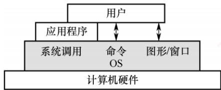
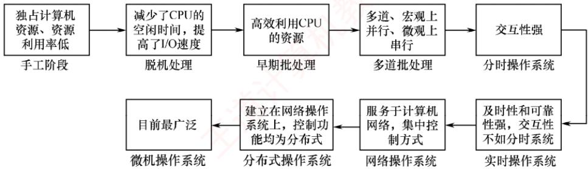
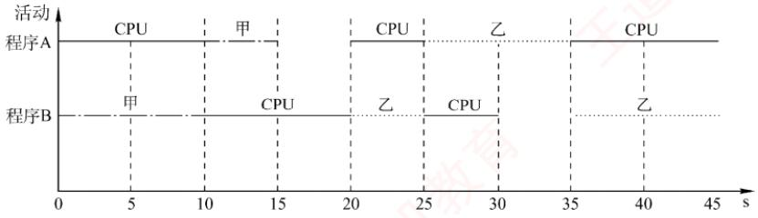
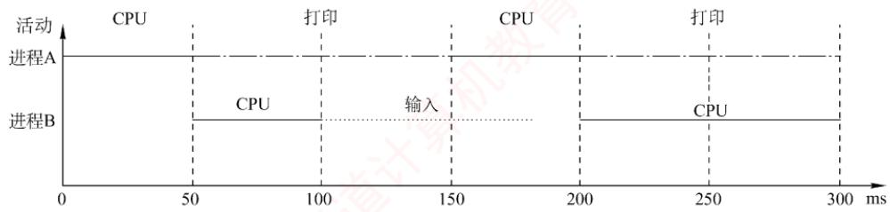
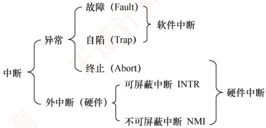
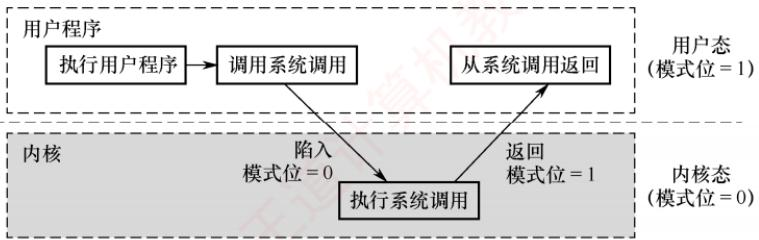
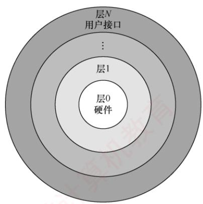
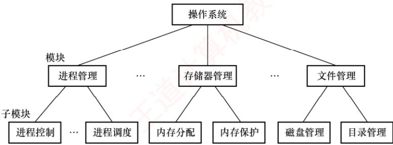
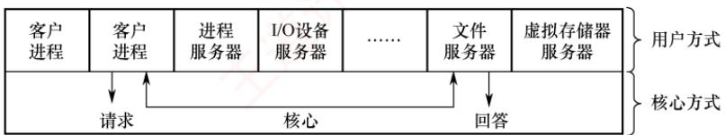
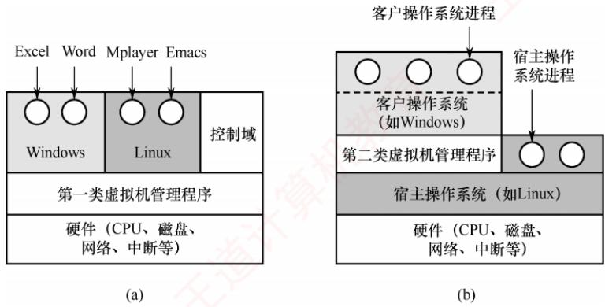

## 【考纲内容】

（一）操作系统的基本概念

（二）操作系统的发展历程

（三）程序运行环境

　　CPU 运行模式：内核模式与用户模式；中断和异常的处理；系统调用；程序的链接与装入；程序运行时内存映像与地址空间

（四）操作系统结构

　　分层、模块化、宏内核、微内核、外核

（五）操作系统引导

（六）虚拟机

## 【复习提示】

　　本章通常以选择题的形式进行考查，要求考生在宏观上把握操作系统的整体架构，在微观上掌握关键概念与核心机制。作为全书的导引章节，本章有助于构建对操作系统的整体认知框架，为后续深入学习进程管理、内存管理、文件系统等核心内容奠定基础。因此，复习时应首先建立清晰的知识体系，通过反复练习巩固理解，最终实现对各模块知识的有机整合。

## 1.1 操作系统的基本概念

### 1.1.1 操作系统的概念

　　在信息化时代，软件是计算机系统的灵魂，而作为其核心的操作系统，已与现代计算机系统深度融合。从使用层次来看，计算机系统自下而上可分为四层：硬件、操作系统、应用程序和用户（该划分侧重人机交互视角，不同于计算机组成原理中的结构分层）。其中，硬件（如中央处理器、内存、输入/输出设备等）提供基本计算资源；应用程序（如文字处理软件、电子表格、编译器、浏览器等）则利用这些资源解决用户的实际问题。操作系统负责管理硬件资源，为应用程序提供运行环境，并充当硬件与用户之间的桥梁。

　　具体而言，操作系统通过有效协调多个应用程序对硬件资源的访问，确保系统高效、安全地运行。综上所述，操作系统（Operating System，OS）是控制和管理计算机系统软/硬件资源、合理调度任务与分配资源，并为用户及其他软件提供统一接口与运行环境的最基本的系统软件。

### 1.1.2 操作系统的功能和目标

　　为多道程序提供良好的运行环境，操作系统需具备四大核心功能：处理机管理、存储器管理、设备管理和文件管理。此外，为方便用户使用，操作系统还需提供用户接口；同时，它通过抽象与虚拟化技术扩充硬件功能，从而提供更便捷的服务并提升资源利用率。

　　下面用直观的例子来描述操作系统的角色。例如，将用户视为“雇主”，计算机（由处理机、存储器、设备和文件等组成）视为“机器”，而操作系统则如同一位“工人”。这位工人具备协调和控制各个部件工作的能力，这体现了操作系统对系统资源的管理功能；同时，工人接收雇主的命令并执行任务，这对应于操作系统提供的“用户接口”；由于工人的存在，让原本复杂的机器变得简单易用，并充分发挥其价值，这正是操作系统“扩充机器”的作用。

#### 1. 操作系统作为计算机系统资源的管理者

##### （1）处理机管理

　　在多道程序环境下，处理机的分配和运行都以进程（或线程）为基本单位，因此处理机管理本质上是对进程的管理。并发是指多个进程在一段时间内交替执行，宏观上呈现同时运行的特征。进程管理的主要任务包括进程控制、进程同步、进程通信、死锁处理以及处理机调度等。

##### （2）存储器管理

　　存储器管理旨在为多道程序提供良好的内存运行环境，方便用户使用并提高内存利用率，主要功能包括内存分配与回收、地址映射、内存保护与共享，以及内存扩充等。

##### （3）文件管理

　　用户可见的持久化信息通常以文件形式组织。操作系统中负责文件管理的部分称为文件系统，其功能包括文件存储空间的管理、目录管理、文件读/写操作及访问保护等。

##### （4）设备管理

　　设备管理的主要任务是处理用户的 I/O 请求，屏蔽设备差异，方便用户使用各类外设，并提高设备利用率，主要包括缓冲管理、设备分配、设备驱动处理和虚拟设备等功能。

　　上述任务均由“工人”（操作系统）自动完成，“雇主”（用户）无须关注。

#### 2. 操作系统作为用户与计算机硬件系统之间的接口

　　所谓操作系统，是指用户与计算机硬件系统的接口，即操作系统位于用户与硬件之间，是用户使用硬件的必经媒介。正是有了操作系统的支撑，用户才能更方便、更可靠地操作硬件设备和运行用户程序。如图 1.1 所示，操作系统处于计算机硬件与用户之间，充当二者之间的桥梁。

  

<em>图 1.1 操作系统作为用户与硬件系统之间的接口</em>

　　用户通过应用程序或直接交互方式访问系统服务，而这些请求最终均由操作系统统一管理和调度。从交互方式来看，终端用户通过命令行和图形界面与操作系统通信；应用程序则通过系统调用请求操作系统服务。根据服务对象与使用场景的不同，这些交互方式可以分为两大类：用户接口包括命令方式和图形方式，面向普通终端用户；程序接口即系统调用，专为应用程序设计。

##### （1）用户接口

　　为了使用户能够直接或间接控制作业的执行，操作系统提供了以下三类用户接口。

　　联机用户接口（命令行接口）：面向交互式用户，由键盘命令与命令解释程序组成。用户输入命令后，系统立即解释并执行，完成后返回控制权，适用于实时交互场景。可以这样理解：“雇主”说一句话，“工人”做一件事，并做出反馈，这就体现了交互性。

　　脱机用户接口（作业控制语言）：用于批处理系统。用户将作业控制命令写入作业说明书，连同作业一并提交；系统调度到该作业时，自动解释并执行说明书中的命令，无须用户实时干预。可以这样理解：“雇主”预先将任务清单交给“工人”，“工人”按清单逐条完成这些任务。

　　图形用户接口（GUI）：为提升易用性，通过图标、菜单、对话框等图形元素替代文本命令。用户借助鼠标等设备进行操作，底层通过系统调用与内核交互，显著降低了使用门槛。

##### （2）程序接口

> **考点追踪：** 操作系统为应用程序提供的接口（2010）

　　程序接口是应用程序在运行时请求操作系统服务、访问系统资源的唯一合法途径，其核心是一组系统调用。每个系统调用对应内核中实现某个特定功能的子程序。当应用程序需要操作系统服务时，必须通过调用相应的系统调用来完成。

　　早期的系统调用多基于汇编语言实现，仅能在汇编程序中直接使用；在高级语言（如C语言）环境中，程序员通常调用标准库函数（如printf()、open()等）来间接触发系统调用。注意，库函数本身并非操作系统接口，它们只是对系统调用的封装。例如，printf()最终通过write系统调用输出数据，malloc()在需要更多内存时可能调用brk或mmap系统调用；而strlen()、sqrt()等纯计算类库函数则完全在用户空间中运行，不涉及任何系统调用。因此，尽管库函数在编程中被频繁使用，但操作系统真正提供给应用程序的接口本质上仍是系统调用。

#### 3. 操作系统实现了对计算机资源的扩充

　　未安装任何软件的计算机称为裸机，它仅构成计算机系统的物质基础。实际呈现在用户面前的计算机系统，是经过多层软件增强后的逻辑实体。裸机位于最内层，其外层覆盖着操作系统。操作系统通过资源管理功能和用户服务功能，将裸机抽象并扩展为一台功能更强、使用更便捷的逻辑机器。因此，通常将这种被操作系统抽象和扩展后的机器称为扩充机器。可以这样理解：操作系统作为“工人”，操作原始机器，使机器发挥远超本身的能力。

　　需要说明的是，本章的重点在于理解操作系统如何控制和协调处理机、存储器、设备和文件四大资源。关于接口与扩充机器的概念，读者只需理解其基本思想即可。

### 1.1.3 操作系统的特征

　　操作系统是一种系统软件，但与其他系统软件和应用软件有显著不同，具有自身的特殊性，即基本特征。操作系统的基本特征包括并发、共享、虚拟和异步。这些概念对理解和掌握操作系统的核心至关重要，将贯穿于后续各章节。

#### 1. 并发（Concurrency）

　　并发是指两个或多个事件在同一时间间隔内发生。在多道程序环境下，内存中同时驻留若干道程序，操作系统通过调度机制，在一道程序因 I/O 操作而暂停时，立即切换到另一道程序运行，从而实现多道程序的交替执行，使 CPU 保持高利用率。

> **考点追踪：** 并行性的定义及分析（2009）

　　需要注意的是，并行是指两个或多个事件在同一时刻真正同时发生。在单处理机系统中，尽管宏观上多道程序看似同时运行，但微观上任一时刻仅有一个程序在执行，因此属于并发而非并行；而 CPU 与 I/O 设备之间、多个 I/O 设备之间则可实现真正的硬件并行。若要实现进程级别的并行，则需多核 CPU 或多处理机等硬件支持。

　　可通过一个生活实例理解并发与并行的区别。例如，在9:00—10:00期间，你交替吃面包和写字：9:00—9:10吃面包，9:10—9:20写字，9:20—9:30吃面包，9:30—10:00写字。两种活动在同一时段内交错进行，但任一时刻仅执行一项，这属于并发。又如，在9:00—10:00期间，你在右手写字的同时，左手拿着面包吃，则两种行为在同一时刻真正同时进行，这属于并行。

　　在操作系统中，引入进程这一概念，其核心目的之一就是支持程序的并发执行。

#### 2. 共享 (Sharing)

　　共享是指系统中的资源可供内存中多个并发执行的进程共同使用。根据资源特性与访问方式的不同，共享主要分为互斥共享和同时访问两种形式。

##### （1）互斥共享方式

　　系统中的某些资源，如打印机、磁带机等，虽然可供多个进程使用，但为避免所打印或记录的结果混淆，必须保证在任一时间段内仅有一个进程访问该资源。

　　具体而言，当进程 A 访问某个资源时，需先提出请求；若资源空闲，则系统将其分配给 A；此后，若其他进程请求访问该资源而 A 尚未释放，则必须等待。仅当 A 使用完毕并释放资源后，才允许另一进程对该资源进行访问。我们将此类资源共享方式称为互斥共享，而将在一段时间内只允许一个进程访问的资源称为临界资源。计算机系统中的大多数独占型物理设备（如打印机），以及软件中的栈、变量、表格等，均属于临界资源，必须以互斥方式共享。

##### （2）同时访问方式

　　系统中还存在另一类资源，允许多个进程在宏观上“同时”访问。此处的“同时”通常指逻辑上的并发访问，微观上这些进程可能通过分时交替方式访问资源，即分时共享。典型的可同时访问资源包括磁盘上的文件（尤其是只读文件），允许多个用户同时读取同一份文档；此外，用重入代码编写的程序也可被多个进程并发调用，而不会产生冲突。

　　需注意，互斥共享要求资源在任意时刻仅响应一个请求，否则将导致数据混乱（例如，若多个进程同时向打印机输出，可能导致文档 A 与文档 B 的内容交错混杂）；而同时访问则允许多个请求分时完成，只要其最终效果对用户而言等同于连续访问即可。

　　并发与共享是操作系统两个最基本的特征，二者互为前提：① 资源共享以程序的并发执行为前提，若系统仅支持单道程序，则无须考虑资源共享；② 有效的资源共享机制是并发执行的基础，若无法协调资源访问，则并发程序将因竞争冲突而无法正确运行。

#### 3. 虚拟 (Virtual)

　　虚拟是指通过某种技术手段，将一个物理实体映射为多个逻辑上的对应物。物理实体是真实存在的硬件资源，而逻辑对应物则是用户或程序所感知的抽象资源。操作系统主要通过两类复用技术实现虚拟：时分复用（如处理器的分时共享）和空分复用（如虚拟存储器）。

　　利用多道程序设计技术，操作系统可让多道程序并发执行，分时共享同一个处理器。尽管系统中仅有一个物理 CPU，但每个用户都仿佛独占一个 CPU。这种通过时间片轮转实现的处理器抽象，使得单个物理 CPU 在逻辑上表现为多个处理单元。

　　采用虚拟存储器技术，可将有限的物理内存扩展为更大的逻辑地址空间。用户程序所面对的是虚拟存储器，其逻辑容量通常超过实际物理内存，从而在逻辑上实现了存储容量的扩充。

　　此外，通过虚拟设备技术（如 SPOOLing），可将某些独占型物理 I/O 设备（如打印机）转化为多台逻辑设备。每个用户可独占一台逻辑设备，而系统在后台将请求排队处理。这样，原本需要互斥访问的临界资源，便转化为可并发使用的共享资源。

#### 4. 异步（Asynchronism）

　　在多道程序环境下，多个进程并发执行。但由于系统资源有限，进程的执行并非连续进行，而是以不可预知的速度断续推进，这种特性称为进程的异步性。

　　异步性使操作系统运行于高度不确定的环境中，若对共享资源的访问缺乏协调，可能导致与时间相关的错误（例如，多个进程并发修改全局变量而未加同步保护）。然而，在程序正确使用操作系统提供的同步机制的前提下，其执行结果的正确性与可再现性能够得到保障。

### 1.1.4 本节习题精选

#### 单项选择题

01. 操作系统是对（）进行管理的软件。
- A. 软件
- B. 硬件
- C. 计算机资源
- D. 应用程序

02. 下面的（）资源不是操作系统应该管理的。
- A. CPU
- B. 内存
- C. 外存
- D. 源程序

03. 下列选项中，（）不是操作系统关心的问题。
- A. 管理计算机裸机
- B. 设计、提供用户程序与硬件系统的界面
- C. 管理计算机系统资源
- D. 高级程序设计语言的编译器

04. 操作系统的基本功能是（）。

- A. 提供功能强大的网络管理工具
- B. 提供用户界面方便用户使用
- C. 提供方便的可视化编辑程序
- D. 控制和管理系统内的各种资源

05. 下列关于并发性的叙述中，正确的是（）。  
- A. 并发性是指若干事件在同一时刻发生  
- B. 并发性是指若干事件在不同时刻发生  
- C. 并发性是指若干事件在同一时间间隔内发生  
- D. 并发性是指若干事件在不同时间间隔内发生

06. 系统调用是由操作系统提供给用户的，它（）。

- A. 直接通过键盘交互方式使用
- B. 只能通过用户程序间接使用
- C. 是命令接口中的命令
- D. 与系统的命令一样

07. 操作系统提供给编程人员的接口是（）。

- A. 库函数
- B. 高级语言
- C. 系统调用
- D. 子程序

08. 系统调用的目的是（）。

- A. 请求系统服务
- B. 中止系统服务
- C. 申请系统资源
- D. 释放系统资源

09. 下列关于操作系统的叙述中，错误的是（）。  
- A. 操作系统是管理资源的程序  
- B. 操作系统是管理用户程序执行的程序  
- C. 操作系统是能使系统资源提高效率的程序  
- D. 操作系统是用来编程的程序

10. 下列关于库函数和系统调用的区别与联系的说法中，错误的是（）。  
- A. 系统调用用于请求内核服务，部分库函数通过系统调用实现功能  
- B. 系统调用需要陷入内核态执行，而普通库函数（如字符串处理）通常在用户态执行  
- C. 所有库函数的实现都依赖系统调用，没有系统调用则无法完成任何功能  
- D. 库函数具有良好的可移植性，可跨平台使用；系统调用则与具体操作系统紧密耦合

11. 【2010 统考真题】下列选项中，操作系统提供给应用程序的接口是（）。

- A. 系统调用
- B. 中断
- C. 库函数
- D. 原语

### 1.1.5 答案与解析

#### 单项选择题

**01. C**

　　操作系统管理计算机的硬件和软件资源，这些资源统称为计算机资源。注意，操作系统不仅管理处理机、存储器等硬件资源，还管理文件，文件不属于硬件资源，但属于计算机资源。

**02. D**

　　操作系统负责管理计算机系统的硬件和软件资源，包括 CPU、内存、外存等，以提供高效、安全、抽象的运行环境。源程序虽以文件形式存储在外存中，但其具体内容（如代码语义、编程逻辑）并不属于操作系统管理的范畴。操作系统对文件的管理关注的是文件的逻辑组织、存储分配、访问控制及元数据（如文件名、大小、权限、创建时间等），而非文件内容的语义。因此，源程序作为具有特定语义的用户数据，其内容本身并非操作系统的管理对象。

**03. D**

　　操作系统管理计算机软/硬件资源，扩充裸机以提供功能更强大的扩充机器，并充当用户与硬件交互的中介。高级程序设计语言的编译器显然不是操作系统关心的问题。编译器的实质是一段程序指令，它存储在计算机中，是上述水杯中的水。

**04. D**

　　操作系统是指控制和管理整个计算机系统的硬件和软件资源，合理地组织、调度计算机的工作和资源的分配，以便为用户和其他软件提供方便的接口与环境的程序集合。选项 A、B、C 都可理解成应用程序为用户提供的服务，是应用程序的功能，而不是操作系统的功能。

**05. C**

　　并发性是指若干事件在同一时间间隔内发生，而并行性是指若干事件在同一时刻发生。

**06. B**

　　系统调用是操作系统为应用程序使用内核功能所提供的接口。

**07. C**

　　操作系统为编程人员提供的接口是程序接口，即系统调用。

**08. A**

　　操作系统不允许用户直接操作各种硬件资源，因此用户程序只能通过系统调用的方式来请求内核为其服务，间接地使用各种资源。

**09. D**

　　操作系统是用来管理资源的程序，用户程序也是在操作系统的管理下完成的。配置了操作系统的机器与裸机相比，资源利用率大大提高。操作系统不能直接用来编程，选项 D 错误。

**10. C**

　　并非所有库函数都依赖系统调用。例如，字符串处理、数学计算等纯用户态操作完全在用户空间中完成，无须陷入内核；只有涉及I/O、进程控制等资源访问的库函数才会调用系统调用。

**11. A**

　　操作系统接口主要有命令接口和程序接口（也称系统调用）。库函数是高级语言中提供的与系统调用对应的函数（也有些库函数与系统调用无关），目的是隐藏“访管”指令的细节，使系统调用更为方便、抽象。但是，库函数属于用户程序而非系统调用，是系统调用的上层。

## 1.2 操作系统发展历程

### 1.2.1 手工操作阶段（未配置操作系统）

#### 1. 人工操作方式

　　早期阶段，用户将程序和数据穿孔在纸带或卡片上，装入输入设备后手动控制读入内存并启动程序运行。程序的装入、执行与结果输出等全过程均依赖人工操作。随着计算机硬件性能不断提升，人机速度之间的矛盾日益突出，系统资源利用率低下的问题也愈发严重。

　　手工操作阶段存在两个突出缺点：① 用户独占全机，虽无资源竞争，但系统资源利用率极低；② CPU长时间空闲，等待人工完成I/O操作，导致其计算能力未能充分发挥。

　　为此，人们提出用高速设备替代人工操作，来控制作业流程。

#### 2. 脱机I/O方式

　　为缓解人机速度不匹配以及 CPU 与外设之间的速度差异，诞生了脱机 I/O 技术。其核心思想是引入一台外围机（如小型专用计算机），在 CPU 不参与的情况下，预先完成 I/O 准备工作：输入时，外围机将纸带或卡片上的程序和数据读入磁带，供 CPU 后续调入内存；输出时，CPU 将结果先写入磁带，再由外围机将磁带内容输出至外设。

　　由于 I/O 操作完全由外围机独立完成，脱离了主机的直接控制，故称为脱机 I/O；相比之下，由主机直接管理 I/O 设备的方式则称为联机 I/O。

　　脱机I/O的主要优点包括：① 装带、卸带及数据传输等操作在脱机状态下由外围机完成，显著减少了CPU空闲时间；② CPU可直接从高速磁带读取或写入数据，大幅提升了I/O效率。

### 1.2.2 批处理阶段（操作系统开始出现）

　　在脱机 I/O 技术的基础上, 为实现作业的自动连续处理并进一步提升 CPU 与系统资源的利用率, 批处理系统应运而生。按发展历程, 可分为单道批处理系统和多道批处理系统。

> **考点追踪：** 批处理系统的特点（2016）

#### 1. 单道批处理系统

　　为实现对作业的连续处理，系统先将一批作业以脱机方式输入到磁带，并配备一个监督程序（Monitor）。在其控制下，作业能自动、顺序地逐个运行。尽管作业成批提交，但内存中始终仅驻留一道用户程序。单道批处理系统的主要特征如下：

1）自动性。在正常情况下，磁带上的作业可自动连续执行，无须人工干预。

2）顺序性。作业按磁带上的顺序依次装入内存，先装入者先完成。

3）单道性。内存中仅允许一道用户程序运行；监督程序每次仅从磁带调入一道作业，待其完成或异常终止后才装入下一道。

　　然而，该系统存在明显局限：当正在运行的作业发起 I/O 请求时，高速 CPU 不得不空闲等待低速 I/O 操作结束，导致资源利用率低下。为克服这一瓶颈，多道程序设计技术被引入。

#### 2. 多道批处理系统

　　用户提交的作业首先存放在外存的后备队列中。作业调度程序按一定算法从该队列中选取若干作业调入内存，使其在管理程序的控制下并发执行，并共享系统资源。当某道程序因 I/O 请求而暂停运行时，CPU 立即切换至另一就绪程序继续执行。该机制依赖中断技术，使系统各部件尽可能保持忙碌，从而显著提升整体吞吐量和资源利用率。这种采用多道程序设计技术的批处理系统称为多道批处理系统，它将用户作业成批送入内存，由作业调度程序自动选择运行。

> **考点追踪：** 多道批处理系统的特点（2017、2022）

　　多道程序设计具有以下核心特点：

1）多道。内存中同时驻留多道相互独立的程序。

2）宏观上并行。多道程序均处于运行过程中，但尚未全部完成。

3）微观上串行。各程序轮流占用 CPU，交替执行。

　　为实现多道程序设计，需解决以下关键问题：

1）处理器的分配策略。

2）多道程序的内存分配与保护机制。

3）I/O 设备的分配与调度方法。

4）大量程序与数据的组织、存储方式，以及安全性与一致性保障。

　　优点：资源利用率高，多道程序共享 CPU、内存、I/O 设备等资源；系统吞吐量大，各部件保持高负载状态。缺点：缺乏交互能力，用户无法了解程序运行状态或进行干预，响应时间较长。

### 1.2.3 分时操作系统

　　分时技术是指将处理器时间划分为很短的时间片，轮流分配给各用户程序使用。若某程序在其时间片内未完成计算，则暂停运行，释放处理器给其他用户程序，待下一轮再继续执行。由于计算机运行速度极快，程序轮转迅速，每个用户均能获得“独占计算机”的交互体验。

　　分时操作系统允许多个用户通过终端同时连接到一台主机，并与系统进行交互，彼此互不干扰。其实现的核心在于：当用户在终端输入命令时，系统必须能够及时接收、快速处理并立即返回结果。分时操作系统基于多道程序设计，但与多道批处理系统有本质区别：后者追求高吞吐量和资源利用率，无须人工干预；而前者以人机交互为核心目标，由此形成了以下主要特征。

1）同时性（多路性）。允许多个终端用户同时使用同一台计算机。

2）交互性。用户可通过终端以人机对话方式直接控制程序运行，并与其程序进行交互。

3）独立性。各用户的操作相互隔离，任一用户均感觉系统为其独占。

4）及时性。用户请求能在较短时间内获得响应，满足交互需求。

　　尽管分时操作系统较好地解决了通用交互问题，但在某些特定场景，系统必须在严格限定的时间内对外部事件做出响应，且需保证响应的确定性与时限性。为此，实时操作系统应运而生。

### 1.2.4 实时操作系统

　　实时操作系统是为在严格的时间限制内完成关键任务而设计的系统。它摒弃了分时操作系统的时间片轮转机制，转而采用基于任务紧迫性或截止时间的调度策略，确保高优先级任务能够及时获得处理器资源。根据时限要求的严格程度，实时操作系统可分为两类：① 硬实时操作系统：要求任务必须在规定的截止时间前完成，否则可能引发灾难性后果。例如飞机的控制系统、导弹的制导系统等，这类系统必须提供绝对可靠的时间保证；② 软实时操作系统：允许偶尔错过截止时间，只要不造成永久性损害即可。例如飞机订票系统、银行管理系统等，其短暂延迟通常可被容忍。

　　在实时操作系统的控制下，计算机在接收到外部事件后，能够在可预测且有保障的时限内完成处理。其主要特点包括：确定性（响应时间可预测）、高可靠性和强时效性。

### 1.2.5 网络操作系统和分布式系统

　　网络操作系统是在单机操作系统基础上扩展网络功能而形成的系统，主要用于支持计算机之间的通信、数据传输以及资源共享（如文件、打印机共享等）。在该系统中，各计算机保持独立运行，用户需显式指定远程资源的位置才能访问，系统不提供统一的全局视图。

　　分布式系统是由多台计算机组成的集合，具有以下特征：节点地位对等，无固定的主从关系；系统资源可被所有用户透明地共享；具备良好的可扩展性与容错能力，支持动态重组；能够将一个任务分解为多个子任务，并分布到不同节点上并行执行、协同完成。用于管理此类系统的操作系统称为分布式操作系统，其核心特点包括分布性、并行性和透明性。其中，透明性尤为关键，用户无须感知底层的多机结构，操作体验如同使用一台计算机。

　　二者的区别在于：网络操作系统仅实现资源共享与通信功能，用户需主动干预远程操作；而分布式操作系统通过协同机制，使多台计算机共同完成同一任务，并向用户提供单一系统映像。

### 1.2.6 微机操作系统

　　微机操作系统是为微型计算机（如个人计算机、工作站等）设计的操作系统，广泛应用于日常计算与办公环境。根据用户数量和任务并发能力，可分为以下三类。

#### 1. 单用户单任务操作系统

　　仅允许一个用户登录并运行一个程序。这类系统结构简单，但资源利用率低，典型代表为早期的MS-DOS（16位）。

#### 2. 单用户多任务操作系统

> **考点追踪：** 多任务操作系统的特点（2018）

　　支持一个用户同时运行多个应用程序，系统通过时间片轮转实现任务切换，显著提升了交互体验与资源利用率。代表性系统包括 Windows XP 及后续版本、macOS 以及现代 Linux 桌面版。此类系统是当前主流的微机操作系统，兼具良好的人机交互性、高效率与稳定性。

#### 3. 多用户多任务操作系统

　　允许多个用户通过终端或网络同时登录，各自并发执行多个任务，资源共享且互不干扰。常用于服务器或高性能工作站，典型代表为 UNIX、Linux 服务器版和 Windows Server 系列。

　　操作系统的发展历程如图 1.2 所示。

  

<em>图 1.2 操作系统的发展历程</em>

　　此外，还有嵌入式操作系统、服务器操作系统、智能手机操作系统等。

### 1.2.7 本节习题精选

#### 一、单项选择题

01. 提高单机资源利用率的关键技术是（）。

- A. 脱机技术
- B. 虚拟技术
- C. 交换技术
- D. 多道程序设计技术

02. 批处理系统的主要缺点是（）。

- A. 系统吞吐量小
- B. CPU 的利用率不高
- C. 资源利用率低
- D. 无交互能力

03. 下列选项中，不属于多道程序设计的基本特征的是（）。

- A. 制约性
- B. 间断性
- C. 顺序性
- D. 共享性

04. 操作系统的基本类型主要有（）。  
- A. 批处理操作系统、分时操作系统和多任务系统  
- B. 批处理操作系统、分时操作系统和实时操作系统  
- C. 单用户系统、多用户系统和批处理操作系统  
- D. 实时操作系统、分时操作系统和多用户系统

05. 实时操作系统必须在（）内处理来自外部的事件。
- A. 一个机器周期
- B. 被控制对象规定时间
- C. 周转时间
- D. 时间片

06. （）不是设计实时操作系统的主要追求目标。
- A. 安全可靠
- B. 资源利用率
- C. 及时响应
- D. 快速处理

07. 下列（）应用工作最好采用实时操作系统平台。
I. 航空订票 II. 办公自动化 III. 机床控制
IV. AutoCAD V. 工资管理系统 VI. 股票交易系统
- A. I、II 和 III
- B. I、III 和 IV
- C. I、IV 和 V
- D. I、III 和 VI

08. 下列关于分时操作系统的叙述中，错误的是（）。

- A. 分时操作系统主要用于批处理作业B. 分时操作系统中每个任务依次轮流使用时间片C. 分时操作系统的响应时间好D. 分时操作系统是一种多用户操作系统

09. 分时操作系统的一个重要性能是系统的响应时间，对操作系统的（）因素进行改进有利于改善系统的响应时间。

　　A.加大时间片 B.采用静态页式管理C.优先级 $+$ 非抢占式调度算法 D.代码可重入

10. 分时操作系统追求的目标是（）。

- A. 充分利用 I/O 设备
- B. 比较快速响应用户
- C. 提高系统吞吐率
- D. 充分利用内存

11. 在分时操作系统中，时间片一定时，（），响应时间越长。
- A. 内存越多
- B. 内存越少
- C. 用户数越多
- D. 用户数越少

12. 在分时操作系统中，为使多个进程能够及时与系统交互，关键的问题是能在短时间内，使所有就绪进程都能运行。当就绪进程数为 100 时，为保证响应时间不超过 2s，此时的时间片最大应为（）。

- A. 10ms
- B. 20ms
- C. 50ms
- D. 100ms

13. 操作系统有多种类型。允许多个用户以交互的方式使用计算机的操作系统，称为（）；允许多个用户将若干作业提交给计算机系统集中处理的操作系统，称为（）；在（）的控制下，计算机系统能及时处理由过程控制反馈的数据，并及时做出响应；在 IBM-PC 中，操作系统称为（）。

- A. 批处理系统
- B. 分时操作系统C. 实时操作系统
- D. 微型计算机操作系统

14. 下列各种系统中，（）可以使多个进程并行执行。
- A. 分时操作系统
- B. 多处理器系统
- C. 批处理系统
- D. 实时操作系统

15. 下列关于操作系统的叙述中，正确的是（）。  
- A. 批处理操作系统必须在响应时间内处理完一个任务  
- B. 实时操作系统须在规定时间内处理完来自外部的事件  
- C. 分时操作系统必须在周转时间内处理完来自外部的事件  
- D. 分时操作系统必须在调度时间内处理完来自外部的事件

16. 引入多道程序设计技术的前提条件之一是系统具有（）。

- A. 多个CPU
- B. 多个终端
- C. 中断功能
- D. 分时功能

17. 【2016 统考真题】下列关于批处理系统的叙述中，正确的是（）。I. 批处理系统允许多个用户与计算机直接交互II. 批处理系统分为单道批处理系统和多道批处理系统III. 中断技术使得多道批处理系统的I/O设备可与CPU并行工作

- A. 仅II、III
- B. 仅II
- C. 仅I、II
- D. 仅I、III

18. 【2017 统考真题】与单道程序系统相比，多道程序系统的优点是（）。I. CPU的利用率高 II. 系统开销小III. 系统吞吐量大 IV. I/O设备利用率高

- A. 仅I、III
- B. 仅I、IV
- C. 仅II、III
- D. 仅I、III、IV

19. 【2018 统考真题】下列关于多任务操作系统的叙述中，正确的是（）。  
I. 具有并发和并行的特点  
II. 需要实现对共享资源的保护  
III. 需要运行在多 CPU 的硬件平台上  
- A. 仅 I
- B. 仅 II
- C. 仅 I、II
- D. I、II、III

20. 【2022 统考真题】下列关于多道程序系统的叙述中，不正确的是（）。

- A. 支持进程的并发执行
- B. 不必支持虚拟存储管理
- C. 需要实现对共享资源的管理
- D. 进程数越多，CPU 的利用率越高

#### 二、综合应用题

01. 有两个程序，程序 A 依次使用 CPU 计 10s、设备甲计 5s、CPU 计 5s、设备乙计 10s、CPU 计 10s；程序 B 依次使用设备甲计 10s、CPU 计 10s、设备乙计 5s、CPU 计 5s、设备乙计 10s。假设先执行程序 A 再执行程序 B，在单道程序环境下，CPU 的利用率是多少？在多道程序环境下，CPU 的利用率是多少？

02. 设某计算机系统有一个 CPU、一台输入设备、一台打印机。现有两个进程同时进入就绪态，并且进程 A 先得到 CPU 运行，进程 B 后运行。进程 A 的运行轨迹为：计算 50ms，打印信息 100ms，再计算 50ms，打印信息 100ms，结束。进程 B 的运行轨迹为：计算 50ms，输入数据 80ms，再计算 100ms，结束。画出它们的甘特图，并说明：

1）开始运行后，CPU有无空闲等待？若有，在哪段时间内等待？计算CPU的利用率。

2）进程A运行时有无等待现象？若有，则在何时发生等待现象？

3）进程B运行时有无等待现象？若有，则在何时发生等待现象？

### 1.2.8 答案与解析

#### 一、单项选择题

**01. D**

　　脱机技术是指在主机以外的设备上进行输入/输出操作，需要时再送主机处理，以提高设备的利用率。虚拟技术与交换技术以多道程序设计技术为前提。多道程序设计技术同时在主存中运行多个程序，在一个程序等待时，可以去执行其他程序，因此提高了系统资源的利用率。

**02. D**

　　批处理系统中，作业执行时用户无法干预其运行，只能通过事先编制作业控制说明书来间接干预，缺少交互能力，也因此才有了分时操作系统的出现。

**03. C**

　　多道程序的运行环境比单道程序的运行环境更加复杂。引入多道程序后，程序的执行就失去了封闭性和顺序性。程序执行因为共享资源及相互协同的原因产生了竞争，相互制约。

　　考虑到竞争的公平性，程序的执行是断续的。

**04. B**

　　操作系统的基本类型主要有批处理操作系统、分时操作系统和实时操作系统。

**05. B**

　　实时操作系统要求能实时处理外部事件，即在规定的时间内完成对外部事件的处理。

**06. B**

　　实时性和可靠性是实时操作系统最重要的两个目标，而安全可靠体现了可靠性，快速处理和及时响应体现了实时性。资源利用率不是实时操作系统的主要目标，即为了保证快速处理高优先级任务，允许“浪费”一些系统资源。

**07. D**

　　实时操作系统主要应用在需要对外界输入立即做出反应的场合，不能有拖延，否则会产生严重后果。本题的选项中，航空订票系统需要实时处理票务，因为票额数据库的数量直接反映了航班的可订机位。机床控制也要实时，不然会出差错。股票交易行情随时在变，若不能实时交易会出现时间差，使交易出现偏差。

**08. A**

　　分时操作系统主要用于交互式作业而非批处理作业。分时操作系统中每个任务依次轮流使用时间片，这是一种公平的 CPU 分配策略。分时操作系统的响应时间好，因为分时操作系统采用了时间片轮转法来调度进程，可以使得每个任务在较短的时间内得到响应，提高用户的满意度。分时操作系统是一种多用户操作系统，因为分时操作系统可以支持多个终端同时连接到同一台计算机上。

**09. C**

　　采用优先级+非抢占式调度算法，既可使重要的作业/进程通过高优先级尽快获得系统响应，又可保证次要的作业/进程在非抢占式调度下不会迟迟得不到系统响应，这样有利于改善系统的响应时间。加大时间片会延迟系统响应时间；静态页式管理和代码可重入与系统响应时间无关。

**10. B**

　　要求快速响应用户是导致分时操作系统出现的重要原因。

**11. C**

　　在分时操作系统中，当时间片固定时，用户数越多，每个用户分到的时间片就越少，响应时间就相应变长。注意，分时操作系统的响应时间 T 可表示为 $T \approx QN$ ，其中 Q 是时间片，而 N 是用户数。

**12. B**

　　响应时间不超过 2s，即在 2s 内必须响应所有进程。所以时间片最大为 2s/100 = 20ms。

**13. B、A、C、D**

　　这是操作系统发展过程中的几种主要类型。

**14. B**

　　多个进程并发执行的系统是指在一段时间内宏观上有多个进程同时运行，但在单处理器系统中，每个时刻只能有一道程序执行，所以微观上这些程序只能分时地交替执行。只有多处理器系统才能使多个进程并行执行，每个处理器上分别运行不同的进程。

**15. B**

　　实时操作系统要求能在规定时间内完成特定的功能。批处理操作系统不需要在响应时间内处理完一个任务。分时操作系统不要求在周转时间或调度时间内处理完外部事件。

**16. C**

　　多道程序设计技术要求进程间能实现并发，需要实现进程调度以保证 CPU 的工作效率，而并发性的实现需要中断功能的支持。

**17. A**

　　批处理系统中，作业执行时用户无法干预其运行，只能通过事先编制作业控制说明书来间接干预，缺少交互能力，说法 I 错误。批处理系统按发展历程又分为单道批处理系统、多道批处理系统，说法 II 正确。多道程序设计技术允许把多个程序同时装入内存，并允许它们在 CPU 中交替运行，共享系统中的各种硬/软件资源，当一道程序因 I/O 请求而暂停运行时，CPU 便立即转去运行另一道程序，即多道批处理系统的 I/O 设备可与 CPU 并行工作，这是借助中断技术实现的，说法 III 正确。

**18. D**

　　多道程序系统中总有一个作业在CPU上执行，因此提高了CPU的利用率、系统吞吐量和I/O设备利用率，说法I、III、IV正确。但是，系统要付出额外的开销来组织作业和切换作业，说法II错误。

**19. C**

　　现代操作系统都是多任务的，允许用户把程序分为若干个任务，使它们并发执行。在单 CPU 中，这些任务并发执行，即宏观上并行执行，微观上分时地交替执行；在多 CPU 中，这些任务是真正的并行执行。此外，引入中断之后才出现了多任务操作系统，而中断方式的特点是 CPU 与外设并行工作，因此说法 I 正确。多个任务必须互斥地访问共享资源，为达到这一目标必须对共享资源进行必要的保护，说法 II 正确。多任务操作系统并不一定需要运行在多 CPU 的硬件上，单个 CPU 通过分时使用也能满足要求，说法 III 错误。综上所述，说法 I、II 正确，说法 III 错误。

**20. D**

　　操作系统的基本特点：并发、共享、虚拟、异步，其中最基本、一定要实现的是并发和共享。早期的多道批处理系统会将所有进程的数据全部调入主存，再让多道程序并发执行，即使不支持虚拟存储管理，也能实现多道程序并发。进程多并不意味着 CPU 的利用率高，进程数量越多，进程之间的资源竞争越激烈，甚至可能因为资源竞争而出现死锁现象，导致 CPU 的利用率低。

#### 二、综合应用题

**01. 【解答】**

　　单道环境下，CPU 的运行时间为 $(10 + 5 + 10)$ s + $(10 + 5)$ s = 40s，两个程序运行的总时间为 $40s + 40s = 80s$ ，因此利用率是 40/80 = 50%。

　　多道环境下，CPU 运行时间为 40s，两个程序运行总时间为 45s，因此利用率为 $40/45 \approx 88.9\%$ ，如下图所示。

  

> **注意**

　　此图为甘特图，甘特图也称横道图，它以图示的方式通过活动列表和时间刻度形象地表示任意特定项目的活动顺序与持续时间。

　　以后遇到此类题目，即给出几个不同的程序，每个程序以各个任务时间片给出时，一定要用甘特图来求解，因为其直观、快捷。为节省读者研究甘特图画法的时间，下面给出既定的步骤，读者可按下列步骤快速、正确地画出甘特图。

　　① 横坐标上标出合适的时间间隔，纵坐标上的点是程序的名字。

　　② 过横坐标上每个标出的时间点，向上作垂直于横坐标的虚线。

　　③ 用几种不同的线（推荐用“直线”“波浪线”“虚线”三种，较易区分）代表对不同资源的占用，按题目给出的任务时间片，平行于横坐标把不同程序对应的线段分别画出来。

　　画图时要注意，如处理器、打印设备等资源是不能让两个程序同时使用的，有一个程序正在使用时，其他程序的请求只能排队。

**02. 【解答】**

　　这类实际的 CPU 和输入/输出设备调度的题目一定要画图，画出运行时的甘特图后就能清楚地看到不同进程间的时序关系，进程运行情况如下图所示。

  

1）CPU 在 100～150ms 时间段内空闲，利用率为 $250/300 \approx 83.3\%$ .

2）进程 A 无等待现象。

3）进程 B 有等待现象，发生在 0～50ms 和 180～200ms 时间段。

## 1.3 操作系统的运行环境

### 1.3.1 操作系统内核

　　现代操作系统通常采用分层架构，将与硬件紧密相关的模块（如中断处理程序、设备驱动程序）、运行频率较高的模块（如时钟管理、进程调度），以及各模块共用的基础操作，集中置于紧靠硬件的层次并常驻内存。这部分核心组件被称为操作系统内核。这种设计有两个主要目的：一是保护核心模块免受应用程序破坏；二是提升操作系统的运行效率。不同操作系统的内核功能存在一定差异，但大多数都包含以下两类功能：

#### 1. 支撑功能

　　这类功能为操作系统其他模块提供基础支持，以保障系统稳定且高效地运行。

> **考点追踪：** 时钟中断服务的内容（2018）

1）时钟管理。时钟是计算机系统的关键部件，其功能包括计时和产生定时中断。操作系统通过时钟管理向用户提供标准系统时间，并利用时钟中断实现任务调度。例如，在分时操作系统中通过时间片轮转进行进程切换，在实时操作系统中依据截止时间控制任务执行，在批处理系统中衡量作业运行进度。因此，系统的大量活动均依赖于时钟机制。

> **考点追踪：** 中断机制在多道程序设计中的作用（2016）

2）中断机制。中断是现代操作系统运行的基础，它允许 CPU 在 I/O 操作期间执行其他指令，从而提高资源利用率。中断来源广泛，包括键盘输入、鼠标事件、系统调用、设备驱动和文件访问等。当发生中断时，内核负责保存当前进程的现场，转移控制权至相应的处理程序，并在处理完成后恢复现场，有效提升了系统的并发处理能力。

3）原语。原语是由若干条指令组成的、用于完成特定功能的操作，具有原子性，即其执行过程不可被中断，必须一气呵成。原语通常运行在内核态，执行时间短、调用频繁，是保证系统安全性和一致性的重要机制。常见的原语包括进程切换、进程同步和资源分配等。为实现原子性，原语常通过关闭中断等手段确保执行不被干扰。

#### 2. 系统资源管理功能

　　操作系统通过一系列核心数据结构（如进程控制块、设备控制块、内存分配表、缓冲区等）对系统资源进行统一管理。为实现高效、安全的资源使用，内核需提供以下三类基本管理功能：

1）进程管理。负责进程的创建与撤销、状态转换、调度与分派，并维护进程控制块（PCB）等核心数据结构。

2）存储器管理。实现内存的分配与回收、地址映射、内存保护及页面置换等机制，确保多道程序安全、高效地共享主存资源。

3）设备管理。完成设备的分配与回收、缓冲区管理、I/O调度及设备驱动调用，屏蔽硬件差异，为用户提供统一的设备访问接口。

### 1.3.2 处理机的双重工作模式

　　为确保操作系统正确运行，必须严格区分操作系统代码与用户程序的执行环境。绝大多数计算机系统通过硬件支持实现这一区分，即为处理机设置至少两种独立的运行模式：用户态（也称目态）和内核态（也称管态或系统态）。硬件通过一个模式位标识当前运行模式（例如0表示内核态，1表示用户态），从而明确当前执行的是系统任务还是用户任务。

> **考点追踪：** 两种模式下发生或执行的事件分析（2011、2012、2014、2021）

　　系统引导时，硬件从内核态开始工作，完成操作系统的加载后，切换到用户态执行用户程序。一旦发生中断或陷阱，硬件就会自动从用户态切换至内核态（模式位置 0）。因此，操作系统一旦获得控制权，就处于内核态；而在将控制权交还用户程序前，将切换回用户态（模式位置 1）。

　　这种双重模式机制通过指令分类提供保护：将可能危及系统安全的指令定义为特权指令，仅允许在内核态下执行；其余指令定义为非特权指令，可在任意模式下执行。具体如下。

> **考点追踪：** 特权指令和非特权指令的特点（2022）

1）特权指令。仅能在内核态执行，可访问全部地址空间（包括用户空间和系统空间），并执行关键操作，如启动外设、设置系统时钟、关闭中断、修改模式位或返回用户态等。

2）非特权指令。通常在用户态下执行，主要用于一般计算和数据处理，其内存访问被限制在用户地址空间，无法直接操作硬件或系统核心资源。

　　上述限制由硬件强制实施：若用户程序试图执行特权指令，则硬件将产生非法指令异常；操作系统捕获该异常后，会终止该程序并重新调度。

### 1.3.3 中断和异常的概念

> **考点追踪：** 用户态切换到内核态的事件分析（2013、2015）

　　在引入内核态与用户态之后，操作系统必须解决两者之间的安全切换问题。内核运行在内核态，用户程序运行在用户态；用户程序虽不能直接执行内核功能，却必须通过受控方式使用这些服务。为此，系统在内核中设立若干称为“门”的受控入口，而用户程序进入内核态的唯一合法途径就是中断或异常。当CPU运行用户程序时，一旦发生中断（如I/O完成）或异常（如系统调用、除零错误），硬件会自动将处理器切换至内核态，并跳转至内核中对应的处理程序。这一机制由硬件强制保障，确保状态切换的安全性与原子性。

　　中断机制对现代操作系统至关重要。操作系统的演进本质上是不断提升资源利用率的过程：当某程序因等待 I/O 等事件而暂时无法继续执行时，系统需及时将其挂起，转而调度其他就绪程序运行。在抢占式多任务系统中，这一调度行为主要依赖中断（尤其是时钟中断）来触发。因此，中断机制是现代操作系统实现高效并发与资源共享的基础。

#### 1. 中断和异常的定义

> **考点追踪：** 可能引发中断或异常的指令分析（2013、2015）

　　中断（Interrupt）也称外中断，是指来自 CPU 执行指令外部的事件，通常用于信息输入/输出（见第 5 章），如设备发出的 I/O 结束中断，表示设备 I/O 操作已完成。时钟中断，表示一个固定的时间片已到，用于系统计时、进程调度或启动定时任务等。

　　异常（Exception）也称内中断，是指来自 CPU 执行指令内部的事件，如程序的非法操作码、地址越界、运算溢出、虚存系统的缺页及专门的陷入指令等引起的事件。异常一旦发生，就必须立即处理，不可被屏蔽。关于异常和外中断的联系与区别如图 1.3 所示。

  

<em>图 1.3 异常和外中断的联系与区别</em>

#### 2. 中断和异常的分类

> **考点追踪：** 中断和异常的分类（2016）

　　外中断可分为可屏蔽中断和不可屏蔽中断。可屏蔽中断是指通过 INTR 线发出的中断请求，通过改变屏蔽字可以实现多重中断，从而使得中断处理更加灵活。不可屏蔽中断是指通过 NMI 线发出的中断请求，通常是紧急的硬件故障，如电源掉电等。此外，异常也是不能被屏蔽的。

　　异常可分为故障、自陷和终止。故障（Fault）通常是由指令执行引起的异常，如非法操作码、缺页故障、除数为0、运算溢出等。自陷（Trap，也称陷入）是一种事先安排的“异常”事件，用于在用户态下调用操作系统内核程序，如条件陷阱指令、系统调用指令等。终止（Abort）是指出现了使得CPU无法继续执行的硬件故障，如控制器出错、存储器校验错等。故障和自陷异常属于软件中断（程序性异常），终止异常和外中断属于硬件中断。

#### 3. 中断和异常的处理过程

> **考点追踪：** 中断和异常的处理过程（2015、2020、2024）

　　中断和异常处理过程的大致描述如下：当 CPU 在执行用户程序的第 i 条指令时，若该指令引发异常（如缺页、除零），或在指令执行结束后检测到中断请求信号，则 CPU 会打断当前程序，转入相应的中断或异常处理程序执行。若问题可被处理程序解决，则对于异常，通常在处理完成后返回第 i 条指令重新执行（例如，缺页处理完成后重访原内存地址）；而对于中断，则在处理完成后返回第 $i+1$ 条指令继续执行。若处理程序判定为不可恢复的致命错误，则终止该用户程序。通常情况下，中断和异常的具体处理由操作系统（及设备驱动程序）完成。

> **考点追踪：** 中断处理和子程序调用的比较（2012）

　　注意区分中断处理和子程序调用: ① 中断处理程序与被中断的程序相互独立, 无固定关联; 而子程序与主程序属于同一程序的主从关系。② 中断的产生通常是随机的; 而子程序调用由 CALL 指令显式触发, 是程序员事先安排的。③ 子程序调用完全由软件实现; 而中断处理需要硬件电路支持才能完成。④ 中断处理程序的入口地址由中断向量表直接提供; 子程序的入口地址则由 CALL 指令中的地址码指定。⑤ 调用中断处理程序和子程序均需保护程序计数器（PC）的内容: 前者由硬件在中断响应过程中自动保存, 后者由 CALL 指令在执行时将当前 PC 压入栈中。⑥ 响应中断时, 需对同时到达的多个中断请求进行优先级裁决; 而子程序调用不存在此类操作。

### 1.3.4 系统调用

> **考点追踪：** 系统调用的定义、功能及性质（2019、2021、2024）

　　系统调用是操作系统提供给应用程序（程序员）使用的接口，可视为一种特殊的公共子程序调用。系统中的各种共享资源均由操作系统统一管理，因此凡涉及共享资源的操作（如存储分配、I/O传输及文件管理等），都必须通过系统调用向操作系统提出服务请求，由操作系统代为完成，并将结果返回给应用程序。这样可以保证系统的稳定性和安全性，防止用户进行非法操作。通常，一个操作系统提供的系统调用有几十条乃至上百条，每个系统调用都有唯一的系统调用号。这些系统调用按功能大致可分为如下几类。

- 设备管理。完成设备的请求或释放，以及设备启动等功能。

- 文件管理。完成文件的读、写、创建及删除等功能。

- 进程控制。完成进程的创建、撤销、阻塞及唤醒等功能。

- 进程通信。完成进程之间的消息传递或信号传递等功能。

- 内存管理。完成内存的分配、回收，以及获取作业占用内存区的大小和起始地址等功能。

　　显然，系统调用涉及系统资源管理、进程管理等关键操作，对整个系统的影响非常大，因此必须由操作系统内核程序在内核态下完成。操作系统提供系统调用的核心目的，是让应用程序能够安全地间接调用内核功能。它本质上是一种特殊的过程调用，与普通过程调用存在显著差异。

1）运行状态不同。普通过程调用的调用者与被调用者运行在同一特权级；而系统调用的调用者运行在用户态，被调用者运行在内核态。

2）状态转换不同。普通过程调用无须特权级切换，可以直接跳转；系统调用则需要通过陷入指令（Trap）触发，先从用户态切换到内核态，再由内核分派至相应处理程序。

3）返回机制不同。系统调用执行完毕后，内核可能根据调度策略决定是否切换进程；而普通过程调用总是直接返回原调用点。

4）嵌套调用限制不同。系统调用的嵌套深度受到内核栈空间的限制；而普通过程调用的嵌套深度通常仅受用户栈大小约束。

> **考点追踪：** 系统调用的处理过程及相关分析（2012、2017、2022、2023）

　　系统调用的处理过程可分为 4 个阶段。

1）传递系统调用参数。用户程序将系统调用号及所需参数压入堆栈（或通过寄存器），为内核服务做准备。

2）执行陷入指令并切换至内核态。用户程序执行陷入指令，触发 CPU 从用户态切换至内核态。硬件与内核协同保存现场，将 PC、PSW 及通用寄存器内容压入内核堆栈。

3）定位并执行相应服务程序。内核根据系统调用号查询系统调用表，找到对应处理程序的入口地址，并执行具体的服务逻辑。

4）恢复现场并返回用户态。服务完成后，内核恢复被中断进程的 CPU 现场，将运行模式切换回用户态，并将控制权交还给用户程序，使其从断点继续执行。

　　系统调用的执行过程如图 1.4 所示。用户程序通过执行陷入指令，主动将 CPU 控制权移交操作系统内核；内核完成请求后，再将控制权交还。这一机制确保了用户程序无法直接执行高危操作，必须通过受控接口请求操作系统代为执行，进而保障系统安全与稳定。由此，可概括操作系统的运行环境：用户程序运行在受限的用户态，通过系统调用（主动）或异常/中断（被动）两种受控途径进入内核态，请求内核提供资源管理与服务支持；内核处理完毕后，再安全返回用户态继续执行。这种用户态与内核态的隔离，构成了现代操作系统安全、高效运行的基础环境。

　　在操作系统层面，我们关注内核态与用户态的软件实现与切换机制；其硬件支持细节可结合“计算机组成原理”课程中关于中断与异常的内容深入理解。

  

<em>图 1.4 系统调用的执行过程</em>

　　常见的用户态转向内核态的情形包括:

1）用户程序请求操作系统服务（系统调用）。

2）发生外中断（如 I/O 完成、时钟信号）。

3）用户程序执行过程中产生异常（如除零、缺页）。

4）用户程序试图执行特权指令，从而触发异常。

　　从内核态返回用户态由内核通过特定的返回指令（如 IRET）完成，该操作在内核态执行。

### 1.3.5 本节习题精选

#### 单项选择题

01. 下列关于操作系统的说法中，错误的是（）。  
I. 在通用操作系统管理下的计算机上运行程序，需要向操作系统预订运行时间  
II. 在通用操作系统管理下的计算机上运行程序，需要确定起始地址，并从这个地址开始执行  
III. 操作系统需要提供高级程序设计语言的编译器  
IV. 管理计算机系统资源是操作系统关心的主要问题  
- A. I
- B. I、III
- C. II、III
- D. I、II、III、IV

02. 下列说法中，正确的是（）。  
I. 批处理的主要缺点是需要大量内存  
II. 当计算机提供了内核态和用户态时，输入/输出指令必须在内核态下执行  
III. 操作系统中采用多道程序设计技术的最主要原因是提高CPU和外部设备的可靠性  
IV. 操作系统中，通道技术是一种硬件技术  
- A. I、II
- B. I、III
- C. II、IV
- D. II、III、IV

03. 下列关于系统调用的说法中，正确的是（）。
I. 用户程序使用系统调用命令，该命令经过编译后形成若干参数和陷入指令
II. 用户程序使用系统调用命令，该命令经过编译后形成若干参数和屏蔽中断指令
III. 用户程序创建一个新进程，需使用操作系统提供的系统调用接口
IV. 当操作系统完成用户请求的系统调用功能后，应使CPU从内核态转到用户态

- A. I、III
- B. III、IV
- C. I、III、IV
- D. II、III、IV

04. （）是操作系统必须提供的功能。
- A. 图形用户界面（GUI）
- B. 为进程提供系统调用命令
- C. 中断处理
- D. 编译源程序

05. CPU 执行的指令被分为两类，其中有一类称为特权指令，它只允许（）使用。
- A. 管理员
- B. 联机用户
- C. 目标程序
- D. 操作系统

06. 在中断发生后，中断处理的程序属于（）。  
- A. 用户程序  
- B. 可能是用户程序，也可能是OS程序  
- C. 操作系统程序  
- D. 单独的程序，既不是用户程序也不是OS程序

07. CPU 的状态分为用户态和内核态，从用户态转换到内核态的唯一途径是（）。  
- A. 修改程序状态字指令
- B. 中断屏蔽  
- C. 中断
- D. 中断处理程序

08. 下列指令中，可以在用户态执行的是（）。  
I. 置时钟指令 II. 停机指令 III. 存数指令 IV. 寄存器清零指令  
- A. I、IV
- B. III、IV
- C. II、III、IV
- D. II、III

09. 下列指令中，必须在内核态执行的是（）。  
   I. 陷入指令 II. 系统调用指令 III. 开中断指令 IV. 转移指令 V. 中断屏蔽字设置指令
- A. I、II、III、IV
- B. II、III
- C. II、III、V
- D. I、IV

11. 下列程序中，必须在内核态执行的是（）。I. 磁盘调度程序 II. 中断处理程序 III. 设备驱动程序 IV. 操作系统初始化程序

- A. I、II、III、IV
- B. I、II、III
- C. I、II、IV
- D. II、III

11. 当 CPU 处于内核态时，它可以执行的指令是（）。  
- A. 只有特权指令
- B. 只有非特权指令  
- C. 只有访管指令
- D. 除访管指令之外的全部指令

12. 下列中断事件中，能引起外中断的事件是（）。  
I. 时钟中断 II. 访管中断 III. 缺页中断  
- A. I
- B. III
- C. I和II
- D. II和III

13. 下列关于库函数和系统调用的说法中，不正确的是（）。

- A. 库函数运行在用户态，系统调用运行在内核态
- B. 使用库函数时开销较小，使用系统调用时开销较大
- C. 库函数不方便被替换，系统调用通常很方便被替换
- D. 库函数可以很方便地调试，而系统调用很麻烦

14. 下列关于系统调用和一般过程调用的说法中，正确的是（）。  
- A. 两者都需要将当前CPU中的PSW和PC的值压栈，以保存现场信息  
- B. 系统调用的被调用过程一定运行在内核态  
- C. 一般过程调用的被调用过程一定运行在用户态  
- D. 两者的调用过程与被调用过程一定都运行在用户态

15. 用户在程序中试图读某文件的第 100 个逻辑块，使用操作系统提供的（）接口。
- A. 系统调用
- B. 键盘命令
- C. 原语
- D. 图形用户接口

16. 【2011 统考真题】下列选项中，在用户态执行的是（）。

- A. 命令解释程序
- B. 缺页处理程序
- C. 进程调度程序
- D. 时钟中断处理程序

17. 【2012 统考真题】下列选项中，不可能在用户态发生的事件是（）。

- A. 系统调用
- B. 外中断
- C. 进程切换
- D. 缺页

18. 【2012 统考真题】中断处理和子程序调用都需要压栈，以便保护现场，中断处理一定会保存而子程序调用不需要保存其内容的是（）。

- A. 程序计数器
- B. 程序状态字寄存器
- C. 通用数据寄存器
- D. 通用地址寄存器

19. 【2013 统考真题】下列选项中，会导致用户进程从用户态切换到内核态的操作是（）。I. 整数除以零 II. sin()函数调用 III. read 系统调用

- A. 仅 I、II
- B. 仅 I、III
- C. 仅 II、III
- D. I、II 和 III

20. 【2014 统考真题】下列指令中，不能在用户态执行的是（）。

- A. Trap 指令
- B. 跳转指令
- C. 压栈指令
- D. 关中断指令

21. 【2015 统考真题】处理外中断时，应该由操作系统保存的是（）。

- A. 程序计数器（PC）的内容
- B. 通用寄存器的内容
- C. 快表（TLB）中的内容
- D. Cache 中的内容

22. 【2015 统考真题】假定下列指令已装入指令寄存器，则执行时不可能导致 CPU 从用户态变为内核态（系统态）的是（）。  
- A. DIV R0, R1 ; (R0)/(R1)→R0  
- B. INTn ; 产生软中断  
- C. NOT R0 ; 寄存器 R0 的内容取非  
- D. MOV R0, addr ; 把地址 addr 处的内存数据放入寄存器 R0

23. 【2016 统考真题】异常是指令执行过程中在处理器内部发生的特殊事件，中断是来自处理器外部的请求事件。下列关于中断或异常情况的叙述中，错误的是（）。

- A. “访存时缺页”属于中断
- B. “整数除以零”属于异常
- C. “DMA传送结束”属于中断
- D. “存储保护错”属于异常

24. 【2017 统考真题】执行系统调用的过程包括如下主要操作：
① 返回用户态
② 执行陷入（Trap）指令
③ 传递系统调用参数
④ 执行相应的服务程序
正确的执行顺序是（）。
- A. ②→③→①→④
- B. ②→④→③→①
- C. ③→②→④→①
- D. ③→④→②→①

25. 【2018 统考真题】定时器产生时钟中断后，由时钟中断服务程序更新的部分内容是（）。  
I. 内核中时钟变量的值  
II. 当前进程占用 CPU 的时间  
III. 当前进程在时间片内的剩余执行时间  
- A. 仅 I、II
- B. 仅 II、III
- C. 仅 I、III
- D. I、II、III

25. 【2019 统考真题】下列关于系统调用的叙述中，正确的是（）。
I. 在执行系统调用服务程序的过程中，CPU 处于内核态
II. 操作系统通过提供系统调用避免用户程序直接访问外设
III. 不同的操作系统为应用程序提供了统一的系统调用接口
IV. 系统调用是操作系统内核为应用程序提供服务的接口

- A. 仅 I、IV
- B. 仅 II、III
- C. 仅 I、II、IV
- D.

25. 【2020 统考真题】下列与中断相关的操作中，由操作系统完成的是（）。
I. 保存被中断程序的中断点
II. 提供中断服务
III. 初始化中断向量表
IV. 保存中断屏蔽字
- A. 仅 I、II
- B. 仅 I、II、IV
- C. 仅 III、IV
- D. 仅 II、III、IV

28. 【2021 统考真题】下列指令中，只能在内核态执行的是（）。

- A. Trap 指令
- B. I/O 指令
- C. 数据传送指令
- D. 设置断点指令

29. 【2021 统考真题】下列选项中，通过系统调用完成的操作是（）。

- A. 页置换
- B. 进程调度
- C. 创建新进程
- D. 生成随机整数

30. 【2022 统考真题】下列关于 CPU 模式的叙述中，正确的是（）。  
- A. CPU 处于用户态时只能执行特权指令  
- B. CPU 处于内核态时只能执行特权指令  
- C. CPU 处于用户态时只能执行非特权指令  
- D. CPU 处于内核态时只能执行非特权指令

31. 【2022 统考真题】执行系统调用的过程涉及下列操作，其中由操作系统完成的是（）。  
I. 保存断点和程序状态字
II. 保存通用寄存器的内容  
III. 执行系统调用服务例程
IV. 将 CPU 模式改为内核态  
- A. 仅 I、III
- B. 仅 II、III
- C. 仅 II、IV
- D. 仅 II、III、IV

32. 【2023 统考真题】在操作系统内核中，中断向量表适合采用的数据结构是（）。

- A. 数组
- B. 队列
- C. 单向链表
- D. 双向链表

33. 【2024 统考真题】下列关于中断、异常和系统调用的叙述中，错误的是（）。  
- A. 中断或异常发生时，CPU 处于内核态  
- B. 每个系统调用都有对应的内核服务例程  
- C. 中断处理程序开始执行时，CPU 处于内核态  
- D. 系统添加新类型设备时，需要注册相应的中断服务例程

### 1.3.6 答案与解析

#### 单项选择题

**01. B**

　　说法I错误：通用操作系统使用时间片轮转调度算法，用户运行程序并不需要预先预订运行时间。说法II正确：操作系统执行程序时，必须从起始地址开始执行。说法III错误：编译器是操作系统的上层软件，不是操作系统需要提供的功能。说法IV正确：操作系统是计算机资源的管理者，管理计算机系统资源是操作系统关心的主要问题。

**02. C** 

　　说法I错误：批处理的主要缺点是缺少交互性。批处理系统的主要缺点是常考点，读者对此要非常敏感。说法II正确：输入/输出指令属于特权指令，只能由操作系统使用，因此必须在内核态下执行。说法III错误：多道性是为了提高系统利用率和吞吐量而提出的。说法IV正确：I/O通道实际上是一种特殊的处理器，它具有执行I/O指令的能力，并通过执行通道程序来控制I/O操作。

**03. C**

　　系统调用需要触发陷入指令，如基于x86的Linux系统，该指令为int 0x80或sysenter，说法I正确。程序设计无法形成屏蔽中断指令，说法II错误。用户程序通过系统调用进行进程控制，说法III正确。执行系统调用时CPU状态要从用户态转到内核态，这是通过中断来实现的，当系统调用返回后，继续执行用户程序，同时CPU状态也从内核态转到用户态，说法IV正确。

**04. C**

　　中断是操作系统必须提供的功能，因为计算机的各种错误都需要中断处理，内核态与用户态切换也需要中断处理。

**05. D**

　　内核可以执行 CPU 能执行的任何指令，用户程序只能执行除特权指令之外的指令。因此特权指令只能由内核即操作系统使用。

**06. C**

　　中断处理程序是 OS 专门为处理中断事件而设计的程序。中断发生时，若被中断的是用户程序，则 CPU 将从用户态转入内核态，在内核态下进行中断的处理；若被中断的是低级中断，则 CPU 仍保持在内核态。被中断的程序可能是用户程序，但中断的处理程序一定是 OS 程序。

**07. C**

　　CPU 通过程序状态字寄存器中的某个位来标志当前的状态，但是修改程序状态字的指令本身就属于特权指令，不能在用户态下执行。当 CPU 执行到一条访管指令或陷阱指令时，会引起访管中断或陷阱中断，CPU 会保存断点和其他上下文环境，然后切换到内核态。也就是说，从用户态转换到内核态，不是通过指令来修改 CPU 的状态标志位的，而是由 CPU 在中断时自动完成的。中断处理程序一般在内核态执行，因此无法完成 “转换成内核态” 这一任务。

**08. B**

　　直接管理系统资源的指令（如设置时钟、启动/关闭硬件设备、切换进程、设置中断等）、系统状态修改指令（如修改中断向量表、切换 CPU 的运行模式等）、系统控制指令（如停机指令、重启指令等），都属于特权指令，必须在内核态执行。普通的数据处理指令、流程控制指令、读操作指令都不会影响系统的安全和整体状态，可以在用户态执行。

**09. C**

　　用户程序通过陷入指令让 CPU 模式从用户态转入内核态，因此在用户态执行。虽然调用的发生可能在用户态（注意区分调用和执行），但是系统调用指令必然在内核态执行。开中断指令和关中断指令都属于特权指令，能够影响到系统的运行，必须在内核态执行。无论是分支跳转指令还是无条件转移指令，都属于普通的程序流程控制指令，在用户态执行。中断屏蔽字寄存器属于中断控制器的一部分，而中断控制器是属于 I/O 接口的，因此设置中断屏蔽字寄存器的操作就相当于对 I/O 接口中的 I/O 端口进行设置，属于 I/O 指令，必须在内核态执行。

**10. A**

　　磁盘调度程序控制磁头的运行，和硬件密切相关，运行在内核态。中断处理程序在中断发生后由操作系统内核调用，运行在内核态。设备驱动程序用于和硬件设备进行通信，运行在内核态。操作系统初始化程序负责初始化系统资源、设置环境、加载驱动程序等，运行在内核态。

**11. D**

　　访管指令（Trap 指令）是一条在用户态下执行的指令。用户程序在用户态下要请求操作系统内核提供服务，就有意识地使用访管指令来引起访管中断，从而将控制权交给内核。在内核态，CPU 可以执行除访管指令之外的任何指令。

**12. A**

　　外中断是由CPU外部的事件引起的，如I/O设备的请求、时钟信号等。内部中断（也称异常）是由CPU内部的事件引起的，如访管指令（Trap指令）、缺页异常等。

**13. C**

　　库函数是指被封装在库文件中的可复用的代码块，运行在用户态；而系统调用是面向硬件的，运行在内核态，是操作系统为用户提供的接口。库函数可以很方便地调试，而系统调用很麻烦，因为它运行在内核态。库函数可以很方便地替换，而系统调用通常不可替换。库函数属于过程调用，开销较小；系统调用需要在用户空间和内核空间中进行上下文切换，开销较大。

**14. B**

　　系统调用需要保存PSW和PC的值，一般过程调用只需保存PC的值，选项A错误。系统调用的被调用过程是操作系统中的程序，是系统级程序，必须运行在内核态，选项B正确。一般过程调用的被调用程序与调用程序运行在同一个状态，可能是系统态，也可能是用户态，选项C和D错误。

**15. A**

　　操作系统通过系统调用向用户程序提供服务，文件 I/O 需要在内核态运行。

**16. A**

　　缺页处理和时钟中断都属于中断，在内核态执行；进程调度是操作系统内核进程，无须用户干预，在内核态执行；命令解释程序属于命令接口，是面对用户的，在用户态执行。

**17. C**

　　本题的关键是对 “在用户态发生”（注意与 “在用户态执行” 区分）的理解。对于选项 A，系统调用是操作系统提供给用户程序的接口，系统调用发生在用户态，被调用程序在内核态下执行。对于选项 B，外中断是用户态到内核态的 “门”，也发生在用户态，在内核态完成中断处理过程。对于选项 C，进程切换属于系统调用执行过程中的事件，只能发生在内核态；对于选项 D，缺页产生后，在用户态发生缺页中断，然后进入内核态执行缺页中断服务程序。

**18. B**

　　子程序调用不改变程序的状态，因为子程序调用是编译器可控的流程，而中断不是。下面以程序 if(a==b)为例加以说明。该程序通常包含一条测试指令，以及一条根据标志位决定是否需要跳转来调用子程序的指令。编译器不在这两条指令中间插入任何子程序调用代码，因此标志位不变，但中断随时可能发生，导致标志位改变。具体地说，执行 if(a==b)时，会进行 a-b 操作，并生成相应的标志位，进而根据标志位来判断是否发生跳转。假设刚好在生成相应的标志位后发生了中断，若不保存 PSW 的内容，则后续根据标志位来进行跳转的流程就可能发生错误。但是，若进行了子程序调用，则说明已经根据 a-b 的标志位进行了跳转，此时 PSW 的内容已无意义而无须保存。综上所述，中断处理和子程序调用都有可能使 PSW 的内容发生变化，但中断处理程序执行完返回后，可能需要用到 PSW 原来的内容，子程序执行完返回后，一定不需要用到 PSW 原来的内容，因此选择选项 B。选项 A 都会保存，选项 C 和 D 不一定会保存。

**19. B**

　　整数除以零是非法操作，因此 CPU 会检测到异常，并切换到内核态进行异常处理。 $\sin()$ 函数是 C 语言中的普通运算类库函数，且不会引发系统调用，在用户态执行。在用户态触发 read 系统调用时，会通过 Trap 指令陷入内核态，由 CPU 执行相应的系统调用服务例程。

**20. D**

　　Trap 指令、跳转指令和压栈指令均可以在用户态执行，其中 Trap 指令负责由用户态转换为内核态。关中断指令为特权指令，必须在内核态才能执行。注意，在操作系统中，关中断指令是权限非常大的指令，因为中断是现代操作系统正常运行的核心保障之一，能把它关掉，说明执行这条指令的一定是权限非常大的机构（内核态）。

**21. B**

　　外中断处理过程，PC 值由中断隐指令自动保存，而通用寄存器内容由操作系统保存。快表（TLB）和 Cache 中的内容在外中断处理过程中通常无须保存，直接置有效位为 0 即可。

**22. C**

　　部分指令可能出现异常，从而转到内核态。指令 A 有除零异常的可能。指令 B 为软中断指令，用于触发一个中断并跳转到相应的中断处理程序，n 表示中断向量号，使用软中断可以在用户态和内核态之间切换，以实现系统调用。指令D有缺页异常的可能。指令C不会发生异常。

**23. A**

　　中断是指来自 CPU 执行指令以外事件，如设备发出的 I/O 结束中断，表示设备输入/输出已完成，希望处理机能够向设备发出下一个输入/输出请求，同时让完成输入/输出后的程序继续运行。异常也称内中断，指源自 CPU 执行指令内部的事件。选项 A 错误。

**24. C**

　　执行系统调用的过程：正在运行的进程先传递系统调用参数，然后由陷入（Trap）指令负责将 CPU 模式从用户态转换为内核态，并将返回地址压入堆栈以备后用，接下来 CPU 执行相应的内核态服务程序，最后返回用户态。

**25. D**

　　时钟中断的主要工作是处理和时间有关的信息及决定是否执行调度程序。和时间有关的所有信息包括系统时间、进程的时间片、延时、使用 CPU 的时间、各种定时器。

**26. C**

　　用户可以在用户态调用操作系统的服务，但执行具体的系统调用服务程序是处于内核态的，说法I正确；设备管理属于操作系统的职能之一，包括对输入/输出设备的分配、初始化、维护等，用户程序需要通过系统调用使用操作系统的设备管理服务，说法II正确；操作系统不同，底层逻辑、实现方式均不相同，为应用程序提供的系统调用接口也不同，说法III错误；系统调用是用户在程序中调用操作系统提供的子功能，说法IV正确。

**27. D**

　　当CPU检测到中断信号后，由硬件自动保存被中断程序的断点［程序计数器（PC）和程序状态字寄存器（PSW）］，说法I错误。之后，硬件找到该中断信号对应的中断向量，中断向量指明中断服务程序入口地址（各个中断向量统一存放在中断向量表中，该表由操作系统初始化，说法III正确）。接下来开始执行中断服务程序，保存中断屏蔽字、保存各个通用寄存器的值，并提供与中断信号对应的中断服务，中断服务程序属于操作系统内核，说法II和IV正确。

**28. B**

　　在内核态下，CPU 可执行任何指令，在用户态下 CPU 只能执行非特权指令，而特权指令只能在内核态下执行。常见的特权指令有：① 有关对 I/O 设备操作的指令；② 有关访问程序状态的指令；③ 存取特殊寄存器的指令；④ 其他指令。选项 A、C 和 D 都是提供给用户使用的指令，可以在用户态执行，只是可能使 CPU 从用户态切换到内核态。

**29. C**

　　系统调用是由用户进程发起的，请求操作系统的服务。对于选项 A，当内存中的空闲页框不够时，操作系统会将某些页面调出，并将要访问的页面调入，这个过程完全由操作系统完成，不涉及系统调用。对于选项 B，进程调度完全由操作系统完成，无法通过系统调用完成。对于选项 C，创建新进程可以通过系统调用来完成，如 Linux 中通过 fork 系统调用来创建子进程。对于选项 D，生成随机数是普通的函数调用，不涉及请求操作系统的服务，如 C 语言的 random() 函数。

**30. C**

　　CPU 在用户态时只能执行非特权指令，在内核态时可以执行特权指令和非特权指令。

**31. B**

　　发生系统调用时，CPU 通过执行软中断指令将 CPU 的运行状态从用户态切换到内核态，这个过程与中断和异常的响应过程相同，由硬件负责保存断点和程序状态字，并将 CPU 模式改为内核态。然后，执行操作系统内核的系统调用入口程序，该内核程序负责保存通用寄存器的内容，再调用执行特定的系统调用服务例程。综上，说法 I、IV 由硬件完成，说法 II、III 由操作系统完成。

**32. A**

　　本题考查了“计算机组成原理”的考点，且综合了“数据结构”的内容。中断向量表用于存放中断处理程序的入口地址，CPU通过查询得到中断类型号，然后据此计算可以得到对应中断服务程序的入口地址在中断向量表的位置，采用数组作为中断向量表的存储结构，可实现时间复杂度为 $O(1)$ 的快速访问，从而提高中断处理的效率。

**33. A**

　　当中断或异常发生时，CPU既可能处于内核态，又可能处于用户态，具体取决于当时CPU正在处理的任务，选项A错误。不同的系统调用对应不同的内核服务例程，选项B正确。在中断响应阶段，若CPU处于用户态，则需要切换到内核态，因此在中断处理阶段，CPU一定处于内核态，选项C正确。设备种类繁多，计算机不可能事先准备好所有设备对应的中断服务例程（实际上属于设备驱动程序），因此当系统添加新类型的设备时，需要注册相应的中断服务例程。

## 1.4 操作系统结构

　　随着操作系统功能的不断扩展和代码规模的持续增长，采用合理的结构设计对降低系统复杂度、提升安全性和可靠性至关重要。

#### 1. 分层法

　　分层法将操作系统划分为若干层次，最底层（层 0）为硬件，顶层（层 N）为用户接口。各层仅可调用其紧邻下层所提供的功能与服务（单向依赖）。分层的操作系统如图 1.5 所示。

  

<em>图 1.5 分层的操作系统</em>

　　分层法的优点如下：① 便于调试与验证，系统可自底向上逐层开发与测试。层1完成且验证无误后，即可开发层2，因其仅依赖已验证的下层；后续各层以此类推。若某层出现错误，可将其定位在该层内部，因其所有依赖的下层均已通过验证。② 易于扩充与维护。在保持层间接口不变的前提下，可独立修改、替换或新增某一层的实现，而不会影响其他层次的功能。

　　分层法的问题如下：① 层次划分困难。合理界定各层的功能边界较为复杂，且一旦依赖关系固化，系统架构可能缺乏灵活性。② 运行效率较低。执行一个高层功能通常需穿越多个中间层，每层之间的参数传递与控制转移会引入额外开销，从而影响系统整体性能。

#### 2. 模块化

　　模块化是将操作系统按功能划分为若干具有一定独立性的模块。每个模块实现特定的管理功能，并明确定义与其他模块的接口，以便通过这些接口进行通信。还可进一步将模块细分为若干子模块，并且规定子模块之间的接口。这种设计方法称为模块-接口法，图1.6所示为由模块、子模块等组成的模块化操作系统结构。

  

<em>图 1.6 由模块、子模块等组成的模块化操作系统结构</em>

　　在划分模块时，若模块过小，虽然可降低单个模块的复杂性，但会导致模块间交互频繁，增加系统的整体复杂度；若模块过大，则模块内部结构复杂，难以维护。因此，需要在粒度大小之间取得合理平衡。此外，应高度重视模块的独立性：模块独立性越高，相互依赖越少，系统结构越清晰。衡量模块独立性的主要标准有两个：

- 内聚性，模块内部各组成部分间联系的紧密程度。内聚性越高，模块独立性越好。

- 耦合度，模块间相互依赖和影响的程度。耦合度越低，模块独立性越好。

　　模块化的优点：① 提高了操作系统设计的正确性、可理解性和可维护性；② 增强了系统的可适应性，便于功能扩展；③ 支持并行开发，加速操作系统研制进程。

　　模块化的缺点：① 模块间的接口规定很难满足对接口的实际需求。② 各模块设计者齐头并进，每个决定无法建立在上一个已验证的正确决定的基础上，因此无法找到一个可靠的决定顺序。

#### 3. 宏内核

　　从操作系统的内核架构来划分，可分为宏内核和微内核。

　　宏内核（也称单内核或大内核）将系统的主要功能模块集成在一个紧密耦合的整体中，运行于内核态，从而为用户程序提供高效的系统服务。由于各模块共享地址空间，可直接调用彼此的函数，减少了上下文切换和消息传递开销，因而具有较高的性能优势。

　　然而，随着体系结构和应用需求的不断发展，操作系统需提供的服务日益复杂，代码规模急剧膨胀，导致系统维护困难、可靠性下降，面临典型的“软件危机”。为提升系统的模块化、可扩展性与安全性，微内核技术应运而生：其核心思想是仅保留最基本的功能（如进程调度、进程间通信等）在内核中，而将文件系统、设备驱动等非核心服务移至用户态运行。

　　从发展现状看，当前主流操作系统（如 Linux、Windows、Android）主要采用宏内核或混合内核架构，在保持高性能的同时，也吸收了微内核的部分设计理念。例如，macOS 和 iOS 所采用的 XNU 内核即融合了 Mach 微内核与 BSD 宏内核的特性。这表明，宏内核与微内核并非对立，而是相互借鉴、融合发展。近年来，随着对安全性和可验证性的重视，微内核架构重新受到关注，尤其是谷歌的 Fuchsia 和华为的 HarmonyOS NEXT，都采用了微内核架构。

#### 4. 微内核

##### （1）微内核的基本概念

　　微内核架构是指将操作系统中最基本的功能保留在内核，而将其他非核心功能移至用户态运行，从而降低内核的复杂性。这些移出的功能被组织为若干独立的服务程序，它们运行在用户态，彼此之间以及与客户进程之间的交互均通过微内核提供的消息传递机制完成。

　　微内核结构将操作系统划分为两大部分：微内核和多个服务器。微内核是一个精心设计的小型内核，仅实现操作系统最核心的机制，通常包括：① 与硬件紧密相关的部分；② 基本的资源管理机制；③ 客户与服务器间的通信支持。这些部分为构建完整的操作系统提供了基础，确保内核保持极小规模。操作系统的绝大部分功能都放在微内核外的一组服务器（进程）中实现，运行在用户态。例如，进程/线程服务器、虚拟存储器服务器等，均以用户态进程的形式提供相应服务。图 1.7 展示了单机环境下的客户/服务器模式。

  

<em>图 1.7 单机环境下的客户/服务器模式</em>

　　在微内核结构中，为提升可靠性，仅微内核运行在内核态，其余模块均运行在用户态。因此，某一模块（如文件服务器）发生故障时，仅该模块崩溃，系统可通过重启该服务恢复，而不会导致整个系统宕机。相比之下，在宏内核中，文件系统运行于内核态，其崩溃将直接引发系统崩溃。

##### （2）微内核的基本功能

　　微内核操作系统遵循 “机制与策略分离” 的设计原则，将与硬件紧密相关的机制置于微内核中，而将策略交由用户态服务器实现。通过这种划分，进程管理、存储器管理和 I/O 管理等功能均被分解为两部分：机制保留在微内核中，策略则由外部服务器实现。由于服务器通常远大于微内核，该设计使微内核得以保持极小的规模。具体而言，微内核通常具备以下功能：

　　① 进程（线程）管理。微内核提供进程/线程的创建、切换、调度队列管理等机制，而进程分类、优先级分配等策略则由用户态的进程管理服务器实现。

　　② 低级存储器管理。微内核仅包含与硬件相关的地址转换机制（如页表管理、逻辑地址到物理地址的映射），而页面置换算法、内存分配策略等由用户态的存储器管理服务器实现。

　　③ 中断和陷入处理。微内核负责捕获硬件中断和陷入事件，在识别中断或异常类型后，将其分发给相应的用户态服务器处理。中断与陷入的捕获及分发机制属于微内核的核心功能。

（3）微内核的特点

> **考点追踪：** 微内核操作系统的特点（2023）

　　微内核结构的主要优点如下：

　　① 扩展性和灵活性。新增或修改功能只需调整相应服务器，无须改动内核。

　　② 可靠性和安全性。用户态服务的故障不会导致系统崩溃，且攻击面更小。

　　③ 可移植性。仅微内核包含硬件相关代码，其余服务器与平台无关，便于移植。

　　④ 分布式计算。客户/服务器间通过消息传递通信，易于扩展至网络环境。

　　微内核结构的主要缺点是性能问题，每次服务请求需多次穿越内核态与用户态，导致系统调用延迟增加。为缓解此问题，部分现代系统采用混合内核设计，在保留微内核思想的同时，将高频服务移入内核以提升性能，但这又会使微内核的容量明显增大。

　　尽管如此，微内核因其高可靠性和可验证性，被广泛应用于对系统可靠性要求极高的关键任务领域，如实时操作系统、工业控制、航空航天及军事等。

#### 5. 外核

　　与传统操作系统通过抽象层向应用程序提供统一接口不同，外核（exokernel）采用一种截然不同的设计思想：将物理资源直接暴露给用户级系统，自身仅负责资源的安全分配与隔离。

　　在外核架构中，外核作为运行于内核态的极小程序，其核心职责是将底层硬件资源（如磁盘块、内存页、网络包缓冲区等）划分为互不重叠的子集，并分配给不同的用户级系统。例如，一个用户级系统可能被分配磁盘的 0～1023 块，另一个用户级系统则被分配独特的 1024～2047块。外核通过权限检查机制，确保各用户级系统仅能访问其被明确授权的资源，防止越权访问。在外核之上，可在用户空间构建库操作系统（library OS），自主实现文件系统、进程调度、虚拟内存管理等传统操作系统功能。由于库操作系统直接操作物理资源，无须经过传统内核强制性的抽象层，因此避免了不必要的数据拷贝、地址转换以及上下文切换开销，显著提升了系统性能与灵活性。

　　外核机制的主要优点如下。

　　① 减少抽象开销。传统操作系统强制引入虚拟内存、虚拟文件系统等映射层，而外核允许用户级系统按需定制资源使用方式，显著降低了系统开销。

　　② 提升灵活性与性能。用户级系统可根据应用特性优化资源管理策略（如数据库可以直接管理磁盘块），充分发挥硬件的潜力。

　　③ 清晰分离保护与实现。外核仅负责资源保护，功能实现完全置于用户空间，系统结构简洁且易于验证。

## 1.5 操作系统引导

　　操作系统（如 Windows、Linux 等）以程序形式存储于硬盘等外部存储设备中。操作系统引导是指计算机通过执行一系列引导程序，依次定位启动设备、确定可引导分区、加载其中的操作系统内核，最终完成系统启动的链式过程。

> **考点追踪：** 操作系统的引导过程（2021、2022）

　　常见操作系统的引导过程如下。

　　① CPU 激活与 BIOS 初始化。计算机通电后，CPU 从 ROM 中读取并执行 BIOS（基本输入/输出系统）程序。BIOS 初始化基本硬件，建立中断向量表，为引导阶段的设备访问提供支持。

　　② 硬件自检与启动设备选择。BIOS 执行通电自检（POST），检测 CPU、内存以及外设是否正常。自检通过后，依据 CMOS 设置（主板上由电池供电的配置存储器，用于保存启动顺序、系统时间等参数）确定启动设备优先级，并选择首个有效的启动设备（如硬盘、U 盘）。

　　③ 加载主引导记录（MBR）。BIOS将所选启动设备的首扇区（主引导记录，即MBR）加载到内存中。MBR包含两部分核心内容：引导代码与硬盘分区表。

　　④ 定位活动分区并加载分区引导记录（PBR）。MBR 中的引导代码解析分区表，识别标记为 “活动” 的分区，并将其首扇区（分区引导记录，即 PBR）加载到内存中。

　　⑤ 加载启动管理器。PBR中的代码负责加载活动分区内的启动管理器（如Linux的GRUB、Windows的Bootmgr），后者提供多操作系统或内核版本的选择界面。

> **考点追踪：** 操作系统运行的存储器（2013）

　　⑥ 加载操作系统内核。启动管理器将用户选定的操作系统内核映象加载到内存中，并跳转执行。内核随即完全接管系统控制权，重建中断处理机制，不再依赖 BIOS 提供的服务。

　　⑦ 内核初始化与用户环境启动。内核完成核心子系统的初始化：内存管理模块构建内核页表及用户进程地址空间框架；进程调度模块初始化进程控制块（PCB）链表、就绪队列与阻塞队列；设备驱动模块建立设备控制块、设备分配表以及 I/O 缓冲区管理结构。初始化完成后，内核启动首个用户态进程（如 Linux 的 init），由此逐步构建完整的用户操作环境。

## 1.6 虚拟机

### 1.6.1 虚拟机的基本概念

> **考点追踪：** 虚拟化技术的原理与特点（2025）

　　虚拟机是指通过虚拟化技术，将一台物理计算机抽象为多台逻辑上独立的计算环境，每台虚拟机都表现为完整硬件系统的精确复制品。虚拟化技术的核心在于隐藏底层物理硬件的细节，向上层提供统一且隔离的执行平台。目前主流的虚拟化方案分为两类。

#### 1. 第一类虚拟机管理程序

　　第一类虚拟机管理程序（又称裸金属架构）直接运行在物理硬件之上，是系统中唯一处于最高特权级的软件。它类似于一个轻量级的操作系统，负责管理硬件资源和并发调度多个虚拟机。每个虚拟机均可安装独立的操作系统（称为客户操作系统），彼此完全隔离。图 1.8(a) 展示了第一类虚拟机管理程序在系统中的位置。

  

<em>图 1.8 两类虚拟机管理程序在系统中的位置</em>

　　在此类架构中，客户操作系统运行于虚拟内核态，它认为自己处于真实的 CPU 内核态，但实际上并非如此；其用户进程则运行在真实的用户态。当客户操作系统执行一条仅允许在真实内核态下执行的敏感指令时，会触发异常并陷入虚拟机管理程序。

　　在支持硬件虚拟化的 CPU 上，虚拟机管理程序能够根据执行上下文判断该指令源自客户操作系统还是用户程序：若为前者，则代为完成其功能；若为后者（用户程序非法执行敏感指令），则模拟真实硬件的异常响应行为。而在早期不支持硬件虚拟化的 CPU 上，所有敏感指令均被透明重定向到虚拟机管理程序，由其通过软件模拟实现相应功能。

#### 2. 第二类虚拟机管理程序

　　第二类虚拟机管理程序（又称寄居架构）以应用程序的形式运行在宿主操作系统（如 Windows 或 Linux）之上，依赖宿主系统进行资源分配与调度，本质上是一个用户态进程。尽管如此，它仍向客户操作系统伪装成完整的硬件平台。图 1.8(b)展示了第二类虚拟机管理程序在系统中的位置。VMware Workstation 是 x86 平台上首个广泛使用的第二类虚拟机管理程序。

　　首次启动时，第二类虚拟机管理程序模拟一台新计算机的行为，用户可将客户操作系统安装到虚拟磁盘（实际上是宿主操作系统中的一个普通文件），安装完成后即可正常启动和运行。

　　虚拟化技术在 Web 主机领域应用广泛。若无虚拟化，服务商只能提供共享托管（用户无法控制软件环境）或独占托管（成本高昂）。借助虚拟化，单台物理服务器可同时运行多个虚拟机，每个虚拟机对用户而言都是一台完整的服务器，支持自定义操作系统与软件，且成本显著降低——这正是当前主流云服务器服务的基础。

### 1.6.2 本节习题精选

#### 单项选择题

01. 用（）设计的操作系统结构清晰且便于调试。
- A. 分层式架构
- B. 模块化架构
- C. 微内核架构
- D. 宏内核架构

02. 下列关于分层式结构操作系统的说法中，（）是错误的。
- A. 各层之间只能是单向依赖或单向调用
- B. 容易实现在系统中增加或替换一层而不影响其他层
- C. 具有非常灵活的依赖关系
- D. 系统效率较低

03. 下列选项中，（）不属于模块化操作系统的特点。
- A. 很多模块化的操作系统，可以支持动态加载新模块到内核，适应性强
- B. 内核中的某个功能模块出错不会导致整个系统崩溃，可靠性高
- C. 内核中的各个模块可以相互调用，无须通过消息传递进行通信，效率高
- D. 各模块间相互依赖，相比于分层式操作系统，模块化操作系统更难调试和验证

04. 相对于微内核系统，（）不属于大内核操作系统的缺点。
- A. 占用内存空间大
- B. 缺乏可扩展性而不方便移植
- C. 内核切换太慢
- D. 可靠性较低

05. 下列说法中，（）不适合描述微内核操作系统。
- A. 内核足够小
- B. 功能分层设计
- C. 基于 C/S 模式
- D. 策略与机制分离

06. 对于以下五种服务，在采用微内核结构的操作系统中，（）不宜放在微内核中。
I. 进程间通信机制
II. 低级 I/O
III. 低级进程管理和调度
IV. 中断和陷入处理
V. 文件系统服务
- A. I、II 和 III
- B. II 和 V
- C. 仅 V
- D. IV 和 V

07. 相对于传统操作系统结构，采用微内核结构设计和实现操作系统有诸多好处，下列（）是微内核结构的特点。
I. 使系统更高效
II. 添加系统服务时不必修改内核
III. 微内核结构没有单一内核稳定
IV. 使系统更可靠
- A. I、III、IV
- B. I、II、IV
- C. II、IV
- D. I、IV

08. 下列关于操作系统结构的说法中，正确的是（）。  
I. 当前广泛使用的 Windows 操作系统，采用的是分层式 OS 结构  
II. 模块化的 OS 结构设计的基本原则是，每一层都仅使用其底层所提供的功能和服务，这样就使系统的调试和验证都变得容易  
III. 因为微内核结构能有效支持多处理机运行，所以非常适合于分布式系统环境  
IV. 采用微内核结构设计和实现操作系统具有诸多好处，如添加系统服务时不必修改内核，使系统更高效。  
- A. I 和 II
- B. I 和 III
- C. III
- D. III 和 IV

09. 下列关于微内核操作系统的描述中，不正确的是（）。

- A. 可提高操作系统的可靠性
- B. 可提高操作系统的执行效率
- C. 可提高操作系统的可移植性
- D. 可提高操作系统的可拓展性

10. 下列关于操作系统外核（exokernel）的说法中，错误的是（）。  
- A. 外核可以给用户进程分配未经抽象的硬件资源  
- B. 用户进程通过调用“库”请求操作系统外核的服务  
- C. 外核负责完成进程调度  
- D. 外核可以减少虚拟硬件资源的“映射”开销，提升系统效率

11. 对于计算机操作系统引导，描述不正确的是（）。

- A. 计算机的引导程序驻留在 ROM 中，开机后自动执行
- B. 引导程序先做关键部位的自检，并识别已连接的外设
- C. 引导程序会将硬盘中存储的操作系统全部加载到内存中
- D. 若计算机中安装了双系统，引导程序会与用户交互加载有关系统

12. 存放操作系统自举程序的芯片是（）。

- A. SRAM
- B. DRAM
- C. ROM
- D. CMOS

13. 计算机操作系统的引导程序位于（）中。
- A. 主板 BIOS
- B. 片外 Cache
- C. 主存 ROM 区
- D. 硬盘

14. 在操作系统引导过程中，下列关于各阶段核心功能的描述，正确的是（）。

- A. BIOS直接加载并执行操作系统内核
- B. MBR解析硬盘分区表，并加载活动分区的引导扇区
- C. 启动管理器由BIOS直接从磁盘读取并执行
- D. 内核初始化阶段仅加载设备驱动，不初始化进程调度相关数据结构

15. 检查分区表是否正确，确定哪个分区为活动分区，并在程序结束时将该分区的启动程序（操作系统引导扇区）调入内存加以执行，这是（）的任务。
- A. MBR
- B. 引导程序
- C. 操作系统
- D. BIOS

16. 下列关于虚拟机的说法中，正确的是（）。  
I. 虚拟机可以用软件实现
II. 虚拟机可以用硬件实现
III. 多台虚拟机可同时运行在同一物理机器上，它实现了真正的并行  
- A. I和II
- B. I和III
- C. 仅I
- D. I、II和III

17. 下列关于 VMware Workstation 虚拟机的说法中，错误的是（）。  
- A. 真实硬件不会直接执行虚拟机中的敏感指令  
- B. 虚拟机中只能安装一种操作系统  
- C. 虚拟机是运行在计算机中的一个应用程序  
- D. 虚拟机文件封装在一个文件夹中，并存储在数据存储器中

18. 虚拟机的实现离不开虚拟机管理程序（VMM），下列关于 VMM 的说法中正确的是（）。  
I. 第一类 VMM 直接运行在硬件上，其效率通常高于第二类 VMM  
II. VMM 的上层需要支持操作系统的运行、应用程序的运行，因此实现 VMM 的代码量通常大于实现一个完整操作系统的代码量  
III. VMM 可将一台物理机器虚拟化为多台虚拟机器  
IV. 为了支持客户操作系统的运行，第二类 VMM 需要完全运行在最高特权级  
- A. I、II 和 III
- B. I 和 III
- C. I、III 和 IV
- D. I、II、III 和 IV

19. 【2013 统考真题】计算机开机后，操作系统最终被加载到（）。

- A. BIOS
- B. ROM
- C. EPROM
- D. RAM

20. 【2022 统考真题】下列选项中，需要在操作系统进行初始化过程中创建的是（）。

- A. 中断向量表
- B. 文件系统的根目录
- C. 硬盘分区表
- D. 文件系统的索引节点表

21. 【2023 统考真题】与宏内核操作系统相比，下列特征中，微内核操作系统具有的是（）。
I. 较好的性能
II. 较高的可靠性
III. 较高的安全性
IV. 较强的可扩展性

- A. 仅 II、IV
- B. 仅 I、II、III
- C. 仅 I、III、IV
- D. 仅 II、III、IV

22. 【2025 统考真题】下列关于虚拟化技术的叙述中，错误的是（）。  
- A. 操作系统可以运行在虚拟机上  
- B. 虚拟化技术支持在一台计算机上构建多个虚拟机  
- C. 虚拟机监控程序（VMM）与操作系统的特权级相同  
- D. 虚拟化技术支持在一台计算机上模拟不同的指令集体系结构

### 1.6.3 答案与解析

#### 单项选择题

**01. A**

　　分层式结构简化了系统的设计和实现，每层只能调用紧邻它的低层的功能和服务，便于系统的调试和验证，若在调试某层时发现错误，则错误应在这层上，这是因为其低层都已调试好。

**02. C**

　　单向依赖是分层式 OS 的特点。分层式 OS 中增加或替换一个层中的模块或整层时，只要不改变相应层间的接口，就不会影响其他层，因而易于扩充和维护。层次定义好后，相当于各层之间的依赖关系也就固定了，因此往往显得不够灵活，选项 C 错误。每执行一个功能，通常都要自上而下地穿越多层，增加了额外的开销，导致系统效率降低。

**03. B**

　　模块化操作系统的各功能模块都在内核中，并且模块之间相互调用、相互依赖，任何一个模块出错，都可能导致整个内核崩溃。选项 B 的设置属于 “移花接木”，正确的说法应该是：在微内核操作系统中，内核外的某个功能模块出错不会导致整个系统崩溃，可靠性高。

**04. C**

　　微内核和宏内核作为两种对立的结构，它们的优缺点也是对立的。微内核 OS 的主要缺点是性能问题，因为需要频繁地在内核态和用户态之间进行切换，因而切换开销偏大。

**05. B**

　　功能分层设计是分层式 OS 的特点。通常可以从四个方面来描述微内核 OS：① 内核足够小；② 基于客户/服务器模式；③ 应用 “机制与策略分离” 原理；④ 采用面向对象技术。

**06. C**

　　进程（线程）之间的通信功能是微内核最频繁使用的功能，因此几乎所有微内核 OS 都将其放入微内核。低级 I/O 和硬件紧密相关，因此应放入微内核。低级进程管理和调度属于调度功能的机制部分，应将它放入微内核。微内核 OS 将与硬件紧密相关的一小部分放入微内核处理，此时微内核的主要功能是捕获所发生的中断和陷入事件，并进行中断响应处理，识别中断或陷入的事件后，再发送给相关的服务器处理，所以中断和陷入处理也应放入微内核。而文件系统服务是放在微内核外的文件服务器中实现的，所以仅选项 V 不宜放在微内核中。

**07. C**

　　微内核结构需要频繁地在内核态和用户态之间进行切换，操作系统的执行开销相对偏大，那些移出内核的操作系统代码根据分层的原则被划分成若干服务程序，它们的执行相互独立，交互则都借助微内核进行通信，影响了系统的效率，因此说法I不是优势。因为内核的服务变少，且一般来说内核的服务越少内核越稳定，所以说法 III 错误。而说法 II、IV 正是微内核结构的优点。

**08. C**

　　Windows 是融合了宏内核和微内核的操作系统，说法 I 错误。说法 II 描述的是层次化架构的原则。微内核架构将操作系统的核心功能和其他服务分离，使不同的服务可在不同的处理器上并行执行，提高了系统的并发性和可扩展性；微内核架构可以方便地实现进程间的通信和同步，支持服务器之间的消息传递和远程过程调用，使得分布式系统的开发和管理更简单和高效，说法 III 正确。添加系统服务时不必修改内核，这就使得微内核架构的可扩展性和灵活性更强；微内核架构的主要问题是性能问题，“使系统更高效”显然错误。

**09. B**

　　微内核会增加一些开销，如上下文切换、消息传递、数据拷贝等。这些开销会降低操作系统的执行效率，尤其是对一些频繁调用的服务。选项 A、C、D 均正确。

**10. C**

　　在拥有外核的操作系统中，外核只负责硬件资源的分配、回收、保护等，进程管理相关的工作仍然由内核负责。

**11. C**

　　常驻内存的只是操作系统内核，其他部分仅在需要时才调入。

**12. C**

　　BIOS（基本输入/输出系统）是一组固化在主板的 ROM 芯片上的程序，它包含系统设置程序、基本输入/输出程序、开机自检程序和系统启动自举程序等。

**13. D**

　　操作系统的引导程序位于磁盘活动分区的引导扇区中。引导程序分为两种：一种是位于 ROM 中的自举程序（BIOS 的组成部分），用于启动具体的设备；另一种是位于装有操作系统硬盘的活动分区的引导扇区中的引导程序（称为启动管理器），用于引导操作系统。

**14. B**

　　在操作系统引导过程中，BIOS 执行硬件自检后，仅加载主引导记录（MBR）到内存中并执行；MBR 位于硬盘首扇区，通过解析分区表定位活动分区，并加载其分区引导记录（PBR）；PBR 负责加载启动管理器，而不由 BIOS 直接加载；内核初始化阶段除加载设备驱动外，还需要初始化进程控制块、调度队列和空闲进程等调度相关数据结构。综上，仅选项 B 正确。

**15. A**

　　BIOS 将控制权交给排在首位的启动设备后，CPU 将该设备主引导扇区的内容 [主引导记录（MBR）] 加载到内存中，然后由 MBR 检查分区表，查找活动分区，并将该分区的引导扇区的内容 [分区引导记录（PBR）] 加载到内存加以执行。

**16. A**

　　软件能实现的功能也能由硬件实现，因为虚拟机软件能实现的功能也能由硬件实现，软件和硬件的分界面是系统结构设计者的任务，说法Ⅰ和Ⅱ正确。实现真正并行的是多核处理机，多台虚拟机同时运行在同一物理机器上，类似于多个程序运行在同一个系统中。

**17. B**

　　VMware Workstation 虚拟机属于第二类虚拟机管理程序，若真实硬件直接执行虚拟机中的敏感指令，则该指令非法时可能导致宿主操作系统崩溃，而这是不可能的，实际上是由第二类虚拟机管理程序模拟真实硬件环境。虚拟机看起来和真实物理计算机没什么两样，因此当然可以安装多个操作系统。VMware Workstation 就是一个安装在计算机上的程序，在创建虚拟机时，会为该虚拟机创建一组文件，这些虚拟机文件都存储在主机的磁盘上。

**18. B**

　　第一类 VMM 直接运行在硬件上；第二类 VMM 运行在宿主操作系统上，不能直接和硬件打交道，因此第一类 VMM 的效率通常更高。VMM 的功能没有操作系统的功能复杂，其代码量少于一个完整的操作系统。说法 III 是基本概念。第一类 VMM 运行在最高特权级（内核态），而第二类 VMM 和普通应用程序的地位相同，通常运行在较低特权级（用户态）。

**19. D**

　　系统开机后，操作系统的程序会被自动加载到内存中的系统区，这段区域是 RAM。部分未复习计组的读者对该内容可能不太熟悉，但熟悉了各类存储介质后，解答本题并不难。

**20. A**

　　在操作系统初始化的过程中需要创建中断向量表，以实现通电自检（POST），CPU 检测到中断信号后，根据中断号查询中断向量表，跳转到相应的中断处理程序，选项 A 正确。在硬盘逻辑格式化之前，需要先对硬盘进行分区，即创建硬盘分区表。分区完成后，对物理分区进行逻辑格式化（创建文件系统），为每个分区初始化一个特定的文件系统，并创建文件系统的根目录。若某个分区采用 UNIX 文件系统，则还要在该分区中建立文件系统的索引节点表。

**21. D**

　　微内核架构将内核中最基本的功能保留在内核，只有微内核运行在内核态，其余模块都运行在用户态，一个模块中的错误只会使这个模块崩溃，而不会使整个系统崩溃，因此具有较高的可靠性和安全性。微内核的非核心功能运行在用户空间，可通过插件或模块的方式进行扩展，无须改动内核代码，因此具有较强的可扩展性。微内核需要频繁地在用户态和内核态之间进行切换，操作系统的执行开销偏大，从而影响系统性能。

**22. C**

　　虚拟化技术通过软件抽象底层硬件资源，使多个相互隔离的虚拟机能够在同一台物理计算机上运行。操作系统可作为客户系统运行在虚拟机中，依托虚拟硬件正常运行；同时，在单台物理主机上构建多个虚拟机正是虚拟化的核心能力。虚拟机监控程序（VMM）作为虚拟化的核心组件，必须运行在高于操作系统的特权级上，才能有效拦截和模拟敏感指令、管理物理资源并维持虚拟机间的隔离，因此其特权级不可能与操作系统的相同。此外，结合仿真或动态二进制翻译等机制，虚拟化方案也能在一种指令集架构的平台上模拟运行另一种架构的虚拟机，进而支持跨架构场景。综上，选项 C 的表述不符合虚拟化的基本原理。

## 1.7 本章疑难点

#### 1. 并行性与并发性的区别和联系

　　并行性与并发性是两个既相似又有区别的概念。并行性是指多个事件在同一时刻发生，而并发性是指多个事件在同一时间间隔内发生。在多道程序环境下，并发性表现为宏观上多个程序同时运行；但在单处理器系统中，任一时刻仅能执行一个程序，因此微观上这些程序分时交替执行。若系统配备多个处理器，则可将并发执行的程序分配至不同处理器，实现真正的并行。

#### 2. 特权指令与非特权指令

　　特权指令是一类具有特殊权限的指令，用于执行清内存、置时钟、分配系统资源、修改虚存页表、调整用户访问权限等关键操作。由于其权限极高，使用不当可能导致系统崩溃。为保障系统安全，特权指令仅允许在内核态执行；实际上，CPU 在内核态下可执行完整的指令集。

　　为防止用户程序误用特权指令，用户态下仅允许执行非特权指令。当用户程序试图执行特权指令时，硬件将触发异常以阻止该操作。因此，操作系统中涉及特权操作的部分必须运行于内核态，从而确保系统的安全性与可靠性。从用户态切换至内核态的唯一途径是中断或异常。

#### 3. 访管指令与访管中断

　　访管指令（Trap 指令）是一条可在用户态执行的特殊指令。当用户程序需要请求操作系统服务时，会主动执行该指令，从而引发一个自愿中断——访管中断，使系统从用户态切换至内核态，由操作系统内核处理相应请求。系统调用正是通过访管指令实现的。

　　引入访管指令的原因在于：用户程序运行于用户态，而诸如 I/O 操作、进程创建、内存分配等任务涉及特权资源，无法在用户态直接完成，必须借助访管指令主动触发中断，进入内核态以获取所需服务。值得注意的是，访管指令本身并非特权指令，其核心作用是为用户提供一种受控且主动的内核态入口机制，在保障系统安全的同时，实现用户程序与操作系统的高效交互。

#### 4. 定义微内核结构 OS 的四个方面

1）足够小的内核：微内核仅包含最基础的核心功能，如进程间通信、基本调度等。

2）基于客户/服务器模式：内核作为服务器提供基础服务，应用程序作为客户端请求服务。

3）机制与策略分离：机制指实现功能的具体执行机构，策略则是在机制基础上通过参数或算法实现优化或差异化目标。传统操作系统将机制置于底层、策略置于高层；而微内核OS将机制保留在内核中，策略移至用户态服务进程，从而显著减小内核规模。

4）采用面向对象技术：通过“抽象”“封装”“继承”等特性，有效控制系统复杂性，并提升操作系统的正确性、可靠性与可扩展性，因而被广泛应用于现代操作系统设计。
