## 【考纲内容】

（一）进程与线程

　　进程与线程的基本概念；进程/线程的状态与转换

　　线程的实现：内核支持的线程，线程库支持的线程

　　进程与线程的组织与控制

　　进程间通信：共享内存，消息传递，管道，信号

（二）CPU 调度与上下文切换

　　调度的基本概念；调度的目标；

　　调度的实现：调度器/调度程序（scheduler），调度的时机与调度方式（抢占式/非抢占式），闲逛进程，内核级线程与用户级线程调度

　　CPU 调度算法

　　多处理机调度

　　上下文及其切换机制

（三）同步与互斥

　　同步与互斥的基本概念

　　基本的实现方法：软件方法；硬件方法

　　锁；信号量；条件变量

　　经典同步问题：生产者-消费者问题，读者-写者问题；哲学家进餐问题

（四）死锁

　　死锁的基本概念；死锁预防

　　死锁避免；死锁检测和解除

## 【复习提示】

　　进程管理是操作系统的核心，也是每年必考的重点。其中，进程的概念、进程调度、信号量机制实现同步与互斥、死锁问题等更是重中之重，必须深入掌握。需要注意的是，本章除常考选择题外，还易出现综合题，尤其是利用信号量实现进程同步、进程调度算法分析及死锁相关问题，均可能作为综合题考查，例如“利用信号量进行进程同步”在历年统考中就频繁出现。

## 2.1 进程与线程简介

　　在学习本节时，请读者思考以下问题：

1）为什么要引入进程？

2）什么是进程？进程由什么组成？

3）引入进程主要解决了多道程序并发执行中的哪些关键问题？

　　希望读者带着这些问题进入本节的学习，并在学习过程中多思考，从而更深入地把握核心概念。进程本身是一个抽象的逻辑实体，它并非物理存在的对象，初学者在理解时往往感到困难。为此，在系统阐述相关理论之后，我们将通过直观的例子帮助读者理解。

### 2.1.1 进程的概念和特征

#### 1. 进程的概念

　　在多道程序环境下，允许多个程序并发执行，但并发性破坏了程序原本的封闭性，使其执行过程呈现间断性，并可能导致结果不可再现。为有效描述和控制程序的并发行为，操作系统引入了进程（Process）这一核心概念，以支撑操作系统的两大基本特性：并发性与共享性。

　　为使每个参与并发执行的程序能独立运行，必须为其配置一个专门的数据结构，称为进程控制块（Process Control Block，PCB）。操作系统通过 PCB 记录进程的基本信息和运行状态，从而实现对其的控制与管理。通常，程序段、相关数据段和 PCB 三者共同构成进程实体（也称进程映像）。因此，创建进程的本质是创建其 PCB；相应地，撤销进程即释放该 PCB 及相关资源。

　　从不同视角出发，进程可有不同的定义，比较典型的定义如下。

1）进程是正在执行的程序实例。

2）进程是程序及其数据从外存加载到内存后，在 CPU 上运行的过程。

3）进程是具有独立功能的程序在一个特定数据集合上的执行活动。

　　在传统操作系统中，进程被正式定义为：“进程是进程实体的运行过程，是系统进行资源分配和调度的一个独立单位”。这里所说的“系统资源”不仅包括内存空间、I/O设备等硬件资源，也包括CPU的使用权，而CPU的使用权通常通过时间片的分配来实现。正因进程是资源分配与调度的基本单位，它必然不是静态的程序，而必须是一个动态的、具有生命周期的过程性实体。

#### 2. 进程的特征

　　进程源于多道程序并发执行的需求，与静态的程序有着本质区别。其核心特征如下。

1）动态性。进程是程序的一次执行实例，具有明确的生命周期，包括创建、就绪、运行、阻塞和终止等状态变化。动态性是进程最根本的特征。

2）并发性。多个进程可同时驻留于内存，并在一段时间内交替或并行执行。引入进程的根本目的，正是为了支持程序的并发执行。

3）独立性。进程是能够独立运行、独立获取系统资源，并作为调度基本单位参与 CPU 竞争的实体。任何未建立 PCB 的程序，均不能被操作系统调度执行。

4）异步性。进程相互制约，以不可预知的速度向前推进。这种异步性可能导致执行结果不可再现，因此操作系统必须提供相关机制，以协调进程行为，确保执行的正确性。

　　尽管考试中较少直接考查四大特征，但对其内涵的理解是分析进程调度、同步互斥、死锁等问题的基础。建议读者着重把握各特征的成因、表现及其对系统设计的影响，而非机械记忆。

### 2.1.2 进程的组成

　　进程是操作系统进行资源分配和调度的基本单位，由三部分共同构成：程序段、数据段和进程控制块（PCB），其中 PCB 是最核心的组成部分。

#### 1. 进程控制块

　　进程创建时，操作系统为其分配一个PCB；该结构常驻内存，可随时被系统访问，并在进程终止时被回收。PCB是进程存在的唯一标志，系统唯有通过它才能感知并管理进程。

　　在进程的整个生命期内，系统始终依赖 PCB 对其进行管理。操作系统通过 PCB 记录并维护进程的当前状态，以便在需要调度、切换或干预时，能够准确地控制其行为。

　　具体而言，当操作系统准备调度某个进程运行时，首先从其 PCB 中读取当前状态、优先级等调度所需信息；一旦该进程被选中，系统便根据 PCB 中保存的 CPU 上下文（如寄存器值）恢复其执行现场，并依据其中记录的内存地址找到对应的程序段和数据段。在进程运行过程中，若需与其他进程实现同步、通信，或访问文件，同样需要查询 PCB 中的相关资源信息。而当进程因某种原因而暂停执行时，其当前的 CPU 状态会被保存回 PCB，以便后续重新调度时能从中断处继续执行。当进程正常结束或被强制终止时，系统将回收其 PCB，该进程也随之消亡。由此可见，从创建到终止，系统对进程的所有操作，都离不开对其 PCB 的访问与更新。

　　PCB 主要包括如表 2.1 所示的四类信息，各部分的主要说明如下。

　　表 2.1 PCB 通常包含的内容

　　<table><tr><td>进程标识信息</td><td>进程调度信息</td><td>资源和内存信息</td><td>处理机状态信息</td></tr><tr><td>进程 ID(PID)</td><td>进程当前状态</td><td>代码段指针</td><td>通用寄存器值</td></tr><tr><td>父进程 ID(PPID)</td><td>进程优先级</td><td>数据段指针</td><td>程序计数器值</td></tr><tr><td>用户 ID(UID)</td><td>CPU 占用时间</td><td>堆栈段指针</td><td>程序状态字(PSW)</td></tr><tr><td></td><td>等待时间</td><td>文件描述符列表</td><td>栈指针(SP)</td></tr><tr><td></td><td>进入内存时间</td><td>I/O 资源清单</td><td></td></tr><tr><td></td><td>阻塞原因</td><td></td><td></td></tr></table>

1）进程标识信息。用于唯一标识一个进程及其归属关系。进程 ID（PID）是系统为每个进程分配的唯一编号；父进程 ID（PPID）记录创建该进程的父进程标识符；用户 ID（UID）指明进程所属用户，为资源共享与安全保护提供依据。

2）进程调度信息。支持操作系统的调度决策与状态管理。进程当前状态是 CPU 分配的基本依据；进程优先级决定其抢占 CPU 的能力；此外，还包括 CPU 占用时间、等待时间、进入内存时间等统计信息，以及阻塞原因，用于调整调度策略及后续唤醒。

3）资源和内存信息。记录进程所占用的各类系统资源。包括代码段、数据段和堆栈段在内存中的起始地址（或指针）、已打开文件的描述符列表，以及所占用的I/O资源。

4）处理机状态信息。也称 CPU 上下文，主要包括通用寄存器、程序计数器、栈指针及程序状态字（PSW）等寄存器的值。当进程被切换出 CPU 时，这些信息必须完整保存到 PCB 中；再次被调度运行时，系统将其恢复至 CPU，从而能从中断处继续执行。

　　在一个实际系统中，通常同时存在大量进程，有的处于就绪态，有的处于阻塞态，并且阻塞原因各不相同。为高效地进行调度与管理，操作系统需将各进程的PCB以适当方式组织起来。常用的组织方法主要有两种：链接方式和索引方式。在链接方式中，系统将处于相同状态的PCB通过指针链接成一个队列，如就绪队列、阻塞队列；对于阻塞进程，还可根据其阻塞原因（如等待I/O完成、等待信号量等）进一步划分为多个阻塞子队列。在索引方式中，系统为每种状态建立一个索引表（如就绪索引表、阻塞索引表等），表项指向对应状态的PCB。

#### 2. 程序段

　　程序段是进程中可被CPU执行的代码部分。需要指出的是，程序本身是静态的，可被多个进程共享。例如，多个用户同时运行同一个文本编辑器程序时，系统只需在内存中保留一份代码副本，各进程通过各自的PCB指向该共享代码段，从而节省内存空间并提高系统效率。

#### 3. 数据段

　　数据段包含进程运行所需的各种数据，既包括程序处理的原始输入，也包括执行过程中产生的中间结果和最终输出。与程序段不同，每个进程的数据段是私有的，即使多个进程运行同一程序，它们的数据段也彼此隔离。这种设计有效保障了进程间的独立性与安全性。

### 2.1.3 进程的内存映像

　　当程序被加载运行时，操作系统会为其建立一个虚拟地址空间，该空间的逻辑布局称为进程的内存映像。它反映了进程在运行时代码、数据、堆、栈等部分的组织方式。与磁盘上的静态可执行文件不同，内存映像是动态的。在虚拟内存机制（见3.2节）下，进程的整个地址空间无须全部驻留物理内存，只有在实际访问某一部分时，系统才会通过缺页中断将其从磁盘调入内存。

> **考点追踪：** 进程虚拟地址空间中各区域的存放内容（2025）

　　典型的进程虚拟地址空间由以下几个主要区域构成。

#### 1. 代码段

　　代码段是指存放程序的机器指令，即编译后的可执行代码。该段通常是只读的，防止程序运行时意外修改指令，同时也允许多个进程共享同一份代码。代码段通常包含以下几个子区域。

- .init：包含程序启动时由系统自动调用的初始化代码。

- .text: 存放主程序的指令。如 main()函数、自定义函数编译后的机器指令。

- .rodata：存放只读数据。如字符串常量“Hello World!”。

#### 2. 数据段

　　数据段用于存放全局变量和静态变量（static 变量），分为如下两部分。

- .data: 存放已初始化（已显式赋初值）的全局变量和静态变量，如 “int x = 5;”。

- .bss: 存放未初始化的全局变量和静态变量，如 “int y;”。

#### 3. 进程控制块（PCB）

　　虽然PCB是管理进程的核心数据结构，但它并不属于进程的虚拟地址空间。它由操作系统内核维护，存放在系统内核区中，对用户进程不可见。

#### 4. 堆

　　堆是指程序运行时动态申请内存的区域。通过 malloc() 等函数从堆中申请内存，不再需要时通过 free() 释放。堆从低地址向高地址增长，大小不固定，适合存储生命周期不确定的数据。例如，C 语言语句 “int *ptr = (int*)malloc(4);” 会在堆上分配 4 字节内存，用于存储一个整数。

#### 5. 栈

　　栈用于支持函数调用，存放局部变量、函数参数、返回地址等临时信息，由系统自动管理。遵循后进先出（LIFO）原则，栈从高地址向低地址扩展。例如，调用函数 add(3,5)时，参数 3、5 和返回地址会被压入栈；函数执行结束后，这些数据被弹出，栈指针自动回退。

#### 6. 共享库的存储映射区

　　共享库用于提供进程所依赖的公共函数代码（如 printf()等标准库函数）。它们在运行时被动态映射到进程的地址空间，代码是只读的，且可被多个进程共享，从而节省内存资源。

<p align="center"><em>图 2.1 所示为一个典型进程在内存中的映像。其中，最高地址处是用户栈，随函数调用向下增长；其下方是共享库的映射区域，用于加载动态库；再往下是堆，由 malloc() 等函数动态扩展；</em></p>

　　堆下方是读/写数据段（.data 和 .bss）；底部是只读代码段（.init、.text、.rodata）；注意，代码段和数据段的大小在程序加载时就已确定，而堆和栈则可在运行过程中动态扩展和收缩。

<div align="center">
  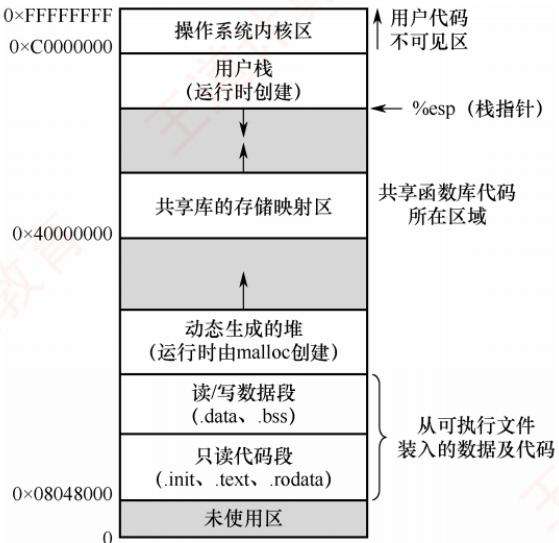
</div>

<p align="center"><em>图 2.1 一个典型进程在内存中的映像</em></p>

### 2.1.4 进程的状态与转换

　　进程在其生命周期中，由于与其他进程的相互制约以及系统运行环境的变化，其状态会不断发生转换。通常，进程具有以下五种状态，其中前三种为基本状态。

1）运行态。进程正在 CPU 上执行。在单 CPU 中，任一时刻最多只有一个进程处于运行态。

2）就绪态。进程已获得除CPU外的所有必要资源，一旦获得CPU，便可立即投入运行。系统中可能有多个就绪进程，通常将它们组织成一个队列，称为就绪队列。

> **考点追踪：** 执行中断处理程序时进程的状态（2023）

3）阻塞态，也称等待态。进程因等待某一事件（如某个资源可用、I/O操作完成等）而暂停运行。此时即使CPU空闲，该进程也无法执行。系统通常将处于阻塞态的进程组织成一个阻塞队列，甚至根据阻塞原因的不同，还可进一步划分为多个子队列。

4）创建态。进程正处于创建过程中，尚未进入就绪态。创建进程包括多个步骤：首先申请一个空白的PCB，并向其中填写用于控制和管理进程的信息；然后为该进程分配运行时所需的资源（如内存空间）；最后，当所有必要资源都已到位，系统将该进程转入就绪态，并插入就绪队列。创建态是一个短暂的中间状态，正常情况下不会长期停留。

5）终止态。进程已完成执行（无论是正常结束还是被强制终止），正在等待系统回收其资源。此时，进程不再参与调度，但其PCB等信息可能暂时保留，直至完成最终清理。

　　区分就绪态与阻塞态：就绪态是指进程仅缺少 CPU，只要获得 CPU 就可立即运行；而阻塞态是指进程需要其他资源（除 CPU 外）或等待某一事件。之所以将 CPU 与其他资源分开，是因为在分时系统的时间片轮转机制中，每个进程分得的时间片很短（通常为几毫秒），因此进程在运行过程中会频繁地在运行态与就绪态之间切换；而其他资源（如外设）的分配或事件（如 I/O 完成）的发生往往需要较长时间，导致进程进入阻塞态的频率远低于就绪态。由此可见，就绪态和阻塞态在进程生命周期中代表了两种性质完全不同的等待情形。

> **考点追踪：** 引起进程状态转换的事件（2014、2015、2018、2023、2025）

图 2.2 说明了五种进程状态之间的转换关系。其中，三种基本状态之间的转换如下：

- 就绪态 $\rightarrow$ 运行态：处于就绪态的进程被调度程序选中，获得CPU的使用权（例如分配到一个时间片），随即由就绪态转换为运行态。

- 运行态 $\rightarrow$ 就绪态：处于运行态的进程在时间片用完后，必须主动让出CPU，从而转回就绪态；此外，在可剥夺式调度系统中，若有更高优先级的进程变为就绪，则当前运行的进程也会被强制切换回就绪态，以便让更高优先级的进程执行。

- 运行态 $\rightarrow$ 阻塞态：当运行中的进程通过系统调用请求某项服务（如发起I/O操作），而该请求无法立即满足（需等待I/O完成），进程便会主动进入阻塞态。需注意，并非所有系统调用都会导致阻塞，只有那些需要等待外部事件的操作才会引发状态转换。

<div align="center">
  
</div>

<p align="center"><em>图 2.2 5种进程状态的转换</em></p>

- 阻塞态 $\rightarrow$ 就绪态：当进程所等待的事件发生时（如I/O操作完成），相应的中断处理程序会将其状态由阻塞态修改为就绪态，并重新插入就绪队列，等待下一次调度。

　　值得注意的是，进程从运行态变为阻塞态是一种主动行为（由自身发起的系统调用触发），而从阻塞态变为就绪态则是一种被动行为，依赖于外部事件的发生或其他进程的协助。

### 2.1.5 进程控制

　　进程控制的功能是对系统中所有进程进行有效的管理，主要包括创建新进程、撤销已有进程、实现进程状态转换等操作。在操作系统中，这些控制操作通常以原语的形式实现。原语在执行期间不允许被中断，是一个不可分割的基本单位，确保了关键操作的原子性和一致性。

#### 1. 进程的创建

> **考点追踪：** 父进程与子进程的关系和特点（2020、2024）

　　允许一个进程创建另一个进程。创建者称为父进程，被创建的进程称为子进程。子进程在创建时会复制父进程的当前状态，包括程序代码、数据段、堆栈内容、打开的文件描述符、环境变量等。然而，子进程与父进程是相互独立的实体，拥有各自的 PCB 和虚拟地址空间。

> **考点追踪：** 导致创建进程的操作（2010）

　　在操作系统中，终端用户登录系统、作业调度启动批处理任务、系统提供服务、用户程序发起应用请求等，都会触发进程的创建。操作系统通过创建原语建立新进程，具体步骤如下。

> **考点追踪：** 创建新进程时的操作（2021）

1）分配唯一标识并申请 PCB：为新进程分配唯一的进程标识号（PID），并从系统 PCB 池中申请一个空白 PCB。若 PCB 资源耗尽，则创建失败，系统返回错误。

2）分配新进程运行所需的资源：如内存、文件、I/O设备等（记录在PCB中）。这些资源或从操作系统获得，或从其父进程继承。

3）初始化PCB：初始化的内容包括：标识信息、处理机状态信息、调度与控制信息和内存与资源信息。通常将新进程设置为最低优先级，除非用户显式提出高优先级要求。

4）插入就绪队列：若系统允许新进程参与调度，则将其PCB插入就绪队列，等待调度。

#### 2. 进程的终止

　　引起进程终止的事件主要包括：① 正常结束，表示进程完成其预定任务后主动退出。② 异常结束，表示进程在运行过程中发生严重错误，导致无法继续执行。常见原因包括：存储区越界、非法指令、特权指令违规、算术运算错误、I/O 故障、运行超时等。③ 外界干预，由外部实体请求终止进程，如操作员强制终止、操作系统因资源不足或安全策略终止进程、父进程通过系统调用请求终止其子进程。操作系统通过终止原语完成进程的撤销，具体步骤如下。

> **考点追踪：** 终止进程时的操作（2024）

1）根据被终止进程的标识符，检索其 PCB，并读取当前状态。

2）若该进程正处于运行态，立即剥夺其CPU，并触发调度程序选择下一个就绪进程。

3）释放该进程占用的所有系统资源，统一归还给操作系统。

4）若系统支持级联终止，则递归终止其所有子孙进程；否则，子孙进程继续运行。

5）将该进程的PCB从所在队列（或链表）中移除，完成清理。

　　在某些系统中，当一个进程终止时，其所有子孙进程也必须随之终止，这种机制称为级联终止。然而，并非所有操作系统都采用这一策略。以Linux为例，当父进程终止时，其子进程并不会被自动终止，而是由init进程（ $\mathrm{PID} = 1$ ）收养，并继续正常运行。

#### 3. 进程的阻塞和唤醒

> **考点追踪：** 进程阻塞的事件与分析（2018、2022、2023）

　　当一个正在运行的进程因等待某个外部事件而暂时无法继续执行时，会主动调用阻塞原语（Block），使自己从运行态转换为阻塞态。常见的等待事件包括：请求系统资源暂时不可用、等待 I/O 操作完成、等待接收数据、等待信号量等。需要强调的是，阻塞是进程的主动行为，因此只有处于运行态的进程才能执行阻塞操作。阻塞原语的执行过程如下。

1）保存当前进程的CPU现场（如程序计数器、状态寄存器等）到其PCB中。

2）将其 PCB 中的状态字段修改为阻塞态，并将该 PCB 插入所等待事件的等待队列中。

3）调用调度程序，从就绪队列中选择另一个进程投入运行，以释放 CPU 资源。

> **考点追踪：** 进程唤醒的事件与分析（2014、2019）

　　当被阻塞进程所等待的事件发生时（如 I/O 操作完成、所需数据到达），由内核的中断处理程序或合作进程调用唤醒（Wakeup）原语，将该进程重新激活。唤醒原语的执行过程如下。

1）在指定事件的等待队列中找到目标进程的 PCB。

2）将其从等待队列中移出，并将状态置为就绪态。

3）将该PCB插入就绪队列，等待调度程序在适当时机选中并恢复其执行。

　　需要注意是，Block 与 Wakeup 是一对作用相反的原语，必须成对使用。若某进程调用了 Block 进入阻塞态，但系统中没有任何机制调用对应的 Wakeup，则该进程将永久停留在阻塞态，无法再被调度执行。因此，在设计并发程序时，必须确保每个阻塞操作都有相应的唤醒路径。

### 2.1.6 进程的通信

　　进程通信（IPC）是指进程之间的信息交换。根据通信效率和数据量的不同，可分为低级通信和高级通信两类：低级通信主要用于传递控制信息（如同步、互斥），典型代表是 PV 操作（见 2.3 节）；高级通信用于高效传输大量数据，主要包括共享存储、消息传递和管道通信、信号等方式。

#### 1. 共享存储

　　进程的地址空间通常是相互隔离的，一个进程不能直接访问另一个进程的内存。因此，若要实现高效的数据交换，操作系统提供了共享存储机制：通过特殊的系统调用，创建一段独立的内存区域，并将其映射到多个进程的虚拟地址空间中，使这些进程都能直接读/写该区域。在共享存储方式中，参与通信的进程通过对这一共享区域进行读/写来交换信息，如图2.3所示。由于多个进程可能并发访问同一块内存，必须由用户程序引入同步互斥机制（如信号量的P、V操作），以避免数据竞争或不一致。需要注意的是，操作系统仅负责分配共享内存区并完成地址映射，并不会自动提供同步保护；具体的读/写逻辑与同步控制，均需由用户程序自行设计和实现。

　　通俗地理解，可以想象甲和乙之间放着一个公共的大布袋：甲把要传递的物品放进布袋，乙再从里面取出。但乙不能直接伸手去拿甲手里的东西，甲也不能直接取走乙的东西，所有交换都必须通过这个公共区域完成。

#### 2. 消息传递

　　当进程之间没有共享内存，或出于安全等考虑不便使用共享存储时，可采用操作系统提供的消息传递机制进行通信。在消息传递系统中，进程间的数据交换以格式化的消息（Message）为单位，通过操作系统提供的发送原语和接收原语进行。这种方式将通信的底层细节封装在内核中，对用户透明，从而简化了应用程序的设计。消息传递是目前应用最广泛的进程间通信机制，在微内核操作系统中，微内核与服务器之间的交互正是基于消息传递。此外，该机制很好地支持多处理器系统、分布式系统和计算机网络，因此也成为这些环境中的主流通信方式。

　　消息传递可分为两种基本模式：

1）直接通信方式。发送进程通过发送原语将消息发给指定的接收进程；内核负责将消息从发送方复制到接收方的内核缓冲队列中；接收进程通过接收原语接收消息，如图2.4所示。

<div align="center">
  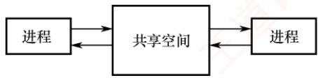
</div>

<p align="center"><em>图 2.3 共享存储</em></p>

<div align="center">
  
</div>

<p align="center"><em>图 2.4 消息传递</em></p>

2）间接通信方式。通信双方不直接指定对方，而是通过一个中间实体（通常称为信箱）进行消息交换。发送进程将消息投递到信箱，接收进程从信箱中取出消息。

　　通俗地理解，甲要向乙传递信息，便写好一封信交给邮差。在直接通信中，邮差将信件直接交到乙本人手中；在间接通信中，乙家门口设有一个邮箱，邮差只需将信投入该邮箱，乙随后自行取阅。无论哪种方式，消息的投递均由邮差（操作系统内核）完成消息的可靠投递。

#### 3. 管道通信

> **考点追踪：** 管道通信的特点（2014）

　　管道通信是一种基于先进先出原则的进程间通信机制，常用于具有亲缘关系的进程（如父子进程）之间，以生产者-消费者模式进行数据交换（见图2.5）。从编程接口上看，管道（Pipe）

　　表现为一种特殊的共享文件，支持标准的 read() 和 write() 操作；但从实现上看，它并非存储在磁盘上的文件，而是由操作系统内核维护的一块固定大小的内存缓冲区。

　　为确保通信的正确性,管道机制必须提供三方面的协调能力: ① 互斥, 指任一时刻只允许一个进程对管道进行读或写操作，防止多个进程并发访问导致数据混乱；② 同步，指当管道满时，写进程自动阻塞，直到读进程取走部分数据；当管道空时，读进程自动阻塞，直到写进程向其中写入新数据；③ 写端关闭检测，当写端关闭后，读端 read() 返回 0，表明无数据可读。

<div align="center">
  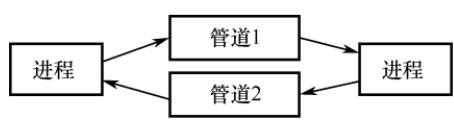
</div>

<p align="center"><em>图 2.5 管道通信</em></p>

　　在 Linux 系统中，管道是一种广泛使用的 IPC 机制。其主要特点包括：

1）固定缓冲区大小。管道使用内核中的环形缓冲区（如64KB），不会像普通文件那样无限制增长。当缓冲区满时，后续的write()调用将被阻塞，直到有足够空间可用。

2）自动阻塞与唤醒。若读进程的消费速度快于写进程，则管道中的数据会被迅速读空。此时，任何 read() 调用将被阻塞，等待写进程再次写入数据。

　　管道由父进程通过 pipe() 系统调用创建。由于子进程在创建时会继承父进程的文件描述符表，因此能够通过这些描述符访问同一管道，从而与父进程进行通信。

> **注意**

　　从管道中读取数据是一次性操作，数据一旦被读出，其占用的缓冲区空间即被释放，供后续写入使用；普通管道仅支持单向通信，若需双向通信，则必须创建两个管道，分别用于两个方向的数据传输。

#### 4. 信号

　　信号（Signal）是一种用于通知进程某个事件已发生的机制。不同的系统事件对应不同的信号类型，每类信号对应一个序号。例如，Linux内核实现了约30种信号，编号通常为1～30。

　　在进程的 PCB 中，用一个 n 位向量（如 Linux 使用一个 32 位整型变量）记录该进程当前待处理的信号。当向某进程发送一个信号时，内核会将该信号对应的位置为 1；一旦该信号被成功处理，对应位即被清零。此外，PCB 中还维护另一个 n 位向量，用于记录被阻塞（屏蔽）的信号。当某一位为 1 时，表示对应的信号不会被立即处理，而是暂存起来，直到解除阻塞。

　　信号的发送主要有以下两种方式：

1）内核发送信号。当内核检测到特定的系统事件时，会向相关进程发送相应的信号。例如，若进程执行了非法指令，则内核将向其发送 SIGILL 信号（序号为 4）。

2）由进程发送信号。一个进程可以通过调用 kill() 函数，请求内核向指定进程（需提供目标进程的 PID 和信号序号）发送信号。当然，进程也可以向自身发送信号。

　　当操作系统从内核态返回用户态时（如系统调用结束），会检查当前进程是否存在未被阻塞的待处理信号。若存在，则立即处理其中一个信号（通常优先处理序号较小的信号）。

　　信号的处理方式有两种：

1）执行默认的信号处理程序。操作系统为每类信号预设了默认操作。例如，收到 SIGILL 信号的默认操作是终止进程。

2）执行进程自定义的信号处理程序。进程可以为某类信号定义自己的处理函数。例如，可定义收到 SIGILL 时输出 “hello world”，而不是终止进程。

　　信号处理程序执行结束后，通常会返回到原程序被中断的位置，继续执行后续指令。

### 2.1.7 线程和多线程模型

#### 1. 线程的基本概念

　　引入进程的目的是使多道程序能够并发执行，从而提高资源利用率和系统吞吐量；而引入线程（Thread）则是为了进一步降低程序并发执行时的时空开销，提升操作系统的并发性能。

> **考点追踪：** 线程的特点（2019、2011、2024）

　　线程可被通俗地理解为 “轻量级进程”，它是程序执行流的最小单元，也是处理器调度的基本单位。在多线程操作系统中，进程不再作为基本的执行实体，但仍保留与执行相关的状态。所谓进程处于 “执行” 状态，实际上是指该进程中的某个线程正在运行。线程的主要属性如下。

##### （1）轻量级执行实体

　　线程本身不拥有独立的系统资源（如地址空间、打开的文件等），但拥有运行所必需的私有数据结构，包括线程 ID、程序计数器、寄存器集合和栈。每个线程都具有唯一的标识符和一个线程控制块（TCB），用于记录其执行上下文（如寄存器状态、栈指针等）。

##### （2）共享代码段

　　同一进程中的多个线程可并发执行相同的程序代码。例如，当多个用户同时访问一个 Web 服务器时，服务器进程可创建多个线程，各自服务不同的用户请求，显著提升并发能力。

##### （3）资源共享

　　同一进程内的所有线程共享该进程的代码段、数据段、堆、文件描述符等系统资源。这种机制使得线程间的通信和数据共享非常高效，无须复杂的进程间通信（IPC）机制。

##### （4）独立调度单位

　　线程是 CPU 调度和执行的基本单位。在单 CPU 系统中，多个线程通过时间片轮转等方式轮流使用 CPU；在多 CPU 系统中，不同线程可并行运行于多个 CPU 核心上。若多个核心同时执行同一进程的不同线程，则能显著缩短该进程的整体处理时间。

##### （5）生命周期

　　线程从创建开始，经历就绪、运行、阻塞等状态变化，直至最终终止。

　　引入线程后，进程的内涵发生了重要变化：进程成为除 CPU 外的系统资源分配单位，而线程则成为 CPU 调度和执行的基本单位。当线程切换发生在同一进程内部时，由于地址空间等资源无须切换，其开销远小于进程切换。接下来，将从多个维度对线程与进程进行比较。

#### 2. 线程与进程的比较

> **考点追踪：** 进程和线程的比较（2012）

1）调度。在传统的操作系统中，进程既是资源拥有者，也是独立调度的基本单位，每次调度都需要进行完整的上下文切换，开销较大。引入线程后，线程成为独立调度的基本单位。在同一进程中，线程切换不会引起进程切换；但若从一个进程的线程切换到另一个进程的线程，则仍会触发进程切换。

2）并发性。在支持线程的操作系统中，并发性得到显著增强：不仅进程之间可以并发执行，同一进程内的多个线程也可以并发执行，甚至不同进程中的线程也能并发执行。这种多层次的并发机制有效提升了系统资源利用率和吞吐量。

3）拥有资源。进程是系统资源分配的基本单位；而线程不拥有独立的系统资源，但拥有运行所必需的私有数据结构。同一进程的所有线程共享该进程的地址空间及资源。

4）独立性。每个进程拥有完全独立的地址空间，默认情况下，其他进程无法直接访问其任何内存区域。相应的，一个进程中的线程对其他进程完全不可见。同一进程内的线程则因共享地址空间而紧密协作，旨在提升并发性能。

5）系统开销。创建或撤销进程时，系统需分配或回收 PCB、地址空间、I/O 资源等，开销显著；而创建或撤销线程仅需分配栈和少量内核对象，开销很小。类似地，进程切换涉及整个地址空间和资源上下文的切换，而线程切换只需保存和恢复寄存器状态。此外，由于同一进程内的线程共享地址空间，它们之间的同步与通信非常容易实现。

6）支持多处理器系统。对于单线程进程，尽管可以在不同时间被调度到任意 CPU 上运行，但在任一时刻只能在一个 CPU 上执行。而对于多线程进程，系统可将其中的多个线程同时调度到多个 CPU 上并行执行，从而真正发挥多核处理器的性能优势。

#### 3. 线程的状态与生命周期

　　由于线程之间共享资源，并存在同步与互斥等制约关系，其执行过程具有明显的间断性。相应地，线程在其生命周期中会经历以下三种基本状态：

- 运行态：线程已获得 CPU，正在执行。

- 就绪态：线程已具备所有运行条件，只需获得CPU即可立即执行。

- 阻塞态：线程因等待某一事件（如I/O完成、锁释放等）而暂时无法继续执行。

　　线程这三种基本状态之间的转换与进程基本状态之间的转换是类似的。

　　线程具有完整的生命周期：由创建而产生，经调度而执行，最终因终止而消亡。为支持这一过程，操作系统提供了相应的系统调用或库函数。

　　用户程序启动时，通常仅有一个初始线程在执行，其主要任务是创建其他线程。创建新线程时，需调用线程创建函数，并传入必要的参数，例如：指向线程主函数的入口地址、堆栈大小、调度优先级等。创建成功后，系统返回唯一的线程标识符，供后续操作使用。

　　操作系统的调度器根据线程的优先级和其他调度策略决定哪个线程获得 CPU 使用权。调度机制可选用多种方式。当线程被调度到 CPU 上时，它进入运行态，开始执行其主函数中的代码。在此期间，线程可能会与其他线程进行同步或互斥操作，以确保数据一致性。

　　线程终止的原因可能有多种。例如，线程正常执行完其主函数；在运行过程中发生未处理的异常而被迫退出；主动调用线程终止函数；或被其他线程通过取消机制强制终止。在大多数操作系统中，线程终止后并不会立即释放其所占用的资源。只有当进程中的其他线程执行了相应的分离操作后，被终止的线程才会与资源分离，其资源才能被系统回收并供其他线程使用。

　　已被终止但尚未释放资源的线程仍可被其他线程调用，以使其重新恢复运行。

#### 4. 线程控制块

> **考点追踪：** 线程的私有资源（2024）

　　与进程类似，操作系统为每个线程维护一个线程控制块（Thread Control Block, TCB），用于记录和管理线程的运行信息。TCB 通常包含以下内容：① 线程标识符（Thread ID）；② 寄存器集合，包括程序计数器、状态寄存器和通用寄存器；③ 线程当前状态，用于描述线程正处于何种状态；④ 调度优先级；⑤ 线程局部存储区，用于保存线程私有的数据；⑥ 堆栈指针，指向该线程的私有栈，用于过程调用时保存局部变量、返回地址等。

　　同一进程中的所有线程共享该进程的地址空间和全局变量。每个线程拥有独立的私有栈，这些栈位于进程的地址空间内，因此从技术上讲，一个线程可以访问另一个线程的栈内容。然而，这种做法严重违反编程规范，会破坏线程封装性和程序正确性，实际开发中应严格避免。

#### 5. 线程的实现方式

> **考点追踪：** 两种线程的特点与比较（2019）

　　线程的实现可以分为两类：用户级线程（User-Level Thread，ULT）和内核级线程（Kernel-Level Thread，KLT）。其中，内核级线程也称为内核支持的线程。

##### （1）用户级线程（ULT）

　　通俗地说，用户级线程是指“从用户视角看到的线程”。在该模型中，所有线程管理工作（包括创建、切换、撤销等）均由应用程序在用户空间（用户态）完成，无须操作系统介入。正因如此，操作系统内核完全感知不到这些线程的存在。应用程序只需引入线程库，即可被开发为多线程程序。通常，用户程序启动时仅包含一个初始线程；在执行过程中，该线程可在任意时刻调用线程库提供的创建函数，在同一进程中派生出新的线程。图2.6(a)展示了用户级线程的实现方式。

　　对于采用用户级线程的系统，调度仍以进程为单位进行。调度器只能感知到进程，无法察觉进程内部的多个用户级线程，因此它仅为整个进程分配一个时间片。例如，假设系统采用时间片轮转调度，每个进程每次获得 100 ms 的 CPU 时间。若进程 A 仅包含 1 个用户级线程，则当该进程获得时间片时，其唯一的线程可独占全部 100 ms 的 CPU 时间；而若进程 B 包含 100 个用户级线程，则这 100 ms 必须在其内部的 100 个线程之间分配。倘若进程 B 内部采用简单的轮转调度，那么每个线程平均仅能获得 1 ms 的 CPU 时间。由此可见，进程 A 中的线程所获得的 CPU 时间是进程 B 中各线程的 100 倍。这种差异导致在多线程密集型任务中，不同进程间的线程实际执行效率极不均衡，从而在系统层面体现出明显的调度不公平性。

　　这种实现方式的优点：① 线程切换在用户空间完成，无须切换到内核态，避免了模式切换的开销。② 调度策略可由应用程序定制，不同进程可根据自身需求采用不同的线程调度算法。③ 用户级线程的实现与操作系统无关，线程管理代码属于用户程序的一部分，具有良好的可移植性。

<div align="center">
  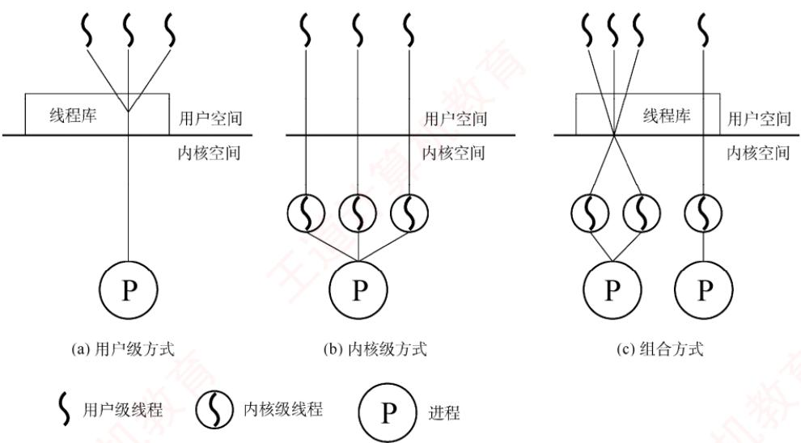
</div>

<p align="center"><em>图 2.6 用户级线程和内核级线程</em></p>

　　其缺点在于：① 系统调用的阻塞问题，当某个用户级线程执行一个阻塞型系统调用时，整个进程会被内核挂起，导致进程中的所有线程均被阻塞。② 无法发挥多处理器的并行优势，由于内核仅将该进程调度到一个 CPU 上执行，即使系统配备了多个 CPU 核心，同一进程中的多个用户级线程也无法同时在不同 CPU 上并行运行，只能在单个 CPU 上交替执行。

##### （2）内核级线程 (KLT)

　　在操作系统中，无论是系统进程还是用户进程，都依赖内核的支持运行。内核级线程的管理完全由操作系统内核负责，所有线程相关的操作均在内核空间（内核态）完成。操作系统为每个内核级线程维护一个线程控制块（TCB），内核通过该 TCB 感知线程的存在并对其进行控制。图 2.6(b) 展示了内核级线程的实现方式。

　　这种实现方式的优点：① 能发挥多处理器的并行优势，内核可将同一进程中的多个线程同时调度到不同 CPU 核心上并行执行。② 阻塞处理更灵活，若进程中的某个线程因系统调用被阻塞，内核仍可调度该进程中的其他线程运行，或切换到其他进程的线程继续执行。③ 内核自身可采用多线程技术，从而提升系统服务的并发性和整体效率。

　　(a) 多对一模型

　　其缺点在于：线程切换需从用户态陷入内核态。由于线程在用户态运行，而调度由内核完成，每次切换都涉及模式转换和上下文保存/恢复，系统开销较大。

##### （3）组合方式

　　某些系统采用组合方式（混合模型）实现多线程。在该模型中，内核支持多个内核级线程的创建与调度，同时允许用户程序在用户空间管理多个用户级线程。这种方式能结合两种模型的优点，并克服各自的不足：多个线程可在多CPU上并行执行；单个线程阻塞不会导致整个进程挂起；用户级线程切换可在用户空间快速完成，减少内核介入。图2.6(c)展示了这种组合实现方式。根据用户级线程与内核级线程之间的映射关系不同，形成了以下三种典型的多线程模型：

1）多对一模型。将多个用户级线程映射到一个内核级线程，如图2.7(a)所示。线程的调度和管理在用户空间完成。每个进程仅拥有一个内核级线程，仅当用户线程需要访问内核时，才将其映射到一个内核级线程上，但每次只允许一个线程进行映射。

　　优点：线程管理在用户空间进行，无须切换到内核态，因此线程切换的效率较高。

　　缺点：当任一用户级线程执行阻塞型系统调用时，整个进程都会被内核挂起；在任何时刻最多只能有一个线程与内核交互，无法在多处理器系统中实现并行执行。

<div align="center">
  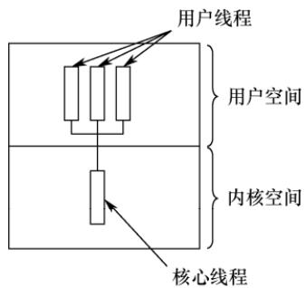
</div>

<div align="center">
  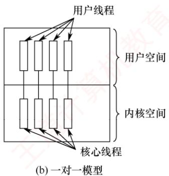
</div>

<div align="center">
  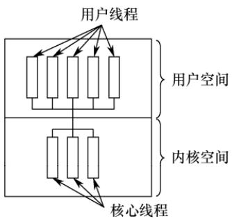
</div>

　　(c) 多对多模型

<p align="center"><em>图 2.7 多线程模型</em></p>

2）一对一模型。将每个用户级线程映射到一个独立的内核级线程，如图2.7(b)所示。进程中的用户级线程与内核级线程一一对应，线程的调度由内核完成，需要切换到内核态。

　　优点：当某个线程被阻塞时，内核可调度同一进程中的其他线程运行，支持真正的并发执行，且可在多 CPU 系统上并行运行。

　　缺点: 每创建一个用户线程, 系统就必须创建一个对应的内核线程, 导致较大的系统开销（如内核 TCB 占用内存、调度负担增加), 限制了系统可支持的最大线程数。

3）多对多模型。将 n 个用户级线程映射到 m 个内核级线程，要求 $n \geqslant m$ ，如图 2.7(c) 所示。

　　用户级线程由应用程序在用户空间调度，而内核级线程由内核调度到多个 CPU 上执行。特点：既克服了多对一模型并发度低的缺陷，又避免了一对一模型资源开销过大的问题。同时兼具两者优点：用户级线程切换高效，且支持多核并行与阻塞隔离。

##### （4）线程库（thread library）的实现

　　程序员通常通过线程库提供的 API 来创建和管理线程。线程库的实现主要有两种方式：

　　① 纯用户空间实现：线程库完全位于用户空间，所有代码和数据结构均在用户态。调用库函数仅触发本地过程调用，无须陷入内核。此类实现对应用户级线程模型。

　　② 内核支持实现：线程库的底层依赖操作系统内核。库中的 API 调用通常会触发系统调用，

　　由内核完成实际的线程操作。此类实现对应内核级线程模型。

　　目前广泛使用的三种主流线程库包括：POSIX Pthreads、Windows 线程 API 和 Java 线程 API。Pthreads 是 POSIX 标准定义的线程 API，其具体实现可基于用户级或内核级线程。Windows 线程 API 直接构建于 Windows 内核之上，属于内核级线程实现。Java 线程 API 允许在 Java 程序中直接创建线程。由于 JVM 运行于宿主操作系统之上，Java 线程通常通过调用宿主系统的线程库实现，因此在 Windows 上使用 Windows API，在类 UNIX 系统上则使用 Pthreads。

### 2.1.8 本节小结

　　本节开头提出的问题的参考答案如下。

#### 1. 为什么要引入进程？

　　在多道程序环境下，多个程序并发执行并共享系统资源，导致运行过程中相互制约，表现出间断性、异步性和不可预测性。然而，传统的“程序”仅是一组静态的指令集合，无法反映其在内存中的动态执行行为。例如，无法体现程序何时开始、何时暂停、如何与其他程序交互等。为了准确刻画程序并发执行的动态特性，并为操作系统提供有效的管理机制，进程这一概念被引入。进程是程序并发执行的基本单位，也是操作系统进行资源分配和调度的实体。

#### 2. 什么是进程？进程由什么组成？

　　进程是一个具有独立功能的程序在其特定数据集上的一次执行过程。它是一个动态的、活动的实体，不仅包含程序代码，还包含当前的执行状态（如程序计数器的值、处理器寄存器的内容等）。一个进程实体由程序段、相关数据段和PCB三部分构成。其中，PCB是进程存在的唯一标志，操作系统通过PCB感知并控制进程的整个生命周期。

#### 3. 引入进程主要解决了多道程序并发执行中的哪些关键问题？

　　引入进程有效解决了多道程序并发执行带来的三大问题：① 失去封闭性：在缺乏进程机制的环境中，程序执行易受其他程序干扰（如共享内存被修改），导致行为不可控；进程通过地址空间隔离，为每个程序提供独立、受保护的执行环境，从而恢复一定程度的封闭性。② 执行过程的间断性：程序可能因 I/O 请求、时间片用尽或调度决策而被中断；进程利用 PCB 保存和恢复执行上下文，确保中断后能准确、连续地继续执行。③ 结果不可再现性：在并发环境下，相同输入可能因执行顺序不确定而产生不同输出；进程的隔离机制与操作系统的调度策略共同保障了执行的可控性与结果的可再现性。通过为每个程序建立独立的进程实体，操作系统得以高效实现调度、切换、资源分配与保护，显著提升系统资源利用率和并发处理能力。

　　本节主要围绕 “什么是进程” 展开阐述，旨在为后续内容奠定概念基础。然而，对于尚未接触过操作系统相关知识的读者而言，“进程” 作为一个抽象的动态实体，可能仍显得模糊不清。为了帮助大家更直观地把握其本质，我们引入一个贴近生活的类比。

　　我们可以将进程类比为“人的生命历程”。首先，人的生命历程是一个动态的、过程性的存在，而非静态的描述；同样，进程也不是一段固定的程序代码，而是一次正在执行的活动。要研究生命历程，必须先明确其主体“人”；对应地，进程的主体是进程映像，它由程序段、数据段和PCB组成。其中，PCB就如同人的“身份标识”，记录了该进程的唯一身份与当前状态。人在一生中会经历多种状态：出生、成长、奋斗、受挫、康复、衰老乃至离世；类似地，进程在其生命周期中也会在创建、就绪、运行、阻塞、终止等状态之间转换。例如，一个人从“充满斗志”（就绪）进入“发奋图强”（运行）；若遭遇挫折，可能陷入“失落”（阻塞）；在他人鼓励下，又可重新“充满斗志”（回到就绪）。这正对应于进程从就绪态转换为运行态，因等待事件而进入阻塞态，待事件发生后再次返回就绪态的典型状态迁移。通过“人生历程”这一过程性视角来理解进程，有助于我们超越对“程序=进程”的误解，真正把握进程作为动态执行实体的核心特征。当然，任何类比都有其局限性。上述比喻虽有助于建立直觉，但不能替代严谨的技术定义。因此，建议读者在借助类比形成初步理解后，回过头来重新阅读本节前文的正式阐述。这种“感性认知→理性回归”的学习路径，往往能带来更深刻、更准确的理解。

　　这里再给出一些学习计算机科学的建议。许多同学在学习过程中容易陷入一个误区：过于关注定理和公式的应用，而忽视了对基础概念的理解。这一倾向往往源于长期应试训练，毕竟熟练套用公式和定理在考试中见效快、收益明显。然而，公式和定理的应用固然重要，唯有深入理解基础概念，才能真正透彻地掌握一门学科，进而激发兴趣，培养创造性思维。

### 2.1.9 本节习题精选

#### 一、单项选择题

01. 一个进程映像是（）。

- A. 由协处理器执行的一个程序
- B. 一个独立的程序 + 数据集
- C. PCB 结构与程序和数据的组合
- D. 一个独立的程序

02. 进程之间交换数据不能通过（）途径进行。
- A. 共享文件
- B. 消息传递
- C. 访问进程地址空间
- D. 访问共享存储区

03. 进程与程序的根本区别是（）。

- A. 静态和动态特点
- B. 是不是被调入内存
- C. 是不是具有就绪、运行和等待三种状态
- D. 是不是占有处理器

04. 下列关于进程的描述中，最不符合操作系统对进程的理解的是（）。
- A. 进程是在多程序环境中的完整程序
- B. 进程可以由程序、数据和PCB描述
- C. 线程（Thread）是一种特殊的进程
- D. 进程是程序在一个数据集合上的运行过程，它是系统进行资源分配和调度的一个独立单元

05. 下列关于并发进程特性的叙述中，正确的是（）。
- A. 进程是一个动态过程，其生命周期是连续的
- B. 并发进程执行完毕后，一定能够得到相同的结果
- C. 并发进程对共享变量的操作结果与执行速度无关
- D. 并发进程的运行结果具有不可再现性

06. 下列关于进程的叙述中，正确的是（）。
- A. 进程获得处理器运行是通过调度得到的
- B. 优先级是进程调度的重要依据，一旦确定就不能改动
- C. 在单处理器系统中，任何时刻都只有一个进程处于运行态
- D. 进程申请处理器而得不到满足时，其状态变为阻塞态

07. 并发进程执行的相对速度是（）。

- A. 由进程的程序结构决定的
- B. 由进程自己来控制的
- C. 与进程调度策略有关
- D. 在进程被创建时确定的

08. 下列任务中，（）不是由进程创建原语完成的。
- A. 申请 PCB 并初始化
- B. 为进程分配内存空间

- C. 为进程分配CPU D. 将进程插入就绪队列

09. 下列关于进程和程序的叙述中，错误的是（）。

- A. 一个进程在其生命周期中可执行多个程序
- B. 一个进程在同一时刻可执行多个程序
- C. 一个程序的多次运行可形成多个不同的进程
- D. 一个程序的一次执行可产生多个进程

10. 下列选项中，导致创建新进程的操作是（）。
I. 用户登录 II. 高级调度发生时
III. 操作系统响应用户提出的请求 IV. 用户打开了一个浏览器程序
- A. 仅 I 和 IV B. 仅 II 和 IV C. I、II 和 IV D. 全部

11. 操作系统是根据（）来对并发执行的进程进行控制和管理的。
- A. 进程的基本状态 B. 进程控制块 C. 多道程序设计 D. 进程的优先权

12. 在任何时刻，一个进程的状态变化（）引起另一个进程的状态变化。
- A. 必定    B. 一定不    C. 不一定    D. 不可能

13. 在单处理器系统中，若同时存在 10 个进程，则处于就绪队列中的进程最多有（）个。
- A. 1 B. 8 C. 9 D. 10

14. 一个进程释放了一台打印机，它可能改变（）的状态。
- A. 自身进程
- B. 输入/输出进程
- C. 另一个等待打印机的进程
- D. 所有等待打印机的进程

15. 系统进程所请求的一次 I/O 操作完成后，将使进程状态从（）。
- A. 运行态变为就绪态 B. 运行态变为阻塞态
- C. 就绪态变为运行态 D. 阻塞态变为就绪态

16. 一个进程的基本状态可以从其他两种基本状态转变过去，这个基本的状态一定是（）。

- A. 运行态
- B. 阻塞态
- C. 就绪态
- D. 终止态

17. 在分时系统中，通常处于（）的进程最多。
- A. 运行态    B. 就绪态    C. 阻塞态    D. 终止态

18. 并发进程失去封闭性，是指（）。
- A. 多个相对独立的进程以各自的速度向前推进
- B. 并发进程的执行结果与速度无关
- C. 并发进程执行时，在不同时刻发生的错误
- D. 并发进程共享变量，其执行结果与速度有关

19. 通常用户进程被建立后，（）。
- A. 便一直存在于系统中，直到被操作人员撤销
- B. 随着进程运行的正常或不正常结束而撤销
- C. 随着时间片轮转而撤销与建立
- D. 随着进程的阻塞或者唤醒而撤销与建立

20. 进程在处理器上执行时，（）。
- A. 进程之间是无关的，具有封闭特性
- B. 进程之间都有交互性，相互依赖、相互制约，具有并发性
- C. 具有并发性，即同时执行的特性
- D. 进程之间可能是无关的，但也可能是有交互性的

21. 下列关于父进程和子进程的叙述中，正确的是（）。
- A. 为了标志父子关系，可让子进程和父进程拥有相同的PID
- B. 父进程和子进程是相互独立的，可以并发执行
- C. 撤销子进程时，一定会同时撤销父进程
- D. 父进程创建了子进程，要等父进程执行完后，子进程才能执行

22. 若一个进程实体由 PCB、共享正文段、数据堆段和数据栈段组成，请指出下列 C 语言程序中的内容及相关数据结构各位于哪一段中。
I. 全局赋值变量（） II. 未赋值的局部变量（）
III. 函数调用实参传递值（） IV. 用 malloc() 要求动态分配的存储区（）
V. 常量值（如 1995、“string”）（） VI. 进程的优先级（）
- A. PCB B. 正文段 C. 堆段 D. 栈段

23. 同一程序经过多次创建，运行在不同的数据集上，形成了（）的进程。
- A. 不同    B. 相同    C. 同步    D. 互斥

24. PCB 是进程存在的唯一标志，下列（）不属于 PCB。
- A. 进程 ID    B. CPU 状态    C. 堆栈指针    D. 全局变量

25. 一个计算机系统中，进程的最大数量主要受到（）限制。
- A. 内存大小    B. 用户数目    C. 打开的文件数    D. 外部设备数量

26. 进程创建完成后会进入一个序列，这个序列称为（）。

- A. 阻塞队列
- B. 挂起序列
- C. 就绪队列
- D. 运行队列

27. 进程自身决定（）。

- A. 从运行态到阻塞态
- B. 从运行态到就绪态
- C. 从就绪态到运行态
- D. 从阻塞态到就绪态

28. 下列关于原语操作的叙述中，错误的是（）。
- A. 操作系统使用原语对进程进行管理和控制
- B. 原语在执行过程中不允许被中断
- C. 原语在内核态下执行，常驻内存
- D. 原语被定义为“原子操作”，意思是其执行速度非常快

29. 下列进程间通信方式中，数据传输速度最快的是（）。

- A. 消息传递
- B. 信号量
- C. 共享内存
- D. 管道

30. 信箱通信是一种（）通信方式。
- A. 直接通信    B. 间接通信    C. 低级通信    D. 信号量

31. 下列关于信号发送和处理的描述中，错误的是（）。
- A. 一个进程可以给自己发送信号
- B. 操作系统的内核可以给进程发送信号
- C. 操作系统的内核对每种信号都有默认处理程序
- D. 用户可以对每种信号自定义处理函数

32. 下列关于信号的处理的描述中，错误的是（）。
- A. 当进程从内核态转换为用户态时，会检查是否有待处理的信号
- B. 当进程从用户态转换为内核态时，也会检查是否有待处理的信号
- C. 操作系统对某些信号的处理是可以忽略的
- D. 操作系统允许进程通过系统调用，自定义某些信号的处理程序

33. 下面的叙述中，正确的是（）。
- A. 引入线程后，处理器只能在线程间切换
- B. 引入线程后，处理器仍在进程间切换
- C. 线程的切换，不会引起进程的切换
- D. 线程的切换，可能引起进程的切换

34. 下列关于线程的叙述中，正确的是（）。
- A. 线程包含CPU现场，可以独立执行程序
- B. 每个线程都有自己独立的地址空间
- C. 每个进程只能包含一个线程
- D. 同一进程中的线程间通信也必须使用系统调用函数

35. 下面的叙述中，正确的是（）。
- A. 线程是比进程更小的能独立运行的基本单位，可以脱离进程独立运行
- B. 引入线程可提高程序并发执行的程度，可进一步提高系统效率
- C. 线程的引入增加了程序执行时的时空开销
- D. 一个进程一定包含多个线程

36. 下面的叙述中，正确的是（）。
- A. 同一进程内的线程可并发执行，不同进程的线程只能串行执行
- B. 同一进程内的线程只能串行执行，不同进程的线程可并发执行
- C. 同一进程或不同进程内的线程都只能串行执行
- D. 同一进程或不同进程内的线程都可以并发执行

37. 下列选项中，（）不是线程的优点。
- A. 提高系统并发性
- B. 节约系统资源
- C. 切换开销小
- D. 增强进程安全性

38. 下列关于进程和线程的说法中，正确的是（）。

- A. 一个进程可以包含一个或多个线程，一个线程可以属于一个或多个进程
- B. 多线程技术具有明显的优越性，如速度快、通信简便、设备并行性高等
- C. 由于线程不作为资源分配单位，线程之间可以无约束地并行执行
- D. 线程也称轻量级进程，因为线程都比进程小

39. 在下列描述中，（）并不是多线程系统的特长。
- A. 利用线程并行地执行矩阵乘法运算
- B. Web 服务器利用线程响应 HTTP 请求
- C. 键盘驱动程序为每个正在运行的应用配备一个线程，用以响应该应用的键盘输入
- D. 基于 GUI 的调试程序用不同的线程分别处理用户输入、计算和跟踪等操作

40. 在进程转换时，下列（）转换是不可能发生的。
- A. 就绪态→运行态
- B. 运行态→就绪态
- C. 运行态→阻塞态
- D. 阻塞态→运行态

41. 当（）时，进程从执行状态转换为就绪态。
- A. 进程被调度程序选中
- B. 时间片到时
- C. 等待某一事件
- D. 等待的事件发生

42. 两个合作进程（Cooperating Processes）无法利用（）交换数据。
- A. 文件系统    B. 共享内存

- C. 高级语言程序设计中的全局变量 D. 消息传递系统

43. 以下可能导致一个进程从运行态变为就绪态的事件是（）。

- A. 一次 I/O 操作结束
- B. 运行进程需做 I/O 操作
- C. 运行进程结束
- D. 出现了比现在进程优先级更高的进程

44. （）必会引起进程切换。
- A. 一个进程创建后，进入就绪态
- B. 一个进程从运行态变为就绪态
- C. 一个进程从阻塞态变为就绪态
- D. 以上答案都不对

45. 进程处于（）时，它处于非阻塞态。
- A. 等待从键盘输入数据
- B. 等待协作进程的一个信号
- C. 等待操作系统分配 CPU 时间
- D. 等待网络数据进入内存

46. 一个进程被唤醒，意味着（）。

- A. 该进程可以重新竞争 CPU
- B. 优先级变大
- C. PCB 移动到就绪队列之首
- D. 进程变为运行态

47. 进程创建时，不需要做的是（）。

- A. 填写一个该进程的进程表项
- B. 分配该进程适当的内存
- C. 将该进程插入就绪队列
- D. 为该进程分配 CPU

48. 下面关于用户级线程和内核级线程的描述中，错误的是（）。
- A. 采用轮转调度算法，进程中设置内核级线程和用户级线程的效果完全不同
- B. 跨进程的用户级线程调度也不需要内核参与，控制简单
- C. 用户级线程可以在任何操作系统中运行
- D. 若系统中只有用户级线程，则CPU的调度对象是进程

49. 在内核级线程相对于用户级线程的优点的如下描述中，错误的是（）
- A. 同一进程内的线程切换，系统开销小
- B. 当内核线程阻塞时，同一进程中的其他内核级线程仍可被调度
- C. 内核级线程的程序实体可以在内核态运行
- D. 对多处理器系统，核心可以同时调度同一进程的多个线程并行运行

50. 下列关于用户级线程相对于内核级线程的优点的描述中，错误的是（）
- A. 一个线程阻塞不影响另一个线程的运行
- B. 线程的调度不需要内核直接参与，控制简单
- C. 线程切换代价小
- D. 允许每个进程定制自己的调度算法，线程管理比较灵活

51. 下列关于用户级线程的优点的描述中，不正确的是（）。
- A. 线程切换不需要切换到内核态
- B. 支持不同的应用程序采用不同的调度算法
- C. 在不同操作系统上不经修改就可直接运行
- D. 同一个进程内的多个线程可以同时调度到多个处理器上执行

52. 下列选项中，可能导致用户级线程切换的事件是（）。

- A. 系统调用
- B. I/O 请求
- C. 异常处理
- D. 线程同步

53. 下列关于用户级线程的描述中，错误的是（）。A. 用户级线程由线程库进行管理B. 用户级线程只有在创建和调度时需要内核的干预

- C. 操作系统无法直接调度用户级线程
- D. 线程库中线程的切换不会导致进程切换

54. 下面的说法中，正确的是（）。
- A. 不论是系统支持的线程还是用户级线程，其切换都需要内核的支持
- B. 线程是资源分配的单位，进程是调度和分派的单位
- C. 不管系统中是否有线程，进程都是拥有资源的独立单位
- D. 在引入线程的系统中，进程仍是资源调度和分派的基本单位

55. 在多对一的线程模型中，当一个多线程进程中的某个线程被阻塞后，（）。

- A. 该进程的其他线程仍可继续运行
- B. 整个进程都将阻塞
- C. 该阻塞线程将被撤销
- D. 该阻塞线程将永远不可能再执行

56. 并发性较好的多线程模型有（）。
I. 一对一模型 II. 多对一模型 III. 多对多模型
- A. 仅 I B. I 和 II C. I 和 III D. I、II 和 III

57. 下列关于多对一模型的叙述中，错误的是（）。

- A. 一个进程的多个线程不能并行运行在多个处理器上
- B. 进程中的用户级线程由进程自己管理
- C. 线程切换会导致进程切换
- D. 一个线程的系统调用会导致整个进程阻塞

58. 【2010 统考真题】下列选项中，导致创建新进程的操作是（）。I. 用户登录成功 II. 设备分配 III. 启动程序执行

- A. 仅 I 和 II
- B. 仅 II 和 III
- C. 仅 I 和 III
- D. I、II、III

59. 【2011 统考真题】在支持多线程的系统中，进程 P 创建的若干线程不能共享的是（）。

- A. 进程 P 的代码段
- B. 进程 P 中打开的文件
- C. 进程 P 的全局变量
- D. 进程 P 中某线程的栈指针

60. 【2012 统考真题】下列关于进程和线程的叙述中，正确的是（）。

- A. 不管系统是否支持线程，进程都是资源分配的基本单位
- B. 线程是资源分配的基本单位，进程是调度的基本单位
- C. 系统级线程和用户级线程的切换都需要内核的支持
- D. 同一进程中的各个线程拥有各自不同的地址空间

61. 【2014 统考真题】一个进程的读磁盘操作完成后，操作系统针对该进程必做的是（）。

- A. 修改进程状态为就绪态
- B. 降低进程优先级
- C. 给进程分配用户内存空间
- D. 增加进程时间片大小

62. 【2014 统考真题】下列关于管道（Pipe）通信的叙述中，正确的是（）。

- A. 一个管道可实现双向数据传输
- B. 管道的容量仅受磁盘容量大小限制
- C. 进程对管道进行读操作和写操作都可能被阻塞
- D. 一个管道只能有一个读进程或一个写进程对其操作

63. 【2015 统考真题】下列选项中，会导致进程从运行态变为就绪态的事件是（）。
- A. 执行 P(wait) 操作 B. 申请内存失败
- C. 启动 I/O 设备 D. 被高优先级进程抢占

64. 【2018 统考真题】下列选项中，可能导致当前进程 P 阻塞的事件是（）。
I. 进程 P 申请临界资源
II. 进程 P 从磁盘读数据
III. 系统将 CPU 分配给高优先权的进程
- A. 仅 I B. 仅 II C. 仅 I、II D. I、II、III

65. 【2019 统考真题】下列选项中，可能将进程唤醒的事件是（）。
I. I/O 结束 II. 某进程退出临界区 III. 当前进程的时间片用完
- A. 仅 I B. 仅 III C. 仅 I、II D. I、II、III

66. 【2019 统考真题】下列关于线程的描述中，错误的是（）。

- A. 内核级线程的调度由操作系统完成
- B. 操作系统为每个用户级线程建立一个线程控制块
- C. 用户级线程间的切换比内核级线程间的切换效率高
- D. 用户级线程可以在不支持内核级线程的操作系统上实现

67. 【2020 统考真题】下列关于父进程与子进程的叙述中，错误的是（）。

- A. 父进程与子进程可以并发执行
- B. 父进程与子进程共享虚拟地址空间
- C. 父进程与子进程有不同的进程控制块
- D. 父进程与子进程不能同时使用同一临界资源

68. 【2021 统考真题】下列操作中，操作系统在创建新进程时，必须完成的是（）。I. 申请空白的进程控制块 II. 初始化进程控制块 III. 设置进程状态为运行态

- A. 仅 I
- B. 仅 I、II
- C. 仅 I、III
- D. 仅 II、III

69. 【2022 统考真题】下列事件或操作中，可能导致进程 P 由运行态变为阻塞态的是（）。
I. 进程 P 读文件 II. 进程 P 的时间片用完
III. 进程 P 申请外设 IV. 进程 P 执行信号量的 wait() 操作
- A. 仅 I、IV B. 仅 II、III C. 仅 III、IV D. 仅 I、III、IV

70. 【2023 统考真题】下列操作完成时，导致 CPU 从内核态转换为用户态的是（）。

- A. 阻塞进程
- B. 执行 CPU 调度
- C. 唤醒进程
- D. 执行系统调用

71. 【2023 统考真题】下列由当前线程引起的事件或执行的操作中，可能导致该线程由运行态变为就绪态的是（）。

- A. 键盘输入
- B. 缺页异常
- C. 主动出让CPU
- D. 执行信号量的wait()操作

72. 【2024 统考真题】下列选项中，操作系统在终止进程时不一定执行的是（）。

- A. 终止子进程
- B. 回收进程占用的设备
- C. 释放进程控制块
- D. 回收为进程分配的内存

73. 【2024 统考真题】若进程 P 中的线程 T 先打开文件，得到文件描述符 fd，再创建两个线程 Ta 和 Tb，则在下列资源中，Ta 与 Tb 可共享的是（）。
I. 进程 P 的地址空间 II. 线程 T 的栈 III. 文件描述符 fd
- A. 仅 I B. 仅 I、III C. 仅 II、III D. I、II、III

#### 二、综合应用题

01. 【2025 统考真题】某系统中进程的虚拟地址空间包括内核区、用户栈、运行时堆、可读/

　　请回答下列问题。

　　写数据段、只读代码段等区域，其布局如下图所示，图中阴影部分表示未占用区域。现有 C 语言程序的部分代码如下。

```c
char *ptr;
void main()
{
    int length;
    ptr = (char *)malloc(100);
    scanf("%s", ptr);
    length = strlen(ptr);
    printf("length = %d\n", length);
    free(ptr);
}
内核区
用户栈
运行时堆
可读写数据段
只读代码段
```

1）上述程序执行时，其进程控制块位于哪个区域？执行 scanf()等待键盘输入时，该进程处于什么状态？

2）main()函数的代码位于哪个区域？其直接调用的哪些函数的功能需通过执行驱动程序实现？

3）变量ptr被分配在哪个区域？若变量length未被分配在寄存器中，则会被分配在哪个区域？ptr指向的字符串位于哪个区域？

### 2.1.10 答案与解析

#### 一、单项选择题

**01. C**

　　进程映像是PCB、程序段和数据的组合，其中PCB是进程存在的唯一标志。

**02. C**

　　每个进程包含独立的地址空间，进程各自的地址空间是私有的，只能执行自己地址空间中的程序，且只能访问自己地址空间中的数据，相互访问会导致指针的越界错误（学完内存管理将有更好的认识）。因此，进程之间不能直接交换数据，但可利用操作系统提供的共享文件、消息传递、共享存储区等进行通信。

**03. A**

　　动态性是进程最重要的特性，以此来区分文件形式的静态程序。操作系统引入进程的概念，是为了从变化的角度动态地分析和研究程序的执行。

**04. A**

　　进程是一个独立的运行单位，也是操作系统进行资源分配和调度的基本单位，它包括 PCB、程序和数据以及执行栈区，仅仅说进程是在多程序环境下的完整程序是不合适的，因为程序是静态的，它以文件形式存放在计算机的硬盘内，而进程是动态的。

**05. D**

　　并发进程可能因等待资源或因被抢占 CPU 而暂停运行，其生命周期是不连续的。执行速度会影响进程之间的执行顺序和内存冲突问题，从而导致不同的操作结果。并发进程之间存在相互竞争和制约，导致每次运行可能得到不同的结果，选项 D 正确。

**06. A**

　　选项B错在优先级分静态和动态两种，动态优先级是根据运行情况而随时调整的。选项C错在系统发生死锁时有可能进程全部都处于阻塞态，CPU 空闲。选项 D 错在进程申请处理器得不到满足时就处于就绪态，等待处理器的调度。

**07. C**

　　并发进程执行的相对速度与进程调度策略有关，因为进程调度策略决定了哪些进程可以获得处理机，以及获得处理机的时间长短，从而影响进程执行的速度和效率。

**08. C**

　　进程创建原语的执行过程：申请空白 PCB，并为新进程申请唯一的数字标识符。为新进程分配资源，包括内存、I/O 设备等。初始化 PCB，将新进程插入就绪队列。从上述过程可以看出，为进程分配 CPU 不是由进程创建原语完成的，而是由进程调度实现的。

**09. B**

　　一个进程可以顺序地执行一个或多个程序，只要在执行过程中改变其 CPU 状态和内存空间即可，但不能同时执行多个程序，选项 B 错误，选项 A 正确。一个程序可以对应多个进程，即多个进程可以执行同一个程序。例如，同一个文本编辑器可以被多个用户或多个窗口同时运行，每次运行都形成一个新进程。一个程序在执行过程中也可产生多个进程。例如，一个程序可以通过系统调用 fork() 或 create() 来创建子进程，从而实现并发处理或分布式计算。选项 C 和 D 正确。

**10. D**

　　用户登录时，操作系统会为用户创建一个登录进程，用于验证用户身份和提供用户界面。高级调度即作业调度，会从后备队列上选择一个作业调入内存，并为之创建相应的进程。操作系统响应用户提出的请求时，通常会为用户创建一个子进程，用于执行用户指定的任务或程序。用户打开一个浏览器程序时，也是一种操作系统响应用户请求的情况，同样会创建一个新进程。

**11. B**

　　在进程的整个生命周期中，系统总是通过其 PCB 对进程进行控制。也就是说，系统是根据进程的 PCB 而非任何其他因素来感知到进程存在的，PCB 是进程存在的唯一标志。同时 PCB 常驻内存。A 和 D 选项的内容都包含在进程 PCB 中。

**12. C**

　　一个进程的状态变化可能引起另一个进程的状态变化。例如，一个进程时间片用完，可能引起另一个就绪进程的运行。同时，一个进程的状态变化也可能不会引起另一个进程的状态变化。例如，一个进程由阻塞态转换为就绪态就不会引起其他进程的状态变化。

**13. C**

　　在单处理器系统中，不可能出现10个进程都处于就绪态的情况。但9个进程处于就绪态、1个进程处于运行态是可能的。此外还要想到，可能10个进程都处于阻塞态。

**14. C**

　　由于打印机是独占资源，当一个进程释放打印机后，另一个等待打印机的进程就可能从阻塞态转到就绪态。当然，也存在一个进程执行完毕后由运行态转换为终止态时释放打印机的情况，但这并不是由于释放打印机引起的，相反是因为运行完成才释放了打印机。

**15. D**

　　I/O 操作完成之前进程在等待结果，状态为阻塞态；完成后进程等待事件就绪，变为就绪态。

**16. C**

　　只有就绪态可以既由运行态转变过去又能由阻塞态转变过去。时间片到时，运行态变为就绪态；当所需要资源到达时，进程由阻塞态转换为就绪态。

**17. B**

　　分时系统中处于就绪态的进程最多，这些进程都在争夺 CPU 的使用权，而 CPU 的数量是有限的。处于运行态的进程只能有一个或少数几个。处于阻塞态的进程也不会太多，阻塞事件的发生频率不会太高。处于终止态的进程也不多，这些进程已释放资源，不再占用内存空间。

**18. D**

　　程序封闭性是指进程执行的结果只取决于进程本身，不受外界影响。也就是说，进程在执行过程中不管是不停顿地执行，还是走走停停，进程的执行速度都不会改变它的执行结果。失去封闭性后，不同速度下的执行结果不同。

**19. B**

　　进程有它的生命周期，不会一直存在于系统中，也不一定需要用户显式地撤销。进程在时间段结束时只是就绪，而不是撤销。阻塞和唤醒是进程生存期的中间状态。进程可在完成时撤销，或在出现内存错误等时撤销。

**20. D**

　　选项A和B都说得太绝对，进程之间可能具有相关性，也可能是相互独立的。选项C错在“同时”。

**21. B**

　　虽然父进程创建了子进程，它们有一定的关系，但仍然是两个不同的进程，拥有各自的 PID，选项 A 错误。父进程和子进程是相互独立的，两个进程能并发执行，且互不影响，选项 B 正确，选项 D 错误。撤销一个进程并不一定会导致另一个进程也被撤销，父进程撤销后，子进程可能有两种状态：① 子进程一并被终止；② 子进程成为孤儿进程，被 init 进程领养。子进程撤销不会导致父进程撤销，选项 C 错误。

**22. B、D、D、C、B、A**

　　C 语言编写的程序在使用内存时一般分为三个段：正文段（代码和赋值数据段）、数据堆段和数据栈段。二进制代码和常量存放在正文段，动态分配的存储区存放在数据堆段，临时使用的变量存放在数据栈段。由此，我们可以确定全局赋值变量在正文段赋值数据段，未赋值的局部变量和实参传递在栈段，动态内存分配在堆段，常量在正文段，进程的优先级只能在 PCB 内。

**23. A**

　　进程是程序的一次执行过程，它不仅包括程序的代码，还包括程序的数据和状态。同一个程序经过多次创建，运行在不同的数据集上，会形成不同的进程，它们之间没有必然的联系。

**24. D**

　　进程实体主要是代码、数据和 PCB。因此，要清楚了解 PCB 内所含的数据结构内容，主要有四大类：进程标志信息、进程控制信息、进程资源信息、CPU 现场信息。由此可知，全局变量与 PCB 无关，而只与用户代码有关。

**25. A**

　　进程的创建和运行需要占用内存空间，包括 PCB、代码段、数据段、堆栈等；系统可用内存总量直接决定了可同时存在的最大进程数量，若内存不足，则无法为新进程分配所需空间，选项 A 正确。用户数目仅影响登录会话数，打开的文件数和外部设备数量分别约束 I/O 资源的使用。

**26. C**

　　我们先要考虑创建进程的过程，当该进程所需的资源分配完成而只等 CPU 时，进程的状态为就绪态，因此所有的就绪 PCB 一般以链表方式链成一个序列，称为就绪队列。

**27. A**

　　进程在运行过程中，若主动执行如 read()、wait() 等系统调用，以请求 I/O 操作或等待资源，会自行触发从运行态到阻塞态的转换，选项 A 正确。而其他状态的转换均由内核控制：运行态转换为就绪态通常由时间片耗尽或高优先级进程抢占引起，就绪态转换为运行态由调度程序决定，阻塞态转换为就绪态则依赖外部事件（如 I/O 完成）触发。这些转换均非进程自身所能决定。

**28. D**

　　原语是由若干条指令组成的、用于实现某个特定功能的程序段。它与一般的程序的区别如下：它是“原子操作”，即一个操作中的所有动作要么全做，要么全不做，在执行过程中不允许被中断，因此“原子操作”并不是指执行速度快，选项D错误。对进程的管理和控制功能是通过各种原语实现的，如创建原语等。原语是操作系统内核的组成部分，它常驻内存，且在内核态下执行。

**29. C**

　　共享内存是最快的进程间数据传输方式，它允许多个进程直接访问同一块物理内存区域，无须内核参与数据拷贝，也避免了用户态与内核态之间的模式切换；而消息传递和管道均需通过内核中转，数据传输过程涉及两次数据拷贝（用户→内核→用户）和两次模式切换，开销显著；信号量并非数据传输机制，仅用于同步与互斥，不能传递数据，故选项 C 正确。

**30. B**

　　信箱通信属于消息传递中的间接通信方式，因为信箱通信借助于收发双方进程之外的共享数据结构作为通信中转，发送方和接收方不直接建立联系，没有处理时间上的限制，发送方可以在任何时间发送信息，接收方也可以在任何时间接收信息。

**31. D**

　　有些信号是不能被用户自定义处理函数的，只能执行操作系统默认的处理程序，选项 D 错误。

**32. B**

　　信号的处理时机只会在进程从内核态转换为用户态时。当进程从用户态转换为内核态时，不会检查是否有待处理的信号，选项 B 错误。操作系统对某些信号的默认处理可能就是忽略。

**33. D**

　　在同一进程中，线程的切换不会引起进程的切换。当从一个进程中的线程切换到另一个进程中的线程时，才会引起进程的切换，因此选项A、B、C错误。

**34. A**

　　线程的 CPU 现场是指线程运行时所需的一组寄存器的值，包括程序计数器、状态寄存器、通用寄存器和栈指针等。当线程切换时，操作系统会保存当前线程的 CPU 现场，并恢复下一个线程的 CPU 现场。线程是 CPU 调度的基本单位，当然可以独立执行程序，选项 A 正确。线程没有自己独立的地址空间，它共享其所属进程的空间，选项 B 错误。进程可以创建多个线程，选项 C 错误。同一个进程中的线程间通信可以直接通过它们共享的存储空间，选项 D 错误。

**35. B**

　　线程是进程内一个相对独立的执行单元，但不能脱离进程单独运行，只能在进程中运行。引入线程是为了减少程序执行时的时空开销。一个进程可包含一个或多个线程。

**36. D**

　　同一个进程或不同进程内的线程可以并发执行，并发是指多个线程在一段时间内交替执行，而不一定是同时执行的。在多核 CPU 中，同一个进程或不同进程内的线程可以并行执行，并行是指多个线程在同一时刻同时执行。若实现了并行，则一定也实现了并发。

**37. D**

　　线程相比进程的核心优势体现在粒度更细与开销更小上：一个进程可包含多个线程并发执行，显著提升系统并发性；线程不拥有独立的内存空间，仅需少量私有数据结构，资源占用远低于进程；线程切换无须切换地址空间，仅保存和恢复少量上下文，开销更低；但因为线程共享进程资源，一个线程出错可能影响整个进程，无法增强进程安全性，选项D错误。

**38. B**

　　一个进程可以包含一个或多个线程，但一个线程只能属于一个进程，选项 A 错误。线程共享进程的资源，但线程之间不能无约束地并行执行，因为线程之间还需要进行同步和互斥，以免造成数据的不一致和冲突，选项 C 错误。线程也称轻量级进程，但并不能说所有线程都比进程小，选项 D 错误。

**39. C**

　　整个系统只有一个键盘，而且键盘输入是人的操作，速度比较慢，完全可以使用一个线程来处理整个系统的键盘输入。

**40. D**

　　阻塞的进程在获得所需资源时只能由阻塞态转换为就绪态，并插入就绪队列，而不能直接转换为运行态。

**41. B**

　　进程的时间片到时间后，系统会暂停其执行，并将其从运行态转换为就绪态，等待下一次被调度，选项 B 正确。进程被调度程序选中时，从就绪态转换为执行状态；等待某一事件时，进程由执行状态转换为阻塞态；等待的事件发生时，进程由阻塞态转换为就绪态。

**42. C**

　　不同的进程拥有不同的代码段和数据段，全局变量是对同一进程而言的，在不同的进程中是不同的变量，没有任何联系，所以不能用于交换数据。此题也可用排除法做，选项 A、B、D 均是课本上所讲的。管道是一种文件。

**43. D**

　　进程处于运行态时，它必须已获得所需的资源，在运行结束后就撤销。只有在时间片到时或出现了比现在进程优先级更高的进程时才转变成就绪态。选项 A 使进程从阻塞态到就绪态，选项 B 使进程从运行态到阻塞态，选项 C 使进程撤销。

**44. B**

　　进程切换是指 CPU 调度不同的进程执行，当一个进程从运行态变为就绪态时，CPU 调度另一个进程执行，引起进程切换。

**45. C**

　　进程有三种基本状态，处于阻塞态的进程由于某个事件不满足而等待。这样的事件一般是 I/O 操作，如键盘等，或是因互斥或同步数据引起的等待，如等待信号或等待进入互斥临界区代码段等，等待网络数据进入内存是为了进程同步。而等待 CPU 调度的进程处于就绪态，只有它是非阻塞态。

**46. A**

　　当一个进程被唤醒时，这个进程就进入了就绪态，等待进程调度而占有 CPU 运行。进程被唤醒在某种情形下优先级可以增大，但一般不会变为最大，而由固定的算法来计算。也不会在唤醒后位于就绪队列的队首，就绪队列是按照一定的规则赋予其位置的，如先来先服务，或者高优先级优先，或者短进程优先等，更不能直接占有处理器运行。

**47. D**

　　进程创建原语完成的工作是：向系统申请一个空闲 PCB，为被创建进程分配必要的资源，然后将其 PCB 初始化，并将此 PCB 插入就绪队列，最后返回一个进程标志号。当调度程序为进程分配 CPU 后，进程开始运行。所以进程创建的过程中不会包含分配 CPU 的过程，这不是进程创建者的工作，而是调度程序的工作。

**48. B**

　　用户级线程的调度仍以进程为单位，各个进程轮流执行一个时间片，假设进程A包含1个用户级线程，而进程 B 包含 100 个用户级线程，此时进程 A 中单个线程的运行时间将是进程 B 中各个线程平均运行时间的 100 倍；内核级线程的调度是以线程为单位的，各个线程轮流执行一个时间片，同样假设进程 A 包含 1 个内核级线程，而进程 B 包含 100 个内核级线程，此时进程 B 的运行时间将是进程 A 的 100 倍，选项 A 正确。用户级线程的调度单位是进程，跨进程的线程调度需要内核支持，选项 B 错误。用户级线程是由用户程序或函数库实现的，不依赖于操作系统的支持，选项 C 正确。用户级线程对操作系统是透明的，CPU 调度的对象仍然是进程，选项 D 正确。

**49. A**

　　在内核级线程中，同一进程中的线程切换，需要从用户态转到内核态进行，系统开销较大，选项 A 错误。CPU 调度是在内核中进行的，在内核级线程中，调度是在线程一级进行的，因此内核可以同时调度同一进程的多个线程在多 CPU 上并行运行（用户级线程则不行），选项 B 正确、选项 D 正确。内核级线程可以在内核态执行系统调用子程序，直接利用系统调用为它服务，因此选项 C 正确。注意，用户级线程是在用户空间中实现的，不能直接利用系统调用获得内核的服务，当用户级线程要获得内核服务时，必须借助于操作系统的帮助，因此用户级线程只能在用户态运行。

**50. A**

　　进程中的某个用户级线程被阻塞，则整个进程也被阻塞，即进程中的其他用户级线程也被阻塞，选项 A 错误。用户级线程的调度是在用户空间进行的，节省了模式切换的开销，不同进程可以根据自身的需要，对自己的线程选择不同的调度算法，因此选项 B、C 和 D 都正确。

**51. D**

　　用户级线程是不需要内核支持而在用户程序中实现的线程，不能利用多处理器的并行性，因为操作系统只能看到进程。其余说法均正确。

**52. D**

　　本题可用排除法。用户级线程的切换是由应用程序自己控制的，不需要操作系统的干预，操作系统感受不到用户级线程的存在。因此，系统调用、I/O请求和异常处理这些涉及内核态的事件都不会导致用户级线程切换，但会导致内核级线程切换。线程同步是指多个线程之间协调执行顺序的机制，如互斥锁、信号量、条件变量等。当一个线程在等待同步条件时，应用程序可以选择切换到另一个就绪的用户级线程，以提高CPU的利用率。

**53. B**

　　用户级线程不依赖于操作系统内核，而是由用户程序自己实现的，选项 A 正确。用户级线程的创建和调度都是在用户态下实现的，不需要切换到内核态，选项 B 错误。操作系统只能看到一个单线程进程，而不知道进程内部有多个用户级线程，选项 C 正确。线程库中线程的切换只涉及用户栈和寄存器等上下文的保存和恢复，不涉及内核栈和页表等内核上下文的切换，选项 D 正确。

**54. C**

　　引入线程后，进程仍然是资源分配的单位。内核级线程是处理器调度和分派的单位，线程本身不具有资源，它可以共享所属进程的全部资源，选项 C 正确，选项 B、D 明显错误。至于选项 A，可以这样来理解：假如有一个内核进程，它映射到用户级后有多个线程，那么这些线程之间的切换不需要在内核级切换进程，也就不需要内核的支持。

**55. B**

　　在多对一的线程模型中，只有一个内核级线程，用户级线程的“多”对操作系统透明，因此操作系统内核只能感知到一个调度单位的存在。因此，该进程的一个线程被阻塞后，该进程就被阻塞，进程的其他线程当然也被阻塞。注意，作为对比，在一对一模型中将每个用户级线程都映射到一个内核级线程，因此当某个线程被阻塞时，不会导致整个进程被阻塞。

**56. C**

　　一对一模型和多对多模型能充分利用内核级线程，发挥多处理机的优势，能同时调度同一个进程中的多个线程并发执行，具有较好的并发性。

**57. C**

　　多对一模型中的线程切换不会导致进程切换，而是在用户空间进行的。其余说法均正确。

**58. C**

　　创建进程的原因主要有：① 用户登录；② 高级调度；③ 系统处理用户程序的请求；④ 用户程序的应用请求。对于说法 I，用户登录成功后，系统要为此创建一个用户管理的进程，包括用户桌面、环境等，所有用户进程都会在该进程下创建和管理。对于说法 II，设备分配是通过在系统中设置相应的数据结构实现的，不需要创建进程，这是操作系统中 I/O 核心子系统的内容。对于说法 III，启动程序执行是引起创建进程的典型事件，启动程序执行属于③或④。

**59. D**

　　进程是资源分配的基本单位，线程是 CPU 调度的基本单位。进程的代码段、进程打开的文件、进程的全局变量等都是进程的资源，唯有进程中某线程的栈指针（包含在线程 TCB 中）是属于线程的，属于进程的资源可以共享，属于线程的栈指针是独享的，对其他线程透明。

**60. A**

　　在引入线程后，进程依然是资源分配的基本单位，线程是调度的基本单位，同一进程中的各个线程共享进程的地址空间。在用户级线程中，有关线程管理的所有工作都由应用程序完成，无须内核的干预，内核意识不到线程的存在。

**61. A**

　　进程申请读磁盘操作时，因为要等待 I/O 操作完成，会把自身阻塞，此时进程变为阻塞态；I/O 操作完成后，进程得到了想要的资源，会从阻塞态转换到就绪态（这是操作系统的行为）。而降低进程优先级、分配用户内存空间和增加进程的时间片大小都不一定会发生，选择选项 A。

**62. C**

　　普通管道只允许单向通信，数据只能往一个方向流动，要实现双向数据传输，就需要定义两个方向相反的管道，选项 A 错误。管道是一种存储在内存中的、固定大小的缓冲区，管道的大小通常为内存的一页，其大小并不是受磁盘容量大小的限制，选项 B 错误。由于管道的读/写操作都可能遇到缓冲区满或空的情况，当管道满时，写操作会被阻塞，直到有数据读出；而当管道空时，读操作会被阻塞，直到有数据写入，因此选项 C 正确。一个管道可以有多个读进程或多个写进程对其进行操作，但是这会增加数据竞争和混乱的风险，为了避免这种情况，应使用互斥锁或信号量等同步机制来保证每次只有一个进程对管道进行读或写操作，选项 D 错误。

**63. D**

　　P(wait)操作表示进程请求某一资源，选项A、B和C都因为请求某一资源会进入阻塞态，而选项D只是被剥夺了CPU资源，进入就绪态，一旦得到CPU即可运行。

**64. C**

　　进程等待某资源为可用（不包括 CPU）或等待输入/输出完成均会进入阻塞态，因此说法 I、II 正确；说法 III 中的情况发生时，进程进入就绪态，故说法 III 错误。

**65. C**

　　当被阻塞进程等待的某资源（不包括 CPU）可用时，进程将被唤醒。I/O 结束后，等待该 I/O 结束而被阻塞的有关进程会被唤醒，说法 I 正确；某进程退出临界区后，之前因需要进入该临界区而被阻塞的有关进程会被唤醒，说法 II 正确；当前进程的时间片用完后进入就绪队列等待重新调度，优先级最高的进程获得 CPU 资源从就绪态变成运行态，说法 III 错误。

**66. B**

　　应用程序没有进行内核级线程管理的代码，只有一个到内核级线程的编程接口，内核为进程及其内部的每个线程维护上下文信息，调度也是在内核中由操作系统完成的，选项A正确。用户级线程的控制块是由用户空间的库函数维护的，操作系统并不知道用户级线程的存在，用户级线程的控制块一般存放在用户空间的数据结构中，如链表或数组，由用户空间的线程库来管理。操作系统只负责为每个进程建立一个进程控制块，操作系统只能看到进程，而看不到用户级线程，所以不会为每个用户级线程建立一个线程控制块。但是，内核级线程的线程控制块是由操作系统创建的，当一个进程创建一个内核级线程时，操作系统会为该线程分配一个线程控制块，并将其加入内核的线程管理数据结构，选项B错误。用户级线程的切换可以在用户空间完成，内核级线程的切换需要操作系统帮助进行调度，因此用户级线程的切换效率更高，选项C正确。用户级线程的管理工作可以只在用户空间中进行，因此可以在不支持内核级线程的操作系统上实现，选项D正确。

**67. B**

　　父进程与子进程当然可以并发执行，选项 A 正确。父进程可与子进程共享一部分资源，但不能共享虚拟地址空间，在创建子进程时，会为子进程分配资源，如虚拟地址空间等，选项 B 错误。临界资源一次只能为一个进程所用，选项 D 正确。进程控制块（PCB）是进程存在的唯一标志，每个进程都有自己的 PCB，选项 C 正确。

**68. B**

　　操作系统感知进程的唯一方式是通过进程控制块（PCB），所以创建一个新进程就是为其申请一个空白的进程控制块，并且初始化一些必要的进程信息，如初始化进程标志信息、初始化CPU状态信息、设置进程优先级等。说法I、II正确。创建一个进程时，一般会为其分配除CPU外的大多数资源，所以一般将其设置为就绪态，让它等待调度程序的调度。

**69. D**

　　进程 P 读文件时，进程从运行态进入阻塞态，等待磁盘 I/O 完成，说法 I 正确。进程 P 的时间片用完，导致进程从运行态进入就绪态，转入就绪队列等待下次被调度，说法 II 错误。进程 P 申请外设，若外设是独占设备且正在被其他进程使用，则进程 P 从运行态进入阻塞态，等待系统分配外设，说法 III 正确。进程 P 执行信号量的 wait() 操作，若信号量的值小于或等于 0，则进程进入阻塞态，等待其他进程用 signal() 操作唤醒，说法 IV 正确。

**70. D**

　　操作系统通过执行软中断指令陷入内核态执行系统调用，系统调用执行完成后，恢复被中断的进程或设置新进程的 CPU 现场，然后返回被中断进程或新进程。只有系统调用是用户进程调用内核功能，CPU 从用户态切换到内核态，执行完后再返回到用户态。选项 A、B、C 的操作都是在内核态进行的，执行前后都可能处在内核态，只有中断返回时才切换为用户态。

**71. C**

　　在等待键盘输入的操作中，当前线程处于阻塞态，键盘输入完成后，再调出相应的中断服务程序进行处理，由中断服务程序负责唤醒当前线程，选项A错误。当线程检测到缺页异常时，会调用缺页异常处理程序从外存调入缺失的页面，线程状态从运行态转换为阻塞态，选项B错误。当线程的时间片用完后，主动放弃CPU，此时若线程还未执行完，就进入就绪队列等待下次调度，此时线程状态从运行态转换为就绪态，选项C正确。线程执行wait()后，若成功获取资源，则线程状态不变，若未能获取资源，则线程进入阻塞态，选项D错误。

**72. A**

　　当操作系统终止进程时，所有的进程资源（如内存空间、进程控制块、设备、打开文件、I/O缓冲区等）都会被释放。有些系统不允许子进程在父进程已终止的情况下存在，对于这类系统，若一个进程终止，则它的所有子进程也终止，这种现象称为级联终止。但是，不是所有操作系统都是这么设计的，因此终止子进程不一定在终止进程时执行。

**73. B**

　　线程可理解为轻量级进程，仅拥有一点必不可少、能保证独立运行的资源。例如，在每个线程中都有一个用于控制线程运行的线程控制块（TCB）、用于指示被执行指令序列的程序计数器、保留局部变量、少数状态参数和返回地址等的一组寄存器和堆栈。因此，线程T的栈空间是线程T所独有的，不会被线程Ta和Tb共享。多个线程共享所属进程所拥有的资源，进程P的线程可以访问进程P的全部地址空间和资源（如已打开的文件、定时器、信号量机构等）以及它申请到的I/O设备等。综上所述，Ta和Tb可共享的是进程P的地址空间和文件描述符fd。

#### 二、综合应用题

**01. 【解答】**

1）进程控制块（PCB）是操作系统内核用于管理进程的核心数据结构，始终位于内核区。当进程执行scanf()等待键盘输入时，因需等待I/O完成而主动放弃CPU，进入阻塞态。

2）main()函数的代码存储在只读代码段中。scanf()和printf()虽为标准库函数，但其底层通过系统调用访问设备（如键盘、终端），最终依赖设备驱动程序完成实际I/O操作。

3）ptr 是全局变量，被分配在可读/写数据段；length 是 main() 中的局部变量，若未被优化至寄存器，则分配在用户栈；ptr 指向的字符串由 malloc() 动态分配，位于运行时堆中。

## 2.2 CPU 调度

　　在学习本节时，请读者思考以下问题：

#### 1. 为什么要进行 CPU 调度？

2）结合本章学习到的调度算法，思考哪些调度算法比较适合分时系统和实时系统？

　　希望读者能够在学习调度算法前，先自己思考一些调度算法，在学习的过程中注意将自己的想法与这些经典的算法进行比对，并学会计算一些调度算法的周转时间。

### 2.2.1 调度的概念

#### 1. 调度的基本概念

　　在多道程序系统中，进程的数量通常远多于 CPU 的个数，因此多个进程争用 CPU 的情况在所难免。CPU 调度是指按照一定的算法（兼顾公平性与效率），从就绪队列中选择一个进程，并将 CPU 分配给它运行，从而实现多个进程的并发执行。

　　CPU 调度是多道程序操作系统的基础，也是操作系统设计的核心问题之一。

#### 2. 调度的层次

　　一个作业从提交到完成，通常要经历以下三级调度，如图 2.8 所示。

##### （1）高级调度（作业调度）

　　高级调度负责从外存后备队列中按照一定规则挑选一个或多个作业，为其分配内存、I/O设备等必要资源，并创建相应的进程，使其获得参与CPU竞争的资格。简言之，作业调度实现了内存与外存之间的调度。每个作业在整个生命周期中仅被调入一次、调出一次。

　　传统多道批处理系统普遍配备作业调度；而在分时系统或实时系统中，由于用户进程通常由交互式命令直接创建，一般不设置独立的作业调度模块。

<div align="center">
  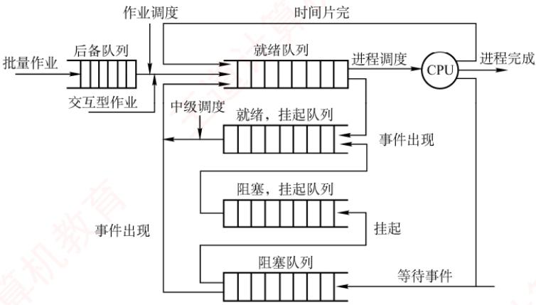
</div>

<p align="center"><em>图 2.8 CPU 的三级调度</em></p>

##### （2）中级调度（内存调度）

　　中级调度的引入旨在提高内存利用率和系统吞吐量。当系统内存紧张时，它会将某些暂时无法运行的进程（如处于阻塞态且等待时间较长的进程）换出到外存，此时的进程状态称为挂起态。此后，当这些进程具备运行条件且内存有空闲时，中级调度再将其换入内存，恢复为就绪态，并加入就绪队列等待调度。中级调度实际上是存储器管理中的对换功能。

##### （3）低级调度（进程调度）

　　低级调度按照特定算法从就绪队列中选择一个进程，将CPU分配给它。这是最基础、最频繁的一级调度，在所有操作系统中都必须存在。其调度频率很高，通常每几十毫秒执行一次。

#### 3. 三级调度的联系

　　在三级调度体系中，进程调度是最基本且不可或缺的，而作业调度和中级调度则根据系统类型和设计目标选择性配置。三级调度协同工作，共同完成作业从提交到终止的全过程：

1）作业调度为进程活动做准备，将作业调入内存并创建进程，使其具备参与调度的资格。

2）中级调度起调节作用，通过将暂时无法运行的进程换出至外存（挂起态），或在条件满足时将其重新换入内存（恢复为就绪态），动态调整内存中活跃进程的数量。

3）进程调度驱动实际执行，从就绪队列中选择进程投入运行，是实现并发的核心机制。

4）调度频率依次升高：作业调度频率最低，中级调度次之，进程调度频率最高。

### 2.2.2 进程调度

#### 1. 进程调度任务

　　进程调度的任务主要包括：

　　① 保存 CPU 现场信息。调度发生时，需要将当前进程的 CPU 状态（如程序计数器、通用寄存器等）完整保存至其 PCB 中，以确保后续能从断点恢复执行。

　　② 选取待运行进程。调度程序依据特定算法（如时间片轮转、优先级调度等），从就绪队列中选取一个进程，将其状态由“就绪态”改为“运行态”。

　　③ 完成 CPU 分配。由分派程序将选中进程 PCB 中保存的 CPU 现场加载到处理器寄存器中，移交 CPU 控制权，使其从上次断点处恢复执行。

#### 2. 调度程序（调度器）

　　用于实现 CPU 调度与分派的软件组件称为调度程序，它通常由三部分组成，如图 2.9 所示。

<div align="center">
  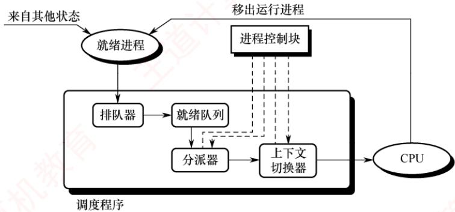
</div>

<p align="center"><em>图 2.9 调度程序的结构</em></p>

1）排队器。将系统中所有就绪进程按照特定策略组织成一个或多个就绪队列。每当有进程转换为就绪态时，排队器便将其插入相应的就绪队列，为后续调度选择提供基础。

2）分派器。根据调度算法选定的进程，分派器负责执行实际的 CPU 分配操作，其主要任务包括：从就绪队列中移出目标进程、触发上下文切换，并将 CPU 控制权转交给该进程。

3）上下文切换器。在对 CPU 进行切换时，会发生两对上下文的切换操作：第一对，将当前进程的上下文保存到其 PCB 中，再装入分派程序的上下文，以便分派程序运行；第二对，移出分派程序的上下文，将新选进程的 CPU 现场信息装入 CPU 的各个相应寄存器。

　　上下文切换需要执行大量 load 和 store 指令以保存寄存器内容，因此开销较大。目前已有硬件实现的方法来减少上下文切换时间。通常采用两组寄存器，一组供内核使用，另一组供用户使用。这样，在上下文切换时只需改变指针，使其指向当前所需的寄存器组即可。

#### 3. 调度的时机、切换与过程

　　调度程序是操作系统内核程序。只有当请求调度的事件发生后，才会运行调度程序；而在调度出新的就绪进程之后，才会进行进程切换。理论上，这三个步骤应按顺序执行，但在实际的操作系统内核运行中，即使发生了引发调度的条件，也不一定能够立即进行调度与切换。

> **考点追踪：** 可以进行CPU调度的事件或时机（2012、2021）

　　现代操作系统中，通常在以下情况下需要进行进程调度与切换：

1）创建新进程后，父进程和子进程都处于就绪态，因此需要决定是运行父进程还是子进程，调度程序可以合法地选择其中一个先运行。

2）进程正常结束或异常终止后，必须从就绪队列中选择某个进程运行；若没有就绪进程，则通常运行一个系统提供的闲逛进程。

3）当进程因 I/O 请求、信号量操作或其他原因而被阻塞时，必须调度其他进程运行。

4）当 I/O 设备准备就绪后，发出 I/O 中断，原先等待 I/O 的进程由阻塞态转换为就绪态，此时需决定是让该新就绪进程投入运行，还是让中断发生时正在运行的进程继续执行。

　　此外，在支持抢占的系统中，若更高优先级的进程进入就绪队列，或当前进程的时间片用完，也会触发调度并可能剥夺当前进程的 CPU。

　　进程切换通常紧随调度之后发生，其核心任务是保存原进程的执行现场，并恢复新进程的现场。具体而言，操作系统内核会将原进程的上下文（包括程序计数器、寄存器状态等）保存到其 PCB 或内核栈中；随后，从新进程的 PCB 或内核栈中加载其上下文，更新地址空间相关信息（如页表基址），重置程序计数器，并开始执行新进程。

　　然而，在以下情况下不能进行进程调度与切换：

1）处理中断的过程中。中断处理逻辑复杂，实现上难以安全地进行进程切换；同时，中断处理属于系统内核工作，逻辑上不隶属于任何用户进程，不应被剥夺 CPU 资源。

2）执行原子操作的过程中。如加锁、解锁、中断现场的保护与恢复等操作，通常需要屏蔽中断以保证原子性。在此期间，连中断都被禁止，更不应进行进程调度与切换。

　　若在上述不可调度期间发生了调度条件，系统会设置一个调度请求标志，待当前临界区或中断处理完成后，再根据该标志执行相应的调度与切换操作。

#### 4. 进程调度的方式

　　所谓进程调度方式，是指当某个进程正在 CPU 上执行时，若有某个更为重要或紧迫的进程需要处理，即有优先级更高的进程进入就绪队列，此时系统应如何分配 CPU。

　　通常有以下两种进程调度方式：

1）非抢占调度方式，也称非剥夺方式。指当一个进程正在 CPU 上执行时，即使有某个更为重要或紧迫的进程进入就绪队列，系统仍让当前进程继续执行，直到该进程运行完成（例如正常结束或异常终止），或者因发生某种事件（如等待 I/O 操作、在进程通信或同步中执行了 Block 原语）而主动进入阻塞态，此时才会将 CPU 分配给其他进程。

　　非抢占调度方式的优点是实现简单、系统开销小，适用于早期的批处理系统；但它无法满足分时系统和大多数实时系统对及时响应的要求。

2）抢占调度方式，也称剥夺方式。指当一个进程正在 CPU 上执行时，若出现更高优先级的就绪进程，调度程序可依据一定策略暂停当前进程，将 CPU 分配给更紧迫的进程。

　　抢占调度方式对提高系统吞吐率和响应效率都有明显好处。但“抢占”并不是一种任意的行为，必须遵循一定的原则，主要有优先级、短进程优先和时间片原则等。

#### 5. 闲逛进程

　　当进程切换发生时，若系统中没有就绪进程，操作系统会调度闲逛进程（Idle Process）运行，它的 PID 为 0。闲逛进程的优先级最低，仅在无其他就绪进程时运行；一旦有新进程进入就绪队列，它会立即让出 CPU。其主要任务是在空闲循环中不断检测中断请求。

　　闲逛进程不占用除 CPU 外的其他系统资源，也不会因等待事件而被阻塞。

#### 6. 两种线程的调度

1）用户级线程调度。由于内核并不知道线程的存在，因此内核仍以进程为单位进行调度，将 CPU 时间分配给整个进程。当内核将 CPU 分配给某进程后，由该进程内部的用户级线程库决定具体运行哪个线程。线程切换在同一进程内完成，仅需保存少量寄存器状态，开销极小。但缺点是：若一个线程执行阻塞操作（如 I/O），整个进程都会被阻塞。

2）内核级线程调度。内核直接感知并管理每个线程，调度时选择的是特定线程，而非进程。每个线程拥有独立的内核上下文，可被单独赋予时间片；若时间片用完或被更高优先级线程抢占，则该线程会被强制挂起。由于涉及完整的上下文切换、地址空间更新（在跨进程线程间）以及可能的TLB刷新和缓存失效，其切换开销远高于用户级线程，通常高出数倍。

### 2.2.3 调度的目标

　　不同的调度算法具有不同的特性，因此在选择调度算法时，必须考虑其适用场景与性能表现。为了客观比较CPU调度算法的优劣，人们提出了多种衡量标准，下面介绍主要的几种：

> **考点追踪：** 作业执行的相关计算（2012、2016、2018、2019、2023、2024）

1）CPU 利用率。CPU 是计算机系统中最重要且昂贵的资源之一，应尽可能使其保持 “忙碌” 状态，以提高资源利用效率。其计算公式为

　　CPU 利用率 = CPU 有效工作时间/(CPU 有效工作时间 + CPU 空闲等待时间)

> **注意**

　　在计算作业完成时间时，需注意 CPU 与 I/O 设备之间、以及不同 I/O 设备之间可以并行执行。

2）系统吞吐量。表示单位时间内系统完成的作业数量。长作业因占用较多 CPU 时间，会降低系统的吞吐量；而短作业所需 CPU 时间较少，有助于提升吞吐量。不同的调度算法对系统吞吐量有显著影响。

3）周转时间。指从作业提交到作业完成所经历的总时间，包括作业等待、在就绪队列中排队、在 CPU 上执行以及进行 I/O 操作等所有阶段的时间之和。其计算公式为

$$
\mathrm{周转时间} = \mathrm{作业完成时间} - \mathrm{作业提交时间}
$$

　　对于 n 个作业，平均周转时间定义为

$$
\text { 平均周转时间 } = (\text { 作业 } 1 \text { 的周转时间 } + \dots + \text { 作业 } n \text { 的周转时间 }) / n
$$

　　带权周转时间用于衡量作业的相对等待程度，其定义为

$$
\mathrm{带权周转时间} = \mathrm{作业周转时间} / \mathrm{作业实际运行时间}
$$

　　相应地，平均带权周转时间定义为

$$
\text {平均带权周转时间} = (\text {作业} 1 \text {的带权周转时间} + \dots + \text {作业} n \text {的带权周转时间}) / n
$$

4）等待时间。等待时间是指进程在就绪队列中等待 CPU 的总时间。等待时间越长，响应延迟越高，满意度越低。CPU 调度算法并不影响作业的实际执行时间或 I/O 操作时间，仅影响其在就绪队列中的等待时长。因此，在评估调度算法时，等待时间常被作为一项核心指标。

5）响应时间。响应时间是指从用户提交请求到系统首次产生响应所经历的时间。在交互式系统中，用户更关注快速反馈，而非作业整体完成时间，因此响应时间通常比周转时间更具实际意义。理想的调度策略应尽可能缩短响应时间，使其处于用户可接受的范围之内。

　　需要强调的是, 不存在一种调度算法能同时满足所有用户需求和系统目标。设计调度程序时, 一方面要满足特定应用场景的要求（如实时任务的快速响应、交互式进程的低延迟），另一方面也要兼顾系统整体效率（如降低平均周转时间），同时还需考虑调度算法自身的实现开销。

### 2.2.4 进程切换

> **考点追踪：** 进程调度前后 CPU 模式的变化（2023）

　　对通常的进程而言，其创建、撤销以及请求由系统设备完成的 I/O 操作，都是通过系统调用进入内核，再由内核中的相应处理程序予以完成的。进程切换同样是在内核的支持下实现的，因此可以说，任何进程都是在操作系统内核的支持下运行的，是与内核紧密相关的。

##### （1）上下文切换

> **考点追踪：** 进程的上下文切换（2024、2025）

　　将 CPU 切换到另一个进程，需保存当前进程的状态，并恢复另一个进程的状态，这个任务称为上下文切换。进程上下文由其 PCB 表示，包括 CPU 寄存器的值、进程状态、内存管理信息等。当进行上下文切换时，内核将旧进程的状态保存在其 PCB 中，然后加载经调度而要执行的新进程的上下文。在切换过程中，进程的运行环境发生实质性的变化。上下文切换的流程如下。

1）挂起当前进程，将其 CPU 上下文保存到其 PCB 中。

2）将该进程的 PCB 移入相应的队列，例如就绪队列，或因等待某事件而进入的阻塞队列。

3）选择另一个进程执行，并更新其PCB中的相关信息。

4）恢复新进程的 CPU 上下文。

5）跳转到新进程PCB中的程序计数器所指向的位置，开始执行该进程。

##### （2）上下文切换的消耗

　　上下文切换是一项开销较大的操作，需要执行大量寄存器的保存与恢复指令。尽管单次切换所需的时间仅为微秒量级，但在高负载系统中，若每秒发生数十甚至上百次切换，则累积的 CPU 时间消耗将十分可观。为减少这一开销，某些处理器架构提供多个寄存器组，通过切换寄存器组指针即可完成上下文切换；但大多数通用处理器仍需完整保存和恢复寄存器状态。

##### （3）上下文切换与模式切换

　　模式切换（用户态和内核态之间的切换）与上下文切换是两个不同的概念。模式切换发生在同一进程内部，如用户进程因系统调用或中断进入内核态执行，完成后返回用户态继续执行该进程。此过程中，当前进程并未改变，因此不涉及上下文切换。而上下文切换则意味着从一个进程切换到另一个进程，必须保存旧进程的上下文并恢复新进程的上下文。由于该操作涉及内核数据结构（如PCB）的访问与修改，上下文切换只能由内核完成，且整个切换过程运行在内核态。

> **注意**

　　调度和切换的区别：调度是决策行为，即决定将 CPU 分配给哪个进程；切换是执行行为，即实际完成 CPU 控制权的转移。通常，先由调度程序做出调度决策，随后触发上下文切换以实现该决策。

### 2.2.5 CPU 调度算法

> **考点追踪：** 各种调度算法的特点与对比（2009、2011、2014）

　　操作系统中存在多种调度算法，有的适用于作业调度，有的适用于进程调度，也有的两者均可适用。下面介绍几种常用的调度算法。

#### 1. 先来先服务（FCFS）调度算法

　　FCFS 调度算法是一种最简单的调度算法，既可用于作业调度，也可用于进程调度。

> **考点追踪：** FCFS调度算法的思想（2017）

　　在作业调度中，FCFS 算法每次从后备作业队列中选择最早进入该队列的一个或多个作业，将它们调入内存，分配必要的资源，创建相应的进程，并放入就绪队列。

　　在进程调度中，FCFS 算法每次从就绪队列中选择最早进入该队列的进程，将 CPU 分配给它，使其投入运行，直到该进程运行完成，或因某种原因而进入阻塞态，此时才会交出 CPU。

> **考点追踪：** 批处理系统中作业完成时间的分析（2012、2016）

　　下面用一个实例来说明 FCFS 算法的性能。假设系统中有 4 个作业，它们的提交时间分别是 8.0、8.4、8.8 和 9.0，运行时间依次为 2、1、0.5 和 0.2。若系统采用 FCFS 算法，则这组作业的平均等待时间、平均周转时间和平均带权周转时间如表 2.2 所示。

　　FCFS 算法属于非抢占式算法。从表面上看，它对所有作业都是公平的；但若一个长作业先到达系统，则会导致后续的许多短作业长时间等待，因此它不适合作为分时系统和实时系统的主要调度策略。不过，FCFS 算法常被结合到其他调度策略中使用。例如，在采用优先级调度的系统中，对于多个具有相同优先级的进程，通常按照 FCFS 的原则进行调度。

　　FCFS 算法的特点是实现简单，但效率较低。它对长作业较为有利，而对短作业相对不利（与 SJF 或高响应比优先调度算法相比）。此外，它更有利于 CPU 繁忙型作业；而对于 I/O 繁忙型作业，由于其运行过程中会频繁发起 I/O 请求并进入阻塞状态，本可及时让出 CPU 以提高系统并发性，但在 FCFS 调度下，若排在长作业之后，则仍需长时间等待，难以发挥其优势。

　　表 2.2 FCFS 调度算法的性能

　　<table><tr><td>作业号</td><td>提交时间</td><td>运行时间</td><td>开始时间</td><td>等待时间</td><td>完成时间</td><td>周转时间</td><td>带权周转时间</td></tr><tr><td>1</td><td>8</td><td>2</td><td>8</td><td>0</td><td>10</td><td>2</td><td>1</td></tr><tr><td>2</td><td>8.4</td><td>1</td><td>10</td><td>1.6</td><td>11</td><td>2.6</td><td>2.6</td></tr><tr><td>3</td><td>8.8</td><td>0.5</td><td>11</td><td>2.2</td><td>11.5</td><td>2.7</td><td>5.4</td></tr><tr><td>4</td><td>9</td><td>0.2</td><td>11.5</td><td>2.5</td><td>11.7</td><td>2.7</td><td>13.5</td></tr></table>

　　平均等待时间 $t = (0 + 1.6 + 2.2 + 2.5) / 4 = 1.575$ ；平均周转时间 $T = (2 + 2.6 + 2.7 + 2.7) / 4 = 2.5$ ；平均带权周转时间 $W = (1 + 2.6 + 5.4 + 13.5) / 4 = 5.625$ 。

#### 2. 短作业优先（SJF）调度算法

> **考点追踪：** SJF 调度算法的思想（2017）

　　短作业优先（SJF）调度算法是一种按照作业或进程的预计运行时间进行调度的策略。

　　在作业调度中，SJF 算法从后备作业队列中选择一个或多个估计运行时间最短的作业，将它们调入内存，分配资源并创建进程。

　　在进程调度中，该策略称为短进程优先（SPF），即从就绪队列中选择估计运行时间最短的进程，将 CPU 分配给它，使其立即执行，直至完成，或因某种事件而阻塞时才释放 CPU。

　　例如，考虑与表 2.2 中示例相同的一组作业，若系统采用 SJF 调度算法，则这组作业的平均等待时间、平均周转时间和平均带权周转时间如表 2.3 所示。

　　表 2.3 SJF 调度算法的性能

　　<table><tr><td>作业号</td><td>提交时间</td><td>运行时间</td><td>开始时间</td><td>等待时间</td><td>完成时间</td><td>周转时间</td><td>带权周转时间</td></tr><tr><td>1</td><td>8</td><td>2</td><td>8</td><td>0</td><td>10</td><td>2</td><td>1</td></tr><tr><td>2</td><td>8.4</td><td>1</td><td>10.7</td><td>2.3</td><td>11.7</td><td>3.3</td><td>3.3</td></tr><tr><td>3</td><td>8.8</td><td>0.5</td><td>10.2</td><td>1.4</td><td>10.7</td><td>1.9</td><td>3.8</td></tr><tr><td>4</td><td>9</td><td>0.2</td><td>10</td><td>1</td><td>10.2</td><td>1.2</td><td>6</td></tr></table>

　　平均等待时间 $t=(0+2.3+1.4+1)/4=1.175$ ; 平均周转时间 $T=(2+3.3+1.9+1.2)/4=2.1$ ;
平均带权周转时间 $W=(1+3.3+3.8+6)/4=3.525$ 。

　　尽管SJF算法在某些指标上表现优异，但它也存在不容忽视的缺点：

> **考点追踪：** 饥饿现象的含义（2016）

1）对长作业不利。由表2.2与表2.3可知，在SJF调度下，长作业的周转时间明显增加。更严重的是，若一个长作业进入系统的后备队列，而此后不断有新的短作业到达，调度程序将总是优先调度这些短作业，导致长作业长期得不到服务，从而产生饥饿现象（注意：饥饿是由于调度策略导致的无限期等待，与死锁中的环形等待有本质区别）。

2）未考虑作业的紧迫程度。该算法仅依据运行时间长短进行调度，完全忽略了作业的截止时间或紧急性，因此无法保证紧迫性作业被及时处理。

3）作业的“长短”由用户提交的估计值决定，而用户可能有意或无意地低估其作业的实际运行时间，以获取调度优势，从而使算法难以真正实现“短作业优先”的目标。

　　SPF 算法既可以是非抢占式的（默认情况），也可以是抢占式的。在抢占式版本中，当一个新进程到达就绪队列时，若其估计运行时间比当前进程的剩余执行时间更短，则立即暂停当前进程，将 CPU 分配给新进程。这种抢占式策略也称最短剩余时间优先调度算法。

> **注意**

　　当所有作业同时到达且运行时间已知时，SJF算法的平均等待时间和平均周转时间是最优的。

#### 3. 高响应比优先调度算法

　　高响应比优先调度算法主要用于作业调度，是对FCFS算法和SJF算法的一种综合平衡。它在调度决策时同时考虑每个作业的等待时间和估计运行时间。在每次进行作业调度时，系统首先计算后备作业队列中每个作业的响应比，然后选择响应比最高的作业调入内存并执行。

　　响应比的计算公式为

$$
\text {响应比} = (\text {等待时间} + \text {估计运行时间}) / \text {估计运行时间}
$$

　　由该公式可知：① 当作业的等待时间相同时，估计运行时间越短，响应比越高，因此有利于短作业，这与 SJF 算法的特性相似。② 当估计运行时间相同时，响应比由等待时间决定，等待时间越长，响应比越高，这体现了 FCFS 调度的公平性。③ 对于长作业，其响应比会随着等待时间的增加而不断提高。当等待时间足够长时，即使估计运行时间较长，其响应比也可能超过其他作业，从而被调度执行。这一机制有效避免了长作业因长期得不到服务而产生的饥饿现象。

#### 4. 优先级调度算法

> **考点追踪：** 优先级调度算法的应用分析（2025）

　　优先级调度算法通过为每个作业或进程分配一个优先级，以反映其紧迫程度。

　　在作业调度中，优先级调度算法每次从后备作业队列中选择优先级最高的一个或多个作业，将它们调入内存，分配资源并创建进程。

　　在进程调度中，该算法每次从就绪队列中选择优先级最高的进程，将CPU分配给它，使其投入运行。

　　根据是否允许抢占，优先级调度算法可分为以下两类：

> **考点追踪：** 非抢占式优先级调度算法的应用分析（2018）

1）非抢占式优先级调度算法。当一个进程正在 CPU 上运行时，即使有更高优先级的进程进入就绪队列，系统仍允许当前进程继续执行，直到其因自身原因（如任务完成或等待事件）而让出 CPU 时，此时将 CPU 分配给就绪队列中优先级最高的进程。

> **考点追踪：** 抢占式优先级调度算法的应用分析（2022、2023）

2）抢占式优先级调度算法。当一个进程正在 CPU 上运行时，若有更高优先级的进程进入就绪队列，系统将立即暂停当前进程，将 CPU 分配给优先级更高的进程。

　　此外，根据进程创建后其优先级是否可变，优先级又可分为静态与动态两类：

> **考点追踪：** 静态优先级和动态优先级的分析（2016）

1）静态优先级。优先级在进程创建时确定，并在其整个运行期间保持不变。确定静态优先级的主要依据包括：进程类型、对资源的需求、用户指定的优先级等。优点是实现简单，系统开销小；缺点是不够灵活，可能出现低优先级进程长期得不到调度的饥饿现象。

> **考点追踪：** 调整进程优先级的合理时机（2010）

2）动态优先级。进程创建时赋予一个初始优先级，但该优先级会随着进程的推进或等待时间的增加而动态调整，以获得更好的调度效果。例如，规定优先级随等待时间的增加而提高，这样，即使初始优先级较低的进程，在等待足够长时间后也能获得CPU调度。在实际系统中，进程优先级的设置通常遵循以下原则：

1）系统进程 $>$ 用户进程。系统进程负责管理核心资源和服务，通常被赋予更高的优先级。

2）交互型进程 $>$ 非交互型进程（或前台进程 $>$ 后台进程）。交互型进程需要快速响应用户输入，因此应优先调度，以保证良好的用户体验。

> **考点追踪：** 进程优先级的设置：I/O型和计算型（2013）

3）I/O 型进程 > 计算型进程。I/O 型进程指频繁进行 I/O 操作的进程，而计算型进程主要消耗 CPU 时间，很少使用 I/O 设备。我们知道，I/O 设备（如打印机）的处理速度远低于 CPU，因此若将 I/O 型进程的优先级设置得更高，就能让它尽快获得 CPU 并启动 I/O 操作，使 I/O 设备尽早开始工作，进而提高系统整体吞吐量。

#### 5. 时间片轮转（RR）调度算法

> **考点追踪：** 时间片轮转调度算法的原理（2021、2024）

　　时间片轮转（RR）调度算法主要适用于分时系统，其最大特点是公平性。系统将所有就绪进程按 FCFS 的原则组织成一个就绪队列。每隔固定的时间间隔（称为时间片，例如 30 ms），系统会产生一次时钟中断，激活调度程序，将 CPU 分配给就绪队列的队首进程，并允许其执行一个时间片。当该进程执行完一个时间片后，即使尚未运行完毕，也必须被剥夺 CPU，并重新放入就绪队列的末尾，等待下一次调度；而下一个队首进程则获得 CPU 的使用权。

　　RR 算法的调度时机: ① 若当前进程在时间片结束前已运行完成, 则调度程序会立即被激活, 进行进程切换; ② 若时间片用尽, 则由时钟中断处理程序触发调度程序, 完成上下文切换。

> **考点追踪：** 时间片轮转调度算法的特点（2017）

　　在 RR 算法中，时间片的大小对系统性能有显著影响。时间片过大，大到足以让每个进程在一个时间片内完成运行时，RR 算法将退化为 FCFS 算法，无法满足短作业和交互式用户对快速响应的需求；时间片过小时，虽然部分短作业可能在一个时间片内完成，但会导致系统频繁进行进程调度和上下文切换，大幅增加系统开销，真正用于执行用户程序的 CPU 时间反而减少。

　　因此，时间片的长度应合理设置，在响应速度与运行效率之间取得平衡。通常，其取值需综合考虑以下因素：系统的期望响应时间、就绪队列中的进程数量以及系统的处理能力。特别地，在交互式系统中，常以“典型交互”作为参考基准，例如，用户在文本编辑器中输入一个字符，或在终端中按下回车键，这类操作通常只需几十至上百毫秒即可完成。一个较为合理的时间片大小，应略长于一次典型交互所需的时间，这样既能确保大多数交互式进程在单个时间片内完成处理、获得流畅的响应体验，又能有效控制上下文切换频率，避免不必要的系统开销。

#### 6. 多级队列调度算法

　　前述的各种调度算法通常只设置一个就绪队列，采用固定且单一的调度策略，难以满足系统中不同类型进程对调度的不同需求。例如，交互型进程要求快速响应，而批处理进程更关注吞吐量和资源利用率。为兼顾这些差异，多级队列调度算法被提出。

　　该算法将系统中的就绪进程划分为多个独立的就绪队列，每个队列对应一类具有相似特性的进程（如系统进程、交互型进程、批处理进程等）。每个队列可独立采用适合其特性的调度算法：例如，交互型队列常使用 RR 算法以保证响应性，而批处理队列可采用 FCFS 算法或 SJF 算法以提高吞吐量。更重要的是，各队列本身具有不同的优先级。调度时，系统总是优先调度高优先级队列中的进程；只有当所有高优先级队列均为空时，才会调度低优先级队列中的进程。这种机制确保了关键任务（如系统服务或用户交互）能够及时获得 CPU 资源。

#### 7. 多级反馈队列调度算法（融合了前几种算法的优点）

> **考点追踪：** 多级反馈队列调度算法的应用分析（2019）

　　多级反馈队列调度算法是时间片轮转调度算法与优先级调度算法的综合与发展（见图2.10）。

<div align="center">
  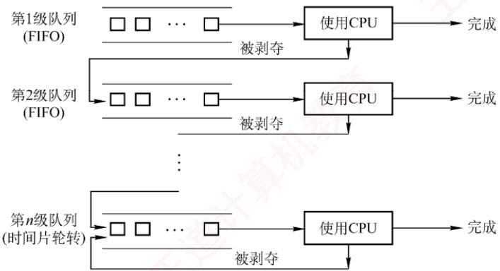
</div>

<p align="center"><em>图 2.10 多级反馈队列调度算法</em></p>

　　通过动态调整进程所处的队列（优先级）和对应的时间片大小，该算法能够兼顾系统的多种目标：既有利于短进程，可提高吞吐量并缩短平均周转时间，又有利于 I/O 型进程以提升设备利用率和响应速度，同时无须事先知道进程的运行时间。

> **考点追踪：** 多级反馈队列调度算法的实现思想（2020）

　　多级反馈队列调度算法的实现机制如下。

1）设置多个就绪队列。为每个队列赋予不同的优先级，第1级队列优先级最高，第2级次之，其余队列优先级依次降低。该算法为各级队列分配不同的时间片，优先级越高的队列，时间片越小。例如，第 $i + 1$ 级队列的时间片长度通常是第 $i$ 级的2倍。

2）每个队列内部采用时间片轮转（RR）调度。新进程创建后，首先被放入第1级队列的末尾。当轮到该进程执行时：若其在当前时间片内完成，则终止并退出系统；若时间片用完仍未完成，则被移至下一级（优先级更低）队列的末尾，等待后续调度。这一过程持续进行，直至进程在某一级队列中完成。通常，最低优先级队列（如第 $n$ 级）的时间片较长，其行为接近FCFS，但仍采用时间片轮转以保证公平性。

3）按队列优先级调度。调度程序总是优先调度最高优先级队列中的进程执行。具体而言：仅当第1级队列为空时，才调度第2级队列中的进程；仅当第 $1\sim i - 1$ 级队列均为空时，才会调度第 $i$ 级队列中的进程。此外，由于新进程总是首先进入第1级队列，因此若当前正在执行的是低优先级队列中的进程，而有新进程进入系统，则系统将立即抢占当前进程，将其放回原队列末尾，同时将 CPU 分配给新的高优先级进程。

　　多级反馈队列调度算法的优势主要体现在以下场景中：

1）交互型（终端型）用户：进程通常较短且频繁进行 I/O，能在高优先级队列中快速完成。

2）短批处理作业用户：因优先级高、时间片小，可迅速执行完毕，周转时间较短。

3）长批处理作业用户：虽最终降至低优先级队列，但已在高优先级队列中获得部分 CPU 时间，不会因长期得不到调度而产生饥饿现象，最终仍能完成。

#### 8. 基于公平原则的调度算法

　　前面介绍的调度算法主要关注响应时间、吞吐量或周转时间等性能指标，但通常未将调度公平性作为主要设计目标。本节介绍两种以公平性为核心目标的调度算法。

##### （1）保证调度算法

　　保证调度算法并不以 “优先运行” 为目标，而是为每个进程提供可量化的 CPU 时间分配保证。例如，在包含 n 个并发进程的系统中，每个进程应获得约 1/n 的 CPU 时间。调度器通过动态跟踪各进程的实际 CPU 使用情况，并据此调整调度顺序，以逐步逼近这一公平目标。

　　为实现这一目标，系统需具备以下功能：

1）跟踪每个进程自创建以来已获得的 CPU 时间。

2）计算每个进程应获得的 CPU 时间，即自进程创建以来的时间除以 n。

3）计算每个进程的公平比率，即实际获得的 CPU 时间与应获得的 CPU 时间之比。若比率小于 1，则表示未达应得份额；若比率大于 1，则表示超额占用。

4）调度程序应选择当前比率最小的进程，将CPU分配给它，并让它一直运行，直到它的比率超过最接近它的进程的比率为止。

##### （2）公平分享调度算法

　　保证调度算法对进程公平，但未必对用户公平。假设各用户拥有的进程数不同，如用户1启动4个进程，而用户2仅启动1个进程，采用RR调度，那么对每个进程而言很公平，但用户1将获得80%的CPU时间，而用户2仅获得20%的CPU时间，显然对用户2有失公平。

　　公平分享调度算法则保证每个用户获得相同的 CPU 时间，或按所要求的比例分配。在这种方式下，不论用户启动多少进程，都能确保其获得应得的 CPU 份额。例如，系统中有两个用户，用户 1 拥有 4 个进程 A、B、C 和 D，用户 2 仅拥有 1 个进程 E，若采用 RR 调度，为保证两个用户获得相同的 CPU 时间，可采用如下调度序列：

　　`AEBECEDEAEBECEDE ...`

　　若用户 1 应获得的 CPU 时间是用户 2 的两倍，则可采用如下调度序列：

　　`ABECDEABECDE…`

　　这类调度策略通过按用户权重分配调度机会，从而在用户层面实现公平性。

　　表 2.4 总结了本章介绍的主要调度算法特性，建议读者在理解的基础上掌握。

　　表 2.4 几种常见进程调度算法的特点

　　<table><tr><td></td><td>先来先服务</td><td>短作业优先</td><td>高响应比优先</td><td>时间片轮转</td><td>多级反馈队列</td></tr><tr><td>能否可抢占</td><td>否</td><td>可以</td><td>否</td><td>可以</td><td>队列内算法不一定</td></tr><tr><td>优点</td><td>公平,实现简单</td><td>平均等待时间、平均周转时间最优</td><td>兼顾长短作业</td><td>兼顾长短作业</td><td>兼顾长短作业,有较好的响应时间,可行性强</td></tr><tr><td>缺点</td><td>不利于短作业</td><td>长作业会饥饿,估计时间不易确定</td><td>计算响应比的开销大</td><td>平均等待时间较长,上下文切换浪费时间</td><td>最复杂</td></tr><tr><td>适用于</td><td>无</td><td>批处理系统</td><td>无</td><td>分时系统</td><td>相当通用</td></tr></table>

### 2.2.6 多处理机调度

　　多处理机系统的进程调度比单处理机系统更为复杂，其调度策略与系统结构有关。根据处理机之间的协作方式，多处理机系统主要分为非对称多处理机和对称多处理机两类。

　　非对称多处理机（Asymmetric MultiProcessing，AMP）通常采用主从式架构：一个主 CPU 负责全部调度决策和系统管理，其余从 CPU 仅执行任务而不参与调度。内核一般运行在主 CPU 上，从 CPU 执行由主 CPU 分配的进程。当某个从 CPU 空闲时，会向主 CPU 发送进程请求信号。主 CPU 维护一个全局就绪队列，只要队列非空，便从中取出一个进程分配给请求的从 CPU。该方案实现简单，但主 CPU 需承担所有调度开销，在高负载下容易成为系统性能瓶颈。

　　对称多处理机（Symmetric MultiProcessing，SMP）的所有 CPU 地位对等，均可参与调度。调度程序可将任意就绪进程分配给任意空闲 CPU。本节主要讨论 SMP 系统的调度问题。

#### 1. 亲和性和负载平衡

　　SMP 的调度面临两个核心矛盾：处理器亲和性和负载平衡。

　　当一个进程从一个 CPU 迁移到另一个 CPU 上时，应将第一个 CPU 的缓存设置为无效，然后重新填充第二个 CPU 的缓存。这种操作的代价较高，因此系统应尽量避免将进程从一个 CPU 移到另一个 CPU，而应尽量让一个进程运行在同一个 CPU 上，这称为处理器亲和性。

　　对于 SMP 系统，应尽量保证所有 CPU 的负载平衡（也称负载均衡），以便充分利用多处理机的优势。否则，一个或多个 CPU 会空闲，而其他 CPU 会处于高负载状态，且有一些进程处于等待状态。负载平衡应设法将负载平均分配到 SMP 系统的所有 CPU 上。

　　然而，负载平衡通常会抵消处理器亲和性带来的好处：保持一个进程运行在同一个 CPU 上的好处是可以利用它在该 CPU 的缓存，而将进程从一个 CPU 迁移到另一个 CPU 会失去这个好处。因此，在某些系统中，只有当不平衡达到一定程度后，才会触发进程迁移。

#### 2. 多处理机调度方案

#### 1. 公共就绪队列

　　系统中仅设置一个公共就绪队列，所有 CPU 共享该队列。这种方案能很好地实现负载平衡，因为 CPU 一旦空闲，就会立刻从公共就绪队列中选择一个进程运行。缺点是各进程可能频繁地在不同的 CPU 上切换，处理器亲和性不好。

　　提升处理器亲和性的方法有两种: ① 软亲和, 指由调度程序尽量将一个进程保持在某个 CPU 上运行, 但这个进程也可以迁移到其他 CPU 上。② 硬亲和, 指由用户进程通过系统调用, 主动请求系统将其绑定到固定的 CPU 上。例如, Linux 系统实现了软亲和, 也支持硬亲和的系统调用。

#### 2. 私有就绪队列

　　系统为每个 CPU 设置一个私有就绪队列，当 CPU 空闲时，便从其对应的私有就绪队列中选择一个进程运行。这种方案很好地实现了处理器亲和性，缺点是必须进行负载平衡。

　　平衡负载的方法通常有两种：① 推迁移，指由一个特定的系统程序周期性地检查各 CPU 的负载，若发现不平衡，则从超载 CPU 的就绪队列中“推”出部分进程，迁移到空闲 CPU 的就绪队列，以实现负载平衡。② 拉迁移，指当某个 CPU 负载很低时，主动从超载 CPU 的就绪队列中 “拉” 取部分进程到自己的就绪队列。在实际系统中，推迁移和拉迁移常被结合使用。

### 2.2.7 本节小结

　　本节开头提出的问题的参考答案如下。

#### 1. 为什么要进行CPU调度？

　　若没有 CPU 调度，则必须等到当前运行的进程执行完毕后，下一个进程才能获得 CPU。然而在实际系统中，进程经常需要等待外部设备的输入，而外部设备的速度远低于 CPU。若让 CPU 长时间等待 I/O 完成，将造成极大的资源浪费。引入 CPU 调度后，当运行中的进程因等待 I/O 而阻塞时，系统可将 CPU 分配给其他就绪进程，从而显著提高 CPU 的利用率。简言之，CPU 调度的目的在于高效、合理地管理和分配计算机的软硬件资源。

2）结合本章学习到的调度算法，思考哪些调度算法比较适合分时系统和实时系统。

　　在本节介绍的调度算法中，先来先服务调度算法和短作业优先调度算法均无法保证在限定时间内响应用户请求，因此既不适用于分时系统，也无法满足实时系统对及时性和可预测性的要求。优先级调度算法根据任务的紧急程度赋予不同优先级，对高优先级任务优先服务，尤其适合实时系统（通常需配合抢占机制以确保关键任务及时执行）。高响应比优先调度算法、时间片轮转调度算法以及多级反馈队列调度算法，都能保证每个就绪进程在一定时间内获得 CPU 时间片，并通过轮转方式公平地共享 CPU，因此更适合分时系统。

　　本节主要介绍了 CPU 调度的概念。操作系统主要管理 CPU、内存、文件和设备等资源。当对某类资源的请求超过其可用数量时，就需要进行调度。例如，在单处理器系统中，CPU 只有一个，而请求运行的进程却有多个，因此必须通过 CPU 调度来协调分配。引入调度机制后，随之而来的问题是：如何调度？应优先满足哪些进程？哪些进程需要等待？这正是调度算法所要解决的核心问题；而这些问题的答案，需依据一定的调度准则来确定。调度这一概念贯穿操作系统的始终。读者在后续学习中，还将接触到内存调度、磁盘调度、I/O 调度等多种资源调度问题。将这些调度机制与 CPU 调度进行对比，会发现它们在设计思想上具有异曲同工之妙。

### 2.2.8 本节习题精选

#### 一、单项选择题

01. 中级调度的目的是（）。

- A. 提高 CPU 的效率
- B. 降低系统开销
- C. 提高 CPU 的利用率
- D. 节省内存

02. 进程从创建态转换到就绪态的工作由（）完成。
- A. 进程调度 B. 中级调度 C. 高级调度 D. 低级调度

03. 下列哪些指标是调度算法设计时应该考虑的？（）
I. 公平性 II. 资源利用率 III. 互斥性 IV. 平均周转时间
- A. I、II B. I、II、IV C. I、III、IV D. 全部都是

04. 时间片轮转调度算法是为了（）。

- A. 多个用户能及时干预系统
- B. 使系统变得高效
- C. 优先级较高的进程得到及时响应
- D. 需要CPU时间最少的进程最先做

05. 在单处理器系统中，进程什么时候占用处理器及占用时间的长短是由（）决定的。
- A. 进程相应的代码长度
- B. 进程总共需要运行的时间

- C. 进程特点和进程调度策略 D. 进程完成什么功能

06. 在某单处理器系统中，若此刻有多个就绪态进程，则下列叙述中错误的是（）。
- A. 进程调度的目标是让进程轮流使用处理器
- B. 当一个进程运行结束后，会调度下一个就绪进程运行
- C. 上下文切换是进程调度的实现手段
- D. 处于临界区的进程在退出临界区前，无法被调度

07. 下列内容中，不属于进程上下文的是（）。

- A. 进程现场信息
- B. 进程控制信息
- C. 中断向量
- D. 用户堆栈

08. 下列关于进程上下文切换的叙述中，错误的是（）。
- A. 进程上下文指进程的代码、数据以及支持进程执行的所有运行环境
- B. 进程上下文切换机制实现了不同进程在一个处理器中交替运行的功能
- C. 进程上下文切换过程中必须保存换下进程在切换处的程序计数器的值
- D. 进程上下文切换过程中必须将换下进程的代码和数据从主存保存到磁盘

09. 在支持页式存储管理和多线程技术的系统中，当一个进程中的线程 $\mathrm{T}_{1}$ 切换到同一个进程中的线程 $\mathrm{T}_{2}$ 执行时，操作系统需要执行的操作是（）。
I. 更新程序计数器的值 II. 更新栈基址寄存器的值
III. 更新页基址寄存器的值 IV. 更新进程打开文件表
- A. I、II、III、IV B. II、IV C. I、II D. I、III、IV

10. （）有利于 CPU 繁忙型的作业，而不利于 I/O 繁忙型的作业。
- A. 时间片轮转调度算法    B. 先来先服务调度算法
- C. 短作业（进程）优先调度算法    D. 优先级调度算法

11. 下面有关选择进程调度算法的准则中，不正确的是（）。
- A. 尽快响应交互式用户的请求 B. 尽量提高处理器利用率 C. 尽可能提高系统吞吐量 D. 适当增长进程就绪队列的等待时间

12. 实时系统的进程调度，通常采用（）调度算法。
- A. 先来先服务
- B. 时间片轮转
- C. 抢占式的优先级高者优先
- D. 高响应比优先

13. 支持多道程序设计的操作系统在运行过程中，不断地选择新进程运行来实现 CPU 的共享，但其中（）不是引起操作系统选择新进程的直接原因。
- A. 运行进程的时间片用完
- B. 运行进程出错
- C. 运行进程要等待某一事件发生
- D. 有新进程被创建进入就绪态

14. 进程（线程）调度的时机有（）。
I. 运行的进程（线程）运行完毕 II. 运行的进程（线程）所需资源未准备好 III. 运行的进程（线程）的时间片用完 IV. 运行的进程（线程）自我阻塞 V. 运行的进程（线程）出现错误
- A. II、III、IV和V B. I和III C. II、IV和V D. 全部都是

15. 设有 4 个作业同时到达, 每个作业的执行时间均为 $2 \mathrm{~h}$ , 它们在一台处理器上按单道式运行, 则平均周转时间为 ( )。
- A. 1h B. 5h C. 2.5h D. 8h

16. 若每个作业只能建立一个进程，为了照顾短作业用户，应采用（）；为了照顾紧急作业用户，应采用（）；为了能实现人机交互，应采用（）；而能使短作业、长作业和交互作业用户都满意，应采用（）。

- A. FCFS调度算法
- B. 短作业优先调度算法
- C. 时间片轮转调度算法
- D. 多级反馈队列调度算法E. 剥夺式优先级调度算法

17. （）优先级是在创建进程时确定的，确定之后在整个运行期间不再改变。
- A. 先来先服务 B. 动态 C. 短作业 D. 静态

18. 现在有三个同时到达的作业 $J_{1}, J_{2}$ 和 $J_{3}$ ，它们的执行时间分别是 $T_{1}, T_{2}, T_{3}$ ，且 $T_{1} < T_{2} < T_{3}$ 。系统按单道方式运行且采用短作业优先调度算法，则平均周转时间是（）。

- A. $T_{1} + T_{2} + T_{3}$
- B. $(3T_{1} + 2T_{2} + T_{3})/3$
- C. $(T_{1} + T_{2} + T_{3})/3$
- D. $(T_{1} + 2T_{2} + 3T_{3})/3$

19. 设有三个作业，其运行时间分别是 2h, 5h, 3h，假定它们同时到达，并在同一台处理器上以单道方式运行，则平均周转时间最小的执行顺序是（）。

- A. $J_{1}$ ， $J_{2}$ ， $J_{3}$
- B. $J_{3}$ ， $J_{2}$ ， $J_{1}$
- C. $J_{2}$ ， $J_{1}$ ， $J_{3}$
- D. $J_{1}$ ， $J_{3}$ ， $J_{2}$

20. 采用时间片轮转调度算法分配 CPU 时, 当处于运行态的进程用完一个时间片后, 它的状态是 ( ) 状态。
- A. 阻塞    B. 运行    C. 就绪    D. 消亡

21. 一个作业 8:00 到达系统，估计运行时间为 1h。若 10:00 开始执行该作业，其响应比是（）。

- A. 2
- B. 1
- C. 3
- D. 0.5

22. 关于优先权大小的论述中，正确的是（）。
- A. 计算型作业的优先权，应高于I/O型作业的优先权
- B. 用户进程的优先权，应高于系统进程的优先权
- C. 在动态优先权中，随着作业等待时间的增加，其优先权将随之下降
- D. 在动态优先权中，随着进程执行时间的增加，其优先权降低

23. 下列调度算法中，（）调度算法是绝对可抢占的。
- A. 先来先服务 B. 时间片轮转 C. 优先级 D. 短进程优先

24. 作业是用户提交的，进程是由系统自动生成的，除此之外，两者的区别是（）。
- A. 两者执行不同的程序段
- B. 前者以用户任务为单位，后者以操作系统控制为单位
- C. 前者是批处理的，后者是分时的
- D. 后者是可并发执行，前者则不同

25. 进程调度算法采用固定时间片轮转调度算法，当时间片过大时，就会使时间片轮转调度算法转化为（）调度算法。
- A. 高响应比优先
- B. 先来先服务
- C. 短进程优先
- D. 以上选项都不对

26. 有以下的进程需要调度执行（见下表）：

　　<table><tr><td>进程名</td><td>到达时间/h</td><td>运行时间/h</td></tr><tr><td><eq>P_{1}</eq></td><td>0.0</td><td>9</td></tr><tr><td><eq>P_{2}</eq></td><td>0.4</td><td>4</td></tr><tr><td><eq>P_{3}</eq></td><td>1.0</td><td>1</td></tr><tr><td><eq>P_{4}</eq></td><td>5.5</td><td>4</td></tr><tr><td><eq>P_{5}</eq></td><td>7</td><td>2</td></tr></table>

1）若用非抢占式短进程优先调度算法，问这5个进程的平均周转时间是多少？2）若采用抢占式短进程优先调度算法，问这5个进程的平均周转时间是多少？A. 8.62h; 6.34h B. 8.62h; 6.8h C. 10.62h; 6.34h D. 10.62h; 6.8h

27. 有5个批处理作业A,B,C,D,E几乎同时到达，其预计运行时间分别为10,6,2,4,8，其优先级（由外部设定）分别为3,5,2,1,4，这里5为最高优先级。以下各种调度算法中，平均周转时间为14的是（）调度算法。
- A. 时间片轮转（时间片为1） B. 优先级
- C. 先来先服务（按照顺序10,6,2,4,8） D. 短作业优先

28. 使用抢占式最短剩余时间优先调度算法对下列进程进行调度，总周转时间是（）。

　　<table><tr><td>进程名</td><td>到达时间/h</td><td>运行时间/h</td></tr><tr><td><eq>P_{1}</eq></td><td>0</td><td>3</td></tr><tr><td><eq>P_{2}</eq></td><td>1</td><td>1</td></tr><tr><td><eq>P_{3}</eq></td><td>2</td><td>4</td></tr><tr><td><eq>P_{4}</eq></td><td>3</td><td>5</td></tr><tr><td><eq>P_{5}</eq></td><td>4</td><td>2</td></tr></table>

- A. 25h B. 26h C. 27h D. 28h

29. 假设系统采用多级反馈队列调度算法，系统中设置了三个不同优先级的队列 A、B 和 C，优先级 A > B > C，A 的时间片为 10ms，B 的时间片为 20ms，C 的时间片为 30ms。当 t = 0 时，进程 $P_{1}$ 到达， $P_{1}$ 所需的运行时间为 90ms；当 t = 30ms 时，进程 $P_{2}$ 到达， $P_{2}$ 所需的运行时间为 30ms，不考虑任何其他系统开销，进程 $P_{1}$ 的周转时间为（）。

- A. 90ms
- B. 100ms
- C. 110ms
- D. 120ms

30. 分时操作系统通常采用（）调度算法来为用户服务。
- A. 时间片轮转    B. 先来先服务    C. 短作业优先    D. 优先级

31. 在进程调度算法中，对短进程不利的是（）。

- A. 短进程优先调度算法
- B. 先来先服务调度算法
- C. 高响应比优先调度算法
- D. 多级反馈队列调度算法

32. 假设系统中所有进程同时到达，则使进程平均周转时间最短的是（）调度算法。
- A. 先来先服务 B. 短进程优先 C. 时间片轮转 D. 优先级

33. 多级反馈队列调度算法不具备的特性是（）。

- A. 资源利用率高
- B. 响应速度快
- C. 系统开销小
- D. 并发度高

34. 下列调度算法中，系统开销最小的调度算法是（）。

- A. 高响应比优先调度算法
- B. 多级反馈队列调度算法
- C. 先来先服务调度算法
- D. 时间片轮转调度算法

35. 下列进程调度算法中，可能导致饥饿现象的有（）。
I. 先来先服务调度算法 II. 短作业优先调度算法 III. 优先级调度算法 IV. 时间片轮转调度算法 A. I和II B. II和III C. II、III和IV D. III

36. 与单处理机调度相比，多处理机调度需要额外考虑的调度目标是（）。
I. 负载平衡 II. 处理器亲和性 III. 进程周转时间
- A. I 和 II B. II 和 III C. I 和 III D. I、II 和 III

37. 【2009 统考真题】下列进程调度算法中，综合考虑进程等待时间和执行时间的是（）。A. 时间片轮转调度算法 B. 短进程优先调度算法

- C. 先来先服务调度算法 D. 高响应比优先调度算法

38. 【2010 统考真题】下列选项中，降低进程优先级的合理时机是（）。

- A. 进程时间片用完
- B. 进程刚完成 I/O 操作，进入就绪队列
- C. 进程长期处于就绪队列
- D. 进程从就绪态转换为运行态

39. 【2011 统考真题】下列选项中，满足短作业优先且不会发生饥饿现象的是（）调度算法。
- A. 先来先服务
- B. 高响应比优先
- C. 时间片轮转
- D. 非抢占式短作业优先

40. 【2012 统考真题】一个多道批处理系统中仅有 $P_{1}$ 和 $P_{2}$ 两个作业， $P_{2}$ 比 $P_{1}$ 晚 5ms 到达，它的计算和 I/O 操作顺序如下。 $P_{1}$ ：计算 60ms，I/O 80ms，计算 20ms $P_{2}$ ：计算 120ms，I/O 40ms，计算 40ms
若不考虑调度和切换时间，则完成两个作业需要的时间最少是（）。
- A. 240ms B. 260ms C. 340ms D. 360ms

41. 【2012 统考真题】若某单处理器多进程系统中有多个就绪态进程，则下列关于处理机调度的叙述中，错误的是（）。
- A. 在进程结束时能进行处理机调度
- B. 创建新进程后能进行处理机调度
- C. 在进程处于临界区时不能进行处理机调度
- D. 在系统调用完成并返回用户态时能进行处理机调度

42. 【2013 统考真题】某系统正在执行三个进程 $\mathrm{P}_1, \mathrm{P}_2$ 和 $\mathrm{P}_3$ ，各进程的计算（CPU）时间和 I/O 时间比例如下表所示。

　　<table><tr><td>进程名</td><td>计算时间</td><td>I/O 时间</td></tr><tr><td><eq>P_{1}</eq></td><td>90%</td><td>10%</td></tr><tr><td><eq>P_{2}</eq></td><td>50%</td><td>50%</td></tr><tr><td><eq>P_{3}</eq></td><td>15%</td><td>85%</td></tr></table>

　　为提高系统资源利用率，合理的进程优先级设置应为（）。
- A. $\mathrm{P_1 > P_2 > P_3}$ B. $\mathrm{P_3 > P_2 > P_1}$ C. $\mathrm{P_2 > P_1 = P_3}$ D. $\mathrm{P_1 > P_2 = P_3}$

43. 【2014 统考真题】下列调度算法中，不可能导致饥饿现象的是（）。

- A. 时间片轮转
- B. 静态优先数调度
- C. 非抢占式短任务优先
- D. 抢占式短任务优先

44. 【2016 统考真题】某单 CPU 系统中有输入和输出设备各 1 台，现有 3 个并发执行的作业，每个作业的输入、计算和输出时间均分别为 2ms, 3ms 和 4ms，且都按输入、计算和输出的顺序执行，则执行完 3 个作业需要的时间最少是（）。

- A. 15ms
- B. 17ms
- C. 22ms
- D. 27ms

45. 【2017 统考真题】假设 4 个作业到达系统的时刻和运行时间如下表所示。

　　<table><tr><td>作业号</td><td>到达时刻t</td><td>运行时间</td></tr><tr><td><eq>J_1</eq></td><td>0</td><td>3</td></tr><tr><td><eq>J_2</eq></td><td>1</td><td>3</td></tr><tr><td><eq>J_3</eq></td><td>1</td><td>2</td></tr><tr><td><eq>J_4</eq></td><td>3</td><td>1</td></tr></table>

　　系统在 t = 2 时开始作业调度。若分别采用先来先服务和短作业优先调度算法，则选中的作业分别是（）。A. $\mathrm{J}_2,\mathrm{J}_3$ B. $\mathrm{J}_1,\mathrm{J}_4$ C. $\mathrm{J}_2,\mathrm{J}_4$ D. $\mathrm{J}_1,\mathrm{J}_3$

46. 【2017 统考真题】下列有关基于时间片的进程调度的叙述中，错误的是（）。

- A. 时间片越短，进程切换的次数越多，系统开销越大
- B. 当前进程的时间片用完后，该进程状态由运行态变为阻塞态
- C. 时钟中断发生后，系统会修改当前进程在时间片内的剩余时间
- D. 影响时间片大小的主要因素包括响应时间、系统开销和进程数量等

47. 【2018 统考真题】某系统采用基于优先权的非抢占式进程调度策略，完成一次进程调度和进程切换的系统时间开销为 $1\mu \mathrm{s}$ 。在 $T$ 时刻就绪队列中有3个进程 $\mathrm{P}_1$ 、 $\mathrm{P}_2$ 和 $\mathrm{P}_3$ ，其在就绪队列中的等待时间、需要的CPU时间和优先权如下表所示。

　　<table><tr><td>进程名</td><td>等待时间</td><td>需要的CPU时间</td><td>优先权</td></tr><tr><td><eq>P_{1}</eq></td><td>30μs</td><td>12μs</td><td>10</td></tr><tr><td><eq>P_{2}</eq></td><td>15μs</td><td>24μs</td><td>30</td></tr><tr><td><eq>P_{3}</eq></td><td>18μs</td><td>36μs</td><td>20</td></tr></table>

　　若优先权值大的进程优先获得 CPU，从 T 时刻起系统开始进程调度，则系统的平均周转时间为（）。
- A. 54μs B. 73μs C. 74μs D. 75μs

48. 【2019 统考真题】系统采用二级反馈队列调度算法进行进程调度。就绪队列 $Q_{1}$ 采用时间片轮转调度算法，时间片为 10ms；就绪队列 $Q_{2}$ 采用短进程优先调度算法；系统优先调度 $Q_{1}$ 队列中的进程，当 $Q_{1}$ 为空时系统才会调度 $Q_{2}$ 中的进程；新创建的进程首先进入 $Q_{1}$ ； $Q_{1}$ 中的进程执行一个时间片后，若未结束，则转入 $Q_{2}$ 。若当前 $Q_{1}$ ， $Q_{2}$ 为空，系统依次创建进程 $P_{1}$ ， $P_{2}$ 后即开始进程调度， $P_{1}$ ， $P_{2}$ 需要的 CPU 时间分别为 30ms 和 20ms，则进程 $P_{1}$ ， $P_{2}$ 在系统中的平均等待时间为（）。

- A. 25ms
- B. 20ms
- C. 15ms
- D. 10ms

49. 【2020 统考真题】下列与进程调度有关的因素中，在设计多级反馈队列调度算法时需要考虑的是（）。
I. 就绪队列的数量 II. 就绪队列的优先级
III. 各就绪队列的调度算法 IV. 进程在就绪队列间的迁移条件
- A. 仅 I、II B. 仅 III、IV C. 仅 II、III、IV D. I、II、III 和 IV

50. 【2021 统考真题】在下列内核的数据结构或程序中，分时系统实现时间片轮转调度需要使用的是（）。I. 进程控制块 II. 时钟中断处理程序 III. 进程就绪队列 IV. 进程阻塞队列

- A. 仅 II、III
- B. 仅 I、IV
- C. 仅 I、II、III
- D. 仅 I、II、IV

51. 【2021 统考真题】下列事件中，可能引起进程调度程序执行的是（）。I. 中断处理结束 II. 进程阻塞 III. 进程执行结束 IV. 进程的时间片用完

- A. 仅 I、III
- B. 仅 II、IV
- C. 仅 III、IV
- D. I、II、III 和 IV

52. 【2022 统考真题】进程 $P_{0}$ 、 $P_{1}$ 、 $P_{2}$ 和 $P_{3}$ 进入就绪队列的时刻、优先级（值越小优先权越高）及 CPU 执行时间如下表所示。

　　<table><tr><td>进程名</td><td>进入就绪队列的时刻</td><td>优先级</td><td>CPU执行时间</td></tr><tr><td><eq>P_0</eq></td><td>0ms</td><td>15</td><td>100ms</td></tr><tr><td><eq>P_1</eq></td><td>10ms</td><td>20</td><td>60ms</td></tr><tr><td><eq>P_2</eq></td><td>10ms</td><td>10</td><td>20ms</td></tr><tr><td><eq>P_3</eq></td><td>15ms</td><td>6</td><td>10ms</td></tr></table>

　　若系统采用基于优先权的抢占式进程调度算法，则从 0ms 时刻开始调度，到 4 个进程都运行结束为止，发生进程调度的总次数为（）。
- A. 4 B. 5 C. 6 D. 7

53. 【2023 统考真题】进程 $\mathrm{P_1}$ 、 $\mathrm{P_2}$ 和 $\mathrm{P_3}$ 进入就绪队列的时刻、优先级（值越大优先权越高）和CPU执行时间如下表所示。

　　<table><tr><td>进程名</td><td>进入就绪队列的时刻</td><td>优先级</td><td>CPU执行时间</td></tr><tr><td><eq>P_{1}</eq></td><td>0ms</td><td>1</td><td>60ms</td></tr><tr><td><eq>P_{2}</eq></td><td>20ms</td><td>10</td><td>42ms</td></tr><tr><td><eq>P_{3}</eq></td><td>30ms</td><td>100</td><td>13ms</td></tr></table>

　　若系统采用基于优先权的抢占式 CPU 调度算法，从 0ms 时刻开始进行调度，则 $P_{1}$ 、 $P_{2}$ 和 $P_{3}$ 的平均周转时间为（）。
- A. 60ms B. 61ms C. 70ms D. 71ms

54. 【2024 统考真题】假设某系统使用时间片轮转调度算法进行 CPU 调度，时间片大小为 5ms，系统共有 10 个进程，初始时均处于就绪队列，执行结束前仅处于运行态或就绪态。若队尾的进程 P 所需的 CPU 时间最短，时间为 25ms，不考虑系统开销，则进程 P 的周转时间为（）。

- A. 200ms
- B. 205ms
- C. 250ms
- D. 295ms

55. 【2024 统考真题】在支持页式存储管理的系统中，进程切换时操作系统需要执行的操作是（）。I. 更新程序计数器的值 II. 更新栈基址寄存器的值 III. 更新页表基地址寄存器的值

- A. 仅III
- B. 仅I、II
- C. 仅I、III
- D. I、II、III

56. 【2025 统考真题】在某基于优先权的进程调度程序中，进程就绪队列采用优先权从高到低的有序单链表实现。若就绪队列长度为 n，则就绪队列的插入操作和从就绪队列中选出将要执行进程的操作的时间复杂度分别是（）。

- A. $O(1), O(1)$
- B. $O(1), O(n)$
- C. $O(n), O(1)$
- D. $O(n), O(n)$

57. 【2025 统考真题】在采用页式虚拟存储管理方式的系统中，当发生进程上下文切换时，在下列寄存器中，操作系统不需要更新的是（）。

- A. 通用寄存器
- B. 页表基址寄存器
- C. 程序计数器
- D. 内核中断向量表基址寄存器

#### 二、综合应用题

01. 有一个CPU和两台外设 $\mathrm{D}_1, \mathrm{D}_2$ ，且在能够实现抢占式优先级调度算法的多道程序环境中，同时进入优先级由高到低的 $\mathrm{P}_1, \mathrm{P}_2, \mathrm{P}_3$ 三个作业，每个作业的处理顺序和使用资源的时间如下。 $\mathrm{P}_1: \mathrm{D}_2$ （30ms），CPU（10ms）， $\mathrm{D}_1$ （30ms），CPU（10ms） $\mathrm{P}_2: \mathrm{D}_1$ （20ms），CPU（20ms）， $\mathrm{D}_2$ （40ms） $\mathrm{P}_3: \mathrm{CPU}$ （30ms）， $\mathrm{D}_1$ （20ms）

　　假设忽略不计其他辅助操作的时间,每个作业的周转时间 $T_{1}, T_{2}, T_{3}$ 分别为多少? CPU 和 $D_{1}$ 的利用率各是多少?

02. 有三个作业 A, B, C，它们分别单独运行时的 CPU 和 I/O 占用时间如下图所示。现在请考虑三个作业同时开始执行。系统中的资源有一个 CPU 和两台输入/输出设备 $(\mathrm{I} / \mathrm{O}_1$ 和 $\mathrm{I} / \mathrm{O}_2)$ 同时运行。三个作业的优先级为 A 最高、B 次之、C 最低，一旦低优先级的进程开始占用 CPU 或 I/O 设备，高优先级进程也要等待到其结束后方可占用。

$$
\text {作业A} \begin{array}{c c c c c c c c c} 1 0 & 2 0 & 3 0 & 1 0 & 4 0 & 2 0 & 2 0 \\ \hline \mathrm{I} / \mathrm{O} _ {2} & \mathrm{CPU} & \mathrm{I} / \mathrm{O} _ {1} & \mathrm{CPU} & \mathrm{I} / \mathrm{O} _ {1} & \mathrm{CPU} & \mathrm{I} / \mathrm{O} _ {1} \end{array} \mathrm{ms}
$$

$$
\text {作业B} \quad \begin{array}{c c c c c c} 3 0 & 4 0 & 3 0 & 3 0 & 3 0 \\ \hline \mathrm {I / O_ {1}} & \mathrm{CPU} & \mathrm {I / O_ {2}} & \mathrm{CPU} & \mathrm {I / O_ {1}} \end{array} \mathrm{ms}
$$

$$
\text { 作业C } \quad \begin{array}{c c c c c} & 4 0 & 2 0 & 2 0 & 7 0 \\ \hline & \text { CPU } & \mathrm {I/ O _ {1}} & \text { CPU } & \mathrm {I/ O _ {2}} \end{array} \text { ms }
$$

　　请回答下面的问题:

1）最早结束的作业是哪个？

2）最后结束的作业是哪个？

3）计算这段时间 CPU 的利用率（三个作业全部结束为止）。

03. 某分时系统中的进程可能出现如下图所示的状态变化，请回答下列问题：

1）根据图示，该系统应采用什么进程调度策略？

2）将图中每个状态变化的可能原因填写在下表中。

<div align="center">
  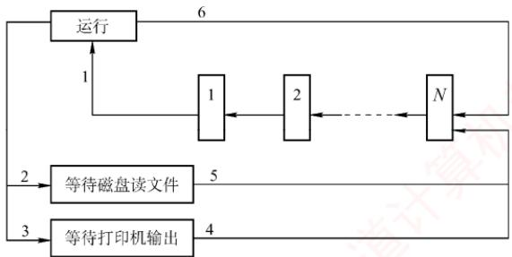
</div>

　　<table><tr><td>变化</td><td>原因</td></tr><tr><td>1</td><td></td></tr><tr><td>2</td><td></td></tr><tr><td>3</td><td></td></tr><tr><td>4</td><td></td></tr><tr><td>5</td><td></td></tr><tr><td>6</td><td></td></tr></table>

04. 假定要在一台处理器上执行下表所示的作业，且假定这些作业在时刻0以1,2,3,4,5的顺序到达。说明分别使用FCFS、RR（时间片 $= 1$ ）、SJF及非剥夺式优先级调度算法时，这些作业的执行情况（优先级的高低顺序依次为1到5）。针对上述每种调度算法，给出平均周转时间和平均带权周转时间。

　　<table><tr><td>作业号</td><td>执行时间</td><td>优先级</td></tr><tr><td>1</td><td>10</td><td>3</td></tr><tr><td>2</td><td>1</td><td>1</td></tr><tr><td>3</td><td>2</td><td>3</td></tr><tr><td>4</td><td>1</td><td>4</td></tr><tr><td>5</td><td>5</td><td>2</td></tr></table>

05. 有一个具有两道作业的批处理系统，作业调度采用短作业优先调度算法，进程调度采用抢占式优先级调度算法。作业的运行情况见下表，其中作业的优先数即进程的优先数，优先数越小，优先级越高。

　　<table><tr><td>作业号</td><td>到达时间</td><td>运行时间</td><td>优先数</td></tr><tr><td>1</td><td>8:00</td><td>40min</td><td>5</td></tr><tr><td>2</td><td>8:20</td><td>30min</td><td>3</td></tr><tr><td>3</td><td>8:30</td><td>50min</td><td>4</td></tr><tr><td>4</td><td>8:50</td><td>20min</td><td>6</td></tr></table>

1）列出所有作业进入内存的时间及结束的时间（以分为单位）。

2）计算平均周转时间。

06. 假设某计算机系统有 4 个进程, 各进程的预计运行时间和到达就绪队列的时刻见下表(相对时间, 单位为 “时间配额”)。试用可抢占式短进程优先调度算法和时间片轮转调度算法进行调度 (时间配额为 2)。分别计算各个进程的调度次序及平均周转时间。

　　<table><tr><td>进程名</td><td>到达就绪队列时刻</td><td>预计运行时间</td></tr><tr><td><eq>P_{1}</eq></td><td>0</td><td>8</td></tr><tr><td><eq>P_{2}</eq></td><td>1</td><td>4</td></tr><tr><td><eq>P_{3}</eq></td><td>2</td><td>9</td></tr><tr><td><eq>P_{4}</eq></td><td>3</td><td>5</td></tr></table>

07. 假设一个计算机系统具有如下性能特征：处理一次中断平均需要 $500 \mu s$ ，一次进程调度平均需要花费 1ms，进程的切换平均需要花费 2ms。若该计算机系统的定时器每秒发出 120 次时钟中断，忽略其他 I/O 中断的影响，请问：

1）操作系统将百分之几的CPU时间分配给时钟中断处理程序？

2）若系统采用时间片轮转调度算法，24个时钟中断为一个时间片，操作系统每进行一次进程的切换，需要花费百分之几的CPU时间？

3）根据上述结果，说明为了提高CPU的使用效率，可以采用什么对策。

08. 设有 4 个作业 $\mathrm{J}_1, \mathrm{J}_2, \mathrm{J}_3, \mathrm{J}_4$ ，它们的到达时间和计算时间见下表。若这 4 个作业在一台处理器上按单道方式运行，采用高响应比优先调度算法，试写出各作业的执行顺序、各作业的周转时间及平均周转时间。

　　<table><tr><td>作业号</td><td>到达时间</td><td>计算时间</td></tr><tr><td><eq>J_{1}</eq></td><td>8:00</td><td>2h</td></tr><tr><td><eq>J_{2}</eq></td><td>8:30</td><td>40min</td></tr><tr><td><eq>J_{3}</eq></td><td>9:00</td><td>25min</td></tr><tr><td><eq>J_{4}</eq></td><td>9:30</td><td>30min</td></tr></table>

09. 在一个有两道作业的批处理系统中，有一作业序列，其到达时间及估计运行时间见下表。系统作业采用最高响应比优先调度算法 [响应比 = (等待时间 + 估计运行时间)/估计运行时间]。进程的调度采用短进程优先的抢占式调度算法。

　　<table><tr><td>作业号</td><td>到达时间</td><td>估计运行时间/min</td></tr><tr><td><eq>J_{1}</eq></td><td>10:00</td><td>35</td></tr><tr><td><eq>J_{2}</eq></td><td>10:10</td><td>30</td></tr><tr><td><eq>J_{3}</eq></td><td>10:15</td><td>45</td></tr><tr><td><eq>J_{4}</eq></td><td>10:20</td><td>20</td></tr><tr><td><eq>J_{5}</eq></td><td>10:30</td><td>30</td></tr></table>

1）列出各作业的执行时间，即列出每个作业运行的时间片段，如作业 i 的运行时间序列为 10:00—10:40，11:00—11:20，11:30—11:50 结束。

2）计算这批作业的平均周转时间。

10. 【2016 统考真题】某个进程调度程序采用基于优先数（priority）的调度策略，即选择优先数最小的进程运行，进程创建时由用户指定一个 nice 作为静态优先数。为了动态调整优先数，引入运行时间 cpuTime 和等待时间 waitTime，初值均为 0。进程处于运行态时，cpuTime 定时加 1，且 waitTime 置 0；进程处于就绪态时，cpuTime 置 0，waitTime 定时加 1。请回答下列问题：

1）若调度程序只将 nice 的值作为进程的优先数，即 priority = nice，则可能出现饥饿现象。为什么？

2）使用 nice, cpuTime 和 waitTime 设计一种动态优先数计算方法，以避免产生饥饿现象，并说明 waitTime 的作用。

### 2.2.9 答案与解析

#### 一、单项选择题

**01. D**

　　中级调度的主要目的是节省内存，将内存中处于阻塞态或长期不运行的进程挂起到外存，从而腾出空间给其他进程使用。当这些进程重新具备运行条件时，再从外存调入内存，恢复运行。

**02. C**

　　进程从创建态转换到就绪态是由高级调度完成的。高级调度（作业调度）的主要任务是从后备队列中选择一个或一批作业，为其创建PCB，分配内存等其他资源，并将其插入就绪队列。

**03. B**

　　设计调度算法时应考虑的指标有很多，比较常见的有公平性、资源利用率、平均周转时间、平均等待时间、平均响应时间。互斥性不是调度算法设计时需要考虑的指标，而是一种同步机制，用来保证多个进程访问临界资源时不会发生冲突。

**04. A**

　　时间片轮转的主要目的是，使得多个交互的用户能够得到及时响应，使得每个用户以为“独占”计算机的使用，因此它并没有偏好，也不会对特殊进程做特殊服务。时间片轮转增加了系统开销，所以不会使得系统高效运转，吞吐量和周转时间均不如批处理。但其较快速的响应时间使得用户能够与计算机进行交互，改善了人机环境，满足用户需求。

**05. C**

　　进程调度的时机与进程特点有关，如进程是 CPU 繁忙型还是 I/O 繁忙型、自身的优先级等。但仅有这些特点是不够的，能否得到调度还取决于进程调度策略，若采用优先级调度算法，则进程的优先级才起作用。至于占用处理器运行时间的长短，则要看进程自身，若进程是 I/O 繁忙型，运行过程中要频繁访问 I/O 端口，即可能频繁放弃 CPU，所以占用 CPU 的时间不会长，一旦放弃 CPU，则必须等待下次调度。若进程是 CPU 繁忙型，则一旦占有 CPU，就可能运行很长时间，但运行时间还取决于进程调度策略，大部分情况下，交互式系统为改善用户的响应时间，大多数采用时间片轮转调度算法，这种算法在进程占用 CPU 达到一定时间后，会强制将其换下，以保证其他进程的 CPU 使用权。因此选择选项 C。

**06. D**

　　处于临界区的进程也可能因中断或抢占而导致调度。此外，若进程在临界区内请求的是一个需要等待的资源，比如打印机，则它主动放弃 CPU，让其他进程运行。

**07. C**

　　当一个进程被执行时，CPU 的所有寄存器中的值（进程的现场信息）、进程的状态和控制信息以及堆栈中的内容被称为该进程的上下文。中断向量不属于进程上下文的一部分，而是一组指向中断处理程序的指针，存放在内存的固定位置。

**08. D**

　　上下文切换发生在操作系统调度一个新进程到处理器上运行的时候。一个重要的上下文信息就是程序计数器（PC）的值，当前进程被打断的 PC 值作为寄存器上下文的一部分保存在进程现场信息中。进程上下文切换过程中不涉及主存和磁盘的数据交换，选项 D 错误。

**09. C**

　　当线程切换时，操作系统需要保存当前线程的程序计数器的值，并恢复新线程的程序计数器，以便从新线程的正确位置开始执行。在多线程条件下，每个线程拥有各自独立的栈，当线程切换时，需要保存当前线程的栈基址寄存器的值，并加载新线程的栈基址，以便正确管理栈空间。同一个进程中的线程共享进程的虚拟地址空间，因此不需要更新页基址寄存器的值。一个进程所打开的文件也是被这个进程中的所有线程共享的，因此不需要更新进程打开文件表。

**10. B**

　　FCFS调度算法比较有利于长作业，而不利于短作业。CPU繁忙型作业是指该类作业需要占用很长的CPU时间，而很少请求I/O操作，因此CPU繁忙型作业类似于长作业，采用FCFS可从容完成计算。I/O繁忙型作业是指作业执行时需频繁请求I/O操作，即可能频繁放弃CPU，所以占用CPU的时间不会太长，一旦放弃CPU，则必须重新排队等待调度，所以采用SJF比较适合。时间片轮转调度算法对于短作业和长作业的时间片都一样，所以地位也几乎一样。优先级调度有利于优先级高的进程，而优先级和作业时间长度是没有必然联系的。因此选择选项B。

**11. D**

　　在选择进程调度算法时应考虑以下几个准则：① 公平：确保每个进程获得合理的 CPU 份额；② 有效：使 CPU 尽可能地忙碌；③ 响应时间：使交互用户的响应时间尽可能短；④ 周转时间：使批处理用户等待输出的时间尽可能短；⑤ 吞吐量：使单位时间处理的进程数尽可能最多。由此可见选项 D 不正确。

**12. C**

　　实时系统必须能足够及时地处理某些紧急的外部事件，因此普遍用高优先级，并用“可抢占”来确保实时处理。

**13. D**

　　操作系统选择新进程的直接原因是当前运行的进程不能继续运行。当运行的进程由于时间片用完、运行结束、出错、需要等待事件的发生、自我阻塞等，均可以激活调度程序进行重新调度，选择就绪队列的队首进程投入运行。新进程加入就绪队列不是引起调度的直接原因，当 CPU 正在运行其他进程时，该进程仍需等待。即使是在采用高优先级调度算法的系统中，一个最高优先级的进程进入就绪队列，也需要考虑是否允许抢占，当不允许抢占时，仍需等待。

**14. D**

　　进程（线程）调度的时机包括：运行的进程（线程）运行完毕、运行的进程（线程）自我阻塞、运行的进程（线程）的时间片用完、运行的进程（线程）所需的资源没有准备好（会阻塞进程）、运行的进程（线程）出现错误（会终止进程）。因此，说法 I、II、III、IV 和 V 都正确。

**15. B**

　　4 个作业的周转时间分别是 2h, 4h, 6h, 8h，所以 4 个作业的总周转时间为 $2 + 4 + 6 + 8 = 20h$ 。此时，平均周转时间 = 各个作业周转时间之和/作业数 = 20/4 = 5 小时。

**16. B、E、C、D**

　　照顾短作业用户，选择短作业优先调度算法；照顾紧急作业用户，即选择优先级高的作业优先调度，采用基于优先级的剥夺调度算法；实现人机交互，要保证每个作业都能在一定时间内轮到，采用时间片轮转调度算法；使各种作业用户满意，要处理多级反馈，所以选择多级反馈队列调度算法。

**17. D**

　　优先级调度算法分静态和动态两种。静态优先级在进程创建时确定，之后不再改变。

**18. B**

　　系统采用短作业优先调度算法，作业的执行顺序为 $\mathrm{J}_1, \mathrm{J}_2, \mathrm{J}_3$ ， $\mathrm{J}_1$ 的周转时间为 $T_1$ ， $\mathrm{J}_2$ 的周转时间为 $T_1 + T_2$ ， $\mathrm{J}_3$ 的周转时间为 $T_1 + T_2 + T_3$ ，则平均周转时间为 $(T_1 + T_1 + T_2 + T_1 + T_2 + T_3) / 3 = (3T_1 + 2T_2 + T_3) / 3$ 。

**19. D**

　　在同一台处理器上以单道方式运行时，要想获得最短的平均周转时间，用短作业优先调度算法会有较好的效果。就本题目而言：选项 A 的平均周转时间 $=(2+7+10)/3h=19/3h$ ；选项 B 的平均周转时间 $=(3+8+10)/3h=7h$ 。选项 C 的平均周转时间 $=(5+7+10)/3h=22/3h$ ；选项 D 的平均周转时间 $=(2+5+10)/3h=17/3h$ 。

**20. C**

　　处于运行态的进程用完一个时间片后，其状态会变为就绪态，等待下一次处理器调度。进程执行完最后的语句并使用系统调用 exit 请求操作系统删除它或出现一些异常情况时，进程才会终止。

**21. C**

$$
\mathrm{响应比} = \frac {\mathrm{等待时间} + \mathrm{要求服务时间}}{\mathrm{要求服务时间}} = \frac {2 + 1}{1} = 3
$$

**22. D**

　　优先级算法中，I/O 繁忙型作业要优于计算繁忙型作业，系统进程的优先权应高于用户进程的优先权。作业的优先权与长作业、短作业或系统资源要求的多少没有必然的关系。在动态优先权中，随着进程执行时间的增加其优先权随之降低，随着作业等待时间的增加其优先权相应上升。

**23. B**

　　时间片轮转调度算法是按固定的时间配额来运行的，时间一到，不管是否完成，当前的进程必须撤下，调度新的进程，因此它是由时间配额决定的、是绝对可抢占的。而优先级算法和短进程优先调度算法都可分为抢占式和不可抢占式。

**24. B**

　　作业是从用户角度出发的，它由用户提交，以用户任务为单位；进程是从操作系统出发的，由系统生成，是操作系统的资源分配和独立运行的基本单位。

**25. B**

　　时间片轮转调度算法在实际运行中也按先后顺序使用时间片，时间片过大时，我们可以认为其大于进程需要的运行时间，即转换为先来先服务调度算法。

**26. D**

　　对这类题目，我们可以采用广义甘特图来求解，甘特图的画法在1.2节的习题中已经有所介绍。我们直接给出甘特图（见右图），以非抢占为例。

　　在 0 时刻，进程 $P_{1}$ 到达，于是处理器分配给 $P_{1}$ ，因为是不可抢占的，所以 $P_{1}$ 一旦获得处理器，就会运行直到结束；在时刻 9，所有进程已经到达，根据短进程优先调度，会把处理器分配给 $P_{3}$ ，接下

<div align="center">
  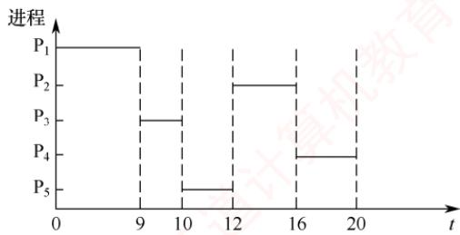
</div>

　　来就是 $\mathrm{P}_5$ ；然后，因为 $\mathrm{P}_2$ ， $\mathrm{P}_4$ 的预计运行时间一样，所以在 $\mathrm{P}_2$ 和 $\mathrm{P}_4$ 之间用先来先服务调度，优先把处理器分配给 $\mathrm{P}_2$ ，最后再分配给 $\mathrm{P}_4$ ，完成任务。

　　周转时间 = 完成时间 - 作业到达时间，从图中显然可以得到各进程的完成时间，于是 $P_{1}$ 的周转时间是 9 - 0 = 9h； $P_{2}$ 的周转时间是 16 - 0.4 = 15.6h； $P_{3}$ 的周转时间是 10 - 1 = 9h； $P_{4}$ 的周转时间是 20 - 5.5 = 14.5h； $P_{5}$ 的周转时间是 12 - 7 = 5h；平均周转时间为 $(9 + 15.6 + 9 + 14.5 + 5)/5 = 10.62h$ 。

　　同理，抢占式的周转时间也可通过画甘特图求得，而且直观、不易出错。

　　抢占式的平均周转时间为 6.8h。

　　甘特图在操作系统中有着广泛的应用，本节习题中会有不少这种类型的题目，若读者按照上面的方法求解，则解题时就可以做到胸有成竹。

**27. D**

　　当这五个批处理作业采用短作业优先调度算法时，平均周转时间 $= [2 + (2 + 4) + (2 + 4 + 6) + (2 + 4 + 6 + 8) + (2 + 4 + 6 + 8 + 10)] / 5 = 14$ 。

　　这道题主要考查读者对各种优先调度算法的认识。若按照 18 题中的方法求解，则可能要花费一定的时间，但这是值得的，因为可以起到熟练基本方法的效果。在考试中很少会遇到操作量和计算量如此大的题目，所以读者不用担心。

**28. C**

　　根据各个进程的到达时间和预计运行时间，画出甘特图如下。由此可知，各个进程的周转时间分别为 4h、1h、8h、12h、2h，所以总周转时间为 $4 + 1 + 8 + 12 + 2 = 27h$ 。

<div align="center">
  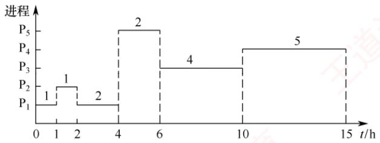
</div>

**29. D**

　　新进程总是先进入第一级队列的队尾。在 0～10ms 时段， $P_{1}$ 在队列 A 上运行；在 10～30ms 时段， $P_{1}$ 在队列 B 上运行；当 t=30ms 时， $P_{2}$ 进入队列 A，因此在 30～40ms 时段， $P_{2}$ 在队列 A 上运行；在 40～60ms 时段， $P_{2}$ 在队列 B 上运行，此时 $P_{2}$ 运行结束；最后 $P_{1}$ 在 60～90ms 和 90～120ms 时段内，于队列 C 上运行 2 个时间片，因此 $P_{1}$ 的总周转时间为 120ms。

<div align="center">
  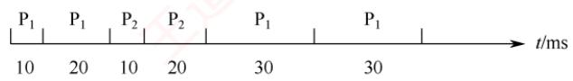
</div>

**30. A**

　　分时系统需要同时满足多个用户的需要，因此把处理器时间轮流分配给多个用户作业使用，即采用时间片轮转调度算法。

**31. B**

　　先来先服务调度算法中，若一个长进程（作业）先到达系统，则会使后面的许多短进程（作业）等待很长的时间，因此对短进程（作业）不利。

**32. B**

　　短进程优先调度算法具有最短的平均周转时间。平均周转时间 = 各进程周转时间之和/进程数。因为每个进程的执行时间都是固定的，所以变化的是等待时间，只有短进程优先调度算法能最小化等待时间。

**33. C**

　　系统开销小不是多级反馈队列调度算法的特性，而正好相反，该算法需要设置多个就绪队列，并且要在不同的队列之间进行进程的转移和抢占，因此增加了系统开销。

**34. C**

　　高响应比优先调度算法需根据进程的等待时间和服务时间来计算响应比；多级反馈队列调度算法涉及多个队列的管理，以及进程在队列之间的转移，它们的系统开销都较大。时间片轮转调度算法虽然简单，但它需要为每个进程分配一个固定的时间片，并且在时间片用完时进行上下文切换，因此它的系统开销也不小。先来先服务调度算法是一种最简单的调度算法，它只需按照进程到达的先后顺序进行调度，无须进行任何优先级调度或时间片的判断和分配，故系统开销最小。

**35. B**

　　先来先服务调度算法和时间片轮转调度算法都不会出现饥饿现象，因为它们都是按照进程到达的顺序或固定的时间片来调度的，不会因为进程的特征而忽略某些进程。短作业优先调度算法（也可视为一种特殊的优先级算法）和优先级算法都可能出现饥饿现象，因为它们都是根据进程的服务时间或优先级来调度的，这样就可能导致一些长作业或低优先级的进程长期得不到调度。

**36. A**

　　多处理机调度需要额外考虑负载平衡和处理器亲和性两个调度目标。负载平衡是指应尽量让每个 CPU 都同等地忙碌，处理器亲和性是指应尽量让一个进程运行在同一个 CPU 上。

**37. D**

　　响应比 = (等待时间 + 执行时间) / 执行时间。它综合考虑了每个进程的等待时间和执行时间，对于同时到达的长进程和短进程，短进程会优先执行，以提高系统吞吐量；而长进程的响应比可以随等待时间的增加而提高，不会产生进程无法调度的情况。

**38. A**

　　选项 A 中进程时间片用完，可降低其优先级以让其他进程被调度进入执行状态。选项 B 中进程刚完成 I/O，进入就绪队列等待被 CPU 调度，为了让其尽快处理 I/O 结果，因此应提高优先级。选项 C 中进程长期处于就绪队列，为不至于产生饥饿现象，也应适当提高优先级。选项 D 中进程的优先级不应该在此时降低，而应在时间片用完后再降低。

**39. B**

　　响应比 = (等待时间 + 执行时间) / 执行时间。高响应比优先调度算法在等待时间相同的情况下，作业执行时间越短，响应比越高，满足短任务优先。随着长作业等待时间的增加，响应比会变大，执行机会也会增大，因此不会发生饥饿现象。先来先服务和时间片轮转不符合短任务优先，非抢占式短任务优先会产生饥饿现象。

**40. B**

　　由于 $P_{2}$ 比 $P_{1}$ 晚 5ms 到达， $P_{1}$ 先占用 CPU，作业运行的甘特图如下。

<div align="center">
  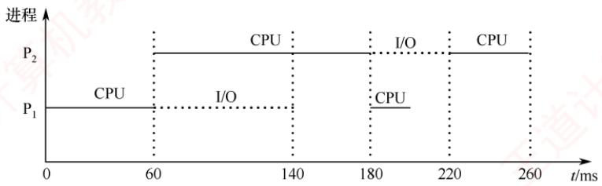
</div>

**41. C**

　　选项 A、B、D 显然属于可以进行 CPU 调度的情况。对于选项 C，处于临界区的进程也可能因中断或抢占而导致调度，此外，若进程在临界区内请求的是一个需要等待的资源，比如打印机，则它主动放弃 CPU，让其他进程运行。

**42. B**

　　为了合理地设置进程优先级，应综合考虑进程的 CPU 时间和 I/O 时间。对于优先级调度算法，一般来说，I/O 型作业的优先权高于计算型作业的优先权，这是由于 I/O 操作需要及时完成，它没有办法长时间地保存所要输入/输出的数据，所以考虑到系统资源利用率，要选择 I/O 繁忙型作业有更高的优先级。

**43. A**

　　采用静态优先级调度且系统总是出现优先级高的任务时，优先级低的任务总是得不到 CPU 而产生饥饿现象；而短任务优先调度不管是抢占式的还是非抢占的，当系统总是出现新来的短任务时，长任务会总是得不到 CPU，产生饥饿现象，因此选项 B、C、D 都错误。

**44. B**

　　这类调度题目最好画图。因CPU、输入设备、输出设备都只有一个，因此各操作步骤不能重叠，画出运行时的甘特图后，就能清楚地看到不同作业间的时序关系，如下图所示。

　　<table><tr><td>作业\时间</td><td>1</td><td>2</td><td>3</td><td>4</td><td>5</td><td>6</td><td>7</td><td>8</td><td>9</td><td>10</td><td>11</td><td>12</td><td>13</td><td>14</td><td>15</td><td>16</td><td>17</td></tr><tr><td>1</td><td colspan="2">输入</td><td colspan="3">计算</td><td colspan="4">输出</td><td></td><td></td><td></td><td></td><td></td><td></td><td></td><td></td></tr><tr><td>2</td><td></td><td></td><td colspan="2">输入</td><td></td><td colspan="3">计算</td><td></td><td colspan="4">输出</td><td></td><td></td><td></td><td></td></tr><tr><td>3</td><td></td><td></td><td></td><td></td><td colspan="2">输入</td><td></td><td></td><td colspan="3">计算</td><td></td><td></td><td colspan="4">输出</td></tr></table>

**45. D**

　　注意，系统是在 t=2 时开始作业调度的，此时 $J_{4}$ 还没有到达。FCFS 调度算法的特点是作业来得越早，优先级就越高，因此选择 $J_{1}$ 。SJF 调度算法的特点是作业运行时间越短，优先级就越高，因此选择 $J_{3}$ 。

**46. B**

　　进程切换带来系统开销，切换次数越多，开销就越大，选项 A 正确。当前进程的时间片用完后，其状态由运行态变为就绪态，选项 B 错误。时钟中断是系统中特定的周期性时钟节拍，操作系统通过它来确定时间间隔，实现时间的延时和任务的超时，选项 C 正确。现代操作系统为了保证性能最优，通常根据响应时间、系统开销、进程数量、进程运行时间等因素确定时间片大小，选项 D 正确。

**47. D**

　　由优先权可知，进程的执行顺序为 $P_{2} \rightarrow P_{3} \rightarrow P_{1}$ 。 $P_{2}$ 的周转时间为 $1 + 15 + 24 = 40\mu s$ ； $P_{3}$ 的周转时间为 $18 + 1 + 24 + 1 + 36 = 80\mu s$ ； $P_{1}$ 的周转时间为 $30 + 1 + 24 + 1 + 36 + 1 + 12 = 105\mu s$ ；平均周转时间为 $(40 + 80 + 105)/3 = 225/3 = 75\mu s$ ，因此选择选项 D。

**48. C**

　　进程 $\mathrm{P_1}$ 和 $\mathrm{P_2}$ 依次创建后进入队列 $\mathrm{Q_1}$ ，根据时间片调度算法的规则，进程 $\mathrm{P_1}$ 和 $\mathrm{P_2}$ 将依次被分配 $10\mathrm{ms}$ 的CPU时间，两个进程分别执行完一个时间片后都会被转入队列 $\mathrm{Q_2}$ ，就绪队列 $\mathrm{Q_2}$ 采用短进程优先调度算法，此时 $\mathrm{P_1}$ 还需要 $20\mathrm{ms}$ 的CPU时间， $\mathrm{P_2}$ 还需要 $10\mathrm{ms}$ 的CPU时间，所以

　　$P_{2}$ 会被优先调度执行，10ms后进程 $P_{2}$ 执行完成，之后 $P_{1}$ 再调度执行，再过20ms后 $P_{1}$ 也执行完成。运行图表述如右。

　　进程 $P_{1}$ 、 $P_{2}$ 的等待时间分别为图中的虚横线部分，平均等待时间= $(P_{1}$ 的等待时间 + $P_{2}$ 的等待时间)/2 = (20 + 10)/2 = 15，因此答案选 C。

**49. D**

<div align="center">
  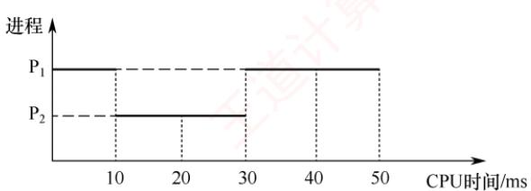
</div>

　　多级反馈队列调度算法需要综合考虑优先级数量、优先级之间的转换规则等，就绪队列的数量会影响长进程的最终完成时间，说法Ⅰ正确；就绪队列的优先级会影响进程执行的顺序，说法Ⅱ正确；各就绪队列的调度算法会影响各队列中进程的调度顺序，说法Ⅲ正确；进程在就绪队列中的迁移条件会影响各进程在各队列中的执行时间，说法Ⅳ正确。

**50. C**

　　时钟中断处理程序是一种特殊的中断处理程序，它负责在每个时钟周期结束时执行一些操作，如内核中时钟变量的值、当前进程占用 CPU 的时间、当前进程在时间片内的剩余执行时间。时钟中断处理程序的触发条件是系统定时器（一种可编程的硬件芯片）以固定的频率（称为节拍率）产生一个中断信号，通知 CPU 进行中断处理。在分时系统的时间片轮转调度中，当时钟中断处理程序检查到当前进程的时间片用完时，就触发进程调度，调度程序从就绪队列中选择一个进程为其分配时间片，并且修改该进程的进程控制块中的进程状态等信息，同时将时间片用完的进程放入就绪队列或让其结束运行，说法 I、II、III 正确。阻塞队列中的进程只有被唤醒并进入就绪队列后，才能参与调度，所以该调度过程不使用阻塞队列。

**51. D**

　　中断处理阶段运行的是中断处理程序，中断处理结束后，需要返回原程序或重新选择程序运行，而后者需要进行进程调度，例如在时间片轮转调度中，时钟中断处理结束后，若当前进程的时间片用完，则会发生进程调度。当前进程阻塞时，将其放入阻塞队列，若就绪队列不空，则调度新进程执行。进程执行结束会导致当前进程释放 CPU，并从就绪队列中选择一个进程获得 CPU。进程时间片用完，会导致当前进程让出 CPU，同时选择就绪队列的队首进程获得 CPU。

**52. C**

　　需要注意的是，在0时刻， $P_{0}$ 获得CPU也是一次进程调度，所以0时刻调度进程 $P_{0}$ 获得CPU；10ms时 $P_{2}$ 进入就绪队列，调度 $P_{2}$ 抢占获得CPU；15ms时 $P_{3}$ 进入就绪队列，调度 $P_{3}$ 抢占获得CPU；25ms时 $P_{3}$ 执行完毕，调度 $P_{2}$ 获得CPU；40ms时 $P_{2}$ 执行完毕，调度 $P_{0}$ 获得CPU；130ms时 $P_{0}$ 执行完毕，调度 $P_{1}$ 获得CPU；190ms时 $P_{1}$ 执行完毕，结束；总共调度6次。

**53. B**

　　采用抢占式优先级调度算法，三个作业的执行顺序如右图所示。

　　周转时间 = 完成时间 - 到达时间。 $P_{1}$ 的周转时间 = 115 - 0 = 115ms； $P_{2}$ 的周转时间 = 75 - 20 = 55ms； $P_{3}$ 的周转时间 = 43 - 30 = 13ms，所以平均周转时间 = $(115 + 55 + 13)/3 = 61ms$ 。

<div align="center">
  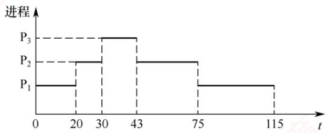
</div>

**54. C**

　　系统使用时间片轮转调度算法，最初共有10个进程处于就绪队列，进程P处于队尾，时间片大小为5ms。假设当 $t = 0$ 时开始进程调度，就绪队列的前9个进程依次运行一个时间片，则当 $t = 45\mathrm{ms}$ 时调度进程P运行，运行5ms后，当 $t = 50\mathrm{ms}$ 时又开始新一轮循环。进程P所需的CPU时间为25ms，共需5轮循环，其他进程所需的CPU时间都比进程P的长，这5轮循环中其余9个进程都不会运行结束，因此进程P的周转时间为 $50\times 5 = 250\mathrm{ms}$ 。

**55. D**

　　进程切换时，需要进行上下文切换，主要完成：① 将当前 CPU 中各寄存器的内容保存到当前进程的 PCB 中；② 将新进程的现场信息装入 CPU 的各个寄存器。③ 将控制转至新进程执行，即更新程序计数器（PC）的值。栈基址寄存器用来指明系统内核栈位置的寄存器，页表基址寄存器用来指明当前进程顶级页表基地址的寄存器，属于进程控制信息。因此，说法 I、II、III 均需要更新。

**56. C**

　　在该调度系统中，就绪队列采用按优先权从高到低排序的有序单链表实现。插入新进程时，为维持链表的有序性，需要从表头开始顺序查找，直至找到首个优先权不高于待插入进程的结点，并在其前插入；最坏情况下需要遍历整个链表，时间复杂度为 $O(n)$ 。由于最高优先权的进程始终位于链表头部，调度程序只需访问头结点即可获得下一个待执行的进程，无须额外搜索，因此选择进程的操作时间复杂度为 $O(1)$ 。

**57. D**

　　进程上下文切换需要隔离各进程的执行环境，并确保新进程正确恢复运行，因此必须更新当前进程的上下文。通用寄存器和程序计数器属于典型的进程私有状态：前者保存临时数据，后者指向下一条指令地址，两者都必须在切换时保存和恢复。页表基址寄存器存放当前进程页表的物理起始地址。在页式系统中，每个进程都拥有独立的虚拟地址空间和页表，切换时必须更新该寄存器，以激活新进程的地址映射。内核中断向量表基址寄存器指向操作系统内核维护的中断处理入口表，该表是全局共享的系统资源，用于响应中断和异常，其内容由内核统一管理，不随用户进程变化，因此在进程上下文切换时无须更新。

#### 二、综合应用题

**01. 【解答】**

　　抢占式优先级调度算法，三个作业执行的顺序如下图所示。

　　作业 $P_{1}$ 的优先级最高，周转时间等于运行时间， $T_{1}=80ms$ ；作业 $P_{2}$ 的等待时间为 10ms，运行时间为 80ms，周转时间 $T_{2}=(10+80)\mathrm{ms}=90\mathrm{ms}$ ；作业 $P_{3}$ 的等待时间为 40ms，运行时间为 50ms，因此周转时间 $T_{3}=90ms$ 。

　　三个作业从进入系统到全部运行结束，时间为 90ms。CPU 与外设都是独占设备，运行时间分别为各作业的使用时间之和。CPU 运行时间为 $[(10 + 10) + 20 + 30]$ ms = 70ms， $D_{1}$ 为 $(30 + 20 + 20)$ ms = 70ms， $D_{2}$ 为 $(30 + 40)$ ms = 70ms，因此利用率均为 70/90 = 77.8%。

<div align="center">
  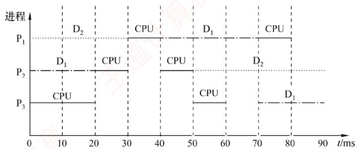
</div>

**02. 【解答】**

　　作业 A、B、C 的优先级依次递减，采用不可抢占的优先级调度。

　　在时刻 40，作业 C 释放 CPU，优先级较高的作业 A 获得 CPU；在时刻 60，作业 A 释放 CPU，优先级较高的作业 B 获得 CPU；在时刻 100，作业 B 释放 CPU，优先级高的作业 A 获得 CPU；在时刻 110，作业 A 释放 CPU，作业 C 获得 CPU；在时刻 130，作业 C 释放 CPU，作业 B 获得 CPU；在时刻 160，作业 B 释放 CPU，作业 A 获得 CPU。运行图如下所示。

<div align="center">
  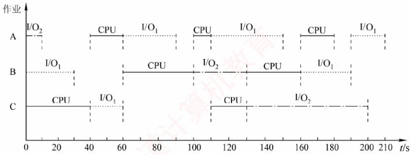
</div>

1）最早结束的是作业 B。

2）最后结束的是作业 A。

3）三个作业从开始到全部执行结束，经历时间为 210ms，因为是单 CPU 系统，CPU 运行时间为各个作业的 CPU 运行时间之和，即 $[(20 + 10 + 20) + (40 + 30) + (40 + 20)]$ ms = 180ms。因此 CPU 的利用率为 180/210 = 85.7%。

**03. 【解答】**

　　根据题意，首先由图进行分析，进程由运行态可以直接回到就绪队列的末尾，而且就绪队列中是先来先服务。那么，什么情况才能发生这样的变化呢？只有采用单一时间片轮转的调度系统，分配的时间片用完后，才会发生上述情况。因此，该系统一定采用时间片轮转调度算法，采用时间片轮转调度算法的操作系统一般均为交互式操作系统。由图可知，进程被阻塞时，可以进入不同的阻塞队列，等待打印机输出结果和等待磁盘读取文件。所以，它是一个多阻塞队列的时间片轮转调度算法的调度系统。

　　具体解答如下。

1）根据题意，该系统采用的是时间片轮转调度算法调度进程策略。

2）可能的变化见下表。

　　<table><tr><td>变化</td><td>原因</td></tr><tr><td>1</td><td>进程被调度,获得CPU,进入运行态</td></tr><tr><td>2</td><td>进程需要读文件,因I/O操作进入阻塞态</td></tr><tr><td>3</td><td>进程打印输出结果,因打印机未结束而阻塞</td></tr><tr><td>4</td><td>打印机打印结束,进程重新回归就绪态,并排在尾部</td></tr><tr><td>5</td><td>进程所需数据已从磁盘进入内存,进程回到就绪态</td></tr><tr><td>6</td><td>运行的进程因为时间片用完而让出CPU,排到就绪队列尾部</td></tr></table>

**04. 【解答】**

1）作业执行情况可以用如下的甘特图来表示。

　　<table><tr><td></td><td colspan="9">1</td><td>2</td><td>3</td><td>4</td><td colspan="2">5</td></tr><tr><td colspan="15">RR:</td></tr><tr><td>1</td><td>2</td><td>3</td><td>4</td><td>5</td><td>1</td><td>3</td><td>5</td><td>1</td><td>5</td><td>1</td><td>5</td><td>1</td><td>5</td><td>1</td></tr><tr><td colspan="15">SJF:</td></tr><tr><td>2</td><td>4</td><td colspan="2">3</td><td colspan="5">5</td><td colspan="6">1</td></tr><tr><td colspan="15">优先级:</td></tr><tr><td>2</td><td colspan="5">5</td><td colspan="7">1</td><td>3</td><td>4</td></tr></table>

2）各个作业对应于各个算法的周转时间和加权周转时间见下表。

　　<table><tr><td rowspan="2">算法</td><td>时间类型</td><td><eq>P_1</eq></td><td><eq>P_2</eq></td><td><eq>P_3</eq></td><td><eq>P_4</eq></td><td><eq>P_5</eq></td><td>平均时间</td></tr><tr><td>运行时间</td><td>10</td><td>1</td><td>2</td><td>1</td><td>5</td><td>3.8</td></tr><tr><td rowspan="2">FCFS</td><td>周转时间</td><td>10</td><td>11</td><td>13</td><td>14</td><td>19</td><td>13.4</td></tr><tr><td>加权周转时间</td><td>1</td><td>11</td><td>6.5</td><td>14</td><td>3.8</td><td>7.26</td></tr><tr><td rowspan="2">RR</td><td>周转时间</td><td>19</td><td>2</td><td>7</td><td>4</td><td>14</td><td>9.2</td></tr><tr><td>加权周转时间</td><td>1.9</td><td>2</td><td>3.5</td><td>4</td><td>2.8</td><td>2.84</td></tr><tr><td rowspan="2">SJF</td><td>周转时间</td><td>19</td><td>1</td><td>4</td><td>2</td><td>9</td><td>7</td></tr><tr><td>加权周转时间</td><td>1.9</td><td>1</td><td>2</td><td>2</td><td>1.8</td><td>1.74</td></tr><tr><td rowspan="2">优先级</td><td>周转时间</td><td>16</td><td>1</td><td>18</td><td>19</td><td>6</td><td>12</td></tr><tr><td>加权周转时间</td><td>1.6</td><td>1</td><td>9</td><td>19</td><td>1.2</td><td>6.36</td></tr></table>

　　所以，FCFS 的平均周转时间为 13.4，平均加权周转时间为 7.26。

　　RR 的平均周转时间为 9.2，平均加权周转时间为 2.84。

　　SJF 的平均周转时间为 7，平均加权周转时间为 1.74。

　　非剥夺式优先级调度算法的平均周转时间为 12，平均加权周转时间为 6.36。

> **注意**

　　SJF的平均周转时间肯定是最短的，计算完毕后可以利用这个性质进行检验。

**05. 【解答】**

1）具有两道作业的批处理系统，内存只存放两道作业，它们采用抢占式优先级调度算法竞争CPU，而将作业调入内存采用的是短作业优先调度。8:00，作业1到来，此时内存和CPU空闲，作业1进入内存并占用CPU；8:20，作业2到来，内存仍有一个位置空闲，因此将作业2调入内存，又由于作业2的优先数高，相应的进程抢占CPU，在此期间8:30作业3到来，但内存此时已无空闲，因此等待。直至8:50，作业2执行完毕，此时作业3、4竞争空出的一道内存空间，作业4的运行时间短，因此先调入，但它的优先数低于作业1，因此作业1先执行。到9:10时，作业1执行完毕，再将作业3调入内存，且由于作业3的优先数高而占用CPU。所有作业进入内存的时间及结束的时间见下表。

　　<table><tr><td>作业号</td><td>到达时间</td><td>运行时间</td><td>优先数</td><td>进入内存时间</td><td>结束时间</td><td>周转时间</td></tr><tr><td>1</td><td>8:00</td><td>40min</td><td>5</td><td>8:00</td><td>9:10</td><td>70min</td></tr><tr><td>2</td><td>8:20</td><td>30min</td><td>3</td><td>8:20</td><td>8:50</td><td>30min</td></tr><tr><td>3</td><td>8:30</td><td>50min</td><td>4</td><td>9:10</td><td>10:00</td><td>90min</td></tr><tr><td>4</td><td>8:50</td><td>20min</td><td>6</td><td>8:50</td><td>10:20</td><td>90min</td></tr></table>

2）平均周转时间为 $(70+30+90+90)/4=70\min$ 。

**06. 【解答】**

1）按照可抢先式短进程优先调度算法，进程运行时间见下表。

　　<table><tr><td>进程名</td><td>到达就绪队列时刻</td><td>预计执行时间</td><td>执行时间段</td><td>周转时间</td></tr><tr><td><eq>P_{1}</eq></td><td>0</td><td>8</td><td>0~1; 10~17</td><td>17</td></tr><tr><td><eq>P_{2}</eq></td><td>1</td><td>4</td><td>1~5</td><td>4</td></tr><tr><td><eq>P_{3}</eq></td><td>2</td><td>9</td><td>17~26</td><td>24</td></tr><tr><td><eq>P_{4}</eq></td><td>3</td><td>5</td><td>5~10</td><td>7</td></tr></table>

- 时刻0，进程 $\mathbf{P}_1$ 到达并占用处理器运行。

- 时刻1，进程 $\mathrm{P}_2$ 到达，因其预计运行时间短，因此抢夺处理器进入运行， $\mathrm{P}_1$ 等待。

- 时刻2，进程 $\mathrm{P}_3$ 到达，因其预计运行时间长于正在运行的进程，进入就绪队列等待。

- 时刻3，进程 $\mathrm{P_4}$ 到达，因其预计运行时间长于正在运行的进程，进入就绪队列等待。

- 时刻5，进程 $\mathrm{P}_2$ 运行结束，调度器在就绪队列中选择短进程， $\mathrm{P}_4$ 符合要求，进入运行，进程 $\mathrm{P}_1$ 和进程 $\mathrm{P}_3$ 则还在就绪队列等待。

- 时刻10，进程 $\mathrm{P_4}$ 运行结束，调度器在就绪队列中选择短进程， $\mathrm{P_1}$ 符合要求，再次进入运行，而进程 $\mathrm{P_3}$ 则还在就绪队列等待。

- 时刻17，进程 $\mathrm{P_1}$ 运行结束，只剩下进程P3，调度其运行。

- 时刻26，进程 $\mathrm{P}_3$ 运行结束。

　　平均周转时间 $= [(17 - 0) + (5 - 1) + (26 - 2) + (10 - 3)] / 4 = 13$ 。

2）时间片轮转调度算法按就绪队列的 FCFS 进行轮转，在时刻 2， $P_{1}$ 被挂到就绪队列队尾，队列顺序为 $P_{2}, P_{3}, P_{1}$ ，此时 $P_{4}$ 还未到达。按时间片轮转调度算法的进程时间分配见下表。

　　<table><tr><td>进程名</td><td>到达就绪队列时刻</td><td>预计执行时间</td><td>执行时间段</td><td>周转时间</td></tr><tr><td><eq>{\mathrm{P}}_{1}</eq></td><td>0</td><td>8</td><td>0~2;6~8;14~16;20~22</td><td>22</td></tr><tr><td><eq>{\mathrm{P}}_{2}</eq></td><td>1</td><td>4</td><td>2~4;10~12</td><td>11</td></tr><tr><td><eq>{\mathrm{P}}_{3}</eq></td><td>2</td><td>9</td><td>4~6;12~14;18~20;23~25;25~26</td><td>24</td></tr><tr><td><eq>{\mathrm{P}}_{4}</eq></td><td>3</td><td>5</td><td>8~10;16~18;22~23</td><td>20</td></tr></table>

　　平均周转时间 $= [(22 - 0) + (12 - 1) + (26 - 2) + (23 - 3)] / 4 = 19.25$ 。

**07. 【解答】**

　　在时间片轮转调度算法中，系统将所有就绪进程按到达时间的先后次序排成一个队列。进程调度程序总是选择队列中的第一个进程运行，且仅能运行一个时间片。在使用完一个时间片后，即使进程并未完成其运行，也必须将处理器交给下一个进程。时间片轮转调度算法是绝对可抢先的算法，由时钟中断来产生。

　　时间片的长短对计算机系统的影响很大。若时间片大到让一个进程足以完成其全部工作，则这种算法就退化为先来先服务调度算法。若时间片很小，则处理器在进程之间的转换工作会过于频繁，处理器真正用于运行用户程序的时间将减少，系统开销将增大。时间片的大小应能使分时用户得到好的响应时间，同时也使系统具有较高的效率。

　　**由题目给定条件可知：**

1）每秒产生 120 个时钟中断，每次中断的时间为 $1/120 \approx 8.3ms$ ，其中中断处理耗时为 $500\mu s$ ，那么其开销为 $500\mu s/8.3ms = 6\%$ 。

2）每次进程切换需要1次调度、1次切换，所以需要耗时 $1\mathrm{ms} + 2\mathrm{ms} = 3\mathrm{ms}$ ，每24个时钟为一个时间片， $24\times 8.3\mathrm{ms} = 200\mathrm{ms}$ 。一次切换所占CPU的时间比 $3\mathrm{ms}/200\mathrm{ms} = 1.5\%$ 。

3）为提高 CPU 的效率，一般情况下要尽量减少时钟中断的次数，如由每秒 120 次降低到 100 次，以延长中断的时间间隔。或将每个时间片的中断数量（时钟数）加大，如由 24 个中断加大到 36 个。也可优化中断处理程序，减少中断处理开销，如将每次 500μs 的时间降低到 400μs。若能这样，则时钟中断和进程切换的总开销占 CPU 的时间比为 $(36 \times 400 \mu s + 1 \text{ms} + 2 \text{ms}) / (1/100 \times 36) \approx 4.8\%$ .

**08. 【解答】**

　　作业的响应比可表示为

$$
\text { 响应比 } = \frac {\text { 等待时间 } + \text { 要求服务时间 }}{\text { 要求服务时间 }}
$$

　　在时刻 8:00，系统中只有一个作业 $J_{1}$ ，因此系统将它投入运行。在 $J_{1}$ 完成（10:00）时， $J_{2}$ ， $J_{3}$ ， $J_{4}$ 的响应比分别为 $(90 + 40)/40, (60 + 25)/25, (30 + 30)/30$ ，即 3.25, 3.4, 2，因此应先将 $J_{3}$ 投入运行。在 $J_{3}$ 完成（10:25）时， $J_{2}$ ， $J_{4}$ 的响应比分别为 $(115 + 40)/40, (55 + 30)/30$ ，即 3.875, 2.83，因此应先将 $J_{2}$ 投入运行，待它运行完毕时（11:05），再将 $J_{4}$ 投入运行， $J_{4}$ 的结束时间为 11:35。

　　可见作业的执行次序为 $J_{1}, J_{3}, J_{2}, J_{4}$ ，各作业的运行情况见下表，它们的周转时间分别为 120min, 155min, 85min, 125min，平均周转时间为 121.25min。

　　<table><tr><td>作业号</td><td>提交时间</td><td>开始时间</td><td>执行时间</td><td>结束时间</td><td>周转时间</td></tr><tr><td>1</td><td>8:00</td><td>8:00</td><td>2h</td><td>10:00</td><td>120min</td></tr><tr><td>2</td><td>8:30</td><td>10:25</td><td>40min</td><td>11:05</td><td>155min</td></tr><tr><td>3</td><td>9:00</td><td>10:00</td><td>25min</td><td>10:25</td><td>85min</td></tr><tr><td>4</td><td>9:30</td><td>11:05</td><td>30min</td><td>11:35</td><td>125min</td></tr></table>

**09. 【解答】**

　　上述 5 个作业的运行情况如下图所示。

<div align="center">
  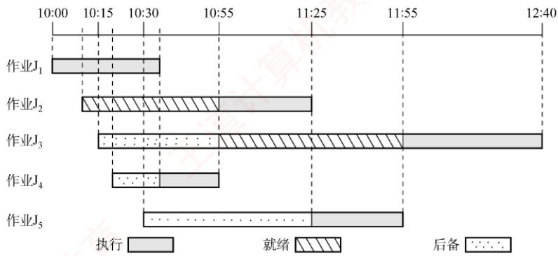
</div>

　　本题涉及作业和进程两方面的调度，一个作业首先需要被调入内存，创建相应的进程，然后竞争 CPU，获得 CPU 的资源来执行。本题的条件是有两道作业的批处理系统，所以内存中同时最多只有两个进程存在，且同时最多只有一个进程能够获得 CPU 资源。

　　在 10:00，因为只有 $J_{1}$ 到达，因此将它调入内存，并将 CPU 调度给它。

　　在 10:10， $J_{2}$ 到达，因此将 $J_{2}$ 调入内存，但 $J_{1}$ 只需再执行 25min，因此 $J_{1}$ 继续执行。

　　虽然 $J_{3}, J_{4}, J_{5}$ 分别在 10:15, 10:20 和 10:30 到达，但因当时内存中已存放了两道作业，因此不能马上将它们调入内存。

　　在 10:35, $J_{1}$ 结束。此时 $J_{3}, J_{4}, J_{5}$ 的响应比 [根据题意，响应比 = (等待时间 + 估计运行时间)/估计运行时间] 分别为 65/45, 35/20, 35/30，因此将 $J_{4}$ 调入内存，并将 CPU 分配给内存中运行时间最短者，即 $J_{4}$ 。

　　在 10:55， $J_{4}$ 结束。此时 $J_{3}, J_{5}$ 的响应比分别为 85/45, 55/30，因此将 $J_{3}$ 调入内存，并将 CPU 分配给估计运行时间较短的 $J_{2}$ 。

　　在 11:25， $J_{2}$ 结束，作业调度程序将 $J_{5}$ 调入内存，并将 CPU 分配给估计运行时间较短的 $J_{5}$ 。

　　在 11:55， $J_{5}$ 结束，将 CPU 分配给 $J_{3}$ 。

　　在 12:40， $J_{3}$ 结束。

　　通过上述分析，可知：

1）作业 1 的执行时间片段为 10:00—10:35（结束）。

　　作业 2 的执行时间片段为 10:55—11:25（结束）。

　　作业 3 的执行时间片段为 11:55—12:40（结束）。

　　作业 4 的执行时间片段为 10:35—10:55（结束）。

　　作业 5 的执行时间片段为 11:25—11:55（结束）。

2）它们的周转时间分别为 35min, 75min, 145min, 35min, 85min，因此它们的平均周转时间为 75min。

**10. 【解答】**

1）因为采用了静态优先数，当就绪队列中总有优先数较小的进程时，优先数较大的进程一直没有机会运行，所以会出现饥饿现象。

2）一种动态优先数计算方法为 $\text{priority} = \text{nice} + k_1 \times \text{cpuTime} - k_2 \times \text{waitTime}$ ，其中 $k_1 > 0, k_2 > 0$ ，分别用来调整 cpuTime 和 waitTime 在 priority 中所占的比例。若一个进程的运行时间较长，则其 cpuTime 就增加，进而降低其优先级；若一个进程的等待时间较长，则其 waitTime 增加，进而会提高其优先级。于是，waitTime 就可使长时间等待的进程优先数减少，进而避免出现饥饿现象。

## 2.3 同步与互斥

　　在学习本节时，请读者思考以下问题：

1）为什么要引入进程同步的概念？

2）不同的进程之间会存在什么关系？

3）当单纯用本节介绍的方法解决这些问题时会遇到什么新的问题吗？

　　用 PV 操作解决进程之间的同步互斥问题是这一节的重点，统考中频繁考查这一内容，请读者务必多加练习，掌握好求解该类问题的方法。

### 2.3.1 同步与互斥的基本概念

　　在多道程序环境下，进程是并发执行的，不同进程之间存在多种相互制约关系。为了协调这些制约关系，引入了进程同步的概念。下面通过一个简单的例子来帮助理解。例如，计算表达式 $1+2\times3$ ，假设系统为此创建两个进程：一个是乘法进程，一个是加法进程。显然，加法进程必须等待乘法进程完成之后才能正确执行。然而，由于操作系统的异步性，若不加以约束，加法进程完全有可能在乘法进程之前运行，从而导致计算结果错误。因此，需要设计一种机制，确保加法进程只能在乘法进程结束后才开始执行，而这种机制正是本节要讨论的问题。

#### 1. 临界资源

> **考点追踪：** 同步与互斥的相关分析（2016、2021、2023）

　　虽然多个进程可以共享系统中的各种资源，但其中许多资源在同一时刻仅允许一个进程访问，这类资源被称为临界资源。常见的临界资源包括物理设备（如打印机）以及被多个进程共享的变量、数据结构等。

> **考点追踪：** 临界区和临界资源的分析（2024）

　　对临界资源的访问必须以互斥方式进行。在每个进程中，访问临界资源的那段代码称为临界区。为了保证临界资源的正确使用，可将对临界资源的访问过程划分为以下四个部分。

1）进入区。在进入临界区之前，进程需要检查当前是否允许进入。若允许，则设置一个“正在访问临界区”的标志，以阻止其他进程同时进入临界区。

2）临界区。进程中实际访问临界资源的代码段，也称临界段。

3）退出区。在离开临界区时，清除“正在访问临界区”的标志，表示已释放该资源。

4）剩余区。指代码中除上述三部分之外的其余部分。

```javascript
while (true) {
    entry section; // 进入区
    critical section; // 临界区
    exit section; // 退出区
    remainder section; // 剩余区
}
```

#### 2. 同步（直接制约关系）

　　同步是指为完成某种任务而建立的两个或多个进程，由于需要协调彼此的运行次序，而在执行过程中产生等待或传递信息的制约关系。同步关系源于进程之间的相互合作。

　　例如，输入进程 A 通过单缓冲向进程 B 提供数据。当缓冲区为空时，进程 B 因无法获得所需数据而被阻塞；一旦进程 A 将数据送入缓冲区，进程 B 就会被唤醒。反之，当缓冲区已满时，进程 A 无法写入新数据，会被阻塞；只有当进程 B 从缓冲区取走数据后，才会唤醒进程 A。

#### 3. 互斥（间接制约关系）

　　互斥是指当一个进程正在临界区中使用临界资源时，其他试图访问该资源的进程必须等待；只有当占用临界资源的进程退出临界区后，其他进程才被允许进入。

　　例如，在一个只配备一台打印机的系统中，有两个进程 A 和进程 B。如果进程 A 需要打印，但此时打印机已被分配给进程 B，那么进程 A 必须进入阻塞状态。一旦进程 B 完成打印并释放打印机，系统便会唤醒进程 A，并将其状态由阻塞态转为就绪态。

> **考点追踪：** 临界区同步与互斥的设计准则（2020）

　　为防止多个进程同时进入临界区，同步机制应遵循以下准则。

1）空闲让进。临界区处于空闲状态时，应允许一个请求进入临界区的进程立即进入。

2）忙则等待。已有进程在临界区内执行时，表明临界资源正在被访问，其他试图进入临界区的进程必须等待，以保证对临界资源的互斥访问。

3）有限等待。对任何请求进程，应保证其在有限时间内能进入临界区，避免无限期等待。

4）让权等待（原则上应该遵循，但非必须）。当进程因无法进入临界区而需要等待时，应主动放弃 CPU 的使用权，转为阻塞态，而不是在原地循环测试（避免忙等待）。

### 2.3.2 实现临界区互斥的基本方法

> **考点追踪：** 实现互斥的软/硬件方法的特点（2018）

#### 1. 软件实现方法

　　在进入区设置并检查一些标志，用以表明是否有进程正在临界区中。若已有进程在临界区，则其他进程在进入区通过循环检查的方式等待；当进程离开临界区后，在退出区修改相应的标志，以允许其他进程进入。

##### （1）算法一：单标志法

　　该算法设置一个公用整型变量 turn，用于指示当前允许进入临界区的进程编号，当 turn = 0 时，表示允许 $P_{0}$ 进入临界区；当 turn = 1 时，表示允许 $P_{1}$ 进入临界区。每当一个进程 $P_{i}$ 退出临界区时，就将 turn 置为 j （i = 0, j = 1 或 i = 1, j = 0），即将临界区的使用权转让给另一个进程。

　　进程 $\mathbf{P}_0$ ： 进程 $\mathrm{P_1}$ ： while (turn!=0); while (turn!=1); //进入区 critical section; critical section; //临界区 turn=1; turn=0; //退出区 remainder section; remainder section; //剩余区

　　该算法可以保证每次只有一个进程进入临界区。但缺点是：两个进程必须交替进入临界区。若某个进程不再请求进入临界区，则另一个进程也将无法再次进入（违背“空闲让进”准则），造成资源利用不充分。例如，假设 $P_{0}$ 顺利进入临界区并执行完毕，此时临界区处于空闲状态，但若 $P_{1}$ 没有进入临界区的打算，而 turn = 1 一直成立，则 $P_{0}$ 就无法再次进入临界区。

##### （2）算法二：双标志先检查法

　　该算法设置一个布尔型数组 flag[2]，用来标记各进程是否希望进入临界区。flag[i]=true 表示 $P_{i}$ 想进入临界区（i=0 或 1）。 $P_{i}$ 进入临界区前，先检查对方是否想进入；若对方想进入，则等待；否则，将自己的 flag[i] 置为 true，然后进入临界区。当 $P_{i}$ 退出临界区时，将 flag[i] 置为 false。

　　进程 $\mathrm{P_0}$

　　进程 $\mathrm{P}_1$

　　优点：无须交替进入，允许进程连续使用临界区。缺点：在某些执行顺序下， $P_{0}$ 和 $P_{1}$ 可能同时进入临界区。例如，若执行顺序为①②③④，即两个进程都先检查对方的标志（发现为 false），然后才设置自己的标志，结果双方都通过检查，从而同时进入临界区（违背“忙则等待”准则）。原因在于“检查对方标志”和“设置自己标志”两个操作不是原子的，中间可能发生进程切换。

##### （3）算法三：双标志后检查法

　　算法二的问题在于先检查后设置，而这两次操作无法一气呵成。因此，联想到先设置后检查的方法，以避免上述问题。算法三改为先设置自己的标志，再检查对方的标志：进程 $P_{i}$ 首先将自己的 flag[i] 置为 true，然后检查 flag[j]，若 flag[j] 为 true，则等待；否则，进入临界区。

　　进程 $\mathbf{P_0}$ ： 进程 $\mathbf{P}_1$ ： flag[0] = true; ① flag[1] = true; ② //进入区 while (flag[1]); ③ while (flag[0]); ④ //进入区 critical section; critical section; //临界区 flag[0] = false; flag[1] = false; //退出区 remainder section; remainder section; //剩余区

　　然而，这种方案也可能出现问题。例如，若执行顺序为①②③④，即两个进程都先设置了各自的标志，然后分别检查对方的标志，会发现对方也想进入临界区，于是彼此等待，谁也无法进入。此时即使临界区空闲，也没有进程能够进入（违背“空闲让进”准则）；同时，进程可能会长期甚至永远无法获得访问权（违背“有限等待”准则），导致“饥饿”现象。

##### （4）算法四：Peterson 算法

> **考点追踪：** Peterson 算法的原理（2010、2018）

　　Peterson 算法结合了算法一和算法三的思想：利用 flag[] 数组解决互斥访问问题，利用 turn 变量解决“饥饿”问题。若 flag[i] = true，则表示 $P_{i}$ 准备进入临界区；若 turn = i，则表示当两个进程同时请求时，优先允许 $P_{i}$ 进入临界区。具体做法如下：在 $P_{i}$ 进入临界区之前，先将自己的 flag[i] 置为 true，并将 turn 置为 j（主动将进入机会“谦让”给对方）。随后，通过循环条件 while(flag[j] &&turn == j) 判断是否需要等待，从而确保双方同时请求进入临界区时，只允许一个进程进入。

　　进程 $\mathbf{P_0}$ ： 进程 $\mathrm{P_1}$ ：
flag[0] = true; flag[1] = true; //进入区
turn=1; turn=0; //进入区
while (flag[1] && turn==1); while (flag[0] && turn==0); //进入区
critical section; critical section; //临界区
flag[0] = false; flag[1] = false; //退出区
remainder section; remainder section; //剩余区

　　若仅有一个进程请求进入（例如 $P_{0}$ ），由于 flag[1] 为 false，其 while 条件不成立，可直接进入临界区。若两个进程同时请求进入， $P_{0}$ 将 turn 置为 1， $P_{1}$ 将 turn 置为 0。由于这两个赋值在运行时是依次完成的，turn 的最终值由后执行赋值的进程所决定。而 while 条件仅在 “对方准备进入” 且 “turn 指向对方” 时成立，因此总有一个进程的等待条件不成立，从而得以进入临界区。

　　由此可见，Peterson算法很好地遵循了“空闲让进”“忙则等待”和“有限等待”三条准则。但由于它采用忙等待（在进入区中循环测试），没有遵循“让权等待”准则。尽管如此，在纯软件实现的互斥算法中，Peterson算法是在满足前三条准则方面最完善的方案。

#### 2. 硬件实现方法

　　现代计算机提供了特殊的硬件指令，能够以原子方式对一个字进行检测和修改，或是交换两个字的内容。因此，可利用它们实现临界区的互斥访问。

　　实际上，管理临界区时，可将共享标志视为一把锁：“锁开”表示允许进入，“锁关”表示需等待，初始时锁为打开状态。每个欲进入临界区的进程必须先测试该锁：若锁已关，则等待，直至其被打开；一旦发现锁开，就应立即上锁，以阻止其他进程进入临界区。显然，若多个进程几乎同时检测到“锁开”，就可能同时进入临界区，因此测试与上锁必须构成一个原子操作。

##### （1）中断屏蔽方法

> **考点追踪：** 中断屏蔽实现互斥的原理与分析（2021）

　　关中断是实现互斥最简单的方法之一。其做法是：在执行临界区代码之前关闭中断，待临界区执行完毕后再重新开启中断。由于 CPU 仅在响应中断时才可能发生进程或线程切换，因此在关中断期间，当前进程不会被抢占，从而确保临界区代码不受干扰地连续执行。其典型模式如下：

　　这种方法的缺点：① 限制了 CPU 的并发执行能力，显著降低系统效率。② 对内核而言，在更新关键变量的几条指令期间关中断是可行的，但若将关中断权限开放给用户进程，则存在风险：若某进程关中断后未及时开中断，可能导致系统死锁或崩溃。③ 不适用于多处理器系统，因为在某一 CPU 上关中断无法阻止其他 CPU 上的进程并发访问同一临界区。

##### （2）硬件指令方法——TestAndSet 指令

　　借助一条名为 TestAndSet（简称 TS）的硬件指令实现互斥，该指令是原子操作。其功能是：读取指定标志的当前值，并立即将其置为 true，然后返回读取到的旧值。功能描述如下：

```txt
boolean TestAndSet(boolean *lock) {
    boolean old;
    old = *lock; // old 用来存放 lock 的旧值
    *lock = true; // 将 lock 置为 true
    return old; // 返回 lock 的旧值
}
```

> **考点追踪：** TestAndSet 指令实现互斥的原理与特点（2016、2018）

　　使用 TS 指令管理临界区时，需要为每个临界资源设置一个共享布尔变量 lock（可视为一把锁，初值为 false）：若 lock = true，表示资源已被占用（已加锁）；若 lock = false，表示资源空闲（未加锁）。进程在进入临界区前，通过执行 TestAndSet(&lock)尝试获取锁：① 若返回值为 false，则说明 lock 原为 false，即无其他进程在临界区，当前进程成功获得锁，并将 lock 置为 true，从而阻止其他进程进入。② 若返回值为 true，则说明 lock 原为 true，即已有进程在临界区，当前进程需循环等待，直至持有锁的进程退出临界区并将 lock 置为 false。典型实现如下：

```txt
while(TestAndSet(&lock)); //尝试获取锁（忙等待）
进程的临界区代码段；
lock=false; //解锁
进程的其他代码；
```

　　相比软件实现方法，TS 指令由硬件保证 “检查锁” 与 “加锁” 这两个操作的原子性。相比关中断方法，由于 “lock” 是共享变量，该机制适用于多处理器系统。缺点：等待进程会持续执行 TS 指令，形成忙等待，无法实现 “让权等待”，造成 CPU 资源浪费。

（3）硬件指令方法——Swap 指令

　　Swap指令的功能是原子地交换两个变量的值。其功能描述如下：

```lisp
void Swap(boolean *a, boolean *b){
    boolean temp = *a;
    *a = *b;
    *b = temp;
}
```

> **注意**

　　以上对 TS 和 Swap 指令的描述仅为功能示意，实际由硬件逻辑实现，不会被中断。

> **考点追踪：** Swap指令实现互斥的原理与分析（2018、2023）

　　使用 Swap 指令管理临界区时，需要为每个临界资源设置一个共享布尔变量 lock（初值为 false）；并在每个进程中定义一个局部布尔变量 key，每次尝试进入临界区前将其初始化为 true。其工作原理与 TS 指令本质相同：通过一次原子操作，既获取锁的当前状态，又将锁置为占用。具体过程如下：进程执行 Swap(&lock, &key) 后，key 中保存了 lock 的旧值。若 key = false，说明此前无进程持有锁，当前进程成功获得访问权；若 key = true，说明锁已被占用，进程需继续循环等待。因此，进入临界区的条件是 key 变为 false。典型实现如下：

```txt
boolean key=true;
while (key != false)
Swap(&lock, &key);
进程的临界区代码段；
lock = false;
进程的其他代码；
```

　　硬件指令方法实现互斥的优点：① 实现简单，正确性易于验证。② 支持任意数量的进程，并适用于多处理器系统。③ 系统中可存在多个临界区，只需为每个临界区分配独立的 lock 变量。缺点：① 等待进程持续执行 Swap 指令，形成忙等待，无法实现 “让权等待”，造成 CPU 资源浪费。② 锁的获取顺序不确定，可能导致某些进程长期无法获得访问机会，产生 “饥饿” 现象。

　　无论是软件还是硬件实现方法，都应重点理解其执行逻辑与同步思想。需注意：上述代码并非实际编程接口，而是描述进程间同步与互斥的抽象模型。在真实操作系统中，这些底层机制已被封装在信号量、互斥锁等高级同步原语中，用户通常无须直接编写忙等待循环。

### 2.3.3 互斥锁

　　解决临界区问题最简单的工具是互斥锁(mutex lock)。一个进程在进入临界区前调用 acquire() 以获得锁；在退出临界区时调用 release() 以释放锁。每个互斥锁包含一个布尔变量 available，用于表示锁是否可用。若锁可用，则调用 acquire() 会成功，并将锁置为不可用。当一个进程试图获取不可用的锁时，它将被阻塞，直到锁被释放。其过程描述如下：

```txt
acquire() {    //获得锁的定义
    while (!available)
    ;    //忙等待
    available=false;    //获得锁
}
release() {    //释放锁的定义
    available=true;    //释放锁
}
```

　　acquire()或 release()的执行必须是原子操作，因此互斥锁通常采用硬件机制来实现。

　　上述互斥锁也称自旋锁，其主要缺点是忙等待：当有一个进程在临界区中时，任何其他进程在进入临界区前都必须连续循环调用 acquire()。类似的还有前面介绍的单标志法、TS 指令和 Swap 指令。当多个进程共享同一 CPU 时，这种连续循环显然浪费了 CPU 周期。因此，自旋锁通常用于多处理器系统，一个线程可以在一个处理器上 “旋转”，而不影响其他线程的执行。自旋锁的优点：进程在等待锁期间没有上下文切换；若持有锁的时间较短，则等待代价较低。

　　本节后面，将研究如何使用互斥锁解决经典同步问题。

### 2.3.4 信号量

　　信号量机制是一种功能强大的同步机制，既能解决互斥问题，也能处理进程间的同步问题。它仅能通过两个标准原语访问：wait()和signal()。这两个操作也称P操作和V操作。

　　原语是指完成特定功能且在执行过程中不可被中断的操作序列，通常由硬件实现。例如，前述的 TS 指令和 Swap 指令均为硬件实现的原子操作。在单 CPU 系统中，也可通过屏蔽中断的方式确保原语执行的原子性。之所以要求原语不可中断，是因为若其对共享变量的操作被中途打断，可能与其他进程的操作交织，从而破坏临界区的互斥性。

> **考点追踪：** 信号量的含义（2010）

#### 1. 整型信号量

　　整型信号量用一个整型变量 S 表示某类资源的可用数量。与普通整型变量不同，对其操作仅限于三种：初始化、wait 操作和 signal 操作。其行为可描述如下：

```javascript
wait(S) {    //相当于进入区（原子操作）
    while (S<=0);    //若资源数不够，则一直循环等待
    S=S-1;    //若资源数够，则占用一个资源
}
signal(S) {    //相当于退出区（原子操作）
    S=S+1;    //使用完后，就释放一个资源
}
```

　　在整型信号量机制中，当 $S \leqslant 0$ 时，进程将持续循环测试，处于忙等待状态。这种实现未遵循“让权等待”准则，会浪费 CPU 时间，尤其是在单 CPU 系统中效率低下。

#### 2. 记录型信号量

　　为了克服忙等待的缺陷，Dijkstra 提出了记录型信号量，它通过阻塞机制实现了“让权等待”。记录型信号量采用结构化数据表示：除整型字段 value（表示当前可用资源数）外，还包含一个进程链表 L（等待队列），用于链接所有因请求该资源而被阻塞的进程。其定义如下：

```txt
typedef struct{
    int value;
    struct process *L;
} semaphore;
```

> **考点追踪：** wait()操作导致线程状态的变化（2023）

> **考点追踪：** 遵循“让权等待”的互斥方法（2018）

　　相应的 wait(S) 和 signal(S) 操作定义如下:

```javascript
void wait(semaphore S) { //相当于申请资源
    S.value--;
    if(S.value<0) {
    add this process to S.L;
    block(S.L);
    }
}
```

```txt
void signal(semaphore S){ //相当于释放资源
    S.value++;
    if(S.value<=0){
    remove a process P from S.L;
    wakeup(P);
    }
}
```

　　执行 wait(S) 时，进程首先将 S.value 减 1，表示请求一个该类资源。若减 1 后 S.value < 0，则表明该类资源已分配完毕，当前进程应调用 block 原语自我阻塞，主动放弃 CPU，并加入等待队列 S.L，从而实现 “让权等待”。

　　执行 signal(S) 时，进程将 S.value 加 1，表示释放一个该类资源。若加 1 后 S.value ≤ 0，则说明仍有进程在等待该类资源，此时应调用 wakeup 原语，从 S.L 中移出一个进程并将其唤醒。

#### 3. 利用信号量实现进程互斥

> **考点追踪：** 利用信号量实现互斥的实现（2024）

　　为使多个进程能够互斥地访问某一临界资源，可为该资源设置一个互斥信号量 S，其初值设为 1（表示该资源的可用数量为 1）。随后，将各进程中访问该资源的临界区置于 P(S) 与 V(S) 操作之间。具体而言，每个进程在进入临界区前必须执行 P(S) 操作：若此时资源空闲（S=1），则 P(S) 成功，S 被减为 0，进程进入临界区；若资源已被占用（S=0），则后续进程执行 P(S) 时会因 S ≤ 0 而被阻塞，并加入该信号量的等待队列。当进程退出临界区后，执行 V(S) 操作，将 S 加 1，表示释放资源，并唤醒等待队列中的一个进程（若存在）。其实现如下：

```awk
semaphore S=1;    //初始化信号量，初值为1
P1() {
    ...
    P(S);    //申请临界资源，加锁
    进程 P1 的临界区；
    V(S);    //释放临界资源，解锁
    ...
}
P2() {
    ...
    P(S);    //申请临界资源，加锁
    进程 P2 的临界区；
    V(S);    //释放临界资源，解锁
    ...
}
```

　　在仅有两个进程竞争该资源的情形下，S 的取值仅可能为 1、0 或 -1。若 S = 1，表示两个进程均未进入临界区；若 S = 0，表示有一个进程正在临界区中；若 S = -1，则表示一个进程在临界区，另一个进程因请求资源而阻塞在等待队列中，需等待临界区中的进程执行 V(S) 后方可被唤醒。

> **注意**

　　① 不同的临界资源应配置独立的互斥信号量，避免相互干扰。② P(S)与V(S)必须严格成对出现：缺少P(S)将无法保证互斥访问，缺少V(S)则会导致资源永不释放，使等待进程永久阻塞。③ 若系统中存在多个同类资源，应将信号量初值设为资源总数，进程申请资源时执行P(S)，释放时执行V(S)。

#### 4. 利用信号量实现同步

> **考点追踪：** 利用信号量实现同步（2024）

　　进程间的同步源于协作需求。在并发执行中，各进程具有异步性，其推进次序不确定。若某一进程的操作依赖于另一进程的执行结果，则必须确保前者在后者之后执行。例如，进程 $P_{1}$ 与 $P_{2}$ 并发执行，其中 $P_{2}$ 的语句 y 需要使用 $P_{1}$ 的语句 x 的执行结果，则必须保证语句 y 在语句 x 之后执行。为此，可引入一个同步信号量 S，其初值设为 0（可理解为：初始时 $P_{2}$ 所需的某个资源尚未满足，而该资源只能由 $P_{1}$ 的执行结果提供）。其实现如下：

```txt
semaphore S=0;    //初始化信号量，初值为0
P1() {
    x;    //执行语句x
    V(S);    //通知P2，x已完成
    ...
}
P2() {
    ...
    P(S);    //等待x完成
    y;    //使用x的结果，执行语句y
    ...
}
```

　　该机制的行为取决于两个进程的执行顺序。

- 若 $\mathrm{P_1}$ 先执行 $\mathrm{V(S)}$ ：信号量S由0增为1。随后 $\mathrm{P_2}$ 执行 $\mathrm{P(S)}$ 时，由于 $S = 1$ ，表示此时有可用资源，执行S--后 $S = 0$ ，P操作不会调用block原语，而是继续执行语句y。

- 若 $\mathrm{P}_2$ 先执行 $\mathrm{P(S)}$ ，信号量S由0减为-1，表示当前无可用资源，因此P操作会调用block原语，将 $\mathrm{P}_2$ 阻塞。当 $\mathrm{P}_1$ 完成语句x并执行V(S)后，S由-1增为0，于是V操作会调用wakeup原语，唤醒等待队列中的 $\mathrm{P}_2$ ，使其得以继续执行语句y。

　　PV 操作的用法总结：在同步问题中，若某个行为会提供某种资源，则应在该行为之后 V 这种资源；若某个行为需要使用这种资源，则应在该行为之前 P 这种资源。在互斥问题中，P、V 操作必须紧夹使用临界资源的那个行为，中间不得插入任何无关代码。

#### 5. 利用信号量实现前驱关系

> **考点追踪：** 信号量实现前驱关系的应用题（2020、2022）

　　信号量还可用于描述程序段之间的前驱关系。图2.11展示了一个前驱关系示例，其中 $S_{1}, S_{2}, \cdots, S_{6}$ 均为简单的程序段（仅含一条语句），箭头表示执行顺序的约束。

　　每对前驱关系都对应一个同步问题: 后继段必须等待前驱段完成。因此, 可为每条前驱边设置一个同步信号量, 初值均为 0。其使用规则如下: 前驱段执行完毕后, 执行 V 操作, 通知所有直接后继; 后继段开始执行前, 执行 P 操作, 等待所有直接前驱完成。以图 2.11 中的依赖关系为例, 需满足: $S_{1} \rightarrow S_{2}, S_{1} \rightarrow S_{3}, S_{2} \rightarrow S_{4}, S_{2} \rightarrow S_{5}, S_{3} \rightarrow S_{6}, S_{4} \rightarrow S_{6}, S_{5} \rightarrow S_{6}$ , 为此, 分别定义同步信号量 a12, a13, a24, a25, a36, a46, a56, 其中下标 ij 表示该信号量用于协调 $S_{i}$ 与 $S_{j}$ 的前驱关系。各程序段的实现如下:

<div align="center">
  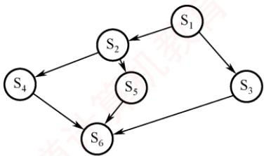
</div>

<p align="center"><em>图 2.11 前驱关系举例</em></p>

```javascript
semaphore a12=0,a13=0,a24=0,a25=0,a36=0,a46=0,a56=0; //初始化所有信号量，初值均为0
S1() {
    ...; //执行 S1
    V(a12);V(a13); //通知 S2 和 S3: S1 已完成
}
S2() {
    P(a12); //等待 S1 完成
    ...; //执行 S2
```

　　<table><tr><td>V(a24);V(a25);</td><td>//通知S4和S5:S2已完成</td></tr><tr><td>}</td><td></td></tr><tr><td>S3() {</td><td></td></tr><tr><td>P(a13);</td><td>//等待S1完成</td></tr><tr><td>...;</td><td>//执行S3</td></tr><tr><td>V(a36);</td><td>//通知S6:S3已完成</td></tr><tr><td>}</td><td></td></tr><tr><td>S4() {</td><td></td></tr><tr><td>P(a24);</td><td>//等待S2完成</td></tr><tr><td>...;</td><td>//执行S4</td></tr><tr><td>V(a46);</td><td>//通知S6:S4已完成</td></tr><tr><td>}</td><td></td></tr><tr><td>S5() {</td><td></td></tr><tr><td>P(a25);</td><td>//等待S2完成</td></tr><tr><td>...;</td><td>//执行S5</td></tr><tr><td>V(a56);</td><td>//通知S6:S5已完成</td></tr><tr><td>}</td><td></td></tr><tr><td>S6() {</td><td></td></tr><tr><td>P(a36);</td><td>//等待S3完成</td></tr><tr><td>P(a46);</td><td>//等待S4完成</td></tr><tr><td>P(a56);</td><td>//等待S5完成</td></tr><tr><td>...;</td><td>//执行S6</td></tr><tr><td>}</td><td></td></tr></table>

#### 6. 分析进程同步和互斥问题的方法步骤

1）关系分析。首先识别参与并发的进程，并厘清其间的关系：互斥关系（多个进程竞争同一临界资源）、同步关系（某进程需等待另一进程的执行结果）、前驱关系（存在明确的执行顺序约束）。每类关系均可映射到前述经典信号量模型。

2）思路梳理。根据各进程的操作流程，确定关键同步点，并初步规划 P、V 操作的位置。可参考和类比典型场景，如生产者-消费者、读者-写者、前驱图。

3）信号量设置。基于上述分析，定义所需的信号量，明确其语义与初值，并将 P、V 操作嵌入各进程的适当位置，确保逻辑正确，避免死锁与饥饿，且满足所有约束条件。

### 2.3.5 经典同步问题

> **考点追踪：** PV 操作的应用题（2009、2011、2013、2014、2015、2017、2019、2025）

#### 1. 生产者-消费者问题

　　**问题描述：**

　　系统中存在一组生产者进程和一组消费者进程，它们共享一个初始为空、容量为 n 的缓冲区。生产者每次生产一个产品，并将其放入缓冲区；消费者每次从缓冲区取出一个产品并进行消费。该问题需满足以下约束条件：仅当缓冲区未满时，生产者才能写入产品，否则必须等待；仅当缓冲区非空时，消费者才能读取产品，否则必须等待；缓冲区是临界资源，所有进程必须互斥访问。

　　**问题分析：**

1）关系分析。由于缓冲区是共享的临界资源，生产者与消费者对缓冲区的访问构成互斥关系；同时，消费者必须等待生产者生成产品后才能消费，二者又存在同步关系。

2）思路梳理。使用一个互斥信号量控制对缓冲区的互斥访问；使用两个计数信号量分别跟踪空缓冲区和满缓冲区的数量；并严格控制P和V操作的执行顺序，以避免死锁。

3）信号量设置。互斥信号量 mutex，控制对缓冲区的互斥访问，初值为 1；计数信号量 empty，记录空缓冲区的数量，初值为 n；计数信号量 full，记录满缓冲区的数量，初值为 0。

　　生产者-消费者进程的实现如下：

```txt
semaphore mutex=1;    //互斥访问缓冲区
semaphore empty=n;    //空缓冲区数量
semaphore full=0;    //满缓冲区数量
producer() {    //生产者进程
    while(1) {
    生产一个产品
    P(empty); （要用什么，P一下）    //申请一个空缓冲区
    P(mutex); （互斥夹紧）    //进入临界区
    将产品放入缓冲区
    V(mutex); （互斥夹紧）    //退出临界区
    V(full); （提供什么，V一下）    //满缓冲区数加1
    }
}
consumer() {    //消费者进程
    while(1) {
    P(full);    //申请一个满缓冲区
    P(mutex);    //进入临界区
    从缓冲区中取出一个产品
    V(mutex);    //退出临界区
    V(empty);    //空缓冲区数加1
    消费产品
    }
}
```

　　需特别注意：对 empty 和 full 的 P 操作必须置于对 mutex 的 P 操作之前。若顺序颠倒，例如生产者先执行 P(mutex) 再执行 P(empty)，则消费者先执行 P(mutex) 再执行 P(full) 可能导致死锁。试想：当缓冲区已满（empty = 0），若生产者先获取 mutex，随后因 P(empty) 而阻塞；此时消费者欲取产品，却因 mutex 已被生产者持有而无法进入临界区执行 P(full) 和消费操作。结果，生产者等待消费者释放空位，消费者等待生产者释放 mutex，双方互相阻塞，导致死锁。同理，当缓冲区为空（full = 0）时，若消费者先获取 mutex 再执行 P(full)，也会因无法继续而阻塞，进而阻止生产者进入临界区放入产品，同样导致死锁。因此，必须先申请资源状态（empty 或 full），再申请互斥访问（mutex），以确保进程不会在持有互斥锁的同时等待资源，从而避免死锁。

　　下面再看一个较为复杂的生产者-消费者问题。

　　**问题描述：**

　　桌上有一个盘子，最多只能容纳一个水果。爸爸专门向盘中放入苹果，妈妈专门放入橘子；女儿只吃盘中的苹果，儿子只吃盘中的橘子；只有当盘子为空时，爸爸或妈妈才能向其中放入一个水果；只有当盘中有自己所需的水果时，儿子或女儿才能从中取出并食用。

　　**问题分析：**

1）关系分析。爸爸和妈妈在向盘中放入水果时存在互斥关系；爸爸与女儿、妈妈与儿子之间分别构成同步关系（爸爸放苹果后，女儿才能取用；妈妈放橘子后，儿子才能取用）；儿子与女儿各自等待不同的水果，因此他们之间既无互斥也无同步关系。

2）整理思路。可抽象为两个生产者（爸爸、妈妈）和两个消费者（女儿、儿子），共享一个容量为1的缓冲区。由于不同类型的产品（苹果、橘子）需由不同的消费者消费，故不能仅使用一个full信号量来表示满状态，而需为每种产品设置独立的同步信号量。

3）信号量设置。互斥信号量 plate，控制对盘子的互斥访问，初值为 1；同步信号量 apple，表示盘中是否有苹果，初值为 0；同步信号量 orange，表示盘中是否有橘子，初值为 0。进程的实现如下：

```txt
semaphore plate=1, apple=0, orange=0;
dad() {    //爸爸进程
    while(1){
    准备一个苹果
    P(plate);    //获取对盘子的独占使用权
    把苹果放入盘子
    V(apple);    //通知女儿：苹果已放入盘中
    }
}

mom() {    //母亲进程
    while(1){
    准备一个橘子
    P(plate);    //获取对盘子的独占使用权
    把橘子放入盘子
    V(orange);    //通知儿子：橘子已放入盘中
    }
}

son() {    //儿子进程
    while(1){
    P(orange);    //等待盘中有橘子
    从盘子中取出橘子
    V(plate);    //释放盘子，允许他人使用
    吃掉橘子
    }
}

daughter() {    //女儿进程
    while(1){
    P(apple);    //等待盘中有苹果
    从盘子中取出苹果
    V(plate);    //释放盘子，允许他人使用
    吃掉苹果
    }
}
```

　　进程之间的关系如图 2.12 所示。dad() 和 daughter()、mom() 和 son() 必须成对执行。只有当女儿拿走苹果或儿子拿走橘子之后，才会执行 V(plate) 操作，从而释放盘子供下一次使用。

#### 2. 读者-写者问题

　　**问题描述：**

　　系统中存在两组并发进程：读者和写者，它们共享一个文件。多个读者可以同时读取文件，不会导致数据不一致；

<div align="center">
  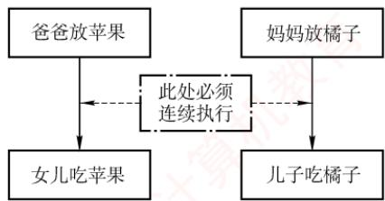
</div>

<p align="center"><em>图 2.12 进程之间的关系</em></p>

　　但若任一写者与其他进程（无论是读者还是其他写者）同时访问文件，则可能破坏数据一致性。因此，需满足以下要求：① 允许多个读者同时执行读操作；② 任一时刻只允许一个写者执行写操作；③ 写者在完成写操作前，不允许任何其他读者或写者访问文件；④ 写者开始写操作前，必须等待所有已进入的读者和写者全部退出。

　　**问题分析：**

1）关系分析。读者与写者之间存在互斥关系；写者与写者之间也存在互斥关系；读者与读者之间无互斥关系，可并发读取。

2）整理思路。写者的实现较为直接：它与所有其他进程互斥，只需用一个互斥信号量控制即可。读者的实现则更为复杂：它既要允许其他读者并发读取，又要阻止写者在读期间介入。为此，引入一个计数器 count，用于记录当前正在读文件的读者数量。当第一个读者开始读时，应阻塞后续的写者；当最后一个读者结束读时，才允许写者进入；同时，多个读者对 count 的修改必须互斥。

3）信号量设置。计数信号量 count，记录当前读者数量，初值为 0；互斥信号量 mutex，控制对 count 的互斥访问，初值为 1；互斥信号量 rw，控制对文件的互斥访问，初值为 1。进程的实现如下（读者优先）：

```txt
int count=0;    //记录当前的读者数量
semaphore mutex=1;    //控制对 count 的互斥访问
semaphore rw=1;    //控制读者与写者对文件的互斥访问
writer() {    //写者进程
    while(1) {
    P(rw);    //申请对文件的独占写权限
    写文件
    V(rw);    //释放文件写权限
    }
}
reader() {    //读者进程
    while(1) {
    P(mutex);    //互斥访问 count
    if(count==0)    //若是第一个读者
    P(rw);    //阻止写者访问文件
    count++;    //读者数量加 1
    V(mutex);    //释放对 count 的访问
    读文件
    P(mutex);    //互斥访问 count
    count--;    //读者数量减 1
    if(count==0)    //若是最后一个读者
    V(rw);    //允许写者访问文件
    V(mutex);    //释放对 count 的访问
    }
}
```

　　上述算法实现的是读者优先策略。只要已有读者在读，后续到来的读者均可立即进入读取，而写者必须等待所有读者全部退出。这种设计可能导致写者长时间等待，甚至出现写者饥饿，即在读者持续到达的情况下，写者可能被无限期推迟。

　　若需实现写者优先策略：一旦有写者请求写入，就禁止新读者进入，并在当前读者全部退出后立即让写者执行。为此，引入互斥信号量 w，用于控制所有进程进入“准备访问文件”阶段的权限：写者先执行 P(w)，再执行 P(rw)，从而阻止后续读者插队；读者也需先执行 P(w)；若此时有写者持有或正在等待 w，该读者将被阻塞；读者在更新 count 后立即执行 V(w)，因为只要存在活跃读者（count > 0），写者已被 rw 阻塞，提前释放 w 可避免不必要地阻碍其他写者；写者完成写操作后执行 V(w)，释放访问权。这样，w 如同“门卫”：当有写者等待时，新读者无法进入；但已在读的读者可正常完成操作，既保障了写者的优先权，又维持了读者之间的并发读取。

```javascript
int count=0;    //记录当前的读者数量
semaphore mutex=1;    //控制对 count 的互斥访问
semaphore rw=1;    //控制读者与写者对文件的互斥访问
semaphore w=1;    //实现写者优先的关键信号量
writer() {    //写者进程
    while(1){
```

```txt
P(w); //申请写者优先权：阻止新读者进入
P(rw); //申请对文件的独占写权限
写文件
V(rw); //释放文件写权限
V(w); //释放写者优先权，允许其他进程进入
}
reader() { //读者进程
while(1){
    P(w); //申请进入权限：若无写者等待，则通过
    P(mutex); //互斥访问 count
    if(count==0) //若是第一个读者
    P(rw); //阻止写者访问文件
    count++; //读者数量加 1
    V(mutex); //释放对 count 的访问
    V(w); //立即释放 w，允许其他进程竞争
读文件
    P(mutex); //互斥访问 count
    count--; //读者数量减 1
    if(count==0) //若是最后一个读者
    V(rw); //允许写者访问文件
    V(mutex); //释放对 count 的访问
}
}
```

　　上述写者优先策略是相对的，并非绝对优先。该算法通过信号量 w 阻止新读者在写者等待时进入，从而避免读者无限插队；然而，若多个进程（包括读者和写者）同时阻塞在 w 上，系统通常按 FCFS 顺序唤醒，此时先到达的读者仍可能优先于后到的写者获得访问权。因此，该算法本质上是在防止写者饥饿的前提下，对写者给予有限优先，而非严格意义上的写者优先。

　　读者-写者问题的关键在于使用了受互斥保护的计数器 count。因此，面对复杂的同步互斥问题时，可考虑引入此类计数器来动态判断资源状态，这是一种重要的解题思路。

#### 3. 哲学家进餐问题

　　**问题描述：**

　　一张圆桌旁围坐 5 名哲学家，每两名相邻哲学家之间放置一根筷子，共 5 根筷子，每位哲学家面前有一碗米饭，如图 2.13 所示。哲学家交替进行思考与进餐：思考时互不影响；饥饿时，必须同时持有左右两根筷子才能开始进餐（筷子需要逐根拿起）；若所需筷子已被他人持有，则必须等待；进餐结束后，立即放下两根筷子，继续思考。

　　**问题分析：**

1）关系分析。每根筷子被其两侧的哲学家共享，因此对同一根筷子的访问必须互斥。

2）整理思路。共有5个并发进程。本题的关键是如何让一名哲学家安全地获取左右两根筷子，避免死锁或饥饿。直观的解决思路有两种：① 尝试同时获取两根筷子，即仅当左右筷子均空闲时才

<div align="center">
  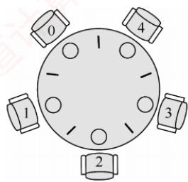
</div>

<p align="center"><em>图 2.13 5 名哲学家进餐</em></p>

　　拿起；② 对哲学家的行为制定规则，破坏死锁产生的必要条件。

3）信号量设置。定义互斥信号量数组 chopstick[5]，控制对 5 根筷子的互斥访问，初值均为 1。哲学家编号为 0～4，哲学家 i 左侧筷子的编号为 i，右侧筷子的编号为 $(i + 1)\% 5$ 。

　　一个直观的实现如下（存在死锁风险）：

```txt
semaphore chopstick[5] = {1, 1, 1, 1, 1}; // 初始化 5 根筷子的信号量
Pi() {
    do {
    P(chopstick[i]); // 拿起左侧筷子
    P(chopstick[(i+1)%5]); // 拿起右侧筷子
    进餐
    V(chopstick[i]); // 放回左侧筷子
    V(chopstick[(i+1)%5]); // 放回右侧筷子
    思考
    } while(1);
}
```

　　假设 5 名哲学家同时饥饿，并几乎同时执行完 P(chopstick[i])。此时，每位哲学家各持一根左侧筷子，且均在等待右侧筷子，系统进入循环等待状态，所有进程阻塞，形成死锁。

　　为防止死锁发生，可对哲学家进程施加一些限制条件：① 限制最多 4 名哲学家同时尝试进餐，确保至少有一人能获得两根筷子，这样在其用餐完毕后释放他的两根筷子，从而使更多的哲学家能够进餐；② 对哲学家编号，规定奇数号哲学家先拿左筷、再拿右筷，偶数号则相反，打破循环等待条件；③ 仅当左右两根筷子均空闲时，才允许哲学家同时拿起。

　　假设采用第二种方法，当一名哲学家左右两侧的筷子都可用时，才允许他拿起筷子。

```c
semaphore chopstick[5] = {1, 1, 1, 1, 1}; // 初始化 5 根筷子的信号量
semaphore mutex = 1; // 设置取筷子的信号量
Pi() {
    do {
    P(mutex); // 申请取筷子的信号量
    P(chopstick[i]); // 拿起左侧筷子
    P(chopstick[(i + 1)%5]); // 拿起右侧筷子
    V(mutex); // 释放取筷子的信号量
    进餐
    V(chopstick[i]); // 放回左侧筷子
    V(chopstick[(i + 1)%5]); // 放回右侧筷子
    思考
    } while(1);
}
```

　　哲学家进餐问题是经典的进程同步案例，其本质在于预防循环等待。尽管大部分习题和真题通过消费者-生产者模型或读者-写者问题就能求解，但对哲学家进餐问题仍然要熟悉。考研复习的关键在于反复多次和全面，“偷工减料”是要吃亏的。

### 2.3.6 管程

　　在信号量机制中，每个访问临界资源的进程都需自行编写 P/V 操作。分散的同步代码不仅增加了编程复杂度，还极易因操作顺序不当而引发死锁。为简化同步控制，操作系统引入了更高层的抽象机制——管程：它将共享资源及其操作封装于一体，自动保证互斥访问，程序员无须显式编写互斥代码；同时，通过条件变量实现灵活的进程同步，有效降低死锁风险。

#### 1. 管程的定义

> **考点追踪：** 管程的特点（2016）

　　系统中的各类硬件资源和软件资源，均可通过数据结构进行抽象描述：即用少量状态信息和一组对资源的操作来表征该资源，而忽略其内部结构与实现细节。

　　管程正是基于这一思想构建的。它利用一个共享数据结构来表示系统中的共享资源，并将对该数据结构的所有操作封装为一组过程。进程对共享资源的申请、释放等操作，都必须通过调用这些过程来完成。这组过程可根据资源的当前状态决定是否允许访问：若条件满足，则处理请求；否则，将进程阻塞。由此确保任一时刻至多只有一个进程使用该共享资源，从而统一管理所有对共享资源的访问，实现进程互斥。这个由共享数据结构及其操作过程共同组成的资源管理程序，称为管程（monitor）。形式上，管程定义了一个数据结构，以及一组可在该数据结构上被并发进程调用的操作；这些操作不仅能修改管程内部的数据，还能协调进程之间的同步行为。

　　形式上，一个管程由以下四部分组成。

　　① 管程的名称。

　　② 局部于管程内部的共享数据结构说明。

　　③ 对该数据结构进行操作的一组过程（或函数）。

　　④ 对共享数据进行初始化的语句。

　　典型的管程定义如下:

```txt
monitor Demo{ //① 定义一个名称为 Demo 的管程
    //② 定义共享数据结构，对应系统中的某种共享资源
    共享数据结构 S;
    //④ 对共享数据结构初始化的语句
    init_code() {
    S=5;    //初始可用资源数为 5
    }
    take_away() {    //③ 操作过程 1：申请资源
    对共享数据结构 S 的一系列处理；
    S--;    //可用资源数 - 1
    ...
    }
    give_back() {    //③ 操作过程 2：归还资源
    对共享数据结构 S 的一系列处理；
    S++;    //可用资源数 + 1
    ...
    }
}
```

1）封装性：管程将对共享资源的操作封装起来，其内部的共享数据结构只能被管程自身的过程访问。外部进程必须通过调用这些过程才能访问资源。例如，在上例中，申请资源需调用 take_away()，归还资源则需调用 give_back()。

2）互斥性：任一时刻仅允许一个进程执行管程内的过程，从而实现互斥访问。若多个进程同时调用 take_away() 或 give_back()，则只有当前进程完成其所调用的过程后，下一个进程才能开始执行，这一机制确保了对共享数据 S 的互斥访问。

　　管程与进程的区别：① 进程拥有私有数据结构（如 PCB），而管程管理的是公共数据结构（如缓冲区）。② 进程执行通用计算任务，而管程专注于同步控制与资源管理。③ 引入进程是为了实现并发，而引入管程是为了解决共享资源的互斥访问问题。④ 进程是主动执行的实体，而管程是被动调用的模块，即进程通过调用管程中的过程来操作共享数据。⑤ 多个进程可并发执行，但对同一管程的多个调用是互斥的，即同一时刻仅一个进程可在该管程内执行。⑥ 进程具有动态的生命周期（从创建到撤销），而管程是操作系统中的静态资源管理模块，仅供进程调用。

#### 2. 条件变量

　　当一个进程进入管程后，若因条件不满足而需要等待，它必须释放对管程的占用；否则，其他进程将无法进入管程，从而导致系统停滞。为解决这一问题，管程引入了条件变量（condition），将不同的阻塞原因分别抽象为独立的条件变量。通常，一个进程可能因多种条件不满足而被阻塞，因此管程中可以设置多个条件变量。每个条件变量维护一个等待队列，用于记录所有因该条件而阻塞的进程。对条件变量仅支持两种操作：wait 和 signal。

　　x.wait: 当条件变量 x 所代表的条件不满足时，当前执行管程过程的进程调用 x.wait()，将自身加入 x 的等待队列，并自动释放管程，从而允许其他进程进入。

　　x.signal: 当 x 所代表的条件发生变化（可能已满足）时，调用 x.signal()，唤醒一个因等待该条件而阻塞在 x 上的进程。

　　条件变量的定义和使用示例如下:

```txt
monitor Demo{
    共享数据结构 S;
    condition x; // 定义一个条件变量 x
    init_code() { ... }
    take_away() {
    if (S <= 0) x.wait(); // 资源不足，在条件变量 x 上阻塞等待资源足够，分配资源，做一系列相应处理；
    }
    give_back() {
    归还资源，做一系列相应处理；
    if (有进程在等待) x.signal(); // 唤醒一个阻塞进程
    }
}
```

　　条件变量与信号量的比较。相似点：wait/signal 操作与 P/V 操作均可实现进程的阻塞与唤醒。不同点：信号量具有整数值，反映可用资源数量；而条件变量不维护数值，仅用于线程排队和通知。在管程中，资源数量由共享变量（如 S）显式记录，条件变量只负责同步。

### 2.3.7 本节小结

　　本节开头提出的问题的参考答案如下。

#### 1. 为什么要引入进程同步的概念？

　　在多道程序环境下，多个进程并发执行，彼此之间存在相互制约关系。为协调这些关系，确保进程能够正确、有序地协作或竞争共享资源，操作系统引入了进程同步的概念。

#### 2. 不同的进程之间会存在什么关系？

　　进程之间主要存在两种基本的制约关系：同步与互斥。同步是指为完成共同任务而建立的多个进程，在某些关键点上需要协调工作次序，通过等待或传递信息所形成的协作关系。互斥是指当一个进程正在访问临界资源（处于临界区）时，其他进程必须等待；只有当前进程退出临界区后，其他进程才被允许进入，以保证对临界资源的独占访问。

#### 3. 当单纯用本节介绍的方法解决这些问题时会遇到什么新的问题吗？

　　当两个或多个进程各自已占用某些资源，又同时请求对方所持有的资源时，可能形成一种互相等待的局面。若无外部干预，这些进程将永久阻塞，无法继续推进，这种现象称为死锁。其形成原因、必要条件、检测方法及解决方案将在下一节中详细介绍。

### 2.3.8 本节习题精选

#### 一、单项选择题

01. 下列对临界区的论述中，正确的是（）。A. 临界区是指进程中用于实现进程互斥的那段代码B. 临界区是指进程中用于实现进程同步的那段代码C. 临界区是指进程中用于实现进程通信的那段代码

- D. 临界区是指进程中用于访问临界资源的那段代码

02. 不需要信号量就能实现的功能是（）。

- A. 进程同步
- B. 进程互斥
- C. 执行的前驱关系
- D. 进程的并发执行

03. 若一个信号量的初值为 3，经过多次 PV 操作后当前值为 -1，这表示等待进入临界区的进程数是（）。
- A. 1 B. 2 C. 3 D. 4

04. 一个正在访问临界资源的进程由于申请等待 I/O 操作而被中断时，它（）。
- A. 允许其他进程进入与该进程相关的临界区
- B. 不允许其他进程进入任何临界区
- C. 允许其他进程抢占处理器，但不得进入该进程的临界区
- D. 不允许任何进程抢占处理器

05. 两个旅行社甲和乙为旅客到某航空公司订飞机票，形成互斥资源的是（）。
- A. 旅行社 B. 航空公司
- C. 飞机票 D. 旅行社与航空公司

06. 临界区是指并发进程访问共享变量段的（）。

- A. 管理信息
- B. 信息存储
- C. 数据
- D. 代码程序

07. 以下不是同步机制应遵循的准则的是（）。

- A. 让权等待
- B. 空闲让进
- C. 忙则等待
- D. 无限等待

08. 以下（）不属于临界资源。
- A. 打印机    B. 非共享数据    C. 共享变量    D. 共享缓冲区

09. 以下（）属于临界资源。
- A. 磁盘
- B. 公用队列
- C. 私用数据
- D. 可重入的程序代码

10. 在操作系统中，要对并发进程进行同步的原因是（）。

- A. 进程必须在有限的时间内完成
- B. 进程具有动态性
- C. 并发进程是异步的
- D. 进程具有结构性

11. 进程 A 和进程 B 通过共享缓冲区协作完成数据处理，进程 A 负责产生数据并放入缓冲区，进程 B 从缓冲区读数据并输出。进程 A 和进程 B 之间的制约关系是（）。

- A. 互斥关系
- B. 同步关系
- C. 互斥和同步关系
- D. 无制约关系

12. 在操作系统中，P, V 操作是一种（）。

- A. 机器指令
- B. 系统调用命令
- C. 作业控制命令
- D. 低级进程通信原语

13. P 操作可能导致（）。
- A. 进程就绪 B. 进程结束 C. 进程阻塞 D. 新进程创建

14. 原语是（）。

- A. 运行在用户态的过程
- B. 操作系统的内核
- C. 可中断的指令序列
- D. 不可分割的指令序列

15. （）定义了共享数据结构和各种进程在该数据结构上的全部操作。
- A. 管程    B. 类程    C. 线程    D. 程序

16. 用V操作唤醒一个等待进程时，被唤醒进程变为（）态。

- A. 运行
- B. 等待
- C. 就绪
- D. 完成

17. 在用信号量机制实现互斥时，互斥信号量的初值为（）。

- A. 0
- B. 1
- C. 2
- D. 3

18. 用 P, V 操作实现进程同步，信号量的初值为（）。

- A. -1
- B. 0
- C. 1
- D. 由用户确定

19. 可以被多个进程在任意时刻共享的代码必须是（）。
- A. 顺序代码 B. 机器语言代码 C. 不允许任何修改的代码 D. 无转移指令代码

20. 一个进程映像由程序、数据及 PCB 组成，其中（）必须用可重入编码编写。
- A. PCB    B. 程序    C. 数据    D. 共享程序段

21. 下列关于互斥锁的说法中，正确的是（）。
- A. 互斥锁只能用于多线程之间，不能用于多进程之间
- B. 互斥锁只能用于多进程之间，不能用于多线程之间
- C. 互斥锁可用于多线程或多进程之间，但只能由创建它的线程或进程来加锁和解锁
- D. 互斥锁可用于多线程或多进程之间，但只能由对它加锁的线程或进程来解锁

22. 在使用互斥锁进行同步互斥时，下列（）情况会导致死锁。
- A. 一个线程对同一个互斥锁连续加锁两次
- B. 一个线程尝试对一个已加锁的互斥锁再次加锁
- C. 两个线程分别对两个不同的互斥锁先后加锁，但顺序相反
- D. 一个线程对一个互斥锁加锁后忘记解锁

23. 用来实现进程同步与互斥的 PV 操作实际上是由（）过程组成的。
- A. 一个可被中断的
- B. 一个不可被中断的
- C. 两个可被中断的
- D. 两个不可被中断的

24. 对于两个并发进程，设互斥信号量为 mutex（初值为 1），若 mutex = 0，则表示（）。
- A. 没有进程进入临界区
- B. 有一个进程进入临界区
- C. 有一个进程进入临界区，另一个进程等待进入
- D. 有一个进程在等待进入

25. 对于两个并发进程，设互斥信号量为 mutex（初值为 1），若 mutex = -1，则（）。
- A. 表示没有进程进入临界区
- B. 表示有一个进程进入临界区
- C. 表示有一个进程进入临界区，另一个进程等待进入
- D. 表示有两个进程进入临界区

26. 一个进程因在互斥信号量 mutex 上执行 V(mutex)操作而导致唤醒另一个进程时，执行 V 操作后 mutex 的值为（）。
- A. 大于 0 B. 小于 0 C. 大于或等于 0 D. 小于或等于 0

27. 一个系统中共有 5 个并发进程涉及某个相同的变量 A，变量 A 的相关临界区是由（）个临界区构成的。
- A. 1 B. 3 C. 5 D. 6

28. 下述（）选项不是管程的组成部分。
- A. 局限于管程的共享数据结构

- B. 对管程内数据结构进行操作的一组过程
- C. 管程外过程调用管程内数据结构的说明
- D. 对局限于管程的数据结构设置初始值的语句

29. 以下关于管程的叙述中，错误的是（）。
- A. 管程是进程同步工具，解决信号量机制大量同步操作分散的问题
- B. 管程每次只允许一个进程进入管程
- C. 管程中 signal 操作的作用和信号量机制中的 V 操作相同
- D. 管程是被进程调用的，管程是语法范围，无法创建和撤销

30. 对信号量 S 执行 P 操作后，使该进程进入资源等待队列的条件是（）。

- A. S.value < 0
- B. S.value <= 0
- C. S.value > 0
- D. S.value >= 0

31. 若系统有 $n$ 个进程，则就绪队列中进程的个数最多有（①）个；阻塞队列中进程的个数最多有（②）个。 $①$

- A. $n + 1$
- B. $n$
- C. $n - 1$
- D. 1 $②$ A. $n + 1$ B. $n$ C. $n - 1$ D. 1

1）假如若干进程对 S 进行 28 次 P 操作和 18 次 V 操作后，信号量 S 的值为 0。

2）假如若干进程对信号量 S 进行了 15 次 P 操作和 2 次 V 操作。请问此时有多少个进程等待在信号量 S 的队列中？（）
- A. 2 B. 3 C. 5 D. 7

$$
\mathrm{P} _ {1}
$$

$$
\mathrm{P} _ {2}
$$

　　P1 () {
    x=1;    //A1
    y=2;
    z=x+y;
    print z;    //A2
}

　　可能打印出的 z 值有（），可能打印出的 c 值有（）（其中 x 为 $P_{1}, P_{2}$ 的共享变量）。
- A. z = 1, -3; c = -1, 9
- B. z = -1, 3; c = 1, 9
- C. z = -1, 3, 1; c = 9
- D. z = 3; c = 1, 9

34. 并发进程之间的关系是（）。

- A. 无关的
- B. 相关的
- C. 可能相关的
- D. 可能是无关的，也可能是有交往的

35. 若系统中有 4 个进程共享 3 台打印机，采用信号量机制控制打印机的共享使用，则信号量的取值范围是（）。

- A. [-1, 4]
- B. [-2, 2]
- C. [-1, 3]
- D. [-3, 2]

36. 两个进程 $\mathrm{P_0}$ 、 $\mathrm{P_1}$ 互斥的 Peterson 算法描述如下：进程 P0 进程 P1 flag[0] = 1; flag[1] = 1; (1); (2); while (flag[1] &turn == 1); while (flag[0] &turn == 0);临界区；临界区；flag[0] = 0; flag[1] = 0;其余代码；其余代码；

　　其中，(1)和(2)处的代码分别为（）。A. $\mathrm{turn} = 0, \mathrm{turn} = 0$ B. $\mathrm{turn} = 0, \mathrm{turn} = 1$ C. $\mathrm{turn} = 1, \mathrm{turn} = 0$ D. $\mathrm{turn} = 1, \mathrm{turn} = 1$

37. 在 Peterson 算法中，flag 数组的作用是（）。

- A. 表示每个线程是否想进入临界区
- B. 表示每个线程是否已进入临界区
- C. 表示每个线程是否已退出临界区
- D. 表示每个线程是否已完成任务

38. 在 Peterson 算法中，turn 变量的作用是（）。

- A. 表示轮到哪个线程进入临界区
- B. 表示哪个线程先发出访问请求
- C. 表示哪个线程后发出访问请求
- D. 表示哪个线程已进入临界区

39. 生产者-消费者问题用于解决（）。

- A. 多个进程共享一个数据对象的问题
- B. 多个进程之间的同步和互斥问题
- C. 多个进程共享资源的死锁与饥饿问题
- D. 利用信号量实现多个进程并发的问题

40. 所有的消费者必须等待生产者先运行的前提条件是（）。

- A. 缓冲区空
- B. 缓冲区满
- C. 缓冲区不可用
- D. 缓冲区半空

41. 下列关于生产者-消费者问题的唤醒操作的说法中，正确的是（）。
I. 生产者唤醒其他生产者 II. 生产者唤醒消费者
III. 消费者唤醒其他消费者 IV. 消费者唤醒生产者
- A. I和II B. III和IV C. II和III D. I、II、III和IV

42. 在 9 个生产者、6 个消费者共享容量为 8 的缓冲区的生产者-消费者问题中，互斥使用缓冲区的信号量初始值为（）。
- A. 1 B. 6 C. 8 D. 9

43. 消费者进程阻塞在 wait(m)（m 是互斥信号量）的条件是（）。
I. 没有空缓冲区 II. 没有满缓冲区 III. 有其他生产者已进入临界区 IV. 有其他消费者已进入临界区 A. I 和 II B. III 和 IV C. I 和 III D. II 和 IV

44. 在读者-写者问题中，能同时执行的是（）。

- A. 读者和写者
- B. 不同的写者
- C. 不同的读者
- D. 都不能

45. 哲学家就餐问题的解决方案如下:

　　semaphore *chopstick[5];
semaphore *seat;
哲学家 i:
...
P (seat);
P (chopStick[i]);
P (chopStick[(i+1)%5]);
吃饭
V (chopStick[i]);
V (chopStick[(i+1)%5]);
V (seat)

　　其中，信号量seat的初值最大为（）。A.0 B.1 C.4 D.5

46. 有两个优先级相同的并发程序 $\mathrm{P}_1$ 和 $\mathrm{P}_2$ ，它们的执行过程如下所示。假设当前信号量 $s1 = 0$ ， $s2 = 0$ 。当前的 $z = 2$ ，进程运行结束后，x,y 和 z 的值分别是（）。

　　进程 $\mathsf{P}_1$ 进程 $\mathsf{P}_2$ ...
y:=1; x:=1
y:=y+2; x:=x+1;
z:=y+1; P(s1);
V(s1); x:=x+y;
P(s2); z:=x+z;

　　y:=z+y;
V(s2);
...
- A. 5,9,9
- B. 5,9,4
- C. 5,12,9
- D. 5,12,4

47. 【2010 统考真题】设与某资源关联的信号量初值为 3，当前值为 1。若 M 表示该资源的可用个数，N 表示等待该资源的进程数，则 M, N 分别是（）。

- A. 0, 1
- B. 1, 0
- C. 1, 2
- D. 2, 0

48. 【2010 统考真题】进程 $\mathrm{P}_0$ 和进程 $\mathrm{P}_1$ 的共享变量定义及其初值为：

　　若进程 $P_{0}$ 和进程 $P_{1}$ 访问临界资源的类 C 代码实现如下:

　　void P0() //进程 $P_0$ void P1() //进程 $P_1$ { while(true) { while(true) { flag[0] = true;turn=1; while(flag[1] && (turn==1)); while(flag[0] && (turn==0)); 临界区； flag[0] = false; } } }

　　则并发执行进程 $\mathrm{P_0}$ 和进程 $\mathrm{P}_{1}$ 时产生的情况是（）。
- A. 不能保证进程互斥进入临界区，会出现“饥饿”现象
- B. 不能保证进程互斥进入临界区，不会出现“饥饿”现象
- C. 能保证进程互斥进入临界区，会出现“饥饿”现象
- D. 能保证进程互斥进入临界区，不会出现“饥饿”现象

49. 【2011 统考真题】有两个并发执行的进程 $\mathrm{P}_{1}$ 和进程 $\mathrm{P}_{2}$ ，共享初值为 1 的变量 x。 $\mathrm{P}_{1}$ 对 x 加 1， $\mathrm{P}_{2}$ 对 x 减 1。加 1 和减 1 操作的指令序列分别如下：

　　两个操作完成后，x 的值（）。
- A. 可能为-1 或 3 B. 只能为 1
- C. 可能为 0, 1 或 2 D. 可能为-1, 0, 1 或 2

50. 【2016 统考真题】进程 $\mathrm{P_1}$ 和 $\mathrm{P_2}$ 均包含并发执行的线程，部分伪代码描述如下所示。

　　<table><tr><td>// 进程P1int x=0;Thread1( ){ int a;a=1; x+=1;}Thread2( ){ int a;a=2; x+=2;}</td><td>// 进程P2int x=0;Thread3( ){ int a;a=x; x+=3;}Thread4( ){ int b;b=x; x+=4;}</td></tr></table>

　　下列选项中，需要互斥执行的操作是（）。
- A. $a = 1$ 与 $a = 2$ B. $a = x$ 与 $b = x$ C. $x + = 1$ 与 $x + = 2$ D. $x + = 1$ 与 $x + = 3$

51. 【2016 统考真题】使用 TSL（Test and Set Lock）指令实现进程互斥的伪代码如下所示。
do{
    ...
    while(TSL(&lock));
    critical section;
    lock=FALSE;
    ...
} while(TRUE);

　　下列与该实现机制相关的叙述中，正确的是（）。
- A. 退出临界区的进程负责唤醒阻塞态进程
- B. 等待进入临界区的进程不会主动放弃CPU
- C. 上述伪代码满足“让权等待”的同步准则
- D. while(TSL(&lock))语句应在关中断状态下执行

52. 【2016 统考真题】下列关于管程的叙述中，错误的是（）。

- A. 管程只能用于实现进程的互斥
- B. 管程是由编程语言支持的进程同步机制
- C. 任何时候只能有一个进程在管程中执行
- D. 管程中定义的变量只能被管程内的过程访问

53. 【2018 统考真题】属于同一进程的两个线程 thread1 和 thread2 并发执行，共享初值为 0 的全局变量 x。thread1 和 thread2 实现对全局变量 x 加 1 的机器级代码描述如下。

　　<table><tr><td colspan="3">thread1</td><td colspan="3">thread2</td></tr><tr><td>mov</td><td>R1,x</td><td><eq>// (x) \rightarrow R1</eq></td><td>mov</td><td>R2,x</td><td><eq>// (x) \rightarrow R2</eq></td></tr><tr><td>inc</td><td>R1</td><td><eq>// (R1) + 1 \rightarrow R1</eq></td><td>inc</td><td>R2</td><td><eq>// (R2) + 1 \rightarrow R2</eq></td></tr><tr><td>mov</td><td>x,R1</td><td><eq>// (R1) \rightarrow x</eq></td><td>mov</td><td>x,R2</td><td><eq>// (R2) \rightarrow x</eq></td></tr></table>

　　在所有可能的指令执行序列中，使 x 的值为 2 的序列个数是（）。
- A. 1 B. 2 C. 3 D. 4

54. 【2018 统考真题】若 x 是管程内的条件变量，则当进程执行 x.wait() 时所做的工作是（）。

- A. 实现对变量 x 的互斥访问
- B. 唤醒一个在 x 上阻塞的进程
- C. 根据 x 的值判断该进程是否进入阻塞态
- D. 阻塞该进程，并将之插入 x 的阻塞队列中

55. 【2018 统考真题】在下列同步机制中，可以实现让权等待的是（）。

- A. Peterson 方法
- B. swap 指令
- C. 信号量方法
- D. TestAndSet 指令

56. 【2020 统考真题】下列准则中，实现临界区互斥机制必须遵循的是（）。
I. 两个进程不能同时进入临界区
II. 允许进程访问空闲的临界资源
III. 进程等待进入临界区的时间是有限的
IV. 不能进入临界区的执行态进程立即放弃 CPU
- A. 仅 I、IV B. 仅 II、III
- C. 仅 I、II、III D. 仅 I、III、IV

#### 二、综合应用题

01. 下面是两个并发执行的进程，它们能正确运行吗？若不能请举例说明并改正。

　　<table><tr><td>int x;</td><td></td></tr><tr><td>process_P1{</td><td>process_P2{</td></tr><tr><td>int y,z;</td><td>int t,u;</td></tr><tr><td>x=1;</td><td>x=0;</td></tr><tr><td>y=0;</td><td>t=0;</td></tr><tr><td>if (x&gt;=1)</td><td>if (x&lt;=1)</td></tr><tr><td>y=y+1;</td><td>t=t+2;</td></tr><tr><td>z=y;</td><td>u=t;</td></tr><tr><td>}</td><td>}</td></tr></table>

02. 在一个仓库中可以存放 A 和 B 两种产品，要求:

　　① 每次只能存入一种产品。

　　② A 产品数量 - B 产品数量 < M，其中 M 是正整数。

　　③ B 产品数量 - A 产品数量 < N，其中 N 是正整数。

　　假设仓库的容量是无限的，试用P,V操作描述产品A和B的入库过程。

03. 面包师有很多面包，由 n 名销售人员推销。每名顾客进店后按序取一个号，并且等待叫号，当一名销售人员空闲时，就按序叫下一个号。可以用两个整型变量来记录当前的取号值和叫号值，试设计一个使销售人员和顾客同步的算法。

04. 某工厂有两个生产车间和一个装配车间，两个生产车间分别生产 A, B 两种零件，装配车间的任务是把 A, B 两种零件组装成产品。两个生产车间每生产一个零件后，都要分别把它们送到专配车间的货架 $F_{1}, F_{2}$ 上。 $F_{1}$ 存放零件 A, $F_{2}$ 存放零件 B, $F_{1}$ 和 $F_{2}$ 的容量均可存放 10 个零件。装配工人每次从货架上取一个零件 A 和一个零件 B 后组装成产品。请用 P, V 操作进行正确管理。

05. 某寺庙有小和尚、老和尚若干，有一水缸，由小和尚提水入缸供老和尚饮用。水缸可容10桶水，水取自同一井中。水井径窄，每次只能容一个桶取水。水桶总数为3个。每次入缸取水仅为1桶水，且不可同时进行。试给出有关从缸取水、入水的算法描述。

06. 如下图所示，三个合作进程 $P_{1}, P_{2}, P_{3}$ ，它们都需要通过同一设备输入各自的数据 a, b, c，该输入设备必须互斥地使用，而且其第一个数据必须由 $P_{1}$ 进程读取，第二个数据必须由 $P_{2}$ 进程读取，第三个数据必须由 $P_{3}$ 进程读取。然后，三个进程分别对输入数据进行下列计算：

<div align="center">
  
</div>

$$
\begin{array}{c} \mathrm {P_ {1} : x = a + b;} \\ \mathrm {P_ {2} : y = a*b;} \\ \mathrm {P_ {3} : z = y + c - a;} \end{array}
$$

　　最后， $\mathrm{P}_{1}$ 进程通过所连接的打印机将计算结果 $\mathrm{x}, \mathrm{y}, \mathrm{z}$ 的值打印出来。请用信号量实现它们的同步。

07. 有桥如右图所示。车流方向如箭头所示。回答如下问题:

1）假设桥上每次只能有一辆车行驶，试用信号灯的 P, V 操作实现交通管理。

<div align="center">
  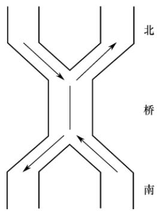
</div>

2）假设桥上不允许两车交会，但允许同方向多辆车一次通过（桥上可有多辆同方向行驶的车）。试用信号灯的 P, V 操作实现桥上的交通管理。

08. 假设有两个线程（编号为 0 和 1）需要去访问同一个共享资源，为避免竞争状态的问题，我们必须实现一种互斥机制，使得在任何时候只能有一个线程访问这个资源。假设有如下一段代码：

```c
bool flag[2]; //flag 数组，初始化为 FALSE
Enter_Critical_Section(int my_thread_id, int other_thread_id) {
    while (flag[other_thread_id] == TRUE); //空循环语句
    flag[my_thread_id] = TRUE;
}
Exit_Critical_Section(int my_thread_id, int other_thread_id) {
    flag[my_thread_id] = FALSE;
}
```

　　当一个线程想要访问临界资源时，就调用上述的这两个函数。例如，线程0的代码可能是这样的：

```txt
Enter_Critical_Section(0,1);
使用这个资源；
Exit_Critical_Section(0,1);
做其他的事情；
```

　　试问：

1）以上的这种机制能够实现资源互斥访问吗？为什么？

2）若把 Enter_Critical_Section() 函数中的两条语句互换位置，可能发生死锁吗？

09. 设自行车生产线上有一个箱子，其中有 $N$ 个位置 $(N \geqslant 3)$ ，每个位置可存放一个车架或一个车轮；又设有3名工人，其活动分别为：

```txt
工人1活动： 工人2活动： 工人3活动：
do{ do{ do{箱中取一个车架；加工一个车架； 加工一个车轮； 箱中取二个车轮；车架放入箱中； 车轮放入箱中； 组装为一台车； }while(1) }while(1) }while(1)
```

　　试分别用信号量与 PV 操作实现三名工人的合作，要求解中不含死锁。

10. 设 P, Q, R 共享一个缓冲区，P, Q 构成一对生产者-消费者，R 既为生产者又为消费者，若缓冲区为空，则可以写入；若缓冲区不空，则可以读出。使用 P, V 操作实现其同步。

11. 理发店里有一位理发师、一把理发椅和 $n$ 把供等候理发的顾客坐的椅子。若没有顾客，理发师便在理发椅上睡觉，一位顾客到来时，顾客必须叫醒理发师，若理发师正在理发时又有顾客来到，且有空椅子可坐，则坐下来等待，否则就离开。试用P,V操作实现，并说明信号量的定义和初值。

12. 假设一个录像厅有 1, 2, 3 三种不同的录像片可由观众选择放映，录像厅的放映规则如下：

1）任意时刻最多只能放映一种录像片，正在放映的录像片是自动循环放映的，最后一名观众主动离开时结束当前录像片的放映。

2）选择当前正在放映的录像片的观众可立即进入，允许同时有多位选择同一种录像片的观众同时观看，同时观看的观众数量不受限制。

3）等待观看其他录像片的观众按到达顺序排队，当一种新的录像片开始放映时，所有等待观看该录像片的观众可依次序进入录像厅同时观看。用一个进程代表一个观众，要求：用信号量方法PV操作实现，并给出信号量定义和初始值。

13. 设公共汽车上驾驶员和售票员的活动分别如下图所示。驾驶员的活动：启动车辆，正常行车，到站停车；售票员的活动：关车门，售票，开车门。在汽车不断地到站、停车、行驶的过程中，这两个活动有什么同步关系？用信号量和 P, V 操作实现它们的同步。

<div align="center">
  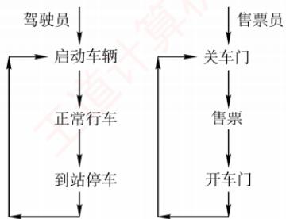
</div>

14. 一组进程的执行顺序如下图所示，圆圈 $\mathrm{P}_1, \mathrm{P}_2, \mathrm{P}_3, \mathrm{P}_4, \mathrm{P}_5, \mathrm{P}_6$ 表示进程，弧上的字母 a, b, c, d, e, f, g, h 表示同步信号量，请用 P, V 操作实现进程的同步。

<div align="center">
  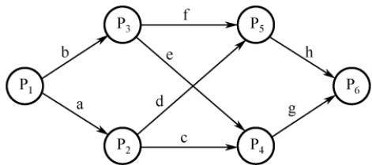
</div>

15. 有 3 个进程 P、 $P_{1}$ 、 $P_{2}$ 合作处理数据，P 从输入设备读数据到缓冲区，缓冲区可存 1000 个字。 $P_{1}$ 和 $P_{2}$ 的功能一样，都是从缓冲区取出数据并计算，再打印结果。请用信号量的 P, V 操作实现。其中，语句 read() 从输入设备读入 20 个字到缓冲区；get() 从缓冲区取出 20 个字；comp() 计算 40 个字输出并得到结果的 1 个字；print() 打印结果的 2 个字。

16. 假设有3个抽烟者和1个供应者。每个抽烟者不停地卷烟并抽掉它，但要卷起并抽掉一支烟，抽烟者需要有三种材料：烟草、纸和胶水。三个抽烟者中，第一个拥有烟草，第二个拥有纸，第三个拥有胶水。供应者无限提供三种材料，供应者每次将两种材料放到桌子上，拥有剩下那种材料的抽烟者卷一根烟并抽掉它，并给供应者一个信号告诉已完成，此时供应者就将另外两种材料放到桌上，如此重复，让3个抽烟者轮流抽烟。

17. 【2009 统考真题】三个进程 $P_{1}, P_{2}, P_{3}$ 互斥使用一个包含 N (N > 0) 个单元的缓冲区。 $P_{1}$ 每次用 produce() 生成一个正整数并用 put() 送入缓冲区某一空单元； $P_{2}$ 每次用 getodd() 从该缓冲区中取出一个奇数并用 countodd() 统计奇数个数； $P_{3}$ 每次用 geteven() 从该缓冲区中取出一个偶数并用 count even() 统计偶数个数。请用信号量机制实现这三个进程的同步与互斥活动，并说明所定义的信号量的含义（要求用伪代码描述）。

18. 【2011 统考真题】某银行提供 1 个服务窗口和 10 个供顾客等待的座位。顾客到达银行时，若有空座位，则到取号机上领取一个号，等待叫号。取号机每次仅允许一位顾客使用。当营业员空闲时，通过叫号选取一位顾客，并为其服务。顾客和营业员的活动过程描述如下：

```txt
coBegin
{
    process 顾客 i
    {
    从取号机获取一个号码；
    等待叫号；
    获取服务；
    }
    process 营业员
    {
    While (TRUE)
    {
```

```txt
叫号；为客户服务；}coEnd
```

　　请添加必要的信号量和 P, V [或 wait(), signal()] 操作，实现上述过程中的互斥与同步。要求写出完整的过程，说明信号量的含义并赋初值。

19. 【2013 统考真题】某博物馆最多可容纳 500 人同时参观，有一个出入口，该出入口一次仅允许一人通过。参观者的活动描述如下：

```txt
coBegin
    参观者进程 i:
    {
    ...
    进门;
    ...
    参观;
    ...
    出门;
    ...
    }
coEnd
```

　　请添加必要的信号量和 P, V[或 wait(), signal()] 操作，以实现上述过程中的互斥与同步。要求写出完整的过程，说明信号量的含义并赋初值。

20. 【2014 统考真题】系统中有多个生产者进程和多个消费者进程，共享一个能存放 1000 件产品的环形缓冲区（初始为空）。缓冲区未满时，生产者进程可以放入其生产的一件产品，否则等待；缓冲区未空时，消费者进程可从缓冲区取走一件产品，否则等待。要求一个消费者进程从缓冲区连续取出 10 件产品后，其他消费者进程才可以取产品。请使用信号量 P, V (wait(), signal()) 操作实现进程间的互斥与同步，要求写出完整的过程，并说明所用信号量的含义和初值。

21. 【2015 统考真题】有 A, B 两人通过信箱进行辩论，每个人都从自己的信箱中取得对方的问题。将答案和向对方提出的新问题组成一个邮件放入对方的邮箱中。假设 A 的信箱最多放 M 个邮件，B 的信箱最多放 N 个邮件。初始时 A 的信箱中有 x 个邮件 (0 < x < M)，B 的信箱中有 y 个邮件 (0 < y < N)。辩论者每取出一个邮件，邮件数减 1。A 和 B 两人的操作过程描述如下：

　　<table><tr><td>A{while(TRUE){从A的信箱中取出一个邮件;回答问题并提出一个新问题;将新邮件放入B的信箱;} }</td><td>B{while(TRUE){从B的信箱中取出一个邮件;回答问题并提出一个新问题;将新邮件放入A的信箱;} }</td></tr></table>

　　当信箱不为空时，辩论者才能从信箱中取邮件，否则等待。当信箱不满时，辩论者才能将新邮件放入信箱，否则等待。请添加必要的信号量和 P, V [或 wait(), signal()] 操作，以实现上述过程的同步。要求写出完整的过程，并说明信号量的含义和初值。

22. 【2017 统考真题】某进程中有 3 个并发执行的线程 thread1, thread2 和 thread3，其伪代码如下所示。

```lisp
// 复数的结构类型定义
typedef struct
{
    float a;
    float b;
} cnum;
cnum x, y, z; // 全局变量

// 计算两个复数之和
cnum add(cnum p, cnum q)
{
    cnum s;
    s.a = p.a + q.a;
    s.b = p.b + q.b;
    return s;
}

thread1
{
    cnum w;
    w = add(x, y);
    ...
}

thread2
{
    cnum w;
    w = add(y, z);
    ...
}

thread3
{
    cnum w;
    w.a = 1;
    w.b = 1;
    z = add(z, w);
    y = add(y, w);
    ...
}
```

　　请添加必要的信号量和 P, V[或 wait(), signal()] 操作，要求确保线程互斥访问临界资源，并且最大限度地并发执行。

23. 【2019 统考真题】有 $n (n \geqslant 3)$ 名哲学家围坐在一张圆桌边，每名哲学家交替地就餐和思考。在圆桌中心有 $m (m \geqslant 1)$ 个碗，每两名哲学家之间有一根筷子。每名哲学家必须取到一个碗和两侧的筷子后，才能就餐，进餐完毕，将碗和筷子放回原位，并继续思考。为使尽可能多的哲学家同时就餐，且防止出现死锁现象，请使用信号量的 P, V 操作 [wait(), signal() 操作] 描述上述过程中的互斥与同步，并说明所用信号量及初值的含义。

24. 【2020 统考真题】现有 5 个操作 A、B、C、D 和 E，操作 C 必须在 A 和 B 完成后执行，操作 E 必须在 C 和 D 完成后执行，请使用信号量的 wait()、signal() 操作（P、V 操作）描述上述操作之间的同步关系，并说明所用信号量及其初值。

25. 【2021 统考真题】下表给出了整型信号量 S 的 wait() 和 signal() 操作的功能描述，以及采用开/关中断指令实现信号量操作互斥的两种方法。

　　<table><tr><td>功能描述</td><td>方法1</td><td>方法2</td></tr><tr><td>Semaphore S;wait(S){while(S&lt;=0);S=S-1;}signal(S){S=S+1;}</td><td>Semaphore S;wait(S){关中断;while(S&lt;=0);S=S-1;开中断;}signal(S){关中断;S=S+1;开中断;}</td><td>Semaphore S;wait(S){关中断;while(S&lt;=0){开中断;关中断;}S=S-1;开中断;}signal(S){关中断;S=S+1;开中断;}</td></tr></table>

　　请回答下列问题。

1）为什么在 wait() 和 signal() 操作中对信号量 S 的访问必须互斥执行？

2）分别说明方法1和方法2是否正确。若不正确，请说明理由。

3）用户程序能否使用开/关中断指令实现临界区互斥？为什么？

26. 【2022 统考真题】某进程的两个线程 T1 和 T2 并发执行 A、B、C、D、E 和 F 共 6 个操作，其中 T1 执行 A、E 和 F，T2 执行 B、C 和 D。下图表示上述 6 个操作的执行顺序所必须满足的约束：C 在 A 和 B 完成后执行，D 和 E 在 C 完成后执行，F 在 E 完成后执行。请使用信号量的 wait()、signal() 操作描述 T1 和 T2 之间的同步关系，并说明所用信号量的作用及其初值。

<div align="center">
  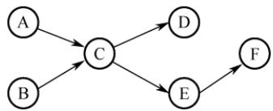
</div>

27. 【2023 统考真题】现要求学生使用 swap 指令和布尔型变量 lock 实现临界区互斥。lock 为线程间共享的变量，当 lock 的值为 TRUE 时线程不能进入临界区，为 FALSE 时线程能够进入临界区。某同学编写的实现临界区互斥的伪代码如下图所示。

```txt
某同学编写的伪代码
bool lock = FALSE; //共享变量
...
bool key = TRUE;
if (key == TRUE)
    swap key, lock; //交换 key 和 lock 的值
临界区;
lock = TRUE;
...
进入区
退出区
```

　　(a)

<div align="center">
  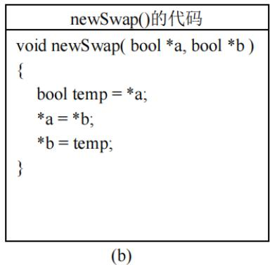
</div>

　　请回答下列问题。

1）图(a)的伪代码中哪些语句存在错误？将其改为正确的语句（不增加语句的条数）。

2）图(b)给出了交换两个变量值的函数 newSwap()的代码，是否可以用函数调用语句“newSwap(&key, &lock)”代替指令“swap key, lock”以实现临界区互斥？为什么？

28. 【2024 统考真题】计算机系统中的进程之间往往需要相互协作来完成一个任务。在某网络系统中，缓冲区 B 用于存放一个数据分组，对 B 的操作有 $C_1$ 、 $C_2$ 和 $C_3$ 。 $C_1$ 将一个数据分组写入 B， $C_2$ 从 B 中读出一个数据分组， $C_3$ 对 B 中的数据分组进行修改。要求 B 为空时才能执行 $C_1$ ，B 非空时才能执行 $C_2$ 和 $C_3$ 。请回答下列问题。

1）假设进程 $\mathrm{P_1}$ 和 $\mathrm{P_2}$ 均需要执行 $\mathrm{C_1}$ ，实现 $\mathrm{C_1}$ 的代码是否为临界区？为什么？

2）假设 B 初始为空，进程 $P_{1}$ 执行 $C_{1}$ 一次，进程 $P_{2}$ 执行 $C_{2}$ 一次。请定义尽可能少的信号量，并用 wait()、signal() 操作描述进程 $P_{1}$ 和 $P_{2}$ 之间的同步或互斥关系，说明所用信号量的作用及其初值。

3）设 B 初始不为空，进程 $P_{1}$ 和 $P_{2}$ 各执行 $C_{3}$ 一次。定义尽可能少的信号量，并用 wait()、signal() 操作描述进程 $P_{1}$ 和 $P_{2}$ 之间的同步或互斥关系，说明所用信号量的作用及其初值。

29. 【2025 统考真题】甲、乙、丙三人一起植树，甲负责挖树坑，乙负责将树苗放入树坑并填土，丙负责为新种的树苗浇水。植树的步骤依次为：挖树坑、放树苗、填土和浇水。

　　现有铁锹和水桶各 1 个，铁锹用于挖树坑和填土，水桶用于浇水。当树坑的数量小于 3 时，甲才可以挖树坑。假设初始时树坑的数量为 0，铁锹和水桶均可用。请定义尽可能少的信号量，用 wait()、signal() 操作描述植树过程中三人之间的同步或互斥关系，并说明所用信号量的作用及其初值。

### 2.3.9 答案与解析

#### 一、单项选择题

**01. D**

　　多个进程可以共享系统中的资源，一次仅允许一个进程使用的资源称为临界资源。访问临界资源的那段代码称为临界区。

**02. D**

　　在多道程序技术中，信号量机制是一种有效实现进程同步和互斥的工具。进程执行的前趋关系实质上是指进程的同步关系。除此之外，只有进程的并发执行不需要信号量来控制。

**03. A**

　　信号量是一个特殊的整型变量，只有初始化和 PV 操作才能改变其值。通常，信号量分为互斥量和资源量，互斥量的初值一般为 1，表示临界区只允许一个进程进入，从而实现互斥。当互斥量等于 0 时，表示临界区已有一个进程进入，临界区外尚无进程等待；当互斥量小于 0 时，表示临界区中有一个进程，互斥量的绝对值表示在临界区外等待进入的进程数。同理，资源信号量的初值可以是任意整数，表示可用的资源数，当资源量小于 0 时，表示所有资源已全部用完，而且还有进程正在等待使用该资源，等待的进程数就是资源量的绝对值。

**04. C**

　　进程进入临界区必须满足互斥条件。当进程已进入临界区但尚未离开时，若被迫进入阻塞状态，这是允许的，系统中常出现此类情形。在此状态下，只要其他进程在运行过程中不试图进入该临界区，就应允许其获得 CPU 并继续执行。该进程所锁定的临界区不允许其他进程访问；若其他进程尝试进入，必将在临界区的“锁”上阻塞，等待该进程下次运行时退出并释放临界区。

**05. C**

　　一张飞机票不能售给不同的旅客，因此飞机票是互斥资源，其他因素只是为完成飞机票订票的中间过程，与互斥资源无关。

**06. D**

　　所谓临界区，并不是指临界资源，如共享的数据、代码或硬件设备等，而是指访问临界资源的那段代码程序，如 P/V 操作、加减锁等。操作系统访问临界资源时，关心的是临界区的操作过程，具体对临界资源做何操作是应用程序的事情，操作系统并不关心。

**07. D**

　　同步机制的 4 个准则是空闲让进、忙则等待、让权等待和有限等待。

**08. B**

　　临界资源是互斥共享资源，非共享数据不属于临界资源。打印机、共享变量和共享缓冲区都只允许一次供一个进程使用。

**09. B**

　　临界资源是指必须互斥访问的资源，若并发使用将导致数据混乱或逻辑错误。磁盘虽为共享设备，但其访问由操作系统统一协调，不构成临界资源；公用队列被多个进程共享，若无互斥控制，同时操作会导致队列结构破坏或数据错乱，属于典型临界资源；私用数据仅限单个进程使用，不存在竞争；可重入的程序代码不含全局状态，允许多进程并发执行，无须互斥。

**10. C**

　　同步是指为了完成某项任务而建立的多个进程的相互合作关系，由于并发进程的执行是异步的（按各自独立的、不可预知的速度向前推进），需要保证进程之间操作的先后次序的约束。例如，读进程和写进程对同一段缓冲区的读和写就需要进行同步，以保证正确的执行顺序。

**11. C**

　　并发进程因共享资源而产生相互制约，可分为两类：① 互斥关系，指进程竞争使用独占资源（互斥资源）所形成的制约；② 同步关系，指进程为协同工作而需交换信息、相互等待所形成的制约。本题中，两个进程之间的制约属于同步关系，进程 B 必须等待进程 A 将数据写入缓冲区后，才能从中读取数据。同时，缓冲区是共享资源，其访问必须互斥，因此二者也存在互斥关系。

**12. D**

　　P、V 操作是一种低级的进程通信原语，它是不能被中断的。

**13. C**

　　P 操作即 wait 操作，表示等待某种资源直到可用。若这种资源暂时不可用，则进程进入阻塞态。注意，执行 P 操作时的进程处于运行态。

**14. D**

　　原语顾名思义，就是原子性的、不可分割的操作。其严格定义为：由若干机器指令构成的完成某种特定功能的一段程序，其执行必须是连续的，在执行过程中不允许被中断。

**15. A**

　　管程定义了一个数据结构和能为并发进程所执行（在该数据结构上）的一组操作，这组操作能同步进程并改变管程中的数据。

**16. C**

　　只有就绪进程能获得处理器资源，被唤醒的进程并不能直接转换为运行态。

**17. B**

　　互斥信号量的初值设置为 1，P 操作成功则将其减 1，禁止其他进程进入；V 操作成功则将其加 1，允许等待队列中的一个进程进入。

**18. D**

　　与互斥信号量初值一般置1不同，用P,V操作实现进程同步时，信号量的初值应根据具体情况来确定。若期望的消息尚未产生，则对应的初值应设为0；若期望的消息已存在，则信号量的初值应设为一个非0的正整数。

**19. C**

　　若代码可被多个进程在任意时刻共享，则要求任意一个进程在调用此段代码时都以同样的方式运行；而且进程在运行过程中被中断后再继续执行，其执行结果不受影响。这必然要求代码不能被任何进程修改，否则无法满足共享的要求。这样的代码就是可重入代码，也称纯代码，即允许多个进程同时访问的代码。

**20. D**

　　共享程序段可能同时被多个进程使用，所以必须可重入编码，否则无法实现共享的功能。

**21. D**

　　互斥锁可用于多线程或多进程之间，但只有对它加锁的线程或进程才能解锁它。若一个线程或进程试图解锁一个不属于它（加锁）的互斥锁，则返回错误码。

**22. C**

　　若两个线程分别对两个不同的互斥锁先后加锁，但顺序相反，则可能导致死锁，这是典型的循环等待现象。例如，线程 1 先对互斥锁 A 加锁，然后尝试对互斥锁 B 加锁；同时，线程 2 先对 B 加锁，然后尝试对 A 加锁，两个线程都在等待对方释放资源，从而无法继续推进。

**23. D**

　　P 操作和 V 操作都属于原语操作，不可被中断。

**24. B**

　　互斥信号量 mutex 初值为 1，表示临界区初始可用。当 mutex = 0 时，说明一个进程已执行 P 操作并进入临界区，且因信号量非负，无其他进程在等待；只有当 mutex = -1 时，才表示一个进程在临界区内，另一个在等待。因此，mutex = 0 对应有且仅有一个进程进入临界区。

**25. C**

　　当有一个进程进入临界区且有另一个进程等待进入临界区时，mutex = -1。当 mutex 小于 0 时，其绝对值等于等待进入临界区的进程数。

**26. D**

　　由题意可知，系统原来存在等待进入临界区的进程，mutex 小于或等于-1，因此在执行 V(mutex) 操作后，mutex 的值小于或等于 0。

**27. C**

　　这里的临界区是指访问临界资源 A 的那段代码（临界区的定义）。那么 5 个并发进程共有 5 个操作共享变量 A 的代码段。

**28. C**

　　管程由局限于管程的共享变量说明、对管程内的数据结构进行操作的一组过程及对局限于管程的数据设置初始值的语句组成。

**29. C**

　　管程的 signal 操作与信号量机制中的 V 操作不同, 信号量机制中的 V 操作一定会改变信号量的值 $S = S + 1$ 。而管程中的 signal 操作是针对某个条件变量的, 若不存在因该条件而阻塞的进程, 则 signal 不会产生任何影响。

**30. A**

　　参见记录型信号量的介绍。此处极易出关于 S.value 的概念题，总结如下：① S.value > 0，表示某类可用资源的数量。每次 P 操作，意味着请求分配一个单位的资源。② S.value ≤ 0，表示某类资源已无可用，且存在因请求该资源而被阻塞的进程，S.value 的绝对值表示等待进程数量。一定要看清题目中的陈述是执行 P 操作前还是执行 P 操作后。

**31. ①C ②B**

　　① 系统中有 n 个进程，只要这些进程不都处于阻塞态，则至少有一个进程正在处理器上运行（处理器至少有一个），因此就绪队列中的进程个数最多有 n-1 个。选项 B 容易被错选，以为出现了处理器为空、就绪队列全满的情况，实际调度无此状态。

　　② 本题易错选 C，阻塞队列有 n-1 个进程是可能发生的，但不是最多的情况。不少读者会忽略死锁的情况，死锁就是 n 个进程都被阻塞，因此阻塞队列最多可以有 n 个进程。

**32. B**

　　对 S 进行了 28 次 P 操作和 18 次 V 操作，即 $S-28+18=0$ ，得信号量的初值为 10；然后，对信号量 S 进行了 15 次 P 操作和 2 次 V 操作，即 $S-15+2=10-15+2=-3$ ，S 信号量的负值的绝对值表示等待队列中的进程数。所以有 3 个进程等待在信号量 S 的队列中。

**33. B**

　　本题的关键是，输出语句 A2, B2 中读取的 x 的值不同，由于 A1, B1 执行有先后问题，使得在执行 A2, B2 前，x 的可能取值有两个，即 1, -3；这样，输出 z 的值可能是 $1 + 2 = 3$ 或 $(-3) + 2 = -1$ ；输出 c 的值可能是 $1 \times 1 = 1$ 或 $(-3)(-3) = 9$ 。

**34. D**

　　并发进程之间的关系没有必然的要求，只有执行时间上的偶然重合，可能无关也可能有交往。

**35. C**

　　信号量的初值表示该类资源的总数，因此信号量的初值取3。每分配一个该类资源，信号量减1，当信号量等于0时，表示该类资源刚好被分完；当信号量小于0时，表示还有进程正在等待该类资源，信号量的绝对值就是等待进程的数量。因此，当没有进程使用时，信号量最大为3；当有三个进程正在使用并有一个进程在等待时，信号量最小为-1。

**36. C**

　　根据 Peterson 算法的原理，可知(1)和(2)处分别为 turn = 1 和 turn = 0。

**37. A**

　　flag 数组用于标记各个线程想进入临界区的意愿。当一个线程想要进入临界区时，它将自己对应的 flag 值置为 true；当一个线程退出临界区时，它将自己对应的 flag 值置为 false。这样，若两个进程都争着想进入临界区，则可以让进程将进入临界区的机会谦让给对方。

**38. A**

　　turn 变量用于指示允许进入临界区的线程编号。当一个线程想要进入临界区时，它将 turn 置为对方的编号，表示优先让对方先进入。当一个线程检查到对方的 flag 为 true 时，表示对方也想进入，这时就需要根据 turn 来决定谁先进入。若 turn 等于自己的编号，表示轮到自己进入，则可以直接进入。若 turn 等于对方的编号，表示轮到对方进入，则需等待对方退出。

**39. B**

　　进程并发带来问题不仅包括同步互斥问题，还包括死锁等其他问题。生产者-消费者问题用于解决进程的同步和互斥问题。共享一个数据对象仅涉及互斥访问的问题。

**40. A**

　　当缓冲区为空时，消费者进程取产品会被阻塞，此时需等待生产者进程生产新产品。

**41. D**

　　生产者和消费者共享缓冲区，每次只允许一个生产者或消费者进入缓冲区，当有一个生产者或消费者进入缓冲区时，其他生产者或消费者就必须阻塞等待。因此，生产者有可能唤醒其他生产者或消费者，消费者也有可能唤醒其他生产者或消费者，四个选项均正确。

**42. A**

　　所谓互斥使用某临界资源，是指在同一时间段只允许一个进程使用此资源，所以互斥信号量的初值都为1。

**43. B**

　　在生产者-消费者问题中，每次只能有一个生产者或消费者进入缓冲区，需要用一个互斥信号量来控制，当有一个生产者或消费者进入缓冲区时，其他申请进入缓冲区的消费者会被阻塞。

**44. C**

　　在读者-写者问题中，写者和写者之间、写者和读者之间必须互斥访问共享对象，读者和读者之间则可以同时访问。

**45. C**

　　信号量seat表示桌子上可以坐下的位置数，因为只有五个位置，所以每次只能有四位哲学家同时拿起左边的餐叉，才能保证不会发生死锁，所以seat的初值应该为4。

**46. C**

　　因为进程并发，所以进程的执行具有不确定性，在 $P_{1}, P_{2}$ 执行到第一个 $P, V$ 操作前，应该是相互无关的。现在考虑第一个对 $s_{1}$ 的 P, V 操作，因为进程 $P_{2}$ 是 $\mathrm{P}(s_{1})$ 操作，所以它必须等待 $P_{1}$ 执行完 $\mathrm{V}(s_{1})$ 操作后才可继续运行，此时的 x, y, z 值分别是 2, 3, 4，当进程 $P_{1}$ 执行完 $\mathrm{V}(s_{1})$ 后便在 $\mathrm{P}(s_{2})$ 上阻塞，此时 $P_{2}$ 可以运行直到 $\mathrm{V}(s_{2})$ ，此时的 x, y, z 值分别是 5, 3, 9，进程 $P_{1}$ 继续运行到结束，最终的 x, y, z 值分别为 5, 12, 9。

**47. B**

　　信号量表示相关资源的当前可用数量。当信号量 K > 0 时，表示还有 K 个相关资源可用，所以该资源的可用个数是 1。而当信号量 K < 0 时，表示有 |K| 个进程在等待该资源。因为资源有剩余，可见没有其他进程等待使用该资源，所以进程数为 0。

**48. D**

　　这是 Peterson 算法的实际实现，保证进入临界区的进程合理安全。该算法为了防止两个进程为进入临界区而无限期等待，设置了变量 turn，表示允许进入临界区的编号，每个进程在先设置自己的标志后再设置 turn 标志，允许另一个进程进入。这时，再同时检测另一个进程状态标志和允许进入标志，就可保证当两个进程同时要求进入临界区时只允许一个进程进入临界区。保存的是较晚的一次赋值，因此较晚的进程等待，较早的进程进入。先到先入，后到等待，从而完成临界区访问的要求。

　　其实这里可想象为两个人进门，每个人进门前都会和对方客套一句“你走先”。若进门时没别人，则当和空气说句废话，然后大步登门入室；若两人同时进门，则互相先请，但各自只客套一次，所以先客套的人请完对方，就等着对方请自己，然后光明正大地进门。

**49. C**

　　x 的值最终是多少，取决于最后是哪个进程对 x 进行了写操作。一个进程一旦拿到了 x 值，它最后对 x 写操作的值也就确定了。因此本题只需考虑两个进程拿到 x 值的所有可能情况。对于进程 $P_{1}$ ，最初取到的 x 值可能是 1，也可能是进程 $P_{2}$ 完成后更新得到的 x 值 0，因此对于 $P_{1}$ ，最终写入 x 的值可能是 2（当它最初取到 1 时）和 1（当它最初取到 0 时）。同理，对于 $P_{2}$ ，最初取到的 x 值可能是 1，也可能是 $P_{1}$ 完成后更新得到的 x 值 2，因此对于 $P_{2}$ ，最终写入 x 的值可能是 0（当它最初取到 1 时）和 1（当它最初取到 2 时）。因此，最终的 x 值可能是 0、1 或 2。

**50. C**

　　需要进行互斥的操作是对临界资源的访问，也就是说，不同线程对同一个进程内部的共享变量的访问才有可能需要进行互斥，不同进程的线程、代码段或变量不存在互斥访问的问题，同一个线程内部的局部变量也不存在互斥访问的问题。选项 A 中的 a 是线程内部的局部变量，不需要互斥访问。选项 D 是不同进程的线程代码段，不存在互斥访问的问题。选项 B 是对进程内部的共享变量 x 的读操作，不互斥也不影响执行结果，所以不需要互斥访问。选项 C 是不同线程对同一个进程内部的共享变量的写操作，需要互斥访问（类似于读者-写者问题）。

**51. B**

　　使用 TSL 指令实现进程互斥时，并没有阻塞态进程，等待进入临界区的进程一直停留在执行 while(TSL(&lock)) 的循环中，不会主动放弃 CPU，一直处于运行态，直到该进程的时间片用完放弃处理机，转为就绪态，此时切换另一个就绪态进程占用处理机。这不同于信号量机制实现的互斥。由此可知选项 A 和 C 错误，选项 B 正确。TSL 指令本身就是原子操作，不需要关中断来保证其不被打断。TSL 指令实现原子性的原理是，执行 TSL 指令的 CPU 锁住内存总线，以禁止其他 CPU 在本指令结束之前访问内存。此外，假如 while(TSL(&lock)) 在关中断状态下执行，若 TSL(&lock) 一直为 true，不再开中断，则系统可能因此终止。因此选项 D 错误。

**52. A**

　　管程是由一组数据及定义在这组数据之上的对这组数据的操作组成的软件模块，这组操作能初始化并改变管程中的数据和同步进程。管程不仅能实现进程间的互斥，还能实现进程间的同步，因此选项 A 错误、B 正确；管程具有如下特性：① 局部于管程的数据只能被局部于管程内的过程所访问；② 一个进程只有通过调用管程内的过程才能进入管程访问共享数据；③ 每次仅允许一个进程在管程内执行某个内部过程，因此选项 C 和 D 正确。

**53. B**

　　仔细阅读两个线程代码可知，thread1 和 thread2 均是对 x 进行加 1 操作，x 的初始值为 0，若要使得最终 x = 2，只能先执行完 thread1 再执行 thread2，或先执行完 thread2 再执行 thread1，因此仅有 2 种可能。

**54. D**

　　“条件变量”是管程内部说明和使用的一种特殊变量，其作用类似于信号量机制中的“信号量”，都用于实现进程同步。需要注意的是，在同一时刻，管程中只能有一个进程在执行。若进程A执行了x.wait()操作，则该进程会阻塞，并挂到条件变量x对应的阻塞队列上。这样，管程的使用权被释放，就可以有另一个进程进入管程。若进程B执行了x.signal()操作，则会唤醒x对应的阻塞队列的队首进程。只有一个进程要离开管程时才能调用signal()操作。

**55. C**

　　硬件方法实现进程同步时不能实现让权等待；Peterson算法满足有限等待但不满足让权等待；记录型信号量由于引入阻塞机制，消除了不让权等待的情况，选项C正确。

**56. C**

　　实现临界区互斥需满足多个准则。“忙则等待”准则，即两个进程不能同时访问临界区，说法I正确。“空闲让进”准则，若临界区空闲，则允许其他进程访问，说法II正确。“有限等待”准则，即进程应该在有限时间内访问临界区，说法III正确。说法I、II和III是互斥机制必须遵循的原则。说法IV是“让权等待”准则，不一定非得实现，如皮特森算法。

#### 二、综合应用题

**01. 【解答】**

　　$\mathrm{P_1}$ 和 $\mathrm{P_2}$ 两个并发进程的执行结果是不确定的，它们都对同一变量X进程操作，X是一个临界资源，而没有进行保护。例如：

1）若先执行完 $P_{1}$ 再执行 $P_{2}$ ，则结果是 x=0, y=1, z=1, t=2, u=2。

2）若先执行 $P_{1}$ 到 “x=1”，然后一个中断去执行完 $P_{2}$ ，再一个中断回来执行完 $P_{1}$ ，则结果是 x=0, y=0, z=0, t=2, u=2。

　　显然，两次执行结果不同，所以这两个并发进程不能正确运行。可将这个程序改为：

```lisp
int x;
semaphore S=1;    //访问 X 的互斥信号量
process_P1{
    int y,z;    int t,u;
    P(S);    P(S);
    x=1;    x=0;
    y=0;    t=0;
    if(x>=1)    if(x<=1)
    y=y + 1;    t=t + 2;
    V(S);    V(S);
    z=y;    u=t;
}
```

**02. 【解答】**

　　使用信号量 mutex 控制两个进程互斥访问临界资源（仓库），使用同步信号量 Sa 和 Sb（分别代表产品 A 与 B 的还可容纳的数量差，以及产品 B 与 A 的还可容纳的数量差）满足条件 2 和条件 3。代码如下：

```txt
Semaphore Sa=M-1, Sb=N-1;
Semaphore mutex=1;    //访问仓库的互斥信号量
process_A() {
    while(1) {
    P(Sa);    P(Sb);
    P(mutex);    P(mutex);
    A产品入库;    B产品入库;
    V(mutex);    V(mutex);
    V(Sb);    V(Sa);
    }
}
```

**03. 【解答】**

　　顾客进店后按序取号，并等待叫号；销售人员空闲后也按序叫号，并销售面包。因此同步算法只要对顾客取号和销售人员叫号进行合理同步即可。我们使用两个变量 i 和 j 分别记录当前的取号值和叫号值，并各自使用一个互斥信号量用于对 i 和 j 进行访问和修改。

```txt
int i=0, j=0;
semaphore mutex_i=1, mutex_j=1;
Consumer() {    //顾客
    进入面包店;
    P(mutex_i);    //互斥访问i
    取号i;
    i++;
    V(mutex_i);    //释放对i的访问
    等待叫号i并购买面包;
}
Seller() {    //销售人员
    while(1){
    P(mutex_j);    //互斥访问j
    if(j<i){    //号j已有顾客取走并等待
    叫号j;
    j++;
    V(mutex_j);    //释放对j的访问
    销售面包;
    }
    else{    //暂时没有顾客在等待
    V(mutex_j);    //释放对j的访问
    休息片刻;
    }
    }
}
```

**04. 【解答】**

　　本题是生产者-消费者问题的变体，生产者“车间A”和消费者“装配车间”共享缓冲区“货架F1”；生产者“车间B”和消费者“装配车间”共享缓冲区“货架F2”。因此，可为它们设置6个信号量：empty1对应货架F1上的空闲空间，初值为10；full1对应货架F1上面的A产品，初值为0；empty2对应货架F2上的空闲空间，初值为10；full2对应货架F2上面的B产品，初值为0；mutex1用于互斥地访问货架F1，初值为1；mutex2用于互斥地访问货架F2，初值为1。

　　A 车间的工作过程可描述为:

```txt
while(1){
    生产一个产品A;
    P(empty1);    //判断货架F1是否有空
    P(mutex1);    //互斥访问货架F1
    将产品A存放到货架F1上;
    V(mutex1);    //释放货架F1
    V(full1);    //货架F1上的零件A的个数加1
}
```

　　B 车间的工作过程可描述为:

```txt
while(1){
    生产一个产品 B;
    P(empty2);    //判断货架 F2 是否有空
    P(mutex2);    //互斥访问货架 F2
    将产品 B 存放到货架 F2 上;
    V(mutex2);    //释放货架 F2
    V(full2);    //货架 F2 上的零件 B 的个数加 1
}
```

　　装配车间的工作过程可描述为:

```txt
while(1){
    P(full1); //判断货架 F1 上是否有产品 A
    P(mutex1); //互斥访问货架 F1
    从货架 F1 上取一个 A 产品；
    V(mutex1); //释放货架 F1
    V(empty1); //货架 F1 上的空闲空间数加 1
    P(full2); //判断货架 F2 上是否有产品 B
    P(mutex2); //互斥访问货架 F2
    从货架 F2 上取一个 B 产品；
    V(mutex2); //释放货架 F2
    V(empty2); //货架 F2 上的空闲空间数加 1
    将取得的 A 产品和 B 产品组装成产品；
}
```

**05. 【解答】**

　　从井中取水并放入水缸是一个连续的动作，可视为一个进程；从缸中取水可视为另一个进程。设水井和水缸为临界资源，引入 well 和 vat；三个水桶无论是从井中取水还是将水倒入水缸都是一次一个，应该给它们一个信号量 pail，抢不到水桶的进程只好等待。水缸满时，不可以再放水，设置 empty 信号量来控制入水量；水缸空时，不可以取水，设置 full 信号量来控制。本题需要设置 5 个信号量来进行控制：

```txt
semaphore well=1;    //用于互斥地访问水井
semaphore vat=1;    //用于互斥地访问水缸
semaphore empty=10;    //用于表示水缸中剩余空间能容纳的水的桶数
semaphore full=0;    //表示水缸中的水的桶数
semaphore pail=3;    //表示有多少个水桶可以用，初值为3
//老和尚
while(1){
    P(full);
    P(pail);
    P(vat);
    从水缸中打一桶水；
    V(vat);
    V(empty);
    喝水；
    V(pail);
```

```c
}
//小和尚
while(1){
    P(empty);
    P(pail);
    P(well);
    从井中打一桶水；
    V(well);
    P(vat);
    将水倒入水缸中；
    V(vat);
    V(full);
    V(pail);
}
```

**06. 【解答】**

　　为了控制三个进程依次使用输入设备进行输入，需分别设置三个信号量 S1, S2, S3，其中 S1 的初值为 1，S2 和 S3 的初值为 0。使用上述信号量后，三个进程不会同时使用输入设备，因此不必再为输入设备设置互斥信号量。另外，还需要设置信号量 Sb, Sy, Sz 来表示数据 b 是否已经输入，以及 y, z 是否已计算完成，它们的初值均为 0。三个进程的动作可描述为：

```javascript
P1 () {
    P(S1);
    从输入设备输入数据 a;
    V(S2);
    P(Sb);
    x=a+b;
    P(Sy);
    P(Sz);
    使用打印机打印出 x, y, z 的结果；
}
P2 () {
    P(S2);
    从输入设备输入数据 b;
    V(S3);
    V(Sb);
    y=a*b;
    V(Sy);
    V(Sy);
}
P3 () {
    P(S3);
    从输入设备输入数据 c;
    P(Sy);
    Z=y+c-a;
    V(Sz);
}
```

**07. 【解答】**

1）桥上每次只能有一辆车行驶，所以只要设置一个信号量bridge就可判断桥是否使用，若在使用中，等待；若无人使用，则执行P操作进入；出桥后，执行V操作。

```txt
semaphore bridge=1;    //用于互斥地访问桥
NtoS() {    //从北向南
    P(bridge);
    通过桥;
    V(bridge);
}
StoN() {    //从南向北
```

2）桥上可以同方向多车行驶，需要设置bridge，还需要对同方向车辆计数。为了防止同方向计数中同时申请bridge造成同方向不可同时行车的问题，要对计数过程加以保护，因此设置信号量mutexSN和mutexNS。

```c
int countSN=0;    //用于表示从南到北的汽车数量
int countNS=0;    //用于表示从北到南的汽车数量
semaphore mutexSN=1;    //用于保护 countSN
semaphore mutexNS=1;    //用于保护 countNS
semaphore bridge=1;    //用于互斥地访问桥
StoN() {    //从南向北
    P (mutexSN);
    if (countSN==0)
    P (bridge);
    countSN++;
    V (mutexSN);
    过桥;
    P (mutexSN);
    countSN--;
    if (countSN==0)
    V (bridge);
    V (mutexSN);
}
NtoS() {    //从北向南
    P (mutexNS);
    if (countNS==0)
    P (bridge);
    countNS++;
    V (mutexNS);
    过桥;
    P (mutexNS);
    countNS--;
    if (countNS==0)
    V (bridge);
    V (mutexNS);
}
```

**08. 【解答】**

1）这种机制不能实现资源的互斥访问。考虑如下情形。

　　① 初始化时，flag 数组的两个元素值均为 FALSE。

　　② 线程 0 先执行，执行 while 循环语句时，因为 flag[1]为 FALSE，所以顺利结束，不会被卡住。假设这时来了一个时钟中断，打断了它的运行。

　　③ 线程 1 去执行，执行 while 循环语句时，因为 flag[0]为 FALSE，所以顺利结束，不会被卡住，然后进入临界区。

　　④ 后来当线程0再执行时，也进入临界区，这样就同时有两个线程在临界区。

　　总结：不能成功的根本原因是无法保证 Enter_Critical_Section() 函数执行的原子性。我们从上面的软件实现方法中可以看出，对于两个进程间的互斥，最主要的问题是标志的检查和修改不能作为一个整体来执行，因此容易导致无法保证互斥访问的问题。

2）可能出现死锁。考虑如下情形。

　　① 初始化时，flag 数组的两个元素值均为 FALSE。

　　② 线程 0 先执行，flag[0]为 TRUE，假设这时来了一个时钟中断，打断了它的运行。

　　③ 线程 1 去执行，flag[1]为 TRUE，在执行 while 循环语句时，因为 flag[0] = TRUE，所以在这个地方被卡住，直到时间片用完。

　　④ 线程 0 再执行时，因为 flag[1]为 TRUE，它也在 while 循环语句的地方被卡住，所以这两个线程都无法执行下去，从而死锁。

**09. 【解答】**

　　用信号量与 PV 操作实现三名工人的合作。

　　首先不考虑死锁问题，工人1与工人3、工人2与工人3构成生产者与消费者关系，这两对生产/消费关系通过共同的缓冲区相联系。从资源的角度来看，箱子中的空位置相当于工人1和工人2的资源，而车架和车轮相当于工人3的资源。

　　分析上述解法易见，当工人1推进速度较快时，箱中空位置可能完全被车架占满或只留有一个存放车轮的位置，此时工人3同时取2个车轮将无法得到，而工人2又无法将新加工的车轮放入箱中；当工人2推进速度较快时，箱中空位置可能完全被车轮占满，而此时工人3取车架将无法得到，而工人1又无法将新加工的车架放入箱中。上述两种情况都意味着死锁。为防止死锁的发生，箱中车架的数量不可超过N-2，车轮的数量不可超过N-1，这些限制可以用两个信号量来表达。具体解答如下。

```txt
semaphore empty=N;    //空位置
semaphore wheel=0;    //车轮
semaphore frame=0;    //车架
semaphore s1=N-2;    //车架最大数
semaphore s2=N-1;    //车轮最大数
工人1活动:
do {
    加工一个车架;
    P(s1);    //检查车架数是否达到最大值
    P(empty);    //检查是否有空位
    车架放入箱;
    V(frame);    //车架数加1
}while(1);
工人2活动:
do {
    加工一个车轮;
    P(s2);    //检查车轮数是否达到最大值
    P(empty);    //检查是否有空位
    车轮放入箱中;
    V(wheel);    //车轮数加1
}while(1);
工人3活动:
do {
    P(frame);    //检查是否有车架
    箱中取一车架;
    V(empty);    //空位数加1
    V(s1);    //可装入车架数加1
    P(wheel);    //检查是否有一个车轮
    P(wheel);    //检查是否有另一个车轮
    箱中取二车轮;
    V(empty);    //取走一个车轮，空位数加1
    V(empty);    //取走另一个车轮，空位数加1
```

```javascript
V(s2);
V(s2);
组装为一台车；
}while(1);
```

　　//可装入车轮数加1
//可装入车轮数再加1

**10. 【解答】**

　　P, Q 构成消费者-生产者关系，因此设三个信号量 full, empty, mutex。full 和 empty 用来控制缓冲池状态，mutex 用来互斥进入。R 既为消费者又为生产者，因此必须在执行前判断状态，若 empty==1，则执行生产者功能；若 full==1，执行消费者功能。

```lisp
semaphore full=0;    //表示缓冲区的产品
semaphore empty=1;    //表示缓冲区的空位
semaphore mutex=1;    //互斥信号量

Procedure P
{
    while (TRUE) {
    p (empty);
    P (mutex);
    Product one;
    v (mutex);
    v (full);
    }
}
// 表示缓冲区的产品
// 表示缓冲区的空位
// 互斥信号量
Procedure Q
{
    while (TRUE) {
    p (full);
    P (mutex);
    consume one;
    v (mutex);
    v (empty);
    }
}
Procedure R
{
    if (empty==1) {
    p (empty);
    P (mutex);
    product one;
    v (mutex);
    v (full);
    }
    if (full==1) {
    p (full);
    p (mutex);
    consume one;
    v (mutex);
    v (empty);
    }
}
```

**11. 【解答】**

1）控制变量 waiting 用来记录等候理发的顾客数，初值为 0，进来一名顾客时，waiting 加 1，一名顾客理发时，waiting 减 1。

2）信号量 customers 用来记录等候理发的顾客数，并用作阻塞理发师进程，初值为 0。

3）信号量 barbers 用来记录正在等候顾客的理发师数，并用作阻塞顾客进程，初值为 0。

4）信号量 mutex 用于互斥，初值为 1。

```javascript
int waiting=0;    //等候理发的顾客数
int chairs=n;    //为顾客准备的椅子数
semaphore customers=0,barbers=0,mutex=1;
barber() {    //理发师进程
    while(1) {    //理完一人，还有顾客吗？
    P(customers);    //若无顾客，理发师睡眠
    P(mutex);    //进程互斥
    waiting=waiting-1;    //等候顾客数少一个
    V(barbers);    //理发师去为一名顾客理发
    V(mutex);    //开放临界区
    Cut_hair();    //正在理发
    }
}
customer() {    //顾客进程
    P(mutex);    //进程互斥
    if(waiting<chairs){    //若有空的椅子，就找到椅子坐下等待
    waiting=waiting+1;    //等候顾客数加1
    V(customers);    //呼唤理发师
```

```txt
V(mutex); //开放临界区
P(barbers); //无理发师，顾客坐着
get_haircut(); //一名顾客坐下等待理发
}
else
V(mutex); //人满，离开
}
```

**12. 【解答】**

　　电影院一次只能放映一部影片，希望观看的观众可能有不同的爱好，但每次只能满足部分观众的需求，即希望观看另外两部影片的用户只能等待。分别为三部影片设置三个信号量 s0, s1, s2，初值分别为 1, 1, 1。电影院一次只能放一部影片，因此需要互斥使用。观看影片的观众有多个，因此必须分别设置三个计数器（初值都是 0），用来统计观众个数。当然，计数器是个共享变量，需要互斥使用。

```txt
semaphore s=1,s0=1,s1=1,s2=1;
int count0=0,count1=0,count2=0;
process videoshow1{    //看第一部影片的观众
    P(s0);
    count0=count0+1;
    if(count0==1)
    P(s);
    V(s0);
    看影片;
    P(s0);
    count0=count0-1;
    if(count0==0)    //没人看了，就结束放映
    V(s);
    V(s0);
}
process videoshow2{    //看第二部影片的观众
    P(s1);
    count1=count1+1;
    if(count1==1)
    P(s);
    V(s1);
    看影片;
    P(s1);
    count1=count1-1;
    if(count1==0)    //没人看了，就结束放映
    V(s);
    V(s1);
}
process videoshow3{    //看第三部影片的观众
    P(s2);
    count2=count2+1;
    if(count2==1)
    P(s);
    V(s2);
    看影片;
    P(s2);
    Count2=count2-1;
    if(count2==0)    //没人看了，就结束放映
    V(s);
    V(s2);
}
```

**13. 【解答】**

　　在汽车行驶过程中，驾驶员活动与售票员活动之间的同步关系为：售票员关车门后，向驾驶员发开车信号，驾驶员接到开车信号后启动车辆，在汽车正常行驶过程中售票员售票，到站时驾驶员停车，售票员在车停后开门让乘客上下车。因此，驾驶员启动车辆的动作必须与售票员关车门的动作同步；售票员开车门的动作也必须与驾驶员停车同步。应设置两个信号量 S1, S2: S1 表示是否允许驾驶员启动汽车（初值为 0）；S2 表示是否允许售票员开门（初值为 0）。

```txt
semaphore S1=0,S2=0;
Procedure driver
{
    while(1)
    {
    P(S1);
    Start;
    Driving;
    Stop;
    V(S2);
    }
}
Procedure Conductor
{
    while(1)
    {
    关车门；
    V(s1);
    售票；
    P(s2);
    开车门；
    上下乘客；
    }
}
```

**14. 【解答】**

　　本题是一个典型的利用信号量实现前驱关系的同步问题。

```txt
Semaphore a=b=c=d=e=f=g=h=0; //定义进程执行顺序的信号量
coBegin
process P1(){
    执行 P1 的任务;
    V(a); //实现先 P1 后 P2 的同步关系
    V(b); //实现先 P1 后 P3 的同步关系
}
process P2(){
    P(a); //检查 P1 是否已运行完成
    执行 P2 的任务;
    V(c); //实现先 P2 后 P4 的同步关系
    V(d); //实现先 P2 后 P5 的同步关系
}
process P3(){
    P(b); //检查 P1 是否已运行完成
    执行 P3 的任务;
    V(e); //实现先 P3 后 P4 的同步关系
    V(f); //实现先 P3 后 P5 的同步关系
}
process P4(){
    P(c); //检查 P2 是否已运行完成
    P(e); //检查 P3 是否已运行完成
    执行 P4 的任务;
    V(g); //实现先 P4 后 P6 的同步关系
}
process P5(){
    P(d); //检查 P2 是否已运行完成
    P(f); //检查 P3 是否已运行完成
    执行 P5 的任务;
    V(h); //实现先 P5 后 P6 的同步关系
}
process P6(){
}
```

```txt
P(g); //检查P4是否已运行完成
P(h); //检查P5是否已运行完成
执行P6的任务；
coEnd
```

**15. 【解答】**

　　本题是经典的生产者-消费者问题。把缓冲区的每20个字视为一个基本单位，因此缓冲区共有 $1000 / 20 = 50$ 个空位。设置互斥信号量mutex，用于对缓冲区的访问；还需要设置两个同步信号量：full表示缓冲区已有多少数据，empty表示缓冲区还有多少空位置。

```javascript
Semaphore mutex=1;    //互斥使用缓冲区
Semaphore full=0;    //表示缓冲区已有多少个20字数据，初值为0
Semaphore empty=50;    //表示缓冲区还有多少个20字空位，初值为50
process P(){    process P1/P2(){    //P1、P2完全一样
    P(empty);    for(int i=0;i<2;++i){
    P(mutex);    p(full);P(mutex);
    read();    get();
    V(mutex);    V(mutex);V(empty);
    V(full);    p(full);P(mutex);
    }
    get();V(mutex);V(empty);
    comp();
    }
    print();
```

**16. 【解答】**

　　供应者与 3 个抽烟者分别是同步关系。由于供应者无法同时满足两个或以上的抽烟者，3 个抽烟者对抽烟这个动作互斥（或者理解为互斥访问桌子）。显然这里有 4 个进程。供应者作为生产者向 3 个抽烟者提供材料。设置信号量 offer1, offer2, offer3 分别表示烟草和纸组合的资源、烟草和胶水组合的资源、纸和胶水组合的资源，信号量 finish 用于互斥进行抽烟动作。代码如下：

```txt
int num=0;    //存储随机数
semaphore offer1=0;    //定义信号量对应烟草和纸组合的资源
semaphore offer2=0;    //定义信号量对应烟草和胶水组合的资源
semaphore offer3=0;    //定义信号量对应纸和胶水组合的资源
semaphore finish=0;    //定义信号量表示抽烟是否完成
process P1() {    //供应者
while(1){
    num++;
    num=num%3;
    if (num==0)
    V(offer1);    //提供烟草和纸
    else if (num==1)
    V(offer2);    //提供烟草和胶水
    else
    V(offer3);    //提供纸和胶水
    任意两种材料放在桌子上；
    P(finish);
    }
}
process P2() {    //拥有烟草者
while(1){
    P(offer3);
    拿纸和胶水，卷成烟，抽掉；
    V(finish);
    }
}
```

```txt
process P3() { //拥有纸者
while(1) {
    P(offer2);
    拿烟草和胶水，卷成烟，抽掉；
    V(finish);
    }
}
process P4() { //拥有胶水者
while(1) {
    P(offer1);
    拿烟草和纸，卷成烟，抽掉；
    V(finish);
    }
}
```

**17. 【解答】**

　　互斥资源：缓冲区只能互斥访问，因此设置互斥信号量 mutex。

　　同步问题： $P_{1}, P_{2}$ 因为奇数的放置与取用而同步，设同步信号量 odd； $P_{1}, P_{3}$ 因为偶数的放置与取用而同步，设置同步信号量 even； $P_{1}, P_{2}, P_{3}$ 因为共享缓冲区，设同步信号量 empty，初值为 N。程序如下：

```lisp
semaphore mutex=1; //缓冲区操作互斥信号量
semaphore odd=0, even=0; //奇数、偶数进程的同步信号量
semaphore empty=N; //空缓冲区单元个数信号量
coBegin{
    Process P1()
    while (True)
    {
    x=produce(); //生成一个数
    P(empty); //判断缓冲区是否有空单元
    P(mutex); //缓冲区是否被占用
    Put();
    V(mutex); //释放缓冲区
    if(x%2==0)
    V(even); //若是偶数，向P3发出信号
    else
    V(odd); //若是奇数，向P2发出信号
    }
    Process P2()
    while (True)
    {
    P(odd); //收到P1发来的信号，已产生一个奇数
    P(mutex); //缓冲区是否被占用
    getodd();
    V(mutex); //释放缓冲区
    V(empty); //向P1发信号，多出一个空单元
    countodd();
    }
    Process P3()
    while (True)
    {
    P(even); //收到P1发来的信号，已产生一个偶数
    P(mutex); //缓冲区是否被占用
    geteven();
    V(mutex); //释放缓冲区
    V(empty); //向P1发信号，多出一个空单元
    counteven();
    }
} coEnd
```

**18. 【解答】**

　　互斥资源：取号机（一次只有一位顾客取号），因此设置互斥信号量 mutex。

　　同步问题：顾客需要获得空座位等待叫号。营业员空闲时，将选取一位顾客并为其服务。空座位的有无会影响等待顾客的数量，顾客的有无决定了营业员是否能开始服务，因此分别设置信号量 empty 和 full 来实现这一同步关系。另外，顾客获得空座位后，需要等待叫号和被服务。这样，顾客与营业员就服务何时开始又构成了一个同步关系，定义信号量 service 来完成这一同步过程。

```c
semaphore empty=10;    //空座位的数量，初值为10
semaphore mutex=1;    //互斥使用取号机
semaphore full=0;    //已占座位的数量，初值0
semaphore service=0;    //等待叫号
coBegin
{
    Process 顾客 i
    {
    P(empty);    //等空位
    P(mutex);    //申请使用取号机
    从取号机上取号;
    V(mutex);    //取号完毕
    V(full);    //通知营业员有新顾客
    P(service);    //等待营业员叫号
    接受服务;
    }
    Process 营业员
    {
    while(True) {
    P(full);    //没有顾客则休息
    V(empty);    //离开座位
    V(service);    //叫号
    为顾客服务;
    }
    }
}coEnd
```

**19. 【解答】**

　　出入口一次仅允许一人通过，设置互斥信号量 mutex，初值为 1。博物馆最多可以同时容纳 500 人，因此设置信号量 empty，初值为 500。

```txt
semaphore empty=500;    //博物馆可以容纳的最多人数
semaphore mutex=1;    //用于出入口资源的控制
coBegin
参观者进程 i:
{
    ...
    P(empty);    //可容纳人数减 1
    P(mutex);    //互斥使用门
    进门;
    V(mutex);
    参观;
    P(mutex);    //互斥使用门
    出门;
    V(mutex);
    V(empty);    //可容纳人数增 1
    ...
}
coEnd
```

**20. 【解答】**

　　这是典型的生产者和消费者问题，只对典型问题加了一个条件，只需在标准模型上新加一个信号量，即可完成指定要求。

　　设置 4 个变量 mutex1, mutex2, empty 和 full, mutex1 用于控制一个消费者进程在一个周期(10 次)内对缓冲区的访问，初值为 1；mutex2 用于控制进程单次互斥地访问缓冲区，初值为 1；empty 代表缓冲区的空位数，初值为 1000；full 代表缓冲区的产品数，初值为 0。伪代码如下：

```txt
semaphore empty=1000; //空缓冲区数
semaphore full=0; //非空缓冲区数
semaphore mutex1=1; //用于实现生产者之间的互斥
semaphore mutex2=1; //用于实现消费者之间的互斥
int in=0;
int out=0;
```

　　生产者进程

```txt
while(TRUE){
    produce;
    P(empty);
    P(mutex1);
    put an item into buf[in];
    in=(in+1) mod n;
    V(mutex1);
    V(full);
}
```

　　消费者进程

```txt
while(TRUE){
    P(mutex2);
    for(int i=0;i<10;i++) {
    P(full);
    get an item from buf[out];
    out=(out+1) mod n;
    V(empty);
    }
    V(mutex2);
    Consume;
}
```

**21. 【解答】**

　　本题是一个典型的生产者-消费者问题。A 和 B 既是生产者，又是消费者。首先分析题中的互斥关系，信箱 A 和信箱 B 作为生产者-消费者问题中的缓冲区，需要互斥访问，因此设置两个信号量 mutex_A 和 mutex_B。然后分析 A 和 B 的同步关系，A 有两个动作，分别是从信箱 A 中取出邮件和将新邮件放入信箱 B，因此设置信号量 Full_A 和 Empty_B，用来保证信箱 A 中有邮件可以取，信箱 B 中有空间可以放。B 的分析同理。因此本题的所有信号量设置如下：

```c
semaphore Full_A = x; // Full_A 表示 A 的信箱中的邮件数量
semaphore Empty_A = M - x; // Empty_A 表示 A 的信箱中还可存放的邮件数量
semaphore Full_B = y; // Full_B 表示 B 的信箱中的邮件数量
semaphore Empty_B = N - y; // Empty_B 表示 B 的信箱中还可存放的邮件数量
semaphore mutex_A = 1; // mutex_A 用于 A 的信箱互斥
semaphore mutex_B = 1; // mutex_B 用于 B 的信箱互斥
```

　　互斥信号量的 PV 操作直接放置在对信箱操作的前后。在 A 取邮件之前需执行 P(Full_A) 来检查信箱 A 中是否有邮件可取，取出邮件之后需执行 V(Empty_A)，表示新增了一个邮件大小的空间；在 A 将邮件放入邮箱 B 之前需执行 P(Empty_B) 来检车信箱 B 中是否有空间可以放，放完邮件之后需执行 V(Full_B)，表示信箱 B 增加了一个邮件。B 的分析同理。

　　<table><tr><td>A{while (TRUE) {P (Full_A);P (mutex_A);从 A 的信箱中取出一个邮件;V (mutex_A);V (Empty_A);回答问题并提出一个新问题;P (Empty_B);P (mutex_B);将新邮件放入 B 的信箱;V (mutex_B);V (Full_B);}</td><td>B{while (TRUE) {P (Full_B);P (mutex_B);从 B 的信箱中取出一个邮件;V (mutex_B);V (Empty_B);回答问题并提出一个新问题;P (Empty_A);P (mutex_A);将新邮件放入 A 的信箱;V (mutex_A);V (Full_A);}</td></tr></table>

　　coEnd

**22. 【解答】**

　　对于这类问题，做法如下：

　　首先，找出有可能需要互斥访问的变量，只有全局变量才可能需要互斥访问，也就是说，含全局变量的代码段才可能是临界区。而局部变量是不需要互斥访问的，就算不同的进程之间都有相同名字的局部变量，但对不同的进程来说，它们只认识属于自己的局部变量。

　　其次，有关互斥的难点不在于找出哪些变量有可能需要互斥访问，而要理解互斥是进程之间对某个变量的互斥，不能脱离具体的进程来谈某个变量需不需要互斥访问。前面说了全局变量有可能需要互斥访问，但也不一定，因为这要看进程对它的操作，因此，一组互斥关系需要指出是哪些进程对哪个变量的互斥。例如，考虑两种情况：第一种情况是，进程1和进程2需要对共享变量C互斥访问，进程1和进程3也需要对变量C互斥访问，这是两组不同的互斥关系，而不能简单地理解为对C的互斥；第二种情况是，进程1、2、3两两之间都需要对变量C互斥访问。这种情况与第一种情况的差别是，第一种情况允许进程2、3对变量C的访问是不互斥的。若题目给出的是第一种情况，而我们采用了第二种情况去解题，则可能有同学认为，我依然满足了题目的要求啊，进程1、2之间以及进程1、3之间对C的访问都是互斥的，但这样降低了并发度，因为第二种情况允许进程2、3对变量C的访问是不互斥的，这也是PV互斥的最大难点，就是在没有准确找准互斥关系的条件下，容易导致程序的并发度降低，从而扣分。

　　本题的分析如下。

　　首先，全局变量是 x、y、z，只有对这三个变量的访问才可能需要互斥。线程 1 涉及 x、y 的访问（只读），线程 2 涉及 y、z 的访问（只读），线程 3 涉及 y、z 的访问（读和写）。

　　其次，找互斥关系，根据什么原则呢？答案是读者-写者原则。读和读之间不需要互斥，读和写之间、写和写之间需要互斥。因此，本题的互斥关系如下：第一对，thread1 和 thread3 之间需要对变量 y 的访问互斥；第二对，线程 2 和线程 3 之间需要对变量 y 的访问互斥；第三对，线程 2 和线程 3 之间需要对变量 z 访问的互斥。正确找出所有互斥关系后，接下来的操作就很简单。因为有三组互斥关系，所以定义三个互斥信号量，分别为 mutex_y1 = 1、mutex_y2 = 1 和 mutex_z = 1，然后分别将它们加到线程代码段的相应位置。例如，在线程 1 的 w = add(x, y) 和线程 3 的 y = add(y, w)

　　上下用 mutex_y1 夹住；在线程 2 的 w = add(y, z) 和线程 3 的 z = add(z, w) 上下用 mutex_y2 夹住；在线程 2 的 w = add(y, z) 和线程 3 的 y = add(y, w) 上下用 mutex_z 夹住。

　　semaphore mutex_y1=1; //mutex_y1 用于 thread1 与 thread3 对变量 y 的互斥访问
semaphore mutex_y2=1; //mutex_y2 用于 thread2 与 thread3 对变量 y 的互斥访问
semaphore mutex_z=1; //mutex_z 用于 thread2 与 thread3 对变量 z 的互斥访问
互斥代码如下：

```lisp
thread1
{
    cnum w;
    wait (mutex_y1);
    w = add(x, y);
    signal (mutex_y1);
    ...
}
thread2
{
    cnum w;
    wait (mutex_y2);
    wait (mutex_z);
    w = add(y, z);
    signal (mutex_z);
    signal (mutex_y2);
    ...
}
thread3
{
    cnum w;
    w.a = 1;
    w.b = 1;
    wait (mutex_z);
    z = add(z, w);
    signal (mutex_z);
    wait (mutex_y1);
    wait (mutex_y2);
    y = add(y, w);
    signal (mutex_y1);
    signal (mutex_y2);
    ...
}
```

**23. 【解答】**

　　回顾传统的哲学家问题，假设餐桌上有 n 名哲学家、n 根筷子，那么可以用这种方法避免死锁（本书考点讲解中提供了这一思路）：限制至多允许 n-1 名哲学家同时 “抢” 筷子，那么至少会有 1 名哲学家可以获得两根筷子并顺利进餐，于是不可能发生死锁的情况。

　　本题可以用碗这个限制资源来避免死锁：当碗的数量 m 小于哲学家的数量 n 时，可以直接让碗的资源量等于 m，确保不会出现所有哲学家都拿一侧筷子而无限等待另一侧筷子进而造成死锁的情况；当碗的数量 m 大于或等于哲学家的数量 n 时，为了让碗起到同样的限制效果，我们让碗的资源量等于 n-1，这样就能保证最多只有 n-1 名哲学家同时进餐，所以得到碗的资源量为 $\min\{n-1, m\}$ 。在进行 PV 操作时，碗的资源量起限制哲学家取筷子的作用，所以需要先对碗的资源量进行 P 操作。具体过程如下：

```c
//信号量
semaphore bowl;    //用于协调哲学家对碗的使用
semaphore chopsticks[n];    //用于协调哲学家对筷子的使用
for (int i=0;i<n;i++)
    chopsticks[i]=1;    //设置两名哲学家之间筷子的数量
bowl=min(n-1,m);    //bowl≤n-1，确保不死锁

coBegin
while(TRUE){    //哲学家i的程序
    思考;
    P(bowl);    //取碗
    P(chopsticks[i]);    //取左边筷子
    P(chopsticks[(i+1)%n]);    //取右边筷子
    就餐;
    V(chopsticks[i]);
    V(chopsticks[(i+1)%n]);
```

```txt
V(bowl);
}
coEnd
```

**24. 【解答】**

　　本题是一个典型的利用信号量实现前驱关系的同步问题。首先画出各个操作之间的执行顺序图，可以看出，A、B、D 的执行不需要任何前提条件。执行完 A 和 B 之后才能执行 C，存在两对同步关系： $A \rightarrow C$ 和 $B \rightarrow C$ ，设置两个同步变量 SAC = 0 和 SBC = 0，完成 A 和 B 之后分别执行 V(SAC) 和 V(SBC)，表示 A 或 B 已完成；执行 C 之前需要执行 P(SAC) 和 P(SBC)，检查 A 和 B 是否完成。执行完 C 和 D 之后才能执行 E，也存在两对同步关系： $C \rightarrow E$ 和 $D \rightarrow E$ ，因此再设置两个同步变量 SCE = 0 和 SDE = 0，完成 C 和 D 之后分别执行 V(SCE) 和 V(SDE)，表示 C 或 D 已完成；执行 E 之前需要执行 P(SCE) 和 P(SDE)，检查 C 和 D 是否完成。

<div align="center">
  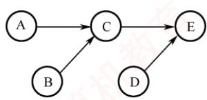
</div>

```txt
semaphore SAC = 0; //控制A和C的执行顺序
semaphore SBC = 0; //控制B和C的执行顺序
semaphore SCE = 0; //控制C和E的执行顺序
semaphore SDE = 0; //控制D和E的执行顺序
```

　　5 个操作可描述为如下。

```txt
coBegin
A() {
    完成动作 A;
    V(SAC); // 实现 A、C 之间的同步关系
}
B() {
    完成动作 B;
    V(SBC); // 实现 B、C 之间的同步关系
}
C() {
    // C 必须在 A、B 都完成后才能完成
    P(SAC);
    P(SBC);
    完成动作 C;
    V(SCE); // 实现 C、E 之间的同步关系
}
D() {
    完成动作 D;
    V(SDE); // 实现 D、E 之间的同步关系
}
E() {
    // E 必须在完成 C、D 之后执行
    P(SCE);
    P(SDE)
    完成动作 E;
}
coEnd
```

**25. 【解答】**

1）信号量 S 是能被多个进程共享的变量，多个进程都可通过 wait() 和 signal() 对 S 进行读、写操作。所以，wait() 和 signal() 操作中对 S 的访问必须是互斥的。

2）方法1错误。在wait()中，当 $\mathrm{S} < = 0$ 时，关中断后，其他进程无法修改S的值，while语句陷入死循环。方法2正确。方法2在循环体中有一个开中断操作，这样就可以使其他进程修改S的值，从而避免while语句陷入死循环。

3）用户程序不能使用开/关中断指令实现临界区互斥。因为开中断和关中断指令都是特权指令，不能在用户态下执行，只能在内核态下执行。

**26. 【解答】**

　　本题是一个典型的利用信号量实现前驱关系的同步问题。需要强调的是，只有不同进程之间的操作才需要进行同步。进程 T1 依次执行 A、E、F，进程 T2 依次执行 B、C、D。我们需要分析哪些操作必须在另一个进程的某个操作完成之后才能执行。由图可知，对进程 T1 来说，E 必须在进程 T2 执行完 C 后才能执行；对进程 T2 来说，C 必须在进程 T1 执行完 A 后才能执行。因此，有两对同步关系：A→C 和 C→E。为了实现这两对同步关系，定义两个同步信号量 $S_{AC}$ 和 $S_{CE}$ 。进程 T1 执行完 A 后，发出信号 signal( $S_{AC}$ )，表示 A 已执行完成；进程 T2 准备执行 C 之前，等待信号 wait( $S_{AC}$ )，检查 A 是否执行完成。同理，进程 T2 执行完 C 后，发出信号 signal( $S_{CE}$ )，表示 C 已执行完成；进程 T1 准备执行 E 之前，等待信号 wait( $S_{CE}$ )，检查 C 是否执行完成。这样就保证了两个进程之间的同步。

　　<table><tr><td colspan="2">semaphore <eq>S_{AC} = 0</eq>; //描述 A、C 之间的同步关系semaphore <eq>S_{CE} = 0</eq>; //描述 C、E 之间的同步关系</td></tr><tr><td>T1:</td><td>T2:</td></tr><tr><td>A;</td><td>B;</td></tr><tr><td>signal(<eq>S_{AC}</eq>);</td><td>wait(<eq>S_{AC}</eq>);</td></tr><tr><td>wait(<eq>S_{CE}</eq>);</td><td>C;</td></tr><tr><td>E;</td><td>signal(<eq>S_{CE}</eq>);</td></tr><tr><td>F;</td><td>D;</td></tr></table>

**27. 【解答】**

1）if 语句无法实现对临界区的互斥访问，因为 if 语句执行后，不论结果如何，线程都能访问临界区。本题使用 swap 指令和 lock 变量来实现对临界区的互斥访问，当线程不能进入临界区时，本身并不会主动放弃 CPU，因此需要让线程在进入区中循环检查 lock 值，可以使用 while 循环，当 lock 值为 TRUE 时，线程一直执行 while 循环的内容，直到 lock 值被修改为 FALSE 时，线程才能进入临界区，因此将进入区中的语句 “if (key == TRUE) swap key, lock” 修改为 “while (key == TRUE) swap key, lock”。在退出区中，代表该线程对临界资源的访问已经结束，此时需要将 lock 值置为 FALSE，代表其他线程可以访问临界区，因此将退出区中的语句 “lock = TRUE” 修改为 “lock = FALSE”。

2）否。因为多个线程可以并发执行 newSwap()，newSwap()执行时传递给形参 b 的是共享变量 lock 的地址，在 newSwap()中对 lock 既有读操作又有写操作，并发执行时不能保证实现两个变量值的原子交换，从而导致并发执行的线程同时进入临界区。例如，线程 A 和线程 B 并发执行，初始时 lock 值为 FALSE，当线程 A 执行完 *a = *b 后发生了进程调度，切换到线程 B 执行，线程 B 执行完 newSwap 后发生线程切换，此时线程 A 和 B 都能进入临界区，不能实现互斥访问。

**28. 【解答】**

1）代码 $C_{1}$ 执行对 B 的写操作，且 $P_{1}$ 和 $P_{2}$ 需要互斥执行 $C_{1}$ ，因此 $C_{1}$ 的代码是临界区。

2）有一组互斥关系和一组同步关系。互斥关系为： $P_{1}$ 和 $P_{2}$ 需要互斥访问缓冲区 B；同步关系为： $P_{1}$ 执行 $C_{1}$ 后， $P_{2}$ 才能执行 $C_{2}$ 。缓冲区 B 初始为空，且最大容量为 1，因此可不用定义互斥信号量 mutex。因为在缓冲区大小为 1 的条件下，同步信号量 S 就可同时保证 $P_{1}$ 和 $P_{2}$ 互斥访问 B，符合题意“尽可能定义少的信号量”的要求。进程 $P_{1}$ 和 $P_{2}$ 的同步伪代码如下。

　　<table><tr><td colspan="2">Semaphore S = 0; //实现进程 P1 与 P2 的同步</td></tr><tr><td>P1</td><td>P2</td></tr><tr><td>...</td><td>...</td></tr><tr><td>C1;</td><td>wait(S);</td></tr><tr><td>signal(S);</td><td>C2;</td></tr><tr><td>...</td><td>...</td></tr></table>

3）缓冲区 B 初始非空，因此仅需一个互斥信号量 mutex 来保证 $P_{1}$ 和 $P_{2}$ 互斥访问 B 即可。进程 $P_{1}$ 和 $P_{2}$ 的互斥伪代码如下。

　　<table><tr><td colspan="2">Semaphore mutex = 1; //实现 P1 与 P2 互斥执行 C3</td></tr><tr><td>P1</td><td>P2</td></tr><tr><td>...</td><td>...</td></tr><tr><td>wait(mutex);</td><td>wait(mutex);</td></tr><tr><td>C3;</td><td>C3;</td></tr><tr><td>signal(mutex);</td><td>signal(mutex);</td></tr><tr><td>...</td><td>...</td></tr></table>

**29. 【解答】**

　　本题需协调甲、乙、丙三人的协作过程，并管理共享资源。水桶仅由丙使用，无竞争；铁锹由甲（挖树坑）和乙（填土）共用，需互斥访问，设置一个互斥信号量 mutex。本题有三组同步关系：① 未被使用的树坑数量必须小于 3，甲才可挖新坑；② 乙必须在有树坑时才能放树苗并填土；③ 丙必须在有已填土的树苗时才能浇水。为此，还需定义三个同步信号量：position 表示还可挖的树坑配额（允许新增的未使用树坑数量），初值为 3；pit 表示当前已挖好但尚未被使用的树坑数量，初值为 0；tree 表示已完成填土、等待浇水的树苗数量，初值为 0。

　　三人操作流程如下：甲先执行 wait(position) 申请一个树坑配额，成功后获取铁锹挖坑，释放铁锹后执行 signal(pit)，通知乙有新树坑可用；乙先执行 wait(pit) 等待树坑，放树苗后立即执行 signal(position) 释放一个树坑配额（因可用树坑减少 1 个），随后在 mutex 保护下使用铁锹填土，完成后执行 signal(tree) 通知丙；丙执行 wait(tree) 等待可浇水的树苗，然后浇水。

<div align="center">
  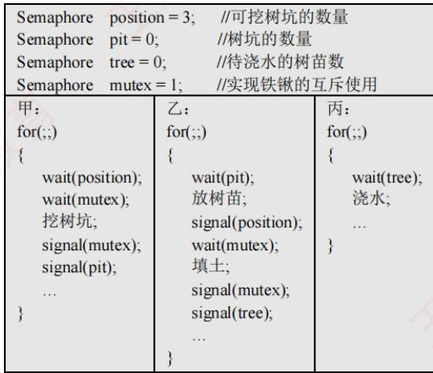
</div>

## 2.4 死锁

　　在学习本节时，请读者思考以下问题：

1）为什么会产生死锁？产生死锁有什么条件？

2）有什么办法可以解决死锁问题？

　　学完本节，读者应了解死锁的由来、产生条件及基本解决方法，区分避免死锁和预防死锁。

### 2.4.1 死锁的概念

#### 1. 死锁的定义

　　在多道程序系统中，进程的并发执行显著提高了系统资源的利用率和整体效率。然而，这种并发性也带来了新的问题——死锁。所谓死锁，是指多个进程因竞争资源而陷入相互等待的僵局：每个进程都在等待其他进程所占有的资源，而这些资源又不会被释放，从而形成一个循环等待链。结果，所有涉及的进程都被永久阻塞；若无外部干预，它们将无法继续推进。

　　下面通过实例说明死锁现象。

　　先看一个生活中的类比。假设有一条狭窄的小巷，仅容一辆车通行。若有两辆汽车分别从巷子的两端同时驶入，且双方都坚持前行而不愿倒车，则两车将在巷中对峙，彼此阻挡，谁也无法通过。这种互相等待、互不让步的情形，恰如计算机系统中的死锁。

　　在计算机系统中，死锁的表现更为典型。例如，某系统中仅配备一台打印机和一台扫描仪。进程 $P_{1}$ 当前正占有扫描仪，并请求使用打印机；与此同时，进程 $P_{2}$ 正占有打印机，并请求使用扫描仪。由于每个进程都持有对方所需的资源，且都不主动释放，两个进程便陷入无限期的相互等待之中，无法继续执行。此时，系统就处于死锁状态。

#### 2. 死锁与饥饿

　　一组进程处于死锁状态，是指其中每个进程都在等待某个事件的发生，而该事件只能由组内另一个进程触发，通常表现为等待对方释放其所占有的资源。

　　与死锁密切相关但本质不同的另一个问题是饥饿，是指某个进程因资源分配策略的不公平性，长期得不到所需资源，从而无法推进其执行。产生饥饿的主要原因是：当多个进程同时竞争同一类资源时，若系统采用的分配策略不能保证“等待时间有上界”（无法确保每个等待进程最终都能获得服务），则某些进程就可能被无限期推迟。例如，当多个进程需要打印文件时，若系统采用“最短作业优先”的打印调度策略，则长文件的打印请求可能因不断有新的短文件到达而始终无法获得服务，最终陷入饥饿状态。需要注意的是，饥饿并不等同于死锁：系统可能仍在正常运行，其他进程可以顺利执行，只是个别进程被持续忽略。

　　死锁与饥饿的共同点如下：相关进程都无法顺利向前推进。二者的主要区别如下：① 涉及的进程数量不同，饥饿可以只影响单个进程；而死锁必须涉及两个或更多的进程，且它们之间存在循环等待关系。② 进程所处的状态不同，处于饥饿状态的进程可能处于就绪态（例如，在 SPF 调度算法中长期得不到 CPU），也可能处于阻塞态（例如，长期等待某个 I/O 设备）；而处于死锁状态的进程则必定处于阻塞态，因为它们正在等待已被其他死锁进程占有的资源。

#### 3. 死锁产生的原因

> **考点追踪：** 单类资源竞争时发生死锁的临界条件的分析（2009、2014）

##### （1）系统资源的竞争

　　系统中不可剥夺资源（如打印机、磁带机等）的数量通常有限，难以满足所有并发进程的需求。当多个进程竞争这类资源且资源分配策略不当，便可能因相互等待而陷入僵局，进而引发死锁。需要强调的是，死锁的发生与不可剥夺资源的存在密切相关。对于可剥夺资源（如 CPU 时间片），操作系统可在必要时强制回收，因此单纯因这类资源的竞争一般不会导致死锁。

##### （2）进程推进顺序非法

　　即使系统资源充足，若进程请求和释放资源的顺序不合理，则仍可能引发死锁。例如，进程 $P_{1}$ 和 $P_{2}$ 分别占有资源 $R_{1}$ 和 $R_{2}$ ，随后 $P_{1}$ 申请 $R_{2}$ 、而 $P_{2}$ 申请 $R_{1}$ 。由于双方所需资源均被对方占有，两个进程均被阻塞，且各自保持已占有的资源不放，从而形成死锁。

　　此外，同步机制使用不当也可能导致死锁。例如，进程 A 等待进程 B 发送的消息，而进程 B 又在等待进程 A 的消息。此时，尽管未涉及传统硬件资源，但消息通道或同步对象可被视为一种逻辑资源，其相互等待同样会使进程无法继续推进，形成死锁。

#### 4. 死锁产生的必要条件

　　死锁的发生必须同时满足以下四个条件；只要其中任一条件不成立，死锁就不可能发生。

1）互斥条件。进程对所分配的资源（如打印机）要求排他性使用，即在一段时间内，某资源只能被一个进程占有；若有其他进程请求该资源，则必须等待。

2）不可剥夺条件。进程已获得的资源在使用完毕之前，不能被其他进程强行剥夺，只能由该进程主动释放。

3）请求并保持条件。进程在持有至少一个资源的同时，又提出新的资源请求；若该资源已被其他进程占有，则请求进程被阻塞，但对其已占有的资源仍保持不放。

4）循环等待条件。存在一个进程集合 $\{P_{1}, P_{2}, \cdots, P_{n}\}$ ，其中每个进程 $P_{i}$ 等待的资源正被下一个进程 $\mathrm{P}_{(i+1)\mathrm{mod}(n+1)}$ 占有，从而形成一个循环等待链，如图2.14所示。

　　直观上看，循环等待条件似乎与死锁的定义相同，实则不然。

　　资源分配图中存在环，并不必然意味着死锁。其根本原因在于：当某类资源有多个实例时，即使图中存在环，系统仍可能通过资源重分配打破僵局。例如，在图2.15中，若输出设备有两个实例，进程 $P_{0}$ 和 $P_{K}\left(K\notin\{0,1,\cdots,n\}\right)$ 各持有一台。当 $P_{n}$ 请求一台输出设备时，只要 $P_{0}$ 或 $P_{K}$ 任一释放其所持有的设备， $P_{n}$ 即可获得所需资源，从而解除等待环。

<div align="center">
  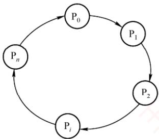
</div>

<p align="center"><em>图 2.14 循环等待</em></p>

<div align="center">
  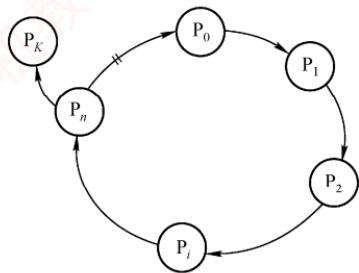
</div>

<p align="center"><em>图 2.15 满足条件但无死锁</em></p>

　　因此，只有当系统中每类资源均仅有一个实例时，资源分配图中的环才成为死锁的充分必要条件；否则，环的存在仅表明系统处于潜在风险状态，未必实际发生死锁。

　　区分不可剥夺条件与请求并保持条件，通过以下例子说明：若你手中持有一个苹果，他人不能强行将其拿走（使你暂时不吃），这体现了不可剥夺条件；若你已持有一个苹果，又去请求第二个苹果，但在获得第二个苹果前拒绝放下第一个，则体现了请求并保持条件。

#### 5. 死锁的处理策略

　　处理死锁主要有三种策略：一是通过协议预防或避免死锁，确保系统永不进入死锁状态；二是允许死锁发生，但能检测并恢复；三是完全忽略死锁问题，假定其不会出现。其中，第一种策略包含预防死锁和避免死锁两种方法；第二种策略包含检测及解除死锁方法；第三种策略被大多数通用操作系统（如Linux和Windows）所采用。下面简要介绍这些处理方法。

1）预防死锁。通过设置严格的限制条件，破坏死锁的四个必要条件中的一个或多个，从根本上杜绝死锁的可能。

2）避免死锁。在资源动态分配过程中，通过特定算法判断分配后系统是否仍处于安全状态，仅当安全时才允许分配，从而避免进入可能导致死锁的不安全状态。

3）检测及解除死锁。不施加任何预防性限制，允许进程自由申请资源；系统定期运行检测算法，一旦发现死锁，便采取相应措施（如终止部分进程或剥夺其资源）予以解除。

　　预防与避免死锁均属于事前防范策略。死锁预防的限制条件较为严格，实现相对简单，但往往导致系统效率和资源利用率较低；死锁避免的限制条件相对宽松，但需在每次资源分配前通过算法判断系统是否仍处于安全状态，实现较为复杂。各类策略的对比如表2.5所示。

　　表 2.5 死锁处理策略的比较

　　<table><tr><td></td><td>资源分配策略</td><td>各种可能模式</td><td>主要优点</td><td>主要缺点</td></tr><tr><td>死锁预防</td><td>保守,宁可资源闲置</td><td>一次请求所有资源,资源剥夺,资源按序分配</td><td>无须运行时检测,实现简单</td><td>资源利用率低;剥夺可能很频繁;不适用于动态请求</td></tr><tr><td>死锁避免</td><td>是预防和检测的折中(运行时判断是否可能死锁)</td><td>每次分配前,寻找可能的安全允许顺序</td><td>无须资源剥夺,资源利用率较高</td><td>须预知最大资源需求;进程可能因长期不安全而被无限期推迟</td></tr><tr><td>死锁检测</td><td>宽松,只要允许就分配资源</td><td>定期检测死锁,发现后采取解除措施</td><td>不限制资源申请,无启动延迟;支持灵活分配</td><td>检测与解除带来额外开销;终止或剥夺可能导致工作丢失</td></tr></table>

### 2.4.2 死锁预防

> **考点追踪：** 死锁预防的特点（2019）

　　预防死锁的发生，只需破坏死锁产生的四个必要条件之一即可。

#### 1. 破坏互斥条件

　　若将原本只能互斥使用的资源改造为允许多个进程共享访问，则可避免死锁。然而，许多资源（如打印机、磁带机等临界资源）本质上不支持并发访问，否则会导致数据不一致或设备冲突。因此，互斥性通常是保障系统正确性的基本要求，破坏该条件在实践中并不可行。

#### 2. 破坏不可剥夺条件

　　当一个已占有某些不可剥夺资源的进程请求新资源而无法满足时，系统强制释放其已占有的所有资源，待后续需要时再重新申请。这意味着，资源被临时剥夺，从而破坏不可剥夺条件。

　　该策略实现复杂且代价高昂：对于打印机等不可剥夺的外部设备，强制释放可能导致已完成的工作失效，甚至引发设备状态混乱。此外，频繁的申请与释放会显著增加系统开销，延长进程周转时间，降低系统吞吐量。因此，该方法在实际系统中极少采用。

#### 3. 破坏请求并保持条件

　　要求进程在请求新资源时不得持有任何不可剥夺资源。可通过以下方式实现。

1）静态资源分配：进程在运行前一次性申请所需全部资源。若系统无法满足，则进程暂不投入运行。运行期间不再提出新请求，从而避免“请求并保持”行为。

2）动态释放后申请：作为对方法一的改进，进程在获得初期所需资源后即可开始执行；但在运行过程中，必须先释放所有已使用完毕的资源，才能申请新资源。

　　方法一的优点是实现简单，但存在明显缺点：① 资源浪费严重：进程在运行初期即占有全部所需资源，其中部分资源可能仅在运行末期才使用，甚至从未被使用，导致长期闲置；② 易引发饥饿现象：由于某些资源长期被其他进程占有，等待这些资源的进程可能迟迟无法启动。

#### 4. 破坏循环等待条件

　　采用资源有序分配法：为系统中每类资源赋予唯一的编号，并规定进程必须按编号递增的顺序请求不同类资源，且同类资源须一次性申请。换言之，进程只有在未持有任何资源，或仅持有较小编号的资源时，才被允许申请更大编号的资源。按此规则，任何已持有大编号资源的进程都无法再申请小编号资源，从而确保资源分配图中不可能出现环，从根本上杜绝死锁。

　　该方法的缺点：① 资源编号需相对稳定，不利于新增设备类型。② 尽管在编号时已尽量考虑大多数进程使用资源的顺序，但实际使用资源的顺序仍可能与编号次序不一致，导致资源提前占用而长期闲置，造成浪费。③ 强制按固定次序申请资源，增加了用户编程的复杂性。

### 2.4.3 死锁避免

　　死锁避免同样属于事先预防策略，但它并非通过预先施加限制来破坏死锁的必要条件，而是在每次分配资源时，动态判断此次分配是否可能引发死锁。只有在确认不会导致死锁的情况下，系统才予以分配。由于该方法所施加的约束较为宽松，因而能够获得较好的系统性能。

#### 1. 系统安全状态

　　在死锁避免机制中，系统允许进程动态申请资源，但在进行资源分配前，必须先评估此次分配的安全性：若分配后系统仍处于安全状态，则允许分配；否则，进程需等待。

　　所谓安全状态，是指系统存在某个进程执行序列 $\left(\mathrm{P}_{1},\mathrm{P}_{2},\cdots,\mathrm{P}_{n}\right)$ ，使得对于序列中的每个进程 $P_{i}$ ，在其之前的所有进程执行完毕并释放所占资源后，系统仍有足够的可用资源满足 $P_{i}$ 的尚需资源量（最大需求减去已分配量），从而保证 $P_{i}$ 能顺利完成。这样的序列称为安全序列（可能存在多个）。若系统无法找到任何一个安全序列，则称系统处于不安全状态。

> **考点追踪：** 系统安全状态的分析（2018）

　　假设系统中有三个进程 $P_{1}$ ， $P_{2}$ 和 $P_{3}$ ，共有 12 台磁带机。各进程的最大需求分别为： $P_{1}$ 需 10 台， $P_{2}$ 需 4 台， $P_{3}$ 需 9 台。在 $T_{0}$ 时刻，各进程已分配资源及系统可用资源如表 2.6 所示。

　　表 2.6 资源分配

　　<table><tr><td>进程名</td><td>最大需求</td><td>已分配</td><td>可用</td></tr><tr><td><eq>P_{1}</eq></td><td>10</td><td>5</td><td>3</td></tr><tr><td><eq>P_{2}</eq></td><td>4</td><td>2</td><td></td></tr><tr><td><eq>P_{3}</eq></td><td>9</td><td>2</td><td></td></tr></table>

　　在 $T_{0}$ 时刻，系统处于安全状态，因为存在安全序列 $(\mathrm{P}_{2}, \mathrm{P}_{1}, \mathrm{P}_{3})$ ：若按此顺序推进进程，每个进程在其轮次均可获得所需资源并顺利完成。具体而言，当前可用资源为 3， $P_{2}$ 尚需 2 台，可立即满足， $P_{2}$ 完成后释放其全部 4 台资源，可用资源变为 5； $P_{1}$ 尚需 5 台，恰好可满足， $P_{1}$ 完成后释放 10 台，可用资源增至 10； $P_{3}$ 尚需 7 台，可被满足，最终顺利完成。

　　若在 $T_{0}$ 时刻之后，系统将 1 台分配给 $P_{3}$ ，则 $P_{3}$ 已分配量变为 3，可用资源降为 2。此时，系统进入不安全状态，因为无法再找到任何安全序列。例如，若将剩余的 2 台分配给 $P_{2}$ （其尚需 2 台）， $P_{2}$ 可完成并释放 4 台，可用资源变为 4。然而， $P_{1}$ 尚需 5 台， $P_{3}$ 尚需 6 台（因已分配 3 台），均无法满足。两个进程相互等待对方释放资源，陷入僵局，最终导致死锁。

　　系统处于安全状态时，一定不会发生死锁；而处于不安全状态时，死锁可能发生，但并非必然发生。换言之，死锁发生时，系统必定处于不安全状态，但不安全状态不一定会演变为死锁。

#### 2. 利用银行家算法避免死锁

> **考点追踪：** 银行家算法的特点（2013、2019）

　　银行家算法是最著名的死锁避免算法。其基本思想是：将操作系统视为银行家，系统管理的资源视为银行资金，进程请求资源相当于用户申请贷款。每个进程在运行前需声明其对各类资源的最大需求量（且该最大需求量在整个生命周期内不得更改，否则银行家算法的安全性保证失效），且该总量不得超过系统资源总量。当进程在运行中申请资源时，系统首先检查当前是否有足够资源可供分配；若有，则进一步试探：若将这些资源分配给该进程，系统是否仍处于安全状态。只有在确保安全的前提下，才正式分配资源；否则，就让进程等待。

##### （1）银行家算法中的数据结构

　　假设系统中有 $n$ 个进程和 $m$ 类资源，银行家算法需维护以下四个数据结构。

1）可利用资源向量 Available：长度为 m 的向量，其中每个元素代表一类可用的资源数量。Available[j] = K 表示当前系统中有 K 个 $R_{j}$ 类资源可用。

2）最大需求矩阵 Max: $n \times m$ 矩阵，定义系统中每个进程对 m 类资源的最大需求。Max[i, j] = K 表示进程 $P_{i}$ 对 $R_{j}$ 类资源的最大需求数量为 K。

3）分配矩阵 Allocation: $n \times m$ 矩阵，定义系统中每类资源当前已分配给每个进程的资源数。Allocation[i,j] = K 表示进程 $\mathrm{P}_i$ 当前已获得 $\mathbf{R}_j$ 类资源的数量为 $K$ 。

4）需求矩阵 Need： $n \times m$ 矩阵，表示每个进程尚需的各类资源数。Need[i,j] = K 表示进程 $P_{i}$ 尚需 $R_{j}$ 类资源的数量为 K。

　　上述三个矩阵满足如下关系:

$$
\operatorname{Need} [ i, j ] = \operatorname{Max} [ i, j ] - \operatorname{Allocation} [ i, j ]
$$

　　通常，题目会给出 Max 和 Allocation 矩阵，解题的第一步即是据此计算出 Need 矩阵。

##### （2）银行家算法

　　设 $\text{Request}_i$ 是进程 $\mathrm{P}_i$ 的资源请求向量， $\text{Request}_i[j] = K$ 表示 $\mathrm{P}_i$ 请求 $K$ 个 $j$ 类资源。当 $\mathrm{P}_i$ 发出资源请求后，系统按以下步骤进行检查：

　　① 合法性检查：若 $\text{Request}_i[j] \leqslant \text{Need}[i,j]$ ，则转向步骤②；否则视为非法请求，因为其申请量已超过预先声明的最大需求。

　　② 资源可用性检查：若 $\text{Request}_i[j] \leqslant \text{Available}[j]$ ，则转向步骤③；否则表示当前资源不足， $P_i$ 必须等待。

　　③ 试探性分配：系统尝试将资源分配给 $\mathrm{P}_i$ ，并更新相关数据结构：

$$
\begin{array}{l l} \text {Available} [ j ] = \text {Available} [ j ] - \text {Request} _ {i} [ j ] & \# \text {减少系统可用资源，反映资源已被分配} \\ \text {Allocation} [ i, j ] = \text {Allocation} [ i, j ] + \text {Request} _ {i} [ j ] & \# \text {增加P} _ {i} \text {已分配的资源量} \\ \text {Need} [ i, j ] = \text {Need} [ i, j ] - \text {Request} _ {i} [ j ] & \# \text {减少P} _ {i} \text {尚需的资源量} \end{array}
$$

　　④ 安全性检查：系统执行安全性算法，判断此次分配后系统是否处于安全状态。若是，则正式确认此次分配；否则，撤销分配，恢复各数据结构的原始值，并让 $\mathbf{P}_i$ 等待。

##### （3）安全性算法

　　安全性算法用于判断系统当前是否处于安全状态，其基本思想是：尝试构造一个进程执行序列，使得所有进程都能依次获得所需资源并顺利完成。具体步骤如下。

1）设置两个向量。①工作向量 Work：长度为 m 的向量，表示当前可用的各类资源数，初始时 Work = Available；②完成向量 Finish：长度为 n 的布尔向量，标记各进程能否顺利完成，初始时 Finish[] = false；当进程 $P_{i}$ 的资源需求可被满足时，令 Finish[i] = true。

2）在尚未完成的进程中，查找一个满足以下两个条件的进程 $\mathbf{P}_i$

$$
\begin{array}{l l} \text {Finish} [ i ] = \text {false} & \# \text {尚未加入安全序列} \\ \text {Need} [ i ] \leqslant \text {Work} & \# \text {其尚需的各类资源数均不超过当前可用资源} \end{array}
$$

　　若能找到，则执行步骤3）；否则，执行步骤4）。

3）当进程 $\mathrm{P}_i$ 获得所需资源后可顺利执行至完成，并释放其所占有的全部资源，故执行：

$$
\begin{array}{l l} \text {Work} = \text {Work} + \text {Allocation} [ i ] & \# \text {释放其已分配的各类资源} \\ \text {Finish} [ i ] = \text {true} & \# \text {将其加入安全序列} \end{array}
$$

　　随后返回步骤2），继续寻找下一个可完成的进程。

4）若所有进程均满足Finish[i] = true，则系统处于安全状态；否则系统处于不安全状态。为帮助理解上述流程，下面将通过具体示例完整演示安全性算法的执行过程。

#### 3. 安全性算法举例

> **考点追踪：** 银行家算法的安全序列分析（2011、2012、2018、2020、2022）

　　假定系统中有5个进程 $\{\mathrm{P}_0,\mathrm{P}_1,\mathrm{P}_2,\mathrm{P}_3,\mathrm{P}_4\}$ 和3类资源 $\{\mathrm{A},\mathrm{B},\mathrm{C}\}$ ，各类资源的总量分别为10,5,7，在 $T_{0}$ 时刻的资源分配情况见表2.7。现利用安全性算法，判断系统此时是否处于安全状态。

　　表 2.7 $T_{0}$ 时刻的资源分配表

　　<table><tr><td rowspan="3">进程名</td><td colspan="3">资源情况</td></tr><tr><td colspan="3">Max</td></tr><tr><td>A</td><td>B</td><td>C</td></tr><tr><td><eq>P_0</eq></td><td>7</td><td>5</td><td>3</td></tr><tr><td><eq>P_1</eq></td><td>3</td><td>2</td><td>2</td></tr><tr><td><eq>P_2</eq></td><td>9</td><td>0</td><td>2</td></tr><tr><td><eq>P_3</eq></td><td>2</td><td>2</td><td>2</td></tr><tr><td><eq>P_4</eq></td><td>4</td><td>3</td><td>3</td></tr></table>

　　① 首先，由题目给出的 Max 矩阵和 Allocation 矩阵，可计算出 Need 矩阵：

$$
\left[ \begin{array}{l l l} 7 & 5 & 3 \\ 3 & 2 & 2 \\ 9 & 0 & 2 \\ 2 & 2 & 2 \\ 4 & 3 & 3 \end{array} \right] - \left[ \begin{array}{l l l} 0 & 1 & 0 \\ 2 & 0 & 0 \\ 3 & 0 & 2 \\ 2 & 1 & 1 \\ 0 & 0 & 2 \end{array} \right] = \left[ \begin{array}{l l l} 7 & 4 & 3 \\ 1 & 2 & 2 \\ 6 & 0 & 0 \\ 0 & 1 & 1 \\ 4 & 3 & 1 \end{array} \right]
$$

　　由此得到各进程的尚需资源数。

　　② 初始化工作向量 Work=Available=(3,3,2)。将 Work 与 Need 矩阵的各行进行比较，寻找满足 Need[i]≤Work（各分量均不超过）且 Finish[i]=false 的进程。初始时

$$
\begin{array}{l}\mathrm{P} _ {1} \rightarrow (1, 2, 2) <   (3, 3, 2)\\\mathrm{P} _ {3} \rightarrow (0, 1, 1) <   (3, 3, 2)\end{array}
$$

　　进程 $\mathrm{P_1}$ 和 $\mathrm{P_3}$ 均满足条件。此处选择 $\mathrm{P_1}$ （也可选择 $\mathrm{P_3}$ ）作为安全序列的第一个进程。

　　③ 将 $P_{1}$ 加入安全序列，并模拟其顺利完成：释放其所占资源，更新工作向量：

$$
\text { Work } = \text { Work } + \text { Allocation } [ 1 ] = (3, 3, 2) + (2, 0, 0) = (5, 3, 2)
$$

　　同时，标记 Finish[1]=true。

　　以更新后的 Work=(5,3,2)重复上述过程，继续查找下一个可执行的进程。以此类推，整个分析过程如表 2.8 所示（表中 “Work+Allocation” 列即为下一步的 Work 值），最终构造出一个完整的安全序列 $\{P_{1}, P_{3}, P_{4}, P_{2}, P_{0}\}$ ，表明系统在 $T_{0}$ 时刻处于安全状态。

　　表 2.8 $T_{0}$ 时刻的安全序列的分析

　　<table><tr><td rowspan="3">进程名</td><td colspan="13">资源情况</td></tr><tr><td colspan="3">Work</td><td colspan="3">Need</td><td colspan="3">Allocation</td><td colspan="3">Work+Allocation</td><td rowspan="2">Finish</td></tr><tr><td>A</td><td>B</td><td>C</td><td>A</td><td>B</td><td>C</td><td>A</td><td>B</td><td>C</td><td>A</td><td>B</td><td>C</td></tr><tr><td><eq>P_1</eq></td><td>3</td><td>3</td><td>2</td><td>1</td><td>2</td><td>2</td><td>2</td><td>0</td><td>0</td><td>5</td><td>3</td><td>2</td><td>true</td></tr><tr><td><eq>P_3</eq></td><td>5</td><td>3</td><td>2</td><td>0</td><td>1</td><td>1</td><td>2</td><td>1</td><td>1</td><td>7</td><td>4</td><td>3</td><td>true</td></tr><tr><td><eq>P_4</eq></td><td>7</td><td>4</td><td>3</td><td>4</td><td>3</td><td>1</td><td>0</td><td>0</td><td>2</td><td>7</td><td>4</td><td>5</td><td>true</td></tr><tr><td><eq>P_2</eq></td><td>7</td><td>4</td><td>5</td><td>6</td><td>0</td><td>0</td><td>3</td><td>0</td><td>2</td><td>10</td><td>4</td><td>7</td><td>true</td></tr><tr><td><eq>P_0</eq></td><td>10</td><td>4</td><td>7</td><td>7</td><td>4</td><td>3</td><td>0</td><td>1</td><td>0</td><td>10</td><td>5</td><td>7</td><td>true</td></tr></table>

#### 4. 银行家算法举例

　　安全性算法是银行家算法的核心。在典型考题中，通常会给出某个进程的资源请求向量。读者只需执行银行家算法的前三个步骤，即可得到更新后的 Allocation 和 Need 矩阵，再参照上例的安全性算法判断系统是否仍处于安全状态，从而决定是否批准该请求。

　　假设当前系统资源分配及剩余情况如表2.7所示（ $T_{0}$ 时刻的状态）。

1）进程 $P_{1}$ 发出请求向量 $Request_{1}(1,0,2)$ ，系统按银行家算法进行如下检查。

　　① 合法性检查： $Request_{1}(1,0,2)\leqslant Need_{1}(1,2,2)$ ，成立。

　　② 资源可用性检查： $Request_{1}(1,0,2)\leqslant Available_{1}(3,3,2)$ ，成立。

　　③ 试探性分配：系统尝试为 $\mathrm{P}_{1}$ 分配资源，并修改相关数据结构：

$$
\text { Available } = \text { Available } - \text { Request } _ {1} = (2, 3, 0)
$$

$$
\text { Allocation } _ {1} = \text { Allocation } _ {1} + \text { Request } _ {1} = (3, 0, 2)
$$

$$
\text { Need } _ {1} = \text { Need } _ {1} - \text { Request } _ {1} = (0, 2, 0)
$$

　　由此形成的资源变化情况如表 2.7 中的圆括号所示。

　　④ 安全性检查：令 Work = Available = (2, 3, 0)，执行安全性算法，过程如表 2.9 所示。

　　表 2.9 ${\mathrm{P}}_{1}$ 申请资源时的安全性检查

　　<table><tr><td rowspan="3">进程名</td><td colspan="13">资源情况</td></tr><tr><td colspan="3">Work</td><td colspan="3">Need</td><td colspan="3">Allocation</td><td colspan="3">Work+Allocation</td><td rowspan="2">Finish</td></tr><tr><td>A</td><td>B</td><td>C</td><td>A</td><td>B</td><td>C</td><td>A</td><td>B</td><td>C</td><td>A</td><td>B</td><td>C</td></tr><tr><td><eq>P_1</eq></td><td>2</td><td>3</td><td>0</td><td>0</td><td>2</td><td>0</td><td>3</td><td>0</td><td>2</td><td>5</td><td>3</td><td>2</td><td>true</td></tr><tr><td><eq>P_3</eq></td><td>5</td><td>3</td><td>2</td><td>0</td><td>1</td><td>1</td><td>2</td><td>1</td><td>1</td><td>7</td><td>4</td><td>3</td><td>true</td></tr><tr><td><eq>P_4</eq></td><td>7</td><td>4</td><td>3</td><td>4</td><td>3</td><td>1</td><td>0</td><td>0</td><td>2</td><td>7</td><td>4</td><td>5</td><td>true</td></tr><tr><td><eq>P_0</eq></td><td>7</td><td>4</td><td>5</td><td>7</td><td>4</td><td>3</td><td>0</td><td>1</td><td>0</td><td>7</td><td>5</td><td>5</td><td>true</td></tr><tr><td><eq>P_2</eq></td><td>7</td><td>5</td><td>5</td><td>6</td><td>0</td><td>0</td><td>3</td><td>0</td><td>2</td><td>10</td><td>5</td><td>7</td><td>true</td></tr></table>

　　由表可知，存在安全序列 $\{P_{1}, P_{3}, P_{4}, P_{0}, P_{2}\}$ ，系统处于安全状态。因此，可以正式将 $P_{1}$ 所请求的资源分配给它。分配后系统的资源状态如表2.10所示。

　　表 2.10 为 ${\mathrm{P}}_{1}$ 分配资源后的有关资源数据

　　<table><tr><td rowspan="3">进程名</td><td colspan="9">资源情况</td></tr><tr><td colspan="3">Allocation</td><td colspan="3">Need</td><td colspan="3">Available</td></tr><tr><td>A</td><td>B</td><td>C</td><td>A</td><td>B</td><td>C</td><td>A</td><td>B</td><td>C</td></tr><tr><td><eq>P_0</eq></td><td>0</td><td>1</td><td>0</td><td>7</td><td>4</td><td>3</td><td rowspan="5">2</td><td rowspan="5">3</td><td rowspan="5">0</td></tr><tr><td><eq>P_1</eq></td><td>3</td><td>0</td><td>2</td><td>0</td><td>2</td><td>0</td></tr><tr><td><eq>P_2</eq></td><td>3</td><td>0</td><td>2</td><td>6</td><td>0</td><td>0</td></tr><tr><td><eq>P_3</eq></td><td>2</td><td>1</td><td>1</td><td>0</td><td>1</td><td>1</td></tr><tr><td><eq>P_4</eq></td><td>0</td><td>0</td><td>2</td><td>4</td><td>3</td><td>1</td></tr></table>

2） $\mathrm{P}_{4}$ 发出请求向量 $\mathrm{Request}_{4}(3,3,0)$ ，系统按银行家算法进行检查：

　　① 合法性检查： $\text{Request}_4(3, 3, 0) \leqslant \text{Need}_4(4, 3, 1)$ ，成立。

　　② 资源可用性检查： $Request_{4}(3, 3, 0) > Available(2, 3, 0)$ ，不成立，让 $P_{4}$ 等待。

3） $P_{0}$ 发出请求向量 $\mathrm{Reust}_{0}(0,2,0)$ ，系统按银行家算法进行检查：

　　① 合法性检查： $Request_{0}(0,2,0)\leq Need_{0}(7,4,3)$ ，成立。

　　② 资源可用性检查： $\text{Request}_0(0, 2, 0) \leqslant \text{Available}(2, 3, 0)$ ，成立。

　　③ 试探性分配：系统尝试为 $\mathrm{P_0}$ 分配资源，并修改相关数据结构：

$$
\text { Available } = \text { Available } - \text { Request } _ {0} = (2, 1, 0)
$$

$$
\text { Allocation } _ {0} = \text { Allocation } _ {0} + \text { Request } _ {0} = (0, 3, 0)
$$

　　$Need_{0}=Need_{0}-Request_{0}=(7,2,3)$ ，结果如表2.11所示。

　　表 2.11 为 $P_{0}$ 分配资源后的有关资源数据

　　<table><tr><td rowspan="3">进程名</td><td colspan="9">资源情况</td></tr><tr><td colspan="3">Allocation</td><td colspan="3">Need</td><td colspan="3">Available</td></tr><tr><td>A</td><td>B</td><td>C</td><td>A</td><td>B</td><td>C</td><td>A</td><td>B</td><td>C</td></tr><tr><td><eq>P_0</eq></td><td>0</td><td>3</td><td>0</td><td>7</td><td>2</td><td>3</td><td rowspan="5">2</td><td rowspan="5">1</td><td rowspan="5">0</td></tr><tr><td><eq>P_1</eq></td><td>3</td><td>0</td><td>2</td><td>0</td><td>2</td><td>0</td></tr><tr><td><eq>P_2</eq></td><td>3</td><td>0</td><td>2</td><td>6</td><td>0</td><td>0</td></tr><tr><td><eq>P_3</eq></td><td>2</td><td>1</td><td>1</td><td>0</td><td>1</td><td>1</td></tr><tr><td><eq>P_4</eq></td><td>0</td><td>0</td><td>2</td><td>4</td><td>3</td><td>1</td></tr></table>

　　④ 安全性检查：此时 Available(2, 1, 0)，无法满足任何进程的尚需资源，系统进入不安全状态，因此拒绝 $P_{0}$ 的请求，撤销试探性分配，并恢复各数据结构至分配前状态。

### 2.4.4 死锁检测与解除

> **考点追踪：** 死锁避免和死锁检测的区分（2015）

　　前面介绍的死锁预防和避免算法，都是在为进程分配资源时施加限制条件或进行安全性检查。若系统在资源分配时不采取任何预防或避免措施，则必须提供死锁检测与解除机制。

#### 1. 死锁检测

> **考点追踪：** 死锁避免和死锁检测对比（2015）

　　区分死锁避免与死锁检测。死锁避免要求在进程运行过程中始终确保系统不会进入死锁状态，因此需要预先知道进程从开始到结束的全部资源需求。死锁检测则仅判断当前时刻系统是否已发生死锁，无须预知进程未来的资源请求，只需依据当前的资源分配和请求情况。

> **考点追踪：** 多类资源竞争时发生死锁的临界条件分析（2016、2021）

　　通常采用资源分配图来检测系统是否处于死锁状态。在资源分配图中：圆圈表示进程，矩形框表示一类资源；若某类资源有多个实例，则在框内用多个圆点表示；请求边（从进程指向资源）表示该进程申请一个单位的该类资源；分配边（从资源指向进程）表示该类资源的一个实例已分配给该进程。在图2.16(a)所示的资源分配图中，进程 $\mathrm{P_1}$ 已获得两个 $\mathbb{R}_1$ 资源，并请求一个 $\mathbb{R}_2$ ； $\mathrm{P_2}$ 已获得一个 $\mathbb{R}_1$ 和一个 $\mathbb{R}_2$ ，并请求一个 $\mathbb{R}_1$ 。系统中存在环，但尚未确定是否死锁。

<div align="center">
  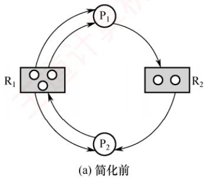
</div>

<div align="center">
  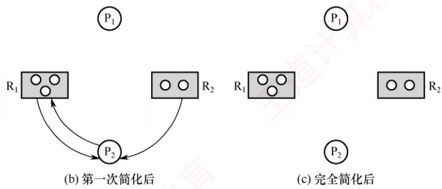
</div>

<p align="center"><em>图 2.16 资源分配图及其化简过程</em></p>

　　通过简化资源分配图可判断系统是否处于死锁状态。简化步骤如下。

1）在资源分配图中，找出当前可继续执行的进程 $P_{i}$ （其所有资源请求均可被当前空闲资源满足）。空闲资源数量等于该类资源总数减去已分配实例数（资源节点发出的分配边数量）。例如，在图 2.16(a) 中， $R_{1}$ 总数为 3，出度为 3，故无空闲资源； $R_{2}$ 总数为 2，出度为 1，故有 1 个空闲。 $P_{1}$ 仅请求 1 个 $R_{2}$ ，而 $R_{2}$ 有 1 个空闲，因此 $P_{1}$ 可继续执行。将其所有请求边和分配边删除，使之成为孤立节点，得到图 2.16(b) 所示的情况。

2） $\mathrm{P}_i$ 释放的资源可能使其他阻塞进程的请求得以满足，从而转为可执行状态。例如， $\mathrm{P}_1$ 释放其占有的 $\mathbb{R}_1$ 资源后， $\mathrm{P}_2$ 的 $\mathbb{R}_1$ 请求即可满足，因而也能继续执行。重复上述过程，若最终能删除图中所有边，则称该图可完全简化，如图2.16(c)所示。

　　死锁定理：系统处于死锁状态，当且仅当其资源分配图不可完全简化。

#### 2. 死锁解除

> **考点追踪：** 解除死锁的方式（2019）

　　一旦检测出死锁，系统应立即采取措施予以解除。主要方法包括如下几种。

1）资源剥夺法。挂起部分死锁进程，抢占其资源并重新分配给其他死锁进程，以打破死锁环路；但需防止被挂起的进程因长期得不到所需资源而陷入饥饿。

> **注意**

　　在资源分配图中，经死锁定理化简后，仍有边相连的进程即为死锁进程。

2）撤销进程法。强制终止部分或全部死锁进程，并回收其所占资源。终止顺序可依据进程优先级或撤销代价（如资源占有量等）确定。该方法实现简单，但代价可能较高，尤其当进程已接近完成时，一旦被终止，已完成的工作将全部丢失，后续需从头执行。

3）进程回退法。令一个或多个死锁进程回退到之前某个足以回避死锁的状态，并在回退过程中自愿释放其所占资源。系统需记录进程的历史状态并设置还原点，实现较复杂。

### 2.4.5 本节小结

　　本节开头提出的问题的参考答案如下。

1）为什么会产生死锁？产生死锁有什么条件？

　　死锁是指多个进程因竞争不可剥夺资源而陷入永久阻塞：每个进程都占有部分资源，同时等待其他进程占有的资源，导致所有相关进程均无法继续推进。死锁的产生必须同时满足以下四个必要条件：①互斥条件，资源在任一时刻只能被一个进程占有；②不可剥夺条件，进程已获得的资源在其使用完毕前不能被强制收回，只能由其主动释放；③请求并保持条件，进程在占有资源的同时可申请新资源，若无法立即获得，则阻塞但不会释放已占有的资源；④循环等待条件，存在一个由多个进程构成的循环等待链，其中每个进程都在等待下一个进程所占有的资源。

#### 2. 有什么办法可以解决死锁问题？

　　死锁的处理策略分为三类：① 死锁预防，通过限制资源分配方式，破坏死锁的某个必要条件，从而从根本上防止死锁发生；② 死锁避免，在动态分配资源的过程中，利用安全性算法判断系统是否仍处于安全状态，仅当分配后系统仍安全时才批准请求，从而避免进入可能导致死锁的状态；③ 死锁检测与解除，不对资源分配施加限制，而是定期检测系统是否已发生死锁，一旦发现死锁，便采取措施予以解除，例如终止部分死锁进程或回滚其操作以释放资源。

### 2.4.6 本节习题精选

#### 一、单项选择题

01. 下列情况中，可能导致死锁的是（）。A. 进程释放资源 B. 一个进程进入死循环

- C. 多个进程竞争资源出现了循环等待 D. 多个进程竞争使用共享型设备

02. 在哲学家进餐问题中，若所有哲学家同时拿起左筷子，则发生死锁，因为他们都需要右筷子才能用餐。为了让尽可能多的哲学家可以同时用餐，并且不发生死锁，可以利用信号量 PV 操作实现同步互斥，下列说法中正确的是（）。
- A. 使用信号量进行控制的方法一定可以避免死锁
- B. 同时检查两支筷子是否可用的方法可以预防死锁，但是会导致饥饿问题
- C. 限制允许拿起筷子的哲学家数量可以预防死锁，它破坏了“循环等待”条件
- D. 对哲学家顺序编号，奇数号哲学家先拿左筷子，然后拿右筷子，而偶数号哲学家刚好相反，可以预防死锁，它破坏了“互斥”条件

03. 下列关于进程死锁的描述中，错误的是（）。
- A. 若每个进程只能同时申请或拥有一个资源，则不会发生死锁
- B. 若多个进程可以无冲突共享访问所有资源，则不会发生死锁
- C. 若所有进程的执行严格区分优先级，则不会发生死锁
- D. 若进程资源请求之间不存在循环等待，则不会发生死锁

04. 一次分配所有资源的方法可以预防死锁的发生，它破坏死锁4个必要条件中的（）。

- A. 互斥
- B. 占有并请求
- C. 非剥夺
- D. 循环等待

05. 系统产生死锁的可能原因是（）。

- A. 独占资源分配不当
- B. 系统资源不足
- C. 进程运行太快
- D. CPU内核太多

06. 死锁的避免是根据（）采取措施实现的。
- A. 配置足够的系统资源
- B. 使进程的推进顺序合理
- C. 破坏死锁的四个必要条件之一
- D. 防止系统进入不安全状态

07. 死锁预防是保证系统不进入死锁状态的静态策略，其解决办法是破坏产生死锁的四个必要条件之一。下列方法中直接破坏了“循环等待”条件的是（）。
- A. 银行家算法 B. 一次性分配策略
- C. 剥夺资源法 D. 资源有序分配策略

08. 可以防止系统出现死锁的手段是（）。

- A. 用 PV 操作管理共享资源
- B. 使进程互斥地使用共享资源
- C. 采用资源静态分配策略
- D. 定时运行死锁检测程序

09. 某系统中有三个并发进程都需要四个同类资源，则该系统必然不会发生死锁的最少资源是（）。

- A. 9
- B. 10
- C. 11
- D. 12

10. 某系统中共有 11 台磁带机，X 个进程共享此磁带机设备，每个进程最多请求使用 3 台，则系统必然不会死锁的最大 X 值是（）。

- A. 4
- B. 5
- C. 6
- D. 7

11. 若系统中有 5 个某类资源供若干进程共享，则不会引起死锁的情况是（）。

- A. 有 6 个进程，每个进程需 1 个资源
- B. 有 5 个进程，每个进程需 2 个资源
- C. 有 4 个进程，每个进程需 3 个资源
- D. 有 3 个进程，每个进程需 4 个资源

12. 解除死锁通常不采用的方法是（）。

- A. 终止一个死锁进程
- B. 终止所有死锁进程
- C. 从死锁进程处抢夺资源
- D. 从非死锁进程处抢夺资源

13. 采用资源剥夺法可以解除死锁，还可以采用（）方法解除死锁。
- A. 执行并行操作
- B. 撤销进程
- C. 拒绝分配新资源
- D. 修改信号量

14. 在下列死锁的解决方法中，属于死锁预防策略的是（）。

- A. 银行家算法
- B. 资源有序分配算法
- C. 死锁检测算法
- D. 资源分配图化简法

15. 三个进程共享四个同类资源，这些资源的分配与释放只能一次一个。已知每个进程最多需要两个该类资源，则该系统（）。

- A. 有些进程可能永远得不到该类资源
- B. 必然有死锁
- C. 进程请求该类资源必然能得到
- D. 必然是死锁

16. 以下有关资源分配图的描述中，正确的是（）。
- A. 有向边包括进程指向资源类的分配边和资源类指向进程申请边两类
- B. 矩形框表示进程，其中圆点表示申请同一类资源的各个进程
- C. 圆圈节点表示资源类
- D. 资源分配图是一个有向图，用于表示某时刻系统资源与进程之间的状态

17. 死锁的四个必要条件中，无法破坏的是（）。

- A. 环路等待资源
- B. 互斥使用资源
- C. 占有且等待资源
- D. 非抢夺式分配

18. 死锁与安全状态的关系是（）。

- A. 死锁状态有可能是安全状态
- B. 安全状态有可能成为死锁状态
- C. 不安全状态就是死锁状态
- D. 死锁状态一定是不安全状态

19. 死锁检测时检查的是（）。

- A. 资源有向图
- B. 前驱图
- C. 搜索树
- D. 安全图

20. 某系统采用如下资源分配策略：当一个进程提出资源请求而暂时无法满足时，若当前没有其他进程因等待资源而被阻塞，则该进程自行阻塞；若已有因等待资源而被阻塞的进程，则系统检查所有被阻塞的进程，若其中某些进程所占有的资源恰好是当前申请进程所需的，则立即剥夺这些资源并分配给申请进程。该策略可能导致（）。

- A. 系统死锁
- B. 系统陷入死循环
- C. 进程回退
- D. 进程饥饿

21. 系统的资源分配图在下列情况下，无法判断是否处于死锁状态的有（）。
I. 出现了环路 II. 没有环路
III. 每种资源只有一个，并出现环路 IV. 每个进程节点至少有一条请求边
- A. I、II、III、IV B. I、III、IV
- C. I、IV D. 以上答案都不正确

22. 下列关于死锁的说法中，正确的有（）。
I. 死锁状态一定是不安全状态
II. 产生死锁的根本原因是系统资源分配不足和进程推进顺序非法
III. 资源的有序分配策略可以破坏死锁的循环等待条件
IV. 采用资源剥夺法可以解除死锁，还可以采用撤销进程方法解除死锁
- A. I、III B. II C. IV D. 四个说法都对

23. 下面是并发进程的程序代码，正确的是（）。Semaphore x1=x2=y=1;
int c1=c2=0;

　　P1 ()
{
    while (1) {
    P(x1);
    if (++c1==1) P(y);
    V(x1);
    computer(A);
    P(x1);
    if (--c1==0) V(y);
    V(x1);
    }
}
P2 ()
{
    while (1) {
    P(x2);
    if (++c2==1) P(y);
    V(x2);
    computer(B);
    P(x2);
    if (--c2==0) V(y);
    V(x2);
    }
}

　　}
- A. 进程不会死锁，也不会“饥饿” B. 进程不会死锁，但是会“饥饿” C. 进程会死锁，但是不会“饥饿” D. 进程会死锁，也会“饥饿”

24. 有两个并发进程，对于如下这段程序的运行，正确的说法是（）。
int x, y, z, t, u;
P1() P2()
{ { while(1){ x=1; x=0; y=0; t=0; if x>=1 then y=y+1; if x<=1 then t=t+2; z=y; u=t; } }
}

- A. 程序能正确运行，结果唯一 B. 程序不能正确运行，可能有两种结果 C. 程序不能正确运行，结果不确定 D. 程序不能正确运行，可能死锁

25. 一个进程在获得资源后，只能在使用完资源后由自己释放，这属于死锁必要条件的（）。

- A. 互斥条件
- B. 请求和释放条件
- C. 不剥夺条件
- D. 防止系统进入不安全状态

26. 假设具有 5 个进程的进程集合 $\mathrm{P} = \{\mathrm{P}_0, \mathrm{P}_1, \mathrm{P}_2, \mathrm{P}_3, \mathrm{P}_4\}$ ，系统中有三类资源 A, B, C，假设在某时刻有如下状态，见下表。

　　<table><tr><td rowspan="2">进程名</td><td colspan="3">Allocation</td><td colspan="3">Max</td><td colspan="3">Available</td></tr><tr><td>A</td><td>B</td><td>C</td><td>A</td><td>B</td><td>C</td><td rowspan="6">A</td><td rowspan="6">B</td><td rowspan="6">C</td></tr><tr><td><eq>P_0</eq></td><td>0</td><td>0</td><td>3</td><td>0</td><td>0</td><td>4</td></tr><tr><td><eq>P_1</eq></td><td>1</td><td>0</td><td>0</td><td>1</td><td>7</td><td>5</td></tr><tr><td><eq>P_2</eq></td><td>1</td><td>3</td><td>5</td><td>2</td><td>3</td><td>5</td></tr><tr><td><eq>P_3</eq></td><td>0</td><td>0</td><td>2</td><td>0</td><td>6</td><td>4</td></tr><tr><td><eq>P_4</eq></td><td>0</td><td>0</td><td>1</td><td>0</td><td>6</td><td>5</td></tr></table>

　　系统是处于安全状态的，则 x, y, z 的取值可能是（）。
I. 1, 4, 0
II. 0, 6, 2
III. 1, 1, 1
IV. 0, 4, 7
- A. I、II、IV
- B. I、II
- C. 仅 I
- D. I、III

27. 死锁定理是用于处理死锁的（）方法。
- A. 预防死锁    B. 避免死锁    C. 检测死锁    D. 解除死锁

28. 某系统有 m 个同类资源供 n 个进程共享，若每个进程最多申请 k 个资源 $(k \geqslant 1)$ ，采用银行家算法分配资源，为保证系统不发生死锁，则各进程的最大需求量之和应（）。

- A. 等于 m
- B. 等于 $m + n$
- C. 小于 $m + n$
- D. 大于 $m + n$

29. 采用银行家算法可以避免死锁的发生，这是因为该算法（）。A. 可以抢夺已分配的资源

- B. 能及时为各进程分配资源
- C. 任何时刻都能保证每个进程能得到所需的资源
- D. 任何时刻都能保证至少有一个进程可以得到所需的全部资源

30. 用银行家算法避免死锁时，检测到（）时才分配资源。
- A. 进程首次申请资源时对资源的最大需求量超过系统现存的资源量
- B. 进程已占有的资源数与本次申请的资源数之和超过对资源的最大需求量
- C. 进程已占有的资源数与本次申请的资源数之和不超过对资源的最大需求量，且现存资源量能满足尚需的最大资源量
- D. 进程已占有的资源数与本次申请的资源数之和不超过对资源的最大需求量，且现存资源量能满足本次申请量，但不能满足尚需的最大资源量

31. 下列各种方法中，可用于解除已发生死锁的是（）。

- A. 撤销部分或全部死锁进程
- B. 剥夺部分或全部死锁进程的资源
- C. 降低部分或全部死锁进程的优先级
- D. A 和 B 都可以

32. 假定某计算机系统有两类可使用资源： $R_{1}$ （ $R_{1}$ 共2个单位）和 $R_{2}$ （ $R_{2}$ 共1个单位），由进程 $P_{1}$ 和 $P_{2}$ 共享。两个进程均按如下顺序使用资源：申请 $R_{1}\rightarrow$ 申请 $R_{2}\rightarrow$ 申请 $R_{1}\rightarrow$ 释放 $R_{1}\rightarrow$ 释放 $R_{2}\rightarrow$ 释放 $R_{1}$ ，则在系统运行过程中（）。

- A. 不可能产生死锁
- B. 有可能产生死锁，因为 $R_{1}$ 资源不足
- C. 有可能产生死锁，因为 $R_{2}$ 资源不足
- D. 只有一种进程执行序列可能导致死锁

33. 在哲学家就餐问题中, 若同时存在左撇子和右撇子 (将先拿起左侧筷子的人称为左撇子, 而将先拿起右侧筷子的人称为右撇子), 则不会发生死锁, 因为破坏了 ( )。

- A. 互斥条件    B. 请求与保持条件    C. 不剥夺条件    D. 循环等待条件

34. 【2009 统考真题】某计算机系统中有 8 台打印机，由 K 个进程竞争使用，每个进程最多需要 3 台打印机。该系统可能发生死锁的 K 的最小值是（）。

- A. 2
- B. 3
- C. 4
- D. 5

35. 【2011 统考真题】某时刻进程的资源使用情况见下表，此时的安全序列是（）。

- A. $P_{1}, P_{2}, P_{3}, P_{4}$
- B. $P_{1}, P_{3}, P_{2}, P_{4}$
- C. $P_{1}, P_{4}, P_{3}, P_{2}$
- D. 不存在

　　<table><tr><td rowspan="2">进程名</td><td colspan="3">已分配资源</td><td colspan="3">尚需分配</td><td colspan="3">可用资源</td></tr><tr><td><eq>R_1</eq></td><td><eq>R_2</eq></td><td><eq>R_3</eq></td><td><eq>R_1</eq></td><td><eq>R_2</eq></td><td><eq>R_3</eq></td><td><eq>R_1</eq></td><td><eq>R_2</eq></td><td><eq>R_3</eq></td></tr><tr><td><eq>P_1</eq></td><td>2</td><td>0</td><td>0</td><td>0</td><td>0</td><td>1</td><td rowspan="4">0</td><td rowspan="4">2</td><td rowspan="4">1</td></tr><tr><td><eq>P_2</eq></td><td>1</td><td>2</td><td>0</td><td>1</td><td>3</td><td>2</td></tr><tr><td><eq>P_3</eq></td><td>0</td><td>1</td><td>1</td><td>1</td><td>3</td><td>1</td></tr><tr><td><eq>P_4</eq></td><td>0</td><td>0</td><td>1</td><td>2</td><td>0</td><td>0</td></tr></table>

36. 【2012 统考真题】假设 5 个进程 $\mathrm{P}_0, \mathrm{P}_1, \mathrm{P}_2, \mathrm{P}_3, \mathrm{P}_4$ 共享三类资源 $\mathrm{R}_1, \mathrm{R}_2, \mathrm{R}_3$ ，这些资源总数分别为 18, 6, 22。 $T_0$ 时刻的资源分配情况如下表所示，此时存在的一个安全序列是（）。

　　<table><tr><td rowspan="2">进程名</td><td colspan="3">已分配资源</td><td colspan="3">资源最大需求</td></tr><tr><td><eq>R_1</eq></td><td><eq>R_2</eq></td><td><eq>R_3</eq></td><td><eq>R_1</eq></td><td><eq>R_2</eq></td><td><eq>R_3</eq></td></tr><tr><td><eq>P_0</eq></td><td>3</td><td>2</td><td>3</td><td>5</td><td>5</td><td>10</td></tr><tr><td><eq>P_1</eq></td><td>4</td><td>0</td><td>3</td><td>5</td><td>3</td><td>6</td></tr><tr><td><eq>P_2</eq></td><td>4</td><td>0</td><td>5</td><td>4</td><td>0</td><td>11</td></tr><tr><td><eq>P_3</eq></td><td>2</td><td>0</td><td>4</td><td>4</td><td>2</td><td>5</td></tr><tr><td><eq>P_4</eq></td><td>3</td><td>1</td><td>4</td><td>4</td><td>2</td><td>4</td></tr></table>

- A. $\mathrm{P_0,P_2,P_4,P_1,P_3}$ B. $\mathrm{P_1,P_0,P_3,P_4,P_2}$ C. $\mathrm{P_2,P_1,P_0,P_3,P_4}$ D. $\mathrm{P_3,P_4,P_2,P_1,P_0}$

37. 【2013 统考真题】下列关于银行家算法的叙述中，正确的是（）。

- A. 银行家算法可以预防死锁
- B. 当系统处于安全状态时，系统中一定无死锁进程
- C. 当系统处于不安全状态时，系统中一定会出现死锁进程
- D. 银行家算法破坏了死锁必要条件中的“请求和保持”条件

38. 【2014 统考真题】某系统有 n 台互斥使用的同类设备，三个并发进程分别需要 3, 4, 5 台设备，可确保系统不发生死锁的设备数 n 最小为（）。

- A. 9
- B. 10
- C. 11
- D. 12

39. 【2015 统考真题】若系统 $S_{1}$ 采用死锁避免方法， $S_{2}$ 采用死锁检测方法。下列叙述中，正确的是（）。
I. $S_{1}$ 会限制用户申请资源的顺序，而 $S_{2}$ 不会
II. $S_{1}$ 需要进程运行所需的资源总量信息，而 $S_{2}$ 不需要
III. $S_{1}$ 不会给可能导致死锁的进程分配资源，而 $S_{2}$ 会
- A. 仅 I、II B. 仅 II、III C. 仅 I、III D. I、II、III

40. 【2016 统考真题】系统中有3个不同的临界资源 $\mathrm{R}_1, \mathrm{R}_2$ 和 $\mathrm{R}_3$ ，被4个进程 $\mathrm{P}_1, \mathrm{P}_2, \mathrm{P}_3, \mathrm{P}_4$ 共享。各进程对资源的需求为： $\mathrm{P}_1$ 申请 $\mathrm{R}_1$ 和 $\mathrm{R}_2, \mathrm{P}_2$ 申请 $\mathrm{R}_2$ 和 $\mathrm{R}_3, \mathrm{P}_3$ 申请 $\mathrm{R}_1$ 和 $\mathrm{R}_3, \mathrm{P}_4$ 申请 $\mathrm{R}_2$ 。若系统出现死锁，则处于死锁状态的进程数至少是（）。

- A. 1
- B. 2
- C. 3
- D. 4

41. 【2018 统考真题】假设系统中有 4 个同类资源，进程 $P_{1}, P_{2}$ 和 $P_{3}$ 需要的资源数分别为 4, 3 和 1, $P_{1}, P_{2}$ 和 $P_{3}$ 已申请到的资源数分别为 2, 1 和 0，则执行安全性检测算法的结果是（）。
- A. 不存在安全序列，系统处于不安全状态
- B. 存在多个安全序列，系统处于安全状态
- C. 存在唯一安全序列 $P_{3}, P_{1}, P_{2}$ ，系统处于安全状态
- D. 存在唯一安全序列 $P_{3}, P_{2}, P_{1}$ ，系统处于安全状态

42. 【2019 统考真题】下列关于死锁的叙述中，正确的是（）。
I. 可以通过剥夺进程资源解除死锁
II. 死锁的预防方法能确保系统不发生死锁
III. 银行家算法可以判断系统是否处于死锁状态
IV. 当系统出现死锁时，必然有两个或两个以上的进程处于阻塞态
- A. 仅 II、III B. 仅 I、II、IV C. 仅 I、II、III D. 仅 I、III、IV

43. 【2020 统考真题】某系统中有 A、B 两类资源各 6 个，t 时刻的资源分配及需求情况如下表所示。

　　<table><tr><td>进程名</td><td>A已分配数量</td><td>B已分配数量</td><td>A需求总量</td><td>B需求总量</td></tr><tr><td><eq>P_1</eq></td><td>2</td><td>3</td><td>4</td><td>4</td></tr><tr><td><eq>P_2</eq></td><td>2</td><td>1</td><td>3</td><td>1</td></tr><tr><td><eq>P_3</eq></td><td>1</td><td>2</td><td>3</td><td>4</td></tr></table>

　　t 时刻安全性检测结果是（）。
- A. 存在安全序列 $\mathrm{P}_1$ 、 $\mathrm{P}_2$ 、 $\mathrm{P}_3$ B. 存在安全序列 $\mathrm{P}_2$ 、 $\mathrm{P}_1$ 、 $\mathrm{P}_3$ C. 存在安全序列 $\mathrm{P}_2$ 、 $\mathrm{P}_3$ 、 $\mathrm{P}_1$ D. 不存在安全序列

44. 【2021 统考真题】若系统中有 $n(n \geqslant 2)$ 个进程，每个进程均需要使用某类临界资源2个，则系统不会发生死锁所需的该类资源总数至少是（）。

- A. 2
- B. $n$
- C. $n + 1$
- D. $2n$

45. 【2022 统考真题】系统中有三个进程 $\mathrm{P}_0$ 、 $\mathrm{P}_1$ 、 $\mathrm{P}_2$ 及三类资源 A、B、C。若某时刻系统分配资源的情况如下表所示，则此时系统中存在的安全序列的个数为（）。

　　<table><tr><td rowspan="2">进程名</td><td colspan="3">已分配资源数</td><td colspan="3">尚需资源数</td><td colspan="3">可用资源数</td></tr><tr><td>A</td><td>B</td><td>C</td><td>A</td><td>B</td><td>C</td><td>A</td><td>B</td><td>C</td></tr><tr><td><eq>P_0</eq></td><td>2</td><td>0</td><td>1</td><td>0</td><td>2</td><td>1</td><td rowspan="3">1</td><td rowspan="3">3</td><td rowspan="3">2</td></tr><tr><td><eq>P_1</eq></td><td>0</td><td>2</td><td>0</td><td>1</td><td>2</td><td>3</td></tr><tr><td><eq>P_2</eq></td><td>1</td><td>0</td><td>1</td><td>0</td><td>1</td><td>3</td></tr></table>

#### 二、综合应用题

01. 系统有同类资源 m 个，供 n 个进程共享，若每个进程对资源的最大需求量为 k，试问：当 m, n, k 的值分别为下列情况时（见下表），是否会发生死锁？

　　<table><tr><td>序号</td><td>m</td><td>n</td><td>k</td><td>是否会死锁</td><td>说明</td></tr><tr><td>1</td><td>6</td><td>3</td><td>3</td><td></td><td></td></tr><tr><td>2</td><td>9</td><td>3</td><td>3</td><td></td><td></td></tr><tr><td>3</td><td>13</td><td>6</td><td>3</td><td></td><td></td></tr></table>

02. 有三个进程 $\mathrm{P}_{1}, \mathrm{P}_{2}$ 和 $\mathrm{P}_{3}$ 并发工作。进程 $\mathrm{P}_{1}$ 需要资源 $\mathrm{S}_{3}$ 和资源 $\mathrm{S}_{1}$ ；进程 $\mathrm{P}_{2}$ 需要资源 $\mathrm{S}_{2}$ 和资源 $\mathrm{S}_{1}$ ；进程 $\mathrm{P}_{3}$ 需要资源 $\mathrm{S}_{3}$ 和资源 $\mathrm{S}_{2}$ 。问：

1）若对资源分配不加限制，会发生什么情况？为什么？

2）为保证进程正确运行，应采用怎样的分配策略？列出所有可能的方法。

03. 某系统有 $\mathrm{R}_1, \mathrm{R}_2$ 和 $\mathrm{R}_3$ 共三种资源，在 $T_0$ 时刻 $\mathrm{P}_1, \mathrm{P}_2, \mathrm{P}_3$ 和 $\mathrm{P}_4$ 这四个进程对资源的占用和需求情况见下表，此时系统的可用资源向量为(2,1,2)。试问：

1）系统是否处于安全状态？若安全，则请给出一个安全序列。

2）若此时进程 $P_{1}$ 和进程 $P_{2}$ 均发出资源请求向量 Request(1, 0, 1)，为了保证系统的安全性，应如何分配资源给这两个进程？说明所采用策略的原因。

3）若2）中两个请求立即得到满足后，系统此刻是否处于死锁状态？

　　<table><tr><td rowspan="3">进程名</td><td colspan="6">资源情况</td></tr><tr><td colspan="3">最大资源需求量</td><td colspan="3">已分配资源数量</td></tr><tr><td><eq>R_1</eq></td><td><eq>R_2</eq></td><td><eq>R_3</eq></td><td><eq>R_1</eq></td><td><eq>R_2</eq></td><td><eq>R_3</eq></td></tr><tr><td><eq>P_1</eq></td><td>3</td><td>2</td><td>2</td><td>1</td><td>0</td><td>0</td></tr><tr><td><eq>P_2</eq></td><td>6</td><td>1</td><td>3</td><td>4</td><td>1</td><td>1</td></tr><tr><td><eq>P_3</eq></td><td>3</td><td>1</td><td>4</td><td>2</td><td>1</td><td>1</td></tr><tr><td><eq>P_4</eq></td><td>4</td><td>2</td><td>2</td><td>0</td><td>0</td><td>2</td></tr></table>

04. 考虑某个系统在下表时刻的状态。

　　<table><tr><td rowspan="2">进程名</td><td colspan="4">Allocation</td><td colspan="4">Max</td><td colspan="4">Available</td></tr><tr><td>A</td><td>B</td><td>C</td><td>D</td><td>A</td><td>B</td><td>C</td><td>D</td><td>A</td><td>B</td><td>C</td><td>D</td></tr><tr><td><eq>P_0</eq></td><td>0</td><td>0</td><td>1</td><td>2</td><td>0</td><td>0</td><td>1</td><td>2</td><td rowspan="4">1</td><td rowspan="4">5</td><td rowspan="4">2</td><td rowspan="4">0</td></tr><tr><td><eq>P_1</eq></td><td>1</td><td>0</td><td>0</td><td>0</td><td>1</td><td>7</td><td>5</td><td>0</td></tr><tr><td><eq>P_2</eq></td><td>1</td><td>3</td><td>5</td><td>4</td><td>2</td><td>3</td><td>5</td><td>6</td></tr><tr><td><eq>P_3</eq></td><td>0</td><td>0</td><td>1</td><td>4</td><td>0</td><td>6</td><td>5</td><td>6</td></tr></table>

　　使用银行家算法回答下面的问题:

1）Need 矩阵是怎样的？

2）系统是否处于安全状态？如安全，请给出一个安全序列。

3）若从进程 $\mathrm{P}_{1}$ 发来一个请求(0,4,2,0)，这个请求能否立刻被满足？如安全，请给出一个安全序列。

05. 假设具有 5 个进程的进程集合 $\mathrm{P} = \{\mathrm{P}_0, \mathrm{P}_1, \mathrm{P}_2, \mathrm{P}_3, \mathrm{P}_4\}$ ，系统中有三类资源 A, B, C，假设在某时刻有如下状态：

　　<table><tr><td rowspan="2">进程名</td><td colspan="3">Allocation</td><td colspan="3">Max</td><td colspan="3">Available</td></tr><tr><td>A</td><td>B</td><td>C</td><td>A</td><td>B</td><td>C</td><td>A</td><td>B</td><td>C</td></tr><tr><td><eq>P_0</eq></td><td>0</td><td>0</td><td>3</td><td>0</td><td>0</td><td>4</td><td rowspan="5">1</td><td rowspan="5">4</td><td rowspan="5">0</td></tr><tr><td><eq>P_1</eq></td><td>1</td><td>0</td><td>0</td><td>1</td><td>7</td><td>5</td></tr><tr><td><eq>P_2</eq></td><td>1</td><td>3</td><td>5</td><td>2</td><td>3</td><td>5</td></tr><tr><td><eq>P_3</eq></td><td>0</td><td>0</td><td>2</td><td>0</td><td>6</td><td>4</td></tr><tr><td><eq>P_4</eq></td><td>0</td><td>0</td><td>1</td><td>0</td><td>6</td><td>5</td></tr></table>

　　当前系统是否处于安全状态？若系统中的可利用资源 Available 为(0, 6, 2)，系统是否安全？若系统处在安全状态，请给出安全序列；若系统处在非安全状态，简要说明原因。

### 2.4.7 答案与解析

#### 一、单项选择题

**01. C**

　　引起死锁的 4 个必要条件是：互斥、占有并等待、非剥夺和循环等待。本题中，出现了循环等待的现象，意味着可能导致死锁。进程释放资源不会导致死锁，进程自己进入死循环只能产生“饥饿”，不涉及其他进程。共享型设备允许多个进程申请使用，因此不会造成死锁。再次提醒，死锁一定要有两个或两个以上的进程才会导致，而饥饿可能由一个进程导致。

**02. C**

　　信号量机制能确保临界资源的互斥访问，不能完全避免死锁，选项 A 错误。同时检查两支筷子是否可用的方法可以预防死锁，但是会导致资源浪费，因为可能有一些空闲的筷子无法使用，但拿到筷子的哲学家用完餐后，释放筷子，其他哲学家就可以正常用餐，因此不会导致饥饿现象，选项 B 错误。若限制允许拿起筷子的哲学家数量，则不被允许的哲学家左边的哲学家一定可以拿到两边的筷子，从而破坏“循环等待”条件，选项 C 正确。对哲学家顺序编号，奇数号哲学家先拿左筷子，然后拿右筷子，而偶数号哲学家刚好相反，则相邻的哲学家总有一个可以拿起两边的筷子，但这破坏的是“循环等待”条件，而不是“互斥条件”，选项 D 错误。

**03. C**

　　进程的执行优先级并不能破坏死锁的四个必要条件。即使有高优先级和低优先级的进程，若它们都请求或占有了不可抢占的资源，且形成了环路等待，则死锁仍可能发生。选项 A 可以破坏请求并保持条件，选项 B 可以破坏互斥条件，选项 D 可以破坏循环等待条件。

**04. B**

　　发生死锁的 4 个必要条件：互斥、占有并请求、非剥夺和循环等待。一次分配所有资源的方法是当进程需要资源时，一次性提出所有的请求，若请求的所有资源均满足，则分配，只要有一项不满足，就不分配任何资源，该进程阻塞，直到所有的资源空闲后，满足进程的所有需求时再分配。这种分配方式不会部分地占有资源，因此打破了死锁的 4 个必要条件之一，实现了对死锁的预防。但是，这种分配方式需要凑齐所有资源，因此当一个进程所需的资源较多时，资源的利用率会较低，甚至会造成进程“饥饿”。

**05. A**

　　系统死锁的可能原因主要是时间上和空间上的。时间上由于进程运行中推进顺序不当，即调度时机不合适，不该切换进程时进行了切换，可能造成死锁；空间上的原因是对独占资源分配不当，互斥资源部分分配又不可剥夺，极易造成死锁。那么，为什么系统资源不足不是造成死锁的原因呢？系统资源不足只会对进程造成“饥饿”。例如，某系统只有三台打印机，若进程运行中要申请四台，则显然不能满足，该进程会永远等待下去。若该进程在创建时便声明需要四台打印机，则操作系统立即就会拒绝，这实际上是资源分配不当的一种表现。不能以系统资源不足来描述剩余资源不足的情形。

**06. D**

　　死锁避免是指在资源动态分配过程中用某些算法加以限制，防止系统进入不安全状态从而避免死锁的发生。选项 B 是避免死锁后的结果，而不是措施的原理。

**07. D**

　　资源有序分配策略可以限制循环等待条件的发生。选项 A 判断是否为不安全状态；选项 B 破坏了占有请求条件；选项 C 破坏了非剥夺条件。

**08. C**

　　PV 操作不能破坏死锁条件，反而可能加强互斥和占有并等待条件。选项 B 同理。选项 C 可以破坏请求并保持条件。选项 D 只能在系统出现死锁时检测，却不能防止系统出现死锁。

**09. B**

　　资源数为 9 时，存在三个进程都占有三个资源，为死锁；资源数为 10 时，必然存在一个进程能拿到 4 个资源，然后可以顺利执行完其他进程。

**10. B**

　　考虑极端情况：每个进程已经分配了两台磁带机，那么其中任何一个进程只要再分配一台磁带机即可满足它的最大需求，该进程总能运行下去直到结束，然后将磁带机归还给系统再次分配给其他进程使用。因此，系统中只要满足 $2X + 1 = 11$ 这个条件即可认为系统不会死锁，解得 X = 5，也就是说，系统中最多可以并发 5 个这样的进程是不会死锁的。或者，根据死锁公式，资源数大于进程个数乘以“每个进程需要的最大资源数减 1”就不会发生死锁，即 $m > n(w - 1)$ ，其中 m 是磁带机的数量，n 是进程的数量，w 是每个进程最多请求的磁带机数量。代入可得 $11 > n(3 - 1)$ ，即 n < 5.5，n 是正整数，因此系统必然不会死锁的最大 n 值是 5。

**11. A**

　　A 项的每个进程只申请一个资源，破坏了请求并保持条件，必然不会发生死锁。或者，根据死锁公式，假设系统共有 m 个资源，n 个进程，每个进程需要 k 个资源，若满足 $m > n(k-1)$ ，则系统一定不会发生死锁，代入公式可知选项 B、C、D 均可能发生死锁。

**12. D**

　　解除死锁的方法有，① 剥夺资源法：挂起某些死锁进程，并抢占它的资源，将这些资源分配给其他的死锁进程；② 撤销进程法：强制撤销部分甚至全部死锁进程并剥夺这些进程的资源。

**13. B**

　　资源剥夺法允许一个进程强行剥夺其他进程所占有的系统资源。而撤销进程强行释放一个进程已占有的系统资源，与资源剥夺法同理，都通过破坏死锁的“请求和保持”条件来解除死锁。拒绝分配新资源只能维持死锁的现状，无法解除死锁。

**14. B**

　　其中，银行家算法为死锁避免算法，死锁检测算法和资源分配图化简法为死锁检测，根据排除法可以得出资源有序分配算法为死锁预防策略。

**15. C**

　　不会发生死锁。因为每个进程都分得一个资源时，还有一个资源可以让任意一个进程满足，这样这个进程可以顺利运行完成进而释放它的资源。

**16. D**

　　进程指向资源的有向边称为申请边，资源指向进程的有向边称为分配边，选项 A 张冠李戴；矩形框表示资源，其中的圆点表示资源的数量，选项 B 错；圆圈节点表示进程，选项 C 错；选项 D 的说法是正确的。

**17. B**

　　所谓破坏互斥使用资源，是指允许多个进程同时访问资源，但有些资源根本不能同时访问，如打印机只能互斥使用。因此，破坏互斥条件而预防死锁的方法不太可行，而且在有的场合应该保护这种互斥性。其他三个条件都可以实现。

**18. D**

　　如右图所示，并非所有不安全状态都是死锁状态，但当系统进入不安全状态后，便可能进入死锁状态；反之，只要系统处于安全状态，系统便可避免进入死锁状态；死锁状态必定是不安全状态。

<div align="center">
  
</div>

**19. A**

　　死锁检测一般采用两种方法：资源有向图法和资源矩阵法。前驱图只是说明进程之间的同步关系，搜索树用于数据结构的分析，安全图并不存在。注意死锁避免和死锁检测的区别：死锁避免是指避免死锁发生，即死锁没有发生；死锁检测是指死锁已出现，要把它检测出来。

**20. D**

　　该策略在新进程的资源请求无法满足时，从已阻塞的进程中剥夺其所占的资源，并分配给新进程。由于资源可被剥夺，死锁的“不剥夺条件”被破坏，因此不可能发生死锁；被剥夺资源的进程直接进入阻塞态，并无反复执行或循环调度行为，不会导致系统陷入死循环；策略仅涉及资源的即时重分配，未要求进程撤销操作或回退至先前状态，不构成回退；然而，被剥夺的进程可能因持续被新请求者抢占资源，长期无法获得足够资源以完成执行，从而引发饥饿。

**21. C**

　　出现了环路，只是满足了循环等待的必要条件，而满足必要条件不一定会导致死锁，说法 I 对；没有环路，破坏了循环等待条件，一定不会发生死锁，说法 II 错；每种资源只有一个，又出现了环路，这是死锁的充分条件，可以确定是否有死锁，说法 III 错；即使每个进程至少有一条请求边，若资源足够，则不会发生死锁，但若资源不充足，则有发生死锁的可能，说法 IV 对。综上所述，选择选项 C。

**22. D**

　　说法I正确。说法II正确：这是产生死锁的两大原因。说法III正确：在对资源进行有序分配时，进程间不可能出现环形链，即不会出现循环等待。说法IV正确：资源剥夺法允许一个进程强行剥夺其他进程占有的系统资源。而撤销进程强行释放一个进程已占有的系统资源，与资源剥夺法同理，都通过破坏死锁的“请求和保持”条件来解除死锁，因此选择选项D。

**23. B**

　　遇到这种问题时千万不要慌张，下面我们来慢慢分析，给读者一个清晰的解题过程。

　　仔细考察程序代码，可以看出这是一个扩展的单行线问题。也就是说，某单行线只允许单方向的车辆通过，在单行线的入口设置信号量 y，在告示牌上显示某一时刻各方向来车的数量 c1 和 c2，要修改告示牌上的车辆数量必须互斥进行，为此设置信号量 x1 和 x2。若某方向的车辆需要通过时，则首先要将该方向来车数量 c1 或 c2 增加 1，并查看自己是否是第一个进入单行线的车辆，若是，则获取单行线的信号量 y，并进入单行线。通过此路段以后出单行线时，将该方向的车辆数 c1 或 c2 减 1（当然是利用 x1 或 x2 来互斥修改），并查看自己是否是最后一辆车，若是，则释放单行线的互斥量 y，否则保留信号量 y，让后继车辆继续通过。双方的操作如出一辙。考虑出现一个极端情况，即当某方向的车辆首先占据单行线并后来者络绎不绝时，另一个方向的车辆就再没有机会通过该单行线了。而这种现象是由于算法本身的缺陷造成的，不属于因为特殊序列造成的饥饿，所以它是真正的饥饿现象。因为有信号量的控制，所以死锁的可能性没有了（双方同时进入单行线，在中间相遇，造成双方均无法通过的情景）。

　　① 假设 $P_{1}$ 进程稍快， $P_{2}$ 进程稍慢，同时运行；② $P_{1}$ 进程首先进入 if 条件语句，因此获得了 y 的互斥访问权， $P_{2}$ 被阻塞；③ 在第一个 $P_{1}$ 进程未释放 y 之前，又有另一个 $P_{1}$ 进入，cl 的值变成 2，当第一个 $P_{1}$ 离开时， $P_{2}$ 仍然被阻塞，这种情形不断发生；④ 在这种情况下会发生什么事？ $P_{1}$ 顺利执行， $P_{2}$ 很郁闷，长期被阻塞。

　　综上所述，不会发生死锁，但会出现饥饿现象。因此选 B。

**24. C**

　　本题中两个进程不能正确地工作，运行结果的可能性详见下面的说明。
1. x = 1;    5. x = 0;
2. y = 0;    6. t = 0;
3. If x >= 1 then y = y + 1;    7. if x <= 1 then t = t + 2;
4. z = y;    8. u = t;

　　不确定的原因是由于使用了公共变量 x，考查程序中与变量 x 有关的语句共四处，执行的顺序是 $1 \rightarrow 2 \rightarrow 3 \rightarrow 4 \rightarrow 5 \rightarrow 6 \rightarrow 7 \rightarrow 8$ 时，结果是 y = 1, z = 1, t = 2, u = 2, x = 0；并发执行过程是 $1 \rightarrow 2 \rightarrow 5 \rightarrow 6 \rightarrow 3 \rightarrow 4 \rightarrow 7 \rightarrow 8$ 时，结果是 y = 0, z = 0, t = 2, u = 2, x = 0；执行的顺序是 $5 \rightarrow 6 \rightarrow 7 \rightarrow 8 \rightarrow 1 \rightarrow 2 \rightarrow 3 \rightarrow 4$ 时，结果是 y = 1, z = 1, t = 2, u = 2, x = 1；执行的顺序是 $5 \rightarrow 6 \rightarrow 1 \rightarrow 2 \rightarrow 7 \rightarrow 8 \rightarrow 3 \rightarrow 4$ 时，结果是 y = 1, z = 1, t = 2, u = 2, x = 1。可见结果有多种可能性。

　　显然，无论执行顺序如何，x 的结果只能是 0 或 1，因此语句 7 的条件一定成立，即 t = u = 2 的结果是一定的；而 y = z 必定成立，只可能有 0, 1 两种情况，又不可能出现 x = 1, y = z = 0 的情况，所以总共只有 3 种结果（答案中的 3 种）。

**25. C**

　　一个进程在获得资源后，只能在使用完资源后由自己释放，即它的资源不能被系统剥夺。

**26. C**

$$
\text { Need } = \text { Max } - \text { Allocation } = \left[ \begin{array}{l l l} 0 & 0 & 4 \\ 1 & 7 & 5 \\ 2 & 3 & 5 \\ 0 & 6 & 4 \\ 0 & 6 & 5 \end{array} \right] - \left[ \begin{array}{l l l} 0 & 0 & 3 \\ 1 & 0 & 0 \\ 1 & 3 & 5 \\ 0 & 0 & 2 \\ 0 & 0 & 1 \end{array} \right] = \left[ \begin{array}{l l l} 0 & 0 & 1 \\ 0 & 7 & 5 \\ 1 & 0 & 0 \\ 0 & 6 & 2 \\ 0 & 6 & 4 \end{array} \right]
$$

　　说法 I: 根据 need 矩阵可知, 当 Available 为 $(1,4,0)$ 时, 可满足 $\mathrm{P}_2$ 的需求; $\mathrm{P}_2$ 结束后释放资源,

　　Available 为(2,7,5)可以满足 $P_{0}, P_{1}, P_{3}, P_{4}$ 中任意一个进程的需求，所以系统不会出现死锁，处于安全状态。说法 II：当 Available 为(0,6,2)时，可以满足进程 $P_{0}, P_{3}$ 的需求；这两个进程结束后释放资源，Available 为(0,6,7)，仅可以满足进程 4 的需求； $P_{4}$ 结束并释放后，Available 为(0,6,8)，此时不能满足余下任意一个进程的需求，因此当前处在非安全状态。说法 III：当 Available 为(1,1,1)时，可以满足进程 $P_{0}, P_{2}$ 的需求；这两个进程结束后释放资源，Available 为(2,4,9)，此时不能满足余下任意一个进程的需求，处于非安全状态。说法 IV：当 Available 为(0,4,7)时，可以满足 $P_{0}$ 的需求，进程结束后释放资源，Available 为(0,4,10)，此时不能满足余下任意一个进程的需求，处于非安全状态。综上分析：只有说法 I 处于安全状态。

**27. C**

　　死锁定理是用于检测死锁的方法。

**28. C**

　　按照银行家算法，只要保证系统中进程申请的最大资源数小于或等于 $m$ ，就一定存在一个安全序列。考虑最极端的情况，假如有 $n - 1$ 个进程都申请了1个资源，剩下一个进程申请了 $m$ 个资源，则各进程的最大需求量之和为 $m + n - 1$ ，此时能保证一定不会发生死锁。

**29. D**

　　任何时刻都能保证至少有一个进程可以得到所需的全部资源，这意味着银行家算法可以保证系统中至少存在一个安全序列，使每个进程都能按该顺序得到所需的全部资源并正常结束，不会出现死锁的情况。这也是银行家算法避免死锁的核心思想。

**30. C**

　　银行家算法要求，进程运行之前先声明它对各类资源的最大需求量，并保证它在任何时刻对每类资源的请求量不超过它所声明的最大需求量。当进程已占有的资源数与本次申请的资源数之和不超过对资源的最大需求量，并且现存资源量能满足尚需的最大资源量时，才分配资源。

**31. D**

　　解除死锁的方法有两种：撤销死锁进程和剥夺死锁进程的资源。降低死锁进程的优先级是无效的方法，因为它不能改变死锁进程对资源的需求和占有，也不能打破循环等待条件。

**32. B**

　　当 $\mathrm{P_1}$ 和 $\mathrm{P_2}$ 各自完成第一步后，均已持有1个 $\mathbb{R}_1$ （共2个）， $\mathbb{R}_1$ 资源耗尽。无论哪个进程先申请到唯一的 $\mathbb{R}_2$ ，其在下一步申请第二个 $\mathbb{R}_1$ 时都将因资源不足而阻塞；另一个进程则因无法获取 $R_{2}$ 而阻塞。例如，此时 $P_{1}$ 持有 $R_{1}$ 和 $R_{2}$ 并等待 $R_{1}$ ， $P_{2}$ 持有 $R_{1}$ 并等待 $R_{2}$ ，形成循环等待链，且资源不可剥夺，系统陷入死锁。根本原因在于：每个进程需两次使用 $R_{1}$ ，而系统仅有 2 个 $R_{1}$ 单位，无法满足两个进程在交错执行时各自的第二次 $R_{1}$ 请求，故死锁源于 $R_{1}$ 资源不足。

<div align="center">
  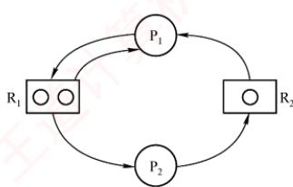
</div>

　　补充分析：若 $R_{1}$ 无限、 $R_{2}$ 为 1 个，则总有一个进程能完成并释放 $R_{2}$ ，不会死锁；但若 $R_{1}$ 为 2 个、 $R_{2}$ 无限，则仍可能死锁。例如： $P_{1}$ 申请到 $R_{1}$ 、 $R_{2}$ 后被切换， $P_{2}$ 申请 $R_{1}$ 、 $R_{2}$ ，再申请 $R_{1}$ 时阻塞； $P_{1}$ 恢复执行后也因无法获得第二个 $R_{1}$ 而阻塞。此时，双方互相等待，死锁发生。

**33. D**

　　当哲学家中同时存在左撇子（先取左侧筷子）和右撇子（先取右侧筷子）时，各进程请求资源的顺序不再一致，至少有一对相邻哲学家不会同时持有一根筷子并等待对方释放另一根，从而无法形成环形等待链，破坏了死锁的循环等待条件，避免了死锁的发生。

**34. C**

　　这类题可用到组合数学中鸽巢原理的思想。考虑最极端的情况，因为每个进程最多需要3台打印机，若每个进程已经占有了2台打印机，则只要还有多的打印机，总能满足一个进程达到3台的条件，然后顺利执行，所以将8台打印机分给 $K$ 个进程，每个进程有2台打印机，这个情况就是极端情况， $K$ 为4。或者，假设 $M$ 是打印机的数量， $K$ 是进程的数量， $R$ 是每个进程最多需要打印机的数量。根据死锁公式逆推可得，若 $M \leqslant K(R - 1)$ ，则系统可能发生死锁。将本题的数据代入，得到 $8 \leqslant K(3 - 1)$ ，即 $K \geqslant 4$ ，因此系统可能发生死锁的 $K$ 的最小值是4。

**35. D**

　　本题应采用排除法，逐个代入分析。剩余资源分配给 $P_{1}$ ，待 $P_{1}$ 执行完后，可用资源数为 $(2, 2, 1)$ ，此时仅能满足 $P_{4}$ 的需求，排除选项 A、B；接着分配给 $P_{4}$ ，待 $P_{4}$ 执行完后，可用资源数为 $(2, 2, 2)$ ，此时已无法满足任何进程的需求，排除选项 C。

　　此外，本题还可以使用银行家算法求解（对选择题来说显得过于复杂）。

**36. D**

　　首先求得各进程的需求矩阵 Need 与可利用资源向量 Available:

　　<table><tr><td rowspan="2">进程名</td><td colspan="3">Need</td></tr><tr><td><eq>R_1</eq></td><td><eq>R_2</eq></td><td><eq>R_3</eq></td></tr><tr><td><eq>P_0</eq></td><td>2</td><td>3</td><td>7</td></tr><tr><td><eq>P_1</eq></td><td>1</td><td>3</td><td>3</td></tr><tr><td><eq>P_2</eq></td><td>0</td><td>0</td><td>6</td></tr><tr><td><eq>P_3</eq></td><td>2</td><td>2</td><td>1</td></tr><tr><td><eq>P_4</eq></td><td>1</td><td>1</td><td>0</td></tr></table>

　　<table><tr><td rowspan="2">Available</td><td><eq>R_1</eq></td><td><eq>R_2</eq></td><td><eq>R_3</eq></td></tr><tr><td>2</td><td>3</td><td>3</td></tr></table>

　　比较 Need 和 Available 发现，初始时进程 $P_{1}$ 与 $P_{3}$ 可满足需求，排除选项 A、C。尝试给 $P_{1}$ 分配资源时， $P_{1}$ 完成后 Available 将变为 $(6, 3, 6)$ ，无法满足 $P_{0}$ 的需求，排除选项 B。尝试给 $P_{3}$ 分配资源时， $P_{3}$ 完成后 Available 将变为 $(4, 3, 7)$ ，该向量能满足其他所有进程的需求。因此，以 $P_{3}$ 开头的所有序列都是安全序列。

**37. B**

　　银行家算法是避免死锁的方法，选项 A、D 错。根据下图，选项 B 对，选项 C 错。

<div align="center">
  
</div>

**38. B**

　　根据死锁公式，当资源数量大于各个进程所需资源数-1的总和时，不发生死锁，三个进程分别需要3,4,5台设备，即当资源数量大于 $(3 - 1) + (4 - 1) + (5 - 1) = 9$ 时，不发生死锁。而当系统中只有9台设备时，第一个进程分配2台，第二个进程分配3台，第三个进程分配4台，这种情况下，三个进程均无法继续执行下去，发生死锁。当系统再增加1台设备，最后1台设备分配给任意一个进程都可以顺利执行完成，因此保证系统不发生死锁的最小设备数为10。

**39. B**

　　死锁的处理采用三种策略：死锁预防、死锁避免、死锁检测和解除。

　　死锁预防采用破坏产生死锁的4个必要条件中的一个或几个来防止发生死锁。其中之一的“破坏循环等待条件”，一般采用顺序资源分配法，即限制了用户申请资源的顺序，因此说法I的前半句属于死锁预防的范畴。此外，银行家算法虽然会通过检测是否存在安全序列来判断申请资源的请求是否合法，但安全序列并不是唯一的，也不是固定的，它只是一种可能的分配方案，而不是一种必须遵循的规则，银行家算法更没有给出固定的申请资源的顺序，因此说法 I 错误。

　　银行家算法是最著名的死锁避免算法，其中的最大需求矩阵 Max 定义了每个进程对 m 类资源的最大需求量，系统在执行安全性算法中都会检查此次资源试分配后，系统是否处于安全状态，若不安全则将本次的试探分配作废。在死锁的检测和解除中，系统为进程分配资源时不采取任何措施，但提供死锁检测和解除的手段，一旦检测到系统发生死锁，就立即采取相应的措施来解除死锁，因此不用关心进程所需的总资源量。说法 II、III 正确。

**40. C**

　　对于本题，需先画出如右所示的资源分配图。若系统出现死锁，则必然出现循环等待的情况。

　　从图中可以看出，若出现循环等待的情况，则至少有 $P_{1}$ 、 $P_{2}$ 、 $P_{3}$ 三个进程在循环等待环中，在该图中不可能出现两个进程发生循环等待的情况。现在考察 $P_{1}$ 、 $P_{2}$ 、 $P_{3}$ 三个进程形成环路的情况，若此时 $P_{1}$ 、 $P_{2}$ 、 $P_{3}$ 三个进程分别拥有 $R_{1}$ 、 $R_{2}$ 和 $R_{3}$ ，则会形成 $P_{1}$ 等待 $P_{2}$ 释放 $R_{2}$ ， $P_{2}$ 等待 $P_{3}$ 释放 $R_{3}$ ， $P_{3}$ 等待 $P_{1}$ 释放 $R_{1}$ 的循环等待情况。 $P_{1}$ 、 $P_{2}$ 、 $P_{3}$ 三个进程分别拥有 $R_{2}$ 、 $R_{3}$ 和 $R_{1}$ 的情况的分析类

<div align="center">
  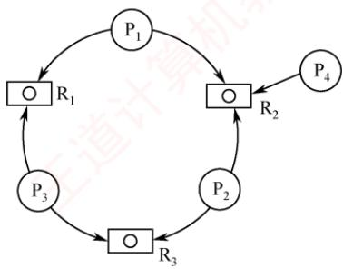
</div>

　　似。以上两种情况都会形成循环等待情况，至少有三个进程陷入死锁状态。若 $P_{4}$ 事先已获取 $R_{2}$ ，成功运行，则死锁进程数为 3；若 $P_{4}$ 尚未获取 $R_{2}$ ，未运行，则死锁进程数为 4。因此，若系统出现死锁，则处于死锁状态的进程至少是 3 个。

**41. A**

　　由题意可知，仅剩最后一个同类资源，若将其分给 $P_{1}$ 或 $P_{2}$ ，则均无法正常执行；若分给 $P_{3}$ ，则 $P_{3}$ 正常执行完成后，释放的这一个资源仍无法使 $P_{1}, P_{2}$ 正常执行，因此不存在安全序列。

**42. B**

　　剥夺进程资源，将其分配给其他死锁进程，可以解除死锁，说法I正确。死锁预防是死锁处理策略（死锁预防、死锁避免、死锁检测）中最为严苛的一种策略，破坏死锁产生的4个必要条件之一，可以确保系统不发生死锁，说法II正确。银行家算法是一种死锁避免算法，用于计算动态资源分配的安全性以避免系统进入死锁状态，不能用于判断系统是否处于死锁，说法III错误。通过简化资源分配图可以检测系统是否为死锁状态，当系统出现死锁时，资源分配图不可完全简化，只有两个或两个以上的进程才会出现“环”而不能被简化，说法IV正确。

**43. B**

　　首先求出需求矩阵:

$$
\text { Need } = \text { Max } - \text { Allocation } = \left[ \begin{array}{l l} 4 & 4 \\ 3 & 1 \\ 3 & 4 \end{array} \right] - \left[ \begin{array}{l l} 2 & 3 \\ 2 & 1 \\ 1 & 2 \end{array} \right] = \left[ \begin{array}{l l} 2 & 1 \\ 1 & 0 \\ 2 & 2 \end{array} \right]
$$

　　由 Allocation 得知当前 Available 为(1, 0)。由需求矩阵可知，初始只能满足 $P_{2}$ 的需求，选项 A 错误。 $P_{2}$ 释放资源后 Available 变为(3, 1)，此时仅能满足 $P_{1}$ 的需求，选项 C 错误。 $P_{1}$ 释放资源后 Available 变为(5, 4)，可以满足 $P_{3}$ 的需求，得到的安全序列为 $P_{2}, P_{1}, P_{3}$ ，选项 B 正确，选项 D 错误。

**44. C**

　　考虑极端情况，当临界资源数为 $n$ 时，每个进程都拥有1个临界资源并等待另一个资源，会发生死锁。当临界资源数为 $n+1$ 时，则 n 个进程中至少有一个进程可以获得 2 个临界资源，顺利运行完后释放自己的临界资源，使得其他进程也能顺利运行，不会产生死锁。或者，根据死锁公式 $m > n(r-1)$ ，其中 m 是系统中临界资源的总数，n 是并发进程的个数，r 是每个进程所需临界资源的个数。若这个不等式成立，则系统不发生死锁。将本题的数据代入，得到 $m > n(2-1)$ ，即只要系统中临界资源的总数至少是 $n+1$ ，就可避免死锁。

**45. B**

　　初始时系统中的可用资源数为 $< 1,3,2>$ ，只能满足 $\mathrm{P_0}$ 的需求 $< 0,2,1>$ ，所以安全序列第一个只能是 $\mathrm{P_0}$ ，将资源分配给 $\mathrm{P_0}$ 后， $\mathrm{P_0}$ 执行完释放所占资源，可用资源数变为 $< 1,3,2> + < 2,0,1> = < 3,3,3>$ ，此时可用资源数既能满足 $\mathrm{P_1}$ ，又能满足 $\mathrm{P_2}$ ，可以先分配给 $\mathrm{P_1}$ ， $\mathrm{P_1}$ 执行完释放资源再分配给 $\mathrm{P_2}$ ；也可以先分配给 $\mathrm{P_2}$ ， $\mathrm{P_2}$ 执行完释放资源再分配给 $\mathrm{P_1}$ 。所以安全序列可以是① $\mathrm{P_0}$ 、 $\mathrm{P_1}$ 、 $\mathrm{P_2}$ 或② $\mathrm{P_0}$ 、 $\mathrm{P_2}$ 、 $\mathrm{P_1}$ 。

#### 二、综合应用题

**01. 【解答】**

　　不发生死锁要求，必须保证至少有一个进程得到所需的全部资源并执行完毕， $m \geqslant n(k - 1) + 1$ 时，一定不会发生死锁。

　　<table><tr><td>序号</td><td>m</td><td>n</td><td>k</td><td>是否会死锁</td><td>说明</td></tr><tr><td>1</td><td>6</td><td>3</td><td>3</td><td>可能会</td><td><eq>6 &lt; 3(3-1) + 1</eq></td></tr><tr><td>2</td><td>9</td><td>3</td><td>3</td><td>不会</td><td><eq>9 &gt; 3(3-1) + 1</eq></td></tr><tr><td>3</td><td>13</td><td>6</td><td>3</td><td>不会</td><td><eq>13 = 6(3-1) + 1</eq></td></tr></table>

**02. 【解答】**

1）可能发生死锁。满足发生死锁的4大条件，例如， $P_{1}$ 占有 $S_{1}$ 申请 $S_{3}$ ， $P_{2}$ 占有 $S_{2}$ 申请 $S_{1}$ ， $P_{3}$ 占有 $S_{3}$ 申请 $S_{2}$ 。

2）可有以下几种答案。

- A. 采用静态分配：因为执行前已获得所需的全部资源，所以不会出现占有资源又等待别的资源的现象（或不会出现循环等待资源的现象）。

- B. 采用按序分配：不会出现循环等待资源的现象。

- C. 采用银行家算法：因为在分配时，保证了系统处于安全状态。

**03. 【解答】**

1）利用安全性算法对 $T_{0}$ 时刻的资源分配情况进行分析，可得到如下表所示的安全性检测情况。可以看出，此时存在一个安全序列 $\{\mathrm{P}_2,\mathrm{P}_3,\mathrm{P}_4,\mathrm{P}_1\}$ ，所以该系统是安全的。

　　<table><tr><td rowspan="3">进程名</td><td colspan="13">资源情况</td></tr><tr><td colspan="3">Work</td><td colspan="3">Need</td><td colspan="3">Allocation</td><td colspan="3">Work + Allocation</td><td rowspan="2">Finish</td></tr><tr><td><eq>R_1</eq></td><td><eq>R_2</eq></td><td><eq>R_3</eq></td><td><eq>R_1</eq></td><td><eq>R_2</eq></td><td><eq>R_3</eq></td><td><eq>R_1</eq></td><td><eq>R_2</eq></td><td><eq>R_3</eq></td><td><eq>R_1</eq></td><td><eq>R_2</eq></td><td><eq>R_3</eq></td></tr><tr><td><eq>P_2</eq></td><td>2</td><td>1</td><td>2</td><td>2</td><td>0</td><td>2</td><td>4</td><td>1</td><td>1</td><td>6</td><td>2</td><td>3</td><td>True</td></tr><tr><td><eq>P_3</eq></td><td>6</td><td>2</td><td>3</td><td>1</td><td>0</td><td>3</td><td>2</td><td>1</td><td>1</td><td>8</td><td>3</td><td>4</td><td>True</td></tr><tr><td><eq>P_4</eq></td><td>8</td><td>3</td><td>4</td><td>4</td><td>2</td><td>0</td><td>0</td><td>0</td><td>2</td><td>8</td><td>3</td><td>6</td><td>True</td></tr><tr><td><eq>P_1</eq></td><td>8</td><td>3</td><td>6</td><td>2</td><td>2</td><td>2</td><td>1</td><td>0</td><td>0</td><td>9</td><td>3</td><td>6</td><td>True</td></tr></table>

　　此处要注意，一般大多数题目中的安全序列并不唯一。

2）若此时 $P_{1}$ 发出资源请求 $Request_{1}(1,0,1)$ ，则按银行家算法进行检查： $Request_{1}(1,0,1)\leq Need_{1}(2,2,2)$ $Request_{1}(1,0,1)\leq Available(2,1,2)$

　　试分配并修改相应数据结构，由此形成的进程 $\mathrm{P_1}$ 请求资源后的资源分配情况见下表。

　　<table><tr><td rowspan="2">进程名</td><td colspan="9">资源情况</td></tr><tr><td colspan="3">Allocation</td><td colspan="3">Need</td><td colspan="3">Available</td></tr><tr><td><eq>P_1</eq></td><td>2</td><td>0</td><td>1</td><td>1</td><td>2</td><td>1</td><td rowspan="4">1</td><td rowspan="4">1</td><td rowspan="4">1</td></tr><tr><td><eq>P_2</eq></td><td>4</td><td>1</td><td>1</td><td>2</td><td>0</td><td>2</td></tr><tr><td><eq>P_3</eq></td><td>2</td><td>1</td><td>1</td><td>1</td><td>0</td><td>3</td></tr><tr><td><eq>P_4</eq></td><td>0</td><td>0</td><td>2</td><td>4</td><td>2</td><td>0</td></tr></table>

　　再利用安全性算法检查系统是否安全，可用资源 Available(1, 1, 1)已不能满足任何进程，系统进入不安全状态，此时系统不能将资源分配给进程 $\mathrm{P}_{1}$ 。

　　若此时进程 $P_{2}$ 发出资源请求 $Request_{2}(1,0,1)$ ，则按银行家算法进行检查：

$$
\text { Request } _ {2} (1, 0, 1) \leqslant \text { Need } _ {2} (2, 0, 2)
$$

$$
\text { Request } _ {2} (1, 0, 1) \leqslant \text { Available } (2, 1, 2)
$$

　　试分配并修改相应数据结构，由此形成的进程 $\mathrm{P}_2$ 请求资源后的资源分配情况下表：

　　<table><tr><td rowspan="2">进程名</td><td colspan="9">资源情况</td></tr><tr><td colspan="3">Allocation</td><td colspan="3">Need</td><td colspan="3">Available</td></tr><tr><td><eq>P_1</eq></td><td>1</td><td>0</td><td>0</td><td>2</td><td>2</td><td>2</td><td rowspan="4">1</td><td rowspan="4">1</td><td rowspan="4">1</td></tr><tr><td><eq>P_2</eq></td><td>5</td><td>1</td><td>2</td><td>1</td><td>0</td><td>1</td></tr><tr><td><eq>P_3</eq></td><td>2</td><td>1</td><td>1</td><td>1</td><td>0</td><td>3</td></tr><tr><td><eq>P_4</eq></td><td>0</td><td>0</td><td>2</td><td>4</td><td>2</td><td>0</td></tr></table>

　　再利用安全性算法检查系统是否安全，可得到如下表中所示的安全性检测情况。注意表中各个进程对应的 Work + Allocation 向量表示在该进程释放资源之后更新的 Work 向量。

　　<table><tr><td rowspan="2">进程名</td><td colspan="12">资源情况</td></tr><tr><td colspan="3">Work</td><td colspan="3">Need</td><td colspan="3">Allocation</td><td colspan="3">Work + Allocation</td></tr><tr><td><eq>P_{2}</eq></td><td>1</td><td>1</td><td>1</td><td>1</td><td>0</td><td>1</td><td>5</td><td>1</td><td>2</td><td>6</td><td>2</td><td>3</td></tr><tr><td><eq>P_{3}</eq></td><td>6</td><td>2</td><td>3</td><td>1</td><td>0</td><td>3</td><td>2</td><td>1</td><td>1</td><td>8</td><td>3</td><td>4</td></tr><tr><td><eq>P_{4}</eq></td><td>8</td><td>3</td><td>4</td><td>4</td><td>2</td><td>0</td><td>0</td><td>0</td><td>2</td><td>8</td><td>3</td><td>6</td></tr><tr><td><eq>P_{1}</eq></td><td>8</td><td>3</td><td>6</td><td>2</td><td>2</td><td>2</td><td>1</td><td>0</td><td>0</td><td>9</td><td>3</td><td>6</td></tr></table>

　　从上表中可以看出，此时存在一个安全序列 $\{P_{2}, P_{3}, P_{4}, P_{1}\}$ ，因此该状态是安全的，可以立即将进程 $P_{2}$ 所申请的资源分配给它。

3）若2）中的两个请求立即得到满足，则此刻系统并未立即进入死锁状态，因为这时所有的进程未提出新的资源申请，全部进程均未因资源请求没有得到满足而进入阻塞态。只有当进程提出资源申请且全部进程都进入阻塞态时，系统才处于死锁状态。

**04. 【解答】**

1）

$$
\text { Need } = \text { Max } - \text { Allocation } = \left[ \begin{array}{l l l l} 0 & 0 & 1 & 2 \\ 1 & 7 & 5 & 0 \\ 2 & 3 & 5 & 6 \\ 0 & 6 & 5 & 6 \end{array} \right] - \left[ \begin{array}{l l l l} 0 & 0 & 1 & 2 \\ 1 & 0 & 0 & 0 \\ 1 & 3 & 5 & 4 \\ 0 & 0 & 1 & 4 \end{array} \right] = \left[ \begin{array}{l l l l} 0 & 0 & 0 & 0 \\ 0 & 7 & 5 & 0 \\ 1 & 0 & 0 & 2 \\ 0 & 6 & 4 & 2 \end{array} \right]
$$

2）Work 向量初始化值 = Available(1, 5, 2, 0)。

　　系统安全性分析：

　　<table><tr><td rowspan="3">进程名</td><td colspan="16">资源情况</td></tr><tr><td colspan="4">Work</td><td colspan="4">Need</td><td colspan="4">Allocation</td><td colspan="4">Work + Allocation</td></tr><tr><td>A</td><td>B</td><td>C</td><td>D</td><td>A</td><td>B</td><td>C</td><td>D</td><td>A</td><td>B</td><td>C</td><td>D</td><td>A</td><td>B</td><td>C</td><td>D</td></tr><tr><td><eq>P_0</eq></td><td>1</td><td>5</td><td>2</td><td>0</td><td>0</td><td>0</td><td>0</td><td>0</td><td>0</td><td>0</td><td>1</td><td>2</td><td>1</td><td>5</td><td>3</td><td>2</td></tr><tr><td><eq>P_2</eq></td><td>1</td><td>5</td><td>3</td><td>2</td><td>1</td><td>0</td><td>0</td><td>2</td><td>1</td><td>3</td><td>5</td><td>4</td><td>2</td><td>8</td><td>8</td><td>6</td></tr><tr><td><eq>P_1</eq></td><td>2</td><td>8</td><td>8</td><td>6</td><td>0</td><td>7</td><td>5</td><td>0</td><td>1</td><td>0</td><td>0</td><td>0</td><td>3</td><td>8</td><td>8</td><td>6</td></tr><tr><td><eq>P_3</eq></td><td>3</td><td>8</td><td>8</td><td>6</td><td>0</td><td>6</td><td>4</td><td>2</td><td>0</td><td>0</td><td>1</td><td>4</td><td>3</td><td>8</td><td>9</td><td>10</td></tr></table>

　　因为存在一个安全序列 $<\mathrm{P}_0, \mathrm{P}_2, \mathrm{P}_1, \mathrm{P}_3>$ ，所以系统处于安全状态。
3） $Request_1(0, 4, 2, 0) < Need_1(0, 7, 5, 0)$ $Request_1(0, 4, 2, 0) < Available(1, 5, 2, 0)$ 假设先试着满足进程 $\mathrm{P}_1$ 的这个请求，则 Available 变为 $(1, 1, 0, 0)$ 。系统状态变化见下表：

　　<table><tr><td rowspan="3">进程名</td><td colspan="16">资源情况</td></tr><tr><td colspan="4">Max</td><td colspan="4">Allocation</td><td colspan="4">Need</td><td colspan="4">Available</td></tr><tr><td>A</td><td>B</td><td>C</td><td>D</td><td>A</td><td>B</td><td>C</td><td>D</td><td>A</td><td>B</td><td>C</td><td>D</td><td>A</td><td>B</td><td>C</td><td>D</td></tr><tr><td><eq>P_0</eq></td><td>0</td><td>0</td><td>1</td><td>2</td><td>0</td><td>0</td><td>1</td><td>2</td><td>0</td><td>0</td><td>0</td><td>0</td><td rowspan="4">1</td><td rowspan="4">1</td><td rowspan="4">0</td><td rowspan="4">0</td></tr><tr><td><eq>P_1</eq></td><td>1</td><td>7</td><td>5</td><td>0</td><td>1</td><td>4</td><td>2</td><td>0</td><td>0</td><td>3</td><td>3</td><td>0</td></tr><tr><td><eq>P_2</eq></td><td>2</td><td>3</td><td>5</td><td>6</td><td>1</td><td>3</td><td>5</td><td>4</td><td>1</td><td>0</td><td>0</td><td>2</td></tr><tr><td><eq>P_3</eq></td><td>0</td><td>6</td><td>5</td><td>6</td><td>0</td><td>0</td><td>1</td><td>4</td><td>0</td><td>6</td><td>4</td><td>2</td></tr></table>

　　再对系统进行安全性分析，见下表:

　　<table><tr><td rowspan="3">进程名</td><td colspan="16">资源情况</td></tr><tr><td colspan="4">Work</td><td colspan="4">Need</td><td colspan="4">Allocation</td><td colspan="4">Work + Allocation</td></tr><tr><td>A</td><td>B</td><td>C</td><td>D</td><td>A</td><td>B</td><td>C</td><td>D</td><td>A</td><td>B</td><td>C</td><td>D</td><td>A</td><td>B</td><td>C</td><td>D</td></tr><tr><td><eq>P_0</eq></td><td>1</td><td>1</td><td>0</td><td>0</td><td>0</td><td>0</td><td>0</td><td>0</td><td>0</td><td>0</td><td>1</td><td>2</td><td>1</td><td>1</td><td>1</td><td>2</td></tr><tr><td><eq>P_2</eq></td><td>1</td><td>1</td><td>1</td><td>2</td><td>1</td><td>0</td><td>0</td><td>2</td><td>1</td><td>3</td><td>5</td><td>4</td><td>2</td><td>4</td><td>6</td><td>6</td></tr><tr><td><eq>P_1</eq></td><td>2</td><td>4</td><td>6</td><td>6</td><td>0</td><td>3</td><td>3</td><td>0</td><td>1</td><td>4</td><td>2</td><td>0</td><td>3</td><td>8</td><td>8</td><td>6</td></tr><tr><td><eq>P_3</eq></td><td>3</td><td>8</td><td>8</td><td>6</td><td>0</td><td>6</td><td>4</td><td>2</td><td>0</td><td>0</td><td>1</td><td>4</td><td>3</td><td>8</td><td>9</td><td>10</td></tr></table>

　　因为存在一个安全序列 $<\mathrm{P}_{0}, \mathrm{P}_{2}, \mathrm{P}_{1}, \mathrm{P}_{3}>$ ，所以系统仍处于安全状态。所以进程 $\mathrm{P}_{1}$ 的这个请求应该马上被满足。

**05. 【解答】**

1）根据 Need 矩阵可知，初始 Work 等于 Available 为 $(1, 4, 0)$ ，可以满足进程 $P_{2}$ 的需求；进程 $P_{2}$ 结束后释放资源，Work 为 $(2, 7, 5)$ ，可以满足 $P_{0}, P_{1}, P_{3}$ 和 $P_{4}$ 中任意一个进程的需求，所以系统不会出现死锁，当前处于安全状态。

$$
\text { Need } = \text { Max } - \text { Allocation } = \left[ \begin{array}{l l l} 0 & 0 & 4 \\ 1 & 7 & 5 \\ 2 & 3 & 5 \\ 0 & 6 & 4 \\ 0 & 6 & 5 \end{array} \right] - \left[ \begin{array}{l l l} 0 & 0 & 3 \\ 1 & 0 & 0 \\ 1 & 3 & 5 \\ 0 & 0 & 2 \\ 0 & 0 & 1 \end{array} \right] = \left[ \begin{array}{l l l} 0 & 0 & 1 \\ 0 & 7 & 5 \\ 1 & 0 & 0 \\ 0 & 6 & 2 \\ 0 & 6 & 4 \end{array} \right]
$$

2）若初始 Work = Available 为 $(0, 6, 2)$ ，可满足进程 $P_{0}, P_{3}$ 的需求；这两个进程结束后释放资源，Work 为 $(0, 6, 7)$ ，仅可满足进程 $P_{4}$ 的需求； $P_{4}$ 结束后释放资源，Work 为 $(0, 6, 8)$ ，此时不能满足余下任意一个进程的需求，系统出现死锁，因此当前系统处在非安全状态。

> **注意**

　　在银行家算法中，当实际计算分析系统安全状态时，并不需要逐个进程进行。如本题中，在情况1）下，当计算到进程 $\mathrm{P}_2$ 结束并释放资源时，系统当前空闲资源可满足余下任意一个进程的最大需求量，这时已经不需要考虑进程的执行顺序。系统分配任意一个进程所需的最大需求资源，在其执行结束释放资源后，系统当前空闲资源会增加，所以余下的进程仍然可以满足最大需求量。因此，在这里可以直接判断系统处于安全状态。在情况2）下，系统当前可满足进程 $\mathrm{P}_0,\mathrm{P}_3$ 的需求，所以可以直接让系统推进到 $\mathrm{P}_0,$ $\mathrm{P}_3$ 执行完并释放资源后的情形，这时系统出现死锁；因为此时是系统空闲资源所能达到的最大值，所以按照其他方式推进，系统必然还是出现死锁。因此，在计算过程中，将每步中可满足需求的进程作为一个集合，同时执行并释放资源，可以简化银行家算法的计算。

## 2.5 本章疑难点

#### 1. 进程与程序的区别与联系

1）进程是程序及其数据在计算机上的一次执行活动，是一个动态概念；其运行实体是程序，脱离程序，进程便无意义。从静态视角看，进程由程序、数据和进程控制块（PCB）三部分组成；而程序仅是一组有序指令的集合，属于静态实体。

2）进程具有生命周期，动态地创建并消亡，是暂时存在的；程序作为代码的集合，可长期保存，是永久存在的。

3）一个进程在其生命周期中通常执行一个程序，而一个程序可被多个进程并发执行；进程能够创建新进程，而程序本身无法生成新进程。

4）二者的组成不同：进程包含程序、数据和PCB。

#### 2. 银行家算法的工作原理

　　银行家算法通过避免系统进入不安全状态来预防死锁。每次进行资源分配时，系统首先检查当前是否有足够资源满足进程的请求；若有，则进行试探性分配，并对分配后的新状态执行安全性检查。若新状态安全，则正式分配资源；否则拒绝该请求，从而确保系统始终处于安全状态。

#### 3. 进程同步、互斥的区别和联系

　　并发进程的执行存在两类制约关系：一是竞争使用临界资源，必须互斥访问，体现为竞争关系；二是协同完成任务，在关键点等待对方发出的信号以协调执行，体现为协作关系。
