## 【考纲内容】

（一）内存管理基础

　　连续分配管理方式；页式管理；段式管理；段页式管理

　　内存管理概念：逻辑地址与物理地址空间，地址变换，内存共享，内存保护，内存分配与回收

（二）虚拟内存管理

　　虚拟内存基本概念；请求页式管理；页框分配与回收；页置换算法

　　内存映射文件（Memory-Mapped Files）；虚拟存储器性能的影响因素及改进方式

## 【复习提示】

　　内存管理和进程管理是操作系统的核心内容，需要重点复习。本章围绕分页机制展开：通过分页管理方式在物理内存大小的基础上提高内存的利用率，再进一步引入请求分页管理方式，实现虚拟内存，使内存脱离物理大小的限制，从而提高处理器的利用率。

## 3.1 内存管理概念

　　在学习本节时，请读者思考以下问题：

1）为什么要进行内存管理？

2）多级页表解决了什么问题？又会带来什么问题？

　　在学习经典的内存管理方法之前，也建议读者先尝试独立思考，提出自己的内存管理设想，并在后续学习中与经典方案进行比较。本节内容循序渐进，后一种方法通常旨在克服前一种方法的不足。希望读者勤于思考，深入比较各类方法的异同，并着重掌握页式管理。

### 3.1.1 内存管理的基本原理和要求

　　内存管理是操作系统中最核心、也最复杂的机制之一。尽管现代计算机的主存容量持续增长，但仍无法同时容纳所有用户进程及其所需的程序与数据。因此，操作系统必须对有限的物理内存进行合理划分，并实施高效的动态分配策略。所谓内存管理（Memory Management），正是指操作系统对内存空间的组织、分配、回收以及地址映射等一系列操作。

　　在多道程序环境下，有效的内存管理尤为重要。它不仅提升了内存的利用率，简化了用户对存储资源的使用，还能在逻辑上扩展内存空间。具体而言，内存管理的主要功能包括：

- 内存空间的分配与回收。操作系统需实时跟踪内存使用状态，记录空闲区域，为新创建的进程分配所需空间，并在进程终止后及时回收其所占用的内存。

- 地址转换。用户程序使用的是逻辑地址（也称虚拟地址），而实际访问内存时必须使用物理地址。操作系统需提供机制，将逻辑地址动态转换为对应的物理地址。

- 内存空间的扩充。通过虚拟存储技术，使进程能够使用远大于物理内存容量的地址空间。

- 内存共享。允许多个进程安全地访问同一块物理内存区域，常用于共享库或进程间通信。

- 存储保护。确保各进程只能访问自身被授权的内存区域，防止相互干扰或非法破坏。

　　上述功能的实现依赖于内存管理的基本原理，其中逻辑地址与物理地址的区别尤为关键。此处仅作初步介绍，详细机制将在后续结合具体管理方法深入展开。

#### 1. 程序的链接与装入

　　创建进程时，首先需要将程序和数据装入内存。如图 3.1 所示，将用户源程序转换为可在内存中执行的程序，通常需经过以下三个步骤：

  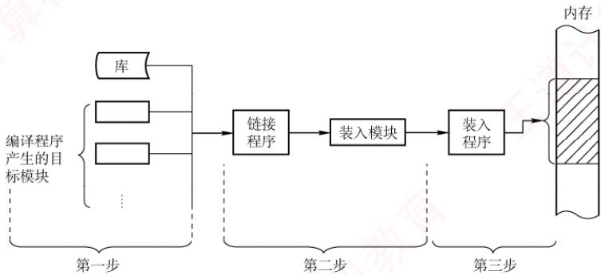

<em>图 3.1 将用户程序变为可在内存中执行的程序的步骤</em>

> **考点追踪：** 编译、链接和装入阶段的工作内容（2011）

1）编译。由编译程序将用户源代码翻译成若干目标模块。

2）链接。由链接程序将这些目标模块及其所需的库函数合并，形成一个完整的装入模块。

3）装入（加载）。由装入程序将该装入模块载入内存，并启动其执行。

#### 2. 逻辑地址与物理地址

> **考点追踪：** 进程虚拟地址空间的特点（2023）

　　编译后的每个目标模块通常从0号单元开始编址，这种地址称为该模块的相对地址（或逻辑地址）。链接程序将多个目标模块合并为一个完整的可执行程序时，依次将各模块的相对地址拼接成一个统一的、从0开始编址的逻辑地址空间（或虚拟地址空间）。以32位系统为例，该逻辑地址空间的范围为 $0\sim2^{32}-1$ 。进程运行时所使用的地址均为逻辑地址；用户程序和程序员只需关注逻辑地址，而底层的内存管理机制对其完全透明。不同进程可以拥有相同的逻辑地址，因为它们各自拥有独立的逻辑地址空间，这些地址会被映射到主存的不同位置。

　　物理地址空间是指主存中所有物理存储单元的集合，它是地址转换的最终目标。无论进程执行指令还是访问数据，最终都必须通过物理地址从主存中读取或写入信息。在早期系统中，程序装入内存时需将逻辑地址转换为物理地址，这一过程称为地址重定位；而在现代支持虚拟内存的系统中，该转换由内存管理单元（MMU）在硬件层面于运行时自动完成。

　　具体而言，现代操作系统为每个进程维护一张页表，用于记录逻辑页到物理页框的映射关系。当进程访问某个逻辑地址时，MMU会依据当前进程的页表，将其动态转换为相应的物理地址。整个过程对用户程序完全透明，构成了虚拟内存系统的基础。

#### 3. 程序的链接

　　链接程序的作用是将编译生成的目标模块及其所需的库函数合并，形成一个完整的装入模块，以便后续装入内存并执行。根据链接发生的时机不同，可分为以下三种方式。

##### （1）静态链接

　　在程序运行之前，将各目标模块及其所需的库函数链接成一个完整的装入模块（可执行文件），此后不再拆分，这种链接方式称为静态链接。链接过程中需完成两项关键操作。

　　① 地址调整。各目标模块在编译后均以 0 为起始地址，链接时需根据其在装入模块中的实际位置，将内部地址统一加上相应的偏移量。例如，若模块 A 的长度为 L，且链接后模块 B 紧邻在模块 A 之后存放，则原本从 0 开始编址的模块 B 在合并后的装入模块中将从地址 L 处开始，其内部所有地址均需加上偏移量 L。

　　② 外部符号解析。将模块间引用的外部符号（如函数名）替换为确定的地址。若模块 A 中包含语句 CALL B，其中 B 为指向模块 B 入口的外部调用符号，则链接程序会将其解析为模块 B 在装入模块中的起始地址 L，并将 CALL B 中的符号 B 替换为地址 L。

##### （2）装入时动态链接

　　装入时动态链接是指：将用户源程序编译后生成的一组目标模块，在装入内存时采用边装入边链接的方式。具体而言，当装入某个目标模块时，若遇到对外部模块的调用，则装入程序会立即查找并装入相应的外部目标模块，并替换其中的外部符号。其优点如下。

　　① 便于修改和更新。静态链接需将所有目标模块预先装配成一个完整的装入模块，若其中任一模块需要修改或更新，则必须重新生成整个装入模块。若采用装入时动态链接方式，则各目标模块独立存放，只需替换被修改的模块，无须重建整个程序。

　　② 便于实现对目标模块的共享。在静态链接方式下，每个应用程序都包含其所依赖目标模块的完整副本，无法实现共享。而在装入时动态链接方式下，操作系统可将同一个目标模块链接到多个应用程序中，从而实现多个程序对该目标模块的共享。

##### （3）运行时动态链接

　　运行时动态链接是对装入时动态链接的改进，在程序执行过程中，仅当需要调用某个尚未装入内存的目标模块时，操作系统才动态加载并链接该模块。具体而言，系统会查找该模块，将其装入内存，并完成符号解析，使其可被当前进程调用；而程序运行中未使用的模块，则既不会被装入内存，也不会进行链接。其优点是既能加快程序的装入过程，又可节省内存空间。

#### 4. 程序的装入

　　将一个装入模块载入内存时，主要有以下三种方式。

##### （1）绝对装入

　　绝对装入仅适用于单道程序环境。由于内存中始终只有一个程序，其驻留位置在编译前即可确定，因此编译程序可以直接生成使用绝对地址的目标代码；装入程序只需按这些地址将程序和数据载入内存。此时，程序中的逻辑地址与实际物理地址完全一致，无须任何修改。

　　程序中通常使用的是符号地址（如变量名、函数名），由编译器或汇编器在编译或汇编阶段将其转换为绝对地址；当然，绝对地址也可由程序员直接指定，但这种方式缺乏灵活性。

##### （2）可重定位装入

　　在多道程序环境下，编译程序无法预知目标模块在内存中的具体位置，因此经编译和链接生成的装入模块通常从地址0开始编址，程序中的地址均为相对于模块起始位置的逻辑地址。此时应采用可重定位装入方式，它可根据内存的具体情况，将装入模块装入内存的适当位置。

　　装入时，系统根据内存当前的空闲情况，为该模块分配一块连续的内存区域，并将整个模块载入其中。随后，一次性将所有逻辑地址修改为对应的物理地址。这一地址转换过程称为重定位。由于转换在装入时完成，且在程序运行期间不再改变，故称静态重定位，如图3.2(a)所示。

　　进程必须在装入前一次性获得其所需的全部内存空间；若内存不足，则无法装入。一旦装入，进程在整个运行期间既不能移动位置，也不能动态申请额外内存，限制了内存管理的灵活性。

##### （3）动态运行时装入

　　为克服静态重定位的局限，支持程序在内存中的移动，需采用动态重定位方式。装入程序将装入模块载入内存后，并不立即转换地址，而是将地址转换推迟到指令实际执行时进行。为此，系统借助一个重定位寄存器，用于存放该模块在内存中的起始物理地址。程序中保留的仍是逻辑地址，而实际物理地址则由硬件在运行时动态计算得出，如图3.2(b)所示。

　　动态重定位的优点：支持程序在内存中移动，便于操作系统进行紧凑，从而有效减少外部碎片；提高内存分配的灵活性，允许在运行期间根据需要动态调整进程的内存布局。

  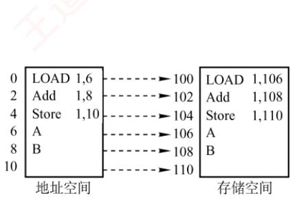

　　(a) 静态重定位

  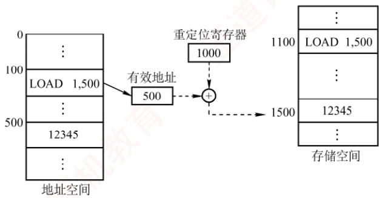

　　(b) 动态重定位

<em>图 3.2 重定位类型</em>

#### 5. 内存保护

> **考点追踪：** 分区分配内存保护的措施（2009）

　　为确保各进程拥有独立的内存空间，内存保护机制需在内存分配前防止用户进程破坏操作系统，同时避免用户进程相互干扰。常用方法主要有以下两种。

1）在CPU中设置一对上、下限寄存器，分别存放用户进程在内存中的下限和上限地址，每当CPU访问一个地址时，硬件自动将其与这两个寄存器的值进行比较，以判断是否越界。

2）采用重定位寄存器（也称基地址寄存器）和界地址寄存器（也称限长寄存器）实现越界检查。重定位寄存器存放进程在内存中的起始物理地址，界地址寄存器存放进程地址空间的长度。内存管理部件首先将逻辑地址与界地址寄存器的值进行比较，若未越界，则将逻辑地址加上重定位寄存器的值，得到物理地址，并据此访存，如图3.3所示。

  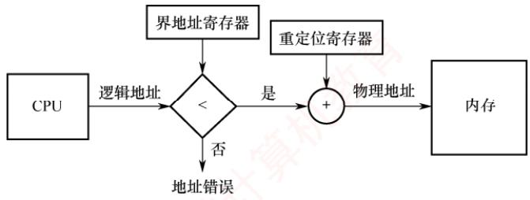

<em>图 3.3 重定位寄存器和界地址寄存器的硬件支持</em>

　　重定位寄存器与界地址寄存器的作用不同：重定位寄存器用于“加”，即将逻辑地址加上其值，得到物理地址；界地址寄存器用于“比”，即将逻辑地址与其值比较，判断是否越界。

　　重定位寄存器与界地址寄存器的加载必须通过特权指令完成，仅操作系统内核具备此权限。这一机制可确保寄存器内容只能由内核修改，用户程序无法篡改，从而有效保障内存的安全。

#### 6. 内存共享

　　并非所有进程的内存空间都适合共享，只有只读区域才可以被共享。可重入代码（也称纯代码）是一种允许多个进程同时访问但不允许被任何进程修改的代码。在实际执行时，每个进程需配备独立的私有数据区，用于存放运行过程中可能修改的数据；程序仅对私有数据区进行写操作，而共享的代码段始终保持不变。例如，考虑一个可同时容纳40个用户的多用户系统，所有用户同时运行同一个文本编辑程序。该程序包含160KB的代码区和40KB的数据区。若不共享代码，则系统共需 $(160KB+40KB)\times40=8000KB$ 的内存；若代码为可共享代码，则无论采用分页系统还是分段系统，整个系统只需保留一份副本，此时所需内存仅为 $160KB+40KB\times40=1760KB$ 。

　　在分页系统中，假设页面大小为 4KB，则代码区占用 40 个页面，数据区占用 10 个页面。为实现代码共享，每个进程的页表中需设置 40 个页表项，均指向同一组共享代码页的物理页框；此外，每个进程还需为其私有数据区建立 10 个页表项，指向各自的数据页。

　　在分段系统中，由于以段为单位进行管理，只需为共享代码段设置一个段表项，记录共享代码段的起始地址和段长（160KB）。每个进程的段表中包含对该共享段的引用。由此可见，分页与分段均可有效支持内存共享，区别在于共享的粒度和管理机制。

　　此外，在第2章中介绍过基于共享内存的进程通信机制，由操作系统提供同步与互斥支持。本章后续还将介绍另一种内存共享的实现方式——内存映射文件。

#### 7. 内存分配与回收

　　操作系统的演进持续推动内存管理的发展。随着系统从单道向多道程序发展，单一连续分配逐渐被固定分区分配所取代。然而，固定分区难以适应作业大小的动态变化，因此又被动态分区分配所替代。为进一步提升内存利用率，连续分配方式最终让位于离散分配方式（如页式存储管理）。此外，为满足用户在编程和使用上的更高需求（如支持程序的逻辑结构、实现段级共享与保护等），分段存储管理应运而生，而这些功能恰是其他分配方式难以有效支持的。

### 3.1.2 连续分配管理方式

　　连续分配方式是指为一个用户程序分配一个连续的内存空间。例如，若某用户程序需要100MB的内存，则系统便会在内存中为其分配一块连续的100MB区域。

　　连续分配方式主要包括单一连续分配、固定分区分配和动态分区分配。

#### 1. 单一连续分配

　　在单一连续分配方式中，内存被划分为系统区和用户区。系统区仅供操作系统使用，通常位于低地址部分；用户区则仅允许一道用户程序运行，即该程序独占整个用户区。

　　这种方式的优点是结构简单、无外部碎片，且无须内存保护机制，因为内存中始终只有一道程序。缺点是仅适用于单用户、单任务的操作系统，存在内部碎片，且内存利用率极低。

#### 2. 固定分区分配

　　固定分区分配是最简单的一种多道程序存储管理方式。它将用户内存空间划分为若干大小固定的分区，每个分区仅能容纳一道作业。当有空闲分区时，系统可从外存的后备作业队列中选择一个合适大小的作业装入该分区，并反复执行这一过程。在划分分区时，有两种方法：

- 分区大小相等。程序过小会造成空间浪费，过大则无法装入，缺乏灵活性。

- 分区大小不等。划分为多个较小分区、适量中等分区和少量大分区，以提高适应性。

　　为便于内存的分配与回收，系统维护一张分区使用表，通常按分区大小排序。各表项包含对应分区的始址、大小及状态（是否已分配），如图3.4所示。分配时，系统检索该表，寻找一个满足作业大小要求且尚未分配的分区，将其分配给待装入程序，并将对应表项的状态置为“已分配”；若找不到合适分区，则拒绝分配。回收时，只需将对应表项的状态置为“未分配”即可。

　　<table><tr><td>分区号</td><td>大小/KB</td><td>始址/KB</td><td>状态</td></tr><tr><td>1</td><td>12</td><td>20</td><td>已分配</td></tr><tr><td>2</td><td>32</td><td>32</td><td>已分配</td></tr><tr><td>3</td><td>64</td><td>64</td><td>已分配</td></tr><tr><td>4</td><td>128</td><td>128</td><td>未分配</td></tr></table>

　　(a) 分区使用表

  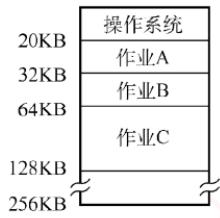

　　(b) 存储空间分配情况

<em>图 3.4 固定分区说明表和内存分配情况</em>

　　该方式存在两个问题：① 若作业大于所有分区，则无法装入；② 若作业小于分区大小，则仍需占用整个分区，造成内部未被利用的空间，即内部碎片。固定分区方式虽无外部碎片，但因每个分区仅能由一个作业独占，无法支持多个进程共享同一内存区域，故内存利用率较低。

#### 3. 动态分区分配

##### （1）动态分区分配的基本原理

　　动态分区分配也称可变分区分配，是指在进程装入内存时，按其实际需求动态分配一块大小恰好匹配的连续内存空间，因此系统中分区的数量和大小随进程的装入与释放而动态变化。

　　如图 3.5 所示，系统拥有 64MB 内存空间，其中低 8MB 固定分配给操作系统，其余为用户可用区域。初始时装入前三个进程后，仅剩 4MB 空闲，不足以容纳进程 4。为腾出空间，操作系统换出进程 2，并换入较小的进程 4；因其所需内存更少，释放出一个 6MB 的空闲块。随后，当需要重新换入进程 2 时，因剩余空间仍不足，操作系统又换出进程 1，再换入进程 2。

　　动态分区分配在初期运行良好，但随着进程频繁装入与释放，内存中会逐渐积累大量分散的小空闲块，导致可用内存总量虽足，却难以满足较大进程的需求，内存利用率随之下降。这些散布在已分配分区之间、无法利用的小空闲块称为外部碎片，与固定分区中因分区内部未用完而产生的内部碎片形成鲜明对比。外部碎片可通过紧凑技术缓解：操作系统周期性地移动进程，将所有空闲块合并为一个连续区域；然而，该操作要求系统支持动态重定位，且开销较大。其原理类似于 Windows 系统中的磁盘碎片整理，但后者作用于外存文件系统，而前者作用于主存。

  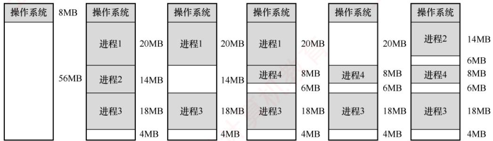

<em>图 3.5 动态分区分配</em>

> **考点追踪：** 动态分区分配的内存回收方法（2017）

　　在动态分区分配中，系统维护一张空闲分区链（表），通常按起始地址排序。分配内存时，系统检索该链，寻找一个满足请求大小的空闲分区；若其尺寸大于所需，则从中分割出请求大小的空间分配给进程，剩余部分（如果不小于最小分配单位）仍保留在空闲分区链中。回收内存时，系统根据回收分区的起始地址，在空闲分区链中确定插入位置，并依据相邻情况执行合并操作，具体可分为四种情形：① 回收区与前一空闲分区相邻，两者合并，更新前一分区的大小；② 回收区与后一空闲分区相邻，两者合并，更新后一分区的起始地址和大小；③ 回收区与前后两个空闲分区均相邻，三者合并，更新前一分区的大小，并删除后一分区的表项；④ 回收区不与任何空闲分区相邻，为其新建一个表项，记录起始地址和大小，并插入空闲分区链。

　　上述三种连续分配方式有一个共同特点：用户程序在主存中均以连续方式存放。

##### （2）基于顺序搜索的分配算法

　　将作业装入主存时，需依据特定的分配算法从空闲分区链（表）中选出一个大小合适的分区分配给该作业。根据分区检索方式的不同，动态分区分配算法可分为顺序分配算法和索引分配算法。其中，顺序分配算法通过依次遍历空闲分区链，查找第一个满足作业大小要求的分区。

　　常见的顺序分配算法有以下四种。

> **考点追踪：** 各种动态分区分配算法的特点（2019、2024）

1）首次适应（First Fit）算法。空闲分区按地址递增次序排列。分配时从链首开始顺序查找，找到第一个满足请求的空闲分区，从中划出所需空间分配给作业，余下部分仍留在链中。该算法优先利用低地址分区，从而保留高地址的大空闲区，有利于后续大作业装入；但低地址容易积累小碎片，且每次分配均需从链首开始查找，增加了查找开销。

2）邻近适应（Next Fit）算法。也称循环首次适应算法，由首次适应算法改进而来。不同之处在于：分配时从上次查找结束的位置开始继续循环搜索，而非每次都从链首开始。该算法减少了对低地址区域的重复扫描，但往往导致大空闲区在内存中分布不均，难以有效支持后续大作业的装入，因此其整体性能通常不如首次适应算法。

> **考点追踪：** 最佳适应算法的分配过程（2010）

3）最佳适应（Best Fit）算法。空闲分区按容量递增次序排列。分配时，顺序查找第一个能满足作业大小的空闲分区（最小的可用分区）进行分配。尽管名为“最佳”，该算法虽能尽量保留较大的空闲分区，但每次分配都会在原分区中留下极小的剩余块。随着时间推移，这些小块难以被利用，产生大量外部碎片，实际性能通常较差。

4）最坏适应（Worst Fit）算法。空闲分区按容量递减次序排列。分配时，选择第一个满足要求的空闲分区（最大的可用分区），从中分割出所需空间。与最佳适应算法相反，该算法试图通过避免生成小碎片来提升内存利用率，但由于总是切割最大的空闲区，系统很快难以满足大作业的内存需求，因此性能同样不佳。

　　综合来看，首次适应算法在实现开销、碎片控制与大作业支持之间取得了较好的平衡：其查找过程简单高效，回收分区时无须对空闲链重新排序，且能有效保留高地址的大空闲区。

##### （3）基于索引搜索的分配算法

　　当系统规模较大时，空闲分区链可能很长，采用顺序搜索算法效率较低。为此，大中型系统常采用基于索引的分配算法，索引分配算法的思想是：根据空闲分区的大小进行分类，对每一类大小相同的空闲分区建立独立的空闲分区链，并通过一张索引表统一管理这些链。分配时，依据请求大小在索引表中定位对应链表，获取其头指针，从而快速取得一个空闲分区。

　　常见的索引分配算法有以下三种。

1）快速适应（Quick Fit）算法。根据系统中进程常用的空间大小，预先将空闲分区划分为若干固定尺寸的类别。分配过程分为两步：① 根据作业长度，在索引表中找到能容纳它的最小类别链表；② 从该链表头部取下第一个空闲分区进行分配。优点是查找效率高、不会产生内存碎片；缺点是回收时难以有效合并分区，算法比较复杂，开销较大。

> **考点追踪：** 伙伴关系的概念（2024）

2）伙伴系统（Buddy System）。规定所有分区大小均为 $2^{k}$ （ $k$ 为正整数）。当需要为进程分配大小为 $n$ 的内存时（满足 $2^{i-1} < n \leqslant 2^{i}$ ），首先在大小为 $2^{i}$ 的空闲分区链中查找。若存在，则直接分配；否则，依次在大小为 $2^{i+1}, 2^{i+1}, \cdots$ 的链中查找，直至找到一个可用分区。随后，将该分区不断二分，直至得到所需大小的块，其余部分按大小加入对应的空闲链。在伙伴系统中，每个大小为 $2^{k}$ 的分区都有一个唯一的伙伴分区：与它大小相同、地址相邻（首尾相接）的另一个分区。回收时，若某空闲分区与其伙伴也为空闲，则合并为一个大小为 $2^{k+1}$ 的分区，并继续向上尝试合并，直至无法合并为止。

3）哈希算法。以空闲分区大小为关键字，建立哈希函数，构建一张哈希表，每个表项记录对应空闲分区链的头指针。分配时，根据所需分区大小，通过哈希函数计算出其在哈希表中的位置，从而快速获取相应的空闲分区链。

　　在连续分配方式中，即使系统拥有超过1GB的空闲内存，只要其中不存在连续的1GB空间，需要该大小内存的作业便无法装入运行，这正是外部碎片导致的问题。为了克服这一限制，操作系统引入了非连续分配方式：将进程的地址空间划分为多个单元，并允许这些单元分散地装入内存中互不相邻的区域，从而彻底摆脱对外部连续空间的依赖。该机制能有效利用零散的空闲内存，显著提升内存利用率；但与此同时，系统必须额外维护各逻辑单元与其物理位置之间的映射关系，因而带来了一定的存储开销。根据所划分单元的大小是否固定，非连续分配方式可分为分页存储管理与分段存储管理。进一步，若作业运行前需要一次性装入全部单元，则称为基本分页或基本分段；若支持按需动态装入，则相应地称为请求分页与请求分段。

### 3.1.3 基本分页存储管理①

　　固定分区会产生内部碎片，动态分区会产生外部碎片，这两种方式对内存的利用率都较低。为提高内存利用率并彻底消除外部碎片，操作系统引入了分页存储管理：将物理内存划分为若干大小相等的固定单元，称为页框（或页帧、物理块）；同时将进程的逻辑地址空间划分为与页框大小相同的单元，称为页面（或页）。系统以页框为单位为进程分配内存。

　　从形式上看，分页类似于等长的固定分区，但其本质不同：固定分区按作业整体分配，而分页将进程和内存均按固定大小的单元划分，使得内存分配以页为单位进行。因此，分页管理不会产生外部碎片。然而，由于页面大小固定，当进程的某一页未被完全填满时，其对应的页框中会留下未使用的空间，形成页内碎片（内部碎片），每个进程平均产生的页内碎片约为半页。

#### 1. 分页存储的几个基本概念

##### （1）页面和页面大小

　　进程的逻辑地址空间被划分为若干页面，每个页面有一个编号，称为页号，从 0 开始；物理内存中的每个页框也有一个编号，称为页框号（或物理块号），同样从 0 开始。通过建立页号到页框号的映射，系统为进程的每个页面分配物理内存。

　　为便于地址转换，页面大小通常取2的整数次幂。页面大小应适中：若页面过小，则进程的页面数量增多，导致页表过长，不仅占用大量内存，还会增加地址转换开销，降低页面换入/换出的效率；若页面过大，则页内碎片增多，同样会降低内存利用率。

  

##### （2）地址结构

> **考点追踪：** 分页系统的逻辑地址结构（2009、2010、2013、2015、2017、2024）

　　在分页存储管理中，逻辑地址由两部分组成：页号 P 和页内偏移量 W，如图 3.6 所示。

　　<table><tr><td>31</td><td><eq>\cdots</eq></td><td>12</td><td>11</td><td><eq>\cdots</eq></td><td>0</td></tr><tr><td></td><td colspan="2">页号P</td><td></td><td colspan="2">页内偏移量W</td></tr></table>

<em>图 3.6 某分页系统的 32 位逻辑地址结构</em>

　　以 32 位地址为例，若页面大小为 $2^{12}B$ （4KB），则低 12 位（0～11 位）为页内偏移量，高 20 位（12～31 位）为页号，最多可支持 $2^{20}$ 个页面。

##### （3）页表

　　为实现逻辑地址到物理地址的转换，系统为每个进程建立一张页表（Page Table）。页表是一个按页号顺序排列的数组，每个页表项记录对应页面所驻留的物理页框号，以及相关状态信息（如有效位、访问位等）。进程执行时，通过页号索引页表，即可获得该页所在的物理块号，从而完成地址映射，如图3.7所示。因此，页表的作用是实现从页号到页框号的映射。

　　(a)逻辑空间

  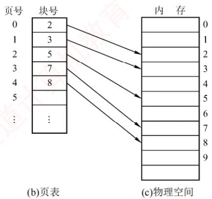

<em>图 3.7 页表的作用</em>

#### 2. 基本地址变换机构

　　地址变换机构的任务是将逻辑地址转换为内存中的物理地址，这一过程借助页表实现。图3.8展示了分页存储管理系统中的地址变换机构。

  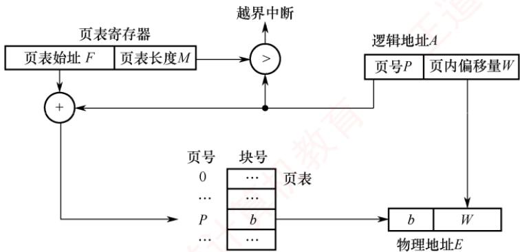

<em>图 3.8 分页存储管理系统中的地址变换机构</em>

> **注意**

　　在页表中，页表项按页号顺序连续存放，因此页号作为索引是隐含的，无须在页表项中显式存储。

　　为提高地址变换速度，系统设置一个页表寄存器（PTR），存放页表在内存中的始址 $F$ 和页表长度 $M$ 。由于寄存器造价昂贵，单CPU系统中通常只设置一个PTR。进程未执行时，其页表始址和长度保存在该进程的PCB中；当进程被调度执行时，操作系统将这些信息装入PTR。

　　设页面大小为 L，逻辑地址 A 到物理地址 E 的变换过程如下。

> **考点追踪：** 页式系统的地址变换过程（2013、2021、2024）

> **考点追踪：** 页表项地址的计算与分析（2024）

　　① 根据逻辑地址计算页号 $P = \lfloor A/L \rfloor$ 、页内偏移量 $W = A\% L$ 。

　　② 判断页号是否越界，若页号 $P \geqslant$ 页表长度 M，则产生越界中断；否则，继续执行。

　　③ 根据页号 $P$ 查找页表，找出对应页表项中的物理块号。页表项地址 = 页表始址 $F+$ 页号 $P \times$ 页表项长度，取出该页表项中的物理块号 $b$ 。

　　④ 计算物理地址 $E = bL + W$ ，并据此访问内存（注意，物理地址 = 页面在内存中的始址 + 页内偏移量，页面在内存中的始址 = 块号 × 块大小）。

　　上述地址变换过程由 MMU 硬件自动完成的。例如，若页面大小 L = 1KB，则页号 2 对应的物理块号 b = 8，逻辑地址 A = 2500 的物理地址 E 的计算过程如下： $P = 2500 / 1K = 2$ ， $W = 2500\% 1K = 452$ ，故物理地址 $E = 8 \times 1024 + 452 = 8644$ 。

　　若逻辑地址以二进制形式给出，则页号和页内偏移可直接通过截取高位和低位获得，效率更高。正因页面大小固定，逻辑地址可视为一维线性地址，因而仅需一个整数即可确定其位置。

　　页表项大小不是随意规定的，而是有所约束的。页表项大小如何确定？

　　页表项需能表示所有可能的物理页框号。以32位地址空间、按字节编址、页面大小为4KB为例，物理内存最多包含 $2^{32}B/4KB=2^{20}$ 个页框，因此需要 $\log_{2}2^{20}=20$ 位来表示页框号。由于内存按字节编址，为保证页表项能够指向所有页面，页表项大小至少为 $\left[20/8\right]=3B$ 。但出于对齐和扩展考虑（如加入有效位、访问位等），实际系统通常将页表项设为4B。

　　分页管理面临两个主要挑战：① 每次访存都需要进行地址转换，若转换速度不够快，则会显著降低系统性能；② 页表本身占用内存空间，若页表过大，则会降低内存利用率。正是这些问题，推动了后续优化技术的发展，如快表（TLB）和多级页表。

#### 3. 具有快表的地址变换机构

　　由前述地址变换过程可知，若页表全部存放在内存中，则每次访问内存（无论是取指令还是读/写数据）至少需两次访存：第一次访问页表以获取物理块号，第二次根据形成的物理地址访问目标内容。显然，这种方式会显著降低系统性能。为此，现代地址变换机构增设了一个具有并行查找能力的高速缓冲存储器——快表（TLB），用于缓存当前活跃的若干页表项，以加速地址变换。相应地，主存中的完整页表常被称为慢表。具有快表的地址变换机构如图3.9所示。

> **考点追踪：** 具有快表的地址变换的性能分析（2009）

　　在具有快表的分页机制中，地址变换过程如下。

　　① CPU 给出逻辑地址后，硬件自动提取页号，并将其与快表中所有页号并行比较。

　　② 若命中（找到匹配的页号），则直接从快表中取出对应的物理块号，与页内偏移量拼接形成物理地址。此时，仅需一次访存即可。

　　③ 若未命中（未找到匹配的页号），则需访问内存中的页表，读取相应的页表项以获得其物理块号，再拼接形成物理地址并访问内存，共需两次访存。同时，系统会将该页表项装入快表，以便后续可能的重复访问；若快表已满，则按特定置换算法淘汰一个旧项。

  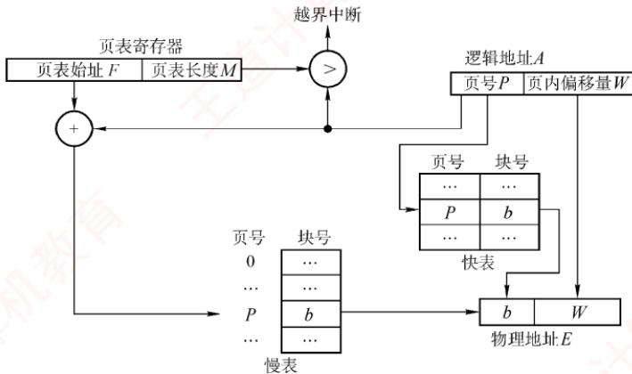

<em>图 3.9 具有快表的地址变换机构</em>

　　在程序具有良好局部性的前提下，快表命中率通常可达90%以上，因此分页机制带来的性能开销可控制在10%以内。快表的有效性基于著名的局部性原理，这一原理将在3.2节中介绍。

#### 4. 两级页表

　　引入分页管理后，进程执行时无须将所有页面调入内存，但仍需将整个页表驻留内存。然而，页表本身可能非常庞大。以32位逻辑地址空间、页面大小为4KB、页表项大小为4B为例：页内偏移占 $\log_24\mathrm{K} = 12$ 位，页号占20位，因此每个进程的页表最多包含 $2^{20}$ 个页表项，仅页表就需占用 $2^{20}\times 4\mathrm{B} / 4\mathrm{KB} = 1\mathrm{K}$ 个页。若还要求页表连存放，则显然不切实际。

> **考点追踪：** 多级页表的特点和优点（2014）

　　解决上述问题的思路是将页表本身也视为可分页的对象，具体体现为两个方面：① 对页表采用离散分配，不再要求其连续存放，而是通过一张专门的索引表记录各页表页在内存中的位置，从而消除对连续内存空间的需求；② 仅将当前活跃的部分页表项调入内存，其余仍驻留磁盘，按需调入（虚拟内存的思想），从而有效缓解页表占用过多内存的问题。

　　不难发现，这一方案与最初引入页表以解决进程地址空间离散分配的思路如出一辙：本质上，就是为已离散化的页表再建立一层页表，称为外层页表（或页目录）。仍以上述条件为例：当采用两级分页时，将原页表按页面大小（4KB）进行分页。由于每页可容纳 $4\mathrm{KB} / 4\mathrm{B} = 1024$ 个页表项，而总页表项数为 $2^{20}$ ，故需 $2^{20} / 2^{10} = 2^{10} = 1024$ 个页表页，对应外层页表包含1024个表项，恰好占用一页（4KB）。由此自然形成了如图3.10所示的逻辑地址结构。

　　<table><tr><td>一级页号或页目录号10位</td><td>二级页号或页号10位</td><td>页内偏移12位</td></tr></table>

<em>图 3.10 逻辑地址空间的格式</em>

> **考点追踪：** 两级页表的逻辑地址结构及相关分析（2010、2013、2015、2017—2019）

　　两级页表是在普通页表结构上再加一层页表，其结构如图 3.11 所示。

　　在页表的每个表项中，存放的是进程某页对应的物理块号。例如，0 号页存放在 1 号物理块中，1 号页存放在 5 号物理块中。在外层页表的每个表项中，存放的是某个页表分页的物理起始地址。例如，0 号页表页存放在 3 号物理块中。

  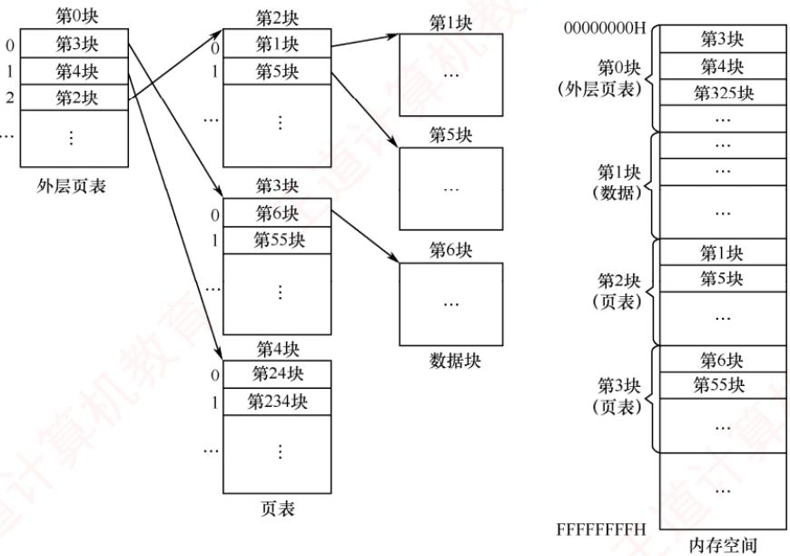

<em>图 3.11 两级页表结构示意图</em>

　　通过外层页表和内层页表的协同作用，可实现从逻辑地址到物理地址的变换。

> **考点追踪：** 二级页表的页表基址寄存器中的内容（2018、2021）

> **考点追踪：** 二级页表中的地址变换过程（2015、2017）

　　为方便地址变换，系统增设一个外层页表寄存器（也称页目录基址寄存器），用于存放外层页表的起始地址。地址变换过程如下。

　　① 用逻辑地址中的页目录号作为索引，访问外层页表，获取对应内层页表的物理起始地址。

　　② 用逻辑地址中的二级页号作为索引，访问该页表，得到目标页面的物理块号。

　　③ 将物理块号与页内偏移量拼接，形成物理地址，并据此访问内存单元。

　　在无快表的情况下，此过程需三次访存。

　　对于更大的地址空间（如 64 位），两级页表远远不够。例如，若逻辑地址为 64 位、页面大小为 4KB，则页号占 52 位。若每页仍可存放 1024 个页表项，则需约 6 级页表才能覆盖整个地址空间。然而，实际系统通常将虚拟地址限制为 48 位，从而采用三级或四级页表即可高效管理，既满足应用需求，又避免硬件过度复杂化。建立多级页表的根本目的，是通过按需分配页表页，避免为未使用的地址空间预留大量无用的页表项，进而显著节省内存开销。

### 3.1.4 基本分段存储管理

　　分页管理方式是从计算机的角度出发设计的，旨在提高内存利用率和系统性能，其地址转换由硬件自动完成，对用户完全透明。而分段管理方式则从用户和程序员的实际需求出发，旨在支持方便编程、信息保护与共享、动态增长以及动态链接等高级功能。

#### 1. 分段

　　分段系统将用户进程的逻辑地址空间划分为若干大小不等的段。例如，一个进程可包含主程序段、子程序段、栈段和数据段，共划分为5个段。每个段内部从0开始编址，并分配一段连续的地址空间（段内连续，段间不要求连续）。由于地址空间被组织为多个具有明确语义的段，整个进程的逻辑地址结构呈现出二维特性：由段号和段内偏移共同确定一个地址。

> **考点追踪：** 分段系统的逻辑地址结构分析（2009）

　　分段存储管理的逻辑地址由段号 S 和段内偏移量 W 两部分组成。在图 3.12 中，段号占 16 位，段内偏移量也占 16 位，则一个进程最多可拥有 $2^{16} = 65536$ 个段，最大段长为 64KB。

　　<table><tr><td>31 ... 16</td><td>15 ... 0</td></tr><tr><td>段号S</td><td>段内偏移量W</td></tr></table>

<em>图 3.12 分段系统中的逻辑地址结构</em>

　　在页式系统中，逻辑地址中的页号与页内偏移量对用户透明；而在分段系统中，段号和段内偏移量必须由用户显式提供——这一工作在高级语言中由编译程序自动完成。

#### 2. 段表

　　每个进程都拥有一张段表，用于实现逻辑段到物理内存区的映射。段表中每个段对应一个段表项，记录该段在内存中的基址（起始地址）和段长（长度）。段表的内容如图3.13所示。

　　<table><tr><td>段号</td><td>段长</td><td>本段在主存的始址</td></tr></table>

<em>图 3.13 段表的内容</em>

　　运行时，系统通过查找段表，即可定位每段在内存中的实际位置，其映射过程见图3.14。

  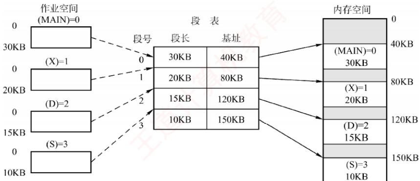

<em>图 3.14 利用段表实现物理内存区映射</em>

　　由于段表项连续存放且长度相同，段号可作为隐含索引，无须额外存储。例如，在某32位分段系统中，段号为16位，段内偏移量为16位（段长字段为16位，对应最大段长64KB），物理地址为32位（可寻址4GB内存）。因此，每个段表项至少需要16（段长）+32（基址）=48位，即6B。若段表首地址为M，则第K号段对应的段表项位于地址 $M+K\times6$ 处。

#### 3. 地址变换机构

　　分段系统的地址变换过程如图 3.15 所示。为实现从逻辑地址到物理地址的变换，系统设置了一个段表寄存器，用于存放段表始址 F 和段表长度 M。段式存储管理的地址变换过程如下。

> **考点追踪：** 段式系统的地址变换过程（2016）

　　① 从逻辑地址 A 中分离出段号 S 和段内偏移量 W。

　　② 判断段号是否越界：若段号 $S \geq$ 段表长度 $M$ ，则产生段号越界中断，否则继续执行。

　　③ 根据段号 S 查找段表，段表项地址 = 段表始址 $F +$ 段号 $S \times$ 段表项长度。取出该段表项中该段的段长 C，若 $W \geqslant C$ ，则产生段内越界中断；否则，继续执行。

　　④ 取出段表项中该段的基址 b，计算物理地址 $E = b + W$ ，并据此访问内存。

  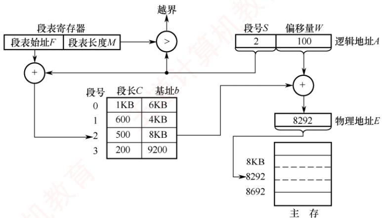

<em>图 3.15 分段系统的地址变换过程</em>

#### 4. 分页和分段的对比

　　分页与分段均为非连续分配方式，均需通过地址映射机构实现地址变换。然而，二者在概念上有本质区别，主要体现在以下三个方面：

1）页是系统管理内存的物理单位，分页的主要目的是提高内存利用率，完全由系统实现，对用户透明；段是用户程序的逻辑单位，分段的主要目的是满足编程、共享、保护等需求，由编译器根据程序结构划分，对用户可见。

2）页的大小固定，由系统决定。段的长度不固定，取决于程序的逻辑结构。

3）分页系统的地址空间是一维的，程序员只需提供单一的线性地址；分段系统的地址空间是二维的，程序员在引用地址时，必须同时指定段名（或段号）和段内偏移量。

#### 5. 段的共享与保护

> **考点追踪：** 页、段共享的原理和特点（2019、2023）

　　在分页系统中，虽然也能实现共享，但远不如分段系统方便。若一段共享代码占 N 个页框，则每个共享进程的页表中都需建立 N 个页表项，分别指向这 N 个页框。而在分段系统中，无论该段多大，只需在每个进程的段表中设置一个段表项指向该共享段，因此实现共享极为便捷。

　　为支持段共享，系统可维护一张共享段表，其中每个共享段对应一个表项，记录其段号、段长、内存起始地址、存在位、外存起始地址以及共享进程计数 count。当某进程不再使用该段时，count 减 1；仅当 count = 0 时，系统才回收该段所占的内存空间。值得注意的是，同一共享段在不同进程中可以具有不同的段号，各进程通过各自的段号即可访问同一物理段①。

　　不能被修改的代码称为可重入代码（或纯代码），它允许多个进程并发执行。为确保共享代码的完整性，系统通常将此类代码置于只读段中。同时，每个进程需配备私有的局部数据区，专门用于存放执行过程中可能变化的数据，从而有效避免对共享代码段的任何写操作。

　　与分页管理类似，分段系统的保护机制主要包括两类：① 地址越界保护，将逻辑地址中的段号与段表长度比较，若段号 $\geqslant$ 段表长度，则产生越界中断；将段内偏移与段表项中的段长比较，若偏移 $\geqslant$ 段长，则同样触发越界中断。② 存取控制保护，通过段表项中的访问权限位防止非法访问。

### 3.1.5 段页式存储管理

　　分页存储管理能有效提高内存利用率，而分段存储管理能反映程序的逻辑结构，并有利于段的共享与保护。将二者各自的优势有机结合，便形成了段页式存储管理方式。

　　在段页式系统中，进程的地址空间首先被划分为若干逻辑段，每段拥有唯一的段号；随后，每个段被进一步划分为若干大小固定的页。内存空间的管理仍采用分页方式，即划分为与页面大小相同的物理块，内存分配以物理块为单位，如图3.16所示。

  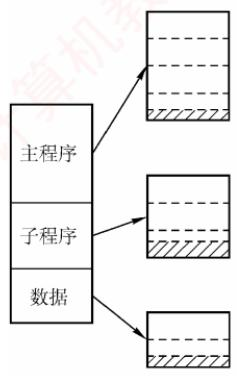

　　(a) 程序的段页划分

  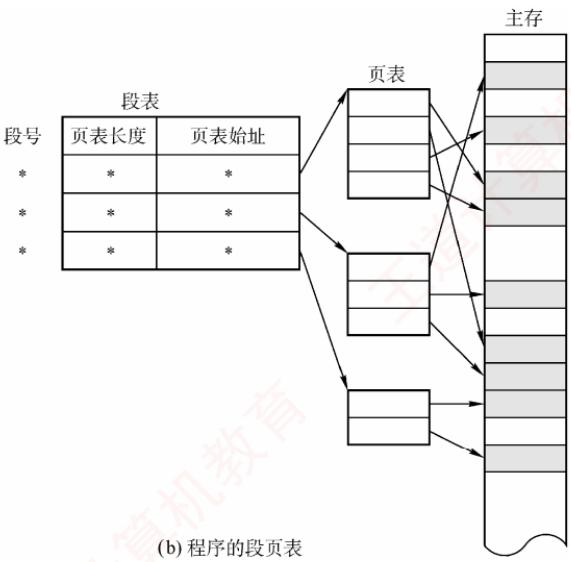

<em>图 3.16 段页式管理方式</em>

　　进程的逻辑地址由三部分组成：段号 S、页号 P 和页内偏移量 W，如图 3.17 所示。

　　<table><tr><td>段号 S</td><td>页号 P</td><td>页内偏移量 W</td></tr></table>

<em>图 3.17 段页式系统的逻辑地址结构</em>

　　为实现地址变换，系统为每个进程建立一张段表，每个段对应一个段表项，记录该段的页表始址和页表长度（段号作为段表索引，无须显式存储）。每个段还对应一张页表，其每个页表项记录对应页的物理块号（页号作为页表索引，亦无须存储）。此外，系统设置一个段表寄存器，用于存放当前进程段表的起始地址和段表长度，既用于段表寻址，也用于段号越界检查。

> **注意**

　　在段页式存储管理中，每个进程仅有一张段表，但可能有多张页表（每个段一张）。

　　段页式存储管理的地址变换过程如下。

　　① 根据逻辑地址中的段号 $S$ ，通过段表寄存器定位段表，并查得该段对应页表的起始地址；

　　② 系统利用页号 $P$ 访问该页表，获取物理块号；

　　③ 将物理块号与页内偏移量 W 拼接，形成物理地址。

　　如图 3.18 所示，在无快表的情况下，每次基于逻辑地址的内存访问需三次访存。为加速查找，可引入快表（TLB），其表项包含关键字（段号、页号）及对应的物理块号和保护信息。

  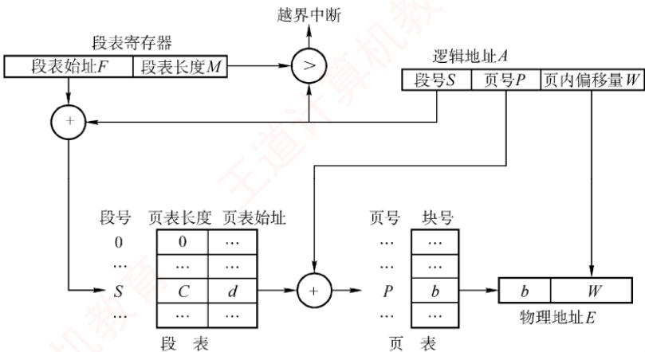

<em>图 3.18 段页式系统的地址变换机构</em>

　　对用户而言，程序仍按段组织，页的划分由系统自动完成且完全透明。正因如此，段页式管理的地址空间是二维的——这与分段系统一致，而分页机制对用户不可见。

### 3.1.6 本节小结

　　本节开头提出的问题的参考答案如下。

#### 1. 为什么要进行内存管理？

　　在单道程序系统中，系统一次仅运行一个程序，内存分配极为简单——只需将全部内存（或固定分区）分配给当前进程。引入多道程序设计后，多个进程并发执行并共享主存。若缺乏有效管理，则不同进程的地址空间可能重叠或相互覆盖，导致数据被意外修改，破坏程序正确性，严重影响并发可靠性。因此，为支持多道程序安全、高效地并发运行，必须进行内存管理。

#### 2. 多级页表解决了什么问题？又会带来什么问题？

　　多级页表解决了逻辑地址空间较大时，单级页表过长、占用内存过多的问题。通过分级组织页表，系统只需将当前使用的各级页表驻留内存，从而既减少内存占用，又避免对大块连续内存的需求。然而，采用多级页表也会带来性能开销：在无快表（TLB）的情况下，一次地址变换需逐级访问多级页表，导致多次内存访问，进而增加访存延迟。

　　无论是段式、页式还是段页式管理，读者只需掌握三个关键问题：① 逻辑地址结构，② 页（段）表项结构，③ 寻址过程。搞清这三点，便掌握了各类存储管理方式的核心机制。再次提醒注意区分逻辑地址结构与表项结构。

### 3.1.7 本节习题精选

#### 一、单项选择题

01. 下列关于存储管理目标的说法中，错误的是（）。

- A. 为进程分配内存空间
- B. 回收被进程释放的内存空间
- C. 提高内存的利用率
- D. 提高内存的物理存取速度

02. 下列关于内存保护的描述中，不正确的是（）。
- A. 一个进程不能未被授权就访问另外一个进程的内存空间
- B. 内存保护可以仅通过操作系统（软件）来满足，不需要处理器（硬件）的支持
- C. 内存保护的方法有界地址保护和上下限地址保护
- D. 一个进程不能直接跳转到另一个进程的指令地址中

03. 内存保护需要由（）完成，以保证进程空间不被非法访问。
- A. 操作系统
- B. 硬件机构
- C. 操作系统和硬件机构合作
- D. 操作系统或者硬件机构独立完成

04. 下列各种存储管理方式中，需要硬件地址变换机构的是（）。
I. 单一连续分配 II. 固定分区分配 III. 页式存储管理
IV. 动态分区分配 V. 页式虚拟存储管理
- A. I、III、V B. II、III、IV C. III、IV、V D. II、III、IV、V

05. 在固定分区分配中，每个分区的大小是（）。

- A. 随作业长度变化
- B. 可以不同但预先固定
- C. 相同
- D. 可以不同但根据作业长度固定

06. 在动态分区分配方案中，某一进程完成后，系统回收其主存空间并与相邻空闲区合并，为此需修改空闲区表，造成空闲区数减1的情况是（）。

- A. 无上邻空闲区也无下邻空闲区
- B. 有上邻空闲区但无下邻空闲区
- C. 有下邻空闲区但无上邻空闲区
- D. 有上邻空闲区也有下邻空闲区

07. 设内存的分配情况如右图所示。若要申请一块 40KB 的内存空间，采用最佳适应算法，则所得到的分区首址为（）。

- A. 100K
- B. 190K
- C. 330K
- D. 410K

08. 某分段存储管理系统中，段表内容如下表所示，逻辑地址的格式为（段号，段内偏移），则逻辑地址(2,154)对应的物理地址是（）。

　　<table><tr><td>0</td><td>操作系统</td></tr><tr><td>100K</td><td></td></tr><tr><td>180K</td><td>占用</td></tr><tr><td>190K</td><td></td></tr><tr><td>280K</td><td>占用</td></tr><tr><td>330K</td><td></td></tr><tr><td>390K</td><td>占用</td></tr><tr><td>410K</td><td></td></tr><tr><td>512K</td><td></td></tr></table>

　　<table><tr><td>段号</td><td>段首址</td><td>段长</td></tr><tr><td>0</td><td>120K</td><td>40K</td></tr><tr><td>1</td><td>760K</td><td>30K</td></tr><tr><td>2</td><td>480K</td><td>20K</td></tr><tr><td>3</td><td>370K</td><td>20K</td></tr></table>

- A. $120\mathrm{K} + 2$ B. $480\mathrm{K} + 154$ C. $30\mathrm{K} + 154$ D. $480\mathrm{K} + 2$

09. 动态重定位是在作业的（）中进行的。
- A. 编译过程    B. 装入过程    C. 链接过程    D. 执行过程

10. 下列关于程序装入的动态重定位方式的描述中，错误的是（）。
- A. 系统将程序装入内存后，程序在内存中的位置可能发生移动
- B. 系统为每个进程分配一个重定位寄存器
- C. 被访问单元的物理地址 = 逻辑地址 + 重定位寄存器的值
- D. 逻辑地址到物理地址的映射过程在进程执行时发生

11. 动态重定位的过程依赖于（）。
I. 可重定位装入程序 II. 重定位寄存器 III. 地址变换机构 IV. 目标程序
- A. I 和 II B. II 和 III C. I、II 和 III D. I、II、III 和 IV

12. 为保证一个程序在主存中被改变存放位置后仍能正确执行，应采用（）。

- A. 静态重定位
- B. 动态重定位
- C. 动态分配
- D. 静态分配

13. 下面的存储管理方案中，（）方式可以采用静态重定位。
- A. 固定分区 B. 可变分区 C. 页式 D. 段式

14. 对重定位存储管理方式，应（）。A. 在整个系统中设置一个重定位寄存器

- B. 为每道程序设置一个重定位寄存器
- C. 为每道程序设置两个重定位寄存器
- D. 为每道程序和数据都设置一个重定位寄存器

15. 在可变分区管理中，采用拼接技术的目的是（）。

- A. 合并空闲区
- B. 合并分配区
- C. 增加主存容量
- D. 便于地址转换

16. 某页式存储管理系统中，按字节编址，页表内容如下表所示。若页的大小为 4KB，则地址转换机构将逻辑地址 4097 转换成的物理地址为（）。（地址均用十进制表示。）

　　<table><tr><td>页号</td><td>页框号</td></tr><tr><td>0</td><td>2</td></tr><tr><td>1</td><td>1</td></tr><tr><td>3</td><td>0</td></tr><tr><td>4</td><td>5</td></tr></table>

- A. 8193 B. 4097 C. 2049 D. 1025

17. 不会产生内部碎片的存储管理是（）。

- A. 分页式存储管理
- B. 分段式存储管理
- C. 固定分区式存储管理
- D. 段页式存储管理

18. 多进程在主存中彼此互不干扰的环境下运行，操作系统是通过（）来实现的。
- A. 内存分配 B. 内存保护 C. 内存扩充 D. 地址映射

19. 在动态分区分配存储管理中，随着时间的推移，会产生越来越多的小碎片，可通过紧凑技术解决，即操作系统不时地对进程进行移动和整理，则适合采用（）装入技术。
- A. 绝对装入
- B. 静态重定位
- C. 动态重定位
- D. 静态重定位和动态重定位

20. 在动态分区分配存储管理中，不需要对空闲区链进行排序的分配算法是（）。

- A. 首次适应法
- B. 最佳适应法
- C. 最差适应法
- D. 都不需要

21. 分区管理中采用最佳适应分配算法时，把空闲区按（）次序登记在空闲区表中。
- A. 长度递增    B. 长度递减    C. 地址递增    D. 地址递减

22. 首次适应算法的空闲分区（）。

- A. 按大小递减顺序连在一起
- B. 按大小递增顺序连在一起
- C. 按地址由小到大排列
- D. 按地址由大到小排列

23. 为了提高搜索空闲分区的速度，在大、中型系统中往往采用基于索引搜索的动态分区分配算法，以下不属于基于索引搜索的动态分区分配算法的是（）。

- A. 快速适应算法
- B. 伙伴系统
- C. 哈希算法
- D. 最佳适应算法

24. 内存管理由连续分配方式发展为页式管理方式的主要动力是（）。
- A. 提高内存利用率 B. 提高系统吞吐量 C. 满足用户的需要 D. 更好地满足多道程序的需要

25. 页式存储管理中的页表是由（）建立的。
- A. 编译程序    B. 用户程序    C. 链接程序    D. 操作系统

26. 在段式存储管理中，共享段表是用来实现（）的。
- A. 多个进程共享同一段代码或数据
- B. 多个进程共享同一段物理内存空间
- C. 多个进程共享同一段逻辑地址空间
- D. 多个进程共享同一段号

27. 在段式存储管理中，若一个进程有 $n$ 个段，则该进程需要（）个段表。

- A. $n$
- B. $n + 1$
- C. 1
- D. 2

28. 采用分页或分段管理后，提供给用户的物理地址空间为（）。

- A. 分页支持更大的物理地址空间
- B. 分段支持更大的物理地址空间
- C. 不能确定
- D. 一样大

29. 分页系统中的页面是为（）。

- A. 用户所感知的
- B. 操作系统所感知的
- C. 编译系统所感知的
- D. 装配程序所感知的

30. 在页式存储管理中，页表的始地址存放在（）中。
- A. 物理内存    B. 页表    C. 快表（TLB）    D. 页表寄存器

31. 在页式存储管理中，当 CPU 形成一个有效地址时，查找页表的工作是由（）实现的。
- A. 操作系统    B. 页表查询程序    C. 硬件    D. 存储管理进程

32. 采用段式存储管理时，一个程序如何分段是在（）时决定的。
- A. 分配主存    B. 用户编程    C. 装作业    D. 程序执行

33. 下面的（）方法有利于程序的动态链接。
- A. 分段存储管理
- B. 分页存储管理
- C. 可变式分区管理
- D. 固定式分区管理

34. 当前编程人员编写好的程序经过编译转换成目标文件后，各条指令的地址编号起始一般定为（①），称为（②）地址。
① A. 1 B. 0 C. IP D. CS
② A. 绝对 B. 名义 C. 逻辑 D. 实

35. 可重入程序是通过（）方法来改善系统性能的。
- A. 改变时间片长度 B. 改变用户数
- C. 提高对换速度 D. 减少对换数量

36. 操作系统实现（）存储管理的代价最小。
- A. 分区    B. 分页    C. 分段    D. 段页式

37. 动态分区也称可变式分区，它是系统运行过程中（）动态建立的。
- A. 在作业装入时
- B. 在作业创建时
- C. 在作业完成时
- D. 在作业未装入时

38. 在页式存储管理中选择页面的大小，需要考虑下列（）因素。
I. 页面大的好处是页表项比较少
II. 页面小的好处是可以减少由内碎片引起的内存浪费
III. 影响磁盘访问时间的主要因素通常不是页面大小，所以使用时优先考虑较大的页面
- A. I 和 III    B. II 和 III    C. I 和 II    D. I、II 和 III

39. 某个操作系统对内存的管理采用页式存储管理方法，所划分的页面大小（）。

- A. 要根据内存大小确定
- B. 必须相同
- C. 要根据 CPU 的地址结构确定
- D. 要依据外存和内存的大小确定

40. 引入段式存储管理方式，主要是为了更好地满足用户的一系列要求。下面选项中不属于这一系列要求的是（）。

- A. 提高内存利用率
- B. 方便编程
- C. 共享和保护
- D. 动态链接和增长

41. 对主存储器的访问，（）。A. 以块（页）或段为单位 B. 以字节或字为单位

- C. 随存储器的管理方案不同而异 D. 以用户的逻辑记录为单位

42. 以下存储管理方式中，不适合多道程序设计系统的是（）。

- A. 单用户连续分配
- B. 固定式分区分配
- C. 可变式分区分配
- D. 分页式存储管理方式

43. 在分页存储管理中，主存的分配（）。

- A. 以页框为单位进行
- B. 以作业的大小进行
- C. 以物理段进行
- D. 以逻辑记录大小进行

44. 在段式分配中，CPU 每次从内存中取一次数据需要（）次访问内存。
- A. 1 B. 3 C. 2 D. 4

45. 在段页式分配中，CPU 每次从内存中取一次数据需要（）次访问内存。
- A. 1 B. 3 C. 2 D. 4

46. 采用段页式存储管理时，内存地址结构是（）。

- A. 线性的
- B. 二维的
- C. 三维的
- D. 四维的

47. 在段页式存储管理中，地址映射表是（）。
- A. 每个进程一张段表，两张页表
- B. 每个进程的每个段一张段表，一张页表
- C. 每个进程一张段表，每个段一张页表
- D. 每个进程一张页表，每个段一张段表

48. 操作系统采用分页存储管理方式，要求（）。
- A. 每个进程拥有一张页表，且进程的页表驻留在内存中
- B. 每个进程拥有一张页表，但只有执行进程的页表驻留在内存中
- C. 所有进程共享一张页表，以节约有限的内存空间，但页表必须驻留在内存中
- D. 所有进程共享一张页表，只有页表中当前使用的页面必须驻留在内存中，以最大限度地节省有限的内存空间

49. 在分段存储管理方式中，（）。

- A. 以段为单位，每段是一个连续存储区
- B. 段与段之间必定不连续
- C. 段与段之间必定连续
- D. 每段是等长的

50. 下列关于段式存储管理的叙述中，错误的是（）。
- A. 段是逻辑结构上相对独立的程序块，因此段是可变长的
- B. 按程序中实际的段来分配主存，所以分配后的存储块是可变长的
- C. 每个段表项必须记录对应段在主存的起始位置和段的长度
- D. 分段方式对低级语言程序员和编译器来说是透明的

51. 段页式存储管理汲取了页式管理和段式管理的长处，其实现原理结合了页式和段式管理的基本思想，即（）。
- A. 用分段方法来分配和管理物理存储空间，用分页方法来管理用户地址空间
- B. 用分段方法来分配和管理用户地址空间，用分页方法来管理物理存储空间
- C. 用分段方法来分配和管理主存空间，用分页方法来管理辅存空间
- D. 用分段方法来分配和管理辅存空间，用分页方法来管理主存空间

52. 以下存储管理方式中，会产生内部碎片的是（）。
I. 分段虚拟存储管理 II. 分页虚拟存储管理 III. 段页式分区管理 IV. 固定式分区管理

- A. I、II、III B. III、IV C. 仅 II D. II、III、IV

53. 下列关于页式存储管理的论述中，正确的是（）。
I. 若关闭TLB，则每存取一条指令或一个操作数都至少要访存2次
II. 页式存储管理不会产生内部碎片
III. 页式存储管理中的页面是用户所能感知的
IV. 页式存储方式可以采用静态重定位
- A. I、II、IV B. I、IV C. 仅I D. 全都正确

54. 在某分页存储管理系统中，地址结构长18位，其中 $11\sim 17$ 位为页号， $0\sim 10$ 位为页内偏移量，则主存的最大容量为（）KB，主存可分为（）个页。若有一作业依次放入2、3、7号物理块，相对地址1500处有一条指令“store r1,2500”，该指令地址所在页的页号为0，则指令的物理地址为（），指令数据的存储地址所在页的页框号为（）。

- A. 256、256、5596、3
- B. 256、128、5596、3
- C. 256、128、5596、7
- D. 256、128、3548、7

55. 在某页式存储管理的系统中，主存容量为 1MB，被分成 256 个页框，页框号为 0, 1, 2, …, 255。某作业的地址空间占用 4 页，其页号为 0, 1, 2, 3，被分配到主存的第 2, 4, 1, 5 号页框中，则作业中的 2 号页在主存中的始址是（）。

- A. 1
- B. 1024
- C. 2048
- D. 4096

56. 下列关于分页和分段的描述中，正确的是（）。
- A. 分段是信息的逻辑单位，段长由系统决定
- B. 引入分段的主要目的是实现离散分配并提高内存利用率
- C. 分页是信息的物理单位，页长由用户决定
- D. 页面在物理内存中只能从页面大小的整数倍地址开始存放

57. 在采用页式存储管理的系统中，逻辑地址空间大小为 256TB，页表项大小为 8B，页面大小为 4KB，则该系统中的页表应该采用（）级页表。
- A. 2 B. 3 C. 4 D. 5

58. 若对经典的页式存储管理方式的页表做出稍微改造，允许不同页表的页表项指向同一个页帧，则可能的结果有（）。
I. 可以实现对可重入代码的共享
II. 只需修改页表项，就能实现内存“复制”操作
III. 容易发生越界访问
IV. 可以实现进程间通信
- A. I、II、IV
- B. II、III
- C. I、II、III
- D. 仅I

59. 【2009 统考真题】分区分配内存管理方式的主要保护措施是（）。

- A. 界地址保护
- B. 程序代码保护
- C. 数据保护
- D. 栈保护

60. 【2009 统考真题】一个分段存储管理系统中，地址长度为 32 位，其中段号占 8 位，则最大段长是（）。

- A. $2^{8} \mathrm{~B}$
- B. $2^{16} \mathrm{~B}$
- C. $2^{24} \mathrm{~B}$
- D. $2^{32} \mathrm{~B}$

61. 【2010 统考真题】某基于动态分区存储管理的计算机, 其主存容量为 55MB (初始为空), 采用最佳适配 (Best Fit) 算法, 分配和释放的顺序为: 分配 15MB, 分配 30MB, 释放 15MB, 分配 8MB, 分配 6MB, 此时主存中最大空闲分区的大小是 ( )。
- A. 7MB    B. 9MB    C. 10MB    D. 15MB

62. 【2010 统考真题】某计算机采用二级页表的分页存储管理方式，按字节编址，页大小为 $2^{10}\mathrm{B}$ ，页表项大小为 2B，逻辑地址结构为

　　<table><tr><td>页目录号</td><td>页号</td><td>页内偏移量</td></tr></table>

　　逻辑地址空间大小为 $2^{16}$ 页，则表示整个逻辑地址空间的页目录表中包含表项的个数至少是（）。A.64 B.128 C.256 D.512

63. 【2011 统考真题】在虚拟内存管理中，地址变换机构将逻辑地址变换为物理地址，形成该逻辑地址的阶段是（）。

- A. 编辑
- B. 编译
- C. 链接
- D. 装载

64. 【2014 统考真题】下列选项中，属于多级页表优点的是（）。

- A. 加快地址变换速度
- B. 减少缺页中断次数
- C. 减少页表项所占字节数
- D. 减少页表所占的连续内存空间

65. 【2016 统考真题】某进程的段表内容如下所示。

　　<table><tr><td>段长</td><td>内存起始地址</td><td>权限</td><td>状态</td></tr><tr><td>100</td><td>6000</td><td>只读</td><td>在内存</td></tr><tr><td>200</td><td>—</td><td>读写</td><td>不在内存</td></tr><tr><td>300</td><td>4000</td><td>读写</td><td>在内存</td></tr></table>

　　访问段号为 2、段内地址为 400 的逻辑地址时，进行地址转换的结果是（）。
- A. 段缺失异常 B. 得到内存地址 4400
- C. 越权异常 D. 越界异常

66. 【2017 统考真题】某计算机按字节编址，其动态分区内存管理采用最佳适应算法，每次分配和回收内存后都对空闲分区链重新排序。当前空闲分区信息如下表所示。

　　<table><tr><td>分区始址</td><td>20K</td><td>500K</td><td>1000K</td><td>200K</td></tr><tr><td>分区大小</td><td>40KB</td><td>80KB</td><td>100KB</td><td>200KB</td></tr></table>

　　回收始址为 60K、大小为 140KB 的分区后，系统中空闲分区的数量、空闲分区链第一个分区的始址和大小分别是（）。
- A. 3,20K,380KB B. 3,500K,80KB
- C. 4,20K,180KB D. 4,500K,80KB

67. 【2019 统考真题】在分段存储管理系统中，用共享段表描述所有被共享的段。若进程 $\mathrm{P}_{1}$ 和 $\mathrm{P}_{2}$ 共享段 S，则下列叙述中，错误的是（）。
- A. 在物理内存中仅保存一份段 S 的内容
- B. 段 S 在 $\mathrm{P}_{1}$ 和 $\mathrm{P}_{2}$ 中应该具有相同的段号
- C. $\mathrm{P}_{1}$ 和 $\mathrm{P}_{2}$ 共享段 S 在共享段表中的段表项
- D. $\mathrm{P}_{1}$ 和 $\mathrm{P}_{2}$ 都不再使用段 S 时才回收段 S 所占的内存空间

68. 【2019 统考真题】某计算机主存按字节编址，采用二级分页存储管理，地址结构如下：

　　<table><tr><td>页目录号(10位)</td><td>页号(10位)</td><td>页内偏移(12位)</td></tr></table>

　　虚拟地址 2050 1225H 对应的页目录号、页号分别是（）。
- A. 081H, 101H B. 081H, 401H C. 201H, 101H D. 201H, 401H

69. 【2019 统考真题】在下列动态分区分配算法中，最容易产生内存碎片的是（）。

- A. 首次适应算法
- B. 最坏适应算法
- C. 最佳适应算法
- D. 循环首次适应算法

70. 【2021 统考真题】在采用二级页表的分页系统中，CPU 页表基址寄存器中的内容是（）。

- A. 当前进程的一级页表的起始虚拟地址 B. 当前进程的一级页表的起始物理地址 C. 当前进程的二级页表的起始虚拟地址 D. 当前进程的二级页表的起始物理地址

71. 【2023 统考真题】进程 R 和 S 共享数据 data，若 data 在 R 和 S 中所在页的页号分别为 p1 和 p2，两个页所对应的页框号分别为 f1 和 f2，则下列叙述中，正确的是（）。

- A. p1 和 p2 一定相等，f1 和 f2 一定相等
- B. p1 和 p2 一定相等，f1 和 f2 不一定相等
- C. p1 和 p2 不一定相等，f1 和 f2 一定相等
- D. p1 和 p2 不一定相等，f1 和 f2 不一定相等

72. 【2024 统考真题】下列算法中，每次回收分区时仅合并大小相等的空闲分区的是（）。

- A. 伙伴算法
- B. 最佳适应算法
- C. 最坏适应算法
- D. 首次适应算法

#### 二、综合应用题

01. 某系统的空闲分区见下表，采用动态分区管理策略，现有如下作业序列：96KB, 20KB, 200KB。若用首次适应算法和最佳适应算法来处理这些作业序列，则哪种算法能满足该作业序列请求？为什么？

　　<table><tr><td>分区号</td><td>大小</td><td>始址</td></tr><tr><td>1</td><td>32KB</td><td>100K</td></tr><tr><td>2</td><td>10KB</td><td>150K</td></tr><tr><td>3</td><td>5KB</td><td>200K</td></tr><tr><td>4</td><td>218KB</td><td>220K</td></tr><tr><td>5</td><td>96KB</td><td>530K</td></tr></table>

02. 某操作系统采用段式管理，用户区主存为 512KB，空闲块链入空块表，分配时截取空块的前半部分（小地址部分）。初始时全部空闲。执行申请、释放操作序列 reg(300KB), reg(100KB), release(300KB), reg(150KB), reg(50KB), reg(90KB)后：
1）采用最先适配，空块表中有哪些空块？（指出大小及始址）
2）采用最佳适配，空块表中有哪些空块？（指出大小及始址）
3）若随后又要申请 80KB，针对上述两种情况会产生什么后果？这说明了什么问题？

03. 下图给出了页式和段式两种地址变换示意（假定段式变换对每段不进行段长越界检查，即段表中无段长信息）。

  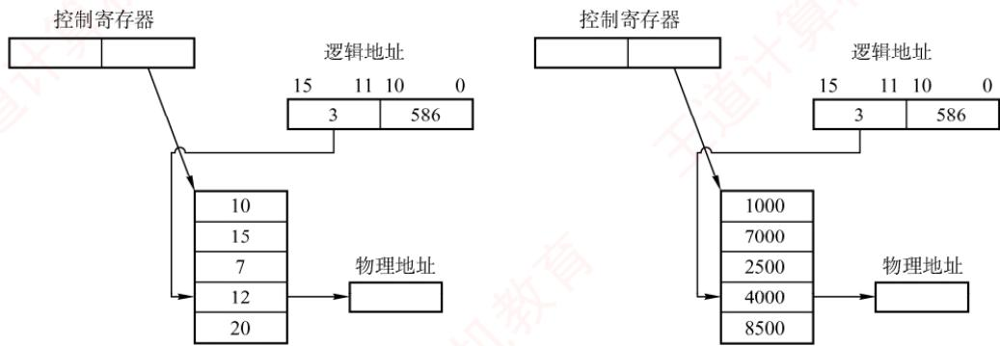

1）指出这两种变换各属于何种存储管理。

2）计算出这两种变换所对应的物理地址。

04. 在一个段式存储管理系统中，其段表见下表 A。试求表 B 中的逻辑地址所对应的物理地址。

　　表 A 段表

　　<table><tr><td>段号</td><td>内存始址</td><td>段长</td></tr><tr><td>0</td><td>210</td><td>500</td></tr><tr><td>1</td><td>2350</td><td>20</td></tr><tr><td>2</td><td>100</td><td>90</td></tr><tr><td>3</td><td>1350</td><td>590</td></tr><tr><td>4</td><td>1938</td><td>95</td></tr></table>

　　表 B 逻辑地址

　　<table><tr><td>段号</td><td>段内位移</td></tr><tr><td>0</td><td>430</td></tr><tr><td>1</td><td>10</td></tr><tr><td>2</td><td>500</td></tr><tr><td>3</td><td>400</td></tr><tr><td>4</td><td>112</td></tr><tr><td>5</td><td>32</td></tr></table>

05. 页式存储管理允许用户的编程空间为32个页面（每页1KB），主存为16KB。如有一用户程序为10页长，且某个时刻该用户程序页表见下表。

　　<table><tr><td>逻辑页号</td><td>物理块号</td></tr><tr><td>0</td><td>8</td></tr><tr><td>1</td><td>7</td></tr><tr><td>2</td><td>4</td></tr><tr><td>3</td><td>10</td></tr></table>

　　若分别遇到三个逻辑地址 0AC5H, 1AC5H, 3AC5H 处的操作，计算并说明存储管理系统将如何处理。

06. 在某页式管理系统中，假定主存为 64KB，分成 16 个页框，页框号为 0, 1, 2, …, 15。设某进程有 4 页，其页号为 0, 1, 2, 3，被分别装入主存的第 9, 0, 1, 14 号页框。

1）该进程的总长度是多大？

2）写出该进程每页在主存中的始址。

3）若给出逻辑地址(0,0),(1,72),(2,1023),(3,99)，请计算出相应的内存地址（括号内的第一个数为十进制页号，第二个数为十进制页内地址）。

07. 某操作系统存储器采用页式存储管理，页面大小为 64B，假定一进程的代码段的长度为 702B，页表见表 A，该进程在快表中的页表见表 B。现进程有如下访问序列：其逻辑地址为八进制的 0105, 0217, 0567, 01120, 02500。试问给定的这些地址能否进行转换？

　　表 A 进程页表

　　<table><tr><td>页号</td><td>页帧号</td><td>页号</td><td>页帧号</td></tr><tr><td>0</td><td>F0</td><td>6</td><td>F6</td></tr><tr><td>1</td><td>F1</td><td>7</td><td>F7</td></tr><tr><td>2</td><td>F2</td><td>8</td><td>F8</td></tr><tr><td>3</td><td>F3</td><td>9</td><td>F9</td></tr><tr><td>4</td><td>F4</td><td>10</td><td>F10</td></tr><tr><td>5</td><td>F5</td><td>6</td><td>F6</td></tr></table>

　　表 B 快表

　　<table><tr><td>页号</td><td>页帧号</td></tr><tr><td>0</td><td>F0</td></tr><tr><td>1</td><td>F1</td></tr><tr><td>2</td><td>F2</td></tr><tr><td>3</td><td>F3</td></tr><tr><td>4</td><td>F4</td></tr></table>

08. 在某页式系统中，假设在查找主存页表的过程中不发生缺页的情况，请回答：

1）若对主存的一次存取需 $1.5\mu \mathrm{s}$ ，问实现一次页面访问时存取时间是多少？

2）若系统有快表且其平均命中率为 $85\%$ ，而页表项在快表中的查找时间可忽略不计，试问此时的存取时间为多少？

09. 在页式、段式和段页式存储管理中，假设不发生缺页异常，当访问一条指令或数据时，各需要访问内存几次？其过程如何？假设一个页式存储系统具有快表，多数活动页表项都可以存在其中。若页表存放在内存中，内存访问时间是 $1\mu \mathrm{s}$ ，检索快表的时间为 $0.2\mu \mathrm{s}$ ，若快表的命中率是 $85\%$ ，则有效存取时间是多少？若快表的命中率为 $50\%$ ，则有效存取时间是多少？

10. 在一个分页存储管理系统中，地址空间分页（每页 1KB），物理空间分块，设主存总容量是 256KB，描述主存分配情况的位示图如下图所示（0 表示未分配，1 表示已分配），此时作业调度程序选中一个长为 5.2KB 的作业投入内存。试问：

1）为该作业分配内存后（分配内存时，首先分配低地址的内存空间），请填写该作业的页表内容。

2）页式存储管理有无内存碎片存在？若有，会存在哪种内存碎片？为该作业分配内存后，会产生内存碎片吗？若产生，则大小为多少？

3）假设一个64MB内存容量的计算机，采用页式存储管理（页面大小为4KB），内存分配采用位示图方式管理，请问位示图将占用多大的内存？

　　<table><tr><td>1</td><td>1</td><td>1</td><td>1</td><td>1</td><td>1</td><td>1</td><td>1</td><td>1</td><td>1</td><td>1</td><td>1</td><td>1</td><td>1</td><td>1</td></tr><tr><td>1</td><td>1</td><td>1</td><td>1</td><td>1</td><td>0</td><td>1</td><td>1</td><td>1</td><td>1</td><td>1</td><td>0</td><td>0</td><td>0</td><td>1</td></tr><tr><td>1</td><td>1</td><td>0</td><td>0</td><td>0</td><td>0</td><td>0</td><td>0</td><td>0</td><td>0</td><td>0</td><td>0</td><td>1</td><td>1</td><td>1</td></tr><tr><td>1</td><td>1</td><td>1</td><td>1</td><td>1</td><td>0</td><td>0</td><td>0</td><td>0</td><td>1</td><td>0</td><td>0</td><td>0</td><td>1</td><td>0</td></tr><tr><td>0</td><td>1</td><td>0</td><td>1</td><td>1</td><td>0</td><td>1</td><td>1</td><td>0</td><td>1</td><td>1</td><td>0</td><td>1</td><td>1</td><td>0</td></tr><tr><td>1</td><td>0</td><td>0</td><td>0</td><td>0</td><td>0</td><td>0</td><td>0</td><td>0</td><td>0</td><td>0</td><td>0</td><td>0</td><td>0</td><td>0</td></tr><tr><td>0</td><td>1</td><td>1</td><td>1</td><td>1</td><td>1</td><td>1</td><td>0</td><td>0</td><td>0</td><td>0</td><td>0</td><td>0</td><td>0</td><td>0</td></tr><tr><td colspan="15"></td></tr></table>

　　<table><tr><td>页号</td><td>块号(从0开始编址)</td></tr><tr><td></td><td></td></tr><tr><td></td><td></td></tr><tr><td></td><td></td></tr><tr><td></td><td></td></tr><tr><td></td><td></td></tr></table>

11. 【2013 统考真题】某计算机主存按字节编址，逻辑地址和物理地址都是 32 位，页表项大小为 4B。请回答下列问题：

1）若使用一级页表的分页存储管理方式，逻辑地址结构为

　　<table><tr><td>页号(20位)</td><td>页内偏移量(12位)</td></tr></table>

　　则页的大小是多少字节？页表最大占用多少字节？

2）若使用二级页表的分页存储管理方式，逻辑地址结构为

　　<table><tr><td>页目录号(10位)</td><td>页表索引(10位)</td><td>页内偏移量(12位)</td></tr></table>

　　设逻辑地址为 LA，请分别给出其对应的页目录号和页表索引的表达式。

3）采用1）中的分页存储管理方式，一个代码段的起始逻辑地址为00008000H，其长度为8KB，被装载到从物理地址00900000H开始的连续主存空间中。页表从主存00200000H开始的物理地址处连续存放，如下图所示（地址大小自下向上递增）。请计算出该代码段对应的两个页表项的物理地址、这两个页表项中的页框号，以及代码页面2的起始物理地址。

  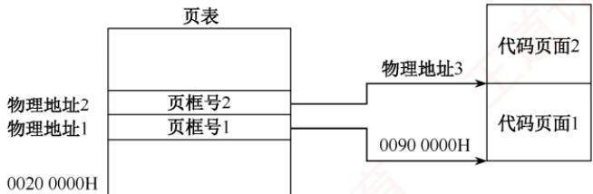

### 3.1.8 答案与解析

#### 一、单项选择题

**01. D**

　　内存的物理存取速度是由硬件决定的，而不是由操作系统管理的。操作系统可以通过虚拟内存、缓存等技术提高数据的逻辑存取速度，但不能改变内存的物理特性。

**02. B**

　　内存保护需要硬件和软件的配合，不能仅靠操作系统来实现。通常需要在 CPU 中设置上下限寄存器、重定位寄存器、界地址寄存器等寄存器，以记录进程在内存中的合法范围。

**03. C**

　　内存保护是内存管理的一部分，是操作系统的任务，但是出于安全性和效率考虑，必须由硬件实现，所以需要操作系统和硬件机构的合作来完成。

**04. C**

　　硬件地址变换机构一般用于动态重定位的情况。而单一连续分配和固定分区分配采用的是静态重定位，不需要硬件地址变换机构，而由装入程序或操作系统来完成地址转换。因此，只有页式存储管理、动态分区分配和页式虚拟存储管理需要硬件地址变换机构。

**05. B**

　　在固定分区分配中，每个分区的大小是在系统启动时就确定了的，不会随着作业的长度而变化。分区的大小可以不同，也可以相同，但是一旦确定，就不会改变。

**06. D**

　　将上邻空闲区、下邻空闲区和回收区合并为一个空闲区，因此空闲区数反而减少了一个。而仅有上邻空闲区或下邻空闲区时，空闲区数并不减少。

**07. C**

　　最佳适配算法是指，每次为作业分配内存空间时，总是找到能满足空间大小需要的最小空闲分区给作业，可以产生最小的内存空闲分区。从图中可以看出应选择大小为 60KB 的空闲分区，其首地址为 330K。

**08. B**

　　段号为2，其对应的首地址为 $480\mathrm{K}$ ，段长度为 $20\mathrm{K}$ ，大于154，所以逻辑地址(2,154)对应的物理地址为 $480\mathrm{K} + 154$ 。

**09. D**

　　静态装入是指在编程阶段就把物理地址计算好。可重定位是指在装入时把逻辑地址转换成物理地址，但装入后不能改变。动态重定位是指在执行时再决定装入的地址并装入，装入后有可能换出，所以同一个模块在内存中的物理地址是可能改变的，在作业运行过程中，当执行到一条访存指令时，再把逻辑地址转换为主存的物理地址，实际上是通过地址变换机构实现的。

**10. B**

　　动态重定位允许程序在内存中移动，系统中只有一个重定位寄存器，每次切换进程时，都要保存和恢复该寄存器的值，不会为每个进程分配一个重定位寄存器，选项 B 错误。

**11. C**

　　可重定位装入程序在重定位的过程中执行，重定位寄存器（也称基址寄存器）用于存放进程的基地址，地址变换机构用于将指令中的逻辑地址与重定位寄存器中的基地址相加得到物理地址。目标程序是装入内存后执行的，动态重定位不依赖于目标程序。

**12. B**

　　动态重定位可以在程序加载或运行时，根据程序的实际存放位置，对程序中的地址进行修改，使其与物理地址相符。静态重定位只能在程序加载时进行一次地址修改，若程序在运行过程中改变了存放位置，则会出错。动态分配和静态分配是指内存的分配方式，与重定位无关。

**13. A**

　　静态重定位只能对程序中的地址进行一次修改，而不能动态调整。在固定分区方式中，作业装入内存后位置不会改变，且作业在内存中占用连续的存储空间，因此可以采用静态重定位。其余三种方案均可能在运行过程中改变程序在内存中的位置，不能采用静态重定位。

**14. A**

　　为使地址转换不影响到指令的执行速度，必须有硬件地址变换结构的支持，即需在系统中增设一个重定位寄存器，用它来存放程序（数据）在内存中的始址。在执行程序或访问数据时，真正访问的内存地址由相对地址与重定位寄存器中的地址相加而成，这时将始址存入重定位寄存器，之后的地址访问即可通过硬件变换实现。因为系统处理器在同一时刻只能执行一条指令或访问数据，所以为每道程序（数据）设置一个寄存器没有必要（同时也不现实，因为寄存器是很昂贵的硬件，而且程序的道数是无法预估的），而只需在切换程序执行时重置寄存器内容。

**15. A**

　　在可变分区管理中，回收空闲区时采用拼接技术对空闲区进行合并。

**16. B**

　　逻辑地址 4097 对应的页号为 4097/4096 = 1，页内偏移量为 4097%4096 = 1。由页表可知，页号 1 对应的页框号也是 1，页大小为 4KB，因此转换成的物理地址为 $1 \times 4K + 1 = 4097$ 。

**17. B**

　　分页式和段页式存储管理均以固定大小的页框为单位分配内存，进程末页通常无法填满页框，从而产生内部碎片；固定分区式因分区大小固定，当进程小于分区时，剩余空间同样形成内部碎片。而分段式按逻辑段动态分配内存，为每个段分配恰好满足其长度的连续空间，不会因分配粒度固定而导致空间浪费，因此不产生内部碎片（但可能因段间空隙产生外部碎片）。

**18. B**

　　多进程的执行通过内存保护实现互不干扰，如页式管理中有页地址越界保护，段式管理中有段地址越界保护。

**19. C**

　　绝对装入在编译时直接将程序的逻辑地址转换成物理地址；静态重定位虽然允许将装入模块装入内存的任何位置，但不允许进程在内存中移动；动态重定位在程序执行时才产生真正的物理地址，它允许进程在内存中移动，但需要一个重定位寄存器的支持。

**20. A**

　　首次适应法从空闲区链的链首开始顺序查找，找到一个大小满足要求的空闲分区，根据作业的大小，从该分区中划出一块内存空间分配给请求者，余下的空闲分区仍然留在空闲链中。这种算法不需要对空闲区链进行排序，只需按地址递增的顺序链接即可。

**21. A**

　　最佳适应算法要求从剩余的空闲分区中选出最小且满足存储要求的分区，空闲区应按长度递增登记在空闲区表中。

**22. C**

　　首次适应算法的空闲分区按地址递增的次序排列。

**23. D**

　　基于顺序搜索的分配算法有首次适应算法、循环首次适应算法、最佳适应算法和最坏适应算法；基于索引搜索的分配算法有快速适应算法、伙伴系统和哈希算法。

**24. A**

　　连续分配要求为进程分配连续内存，易产生内部碎片和外部碎片，导致空闲内存无法有效利用，内存利用率较低。页式管理采用离散分配方式，将内存和进程地址空间划分为相等大小的页框与页面，分配时无须物理连续，可充分利用零散空闲块，显著提升内存利用率。

**25. D**

　　页表是由操作系统在程序装入内存时建立的，根据进程的逻辑地址空间和物理地址空间的对应关系，为每个页设置一个页表项，记录其对应的物理页框号、有效位等信息。

**26. A**

　　在段式存储管理中，若有些段可被多个进程共享，则可用一个单独的共享段表来描述这些段，而不需要在每个进程的段表中都保存一份。共享段表的作用是实现多个进程共享同一段代码或数据，这样既能节省内存空间，又能便于实现对共享段的更新和维护。多个进程共享同一段物理内存空间并不需要用到共享段表，只需在各自的段表中指向相同的物理地址即可。多个进程共享同一段逻辑地址空间是不可能的，因为每个进程的逻辑地址空间都是相互独立的。在段式存储管理中，并不要求各个进程中相同功能的段必须有相同的段号。

**27. C**

　　不管进程有多少个段，系统都为每个进程建立一张段表，每个段表项对应进程中的一段。

**28. C**

　　页表和段表同样存储在内存中，系统提供给用户的物理地址空间为总空间大小减去页表或段表的长度。因为页表和段表的长度不能确定，所以提供给用户的物理地址空间大小也不能确定。

**29. B**

　　分页管理是在硬件和操作系统层面实现的，对用户、编译系统、装配程序等上层是不可见的。

**30. D**

　　页表的功能由一组专门的存储器实现，其始址放在页表基址寄存器（PTBR）中。这样才能满足在地址变换时能够较快地完成逻辑地址和物理地址之间的转换。

**31. C**

　　在页式存储管理中，CPU 将虚拟地址分解为页号和页内偏移量，然后通过硬件中的页表寄存器和内存管理单元（MMU），将页号转换为物理地址，再拼接上页内偏移量，得到最终的内存物理地址。这一过程是由硬件自动完成的，不需要操作系统或其他软件的干预。

**32. B**

　　分段是指在用户编程时，将程序按照逻辑划分为几个逻辑段。

**33. A**

　　程序的动态链接与程序的逻辑结构相关，分段存储管理将程序按照逻辑段进行划分，因此有利于其动态链接。其他的内存管理方式与程序的逻辑结构无关。

**34. ①B、②C**

　　编译后一个目标程序所限定的地址范围称为该作业的逻辑地址空间。换句话说，地址空间仅指程序用来访问信息所用的一系列地址单元的集合。这些单元的编号称为逻辑地址。通常，编译地址都是相对始址“0”的，因此逻辑地址也称相对地址。

**35. D**

　　可重入程序主要是通过共享来使用同一块存储空间的，或通过动态链接的方式将所需的程序段映射到相关进程中去，其优点是减少了对程序段的调入/调出，因此减少了对换数量。

**36. A**

　　实现分页、分段和段页式存储管理需要特定的数据结构支持，如页表、段表等。为了提高性能，还需要硬件提供快存和地址加法器等，代价高。分区存储管理是满足多道程序设计的最简单的存储管理方案，特别适合嵌入式等微型设备。

**37. A**

　　动态分区时，在系统启动后，除操作系统占据一部分内存外，其余所有内存空间是一个大空闲区，称为自由空间。若作业申请内存，则从空闲区中划出一个与作业需求量相适应的分区分配给该作业，将作业创建为进程，在作业运行完毕后，再收回释放的分区。

**38. C**

　　页面较大时，页表项较少，但页内碎片较大；页面较小时，页内碎片较小，但页表项增多。此外，页面大小直接影响磁盘访问次数：页面过小会导致缺页频繁，大幅增加 I/O 次数和总访问时间；页面过大会加剧内部碎片。因此，页面大小需要在页表开销、内存浪费与 I/O 效率之间权衡。

**39. B**

　　页式管理中很重要的一个问题是页面大小如何确定。确定页面大小有很多因素，如进程的平均大小、页表占用的长度等。而一旦确定，所有的页面就是等长的（一般取 2 的整数幂倍），以便易于系统管理。

**40. A**

　　段式存储管理按程序逻辑结构划分段，段名与段长由用户定义，便于编程；各段作为独立逻辑单位，支持共享、按段保护、动态增长（如数据段扩展）和动态链接（运行时按需加载）。而提高内存利用率并非段式管理的目标：因其段长不固定，易产生外部碎片，内存利用率通常较低。高效利用内存恰好是分页式管理的优势，通过固定页框离散分配，可有效消除外部碎片。

**41. B**

　　这里是指主存的访问，不是主存的分配。对主存的访问是以字节或字为单位的。例如，在页式管理中，不仅要知道块号，还要知道页内偏移量。

**42. A**

　　单用户连续分配管理方式只适用于单用户、单任务的操作系统，不适用于多道程序设计。

**43. A**

　　在分页存储管理中，逻辑地址分配是按页为单位进行分配的，而主存的分配即物理地址分配是以内存块为单位分配的。

**44. C**

　　在段式分配中，取一次数据时先从内存查找段表，再拼成物理地址后访问内存，共需要2次内存访问。

**45. B**

　　在段页式分配中，取一次数据时先从内存查找段表，再访问内存查找相应的页表，最后拼成物理地址后访问内存，共需要3次内存访问。

**46. B**

　　虽然段页式存储管理的内存地址结构分为段号、段内页号和页内地址三部分，但分页是操作系统的行为，用户不用指出页内偏移量的位数；而分段之间是独立的，且段长不定长，需指出段号所占的位数。因此，当采用段页式存储管理时，内存地址结构仍然是二维的。而在分页存储管理中，作业地址空间是一维的，即单一的线性地址空间，程序员只需要一个整数来表示地址。简言之，确定一个地址需要几个参数，作业地址空间就是几维的。

**47. C**

　　段页式系统中，进程首先划分为段，每段再进一步划分为页。

**48. A**

　　在多个进程并发执行时，所有进程的页表大多数驻留在内存中，在系统中只设置一个页表寄存器（PTR），它存放页表在内存中的始址和长度。平时，进程未执行时，页表的始址和页表长度存放在本进程的PCB中，当调度到某进程时，才将这两个数据装入页表寄存器中。每个进程都有一个单独的逻辑地址，有一张属于自己的页表。

**49. A**

　　在分段存储管理方式中，以段为单位进行分配，每段是一个连续存储区，每段不一定等长，段与段之间可连续，也可不连续。

**50. D**

　　分段方式对低级语言程序员和编译器是可见的，因为低级语言程序员可以按照程序的逻辑结构划分段，并给每个段命名；编译器也需要对各个段生成逻辑地址。

**51. B**

　　段页式存储管理兼有页式管理和段式管理的优点，采用分段方法来分配和管理用户地址空间，采用分页方法来管理物理存储空间。但它的开销要比段式和页式管理的开销大。

**52. D**

　　只要是固定的分配就会产生内部碎片，其余的都会产生外部碎片。若固定和不固定同时存在（例如段页式），则仍视为固定。分段虚拟存储管理：每段的长度都不一样（对应不固定），所以会产生外部碎片。分页虚拟存储管理：每页的长度都一样（对应固定），所以会产生内部碎片。段页式分区管理：既有固定，又有不固定，以固定为主，所以会有内部碎片。固定式分区管理：很明显固定，会产生内部碎片。综上分析，说法II、III、IV会产生内部碎片。

**53. C**

　　说法 I 正确: 关闭 TLB 后, 每当访问一条指令或存取一个操作数时都要先访问页表(内存中), 得到物理地址后, 再访问一次内存进行相应操作。说法 II 错误: 记住, 凡是分区固定的都会产生内部碎片, 而无外部碎片。说法 III 错误: 页式存储管理对于用户是透明的。说法 IV 错误: 静态重定位是在程序运行之前由装配程序完成的, 必须分配其要求的全部连续内存空间。而页式存储管理方案是将程序离散地分成若干页（块), 从而可以将程序装入不连续的内存空间, 显然静态重定位不能满足其要求。

**54. B**

　　地址结构长 18 位，所以主存的最大容量为 $2^{18}=256KB$ ；页内偏移量占 11 位，所以页面大小为 $2^{11}=2048B$ ；页号占 7 位，所以主存页数为 $2^{7}=128$ 个。该指令的相对地址为 1500，小于一个页面的大小，所以该指令存放在 2 号物理块中，物理地址为 $2\times2048+1500=5596$ ，指令数据的存放地址为 2500，大于一个页面的大小，所以指令数据存放在 3 号物理块中。

**55. D**

　　主存容量为 1MB，分为 256 个页框，页框大小为 1MB/256 = 4KB，作业中的 2 号页被分配到主存的 1 号页框中，因此其在主存中的始址为 $1 \times 4096 = 4096$ 。

**56. D**

　　分段是指将逻辑地址空间划分为若干不等长的单元，称为段。段长由用户根据信息的性质和逻辑结构决定，而不由系统决定，引入分段的主要目的是更好地满足用户的需求，实现程序的模块化和保护。实现离散分配并提高内存利用率是引入分页的主要目的。

**57. C**

　　逻辑地址空间大小为 $256TB = 2^{48}B$ ，逻辑地址有 48 位，页面大小为 $4KB = 2^{12}B$ ，页内偏移量 2 占 12 位，剩余 36 位表示页表索引，页表项大小为 8B，一个页面能存放 $4KB \div 8 = 2^{9}$ 个页表项，因此可用 9 位来表示某一级的页表索引， $36 \div 9 = 4$ ，所以共需要采用 4 级页表。

**58. A**

　　让不同页表的页表项指向同一个页帧，可以共享该页帧的代码，若代码是可重入的（如编辑软件、编译软件等），则这种方法可以节省大量的内存空间。实现内存“复制”操作时，不需要将页面的内容逐字节复制，而只需将页表中指向该页面的指针复制到目的地址的页表项中。越界保护是通过界地址寄存器实现的，说法III是干扰项。当多个进程需要通信时，可以采用共享内存的方式，它们是通过让各个进程页表的页表项指向相同的页帧实现的。

**59. A**

　　每个进程都拥有自己独立的进程空间，若一个进程在运行时所产生的地址在其地址空间之外，则发生地址越界，因此需要进行界地址保护，即当程序要访问某个内存单元时，由硬件检查是否允许，若允许，则执行，否则产生地址越界中断。

**60. C**

　　分段存储管理的逻辑地址分为段号和位移量两部分，段内位移的最大值就是最大段长。地址长度为32位，段号占8位，因此位移量占 $32 - 8 = 24$ 位，因此最大段长为 $2^{24}\mathrm{B}$ 。

**61. B**

　　最佳适配算法是指每次为作业分配内存空间时，总是找到能满足空间大小需要的最小空闲分区给作业，可以产生最小的内存空闲分区。下图显示了这个过程的主存空间变化。

  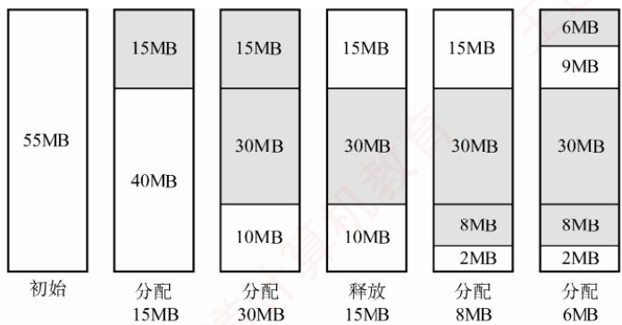

　　图中，灰色部分为分配出去的空间，白色部分为空闲区。这样，容易发现，此时主存中最大空闲分区的大小为 9MB。

**62. B**

　　页大小为 $2^{10}B$ ，所以页内偏移量占 10 位，又因为页表项大小为 2B，一页可以存放 $2^{9}$ 个页表项，所以页号占 9 位，根据逻辑地址空间共有 $2^{16}$ 页可知，页目录号加页号共占 16 位，页目录号占 7 位，所以页目录表中包含表项的个数至少是 $2^{7}=128$ 。

**63. C**

　　编译后的程序需要经过链接才能装载，而链接后形成的目标程序中的地址也就是逻辑地址。以 C 语言为例：C 程序经过预处理→编译→汇编→链接产生了可执行文件，其中链接的前一步是产生可重定位的二进制目标文件。C 语言采用源文件独立编译的方法，如程序 main.c, file1.c, file2.c, file1.h, file2.h 在链接的前一步生成了 main.o, file1.o, file2.o，这些目标模块的逻辑地址都从 0 开始，但只是相对于该模块的逻辑地址。链接器将这三个文件、libc 和其库文件链接成一个可执行文件，从而形成整个程序的完整逻辑地址空间。

　　例如，file1.o 的逻辑地址为 0～1023，main.o 的逻辑地址为 0～1023，假设链接时将 file1.o 链接在 main.o 之后，则链接之后 file1.o 对应的逻辑地址应为 1024～2047。

**64. D**

　　多级页表不仅不会加快地址的变换速度, 还会因为增加更多的查表过程, 使地址变换速度减慢; 也不会减少缺页中断的次数, 相反, 若访问过程中多级的页表都不在内存中, 则会大大增加缺页的次数，并不会减少页表项所占的字节数，而多级页表能够减少页表所占的连续内存空间，即当页表太大时，将页表再分级，把每张页表控制在一页之内，减少页表所占的连续内存空间。

**65. D**

　　分段系统的逻辑地址 $A$ 到物理地址 $E$ 之间的地址变换过程如图3.15所示。

　　① 从逻辑地址 A 中取出前几位为段号 S，后几位为段内偏移量 W，注意段式存储管理的题目中，逻辑地址一般以二进制数给出，而页式存储管理的题目中，逻辑地址一般以十进制数给出，读者要注意具体问题具体分析。

　　② 比较段号 S 和段表长度 M，若 $S \geqslant M$ ，则产生越界异常，否则继续执行。

　　③ 在段表中查询段号对应的段表项，段号 S 对应的段表项地址 = 段表始址 $F +$ 段号 $S \times$ 段表项长度。取出段表项中该段的段长 C，若 $W \geqslant C$ ，则产生越界中断，否则继续执行。

　　④ 取出段表项中该段的基址 $b$ ，计算 $E = b + W$ ，用得到的物理地址 $E$ 去访问内存。

　　题目中段号为 2 的段长为 300，小于段内地址 400，因此发生越界异常，选项 D 正确。

**66. B**

　　回收始址为 60K、大小为 140KB 的分区时，它与表中第一个分区和第四个分区合并，成为始址为 20K、大小为 380KB 的分区，剩余 3 个空闲分区。在回收内存后，算法会对空闲分区链按分区大小由小到大进行排序，表中的第二个分区排第一。

**67. B**

　　段的共享是通过两个作业的段表中相应表项指向被共享的段的同一个物理副本来实现的，因此在内存中仅保存一份段 S 的内容，选项 A 正确。段 S 对进程 $P_{1}$ 、 $P_{2}$ 来说，使用位置可能不同，所以在不同进程中的逻辑段号可能不同，选项 B 错误。段表项存放的是段的物理地址（包括段始址和段长度），对共享段 S 来说物理地址唯一，选项 C 正确。为了保证进程可以顺利使用段 S，段 S 必须确保在没有任何进程使用它（可在段表项中设置共享进程计数）后才能被删除，选项 D 正确。

**68. A**

　　题中给出的是十六进制地址，首先将它转化为二进制地址，然后用二进制地址去匹配题中对应的地址结构。转换为二进制地址和地址结构的对应关系如下图所示。

$$
2 0 5 0 1 2 2 5 \mathrm{H} = \underbrace {0 0 1 0 0 0 0 0 0 1} _ {\text {页目录号}} \underbrace {0 1 0 0 0 0 0 0 0 1} _ {\text {页号}} \underbrace {0 0 1 0 0 0 1 0 0 1 0 1} _ {\text {页内偏移}}
$$

　　前 10 位、11～20 位、21～32 位分别对应页目录号、页号和页内偏移。把页目录号、页号单独拿出，转换为十六进制时缺少的位数在高位补零，0000 1000 0001，0001 0000 0001 分别对应 081H，101H，选项 A 正确。

**69. C**

　　最佳适应算法总是匹配与当前大小要求最接近的空闲分区，但是大多数情况下空闲分区的大小不可能完全和当前要求的大小相等，几乎每次分配内存都会产生很小的难以利用的内存块，所以最佳适应算法最容易产生最多的内存碎片。

**70. B**

　　在多级页表中，页表基址寄存器存放的是顶级页表的起始物理地址，所以存放的是一级页表的起始物理地址。

**71. C**

　　进程 R 和 S 共享数据 data，说明它们都映射了同一个共享内存段，于是这个段在物理内存中的位置（页框号）必然相同，但这两个段在不同进程的地址空间中的位置（页号）可以不同。因此，p1 和 p2 不一定相等，f1 和 f2 一定相等。

**72. A**

　　伙伴算法在回收一个大小为 $2^{i}$ 的空闲分区时，会检查其伙伴分区（地址相邻、大小同为 $2^{i}$ 的分区）是否也空闲。若是，则将两者合并为一个大小为 $2^{i + 1}$ 的空闲分区；随后，继续检查新生成的 $2^{i + 1}$ 分区是否存在同大小的伙伴，若有，则再次合并，以此类推。因此，伙伴算法在一次回收过程中可能触发多次合并，但每次合并仅发生在两个大小相等且互为伙伴的空闲分区之间。

#### 二、综合应用题

**01. 【解答】**

　　采用首次适应算法时，96KB 大小的作业进入 4 号空闲分区，20KB 大小的作业进入 1 号空闲分区，这时空闲分区如下表所示。

　　<table><tr><td>分区号</td><td>大小</td><td>始址</td></tr><tr><td>1</td><td>12KB</td><td>120K</td></tr><tr><td>2</td><td>10KB</td><td>150K</td></tr><tr><td>3</td><td>5KB</td><td>200K</td></tr><tr><td>4</td><td>122KB</td><td>316K</td></tr><tr><td>5</td><td>96KB</td><td>530K</td></tr></table>

　　此时再无空闲分区可以满足 200KB 大小的作业，所以该作业序列请求无法满足。

　　采用最佳适应算法时，作业序列分别进入 5, 1, 4 号空闲分区，可以满足其请求。分配处理之后的空闲分区表见下表：

　　<table><tr><td>分区号</td><td>大小</td><td>始址</td></tr><tr><td>1</td><td>12KB</td><td>120K</td></tr><tr><td>2</td><td>10KB</td><td>150K</td></tr><tr><td>3</td><td>5KB</td><td>200K</td></tr><tr><td>4</td><td>18KB</td><td>420K</td></tr></table>

**02. 【解答】**

1）最先适配的内存分配情况如下图中的(a)所示。

$$
\begin{array}{c} 0 \mathrm{KB} \\ \text {reg150KB} \\ 1 5 0 \mathrm{KB} \\ \text {reg50KB} \\ 2 0 0 \mathrm{KB} \\ \text {reg90KB} \\ 2 9 0 \mathrm{KB} \\ \text {300KB} \\ \text {reg100KB} \\ 4 0 0 \mathrm{KB} \\ \hline \\ 5 1 2 \mathrm{KB} \end{array}
$$

　　(a)

　　<table><tr><td>0KB</td><td>reg150KB</td></tr><tr><td>150KB</td><td>reg90KB</td></tr><tr><td>240KB</td><td></td></tr><tr><td>300KB</td><td>reg100KB</td></tr><tr><td>400KB</td><td>reg50KB</td></tr><tr><td>450KB</td><td></td></tr><tr><td>512KB</td><td></td></tr></table>

　　(b)

　　内存中的空块为:

　　第一块：始址 290K，大小 10KB；第二块：始址 400K，大小 112KB。

2）最佳适配的内存分配情况如上图中的(b)所示。内存中的空块为：

　　第一块：始址 240K，大小 60KB；第二块：超始地址 450K，大小 62KB。

3）若随后又要申请80KB，则最先适配算法可以分配成功，而最佳适配算法则没有足够大的空闲区分配。这说明最先适配算法尽可能地使用了低地址部分的空闲区域，留下了高地址部分的大的空闲区，更有可能满足进程的申请。

**03. 【解答】**

1）由题图所示的逻辑地址结构可知：页或段的最大个数为 $2^{5} = 32$ 。若左图是段式管理，则段始址12加上偏移量586，远超第1段的段始址15，超过第4段的段始址20，所以左图是页式变换，而右图满足段式变换。对于页式管理，由逻辑地址的位移量位数可知，一页的大小为2KB。

2）对图中的页式地址变换，其物理地址为 $12 \times 2048 + 586 = 25162$ ；对图中的段式地址变换，其物理地址为 $4000 + 586 = 4586$ 。

**04. 【解答】**

1）由段表知，第0段内存始址为210，段长为500，因此逻辑地址(0,430)是合法地址，对应的物理地址为 $210+430=640$ 。

2）由段表知，第1段内存始址为2350，段长为20，因此逻辑地址(1, 10)是合法地址，对应的物理地址为 $2350 + 10 = 2360$ 。

3）由段表知，第2段内存始址为100，段长为90，逻辑地址(2,500)的段内位移500超过了段长，因此为非法地址。

4）由段表知，第3段内存始址为1350，段长为590，因此逻辑地址(3, 400)是合法地址，对应的物理地址为 $1350 + 400 = 1750$ 。

5）由段表知，第4段内存始址为1938，段长为95，逻辑地址(4,112)的段内位移112超过了段长，因此为非法地址。

6）由段表知，不存在第5段，因此逻辑地址(5,32)为非法地址。

**05. 【解答】**

　　页面大小为 1KB，所以低 10 位为页内偏移地址；用户编程空间为 32 个页面，即逻辑地址高 5 位为虚页号；主存为 16 个页面，即物理地址高 4 位为物理块号。

　　逻辑地址 0AC5H 转换为二进制表示是 000 1010 1100 0101B，虚页号为 2(00010B)，映射至物理块号 4，因此系统访问物理地址 12C5H(01 0010 1100 0101B)。

　　逻辑地址1AC5H转换为二进制表示是001101011000101B，虚页号为6(00110B)，不在页面映射表中，会产生缺页中断，系统进行缺页中断处理。

　　逻辑地址3AC5H转换为二进制表示是011101011000101B，页号为14，而该用户程序只有10页，因此系统产生越界中断。

> **注意**

　　当将十六进制地址转换为二进制地址时，我们可能习惯性地写为16位，这是容易犯错的细节。例如，题中的逻辑地址为15位，物理地址为14位。逻辑地址0AC5H的二进制表示为000 1010 1100 0101B，对应物理地址12C5H的二进制表示为01 0010 1100 0101B。这一点应该引起注意。

**06. 【解答】**

1）页面的大小为 $(64/16)\mathrm{KB}=4\mathrm{KB}$ ，该进程共有 4 页，所以该进程的总长度为 $4\times4KB=16KB$ 。

2）页面大小为 4KB，因此低 12 位为页内偏移地址；主存分为 16 块，因此内存物理地址高 4 位为主存块号。

　　页号为 0 的页面被装入主存的第 9 块，因此该地址在内存中的始址为 1001 0000 0000 0000B，即 9000H。

　　页号为 1 的页面被装入主存的第 0 块，因此该地址在内存中的始址为 0000 0000 0000 0000B，即 0000H。

　　页号为 2 的页面被装入主存的第 1 块，因此该地址在内存中的始址为 0001 0000 0000 0000，即 1000H。

　　页号为3的页面被装入主存的第14块，因此该地址在内存中的始址为111000000000000，即E000H。

3）逻辑地址为(0,0)，因此内存地址为(9,0)=1001 0000 0000 0000B，即9000H。
逻辑地址为(1,72)，因此内存地址为(0,72)=0000 0000 0100 1000B，即0048H。
逻辑地址为(2,1023)，因此内存地址为(1,1023)=0001 0011 1111 1111，即13FFH。
逻辑地址为(3,99)，因此内存地址为(14,99)=1110 0000 0110 0011，即E063H。

**07. 【解答】**

　　要注意题目中的逻辑地址使用哪种进制的数给出，若是十进制，则一般通过整数除法和求余得到页号和页内偏移，若用其他进制给出，则一般转换成二进制，然后按照地址结构划分为页号部分和页内偏移部分，再把页号和页内偏移计算出来。

　　页面大小为 64B，因此页内位移为 6 位，进程代码段长度为 702B，因此需要 11 个页面，编号为 0～10。

1）八进制逻辑地址0105的二进制表示为001000101B。逻辑页号为1，此页号可在快表中查找到，得页帧号为F1；页内位移为5，因此物理地址为(F1,5)。

2）八进制逻辑地址0217的二进制表示为010001111B。逻辑页号为2，此页号可在快表中查找到，得页帧号为F2；页内位移为15，因此物理地址为(F2,15)。

3）八进制逻辑地址0567的二进制表示为101110111B。逻辑页号为5，此页号不在快表中，在内存页表中可以查找到，得页帧号为F5；页内位移为55，因此物理地址为(F5, 55)。

4）八进制逻辑地址01120的二进制表示为0010 0101 0000B。逻辑页号为9，此页号不在快表中，在内存页表中可以查找到，得页帧号为F9；页内位移为16，因此物理地址为(F9, 16)。

5）八进制逻辑地址02500的二进制表示为010101000000B。逻辑页号为21，此页号已超过页表的最大页号10，因此产生越界中断。

> **注意**

　　根据题中条件无法得知逻辑地址位数，所以在其二进制表示中，其位数并不一致，只是根据八进制表示进行转换。若已知逻辑地址空间大小或位数，则二进制表示必须保持一致。

**08. 【解答】**

　　页表在主存时，实现一次存取需要访问主存两次：第一次是访问页表，获得所需访问数据所在页面的物理地址；第二次才是根据这个物理地址存取数据。

1）因为页表在主存，所以 CPU 必须访问主存两次，即实现一次页面访问的存取时间是

$$
1. 5 \times 2 = 3 \mu \mathrm{s}
$$

2）系统增加快表后，在快表中找到页表项的概率为 $85\%$ ，所以实现一次页面访问的存取时间为

$$
0. 8 5 \times (0 + 1. 5) + (1 - 0. 8 5) \times 2 \times 1. 5 = 1. 7 2 5 \mu \mathrm{s}
$$

**09. 【解答】**

1）在页式存储管理中，访问指令或数据时，首先要访问内存中的页表，查找到指令或数据所在页面对应的页表项，然后根据页表项查找访问指令或数据所在的内存页面。需要访问内存2次。段式存储管理同理，需要访问内存2次。段页式存储管理，首先要访问内存中的段表，然后访问内存中的页表，最后访问指令或数据所在的内存页面，需要访问内存3次。

　　对于比较复杂的情况，如多级页表，若页表划分为 N 级，则需要访问内存 $N + 1$ 次。若系统中有快表，则在快表命中时，只需要访问内存 1 次。

2）按1）中的访问过程分析，有效存取时间为

$$
(0.2 + 1)\times 85\% +(0.2 + 1 + 1)\times (1 - 85\%) = 1.35\mu \mathrm{s}
$$

#### 3. 同理可计算得

$$
(0.2 + 1)\times 50\% +(0.2 + 1 + 1)\times (1 - 50\%) = 1.7\mu \mathrm{s}
$$

　　从结果可以看出，快表的命中率对访存时间影响非常大。当命中率从85%降低到50%时，有效存取时间增加0.35μs。因此在页式存储系统中，应尽可能地提高快表的命中率，从而提高系统效率。

**10. 【解答】**

1）位示图是利用二进制的一位来表示磁盘中一个盘块的使用情况，其值为“0”时表示对应盘块空闲，为“1”时表示已分配，地址空间分页，每页为1KB，则对应的盘块大小也为1KB，主存总容量为256KB，可分成256个盘块，长5.2KB的作业需要占用6页空间，假设页号与物理块号都从0开始，则根据位示图可得到如下页表内容：

　　<table><tr><td>页号</td><td>块号</td></tr><tr><td>0</td><td>21</td></tr><tr><td>1</td><td>27</td></tr><tr><td>2</td><td>28</td></tr><tr><td>3</td><td>29</td></tr><tr><td>4</td><td>34</td></tr><tr><td>5</td><td>35</td></tr></table>

2）页式存储管理中有内存碎片的存在，会存在内部碎片。为该作业分配内存后，会产生内存碎片，因为此作业大小为5.2KB，占6页，前5页满，最后一页只占0.2KB的空间，因此内存碎片的大小为 $1KB - 0.2KB = 0.8KB$ 。

3）64MB 内存，一页大小为 4KB，共可分成 $64K \times 1K/4K = 2^{14}$ 个物理盘块，在位示图中每个盘块占 1 位，共占 $2^{14}$ 位空间，因为 1B = 8 位，所以此位示图共占 2KB 空间的内存。

**11. 【解答】**

1）因为主存按字节编址，页内偏移量是12位，所以页大小为 $2^{12}B=4KB$ 。页表项数为 $2^{32}/4K=2^{20}$ ，因此该一级页表最大为 $2^{20}\times4B=4MB$ 。

2）页目录号可表示为(((unsigned int)(LA))>>22) & 0x3FF。这里采用的方法是逻辑右移 22 位，再和 3FF（10 个 1）进行逻辑与运算，得到 10 位的页目录号。这种方法虽然效率较高，但比较难想到，采用 LA/2 $^{22}$ 的写法来取高 10 位的页目录号也是可以的。
页表索引可表示为(((unsigned int)(LA))>>12) & 0x3FF。这里也可采用(LA/2 $^{12}$ )%2 $^{10}$ 的方法来获取中间 10 位的页表索引号。

3）代码页面1的逻辑地址为00008000H，表明其位于第8个页处，对应页表中的第8个页表项，所以第8个页表项的物理地址 $=$ 页表始址 $+8\times$ 页表项的字节数 $= 00200000\mathrm{H}+$ $8\times 4 = 00200020\mathrm{H}$ 。由此可得如下图所示的答案。

  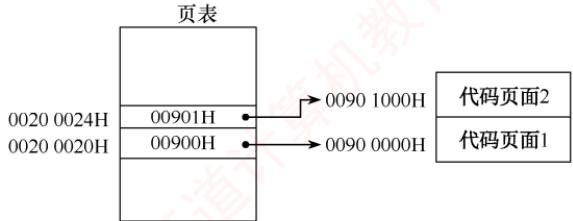

## 3.2 虚拟内存管理

　　在学习本节时，请读者思考以下问题：

1）为什么要引入虚拟内存？

2）虚拟内存空间的大小由什么因素决定？

3）虚拟内存是怎么解决问题的？会带来什么问题？

　　读者要掌握虚拟内存解决问题的思想，了解各种置换算法的优劣，掌握虚实地址的变换方法。

### 3.2.1 虚拟内存的基本概念

#### 1. 传统存储管理方式的特征

　　3.1 节讨论的各种内存管理策略，都是为了将多个进程同时保留在内存中，以支持多道程序设计。它们具有以下两个共同特征。

1）一次性。作业必须一次性全部装入内存后才能开始运行。这会带来两个问题：① 当作业过大而无法全部装入内存时，该作业将无法运行；② 当大量作业请求运行时，由于内存不足以容纳所有作业，只能让少数作业先运行，导致系统并发度下降。

2）驻留性。作业一旦装入内存，便一直驻留其中，其任何部分都不会被换出，直至作业运行结束。然而，运行中的进程常因等待I/O而被阻塞，可能长时间处于等待状态。

　　由上述分析可知，许多在程序运行中暂未使用或暂时不用的代码和数据仍占据大量内存空间，而一些急需运行的作业却因内存不足无法装入，显然造成了宝贵内存资源的浪费。

#### 2. 局部性原理

　　要真正理解虚拟内存技术的思想，首先必须了解著名的局部性原理。从广义上讲，快表、页高速缓存及虚拟内存技术都属于缓存技术，这个技术所依赖的原理就是局部性原理。局部性原理既适用于程序结构，又适用于数据结构。局部性原理表现在以下两个方面。

> **考点追踪：** 页面置换算法的时间局部性分析（2012）

1）时间局部性。程序中的某条指令或某个数据项一旦被访问，不久之后很可能再次被访问。这主要是由于程序中存在大量的循环和重复操作。

2）空间局部性。一旦程序访问了某个存储单元，在不久之后，其附近的存储单元也很可能被访问。这是因为指令通常按顺序存放并顺序执行，而数据（如向量、数组、表等）也一般以连续或簇聚的方式存储。

　　时间局部性通过将近期使用的指令和数据保存在高速缓存中，并借助多级缓存层次结构加以利用；空间局部性则通过采用较大容量的缓存，并集成预取机制到缓存控制逻辑中实现。虚拟内存技术正是基于局部性原理，将外存作为内存的透明扩展，有效缓解物理内存不足的问题。

#### 3. 虚拟存储器的定义和特征

> **考点追踪：** 虚拟存储器的特点（2012）

　　基于局部性原理，在程序装入时，仅需将当前运行所需的少数页面（或段）装入内存，其余部分暂留外存，即可启动程序执行。在程序执行过程中，若所访问的信息不在内存中，则操作系统会自动将其从外存调入内存，然后继续执行程序，这一机制称为请求调页（或请求调段）。当内存空间不足时，操作系统又会将暂时不用的信息换出到外存，以腾出空间存放即将调入的内容，这一机制称为页面置换（或段置换）。正是通过这两种机制的协同工作，系统为用户提供了一个逻辑上远大于物理内存的地址空间，称为虚拟存储器。

　　之所以称为 “虚拟” 存储器，是因为该存储器并非真实存在的物理实体，而是操作系统通过部分装入、请求调入和置换功能（均对用户透明）所构造的一种逻辑抽象。用户程序可像使用大容量内存一样运行，而无须关心物理内存的实际大小。虚拟存储器有以下三个主要特征。

1）多次性。作业无须在运行前一次性全部装入内存，而是可以分多次动态调入。只需将当前需要执行的程序和数据装入内存即可开始运行，后续所需部分在访问时按需调入。

2）对换性。作业在运行过程中无须常驻内存，操作系统可根据需要，将暂不使用的程序或数据换出至外存对换区，并在后续需要时再换入内存，从而实现内存的高效利用。

3）虚拟性。从用户视角看，内存容量被逻辑扩充，呈现出远大于实际物理内存的可用空间。虚拟性正是虚拟存储器的本质特征和根本目标，其实现依赖于多次性与对换性。

#### 4. 虚拟内存技术的实现

　　虚拟内存技术允许将一个作业分多次调入内存。若采用连续分配方式，则会导致相当一部分内存空间处于暂时甚至“永久”的空闲状态，不仅造成内存资源的严重浪费，也无法从逻辑上扩充内存容量。因此，虚拟内存的实现必须建立在离散分配的内存管理方式基础之上。

　　目前，虚拟内存主要有以下三种实现方式：

- 请求分页存储管理。

- 请求分段存储管理。

- 请求段页式存储管理。

　　无论采用哪种方式，均需一定的硬件支持，主要包括以下几个方面：

- 足够容量的内存和外存，用于存放程序的当前部分与后备部分。

- 页表机制（或段表机制），作为地址映射的关键数据结构。

- 中断机构，用于在用户程序访问尚未调入内存的部分时，触发缺页（或缺段）中断。

- 地址变换机构，负责在程序运行过程中动态地将逻辑地址转换为物理地址。

### 3.2.2 请求分页管理方式

　　请求分页系统建立在基本分页系统的基础之上，为支持虚拟存储器功能，增加了请求调页和页面置换功能：在该系统中，只需将当前需要的一部分页面装入内存，便可启动作业运行。在作业运行过程中，若所访问的页面不在内存中，则系统将通过请求调页功能将其从外存调入；而当内存空间不足时，则通过页面置换功能将暂时不用的页面换出到外存。由于每次换入和换出的基本单位均为长度固定的页面，其实现比以长度可变的段为单位的请求分段系统更简单；正因其实现简洁且效率较高，请求分页成为目前最常用的一种虚拟存储器实现方式。

　　为了实现请求分页，系统必须提供一定的硬件支持。除需要足够容量的内存和外存外，还需具备页表机制、缺页中断机构以及地址变换机构。

#### 1. 页表机制

　　相比于基本分页系统，请求分页系统中的页表需提供更多信息，以支持请求调页和页面置换。具体而言，操作系统必须能够：① 判断某页是否已调入内存；② 若尚未调入，则还需获知该页在外存中的存放位置；③ 在页面置换时，依据访问特征选择合适的换出页面；④ 对于要换出的页面，还需知道其是否被修改过，以决定是否需写回外存。为此，请求分页的页表项在基本结构基础上增加了四个字段，如图 3.19 所示。

　　<table><tr><td>页号</td><td>物理块号</td><td>状态位P</td><td>访问字段A</td><td>修改位M</td><td>外存地址</td></tr></table>

<em>图 3.19 请求分页系统中的页表项</em>

　　各新增字段的说明如下：

- 状态位 $P$ （存在位）。标记该页是否已调入内存，供地址变换时判断是否触发缺页中断。

- 访问字段 $A$ 。记录本页在一段时间内的访问次数，或记录自上次访问以来的时间间隔，供页面置换算法选择换出页面时参考。

- 修改位 $M$ （脏位）。标记该页调入内存后是否被修改过，以决定换出时是否需写回外存。

- 外存地址。指示该页在外存中的存放位置（通常为物理块号），供调页时将其读入内存。

#### 2. 缺页中断机构

> **考点追踪：** 缺页处理的过程及效率分析（2011、2013、2014、2020、2022）

> **考点追踪：** 缺页异常导致进程状态的变化（2023）

　　在请求分页系统中，当进程访问的页面尚未调入内存时，硬件会自动触发缺页中断，由操作系统的缺页中断处理程序处理：将所需页面从外存调入内存（必要时先换出一页）。具体而言，若内存中有空闲页框，则分配一个页框，将所缺页面从外存装入，并更新页表中相应的表项；若无空闲页框，则需先由页面置换算法选择一个页面淘汰，若该页在内存中被修改过，则必须将其写回外存，否则可直接丢弃。由于页面调入通常涉及较长时间的磁盘I/O操作，系统在此期间可能会调度其他进程运行；待所需页面调入完成后，重新执行引发缺页的那条指令。

　　缺页中断作为一种内中断，其处理过程与其他中断类似，也需经历保护 CPU 现场、分析中断原因、转入中断处理程序、恢复 CPU 现场等步骤。然而，它具有以下两个显著特点：

- 在指令执行期间触发，由当前指令的地址访问直接引发，而非在指令执行完毕之后。

- 一条指令在执行过程中可能引发多次缺页中断。例如，在执行指令 copy A to B 时，若该指令本身及其两个操作数各自跨越两个页面，则最多可能引发 6 次缺页中断。

#### 3. 地址变换机构

　　在基本分页系统地址变换机构的基础上，请求分页系统为支持虚拟存储器，增加了缺页中断触发机制。请求分页系统的地址变换过程如图 3.20 所示。

  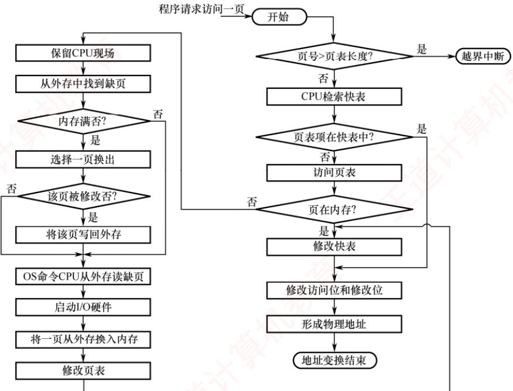

<em>图 3.20 请求分页中的地址变换过程</em>

> **考点追踪：** 分页系统的地址变换过程及分析（2009、2010、2014、2024）

　　请求分页系统的地址变换过程如下。

　　①首先检索快表，若命中，则从相应表项中取出该页的物理块号，并置访问位为1，以供置换算法换出页面时参考。对于写操作，还需置修改位为1。

　　② 若快表未命中，则需访问页表。若该页已在内存中（状态位 = 1），则从相应表项中取出物理块号，并将该页表项装入快表；若快表已满，则按置换算法淘汰一项。

　　③ 若页面不在内存，则触发缺页中断。操作系统接管后，将所需页面从外存调入内存（必要时先换出一页），并更新页表和快表。随后，重新执行地址变换以获取物理块号。

　　④将获得的物理块号与页内地址拼接，形成物理地址，用于访存。

### 3.2.3 页框分配

　　在为进程分配内存时，主要涉及以下问题：① 为保证进程能正常运行，所需最小页框数的确定；② 为每个进程分配页框时，所分配的页框是固定的还是可变的；③ 在为不同进程分配页框时，是采用平均分配还是按进程大小比例分配。本节将围绕这些问题展开讨论。

#### 1. 最小页框数与驻留集

##### （1）最小页框数

> **考点追踪：** 最小物理块数的确定原则（2025）

　　最小页框数（也称最小物理块数）是指能保证进程正常运行所需的最少页框数量。若系统为进程分配的页框数少于此值，则进程将无法执行。进程应获得的最小页框数与计算机的硬件结构有关，具体取决于指令的格式、功能和寻址方式。例如，对于采用单地址指令和直接寻址的简单机器，最小页框数为2：一个用于存放指令，另一个用于存放数据。若支持间接寻址，则至少需要3个页框：分别用于存放指令、指针和数据。对于功能较强的机器，若一条指令及其两个操作数各自跨越两个页面，则在最坏情况下，该指令执行过程中可能涉及6个不同的页面。因此，应至少为每个进程分配6个页框，以确保这些页面能同时驻留内存，顺利完成指令执行。

##### （2）驻留集大小

　　在页式虚拟存储系统中，进程启动时既不需要、也不可能将其所有页面装入内存。因此，操作系统必须决定为该进程分配多少页框——这一集合即称为该进程的驻留集。驻留集大小的选择需在系统并发度与缺页开销之间进行权衡，具体体现在以下两个方面：

1）驻留集过小，内存中可容纳的进程数量增多，有助于提高多道程序的并发度；但每个进程获得的页框过少，将导致缺页率显著升高，CPU需耗费大量时间处理缺页中断。

2）驻留集过大，当分配给进程的页框数超过某一阈值后，继续增加页框对缺页率的改善趋于平缓，不仅浪费内存资源，还会因可用页框总量减少而降低系统的整体并发能力。

#### 2. 内存分配策略

　　在请求分页系统中，可采取两种内存分配策略，即固定和可变分配策略。在进行置换时，也可采取两种策略，即全局和局部置换。于是可组合出以下三种适用的策略。

> **考点追踪：** 页面分配与置换策略的名称（2015）

##### （1）固定分配局部置换

　　所谓固定分配，是指为每个进程分配固定数量的页框，并在其运行期间保持不变。所谓局部置换，是指当进程发生缺页时，只能从该进程自身已分配的页框中选择一页换出，再将所缺页面调入，从而维持其驻留集大小恒定。该策略的难点在于：若初始分配的页框太少，则进程将频繁缺页；若分配过多，则不仅浪费内存资源，还会减少系统可容纳的并发进程数。

> **注意**

　　理论上可形成四种组合，但由于固定分配要求进程的页框数量保持不变，而全局置换会导致进程的页框数量发生变化，二者互斥，因此实际可行的策略仅有三种。

##### （2）可变分配全局置换

　　所谓可变分配，是指初始时为每个进程分配一定数量的页框，并在运行期间根据需要动态调整。所谓全局置换，是指当进程发生缺页时，系统首先从空闲页框队列中取出一个页框分配给该进程，并将所缺页面调入；若空闲页框已耗尽，则允许从内存所有页框中选择一个换出，而不论其归属哪个进程。该方法比固定分配局部置换更为灵活，能够动态扩充进程的驻留集以更好地适应运行需求。然而，由于每次缺页都会为其分配新页框，若缺乏有效调控，则某些活跃进程的驻留集可能持续膨胀，不断抢占其他进程的页框，进而削弱系统的多道程序并发能力。

##### （3）可变分配局部置换

　　系统初始为每个进程分配一定数量的页框；当某进程发生缺页时，仅允许从其自身已分配的页框中选择一页换出，因此不会影响其他进程的运行。此外，系统还根据进程的缺页率动态调整其驻留集大小：若缺页率过高，表明当前页框不足，则为其增加若干页框；若缺页率过低，说明存在资源冗余，则可适当回收部分页框，但需确保不会引发缺页率的显著上升。该策略在有效抑制进程频繁调页的同时，兼顾了系统的多道程序并发能力。尽管其实现机制较为复杂、运行开销较大，但相比因频繁换入/换出所消耗的磁盘I/O与CPU资源，这一开销无疑是值得的。

　　页面分配策略曾在 2015 年统考选择题中出现过，考查的正是这三种策略的名称。不少考生因误判其为非重点内容，复习时一带而过，最终在考试中失分。而在这种基础题上失分，实属可惜。再次提醒读者，考研成功的秘诀在于 “全面” 和 “反复多次”。

#### 3. 页框调入算法

　　在采用固定分配策略时，系统需将空闲页框分配给各进程，常见的分配算法如下。

1）平均分配算法，将系统中所有可供分配的页框平均分配给各个进程。

2）按比例分配算法，根据进程的逻辑地址空间大小按比例分配页框。

3）优先权分配算法，为重要或紧迫的进程分配更多页框。通常的做法是将所有可分配页框分为两部分：一部分按比例分配给各进程，另一部分则依据进程的优先权动态分配。

#### 4. 调入页面的时机

　　为确定系统将进程运行时所缺页面调入内存的时机，可采用以下两种调页策略。

1）预调页策略。根据局部性原理，一次调入若干相邻页面通常比逐页调入更高效。然而，若预调入的页面大多未被访问，则会造成内存浪费。因此，系统可尝试预测进程近期可能访问的页面并预先调入，但目前预测成功率仅约50%。鉴于预测效果有限，该策略主要用于进程首次调入时，由程序员显式指定应优先加载的页面。

2）请求调页策略。当进程在运行中访问的页面不在内存时，便会触发缺页中断，由系统将其所需页面调入内存。这种策略调入的页面必然会被访问，且实现相对简单，因此当前的虚拟存储器大多采用此策略。其缺点是每次仅调入一页，导致磁盘I/O开销较大。预调页本质上是在进程运行前完成页面加载，而请求调页则是在运行期间动态调入。

#### 5. 从何处调入页面

　　请求分页系统中的外存分为两部分：用于存放文件的文件区和用于存放换出页面的对换区，也称交换区。对换区采用连续分配方式，而文件区采用离散分配方式，因此对换区的磁盘 I/O 速度通常快于文件区。这样，系统在发生缺页时，调入页面的来源可分为以下三种情况。

1）系统拥有足够的对换区空间。此时可将所有页面从对换区调入，以提高调页速度。为此，需在进程运行前，将与该进程相关的文件从文件区复制到对换区。

2）系统对换区空间不足。对于不会被修改的页面，直接从文件区调入；当换出此类页面时，因其内容未变，无须写回磁盘。而对于可能被修改的页面，换出时必须保存到对换区，后续调入时也需从对换区读取，从而兼顾效率与正确性。

3）UNIX 方式。与进程相关的文件始终保留在文件区。因此，未运行过的页面从文件区调入；曾经运行过但已被换出的页面则存放在对换区，后续调入时从对换区读取。若多个进程共享同一页面，则只要该页面已在内存中，其他进程便可直接复用，无须重复调入。

#### 6. 如何调入页面

　　当进程访问的页面不在内存中时（页表项的存在位为0），CPU会触发缺页中断。中断响应后，系统转入缺页中断处理程序。该程序首先通过页表项获取该页在外存中的地址，然后判断内存是否已满：若内存未满，则分配一个空闲页框，发起磁盘I/O将所缺页面调入，并更新页表项：填写物理块号，置存在位为1；若内存已满，则先按某种置换算法选出一页准备换出。若该页的修改位为0，则直接丢弃；若修改位为1，则需先将其写回对换区，再释放该页框。随后，将所缺页面调入该页框，并更新页表项，置存在位为1。调入完成后，进程即可通过更新后的页表生成正确的物理地址。整个页面调入过程对用户完全透明，由操作系统自动完成。

### 3.2.4 页面置换算法

　　进程运行时，若其访问的页面不在内存中，需将其调入，但内存又无空闲页框，则必须从内存中换出一页至外存。选择换出哪一页的算法称为页面置换算法。由于页面的换入与换出均涉及磁盘 I/O，开销较大，因此，一个好的页面置换算法应致力于降低缺页率。

> **考点追踪：** 各种页面置换算法的特点（2014）

　　常见的页面置换算法有以下四种。

#### 1. 最佳（OPT）算法

　　最佳页面置换算法在发生缺页时，选择淘汰以后永不使用或在最长时间内不再被访问的页面，从而在理论上获得最低的缺页率。然而，由于操作系统无法预知未来的页面访问序列，该算法在实际系统中无法实现。尽管如此，OPT 算法仍具有重要的理论意义，常用于评价其他算法。

　　假定系统为某进程分配了三个物理块，并给定如下页面访问序列：

$$
7, 0, 1, 2, 0, 3, 0, 4, 2, 3, 0, 3, 2, 1, 2, 0, 1, 7, 0, 1
$$

　　进程运行时，首先将页面 7,0,1 依次装入内存。当访问页面 2 时，发生缺页中断。根据 OPT 算法，选择未来最久才被再次访问的页面（页面 7 的下一次访问在第 18 次，远晚于其他页面）淘汰。随后访问页面 0 时，因其已在内存中，不产生缺页。访问页面 3 时再次缺页，此时页面 1 的下次访问（第 14 次）最晚，故将其淘汰……以此类推，具体过程如图 3.21 所示。

　　<table><tr><td>访问页面</td><td>7</td><td>0</td><td>1</td><td>2</td><td>0</td><td>3</td><td>0</td><td>4</td><td>2</td><td>3</td><td>0</td><td>3</td><td>2</td><td>1</td><td>2</td><td>0</td><td>1</td><td>7</td><td>0</td><td>1</td></tr><tr><td>物理块 1</td><td>7</td><td>7</td><td>7</td><td>2</td><td></td><td>2</td><td></td><td>2</td><td></td><td></td><td>2</td><td></td><td></td><td>2</td><td></td><td></td><td></td><td>7</td><td></td><td></td></tr><tr><td>物理块 2</td><td></td><td>0</td><td>0</td><td>0</td><td></td><td>0</td><td></td><td>4</td><td></td><td></td><td>0</td><td></td><td></td><td>0</td><td></td><td></td><td></td><td>0</td><td></td><td></td></tr><tr><td>物理块 3</td><td></td><td></td><td>1</td><td>1</td><td></td><td>3</td><td></td><td>3</td><td></td><td></td><td>3</td><td></td><td></td><td>1</td><td></td><td></td><td></td><td>1</td><td></td><td></td></tr><tr><td>缺页否</td><td>√</td><td>√</td><td>√</td><td>√</td><td></td><td>√</td><td></td><td>√</td><td></td><td></td><td>√</td><td></td><td></td><td>√</td><td></td><td></td><td></td><td>√</td><td></td><td></td></tr></table>

<em>图 3.21 利用最佳置换算法时的置换图</em>

　　可见，整个过程中共发生9次缺页中断，其中6次触发页面置换（不算初始装入）。

#### 2. 先进先出（FIFO）算法

　　先进先出页面置换算法选择淘汰最早进入内存的页面。该算法实现简单，将内存中的页面按调入时间组织成一个队列，需要换出时直接移除队首页面。然而，FIFO 算法未利用局部性原理，与进程实际运行规律不符，最早装入的页面仍可能被频繁访问，因此性能通常较差。

> **考点追踪：** FIFO算法的应用分析（2010）

　　仍用上面的例子，采用 FIFO 算法进行置换。当访问页面 2 时发生缺页，淘汰最早进入的页面 7。随后访问页面 3 时再次缺页，此时将 2,0,1 中最先进入的页面 0 换出……以此类推，具体过程如图 3.22 所示。可见，共发生 15 次缺页中断，其中 12 次触发页面置换。

　　<table><tr><td>访问页面</td><td>7</td><td>0</td><td>1</td><td>2</td><td>0</td><td>3</td><td>0</td><td>4</td><td>2</td><td>3</td><td>0</td><td>3</td><td>2</td><td>1</td><td>2</td><td>0</td><td>1</td><td>7</td><td>0</td><td>1</td></tr><tr><td>物理块 1</td><td>7</td><td>7</td><td>7</td><td>2</td><td></td><td>2</td><td>2</td><td>4</td><td>4</td><td>4</td><td>0</td><td></td><td></td><td>0</td><td>0</td><td></td><td></td><td>7</td><td>7</td><td>7</td></tr><tr><td>物理块 2</td><td></td><td>0</td><td>0</td><td>0</td><td></td><td>3</td><td>3</td><td>3</td><td>2</td><td>2</td><td>2</td><td></td><td></td><td>1</td><td>1</td><td></td><td></td><td>1</td><td>0</td><td>0</td></tr><tr><td>物理块 3</td><td></td><td></td><td>1</td><td>1</td><td></td><td>1</td><td>0</td><td>0</td><td>0</td><td>3</td><td>3</td><td></td><td></td><td>3</td><td>2</td><td></td><td></td><td>2</td><td>2</td><td>1</td></tr><tr><td>缺页否</td><td>√</td><td>√</td><td>√</td><td>√</td><td></td><td>√</td><td>√</td><td>√</td><td>√</td><td>√</td><td>√</td><td></td><td></td><td>√</td><td>√</td><td></td><td></td><td>√</td><td>√</td><td>√</td></tr></table>

<em>图 3.22 FIFO 算法的置换图</em>

　　值得注意的是，FIFO算法存在一种反直觉现象：当为进程分配的物理块数增加时，缺页次数反而可能上升，这一现象称为Belady异常。其根本原因在于FIFO仅依据调入时间决策，而忽略了页面的实际使用情况。例如，页面访问需列为3,2,1,0,3,2,4,3,2,1,0,4，当分配3个物理块时，缺页次数为9次；当分配4个物理块时，缺页次数反而增至10次，如图3.23所示。

　　<table><tr><td>访问页面</td><td>3</td><td>2</td><td>1</td><td>0</td><td>3</td><td>2</td><td>4</td><td>3</td><td>2</td><td>1</td><td>0</td><td>4</td></tr><tr><td>物理块1</td><td>3</td><td>3</td><td>3</td><td>0</td><td>0</td><td>0</td><td>4</td><td></td><td></td><td>4</td><td>4</td><td></td></tr><tr><td>物理块2</td><td></td><td>2</td><td>2</td><td>2</td><td>3</td><td>3</td><td>3</td><td></td><td></td><td>1</td><td>1</td><td></td></tr><tr><td>物理块3</td><td></td><td></td><td>1</td><td>1</td><td>1</td><td>2</td><td>2</td><td></td><td></td><td>2</td><td>0</td><td></td></tr><tr><td>缺页否</td><td>√</td><td>√</td><td>√</td><td>√</td><td>√</td><td>√</td><td>√</td><td></td><td></td><td>√</td><td>√</td><td></td></tr><tr><td>物理块1*</td><td>3</td><td>3</td><td>3</td><td>3</td><td></td><td></td><td>4</td><td>4</td><td>4</td><td>4</td><td>0</td><td>0</td></tr><tr><td>物理块2*</td><td></td><td>2</td><td>2</td><td>2</td><td></td><td></td><td>2</td><td>3</td><td>3</td><td>3</td><td>3</td><td>4</td></tr><tr><td>物理块3*</td><td></td><td></td><td>1</td><td>1</td><td></td><td></td><td>1</td><td>1</td><td>2</td><td>2</td><td>2</td><td>2</td></tr><tr><td>物理块4*</td><td></td><td></td><td></td><td>0</td><td></td><td></td><td>0</td><td>0</td><td>0</td><td>1</td><td>1</td><td>1</td></tr><tr><td>缺页否</td><td>√</td><td>√</td><td>√</td><td>√</td><td></td><td></td><td>√</td><td>√</td><td>√</td><td>√</td><td>√</td><td>√</td></tr></table>

<em>图 3.23 Belady 异常</em>

　　只有 FIFO 算法可能出现 Belady 异常，而 OPT 算法和 LRU 算法永远不会出现此类异常。

#### 3. 最近最久未使用（LRU）算法

　　LRU 算法选择淘汰最近最长时间未使用的页面，其基本思想是：若某页面在过去一段时间内未被使用，则在近期未来很可能也不会被访问。为实现这一策略，系统需为每个页面维护一个访问字段，记录其自上次被访问以来所经历的时间，淘汰页面时选择该值最大的页面。

> **考点追踪：** LRU算法的应用分析（2009、2015、2019、2025）

　　仍用上面的例子采用 LRU 算法进行置换，如图 3.24 所示。首次访问页面 2 时发生缺页，将最近最久未使用的页面 7 换出；随后访问页面 3 时再次缺页，将最近最久未使用的页面 1 换出。

　　<table><tr><td>访问页面</td><td>7</td><td>0</td><td>1</td><td>2</td><td>0</td><td>3</td><td>0</td><td>4</td><td>2</td><td>3</td><td>0</td><td>3</td><td>2</td><td>1</td><td>2</td><td>0</td><td>1</td><td>7</td><td>0</td><td>1</td></tr><tr><td>物理块 1</td><td>7</td><td>7</td><td>7</td><td>2</td><td></td><td>2</td><td></td><td>4</td><td>4</td><td>4</td><td>0</td><td></td><td></td><td>1</td><td></td><td>1</td><td></td><td>1</td><td></td><td></td></tr><tr><td>物理块 2</td><td></td><td>0</td><td>0</td><td>0</td><td></td><td>0</td><td></td><td>0</td><td>0</td><td>3</td><td>3</td><td></td><td></td><td>3</td><td></td><td>0</td><td></td><td>0</td><td></td><td></td></tr><tr><td>物理块 3</td><td></td><td></td><td>1</td><td>1</td><td></td><td>3</td><td></td><td>3</td><td>2</td><td>2</td><td>2</td><td></td><td></td><td>2</td><td></td><td>2</td><td></td><td>7</td><td></td><td></td></tr><tr><td>缺页否</td><td>√</td><td>√</td><td>√</td><td>√</td><td></td><td>√</td><td></td><td>√</td><td>√</td><td>√</td><td>√</td><td></td><td></td><td>√</td><td></td><td>√</td><td></td><td>√</td><td></td><td></td></tr></table>

<em>图 3.24 LRU 页面置换算法时的置换图</em>

　　由图可见，前 5 次缺页处理的结果与 OPT 算法相同，但这仅是巧合，并无必然联系。实际上，LRU 算法根据页面过去的使用情况来判断，是 “向前看” 的；而 OPT 算法则根据页面未来的使用情况来判断，是 “向后看” 的。而页面过去与未来的走向之间并无必然联系。

　　OPT 算法的性能最好，但无法实现。FIFO 算法实现简单，但忽略局部性，性能较差。LRU 算法性能接近 OPT 算法，具有良好的实际效果，但其实现通常需要硬件支持，开销较大。

#### 4. 时钟（CLOCK）算法

　　LRU 算法的性能接近 OPT 算法，但其实现开销较大。因此，操作系统的设计者尝试了许多算法，试图以较小的开销接近 LRU 算法的性能，这类算法统称为 CLOCK 算法的变体。

##### （1）简单的 CLOCK 算法

> **考点追踪：** 类 CLOCK 算法的过程分析（2012）

　　简单的 CLOCK 算法为每个页面设置一个访问位，当某页首次被装入内存或被访问时，其访问位被置为 1。系统将所有页框组织成一个循环队列，并维护一个替换指针，指向当前检查位置。发生缺页且需置换时，算法按以下规则操作：若指针所指页面的访问位为 0，则直接淘汰该页；若为 1，则将其置为 0，指针顺移至下一页面，给予该页一次“宽恕”机会——即暂不淘汰，待后续轮询时再行判断。由于指针在队列中循环移动，形如时钟指针，故称 CLOCK 算法。又因其仅依据“最近是否被使用”这一粗略信息进行决策，也被称为最近未用（NRU）算法。

> **考点追踪：** CLOCK 算法的应用分析（2010）

　　假设页面访问需列为 7, 0, 1, 2, 0, 3, 0, 4, 2, 3, 0, 3, 2, 1, 3, 2，采用简单 CLOCK 算法，分配 4 个页框，每个页框记录（页面号，访问位），具体过程如图 3.25 所示。

  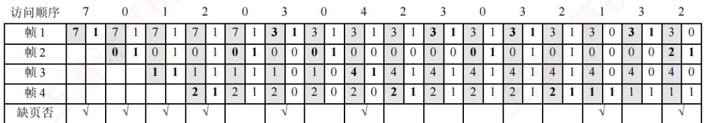

<em>图 3.25 CLOCK算法时的置换图</em>

　　初始阶段，页面 7,0,1,2 依次调入，访问位均置为 1。随后访问 0，已存在，访问位保持为 1。访问 3 时发生第 5 次缺页，此时替换指针位于帧 1，而所有页框的访问位均为 1。算法遂完整扫描一圈，将各帧访问位清零，指针回到最初的位置（帧 1），故淘汰帧 1 中的页面 7，装入页面 3，访问位置为 1，如图 3.26(a) 所示。接着访问 0，已存在，访问位置为 1。访问 4 时发生第 6 次缺页，替换指针指向帧 2（上次替换位置的下一帧），帧 2 的访问位为 1，将其置 0 后继续扫描；帧 3 的访问位为 0，故淘汰帧 3 中的页面 2，装入页面 4，如图 3.26(b) 所示。此后访问 2,3,0,3,2，均已存在，每次访问均将对应帧的访问位置为1。当访问1时发生第7次缺页，此时替换指针指向帧4，且所有帧的访问位均为1，算法再次完成一轮扫描并将访问位清零，故淘汰帧4中的页面2。后续访问3，已存在，访问位置为1。最后访问2时发生第8次缺页，替换指针指向帧1，帧1的访问位为1，将其置0后继续扫描，帧2的访问位为0，故淘汰帧2中的页面0，装入页面2。

  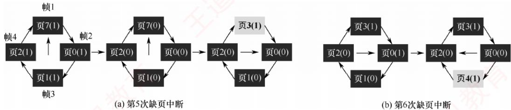

<em>图 3.26 缺页中断时替换指针扫描示意图</em>

(2) 改进型 CLOCK 算法

> **考点追踪：** 改进 CLOCK 算法的思想（2018）

> **考点追踪：** 改进 CLOCK 算法的应用分析（2016、2021）

　　将一个页面换出时，若该页已被修改，则需将其写回磁盘；若未被修改，则无须写回。可见，修改过的页面置换代价更高。为降低I/O开销，改进型CLOCK算法在访问位（A）的基础上，引入修改位（M），综合考虑页面的使用情况与置换代价。在选择淘汰页时，优先考虑既未被访问过又未被修改的页面。根据 $(A,M)$ 的组合，页面可分为以下四类：

- 1 类（ $A=0, M=0$ ）：最近未被访问，且未被修改，是最佳的淘汰页。

- 2 类（ $A = 0, M = 1$ ）：最近未被访问，但已被修改，是次佳的淘汰页。

- 3 类（ $A = 1, M = 0$ ）：最近已被访问，但未被修改，可能再次被访问。

- 4 类（ $A = 1, M = 1$ ）：最近已被访问，且已被修改，可能再次被访问。

　　内存中的每一页必属于这四类页面之一。进行页面置换时，算法采用与简单 CLOCK 类似的循环扫描机制，区别在于该算法需同时检查访问位与修改位，具体步骤如下。

　　① 从当前指针位置开始，进行第一轮扫描，寻找 A=0 且 M=0 的 1 类页面，将第一个找到的 1 类页面作为淘汰页。此轮扫描不修改任何访问位 A。

　　② 若第①步失败，则进行第二轮扫描，寻找 $A = 0$ 且 $M = 1$ 的2类页面，将第一个找到的2类页面作为淘汰页。此轮扫描中，将所有经过的页面的访问位 $A$ 置为0。

　　③ 若前两步均失败（所有页面 $A = 1$ ），则将指针复位至起始位置，并将所有帧的访问位清零，随后重复第①步；若仍无1类页面，则执行第②步。此时必能找到可淘汰页面。

　　改进型 CLOCK 算法优于简单 CLOCK 算法之处在于：优先淘汰未修改的页面，从而降低磁盘 I/O 开销。但为定位合适的淘汰页，可能需多轮扫描，算法本身的运行开销相应增加。

　　操作系统中的页面置换算法普遍遵循一个原则：尽可能保留近期访问过的页面，优先淘汰未访问过的页面。简单 CLOCK 算法仅依据访问位判断页面是否 “被访问过”；而改进型 CLOCK 算法则在此基础上进一步细化：对 “未访问过” 的页面，优先换出其中未修改者；即使所有页面均 “被访问过”，仍优先选择未修改者换出，以最小化磁盘写回成本。

### 3.2.5 抖动和工作集

#### 1. 抖动

　　在页面置换过程中，最糟糕的情形是：刚刚换出的页面马上又要换入内存，而刚刚换入的页面又立即被换出。这种频繁的页面调度行为称为抖动（也称颠簸）。

> **考点追踪：** 抖动的处理措施（2011）

　　系统发生抖动的根本原因在于：分配给进程的物理块数量过少，无法满足其正常运行的基本需求，导致进程在执行过程中频繁触发缺页中断，不得不反复请求系统将所缺页面调入内存。此时，磁盘 I/O 频率急剧上升，进程的大部分时间都消耗在页面的换入与换出操作上，几乎无法完成有效计算，进而造成 CPU 利用率急剧下降，甚至趋近于零。

　　抖动是虚拟存储系统中的严重性能问题，必须加以解决。由于抖动的发生直接源于系统为进程分配的页框数（驻留集）过少，于是又提出了工作集的概念，用以动态指导页框分配。

#### 2. 工作集

　　工作集是指在某段时间间隔内，进程实际访问过的页面集合。通常，工作集 W 可由时间 t 和工作集窗口尺寸 $\Delta$ 共同确定。例如，某进程对页面的访问序列如下：

$$
\begin{array}{c} 1, 4, \boxed {2, 3, 5, 3, 2}, \\ \uparrow \\ t _ {1} \end{array} \boxed {2, 1, 1, 1, 3, 4, 5, 4,} \boxed {4, 2, 1, 1, 3, 3}
$$

> **考点追踪：** 工作集的应用分析（2016）

　　假设工作集窗口尺寸 $\Delta$ 设置为 5，则在 $t_{1}$ 时刻，进程的工作集为 $\{2,3,5\}$ ；在 $t_{2}$ 时刻，工作集为 $\{1,2,3,4\}$ 。在实际应用中，工作集窗口通常设置得较大，对于局部性较好的程序，其工作集大小一般远小于窗口尺寸 $\Delta$ 。由于工作集反映了进程在随后一段时间内很可能频繁访问的页面集合，因此驻留集的大小不应小于工作集的大小，否则进程在运行过程中将频繁发生缺页。

### 3.2.6 页框回收

　　本节为 2025 年大纲新增考点。实际上，2012 年统考真题第 45 题已涉及页框回收，其将页框回收的过程描述为“被系统回收的页框，放入空闲页框链尾，其中内容在下一次分配之前不清空”，这一描述正是页面缓冲算法中空闲页面链表的定义。因此，本节主要介绍页面缓冲算法。页框回收算法较为复杂，且主流操作系统教材通常未系统介绍相关内容，其细节多见于深入剖析 Linux 内核的图书，而 408 考试中出现的概率也极低，因此本书不做介绍。

#### 1. 页面缓冲算法

　　在页式虚拟存储系统中，页面换入/换出的开销对系统性能影响显著。

　　影响页面换入/换出效率的主要因素有如下几种。

1）页面置换算法的选择。一个好的置换算法可有效降低进程运行过程中的缺页率，从而减少页面换入/换出的频率，显著提升系统性能。

2）已修改页面写回磁盘的频率。对于已被修改的页面（脏页），换出时必须写回磁盘。若采用“每次换出即写回”的策略，则会导致频繁的磁盘I/O操作。

3）磁盘内容读入内存的频率。若每次访问缺失页面都需从磁盘重新读取，则会引发高频率的磁盘I/O，进而增加页面换入的开销。

　　页面缓冲算法在原页面置换算法的基础上增设一个修改页面链表，保存已修改且需要被换出的页面，等被换出的页面数量达到一定值时，再批量写回磁盘，以减少页面换出的开销。

　　为显著降低页面换入/换出的频率，系统在内存中维护如下两个专用链表。

1）空闲页面链表（也称空闲页框链表）。当进程需要读入一个页面时，系统从该链表头部取出一个页框，并将目标页面装入其中。若某未被修改的页面需要被换出，则系统并不将其写回磁盘，而直接将其所在的物理页框挂在空闲链表的末尾。这些页框中仍保留着原有数据。若后续有进程访问相同页面，则可直接从空闲链表中取下该页框复用，从而避免从磁盘重新读入，有效减少页面换入开销。

2）修改页面链表。当进程需要将一个已修改的页面换出时，系统不会立即写回磁盘，而是将其所在的页框挂在该链表的末尾。待链表中积累足够数量的脏页后，再批量写回磁盘。这样不仅降低了写回频率，也减少了因数据缺失而需重新读盘的次数。

　　上述通过链表管理物理页框、延迟实际I/O的机制，即为页框回收的过程。

　　页面缓冲算法的优点：① 显著降低页面换入/换出频率，大幅减少磁盘 I/O 开销；② 即使采用简单的置换策略（如 FIFO），也能获得良好性能，且无须特殊硬件支持，实现简单高效。

#### 2. 页框回收

　　当系统可分配的内存不足时，就必须回收部分页框，但并非所有页框都可回收。属于内核的大部分页框（如内核栈、内核代码段、内核数据段、大部分内核使用的页框）均不可回收；而由进程使用的页框（如进程代码段、进程数据段、进程堆栈、进程访问文件时映射的文件页、进程间共享内存所占用的页框）则大多可以回收。

　　在 Linux 内核中，设置了一个负责页面换出的守护进程 kswapd，它定期检查内存使用情况。当空闲页框数量低于特定阈值时，便主动发起页框回收操作。之所以不能等到空闲页框完全耗尽才启动回收，是因为释放某些页框（如脏页）通常需要先将其写回磁盘，而该 I/O 操作本身往往需要临时页框作为缓冲区。若此时系统已无空闲页框，则既无法分配 I/O 缓冲区，也无法完成页面释放，从而可能导致内核陷入内存分配死锁，甚至引发系统崩溃。

　　Linux 系统采用 3.1.2 节介绍的 “伙伴算法” 对内存中不同长度的连续空闲页框进行统计和管理。该算法将连续的空闲页框组织为 “空闲块”，并按其大小（所含连续页框的数量）分组。分配页框是一个 “化整为零” 的过程，会产生外部碎片；因此，系统必须具备将零碎页框重新合并为较大连续块的能力。Linux 通过伙伴算法的逆操作实现页框回收：当一个页框被释放时，系统首先检查其是否存在大小相等的伙伴空闲块；若存在，则将二者合并为一个大小翻倍的新空闲块；随后继续向上检查该新块是否能与其更高一级的伙伴再次合并，直至无法再合并为止。

### 3.2.7 内存映射文件

> **考点追踪：** 内存映射文件的原理与特点（2025）

　　内存映射文件（Memory-Mapped Files）是操作系统向应用程序提供的一种系统调用机制，它在磁盘文件与进程的虚拟地址空间之间建立直接映射关系，与虚拟内存机制紧密相关。

　　进程通过该系统调用，将一个文件映射到其虚拟地址空间的某一区域，此后便可像访问内存一样读/写文件。这种功能将一个文件当作内存中的一个大字符数组来访问，而无须调用传统的文件I/O接口，显然更为便捷。磁盘文件的读/写由操作系统负责完成，对进程而言是透明的。映射时并不会立即加载文件内容，而是在进程首次访问某页面时，才按需将其一页一页地调入内存；当进程退出或显式解除文件映射时，所有被修改的页面才会被写回磁盘文件。

　　进程可通过共享内存实现高效通信。实践中，这种共享内存往往正是通过将同一文件映射到多个通信进程的虚拟地址空间来实现的。此时，尽管各进程的虚拟地址空间相互独立，但操作系统会通过页表将它们对应的虚拟页映射到相同的物理页（见图 3.27）。因此，当一个进程在共享

  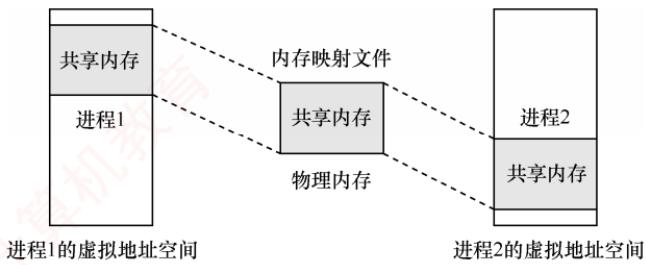

<em>图 3.27 采用内存映射 I/O 的共享内存</em>

　　区域执行写操作后，另一个进程在其映射区域执行读操作时，能够立即看到更新结果——因为二者访问的是同一块物理内存，数据必然一致，无须额外的复制或同步机制。

　　由此可见，内存映射文件带来的好处主要有：① 使程序员的编程更为简单，已建立映射的文件，可直接按内存方式进行读/写；② 便于多个进程共享同一个磁盘文件。

### 3.2.8 虚拟存储器性能影响因素

> **考点追踪：** 请求分页系统性能的影响因素分析（2020、2022）

　　缺页率是影响虚拟存储器性能的核心因素，而缺页率又受页面大小、分配给进程的物理块数、页面置换算法、写回磁盘的频率以及程序的局部化程度等多方面影响。

　　根据局部性原理，页面较大时，单次装入可覆盖更多局部访问区域，从而降低缺页率；而页面较小时，缺页率则相对较高。较小的页面虽能减少页内碎片、提高内存利用率，但会导致每个进程所需页面数量增多，导致页表过长，占用大量内存。较大的页面虽可缩短页表长度，却会增大页内碎片。因此，页面大小的设计需在碎片控制与页表开销之间取得合理平衡。

　　分配给进程的物理块数越多，缺页率通常越低。然而，当物理块数量超过某一阈值后，继续增加块数对缺页率的改善趋于平缓。因为此时进程的活跃页面已基本常驻内存，缺页主要由非活跃页面引发，而这些页面本就无须长期驻留。若再分配更多物理块，则不仅收益甚微，反而造成内存资源浪费。因此，只需确保活跃页面常驻内存，即可将缺页率有效控制在可接受范围内。

　　好的页面置换算法能有效降低运行过程中的缺页率。例如，LRU、CLOCK 等算法通过预测未来访问行为，优先保留可能被再次访问的页面，从而提升内存命中率，加快页面访问速度。

　　对于已修改的页面(脏页)，换出时必须写回磁盘。若采用“每换出一页即写回”的策略，则会频繁触发磁盘 I/O，效率极低。为此，系统引入已修改换出页面链表：当脏页被换出时，暂不写回磁盘，而是挂入该链表；待积累足够数量后，再批量写回磁盘，从而显著减少磁盘 I/O 次数，降低页面换出开销。此外，若某进程在这些页面尚未写回磁盘前再次访问它们，则可直接从链表中复用，无须重新从外存调入，进一步减少页面换入频率与 I/O 开销。

　　程序编写的局部化程度越高，执行时的缺页率就越低。例如，若数组采用按行存储，则访问时应尽量按行顺序进行，避免按列访问破坏空间局部性，从而导致缺页率异常升高。

### 3.2.9 地址翻译的示例

　　考虑到 408 统考越来越注重学科综合能力的考查，本节结合《计算机组成原理》中 Cache 的相关内容，分析虚实地址的变换过程。对于不参加统考的读者，可酌情跳过；对于参加统考但尚未复习该部分内容的读者，建议先完成相关章节的学习，再回过头来学习本节。

　　设某系统满足以下条件:

- 配置一个TLB和一个data Cache;

- 存储器以字节为编址单位；

- 虚拟地址为 14 位;

- 物理地址为 12 位;

- 页面大小为 64B;

- TLB 采用四路组相联结构，共 16 个条目；

- data Cache 采用物理寻址、直接映射方式，行大小为 4B，共 16 组。

　　要求分析对虚拟地址 0x03d4, 0x00f1 和 0x0229 的访问过程。

　　系统以字节编址，页面大小为 64B，故页内偏移占 $\log_{2}64 = 6$ 位。虚拟地址共 14 位，故虚拟页号为 14 - 6 = 8 位；物理地址共 12 位，故物理页号为 12 - 6 = 6 位。TLB 采用四路组相联，共 16 个条目，因此组数为 16/4 = 4，组索引占 $\log_{2}4 = 2$ 位，虚拟页号的低 2 位作为组索引、高 6 位作为 TLB 标记。data Cache 行大小为 4B，故物理地址中最低 $\log_{2}4 = 2$ 位为块内偏移；Cache 共 16 组，因此接下来的 $\log_{2}16 = 4$ 位为组索引，剩余高 6 位为标记。地址结构如图 3.28 所示。

  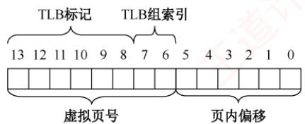

　　(a) 虚拟地址

  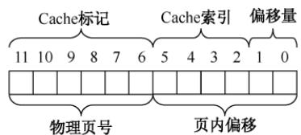

　　(b) 物理地址

<em>图 3.28 地址结构</em>

　　TLB、部分页表及 data Cache 的内容分别见表 3.1、表 3.2 和表 3.3。

　　表 3.1 TLB

　　<table><tr><td>索引</td><td>标记位</td><td>物理页号</td><td>有效位</td><td>标记位</td><td>物理页号</td><td>有效位</td></tr><tr><td rowspan="2">0</td><td>03</td><td>-</td><td>0</td><td>09</td><td>0D</td><td>1</td></tr><tr><td>00</td><td>-</td><td>0</td><td>07</td><td>02</td><td>1</td></tr><tr><td rowspan="2">1</td><td>03</td><td>2D</td><td>1</td><td>02</td><td>-</td><td>0</td></tr><tr><td>04</td><td>-</td><td>0</td><td>0A</td><td>-</td><td>0</td></tr><tr><td rowspan="2">2</td><td>02</td><td>-</td><td>0</td><td>08</td><td>-</td><td>0</td></tr><tr><td>06</td><td>-</td><td>0</td><td>03</td><td>-</td><td>0</td></tr><tr><td rowspan="2">3</td><td>07</td><td>-</td><td>0</td><td>03</td><td>0D</td><td>1</td></tr><tr><td>0A</td><td>34</td><td>1</td><td>02</td><td>-</td><td>0</td></tr></table>

　　表 3.2 部分页表

　　<table><tr><td>虚拟页号</td><td>物理页号</td><td>有效位</td><td>虚拟页号</td><td>物理页号</td><td>有效位</td></tr><tr><td>00</td><td>28</td><td>1</td><td>08</td><td>-</td><td>0</td></tr><tr><td>01</td><td>-</td><td>0</td><td>09</td><td>17</td><td>1</td></tr><tr><td>02</td><td>33</td><td>1</td><td>0A</td><td>09</td><td>1</td></tr><tr><td>03</td><td>02</td><td>1</td><td>0B</td><td>-</td><td>0</td></tr><tr><td>04</td><td>-</td><td>0</td><td>0C</td><td>-</td><td>0</td></tr><tr><td>05</td><td>16</td><td>1</td><td>0D</td><td>2D</td><td>1</td></tr><tr><td>06</td><td>-</td><td>0</td><td>0E</td><td>11</td><td>1</td></tr><tr><td>07</td><td>-</td><td>0</td><td>0F</td><td>0D</td><td>1</td></tr></table>

　　表 3.3 data Cache 内容

　　<table><tr><td>索引</td><td>标记位</td><td>有效位</td><td>块0</td><td>块1</td><td>块2</td><td>块3</td><td>索引</td><td>标记位</td><td>有效位</td><td>块0</td><td>块1</td><td>块2</td><td>块3</td></tr><tr><td>0</td><td>19</td><td>1</td><td>99</td><td>11</td><td>23</td><td>11</td><td>8</td><td>24</td><td>1</td><td>3A</td><td>00</td><td>51</td><td>89</td></tr><tr><td>1</td><td>15</td><td>0</td><td>-</td><td>-</td><td>-</td><td>-</td><td>9</td><td>2D</td><td>0</td><td>-</td><td>-</td><td>-</td><td>-</td></tr><tr><td>2</td><td>1B</td><td>1</td><td>00</td><td>02</td><td>04</td><td>08</td><td>A</td><td>2D</td><td>1</td><td>93</td><td>15</td><td>DA</td><td>3B</td></tr><tr><td>3</td><td>36</td><td>0</td><td>-</td><td>-</td><td>-</td><td>-</td><td>B</td><td>0B</td><td>0</td><td>-</td><td>-</td><td>-</td><td>-</td></tr><tr><td>4</td><td>32</td><td>1</td><td>43</td><td>6D</td><td>8F</td><td>09</td><td>C</td><td>02</td><td>0</td><td>-</td><td>-</td><td>-</td><td>-</td></tr><tr><td>5</td><td>0D</td><td>1</td><td>36</td><td>72</td><td>F0</td><td>1D</td><td>D</td><td>16</td><td>1</td><td>04</td><td>96</td><td>34</td><td>15</td></tr><tr><td>6</td><td>31</td><td>0</td><td>-</td><td>-</td><td>-</td><td>-</td><td>E</td><td>13</td><td>1</td><td>83</td><td>77</td><td>1B</td><td>D3</td></tr><tr><td>7</td><td>16</td><td>1</td><td>11</td><td>C2</td><td>DF</td><td>03</td><td>F</td><td>14</td><td>0</td><td>-</td><td>-</td><td>-</td><td>-</td></tr></table>

　　首先将十六进制的虚拟地址 0x03d4, 0x00f1 和 0x0229 转换为二进制形式，如表 3.4 所示。

　　表 3.4 虚拟地址结构

　　<table><tr><td>虚拟地址</td><td colspan="6">TLB 标记</td><td colspan="2">组索引</td><td colspan="6"></td></tr><tr><td></td><td>13</td><td>12</td><td>11</td><td>10</td><td>9</td><td>8</td><td>7</td><td>6</td><td>5</td><td>4</td><td>3</td><td>2</td><td>1</td><td>0</td></tr><tr><td>0x03d4</td><td>0</td><td>0</td><td>0</td><td>0</td><td>1</td><td>1</td><td>1</td><td>1</td><td>0</td><td>1</td><td>0</td><td>1</td><td>0</td><td>0</td></tr><tr><td>0x00f1</td><td>0</td><td>0</td><td>0</td><td>0</td><td>0</td><td>0</td><td>1</td><td>1</td><td>1</td><td>1</td><td>0</td><td>0</td><td>0</td><td>1</td></tr><tr><td>0x0229</td><td>0</td><td>0</td><td>0</td><td>0</td><td>1</td><td>0</td><td>0</td><td>0</td><td>1</td><td>0</td><td>1</td><td>0</td><td>0</td><td>1</td></tr><tr><td></td><td colspan="8">虚拟页号</td><td colspan="6">页内偏移</td></tr></table>

　　由表 3.4 可得各地址的虚拟页号、组索引及 TLB 标记。接下来需判断对应页面是否已在主存中；若在主存中，则进一步确定其物理地址。

- 对于 0x03d4：组索引为 3，TLB 标记为 0x03。查 TLB 第 3 组，存在标记为 03 且有效位为 1 的项，TLB 命中。对应物理页号为 0x0d（001101），拼接页内偏移 010100，得物理

　　地址为 0x354（001101010100）。

- 对于 0x00f1：组索引为 3，TLB 标记为 0x00。查 TLB 第 3 组，无匹配项，TLB 未命中，转而查询页表。虚拟页号为 0x03，页表第 3 行有效位为 1，表明页面在主存中。物理页号为 0x02（000010），拼接页内偏移 110001，得物理地址为 0x0b1（000010110001）。

- 对于 0x0229：组索引为 0，TLB 标记为 0x02。查 TLB 第 0 组，无匹配项。再查页表，虚拟页号为 0x08，对应页表项有效位为 0，页面不在主存中，触发缺页中断。

　　获得主存中页面的物理地址后，需通过该地址访问数据，此时应检查其内容是否在 Cache 中，物理地址结构如表 3.5 所示。

　　表 3.5 物理地址结构

　　<table><tr><td>物理地址</td><td colspan="6">Cache 标记</td><td colspan="4">Cache 索引</td><td colspan="2">偏移</td></tr><tr><td></td><td>11</td><td>10</td><td>9</td><td>8</td><td>7</td><td>6</td><td>5</td><td>4</td><td>3</td><td>2</td><td>1</td><td>0</td></tr><tr><td>0x354</td><td>0</td><td>0</td><td>1</td><td>1</td><td>0</td><td>1</td><td>0</td><td>1</td><td>0</td><td>1</td><td>0</td><td>0</td></tr><tr><td>0x0b1</td><td>0</td><td>0</td><td>0</td><td>0</td><td>1</td><td>0</td><td>1</td><td>1</td><td>0</td><td>0</td><td>0</td><td>1</td></tr><tr><td></td><td colspan="6">物理页号</td><td colspan="6">页内偏移</td></tr></table>

- 对于 0x354：Cache 组索引为 5，标记为 0x0d。查 Cache 索引为 5 的行，标记为 0d 且有效位为 1，Cache 命中。偏移为 0（块 0），故虚拟地址 0x03d4 对应的数据为 36H。

- 对于 0x0b1：Cache 组索引为 0xc，标记为 0x02。查 Cache 索引为 0xc 的行，有效位为 0，Cache 未命中，需从主存中读取物理页号为 0x2、偏移为 0x31 处的数据。

　　上述示例涵盖了从虚拟地址到 Cache 查找过程中可能出现的典型情形。完整的地址翻译与数据访问流程如下：首先查询 TLB；若 TLB 未命中，则需访问页表以完成虚实地址转换。在此过程中，若发现所需页面尚未调入主存（页表项无效），则触发缺页中断，从外存调入该页面。随后，利用所得物理地址访问 Cache；若 Cache 未命中，则进一步从主存读取所需数据。

### 3.2.10 本节小结

　　本节开头提出的问题的参考答案如下。

#### 1. 为什么要引入虚拟内存？

　　上一节提到，多道程序并发执行使进程共享处理器和内存。随着并发进程数量的增加，每个进程获得的处理器时间会相对平滑地减少；然而，若同时运行的进程过多，则内存需求将急剧上升，当某个进程无法获得足够的内存时，甚至无法被加载运行。因此，在物理内存扩展受限的情况下，有必要通过其他方式在逻辑上扩充内存容量，虚拟内存技术由此应运而生。

#### 2. 虚拟内存（虚存）空间的大小由什么因素决定？

　　虚拟内存空间的大小主要由虚拟地址的位数决定。例如，若虚拟地址为 32 位，且存储器按字节编址，则虚存空间最大为 $2^{32}B$ ，即 4GB。系统试图定义超过 4GB 的虚拟地址空间时，由于 32 位地址最多只能寻址 4GB，超出部分将无法被访问。

#### 3. 虚拟内存是怎么解决问题的？会带来什么问题？

　　虚拟内存利用外存空间在逻辑上扩充内存容量，通过页面的换入/换出机制，使系统能够运行总规模远超物理内存的多个进程。然而，该机制也引入额外开销：每次缺页均需访问外存，导致平均访存时间增加；采用不合适的页面置换算法，还可能引发频繁缺页，降低系统性能。

　　本节学习了 4 种页面置换算法，要将它们与处理机调度算法区分开。当然，二者存在内在联系：它们都属于资源调度机制，核心思想是依据某种准则，决定将有限资源分配给哪个请求者。处理机调度的准则包括优先级、响应比、时间片等；而页面置换则聚焦于页面的使用历史，如是否被访问过、近期是否经常使用。事实上，操作系统中几乎每类资源都有相应的调度策略。读者若能以“调度”为线索串联各类算法，则有助于构建对操作系统整体架构的系统性理解。

### 3.2.11 本节习题精选

#### 一、单项选择题

01. 下列关于存储管理的叙述中，正确的是（）。
- A. 存储保护的目的是限制内存的分配
- B. 在内存为 $M$ 、有 $N$ 个用户的分时系统中，每个用户占用 $M / N$ 的内存空间
- C. 在虚拟内存系统中，只要磁盘空间无限大，作业就能拥有任意大的编址空间
- D. 实现虚拟内存管理必须有相应硬件的支持

02. 请求分页存储管理中，若把页面尺寸增大一倍而且可容纳的最大页数不变，则在程序顺序执行时缺页中断次数会（）。

- A. 增加
- B. 减少
- C. 不变
- D. 可能增加也可能减少

03. 进程在执行中发生了缺页中断，经操作系统处理后，应让其执行（）指令。
- A. 被中断的前一条
- B. 被中断的那一条
- C. 被中断的后一条
- D. 启动时的第一条

04. 虚拟存储技术是（）。

- A. 补充内存物理空间的技术
- B. 补充内存逻辑空间的技术
- C. 补充外存空间的技术
- D. 扩充输入/输出缓冲区的技术

05. 下列关于虚拟存储器的论述中，正确的是（）。
- A. 作业在运行前，必须全部装入内存，且在运行过程中也一直驻留内存
- B. 作业在运行前，不必全部装入内存，且在运行过程中也不必一直驻留内存
- C. 作业在运行前，不必全部装入内存，但在运行过程中必须一直驻留内存
- D. 作业在运行前，必须全部装入内存，但在运行过程中不必一直驻留内存

06. 以下不属于虚拟内存特征的是（）。

- A. 一次性
- B. 多次性
- C. 对换性
- D. 虚拟性

07. 为使虚存系统有效地发挥其预期的作用，所运行的程序应具有的特性是（）。
- A. 该程序不应含有过多的I/O操作
- B. 该程序的大小不应超过实际的内存容量
- C. 该程序应具有较好的局部性
- D. 该程序的指令相关性不应过多

08. （）是请求分页存储管理方式和基本分页存储管理方式的区别。
- A. 地址重定向
- B. 不必将作业全部装入内存
- C. 采用快表技术
- D. 不必将作业装入连续区域

09. 通常所说的“存储保护”的基本含义是（）。

- A. 防止存储器硬件受损
- B. 防止程序在内存丢失
- C. 防止程序间相互越界访问
- D. 防止程序源码被人偷窃

10. 在页式虚拟存储管理中，程序的链接方式必然是（）。
- A. 静态链接 B. 装入时动态链接
- C. 运行时动态链接 D. 不确定哪种链接方式

11. 虚拟地址指的是（）。

- A. 程序访问内存时使用的地址 B. 访问内存总线上的地址 C. 内存与磁盘交换数据时使用的地址 D. 寄存器的地址

12. 在采用页式虚拟存储管理和固定分配局部置换策略的系统中，数组采用行优先存储，页框大小为 512B。某个进程中有如下代码段（该代码段已提前读入内存）：
int a[128][128];
for(int i=0;i<128;i++)
    for(int j=0;j<128;j++)
    a[j][i]=0;

　　系统为该进程分配的数据区只有1个页框，则执行该代码会发生（）次缺页中断。A. 1 B. 2 C. 128 D. 16384

13. 假设某个进程分配有 4 个页框，每个页框大小为 128 个字（一个整数占一个字）。进程的代码段正好可以存放在一页中，而且总是占用 0 号页框。数据会在其他 3 个页框中换进或换出。数组 X 为按行优先存储，则执行该进程会发生（）次缺页中断。

　　int X[64][64];
for(int j=0;j<64;j++)
    for(int i=0;i<64;i++)
    X[i][j]=0;
- A. 32 B. 1024 C. 2048 D. 其他都不对

14. 在配置了TLB的页式虚拟存储管理的系统中，假设TLB的命中率约为 $75\%$ ，忽略访问TLB的时间，并且使用二级页表，则每次存取的平均访存次数是（）。

- A. 1.25
- B. 1.5
- C. 1.75
- D. 2

15. 下面关于请求页式系统的页面调度算法中，说法错误的是（）。
- A. 一个好的页面调度算法应减少和避免抖动现象
- B. FIFO算法实现简单，选择最先进入主存储器的页面调出
- C. LRU算法基于局部性原理，首先调出最近一段时间内最长时间未被访问过的页面
- D. CLOCK算法首先调出一段时间内被访问次数多的页面

16. 考虑页面置换算法，系统有 m 个物理块供调度，初始时全空，页面引用串长度为 p，包含了 n 个不同的页号，无论用什么算法，缺页次数不会少于（）。

- A. m
- B. p
- C. n
- D. $\min(m, n)$

17. 在请求分页存储管理中，若采用 FIFO 算法，则当可供分配的页帧数增加时，缺页中断的次数（）。
- A. 减少 B. 增加
- C. 无影响 D. 可能增加也可能减少

18. 设主存容量为 1MB，外存容量为 400MB，计算机系统的地址寄存器有 32 位，那么虚拟存储器的最大容量是（）。
- A. 1MB B. 401MB C. $1\mathrm{MB} + 2^{32}\mathrm{MB}$ D. $2^{32}\mathrm{B}$

19. 一台机器有 32 位虚拟地址和 16 位物理地址，若页面大小为 512B，采用单级页表，则页表共有（）个页表项。
- A. $2^{7}$ B. $2^{16}$ C. $2^{23}$ D. $2^{32}$

20. 在某分页存储管理的系统中，逻辑地址为 16 位，页面大小为 1KB，第 0, 1, 2, 3 号页依次存放在 3, 7, 11, 10 号页框中，则逻辑地址 0A6FH 对应的物理地址为（）。

- A. 1E6FH B. 2E6FH C. DE6FH D. EE6FH

21. 在决定页面大小时，选择较小的页面是为了减少（）。

- A. 页表大小
- B. 缺页次数
- C. I/O 开销
- D. 页内碎片

22. 某虚拟存储器系统采用页式内存管理，使用 LRU 页面置换算法，考虑页面访问地址序列 18178272183821317137。假定内存容量为 4 个页面，开始时是空的，则页面失效次数是（）。

- A. 4
- B. 5
- C. 6
- D. 7

23. LRU 页面置换算法软件实现开销高的直接原因是（）。
- A. 需要硬件的特殊支持 B. 需要特殊的中断处理程序
- C. 需要在页表中标明特殊的页类型 D. 需维护访问历史并遍历查找

24. 在虚拟存储器系统的页表项中，决定是否会发生页故障的是（）。

- A. 有效位
- B. 修改位
- C. 页类型
- D. 保护码

25. 在页面置换策略中，（）策略可能引起抖动。
- A. FIFO    B. LRU    C. 没有一种    D. 所有

26. 虚拟存储管理系统的基础是程序的（）理论。
- A. 动态性    B. 虚拟性    C. 局部性    D. 全局性

27. 请求分页存储管理的主要特点是（）。

- A. 消除了内部碎片
- B. 扩充了内存
- C. 便于动态链接
- D. 便于信息共享

28. 在请求分页存储管理的页表中增加了若干项信息，其中修改位和访问位供（）参考。
- A. 分配页面    B. 调入页面    C. 置换算法    D. 程序访问

29. 下列关于驻留集和工作集的表述中，正确的是（）。
I. 驻留集是进程已装入内存的页面的集合
II. 工作集是某段时间间隔内，进程运行所需要访问页面的集合
III. 工作集是驻留集的子集
- A. I B. I、II C. II、III D. I、II、III

30. 在配置了TLB的页式虚拟存储管理的系统中，假设访问内存需要 $1\mu \mathrm{s}$ ，查询TLB需要 $0.2\mu \mathrm{s}$ 。已知TLB和内存的访问是串行的，请问在TLB命中率为 $85\%$ 和 $50\%$ 时，系统的平均访问时间分别是多少？（）

- A. $1.5\mu \mathrm{s}, 1.8\mu \mathrm{s}$
- B. $1.35\mu \mathrm{s}, 1.7\mu \mathrm{s}$
- C. $1.6\mu \mathrm{s}, 1.7\mu \mathrm{s}$
- D. $1.35\mu \mathrm{s}, 1.8\mu \mathrm{s}$

31. 下列选项中，（）不是页面换进换出效率的影响因素。
- A. 页面置换算法
- B. 已修改页面写回磁盘的频率
- C. 磁盘数据读入内存的频率
- D. CPU 与内存交换的速度

32. 允许进程在所有页框中选择一个页面替换，而不管该页框是否已分配给其他进程的置换方法是（）。

- A. 局部置换
- B. 全局置换
- C. 进程外置换
- D. 进程内置换

33. 在页面置换算法中，存在 Belady 现象的算法是（）。
- A. 最佳页面置换算法（OPT） B. 先进先出置换算法（FIFO）
- C. 最近最久未使用算法（LRU） D. 最近未使用算法（NRU）

34. 页式虚拟存储管理的主要特点是（）。
- A. 不要求将作业装入主存的连续区域
- B. 不要求将作业同时全部装入主存的连续区域

- C. 不要求进行缺页中断处理
- D. 不要求进行页面置换

35. 提供虚拟存储技术的存储管理方法有（）。

- A. 动态分区存储管理
- B. 页式存储管理
- C. 请求段式存储管理
- D. 存储覆盖技术

36. 内存映射可以将一个文件映射到进程的虚拟地址空间的某个区域，实现文件磁盘地址和进程虚拟地址空间的映射关系，下列说法中正确的是（）。
- A. 内存映射文件是将整个文件内容一次性加载到内存中的一种方式
- B. 内存映射文件只适用于读取文件，不支持对文件进行写操作
- C. 内存映射文件可以通过修改内存中的数据来实现对文件的写操作
- D. 由于进程的虚拟地址空间是独立的，内存映射文件不支持多进程映射到同一文件

37. 在虚拟分页存储管理系统中，若进程访问的页面不在主存中，且主存中没有可用的空闲帧时，则系统正确的处理顺序为（）。
- A. 决定淘汰页 $\rightarrow$ 页面调出 $\rightarrow$ 缺页中断 $\rightarrow$ 页面调入
- B. 决定淘汰页 $\rightarrow$ 页面调入 $\rightarrow$ 缺页中断 $\rightarrow$ 页面调出
- C. 缺页中断 $\rightarrow$ 决定淘汰页 $\rightarrow$ 页面调出 $\rightarrow$ 页面调入
- D. 缺页中断 $\rightarrow$ 决定淘汰页 $\rightarrow$ 页面调入 $\rightarrow$ 页面调出

38. 已知系统为 32 位实地址，采用 48 位虚拟地址，页面大小为 4KB，页表项大小为 8B。假设系统使用纯页式存储，则要采用（）级页表，页内偏移（）位。
- A. 3, 12
- B. 3, 14
- C. 4, 12
- D. 4, 14

39. 下列说法中，正确的是（）。
I. 先进先出（FIFO）页面置换算法会产生 Belady 现象
II. 最近最少使用（LRU）页面置换算法会产生 Belady 现象
III. 在进程运行时，若其工作集页面都在虚拟存储器内，则能够使该进程有效地运行，否则会出现频繁的页面调入/调出现象
IV. 在进程运行时，若其工作集页面都在主存储器内，则能够使该进程有效地运行，否则会出现频繁的页面调入/调出现象
- A. I、III B. I、IV C. II、III D. II、IV

40. 测得某个采用按需调页策略的计算机系统的部分状态数据为：CPU 利用率为 20%，用于交换空间的磁盘利用率为 97.7%，其他设备的利用率为 5%。由此判断系统出现异常，这种情况下（）能提高系统性能。
- A. 安装一个更快的硬盘
- B. 通过扩大硬盘容量增加交换空间
- C. 增加运行进程数
- D. 加内存条来增加物理空间容量

41. 假定有一个请求分页存储管理系统，测得系统各相关设备的利用率为：CPU 的利用率为 10%，磁盘交换区的利用率为 99.7%，其他 I/O 设备的利用率为 5%。下面（）措施将显著地改进 CPU 的利用率。
I. 增大内存的容量
II. 增大磁盘交换区的容量
III. 减少多道程序的度数
IV. 增加多道程序的度数
V. 使用更快速的磁盘交换区
VI. 使用更快速的 CPU
- A. I、II、III、IV
- B. I、III
- C. II、III、V
- D. II、VI

42. 在请求分页存储管理系统中，为了提高TLB命中率，可行的方法是（）。I. 增大TLB容量 II. 采用多级页表 III. 提高页面大小 IV. 降低页面大小

- A. I和III B. I和IV C. I、II和III D. II和III

43. 【2011 统考真题】在缺页处理过程中，操作系统执行的操作可能是（）。
I. 修改页表 II. 磁盘 I/O III. 分配页框
- A. 仅 I、II B. 仅 II C. 仅 III D. I、II 和 III

44. 【2011 统考真题】当系统发生抖动时，可以采取的有效措施是（）。I.撤销部分进程 II.增加磁盘交换区的容量III.提高用户进程的优先级

- A. 仅I
- B. 仅II
- C. 仅III
- D. 仅I、II

45. 【2012 统考真题】下列关于虚拟存储器的叙述中，正确的是（）。

- A. 虚拟存储只能基于连续分配技术
- B. 虚拟存储只能基于非连续分配技术
- C. 虚拟存储容量只受外存容量的限制
- D. 虚拟存储容量只受内存容量的限制

46. 【2013 统考真题】若用户进程访问内存时产生缺页，则在下列选项中，操作系统可能执行的操作是（）。I.处理越界错 II.置换页 III.分配内存

- A. 仅I、II
- B. 仅II、III
- C. 仅I、III
- D. I、II和III

47. 【2014 统考真题】下列措施中，能加快虚实地址转换的是（）。
I. 增大快表（TLB）容量 II. 让页表常驻内存
III. 增大交换区（swap）
- A. 仅 I B. 仅 II C. 仅 I、II D. 仅 II、III

48. 【2014 统考真题】在页式虚拟存储管理系统中，采用某些页面置换算法会出现 Belady 异常现象，即进程的缺页次数会随着分配给该进程的页框个数的增加而增加。下列算法中，可能出现 Belady 异常现象的是（）。
I. LRU 算法 II. FIFO 算法 III. OPT 算法
- A. 仅 II B. 仅 I、II C. 仅 I、III D. 仅 II、III

49. 【2015 统考真题】在请求分页系统中，页面分配策略与页面置换策略不能组合使用的是（）。

- A. 可变分配，全局置换
- B. 可变分配，局部置换
- C. 固定分配，全局置换
- D. 固定分配，局部置换

50. 【2015 统考真题】系统为某进程分配了 4 个页框，该进程已访问的页号序列为 2, 0, 2, 9, 3, 4, 2, 8, 2, 4, 8, 4, 5。若进程要访问的下一页的页号为 7，则依据 LRU 算法，应淘汰页的页号是（）。

- A. 2
- B. 3
- C. 4
- D. 8

51. 【2016 统考真题】某系统采用改进型 CLOCK 算法，页表项中字段 A 为访问位，M 为修改位。A = 0 表示页最近没有被访问，A = 1 表示页最近被访问过。M = 0 表示页未被修改过，M = 1 表示页被修改过。按 $(A, M)$ 所有可能的取值，将页分为 $(0, 0)$ ， $(1, 0)$ ， $(0, 1)$ 和 $(1, 1)$ 四类，则该算法淘汰页的次序为（）。

- A. $(0, 0)$ ， $(0, 1)$ ， $(1, 0)$ ， $(1, 1)$
- B. $(0, 0)$ ， $(1, 0)$ ， $(0, 1)$ ， $(1, 1)$
- C. $(0, 0), (0, 1), (1, 1), (1, 0)$
- D. $(0, 0), (1, 1), (0, 1), (1, 0)$

52. 【2016 统考真题】某进程访问页面的序列如下所示（注意，抖动和工作集已从最新大纲中删除）。
…, 1, 3, 4, 5, 6, 0, 3, 2, 3, 2, 0, 4, 0, 3, 2, 9, 2, 1, …
时间

　　若工作集的窗口大小为6，则在t时刻的工作集为（）。

- A. $\{6,0,3,2\}$ B. $\{2,3,0,4\}$ C. $\{0,4,3,2,9\}$ D. $\{4,5,6,0,3,2\}$

53. 【2019 统考真题】某系统采用 LRU 页置换算法和局部置换策略，若系统为进程 P 预分配了 4 个页框，进程 P 访问页号的序列为 0, 1, 2, 7, 0, 5, 3, 5, 0, 2, 7, 6，则进程访问上述页的过程中，产生页置换的总次数是（）。

- A. 3
- B. 4
- C. 5
- D. 6

54. 【2020 统考真题】下列因素中，影响请求分页系统有效（平均）访存时间的是（）。I.缺页率 II.磁盘读/写时间 III.内存访问时间IV.执行缺页处理程序的CPU时间

- A. 仅II、III
- B. 仅I、IV
- C. 仅I、III、IV
- D. I、II、III和IV

55. 【2021 统考真题】某请求分页存储系统的页大小为4KB，按字节编址。系统给进程P分配2个固定的页框，并采用改进型CLOCK算法，进程P页表的部分内容见下表。

　　<table><tr><td>页框号</td><td>存在位1: 存在, 0: 不存在</td><td>访问位1: 访问, 0: 未访问</td><td>修改位1: 修改, 0: 未修改</td></tr><tr><td>...</td><td>...</td><td>...</td><td>...</td></tr><tr><td>20 H</td><td>0</td><td>0</td><td>0</td></tr><tr><td>60 H</td><td>1</td><td>1</td><td>0</td></tr><tr><td>80 H</td><td>1</td><td>1</td><td>1</td></tr><tr><td>...</td><td>...</td><td>...</td><td>...</td></tr></table>

　　若 P 访问虚拟地址为 02A01H 的存储单元，则经地址变换后得到的物理地址是（）。A. 00A01H B. 20A01H C. 60A01H D. 80A01H

56. 【2022 统考真题】某进程访问的页b不在内存中，导致产生缺页异常，该缺页异常处理过程中不一定包含的操作是（）。

- A. 淘汰内存中的页
- B. 建立页号与页框号的对应关系
- C. 将页b从外存读入内存
- D. 修改页表中页b对应的存在位

57. 【2022 统考真题】下列选项中，不会影响系统缺页率的是（）。

- A. 页置换算法
- B. 工作集的大小
- C. 进程的数量
- D. 页缓冲队列的长度

58. 【2023 统考真题】对于采用虚拟内存管理方式的系统，下列关于进程虚拟地址空间的叙述中，错误的是（）。
- A. 每个进程都有自己独立的虚拟地址空间
- B. C语言中malloc()函数返回的是虚拟地址
- C. 进程对数据段和代码段可以有不同的访问权限
- D. 虚拟地址空间的大小由内存和硬盘的大小决定

59. 【2025 统考真题】某页式虚拟存储管理系统采用固定分配局部置换的 LRU 算法。若系统为进程 P 分配了 3 个页框，P 从某时刻开始的页访问序列为 0,1,2,0,5,1,4,3,0,2,3,2,0，且 0,1,2 三个页已在内存中，则完成上述页序列的访问时，系统执行缺页异常处理程序的次数为（）。

- A. 5
- B. 6
- C. 7
- D. 8

60. 【2025 统考真题】在页式虚拟存储管理系统中，确定进程正常运行所需的最少页框数时，下列因素中需要考虑的是（）。
- A. 代码段长度 B. 进程的虚拟地址空间大小 C. 物理内存大小 D. 指令系统支持的寻址方式

61. 【2025 统考真题】下列关于内存映射文件（memory-mapped files）机制的叙述中，正确的是（）。
I. 可实现进程之间的通信 II. 可实现页到磁盘块的映射
III. 将文件映射到进程的虚拟地址空间 IV. 将文件映射到系统的物理地址空间
- A. 仅 I、III B. 仅 I、IV C. 仅 II、III D. 仅 I、II、III

#### 二、综合应用题

01. 假定某操作系统存储器采用页式存储管理，一个进程在相联存储器中的页表项见表A，不在相联存储器的页表项见表B。

　　表 A 相联存储器中的页表

　　<table><tr><td>页号</td><td>页帧号</td></tr><tr><td>0</td><td>f1</td></tr><tr><td>1</td><td>f2</td></tr><tr><td>2</td><td>f3</td></tr><tr><td>3</td><td>f4</td></tr></table>

　　表 B 内存中的页表

　　<table><tr><td>页号</td><td>页帧号</td></tr><tr><td>4</td><td>f5</td></tr><tr><td>5</td><td>f6</td></tr><tr><td>6</td><td>f7</td></tr><tr><td>7</td><td>f8</td></tr><tr><td>8</td><td>f9</td></tr><tr><td>9</td><td>f10</td></tr></table>

　　注：只列出不在相联存储器中的页表项。

　　假定该进程长度为 320B，每页 32B。现有逻辑地址（八进制）为 101,204,576，若上述逻辑地址能转换成物理地址，说明转换的过程，并指出具体的物理地址；若不能转换，则说明其原因。

02. 某分页式虚拟存储系统，用于页面交换的磁盘的平均访问及传输时间是 20ms。页表保存在主存中，访问时间为 1μs，即每引用一次指令或数据，需要访问内存两次。为改善性能，可以增设一个关联寄存器，若页表项在关联寄存器中，则只需访问一次内存。假设 80% 的访问的页表项在关联寄存器中，剩下的 20% 中，10% 的访问（总数的 2%）会产生缺页。请计算有效访问时间。

03. 在页式虚存管理系统中，假定驻留集为 $m$ 个页帧（初始所有页帧均为空），在长为 $p$ 的引用串中具有 $n$ 个不同页号（ $n > m$ ），对于FIFO、LRU两种页面置换算法，试给出页故障数的上限和下限，说明理由并举例说明。

04. 在一个请求分页存储管理系统中，一个作业的页面走向为 4, 3, 2, 1, 4, 3, 5, 4, 3, 2, 1, 5，当分配给作业的物理块数分别为 3 和 4 时，试计算采用下述页面置换算法时的缺页率（假设开始执行时主存中没有页面），并比较结果。

1）最佳置换算法。

2）先进先出置换算法。

3）最近最久未使用算法。

05. 一个页式虚拟存储系统，其并发进程数固定为4个。最近测试了它的CPU利用率和用于页面交换的磁盘的利用率，得到的结果就是下列3组数据中的一组。针对每组数据，说明系统发生了什么事情。增加并发进程数能提升CPU的利用率吗？页式虚拟存储系统有用吗？

1）CPU 利用率为 13%; 磁盘利用率为 97%。

2）CPU 利用率为 87%; 磁盘利用率为 3%。

3）CPU 利用率为 13%; 磁盘利用率为 3%。

06. 现有一请求页式系统，页表保存在寄存器中。若有一个可用的空页或被置换的页未被修改，则它处理一个缺页中断需要 $8\mu \mathrm{s}$ ；若被置换的页已被修改，则处理一缺页中断因增加写回外存时间而需要 $20\mu \mathrm{s}$ ，内存的存取时间为 $1\mu \mathrm{s}$ 。假定 $70\%$ 被置换的页被修改过，为保证有效存取时间不超过 $2\mu \mathrm{s}$ ，可接受的最大缺页中断率是多少？

07. 已知系统为 32 位实地址，采用 48 位虚拟地址，页面大小为 4KB，页表项大小为 8B，每段最大为 4GB。

1）假设系统使用纯页式存储，则要采用多少级页表？页内偏移多少位？

2）假设系统采用一级页表，TLB命中率为 $98\%$ ，TLB访问时间为10ns，内存访问时间为100ns，并假设当TLB访问失败时才开始访问内存，问平均页面访问时间是多少？
3）若是二级页表，则页面平均访问时间是多少？

4）上题中，若要满足访问时间小于 120ns，则命中率至少需要为多少？

5）若系统采用段页式存储，则每个用户最多可以有多少个段？段内采用几级页表？

08. 在一个请求分页系统中，采用 LRU 页面置换算法时，假如一个作业的页面走向为 1, 3, 2, 1, 1, 3, 5, 1, 3, 2, 1, 5，当分配给该作业的物理块数分别为 3 和 4 时，试计算在访问过程中发生的缺页次数和缺页率。

09. 一个进程分配给 4 个页帧，见下表（所有数字均为十进制，均从 0 开始计数）。时间均为从进程开始到该事件之前的时钟值，而不是从事件发生到当前的时钟值。请回答：

　　<table><tr><td>虚拟页号</td><td>页帧</td><td>装入时间</td><td>最近访问时间</td><td>访问位</td><td>修改位</td></tr><tr><td>2</td><td>0</td><td>60</td><td>161</td><td>0</td><td>1</td></tr><tr><td>1</td><td>1</td><td>130</td><td>160</td><td>0</td><td>0</td></tr><tr><td>0</td><td>2</td><td>26</td><td>162</td><td>1</td><td>0</td></tr><tr><td>3</td><td>3</td><td>20</td><td>163</td><td>1</td><td>1</td></tr></table>

1）当进程访问虚页4时，产生缺页中断，请分别用FIFO（先进先出）、LRU（最近最少使用）、改进型CLOCK算法，决定缺页中断服务程序选择换出的页面。

2）在缺页之前给定上述的存储器状态，考虑虚页访问串4,0,0,0,2,4,2,1,0,3,2，若使用LRU页面置换算法，分给4个页帧，则会发生多少缺页？

10. 在页式虚拟管理的页面置换算法中，对于任何给定的驻留集大小，在什么样的访问串情况下，FIFO与LRU置换算法一样（被替换的页面和缺页情况完全一样）？

11. 某系统有4个页框，某个进程的页面使用情况见下表，问采用FIFO、LRU、简单CLOCK和改进型CLOCK算法，将替换哪一页？

　　<table><tr><td>页号</td><td>装入时间</td><td>上次引用时间</td><td>R</td><td>M</td></tr><tr><td>0</td><td>126</td><td>279</td><td>0</td><td>0</td></tr><tr><td>1</td><td>230</td><td>260</td><td>1</td><td>0</td></tr><tr><td>2</td><td>120</td><td>272</td><td>1</td><td>1</td></tr><tr><td>3</td><td>160</td><td>280</td><td>1</td><td>1</td></tr></table>

　　其中，R 是读标志位，M 是修改标志位。

12. 有一个矩阵 int A[100, 100]以行优先方式进行存储。计算机采用虚拟存储系统，物理内存共有三页，其中一页用来存放程序，其余两页用于存放数据。假设程序已在内存中占一页，其余两页空闲。若每页可存放 200 个整数，则程序 1、程序 2 执行的过程中各会发生多少次缺页？每页只能存放 100 个整数时，会发生多少次缺页？以上结果说明了什么问题？

　　程序 1: 程序 2:
for (i=0; i<100; i++)
    for (j=0; j<100; j++)
    for (i=0; i<100; i++)
    A[i, j]=0;
    A[i, j]=0;

13. Gribble 公司正在开发一款 64 位的计算机体系结构，也就是说，在访问内存时，最多可以使用 64 位的地址。假设采用的是虚拟页式存储管理，现在要为这款机器设计相应的地址映射机制。

1）假设页面的大小是4KB，每个页表项的长度是4B，而且必须采用三级页表结构，每级页表结构中的每个页表都必须正好存放在一个物理页面中，请问在这种情形下，如何实现地址的映射？具体来说，对于给定的一个虚拟地址，应该将它划分为几部分，每部分的长度分别是多少，功能是什么？另外，采用这种地址映射机制后，可以访问的虚拟地址空间有多大？（提示：64位地址并不一定全部用上。）

2）假设每个页表项的长度变成了8B，而且必须采用四级页表结构，每级页表结构中的页表都必须正好存放在一个物理页面中，请问在这种情形下，系统能够支持的最大的页面大小是多少？此时，虚拟地址应该如何划分？

14. 某设备 TLB 的分页管理系统按字节编址，虚拟地址为 32 位，物理地址为 24 位，页面大小为 4KB，页表项大小为 4B，采用二级页表，TLB 命中率为 98%，TLB 的访问时间为 10ns，内存的访问时间为 100ns，处理一次缺页中断的时间为 10ms。请回答：

1）物理地址中的页框号占多少位？虚拟地址中的一级页号和二级页号各占多少位？系统的页表基址寄存器中存放的内容是什么？一级页表表项中的内容是什么？

2）若访问一级页表和二级页表的过程中均不发生缺页，则系统进行地址转换的平均时间是多少？

3）若访问一级页表不发生缺页，访问二级页表的缺页率为 $10\%$ ，则系统进行地址转换的平均时间是多少？

15. 【2009 统考真题】请求分页管理系统中，假设某进程的页表内容如下表所示。

　　<table><tr><td>页号</td><td>页框号</td><td>有效位(存在位)</td></tr><tr><td>0</td><td>101H</td><td>1</td></tr><tr><td>1</td><td>—</td><td>0</td></tr><tr><td>2</td><td>254H</td><td>1</td></tr></table>

　　页面大小为 4KB，一次内存的访问时间是 100ns，一次快表（TLB）的访问时间是 10ns，处理一次缺页的平均时间为 $10^{8}$ ns（已含更新 TLB 和页表的时间），进程的驻留集大小固定为 2，采用最近最少使用（LRU）置换算法和局部淘汰策略。假设：① TLB 初始为空；② 地址转换时先访问 TLB，若 TLB 未命中，则再访问页表（忽略访问页表后的 TLB 更新时间）；③ 有效位为 0 表示页面不在内存，产生缺页中断，缺页中断处理后，返回到产生缺页中断的指令处重新执行。设有虚地址访问序列 2362H, 1565H, 25A5H，请问：

1）依次访问上述三个虚拟地址，各需多少时间？给出计算过程。

2）基于上述访问序列，虚地址1565H的物理地址是多少？请说明理由。

16. 【2010 统考真题】设某计算机的逻辑地址空间和物理地址空间均为 64KB，按字节编址。若某个进程最多需要 6 页（Page）数据存储空间，页的大小为 1KB，则操作系统采用固定分配局部置换策略为此进程分配 4 个页框（Page Frame），见下表。在装入时刻 260 前，该进程的访问情况也见下表（访问位即使用位）。

　　<table><tr><td>页号</td><td>页框号</td><td>装入时刻</td><td>访问位</td></tr><tr><td>0</td><td>7</td><td>130</td><td>1</td></tr><tr><td>1</td><td>4</td><td>230</td><td>1</td></tr><tr><td>2</td><td>2</td><td>200</td><td>1</td></tr><tr><td>3</td><td>9</td><td>160</td><td>1</td></tr></table>

　　当该进程执行到时刻 260 时，要访问逻辑地址为 17CAH 的数据。回答下列问题:

1）该逻辑地址对应的页号是多少？

2）若采用先进先出（FIFO）置换算法，则该逻辑地址对应的物理地址是多少？要求给出计算过程。若采用时钟（Clock）置换算法，则该逻辑地址对应的物理地址是多少？要求给出计算过程。设搜索下一页的指针沿顺时针方向移动，且当前指向2号页框，如右图所示。

  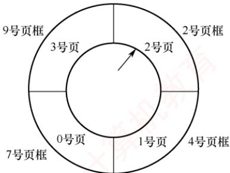

17. 【2012 统考真题】某请求分页系统的页面置换策略如下：从0时刻开始扫描，每隔5个时间单位扫描一轮驻留集（扫描时间忽略不计）且本轮未被访问过的页框将被系统回收，并放入空闲页框链尾，其中内容在下一次分配之前不清空。当发生缺页时，若该页曾被使用过且还在空闲页链表中，则重新放回进程的驻留集中；否则，从空闲页框链表头部取出一个页框。

　　忽略其他进程的影响和系统开销。初始时进程驻留集为空。目前系统空闲页的页框号依次为 32, 15, 21, 41。进程 P 依次访问的<虚拟页号，访问时刻>为<1, 1>, <3, 2>, <0, 4>, <0, 6>, <1, 11>, <0, 13>, <2, 14>。请回答下列问题：

1）当虚拟页为 $< 0,4>$ 时，对应的页框号是什么？

2）当虚拟页为 $< 1,11>$ 时，对应的页框号是什么？说明理由。

3）当虚拟页为 $< 2,14>$ 时，对应的页框号是什么？说明理由。

4）这种方法是否适合于时间局部性好的程序？说明理由。

18. 【2015 统考真题】某计算机系统按字节编址，采用二级页表的分页存储管理方式，虚拟地址格式如下所示：

　　<table><tr><td>10位</td><td>10位</td><td>12位</td></tr><tr><td>页目录号</td><td>页表索引</td><td>页内偏移量</td></tr></table>

　　请回答下列问题:

1）页和页框的大小各为多少字节？进程的虚拟地址空间大小为多少页？

2）若页目录项和页表项均占4B，则进程的页目录和页表共占多少页？写出计算过程。

3）若某指令周期内访问的虚拟地址为01000000H和01112048H，则进行地址转换时共访问多少个二级页表？说明理由。

19. 【2017 统考真题】假定 2017 年题 44①给出的计算机 M 采用二级分页虚拟存储管理方式，虚拟地址格式如下：

　　<table><tr><td>页目录号(10位)</td><td>页表索引(10位)</td><td>页内偏移量(12位)</td></tr></table>

　　请针对2017年题43的函数fl和题44中的机器指令代码，回答下列问题。

1）函数f1的机器指令代码占多少页？

2）取第一条指令（push ebp）时，若在进行地址变换的过程中需要访问内存中的页目录和页表，则会分别访问它们各自的第几个表项（编号从0开始）？

3）M 的 I/O 采用中断控制方式。若进程 P 在调用 f1 前通过 scanf() 获取 n 的值，则在执行 scanf() 的过程中，进程 P 的状态会如何变化？CPU 是否会进入内核态？

20. 【2018 统考真题】某计算机采用页式虚拟存储管理方式，按字节编址，CPU 进行存储访问的过程如下图所示，回答下列问题。

1）某虚拟地址对应的页目录号为6，在相应的页表中对应的页号为6，页内偏移量为8，该虚拟地址的十六进制表示是什么？

2）寄存器PDBR用于保存当前进程的页目录始址，该地址是物理地址还是虚拟地址？进程切换时，PDBR的内容是否会变化？说明理由。同一进程的线程切换时，PDBR的内容是否会变化？说明理由。

3）为了支持改进型 CLOCK 算法，需要在页表项中设置哪些字段？

  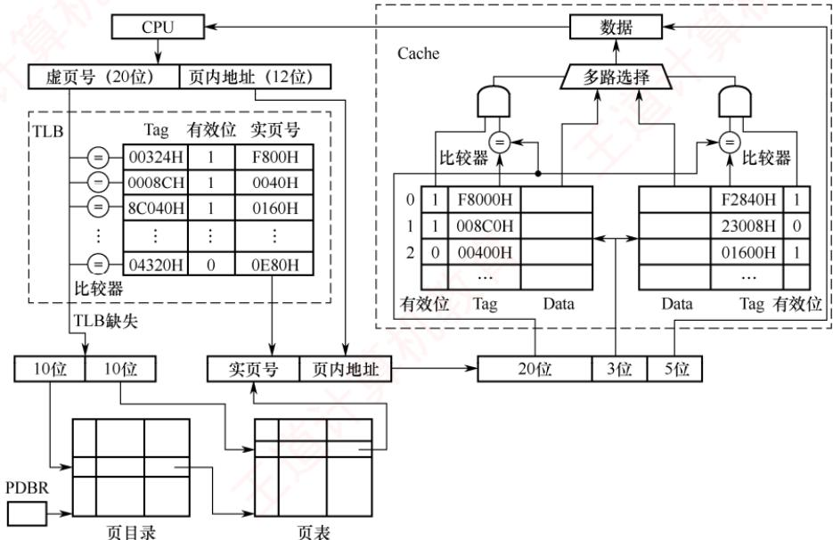

21. 【2020 统考真题】某 32 位系统采用基于二级页表的请求分页存储管理方式，按字节编址，页目录项和页表项长度均为 4B，虚拟地址结构如下所示。

　　<table><tr><td>页目录号(10位)</td><td>页号(10位)</td><td>页内偏移量(12位)</td></tr></table>

　　某 C 程序中数组 a[1024][1024] 的起始虚拟地址为 1080 0000H，数组元素占 4B，该程序运行时，其进程的页目录起始物理地址为 0020 1000H，请回答下列问题。

1）数组元素 a[1][2]的虚拟地址是什么？对应的页目录号和页号分别是什么？对应的页目录项的物理地址是什么？若该目录项中存放的页框号为 00301H，则 a[1][2]所在页对应的页表项的物理地址是什么？

2）数组 a 在虚拟地址空间中所占的区域是否必须连续？在物理地址空间中所占的区域是否必须连续？

3）已知数组a按行优先方式存放，若对数组a分别按行遍历和按列遍历，则哪种遍历方式的局部性更好？

22. 【2024 统考真题】某计算机按字节编址，采用页式虚拟存储管理方式，虚拟地址和物理地址的长度均为 32 位，页表项的大小为 4B，页大小为 4MB，虚拟地址结构如下。

　　<table><tr><td>页号(10位)</td><td>页内偏移量(22位)</td></tr></table>

　　进程P的页表起始虚拟地址为B8C00000H，被装载到从物理地址65400000H开始的连续主存空间中。请回答下列问题，要求答案用十六进制表示。

1）CPU 在执行进程 P 的过程中，访问虚拟地址 1234 5678H 时发生了缺页异常，经过缺页异常处理和 MMU 地址转换后得到的物理地址是 BAB4 5678H。在此次缺页异常处理过程中，需要为所缺页分配页框并更新相应的页表项，该页表项的虚拟地址和物理地址分别是什么？该页表项中的页框号更新后的值是什么？

2）进程P的页表所在页的页号是什么？该页对应的页表项的虚拟地址是什么？该页表项中的页框号是什么？

### 3.2.12 答案与解析

#### 一、单项选择题

**01. D**

　　选项 A、B 显然错误。编址空间大小由虚拟地址位数决定，与磁盘容量无关。虚拟内存管理必须依赖硬件支持，如地址变换机构、缺页中断机构及存储管理单元等，仅靠软件无法实现。

**02. B**

　　对于顺序执行程序，缺页中断的次数等于其访问的页帧数。因为页面尺寸增大，存放程序需要的页帧数就减少，所以缺页中断的次数也会减少。

**03. B**

　　缺页中断是访存指令引起的，说明所要访问的页面不在内存中，进行缺页中断处理并调入所要访问的页后，访存指令显然应该重新执行。

**04. B**

　　虚拟存储技术并未实际扩充内存、外存，而是采用相关技术相对地扩充主存。

**05. B**

　　在非虚拟存储器中，作业必须全部装入内存且在运行过程中也一直驻留内存；在虚拟存储器中，作业不必全部装入内存且在运行过程中也不用一直驻留内存，这是两者的主要区别之一。

**06. A**

　　多次性、对换性和离散性是虚拟内存的特征，一次性则是传统存储系统的特征。

**07. C**

　　虚拟存储技术基于程序的局部性原理。局部性越好，虚拟存储系统越能更好地发挥作用。

**08. B**

　　请求分页存储管理方式和基本分页存储管理方式的区别是，前者采用虚拟技术，因此开始运行时，不必将作业全部一次性装入内存，而后者不是。

**09. C**

　　通常所说的 “存储保护” 的基本含义是防止程序间相互越界访问。存储保护可以保证多个程序在共享主存时不相互覆盖或非法访问，从而保证系统的正常运行和安全性。

**10. C**

　　在页式虚拟存储管理中，程序的逻辑地址和物理地址是不一致的，而且物理地址是在程序运行时才确定的，因此，程序的链接也必须在运行时进行，不能在装入时或编译时进行。运行时动态链接是一种在程序执行过程中，根据需要动态地将目标模块装入内存并进行链接的技术。

**11. A**

　　程序访问内存时使用的是虚拟地址，操作系统负责将其转换为物理地址。

**12. D**

　　数组大小为 $128 \times 128$ ，int 型数据占 4B，一个页框可以存放一行数据。当访问 a[0][0]时，发生第一次缺页中断，此时调入第一行数据；之后访问a[1][0]，又发生缺页中断。每访问一个元素，都发生一次缺页中断，共有 $128 \times 128 = 16384$ 个元素，因此共发生16384次缺页中断。

**13. C**

　　数组大小为 $64 \times 64$ ，一个页框可以存放两行数据。当访问 X[0][0]时，发生第一次缺页中断，此时调入前两行数据，之后访问 X[1][0]，不发生缺页中断，因为已被调入内存；当访问 X[2][0]时，又发生缺页中断；同理，访问 X[3][0]时不发生缺页中断。不难发现，每访问两个元素就发生一次缺页中断，共有 $64 \times 64 = 4096$ 个元素，因此共发生 2048 次缺页中断。

**14. B**

　　若TLB命中，则访问TLB就能得到物理地址；若TLB未命中，则需要2次访存，依次访问一级页表和二级页表，才能得到物理地址，最后用物理地址在内存中存取数据。平均访存次数 $=$ TLB命中率 $\times 1 + (1 - \mathrm{TLB}$ 命中率） $\times 3 = 0.75\times 1 + (1 - 0.75)\times 3 = 1.5$ 。

**15. D**

　　CLOCK 算法选择将最近未使用的页面置换出去，因此也称 NRU 算法。

**16. C**

　　无论采用什么页面置换算法，每种页面第一次访问时不可能在内存中，必然发生缺页，所以缺页次数大于或等于 n。

**17. D**

　　请求分页存储管理中，若采用 FIFO 算法，则可能产生当驻留集增大时页故障数不减反增的 Belady 异常。然而，还有另外一种情况。例如，页面序列为 1,2,3,1,2,3，当页帧数为 2 时产生 6 次缺页中断，当页帧数为 3 时产生 3 次缺页中断。所以在请求分页存储管理中，若采用 FIFO 算法，则当可供分配的页帧数增加时，缺页中断的次数可能增加，也可能减少。

**18. D**

　　进程的虚拟地址空间寻址由系统的地址结构决定，这就决定了虚拟存储器的最大容量，而与主存和外存的容量没有必然联系，因此虚拟地址空间为 $2^{32}B$ 。比如，在 64 位系统环境下，虚拟存储技术使得进程可用地址空间达 $2^{64}B$ ，但外存显然是达不到这个大小的。

**19. C**

　　页面大小为512B，页内偏移量占9位，虚拟地址占32位，页号占23位，因此页表共有 $2^{23}$ 个页表项。页表项数量与物理地址的位数没有必然关系。

**20. B**

　　页面大小为 1KB，页内偏移量占 10 位，页号占 6 位，将 0A6FH 展开为二进制，得到逻辑页号为 2（000010），存放在 11 号（001011）页框中，拼接上页内偏移量得到物理地址为 2E6FH。

**21. D**

　　页面越小，页表项数量越多，页表所占的空间就更大；页面越小，缺页率越高；页面越小，换入换出的次数就越多，I/O 操作更频繁。页面越小，页内浪费的空间越少，内存利用率越高。

**22. C**

　　利用 LRU 算法时的置换如下图所示。

　　<table><tr><td>访问页面</td><td>1</td><td>8</td><td>1</td><td>7</td><td>8</td><td>2</td><td>7</td><td>2</td><td>1</td><td>8</td><td>3</td><td>8</td><td>2</td><td>1</td><td>3</td><td>1</td><td>7</td><td>1</td><td>3</td><td>7</td></tr><tr><td>物理块 1</td><td>1</td><td>1</td><td></td><td>1</td><td></td><td>1</td><td></td><td></td><td></td><td></td><td>1</td><td></td><td></td><td></td><td></td><td></td><td>1</td><td></td><td></td><td></td></tr><tr><td>物理块 2</td><td></td><td>8</td><td></td><td>8</td><td></td><td>8</td><td></td><td></td><td></td><td></td><td>8</td><td></td><td></td><td></td><td></td><td></td><td>7</td><td></td><td></td><td></td></tr><tr><td>物理块 3</td><td></td><td></td><td></td><td>7</td><td></td><td>7</td><td></td><td></td><td></td><td></td><td>3</td><td></td><td></td><td></td><td></td><td></td><td>3</td><td></td><td></td><td></td></tr><tr><td>物理块 4</td><td></td><td></td><td></td><td></td><td></td><td>2</td><td></td><td></td><td></td><td></td><td>2</td><td></td><td></td><td></td><td></td><td></td><td>2</td><td></td><td></td><td></td></tr><tr><td>缺页否</td><td>√</td><td>√</td><td></td><td>√</td><td></td><td>√</td><td></td><td></td><td></td><td></td><td>√</td><td></td><td></td><td></td><td></td><td></td><td>√</td><td></td><td></td><td></td></tr></table>

　　分别在访问第 1、2、4、6、11、17 个页面时产生中断，共产生 6 次中断。

**23. D**

　　LRU算法要求在缺页时选择淘汰最近最久未使用的页面。若采用纯软件实现，则需为每个驻留页面维护其访问历史信息，并在每次缺页时遍历所有页帧以确定替换目标，时间复杂度为 $\mathrm{O}(n)$ ，开销显著。选项A并非开销高的原因，而是为降低该软件开销而引入的硬件手段。换言之，正因软件实现开销过高，才需借助硬件辅助。选项B和C与LRU算法的机制无关。

**24. A**

　　页表项中的合法位信息显示本页面是否在内存中，即决定了是否会发生页面故障。

**25. D**

　　抖动是进程的页面置换过程中，频繁的页面调度（缺页中断）行为，所有的页面调度策略都不可能完全避免抖动。

**26. C**

　　基于局部性原理：当程序装入时，不必将其全部读入内存，而只需将当前需要执行的部分页或段读入内存，就可让程序开始执行。在程序执行过程中，若需执行的指令或访问的数据尚未在内存（称为缺页或缺段）中，则由处理器通知操作系统将相应的页或段调入内存，然后继续执行程序。由于程序具有局部性，虚拟存储管理在扩充逻辑地址空间的同时，对程序执行时内存调换的代价很小。

**27. B**

　　请求分页存储管理就是为了解决内存容量不足而使用的方法，它基于局部性原理实现了以时间换取空间的目的。它的主要特点自然是间接扩充了内存。

**28. C**

　　当需要置换页面时，置换算法根据修改位和访问位选择调出内存的页面。

**29. B**

　　驻留集是指分配给进程的物理页面的集合。工作集是指在某段时间内，进程实际要访问的页面的集合。工作集不一定是驻留集的子集，因为有些工作集中的页面可能还未被调入内存，或已被换出内存。只有当工作集完全包含在驻留集中时，才能保证进程不发生缺页中断。

**30. B**

　　平均访存时间 = 命中率 × 快表访问时间 + 不命中率 × (快表访问时间 + 页表访问时间) + 内存访问时间。当 TLB 命中率为 85% 时，平均访存时间 = 0.85×0.2 + 0.15×(1 + 0.2) + 1 = 1.35μs。当 TLB 命中率为 50% 时，平均访存时间 = 0.5×0.2 + 0.5×(1 + 0.2) + 1 = 1.7μs。

**31. D**

　　页面置换算法影响进程运行过程中的缺页率，从而影响页面换进换出的开销。若建立一个已修改页面的链表，则对每个要被换出的页面（已修改），系统可暂不把它们写回磁盘，而等被换出页面数量达到一定值时，才集中写回磁盘，从而减少页面换出的开销。当已修改页面链表中暂未写回磁盘的页面再使用时，就不需从磁盘中调入，而直接从该链表上获取，从而减少页面换进的开销。CPU与内存交换的速度，不是页面换进换出效率的影响因素。

**32. B**

　　这种置换方法是全局置换，它不受驻留集大小的限制，可以从任何页框中选择一个页面置换。

**33. B**

　　FIFO 是队列类算法，有 Belady 现象；选项 C、D 均为堆栈类算法，理论上可以证明不会出现 Belady 现象。

**34. B**

　　页式虚拟存储管理的主要特点是，不要求将作业同时全部装入主存的连续区域，一般只装入 10%～30%。不要求将作业装入主存连续区域是所有离散式存储管理（包括页式存储管理）的特点；页式虚拟存储管理需要进行缺页中断处理和页面置换。

**35. C**

　　虚拟存储技术是基于页或段从内存的调入/调出实现的，需要有请求机制的支持。

**36. C**

　　内存映射文件将一个文件映射到进程的虚拟地址空间的某个区域，让进程可以按读/写内存的方式来读/写文件，选项 C 正确。内存映射文件不是一次性加载整个文件，而是按需加载文件的部分，这样既节省空间，又方便处理大文件。虽然进程的虚拟地址空间是独立的，但操作系统可以通过页表将对应的虚拟地址空间映射到相同的物理内存，很方便实现多个进程共享同一文件。

**37. C**

　　根据缺页中断的处理流程，产生缺页中断后，首先去内存寻找空闲物理块，若内存没有空闲物理块，则使用页面置换算法决定淘汰页面，然后调出该淘汰页面，最后再调入该进程欲访问的页面。整个流程可归纳为缺页中断→决定淘汰页→页面调出→页面调入。

**38. C**

　　页面大小为 4KB，因此页内偏移为 12 位。系统采用 48 位虚拟地址，因此虚页号 48-12=36 位。采用多级页表时，最高级页表项不能超出一页大小；每页能容纳的页表项数为 $4KB/8B=512=2^{9}$ ，36/9=4，因此应采用 4 级页表，最高级页表项正好占据一页空间，所以本题选择选项 C。

**39. B**

　　FIFO 算法可能产生 Belady 现象，例如页面走向为 1, 2, 3, 4, 1, 2, 5, 1, 2, 3, 4, 5 时，当分配 3 帧时产生 9 次缺页中断，分配 4 帧时产生 10 次缺页中断，说法 I 正确。最近最少使用法不会产生 Belady 现象，说法 II 错误。若页面在内存中，则不会产生缺页中断，即不会出现页面的调入/调出，而不是虚拟存储器（包括作为虚拟内存那部分硬盘），所以说法 III 错误、说法 IV 正确。

**40. D**

　　用于交换空间的磁盘利用率已达 97.7%，其他设备的利用率为 5%，CPU 的利用率为 20%，说明在任务作业不多的情况下交换操作非常频繁，因此判断物理内存严重短缺。

**41. B**

　　说法 I 正确：增大内存容量可为进程分配更多页框，从而降低缺页率，减少页面换入/换出操作，有效提升 CPU 利用率。说法 II 错误：磁盘交换区利用率高达 99.7%，表明系统已陷入抖动；此时性能瓶颈源于频繁的页面置换，而非交换区容量不足，因此扩大其容量无效。说法 III 正确：减少多道程序度可降低并发进程数量，缓解内存竞争，进而抑制抖动，使 CPU 获得更多有效计算时间。说法 IV 错误：若增加多道程序度，则会引入更多的进程，进一步加剧内存压力，导致页面置换更加频繁，系统性能显著恶化。说法 V 错误：即使采用更快的磁盘交换区，由于页面置换的频率并未降低，系统仍会将大量时间耗费在 I/O 操作上，CPU 利用率难以改善。说法 VI 错误：当前 CPU 利用率仅为 10%，说明其大部分时间处于空闲等待状态，瓶颈在于 I/O 而非计算能力，因此提升 CPU 速度无济于事。

**42. A**

　　增大 TLB 容量可以提高 TLB 命中率，因为可以缓存更多的地址映射。采用多级页表对 TLB 命中率没有影响。提高页面大小可用较少的页面覆盖更大的地址空间，从而减少页表项，因此可以提高 TLB 命中率。反之，降低页面大小则会降低 TLB 命中率。

**43. D**

　　缺页中断产生后，需要在内存中找到空闲页框并分配给需要访问的页（可能涉及页面置换），之后缺页中断处理程序调用设备驱动程序做磁盘 I/O，将位于外存上的页面调入内存，调入后需要修改页表，将页表中代表该页是否在内存的标志位（或有效位）置为 1，并将物理页框号填入相应位置，必要时还需要修改其他相关表项等。

**44. A**

　　在具有对换功能的操作系统中，通常把外存分为文件区（用于存放文件）和对换区（用于存放从内存换出的进程）。抖动是指刚刚被换出的页很快又要被访问，为此又要换出其他页，而该页又很快被访问，如此频繁地置换页面，以致大部分时间都花在页面置换上，导致系统性能下降。撤销部分进程可以减少所要用到的页面数，防止抖动。对换区大小和进程优先级都与抖动无关。

**45. B**

　　当采用连续分配方式时，会使相当一部分内存空间都处于暂时或“永久”的空闲状态，造成内存资源的严重浪费，也无法从逻辑上扩大内存容量，因此虚拟内存的实现只能建立在离散分配的内存管理的基础上。有以下三种实现方式：请求分页；请求分段；请求段页式。虚存的实际容量受外存和内存容量之和限制，虚存的最大容量是由计算机的地址位数决定的。

**46. B**

　　用户进程访问内存时缺页，会发生缺页中断。发生缺页中断时，系统执行的操作可能是置换页面或分配内存。越界检查发生在查询页表之前，而此处产生了缺页中断，说明已经正常进行到查询页表的阶段，系统此时没有产生越界错，因此不会进行越界出错处理。

**47. C**

　　虚实地址转换是指逻辑地址和物理地址的转换。增大快表容量能把更多的表项装入快表，会加快虚实地址转换的速度；让页表常驻内存可以省去一些不在内存中的页表从磁盘上调入的过程，也能加快虚实地址转换；增大交换区对虚实地址转换速度无影响，因此说法 I、II 正确。

**48. A**

　　只有 FIFO 算法会导致 Belady 异常。

**49. C**

　　对各进程进行固定分配时页面数不变，不可能出现全局置换。而选项 A、B、D 是现代操作系统中常见的 3 种策略。

**50. A**

　　可以采用书中常规的解法思路，也可以采用便捷法。对页号序列从后往前计数，直到数到4（页框数）个不同的数字为止，这个停止的数字就是要淘汰的页号（最近最久未使用的页），题中为页号2。

**51. A**

　　改进型 CLOCK 算法执行的步骤如下。

1）从指针的当前位置开始，扫描帧缓冲区。在这次扫描过程中，对使用位不做任何修改。选择遇到的第一个帧（ $\mathrm{A} = 0, \mathrm{M} = 0$ ）用于替换。

2）若第1）步失败，则重新扫描，查找（ $\mathrm{A} = 0, \mathrm{M} = 1$ ）的帧。选择遇到的第一个这样的帧用于替换。在这个扫描过程中，对每个跳过的帧，将其使用位设置成0。

3）若第2）步失败，则指针将回到它的最初位置，并且集合中所有帧的使用位均为0。重复第1）步，并在有必要时重复第2）步，这样将可以找到供替换的帧。

　　因此，该算法淘汰页的次序为 $(0,0)$ ， $(0,1)$ ， $(1,0)$ ， $(1,1)$ 。

**52. A**

　　在任意时刻 t，都存在一个集合，它包含所有最近 k 次（该题窗口大小为 6）内存访问所访问过的页面。这个集合 $w(k, t)$ 就是工作集。题中最近 6 次访问的页面分别为 6, 0, 3, 2, 3, 2，去除重复的页面，形成的工作集为 $\{6, 0, 3, 2\}$ 。

**53. C**

　　最近最久未使用（LRU）算法每次执行页面置换时会换出最近最久未使用过的页面。第一次访问 5 页面时，会把最久未被使用的 1 页面换出，第一次访问 3 页面时，会把最久未访问的 2 页面换出。具体的页面置换情况如下图所示。

　　<table><tr><td>访问页面</td><td>0</td><td>1</td><td>2</td><td>7</td><td>0</td><td>5</td><td>3</td><td>5</td><td>0</td><td>2</td><td>7</td><td>6</td></tr><tr><td>物理块 1</td><td>0</td><td>0</td><td>0</td><td>0</td><td>0</td><td>0</td><td>0</td><td>0</td><td>0</td><td>0</td><td>0</td><td>0</td></tr><tr><td>物理块 2</td><td></td><td>1</td><td>1</td><td>1</td><td>1</td><td>5</td><td>5</td><td>5</td><td>5</td><td>5</td><td>5</td><td>6</td></tr><tr><td>物理块 3</td><td></td><td></td><td>2</td><td>2</td><td>2</td><td>2</td><td>3</td><td>3</td><td>3</td><td>3</td><td>7</td><td>7</td></tr><tr><td>物理块 4</td><td></td><td></td><td></td><td>7</td><td>7</td><td>7</td><td>7</td><td>7</td><td>7</td><td>2</td><td>2</td><td>2</td></tr><tr><td>缺页否</td><td>√</td><td>√</td><td>√</td><td>√</td><td></td><td>√</td><td>√</td><td></td><td></td><td>√</td><td>√</td><td>√</td></tr></table>

　　需要注意的是，题中问的是页置换次数，而不是缺页次数，所以前4次缺页未换页的情况不考虑在内，答案为5次，因此选择选项C。

**54. D**

　　说法 I 影响缺页中断的频率，缺页率越高，平均访存时间越长；说法 II 和 IV 影响缺页中断的处理时间，中断处理时间越长，平均访存时间越长；说法 III 影响访问页表和访问目标物理地址的时间，所以说法 I、II、III 和 IV 均正确。

**55. C**

　　页面大小为 4KB，低 12 位是页内偏移。虚拟地址为 02A01H，页号为 02H，02H 页对应的页表项中存在位为 0，进程 P 分配的页框固定为 2，且内存中已有两个页面存在。根据 Clock 算法，选择将 3 号页换出，将 2 号页放入 60H 页框，经过地址变换后得到的物理地址是 60A01H。

**56. A**

　　缺页异常需要从磁盘调页到内存中，将新调入的页与页框建立对应关系，并修改该页的存在位，选项 B、C、D 正确；若内存中有空闲页框，则不需要淘汰其他页，选项 A 错误。

**57. D**

　　页置换算法会影响缺页率，例如，LRU 算法的缺页率通常要比 FIFO 算法的缺页率低，排除选项 A。工作集的大小决定了分配给进程的物理块数，分配给进程的物理块数越多，缺页率就越低，排除选项 B。进程的数量越多，对内存资源的竞争越激烈，每个进程被分配的物理块数越少，缺页率也就越高，排除选项 C。页缓冲队列是将被淘汰的页面缓存下来，暂时不写回磁盘，队列长度会影响页面置换的速度，但不会影响缺页率。

**58. D**

　　虚拟地址空间的大小由底层的虚拟内存管理机制和操作系统决定，通常在不同的操作系统中有所不同，与内存和硬盘的大小没有关系，内存和硬盘的大小仅决定虚拟存储器实际可用容量的最大值，选项D错误。选项A、C显然正确。在进程的虚拟地址空间中，有专门用来存放动态分配的变量的堆区，通过调用malloc()函数动态地分配该空间，选项B正确。

**59. B**

　　系统为进程 P 分配 3 个页框，记为 A、B、C，初始时页面 0、1、2 已在内存中。采用固定分配局部置换的 LRU 算法，访问页面序列时，各页框内容及缺页情况如下表所示。

　　<table><tr><td></td><td>初始</td><td>#0</td><td>#1</td><td>#2</td><td>#0</td><td>#5</td><td>#1</td><td>#4</td><td>#3</td><td>#0</td><td>#2</td><td>#3</td><td>2</td><td>0</td></tr><tr><td>页框A</td><td>#0</td><td>#0</td><td>#0</td><td>#0</td><td>#0</td><td>#0</td><td>#0</td><td>#4</td><td>#4</td><td>#4</td><td>#2</td><td>#2</td><td></td><td></td></tr><tr><td>页框B</td><td>#1</td><td>#1</td><td>#1</td><td>#1</td><td>#1</td><td>#5</td><td>#5</td><td>#5</td><td>#3</td><td>#3</td><td>#3</td><td>#3</td><td></td><td></td></tr><tr><td>页框C</td><td>#2</td><td>#2</td><td>#2</td><td>#2</td><td>#2</td><td>#2</td><td>#1</td><td>#1</td><td>#1</td><td>#0</td><td>#0</td><td>#0</td><td></td><td></td></tr><tr><td>是否缺页</td><td></td><td></td><td></td><td></td><td></td><td>是</td><td>是</td><td>是</td><td>是</td><td>是</td><td>是</td><td></td><td></td><td></td></tr></table>

　　初始状态：页框 A、B、C 分别存放#0、#1、#2。第 5 次访问#5：不在内存，缺页，此时最近使用顺序为#0→#2→#1（#1 为最久未用），淘汰最久未使用的#1，换入#5。第 6 次访问#1：不在内存，缺页，淘汰最久未用的#2，换入#1。第 7 次访问#4：缺页，淘汰#0，换入#4。第 8 次访问#3：缺页，淘汰#5，换入#3。第9次访问#0：缺页，淘汰#1，换入#0。第10次访问#2：缺页，淘汰#4，换入#2。后续访问#3、#2、#0均命中。共发生6次缺页异常。

**60. D**

　　在页式系统中，进程正常运行所需的最少页框数并不由代码段长度、虚拟地址空间大小或物理内存容量决定，而取决于单条指令在取指和执行过程中可能同时访问的最大页面数。该数量由指令系统支持的寻址方式直接决定：取指阶段至少需访问存放指令的页面；执行阶段则因寻址方式不同而异。寄存器寻址无须访问内存，直接寻址需访问一个数据页面，而间接寻址可能需先后访问两个页面（分别存放形式地址和实际操作数）。若一条指令最多涉及 $k$ 个不同的页面，则系统至少需要为其分配 $k$ 个页框，否则将因频繁缺页而导致颠簸，甚至无法完成该指令的执行。因此，确定最少页框数的关键因素是指令系统的寻址方式。

**61. A**

　　内存映射文件机制将文件内容映射到进程的虚拟地址空间，使进程能够像访问内存一样直接读/写文件数据，而底层 I/O（如页面的按需加载与换出）由操作系统自动处理，从而简化文件操作。当多个进程映射同一文件时，它们通过共享内核页缓存读/写相同的数据，从而高效实现进程间通信。需要明确的是，该机制本身仅建立文件与进程虚拟地址空间之间的关联，并不直接实现“页到磁盘块的映射”，这一映射由操作系统的虚拟内存管理系统（如页表、缺页中断机制）统一维护，属于通用虚拟存储机制的功能。此外，映射目标始终是进程的虚拟地址空间，物理地址由操作系统动态分配并对进程完全透明，进程无法感知或直接访问。因此，只有说法 I 和 III 准确描述了内存映射文件机制直接提供的功能。

#### 二、综合应用题

**01. 【解答】**

　　一页的大小为 32B，逻辑地址结构为：低 5 位为页内位移，其余高位为页号。

　　101（八进制）=001000001（二进制），则页号为2，在相联存储器中，对应的页帧号为f3，即物理地址为(f3,1)。

　　204（八进制）=010000100（二进制），则页号为4，不在相联存储器中，查内存的页表得页帧号为f5，即物理地址为(f5,4)，并用其更新相联存储器中的一项。

　　576（八进制）=101111110（二进制），则页号为11，已超出页表范围，即产生越界中断。

**02. 【解答】**

1）80%的访问的页表项在关联寄存器中，访问耗时 $1 \mu s$ 。

2）18%的访问的页表项不在关联寄存器中，但在内存中，耗时 $(1+1)\mu s$ 。

3）2%的访问产生缺页中断，访问耗时 $(1\mu s + 1\mu s + 20ms)$ 。

　　从而有效访问时间为 $80\% \times 1 + 18\% \times 2 + 2\% \times (1 \times 2 + 20 \times 1000) = 401.2\mu s$ 。

**03. 【解答】**

　　发生页故障的原因是，当前访问的页不在主存，需要将该页调入主存。此时不管主存中是否已满（已满则先调出一页），都要发生一次页故障，即无论怎样安排，n个不同的页号在首次进入主存时必须要发生一次页故障，总共发生n次，这是页故障数的下限。虽然不同的页号数为n小于或等于总长度p（访问串可能有一些页重复出现），但驻留集m<n，所以可能有某些页进入主存后又被调出主存，当再次访问时又发生一次页故障的现象，即有些页可能出现多次页故障。最差的情况是每访问一个页号时，该页都不在主存中，这样共发生p次故障。

　　因此，对于FIFO、LRU算法，页故障数的上限均为 $p$ ，下限均为 $n$ 。例如，当 $m = 3, p = 12, n = 4$ 时，有访问串111223334444，则页故障数为4，这是下限 $n$ 的情况。又如，有访问串123412341234，则页故障数为12，这是上限 $p$ 的情况。

**04. 【解答】**

1）根据页面走向，使用最佳置换算法时，页面置换情况见下表。

　　物理块数为 3 时:

　　<table><tr><td>走向</td><td>4</td><td>3</td><td>2</td><td>1</td><td>4</td><td>3</td><td>5</td><td>4</td><td>3</td><td>2</td><td>1</td><td>5</td></tr><tr><td>块1</td><td>4</td><td>4</td><td>4</td><td>4</td><td>4</td><td>4</td><td>4</td><td>4</td><td>4</td><td>2</td><td>2</td><td>2</td></tr><tr><td>块2</td><td></td><td>3</td><td>3</td><td>3</td><td>3</td><td>3</td><td>3</td><td>3</td><td>3</td><td>3</td><td>1</td><td>1</td></tr><tr><td>块3</td><td></td><td></td><td>2</td><td>1</td><td>1</td><td>1</td><td>5</td><td>5</td><td>5</td><td>5</td><td>5</td><td>5</td></tr><tr><td>缺页</td><td>√</td><td>√</td><td>√</td><td>√</td><td></td><td></td><td>√</td><td></td><td></td><td>√</td><td>√</td><td></td></tr></table>

　　缺页率为 7/12。

　　物理块数为 4 时:

　　<table><tr><td>走向</td><td>4</td><td>3</td><td>2</td><td>1</td><td>4</td><td>3</td><td>5</td><td>4</td><td>3</td><td>2</td><td>1</td><td>5</td></tr><tr><td>块1</td><td>4</td><td>4</td><td>4</td><td>4</td><td>4</td><td>4</td><td>4</td><td>4</td><td>4</td><td>4</td><td>1</td><td>1</td></tr><tr><td>块2</td><td></td><td>3</td><td>3</td><td>3</td><td>3</td><td>3</td><td>3</td><td>3</td><td>3</td><td>3</td><td>3</td><td>3</td></tr><tr><td>块3</td><td></td><td></td><td>2</td><td>2</td><td>2</td><td>2</td><td>2</td><td>2</td><td>2</td><td>2</td><td>2</td><td>2</td></tr><tr><td>块4</td><td></td><td></td><td></td><td>1</td><td>1</td><td>1</td><td>5</td><td>5</td><td>5</td><td>5</td><td>5</td><td>5</td></tr><tr><td>缺页</td><td>√</td><td>√</td><td>√</td><td>√</td><td></td><td></td><td>√</td><td></td><td></td><td></td><td>√</td><td></td></tr></table>

　　缺页率为 6/12。

　　由上述结果可以看出，增加分配作业的内存块数可以降低缺页率。

2）根据页面走向，使用先进先出页面置换算法时，页面置换情况见下表。物理块数为3时：

　　<table><tr><td>走向</td><td>4</td><td>3</td><td>2</td><td>1</td><td>4</td><td>3</td><td>5</td><td>4</td><td>3</td><td>2</td><td>1</td><td>5</td></tr><tr><td>块1</td><td>4</td><td>4</td><td>4</td><td>1</td><td>1</td><td>1</td><td>5</td><td>5</td><td>5</td><td>5</td><td>5</td><td></td></tr><tr><td>块2</td><td></td><td>3</td><td>3</td><td>3</td><td>4</td><td>4</td><td>4</td><td>4</td><td>4</td><td>2</td><td>2</td><td></td></tr><tr><td>块3</td><td></td><td></td><td>2</td><td>2</td><td>2</td><td>3</td><td>3</td><td>3</td><td>3</td><td>3</td><td>1</td><td></td></tr><tr><td>缺页</td><td>√</td><td>√</td><td>√</td><td>√</td><td>√</td><td>√</td><td>√</td><td></td><td></td><td>√</td><td>√</td><td></td></tr></table>

　　缺页率为 9/12。

　　物理块数为 4 时:

　　<table><tr><td>走向</td><td>4</td><td>3</td><td>2</td><td>1</td><td>4</td><td>3</td><td>5</td><td>4</td><td>3</td><td>2</td><td>1</td><td>5</td></tr><tr><td>块1</td><td>4</td><td>4</td><td>4</td><td>4</td><td>4</td><td>4</td><td>5</td><td>5</td><td>5</td><td>5</td><td>1</td><td>1</td></tr><tr><td>块2</td><td></td><td>3</td><td>3</td><td>3</td><td>3</td><td>3</td><td>3</td><td>4</td><td>4</td><td>4</td><td>4</td><td>5</td></tr><tr><td>块3</td><td></td><td></td><td>2</td><td>2</td><td>2</td><td>2</td><td>2</td><td>2</td><td>3</td><td>3</td><td>3</td><td>3</td></tr><tr><td>块4</td><td></td><td></td><td></td><td>1</td><td>1</td><td>1</td><td>1</td><td>1</td><td>1</td><td>2</td><td>2</td><td>2</td></tr><tr><td>缺页</td><td>√</td><td>√</td><td>√</td><td>√</td><td></td><td></td><td>√</td><td>√</td><td>√</td><td>√</td><td>√</td><td>√</td></tr></table>

　　缺页率为 10/12。

　　由上述结果可以看出，对先进先出算法而言，增加分配作业的内存块数反而使缺页率上升，即出现 Belady 现象。

3）根据页面走向，使用最近最久未使用页面置换算法时，页面置换情况见下表。

　　物理块数为 3 时:

　　<table><tr><td>走向</td><td>4</td><td>3</td><td>2</td><td>1</td><td>4</td><td>3</td><td>5</td><td>4</td><td>3</td><td>2</td><td>1</td><td>5</td></tr><tr><td>块1</td><td>4</td><td>4</td><td>4</td><td>1</td><td>1</td><td>1</td><td>5</td><td>5</td><td>5</td><td>2</td><td>2</td><td>2</td></tr><tr><td>块2</td><td></td><td>3</td><td>3</td><td>3</td><td>4</td><td>4</td><td>4</td><td>4</td><td>4</td><td>4</td><td>1</td><td>1</td></tr><tr><td>块3</td><td></td><td></td><td>2</td><td>2</td><td>2</td><td>3</td><td>3</td><td>3</td><td>3</td><td>3</td><td>3</td><td>5</td></tr><tr><td>缺页</td><td>√</td><td>√</td><td>√</td><td>√</td><td>√</td><td>√</td><td>√</td><td></td><td></td><td>√</td><td>√</td><td>√</td></tr></table>

　　缺页率为 10/12。

　　物理块数为 4 时:

　　<table><tr><td>走向</td><td>4</td><td>3</td><td>2</td><td>1</td><td>4</td><td>3</td><td>5</td><td>4</td><td>3</td><td>2</td><td>1</td><td>5</td></tr><tr><td>块1</td><td>4</td><td>4</td><td>4</td><td>4</td><td>4</td><td>4</td><td>4</td><td>4</td><td>4</td><td>4</td><td>4</td><td>5</td></tr><tr><td>块2</td><td></td><td>3</td><td>3</td><td>3</td><td>3</td><td>3</td><td>3</td><td>3</td><td>3</td><td>3</td><td>3</td><td>3</td></tr><tr><td>块3</td><td></td><td></td><td>2</td><td>2</td><td>2</td><td>2</td><td>5</td><td>5</td><td>5</td><td>5</td><td>1</td><td>1</td></tr><tr><td>块4</td><td></td><td></td><td></td><td>1</td><td>1</td><td>1</td><td>1</td><td>1</td><td>1</td><td>2</td><td>2</td><td>2</td></tr><tr><td>缺页</td><td>√</td><td>√</td><td>√</td><td>√</td><td></td><td></td><td>√</td><td></td><td></td><td>√</td><td>√</td><td>√</td></tr></table>

　　缺页率为 8/12。

　　由上述结果可以看出，增加分配作业的内存块数可以降低缺页率。

**05. 【解答】**

1）系统出现“抖动”现象。这时如果再增加并发进程数，那么反而会恶化系统性能。页式虚拟存储系统因“抖动”现象而未能充分发挥功用。

2）系统正常。不需要采取什么措施。

3）CPU 没有充分利用。应该增加并发进程数。

**06. 【解答】**

　　在缺页中断处理完成，调入请求页面后，还需 $1 \mu s$ 的存取访问，即

1）当未缺页时，直接访问内存，用时 $1 \mu s$ 。

2）当缺页时，若未修改，则用时 $8\mu s + 1\mu s$ 。

3）当缺页时，而且修改了，则用时 $20\mu s + 1\mu s$ 。

　　设最大缺页中断率为 p，有 $(1-p)\times1\mu s+(1-70\%)\times p\times(1\mu s+8\mu s)+70\%\times p\times(1\mu s+20\mu s)=2\mu s$ ，即 $1\mu s+(1-70\%)\times p\times8\mu s+70\%\times p\times20\mu s=2\mu s$ ，解得 $p\approx0.061=6.1\%$ .

**07. 【解答】**

1）页面大小为 4KB，因此页内偏移为 12 位。系统采用 48 位虚拟地址，因此虚页号为 48 - 12 = 36 位。采用多级页表时，最高级页表项不能超出一页大小；每页能容纳的页表项数为 $4KB/8B = 512 = 2^{9}$ ， $36/9 = 4$ ，因此应采用 4 级页表，最高级页表项正好占据一页空间。

2）系统进行页面访问操作时，首先读取页面对应的页表项，有 $98\%$ 的概率可以在TLB中直接读取到，然后进行地址转换，访问内存读取页面；若TLB未命中，则要通过一次内存访问来读取页表项。页面平均访问时间为

$$
98 \% \times (10 + 100) + (1 - 98\%) \times (10 + 100 + 100) = 112 \mathrm{ns}
$$

3）二级页表的平均访问时间计算同理：

$$
98 \% \times (10 + 100) + (1 - 98\%) \times (10 + 100 + 100 + 100) = 114 \mathrm{ns}
$$

4）设快表命中率为 $p$ ，则应满足

$$
p \times (1 0 + 1 0 0) + (1 - p) \times (1 0 + 1 0 0 + 1 0 0 + 1 0 0) \leqslant 1 2 0 \mathrm{ns}
$$

　　解得 $p \geqslant 95\%$ .

5）系统采用48位虚拟地址，每段最大为4GB，因此段内地址为32位，段号为 $48 - 32 = 16$ 位。每个用户最多可以有 $2^{16}$ 段。段内采用页式地址，与1）中计算同理，(32-12)/9，取上整为3，因此段内应采用3级页表。

> **注意**

　　在采用多级页表的页式存储管理中，若快表命中，则只需一次访问内存操作即可存取指令或数据，这一点需要注意和理解。以本题1)中假设的条件为例，不考虑分段时，需要4级页表。若快表未命中，则要从虚拟地址的高位起，每9位逐级访问各级页表，第5次才能访问到指令或数据所在的内存页面。

　　若快表命中，则首先考虑快表中的实际内容：快表存放经常被访问的页面对应的页表项，页表项中是完整的 $48 - 12 = 36$ 位页面号，所以根据快表可以直接对虚拟地址进行转换。因此多级页表中，快表命中时同样只需要一次访问内存操作。根本原因在于，快表提供了进行地址转换的完整的页面号，而不是某一级的页面号。

**08. 【解答】**

1）物理块数为3时，缺页情况见下表：

　　<table><tr><td>访问串</td><td>1</td><td>3</td><td>2</td><td>1</td><td>1</td><td>3</td><td>5</td><td>1</td><td>3</td><td>2</td><td>1</td><td>5</td></tr><tr><td rowspan="3">内存</td><td>1</td><td>1</td><td>1</td><td>1</td><td>1</td><td>1</td><td>1</td><td>1</td><td>1</td><td>1</td><td>1</td><td>1</td></tr><tr><td></td><td>3</td><td>3</td><td>3</td><td>3</td><td>3</td><td>3</td><td>3</td><td>3</td><td>3</td><td>3</td><td>5</td></tr><tr><td></td><td></td><td>2</td><td>2</td><td>2</td><td>2</td><td>5</td><td>5</td><td>5</td><td>2</td><td>2</td><td>2</td></tr><tr><td>缺页</td><td>√</td><td>√</td><td>√</td><td></td><td></td><td></td><td>√</td><td></td><td></td><td>√</td><td></td><td>√</td></tr></table>

　　缺页次数为6，缺页率为 $6/12=50\%$ .

2）物理块数为4时，缺页情况见下表：

　　<table><tr><td>访问串</td><td>1</td><td>3</td><td>2</td><td>1</td><td>1</td><td>3</td><td>5</td><td>1</td><td>3</td><td>2</td><td>1</td><td>5</td></tr><tr><td rowspan="4">内存</td><td>1</td><td>1</td><td>1</td><td>1</td><td>1</td><td>1</td><td>1</td><td>1</td><td>1</td><td>1</td><td>1</td><td>1</td></tr><tr><td></td><td>3</td><td>3</td><td>3</td><td>3</td><td>3</td><td>3</td><td>3</td><td>3</td><td>3</td><td>3</td><td>3</td></tr><tr><td></td><td></td><td>2</td><td>2</td><td>2</td><td>2</td><td>2</td><td>2</td><td>2</td><td>2</td><td>2</td><td>2</td></tr><tr><td></td><td></td><td></td><td></td><td></td><td></td><td>5</td><td>5</td><td>5</td><td>5</td><td>5</td><td>5</td></tr><tr><td>缺页</td><td>√</td><td>√</td><td>√</td><td></td><td></td><td></td><td>√</td><td></td><td></td><td></td><td></td><td></td></tr></table>

　　缺页次数为 4，缺页率为 4/12 = 33%。

> **注意**

　　当分配给作业的物理块数为 4 时，注意到作业请求页面序列中只有 4 个页面，可以直接得出缺页次数为 4，而不需要按表列出缺页情况。

**09. 【解答】**

1）FIFO算法：最先进入的页帧号应最先替换，因此访问虚页4发生缺页时，应置换3号页帧中的3号虚页，因为它是最先进入存储器的。

　　LRU算法：应置换1号页帧中的1号虚页，因为它是最久未被访问和修改过的，又是最先进入存储器的。

　　改进型 CLOCK 算法：第一轮扫描淘汰访问位和修改位都为 0 的页面，因此淘汰 1 号页面。

2）采用 LRU 算法时缺页情况如下表，缺页次数为 3 次。

　　<table><tr><td>页访问串</td><td>当前状态</td><td>4</td><td>0</td><td>0</td><td>0</td><td>2</td><td>4</td><td>2</td><td>1</td><td>0</td><td>3</td><td>2</td></tr><tr><td>标记</td><td></td><td>*</td><td></td><td></td><td></td><td></td><td></td><td></td><td>*</td><td></td><td>*</td><td></td></tr><tr><td><eq>{\mathbf{M}}_{1}</eq></td><td>2</td><td>2</td><td>2</td><td>2</td><td>2</td><td>2</td><td>2</td><td>2</td><td>2</td><td>2</td><td>2</td><td>2</td></tr><tr><td><eq>{\mathbf{M}}_{2}</eq></td><td>1</td><td>4</td><td>4</td><td>4</td><td>4</td><td>4</td><td>4</td><td>4</td><td>4</td><td>4</td><td>3</td><td>3</td></tr><tr><td><eq>{\mathbf{M}}_{3}</eq></td><td>0</td><td>0</td><td>0</td><td>0</td><td>0</td><td>0</td><td>0</td><td>0</td><td>0</td><td>0</td><td>0</td><td>0</td></tr><tr><td><eq>{\mathbf{M}}_{4}</eq></td><td>3</td><td>3</td><td>3</td><td>3</td><td>3</td><td>3</td><td>3</td><td>3</td><td>1</td><td>1</td><td>1</td><td>1</td></tr></table>

**10. 【解答】**

　　由于驻留集大小任意，现要求两种算法的替换页面和缺页情况完全一样，就意味着要求 FIFO 与 LRU 的置换选择一致。FIFO 替换最早进入主存的页面，LRU 替换上次访问以来最久未被访问的页面，这两个页面一致。就是说，最先进入主存的页面在此次缺页之前不能再被访问，这样该页面也就同时是最久未被访问的页面。

　　例如，合法驻留集大小为4时，对访问串1,2,3,4,1,2,5，当5号页面调入主存时，应在1,2,3,4页中选择一个替换，FIFO选择1，LRU选择3。原因在于1号页面虽然最先进入主存，但因为其进入主存后又被再次访问，所以它不是最久未被访问的页面。若去掉对1号页面的第二次访问，则FIFO与LRU的替换选择就会相同。同理，当5号页面调入主存后，若再访问新的6号页面，则2号页面会遇到同样的问题。因此，以此类推，访问串中的所有页面号都应不同，但要注意到，连续访问相同页面时不影响后面的替换选择，所以对访问串的要求是：不连续的页面号均不相同。

**11. 【解答】**

1）FIFO算法选择最先进入内存的页面进行替换。由表中装入时间可知，第2页最先进入内存，因此FIFO算法将选择第2页替换。

2）LRU 算法选择最近最长时间未使用的页面进行替换。由表中的上次引用时间可知，第 1 页是最长时间未使用的页面，因此 LRU 算法将选择第 1 页替换。

3）简单 CLOCK 算法从上一次位置开始扫描，选择第一个访问位为 0 的页面进行替换。由表中的 R（读）标志位可知，依次扫描 2, 0（按装入顺序），页面 0 未被访问，扫描结束，因此简单 CLOCK 算法将选择第 0 页替换。

4）改进型 CLOCK 算法从上一次的位置开始扫描，首先寻找未被访问和修改的页面。由表中的 R（读）标志位和 M（修改）标志位可知，只有页面 0 满足 R=0 和 M=0，因此改进型 CLOCK 算法将选择第 0 页替换。

**12. 【解答】**

　　程序 1 按行优先的顺序访问数组元素，与数组在内存中存放的顺序一致，每个内存页面可存放 200 个数组元素。这样，程序 1 每访问两行数组元素就产生一次缺页中断，所以程序 1 的执行过程会发生 50 次缺页。

　　程序 2 按列优先的顺序访问数组元素，每个内存页面存放两行数组元素，因此程序 2 每访问两个数组元素就产生一次缺页中断，整个执行过程会发生 5000 次缺页。

　　若每页只能存放 100 个整数，则每页仅能存放一行数组元素，同理可以计算出：程序 1 的执行过程产生 100 次缺页；程序 2 的执行过程产生 10000 次缺页。

　　以上说明缺页的次数与内存中数据存放的方式及程序执行的顺序有很大关系；同时说明，当缺页中断次数不多时，减小页面大小影响并不大，但缺页中断次数很多时，减小页面大小会带来很严重的影响。

**13. 【解答】**

1）页面大小为 4KB，每个页表项大小为 4B，因此在每个页表当中，共有 1024 个页表项，对每个层次的页表来说，都满足这一点，这样每级页表的索引均为 10 位，因为页面大小为 4KB，所以页内偏移地址为 12 位。逻辑地址被划分为 5 个部分：

  

　　空闲 一级索引 二级索引 三级索引 页内偏移

　　可访问的虚拟地址空间大小为 $2^{42}B = 4TB$ 。

2）假定一个页面的大小为 $2^{Y}$ ，即页内偏移地址为 $Y$ 位，每个页面可以包含 $2^{Y} / 8 = 2^{(Y - 3)}$ 个页表项，因此每级页表的索引位为 $Y - 3$ 位，共有4级页表，所以 $4(Y - 3) + Y \leqslant 64, Y \leqslant 15.2$ ，因此 $Y = 15$ 。所以最大的页面大小为 $2^{15}\mathrm{B} = 32\mathrm{KB}$ 。

　　总结：求解这类题目的关键是清楚地划分逻辑地址，清楚地划分了逻辑地址的每个部分，这类题目就很容易求解。

**14. 【解答】**

1）页面大小为4KB，所以页内偏移量占12位，物理页框号占 $24 - 12 = 12$ 位，页表项大小为4B，所以每个页面能存放 $4\mathrm{KB} / 4\mathrm{B} = 1\mathrm{K}$ 个页表项，因此二级页号和一级页号各占10位。页表基址寄存器中存放的是当前进程的一级页表的起始物理地址，一级页表表项中的内容是此页表项对应的二级页表所在的物理页框号。

2）TLB 的命中率为 98%，若 TLB 命中，则地址转换时间为 10ns。
若 TLB 未命中，则还要分别查找一级页表和二级页表，且均未缺页，所以地址转换时间为 210ns。地址转换的平均时间为 $10 \times 98\% + 210 \times 2\% = 14ns$ 。

3）若TLB未命中且一级页表命中，但二级页表缺失，则处理缺页中断后再访问TLB，所以地址转换时间为 $220\mathrm{ns} + 10\mathrm{ms}$ 。地址转换的平均时间为 $10\mathrm{ns}\times 98\% +210\mathrm{ns}\times 2\% \times 90\% +$ $(220\mathrm{ns} + 10\mathrm{ms})\times 2\% \times 10\% \approx 20014\mathrm{ns}$

**15. 【解答】**

1）根据页式管理的工作原理，应先考虑页面大小，以便将页号和页内位移分解出来。页面大小为4KB，即 $2^{12}$ ，得到页内位移占虚地址的低12位，页号占剩余高位。可得三个虚地址的页号P如下（十六进制的一位数字转换成二进制的4位数字，因此十六进制的低三位正好为页内位移，最高位为页号）： $2362\mathrm{H}:P = 2$ ，访问快表10ns，因初始为空，访问页表100ns得到页框号，合成物理地址后访问主存100ns，共计 $10\mathrm{ns} + 100\mathrm{ns} + 100\mathrm{ns} = 210\mathrm{ns}$ 。 $1565\mathrm{H}:P = 1$ ，访问快表10ns，落空，访问页表100ns落空，进行缺页中断处理 $10^{8}\mathrm{ns}$ ，访问快表10ns，合成物理地址后访问主存100ns，共计 $10\mathrm{ns} + 100\mathrm{ns} + 10^{8}\mathrm{ns} + 10\mathrm{ns} + 100\mathrm{ns} = 100000220\mathrm{ns}$ 。 $25\mathrm{A}5\mathrm{H}:P = 2$ ，访问快表，因第一次访问已将该页号放入快表，因此花费10ns便可合成物理地址，访问主存100ns，共计 $10\mathrm{ns} + 100\mathrm{ns} = 110\mathrm{ns}$ 。

2）当访问虚地址 1565H 时，产生缺页中断，合法驻留集为 2，必须从页表中淘汰一个页面，根据题目的置换算法，应淘汰 0 号页面，因此 1565H 的对应页框号为 101H。由此可得 1565H 的物理地址为 101565H。

**16. 【解答】**

1）因为该计算机的逻辑地址空间和物理地址空间均为 $64\mathrm{KB} = 2^{16}\mathrm{B}$ ，按字节编址，且页的大小为 $1\mathrm{K} = 2^{10}$ ，所以逻辑地址和物理地址的地址格式均为

　　<table><tr><td>页号/页框号(6位)</td><td>页内偏移量(10位)</td></tr></table>

　　17CAH = 0001 0111 1100 1010B，可知该逻辑地址的页号为 000101B = 5。

2）采用 FIFO 算法，与最早调入的页面即 0 号页面置换，其所在的页框号为 7，于是对应的物理地址为 0001 1111 1100 1010B = 1FCAH。

3）采用 CLOCK 算法，首先从当前位置（2 号页框）开始顺时针寻找访问位为 0 的页面，当指针指向的页面的访问位为 1 时，就将该访问位清零，指针遍历一周后，回到 2 号页框，此时 2 号页框的访问位为 0，置换该页框的页面，于是对应的物理地址为 0000 1011 1100 1010B = 0BCAH。

**17. 【解答】**

1）页框号为21。因为起始驻留集为空，而0页对应的页框为空闲链表中的第三个空闲页框（21），其对应的页框号为21。

2）页框号为32。理由：因 $11 > 10$ ，因此发生第三轮扫描，页号为1的页框在第二轮已处于空闲页框链表中，此刻该页又被重新访问，因此应被重新放回驻留集中，其页框号为 32。

3）页框号为41。理由：因为第2页从来没有被访问过，它不在驻留集中，因此从空闲页框链表中取出链表头的页框41，页框号为41。

4）合适。理由：程序的时间局部性越好，从空闲页框链表中重新取回的机会越大，该策略的优势越明显。

**18. 【解答】**

1）页和页框大小均为4KB。进程的虚拟地址空间大小为 $2^{32} / 2^{12} = 2^{20}$ 页。

2） $(2^{10}\times4)/2^{12}$ （页目录所占页数） $+(2^{20}\times4)/2^{12}$ （页表所占页数）=1025页。页目录占用的物理页面数= $(页目录项数\times页目录项大小)/物理页面大小=(2^{10}\times4)/2^{12}=1$ 页。虚拟地址空间中的高20位表示有多少个页面，所以进程的页面数为 $2^{20}$ ，因此页表总大小为 $2^{20}\times4B$ ，存放页表需要 $(2^{20}\times4)/2^{12}=1024$ 页。因此，页目录和页表共占 $1+1024=1025$ 页。

3）需要访问一个二级页表。因为虚拟地址01000000H和01112048H的最高10位的值都是4，访问的是同一个二级页表。

**19. 【解答】**

1）函数 f1 的代码段中，所有指令的虚拟地址的高 20 位相同，因此 f1 的机器指令代码在同一页中，仅占用 1 页。页目录号用于寻找页目录的表项，该表项包含页表的位置。页表索引用于寻找页表的表项，该表项包含页的位置。

2）push ebp 指令的虚拟地址的最高 10 位（页目录号）为 00 0000 0001，中间 10 位（页表索引）为 00 0000 0001，所以取该指令时访问了页目录的 1 号表项，在对应的页表中访问了 1 号表项。

3）在执行 scanf()的过程中，进程 P 因等待输入而从执行态变为阻塞态。输入结束时，P 被中断处理程序唤醒，变为就绪态。P 被调度程序调度，变为运行态。CPU 状态会从用户态变为内核态。

**20. 【解答】**

1）由图可知，地址总长度为32位，高20位为虚页号，低12位为页内地址，且虚页号高10位为页目录号，低10位为页号。展开成二进制表示为

$$
\underbrace {0 0 0 0 0 0 0 1 1 0 0 0 0 0 0 0 0 1 1 0 0 0 0 0 0 0 0 0 1 0 0 0} _ {\text {页目录号}} \underbrace {B} _ {\text {页号}}
$$

　　因此十六进制表示为 0180 6008H。

2）PDBR为页目录基址地址寄存器（Page-Directory Base Register），其存储页目录表物理内存基地址。进程切换时，PDBR的内容会变化；同一进程的线程切换时，PDBR的内容不会变化。每个进程的地址空间、页目录和PDBR的内容存在一一对应的关系。进程切换时，地址空间发生了变化，对应的页目录及其始址也相应变化，因此需要用进程切换后当前进程的页目录始址刷新PDBR。同一进程中的线程共享该进程的地址空间，其线程发生切换时，地址空间不变，线程使用的页目录不变，因此PDBR的内容也不变。

3）改进型 CLOCK 算法需要用到使用位和修改位，所以需要设置访问字段（使用位）和修改字段（脏位）。

**21. 【解答】**

1）

　　① 页面大小 $= 2^{12}\mathrm{B} = 4096\mathrm{B} = 4\mathrm{KB}$ 。每个数组元素4B，每个页面可以存放 $4\mathrm{KB} / 4\mathrm{B} = 1024$ 个数组元素，正好是数组的一行，数组a按行优先方式存放。10800000H的虚页号为 10800H，因此 a[0]行存放在虚页号为 10800H 的页面中，a[1]行存放在页号为 10801H 的页面中。a[1][2]的虚拟地址为 $10801\ 000H + 4 \times 2 = 10801\ 008H$ 。

　　② 转换为二进制 0001000010 0000000001 000000001000，根据虚拟地址结构可知，对应的页目录号为 042H，页号为 001H。

　　③ 进程的页目录表始址为 0020 1000H，每个页目录项长 4B，因此 042H 号页目录项的物理地址是 0020 1000H + 4×42H = 0020 1108H。

　　④ 页目录项存放的页框号为 00301H，二级页表的始址为 00301 000H，因此 a[1][2] 所在页的页号为 001H，每个页表项 4B，因此对应的页表项物理地址是 00301 000H + 001H×4 = 00301 004H。

2）根据数组的随机存取特点，数组 a 在虚拟地址空间中所占的区域必须连续，因为数组 a 不止占用一页，相邻逻辑页在物理上不一定相邻，所以数组 a 在物理地址空间中所占的区域可以不连续。

3）由1）可知每个页面正好可以存放一整行的数组元素，“按行优先方式存放”意味着数组的同一行的所有元素都存放在同一个页面中，同一列的各个元素都存放在不同的页面中，因此数组a按行遍历的局部性较好。

**22. 【解答】**

1）页表项的虚拟地址为 B8C0 0000H + 48H << 2 = B8C0 0120H。页表项的物理地址为 6540 0000H + 48H << 2 = 6540 0120H。相应页表项中的页框号为 BAB4 5678H >> 22 = 2EAH。

2）进程 P 的页表所在页的页号为 B8C0 0000H >> 22 = 2E3H。页表项的虚拟地址为 B8C0 0000H + 2E3H << 2 = B8C0 0B8CH。页表项中的页框号为 6540 0000H >> 22 = 195H。

　　注意，符号“<<”表示左移操作，符号“>>”表示右移操作。将二进制数左移1位，与“乘以2”的效果等价。页表项中的页框号为物理地址的前10位可以通过右移22位得到。

## 3.3 本章疑难点

　　分页管理方式和分段管理方式在很多地方是相似的，比如在内存中都是不连续的、都有地址变换机构来进行地址映射等。但两者也存在许多区别，表 3.6 列出了两种方式的对比。

　　表 3.6 分页管理方式和分段管理方式的比较

　　<table><tr><td></td><td>分 页</td><td>分 段</td></tr><tr><td>目的</td><td>分页仅是系统管理上的需要,是为实现离散分配方式,以提高内存的利用率。而不是用户的需要</td><td>段是信息的逻辑单位,它含有一组意义相对完整的信息。分段的目的是能更好地满足用户的需要</td></tr><tr><td>长度</td><td>页的大小固定且由系统决定,由系统将逻辑地址划分为页号和页内地址两部分,是由机器硬件实现的</td><td>段的长度不固定,决定于用户所编写的程序,通常由编译程序在编译时根据信息的性质来划分</td></tr><tr><td>地址空间</td><td>分页的程序地址空间是一维的,即单一的线性地址空间,程序员利用一个记忆符即可表示一个地址</td><td>分段的程序地址空间是二维的,程序员在标识一个地址时,既需给出段名,又需给出段内地址</td></tr><tr><td>碎片</td><td>有内部碎片,无外部碎片</td><td>有外部碎片,无内部碎片</td></tr></table>
