## 【考纲内容】

（一）文件

　　文件的基本概念；文件元数据和索引节点（inode）

　　文件的操作：建立，删除，打开，关闭，读，写

　　文件的保护；文件的逻辑结构；文件的物理结构

（二）目录

　　目录的基本概念；树形目录；目录的操作；硬链接和软链接

（三）文件系统

　　文件系统的全局结构（layout）：文件系统在外存中的结构，文件系统在内存中的结构；外存空闲空间管理办法；虚拟文件系统；文件系统挂载（mounting）

## 【复习提示】

　　本章内容较为具体，要注意对概念的理解。重点掌握文件系统的结构及其实现、文件分配和空闲空间管理等。要掌握文件系统的文件控制块、物理分配方法、索引结构、树形目录结构、文件共享原理、文件系统的布局、虚拟文件系统原理等。这些都是统考真题容易考查的内容。

## 4.1 文件系统基础

　　在学习本节时，请读者思考以下问题：

1）什么是文件？

2）文件系统在操作系统中的地位如何？

　　本节聚焦文件系统的理论基础，涵盖文件的定义与基本属性、文件系统的层次结构以及文件的逻辑结构等基本概念。内容偏理论且较为基础，有助于读者构建对文件的整体认知。

### 4.1.1 文件的基本概念

　　文件（File）是存储在计算机持久性存储设备（如硬盘、固态盘等）上的信息集合，其内容可以是文本文档、图像、程序代码或其他形式的数据。在操作系统中，系统运行时以进程为基本单位进行资源的调度与分配；而用户在进行输入/输出操作时，则通常将文件作为逻辑操作的基本对象。绝大多数应用程序从文件中读取输入数据，并将处理结果写回文件，从而实现信息的长期保存与后续访问。为了支持用户对文件的创建、读取、修改、删除及安全保护等需求，操作系统提供了专门的文件系统（File System），用以统一管理文件资源。

　　要清晰地理解文件的概念，就需要了解文件究竟由哪些要素构成。

#### 1. 文件的定义

　　首先，文件必然包含实际的数据，即存储空间中所保存的信息；其次，由于操作系统需要管理大量数据，必须对这些数据进行分类和组织，因此每个文件都关联有用于分类和索引的信息；最后，不同用户对数据的访问权限存在差异，系统还需为文件设置相应的访问控制信息。

　　再举一个直观的例子——“图书馆管理图书”来类比文件。可以认为，计算机中的一个文件相当于图书馆中的一本书，而操作系统管理文件，则相当于图书管理员管理图书馆中的书。

　　具体而言，书的内容对应于文件的数据；不同类别的书籍被分置于不同书库，赋予编号并录入图书管理系统以供查阅，类似于文件的分类与查找机制；某些绝版或高价值的外文书籍仅限高权限读者借阅，而普通书籍则向所有读者开放，体现了文件的访问权限控制。尽管这一类比并不完全等同于操作系统的实际机制，但在内容、组织方式和权限控制等关键属性上，二者体现了相似的管理思想，因而有助于初学者快速把握这一抽象概念。

　　从用户的角度看，文件系统是操作系统的重要组成部分之一。用户关心的是如何命名、分类和查找文件，如何保障文件数据的安全性，以及可以对文件执行哪些操作等；而对于底层细节，例如文件如何存储在外存上、如何管理文件的外存区域等，则通常较少关注。

　　文件系统通过对二级存储相关资源的抽象，屏蔽了文件的内部属性、存储介质的物理特性及其在设备上的具体位置等底层细节，使用户无须关心这些细节，便能方便、高效地使用文件。用户借助文件系统创建文件，并将其用于应用程序的输入与输出，从而有效管理数据资源。

　　为了解文件的内部结构，我们采用自底向上的方式加以定义。

1）数据项。是文件系统中最低级的数据组织形式，可分为以下两种类型：

- 基本数据项。用于描述一个对象某一方面属性的一个值，是数据中的最小逻辑单位。
- 组合数据项。由多个基本数据项组成。

2）记录。是一组相关数据项的集合，用于描述一个对象在某一方面的完整属性。

3）文件。是指由创建者所定义的、具有文件名的一组相关元素的集合，可分为有结构文件和无结构文件两类。有结构文件由若干格式相似的记录组成，如一个班级的学生记录；而无结构文件则被视为一个连续的字节流，如二进制文件或普通文本文件。

　　虽然上面给出了结构化的表述，但操作系统对文件并无严格统一的定义。通常，程序和数据均以文件的形式组织。文件的内容可以是数字、字符或二进制代码，基本访问单元可以是字节或记录。文件可长期存储在外存中，支持受控的进程间共享，并能被组织成复杂的逻辑结构。

#### 2. 文件的属性

　　除了文件所包含的数据内容，操作系统还会维护一系列与文件相关的信息，例如所有者、创建时间等。这些附加信息统称为文件属性（或文件元数据），用于支持文件的管理、保护与检索。尽管不同操作系统在具体实现上有所差异，但通常都包含以下基本属性。

1）名称。文件的标识符，为避免命名冲突，在同一目录中必须唯一。

2）类型。用于标识文件的种类，供系统决定如何处理或打开该文件。

3）创建者。创建该文件的用户标识（ID）。

4）所有者。当前拥有该文件的用户标识（ID），通常有权修改文件属性或访问权限。

5）位置。指向文件在外存设备上物理存储位置的指针。

6）大小。文件当前所占存储空间的大小（通常以字节、字或块为单位）。

7）保护。定义对文件的访问控制策略，包括读/写、执行等权限，用于保障文件安全。

8）创建时间、最后一次修改时间及最后一次访问时间，常用于审计、备份或缓存管理。

#### 3. 文件的分类

　　为便于对文件进行有效管理，操作系统通常将文件划分为若干类型。由于不同系统在设计理念和管理机制上存在差异，其文件分类方法也各不相同。以下是几种常见的分类方式：

1）按性质和用途分类，可分为系统文件、用户文件和库文件。

2）按数据的形式分类，可分为源文件、目标文件（编译过程的中间文件）和可执行文件。

3）按存取控制属性分类，可分为只读文件、读/写文件和可执行文件。

4）按组织形式与处理方式分类，可分为普通文件、目录文件和特殊文件（如设备文件）。

### 4.1.2 文件系统结构

　　文件系统（File System）为用户提供高效、便捷的磁盘访问机制，支持数据的存储、定位与提取。其设计涉及两个核心问题：一是定义用户接口，包括文件及其属性、允许的操作类型以及目录结构的组织方式；二是设计相应的算法与数据结构，将逻辑上的文件系统映射到物理外存设备上。由于现代操作系统支持多种文件系统类型，其内部层次结构也各不相同。

<em>图 4.1 展示了一个合理的文件系统层次结构。</em>

##### （1）I/O 控制

  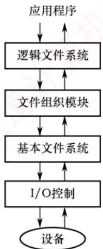

　　包含设备驱动程序和中断处理程序，负责在内存与磁盘之间传输数据。设备驱动程序将高层命令转换为底层硬件可识别的特定指令，由硬件控制器执行，实现 I/O 设备与系统的交互，并向 I/O 控制器指明对设备的具体位置执行何种操作。

##### （2）基本文件系统

　　负责向设备驱动程序发送通用命令，以读取或写入磁盘的物理块；每个物理块由唯一的磁盘地址标识。该层还管理内存缓冲区，缓存文件系统元数据、目录项及数据块；在执行磁盘传输前，需要分配并维护合适的缓冲区——有效的缓冲区管理对系统性能至关重要。

##### （3）文件组织模块

　　负责建立文件逻辑块与物理块之间的映射关系，将逻辑块地址转换为物理块地址。文件的逻辑块按顺序编号（从0到N），通常与物理块布局不一致，因此需通过地址转换机制进行定位。该模块还包含空闲空间管理器，用于跟踪未分配的磁盘块，并按需分配给文件使用。

##### （4）逻辑文件系统

　　负责管理文件系统的元数据（描述文件系统结构的信息，如文件名、目录项、权限和时间戳等），不含实际数据内容。它维护目录结构，并根据给定文件名，向文件组织模块提供所需的元数据；同时通过文件控制块记录各文件的属性与状态，并负责实现文件保护机制。

### 4.1.3 文件的逻辑结构

　　文件的逻辑结构是指从用户视角所看到的文件组织形式；而文件的物理结构（也称存储结构）则是指文件在外存上的实际存储方式，对用户透明。逻辑结构与底层存储介质无关，其核心在于描述文件内部数据在逻辑上是如何组织的。

　　根据逻辑结构的不同，文件可分为两大类：无结构文件和有结构文件。

#### 1. 无结构文件

　　无结构文件是最简单的组织形式，由连续的字符流构成，因此也称流式文件，其长度以字节为单位。对这类文件的访问通过读/写指针来定位下一个要操作的字节。系统中大量的源程序、可执行文件和库函数均采用这种形式。由于缺乏显式的记录边界，若需检索特定内容，只能进行顺序查找，效率较低，因而不适用于需要频繁随机访问或按记录检索的应用场景。

#### 2. 有结构文件

　　有结构文件由一个或多个记录组成，故也称记录式文件。每条记录由若干数据项组成，其数量和长度可能固定，也可能可变。根据记录长度是否一致，有结构文件进一步分为两类。

1）定长记录。所有记录的长度相同，且各数据项在记录中的位置固定。系统可通过偏移量直接定位任意记录，从而支持高效的随机访问。

2）变长记录。各记录的长度不一，或因所含数据项数量不同，或因某些数据项长度可变。由于无法直接计算记录位置，检索时通常只能顺序查找，速度较慢。

　　有结构文件按记录的组织形式可分为顺序文件、索引文件、索引顺序文件。

##### （1）顺序文件

　　顺序文件中的记录按线性顺序依次排列，可采用定长或变长记录。根据记录是否按键字排序，可分为两种结构：①串结构，记录按存入时间先后排列，不按键字排序。检索时必须从头开始顺序扫描，效率较低。②顺序结构，所有记录按键字有序排列。对于定长且按键字有序的顺序文件，可通过偏移量直接定位记录，并支持折半查找等高效算法，检索效率高。

　　正因记录连续存储、访问局部性强，顺序文件在批量处理场景下表现最优——当需要连续读取或写入大量记录时，其 I/O 效率在所有逻辑文件类型中最高。此外，对于顺序存储设备（如磁带），顺序文件是唯一能够有效工作的组织形式。然而，在频繁进行单条记录的查找、修改、插入或删除操作时，由于缺乏直接定位能力且需移动大量数据，顺序文件的性能明显不足。

##### （2）索引文件

　　对于定长记录的顺序文件，可直接通过公式计算第 i 条记录的物理地址： $A_{i}=iL$ （L 为记录长度）。对于变长记录的顺序文件，由于各记录长度不一，无法直接定位目标记录，必须从头开始依次读取前 i-1 条记录，累加其长度以确定第 i 条记录的起始位置，即

$$
A _ {i} = \sum_ {i = 0} ^ {i - 1} L _ {i} + 1
$$

　　该过程需顺序扫描，效率较低。为提高检索效率，可建立一张索引表，为每个记录设置一个索引项，包含指向该记录的指针及其长度，并按关键字排序。由于索引表由定长记录构成，支持高效的随机访问。如图 4.2 所示，系统可通过索引表直接定位任意记录，从而将对变长记录顺序文件的顺序查找，转变为对定长索引文件的随机查找，显著提升检索速度。

  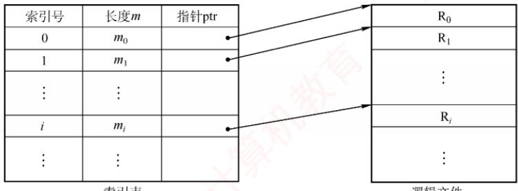

<em>图 4.2 索引文件示意图</em>

　　索引文件需额外维护一张索引表，且每个记录对应一个索引项，因此增加了存储开销。

##### （3）索引顺序文件

　　索引顺序文件是顺序文件与索引文件的结合。其最简单的形式采用一级索引：先将变长记录的顺序文件划分为若干组，再为每组的首条记录建立一个索引项，包含该记录的关键字及其指针，所有索引项共同构成一张按关键字有序排列的索引表。

<em>图 4.3 所示为索引顺序文件示意图。主文件包含姓名（作为关键字）及其他数据项，记录按姓名首字母分组——组内可无序，但组间必须按键字有序。每组首条记录的姓名及其逻辑地址被存入索引表，该表按姓名递增排序。检索时，首先在索引表中定位目标记录所属的组，继而在该组内进行顺序查找，从而快速找到目标记录。</em>

  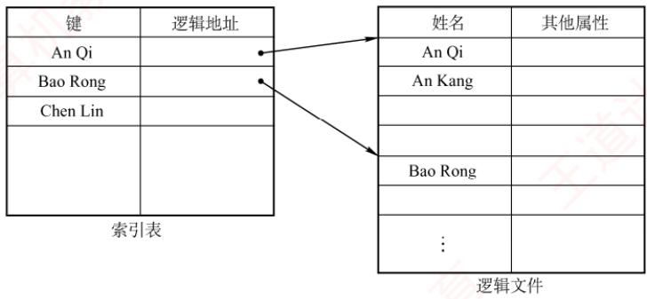

<em>图 4.3 索引顺序文件示意图</em>

　　对于含 N 条记录的普通顺序文件，平均需查找 N/2 次。而在索引顺序文件中，若将记录均分为 m 组，则每组约含 s = N/m 条记录。查找过程分为两步：① 在索引表中顺序查找，平均需 m/2 次；② 在对应组内顺序查找，平均需 s/2 次。因此，总平均查找次数为

$$
m / 2 + s / 2 = m / 2 + (N / m) / 2
$$

　　当 $m=\sqrt{N}$ 时，该值最小，查找效率达到最优。

　　显然，索引顺序文件显著提升检索效率；当记录数量极大时，还可引入两级或多级索引，进一步降低查找开销——这正是分块查找（也称索引顺序查找）的基本思想。然而，索引文件与索引顺序文件在大幅提升查找速度的同时，也因维护索引表而带来额外存储开销。

##### （4）直接文件（散列文件）

　　在直接文件（也称散列文件）中，记录的物理地址由其关键字经散列函数计算直接确定。这种方式支持极快的随机存取，但不同关键字可能映射到同一地址，从而引发冲突。

　　熟悉数据结构的读者不难发现：有结构文件的各类逻辑组织方式（包括顺序、索引、索引顺序和散列），本质上都是围绕“如何高效查找数据”这一核心目标而设计的。

### 4.1.4 本节小结

　　本节开头提出的问题的参考答案如下。

#### 1. 什么是文件？

　　文件是操作系统中用于存储和组织数据的基本单位，是一组逻辑上相关的信息（如程序、文本、图像等）的有序集合，通常以一个名字标识，并保存在持久性存储设备（如硬盘）上。

#### 2. 文件系统在操作系统中的地位如何？

　　文件系统是操作系统的核心子系统之一，负责对存储设备上的文件和目录进行统一管理，提供创建、读取、写入、删除、组织及保护等基本操作。它向上为应用程序和用户提供简洁、一致的抽象接口，屏蔽底层存储细节；向下则与设备驱动协同，高效调度物理存储资源。作为连接用户逻辑视图与物理存储之间的关键桥梁，文件系统在操作系统中扮演着承上启下的核心角色。

### 4.1.5 本节习题精选

#### 单项选择题

01. UNIX 操作系统中，输入/输出设备视为（）。

- A. 普通文件
- B. 目录文件
- C. 索引文件
- D. 特殊文件

02. 下列说法中，（）属于文件的逻辑结构的范畴。
- A. 连续文件    B. 系统文件    C. 链接文件    D. 流式文件

03. 文件的逻辑结构是为了方便（）而设计的。
- A. 存储介质特性
- B. 操作系统的管理方式
- C. 主存容量
- D. 用户

04. 下列关于逻辑结构为索引文件的索引表的叙述中，（）是正确的。
- A. 索引表中每条记录的索引项可以有多个
- B. 对索引文件存取时，必须先查找索引表
- C. 索引表中含有索引文件的数据及其物理地址
- D. 建立索引的目的之一是减少存储空间

05. 有一个顺序文件含有 10000 条记录，平均查找的记录数为 5000 个，采用索引顺序文件结构，则最好情况下平均只需约查找（）次记录。
- A. 1000 B. 10000 C. 100 D. 500

### 4.1.6 答案与解析

#### 单项选择题

**01. D**

　　UNIX 操作系统中，所有设备都被视为特殊的文件，因为 UNIX 操作系统控制和访问外部设备的方式和访问一个文件的方式是相同的。

**02. D**

　　逻辑文件有两种：无结构文件（流式文件）和有结构式文件。连续文件和链接文件都属于文件的物理结构，而系统文件是按文件用途分类的。

**03. D**

　　文件结构包括逻辑结构和物理结构。逻辑结构是用户组织数据的结构形式，数据组织形式来自需求，而物理结构是操作系统组织物理存储块的结构形式。

　　因此说，逻辑文件的组织形式取决于用户，物理结构的选择取决于文件系统设计者针对硬件结构（如磁带介质很难实现链接结构和索引结构）所采取的策略（选项 A 和 B）。

**04. B**

　　索引文件由逻辑文件和索引表组成，对索引文件存取时，必须先查找索引表。索引项只包含每条记录的长度和在逻辑文件中的起始位置。每条记录都有一个索引项，因此提高了存储代价。

**05. C**

　　采用索引顺序文件时，最好情况是有 $\sqrt{10000}=100$ 组，每组有 100 条记录，则查找 100 组平均需要 100/2=50 次，组内查找平均需要 100/2=50 次，共需要 $50+50=100$ 次。注意，严格来说，索引表查找和组内查找的准确平均次数都是 $(1 + 100) / 2 = 50.5$ ，不过在操作系统教材中，往往直接忽略前面的1，因此本类题中也不会同时出现100和101两个选项。

## 4.2 目录与文件

　　在学习本节时，请读者思考以下问题：

1）目录管理的基本要求是什么？

2）在目录中查找某个文件可采用哪些方法？

3）单个文件的逻辑结构与物理结构之间是否存在制约关系？

　　本节从文件控制块与索引节点的原理出发，逐步深入目录结构设计，文件的物理分配方式、基本操作以及共享与保护机制。这部分知识点密集、逻辑环环相扣。需特别提醒：历年考试表明，多数读者对进程与内存管理掌握较好，但对文件及 I/O 管理往往基础薄弱，甚至在基本问题上失分，实属可惜。究其原因，仍是对概念的理解不够全面和透彻，望读者高度重视。

### 4.2.1 目录的基本概念

　　现代计算机系统需存储大量文件，必须通过文件目录对文件进行有效组织。文件目录是一种数据结构，用于记录每个文件的属性、存储位置等元数据，以便在检索时快速定位其在外存中的物理地址。目录管理需要满足以下要求：① 实现按名存取，用户仅需提供文件名，系统即可自动定位该文件在外存中的位置；② 提高检索速度，通过合理组织目录结构，加快查找过程，从而提升文件存取效率；③ 支持文件共享，在多用户系统中，允许多个用户共享同一文件；④ 允许文件重名，不同用户可对各自所属的文件使用相同名称，以契合其命名习惯。

### 4.2.2 文件控制块和索引节点

　　为便于文件管理，引入了文件控制块（File Control Block，FCB）这一重要数据结构。

#### 1. 文件控制块

> **考点追踪：** 文件属性信息的存储位置（2009）

　　文件控制块（FCB）是用于存放控制文件所需各种信息的数据结构，以实现按名存取。每个文件对应一个 FCB，所有 FCB 的集合构成文件目录（也称目录文件）。每当创建新文件，系统即为其建立一个 FCB，用以记录其属性信息。图 4.4 展示了一个典型的 FCB 结构。

　　FCB 主要包含以下几类信息:

- 基本信息，如文件名、物理位置、逻辑结构、物理结构等。

　　<table><tr><td>文件名</td></tr><tr><td>类型</td></tr><tr><td>文件权限(读,写)</td></tr><tr><td>文件大小</td></tr><tr><td>文件数据块指针</td></tr></table>

<em>图 4.4 一个典型的FCB</em>

- 存取控制信息，包括文件主、核准用户和一般用户的访问权限。

- 使用信息，如文件创建时间、最后修改时间等。

#### 2. 索引节点

> **考点追踪：** 目录项结构的相关分析与计算（2020、2022）

　　然而，当文件数量庞大时，传统 FCB 目录会占用大量磁盘空间。在查找过程中，系统需逐块读入目录项，并逐一比对文件名；而仅当匹配成功时才需要获取该文件的物理地址。这意味着，在检索阶段，除文件名外的其他描述信息并无必要调入内存。为此，UNIX 等系统采用文件名与描述信息分离的设计策略：将文件的描述信息独立组织为索引节点（inode），简称 i 节点；而目录项则仅由文件名及其对应的索引节点号（或索引节点指针）构成，如图 4.5 所示。

　　<table><tr><td>文件名</td><td>索引节点编号</td></tr><tr><td>文件名1</td><td></td></tr><tr><td>文件名2</td><td></td></tr><tr><td><eq>\vdots</eq></td><td></td></tr><tr><td><eq>\vdots</eq></td><td></td></tr></table>

<em>图 4.5 UNIX 的文件目录结构</em>

> **考点追踪：** 索引节点与文件容量的关系（2018、2020）

　　例如，假设一个 FCB 占 64B，盘块大小为 1KB，则每个盘块可容纳 16 个 FCB（FCB 必须连续存放）；若目录共含 640 个 FCB，则平均需启动磁盘 20 次才能完成一次文件查找。而在 UNIX 系统中，每个目录项仅占 16B（14B 文件名 +2B 索引节点号），每块可容纳 64 个目录项，从而将平均磁盘启动次数降至原来的 1/4，显著降低系统开销。

　　为兼顾持久存储与高效访问，文件系统将索引节点设计为两种形态：

##### （1）磁盘索引节点

　　存储于磁盘上，作为文件的“永久档案”，每个文件有唯一磁盘索引节点，主要包含：

- 文件主标识符，标识文件所属的用户或用户组。

- 文件类型，指明是普通文件、目录文件还是特殊文件。

- 文件存取权限，规定文件主、核准用户及一般用户的访问权限。

- 文件物理地址，通过13个地址项以直接或间接方式记录数据所在盘块编号。

- 文件长度，以字节为单位表示文件的实际大小。

- 文件链接计数，统计本文件系统中指向该文件的目录项（硬链接）数量。

- 文件存取时间，记录文件最近被访问、修改的时间，以及索引节点最近被修改的时间。

##### （2）内存索引节点

　　当文件被打开时，系统将对应的磁盘索引节点载入内存，并附加运行时状态信息，以支持高效的并发访问与快速操作。因此，在磁盘索引节点的基础上，额外新增了以下内容：

- 索引节点号，用于在内存中唯一标识该节点。

- 状态，指示i节点是否被上锁或已修改，便于缓存一致性管理。

- 访问计数，进程每访问一次，计数加1；访问结束减1，用于判断节点是否可释放。

- 逻辑设备号，标识文件所属文件系统的逻辑设备号，在多文件系统环境中尤为关键。

- 链接指针，分别指向空闲链表与散列队列，便于内核高效调度和回收。

### 4.2.3 目录结构

#### 1. 单级目录结构

　　整个文件系统仅维护一张全局目录表，每个文件对应一个目录项，如图 4.6 所示。

  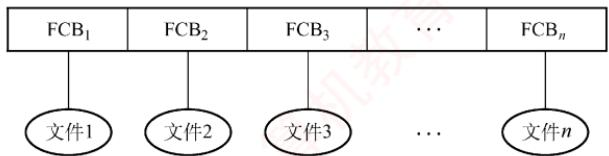

<em>图 4.6 单级目录结构</em>

　　创建新文件时，系统首先遍历整张目录表，确保无同名文件存在；确认无冲突后，方可新增一个 FCB，并填入该文件的属性信息。访问文件时，系统根据文件名查找对应的 FCB，经合法性检查后执行相应操作。删除文件时，则先定位其 FCB，回收其所占存储空间，再清除该 FCB。

　　尽管单级目录结构实现了按名存取，但其存在查找效率低、不允许文件重名、难以支持文件共享等缺点，且完全无法满足多用户环境的需求，因此仅适用于早期单用户的简单文件系统。

#### 2. 两级目录结构

　　为克服单级目录存在的缺陷，系统可采用两级方案，将文件目录划分为主文件目录（Master File Directory，MFD）和用户文件目录（User File Directory，UFD），如图 4.7 所示。

  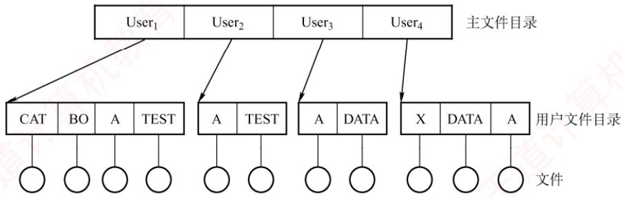

<em>图 4.7 两级目录结构</em>

　　MFD 中的每个目录项记录一个用户名及其对应的 UFD 存储位置；每个 UFD 则包含该用户所有文件的 FCB。当用户访问其文件时，系统仅需在其专属 UFD 中进行查找。这一机制不仅有效解决了不同用户间文件重名的问题，还通过隔离用户命名空间增强了安全性。

　　两级目录结构提升了检索效率，并支持基于目录的访问控制。然而，由于每个用户仅拥有一个扁平的 UFD，无法对文件进行分类管理，因此在组织复杂文件集合时显得灵活性不足。

#### 3. 树形目录结构

> **考点追踪：** 设置当前工作目录的作用（2010）

　　将两级目录结构加以推广，便形成了树形目录结构，如图 4.8 所示。

  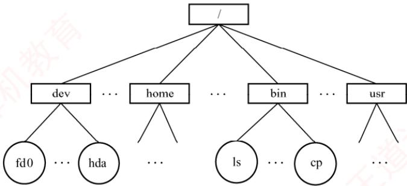

<em>图 4.8 树形目录结构</em>

　　树形目录结构显著提升了目录检索效率与文件系统的整体性能。在该结构中，用户通过文件路径名来标识文件。路径名是一个字符串，由从根目录出发到目标文件路径上所有目录名和文件名，用分隔符“/”连接而成。若路径从根目录开始，则称为绝对路径；系统中每个文件都具有唯一的绝对路径。例如，在Linux系统中，“/dev/hda”就是一个典型的绝对路径。然而，当目录层次较深时，每次从根目录逐级查找会耗费大量时间。为此，系统为每个进程设置一个当前目录（也称工作目录），进程对文件的访问通常以当前目录为基准。此时，用户可使用相对路径进行定位：它由从当前目录出发至目标文件路径上的目录名与文件名，用“/”连接构成。例如，若当前目录为 “/bin”，则 “./ls” 即为相对路径，其中符号 “.” 表示当前工作目录。

　　通常，每个用户都拥有专属的“当前目录”，登录后系统自动将其切换至该默认目录。操作系统提供专门的系统调用，允许用户随时更改当前目录。例如，Linux系统的/etc/passwd文件记录了各用户登录时的默认当前目录，而cd命令通过调用该接口动态更新当前目录。

　　树形目录结构支持灵活的文件分类，层次清晰，便于管理与保护。不同性质或归属的文件可分布于目录树的不同分支或子树中，并能针对各节点设置独立的存取权限，实现精细化控制。然而，该结构也存在局限：查找一个文件需按路径名逐级访问中间目录节点，导致磁盘 I/O 次数增加，可能影响查询速度。尽管如此，凭借其良好的组织性、扩展性以及对多用户环境的支持，目前绝大多数现代操作系统（如 UNIX、Linux 和 Windows）都采用了树形目录结构。

#### 4. 无环图目录结构

　　树形目录结构便于实现文件分类，但难以支持文件共享。为此，在其基础上引入指向同一节点的有向边，使整个目录结构演变为一个有向无环图，如图 4.9 所示。该结构允许目录共享子目录或文件，同一个文件或子目录可出现在两个或多个目录中，从而实现跨目录的共享。

　　然而，共享也带来了删除操作的复杂性：当某用户请求删除一个共享节点时，若系统直接将其物理删除，其他共享用户后续访问将因节点缺失而失败。为此，系统为每个共享节点维护一个共享计数器——新增共享链时计数器加1，收到删除请求时减1。仅当计数器归零，才真正删除该节点，否则仅断开请求用户的共享链，保留节点供他人

  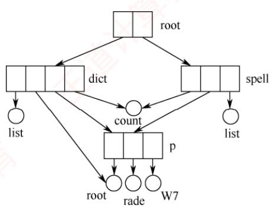

<em>图 4.9 无环图目录结构</em>

　　继续使用。无环图目录结构虽有效支持灵活的文件共享，但也因此增加了管理开销，需额外维护引用计数等共享状态。

### 4.2.4 目录的操作

　　在理解文件系统的设计需求之前，需要先明确目录层面所支持的基本操作。这些操作构成了用户与文件系统交互的核心接口，也为后续把握文件系统的整体架构奠定基础。

- 搜索。访问文件时，需要在相应目录中查找对应的目录项。为提升效率，系统通常支持从根目录或当前工作目录出发，并允许使用精确匹配或部分文件名进行检索。

- 创建文件。系统首先检查当前目录中是否存在同名文件；仅当确认无重名后，才新增目录项，并初始化其属性（如文件类型、权限和时间戳等）。

- 删除文件。系统移除该文件在所属目录中的目录项，并回收其所占用的数据块及元数据。

- 创建目录。在树形目录结构中，用户可创建子目录（用户文件目录，UFD），用于组织个人文件与嵌套子目录，实现灵活的层次化管理。

- 删除目录。若目录为空（不含任何文件或子目录），则可直接删除；若非空，则通常采用两种策略：① 要求用户先手动清空目录内容（对子目录需要递归删除），待其成为空目录后再删除；② 允许直接删除非空目录，系统自动递归删除其中所有文件与子目录。

- 移动目录。将指定的文件或子目录从原父目录迁移到新的父目录下。移动完成后，原有目录项被转移，文件的完整路径名随之自动更新，而文件内容保持不变。

- 显示目录。列出指定目录的内容，包括所有文件与子目录的名称，通常还显示文件大小、最后修改时间等基本属性；当文件属性发生变化时，其目录项也会同步更新。

- 改变目录。用户可通过此操作切换当前工作目录，可指定绝对路径或相对路径；若未显式指定目标目录，系统通常默认返回用户的主目录，从而简化后续路径输入。

### 4.2.5 目录实现

　　访问文件时，操作系统根据路径名定位相应的目录项，而目录项中包含用于查找文件磁盘块所需的关键信息。目录实现的核心目标是高效支持查找操作，因此主要有两种基本方法：

#### 1. 线性列表

　　最简单的目录实现方式是采用由文件名及其数据块指针组成的线性列表。创建新文件时，需要先遍历目录以确保无同名文件，然后新增目录项；删除文件时，则根据文件名查找并释放其占用的空间。为重用被删除的目录项，常见策略包括：标记为未使用、加入空闲链表，或将末尾项移至空位并缩短目录长度。若以链表组织目录项，还可进一步降低删除操作的时间开销。

　　线性列表的优点是实现简单，但缺点是查找效率低——目录规模越大，扫描开销越高。

#### 2. 哈希表

　　另一种方法是采用哈希表：系统根据文件名计算其哈希值，并以此索引到哈希表中的某个元素，该元素通常存放一个指向实际目录项的指针。哈希表的优势在于查找、插入和删除操作均具有很高的性能，但需要妥善处理哈希冲突，即不同文件名映射到同一表元素的情况。

　　由于目录查询依赖磁盘 I/O，频繁访问会带来较大开销。为此，系统通常将当前活跃的目录缓存到内存中。后续访问可直接在内存进行，从而大幅减少磁盘操作，提升系统响应速度。

### 4.2.6 文件的物理结构

　　前文指出，文件本质上是一种抽象数据类型，其研究涵盖逻辑结构、物理结构及相关操作。文件的物理结构关注的是文件数据如何在磁盘上分布与组织。这一问题可从两个互补的视角加以理解：① 文件分配方式，解决如何为文件分配已使用的磁盘块，属于对非空闲块的管理；② 文件存储空间管理，解决如何跟踪和分配空闲磁盘块，属于对空闲块的管理（见4.3节）。

> **考点追踪：** 不同物理结构的特点和比较（2009、2011、2013、2020）

　　文件分配方式直接决定文件的物理结构，常用策略有三种：连续分配、链接分配和索引分配。需要特别注意将其与文件的逻辑结构区分开来。可类比数据结构中“线性表”（逻辑结构）与“顺序表/链表”（物理实现）的关系：逻辑结构描述“是什么”，物理结构则说明“如何存”。

　　此外，如同内存被划分为固定大小的页，磁盘也被划分为若干磁盘块，其大小通常与内存页面一致。所有磁盘 I/O 操作均以块为单位，在内存与磁盘之间进行数据交换。

#### 1. 连续分配

> **考点追踪：** 连续分配的应用和分析（2011、2012、2014）

　　连续分配方法要求每个文件在磁盘上占有一组连续的块（见图4.10）。由于磁盘地址本身具有线性顺序，这种布局使得进程访问文件时所需的寻道次数和寻道时间最小。

　　采用连续分配时，逻辑文件中的记录依次存放在相邻的物理块中。文件的目录项需要记录该文件起始块的块号及其所占用的总块数。若文件长度为 n 块，且从块 b 开始存放，则该文件占据的块为 $b, b+1, b+2, \cdots, b+n-1$ ；要访问第 i 块，可直接计算并访问块 $b+i-1$ 。

　　连续分配的优点：① 支持顺序访问和直接访问。② 顺序访问高效且速度快，因为文件所占的块通常位于一条或少数几条相邻磁道上，磁头移动距离最小。缺点：① 必须为文件分配连续的存储空间，与内存连续分配类似，易产生大量外部碎片。② 需要预先知道文件长度，难以支持文件的动态增长——若强行扩展，可能覆盖物理上相邻的其他文件。③ 为维持文件的逻辑顺序，在删除或插入记录时，往往需要对后续记录进行物理移动，开销较大。

  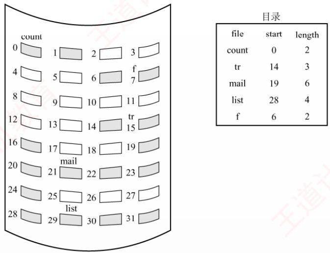

<em>图 4.10 连续分配</em>

#### 2. 链接分配

　　链接分配是一种采用离散方式分配磁盘块的策略。其主要优点包括：① 消除了外部碎片，显著提高磁盘空间的利用率。② 支持动态分配盘块，无须事先预知文件大小。③ 文件的插入、删除和修改操作十分便捷。根据指针存储方式的不同，链接分配可分为隐式链接和显式链接。

##### （1）隐式链接

> **考点追踪：** 链接分配的应用和分析（2014）

　　隐式链接方式如图 4.11 所示。目录项中包含指向文件第一块和最后一块的指针（盘块号）。每个文件对应一个由磁盘块构成的链表，这些块可分散存储于磁盘的任意位置。除最后一块外，每个盘块均存有指向下一个盘块的指针，这些指针对用户完全透明。

  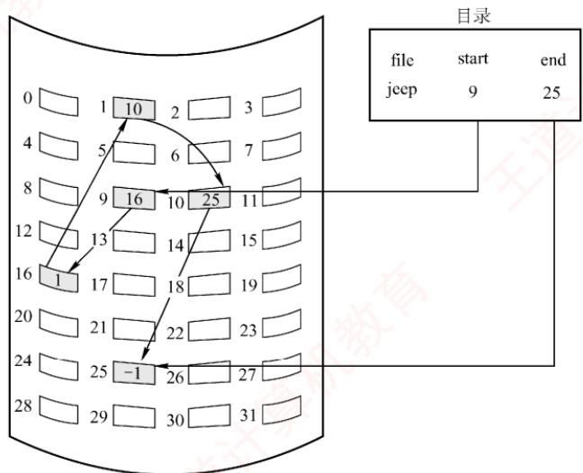

<em>图 4.11 隐式链接方式</em>

　　隐式链接的缺点：① 仅支持顺序访问，若要访问文件的第 $i$ 块，必须从首块开始，依次跟随指针遍历至第 $i$ 块，随机访问效率极低。② 可靠性较差，一旦链中任一指针损坏，整个链将断开，导致后续数据无法访问。③ 每个盘块需要存储指向下一块的指针，占用一定的存储空间。

> **考点追踪：** 文件空间分配与簇的关系（2017、2018）

　　为缓解上述问题，可引入簇（cluster）的概念：将若干连续的盘块组合成一个簇（基本分配单位），文件的分配与链接均以簇为单位进行。如此，指针数量大幅减少，不仅降低存储开销，也显著缩短链式查找时间，从而提升整体 I/O 性能。但这一优化的代价是可能产生内部碎片——当文件大小不是簇大小的整数倍时，最后一个簇的剩余空间无法被其他文件利用。

##### （2）显式链接

　　显式链接将用于链接文件各物理块的指针集中存放在内存中的一张全局表中，该表在整个文件系统中仅设一张，称为文件分配表（File Allocation Table，FAT）。FAT 的每个表项对应一个磁盘块，并存放指向下一个盘块的指针。因此，文件目录项只需记录该文件的起始块号，后续所有块号均可通过依次查询 FAT 获得。例如，某磁盘共有 100 个盘块，其中存放了两个文件：文件 “aaa” 占用三个块，链接顺序为 $2 \rightarrow 8 \rightarrow 5$ ；文件 “bbb” 占用两个块，链接顺序为 $7 \rightarrow 1$ 。其余盘块均为空闲块。该磁盘的文件分配表（FAT）如图 4.12 所示。

  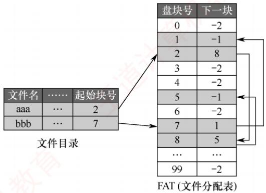

<em>图 4.12 磁盘的文件分配表</em>

> **考点追踪：** FAT 表的作用（2019、2025）

　　不难看出，FAT 的表项与所有磁盘块一一对应。通常，可用特殊值 -1 标记文件的最后一块，用 -2 表示该盘块空闲（也可指定为 -3、-4 等）。因此，FAT 不仅记录了文件的链式结构，还标识了空闲盘块，系统可直接利用 FAT 管理磁盘的空闲空间。当某进程请求分配一个磁盘块时，系统只需在 FAT 中查找值为 -2 的表项，并将对应的磁盘块分配给该进程即可。

　　显式链接的优点：① 支持顺序访问，也支持直接访问，要访问第 i 块，无须依次遍历前 i-1 块；② FAT 在系统启动时即被载入内存，后续检索操作均在内存中完成，不仅显著提升查找速度，也大幅减少磁盘 I/O 次数。缺点：FAT 需要常驻内存，磁盘容量越大，内存开销越显著。

#### 3. 索引分配

##### （1）单级索引分配方式

> **考点追踪：** 索引分配的应用和分析（2012）

　　事实上，在打开某个文件时，只需将该文件所占用的盘块编号调入内存即可，无须加载整个FAT。为此，可将每个文件的所有盘块号集中存放于一处；当访问该文件时，只需将其对应的盘块号集合一次性载入内存，这正是索引分配的思想。具体而言，系统为每个文件分配一个专用的索引块（或称索引表），并将分配给该文件的所有盘块号记录其中，如图4.13所示。

　　例如，若盘块大小为 4KB，每个盘块号占 4B，则一个索引块可容纳 $4KB/4B = 1024$ 个盘块号。采用单级索引时，可支持的最大文件为 $1024 \times 4KB = 4MB$ 。

　　索引分配的优点：① 支持高效的直接访问，要访问文件的第 i 块，只需读取索引块中第 i 项，即可直接获得对应的盘块号；② 不会产生外部碎片，因为文件的盘块可离散分配。缺点：引入了额外的存储开销，每个文件必须配备一个索引块。当文件较小时，如仅占用几个盘块，仍需要为其分配一个完整的索引块，导致索引块的利用率极低；当文件较大时，若所需盘块号超出单个索引块容量，虽可借助链式指针将多个索引块链接起来，但这种方法效率低下。

  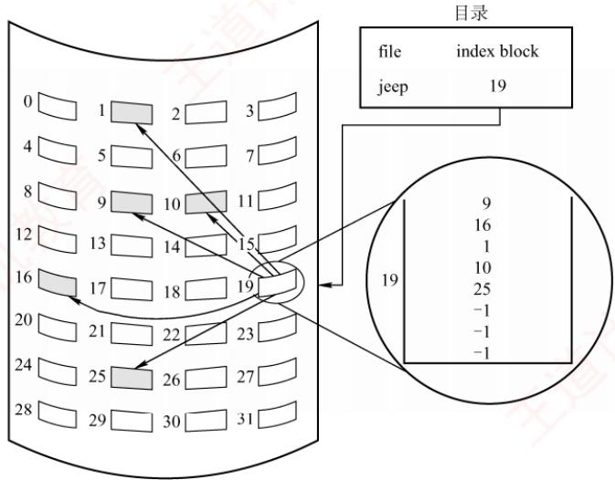

<em>图 4.13 索引分配</em>

##### （2）多级索引分配方式

　　显然，当文件过大而索引块较多时，可为这些索引块再建立一级索引，称为主索引。主索引表中依次存放各二级索引块的盘块号，从而形成二级索引分配方式。其设计思想与内存管理中的多级页表高度相似（见图4.14）。访问数据时，系统首先通过主索引定位对应的二级索引块，再通过该二级索引块找到目标数据块。若文件非常大，还可进一步扩展为三级、四级的索引分配结构。

  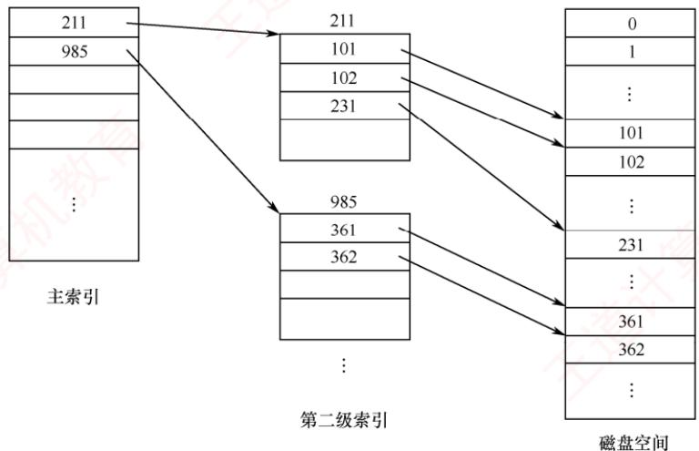

<em>图 4.14 二级索引分配</em>

　　例如，假设盘块大小为 4KB，每个盘块号占 4B，则一个索引块可容纳 1024 个盘块号。采用两级索引时，可支持的最大文件为 $1024 \times 1024 \times 4KB = 4GB$ 。

　　多级索引的优点：显著提升大型文件的可扩展性与查找效率。缺点：当访问一个盘块时，所需的磁盘 I/O 次数随索引级数增加而增多。若文件系统仅采用多级索引作为组织方式，则即使对于大量小文件，访问单个盘块仍需要多次磁盘 I/O，导致整体 I/O 性能难以达到理想水平。

##### （3）混合索引分配方式

> **考点追踪：** 混合索引分配的原理（2013）

　　为兼顾小、中、大乃至特大型文件的访问效率，需要根据文件大小动态选用最合适的分配策略，在空间开销与访问性能之间取得最佳平衡，因此通常采用混合索引分配方式。对于小文件，为提升大量小文件的访问速度，可将其全部盘块地址直接存放在 inode（或 FCB）中，系统直接从中获取所有盘块地址，无须额外读取索引结构，即直接寻址。对于中型文件，采用单级索引分配，inode 中存放一个索引块的地址，系统需要先读取该索引块，再从中获取文件的盘块地址，即一次间址。对于大型或特大型文件，则分别采用两级和三级索引分配。UNIX 系统正是采用这种混合策略。在其索引节点中，共设有 13 个地址项，即 i.addr(0)～i.addr(12)，如图 4.15 所示。

  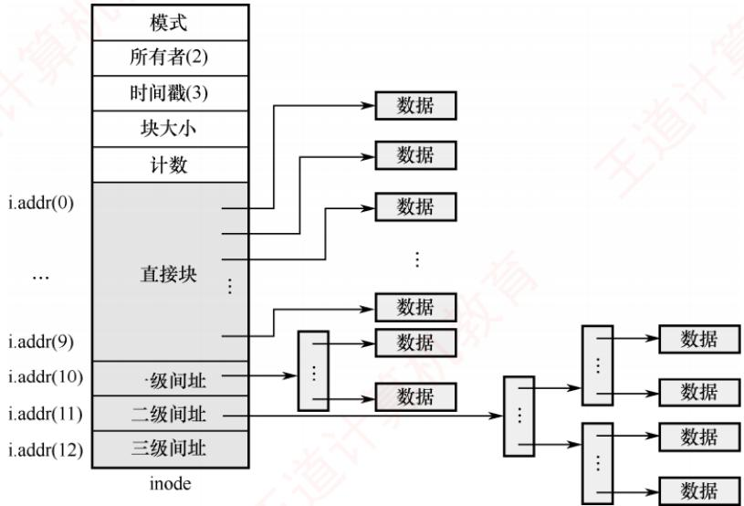

<em>图 4.15 UNIX 系统的 inode 结构示意图</em>

> **考点追踪：** 混合索引分配的相关计算（2010、2015、2018、2022）

1）直接地址。为了提升对小文件的检索速度，索引节点中设置了 10 个直接地址项，记为 i.addr(0)～i.addr(9)，每个项直接存放一个文件数据块的盘块号。假设每个盘块大小为 4KB，当文件不大于 40KB 时，则可直接从索引节点中读取该文件的全部盘块号。

2）一次间接地址。对于中、大型文件，仅靠直接地址显然无法满足需求。为此，索引节点中的地址项 i.addr(10) 被设计为一次间接地址，用于实现一级索引分配。一次间接地址指向一个专门的一次间址块（索引块），其中存放的是文件数据块的盘块号。一个索引块可容纳 1024 个盘块号，通过一次间接地址最多可寻址 $1K \times 4KB = 4MB$ 的数据。因此，同时使用直接地址和一次间址时，最大可表示的文件长度为 $4MB + 40KB$ 。

> **考点追踪：** 多级索引块的访问效率分析（2018、2022）

3）多次间接地址。当文件长度超过 $4\mathrm{MB} + 40\mathrm{KB}$ 时，还需要利用地址项i.addr(11)作为二次间接地址，以实现两级索引分配。二次间接地址指向文件的主索引块，该主索引块中的每一项又指向一个一次间址块，而每个一次间址块再指向1024个数据块。通过二次间接地址最多可寻址 $1\mathrm{K} \times 1\mathrm{K} \times 4\mathrm{KB} = 4\mathrm{GB}$ 的数据。因此，同时使用直接地址、一次间址和二次间址时，最大可表示的文件长度为 $4\mathrm{GB} + 4\mathrm{MB} + 40\mathrm{KB}$ 。同理，同时采用直接地址、一次间址、二次间址和三次间址时，最大可表示的文件长度为 $4\mathrm{TB} + 4\mathrm{GB} + 4\mathrm{MB} + 40\mathrm{KB}$ 。

### 4.2.7 文件的操作

　　文件是一种抽象数据类型。为了正确定义文件，需要明确可对其执行的操作。操作系统提供一系列的系统调用来实现对文件的创建、删除、读/写、打开和关闭等操作。

#### 1. 文件的基本操作

　　最基本的文件操作包括创建文件、删除文件、读文件和写文件等。

##### （1）创建文件

> **考点追踪：** 文件创建的过程（2025）

　　创建文件涉及元数据分配、存储空间预留与目录注册等多个步骤，具体过程如下：① 合法性与权限校验，检查文件名是否合法、是否与同目录下已有的文件重名，并验证用户对目标目录是否具有写权限。若任一条件不满足，则创建立即终止。② 分配索引节点，从空闲 inode（或 FCB）池中分配一个空闲项，初始化其元数据，包括文件类型、初始大小、访问权限、时间戳以及物理块指针等，并标记为已占用。③ 分配磁盘块，根据文件预估大小，从空闲磁盘块管理结构中分配相应数量的物理块，并将块地址记录在 inode 中。④ 在目录中新建目录项，格式为<文件名，索引节点号>，使文件可被检索。⑤ 更新文件系统元数据，包括空闲 inode 表、空闲磁盘块结构、目录大小以及修改时间等。⑥ 打开并返回文件描述符（可选），若创建后立即打开（见下节），则系统将在进程的打开文件表中创建表项，分配文件描述符，并初始化读/写指针。

##### （2）删除文件

> **考点追踪：** 文件删除的过程（2013、2021）

　　删除文件的步骤包括撤销目录可见性、回收元数据、释放存储空间等，具体过程如下：① 路径解析与定位，按路径名逐级查找目录，定位目标文件的目录项，获取其 inode（或 FCB），并验证用户对文件所在目录的写权限。② 检查使用状态与硬链接计数，若文件正被打开，则部分系统将延迟物理删除，待所有引用关闭后再回收资源；若硬链接计数（见 4.2.8 节）大于 1，则仅删除当前目录项并将计数减 1，不回收 inode 与磁盘块；仅当计数为 1 时，才执行完整的删除流程。③ 移除目录中的目录项，使文件在用户视角下“消失”，完成逻辑删除。④ 释放索引节点，当链接计数降至 0 时，将 inode 标记为空闲，并归还至空闲管理结构，其元数据彻底失效。⑤ 释放磁盘块，根据 inode 中的块指针，将所有数据块和索引块归还至空闲磁盘块管理结构。⑥ 释放内存临时资源（可选），包括对应的缓冲区、打开文件表项及内核文件对象等。⑦ 更新文件系统元数据，同步更新目录大小、空闲 inode 表及空闲块结构，确保一致性。

##### （3）读文件

　　读文件时，首先根据文件名在目录中查找对应目录项，获取文件的索引节点号，进而定位其在外存中的数据块。随后，依据当前读指针的位置，从指定块中读取数据，并更新读指针。

##### （4）写文件

　　写文件时，系统同样先通过文件名查找目录项，获取索引节点号以定位外存数据块。然后，根据当前写指针的位置，将数据写入相应块，并更新写指针。若写入超出当前分配空间，系统将动态分配新磁盘块并更新 inode（或 FCB）中的块指针。

#### 2. 文件的打开与关闭

　　当用户对一个文件执行多次读/写操作时，若每次均需要从检索目录开始，将带来显著的性能开销。为避免重复查找，大多数操作系统规定：用户首次访问某文件时，必须先通过系统调用 open 将其打开。系统维护一个称为打开文件表的数据结构，用于记录当前活跃文件的信息。所谓“打开”，是指系统根据文件路径定位到其目录项后，将关键信息载入内存，在打开文件表中创建一个表目，并将该表目的索引号（文件描述符）返回给用户。此后，用户再次操作该文件时，只需提供文件描述符，系统即可直接从内存获取所需信息，显著降低目录检索开销。

　　为提升效率与管理灵活性，现代操作系统采用两级打开文件表结构：

- 系统打开文件表：全局共享，存储与进程无关的文件属性，如磁盘位置、文件大小、访问时间等；每项都包含一个打开计数器（Open Count），记录有多少进程打开了该文件。

- 进程打开文件表：每个进程独有，记录进程私有的访问状态，如当前读/写指针、访问权限及文件打开模式。该表中的每一项均指向系统打开文件表的对应项，实现资源共享与独立控制的统一。图4.16展示了内存中文件的系统结构。

  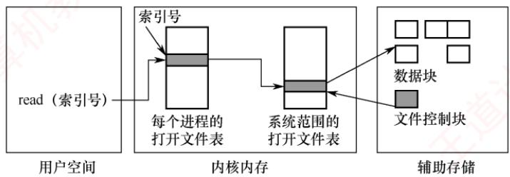

<em>图 4.16 内存中文件的系统结构</em>

　　当一个进程成功打开文件时，系统首先确保其在系统打开文件表中存在对应项（若不存在，则创建），随后在该进程的打开文件表中新增一项，指向该系统表项。此后，其他进程若打开同一文件，仅需要在其各自的进程表中添加新项并指向同一系统表项，无须重复加载文件元数据，既保证了各进程访问上下文的隔离，又实现了底层资源的高效共享。

> **考点追踪：** 文件打开的过程与分析（2014、2017、2020）

　　综上，文件打开的完整过程如下：系统首先根据用户提供的文件路径逐级遍历目录，将所需的目录文件从磁盘加载至内存，定位目标文件的目录项；随后从中提取其索引节点编号，并以此为关键字在系统打开文件表中查找对应项。若未找到，则从磁盘读取该索引节点至内核缓冲区，在系统表中创建新项，并将打开计数初始化为1；若已存在，则仅将该项的打开计数加1。接着，在发起请求的进程所属的进程打开文件表中分配一个新表项，用于记录其指向系统表项的索引；最终，将该表项的索引号作为文件描述符返回给用户进程，供后续读/写等操作使用。

> **考点追踪：** 文件关闭的过程（2023）

　　当文件不再使用时，用户调用 close 关闭它。系统随即从该进程的打开文件表中删除对应项，并将系统打开文件表中相应项的打开计数器减 1。一旦计数器减至 0，表明该文件已无任何进程引用，系统便可安全地删除其在系统表中的项，并释放所占用的相关资源。

> **考点追踪：** 文件名和文件描述符的应用场景（2012、2017、2024）

　　文件名并非打开文件表的组成部分。因为一旦系统通过文件名完成对磁盘上 FCB 的定位，后续操作便不再需要该文件名。用于访问打开文件表的索引号，也称文件描述符（Linux）或文件句柄（Windows）。因此，只要文件处于打开状态，所有文件操作均通过该索引号完成。

> **注意**

　　一旦成功执行 open() 系统调用，后续所有文件操作 [包括 read()、write()、lseek()、close() 等] 均不再使用文件名，而是通过文件描述符进行，这一机制是文件管理的核心考点。

　　每个被打开的文件在系统中均关联以下关键信息:

- 文件指针。系统为每个进程维护一个独立的当前读/写位置指针。由于该指针对不同进程而言是私有的，必须与磁盘上的共享文件属性分离，保存在进程的打开文件表中。

- 文件打开计数。记录当前打开该文件的进程数量。因多个进程可能同时访问同一文件，系统只有在最后一个进程调用 close()后，才会真正释放其在系统打开文件表中的项。

- 文件磁盘位置。大多数文件操作涉及对磁盘数据的修改。为避免每次操作都重新解析路径并读取元数据，系统将文件在磁盘上的位置信息缓存在内存中，供快速访问。

- 访问权限。每个进程在打开文件时需要指定访问模式（如只读、读/写、追加、创建等）。该权限信息保存在进程的打开文件表中，操作系统据此判断是否允许后续的 I/O 请求。

### 4.2.8 文件共享

　　文件共享允许多个用户访问同一文件，系统中仅需保留一个物理副本。若缺乏共享机制，则每个需要该文件的用户都必须持有独立副本，不仅浪费存储空间，还易导致数据不一致。

　　前文介绍的无环图目录结构可用于实现文件共享。建立链接时，需要将被共享文件的盘块号复制到相应目录项中。然而，若某用户向文件追加数据并分配新盘块，这些新增盘块仅出现在其操作所对应的目录中，对其他用户不可见，因此无法实现真正的共享。

#### 1. 基于索引节点的共享方式（硬链接）

> **考点追踪：** 硬链接的原理与相关分析（2009、2017）

　　硬链接是一种基于索引节点的共享机制。在此方式下，文件的物理地址和属性信息不再存放于目录项中，而是集中存储在索引节点内；目录项仅包含文件名及指向该索引节点的指针。

　　如图 4.17 所示，用户 A 和 B 的目录中均设有指向同一共享文件索引节点的指针。该索引节点包含一个链接计数 count，也称引用计数，用于记录当前指向它的目录项数量。例如，当 count = 2 时，表示有两个用户目录项链接到此文件，即两个用户共享该文件。

  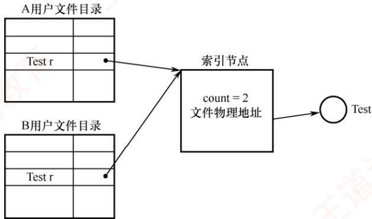

<em>图 4.17 基于索引节点的共享方式</em>

　　当用户 A 创建新文件时，成为该文件的拥有者，系统为其创建索引节点，并将 count 置为 1。当用户 B 需要共享此文件时，系统在 B 的目录中新增一个目录项，并设置指向该索引节点的指针，此时 count 增至 2，但拥有者仍为 A。若 A 不再需要该文件，能否直接删除？答案是否定的。因为删除操作若同时移除索引节点，将导致用户 B 的指针悬空；而 B 可能正在对该文件执行写操作，此时操作将中断失败。因此，A 不能直接删除文件，而应仅删除自己的目录项，并将索引节点的 count 减 1。只要 count > 0，文件及其索引节点仍被保留，B 可继续使用。只有当 count = 0 时，系统才真正释放该文件及其索引节点。图 4.18 展示了不同用户对同一文件的链接情况。

  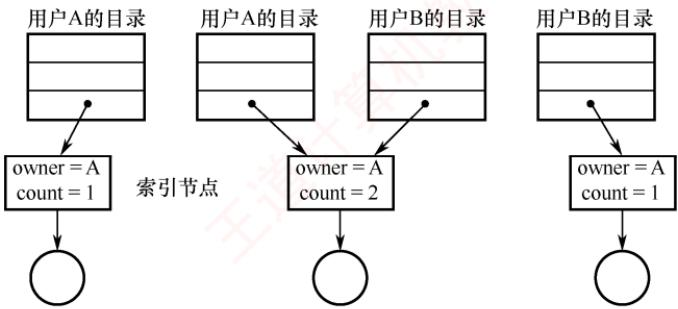

<em>图 4.18 文件共享中的链接计数</em>

#### 2. 利用符号链实现文件共享（软链接）

> **考点追踪：** 软链接的原理与相关分析（2009、2021）

　　为使用户 B 能共享用户 A 的文件 F，系统可创建一个 LINK 类型的新文件 L，并将其写入用户 B 的目录中，从而建立 B 的目录与文件 F 之间的链接。文件 L 仅包含被链接文件 F 的路径名，如图 4.19 所示。这种链接方式称为符号链接，也称软链接，其功能类似于 Windows 系统中的快捷方式。当用户 B 访问文件 L 时，操作系统识别出其为 LINK 类型，便根据其中记录的路径名逐级查找，定位到目标文件 F，并对其执行读/写操作，从而实现对文件 F 的共享。

  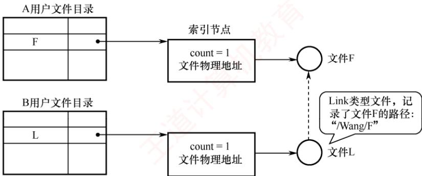

<em>图 4.19 利用符号链的共享方式</em>

　　在基于符号链的共享机制中，只有文件拥有者持有指向其索引节点的指针。其他共享用户仅保存该文件的路径名，而不具备直接指向索引节点的指针。因此，即使拥有者删除了共享文件 F，也不会导致其他用户的指针悬空。当其他用户尝试通过符号链访问已被删除的共享文件时，系统将返回访问失败，此时可安全地删除该符号链接，而不会引发任何问题。

　　在符号链的共享方式中，用户每次访问共享文件时，系统需要根据路径名逐级遍历目录结构，直至定位到目标文件的索引节点。这一过程可能涉及多次磁盘读取，从而增加访问开销。同时，符号链接本身也是一个独立文件，其索引节点同样占用一定的磁盘空间。

　　利用符号链实现网络文件共享时，只需记录文件所在机器的网络地址及文件路径名。

　　可以这样说：文件共享，“软硬”兼施。硬链接是多个目录项指向同一个索引节点，只要至少有一个指针存在，该索引节点就不会被删除；软链接是将到达共享文件的路径保存下来，访问时依据路径进行查找。可见，硬链接的查找速度通常优于软链接，因其直接通过指针访问。

### 4.2.9 文件保护

　　为防止文件共享导致文件被意外破坏或被未授权用户篡改，文件系统必须对用户访问文件的行为实施控制，即明确哪些用户可对文件执行读/写、执行等操作。为此，需要建立有效的文件保护机制。常见的实现方式包括口令保护、加密保护和访问控制：其中，口令与加密主要用于防止他人非法获取或窃取文件内容，而访问控制则用于精细管理用户对文件的具体访问权限。

#### 1. 访问类型

　　文件保护通常通过限制用户可执行的访问类型来实现。主要的受控操作包括：

- 读。从文件中读取数据。

- 写。向文件中写入或修改数据。

- 执行。将文件加载到内存并运行。

- 添加。在文件末尾追加新数据，而不覆盖原有内容。

- 删除。移除文件并释放其所占用的存储空间。

- 列表清单。列出目录中文件的名称及其属性。

　　此外，系统还可对重命名、复制、编辑等高层操作进行控制。然而，这些功能通常由应用程序通过调用系统调用来实现，而真正的保护机制仅在底层提供。例如，复制文件本质上是通过一系列“读”操作完成的；因此，用户只要拥有读权限，便隐含具备了复制和打印的能力。

#### 2. 访问控制

　　实现访问控制最常用的方法是基于用户身份进行权限管理。其中，最普遍的机制是为每个文件和目录附加一个访问控制列表（Access-Control List, ACL），明确指定各用户名及其被允许的访问类型。该方法的优点在于支持灵活而复杂的访问策略，但缺点是列表长度不可预知，可能带来复杂的空间管理开销。为此，现代系统常采用精简的访问控制列表加以缓解。

> **考点追踪：** 文件访问控制表的结构（2017）

　　精简 ACL 通常将用户划分为三类：拥有者、组和其他。

1）拥有者。创建文件的用户。

2）组。一组需要共享该文件且具有相似访问需求的用户。

3）其他。系统中除拥有者和同组用户外的所有用户。

　　表 4.1 是一个精简 ACL 的实例。每种访问类型用一个二进制位表示，因此仅需一个 $3 \times 4$ 位的矩阵，即可完整描述三类用户的访问权限。创建文件时，系统将文件拥有者的用户名及其所属组名记录在该文件的 FCB 中。当用户访问文件时，系统按优先级顺序匹配其身份：若为拥有者，则授予拥有者权限；若与拥有者同属一组，则授予组权限；否则，仅授予其他用户的权限。

　　表 4.1 一个精简的访问控制列表

　　<table><tr><td rowspan="2">用户类型</td><td colspan="4">访问类型</td></tr><tr><td>读取</td><td>写入</td><td>删除</td><td>执行</td></tr><tr><td>拥有者</td><td>1</td><td>1</td><td>1</td><td>1</td></tr><tr><td>组</td><td>1</td><td>0</td><td>0</td><td>0</td></tr><tr><td>其他</td><td>0</td><td>0</td><td>0</td><td>0</td></tr></table>

　　除 ACL 外，口令和密码也是常见的辅助性访问控制手段。

　　口令指用户在创建文件时设定一个口令，系统将其存入 FCB，并告知授权共享的其他用户，访问时需要提供正确口令。该方法时空开销小，但因口令通常以明文或弱保护形式存储于系统内部，安全性较低。密码指用户对文件内容进行加密，访问时需要使用密钥解密。此方法保密性强，且不额外占用元数据空间，但加解密过程会引入一定的计算开销。

　　口令与加密主要用于防止文件被非法获取或窃取，并不区分具体的访问操作类型（如读/写、执行等）。因此，它们无法替代基于权限的访问控制机制，而应视为补充手段。

　　对于多级目录结构而言，保护需求不仅限于单个文件，还需要涵盖子目录及其全部内容。由于目录操作与文件操作存在较大差异，系统还必须提供专门的目录保护机制。

### 4.2.10 本节小结

　　本节开头提出的问题的参考答案如下。

1）目录管理的基本要求是什么？

　　① 实现 “按名存取”，这是目录管理最基本的功能。② 提高目录检索速度，从而加快文件的存取效率。③ 为支持安全共享，目录需要提供访问控制信息，以管理不同用户对文件的使用权限。④ 支持重名，允许不同用户为各自的文件使用相同的名称。

2）在目录中查找某个文件可采用哪些方法？

　　可采用线性列表法或哈希表法。线性列表法将文件名组织成一个线性表，查找时依次与各表项比较；若文件名有序，则可采用折半查找。但插入新文件需要维护有序性，带来额外开销。哈希表法通过哈希函数将文件名映射为指向目录项的指针，查找迅速，但需要妥善处理哈希冲突。

3）单个文件的逻辑结构与物理结构之间是否存在制约关系？

　　文件的逻辑结构是用户可见的组织形式，即从用户视角所见的文件全貌；而物理结构则是文件在存储器上的实际存放方式，与存取方法及存储介质特性密切相关。二者虽无直接制约关系，但若物理结构选择不当，则难以体现逻辑结构的特点。例如，一个逻辑上为顺序结构的文件，若采用隐式链接的物理结构，即使理论上能快速定位某条记录，实际仍需在磁盘上逐块查找。

　　学到这里，读者应能体会到：现代操作系统的设计思想中，处处可见面向对象程序设计的影子。本章所学的“文件”，实质上是一种抽象数据类型，即一种数据结构。若读者在此之前已学完数据结构，则面对新数据结构时，自然会关注其逻辑结构、物理结构及所支持的操作。

### 4.2.11 本节习题精选

#### 一、单项选择题

01. 当文件被打开时，需要将磁盘索引节点拷贝到内存的索引节点，下列属于内存索引节点中有而磁盘索引节点中没有的内容是（）。

- A. 访问计数值
- B. 文件物理地址
- C. 文件长度
- D. 文件类型

02. 目录文件存放的信息是（）。

- A. 某一文件存放的数据信息
- B. 某一文件的文件目录
- C. 该目录中所有数据文件目录
- D. 该目录中所有子目录和数据文件的目录

03. FAT32 的文件目录项不包括（）。

- A. 文件名
- B. 文件访问权限说明
- C. 文件控制块的物理位置
- D. 文件所在的物理位置

04. 有些操作系统中将文件描述信息从目录项中分离出来，这样做的好处是（）。

- A. 减少读文件时的 I/O 信息量
- B. 减少写文件时的 I/O 信息量
- C. 减少查找文件时的 I/O 信息量
- D. 减少复制文件时的 I/O 信息量

05. 下列选项中，（）不是为了提升文件系统性能的操作。
- A. 目录项分解    B. 文件高速缓存    C. 磁盘调度算法    D. 异步 I/O

06. 在访问文件时，需要根据文件名对目录文件进行检索，其检索性能主要由（）决定。
I. 文件大小 II. 目录项数量 III. 目录项的大小 IV. 目录项在目录中的位置
- A. I、II 和 III B. II、III 和 IV

- C. I、III 和 IV
- D. I、II 和 IV

07. 在计算机中，不允许两个文件名重名主要指的是（）。
- A. 不同磁盘的不同目录下 B. 不同磁盘里的同名目录下 C. 同一个磁盘的不同目录下 D. 同一个磁盘的同一目录下

08. 文件系统实现按名存取主要是靠（）实现的。
- A. 查找位示图 B. 查找文件目录 C. 查找作业表 D. 地址转换机构

09. 在一个文件系统中，FCB 占 64B，盘块大小为 1KB，采用一级目录。假定文件目录中有 3200 个目录项，则查找一个文件平均需要（）次访问磁盘。
- A. 50    B. 54    C. 100    D. 200

10. 在一个采用索引节点的文件系统中，目录项分为文件名和索引节点编号两部分，文件名和索引节点编号各占8B，盘块大小为1KB，采用一级目录，假定文件目录中有3200个目录项，则读入一个文件的索引节点平均需要（）次访问磁盘。
- A. 25 B. 26 C. 51 D. 52

11. 下列关于目录检索的论述中，正确的是（）。
- A. 散列法具有较快的检索速度，因此现代操作系统中都用它替代传统的顺序检索方法
- B. 在利用顺序检索法时，对树形目录应采用文件的路径名，且应从根目录开始逐级检索
- C. 在利用顺序检索法时，只要路径名的一个分量名未找到，就应停止查找
- D. 利用顺序检索法查找完成后，即可得到文件的物理地址

12. 一个文件的相对路径名是从（）开始，逐步沿着各级子目录追溯，最后到指定文件的整个通路上所有子目录名组成的一个字符串。
- A. 当前目录    B. 根目录    C. 多级目录    D. 二级目录

13. 文件系统采用多级目录结构的目的是（）。

- A. 减少系统开销
- B. 节省存储空间
- C. 解决命名冲突
- D. 缩短传送时间

14. 若文件系统中有两个文件重名，则不应采用（）。

- A. 单级目录结构
- B. 两级目录结构
- C. 树形目录结构
- D. 多级目录结构

15. 用磁带做文件存储介质时，文件只能组织成（）。

- A. 顺序文件
- B. 链接文件
- C. 索引文件
- D. 目录文件

16. 以下不适合随机存取的外存分配方式是（）。

- A. 连续分配
- B. 链接分配
- C. 索引分配
- D. 以上都适合

17. 在以下文件的物理结构中，不利于文件长度动态增长的是（）。

- A. 连续结构
- B. 链接结构
- C. 索引结构
- D. 散列结构

18. 若文件的物理结构采用连续分配，则 FCB 中有关文件的物理位置的信息应包括（）。
I. 首块地址 II. 文件长度 III. 索引表地址
- A. 仅 I B. I、II C. II、III D. I、III

19. 在磁盘上，最容易导致存储碎片发生的物理文件结构是（）。

- A. 隐式链接
- B. 顺序存放
- C. 索引存放
- D. 显式链接

20. 物理文件的组织方式是由（）确定的。
- A. 应用程序    B. 主存容量    C. 外存容量    D. 操作系统

21. 文件系统为每个文件创建一张（），存放文件数据块的磁盘存放位置。
- A. 打开文件表    B. 位图    C. 索引表    D. 空闲盘块链表

22. 下列有关文件组织管理的描述中，错误的是（）。

- A. 记录是对文件进行存取操作的单位，一个文件中各记录的长度可以不等
- B. 采用链接分配的文件，它的物理块必须连续排列
- C. 创建一个文件时，可以分配连续的区域，也可以分配不连续的物理块
- D. Hash结构文件的优点是能够实现物理块的动态分配和回收

23. 逻辑文件存放到存储介质上时，采用的组织形式与（）有关。
- A. 逻辑文件结构
- B. 存储介质特性
- C. 主存储器管理方式
- D. 设备分配方式

24. 某 500 个盘块的文件的目录项已调入内存（若为索引分配，其索引块也在内存中）。若需要在文件中增加一块，下列分配方式中磁盘 I/O 次数最多的是（）。

- A. 连续分配
- B. 隐式链接分配
- C. 显式链接分配
- D. 索引分配

25. 设有一个记录文件，采用隐式链接分配方式，逻辑记录的固定长度为 100B，在磁盘上存储时采用记录成组分解技术。盘块长度为 512B。若该文件的目录项已经读入内存，则对第 22 个逻辑记录完成修改后，共启动了磁盘（）次。
- A. 3 B. 4 C. 5 D. 6

26. 设某文件为链接文件，它由 5 个逻辑记录组成，每个逻辑记录的大小与磁盘块的大小相等，均为 512B，并依次存放在 50, 121, 75, 80, 63 号磁盘块上。若要存取文件的第 1569 逻辑字节处的信息，则应该访问（）号磁盘块。
- A. 3 B. 80 C. 75 D. 63

27. 某文件共有 8 个记录 L1～L8，采用隐式链接分配，每个记录及链接指针占一个磁盘块，主存中的磁盘缓冲区的大小与磁盘块的大小相等。假设文件目录已读入内存。为了在 L5 和 L6 之间插入一个记录 Lx'（已在内存中），需要进行的磁盘操作有（）。

- A. 4 次读盘和 2 次写盘
- B. 5 次读盘和 1 次写盘
- C. 5 次读盘和 2 次写盘
- D. 4 次读盘和 1 次写盘

28. 某文件系统采用显示链接分配方式组织文件，磁盘块大小为 4KB，一个簇包含两个磁盘块，操作系统以簇为单位进行盘块分配。已知系统支持的最大文件长度为 512MB，若 FAT 的每个表项仅存放簇号，则 FAT 表占用的空间大约是（）。

- A. 64KB
- B. 128KB
- C. 512KB
- D. 1024KB

29. 某文件共有 3 个记录，每个记录占 1 个磁盘块，在 1 次读文件的操作中，为了读出最后 1 个记录，不得不读出其他 2 个记录。由此可知该文件所采用的物理结构是（）。

- A. 连续分配
- B. 索引分配
- C. 链接分配
- D. 连续分配或链接分配

30. 某文件存放在 100 个数据块中，假设管理文件所必需的文件控制块、索引块或索引信息都驻留在内存中。那么若（），则不需要做任何磁盘 I/O 操作。
- A. 采用连续分配，将最后一个数据块搬到文件头部
- B. 采用单级索引分配，将最后一个数据块插入文件头部
- C. 采用隐式链接分配，将最后一个数据块插入文件头部
- D. 采用隐式链接分配，将第一个数据块插入文件尾部

31. 某文件有 100 个盘块（数据块），假设管理文件所必需的文件控制块、所有索引块都已调入内存。若需要在文件的第 45 个盘块后插入数据，则物理结构采用（）时开销最大。
- A. 连续分配 B. 链接分配 C. 一级索引分配 D. 多级索引分配

32. 某文件系统使用类似于 Linux 的 inode 存储结构，文件块和磁盘块的大小都是 4KB，磁盘地址是 32 位，现在一个文件包含 10 个直接指针和 1 个一级间接指针，则这个文件所占用的磁盘块数量最多是（）块（不考虑索引块）。

- A. 128
- B. 512
- C. 1024
- D. 1034

33. 文件系统采用两级索引分配方式。若每个磁盘块的大小为 1KB，每个盘块号占 4B，则该系统中单个文件的最大长度是（）。

- A. 64MB
- B. 128MB
- C. 32MB
- D. 以上都错误

34. 某文件系统的物理结构采用三级索引分配方式，每个磁盘块的大小为 1024B，每个盘块索引号占用 4B，则该文件系统支持的最大文件的尺寸接近（）。

- A. 8GB
- B. 16GB
- C. 32GB
- D. 2TB

35. 下列各种操作系统内核相关的数据结构中，可以不用数组实现的是（）。

- A. 文件分配表
- B. 页表
- C. 调度器的就绪队列
- D. 中断向量表

36. 文件系统在创建一个文件时，为它建立一个（）。

- A. 文件目录项
- B. 目录文件
- C. 逻辑结构
- D. 逻辑空间

37. 打开文件操作的主要工作是（）。
- A. 把指定文件的目录项复制到内存指定的区域
- B. 把指定文件复制到内存指定的区域
- C. 在指定文件所在的存储介质上找到指定文件的目录项
- D. 在内存寻找指定的文件

38. 某用户程序发起 open()系统调用，下列对该过程的描述中最准确的是（）。
- A. open()调用必然导致文件 I/O
- B. open()调用的参数含有需要打开的文件的文件名
- C. open()调用完成后，系统打开文件表将增加一个表目
- D. open()调用的参数的文件名不同时，必然会打开不同的文件实体

39. 关闭文件操作的主要工作是（）。

- A. 将文件的最新信息从内存写回磁盘
- B. 将文件当前的控制信息从内存写回磁盘
- C. 将位示图从内存写回磁盘
- D. 将超级块当前的信息从内存写回磁盘

40. 读文件操作的正确次序应该是（）。
I. 向设备驱动程序发出 I/O 请求，完成数据交换工作
II. 按存取控制说明检查访问的合法性
III. 根据目录项中该文件的逻辑和物理组织形式，将逻辑记录号转换成物理块号
IV. 按文件描述符在打开文件表中找到该文件的目录项
- A. II、IV、III、I B. IV、II、III、I C. IV、III、II、I D. II、IV、I、III

41. 下列关于文件与文件系统的说法中，错误的是（）。
I. 一个文件在同一系统中、不同的存储介质上的复制文件，应采用同一种物理结构
II. 对一个文件的访问，常由用户访问权限和用户优先级共同限制
III. 文件系统采用树形目录结构后，对于不同用户的文件，其文件名应该不同
IV. 为防止系统故障造成系统内文件受损，常采用存取控制矩阵方法保护文件
- A. II B. I、III C. I、III、IV D. 全选

42. 在树形目录结构中，文件已被打开后，对文件的访问采用（）。
- A. 文件符号名 B. 从根目录开始的路径名
- C. 从当前目录开始的路径名 D. 文件描述符

43. 设文件 F1 的当前引用计数为 1，先建立 F1 的硬链接文件 F2，再建立 F1 的符号链接文件 F3，然后删除 F2，则此时文件 F1、F3 的引用计数值分别是（）。

- A. 1、1
- B. 1、2
- C. 1、0
- D. 2、2

44. 设文件 F1 的当前引用计数值为 1，先建立 F1 的硬链接文件 F2，再建立 F2 的符号链接文件 F3，现有两个进程 $P_{1}$ 和 $P_{2}$ 分别打开了 F1 和 F2，则下列说法中正确的是（）。A. 两次打开操作只涉及一次文件索引节点的磁盘读取操作
- B. 进程 $P_{1}$ 和 $P_{2}$ 对 F1 具有相同的访问权限
- C. 若删除文件 F3，则 F2 的引用计数值减 1
- D. 进程 $P_{1}$ 读取 F1 时需要提供 F1 的绝对路径作为系统调用参数

45. 操作系统为保证未经文件拥有者授权，任何其他用户不能使用该文件，所提供的解决方法是（）。

- A. 文件保护
- B. 文件保密
- C. 文件转储
- D. 文件共享

46. 在文件系统中，以下不属于文件保护的方法是（）。
- A. 口令 B. 存取控制
- C. 用户权限表 D. 读/写之后使用关闭命令

47. 对一个文件的访问，常由（）共同限制。
- A. 用户访问权限和文件属性
- B. 用户访问权限和用户优先级
- C. 优先级和文件属性
- D. 文件属性和口令

48. 为了对文件系统中的文件进行安全管理，任何一个用户在进入系统时都必须进行注册，这一级安全管理是（）。
- A. 系统级 B. 目录级 C. 用户级 D. 文件级

49. 【2009 统考真题】文件系统中，文件访问控制信息存储的合理位置是（）。

- A. 文件控制块
- B. 文件分配表
- C. 用户口令表
- D. 系统注册表

50. 【2009 统考真题】下列文件物理结构中，适合随机访问且易于文件扩展的是（）。
- A. 连续结构 B. 索引结构
- C. 链式结构且磁盘块定长 D. 链式结构且磁盘块变长

51. 【2009 统考真题】设文件 F1 的当前引用计数值为 1，先建立文件 F1 的符号链接（软链接）文件 F2，再建立文件 F1 的硬链接文件 F3，然后删除文件 F1。此时，文件 F2 和文件 F3 的引用计数值分别是（）。

- A. 0, 1
- B. 1, 1
- C. 1, 2
- D. 2, 1

52. 【2010 统考真题】设置当前工作目录的主要目的是（）。
- A. 节省外存空间 B. 节省内存空间
- C. 加快文件的检索速度 D. 加快文件的读/写速度

53. 【2010 统考真题】设文件索引节点中有 7 个地址项，其中 4 个地址项是直接地址索引，2 个地址项是一级间接地址索引，1 个地址项是二级间接地址索引，每个地址项大小为 4B，若磁盘索引块和磁盘数据块大小均为 256B，则可表示的单个文件最大长度是（）。

- A. 33KB
- B. 519KB
- C. 1057KB
- D. 16516KB

54. 【2012 统考真题】若一个用户进程通过 read 系统调用读取一个磁盘文件中的数据，则下列关于此过程的叙述中，正确的是（）。
I. 若该文件的数据不在内存，则该进程进入睡眠等待状态
II. 请求 read 系统调用会导致 CPU 从用户态切换到核心态

　　III. read 系统调用的参数应包含文件的名称
- A. 仅 I、II    B. 仅 I、III    C. 仅 II、III    D. I、II 和 III

55. 【2013 统考真题】用户在删除某文件的过程中，操作系统不可能执行的操作是（）。
- A. 删除此文件所在的目录 B. 删除与此文件关联的目录项
- C. 删除与此文件对应的文件控制块 D. 释放与此文件关联的内存缓冲区

56. 【2013 统考真题】若某文件系统索引节点（inode）中有直接地址项和间接地址项，则下列选项中，与单个文件长度无关的因素是（）。
- A. 索引节点的总数 B. 间接地址索引的级数
- C. 地址项的个数 D. 文件块大小

57. 【2013 统考真题】为支持CD-ROM中视频文件的快速随机播放，播放性能最好的文件数据块组织方式是（）。

- A. 连续结构
- B. 链式结构
- C. 直接索引结构
- D. 多级索引结构

58. 【2014 统考真题】在一个文件被用户进程首次打开的过程中，操作系统需做的是（）。
- A. 将文件内容读到内存中
- B. 将文件控制块读到内存中
- C. 修改文件控制块中的读/写权限
- D. 将文件的数据缓冲区首指针返回给用户进程

59. 【2015 统考真题】在文件的索引节点中存放直接索引指针 10 个，一级和二级索引指针各 1 个。磁盘块大小为 1KB，每个索引指针占 4B。若某文件的索引节点已在内存中，则把该文件偏移量（按字节编址）为 1234 和 307400 处所在的磁盘块读入内存，需要访问的磁盘块个数分别是（）。

- A. 1, 2
- B. 1, 3
- C. 2, 3
- D. 2, 4

60. 【2017 统考真题】某文件系统中，针对每个文件，用户类别分为 4 类：安全管理员、文件主、文件主的伙伴、其他用户；访问权限分为 5 种：完全控制、执行、修改、读取、写入。若文件控制块中用二进制位串表示文件权限，为表示不同类别用户对一个文件的访问权限，则描述文件权限的位数至少应为（）。

- A. 5
- B. 9
- C. 12
- D. 20

61. 【2017 统考真题】若文件 f1 的硬链接为 f2，两个进程分别打开 f1 和 f2，获得对应的文件描述符为 fd1 和 fd2，则下列叙述中正确的是（）。
I. f1 和 f2 的读/写指针位置保持相同
II. f1 和 f2 共享同一个内存索引节点
III. fd1 和 fd2 分别指向各自的用户打开文件表中的一项
- A. 仅 III B. 仅 II、III C. 仅 I、II D. I、II 和 III

62. 【2017 统考真题】某文件系统的簇和磁盘扇区大小分别为 1KB 和 512B。若一个文件的大小为 1026B，则系统分配给该文件的磁盘空间大小是（）。

- A. 1026B
- B. 1536B
- C. 1538B
- D. 2048B

63. 【2020 统考真题】某文件系统的目录项由文件名和索引节点号构成。若每个目录项长度为64字节，其中4字节存放索引节点号，60字节存放文件名。文件名由小写英文字母构成，则该文件系统能创建的文件数量的上限为（）。

- A. $2^{26}$
- B. $2^{32}$
- C. $2^{60}$
- D. $2^{64}$

64. 【2020 统考真题】若多个进程共享同一个文件 F，则下列叙述中，正确的是（）。
- A. 各进程只能用“读”方式打开文件 F
- B. 在系统打开文件表中仅有一个表项包含 F 的属性
- C. 各进程的用户打开文件表中关于 F 的表项内容相同
- D. 进程关闭 F 时，系统删除 F 在系统打开文件表中的表项

65. 【2020 统考真题】下列选项中，支持文件长度可变、随机访问的磁盘存储空间分配方式是（）。
- A. 索引分配 B. 链接分配
- C. 连续分配 D. 动态分区分配

66. 【2021 统考真题】若目录 dir 下有文件 file1，则为删除该文件内核不必完成的工作是（）。
- A. 删除 file1 的快捷方式
- B. 释放 file1 的文件控制块
- C. 释放 file1 占用的磁盘空间
- D. 删除目录 dir 中与 file1 对应的目录项

67. 【2023 统考真题】若文件 F 仅被进程 P 打开并访问，则当进程 P 关闭 F 时，下列操作中，文件系统需要完成的是（）。

- A. 删除目录中文件 F 的目录项
- B. 释放 F 的索引节点所占的内存空间
- C. 释放 F 的索引节点所占的外存空间
- D. 文件磁盘索引节点中的链接计数减 1

68. 【2024 统考真题】下列系统调用的实现中，包含文件按名查找功能的是（）。

- A. open()
- B. read()
- C. write()
- D. close()

69. 【2025 统考真题】在下列选项中，文件系统可用于记录外存空闲空间使用情况的是（）。
- A. 目录 B. 系统打开文件表
- C. 文件分配表（FAT） D. 文件控制块（FCB）

70. 【2025 统考真题】某文件系统采用目录和索引节点管理文件，当用户在目录中新建文件 F 时，在下列操作中，文件系统不会做的是（）。

- A. 对 F 的索引节点进行初始化
- B. 在目录文件中写入 F 的索引节点号
- C. 在目录文件中写入 F 的访问权限信息
- D. 在目录文件中增加一条 F 对应的目录项

#### 二、综合应用题

01. 简述文件的外存分配中，连续分配、链接分配和索引分配各自的主要优缺点。

02. 在实现文件系统时，为加快文件目录的检索速度，可利用“FCB分解法”。假设目录文件存放在磁盘上，每个盘块512B。FCB占64B，其中文件名占8B。通常将FCB分解成两部分，第一部分占10B（包括文件名和文件内部号），第二部分占56B（包括文件内部号和文件的其他描述信息）。1）假设某一目录文件共有254个FCB，试分别给出采用分解法前和分解法后，查找该目录文件的某个FCB的平均访问磁盘次数（访问每个文件的概率相同）。2）一般地，若目录文件分解前占用 $n$ 个盘块，分解后改用 $m$ 个盘块存放文件名和文件内部号，请给出访问磁盘次数减少的条件（假设 $m$ 和 $n$ 个盘块中都正好装满）。

03. 有文件系统如下图所示，图中的框表示目录，圆圈表示普通文件。

03. 有文件系统如下图所示，图中的框表示目录
1）可否建立 F 与 R 的链接？试加以说明。
2）能否删除 R？为什么？
3）能否删除 N？为什么？

  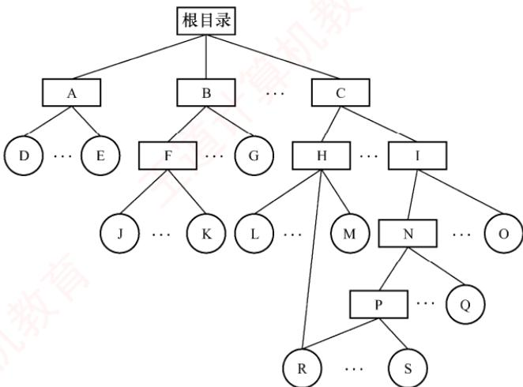

04. 某树形目录结构的文件系统如下图所示。该图中的方框表示目录，圆圈表示文件。

1）可否进行下列操作？

　　① 在目录 D 中建立一个文件，取名为 A。

　　② 将目录 C 改名为 A。

2）若 E 和 G 分别为两个用户的目录：

　　① 在一段时间内用户 G 主要使用文件 S 和 T。为简化操作和提高速度，应如何处理？

　　② 用户 E 欲对文件 I 加以保护，不许别人使用，能否实现？如何实现？

  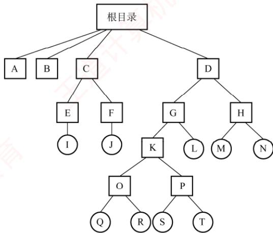

05. 有一个文件系统如图 A 所示。图中的方框表示目录，圆圈表示普通文件。根目录常驻内存，目录文件组织成链接文件，不设 FCB，普通文件组织成索引文件。目录表指示下一级文件名及其磁盘地址（各占 2B，共 4B）。下级文件是目录文件时，指示其第一个磁盘块地址。下级文件是普通文件时，指示其 FCB 的磁盘地址。每个目录的文件磁盘块的最后 4B 供拉链使用。下级文件在上级目录文件中的次序在图中为从左至右。每个磁盘块有 512B，与普通文件的一页等长。

　　普通文件的 FCB 组织如图 B 所示。其中，每个磁盘地址占 2B，前 10 个地址直接指示该文件前 10 页的地址。第 11 个地址指示一级索引表地址，一级索引表中的每个磁盘地址指示一个文件页地址；第 12 个地址指示二级索引表地址，二级索引表中的每个地址指示一个一级索引表地址；第 13 个地址指示三级索引表地址，三级索引表中的每个地址指示一个二级索引表地址。请问：

  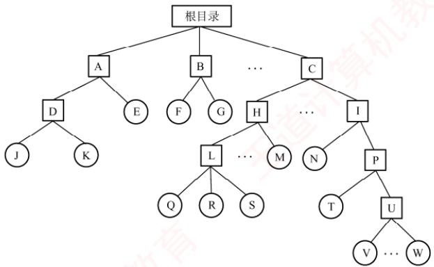

　　图 A 某树形结构文件系统框图

  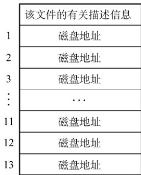

　　图B FCB组织

1）一个普通文件最多可有多少个文件页？

2）若要读文件J中的某一页，最多启动磁盘多少次？

3）若要读文件W中的某一页，最少启动磁盘多少次？

4）根据3），为最大限度地减少启动磁盘的次数，可采用什么方法？此时，磁盘最多启动多少次？

06. 在某个文件系统中，外存为硬盘。物理块大小为 512B，有文件 A 包含 598 条记录，每条记录占 255B，每个物理块放 2 条记录。文件 A 所在的目录如下图所示。文件目录采用多级树形目录结构，由根目录节点、作为目录文件的中间节点和作为信息文件的树叶组成，每个目录项占 127B，每个物理块放 4 个目录项，根目录的第一块常驻内存。试问：

1）若文件的物理结构采用链式存储方式，链指针地址占2B，则要将文件A读入内存，至少需要存取几次硬盘？

2）若文件为连续文件，则要读文件A的第487条记录至少要存取几次硬盘？

  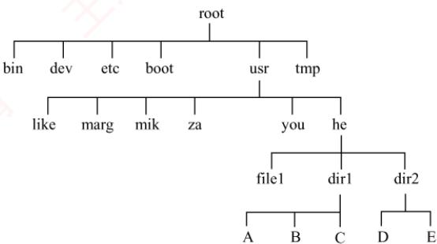

07. 假定磁盘块的大小为 1KB，对于 540MB 的硬盘，其文件分配表（FAT）最少需要占用多少存储空间？

08. 某文件系统采用混合索引分配方式，如下图所示。在索引节点中，有 10 个直接块，有 1 个一级间接块、1 个二级间接块及 1 个三级间接块，间接块指向的是一个索引块，每个索引块和数据块的大小均为 4KB，而系统中地址所占空间为 4B（指针大小为 4B），假设以下问题都建立在该索引节点已在内存中的前提下。

　　现请回答:

1）文件的大小为多大时可以只用到索引节点的直接块？

2）该索引节点能访问到的地址空间大小总共为多大（小数点后保留2位）？

3）若要读取一个文件的第10000B的内容，需要访问磁盘多少次？

4）若要读取一个文件的第10MB的内容，需要访问磁盘多少次？

  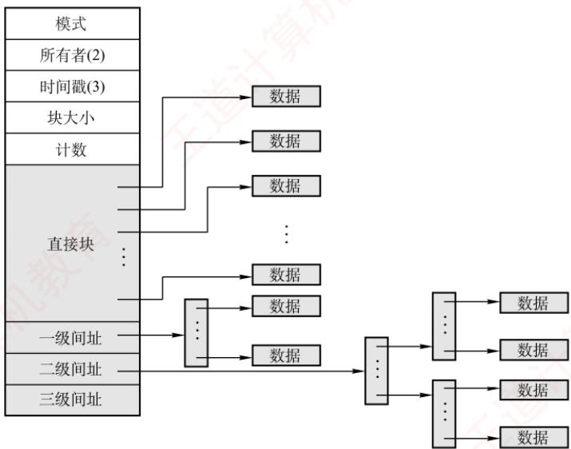

09. 某文件系统采用多级索引的方式组织文件的数据存放，假定在文件的 i_node 中设有 13 个地址项，其中直接索引 10 项，一次间接索引项 1 项，二次间接索引项 1 项，三次间接索引项 1 项。数据块的大小为 4KB，磁盘地址用 4B 表示，试问：

1）这个文件系统允许的最大文件长度是多少？

2）一个 2GB 大小的文件，在这个文件系统中实际占用多少空间？（文件索引块所占的磁盘空间也需要考虑）

10. 【2014 统考真题】文件 F 由 200 条记录组成，记录从 1 开始编号。用户打开文件后，欲将内存中的一条记录插入文件 F，作为其第 30 条记录。请回答下列问题，并说明理由。

1）若文件系统采用连续分配方式，每个磁盘块存放一条记录，文件F存储区域前后均有足够的空闲磁盘空间，则完成上述插入操作最少需要访问多少次磁盘块？F的文件控制块内容会发生哪些改变？

2）若文件系统采用链接分配方式，每个磁盘块存放一条记录和一个链接指针，则完成上述插入操作需要访问多少次磁盘块？若每个存储块大小为1KB，其中4B存放链接指针，则该文件系统支持的文件最大长度是多少？

11. 【2016 统考真题】某磁盘文件系统使用链接分配方式组织文件，簇大小为 4KB。目录文件的每个目录项包括文件名和文件的第一个簇号，其他簇号存放在文件分配表 FAT 中。

1）假定目录树如下图所示，各文件占用的簇号及顺序如下表所示，其中 dir、dir1 是目录，file1、file2 是用户文件。请给出所有目录文件的内容。

  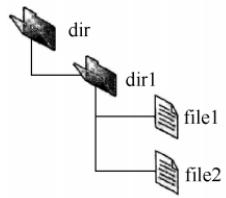

　　<table><tr><td>文件名</td><td>簇号</td></tr><tr><td>dir</td><td>1</td></tr><tr><td>dir1</td><td>48</td></tr><tr><td>file1</td><td>100、106、108</td></tr><tr><td>file2</td><td>200、201、202</td></tr></table>

2）若 FAT 的每个表项仅存放簇号，占 2B，则 FAT 的最大长度为多少字节？该文件系统支持的文件长度最大是多少？

3）系统通过目录文件和 FAT 实现对文件的按名存取，说明 file1 的 106,108 两个簇号分别存放在 FAT 的哪个表项中。

4）假设仅 FAT 和 dir 目录文件已读入内存，若需要将文件 dir/dir1/file1 的第 5000 个字节读入内存，则要访问哪几个簇？

12. 【2011 统考真题】某文件系统为一级目录结构，文件的数据一次性写入磁盘，已写入的文件不可修改，但是可多次创建新文件。请回答如下问题。

1）在连续、链式、索引三种文件的数据块组织方式中，哪种更合适？说明理由。为定位文件数据块，需要在FCB中设计哪些相关描述字段？

2）为快速找到文件，对于FCB，是集中存储好，还是与对应的文件数据块连续存储好？说明理由。

13. 【2012 统考真题】某文件系统空间的最大容量为 4TB（ $1\mathrm{TB} = 2^{40}\mathrm{B}$ ），以磁盘块为基本分配单位。磁盘块大小为 1KB。文件控制块（FCB）包含一个 512B 的索引表区。请回答下列问题：

1）假设索引表区仅采用直接索引结构，索引表区存放文件占用的磁盘块号，索引表项中块号最少占多少字节？可支持的单个文件的最大长度是多少字节？

2）假设索引表区采用如下结构：第0~7字节采用<起始块号，块数>格式表示文件创建时预分配的连续存储空间。其中起始块号占6B，块数占2B，剩余504B采用直接索引结构，一个索引项占6B，则可支持的单个文件的最大长度是多少字节？为使单个文件的长度达到最大，请指出起始块号和块数分别所占字节数的合理值并说明理由。

14. 【2018 统考真题】某文件系统采用索引节点存放文件的属性和地址信息，簇大小为 4KB。每个文件索引节点占 64B，有 11 个地址项，其中直接地址项 8 个，一级、二级和三级间接地址项各 1 个，每个地址项长度为 4B。请回答下列问题：

1）该文件系统能支持的最大文件长度是多少？（给出计算表达式即可）

2）文件系统用 $1\mathrm{M}$ （ $1\mathrm{M} = 2^{20}$ ）个簇存放文件索引节点，用512M个簇存放文件数据。若一个图像文件的大小为5600B，则该文件系统最多能存放多少个这样的图像文件？

3）若文件F1的大小为6KB，文件F2的大小为40KB，则该文系统获取F1和F2最后一个簇的簇号需要的时间是否相同？为什么？

15. 【2022 统考真题】某文件系统的磁盘块大小为 4 KB，目录项由文件名和索引节点号构成，每个索引节点占 256 字节，其中包含直接地址项 10 个，一级、二级和三级间接地址项各 1 个，每个地址项占 4 字节。该文件系统中子目录 stu 的结构如图(a)所示，stu 包含子目录 course 和文件 doc，course 子目录包含文件 course1 和 course2。各文件的文件名、索引节点号、占用磁盘块的块号如图(b)所示。请回答下列问题。

  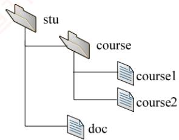

　　(a)

　　<table><tr><td>文件名</td><td>索引节点号</td><td>磁盘块号</td></tr><tr><td>stu</td><td>1</td><td>10</td></tr><tr><td>course</td><td>2</td><td>20</td></tr><tr><td>course1</td><td>10</td><td>30</td></tr><tr><td>course2</td><td>100</td><td>40</td></tr><tr><td>doc</td><td>10</td><td>x</td></tr></table>

　　(b)

1）目录文件stu中每个目录项的内容是什么？

2）文件doc占用的磁盘块的块号x的值是多少？

3）若目录文件course的内容已在内存，则打开文件course1并将其读入内存，需要读几个磁盘块？说明理由。

4）若文件 course2 的大小增长到 6 MB，则为了存取 course2 需要使用该文件索引节点的哪几级间接地址项？说明理由。

### 4.2.12 答案与解析

#### 一、单项选择题

**01. A**

　　访问计数值表示的意义是，每当有一个进程要访问此索引节点，访问计数值加 1，访问结束时减 1，它属于内存索引节点中特有的内容。

**02. D**

　　目录文件是FCB的集合，一个目录中既可能有子目录，又可能有数据文件，因此目录文件中存放的是子目录和数据文件的信息。

**03. C**

　　文件目录项即 FCB，通常由文件基本信息、存取控制信息和使用信息组成。基本信息包括文件物理位置。文件目录项显然不包括 FCB 的物理位置信息。

**04. C**

　　将文件描述信息从目录项中分离，即应用了索引节点的方法，磁盘的盘块中可以存放更多的目录项，查找文件时可以大大减少其 I/O 信息量。

**05. D**

　　异步 I/O 是指发出 I/O 请求后，系统不必等待 I/O 完成，而继续执行其他任务，当 I/O 完成后再通知系统，异步 I/O 提高了 CPU 利用率，但对磁盘 I/O 次数没有影响。将目录项分解为符号目录项和基本目录项，符号目录项包括文件名和文件号，基本目录项包括文件号和文件其他描述信息，查找时只需查找符号目录，减少了磁盘占用空间，因此减少了读盘次数。文件高速缓存可以减少磁盘 I/O 次数。磁盘调度算法可以减少寻道时间，提高磁盘 I/O 速度。

**06. B**

　　文件大小与对目录进行检索无关。目录项数量越多，检索目录时的平均比较次数就越多，影响检索性能；目录项的大小越大，占用的盘块就越多，I/O时间也就越长，影响检索性能；目录项在目录中的位置不同，可能导致不同的访问路径，影响检索性能。

**07. D**

　　A、B 和 C 项的同名文件都有不同的路径名，因此不会造成文件名重名问题。在同一个磁盘的同一目录下，若两个文件名重名，则它们具有相同的路径名，因此无法区别。

**08. B**

　　文件目录是实现按名存取的关键，通过查找目录可以获得文件的物理地址和其他属性。

**09. C**

　　FCB 占 64B，盘块大小为 1KB，一个盘块能存放 1024/64 = 16 个 FCB。文件目录有 3200 个目录项，即 3200 个 FCB（每个目录项一个 FCB），文件目录需要占用 3200/16 = 200 个盘块。查找一个文件需要在 200 个盘块中顺序查找目标 FCB，平均查找次数为 200/2 = 100，即平均访问磁盘的次数。注意，在操作系统教材中，平均查找长度通常描述为 “总长度/2”；在数据结构教材中，平均查找长度通常描述为 “(总长度 +1)/2”，相对而言后者更严谨。

**10. B**

　　一个目录项的大小是 16B，一个磁盘块可以存放 1024B/16B = 64 个目录项，存放 3200 个目录项共需要 50 个磁盘块。因此，找到一个文件对应的目录项平均读磁盘的次数为 50/2 = 25，之后根据对应目录项的索引节点编号再启动磁盘读入索引节点，总读磁盘次数为26。

**11. C**

　　实现用户对文件的按名存取，系统先利用用户提供的文件名形成检索路径，对目录进行检索。在顺序检索中，路径名的一个分量未找到，说明路径名中的某个目录或文件不存在，不需要继续检索，选项 C 正确。目录的查询方式有顺序检索法和散列法两种，散列法并不适用于所有的目录结构，而且有冲突和溢出的缺点，解决的开销也较大，因此通常更多采用的是顺序检索法，选项 A 错误。在树形目录中，为了加快文件检索速度，可设置当前目录，于是文件路径可以从当前目录开始查找，选项 B 错误。在顺序检索法查找完成后，得到的是文件的逻辑地址，选项 D 错误。

**12. A**

　　相对路径是从当前目录出发到所找文件通路上所有目录名和数据文件名用分隔符连接起来而形成的，注意与绝对路径的区别。

**13. C**

　　在文件系统中采用多级目录结构后，符合了多层次管理的需要，提高了文件查找的速度，还允许用户建立同名文件。因此，多级目录结构的采用解决了命名冲突。

**14. A**

　　在单级目录文件中，每当新建一个文件时，必须先检索所有的目录项，以保证新文件名在目录中是唯一的。所以单级目录结构无法解决文件重名问题。

**15. A**

　　磁带是一种顺序存储设备，用它存储文件时只能采用顺序存储结构。注意，若允许磁带来回倒带，也可组织为其他文件形式，本题不做讨论。

**16. B**

　　采用连续分配和索引分配的文件都支持随机存取。采用链接分配的文件不支持随机存取。

**17. A**

　　要求有连续的存储空间，因此必须事先知道文件的大小，并据此在存储空间中找出一块大小足够的存储区。若文件动态地增长，则会使文件所占的空间越来越大，即使事先知道文件的最终大小，在采用预分配的存储空间的方法时，也是很低效的，它会使大量的存储空间长期闲置。

**18. B**

　　在连续分配方式中，为了使系统能找到文件存放的地址，应在目录项的“文件物理地址”字段中，记录该文件第一条记录所在的盘块号和文件长度（以盘块数进行计量）。

**19. B**

　　顺序文件占用连续的磁盘空间，容易导致存储碎片（外部碎片）的发生。

**20. D**

　　通常用户可以根据需要来确定文件的逻辑结构，而文件的物理结构是由操作系统的设计者根据文件存储器的特性来确定的，一旦确定，就由操作系统管理。

**21. C**

　　打开文件表仅存放已打开文件信息的表，将指明文件的属性从外存复制到内存，再使用该文件时直接返回索引，选项 A 错误。位图和空闲盘块链表是磁盘管理方法，选项 B、D 错误。只有索引表中记录每个文件所存放的盘块地址，选项 C 正确。

**22. B**

　　链接分配的文件通过在每个盘块上的链接指针，将同属于一个文件的多个离散的盘块链接成一个链表，它的物理块不需要连续排列。其他说法均正确。

**23. B**

　　不同的存储介质有不同的存储特性，如磁带只能顺序存取，磁盘可以随机存取，因此文件的组织形式与存储介质特性有关。文件的逻辑结构与文件的物理结构没有必然关系，主存储器的管理方式只涉及内存管理，文件的物理存储与设备的分配方式也没有必然关系。

**24. A**

　　若需要在文件中间增加一块，则连续分配就要将后面的所有盘块都向后移动一块，这样就会产生很多的磁盘 I/O 操作。而其他三种分配方式都不需要移动盘块，只需修改一些指针或者索引。因此，连续分配是操作磁盘 I/O 次数最多的。

**25. D**

　　记录成组分解技术是指将若干逻辑记录存入一个块，一个逻辑记录不能跨越两个块。逻辑记录的固定长度为 100B，盘块长度为 512B，采用成组分解技术，因此每个盘块可以存放 5 个逻辑记录，剩下 12B 的空间可用于存放指向下一个盘块的指针。每个盘块存放 5 个逻辑记录，因此第 22 个逻辑记录在第 5 个物理块中（ $\left\lceil 22/5 \right\rceil = 5$ ）。采用链接分配方式，要找到第 5 个物理块，需要从第 1 个物理块开始按指针顺序查找，因此需要启动磁盘 5 次。修改完后还要写回磁盘，因为此前已获得该块的磁盘地址，所以只需启动磁盘 1 次，共需启动磁盘 6 次。

**26. B**

　　因为 $1569 = 512 \times 3 + 33$ ，所以要访问字节位于第4个磁盘块上，对应的物理磁盘块号为80。

**27. C**

　　采用隐式链接分配，首先需要依次读 L1～L5 磁盘块，根据 L5 磁盘块，获取 L6 磁盘块的地址；然后将 $Lx'$ 的数据写入一个空闲磁盘块，将该块的链接指针指向 L6 磁盘块；最后修改 L5 磁盘块，将链接指针指向 $Lx'$ 的磁盘块的地址并写回磁盘。因此共进行了 5 次读盘和 2 次写盘。

**28. B**

　　根据 2016 年统考真题综合题 47，可知 FAT 支持的最大文件长度可理解为整个分区大小。一个簇的大小为 8KB，一个 512MB 的文件包含 $512MB/8KB = 2^{16}$ 个簇，所以簇号占 2B，最多有 $2^{16}$ 个 FAT 表项，FAT 表占用的空间约为 $2^{16} \times 2B = 128KB$ 。

**29. C**

　　连续分配和索引分配都支持随机访问，链接分配通常可默认为隐式链接，仅支持顺序访问，由题意可知该文件仅支持顺序访问，因此文件采用的结构为链接分配。

**30. B**

　　采用连续分配时，将最后一个数据块搬到文件头部，要移动文件的物理块，需要磁盘 I/O。采用单级索引分配时，将最后一个数据块插入文件头部，索引块已驻留在内存中，因此只需修改索引块，不需要磁盘 I/O。采用隐式链接分配时，仅支持顺序访问，要修改文件数据块的顺序，就必须修改对应磁盘块末尾的指针，必须将文件块读入内存，需要磁盘 I/O。

**31. A**

　　采用连续分配时，至少需要进行 45 次读磁盘和 45 次写磁盘，将前 45 个盘块依次向前移动，之后还要进行 1 次写磁盘，将数据写入对应空出的盘块。采用链接分配时，需要进行 45 次读磁盘，然后修改第 45 个磁盘块中的链接指针，并写新磁盘块，共进行 2 次写磁盘，开销比顺序文件小。采用一级索引分配或多级索引分配时，只需修改内存中的索引表，不需磁盘 I/O，开销较小。

**32. D**

　　直接指针可指向 10 个磁盘块，一级间接指针可指向一个索引块，一个索引块中可存放 1024 个磁盘地址，每个地址指向一个磁盘块。因此该文件最多占用 $10 + 1024 = 1034$ 个磁盘块。

**33. A**

　　最大文件的尺寸由二级索引块能够指向的磁盘块数决定。每个磁盘块中最多有 $1KB/4B = 256$ 个索引项，则两级索引分配方式下单个文件的最大长度为 $256 \times 256 \times 1KB = 64MB$ 。

**34. B**

　　最大文件的尺寸由三级索引块能够指向的磁盘块数决定。三级索引块可以指向 1024B/4B = 256 个二级索引块，每个二级索引块又可指向 256 个一级索引块，每个一级索引块又可指向 256 个磁盘块。因此，最大文件的尺寸为 $256 \times 256 \times 256 \times 1024B = 16GB$ 。

**35. C**

　　根据文件分配表、页表和中断向量表的应用原理，它们都有一个要求，就是要能随机访问表中的任一元素，即随机访问，因此只能用数组实现。在进程调度的过程中，每次都调度就绪队列的队首进程，因此既可以用数组实现，又可以用链表实现。

**36. A**

　　一个文件对应一个 FCB，而一个文件目录项就是一个 FCB。

**37. A**

　　打开文件操作是将该文件的 FCB 存入内存的活跃文件目录表，而不是将文件内容复制到主存，找到指定文件目录是打开文件之前的操作。

**38. B**

　　open()调用的参数含有文件名（或者说文件的路径名），它会在进程的用户打开文件表中增加一个对应的表目，并返回该表目的索引号（文件描述符或句柄）。系统打开文件表只有在文件实体第一次被打开时才增加一个表目，也才会通过文件I/O将对应的索引节点从磁盘读入内存。当open()调用的不同文件互为硬链接时，所打开的文件实体是一样的。

**39. B**

　　关闭文件是指将文件当前的控制信息从内存写回磁盘，需要注意的是关闭文件并不意味着将文件数据写回磁盘，写文件操作才会写回磁盘（不考虑延迟写），选项 B 正确。

**40. B**

　　读文件操作的正确次序是：按文件描述符在打开文件表中找到该文件的目录项；按存取控制说明检查访问的合法性；根据目录项中该文件的逻辑和物理组织形式，将逻辑记录号转换成物理块号；向设备驱动程序发出 I/O 请求，完成数据交换工作。因此答案是说法 IV、II、III、I。

**41. D**

　　文件在磁带上通常采用连续存放方法，在硬盘上通常不采用连续存放方法，在内存上采用随机存放方法，说法 I 错误。对文件的访问控制，常由用户访问权限和文件属性共同限制，说法 II 错误。在树形目录结构中，对于不同用户的文件，文件名可以不同也可以相同，说法 III 错误。防止文件受损常采用备份的方法，而存取控制矩阵方法用于多用户之间的存取权限保护，说法 IV 错误。

**42. D**

　　文件被打开后，系统为每个打开的文件分配一个文件描述符（索引号），用来标识该文件。之后用户不再使用文件名，而使用文件描述符，来对该文件进行读/写、定位等操作。

**43. A**

　　建立 F2 时，F1 和 F2 的引用计数值都变为 2。建立 F3 时，符号链接文件的引用计数值不受被链接文件的影响，始终为 1，所以 F1 和 F3 的引用计数值为 2 和 1。删除 F2 时，F1 的引用计数值变为 2-1=1，F3 的引用计数值仍保持不变，因此 F1、F3 的引用计数值分别是 1、1。

**44. A**

　　文件F2是F1的硬链接文件，指向同一个索引节点，当进程 $\mathrm{P_1}$ 第一次打开F1时，会将磁盘的索引节点读入内存，之后 $P_{1}$ 打开 F2 及 $P_{2}$ 打开 F1 和 F2 都共享之前已读入内存的索引节点，选项 A 正确。 $P_{1}$ 和 $P_{2}$ 对同一个文件的访问权限可能有所不同，选项 B 错误。F3 是 F2 的软链接文件，删除 F3 不影响 F2 的引用计数值，选项 C 错误。读取 F1 只需传入 F1 在 $P_{1}$ 中的文件描述符（F1 在 $P_{1}$ 的进程打开文件表中的索引号），并不需要其路径名，选项 D 错误。

**45. A**

　　文件保护是针对文件访问权限的保护。

**46. D**

　　在文件系统中，口令、存取控制和用户权限表都是常用的文件保护方法。

**47. A**

　　对于这道题，只要能区分用户的访问权限和用户优先级，就能得到正确的答案。用户访问权限是指用户有没有权限访问该文件，而用户优先级是指在多个用户同时请求该文件时应该先满足谁。比如，图书馆的用户排队借一本书，某用户可能有更高的优先级，即他排在队伍的前面，但有可能轮到他时被告知他没有借阅那本书的权限。

　　文件的属性包括保存在 FCB 中对文件访问的控制信息。

**48. A**

　　系统级安全管理包括注册和登录。此外，通过“进入系统时”也可推测出正确答案。

**49. A**

　　为了实现 “按名存取”，在文件系统中为每个文件设置用于描述和控制文件的数据结构，称为文件控制块。在文件控制块中，通常包含三类信息：基本信息、存取控制信息及使用信息。

**50. B**

　　文件的物理结构包括连续、链式、索引三种，其中链式结构不能实现随机访问，连续结构的文件不易于扩展。因此随机访问且易于扩展是索引结构的特性。

**51. B**

　　建立符号链接时，引用计数值直接设置为 1，不受被链接文件的影响；建立硬链接时，引用计数值加 1。删除文件时，删除操作对于符号链接是不可见的，这并不影响文件系统，当以后再通过符号链接访问时，发现文件不存在，直接删除符号链接；但对于硬链接则不可直接删除，引用计数值减 1，若值不为 0，则不能删除此文件，因为还有其他硬链接指向此文件。

　　当建立 F2 时，F1 和 F2 的引用计数值都为 1。当再建立 F3 时，F1 和 F3 的引用计数值就都变成了 2。当后来删除 F1 时，F3 的引用计数值为 2-1=1，F2 的引用计数值不变。

**52. C**

　　当一个文件系统含有多级目录时，每访问一个文件，都要使用从树根开始到树叶为止、包括各中间节点名的全路径名。当前目录也称工作目录，进程对各个文件的访问都相对于当前目录进行，而不需要从根目录一层一层地检索，加快了文件的检索速度。选项 A、B 都与相对目录无关；选项 D，文件的读/写速度取决于磁盘的性能。

**53. C**

　　每个磁盘索引块和磁盘数据块大小均为 256B，每个磁盘索引块有 256/4 = 64 个地址项。因此，4 个直接地址索引指向的数据块大小为 $4 \times 256B$ ；2 个一级间接索引包含的直接地址索引数为 $2 \times (256/4)$ ，即其指向的数据块大小为 $2 \times (256/4) \times 256B$ 。1 个二级间接索引所包含的直接地址索引数为 $(256/4) \times (256/4)$ ，即其所指向的数据块大小为 $(256/4) \times (256/4) \times 256B$ 。因此，7 个地址项所指向的数据块总大小为 $4 \times 256 + 2 \times (256/4) \times 256 + (256/4) \times (256/4) \times 256 = 1082368B = 1057KB$ 。

**54. A**

　　对于说法 I，当所读文件的数据不在内存时，产生中断（缺页中断），原进程进入阻塞态，直到所需数据从外存调入内存后，才将该进程唤醒。对于说法 II，read 系统调用通过陷入将 CPU 从用户态切换到核心态，从而获取操作系统提供的服务。对于说法 III，要读一个文件，首先要用 open 系统调用打开该文件。open 中的参数包含文件的路径名与文件名，而 read 只需使用 open 返回的文件描述符，并不使用文件名作为参数。read 要求用户提供三个输入参数：① 文件描述符 fd；② buf 缓冲区首址；③ 传送的字节数 n。read 的功能是试图从 fd 所指示的文件中读入 n 字节的数据，并将它们送至由指针 buf 所指示的缓冲区中。

**55. A**

　　此文件所在目录下可能还存在其他文件，因此删除文件时不能（也不需要）删除文件所在的目录，而与此文件关联的目录项和文件控制块需要随着文件一同删除，同时释放文件关联的内存缓冲区。

**56. A**

　　索引节点的总数即文件的总数，与单个文件的长度无关。间接地址级数越多、地址项数越多、文件块越大，单个文件的长度就会越大。

**57. A**

　　为了实现快速随机播放，要保证最短的查询时间，即不能选取链表和索引结构，因此连续结构最优。

**58. B**

　　一个文件被用户进程首次打开即被执行了 open 操作，会把文件的 FCB 调入内存，而不会把文件内容读到内存中，只有进程希望获取文件内容时才会读入文件内容。选项 C、D 明显错误。

**59. B**

　　10个直接索引指针指向的数据块大小为 $10 \times 1\mathrm{KB} = 10\mathrm{KB}$ 。每个索引指针占4B，则每个磁盘块可存放 $1\mathrm{KB} / 4\mathrm{B} = 256$ 个索引指针，一级索引指针指向的数据块大小为 $256 \times 1\mathrm{KB} = 256\mathrm{KB}$ ，二级索引指针指向的数据块大小为 $256 \times 256 \times 1\mathrm{KB} = 2^{16}\mathrm{KB} = 64\mathrm{MB}$ 。

　　按字节编址，偏移量为1234时，因 $1234\mathrm{B} < 10\mathrm{KB}$ ，由直接索引指针可得到其所在的磁盘块地址。文件的索引节点已在内存中，因此地址可直接得到，因此仅需1次访盘即可。

　　偏移量为 307400 时，因 $10KB + 256KB < 307400B < 64MB$ ，可知该偏移量的内容在二级索引指针所指向的某个磁盘块中，索引节点已在内存中，因此先访盘 2 次得到文件所在的磁盘块地址，再访盘 1 次即可读出内容，共需要 3 次访盘。

**60. D**

　　需要注意的是，二进制位串表示的访问权限是这个文件所持有的，而不是某个用户所持有的，这个二进制位串要表示所有类别的用户的访问权限，每个要访问该文件的用户在访问之前都要查这个二进制位串。对于每类用户来说，都需要用5位来表示5种访问权限中的哪几种访问权限，共有四类用户，因此可将用户访问权限抽象为一个矩阵，其行代表用户类别，列代表访问权限。这个矩阵有4行5列，1代表true，0代表false，所以需要20位。

　　例如，下表是一个用二进制位串表示的文件权限。

　　<table><tr><td rowspan="2">用户类别</td><td colspan="5">访问权限</td></tr><tr><td>完全控制</td><td>执行</td><td>修改</td><td>读取</td><td>写入</td></tr><tr><td>安全管理员</td><td>1</td><td>1</td><td>1</td><td>1</td><td>0</td></tr><tr><td>文件主</td><td>1</td><td>1</td><td>1</td><td>1</td><td>1</td></tr><tr><td>文件主的伙伴</td><td>0</td><td>1</td><td>0</td><td>1</td><td>0</td></tr><tr><td>其他用户</td><td>0</td><td>0</td><td>0</td><td>1</td><td>0</td></tr></table>

　　本题易误选 A，有读者认为用 2 位来表示用户类别，用 3 位来表示访问权限，这种情况在于没有理解文件访问权限的二进制位串是文件所持有的，所以当用户需要检查访问权限时，要在二进制位串中查询所属用户类别的访问权限。此外，每类用户的访问权限不是拥有5种访问权限中的哪一种，而是5种访问权限都可能拥有，因此不可能用3位来表示访问权限。

**61. B**

　　多个进程打开一个文件时，读/写指针的位置不同，它们保存在各自的用户打开文件表中，说法 I 错误。硬链接是基于索引节点的共享方式，指向同一个内存索引节点，说法 II 正确。不同进程获得的文件描述符是各自独立的，分别指向各自的用户打开文件表中的一项，说法 III 正确。

**62. D**

　　为了改善磁盘的效率，操作系统将多个相邻的扇区组合成簇，对文件存储空间的分配以簇为单位，因此一个文件所占用的空间只能是簇的整数倍。文件的大小为 1026B，大于 1 簇、小于 2 簇，因此需要分配 2 簇磁盘空间，即 2048B。

**63. B**

　　在总长为64字节的目录项中，索引节点占4字节，即32位。不同目录下的文件的文件名可以相同，所以在考虑系统创建最多文件数量时，只需考虑索引节点的个数，即创建文件数量上限 = 索引节点数量上限。整个系统中最多存储 $2^{32}$ 个索引节点，因此整个系统最多可以表示 $2^{32}$ 个文件。

**64. B**

　　多个进程可以同时以“读”或“写”的方式打开文件，操作系统并不保证写操作的互斥性，进程可通过系统调用对文件加锁，保证互斥写（读者-写者问题），选项A错误。整个系统只有一个系统打开文件表，同一个文件打开多次只需改变引用计数，选项B正确。用户进程的打开文件表关于同一个文件不一定相同，例如当前读/写位置指针、访问权限不一定相同，选项C错误。进程关闭文件时，文件的引用计数减1，引用计数变为0时才删除系统打开文件表中的表项，选项D错误。

**65. A**

　　索引分配支持变长的文件，同时可以随机访问文件的指定数据块，选项 A 正确。链接分配不支持随机访问，需要依靠指针依次访问，选项 B 错误。连续分配的文件长度固定，不支持可变文件长度（连续分配的文件长度虽然也可变，但是需要大量移动数据，代价较大，相比之下不太合适），选项 C 错误。动态分区分配是内存管理方式，不是磁盘空间的管理方式，选项 D 错误。

**66. A**

　　删除一个文件时，会根据文件控制块回收相应的磁盘空间，将文件控制块回收，并删除目录中对应的目录项。选项 B、C、D 正确。快捷方式属于文件共享中的软连接，本质上创建的是一个链接文件，其中存放的是访问该文件的路径，删除文件并不会导致文件的快捷方式被删除，正如在 Windows 中删除一个程序后，其快捷方式可能仍留在桌面上，但已无法打开。

**67. B**

　　当文件 F 首次被进程 P 打开时，会将磁盘的索引节点复制到内存的索引节点，并新增链接计数（打开计数）等内容。当进程 P 关闭文件 F 时，会将内存索引节点的链接计数减 1，因为文件 F 仅被进程 P 打开，所以链接计数变为 0，文件系统释放 F 的内存索引节点，选项 B 正确。关闭 F 不改变目录中文件 F 的目录项，选项 A 错误。关闭 F 只对内存索引节点进行相关的操作，不改变磁盘索引节点的数据结构，选项 C、D 错误。

**68. A**

　　当用户首次对某文件发出操作请求时，需要先用系统调用 open() 将该文件打开。所谓“打开”，是指系统利用文件名检索到指定文件的目录项后，将文件的属性（包括该文件在外存中的物理位置）从外存复制到内存的打开文件表的一个表目中，并给用户返回一个文件描述符 fd。此后（只要文件未被关闭），用户对该文件的所有操作就都是通过文件描述符 fd 来进行的。

**69. C**

　　文件分配表（FAT）通过一个与逻辑块一一对应的表项数组，既描述文件数据块的链接关系，又标识每个块的使用状态（如空闲、已分配或坏块），进而直接支持空闲空间的跟踪与分配。相比之下，目录仅用于建立文件名到元数据（如FCB或inode）的映射；文件控制块（FCB）或inode存储单个文件的属性及物理位置信息；系统打开文件表则维护当前被进程打开的文件状态。这三者均不负责记录外存空闲空间的使用情况。

**70. C**

　　在采用目录与索引节点（inode）分离管理的文件系统中，新建文件 F 时，文件系统首先分配一个空闲 inode，并初始化其元数据字段，包括文件类型、访问权限、时间戳以及数据块指针等；随后，在所属目录文件中新增一个目录项，该目录项仅包含文件名 F 及其对应的 inode 号。由于访问权限等属性信息始终保存在 inode 中，目录项并不包含这些内容，因此目录文件不会记录文件的访问权限信息。综上，文件系统在创建文件时不会在目录文件中写入 F 的访问权限信息。

#### 二、综合应用题

**01. 【解答】**

　　连续分配方式的优点是可以随机访问（磁盘），访问速度快；缺点是要求有连续的存储空间，容易产生碎片，降低磁盘空间利用率，并且不利于文件的增长扩充。

　　链接分配方式的优点是不要求连续的存储空间，能更有效地利用磁盘空间，并且有利于扩充文件；缺点是只适合顺序访问，不适合随机访问；另外，链接指针占用一定的空间，降低了存储效率，可靠性也差。

　　索引分配方式的优点是既支持顺序访问又支持随机访问，查找效率高，便于文件删除；缺点是索引表会占用一定的存储空间。

**02. 【解答】**

　　目录是存放在磁盘上的，检索目录时需要访问磁盘，速度很慢。利用 “FCB 分解法” 加快目录检索速度的原理是：将 FCB 的一部分分解出去，存放在另一个数据结构中，而在目录中仅留下文件的基本信息和指向该数据结构的指针，这样一来就有效地缩减了目录的体积，减少了目录所占磁盘的块数，检索目录时读取磁盘的次数也减少，于是就加快了检索目录的速度。

　　因为原本整个FCB都是在目录中的，而FCB分解法将FCB的部分内容放在了目录外，所以检索完目录后还需要读取一次磁盘，以找齐FCB的所有内容。

1）分解法前，目录的磁盘块数为 $64 \times 254 / 512 = 31.75$ ，即 32 块。前 31 块中每块放了 512/64 = 8 个，而最后一块放了 $254 - 31 \times 8 = 6$ 个。所以查找该目录文件的某个 FCB 的平均访问磁盘次数 $= [8 \times (1 + 2 + 3 + \cdots + 31) + 6 \times 32] / 254 = 16.38$ 次。
分解法后，目录的磁盘块数为 $10 \times 254 / 512 = 4.96$ ，即 5 块。前 4 块中每块放了 512/10 = 51 个，而最后一块放了 $254 - 4 \times 51 = 50$ 个。所找的目录项在第 1, 2, 3, 4, 5 块所需的磁盘访问次数分别为 2, 3, 4, 5, 6 次。所以查找该目录文件的某个 FCB 的平均访问磁盘次数 $= [51 \times (2 + 3 + 4 + 5) + 50 \times 6] / 254 = 3.99$ 次。

2）分解法前，平均访问磁盘次数 $=(1+2+3+\cdots+n)/n=(n+1)/2$ 次。
分解法后，平均访问磁盘次数 $=[2+3+4+\cdots+(m+1)]/m=(m+3)/2$ 次。
为了使访问磁盘次数减少，显然需要 $(m+3)/2<(n+1)/2$ ，即m<n-2。

　　注，第二问中的每个盘块都正好装满，相当于访问每个盘块的概率是相等的，因此计算起来比第一问方便很多。

**03. 【解答】**

1）可以建立链接。因为 F 是目录，而 R 是文件，所以可以建立 R 到 F 的符号链接。除了符号链接，也可以通过硬链接的方式。

2）不一定能删除 R。由于 R 被多个目录共享，能否删除 R 取决于文件系统实现共享的方法。若采用基于索引节点的共享方法，则因删除后存在指针悬空问题而不能删除 R 节点。若采用基于符号共享的方法，则可以删除 R 节点。

3）不一定能删除N。因为N的子目录中存在共享文件R，而R节点本身不一定能被删除，所以N也不一定能被删除。

**04. 【解答】**

1）① 因为目录 D 中没有已命名为 A 的文件，所以在目录 D 中，可以建立一个名为 A 的文件。② 因为在文件系统的根目录下已存在一个名为 A 的目录，所以根目录下的目录 C 不能改名为 A。

2）① 用户 G 需要通过依次访问目录 K 和目录 P，才能访问文件 S 和文件 T。为了提高文件访问速度，可在目录 G 下建立两个链接文件，分别链接到文件 S 和文件 T 上。这样用户 G 就可直接访问这两个文件。② 用户 E 可以修改文件 I 的存取控制表来对文件 I 加以保护，不让别的用户使用。具体实现方法是：在文件 I 的存取控制表中，只留下用户 E 的访问权限，其他用户对该文件无操作权限，从而达到不让其他用户访问的目的。

**05. 【解答】**

1）因为磁盘块大小为 512B，所以索引块大小也为 512B，每个磁盘地址大小为 2B。因此，一个一级索引表可容纳 256 个磁盘地址。同样，一个二级索引表可容纳 256 个一级索引表地址，一个三级索引表可容纳 256 个二级索引表地址。这样，一个普通文件最多可有的文件页数为 $10 + 256 + 256 \times 256 + 256 \times 256 \times 256 = 16843018$ 。

2）由图可知，目录文件 A 和 D 中的目录项都只有两个，因此这两个目录文件都只占用一个物理块。要读文件 J 中的某一页，先从内存的根目录中找到目录文件 A 的磁盘地址，将其读入内存（已访问磁盘 1 次）。然后从目录 A 中找出目录文件 D 的磁盘地址读入内存（已访问磁盘 2 次）。再从目录 D 中找出文件 J 的 FCB 地址读入内存（已访问磁盘 3 次）。在最坏情况下，该访问页存放在三级索引下，这时候需要一级级地读三级索引块才能得到文件 J 的地址（已访问磁盘 6 次）。最后读入文件 J 中的相应页（共访问磁盘 7 次）。所以，若要读文件 J 中的某一页，最多启动磁盘 7 次。

3）由图可知，目录文件 C 和 U 的目录项较多，可能存放在多个链接在一起的磁盘块中。在最好情况下，所需的目录项都在目录文件的第一个磁盘块中。先从内存的根目录中找到目录文件 C 的磁盘地址并读入内存（已访问磁盘 1 次）。在 C 中找出目录文件 I 的磁盘地址并读入内存（已访问磁盘 2 次）。在 I 中找出目录文件 P 的磁盘地址并读入内存（已访问磁盘 3 次）。从 P 中找到目录文件 U 的磁盘地址并读入内存（已访问磁盘 4 次）。从 U 的第一个磁盘块中找出文件 W 的 FCB 地址并读入内存（已访问磁盘 5 次）。在最好情况下，要访问的页在 FCB 的前 10 个直接块中，按照直接块指示的地址读文件 W 的相应页（已访问磁盘 6 次）。所以，若要读文件 W 中的某页，最少启动磁盘 6 次。

4）为了减少启动磁盘的次数，可以将需要访问的 W 文件挂在根目录的最前面的目录项中。此时，只需读内存中的根目录就可找到 W 的 FCB，将 FCB 读入内存（已访问磁盘 1 次），最差情况下，需要的 W 文件的那个页挂在 FCB 的三级索引下，因此读 3 个索引块需要访问磁盘 3 次（已访问磁盘 4 次）得到该页的物理地址，再去读这个页即可（已访问磁盘 5 次）。此时，磁盘最多启动 5 次。

**06. 【解答】**

1）根目录的第一块常驻内存（root 所指的/bin、/dev、/etc、/boot 等可直接获得），根目录找到文件 A 需要 5 次读盘。由 $255 \times 2 + 2 = 512$ 可知，一个物理块在链式存储结构下可放 2 条记录及下一个物理块地址，而文件 A 共有 598 条记录，因此读取 A 的所有记录所需的读盘次数为 598/2 = 299，所以将文件 A 读到内存至少需要读盘 $299 + 5 = 304$ 次。

2）当文件为连续文件时，找到文件 A 同样需要 5 次读盘，且知道文件 A 的地址后通过计算只需一次读盘即可读出第 487 条记录，所以至少需要 $5 + 1 = 6$ 次读盘。

**07. 【解答】**

　　对于 540MB 的硬盘，硬盘总块数为 540MB/1KB = 540K 个。

　　因为 540K 刚好小于 $2^{20}$ ，所以文件分配表的每个表目可用 20 位，即 20/8 = 2.5B，这样 FAT 占用的存储空间大小为 $2.5B \times 540K = 1350KB$ 。

**08. 【解答】**

1）要想只用到索引节点的直接块，这个文件应能全部在10个直接块指向的数据块中放下，而数据块的大小为4KB，所以该文件的大小应小于或等于 $4KB \times 10 = 40KB$ ，即文件的大小不超过40KB时可以只用到索引节点的直接块。

2）只需要算出索引节点指向的所有数据块的块数，再乘以数据块的大小即可。直接块指向的数据块数 = 10 块。

　　一级间接块指向的索引块里的指针数为 $4KB/4B = 1024$ ，所以一级间接块指向的数据块数为 1024 块。

　　二级间接块指向的索引块里的指针数为 $4\mathrm{KB} / 4\mathrm{B} = 1024$ ，指向的索引块里再拥有 $4\mathrm{KB} / 4\mathrm{B} = 1024$ 个指针数。所以二级间接块指向的数据块数为 $(4\mathrm{KB} / 4\mathrm{B})^2 = 1024^2$ 。

　　三级间接块指向的数据块数为 $(4KB/4B)^{3}=1024^{3}$ 。所以，该索引节点能访问到的地址空间大小为

$$
\left[ 1 0 + 1 \times \frac {4 \mathrm{KB}}{4 \mathrm{B}} + 1 \times \left(\frac {4 \mathrm{KB}}{4 \mathrm{B}}\right) ^ {2} + 1 \times \left(\frac {4 \mathrm{KB}}{4 \mathrm{B}}\right) ^ {3} \right] \times 4 \mathrm{KB} \approx 4 1 0 0. 0 0 \mathrm{GB} = 4. 0 0 \mathrm{TB}
$$

3）因为 $10000\mathrm{B} / 4\mathrm{KB} = 2.44$ ，所以第10000B的内容存放在第3个直接块中，若要读取一个文件的第10000B的内容，需要访问磁盘1次。

4）因为 10MB 的内容需要数据块数为 $10MB/4KB = 2.5 \times 1024$ ，直接块和一级间接块指向的数据块数 $= 10 + (4KB/4B) = 1034 < 2.5 \times 1024$ ，直接块和一级间接块及二级间接块的数据块数 $= 10 + (4KB/4B) + (4KB/4B)^{2} > 1 \times 1024^{2} > 2.5 \times 1024$ ，所以第 10MB 数据应该在二级

**09. 【解答】**

　　第一问要计算混合索引结构的寻址空间大小；第二问只要计算出存储该文件索引块的大小，然后加上该文件本身的大小即可。

1）物理块大小为4KB，数据大小为4B，则每个物理块可存储的地址数为 $4\mathrm{KB} / 4\mathrm{B} = 1024$ 。最大文件的物理块数可达 $10 + 1024 + 1024^{2} + 1024^{3}$ ，每个物理块大小为4KB，因此总长度为

$$
(1 0 + 1 0 2 4 + 1 0 2 4 ^ {2} + 1 0 2 4 ^ {3}) \times 4 \mathrm{KB} = 4 0 \mathrm{KB} + 4 \mathrm{MB} + 4 \mathrm{GB} + 4 \mathrm{TB}
$$

　　这个文件系统允许的最大文件长度是 $4TB + 4GB + 4MB + 40KB$ ，约为 4TB。

2）占用空间分为文件实际大小和索引项大小，文件大小为 2GB，从 1）中的计算知，需要使用到二次间接索引项。该文件占用 2GB/4KB = 512×1024 个数据块。

　　一次间接索引项使用 1 个间接索引块，二次间接索引项使用 $1 + \lceil (512 \times 1024 - 10 - 1024) / 1024 \rceil \approx 512$ 个间接索引块（最左的 1 表示二次间址块），所以间接索引块所占空间大小为

$$
(1 + 5 1 2) \times 4 \mathrm{KB} = 2 \mathrm{MB} + 4 \mathrm{KB}
$$

　　另外每个文件使用的 i_node 数据结构占 $13 \times 4B = 52B$ ，因此该文件实际占用磁盘空间大小为 $2GB + 2MB + 4KB + 52B$ 。

**10. 【解答】**

1）在磁盘中连续存放（采取连续结构），磁盘寻道时间更短，文件随机访问效率更高；在FCB中加入的字段为<起始块号，块数>或<起始块号，结束块号>。

2）将所有的FCB集中存放，文件数据集中存放。这样在随机查找文件名时，只需访问FCB对应的块，可减少磁头移动和磁盘I/O访问次数。

**11. 【解答】**

1）文件系统中所能容纳的磁盘块总数为 $4\mathrm{TB} / 1\mathrm{KB} = 2^{32}$ 。要完全表示所有磁盘块，索引项中的块号最少要占 $32 / 8 = 4\mathrm{B}$ 。而索引表区仅采用直接索引结构，因此512B的索引表区能容纳 $512\mathrm{B} / 4\mathrm{B} = 128$ 个索引项。每个索引项对应一个磁盘块，所以该系统可支持的单个文件最大长度是 $128\times 1\mathrm{KB} = 128\mathrm{KB}$ 。

2）这里考查的分配方式不同于我们熟悉的三种经典分配方式，但题目中给出了详细的解释。所求的单个文件最大长度一共包含两部分：预分配的连续空间和直接索引区。
连续区块数占 2B，共可表示 $2^{16}$ 个磁盘块，即 $2^{26}B$ 。直接索引区共 504B/6B = 84 个索引项。所以该系统可支持的单个文件最大长度是 $2^{26}B + 84KB$ 。
为了使单个文件的长度达到最大，应使连续区的块数字段表示的空间大小尽可能接近系统最大容量 4TB。分别设起始块号和块数占 4B，这样起始块号可以寻址的范围是 $2^{32}$ 个磁盘块，共 4TB，即整个系统空间。同样，块数字段可以表示最多 $2^{32}$ 个磁盘块，共 4TB。

**12. 【解答】**

1）系统采用顺序分配方式时，插入记录需要移动其他的记录块，整个文件共有200条记录，要插入新记录作为第30条，而存储区前后均有足够的磁盘空间，且要求最少的访问存储块数，则要把文件前29条记录前移，若算访盘次数，则移动一条记录读出和存回磁盘各是一次访盘，29条记录共访盘58次，存回第30条记录访盘1次，共访盘59次。F的文件控制区的起始块号和文件长度的内容会因此改变。

2）文件系统采用链接分配方式时，插入记录并不用移动其他记录，只需找到相应的记录，修改指针即可。插入的记录为其第30条记录，因此需要找到文件系统的第29块，一共需要访盘29次，然后把第29块的下块地址部分赋给新块，把新块存回磁盘会访盘1次，然后修改内存中第29块的下块地址字段，再存回磁盘，一共访盘31次。4B共32位，可以寻址 $2^{32}=4G$ 块存储块，每块的大小为1KB，即1024B，其中下块地址部分占4B，数据部分占1020B，因此该系统的文件最大长度是 $4G\times1020B=4080GB$ 。

**13. 【解答】**

1）两个目录文件 dir 和 dir1 的内容如下表所示。

　　<table><tr><td colspan="2">dir目录文件</td><td colspan="2">dir1目录文件</td></tr><tr><td>文件名</td><td>簇号</td><td>文件名</td><td>簇号</td></tr><tr><td>dir1</td><td>48</td><td>file1</td><td>100</td></tr><tr><td></td><td></td><td>file2</td><td>200</td></tr></table>

2）FAT 的簇号为 2 个字节，即 16 比特，因此在 FAT 表中最多允许 $2^{16}$ （65536）个表项，一个 FAT 文件最多包含 $2^{16}$ （65536）个簇。FAT 的最大长度为 $2^{16} \times 2B = 128KB$ 。文件的最大长度是 $2^{16} \times 4KB = 256MB$ 。

3）在 FAT 的每个表项中存放下一个簇号。file1 的簇号 106 存放在 FAT 的 100 号表项中，簇号 108 存放在 FAT 的 106 号表项中。

4）先在 dir 目录文件里找到 dir1 的簇号，然后读取 48 号簇，得到 dir1 目录文件，接着找到 file1 的第一个簇号，据此在 FAT 里查找 file1 的第 5000 个字节所在的簇号，最后访问磁盘中的该簇。因此，需要访问目录文件 dir1 所在的 48 号簇，及文件 file1 的 106 号簇。

**14. 【解答】**

1）簇大小为4KB，每个地址项长度为4B，因此每簇有 $4\mathrm{KB}/4\mathrm{B}=1024$ 个地址项。最大文件的物理块数可达 $8+1\times1024+1\times1024^{2}+1\times1024^{3}$ ，每个物理块（簇）大小为4KB，因此最大文件长度为 $(8+1\times1024+1\times1024^{2}+1\times1024^{3})\times4\mathrm{KB}=32\mathrm{KB}+4\mathrm{MB}+4\mathrm{GB}+4\mathrm{TB}$ 。

2）文件索引节点总个数为 $1M \times 4KB/64B = 64M$ ，5600B 的文件占 2 个簇，512M 个簇可存放的文件总个数为 $512M/2 = 256M$ 。可表示的文件总个数受限于文件索引节点总个数，因此能存储 64M 个大小为 5600B 的图像文件。

3）文件 F1 的大小为 $6KB < 4KB \times 8 = 32KB$ ，因此获取文件 F1 的最后一个簇的簇号只需要访问索引节点的直接地址项。文件 F2 大小为 40KB， $4KB \times 8 < 40KB < 4KB \times 8 + 4KB \times 1024$ ，因此获取 F2 的最后一个簇的簇号还需要读一级索引表。综上，需要的时间不相同。

**15. 【解答】**

1）在该文件系统中，目录项由文件名和索引节点号构成。由图(a)可知，stu目录下有两个文件，分别是course和doc。由图(b)可知，这两个文件分别对应索引节点号2和10。因此，目录文件stu中两个目录项的内容是

　　<table><tr><td>文件名</td><td>索引节点号</td></tr><tr><td>course</td><td>2</td></tr><tr><td>doc</td><td>10</td></tr></table>

2）由图(b)可知，文件doc和文件course1对应的索引节点号都是10，说明doc和course1两个目录项共享同一个索引节点，本质上对应同一个文件。而文件course1存储在30号磁盘块，因此文件doc占用的磁盘块的块号x为30。

3）需要读 2 个磁盘块。先读 course1 的索引节点所在的磁盘块，再读 course1 的内容所在的磁盘块。目录文件 course 的内容已在内存中，即 course1、course2 对应的目录项已在内存中，根据 course1 对应的目录项可以知道其索引节点号，即可读入 course1 的索引节点所在的磁盘块；根据 course1 的索引节点可知该文件存储在 30 号磁盘块，因此可再读入 course1 的内容所在的磁盘块。

4）存取 course2 需要使用索引节点的一级和二级间接地址项。6MB 大小的文件需要占用 6MB/4KB = 1536 个磁盘块。直接地址项可以记录 10 个磁盘块号，一级间接地址块可以记录 4KB/4B = 1024 个磁盘块号，二级间接地址块可以记录 1024×1024 个磁盘块号，而 $10 + 1024 < 1536 < 10 + 1024 + 1024 \times 1024$ 。因此，6MB 大小的文件，需要使用一级间接地址项和二级间接地址项（拓展：若文件的总大小超出 $10 + 1024 + 1024 \times 1024$ 块，则还需要使用三级间接地址项）。

## 4.3 文件系统

　　在学习本节时，请读者思考以下问题：

1）什么是文件系统？

2）文件系统要完成哪些功能？

　　本节除 “外存空闲空间管理” 外，其余内容均为 2022 年统考大纲新增考点。这些内容较为抽象，属于 “看不见、摸不着” 的底层原理，在常见的国内《操作系统》教材中鲜有涉及。若读者感到理解困难，建议结合王道最新课程进行学习，以更好地掌握这些抽象机制。

### 4.3.1 文件系统布局

#### 1. 文件系统在磁盘中的结构

　　文件系统存放在磁盘上。磁盘通常被划分为一个或多个分区，每个分区中有一个独立的文件系统。文件系统一般包含以下关键信息：引导操作系统的机制、磁盘总块数、空闲块的数量与位置、目录结构，以及所有具体文件的数据。图 4.20 展示了一种可能的文件系统布局。

  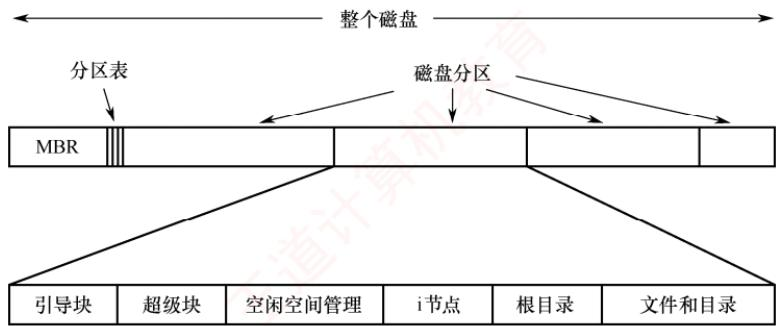

<em>图 4.20 一个可能的文件系统布局</em>

　　其主要组成部分简述如下：

1）主引导记录（Master Boot Record，MBR），位于磁盘的0号扇区，负责引导计算机。MBR后紧随一个分区表，用于记录各分区的起始与结束地址，并标记其中一个为活动分区。系统加电后，BIOS将MBR读入内存并执行；MBR首先识别活动分区，随后读取该分区的第一个扇区，即引导块。

2）引导块（boot block），MBR将控制权移交至引导块中的程序，由其负责加载并启动该分区中的操作系统。注意，每个分区均以引导块开头，即使当前未安装可启动的操作系统，也保留此区域，以便未来部署系统。在Windows中，该区域称为分区引导扇区。除引导块外，磁盘分区的后续布局因文件系统类型而异。UNIX/Linux系统中的文件系统通常还包含以下组件（见图4.20）：

3）超级块（super block），存储文件系统的所有关键信息。当系统启动或首次挂载该文件系统时，超级块会被读入内存。超级块中的典型内容包括：分区的总块数、块大小、空闲块数量及其指针、空闲 i 节点（inode）数量及指针等。

4）空闲块信息，记录未分配的磁盘块，通常以位示图或空闲链表实现。紧随其后的是一组i节点，每个文件对应一个i节点，其中完整描述了文件的各种属性。之后是根目录，作为整个目录树的起点。磁盘的其余空间则用于存放所有其他文件和目录的实际数据。

#### 2. 文件系统在内存中的结构

　　为高效管理文件系统并提升性能，系统在内存中维护一组数据结构。这些信息在文件系统挂载时加载，在运行期间动态更新，并在卸载时释放。典型的内存结构包括：

1）内存中的挂载表（mount table），记录每个已挂载文件系统分区的有关信息，如设备标识、挂载点、文件系统类型及挂载选项等。

2）内存中的目录项的缓存，缓存最近访问过的目录内容，以减少对磁盘的重复读取，加快路径解析速度。

3）系统级的打开文件表，为每个当前打开的文件维护一个FCB的副本，包含文件状态、访问权限、读/写指针、打开计数等全局信息。

4）进程级的打开文件表，每个进程拥有独立的打开文件表，包含该进程所使用的文件描述符及指向系统级打开文件表中对应表项的指针，从而实现进程与全局资源的关联。

### 4.3.2 文件存储空间管理

　　如 4.2.6 节所述，文件的物理结构包含两个方面：文件的分配方式与文件存储空间管理。后者专门负责记录磁盘中的哪些块是空闲的，并提供对这些块进行分配与回收的机制。由于系统以固定大小的物理块为单位进行数据交换，存储空间管理的核心任务是高效组织和管理空闲块。为此，系统需要维护描述空闲块状态的数据结构，而这正是本节要介绍的几种管理方法所要解决的问题。

> **考点追踪：** 磁盘空闲块管理的方法及特点（2019、2024）

#### 1. 空闲表法

　　空闲表法属于连续分配方式，其思想源于内存的动态分区分配：为每个文件分配一块物理上连续的磁盘区域。系统为外存中的所有空闲区维护一张空闲表，每个空闲区对应一个表项，包含序号、起始盘块号和空闲盘块数等信息，并按起始盘块号递增顺序排列，如表4.2所示。

　　表 4.2 空闲盘块表

　　<table><tr><td>序号</td><td>第一个空闲盘块号</td><td>空闲盘块数</td></tr><tr><td>1</td><td>2</td><td>4</td></tr><tr><td>2</td><td>9</td><td>3</td></tr><tr><td>3</td><td>15</td><td>5</td></tr><tr><td>4</td><td>—</td><td>—</td></tr></table>

　　盘块的分配:

　　空闲盘区的分配策略与内存动态分区分配一致，通常采用首次适应(First Fit)、最佳适应(Best Fit)等算法。当系统为新创建的文件分配空间时，会顺序扫描空闲表，查找第一个大小满足需求的空闲区；一旦找到，便将其分配给用户，并立即更新空闲表。

　　盘块的回收:

　　回收用户释放的空间时，也借鉴内存回收机制：需要判断回收区是否与空闲表中相邻的前区或后区在物理上连续。若相邻，则将它们合并为一个更大的空闲区，以减少碎片。

　　空闲表法的优点：具有较高的分配效率，能够显著降低磁盘 I/O 次数。尤其对于小型文件（如占用 1～5 个盘块），连续分配不仅实现简单，还能充分发挥磁盘顺序读/写的性能优势。

#### 2. 空闲链表法

　　空闲链表法将所有空闲盘区组织成一条链表，根据链表节点的不同，可分为以下两类：

##### （1）空闲盘块链

　　空闲盘块链以单个盘块为单位，将所有空闲盘块链接成一条链，每个盘块包含一个指向下一个空闲盘块的指针。分配时：从链首依次摘下所需数量的盘块分配给用户。回收时：将释放的盘块逐个插入链尾。

　　空闲盘块链的优点：单个盘块的分配与回收操作极为简单。缺点：为一个文件分配多个盘块需要多次访问链表，效率较低；且由于管理粒度细，空闲盘块链通常较长，管理开销大。

##### （2）空闲盘区链

　　空闲盘区链以空闲盘区（一组连续的盘块）为单位构建链表。每个盘区包含两项信息：本盘区的盘块数和指向下一个空闲盘区的指针。分配时：采用与内存动态分区分配类似的策略（如首次适应算法），查找满足需求的空闲盘区进行分配。回收时：需要判断回收区是否与链表中相邻的空闲盘区在物理上连续，若相邻则合并，从而有效减少外部碎片。

　　空闲盘区链的优缺点与空闲盘块链恰好相反，优点：分配与回收的效率较高，且空闲盘区链的长度较短。缺点：分配与回收的过程较为复杂，需要处理盘区的分割与合并操作。

#### 3. 位示图法

> **考点追踪：** 位示图的应用及相关计算（2010、2014、2015、2023）

　　位示图法利用二进制的一位来表示磁盘中一个盘块的使用状态：磁盘上的每个盘块均对应位示图中的一个比特位。当该位为“0”时，表示对应盘块空闲；为“1”时，表示已被分配。因此，一个由 $m \times n$ 位组成的位示图，恰好可描述 $m \times n$ 个盘块的使用情况，如图4.21所示。

　　盘块的分配：

1）顺序扫描位示图，查找一个（或一组）值为“0”的位。

2）将找到的一个（或一组）比特位转换为对应的盘块号。假设该位位于位示图中的第 $i$ 行、第 $j$ 列（行、列编号从1开始），每行包含 $n$ 位，则对应盘块号 $b$ 按下式计算：

$$
b = n (i - 1) + j
$$

3）修改位示图，置 $\text{map}[i,j]=1$ 。

  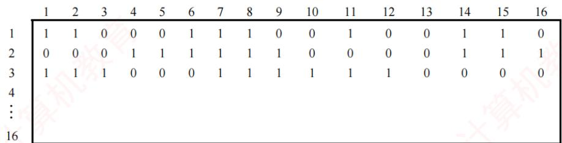

<em>图 4.21 位示图法示意图</em>

　　盘块的回收:

1）将回收盘块的盘块号 $b$ 转换为位示图中的行号和列号。计算公式为

$$
i = (b - 1) \mathrm{DIV} n + 1
$$

$$
j = (b - 1) \mathrm{MOD} n + 1
$$

2）修改位示图，置 $\text{map}[i,j]=0$ 。

> **注意**

　　本书中位示图的行和列均从1开始编号。若题目指定从0开始，则上述公式需要相应调整。

　　位示图法的优点：查找高效，能快速在位示图中找到一个或一组相邻的空闲盘块，便于实现连续分配；位示图结构紧凑，占用内存空间极小，可常驻内存，避免频繁访问磁盘。缺点：位示图大小会随着磁盘容量的增加而增大，因此更适用于小型或中等规模的系统。

#### 4. 成组链接法

　　空闲表法和空闲链表法均不适用于大型文件系统，因其管理结构随磁盘容量增大而过度膨胀。为此，UNIX 系统采用成组链接法，它融合了二者的思想，有效控制了管理结构的规模。

　　成组链接法的思想：将所有空闲盘块划分为若干组（例如每组100个盘块）。除最后一组外，每组的第一个盘块用作索引块，用于记录下一组中所有空闲盘块的块号及其数量；这些索引块依次链接，形成一条链。文件系统挂载时，第一组的空闲盘块信息（包括块号列表和数量）被预先加载到内存的一个专用栈结构，称为空闲盘块号栈。例如，若系统空闲区为第201～7999号盘块，则分组如下：第一组为201～300号……次末组为7801～7900号，最末组为7901～7999号（共99个盘块）。最末组的块号由前一组的最后一个盘块（7900号）记录，而该盘块中存放的第一个盘块号为“0”，用作整条空闲链的结束标志，如图4.22所示。

  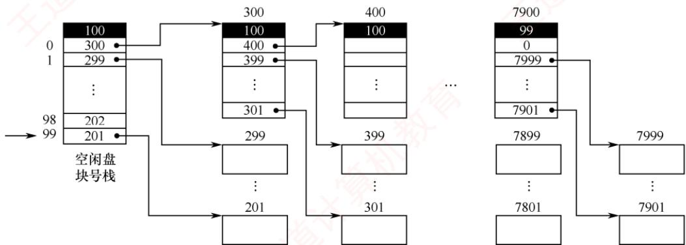

<em>图 4.22 成组链接法示意图</em>

　　简而言之，成组链接法通过“分组+索引+链接”的设计，既避免了长链表的遍历开销，又无须维护完整的空闲表，从而在可扩展性与性能之间取得了良好平衡。

　　盘块的分配:

　　从空闲盘块号栈顶取出一个盘块号并分配给用户，栈指针相应上移，栈中空闲盘块数减1。若此时栈指针到达栈底（表示当前组已分配完毕），则需要读取该栈底盘块号所对应的物理盘块内容——其中保存的是下一组的空闲盘块号列表。此时，先将该内容整体读入栈以更新空闲盘块号栈，再将原栈底所指的盘块（其索引作用已完成）分配出去。

　　例如，在图 4.22 中，系统先依次分配 201～299 号盘块；当需要分配 300 号盘块时，首先将其内容（下一组的块号列表）读入空闲盘块号栈，随后将 300 号盘块本身分配给用户。

　　盘块的回收:

　　系统将释放的盘块号压入空闲盘块号栈顶部，栈指针相应下移，栈中空闲盘块数加1。若此时栈已满（如达到100项），则需要将当前栈中的全部盘块号写入该新回收的盘块，使其成为新的索引块；随后，将该盘块号设为新的栈底，并将栈中空闲盘块数重置为1。

　　描述空闲空间的数据结构（如空闲盘块号栈）以及文件系统的关键信息，通常存储在磁盘的固定位置。在 UNIX 系统中，这一区域称为超级块。文件系统挂载时会将其读入内存，并在运行过程中持续维护内存副本与磁盘副本的一致性，从而确保空闲空间管理的正确性与可靠性。

### 4.3.3 虚拟文件系统

> **考点追踪：** 虚拟文件系统的原理与特点（2025）

　　现代操作系统通常需要支持多种文件系统，如ext4、NTFS、FAT等。这些文件系统在磁盘组织方式、元数据格式和操作方法上各不相同。若应用程序为每种文件系统分别编写代码，则不仅开发困难，系统的可维护性也会显著降低。为此，操作系统引入了虚拟文件系统（VFS），它位于用户程序与具体文件系统之间，向上提供统一的文件操作接口，如图4.23所示。有了VFS，用户程序就无须关心底层使用的是哪种文件系统。无论文件存储在何种设备上、采用何种格式，程序只需调用标准系统调用［如open()、write()等］即可完成操作。VFS则负责将这些通用请求转发给相应的文件系统进行处理，进而让用户无须察觉底层文件系统的差异。

  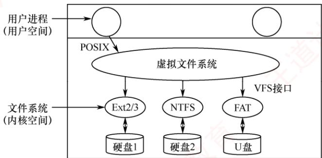

<em>图 4.23 虚拟文件系统的示意图</em>

　　VFS 采用面向对象的设计思想，抽象出一个通用的文件系统模型，并将其中的公共特性封装为四种对象。每个对象都包含数据成员和一组操作函数指针，这些函数由具体的文件系统提供。只要新的文件系统实现了 VFS 定义的接口，就能被系统识别、挂载并使用。这四种对象如下。

##### （1）超级块对象

　　超级块对象表示一个已挂载的文件系统。它对应磁盘上的超级块，记录该文件系统的全局信息，如块大小、总块数、空闲块数量以及文件系统类型等。当文件系统挂载时，VFS将其超级块读入内存，创建对应的超级块对象，并设置好相关的操作函数，如分配inode、同步元数据等。

##### （2）V 节点对象

　　V 节点（vnode）对象是 VFS 中最重要的抽象对象，用于在内存中表示一个具体的文件或目录。每个 vnode 对象关联底层某个具体文件系统的索引节点（如 ext4 的 inode），本质上是对各类文件系统元数据的统一封装：向上为系统调用提供统一的文件属性（如权限、大小、时间戳等），向下通过指针指向该文件系统私有的元数据结构。vnode 对象仅在文件首次被访问时动态创建于内存，引用计数归零后自动释放；其内部包含一组标准操作函数指针（如 read、write 等），VFS 通过这些指针将上层请求分发至相应文件系统的具体实现，以屏蔽不同文件系统的差异。

> **注意**

　　V节点并不等同于磁盘上的inode。V节点是VFS为统一管理各类文件而创建的内存对象，它与inode通过指针关联，协同完成文件操作：V节点提供统一接口，inode提供实际存储信息。

##### （3）目录项对象

　　目录项对象表示路径中的一个组成部分，如“/home/user/file”中的“user”。目录项对象并不直接对应磁盘上的某个固定结构，而是 VFS 在解析路径时动态生成的内存缓存；每个目录项保存文件名、指向父目录项和子目录项的指针，以及指向对应 V 节点的指针；多个目录项组合形成逻辑上的目录树；VFS 通过缓存常用目录项，有效加快后续路径查找的速度。

##### （4）文件对象

　　文件对象表示一个进程所打开的文件，可理解为“文件在进程中的运行实例”，正如进程是程序的运行实例。当进程调用 open() 时，内核为其创建一个文件对象；当调用 close() 且引用计数归零时，该对象被销毁。文件对象保存当前读/写位置（文件指针）、访问模式（读/写或追加）和引用计数等信息，并包含指向对应 V 节点和目录项的指针；它提供的 read、write、seek 等操作接口最终由 V 节点转发至底层文件系统执行。

　　下面以 write()为例说明 VFS 的工作过程：当进程调用 write(fd, buf, n)时，内核首先进入 VFS 层，执行 sys_write()函数；随后根据文件描述符 fd 定位到对应的文件对象，并通过该对象获取其关联的 V 节点；接着，VFS 利用 V 节点中预置的写操作函数指针，调用目标文件系统的具体写方法；该文件系统将数据写入缓冲区，最终通过设备驱动完成磁盘写入。write()系统调用操作示意图如图 4.24 所示。

  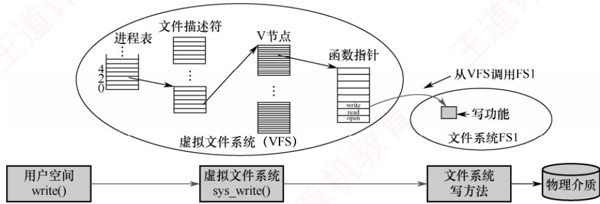

<em>图 4.24 write()系统调用操作示意图</em>

　　总结：对用户程序而言，所有文件操作均通过 VFS 提供的统一接口完成，无须关心底层使用的是 ext4、NTFS 还是其他文件系统。VFS 借助前述四类对象，屏蔽不同文件系统的实现细节，使其在系统中呈现出一致的行为。需要强调的是，VFS 本身并不是一种真正的文件系统——它仅存在于内存之中，不占用磁盘空间，随系统启动而建立，随系统关闭而释放。

### 4.3.4 文件系统挂载

　　如同文件在使用之前必须先打开一样，文件系统在被进程访问前也必须先安装，也称挂载（Mounting）。将某个设备上的文件系统挂载到目录树中的一个目录后，即可通过该目录访问该设备上的文件。此处的设备是指逻辑上的设备，如同一磁盘的不同分区可视为多个独立设备。

　　Windows 系统采用驱动器号（如 C:、D:）标识分区（也称卷），每个分区拥有独立的目录树结构，并关联一个已挂载的文件系统。文件路径通常表示为 drive-letter:\path\to\file。访问时，操作系统根据驱动器号定位对应的文件系统，再在其目录结构中查找目标文件。较新版本的 Windows 也支持将文件系统挂载到目录树下的任意目录（称为装入点），其行为与 UNIX 类似。系统启动时，Windows 会自动探测所有存储设备，并挂载其所识别的文件系统。

　　UNIX 系统则以单一的根文件系统为基础，该文件系统在系统启动时由内核直接挂载，通常包含内核映像等关键文件。除根文件系统外，所有其他文件系统都必须挂载到根文件系统中的某个目录下才能被访问。这些文件系统可在系统初始化阶段自动挂载，也可由用户手动挂载。用于挂载的目录称为挂载点（mount point）。需要注意的是：同一个设备可以被挂载到多个不同的挂载点；但同一挂载点在同一时刻只能挂载一个设备。

　　例如，将位于磁盘/dev/fd0 上的 ext2 文件系统，通过 mount 命令挂载到目录/flp:

$$
\text { mount   -t   ext2   /dev / fd0   /flp }
$$

　　若需要卸载该文件系统，则使用 umount 命令。

　　贯穿本章有两条主线：其一，引入一种新的抽象数据类型——文件，从逻辑结构（如流式、记录式）和物理结构（如连续、链接、索引）两个维度展开；其二，阐述操作系统如何管理文件，包括多文件的组织方式（目录结构）、用户请求的处理机制（如系统调用、VFS分发）以及底层存储的调度策略（磁盘管理）。仅了解宏观框架是远远不够的，其目的正是为了更好地掌握微观细节；读者应通过反复做题与思考，不断深化对知识点的理解与运用。

### 4.3.5 本节小结

　　本节开头提出的问题的参考答案如下。

#### 1. 什么是文件系统？

　　操作系统中负责管理和存储文件信息的软件机构称为文件管理系统，简称文件系统。文件系统由三部分组成：与文件管理相关的软件、被管理的文件，以及实现文件管理所需要的数据结构。

#### 2. 文件系统要完成哪些功能？

　　对用户而言，文件系统最主要的功能是支持对文件的基本操作，使用户能够按名存取和查找文件，将其组织为合适的逻辑结构，并提供基本的文件共享与保护机制。对操作系统而言，文件系统还需要管理与磁盘之间的信息交换，完成文件逻辑结构到物理结构的映射，合理组织文件在磁盘上的存放，并采用高效的文件布局策略与磁盘调度方法，以提升系统整体性能。

### 4.3.6 本节习题精选

#### 一、单项选择题

01. 从用户的观点看，操作系统中引入文件系统的目的是（）。
- A. 保护用户数据 B. 实现对文件的按名存取
- C. 实现虚拟存储 D. 保存用户和系统文档及数据

02. 逻辑文件系统的功能有（）。
I. 文件按名存取 II. 文件目录组织管理
III. 把文件名转换为文件描述符或文件句柄 IV. 存储保护
- A. I、II和III B. II、III和IV
- C. I、II和IV D. I、II、III和IV

03. 下列关于文件系统的说法中，正确的是（）。
- A. 一个文件系统可以管理的文件数量受限于文件控制块的数量
- B. 一个文件系统可使用的容量一定等于其所在磁盘的容量
- C. 一个文件系统中单个文件的大小只受磁盘剩余容量大小的限制
- D. 一个文件系统不能将数据存放在多个磁盘上

04. UNIX 操作系统中，文件的索引结构放在（）。
- A. 超级块 B. 索引节点 C. 目录项 D. 空闲块

05. 文件的存储空间管理实质上是对（）的组织和管理。
- A. 文件目录    B. 外存已占用区域    C. 外存空闲区    D. 文件控制块

06. 对外存文件区的管理应以（）为主要目标。
- A. 提高系统吞吐量
- B. 提高换入换出速度

- C. 降低存储费用 D. 提高存储空间的利用率

07. 位示图可用于（）。

- A. 文件目录的查找
- B. 磁盘空间的管理
- C. 主存空间的管理
- D. 文件的保密

08. 下列各种文件存储空间的管理方法中，（）需要使用空闲盘块号栈。
- A. 空闲表法 B. 空闲链表法 C. 位示图法 D. 成组链接法

09. 硬盘的主引导扇区（）。

- A. 包含引导记录
- B. 包含分区表和主引导程序
- C. 只包含主引导程序
- D. 只包含分区表

10. 若用 8 个字（字长 32 位）组成的位示图管理内存，即位示图有 8 行、32 列，行号和列号均从 1 开始，则块号为 100 的内存块所对应位示图的位置是（）。
- A. 字号为 3，位号为 5
- B. 字号为 4，位号为 4
- C. 字号为 3，位号为 4
- D. 字号为 4，位号为 5

11. 比较难得到连续空间的空闲空间管理方式是（）。

- A. 空闲链表
- B. 空闲表
- C. 位示图
- D. 成组链接

12. 下列选项中，（）不是 Linux 实现虚拟文件系统 VFS 所定义的对象类型。
- A. 超级块（superblock）对象
- B. 目录项（inode）对象
- C. 文件（file）对象
- D. 数据（data）对象

13. 【2014 统考真题】现有一个容量为 10GB 的磁盘分区，磁盘空间以簇为单位进行分配，簇的大小为 4KB，若采用位图法管理该分区的空闲空间，即用一位来标识一个簇是否被分配，则存放该位图所需要的簇数为（）。

- A. 80
- B. 320
- C. 80K
- D. 320K

14. 【2015 统考真题】文件系统用位图法表示磁盘空间的分配情况，位图存于磁盘的 32～127 号块中，每个盘块占 1024B，盘块和块内字节均从 0 开始编号。假设要释放的盘块号为 409612，则位图中要修改的位所在的盘块号和块内字节序号分别是（）。

- A. 81, 1
- B. 81, 2
- C. 82, 1
- D. 82, 2

15. 【2019 统考真题】下列选项中，可用于文件系统管理空闲磁盘块的数据结构是（）。I. 位图 II. 索引节点 III. 空闲磁盘块链 IV. 文件分配表（FAT）
- A. 仅 I、II B. 仅 I、III、IV C. 仅 I、III D. 仅 II、III、IV

16. 【2023 统考真题】某系统采用页式存储管理，用位图管理空闲页框。若页大小为 4KB，物理内存大小为 16GB，则位图所占空间的大小是（）。

- A. 128B
- B. 128KB
- C. 512KB
- D. 4MB

17. 【2024 统考真题】文件系统需要占用部分外存空间记录空闲块位置。在下列方法中，占用外存空间的大小与当前空闲块数量无关的是（）。
- A. 位图法 B. 空闲表法 C. 成组链接法 D. 空闲链表法

18. 【2025 统考真题】下列关于虚拟文件系统（VFS）的叙述中，正确的是（）。
- A. VFS 是在虚拟内存中建立的文件系统
- B. VFS 能提高不同文件系统中文件的访问速度
- C. VFS 定义了可以访问不同文件系统的统一接口
- D. 通过 VFS 只能访问本地文件，不能访问网络文件

#### 二、综合应用题

01. 一计算机系统利用位示图来管理磁盘文件空间。假定该磁盘组共有 100 个柱面，每个柱面有20个磁道，每个磁道分成8个盘块（扇区），每个盘块1KB，位示图如下图所示。

$$
\begin{array}{c c c c c c c c c c c c c c c c c c} \text {i} \mathcal {Y} & 0 & 1 & 2 & 3 & 4 & 5 & 6 & 7 & 8 & 9 & 1 0 & 1 1 & 1 2 & 1 3 & 1 4 & 1 5 \\ 0 & 1 & 1 & 1 & 1 & 1 & 1 & 1 & 1 & 1 & 1 & 1 & 1 & 1 & 1 & 1 & 1 \\ 1 & 1 & 1 & 1 & 1 & 1 & 1 & 1 & 1 & 1 & 1 & 1 & 1 & 1 & 1 & 1 & 1 \\ 2 & 1 & 1 & 0 & 1 & 1 & 1 & 1 & 1 & 1 & 1 & 1 & 1 & 1 & 1 & 1 & 1 \\ 3 & 1 & 1 & 1 & 1 & 1 & 1 & 0 & 1 & 1 & 1 & 1 & 1 & 1 & 0 & 0 & 0 \\ 4 & 0 & 0 & 0 & 0 & 0 & 0 & 0 & 0 & 0 & 0 & 0 & 0 & 0 & 0 & 0 & 0 \end{array}
$$

1）试给出位示图中位置 $(i,j)$ 与对应盘块所在的物理位置（柱面号，磁头号，扇区号）之间的计算公式。假定柱面号、磁头号、扇区号都从0开始编号。

2）试说明分配和回收一个盘块的过程。

02. 假定一个盘组共有 100 个柱面，每个柱面上有 16 个磁道，每个磁道分成 4 个扇区。

1）整个磁盘空间共有多少个存储块？（每个扇区对应一个存储块）

2）若用字长32位的单元来构造位示图，共需要多少个字？

3）位示图中第18个字的第16位对应的块号是多少？（字号和位号都从1开始）

### 4.3.7 答案与解析

#### 一、单项选择题

**01. B**

　　从系统角度看，文件系统负责对文件的存储空间进行组织、分配，负责文件的存储并对文件进行保护、检索。从用户角度看，文件系统根据一定的格式将文件存放到存储器中适当的地方，当用户需要使用文件时，系统根据用户所给的文件名能够从存储器中找到所需要的文件。

**02. D**

　　逻辑文件系统的功能包括对文件按名存取，进行文件目录组织管理，将文件名转换为文件描述符或文件句柄，进行存储保护，因此4个说法均正确。

**03. A**

　　一个文件系统的容量不一定等于承载该文件系统的磁盘容量。一个磁盘可分为多个分区，每个分区可以有不同的文件系统，单个文件的大小不仅受磁盘剩余容量大小的限制，还受 FCB 和 FAT 表等结构的限制。利用磁盘阵列技术，一个文件系统可将数据存放到多个磁盘上。

**04. B**

　　UNIX 采用树形目录结构，文件信息存放在索引节点中。超级块是用来描述文件系统的。

**05. C**

　　文件存储空间管理即文件空闲空间管理。文件管理要解决的重要问题是，如何为创建文件分配存储空间，即如何找到空闲盘块，并对其管理。

**06. D**

　　文件区占磁盘空间的大部分，因为通常的文件都较长时间地驻留在外存上，对它们的访问频率是较低的，所以对文件区管理的主要目标是提高存储空间的利用率。

**07. B**

　　位示图方法是空闲块管理方法，用于管理磁盘空间。

**08. D**

　　成组链接法将所有空闲盘块分成若干组，每组的第一个盘块记录下一组的空闲盘块总数和空闲盘块号。第一组的空闲盘块总数和空闲盘块号存放在内存的专用栈中，称为空闲盘块号栈。

**09. B**

　　硬盘的主引导扇区由三部分组成：主引导程序，也称主引导记录（MBR），用于系统启动时将控制转给用户指定的并在分区表中登记了的某个活动分区；分区表，给出每个分区的起始和结束地址；结束标志，其值通常为AA55。

**10. B**

　　首先求出块号 100 所在的行号，1～32 在行号 1 中，33～64 在行号 2 中，65～96 在行号 3 中，97～128 在行号 4 中，所以块号 100 在行号 4 中；然后求出块号 100 在行号 4 中的哪列，行号 4 的第 1 列是块号 97，以此类推，块号 100 在行号 4 中的第 4 列。另解，行号 row 和列号 col 分别为

$$
\begin{array}{l} \text { row } = (1 0 0 - 1) \text { DIV } 3 2 + 1 = 4 \\ \text { col } = (1 0 0 - 1) \text { MOD } 3 2 + 1 = 4 \end{array}
$$

　　即字号为 4，位号也为 4。

**11. A**

　　空闲链表法适用于离散分配，比较难得到连续空间。空闲表法适用于连续分配，容易得到连续空间。位示图法适用于连续分配和离散分配，容易找到连续的空闲块。成组链接法是将连续分配和离散分配相结合的方法，也能方便找到连续的空闲块。

**12. D**

　　为了实现虚拟文件系统（VFS），Linux 主要抽象了四种对象类型：超级块对象、索引节点对象、目录项对象和文件对象。选项 D 错误。

**13. A**

　　簇的总数为 10GB/4KB = 2.5M，用一位标识一簇是否被分配，整个磁盘共需要 2.5Mbit，即需要 2.5M/8 = 320KB，因此共需要 320KB/4KB = 80 簇。

**14. C**

　　盘块号 = 起始块号 + $\left\lfloor$ 盘块号/ $(1024\times8)\right\rfloor = 32 + \left\lfloor 409612/(1024\times8)\right\rfloor = 32 + 50 = 82$ ，这里问的是块内字节号而不是位号，因此还需要除以8，块内字节号 = $\left\lfloor (\text{盘块号}\% (1024\times8))/8\right\rfloor = 1$ 。

**15. B**

　　传统文件系统管理空闲磁盘的方法包括空闲表法、空闲链表法、位示图法和成组链接法，说法I、III正确。FAT的表项与物理磁盘块一一对应，并且可以用一个特殊的数字-1表示文件的最后一块，用-2表示这个磁盘块是空闲的（当然也可用-3,-4来表示），因此FAT不仅记录了文件中各个块的先后链接关系，还标记了空闲的磁盘块，操作系统可以通过FAT对文件存储空间进行管理，说法IV正确。索引节点是操作系统为了实现文件名与文件信息分开而设计的数据结构，存储了文件描述信息，索引节点属于文件目录管理部分的内容，说法II错误。

**16. C**

　　物理内存大小为 16GB，页大小为 4KB，则物理内存的总页框数为 $16GB/4KB = 2^{34}/2^{12} = 2^{22}$ 。位图用 1 位来表示一个页框是否空闲，所以占用的空间大小为 $2^{22}b = 2^{19}B = 512KB$ 。

**17. A**

　　位图法利用一个二进制位来表示磁盘中一个盘块的使用情况，磁盘上的所有盘块都有一个二进制位与之对应。当其值为“0”时，表示对应的盘块空闲；当其值为“1”时，表示已分配。位图所占空间的大小只取决于外存空间的总大小（盘块数量），而与当前空闲块数量无关。

**18. C**

　　虚拟文件系统（VFS）是操作系统内核中的一个抽象层，其核心目标是向上层应用程序提供统一的文件操作接口（如 open、read 等），进而屏蔽底层各类文件系统（如 ext4、NTFS 等）在实现细节上的差异。VFS 并不是一种在虚拟内存中实现的文件系统，也不存在储实际数据，仅作为软件抽象存在。它不改变底层文件系统的数据组织方式，因此无法提升文件访问速度，读/写性能仍由具体文件系统结构及存储设备决定。此外，VFS的设计支持多种文件系统类型，包括本地文件系统和网络文件系统（如NFS），能够透明地访问远程文件。因此，只有关于VFS提供统一接口的描述准确反映了其本质功能。

#### 二、综合应用题

**01. 【解答】**

1）根据位示图的位置 $(i,j)$ ，得出盘块的序号 $b = i \times 16 + j$ ；用 $C$ 表示柱面号， $H$ 表示磁头号， $S$ 表示扇区号，则有

$$
C = b / (20 \times 8), \quad H = (b \% (20 \times 8)) / 8, \quad S = b \% 8
$$

2）分配：顺序扫描位示图，找出1个其值为“0”的二进制位（“0”表示空闲），利用上述公式将其转换成相应的序号 $b$ ，并修改位示图，置 $(i,j) = 1$ 。

　　回收：将回收盘块的盘块号换算成位示图中的 $i$ 和 $j$ ，转换公式为

$$
b = C \times 20 \times 8 + H \times 8 + S, \quad i = b / 16, \quad j = b \% 16
$$

　　最后将计算出的 $(i,j)$ 在位示图中置“0”。

**02. 【解答】**

1）整个磁盘空间的存储块（扇区）数量为 $4 \times 16 \times 100 = 6400$ 个。

2）位示图应为 6400 个位，用字长为 32 位（n=32）的单元来构造位示图时，需要 $6400/32=200$ 个字。

3）位示图中第18个字的第16位（i=18,j=16）对应的块号为 $32\times(18-1)+16=560$ 。

## 4.4 本章疑难点

#### 1. 文件的物理分配方式的比较

　　文件的三种物理分配方式的比较如表 4.3 所示。

　　表 4.3 文件三种分配方式的比较

　　<table><tr><td></td><td>访问第n条记录</td><td>优点</td><td>缺点</td></tr><tr><td>连续分配</td><td>需要访问磁盘1次</td><td>顺序存取时速度快,文件定长时可根据文件起始地址及记录长度进行随机访问</td><td>文件存储要求连续的存储空间,会产生碎片,不利于文件的动态扩充</td></tr><tr><td>链接分配</td><td>需要访问磁盘n次</td><td>可解决外存的碎片问题,提高外存空间的利用率,动态增长较方便</td><td>只能按照文件的指针链顺序访问,查找效率低,指针信息存放消耗外存空间</td></tr><tr><td>索引分配</td><td>m级需要访问磁盘<eq>m+1</eq>次</td><td>可以随机访问,文件易于增删</td><td>索引表增加存储空间的开销,索引表的查找策略对文件系统效率影响较大</td></tr></table>

#### 2. 文件打开的过程描述

　　① 检索目录，要求打开的文件应该是已经创建的文件，它应登记在文件目录中，否则会出错。在检索到指定文件后，就将其磁盘 inode 复制到活动 inode 表中。

　　② 将参数 mode 所给出的打开方式与活动 inode 中在创建文件时所记录的文件访问权限相比较，若合法，则此次打开操作成功。

　　③ 当打开合法时，为文件分配用户打开文件表表项和系统打开文件表表项，并为后者设置初值，通过指针建立表项与活动 inode 之间的联系，再将文件描述符 fd 返回给调用者。
