## 【考纲内容】

（一）输入/输出（I/O）管理基础

　　设备：设备的基本概念，设备的分类，I/O 接口

　　I/O 控制方式：轮询方式，中断方式，DMA 方式

　　I/O软件层次结构：中断处理程序，驱动程序，设备独立性软件，用户层I/O软件

　　输入/输出应用程序接口：字符设备接口，块设备接口，网络设备接口，阻塞/非阻塞I/O

（二）设备独立软件

　　缓冲区管理；设备分配与回收；假脱机技术（SPOOLing）；设备驱动程序接口

（三）外存管理

　　磁盘：磁盘结构，格式化，分区，磁盘调度算法

　　固态硬盘：读/写性能特性，磨损均衡

## 【复习提示】

　　本章内容较为分散，重点掌握 I/O 接口、I/O 软件、I/O 控制方式、缓冲区管理、SPOOLing 技术，以及磁盘特性与调度算法。由于涉及较多硬件相关知识，建议结合《计算机组成原理》中的相关内容进行复习。本章在历年统考中所占分值较小，且命题通常较为直接：认真复习者一般能准确作答，而未接触相关内容者则难以凭直觉判断。考研成功的秘诀在于复习要 “全面反复” 且 “多次”，偷工减料终将吃亏，希望读者重视本章内容。

## 5.1 I/O 管理概述

　　在学习本节时，请读者思考：I/O 管理需要完成哪些核心功能？

### 5.1.1 I/O 设备

　　I/O 设备管理是操作系统中最复杂且多样化的部分，其核心是通过软硬件协作，屏蔽不同设备的物理差异，使应用程序能以统一方式使用各类设备。一个 I/O 设备通常由两部分组成：设备本身和设备控制器。设备本身是执行具体输入或输出操作的物理装置（如磁盘的盘片与磁头）；设备控制器则是连接到系统总线上的专用电路（如接口芯片），负责将操作系统发出的抽象命令（如“读取第 x 个扇区”）转换为设备可识别的电信号，并协调主机与设备间的数据传输。通过这种设计，操作系统无须了解各类设备的具体细节，即可统一管理它们。

#### 1. 设备的分类

　　I/O设备是指能够向计算机输入数据或接收其输出数据的外部设备。I/O设备类型多样，可从不同角度进行分类。

##### （1）按信息交换单位分类

1）块设备。以固定大小的数据块为单位进行信息交换，如磁盘等。其基本特征是传输速率较高、支持随机访问（可寻址），允许对任意数据块进行读/写操作。

2）字符设备。以字符（或字节）为单位进行信息交换，如交互式终端、打印机等。其基本特征是传输速率较低、不可寻址，通常采用中断方式实现异步通信。

##### （2）按传输速率分类

1）低速设备。传输速率仅为每秒几字节至数百字节，如键盘、鼠标等。

2）中速设备。传输速率为每秒数千字节至数十千字节，如激光打印机等。

3）高速设备。传输速率可达每秒数百千字节至数百兆字节（甚至更高），如磁盘等。

（3）按使用特性分类

1）人机交互设备。用于用户与计算机之间的信息交互，如键盘、显示器、打印机等。

2）存储设备。用于持久化存储数据，如磁盘、磁带、光盘等。

3）网络通信设备。用于计算机间通信，如网卡、调制解调器等。

##### （4）按共享属性分类

1）独占设备。任一时刻仅允许一个进程使用。一旦分配给某进程，即由该进程独占，直至使用完毕后释放。典型的独占设备多为低速设备，如打印机。

2）共享设备。允许多个进程在逻辑上并发访问。尽管物理访问仍需调度协调，系统可将其分配给多个进程分时交替使用。磁盘是典型的共享设备。

3）虚拟设备。通过 SPOOLing 技术，将独占设备改造为多个逻辑设备，使多个进程能并发使用。其实质是利用高速共享设备（如磁盘）作为缓冲区，实现独占设备的逻辑共享。

#### 2. I/O 接口

　　I/O 接口（也称设备控制器）是 CPU 与设备之间的 “桥梁”，用于实现计算机与设备之间的数据交换。它接收 CPU 发出的命令，控制设备工作，使 CPU 得以从烦琐的设备控制事务中解脱出来。设备控制器主要由如下三部分组成，如图 5.1 所示。

  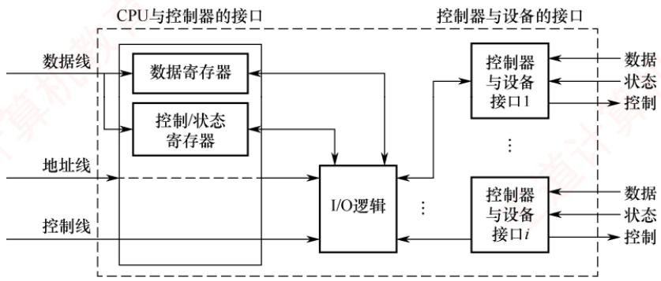

<em>图 5.1 设备控制器的组成</em>

1）设备控制器与 CPU 的接口。用于实现 CPU 与设备控制器之间的通信。该接口包括三类信号线：数据线、地址线和控制线。数据线用于传输读/写数据、控制和状态信息；地址线用于指定 I/O 接口中的寄存器编号；控制线用于传送读/写等控制信号。

2）设备控制器与设备的接口。一个设备控制器可连接一个或多个设备，因此内部包含一个或多个设备接口。每个接口均可传输数据、控制和状态三类信号。

3）I/O 逻辑。用于实现对设备的控制。它通过控制线与 CPU 交互，对接收的 I/O 命令进行译码，并依据目标地址识别相应设备。CPU 启动设备时，向控制器发送启动命令及目标地址，由 I/O 逻辑完成解析并控制指定的设备。

　　设备控制器的主要功能有：① 接收并识别命令，例如磁盘控制器可响应 CPU 发出的读、写、寻道等命令；② 完成数据交换，包括 CPU 与控制器之间以及控制器与设备之间的数据传输；③ 标识并报告设备状态，供 CPU 查询与处理；④ 地址识别；⑤ 数据缓冲；⑥ 差错控制。

　　以磁盘控制器为例：当它接收到一条读命令（如“读取第11408个扇区”）后，会自动将线性扇区号转换为对应的柱面号、盘面号和扇区号，并控制磁头定位、等待旋转延迟、读取数据，最终将数据可靠地传送到内存。操作系统只需发出命令，而无须关心底层硬件的具体实现细节。

#### 3. I/O 接口的类型

　　从不同角度看，I/O 接口可分为以下类型。

1）按数据传送方式（设备与接口一侧），可分为并行接口（一个字节或一个字的所有位同时传送）和串行接口（一位一位地有序传送），接口需完成相应的并/串或串/并格式转换。

2）按主机访问设备的控制方式，可分为程序查询接口、中断接口和DMA接口等。

3）按功能灵活性，可分为可编程接口（通过编程改变接口功能）和不可编程接口。

4）按设备类型的不同，可分为字符设备接口、块设备接口和网络设备接口。

#### 4. I/O 端口

　　I/O 端口是指设备控制器中可被 CPU 访问的寄存器，主要包括以下三类：

- 数据寄存器：缓存从设备送来的输入数据，或暂存CPU发出的输出数据。

- 状态寄存器：保存设备的状态或执行结果，供CPU读取。

- 控制寄存器：由CPU写入，用于启动操作或设置设备的工作模式。

　　为使 CPU 能够访问 I/O 端口，必须对各端口进行编址，每个端口对应一个唯一的端口地址。常见的编址方式主要有独立编址和统一编址两种，如图 5.2 所示。

##### （1）独立编址（I/O 映射方式）

　　独立编址为 I/O 端口建立一个独立于主存的地址空间。I/O 端口地址与内存地址在逻辑上完全分离，地址值可以相同，但由于属于不同地址空间，不会发生冲突。CPU 通过专用的 I/O 指令（如 x86 中的 IN 和 OUT）访问 I/O 端口，指令中的地址字段指定端口号。

  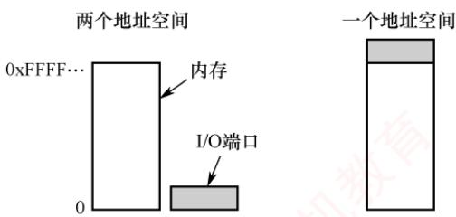

<em>图 5.2 独立编址 I/O 和内存映射 I/O</em>

　　优点：I/O 端口数量远少于内存单元，所需地址线较少，译码电路简单，寻址速度快；使用专用 I/O 指令，使程序中的 I/O 操作清晰可辨，便于阅读与调试。

　　缺点：I/O 指令功能有限，通常仅支持简单的数据传输，程序设计灵活性较差；CPU 需同时提供存储器读/写和 I/O 读/写两组控制信号，增加了控制逻辑的复杂性。

##### （2）统一编址（内存映射方式）

　　统一编址将部分主存地址空间分配给 I/O 端口，使 I/O 端口与内存单元共享同一地址空间。通过地址范围即可区分访问目标（如高地址段映射到 I/O 设备），因此无须专用 I/O 指令，CPU 使用普通的访存指令（如加载和存储指令）即可访问 I/O 端口。

　　优点：无须专用 I/O 指令，使得编程更加灵活；I/O 端口可获得较大的编址空间；I/O 访问的保护机制可由虚拟存储管理系统统一实现，无须额外硬件支持。

  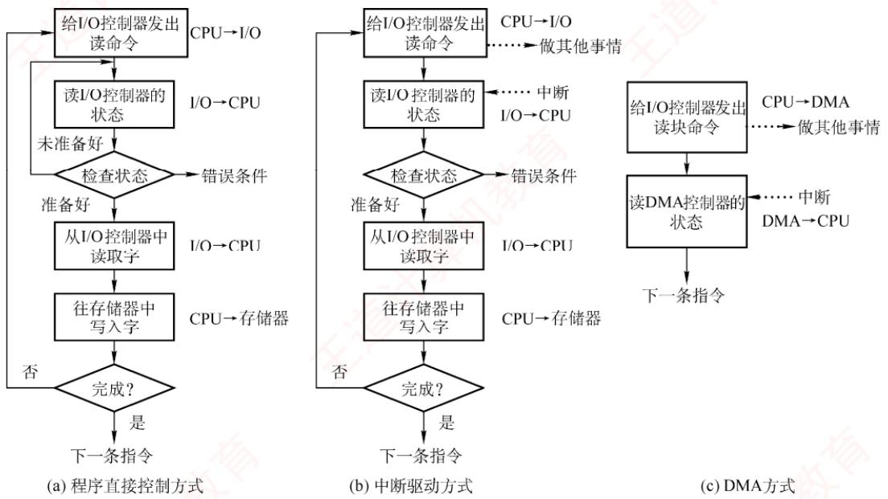

　　缺点：I/O 端口占用主存地址空间，减少了系统可用内存容量；由于需根据完整地址判断是否为 I/O 区域，译码电路相对复杂，通常会降低译码速度。

### 5.1.2 I/O 控制方式①

　　I/O 控制是指控制设备和主机之间的数据传送。在 I/O 控制方式的发展过程中，始终贯穿着这样一个宗旨：尽量减少 CPU 对 I/O 控制的干预，将 CPU 从繁杂的 I/O 控制事务中解脱出来，以便其能更多地去执行运算任务。I/O 控制方式共有 4 种，下面分别加以介绍。

#### 1. 程序直接控制方式

　　CPU 对 I/O 设备的控制采取轮询的 I/O 方式，也称程序轮询方式。如图 5.3(a) 所示，CPU 向设备控制器发出一条 I/O 指令，从 I/O 设备读取一个字（节），然后不断地循环测试设备状态（称为轮询），直到确定该字（节）已在设备控制器的数据寄存器中。于是 CPU 将数据寄存器中的数据取出，送入内存的指定单元，这样便完成了一个字（节）的 I/O 操作。

<em>图 5.3 I/O 控制方式的操作流程</em>

　　这种方式简单且易于实现，但缺点也很明显。CPU 的绝大部分时间都处于等待 I/O 设备状态的循环测试中，CPU 和 I/O 设备只能串行工作，由于 CPU 和 I/O 设备的速度差异很大，导致 CPU 的利用率相当低。而 CPU 之所以要不断地测试 I/O 设备的状态，就是因为在 CPU 中未采用中断机制，使 I/O 设备无法向 CPU 报告它已完成了一个字（节）的输入操作。

#### 2. 中断驱动方式

　　中断驱动方式的思想是允许 I/O 设备主动打断 CPU 的运行并请求服务，从而 “解放” CPU，使得 CPU 向设备控制器发出一条 I/O 指令后可以继续做其他有用的工作。如图 5.3(b) 所示，我们从设备控制器和 CPU 两个角度分别来看中断驱动方式的工作过程。

　　从设备控制器的角度来看：设备控制器从 CPU 接收一个读命令，然后从设备读数据。一旦数据读入设备控制器的数据寄存器，便通过控制线向 CPU 发出中断信号，表示数据已准备好，然后等待 CPU 请求该数据。设备控制器收到 CPU 发出的取数据请求后，将数据放到数据总线上，传到 CPU 的寄存器中。至此，本次 I/O 操作完成，设备控制器又可开始下一次 I/O 操作。

> **考点追踪：** 中断处理程序执行时请求进程的状态（2017、2023）

　　从 CPU 的角度来看：当前运行进程发出读命令，该进程将被阻塞，然后保存该进程的上下文，转去执行其他程序。在每个指令周期的末尾，CPU 检查中断信号。当有来自设备控制器的中断时，CPU 保存当前运行进程的上下文，转去执行中断处理程序以处理该中断请求。中断处理程序从设备控制器的数据寄存器中读取一个字节（或字），并将其写入内核的缓冲区。处理完成后，系统解除原 I/O 请求进程的阻塞状态，并恢复相应进程的上下文以继续执行。

　　相比于程序轮询 I/O 方式，在中断驱动 I/O 方式中，设备控制器通过中断主动向 CPU 报告 I/O 操作已完成，不再需要轮询，在设备准备数据期间，CPU 和设备并行工作，CPU 的利用率得到明显提升。但是，中断驱动方式仍有两个明显的问题：① 设备与内存之间的数据交换都必须经过 CPU 中的寄存器；② CPU 是以字（节）为单位进行干预的，若将这种方式用于块设备的 I/O 操作，则显然是极其低效的。因此，中断驱动 I/O 方式的速度仍然受限。

#### 3. DMA 方式

　　DMA（直接存储器存取）方式的核心思想是在 I/O 设备与内存之间建立直接数据通路，彻底 “解放” CPU。其特点如下：

1）基本传送单位是数据块，而不再是字（节）。

2）数据直接在设备与内存之间传输，而不再经过 CPU。

3）仅在数据块传送开始和结束时需要 CPU 干预。

<em>图 5.4 展示了 DMA 控制器的组成。</em>

  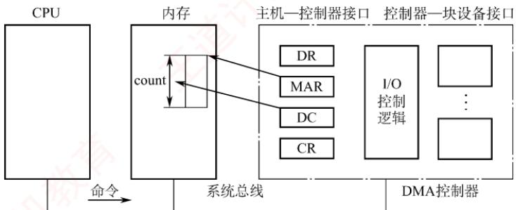

<em>图 5.4 DMA 控制器的组成</em>

　　为实现设备与内存之间直接交换成块的数据，DMA 控制器需包含以下四类寄存器：

1）命令/状态寄存器（CR）。暂存 CPU 发来的 I/O 命令或设备状态。

2）内存地址寄存器（MAR）。存放数据在内存中的起始地址。输入时（设备→内存），表示数据要写入内存的目标地址；输出时（内存→设备），表示数据从内存读取的源地址。

3）数据寄存器（DR）。暂存单次传输的数据单元（如一个字）。

4）数据计数器（DC）。记录本次需传送的字（节）总数。

> **考点追踪：** DMA方式的工作流程（2017）

　　如图 5.3(c) 所示，DMA 方式的工作过程如下：CPU 收到设备的 DMA 请求后，向 DMA 控制器发送启动命令，并设置 MAR 和 DC 的初值，随后启动 DMA 控制器。接着，CPU 将 I/O 控制权交予 DMA 控制器，转而执行其他任务。DMA 控制器接管总线后，以突发方式将整块数据在设备与内存之间直接传输，无须 CPU 干预。传输结束后，DMA 控制器向 CPU 发送中断信号，通知操作完成。因此，CPU 仅在数据传送的开始和结束阶段介入。

　　DMA 方式的优点：数据以 “块” 为单位传输，相比中断方式，CPU 干预频率进一步降低；数据也不再经过 CPU 寄存器，CPU 与设备的并行程度进一步提升。

#### 4. 通道控制方式

　　I/O 通道是一种专用处理机，能够执行存放在主存中的通道程序（由一系列专用通道指令组成）。设置通道后，CPU 仅需向通道发送一条 I/O 指令，指明目标设备及通道程序在内存中的起始地址。通道收到该指令后，便自主执行通道程序，完成全部 I/O 操作，并在结束后向 CPU 发出中断请求。由此，CPU、通道与 I/O 设备可高效并行工作，显著提升系统资源利用率。

　　通道与通用处理机的区别：通道的指令集专用于 I/O 控制，功能单一；它不具备独立的主存储器，其通道程序和数据均存放在主机内存中，且所有访存操作均受 CPU 控制。

　　通道与 DMA 方式的区别：DMA 需由 CPU 预设数据块大小、内存始址等参数；而通道通过执行程序动态确定参数，能自主完成涉及多台设备、多个阶段的复杂 I/O 任务。此外，每个 DMA 控制器通常仅服务于一台设备，而一个通道可同时管理多台设备与内存之间的数据交换。

　　每种方式的优点都在于解决了前一种方式的主要缺点。总体而言，I/O 控制方式的发展过程，就是要尽量减少 CPU 对 I/O 过程的干预，将 CPU 从繁杂的 I/O 控制事务中解脱出来。

　　下面通过一个形象的例子总结这几种 I/O 方式。想象一位客户要去裁缝店定制一批衣服的情形。采用程序直接控制方式时，裁缝没有客户的联系方式，客户只能每隔一段时间亲自去店里查看衣服是否做好，白白浪费大量时间。采用中断驱动方式时，裁缝有了客户的联系方式，每做完一件衣服就打电话通知客户来取，相比轮询方式，客户省去了反复跑腿的麻烦，但每件衣服都要跑一趟，依然效率不高。采用 DMA 方式时，客户花钱雇了一位秘书，并交代好：所有衣服先暂存在指定仓库，裁缝直接与秘书对接，由秘书负责取回衣服并入库，每处理完 100 件衣服，秘书才向客户汇报一次，从而大幅节省了客户的时间。采用通道方式时，客户交给秘书一份详细的办事清单（通道程序），秘书不仅能自主决定衣服存放的位置，还能根据清单灵活安排汇报时机。例如，是每完成 100 件还是 10000 件再通知客户，均由秘书自行判断。此外，一位 DMA 类秘书通常只能对接一位裁缝，而通道类秘书则可同时协调多位裁缝的工作。

### 5.1.3 I/O 软件层次结构

　　I/O 软件涉及面很广，向下与硬件密切相关，向上又与虚拟存储器系统、文件系统及用户直接交互，各类 I/O 操作均需通过 I/O 软件实现。

> **考点追踪：** I/O 子系统各层次的功能及分析（2011、2012、2013）

　　为使复杂的 I/O 软件具备清晰的结构、良好的可移植性和适应性，现代操作系统普遍采用层次化的 I/O 软件设计。系统将设备管理模块划分为若干层次，每层利用其下层提供的服务，完成输入/输出功能中的特定子任务，并屏蔽其实现细节，向上层提供统一接口。只要层间接口保持不变，任一层的修改都不会影响其他层次，仅最低层涉及硬件的具体特性。一种较为合理的四层划分如图 5.5 所示。整个 I/O 软件可视为具有 4 个层次的系统结构，各层次及其功能如下：

  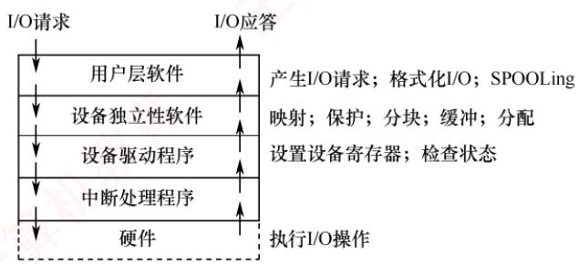

<em>图 5.5 I/O 层次结构</em>

#### 1. 用户层软件

　　实现与用户的交互接口。用户可直接调用用户层提供的 I/O 库函数（如与 I/O 操作相关的标准库函数）对设备进行操作。通常，大部分 I/O 软件位于操作系统内核，但仍有一小部分驻留在用户层，例如与用户程序链接的库函数。用户层 I/O 软件必须通过系统调用获取操作系统服务。

#### 2. 设备独立性软件

> **考点追踪：** 设备独立性所涵盖的内容（2020）

　　设备独立性（也称设备无关性）是指应用程序在使用 I/O 设备时，无须依赖具体的物理设备。为实现这一特性，系统引入了逻辑设备与物理设备的概念：应用程序使用逻辑设备名请求某类设备；系统在运行时，必须将逻辑设备名映射为实际的物理设备名。

　　使用逻辑设备名的优势在于：① 提高设备分配的灵活性；② 易于实现 I/O 重定向，I/O 重定向是指用于 I/O 操作的设备可以更换（重定向），而不必修改应用程序。

　　为实现设备独立性，需在设备驱动程序之上设置一层设备独立性软件。该层的主要功能包括以下两个方面：① 执行所有设备的公共操作，包括设备的分配与回收、逻辑设备名到物理设备名的映射、设备保护（禁止用户直接访问硬件）、缓冲管理、差错控制，以及提供统一大小的逻辑块，以屏蔽不同设备在信息交换单位和传输速率上的差异；② 向用户层（或文件系统）提供统一的接口。通过这一层抽象，无论底层设备类型如何，应用程序均可使用统一的系统调用（如read/write）进行访问，显著增强了系统的可移植性与可维护性。

#### 3. 设备驱动程序

> **考点追踪：** 设备驱动程序的功能（2025）

　　设备驱动程序与硬件直接相关，每类设备都需要配置一个专用的驱动程序。它作为 I/O 子系统与设备控制器之间的通信桥梁，向上层提供统一的操作接口，屏蔽不同设备控制器的差异。驱动程序的主要任务是：接收上层软件（如设备独立性层）发出的抽象 I/O 请求（例如 read 或 write 命令），将其转换为设备控制器能够识别的具体指令，启动设备执行相应操作，并将设备控制器返回的状态信息或数据传递回上层。其工作流程通常包括如下操作。

1）将抽象请求转换为具体操作。上层请求通常是逻辑性的（如“读取逻辑块5”），而设备控制器只能处理物理操作。驱动程序根据设备特性，将逻辑地址转换为物理参数。例如，磁盘驱动程序会将逻辑扇区号转换为柱面号、盘面号和扇区号。

2）校验请求的合法性。驱动程序检查操作是否允许。例如，禁止从只写设备（如打印机）读取数据，或向以只读方式打开的设备写入。若请求非法，则向上层返回错误。

3）检查设备状态。在启动 I/O 前，驱动程序读取设备控制器的状态寄存器，确认设备是否就绪。例如，写操作要求设备处于 “接收就绪” 状态；否则，进程需要等待。

4）传递参数。设备就绪后，驱动程序向控制器的相应寄存器写入命令、数据缓冲区地址、传输长度等参数。对于磁盘等复杂设备，所需传递的参数更多。

5）启动设备并处理后续。参数设置完成后，驱动程序向命令寄存器发送启动信号，设备开始工作。在多道程序系统中，当前进程随即被阻塞，CPU转去执行其他就绪进程，实现与I/O设备的并行；设备完成操作并发出中断后，由中断处理程序将其唤醒。

　　此外，驱动程序还负责设备的初始化、状态维护、错误处理以及与中断处理的配合，通过封装底层硬件细节，使上层软件无须了解设备的具体实现，即可使用统一接口访问各类I/O设备。

#### 4. 中断处理程序

　　当 I/O 操作完成时，设备控制器发出中断信号。CPU 在执行完当前指令后响应中断，暂停当前进程，转去执行相应的中断处理程序；处理完毕后，再恢复原进程执行。整个过程如下。

1）检测并响应中断。设备完成一个数据单位（如字符或数据块）传输后，其控制器发出中断请求。CPU在指令周期末检测到中断信号时，即暂停当前进程，准备转入中断处理。

2）保护被中断进程的 CPU 现场。硬件自动将程序计数器（PC）和程序状态字（PSW）压入中断栈；随后，操作系统软件将其他 CPU 寄存器内容也保存至该栈。

3）转入相应设备的中断处理程序。CPU识别中断源，并跳转至对应设备的中断处理程序。

4）处理中断。程序读取设备控制器的状态寄存器，判断操作是否正常完成：若成功，则将设备数据寄存器中的内容传送到内存缓冲区；若异常，则进行错误处理。

5）恢复现场并返回。中断处理完成后，系统从中断栈恢复所有寄存器内容，CPU从被中断指令的下一条继续执行原进程。

　　为确保上述流程可靠运行，操作系统还需对中断处理程序本身进行管理，主要包括三个环节。

1）注册中断。驱动程序初始化时，需要向内核注册中断号及其处理函数入口地址，以建立硬件中断信号与服务代码之间的映射，确保中断发生时内核能准确调用相应处理例程。

2）处理中断。中断处理程序的典型流程：① 确认中断是否由本设备产生；② 清除控制器中的中断标志，防止重复触发；③ 执行必要的硬件操作，如读/写数据。由于运行在中断上下文中，处理程序必须快速、非阻塞，不得调用可能引起进程睡眠或调度的函数。

3）注销中断。当驱动程序被卸载或设备停用时，需要注销其中断处理程序以释放资源。若该中断请求线为独占，则注销后内核立即禁用该线；若该中断请求线为共享，则仅移除本设备的处理例程，该中断线需要等到所有关联设备均注销后，才会被最终禁用。

#### 5. I/O 操作举例

> **考点追踪：** 键盘 I/O 过程的分析（2010、2024）

　　类似于文件系统的层次结构，I/O 子系统的层次结构也是需要掌握的重要内容，但不应死记硬背。为帮助读者理解，下面通过用户发起的一次 write 请求来说明各层的功能：① 当用户要向某设备写入数据时，通过操作系统提供的 write 命令接口发起请求，该请求首先进入用户层软件。② 操作系统向上层提供的是统一的通用接口，即大多数设备都支持的标准命令，用户发出的 write 请求首先由设备独立性层解析，然后传递给下一层。③ 不同类型设备对 write 命令的处理方式不同（如磁盘与打印机的行为差异显著），因此需由设备驱动层将通用的 write 命令转换为设备特定的指令。④ 驱动程序将指令发送给设备控制器，启动实际的写操作；操作完成后，控制器向 CPU 发出中断信号，由中断处理程序响应。⑤ 中断处理程序确认写操作完成，清除中断标志，唤醒等待该操作的进程，并将结果逐层返回至用户程序，完成整个写操作。

　　上面从理论上说明了 I/O 请求在各层次间的传递过程。下面结合 Linux 系统中一次 write 系统调用的实际执行流程（见图 5.6），具体分析各层如何协作以及 CPU 状态如何切换。

  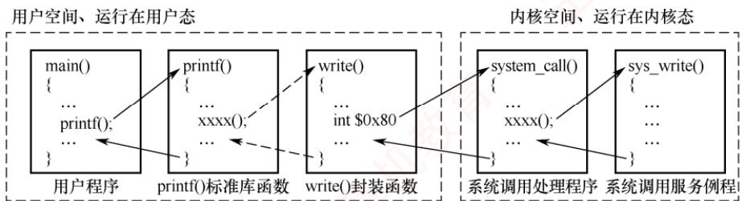

<em>图 5.6 Linux 系统中 write 调用的执行流程</em>

　　该流程始于用户空间对库函数的调用。用户程序调用 printf()后，经标准库内部封装，最终触发 write()系统调用的封装函数。该函数生成的机器指令序列中包含一条陷阱指令（如 IA-32 架构下的 int $0x80）。在执行该指令之前，若干传送指令会将系统调用号及 I/O 参数（如文件描述符、缓冲区地址、字节数）写入指定寄存器（如 eax）。CPU 执行陷阱指令后，产生一个受控的软中断，硬件自动完成从用户态到内核态的模式切换，并将控制权移交给操作系统内核。

　　进入内核态后，CPU 跳转至系统调用的统一入口程序 system_call()。该程序根据寄存器 eax 中的系统调用号，通过跳转表将请求分派给对应的系统调用服务例程 sys_write()。sys_write()首先执行与设备无关的公共操作，如参数合法性检查、内核缓冲区分配与管理等。随后，它根据参数（如文件描述符）定位目标设备，并调用对应的设备驱动程序。

　　设备驱动程序作为直接与设备控制器交互的模块，负责将抽象的 I/O 请求转换为设备可识别的具体命令。它初始化 I/O 接口、设置传输参数，并启动设备进行数据传输。随后，通常将当前进程置为阻塞态，并主动调用调度程序让出 CPU，以便其他就绪进程运行。

　　传输完成后，设备控制器向 CPU 发出中断请求。CPU 响应中断，暂停当前执行流，转入预设的中断服务程序。该程序读取设备状态，确认写操作是否成功，清除中断标志，并唤醒等待 I/O 的进程。中断处理完毕后，内核沿调用栈逐级返回。最终，在 system_call()末尾通过执行 iret 等特权指令，CPU 切换回用户态，并在用户空间中陷阱指令的下一条指令处恢复执行。

　　一次完整的 I/O 请求依次穿越了用户层软件、系统调用接口、设备独立性软件、设备驱动程序和中断处理程序，其中，陷阱指令是从用户态进入内核态的唯一合法入口，中断是设备通知操作完成、触发进程状态转换的核心机制。二者共同实现了用户态与内核态之间的安全切换。

### 5.1.4 应用程序 I/O 接口

　　应用程序 I/O 接口是操作系统为统一管理各类 I/O 设备而设计的一套软件架构与编程规范，其主要目的有二：一是让应用程序（如执行文件打开操作）无须关心底层硬件的具体实现细节；二是使新设备能够以模块化的方式方便地加入系统，而无须改动内核代码。

#### 1. I/O 接口的分类

　　操作系统将物理设备抽象为三种通用类型：字符设备、块设备和网络设备，并为每类设备提供标准的接口。设备间的具体差异由相应的驱动程序封装。下面分别介绍这三类设备接口。

##### （1）字符设备接口

　　字符设备是指数据的存取和传输以字符为单位的设备，如键盘、打印机等。其基本特征是传输速率较低、不可寻址，输入/输出通常采用中断驱动方式。

　　get 和 put 操作：由于字符设备不可寻址，只能顺序存取，系统通常为其设置一个字符缓冲区。用户程序通过 get 操作从缓冲区读取字符，通过 put 操作向缓冲区写入字符。

　　in-control 指令: 字符设备种类繁多，差异较大，因此接口还提供一种通用的 in-control 指令，（该指令包含多个参数），用于指定与具体设备相关的特定功能。

　　大部分字符设备属于独占设备，因此接口还需提供打开和关闭操作，以实现互斥共享。

##### （2）块设备接口

　　块设备是指数据的存取和传输以数据块为单位的设备，典型的块设备是磁盘。其基本特征是传输速率较高、可寻址。磁盘的 I/O 常采用 DMA 方式。

　　块设备接口将上层发来的抽象命令（如打开、读、写和关闭等）映射为设备能识别的具体操作。为简化上层访问，该接口隐藏了磁盘的物理二维结构（块地址用磁道号和扇区号表示），将所有扇区从0到 $n - 1$ 依次编号，从而将二维结构变为线性地址空间。

　　块设备接口的常用命令有 read()、write() 和 seek()，其中 seek() 命令用来指定下一个传输块。

　　这三个命令描述了块设备的基本行为，使得应用程序不必关注这些设备的低层差别。

##### （3）网络设备接口

　　现代操作系统均提供网络通信的功能，为此需配备相应的网络软件和网络通信接口，使计算机能够与网络上的其他计算机通信或访问互联网。多数操作系统采用套接字（Socket）接口作为网络 I/O 的标准。应用程序通过套接字系统调用创建本地套接字，并将其连接到远程应用程序的套接字，从而建立通信通道，实现数据的发送与接收。

#### 2. 阻塞 I/O 和非阻塞 I/O

　　操作系统的 I/O 接口还支持两种执行模式：阻塞与非阻塞。

　　阻塞 I/O 是多数操作系统默认采用的模式，原因是其编程模型简单、逻辑直观。当进程发起 I/O 请求时，若所请求的数据尚未就绪，则该进程立即被阻塞，并移入相应的等待队列；此后，进程无法执行任何其他任务，只能等待底层设备完成实际的数据传输。I/O 操作完成后，内核将该进程移回就绪队列。当其再次获得 CPU 时，系统调用返回操作结果，进程继续后续处理。例如，你去咖啡店点单后，由于无法预知咖啡何时做好，只能原地等待，其间无法做其他事情。

　　优点：实现简单，适用于顺序处理或低并发场景。

　　缺点：I/O 等待期间进程完全阻塞，CPU 资源闲置，系统整体利用率较低。

　　非阻塞 I/O 是指当进程发起 I/O 请求时，内核不会阻塞该进程，而使系统调用立即返回。若数据尚未就绪，则调用将返回一个表示“暂无数据”的错误状态（如返回-1）；进程可据此继续执行其他任务，并在时机适当时重试该操作。当某次重试时数据已就绪时，内核便将数据从内核缓冲区复制到用户空间，并返回实际成功传输的字节数。例如，吸取上次的教训，你在咖啡店点单后去逛商场，每隔一段时间回来询问“好了吗？”，其间可自由安排其他活动。

　　优点：进程在 I/O 等待期间不被阻塞，可执行其他任务，适合高并发或高响应性应用。

　　缺点：采用轮询方式频繁检查 I/O 状态，浪费 CPU 资源。

### 5.1.5 本节小结

　　本节开头提出的问题的参考答案如下。

　　I/O 管理需要完成哪些核心功能？

　　I/O 管理需要完成以下 4 部分内容:

1）状态监控。实时掌握外部设备的工作状态（如忙、就绪、故障等）。

2）数据传输。协调并完成主机与设备之间的数据交换。

3）设备分配。在多用户或多进程环境下，负责设备的分配、共享与回收。

4）设备控制。通过设备驱动程序启动I/O操作，并处理设备返回的完成信号或故障中断。

### 5.1.6 本节习题精选

#### 一、单项选择题

01. 下列关于设备属性的叙述中，正确的是（）。
- A. 字符设备的基本特征是可寻址到字节，即能指定读/写操作的字节地址
- B. 共享设备必须是可寻址的和可随机访问的设备
- C. 共享设备是指同一时刻内允许多个进程同时访问的设备
- D. 在分配共享设备和独占设备时都可能引起进程死锁

02. 下列关于虚拟设备的含义的描述中，正确的是（）。A. 允许用户使用比系统中具有的物理设备更多的设备

- B. 允许用户以标准化方式来使用物理设备
- C. 把一个物理设备变换成多个对应的逻辑设备
- D. 允许用户程序不必全部装入主存便可使用系统中的设备

03. 磁盘设备的 I/O 控制主要采取（）方式。
- A. 位    B. 字节    C. 帧    D. DMA

04. 为了便于上层软件的编制，设备控制器通常需要提供（）。
- A. 控制寄存器、状态寄存器和控制命令
- B. I/O地址寄存器、工作方式状态寄存器和控制命令
- C. 中断寄存器、控制寄存器和控制命令
- D. 控制寄存器、编程空间和控制逻辑寄存器

05. 在设备控制器中用于实现设备控制功能的是（）。

- A. CPU
- B. 设备控制器与处理器的接口
- C. I/O 逻辑
- D. 设备控制器与设备的接口

06. DMA 方式是在（）之间建立一条直接数据通路。
- A. I/O 设备和主存    B. 两个 I/O 设备    C. I/O 设备和 CPU    D. CPU 和主存

07. 在操作系统中，（）指的是一种硬件机制。
- A. 通道技术    B. 缓冲池    C. SPOOLing 技术    D. 内存覆盖技术

08. 若 I/O 设备与存储设备进行数据交换不经过 CPU 来完成，则这种数据交换方式是（）。

- A. 程序查询
- B. 中断方式
- C. DMA 方式
- D. 直接存取方式

09. 下列关于 DMA 方式的描述中，正确的是（）。
- A. DMA 是一个专门负责输入/输出的处理机
- B. 数据传输过程由 DMA 控制器负责，CPU 只在预处理和后处理阶段进行干预
- C. CPU 通过程序的方式给出 DMA 可以解释的程序
- D. DMA 不需要 CPU 指出所取数据的地址与长度

10. 计算机系统中，不属于 DMA 控制器的是（）。
- A. 命令/状态寄存器 B. 内存地址寄存器
- C. 数据寄存器 D. 堆栈指针寄存器

11. DMA 传输前需要进行预处理，传输后需要进行后处理，则下列说法中正确的是（）。

- A. 预处理程序运行在用户态，后处理程序运行在内核态
- B. 负责预处理和后处理程序的进程都是请求 I/O 的进程
- C. 预处理阶段不需要 CPU 参与，后处理阶段需要 CPU 参与
- D. 预处理阶段请求 I/O 的进程处于运行态，后处理阶段处于阻塞态

12. 在下列问题中，（）不是设备分配中应考虑的问题。
- A. 及时性    B. 设备的固有属性    C. 设备独立性    D. 安全性

13. 将系统中的每台设备按某种原则统一进行编号，这些编号作为区分硬件和识别设备的代号，该编号称为设备的（）。
- A. 绝对号 B. 相对号 C. 类型号 D. 符号

14. 关于通道、设备控制器和设备之间的关系，以下叙述中正确的是（）。

- A. 设备控制器和通道可以分别控制设备
- B. 对于同一组输入/输出命令，设备控制器、通道和设备可以并行工作
- C. 通道控制设备控制器、设备控制器控制设备工作
- D. 以上答案都不对

15. 一个计算机系统配置了2台相同类型的绘图机和3台相同类型的打印机，为了正确驱动这些设备，系统应该提供（）个设备驱动程序。
- A. 5 B. 3 C. 2 D. 1

16. 将系统调用参数翻译成设备操作命令的工作由（）完成。
- A. 用户层 I/O
- B. 设备无关的操作系统软件
- C. 中断处理
- D. 设备驱动程序

17. 向设备寄存器的写命令是在 I/O 软件的（）中完成的。
- A. 用户层软件 B. 设备独立性软件 C. 设备驱动程序 D. 中断处理程序

18. 一个典型的文本打印页面有 50 行，每行 80 个字符，假定一台标准的打印机每分钟能打印 6 页，向打印机的输出寄存器中写一个字符的时间很短，可忽略不计。若每打印一个字符都需要花费 $50 \mu s$ 的中断处理时间（包括所有服务），则使用中断驱动 I/O 方式运行这台打印机，中断的系统开销占 CPU 的百分比为（）。

- A. 2%
- B. 5%
- C. 20%
- D. 50%

19. 在接收和处理一个输入设备的中断的过程中，一定不由硬件来完成的工作是（）。

- A. 判断产生中断的类型
- B. CPU 模式由用户态切换到内核态
- C. 主机获取设备输入
- D. 保存用户程序的断点

20. 下列几种 I/O 方式中，会导致用户进程进入阻塞态的是（）。
I. 程序直接控制 II. 中断方式 III. DMA 方式
- A. II B. I、III C. II、III D. I、II、III

21. 当一个进程请求 I/O 操作时，该进程将被挂起，直到 I/O 设备完成 I/O 操作后，设备控制器便向 CPU 发送一个中断请求，CPU 响应后便转向中断处理程序，下列关于中断处理程序的说法中，错误的是（）。
A．中断处理程序将设备控制器中的数据传送到内存的缓冲区（读入），或将要输出的数据传送到设备控制器（输出）。
B．对于不同的设备，有不同的中断处理程序
C．中断处理结束后，需要恢复 CPU 现场，此时一定会返回到被中断的进程
D．I/O 操作完成后，驱动程序必须检查本次 I/O 操作中是否发生了错误

22. 在 I/O 系统与高层之间的接口中，根据设备类型的不同，又进一步分为若干类接口，若某设备的数据传输速率较高，且可寻址，则比较适合采用（）。

- A. 块设备接口
- B. 网络设备接口
- C. 字符设备接口
- D. 流设备接口

23. 【2010 统考真题】本地用户通过键盘登录系统时，首先获得键盘输入信息的程序是（）。

- A. 命令解释程序
- B. 中断处理程序
- C. 系统调用服务程序
- D. 用户登录程序

24. 【2011 统考真题】用户程序发出磁盘 I/O 请求后，系统的正确处理流程是（）。

- A. 用户程序→系统调用处理程序→中断处理程序→设备驱动程序
- B. 用户程序→系统调用处理程序→设备驱动程序→中断处理程序
- C. 用户程序→设备驱动程序→系统调用处理程序→中断处理程序
- D. 用户程序→设备驱动程序→中断处理程序→系统调用处理程序

25. 【2012 统考真题】操作系统的 I/O 子系统通常由 4 个层次组成，每层明确定义了与邻近层次的接口，其合理的层次组织排列顺序是（）。
- A. 用户级 I/O 软件、设备无关软件、设备驱动程序、中断处理程序
- B. 用户级 I/O 软件、设备无关软件、中断处理程序、设备驱动程序

- C. 用户级I/O软件、设备驱动程序、设备无关软件、中断处理程序
- D. 用户级I/O软件、中断处理程序、设备无关软件、设备驱动程序

26. 【2017 统考真题】系统将数据从磁盘读到内存的过程包括以下操作： $①$ DMA控制器发出中断请求 $②$ 初始化DMA控制器并启动磁盘 $③$ 从磁盘传输一块数据到内存缓冲区 $④$ 执行“DMA结束”中断服务程序正确的执行顺序是（）。

- A. $③ \rightarrow ① \rightarrow ② \rightarrow ④$
- B. $② \rightarrow ③ \rightarrow ① \rightarrow ④$
- C. $② \rightarrow ① \rightarrow ③ \rightarrow ④$
- D. $① \rightarrow ② \rightarrow ④ \rightarrow ③$

#### 二、综合应用题

01. 在某计算机系统中，时钟中断处理程序每次执行时间为 $2\mathrm{ms}$ （包括进程切换开销），若时钟中断频率为 $60\mathrm{Hz}$ ，则CPU用于时钟中断处理的时间比率为多少？

02. 考虑 56kb/s 调制解调器的性能，驱动程序输出一个字符后就阻塞，当一个字符打印完毕后，产生一个中断通知阻塞的驱动程序，输出下一个字符，然后阻塞。若发消息、输出一个字符和阻塞的时间总和为 0.1ms，则由于处理调制解调器而占用的 CPU 时间比率是多少？假设每个字符有一个开始位和一个结束位，共占 10 位。

### 5.1.7 答案与解析

#### 一、单项选择题

**01. B**

　　可寻址是块设备的基本特征，选项 A 错误。若共享设备不是可寻址的和可随机访问的，则不能保证数据的完整性和一致性，也不能提高设备的利用率，选项 B 正确。共享设备是指一段时间内允许多个进程同时访问的设备，选项 C 错误。分配共享设备是不会引起进程死锁的，选项 D 错误。

**02. C**

　　虚拟设备是指采用虚拟技术将一台独占设备转换为若干逻辑设备。引入虚拟设备是为了克服独占设备速度慢、利用率低的特点。这种设备并不是物理地变成共享设备，一般的独享设备也不能转换为共享设备，只是用户在使用它们时“感觉”是共享设备，是逻辑的概念。

**03. D**

　　DMA 方式主要用于块设备，磁盘是典型的块设备。这道题也要求读者了解什么是 I/O 控制方式，选项 A、B、C 显然都不是 I/O 控制方式。

**04. A**

　　中断寄存器位于主机内；不存在 I/O 地址寄存器；编程空间一般是由体系结构和操作系统共同决定的。控制寄存器和状态寄存器分别用于接收上层发来的命令并存放设备状态信号，是设备控制器与上层的接口；至于控制命令，它虽然是由 CPU 发出的，用来控制设备控制器，但控制命令是由设备控制器提供的，每种设备控制器都对应一组相应的控制命令。

　　接口用来传输信号，I/O 逻辑即设备控制器，用来实现对设备的控制。

**06. A**

　　DMA 是一种不经过 CPU 而直接从主存存取数据的数据交换模式，它在 I/O 设备和主存之间建立了一条直接数据通路，如磁盘。当然，这条数据通路只是逻辑上的，实际并未直接建立一条物理线路，而通常是通过总线进行的。

**07. A**

　　通道是一种特殊的处理器，所以属于硬件技术。SPOOLing、缓冲池、内存覆盖都是在内存的基础上通过软件实现的。

**08. C**

　　在 DMA 方式中，设备和内存之间可以成批地进行数据交换而不用 CPU 干预，CPU 只参与预处理和结束过程。

**09. B**

　　DMA 不是一个处理机，而是一个控制器，选项 A 错误。CPU 无须给出 DMA 可以解释的程序，而是给 DMA 发出一条命令，同时设置 DMA 控制器中寄存器的值，来启动 DMA，选项 C 错误。DMA 需要 CPU 指出所取数据的地址与长度，这些参数存放在 DMA 控制器的寄存器中，选项 D 错误。

**10. D**

　　命令/状态寄存器控制 DMA 的工作模式并给 CPU 反映它当前的状态，地址寄存器存放 DMA 作业时的源地址和目标地址，数据寄存器存放需要 DMA 转移的数据，只有堆栈指针寄存器不需要在 DMA 控制器中存放。

**11. D**

　　在预处理之前，请求 I/O 的进程通过系统调用进入内核态，因此预处理程序和后处理程序都运行在内核态。负责预处理的进程是请求 I/O 的进程，负责后处理的进程是中断服务例程，中断服务例程不是一个单独的进程。在预处理阶段，CPU 执行相应的设备驱动程序来设置相关的传输参数，需要 CPU 的参与。预处理由请求 I/O 的进程在内核态执行相关操作，之后阻塞其自身，直到系统调用返回，因此在后处理阶段请求 I/O 的进程仍处于阻塞态。

**12. A**

　　设备的固有属性决定了设备的使用方式；设备独立性可以提高设备分配的灵活性和设备的利用率；设备安全性可以保证分配设备时不会导致永久阻塞。设备分配时一般无须考虑及时性，及时性是一个与系统性能和用户需求相关的因素，设备分配时应该考虑的问题是如何在保证系统安全和正确运行的前提下，合理地分配和利用设备资源。

**13. A**

　　系统为每台设备确定一个编号以便区分和识别设备，这个确定的编号称为设备的绝对号。

**14. C**

　　三者的控制关系是层层递进的，选项 C 正确。对于同一组输入/输出命令，要么 CPU 向通道发出命令，要么 CPU 直接给设备控制器发出命令，不存在并行的可能，选项 B 错误。

**15. C**

　　因为绘图机和打印机属于两种不同类型的设备，系统只要按设备类型配置设备驱动程序即可，即每类设备只需一个设备驱动程序。

**16. B**

　　将系统调用参数翻译成设备操作命令的工作由设备无关的操作系统软件完成。设备无关的操作系统软件是 I/O 软件的一部分，它向上层提供系统调用的接口，根据设备类型选择调用相应的驱动程序。设备驱动程序负责执行操作系统发出的 I/O 命令，因设备的不同而不同。

**17. C**

　　设备驱动程序负责将上层软件发来的抽象 I/O 要求转换为具体要求，发送给设备控制器，控制设备工作。设备驱动程序需要向设备寄存器写入命令，以控制设备的工作状态和数据传输方式。

**18. A**

　　这台打印机每分钟打印 $50 \times 80 \times 6 = 24000$ 个字符，即每秒打印 400 个字符。每个字符打印中断需要占用 CPU 时间 $50 \mu s$ ，所以每秒用于中断的系统开销为 $400 \times 50 \mu s = 20 ms$ 。若使用中断驱动 I/O，则 CPU 剩余的 980 ms 可用于其他处理，中断的开销占 CPU 的 2%。因此，使用中断驱动 I/O 方式运行这台打印机是有意义的。

**19. C**

　　在中断 I/O 方式下，由中断服务程序来完成数据的输入和输出，C 错误。在中断响应阶段，由硬件完成 CPU 模式的转换，并保存用户程序的断点，中断源的识别可以采用硬件识别法。

**20. C**

　　在程序直接控制方式下，用户进程在 I/O 过程中不会被阻塞，驱动程序完成用户进程的 I/O 请求后才结束，CPU 和 I/O 操作串行。在中断控制方式下，驱动程序启动第一次 I/O 操作后，将调出其他进程执行，而当前用户进程被阻塞，CPU 和设备准备并行。在 DMA 方式下，驱动程序对 DMA 控制器初始化后，便发送 “启动 DMA” 命令，在外设和主存之间传送数据，同时 CPU 执行调度程序，转向其他进程执行，当前用户进程被阻塞时，CPU 和数据传送并行。

**21. C**

　　中断处理结束后，是否返回到被中断的进程，有两种情况：① 采用的是屏蔽中断方式（单重中断），此时会返回被中断的进程。② 采用的是中断嵌套方式（多重中断），若没有更高优先级的中断请求，则会返回被中断的进程；否则，系统将处理更高优先级的中断请求。

**22. A**

　　块设备是指数据的存取和传输都是以数据块为单位的设备，其特征是传输速率较高且可寻址，典型的块设备（如磁盘）通常采用 DMA 方式。字符设备（也称流设备）是指数据的存取和传输是以字符为单位的设备，如键盘、打印机等，字符设备的传输速率较低且不可寻址。

**23. B**

　　键盘是典型的通过中断 I/O 方式工作的外设，当用户输入信息时，计算机响应中断并通过中断处理程序获得输入信息。

**24. B**

　　输入/输出软件一般从上到下分为 4 个层次：用户层、与设备无关的软件层、设备驱动程序及中断处理程序。与设备无关的软件层也就是系统调用的处理程序。

　　当用户使用设备时，首先在用户程序中发起一次系统调用，操作系统的内核接到该调用请求后，请求调用处理程序进行处理，再转到相应的设备驱动程序，当设备准备好或者所需数据到达后，设备硬件发出中断，将数据按上述调用顺序逆向回传到用户程序中。

**25. A**

　　考查内容同上题。设备管理软件一般分为4个层次：用户层、与设备无关的系统调用处理层、设备驱动程序及中断处理程序。

**26. B**

　　DMA 的传送过程分为预处理、数据传送和后处理三个阶段。在预处理阶段，由 CPU 初始化 DMA 控制器中的有关寄存器、设置传送方向、测试并启动设备等。在数据传送阶段，完全由 DMA 控制，DMA 控制器接管系统总线。在后处理阶段，DMA 控制器向 CPU 发送中断请求，CPU 执行中断服务程序做 DMA 结束处理。因此，正确的执行顺序是②③①④。

#### 二、综合应用题

**01. 【解答】**

　　时钟中断频率为 60Hz，因此中断周期为 1/60s，每个时钟周期中用于中断处理的时间为 2ms，

　　因此比率为 $0.002/(1/60)=12\%$ .

**02. 【解答】**

　　因为一个字符占 10 位，因此在 56kb/s 的速率下，每秒传送 56000/10 = 5600 个字符，即产生 5600 次中断。每次中断需 0.1ms，因此处理调制解调器占用的 CPU 时间共为 $5600 \times 0.1ms = 560ms$ ，占 56% 的 CPU 时间。

## 5.2 设备独立性软件

　　在学习本节时，请读者思考以下问题：

1）当处理机和外部设备的速度差距较大时，有什么办法可以解决这个问题？

2）什么是设备的独立性？引入设备的独立性有什么好处？

### 5.2.1 设备独立性软件

　　设备独立性软件（也称与设备无关的软件）位于设备驱动程序之上，是内核 I/O 子系统的最高层。该层与设备驱动程序之间的界限并非固定，常因操作系统设计或设备类型而异。例如，某些通常由设备独立性软件实现的功能，有时会被下放至驱动程序中。这种设计差异源于对系统性能、代码复用性及驱动程序效率等多方面因素的综合权衡。总体而言，其核心职责是实现各类设备的公共操作，为上层提供统一、抽象的 I/O 接口。具体包括以下五项公共功能。

1）提供统一的驱动程序接口。为便于驱动开发与系统扩展，所有设备驱动程序应遵循一致的接口规范。设备独立性软件负责将抽象设备名映射到具体的物理设备，并定位相应驱动程序的入口，同时确保 I/O 操作通过内核受控路径执行，保障系统安全。

2）缓冲管理。系统普遍采用缓冲机制以缓解 CPU 与外设之间的速度差异，提高 CPU 利用率。缓冲形式包括单缓冲、双缓冲、环形缓冲和缓冲池等，可根据应用场景灵活选用。

3）差错控制。I/O 设备因含机械与电气部件，故障率较高，产生的错误可分为两类：暂时性错误（如网络丢包），通常通过重试纠正，仅当连续失败后才视为持久性错误。此类错误主要由驱动程序处理，设备无关层仅介入驱动程序无法解决的情形。持久性错误（如磁盘划痕），操作系统可将其记录至坏块表，后续 I/O 自动绕过，避免更换整盘。

4）独占设备的分配与回收。对打印机等独占设备，系统需要统一分配以避免竞争。进程请求设备时，若设备空闲，则立即分配；否则，被阻塞并加入等待队列。设备释放时，若队列非空，则唤醒队首进程；否则，置设备状态为“空闲”，完成回收。

5）提供统一的逻辑数据块。不同设备的数据交换单位各异：字符设备以字节为单位，块设备以固定大小的数据块为单位，并且块长可能不一。设备独立性软件通过抽象层屏蔽这些差异，向上层提供大小统一的逻辑数据块，使上层无须感知底层设备特性。

### 5.2.2 高速缓存与缓冲区

#### 1. 磁盘高速缓存（Disk Cache）

> **考点追踪：** 设置磁盘缓冲区的目的（2015）

　　操作系统采用磁盘高速缓存技术以提高磁盘I/O性能，访问高速缓存中的数据比直接读/写磁盘更高效。磁盘高速缓存不同于通常意义下的位于CPU与主存之间的硬件高速缓存，而是指利用内存中的存储空间暂存从磁盘读取的盘块数据。这些数据在逻辑上是磁盘内容的副本，物理上则驻留在内存中。磁盘高速缓存在内存中有两种组织形式：一种是在内存中开辟固定大小的专用缓存区；另一种是将系统空闲内存作为动态缓冲池，供请求分页系统和磁盘I/O子系统共享使用。

#### 2. 缓冲区 (Buffer)

　　在设备管理子系统中，引入缓冲区的主要目的如下：

1）缓和 CPU 与 I/O 设备间速度不匹配的矛盾。

2）减少对 CPU 的中断频率，放宽对中断响应时间的限制。

3）解决基本数据单元大小（数据粒度）不匹配的问题。

4）提高 CPU 与 I/O 设备之间的并行性。

　　缓冲区的实现方法包括:

1）采用硬件缓冲器，但由于成本较高，除一些关键部位外一般不采用。

2）利用内存作为缓冲区，本节要介绍的正是由内存组成的缓冲区。

　　根据系统设置的缓冲区数量，缓冲技术可分为以下几种：

##### （1）单缓冲

　　当用户进程发出 I/O 请求时，操作系统在内存中为其分配一个缓冲区，其大小通常为一个数据块。如图 5.7 所示，在块设备输入过程中，假设设备将一块数据送入缓冲区的时间为 T，操作系统将缓冲区数据传送到用户工作区的时间为 M，CPU 处理该块数据的时间为 C。对于块设备，必须等整块数据装入缓冲区后，才能将其传送到工作区。

  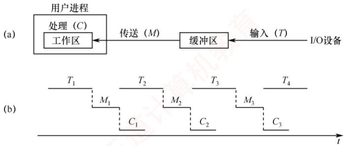

<em>图 5.7 单缓冲工作示意图</em>

> **考点追踪：** 单缓冲的工作时间的理解与计算（2011、2013）

　　在单缓冲中，设备向缓冲区写入数据的时间 T 可与 CPU 处理前一块数据的时间 C 并行。

　　当 T>C 时，设备向缓冲区填充数据的速度慢于 CPU 处理数据的速度。此时，CPU 在完成当前数据块的处理后，必须等待设备将下一块数据完整写入缓冲区；只有缓冲区装满后，操作系统才能将该数据块从缓冲区传送到用户工作区。处理每块数据所需的时间为 $T+M$ 。

　　当 T < C 时，设备填充缓冲区的速度快于 CPU 的处理速度。此时，缓冲区一旦装满，设备便无法继续写入新数据，必须等待 CPU 完成对当前工作区数据的处理；此后，操作系统才能将缓冲区中的数据移至工作区，从而释放缓冲区空间。处理每块数据所需的时间为 $C + M$ 。

　　综上，单缓冲处理每块数据所需的时间为 $\mathrm{Max}(T, C) + M$ 。

　　由于单缓冲区是共享资源，设备与 CPU 对其访问必须互斥。若 CPU 尚未取走缓冲区中的数据，即使设备已准备好新数据，也无法写入缓冲区，此时设备需等待 CPU 释放缓冲区。

##### （2）双缓冲

　　为了加快输入/输出速度，提高设备利用率，引入了双缓冲机制（也称缓冲对换）。如图 5.8 所示，当设备输入数据时，先将数据送入缓冲区 1；装满后，转向缓冲区 2 写入。此时，操作系统可从已满的缓冲区 1 中取出数据送入用户工作区，并由 CPU 进行处理。当缓冲区 1 的数据处理完后，若缓冲区 2 已装满，则操作系统切换到从缓冲区 2 中取数据送入用户工作区，而设备又可以开始向缓冲区 1 写入新数据。可见，双缓冲显著提高了设备与 CPU 的并行程度。

  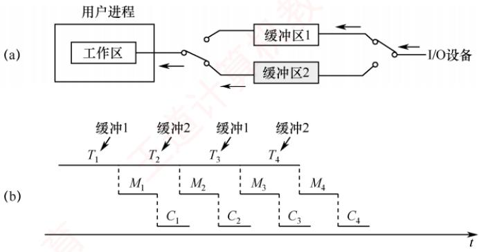

<em>图 5.8 双缓冲工作示意图</em>

> **考点追踪：** 双缓冲的工作时间的理解与计算（2011）

　　仍假设设备输入数据到缓冲区、数据传送到工作区和处理的时间分别为 T、M 和 C。在双缓冲中，设备向一个缓冲区写入数据的时间 T 可与操作系统传送及处理的时间 $C+M$ 并行。

　　当 $T > C + M$ 时，设备输入所需时间大于数据传送与处理的总时间。此时，设备可连续工作。假设在某一时刻，缓冲区 1 为空，缓冲区 2 已满：操作系统开始将缓冲区 2 的数据传送到工作区（耗时 M），CPU 随即处理该数据（耗时 C），同时设备向缓冲区 1 写入新数据。由于 $T > C + M$ ，当缓冲区 2 的数据处理完毕时，缓冲区 1 尚未装满，系统必须等待其装满后，才能将下一块数据从缓冲区 1 传送到工作区。处理每块数据所需的时间为 T。

　　当 $T < C + M$ 时，设备输入较快，CPU 无须等待设备。类似地，当缓冲区 1 为空、缓冲区 2 已满时：操作系统传送并处理缓冲区 2 的数据（共耗时 $C + M$ ），同时设备向缓冲区 1 写入数据。由于 $T < C + M$ ，缓冲区 1 很快装满，但系统仍需等待缓冲区 2 的数据完全处理完毕，才能切换至缓冲区 1 并传送其内容。处理每块数据所需的时间为 $C + M$ 。

　　综上，双缓冲处理每块数据的时间为 $\text{Max}(T, C + M)$ 。

　　在双机通信场景中，若要实现全双工通信（双方同时收发数据），每台机器需分别设置发送缓冲区和接收缓冲区。如图 5.9(b) 所示，A 机的发送缓冲区对应 B 机的接收缓冲区，反之亦然。若仅在每台机器中配置单一缓冲区 [见图 5.9(a)]，则无法同时进行发送与接收操作。

  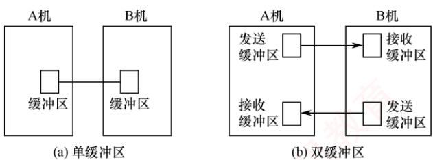

<em>图 5.9 双机通信时缓冲区的设置</em>

##### （3）循环缓冲

　　在双缓冲机制中，当输入与输出速度基本匹配时，能够取得较好的效果；但若两者速率相差较大，则双缓冲难以充分发挥作用。为此，可引入多缓冲机制，并将多个缓冲区组织成循环缓冲区的形式，如图5.10所示（灰色表示已装满数据的缓冲区，白色表示空缓冲区）。

　　循环缓冲由若干个大小相等的缓冲区构成，每个缓冲区包含一个链接指针，指向下一个缓冲区；最后一个缓冲区的指针则指向第一个缓冲区，从而形成一个循环队列结构。

  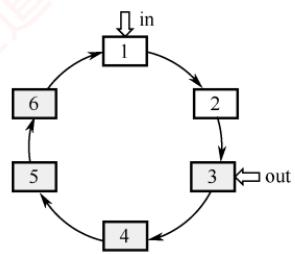

<em>图 5.10 循环缓冲工作示意图</em>

　　系统需维护两个指针：in 和 out。其中，in 指向下一个待写入的空缓冲区，out 指向下一个待读取的满缓冲区。输入进程和计算进程在运行过程中分别推进 in 和 out 指针，沿链接方向循环移动。采用循环缓冲技术，可以实现输入进程与计算进程的并行执行。由于两者的处理速度可能不一致，在运行过程中可能出现以下两种同步情形。

1）in 追赶上 out（称为系统受计算限制）。表明输入进程的写入速度快于计算进程的处理速度，导致所有缓冲区均被填满，无空缓冲区可供继续写入。此时，输入进程必须阻塞，直至计算进程从某个缓冲区中取走数据，释放出一个空缓冲区，并唤醒输入进程。

2）out 追赶上 in（称为系统受 I/O 限制）。表明计算进程的处理速度快于输入进程的供给速度，导致所有缓冲区均为空，无数据可供继续处理。此时，计算进程必须阻塞，直至输入进程向某个缓冲区写入数据，使其变为满缓冲区，并唤醒计算进程。

##### （4）缓冲池

　　相比于单个缓冲区（仅是一块内存区域），缓冲池是一种包含管理数据结构和操作函数的软件机制，用于统一管理多个缓冲区，并支持多进程共享使用。

　　缓冲池由系统统一管理的供多个进程共享的一组缓冲区构成。根据使用状态，这些缓冲区被组织为以下队列：① 空缓冲队列，由空缓冲区链接而成；② 输入队列，由装满输入数据的缓冲区链接而成；③ 输出队列，由装满输出数据的缓冲区链接而成。

　　在操作过程中，缓冲区可动态扮演以下四种角色（见图 5.11）：① 收容输入缓冲区（hin），用于暂存输入数据；② 提取输入缓冲区（sin），用于读取输入数据；③ 收容输出缓冲区（hout），用于暂存输出数据；④ 提取输出缓冲区（sout），用于读取输出数据。

  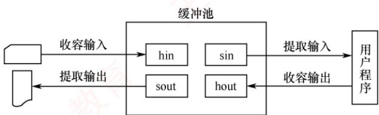

<em>图 5.11 缓冲池的 4 种工作方式</em>

　　缓冲池中的缓冲区按以下 4 种方式工作。

1）收容输入。输入进程需要输入数据时，从空缓冲队列队首摘取一个空缓冲区，作为收容输入缓冲区，将输入数据写入其中，装满后将其挂到输入队列队尾。

2）提取输入。计算进程需要输入数据时，从输入队列队首摘取一个缓冲区，作为提取输入缓冲区，从中读取数据，读取完毕后将其挂到空缓冲队列队尾。

3）收容输出。计算进程需要输出数据时，从空缓冲队列队首摘取一个空缓冲区，作为收容输出缓冲区，将输出数据写入其中，装满后将其挂到输出队列队尾。

4）提取输出。输出进程需要输出数据时，从输出队列队首摘取一个缓冲区，作为提取输出缓冲区，从中读取数据，读取完毕后将其挂到空缓冲队列队尾。

　　对于循环缓冲和缓冲池，本节仅介绍其工作机制，不涉及时间性能的定量分析。而对于单缓冲和双缓冲，只要依据前述模型进行分析，即可求解任意场景下处理每块数据所需的时间。

#### 3. 高速缓存与缓冲区的对比

　　在 I/O 系统中，高速缓存（Cache）是一种利用高速存储介质保存慢速设备数据副本的机制，其访问速度远高于直接访问慢速设备。高速缓存与缓冲区的对比如表 5.1 所示。

　　表 5.1 高速缓存和缓冲区的对比

　　<table><tr><td colspan="2"></td><td>高速缓存</td><td>缓冲区</td></tr><tr><td colspan="2">相同点</td><td colspan="2">均位于高速设备和低速设备之间,用于缓解二者之间的速度差异</td></tr><tr><td rowspan="2">区别</td><td>存放数据</td><td>已存在于慢速设备上的数据副本;缓存中的数据可长期驻留,直至被替换</td><td>存放正在传输过程中的数据;这些数据源自发送方(高速或低速设备),传输完成后通常立即释放</td></tr><tr><td>目的</td><td>提高重复访问的效率:若所需数据已存在于缓存中,则可避免访问低速设备</td><td>提高数据传输的效率与并行性:通过暂存数据,协调速度差异、降低中断频率、匹配数据粒度等</td></tr></table>

### 5.2.3 设备分配与回收

#### 1. 设备分配概述

　　设备分配是指根据用户的 I/O 请求分配所需设备的过程。分配的总体原则是：在充分发挥设备使用效率（使设备尽可能忙碌）的同时，避免因分配策略不当引发进程死锁。

#### 2. 设备分配的数据结构

　　在系统中，可能存在多个通道，一个通道可连接多个控制器，每个控制器又可连接多个物理设备。设备分配的数据结构要能体现出这种从属关系，各数据结构的介绍如下。

1）设备控制表（DCT）：系统为每个物理设备配置一张 DCT，用于记录该设备的各项属性，如图 5.12 所示。DCT 中的主要字段包括：

  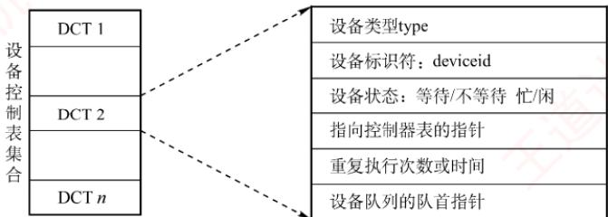

<em>图 5.12 DCT</em>

　　设备类型：表示设备类型，如打印机、扫描仪、键盘等。

　　设备标识符：即物理设备名，该标识符在系统内是唯一的。

　　设备状态：表示当前设备的状态（忙/闲）。

　　指向控制器表的指针：每个设备由一个控制器控制，该指针指向对应的控制器表。

　　重复执行次数或时间：系统指定I/O操作的可重试次数，超过此值则判定为I/O失败。

　　设备队列的队首指针：指向因请求该设备而阻塞的进程队列（由 PCB 构成）的队首。

> **注意**

　　当某进程释放设备且无其他进程等待时，系统会将DCT中的设备状态置为空闲，完成设备回收。

2）控制器控制表（COCT）：每个设备控制器对应一张 COCT，用于记录控制器的状态及所辖设备信息，如图 5.13(a) 所示。通过 COCT 中的 “与控制器连接的通道表指针”，可以找到相应通道的信息。操作系统根据 COCT 对控制器进行操作和管理。

3）通道控制表（CHCT）：每个通道对应一张 CHCT，用于管理该通道及其下属控制器，如图 5.13(b) 所示。通过 CHCT 中的 “与通道连接的控制器表首址”，可以找到该通道管理的所有控制器的信息。操作系统根据 CHCT 对通道进行操作和管理。

4）系统设备表（SDT）：整个系统只维护一张 SDT，作为所有物理设备的全局索引，如图 5.13(c) 所示。每个表目对应一个设备，通常包含设备类型、标识符等信息。

  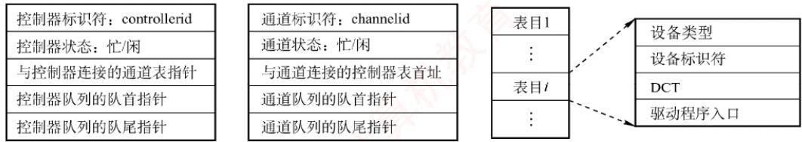

　　(a) 控制器控制表COCT

　　(b) 通道控制表CHCT

　　(c) 系统设备表SDT

<em>图 5.13 COCT、CHCT 和 SDT</em>

　　在多道程序系统中，由于进程数通常多于设备数，必须采用合理的分配策略。主要考虑的因素包括：设备的固有属性、分配算法、分配的安全性以及设备的独立性。

#### 3. 设备分配时应考虑的因素

> **考点追踪：** 设备分配需要考虑的因素（2023）

##### （1）设备的固有属性

　　设备的固有属性可分为三类，需采用不同的分配策略。

1）独占设备：分配给某进程后，便由其独占使用，直至进程主动释放或终止。

2）共享设备：可同时供多个进程使用，需通过调度机制协调访问顺序（如磁盘）。

3）虚拟设备：通过对独占设备进行虚拟化（如 SPOOLing 技术），使其在逻辑上表现为可共享设备，允许多个进程并发地提交 I/O 请求。

##### （2）设备分配算法

　　常用的设备分配算法主要有两种。

1）FCFS算法。按进程请求设备的先后顺序，排成一个等待队列，优先分配给队首进程。

2）最高优先级优先算法。高优先级进程排在队列前方，优先级相同时按FCFS原则排队。

##### （3）设备分配中的安全性

　　指在分配过程中应避免死锁的发生，主要通过以下两种方式实现。

1）安全分配方式。每当进程发出 I/O 请求后，便立即进入阻塞态，直至 I/O 操作完成才被唤醒。在此期间，进程不再请求任何其他资源，从而有效避免死锁。其优点是安全性高，缺点是 CPU 与 I/O 设备串行工作，系统效率较低。

2）不安全分配方式。进程在发出 I/O 请求后仍继续运行，需要时可发出第二个、第三个 I/O 请求等。仅当所请求的设备已被其他进程占用时，才进入阻塞态。其优点是单个进程可同时使用多个设备，使进程推进迅速；缺点是可能因循环等待而造成死锁。

#### 4. 设备分配的步骤

　　下面以独占设备为例，介绍设备分配的过程。

1）分配设备。首先根据 I/O 请求中的物理设备名，查找 SDT，从中找出该设备的 DCT，再根据 DCT 中的设备状态字段判断其状态。若忙，则将进程 PCB 挂入设备等待队列；若空闲，则将设备分配给该进程。

2）分配控制器。设备分配后，根据DCT找到对应的COCT，查询控制器的状态。若忙，则将进程PCB挂入控制器等待队列；若空闲，则将控制器分配给该进程。

3）分配通道。控制器分配后，根据 COCT 找到对应的 CHCT，查询通道的状态。若忙，则将进程 PCB 挂入通道等待队列；若空闲，则将通道分配给该进程。只有当设备、控制器和通道均成功分配后，此次设备分配才算完成，随后可启动设备进行数据传送。

　　上述过程基于物理设备名发出 I/O 请求。若指定设备已被其他进程占用，则分配失败，说明该方案缺乏设备独立性。为实现设备独立性，进程应使用逻辑设备名。此时，系统从 SDT 中依次查找该类设备的 DCT：若某设备空闲，则进行后续分配；仅当所有同类设备都忙时，才将进程挂入该类设备的公共等待队列。只要存在一个可用设备，系统便会继续进行后续分配流程。

#### 5. 逻辑设备名到物理设备名的映射

> **考点追踪：** 逻辑设备名和物理设备名的使用（2009）

　　为实现设备独立性，进程应使用逻辑设备名请求某类设备。由于系统只能识别物理设备名，需在系统中配置一张逻辑设备表（Logical Unit Table，LUT），用于建立逻辑设备名到物理设备名的映射。LUT 的每个表项包含三项内容：逻辑设备名、物理设备名和驱动程序入口地址。当进程使用某个逻辑设备名请求设备时，系统为其分配一台空闲的物理设备，并在 LUT 中建立相应表目。此后，该进程的所有 I/O 请求均通过该表项找到对应的物理设备及其驱动程序。

　　系统中可采用两种方式设置逻辑设备表。

1）整个系统仅设置一张 LUT。如图 5.14(a) 所示。所有进程的设备分配情况都记录在同一张 LUT 中，这就要求所有用户不能使用相同的逻辑设备名，适用于单用户系统。

2）为每个用户设置一张 LUT。如图 5.14(b) 所示。系统仍维护全局的系统设备表（SDT）。不同用户可以使用相同的逻辑设备名，互不干扰，适用于多用户系统。

　　<table><tr><td>逻辑设备名</td><td>物理设备名</td><td>驱动程序入口地址</td></tr><tr><td>/dev/printer</td><td>3</td><td>2014</td></tr><tr><td>/dev/tty</td><td>5</td><td>2046</td></tr><tr><td>...</td><td>...</td><td>...</td></tr></table>

　　(a)整个系统的LUT

　　<table><tr><td>逻辑设备名</td><td>系统设备指针</td></tr><tr><td>/dev/printer</td><td>3</td></tr><tr><td>/dev/tty</td><td>5</td></tr><tr><td>...</td><td>...</td></tr></table>

　　(b)每个用户设置一张LUT

<em>图 5.14 逻辑设备表（LUT）</em>

### 5.2.4 SPOOLing 技术（假脱机技术）

　　为缓和 CPU 的高速性与 I/O 设备低速性之间的矛盾，操作系统引入了 SPOOLing，即假脱机技术。其思想源于早期的脱机 I/O 方式：依赖专用外围控制机，在主机不参与的情况下完成 I/O 操作。输入时，外围机将低速输入设备（如纸带机）上的数据预先读入高速磁盘；输出时，CPU 先将结果高速写入磁盘，再由外围机将数据送至低速输出设备（如打印机）。由于整个 I/O 过程脱离主机控制，因此称为脱机。随着多道程序设计技术的发展，操作系统不再需要物理外围机，而通过专门的输入进程与输出进程，在主机直接控制下模拟外围机的功能：输入进程负责将低速输入设备的数据提前读入磁盘上的输入井；输出进程则将用户作业的输出结果暂存于磁盘的输出井，再逐步送往实际输出设备。由此，I/O 操作与 CPU 计算得以并行执行。

　　这种以磁盘为缓冲、用软件模拟脱机 I/O 的机制，正是 SPOOLing 技术的本质。“脱机”承袭自早期脱机 I/O 的思想，“假”则体现在以多道程序和磁盘空间替代外围机，进而将一台物理独占设备虚拟为多台逻辑设备，实现设备共享。SPOOLing 系统的组成如图 5.15 所示。

  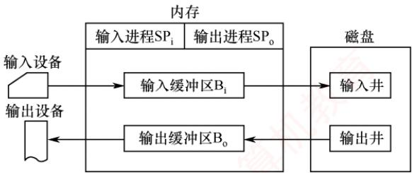

<em>图 5.15 SPOOLing 系统的组成</em>

> **考点追踪：** SPOOLing 技术的特点（2016）

##### （1）输入井和输出井

　　在磁盘上开辟的两个专用存储区域。输入井模拟脱机输入的磁盘，用于暂存输入设备的数据。输出井模拟脱机输出的磁盘，用于暂存用户程序的输出数据。每个进程的输入（或输出）数据以文件形式保存（称为井文件），所有文件按顺序链接成输入队列或输出队列。

##### （2）输入缓冲区和输出缓冲区

　　在内存中开辟的两个缓冲区。输入缓冲区暂存由输入设备送来的数据，随后传送到输入井。输出缓冲区暂存从输出井读出的数据，随后传送到输出设备。

##### （3）输入进程和输出进程

　　输入进程模拟脱机输入的外围控制机，负责将输入设备的数据经输入缓冲区传送到输入井。

　　当 CPU 需要输入数据时，直接从输入井读取。输出进程模拟脱机输出的外围控制机，负责将用户程序的输出数据写入输出井，并在输出设备空闲时，经输出缓冲区将数据传送到输出设备。

##### （4）井管理程序

　　控制作业与磁盘井之间的信息交换。

　　打印机是典型的独占设备。通过 SPOOLing 技术，可将其改造为可供多个用户共享的虚拟设备。当多个用户进程发出打印请求时，SPOOLing 系统接受其请求，但并不真正立即将物理打印机分配给它们，而是由输出进程为每个进程完成以下两项操作。

1）在磁盘输出井中为其分配一个空闲盘块，并将待打印数据写入其中。

2）申请一张用户请求打印表，记录用户的打印要求，并将该表挂到假脱机打印队列上。

　　完成上述操作后，用户进程即认为打印任务已完成，可继续执行后续代码。实际上，真实打印尚未开始，但该过程对用户完全透明。真正的打印由后台的假脱机打印进程负责。当打印机空闲时，该进程检查假脱机打印队列；若队列非空，则取出队首的请求表，根据其中信息将对应的输出数据从输出井读入内存缓冲区，再送至物理打印机进行输出。一个任务完成后，继续处理下一个；若队列为空，则该进程进入等待状态，直至有新的打印请求将其唤醒。由于用户进程仅需将数据写入磁盘即可返回，而物理打印由后台进程按队列顺序依次执行，多个用户便可并发提交打印请求。系统为每个请求在输出井中分配独立的存储区域，使各进程均以为自己独占了一台打印机。由此，一台物理打印机被虚拟为多台逻辑设备，实现了高效且透明的共享。

　　SPOOLing 系统的特点：① 提高了 I/O 速度，将对低速 I/O 设备的操作转化为对磁盘输出井中数据的存取，如同脱机输入/输出一样，有效缓和了 CPU 与低速 I/O 设备之间速度不匹配的矛盾；② 将独占设备改造为共享设备，在假脱机打印机系统中，实际上并未将物理设备分配给任何进程；③ 实现了虚拟设备功能，每个进程都认为自己独占了一台设备。

　　SPOOLing 技术是一种以空间换时间的技术。它通过开辟磁盘空间作为输入井和输出井，牺牲了存储空间，但显著节省了时间。磁盘是一种高速设备，其与内存交换数据的速度远高于打印机等低速设备。若无 SPOOLing 技术，CPU 向打印机输出数据时，必须等待缓慢的打印操作完成，才能继续后续工作，造成 CPU 时间的浪费。而在 SPOOLing 技术下，CPU 可将待打印数据快速写入磁盘输出井（该过程由输出进程控制），随即继续执行其他任务。若打印机正被占用，SPOOLing 系统会将该打印请求挂到等待队列上，待打印机空闲时再按序输出。由于向磁盘写入数据的速度远快于直接驱动打印机，整体 I/O 效率得以提升，CPU 与 I/O 设备实现了并行工作。

### 5.2.5 设备驱动程序接口

　　设备驱动程序是 I/O 系统上层与设备控制器之间的通信桥梁。其主要任务是接收上层软件发来的抽象 I/O 请求（如 read/write），将这些请求转换为设备可识别的具体命令，并发送给设备控制器以启动设备执行相应操作；同时，也将设备控制器返回的状态和中断信息反馈给上层。

> **考点追踪：** 设备驱动程序的功能（2013、2019、2023）

　　为实现上述通信功能，设备驱动程序应具备以下功能：① 接收上层软件传递的命令和参数，并将抽象的 I/O 请求转换为与具体设备相关的操作指令。例如，将逻辑盘块号转换为磁盘的盘面号、磁道号和扇区号；② 检查用户 I/O 请求的合法性，查询设备当前状态，传递必要参数，并设置其工作方式；③ 发出 I/O 命令：若设备空闲，则立即启动设备执行操作；若设备正忙，则将请求进程的 PCB 挂到该设备的等待队列上以待调度；④ 及时响应设备控制器发出的中断请求，并根据中断类型调用相应的中断处理程序进行处理。

> **考点追踪：** 设备驱动程序的特点（2022）

　　相比于普通应用程序和系统程序，设备驱动程序具有以下特点：① 它在抽象 I/O 请求与具体设备操作之间实现双向转换，并将设备状态及操作完成情况及时反馈给请求进程；② 其实现与设备所采用的 I/O 控制方式（如中断驱动方式、DMA 方式）紧密相关；③ 由于直接操作硬件，不同类型的设备必须配备相应的专用驱动程序；④ 部分底层驱动功能可能由设备固件或系统 ROM 提供；⑤ 驱动程序应设计为可重入的，以支持多个进程对同一设备的并发调用。

　　为使各类设备驱动程序具有统一的接口，操作系统要求：① 所有驱动程序与内核之间遵循相同或相近的接口规范，便于新增和维护；② 通过设备管理模块将逻辑设备名映射为物理设备名，并定位到对应的驱动程序入口；③ 对设备访问实施权限控制，防止未授权用户非法使用设备。

### 5.2.6 I/O 操作举例

　　由于统考对 I/O 的考查日益深入, 本节以 C 语言中的库函数 scanf()为例, 从执行“scanf("%c", &d)”开始, 到键盘输入的字符最终存入变量 d, 介绍 I/O 操作的具体执行过程。

　　在讨论之前，先补充两个概念：内核缓冲区（位于内核空间）和与之对应的用户缓冲区（位于用户空间）。这两个地址空间相互隔离：内核空间存放操作系统代码和数据，供所有进程共享；而用户程序运行在用户空间。由于系统调用在内核态执行，因此必须先将 I/O 设备的数据复制到内核缓冲区，在系统调用返回前，再将数据从内核缓冲区复制到用户缓冲区。

　　当程序调用 “scanf("%c", &d)” 时，试图通过键盘输入为变量 d 赋值。scanf()会关联一个由 C 标准库在用户空间管理的缓冲区 buf。scanf()函数的执行分为两个阶段。

　　第一阶段的工作是在 C 标准库中完成的:

1）检查与 scanf() 函数关联的用户缓冲区 buf。若其中已有数据，则直接读取；若缓冲区为空，则触发系统调用 read，从内核缓冲区中读取数据。

2）执行 read 系统调用。在执行 trap 指令前，需要传入三个参数：

- fd：文件描述符，标识输入设备（此处为标准输入）。

- buf: 用户空间的缓冲区，用于接收从内核复制的数据。

- count: 期望读取的最大字节数。

　　第二阶段的工作是系统调用，在内核中完成。read 系统调用通过一段包含陷阱指令的代码，使 CPU 从用户态陷入内核态，执行相应的系统调用服务例程。系统调用的大致过程如图 5.16 所示。

  

<em>图 5.16 系统调用的大致过程</em>

　　进入内核态后，系统调用服务例程访问内核缓冲区，并转至真正执行 I/O 操作的设备驱动层。在中断驱动方式下，系统调用服务例程的执行过程大致如下。

1）设置相应的 I/O 参数后，发起 I/O 的进程 P 进入阻塞态，CPU 调度其他进程运行。

2）用户通过键盘输入字符，该字符被送入键盘I/O接口的数据端口。

3）键盘 I/O 接口向 CPU 发出中断请求。

4）CPU 响应中断，执行键盘中断处理程序，读取字符并将其从 I/O 端口送入内核缓冲区。

5）进程 P 被唤醒，并加入就绪队列，等待调度。

6）进程 P 再次获得 CPU 后，系统调用服务例程将字符从内核缓冲区复制到用户缓冲区。

7）进程 P 从系统调用返回，随后 scanf() 对缓冲区中的字符进行解析，最终将其存入变量 d。

　　整个 I/O 操作的工作流程如图 5.17 所示。

  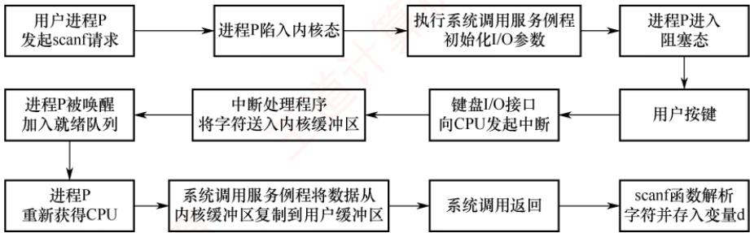

<em>图 5.17 整个I/O操作的工作流程</em>

　　值得注意的是，在此过程中，用户输入的字符首先从键盘 I/O 接口的数据端口送入内核缓冲区，再从内核缓冲区送入用户缓冲区。前者由设备驱动程序完成（因其需直接操作 I/O 端口），后者由设备无关的 I/O 软件层完成（因其不依赖具体硬件）。数据的流向如图 5.18 所示。

  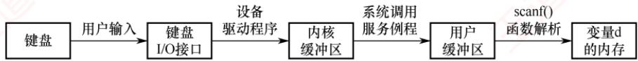

<em>图 5.18 数据的流向</em>

### 5.2.7 本节小结

　　本节开头提出的问题的参考答案如下。

1）当处理机和外部设备的速度差距较大时，有什么办法可以解决问题？

　　可采用缓冲技术来缓解 CPU 与外设速度上的矛盾，即在主存中设立一片缓冲区，外设与 CPU 的输入/输出都经过该缓冲区，从而减少相互等待，提高系统效率。

2）什么是设备的独立性？引入设备的独立性有什么好处？

　　设备独立性是指应用程序使用逻辑设备名进行 I/O 操作，而无须指定具体的物理设备。操作系统在运行时将逻辑设备名动态映射到实际可用的物理设备。引入设备独立性的主要优点包括：① 简化编程，屏蔽底层硬件细节；② 提高程序可移植性，使同一程序能在不同硬件配置的系统上运行；③ 支持 I/O 重定向与设备动态绑定，提升系统灵活性和资源利用率。

### 5.2.8 本节习题精选

#### 一、单项选择题

01. 设备的独立性是指（）。
- A. 设备独立于计算机系统
- B. 系统对设备的管理是独立的
- C. 用户编程时使用的设备与实际使用的设备无关
- D. 每台设备都有唯一的编号

02. 引入高速缓冲的主要目的是（）。

- A. 提高 CPU 的利用率
- B. 提高 I/O 设备的利用率
- C. 改善 CPU 与 I/O 设备速度不匹配的问题
- D. 节省内存

03. 为了使多个并发进程能有效地进行输入和输出，最好采用（）结构的缓冲技术。
- A. 缓冲池    B. 循环缓冲    C. 单缓冲    D. 双缓冲

04. 缓冲技术中的缓冲池在（）中。

- A. 主存 B. 外存 C. ROM D. 寄存器

05. 支持双向传送的设备应使用（）。

- A. 单缓冲区
- B. 双缓冲区
- C. 多缓冲区
- D. 缓冲池

06. 下列关于缓冲区的描述中，正确的是（）。
- A. 缓冲区是一种专门的硬件缓冲器，不能用内存来实现
- B. 缓冲区的作用是提高CPU和I/O设备之间的速度匹配
- C. 缓冲区只能用于输入设备，不能用于输出设备
- D. 缓冲区只能用于块设备，不能用于字符设备

07. 使用单缓冲或双缓冲进行通信时，（）可以实现数据的双向并行传输。
- A. 只有单缓冲 B. 只有双缓冲 C. 都 D. 都不

08. 下列各种算法中，（）是设备分配常用的一种算法。
- A. 首次适应    B. 时间片分配    C. 最佳适应    D. 先来先服务

09. 设从磁盘将一块数据传送到缓冲区所用的时间为 $80 \mu s$ ，将缓冲区中的数据传送到用户区所用的时间为 $40 \mu s$ ，CPU 处理一个数据块所用的时间为 $30 \mu s$ 。若有多块数据需要处理，并采用单缓冲区传送某磁盘数据，则处理一块数据所用的总时间为（）。

- A. $120 \mu s$
- B. $110 \mu s$
- C. $150 \mu s$
- D. $70 \mu s$

10. 某操作系统采用双缓冲区传送磁盘上的数据。设从磁盘将数据传送到缓冲区所用的时间为 $T_{1}$ ，将缓冲区中的数据传送到用户区所用的时间为 $T_{2}$ ，CPU 处理一块数据所用的时间为 $T_{3}$ ，假设一个磁盘块和一个缓冲区的大小相等，某系统在一段时间内连续处理一大批数据，则平均处理一个磁盘块数据的时间为（）。

- A. $T_{1} + T_{2} + T_{3}$
- B. $\max(T_{2}, T_{3}) + T_{1}$
- C. $\max(T_{1}, T_{3}) + T_{2}$
- D. $\max(T_{1}, T_{2} + T_{3})$

11. 若 I/O 所花费的时间比 CPU 的处理时间短得多，则缓冲区（）。
- A. 最有效 B. 几乎无效
- C. 均衡 D. 以上答案都不对

12. 缓冲区管理者重要考虑的问题是（）。

- A. 选择缓冲区的大小
- B. 决定缓冲区的数量
- C. 实现进程访问缓冲区的同步
- D. 限制进程的数量

13. 考虑单用户计算机上的下列 I/O 操作，需要使用缓冲技术的是（）。
I. 图形用户界面下使用鼠标
II. 多任务操作系统下的磁盘驱动器（假设没有设备预分配）
III. 包含用户文件的磁盘驱动器
IV. 使用存储器映射 I/O，直接和总线相连的图形卡
- A. I、III B. II、IV C. II、III、IV D. 全选

14. 以下（）不属于设备管理数据结构。
- A. PCB    B. DCT    C. COCT    D. CHCT

15. 下列（）不是设备的分配方式。
- A. 独享分配 B. 共享分配 C. 虚拟分配 D. 分区分配

16. 设备分配程序需要访问一系列的数据结构来给进程分配设备，这些数据结构有：设备控制表（DCT），控制器控制表（COCT），通道控制表（CHCT），系统设备表（SDT）。在设备分配的过程中，访问这些数据结构的正确顺序是（）。

- A. SDT, DCT, COCT, CHCT
- B. DCT, COCT, CHCT, SDT
- C. SDT, COCT, CHCT, DCT
- D. COCT, CHCT, SDT, DCT

17. 下面设备中属于共享设备的是（）。

- A. 打印机
- B. 磁带机
- C. 磁盘
- D. 磁带机和磁盘

18. 提高单机资源利用率的关键技术是（）。

- A. SPOOLing 技术
- B. 虚拟技术
- C. 交换技术
- D. 多道程序设计技术

19. 虚拟设备是靠（）技术来实现的。
- A. 通道    B. 缓冲    C. SPOOLing    D. 控制器

20. SPOOLing 技术的主要目的是（）。
- A. 提高 CPU 和设备交换信息的速度
- B. 提高独占设备的利用率
- C. 减轻用户编程负担
- D. 提供主、辅存接口

21. 在采用 SPOOLing 技术的系统中，用户的打印结果首先被送到（）。
- A. 磁盘固定区域 B. 内存固定区域 C. 终端 D. 打印机

22. 采用 SPOOLing 技术的计算机系统，外围计算机需要（）。

- A. 一台
- B. 多台
- C. 至少一台
- D. 0 台

23. SPOOLing 系统由（）组成。
- A. 预输入程序、井管理程序和缓输出程序
- B. 预输入程序、井管理程序和井管理输出程序
- C. 输入程序、井管理程序和输出程序
- D. 预输入程序、井管理程序和输出程序

24. 在 SPOOLing 系统中，用户进程实际分配到的是（）。
- A. 用户所要求的外设 B. 外存区，即虚拟设备
- C. 设备的一部分存储区 D. 设备的一部分空间

25. 下面关于 SPOOLing 系统的说法中，正确的是（）。
- A. 构成 SPOOLing 系统的基本条件是有外围输入机与外围输出机
- B. 构成 SPOOLing 系统的基本条件仅是要有高速的大容量硬盘作为输入井和输出井
- C. 当输入设备忙时，SPOOLing 系统中的用户程序暂停执行，待 I/O 空闲时再被唤醒执行输出操作
- D. SPOOLing 系统中的用户程序可以随时将输出数据送到输出井中，待输出设备空闲时再由 SPOOLing 系统完成数据的输出操作

26. 下面关于 SPOOLing 的叙述中，不正确的是（）。
- A. SPOOLing 系统中不需要独占设备
- B. SPOOLing 系统加快了作业执行的速度
- C. SPOOLing 系统使独占设备变成共享设备
- D. SPOOLing 系统提高了独占设备的利用率

27. （）是操作系统中采用的以空间换取时间的技术。
- A. SPOOLing 技术 B. 虚拟存储技术 C. 覆盖与交换技术 D. 通道技术

28. 采用假脱机技术，将磁盘的一部分作为公共缓冲区以代替打印机，用户对打印机的操作实际上是对磁盘的存储操作，用以代替打印机的部分由（）完成。
- A. 独占设备 B. 共享设备 C. 虚拟设备 D. 一般物理设备

29. 下面关于独占设备和共享设备的说法中，不正确的是（）。A. 打印机、扫描仪等属于独占设备B. 对独占设备往往采用静态分配方式

- C. 共享设备是指一个作业尚未撤离，另一个作业即可使用，但每个时刻只有一个作业使用
- D. 对共享设备往往采用静态分配方式

30. 当用户要求使用打印机打印某文件时，用户的要求是由操作系统的（）实现的。
- A. 文件系统
- B. 设备管理程序
- C. 文件系统和设备管理程序
- D. 打印机启动程序和设备管理程序

31. 下列设备管理工作中，适合由设备独立性软件来完成的有（）。
I. 向设备寄存器写命令 II. 检查用户是否有权使用设备
III. 将二进制整数转换成 ASCII 码格式打印 IV. 缓冲区管理
- A. I、II 和 III B. II、III 和 IV C. II 和 IV D. I、III 和 IV

32. 下列关于设备驱动程序的说法中，正确的是（）。
I. 设备驱动程序负责处理与设备相关的中断处理过程
II. 驱动程序全部使用汇编语言编写，没有使用高级语言编写
III. 设备驱动程序负责处理磁盘调度
IV. 设备驱动程序与设备密切相关，可以在任意操作系统运行
- A. II、III、IV B. I、III C. III、IV D. I、II、III

33. 下列选项中，（）不属于设备驱动程序的功能。
- A. 接收进程发来的 I/O 命令和参数，并检查其合法性
- B. 查询 I/O 设备的状态
- C. 发出 I/O 命令，启动 I/O 设备
- D. 对 I/O 设备传回的数据进行分析和缓冲

34. 对设备驱动程序的处理过程进行排序，正确的处理顺序是（）。①对服务请求进行校验 ②传送必要的参数 ③启动I/O设备④将抽象要求转化为具体要求 ⑤检查设备的状态

- A. $①④⑤②③$
- B. $④①⑤②③$
- C. $①④②⑤③$
- D. $④①②⑤③$

35. printf()是 C 语言中进行格式化输出的库函数，该函数最终会转到内核态执行相应的系统调用服务例程，进程是通过执行（）从用户态进入内核态的。
- A. 陷入指令 B. 关中断指令 C. 无条件跳转指令 D. 输出指令

36. 【2009 统考真题】单处理机系统中，可并行的是（）。
I. 进程与进程 II. 处理机与设备 III. 处理机与通道 IV. 设备与设备
- A. I、II、III B. I、II、IV C. I、III、IV D. II、III、IV

37. 【2009 统考真题】程序员利用系统调用打开 I/O 设备时，通常使用的设备标识是（）。

- A. 逻辑设备名
- B. 物理设备名
- C. 主设备号
- D. 从设备号

38. 【2011 统考真题】某文件占 10 个磁盘块，现要把该文件的磁盘块逐个读入主存缓冲区，并且送到用户区进行分析，假设一个缓冲区与一个磁盘块大小相同，把一个磁盘块读入缓冲区的时间为 $100 \mu s$ ，将缓冲区的数据传送到用户区的时间是 $50 \mu s$ ，CPU 对一块数据进行分析的时间为 $50 \mu s$ 。在单缓冲区和双缓冲区结构下，读入并分析完该文件的时间分别是（）。

- A. $1500 \mu s, 1000 \mu s$
- B. $1550 \mu s, 1100 \mu s$
- C. $1550 \mu s, 1550 \mu s$
- D. $2000 \mu s, 2000 \mu s$

39. 【2013 统考真题】设系统缓冲区和用户工作区均采用单缓冲，从外设读入一块数据到系统缓冲区的时间为 100，从系统缓冲区读入一块数据到用户工作区的时间为 5，对用户工作区中的一块数据进行分析的时间为 90（见右图）。进程从外设读入并分析 2 个数据块的最短时间是（）。

  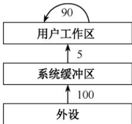

- A. 200 B. 295 C. 300 D. 390

40. 【2013 统考真题】用户程序发出磁盘I/O请求后，系统的处理流程是：用户程序 $\rightarrow$ 系统调用处理程序 $\rightarrow$ 设备驱动程序 $\rightarrow$ 中断处理程序。其中，计算数据所在磁盘的柱面号、磁头号、扇区号的程序是（）。

- A. 用户程序
- B. 系统调用处理程序
- C. 设备驱动程序
- D. 中断处理程序

41. 【2015 统考真题】在系统内存中设置磁盘缓冲区的主要目的是（）。

- A. 减少磁盘 I/O 次数
- B. 减少平均寻道时间
- C. 提高磁盘数据可靠性
- D. 实现设备无关性

42. 【2016 统考真题】下列关于SPOOLing技术的叙述中，错误的是（）。

- A. 需要外存的支持
- B. 需要多道程序设计技术的支持
- C. 可以让多个作业共享一台独占式设备
- D. 由用户作业控制设备与输入/输出井之间的数据传送

43. 【2020 统考真题】对于具备设备独立性的系统，下列叙述中，错误的是（）。

- A. 可以使用文件名访问物理设备
- B. 用户程序使用逻辑设备名访问物理设备
- C. 需要建立逻辑设备与物理设备之间的映射关系
- D. 更换物理设备后必须修改访问该设备的应用程序

44. 【2022 统考真题】下列关于驱动程序的叙述中，不正确的是（）。

- A. 驱动程序与I/O控制方式无关
- B. 初始化设备是由驱动程序控制完成的
- C. 进程在执行驱动程序时可能进入阻塞态
- D. 读/写设备的操作是由驱动程序控制完成的

45. 【2023 统考真题】下列因素中，设备分配需要考虑的是（）。I. 设备的类型 II. 设备的访问权限 III. 设备的占用状态 IV. 逻辑设备与物理设备的映射关系

- A. 仅 I、II
- B. 仅 II、III
- C. 仅 III、IV
- D. I、II、III、IV

46. 【2024 统考真题】当键盘中断服务例程执行结束时，所输入数据的存放位置是（）。

- A. 用户缓冲区
- B. CPU 中的通用寄存器
- C. 内核缓冲区
- D. 键盘控制器的数据寄存器

#### 二、综合应用题

01. 输入/输出软件一般分为4个层次：用户层、与设备无关的软件层、设备驱动程序和中断处理程序。请说明以下各工作是在哪一层完成的：
1）为磁盘读操作计算磁道、扇区和磁头。
2）向设备寄存器写命令。
3）检查用户是否有权使用设备。
4）将二进制整数转换成ASCII码以便打印。

02. 在某系统中，若采用双缓冲区（每个缓冲区可存放一块数据），将一块数据从磁盘传送到缓冲区的时间为 $80 \mu s$ ，从缓冲区传送到用户的时间为 $20 \mu s$ ，CPU 计算一块数据的时间为 $50 \mu s$ 。总共处理 4 个数据块，每个数据块的平均处理时间是多少？

03. 【2023 统考真题】进程 P 通过执行系统调用从键盘接收一个字符的输入，已知此过程中与进程 P 相关的操作包括：① 将进程 P 插入就绪队列；② 将进程 P 插入阻塞队列；③ 将字符从键盘控制器读入系统缓冲区；④ 启动键盘中断处理程序；⑤ 进程 P 从系统调用返回；⑥ 用户在键盘上输入字符。以上编号①～⑥仅用于标记操作，与操作的先后顺序无关。请回答下列问题。

1）按照正确的操作顺序，操作①的前一个和后一个操作分别是上述操作中的哪一个？操作⑥的后一个操作是上述操作中的哪一个？

2）在上述哪个操作之后CPU一定从进程P切换到其他进程？在上述哪个操作之后CPU调度程序才能选中进程P执行？

3）完成上述哪个操作的代码属于键盘驱动程序？

4）键盘中断处理程序执行时，进程P处于什么状态？CPU是处于内核态还是处于用户态？

### 5.2.9 答案与解析

#### 一、单项选择题

**01. C**

　　设备的独立性主要是指用户使用设备的透明性，即使用户程序和实际使用的物理设备无关。

**02. C**

　　CPU 与 I/O 设备执行速度通常是不对等的，前者快、后者慢，通过高速缓冲技术来改善两者不匹配的问题。

**03. A**

　　缓冲池是系统的共用资源，可供多个进程共享，并且既能用于输入又能用于输出。其一般包含三种类型的缓冲：① 空闲缓冲区；② 装满输入数据的缓冲区；③ 装满输出数据的缓冲区。为了管理上的方便，可将相同类型的缓冲区链成一个队列。选项 B、C、D 属专用缓冲。

**04. A**

　　输入井和输出井是在磁盘上开辟的存储空间，而输入/输出缓冲区是在内存中开辟的，因为CPU速度比I/O设备高很多，缓冲池通常在主存中建立。

**05. B**

　　支持双向发送和接收数据的设备（如网卡等）应使用双缓冲区，双缓冲区可以实现同一时刻的双向数据传输，提高设备的效率和利用率。单缓冲区只能实现单向数据传输。多缓冲区和缓冲池用于提高 I/O 性能的技术，但不是必需的，也不一定适合所有的双向设备。

**06. B**

　　缓冲区是一个存储区域，可由专门的硬件寄存器组成，也可利用内存来实现。缓冲区的作用是提高 CPU 和 I/O 设备之间的速度匹配，因为 CPU 的速度远高于 I/O 设备的速度，若没有缓冲区，则 CPU 就要等待 I/O 设备完成操作，造成资源浪费。缓冲区可用于输入设备和输出设备，如键盘、打印机等。缓冲区也可用于块设备和字符设备，如磁盘、串口等。

**07. B**

　　两个进程之间若只设置单缓冲区，则同一时刻只能实现单向传输，但可在一段时间内用于发送数据，另一段时间内用于接收数据。若设置双缓冲区，则可以实现双向同时的并行传输。

**08. D**

　　选项A和C都是动态分区分配的常用算法，选项B是进程调度的常用算法，设备分配的常用算法主要有先来先服务算法和最高优先级优先算法。

**09. A**

　　采用单缓冲区传送数据时，设备与处理机对缓冲区的操作是串行的，当进行第 i 次读磁盘数据送至缓冲区时，系统再同时读出用户区中第 i-1 次数据进行计算，此两项操作可以并行，并与数据从缓冲区传送到用户区的操作串行进行，所以系统处理一块数据所用的总时间为 $\max(80\mu s, 30\mu s) + 40\mu s = 120\mu s$ 。

**10. D**

　　计算处理一个磁盘块数据的平均时间，可以假定系统的初始状态：用户区为空，缓冲区1为满，缓冲区2为空，如右图所示。① $0\sim T_{2}$ 时段，将缓冲区1中的数据送入用户区；② $T_{2}\sim T_{2} + T_{3}$ 时段，处理用户区中的数据，③ $0\sim T_{1}$ 时段，将数据从磁盘送入缓冲区2，只有②和③都完成后，系统才重新回到初始状态，因此平均处理一个磁盘块数据的时间为 $\max (T_1,T_2 + T_3)$ 。

  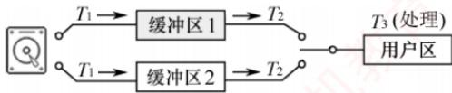

**11. B**

　　缓冲区主要解决输入/输出速度比 CPU 处理的速度慢而造成数据积压的矛盾。所以当 I/O 花费的时间比 CPU 处理时间短很多时，缓冲区没有必要设置。

**12. C**

　　在缓冲机制中，无论是单缓冲、多缓冲还是缓冲池，因为缓冲区是一种临界资源，所以在使用缓冲区时都有一个申请和释放（互斥）的问题需要考虑。

**13. D**

　　在鼠标移动时，若有高优先级的操作产生，为了记录鼠标活动的情况，必须使用缓冲技术，说法 I 正确。由于磁盘驱动器和目标或源 I/O 设备间的吞吐量不同，必须采用缓冲技术，说法 II 正确。为了能使数据从用户作业空间传送到磁盘或从磁盘传送到用户作业空间，必须采用缓冲技术，说法 III 正确。为了便于多幅图形的存取及提高性能，缓冲技术是可以采用的，特别是在显示当前一幅图形又要得到下一幅图形时，应采用双缓冲技术，说法 IV 正确。

**14. A**

　　DCT 是设备控制表；COCT 是控制器控制表；CHCT 是通道控制表；PCB 是进程控制块，不属于设备管理的数据结构。

**15. D**

　　设备的分配方式主要有独享分享、共享分配和虚拟分配，选项 D 是内存的分配方式。

**16. A**

　　在设备分配的过程中，访问数据结构的顺序通常是按设备管理的逻辑层次来安排的。设备分配过程通常从系统设备表（SDT）开始，然后依次获取设备控制表（DCT）、控制器控制表（COCT）和通道控制表（CHCT）中的信息，最终完成对设备的分配。

**17. C**

　　共享设备是指在一个时间间隔内可被多个进程同时访问的设备，只有磁盘满足。打印机在一个时间间隔内被多个进程访问时，打印出来的文档会乱；磁带机旋转到所需的读/写位置需要较长时间，若一个时间间隔内被多个进程访问，磁带机就只能一直旋转，没时间读/写。

**18. D**

　　在单机系统中，最关键的资源是处理器资源，最大化地提高处理器利用率，就是最大化地提高系统效率。多道程序设计技术是提高处理器利用率的关键技术，其他均为设备和内存的相关技术。

**19. C**

　　SPOOLing 技术是操作系统中采用的一种将独占设备改造为共享设备的技术。通过这种技术处理后的设备通常称为虚拟设备。

**20. B**

　　SPOOLing 技术将一台物理设备虚拟为多台逻辑设备，以减少设备的闲置时间，提高设备的并发度和吞吐量，因此 SPOOLing 技术的主要目的是提高独占设备的利用率。

**21. A**

　　输入井和输出井是在磁盘上开辟的两大存储空间。输入井模拟脱机输入时的磁盘设备，用于暂存 I/O 设备输入的数据；输出井模拟脱机输出时的磁盘，用于暂存用户程序的输出数据。为了缓和 CPU，打印结果首先送到位于磁盘固定区域的输出井。

**22. D**

　　SPOOLing 技术需要使用磁盘空间（输入井和输出井）和内存空间（输入/输出缓冲区），不需要外围计算机的支持。

**23. A**

　　SPOOLing 系统主要包含三部分，即输入井和输出井、输入缓冲区和输出缓冲区以及输入进程和输出进程。这三部分由预输入程序、井管理程序和缓输出程序管理，以保证系统正常运行。

**24. B**

　　通过 SPOOLing 技术可将一台物理 I/O 设备虚拟为 I/O 设备，同样允许多个用户共享一台物理 I/O 设备，所以 SPOOLing 并不是将物理设备真的分配给用户进程。

**25. D**

　　构成 SPOOLing 系统的基本条件是不仅要有大容量、高速度的外存作为输入井和输出井，还要有 SPOOLing 软件，因此选项 A 错误、选项 B 不够全面，同时利用 SPOOLing 技术提高了系统和 I/O 设备的利用率，进程不必等待 I/O 操作的完成，因此选项 C 也不正确。

**26. A**

　　SPOOLing 技术将独占设备虚拟成共享设备，因此必须先有独占设备才行。下面说明 SPOOLing 技术如何加快作业执行的速度，提高独占设备的利用率。进程不需要等待打印机空闲，只需将输出数据送到输出井，然后继续执行其他操作，这样就提高了进程的效率。打印机不需要空闲等待进程的输出，只需从输出井中读取数据进行打印，然后读取下一个数据，这样就提高了打印机的效率。输出进程可以根据输出井中的数据量和优先级来安排打印顺序，从而平衡各个进程的等待时间和响应时间，这样就提高了系统的性能。输出进程可以减少对打印机的切换次数，从而减少系统的开销，进而提高打印机的利用率。

**27. A**

　　SPOOLing 技术需有高速大容量且可随机存取的外存支持，通过预输入和缓输出来减少 CPU 等待慢速设备的时间，将独享设备改造成共享设备。

**28. C**

　　利用假脱机技术可将独享设备改造为可供多个用户共享的虚拟设备，各作业在执行期间只使用虚拟设备。采用假脱机技术，将磁盘的一部分作为公共缓冲区以代替打印机，用户对打印机的操作实际上是对磁盘的存储操作，用以代替打印机的部分由虚拟设备完成。

**29. D**

　　独占设备采用静态分配方式，而共享设备采用动态分配方式。

**30. C**

　　当用户使用打印机打印某文件时，需要通过文件系统来访问磁盘上的数据，然后通过设备管理程序来控制打印机的输出。打印机启动程序只能初始化打印机，不能直接访问磁盘上的数据。

**31. C**

　　设备寄存器写命令是由设备驱动程序完成的。检查用户是否有权使用设备属于设备保护，是由设备独立性软件完成的。将二进制整数转换成 ASCII 码的格式打印是通过 I/O 库函数完成的，属于用户层软件。缓冲区管理属于输入/输出的共有操作，是由设备独立性软件完成的。缓冲区是内存中的区域，显然不是由设备驱动程序完成的。

**32. B**

　　不同厂家的设备通常提供不同的驱动程序，对应不同的中断处理，因此需要驱动程序来完成，说法 I 正确。驱动程序仅有一部分需要用汇编语言编写，其余部分可用高级语言编写，说法 II 错误。不同型号的磁盘的调度方式不一定相同，磁盘调度由磁盘驱动程序完成，说法 III 正确。不同的操作系统有不同的驱动程序接口，因此驱动程序要根据操作系统的要求进行定制，说法 IV 错误。

**33. D**

　　设备驱动程序的功能是管理 I/O 设备。数据的分析和缓冲是由进程或操作系统完成的。

**34. B**

　　用户层软件发出的命令是设备独立性软件提供的统一接口，需要由驱动程序将这些抽象要求转化为具体要求，才能被设备控制器识别，例如将抽象要求中的盘块号转化为磁盘的柱面号、盘面号和扇区号。然后，驱动程序会检查服务请求是不是该设备可以执行的，之后检查设备的状态，只有设备处于就绪状态时才能启动，最后传送此次 I/O 的参数并启动设备。

**35. A**

　　printf()是进行输出的函数，最终需要在内核态执行 I/O 指令来完成输出的功能。系统调用函数中包含一条陷入指令，也称 trap 指令，会让 CPU 陷入内核态执行相应的服务程序。

  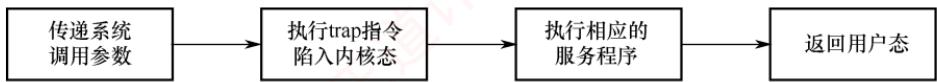

**36. D**

　　在单 CPU 系统中，同一时刻只能有一个进程占用 CPU，因此进程之间不能并行执行。通道是独立于 CPU、控制输入/输出的设备，两者可以并行。显然，处理器与设备是可以并行的。设备与设备也是可以并行的，比如显示屏与打印机是可以并行工作的。

**37. A**

　　用户程序对 I/O 设备的请求采用逻辑设备名，而程序实际执行时使用物理设备名，它们之间的转换是由设备无关软件层完成的。主设备和从设备是总线仲裁中的概念。

**38. B**

　　在单缓冲区中，当上一个磁盘块从缓冲区读入用户区完成时，下一磁盘块才能开始读入，也就是当最后一个磁盘块读入用户区完毕时所用的时间为 $150 \times 10 = 1500 \mu s$ ，加上处理最后一个磁盘块的时间 $50 \mu s$ ，得 $1550 \mu s$ 。双缓冲区中，不存在等待磁盘块从缓冲区读入用户区的问题，10 个磁盘块可以连续从外存读入主存缓冲区，加上将最后一个磁盘块从缓冲区送到用户区的传输时间 $50 \mu s$ 及处理时间 $50 \mu s$ ，也就是 $100 \times 10 + 50 + 50 = 1100 \mu s$ 。

**39. C**

　　数据块 1 从外设到用户工作区的总时间为 105，在这段时间中，数据块 2 未进行操作。在数据块 1 进行分析处理时，数据块 2 从外设到用户工作区的总时间为 105，这段时间是并行的。再加上数据块 2 进行处理的时间 90，总共是 300。

**40. C**

　　计算柱面号、磁头号和扇区号的工作是由设备驱动程序完成的。题中的功能因设备硬件的不同而不同，因此应由厂家提供的设备驱动程序实现。

**41. A**

　　磁盘和内存的速度差异，决定了可以将内存经常访问的文件调入磁盘缓冲区，从高速缓存中复制的访问比磁盘 I/O 的机械操作要快很多。

**42. D**

　　SPOOLing 利用专门的外围控制机，将低速 I/O 设备上的数据传送到高速磁盘上，或者相反。SPOOLing 的意思是外部设备同时联机操作，也称假脱机输入/输出操作，是操作系统中采用的一项将独占设备改造成共享设备的技术。高速磁盘即外存，选项 A 正确。SPOOLing 技术建立在多道程序设计技术的基础上，在一个时间段内，输入进程、输出进程是可以和运行的作业进程并发执行的，选项 B 正确。SPOOLing 技术实现了将独占设备改造成共享设备的技术，选项 C 正确。设备与输入井/输出井之间数据的传送是由系统实现的，选项 D 错误。

**43. D**

　　设备可视为特殊文件，选项 A 正确。用户使用逻辑设备名来访问物理文件，有利于设备独立性，选项 B 正确。通过逻辑设备名访问物理设备时，需要建立逻辑设备和物理设备之间的映射关系，选项 C 正确。应用程序按逻辑设备名访问设备，再经驱动程序的处理来控制物理设备，若更换物理设备，则只需更换驱动程序，而无须修改应用程序，选项 D 错误。

**44. A**

　　厂家在设计一个设备时，通常会为该设备编写驱动程序，主机需要先安装驱动程序，才能使用设备。当一个设备被连接到主机时，驱动程序负责初始化设备（如将设备控制器中的寄存器初始化），选项B正确。若采用程序直接控制方式，进程不会被阻塞，进程会处于等待状态；若采用中断控制方式，则驱动程序启动I/O操作后，将调出其他进程执行，而当前用户进程被阻塞；若采用DMA控制方式，则驱动程序对DMA控制器初始化后，便发送“启动DMA传送”命令，外设开始传送数据，同时CPU执行处理器调度程序，当前用户进程被阻塞，选项C正确。设备的读/写操作本质就是在设备控制器和主机之间传送数据，而只有厂家知道设备控制器的内部实现，因此也只有厂家提供的驱动程序能控制设备的读/写操作，选项D正确。厂家会根据设备特性，在驱动程序中实现一种合适的I/O控制方式，不同的I/O控制方式需要不同的驱动程序来实现数据的传输和控制，例如，中断驱动方式需要驱动程序能够响应中断信号，DMA方式需要驱动程序能够设置DMA控制器的寄存器，通道控制方式需要驱动程序能够执行通道指令等，选项A错误。

**45. D**

　　设备的类型决定了设备的固有属性，如独占性、共享性、可虚拟性等，不同类型的设备需要采用不同的分配方式，如独占分配、共享分配、虚拟分配等。设备的访问权限决定了哪些进程可以使用哪些设备，以保证系统的安全性和保密性，通常系统设备只能由系统进程或特权进程访问，用户设备只能由用户进程或授权进程访问。设备的占用状态决定了设备是否可以被分配给请求进程，以及如何处理等待进程，若设备空闲，则通常可以直接分配给请求进程；若设备忙，则需要将请求进程排入设备队列，并按照一定的算法进行调度。逻辑设备与物理设备的映射关系决定了如何通过逻辑地址访问物理地址，以提高系统的灵活性和可扩展性，通常系统会为每个物理设备分配一个逻辑名，并建立一个系统设备表来记录逻辑名与物理名之间的对应关系。

**46. C**

　　以 C 语言中 scanf() 函数的执行过程为例，用户请求通过键盘输入数据，当程序执行到 scanf()

　　时，触发系统调用，CPU切换到内核态，执行系统调用服务例程，系统调用的内核程序进行一些初始化操作，启动外设，同时阻塞该用户进程，直到键盘输入数据，键盘中断服务例程（实际上是驱动程序）将数据从I/O接口（键盘控制器）中的数据寄存器取出并送至内核缓冲区，然后唤醒用户进程，用户进程被唤醒后进入就绪队列，等得到CPU运行后，再将内核缓冲区中的数据送至用户缓冲区，最后进行系统调用的返回。综上所述，键盘中断服务例程执行结束后，所输入数据的存放位置是内核缓冲区，当系统调用结束时，所输入数据才被送至用户缓冲区。

#### 二、综合应用题

**01. 【解答】**

　　分析：首先，我们来看这些功能是不是应该由操作系统来完成。操作系统是一个代码相对稳定的软件，它很少发生代码的变化。若1）由操作系统完成，则操作系统就必须记录逻辑块和磁盘细节的映射，操作系统的代码会急剧膨胀，而且对新型介质的支持也会引起代码的变动。若2）也由操作系统完成，则操作系统需要记录不同生产厂商的不同数据，而且后续新厂商和新产品也无法得到支持。

　　因为 1）和 2）都与具体的磁盘类型有关，因此为了能够让操作系统尽可能多地支持各种不同型号的设备，1）和 2）应由厂商所编写的设备驱动程序完成。3）涉及安全与权限问题，应由与设备无关的操作系统完成。4)应由用户层来完成，因为只有用户知道将二进制整数转换为 ASCII 码的格式（使用二进制还是十进制、有没有特别的分隔符等）。

**02. 【解答】**

　　4 个数据块的处理过程如下图所示，总耗时 $390 \mu s$ ，每块的平均处理时间为 $390 \mu s/4 = 97.5 \mu s$ 。

  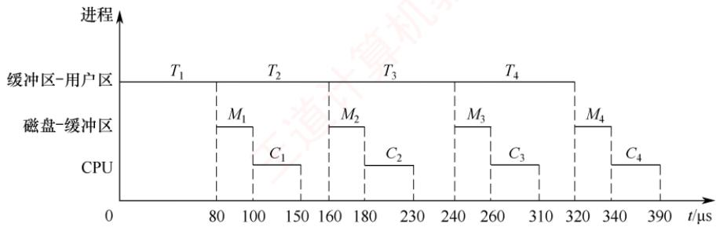

　　从上图可以看出，处理 n 个数据块的总耗时为 $(80n + 20 + 50)\mu s = (80n + 70)\mu s$ ，每个数据块的平均处理时间为 $(80n + 70)/n\mu s$ ，当 n 较大时，平均时间近似为 $\max(C, T) = 80\mu s$ 。

**03. 【解答】**

1）正确的执行顺序为②⑥④③①⑤，因此操作①的前一个操作是③，后一个操作是⑤；操作⑥的后一个操作是④。下面以 scanf()函数的执行过程为例分析相关操作顺序。首先用户进程 P 调用 I/O 标准库的 scanf()函数，scanf()调用系统调用封装函数 read()，在这个函数中有一条陷阱指令，通过它陷入内核，内核调出 read()对应的 sys_read()系统调用服务例程进行执行，进入内核后，在设备无关层进行若干调用，最终到设备驱动层进行处理，设备驱动程序对本次 I/O 进行初始化操作，然后执行操作系统的进程调度程序 scheduler()，由调度程序 scheduler()来阻塞用户进程 P，并调度其他进程执行。此后，在用户输入字符之前，CPU 运行其他进程，键盘等待用户输入数据，当用户在键盘上输入字符后，外设向 CPU 发出相应的中断请求，CPU 响应中断后，启动键盘中断处理程序，该处理程序对 I/O 中断进行简单通用的处理后，唤醒具体的处理键盘输入的驱动程序，该驱动程序将字符从键盘控制器读入系统缓冲区，数据传输完成后，唤醒 P 并将其插入就绪队列，进行中断返回，进程 P 也从系统调用返回。相关过程如下图所示。

  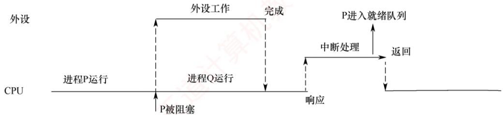

2）在操作②之后 CPU 一定从进程 P 切换到其他进程。在操作①之后 CPU 调度程序才能选中进程 P 执行。

3）设备驱动程序负责驱动 I/O 设备工作，I/O 操作初始化，执行具体的 I/O 指令。将字符从键盘控制器读入系统缓冲区是和键盘直接相关的具体操作，完成操作③的代码属于键盘驱动程序。

4）键盘中断处理程序执行时，进程 P 还在阻塞队列，处于阻塞态。中断处理程序、设备驱动程序、设备独立性软件都属于内核 I/O 软件层，执行相关代码时，CPU 处于内核态。

## 5.3 磁盘和固态硬盘①

　　在学习本节时，请读者思考以下问题：

1）磁盘一次读/写操作包含哪几部分时间？其中哪部分最长？

2）存储文件时，若一个磁道容纳不下，剩余数据应存放在同一盘面的不同磁道，还是同一柱面的不同盘面？

　　本节主要介绍磁盘管理的方式。学习时应重点掌握：计算一次磁盘操作的时间，以及对给定的磁道访问序列，按特定调度算法求出磁头移动的总磁道数和平均寻道长度。

### 5.3.1 磁盘

> **考点追踪：** 磁盘容量的计算（2019）

　　磁盘（Disk）是由表面涂有磁性物质的盘片构成的存储设备，它通过磁头（一个导体线圈）读/写数据。在读/写操作期间，盘片高速旋转，磁头沿盘片径向移动以定位目标位置。如图5.19所示，盘面上的数据存储在一组同心圆中，称为磁道。每个磁道宽度与磁头相当，一个盘面包含上千个磁道。磁道又划分为数百个扇区，每个扇区具有固定大小（如1KB），是磁盘寻址的最小物理单位。相邻磁道及扇区间留有间隙，以避免读/写干扰。传统设计中，每个磁道扇区数相同，由于外道周长更大，其线性存储密度低于内道，磁盘的存储能力受限于最内道的最大存储密度。

> **注意**

　　为提高磁盘存储容量并充分利用外层磁道的存储能力，现代磁盘采用区域记录（ZBR）技术：将盘面划分为若干环带，同一环带内的所有磁道具有相同的扇区数，外层环带的磁道扇区数多于内层环带。

> **考点追踪：** 将簇号转化为磁盘物理地址的过程（2019）

　　磁盘安装在磁盘驱动器中，后者由磁头臂、驱动盘片旋转的转轴及数据输入/输出电路组成。

　　如图 5.20 所示，多个盘片垂直堆叠形成盘组，每个盘面对应一个磁头，所有磁头安装在同一磁头臂上，同步径向移动。所有盘片上半径相同的磁道构成一个柱面。磁盘地址用 “柱面号·盘面号·扇区号” 表示，总存储容量由柱面数、盘面数和每磁道扇区数共同决定。

  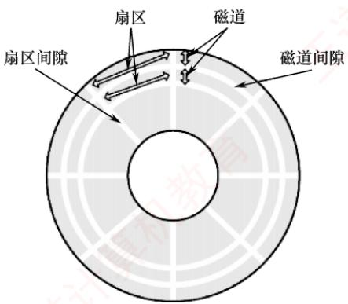

<em>图 5.19 磁盘盘片</em>

  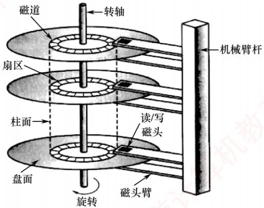

<em>图 5.20 磁盘的结构</em>

　　读/写磁盘数据块的过程如下：① 根据柱面号移动磁头臂，使磁头定位到目标柱面；② 激活对应盘面的磁头；③ 等待目标扇区随盘片旋转至磁头下方，完成读/写操作。

　　磁盘可按结构分为不同类型：固定头磁盘为每个磁道配备一个磁头，磁头位置固定；活动头磁盘的磁头可沿径向移动，通过磁头臂定位到目标磁道；固定盘磁盘的盘片永久密封在驱动器内，不可拆卸；而可换盘磁盘则允许盘片拆卸和更换。最早的磁盘由IBM公司于1973年推出，称为温彻斯特磁盘（温盘），其采用活动磁头与固定盘片结构，是现代机械硬盘的雏形。

　　在操作系统中，每类资源的管理都涉及相应的调度算法。用户访问文件时，操作系统需完成权限检查、逻辑地址到物理地址的转换等步骤，最终将请求转化为对磁盘的读/写操作。当多个 I/O 请求同时到达时，系统需决定服务顺序，这正是磁盘调度算法所要解决的核心问题。

### 5.3.2 磁盘的管理

#### 1. 磁盘初始化

> **考点追踪：** 物理格式化的内容（2017、2021）

　　一个新的磁盘只是一个涂有磁性材料的空白盘。在磁盘能够存储数据之前，必须将其划分为扇区，以便磁盘控制器进行读/写操作，这一过程称为低级格式化（也称物理格式化）。每个扇区通常由头部、数据区域和尾部组成。头部和尾部包含了一些磁盘控制器的使用信息，其中利用磁道号、磁头号和扇区号来标志一个扇区，利用CRC字段对扇区进行校验。

　　大多数磁盘在出厂时作为制造过程的一部分已完成低级格式化，这使制造商能够测试磁盘，并建立逻辑块地址到物理扇区的初始映射。对于许多磁盘，控制器在低级格式化时还可指定扇区中数据区域的大小，通常为256字节、512字节或4KB等。

#### 2. 分区

> **考点追踪：** 逻辑格式化的内容（2017、2021）

　　在使用磁盘存储文件之前，还需完成两个步骤。第一步是分区，将磁盘划分为若干逻辑区域（如常见的 C 盘、D 盘），每个分区的起始位置和大小记录在主引导记录（MBR）的分区表中。第二步是对分区进行逻辑格式化（也称高级格式化），即在分区上建立文件系统，包括初始化根目录、创建用于管理空闲与已分配空间的数据结构，并将初始目录置为空。

　　由于扇区单位过小，为提高 I/O 效率，操作系统将多个连续扇区组合成一簇（在文件系统中也称块）。为简化管理，通常将一簇分配给单个文件，因此文件占用空间为簇的整数倍；即使文件大小小于一簇（甚至为 0 字节），仍需占用一整簇空间。

#### 3. 引导块

　　计算机启动时需要运行一个初始化程序（称为自举程序），用于初始化 CPU、寄存器、设备控制器和内存等，随后加载并启动操作系统。为此，自举程序需定位磁盘上的操作系统内核，将其载入内存，并跳转至其入口地址，从而开始操作系统的执行。

　　自举程序通常存放于 ROM 中。为避免因修改自举代码而需更换 ROM 硬件的问题，一般仅在 ROM 中保留一个小型自举装入程序，而将功能完整的引导程序存放在磁盘的引导块中。该引导块位于磁盘的固定位置。含有引导块的磁盘称为启动磁盘或系统磁盘。

　　ROM 中的代码指示磁盘控制器将引导块读入内存并执行，后者可从指定位置加载操作系统内核并启动之。下面以 Windows 为例说明引导过程：Windows 允许将磁盘划分为多个分区，其中活动分区（引导分区）包含操作系统核心文件。系统将初始引导代码存储在磁盘第 0 号扇区，称为主引导记录（MBR）。启动时，ROM 中的代码首先读取 MBR；除引导代码外，MBR 还包含分区表和一个标志位，用于指明应从哪个分区引导，如图 5.21 所示。随后，系统读取该分区的首扇区（称为引导扇区），继续完成后续引导步骤，包括加载系统服务与驱动程序。

  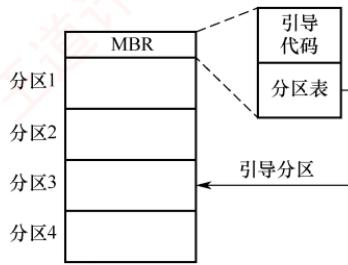

<em>图 5.21 Windows 磁盘的引导</em>

#### 4. 坏块

　　磁盘因含有机械部件且容错能力较弱，容易出现一个或多个扇区损坏，部分坏块甚至在出厂时就已存在。根据磁盘类型和控制器能力，坏块的处理方式有所不同。

　　对于简单磁盘，如采用 IDE 控制器的磁盘，坏块通常由操作系统在逻辑格式化时检测。例如 MS-DOS 的 Format 命令会识别坏扇区，并在 FAT 表中标记为不可用，从而避免程序使用。

　　对于现代的复杂磁盘，控制器内部维护一份坏块列表。该列表在出厂低级格式化时初始化，并在使用过程中动态更新。低级格式化会预留部分备用扇区，这些扇区对操作系统透明。当发现坏块时，控制器自动将其映射到备用扇区，实现逻辑替换，此机制称为扇区备用。

　　坏块处理的核心思想是：通过软件标记或硬件重映射，确保系统不会使用坏块。

### 5.3.3 磁盘调度算法

#### 1. 磁盘的存取时间

　　一次磁盘读/写操作的时间由寻道时间、旋转延迟时间和数据传输时间三部分组成。

1）寻道时间 $T_{\mathrm{s}}$ 。活动头磁盘在读/写数据前，磁头移动到目标磁道所需的时间。该时间包括磁头臂的启动时间 $s$ 和跨越 $n$ 条磁道的移动时间，即

$$
T _ {\mathrm{s}} = m n + s
$$

　　式中，m 为跨越每条磁道所需的时间，约为 0.2ms；磁头臂的启动时间约为 2ms。

2）旋转延迟时间 $T_{\mathrm{r}}$ 。目标扇区旋转至磁头下方所需的平均等待时间（因位置随机，平均为半圈旋转时间）。设磁盘转速为 $r$ ，则

$$
T _ {\mathrm{r}} = 1 / (2 r)
$$

　　典型的磁盘转速为 5400 转/分，相当于旋转一圈需 11.1ms，对应 $T_{r} \approx 5.56ms$ 。

3）数据传输时间 $T_{\mathrm{t}}$ 。读取或写入 $b$ 字节数据所需的时间。若每条磁道存储 $N$ 字节，则

$$
T _ {\mathrm{t}} = b / (r N)
$$

　　式中， $r$ 为磁盘每秒转数。总平均存取时间 $T_{\mathrm{a}}$ 可表示为

$$
T _ {\mathrm{a}} = T _ {\mathrm{s}} + 1 / (2 r) + b / (r N)
$$

　　在磁盘存取时间中，寻道时间占主导地位，且直接受磁盘调度算法影响；而旋转延迟时间和数据传输时间均与磁盘转速成反比，因此转速是磁盘性能的一个非常重要的硬件参数，难以从操作系统层面进行优化。因此，磁盘调度的主要目标是减少磁盘的平均寻道时间。

#### 2. 磁盘调度算法

　　目前常用的磁盘调度算法有以下几种。

> **考点追踪：** 各种磁盘调度算法的比较（2010、2018）

（1）先来先服务（First Come First Served，FCFS）算法

　　FCFS 算法按进程请求访问磁盘的先后顺序进行调度，是最简单的调度算法（见图 5.22）。优点是公平性好。当请求较少且访问的扇区在物理位置上较为聚集时，性能尚可；但当大量进程竞争磁盘时，磁头频繁长距离移动，导致效率低下。因此，实际系统通常采用更高效的调度算法。

  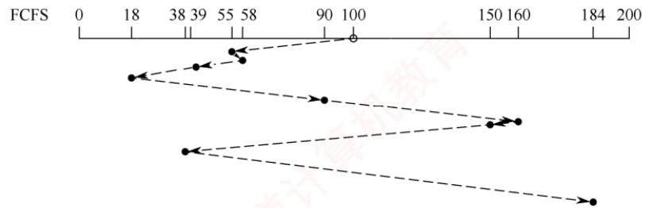

<em>图 5.22 FCFS 算法</em>

　　例如，假设磁盘请求队列为 55, 58, 39, 18, 90, 160, 150, 38, 184，磁头初始位于磁道 100。采用 FCFS 算法时，磁头的移动过程如图 5.22 所示。总移动距离为 $(45 + 3 + 19 + 21 + 72 + 70 + 10 + 112 + 146) = 498$ 个磁道，平均寻道长度 = 498/9 = 55.3。

（2）最短寻道时间优先（Shortest Seek Time First, SSTF）算法

> **考点追踪：** SSTF 算法的应用（2019、2021）

　　SSTF 算法每次选择距离当前磁头位置最近的请求进行调度，以使单次寻道时间最短。尽管该策略不能保证平均寻道时间最小，但通常能提供优于 FCFS 算法的性能。该算法可能引发 “饥饿” 现象，如图 5.23 所示，若磁头位于 18 号磁道，且附近持续出现新请求，则磁头将长期在 18 号磁道附近来回移动，导致较远磁道（如 184 号）长时间得不到服务。

  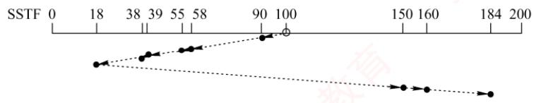

<em>图 5.23 SSTF 算法</em>

　　例如，设磁盘请求队列为55, 58, 39, 18, 90, 160, 150, 38, 184，磁头初始位于磁道100。采用SSTF算法时，磁头的移动过程如图5.23所示。总移动距离为 $10 + 32 + 3 + 16 + 1 + 20 + 132 + 10 + 24 = 248$ 个磁道，平均寻道长度 $= 248 / 9 = 27.5$ 。

##### （3）扫描（SCAN）算法

　　SSTF 算法因磁头在局部区域来回移动而引发饥饿。为避免该问题，SCAN 算法规定：磁头仅在到达最外侧磁道后才转向内侧移动，到达最内侧磁道后才转向外侧移动。它在 SSTF 的基础上引入了磁头移动方向的约束，如图 5.24 所示。其行为类似于电梯运行，故也称电梯调度算法。但 SCAN 算法对最近扫描过的区域不公平，因此在访问局部性方面不如 FCFS 算法和 SSTF 算法。

  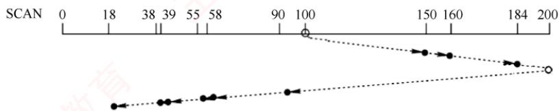

<em>图 5.24 SCAN 算法</em>

> **考点追踪：** SCAN算法的应用（2009、2010、2015）

　　例如，设磁盘请求队列为55, 58, 39, 18, 90, 160, 150, 38, 184，磁头初始位于磁道100。采用SCAN算法时，还需知道磁头移动方向。若磁头沿磁道号增大的方向移动，则访问顺序为100, 150, 160, 184, 200, 90, 58, 55, 39, 38, 18，磁头的移动过程如图5.24所示。总移动距离为 $(50 + 10 + 24 + 16 + 110 + 32 + 3 + 16 + 1 + 20) = 282$ 个磁道，平均寻道长度 $= 282 / 9 = 31.33$ 。

（4）循环扫描（Circular SCAN, C-SCAN）算法

> **考点追踪：** C-SCAN算法的应用（2024）

　　C-SCAN 算法在 SCAN 算法的基础上规定：磁头仅沿单一方向移动并提供服务，返回时快速移至起始端且不处理任何请求。由于 SCAN 算法倾向于优先服务靠近最内侧或最外侧磁道的请求，导致中间区域的响应延迟较大。C-SCAN 算法通过将回扫过程转化为非服务性的快速跳转，并以循环方式均匀地处理所有请求，从而有效缓解了这种不公平性，如图 5.25 所示。

  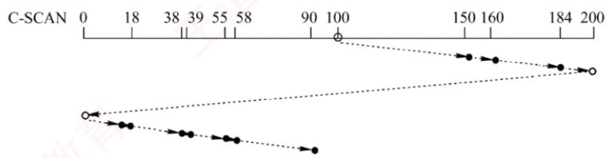

<em>图 5.25 C-SCAN 算法</em>

　　例如，假设磁盘请求队列为 55, 58, 39, 18, 90, 160, 150, 38, 184，磁头初始位于磁道 100。采用 C-SCAN 算法时，若磁头沿磁道号增大的方向移动，则访问顺序为 100, 150, 160, 184, 200, 0, 18, 38, 39, 55, 58, 90，磁头的移动过程如图 5.25 所示。总移动距离为 $50 + 10 + 24 + 16 + 200 + 18 + 20 + 1 + 16 + 3 + 32 = 390$ 个磁道，平均寻道长度 = 390/9 = 43.33。

　　采用 SCAN 算法和 C-SCAN 算法时，磁头总是严格地从磁盘一端移动到另一端。实际上，可进一步改进：磁头只需移动到当前方向上最远的请求位置即可返回，无须抵达物理端点。这种改进后的 SCAN 算法和 C-SCAN 算法分别称为 LOOK 调度（见图 5.26）和 C-LOOK 调度（见图 5.27），因其在朝某一方向移动前会 “查看” （look）该方向是否存在待处理请求。

  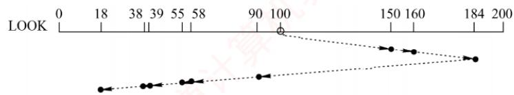

<em>图 5.26 LOOK 调度</em>

  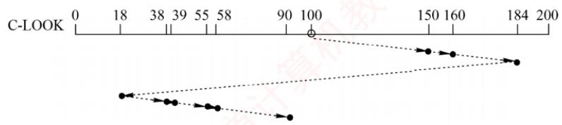

<em>图 5.27 C-LOOK 调度</em>

　　若无特别说明, 实际系统中所称的 SCAN 算法和 C-SCAN 算法通常指 LOOK 调度和 C-LOOK 调度。

　　以上四种磁盘调度算法的优缺点如表 5.2 所示。

　　表 5.2 四种磁盘调度算法的优缺点

　　<table><tr><td>算法</td><td>优点</td><td>缺点</td></tr><tr><td>FCFS 算法</td><td>公平、简单</td><td>平均寻道距离大,仅适用于磁盘 I/O 较少的场合</td></tr><tr><td>SSTF 算法</td><td>性能优于“先来先服务”</td><td>不能保证平均寻道时间最短,可能出现“饥饿”现象</td></tr><tr><td>SCAN 算法</td><td>寻道性能较好,可避免“饥饿”现象</td><td>对远离磁头当前位置一端的请求响应较慢</td></tr><tr><td>C-SCAN 算法</td><td>消除了对两端磁道请求的不公平性</td><td>—</td></tr></table>

##### （5）NStepSCAN 算法和 FSCAN 算法

　　SSTF 算法、SCAN 算法和 C-SCAN 算法在特定情况下可能出现磁臂黏着现象：当一个或多个进程频繁发出对某个磁道的 I/O 请求时，磁头会长期滞留于该区域，导致其他进程难以获得服务。

　　为了缓解这一问题，NStepSCAN算法将磁盘请求队列划分为若干长度为 $N$ 的子队列。调度器按FCFS原则依次处理各子队列，而在处理每个子队列内部时，则采用SCAN算法进行扫描。在处理某个子队列的过程中，若有新请求到达，则系统将其放入尚未处理的其他子队列中，不插入当前正在服务的子队列。这一机制有效避免了磁头因局部热点请求而长期滞留的现象，进而避免了磁臂黏着。算法性能随 $N$ 值变化：当 $N$ 值较大时，NStepSCAN算法的行为趋近于SCAN算法；当 $N = 1$ 时，每个子队列仅含一个请求，算法退化为FCFS算法。

　　FSCAN 算法是 NStepSCAN 算法的简化形式，其做法是将请求队列固定划分为两个子队列：① 当前服务队列，包含调度开始时已存在的所有请求，按 SCAN 算法处理；② 新请求队列，在当前扫描过程中新到达的请求全部暂存于此，推迟至下一轮扫描时处理。通过 “冻结当前、延后新请求” 的策略，FSCAN 算法不仅保留了 SCAN 算法的特性，还避免了磁臂黏着，且实现简单、开销低。

#### 3. 减少延迟时间的方法

　　除减少寻道时间外，减少旋转延迟时间也是提高磁盘I/O效率的重要途径。

　　磁盘是连续旋转设备。当磁头读取一个扇区后，系统需要一定时间处理数据，才能开始读取下一个扇区。若逻辑上相邻的块在物理上也相邻，则在处理当前扇区的过程中，下一个目标扇区可能已随盘面旋转而掠过磁头；待处理完成时，该扇区已不可访问，只能等待近一整圈才能再次到达，从而造成显著延迟。为此，可对单个盘面的扇区采用交替编号[假设盘面有8个扇区，见图5.28(b)]，使逻辑相邻的块在物理布局上保持

  

　　(a)连续编号

  

　　(b)交替编号

<em>图 5.28 盘面扇区的交替编号</em>

　　适当间隔，确保在处理完一个扇区后，下一个目标扇区能及时旋转至磁头下方，从而有效减少因错过扇区而导致的长延迟。

　　此外，由于磁盘的所有盘面同步旋转，同一柱面内的块通常按盘面顺序连续存放，即依次为：

　　盘面0扇区0、盘面0扇区1……盘面0扇区7、盘面1扇区0……盘面1扇区7、盘面2扇区0……。若要读取不同盘面上的连续块，例如在读完盘面0扇区7后，系统仍需一段处理时间；而在此期间，盘面持续旋转，导致下一个目标块（如盘面1扇区0）可能已在磁头经过时被错过，无法立即读取，只能等待其下一次旋转至磁头下方。为此，可对不同盘面实施错位命名［假设有2个盘面，且已采用交替编号，见图5.29(b)]，使得在处理完盘面0扇区7后，盘面1扇区0恰好或即将到达磁头位置，从而在首次经过时即可读取，显著减少旋转延迟。

  

　　0号盘面

  

　　(a)普通命名

　　1号盘面

  

　　0号盘面

  

　　(b)错位命名

　　1号盘面

<em>图 5.29 磁盘盘面的错位命名</em>

　　在磁盘的存取时间中，寻道时间和旋转延迟时间属于“找”的时间，这类开销可通过合理的调度算法或布局优化来降低，而传输时间主要由磁盘本身的特性决定，难以通过软件手段减少。

#### 4. 提高磁盘 I/O 速度的方法

　　文件的访问速度是衡量文件系统性能最重要的因素，可从以下三个方面来优化：① 改进文件的目录结构和检索目录的方法，以减少对目录的查找时间；② 选取好的文件存储结构，以提高对文件的访问速度；③ 提高磁盘 I/O 速度，以实现文件数据在磁盘与内存之间的快速传送。其中，① 和② 已在第 4 章中介绍，这里主要介绍如何提高磁盘 I/O 的速度。

> **考点追踪：** 改善磁盘 I/O 性能的方法（2012、2018）

1）采用磁盘高速缓存。5.2.2节介绍了磁盘高速缓存的概念。

2）调整磁盘请求顺序。即上文介绍的各种磁盘调度算法。

3）提前读。在读取当前磁盘块的同时，将逻辑上紧随其后的下一个（或多个）磁盘块一并预读到内存缓冲区，以应对后续可能的连续访问。

4）延迟写。当修改一个缓冲区中的数据时，并不立即写回磁盘，而仅设置延迟写标志；当该缓冲区被替换时，才真正将数据写入磁盘，从而合并多次写操作，减少I/O次数。

5）优化物理块的分布。除上文介绍的扇区编号优化外，对于采用链接或索引方式组织的文件，应尽量将其所属的块安排在同一磁道或相邻磁道上，以减少寻道时间。此外，将若干连续扇区组成簇，以簇为单位对文件进行分配，也能有效降低磁头的平均移动距离。

6）虚拟盘。指用内存空间仿真磁盘，也称 RAM 盘。由于内存访问速度远高于磁盘，因此常用于存放临时文件或对 I/O 延迟敏感的数据。虚拟盘与磁盘高速缓存的区别：虚拟盘的内容完全由用户程序控制，而磁盘高速缓存的内容则由操作系统透明管理。

7）采用磁盘阵列 RAID。某些 RAID 级别可支持交叉存取，能大幅提高磁盘 I/O 速度。

### 5.3.4 固态硬盘

#### 1. 固态硬盘的特性

> **考点追踪：** 机械磁盘与固态硬盘的对比（2025）

　　固态硬盘（SSD）是一种基于闪存技术的存储设备。其存储介质与 U 盘类似，但容量更大、存取性能更优。一个 SSD 由一个或多个闪存芯片以及闪存翻译层组成，如图 5.30 所示。其中，闪存芯片替代了传统磁盘中的机械驱动器；而闪存翻译层负责将 CPU 发出的逻辑块读/写请求转换为对底层物理闪存的读/写控制信号，因此，闪存翻译层相当于代替了磁盘控制器的角色。

  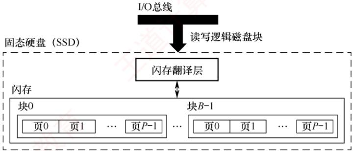

<em>图 5.30 固态硬盘（SSD）</em>

　　一个闪存芯片由 B 块组成，每块包含 P 页。通常，页的大小为 512B～4KB，每块包含 32～128 页，块的大小为 16KB～512KB。读/写操作以页为单位进行；擦除操作以块为单位进行，只有在整块被擦除后，才能向其中的页写入新数据。一旦某块被擦除，其所有页均可重新写入一次。每个块的擦写次数有限，经过若干次重复写入后，该块会因磨损而失效。

　　随机写入速度较慢，主要有两个原因：① 擦除操作耗时较长，通常比页访问慢一个数量级。② 若需修改一个已包含有效数据的页 $P_{i}$ ，必须先将该块中所有有效页复制到一个新的（已擦除的）块中，再执行对 $P_{i}$ 的写入。

　　相比传统机械磁盘，SSD 具有显著优势：由半导体器件构成，无机械运动部件，因此随机访问延迟极低，且无噪声、无振动、功耗更低、抗震性强、安全性更高。

#### 2. 磨损均衡（Wear Leveling）

　　SSD 的主要缺点在于闪存的擦写寿命有限，通常仅为几百至几千次。若直接用普通闪存构建 SSD 而不加管理，则实际的寿命表现可能令人失望——因为读/写操作往往会集中在少数物理块上，导致这些区域迅速磨损。一旦这部分闪存损坏，整块 SSD 即告失效。这种磨损不均衡的情况，可能导致一块 256GB 的 SSD，仅因几兆字节的闪存损坏而报废。

　　为解决这一问题，SSD 引入了磨损均衡技术，主要分为两类：

1）动态磨损均衡。在写入数据时，优先选择擦写次数较少的空闲块，避免反复写入同一区域，从而将写入负载分散到更多物理块上。

2）静态磨损均衡。这是一种更高级的策略。即使没有新数据写入，控制器也会定期扫描并自动进行数据迁移，将高磨损块中的有效数据迁移到低磨损块中。使高磨损块转为以读为主，低磨损块承担更多写入任务，进一步均衡整体寿命。

　　得益于磨损均衡算法，SSD 的实际使用寿命显著提升。例如，一块 256GB 的 SSD，若其闪存的擦写寿命为 500 次，则理论总写入量可达 125TB。即使每天持续写入 10GB 数据，也需要三十多年才会达到寿命极限。而日常使用中，普通用户的日均写入量通常远低于此值。

### 5.3.5 本节小结

　　本节开头提出的问题的参考答案如下。

1）磁盘一次读/写操作包含哪几部分时间？其中哪部分最长？

　　磁盘读/写操作的时间由三部分组成：寻道时间、旋转延迟和传输时间。寻道时间是将磁头臂移动到指定磁道所需的时间；旋转延迟是等待目标扇区旋转至磁头下方所需的时间；传输时间是实际读出或写入数据所经历的时间。由于磁头臂的机械运动较慢，寻道时间通常最长。

2）存储文件时，若一个磁道容纳不下，剩余数据应存放在同一盘面的不同磁道，还是同一柱面的不同盘面？

　　由于寻道时间对磁盘访问性能影响最大，应优先将剩余数据存放在同一柱面的不同盘面上。同一柱面的各磁道半径相同，切换盘面仅需选择对应磁头，无须移动磁头臂，故无寻道开销；而若存放在同一盘面的不同磁道，则须移动磁头臂，产生显著寻道延迟，降低访问效率。

### 5.3.6 本节习题精选

#### 一、单项选择题

01. 文件系统和整个磁盘的关系是（）。
- A. 没有磁盘就没有文件系统
- B. 文件系统的组织信息放在磁盘上，这些信息和代码合在一起形成文件系统
- C. 文件系统就是整个磁盘
- D. 没有关系

02. 磁盘是可共享设备，但在每个时刻（）作业启动它。
- A. 可以由任意多个 B. 能限定多个 C. 至少能由一个 D. 至多能由一个

03. 既可以顺序读/写，又可以按任意次序读/写的存储器有（）。
I. 光盘 II. 磁带 III. U 盘 IV. 磁盘
- A. II、III、IV B. I、III、IV C. III、IV D. 仅 IV

04. 磁盘调度的目的是缩短（）时间。
- A. 寻道    B. 延迟    C. 传送    D. 启动

05. 下列各种算法中，（）算法和其他算法存在根本的不同。
- A. SCAN    B. FCFS    C. C-LOOK    D. CLOCK

06. 磁盘上的文件以（）为单位读/写。
- A. 块    B. 记录    C. 柱面    D. 磁道

07. 在磁盘中读取数据的下列时间中，影响最大的是（）。

- A. 处理时间
- B. 延迟时间
- C. 传送时间
- D. 寻道时间

08. 硬盘的操作系统引导扇区产生在（）。

- A. 对硬盘进行分区时
- B. 对硬盘进行低级格式化时
- C. 硬盘出厂时自带
- D. 对硬盘进行高级格式化时

09. 在磁盘中, 每个扇区的头部和尾部都包含一些磁盘控制器的使用信息, 如扇区号等, 这些磁盘控制器的使用信息是在 ( ) 阶段被创建的。

- A. 低级格式化
- B. 分区
- C. 高级格式化
- D. 系统引导

10. 在下列有关旋转延迟的叙述中，不正确的是（）。

- A. 旋转延迟的大小与磁盘调度算法无关
- B. 旋转延迟的大小取决于磁盘空闲空间的分配程序
- C. 旋转延迟的大小与文件的物理结构有关
- D. 扇区数据的处理时间对旋转延迟的影响较大

11. 当设计针对传统机械式硬盘的磁盘调度算法时，主要考虑下列哪种因素对磁盘 I/O 的性能影响最为显著？（）。
- A. 移动磁头的延迟 B. 单个磁盘块的读/写时间 C. 磁盘平均旋转延迟 D. 磁盘最大旋转延迟

12. 下列算法中，用于磁盘调度的是（）。

- A. 时间片轮转调度算法
- B. LRU 算法
- C. 最短寻道时间优先算法
- D. 优先级高者优先算法

13. 以下算法中，（）可能出现“饥饿”现象。
- A. 电梯调度 B. 最短寻道时间优先 C. 循环扫描算法 D. 先来先服务

14. 在以下算法中，（）可能随时改变磁头的运动方向。
- A. 电梯调度    B. 先来先服务    C. 循环扫描算法    D. 以上答案都不对

15. 假设磁盘有 256 个柱面，4 个磁头（盘面），每个磁道有 8 个扇区（编号均从 0 开始）。文件 A 在磁盘上连续存放。若文件 A 中的一个块存放在 5 号柱面、1 号磁头下的 7 号扇区，则文件 A 的下一块应存放在（）。

- A. 5 号柱面、2 号磁头下的 7 号扇区
- B. 5 号柱面、2 号磁头下的 0 号扇区
- C. 6 号柱面、1 号磁头下的 7 号扇区
- D. 6 号柱面、1 号磁头下的 0 号扇区

16. 假设磁盘有 100 个柱面，每个柱面上有 8 个磁道，每个磁道有 8 个扇区。文件 A 含有 6400 个逻辑记录，逻辑记录大小与扇区大小一致，该文件以顺序结构的形式存放在磁盘上。文件的第 0 个逻辑记录存放在磁盘地址（0 号柱面、0 号盘面、0 号扇区）中，则磁盘地址（78 号柱面、6 号盘面、6 号扇区）中存放了该文件的第（）个逻辑记录。
- A. 5045 B. 5046 C. 5047 D. 5048

17. 已知某磁盘的平均转速为 $r$ 秒/转，平均寻道时间为 $T$ 秒，每个磁道可以存储的字节数为 $N$ ，现向该磁盘读/写 $b$ 字节的数据，采用随机寻道的方法，每道的所有扇区组成一个簇，其平均访问时间是（）。

- A. $(r + T)b / N$
- B. $b / NT$
- C. $(b / N + T)r$
- D. $bT / N + r$

18. 设磁盘的转速为 3000 转/分，盘面划分为 10 个扇区，则读取一个扇区的时间为（）。

- A. 20ms
- B. 5ms
- C. 2ms
- D. 1ms

19. 一个磁盘的转速为 7200 转/分，每个磁道有 160 个扇区，每扇区有 512B，那么理想情况下，其数据传输率为（）。

- A. $7200 \times 160 \mathrm{~KB} / \mathrm{s}$
- B. $7200 \mathrm{~KB} / \mathrm{s}$
- C. $9600 \mathrm{~KB} / \mathrm{s}$
- D. $19200 \mathrm{~KB} / \mathrm{s}$

20. 设一个磁道访问请求序列为 55, 58, 39, 18, 90, 160, 150, 38, 184，磁头的起始位置为 100，若采用 SSTF（最短寻道时间优先）算法，则磁头移动（）个磁道。
- A. 55 B. 184 C. 200 D. 248

21. 若当前磁头在 67 号磁道，依次有 4 个磁道号请求为 35, 77, 55, 121，则当采用（）调度算法时，下一次磁头才可能到达 55 号磁道。
- A. 循环扫描（向大磁道号方向移动） B. 最短寻道时间优先
- C. 电梯调度（向小磁道号方向移动） D. 先来先服务

22. 某磁盘有 1000 个磁道，编号从 0 到 999，当前磁头正在 734 号磁道，且向磁道号增大的方向移动。磁道请求依次为 164,845,911,165,788,432,396,700,25，若分别用 SCAN 算法（非 LOOK 调度）和 SSTF 算法完成上述请求后，磁头移过的磁道数分别是（）。

- A. 1865,1543
- B. 1688,1738
- C. 1239,1131
- D. 1239,1738

23. 假定磁带的记录密度为 400 字符/英寸（1in = 0.0254m），每条逻辑记录为 80 字符，块间隙（每条逻辑记录之间的间隙）为 0.4 英寸，现有 3000 个逻辑记录需要存储，存储这些记录需要长度为（）的磁带，磁带利用率是（）。A. 1500 英寸，33.3% B. 1500 英寸，43.5%

- C. 1800 英寸，33.3%
- D. 1800 英寸，43.5%

24. 下列关于固态硬盘（SSD）的说法中，错误的是（）。

- A. 基于闪存的存储技术
- B. 随机读/写性能明显高于磁盘
- C. 随机写比较慢
- D. 不易磨损

25. 下列关于固态硬盘的说法中，正确的是（）。
- A. 固态硬盘的写速度比较慢，性能甚至弱于常规硬盘
- B. 相比常规硬盘，固态硬盘优势主要体现在连续存取的速度
- C. 静态磨损均衡算法通常比动态磨损均衡算法的表现更优秀
- D. 写入时，静态磨损均衡算法每次选择使用长期存放数据而很少擦写的存储块

26. 下列关于固态硬盘的说法中，错误的是（）。
- A. 常规硬盘需要采用磁盘调度算法，而固态硬盘不需要
- B. 固态硬盘需要进行磨损均衡，而常规硬盘不需要
- C. 反复写同一个块会减少固态硬盘的寿命
- D. 磨损均衡机制的目的是加快固态硬盘读/写速度

27. 【2009 统考真题】假设磁头当前位于第 105 道，正在向磁道序号增加的方向移动。现有一个磁道访问请求序列为 35, 45, 12, 68, 110, 180, 170, 195，采用 SCAN 调度（电梯调度）算法得到的磁道访问序列是（）。

- A. 110, 170, 180, 195, 68, 45, 35, 12
- B. 110, 68, 45, 35, 12, 170, 180, 195
- C. 110, 170, 180, 195, 12, 35, 45, 68
- D. 12, 35, 45, 68, 110, 170, 180, 195

28. 【2012 统考真题】下列选项中，不能改善磁盘设备 I/O 性能的是（）。

- A. 重排 I/O 请求次序
- B. 在一个磁盘上设置多个分区
- C. 预读和滞后写
- D. 优化文件物理块的分布

29. 【2015 统考真题】某硬盘有 200 个磁道（最外侧磁道号为 0），磁道访问请求序列为 130, 42, 180, 15, 199，当前磁头位于第 58 号磁道并从外侧向内侧移动。按照 SCAN 调度方法处理完上述请求后，磁头移过的磁道数是（）。

- A. 208
- B. 287
- C. 325
- D. 382

30. 【2017 统考真题】下列选项中，磁盘逻辑格式化程序所做的工作是（）。
I. 对磁盘进行分区
II. 建立文件系统的根目录
III. 确定磁盘扇区校验码所占位数
IV. 对保存空闲磁盘块信息的数据结构进行初始化
- A. 仅 II B. 仅 II、IV C. 仅 III、IV D. 仅 I、II、IV

31. 【2018 统考真题】下列优化方法中，可以提高文件访问速度的是（）。I. 提前读 II. 为文件分配连续的簇 III. 延迟写 IV. 采用磁盘高速缓存

- A. 仅 I、II
- B. 仅 II、III
- C. 仅 I、III、IV
- D. I、II、III、IV

32. 【2018 统考真题】系统总是访问磁盘的某个磁道而不响应对其他磁道的访问请求，这种现象称为磁头臂黏着。下列磁盘调度算法中，不会导致磁头臂黏着的是（）。

- A. 先来先服务（FCFS）
- B. 最短寻道时间优先（SSTF）
- C. 扫描算法（SCAN）
- D. 循环扫描算法（C-SCAN）

33. 【2021 统考真题】某系统中磁盘的磁道数为200（0~199），磁头当前在184号磁道上。

　　用户进程提出的磁盘访问请求对应的磁道号依次为 184, 187, 176, 182, 199。若采用最短寻道时间优先（SSTF）算法完成磁盘访问，则磁头移动的距离（磁道数）是（）。A. 37 B. 38 C. 41 D. 42

34. 【2024 统考真题】某个磁盘的磁道数为 400（磁道号为 0～399），采用循环扫描算法（C-SCAN）进行磁盘调度，完成对 200 号磁道的请求后，磁头向磁道号减小的方向移动。若还有 7 个磁盘请求，对应的磁道号分别为 300, 120, 110, 0, 160, 210, 399，则完成上述磁盘访问请求后磁头移动的距离是（）。

- A. 599
- B. 619
- C. 788
- D. 799

35. 【2025 统考真题】在下列选项中，文件系统需要为温彻斯特硬盘和固态硬盘都提供的功能是（）。

- A. 划分扇区
- B. 确定盘块大小
- C. 降低寻道时间
- D. 实现均衡磨损

#### 二、综合应用题

01. 假定有一个磁盘组共有 100 个柱面，每个柱面有 8 个磁道，每个磁道划分成 8 个扇区。现有一个 5000 条逻辑记录的文件，逻辑记录的大小与扇区大小相等，该文件以顺序结构存放在磁盘组上，柱面、磁道、扇区均从 0 开始编址，逻辑记录的编号从 0 开始，文件信息从 0 柱面、0 磁道、0 扇区开始存放。试问，该文件编号为 3468 的逻辑记录应存放在哪个柱面的第几个磁道的第几个扇区上？

02. 假设磁盘的每个磁道分成9块，现在一个文件有 A, B, …, I 共9条记录，每条记录的大小与块的大小相等，设磁盘转速为27毫秒/转，每读出一块后需要2ms的处理时间。若忽略其他辅助时间，且一开始磁头在即将要读A记录的位置，试问：
1）若将这些记录顺序存放在一个磁道上，则顺序读取该文件要多少时间？
2）若要求顺序读取的时间最短，则应该如何安排文件的存放位置？

03. 在一个磁盘上，有 1000 个柱面，编号为 0～999，用下面的算法计算为满足磁盘队列中的所有请求，磁头臂必须移过的磁道的数目。假设最后服务的请求是在磁道 345 上，并且读/写头正在朝磁道 0 移动。在按 FCFS 顺序排列的队列中包含了如下磁道上的请求：123, 874, 692, 475, 105, 376。
1）FCFS; 2) SSTF; 3) SCAN; 4) LOOK; 5) C-SCAN; 6) C-LOOK。

04. 某软盘有 40 个磁道，磁头从一个磁道移至相邻磁道需要 6ms。文件在磁盘上非连续存放，逻辑上相邻数据块的平均距离为 13 磁道，每块的旋转延迟时间及传输时间分别为 100ms 和 25ms，问读取一个 100 块的文件需要多少时间？若系统对磁盘进行了整理，让同一文件的磁盘块尽可能靠拢，从而使逻辑上相邻数据块的平均距离降为 2 磁道，这时读取一个 100 块的文件需要多少时间？

05. 有一个交叉存放信息的磁盘，信息在其上的存放方法如右图所示。每个磁道有8个扇区，每个扇区大小为512B，旋转速度为3000转/分，顺时针读扇区。假定磁头已在读取信息的磁道上，0扇区转到磁头下需要1/2转，且设备对应的控制器不能同时进行输入/输出，在数据从控制器传送至内存的这段时间内，从磁头下通过的扇区数为2，请回答：1）依次读取一个磁道上的所有扇区需要多少时间？

  

2）该磁盘的数据传输速率是多少？

06. 【2010 统考真题】如下图所示，假设计算机系统采用 C-SCAN（循环扫描）磁盘调度策略，使用 2KB 的内存空间记录 16384 个磁盘块的空闲状态。

  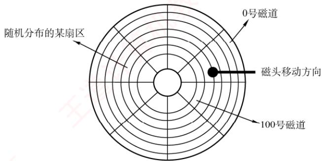

1）请说明在上述条件下如何进行磁盘块空闲状态的管理。

2）某单面磁盘的旋转速度为6000转/分，每个磁道有100个扇区，相邻磁道间的平均移动时间为1ms。若在某时刻，磁头位于100号磁道处，并沿着磁道号增大的方向移动（见上图），磁道号请求队列为50,90,30,120，对请求队列中的每个磁道需读取1个随机分布的扇区，则读完这4个扇区共需要多少时间？要求给出计算过程。

3）若将磁盘替换为随机访问的Flash半导体存储器（如U盘、固态硬盘等），是否有比C-SCAN更高效的磁盘调度策略？若有，给出磁盘调度策略的名称并说明理由；若无，说明理由。

07. 【2019 统考真题】某计算机系统中的磁盘有 300 个柱面，每个柱面有 10 个磁道，每个磁道有 200 个扇区，扇区大小为 512B。文件系统的每簇包含 2 个扇区。请回答下列问题：1）磁盘的容量是多少？

2）设磁头在85号柱面上，此时有4个磁盘访问请求，簇号分别为100260, 60005, 101660和110560。采用最短寻道时间优先SSTF算法，系统访问簇的先后次序是什么？

3）簇号100530在磁盘上的物理地址是什么？将簇号转换成磁盘物理地址的过程由I/O系统的什么程序完成？

08. 【2021 统考真题】某计算机用硬盘作为启动盘，硬盘的第一个扇区存放主引导记录，其中包含磁盘引导程序和分区表。磁盘引导程序用于选择引导哪个分区的操作系统，分区表记录硬盘上各分区的位置等描述信息。硬盘被划分成若干分区，每个分区的第一个扇区存放分区引导程序，用于引导该分区中的操作系统。系统采用多阶段引导方式，除了执行磁盘引导程序和分区引导程序，还需要执行 ROM 中的引导程序。回答下列问题：

1）系统启动过程中操作系统的初始化程序、分区引导程序、ROM中的引导程序、磁盘引导程序的执行顺序是什么？

2）将硬盘制作为启动盘时，需要完成操作系统的安装、磁盘的物理格式化、逻辑格式化、对磁盘进行分区，执行这4个操作的正确顺序是什么？

3）磁盘扇区的划分和文件系统根目录的建立分别是在第2）问的哪个操作中完成的？

### 5.3.7 答案与解析

#### 一、单项选择题

**01. B**

　　文件系统不一定依赖于磁盘，也可存在于其他存储介质上，如光盘、闪存、网络等。文件系统可以只占用磁盘的一部分空间，而不是整个磁盘；一个磁盘上可以有多个文件系统，也可以没有文件系统的空间。文件系统和磁盘之间的联系密切，文件系统需要用磁盘来存储数据，而磁盘需要用文件系统来组织数据。因此，选项 B 正确，选项 A、C 和 D 错误。

**02. D**

　　磁盘是可共享设备（分时共享），是指某段时间内可以有多个用户进行访问。但某一时刻只能有一个作业可以访问。

**03. B**

　　顺序访问按从前到后的顺序对数据进行读/写操作，如磁带。直接访问或随机访问，则可以按任意的次序对数据进行读/写操作，如光盘、磁盘、U盘等。

**04. A**

　　磁盘调度是对访问磁道次序的调度，若没有合适的磁盘调度，则寻道时间会大大增加。

**05. D**

　　SCAN、FCFS、C-LOOK算法都可以是磁盘调度算法，CLOCK算法是页面置换算法。

**06. A**

　　文件以块为单位存放于磁盘中，文件的读/写也以块为单位。

**07. D**

　　对磁盘读/写时间影响最大的是寻道时间，寻道过程为机械运动，时间较长，影响较大。

**08. D**

　　操作系统的引导程序位于磁盘活动分区的引导扇区，因此必然产生在分区之后。分区是将磁盘分为由一个或多个柱面组成的分区（C 盘、D 盘等形式），每个分区的起始扇区和大小都记录在磁盘主引导记录的分区表中。而对于高级格式化（创建文件系统），操作系统将初始的文件系统数据结构存储到磁盘上，文件系统在磁盘上布局介绍详见第 4 章。

**09. A**

　　低级格式化是磁盘制造商在生产磁盘时进行的操作，它负责创建磁盘的物理结构，包括磁道、扇区的划分，并将一些控制信息（如扇区号、磁道号等）写入每个扇区的头部和尾部。这些信息在低级格式化阶段被写入磁盘，因此磁盘控制器能够理解如何访问各个扇区。

**10. D**

　　磁盘调度算法是为了减少寻道时间。扇区数据的处理时间主要影响传输时间。选项 B、C 均与旋转延迟有关，文件的物理结构与磁盘空间的分配方式相对应，包括连续分配、链接分配和索引分配。连续分配的磁盘中，文件的物理地址连续；而链接分配方式的磁盘中，文件的物理地址不连续，因此与旋转延迟都有关。

**11. A**

　　磁盘存取时间由寻道时间、旋转延迟时间、传输时间决定，寻道时间占的比例最大，磁盘的调度算法主要是优化寻道时间，而旋转延迟时间和传输时间难以从操作系统层面优化。

**12. C**

　　选项A和D可作进程调度算法。选项B可作页面淘汰算法。只有选项C是磁盘调度算法。

**13. B**

　　最短寻道时间优先算法中，当新的距离磁头比较近的磁盘访问请求不断被满足时，可能导致较远的磁盘访问请求被无限延迟，从而导致“饥饿”现象。

**14. B**

　　先来先服务算法根据磁盘请求的时间先后进行调度，因此可能随时改变磁头方向。而电梯调度、循环扫描算法均限制磁头的移动方向。

**15. B**

　　文件 A 采用连续存放方式，按照磁盘的地址结构（柱面号，磁头号，扇区号），文件 A 的下一块应存放在同一个柱面的同一个磁道的下一个扇区中，7号扇区已是本磁道的最后一个扇区，因此应存放在同一个柱面的下一个磁头的0号扇区，即5号柱面、2号磁头下的0号扇区。由此可见，文件A的数据是连续存储在磁盘的一组或相邻几组同心圆中的。

**16. B**

　　每个柱面上有 8 个磁道（表示有 8 个磁头），每个磁道有 8 个扇区，因此每个柱面有 $8 \times 8 = 64$ 个扇区。由题意可知，柱面号、盘面号、扇区号和逻辑记录编号都是从 0 开始的，因此 78 号柱面的 6 号磁道的 6 号扇区存放的是文件的第 $78 \times 64 + 6 \times 8 + 6 = 5046$ 个逻辑记录。

**17. A**

　　将每道的所有扇区组成一个簇，意味着可以将一个磁道的所有存储空间组织成一块数据组，这样有利于提高存储速度。读/写磁盘时，磁头首先找到磁道，称为寻道，然后才可以将信息从磁道里读出或写入。读/写完一个磁道后，磁头会继续寻找下一个磁道，完成剩余的工作，所以在随机寻道的情况下，读/写一个磁道的时间要包括寻道时间和读/写磁道时间，即 $T + r$ 秒。因为总的数据量是 b 字节，它要占用的磁道数为 b/N 个，所以总平均读/写时间为 $(r + T)b/N$ 秒。

**18. C**

　　访问每条磁道的时间为 $60/3000s = 0.02s = 20ms$ ，即磁盘旋转一圈的时间为 20ms，每个盘面 10 个扇区，因此读取一个扇区的时间为 $20ms/10 = 2ms$ 。

**19. C**

　　磁盘的转速为 7200 转/分 = 120 转/秒，转一圈经过 160 个扇区，每个扇区为 512B，所以数据传输率 = $120 \times 160 \times 512 / 1024KB/s = 9600KB/s$ 。

**20. D**

　　对于 SSTF 算法，寻道序列应为 100, 90, 58, 55, 39, 38, 18, 150, 160, 184；移动磁道次数分别为 10, 32, 3, 16, 1, 20, 132, 10, 24，所以磁头移动总次数为 248。另外也可以画出草图来解答，从 100 寻道到 18 需要 82 次，然后加上从 18 到 184 需要的 $184 - 18 = 166$ 次，共移动 $166 + 82 = 248$ 次。

**21. C**

　　当磁头位于 67 号磁道时，各算法的下一访问目标如下：先来先服务算法按请求顺序处理，下一个是 35 号磁道；最短寻道时间优先算法选择距离最近的 77 号磁道；循环扫描算法若规定向大磁道号方向移动，则磁头继续向高编号端扫描，下一个是 77 号磁道；而电梯调度算法若当前向小磁道号方向移动，则在 67 号磁道之后依次服务 55、35，因此下一次到达 55 号磁道，选项 C 正确。

**22. C**

　　采用 SCAN 算法时，依次访问的磁道是 788, 845, 911, 999, 700, 432, 396, 165, 164, 25，磁头移动的距离是 $(999 - 734) + (999 - 25) = 1239$ 。采用 SSTF 算法时，依次访问的磁道是 700, 788, 845, 911, 432, 396, 165, 164, 25，磁头移动的距离是 $(734 - 700) + (911 - 700) + (911 - 25) = 1131$ 。

**23. C**

　　一个逻辑记录所占的磁带长度为 80/400 = 0.2 英寸，因此存储 3000 条逻辑记录需要的磁带长度为 $(0.2 + 0.4) \times 3000 = 1800$ 英寸，利用率为 $0.2/(0.2 + 0.4) = 33.3\%$ .

**24. D**

　　固态硬盘基于闪存技术，没有机械部件，随机读/写不需要机械操作，因此速度明显高于磁盘，选项 A 和 B 正确。选项 C 已在考点讲解中解释过。SSD 的缺点是容易磨损，选项 D 错误。

**25. C**

　　SSD 基于闪存技术，无机械部件，随机读/写性能远优于机械硬盘；而机械硬盘因需寻道，在连续存取上相对占优，故选项 A、B 错误。动态磨损均衡仅在写入时选择擦写次数少的空块，而静态磨损均衡还会在空闲期间将长期未更新的“冷数据”迁移到高磨损块，使各存储块的擦写次数更均衡，从而延长SSD寿命，选项C正确。选项D错误地认为静态磨损均衡是在“写入时选择存放老数据的块”，实际上该机制是在后台空闲时主动迁移冷数据，而非发生在写入时刻。

**26. D**

　　磨损均衡机制的目的是延长固态硬盘的寿命，而不是加快固态硬盘读/写速度。

**27. A**

　　SCAN 算法的原理类似于电梯。首先，当磁头从 105 道向序号增加的方向移动时，便会按照从小到大的顺序服务所有大于 105 的磁道号（110, 170, 180, 195）；往回移动时又会按照从大到小的顺序进行服务（68, 45, 35, 12），结果如下图所示。

  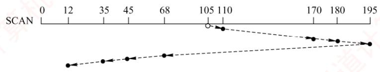

**28. B**

　　对于选项 A，重排 I/O 请求次序也就是进行 I/O 调度，使进程之间公平地共享磁盘访问，减少 I/O 完成所需要的平均等待时间。对于选项 C，缓冲区结合预读和滞后写技术对于具有重复性及阵发性的 I/O 进程改善磁盘 I/O 性能很有帮助。对于选项 D，优化文件物理块的分布可以减少寻道时间与延迟时间，从而提高磁盘性能。在一个磁盘上设置多个分区与改善设备 I/O 性能并无多大联系，相反还会带来处理的复杂性，降低利用率。

**29. C**

　　SCAN算法就是电梯调度算法。顾名思义，若开始时磁头向外移动，就一直要到最外侧，然后返回向内侧移动，就像电梯若往下，则一直要下到底层才会再上升一样。当前磁头位于58号并从外侧向内侧移动，先依次访问130、180和199，然后返回向外侧移动，依次访问42和15，因此磁头移过的磁道数是 $(199 - 58) + (199 - 15) = 325$ 。

**30. B**

　　新磁盘是空白盘，必须分成扇区以便磁盘控制器能进行读/写操作，这个过程称为低级格式化（或物理格式化）。低级格式化为每个扇区使用特别的数据结构，说法III错误。为了使用磁盘存储文件，操作系统还需要将自己的数据结构记录在磁盘上。这分为两步。第一步是将磁盘分为由一个或多个柱面组成的分区，每个分区可以作为一个独立的磁盘，说法I错误。在分区之后，第二步是逻辑格式化（创建文件系统）。在这一步，操作系统将初始的文件系统数据结构存储到磁盘上。这些数据结构包括空闲和已分配的空间及一个初始为空的目录，说法II、IV正确。

**31. D**

　　说法 II 和 IV 显然均能提高文件访问速度。对于说法 I，提前读是指在读当前盘块时，将下一个盘块提前读入缓冲区，以便需要时直接从缓冲区中读取，提高了文件的访问速度。对于说法 III，延迟写是指先将数据写入缓冲区，并置上“延迟写”标志，以备不久之后访问，当缓冲区需要再次被分配出去时，才将缓冲区数据写入磁盘，减少了访问磁盘的次数，提高了文件的访问速度。

**32. A**

　　当系统中总是持续存在某个磁道的访问请求时，均持续满足最短寻道时间优先、扫描算法和循环扫描算法的访问条件，会一直服务该访问请求，尽管系统中还存在其他磁道的访问请求，但却得不到响应。而先来先服务按照请求次序进行调度，比较公平。

**33. C**

　　最短寻道时间优先算法总是选择调度与当前磁头所在磁道距离最近的磁道。可以得出访问序列 184, 182, 187, 176, 199，从而求出移动距离之和是 $0 + 2 + 5 + 11 + 23 = 41$ 。

**34. C**

　　采用 C-SCAN 算法进行磁盘调度，完成 200 号磁道的请求后，磁头向磁道号减小的方向移动，依次处理 160, 120, 110, 0 号磁道的请求；然后，磁头向磁道号增大的方向快速移动至 399 号磁道，在快速移动的过程中不处理任何请求；完成 399 号磁道的请求后，依次处理 300, 210 号磁道的请求，所以磁头移动的总距离是 $(200 - 0) + (399 - 0) + (399 - 210) = 788$ 。调度过程如下图所示。

  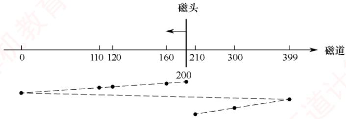

**35. B**

　　无论是温彻斯特硬盘（机械磁盘）还是固态硬盘，文件系统均以固定大小的逻辑盘块为单位组织和管理存储空间，因此确定盘块大小是两者都必须提供的基础功能。相比之下，“划分扇区”是机械硬盘固件或硬件层面的操作，文件系统无须参与，固态硬盘无传统扇区结构；“降低寻道时间”仅针对存在磁头移动的机械硬盘，固态硬盘无机械部件，无寻道问题；“均衡磨损”则是固态硬盘为延长闪存寿命所特有的机制，机械硬盘无须考虑。

#### 二、综合应用题

**01. 【解答】**

　　该磁盘有 8 个盘面，一个柱面大小为 $8 \times 8 = 64$ 个扇区，即 64 条逻辑记录。所有磁头是固定在一起的，因此在存放数据时，先存满扇区，后存满磁道，再存满柱面。

　　编号为3468的逻辑记录对应的柱面号为 $3468 / 64 = 54$ ；对应的磁道号为(3468 MOD 64)DIV 8 = 1；对应的扇区号为(3468 MOD 64)MOD 8 = 4。

**02. 【解答】**

　　磁盘转速为 27 毫秒/转，每个磁道存放 9 条记录，因此读出 1 条记录的时间为 27/9 = 3ms。

1）读出并处理记录 A 需要 5ms，此时磁头已转到记录 B 的中间，因此为了读出记录 B，必须再转接近一圈（从记录 B 的中间到记录 B）。后续 8 条记录的读取及处理与此类似，但最后一条记录的读取与处理只需 5ms。于是，处理 9 条记录的总时间为

$$
8 \times (2 7 + 3) + (3 + 2) = 2 4 5 \mathrm{ms}
$$

　　【另解】注意，从开始读 A 到最后读完 I 一共转了 9 圈，即处理完前 8 条记录 + 读第 9 条记录的时间一共是 $27 \times 9 = 243$ ms，加上最后的 2 ms 处理时间，共 $243 + 2 = 245$ ms。

2）由于每读出一条记录后需要 2ms 的处理时间，当读出并处理记录 A 时，不妨设记录 A 放在第 1 个盘块中，读/写头已移到第 2 个盘块的中间，为了能顺序读到记录 B，应将它放到第 3 个盘块中，即应将记录按下表顺序存放：

　　<table><tr><td>盘块</td><td>1</td><td>2</td><td>3</td><td>4</td><td>5</td><td>6</td><td>7</td><td>8</td><td>9</td></tr><tr><td>记录</td><td>A</td><td>F</td><td>B</td><td>G</td><td>C</td><td>H</td><td>D</td><td>I</td><td>E</td></tr></table>

　　这样，处理一条记录并将磁头移到下一条记录的时间是

$$
3 (\text {读出}) + 2 (\text {处理}) + 1 (\text {等待}) = 6 \mathrm{ms}
$$

　　所以，处理9条记录的总时间为

$$
6 \times 8 + (3 + 2) = 5 3 \mathrm{ms}
$$

**03. 【解答】**

1）FCFS：移动磁道的顺序为345, 123, 874, 692, 475, 105, 376。磁头臂必须移过的磁道的数目为 $222 + 751 + 182 + 217 + 370 + 271 = 2013$ 。

2）SSTF：移动磁道的顺序为345,376,475,692,874,123,105。磁头臂必须移过的磁道的数目为 $31+99+217+182+751+18=1298$ 。

　　注意，磁头臂必须移过的磁道的数目之和的计算没有必要像上面一样对 31, 99, 217, 182, 751, 18 求和，仔细的读者会发现：从 345 到 874 是一路递增的，接着从 874 到 105 是一路递减的。所以仅需计算 $(874 - 345) + (874 - 105) = 1298$ 。这种方法是不是要比上面得出 6 个数后再计算它们的和要快捷一些？若之前未注意到此法，相信聪明的读者会马上回顾刚做完的 1），并会仔细观察以下几问的“规律”，进而总结出自己的思路。

3）SCAN：移动磁道的顺序为345,123,105,0,376,475,692,874。磁头臂必须移过的磁道的数目为 $222+18+105+376+99+217+182=1219$ 。

4）LOOK：移动磁道的顺序为345,123,105,376,475,692,874。磁头臂必须移过的磁道的数目为 $222+18+271+99+217+182=1009$ 。

5）C-SCAN：移动磁道的顺序为345,123,105,0,999,874,692,475,376。磁头臂必须移过的磁道的数目为 $222+18+105+999+125+182+217+99=1967$ 。

6）C-LOOK：移动磁道的顺序为345,123,105,874,692,475,376。磁头臂必须移过的磁道的数目为 $222+18+769+182+217+99=1507$ 。

**04. 【解答】**

　　磁盘整理前，逻辑上相邻数据块的平均距离为13磁道，读一块数据需要的时间为

$$
1 3 \times 6 + 1 0 0 + 2 5 = 2 0 3 \mathrm{ms}
$$

　　因此，读取一个 100 块的文件需要的时间为

$$
2 0 3 \times 1 0 0 = 2 0 3 0 0 \mathrm{ms}
$$

　　磁盘整理后，逻辑上相邻数据块的平均距离为 2 磁道，读一块数据需要的时间为

$$
2 \times 6 + 1 0 0 + 2 5 = 1 3 7 \mathrm{ms}
$$

　　因此，读取一个 100 块的文件需要的时间为

$$
1 3 7 \times 1 0 0 = 1 3 7 0 0 \mathrm{ms}
$$

**05. 【解答】**

　　磁盘逆时针方向旋转按扇区来看即 0, 3, 6, … 这个顺序。每个号码连续的扇区正好相隔 2 个扇区，即数据从控制器传送到内存的时间，所以相当于磁头连续工作。

1）由题中条件可知，旋转速度为 3000 转/分 = 50 转/秒，即 20ms/转。

　　读一个扇区需要的时间为 20/8 = 2.5ms。

　　读一个扇区并将扇区数据送入内存需要的时间为 $2.5 \times 3 = 7.5$ ms。

　　所以读出一个磁道上的所有扇区需要的时间为 $20/2 + 8 \times 7.5 = 70ms = 0.07s$ 。

2）每个磁道的数据量为 $8 \times 512 = 4KB$ 。

　　所以数据传输速率为 $4KB/0.07s = 4 \times 1024kB/(1000 \times 0.07s) = 58.5kB/s$ 。

**06. 【解答】**

1）用位图表示磁盘的空闲状态。每位表示一个磁盘块的空闲状态，共需 $16384 / 32 = 512$ 个字 $= 512 \times 4\mathrm{B} = 2\mathrm{KB}$ ，正好可放在系统提供的内存中。

2）采用C-SCAN算法，访问磁道的顺序和移动的磁道数如下表所示：

　　<table><tr><td>被访问的下一个磁道号</td><td>移动距离(磁道数)</td></tr><tr><td>120</td><td>20</td></tr><tr><td>30</td><td>90</td></tr><tr><td>50</td><td>20</td></tr><tr><td>90</td><td>40</td></tr></table>

　　移动的磁道数为 $20 + 90 + 20 + 40 = 170$ ，因此总的移动磁道时间为 170ms。

　　转速为 6000 转/分，因此平均旋转延迟为 5ms，总的旋转延迟时间 = 20ms。

　　转速为 6000 转/分，因此读取一个磁道上的一个扇区的平均读取时间为 0.1ms，扇区的平均读取时间为 0.1ms，总的读取扇区的时间为 0.4ms。

　　综上，读取上述磁道上所有扇区所花的总时间为 190.4ms。

3）采用先来先服务（FCFS）调度策略更高效。因为Flash半导体存储器的物理结构不需要考虑寻道时间和旋转延迟，可直接按I/O请求的先后顺序服务。

**07. 【解答】**

$$
\begin{array}{r l} 1) \text {磁盘容量} & = \text {磁盘的柱面数} \times \text {每个柱面的磁道数} \times \text {每个磁道的扇区数} \times \text {每个扇区的大小} \\ & = (3 0 0 \times 1 0 \times 2 0 0 \times 5 1 2 / 1 0 2 4) \mathrm{KB} = 3 \times 1 0 ^ {5} \mathrm{KB} 。 \end{array}
$$

2）磁头在85号柱面上，对SSTF算法而言，总是访问当前柱面距离最近的地址。注意每个簇包含2个扇区，通过计算得到，85号柱面对应的簇号为 $85000\sim 85999$ 。通过比较得出，系统最先访问离 $85000\sim 85999$ 最近的100260，随后访问离100260最近的101660，然后访问110560，最后访问60005。顺序为100260，101660，110560，60005。

3）第100530簇在磁盘上的物理地址由其所在的柱面号、磁头号、扇区号构成。柱面号 $= \lfloor$ 簇号/每个柱面的簇数 $\rfloor = \lfloor 100530 / (10\times 200 / 2)\rfloor = 100$ 。
磁头号 $= \lfloor (\text{簇号}\% \text{每个柱面的簇数}) / \text{每个磁道的簇数}\rfloor = \lfloor 530 / (200 / 2)\rfloor = 5$ 。
扇区号 $= \text{扇区地址}\% \text{每个磁道的扇区数} = (530\times 2)\% 200 = 60$ 。
将簇号转换成磁盘物理地址的过程由磁盘驱动程序完成。

**08. 【解答】**

1）执行顺序依次是 ROM 中的引导程序、磁盘引导程序、分区引导程序、操作系统的初始化程序。启动系统时，首先运行 ROM 中的引导代码（bootstrap）。为执行某个分区的操作系统的初始化程序，需要先执行磁盘引导程序以指示引导到哪个分区，然后执行该分区的引导程序，用于引导该分区的操作系统。

2）4个操作的执行顺序依次是磁盘的物理格式化、对磁盘进行分区、逻辑格式化、操作系统的安装。磁盘只有通过分区和逻辑格式化后才能安装系统和存储信息。物理格式化（也称低级格式化，通常出厂时就已完成）的作用是为每个磁道划分扇区，安排扇区在磁道中的排列顺序，并对已损坏的磁道和扇区做“坏”标记等。随后将磁盘的整体存储空间划分为相互独立的多个分区（如Windows中划分C盘、D盘等），这些分区可以用作多种用途，如安装不同的操作系统和应用程序、存储文件等。然后进行逻辑格式化（也称高级格式化），其作用是对扇区进行逻辑编号，建立逻辑盘的引导记录、文件分配表、文件目录表和数据区等。最后才是操作系统的安装。

3）由上述分析可知，磁盘扇区的划分是在磁盘的物理格式化操作中完成的，文件系统根目录的建立是在逻辑格式化操作中完成的。

## 5.4 本章疑难点

#### 1. 如何改进设备分配策略，以提高其灵活性和成功率？

　　可从以下两个方面对基本的设备分配程序加以改进：

1）增强设备无关性。进程使用逻辑设备名发起 I/O 请求。系统首先从系统设备表（SDT）中查找该类设备的第一个设备控制表（DCT）；若该设备正忙，则继续查找下一个 DCT；仅当所有同类设备均处于忙碌状态时，才将进程挂起，并将其加入该类设备的等待队列；只要存在一个可用设备，系统便进入后续的安全性检查与分配流程。

2）支持多通路 I/O 结构。为避免 I/O 瓶颈，现代系统常采用多通路设计。在此结构下，控制器与通道的分配也需逐级尝试：若设备所连接的第一个控制器（或该控制器所连接的第一个通道）正忙，则尝试下一个；仅当所有相关控制器（或通道）均不可用时，分配才宣告失败，进程被挂入相应等待队列；只要有一个可用，即可完成分配。

　　在具有通道的系统中，设备分配需要依次访问 SDT→DCT→COCT→CHCT。成功分配一个设备须同时满足：设备可用；控制器可用；通道可用。因此，常称“设备分配，要过三关”。

#### 2. 用户缓冲区与内核缓冲区的定义及作用分别是什么？

　　用户缓冲区是指用户进程在读取文件时，通常会预先申请一块内存区域（如一个数组），称为缓冲区（Buffer），用于暂存从文件中读取的数据。每次调用 read 系统调用时，操作系统会将读取的数据填充到该缓冲区中，随后应用程序便可直接从中获取数据。当其中的数据被处理完毕后，再发起下一次 read 系统调用以重新填充缓冲区。可见，用户缓冲区的主要作用是减少系统调用的次数，进而降低因频繁在用户态与内核态之间切换所带来的开销。

　　内核缓冲区则是操作系统在内核空间中维护的缓冲区。当用户进程请求读取磁盘数据时，系统并不会直接访问磁盘，而是先检查内核缓冲区中是否已缓存所需数据：若存在，则将数据从内核缓冲区复制到用户缓冲区；若不存在，内核会发起磁盘 I/O 请求，并将当前进程挂起，转而调度其他进程执行。磁盘数据被读入内核缓冲区后，系统再将数据复制到用户缓冲区，并唤醒该进程。对于写操作，用户进程提交的数据通常不会立即写入磁盘，而是先写入内核缓冲区；当缓冲区中的数据积累到一定量，或满足特定刷新条件时，内核才会将数据批量写入磁盘。可见，内核缓冲区的核心目的是提升磁盘 I/O 的整体效率，尤其对写操作具有突出的优化效果。
