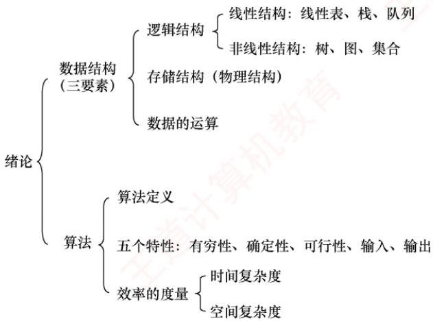
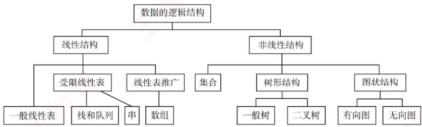
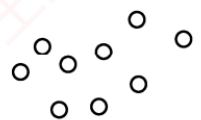
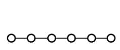
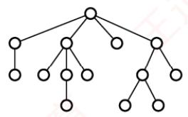
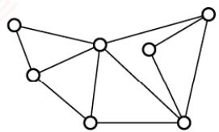

## 【考纲内容】

（一）数据结构的基本概念

（二）算法的基本概念

　　算法的时间复杂度和空间复杂度

## 【知识框架】

<div align="center">
  
</div>

## 【复习提示】

　　本章概述数据结构，帮助读者整体认识数据结构，重点在于掌握算法时间复杂度和空间复杂度的分析方法。在统考真题中，无论是算法设计题还是选择题，通常都会要求分析算法的时间复杂度（有时也包括空间复杂度），因此要熟练掌握相关内容。

## 1.1 数据结构的基本概念

### 1.1.1 基本概念和术语

#### 1. 数据

　　数据是信息的载体，是描述客观事物属性的数、字符，以及所有能输入到计算机中并被计算机程序识别和处理的符号的集合。数据是计算机程序加工的原料。

#### 2. 数据元素

　　数据元素是数据的基本单位，通常作为一个整体进行考虑和处理。一个数据元素可由若干数据项组成，而数据项是构成数据元素的不可分割的最小单位。例如，一条学生记录就是一个数据元素，它由学号、姓名、性别等数据项组成。

#### 3. 数据对象

　　数据对象是具有相同性质的数据元素的集合，是数据的一个子集。例如，整数数据对象可表示为集合 $N=\{0,\pm1,\pm2,\cdots\}$ 。

#### 4. 数据类型

　　数据类型是一个值的集合以及定义在该集合上的一组操作的总称。

1）原子类型：其值不可再分的数据类型。

2）结构类型：其值可进一步分解为若干成分（分量）的数据类型。

3）抽象数据类型（ADT）：一个数学模型以及定义在该模型上的一组操作。它通常是对数据的某种抽象，规定了数据的取值范围、结构形式以及可执行的操作集合。

#### 5. 数据结构

　　数据结构是相互之间存在一种或多种特定关系的数据元素的集合。在任何问题中，数据元素都不是孤立存在的，它们之间存在某种关系，这种关系称为结构（Structure）。数据结构包括三方面的内容：逻辑结构、存储结构和数据的运算。

　　数据的逻辑结构与存储结构密不可分：算法的设计取决于所采用的逻辑结构，而算法的实现则依赖于所选择的存储结构。

### 1.1.2 数据结构三要素

#### 1. 数据的逻辑结构

　　逻辑结构是指数据元素之间的逻辑关系，即从逻辑角度对数据的描述方式。它与数据在计算机中的存储方式无关，是独立于具体系统的。数据的逻辑结构可分为线性结构和非线性结构。例如，线性表是典型的线性结构；集合、树和图则是典型的非线性结构，如图 1.1 所示。

<div align="center">
  
</div>

<p align="center"><em>图 1.1 数据的逻辑结构分类</em></p>

1）集合：结构中的数据元素之间除“同属一个集合”外，别无其他关系[见图1.2(a)]。

<div align="center">
  
</div>

<p align="center"><em>(a) 集合</em></p>

<div align="center">
  
</div>

<p align="center"><em>(b) 线性结构</em></p>

<div align="center">
  
</div>

<p align="center"><em>(c) 树形结构</em></p>

<div align="center">
  
</div>

<p align="center"><em>(d) 网状结构</em></p>

<p align="center"><em>图 1.2 四类基本结构关系示例图</em></p>

2）线性结构：结构中的数据元素之间仅存在一对一的关系 [见图 1.2(b)]。

3）树形结构：结构中的数据元素之间存在一对多的关系[见图1.2(c)]。

4）图状结构（或网状结构）：结构中的数据元素之间存在多对多的关系[见图1.2(d)]。

#### 2. 数据的存储结构

　　存储结构是指数据结构在计算机中的表示形式，也称物理结构，包括数据元素的表示及其相互关系的表示。它是逻辑结构在计算机中的具体实现，依赖于所采用的编程语言。常见的存储结构有顺序存储、链式存储、索引存储和散列存储。

1）顺序存储：将逻辑上相邻的数据元素存储在物理位置也相邻的存储单元中，元素间的关系由存储单元的邻接关系体现。优点是可以实现随机存取，每个元素占用最少的存储空间；缺点是要求使用连续的存储空间，可能导致较多的外部碎片。

2）链式存储：不要求逻辑上相邻的元素在物理位置上也相邻，而是通过指针指示元素的存储地址来表示其逻辑关系。优点是不会出现碎片现象，能充分利用所有存储单元；缺点是每个元素因存储指针而额外占用存储空间，且只能顺序存取。

3）索引存储：在存储元素信息的同时，额外建立索引表。索引表中的每一项称为索引项，通常包含关键字和地址。优点是检索速度快；缺点是需要额外的存储空间用于索引表，且增加或删除数据时需更新索引表，带来额外的时间开销。

4）散列存储：根据元素的关键字直接计算出其存储地址，也称哈希（Hash）存储。优点是检索、插入和删除操作都非常快速；缺点是如果散列函数设计不当，可能会产生冲突（也称哈希冲突），解决冲突会增加时间和空间成本。

#### 3. 数据的运算

　　数据的运算包括定义与实现两个方面：定义针对逻辑结构，说明运算的功能；实现则基于存储结构，描述具体的操作步骤。

### 1.1.3 本节试题精选

#### 一、单项选择题

01. 一个完整的数据结构通常应包含以下哪些要素（）？

- A. 数据元素及其存储方式
- B. 数据的逻辑结构和物理结构
- C. 数据的逻辑结构、存储结构以及在其上定义的基本操作
- D. 数据对象和数据元素之间的关系

02. 下列四种数据结构中，（）是非线性数据结构。

- A. 树
- B. 字符串
- C. 队列
- D. 栈

03. 下列选项中，属于逻辑结构的是（）。

- A. 顺序表
- B. 哈希表
- C. 有序表
- D. 单链表

04. 下列关于数据结构的说法中，正确的是（）。

- A. 数据的逻辑结构独立于其存储结构
- B. 数据的存储结构独立于其逻辑结构
- C. 数据的逻辑结构唯一决定其存储结构
- D. 数据结构仅由其逻辑结构和存储结构决定

05. 在存储数据时，通常不仅要存储各数据元素的值，还要存储（）。

- A. 数据的操作方法
- B. 数据元素的类型
- C. 数据元素之间的关系
- D. 数据的存取方法

#### 二、综合应用题

01. 对于两种不同的数据结构，逻辑结构或物理结构一定不相同吗？

02. 举例说明对相同的逻辑结构，同一种运算在不同存储方式下实现时，其运算效率不同。

### 1.1.4 答案与解析

#### 一、单项选择题

**01. C**

　　一个完整的数据结构由三部分组成：逻辑结构（如线性、树形等）、存储结构（物理表示）以及在其上定义的基本操作（如插入、删除等）。只有选项 C 同时包含这三个核心要素。

**02. A**

　　树和图是典型的非线性数据结构，其他选项都属于线性数据结构。

**03. C**

　　顺序表、哈希表和单链表是三种不同的数据结构，既描述逻辑结构，又描述存储结构和数据运算。而有序表是指关键字有序的线性表，仅描述元素之间的逻辑关系，它既可链式存储，又可顺序存储，所以属于逻辑结构。

**04. A**

　　数据的逻辑结构是从面向实际问题的角度出发的，只采用抽象表达方式，独立于存储结构，数据的存储方式有多种不同的选择；而数据的存储结构是逻辑结构在计算机上的映射，它不能独立于逻辑结构而存在。数据结构包括三个要素，缺一不可。

**05. C**

　　在存储数据时，不仅要存储数据元素的值，而且要存储数据元素之间的关系。

#### 二、综合应用题

**01. 【解答】**

　　应该注意到，数据的运算也是数据结构的一个重要方面。

　　对于两种不同的数据结构，它们的逻辑结构和物理结构完全有可能相同。比如二叉树和二叉排序树，二叉排序树可以采用二叉树的逻辑表示和存储方式，前者通常用于表示层次关系，而后者通常用于排序和查找。虽然它们的运算都有建立树、插入结点、删除结点和查找结点等功能，但对于二叉树和二叉排序树，这些运算的定义是不同的，以查找结点为例，二叉树的平均时间复杂度为 $O(n)$ ，而二叉排序树的平均时间复杂度为 $O(\log_2 n)$ 。

**02. 【解答】**

　　线性表既可以用顺序存储方式实现，又可以用链式存储方式实现。在顺序存储方式下，在线性表中插入和删除元素，平均要移动近一半的元素，时间复杂度为 $O(n)$ ；而在链式存储方式下，插入和删除的时间复杂度都是 $O(1)$ 。

## 1.2 算法和算法评价

### 1.2.1 算法的基本概念

　　算法（Algorithm）是对特定问题求解步骤的描述，是一个有穷的指令序列，其中每条指令表示一个或多个操作。此外，一个有效的算法应具备以下五个重要特性：

1）有穷性。算法必须在执行有限步后结束，且每一步都能在有限时间内完成。

2）确定性。算法中每条指令必须有明确的含义，对于相同的输入，只能产生相同的输出。

3）可行性。算法中所描述的操作都可以通过已实现的基本运算执行有限次来完成。

4）输入。算法可以有零个或多个输入，这些输入取自某个特定对象的集合。

5）输出。算法至少有一个输出，且该输出与输入之间存在某种特定关系。

　　通常，设计一个“好”的算法应力求满足以下目标：

1）正确性。能够正确地解决所给问题。

2）可读性。结构清晰、易于理解，便于阅读和交流。

3）健壮性。对非法或异常输入能做出适当处理，而不是产生不可预测的结果。

4）高效率与低存储量需求。效率是指算法的执行时间，存储量需求是指执行过程中所需的最大存储空间，二者均与问题规模密切相关。

### 1.2.2 算法效率的度量

> **考点追踪：** （算法题）分析时空复杂度（2010—2013、2015、2016、2018—2021、2025）

　　在算法设计中，正确性只是基础，效率才是衡量算法优劣的关键指标。由于实际运行时间受硬件、编译器等因素影响，无法作为通用标准，因此引入渐近复杂度分析——通过时间复杂度和空间复杂度来抽象描述算法随问题规模增长的资源消耗趋势。

#### 1. 时间复杂度

> **考点追踪：** 分析算法的时间复杂度（2011—2014、2017、2019、2022、2025）

　　时间复杂度描述算法执行时间随问题规模 n 增大而变化的趋势，是关于 n 的渐近函数。算法执行时间通常由语句频度（某条语句的执行次数）来衡量。设算法中所有语句的频度之和为 $T(n)$ ，它是问题规模 n 的函数。当 n 足够大时，低阶项和常数系数对整体增长趋势的影响可以忽略不计，因此只需关注 $T(n)$ 中增长最快的项。这一项通常由算法中的基本运算（最深层循环内的关键操作）的执行次数决定，该执行次数的数量级即为整个算法的时间复杂度。

　　时间复杂度通常用大 O 记号表示：若存在正常数 C 和 $n_{0}$ ，使得对所有 $n \geqslant n_{0}$ 时，都有

$$
0 \leqslant T (n) \leqslant C f (n)
$$

　　则称 $T(n)=O(f(n))$ ，它表示当 n 足够大时， $T(n)$ 的增长速度不超过 $f(n)$ 的常数倍。

　　例如， $T(n)=3n^{2}+100n+5\rightarrow O(n^{2})$ ， $T(n)=2^{n}+n^{100}\rightarrow O(2^{n})$ 。

　　算法的实际运行时间不仅依赖于问题规模 n，还受输入数据初始状态的影响，同一算法在不同实例下的运行时间可能差异很大。例如，在数组 $A[0\ldots n-1]$ 中逆序查找值 k 的算法：

```txt
(1) i=n-1;
(2) while (i>=0 && (A[i] != k))
(3) i--; //基本运算
```

　　最好时间复杂度：在最有利输入下的运行时间。若 A[n-1] 等于 k，则语句 3 的频度 $f(n)=0$ 。最坏时间复杂度：在最不利输入下的运行时间。若 k 不存在，则语句 3 的频度 $f(n)=n$ 。平均时间复杂度：所有输入等概率出现时的期望运行时间。

　　通常以最坏时间复杂度作为算法效率的评价标准，因为它提供了运行时间的确定性上界。分析由多个代码段组成的程序时，可用以下规则快速推导整体时间复杂度：

1）加法规则，若两段代码顺序执行，则总时间复杂度取两者中的高阶项：

$$
O (f (n)) + O (g (n)) = O (\max (f (n), g (n)))
$$

2）乘法规则，若一段代码嵌套在另一段内部中，则总时间复杂度为两者之积：

$$
O (f (n)) \cdot O (g (n)) = O (f (n) g (n))
$$

　　例如，设 a{}、b{}、c{} 三个语句块的时间复杂度分别为 $O(1)$ 、 $O(n)$ 、 $O(n^{2})$ ，则
① a{
    b{}
    c{}
} // 时间复杂度为 $O(n^{2})$ ，适用加法规则
② a{
    b{
    c{}
    }
} // 时间复杂度为 $O(n^{3})$ ，适用乘法规则

　　常见的时间复杂度阶次（按增长速度升序）：

$$
O (1) <   O \left(\log_ {2} n\right) <   O (n) <   O \left(n \log_ {2} n\right) <   O \left(n ^ {2}\right) <   O \left(n ^ {3}\right) <   O \left(2 ^ {n}\right) <   O (n!) <   O \left(n ^ {n}\right)
$$

#### 2. 空间复杂度

　　空间复杂度 $S(n)$ 表示算法在运行过程中所需的额外存储空间，是问题规模 n 的函数，记为

$$
S (n) = O (g (n))
$$

　　程序执行时所需的空间包括：指令、常数和变量（与 n 无关）；输入数据；以及辅助空间（如递归调用栈、临时数组、指针等）。其中，输入数据所占的空间只取决于问题本身，与算法无关，不计入空间复杂度；而指令、常数和与 n 无关的变量所占的空间为固定开销，也不随问题规模变化。因此，在分析空间复杂度时，我们只关注算法额外使用的辅助空间。例如，若算法创建了若干与输入规模 n 同阶的辅助数组，则其空间复杂度为 $O(n)$ 。

　　若算法仅使用常量级的额外空间，则称其为原地工作，空间复杂度为 $O(1)$ 。

### 1.2.3 本节试题精选

#### 一、单项选择题

01. 一个算法应该具有（）等重要特性。

- A. 可维护性、可读性和可行性
- B. 可行性、确定性和有穷性
- C. 确定性、有穷性和可靠性
- D. 可读性、正确性和可行性

02. 下列关于算法的说法中，正确的是（）。

- A. 算法的时间效率取决于算法执行所花的 CPU 时间
- B. 在算法设计中不允许用牺牲空间效率的方式来换取好的时间效率
- C. 算法必须具备有穷性、确定性等五个特性
- D. 通常用时间效率和空间效率来衡量算法的优劣

03. 某算法的时间复杂度为 $O(n^{2})$ ，则表示该算法的（）。

- A. 问题规模是 $n^{2}$
- B. 执行时间等于 $n^{2}$
- C. 执行时间与 $n^{2}$ 成正比
- D. 问题规模与 $n^{2}$ 成正比

04. 若某算法的空间复杂度为 $O(1)$ ，则表示该算法（）。

- A. 不需要任何辅助空间
- B. 所需辅助空间大小与问题规模 $n$ 无关
- C. 不需要任何空间
- D. 所需空间大小与问题规模 $n$ 无关

05. 下列关于时间复杂度的函数中，时间复杂度最小的是（）。

- A. $T_{1}(n) = n\log_{2}n + 5000n$
- B. $T_{2}(n) = n^{2} - 8000n$
- C. $T_{3}(n) = n\log_{2}n - 6000n$
- D. $T_{4}(n) = 20000\log_{2}n$

06. 下列算法的时间复杂度为（）。void fun(int n) {

int i=1;
while(i<=n)
    i=i*2;
}

- A. $O(n)$
- B. $O(n^{2})$
- C. $O(n\log_{2}n)$
- D. $O(\log_{2}n)$

07. 下列算法的时间复杂度为（）。
void fun(int n) { int i = 0; while (i * i * i <= n) i++; }

- A. $O(n)$
- B. $O(n \log_2 n)$
- C. $O(\sqrt[3]{n})$
- D. $O(\sqrt{n})$

08. 某个程序段如下:
    for(i=n-1;i>1;i--)
    for(j=1;j<i;j++)
    if(A[j]>A[j+1])
　　    A[j]与A[j+1]对换;

　　其中 n 为正整数，则最后一行语句的频度在最坏情况下是（）。

- A. $O(n)$
- B. $O(n\log_{2}n)$
- C. $O(n^{3})$
- D. $O(n^{2})$

09. 下列程序段的时间复杂度为（）。if(n>=0){
    for(int i=0;i<n;i++)
    for(int j=0;j<n;j++)
　　    printf("输入数据大于或等于零\n")
    }
    else{
    for(int j=0;j<n;j++)
　　    printf("输入数据小于零\n")
    }

- A. $O(n^{2})$
- B. $O(n)$
- C. $O(1)$
- D. $O(n\log_{2}n)$

10. 下列算法中加下划线的语句的执行次数为（）。
int m=0,i,j;
for(i=1;i<=n;i++)
    for(j=1;j<=2*i;j++)
    m++;

- A. n(n+1)
- B. n
- C. n+1
- D. $n^2$

11. 下列函数代码的时间复杂度是（）。
int Func(int n) { if(n==1) return 1; else return 2*Func(n/2)+n;}

- A. $O(n)$
- B. $O(n\log_2n)$
- C. $O(\log_2n)$
- D. $O(n^2)$

12. 【2011 统考真题】设 n 是描述问题规模的非负整数，下列程序段的时间复杂度是（）。x=2; while (x<n/2) x=2*x;

- A. $O(\log_{2}n)$
- B. $O(n)$
- C. $O(n\log_{2}n)$
- D. $O(n^{2})$

13. 【2012 统考真题】求整数 n (n≥0) 的阶乘的算法如下，其时间复杂度是（）。int fact(int n){
    if(n<=1) return 1;
    return n*fact(n-1);
}

- A. $O(\log_2n)$
- B. $O(n)$
- C. $O(n\log_2n)$
- D. $O(n^2)$

14. 【2014 统考真题】下列程序段的时间复杂度是（）。count=0; for(k=1;k<=n;k*=2) for(j=1;j<=n;j++) count++;

- A. $O(\log_2n)$
- B. $O(n)$
- C. $O(n\log_2n)$
- D. $O(n^2)$

15. 【2017 统考真题】下列函数的时间复杂度是（）。int func(int n) {
    int i=0, sum=0;
    while (sum<n) sum += ++i;
    return i;
}

- A. $O(\log_{2}n)$
- B. $O(n^{1/2})$
- C. $O(n)$
- D. $O(n\log_{2}n)$

16. 【2019 统考真题】设 n 是描述问题规模的非负整数，下列程序段的时间复杂度是（）。x=0; while $(n \geqslant (x+1) * (x+1))$ $x=x+1;$

- A. $O(\log_{2}n)$
- B. $O(n^{1/2})$
- C. $O(n)$
- D. $O(n^{2})$

17. 【2022 统考真题】下列程序段的时间复杂度是（）。
int sum=0;
for (int i=1;i<n;i*=2)
    for (int j=0;j<i;j++)
    sum++;

- A. $O(\log_2n)$
- B. $O(n)$
- C. $O(n\log_2n)$
- D. $O(n^2)$

18. 【2025 统考真题】下列程序段的时间复杂度是（）。int count=0,i,j; for(i=l;i*i<=n;i++) for(j=l;j<=i;j++) count++;

- A. $O(\log_2n)$
- B. $O(n)$
- C. $O(n\log_2n)$
- D. $O(n^2)$

#### 二、综合应用题

01. 分析下列各程序段，求出算法的时间复杂度。
    ① i=1;k=0;
    while (i<n-1){
    k=k+10*i;
    i++;
    }
    ② y=0;
    while ((y+1)*(y+1)<=n)
    y=y+1;
    ③ for (i=0;i<n;i++)
    for (j=0;j<m;j++)
    a[i][j]=0;

### 1.2.4 答案与解析

#### 一、单项选择题

**01. B**

　　一个算法应具有五个重要特性：有穷性、确定性、可行性、输入和输出。选项 A、C 和 D 中提到的特性（如可维护性、可读性、可靠性、正确性等）是很重要的，但它们并不是算法定义的重要特性，更多的是关于软件开发中的附加要求。

**02. C**

　　算法的时间效率是指算法的时间复杂度，即执行算法所需的计算工作量，选项 A 错误。算法设计会综合考虑时间效率和空间效率两个方面，若某些应用场景对时间效率要求很高，而对空间效率要求不高，则可用牺牲空间效率的方式来换取好的时间效率，选项 B 错误。评价一个算法的“优劣”不仅要考虑算法的时空效率，还要从正确性、可读性、健壮性等方面来综合评价。

**03. C**

　　时间复杂度为 $O(n^{2})$ ，说明算法的时间复杂度 $T(n)$ 满足 $T(n)\leqslant cn^2$ （其中 $c$ 为比例常数），即 $T(n) = O(n^2)$ ，时间复杂度 $T(n)$ 是问题规模 $n$ 的函数，其问题规模仍然是 $n$ 而不是 $n^2$ 。

**04. B**

　　算法的空间复杂度为 $O(1)$ ，表示执行该算法所需的辅助空间大小相比输入数据的规模来说是一个常量，而不表示该算法执行时不需要任何空间或辅助空间。

**05. D**

　　选项 A 的最高阶是 $n \log_{2} n$ ，时间复杂度是 $O(n \log_{2} n)$ 。选项 B 的最高阶是 $n^{2}$ ，时间复杂度是 $O(n^{2})$ 。选项 C 的最高阶是 $n \log_{2} n$ ，时间复杂度是 $O(n \log_{2} n)$ 。选项 D 的最高阶是 $\log_{2} n$ ，时间复杂度是 $O(\log_{2} n)$ 。

**06. D**

　　找出基本运算 $i=i*2$ ，设执行次数为 t， $2^{t}\leqslant n$ ，即 $t\leqslant\log_{2}n$ ，故时间复杂度 $T(n)=O(\log_{2}n)$ 。

　　更直观的方法：计算基本运算 $i=i*2$ 的执行次数（每执行一次，i 乘以 2），其中判断条件可以理解为 $2^{t}=n$ ，即 $t=\log_{2}n$ ，则 $T(n)=O(\log_{2}n)$ 。

**07. C**

　　基本运算为 i++, 设执行次数为 t，有 $t \cdot t \cdot t \leqslant n$ ，即 $t^{3} \leqslant n$ 。因此有 $t \leqslant \sqrt[3]{n}$ ，则 $T(n) = O(\sqrt[3]{n})$ 。
**08. D**

　　这是冒泡排序的算法代码，考查最坏情况下的元素交换次数（若觉得理解起来有困难，则可在学完第8章后再回顾）。当所有相邻元素都为逆序时，则最后一行的语句每次都会执行。此时，

$$
T (n) = \sum_ {i = 2} ^ {n - 1} \sum_ {j = 1} ^ {i - 1} 1 = \sum_ {i = 2} ^ {n - 1} i - 1 = (n - 2) (n - 1) / 2 = O \left(n ^ {2}\right)
$$

　　所以在最坏情况下该语句的频度是 $O(n^{2})$ 。

**09. A**

　　当程序段中有条件判断语句时，取分支路径上的最大时间复杂度。

**10. A**

　　m++语句的执行次数为

$$
\sum_ {i = 1} ^ {n} \sum_ {j = 1} ^ {2 i} 1 = \sum_ {i = 1} ^ {n} 2 i = 2 \sum_ {i = 1} ^ {n} i = n (n + 1)
$$

**11. C**

　　本题求的是递归调用的时间复杂度，递归调用可视为多重循环，每次递归执行的基本语句是 if $(n==1)$ return 1；，因此可以认为单层循环的执行次数为 1，设递归次数为 $t, 2^{t} \leqslant n$ ，即 $t \leqslant \log_{2} n$ ，共执行了 $\log_{2} n$ 次递归调用，总执行次数 $T = \log_{2} n \times 1$ ，所以时间复杂度为 $O(\log_{2} n)$ 。

<table><tr><td>循环变量 i</td><td>单层循环语句</td><td>单层循环执行次数</td></tr><tr><td>n</td><td>if (n==1) return 1;</td><td>1</td></tr><tr><td>n/2</td><td>if (n==1) return 1;</td><td>1</td></tr><tr><td>n/4</td><td>if (n==1) return 1;</td><td>1</td></tr><tr><td>...</td><td>...</td><td>...</td></tr><tr><td>1</td><td>if (n==1) return 1;</td><td>1</td></tr></table>

**12. A**

　　基本运算（执行频率最高的语句）为 $x=2*x$ ，每执行一次，x 乘以 2，设执行次数为 t，则有 $2^{t+1}<n/2$ ，所以 $t<\log_{2}(n/2)-1=\log_{2}n-2$ ，得 $T(n)=O(\log_{2}n)$ 。

**13. B**

　　本题求的是递归调用的时间复杂度，递归调用可视为多重循环，每次递归执行的基本语句是if(n<=1) return 1;，因此，可以认为单层循环的执行次数为1，共执行了n次递归调用，总执行次数 $T=1+1+\cdots+1=n$ ，所以时间复杂度为 $O(n)$ 。

<table><tr><td>循环变量i</td><td>单层循环语句</td><td>单层循环执行次数</td></tr><tr><td>n</td><td>if (n&lt;=1) return 1;</td><td>1</td></tr><tr><td>n-1</td><td>if (n&lt;=1) return 1;</td><td>1</td></tr><tr><td>n-2</td><td>if (n&lt;=1) return 1;</td><td>1</td></tr><tr><td>...</td><td>...</td><td>...</td></tr><tr><td>1</td><td>if (n&lt;=1) return 1;</td><td>1</td></tr></table>

**14. C**

　　对于单层循环如 for(j=1;j<=n;j++) count++;，可以直接数出执行次数为 n，因此可将多层循环转换成多个并列的单层循环，且列出每个单层循环如下（假设 t 为循环变量的幂次）：

<table><tr><td>循环变量 k</td><td>单层循环语句</td><td>单层循环执行次数</td></tr><tr><td>1</td><td>for (j=1; j&lt;=n; j++)</td><td>n</td></tr><tr><td><eq>2^1</eq></td><td>for (j=1; j&lt;=n; j++)</td><td>n</td></tr><tr><td><eq>2^2</eq></td><td>for (j=1; j&lt;=n; j++)</td><td>n</td></tr><tr><td>...</td><td>...</td><td>...</td></tr><tr><td><eq>2&#x27;</eq></td><td>for (j=1; j&lt;=n; j++)</td><td>n</td></tr></table>

　　进入外层循环的条件是 $k \leqslant n$ ，当循环结束时，循环变量的幂次 t 满足 $2^{t} \leqslant n < 2^{t+1}$ ，即 $t \leqslant \log_{2} n$ 。所以总执行次数 $T = n(t + 1) = n (\log_{2} n + 1)$ ，时间复杂度为 $O(n \log_{2} n)$ 。

**15. B**

　　基本运算为 $sum+=++i$ ，等价于 “++i； $sum=sum+i$ ”，每执行一次，i 都自增 1。当 i=1 时， $sum=0+1$ ；当 i=2 时， $sum=0+1+2$ ；当 i=3 时， $sum=0+1+2+3$ ，以此类推，得出 $sum=0+1+2+3+\cdots+i=(1+i)\times i/2$ ，可知循环次数 t 满足 $(1+t)\cdot t/2<n$ ，故时间复杂度为 $O(n^{1/2})$ 。

> **注意：**

　　统考真题中常将 $\log_2$ 书写为 $\log$ ，此时默认底数为2。

**16. B**

　　假设第 k 次循环终止，则第 k 次执行时， $(x+1)^{2}>n$ ，x 的初始值为 0，第 k 次判断时，x=k-1，即 $k^{2}>n$ ， $k>\sqrt{n}$ ，因此该程序段的时间复杂度为 $O(n^{1/2})$ 。

**17. B**

　　对于单层循环如 for(j=0;j<=i;j++) sum++;，可以直接数出执行次数为 i，因此可将多层循环转换成多个并列的单层循环，且列出每个单层循环如下（假设 t 为循环变量的幂次）：

<table><tr><td>循环变量 i</td><td>单层循环语句</td><td>单层循环执行次数</td></tr><tr><td>1</td><td>for (j=0; j&lt;1; j++)</td><td>1</td></tr><tr><td><eq>2^1</eq></td><td>for (j=0; j&lt;2; j++)</td><td>2</td></tr><tr><td><eq>2^2</eq></td><td>for (j=0; j&lt;<eq>2^2</eq>; j++)</td><td>4</td></tr><tr><td>...</td><td>...</td><td>...</td></tr><tr><td><eq>2^t</eq></td><td>for (j=0; j&lt;<eq>2^t</eq>; j++)</td><td><eq>2^t</eq></td></tr></table>

　　进入外层循环的条件是 i < n，当循环结束时，循环变量的幂次 t 满足 $2^{t} < n \leqslant 2^{t+1}$ 。总执行次数 $T = 1 + 2^{1} + 2^{2} + \cdots + 2^{t} = 2^{t+1} - 1$ ，即 $n - 1 \leqslant T$ 且 T < 2n - 1，所以时间复杂度为 $O(n)$ 。

**18. B**

　　对于单层循环 for $(j=1; j<=i; j++)$ count++;，其每趟的执行次数为 i （j 从 1 到 i）。外层循环的条件为 $i^{2} \leqslant n$ ，即 $i \leqslant \sqrt{n}$ 。因此，可将多层循环转换为多个并列的单层循环，列出每个单层循环如下。总执行次数 $T(n) = 1 + 2 + \cdots + \left\lfloor \sqrt{n} \right\rfloor = n / 2 + \left\lfloor \sqrt{n} \right\rfloor / 2$ ，时间复杂度为 $O(n)$ 。

<table><tr><td>循环变量 i</td><td>单层循环语句</td><td>单层循环执行次数</td></tr><tr><td>1</td><td>for (j=1;j&lt;=i;j++)</td><td>1</td></tr><tr><td>2</td><td>for (j=1;j&lt;=i;j++)</td><td>2</td></tr><tr><td>...</td><td>for (j=1;j&lt;=i;j++)</td><td>...</td></tr><tr><td><eq>\left\lfloor \sqrt{n} \right\rfloor</eq></td><td>for (j=1;j&lt;=i;j++)</td><td><eq>\left\lfloor \sqrt{n} \right\rfloor</eq></td></tr></table>

#### 二、综合应用题

**01. 【解答】**

　　① 基本语句 $k=k+10*i$ 共执行了 n-2 次，故 $T(n)=O(n)$ 。

　　② 设循环体共执行 t 次，每循环一次，循环变量 y 加 1，最终 t = y。故 $t^{2} \leqslant n$ ，得 $T(n) = O(n^{1/2})$ 。

　　③ 内循环执行 m 次，外循环执行 n 次，根据乘法原理，共执行了 mn 次，故 $T(m, n) = O(mn)$ 。

> **归纳总结：**

　　本章的核心在于分析程序的时间复杂度。读者不仅要能快速判断算法的渐近复杂度，更要掌握规范、严谨的推导过程——许多人在解题时虽能“一眼看出”答案，却难以清晰地阐述其分析逻辑。为此，编者综合众多资料，将此类问题归纳为以下两种典型情形，以供参考。

#### 1. 循环主体中的变量参与循环条件的判断

　　对于采用循环递推实现的算法, 应先建立基本运算的执行次数 x 与问题规模 n 之间的关系式, 解得 $x = f(n)$ 。若 $f(n)$ 的最高次幂为 k，则时间复杂度为 $O(n^{k})$ 。例如，

1. int i=1;
    while (i<=n)
    i=i*2;
2. int y=5;
    while ((y+1)*(y+1)<n)
    y=y+1;

　　在例 1 中，设基本运算 $i=i*2$ 的执行次数为 t，则 $2^{t}\leqslant n$ ，解得 $t\leqslant\log_{2}n$ ，故 $T(n)=O(\log_{2}n)$ 。在例 2 中，设基本运算 $y=y+1$ 的执行次数为 t，则 t=y-5，且 $(t+5+1)(t+5+1)<n$ ，解得 $t<\sqrt{n}-6$ ，即 $T(n)=O(\sqrt{n})$ 。

#### 2. 循环主体中的变量与循环条件无关

　　此类问题可采用数学归纳法或直接累计循环执行次数。分析多层循环时，应从内向外逐层计算，忽略单步语句、条件判断语句，仅关注主体语句的执行次数。此类问题又可分以下两种。

- 递归程序通常通过建立递推关系式求解。时间复杂度的分析如下：

$$
T (n) = 1 + T (n - 1) = 1 + 1 + T (n - 2) = \dots = n - 1 + T (1)
$$

　　即 $T(n)=O(n)$ 。

- 非递归程序的分析较为简单，可直接累加次数。本节前面已给出相关习题。

> **思维拓展：**

　　求解斐波那契数列

$$
F (n) = \left\{ \begin{array}{l l} 0, & n = 0 \\ 1, & n = 1 \\ F (n - 1) + F (n - 2), & n > 1 \end{array} \right.
$$

　　有两种常用的算法：递归算法和非递归算法。试分别分析两种算法的时间复杂度。

> **提示：**

　　请结合归纳总结中的两种方法进行解答。
