## 【考纲内容】

（一）栈和队列的基本概念

（二）栈和队列的顺序存储结构

（三）栈和队列的链式存储结构

（四）多维数组的存储

（五）特殊矩阵的压缩存储

（六）栈、队列和数组的应用

## 【知识框架】

<div align="center">
  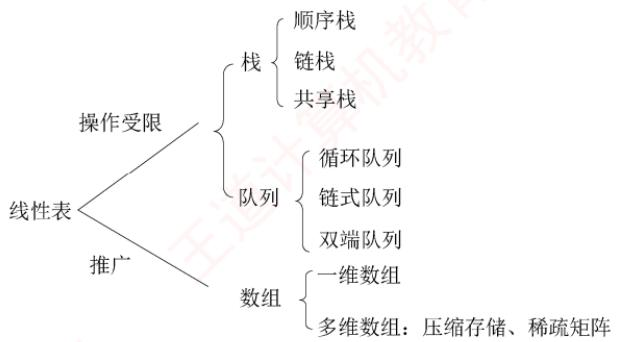
</div>

## 【复习提示】

　　本章通常以选择题形式考查，题目难度不大，但命题方式较为灵活。其中，栈（如入栈/出栈过程、出栈序列的合法性）和队列的操作及其特征是考查重点。由于二者都是线性表的典型应用与推广，也常出现在算法设计题中。此外，栈和队列的顺序存储与链式存储及其特点、双端队列的特性、栈和队列的常见应用，以及数组与特殊矩阵的压缩存储，均为必须掌握的内容。

## 3.1 栈

### 3.1.1 栈的基本概念

#### 1. 栈的定义

> **考点追踪：** 栈的特点（2017）

　　栈（Stack）是仅允许在一端进行插入和删除操作的线性表。作为一种特殊的线性表，栈的插入（入栈）和删除（出栈）操作被限制在表的一端进行，如图 3.1 所示。

　　栈顶（Top）：允许进行插入和删除操作的一端。

　　栈底（Bottom）：固定不变、不允许进行插入和删除操作的另一端。
　　空栈：不含任何元素的栈。

$$
\text {考点追踪} \quad \triangleright \text {出入栈序列的分析（2010、2011、2013、2018、2020、2022）}
$$

<div align="center">
  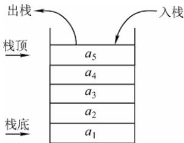
</div>

　　假设某栈 $S=(a_{1}, a_{2}, a_{3}, a_{4}, a_{5})$ ，如图 3.1 所示，其中 $a_{1}$ 为栈底元素， $a_{5}$ 为栈顶元素。栈的入栈和出栈操作只能在栈顶进行。若元素按顺序 $a_{1}, a_{2}, a_{3}, a_{4}, a_{5}$ 入栈，则出栈顺序为 $a_{5}, a_{4}, a_{3}, a_{2}, a_{1}$ 。由此可见，栈的操作特性可概括为后进先出（Last In First Out，LIFO）。

<p align="center"><em>图 3.1 栈的示意图</em></p>

> **注意：**

　　每接触一种新的数据结构，都应从其逻辑结构、存储结构和基本运算三方面进行系统理解。

#### 2. 栈的基本操作

　　不同教材对基本操作的命名略有差异，但含义基本一致，本文采用严蔚敏教材的命名规范。

- InitStack(&S): 初始化一个空栈 S。

- StackEmpty(S)：判断栈是否为空。若栈 S 为空，返回 true；否则返回 false。

- Push(&S, x): 入栈操作；若栈未满，则 x 成为新的栈顶元素。

- Pop(&S, &x): 出栈操作；若栈非空，则弹出栈顶元素，并通过 x 返回该值。

- GetTop(S, &x): 读取栈顶元素但不出栈；若栈非空，则通过 x 返回栈顶元素。

- DestroyStack(&S)：销毁栈 S，并释放其所占用的存储空间（&表示引用调用）。

　　在解答算法题时，若题目未作特殊限制，可直接使用上述基本操作函数。

```txt
考点追踪 ▶ Catalan 数的应用（2015）
```

　　栈的数学性质：当 n 个不同元素按固定次序入栈时，可能的出栈序列总数为 $\frac{1}{n+1}C_{2n}^{n}$ 。该数列称为卡特兰（Catalan）数，可通过数学归纳法证明，有兴趣的读者可参考组合数学教材。

### 3.1.2 栈的顺序存储结构

　　与线性表类似，栈也有两种基本的存储方式：顺序存储和链式存储。

#### 1. 顺序栈的实现

　　采用顺序存储的栈称为顺序栈，它利用一组地址连续的存储单元存放从栈底到栈顶的数据元素，并附设一个整型指针（top）指示当前栈顶元素的位置。

　　顺序栈的类型可定义如下

```c
#define MaxSize 50 //定义栈中元素的最大个数
typedef struct {
    Elemtype data[MaxSize]; //存放栈中元素
    int top; //栈顶指针
} SqStack;
```

　　栈顶指针：S.top，初始时设为 S.top=-1；栈顶元素：S.data[S.top]。

　　入栈操作：当栈未满时，先将栈顶指针加1，再将元素存入栈顶。

　　出栈操作：当栈非空时，先取出栈顶元素，再将栈顶指针减1。

　　栈空条件：S.top == -1；栈满条件：S.top == MaxSize-1；栈长：S.top+1。

　　另一种常见的方式是：栈顶指针初始化为 S.top=0；入栈时先将元素存入栈顶，再将栈顶指针加 1；出栈时先将栈顶指针减 1，再取出栈顶元素；栈空条件为 S.top == 0；栈满条件为

```txt
S.top == MaxSize。
```

　　顺序栈的入栈操作受数组上界约束。若对栈的最大使用空间估计不足，则可能发生栈上溢，此时，应向用户报告错误信息，以便及时处理，避免程序异常。

> **注意：**

　　栈和队列的判空、判满条件，会因实际给出的条件不同而变化，下面的代码实现是在栈顶指针初始化为-1的条件下的相应方法，而其他情况则需具体问题具体分析。

#### 2. 顺序栈的基本操作

> **考点追踪：** 出/入栈操作的模拟（2009）

　　栈操作的示意图如图 3.2 所示，图 3.2(a)为空栈，图 3.2(c)为 A、B、C、D、E 依次入栈后的状态，图 3.2(d)为在图 3.2(c)基础上 E、D、C 相继出栈后的结果，此时栈中剩余 2 个元素。尽管 C、D、E 可能仍保留在原存储单元中，但 top 指针已指向新的栈顶，因此它们已不属于当前栈的内容。读者应结合该图理解栈顶指针的作用：它标识了栈中有效元素的边界。

<div align="center">
  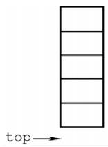
</div>

<p align="center"><em>(a) 空栈</em></p>

<div align="center">
  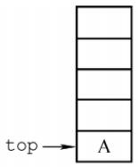
</div>

<p align="center"><em>(b) 1 个元素</em></p>

<div align="center">
  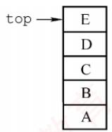
</div>

<p align="center"><em>(c) 5 个元素</em></p>

<div align="center">
  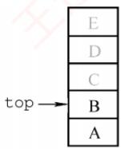
</div>

<p align="center"><em>(d) 2 个元素</em></p>

<p align="center"><em>图 3.2 栈顶指针和栈中元素之间的关系</em></p>

　　以下是顺序栈常用基本操作的实现（基于 top=-1 初始化）。

##### （1） 初始化

```txt
void InitStack(SqStack &S) {
    S.top = -1; // 初始化栈顶指针
}
```

##### （2） 判栈空

```txt
bool StackEmpty(SqStack S){
    if(S.top == -1)    //栈空
    return true;
    else    //不空
    return false;
}
```

##### （3） 入栈

```txt
bool Push(SqStack &S, ElemType x) {
    if (S.top == MaxSize - 1) // 栈满，报错
    return false;
    S.data[++S.top] = x; // 指针先加 1，再入栈
    return true;
}
```

##### （4） 出栈

```txt
出栈
bool Pop(SqStack &S, ElemType &x){
    if(S.top == -1) //栈空，报错
    return false;
    x=S.data[S.top--;] //先出栈，指针再减1
    return true;
}
```

##### （5） 读栈顶元素

```txt
bool GetTop(SqStack S, ElemType &x) {
    if (S.top == -1) // 栈空，报错
    return false;
    x=S.data[S.top]; // x 记录栈顶元素
    return true;
}
```

　　该操作不改变栈的状态，栈顶元素依然保留在栈中。

> **注意**

　　此处，top指向栈顶元素本身。因此入栈为S.data[++S.top]=x，出栈为x=S.data[S.top--]。若top初始化为0（指向栈顶元素的下一个位置），则入栈变为S.data[S.top++] = x，出栈变为x=S.data[--S.top]，相应的判空、判满条件也随之改变。请读者仔细体会差异，做题时务必根据题目设定灵活应对。

#### 3. 共享栈

　　利用栈底位置相对固定的特性，可让两个顺序栈共享同一段一维数组空间，将两个栈的栈底分别置于数组两端，栈顶向中间延伸，如图 3.3 所示。

<div align="center">
  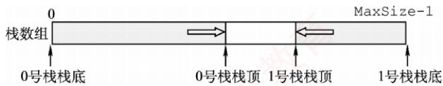
</div>

<p align="center"><em>图 3.3 两个顺序栈共享存储空间</em></p>

　　0号栈栈顶指针为top0，1号栈栈顶指针为top1，均指向各自的栈顶元素；初始时top0=-1（0号栈空），top1=MaxSize（1号栈空）；栈满条件为top1-top0 == 1（两栈顶相邻）。当0号栈入栈时，top0先加1，再赋值；当1号栈入栈时，top1先减1，再赋值；出栈操作的顺序相反。

　　共享栈能更高效地利用存储空间，两个栈的空间可动态调节，仅当整个数组被占满时，才发生栈溢出。其存取数据的时间复杂度均为 $O(1)$ ，对存取效率无影响。

### 3.1.3 栈的链式存储结构

　　采用链式存储的栈称为链栈。其优点是便于动态分配存储空间，不存在栈满溢出的问题，且在多栈共存的场景下能更灵活地利用内存。通常使用单链表实现链栈，并且规定所有操作均在链表的表头进行。此处约定链栈不带头结点，栈顶指针 Lhead 直接指向栈顶元素，如图 3.4 所示。

<div align="center">
  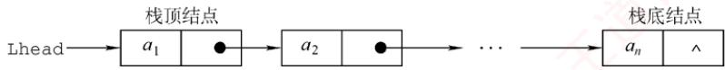
</div>

<p align="center"><em>图 3.4 栈的链式存储</em></p>

　　链栈的类型可定义为

```txt
typedef struct LinkNode{
    ElemType data;    //数据域
    struct LinkNode *next;    //指针域
} LiStack;    //链栈类型定义
```

　　由于采用链式存储，结点的插入与删除操作非常高效。链栈的操作与单链表类似，入栈和出栈均在表头进行。注意，对于带头结点的链栈，其初始化、判空及操作细节会有所不同；而本节所述实现基于无头结点的设计，读者应根据实际需求灵活调整实现方式。

### 3.1.4 本节试题精选

#### 一、单项选择题

01. 栈和队列具有相同的（）。

- A. 抽象数据类型
- B. 逻辑结构
- C. 存储结构
- D. 运算

02. 栈是一种（）。

- A. 顺序存储的线性结构
- B. 链式存储的非线性结构
- C. 限制存取点的线性结构
- D. 限制存取点的非线性结构

03. 下列选项中，（）不是栈的基本操作。

- A. 删除栈顶元素
- B. 删除栈底元素
- C. 判断栈是否为空
- D. 将栈置为空栈

04. 设用数组 a[n] 存储一个栈，初始栈顶指针 top=-1，则元素 x 入栈的操作是（）。

- A. a[--top]=x
- B. a[top--]=x
- C. a[++top]=x
- D. a[top++]=x

05. 设用数组 data[1...n] 存储一个栈，初始栈顶指针 top=1，则元素 x 入栈的操作是（）。

- A. data[top--]=x
- B. data[top++]=x
- C. data[--top]=x
- D. data[++top]=x

06. 设用数组 data[1...n] 存储一个栈, 初始栈顶指针 top=n+1, 则元素 x 入栈的操作是（）。

- A. data[--top]=x
- B. data[top++] = x
- C. data[top--] = x
- D. data[++top] = x

07. 设有一个空栈，栈顶指针为 1000H，栈向高地址方向增长，每个元素占一个存储单元，执行 Push、Push、Pop、Push、Pop、Push、Pop、Push 操作后，栈顶指针为（）。

- A. 1002H
- B. 1003H
- C. 1004H
- D. 1005H

08. 和顺序栈相比，链栈有一个比较明显的优势，即（）。

- A. 通常不会出现栈满的情况
- B. 通常不会出现栈空的情况
- C. 插入操作更容易实现
- D. 删除操作更容易实现

09. 设链表不带头结点且所有操作均在表头进行，则下列最不适合作为链栈的是（）。

- A. 只有表头结点指针，没有表尾指针的双向循环链表
- B. 只有表尾结点指针，没有表头指针的双向循环链表
- C. 只有表头结点指针，没有表尾指针的单向循环链表
- D. 只有表尾结点指针，没有表头指针的单向循环链表

10. 向一个栈顶指针为 top 的链栈（不带头结点）中插入一个 x 结点，则执行（）。

- A. top->next=x
- B. x->next=top->next; top->next=x
- C. x->next=top; top=x
- D. x->next=top; top=top->next

11. 链栈（不带头结点）执行 Pop 操作，并将出栈的元素存在 x 中，应该执行（）。

- A. x=top; top=top->next
- B. x=top->data
- C. top=top->next; x=top->data
- D. x=top->data; top=top->next

12. 经过以下栈的操作后，变量 x 的值为（）。 InitStack(st); Push(st, a); Push(st, b); Pop(st, x); GetTop(st, x);

- A. a
- B. b
- C. NULL
- D. false

13. 3个不同元素依次入栈，能得到（）种不同的出栈序列。

- A. 4
- B. 5
- C. 6
- D. 7

14. 设 $a, b, c, d, e, f$ 以所给的次序入栈，若在入栈操作时，允许出栈操作，则下面不会出现的出栈序列为（）。

- A. fedcba
- B. bcafed
- C. dcefba
- D. cabdef

15. 4个元素依次入栈的次序为abcd，则以 $cd$ 开头的出栈序列的个数为（）。

- A. 1
- B. 2
- C. 3
- D. 4

16. 用 S 表示入栈操作，用 X 表示出栈操作，若元素的入栈顺序是 1234，为了得到 1342 的出栈顺序，相应的 S 和 X 的操作序列为（）。

- A. SXSXSSXX
- B. SSSXXSXX
- C. SXSSXXSX
- D. SXSSXSXX

17. 若栈的输入序列是 $1, 2, 3, \cdots, n$ ，输出序列的第一个元素是 n，则第 i 个输出元素是（）。

- A. 不确定
- B. n-i
- C. n-i-1
- D. $n-i+1$

18. 若栈的输入序列是 $1, 2, 3, \cdots, n$ ，输出序列的第一个元素是 i，则第 j 个输出元素是（）。

- A. i-j-1
- B. i-j
- C. $j-i+1$
- D. 不确定

19. 某栈的输入序列为 a, b, c, d，下面的 4 个序列中，不可能为其输出序列的是（）。

- A. a, b, c, d
- B. c, b, d, a
- C. d, c, a, b
- D. a, c, b, d

20. 若栈的输入序列是 $P_{1}, P_{2}, \cdots, P_{n}$ ，输出序列是 $1, 2, 3, \cdots, n$ ，若 $P_{3} = 1$ ，则 $P_{1}$ 的值（）。

- A. 可能是 2
- B. 一定是 2
- C. 不可能是 2
- D. 不可能是 3

21. 若栈的输入序列是 $P_{1}, P_{2}, \cdots, P_{n}$ ，输出序列是 $1, 2, 3, \cdots, n$ ，若 $P_{3} = 3$ ，则 $P_{1}$ 的值（）。

- A. 可能是 2
- B. 不可能是 1
- C. 一定是 1
- D. 一定是 2

22. 已知栈的入栈序列是 1, 2, 3, 4，其出栈序列为 $P_{1}, P_{2}, P_{3}, P_{4}$ ，则 $P_{2}, P_{4}$ 不可能是（）。

- A. 2, 4
- B. 2, 1
- C. 4, 3
- D. 3, 4

23. 设栈的初始状态为空，当字符序列 “n1_” 作为栈的输入时，输出长度为 3，且可用作 C 语言标识符的序列有（）个。

- A. 4
- B. 5
- C. 3
- D. 6

24. 采用共享栈的好处是（）。

- A. 减少存取时间，降低发生上溢的可能
- B. 节省存储空间，降低发生上溢的可能
- C. 减少存取时间，降低发生下溢的可能
- D. 节省存储空间，降低发生下溢的可能

25. 设有一个顺序共享栈 Share[0:n-1]，其中第一个栈顶指针 top1 的初值为 -1，第二个栈顶指针 top2 的初值为 n，则判断共享栈满的条件是（）。

- A. top2-top1 == 1
- B. top1-top2 == 1
- C. top1 == top2
- D. 都不对

26. 【2009 统考真题】设栈 S 和队列 Q 的初始状态均为空，元素 abcdefg 依次入栈 S。若每个元素出栈后立即进入队列 Q，且 7 个元素出队的顺序是 bdcfeag，则栈 S 的容量至少是（）。

- A. 1
- B. 2
- C. 3
- D. 4

27. 【2010 统考真题】若元素 $a, b, c, d, e, f$ 依次入栈，允许入栈、出栈操作交替进行，但不允许连续 3 次进行出栈操作，不可能得到的出栈序列是（）。

- A. dcebfa
- B. cbdaef
- C. bcaefd
- D. afedcb

28. 【2011 统考真题】元素 $a, b, c, d, e$ 依次进入初始为空的栈中，若元素入栈后可停留、可出栈，直到所有元素都出栈，则在所有可能的出栈序列中，以元素 $d$ 开头的序列个数是（）。

- A. 3
- B. 4
- C. 5
- D. 6

29. 【2013 统考真题】一个栈的入栈序列为 $1, 2, 3, \cdots, n$ ，出栈序列是 $P_{1}, P_{2}, P_{3}, \cdots, P_{n}$ 。若 $P_{2} = 3$ ，则 $P_{3}$ 可能取值的个数是（）。

- A. n - 3
- B. n - 2
- C. n - 1
- D. 无法确定

30. 【2020 统考真题】对空栈 S 进行 Push 和 Pop 操作, 入栈序列为 a, b, c, d, e, 经过 Push、Push、Pop、Push、Pop、Push、Push、Pop 操作后得到的出栈序列是 （）。

- A. b, a, c
- B. b, a, e
- C. b, c, a
- D. b, c, e

31. 【2022 统考真题】给定有限符号集 S, in 和 out 均为 S 中所有元素的任意排列。对于初始为空的栈 ST，下列叙述中，正确的是（）。

- A. 若 in 是 ST 的入栈序列，则不能判断 out 是否为其可能的出栈序列
- B. 若 out 是 ST 的出栈序列，则不能判断 in 是否为其可能的入栈序列
- C. 若 in 是 ST 的入栈序列，out 是对应 in 的出栈序列，则 in 与 out 一定不同
- D. 若 in 是 ST 的入栈序列，out 是对应 in 的出栈序列，则 in 与 out 可能互为倒序

#### 二、综合应用题

01. 有 5 个元素，其入栈次序为 $A, B, C, D, E$ ，在各种可能的出栈次序中，第一个出栈元素为 $C$ 且第二个出栈元素为 $D$ 的出栈序列有哪几个？

02. 若元素的入栈序列为 $A, B, C, D, E$ ，运用栈操作，能否得到出栈序列 $B, C, A, E, D$ 和 $D, B, A, C, E$ ? 为什么？

03. 栈的初态和终态均为空，以 I 和 O 分别表示入栈和出栈，则出入栈的操作序列可表示为由 I 和 O 组成的序列，可以操作的序列称为合法序列，否则称为非法序列。
1）下面所示的序列中哪些是合法的？

- A. IOIOIOO
- B. IOOIOIO
- C. IIIOIOIO
- D. IIIOOIOO

2）通过对1）的分析，写出一个算法，判定所给的操作序列是否合法。若合法，返回true，否则返回false（假定被判定的操作序列已存入一维数组中）。

04. 设单链表的表头指针为 $L$ ，结点结构由data和next两个域构成，其中data域为字符型。设计算法判断该链表的全部 $n$ 个字符是否中心对称。例如，xyx、xyyx都是中心对称的。

05. 设有两个栈 S1、S2 都采用顺序栈方式，并共享一个存储区 [0, ..., maxsize-1]，为了尽量利用空间，减少溢出的可能，可采用栈顶相向、迎面增长的存储方式。试设计 S1、S2 有关入栈和出栈的操作算法。

### 3.1.5 答案与解析

#### 一、单项选择题

**01. B**

　　栈和队列的逻辑结构都是相同的，都属于线性结构，只是它们对数据的运算不同。

**02. C**

　　首先栈是一种线性表，所以选项 B、D 错。按存储结构的不同可分为顺序栈和链栈，但不可以把栈局限在某种存储结构上，所以选项 A 错。栈和队列都是限制存取点的线性结构。

**03. B**

　　基本操作是指该结构最核心、最基本的运算，其他较复杂的操作可通过基本操作实现。删除栈底元素不属于栈的基本运算，但它可以通过调用栈的基本运算求得。

**04. C**

　　数组下标范围为 $0 \sim n-1$ ，初始时 top 为 -1，第一个元素入栈后，top 为 0，即 top 指向栈顶元素。栈向高地址方向增长，所以入栈时应先将指针 top 加 1，然后存入元素 x，选项 C 正确。

**05. B**

　　数组下标范围为 $1 \sim n$ ，初始时 top 为 1，表示 top 指向栈顶元素的下一个元素。栈向高地址方向增长，所以入栈时应先存入元素 x，然后将指针 top 加 1，选项 B 正确。

**06. A**

　　数组下标范围为 $1 \sim n$ ，初始时 top 为 $n + 1$ ，表示 top 指向栈顶元素。栈向低地址方向增长，所以入栈时应先将指针 top 减 1，然后存入元素 x，A 正确。

**07. A**

　　每个元素需要 1 个存储单元，所以每入栈一次 top 加 1，出栈一次 top 减 1。指针 top 的值依次为 1001H, 1002H, 1001H, 1002H, 1001H, 1002H, 1001H, 1002H。

**08. A**

　　顺序栈采用数组存储，数组的大小是固定的，不能动态地分配大小。和顺序栈相比，链栈的最大优势在于它可以动态地分配存储空间。

**09. C**

　　对于双向循环链表，不管是表头指针还是表尾指针，都可以很方便地找到表头结点，方便在表头做插入或删除操作。而循环单链表通过尾指针可以很方便地找到表头结点，但通过头指针找尾结点需要遍历一次链表。对于选项 C，插入和删除结点后，找尾结点所需的时间为 $O(n)$ 。

**10. C**

　　链栈采用不带头结点的单链表表示时，入栈操作在首部插入一个结点 x（x->next=top），插入完后需将 top 指向该插入的结点 x。请思考当链栈存在头结点时的情况。

**11. D**

　　这里假设栈顶指针指向的是栈顶元素，所以选择选项 D；而选项 A 中首先将 top 指针赋给了 x，错误；选项 B 中没有修改 top 指针的值；选项 C 为 top 指针指向栈顶元素的上一个元素时的答案。

**12. A**

　　执行前 3 句后，栈 st 内的值为 a, b，其中 b 为栈顶元素；执行第 4 句后，栈顶元素 b 出栈，x 的值为 b；执行最后一句，读取栈顶元素的值，x 的值为 a。

**13. B**

　　当 n 个不同元素入栈时，出栈序列的个数为

$$
\frac {1}{n + 1} C _ {2 n} ^ {n} = \frac {1}{n + 1} \frac {(2 n) !}{n ! \times n !} = \frac {6 \times 5 \times 4}{4 \times 3 \times 2 \times 1} = 5
$$

　　考题中给出的 n 值不会很大，可以根据栈的特点，若 $X_{i}$ 已经出栈，则 $X_{i}$ 前面的尚未出栈的元素一定逆置有序地出栈，因此，可以采用例举方法。如 a, b, c 依次入栈的出栈序列有 abc, acb, bac, bca, cba。另外，在一些考题中可能会问符合某个特定条件的出栈序列有多少种，比如此题中问以 b 开头的出栈序列有几种，这种类型的题目一般都使用穷举法。

**14. D**

　　根据栈“先进后出”的特点，且在入栈操作的同时允许出栈操作，显然选项D中 $c$ 最先出栈，则此时栈内必定为 $a$ 和 $b$ ，但因为 $a$ 先于 $b$ 入栈，所以要晚出栈。对于某个出栈的元素，在它之前入栈却晚出栈的元素必定是按逆序出栈的，其余答案均是可能出现的情况。

　　此题也可采用将各序列逐个代入的方法来确定是否有对应的进出栈序列（类似下题）。

**15. A**

　　假设出栈序列为 cd...，分析栈的操作序列：a 入栈，b 入栈，c 入栈，c 出栈，d 入栈，d 出栈，此后只能是 b 出栈和 a 出栈一种情况，因此出栈序列只有 cdba。

**16. D**

　　采用排除法，选项 A, B, C 得到的出栈序列分别为 1243, 3241, 1324。由 1234 得到 1342 的进出栈序列为：1 进，1 出，2 进，3 进，3 出，4 进，4 出，2 出，所以选择选项 D。

**17. D**

　　第 n 个元素第一个出栈，说明前 n-1 个元素都已经按顺序入栈，由 “先进后出” 的特点可知，此时的输出序列一定是输入序列的逆序，所以答案选择选项 D。

**18. D**

　　当第 $i$ 个元素第一个出栈时，则 $i$ 之前的元素可以依次排在 $i$ 之后出栈，但剩余的元素可以在此时入栈，并且排在 $i$ 之前的元素出栈，所以第 $j$ 个出栈的元素是不确定的。

**19. C**

　　对于选项 A，可能的顺序是 a 入，a 出，b 入，b 出，c 入，c 出，d 入，d 出。对于选项 B，可能的顺序是 a 入，b 入，c 入，c 出，b 出，d 入，d 出，a 出。对于选项 D，可能的顺序是 a 入，a 出，b 入，c 入，c 出，b 出，d 入，d 出。选项 C 没有对应的序列。

　　【另解】若出栈序列的第一个元素为 $d$ ，则出栈序列只能是 $dcba$ 。该思想通常也适用于出栈序列的局部分析：如 12345 入栈，问出栈序列 34152 是否正确？如何分析？若第一个出栈元素是 3，则此时 12 必停留在栈中，它们出栈的相对顺序只能是 21，所以 34152 错误。

**20. C**

　　入栈序列是 $P_{1}, P_{2}, \cdots, P_{n}$ 。因为 $P_{3}=1$ ，即 $P_{1}, P_{2}, P_{3}$ 连续入栈后，第一个出栈元素是 $P_{3}$ ，说明 $P_{1}, P_{2}$ 已经按序入栈，根据先进后出的特点可知， $P_{2}$ 必定在 $P_{1}$ 之前出栈，而第二个出栈元素是 2，而此时 $P_{1}$ 不是栈顶元素，所以 $P_{1}$ 的值不可能是 2。思考：哪些 $P_{i}$ 可能是 2？

**21. A**

　　假设 $P_{1}$ 是 1，入栈后立即出栈， $P_{2}$ 是 2，入栈后立即出栈， $P_{3}$ 是 3，入栈后立即出栈，得到的序列符合题意。假设 $P_{1}$ 是 2， $P_{2}$ 是 1， $P_{1}$ 、 $P_{2}$ 依次入栈后全部出栈， $P_{3}$ 是 3，入栈后立即出栈，得到的序列符合题意。因此， $P_{1}$ 既可能是 1，又可能是 2。

**22. C**

　　逐个判断每个选项可能的入栈出栈顺序。对于选项 A，可能的顺序是 1 入，1 出，2 入，2 出，3 入，3 出，4 入，4 出。对于选项 B，可能的顺序是 1 入，2 入，3 入，3 出，2 出，4 入，4 出，1 出。对于选项 D，可能的顺序是 1 入，1 出，2 入，3 入，3 出，2 出，4 入，4 出。选项 C 没有对应的序列，因为当 4 在栈中时，意味着前面的所有元素（1, 2, 3）都已在栈中或曾经入过栈，此时若 4 第二个出栈，即栈中还有两个元素，且这两个元素是有序的（对应入栈顺序），只能为 (1, 2), (1, 3), (2, 3)，若是序列 (1, 2)，则 3 已在 $p_1$ 位置出栈，不可能再在 $p_4$ 位置出栈，若是 (1, 3) 和 (2, 3) 这种情况中的任意一种，则 3 一定是下一个出栈元素，即 $p_3$ 一定是 3，所以 $p_4$ 不可能是 3。

　　【另解】对于选项 C， $p_{2}$ 为最后一个入栈元素 4，则只有 $p_{1}$ 或 $p_{3}$ 出栈的元素有可能为 3（请读者分两种情况自行思考），而 $p_{4}$ 绝不可能为 3。读者在解答此类题时，一定要注意出栈序列中的“最后一个入栈元素”，这样可以节省答题的时间。

**23. C**

　　标识符只能以英文字母或下划线开头，而不能以数字开头。基于上述分析，由n、1、_三个字符组合成的标识符有n1_、n_1、_1n和_n1四种。第一种：n入栈再出栈，1入栈再出栈，_入栈再出栈。第二种：n入栈再出栈，1入栈，_入栈，_出栈，1出栈。第三种：n入栈，1入栈，_入栈，_出栈，1出栈，n出栈。而根据栈的操作特性，_n1这种情况不可能出现。

**24. B**

　　上溢是指存储器满，还往里写；下溢是指存储器空，还往外读。为了解决上溢，可给栈分配很大的存储空间，但这样又会造成存储空间的浪费。共享栈的提出就是为了在解决上溢的基础上节省存储空间，将两个栈放在同一段更大的存储空间内，这样，当一个栈的元素增加时，可使用另一个栈的空闲空间，从而降低发生上溢的可能性。

**25. A**

　　这种情况就是前面我们所描述的，详细内容请参见本节考点精析部分对共享栈的讲解。另外，读者可以思考当 top1 的初值为 0，top2 的初值为 n-1 时栈满的条件。

> **注意：**

　　栈顶、队头与队尾的指针的定义是不唯一的，做题时务必仔细审题和思考。

**26. C**

　　时刻注意栈的特点是先进后出，下表是出入栈的详细过程。

<table><tr><td>序号</td><td>说明</td><td>栈内</td><td>栈外</td><td>序号</td><td>说明</td><td>栈内</td><td>栈外</td></tr><tr><td>1</td><td>a入栈</td><td>a</td><td></td><td>8</td><td>e入栈</td><td>ae</td><td>bdc</td></tr><tr><td>2</td><td>b入栈</td><td>ab</td><td></td><td>9</td><td>f入栈</td><td>aef</td><td>bdc</td></tr><tr><td>3</td><td>b出栈</td><td>a</td><td>b</td><td>10</td><td>f出栈</td><td>ae</td><td>bdcf</td></tr><tr><td>4</td><td>c入栈</td><td>ac</td><td>b</td><td>11</td><td>e出栈</td><td>a</td><td>bdcfe</td></tr><tr><td>5</td><td>d入栈</td><td>acd</td><td>b</td><td>12</td><td>a出栈</td><td></td><td>bdcfea</td></tr><tr><td>6</td><td>d出栈</td><td>ac</td><td>bd</td><td>13</td><td>g入栈</td><td>g</td><td>bdcfea</td></tr><tr><td>7</td><td>c出栈</td><td>a</td><td>bdc</td><td>14</td><td>g出栈</td><td></td><td>bdcfeag</td></tr></table>

　　栈内的最大深度为3，所以栈S的容量至少是3。

　　【另解】因为元素的出队顺序和入队顺序相同，所以元素的出栈顺序就是 b, d, c, f, e, a, g，因此元素的出入栈次序为 Push(S, a), Push(S, b), Pop(S, b), Push(S, c), Push(S, d), Pop(S, d), Pop(S, c), Push(S, e), Push(S, f), Pop(S, f), Pop(S, e), Pop(S, a), Push(S, g), Pop(S, g)。初始所需容量为 0，每做一次 Push 操作，容量加 1；每做一次 Pop 操作，容量减 1，记录的容量最大值为 3。

**27. D**

　　选项A由a入，b入，c入，d入，d出，c出，e入，e出，b出，f入，f出，a出得到；选项B由a入，b入，c入，c出，b出，d入，d出，a出，e入，e出，f入，f出得到；选项C由a入，b入，b出，c入，c出，a出，d入，e入，e出，f入，f出，d出得到；选项D由a入，a出，b入，c入，d入，e入，f入，f出，e出，d出，c出，b出得到，但题意要求不允许连续3次出栈操作，选项D不符。

　　【另解】先入栈的元素后出栈，入栈顺序为 a, b, c, d, e, f，所以连续出栈时的子序列必然是按字母表逆序的，若出栈序列中出现了长度大于或等于 3 的连续逆序子序列，则为所选序列。

**28. B**

　　d 第一个出栈，则 c, b, a 出栈的相对顺序是确定的，出栈顺序必为 d_c_b_a_，e 的顺序不定，在任意一个“_”上都有可能。

　　【另解】 $d$ 首先出栈，则 $abc$ 停留在栈中，此时栈的状态如右图所示。

<div align="center">
  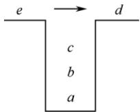
</div>

　　此时可以有如下 4 种操作：① e 入栈后出栈，则出栈序列为 decba；② c 出栈，e 入栈后出栈，出栈序列为 dceba；③ cb 出栈，e 入栈后出栈，出栈序列为 dcbea；④ cba 出栈，e 入栈后出栈，出栈序列为 dcbae。思路和上面其实一样。

**29. C**

　　显然，3之后的 $4,5,\cdots,n$ 都是 $P_{3}$ 可取的数（一直入栈直到该数入栈后马上出栈）。接下来分析1和2是否可取： $P_{1}$ 可以是3之前入栈的数（可能是1或2），也可以是4，当 $P_{1}=1$ 时， $P_{3}$ 可取2；当 $P_{1}=2$ 时， $P_{3}$ 可取1。因此， $p_{3}$ 可能取除3外的所有数，个数为n-1。

**30. D**

　　按题意，出入栈操作的过程如下：

<table><tr><td>操作</td><td>栈内元素</td><td>出栈元素</td></tr><tr><td>Push</td><td>a</td><td></td></tr><tr><td>Push</td><td>a b</td><td></td></tr><tr><td>Pop</td><td>a</td><td>b</td></tr><tr><td>Push</td><td>a c</td><td></td></tr><tr><td>Pop</td><td>a</td><td>c</td></tr><tr><td>Push</td><td>a d</td><td></td></tr><tr><td>Push</td><td>a d e</td><td></td></tr><tr><td>Pop</td><td>a d</td><td>e</td></tr></table>

　　因此，出栈序列为 b, c, e。

**31. D**

　　通过模拟出入栈操作，可以判断入栈序列 in 和出栈序列 out 是否合法。因此，已知 in 序列可以判断 out 序列是否为可能的出栈序列；已知 out 序列也可以判断 in 序列是否为可能的入栈序列，选项 A 和 B 错误。若每个元素入栈后立即出栈，则 in 序列和 out 序列相同，选项 C 错误。若所有元素都入栈后才依次出栈，则 in 序列和 out 序列互为倒序，选项 D 正确。

#### 二、综合应用题

**01. 【解答】**

　　CD 出栈后的状态如右图所示。

　　此时有如下3种操作：① E入栈后出栈，出栈序列为CDEBA；② B出栈，E入栈后出栈，出栈序列为CDBEA；③ B出栈，A出栈，E入栈后出栈，出栈序列为CDBAE。

<div align="center">
  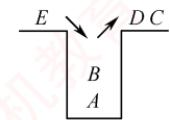
</div>

　　所以，以 CD 开头的出栈序列有 CDEBA、CDBEA、CDBAE 三种。

**02. 【解答】**

　　能得到出栈序列 BCAED。可由 A 入，B 入，B 出，C 入，C 出，A 出，D 入，E 入，E 出，D 出得到。不能得到出栈序列 DBACE。若出栈序列以 D 开头，说明在 D 之前的入栈元素是 A、B 和 C，三个元素中 C 是栈顶元素，B 和 A 不可能早于 C 出栈，所以不可能得到出栈序列 DBACE。

**03. 【解答】**

1）选项 A、D 合法，而选项 B、C 不合法。在 B 中，先入栈 1 次，再连续出栈 2 次，错误。在选项 C 中，入栈和出栈次数不一致，会导致最终的栈不空。选项 A、D 均为合法序列，请自行模拟。注意，在操作过程中，入栈次数一定大于或等于出栈次数；结束时，栈一定为空。

2）设被判定的操作序列已存入一维数组 A 中。算法的基本设计思想：依次逐一扫描入栈出栈序列（由 I 和 O 组成的字符串），每扫描至任意一个位置均需检查出栈次数（O 的个数）是否小于入栈次数（I 的个数），若大于则为非法序列。扫描结束后，再判断入栈和出栈次数是否相等，若不相等则不合题意，为非法序列。

　　本题代码如下:

```txt
bool Judge(char A[]) {
    int i=0;
    int j=k=0;    //i为下标，j和k分别为字母I和O的个数
    while(A[i] != '\0') {    //未到字符数组尾
    switch(A[i]) {
    case 'I': j++; break;    //入栈次数增1
    case 'O': k++;
    if(k>j) {printf("序列非法\n"); exit(0); }
    }
    i++;    //不论A[i]是I还是O，指针i均后移
    }
    if(j!=k) {
    printf("序列非法\n");
    return false;
    }
    else{
    printf("序列合法\n");
    return true;
    }
}
```

　　【另解】入栈后，栈内元素个数加1；出栈后，栈内元素个数减1，因此可将判定一组出入栈序列是否合法转化为一组由+1、-1组成的序列，它的任意前缀子序列的累加和不小于0（每次出栈或入栈操作后判断）则合法；否则非法。

**04. 【解答】**

　　算法思想：使用栈来判断链表中的数据是否中心对称。让链表的前一半元素依次入栈。在处理链表的后一半元素时，当访问到链表的一个元素后，就从栈中弹出一个元素，对两个元素进行比较，若相等，则将链表中的下一个元素与栈中再弹出的元素进行比较，直至链表到尾。这时若栈是空栈，则得出链表中心对称的结论；否则，当链表中的一个元素与栈中弹出元素不等时，结论为链表非中心对称，结束算法的执行。

　　本题代码如下:

```c
int dc(LinkList L, int n) {
    int i;
    char s[n/2]; //s 字符栈
    LNode *p=L->next; //工作指针 p，指向待处理的当前元素
    for (i=0;i<n/2;i++) { //链表前一半元素入栈
    s[i]=p->data;
    p=p->next;
    }
    i--; //恢复最后的 i 值
    if (n%2 == 1) //若 n 是奇数，后移过中心结点
    p=p->next;
    while (p!=NULL&&s[i] == p->data) { //检测是否中心对称
    i--; //i 充当栈顶指针
    p=p->next;
    }
    if (i == -1) //栈为空栈
    return 1; //链表中心对称
    else
    return 0; //链表中心不对称
}
```

　　算法先将“链表的前一半”元素（字符）入栈。当 n 为偶数时，前一半和后一半的个数相同；当 n 为奇数时，链表中心结点字符不必比较，移动链表指针到下一字符开始比较。比较过程中遇到不相等时，立即退出 while 循环，不再进行比较。

　　本题也可以先将单链表中的元素全部入栈，然后扫描单链表 L 并比较，直到比较到单链表 L 尾为止，但算法需要两次扫描单链表 L，效率不及上述算法高。

**05. 【解答】**

　　两个栈共享向量空间，将两个栈的栈底设在向量两端，初始时，S1 栈顶指针为 -1，S2 栈顶指针为 maxsize。两个栈顶指针相邻时为栈满。两个栈顶相向、迎面增长，栈顶指针指向栈顶元素。

　　本题代码如下:

```c
#define maxsize 100 //两个栈共享顺序存储空间所能达到的最多元素数，//初始化为100
#define elemtp int //假设元素类型为整型
typedef struct {
    elemtp stack[maxsize]; //栈空间
    int top[2]; //top为两个栈顶指针
} stk;
stk s; //s是如上定义的结构类型变量，为全局变量
```

　　本题的关键在于，两个栈入栈和出栈时的栈顶指针的计算。S1 栈是通常意义下的栈；而 S2 栈入栈操作时，其栈顶指针左移（减 1），出栈时，栈顶指针右移（加 1）。

　　此外，对于所有栈的操作，都要注意“入栈判满、出栈判空”的检查。

##### （1） 入栈操作

　　代码如下:

```txt
int Push(int i, elemtp x) {
//入栈操作。i 为栈号，i=0 表示左边的 S1 栈，i=1 表示右边的 S2 栈，x 是入栈元素
//入栈成功返回 1，否则返回 0
    if (i<0 || i>1) {
    printf("栈号输入不对");
    exit(0);
    }
    if (s.top[1] - s.top[0] == 1) {
    printf("栈已满\n");
    return 0;
    }
    switch(i) {
    case 0: s.stack[++s.top[0]] = x; return 1; break;
    case 1: s.stack[--s.top[1]] = x; return 1;
    }
}
```

##### （2） 出栈操作

　　代码如下:

```txt
elemtp Pop(int i){
//出栈算法。i 代表栈号，i=0 时为 S1 栈，i=1 时为 S2 栈
//出栈成功返回出栈元素，否则返回 -1
    if (i<0 || i>1) {
    printf("栈号输入错误\n");
    exit(0);
    }
    switch(i) {
    case 0:
    if (s.top[0] == -1) {
```

```txt
printf("栈空\n");
return -1;
}
else
    return s.stack[s.top[0]--];
break;
case 1:
    if(s.top[1] == maxsize){
    printf("栈空\n");
    return -1;
    }
    else
    return s.stack[s.top[1]++];
    break;
}//switch
}
```

## 3.2 队列

### 3.2.1 队列的基本概念

#### 1. 队列的定义

　　队列（Queue）简称队，也是一种操作受限的线性表，仅允许在表的一端进行插入，而在另一端进行删除。向队列中插入元素称为入队（或进队），删除元素称为出队（或离队）。这一

<div align="center">
  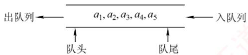
</div>

<p align="center"><em>图 3.5 队列示意图</em></p>

　　规则符合日常排队 “先到先服务” 的原则，因此队列的操作特性为先进先出（First In First Out, FIFO），如图 3.5 所示。

　　队头（Front）：允许删除的一端，也称队首。

　　队尾（Rear）：允许插入的一端。

　　空队列：不含任何元素的队列。

#### 2. 队列常见的基本操作

　　InitQueue(&Q): 初始化队列，构造一个空队列 Q。

　　QueueEmpty(Q): 判队列空；若队列 Q 为空，返回 true，否则返回 false。

　　EnQueue(&Q,x): 入队操作；若队列 Q 未满，将 x 加入队尾。

　　DeQueue(&Q, &x): 出队操作；若队列 Q 非空，删除队首元素，并通过 x 返回其值。

　　GetHead(Q, &x): 读队首元素但不出队；若队列 Q 非空，将队首元素赋值给 x。

　　需要注意的是，栈和队列均为操作受限的线性表，因此并非所有线性表的操作都适用于它们。例如，不允许直接访问或修改栈或队列中间的元素，这是由其逻辑特性所决定的。

### 3.2.2 队列的顺序存储结构

#### 1. 队列的顺序存储

　　队列的顺序实现是指分配一块连续的存储单元存放队列元素，并附设两个指针：队首指针front指向队首元素，队尾指针rear指向队尾元素的下一个位置。不同教材对front和rear指针含义的约定可能不同（例如，rear可能指向队尾元素或其下一位置），这会导致入队和出队操作的具体实现不同。本节后附有相关习题，建议读者结合练习深入理解。

```typescript
define MaxSize 50 //定义队列中元素的最大个数
typedef struct{
    ElemType data[MaxSize]; //用数组存放队列元素
    int front, rear; //队首指针和队尾指针
} SqQueue;
```

　　队列的顺序存储类型可定义为

　　初始状态：Q.front=Q.rear=0。

　　入队操作：当队列未满时，先将元素存入队尾，再将队尾指针加1。

　　出队操作：当队列非空时，先取出队首元素，再将队首指针加1。

　　如图 3.6(a) 所示，初始时空队列满足 Q.front == Q.rear == 0，该条件可作为判空依据。

<div align="center">
  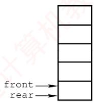
</div>

<p align="center"><em>(a) 空队</em></p>

<div align="center">
  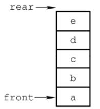
</div>

<p align="center"><em>(b) 5 个元素入队</em></p>

<div align="center">
  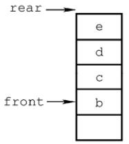
</div>

<p align="center"><em>(c) 出队 1 次</em></p>

<div align="center">
  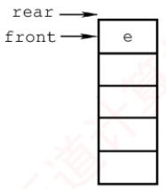
</div>

<p align="center"><em>(d) 出队 3 次</em></p>

<p align="center"><em>图 3.6 队列的操作</em></p>

　　然而，能否以 Q.rear == MaxSize 作为队满条件呢？显然不能。如图 3.6(d) 所示，队列中仅剩一个元素，但 rear 已达 MaxSize，若此时继续入队，则会出现 “上溢”。但这种溢出并非真正溢出，实际上数组中仍有空闲单元，因此称此现象为假溢出。

#### 2. 循环队列

　　为了解决顺序队列的假溢出问题，引入循环队列：将顺序存储空间在逻辑上组织为环状结构。当指针到达数组末尾时，自动回到起始位置，这可通过取模运算（%）实现。

> **考点追踪：** 特定条件下循环队列队头/队尾指针的初值（2011）

　　初始状态：Q.front=Q.rear=0。

　　队首指针进 1: Q.front=(Q.front+1)%MaxSize。

　　队尾指针进 1: Q.rear=(Q.rear+1)%MaxSize。

　　队列长度：(Q.rear+MaxSize-Q.front)%MaxSize。

　　出入队操作：指针均按顺时针方向移动（见图 3.7）。

> **考点追踪：** 循环队列判空/满的条件（2014）

　　那么，循环队列判空和判满的条件是什么呢？队空条件显然为 Q.front == Q.rear。但当入队速度远快于出队时，rear 会追上 front，此时同样满足 Q.front == Q.rear，却表示队满。因此，仅凭 front == rear 无法区分队空与队满。循环队列出入队的示意图如图 3.7 所示。

　　为解决这一问题，常用以下三种方法：

1）牺牲一个存储单元：入队时少用一个存储单元，这是一种较为普遍的做法，约定以“队尾指针的下一位置为队首”作为队满标志，如图3.7(d2)所示。

　　队满条件：(Q.rear+1)%MaxSize == Q.front。

　　队空条件：Q.front == Q.rear。

　　队列中元素个数：(Q.rear-Q.front+MaxSize)%MaxSize。

2)增设size成员：记录当前元素个数。若入队成功，则size++，若出队成功，则size--。队空条件：Q.size == 0。

<div align="center">
  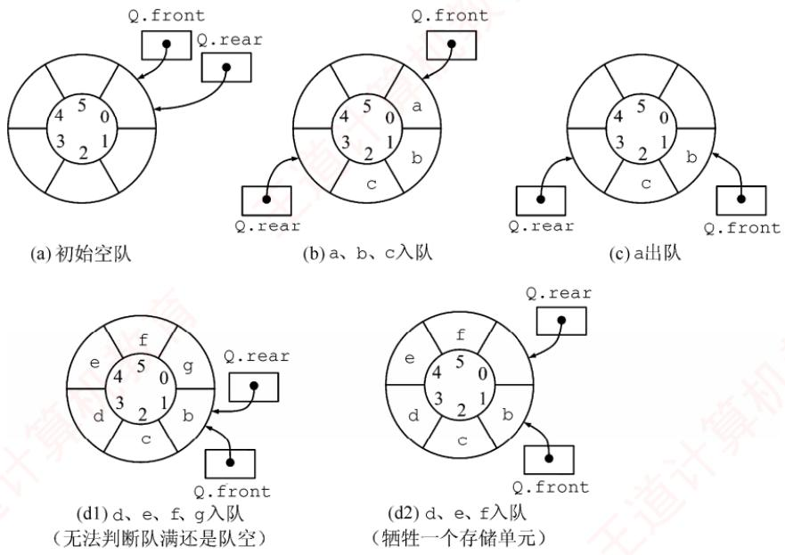
</div>

<p align="center"><em>图 3.7 循环队列出入队的示意图</em></p>

　　队满条件：Q.size == MaxSize。

　　两种情形均有 Q.front == Q.rear，由 size 区分队空与队满。

##### 3）增设 tag 标志位：

　　出队后置 tag=0，若此时 Q.front == Q.rear，则为队空。
　　入队后置 tag=1，若此时 Q.front == Q.rear，则为队满。

#### 3. 循环队列的操作（基于牺牲一个单元法）

```txt
（1）初始化
void InitQueue(SqQueue &Q){
    Q.rear=Q.front=0;
}
```

　　//初始化队首、队尾指针

(2) 判队空

```txt
bool QueueEmpty(SqQueue Q){
    if(Q.rear == Q.front)
    return true;
    else
    return false;
}
```

```txt
bool EnQueue(SqQueue &Q, ElemType x) {
    if ((Q.rear + 1) % MaxSize == Q.front)
    return false;
    Q.data[Q.rear] = x;
    Q.rear = (Q.rear + 1) % MaxSize;
    return true;
}
```

　　//队满则报错
　　//队尾指针加1取模

```txt
bool DeQueue(SqQueue &Q, ElemType &x) {
    if (Q.rear == Q.front)
    return false;
    x = Q.data[Q.front];
}
```

　　//队空则报错

```txt
Q.front=(Q.front+1)%MaxSize;
return true;
}
```

### 3.2.3 队列的链式存储结构

#### 1. 队列的链式存储

> **考点追踪：** 链式队列的应用场景（2019）

　　队列的链式表示称为链式队列，本质上是一个同时带有队首指针和队尾指针的单链表，如图 3.8 所示。队首指针指向队头结点，队尾指针指向队尾结点，即单链表的最后一个结点。

<div align="center">
  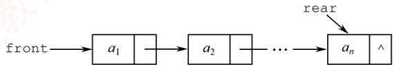
</div>

<p align="center"><em>图 3.8 不带队头结点的链式队列</em></p>

　　链式队列的类型可定义为

```c
typedef struct LinkNode{    //链式队列结点
    ElemType data;
    struct LinkNode *next;
}LinkNode;
typedef struct{    //链式队列
    LinkNode *front,*rear;    //队列的队头和队尾指针
}LinkQueue;
```

　　当不带头结点时，若 Q.front == NULL 且 Q.rear == NULL，则链式队列为空队列。

> **考点追踪：** 链式队列判空的条件（2019）

　　入队操作：创建一个新结点，将其插入链表尾部，并令 Q.rear 指向该结点；若原队列为空，则同时令 Q.front 也指向该结点。

　　出队操作：先判断队列是否为空；若非空，则取出队首元素，删除对应结点，并令 Q.front 指向下一个结点；若被删结点是最后一个元素，则将 Q.front 和 Q.rear 均置为 NULL。

　　不难发现，不带头结点的链式队列在边界处理上较为烦琐。因此，通常将链式队列设计为带头结点的单链表，从而使插入与删除操作逻辑统一，如图 3.9 所示。

　　链式队列特别适用于元素数量频繁变化的场景，且不存在队满或溢出问题。此外，若程序中需使用多个队列（如同多个栈的情形），优先选用链式队列可避免存储分配不合理或溢出等问题。

<div align="center">
  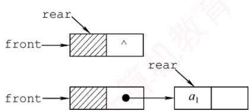
</div>

<p align="center"><em>图 3.9 带队头结点的链式队列</em></p>

#### 2. 链式队列的基本操作

> **考点追踪：** ➤ 链式队列出队/入队操作的基本过程（2019）

(1) 初始化

```txt
void InitQueue(LinkQueue &Q) { // 初始化带头结点的链式队列
    Q.front = Q.rear = (LinkNode*)malloc(sizeof(LinkNode)); // 建立头结点
    Q.front->next = NULL; // 初始为空
}
```

(2) 判队空

```txt
bool QueueEmpty(LinkQueue Q) {
```

```c
if (Q.front == Q.rear)    //判空条件
    return true;
else
    return false;
}

(3) 入队

void EnQueue(LinkQueue &Q, ElemType x) {
    LinkNode *s=(LinkNode *)malloc(sizeof(LinkNode)); //创建新结点
    s->data=x;
    s->next=NULL;
    Q.rear->next=s;    //插入链尾
    Q.rear=s;    //修改尾指针
}

(4) 出队

bool DeQueue(LinkQueue &Q, ElemType &x) {
    if (Q.front == Q.rear)
    return false;    //空队
    LinkNode *p=Q.front->next;
    x=p->data;
    Q.front->next=p->next;
    if (Q.rear == p)
    Q.rear=Q.front;    //若原队列中只有一个结点，删除后变空
    free(p);
    return true;
}
```

### 3.2.4 双端队列

　　双端队列是一种允许在两端进行插入和删除操作的线性表，如图 3.10 所示。双端队列两端的地位是平等的，为便于理解，可将左端视为前端，右端视为后端。

<div align="center">
  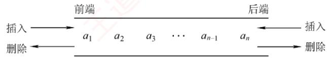
</div>

<p align="center"><em>图 3.10 双端队列</em></p>

　　在双端队列入队时：前端插入的元素排列在队列中后端插入的元素之前；后端插入的元素排列在队列中前端插入的元素之后。在双端队列出队时：无论是从前端还是后端出队，先出的元素总是排列在后出的元素之前。思考：如何由入队序列 $a, b, c, d$ 得到出队序列 $d, c, a, b$ ?

> **考点追踪：** 双端队列出入队操作的分析（2010、2021）

　　输出受限的双端队列：允许在一端进行插入和删除，但在另一端仅允许插入的双端队列称为输出受限的双端队列，如图3.11所示。

<div align="center">
  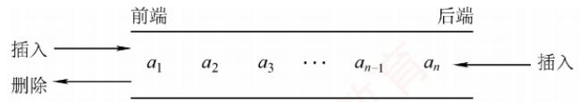
</div>

<p align="center"><em>图 3.11 输出受限的双端队列</em></p>

　　输入受限的双端队列：允许在一端进行插入和删除，但在另一端仅允许删除的双端队列称为输入受限的双端队列，如图3.12所示。若限定双端队列从某个端点插入的元素只能从该端点删除，则该双端队列就蜕变为两个栈底相邻接的栈。

<div align="center">
  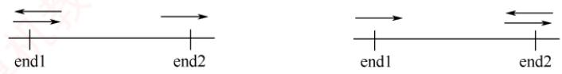
</div>

<div align="center">
  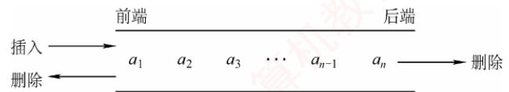
</div>

<p align="center"><em>图 3.12 输入受限的双端队列</em></p>

　　例 设有一个双端队列，输入序列为 1, 2, 3, 4，试分别求出以下条件的输出序列。

（1）能由输入受限的双端队列得到，但不能由输出受限的双端队列得到的输出序列。

（2）能由输出受限的双端队列得到，但不能由输入受限的双端队列得到的输出序列。

（3）既不能由输入受限的双端队列得到，又不能由输出受限的双端队列得到的输出序列。

　　解：先看输入受限的双端队列，见图3.13。假设end1端输入1,2,3,4，则end2端的输出相当于普通队列的输出，即1,2,3,4；而end1端的输出相当于栈的输出，n=4时仅通过end1端有14种输出序列（由Catalan公式得出），仅通过end1端不能得到的输出序列有 $4! - 14 = 10$ 种：

1, 4, 2, 3    2, 4, 1, 3    3, 4, 1, 2    3, 1, 4, 2    3, 1, 2, 4

4, 3, 1, 2    4, 1, 3, 2    4, 2, 3, 1    4, 2, 1, 3    4, 1, 2, 3

　　通过 end1 和 end2 端混合输出，可以输出这 10 种中的 8 种，参见下表。其中， $S_{L}, X_{L}$ 分别代表 end1 端的入队和出队， $X_{R}$ 代表 end2 端的出队。

<table><tr><td>输出序列</td><td>入队出队顺序</td><td>输出序列</td><td>入队出队顺序</td></tr><tr><td>1, 4, 2, 3</td><td><eq>S_{L}X_{R}S_{L}S_{L}S_{L}X_{L}X_{R}X_{R}</eq></td><td>3, 1, 2, 4</td><td><eq>S_{L}S_{L}S_{L}X_{L}S_{L}X_{R}X_{R}X_{R}</eq></td></tr><tr><td>2, 4, 1, 3</td><td><eq>S_{L}S_{L}X_{L}S_{L}S_{L}X_{L}X_{R}X_{R}</eq></td><td>4, 1, 2, 3</td><td><eq>S_{L}S_{L}S_{L}S_{L}X_{L}X_{R}X_{R}X_{R}</eq></td></tr><tr><td>3, 4, 1, 2</td><td><eq>S_{L}S_{L}S_{L}X_{L}S_{L}X_{L}X_{R}X_{R}</eq></td><td>4, 1, 3, 2</td><td><eq>S_{L}S_{L}S_{L}S_{L}X_{L}X_{R}X_{L}X_{R}</eq></td></tr><tr><td>3, 1, 4, 2</td><td><eq>S_{L}S_{L}S_{L}X_{L}X_{R}S_{L}X_{L}X_{R}</eq></td><td>4, 3, 1, 2</td><td><eq>S_{L}S_{L}S_{L}S_{L}X_{L}X_{L}X_{R}X_{R}</eq></td></tr></table>

　　剩下的两种是不能通过输入受限的双端队列输出的，即 4,2,3,1 和 4,2,1,3。

　　再看输出受限的双端队列，见图3.14。假设end1和end2端都能输入，仅end2端可以输出。若都从end2端输入，则就是一个栈。当输入序列为1,2,3,4时，输出序列有14种。对于其余10种不能得到的输出序列，通过交替从end1和end2端输入，还可以输出其中8种。设 $S_{L}$ 代表end1端的输入， $S_{R}$ 、 $X_{R}$ 分别代表end2端的输入和输出，则可能的输出序列见下表。

<p align="center"><em>图 3.13 例题中输入受限的双端队列 图 3.14 例题中输出受限的双端队列</em></p>

<table><tr><td>输出序列</td><td>入队出队顺序</td><td>输出序列</td><td>入队出队顺序</td></tr><tr><td>1,4,2,3</td><td><eq>S_{L}X_{R}S_{L}S_{L}S_{R}X_{R}X_{R}X_{R}</eq></td><td>3,1,2,4</td><td><eq>S_{L}S_{L}S_{R}X_{R}X_{R}S_{L}X_{R}X_{R}</eq></td></tr><tr><td>2,4,1,3</td><td><eq>S_{L}S_{R}X_{R}S_{L}S_{R}X_{R}X_{R}X_{R}</eq></td><td>4,1,2,3</td><td><eq>S_{L}S_{L}S_{L}S_{R}X_{R}X_{R}X_{R}X_{R}</eq></td></tr><tr><td>3,4,1,2</td><td><eq>S_{L}S_{L}S_{R}X_{R}S_{R}X_{R}X_{R}X_{R}</eq></td><td>4,2,1,3</td><td><eq>S_{L}S_{R}S_{L}S_{R}X_{R}X_{R}X_{R}X_{R}</eq></td></tr><tr><td>3,1,4,2</td><td><eq>S_{L}S_{L}S_{R}X_{R}X_{R}S_{R}X_{R}X_{R}</eq></td><td>4,3,1,2</td><td><eq>S_{L}S_{L}S_{R}S_{R}X_{R}X_{R}X_{R}X_{R}</eq></td></tr></table>

　　通过输出受限的双端队列不能得到的两种输出序列是 4, 1, 3, 2 和 4, 2, 3, 1。

　　综上所述：

1）能由输入受限的双端队列得到，但不能由输出受限的双端队列得到的是4,1,3,2。

2）能由输出受限的双端队列得到，但不能由输入受限的双端队列得到的是4,2,1,3。

3）既不能由输入受限的双端队列得到，又不能由输出受限的双端队列得到的是4,2,3,1。

> **提示：**

　　实际双端队列的考题不会如此复杂，通常只需判断序列是否满足题设条件，代入验证即可。

### 3.2.5 本节试题精选

#### 一、单项选择题

01. 栈和队列的主要区别在于（）。

- A. 它们的逻辑结构不一样
- B. 它们的存储结构不一样
- C. 所包含的元素不一样
- D. 插入、删除操作的限定不一样

02. 队列的“先进先出”特性是指（）。
I. 最后插入队列中的元素总是最后被删除
II. 当同时进行插入、删除操作时，总是插入操作优先
III. 每当有删除操作时，总要先做一次插入操作
IV. 每次从队列中删除的总是最早插入的元素

- A. I
- B. I和IV
- C. II和III
- D. IV

03. 允许对队列进行的操作有（）。

- A. 对队列中的元素排序
- B. 取出最近入队的元素
- C. 在队列元素之间插入元素
- D. 删除队首元素

04. 一个队列的入队顺序是 1, 2, 3, 4，则出队的输出顺序是（）。

- A. 4, 3, 2, 1
- B. 1, 2, 3, 4
- C. 1, 4, 3, 2
- D. 3, 2, 4, 1

05. 循环队列存储在数组 A[0...n] 中，入队时的操作为（）。

- A. rear=rear+1
- B. rear=(rear+1) mod (n-1)
- C. rear=(rear+1) mod n
- D. rear=(rear+1) mod (n+1)

06. 已知循环队列的存储空间为数组 A[21]，front 指向队首元素的前一个位置，rear 指向队尾元素，假设当前 front 和 rear 的值分别为 8 和 3，则该队列的长度为（）。

- A. 5
- B. 6
- C. 16
- D. 17

07. 若用数组 A[0...5] 实现循环队列，且当前 rear 和 front 的值分别为 1 和 5，当从队列中删除一个元素，再加入两个元素后，rear 和 front 的值分别为（）。

- A. 3 和 4
- B. 3 和 0
- C. 5 和 0
- D. 5 和 1

08. 假设用数组 Q[MaxSize] 实现循环队列，队首指针 front 指向队首元素的前一位置，队尾指针 rear 指向队尾元素，则判断该队列为空的条件是（）。

- A. Q.rear == (Q.front + 1) % MaxSize
- B. (Q.rear + 1) % MaxSize == Q.front + 1
- C. (Q.rear + 1) % MaxSize == Q.front
- D. Q.rear == Q.front

09. 假设循环队列 Q[MaxSize] 的队首指针为 front，队尾指针为 rear，队列的最大容量为 MaxSize，此外，该队列再没有其他数据成员，则判断该队列已满的条件是（）。

- A. Q.front == Q.rear
- B. Q.front+Q.rear>=MaxSize
- C. Q.front == (Q.rear+1)%MaxSize
- D. Q.rear == (Q.front+1)%MaxSize

2. 假设用 A[0...n] 实现循环队列，front、rear 分别指向队首元素的前一个位置和队尾元素。若用 $(rear+1)\% (n+1) == front$ 作为队满标志，则（）。

- A. 可用 front == rear 作为队空标志
- B. 队列中最多可有 n+1 个元素
- C. 可用 front>rear 作为队空标志
- D. 可用 (front+1)% (n+1) == rear 作为队空标志

11. 与顺序队列相比，链式队列的（）。

- A. 优点是队列的长度不受限制
- B. 优点是入队和出队时间效率更高
- C. 缺点是不能进行顺序访问
- D. 缺点是不能根据队首指针和队尾指针计算队列的长度

12. 下列描述的几种链表中，最适合用作队列的是（）。

- A. 带队首指针和队尾指针的循环单链表
- B. 带队首指针和队尾指针的非循环单链表
- C. 只带队首指针的非循环单链表
- D. 只带队首指针的循环单链表

13. 下列描述的几种链表中，最不适合用作链式队列的是（）。

- A. 只带队首指针的非循环双链表
- B. 只带队首指针的循环双链表
- C. 只带队尾指针的循环双链表
- D. 只带队尾指针的循环单链表

14. 在用单链表实现队列时，队头设在链表的（）位置。

- A. 链头
- B. 链尾
- C. 链中
- D. 以上都可以

15. 用链式存储方式的队列进行删除操作时需要（）。

- A. 仅修改头指针
- B. 仅修改尾指针
- C. 头尾指针都要修改
- D. 头尾指针可能都要修改

16. 在一个链式队列中，假设队首指针为 front，队尾指针为 rear，x 所指向的元素需要入队，则需要执行的操作为（）。

- A. front=x, front=front->next
- B. x->next=front->next, front=x
- C. rear->next=x, rear=x
- D. rear->next=x, x->next=NULL, rear=x

17. 假设循环单链表表示的队列长度为 n，队头固定在链表尾，若只设头指针，则入队操作的时间复杂度为（）。

- A. $O(n)$
- B. $O(1)$
- C. $O(n^{2})$
- D. $O(n\log_{2}n)$

18. 假设输入序列为 1, 2, 3, 4, 5，利用两个队列进行出入队操作，不可能输出的序列是（）。

- A. 1, 2, 3, 4, 5
- B. 5, 2, 3, 4, 1
- C. 1, 3, 2, 4, 5
- D. 4, 1, 5, 2, 3

19. 若以 1,2,3,4 作为双端队列的输入序列，则既不能由输入受限的双端队列得到，又不能由输出受限的双端队列得到的输出序列是（）。

- A. 1,2,3,4
- B. 4,1,3,2
- C. 4,2,3,1
- D. 4,2,1,3

20. 【2010 统考真题】某队列允许在其两端进行入队操作，但仅允许在一端进行出队操作。若元素 a, b, c, d, e 依次入此队列后再进行出队操作，则不可能得到的出队序列是（）。

- A. b, a, c, d, e
- B. d, b, a, c, e
- C. d, b, c, a, e
- D. e, c, b, a, d

21. 【2011 统考真题】已知循环队列存储在一维数组 A[0...n-1] 中，且队列非空时 front 和 rear 分别指向队首元素和队尾元素。若初始时队列为空，且要求第一个进入队列的元素存储在A[0]处，则初始时front和rear的值分别是（）。

- A. $0, 0$
- B. $0, n - 1$
- C. $n - 1, 0$
- D. $n - 1, n - 1$

22. 【2014 统考真题】循环队列放在一维数组 A[0...M-1] 中，end1 指向队首元素，end2 指向队尾元素的后一个位置。假设队列两端均可进行入队和出队操作，队列中最多能容纳 M-1 个元素。初始时为空。下列判断队空和队满的条件中，正确的是（）。

- A. 队空： $end1 == end2;$ 队满： $end1 == (end2+1)\mod M$
- B. 队空： $end1 == end2;$ 队满： $end2 == (end1+1)\mod(M-1)$
- C. 队空： $end2 == (end1+1)\mod M;$ 队满： $end1 == (end2+1)\mod M$
- D. 队空： $end1 == (end2+1)\mod M;$ 队满： $end2 == (end1+1)\mod(M-1)$

23. 【2018 统考真题】现有队列 Q 与栈 S，初始时 Q 中的元素依次是 1, 2, 3, 4, 5, 6（1 在队头），S 为空。若仅允许下列 3 种操作：① 出队并输出出队元素；② 出队并将出队元素入栈；③ 出栈并输出出栈元素，则不能得到的输出序列是（）。

- A. 1, 2, 5, 6, 4, 3
- B. 2, 3, 4, 5, 6, 1
- C. 3, 4, 5, 6, 1, 2
- D. 6, 5, 4, 3, 2, 1

24. 【2021 统考真题】初始为空的队列 Q 的一端仅能进行入队操作，另外一端既能进行入队操作又能进行出队操作。若 Q 的入队序列是 1, 2, 3, 4, 5，则不能得到的出队序列是（）。

- A. 5, 4, 3, 1, 2
- B. 5, 3, 1, 2, 4
- C. 4, 2, 1, 3, 5
- D. 4, 1, 3, 2, 5

#### 二、综合应用题

01. 若希望循环队列中的元素都能得到利用，则需设置一个标志域 tag，并以 tag 的值为 0 或 1 来区分队首指针 front 和队尾指针 rear 相同时的队列状态是 “空” 还是 “满”。试编写与此结构相应的入队和出队算法。

02. Q 是一个队列，S 是一个空栈，实现将队列中的元素逆置的算法。

03. 利用两个栈 S1 和 S2 来模拟一个队列，已知栈的 4 个运算定义如下:

　　如何利用栈的运算来实现该队列的3个运算（形参由读者根据要求自己设计）？
　　Enqueue; //将元素 $\mathbf{x}$ 入队
　　Dequeue; //出队，并将出队元素存储在 $\mathbf{x}$ 中
　　QueueEmpty; //判断队列是否为空

04. 【2019 统考真题】请设计一个队列，要求满足：① 初始时队列为空；② 入队时，允许增加队列占用空间；③ 出队后，出队元素所占用的空间可重复使用，即整个队列所占用的空间只增不减；④ 入队操作和出队操作的时间复杂度始终保持为 $O(1)$ 。请回答：

1）该队列是应选择链式存储结构，还是应选择顺序存储结构？

2）画出队列的初始状态，并给出判断队空和队满的条件。

3）画出第一个元素入队后的队列状态。

4）给出入队操作和出队操作的基本过程。

### 3.2.6 答案与解析

#### 一、单项选择题

**01. D**

　　栈和队列的逻辑结构都是线性结构，都可以采用顺序存储或链式存储，选项A和B错误， 选项 C 显然也错误。只有选项 D 才是栈和队列的本质区别，限定表中插入和删除操作位置的不同。
**02. B**

　　队列 “先进先出” 的特性表现在：先入队列的元素先出队列，后入队列的元素后出队列，入队对应的是插入操作，出队对应的是删除操作。说法 I 和 IV 均正确。

**03. D**

　　删除队首元素即出队，是队列的基本操作之一，所以选择选项D。

**04. B**

　　队列的入队顺序和出队顺序是一致的，这是和栈不同的。

**05. D**

　　数组下标范围为 $0 \sim n$ ，因此数组容量为 $n + 1$ 。循环队列中元素入队的操作是 rear=(rear+1) mod maxsize，题中 maxsize=n+1。因此入队操作应为 rear=(rear+1) mod (n+1)。

**06. C**

　　队列的长度为 $(rear-front+maxsize)\%$ maxsize= $(rear-front+21)\%$ 21=16。这种情况和 front 指向当前元素，rear 指向队尾元素的下一个元素的计算是相同的。

> **注意：**

　　数组 A[n] 的下标范围为 $0 \sim n - 1$ 。若写成 A[0...n]，则说明下标范围为 $0 \sim n$ 。

**07. B**

　　循环队列中，每删除一个元素，队首指针 front=(front+1)%6，每插入一个元素，队尾指针 rear=(rear+1)%6。上述操作后，front=0，rear=3。

**08. D**

　　当队列中只有一个元素时，front指向该元素的前一个位置，rear指向该元素，因此当队列为空时，队首指针等于队尾指针，这样第一个元素入队后，才能符合题目要求。

**09. C**

　　既然不能附加任何其他数据成员，只能采用牺牲一个存储单元的方法来区分是队空还是队满，约定以“队列头指针在队尾指针的下一位置作为队满的标志”，因此选择选项 C。选项 A 是判断队列是否空的条件，选项 B 和 D 都是干扰项。

> **注意：**

　　对于这类具体问题，举一些特例判断往往比直接思考问题能更快得到答案。

**10. A**

　　若用 $(\text{rear} + 1)\% (\text{n} + 1) == \text{front}$ 作为队满标志，则说明题目采用了牺牲一个存储单元的方法来区分队空和队满，因此可用 front == rear 作为队空标志。

**11. D**

　　虽然链式队列采用动态分配方式，但其长度也受内存空间的限制，不能无限制增长。顺序队列和链式队列的入队和出队时间复杂度均为 $O(1)$ 。顺序队列和链式队列都可以进行顺序访问。对于顺序队列，可通过队首指针和队尾指针计算队列中的元素个数，而链式队列则不能。

**12. B**

　　因为队列需在双端进行操作，所以选项 C 和 D 的链表显然不太适合链队。对于选项 A，链表在完成入队和出队后还要修改为循环的，对于队列来讲这是多余的（画蛇添足）。对于选项 B， 因为有首指针，所以适合删除首结点；因为有队尾指针，所以适合在其后插入结点。

**13. A**

　　因为非循环双链表只带队首指针，所以在执行入队操作时需要修改队尾结点的指针域，而查找队尾结点需要 $O(n)$ 的时间。选项B、C和D均可在 $O(1)$ 的时间内找到队首和队尾。

**14. A**

　　因为在队头做出队操作，为便于删除队首元素，所以总是选择链头作为队头。

**15. D**

　　队列采用链式存储时，删除元素要从表头删除，通常仅需修改头指针，但若队列中仅有一个元素，则队尾指针也需要被修改，仅有一个元素时，删除后队列为空，需要修改队尾指针为 rear=front。

**16. D**

　　插入操作时，先将结点 x 插入到链表尾部，再让 rear 指向这个结点 x。选项 C 的做法不够严密，因为是队尾，所以队尾 x->next 必须置为空。

**17. A**

　　依题意，入队操作是在队尾进行，即链表表头。题中已明确说明链表只设头指针，即没有头结点和尾指针，入队后，循环单链表必须保持循环的性质，在只带头指针的循环单链表中寻找表尾结点的时间复杂度为 $O(n)$ ，所以入队的时间复杂度为 $O(n)$ 。

**18. B**

　　此类题可对各选项进行模拟，假设队列为 $Q_{1}$ 和 $Q_{2}$ 。对于选项 A，元素依次入队 $Q_{1}$ ，然后依次出队。对于选项 B，5 最先出队，只可能是 1, 2, 3, 4 入队 $Q_{1}$ ，5 入队 $Q_{2}$ ，然后 5 出队，只能得到 5, 1, 2, 3, 4。对于选项 C，1, 2, 5 入队 $Q_{1}$ ，3, 4 入队 $Q_{2}$ ，然后按要求出队。选项 D 的分析同选项 C。

**19. C**

　　使用排除法。先看可由输入受限的双端队列产生的序列：设右端输入受限，1,2,3,4依次左入，则依次左出可得4,3,2,1，排除选项A；左出、右出、左出、左出可得到4,1,3,2，排除选项B；再看可由输出受限的双端队列产生的序列：设右端输出受限，1,2,3,4依次左入、左入、右入、左入，依次左出可得到4,2,1,3，排除选项D。

**20. C**

　　本题的队列实际上是一个输出受限的双端队列，如图 3.11 所示。A 操作：a 左入（或右入）、b 左入、c 右入、d 右入、e 右入。B 操作：a 左入（或右入）、b 左入、c 右入、d 左入、e 右入。D 操作：a 左入（或右入）、b 左入、c 左入、d 右入、e 左入。C 操作：a 左入（或右入）、b 右入、因 d 未出，此时只能入队，c 怎么进都不可能在 b 和 a 之间。

　　【另解】初始时队列为空，第1个元素 $a$ 左入（或右入）后，第2个元素 $b$ 无论是左入还是右入都必与 $a$ 相邻，而选项C中 $a$ 与 $b$ 不相邻，不合题意。

**21. B**

　　根据题意，第一个元素进入队列后存储在 A[0] 处，此时 front 和 rear 值都为 0。入队时因为要执行 (rear+1) %n 操作，所以若入队后指针指向 0，则 rear 初值为 n-1，而因为第一个元素在 A[0] 中，插入操作只改变 rear 指针，所以 front 为 0 不变。

> **注意：**

　　① 循环队列是指顺序存储的队列，而不是指逻辑上的循环，如循环单链表表示的队列不能称为循环队列。② front和rear的初值并不是固定的。

**22. A**

　　end1 指向队首元素，可知出队操作是先从 A[end1] 读数，然后 end1 再加 1。end2 指向队尾元素的后一个位置，可知入队操作是先存数到 A[end2]，然后 end2 再加 1。若用 A[0] 存储第一个元素，则队列初始时，入队操作先把数据放到 A[0] 中，然后 end2 自增，即可知 end2 初值为 0；而 end1 指向的是队首元素，队首元素在数组 A 中的下标为 0，所以得知 end1 的初值也为 0，可知队空条件为 end1 == end2；然后考虑队列满时，因为队列最多能容纳 M-1 个元素，假设队列存储在下标为 0 到 M-2 的 M-1 个区域，队头为 A[0]，队尾为 A[M-2]，此时队列满，考虑在这种情况下 end1 和 end2 的状态，end1 指向队首元素，可知 end1 = 0，end2 指向队尾元素的后一个位置，可知 end2 = M - 2 + 1 = M - 1，所以队满条件为 end1 == (end2 + 1) mod M。

**23. C**

　　选项 A 的操作顺序为①①②②①①③③。选项 B 的操作顺序为②①①①①①③。选项 D 的操作顺序为②②②②①③③③③③。对于选项 C：首先输出 3，说明 1 和 2 必须先依次入栈，而此后 2 肯定比 1 先输出，因此无法得到 1,2 的输出顺序。

**24. D**

　　假设队列左端允许入队和出队，右端只能入队。对于选项 A，依次从右端入队 1, 2，再从左端入队 3, 4, 5。对于选项 B，从右端入队 1, 2，然后从左端入队 3，再从右端入队 4，最后从左端入队 5。对于选项 C，从左端入队 1, 2，然后从右端入队 3，再从左端入队 4，最后从右端入队 5。无法验证选项 D 的序列。

$$
\begin{array}{c c c}\rightarrow&\overline {{5 4 3 1 2}}\\\leftarrow&\overline {{A}}\end{array}\leftarrow \quad\begin{array}{c c c}\rightarrow&\overline {{5 3 1 2 4}}\\\leftarrow&\overline {{B}}\end{array}\leftarrow \quad\begin{array}{c c c}\rightarrow&\overline {{4 2 1 3 5}}\\\leftarrow&\overline {{C}}\end{array}\leftarrow
$$

#### 二、综合应用题

**01. 【解答】**

　　在循环队列的类型结构中，增设一个整型变量 tag，入队时置 tag 为 1，出队时置 tag 为 0（因为只有入队操作可能导致队满，也只有出队操作可能导致队空）。队列 Q 初始时，置 tag=0、front=rear=0。这样队列的 4 要素如下：

　　队空条件：Q.front == Q.rear 且 Q.tag == 0。

　　队满条件：Q.front == Q.rear 且 Q.tag == 1。

　　入队操作：Q.data[Q.rear]=x；Q.rear=(Q.rear+1)%MaxSize；Q.tag=1。

　　出队操作：x=Q.data[Q.front]; Q.front=(Q.front+1)%MaxSize; Q.tag=0。

1）设“tag”法的循环队列入队算法：

```txt
int EnQueue1(SqQueue &Q, ElemType x) {
    if (Q.front == Q.rear && Q.tag == 1)
    return 0; // 两个条件都满足时则队满
    Q.data [Q.rear] = x;
    Q.rear = (Q.rear + 1) % MaxSize;
    Q.tag = 1; // 可能队满
    return 1;
}
```

2）设“tag”法的循环队列出队算法：

```javascript
int DeQueue1(SqQueue &Q, ElemType &x) {
    if (Q.front == Q.rear&&Q.tag == 0)
    return 0; //两个条件都满足时则队空
    x=Q.data[Q.front];
    Q.front=(Q.front+1)%MaxSize;
    Q.tag=0; //可能队空
```

```txt
return 1;
```

**02. 【解答】**

　　本题主要考查大家对队列和栈的特性与操作的理解。因为对队列的一系列操作不可能将其中的元素逆置，而栈可以将入栈的元素逆序提取出来，所以我们可以让队列中的元素逐个地出队，入栈；全部入栈后再逐个出栈，入队。

　　算法的实现如下：

```txt
void Inverser(Stack &S,Queue &Q) {
    //本算法实现将队列中的元素逆置
    while(!QueueEmpty(Q)) {
    x=DeQueue(Q);    //队列中全部元素依次出队
    Push(S,x);    //元素依次入栈
    }
    while(!StackEmpty(S)) {
    Pop(S,x);    //栈中全部元素依次出栈
    EnQueue(Q,x);    //再入队
    }
}
```

**03. 【解答】**

　　利用两个栈 S1 和 S2 来模拟一个队列，当需要向队列中插入一个元素时，用 S1 来存放已输入的元素，即 S1 执行入栈操作。当需要出队时，则对 S2 执行出栈操作。因为从栈中取出元素的顺序是原顺序的逆序，所以必须先将 S1 中的所有元素全部出栈并入栈到 S2 中，再在 S2 中执行出栈操作，即可实现出队操作，而在执行此操作前必须判断 S2 是否为空，否则会导致顺序混乱。当栈 S1 和 S2 都为空时队列为空。

　　总结如下：

1）对 s2 的出栈操作用作出队，若 s2 为空，则先将 s1 中的所有元素送入 s2。

2）对 s1 的入栈操作用作入队，若 s1 为满，则必须先保证 s2 为空，才能将 s1 中的元素全部插入 s2 中。

　　入队算法：

```c
int EnQueue(Stack &S1,Stack &S2,ElemType e){
    if(!StackOverflow(S1)){
    Push(S1,e);
    return 1;
    }
    if(StackOverflow(S1)&&!StackEmpty(S2)){
    printf("队列为满");
    return 0;
    }
    if(StackOverflow(S1)&&StackEmpty(S2)){
    while(!StackEmpty(S1)){
    Pop(S1,x);
    Push(S2,x);
    }
    }
    Push(S1,e);
    return 1;
}

出队算法：
void DeQueue(Stack &S1,Stack &S2,ElemType &x){
    if(!StackEmpty(S2)){
    Pop(S2,x);
    }
    else if(StackEmpty(S1)){
}
```

```txt
printf("队列为空");
}
else{
    while(!StackEmpty(S1)){
    Pop(S1,x);
    Push(S2,x);
    }
    Pop(S2,x);
}
```

　　判断队列为空的算法:

```txt
int QueueEmpty(Stack S1,Stack S2){
    if(StackEmpty(S1) && StackEmpty(S2))
    return 1;
    else
    return 0;
}
```

**04. 【解答】**

1）顺序存储无法满足要求②的队列占用空间随着入队操作而增加。根据要求来分析：要求①容易满足；链式存储方便开辟新空间，要求②容易满足；对于要求③，出队后的结点并不真正释放，用队首指针指向新的队头结点，新元素入队时，有空余结点则无须开辟新空间，赋值到队尾后的第一个空结点即可，然后用队尾指针指向新的队尾结点，这就需要设计成一个首尾相接的循环单链表，类似于循环队列的思想。设置队头、队尾指针后，链式队列的入队操作和出队操作的时间复杂度均为 $O(1)$ ，要求④可以满足。

2）该循环链式队列的实现可以参考循环队列，不同之处在于循环链式队列可以方便地增加空间，出队的结点可以循环利用，入队时空间不够也可以动态增加。同样，循环链式队列也

　　要区分队满和队空的情况，这里参考循环队列牺牲一个单元来判断。

　　初始时，创建只有一个空结点的循环单链表，头指针front和尾指针rear均指向空结点，如右图所示。

<div align="center">
  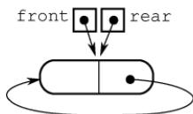
</div>

　　队空的判定条件：front == rear。

　　队满的判定条件：front == rear->next。

3）插入第一个元素后的状态如下图所示。

<div align="center">
  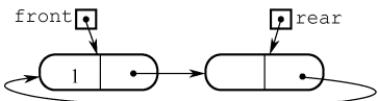
</div>

4）操作的基本过程如下：

```txt
入队操作：
若 (front == rear->next) // 队满
则在 rear 后面插入一个新的空闲结点；
入队元素保存到 rear 所指结点中；rear=rear->next；返回。
出队操作：
若 (front == rear) // 队空
则出队失败，返回；
取 front 所指结点中的元素 e；front=front->next；返回 e。
```

## 3.3 栈和队列的应用

　　要熟练掌握栈和队列，必须深入理解其典型应用场景，把握其中的规律，做到举一反三。接下来将简要介绍栈和队列的一些常见应用。

### 3.3.1 栈在括号匹配中的应用

　　假设表达式中允许包含两种括号：圆括号()和方括号[]，其嵌套顺序任意。例如，([ ]())或[ ([ ] [])]均为合法格式，而[ ( ) 、([ ( ) 或 ( ) ]均为非法格式。

　　考虑如下括号序列：

$$
\begin{array}{c c c c c c c c} \text {[ ]} & (\quad [ \quad ] & [ \quad ] & [ \quad ] & ) & ] \\ 1 & 2 & 3 & 4 & 5 & 6 & 7 & 8 \end{array}
$$

　　分析过程如下:

1）读入第1个括号“[”后，系统期待与之匹配的“]”（第8个）出现。

2）读入第 2 个括号 “（” 后，第 1 个括号 “[” 的期待暂时搁置，转而优先期待与 “（” 匹配的 “）” （第 7 个）出现。

3）读入第 3 个括号 “[”，当前最急迫的期待变为与之匹配的 “]”（第 4 个）。该期待满足后，先前被搁置的第 2 个括号 “(” 的匹配任务重新成为当前最急迫事项。

4）以此类推，可见整个处理过程完全符合后进先出的栈行为。

　　算法思想如下:

1）初始化一个空栈，顺序扫描输入的括号序列。

2）若遇到左括号，将其压入栈中，表示新增一个待匹配的期待，且其优先级最高。

3）若遇到右括号，则检查栈是否为空：若栈非空且栈顶左括号与当前右括号匹配，则弹出栈顶，完成一次匹配；否则，括号序列非法，算法终止。

4）扫描结束后，若栈为空，则括号序列合法；否则，存在未匹配的左括号，序列非法。

### 3.3.2 栈在表达式求值中的应用

　　表达式求值是程序设计语言编译中的一个基本问题，也是栈应用的典型范例。

#### 1. 算术表达式

　　中缀表达式（如 3+4）是人们常用的算术表达式，其运算符位于两个操作数之间。与前缀表达式（如 +34）或后缀表达式（如 34+）相比，中缀表达式虽然符合人类阅读习惯，但不便于计算机直接求值，因此许多编程语言在内部仍需要将其转换为后缀或前缀形式进行求值。

　　与前缀或后缀表达式不同，中缀表达式必须依赖括号来明确运算次序。而后缀表达式的运算符置于操作数之后，其结构已隐含了运算顺序，因此无须括号，仅由操作数和运算符构成。

> **考点追踪：** 表达式树的定义（2025）

　　中缀表达式 $\mathrm{A} + \mathrm{B}^{*}(\mathrm{C - D}) - \mathrm{E} / \mathrm{F}$ 对应的后缀表达式为ABCD- $* + \mathrm{EF} / -$ ，与该表达式对应的表达式树（见图3.15）的后序遍历序列一致，体现了后缀表达式与树结构的内在联系。

<div align="center">
  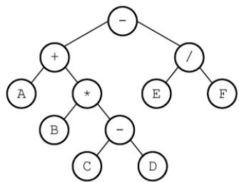
</div>

<p align="center"><em>图 3.15 $\mathrm{A + B^{*}(C - D) - E / F}$ 对应的表达式树</em></p>

#### 2. 中缀表达式转后缀表达式

> **考点追踪：** 中缀表达式转后缀表达式的方法（2024）

　　下面先介绍一种手算转换方法。

1）按运算优先级对整个表达式逐层加括号。

2）将每个运算符移到其所在括号的右括号之后，形成“左操作数 右操作数 运算符”的结构。

3）删除所有括号，即得后缀表达式。

　　以 $\mathrm{A} + \mathrm{B}^{*}(\mathrm{C - D}) - \mathrm{E} / \mathrm{F}$ 为例（下标表示运算顺序）：

1）加括号： $((A+③(B^{\star}②(C-①D)))-⑤(E/④F))$ 。

2）运算符后移： $((A(B(CD)-①)*②)+③(EF)/④)-⑤$ 。

3）去括号后得到后缀表达式：ABCD-① $^{*}$ ②+③EF/④-⑤。

　　在计算机中，该转换过程需借助一个运算符栈，用于暂存尚未确定输出时机的运算符。从左至右依次扫描中缀表达式的每一项，具体规则如下：

1）遇到操作数：直接加入后缀表达式。

2）遇到界限符：若为“（”，直接入栈；若为“）”，不入栈，且不断弹出栈顶运算符并加入后缀表达式，直到遇到“（”，将其弹出并丢弃。

3）遇到运算符：①若其优先级高于栈顶运算符，或栈顶为“（”，则直接入栈；②若其优先级低于或等于栈顶运算符，则依次弹出栈中运算符并加入后缀表达式，直到栈空，或栈顶为“（”，或遇到优先级更低的运算符为止，再将当前运算符入栈。按上述方法扫描完所有字符后，将栈中剩余运算符依次弹出并加入后缀表达式。例如，中缀表达式 $A+B^{*}(C-D)-E/F$ 转后缀表达式的过程如表3.1所示。

<p align="center"><em>表 3.1 中缀表达式 $\mathbf{A} + \mathbf{B}^{*}\left( \mathbf{C} - \mathbf{D}\right)  - \mathbf{E}/\mathbf{F}$ 转后缀表达式的过程</em></p>

<table><tr><td>步</td><td>待处理序列</td><td>栈内</td><td>后缀表达式</td><td>扫描项</td><td>说明</td></tr><tr><td>1</td><td>A+B*(C-D)-E/F</td><td></td><td></td><td>A</td><td>A加入后缀表达式</td></tr><tr><td>2</td><td>+B*(C-D)-E/F</td><td></td><td>A</td><td>+</td><td>+入栈</td></tr><tr><td>3</td><td>B*(C-D)-E/F</td><td>+</td><td>A</td><td>B</td><td>B加入后缀表达式</td></tr><tr><td>4</td><td>*(C-D)-E/F</td><td>+</td><td>AB</td><td>*</td><td>*优先级高于栈顶,*入栈</td></tr><tr><td>5</td><td>(C-D)-E/F</td><td>+*</td><td>AB</td><td>(</td><td>(直接入栈</td></tr><tr><td>6</td><td>C-D)-E/F</td><td>+*(</td><td>AB</td><td>C</td><td>C加入后缀表达式</td></tr><tr><td>7</td><td>-D)-E/F</td><td>+*(</td><td>ABC</td><td>-</td><td>栈顶为(,-直接入栈</td></tr><tr><td>8</td><td>D)-E/F</td><td>+*(-</td><td>ABC</td><td>D</td><td>D加入后缀表达式</td></tr><tr><td>9</td><td>)-E/F</td><td>+*(-</td><td>ABCD</td><td>)</td><td>遇到),弹出-,删除(</td></tr><tr><td>10</td><td>-E/F</td><td>+*</td><td>ABCD-</td><td>-</td><td>-优先级低于栈顶,依次弹出*、+, -入栈</td></tr><tr><td>11</td><td>E/F</td><td>-</td><td>ABCD-*+</td><td>E</td><td>E加入后缀表达式</td></tr><tr><td>12</td><td>/F</td><td>-</td><td>ABCD-*+E</td><td>/</td><td>/优先级高于栈顶,/入栈</td></tr><tr><td>13</td><td>F</td><td>-/</td><td>ABCD-*+E</td><td>F</td><td>F加入后缀表达式</td></tr><tr><td>14</td><td></td><td>-/</td><td>ABCD-*+EF</td><td></td><td>扫描结束,弹出剩余运算符</td></tr><tr><td>15</td><td></td><td></td><td>ABCD-*+EF/-</td><td></td><td>结束</td></tr></table>

> **考点追踪：** 栈的深度分析（2009、2012、2025）

　　所谓栈的深度，是指栈中元素最大个数。通常题目会给出入栈和出栈序列，要求计算栈所需的最大容量（最大深度）。有时该信息以中缀与后缀表达式的形式间接提供。掌握栈“后进先出”的特性，并通过手工模拟转换或求值过程，是解决此类问题的有效方法。

#### 3. 后缀表达式求值

> **考点追踪：** 用栈实现表达式求值的分析（2018）

　　后缀表达式的求值过程：从左至右依次扫描表达式，若当前项为操作数，则将其压入栈中；若为操作符<op>，则从栈中弹出两个操作数，先弹出的是右操作数Y，后弹出的是左操作数X，执行运算X<op>Y，并将结果压回栈中。所有项处理完毕后，栈顶元素即为最终计算结果。

　　例如，后缀表达式 ABCD- $^{*}$ +EF/-的求值过程共需12步，如表3.2所示。

<p align="center"><em>表 3.2 后缀表达式 ABCD- $*  +$ EF/-的求值过程</em></p>

<table><tr><td>步</td><td>扫描项</td><td>项类型</td><td>动作</td><td>栈中内容</td></tr><tr><td>1</td><td></td><td></td><td>置空栈</td><td>空</td></tr><tr><td>2</td><td>A</td><td>操作数</td><td>入栈</td><td>A</td></tr><tr><td>3</td><td>B</td><td>操作数</td><td>入栈</td><td>A B</td></tr><tr><td>4</td><td>C</td><td>操作数</td><td>入栈</td><td>A B C</td></tr><tr><td>5</td><td>D</td><td>操作数</td><td>入栈</td><td>A B C D</td></tr><tr><td>6</td><td>-</td><td>操作符</td><td>D、C出栈,计算C-D,结果<eq>R_1</eq>入栈</td><td>A B <eq>R_1</eq></td></tr><tr><td>7</td><td>*</td><td>操作符</td><td><eq>R_1</eq>、B出栈,计算<eq>B \times R_1</eq>,结果<eq>R_2</eq>入栈</td><td>A <eq>R_2</eq></td></tr><tr><td>8</td><td>+</td><td>操作符</td><td><eq>R_2</eq>、A出栈,计算<eq>A + R_2</eq>,结果<eq>R_3</eq>入栈</td><td><eq>R_3</eq></td></tr><tr><td>9</td><td>E</td><td>操作数</td><td>入栈</td><td><eq>R_3</eq> E</td></tr><tr><td>10</td><td>F</td><td>操作数</td><td>入栈</td><td><eq>R_3</eq> E F</td></tr><tr><td>11</td><td>/</td><td>操作符</td><td>F、E出栈,计算E/F,结果<eq>R_4</eq>入栈</td><td><eq>R_3</eq> <eq>R_4</eq></td></tr><tr><td>12</td><td>-</td><td>操作符</td><td><eq>R_4</eq>、<eq>R_3</eq>出栈,计算<eq>R_3 - R_4</eq>,结果<eq>R_5</eq>入栈</td><td><eq>R_5</eq></td></tr></table>

### 3.3.3 栈在递归中的应用

　　递归是一种重要的程序设计方法。简单来说，若一个函数、过程或数据结构在其定义中直接或间接地引用了自身，则称其为递归定义，简称递归。递归通过将原问题逐层分解为规模更小但结构相同的子问题来求解。借助递归策略，仅需少量代码即可简洁地表达解题过程中反复出现的相同计算模式，显著减少程序代码量。然而，在一般情况下，递归的执行效率并不高。

　　以斐波那契数列为例，其数学定义为

$$
F (n) = \left\{ \begin{array}{l l} F (n - 1) + F (n - 2), & n > 1 \\ 1, & n = 1 \\ 0, & n = 0 \end{array} \right.
$$

　　这是递归的典型范例，其程序实现如下：

```txt
int F(int n) { //斐波那契数列的实现
    if (n == 0)
    return 0; //边界条件
    else if (n == 1)
    return 1; //边界条件
    else
    return F(n - 1) + F(n - 2); //递归表达式
}
```

　　必须注意，递归定义不能是循环或无终止的，必须满足以下两个条件：

- 递归体（递归表达式）：描述问题如何分解为更小规模的同类子问题。

- 边界条件（递归出口）：确保递归在有限步内终止。

　　递归的精髓在于能否将原问题转化为属性相同但规模更小的问题。

> **考点追踪：** 栈在函数调用中的作用和工作原理（2015、2017）

　　在递归调用过程中，系统为每一层调用的返回地址、局部变量及形参等信息分配存储空间，这些信息被保存在递归工作栈中。因此，递归深度过大时容易导致栈溢出。此外，递归效率低下的主要原因是存在大量重复计算。以 n=5 为例，其递归调用过程如图 3.16 所示。

<div align="center">
  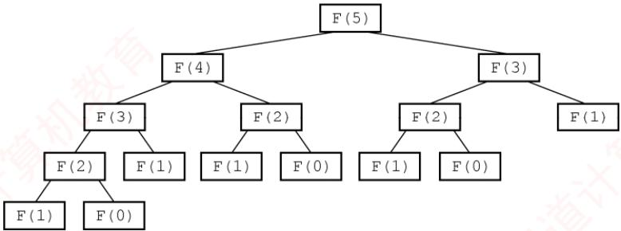
</div>

<p align="center"><em>图 3.16 F(5) 的递归执行过程</em></p>

　　显然，在该过程中，F(3)被计算2次，F(2)被计算3次。F(1)被调用5次，F(0)被调用3次。由此可见，递归虽然代码简洁、易于理解，但存在明显的性能缺陷。在第5章讨论树的遍历时，采用递归可使代码极为简洁，但初学者往往难以清晰理解其执行过程。若希望深入理解递归的底层实现机制，可参考《编译原理》教材中关于运行时栈与活动记录的相关内容。

　　任何递归算法均可转换为非递归算法，通常需借助显式栈来模拟递归调用过程。

### 3.3.4 队列在层次遍历中的应用

　　在信息处理中，有一类典型问题需要逐层或逐行处理。解决这类问题的常用策略是：在处理当前层的同时，将下一层的元素按序加入待处理队列。队列正适用于此类场景，因其先进先出的特性，能够自然地保存后续待处理元素的顺序。以二叉树的层次遍历为例（见图3.17），可清晰体现队列的应用价值。表3.3展示了该遍历过程的具体执行步骤。

<div align="center">
  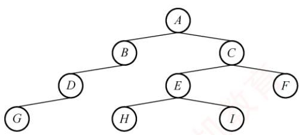
</div>

<p align="center"><em>图 3.17 二叉树</em></p>

<p align="center"><em>表 3.3 层次遍历二叉树的过程</em></p>

<table><tr><td>序号</td><td>说明</td><td>队内</td><td>队外</td></tr><tr><td>1</td><td>A入</td><td>A</td><td></td></tr><tr><td>2</td><td>A出,BC入</td><td>BC</td><td>A</td></tr><tr><td>3</td><td>B出,D入</td><td>CD</td><td>AB</td></tr><tr><td>4</td><td>C出,EF入</td><td>DEF</td><td>ABC</td></tr><tr><td>5</td><td>D出,G入</td><td>EFG</td><td>ABCD</td></tr><tr><td>6</td><td>E出,HI入</td><td>FGHI</td><td>ABCDE</td></tr><tr><td>7</td><td>F出</td><td>GHI</td><td>ABCDEF</td></tr><tr><td>8</td><td>GHI出</td><td></td><td>ABCDEFGHI</td></tr></table>

　　该过程可简要描述如下:

　　① 将根结点入队。

　　② 若队列为空（表示所有结点均已处理），则遍历结束；否则执行③。

　　③ 取出队首结点并访问；若其存在左孩子，则将左孩子入队；若其存在右孩子，则将右孩子入队；返回②继续执行。

### 3.3.5 队列在计算机系统中的应用

　　队列在计算机系统中的应用非常广泛，以下从两个主要方面进行阐述：第一个方面是解决主机与外部设备之间速度不匹配的问题，第二个方面是解决由多用户引起的资源竞争问题。

> **考点追踪：** 缓冲区的逻辑结构（2009）

　　以主机和打印机之间的速度不匹配为例。主机输出数据的速度远快于打印机处理数据的速度。若直接将数据发送给打印机，会导致数据丢失或打印错误。为此，通常设置一个打印数据缓冲区来缓解这一问题。具体实现如下：主机将待打印的数据依次写入缓冲区，当缓冲区满时，主机暂停输出并转向其他任务；打印机则从缓冲区中按先进先出原则逐个取出数据进行打印；打印完成后，打印机向主机发出请求，主机再次向缓冲区写入新的打印数据。这种方法不仅保证了数据的正确性，还提高了主机的整体效率。因此，打印数据缓冲区实际上就是一个队列。

> **考点追踪：** 多队列出队/入队操作的应用（2016）

　　在多用户环境下，CPU资源的竞争是一个典型场景。在一个多终端系统中，用户通过各自的终端向操作系统提出对CPU的请求。为公平分配CPU时间，操作系统通常按照请求的时间顺序，将这些请求排成一个队列。具体步骤如下：每次将CPU分配给队首用户的程序运行；当该程序运行结束或用完规定的时间片后，操作系统使其出队；然后将CPU分配给新的队首用户。这种方式既保证了请求的公平处理，又提升了CPU利用率。此外，在某些复杂系统中，可能还会引入多队列机制，以便根据不同的优先级或调度策略动态调整资源分配。

### 3.3.6 本节试题精选

#### 一、单项选择题

01. 栈的应用不包括（）。

- A. 递归
- B. 表达式求值
- C. 括号匹配
- D. 缓冲区

02. 表达式 $a*(b+c)-d$ 的后缀表达式是（）。

- A. $abcd*+-$
- B. $abc+*d-$
- C. $abc*+d-$
- D. $-$ +*abcd

03. 下面（）用到了队列。

- A. 括号匹配
- B. 表达式求值
- C. 递归
- D. FIFO 页面替换算法

04. 利用栈求表达式的值时，设立运算数栈 OPEN。假设 OPEN 只有两个存储单元，则在下列表达式中，不会发生溢出的是（）。

- A. A-B*(C-D)
- B. (A-B)*C-D
- C. (A-B*C)-D
- D. (A-B)*(C-D)

$$
\text { return } ((x > 0)? x ^ {*} f (x - 1): 2);
$$

i=f(f(1));

- A. 2
- B. 4
- C. 8
- D. 无限递归

06. 设有如下递归函数，则计算 F(8) 需要调用该递归函数的次数为（）。int F(int n) {
    if (n <= 3) return 1;
    else return F(n - 2) + F(n - 4) + 1;
    }

- A. 7
- B. 8
- C. 9
- D. 10

07. 设有如下递归函数，在 func(func(5)) 的执行过程中，第 4 个被执行的 func 函数是（）。int func(int x) {
    if (x <= 3) return 2;
    else return func(x - 2) + func(x - 4);
    }

- A. func(2)
- B. func(3)
- C. func(4)
- D. func(5)

08. 对于一个问题的递归算法求解和其相对应的非递归算法求解，（）。

- A. 递归算法通常效率高一些
- B. 非递归算法通常效率高一些
- C. 两者相同
- D. 无法比较

09. 执行函数时，其局部变量一般采用（）进行存储。

- A. 树形结构
- B. 静态链表
- C. 栈结构
- D. 队列结构

10. 执行（）操作时，需要使用队列作为辅助存储空间。

- A. 查找散列（哈希）表
- B. 广度优先搜索图
- C. 前序（根）遍历二叉树
- D. 深度优先搜索图

11. 下列说法中，正确的是（）。

- A. 消除递归不一定需要使用栈
- B. 对同一输入序列进行两组不同的合法入栈和出栈组合操作，所得的输出序列也一定相同
- C. 通常使用队列来处理函数或过程调用
- D. 队列和栈都是运算受限的线性表，只允许在表的两端进行运算

12. 【2009 统考真题】为解决计算机主机与打印机之间速度不匹配的问题，通常设置一个打印数据缓冲区，主机将要输出的数据依次写入该缓冲区，而打印机则依次从该缓冲区中取出数据。该缓冲区的逻辑结构应该是（）。

- A. 栈
- B. 队列
- C. 树
- D. 图

13. 【2012 统考真题】已知操作符包括“+”“-”“*”“/”“（”和“）。将中缀表达式 $a + b - a^{\star}((c + d) / e - f) + g$ 转换为等价的后缀表达式 $ab + acd + e / f - ^{*} - g +$ 时，用栈来存放暂时还不能确定运算次序的操作符。栈初始时为空，转换过程中同时保存在栈中的操作符的最大个数是（）。

- A. 5
- B. 7
- C. 8
- D. 11

14. 【2014 统考真题】假设栈初始为空，将中缀表达式 $a / b + (c * d - e * f) / g$ 转换为等价的后缀表达式的过程中，当扫描到 $f$ 时，栈中的元素依次是（）。

- A. $+(* -
- B. + (-*
- C. / + (* - *
- D. / + - *)$

15. 【2015 统考真题】已知程序如下:
int S(int n)
{ return (n<=0)?0:S(n-1)+n;}
void main()
{ cout<<S(1);}

　　程序运行时使用栈来保存调用过程的信息，自栈底到栈顶保存的信息依次对应的是（）。

- A. main()→S(1)→S(0)
- B. S(0)→S(1)→main()
- C. main()→S(0)→S(1)
- D. S(1)→S(0)→main()

16. 【2016 统考真题】设有如下图所示的火车车轨，入口和出口之间有 n 条轨道，列车的行进方向均为从左至右，列车可驶入任意一条轨道。现有编号为 1～9 的 9 列列车，驶入的次序依次是 8,4,2,5,3,9,1,6,7。若期望驶出的次序依次为 1～9，则 n 至少是（）。

<div align="center">
  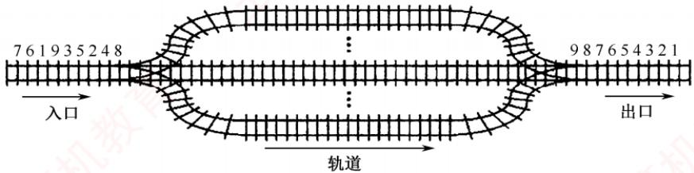
</div>

- A. 2
- B. 3
- C. 4
- D. 5

17. 【2017 统考真题】下列关于栈的叙述中，错误的是（）。
I. 采用非递归方式重写递归程序时必须使用栈
II. 函数调用时，系统要用栈保存必要的信息
III. 只要确定了入栈次序，即可确定出栈次序
IV. 栈是一种受限的线性表，允许在其两端进行操作

- A. 仅 I
- B. 仅 I、II、III
- C. 仅 I、III、IV
- D. 仅 II、III、IV

18. 【2018 统考真题】若栈 S1 中保存整数，栈 S2 中保存运算符，函数 F（） 依次执行下述各步操作：
1）从 S1 中依次弹出两个操作数 a 和 b。
2）从 S2 中弹出一个运算符 op。
3）执行相应的运算 b op a。
4）将运算结果压入 S1 中。

　　假定 S1 中的操作数依次是 5,8,3,2（2 在栈顶），S2 中的运算符依次是 *、-、+（+ 在栈顶）。调用 3 次 F() 后，S1 栈顶保存的值是（）。

- A. -15
- B. 15
- C. -20
- D. 20

19. 【2024 统考真题】与表达式 $x+y^{*}(z-u)/v$ 等价的后缀表达式是（）。

- A. $xyzu^{-*}v/+$
- B. $xyzu-v/*+$
- C. $+x/*y-zuv$
- D. $+x*y/-zuv$

20. 【2025 统考真题】已知算法 A 用于检查字符串中各类括号是否匹配，A 执行过程中使用初始为空的栈保存遇到的括号。若栈的容量是 3，则下列选项中，A 不能处理的是（）。

- A. $(a + [b + (c + d) / e] + f) + g - h$
- B. $[a^{*}((b + c) / (d - e) + f / g) - h]$
- C. $[a^{*}(b - (c - d) * e / (f + g)) - h]$
- D. $[a - (b + [c^{*}(d + e) - f] + g + h)]$

#### 二、综合应用题

01. 假设一个算术表达式中包含圆括号、方括号和花括号3种类型的括号，编写一个算法来判别表达式中的括号是否配对，以字符“\0”作为算术表达式的结束符。

### 3.3.7 答案与解析

#### 一、单项选择题

**01. D**

　　缓冲区是用队列实现的，选项 A、B、C 都是栈的典型应用。

**02. B**

　　后缀表达式中，每个运算符均直接位于其两个操作数的后面，按照这样的方式逐步根据计算的优先级将每个计算式进行变换，即可得到后缀表达式。

　　【另解】将两个直接操作数用括号括起来，再将操作符提到括号后，最后去掉括号。例如，对于 $(①(②a*(③b+c))-d)$ ，提出操作符并去掉括号后，可得后缀表达式为 $abc+*d-$ 。

　　学完第 5 章后，可将表达式画成二叉树的形式，再用后序遍历即可求得后缀表达式。

**03. D**

　　FIFO 页面替换算法用到了队列。其余的都只用到了栈。

**04. B**

　　利用栈求表达式的值时，可以分别设立运算符栈和运算数栈，其原理不变。选项 B 中 A 入栈，B 入栈，计算得 R1，C 入栈，计算得 R2，D 入栈，计算得 R3，由此得栈深为 2。选项 A、C、D 依次计算得栈深为 4、3、3。因此选择选项 B。

> **技巧**

　　根据运算符优先级，统计已依次入栈但还未参与计算的运算符数。以选项 C 为例，当 “(” “A” “-” 入栈时，“(” 和 “-” 还未参与运算，此时运算符栈大小为 2，“B” 和 “*” 入栈时运算符大小为 3，“C” 入栈时 “B*C” 运算，运算符栈大小为 2，以此类推。

**05. B**

　　栈与递归有着紧密的联系。递归模型包括递归出口和递归体两个方面。递归出口是递归算法的出口，即终止递归的条件。递归体是一个递推的关系式。根据题意有

f(0)=2;
f(1)=1*f(0)=2;
f(f(1))=f(2)=2*f(1)=4。
**06. C**

　　计算 $\mathbb{F}(8)$ 的递归调用树如右图所示：

　　由图可知，递归函数 $F()$ 调用的次数为 9。

**07. C**

<div align="center">
  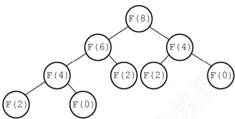
</div>

　　首先，执行内层参数 func(5)=func(3)+

　　func(1)=4，共执行3次func函数。然后，执行func(func(5))=func(4)=func(2)+func(0)=4，因此第4个被执行的func函数是func(4)。也可以采用画出递归调用树的方式，即某个函数的执行次序等于其在递归调用树的先序遍历中的次序。

**08. B**

　　通常情况下，递归算法在计算机实际执行的过程中包含很多的重复计算，所以效率会低。

**09. C**

　　调用函数时，系统会为调用者构造一个由参数表和返回地址组成的活动记录，并将记录压入系统提供的栈中，若被调用函数有局部变量，也要压入栈中。

**10. B**

　　本题涉及第 5 章和第 6 章的内容，图的广度优先搜索类似于树的层序遍历，都要借助于队列。

**11. A**

　　使用栈可以模拟递归的过程，以此来消除递归，但对于单向递归和尾递归而言，可以用迭代的方式来消除递归，选项 A 正确。不同的入栈和出栈组合操作，会产生许多不同的输出序列，B 错误。通常使用栈来处理函数或过程调用，选项 C 错误。队列和栈都是操作受限的线性表，但只有队列允许在表的两端进行运算，而栈只允许在栈顶方向进行操作，选项 D 错误。

**12. B**

　　在提取数据时必须保持原来数据的顺序，所以缓冲区的特性是先进先出。

**13. A**

　　在中缀表达式转后缀表达式的过程中，扫描到操作数时直接输出，扫描到操作符时根据其优先级进行相应的出入栈操作。有几点需要注意：① 若遇到界限符“（”，则直接入栈；② 若遇到界限符“）”，则不入栈，且依次弹出栈顶运算符，直到遇到“（”为止，并删除“（”；③ 若当前运算符的优先级高于栈顶运算符或遇到栈顶为“（”，则直接入栈；④ 若当前运算符的优先级低于或等于栈顶运算符，则依次弹出栈中的运算符并加入后缀表达式，直到遇到一个优先级低于它的运算符或遇到“（”或栈空为止，之后将当前运算符入栈。

　　求栈中操作符的最大个数时，为简单起见，可省略对操作数的处理。

<table><tr><td>步</td><td>待处理运算符</td><td>栈</td><td>扫描运算符</td><td>动作</td></tr><tr><td>1</td><td>+b-a*( (c+d)/e-f)+g</td><td></td><td>+</td><td>+入栈</td></tr><tr><td>2</td><td>-a*( (c+d)/e-f)+g</td><td>+</td><td>-</td><td>-优先级等于栈顶+,弹出+, -入栈</td></tr><tr><td>3</td><td>*( (c+d)/e-f)+g</td><td>-</td><td>*</td><td>*优先级高于栈顶-, *入栈</td></tr><tr><td>4</td><td>((c+d)/e-f)+g</td><td>-*</td><td>(</td><td>(直接入栈</td></tr><tr><td>5</td><td>(c+d)/e-f)+g</td><td>-* (</td><td>(</td><td>(直接入栈</td></tr><tr><td>6</td><td>+d)/e-f)+g</td><td>-* ( (</td><td>+</td><td>栈顶为(, +直接入栈</td></tr><tr><td>7</td><td>)/e-f)+g</td><td>-* ( (+</td><td>)</td><td>遇到),弹出+,删除(</td></tr><tr><td>8</td><td>/e-f)+g</td><td>-* (</td><td>/</td><td>栈顶为(, /直接入栈</td></tr><tr><td>9</td><td>-f)+g</td><td>-* (/</td><td>-</td><td>-优先级低于栈顶/,弹出/, -入栈</td></tr><tr><td>10</td><td>)+g</td><td>-* (-</td><td>)</td><td>遇到),弹出-,删除(</td></tr><tr><td>11</td><td>+g</td><td>-*</td><td>+</td><td>+优先级低于栈顶*,等于-,依次弹出*和-; +入栈</td></tr><tr><td>12</td><td></td><td>+</td><td></td><td></td></tr></table>

　　由上述过程可知，栈中操作符的最大个数为 5。

**14. B**

　　中缀表达式 $a / b + (c^{*}d - e^{*}f) / g$ 转换为后缀表达式的过程如下：

<table><tr><td>步</td><td>待处理序列</td><td>栈</td><td>后缀表达式</td><td>扫描项</td><td>动作</td></tr><tr><td>1</td><td>a/b+(c*d-e*f)/g</td><td></td><td></td><td>a</td><td>a加入后缀表达式</td></tr><tr><td>2</td><td>/b+(c*d-e*f)/g</td><td></td><td>a</td><td>/</td><td>/入栈</td></tr><tr><td>3</td><td>b+(c*d-e*f)/g</td><td>/</td><td>a</td><td>b</td><td>b加入后缀表达式</td></tr><tr><td>4</td><td>+(c*d-e*f)/g</td><td>/</td><td>ab</td><td>+</td><td>+优先级低于栈顶的/,弹出/,+入栈</td></tr><tr><td>5</td><td>(c*d-e*f)/g</td><td>+</td><td>ab/</td><td>(</td><td>(入栈</td></tr><tr><td>6</td><td>c*d-e*f)/g</td><td>+(</td><td>ab/</td><td>c</td><td>c加入后缀表达式</td></tr><tr><td>7</td><td>*d-e*f)/g</td><td>+(</td><td>ab/c</td><td>*</td><td>栈顶为(,*入栈</td></tr><tr><td>8</td><td>d-e*f)/g</td><td>+(*)</td><td>ab/c</td><td>d</td><td>d加入后缀表达式</td></tr><tr><td>9</td><td>-e*f)/g</td><td>+(*)</td><td>ab/cd</td><td>-</td><td>-优先级低于栈顶的*,弹出*,-入栈</td></tr><tr><td>10</td><td>e*f)/g</td><td>+(-</td><td>ab/cd*</td><td>e</td><td>e加入后缀表达式</td></tr><tr><td>11</td><td>*f)/g</td><td>+(-</td><td>ab/cd*e</td><td>*</td><td>*优先级高于栈顶的-, *入栈</td></tr><tr><td>12</td><td>f)/g</td><td>+(-*)</td><td>ab/cd*e</td><td>f</td><td>f加入后缀表达式</td></tr><tr><td>13</td><td>)/g</td><td>+(-*)</td><td>ab/cd*ef</td><td>)</td><td>遇到),依次弹出*、-加入表达式,删除(</td></tr><tr><td>14</td><td>/g</td><td>+</td><td>ab/cd*ef*-</td><td>/</td><td>/优先级高于栈顶的+, /入栈</td></tr><tr><td>15</td><td>g</td><td>+/</td><td>ab/cd*ef*-</td><td>g</td><td>g加入后缀表达式</td></tr><tr><td>16</td><td></td><td>+/</td><td>ab/cd*ef*-g</td><td></td><td>扫描完毕,运算符依次弹出加入表达式</td></tr><tr><td>17</td><td></td><td></td><td>ab/cd*ef*-g/+</td><td></td><td>完成</td></tr></table>

　　由此可知，当扫描到 f 时，栈中的元素依次是 + (-*。

　　【另解】采用手算方法，得出中缀式 $a / b + (c^{*}d - e^{*}f) / g$ 对应的后缀式为 $ab / cd^{*}ef^{*} - g / +$ 。中缀表达式转后缀表达式时，操作数都直接输出，因此操作数的顺序是固定的。扫描到 $f$ 时，在后缀表达式 $f$ 后面的运算符要么还未入栈，要么还在栈中，需要结合中缀式来判断， $f$ 后面依次出栈的运算符为 $* - / +$ ，/在中缀表达式 $f$ 之后，此时还未入栈，因此栈中的运算符（从栈底到栈顶）为 $+ - *$ ；此外，已入栈的界限符（此时还未消解，因此（也还在栈中，栈中的元素依次是 $+ (-\star)$ 。

**15. A**

　　递归调用函数时，在系统栈中保存的函数信息需满足先进后出的特点，依次调用了main(),S(1),S(0)，所以栈底到栈顶的信息依次是main(),S(1),S(0)。

> **注意：**

　　在递归中，系统为每一层的返回点、局部变量、传入实参等开辟了递归工作栈来存储。

**16. C**

　　根据题意：入队顺序为8,4,2,5,3,9,1,6,7，出队顺序为 $1\sim 9$ 。入口和出口之间有多个队列（ $n$ 条轨道），且每个队列（轨道）可容纳多个元素（多列列车），为便于区分，队列用字母编号。分析如下：显然先入队的元素必须小于后入队的元素（否则，若8和4入同一个队列，8在4前面，则出队时也只能8在4前面），这样8入队列A，4入队列B，2入队列C，5入队列B（按照前述原则“大的元素在小的元素后面”也可将5入队列C，但这时剩下的元素3就必须放入一个新的队列中，无法确保“至少”），3入队列C，9入队列A，这时共占了3个队列，后面还有元素1，直接再用一个新的队列D，1从队列D出队后，剩下的元素6和7或入队列B，或入队列C。综上，共占用了4个队列。当然还有其他的入队、出队情况，请读者自己推演，但要确保满足：① 队列中后面的元素大于前面的元素；② 确保占用最少（满足题意中“至少”）的队列。

**17. C**

　　说法 I 的反例：计算斐波那契数列迭代实现只需要一个循环即可实现。说法 III 的反例：入栈序列为 1, 2，进行 Push, Push, Pop, Pop 操作，出栈次序为 2、1；进行 Push, Pop, Push, Pop 操作，出栈次序为 1, 2。说法 IV，栈是一种受限的线性表，只允许在一端进行操作。说法 II 正确。

**18. B**

　　第一次调用：① 从 s1 中弹出 2 和 3；② 从 s2 中弹出+；③ 执行 $3+2=5$ ；④ 将 5 压入 s1 中，第一次调用结束后 s1 中剩余 5、8、5（5 在栈顶），s2 中剩余*、-（-在栈顶）。第二次调用：① 从 s1 中弹出 5 和 8；② 从 s2 中弹出-；③ 执行 8-5=3；④ 将 3 压入 s1 中，第二次调用结束后 s1 中剩余 5、3（3 在栈顶），s2 中剩余*。第三次调用：① 从 s1 中弹出 3 和 5；② 从 s2 中弹出*；③ 执行 5*3=15；④ 将 15 压入 s1 中，第三次调用结束后 s1 中仅剩余 15，s2 为空。

**19. A**

<div align="center">
  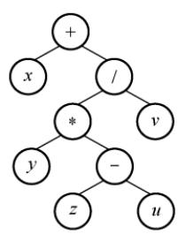
</div>

　　根据中缀表达式画出对应的二叉树如右图所示，对该二叉树进行后序遍历即可得到后缀表达式为 $xyzu^{-*}v/+$ 。本题也可采用本书前面描述的手算方法。

**20. D**

　　该算法利用栈来检查括号匹配：遇到左括号时入栈，遇到右括号时出栈并与之匹配。由于栈的容量为3，因此最多只能容纳3个未匹配的左括号，即最多支持3层嵌套的括号结构。逐项分析各选项的括号嵌套深度：对于选项A，括号序列为([()])，最大嵌套深度为3，依次入栈([()

　　未超过栈容量。对于选项B，括号序列为[（）]，最大深度为3，依次入栈[（，栈容量足够。对于选项C，括号序列为[（）]，同样最大深度为3，栈容量足够。对于选项D，括号序列为[（）]，最大嵌套深度达到4。扫描至*后的(时，栈中已存有[（三个左括号，此时，需要将第四个左括号(入栈，但栈容量仅为3，无法继续入栈，因此该表达式无法被正确处理。

#### 二、综合应用题

**01. 【解答】**

　　括号匹配是栈的一个典型应用，给出这道题是希望读者好好掌握栈的应用。算法的基本思想是扫描每个字符，遇到花、方、圆的左括号时入栈，遇到花、方、圆的右括号时检查栈顶元素是否为相应的左括号，若是，出栈，否则配对错误。最后栈若不为空也为错误。

```txt
bool BracketsCheck(char *str){
    InitStack(S); //初始化栈
    int i=0;
    while(str[i] != '\0') {
    switch(str[i]) {
    //左括号入栈
    case '(': Push(S,'('); break;
    case '[': Push(S,'['); break;
    case '{': Push(S,'('); break;
    //遇到右括号，检测栈顶
    case ')'': Pop(S,e);
    if(e!='(') return false;
    break;
    case '']': Pop(S,e);
    if(e!='[') return false;
    break;
    case '}': Pop(S,e);
    if(e!='{'}) return false;
    break;
    default:
    break;
    }//switch
    i++;
    }//while
    if(!StackEmpty(S)) {
    printf("括号不匹配\n");
    return false;
    }
    else {
    printf("括号匹配\n");
    return true;
    }
}
```

## 3.4 数组和特殊矩阵

　　矩阵在图形学、工程计算等领域占有重要地位。在数据结构中，关注的重点并非矩阵本身的数学性质及其运算，而是如何以最小的内存空间高效存储矩阵，并支持对元素的便捷访问。

### 3.4.1 数组的定义

　　数组是由 $n$ （ $n \geqslant 1$ ）个相同类型的数据元素组成的有限序列。每个元素称为数组元素，其在线性序列中的位置由下标标识，下标的取值范围称为维界。

　　数组与线性表的关系：数组是线性表的推广。一维数组可视为一个线性表；二维数组可视为其元素为定长一维数组的线性表；更高维数组以此类推。数组一旦定义，其维数与维界即固定不变。因此，除初始化和销毁外，数组仅支持存取元素和修改元素两种基本操作。

### 3.4.2 数组的存储结构

　　大多数编程语言提供数组类型，逻辑上的数组通常映射为内存中一段连续的存储空间。以一维数组 A[0…n-1]为例，设每个元素占 L 个存储单元，则元素 A[i] 的地址为

$$
\operatorname{LOC} \left(a _ {i}\right) = \operatorname{LOC} \left(a _ {0}\right) + i L (0 \leqslant i <   n)
$$

> **考点追踪：** 二维数组按行优先存储的下标对应关系（2021）

　　多维数组在内存中需按某种顺序展开为一维。常见方式有按行优先和按列优先。按行优先：先行后列，先存储行号较小的元素；同一行内，先存储列号较小的元素。设二维数组行下标与列下标范围分别为 $[0, h_1]$ 与 $[0, h_2]$ ，则元素 A[i][j] 的地址为

$$
\operatorname{LOC} \left(a _ {i, j}\right) = \operatorname{LOC} \left(a _ {0, 0}\right) + [ i (h _ {2} + 1) + j ] L
$$

　　例如，数组 $\mathrm{A}_{[2][3]}$ 按行优先存储的形式如图3.18所示。

<div align="center">
  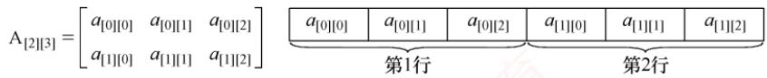
</div>

<p align="center"><em>图 3.18 二维数组按行优先顺序存放</em></p>

　　按列优先：先列后行，先存储列号较小的元素；同一列内，先存储行号较小的元素。其对应的地址公式为

$$
\operatorname{LOC} \left(a _ {i, j}\right) = \operatorname{LOC} \left(a _ {0, 0}\right) + [ j \left(h _ {1} + 1\right) + i ] L
$$

　　例如，数组 $\mathrm{A}_{[2][3]}$ 按列优先存储的形式如图3.19所示。

<div align="center">
  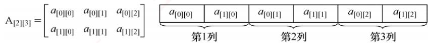
</div>

<p align="center"><em>图 3.19 二维数组按列优先顺序存放</em></p>

### 3.4.3 特殊矩阵的压缩存储

　　压缩存储：为多个值相同的元素只分配一个存储空间，对零元素不分配存储空间。

　　特殊矩阵：指具有大量相同元素或零元素，且这些元素分布具有规律性的矩阵。常见的特殊矩阵有对称矩阵、上（下）三角矩阵、对角矩阵等。

　　特殊矩阵的压缩存储方法：通过分析矩阵中相同元素的分布规律，仅存储一份实际数据，其余的可通过下标映射访问，从而将原本冗余的数据压缩到一个共享的空间中，显著节省内存。

#### 1. 对称矩阵

> **考点追踪：** 对称矩阵压缩存储的下标对应关系（2018、2020）

　　若 $n$ 阶矩阵 $\mathbf{A}$ 中任意元素 $a_{i,j}$ 均满足 $a_{i,j} = a_{j,i}$ （ $1 \leqslant i, j \leqslant n$ ），则称其为对称矩阵。其元素可分为三部分：上三角区、主对角线和下三角区，如图3.20所示。

　　由于上三角区与下三角区完全对称，若仍用二维数组存储，将近一半空间被浪费。为此可将 $n$ 阶对称矩阵 $A$ 压缩存储于一维数组 $\mathrm{B}[n(n + 1) / 2]$ 中，通常仅存放下三角部分（含主对角线）。

<div align="center">
  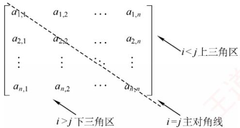
</div>

<p align="center"><em>图 3.20 $n$ 阶矩阵的划分</em></p>

　　对于元素 $a_{i,j} (i \geqslant j)$ ，其在数组 B 中的位置由其前方的元素个数决定

　　第1行：1个元素 $(a_{1,1})$ 。
　　第2行：2个元素 $(a_{2,1}, a_{2,2})$ 。
……

　　第 i-1 行：i-1 个元素 $(a_{i-1,1}, a_{i-1,2}, \cdots, a_{i-1,i-1})$ 。
　　第 i 行：j-1 个元素 $(a_{i,1}, a_{i,2}, \cdots, a_{i,j-1})$ 。

　　因此，元素 $a_{i,j}$ 在数组B中的下标

$k=1+2+\cdots+(i-1)+j-1=i(i-1)/2+j-1$ （数组下标从0开始）。元素下标之间的对应关系如下：

$$
k = \left\{ \begin{array}{l l} \frac {i (i - 1)}{2} + j - 1, & i \geqslant j (\text {下三角区和主对角线元素}) \\ \frac {j (j - 1)}{2} + i - 1, & i <   j (\text {上三角区元素} a _ {i, j} = a _ {j, i}) \end{array} \right.
$$

　　若数组下标从 1 开始，则可采用类似的推导方法，请读者自行思考。

> **注意：**

　　二维数组 A[n][n] 与 A[0…n-1][0…n-1] 写法等价，表示下标从 0 开始。若写作 A[1…n][1…n]，则表示下标从 1 开始。矩阵元素通常记为 $a_{i,j}$ ，其行号 i 和列号 j 通常从 1 开始。

#### 2. 三角矩阵

　　在下三角矩阵 [见图 3.22(a)] 中，上三角区的所有元素均为同一常量。其存储思想与对称矩阵的类似，但是需要额外存储该常量一次。因此，可以将 n 阶下三角矩阵 A 压缩存储在 B[n(n+1)/2+1] 中。

　　对于元素 $a_{i,j}$ （ $i \geqslant j$ ），其在数组 B 中的下标为

$$
k = \left\{ \begin{array}{l l} \frac {i (i - 1)}{2} + j - 1, & i \geqslant j (\text {下三角区和主对角线元素}) \\ \frac {n (n + 1)}{2}, & i <   j (\text {上三角区元素}) \end{array} \right.
$$

　　下三角矩阵的压缩存储形式如图 3.21 所示。

<table><tr><td>0</td><td>1</td><td>2</td><td>3</td><td>4</td><td>5</td><td><eq>\cdots</eq></td><td></td><td></td><td><eq>\cdots</eq></td><td><eq>n(n+1)/2</eq></td><td></td></tr><tr><td><eq>a_{1,1}</eq></td><td><eq>a_{2,1}</eq></td><td><eq>a_{2,2}</eq></td><td><eq>a_{3,1}</eq></td><td><eq>a_{3,2}</eq></td><td><eq>a_{3,3}</eq></td><td rowspan="2"><eq>\cdots</eq></td><td rowspan="2"><eq>a_{n,1}</eq></td><td rowspan="2"><eq>a_{n,2}</eq></td><td rowspan="2"><eq>\cdots</eq></td><td rowspan="2"><eq>a_{n,n}</eq></td><td rowspan="2"><eq>c</eq></td></tr><tr><td>第1行</td><td colspan="2">第2行</td><td colspan="3">第3行</td></tr><tr><td colspan="11">第n行</td><td>常数项</td></tr></table>

<p align="center"><em>图 3.21 下三角矩阵的压缩存储</em></p>

> **考点追踪：** 上三角矩阵采用行优先存储的应用（2011）

　　在上三角矩阵 [见图 3.22(b)] 中，下三角区所有元素均为同一常量。只需存储主对角线、上三角区上元素及该常量一次，同样将其压缩存储在 B[n(n+1)/2+1] 中。

<div align="center">
  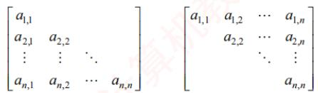
</div>

<p align="center"><em>(a) 下三角矩阵</em></p>

<p align="center"><em>(b) 上三角矩阵</em></p>

<p align="center"><em>图 3.22 三角矩阵</em></p>

　　对于元素 $a_{i,j}$ （ $i \leqslant j$ ），其在数组 B 中前方的元素个数为

　　第1行： $n$ 个元素

　　第2行： $n - 1$ 个元素

　　第 $i - 1$ 行： $n - i + 2$ 个元素

　　第 $i$ 行： $j - i$ 个元素

　　故元素 $a_{i,j}$ 在数组 B 中的下标 $k = n + (n - 1) + \cdots + (n - i + 2) + (j - i + 1) - 1 = (i - 1)(2n - i + 2)/2 + (j - i)$ 。元素下标之间的对应关系如下：

<div align="center">
  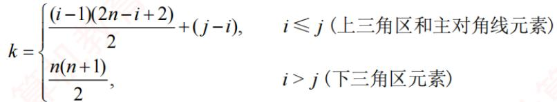
</div>

　　上三角矩阵的压缩存储形式如图 3.23 所示。

<div align="center">
  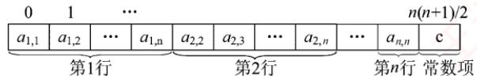
</div>

<p align="center"><em>图 3.23 上三角矩阵的压缩存储</em></p>

　　以上推导均假设数组下标从 0 开始。若下标指定从 1 开始，则要相应地调整映射关系。

#### 3. 三对角矩阵

　　若 n 阶矩阵 A 中的任意元素 $a_{ij}$ ，当 $|i-j| > 1$ 时均有 $a_{ij} = 0 (1 \leqslant i, j \leqslant n)$ ，则称为三对角矩阵，如图 3.24 所示。非零元素仅集中在以主对角线为中心的 3 条对角线的区域。

$$
\left[ \begin{array}{c c c c c c} a _ {1, 1} & a _ {1, 2} & & & & \\ a _ {2, 1} & a _ {2, 2} & a _ {2, 3} & & 0 & \\ & a _ {3, 2} & a _ {3, 3} & a _ {3, 4} & & \\ & & \ddots & \ddots & \ddots & \\ & 0 & & a _ {n - 1, n - 2} & a _ {n - 1, n - 1} & a _ {n - 1, n} \\ & & & & a _ {n, n - 1} & a _ {n, n} \end{array} \right]
$$

<p align="center"><em>图 3.24 三对角矩阵 $\pmb{A}$</em></p>

　　可将三对角上的元素按行优先顺序存入一维数组 B，且 $a_{1,1}$ 存于 B[0]，如图 3.25 所示。

<table><tr><td><eq>a_{1,1}</eq></td><td><eq>a_{1,2}</eq></td><td><eq>a_{2,1}</eq></td><td><eq>a_{2,2}</eq></td><td><eq>a_{2,3}</eq></td><td>...</td><td><eq>a_{n-1,n}</eq></td><td><eq>a_{n,n-1}</eq></td><td><eq>a_{n,n}</eq></td></tr></table>

<p align="center"><em>图 3.25 三对角矩阵的压缩存储</em></p>

> **考点追踪：** 三对角矩阵压缩存储的下标对应关系（2016）

　　三对角上的元素 $a_{i,j}$ （ $1 \leqslant i, j \leqslant n, |i - j| \leqslant 1$ ）在一维数组B中的下标 $k = 2i + j - 3$ 。

　　反之，已知元素存于 B[k] 中时， $i=\lfloor(k+1)/3\rfloor+1$ ， $j=k-2i+3$ 。例如，当 k=0 时， $i=\lfloor(0+1)/3+1\rfloor=1$ ， $j=0-2\times1+3=1$ ，存放的是 $a_{1,1}$ ；当 k=2 时， $i=\lfloor(2+1)/3+1\rfloor=2$ ， $j=2-2\times2+3=1$ ，存放的是 $a_{2,1}$ ；当 k=4 时， $i=\lfloor(4+1)/3+1\rfloor=2$ ， $j=4-2\times2+3=3$ ，存放的是 $a_{2,3}$ 。

### 3.4.4 稀疏矩阵

　　若矩阵中非零元素的个数 $t$ 相对于总元素个数 $s$ 来说非常少，即 $t \ll s$ ，则称该矩阵为稀疏矩阵。例如，一个 $100 \times 100$ 的矩阵中只有不到100个非零元素。

> **考点追踪：** 存储稀疏矩阵需要保存的信息（2023）

　　为避免空间浪费，稀疏矩阵通常仅存储非零元素。然而，由于非零元素的分布通常是无规律的，仅存储其值是不够的，还需记录它们所在的行和列。为此，将每个非零元素及其对应的行列位置组合成一个三元组（行标 $i$ ，列标 $j$ ，值 $a_{ij}$ ），如图3.26所示。这些三元组可以按某种顺序排列成线性表进行存储。稀疏矩阵压缩存储后便失去了随机存取特性。

<div align="center">
  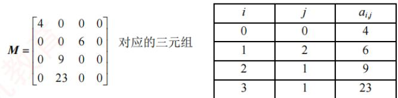
</div>

<p align="center"><em>图 3.26 稀疏矩阵及其对应的三元组</em></p>

> **考点追踪：** 稀疏矩阵压缩存储的方式（2017）

　　稀疏矩阵的三元组表可通过多种方式存储，常见的有：数组存储将所有三元组按某种顺序存储在一维数组中，这种方式简单直接，但插入和删除操作的效率较低；十字链表存储（见6.2节）通过链表的方式组织三元组，适用于频繁插入和删除操作的场景。无论采用哪种方式，都需要额外保存稀疏矩阵的行数、列数和非零元素的个数，以便支持后续的各种操作。

### 3.4.5 本节试题精选

#### 单项选择题

01. 对特殊矩阵采用压缩存储的主要目的是（）。

- A. 表达变得简单
- B. 对矩阵元素的存取变得简单
- C. 去掉矩阵中的多余元素
- D. 减少不必要的存储空间

02. 对 $n$ 阶对称矩阵压缩存储时，需要表长为（）的顺序表。

- A. $n / 2$
- B. $n \times n / 2$
- C. $n(n + 1) / 2$
- D. $n(n - 1) / 2$

03. 有一个 $n \times n$ 的对称矩阵 $A$ ，将其下三角部分按行存放在一维数组 B 中，而 A[0][0]存放于 B[0] 中，则元素 A[i][i] 存放于 B 中的（）处。

- A. $(i + 3)i/2$
- B. $(i + 1)i/2$
- C. $(2n - i + 1)i/2$
- D. $(2n - i - 1)i/2$

04. 在二维数组 A 中，假设每个数组元素的长度为 3 个存储单元，行下标 i 为 0~8，列下标 j 为 0~9，从首地址 SA 开始连续存放。在这种情况下，元素 A[8][5] 的起始地址为（）。

- A. SA + 141
- B. SA + 144
- C. SA + 222
- D. SA + 255

05. 二维数组 A 按行优先存储, 其中每个元素占 1 个存储单元。若 A[1][1] 的存储地址为 420, A[3][3] 的存储地址为 446, 则 A[5][5] 的存储地址为 （）。

- A. 472
- B. 471
- C. 458
- D. 457

06. 将三对角矩阵即数组 A[1...100][1...100] 按行优先存入一维数组 B[1...298] 中，数组 A 中元素 A[66][65] 在数组 B 中的位置 k 为（）。

- A. 198
- B. 195
- C. 197
- D. 196

07. 若将 $n$ 阶上三角矩阵 $\mathbf{A}$ 按列优先级压缩存放在一维数组 $\mathrm{B}[1\ldots n(n + 1) / 2 + 1]$ 中，则存放到 $\mathrm{B}[k]$ 中的非零元素 $a_{i,j}$ （ $1 \leqslant i, j \leqslant n$ ）的下标 $i, j$ 与 $k$ 的对应关系是（）。

- A. $i(i + 1) / 2 + j$
- B. $i(i - 1) / 2 + j - 1$
- C. $j(j - 1) / 2 + i$
- D. $j(j - 1) / 2 + i - 1$

08. 若将 $n$ 阶下三角矩阵 $\pmb{A}$ 按列优先顺序压缩存放在一维数组 $\mathrm{B}[1\dots n(n + 1) / 2 + 1]$ 中，则存放到 $\mathrm{B}[k]$ 中的非零元素 $a_{i,j}(1\leqslant i,j\leqslant n)$ 的下标 $i,j$ 与 $k$ 的对应关系是（）。

- A. $(j - 1)(2n - j + 1) / 2 + i - j$
- B. $(j - 1)(2n - j + 2) / 2 + i - j + 1$
- C. $(j - 1)(2n - j + 2) / 2 + i - j$
- D. $(j - 1)(2n - j + 1) / 2 + i - j - 1$

09. 稀疏矩阵采用压缩存储后的缺点主要是（）。

- A. 无法判断矩阵的行列数
- B. 丧失随机存取的特性
- C. 无法由行、列值查找某个矩阵元素
- D. 使矩阵元素之间的逻辑关系更复杂

10. 下列关于矩阵的说法中，正确的是（）。
I. 在 $n(n > 3)$ 阶三对角矩阵中，每行都有3个非零元素
II. 稀疏矩阵的特点是矩阵中的元素较少

- A. 仅I
- B. 仅II
- C. I和II
- D. 无正确项

11. 【2016 统考真题】有一个 100 阶的三对角矩阵 M，其元素 $m_{i,j}$ （ $1 \leqslant i, j \leqslant 100$ ）按行优先依次压缩存入下标从 0 开始的一维数组 N 中。元素 $m_{30,30}$ 在 N 中的下标是（）。

- A. 86
- B. 87
- C. 88
- D. 89

12. 【2017 统考真题】适用于压缩存储稀疏矩阵的两种存储结构是（）。

- A. 三元组表和十字链表
- B. 三元组表和邻接矩阵
- C. 十字链表和二叉链表
- D. 邻接矩阵和十字链表

13. 【2018 统考真题】设有一个 $12\times12$ 阶对称矩阵M，将其上三角部分的元素 $m_{i,j}(1\leqslant i\leqslant j\leqslant12)$ 按行优先存入C语言的一维数组N中，元素 $m_{6,6}$ 在N中的下标是（）。

- A. 50
- B. 51
- C. 55
- D. 66

14. 【2020 统考真题】将一个 $10 \times 10$ 阶对称矩阵 M 的上三角部分的元素 $m_{i,j} (1 \leqslant i \leqslant j \leqslant 10)$ 按列优先存入 C 语言的一维数组 N 中，元素 $m_{7,2}$ 在 N 中的下标是（）。

- A. 15
- B. 16
- C. 22
- D. 23

15. 【2021 统考真题】二维数组 A 按行优先方式存储，每个元素占用 1 个存储单元。若元素 A[0][0] 的存储地址是 100, A[3][3] 的存储地址是 220，则元素 A[5][5] 的存储地址是（）。

- A. 295
- B. 300
- C. 301
- D. 306

16. 【2023 统考真题】若采用三元组表存储结构存储稀疏矩阵 M，则除三元组表外，下列数据中还需要保存的是（）。
I. M 的行数 II. M 中包含非零元素的行数
III. M 的列数 IV. M 中包含非零元素的列数

- A. 仅 I、III
- B. 仅 I、IV
- C. 仅 II、IV
- D. I、II、III、IV

### 3.4.6 答案与解析

#### 单项选择题

**01. D**

　　特殊矩阵中含有很多相同元素或零元素，所以可采用压缩存储，以节省存储空间。

**02. C**

　　只需存储其上三角或下三角部分（含对角线），元素个数为 $n+(n-1)+\cdots+1=n(n+1)/2$ 。
**03. A**

　　此题要注意 3 个细节：矩阵的最小下标为 0；数组下标也是从 0 开始的；矩阵按行优先存在数组中。注意到此三点，答案不难得到为选项 A。此外，本类题建议采用特殊值代入法求解，例如，A[1][1]对应的下标应为 2，代入后只有选项 A 满足条件。

> **技巧：**

　　对于特殊三角矩阵压缩存储的题，心中应有“平移”搬动的思想，并结合草图，这样会比较形象，在计算时再注意矩阵和数组的起始下标，就不容易出错。

**04. D**

　　二维数组计算地址（按行优先顺序）的公式为

$$
\operatorname{LOC} (i, j) = \operatorname{LOC} (0, 0) + (i m + j) L
$$

　　其中， $\mathrm{LOC}(0,0) = \mathrm{SA}$ ，是数组存放的首地址； $L = 3$ 是每个数组元素的长度； $m = 9 - 0 + 1 = 10$ 是数组的列数。因此有 $\mathrm{LOC}(8,5) = \mathrm{SA} + (8 \times 10 + 5) \times 3 = \mathrm{SA} + 255$ ，所以选择选项D。

**05. A**

　　本题未直接给出数组 A 的行数和列数，因此需要根据题目中的信息来推理。因为该二维数组按行优先存储，且 A[3][3] 的存储地址为 446，所以 A[3][1] 的存储地址为 444，又 A[1][1] 的存储地址为 420，显然 A[1][1] 和 A[3][1] 正好相差 2 行，所以该矩阵的列数为 12。而 A[5][3] 和 A[3][3] 正好相差 2 行，A[5][5] 和 A[5][3] 又相差 2 个元素，所以 A[5][5] 的存储地址是 $446 + 24 + 2 = 472$ 。

**06. B**

　　对于三对角矩阵，将 A[1…n][1…n] 压缩至 B[1…3n-2] 时， $a_{i,j}$ 与 $b_{k}$ 的对应关系为 $k=2i+j-2$ 。则 A 中的元素 A[66][65] 在数组 B 中的位置 k 为 $2\times66+65-2=195$ 。

**07. C**

　　按列优先存储，所以元素 $a_{i,j}$ 前面有 j-1 列，共有 $1+2+3+\cdots+j-1=j(j-1)/2$ 个元素，元素 $a_{i,j}$ 在第 j 列上是第 i 个元素，数组 B 的下标是从 1 开始，因此 $k=j(j-1)/2+i$ 。

**08. B**

　　按列优先存储，故元素 $a_{ij}$ 前有j-1列，共有 $n+(n-1)+\cdots+(n-j+2)=(j-1)(2n-j+2)/2$ 个元素，元素 $a_{ij}$ 是第j列上第 $i-j+1$ 个元素，数组B的下标从1开始， $k=(j-1)(2n-j+2)/2+i-j+1$ 。

**09. B**

　　稀疏矩阵通常采用三元组来压缩存储，存储矩阵元素的行列下标和相应的值，因此不能根据矩阵元素的行列下标快速定位矩阵元素，失去了随机存取的特性。

**10. D**

　　在三对角矩阵中，第 1 行和最后 1 行只有 2 个非零元，其余各行均有 3 个非零元。稀疏矩阵的特点是矩阵中非零元的个数较少。

**11. B**

　　三对角矩阵如下所示。

$$
\left[ \begin{array}{c c c c c c} a _ {1, 1} & a _ {1, 2} & & & & \\ a _ {2, 1} & a _ {2, 2} & a _ {2, 3} & & 0 & \\ & a _ {3, 2} & a _ {3, 3} & a _ {3, 4} & & \\ & & \ddots & \ddots & \ddots & \\ & 0 & & a _ {n - 1, n - 2} & a _ {n - 1, n - 1} & a _ {n - 1, n} \\ & & & & a _ {n, n - 1} & a _ {n, n} \end{array} \right]
$$

　　采用压缩存储，将3条对角线上的元素按行优先方式存放在一维数组B中，且 $a_{1,1}$ 存放于B[0]中，其存储形式如下所示：

<table><tr><td><eq>a_{1,1}</eq></td><td><eq>a_{1,2}</eq></td><td><eq>a_{2,1}</eq></td><td><eq>a_{2,2}</eq></td><td><eq>a_{2,3}</eq></td><td>...</td><td><eq>a_{n-1,n}</eq></td><td><eq>a_{n,n-1}</eq></td><td><eq>a_{n,n}</eq></td></tr></table>

　　可以计算矩阵 A 中 3 条对角线上的元素 $a_{i,j}$ ( $1 \leqslant i, j \leqslant n, |i-j| \leqslant 1$ ) 在一维数组 B 中存放的下标为 $k = 2i + j - 3$ ，公式很难记忆，我们通常采用解法 2。

　　解法 1：针对该题，仅需将数字逐一代入公式： $k=2\times30+30-3=87$ ，结果为 87。

　　解法 2：观察上图的三对角矩阵不难发现，第一行有两个元素，剩下的在元素 $m_{30,30}$ 所在行之前的 28 行（注意下标 $1 \leqslant i, j \leqslant 100$ ）中，每行都有 3 个元素，而 $m_{30,30}$ 之前仅有一个元素 $m_{30,29}$ ，不难发现元素 $m_{30,30}$ 在数组 N 中的下标是 $2 + 28 \times 3 + 2 - 1 = 87$ 。

> **注意：**

　　矩阵和数组的下标从0或1开始（如矩阵可能从 $a_{0,0}$ 或 $a_{1,1}$ 开始，数组可能从B[0]或B[1]开始），这时就需要适时调整计算方法（方法无非是多计算1或少计算1的问题）。

**12. A**

　　三元组表的结点存储了行（row）、列（col）、值（value）三种信息，是主要用来存储稀疏矩阵的一种数据结构。十字链表将行单链表和列单链表结合起来存储稀疏矩阵。邻接矩阵空间复杂度达 $O(n^{2})$ ，不适合存储稀疏矩阵。二叉链表又名左孩子右兄弟表示法，可用于表示树或森林。

**13. A**

　　在 C 语言中，数组 N 的下标从 0 开始。第一个元素 $m_{1,1}$ 对应存入 $n_{0}$ ，矩阵 M 的第一行有 12 个元素，第二行有 11 个，第三行有 10 个，第四行有 9 个，第五行有 8 个，所以 $m_{6,6}$ 是第 $12 + 11 + 10 + 9 + 8 + 1 = 51$ 个元素，下标应为 50。

**14. C**

　　上三角矩阵按列优先存储，先存储只有1个元素的第一列，再存储有2个元素的第二列，以此类推。 $m_{7,2}$ 位于左下角，对应右上角的元素为 $m_{2,7}$ ，在 $m_{2,7}$ 之前存有

　　第1列：1

　　第2列：2

......

　　第6列：6

　　第7列：1

　　前面共存储有 $1+2+3+4+5+6+1=22$ 个元素（数组下标范围为 0～21），注意数组下标从 0 开始，所以 $m_{2,7}$ 在数组 N 中的下标为 22，即 $m_{7,2}$ 在数组 N 中的下标为 22。

**15. B**

　　二维数组 A 按行优先存储，每个元素占用 1 个存储单元，由 A[0][0] 和 A[3][3] 的存储地址可知，A[3][3] 是二维数组 A 中的第 121 个元素，假设二维数组 A 的每行有 n 个元素，则 $n \times 3 + 4 = 121$ ，求得 n = 39，所以元素 A[5][5] 的存储地址为 $100 + 39 \times 5 + 6 - 1 = 300$ 。

**16. A**

　　用三元组表存储结构存储稀疏矩阵 $M$ 时，每个非零元素都由三元组（行标、列标、关键字值）组成。但是，仅通过三元组表中的元素无法判断稀疏矩阵 M 的大小，因此还要保存 M 的行数和列数。此外，还可以保存 M 的非零元素个数。例如，右图所示的两个稀疏矩阵的三元组表是相同的，若不保存行数和列数，则无法判断两个稀疏矩阵的大小。

<table><tr><td>0</td><td>2</td><td>0</td><td>0</td></tr><tr><td>0</td><td>0</td><td>5</td><td>0</td></tr><tr><td>0</td><td>0</td><td>0</td><td>0</td></tr><tr><td>0</td><td>0</td><td>0</td><td>0</td></tr></table>

<table><tr><td>0</td><td>2</td><td>0</td></tr><tr><td>0</td><td>0</td><td>5</td></tr><tr><td>0</td><td>0</td><td>0</td></tr></table>

```javascript
stack[++top]=x; //一句代码实现入栈操作
```

> **归纳总结：**

　　本章所介绍的几种数据结构是线性表的应用与推广，考试中主要以选择题形式考查，但栈和队列仍可能出现在算法设计题中。不少读者看到教材中列出大量操作函数时容易产生畏难情绪：如果考试中出现了栈或队列相关的算法大题，是否需要完整写出每个操作函数？

　　其实，在算法设计题中，栈和队列通常作为辅助工具用于解决其他问题，无须严格按照模块化方式分函数实现。我们完全可以将其声明和核心操作写得简洁明了。以顺序栈为例：

(1) 声明并初始化栈:

　　Elemtype stack[maxSize]; int top=-1; //两句代码用来声明和初始化

(2) 入栈操作:

(3) 出栈操作:

　　X=stack[top--]; //单目运算符在变量之前表示“先运算后使用”，之后则相反

　　对于链式栈，同样只需定义一个结构体，然后根据需要从常规操作中摘取关键语句，直接嵌入到自己的解题代码中即可，无须完整实现所有接口。此外，在考研真题中，链式栈出现的概率远低于顺序栈，因此大家应有所侧重，多训练与顺序栈相关的题目。

> **思维拓展：**

　　设计一个栈，使它可以在 $O(1)$ 的时间复杂度内实现Push、Pop和min操作。所谓min操作，是指得到栈中最小的元素。

> **提示：**

　　使用双栈，两个栈是同步关系。主栈是普通栈，用来实现栈的基本操作 Push 和 Pop；辅助栈用来记录同步的最小值 min，例如元素 x 入栈，则辅助栈 stack_min[top++] = (x<min)?x:min；即在每次 Push 中，都将当前最小元素放到 stack_min 的栈顶。在主栈中 Pop 最小元素 y 时，stack_min 栈中相同位置的最小元素 y 也会随着 top--而出栈。因此 stack_min 的栈顶元素必然是 y 之前入栈的最小元素。本题是典型的以空间换时间的算法。
