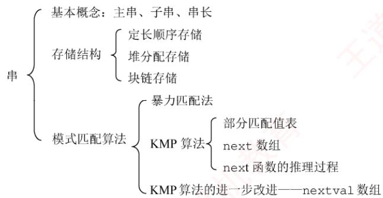
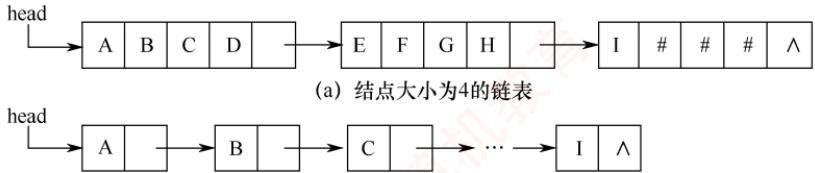
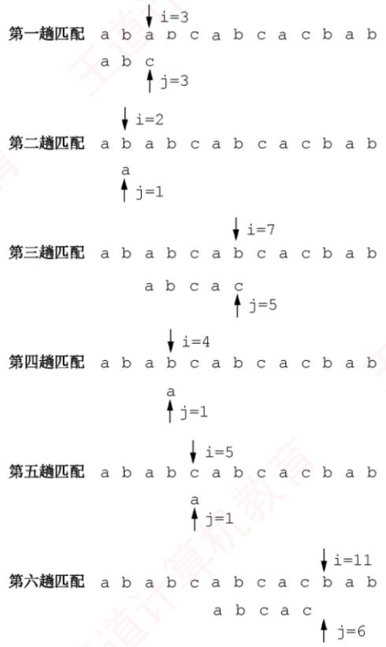
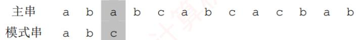

## 【考纲内容】

　　字符串模式匹配

## 【知识框架】

<div align="center">
  
</div>

## 【复习提示】

　　本章为统考大纲第6章内容，根据读者建议单独成章。大纲仅要求掌握字符串模式匹配，重点是理解KMP算法的原理、next数组和nextval数组的推导过程。手工计算next数组时，可先求出部分匹配值表再进行转换，也可直接依据递推公式求解。

## 4.1 串的定义和实现

　　字符串简称串，计算机中非数值处理的对象基本上都是字符串数据。常见的信息检索系统（如搜索引擎）、文本编辑程序（如 Word）、问答系统、自然语言翻译系统等，均以字符串作为核心处理对象。本章将详细介绍字符串的存储结构及其相关操作。

### 4.1.1 串的定义

　　串（string）是由零个或多个字符组成的有限序列，通常记为

$$
S = ^ {\prime} a _ {1} a _ {2} \dots a _ {n} ^ {\prime} \quad (n \geqslant 0)
$$

　　其中，S 是串名，单引号括起的字符序列是串的值；每个 $a_{i}$ 可以是字母、数字或其他字符；串中字符的个数 n 称为串的长度。当 n=0 时，该串称为空串（用 $\varnothing$ 表示）。

　　串中任意多个连续字符组成的子序列称为该串的子串，而包含该子串的串称为主串。某个字符在串中的序号称为该字符在串中的位置；子串在主串中的位置以其第1个字符在主串中的位置来标识。当两个串长度相等，且对应位置上的字符完全相同时，称这两个串相等。

　　例如，设串A='China Beijing'，B='Beijing'，C='China'，则它们的长度分别为13、7和5。其中，B和C都是A的子串，B在A中的位置为7，C在A中的位置为1。

　　需注意，由一个或多个空格（空格是一种特殊字符）组成的串称为空格串，空格串不是空串，其长度等于其中空格字符的个数。

　　串的逻辑结构与线性表极为相似，区别仅在于串的数据对象被限定为字符集。但在基本操作上，二者有显著差异：线性表的基本操作通常以单个元素为单位，如查找、插入或删除某个元素；而串的基本操作一般以子串为单位，如查找、插入或删除一个子串等。

### 4.1.2 串的基本操作

- StrAssign(&T, chars): 赋值操作。将串 T 赋值为 chars。

- StrCopy(&T, S): 复制操作。将串 S 复制给串 T。

- StrEmpty(S)：判空操作。若 S 为空串，则返回 TRUE，否则返回 FALSE。

- StrCompare(S,T): 比较操作。若 S>T，返回值>0；若 S=T，返回值=0；若 S<T，返回值<0。

- StrLength(S): 求串长操作。返回串 S 中字符的个数。

- SubString(&Sub, S, pos, len): 求子串操作。用 Sub 返回串 S 中从第 pos 个字符起、长度为 len 的子串。

- Concat(&T, S1, S2): 串联接操作。用 T 返回由 S1 和 S2 联接而成的新串。

- Index(S,T): 定位操作。若主串 S 中存在与串 T 值相同的子串，则返回其在 S 中首次出现的位置；否则返回 0。

- ClearString(&S): 清空操作。将串 S 置为空串。

- DestroyString(&S): 销毁操作。将串 S 销毁。

　　不同的高级语言对串的基本操作集可能有不同的定义方式。在上述操作中，StrAssign（赋值）、StrCompare（比较）、StrLength（求长）、Concat（联接）和SubString（求子串）这五种操作构成了串类型的最小操作子集：它们无法通过其他串操作实现；而其余串操作（除ClearString和DestroyString外）均可基于该最小操作子集实现。

### 4.1.3 串的存储结构

#### 1. 定长顺序存储表示

　　类似于线性表的顺序存储结构，串的定长顺序存储使用一组地址连续的存储单元来存放串值的字符序列。系统为每个串变量预先分配一个固定长度的数组。

```txt
#define MAXLEN 255 //预定义最大串长为255
typedef struct {
    char ch[MAXLEN]; //每个分量存储一个字符
    int length; //串的实际长度
} SString;
```

　　串的实际长度不得超过 MAXLEN，若超出，则多余部分被舍弃，称为截断。串长有两种表示方式：一种是如上述结构所示，用一个独立的整型变量 len 显式记录串的长度；另一种是在串值末尾添加一个不计入串长的结束标记符'\0'，此时串长为隐含值，需要通过遍历计算得出。

　　执行插入、联接等操作时，若结果串长度超过 MAXLEN，则通常按“截断”处理。要从根本上避免这一限制，需要取消对串长上限的硬性规定，转而采用动态分配的存储方式。

#### 2. 堆分配存储表示

　　堆分配存储仍以地址连续的存储单元存放串值字符序列，但其存储空间在程序运行过程中动态申请获得。

```c
typedef struct {
    char *ch; // 按串长分配存储区，ch 指向串的基地址
    int length; // 串的长度
} HString;
```

　　在 C 语言中，存在一个称为堆的自由存储区。可通过调用 malloc() 为新生成的串动态分配一块大小等于串长的连续存储空间：若分配成功，返回指向该空间起始地址的指针，作为串的基地址（由指针 ch 指示）；若分配失败，则返回 NULL。已分配的空间可通过 free() 释放。

　　上述两种存储方式被大多数高级程序设计语言所采用。块链存储表示仅做简单介绍。

#### 3. 块链存储表示

　　类似于线性表的链式存储结构，串也可采用链表形式存储。考虑到串的特殊性（每个元素仅为单个字符），实际实现中，每个链表结点可存放一个或多个字符。每个结点称为一个块，整个链表称为块链结构。图4.1(a)显示了块大小为4的链表（每个结点存放4个字符），最后一块占不满时通常用“#”补齐；图4.1(b)则为块大小为1的链表（每个结点仅存1个字符）。

<div align="center">
  
</div>

<p align="center"><em>(b) 结点大小为1的链表</em></p>

<p align="center"><em>图 4.1 串值的链式存储方式</em></p>

## 4.2 串的模式匹配

### 4.2.1 简单的模式匹配算法

　　模式匹配是指在主串中查找与模式串（待搜索的字符串）完全相同的子串，并返回其首次出现的位置。本节基于定长顺序存储结构，介绍一种不依赖其他串操作的暴力匹配算法。

```txt
int Index (SString S, SString T) {
    int i = 1, j = 1;
    while (i <= S.length && j <= T.length) {
    if (S.ch[i] == T.ch[j]) {
    ++i; ++j; // 继续比较后继字符
    }
    else {
    i = i - j + 2; j = 1; // 指针后退重新开始匹配
    }
    }
    if (j > T.length) return i - T.length; // 匹配成功，返回起始位置
    else return 0; // 匹配失败
}
```

　　在该算法中，计数指针 i 和 j 分别指示主串 S 和模式串 T 中当前待比较的字符位置。其基本思想是：从主串 S 的第一个字符开始，与模式串 T 的首字符比较。若相等，则继续比较后续字符；否则，将主串的比较起点后移一位，并重新从 T 的首字符开始比较；重复此过程，直至模式串 T 的所有字符依次与主串 S 中某段连续字符完全匹配，则称匹配成功，函数返回该子串在主串中的起始位置；若遍历完主串仍未找到匹配，则返回 0，表示匹配失败。

<p align="center"><em>图 4.2 显示了模式串 T='abcac' 和主串 S 中的匹配过程。</em></p>

<div align="center">
  
</div>

<p align="center"><em>图 4.2 简单模式匹配算法举例</em></p>

　　在简单模式匹配算法中，设主串和模式串的长度分别为 $n$ 和 $m$ （ $n \gg m$ ），则最多需进行 $n - m + 1$ 趟匹配，每趟最多比较 $m$ 次，因此最坏时间复杂度为 $O(nm)$ 。例如，当模式串为 '0000001'，而主串为 '0000000000000000000000000000000000000000000000000000000000000000000000000000000000' 时，由于模式串前 6 个字符均为 '0'，而主串前 45 个字符也全为 '0'，导致每趟匹配都直到模式串的最后一个字符才发现不匹配。整个过程中，主串指针 i 需回溯 39 次，总比较次数达 $40 \times 7 = 280$ 次。

### 4.2.2 串的模式匹配算法——KMP 算法

　　在图 4.2 的第三趟匹配过程中，当 i=7、j=5 位置字符不相等时，通常会从 i=4、j=1 重新开始比较。然而，观察发现，i=4 和 j=1、i=5 和 j=1 以及 i=6 和 j=1 这三次比较都是不必要的。因为从第三趟部分匹配的结果可知，主串的第 4、5、6 个字符（'b'、'c'、'a'），与模式串的第 2、3、4 个字符相同，而模式串的首字符为 'a'，故这些重复比较是多余的。只需将模式串向右滑动三个字符的位置，然后从 i=7、j=2 继续比较即可。

　　在简单模式匹配中，每次匹配失败后都会将模式串向右滑动一位并从头开始比较。但是，某次已匹配成功的序列实际上是模式串的某个前缀，通过分析模式串本身的结构，若已匹配成功的序列中有后缀正好是模式串的前缀，则可直接将模式串右滑到与这些字符对齐的位置，而无须回溯主串指针i，从而提高效率。这种优化策略正是KMP算法的核心。

<div align="center">
  
</div>

#### 1. KMP算法的原理

　　要理解模式串的结构，首先需明确几个概念：前缀、后缀和部分匹配值。前缀是指除最后一个字符外，字符串的所有头部子串；后缀是指除第一个字符外，字符串的所有尾部子串；部分匹配值则是指字符串的前缀和后缀的最长相等前后缀长度。下面以'ababa'为例进行说明：

- 'a'的前缀和后缀均为空集，最长相等前后缀长度为0。

- 'ab'的前缀为 $\{a\}$ ，后缀为 $\{b\}$ ， $\{a\} \cap \{b\} = \emptyset$ ，最长相等前后缀长度为0。

- 'aba'的前缀 $\{a, ab\} \cap$ 后缀 $\{a, ba\} = \{a\}$ ，最长相等前后缀长度为1。

- 'abab'的前缀{a, ab, aba}∩后缀{b, ab, bab}={ab}, 最长相等前后缀长度为2。

- 'ababa'的前缀{a, ab, aba, abab}∩后缀{a, ba, aba, baba}={a, aba}, 交集有两个，最长相等前后缀长度为3。

　　因此，模式串'ababa'的部分匹配值为00123。

　　那么，这个部分匹配值有何作用？

　　回到最初的问题，主串为'ababcabcacbab'，模式串为'abcac'。

　　利用上述方法容易求得模式串'abcac'的部分匹配值为00010，将部分匹配值组织成数组的形式，即构成部分匹配值表（Partial Match Table，PM表）。

<table><tr><td>编号</td><td>1</td><td>2</td><td>3</td><td>4</td><td>5</td></tr><tr><td>S</td><td>a</td><td>b</td><td>c</td><td>a</td><td>c</td></tr><tr><td>PM</td><td>0</td><td>0</td><td>0</td><td>1</td><td>0</td></tr></table>

　　下面利用 PM 表进行字符串匹配:

　　第一趟匹配：

　　在第 3 位发生失配（c≠a），此前已匹配 2 个字符 'ab'。查表可知，最后一个匹配字符 b 对应的部分匹配值为 0，按照下面的公式计算模式串需要右滑的位数：

　　右滑位数 = 已匹配字符数 - 对应的部分匹配值

　　由于 2-0=2，将模式串向右滑动 2 位，进行第二趟匹配。

<table><tr><td>主串</td><td>a</td><td>b</td><td>a</td><td>b</td><td>c</td><td>a</td><td>b</td><td>c</td><td>a</td><td>c</td><td>b</td><td>a</td><td>b</td></tr><tr><td>模式串</td><td></td><td></td><td>a</td><td>b</td><td>c</td><td>a</td><td>c</td><td></td><td></td><td></td><td></td><td></td><td></td></tr></table>

　　第二趟匹配：

　　在第 5 位发生失配（c≠b），此前已匹配 4 个字符 'abca'。查表可知，最后一个匹配字符 a 对应的部分匹配值为 1，4-1=3，将模式串向右滑动 3 位，进行第三趟匹配。

　　模式串

　　第三趟匹配：

　　模式串全部字符匹配成功。

　　可见，部分匹配值的核心价值在于指导模式串在失配后的最优右移距离。整个过程中，主串指针始终未回溯，这使得KMP算法的时间复杂度稳定为 $O(n + m)$ 。

　　某趟匹配失败时：若已匹配序列中不存在相等的前后缀（PM 值为 0），则滑动位数最大，直接将模式串首字符对齐到主串当前失配位置；若存在最长相等前后缀（可理解为首尾重合），则将模式串向右滑动至与主串中该相等后缀对齐的位置，从而跳过已知相等的部分，避免重复比较。两种情形下，模式串右滑位数均为“已匹配字符数 - 对应的部分匹配值”。

　　还有一种特殊情况：若模式串的第一个字符即与主串当前字符失配，则已匹配字符数为 0，按规则将模式串整体右移一位，并从主串下一个位置开始新一轮匹配。

#### 2. next 数组的手算方法

　　在实际匹配过程中，模式串在内存中的存储位置是固定的，并不会真正“滑动”；发生变化的只是指针。前文通过模拟滑动的方式，是为了直观地帮助读者理解 KMP 算法的匹配逻辑。

$$
\text {考点追踪} \quad \triangleright K M P \text {算法中指针变化 / 比较次数的分析（2015、2019）}
$$

　　KMP算法的核心特性是：每趟匹配失败时，主串指针i不回溯，仅模式串指针j调整。为此，可定义一个next数组，next[j]的含义是：当模式串的第j个字符失配时，下一轮应从模式串的第next[j]个位置继续与主串当前字符比较。

　　下面介绍一种手算 next 数组的方法，仍以模式串 'abcac' 为例。

　　第 1 个字符失配时：令 next[1]=0，然后指针 i 加 1，指针 j 重置为 1，即下一轮将模式串的第 1 个位置与主串当前位置的下一位置进行比较（注意，图中下标为字符编号）。

$$
\begin{array}{l l} & \text {匹配失败，说明此元素不是a} \\ & \downarrow \\ \text {主串} & \dots \quad \underline {{\text {?}}} \quad \text {?} \quad \text {?} \quad \text {?} \quad \text {?} \quad \text {?} \quad \text {?} \quad \text {?} \\ \text {模式串} & \underline {{\mathrm{a} _ {1}}} \quad \mathrm{b} _ {2} \quad \mathrm{c} _ {3} \quad \mathrm{a} _ {4} \quad \mathrm{c} _ {5} \end{array}
$$

　　第 2 个字符失配时: 令 next[2]=1, 模式串下次的比较位置为 1, 相当于向右滑动 1 位(注, next[1]=0、next[2]=1 是固定规则)。

$$
\begin{array}{c c c c c c c c c c c c} & & & \text {匹配失败，说明此元素不是} b \\ & & & \downarrow \\ \text {主串} & \dots & a & \boxed {?} & \boxed {?} & \boxed {?} & \boxed {?} & \boxed {?} & \boxed {?} & \boxed {?} & \boxed {?} \\ \text {模式串} & & a _ {1} & \underline {{b}} _ {2} & c _ {3} & a _ {4} & c _ {5} \\ \text {右滑} & & & \underline {{a}} _ {1} & b _ {2} & c _ {3} & a _ {4} & c _ {5} \end{array}
$$

　　在后续的手算过程中，可在失配位置前画一条分界线，尝试将模式串向右移动，直到分界线左侧的部分能够首尾对齐（存在相等的前后缀），或模式串完全跨过分界线为止。

　　第3个字符失配时：模式串下次的比较位置为1，即next[3] = 1，相当于向右滑动2位。

　　匹配失败，说明此元素不是 c

$$
\begin{array}{c c c c c c c c c c c c} & & & & \text {匹配大版，说明此无条不足} \\ & & & & \downarrow \\ \text {主串} & \dots & a & b & \boxed {?} & \boxed {?} & \boxed {?} & \boxed {?} & \boxed {?} & \boxed {?} & \boxed {?} \\ \text {模式串} & & a _ {1} & b _ {2} & \underline {{c}} _ {3} & a _ {4} & c _ {5} & & & & \\ \text {右滑} & & & & \underline {{a}} _ {1} & b _ {2} & c _ {3} & a _ {4} & c _ {5} & & \end{array}
$$

　　第 4 个字符失配时：模式串下次的比较位置为 1，即 next[4]=1，相当于向右滑动 3 位。

　　匹配失败，说明此元素不是 a

$$
\begin{array}{c c c c c c c c c c c} \text {主串} & \dots & a & b & c \\ \text {模式串} & & a _ {1} & b _ {2} & c _ {3} \\ \text {右滑} & & & & \end{array} \left| \begin{array}{c c c c c c c c} \underline {{?}} & ? & ? & ? & ? & ? & ? & ? \\ \underline {{a}} _ {4} & c _ {5} & & & & \\ \underline {{a}} _ {1} & b _ {2} & c _ {3} & a _ {4} & c _ {5} \end{array} \right.
$$

　　第 5 个字符失配时：模式串下次的比较位置为 2，即 next[5]=2，相当于向右滑动 3 位。

　　匹配失败，说明此元素不是 c

$$
\begin{array}{c c c c c c c c c c c} \text {主串} & \dots & a & b & c & a \\ \text {模式串} & & a _ {1} & b _ {2} & c _ {3} & a _ {4} \\ \text {右滑} & & & & & a _ {1} \end{array} \left| \begin{array}{c c c c c c} \underline {{?}} & ? & ? & ? & ? & ? \\ \underline {{c _ {5}}} & & & & \\ \underline {{b _ {2}}} & c _ {3} & a _ {4} & c _ {5} \end{array} \right.
$$

　　next 数组和 PM 表的关系是怎样的？

　　通过上述举例，可推导出 next 数组和 PM 表之间的关系：

$$
\begin{array}{r l} \text { next   [j] } & = j - \text { 右滑位数 } = j - (\text { 已匹配的字符数 } ^ {\text { ① }} - \text { 对应的部分匹配值 }) \\ & = j - [ (j - 1) - P M [ j - 1 ] ] \\ & = P M [ j - 1 ] + 1 \end{array}
$$

　　因此，next 数组等于将 PM 表右移一位，再整体加 1。经验证，该结论与手算结果一致。

<table><tr><td>编号</td><td>1</td><td>2</td><td>3</td><td>4</td><td>5</td></tr><tr><td>S</td><td>a</td><td>b</td><td>c</td><td>a</td><td>c</td></tr><tr><td>next</td><td>0</td><td>1</td><td>1</td><td>1</td><td>2</td></tr></table>

　　我们注意到：

1）PM 表右移后空出的第一个位置补 0，因为若模式串首字符失配，算法规定 next[j]=0，表示将主串和模式串同步右移一位。

2）PM表最后一个元素右移后移出，因为原来的模式串中，最后一个字符的部分匹配值是供其下一个字符使用的，但显然其没有下一个字符，所以可以舍去。

> **注意：**

　　以上讨论均假设串的编号从1开始；若串的编号从0开始，则next数组需要整体减1。

#### 3. next 数组的推理公式

　　如何推理 next 数组的一般公式？设主串为 's₁s₂…sₙ'，模式串为 'p₁p₂…pₘ'。当主串的第 i 个字符与模式串的第 j 个字符失配时，应将主串当前位置与模式串的哪个字符进行比较？

　　假设此时应与模式串的第 k（k<j）个字符比较，则模式串的前 k-1 个字符的子串必须满足以下条件，且不存在更大的 k'>k 满足条件：

$$
^ {\prime} p _ {1} p _ {2} \dots p _ {k - 1} ^ {\prime} = ^ {\prime} p _ {j - k + 1} p _ {j - k + 2} \dots p _ {j - 1} ^ {\prime}
$$

　　若存在满足上述条件的子串，则发生失配时，仅需将模式串的第 k 个字符与主串的第 i 个字符对齐。此时，模式串的前 k-1 个字符必然与主串中第 i 个字符之前的 k-1 个字符相等，因此，可直接从模式串的第 k 个字符开始，与主串的第 i 个字符继续比较，如图 4.3 所示。

<table><tr><td>主串</td><td><eq>s_1</eq></td><td>...</td><td>...</td><td>...</td><td>...</td><td>...</td><td><eq>s_{i-k+1}</eq></td><td>...</td><td><eq>s_{i-1}</eq></td><td><eq>\underline{s_i}</eq></td><td>...</td><td>...</td><td>...</td><td>...</td><td><eq>s_n</eq></td></tr><tr><td>子串</td><td></td><td></td><td><eq>p_1</eq></td><td>...</td><td><eq>p_{k-1}</eq></td><td>...</td><td><eq>p_{j-k+1}</eq></td><td>...</td><td><eq>p_{j-1}</eq></td><td><eq>\underline{p_j}</eq></td><td>...</td><td><eq>p_m</eq></td><td></td><td></td><td></td></tr><tr><td>右滑</td><td></td><td></td><td></td><td></td><td></td><td></td><td><eq>p_1</eq></td><td>...</td><td><eq>p_{k-1}</eq></td><td><eq>p_k</eq></td><td>...</td><td>...</td><td><eq>p_m</eq></td><td></td><td></td></tr></table>

<p align="center"><em>图 4.3 模式串右滑到合适位置（阴影对齐部分表示上下字符相等）</em></p>

　　若在已匹配的序列中不存在满足上述条件的相等前后缀（可视为 $k = 1$ ），则应让主串的第i个字符与模式串的第1个字符重新比较。

　　特别地，当模式串的第1个字符（j=1）与主串失配时，规定 next[1]=0。

　　通过上述分析可得出 next 函数的公式:

$$
\text { next } [ j ] = \left\{ \begin{array}{l l} 0, & j = 1 \\ \max \left\{k \mid 1 <   k <   j \text {   且   } ^ {\prime} p _ {1} \dots p _ {k - 1} ^ {\prime} = ^ {\prime} p _ {j - k + 1} \dots p _ {j - 1} ^ {\prime} \right\}, & \text { 当此集合不为空时 } \\ 1, & \text { 其他情况 } \end{array} \right.
$$

　　要用代码来实现，貌似难度不小，下面尝试推理求解的科学步骤。

　　首先由公式可知

$$
\text { next } [ 1 ] = 0
$$

　　设 next[j]=k，此时 k 应满足的条件在上文中已描述。

　　此时 next[j+1]? 可能有两种情况:

（1）若 $p_{k}=p_{j}$ ，则表明在模式串中

$$
^ \prime p _ {1} \dots p _ {k - 1} p _ {k} ^ {\prime} = ^ {\prime} p _ {j - k + 1} \dots p _ {j - 1} p _ {j} ^ {\prime}
$$

　　且不可能存在 $k' > k$ 满足上述条件，此时 next[j+1] = k + 1，即

$$
\mathrm{next} [ j + 1 ] = \mathrm{next} [ j ] + 1
$$

(2) 若 $p_{k} \neq p_{j}$ ，则表明在模式串中

$$
^ {\prime} p _ {1} \dots p _ {k - 1} p _ {k} ^ {\prime} \neq^ {\prime} p _ {j - k + 1} \dots p _ {j - 1} p _ {j} ^ {\prime}
$$

　　此时可将求 next 函数值的问题视为一个模式匹配问题。用前缀 $p_{1}\cdots p_{k}$ 去与后缀 $p_{j-k+1}\cdots p_{j}$ 匹配，当 $p_{k}\neq p_{j}$ 时，应将 $p_{1}\cdots p_{k}$ 向右滑动至用第 next [k] 个字符与 $p_{j}$ 进行比较，若 $p_{next[k]}$ 与 $p_{j}$ 仍不匹配，则需寻找长度更短的相等前后缀，下一步继续用 $P_{next[next[k]]}$ 与 $p_{j}$ 进行较，以此类推，直到找到某个更小的 $k' = next[next\cdots[k]]$ （ $1 < k' < k < j$ ），满足条件

$$
^ {\prime} p _ {1} \dots p _ {k ^ {\prime}} ^ {\prime} = ^ {\prime} p _ {j - k ^ {\prime} + 1} \dots p _ {j} ^ {\prime}
$$

　　则 next $[j+1]=k'+1$ 。

　　也可能不存在任何 $k'$ 满足上述条件，即不存在长度更短的相等前后缀，令 next $[j + 1] = 1$ 。理解起来可能有点抽象？下面通过一个具体例子说明。

<p align="center"><em>图 4.4 的模式串已求得 6 个字符的 next 值，现求 next[7]，因为 next[6]=3，又 $p_{6}\neq p_{3}$ ，所以需比较 $p_{6}$ 与 $p_{1}$ （因 next[3]=1）， $p_{6}\neq p_{1}$ ，而 next[1]=0，故 next[7]=1；求 next[8]，因为 $p_{7}=p_{1}$ ，所以 next[8]=next[7]+1=2；求 next[9]，因为 $p_{8}=p_{2}$ ，所以 next[9]=3。</em></p>

<table><tr><td>j</td><td>1</td><td>2</td><td>3</td><td>4</td><td>5</td><td>6</td><td>7</td><td>8</td><td>9</td></tr><tr><td>模式串</td><td>a</td><td>b</td><td>a</td><td>a</td><td>b</td><td>c</td><td>a</td><td>b</td><td>a</td></tr><tr><td>next[j]</td><td>0</td><td>1</td><td>1</td><td>2</td><td>2</td><td>3</td><td>?</td><td>?</td><td>?</td></tr></table>

<p align="center"><em>图 4.4 求模式串的 next 值</em></p>

#### 4. KMP 算法的实现

　　通过上述分析，可写出求解 next 数组的程序如下：

```txt
void get_next(String T, int next[]) {
    int i = 1, j = 0;
    next[1] = 0;
    while (i < T.length) {
    if (j == 0 || T.ch[i] == T.ch[j]) {
    ++i; ++j;
    next[i] = j; // 若 p_i = p_j，则 next[j + 1] = next[j] + 1
    }
    else
    j = next[j]; // 否则令 j = next[j]，循环继续
    }
}
```

　　计算机上执行的效率很高，但手工计算时，仍需采用前文介绍的直观方法。

　　与 next 数组的求解相比，KMP 算法的匹配过程相对简洁，其结构与简单模式匹配极为相似。关键区别在于：当发生失配时，主串指针 i 保持不变，仅将模式串指针 j 回退至 next[j] 所指示的位置，并继续比较；特别地，当 j=0 时，将 i 和 j 同时加 1。也就是说，若模式串首字符失配，则将模式串向右滑动一位，下一轮匹配从主串第 $i+1$ 个位置开始。具体实现如下：

```c
int Index KMP(SString S, SString T, int next[]) {
    int i = 1, j = 1;
    while (i <= S.length && j <= T.length) {
    if (j == 0 || S.ch[i] == T.ch[j]) {
    ++i; ++j; // 继续比较后继字符
    }
    else
    j = next[j]; // 模式串向右滑动
    }
    if (j > T.length)
    return i - T.length; // 匹配成功
    else
    return 0;
}
```

　　尽管简单模式匹配的最坏时间复杂度为 $O(mn)$ ，而 KMP 算法可达到 $O(m+n)$ ，但在一般情况下，简单模式匹配的平均执行时间往往接近 $O(m+n)$ ，因此至今仍被采用。KMP 算法仅在主串与模式串存在大量 “部分匹配” 时才显著优于暴力匹配，其核心优点在于主串指针不回溯。

### 4.2.3 KMP 算法的进一步优化

> **考点追踪：** nextval 数组的计算（2024）

　　前面定义的 next 数组在某些情况下仍存在缺陷，还可进一步优化。图 4.5 展示了一个典型示例：模式串 'aaaab' 与主串 'aaabaaaaab' 进行匹配。

<table><tr><td>主串</td><td>a</td><td>a</td><td>a</td><td>b</td><td>a</td><td>a</td><td>a</td><td>a</td><td>b</td></tr><tr><td>模式串</td><td>a</td><td>a</td><td>a</td><td>a</td><td>b</td><td></td><td></td><td></td><td></td></tr><tr><td>j</td><td>1</td><td>2</td><td>3</td><td>4</td><td>5</td><td></td><td></td><td></td><td></td></tr><tr><td>next[j]</td><td>0</td><td>1</td><td>2</td><td>3</td><td>4</td><td></td><td></td><td></td><td></td></tr><tr><td>nextval[j]</td><td>0</td><td>0</td><td>0</td><td>0</td><td>4</td><td></td><td></td><td></td><td></td></tr></table>

<p align="center"><em>图 4.5 KMP 算法的进一步优化示例</em></p>

　　当 i=4、j=4 时，主串字符 $s_{4}$ 与模式串字符 $p_{4}$ （ $b\neq a$ ）失配。若使用之前的 next 数组，则还需依次进行 $s_{4}$ 与 $p_{3}$ 、 $s_{4}$ 与 $p_{2}$ 、 $s_{4}$ 与 $p_{1}$ 的三次比较。然而，由于 next[4]=3 且 $p_{3}=p_{4}=a$ ，同理 next[3]=2 且 $p_{2}=p_{3}=a$ ，next[2]=1 且 $p_{1}=p_{2}=a$ ，由于这些回退位置上的字符均与 $p_{4}$ 相同，继续比较只会重复同样的失配过程，造成不必要的开销。

　　问题根源在于：不应出现 $p_{j}=p_{next[j]}$ 。理由是：当 $p_{j}\neq s_{i}$ 时，下一轮将用 $p_{next[j]}$ 与 $s_{i}$ 比较；若 $p_{next[j]}=p_{j}$ ，则相当于用与 $p_{j}$ 相同的字符去匹配已知不等的 $s_{i}$ ，结果必定仍是失配。

　　那么，若出现 $p_j = p_{\text{next}[j]}$ ，应如何处理？

　　此时应不断将 next[j] 替换为 next[next[j]]，直到找到某个位置 k，使得 $p_{j} \neq p_{k}$ 或 k = 0 为止，修正后的新数组称为 nextval 数组。计算 nextval 数组的算法如下（匹配算法不变）。

```txt
void get_nextval(String T, int nextval[]) {
    int i = 1, j = 0;
    nextval[1] = 0;
    while (i < T.length) {
    if (j == 0 || T.ch[i] == T.ch[j]) {
    ++i; ++j;
    if (T.ch[i] != T.ch[j]) nextval[i] = j;
    else nextval[i] = nextval[j];
    }
    else
    j = nextval[j];
    }
}
```

　　KMP 算法对于初学者来说可能不太容易掌握，强烈建议读者结合配套课程学习。

### 4.2.4 本节试题精选

#### 一、单项选择题

01. 设有两个串 $\mathrm{S}_1$ 和 $\mathrm{S}_2$ ，求 $\mathrm{S}_2$ 在 $\mathrm{S}_1$ 中首次出现的位置的运算称为（）。

- A. 求子串
- B. 判断是否相等
- C. 模式匹配
- D. 连接

02. KMP算法的特点是在模式匹配时，指示主串的指针（）。

- A. 不会变大
- B. 不会变小
- C. 都有可能
- D. 无法判断

03. 设主串的长度为 $n$ ，子串的长度为 $m$ ，则简单的模式匹配算法的时间复杂度为（），KMP 算法的时间复杂度为（）。

- A. $O(m)$
- B. $O(n)$
- C. $O(mn)$
- D. $O(m + n)$

04. 在 KMP 算法中，用 next 数组存放模式串的部分匹配信息，当模式串位 j 与主串位 i 比较时，两个字符不相等，则 j 的位移方式是（）。

- A. $j = 0$
- B. $j = j + 1$
- C. j 不变
- D. $j = \text{next}[j]$

05. 在 KMP 算法中，用 next 数组存放模式串的部分匹配信息，当模式串位 j 与主串位 i 比较时，两个字符不相等，则 i 的位移方式是（）。

- A. i = next[i]
- B. i 不变
- C. i = 0
- D. i = i + 1

06. 串'ababaaababaa'的 next 数组为（）。

- A. 0,1,2,3,4,5,6,7,8,9,9
- B. 0,1,2,1,2,1,1,1,1,2,1,2
- C. 0,1,1,2,3,4,2,2,3,4,5,6
- D. 0,1,2,3,0,1,2,3,2,2,3,4,5

07. 设主串 S='aabaaaba'，模式串 T='aaab'，采用 KMP 算法进行模式匹配，到匹配成功时为止，在匹配过程中进行的单个字符间的比较次数是（）。

- A. 10
- B. 9
- C. 8
- D. 7

08. 设主串 S='aabaaaba'，模式串 T='aaab'，采用改进后的 KMP 算法进行模式匹配，到匹配成功时为止，在匹配过程中进行的单个字符间的比较次数是（）。

- A. 9
- B. 8
- C. 7
- D. 6

09. KMP 算法使用 nextval 数组进行模式匹配，模式串为 S='ababaaa'，当主串中的某个字符与 S 中的第 6 个字符失配时，S 向右滑动的距离是（）。

- A. 1
- B. 2
- C. 3
- D. 4

10. 【2015 统考真题】已知字符串 s 为 'abaabaabacacaabaabcc'，模式串 t 为 'abaabc'。采用 KMP 算法进行匹配，第一次出现“失配”（s[i]≠t[j]）时，i=j=5，则下次开始匹配时，i 和 j 的值分别是（）。

- A. i=1, j=0
- B. i=5, j=0
- C. i=5, j=2
- D. i=6, j=2

11. 【2019 统考真题】设主串 T='abaabaabcabaabc'，模式串 S='abaabc'，采用 KMP 算法进行模式匹配，到匹配成功时为止，在匹配过程中进行的单个字符间的比较次数是（）。

- A. 9
- B. 10
- C. 12
- D. 15

12. 【2024 统考真题】KMP 算法使用修正后的 next 数组进行模式匹配，模式串为 S='aabaab'，当主串的某个字符与 S 的某个字符失配时，S 向右滑动的最长距离是（）。

- A. 5
- B. 4
- C. 3
- D. 2

#### 二、综合应用题

01. 在字符串模式匹配的 KMP 算法中，求模式的 next 数组值的定义如下:

$$
\text { next } [ j ] = \left\{ \begin{array}{l l} 0, & j = 1 \\ \max \left\{k \mid 1 <   k <   j \text {   且   } ^ {\prime} p _ {1} \dots p _ {k - 1} ^ {\prime} = ^ {\prime} p _ {j - k + 1} \dots p _ {j - 1} ^ {\prime} \right\}, & \text { 集合不为空 } \\ 1, & \text { 其他情况 } \end{array} \right.
$$

1）当 $j = 1$ 时，为什么要取 next[1] = 0?

2）为什么要取 $\max \{k\}$ ， $k$ 最大是多少？

3）其他情况是什么情况，为什么取 next[j]=1?

02. 设有字符串 S='aabaabaabaac'，P='aabaac'。

1）求出 P 的 next 数组。

2）若 S 作为主串，P 作为模式串，试给出 KMP 算法的匹配过程。

### 4.2.5 答案与解析

#### 一、单项选择题

**01. C**

　　求子串操作是从串 S 中截取第 i 个字符起长度为 l 的子串，选项 A 错误。选项 B、D 明显错误。
**02. B**

　　在 KMP 算法的比较过程中，主串不会回溯，所以主串的指针不会变小。

**03. C、D**

　　尽管实际应用中，一般情况下简单的模式匹配算法的时间复杂度近似为 $O(m+n)$ ，但它的理论时间复杂度还是 $O(mn)$ 。KMP 算法的时间复杂度为 $O(m+n)$ 。

**04. D**

　　在 KMP 算法中，当主串的第 i 个字符和模式串的第 j 个字符不匹配时，主串的位指针 i 不变，将主串的第 i 个字符与模式串的第 next[j] 个字符比较，即 j = next[j]。

**05. B**

　　在 KMP 算法中，当主串的第 i 个字符和模式串的第 j 个字符失配时，主串指针 i 不回溯。

**06. C**

　　本题采用先求串 S='ababaaababaa'的部分匹配值，再求 next 数组的方法。

- 'a'的前后缀都为空，最长相等前后缀长度为0。

- 'ab'的前缀 $\{a\} \cap$ 后缀 $\{b\} = \emptyset$ ，最长相等前后缀长度为0。

- 'aba'的前缀 $\{a, ab\} \cap$ 后缀 $\{a, ba\} = \{a\}$ ，最长相等前后缀长度为1。

- 'abab'的前缀{a, ab, aba}∩后缀{b, ab, bab}={ab}, 最长相等前后缀长度为2。

　　依次求出的部分匹配值见下表第3行，将其整体右移一位，低位用-1填充，见下表第4行。

<table><tr><td>编号</td><td>1</td><td>2</td><td>3</td><td>4</td><td>5</td><td>6</td><td>7</td><td>8</td><td>9</td><td>10</td><td>11</td><td>12</td></tr><tr><td>S</td><td>a</td><td>b</td><td>a</td><td>b</td><td>a</td><td>a</td><td>a</td><td>b</td><td>a</td><td>b</td><td>a</td><td>a</td></tr><tr><td>PM</td><td>0</td><td>0</td><td>1</td><td>2</td><td>3</td><td>1</td><td>1</td><td>2</td><td>3</td><td>4</td><td>5</td><td>6</td></tr><tr><td>next</td><td>-1</td><td>0</td><td>0</td><td>1</td><td>2</td><td>3</td><td>1</td><td>1</td><td>2</td><td>3</td><td>4</td><td>5</td></tr></table>

　　选项中 next[1] 等于 0，所以将 next 数组整体加 1。

**07. B**

　　假设位序从 1 开始，手工计算出 T 的 next 数组如下。

<table><tr><td>编号</td><td>1</td><td>2</td><td>3</td><td>4</td></tr><tr><td>S</td><td>a</td><td>a</td><td>a</td><td>b</td></tr><tr><td>next</td><td>0</td><td>1</td><td>2</td><td>3</td></tr></table>

　　采用 KMP 算法时：第一趟，经过 3 次比较后，发现 S[3]≠T[3]；第二趟，用 S[3] 和 T[2]（next[3]=2）比较，不相等；第三趟，用 S[3] 和 T[1]（next[2]=1）比较，不相等；第四趟，next[1]=0，因此开始用 S[4] 和 T[1] 比较，经过 4 次比较后，匹配成功。整个匹配过程如下。

<table><tr><td></td><td>a</td><td>a</td><td>b</td><td>a</td><td>a</td><td>a</td><td>b</td><td>a</td></tr><tr><td>第一趟</td><td>a</td><td>a</td><td>a</td><td>b</td><td></td><td></td><td></td><td></td></tr><tr><td>第二趟</td><td></td><td>a</td><td>a</td><td>a</td><td>b</td><td></td><td></td><td></td></tr><tr><td>第三趟</td><td></td><td></td><td>a</td><td>a</td><td>a</td><td>b</td><td></td><td></td></tr><tr><td>第四趟</td><td></td><td></td><td></td><td>a</td><td>a</td><td>a</td><td>b</td><td></td></tr></table>

　　总比较次数为 $3 + 1 + 1 + 4 = 9$ 。

**08. C**

　　假设位序从 1 开始，计算出 T 的 nextval 数组如下。

<table><tr><td>编号</td><td>1</td><td>2</td><td>3</td><td>4</td></tr><tr><td>S</td><td>a</td><td>a</td><td>a</td><td>b</td></tr><tr><td>nextval</td><td>0</td><td>0</td><td>0</td><td>3</td></tr></table>

　　采用改进的 KMP 算法时: 第一趟, 经过 3 次比较后, 发现 S[3]≠T[3]; 第二趟, nextval[3]=0, 因此开始用 S[4] 和 T[1] 比较, 经过 4 次比较后, 匹配成功。整个匹配过程如下。

<table><tr><td></td><td>a</td><td>a</td><td>b</td><td>a</td><td>a</td><td>a</td><td>b</td><td>a</td></tr><tr><td>第一趟</td><td>a</td><td>a</td><td>a</td><td>b</td><td></td><td></td><td></td><td></td></tr><tr><td>第二趟</td><td></td><td></td><td></td><td>a</td><td>a</td><td>a</td><td>b</td><td></td></tr></table>

　　总比较次数为 $3 + 4 = 7$ 。

**09. B**

　　假设位序从 0 开始，计算出 nextval 数组。当比较到 S[j] 失配时，模式串向右滑动的距离为 j-nextval[j]（ $0 \leqslant j \leqslant 6$ ），由下图可知，当 j = 5 时向右滑动的距离为 5 - 3 = 2。

<table><tr><td>编号j</td><td>0</td><td>1</td><td>2</td><td>3</td><td>4</td><td>5</td><td>6</td></tr><tr><td>S[j]</td><td>a</td><td>b</td><td>a</td><td>b</td><td>a</td><td>a</td><td>a</td></tr><tr><td>next[j]</td><td>-1</td><td>0</td><td>0</td><td>1</td><td>2</td><td>3</td><td>1</td></tr><tr><td>nextval[j]</td><td>-1</td><td>0</td><td>-1</td><td>0</td><td>-1</td><td>3</td><td>1</td></tr><tr><td>j-nextval[j]</td><td>1</td><td>1</td><td>3</td><td>3</td><td>5</td><td>2</td><td>5</td></tr></table>

　　此外，若对 KMP 算法很熟悉，则此类题也可直接动手模拟，而不需要求 nextval 数组，与第 6 个字符匹配失败，说明前面的 ababa 匹配成功，S 可向右滑动 2 位继续尝试匹配。

　　匹配失败，说明此元素不是a
　　主串：a b a b a ? ? ? ? ?
　　第一趟匹配 模式串：a b a b a a a
　　此元素继续与元素b比较
　　主串：a b a b a ? ? ? ? ?
　　第二趟匹配 模式串：a b a b a a a

**10. C**

　　由题中 “失配 s[i]≠t[j] 时，i=j=5”，可知题中的主串和模式串的位序都是从 0 开始的（要注意灵活应变）。按照 next 数组生成算法，对于 t 有

<table><tr><td>编号</td><td>0</td><td>1</td><td>2</td><td>3</td><td>4</td><td>5</td></tr><tr><td>t</td><td>a</td><td>b</td><td>a</td><td>a</td><td>b</td><td>c</td></tr><tr><td>next</td><td>-1</td><td>0</td><td>0</td><td>1</td><td>1</td><td>2</td></tr></table>

　　发生失配时，主串指针 i 不变，子串指针 j 回退到 next[j] 位置重新比较，当 s[i] ≠ t[j] 时，i = j = 5，由 next 表得知 next[j] = next[5] = 2（位序从 0 开始）。因此，i = 5，j = 2。

**11. B**

　　假设位序从 0 开始，按照 next 数组生成算法，对于 s 有

<table><tr><td>编号</td><td>0</td><td>1</td><td>2</td><td>3</td><td>4</td><td>5</td></tr><tr><td>S</td><td>a</td><td>b</td><td>a</td><td>a</td><td>b</td><td>c</td></tr><tr><td>next</td><td>-1</td><td>0</td><td>0</td><td>1</td><td>1</td><td>2</td></tr></table>

　　第一趟连续比较6次，在模式串的5号位和主串的5号位匹配失败，模式串的下一个比较位置为next[5]，即下一次比较从模式串的2号位和主串的5号位开始，然后直到模式串的5号位和主串的8号位匹配，第二趟比较4次，匹配成功。单个字符的比较次数为10次。

**12. A**

　　假设位序从0开始，计算出nextval数组。当比较到S[j]失配时，模式串向右滑动的距离为 $j - \text{nextval}[j]$ （ $0 \leqslant j \leqslant 5$ ），由下图可知，当 $j = 4$ 时向右滑动的距离最长，此时距离为5。

<table><tr><td>编号 j</td><td>0</td><td>1</td><td>2</td><td>3</td><td>4</td><td>5</td></tr><tr><td>S[j]</td><td>a</td><td>a</td><td>b</td><td>a</td><td>a</td><td>b</td></tr><tr><td>next[j]</td><td>-1</td><td>0</td><td>1</td><td>0</td><td>1</td><td>2</td></tr><tr><td>nextval[j]</td><td>-1</td><td>-1</td><td>1</td><td>-1</td><td>-1</td><td>1</td></tr><tr><td>j-nextval[j]</td><td>1</td><td>2</td><td>1</td><td>4</td><td>5</td><td>4</td></tr></table>

#### 二、综合应用题

**01. 【解答】**

1）当模式串的第1个字符与主串的当前字符比较不相等时，next[1] = 0，表示模式串应右滑一位，主串当前指针后移一位，再和模式串的第1个字符进行比较。

2）当主串的第 i 个字符与模式串的第 j 个字符失配时，主串 i 不回溯，则假定模式串的第 k 个字符与主串的第 i 个字符比较，k 值应满足条件 1<k<j 且 'p₁…p_{k-1}' = 'p_{j-k+1}…p_{j-1}'，即 k 为模式串的下次比较位置。k 值可能有多个，为了不使向右滑动丢失可能的匹配，右滑距离应该取最小，因为 j-k 表示右滑的距离，所以取 max{k}。k 的最大值为 j-1。

3）除上面两种情况外，发生失配时，主串指针i不回溯，在最坏情况下，模式串从第1个字符开始与主串的第i个字符比较。

**02. 【解答】**

1）P='aabaac'，按照 next 数组生成算法，对于 P 有：

　　① 设 next[1]=0, next[2]=1。

<table><tr><td>编号</td><td>1</td><td>2</td><td>3</td><td>4</td><td>5</td><td>6</td></tr><tr><td>S</td><td>a</td><td>a</td><td>b</td><td>a</td><td>a</td><td>c</td></tr><tr><td>next</td><td>0</td><td>1</td><td></td><td></td><td></td><td></td></tr></table>

　　② j=3 时 k=next[j-1]=next[2]=1，观察 S[j-1](S[2]) 与 S[k](S[1]) 是否相等，S[2]=a，S[1]=a，S[2]=S[1]，所以 next[j]=k+1=2。

$$
\begin{array}{c c c c c c c} & \downarrow j - 1 = 2 \\ a & a & b & a & a & c \\ & a & a & b & a & a & c \\ & \uparrow k = 1 \end{array}
$$

　　③ j=4 时 k=next[j-1]=next[3]=2，观察 S[j-1](S[3]) 与 S[k](S[2]) 是否相等，S[3]=b，S[2]=a，S[3]!=S[2]。

$$
\begin{array}{c c c c c c c} & & \downarrow j - 1 = 3 \\ a & a & b & a & a & c \\ & a & a & b & a & a & c \\ & & \uparrow k = 2 \end{array}
$$

　　此时 k=next[k]=1，观察 S[3] 与 S[k](S[1]) 是否相等，S[3]=b，S[1]=a，S[3]!=S[1]。k=next[k]=0，因为 k=0，所以 next[j]=1。

$$
\begin{array}{c c c c c c c c c} & & \downarrow j - 1 = 3 \\ a & a & b & a & a & c \\ & & a & a & b & a & a & c \\ & \uparrow k = 0 \end{array}
$$

　　④ j=5 时 k=next[j-1]=next[4]=1，观察 S[j-1](S[4]) 与 S[k](S[1]) 是否相等，S[4]=a，S[1]=a，S[4]=S[1]，所以 next[j]=k+1=2。

$$
\begin{array}{c c c c c c c c c} & & \downarrow j - 1 = 4 \\ a & a & b & a & a & c \\ & & & a & a & b & a & a & c \\ & & & \uparrow k = 1 \end{array}
$$

　　⑤ j=6 时 k=next[j-1]=next[5]=2，观察 S[j-1](S[5]) 与 S[k](S[2]) 是否相等，S[5]=a，S[2]=a，S[5]=S[2]，所以 next[j]=k+1=3。

$$
\begin{array}{c c c c c c c c c} & & & & \downarrow j - 1 = 5 \\ a & a & b & a & a & c \\ & & & a & a & b & a & a & c \\ & & & & \uparrow k = 2 \end{array}
$$

　　最后的结果为

<table><tr><td>编号</td><td>1</td><td>2</td><td>3</td><td>4</td><td>5</td><td>6</td></tr><tr><td>S</td><td>a</td><td>a</td><td>b</td><td>a</td><td>a</td><td>c</td></tr><tr><td>next</td><td>0</td><td>1</td><td>2</td><td>1</td><td>2</td><td>3</td></tr></table>

　　也可以通过求部分匹配值表的方法来求 next 数组。

2）利用 KMP 算法的匹配过程如下。

　　第一趟：从主串和模式串的第1个字符开始比较，失配时 i=6，j=6。

<table><tr><td>主串</td><td><eq>\underline{a}</eq></td><td>a</td><td>b</td><td>a</td><td>a</td><td>b</td><td>a</td><td>a</td><td>b</td><td>a</td><td>a</td><td>c</td></tr><tr><td></td><td><eq>\underline{a}</eq></td><td>a</td><td>b</td><td>a</td><td>a</td><td>c</td><td colspan="6"></td></tr></table>

　　第二趟：next[6] = 3，主串当前位置和模式串的第3个字符继续比较，失配时 $i = 9$ ， $j = 6$ 。

<table><tr><td>主串</td><td>a</td><td>a</td><td>b</td><td>a</td><td>a</td><td><eq>\underline{b}</eq></td><td>a</td><td>a</td><td>b</td><td>a</td><td>a</td><td>c</td></tr><tr><td colspan="4"></td><td>a</td><td>a</td><td><eq>\underline{b}</eq></td><td>a</td><td>a</td><td>c</td><td colspan="3"></td></tr></table>

　　第三趟：next[6] = 3，主串当前位置和模式串的第3个字符继续比较，匹配成功。

<table><tr><td>主串</td><td>a</td><td>a</td><td>b</td><td>a</td><td>a</td><td>b</td><td>a</td><td>a</td><td><eq>\underline{b}</eq></td><td>a</td><td>a</td><td>c</td></tr><tr><td colspan="7"></td><td>a</td><td>a</td><td><eq>\underline{b}</eq></td><td>a</td><td>a</td><td>c</td></tr></table>

> **归纳总结：**

　　学习 KMP 算法时，应从暴力匹配的低效性入手：主串指针的回溯会导致大量重复比较。实际上，已匹配的部分恰好是模式串的一个前缀，而每次回溯相当于将模式串与其自身的某个前缀反复比对。为了提升效率，需要深入分析模式串自身的结构。当某个字符失配时，若已匹配部分存在一个与模式串前缀相等的后缀（最长相等前后缀），则可将模式串滑动至该前后缀对齐的位置（对齐部分显然无须重新比较），直接从主串当前失配位置继续匹配即可。KMP 算法的核心是通过预计算每个失配位置的最佳跳转位置（如 next 数组），避免无效比较，从而实现高效匹配。

> **思维拓展：**

　　编程实现：模式串在主串中有多少个完全匹配的子串？注意，统考应不会考KMP算法题。
