## 【考纲内容】

（一）图的基本概念

（二）图的存储及基本操作邻接矩阵；邻接表；邻接多重表；十字链表

（三）图的遍历

　　深度优先搜索；广度优先搜索

（四）图的基本应用

　　最小（代价）生成树；最短路径；拓扑排序；关键路径

## 【知识框架】

<div align="center">
  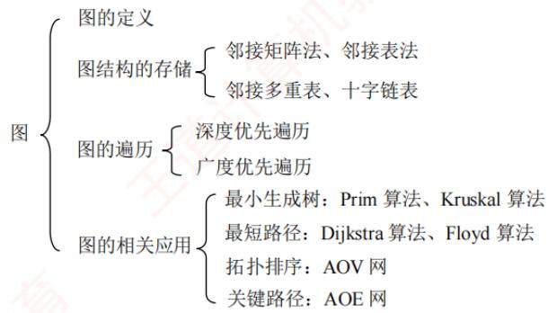
</div>

## 【复习提示】

　　图算法整体难度较大，应重点掌握深度优先搜索与广度优先搜索。理解图的基本概念与性质，掌握邻接矩阵、邻接表、邻接多重表和十字链表等存储结构及其特点，并能进行结构间的转换。掌握基于这些结构的遍历操作及典型应用，如拓扑排序、最小生成树、最短路径和关键路径等。图算法较多，通常只需掌握其核心思想与实现步骤，代码实现并非重点。

## 6.1 图的基本概念

### 6.1.1 图的定义

　　图 G 由顶点集 V 和边集 E 组成，记为 $G = (V, E)$ 。其中， $V(G)$ 表示图 G 中顶点的有限非空集； $E(G)$ 表示图 G 中顶点之间的关系（边）集合。若 $V = \{v_{1}, v_{2}, \cdots, v_{n}\}$ ，则用 $|V|$ 表示图 G 中顶点的数量， $E = \{(u, v) \mid u \in V, v \in V\}$ ，用 $|E|$ 表示图 G 中边的数量。

<div align="center">
  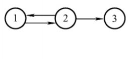
</div>

> **注意：**

　　线性表可以是空表，树可以是空树，但图不可以是空图。也就是说，图中不能一个顶点也没有，图的顶点集 $V$ 必须是非空的，但边集E可以为空，此时图中只有顶点而无边。

　　下面是图的一些基本概念及术语。

#### 1. 有向图

　　若E是有向边（也称弧）的有限集合，则图G称为有向图。弧是顶点的有序对，记为 $<v, w>$ ，其中，v称为弧尾，w称为弧头，表示从v到w的有向边，也称v邻接到w。

<p align="center"><em>图 6.1 (a) 所示的有向图 $G_{1}$ 可表示为</em></p>

$$
\begin{array}{c} G _ {1} = (V _ {1}, E _ {1}) \\ V _ {1} = \{1, 2, 3 \} \\ E _ {1} = \{<   1, 2 >, <   2, 1 >, <   2, 3 > \} \end{array}
$$

#### 2. 无向图

　　若 $E$ 是无向边（简称边）的有限集合，则图 $G$ 称为无向图。边是顶点的无序对，记为 $(v, w)$ 或 $(w, v)$ 。可以说 $w$ 和 $v$ 互为邻接点，或称边 $(v, w)$ 和 $v, w$ 相关联。

<p align="center"><em>图 6.1 (b) 所示的无向图 $G_{2}$ 可表示为</em></p>

$$
\begin{array}{c} G _ {2} = (V _ {2}, E _ {2}) \\ V _ {2} = \{1, 2, 3, 4 \} \\ E _ {2} = \{(1, 2), (1, 3), (1, 4), (2, 3), (2, 4), (3, 4) \} \end{array}
$$

<p align="center"><em>(a) 有向图 $G_{1}$</em></p>

<div align="center">
  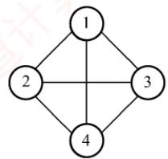
</div>

<p align="center"><em>(b) 无向图 $G_{2}$</em></p>

<div align="center">
  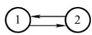
</div>

<p align="center"><em>(c) 有向完全图 $G_{3}$</em></p>

<p align="center"><em>图 6.1 图的示例</em></p>

#### 3. 简单图、多重图

　　若图 $G$ 满足条件：① 不存在重复边；② 不存在顶点到自身的边，则称图 $G$ 为简单图。图6.1中 $G_{1}$ 和 $G_{2}$ 均为简单图。若图 $G$ 中某两个顶点之间的边数超过1条，并且允许顶点通过一条边与自身关联，则称图 $G$ 为多重图。多重图和简单图的定义是相对的。本书仅讨论简单图。

#### 4. 顶点的度、入度和出度

> **考点追踪：** 无向图中顶点和边的关系（2009、2017）

　　在无向图中，顶点 $v$ 的度是指依附于顶点 $v$ 的边的数量，记为 TD(v)。图 6.1(b) 中，每个顶点的度均为 3。无向图的全部顶点的度之和等于边数的 2 倍，因为每条边与两个顶点相关联。

　　在有向图中，顶点 v 的度分为入度和出度，入度是以顶点 v 为终点的有向边的数量，记为 ID(v)；而出度是以顶点 v 为起点的有向边的数量，记为 OD(v)。图 6.1(a) 中，顶点 2 的出度为 2、入度为 1。顶点 v 的度等于其入度与出度之和，即 TD(v) = ID(v) + OD(v)。有向图的全部顶点的入度之和与出度之和相等，并且等于边数，这是因为每条有向边都有一个起点和终点。

#### 5. 路径、路径长度和回路

　　顶点 $v_{p}$ 到 $v_{q}$ 之间的一条路径是指顶点序列 $v_{p}, v_{i_{1}}, v_{i_{2}}, \cdots, v_{i_{m}}, v_{q}$ 。路径所含边的数量称为路径长度。第一个顶点和最后一个顶点相同的路径称为回路或环。若一个图有n个顶点，且有大于n-1条边，则此图一定有环。

#### 6. 简单路径、简单回路

> **考点追踪：** 路径、回路、简单路径、简单回路的定义（2011）

　　路径序列中顶点不重复出现的路径称为简单路径。除第一个顶点和最后一个顶点外，其余顶点不重复的回路称为简单回路。

#### 7. 距离

　　从顶点 u 到 v 的最短路径的长度称为从 u 到 v 的距离。若不存在路径，则距离为无穷大。

#### 8. 子图

　　设有两个图 $G = (V, E)$ 和 $G' = (V', E')$ ，若 $V'$ 是 $V$ 的子集，且 $E'$ 是 $E$ 的子集，则称 $G'$ 是 $G$ 的子图。若有满足 $V(G') = V(G)$ 的子图 $G'$ ，则称其为 $G$ 的生成子图。图6.1中 $G_3$ 为 $G_1$ 的子图。

> **注意：**

　　并非 $V$ 和 $E$ 的任何子集都能构成 $G$ 的子图，因为这样的子集可能不是图，即 $E$ 的子集中的某些边关联的顶点可能不在这个 $V$ 的子集中。

#### 9. 连通、连通图和连通分量

> **考点追踪：** 图的连通性与边和顶点的关系（2010、2022）

　　在无向图中，若从顶点v到w存在路径，则称v和w是连通的。若图G中任意两个顶点都是连通的，则称图G为连通图；否则为非连通图。无向图中的极大连通子图称为连通分量，在图6.2(a)中，图 $G_{4}$ 的3个连通分量如图6.2(b)所示。假设一个图有n个顶点，若边数少于n-1，则此图必然是非连通的。思考：在一个非连通图中，最多可能有多少条边？ $^{①}$

<div align="center">
  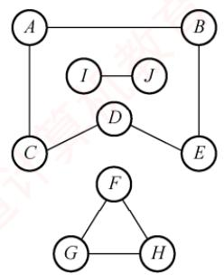
</div>

<p align="center"><em>(a) 无向图 $G_{4}$</em></p>

<div align="center">
  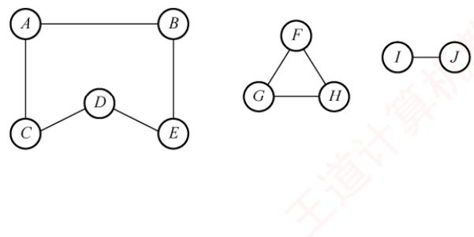
</div>

<p align="center"><em>(b) $G_{4}$ 的3个连通分量</em></p>

<p align="center"><em>图 6.2 无向图及其连通分量</em></p>

#### 10. 强连通图、强连通分量

　　在有向图中，如果一对顶点 v 和 w，从 v 到 w 和从 w 到 v 之间都有路径，则称这两个顶点是强连通的。如果图中任意一对顶点都是强连通的，则称此图为强连通图。有向图中的极大强连通子图称为强连通分量，图 $G_{1}$ 的强连通分量如图 6.3 所示。思考，假设有向图拥有 n 个顶点，且该图是强连通的，则最少需要多少条边？ $^{①}$

<div align="center">
  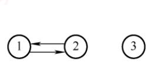
</div>

> **注意：**

　　在无向图中讨论连通性，在有向图中讨论强连通性。

#### 11. 生成树、生成森林

　　连通图的生成树是一个包含所有顶点的极小连通子图。若图中有 n 个顶点，则其生成树恰好包含 n-1 条边。这样的子图仅通过最少数量的边保持连通。对生成树而言，若移除任意一条边，都会变成非连通图；添加任何一条边则会形成一个回路。在非连通图中，每个连通分量的生成树共同构成了该图的生成森林。图 $G_{2}$ 的一个生成树如图 6.4 所示。

<div align="center">
  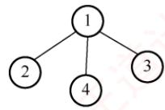
</div>

<p align="center"><em>图 6.3 图 $G_{1}$ 的强连通分量</em></p>

<p align="center"><em>图 6.4 图 $G_{2}$ 的一个生成树</em></p>

> **注意：**

　　区分极大连通子图和极小连通子图。极大连通子图要求子图必须连通，而且包含尽可能多的顶点和边；极小连通子图是既要保持子图连通又要使得边数最少的子图。

#### 12. 边的权、网和带权路径长度

　　在一些图中，每条边可以被赋予一个代表某种意义的数值，称为该边的权值。这种边上带有权值的图称为带权图，也称网。路径上所有边的权值之和，称为该路径的带权路径长度。

#### 13. 完全图（也称简单完全图）

　　对于无向图，边的数量 $|E|$ 范围是从0到 $n(n - 1) / 2$ 。当边数达到最大值 $n(n - 1) / 2$ 时，该无向图称为完全图，意味着任意两个顶点之间都有一条边相连。对于有向图， $|E|$ 的范围是从0到 $n(n - 1)$ ，有 $n(n - 1)$ 条弧的有向图称为有向完全图，即任意两个顶点之间都存在方向相反的两条弧。图6.1中 $G_{2}$ 为无向完全图，而 $G_{3}$ 为有向完全图。

#### 14. 稠密图、稀疏图

　　边数相对较少的图称为稀疏图，反之称为稠密图。这两个概念本身较为模糊，稀疏和稠密常常是相对而言的。一般认为，当图 $G$ 满足 $|E| < |V|\log_2|V|$ 时，可视为稀疏图。

#### 15. 有向树

　　一个顶点的入度为 0、其余顶点的入度均为 1 的有向图，称为有向树。

### 6.1.2 本节试题精选

#### 一、单项选择题

01. 一个有 $n$ 个顶点和 $n$ 条边的无向图一定是（）。

- A. 连通的
- B. 不连通的
- C. 无环的
- D. 有环的

02. 若从无向图的任意顶点出发进行一次深度优先搜索即可访问所有顶点，则该图一定是（）。

- A. 强连通图
- B. 连通图
- C. 有回路
- D. 一棵树

03. 以下关于图的叙述中，正确的是（）。

- A. 图与树的区别在于图的边数大于或等于顶点数
- B. 假设有图 $G = \{V, \{E\}\}$ ，顶点集 $V' \subseteq V$ ， $E' \subseteq E$ ，则 $V'$ 和 $\{E'\}$ 构成 $G$ 的子图
- C. 无向图的连通分量是指无向图中的极大连通子图
- D. 图的遍历就是从图中某一顶点出发访遍图中其余顶点

04. 以下关于图的叙述中，正确的是（）。

- A. 强连通有向图的任何顶点到其他所有顶点都有弧
- B. 图的任意顶点的入度等于出度
- C. 有向完全图一定是强连通有向图
- D. 有向图的边集的子集和顶点集的子集都构成原有向图的子图

05. 一个有28条边的非连通无向图至少有（）个顶点。

- A. 7
- B. 8
- C. 9
- D. 10

06. 对于一个有 n 个顶点的图：若是连通无向图，其边的个数至少为（）；若是强连通有向图，则其边的个数至少为（）。

- A. n-1, n
- B. n-1, n(n-1)
- C. n, n
- D. n, n(n-1)

07. 无向图 G 有 23 条边，度为 4 的顶点有 5 个，度为 3 的顶点有 4 个，其余都是度为 2 的顶点，则图 G 有（）个顶点。

- A. 11
- B. 12
- C. 15
- D. 16

08. 在有 $n$ 个顶点的有向图中，顶点的度最大可达（）。

- A. $n$
- B. $n - 1$
- C. $2n$
- D. $2n - 2$

09. 具有 6 个顶点的无向图，当有（）条边时能确保是一个连通图。

- A. 8
- B. 9
- C. 10
- D. 11

10. 设有无向图 $G = (V, E)$ 和 $G' = (V', E')$ ，若 $G'$ 是 $G$ 的生成树，则下列不正确的是（）。 I. $G'$ 为 $G$ 的连通分量 II. $G'$ 为 $G$ 的无环子图 III. $G'$ 为 $G$ 的极小连通子图且 $V' = V$

- A. I、II
- B. 只有 III
- C. II、III
- D. 只有 I

11. 具有 51 个顶点和 21 条边的无向图的连通分量最多为（）。

- A. 33
- B. 34
- C. 45
- D. 32

12. 在右图所示的有向图中，共有（）个强连通分量。

- A. 1
- B. 2
- C. 3
- D. 4

13. 若具有 n 个顶点的图是一个环，则它有（）棵生成树。

- A. $n^{2}$
- B. n
- C. n-1
- D. 1

<div align="center">
  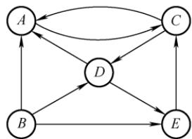
</div>

14. 若一个具有 $n$ 个顶点、 $e$ 条边的无向图是一个森林，则该森林中必有（）棵树。

- A. $n$
- B. $e$
- C. $n - e$
- D. 1

15. 【2009 统考真题】下列关于无向连通图特性的叙述中，正确的是（）。
I. 所有顶点的度之和为偶数
II. 边数大于顶点个数减 1
III. 至少有一个顶点的度为 1

- A. 只有 I
- B. 只有 II
- C. I 和 II
- D. I 和 III

16. 【2010 统考真题】若无向图 $G = (V, E)$ 中含有 7 个顶点，要保证图 G 在任何情况下都是连通的，则需要的边数最少是（）。

- A. 6
- B. 15
- C. 16
- D. 21

17. 【2017 统考真题】已知无向图 G 含有 16 条边，其中度为 4 的顶点个数为 3，度为 3 的顶点个数为 4，其他顶点的度均小于 3。图 G 所含的顶点个数至少是（）。

- A. 10
- B. 11
- C. 13
- D. 15

18. 【2022 统考真题】对于无向图 $G = (V, E)$ ，下列选项中，正确的是（）。

- A. 当 $|V| > |E|$ 时， $G$ 一定是连通的
- B. 当 $|V| < |E|$ 时， $G$ 一定是连通的
- C. 当 $|V| = |E| - 1$ 时， $G$ 一定是不连通的
- D. 当 $|V| > |E| + 1$ 时， $G$ 一定是不连通的

#### 二、综合应用题

01. 图 $G$ 是一个非连通无向图，共有28条边，该图至少有多少个顶点？

### 6.1.3 答案与解析

#### 一、单项选择题

**01. D**

　　若一个无向图有 $n$ 个顶点和 $n - 1$ 条边，可以使它连通但没有环（生成树），但若再加一条边，在不考虑重边的情形下，则必然会构成环。

**02. B**

　　强连通图是有向图，与题意矛盾，选项 A 错误；对无向连通图做一次深度优先搜索，可以访问到该连通图的所有顶点，选项 B 正确；有回路的无向图不一定是连通图，因为回路不一定包含图的所有顶点，选项 C 错误；连通图可能是树，也可能存在环，选项 D 错误。

**03. C**

　　图与树的区别是逻辑上的区别，而不是边数的区别，图的边数也可能小于树的边数，选项A错误；若 $E^{\prime}$ 中的边对应的顶点不是 $V$ 的元素，则 $V^{\prime}$ 和 $\{E'\}$ 无法构成图，选项B错误；无向图的极大连通子图称为连通分量，选项C正确；图的遍历要求每个顶点只能被访问一次，且若图非连通，则从某一顶点出发无法访问到其他全部顶点，选项D的说法不准确。

**04. C**

　　强连通有向图的任何顶点到其他所有顶点都有路径，但未必有弧；无向图任意顶点的入度等于出度，但有向图未必满足；若边集中的某条边对应的某个顶点不在对应的顶点集中，则有向图的边集的子集和顶点集的子集无法构成子图。

**05. C**

　　考查至少有多少个顶点的情形，我们考虑该非连通图最极端的情况，即它由一个完全图加一个独立的顶点构成，此时若再加一条边，则必然使图变成连通图。在 $28 = n(n - 1) / 2 = 8 \times 7 / 2$ 条边的完全无向图中，总共有8个顶点，再加上1个不连通的顶点，共9个顶点。

**06. A**

　　对于连通无向图，边最少即构成一棵树的情形；对于强连通有向图，边最少即构成一个有向环的情形。

**07. D**

　　因为在具有 $n$ 个顶点、 $e$ 条边的无向图中，有 $\sum_{i=1}^{n} \mathrm{TD}(v_i) = 2e$ ，所以求得度为 2 的顶点数为 7，从而共有 16 个顶点。

**08. D**

　　在有向图中，顶点的度等于入度与出度之和。n 个顶点的有向图中，任意一个顶点最多还可以与其他 n-1 个顶点有一对指向相反的边相连。注意，数据结构中仅讨论简单图。

**09. D**

　　5个顶点构成一个完全无向图，需要 $n(n - 1) / 2 = 10$ 条边；再加上1条边后，能保证第6个顶点必然与此完全无向图构成一个连通图，所以共需11条边。

**10. D**

　　一个连通图的生成树是一个极小连通子图，显然它是无环的，因此说法 II、III 正确。极大连通子图称为连通分量， $G'$ 连通但非连通分量。这里再补充一下“极大连通子图”：若图本来就是连通的，且每个子部分包含其本身的所有顶点和边，则它就是极大连通子图。

**11. C**

　　初始考虑只有 51 个顶点的无向图 G，此时 G 中每个顶点都是连通分量，问题转化为向 G 中添加 21 条边，如何添加这 21 条边使得连通分量数目最多。若向两个不同的连通分量之间添加边，则连通分量数目会减 1，所以应尽可能地将这 21 条边加入同一个连通分量且让其接近完全图，含有 7 个顶点的完全图有 21 条边，所以用 7 个顶点构成一个含有 21 条边的连通分量，剩下 51 - 7 = 44 个顶点对应 44 个连通分量，共有 45 个连通分量。

**12. B**

　　强连通分量是极大强连通子图，任意两个顶点之间有方向相反的两条路径。由定义不难得出，若一个顶点只有出边或入边，则该顶点必定单独构成一个连通分量。图中，顶点 B 只有出边，其他所有顶点都不可能有到顶点 B 的路径，所以顶点 B 单独构成一个强连通分量。在顶点 A、C、D、E 中，任意两个顶点之间都有方向相反的两条路径，所以可构成一个强连通分量。

**13. B**

$n$ 个顶点的生成树是具有 $n - 1$ 条边的极小连通子图，因为 $n$ 个顶点构成的环共有 $n$ 条边，去掉任意一条边就是一棵生成树，所以共有 $n$ 种情况，所以可以有 $n$ 棵不同的生成树。

**14. C**

　　n 个顶点的树有 n-1 条边，假设森林中有 x 棵树，将每棵树的根连到一个添加的顶点，则成为一棵树，顶点数是 $n+1$ ，边数是 $e+x$ ，从而可知 x=n-e。

　　【另解】设森林中有 x 棵树，则再用 x-1 条边就可将所有的树连接成一棵树，此时边数 +1 = 顶点数，即 $e + (x - 1) + 1 = n$ ，所以 x = n - e。

**15. A**

　　每条边都连接了两个顶点，在计算顶点的度之和时每条边都被计算了两次，所以所有顶点的度之和偶数。无向连通图对应的生成树也是无向连通图，但此时边数等于顶点数减1，说法II错误。考虑2个或以上的顶点恰好构成一个环的情况，此时每个顶点的度都为2，说法III错误。

**16. C**

　　题干要求无论如何分配边，都能使7个顶点连通，这不同于只要6条边两两相连就能构成一个连通图的情形。考虑最极端的情形，即图 G 的某 6 个顶点构成一个完全无向图，此时若再添加一条边，则都将连通第 7 个顶点，使该图变成一个连通图。所以最少边数 $=6 \times 5/2 + 1 = 16$ 。若边数 n 小于或等于 15，可以使这 n 条边仅连接图 G 中的某 6 个顶点，从而导致第 7 个顶点无法与这 6 个顶点构成连通图（不满足“在任何情况下”）。

　　为简单起见，以 5 个顶点为例，左边 4 个顶点和 $4 \times 3/2 = 6$ 条边构成一个完全图，此时若再添加一条边（可以是虚线中的任意一条），则能保证这 5 个顶点在任何情况下都是连通的，如右图所示。若边数小于 7，则不能保证 5 个顶点在任何情况下都是连通的。

<div align="center">
  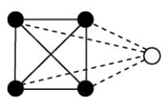
</div>

**17. B**

　　无向图边数的 2 倍等于各顶点度数的总和。要求至少的顶点数，应使每个顶点的度取最大，而其他顶点的度均小于 3，因此可设它们的度都为 2，并设它们的数量为 x，列出方程 $4 \times 3 + 3 \times 4 + 2x = 16 \times 2$ ，解得 x = 4。因此至少包含 $4 + 4 + 3 = 11$ 个顶点。

**18. D**

　　对于此类分析图的边数、顶点数与连通性问题，思路是寻找临界情况，在临界情况下任意增加或减少一条边，都会改变图的连通性。第一种临界情况如图1所示，此时若减少任意一条边，图就由连通变为不连通，即无向图连通的最小边数是 $|V|-1$ ，因此，当 $|E|<|V|-1$ 时，图一定不连通，选项C错误，选项D正确。第二种临界情况如图2所示，此时若增加任意一条边，则图就由不连通变为连通，即无向图不连通的最大边数是 $(|V|-1)(|V|-2)/2$ （此时 $|V|-1$ 个顶点构成一个完全图），因此，仅当 $|E|\geqslant(|V|-1)(|V|-2)/2+1$ 时才能保证无向图一定连通，选项A、B错误。

<div align="center">
  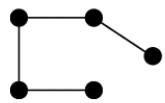
</div>

　　图1

<div align="center">
  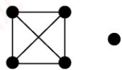
</div>

　　图 2

#### 二、综合应用题

**01. 【解答】**

　　图 $G$ 是一个非连通无向图，当边数固定时，顶点数最少的情况是该图由两个连通子图构成，且其中之一只含一个顶点，另一个为完全图。其中只含一个顶点的子图没有边，另一个完全图的边数为 $n(n - 1) / 2 = 28$ ，得 $n = 8$ 。所以该图至少有 $1 + 8 = 9$ 个顶点。

## 6.2 图的存储及基本操作

　　图的存储必须要完整、准确地反映顶点集和边集的信息。针对不同的图结构和算法需求，选择合适的存储方式将显著影响程序的效率，因此所采用的存储结构应与待求解的问题相适应。

### 6.2.1 邻接矩阵法

　　邻接矩阵存储方法通过一个一维数组存储图中顶点的信息，并用一个二维数组存储边的信息（各顶点之间的邻接关系）。这个用于存储邻接关系的二维数组称为邻接矩阵。

　　顶点数为 n 的图 $G=(V,E)$ 的邻接矩阵 A 是 $n\times n$ 的，将图 G 的顶点编号为 $v_{1},v_{2},\cdots,v_{n}$ ，则

$$
A [ i ] [ j ] = \left\{ \begin{array}{l l} 1, & \left(v _ {i}, v _ {j}\right) \text {或} \langle v _ {i}, v _ {j} \rangle \text {是} E (G) \text {中的边} \\ 0, & \left(v _ {i}, v _ {j}\right) \text {或} \langle v _ {i}, v _ {j} \rangle \text {不是} E (G) \text {中的边} \end{array} \right.
$$

> **考点追踪：** 图的邻接矩阵存储及相互转换（2011、2015、2018）

　　对带权图而言，若顶点 $v_{i}$ 和 $v_{j}$ 之间有边相连，则邻接矩阵中对应位置存放该边的权值；若顶点 $v_{i}$ 和 $v_{j}$ 不相连，则通常用 0 或 $\infty$ 表示这两个顶点之间不存在边：

$$
A [ i ] [ j ] = \left\{ \begin{array}{l l} w _ {i j}, & (v _ {i}, v _ {j}) \text {或} \langle v _ {i}, v _ {j} \rangle \text {是} E (G) \text {中的边} \\ 0 \text {或} \infty , & (v _ {i}, v _ {j}) \text {或} \langle v _ {i}, v _ {j} \rangle \text {不是} E (G) \text {中的边} \end{array} \right.
$$

<p align="center"><em>图 6.5 展示了有向图、无向图及带权图（网）对应的邻接矩阵。</em></p>

<div align="center">
  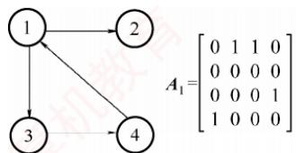
</div>

<p align="center"><em>(a) 有向图 $G_{1}$ 及其邻接矩阵</em></p>

<div align="center">
  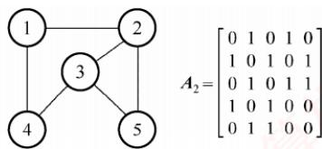
</div>

<p align="center"><em>(b) 无向图 $G_{2}$ 及其邻接矩阵</em></p>

<div align="center">
  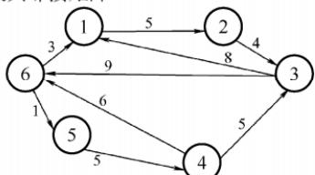
</div>

<div align="center">
  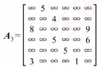
</div>

<p align="center"><em>(c) 网及其邻接矩阵（对角线元素也经常用0表示）</em></p>

<p align="center"><em>图 6.5 有向图、无向图及网的邻接矩阵</em></p>

> **考点追踪：** （算法题）邻接矩阵的遍历及顶点的度的计算（2021、2023）

　　图的邻接矩阵存储结构定义如下：

```c
#define MaxVertexNum 100 //顶点数目的最大值
typedef char VertexType; //顶点对应的数据类型
typedef int EdgeType; //边对应的数据类型
typedef struct {
    VertexType vex[MaxVertexNum]; //顶点表
    EdgeType edge[MaxVertexNum][MaxVertexNum]; //邻接矩阵，边表
    int vexnum, arcnum; //图的当前顶点数和边数
} MGraph;
```

> **注意：**

　　① 在简单应用中，可以直接使用二维数组作为图的邻接矩阵（顶点信息等均可省略）。

　　② 当邻接矩阵元素仅表示相应边是否存在时，EdgeType可用值为0和1的枚举类型。

　　③ 邻接矩阵表示法的空间复杂度为 $O(n^{2})$ ，其中 $n$ 为图的顶点数 $|V|$ 。

> **考点追踪：** 邻接矩阵的遍历的时间复杂度（2021）

　　邻接矩阵表示法具有以下特点：

　　① 无向图的邻接矩阵一定是对称矩阵，因此实际存储时只需保存上（或下）三角部分。在顶点编号固定的条件下，该邻接矩阵是唯一的。

> **考点追踪：** 基于邻接矩阵的顶点的度的计算（2013、2021、2023）

　　② 对于无向图，邻接矩阵第 $i$ 行（或第 $i$ 列）非零元素（或非 $\infty$ 元素）的数量正好是顶点 $i$ 的度 $\mathrm{TD}(v_i)$ 。

　　③ 对于有向图，邻接矩阵第 $i$ 行非零元素（或非 $\infty$ 元素）的数量是顶点 $i$ 的出度 $\mathrm{OD}(v_i)$ ；第 $i$ 列非零元素（或非 $\infty$ 元素）的数量则是顶点 $i$ 的入度 $\mathrm{ID}(v_i)$ 。

　　④ 使用邻接矩阵存储图时，很容易判断任意两个顶点之间是否有边相连，但要确定图中有多少条边，通常需要遍历整个矩阵，时间代价较大。

　　⑤稠密图（边数较多的图）更适合采用邻接矩阵存储。

> **考点追踪：** 计算 A2 并说明 An[i][j] 的含义（2015）

　　⑥ 设图 $G$ 的邻接矩阵为 $A$ ， $A^n$ 的元素 $A^n[i][j]$ 代表从顶点 $i$ 到顶点 $j$ 长度为 $n$ 的路径数量。这一结论了解即可，具体证明可参考离散数学教材。

### 6.2.2 邻接表法

　　当图为稀疏图时，使用邻接矩阵法显然会浪费大量存储空间。而邻接表法结合了顺序存储与链式存储的优点，能显著减少这种不必要的空间开销。

　　所谓邻接表，是指对图 G 中的每个顶点 $v_{i}$ 建立一个单链表。第 i 个单链表中的结点表示依附于顶点 $v_{i}$ 的边（对于有向图，这些边是以 $v_{i}$ 为尾的弧），该链表称为顶点 $v_{i}$ 的边表（有向图中也称出边表）。边表的头指针与顶点的数据信息采用顺序存储，称为顶点表。因此，邻接表中包含两类结点：顶点表结点和边表结点，如图 6.6 所示。

<div align="center">
  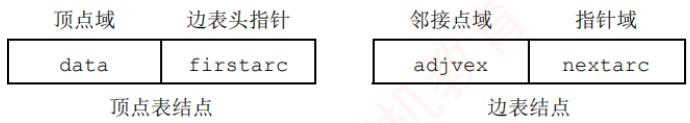
</div>

<p align="center"><em>图 6.6 顶点表和边表结点结构</em></p>

　　顶点表结点由两个域组成：顶点域（data）存储顶点 $v_{i}$ 的相关信息，边表头指针域（firstarc）指向其第一条邻接边的边表结点。边表结点至少包含两个域：邻接点域（adjvex）存储与该顶点邻接的另一顶点编号，指针域（nextarc）指向下一条边的边表结点。

> **考点追踪：** 图的邻接表存储的应用（2014）

　　无向图和有向图的邻接表表示分别如图6.7和图6.8所示。

<div align="center">
  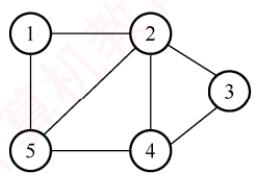
</div>

<p align="center"><em>(a) 无向图 $G$</em></p>

<div align="center">
  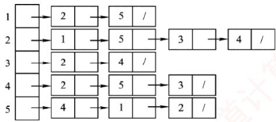
</div>

<p align="center"><em>(b) 无向图 G 的邻接表的表示</em></p>

<p align="center"><em>图 6.7 无向图的邻接表表示</em></p>

<div align="center">
  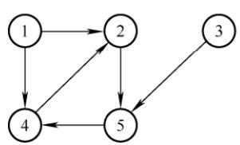
</div>

<p align="center"><em>(a) 有向图 $G$</em></p>

<div align="center">
  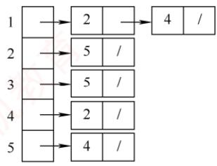
</div>

<p align="center"><em>(b) 有向图 $G$ 的邻接表的表示</em></p>

<p align="center"><em>图 6.8 有向图的邻接表表示</em></p>

　　图的邻接表存储结构定义如下：

```c
#define MaxVertexNum 100 //图中顶点数目的最大值
typedef struct ArcNode{ //边表结点
    int adjvex; //该弧所指向的顶点的位置
    struct ArcNode *nextarc; //指向下一条弧的指针
    //InfoType info; //网的边权值
}ArcNode;
typedef struct VNode{ //顶点表结点
    VertexType data; //顶点信息
    ArcNode *firstarc; //指向第一条依附该顶点的弧的指针
}VNode, AdjList[MaxVertexNum];
typedef struct{
    AdjList vertices; //邻接表
    int vexnum, arcnum; //图的顶点数和弧数
}ALGraph; //ALGraph 是以邻接表存储的图类型
```

　　邻接表表示法具有以下特点:

　　① 若 G 为无向图，所需存储空间为 $O(|V| + 2|E|)$ ；若为有向图，则为 $O(|V| + |E|)$ 。前者包含系数 2，是因为无向图中每条边在邻接表中会出现两次。

> **考点追踪：** 邻接矩阵法和邻接表法的适用性分析（2011）

　　② 对于稀疏图（边数较少的图），采用邻接表表示能极大节省存储空间。

　　③ 在查找指定顶点的所有邻接点时，邻接表只需遍历对应的边表；而邻接矩阵则需扫描对应整行，效率较低。然而，若要判断两个顶点之间是否存在边，邻接矩阵支持 $O(1)$ 的直接访问；而邻接表需要线性查找对应的边表，效率较低。

　　④ 在无向图的邻接表中，顶点的度等于其邻接表中边表结点的个数。对于有向图，顶点的出度等于其邻接表中边表结点的个数；而入度则需遍历所有顶点的边表，统计所有边表中（adjvex）域等于该顶点编号的结点总数。

　　⑤ 邻接表的表示不唯一，因为每个顶点对应的边表中，各边结点的链接顺序可以是任意的，它取决于建立邻接表的算法及输入边的次序。

### 6.2.3 十字链表

　　十字链表是有向图的一种链式存储结构。在十字链表中，每条弧用一个结点（称为弧结点）表示，每个顶点也用一个结点（称为顶点结点）表示。这两种结点的结构如下所示。

<table><tr><td>tailvex</td><td>headvex</td><td>hlink</td><td>tlink</td><td>(info)</td><td>data</td><td>firstin</td><td>firstout</td></tr></table>

　　弧结点包含五个域：tailvex 和 headvex 域分别存放弧尾顶点和弧头顶点的编号；头链域 hlink 指向弧头相同的下一条弧；尾链域 tlink 指向弧尾相同的下一条弧；info 域存放该弧的相关信息。这样，弧头相同的弧在同一个链表上，弧尾相同的弧也在同一个链表上。

　　顶点结点包含三个域：data 域存放该顶点的数据信息，如顶点名称；firstin 域指向以该顶点为弧头的第一条弧；firstout 域指向以该顶点为弧尾的第一条弧。

<p align="center"><em>图 6.9 为有向图的十字链表表示法。</em></p>

<div align="center">
  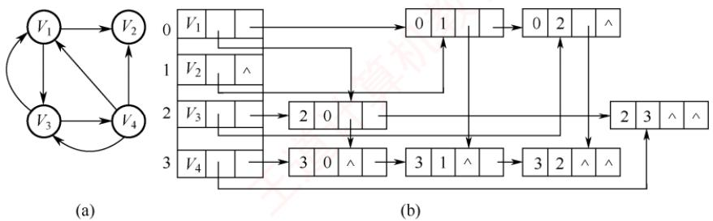
</div>

<p align="center"><em>图 6.9 有向图的十字链表表示（弧结点省略 info 域）</em></p>

　　注意，顶点结点之间是顺序存储的，弧结点省略了info域。

　　在十字链表中，既容易找到以 $V_{i}$ 为尾的弧，也容易找到以 $V_{i}$ 为头的弧。因此，很容易求得顶点的出度和入度。图的十字链表的表示形式不唯一，取决于弧的输入顺序。

### 6.2.4 邻接多重表

　　邻接多重表是无向图的一种链式存储结构。虽然邻接表可以方便地获取顶点和边的信息，但在执行如判断两个顶点之间是否存在边等操作时，需分别遍历两个顶点的边表，效率较低。邻接多重表通过将每条边仅用一个结点表示，从而在判断边时只需遍历一次，提升了效率。

　　与十字链表类似，在邻接多重表中，每条边用一个结点表示，其结构如下。

<table><tr><td>ivex</td><td>ilink</td><td>jvex</td><td>jlink</td><td>(info)</td></tr></table>

　　其中，ivex 和 jvex 域存放该边依附的两个顶点的编号；ilink 域指向依附于顶点 ivex 的下一条边；jlink 域指向依附于顶点 jvex 的下一条边，info 域存放该边的相关信息。

　　每个顶点也用一个结点表示，包含如下所示的两个域。

<div align="center">
  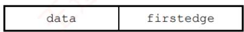
</div>

　　其中，data 域存放该顶点的相关信息，firstedge 域指向依附于该顶点的第一条边。

　　在邻接多重表中，所有依附于同一顶点的边串联在同一链表中。由于每条边依附于两个顶点，其对应的边结点同时链接在两个链表中。对无向图而言，其邻接多重表与邻接表的主要区别在于：邻接表用两个结点表示同一条无向边，而邻接多重表仅用一个。

> **考点追踪：** 图的邻接多重表表示的分析（2024）

<p align="center"><em>图 6.10 为无向图的邻接多重表表示。邻接多重表的基本操作与邻接表类似。</em></p>

<div align="center">
  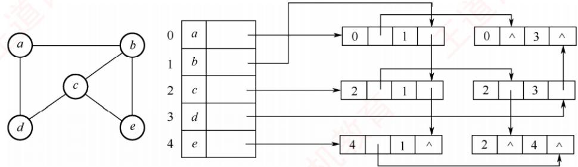
</div>

<p align="center"><em>图 6.10 无向图的邻接多重表表示（边结点省略info域）</em></p>

　　图的四种存储方式的总结如表 6.1 所示。

<p align="center"><em>表 6.1 图的四种存储方式的总结</em></p>

<table><tr><td></td><td>邻接矩阵</td><td>邻接表</td><td>十字链表</td><td>邻接多重表</td></tr><tr><td>空间复杂度</td><td><eq>O(|V|^{2})</eq></td><td>无向图:<eq>O(|V| + 2|E|)</eq>有向图:<eq>O(|V| + |E|)</eq></td><td><eq>O(|V| + |E|)</eq></td><td><eq>O(|V| + |E|)</eq></td></tr><tr><td>找相邻边</td><td>遍历对应行或列的时间复杂度为 <eq>O(|V|)</eq></td><td>找有向图的入度必须遍历整个邻接表</td><td>很方便</td><td>很方便</td></tr><tr><td>删除边或顶点</td><td>删除边很方便,删除顶点需要大量移动数据</td><td>无向图中删除边或顶点都不方便</td><td>很方便</td><td>很方便</td></tr><tr><td>适用于</td><td>稠密图</td><td>稀疏图和其他</td><td>只能存有向图</td><td>只能存无向图</td></tr><tr><td>表示方式</td><td>唯一</td><td>不唯一</td><td>不唯一</td><td>不唯一</td></tr></table>

### 6.2.5 图的基本操作

　　图的基本操作独立于其存储结构，但不同存储方式下的具体实现算法性能会有所不同。在设计具体算法时，应根据需求选择合适的存储方式以提高效率。

　　图的基本操作主要包括（仅抽象地考虑，所以忽略各变量的类型）：

- Adjacent(G,x,y): 判断图 G 中是否存在边 $<x,y>$ 或 $(x,y)$ 。

- Neighbors(G,x): 列出图 G 中与顶点 x 邻接的所有边。

- InsertVertex(G,x): 在图 G 中插入顶点 x。

- DeleteVertex(G,x): 从图 G 中删除顶点 x 及其相关的所有边。

- AddEdge (G, x, y): 若无向边 (x, y) 或有向边 <x, y> 不存在，则将其添加到图 G 中。

- RemoveEdge(G,x,y): 若无向边(x,y)或有向边<x,y>存在，则从图G中删除该边。

- FirstNeighbor(G,x): 查找图 G 中顶点 x 的第一个邻接点。若存在则返回顶点号；若 x 没有邻接点或图中不存在 x，则返回 -1。

- NextNeighbor(G,x,y): 假设顶点 y 是顶点 x 的一个邻接点，返回除 y 外顶点 x 的下一个邻接点的顶点号。若 y 是 x 的最后一个邻接点，则返回 -1。

- Get_edge_value(G,x,y): 获取图 G 中边 (x,y) 或 <x,y>对应的权值。

- Set_edge_value(G,x,y,v): 设置图 G 中边 (x,y) 或 <x,y>对应的权值为 v。

　　此外，还有图的遍历算法：按照某种顺序访问图中的每个顶点且仅访问一次。常见的图遍历算法包括深度优先遍历（DFS）和广度优先遍历（BFS），具体内容将在下一节详细讨论。

### 6.2.6 本节试题精选

#### 一、单项选择题

01. 下列关于图的存储结构的说法中，错误的是（）。

- A. 使用邻接矩阵存储一个图时，在不考虑压缩存储的情况下，所占用的存储空间大小只与图中的顶点数有关，与边数无关
- B. 邻接表只用于有向图的存储，邻接矩阵适用于有向图和无向图
- C. 若一个有向图的邻接矩阵的对角线以下的元素为0，则该图的拓扑序列必定存在
- D. 存储无向图的邻接矩阵是对称的，所以只需存储邻接矩阵的下（或上）三角部分

02. 若图的邻接矩阵中主对角线上的元素皆为 0，其余元素全为 1，则该图一定（）。

- A. 是无向图
- B. 是有向图
- C. 是完全图
- D. 不是带权图

03. 在含有 $n$ 个顶点和 $e$ 条边的无向图的邻接矩阵中，零元素的个数为（）。

- A. $e$
- B. $2e$
- C. $n^2 - e$
- D. $n^2 - 2e$

04. 带权有向图 $G$ 用邻接矩阵存储，则 $v_{i}$ 的入度等于邻接矩阵中（）。

- A. 第 $i$ 行非 $\infty$ 的元素个数
- B. 第 $i$ 列非 $\infty$ 的元素个数
- C. 第 $i$ 行非 $\infty$ 且非0的元素个数
- D. 第 $i$ 列非 $\infty$ 且非0的元素个数

05. 一个有 $n$ 个顶点的图用邻接矩阵 $\mathbf{A}$ 表示，若图为有向图，顶点 $v_{i}$ 的入度是（）；若图为无向图，顶点 $v_{i}$ 的度是（）。

- A. $\sum_{i=1}^{n} A[i][j]$
- B. $\sum_{j=1}^{n} A[j][i]$
- C. $\sum_{i=1}^{n} A[j][i]$
- D. $\sum_{j=1}^{n} A[j][i]$ 或 $\sum_{j=1}^{n} A[i][j]$

06. 从邻接矩阵 $A = \begin{bmatrix} 0 & 1 & 0 \\ 1 & 0 & 1 \\ 0 & 1 & 0 \end{bmatrix}$ 可以看出，该图共有（①）个顶点；若是有向图，则该图共有（②）条弧；若是无向图，则共有（③）条边。
　　①

- A. 9
- B. 3
- C. 6
- D. 1 E. 以上答案均不正确

　　②

- A. 5
- B. 4
- C. 3
- D. 2 E. 以上答案均不正确

　　③

- A. 5
- B. 4
- C. 3
- D. 2 E. 以上答案均不正确

07. 以下关于图的存储结构的叙述中，正确的是（）。

- A. 一个图的邻接矩阵表示唯一，邻接表表示唯一
- B. 一个图的邻接矩阵表示唯一，邻接表表示不唯一
- C. 一个图的邻接矩阵表示不唯一，邻接表表示唯一
- D. 一个图的邻接矩阵表示不唯一，邻接表表示不唯一

08. 矩阵 $A$ 是有向图 $G$ 的邻接矩阵，若矩阵 $A^2$ 的某元素 $a_{i,j}^2 = 3$ ，则说明（）。

- A. 从顶点 $i$ 到 $j$ 存在3条长度为2的路径
- B. 从顶点 $i$ 到 $j$ 存在3条长度不超过2的路径
- C. 从顶点 $i$ 到 $j$ 存在2条长度为3的路径
- D. 从顶点 $i$ 到 $j$ 存在2条长度不超过3的路径

09. 用邻接表法存储图所用的空间大小（）。

- A. 与图的顶点数和边数有关
- B. 只与图的边数有关
- C. 只与图的顶点数有关
- D. 与边数的平方有关

10. 若邻接表中有奇数个边表结点，则（）。

- A. 图中有奇数个顶点
- B. 图中有偶数个顶点
- C. 图为无向图
- D. 图为有向图

11. 在有向图的邻接表存储结构中，顶点 v 在边表中出现的次数是（）。

- A. 顶点 v 的度
- B. 顶点 v 的出度
- C. 顶点 v 的入度
- D. 依附于顶点 v 的边数

12. $n$ 个顶点的无向图的邻接表最多有（）个边表结点。

- A. $n^2$
- B. $n(n - 1)$
- C. $n(n + 1)$
- D. $n(n - 1) / 2$

13. 设某无向图中有 $n$ 个顶点和 $e$ 条边，则建立该图的邻接表的时间复杂度为（）。

- A. $O(n + e)$
- B. $O(n^2)$
- C. $O(ne)$
- D. $O(n^3)$

14. 假设有 n 个顶点、e 条边的有向图用邻接表表示，则删除与某个顶点 v 相关的所有边的时间复杂度为（）。

- A. $O(n)$
- B. $O(e)$
- C. $O(n + e)$
- D. $O(ne)$

15. 设 n 个顶点、e 条边的有向图用邻接表表示，则求某顶点 v 的入度的时间复杂度为（）。

- A. $O(n)$
- B. $O(e)$
- C. $O(n + e)$
- D. $O(ne)$

16. 对邻接表的叙述中，（）是正确的。

- A. 无向图的邻接表中，第 i 个顶点的度为第 i 个链表中结点数的两倍
- B. 邻接表比邻接矩阵的操作更简便
- C. 邻接矩阵比邻接表的操作更简便
- D. 求有向图顶点的度，必须遍历整个邻接表

17. 邻接多重表是（）的存储结构。

- A. 无向图
- B. 有向图
- C. 无向图和有向图
- D. 都不是

18. 十字链表是（）的存储结构。

- A. 无向图
- B. 有向图
- C. 无向图和有向图
- D. 都不是

19. 【2013 统考真题】设图的邻接矩阵 A 如下所示，各顶点的度依次是（）。

$$
\boldsymbol {A} = \left[ \begin{array}{c c c c} 0 & 1 & 0 & 1 \\ 0 & 0 & 1 & 1 \\ 0 & 1 & 0 & 0 \\ 1 & 0 & 0 & 0 \end{array} \right]
$$

- A. 1,2,1,2
- B. 2,2,1,1
- C. 3,4,2,3
- D. 4,4,2,2

20. 【2024 统考真题】若无向图 $G = (V, E)$ 的邻接多重表如下图所示，则 $G$ 中顶点 $b$ 与 $d$ 的度分别是（）。

<div align="center">
  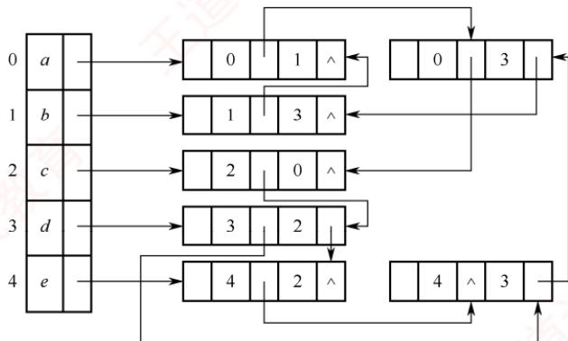
</div>

- A. 0, 2
- B. 2, 4
- C. 2, 5
- D. 3, 4

#### 二、综合应用题

01. 已知带权有向图 G 的邻接矩阵如下图所示，请画出该带权有向图 G。

<table><tr><td>0</td><td>15</td><td>2</td><td>12</td><td><eq>\infty</eq></td><td><eq>\infty</eq></td><td><eq>\infty</eq></td></tr><tr><td><eq>\infty</eq></td><td>0</td><td><eq>\infty</eq></td><td><eq>\infty</eq></td><td>6</td><td><eq>\infty</eq></td><td><eq>\infty</eq></td></tr><tr><td><eq>\infty</eq></td><td><eq>\infty</eq></td><td>0</td><td><eq>\infty</eq></td><td>8</td><td>4</td><td><eq>\infty</eq></td></tr><tr><td><eq>\infty</eq></td><td><eq>\infty</eq></td><td><eq>\infty</eq></td><td>0</td><td><eq>\infty</eq></td><td><eq>\infty</eq></td><td>3</td></tr><tr><td><eq>\infty</eq></td><td><eq>\infty</eq></td><td><eq>\infty</eq></td><td><eq>\infty</eq></td><td>0</td><td><eq>\infty</eq></td><td>9</td></tr><tr><td><eq>\infty</eq></td><td><eq>\infty</eq></td><td><eq>\infty</eq></td><td>5</td><td><eq>\infty</eq></td><td>0</td><td>10</td></tr><tr><td><eq>\infty</eq></td><td>4</td><td><eq>\infty</eq></td><td><eq>\infty</eq></td><td><eq>\infty</eq></td><td><eq>\infty</eq></td><td>0</td></tr></table>

02. 设图 $G = (V, E)$ 以邻接表存储，如下图所示。画出其邻接矩阵存储及图 $G$ 。

<table><tr><td>1</td><td></td><td>2</td><td></td><td>3</td><td></td><td>4</td><td>^</td><td></td></tr><tr><td>2</td><td></td><td>1</td><td></td><td>3</td><td></td><td>4</td><td></td><td></td></tr><tr><td>3</td><td></td><td>1</td><td></td><td>2</td><td></td><td>4</td><td>^</td><td></td></tr><tr><td>4</td><td></td><td>1</td><td></td><td>2</td><td></td><td>3</td><td></td><td></td></tr><tr><td>5</td><td></td><td>2</td><td></td><td>4</td><td>^</td><td></td><td>5</td><td>^</td></tr></table>

03. 对 $n$ 个顶点的无向图和有向图，分别采用邻接矩阵和邻接表表示时，试问：

1）如何判别图中有多少条边？

2）如何判别任意两个顶点 $i$ 和 $j$ 是否有边相连？

3）任意一个顶点的度是多少？

04. 如何对无环有向图中的顶点重新编号，使得该图的邻接矩阵中所有的 1 都集中到对角线以上？

05. 写出从图的邻接表表示转换成邻接矩阵表示的算法。

06. 【2015 统考真题】已知含有 5 个顶点的图 G 如右图所示。请回答下列问题：

1）写出图 $G$ 的邻接矩阵 $\mathbf{A}$ （行、列下标从0开始）。

<div align="center">
  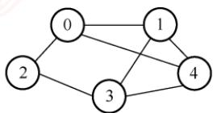
</div>

2）求 $A^2$ ，矩阵 $A^2$ 中位于0行3列元素值的含义是什么？

3）若已知具有 $n(n \geqslant 2)$ 个顶点的图的邻接矩阵为 $\pmb{B}$ ，则 $\pmb{B}^m (2 \leqslant m \leqslant n)$ 中非零元素的含义是什么？

07. 【2021 统考真题】已知无向连通图 G 由顶点集 V 和边集 E 组成， $|E| > 0$ ，当 G 中度为奇数的顶点个数为不大于 2 的偶数时，G 存在包含所有边且长度为 $|E|$ 的路径（称为 EL 路径）。设图 G 采用邻接矩阵存储，类型定义如下：

```txt
typedef struct{ //图的定义
    int numVertices, numEdges; //图中实际的顶点数和边数
    char VerticesList[MAXV]; //顶点表。MAXV为已定义常量
    int Edge[MAXV][MAXV]; //邻接矩阵
```

```txt
}MGraph;
```

　　请设计算法 int IsExistEL(MGraph G)，判断 G 是否存在 EL 路径，若存在，则返回 1，否则返回 0。要求：

1）给出算法的基本设计思想。

2）根据设计思想，采用 C 或 C++ 语言描述算法，关键之处给出注释。

3）说明你所设计算法的时间复杂度和空间复杂度。

08. 【2023 统考真题】已知有向图 G 采用邻接矩阵存储，类型定义如下:

```txt
typedef struct{
    int numVertices, numEdges; //图的顶点数和有向边数
    char VerticesList[MAXV]; //顶点表，MAXV为已定义常量
    int Edge[MAXV][MAXV]; //邻接矩阵
```

```txt
}MGraph;
```

　　将图中出度大于入度的顶点称为K顶点。例如，在右图中，顶点 $a$ 和 $b$ 为K顶点。

　　请设计算法 int printVertices(MGraph G)，对给定的任意非空有向图 G，输出 G 中所有的 K 顶点，并返回 K 顶点的个数。要求：

<div align="center">
  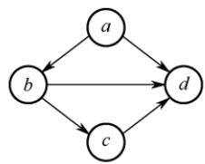
</div>

1）给出算法的基本设计思想。

2）根据设计思想，采用 C 或 C++ 语言描述算法，关键之处给出注释。

### 6.2.7 答案与解析

#### 一、单项选择题

**01. B**

　　对于有 n 个顶点的图，若采用邻接矩阵表示，不考虑压缩存储，则存储空间大小为 $O(n^{2})$ ，选项 A 正确。邻接表可用于存储无向图，只是把每条边都视为两条方向相反的有向边，因此需要存储两次，选项 B 错误。因为邻接矩阵中对角线以下的元素全为 0，所以若存在 $\langle i, j \rangle$ ，则必有 i < j，由传递性可知图中路径的顶点编号是依次递增的，假设存在环 $k \to \cdots \to j \to k$ ，由题设可知 k < j < k，矛盾，所以不存在环，拓扑序列必定存在，选项 C 正确。选项 D 显然正确。

> **注意：**

　　若邻接矩阵对角线以下（或以上）的元素全为0，则图中必然不存在环，即拓扑序列一定存在，但这并不能说明拓扑序列是唯一的。

**02. C**

　　除主对角线上的元素外，其余元素全为 1，说明任意两个顶点之间都有边相连，因此该图一定是完全图。

**03. D**

　　在无向图的邻接矩阵中，矩阵大小为 $n^2$ ，非零元素的个数为 $2e$ ，所以零元素的个数为 $n^2 - 2e$ 。读者应掌握此题的变体，即当无向图变为有向图时，能够求出零的个数和非零的个数。

**04. D**

　　带权有向图的邻接矩阵中，0 和 $\infty$ 表示的都不是有向边，而入度是由邻接矩阵的列中元素计算出来的；出度是由邻接矩阵的行中元素计算出来的。

**05. B、D**

　　有向图的入度是其第 i 列的非 0 元素之和，无向图的度是第 i 行或第 i 列的非 0 元素之和。

**06. B、B、D**

　　邻接矩阵的顶点数等于矩阵的行（列）数，有向图的边数等于矩阵中非零元素的个数，无向图的边数等于矩阵中非零元素个数的一半。

> **注意：**

　　本题中所给的矩阵为对称矩阵，若不是对称矩阵，则必然不可能是无向图。

**07. B**

　　邻接矩阵表示唯一是因为图中边的信息在矩阵中有确定的位置，邻接表不唯一是因为邻接表的建立取决于读入边的顺序和边表中的插入算法。

**08. A**

　　设图 $G$ 的邻接矩阵为 $A$ ， $A^n$ 的元素 $a_{i,j}^n$ 等于从顶点 $i$ 到 $j$ 的长度为 $n$ 的路径的数目，因此 $a_{i,j}^2 = 3$ 表示从顶点 $i$ 到 $j$ 存在 3 条长度为 2 的路径。该结论记住即可。

**09. A**

　　邻接表存储时，顶点数 n 决定了顶点表的大小，边数 e 决定了边表结点的个数，且无向图的每条边存储两次，总存储空间为 $O(n+2e)$ 。而邻接矩阵只与图的顶点数有关，为 $O(n^{2})$ 。

**10. D**

　　无向图采用邻接表表示时，每条边存储两次，所以其边表结点的个数为偶数。题中边表结点为奇数个，所以必然是有向图，且有奇数条边。

**11. C**

　　题中的边表是不包括顶点表的。因为任何顶点 u 对应的边表中存放的都是以 u 为起点的边所对应的另一个顶点 v。从而 v 在边表中出现的次数也就是它的入度。

**12. B**

　　最多有 $n(n - 1) / 2$ 条边，每条边在邻接表中存储两次，因此边表结点最多为 $n(n - 1)$ 个。

**13. A**

　　建立图的邻接表需要遍历所有的顶点和边，每个顶点有一个顶点表结点，每条边需要创建一个边表结点并插入到相应的链表中。因此，共需 $n + 2e$ 次操作，时间复杂度为 $O(n + e)$ 。

**14. C**

　　与顶点 v 相关的边包括出边和入边，对于出边，只需遍历 v 的顶点表结点和其指向的边表；对于入边，则需遍历整个边表。先删除出边：删除 v 的顶点表结点的单链表，出边数最多为 n-1，时间复杂度为 $O(n)$ ；再删除入边：扫描整个边表（扫描剩余全部顶点表结点及其指向的边表），删除所有的顶点 v 的入边，时间复杂度为 $O(n + e)$ 。因此总时间复杂度为 $O(n + e)$ 。

**15. C**

　　为了求顶点 v 的入度，只需要遍历邻接表中的所有边表，检查每条边是否指向顶点 v，这相当于遍历整个邻接表，因此算法的时间复杂度为 $O(n + e)$ 。

**16. D**

　　无向图的邻接表中，第 i 个顶点的度为第 i 个链表中的结点数，所以选项 A 错。邻接表和邻接矩阵对于不同的操作各有优势，选项 B 和 C 都不准确。有向图顶点的度包括出度和入度，对于出度，需要遍历顶点表结点所对应的边表；对于入度，则需要遍历剩下的全部边表。

**17. A**

　　邻接多重表是无向图的存储结构。

**18. B**

　　十字链表是有向图的存储结构。

**19. C**

　　邻接矩阵 A 为非对称矩阵，说明图是有向图，度为入度与出度之和。各顶点的度是矩阵中此顶点对应的行（对应出度）和列（对应入度）的非零元素之和。

**20. B**

　　在邻接多重表中，统计一个顶点的入度、出度或度数（入度+出度）时，只需考虑所有的边结点。下图是邻接多重表的边结点的结构：

<table><tr><td>ivex</td><td>ilink</td><td>jvex</td><td>jlink</td><td>info</td></tr></table>

　　其中，ivex表示弧头的编号，ilink域指向下一个弧头相同的边结点，jvex表示弧尾的编号，jlink域指向下一个弧尾相同的边结点。根据定义可知：求x号顶点的入度时，只需统计jvex域等于x的边结点个数；求x号顶点的出度时，只需统计ivex域等于x的边结点个数；x号顶点的度 数为入度和出度之和。顶点b的编号为1，统计可知：入度为1，出度为1，度数为2。顶点d的编号为3，统计可知：入度为1，出度为3，度数为4。

#### 二、综合应用题

**01. 【解答】**

　　带权有向图 G 如右图所示。

**02. 【解答】**

　　其邻接矩阵存储如下所示。

<div align="center">
  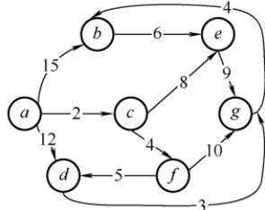
</div>

$$
\left[ \begin{array}{c c c c c} 0 & 1 & 1 & 1 & 0 \\ 1 & 0 & 1 & 1 & 1 \\ 1 & 1 & 0 & 1 & 0 \\ 1 & 1 & 1 & 0 & 1 \\ 0 & 1 & 0 & 1 & 0 \end{array} \right]
$$

　　在邻接表中，每条边存储了 2 次，在没有特殊说明时，通常默认其为无向图（当然，无向图也可视为具有对边的有向图）。该邻接表对应的图 G 如右图所示。

**03. 【解答】**

1）对于邻接矩阵表示的无向图，边数等于矩阵中 1 的个数除以 2；对于邻接表表示的无向图，边数等于边结点的个数除以 2。

<div align="center">
  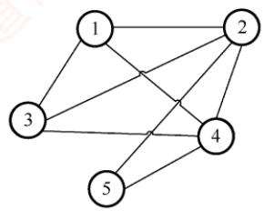
</div>

　　对于邻接矩阵表示的有向图，边数等于矩阵中1的个数；对于邻接表表示的有向图，边数等于边结点的个数。

2）在邻接矩阵表示的无向图或有向图中，对于任意两个顶点 $i$ 和 $j$ ，邻接矩阵中arcs[i][j]或arcs[j][i]为1表示有边相连，否则表示无边相连。在邻接表表示的无向图或有向图中，对于任意两个顶点 $i$ 和 $j$ ，若从顶点表结点 $i$ 出发找到编号为 $j$ 的边表结点或从顶点表结点 $j$ 出发找到编号为 $i$ 的边表结点，表示有边相连；否则为无边相连。

3）对于邻接矩阵表示的无向图，顶点 $i$ 的度等于第 $i$ 行中1的个数；对于邻接矩阵表示的有向图，顶点 $i$ 的出度等于第 $i$ 行中1的个数；入度等于第 $i$ 列中1的个数；度数等于它们的和。对于邻接表表示的无向图，顶点 $i$ 的度等于顶点表结点 $i$ 的单链表中边表结点的个数；对于邻接表表示的有向图，顶点 $i$ 的出度等于顶点表结点 $i$ 的单链表中边表结点的个数，顶点 $i$ 的入度等于邻接表中所有编号为 $i$ 的边表结点数；度数等于入度与出度之和。

**04. 【解答】**

　　按各顶点的出度进行排序。n 个顶点的有向图，其顶点的最大出度为 n-1，最小出度为 0。这样排序后，出度最大的顶点编号为 1，出度最小的顶点编号为 n。之后，进行调整，即只要存在弧 $<i, j>$ ，就不管顶点 j 的出度是否大于顶点 i 的出度，都把 i 编号在顶点 j 的编号之前，因为只有 $i \leqslant j$ ，弧 $<i, j>$ 对应的 1 才能出现在邻接矩阵的上三角。

　　通过后面小节的学习，会发现采用拓扑排序并依次编号是一种更为简便的方法。

**05. 【解答】**

　　算法思想：设图的顶点分别存储在数组 v[n] 中。首先初始化邻接矩阵。遍历邻接表，在依次遍历顶点 v[i] 的边链表时，修改邻接矩阵的第 i 行的元素值。若链表边结点的值为 j，则置 arcs[i][j]=1。遍历完邻接表时，整个转换过程结束。此算法对于无向图、有向图均适用。

　　算法的实现如下:

```txt
void Convert(ALGraph &G, int arcs[M][N]) {
    // 此算法将邻接表方式表示的图 G 转换为邻接矩阵 arcs
    for (i = 0; i < n; i++) {    // 依次遍历各顶点表结点为头的边链表
    p = (G->v[i]).firstarc;    // 取出顶点 i 的第一条出边
    while (p != NULL) {    // 遍历边链表
    arcs[i][p->adjvex] = 1;
    p = p->nextarc;    // 取下一条出边
    }    // while
    }    // for
}
```

**06. 【解答】**

　　考查图的邻接矩阵的性质。

1）图 G 的邻接矩阵 A 如下：

$$
\boldsymbol {A} = \left[ \begin{array}{c c c c c} 0 & 1 & 1 & 0 & 1 \\ 1 & 0 & 0 & 1 & 1 \\ 1 & 0 & 0 & 1 & 0 \\ 0 & 1 & 1 & 0 & 1 \\ 1 & 1 & 0 & 1 & 0 \end{array} \right]
$$

2） $A^{2}$ 如下：

$A^2 = \begin{bmatrix} 3 & 1 & 0 & 3 & 1\\ 1 & 3 & 2 & 1 & 2\\ 0 & 2 & 2 & 0 & 2\\ 3 & 1 & 0 & 3 & 1\\ 1 & 2 & 2 & 1 & 3 \end{bmatrix}$

　　0 行 3 列的元素值 3 表示从顶点 0 到顶点 3 之间长度为 2 的路径共有 3 条。

3） $B^{m}$ （ $2 \leqslant m \leqslant n$ ）中位于 i 行 j 列（ $0 \leqslant i, j \leqslant n-1$ ）的非零元素的含义是，图中从顶点 i 到顶点 j 的长度为 m 的路径条数。

**07. 【解答】**

1）算法的基本设计思想：

　　本算法题属于送分题，题干已经告诉我们算法的思想。对于采用邻接矩阵存储的无向图，在邻接矩阵的每一行（列）中，非零元素的个数为本行（列）对应顶点的度。可以依次计算连通图 G 中各顶点的度，并记录度为奇数的顶点个数，若个数为 0 或 2，则返回 1，否则返回 0。

2）算法实现

```txt
int IsExistEL(MGraph G){
    //采用邻接矩阵存储，判断图是否存在 EL 路径
    int degree, i, j, count = 0;
    for (i = 0; i < G.numVertices; i++) {
    degree = 0;
    for (j = 0; j < G.numVertices; j++)
    degree += G.Edge[i][j];    //依次计算各个顶点的度
    if (degree % 2 != 0)
    count++;    //对度为奇数的顶点计数
    }
    if (count == 0 || count == 2)
    return 1;    //存在 EL 路径，返回 1
    else
    return 0;    //不存在 EL 路径，返回 0
}
```

3）时间复杂度和空间复杂度

　　算法需要遍历整个邻接矩阵，所以时间复杂度为 $O(n^{2})$ ，空间复杂度为 $O(1)$ 。

**08. 【解答】**

##### 1）算法的基本设计思想：

　　采用邻接矩阵表示有向图时，一行中 1 的个数为该行对应顶点的出度，一列中 1 的个数为该列对应顶点的入度。使用一个初值为零的计数器记录 K 顶点的个数。对图 G 的每个顶点，根据邻接矩阵计算其出度 outdegree 和入度 indegree。若 outdegree-indegree>0，则输出该顶点且计数器加 1。最后返回计数器的值。

##### 2）用 C 语言描述的算法：

```txt
int printVertices(MGraph G) {
    //采用邻接矩阵存储，输出 K 顶点，返回个数
    int indegree, outdegree, k, m, count = 0;
    for (k = 0; k < G.numVertices; k++) {
    indegree = outdegree = 0;
    for (m = 0; m < G.numVertices; m++) //计算顶点的出度
    outdegree += G.Edge[k][m];
    for (m = 0; m < G.numVertices; m++) //计算顶点的入度
    indegree += G.Edge[m][k];
    if (outdegree > indegree) {
    printf("%c", G.VerticesList[k]);
    count++;
    }
    }
    return count; //返回 K 顶点的个数
}
```

## 6.3 图的遍历

　　图的遍历是指从图中某一顶点出发，按照某种搜索策略，沿着图中的边访问所有顶点，且每个顶点仅被访问一次。注意到树是一种特殊的图，因此树的遍历可视为图遍历的一种特例。图的遍历算法是求解连通性问题、拓扑排序、关键路径等图算法的基础。

　　与树的遍历相比，图的遍历要复杂得多，因为图中任意一个顶点都可能与其余多个顶点相邻接。访问某个顶点后，沿着某条路径继续搜索时，可能再次回到该顶点。为避免重复访问，遍历过程中需记录已访问过的顶点，通常设置一个辅助数组 visited[] 来标记各顶点是否已被访问。图的遍历主要有两种基本算法：广度优先搜索和深度优先搜索。

### 6.3.1 广度优先搜索

　　广度优先搜索（Breadth-First-Search, BFS）类似于树的层序遍历。其基本思想是：首先访问起始顶点 v，然后从 v 出发，依次访问 v 的所有未被访问过的邻接顶点 $w_{1}, w_{2}, \cdots, w_{i}$ ；随后依次访问 $w_{1}, w_{2}, \cdots, w_{i}$ 的所有尚未访问过的邻接顶点；再从这些访问过的顶点出发，访问它们所有未被访问过的邻接顶点，直至图中所有可达顶点都被访问为止。若此时图中仍有未被访问的顶点，则另选一个未访问的顶点作为新的起始点，重复上述过程，直至图中所有顶点均被访问。Dijkstra 单源最短路径算法和 Prim 最小生成树算法也应用了类似的思想。

　　换句话说，广度优先搜索以起始顶点 v 为中心，按路径长度递增的顺序访问所有从 v 可达的顶点，即先访问距离为 1 的顶点，再访问距离为 2 的顶点，以此类推。BFS 是一种分层遍历过程：每完成一层的访问，便会处理下一层的所有顶点，而不会沿已访问路径回溯，因此通常以非递归方式实现。BFS 算法必须借助一个辅助队列，用于暂存当前层顶点的下一层邻接顶点。

　　bool visited[MAX_VERTEX_NUM]; //访问标记数组
void BFSTraverse(Graph G){
    for(i=0;i<G.vexnum;++i)
　　    visited[i]=FALSE; //访问标记数组初始化
　　    InitQueue(Q); //初始化辅助队列Q
　　    for(i=0;i<G.vexnum;++i) //从0号顶点开始遍历
　　    if(!visited[i]) //对每个连通分量调用一次BFS()
　　    BFS(G,i); //若 $v_i$ 未访问过，从 $v_i$ 开始调用BFS()
}

　　广度优先搜索算法的实现如下:

　　基于邻接表的广度优先搜索实现如下：

```txt
void BFS(ALGraph G, int i) {
    visit(i); //访问初始顶点i
    visited[i] = TRUE; //对i做已访问标记
    EnQueue(Q, i); //顶点i入队
    while (!QueueEmpty(Q)) {
    DeQueue(Q, v); //队首顶点v出队
    for (p = G.vertices[v].firstarc; p; p = p->nextarc) { //检测v的所有邻接点
    w = p->adjvex;
    if (visited[w] == FALSE) {
    visit(w); //w为v的尚未访问的邻接点，访问w
    visited[w] = TRUE; //对w做已访问标记
    EnQueue(Q, w); //顶点w入队
    }
    }
    }
}
```

　　基于邻接矩阵的广度优先搜索实现如下:

```c
void BFS(MGraph G, int i) {
    visit(i); //访问初始顶点i
    visited[i] = TRUE; //对i做已访问标记
    EnQueue(Q, i); //顶点i入队
    while (!QueueEmpty(Q)) {
    DeQueue(Q, v); //队首顶点v出队
    for (w = 0; w < G.vexnum; w++) //检测v的所有邻接点
    if (visited[w] == FALSE && G.edge[v][w] == 1) {
    visit(w); //w为v的尚未访问的邻接点，访问w
    visited[w] = TRUE; //对w做已访问标记
    EnQueue(Q, w); //顶点w入队
    }
    }
}
```

　　辅助数组 visited[] 用于标记顶点是否已被访问，初始值均为 FALSE。在遍历过程中，一旦顶点 $v_{i}$ 被访问，立即置 visited[i]=TRUE，以防止重复访问。

> **考点追踪：** 广度优先遍历的过程（2013）

　　给定图 G 如图 6.11 所示，假设从顶点 a 开始遍历，BFS 的执行过程如下：a 先入队；队列非空，取出 a，发现其邻接点 b 和 c 均未访问，依次访问并入队；取出 b，访问其未访问的邻接点 d 和 e，并入队（a 虽与 b 也邻接，但已访问，故跳过）；取出 c，访问其未访问的邻接点 f 和 g，并入队；取出 d，其邻接点均已访问，无操作；取出 e，访问其未访问邻接点 h，并入队；继续处理 f, g, h，均无新邻接点可访问；最终队列为空，遍历结束。遍历结果为 abcdefgh。

<div align="center">
  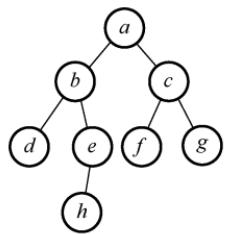
</div>

<p align="center"><em>图 6.11 一个无向图 $G$</em></p>

　　上述过程与二叉树的层序遍历完全一致，说明图的 BFS 是树层序遍历算法的自然推广。

#### 1. BFS算法的性能分析

　　无论采用邻接表还是邻接矩阵存储，BFS算法都需要借助一个辅助队列 $Q$ 来实现逐层访问。每个顶点最多入队一次，在最坏的情况下，空间复杂度为 $O(|V|)$ 。

> **考点追踪：** 基于邻接表存储的 BFS 的效率（2012）

　　遍历图的过程实质上是对每个顶点查找其邻接点的过程，耗费的时间取决于所采用的存储结构。采用邻接表存储时：每个顶点均需搜索（或入队）一次，时间复杂度为 $O(|V|)$ ；在搜索每个顶点的邻接点时，每条边均需访问一次，时间复杂度为 $O(|E|)$ ；总的时间复杂度为 $O(|V| + |E|)$ 。采用邻接矩阵存储时：查找每个顶点的邻接点所需的时间为 $O(|V|)$ ，总时间复杂度为 $O(|V|^{2})$ 。

#### 2. BFS 算法求解单源最短路径问题

　　若图 $G = (V, E)$ 为非带权图，定义从顶点 u 到顶点 v 的最短路径 $d(u, v)$ 为所有从 u 到 v 的路径中所含边数的最小值；若从 u 到 v 不可达，则 $d(u, v) = \infty$ 。

　　利用 BFS 可求解非带权图的单源最短路径问题，这是因为广度优先搜索总是按照距离由近到远的顺序遍历图中顶点，从而保证每个顶点首次被访问时，所经过的路径即为最短路径。

　　BFS 求解单源最短路径的实现如下:

```txt
void BFS MIN Distance(Graph G, int u) {
    //d[i]表示从u到i的最短路径
    for (i=0; i<G.vexnum; ++i)
    d[i]=∞;    //初始化路径长度
    visited[u]=TRUE; d[u]=0;
    EnQueue(Q, u);
    while (!QueueEmpty(Q)) {    //BFS算法主过程
    DeQueue(Q, u);    //队头元素u出队
    for (w=FirstNeighbor(G, u); w>=0; w=NextNeighbor(G, u, w))
    if (!visited[w]) {    //w为u的尚未访问的邻接顶点
    visited[w]=TRUE;    //设已访问标记
    d[w]=d[u]+1;    //路径长度加1
    EnQueue(Q, w);    //顶点w入队
    }
    }
}
```

#### 3. 广度优先生成树

　　在广度优先遍历的过程中，所经过的边与访问的顶点共同构成一棵树，称为广度优先生成树，如图 6.12 所示。需要注意的是：若图采用邻接矩阵存储，由于其表示是唯一的，因此从同一源点出发得到的广度优先生成树也是唯一的。而若采用邻接表存储时，其表示不唯一，导致遍历时邻接点的访问顺序不确定，因此生成的广度优先生成树也可能不唯一。

<div align="center">
  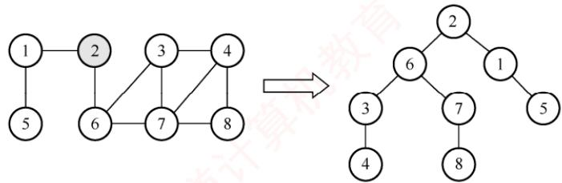
</div>

<p align="center"><em>图 6.12 图的广度优先生成树</em></p>

### 6.3.2 深度优先搜索

　　与广度优先搜索不同，深度优先搜索（Depth-First-Search，DFS）类似于树的先序遍历。正如其名称所暗示的那样，这种搜索算法遵循尽可能“深”地探索一个图的策略。

　　其基本思想是：首先访问图中的某一起始顶点 v，然后从 v 出发，访问 v 的一个未访问邻接顶点 $w_{1}$ ，再访问 $w_{1}$ 的一个未访问邻接顶点 $w_{2}$ ……以此类推。当无法继续向下访问时，回退至上一顶点（递归返回），检查其是否还有未访问的邻接顶点。若有，则从该顶点开始继续上述搜索过程，直到图中所有顶点均被访问为止。

　　一般而言，其递归形式的算法非常简洁，具体过程如下：

　　bool visited[MAX_VERTEX_NUM]; //访问标记数组
　　void DFSTraverse(Graph G) { //对图G进行深度优先遍历
    for (i=0;i<G.vexnum;i++)
　　    visited[i]=FALSE; //初始化已访问标记数组
　　    for (i=0;i<G.vexnum;i++) //本代码从 $v_{0}$ 开始遍历
　　    if(!visited[i]) //对尚未访问的顶点调用DFS()
    DFS(G,i);
}

　　基于邻接表的深度优先搜索实现如下:

```txt
void DFS(ALGraph G, int i) {
    visit(i); //访问初始顶点i
    visited[i] = TRUE; //对i做已访问标记
    for (p = G.vertices[i].firstarc; p; p = p->nextarc) { //检测i的所有邻接点
    j = p->adjvex;
    if (visited[j] == FALSE)
    DFS(G, j); //j为i的尚未访问的邻接点，递归访问j
    }
}
```

　　基于邻接矩阵的深度优先搜索实现如下：

```txt
void DFS(MGraph G, int i) {
    visit(i); //访问初始顶点i
    visited[i] = TRUE; //对i做已访问标记
    for (j = 0; j < G.vexnum; j++) { //检测i的所有邻接点
    if (visited[j] == FALSE && G.edge[i][j] == 1)
    DFS(G, j); //j为i的尚未访问的邻接点，递归访问j
    }
}
```

> **考点追踪：** 深度优先遍历的过程（2015、2016）

　　以图 6.11 的图 G 为例，DFS 的执行过程如下：首先访问顶点 a，并置 a 访问标记。接着访问与 a 邻接且未被访问的 b，置 b 访问标记；随后访问与 b 邻接且未被访问的 d，置 d 访问标记。此时，由于 d 没有更多未被访问的邻接顶点，因此返回上一个访问的 b，继续访问其未被访问的邻接顶点 e，置 e 访问标记，以此类推，直至图中所有顶点都被访问一次。遍历结果为 abdehcfg。

> **注意：**

　　图的邻接矩阵表示是唯一的，这意味着基于邻接矩阵和同一源点出发遍历得到的 DFS 和 BFS 序列是唯一的。然而，对邻接表来说，若边的输入顺序不同，则生成的邻接表也会不同。因此，对同一个图，基于邻接表的遍历得到的 DFS 序列和 BFS 序列可能不是唯一的。

#### 1. DFS算法的性能分析

　　DFS算法通常以递归形式实现，其执行过程依赖系统提供的递归工作栈，在最坏情况下，递归深度可达 $|V|$ ，因此空间复杂度为 $O(|V|)$ 。

　　图的遍历本质上是通过边依次访问邻接点的过程。因此，无论是深度优先搜索还是广度优先搜索，其时间复杂度仅取决于图的存储结构，而与访问顺序无关。具体而言：采用邻接矩阵存储时，对每个顶点需扫描整行以查找邻接点，总时间复杂度为 $O(|V|^2)$ ；采用邻接表存储时，每个顶点和每条边均被访问常数次，总时间复杂度为 $O(|V| + |E|)$ 。

#### 2. 深度优先的生成树和生成森林

　　与广度优先搜索类似，深度优先搜索在遍历过程中也会形成一棵深度优先生成树。其存在的前提是图必须是连通的。只有对连通图调用 DFS 时，才能得到一棵覆盖所有顶点的生成树；若图是非连通的，DFS 将为每个连通分量分别生成一棵树，这些树共同构成深度优先生成森林，如图 6.13 所示。注意，不论是采用 DFS 还是采用 BFS 方法，基于邻接表得到的生成树是不唯一的，而基于邻接矩阵和同一源点所得到的生成树是唯一的。

<div align="center">
  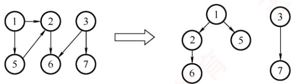
</div>

<p align="center"><em>图 6.13 图的深度优先生成森林</em></p>

### 6.3.3 图的遍历与图的连通性

　　图的遍历算法可用于判断图的连通性。

　　为了确保遍历图中所有顶点（无论图是否连通），在BFSTraverse()和DFSTraverse()中均添加了一个外层for循环：从每个尚未被访问的顶点出发，启动一次新的BFS或DFS。

　　对于无向图，若图是连通的，则只需一次遍历即可访问所有顶点；若图是非连通的，则一次遍历仅能覆盖其所在连通分量的所有顶点。因此，调用 BFS(G,i) 或 DFS(G,i) 的次数恰好等于该图的连通分量数，因为每次调用都会遍历一个连通分量中的所有顶点。

　　对于有向图，情况略有不同。仅当从初始顶点到达图中每个顶点都存在路径时，才能通过一次遍历访问到所有顶点；否则，将不能访问所有顶点。即使整个图是弱连通的，也可能包含强连通分量和非强连通分量。在非强连通分量中，单次调用 BFS(G,i) 或 DFS(G,i) 不一定能访问到该子图的所有顶点。例如，某些顶点可能无法从初始顶点到达，尽管它们之间可能存在路径。因此，对于有向图，同样需要外层循环以确保所有顶点被覆盖，如图 6.14 所示。
<p align="center"><em>图 6.14 有向图的非强连通分量</em></p>

<div align="center">
  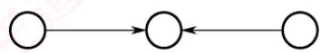
</div>

### 6.3.4 本节试题精选

#### 一、单项选择题

01. 下列关于广度优先算法的说法中，正确的是（）。

I. 当各边的权值相等时，广度优先算法可以解决单源最短路径问题
II. 当各边的权值不等时，广度优先算法可用来解决单源最短路径问题
III. 广度优先遍历算法类似于树中的后序遍历算法

IV. 实现图的广度优先算法时，使用的数据结构是队列

- A. I、IV
- B. II、III、IV
- C. II、IV
- D. I、III、IV

02. 下列关于图的说法中，错误的是（）。 I. 对一个无向图进行深度优先遍历时，得到的深度优先遍历序列是唯一的 II. 若有向图不存在回路，即使不用访问标志位，同一顶点也不会被访问两次 III. 采用深度优先遍历或拓扑排序算法可以判断一个有向图中是否有环（回路） IV. 对任何非强连通图必须2次或以上调用广度优先遍历算法才可访问所有的顶点

- A. I、II、III
- B. II、III
- C. I、II
- D. I、II、IV

03. 对于一个非连通无向图 $G$ ，采用深度优先遍历访问所有顶点，在 DFSTraverse 函数（见考点讲解 DFS 部分）中调用 DFS 的次数正好等于（）。

- A. 顶点数
- B. 边数
- C. 连通分量数
- D. 不确定

04. 对一个有 n 个顶点、e 条边的图采用邻接表表示时，进行 DFS 遍历的时间复杂度为（），空间复杂度为（）；进行 BFS 遍历的时间复杂度为（），空间复杂度为（）。

- A. $O(n)$
- B. $O(e)$
- C. $O(n + e)$
- D. $O(1)$

05. 图的广度优先遍历算法中使用队列作为其辅助数据结构，那么在算法执行过程中，每个顶点的入队次数最多为（）。

- A. 1
- B. 2
- C. 3
- D. 4

06. 对有 $n$ 个顶点、 $e$ 条边的图采用邻接矩阵表示时，进行 DFS 遍历的时间复杂度为（），进行 BFS 遍历的时间复杂度为（）。

- A. $O(n^{2})$
- B. $O(e)$
- C. $O(n + e)$
- D. $O(e^{2})$

07. 无向图 $G = (V, E)$ ，其中 $V = \{a, b, c, d, e, f\}$ ， $E = \{(a, b), (a, e), (a, c), (b, e), (c, f), (f, d), (e, d)\}$ ，对该图从 $a$ 开始进行深度优先遍历，得到的顶点序列正确的是（）。

- A. $a, b, e, c, d, f$
- B. $a, c, f, e, b, d$
- C. $a, e, b, c, f, d$
- D. $a, e, d, f, c, b$

08. 如右图所示，在下面的 5 个序列中，符合深度优先遍历的序列个数是（）。
1. aebfdc 2. acfdeb 3. aedfcb 4. aefdbc 5. aecfdb

- A. 5
- B. 4
- C. 3
- D. 2

<div align="center">
  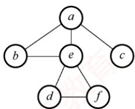
</div>

09. 用邻接表存储的图的深度优先遍历算法类似于树的（），而其广度优先遍历算法类似于树的（）。

- A. 中序遍历
- B. 先序遍历
- C. 后序遍历
- D. 按层次遍历

10. 一个有向图 $G$ 的邻接表存储如下图所示，从顶点1出发，对图 $G$ 调用深度优先遍历所得顶点序列是（）；按广度优先遍历所得顶点序列是（）。

<div align="center">
  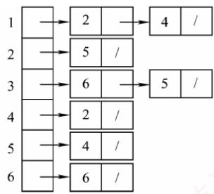
</div>

<div align="center">
  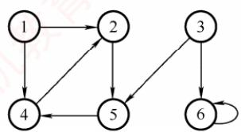
</div>

- A. 125436
- B. 124536
- C. 124563
- D. 362514

11. 无向图 $G = (V, E)$ ，其中 $V = \{a, b, c, d, e, f\}$ ， $E = \{(a, b), (a, e), (a, c), (b, e), (c, f), (f, d), (e, d)\}$ 。对该图进行深度优先遍历，不能得到的序列是（）。

- A. acfdeb
- B. aebdfc
- C. aedfcb
- D. abecdf

12. 判断有向图中是否存在回路，除拓扑排序外，还可利用（）。（注：涉及下节内容）

- A. 求关键路径的方法
- B. 求最短路径的 Dijkstra 算法
- C. 深度优先遍历算法
- D. 广度优先遍历算法

13. 设无向图 $G = (V, E)$ 和 $G' = (V', E')$ ，若 $G'$ 是 $G$ 的生成树，则下列说法错误的是（）。

- A. $G'$ 为 $G$ 的子图
- B. $G'$ 为 $G$ 的连通分量
- C. $G'$ 为 $G$ 的极小连通子图且 $V = V'$
- D. $G'$ 是 $G$ 的一个无环子图

14. 图的广度优先生成树的树高比深度优先生成树的树高（）。

- A. 小或相等
- B. 小
- C. 大或相等
- D. 大

15. 【2012 统考真题】对有 n 个顶点、e 条边且使用邻接表存储的有向图进行广度优先遍历，其算法的时间复杂度为（）。

- A. $O(n)$
- B. $O(e)$
- C. $O(n + e)$
- D. $O(ne)$

16. 【2013 统考真题】下列选项中，不是右图所示无向图的广度优先遍历序列的是（）。

- A. $h, c, a, b, d, e, g, f$
- B. $e, a, f, g, b, h, c, d$
- C. $d, b, c, a, h, e, f, g$
- D. $a, b, c, d, h, e, f, g$

$$
G = (V, E)
$$

<div align="center">
  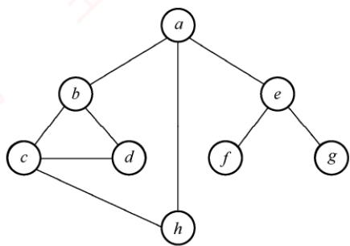
</div>

$$
V =
$$

$$
\{V _ {0}, V _ {1}, V _ {2}, V _ {3} \}
$$

$$
E = \left\{\left. <   v _ {0}, v _ {1} >, <   v _ {0}, v _ {2} >, <   v _ {0}, v _ {3} > \right. \right.
$$

$\langle v_{1},v_{3}\rangle$ 。若从顶点 $V_{0}$ 开始对图进行深度优先遍历，则可能得到的不同遍历序列个数是（）。

- A. 2
- B. 3
- C. 4
- D. 5

18. 【2016 统考真题】下列选项中，不是右图所示深度优先搜索序列的是（）。

- A. $V_{1}, V_{5}, V_{4}, V_{3}, V_{2}$
- B. $V_{1}, V_{3}, V_{2}, V_{5}, V_{4}$
- C. $V_{1}, V_{2}, V_{5}, V_{4}, V_{3}$
- D. $V_{1}, V_{2}, V_{3}, V_{4}, V_{5}$

<div align="center">
  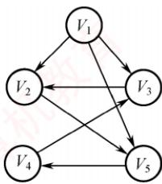
</div>

#### 二、综合应用题

01. 图 $G = (V, E)$ 以邻接表存储，如下图所示，试画出图 $G$ 的深度优先生成树和广度优先生成树（假设从顶点1开始遍历）。

<div align="center">
  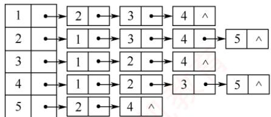
</div>

02. 给定一个连通无向图，采用邻接表存储，将图的所有顶点分别染成红色或蓝色，若存在一种染色方法使图中每条边的两个顶点的颜色都不相同，则称这个图能被二分。

<div align="center">
  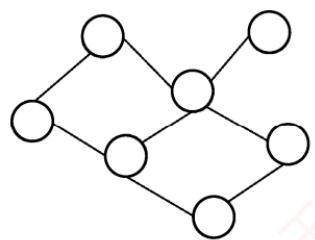
</div>

<div align="center">
  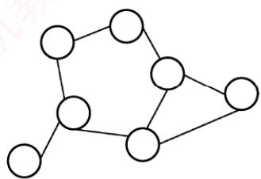
</div>

1）判断上面两个无向图是否能被二分，若能被二分，则请标出每个顶点的颜色。

2）请设计一种算法用来判断图是否能被二分，仅用语言描述算法的思想即可。

3）给出你设计的算法的时间复杂度和空间复杂度。

03. 试设计一个算法，判断一个无向图 $G$ 是否为一棵树。若是一棵树，则算法返回 true，否则返回 false。

04. 分别采用基于深度优先遍历和广度优先遍历算法判别以邻接表方式存储的有向图中是否存在由顶点 $v_{i}$ 到顶点 $v_{j}$ 的路径（ $i \neq j$ ）。注意，算法中涉及的图的基本操作必须在此存储结构上实现。

05. 假设图用邻接表表示，设计一个算法，输出从顶点 $V_{i}$ 到顶点 $V_{j}$ 的所有简单路径。

### 6.3.5 答案与解析

#### 一、单项选择题

**01. A**

　　广度优先搜索以起始顶点为中心，一层一层地向外层扩展遍历图的顶点，因此无法考虑到边权值，只适合求边权值相等的图的单源最短路径。广度优先搜索相当于树的层序遍历，说法III错误。广度优先搜索需要用到队列，深度优先搜索需要用到栈，说法IV正确。

**02. D**

　　图的深度优先遍历序列通常是不唯一的，说法 I 错误。图 1 是一个不存在回路的有向图，从顶点 1 开始执行广度优先遍历，若不设置访问标志位，则会重复访问顶点 3，说法 II 错误。深度优先遍历（见本节后面习题的解析）或拓扑排序算法可以判断有向图中是否有环，说法 III 正确。图 2 是一个非强连通图，但从顶点 1 开始调用一次广度优先遍历算法就可访问所有顶点，说法 IV 错误。

<div align="center">
  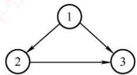
</div>

　　图1

<div align="center">
  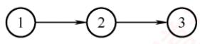
</div>

　　图2

**03. C**

　　DFS（或 BFS）可用来计算无向图的连通分量数，因为一次遍历必然会将一个连通图中的所有顶点都访问到，所以计算图的连通分量数正好是 DFSTraverse() 中 DFS 被调用的次数。

**04. C、A、C、A**

　　深度优先遍历时，每个顶点表结点和每个边表结点均查找一次，每个顶点递归调用一次，需要借助一个递归工作栈；而广度优先遍历时，也是每个顶点表结点和每个边表结点均查找一次，需要借助一个辅助队列。因此，时间复杂度都为 $O(n + e)$ ，空间复杂度都为 $O(n)$ 。

**05. A**

　　在图的广度优先遍历算法中，每个顶点被访问后立即做访问标记并入队。若队列不空，则队首顶点出队，若该顶点的邻接顶点未被访问，则访问之，做访问标记并入队；若被访问过，则跳过，如此反复，直至队空。因此，在广度优先遍历过程中，每个顶点最多入队一次。

**06. A、A**

　　采用邻接矩阵表示时，查找一个顶点所有出边的时间复杂度为 $O(n)$ ，共有 $n$ 个顶点，所以时间复杂度均为 $O(n^2)$ 。

**07. D**

　　画出草图后，此类题可以根据边的邻接关系快速排除错误选项。以选项 A 为例，在遍历到 e 之后，应该访问与 e 邻接但未被访问的顶点， $(e, c)$ 显然不在边集中。

**08. D**

　　仅 1 和 4 正确。以 2 为例，遍历到 c 之后，与 c 邻接且未被访问的顶点为空集，所以应为 a 的邻接点 b 或 e 入栈。以 3 为例，因为遍历要按栈退回，所以是先 b 后 c，而不能先 c 后 b。

**09. B、D**

　　图的深度优先搜索类似于树的先根遍历，即先访问顶点，再递归向外层顶点遍历，都采用回溯算法。图的广度优先搜索类似于树的层序遍历，即一层一层向外层扩展遍历，都需要采用队列来辅助算法的实现。

**10. A、B**

　　DFS 序列产生的路径为<1, 2>, <2, 5>, <5, 4>, <3, 6>; BFS 序列产生的路径为<1, 2>, <1, 4>, <2, 5>, <3, 6>。

**11. D**

　　画出 V 和 E 对应的图 G，然后根据搜索算法求解。

> **注意：**

　　为什么本题序列是不唯一的，而上题序列却是唯一的呢？

　　因为上题给出了具体的存储结构，此时就必须按照算法的过程来执行，每个顶点的邻接点的顺序已固定，但本题中每个顶点的邻接点的顺序是非固定的。

**12. C**

　　利用深度优先遍历可以判断图 G 中是否存在回路。

　　对于无向图来说，若深度优先遍历过程中遇到了回边，则必定存在环；对于有向图来说，这条回边可能是指向深度优先森林中另一棵生成树上的顶点的弧；但是，从有向图的某个顶点 v 出发进行深度优先遍历时，若在 DFS(v) 结束之前出现一条从顶点 u 到顶点 v 的回边，且 u 在生成树上是 v 的子孙，则有向图必定存在包含顶点 v 和顶点 u 的环。

**13. B**

　　连通分量是无向图的极大连通子图，其中极大的含义是将依附于连通分量中顶点的所有边都加上，所以连通分量中可能存在回路，这样就不是生成树了。

> **注意：**

　　极大连通子图是无向图（不一定连通）的连通分量，极小连通子图是连通无向图的生成树。极小和极大是在满足连通的前提下，针对边的数目而言的。极大连通子图包含连通分量的全部边；极小连通子图（生成树）包含连通图的全部顶点，且使其连通的边数最少。

**14. A**

　　对于无向图的广度优先搜索生成树，起点到其他顶点的路径是图中对应的最短路径，即所有生成树中树高最小。此外，深度优先总是尽可能“深”地搜索图，因此其路径也尽可能长，所以深度优先生成树的树高总是大于或等于广度优先生成树的树高。

**15. C**

　　广度优先遍历需要借助队列实现。采用邻接表存储方式对图进行广度优先遍历时，每个顶点均需入队一次（顶点表遍历），所以时间复杂度为 $O(n)$ ，在搜索所有顶点的邻接点的过程中，每条边至少访问一次（出边表遍历），所以时间复杂度为 $O(e)$ ，算法总的时间复杂度为 $O(n + e)$ 。

**16. D**

　　只要掌握 DFS 和 BFS 的遍历过程，便能轻易解决。逐个代入，手工模拟，选项 D 是深度优先遍历，而不是广度优先遍历。

**17. D**

　　画出该有向图，如右图所示。采用图的深度优先遍历，共有5种可能： $<v_{0}, v_{1}, v_{3}, v_{2}>, <v_{0}, v_{2}, v_{3}, v_{1}>, <v_{0}, v_{2}, v_{1}, v_{3}>, <v_{0}, v_{3}, v_{2}, v_{1}>, <v_{0}, v_{3}, v_{1}, v_{2}>$ 。

**18. D**

<div align="center">
  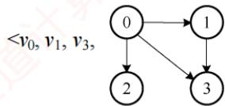
</div>

　　按深度优先遍历的策略进行遍历。对于选项 A：先访问 $V_{1}$ ，然后访问与 $V_{1}$ 邻接且未被访问的任意一个顶点（满足的有 $V_{2}, V_{3}$ 和 $V_{5}$ ），此时访问 $V_{5}$ ，然后从 $V_{5}$ 出发，访问与 $V_{5}$ 邻接且未被访问的任意一个顶点（满足的只有 $V_{4}$ ），然后从 $V_{4}$ 出发，访问与 $V_{4}$ 邻接且未被访问的任意一个顶点（满足的只有 $V_{3}$ ），然后从 $V_{3}$ 出发，访问与 $V_{3}$ 邻接且未被访问的任意一个顶点（满足的只有 $V_{2}$ ），结束遍历。选项 B 和 C 的分析方法与 A 相同。对于选项 D，首先访问 $V_{1}$ ，然后从 $V_{1}$ 出发，访问与 $V_{1}$ 邻接且未被访问的任意一个顶点（满足的有 $V_{2}, V_{3}$ 和 $V_{5}$ ），然后从 $V_{2}$ 出发，访问与 $V_{2}$ 邻接且未被访问的任意一个顶点（满足的只有 $V_{5}$ ），按规则本应该访问 $V_{5}$ ，但选项 D 却访问了 $V_{3}$ ，错误。

#### 二、综合应用题

**01. 【解答】**

　　根据 G 的邻接表不难画出图(a)。

<div align="center">
  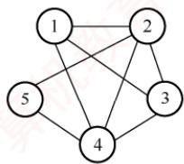
</div>

<p align="center"><em>(a) 图G</em></p>

<div align="center">
  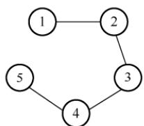
</div>

<p align="center"><em>(b) 深度优先生成树</em></p>

<div align="center">
  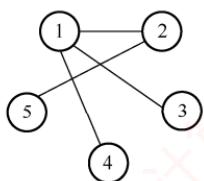
</div>

<p align="center"><em>(c) 广度优先生成树</em></p>

1）采用深度优先遍历。深度优先搜索总是尽可能“深”地搜索图，根据存储结构可知，深度优先搜索的路径次序为(1,2),(2,3),(3,4),(4,5)，深度优先生成树如图(b)所示。需要注意的是，当存储结构固定时，生成树的树形也就固定了，因此不能先搜索(1,3)。

2）采用广度优先遍历。广度优先搜索总是尽可能“广”地搜索图，一层一层地向外扩展，根据存储结构可知广度优先搜索的路径次序为(1, 2),

　　(1, 3), (1, 4), (2, 5)，广度优先生成树如图(c)所示。

**02. 【解答】**

1）右图不能被二分，左图能被二分，染色情况如右图所示。

<div align="center">
  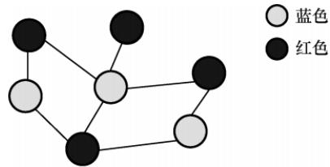
</div>

2）从任意一个顶点开始，将其染成红色，并从该顶点开始对整个图进行遍历，在遍历过程中，若当前遍历的顶点 a 有一条边指向 b，则可能出现三种情况：① b 未被染色，将它染成与顶点 a 不同的颜色，并且继续遍历与 b 相连的顶点；② a 与 b 的颜色相同，说明该图不能被二分，直接返回；③ a 与 b 的颜色不同，跳过 b 点。

3）上述遍历无论是使用深度优先还是使用广度优先，时间复杂度都为 $O(n + m)$ ，其中的 $n$ 和 $m$ 分别是顶点数和边数。需要一个数组来存储各顶点的颜色及是否已访问，空间复杂度为 $O(n)$ 。

**03. 【解答】**

　　一个无向图 G 是一棵树的条件是，G 必须是无回路的连通图或有 n-1 条边的连通图。这里采用后者作为判断条件。对连通的判定，可以用能否一次遍历全部顶点来实现。可以采用深度优先搜索算法在遍历图的过程中统计可能访问到的顶点个数和边的条数，若一次遍历就能访问到 n 个顶点和 n-1 条边，则可断定此图是一棵树。算法实现如下：

```txt
bool isTree(Graph& G){
    for (i=1;i<=G.vexnum;i++)
    visited[i]=FALSE; //访问标记visited[]初始化
    int Vnum=0,Enum=0; //记录顶点数和边数
    DFS(G,1,Vnum,Enum,visited);
    if(Vnum==G.vexnum&&Enum==2*(G.vexnum-1))
    return true; //符合树的条件
    else
    return false; //不符合树的条件
}
void DFS(Graph& G,int v,int& Vnum,int& Enum,int visited[]) {
    //深度优先遍历图G，统计访问过的顶点数和边数，通过Vnum和Enum返回
    visited[v]=TRUE;Vnum++; //作访问标记，顶点计数
    int w=FirstNeighbor(G,v); //取v的第一个邻接顶点
    while(w!=-1){ //当邻接顶点存在
    Enum++; //边存在，边计数
    if(!visited[w]) //当该邻接顶点未访问过
    DFS(G,w,Vnum,Enum,visited);
    w=NextNeighbor(G,v,w);
    }
}
```

**04. 【解答】**

　　两个不同的遍历算法都采用从顶点 $v_{i}$ 出发，依次遍历图中每个顶点，直到搜索到顶点 $v_{j}$ ，若能够搜索到 $v_{j}$ ，则说明存在由顶点 $v_{i}$ 到顶点 $v_{j}$ 的路径。

　　深度优先遍历算法的实现如下:

　　int visited[MAXSIZE] = {0}; //访问标记数组
void DFS(ALGraph G, int i, int j, bool &can_reach) {
　　    //深度优先判断有向图 G 中顶点 $v_{i}$ 到顶点 $v_{j}$ 是否有路径，用 can_reach 来标识
    if (i == j) {
    can_reach = true;
　　    return;    //i 就是 j
    }
　　    visited[i] = 1;    //置访问标记
    for (int p = FirstNeighbor(G, i); p >= 0; p = NextNeighbor(G, i, p))
　　    if (!visited[p] && !can_reach)    //递归检测邻接点
    DFS(G, p, j, can_reach);
}

　　广度优先遍历算法的实现如下：

　　int visited[MAXSIZE] = {0}; //访问标记数组
int BFS(ALGraph G, int i, int j) {
　　    //广度优先判断有向图G中顶点 $v_i$ 到顶点 $v_j$ 是否有路径，若是，则返回1，否则返回0
　　    InitQueue(Q); EnQueue(Q, i); //顶点i入队
　　    while (!QueueEmpty(Q)) { //非空循环
　　    DeQueue(Q, i); //队头顶点出队
　　    visited[i] = 1; //置访问标记
    if (i == j) return 1;
　　    for (int p = FirstNeighbor(G, i); p; p = NextNeighbor(G, i, p)) { //检查所有邻接点
　　    if (p == j) //若p == j，则查找成功
    return 1;
　　    if (!visited[p]) { //否则，顶点p入队
    EnQueue(Q, p);
    visited[p] = 1;
    }
    }
    }
    return 0;
}

　　本题也可以这样解答：调用以 i 为参数的 DFS(G,i) 或 BFS(G,i)，执行结束后判断 visited[j] 是否为 TRUE，若是，则说明 $v_{j}$ 已被遍历，图中必存在由 $v_{i}$ 到 $v_{j}$ 的路径。但此种解法每次都耗费最坏时间复杂度对应的时间，需要遍历与 $v_{i}$ 连通的所有顶点。

**05. 【解答】**

　　本题采用基于递归的深度优先遍历算法，从顶点 u 出发，递归深度优先遍历图中顶点，若访问到顶点 v，则输出该搜索路径上的顶点。为此，设置一个 path 数组来存放路径上的顶点（初始为空），d 表示路径长度（初始为 -1）。查找从顶点 u 到 v 的简单路径过程说明如下（假设查找函数名为 FindPath()）：

1）FindPath(G, u, v, path, d): d++; path[d] = u；若找到 u 的未访问过的相邻顶点 u1，则继续下去，否则置 visited[u] = 0 并返回。

2）FindPath(G, u1, v, path, d): d++; path[d] = u1；若找到 u1 的未访问过的相邻顶点 u2，则继续下去，否则置 visited[u1] = 0。

3）以此类推，继续上述递归过程，直到 ui=v，输出 path。

　　算法实现如下:

```c
void FindPath(AGraph *G, int u, int v, int path[], int d) {
    int w;
    ArcNode *p;
    d++; // 路径长度增 1
    path[d] = u; // 将当前顶点添加到路径中
    visited[u] = 1; // 置已访问标记
    if (u == v) // 找到一条路径则输出
    print(path[]); // 输出路径上的顶点
    p = G->adjlist[u].firstarc; // p 指向 u 的第一个相邻点
    while (p != NULL) {
    w = p->adjvex; // 若顶点 w 未访问，递归访问它
    if (visited[w] == 0)
    FindPath(G, w, v, path, d);
    p = p->nextarc; // p 指向 u 的下一个相邻点
    }
    visited[u] = 0; // 恢复环境，使该顶点可重新使用
}
```

## 6.4 图的应用

　　本节是历年考查的重点，但直接考查算法设计题的概率偏小，更多是结合具体的图实例，考查算法的具体操作过程。读者必须掌握如何手工模拟各类图算法在给定图上的执行过程。此外，还需要具备将实际问题抽象为图模型，并据此构建合适的图结构以解决问题的能力。

### 6.4.1 最小生成树

　　一个连通图的生成树包含了图的所有顶点，并且仅包含尽可能少的边。对生成树来说，若移除一条边，则会使该生成树变成非连通图；若增加一条边，则会在图中形成一条回路。

　　对于带权连通无向图 $G$ 而言，不同的生成树其总权重（树中所有边的权值之和）可能不同。具有最小总权重的生成树称为图 $G$ 的最小生成树（Minimum-Spanning-Tree，MST）。

> **考点追踪：** 最小生成树的性质（2012、2017）

　　不难看出，最小生成树具有以下特性：

1）若图 $G$ 中含有权值相同的边，则最小生成树可能不唯一，即可能存在多个不同的最小生成树。当图 $G$ 中所有边的权值互不相同时，最小生成树是唯一的。此外，若无向连通图 $G$ 本身的边数等于顶点数减1（ $G$ 本身就是一棵树），则其最小生成树就是它本身。

2）虽然最小生成树可能不唯一，但所有最小生成树的总权重都是相同的，且为最小值。

3）最小生成树的边数等于顶点数减1。

> **考点追踪：** 最小生成树中某顶点到其他顶点是否具有最短路径的分析（2023）

> **注意：**

　　最小生成树中所有边的权值之和最小，但不能保证任意两个顶点之间的路径是最短路径。如下图所示，最小生成树中 $A$ 到 $C$ 的路径长度为5，但图中 $A$ 到 $C$ 的最短路径长度为4。

<div align="center">
  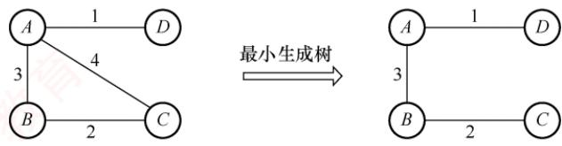
</div>

　　构造最小生成树的方法有多种，但大多数算法都基于这样一个核心性质：假设 $G = (V, E)$ 是一个带权连通无向图， $U$ 是顶点集 $V$ 的一个非空子集。若 $(u, v)$ 是一条权值最小的边，其中 $u \in U, v \in V - U$ ，则图 $G$ 中必存在一棵包含边 $(u, v)$ 的最小生成树。

　　基于此原理的主要算法包括 Prim 算法和 Kruskal 算法，二者均采用贪心策略。对这两种算法，应重点掌握其本质含义与基本思想，并能动手模拟其执行过程。

　　以下是通用的最小生成树算法框架:

　　while T 未形成一棵生成树；

　　do 找到一条最小代价边 $(u, v)$ 并且加入 T 后不会产生回路；

$$
\mathrm{T} = \mathrm{T} \cup (\mathrm{u}, \mathrm{v});
$$

　　通过逐步添加边来逐渐构造一棵生成树，下面介绍实现上述框架的两种经典算法。

#### 1. Prim 算法

　　Prim（普里姆）算法在执行过程上与求解单源最短路径的Dijkstra算法较为相似。

> **考点追踪：** Prim 算法构造最小生成树的实例（2015、2017、2018）

　　初始时，从图中任取一个顶点加入树 $T$ ，此时 $T$ 仅包含该顶点。接着，选择一个与当前 $T$ 中顶点集合距离最近的顶点，并将该顶点及其相连的最小权值边加入 $T$ 。每执行一次此操作， $T$ 中的顶点数和边数各增加1。重复这一过程，直到图中所有顶点都被并入 $T$ 为止。最终得到的 $T$ 即为最小生成树，且其中必然含有 $n - 1$ 条边。图6.15展示了Prim算法构造最小生成树的过程。

<div align="center">
  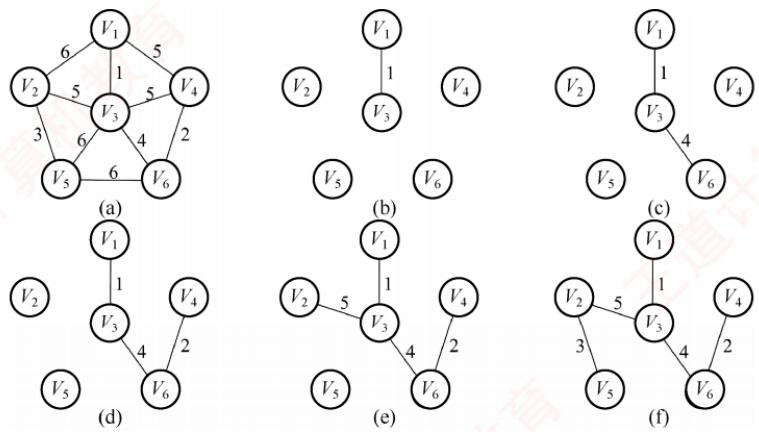
</div>

<p align="center"><em>图 6.15 Prim 算法构造最小生成树的过程</em></p>

　　Prim 算法步骤如下:

　　假设 $G = \{V, E\}$ 是连通图，其最小生成树 $T = (U, E_{T})$ ， $E_{T}$ 是 T 中的边集合。

　　初始化：向空树 $T = (U, E_T)$ 中添加图 $G$ 的任意一个顶点 $\pmb{u}_0$ ，使得 $U = \{\pmb{u}_0\}$ ， $E_T = \emptyset$ 。

　　循环（重复，直至 $U = V$ ）：从图 $G$ 中选择满足条件 $\{(u, v) | u \in U, v \in V - U\}$ 且具有最小权值的边 $(u, v)$ ，将其加入树 $T$ ，并更新 $U = U \cup \{v\}$ ， $E_T = E_T \cup \{(u, v)\}$ 。

　　Prim 算法的简单实现如下:

```txt
void Prim(G,T) {
    T=∅; //初始化空树
    U={w}; //添加任意一个顶点 w
    while((V-U)!=∅) { //若树中不含全部顶点
    设(u,v)是使 u∈U 与 v∈(V-U)，且权值最小的边；
    T=T∪{(u,v)}; //边归入树
    U=U∪{v}; //顶点归入树
    }
}
```

　　在 Prim 算法中，每步都从当前已构建的树向外扩展一条最短边，逐步生长出整棵最小生成树。该算法的时间复杂度为 $O(|V|^{2})$ ，与边数 $|E|$ 无关，因此特别适用于求解边稠密图的最小生成树。虽然采用其他方法能改进 Prim 算法的时间复杂度，但会增加实现的复杂度。

#### 2. Kruskal 算法

　　与 Prim 算法从一个顶点开始扩展最小生成树的方式不同，Kruskal（克鲁斯卡尔）算法采用按边的权值递增次序选择合适的边来构造最小生成树的方法。

> **考点追踪：** Kruskal算法构造最小生成树的实例（2015、2018、2020）

　　初始时，图 $T = \{V, \{\}\}$ 包含全部 $n$ 个顶点，但不含任何边，每个顶点自成一个连通分量。然后按照边的权值从小到大的顺序，依次考察各条边：如果当前边连接的两个顶点属于 $T$ 中不同的连通分量（可通过并查集判断），则将该边加入 T；否则，舍弃此边，继续考察下一条权值最小的边。重复这一过程，直到所有顶点都属于同一个连通分量，此时得到的 T 即为最小生成树。图 6.16 展示了 Kruskal 算法构造最小生成树的过程。

　　Kruskal 算法步骤如下:

　　假设 $G=(V,E)$ 是连通图，其最小生成树 $T=(U,E_{T})$ ， $E_{T}$ 是 T 中的边集合。

　　初始化： $U = V, E_{T} = \varnothing$ 。即每个顶点构成一棵独立的树，T此时是一个仅含 $|V|$ 个顶点的森林。
　　循环（重复，直至 T 成为一棵树）：按照边权值递增的顺序，从 $E - E_{T}$ 中选择一条边。若该边加入 T 后不构成回路，则将其加入 $E_{T}$ ；否则舍弃，直到 $E_{T}$ 包含 n-1 条边为止。

<div align="center">
  
</div>

<p align="center"><em>图 6.16 Kruskal 算法构造最小生成树的过程</em></p>

　　Kruskal 算法的简单实现如下:

```txt
void Kruskal(V,T) {
    T=V;    //初始化树T，仅含顶点
    numS=n;    //连通分量数
    while (numS>1) {    //若连通分量数大于1
    从E中取出权值最小的边(v,u);
    if(v和u属于T中不同的连通分量) {
    T=T∪{(v,u)};    //将此边加入生成树中
    numS--;    //连通分量数减1
    }
    }
}
```

　　在 Kruskal 算法中，每当选择一条连接两棵不同树的边时，这两棵树将通过这条边合并为一棵更大的树，随着算法的进行，整个森林逐渐合并成一棵树。考虑到算法效率，在最坏情况下需要对所有的 $|E|$ 条边各扫描一次。通常，边会存储在一个堆（见第 7 章）中，每次从中选出最小权值的边所需时间为 $O(\log_{2}|E|)$ 。同时，使用并查集来快速确定两个顶点是否属于同一集合的时间复杂度为 $O(\alpha(|V|))$ ，这里 $\alpha(|V|)$ 增长极其缓慢，可视为常数。因此，Kruskal 算法的总时间复杂度为 $O(|E|\log_{2}|E|)$ ，不依赖于 $|V|$ ，这使得它特别适合于处理边稀疏但顶点较多的图。

### 6.4.2 最短路径

> **考点追踪：** 最短路径的分析与举例以及相关的算法（2009、2023）

　　在 6.3 节中讨论的广度优先搜索算法适用于求解无权图的最短路径。当图是带权图时，从一个顶点 $v_{0}$ 到图中任意另一个顶点 $v_{i}$ 的路径上所有边的权值之和，称为该路径的带权路径长度；其中，带权路径长度最小的路径（可能存在多条）称为最短路径。

　　求解最短路径问题的算法通常基于其最优子结构性质：两点间最短路径上的任意子路径，也是对应端点间的最短路径。图的最短路径问题一般可分为两类：一是单源最短路径——求图中某个顶点到其余各顶点的最短路径，可使用经典的 Dijkstra（迪杰斯特拉）算法求解；二是所有顶点对之间的最短路径，可使用 Floyd（弗洛伊德）算法求解。

#### 1. Dijkstra 算法求单源最短路径问题

　　Dijkstra 算法使用一个集合 S 记录已确定最短路径的顶点。初始时，将源点（顶点 0）放入 S；每当将一个新顶点 i 加入 S 后，需更新源点到所有尚未确定最短路径的顶点（集合 V-S 中的顶点）的当前最短路径长度。算法执行过程中维护以下三个辅助数组：

- final[]：标记各顶点是否已找到最短路径（是否属于集合 $S$ ）。

- dist[]：记录从源点到各顶点的当前最短路径长度。初始化时，若存在从源点到顶点 $i$ 的直接边，则 $\mathrm{dist}[i]$ 为该边的权值，否则置为 $\infty$ 。

- path[]：path[i]存储从源点到顶点 $i$ 的最短路径。算法结束后，可通过 path[]数组回溯，重构出完整的最短路径。

　　假设源点为顶点 0，集合 S 初始仅含顶点 0。图以邻接矩阵 arcs 表示，其中 arcs[i][j] 为有向边 <i,j> 的权值；若该边不存在，则 arcs[i][j] 为 $\infty$ 。

　　Dijkstra 算法的步骤如下（暂不考虑对 path[] 的操作）：

1）初始化：集合 $S=\{0\}$ ，dist[]的初始值为 dist[i]=arcs[0][i], $i=1,2,\cdots,n-1$ 。

2）选择最短路径顶点：从不在 S 中的顶点集合 $(V-S)$ 中选出顶点 j，使得 dist[j] 最小，此时，顶点 j 即为当前从源点出发的最短路径的终点，将其加入集合 S。

3）松弛操作：对每个从顶点 $j$ 出发的邻接顶点 $k$ （ $\operatorname{arcs}[j][k] \neq \infty$ ），若 $\operatorname{dist}[j] + \operatorname{arcs}[j][k] < \operatorname{dist}[k]$ ，则更新 $\operatorname{dist}[k] = \operatorname{dist}[j] + \operatorname{arcs}[j][k]$ 。

4）重复步骤2）～3）共 $n - 1$ 次，直至所有顶点都包含在集合 $S$ 中。

　　每个新顶点加入集合 S 后，都可能发现到达其他尚未确定最短路径顶点的更短路径，从而需要更新相应的 dist[] 值。以右图为例，设源点为 $v_{0}$ ，初始时 $S = \{v_{0}\}$ ，dist[1] = 3，dist[2] = 7。将 $v_{1}$ 加入集合 S 后，发现路径 $v_{0} \rightarrow v_{1} \rightarrow v_{2}$ 的长度为 4（dist[1] +

$$
\operatorname{arcs} [ 1 ] [ 2 ] = 3 + 1 = 4)
$$

　　思考：Dijkstra 算法与 Prim 算法有何异同之处？ $^{①}$

<div align="center">
  
</div>

> **考点追踪：** Dijkstra 算法求解最短路径的实例（2012、2014、2016、2021）

　　例如，对图 6.17 中的图应用 Dijkstra 算法求从顶点 1 出发到其余各顶点的最短路径的过程，如表 6.2 所示。算法执行过程的说明如下。

<div align="center">
  
</div>

　　每轮得到的最短路径如下：

　　第2轮： $1\to 5\to 4$ ，路径距离为7

　　第3轮： $1\to 5\to 2$ ，路径距离为8

　　第4轮： $1\to 5\to 2\to 3$ ，路径距离为9

<p align="center"><em>图 6.17 应用 Dijkstra 算法的图</em></p>

<p align="center"><em>表 6.2 从 $v_{1}$ 到各终点的 dist 值和最短路径的求解过程</em></p>

<table><tr><td>顶点</td><td>第1轮</td><td>第2轮</td><td>第3轮</td><td>第4轮</td></tr><tr><td>2</td><td><eq>10</eq><eq>v_1 \rightarrow v_2</eq></td><td>8<eq>v_1 \rightarrow v_5 \rightarrow v_2</eq></td><td>8<eq>v_1 \rightarrow v_5 \rightarrow v_2</eq></td><td></td></tr><tr><td>3</td><td><eq>\infty</eq></td><td>14<eq>v_1 \rightarrow v_5 \rightarrow v_3</eq></td><td>13<eq>v_1 \rightarrow v_5 \rightarrow v_4 \rightarrow v_3</eq></td><td>9<eq>v_1 \rightarrow v_5 \rightarrow v_2 \rightarrow v_3</eq></td></tr><tr><td>4</td><td><eq>\infty</eq></td><td>7<eq>v_1 \rightarrow v_5 \rightarrow v_4</eq></td><td></td><td></td></tr><tr><td>5</td><td><eq>5</eq><eq>v_1 \rightarrow v_5</eq></td><td></td><td></td><td></td></tr><tr><td>集合S</td><td><eq>\{1,5\}</eq></td><td><eq>\{1,5,4\}</eq></td><td><eq>\{1,5,4,2\}</eq></td><td><eq>\{1,5,4,2,3\}</eq></td></tr></table>

　　初始化：集合 S 初始为 $\{v_{1}\}$ ，从 $v_{1}$ 可达 $v_{2}$ 和 $v_{5}$ ，不可达 $v_{3}$ 和 $v_{4}$ ，因此 dist[] 数组的初始值为 dist[2] = 10，dist[3] = ∞，dist[4] = ∞，dist[5] = 5。

　　第 1 轮：选出最小值 dist[5]，将 $v_{5}$ 加入集合 S，此时已确定 $v_{1}$ 到 $v_{5}$ 的最短路径。检查从 $v_{5}$ 出发的邻接边： $v_{5}$ 可达 $v_{2}$ ， $v_{1} \rightarrow v_{5} \rightarrow v_{2}$ 的长度为 8，小于当前 dist[2] = 10，更新 dist[2] = 8； $v_{5}$ 可达 $v_{3}$ ， $v_{1} \rightarrow v_{5} \rightarrow v_{3}$ 的长度为 14，更新 dist[3] = 14； $v_{5}$ 可达 $v_{4}$ ， $v_{1} \rightarrow v_{5} \rightarrow v_{4}$ 的长度为 7，更新 dist[4] = 7。

　　第 2 轮：选出最小值 dist[4]，将 $v_{4}$ 加入集合 S。检查从 $v_{4}$ 出发的邻接边： $v_{4}$ 不可达 $v_{2}$ ，dist[2] 不变； $v_{4}$ 可达 $v_{3}$ ， $v_{1} \rightarrow v_{5} \rightarrow v_{4} \rightarrow v_{3}$ 的长度为 13，小于当前 dist[3] = 14，更新 dist[3] = 13。

　　第 3 轮：选出最小值 dist[2]，将 $v_{2}$ 加入集合 S。检查从 $v_{2}$ 出发的邻接边： $v_{2}$ 可达 $v_{3}$ ， $v_{1} \rightarrow v_{5} \rightarrow v_{2} \rightarrow v_{3}$ 的长度为 9，小于当前 dist[3] = 13，更新 dist[3] = 9。

　　第4轮：选出唯一最小值dist[3]，将 $v_{3}$ 加入集合 $S$ ，此时，所有顶点均已包含在集合 $S$ 中。

　　使用邻接矩阵表示图，并采用线性扫描 dist[] 查找最小值时，Dijkstra 算法的时间复杂度为 $O(|V|^{2})$ 。若改用带权邻接表，虽然松弛操作的总代价可降至 $O(|E|)$ ，但由于查找最小 dist[] 值仍需 $O(|V|)$ 时间，总时间复杂度仍为 $O(|V|^{2})$ 。即使只需求解从源点到某一个特定顶点的最短路径，在最坏情况下仍需处理所有顶点，因此时间复杂度不变，仍为 $O(|V|^{2})$ 。

　　特别注意：Dijkstra 算法不适用于存在负权边的图。该算法基于贪心策略，一旦顶点被加入集合 S，便不再更新其最短路径。然而，若图中存在负权边，后续路径可能通过负权边 “绕回” 已确定的顶点，从而发现更短路径，而 Dijkstra 算法无法察觉这一变化，导致结果错误。例如，对于图 6.18 所示的带权有向图，Dijkstra 算法可能无法得到正确的最短路径。

<div align="center">
  
</div>

<p align="center"><em>图 6.18 边上带有负权值的有向带权图</em></p>

#### 2. Floyd算法求各顶点之间最短路径问题

　　给定带权有向图，对任意两个不同顶点 $v_{i} \neq v_{j}$ ，求解从 $v_{i}$ 到 $v_{j}$ 的最短路径及其长度。

　　Floyd 算法的基本思想：迭代生成一系列 n 阶方阵 $A^{(-1)}, A^{(0)}, \cdots, A^{(k)}, \cdots, A^{(n-1)}$ ，其中 $A^{(k)}[i][j]$ 表示从顶点 $v_{i}$ 到 $v_{j}$ 、仅允许使用编号不超过 k 的顶点作为中间顶点时的最短路径长度。初始时 $(k = -1)$ ，若存在从 $v_{i}$ 到 $v_{j}$ 的直接边，则 $A^{(-1)}[i][j]$ 为该边的权值；否则设为 $\infty$ 。特别地，对所有 i，令 $A^{(-1)}[i][i] = 0$ 。随后，依次考虑顶点 $k (k = 0, 1, \cdots, n-1)$ 作为中间顶点，若经由 $v_{k}$ 的路径比当前记录的路径更短，则更新对应的距离。算法的描述如下：

　　定义 n 阶方阵序列 $A^{(-1)}, A^{(0)}, \cdots, A^{(n-1)}$ ，其中，

$$
\begin{array}{c} A ^ {(- 1)} [ i ] [ j ] = \operatorname{arcs} [ i ] [ j ] \\ A ^ {(k)} [ i ] [ j ] = \operatorname{Min} \{A ^ {(k - 1)} [ i ] [ j ], \quad A ^ {(k - 1)} [ i ] [ k ] + A ^ {(k - 1)} [ k ] [ j ] \}, k = 0, 1, \dots , n - 1 \end{array}
$$

　　式中， $A^{(0)}[i][j]$ 表示从 $v_{i}$ 到 $v_{j}$ 、仅允许使用 $v_{0}$ 作为中间顶点的最短路径长度；一般地， $A^{(k)}[i][j]$ 表示从 $v_{i}$ 到 $v_{j}$ 、中间顶点编号不超过k的最短路径长度。Floyd算法是一个迭代过程，每完成一次迭代，便将下一个顶点纳入可选的中间顶点集合；经过n次迭代后， $A^{(n-1)}[i][j]$ 即为 $v_{i}$ 到 $v_{j}$ 的最短路径长度。最终，矩阵 $A^{(n-1)}$ 中的每个元素即为对应顶点对的最短路径长度。

<p align="center"><em>图 6.19 所示为一带权有向图 $G$ 及其邻接矩阵。应用Floyd算法求解所有顶点对之间的最短路径长度的过程如表6.3所示。算法执行过程的说明如下。</em></p>

<div align="center">
  
</div>

<p align="center"><em>图 6.19 带权有向图 G 及其邻接矩阵</em></p>

　　初始化：方阵 $A^{(-1)}[i][j]=\arcsin[i][j]$ 。

　　第 1 轮：以 $v_{0}$ 为中间顶点，检查全部顶点对 $\{i, j\}$ 。若 $A^{(-1)}[i][j] > A^{(-1)}[i][0] + A^{(-1)}[0][j]$ ，则将 $A^{(-1)}[i][j]$ 更新为 $A^{(-1)}[i][0] + A^{(-1)}[0][j]$ 。 $A^{(-1)}[2][1] = \infty$ ，而 $A^{(-1)}[2][0] + A^{(-1)}[0][1] = 11$ ，因 $\infty > 11$ ，故更新 $A^{(-1)}[2][1] = 11$ 。其余元素保持不变，得到方阵 $A^{(0)}$ 。

　　第 2 轮：以 $v_{1}$ 为中间顶点，检查全部顶点对 $\{i, j\}$ 。 $A^{(0)}[0][2] = 13$ ，而 $A^{(0)}[0][1] + A^{(0)}[1][2] = 10$ ，因 13 > 10，故更新 $A^{(0)}[0][2] = 10$ ，得到方阵 $A^{(1)}$ 。

　　第3轮：以 $v_{2}$ 为中间顶点，检查全部顶点对 $\{i,j\}$ 。 $A^{(1)}[1][0]=10$ ，而 $A^{(1)}[1][2]+A^{(1)}[2][0]=9$ ，更新 $A^{(1)}[1][0]=9$ ，最终得到方阵 $A^{(2)}$ ，其中每个元素 $A^{(2)}[i][j]$ 即为 $v_{i}$ 到 $v_{j}$ 的最短路径长度。

<p align="center"><em>表 6.3 Floyd 算法的执行过程</em></p>

<table><tr><td><eq>A</eq></td><td colspan="3"><eq>{A}^{(-1)}</eq></td><td colspan="3"><eq>{A}^{\left( 0\right) }</eq></td><td colspan="3"><eq>{A}^{\left( 1\right) }</eq></td><td colspan="3"><eq>{A}^{\left( 2\right) }</eq></td></tr><tr><td></td><td><eq>{V}_{0}</eq></td><td><eq>{V}_{1}</eq></td><td><eq>{V}_{2}</eq></td><td><eq>{V}_{0}</eq></td><td><eq>{V}_{1}</eq></td><td><eq>{V}_{2}</eq></td><td><eq>{V}_{0}</eq></td><td><eq>{V}_{1}</eq></td><td><eq>{V}_{2}</eq></td><td><eq>{V}_{0}</eq></td><td><eq>{V}_{1}</eq></td><td><eq>{V}_{2}</eq></td></tr><tr><td><eq>{V}_{0}</eq></td><td>0</td><td>6</td><td>13</td><td>0</td><td>6</td><td>13</td><td>0</td><td>6</td><td><eq>\underline{10}</eq></td><td>0</td><td>6</td><td>10</td></tr><tr><td><eq>{V}_{1}</eq></td><td>10</td><td>0</td><td>4</td><td>10</td><td>0</td><td>4</td><td>10</td><td>0</td><td>4</td><td><eq>\underline{9}</eq></td><td>0</td><td>4</td></tr><tr><td><eq>{V}_{2}</eq></td><td>5</td><td><eq>\infty</eq></td><td>0</td><td>5</td><td><eq>\underline{11}</eq></td><td>0</td><td>5</td><td>11</td><td>0</td><td>5</td><td>11</td><td>0</td></tr></table>

　　Floyd算法的时间复杂度为 $O(|V|^3)$ 。其代码结构紧凑，仅需一个三重循环，无须复杂数据结构，且常数因子较小，因此在中等规模图上实际运行效率较高。

　　Floyd 算法允许图中存在负权边，但不允许存在负权环。Floyd 算法同样适用于带权无向图——只需将每条无向边视为两条方向相反、权值相同的有向边。

　　此外，也可通过调用单源最短路径算法求解所有顶点对的最短路径：在边权非负的条件下，依次以每个顶点为源点运行Dijkstra算法。Dijkstra算法的时间复杂度为 $O(|V|^2)$ ，因此共需执行 $|V|$ 次，总时间复杂度为 $O(|V|^3)$ ，与Floyd算法的相同。

　　BFS 算法、Dijkstra 算法和 Floyd 算法求最短路径的总结如表 6.4 所示。

<p align="center"><em>表 6.4 BFS 算法、Dijkstra 算法和 Floyd 算法求最短路径的总结</em></p>

<table><tr><td></td><td>BFS算法</td><td>Dijkstra算法</td><td>Floyd算法</td></tr><tr><td>用途</td><td>求单源最短路径</td><td>求单源最短路径</td><td>求各顶点之间的最短路径</td></tr><tr><td>无权图</td><td>适用</td><td>适用</td><td>适用</td></tr><tr><td>带权图</td><td>不适用</td><td>适用</td><td>适用</td></tr><tr><td>带负权值的图</td><td>不适用</td><td>不适用</td><td>适用</td></tr><tr><td>带负权回路的图</td><td>不适用</td><td>不适用</td><td>不适用</td></tr><tr><td>时间复杂度</td><td><eq>O(|V|^2)</eq>或<eq>O(|V|+|E|)</eq></td><td><eq>O(|V|^2)</eq></td><td><eq>O(|V|^3)</eq></td></tr></table>

### 6.4.3 有向无环图描述表达式

　　有向无环图（简称 DAG 图）是指一个不含任何有向环路的有向图。

> **考点追踪：** 构建表达式的有向无环图（2019）

　　有向无环图是表示含有公共子表达式的代数表达式的有效工具。例如，表达式

$$
((a + b) ^ {*} (b ^ {*} (c + d)) + (c + d) ^ {*} e) ^ {*} ((c + d) ^ {*} e)
$$

　　可用上一章介绍的二叉树表示，如图6.20所示。观察该表达式，可发现存在公共子表达式，如 $(c + d)$ ；该子表达式在多个位置被复用，如参与构成 $(c + d)*e$ 等。这些重复出现的子结构会被分别存储，造成空间浪费。若采用有向无环图，公共子表达式只需存储一次，并通过多个父结点的入边共享，从而显著节省存储空间。图6.21展示了该表达式的有向无环图表示。

<div align="center">
  
</div>

<p align="center"><em>图 6.20 二叉树描述表达式</em></p>

<div align="center">
  
</div>

<p align="center"><em>图 6.21 有向无环图描述表达式</em></p>

　　关于有向无环图描述表达式的具体示例，可参考本书配套视频中的相关讲解。

> **注意：**

　　在表达式的有向无环图表示中，不会出现重复的操作数顶点。

### 6.4.4 拓扑排序

　　AOV网：若用有向无环图表示一个工程，每个顶点代表一个活动，并用有向边 $< V_{i}, V_{j}>$ 表示活动 $V_{i}$ 必须先于活动 $V_{j}$ 进行的关系，则称这种有向图为顶点表示活动的网络，简称AOV网。在此网络中，活动 $V_{i}$ 是活动 $V_{j}$ 的直接前驱，而 $V_{j}$ 则是 $V_{i}$ 的直接后继，这种关系具有传递性。此外，任何活动都不能成为自己的前驱或后继。

　　在图论中，拓扑排序指的是由有向无环图的顶点构成的一个线性序列，该序列满足条件：

1）每个顶点恰好出现一次。

2）若存在从顶点 A 到 B 的路径，则在排序后的序列中，B 必须排在 A 之后。

　　每个 AOV 网都有一个或多个拓扑排序序列。

> **考点追踪：** 拓扑排序和回路的关系（2011）

　　下面介绍一种常用的拓扑排序方法步骤:

　　① 从 AOV 网中选择一个没有前驱（入度为 0）的顶点并输出之。图中可能存在多个入度为 0 的顶点，随机选择一个输出，因此拓扑序列可能不唯一。

　　② 从网中删除该顶点和所有以它为起点的有向边。

　　③ 重复步骤①和②，直到当前 AOV 网为空或无法找到新的入度为 0 的顶点为止。后一种情况表明有向图中必然存在环。

> **考点追踪：** 拓扑排序的实例（2010、2014、2018、2021）

<p align="center"><em>图 6.22 展示了拓扑排序的过程示例，每轮选择一个入度为 0 的顶点输出，然后删除该顶点和所有以它为起点的有向边，最终得到拓扑排序结果 $\{1, 2, 4, 3, 5\}$ 。</em></p>

<div align="center">
  
</div>

<table><tr><td>顶点号</td><td>1</td><td>2</td><td>3</td><td>4</td><td>5</td></tr><tr><td>初始入度</td><td>0</td><td>1</td><td>2</td><td>2</td><td>2</td></tr><tr><td>第1轮</td><td></td><td>0</td><td>2</td><td>1</td><td>2</td></tr><tr><td>第2轮</td><td></td><td></td><td>1</td><td>0</td><td>2</td></tr><tr><td>第3轮</td><td></td><td></td><td>0</td><td></td><td>1</td></tr><tr><td>第4轮</td><td></td><td></td><td></td><td></td><td>0</td></tr><tr><td>第5轮</td><td></td><td></td><td></td><td></td><td></td></tr></table>

<p align="center"><em>(a) </em></p>

<p align="center"><em>图 6.22 有向无环图的拓扑排序过程</em></p>

<div align="center">
  
</div>

<p align="center"><em>图 6.22 有向无环图的拓扑排序过程（续）</em></p>

> **考点追踪：** （算法题）拓扑排序的实现（2024）

　　基于邻接表存储结构的拓扑排序算法的实现如下：

```txt
bool TopologicalSort(Graph G) {
    InitStack(S); // 初始化栈，存储入度为 0 的顶点
    int i;
    for (i = 0; i < G.vexnum; i++)
    if (indegree[i] == 0)
    Push(S, i); // 将所有入度为 0 的顶点入栈
    int count = 0; // 计数，记录当前已经输出的顶点数
    while (!StackEmpty(S)) { // 栈不空，则存在入度为 0 的顶点
    Pop(S, i); // 栈顶元素出栈
    print[count++] = i; // 输出顶点 i
    for (p = G.vertices[i].firstarc; p = p->nextarc) {
    // 将所有 i 指向的顶点的入度减 1，并且将入度减为 0 的顶点压入栈 S
```

```txt
v=p->adjvex;
if (!(--indegree[v]))
    Push(S,v); //入度为0，则入栈
}
if(count<G.vexnum)
return false; //排序失败，有向图中有回路
else
return true; //拓扑排序成功
}
```

　　因为输出每个顶点的同时还要删除以它为起点的边，所以采用邻接表存储时，拓扑排序的时间复杂度为 $O(|V| + |E|)$ ；采用邻接矩阵存储时，时间复杂度为 $O(|V|^{2})$ 。

> **考点追踪：** DFS 实现拓扑排序的思想（2020）

　　通过深度优先搜索（DFS）也可以实现拓扑排序，其基本思路如下（具体实现见本节习题）。对于有向无环图 $G$ 中的任意两个顶点 $\pmb{u}$ 和 $\pmb{v}$ ，其关系必属于以下三种情形之一：

1）若 u 是 v 的祖先（存在从 u 到 v 的路径），则在 DFS 过程中会先访问 u，再递归访问 v；v 先完成回溯，因此 v 的结束时间早于 u，即 u 的结束时间大于 v 的结束时间。

2）若 u 是 v 的子孙，则 v 是 u 的祖先，因此 v 的结束时间大于 u 的结束时间。

3）若 $u$ 和 $v$ 之间不存在任何方向的路径，则它们在拓扑序列中的相对顺序可以任意。

　　于是，将所有顶点按 DFS 结束时间降序排列，即可得到一个合法的拓扑排序序列。

　　对一个 AOV 网，若采用以下步骤进行排序，则称为逆拓扑排序：

　　① 从 AOV 网中选择一个没有后继（出度为 0）的顶点并输出。

　　②从网中删除该顶点和所有以它为终点的有向边。

　　③ 重复步骤①和②，直到当前的 AOV 网变为空为止。

　　用拓扑排序算法处理 AOV 网时，应注意以下几点：

1）入度为零的顶点表示没有前驱活动，或其所有前驱活动均已执行完毕。工程可以从该顶点所代表的活动开始或继续推进。

> **考点追踪：** 拓扑排序序列的存在性和唯一性分析（2011、2024）

2）拓扑排序的结果可能不唯一。拓扑序列唯一的充要条件是：AOV网中任意两个顶点之间都存在单向路径（任意两个活动都有明确的先后顺序）。实际判断方法是：每次输出顶点时，若当前入度为0的顶点都恰好只有一个，则最终拓扑序列唯一。

3）AOV网中各顶点地位平等，其编号是人为设定的。因此，可根据拓扑排序的结果对顶点重新编号，使得新邻接矩阵成为上三角矩阵。对于一般的有向图而言，若其邻接矩阵可通过顶点重排转换为上三角矩阵，则该图一定是有向无环图，因而存在拓扑序列。

### 6.4.5 关键路径

　　在带权有向图中，若以顶点表示事件，以有向边表示活动，并以边上的权值表示完成该活动所需的开销（如时间），则称这种图为用边表示活动的网络，简称 AOE 网。AOE 网和 AOV 网同属有向无环图，但二者在定义上有本质区别：AOE 网的边带有权值，代表活动及其持续时间，而顶点表示事件；AOV 网的边无权值，仅用于表示顶点（活动）之间的前后关系。

　　AOE网具有以下两个基本性质：

　　① 只有在某顶点所代表的事件发生后，从该顶点出发的各有向边所代表的活动才能开始；

　　② 只有当进入某顶点的各有向边所代表的活动都已完成时，该顶点所代表的事件才能发生。

　　在 AOE 网中，通常仅有一个入度为 0 的顶点，称为开始顶点（源点），表示整个工程的起点；同时仅有一个出度为 0 的顶点，称为结束顶点（汇点），表示整个工程的终点。

> **考点追踪：** ➤ 关键路径的性质与应用（2020、2025）

　　在 AOE 网中，有些活动可以并行进行。从源点到汇点可能存在多条有向路径，且这些路径的长度（路径上各边权值之和）可能不同。尽管不同路径上的活动所需时间各异，但只有在所有活动都完成后，整个工程才算结束。因此，在所有从源点到汇点的路径中，路径长度最大的那条路径被称为关键路径，而把关键路径上的活动称为关键活动。

　　完成整个工程所需的最短时间等于关键路径的长度，即该路径上所有活动持续时间之和。关键活动决定了工程的总工期，若任一关键活动延迟，整个工程的完成时间将随之推迟。因此，只要识别出关键活动，就能确定关键路径，并得出工程的最早完成时间。

　　下面给出在寻找关键活动时所用到的几个关键参量的定义。

#### 1. 事件 $v_{k}$ 的最早发生时间 $v_{e}(k)$

　　指从源点 $v_{1}$ 到顶点 $v_{k}$ 的最长路径长度。该值决定了所有从 $v_{k}$ 开始的活动能够开工的最早时间。可用以下递推公式计算：

$$
v _ {e} (\text {源点}) = 0
$$

$$
v _ {e} (k) = \operatorname{Max} \left\{v _ {e} (j) + \text { Weight } (v _ {j}, v _ {k}) \right\}
$$

　　其中， $v_{k}$ 是 $v_{j}$ 的任意后继，Weight $(v_{j}, v_{k})$ 表示有向边 $<v_{j}, v_{k}>$ 上的权值。

> **注意：**

　　计算 $v_{e}()$ 时，可在拓扑排序过程中同步进行:

　　① 初始时，令 $v_{e}[1...n]=0$ 。

　　② 每当输出一个入度为 0 的顶点 $v_{j}$ ，就计算其所有直接后继顶点 $v_{k}$ 的最早发生时间，若 $v_{e}[j] + \text{Weight}(v_{j}, v_{k}) > v_{e}[k]$ ，则更新 $v_{e}[k] = v_{e}[j] + \text{Weight}(v_{j}, v_{k})$ 。重复此过程，直至输出全部顶点。

#### 2. 事件 $v_{k}$ 的最迟发生时间 $v_{l}(k)$

　　指在不推迟整个工程完成时间的前提下，事件 $v_{k}$ 必须发生的最晚时间，以保证其所有后继事件 $v_{j}$ 均不晚于各自的最迟发生时间 $v_{l}(j)$ 发生。可用以下递推公式计算：

$$
v _ {l} (\text { 汇点 }) = v _ {e} (\text { 汇点 })
$$

$$
v _ {l} (k) = \operatorname{Min} \left\{v _ {l} (j) - \text { Weight } (v _ {k}, v _ {j}) \right\}
$$

　　其中， $v_{k}$ 是 $v_{j}$ 的任意前驱。

> **注意：**

　　计算 $v_{l}(k)$ 时，需按逆拓扑顺序进行。可在拓扑排序时用栈记录顶点顺序，排序结束后从栈顶到栈底即为逆拓扑序列。

　　① 初始时，令 $v_{l}[1...n]=v_{e}[n]$ 。

　　② 依次弹出栈顶顶点 $v_j$ ，计算其所有直接前驱顶点 $v_k$ 的最迟发生时间，若 $v_l[j] - \text{Weight}(v_k, v_j) < v_l[k]$ ，则更新 $v_l[k] = v_l[j] - \text{Weight}(v_k, v_j)$ 。重复此过程，直至栈空。

#### 3. 活动 $a_{i}$ 的最早开始时间 $e(i)$

　　指该活动所对应弧的起点事件的最早发生时间。若边 $< v_{k}, v_{j}>$ 表示活动 $a_{i}$ ，则有

$$
e (i) = v _ {e} (k) 。
$$

#### 4. 活动 $a_{i}$ 的最迟开始时间 $l(i)$

　　指在不延误工程总工期的前提下，活动 $a_{i}$ 最迟必须开始的时间，等于其终点事件的最迟发生时间与该活动所需时间之差。若边 $<v_{k}, v_{j}>$ 表示活动 $a_{i}$ ，则有

$$
l (i) = v _ {l} (j) - \text { Weight } (v _ {k}, v _ {j}) 。
$$

5. 一个活动 $a_{i}$ 的最迟开始时间 $l(i)$ 与其最早开始时间 $e(i)$ 的差额：

$$
d (i) = l (i) - e (i)
$$

　　或称活动 $a_{i}$ 的时间余量。该值表示在不延长整个工程总工期的前提下，活动 $a_{i}$ 可以拖延的时间。若一个活动的时间余量为零，则该活动必须如期完成，否则将导致整个工程延期。因此，满足 $l(i) - e(i) = 0$ [即 $l(i) = e(i)$ ] 的活动称为关键活动。

> **考点追踪：** 求关键路径的实例（2019、2022、2025）

　　求关键路径的算法步骤如下:

　　① 从源点出发，令 $v_{e}$ (源点) = 0，按拓扑有序求其余顶点的最早发生时间 $v_{e}()$ 。

　　②从汇点出发，令 $v_{l}$ (汇点) $=v_{e}$ (汇点)，按逆拓扑有序求其余顶点的最迟发生时间 $v_{l}()$ 。

　　③根据各顶点的 $v_{e}()$ 值，求所有弧的最早开始时间 $e()$ 。

　　④ 根据各顶点的 $v_{l}()$ 值，求所有弧的最迟开始时间 l()。

　　⑤ 求 AOE 网中所有活动的时间余量 $d()$ ，找出所有 $d() = 0$ 的活动构成关键路径。

<p align="center"><em>图 6.23 所示为求解关键路径的具体过程，简单说明如下：</em></p>

　　① 求 $v_{e}()$ ：初始时 $v_{e}(1)=0$ 。在拓扑排序输出顶点的过程中，依次求得 $v_{e}(2)=3,\quad v_{e}(3)=2$ ， $v_{e}(4)=\max\{v_{e}(2)+2,v_{e}(3)+4\}=\max\{5,6\}=6,\quad v_{e}(5)=6,\quad v_{e}(6)=\max\{v_{e}(5)+1,v_{e}(4)+2,v_{e}(3)+3\}=\max\{7,8,5\}=8。$

　　若本题为选择题，仅凭上述 $v_{e}()$ 的计算过程，通常已可推断出关键路径。

　　② 求 $v_{l}()$ ：初始时 $v_{l}(6)=8$ 。在逆拓扑排序（通过栈回溯）过程中，依次求得 $v_{l}(5)=7,\quad v_{l}(4)=6,\quad v_{l}(3)=\min\{v_{l}(4)-4,v_{l}(6)-3\}=\min\{2,5\}=2,\quad v_{l}(2)=\min\{v_{l}(5)-3,v_{l}(4)-2\}=\min\{4,4\}=4,\quad v_{l}(1)$ 必然为 0，无须额外计算。

　　③ 弧的最早开始时间 $e()$ 等于该弧的起点顶点的 $v_e()$ 值，结果见下表。

　　④ 弧的最迟开始时间 $l(i)$ 等于该弧的终点顶点的 $v_{l}()$ 值减去该弧的权值，结果见下表。

　　⑤ 由 $l(i)-e(i)=0$ 可确定关键活动，最终得到的关键路径为 $(v_{1}, v_{3}, v_{4}, v_{6})$ 。

<div align="center">
  
</div>

<p align="center"><em>图 6.23 求解关键路径的过程</em></p>

> **考点追踪：** 缩短工期的相关分析（2013、2025）

　　对于关键路径，需要注意以下几点：

1）关键路径上的所有活动均为关键活动，它们共同决定了整个工程的工期。因此，加快关键活动的执行速度有可能缩短总工期。但不能任意缩短关键活动的持续时间，一旦过度缩短，原关键路径的长度可能小于其他路径，从而引发关键路径的转移。此时，即使继续压缩该活动，工程总工期已由新的最长路径决定，不再受其影响。

2）网中的关键路径可能不止一条。当存在多条关键路径时，仅提高其中某一条路径上的关键活动速度，并不能缩短整个工程的工期。只有加快那些同时出现在所有关键路径上的关键活动（公共关键活动），才能达到缩短工期的目的。

　　各种图算法在采用邻接矩阵或邻接表存储时的时间复杂度如表6.5所示。

<p align="center"><em>表 6.5 采用不同存储结构时各种图算法的时间复杂度</em></p>

<table><tr><td></td><td>Dijkstra</td><td>Floyd</td><td>Prim</td><td>Kruskal</td><td>DFS</td><td>BFS</td><td>拓扑排序</td><td>关键路径</td></tr><tr><td>邻接矩阵</td><td><eq>O(n^{2})</eq></td><td><eq>O(n^{3})</eq></td><td><eq>O(n^{2})</eq></td><td>-</td><td><eq>O(n^{2})</eq></td><td><eq>O(n^{2})</eq></td><td><eq>O(n^{2})</eq></td><td><eq>O(n^{2})</eq></td></tr><tr><td>邻接表</td><td>-</td><td>-</td><td>-</td><td><eq>O(e\log_{2}e)</eq></td><td><eq>O(n + e)</eq></td><td><eq>O(n + e)</eq></td><td><eq>O(n + e)</eq></td><td><eq>O(n + e)</eq></td></tr></table>

### 6.4.6 本节试题精选

#### 一、单项选择题

01. 任何一个无向连通图的最小生成树（）。

- A. 有一棵或多棵
- B. 只有一棵
- C. 一定有多棵
- D. 可能不存在

02. 用 Prim 算法和 Kruskal 算法构造图的最小生成树，所得到的最小生成树（）。

- A. 相同
- B. 不相同
- C. 可能相同，可能不同
- D. 无法比较

03. 下列关于图的生成树和最小生成树的叙述中，正确的是（）。

- A. 只要无向连通图中没有权值相同的边，则其最小生成树唯一
- B. 只要无向图中有权值相同的边，则其最小生成树一定不唯一
- C. 从 $n$ 个顶点的连通图中选取 $n - 1$ 条权值最小的边，即可构成最小生成树
- D. 设连通图 $G$ 含有 $n$ 个顶点，则含有 $n$ 个顶点、 $n - 1$ 条边的子图一定是 $G$ 的生成树

04. 设有 $n$ 个顶点的无向连通图的最小生成树不唯一，则下列说法中正确的是（）。

- A. 图的边数一定大于 $n - 1$
- B. 图的权值最小的边一定有多条
- C. 图的最小生成树的代价不一定相等
- D. 图的各条边的权值不相等

05. 用 Prim 算法求一个带权连通图的最小生成树，在算法执行的某个时刻，已选取的顶点集合 $U = \{1,2,3\}$ ，已选取的边集合 $\mathrm{TE} = \{(1,2),(2,3)\}$ ，要选取下一条权值最小的边，应当从（）组中选取。

- A. $\{(1,4),(3,4),(3,5),(2,5)\}$
- B. $\{(3,4),(3,5),(4,5),(1,4)\}$
- C. $\{(1,2),(2,3),(3,5)\}$
- D. $\{(4,5),(1,3),(3,5)\}$

06. 用Kruskal算法求一个带权连通图的最小生成树，在算法执行的某个时刻，已选取的边集合 $TE=\{(1,2),(2,3),(3,5)\}$ ，要选取下一条权值最小的边，不可能选取的边是（）。

- A. (3,6)
- B. (2,4)
- C. (1,3)
- D. (1,4)

07. 下列关于图的最短路径的相关叙述中，正确的是（）。

- A. 最短路径一定是简单路径
- B. Dijkstra算法不适合求有回路的带权图的最短路径
- C. Dijkstra算法不适合求任意两个顶点的最短路径
- D. Dijkstra 算法可以正确处理含有负权边的图

08. 下列关于图的最短路径的相关叙述中，正确的是（）。
I. Dijkstra算法求单源最短路径不允许边的权为负
II. Dijkstra算法求每对顶点间的最短路径的时间复杂度为 $O(n^{2})$ III. Floyd算法求每对顶点间的最短路径允许边的权为负，但不允许含有负权的回路

- A. I、II和III
- B. 仅I
- C. I和III
- D. II和III

09. 已知带权连通无向图 $G = (V, E)$ ，其中 $V = \{v_1, v_2, v_3, v_4, v_5, v_6, v_7\}$ ， $E = \{(v_1, v_2)10, (v_1, v_3)2, (v_3, v_4)2, (v_3, v_6)11, (v_2, v_5)1, (v_4, v_5)4, (v_4, v_6)6, (v_5, v_7)7, (v_6, v_7)3\}$ （注：顶点偶对括号外的数据表示边上的权值），从源点 $v_1$ 到顶点 $v_7$ 的最短路径上经过的顶点序列是（）。

- A. $v_1, v_2, v_5, v_7$
- B. $v_1, v_3, v_4, v_6, v_7$
- C. $v_1, v_3, v_4, v_5, v_7$
- D. $v_1, v_2, v_5, v_4, v_6, v_7$

10. 用 Dijkstra 算法求一个带权有向图的从顶点 0 出发的最短路径，在算法执行的某个时刻，已求得的最短路径的顶点集合 $S = \{0, 2, 3, 4\}$ ，下一个选取的目标顶点是顶点 1，则可能修改的最短路径是（）。

- A. 从顶点 0 到顶点 3 的最短路径
- B. 从顶点 0 到顶点 2 的最短路径
- C. 从顶点 2 到顶点 4 的最短路径
- D. 从顶点 0 到顶点 1 的最短路径

11. 下面的（）方法可以判断出一个有向图是否有环（回路）。
I. 深度优先遍历 II. 拓扑排序 III. 求最短路径 IV. 广度优先遍历

- A. I、II、IV
- B. I、III、IV
- C. I、II、III
- D. 全部可以

12. 在有向图 G 的拓扑序列中，若顶点 $v_{i}$ 在顶点 $v_{j}$ 之前，则不可能出现的情形是（）。

- A. G 中有弧 $<v_{i}, v_{j}>$
- B. G 中有一条从 $v_{i}$ 到 $v_{j}$ 的路径
- C. G 中没有弧 $<v_{i}, v_{j}>$
- D. G 中有一条从 $v_{j}$ 到 $v_{i}$ 的路径

13. 下列关于拓扑排序的说法中，错误的是（）。
I. 若某有向图存在环路，则该有向图一定不存在拓扑排序
II. 在拓扑排序算法中为暂存入度为零的顶点，可以使用栈，也可以使用队列
III. 若有向图的拓扑有序序列唯一，则图中每个顶点的入度和出度最多为1
IV. 若有向图的拓扑有序序列唯一，则图中入度为0和出度为0的顶点都仅有1个

- A. I、III、IV
- B. III、IV
- C. II、IV
- D. III

14. 下列关于拓扑排序的说法中，正确的是（）。
I. 顶点数大于1的强连通图不能进行拓扑排序
II. 在一个有向图的拓扑序列中，若顶点 $a$ 在顶点 $b$ 之前，则图中必有一条弧 $\langle a, b \rangle$ III. 若有向无环图的拓扑序列唯一，则可以唯一确定该图

- A. I和II
- B. I、II和III
- C. 仅I
- D. I和III

15. 若一个有向图的顶点不能排成一个拓扑序列，则判定该有向图（）。

- A. 含有多个出度为0的顶点
- B. 是个强连通图
- C. 含有多个入度为0的顶点
- D. 含有顶点数大于1的强连通分量

16. 右图所示有向图的所有拓扑序列共有（）个。

- A. 4
- B. 6
- C. 5
- D. 7

17. 已知有向图 $G = (V, E)$ ，其中 $V = \{v_{1}, v_{2}, v_{3}, v_{4}, v_{5}, v_{6},$ $v_{7}\}, E = \{<v_{1}, v_{2}>, <v_{1}, v_{3}>, <v_{1}, v_{4}>, <v_{2}, v_{5}>, <v_{3}, v_{5}>, <v_{3}, v_{6}>, <v_{5}, v_{7}>, <v_{6}, v_{7}>, <v_{4}, v_{6}>\}$ ，G的拓扑序列是（）。

- A. $\{v_{1}, v_{3}, v_{4}, v_{6}, v_{2}, v_{5}, v_{7}\}$
- B. $\{v_{1}, v_{3}, v_{2}, v_{6}, v_{4}, v_{5}, v_{7}\}$
- C. $\{v_{1}, v_{3}, v_{4}, v_{5}, v_{2}, v_{6}, v_{7}\}$
- D. $\{v_{1}, v_{2}, v_{5}, v_{3}, v_{4}, v_{6}, v_{7}\}$

<div align="center">
  
</div>

18. 下列哪种图的邻接矩阵是对称矩阵？（）

- A. 有向网
- B. 无向图
- C. AOV 网
- D. AOE 网

19. 若一个有向图具有有序的拓扑排序序列，则它的邻接矩阵必定为（）。

- A. 对称
- B. 稀疏
- C. 三角
- D. 一般

20. 用 DFS 算法遍历一个无环有向图，并在 DFS 算法退栈返回时输出相应的顶点，则输出的顶点序列是（）。

- A. 逆拓扑有序
- B. 拓扑有序
- C. 无序的
- D. 无法确定

21. 下列关于图的说法中，正确的是（）。
I. 有向图中顶点 $V$ 的度等于其邻接矩阵中第 $V$ 行中1的个数
II. 无向图的邻接矩阵一定是对称矩阵，有向图的邻接矩阵一定是非对称矩阵
III. 在带权图 $G$ 的最小生成树 $G_{1}$ 中，某条边的权值可能会超过未选边的权值
IV. 若有向无环图的拓扑序列唯一，则可以唯一确定该图

- A. I、II和III
- B. III和IV
- C. III
- D. IV

22. 下图所示的AOE网中，关键路径长度为（）。

- A. 16
- B. 17
- C. 18
- D. 19

<div align="center">
  
</div>

23. 若某带权图为 $G = (V, E)$ ，其中 $V = \{v_1, v_2, v_3, v_4, v_5, v_6, v_7, v_8, v_9, v_{10}\}$ ， $E = \{<v_1, v_2>5, <v_1, v_3>6, <v_2, v_5>3, <v_3, v_5>6, <v_3, v_4>3, <v_4, v_5>3, <v_4, v_7>1, <v_4, v_8>4, <v_5, v_6>4, <v_5, v_7>2, <v_6, v_{10}>4, <v_7, v_9>5, <v_8, v_9>2, <v_9, v_{10}>2\}$ （注：边括号外的数据表示边上的权值），则 $G$ 的关键路径的长度为（）。

- A. 19
- B. 20
- C. 21
- D. 22

24. 下面关于求关键路径的说法中，不正确的是（）。

- A. 求关键路径是以拓扑排序为基础的
- B. 一个事件的最早发生时间与以该事件为始的弧的活动的最早开始时间相同
- C. 一个事件的最迟发生时间是以该事件为尾的弧的活动的最迟开始时间与该活动的持续时间的差
- D. 任何一个活动的持续时间的改变可能会影响关键路径的改变

25. 下列关于 AOE 网的关键路径的说法中，正确的是（）。
I. 改变网上某一关键路径上的任意一个关键活动后，必将产生不同的关键路径
II. 关键路径上活动的时间延长多少，整个工期也就随之延长多少
III. 缩短关键路径上任意一个关键活动的持续时间可缩短关键路径长度
IV. 缩短所有关键路径上共有的任意一个关键活动的持续时间可缩短关键路径长度

V. 缩短多条关键路径上共有的任意一个关键活动的持续时间可缩短关键路径长度

- A. II和V
- B. I、II和IV
- C. II和IV
- D. I和IV

26. 在求 AOE 网的关键路径时，若该有向图用邻接矩阵表示且第 i 列值全为 $\infty$ ，则（）。

- A. 若关键路径存在，第 i 个顶点一定是起点
- B. 若关键路径存在，第 i 个顶点一定是终点
- C. 关键路径不存在
- D. 该有向图对应的无向图存在多个连通分量

27. 【2010 统考真题】对右图进行拓扑排序，可得不同拓扑序列的个数是（）。

- A. 4
- B. 3
- C. 2
- D. 1

<div align="center">
  
</div>

28. 【2012 统考真题】下列关于最小生成树的叙述中，正确的是（）。
I. 最小生成树的代价唯一
II. 所有权值最小的边一定会出现在所有的最小生成树中
III. 使用 Prim 算法从不同顶点开始得到的最小生成树一定相同
IV. 使用 Prim 算法和 Kruskal 算法得到的最小生成树总不相同

- A. 仅 I
- B. 仅 II
- C. 仅 I、III
- D. 仅 II、IV

29. 【2012 统考真题】对右图所示的有向带权图，若采用 Dijkstra 算法求从源点 a 到其他各顶点的最短路径，则得到的第一条最短路径的目标顶点是 b，第二条最短路径的目标顶点是 c，后续得到的其余各最短路径的目标顶点依次是（）。

- A. d, e, f
- B. e, d, f
- C. f, d, e

<div align="center">
  
</div>

$$
f, e, d
$$

30. 【2012 统考真题】若用邻接矩阵存储有向图，矩阵中主对角线以下的元素均为零，则关于该图拓扑序列的结论是（）。

- A. 存在，且唯一
- B. 存在，且不唯一
- C. 存在，可能不唯一
- D. 无法确定是否存在

31. 【2013 统考真题】下列 AOE 网表示一项包含 8 个活动的工程。通过同时加快若干活动的进度，可缩短整个工程的工期。在下列选项中，加快其进度就可缩短工程工期的是（）。

<div align="center">
  
</div>

- A. $c$ 和 $e$
- B. $d$ 和 $c$
- C. $f$ 和 $d$
- D. $f$ 和 $h$

32. 【2014 统考真题】对右图所示的有向图进行拓扑排序，得到的拓扑序列可能是（）。

- A. 3,1,2,4,5,6
- B. 3,1,2,4,6,5
- C. 3,1,4,2,5,6
- D. 3,1,4,2,6,5

<div align="center">
  
</div>

33. 【2015 统考真题】求右图所示带权图的最小（代价）生成树时，可能是 Kruskal 算法第 2 次选中但不是 Prim 算法（从 $V_{4}$ 开始）第 2 次选中的边是（）。

- A. $(V_{1}, V_{3})$
- B. $(V_{1}, V_{4})$
- C. $(V_{2}, V_{3})$
- D. $(V_{3}, V_{4})$

<div align="center">
  
</div>

34. 【2011 统考真题】下列关于图的叙述中，正确的是（）。 I. 回路是简单路径 II. 存储稀疏图，用邻接矩阵比邻接表更省空间 III. 若有向图中存在拓扑序列，则该图不存在回路

- A. 仅II
- B. 仅I、II
- C. 仅III
- D. 仅I、II

35. 【2016 统考真题】使用Dijkstra算法求下图中从顶点1到其他各顶点的最短路径，依次得到的各最短路径的目标顶点是（）。

<div align="center">
  
</div>

- A. 5,2,3,4,6
- B. 5,2,3,6,4
- C. 5,2,4,3,6
- D. 5,2,6,3,4

36. 【2016 统考真题】若对 $n$ 个顶点、 $e$ 条弧的有向图采用邻接表存储，则拓扑排序算法的时间复杂度为（）。

- A. $O(n)$
- B. $O(n + e)$
- C. $O(n^2)$
- D. $O(ne)$

37. 【2018 统考真题】下列选项中，不是右侧有向图的拓扑序列的是（）。

- A. 1, 5, 2, 3, 6, 4
- B. 5, 1, 2, 6, 3, 4
- C. 5, 1, 2, 3, 6, 4
- D. 5, 2, 1, 6, 3, 4

<div align="center">
  
</div>

38. 【2019 统考真题】下图所示的AOE网表示一项包含8个活动的工程。活动 $d$ 的最早开始时间和最迟开始时间分别是（）。

<div align="center">
  
</div>

- A. 3和7
- B. 12和12
- C. 12和14
- D. 15和15

39. 【2019 统考真题】用有向无环图描述表达式 $(x+y)((x+y)/x)$ ，需要的顶点个数至少是（）。

- A. 5
- B. 6
- C. 8
- D. 9

40. 【2020 统考真题】已知无向图 $G$ 如右所示，使用 Kruskal 算法求图 $G$ 的最小生成树，加

　　到最小生成树中的边依次是（）。

- A. $(b,f),(b,d),(a,e),(c,e),(b,e)$
- B. $(b,f),(b,d),(b,e),(a,e),(c,e)$
- C. $(a,e),(b,e),(c,e),(b,d),(b,f)$

<div align="center">
  
</div>

- D. $(a, e)$ , $(c, e)$ , $(b, e)$ , $(b, f)$ , $(b, d)$

41. 【2020 统考真题】修改递归方式实现的图的深度优先搜索（DFS）算法，将输出（访问）顶点信息的语句移到退出递归前（执行输出语句后立刻退出递归）。采用修改后的算法遍历有向无环图 G，若输出结果中包含 G 中的全部顶点，则输出的顶点序列是 G 的（）。

- A. 拓扑有序序列
- B. 逆拓扑有序序列
- C. 广度优先搜索序列
- D. 深度优先搜索序列

42. 【2020 统考真题】若使用AOE网估算工程进度，则下列叙述中正确的是（）。

- A. 关键路径是从源点到汇点边数最多的一条路径
- B. 关键路径是从源点到汇点路径长度最长的路径
- C. 增加任意一个关键活动的时间不会延长工程的工期
- D. 缩短任意一个关键活动的时间将会缩短工程的工期

43. 【2021 统考真题】给定右图所示有向图，该图的拓扑有序序列的个数是（）。

- A. 1
- B. 2
- C. 3
- D. 4

44. 【2021 统考真题】使用 Dijkstra 算法求下图中从顶点 1 到其余各顶点的最短路径，将当前找到的从顶点 1 到顶点 2, 3, 4, 5 的最短路

<div align="center">
  
</div>

　　径长度保存在数组 dist 中，求出第二条最短路径后，dist 中的内容更新为（）。

<div align="center">
  
</div>

- A. 26,3,14,6
- B. 25,3,14,6
- C. 21,3,14,6
- D. 15,3,14,6

45. 【2022 统考真题】下图是一个有 10 个活动的 AOE 网，时间余量最大的活动是（）。

<div align="center">
  
</div>

- A. c
- B. g
- C. h
- D. j

46. 【2023 统考真题】已知无向连通图 $G$ 中各边的权值均为1。在下列算法中，一定能够求出图 $G$ 中从某顶点到其余各顶点最短路径的是（）。 I. Prim算法 II. Kruskal算法 III. 图的广度优先搜索算法

- A. 仅I
- B. 仅III
- C. 仅I、II
- D. I、II、III

47. 【2025 统考真题】下列关于图的叙述中，正确的是（）。

- A. 有向图必存在入度为0的顶点
- B. 有向无环图的拓扑有序序列存在且唯一
- C. 各顶点的度均大于或等于2的无向图必有回路
- D. 可用 BFS 算法求出带权图中每对顶点间的最短路径

#### 二、综合应用题

01. 下面是一种称为“破圈法”的求解最小生成树的方法：所谓“破圈法”，是指“任取一圈，去掉圈上权最大的边”，反复执行这一步骤，直到没有圈为止。试判断这种方法是否正确。若正确，说明理由；若不正确，举出反例（注：圈就是回路）。

02. 已知有向图如右图所示。

1）写出该图的邻接矩阵表示并据此给出从顶点1出发的深度优先遍历序列。

2）求该有向图的强连通分量的数目。

3）给出该图的任意两个拓扑序列。

4）若将该图视为无向图，分别用 Prim 算法和 Kruskal 算法求最小生成树。

<div align="center">
  
</div>

03. 对右图所示的无向图，按照 Dijkstra 算法，写出从顶点 1 到其他各个顶点的最短路径和最短路径长度（顺序不能颠倒）。

04. 下图所示为一个用 AOE 网表示的工程。

1）画出此图的邻接表表示。

<div align="center">
  
</div>

2）完成此工程至少需要多少时间？

3）指出关键路径。

4）哪些活动加速可以缩短完成工程所需的时间？

<div align="center">
  
</div>

05. 下表给出了某工程各工序之间的优先关系和各工序所需的时间（其中“—”表示无先驱工序），请完成以下各题：

1）画出相应的AOE网。

2）列出各事件的最早发生时间和最迟发生时间。

3）求出关键路径并指明完成该工程所需的最短时间。

<table><tr><td>工序代号</td><td>A</td><td>B</td><td>C</td><td>D</td><td>E</td><td>F</td><td>G</td><td>H</td></tr><tr><td>所需时间</td><td>3</td><td>2</td><td>2</td><td>3</td><td>4</td><td>3</td><td>2</td><td>1</td></tr><tr><td>先驱工序</td><td>—</td><td>—</td><td>A</td><td>A</td><td>B</td><td>A</td><td>C、E</td><td>D</td></tr></table>

06. 一连通无向图，边非负权值，问用 Dijkstra 最短路径算法能否给出一棵生成树，该树是否一定是最小生成树？说明理由。

07. 试编写利用 DFS 实现有向无环图拓扑排序的算法。

08. 【2009 统考真题】带权图（权值非负，表示边连接的两顶点间的距离）的最短路径问题是找出从初始顶点到目标顶点之间的一条最短路径。假设从初始顶点到目标顶点之

　　间存在路径，现有一种解决该问题的方法：

　　① 设最短路径初始时仅包含初始顶点，令当前顶点 $u$ 为初始顶点。

　　② 选择离 u 最近且尚未在最短路径中的一个顶点 v，加入最短路径，修改当前顶点 u = v。

　　③重复步骤②，直到 u 是目标顶点时为止。

　　请问上述方法能否求得最短路径？若该方法可行，请证明；否则，请举例说明。

09. 【2011 统考真题】已知有 6 个顶点（顶点编号为 0～5）的有向带权图 G，其邻接矩阵 A 为上三角矩阵，按行为主序（行优先）保存在如下的一维数组中。

<table><tr><td>4</td><td>6</td><td><eq>\infty</eq></td><td><eq>\infty</eq></td><td><eq>\infty</eq></td><td>5</td><td><eq>\infty</eq></td><td><eq>\infty</eq></td><td><eq>\infty</eq></td><td>4</td><td>3</td><td><eq>\infty</eq></td><td><eq>\infty</eq></td><td>3</td><td>3</td></tr></table>

　　要求:

1）写出图 G 的邻接矩阵 A。

2）画出有向带权图 G。

3）求图 $G$ 的关键路径，并计算该关键路径的长度。

10. 【2014 统考真题】某网络中的路由器运行 OSPF 路由协议，下表是路由器 R1 维护的主要链路状态信息（LSI），R1 构造的网络拓扑图（见下图）是根据题下表及 R1 的接口名构造出来的网络拓扑。

<table><tr><td colspan="2"></td><td>R1 的 LSI</td><td>R2 的 LSI</td><td>R3 的 LSI</td><td>R4 的 LSI</td><td>备注</td></tr><tr><td colspan="2">Router ID</td><td>10.1.1.1</td><td>10.1.1.2</td><td>10.1.1.5</td><td>10.1.1.6</td><td>标识路由器的 IP 地址</td></tr><tr><td rowspan="3">Link1</td><td>ID</td><td>10.1.1.2</td><td>10.1.1.1</td><td>10.1.1.6</td><td>10.1.1.5</td><td>所连路由器的 Router ID</td></tr><tr><td>IP</td><td>10.1.1.1</td><td>10.1.1.2</td><td>10.1.1.5</td><td>10.1.1.6</td><td>Link1 的本地 IP 地址</td></tr><tr><td>Metric</td><td>3</td><td>3</td><td>6</td><td>6</td><td>Link1 的费用</td></tr><tr><td rowspan="3">Link2</td><td>ID</td><td>10.1.1.5</td><td>10.1.1.6</td><td>10.1.1.1</td><td>10.1.1.2</td><td>所连路由器的 Router ID</td></tr><tr><td>IP</td><td>10.1.1.9</td><td>10.1.1.13</td><td>10.1.1.10</td><td>10.1.1.14</td><td>Link2 的本地 IP 地址</td></tr><tr><td>Metric</td><td>2</td><td>4</td><td>2</td><td>4</td><td>Link2 的费用</td></tr><tr><td rowspan="2">Net1</td><td>Prefix</td><td>192.1.1.0/24</td><td>192.1.6.0/24</td><td>192.1.5.0/24</td><td>192.1.7.0/24</td><td>直连网络 Net1 的网络前缀</td></tr><tr><td>Metric</td><td>1</td><td>1</td><td>1</td><td>1</td><td>到达直连网络 Net1 的费用</td></tr></table>

<div align="center">
  
</div>

　　请回答下列问题。

1）本题中的网络可抽象为数据结构中的哪种逻辑结构？

2）针对表中的内容，设计合理的链式存储结构，以保存表中的链路状态信息（LSI）。要求给出链式存储结构的数据类型定义，并画出对应表的链式存储结构示意图（示意图中可仅以ID标识结点）。

3）按照 Dijkstra 算法的策略，依次给出 R1 到达子网 192.1.x.x 的最短路径及费用。

11. 【2017 统考真题】使用 Prim 算法求带权连通图的最小（代价）生成树（MST）。请回

　　答下列问题:

1）对右侧的图 G，从顶点 A 开始求 G 的 MST，依次给出按算法选出的边。

2）图 $G$ 的MST是唯一的吗？

3）对任意的带权连通图，满足什么条件时，其MST是唯一的？

<div align="center">
  
</div>

12. 【2018 统考真题】拟建设一个光通信骨干网络连通 BJ、CS、

　　XA、QD、JN、NJ、TL 和 WH 等 8 个城市，右图中无向边上的权值表示两个城市之间备选光缆的铺设费用。
　　请回答下列问题:

1）仅从铺设费用角度出发，给出所有可能的最经济的光缆铺设方案（用带权图表示），并计算相应方案的总费用。

2）该图可采用图的哪种存储结构？给出求解问题1）所用的算法名称。

<div align="center">
  
</div>

3）假设每个城市采用一个路由器按1）中得到的最经济方案组网，主机H1直接连接TL的路由器，主机H2直接连接BJ的路由器。若H1向H2发送一个TTL=5的IP分组，则H2是否可以收到该IP分组？

13. 【2024 统考真题】2023 年 10 月 26 日，神舟十七号载人飞船发射取得圆满成功，再次彰显了中国航天事业的辉煌成就。载人航天工程是包含众多子工程的复杂系统工程，为了保证工程的有序开展，需要明确各子工程的前导子工程，以协调各子工程的实施。该问题可以简化、抽象为有向图的拓扑序列问题。已知有向图 G 采用邻接矩阵存储，类型定义如下。

```txt
typedef struct
{
    int numVertices, numEdges;
    char VerticesList[MAXV];
    int Edge[MAXV][MAXV];
```

　　//图的顶点数和有向边数
　　//顶点表，MAXV为已定义常量
　　//邻接矩阵

　　请设计算法：int uniquely(MGraqh G)，判定 G 是否存在唯一的拓扑序列，若是，则返回 1，否则返回 0。要求如下。

1）给出算法的基本设计思想。

2）根据设计思想，采用 C 或 C++ 语言描述算法，关键之处给出注释。

14. 【2025 统考真题】某工程包含 12 个活动，使用右图所示的 AOE 网描述，图中各边上标注了活动及其持续时间。

<div align="center">
  
</div>

　　请回答下列问题（活动均用活动名表示）。

1）完成该工程的最短时间是多少？哪些活动是关键活动？

2）若以最短时间完成工程，则与活动 $e$ 同时进行的活动可能有哪些？

3）时间余量最大的活动是哪个？其时间余量是多少？

4）假设工程从时刻0启动，因某种原因，活动 $b$ 在时刻6开始。为了保证工程不延期，在其他活动持续时间均不变的情况下， $b$ 的持续时间最多是多少？若不改变 $b$ 的持续时间，则压缩哪个活动的持续时间也能保证工程不延期？

### 6.4.7 答案与解析

#### 一、单项选择题

**01. A**

　　当无向连通图存在权值相同的多条边时，最小生成树可能是不唯一的；另外，这是一个无向连通图，因此最小生成树必定存在，从而选择选项A。

**02. C**

　　因为无向连通图的最小生成树不一定唯一，所以用不同算法生成的最小生成树可能不同，但当无向连通图的最小生成树唯一时，不同算法生成的最小生成树必定是相同的。

**03. A**

　　最小生成树算法是基于贪心策略的，每次总是选取权值最小且满足条件的边，若各边权值不同，则每次选择的新顶点也是唯一的，因此最小生成树唯一，选项 A 正确。对于选项 B，若无向图本身就是一棵树，则最小生成树就是它本身，这时就是唯一的。对于选项 C，选取的 n-1 条边可能构成回路。对于选项 D，含有 n 个顶点、n-1 条边的子图可能构成回路，也可能不连通。

**04. A**

　　若图的边数小于 $n - 1$ ，则图不存在最小生成树；若无向连通图的边数等于 $n - 1$ ，则最小生成树唯一，即图本身，所以图的边数一定大于 $n - 1$ ，选项A正确。若最小生成树不唯一，则一定存在权值相等的边，但未必是权值最小的边，如右图所示，

　　选项 B 错误。最小生成树可能不唯一，但代价一定相同，选项 C 错误。当图的各边的权值互不相等时，图的最小生成树是唯一的，选项 D 错误。

<div align="center">
  
</div>

**05. A**

$U=\{1,2,3\}$ ， $V-U=\{4,5,\cdots\}$ ，候选边只能是这两个顶点集之间的边，只有选项A符合题意。

**06. C**

　　若选取边(1,3)则会构成回路。

**07. A**

　　选项 A 正确，见严蔚敏老师的教材。Dijkstra 算法适合求解有回路的带权图的最短路径，也可以求任意两个顶点的最短路径，不适合求带负权值的最短路径问题。

**08. C**

　　在负权图中，Dijkstra算法既不能保证每次选出的顶点都是真正的最近顶点，又不能保证已确定的最短路径不再被改变，因此Dijkstra算法不允许边的权为负，说法I正确。求每对顶点间的最短路径需要调用Dijkstra算法 $n$ 次，时间复杂度为 $O(n^{3})$ ，说法II错误。Floyd算法求每对顶点间的最短路径允许有负边的存在，但不允许包含总权值为负的回路，说法III正确。

**09. B**

　　题目所描述的图 G 如下图所示。A, B, C, D 对应的路径长度分别为 18, 13, 15, 24。应用 Dijkstra 算法不难求出最短路径为 $v_{1} \rightarrow v_{3} \rightarrow v_{4} \rightarrow v_{6} \rightarrow v_{7}$ 。

<div align="center">
  
</div>

**10. D**

　　在 Dijkstra 算法的执行过程中，只可能修改从源点 0 到集合 V-S 中某个顶点的最短路径。

**11. A**

　　使用深度优先遍历，若从有向图上的某个顶点 u 出发，在 DFS(u) 结束之前出现一条从顶点 v 到 u 的边，v 在生成树上是 u 的子孙，图中必定存在包含 u 和 v 的环，因此深度优先遍历可以检测一个有向图是否有环。拓扑排序时，当某顶点不为任何边的头时才能加入序列，存在环时环中的顶点一直是某条边的头，不能加入拓扑序列。也就是说，还存在无法找到下一个可以加入拓扑序列的顶点，则说明此图存在回路。求最短路径是允许图有环的。广度优先遍历主要用于无权图求最短路径或层次遍历，不能直接用于判断有向图是否有环。

**12. D**

　　若图 $G$ 中存在一条从 $\mathbf{v}_j$ 到 $\mathbf{v}_i$ 的路径，说明 $V_{j}$ 是 $V_{i}$ 的前驱，则要把 $V_{j}$ 消去以后才能消去 $V_{i}$ ，从而拓扑序列中必然先输出 $\mathbf{v}_j$ ，再输出 $\mathbf{v}_i$ ，这显然与题意矛盾。

**13. D**

　　对于说法 I，若有向图中存在环，运行拓扑排序算法后，肯定会剩下有环的子图，在此环中无法再找到入度为 0 的顶点，拓扑排序也就无法再运行。对于说法 II，若两个顶点之间不存在祖先或子孙关系，则它们在拓扑序列中的前后关系是任意的，因此使用栈和队列都可以，因为入栈或队列的都是入度为 0 的顶点。说法 III 是难点，若拓扑序列唯一，则很自然联想到一个线性的有向图，右图的拓扑序列也唯一，但却不满足该条件。对于说法 IV，若入度为 0 的顶点不唯一，则这些顶点均可作为拓扑序列的起点；若出度为 0 的顶点不唯一，则这些顶点均可作为拓扑序列的终点。

<div align="center">
  
</div>

**14. C**

　　强连通图是指有向图中任意顶点对之间都存在两条相反的路径，这意味着强连通图中一定存在环，因此不能进行拓扑排序，说法 I 正确。假设顶点 a 和 b 的入度均为 0，且分别有两条弧从 a 和 b 指向同一顶点 c，则产生的拓扑序列可以是 abc，但是此时并无一条弧 <a, b>，说法 II 错误。如图 1 和 2 所示的有向图对应的拓扑序列都是 abcd，且都是唯一的，说法 III 错误。

<div align="center">
  
</div>

　　图1

<div align="center">
  
</div>

　　图 2

**15. D**

　　一个有向图中的顶点不能排成一个拓扑序列，表明其中存在一个顶点数目大于 1 的回路（环），该回路构成一个强连通分量，从而答案选择选项 D。

**16. C**

　　本图的拓扑排序序列有 ABCFDEG, ABCDFEG, ABCDEFG, ABDCFEG 和 ABDCEFG。读者应能把这一类经典习题的拓扑序列全部写出来。

**17. A**

　　拓扑序列的过程：找到入度为 0 的顶点，删除该顶点及其所有出边，并将顶点加入拓扑序列，重复直至所有顶点都加入拓扑序列。选择入度为 0 的顶点 $v_{1}$ ，删除与 $v_{1}$ 有关的边；此时顶点 $v_{3}$ 的入度为 0，选择 $v_{3}$ ，删除与 $v_{3}$ 有关的边；以此类推，得出 G 的拓扑序列。

**18. B**

　　无向图的邻接矩阵存储中，每条边存储两次，且 $A[i][j]=A[j][i]$ 。

**19. C**

　　此题一直以来争议较大，因为有些书中漏掉了“有序”二字。可以证明，对有向图中的顶点适当地编号，使其邻接矩阵为三角矩阵且主对角元素全为零的充分必要条件是，该有向图可以进行拓扑排序。若这个题目把“有序”二字去掉，显然应选择选项D。但此题题干中已经指出是“有序的拓扑序列”，因此应选选项C。需要注意的是，若一个有向图的邻接矩阵为三角矩阵（对角线以上或以下的元素为0），则图中必不存在环，因此其拓扑序列必然存在。

**20. A**

　　设图中有顶点 $v_{i}$ ，它有后继顶点 $v_{j}$ ，即存在边 $<v_{i}, v_{j}>$ 。根据 DFS 的规则， $v_{i}$ 入栈后，必先遍历完其后继顶点后 $v_{i}$ 才会出栈，也就是说 $v_{i}$ 会在 $v_{j}$ 之后出栈，在如题所指的过程中， $v_{i}$ 在 $v_{j}$ 后打印。 $v_{i}$ 和 $v_{j}$ 具有任意性，因此由上面的规律看出，输出顶点的序列是逆拓扑有序序列。

　　对有向无环图利用深度优先搜索进行拓扑排序的例子如下：如右图所示，退出 DFS 栈的顺序为 efgdcahb，此图的一个拓扑序列为 bhacdgfe。该方法的每一步均是先输出当前无后继的顶点，即对每个顶点 v，先递归地求出 v 的每个后继的拓扑序列。

<div align="center">
  
</div>

**21. C**

　　有向图邻接矩阵的第 $V$ 行中1的个数是顶点 $V$ 的出度，而有向图中顶点的度为入度与出度之和，说法I错。无向图的邻接矩阵一定是对称矩阵，但当有向图中任意两个顶点之间有边相连，且是两条方向相反的有向边时，有向图的邻接矩阵也是一个对称矩阵，说法II错。最小生成树中的 $n - 1$ 条边不能保证是图中权值最小的 $n - 1$ 条边，因为权值最小的 $n - 1$ 条边并不一定能使图连通。在下图中，左图的最小生成树如下图所示，权值为3的边不在其最小生成树中。

<div align="center">
  
</div>

<div align="center">
  
</div>

　　有向无环图的拓扑序列唯一并不能唯一确定该图。在下图所示的两个有向无环图中，拓扑序列都为 $V_{1}, V_{2}, V_{3}, V_{4}$ ，IV错。注意，很多辅导书对该命题的判断是错误的。

<div align="center">
  
</div>

<div align="center">
  
</div>

**22. C**

　　观察题图，从 $V_{0}$ 到 $V_{8}$ 的最长路径为 $V_{0} \rightarrow V_{1} \rightarrow V_{4} \rightarrow V_{6} \rightarrow V_{8}$ ，长度为 $6 + 1 + 9 + 2 = 18$ 。

**23. C**

　　题目描述的图如下，得到关键路径的长度为21，图中画出的两条路径都是关键路径。

<div align="center">
  
</div>

**24. C**

　　一个事件的最迟发生时间 = min{以该事件为尾的弧的活动的最迟开始时间}，或 min{以该事件为尾的弧所指事件的最迟发生时间与该弧的活动的持续时间之差}。改变 AOE 网中任何一个活动的持续时间，需要重新计算关键活动，可能导致关键路径的改变。

**25. C**

　　若改变的是所有关键路径上的公共活动，则不一定会产生不同的关键路径（延长必然不会导致，只有缩短才有可能导致）。根据关键路径的定义，可知说法 II 正确。关键路径是源点到终点的最长路径，只有所有关键路径的长度都缩短时，整个图的关键路径才能有效缩短，但也不能任意缩短，一旦缩短到一定程度，该关键活动就有可能变成非关键活动。

**26. A**

　　邻接矩阵第 i 列值全为 $\infty$ ，说明顶点 i 没有入边，为整个工程的开始，若关键路径存在，则该顶点一定是起点。不能确定关键路径是否存在，也不能确定其对应的无向图的连通分量个数。

**27. B**

　　拓扑排序的过程如下图所示。

<div align="center">
  
</div>

　　可以得到 3 种不同的拓扑序列，即 abced, abecd 和 aebcd。

**28. A**

　　最小生成树的树形可能不唯一（因为可能存在权值相同的边），但代价一定是唯一的，说法I正确。若权值最小的边有多条并且构成环状，则总有权值最小的边将不出现在某棵最小生成树中，说法II错误。设 $N$ 个顶点构成环， $N$ 条边的权值相等，从不同的顶点开始执行Prim算法，只要选取任意不同的 $N - 1$ 条边，就能得到不同的最小生成树，说法III错误。当最小生成树唯一时（各边的权值不同），Prim算法和Kruskal算法得到的最小生成树相同，说法IV错误。

**29. C**

　　从 a 到各顶点的最短路径的求解过程下:

<table><tr><td>顶点</td><td>第1轮</td><td>第2轮</td><td>第3轮</td><td>第4轮</td><td>第5轮</td></tr><tr><td>b</td><td>(a,b)2</td><td></td><td></td><td></td><td></td></tr><tr><td>c</td><td>(a,c)5</td><td>(a,b,c)3</td><td></td><td></td><td></td></tr><tr><td>d</td><td>∞</td><td>(a,b,d)5</td><td>(a,b,d)5</td><td>(a,b,d)5</td><td></td></tr><tr><td>e</td><td>∞</td><td>∞</td><td>(a,b,c,e)7</td><td>(a,b,c,e)7</td><td>(a,b,d,e)6</td></tr><tr><td>f</td><td>∞</td><td>∞</td><td>(a,b,c,f)4</td><td></td><td></td></tr><tr><td>集合S</td><td>{a,b}</td><td>{a,b,c}</td><td>{a,b,c,f}</td><td>{a,b,c,f,d}</td><td>{a,b,c,f,d,e}</td></tr></table>

　　后续目标顶点依次为f,d,e。

　　本题也可用排除法：对于选项A，若下一个顶点为 $d$ ，路径 $a, b, d$ 的长度为5，而 $a, b, c, f$ 的长度仅为4，显然错误。同理可排除选项B。将 $f$ 加入集合 $S$ 后，采用上述方法也可排除选项D。

**30. C**

　　对角线以下元素均为零，表明只有顶点 $i$ 到 $j (i < j)$ 可能有边，而顶点 $j$ 到 $i$ 一定没有边，即有向图是一个无环图，因此一定存在拓扑序列。对于拓扑序列是否唯一，试举一例：设有向图的邻接矩阵 $\begin{bmatrix} 0 & 1 & 1 \\ 0 & 0 & 0 \\ 0 & 0 & 0 \end{bmatrix}$ ，存在两个拓扑序列，因此该图存在可能不唯一的拓扑序列。

　　结论：对于任一有向图，若它的邻接矩阵中对角线以下（或以上）的元素均为零，则存在拓扑序列（可能不唯一）。反之，若图存在拓扑序列，却不一定能满足邻接矩阵中主对角线以下的元素均为零，但是可以通过适当地调整顶点编号，使其邻接矩阵满足前述性质。

**31. C**

　　找出 AOE 网的全部关键路径为 bdcg、bdeh 和 bfh。根据性质，只有当所有关键路径的活动时间同时减少时，才能缩短工期。即正确选项中的路径必须能涵盖所有的关键路径。选项 A 和 B 不能涵盖 bfh 这条路径，选项 D 不能涵盖 bdcg 这条路径，只有选项 C 能涵盖所有关键路径，因此只有加快 f 和 d 的进度才能缩短工期（建议在图中检验）。

**32. D**

　　按照拓扑排序的算法，每次都选择入度为 0 的顶点从图中删除，此图中一开始只有顶点 3 的入度为 0；删除顶点 3 后，只有顶点 1 的入度为 0；删除顶点 1 后，只有顶点 4 的入度为 0；删除顶点 4 后，顶点 2 和顶点 6 的入度都为 0，此时选择删除不同的顶点，会得出不同的拓扑序列，分别处理完毕后可知可能的拓扑序列为 3, 1, 4, 2, 6, 5 和 3, 1, 4, 6, 2, 5。

**33. C**

　　从 $V_{4}$ 开始，Kruskal 算法选中的第一条边一定是权值最小的 $(V_{1}, V_{4})$ ，B 错误。 $V_{1}$ 和 $V_{4}$ 已经可达，因此含有 $V_{1}$ 和 $V_{4}$ 的权值为 8 的第二条边一定符合 Prim 算法，排除选项 A 和选项 D。

**34. C**

　　第一个顶点和最后一个顶点相同的路径称为回路；序列中顶点不重复出现的路径称为简单路径；回路显然不是简单路径，说法I错误。稀疏图是边比较少的情况，邻接矩阵存储的空间复杂度为 $O(n^{2})$ ，必将浪费大量的空间，而邻接表存储的空间复杂度为 $O(n + e)$ ，所以应选用邻接表，说法II错误。存在回路的有向图不存在拓扑序列，若拓扑排序输出结束后所余下的顶点都有前驱，则说明只得到了部分顶点的拓扑有序序列，图中存在回路，说法III正确。

**35. B**

　　根据 Dijkstra 算法，从顶点 1 到其余各顶点的最短路径如下表所示。

<table><tr><td>顶点</td><td>第1轮</td><td>第2轮</td><td>第3轮</td><td>第4轮</td><td>第5轮</td></tr><tr><td>2</td><td><eq>5</eq><eq>v_1 \rightarrow v_2</eq></td><td><eq>5</eq><eq>v_1 \rightarrow v_2</eq></td><td></td><td></td><td></td></tr><tr><td>3</td><td><eq>\infty</eq></td><td><eq>\infty</eq></td><td><eq>7</eq><eq>v_1 \rightarrow v_2 \rightarrow v_3</eq></td><td></td><td></td></tr><tr><td>4</td><td><eq>\infty</eq></td><td><eq>11</eq><eq>v_1 \rightarrow v_5 \rightarrow v_4</eq></td><td><eq>11</eq><eq>v_1 \rightarrow v_5 \rightarrow v_4</eq></td><td><eq>11</eq><eq>v_1 \rightarrow v_5 \rightarrow v_4</eq></td><td><eq>11</eq><eq>v_1 \rightarrow v_5 \rightarrow v_4</eq></td></tr><tr><td>5</td><td><eq>4</eq><eq>v_1 \rightarrow v_5</eq></td><td></td><td></td><td></td><td></td></tr><tr><td>6</td><td><eq>\infty</eq></td><td><eq>9</eq><eq>v_1 \rightarrow v_5 \rightarrow v_6</eq></td><td><eq>9</eq><eq>v_1 \rightarrow v_5 \rightarrow v_6</eq></td><td><eq>9</eq><eq>v_1 \rightarrow v_5 \rightarrow v_6</eq></td><td></td></tr><tr><td>集合S</td><td><eq>\{1,5\}</eq></td><td><eq>\{1,5,2\}</eq></td><td><eq>\{1,5,2,3\}</eq></td><td><eq>\{1,5,2,3,6\}</eq></td><td><eq>\{1,5,2,3,6,4\}</eq></td></tr></table>

　　快速解法。依次观察从顶点 1 到其他顶点的最短路径长度：顶点 1 到顶点 2 的最短路径长度为 5；顶点 1 到顶点 3 的最短路径长度为 $5 + 2 = 7$ ；顶点 1 到顶点 4 的最短路径长度为 11；顶点 1 到顶点 5 的最短路径长度为 4；顶点 1 到顶点 6 的最短路径长度为 $4 + 5 = 9$ ；最终 dist[] = {0, 5, 7, 11, 4, 9}，根据 dist 数组值从小到大选择顶点顺序为 1, 5, 2, 3, 6, 4。

**36. B**

　　采用邻接表作为 AOV 网的存储结构进行拓扑排序，需要对 n 个顶点做入栈、出栈、输出各一次，当处理 e 条边时，需要检测这 n 个顶点的边链表结点，共需要的时间为 $O(n + e)$ 。若采用邻接矩阵作为 AOV 网的存储结构进行拓扑排序，在处理 e 条边时需对每个顶点检测相应矩阵中的某一行，寻找与它相关联的边，以便对这些顶点的入度减 1，需要的时间代价为 $O(n^{2})$ 。

　　【补充】有两种常用的拓扑排序算法：基于 BFS 的算法和基于 DFS 的算法。本题未指明采用哪种算法，因此只需验证一种算法即可（说明两种算法在对应条件下的时间复杂度相同）。

　　基于 BFS 的算法的思想：首先找到所有入度为 0 的顶点，将它们加入一个队列，并将它们作为拓扑序列的起始部分；然后依次从队列中取出顶点，并删除它们与后继顶点的所有边。若某个后继顶点的入度变为 0，则将它也加入队列，并将它加入拓扑序列，重复这个过程。

　　基于 DFS 的算法的思想：在 DFS 调用过程中设定一个时间标记，当 DFS 调用结束时，对各顶点计时，进而按结束时间从大到小排序，可以得到一个拓扑序列。

**37. D**

　　拓扑排序每次选取入度为 0 的顶点输出，经观察不难发现拓扑序列前两位一定是 1, 5 或 5, 1（因为只有 1 和 5 的入度均为 0，且其他顶点都不满足仅有 1 或仅有 5 作为前驱）。

**38. C**

　　活动 d 的最早开始时间等于该活动弧的起点所表示的事件的最早发生时间，活动 d 的最早开始时间等于事件 2 的最早发生时间 $\max\{a,b+c\}=\max\{3,12\}=12$ 。活动 d 的最迟开始时间等于该活动弧的终点所表示的事件的最迟发生时间与该活动所需时间之差，先算出图中关键路径长度为 27（对于不复杂的选择题，找出所有路径计算长度），那么事件 4 的最迟发生时间为 $\min\{27-g\}=\min\{27-6\}=21$ ，活动 d 的最迟开始时间为 21-d=21-7=14 。

　　常规方法：按照关键路径算法算得到下表。

<table><tr><td></td><td><eq>v_1</eq></td><td><eq>v_2</eq></td><td><eq>v_3</eq></td><td><eq>v_4</eq></td><td><eq>v_5</eq></td><td><eq>v_6</eq></td></tr><tr><td><eq>v_e(i)</eq></td><td>0</td><td>12</td><td>8</td><td>19</td><td>18</td><td>27</td></tr><tr><td><eq>v_l(i)</eq></td><td>0</td><td>12</td><td>8</td><td>21</td><td>18</td><td>27</td></tr></table>

<table><tr><td></td><td>a</td><td>b</td><td>c</td><td>d</td><td>e</td><td>f</td><td>g</td><td>h</td></tr><tr><td>e(i)</td><td>0</td><td>8</td><td>0</td><td>12</td><td>12</td><td>8</td><td>19</td><td>18</td></tr><tr><td>l(i)</td><td>9</td><td>8</td><td>0</td><td>14</td><td>12</td><td>8</td><td>21</td><td>18</td></tr><tr><td>l(i)-e(i)</td><td>9</td><td>0</td><td>0</td><td>2</td><td>0</td><td>0</td><td>2</td><td>0</td></tr></table>

　　从表中可知，活动 d 的最早开始时间和最迟开始时间分别为 12 和 14，所以选择选项 C。

**39. A**

　　先将该表达式转换成有向二叉树，该二叉树中有些顶点是重复的，为了节省存储空间，去除重复的顶点，将有向二叉树去重转换成有向无环图，如下图所示。

<div align="center">
  
</div>

**40. A**

　　Kruskal 算法：按权值递增顺序依次选取 n-1 条边，并保证这 n-1 条边不构成回路。初始构造一个仅含 n 个顶点的森林；第一步，选取权值最小的边 $(b, f)$ 加入最小生成树；第二步，剩余边中权值最小的边为 $(b, d)$ ，加入最小生成树，第二步操作后权值最小的边 $(d, f)$ 不能选，因为会与之前已选取的边形成回路；接下来依次选取权值 9、10、11 对应的边加入最小生成树，此时 6 个顶点形成了一棵树，最小生成树构造完成。按照上述过程，加到最小生成树的边依次为 $(b, f)$ ， $(b, d)$ ， $(a, e)$ ， $(c, e)$ ， $(b, e)$ 。其生成过程如下所示。

<div align="center">
  
</div>

**41. B**

　　根据题干所提供的信息可知:

　　① 图 G 为有向无环图，因此一定存在拓扑序列和逆拓扑序列。

　　② DFS 的性质是顶点 $v_{i}$ 的所有后继顶点 $v_{j}$ 出栈后， $v_{i}$ 才会出栈。

　　③ 本题要求执行输出语句后立刻退出递归，即执行完输出语句后立即出栈，因此后入栈的顶点先输出，结合②不难得出只有输出顶点 $v_{i}$ 的所有后继顶点 $v_{j}$ 后， $v_{i}$ 才会输出。综合上述分析，输出的顶点序列是逆拓扑有序序列。

**42. B**

　　关键路径是指权值之和最大而非边数最多的路径，选项 A 错误。选项 B 是关键路径的概念。无论是存在一条还是存在多条关键路径，增加任意一个关键活动的时间都会延长工程的工期，因为关键路径始终是权值之和最大的那条路径，选项 C 错误。仅有一条关键路径时，减少关键活动的时间会缩短工程的工期；存在多条关键路径时，缩短一条关键活动的时间不一定会缩短工程的工期，缩短了路径长度的那条关键路径不一定还是关键路径，选项 D 错误。

**43. A**

　　求拓扑序列的过程：从图中选择无入边的顶点，输出该顶点并删除该顶点的所有出边，重复上述过程，直至全部顶点都已输出，这样求得的拓扑序列为 ABCDEF。每次输出一个顶点并删除该顶点的所有出边后，都发现有且仅有一个顶点无入边，因此该拓扑序列唯一。

**44. C**

　　在执行 Dijkstra 算法时，首先初始化 dist[]，若顶点 1 到顶点 i（i = 2, 3, 4, 5）有边，就初始化为边的权值；若无边，就初始化为 $\infty$ ；初始化顶点集 S 只含顶点 1。Dijkstra 算法每次选择一个到顶点 1 距离最近的顶点 j 加入顶点集 S，并判断由顶点 1 绕行顶点 j 后到任意一个顶点 k 是否距离更短，若距离更短（dist[j] + arcs[j][k] < dist[k]），则将 dist[x] 更新为 dist[j] + arcs[j][k]；重复该过程，直至所有顶点都加入顶点集 S。数组 dist 的变化过程如下图所示，可知将第二个顶点 5 加入顶点集 S 后，数组 dist 更新为 21, 3, 14, 6。

$$
\operatorname{dist} \{2 6, 3, \infty , 6 \} \xrightarrow {\text {顶点} 3 \text {入} S} \{2 5, 3, \infty , 6 \} \xrightarrow {\text {顶点} 5 \text {入} S} \{2 1, 3, 1 4, 6 \}
$$

**45. B**

　　在AOE网中，活动的时间余量 $=$ 结束顶点的最迟开始时间-开始顶点的最早开始时间-该活动的持续时间。根据关键路径算法得到下表：

<table><tr><td>顶点编号</td><td>1</td><td>2</td><td>3</td><td>4</td><td>5</td><td>6</td></tr><tr><td>最早开始时间 <eq>v_{e}(i)</eq></td><td>0</td><td>2</td><td>5</td><td>8</td><td>9</td><td>12</td></tr><tr><td>最迟开始时间 <eq>v_{f}(i)</eq></td><td>0</td><td>4</td><td>5</td><td>8</td><td>11</td><td>12</td></tr></table>

　　c 的时间余量 = $v_{l}(3) - v_{e}(2) - 1 = 5 - 2 - 1 = 2$ ，g 的时间余量 = $v_{l}(6) - v_{e}(3) - 1 = 12 - 5 - 1 = 6$ ，h 的时间余量 = $v_{l}(5) - v_{e}(4) - 1 = 11 - 8 - 1 = 2$ ，j 的时间余量 = $v_{l}(6) - v_{e}(5) - 1 = 12 - 9 - 1 = 2$ 。

**46. B**

　　Prim 算法和 Kruskal 算法用于求解最小生成树，最小生成树中某顶点到其余各顶点的路径不一定具有最短路径的性质。例如，在右图求得的最小生成树中，a 到 c 的路径长度为 2，但原图中 a 到 c 的最短路径长度为 1。

<div align="center">
  
</div>

　　图的广度优先搜索算法总按距离由近到远来遍历图中的每个顶点，因此可用来求解非带权图（或各边权值均相同）的单源最短路径问题。

**47. C**

　　若一个有向图构成环，则每个顶点的入度均不为 0。有向无环图一定存在拓扑序列，但当存在多个入度为 0 的顶点时，其拓扑序列不唯一。在无向图中，若每个顶点的度都大于或等于 2，说明从任意点出发，总能 “一直走下去”（因为每到一个点，至少还有另一条边可走），由于顶点有限，走着走着必定会重复访问某个顶点，从而形成回路，选项 C 正确。BFS 算法仅适用于求解无权图（或所有边权相等）的单源最短路径，不适用于带权图（边权不等）。

#### 二、综合应用题

**01. 【解答】**

　　这种方法是正确的。

　　经过 “破圈法” 之后，最终没有回路，因此一定可以构造出一棵生成树。下面证明这棵生成树是最小生成树。记 “破圈法” 生成的树为 T，假设 T 不是最小生成树，则必然存在最小生成树 $T_{0}$ ，使得它与 T 的公共边尽可能多，则将 $T_{0}$ 与 T 取并集，得到一个图，此图中必然存在回路，“破圈法”的定义就是从回路中去除权最大的边，因此此时生成的 T 的权必然是最小的，这与原假设矛盾，从而 T 是最小生成树。下图说明了 “破圈法” 的过程：

<div align="center">
  
</div>

**02. 【解答】**

1）该图的邻接矩阵为

$$
\boldsymbol {A} = \begin{array}{c c c c c c c} & 1 & 2 & 3 & 4 & 5 & 6 & 7 \\ 1 & 0 & 3 & 3 & 6 & \infty & \infty & \infty \\ 2 & \infty & 0 & 4 & \infty & 5 & \infty & \infty \\ 3 & \infty & \infty & 0 & \infty & 4 & \infty & \infty \\ 4 & \infty & \infty & \infty & 0 & \infty & 5 & \infty \\ 5 & \infty & \infty & \infty & \infty & 0 & \infty & 3 \\ 6 & \infty & \infty & 3 & \infty & \infty & 0 & 7 \\ 7 & \infty & \infty & \infty & \infty & \infty & \infty & 0 \end{array}
$$

　　得到的深度优先遍历序列为 1, 2, 3, 5, 7, 4, 6。

2）解题思路：当某个顶点只有出弧而没有入弧时，其他顶点无法到达这个顶点，不可能与其他顶点和边构成强连通分量（这个单独的顶点构成一个强连通分量）。

　　① 顶点1无入弧构成第一个强连通分量。删除顶点1及所有以之为尾的弧。

　　②顶点2无入弧构成一个强连通分量。删除顶点2及所有以之为尾的弧。

　　以此类推，最后得到每个顶点都是一个强连通分量，所以强连通分量数目为7。

3）该图的两个拓扑序列如下：

① 1, 2, 4, 6, 3, 5, 7

② 1, 4, 2, 6, 3, 5, 7

4）若视该图为无向图：

　　用 Prim 算法生成最小生成树的过程如下:

　　1-2，1-3，3-6，3-5，5-7，6-4（图略）。

　　用 Kruskal 算法生成最小生成树的过程如下图所示。

<div align="center">
  
</div>

<div align="center">
  
</div>

<div align="center">
  
</div>

**03. 【解答】**

　　根据 Dijkstra 算法，求从顶点 1 到其余各顶点的最短路径如下表所示。

<table><tr><td rowspan="2">顶点</td><td colspan="5">从顶点1到各终点的dist值</td></tr><tr><td>第1轮</td><td>第2轮</td><td>第3轮</td><td>第4轮</td><td></td></tr><tr><td>2</td><td><eq>\begin{array}{c}7\\v_{1},v_{2}\end{array}</eq></td><td></td><td></td><td></td><td></td></tr><tr><td>3</td><td><eq>\begin{array}{c}11\\v_{1},v_{3}\end{array}</eq></td><td><eq>\begin{array}{c}11\\v_{1},v_{3}\end{array}</eq></td><td></td><td></td><td></td></tr><tr><td>4</td><td><eq>\infty</eq></td><td><eq>\begin{array}{c}16\\v_{1},v_{2},v_{4}\end{array}</eq></td><td><eq>\begin{array}{c}16\\v_{1},v_{2},v_{4}\end{array}</eq></td><td></td><td></td></tr><tr><td>5</td><td><eq>\infty</eq></td><td><eq>\infty</eq></td><td><eq>\begin{array}{c}18\\v_{1},v_{3},v_{5}\end{array}</eq></td><td><eq>\begin{array}{c}18\\v_{1},v_{3},v_{5}\end{array}</eq></td><td></td></tr><tr><td>6</td><td><eq>\infty</eq></td><td><eq>\infty</eq></td><td><eq>\begin{array}{c}19\\v_{1},v_{3},v_{6}\end{array}</eq></td><td><eq>\begin{array}{c}19\\v_{1},v_{3},v_{6}\end{array}</eq></td><td><eq>\begin{array}{c}19\\v_{1},v_{3},v_{6}\end{array}</eq></td></tr><tr><td>集合S</td><td><eq>\{1,2\}</eq></td><td><eq>\{1,2,3\}</eq></td><td><eq>\{1,2,3,4\}</eq></td><td><eq>\{1,2,3,4,5\}</eq></td><td><eq>\{1,2,3,4,5,6\}</eq></td></tr></table>

**04. 【解答】**

1）该图的邻接表表示如下图所示。

$$
V _ {1} \longrightarrow 2   2   \longrightarrow 3   5   \longrightarrow 5   5   \wedge
$$

$$
\boxed {V _ {2}} \longrightarrow \boxed {3} \boxed {2} \longrightarrow \boxed {4} \boxed {3} \stackrel {\wedge}
$$

$$
V _ {3} \longrightarrow 5 1 \longrightarrow 6 3 ^ {\wedge}
$$

$$
V _ {4} \longrightarrow 6 2 ^ {\wedge}
$$

$$
V _ {5} \longrightarrow 7 6 ^ {\wedge}
$$

$$
V _ {6} \longrightarrow 7 3 \longrightarrow 8 4 ^ {\wedge}
$$

$$
\boxed {V _ {7}} \longrightarrow \boxed {9} \boxed {4} \boxed {\wedge}
$$

$$
\boxed {V _ {8}} \longrightarrow \boxed {9} \boxed {2} \boxed {\wedge}
$$

$$
\boxed {V _ {9}} \quad \wedge
$$

　　求关键路径的算法如下:

　　① 输入 e 条弧<j, k>，建立 AOE 网的存储结构。

　　②从源点 $v_{1}$ 出发，令 $v_{e}(1)=0$ ，求 $v_{e}(j)$ ， $2 \leqslant j \leqslant n$ 。

　　③ 从汇点 $v_{n}$ 出发，令 $v_{1}(n) = v_{e}(n)$ ，求 $v_{1}(i)$ ， $1 \leqslant i \leqslant n - 1$ 。

　　④ 根据各顶点的 $v_e$ 和 $v_1$ 值，求每条弧 $s$ （活动）的最早开始时间 $e(s)$ 和最晚开始时间 $l(s)$ ，其中 $e(s) = l(s)$ 为关键活动。

2）根据以上算法可以得到至少需要时间16。

3）关键路径为 $(V_{1}, V_{3}, V_{5}, V_{7}, V_{9})$ 。

4）活动 $a_{2}, a_{6}, a_{9}, a_{12}$ 加速，可以缩短工程所需的时间。

**05. 【解答】**

1）根据题表可以画出 AOE 网如下图所示。

<div align="center">
  
</div>

　　求解各事件和活动的最早发生时间与最迟发生时间公式分别如下：

　　① $v_{e}$ (源点) = 0, $v_{e}(k) = \text{Max}\{v_{e}(j) + \text{Weight}(v_{j}, v_{k})\}$ , $\text{Weight}(v_{j}, v_{k})$ 表示从 $v_{j}$ 指向 $v_{k}$ 的弧的权值。

　　② $v_{1}$ (汇点) = $v_{e}$ (汇点)， $v_{1}(j) = \text{Min}\{v_{1}(k) - \text{Weight}(v_{j}, v_{k})\}$ ， $\text{Weight}(v_{j}, v_{k})$ 表示从 $v_{j}$ 指向 $v_{k}$ 的弧的权值。

　　③ 若边 $<v_{k}, v_{j}>$ 表示活动 $a_{i}$ ，则有 $e(i)=v_{e}(k)$ 。

　　④ 若边 $<v_{k}, v_{j}>$ 表示活动 $a_{i}$ ，则有 $l(i)=v_{1}(j)-\text{Weight}(v_{k}, v_{j})$ 。

⑤ $d(i)=l(i)-e(i)$ 。

　　关键路径即由 $d(i)=0$ 的 i 构成。

2）根据上述公式，各事件的最早发生时间 $v_{e}$ 和最迟发生时间 $v_{l}$ 如下表所示。

<table><tr><td></td><td><eq>v_1</eq></td><td><eq>v_2</eq></td><td><eq>v_3</eq></td><td><eq>v_4</eq></td><td><eq>v_5</eq></td><td><eq>v_6</eq></td></tr><tr><td><eq>v_e(i)</eq></td><td>0</td><td>3</td><td>2</td><td>6</td><td>6</td><td>8</td></tr><tr><td><eq>v_l(i)</eq></td><td>0</td><td>4</td><td>2</td><td>6</td><td>7</td><td>8</td></tr></table>

3）根据上述公式，各活动最早发生时间 $e$ 、最迟发生时间 $l$ 和时间余量 $d(i) = l(i) - e(i)$ 如下表所示。

<table><tr><td></td><td>A</td><td>B</td><td>C</td><td>D</td><td>E</td><td>F</td><td>G</td><td>H</td></tr><tr><td>e(i)</td><td>0</td><td>0</td><td>3</td><td>3</td><td>2</td><td>3</td><td>6</td><td>6</td></tr><tr><td>l(i)</td><td>1</td><td>0</td><td>4</td><td>4</td><td>2</td><td>5</td><td>6</td><td>7</td></tr><tr><td>l(i)-e(i)</td><td>1</td><td>0</td><td>1</td><td>1</td><td>0</td><td>2</td><td>0</td><td>1</td></tr></table>

　　所以关键路径为 B、E、G，完成该工程最少需要 8（单位依题意而定）。

<p align="center"><em>(a) 图 $G$</em></p>

**06. 【解答】**

　　Dijkstra 算法每一步都会贪婪地选择与源点 $v_{0}$ 最近的下一条边，直到 $v_{0}$ 连接到图中所有顶点。Prim 算法（已知是最小生成树算法）与 Dijkstra 算法高度相似，但是在每个阶段，它贪婪地选择与该阶段已加入 MST 中任意一个顶点最近的下一条边。显然，Dijkstra 算法可以产生一棵生成树，但该树不一定是最小生成树，只需举出一个反例即可，以下图 G 为例（将 a 作为源点）。

<div align="center">
  
</div>

<div align="center">
  
</div>

<p align="center"><em>(b) 两种算法产生的生成树</em></p>

　　Dijkstra算法得到的路径集合为 $\{(a,b),(a,c),(a,d)\}$ ，该生成树的总权值为 $5 + 5 + 5 = 15$ 。Prim算法得到的边集合为 $\{(a,d),(b,d),(c,d)\}$ ，该最小生成树的总权值为 $5 + 1 + 1 = 7$ 。显然，Dijkstra算法得到的生成树不一定是最小生成树。

**07. 【解答】**

　　本节前面给出了 DFS 实现拓扑排序的思想，下面是利用 DFS 求各顶点结束时间的代码（在 DFS 的基础上加入了 time 变量）。将结束时间从大到小排序，即可得到拓扑序列。

```txt
bool visited[MAX_VERTEX_NUM]; //访问标记数组
void DFSTraverse(Graph G){
    for (v=0; v<G.vexnum; ++v)
    visited[v]=FALSE; //初始化访问标记数组
    time=0;
    for (v=0; v<G.vexnum; ++v) //本代码从 v=0 开始遍历
    if (!visited[v]) DFS(G, v);
}
void DFS(Graph G, int v){
    visited[v]=TRUE;
    visit(v);
    for (w=FirstNeighbor(G, v); w>=0; w=NextNeighbor(G, v, w))
    if (!visited[w]) { //w 为 v 的尚未访问的邻接点
    DFS(G, w);
    }
    time=time+1; finishTime[v]=time;
}
```

**08. 【解答】**

　　该方法不一定能（或不能）求得最短路径。

　　例如，对于右图所示的带权图，若按照题中的原则，从 A 到 C 的最短路径是 $A \rightarrow B \rightarrow C$ ，事实上其最短路径是 $A \rightarrow D \rightarrow C$ 。

<div align="center">
  
</div>

**09. 【解答】**

1）在上三角矩阵A[6][6]中，第1行至第5行主对角线上方的元素个数分别为5,4,3,2,1，由此可以画出压缩存储数组中的元素所属行的情况，如下图所示。

<div align="center">
  
</div>

　　可以用 “平移” 的思想，将前 5 个、后 4 个、后 3 个、后 2 个、后 1 个元素，分别移动到矩阵对角线（“0”）右边的行上。图 G 的邻接矩阵 A 为

$$
\boldsymbol {A} = \left[ \begin{array}{c c c c c c} 0 & 4 & 6 & \infty & \infty & \infty \\ \infty & 0 & 5 & \infty & \infty & \infty \\ \infty & \infty & 0 & 4 & 3 & \infty \\ \infty & \infty & \infty & 0 & \infty & 3 \\ \infty & \infty & \infty & \infty & 0 & 3 \\ \infty & \infty & \infty & \infty & \infty & 0 \end{array} \right]
$$

2）有向带权图 G 如下图所示。

<div align="center">
  
</div>

3）先计算各个事件的最早发生时间，得到 $v_{e}()$ 和 $v_{l}()$ 数组如下表所示。

<table><tr><td><eq>i</eq></td><td>0</td><td>1</td><td>2</td><td>3</td><td>4</td><td>5</td></tr><tr><td><eq>v_{e}(i)</eq></td><td>0</td><td>4</td><td>9</td><td>13</td><td>12</td><td>16</td></tr><tr><td><eq>v_{l}(i)</eq></td><td>0</td><td>4</td><td>9</td><td>13</td><td>13</td><td>16</td></tr></table>

　　接下来计算所有活动的最早和最迟发生时间 $e()$ 和 $l()$ ，如下表所示。

<table><tr><td></td><td><eq>a_{0\rightarrow 1}</eq></td><td><eq>a_{0\rightarrow 2}</eq></td><td><eq>a_{1\rightarrow 2}</eq></td><td><eq>a_{2\rightarrow 3}</eq></td><td><eq>a_{2\rightarrow 4}</eq></td><td><eq>a_{3\rightarrow 5}</eq></td><td><eq>a_{4\rightarrow 5}</eq></td></tr><tr><td>e()</td><td>0</td><td>0</td><td>4</td><td>9</td><td>9</td><td>13</td><td>12</td></tr><tr><td>l()</td><td>0</td><td>3</td><td>4</td><td>9</td><td>10</td><td>13</td><td>13</td></tr><tr><td>l()-e()</td><td>0</td><td>3</td><td>0</td><td>0</td><td>1</td><td>0</td><td>1</td></tr></table>

　　满足 $l() - e() = 0$ 的路径就是关键路径，所以关键路径为 $a_{0 \rightarrow 1}, a_{1 \rightarrow 2}, a_{2 \rightarrow 3}, a_{3 \rightarrow 5}$ ，如右图所示（双线箭头表示），长度为 $4 + 5 + 4 + 3 = 16$ 。

<div align="center">
  
</div>

　　按求关键路径的公式计算较为复杂，建议考生面临此类题时直接穷举各条路径即可。

**10. 【解答】**

　　本题初看起来感觉难度较大，但仔细分析就可发现考查的其实是邻接表的数据结构。

1）图题中给出的是一个简单的网络拓扑图，可以抽象为无向图。

2）图的常用存储结构有邻接矩阵法和邻接表法，其中邻接表法属于链式存储结构，因此本题的基本思路就是写出邻接表的数据类型定义，并根据题意调整相应的边表结点和顶点表结点的成员变量。具体分析如下：邻接表由表头顶点和弧顶点组成。根据题目给出的图和表，可将顶点分为三类：路由器、网络和链路。路由器是连接网络和链路的载体，因此可将它作为表头顶点。网络和链路则是连接路由器的边，因此可将它们作为弧顶点。为了简化代码，可将网络和链路的结构合并为一个，用一个标志位来区分它们，这样就可用邻接表来实现图的存储。链式存储结构如下图所示。

　　弧结点的两种基本形态

<table><tr><td>Flag=1</td><td>Next</td><td>Flag=2</td><td>Next</td></tr><tr><td colspan="2">ID</td><td colspan="2">Prefix</td></tr><tr><td colspan="2">IP</td><td colspan="2">Mask</td></tr><tr><td colspan="2">Metric</td><td colspan="2">Metric</td></tr></table>

　　其数据类型定义如下：

```c
typedef struct {
unsigned int ID, IP;
}LinkNode;    //Link 的结构
typedef struct {
unsigned int Prefix, Mask;
}NetNode;    //Net 的结构
typedef struct Node {
int Flag;    //Flag=1 为 Link;Flag=2 为 Net
union{
    LinkNode Lnode;
    NetNode Nnode
}LinkORNet;
Unsigned int Metric;
struct Node *next;
}ArcNode;    //弧结点
typedef struct hNode {
unsigned int RouterID;
ArcNode *LN_link;
Struct hNode *next;
}HNODE;    //表头结点
```

　　对应表的链式存储结构示意图如下所示。

<div align="center">
  
</div>

3）计算结果如下表所示。

<table><tr><td></td><td>目的网络</td><td>路径</td><td>代价(费用)</td></tr><tr><td>步骤1</td><td>192.1.1.0/24</td><td>直接到达</td><td>1</td></tr><tr><td>步骤2</td><td>192.1.5.0/24</td><td>R1→R3→192.1.5.0/24</td><td>3</td></tr><tr><td>步骤3</td><td>192.1.6.0/24</td><td>R1→R2→192.1.6.0/24</td><td>4</td></tr><tr><td>步骤4</td><td>192.1.7.0/24</td><td>R1→R2→R4→192.1.7.0/24</td><td>8</td></tr></table>

**11. 【解答】**

1）Prim算法属于贪心策略。算法从一个任意的顶点开始，一直长大到覆盖图中的所有顶点为止。算法的每一步在连接树集合 S 的顶点和其他顶点的边中，选择一条使得树的总权重增加最小的边加入集合 S。当算法终止时，S 就是最小生成树。

　　① S 中顶点为 A，候选边为 $(A, D)$ ， $(A, B)$ ， $(A, E)$ ，选择 $(A, D)$ 加入 S。

　　② S 中顶点为 A, D，候选边为 $(A, B)$ , $(A, E)$ , $(D, E)$ , $(C, D)$ ，选择 $(D, E)$ ，加入 S。

　　③ S 中顶点为 A, D, E，候选边为 $(A, B)$ , $(C, D)$ , $(C, E)$ ，选择 $(C, E)$ 加入 S。

　　④ S 中顶点为 A, D, E, C，候选边为 $(A, B)$ , $(B, C)$ ，选择 $(B, C)$ 加入 S。

　　⑤ S 就是最小生成树。

　　依次选出的边为

$$
(A, D), (D, E), (C, E), (B, C)
$$

2）图 $G$ 的MST是唯一的。第一小题的最小生成树包括了图中权值最小的4条边，其他边除 $(A,E)$ 外都比这4条边大，但若用 $(A,E)$ 替换同权值的 $(C,E)$ ， $A,D,E$ 三个顶点构成了回路，因此不能替换，所以此图的MST唯一。

3）当带权连通图的任意一个环中所包含的边的权值均不相同时，其MST是唯一的。此题不要求回答充分必要条件，所以回答一个限制边权值的充分条件即可。

**12. 【解答】**

1）为了求解最经济的方案，可把问题抽象为求无向带权图的最小生成树。可以采用手动Prim算法或Kruskal算法作图。注意本题的最小生成树有两种构造，如下图所示。

<div align="center">
  
</div>

　　方案1

<div align="center">
  
</div>

　　方案2

　　方案的总费用为 16。

2）存储题中的图可采用邻接矩阵（或邻接表）。构造最小生成树采用 Prim 算法（或 Kruskal 算法）。

3）TTL = 5，即 IP 分组的生存时间（最大传递距离）为 5，方案 1 中 TL 和 BJ 的距离过远，TTL = 5 不足以让 IP 分组从 H1 传送到 H2，因此 H2 不能收到 IP 分组。而方案 2 中 TL 和 BJ 邻近，H2 可以收到 IP 分组。

**13. 【解答】**

1）算法的基本设计思想：建立图 G 各顶点的入度表 degree[]。选择入度为 0 的顶点 v，将 v 的所有邻接点的入度减 1，重复执行这个过程。若每次选中的入度为 0 的顶点有且仅有一个，且共进行了 G.numVertices 次，则意味着存在唯一的拓扑序列，返回 1，否则不存在拓扑序列，或者存在多个拓扑序列，返回 0。

2）用 C 语言描述的算法如下：

```c
int uniquely (MGraph G) { // 判定有向图是否存在唯一的拓扑序列
    int *degree, i, j, count = 0, in0 = -1, prev_in0;
    degree = (int*)malloc(G.numVertices * sizeof(int));
    for (j = 0; j < G.numVertices; j++) { // 计算各顶点的入度
    degree[j] = 0;
    for (i = 0; i < G.numVertices; i++)
    degree[j] += G.Edge[i][j];
    if (degree[j] == 0) {
```

```javascript
if (in0==-1) in0=j; //入度为0的顶点
else in0=-2; //有多个入度为0的顶点
}
while (in0>=0) {
    count++;
    prev_in0=in0;
    in0=-1;
    for (j=0;j<G.numVertices;j++)
    if (G.Edge[prev_in0][j]>0) {
    if (--degree[j]==0) { //邻接点入度值减1
    if (in0==-1) in0=j; //入度为0的顶点
    else in0=-2; //有多个入度为0的顶点
    }
    }
}
free(degree);
if (count==G.numVertices) return 1;
else return 0;
```

**14. 【解答】**

1）计算 AOE 网中各事件的最早发生时间 $v_{e}$ 和最晚发生时间 $v_{l}$ ，以确定关键路径。

　　① 求各事件的最早发生时间 $v_e$ : 从源点（事件 1）出发，按拓扑顺序递推。 $v_e(1) = 0$ ; $v_e(3) = v_e(1) + a = 0 + 2 = 2$ ; $v_e(6) = v_e(3) + c = 2 + 1 = 3$ ; $v_e(4) = \max\{v_e(1) + d, v_e(3) + e, v_e(6) + g\} = \max\{0 + 3, 2 + 3, 3 + 1\} = 5$ ; $v_e(2) = \max\{v_e(1) + b, v_e(4) + f\} = \max\{0 + 5, 5 + 4\} = 9$ ; $v_e(7) = \max\{v_e(6) + h, v_e(4) + m\} = \max\{5 + 4, 3 + 1\} = 9$ ; $v_e(5) = \max\{v_e(2) + k, v_e(4) + j, v_e(7) + n\} = \max\{9 + 2, 5 + 1, 9 + 3\} = 12$ 。

　　汇点(5)的值就是完成工程的最短时间，即12。

　　② 求各事件的最晚发生时间 $v_{l}$ : 从汇点（事件 5）开始，按逆拓扑顺序反向递推。 $v_{l}(5) = v_{e}(5) = 12$ ; $v_{l}(2) = v_{l}(5) - k = 12 - 2 = 10$ ; $v_{l}(7) = v_{l}(5) - n = 12 - 3 = 9$ ; $v_{l}(6) = v_{l}(7) - h = 9 - 1 = 8$ ; $v_{l}(4) = \min\{v_{l}(2) - f, v_{l}(5) - j, v_{l}(7) - m\} = \min\{10 - 4, 12 - 1, 9 - 4\} = 5$ ; $v_{l}(3) = \min\{v_{l}(4) - e, v_{l}(6) - c\} = \min\{5 - 3, 8 - 1\} = 2$ ; $v_{l}(1) = \min\{v_{l}(3) - a, v_{l}(2) - b, v_{l}(4) - d\} = \min\{2 - 2, 10 - 5, 5 - 3\} = 0$ 。

　　③ 关键活动是满足 $v_{e}(i) = v_{l}(i)$ 、 $v_{e}(j) = v_{l}(j)$ 且 $v_{l}(j) - v_{e}(i) = \text{duration}(i,j)$ 的活动。满足条件的事件序列为 1, 3, 4, 7, 5，对应的活动为 $a, e, m, n$ ，它们构成了关键路径。

2）关键活动 $e(3 \to 4)$ 的最早开始时间 $v_{e}(3) = 2$ ，最早结束时间 $v_{e}(3) + 3 = 5$ ，执行时间窗口为[2,5]，因此与它同时进行的活动是其时间窗口与[2,5]有重叠的活动。活动 $b$ 开始的时间窗口为[0,5]，有重叠；活动 $c$ 开始的时间窗口为[2,3]，完全被包含；活动 $d$ 开始的时间窗口为[0,3]，有重叠。因此，与活动 $e$ 同时进行的活动可能有 $b, c, d$ 。

3）活动的时间余量 $d(i) = v_{l}(j) - v_{e}(i) - w(i,j)$ 。 $d(j) = v_{l}(5) - v_{e}(4) - 1 = 6$ ； $d(b) = v_{l}(2) - v_{e}(1) - 5 = 5$ ； $d(c) = v_{l}(6) - v_{e}(3) - 1 = 5$ ； $d(h) = v_{l}(7) - v_{e}(6) - 1 = 5$ 。其他非关键活动的时间余量更小。故时间余量最大的活动是 $j$ ，其时间余量是6。

4）活动 b 的最晚开始时间为 $v_{l}(2)-\text{duration}(b)=10-5=5$ 。现于时刻 6 开始，已延迟 1 个单位时间，这将导致工程延期。为保证工程不延期，① 调整 b 的持续时间：若 b 在时刻 6 开始，则事件 2 的最早发生时间变为 $6+w(b)$ 。后续事件 5 的最早发生时间为 $6+w(b)+k=6+w(b)+2$ 。要使工程不延期，需满足 $6+w(b)+2\leqslant12$ ，解得 $w(b)\leqslant4$ 。因此 b 的持续时间最多为 4。② 不调整 b 的持续时间：若 b 的持续时间仍为 5，它在时刻 6 开始， 则事件 2 在时刻 11 发生，事件 5 在时刻 $11 + k$ 发生。要使工程不延期，需要满足 $11 + w(k) \leqslant 12$ ，解得 $w(k) \leqslant 1$ 。因此，需压缩活动 k 的持续时间（从 2 压缩到 1）。

> **归纳总结：**

#### 1. 关于图的基本操作

　　本章中介绍的多数图算法均可适配邻接矩阵或邻接表存储结构，主要原因是在图的基本操作函数中保持了相同的参数和返回值，封装了内部实现细节。例如，函数 NextNeighbor(G,x,y) 用于返回顶点 x 在邻接顶点 y 之后的下一个邻接顶点。

##### 1）使用邻接矩阵作为存储结构

```txt
int NextNeighbor(MGraph& G, int x, int y) {
    if (x != -1 && y != -1) {
    for (int col = y + 1; col < G.vexnum; col++)
    if (G.Edge[x][col] > 0 && G.Edge[x][col] < maxWeight)
    return col; // maxWeight 代表
    }
    return -1;
}
```

2）使用邻接表作为存储结构

```c
int NextNeighbor(ALGraph& G, int x, int y) {
    if (x != -1) { // 顶点 x 存在
    ArcNode *p = G.vertices[x].first; // 对应边链表第一个边结点
    while (p != NULL && p->data != y) // 寻找邻接顶点 y
    p = p->next;
    if (p != NULL && p->next != NULL)
    return p->next->data; // 返回下一个邻接顶点
    }
    return -1;
}
```

2. 关于图的遍历、连通性、生成树、关键路径的几个要点

1）在执行图的遍历时，由于图中可能存在回路，且任意顶点都可能与其他顶点相连，访问完某个顶点后可能沿某些边回到已访问过的顶点。因此，需设置辅助数组 visited[] 标记顶点是否已被访问，以避免重复访问。

2）深度优先搜索（DFS）采用回溯策略遍历图，通常通过递归实现。在递归访问某一邻接顶点前，必须先判断该顶点是否已被访问。此外，所有递归算法均可借助栈转换为非递归形式，DFS也不例外，具体实现参见6.3.4节综合应用题03。

3）广度优先搜索（BFS）是一种分层遍历过程，每向前推进一层可能访问一批顶点，不存在回退操作，因此它不是递归过程。

4）一个给定图的邻接矩阵表示是唯一的；但邻接表表示则依赖于边的输入顺序，若输入次序不同，生成的邻接表也可能不同。

5）最小生成树针对带权连通无向图，是从图中选出 $n - 1$ 条边构成的连通无环子图，使得所有边的权值总和最小。

6）加速某一关键活动不一定能缩短整个工程的工期，因为 AOE 网中可能存在多条关键路径。只有那些出现在所有关键路径上的关键活动被加速时，才能有效缩短总工期。

> **思维拓展：**

　　【网易有道笔试题】求一个无向连通图的割点。割点的定义是，若除去此顶点和与其相关的边，无向图不再连通，描述算法。

> **提示：**

　　要判断一个点是否为割点，最简单直接的方法是，先把这个点和所有与它相关的边从图中去掉，再用深搜或广搜来判断剩下的图的连通性，这种方法适合判断给定顶点是否为割点；还有一种比较复杂的方法可以快速找出所有割点，有兴趣的读者可自行搜索相关资料。
