## 【考纲内容】

（一）查找的基本概念

（二）顺序查找法

（三）分块查找法

（四）折半查找法

（五）树形查找二叉搜索树；平衡二叉树；红黑树

（六）B树及其基本操作、B+树的基本概念

（七）散列（Hash）表

（八）查找算法的分析及应用

## 【知识框架】

<div align="center">
  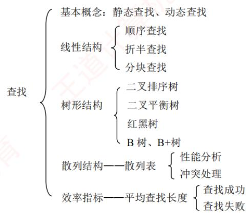
</div>

## 【复习提示】

　　本章是考研命题的重点。对于折半查找，应掌握折半查找的过程、构造判定树、分析平均查找长度等。对于二叉排序树、二叉平衡树和红黑树，要了解它们的概念、性质和相关操作等。B 树和 B+树是本章的难点。对于 B 树，考研大纲要求掌握插入、删除和查找的操作过程；对于 B+树，仅要求了解其基本概念和性质。对于散列查找，应掌握散列表的构造、冲突处理方法（各种方法的处理过程）、查找成功和查找失败的平均查找长度、散列查找的特征和性能分析。

## 7.1 查找的基本概念

1）查找。在数据集合中寻找满足某种条件的数据元素的过程称为查找。查找的结果一般分为两种：一是查找成功，即在数据集合中找到了满足条件的数据元素；二是查找失败。

2）查找表。用于查找的数据集合称为查找表，它由同一类型的数据元素（或记录）组成。对查找表的常见操作有：① 查询符合条件的数据元素；② 插入或删除数据元素。

3）静态查找表。若一个查找表的操作仅涉及查找，无须动态修改，则称为静态查找表；反之，需要支持插入或删除操作的查找表称为动态查找表。适合静态查找表的查找方法包括顺序查找、折半查找等；适合动态查找表的查找方法包括二叉排序树查找等。散列查找既可用于静态表，也可用于动态表（取决于具体实现）。

4）关键字。数据元素中唯一标识该元素的某个数据项的值，基于关键字的查找应返回唯一结果。例如，在学生记录集合中，“学号”这一数据项可唯一标识一名学生。

5）平均查找长度。在查找过程中，一次查找的长度是指该次查找中关键字的比较次数，而平均查找长度则是所有查找操作中关键字比较次数的加权平均值，其数学定义为

$$
\mathrm{ASL} = \sum_ {i = 1} ^ {n} P _ {i} C _ {i}
$$

　　式中，n 是查找表的长度； $P_{i}$ 是查找第 i 个数据元素的概率，若为等概率则 $P_{i} = 1/n$ ; $C_{i}$ 是找到第 i 个数据元素所需进行的比较次数。ASL 是衡量查找算法效率的核心指标。

## 7.2 顺序查找和折半查找

### 7.2.1 顺序查找

　　顺序查找（又称线性查找）适用于顺序表和链表：对于顺序表，可通过递增数组下标依次访问每个元素；对于链表，则通过指针 next 逐个遍历结点。顺序查找可用于一般的无序线性表，也可用于按关键字有序的线性表。下面分别讨论其在无序表和有序表中的应用。

#### 1. 一般线性表的顺序查找

　　作为一种最直观的查找方法，顺序查找的基本思想：① 从线性表的一端开始，逐个检查元素的关键字是否满足给定条件；② 若查找到某个元素的关键字满足条件，则查找成功，返回该元素在线性表中的位置；③ 若已查至表的另一端仍未找到符合条件的元素，则返回查找失败的信息。下面给出其算法实现，后面说明其中“哨兵”的作用。

```c
typedef struct { // 查找表的数据结构（顺序表）
    ElemType *elem; // 动态数组基址
    int TableLen; // 表的长度
} SSTable;
int Search_Seq(SSTable ST, ElemType key) {
    ST.elem[0] = key; // “哨兵”
    for (int i = ST.TableLen; ST.elem[i] != key; --i); // 从后往前找
    return i; // 若查找成功，则返回元素下标；若查找失败，则返回 0
}
```

　　上述算法中，将ST.elem[0]称为哨兵。引入哨兵的目的是避免在循环中反复判断数组下标是否越界。算法从表尾（下标TableLen）向前查找，一旦ST.elem[i]==key，即返回i，表示查找成功；否则，循环最终会在 $i = 0$ 时终止（因为ST.elem[0]==key），此时返回0，表示查找失败。通过设置哨兵，可以省去边界判断，从而提高程序效率。

　　对于含 $n$ 个元素的表，若给定关键字key与表中第 $i$ 个元素相等，即定位第 $i$ 个元素时，需进行 $n - i + 1$ 次关键字比较，即 $C_i = n - i + 1$ 。查找成功的平均查找长度为

$$
\mathrm{ASL} _ {\text {成功}} = \sum_ {i = 1} ^ {n} P _ {i} (n - i + 1)
$$

　　当每个元素的查找概率相等（ $P_{i}=1/n$ ）时，有

$$
\mathrm{ASL} _ {\text {成功}} = \sum_ {i = 1} ^ {n} P _ {i} (n - i + 1) = \frac {n + 1}{2}
$$

　　查找不成功时，与表中各关键字的比较次数显然是 $n+1$ 次，即 ASL 不成功 = n+1。

　　通常，查找表中记录的查找概率并不相等。若能预先获知各记录的查找概率，则应将记录按查找概率由大到小重新排列，使高频元素靠近查找起点，从而降低平均查找长度。

　　综上所述，顺序查找的主要缺点是当 n 较大时，平均查找长度较大，效率较低；其优点是对存储结构无要求——无论是顺序存储还是链式存储均可使用，且不要求表中记录按关键字有序。此外还需注意，链表只能采用顺序查找。

#### 2. 有序线性表的顺序查找

　　若在查找之前已知表是关键字有序的，则在查找失败时，无须继续比较到表的另一端即可提前返回查找失败的信息，从而降低查找失败的平均查找长度。假设表 L 按关键字从小到大排列，查找顺序为从前往后，待查元素的关键字为 key。当查找到第 i 个元素时，若发现该元素的关键字小于 key，而第 $i+1$ 个元素的关键字大于 key，则可立即判定查找失败。因为表中第 i 个元素之后的所有元素关键字均大于 key，故表中不存在关键字等于 key 的元素。

> **考点追踪：** 有序线性表的顺序查找的应用（2013）

　　可以用如图 7.1 所示的判定树来描述有序线性表的查找过程。树中的圆形结点表示表中实际存在的元素；矩形结点称为失败结点（若有 n 个结点，则相应的有 $n+1$ 个失败结点），它描述了那些不在表中的关键字范围的集合。若最终查找到某个矩形结点，则表示查找失败。

<div align="center">
  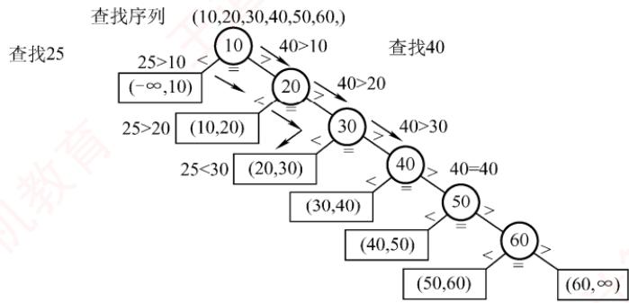
</div>

<p align="center"><em>图 7.1 有序顺序表上的顺序查找判定树</em></p>

　　在有序线性表的顺序查找中，查找成功的平均查找长度和一般线性表的顺序查找相同。

　　而查找失败时，查找过程一定会走到某个失败结点。这些失败结点是虚构的空结点，实际并不存在。因此，到达某一失败结点时所经历的比较次数，等于其父结点（路径上最后一个真实元素结点）所在的层数。在等概率查找失败的情形下，查找失败的平均查找长度为：

$$
\mathrm{ASL} _ {\text {失败}} = \sum_ {j = 1} ^ {n} q _ {j} (l _ {j} - 1) = \frac {1 + 2 + \cdots + n + n}{n + 1} = \frac {n}{2} + \frac {n}{n + 1}
$$

　　其中， $q_{j}$ 是到达第 j 个失败结点的概率，在等概率假设下为 $1/(n+1)$ ; $l_{j}$ 是第 j 个失败结点所在的层数。例如，当 n=6 时， $ASL_{失败}=6/2+6/7=3.86$ ，比一般的顺序查找要好一些。

　　注意，有序线性表的顺序查找与后续介绍的折半查找在思想上有本质区别。此外，有序线性表的顺序查找的线性表可以是链式存储结构，而折半查找的线性表只能是顺序存储结构。

### 7.2.2 折半查找

　　折半查找也称二分查找，它仅适用于关键字有序的顺序表。

> **考点追踪：** 分析对比给定查找算法与折半查找的效率（2016）

　　折半查找的基本思想：① 首先将给定值 key 与表中中间位置的元素进行比较，若相等，则查找成功，返回该元素的存储位置；② 若不相等，则待查元素只能位于中间元素以外的前半部分或后半部分（例如，当表按升序排列时，若 key 大于中间元素，则待查元素只可能在后半部分），随后在缩小的范围内重复上述过程，直到找到目标元素，或确定表中不存在该元素为止。此时返回查找失败信息。算法实现如下：

```txt
int Binary_Search(SSTable L, ElemType key) {
    int low=0, high=L.TableLen-1, mid;
    while (low<=high) {
    mid=(low+high)/2; // 取中间位置
    if (L.elem[mid]==key)
    return mid; // 查找成功则返回所在位置
    else if (L.elem[mid]>key)
    high=mid-1; // 从前半部分继续查找
    else
    low=mid+1; // 从后半部分继续查找
    }
    return -1; // 查找失败，返回-1
}
```

　　在选取中间结点时，既可以采用向下取整，也可以采用向上取整。但每次查找必须采用相同的取整方式。相关内容可结合本节习题进一步理解。

> **考点追踪：** 折半查找的查找路径的判断（2015）

　　例如，已知11个元素的有序表{7, 10, 13, 16, 19, 29, 32, 33, 37, 41, 43}，要查找值为11和32的元素，指针low和high分别指向当前查找区间的下界和上界，mid指向中间位置 $(\mathrm{low} + \mathrm{high}) / 2$ 。

　　下面说明查找11的过程（查找32的过程请读者自行分析）：

$$
\begin{array}{c c c c c c c c c c c} 7 & 1 0 & 1 3 & 1 6 & 1 9 & 2 9 & 3 2 & 3 3 & 3 7 & 4 1 & 4 3 \\ \uparrow \text {low} & & & & & \uparrow \text {mid} & & & & & \uparrow \text {high} \end{array}
$$

　　第一次查找时，将中间位置元素与 key 比较。因为 11 < 29，故待查元素若存在，必在区间 [low, mid-1] 内，令 high=mid-1=5， $mid=(1+5)/2=3$ ，第二次查找区间为 [1,5]。

$$
\begin{array}{c c c c c c c c c c} 7 & 1 0 & 1 3 & 1 6 & 1 9 & 2 9 & 3 2 & 3 3 & 3 7 & 4 1 & 4 3 \\ \uparrow & \text {low} & & \uparrow \text {mid} & & \uparrow \text {high} \end{array}
$$

　　第二次查找时，将中间位置元素与 key 比较。因为 11 < 13，故待查元素若存在，必在区间 [low, mid-1] 内，令 high = mid - 1 = 2，mid = (1 + 2) / 2 = 1，第三次查找区间为 [1, 2]。

$$
\begin{array}{c c c c c c c c c c c} & 7 & 1 0 & 1 3 & 1 6 & 1 9 & 2 9 & 3 2 & 3 3 & 3 7 & 4 1 & 4 3 \\ \text {low} \uparrow & & \uparrow \text {high} \\ \text {mid} \uparrow \end{array}
$$

　　第三次查找时，将中间位置元素与 key 比较。因为 11 > 7，故待查元素若存在，必在区间 [mid+1, high] 内。令 low=mid+1=2，mid=(2+2)/2=2，第四次查找区间为 [2, 2]。

```solidity
7 10 13 16 19 29 32 33 37 41 43
low↑↑high
↑mid
```

　　第四次查找，此时子表仅含一个元素，且 $10 \neq 11$ ，因此表中不存在待查元素，查找失败。

> **考点追踪：** 分析给定二叉树树形能否构成折半查找判定树（2017）

　　折半查找的过程可用图7.2所示的判定树来描述，圆形结点表示表中存在的记录，结点值为其关键字；最底层的方形结点为失败结点，表示查找失败的区间。从判定树可以看出：查找成功时的查找长度等于从根结点到目的结点的路径上的结点数；查找失败时的查找长度等于从根结点到对应失败结点的父结点的路径上的结点数。该判定树满足性质：任一结点的值大于其左子树中所有结点的值，小于其右子树中所有结点的值。若有序表包含 $n$ 个元素，则对应的判定树有 $n$ 个圆形非叶结点和 $n + 1$ 个方形叶结点。显然，该判定树是一棵平衡二叉树（见7.3.2节）。

<div align="center">
  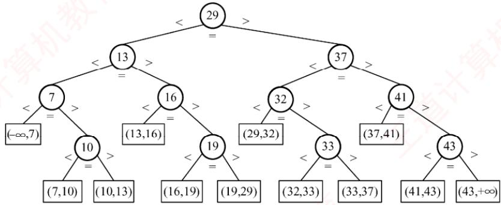
</div>

<p align="center"><em>图 7.2 描述折半查找过程的判定树</em></p>

> **考点追踪：** 折半查找的最多比较次数的分析（2010、2023）

　　由上述分析可知，折半查找的比较次数最多不超过判定树的高度。在等概率查找的情况下，查找成功的平均查找长度为

$$
\mathrm{ASL} = \frac {1}{n} \sum_ {i = 1} ^ {n} l _ {i} = \frac {1}{n} (1 \times 1 + 2 \times 2 + \dots + h \times 2 ^ {h - 1}) = \frac {n + 1}{n} \log_ {2} (n + 1) - 1 \approx \log_ {2} (n + 1) - 1
$$

　　其中，h 为树的高度。当元素个数为 n 时，树高 $h = \left\lceil \log_{2}(n + 1) \right\rceil$ 。因此，折半查找的时间复杂度为 $O(\log_{2}n)$ ，平均效率显著高于顺序查找。

　　以图 7.2 所示的判定树为例（对应 11 个元素），查找成功的平均查找长度为 $\mathrm{ASL} = (1 \times 1 + 2 \times 2 + 3 \times 4 + 4 \times 4)/11 = 3$ ，查找失败的平均查找长度为 $\mathrm{ASL} = (3 \times 4 + 4 \times 8)/12 = 11/3$ 。

> **考点追踪：** 折半查找的适用场景（2024）

　　由于折半查找需要能够随机访问任意位置的元素，以便快速定位中间元素并缩小区间，因此它仅适用于顺序存储结构，不适用于链式存储结构，且要求表中元素按关键字有序排列。

### 7.2.3 分块查找

　　分块查找也称索引顺序查找，它吸取了顺序查找和折半查找各自的优点，既有良好的动态性，又支持较快的查找效率。

　　分块查找的基本思想是：将查找表划分为若干子块。块内元素可以无序，但块间必须有序，即任意前一块的最大关键字小于后一块中的所有关键字。同时，建立一个索引表，其中每个元素包含对应块的最大关键字和该块的起始地址，且索引表按最大关键字有序排列。

> **考点追踪：** 分块查找的效率分析（2025）

　　分块查找过程分为两步：第一步在索引表中确定待查记录所在的块（可采用顺序查找或折半查找）；第二步在目标块内进行顺序查找。

　　例如，关键码集合为 $\{88,24,72,61,21,6,32,11,8,31,22,83,78,54\}$ ，可按关键码值24,54,78,88将其划分为4个块，并建立相应的索引表，如图7.3所示。

<div align="center">
  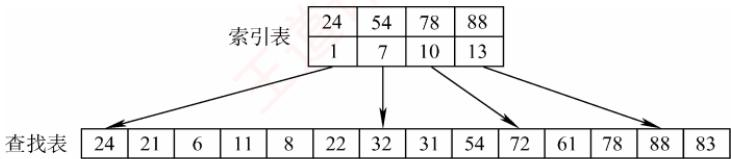
</div>

<p align="center"><em>图 7.3 分块查找示意图</em></p>

　　分块查找的平均查找长度等于索引查找的平均长度与块内查找的平均长度之和。设索引查找和块内查找的平均查找长度分别为 $L_{\mathrm{I}}$ 和 $L_{\mathrm{S}}$ ，则分块查找的平均查找长度为

$$
\mathrm{ASL} = L _ {\mathrm{I}} + L _ {\mathrm{S}}
$$

　　若将长度为 $n$ 的查找表均匀地分为 $b$ 块，每块包含 $s$ 个记录（ $n = bs$ ），并在等概率假设下对索引表和块内均采用顺序查找，则平均查找长度为

$$
\mathrm{ASL} = L _ {1} + L _ {\mathrm{s}} = \frac {b + 1}{2} + \frac {s + 1}{2} = \frac {s ^ {2} + 2 s + n}{2 s}
$$

　　此时，当块大小 s 取最优值 $(s=\sqrt{n})$ ，则平均查找长度达到最小值 $\sqrt{n}+1$ 。

　　尽管索引表占用了额外的存储空间，且索引查找引入了一定的系统开销，但由于分块结构限制了块内查找的范围，分块查找的总体效率仍显著优于普通的顺序查找。

### 7.2.4 本节试题精选

#### 一、单项选择题

01. 顺序查找适合于存储结构为（）的线性表。

- A. 顺序存储结构或链式存储结构
- B. 散列存储结构
- C. 索引存储结构
- D. 压缩存储结构

02. 由 n 个数据元素组成的两个表：一个递增有序，一个无序。采用顺序查找算法，对有序表从头开始查找，发现当前元素已不小于待查元素时，停止查找，确定查找不成功，已知查找任意一个元素的概率是相同的，则在两种表中成功查找（）。

- A. 平均时间后者小
- B. 平均时间两者相同
- C. 平均时间前者小
- D. 无法确定

03. 对长度为 $n$ 的有序单链表，若查找每个元素的概率相等，则顺序查找表中任意一个元素的查找成功的平均查找长度为（）。

- A. $n / 2$
- B. $(n + 1) / 2$
- C. $(n - 1) / 2$
- D. $n / 4$

04. 对长度为 3 的顺序表进行查找, 若查找第一个元素的概率为 $1 / 2$ , 查找第二个元素的概率为 $1 / 3$ , 查找第三个元素的概率为 $1 / 6$ , 则查找任意一个元素的平均查找长度为 （）。

- A. $5 / 3$
- B. 2
- C. $7 / 3$
- D. $4 / 3$

05. 下列关于二分查找的叙述中，正确的是（）。

- A. 表必须有序，表可以顺序方式存储，也可以链表方式存储
- B. 表必须有序且表中数据必须是整型、实型或字符型
- C. 表必须有序，而且只能从小到大排列
- D. 表必须有序，且表只能以顺序方式存储

06. 在一个顺序存储的有序线性表上查找一个数据时，既可以采用折半查找，也可以采用顺序查找，但前者比后者的查找速度（）。

- A. 必然快
- B. 取决于表是递增还是递减
- C. 在大部分情况下要快
- D. 必然不快

07. 折半查找过程所对应的判定树是一棵（）。

- A. 最小生成树
- B. 平衡二叉树
- C. 完全二叉树
- D. 满二叉树

08. 折半查找和二叉排序树的时间性能（）。

- A. 相同
- B. 有时不相同
- C. 完全不同
- D. 无法比较

09. 在有 11 个元素的有序表 A[1,2,…,11] 中进行折半查找 ( $\lfloor(\text{low}+\text{high})/2\rfloor$ )，查找元素 A[11] 时，被比较的元素下标依次是（）。

- A. 6,8,10,11
- B. 6,9,10,11
- C. 6,7,9,11
- D. 6,8,9,11

10. 已知有序表(13, 18, 24, 35, 47, 50, 62, 83, 90, 115, 134)，当二分查找值为90的元素时，查找成功的元素比较次数为（）。

- A. 1
- B. 2
- C. 4
- D. 6

11. 若有序表的关键字序列为 $\{b, c, d, e, f, g, q, r, s, t\}$ ，则在二分查找关键字 $b$ 的过程中，进行比较的关键字依次为（）。

- A. $f, c, b$
- B. $f, d, b$
- C. $g, c, b$
- D. $g, d, b$

12. 对表长为 $n$ 的有序表进行折半查找，其判定树的高度为（）。

- A. $\lceil \log_2(n + 1) \rceil$
- B. $\lfloor \log_2(n + 1) \rfloor - 1$
- C. $\lceil \log_2 n \rceil$
- D. $\lfloor \log_2 n \rfloor - 1$

13. 已知一个长度为 16 的顺序表，其元素按关键字有序排列，若采用折半查找算法查找一个不存在的元素，则比较的次数至少是（），至多是（）。

- A. 4
- B. 5
- C. 6
- D. 7

14. 具有 12 个关键字的有序表中，对每个关键字的查找概率相同，折半查找算法查找成功的平均查找长度为（），折半查找查找失败的平均查找长度为（）。

- A. 37/12
- B. 35/12
- C. 39/13
- D. 49/13

15. 下列关于查找的说法中，正确的是（）。（注，涉及下节内容）

- A. 若数据元素保持有序，则查找时就可以采用折半查找法
- B. 折半查找与二叉查找树的时间性能在最坏情况下是相同的
- C. 折半查找法的平均查找长度一定小于顺序查找法
- D. 折半查找法查找一个元素大约需要 $O(\log_{2}n)$ 次关键字比较

16. 采用分块查找时，数据的组织方式为（）。

- A. 数据分成若干块，每块内数据有序
- B. 数据分成若干块，每块内数据不必有序，但块间必须有序，每块内最大（或最小）的数据组成索引块
- C. 数据分成若干块，每块内数据有序，每块内最大（或最小）的数据组成索引块
- D. 数据分成若干块，每块（除最后一块外）中数据个数需相同

17. 对有 2500 个记录的索引顺序表（分块表）进行查找，最理想的块长为（）。

- A. 50
- B. 125
- C. 500
- D. $\left\lceil \log_{2}2500 \right\rceil$

18. 设顺序存储的某线性表共有 123 个元素，按分块查找的要求等分为 3 块。若对索引表采用顺序查找法来确定子块，且在确定的子块中也采用顺序查找法，则在等概率情况下，分块查找成功的平均查找长度为（）。

- A. 21
- B. 23
- C. 41
- D. 62

19. 为提高查找效率，对有65025个元素的有序顺序表建立索引顺序结构，在最好情况下查找到表中已有元素最多需要执行（）次关键字比较。

- A. 10
- B. 14
- C. 16
- D. 21

20. 【2010 统考真题】已知一个长度为 16 的顺序表 L，其元素按关键字有序排列，若采用折半查找法查找一个 L 中不存在的元素，则关键字的比较次数最多是（）。

- A. 4
- B. 5
- C. 6
- D. 7

21. 【2015 统考真题】下列选项中，不能构成折半查找中关键字比较序列的是（）。

- A. 500, 200, 450, 180
- B. 500, 450, 200, 180
- C. 180, 500, 200, 450
- D. 180, 200, 500, 450

22. 【2016 统考真题】在有 $n(n > 1000)$ 个元素的升序数组 A 中查找关键字 x。查找算法的伪代码如下所示。
k=0;
　　while (k<n 且 A[k]<x) k=k+3;
　　if (k<n 且 A[k]==x) 查找成功;
　　else if (k-1<n 且 A[k-1]==x) 查找成功;
　　else if (k-2<n 且 A[k-2]==x) 查找成功;
　　else 查找失败;

　　本算法与折半查找算法相比，有可能具有更少比较次数的情形是（）。

- A. 当 $\mathbf{x}$ 不在数组中
- B. 当 $\mathbf{x}$ 接近数组开头处
- C. 当 $\mathbf{x}$ 接近数组结尾处
- D. 当 $\mathbf{x}$ 位于数组中间位置

23. 【2017 统考真题】下列二叉树中, 可能成为折半查找判定树 (不含外部结点) 的是 （）。

- A. $\Omega$

<div align="center">
  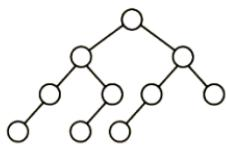
</div>

- B. $\Omega$

<div align="center">
  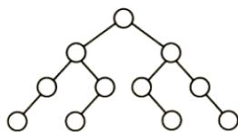
</div>

- C.

<div align="center">
  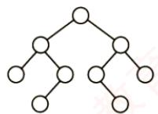
</div>

- D.

<div align="center">
  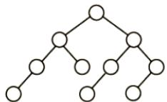
</div>

24. 【2023 统考真题】对含 600 个元素的有序顺序表进行折半查找，关键字间的比较次数最多是（）。

- A. 9
- B. 10
- C. 30
- D. 300

25. 【2024 统考真题】下列数据结构中，不适合直接使用折半查找的是（）。 I. 有序链表 II. 无序数组 III. 有序静态链表 IV. 无序静态链表

- A. 仅 I、III
- B. 仅 II、IV
- C. 仅 II、III、IV
- D. I、II、III、IV

26. 【2025 统考真题】已知查找表中有 400 个元素，查找每个元素的概率相同。采用分块查找法进行查找，且均匀分块。若采用顺序查找法确定元素所在的块，且块内也采用顺序查找法，为使查找效率最高，则每块包含的元素个数应为（）。

- A. 8
- B. 10
- C. 20
- D. 25

#### 二、综合应用题

01. 若对有 $n$ 个元素的有序顺序表和无序顺序表进行顺序查找，试就下列三种情况分别讨论两者在相等查找概率时的平均查找长度是否相同。

1）查找失败。

2）查找成功，且表中只有一个关键字等于给定值 $\mathrm{k}$ 的元素。

3）查找成功，且表中有若干关键字等于给定值 $k$ 的元素，要求一次查找能找出所有元素。02. 有序顺序表中的元素依次为017,094,154,170,275,503,509,512,553,612,677,765,897,908。

1）试画出对其进行折半查找的判定树。

2）若查找275或684的元素，将依次与表中的哪些元素比较？

3）计算查找成功的平均查找长度和查找不成功的平均查找长度。

03. 已知一个有序顺序表 A[0...8n-1] 的表长为 8n，并且表中没有关键字相同的数据元素。假设按下述方法查找一个关键字值等于给定值 X 的数据元素：首先在 A[7], A[15], A[23], ..., A[8k-1], ..., A[8n-1] 中进行顺序查找，若查找成功，则算法报告成功位置并返回；若不成功，则当 A[8k-1] < X < A[8×(k+1)-1] 时，可确定一个缩小的查找范围 A[8k] ~ A[8×(k+1)-2]，然后可在这个范围内执行折半查找。特殊情况：若 X > A[8n-1] 的关键字，则查找失败。

1）画出描述上述查找过程的判定树。

2）计算相等查找概率下查找成功的平均查找长度。

04. 写出折半查找的递归算法。初始调用时，low 为 1，high 为 ST.length。

05. 线性表中各结点的检索概率不等时，可用如下策略提高顺序检索的效率：若找到指定的结点，则将该结点和其前驱结点（若存在）交换，使得经常被检索的结点尽量位于表的前端。试设计在顺序结构和链式结构的线性表上实现上述策略的顺序检索算法。

06. 已知一个 $n$ 阶矩阵 $A$ 和一个目标值 $k$ 。该矩阵无重复元素，每行从左到右升序排列，每列从上到下升序排列。请设计一个在时间上尽可能高效的算法，判断矩阵中是否存在目标值 $k$ 。例如，矩阵为 $\begin{bmatrix} 1 & 4 & 7 \\ 2 & 5 & 8 \\ 3 & 6 & 9 \end{bmatrix}$ ，目标值为 8，判断存在。要求：

1）给出算法的基本设计思想。

2）根据设计思想，采用C或 $\mathrm{C + + }$ 语言描述算法，关键之处给出注释。

3）说明你的算法的时间复杂度和空间复杂度。

07. 【2013 统考真题】设包含 4 个数据元素的集合 $S = \{ 'do', 'for', 'repeat', 'while'\}$ ，各元素的查找概率依次为 $p_1 = 0.35, p_2 = 0.15, p_3 = 0.15, p_4 = 0.35$ 。将 $S$ 保存在一个长度为 4 的顺序表中，采用折半查找法，查找成功时的平均查找长度为 2.2。

1) 若采用顺序存储结构保存 S，且要求平均查找长度更短，则元素应如何排列？应使用何种查找方法？查找成功时的平均查找长度是多少？

2）若采用链式存储结构保存 $S$ ，且要求平均查找长度更短，则元素应如何排列？应使用何种查找方法？查找成功时的平均查找长度是多少？

### 7.2.5 答案与解析

#### 一、单项选择题

**01. A**

　　顺序查找是指从表的一端开始向另一端查找。它不要求查找表具有随机存取的特性，可以是顺序存储结构或链式存储结构。

**02. B**

　　对于顺序查找，不管线性表是有序的还是无序的，成功查找第一个元素的比较次数为 1，成功查找第二个元素的比较次数为 2，以此类推，即每个元素查找成功的比较次数只与其位置有关（与是否有序无关），因此查找成功的平均时间两者相同。

**03. B**

　　在有序单链表上做顺序查找，查找成功的平均查找长度与在无序顺序表或有序顺序表上做顺序查找的平均查找长度相同，都是 $(n+1)/2$ 。

**04. A**

　　在长度为 3 的顺序表中，查找第一个元素的查找长度为 1，查找第二个元素的查找长度为 2，查找第三个元素的查找长度为 3，所以有

$$
\mathrm{ASL} _ {\text {成功}} = \frac {1}{2} \times 1 + \frac {1}{3} \times 2 + \frac {1}{6} \times 3 = \frac {5}{3}
$$

**05. D**

　　二分查找通过下标来定位中间位置元素，所以应采用顺序存储，且二分查找能够进行的前提是查找表是有序的，但具体是从大到小还是从小到大的顺序则不做要求。

**06. C**

　　折半查找的快体现在一般情况下，在大部分情况下要快，但是对于某些特殊情况，顺序查找可能会快于折半查找。例如，查找一个含 1000 个元素的有序表中的第一个元素时，顺序查找的比较次数为 1 次，而折半查找的比较次数却将近 10 次。

**07. B**

　　A 显然排除。对于选项 C，考点精析示例中的判定树就不是完全二叉树。由选项 C 也可排除选项 D，且满二叉树对结点数有要求。只可能选择选项 B。事实上，由折半查找的定义不难看出，每次把一个数组从中间结点分割时，总是把数组分为结点数相差最多不超过 1 的两个子数组，从而使得对应的判定树的两棵子树高度差的绝对值不超过 1，所以应是平衡二叉树。

**08. B**

　　折半查找的性能分析可以用二叉判定树来衡量，平均查找长度和最大查找长度都是 $O(\log_{2}n)$ ; 二叉排序树的查找性能与数据的输入顺序有关，最好情况下的平均查找长度与折半查找相同，但最坏情况即形成单支树时，其查找长度为 $O(n)$ 。

**09. B**

　　依据折半查找算法的思想，第一次 $\text{mid} = \lfloor (1 + 11) / 2 \rfloor = 6$ ，第二次 $\text{mid} = \lfloor [(6 + 1) + 11] / 2 \rfloor = 9$ ，第三次 $\text{mid} = \lfloor [(9 + 1) + 11] / 2 \rfloor = 10$ ，第四次 $\text{mid} = 11$ 。

**10. B**

　　开始时 low 指向 13，high 指向 134，mid 指向 50，比较第一次 90 > 50，所以将 low 指向 62，high 指向 134，mid 指向 90，第二次比较找到 90。

**11. A**

　　在折半查找算法中，mid取值的方式是确定的，要么采用向上取整，要么采用向下取整，而不能出现两种情况。对于选项A，第1次比较的元素是f，为向下取整；第2次比较的元素是c，为向下取整；第3次比较的元素是b，为向下取整，查找成功，符合二分查找。对于选项B，第1次比较的元素是f，为向下取整；第2次比较的元素是d，为向上取整，两次mid取值的方式不同，不符合二分查找。对于选项C，第1次比较的元素是g，为向上取整；第2次比较的元素是c，为向下取整，不符合二分查找。对于选项D，第1次比较的元素是g，为向上取整；第2次比较的元素是d，为正中间元素；第3次比较的元素为b，为向下取整，不符合二分查找。

**12. A**

　　对 n 个结点的判定树，设结点总数 $n = 2^{h} - 1$ ，则 $h = \left\lceil \log_{2}(n + 1) \right\rceil$ 。

　　【另解】特殊值代入法。直接将 n=1 和 n=2 的情况代入，仅有 A 满足要求。

**13. A、B**

　　对于此类题，有两种做法：一种方法是，画出查找过程中构成的判定树，让最小的分支高度对应于最少的比较次数，让最大的分支高度对应于最多的比较次数，出现类似于长度为15的顺序表时，判定树刚好是一棵满树，此时最多比较次数与最少比较次数相等；另一种方法是，直接用公式求出最小的分支高度和最大分支高度，从前面的讲解不难看出最大分支高度为 $H=\lceil\log_{2}(n+1)\rceil=5$ ，这对应的就是最多比较次数，然后因为判定树不是一棵满树，所以至少应该是4（由判定树的各分支高度最多相差1得出）。

　　注意，若求查找成功或查找失败的平均查找长度，则需要画出判定树来求解。此外，对长度为 $n$ 的有序表，采用折半查找时，查找成功和查找失败的最多比较次数相同，均为 $\lceil \log_2(n + 1) \rceil$ 。

**14. A、D**

　　假设有序表中元素为 A[0...11]，不难画出对它进行折半查找的判定树如下图所示，圆圈是查找成功结点，方形是虚构的查找失败结点。从而可以求出查找成功的 ASL = (1 + 2 × 2 + 3 × 4 + 4 × 5) / 12 = 37 / 12，查找失败的 ASL = (3 × 3 + 4 × 10) / 13。

<div align="center">
  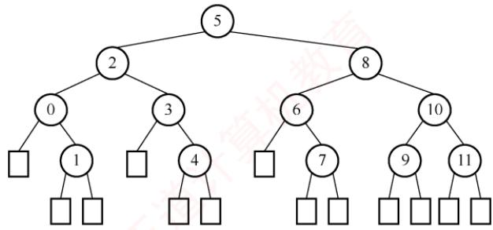
</div>

> **注意：**

　　对于本类题目，应先根据所给 $n$ 的值，画出如上图所示的折半查找判定树。另外，查找失败结点的ASL不是到图中的方形结点，而是到方形结点上一层的圆形结点。

**15. D**

　　折半查找法不仅要求数据元素有序，而且要求必须为顺序存储，选项A错误。折半查找法在最坏情况下的时间性能为 $O(\log_2 n)$ ，二叉查找树在最坏情况下的时间性能为 $O(n)$ ，选项B错误。在每个元素查找概率不同的情况下，折半查找法的平均查找长度可能大于顺序查找法，选项C错误。

**16. B**

　　通常情况下，在分块查找的结构中，不要求每个索引块中的元素个数都相等。

**17. A**

　　设块长为 b，索引表包含 n/b 项，索引表的 ASL = (n/b + 1)/2，块内的 ASL = (b + 1)/2，总 ASL = 索引表的 ASL + 块内的 ASL = (b + n/b + 2)/2，其中对于 $b + n/b$ ，由均值不等式可知，b = n/b 时有最小值，此时 $b = \sqrt{n}$ 。则最理想块长为 $\sqrt{2500} = 50$ 。

**18. B**

　　根据公式 $\mathrm{ASL} = L_{\mathrm{I}} + L_{\mathrm{S}} = \frac{b + 1}{2} +\frac{s + 1}{2} = \frac{s^2 + 2s + n}{2s}$ ，其中 $b = n / s,s = 123 / 3,n = 123$ ，代入不难得出ASL为23。所以选择选项B。另一方面，可根据穷举法来一步步模拟。对于A块中的元素，查找过程的第一步是先找到 A 块，由于是顺序查找，找到 A 块只需一步，然后在 A 块中顺序查找，因此 A 块内各元素查找长度分别为 2, 3, 4, …, 42。对于 B 块，采用类似的方法，但查找到 B 块要比查找到 A 块多一步，因此 B 块内各元素查找长度为 3, 4, 5, …, 43。同理，C 块中各个元素查找长度为 4, 5, 6, …, 44。所以平均查找长度为 $(2 + 3 + 4 + \cdots + 42 + 3 + 4 + 5 + \cdots + 43 + 4 + 5 + 6 + \cdots + 44)/123 = 23$ 。

**19. C**

　　为使查找效率最高，每个索引块的大小应是 $\sqrt{65025} = 255$ ，为每个块建立索引，则索引表中索引项的个数为255。若对索引项和索引块内部都采用折半查找，则查找效率最高，为 $\left\lceil \log_2(255 + 1)\right\rceil +\left\lceil \log_2(255 + 1)\right\rceil = 16$ 。

**20. B**

　　折半查找法在查找不成功时和给定值进行关键字的比较次数最多为树的高度，即 $\lfloor \log_2 n \rfloor + 1$ 或 $\lceil \log_2 (n + 1) \rceil$ 。在本题中， $n = 16$ ，所以比较次数最多为5。

> **注意：**

　　在折半查找判定树中的方形结点是虚构的，它不计入比较的次数。

**21. A**

　　画出查找路径图，因为折半查找判定树是一棵二叉排序树，看其是否满足二叉排序树的要求。

<div align="center">
  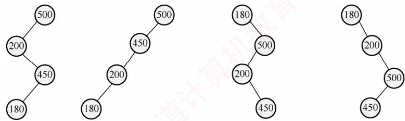
</div>

　　显然，选项 A 的查找路径不满足。

**22. B**

　　本题为送分题。

　　该程序采用跳跃式的顺序查找法查找升序数组中的 x。显然，x 越靠前，比较次数越少。

**23. A**

　　对于给定的一个有序查找表，其对应的折半查找判定树是确定且唯一的。在折半查找算法中， $\text{mid} = \lfloor (\text{low} + \text{high}) / 2 \rfloor$ ，因此若表中初始有 $2n + 1$ 个元素，则 mid 分割后，左右子树各有 n 个元素；若表中初始有 2n 个元素，则 mid 分割后，左子树有 n - 1 个元素，右子树有 n 个元素。即左子树的元素个数或者与右子树的元素个数相等，或者比右子树少一个。若令 $\text{mid} = \lceil (\text{low} + \text{high}) / 2 \rceil$ ，不难理解，左子树的元素个数或者与右子树的元素个数相等，或者比右子树多一个。对于选项 A，树中每个左子树都与右子树的结点个数相等，或者多一个结点，符合向上取整的规则。对于选项 B、C、D，存在有的左子树比右子树多一个结点，有的左子树比右子树少一个结点，不符合折半查找的规则。

**24. B**

　　用折半查找法查找给定值的比较次数最多不超过折半查找判定树的高度。折半查找判定树的树高 $h=\left\lceil\log_{2}(n+1)\right\rceil$ ，将 n=600 代入，结果为 10。

**25. D**

　　折半查找必须满足两个条件：① 数组（或顺序表），折半查找的上一次查找和本次查找可能相隔很远的距离，如依次查找下标为 $n/2, n/4, n/8, \cdots$ 的元素，若采用链表（或静态链表），则会使得时间复杂度非常高。② 有序，只有在有序的情况下才能根据上一次的比较情况舍弃一半的序列。

**26. C**

　　本题可直接套用书中的结论“每块记录数 $= \sqrt{n}$ 时，平均查找长度最小”。解释如下：分块查找的平均查找长度（ASL）等于查找索引表的ASL与块内查找的ASL之和。设每块含 $s$ 个元素，则块数为 $k = 400 / s$ 。总 $\mathrm{ASL} = (k + 1) / 2 + (s + 1) / 2 = (k + s) / 2 + 1$ 。要使ASL最小，需要最小化 $k + s = 400 / s + s$ 。根据均值不等式，当 $400 / s = s$ 时取最小值，解得 $s = 20$ 。

#### 二、综合应用题

**01. 【解答】**

1）平均查找长度不同。因为有序顺序表查找到其关键字值比要查找值大的元素时就停止查找，并报告失败信息，不必查找到表尾；而无序顺序表必须查找到表尾才能确定查找失败。

2）平均查找长度相同。两者查找到表中元素的关键字值等于给定值时就停止查找。

3）平均查找长度不同。有序顺序表中关键字相等的元素相继排列在一起，只要查找到第一个就可以连续查找到其他关键字相同的元素。而无序顺序表必须查找全部表中的元素才能找出相同关键字的元素，因此所需的时间不同。

**02. 【解答】**

1）判定树如下图所示。

<div align="center">
  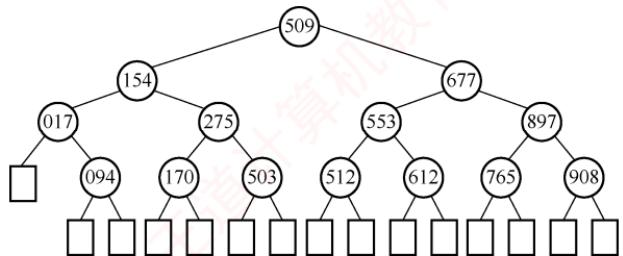
</div>

2）若查找 275，依次与表中元素 509, 154, 275 进行比较，共比较 3 次。若查找 684，依次与表中元素 509, 677, 897, 765 进行比较，共比较 4 次。

3）在查找成功时，会找到图中的某个圆形结点，其平均查找长度为

$$
\mathrm{ASL} _ {\text {成功}} = \frac {1}{1 4} \sum_ {i = 1} ^ {1 4} C _ {i} = \frac {1}{1 4} (1 + 2 \times 2 + 3 \times 4 + 4 \times 7) = \frac {4 5}{1 4}
$$

　　在查找失败时，会找到图中的某个方形结点，但这个结点是虚构的，最后一次的比较元素为其父结点（圆形结点），所以其平均查找长度为

$$
\mathrm{ASL} _ {\text {不成功}} = \frac {1}{1 5} \sum_ {i = 0} ^ {1 4} C _ {i} ^ {\prime} = \frac {1}{1 5} (3 \times 1 + 4 \times 1 4) = \frac {5 9}{1 5}
$$

**03. 【解答】**

1）先在 A[7], A[15], ..., A[8n-1] 内顺序查找，再在区间内折半查找。相应的判定树如下图所示。其中，每个关键字下的数字为其查找成功时的关键字比较次数。

2）等查找概率下，平均每个关键字查找成功的概率为 $1/8n$ ; 0～7 之间的关键字，顺序比较 1 次后，进行折半查找，查找成功的平均查找长度为 $2 + 3 \times 2 + 4 \times 4$ ; 8～15 之间的关键字，先顺序比较 2 次后，再进入折半查找；以此类推， $8(n-1) \sim 8n-1$ 之间的关键字，先顺序比较 n 次，再进入折半查找，如上图所示。因此，查找成功的平均查找长度为

<div align="center">
  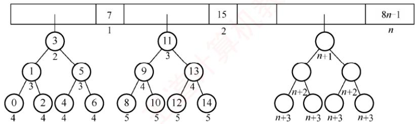
</div>

$\mathrm{ASL}_{\text {成功}} = \frac{1}{8n}\sum_{i=0}^{8n-1}C_i = \frac{1}{8n}\left(\sum_{i=1}^n i + \sum_{i=2}^{n+1}i + 2\sum_{i=3}^{n+2}i + 4\sum_{i=4}^{n+3}i\right)$ $= \frac{1}{8n}\left(\sum_{i=1}^{n}(i+(i+1)+2(i+2)+4(i+3))\right)$ $= \frac{1}{8n}\sum_{i=1}^{n}(8i + 17) = \frac{1}{n}\sum_{i=1}^{n}i + \frac{17}{8} = \frac{n + 1}{2} +\frac{17}{8}$

**04. 【解答】**

　　算法的基本思想：根据查找的起始位置和终止位置，将查找序列一分为二，判断所查找的关键字在哪一部分，然后用新的序列的起始位置和终止位置递归求解。

　　算法代码如下:

```c
typedef struct{ //查找表的数据结构
    ElemType *elem; //存储空间基址，建表时按实际长度分配，0号留空
    int length; //表的长度
} SSTable;
int BinSearchRec(SSTable ST, ElemType key, int low, int high) {
    if (low > high)
    return 0;
    mid = (low + high) / 2; // 取中间位置
    if (key > ST.elem[mid]) // 向后半部分查找
    BinSearchRec(ST, key, mid + 1, high);
    else if (key < ST.elem[mid]) // 向前半部分查找
    BinSearchRec(ST, key, low, mid - 1);
    else // 查找成功
    return mid;
}
```

　　算法把规模为 n 的复杂问题经过多次递归调用转化为规模减半的子问题求解。时间复杂度为 $O(\log_{2}n)$ ，算法中用到了一个递归工作栈，其规模与递归深度有关，也是 $O(\log_{2}n)$ 。

**05. 【解答】**

　　算法的基本思想：检索时可先从表头开始向后顺序扫描，若找到指定的结点，则将该结点和其前趋结点（若存在）交换。采用顺序表存储结构的算法实现如下：

```txt
int SeqSrch(RcdType R[],ElemType k){
    //顺序查找线性表，找到后和其前面的元素交换
    int i=0;
    while((R[i].key!=k)&&(i<n))
    i++;    //从前向后顺序查找指定结点
    if(i<n&&i>0){    //若找到，则交换
    temp=R[i];R[i]=R[i-1];R[i-1]=temp;
    return --i;    //交换成功，返回交换后的位置
    }
    else return -1;    //交换失败
}
```

　　链表的实现方式请读者自行思考。注意，链表方式实现的基本思想与上述思想相似，但要注意用链表实现时，在交换两个结点之前需要保存指向前一结点的指针。

**06. 【解析】**

1）算法的基本设计思想：

　　从矩阵 A 的右上角（最右列）开始比较，若当前元素小于目标值，则向下寻找下一个更大的元素；若当前元素大于目标值，则从右往左依次比较，若目标值存在，则只可能在该行中。

2）算法的实现：

```txt
bool findkey(int A[][], int n, int k) {
    int i = 0, j = n - 1;
    while (i < n && j >= 0) { // 离开边界时查找结束
    if (A[i][j] == k) return true; // 查找成功
    else if (A[i][j] > k) j--; // 向左移动，在该行内寻找目标值
    else i++; // 向下移动，查找下一个更大的元素
    }
    return false; // 查找失败
}
```

3）比较次数不超过 2n 次，时间复杂度为 $O(n)$ ；空间复杂度为 $O(1)$ 。

**07. 【解答】**

1）折半查找要求元素有序顺序存储，字符串默认按字典序排序（字典序是一种比较两个字符串大小的方法，它按字母顺序从左到右逐个比较对应的字符，若某一位可以比较出大小，则不再继续比较后面的字符，如 $abd < acd$ 、 $abc < abcd$ 等），对本题来说do < for < repeat < while。若各个元素的查找概率不同，折半查找的性能不一定优于顺序查找。采用顺序查找时，元素按其查找概率的降序排列时查找长度最小。采用顺序存储结构，数据元素按其查找概率降序排列。采用顺序查找方法。查找成功时的平均查找长度 $= 0.35 \times 1 + 0.35 \times 2 + 0.15 \times 3 + 0.15 \times 4 = 2.1$ 。此时，显然查找长度比折半查找的更短。

2）答案1：采用链式存储结构时，只能采用顺序查找，其性能和顺序表一样，类似于上题。数据元素按其查找概率降序排列，构成单链表。采用顺序查找方法。

$$
= 0. 3 5 \times 1 + 0. 3 5 \times 2 + 0. 1 5 \times 3 + 0. 1 5 \times 4 = 2. 1 。
$$

　　答案 2：还可以构造成二叉排序树的形式。采用二叉链表的存储结构，构造二叉排序树，元素的存储方式见下图。采用二叉排序树的查找方法。

<div align="center">
  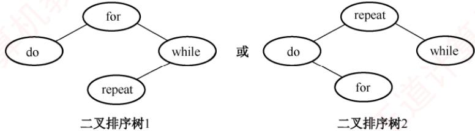
</div>

　　查找成功时的平均查找长度 $= 0.15 \times 1 + 0.35 \times 2 + 0.35 \times 2 + 0.15 \times 3 = 2.0$ 。

## 7.3 树形查找

### 7.3.1 二叉排序树（BST）

　　构造一棵二叉排序树的主要目的并非直接输出有序序列，而是利用其有序结构支持高效的动态查找、插入和删除操作。这种非线性结构有利于实现快速的数据访问。

<div align="center">
  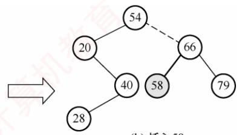
</div>

#### 1. 二叉排序树的定义

> **考点追踪：** 二叉排序树的应用（2013）

　　二叉排序树（也称二叉查找树）或者是一棵空树，或者是具有下列特性的二叉树：

1）若左子树非空，则左子树上所有结点的关键字均小于根结点的关键字。

2）若右子树非空，则右子树上所有结点的关键字均大于根结点的关键字。

3）左右子树也分别是一棵二叉排序树。

> **考点追踪：** 二叉排序树中结点值之间的关系（2015、2018、2024）

　　基于上述定义，对二叉排序树进行中序遍历可以得到一个递增的有序关键字序列。例如，图7.4所示二叉排序树的中序遍历序列为1,2,3,4,6,8。

#### 2. 二叉排序树的查找

　　二叉排序树的查找是从根结点开始，逐层向下比较并选择左/右子树的搜索过程。若二叉排序树非空，先将给定关键字与根结点的关键字比较：若相等，则查找成功；若不等，小于根结点的关键字，则在根结点的左子树上查找，否则在根结点的右子树上查找。这一过程具有天然的递归结构，也可以用循环实现。以下是用循环实现二叉排序树查找的代码示例：

<div align="center">
  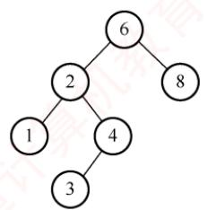
</div>

<p align="center"><em>图 7.4 一棵二叉排序树</em></p>

$$
\begin{array}{l} \text {BSTNode * BST\_Search(BiTree T, ElemType key) {}} \\ \text {while (T != NULL\&key! = T->data) { //若树空或等于根结点值，则结束循环}} \\ \text {if (key <   T->data) T = T->lchild; //小于，则在左子树上查找} \\ \text {else T = T->rchild; //大于，则在右子树上查找} \\ \} \\ \text {return T;} \\ \} \end{array}
$$

　　例如，在图 7.4 中查找关键字为 4 的结点。首先 4 与根结点 6 比较。因为 4 < 6，所以在根结点 6 的左子树中继续查找。因为 4 > 2，故在结点 2 的右子树中继续查找，该子树的根结点即为 4，查找成功。

　　同样，二叉排序树的查找也可用递归算法实现，其实现较为简单，但由于递归可能导致较大的栈空间开销，执行效率较低。具体的代码实现留给读者思考。

#### 3. 二叉排序树的插入

　　二叉排序树作为一种动态树表，其结构通常不是一次性生成的，而是在查找过程中动态构建：当查找失败（树中不存在关键字等于给定值的结点）时，才执行插入操作。

　　插入结点的过程如下：若原二叉排序树为空，则将新结点作为根结点直接插入；否则，从根结点开始比较，若关键字 k 小于当前结点的关键字，则在左子树中继续查找并插入；若 k 大于当前结点的关键字，则在右子树中继续查找并插入。新插入的结点在插入完成后一定是一个叶结点，且恰好是查找失败时所访问的最后一个结点的左孩子或右孩子。如图 7.5 所示，在一棵二叉排序树中依次插入结点 28 和 58，虚线所示路径即为每次插入前的查找路径。

<div align="center">
  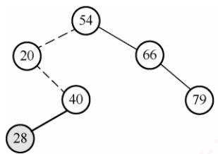
</div>

<p align="center"><em>(a) 插入28</em></p>

<p align="center"><em>图 7.5 向二叉排序树中插入结点</em></p>

<p align="center"><em>(b) 插入58</em></p>

<p align="center"><em>(d) 插入53</em></p>

　　二叉排序树插入操作的算法描述如下:

```c
int BST_Insert(BiTree &T, KeyType k) {
    if (T == NULL) { // 原树为空，新插入的记录为根结点
    T = (BiTree)malloc(sizeof(BSTNode));
    T->data = k;
    T->lchild = T->rchild = NULL;
    return 1; // 返回 1，插入成功
    }
    else if (k == T->data) // 树中存在相同关键字的结点，插入失败
    return 0;
    else if (k < T->data) // 插入 T 的左子树
    return BST_Insert(T->lchild, k);
    else // 插入 T 的右子树
    return BST_Insert(T->rchild, k);
}
```

#### 4. 二叉排序树的构造

> **考点追踪：** → 构造二叉排序树的过程（2020）

　　从一棵空树开始，依次将给定元素插入二叉排序树的合适位置（重复关键字将被忽略）。设插入的关键字序列为 $\{45, 24, 53, 45, 12, 24\}$ ，则生成的二叉排序树如图7.6所示。

<div align="center">
  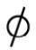
</div>

<div align="center">
  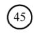
</div>

<p align="center"><em>(b) 插入45</em></p>

<div align="center">
  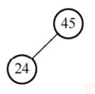
</div>

<p align="center"><em>(c) 插入24</em></p>

<div align="center">
  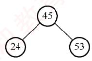
</div>

<div align="center">
  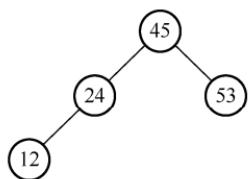
</div>

<p align="center"><em>(e) 插入12</em></p>

<p align="center"><em>图 7.6 二叉排序树的构造过程</em></p>

　　构造二叉排序树的算法描述如下:

```txt
void Creat_BST(BiTree &T, KeyType str[], int n) {
    T = NULL; // 初始时 T 为空树
    int i = 0;
    while (i < n) { // 依次将每个关键字插入二叉排序树
    BST_Insert(T, str[i]);
    i++;
    }
}
```

#### 5. 二叉排序树的删除

　　在二叉排序树中删除一个结点时，不能把以该结点为根的子树都删除，而必须将该结点从存储结构中摘下，并重新连接因删除操作而断裂的链表，同时确保整棵树仍满足二叉排序树的性质。删除操作需根据被删结点的不同情况分别处理，具体分为以下三种情形：

　　① 若被删结点 $z$ 是叶结点，则直接删除即可，不会破坏二叉排序树的性质。

　　② 若结点 $z$ 仅有一棵非空子树（左子树或右子树），则将其唯一的子树上移，作为 $z$ 的父结点的新子树，从而替代 $z$ 的位置。

　　③ 若结点 $z$ 同时具有左右两棵子树，则可用 $z$ 的直接后继或直接前驱（分别为中序遍历中的下一个或上一个结点）来替代 $z$ 。替换完成后，再从树中删除该直接后继（或前驱）。由于直接后继（或前驱）至多只有一个子树，这样就转化为第①或第②种情况。

<p align="center"><em>图 7.7 展示了分别删除结点 45, 78, 78 的过程。</em></p>

<div align="center">
  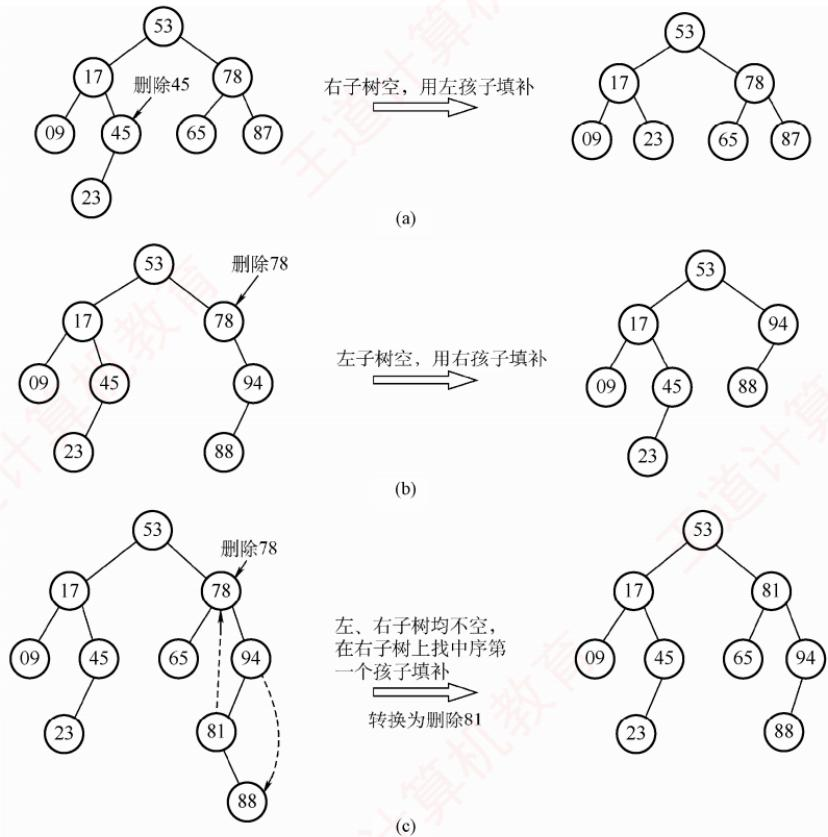
</div>

<p align="center"><em>图 7.7 3 种情况下的删除过程</em></p>

> **考点追踪：** 二叉排序树中删除并插入某结点的分析（2013）

　　思考：若在二叉排序树中删除某结点，再重新插入，所得的二叉排序树是否与原树相同？

#### 6. 二叉排序树的查找效率分析

　　二叉排序树的查找效率主要取决于树的高度。若左右子树高度之差的绝对值不超过1（见下一节的平衡二叉树），其平均查找长度为 $O(\log_2 n)$ 。在最坏情况下，若构造二叉排序树的输入序列是有序的，则会形成一个只有右孩子（或只有左孩子）的单支树，此时树的高度为n，性能显著下降，平均查找长度退化为 $(n + 1)/2$ ，如图7.8(b)所示。

<div align="center">
  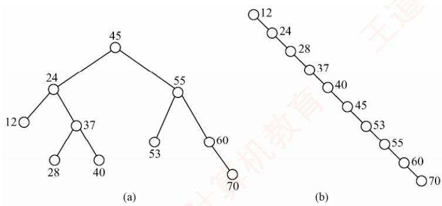
</div>

<p align="center"><em>图 7.8 相同关键字组成的不同二叉排序树</em></p>

　　在等概率情况下，图 7.8(a) 查找成功的平均查找长度为

$$
\mathrm{ASL} _ {\mathrm{a}} = (1 + 2 \times 2 + 3 \times 4 + 4 \times 3) / 1 0 = 2. 9
$$

　　而图 7.8(b) 查找成功的平均查找长度为

$$
\mathrm{ASL} _ {\mathrm{b}} = (1 + 2 + 3 + 4 + 5 + 6 + 7 + 8 + 9 + 1 0) / 1 0 = 5. 5
$$

　　从查找过程来看，二叉排序树与二分查找相似。就平均时间性能而言，二者相近。但二分查找所对应的判定树是唯一的，而由相同关键字集合可能生成不同的二叉排序树——其具体形态取决于关键字的插入顺序，如图 7.8 所示。

　　就维护表的有序性而言，二叉排序树无须移动结点，仅需修改指针即可完成插入和删除操作，平均时间复杂度为 $O(\log_{2}n)$ 。而二分查找的对象是有序顺序表，若需执行插入或删除操作，必须移动大量元素，时间复杂度为 $O(n)$ 。因此，当表为静态查找表时，宜采用顺序表存储并使用二分查找；若表为动态查找表（需频繁插入或删除），则应选择二叉排序树作为其逻辑结构。

### 7.3.2 平衡二叉树

#### 1. 平衡二叉树的定义

　　为了避免树的高度增长过快而导致二叉排序树性能下降，在插入和删除结点时，需保证任意结点的左右子树高度差的绝对值不超过1。满足这一条件的二叉树称为平衡二叉树（Balanced Binary Tree），也称AVL树。定义结点左子树与右子树的高度差为该结点的平衡因子，则平衡二叉树中所有结点的平衡因子只能取-1、0或1。

> **考点追踪：** 平衡二叉树的定义（2009）

　　因此，平衡二叉树可形式化定义为：它或者是一棵空树，或者是具有下列性质的二叉树——其左子树和右子树均为平衡二叉树，且左右子树的高度差的绝对值不超过1。图7.9(a)是一棵平衡二叉树，图7.9(b)是一棵不平衡的二叉树。结点内的数字表示其平衡因子。

<div align="center">
  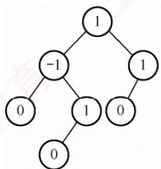
</div>

<p align="center"><em>(a) 平衡二叉树</em></p>

<div align="center">
  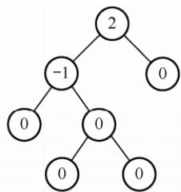
</div>

<p align="center"><em>(b) 不平衡的二叉树</em></p>

<p align="center"><em>图 7.9 平衡二叉树和不平衡的二叉树</em></p>

#### 2. 平衡二叉树的插入

　　平衡二叉树维持平衡的基本思想如下：每当插入一个结点后，沿查找路径向上检查各祖先结点是否因该操作而失去平衡。若存在失衡结点，则定位插入路径上离新结点最近、且平衡因子绝对值大于1的结点A，以A为根的子树即为最小不平衡子树。随后，在保持二叉排序树特性的前提下，通过旋转调整该子树的结构，使其重新达到平衡。

> **考点追踪：** 平衡二叉树中插入操作的特点（2015）

　　每次调整的对象都是最小不平衡子树，图 7.10 中的虚线框内所示即为最小不平衡子树。

<div align="center">
  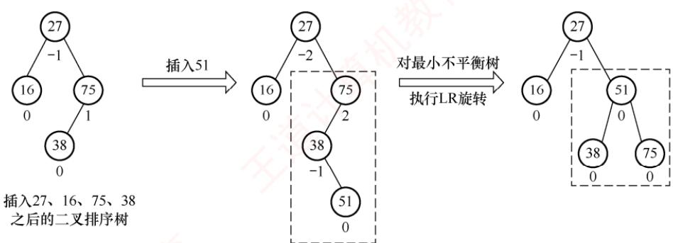
</div>

<p align="center"><em>图 7.10 最小不平衡子树示意</em></p>

> **考点追踪：** 平衡二叉树的插入及调整操作的实例（2010、2019、2021）

　　平衡二叉树的插入过程前半部分与普通二叉排序树相同；但在新结点插入后，若导致查找路径上的某个结点失去平衡，则需执行相应的调整。可将调整的规律归纳为下列4种情况：

1）LL 平衡旋转（右单旋转）。由于在结点 A 的左孩子（L）的左子树（L）上插入了新结点，A 的平衡因子由 1 增至 2，导致以 A 为根的子树失去平衡，需要一次向右的旋转操作。将 A 的左孩子 B 向右上旋转，使其代替 A 成为新的根结点；将 A 向右下旋转，成为 B 的右孩子；而 B 的原右子树则作为 A 的左子树。如图 7.11 所示，结点旁的数值代表结点的平衡因子，方块表示相应结点的子树，下方数值代表该子树的高度。

<div align="center">
  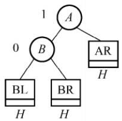
</div>

<p align="center"><em>(a) 插入结点前</em></p>

<div align="center">
  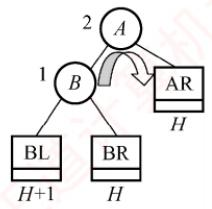
</div>

<p align="center"><em>(b) 插入结点导致不平衡</em></p>

<div align="center">
  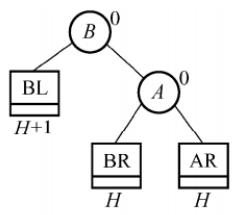
</div>

<p align="center"><em>(c) LL旋转（右单旋转）</em></p>

<p align="center"><em>图 7.11 LL 平衡旋转</em></p>

2）RR平衡旋转（左单旋转）。由于在结点 $A$ 的右孩子（R）的右子树（R）上插入了新结点， $A$ 的平衡因子由-1减至-2，导致以 $A$ 为根的子树失去平衡，需要一次向左的旋转操作。将 $A$ 的右孩子 $B$ 向左上旋转，使其替代 $A$ 成为新的根结点；将 $A$ 向左下旋转，成为 $B$ 的左孩子；而 $B$ 的原左子树则作为 $A$ 的右子树，如图7.12所示。

<div align="center">
  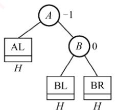
</div>

<p align="center"><em>(a) 插入结点前</em></p>

<div align="center">
  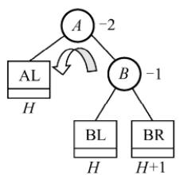
</div>

<p align="center"><em>(b) 插入结点导致不平衡</em></p>

<div align="center">
  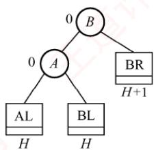
</div>

<p align="center"><em>(c) RR旋转(左单旋转)</em></p>

<p align="center"><em>图 7.12 RR 平衡旋转</em></p>

3）LR平衡旋转（先左后右双旋转）。由于在结点 $A$ 的左孩子（L）的右子树（R）上插入新结点， $A$ 的平衡因子由1增至2，导致以 $A$ 为根的子树失去平衡，需要进行两次旋转操作，先左旋转后右旋转。先将 $A$ 的左孩子 $B$ 的右子树的根结点 $C$ 向左上旋转，使其取代

<div align="center">
  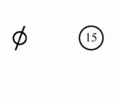
</div>

　　B 的位置；然后将 C 向右上旋转，使其取代 A 的位置，如图 7.13 所示。

<div align="center">
  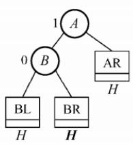
</div>

<p align="center"><em>(a) </em></p>

<p align="center"><em>(a) 插入结点前</em></p>

<div align="center">
  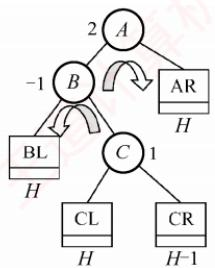
</div>

<p align="center"><em>(b) 插入结点导致不平衡</em></p>

<div align="center">
  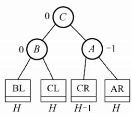
</div>

<p align="center"><em>(c) LR旋转(双旋转)</em></p>

<p align="center"><em>图 7.13 LR平衡旋转</em></p>

4）RL 平衡旋转（先右后左双旋转）。由于在结点 A 的右孩子（R）的左子树（L）上插入新结点，A 的平衡因子由 -1 减至 -2，导致以 A 为根的子树失去平衡，需要进行两次旋转操作，先右旋转后左旋转。先将 A 的右孩子 B 的左子树的根结点 C 向右上旋转，使其取代 B 的位置；然后将 C 向左上旋转，使其取代 A 的位置，如图 7.14 所示。

<div align="center">
  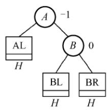
</div>

<p align="center"><em>(a) 插入结点前</em></p>

<div align="center">
  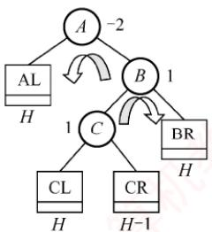
</div>

<p align="center"><em>(b) 插入结点导致不平衡</em></p>

<div align="center">
  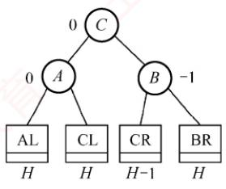
</div>

<p align="center"><em>(c) RL旋转(双旋转)</em></p>

<p align="center"><em>图 7.14 RL 平衡旋转</em></p>

> **注意：**

　　LR和RL旋转时，新结点究竟是插入 $C$ 的左子树还是右子树不影响旋转过程，而图7.13和图7.14中以插入 $C$ 的左子树为例。

> **考点追踪：** 构造平衡二叉树的过程（2013）

　　以关键字序列{15, 3, 7, 10, 9, 8}构造一棵平衡二叉树的过程为例：图 7.15(d)插入 7 后导致不平衡，最小不平衡子树的根为 15，插入位置为其左孩子的右子树，因此需执行 LR 旋转，先左后右双旋转，调整后的结果如图 7.15(e)所示。图 7.15(g)插入 9 后导致不平衡，最小不平衡子树的根为 15，插入位置为其左孩子的左子树，需执行 LL 旋转，右单旋转，调整后的结果如图 7.15(h)所示。图 7.15(i)插入 8 后导致不平衡，最小不平衡子树的根为 7，插入位置为其右孩子的左子树，需执行 RL 旋转，先右后左双旋转，调整后的结果如图 7.15(j)所示。

<p align="center"><em>(a) 空树</em></p>

<div align="center">
  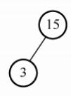
</div>

<p align="center"><em>(b) 插入15</em></p>

<p align="center"><em>(c) 插入3</em></p>

<div align="center">
  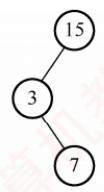
</div>

<p align="center"><em>(d) 插入7</em></p>

<div align="center">
  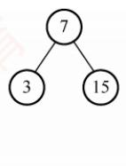
</div>

<p align="center"><em>(e) LR旋转</em></p>

<p align="center"><em>图 7.15 平衡二叉树的生成过程</em></p>

<div align="center">
  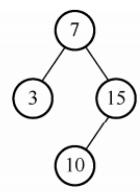
</div>

<p align="center"><em>(f) 插入10</em></p>

<div align="center">
  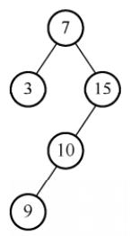
</div>

<p align="center"><em>(g) 插入9</em></p>

<div align="center">
  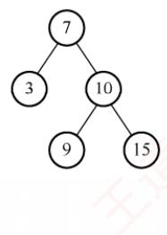
</div>

<p align="center"><em>(h) LL旋转</em></p>

<div align="center">
  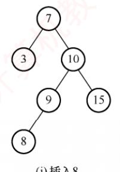
</div>

<div align="center">
  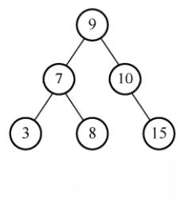
</div>

<p align="center"><em>(j) RL旋转</em></p>

<p align="center"><em>图 7.15 平衡二叉树的生成过程（续）</em></p>

#### 3. 平衡二叉树的删除

　　与插入操作相似，以删除结点 w 为例说明平衡二叉树删除操作的步骤：

1）使用二叉排序树的方法删除结点 w。

2）若导致不平衡，则从结点 $w$ 开始向上回溯，找到第一个不平衡的结点 $z$ （最小不平衡子树的根）。设 $y$ 是 $z$ 的较高子树的根结点， $x$ 是 $y$ 的较高子树的根结点。

3）对以 z 为根的子树进行平衡调整，其中 x、y 和 z 的相对位置有以下四种情况：

- $y$ 是 $z$ 的左孩子， $x$ 是 $y$ 的左孩子（LL，右单旋转）；

- $y$ 是 $z$ 的左孩子， $x$ 是 $y$ 的右孩子（LR，先左后右双旋转）；

- $y$ 是 $z$ 的右孩子， $x$ 是 $y$ 的右孩子（RR，左单旋转）；

- $y$ 是 $z$ 的右孩子， $x$ 是 $y$ 的左孩子（RL，先右后左双旋转）。

　　这些调整方式与插入操作相同。不同之处在于：插入操作只需对以 z 为根的子树进行一次平衡调整，而删除操作则可能需要多次调整。若一次调整导致子树的高度减 1，则可能还需对 z 的祖先结点进行平衡调整，甚至回溯到根结点（导致整棵树的高度减 1）。

　　以删除图7.16(a)中的结点32为例，由于32是叶结点，直接删除即可。然后向上回溯，找到第一个不平衡结点44（ $z$ ）， $z$ 的较高子树的根为78（ $y$ ）， $y$ 的较高子树的根为50（ $x$ ），满足RL情况，需执行先右后左的双旋转。调整后的结果如图7.16(c)所示。

<div align="center">
  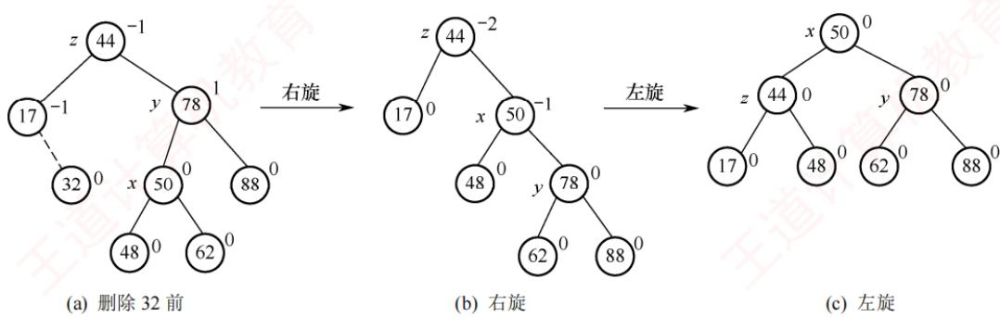
</div>

<p align="center"><em>图 7.16 平衡二叉树的删除</em></p>

#### 4. 平衡二叉树的查找

> **考点追踪：** 指定条件下平衡二叉树的结点数的分析（2012）

　　在平衡二叉树上进行查找的过程与普通二叉排序树相同，因此关键字的比较次数最多等于树的深度。设 $n_{h}$ 表示深度为 h（根结点深度为 1）的平衡二叉树中所含的最少结点数。显然有 $n_{0}=0, n_{1}=1, n_{2}=2$ ，且满足 $n_{h}=n_{h-2}+n_{h-1}+1$ ，如图 7.17 所示，依次推出 $n_{3}=4, n_{4}=7, n_{5}=12,\cdots$ 。含有 n 个结点的平衡二叉树的最大深度为 $O(\log_{2}n)$ ，因此平均查找时间复杂度为 $O(\log_{2}n)$ 。

<div align="center">
  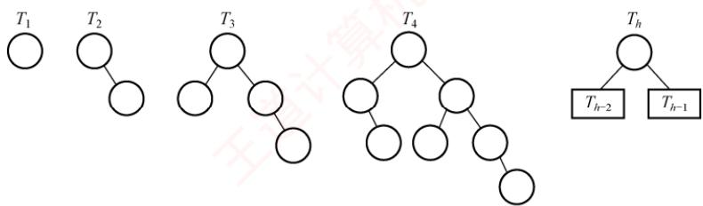
</div>

<p align="center"><em>图 7.17 结点个数 $n$ 最少的平衡二叉树</em></p>

> **注意：**

　　该结论可用于求解给定结点数的平衡二叉树在查找时所需的最多比较次数（树的最大深度）。例如，含有12个结点的平衡二叉树中查找某个结点的最多比较次数？

　　深度为 $h$ 的平衡二叉树中所含的最多结点数显然是满二叉树的情况。

### 7.3.3 红黑树

#### 1. 红黑树的定义

　　为了保持 AVL 树的平衡性，在插入和删除操作后，会非常频繁地调整全树的整体拓扑结构，代价较大。为此，在 AVL 树的平衡标准基础上进一步放宽条件，引入了红黑树的结构。

　　一棵红黑树是满足如下红黑性质的二叉排序树：

　　① 每个结点或是红色，或是黑色的。

　　② 根结点是黑色的。

　　③ 叶结点（虚构的外部结点、NULL 结点）都是黑色的。

　　④ 不存在两个相邻的红结点（红结点的父结点和孩子结点均是黑色的）。

　　⑤ 对每个结点，从该结点到任意一个叶结点的简单路径上，所含黑结点的数量相同。

　　与折半查找树和B树类似，为了便于对红黑树的实现和理解，引入了 $n + 1$ 个外部叶结点，这些结点被视为黑色，以保证每个内部结点的左右子树均非空。图7.18所示是一棵红黑树。

　　从某个结点出发（不含该结点）到达一个叶结点的任意一个简单路径上的黑结点总数称为该结点的黑高（记为 bh），黑高的概念是由性质⑤确定的。根结点的黑高称为红黑树的黑高。

　　结论 1：从根到叶结点的最长路径不大于最短路径的 2 倍。

　　根据性质⑤，从根到任意一个叶结点的最短路径必然全由黑结点构成。根据性质④，当某条路径最长时，这条路径必然是由黑结点和红结点交替构成的，此时黑结点的数量固定，红结点的数量最多等于黑结点的数量。图7.18中的6-2和6-15-18-20就是这样的两条路径。

<div align="center">
  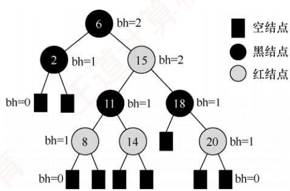
</div>

　　结论 2：有 n 个内部结点的红黑树的高度 $h \leqslant 2\log_{2}(n+1)$ 。

<p align="center"><em>图 7.18 一棵红黑树</em></p>

　　证明：根据结论 1，从根到叶结点（不含叶结点）的任意一条简单路径上都至少有一半是黑结点，因此根的黑高至少为 h/2。由此得出 $n \geqslant 2^{h/2} - 1$ ，从而得到结论。

　　由结论2也可推出，黑高为 $h$ 的红黑树的内部结点数最少是 $2^{h} - 1$ ，最多是 $2^{2h} - 1$ 。

　　可见，红黑树采用“适度平衡”策略——相比 AVL 树的“高度平衡”（左右子树高度差 $\leqslant 1$ ），允许左右子树高度相差最多达 2 倍，显著降低了插入/删除时结构调整的频率。因此，对于动态查找表：若查找操作远多于插入/删除，采用 AVL 树更优（查找更快）；若插入/删除频繁，则采用红黑树更合适（调整开销小）。由于红黑树在实际应用中综合性能更优，它被广泛采用，例如 C++ 中的 map 和 set（Java 中的 TreeMap 和 TreeSet）均基于红黑树实现。

#### 2. 红黑树的插入

　　红黑树的插入过程与普通二叉查找树基本类似。不同之处在于，插入新结点后可能破坏红黑性质，因此需要通过重新着色或旋转操作进行调整，以恢复红黑树的基本性质。

　　结论 3：新插入的结点初始应着为红色。

　　假设将其染为黑色，则该结点所在路径的黑结点数将比其他路径的多1，几乎必然违反性质⑤（所有路径的黑结点数相等），且调整代价较高。而若染为红色，则所有路径的黑结点数保持不变，仅当出现父子均为红色时才违反性质④，此时，局部调整即可高效恢复平衡。

　　设新插入的结点为 z。插入与调整过程如下：

1）用二叉查找树规则插入 $z$ ，并将其染为红色。若 $z$ 的父结点为黑色，则红黑性质未被破坏，插入结束。

2）若 z 为根结点，则将其染为黑色（满足性质②），树的黑高加 1，插入结束。

3）若 $z$ 非根，且其父结点 $z.p$ 为红色，则违反性质④。由于原树合法，根据性质②和④， $z$ 的爷结点 $z.p.p$ 必然存在且为黑色。此时，需要根据叔结点 $y$ （ $z.p$ 的兄弟）的颜色分三种情形处理（此处假设 $z.p$ 是 $z.p.p$ 的左孩子，右孩子情形对称，后面会说明）。

　　情形1（LR型，先左旋再右旋）： $z$ 的叔结点 $y$ 是黑色的，且 $z$ 是其父结点的右孩子。

　　即 z 是其爷结点的左孩子的右孩子。先对 z.p 执行左旋，使 z 上升取代原父位置，转化为情形 2。此操作不改变任何路径的黑结点数（因 z 与 z.p 均为红色），故性质⑤不受影响。

　　情形2（LL型，右单旋）： $z$ 的叔结点 $y$ 是黑色的，且 $z$ 是其父结点的左孩子。

　　即 z 是其爷结点的左孩子的左孩子。对 z.p.p 执行右旋，并将原父结点染黑、原爷结点染红。此操作保持所有路径的黑结点数不变，同时消除连续红结点，恢复全部红黑性质，插入结束。

<p align="center"><em>图 7.19 展示了情形 1（LR 型）和情形 2（LL 型）的调整过程。子树 $T_{1}$ 、 $T_{2}$ 、 $T_{3}$ 和 $T_{4}$ 均以黑色结点为根，且黑高相同，确保旋转前后性质⑤成立。</em></p>

<div align="center">
  
</div>

<p align="center"><em>图 7.19 情况1和情况2的调整方式</em></p>

　　对称情形：若 z.p 是 z.p.p 的右孩子，则对应 RL 型（先右旋后左旋）和 RR 型（左单旋），处理方式完全对称，此处不再赘述。可见，红黑树的调整方法与 AVL 树有异曲同工之妙。

　　情形 3: z 的叔结点 y 是红色的。

　　无论 z 是左孩子还是右孩子，均无影响。将 z.p 和 y 染为黑色，将 z.p.p 染为红色，以在局部恢复性质④（无连续红结点）和性质⑤（所有路径的黑结点数相等）。但 z.p.p 变红后，可能与其父结点再次形成红-红冲突。因此，将 $z.p.p$ 视为新的“待调整结点 $z$ ”，继续向上回溯检查。调整过程如图7.20所示。该过程可能多次重复，每次循环 $z$ 都会上移两层，直至满足以下任何一个终止条件： $z$ 成为根结点（此时染黑，结束）；进入情形1或情形2（执行旋转后结束）。

<div align="center">
  
</div>

<p align="center"><em>图 7.20 情况 3 的调整方式</em></p>

　　补充说明：尽管新结点最初总是插入在某个叶结点位置，但在情形3的回溯过程中，指针 $z$ 可能已上移至内部结点，从而拥有子树。因此，所有调整操作都必须考虑其子树的存在。

　　以图 7.21(a) 中的红黑树为例（虚线表示插入后的状态），依次插入 5、4 和 12 的过程如图 7.21 所示。插入 5，属于情形 3，将 5 的父结点 3 与叔结点 10 染黑，爷结点 7 染红；由于 7 是根结点，需将其重新染黑，树的黑高加 1，结束。插入 4，属于情形 1 的对称情形（RL 型），先对以 5 为根的子树执行右旋，转为情形 2 的对称情形（RR 型），交换 3 和 4 的颜色，再对以 4 为根的子树执行左旋，结束。插入 12，其父结点为黑色，无须调整，直接结束。

<div align="center">
  
</div>

<p align="center"><em>图 7.21 红黑树的插入过程</em></p>

#### 3. 红黑树的删除

> **注意：**

　　本节内容难度较大，考查概率较低，读者可根据自身情况决定是否学习或学习的时机。

　　红黑树的插入操作可能破坏性质④（无连续红结点）。而删除操作则更易破坏性质⑤（所有路径的黑结点数相等），特别是当被删结点为黑色时，会导致经过该结点的所有路径黑高减1。

　　删除过程首先执行二叉查找树的标准删除。若待删结点有两个非空子树，不能直接删除，需用其中序后继（或前驱）替代之，即右子树中的最小结点，并转为删除该后继结点。由于中序后继在其子树中是最小值，因此至多只有一个右孩子。由此，删除操作最终都可归结为以下两种情形：

- 待删结点有一个孩子（左或右孩子）。

- 待删结点是终端结点（无孩子）。

1）若待删结点有一个孩子，则只有两种情况，如图7.22所示。

<div align="center">
  
</div>

<p align="center"><em>图 7.22 只有右子树或左子树的删除情况</em></p>

　　且仅有这两种情况存在。则子树只有一个结点，且必然是红色，否则会破坏性质⑤。

2）待删结点无孩子，且该结点是红色的，此时可直接删除，而不需要做任何调整。

3）待删结点无孩子，且该结点是黑色的，此时设待删结点为 $y$ ， $x$ 是用来替换 $y$ 的结点（注意，当 $y$ 是终端结点时， $x$ 是黑色的NULL结点）。删除 $y$ 后将导致先前包含 $y$ 的任何路径上的黑结点数量减1，因此 $y$ 的任何祖先都不再满足性质⑤，简单的修正办法就是将替换 $y$ 的结点 $x$ 视为还有额外一重黑色，定义为双黑结点。也就是说，若将任何包含结点 $x$ 的路径上的黑结点数量加1，则在此假设下，性质⑤得到满足，但破坏了性质①。于是，删除操作的任务就转化为将双黑结点恢复为普通结点。

　　分为以下四种情形，区别在于 x 的兄弟结点 w 及 w 的孩子结点的颜色不同。

　　情形 1: x 的兄弟结点 w 是红色的。

　　w 必须有黑色左右孩子和父结点。交换 w 和父结点 x.p 的颜色，然后对 x.p 做一次左旋，而不会破坏红黑树的任何规则。现在，x 的新兄弟结点是旋转之前 w 的某个孩子结点，其颜色为黑色，这样，就将情形 1 转换为情形 2、3 或 4 处理。调整方式如图 7.23 所示。

<div align="center">
  
</div>

<p align="center"><em>图 7.23 情形 1 的调整方式</em></p>

　　情形2（RR型，左单旋）： $x$ 的兄弟结点 $w$ 是黑色的，且 $w$ 的右孩子是红色的。

　　即这个红结点是其爷结点的右孩子的右孩子。交换 $w$ 和父结点 $x.p$ 的颜色，把 $w$ 的右孩子着为黑色，并对 $x$ 的父结点 $x.p$ 做一次左旋，将 $x$ 变为单重黑色，此时不再破坏红黑树的任何性质，结束。调整方式如图7.24所示。

<div align="center">
  
</div>

<p align="center"><em>图 7.24 情形 2 的调整方式</em></p>

　　情形3（RL型，先右旋再左旋）： $x$ 的兄弟结点 $w$ 是黑色的， $w$ 的左孩子是红色的， $w$ 的右孩子是黑色的。

　　即这个红结点是其爷结点的右孩子的左孩子。交换 $w$ 和其左孩子的颜色，然后对 $w$ 做一次右旋，而不破坏红黑树的任何性质。现在， $x$ 的新兄弟结点 $w$ 的右孩子是红色的，这样就将情形3转换为了情形2。调整方式如图7.25所示。

<div align="center">
  
</div>

<p align="center"><em>图 7.25 情形 3 的调整方式</em></p>

　　情形 4: x 的兄弟结点 w 是黑色的，且 w 的两个孩子结点都是黑色的。

　　因为 $w$ 也是黑色的，所以可从 $x$ 和 $w$ 上去掉一重黑色，使得 $x$ 只有一重黑色而 $w$ 变为红色。为了补偿从 $x$ 和 $w$ 中去掉的一重黑色，把 $x$ 的父结点 $x.p$ 额外着一层黑色，以保持局部的黑高不变。通过将 $x.p$ 作为新结点 $x$ 来循环， $x$ 上升一层。若是通过情形1进入情形4的，因为原来的 $x.p$ 是红色的，将新结点 $x$ 变为黑色，终止循环，结束。调整方式如图7.26所示。

<div align="center">
  
</div>

<p align="center"><em>图 7.26 情形 4 的调整方式</em></p>

　　若 x 是父结点 x.p 的右孩子，则还有四种对称的情形，处理方式类似，不再赘述。

　　归纳总结：在情形4中，因 $x$ 的兄弟结点 $w$ 及左右孩子都是黑色，可以从 $x$ 和 $w$ 中各提取一重黑色（以让 $x$ 变为普通黑结点），不会破坏性质④，并把调整任务向上“推”给它们的父结点 $x.p$ 。在情形1、2和3中，因为 $x$ 的兄弟结点 $w$ 或 $w$ 左右孩子中有红结点，所以只能在 $x.p$ 子树内用调整和重新着色的方式，且不能改变 $x$ 原根结点的颜色（否则向上可能破坏性质④）。情形1虽可能会转为情形4，但因为新 $x$ 的父结点 $x.p$ 是红色的，所以执行一次情形4就会结束。情形1、2和3在各执行常数次的颜色改变和至多3次旋转后便终止，情形4是可能重复执行的唯一情形，每执行一次指针 $x$ 上升一层，至多 $O(\log_2n)$ 次。

　　以图 7.27(a) 所示的红黑树为例（虚线表示删除前的状态），依次删除 5 和 15 的过程如图 7.27 所示。删除 5，用虚构的黑色 NULL 结点（图中为 N 结点）替换，视为双黑 NULL 结点，属于情形 1，交换兄弟结点 12 和父结点 8 的颜色，对 8 执行左旋；转变为情形 4，从双黑 NULL 结点和 10 中各提取一重黑色（提取后，双黑 NULL 结点变为普通 NULL 结点，图中省略，10 变为红色），因原父结点 8 是红色，所以将 8 变为黑色，结束。删除 15，属于情形 3 的对称情形（LR 型），交换 8 和 10 的颜色，对 8 执行左旋；转变为情形 2 的对称情形（LL 型），交换 10 和 12 的颜色（两者颜色一样，无变化），将 10 的左孩子 8 着为黑色，对 12 执行右旋，结束。

<div align="center">
  
</div>

<p align="center"><em>图 7.27 红黑树的删除过程</em></p>

### 7.3.4 本节试题精选

#### 一、单项选择题

01. 对于二叉排序树，下面的说法中，（）是正确的。

- A. 二叉排序树是动态树表，查找失败时插入新结点，会引起树的重新分裂和组合
- B. 对二叉排序树进行层序遍历可得到有序序列
- C. 用逐点插入法构造二叉排序树，若先后插入的关键字有序，二叉排序树的深度最大
- D. 在二叉排序树中进行查找，关键字的比较次数不超过结点数的 1/2

02. 按（）遍历二叉排序树得到的序列是一个有序序列。

- A. 先序
- B. 中序
- C. 后序
- D. 层次

03. 在二叉排序树中进行查找的效率与（）有关。

- A. 二叉排序树的深度
- B. 二叉排序树的结点的个数
- C. 被查找结点的度
- D. 二叉排序树的存储结构

04. 在常用的描述二叉排序树的存储结构中，关键字值最大的结点（）。

- A. 左指针一定为空
- B. 右指针一定为空
- C. 左右指针均为空
- D. 左右指针均不为空

05. 设二叉排序树中关键字由 1 到 1000 的整数构成，现要查找关键字为 363 的结点，下述关键字序列中，不可能是在二叉排序树上查找的序列是（）。

- A. 2, 252, 401, 398, 330, 344, 397, 363
- B. 924, 220, 911, 244, 898, 258, 362, 363
- C. 925, 202, 911, 240, 912, 245, 363
- D. 2, 399, 387, 219, 266, 382, 381, 278, 363

06. 分别以下列序列构造二叉排序树，与用其他3个序列所构造的结果不同的是（）。

- A. (100, 80, 90, 60, 120, 110, 130)
- B. (100, 120, 110, 130, 80, 60, 90)
- C. (100, 60, 80, 90, 120, 110, 130)
- D. (100, 80, 60, 90, 120, 130, 110)

07. 从空树开始，依次插入元素 52, 26, 14, 32, 71, 60, 93, 58, 24 和 41 后构成了一棵二叉排序树。在该树查找 60，要进行比较的次数为（）。

- A. 3
- B. 4
- C. 5
- D. 6

08. 在含有 $n$ 个结点的二叉排序树中查找某个关键字的结点时，最多进行（）次比较。

- A. $n / 2$
- B. $\log_2n$
- C. $\log_2n + 1$
- D. $n$

09. 五个不同结点构造的二叉查找树的形态共有（）种。

- A. 20
- B. 30
- C. 32
- D. 42

10. 构造一棵具有 n 个结点的二叉排序树时，最理想情况下的深度为（）。

- A. n/2
- B. n
- C. $\left\lfloor\log_{2}(n+1)\right\rfloor$
- D. $\left\lceil\log_{2}(n+1)\right\rceil$

11. 含有 20 个结点的平衡二叉树的最大深度为（）。

- A. 4
- B. 5
- C. 6
- D. 7

12. 具有 5 层结点的平衡二叉树至少有（）个结点。

- A. 10
- B. 12
- C. 15
- D. 17

13. 高度为 3 的平衡二叉排序树的形态共有（）种。

- A. 13
- B. 14
- C. 16
- D. 15

14. 在平衡二叉树的基本操作中，可能发生两次旋转的操作是（）。

- A. 添加、删除结点
- B. 仅删除结点
- C. 仅添加结点
- D. 都不会

15. 将关键字 $1, 2, 3, \cdots, 1024$ 依次插入到初始为空的平衡二叉树中，假设只有一个根结点的二叉树的高度为 0，则插入结束后的平衡二叉树的高度为（）。

- A. 8
- B. 9
- C. 10
- D. 11

16. 下列关于红黑树和 AVL 树的说法中，不正确的是（）。
I. 一棵含有 $n$ 个结点的红黑树的高度至多为 $2\log_2(n + 1)$ II. 若一个结点是红色的，则它的父结点和孩子结点都是黑色的
III. 红黑树的查询效率一般要优于含有相同结点数的 AVL 树
IV. 若 AVL 树的某结点的左右孩子的平衡因子都是零，则该结点的平衡因子也是零

- A. I、III
- B. III
- C. II、IV
- D. III、IV

17. 下列关于红黑树和 AVL 树的描述中，不正确的是（）。

- A. 两者都属于自平衡的二叉树
- B. 两者查找、插入、删除的时间复杂度都相同
- C. 红黑树插入和删除过程至多有 2 次旋转操作
- D. 红黑树的任意一个结点的左右子树高度（含叶结点）之比不超过 2

18. 下列关于红黑树的说法中，正确的是（）。

- A. 红黑树的红结点的数目最多和黑结点的数目相同（不考虑虚构结点）
- B. 若红黑树的所有结点都是黑色的，则它一定是一棵满二叉树
- C. 红黑树的任何一个分支结点都有两个非空孩子结点
- D. 红黑树的子树也一定是红黑树

19. 下列四个选项中，满足红黑树定义的是（）。

- A.

<div align="center">
  
</div>

- B.

<div align="center">
  
</div>

- C.

<div align="center">
  
</div>

- D.

<div align="center">
  
</div>

20. 将关键字 1, 2, 3, 4, 5, 6, 7 依次插入初始为空的红黑树 T，则 T 中红结点的个数是（）。

- A. 1
- B. 2
- C. 3
- D. 4

21. 将关键字 5, 4, 3, 2, 1 依次插入初始为空的红黑树 T，则 T 的最终形态是（）。

- A.

<div align="center">
  
</div>

- B.

<div align="center">
  
</div>

- C.

<div align="center">
  
</div>

- D.

<div align="center">
  
</div>

22. 在下图所示的红黑树中插入结点 2 且染成红色后，则下一步应进行的操作是（）。

<div align="center">
  
</div>

- A. 左旋
- B. 右旋
- C. 变色
- D. 无须调整

23. 【2009 统考真题】下列二叉排序树中，满足平衡二叉树定义的是（）。

- A.

<div align="center">
  
</div>

- B.

<div align="center">
  
</div>

- C.

<div align="center">
  
</div>

- D.

<div align="center">
  
</div>

24. 【2010 统考真题】在下图所示的平衡二叉树中插入关键字 48 后得到一棵新平衡二叉树，在新平衡二叉树中，关键字 37 所在结点的左右子结点中保存的关键字分别是（）。

<div align="center">
  
</div>

- A. 13,48
- B. 24,48
- C. 24,53
- D. 24,90

25. 【2011 统考真题】对下列关键字序列，不可能构成某二叉排序树中一条查找路径的是（）。

- A. 95, 22, 91, 24, 94, 71
- B. 92, 20, 91, 34, 88, 35
- C. 21, 89, 77, 29, 36, 38
- D. 12, 25, 71, 68, 33, 34

26. 【2012 统考真题】若平衡二叉树的高度为 6，且所有非叶结点的平衡因子均为 1，则该平衡二叉树的结点总数为（）。

- A. 12
- B. 20
- C. 32
- D. 33

27. 【2013 统考真题】在任意一棵非空二叉排序树 $T_{1}$ 中，删除某结点 v 之后形成二叉排序树 $T_{2}$ ，再将 v 插入 $T_{2}$ 形成二叉排序树 $T_{3}$ 。下列关于 $T_{1}$ 与 $T_{3}$ 的叙述中，正确的是（）。 I. 若 v 是 $T_{1}$ 的叶结点，则 $T_{1}$ 与 $T_{3}$ 不同

II. 若 $v$ 是 $T_{1}$ 的叶结点，则 $T_{1}$ 与 $T_{3}$ 相同
III. 若 $v$ 不是 $T_{1}$ 的叶结点，则 $T_{1}$ 与 $T_{3}$ 不同
IV. 若 $v$ 不是 $T_{1}$ 的叶结点，则 $T_{1}$ 与 $T_{3}$ 相同

- A. 仅I、III
- B. 仅I、IV
- C. 仅II、III
- D. 仅II、IV

28. 【2013 统考真题】若将关键字 1, 2, 3, 4, 5, 6, 7 依次插入初始为空的平衡二叉树 T，则 T 中平衡因子为 0 的分支结点的个数是（）。

- A. 0
- B. 1
- C. 2
- D. 3

29. 【2015 统考真题】现有一棵无重复关键字的平衡二叉树（AVL），对其进行中序遍历可得到一个降序序列。下列关于该平衡二叉树的叙述中，正确的是（）。

- A. 根结点的度一定为 2
- B. 树中最小元素一定是叶结点
- C. 最后插入的元素一定是叶结点
- D. 树中最大元素一定是无左子树

30. 【2018 统考真题】已知二叉排序树如右图所示，元素之间应满足的大小关系是（）。

- A. $x_{1} <   x_{2} <   x_{5}$
- B. $x_{1} <   x_{4} <   x_{5}$
- C. $x_{3} <   x_{5} <   x_{4}$
- D. $x_4 <   x_3 <   x_5$

<div align="center">
  
</div>

31. 【2019 统考真题】在任意一棵非空平衡二叉树（AVL 树） $T_{1}$ 中，删除某结点 v 之后形成平衡二叉树 $T_{2}$ ，再将 v 插入 $T_{2}$ 形成平衡二叉树 $T_{3}$ 。下列关于 $T_{1}$ 与 $T_{3}$ 的叙述中，正确的是（）。 I. 若 v 是 $T_{1}$ 的叶结点，则 $T_{1}$ 与 $T_{3}$ 可能不相同 II. 若 v 不是 $T_{1}$ 的叶结点，则 $T_{1}$ 与 $T_{3}$ 一定不相同 III. 若 v 不是 $T_{1}$ 的叶结点，则 $T_{1}$ 与 $T_{3}$ 一定相同

- A. 仅 I
- B. 仅 II
- C. 仅 I、II
- D. 仅 I、III

32. 【2020 统考真题】下列给定的关键字输入序列中，不能生成右边二叉排序树的是（）。

- A. 4, 5, 2, 1, 3
- B. 4, 5, 1, 2, 3
- C. 4, 2, 5, 3, 1
- D. 4, 2, 1, 3, 5

<div align="center">
  
</div>

33. 【2021 统考真题】给定平衡二叉树如右图所示，插入关键字 23 后，根中的关键字是（）。

- A. 16
- B. 20
- C. 23
- D. 25

<div align="center">
  
</div>

34. 【2024 统考真题】一棵二叉搜索树如右图所示， $k_{1}$ 、 $k_{2}$ 、 $k_{3}$ 分别是对应结点中保存的关键字。子树 T 的任一结点中保存的关键字 x 满足的是（）。

- A. $x < k_{1}$
- B. $x > k_{2}$
- C. $k_{1} < x < k_{3}$
- D. $k_{3} < x < k_{2}$

#### 二、综合应用题

<div align="center">
  
</div>

01. 一棵二叉排序树按先序遍历得到的序列为(50, 38, 30, 45, 40, 48, 70, 60, 75, 80)，试画出该二叉排序树，并求出等概率下查找成功和查找失败的平均查找长度。

02. 按照序列(40, 72, 38, 35, 67, 51, 90, 8, 55, 21)建立一棵二叉排序树，画出该树，并求出在等概率的情况下，查找成功的平均查找长度。

03. 依次把结点(34, 23, 15, 98, 115, 28, 107)插入初始状态为空的平衡二叉排序树，使得在每次插入后保持该树仍然是平衡二叉树。请依次画出每次插入后所形成的平衡二叉排序树。

04. 给定一个关键字集合 $\{25, 18, 34, 9, 14, 27, 42, 51, 38\}$ ，假定查找各关键字的概率相同，请画出其最佳二叉排序树。

05. 试编写一个算法，判断给定的二叉树是否是二叉排序树。

06. 设计一个算法，求出指定结点在给定二叉排序树中的层次。

07. 利用二叉树遍历的思想编写一个判断二叉树是否是平衡二叉树的算法。

08. 设计一个算法，求出给定二叉排序树中最小和最大的关键字。

09. 设计一个算法，从大到小输出二叉排序树中所有值不小于 $k$ 的关键字。

10. 编写一个递归算法，在一棵有 $n$ 个结点的、随机建立的二叉排序树上查找第 $k (1 \leqslant k \leqslant n)$ 小的元素，并返回指向该结点的指针。要求算法的平均时间复杂度为 $O(\log_2 n)$ 。二叉排序树的每个结点中除 data、lchild、rchild 等数据成员外，增加一个 count 成员，保存以该结点为根的子树上的结点个数。

### 7.3.5 答案与解析

#### 一、单项选择题

**01. C**

　　二叉排序树插入新结点时不会引起树的分裂组合。对二叉排序树进行中序遍历可得到有序序列。当插入的关键字有序时，二叉排序树会形成一个长链，此时深度最大。在此种情况下进行查找，有可能需要比较每个结点的关键字，超过总结点数的1/2。

**02. B**

　　由二叉排序树的定义不难得出中序遍历二叉树得到的序列是一个有序序列。

**03. A**

　　二叉排序树的查找路径是自顶向下的，其平均查找长度主要取决于树的高度。

**04. B**

　　在二叉排序树的存储结构中，每个结点由三部分构成，其中左（或右）指针指向比该结点的关键字值小（或大）的结点。关键字值最大的结点位于二叉排序树的最右位置，因此它的右指针一定为空（有可能不是叶结点）。还可用反证法，若右指针不为空，则右指针上的关键字肯定比原关键字大，所以原关键字结点一定不是值最大的，与条件矛盾，所以右指针一定为空。

**05. C**

　　在二叉排序树上查找时，先与根结点值进行比较，若相同，则查找结束，否则根据比较结果，沿着左子树或右子树向下继续查找。根据二叉排序树的定义，有左子树结点值≤根结点值≤右子树结点值。C序列中，比较911关键字后，应转向其左子树比较240，左子树中不应出现比911更大的数值，但240竟有一个右孩子结点值为912，所以不可能是正确的序列。

**06. C**

　　按照二叉排序树的构造方法，不难得到 A, B, D 序列的构造结果相同。

**07. A**

　　以第一个元素为根结点，依次将元素插入树，生成的二叉排序树如右图所示。进行查找时，先与根结点比较，然后根据比较结果，继续在左子树或右子树上进行查找。比较的结点依次为52, 71, 60。

<div align="center">
  
</div>

**08. D**

　　当输入序列是一个有序序列时，构造的二叉排序树是一个单支树，当查找一个不存在的关键字值或最后一个结点的关键字值时，需要 $n$ 次比较。

**09. D**

　　五个不同结点构造的二叉查找树，中序序列是确定的。先序序列的个数为 n=5 的卡特兰数，加上中序序列和先序序列能唯一确定一棵二叉树，因此二叉排序树的形态共有 $\text{Catalan}(5)=42$ 种。

**10. D**

　　当二叉排序树的叶结点全部都在相邻的两层内时，深度最小。理想情况是从第一层到倒数第二层为满二叉树。类比完全二叉树，可得深度为 $\lceil \log_2(n + 1) \rceil$ 。

**11. C**

　　平衡二叉树结点数的递推公式为 $n_{0}=0,\quad n_{1}=1,\quad n_{2}=2,\quad n_{h}=1+n_{h-1}+n_{h-2}$ （h 为平衡二叉树高度， $n_{h}$ 为构造此高度的平衡二叉树所需的最少结点数）。通过递推公式可得，构造 5 层平衡二叉树至少需 12 个结点，构造 6 层至少需要 20 个结点。

**12. B**

　　设 $n_{h}$ 表示高度为 h 的平衡二叉树中含有的最少结点数，则有 $n_{1}=1, n_{2}=2, n_{h}=n_{h-1}+n_{h-2}+1$ ，由此求出 $n_{5}=12$ ，对应的 AVL 如右图所示。

**13. D**

<div align="center">
  
</div>

　　高度为 3 的平衡二叉树的左右子树的高度共有三种情况: ① 左右子树都是高度为 2 的平衡二叉树; ② 左子树是高度为 1 的平衡二叉树, 右子树是高度为 2 的平衡二叉树；③ 左子树是高度为 2 的平衡二叉树，右子树是高度为 1 的平衡二叉树。高度为 1 的平衡二叉树只有 1 种形态，即单个结点，如图 1 所示；高度为 2 的平衡二叉树有 3 种形态，如图 2 所示。

<div align="center">
  
</div>

　　图1

<div align="center">
  
</div>

　　图2

　　因此，对于情况①，共有 $3 \times 3 = 9$ 种树形态；对于情况②，共有 $1 \times 3 = 3$ 种树形态；情况③和情况②类似，也有 3 种树形态，所以共有 $9 + 3 + 3 = 15$ 种树形态。

**14. A**

　　插入和删除结点都有可能引起LR平衡旋转或者RL平衡旋转，发生两次旋转操作。

**15. C**

　　当按关键字有序的顺序插入初始为空的平衡二叉树时，若关键字个数 $n=2^{k}-1$ 时，则该平衡二叉树一定是一棵满二叉树（可以用 1～3、1～7 手工验证）。当插入关键字 1023 时，平衡二叉树正好是一棵满二叉树，高度为 9。因此，插入关键字 1024 后，平衡二叉树的高度为 10。

**16. D**

　　说法 I 和 II 都是红黑树的性质。AVL 是高度平衡的二叉查找树，红黑树是适度平衡的二叉查找树，从这一点也可以看出 AVL 的查询效率往往更优，说法 III 错误。AVL 的某结点的左右孩子的平衡因子都是零，并不能说明左右子树的高度相等，因此该结点的平衡因子不一定为零，说法 IV 错误。

**17. C**

　　自平衡的二叉排序树是指在插入和删除时能自动调整以保持其所定义的平衡性，两者都属于自平衡二叉树，选项 A 正确。两者的查找、插入、删除操作的时间复杂度都为 $O(\log_{2}n)$ ，选项 B 正确。在红黑树中删除结点时，情况 1 可能变为情况 2、3 或 4，情况 2 会变为情况 3，可能会出现旋转次数超过 2 次的情况，选项 C 错误。从任一结点到每个叶结点的所有路径都包含相同数目的黑结点，没有两个连续的红结点，且叶结点是黑色的，这意味着在任一结点到其左右子树中最远和最近的叶结点之间，红结点的数目小于或等于黑结点的数目，路径长度之比不超过 2，选项 D 正确。

<div align="center">
  
</div>

**18. B**

　　红黑树的红结点数目最大可以是黑结点数目的2倍（如一棵有3个结点的红黑树，第1层为黑色，第2层为红色），选项A错误。从根结点出发到所有叶结点的黑结点数是相同的，若所有结点都是黑色，则一定是满二叉树，选项B正确。考虑某个黑结点，它可以有一个空叶结点孩子和一个非空红结点孩子，选项C错误。红黑树中可能存在红结点，根结点为红色的子树不是红黑树，选项D错误。

**19. A**

　　红黑树是一种特殊的二叉排序树，选项 B 不满足二叉排序树的性质。选项 C 中，结点 2 的左右黑结点数不同。在选项 D 中，结点 3 的左右黑结点数不同。只有选项 A 满足红黑树的定义。

**20. C**

　　关键字 1, 2, 3, 4, 5, 6, 7 依次插入红黑树后的形态变化如下:

<div align="center">
  
</div>

**21. D**

　　关键字 5, 4, 3, 2, 1 依次插入红黑树后的形态变化如下:

<div align="center">
  
</div>

<div align="center">
  
</div>

<div align="center">
  
</div>

**22. B**

　　插入结点2且将其染成红色后违反不红红原则，并且叔结点是黑色，应进行LL旋转，将结点 3 右旋到结点 5 的位置，结点 2 和结点 5 分别成为结点 3 的左右孩子，然后将结点 3 染成黑色，结点 2 和结点 5 染成红色。因此，下一步应进行右旋操作。

**23. B**

　　根据平衡二叉树的定义，任意结点的左右子树高度差的绝对值不超过1。而其余3个答案均可以找到不满足条件的结点。答题时可以把每个非叶结点的平衡因子都写出来。

**24. C**

　　插入 48 以后，该二叉树根结点的平衡因子由 -1 变为 -2，在最小不平衡子树根结点的右子树（R）的左子树（L）中插入新结点引起的不平衡属于 RL 型平衡旋转（先右旋后左旋）。

<div align="center">
  
</div>

　　调整后，关键字 37 所在结点的左右子结点中保存的关键字分别是 24、53。

**25. A**

　　在二叉排序树中，左子树结点值小于根结点，右子树结点值大于根结点。在选项 A 中，当查找到 91 后再向 24 查找，说明这一条路径（左子树）之后查找的数都要比 91 小，而后面却查找到了 94（解题过程中，建议配合画图），因此错误。

　　画图法：各选项对应的查找过如下图所示。选项B、C、D对应的查找树都是二叉排序树，选项A对应的查找树不是二叉排序树，因为在91为根的左子树中出现了比91大点的结点94。

<div align="center">
  
</div>

<p align="center"><em>(a) 选项A的查找过程</em></p>

<div align="center">
  
</div>

<p align="center"><em>(b) 选项B的查找过程</em></p>

<div align="center">
  
</div>

<p align="center"><em>(c) 选项C的查找过程</em></p>

<div align="center">
  
</div>

<p align="center"><em>(d) 选项D的查找过程</em></p>

**26. B**

　　所有非叶结点的平衡因子均为 1，即平衡二叉树满足平衡的最少结点情况，如下图所示。对于高度为 n、左右子树的高度分别为 n-1 和 n-2、所有非叶结点的平衡因子均为 1 的平衡二叉树，计算总结点数的公式为 $C_{n}=C_{n-1}+C_{n-2}+1$ ， $C_{1}=1$ ， $C_{2}=2$ ， $C_{3}=2+1+1=4$ ，可推出 $C_{6}=20$ 。

<div align="center">
  
</div>

　　画图法：先画出 $T_{1}$ 和 $T_{2}$ ；然后新建一个根结点，连接 $T_{2}$ 、 $T_{1}$ 构成 $T_{3}$ ；新建一个根结点，连接 $T_{3}$ 、 $T_{2}$ 构成 $T_{4}$ ……直到画出 $T_{6}$ ，可知 $T_{6}$ 的结点数为 20。

　　排除法：对于选项 A，高度为 6、结点数为 12 的树怎么也无法达到平衡。对于选项 C，结点较多时，考虑较极端的情形，即第 6 层只有最左叶子的完全二叉树刚好有 32 个结点，虽然满足平衡的条件，但显然再删去部分结点依然不影响平衡，不是最少结点的情况。同理，选项 D 错误。

**27. C**

　　由于在二叉排序树中插入结点的位置是一个新的叶结点，若删除的是叶结点，则重新插入后得到的二叉排序树与原来的二叉排序树相同。若删除的是非叶结点，在删除过程中会找其他结点填补，重新插入后变成叶结点，则得到的二叉排序树与原来的二叉排序树不同。

**28. D**

　　利用7个关键字构建平衡二叉树 $T$ ，平衡因子为0的分支结点个数为3，构建的平衡二叉树及构造与调整过程如下图所示。

<div align="center">
  
</div>

**29. D**

　　大多数教材将平衡二叉树定义为一种高度平衡的二叉排序树，二叉排序树的中序序列是一个升序序列，而题意正好相反。由此可知，命题老师认为平衡二叉树仅为一棵满足高度平衡的二叉树，不一定是二叉排序树。只有两个结点的平衡二叉树的根结点的度为1，选项A错误。中序遍历后得到一个降序序列（与二叉排序树正好相反），树中最大元素一定无左子树（可能有右子树），这与二叉排序树也正好相反，也因此不一定是叶结点，选项B错误，选项D正确。最后插入的结点可能会导致平衡调整，而不一定是叶结点，选项C错误。

**30. C**

　　根据二叉排序树的特性：中序遍历（LNR）得到的是一个递增序列。图中二叉排序树的中序遍历序列为 $x_{1}, x_{3}, x_{5}, x_{4}, x_{2}$ ，可知 $x_{3} < x_{5} < x_{4}$ 。

**31. A**

　　在非空平衡二叉树中插入结点，在失去平衡调整前，一定插入在叶结点的位置。

　　若删除的是 $T_{1}$ 的叶结点，则删除后平衡二叉树可能不会失去平衡，即不会发生调整，再插入此结点得到的二叉平衡树 $T_{1}$ 与 $T_{3}$ 相同；若删除后平衡二叉树失去平衡而发生调整，再插入结点得到的二叉平衡树 $T_{3}$ 与 $T_{1}$ 可能不同。说法 I 正确。例如，如下图所示，删除结点 0，平衡二叉树失衡调整，再插入结点 0 后，平衡二叉树和以前不同。

<div align="center">
  
</div>

　　对于比较绝对的说法Ⅱ和Ⅲ，通常只需举出反例即可。

　　若删除的是 $T_{1}$ 的非叶结点，且删除和插入操作均没有导致平衡二叉树的调整（这时可以首先想到删除的结点只有一个孩子的情况），则该结点从非叶结点变成了叶结点， $T_{1}$ 与 $T_{3}$ 显然不同。例如，如下图所示，删除结点 2，用右孩子结点 3 填补，再插入结点 2，平衡二叉树和以前不同。

<div align="center">
  
</div>

　　若删除的是 $T_{1}$ 的非叶结点，且删除和插入操作后导致了平衡二叉树的调整，则该结点有可能通过旋转后继续变成非叶结点， $T_{1}$ 与 $T_{3}$ 相同。例如，如下图所示，删除结点 2，用右孩子结点 3 填补，再插入结点 2，平衡二叉树失衡调整，调整后的平衡二叉树和以前相同。

<div align="center">
  
</div>

**32. B**

　　每个选项都逐一验证，选项 B 生成二叉排序树的过程如下图所示，显然错误。

<div align="center">
  
</div>

**33. D**

　　关键字 23 的插入位置为 25 的左孩子，此时破坏了平衡的性质，需要对平衡二叉树进行调整。最小不平衡子树就是该树本身，插入位置在根结点的右子树的左子树上，因此需要进行 RL 旋转，RL 旋转过程如下图所示，旋转完成后根结点的关键字为 25，所以选择选项 D。

<div align="center">
  
</div>

**34. D**

　　在二叉搜索树中，每个结点的左子树中的所有关键字都小于该结点的关键字，右子树中的所有关键字都大于该结点的关键字。 $k_{2}$ 、 $k_{3}$ 所在结点都在 $k_{1}$ 所在结点的右子树中，因此 $k_{2}>k_{1}$ 、 $k_{3}>k_{1}$ ； $k_{3}$ 所在结点在 $k_{2}$ 所在结点的左子树中，因此 $k_{3}<k_{2}$ ；子树T是 $k_{3}$ 所在结点的右子树，因此子树T中任意结点的关键字x满足 $x>k_{3}$ 。综合可得， $k_{3}<x<k_{2}$ 。

#### 二、综合应用题

**01. 【解答】**

<div align="center">
  
</div>

　　先序序列为(50, 38, 30, 45, 40, 48, 70, 60, 75, 80)，二叉树的中序序列是一个有序序列，所以为(30, 38, 40, 45, 48, 50, 60, 70, 75, 80)，由先序序列和中序序列可以构造出对应的二叉树，如左图所示。

　　查找成功的平均查找长度为

$$
\mathrm{ASL} = (1 \times 1 + 2 \times 2 + 3 \times 4 + 4 \times 3) / 1 0 = 2. 9
$$

　　图中的方块结点为虚构的查找失败结点，其查找路径为从根结点到其父结点（圆形结点）的结点序列，所以对应的查找失败平均长度为

$$
\mathrm{ASL} = (3 \times 5 + 4 \times 6) / 1 1 = 3 9 / 1 1
$$

**02. 【解答】**

　　根据二叉排序树的定义，该序列所对应的二叉排序树如下图所示。

<div align="center">
  
</div>

　　平均查找长度为 $ASL=(1+2\times2+3\times3+4\times2+5\times2)/10=3.2$ 。

**03. 【解答】**

<div align="center">
  
</div>

<div align="center">
  
</div>

　　第一步：插入结点 34, 23, 15 后，需要根结点 34 的子树做 LL 调整。

<div align="center">
  
</div>

<div align="center">
  
</div>

　　第二步：插入结点 98,115 后，需要根结点 34 的子树做 RR 调整。

<div align="center">
  
</div>

<div align="center">
  
</div>

　　第三步：插入结点 28 后，需要根结点 23 的子树做 RL 调整。

<div align="center">
  
</div>

<div align="center">
  
</div>

　　第四步：插入结点 107 后，需要根结点 98 的子树做 RL 调整。

**04. 【解答】**

　　当各关键字的查找概率相等时，最佳二叉排序树应是高度最小的二叉排序树。构造过程分两步走：首先对各关键字按值从小到大排序，然后仿照折半查找的判定树的构造方法构造二叉排序树。这样得到的就是最佳二叉排序树，结果如右图所示。

**05. 【解答】**

<div align="center">
  
</div>

　　对二叉排序树来说，其中序遍历序列为一个递增有序序列。

　　因此，对给定的二叉树进行中序遍历，若始终能保持前一个值比后一个值小，则说明该二叉树是一棵二叉排序树。算法实现如下：

```c
KeyType predt=-32767;
int JudgeBST(BiTree bt) {
    int b1,b2;
    if(bt==NULL)
    return 1;
    else{
    b1=JudgeBST(bt->lchild);
    if(b1==0 ||predt>=bt->data)
    return 0;
    predt=bt->data;
    b2=JudgeBST(bt->rchild);
    return b2;
    }
}
```

　　//predt为全局变量，保存当前结点中序前驱的值，初值为 $-\infty$ //空树
　　//判断左子树是否是二叉排序树
　　//若左子树返回值为0或前驱大于或等于当前结点
　　//则不是二叉排序树
　　//保存当前结点的关键字
　　//判断右子树
　　//返回右子树的结果

**06. 【解答】**

　　算法思想：设二叉树采用二叉链表存储结构。在二叉排序树中，查找一次就下降一层。因此，查找该结点所用的次数就是该结点在二叉排序树中的层次。采用二叉排序树非递归查找算法，用 n 保存查找层次，每查找一次，n 就加 1，直到找到相应的结点。算法如下：

```c
int level(BiTree bt, BSTNode *p) {
    int n=0; //统计查找次数
    BiTree t=bt;
    if(bt!=NULL) {
    n++;
    while(t->data!=p->data) {
```

```c
if (p->data<t->data)    //在左子树中查找
    t=t->lchild;
else    //在右子树中查找
    t=t->rchild;
n++;    //层次加1
}
return n;
```

**07. 【解答】**

　　设置二叉树的平衡标记 balance，以标记返回二叉树 bt 是否为平衡二叉树，若为平衡二叉树，则返回 1，否则返回 0；h 为二叉树 bt 的高度。采用后序遍历的递归算法：

1）若 bt 为空，则高度为 0，balance=1。

2）若 bt 仅有根结点，则高度为 1，balance=1。

3）否则，对 bt 的左右子树执行递归运算，返回左右子树的高度和平衡标记，bt 的高度为最高子树的高度加 1。若左右子树的高度差大于 1，则 balance=0；若左右子树的高度差小于或等于 1，且左右子树都平衡时，balance=1，否则 balance=0。

```c
void Judge_AVL(BiTree bt, int &balance, int &h) {
    int bl=0, br=0, hl=0, hr=0; //左右子树的平衡标记和高度
    if (bt==NULL) { //空树，高度为0
    h=0;
    balance=1;
    }
    else if (bt->lchild==NULL &&bt->rchild==NULL) { //仅有根结点，则高度为1
    h=1;
    balance=1;
    }
    else {
    Judge_AVL(bt->lchild, bl, hl); //递归判断左子树
    Judge_AVL(bt->rchild, br, hr); //递归判断右子树
    h=(hl>hr?hl:hr)+1;
    if (abs(hl-hr)<2) //若子树高度差的绝对值<2，则看左右子树是否都平衡
    balance=bl&&br; //&&为逻辑与，即左右子树都平衡时，二叉树平衡
    else
    balance=0;
    }
}
```

**08. 【解答】**

　　在一棵二叉排序树中，最左下结点即关键字最小的结点，最右下结点即关键字最大的结点，本算法只要找出这两个结点即可，而不需要比较关键字。算法如下：

```c
KeyType MinKey(BSTNode *bt) {
    while (bt->lchild != NULL)
    bt = bt->lchild;
    return bt->data;
}
KeyType MaxKey(BSTNode *bt) {
//求出二叉排序树中最大关键字结点
while (bt->rchild != NULL)
    bt = bt->rchild;
    return bt->data;
}
```

```txt
1) t->lchild->count==k-1, *t 即第 k 小的元素，查找成功。
2) t->lchild->count>k-1，第 k 小的元素必在*t 的左子树，继续到*t 的左子树中查找。
3) t->lchild->count<k-1，第 k 小的元素必在右子树，继续搜索右子树，寻找第 k-(t->lchild->count+1) 小的元素。
```

**09. 【解答】**

　　由二叉排序树的性质可知，右子树中所有的结点值均大于根结点值，左子树中所有的结点值均小于根结点值。为了从大到小输出，先遍历右子树，再访问根结点，后遍历左子树。算法如下：

```c
void OutPut(BSTNode *bt, KeyType k)
{//本算法从大到小输出二叉排序树中所有值不小于 k 的关键字
    if (bt == NULL)
    return;
    if (bt->rchild != NULL)
    OutPut(bt->rchild, k); // 递归输出右子树结点
    if (bt->data >= k)
    printf("%d", bt->data); // 只输出大于或等于 k 的结点值
    if (bt->lchild != NULL)
    OutPut(bt->lchild, k); // 递归输出左子树的结点
}
```

　　本题也可采用中序遍历加辅助栈的方法实现。

**10. 【解答】**

　　设二叉排序树的根结点为*t，根据结点存储的信息，有以下几种情况：

```txt
当 t->lchild 为空时，情况如下：
```

1）若 t->rchild 非空且 k==1，则*t 即第 k 小的元素，查找成功。

2）若 t->rchild 非空且 k!=1，则第 k 小的元素必在*t 的右子树。

　　当 t->lchild 非空时，情况如下：

　　对左右子树的搜索采用相同的规则，递归实现的算法描述如下：

```c
BSTNode *Search_Small(BSTNode*t, int k) {
//在以 t 为根的子树上寻找第 k 小的元素，返回其所在结点的指针。k 从 11 开始计算
//在树结点中增加一个 count 数据成员，存储以该结点为根的子树的结点个数
if (k < 1 || k > t->count) return NULL;
if (t->lchild == NULL) {
    if (k == 1) return t;
    else return Search_Small(t->rchild, k - 1);
}
else {
    if (t->lchild->count == k - 1) return t;
    if (t->lchild->count > k - 1) return Search Small(t->lchild, k);
    if (t->lchild->count < k - 1)
    return Search_Small(t->rchild, k - (t->lchild->count + 1));
}
}
```

　　最大查找长度取决于树的高度。由于二叉排序树是随机生成的，其高度应是 $O(\log_{2}n)$ ，算法的时间复杂度为 $O(\log_{2}n)$ 。

## 7.4 B 树 $^{①}$ 和 B+树

　　考研大纲对B树和 $\mathrm{B + }$ 树的要求各不相同：重点考查B树，不仅要求理解其基本特点，还要求掌握其建立、插入和删除操作；而对 B+ 树，仅考查基本概念。

### 7.4.1 B 树及其基本操作

　　m 阶 B 树是一种自平衡的 m 路查找树，其所有叶结点都位于同一层次。

> **考点追踪：** B 树的定义和特点（2009、2025）

　　具体而言，一棵 m 阶 B 树或为空树，或为满足以下特性的 m 叉树。

1）每个结点至多有 m 棵子树，即至多包含 m-1 个关键字。

2）若根结点不是叶结点，则至少有2棵子树，即至少包含1个关键字。

3）除根结点外，所有非叶结点至少有 $\lceil m / 2\rceil$ 棵子树，即至少包含 $\lceil m / 2\rceil -1$ 个关键字。

4）每个非叶结点的结构如下

<table><tr><td><eq>n</eq></td><td><eq>P_0</eq></td><td><eq>K_1</eq></td><td><eq>P_1</eq></td><td><eq>K_2</eq></td><td><eq>P_2</eq></td><td><eq>\cdots</eq></td><td><eq>K_n</eq></td><td><eq>P_n</eq></td></tr></table>

　　其中， $K_{i}$ （ $i=1,2,\cdots,n$ ）为关键字，且满足 $K_{1}<K_{2}<\cdots<K_{n}$ ； $P_{i}$ （ $i=0,1,\cdots,n$ ）为指向子树根结点的指针；指针 $P_{i-1}$ 所指子树中所有关键字均小于 $K_{i}$ ，指针 $P_{i}$ 所指子树中所有关键字均大于 $K_{i}$ （更准确地说，介于 $K_{i}$ 和 $K_{i+1}$ 之间）；n为该结点中关键字的个数。

5）所有叶结点 $^{①}$ 都出现在同一层次上，且不实际存储数据（对应指针为空，可视为查找失败的外部结点，作用类似于折半查找判定树中的失败结点）。

> **考点追踪：** B 树中关键字数和结点数的分析（2013、2014、2018、2021）

<p align="center"><em>图 7.28 所示为一棵 5 阶 B 树，可借助该实例分析 B 树的性质。</em></p>

<div align="center">
  
</div>

<p align="center"><em>图 7.28 一棵 5 阶 B 树的实例</em></p>

1）任意结点的子树个数等于其关键字个数加1。

2）若 B 树为空，则无结点；若非空，则根结点至少包含 1 个关键字，因此至少有 2 棵子树。

3）除根结点外，所有非叶结点至少有 $\lceil m / 2\rceil = \lceil 5 / 2\rceil = 3$ 棵子树（至少包含 $\lceil m / 2\rceil -1 = 2$ 个关键字）；至多有5棵子树（至多包含 $m - 1 = 4$ 个关键字）。

4）结点中的关键字从左到右严格递增。每个关键字两侧的指针指向其对应的子树：左侧指针所指子树中的所有关键字均小于该关键字，右侧指针所指子树中的所有关键字均大于该关键字。也可理解为，下层子树中的所有关键字均落在由上层结点关键字划分出的对应区间内。例如，第二层最左结点的关键字为5和11，可将关键字空间划分为三个区间 $(- \infty, 5), (5, 11), (11, +\infty)$ ，其三个子树中的关键字分别落在这三个区间内。

5）所有叶结点（外部结点）均位于第4层，代表查找失败的位置。

#### 1. B树的查找

　　在B树上进行查找与二叉排序树相似，只是每个结点都是多关键字的有序表。在每个结点上所做的不是二路分支决定，而是基于该结点的多个子树进行多路分支决策。

　　B 树的查找包含两个基本操作：① 在 B 树中定位目标结点；② 在结点内查找关键字。B 树常存储在磁盘上，因此前一操作是在磁盘上进行的，而后一操作是在内存中进行的，即在磁盘上找到目标结点后，先将结点读入内存，再采用顺序查找法或折半查找法。因此，在磁盘上的查找次数（目标结点在 B 树中的层次数）是决定查找效率的关键因素。

　　在 B 树上查找到某结点后，先在该结点的有序表中查找。若找到，则查找成功；否则，根据对应的指针信息继续在所指子树中查找。例如，在图 7.28 中查找关键字 42，先从根结点开始，根结点只有一个关键字 22，且 42 > 22，因此 42 必定位于 22 的右边子树。右孩子结点包含两个关键字 36 和 45，由于 36 < 42 < 45，因此 42 必定位于 36 与 45 之间的子树。最终在该子结点中找到 42，查找成功。若查找到叶结点，则说明树中不存在该关键字，查找失败。

#### 2. B 树的高度（磁盘存取次数）

　　由上一节可知，B树中大多数操作所需的磁盘存取次数与树的高度成正比。

　　下面分析 B 树在不同情况下的高度范围。需要特别说明的是：B 树的高度不包括最底层外部叶结点所处的那一层（部分教材将该层计入高度，定义略有不同）。

　　设 $n \geqslant 1$ ，对于任意一棵包含 $n$ 个关键字、高度为 $h$ 、阶数为 $m$ 的 B 树：

1）最小高度情形：当每个结点的关键字数达到最大值时，B树的高度最小。因每个结点最多有m棵子树（最多含m-1个关键字），故高度为h的B树最多可容纳的关键字数为 $n\leqslant(m-1)(1+m+m^{2}+\cdots+m^{h-1})=m^{h}-1$ ，因此有 $h\geqslant\log_{m}(n+1)$ 。

2）最大高度情形：当每个结点的关键字数达到最小值时，B树的高度最大。第1层（根）至少有1个结点；第2层至少有2个结点；除根结点外，每个非叶结点至少有 $\lceil m/2\rceil$ 棵子树，因此第3层至少有 $2\lceil m/2\rceil$ 个结点……，第 $h+1$ 层至少有 $2(\lceil m/2\rceil)^{h-1}$ 个结点。注意到第 $h+1$ 层为不存储数据的外部叶结点。对于包含n个关键字的B树，其外部叶结点数量恒为 $n+1$ ，由此有 $n+1\geqslant2(\lceil m/2\rceil)^{h-1}$ ，即 $h\leqslant\log_{\lceil m/2\rceil}((n+1)/2)+1$ 。

　　例如，假设一棵3阶B树共有8个关键字，则其高度范围为 $2 \leqslant h \leqslant 3.17$ 。由于高度 $h$ 必为整数，故实际高度范围为 $2 \leqslant h \leqslant 3$ 。

#### 3. B 树的插入

> **考点追踪：** 通过插入操作构造一棵初始为空的 B 树（2020）

　　与二叉排序树的插入操作相比，B树的插入要复杂得多。在B树中找到插入位置后，不能简单地将关键字添加到终端结点中，因为这可能导致结点违反B树的定义约束。

　　将关键字 key 插入 B 树的过程如下:

1）定位。利用 B 树查找算法，沿着路径向下查找，最终指向一个外部叶结点（表示查找失败），但实际的插入位置一定是该叶结点的父结点，即最底层终端结点。

2）插入与分裂。每个非根结点的关键字个数必须维持在区间 $\left[\left\lceil m/2\right\rceil-1,m-1\right]$ 内。若该结点在插入 key 后关键字总数不超过 m-1，则可直接插入；若插入后关键字总数超过 m-1（达到 m 个），则必须对该结点进行分裂。

　　分裂方法：创建一个新结点，并将插入 key 后的原结点中的关键字从中间位置（第 $\lceil m/2 \rceil$ 个关键字）处分成左右两部分：左半部分的关键字保留在原结点中；右半部分的关键字移至新结点中；中间的关键字（注意，是关键字而非结点）被提升并插入原结点的父结点。若父结点因接收该关键字而超出上限（关键字数大于 m-1），则对父结点递归执行分裂操作。这一过程可能向上传播，直至根结点。若根结点也被分裂，则 B 树高度增 1。

　　对于 $m = 3$ 的B树，每个结点最多包含 $m - 1 = 2$ 个关键字。当某个结点已有两个关键字时[见图7.29(a)]，则已满。此时，插入60后，结点包含3个关键字[见图7.29(b)]，超过上限。分裂后，中间关键字52被提升至父结点，原结点与新结点各保留1个关键字[见图7.29(c)]。

<div align="center">
  
</div>

<p align="center"><em>图 7.29 结点的 “分裂” 示意</em></p>

#### 4. B树的删除

　　B 树的删除比插入操作更复杂，因为删除后需保证每个结点的关键字数不少于下限（ $\lceil m/2\rceil-1$ ），否则需通过“借位”或“合并”来恢复平衡。

> **考点追踪：** B 树的删除操作的实例（2012、2022）

　　当被删关键字 k 不在终端结点中时，可以用 k 的前驱（或后继） $k'$ 替代，即 k 左侧子树中“最右下”的元素（或右侧子树中“最左下”的元素），然后在相应的结点中删除 $k'$ 。关键字 $k'$ 必定落在某个终端结点中，从而转化为删除终端结点中关键字的情形。例如，在图 7.30 的 4 阶 B 树中，删除关键字 80，用其前驱 78 替代，然后在终端结点中删除 78。

<div align="center">
  
</div>

<p align="center"><em>图 7.30 B 树中删除非终端结点关键字的取代</em></p>

　　因此只需讨论被删关键字在终端结点中的情形，有下列三种情况：

1）直接删除关键字。若被删关键字所在结点删除前的关键字个数 $\geqslant \lceil m / 2\rceil$ ，则删除该关键字后仍满足B树定义，可以直接删除该关键字。

2）兄弟够借。若被删关键字所在结点删除前的关键字个数= $\lceil m/2\rceil-1$ ，且与该结点相邻的右（或左）兄弟结点的关键字个数 $\geqslant\lceil m/2\rceil$ ，则需要调整该结点、右（或左）兄弟结点及其父结点（父子换位法），以达到新的平衡。例如，在图7.31(a)中删除4阶B树的关键字65，右兄弟关键字个数 $\geqslant\lceil m/2\rceil=2$ ，将父结点中的关键字71下移到当前结点替代65，再将右兄弟中的最小关键字74上移到父结点原71的位置。

<div align="center">
  
</div>

<p align="center"><em>(a) 兄弟够借</em></p>

<div align="center">
  
</div>

<p align="center"><em>(b) 兄弟不够借</em></p>

<p align="center"><em>图 7.31 4 阶 B 树中删除终端结点关键字的示意图</em></p>

3）兄弟不够借。若被删关键字所在结点删除前的关键字个数为 $\lceil m / 2\rceil -1$ ，且其左右兄弟结点的关键字个数也均为 $\lceil m / 2\rceil -1$ ，则删除该关键字后，需将该结点、其中一个兄弟结点以及父结点中分隔它们的关键字合并为一个新结点。例如，在图7.31(b)中删除4阶B树的关键字5，该结点与其右兄弟的关键字个数均为 $\lceil m / 2\rceil -1 = 1$ ，因此在删除5后，将父结点中的关键字60与左右两个子结点（分别为空和含65）合并为一个新结点。

> **考点追踪：** 非空B树的查找、插入、删除操作的特点（2023）

　　在合并过程中，父结点中的关键字个数会减1。若其父结点是根结点且关键字个数减少至0（根结点关键字个数为1时，有2棵子树），则直接将根结点删除，合并后的新结点成为根；若父结点不是根结点，且关键字个数减少到 $\lceil m / 2\rceil -2$ ，则需对其执行借位或合并操作，并可能向上递归，直至整棵树重新满足B树性质。

### 7.4.2 B+树的基本概念

> **考点追踪：** B+树的应用场合（2017）

　　B+树是为满足数据库系统高效检索需求而设计的一种 B 树变体。

　　一棵 m 阶 B+树应满足下列条件。

1）每个分支结点最多有 $m$ 棵子树。

2）非叶根结点至少有2棵子树；其余每个分支结点至少有 $\lceil m/2\rceil$ 棵子树。

3）每个分支结点的关键字个数等于其子树个数。

4）所有关键字及其对应的记录指针均存储在叶结点中；叶结点内的关键字按升序排列，且相邻叶结点通过指针按关键字顺序链接，从而支持高效的顺序查找。

5）所有分支结点（可视为索引的索引）仅包含用于引导查找的关键字（通常为其对应子结点中关键字的最大值）以及指向各子结点的指针。

> **考点追踪：** B 树和 B+树的差异的分析（2016）

　　m 阶 B+树与 m 阶 B 树的主要差异如下。

1）子树数量关系不同：在 B+ 树中，具有 n 个关键字的结点恰好含有 n 棵子树，即每个关键字对应一棵子树；而在 B 树中，具有 n 个关键字的结点含有 $n+1$ 棵子树。

2）关键字数量范围不同：在 B+树中，每个非根内部结点的关键字个数 n 满足 $\lceil m/2 \rceil \leqslant n \leqslant m$ （非叶根结点满足 $2 \leqslant n \leqslant m$ ）；而在 B 树中，每个非根内部结点的关键字个数 n 满足 $\lceil m/2 \rceil - 1 \leqslant n \leqslant m - 1$ （根结点满足 $1 \leqslant n \leqslant m - 1$ ）。

3）关键字存储位置不同：在 B+树中，所有关键字均存储在叶结点中，非叶结点中的关键字是其对应子树中关键字的副本（通常为最大值），因此会重复出现在叶结点中；而在 B 树中，关键字仅出现一次，终端结点与其他结点的关键字互不重复。

4）结点功能不同：在 B+树中，叶结点包含完整的数据信息，所有非叶结点仅起索引作用，其索引项只包含对应子树的最大关键字和指向该子树的指针。由于非叶结点结构更紧凑，一个磁盘块可容纳更多关键字，从而可减少磁盘 I/O 次数，提升查询效率。

5）支持顺序查找：B+树通常设置一个头指针，指向关键字最小的叶结点，并将所有叶结点通过指针按关键字顺序链接成一个线性链表，便于范围查询和顺序遍历。

<p align="center"><em>图 7.32 所示为一棵 4 阶 B+树。可以看出，分支结点中的关键字是其子树中最大关键字的副本。通常在 B+树中有两个头指针：一个指向根结点，另一个指向关键字最小的叶结点。因此，B+树支持两种查找方式：一种是从最小关键字开始的顺序查找，另一种是从根结点开始的多路查找。</em></p>

<div align="center">
  
</div>

<p align="center"><em>图 7.32 B+树结构示意图</em></p>

　　B+树的查找、插入和删除操作与 B 树基本类似。区别在于：在查找过程中，即使在非叶结点中遇到与给定关键字相等的值，也不会终止查找，而是继续向下，直到到达对应的叶结点为止。因此，无论查找成功与否，每次查找都对应一条从根结点到某个叶结点的路径。

### 7.4.3 本节试题精选

#### 一、单项选择题

01. 右图所示是一棵（）。

- A. 4阶B树
- B. 3阶B树
- C. 4阶B+树
- D. 无法确定

<div align="center">
  
</div>

02. 下列关于 $m$ 阶B树的说法中，错误的是（）。

- A. 根结点至多有 $m$ 棵子树
- B. 所有叶结点都在同一层次上
- C. 非叶结点至少有 $m / 2$ （ $m$ 为偶数）或 $(m + 1) / 2$ （ $m$ 为奇数）棵子树
- D. 根结点中的数据是有序的

03. 下列关于高度为 3 的 3 阶 B 树的说法中，正确的是（）。
I. 每个内部结点至少有两棵非空子树
II. 树中每个结点至多有 2 个关键字
III. 树中最多能存储 26 个关键字
IV. 插入一个元素引起 B 树结点分裂后，树的高度变为 4

- A. I、II
- B. I、II、III
- C. III、IV
- D. I、II、IV

04. 在一棵 m 阶 B 树中做插入操作前，若一个结点中的关键字个数等于（），则插入操作后必须分裂成两个结点；在一棵 m 阶 B 树中做删除操作前，若一个结点中的关键字个数等于（），则删除操作后可能需要同它的左兄弟或右兄弟结点合并成一个结点。

- A. $m, \lceil m/2 \rceil - 2$
- B. $m - 1, \lceil m/2 \rceil - 1$
- C. $m + 1, \lceil m/2 \rceil$
- D. $m/2, \lceil m/2 \rceil + 1$

05. 具有 $n$ 个关键字的 $m$ 阶 B 树，应有（）个叶结点。

- A. $n + 1$
- B. $n - 1$
- C. $mn$
- D. $nm / 2$

06. 高度为 5 的 3 阶 B 树至少有（）个结点，至多有（）个结点。

- A. 32
- B. 31
- C. 120
- D. 121

07. 含有 $n$ 个非叶结点的 $m$ 阶 B 树中至少包含（）个关键字。

- A. $n(m + 1)$
- B. $n$
- C. $n(\lceil m / 2 \rceil - 1)$
- D. $(n - 1)(\lceil m / 2 \rceil - 1) + 1$

08. 已知一棵 5 阶 B 树中共有 53 个关键字，则树的最大高度为（），最小高度为（）。

- A. 2
- B. 3
- C. 4
- D. 5

09. 已知一棵 3 阶 B 树中共有 2047 个关键字，则树的最大高度为（），最小高度为（）。

- A. 11
- B. 10
- C. 8
- D. 7

10. 在 7 阶 B 树中，按从上往下、从左往右的顺序搜索第 2016 个关键字，若根结点已读入内存，则最多需启动（）次 I/O。

- A. 4
- B. 5
- C. 6
- D. 7

11. 在一棵高度为 $h$ 的 B 树中插入一个新关键字，假设在插入过程中读入的结点一直在内存中，根结点的高度为 1，且初始时未读入内存，则下列叙述中错误的是（）。 （注意，本题中的新结点是指新产生的结点，如一次分裂才产生一个新结点。）

- A. 若插入操作导致树的高度变为 $h + 1$ ，则本次插入一定导致了根结点的分裂
- B. 若插入操作导致旧结点的分裂，则树的高度一定会变为 $h + 1$
- C. 由于本次插入操作而产生的新结点的个数最多为 $h + 1$
- D. 由于本次插入操作而产生的读/写磁盘的次数最多为 $3h + 1$

12. 下列关于 B 树和 B+树的叙述中，错误的是（）。

- A. B 树和 B+树都能有效地支持顺序查找
- B. B 树和 B+树都能有效地支持随机查找
- C. B 树和 B+树都是平衡的多叉树
- D. B 树和 B+树都可以用于文件索引结构

13. 下列关于 B 树和 B+树的查找操作的叙述中，错误的是（）。

- A. B 树查找成功时，不一定需要查找到最后一层的内部结点
- B. B 树查找失败时，一定需要查找到叶结点
- C. B+树查找成功时，不一定需要查找到叶结点
- D. B+树查找成功时，每次查找的长度都相等

14. 【2009 统考真题】下列叙述中，不符合 m 阶 B 树定义要求的是（）。

- A. 根结点至多有 m 棵子树
- B. 所有叶结点都在同一层上
- C. 各结点内关键字均升序或降序排列
- D. 叶结点之间通过指针链接

15. 【2012 统考真题】已知一棵 3 阶 B 树，如右图所示。删除关键字 78 得到一棵新 B 树，其最右叶结点中的关键字是（）。

- A. 60
- B. 60, 62
- C. 62, 65
- D. 65

<div align="center">
  
</div>

16. 【2013 统考真题】在一棵高度为 2 的 5 阶 B 树中，所含关键字的个数至少是（）。

- A. 5
- B. 7
- C. 8
- D. 14

17. 【2014 统考真题】在一棵有 15 个关键字的 4 阶 B 树中, 含关键字的结点个数最多是（）。

- A. 5
- B. 6
- C. 10
- D. 15

18. 【2016 统考真题】B+树不同于 B 树的特点之一是（）。

- A. 能支持顺序查找
- B. 结点中含有关键字
- C. 根结点至少有两个分支
- D. 所有叶结点都在同一层上

19. 【2017 统考真题】下列应用中，适合使用 B+树的是（）。

- A. 编译器中的词法分析
- B. 关系数据库系统中的索引
- C. 网络中的路由表快速查找
- D. 操作系统的磁盘空闲块管理

20. 【2018 统考真题】高度为 5 的 3 阶 B 树含有的关键字个数至少是（）。

- A. 15
- B. 31
- C. 62
- D. 242

21. 【2020 统考真题】依次将关键字 5, 6, 9, 13, 8, 2, 12, 15 插入初始为空的 4 阶 B 树后，根结点中包含的关键字是（）。

- A. 8
- B. 6, 9
- C. 8, 13
- D. 9, 12

22. 【2021 统考真题】在一棵高度为 3 的 3 阶 B 树中，根为第 1 层，若第 2 层中有 4 个关键字，则该树的结点数最多是（）。

- A. 11
- B. 10
- C. 9
- D. 8

23. 【2022 统考真题】在下图所示的 5 阶 B 树 T 中，删除关键字 260 之后需要进行必要的调整，得到新的 B 树 $T_{1}$ 。下列选项中，不可能是 $T_{1}$ 根结点中关键字序列的是（）。

<div align="center">
  
</div>

- A. 60, 90, 280
- B. 60, 90, 350
- C. 60, 85, 110, 350
- D. 60, 90, 110, 350

24. 【2023 统考真题】下列关于非空 B 树的叙述中，正确的是（）。
I. 插入操作可能增加树的高度
II. 删除操作一定会导致叶结点的变化
III. 查找某关键字总是要查找到叶结点
IV. 插入的新关键字最终位于叶结点中

- A. 仅 I
- B. 仅 I、II
- C. 仅 III、IV
- D. 仅 I、II、IV

25. 【2025 统考真题】给定 7 个不同的关键字，能构造的不同 4 阶 B 树的个数最多是（）。

- A. 7
- B. 8
- C. 9
- D. 10

#### 二、综合应用题

01. 给定一组关键字 $\{20, 30, 50, 52, 60, 68, 70\}$ ，给出创建一棵3阶B树的过程。

02. 对如右图所示的3阶B树，依次执行下列操作，画出各步操作的结果。
1）插入90 2）插入25 3）插入45
4）删除60 5）删除80

<div align="center">
  
</div>

03. 利用 B 树做文件索引时, 若假设磁盘页块的大小是 4000B(实际应是 2 的次幂, 此处是为了计算方便), 指示磁盘地址的指针需要 5B。现有 20000000 个记录构成的文件, 每个记录为 200B, 其中包括关键字 5B。

　　试问在这个采用 B 树作索引的文件中, B 树的阶数应为多少? 假定文件数据部分未按关键字有序排列, 则索引部分需要占用多少磁盘页块?

### 7.4.4 答案与解析

#### 一、单项选择题

**01. D**

　　关键字数目比子树数目少1，首先可排除B+树。对于4阶B树，根结点至少有2棵子树（关键字数至少为1），其他非叶结点至少有 $\lceil n/2\rceil=2$ 棵子树（关键字数至少为1）、至多有4棵子树（关键字数至多为3）。5阶B树和6阶B树的分析也类似。题目所示的B树，同时满足4阶B树、5阶B树和6阶B树的要求，因此不能确定是哪种类型的B树。

**02. C**

　　除根结点外的所有非叶结点至少有 $\lceil m/2\rceil$ 棵子树。对于根结点，最多有m棵子树，若其不是叶结点，则至少有2棵子树。

**03. B**

　　每个非根的内部结点必须至少有 $\lceil m / 2\rceil$ 棵子树，而本题中的根结点不是叶结点，也至少要有两棵子树，说法I正确。每个结点至多有 $m - 1 = 2$ 个关键字，说法II正确。在高度为 $h$ 的 $m$ 阶B树中，关键字个数至多为 $(m - 1)(1 + m + m^2 +\dots +m^{h - 1}) = m^h -1$ ，代入 $m = 3$ ， $h = 3$ ，即树中最多能存储26个关键字，说法III正确。对于说法IV，插入一个元素引起B树结点分裂后，只要从根结点到该元素插入位置的路径上至少有一个结点未满，B树就不会长高，如图1所示；只有当结点的分裂传到根结点，并使根结点也分裂时，才会导致树高增1，如图2所示，说法IV错误。

<div align="center">
  
</div>

　　图 1 结点分裂不导致树高增 1（3 阶 B 树）

<div align="center">
  
</div>

　　图 2 结点分裂导致树高增 1（3 阶 B 树）

**04. B**

　　因为 B 树每个结点内的关键字个数最多为 m-1，所以当关键字个数大于 m-1 时，则应该分裂。每个结点内的关键字个数至少为 $\left[m/2\right]-1$ 个，所以当关键字个数少于 $\left[m/2\right]-1$ 时，则可能与其他结点合并（除非只有根结点）。若将本题题干改为 B+树，请读者思考上述问题的解答。

**05. A**

　　B 树的叶结点对应查找失败的情况，对有 n 个关键字的查找集合进行查找，失败的可能性有 $n + 1$ 种。

**06. B、D**

　　由 $m$ 阶B树的性质可知，根结点至少有2棵子树；根结点外的所有非终端结点至少有 $\lceil m / 2\rceil$ 棵子树，结点数最少时，3阶B树形状至少类似于一棵满二叉树，即高度为5的B树至少有 $2^{5} - 1 = 31$ 个结点。因为每个结点最多有 $m$ 棵子树，所以当结点数最多时，3阶B树形状类似于满三叉树，结点数为 $(3^{5} - 1) / 2 = 121$ （注意，这里求的是结点数而非关键字数，若求的是关键字数，则还应把每个结点中关键字数的上下界确定出来）。

**07. D**

　　除根结点外，m 阶 B 树中的每个非叶结点至少有 $\lceil m/2\rceil-1$ 个关键字，根结点至少有一个关键字，所以总共包含的关键字最少个数 $=(n-1)(\lceil m/2\rceil-1)+1$ 。

> **注意：**

　　由以上题目可知B树和 $\mathrm{B + }$ 树的定义与性质尤为重要，需要熟练掌握。

**08. C、B**

　　5 阶 B 树中共有 53 个关键字，由最大高度公式 $H \leqslant \log_{\lceil m/2 \rceil} ((n + 1)/2) + 1$ 得最大高度 $H \leqslant$ $\log_{3}[(53+1)/2]+1=4$ ，即最大高度为4；由最小高度公式 $h\geqslant\log_{m}(n+1)$ 得最小高度 $h\geqslant\log_{5}54\approx2.5$ ，从而最小高度为3。

**09. A、D**

　　利用前面的公式即最小高度 $h \geqslant \log_{m}(n+1)$ 和最大高度 $H \leqslant \log_{\lceil m/2 \rceil}[(n+1)/2] + 1$ ，易算出最大高度 $H \leqslant \log_{2}[(2047+1)/2] + 1 = 11$ ，最小高度 $h \geqslant \log_{3}2048 = 6.9$ ，从而最小高度取 7（注意，有些辅导书针对本题算出的高度要比这里给出的答案多 1，因为它们在对 B 树的高度定义中，把最底层不包含任何关键字的叶结点也算进去了）。

**10. B**

　　本题要计算的是最坏情况下第2016个关键字在7阶B树中的最大深度，即考查B树结点中关键字数最少的情况。按照B树的定义，根结点至少有1个关键字，第二层至少有2个结点，即 $2\times3$ 个关键字；第三层至少有 $2\times4$ 个结点，即 $2\times4\times3$ 个关键字；第四层至少有 $2\times4^{2}$ 个结点，即 $2\times4^{2}\times3$ 个关键字；以此类推，第h层至少有 $2\times4^{h-2}$ 个结点，即 $2\times4^{h-2}\times3$ 个关键字，故前h层的关键字总数 $n=1+2\times3\times(1+4+\cdots+4^{h-2})=1+2\times(4^{h-1}-1)$ 。故当h=5时，n=511；当h=6时，n=2047，说明5层高的7阶B树最少有511个关键字，而6层高的7阶B树最少有2047个关键字，故最坏情况下第2016个关键字在7阶B树的第6层，需启动5次I/O操作。

**11. B**

　　考虑最坏情况，在待插入结点中插入一个关键码后，导致结点分裂，在该层分裂成2个结点，因此需要2次写磁盘操作；分裂操作逐层向上传导，导致每层都有结点分裂，因为结点分裂而导致的写磁盘操作共有 $2h$ 次，加上最后一次结点分裂形成新根结点也需要1次写磁盘操作，写磁盘的总次数为 $2h + 1$ ，即由于本次插入而产生的新结点个数为 $h + 1$ ，加上寻找插入位置而引起的 $h$ 次的读磁盘操作，整个过程中读/写磁盘的总次数为 $3h + 1$ 次，选项C、D正确。若插入操作导致了B树的高度增加，则分裂操作一定是从最底层传导至根结点的，即前面分析的最坏情况，选项A正确。若分裂操作没有传导至根结点，则B树的高度不变，选项B错误。

**12. A**

　　B 树和 B+树的差异主要体现在：① 结点关键字和子树的个数；② B+树非叶结点仅起索引作用；③ B 树叶结点关键字和其他结点包含的关键字是不重复的；④ B+树支持顺序查找和随机查找，而 B 树仅支持随机查找。B+树的所有叶结点中包含了全部的关键字信息，且叶结点本身依关键字从小到大顺序链接，因此可以进行顺序查找，而 B 树不支持顺序查找。B 树和 B+树都可用于文件索引结构，但 B+树更适合做数据库索引和文件索引，因为它的磁盘读/写代价更低。

**13. C**

　　在 B 树的查找操作中，若目标元素在某个内部结点中，则查找结束，不需要进入叶结点；查找失败时，叶结点是所有路径的终点，选项 A、B 正确。B+树中仅叶结点包含信息，非叶结点仅起到索引作用，查找成功时一定会找到相应的叶结点，所经过的路径长度都相等，选项 C 错误，选项 D 正确。

**14. D**

　　m 阶 B 树不要求将各叶结点之间用指针链接。选项 D 描述的实际上是 B+树。

**15. D**

　　对于图中所示的 3 阶 B 树，被删关键字 78 所在的结点在删除前的关键字个数 = 1 = $\left\lceil 3/2 \right\rceil - 1$ ，且其左兄弟结点的关键字个数 = 2 ≥ $\left\lceil 3/2 \right\rceil$ ，属于“兄弟够借”的情况，因此要把该结点的左兄弟结点中的最大关键字上移到父结点中，同时把父结点中大于上移关键字的关键字下移到要删除关键字的结点中，这样就达到了新的平衡，如下图所示。

<div align="center">
  
</div>

**16. A**

　　对于 5 阶 B 树，根结点的分支数最少为 2（关键字数最少为 1），其他非叶结点的分支数最少为 $\left\lceil n/2 \right\rceil = 3$ （关键字数最少为 2），因此关键字个数最少的情况如右图所示（叶结点不计入高度）。

<div align="center">
  
</div>

> **注意：**

　　一般来说，对于某个具体的 B 树图形，并不能确定是几阶 B 树。对于本题所述的 5 阶 B 树，不要误认为：“存在至少有一个含关键字结点中的关键字达到 4”才符合 5 阶 B 树的要求，因为 5 阶 B 树中各个结点包含的关键字个数最少为 2（ $\lceil 5/2 \rceil - 1 = 2$ ），最多为 4（5 - 1 = 4）。当 5 阶 B 树中各个结点包含的关键字个数为 2 时，也满足 5 阶 B 树的要求。

**17. D**

　　关键字数量不变，要求结点数量最多，即要求每个结点中含关键字的数量最少。根据4阶B树的定义，根结点最少含1个关键字，非根结点中最少含 $[4 / 2] - 1 = 1$ 个关键字，所以每个结点中关键字数量最少都为1个，即每个结点都有2个分支，类似于排序二叉树，而15个结点正好可以构造一个4层的4阶B树，使得终端结点全在第四层，符合B树的定义。

**18. A**

　　B+树的所有叶结点中包含了全部的关键字信息，且叶结点本身依关键字从小到大顺序链接，因此可以进行顺序查找，而 B 树不支持顺序查找（只支持多路查找）。

**19. B**

　　B+树是应文件系统所需而产生的 B 树的变形，前者比后者更加适用于实际应用中的操作系统的文件索引和数据库索引，因为前者的磁盘读/写代价更低，查询效率更加稳定。编译器中的词法分析使用有穷自动机和语法树。网络中的路由表快速查找主要靠高速缓存、路由表压缩技术和快速查找算法。系统一般使用空闲空间链表管理磁盘空闲块。

**20. B**

　　m 阶 B 树的基本性质：除根结点外的非叶结点最少含有 $\left\lceil m/2 \right\rceil - 1$ 个关键字，代入 m = 3 得到每个非叶结点中最少包含 1 个关键字，而根结点含有 1 个关键字，因此所有非叶结点都有两个孩子。此时其树形与 h = 5 的满二叉树相同，可求得关键字最少为 31 个。

**21. B**

　　一个 4 阶 B 树的任意非叶结点至多含有 m-1=3 个关键字，在关键字依次插入的过程中，会导致结点的不断分裂，插入过程如下图所示。得到根结点包含的关键字为 6,9。

<div align="center">
  
</div>

**22. A**

　　在阶为 3 的 B 树中，每个结点至多含有 2 个关键字（至少 1 个），至多有 3 棵子树。本题规定第二层有 4 个关键字，欲使 B 树的结点数达到最多，则这 4 个关键字包含在 3 个结点中，B 树树形如下图所示，其中 A, B, C, …, M 表示关键字，最多有 11 个结点。

<div align="center">
  
</div>

**23. D**

　　在 5 阶 B 树中，除根结点外的非叶结点的关键字数 k 需要满足 $2 \leqslant k \leqslant 4$ 。当被删关键字 x 不在终端结点（最底层非叶结点）时，可以用 x 的前驱（或后继）关键字 y 来替代 x，然后在相应结点中删除 y。情况①：删除 260，将其前驱 110 放入 260 处，删除 110 后的结点 <100> 不满足 5 阶 B 树定义，从左兄弟中借 85，将 85 放入根中，将根中的 90 移入结点 <100> 变为 <90, 100>。情况②：删除 260，将其后继 280 放入 260 处，结点 <300> 不满足 5 阶 B 树定义且左右兄弟都不够借，结点 <300> 可以和左兄弟 <100, 110> 以及关键字 280 合并成一个新的结点 <100, 110, 280, 300>。情况③：在情况②中，结点 <300> 也可以和右兄弟 <400, 500> 以及关键字 350 合并成一个新的结点 <300, 350, 400, 500>。综上， $T_{1}$ 根结点中的关键字序列可能是 <60, 85, 110, 350> 或 <60, 90, 350> 或 <60, 90, 280>，仅选项 D 不可能。

　　快速解法：假如选项D的60,90,110,350作为根结点，则在90和110之间只有100这一个数据，显然不符合5阶B树的定义，因此选项D不可能。

**24. B**

　　B 树的插入操作可能导致叶结点分裂，叶结点分裂可能导致父结点分裂，甚至会传导到根结点，从而导致 B 树高度增 1，说法 I 正确。若被删结点是叶结点，则显然会导致叶结点变化；若被删结点不是叶结点，则要先将被删结点和它的前驱或后继交换，最终转换为删除叶结点，还是导致叶结点变化，说法 II 正确。若在非叶结点中查找到了给定的关键字，则不用向下继续查找，说法 III 错误。插入关键字的初始位置是最底层叶结点，但可能因结点分裂而被转移到父结点中，说法 IV 错误。

> **注意：**

　　由本题可知，与大多数教材不同，统考真题中称最底层终端结点为叶结点。

**25. C**

　　对于 4 阶 B 树，每个结点包含 1～3 个关键字（根结点可为 1～3 个，非根结点至少 1 个）。给定 7 个不同关键字，按树高分类讨论：① 当树为 2 层时，若根含 1 个关键字，则其 2 个子结点需要分配 6 个关键字，唯一合法的分配为 (3, 3)，对应 1 种；若根含 2 个关键字，则 3 个子结点分配 5 个关键字，合法分配为 (3, 1, 1) 和 (2, 2, 1)，考虑所有排列共 6 种；若根含 3 个关键字，则 4 个子结点各含 1 个关键字，对应 1 种；合计 8 种。② 当树为 3 层时，仅当根及其两个子结点均含 1 个关键字时，剩余 4 个关键字恰好分配给 4 个叶子结点（各 1 个），满足最小关键字数要求，仅 1 种。综上，共可构造 $8 + 1 = 9$ 种不同的 4 阶 B 树。

#### 二、综合应用题

**01. 【解答】**

　　m=3，因此除根结点外，非叶结点关键字个数为1～2。

<div align="center">
  
</div>

　　如上图所示，首先插入 20, 30，结点内关键字个数不超过 m-1=2，不会引起分裂；插入 50，插入 20, 30 所在的结点，引起分裂，结点内第 $\lceil m/2 \rceil$ 个关键字 30 上升为父结点。

<div align="center">
  
</div>

　　如上图所示，插入52，插入50所在的结点，不会引起分裂；继续插入60，插入50,52所在的结点，引起分裂，52上升到父结点中，不会引起父结点的分裂。

<div align="center">
  
</div>

　　如上图所示，插入 68，插入 60 所在的结点，不会引起分裂；继续插入 70，插入 60, 68 所在的结点，引起分裂，68 上升为新的父结点，68 上升到 30, 52 所在的结点后，会继续引起该结点的分裂，所以 52 上升为新的根结点。最后得到的 B 树如右图所示。

<div align="center">
  
</div>

**02. 【解答】**

1）插入90：将90插入100所在的结点，插入90后该结点中的元素个数不超过 $\lceil 3 / 2\rceil = 2$ 不会引起结点的分裂，插入后的B树如下图所示。

<div align="center">
  
</div>

2）插入 25：将 25 插入 8, 20 所在的结点，插入后结点内的元素个数为 3，引起分裂。所以将结点内的中间元素 20 上升到父结点中，此时父结点中的元素个数为 2（元素 20 和 30），不会引起继续分裂，插入 25 后的 B 树如右图所示。

<div align="center">
  
</div>

3）插入45：将45插入35,40所在的结点，引起分裂，

　　中间元素 40 上升到父结点（20,30 所在的结点）中，引起父结点分裂，中间元素 30 上升到父结点（50 所在的结点）中，两次分裂后的 B 树如下图所示。

<div align="center">
  
</div>

4）删除 60：删除 60 后，其所在的结点元素为空，从而导致借用右兄弟结点的元素，调整后的 B 树如下图所示。

<div align="center">
  
</div>

5）删除 80：删除 80 后，导致 80 所在结点的父结点与其右兄弟结点合并，这时父结点元素个数为 0，再次对父结点进行调整。将 50 与 40 合并成一个新结点，则 90, 100 所在结点为这个结点的子结点。从而构造的 B 树如下图所示。注意，这次调整的过程实际上包含多次调整过程，希望读者对照考点讲解中的删除过程仔细思考。

<div align="center">
  
</div>

> **注意：**

　　B 树中结点的插入、删除操作（特别是插入、删除后的结点分裂与合并）是本节的重点，也是难点，请读者务必熟练掌握。

**03. 【解答】**

　　根据 B 树的概念，一个索引结点应适应操作系统一次读/写的物理记录大小，其大小应取不超过但最接近一个磁盘页块的大小。假设 B 树为 m 阶，一个 B 树结点最多存放 m-1 个关键字（5B）和对应的记录地址（5B）、m 个子树指针（5B）和 1 个指示结点中的实际关键字个数的整数（2B），则有

$$
(2 \times (m - 1) + m) \times 5 + 2 \leqslant 4 0 0 0
$$

　　计算结果为 $m \leqslant 267$ 。

　　一个索引结点最多可以存放 $m - 1 = 266$ 个索引项，最少可以存放 $\lceil m / 2\rceil -1 = 133$ 个索引项。全部有 $n = 20000000$ 个记录，每个记录占用空间200B，每个页块可以存放 $4000 / 200 = 20$ 个记录，则全部记录分布在 $20000000 / 20 = 1000000$ 个页块中，最多需要占用 $1000000 / 133 = 7519$ 个磁盘页块作为B树索引，最少需要占用 $1000000 / 266 = 3760$ 个磁盘页块作为B树索引（注意B树与B+树的不同，B树所有对数据记录的索引项分布在各个层次的结点中，B+树所有对数据记录的索引项都在叶结点中）。

## 7.5 散列（Hash）表

### 7.5.1 散列表的基本概念

　　在前面介绍的线性表和树表查找中，查找记录需要进行一系列关键字比较。由于记录在表中的位置与其关键字之间不存在映射关系，因此这些结构的查找效率取决于关键字比较的次数。

　　散列函数（也称哈希函数）是一种将关键字映射到其对应存储地址的函数，记为

$$
\operatorname{Hash} (\text { key }) = \operatorname{Addr} \quad \text { 或 } \quad H (\text { key }) = \operatorname{Addr}
$$

　　其中，地址可以是数组下标、索引或内存地址等。

　　散列函数可能会将两个或两个以上不同的关键字映射到同一地址，这种现象称为冲突，这些发生冲突的不同关键字称为同义词。一方面，良好的散列函数应尽可能减少冲突的发生；另一方面，由于冲突总是不可避免的，因此还需设计有效的冲突处理方法。

　　散列表（也称哈希表）：一种根据关键字直接进行访问的数据结构。它建立了关键字到存储地址的直接映射。

　　在理想情况下，对散列表进行查找的时间复杂度为 $O(1)$ ，即与表中元素的个数无关。下面将分别介绍常用的散列函数和处理冲突的方法。

### 7.5.2 散列函数的构造方法

　　在构造散列函数时，必须注意以下几点：

1）散列函数的定义域必须包含全部关键字，而值域的范围则取决于散列表的大小。

2）散列函数计算出的地址应尽可能均匀地分布在整个地址空间，以有效减少冲突。

3）散列函数应尽量简单，能在较短时间内计算出任意关键字对应的散列地址。

#### 1. 直接定址法

　　直接取关键字的某个线性函数值作为散列地址，其散列函数为

$$
H (\mathrm{key}) = \mathrm{key} \quad \text {或} \quad H (\mathrm{key}) = a \cdot \mathrm{key} + b
$$

　　其中，a 和 b 是常数。该方法计算最简单，且不会产生冲突，适用于关键字分布基本连续的情形。若关键字分布稀疏、空位较多，则会造成存储空间的浪费。

#### 2. 除留余数法

　　这是最简单且最常用的散列函数构造方法。设散列表长度为 $m$ ，选取一个不超过 $m$ 且尽可能接近 $m$ 的质数 $p$ ，通过以下公式将关键字映射为散列地址：

$$
H (\text { key }) = \text { key } \% p
$$

　　除留余数法的关键在于合理选择 p，使得不同关键字经该函数映射后能近似等概率地落在散列空间的各个位置，从而尽可能减少冲突。

#### 3. 数字分析法

　　设关键字是 r 进制数，其各位上的数码（共 r 种）出现的频率可能不同：某些数位上数码分布较为均匀，各种数码出现的机会接近均等；而另一些数位上分布不均，仅有少数几种数码频繁出现。此时应选取那些数码分布较为均匀的数位，以其组合构成散列地址。该方法适用于已知且固定的关键字集合，若关键字集合发生变化，则需重新构造新的散列函数。

#### 4. 平方取中法

　　顾名思义，该方法取关键字平方值的中间几位作为散列地址。具体取多少位根据散列表大小和关键字范围确定。由于平方运算与关键字的每位都有关系，因此使得散列地址的分布较为均匀。该方法适用于关键字的各位取值分布不均或关键字本身位数较少的情形。

　　在不同应用场景下，各类散列函数的性能表现各异，因此不能笼统地说某种方法最优。实际选择时，应根据关键字集合的特性合理选用散列函数的构造方法。

### 7.5.3 处理冲突的方法

　　应当注意到，任何散列函数都无法绝对避免冲突。因此，必须设计有效的冲突处理机制，即为发生冲突的关键字寻找下一个可用的散列地址。设 $H_{i}$ 表示第 $i$ 次探测所得的散列地址。若初始地址 $H_0 = H(\text{key})$ 发生冲突，则尝试 $H_{1}$ ；若 $H_{1}$ 仍冲突，则继续计算 $H_{2}$ ，以此类推，直到找到首个不发生冲突的地址 $H_{k}$ ，该地址即为关键字在散列表中的最终存储位置。

> **考点追踪：** 冲突处理方法的特点（2025）

#### 1. 开放定址法

　　开放定址法是指散列表中的所有空闲地址均可用于存放任意关键字（无论是否与其同义）。其地址探测序列由如下递推公式给出：

$$
H _ {i} = (H (\text { key }) + d _ {i}) \% m
$$

　　其中， $H(\text{key})$ 为散列函数； $d_{i}$ 为第 i 次探测的增量， $i=1,2,\cdots,k\quad(k\leqslant m-1)$ ；m 为散列表表长。一旦选定增量序列，对应的冲突处理方法即被确定。常见的增量序列取法有以下四种。

> **考点追踪：** 堆积现象导致的结果（2014）

1）线性探测法，也称线性探测再散列法。增量序列 $d_{i}=1,2,\cdots,m-1$ 。

　　其特点是：冲突发生时，顺序查看表中下一个单元；若探测到表尾地址 $m - 1$ ，则下一个探测地址回绕至表首地址0，如此循环，直到找到一个空闲单元（只要表未满，必能找到）。然而，线性探测法容易引发“聚集（或称堆积）”现象：原本映射到地址 $i$ 的同义词被存入 $i + 1$ ，而本应存入 $i + 1$ 的元素则被迫占用 $i + 2$ ，以此类推。这会导致大量元素在相邻地址上堆积，显著降低查找效率。

2）平方探测法，也称二次探测法。增量序列 $d_{i}=1^{2},-1^{2},2^{2},-2^{2},\cdots,k^{2},-k^{2}$ （ $k\leqslant m/2$ ）。

　　其中，散列表长度 m 必须是一个形如 $4k + 3$ 的素数。

　　平方探测法能有效避免 “堆积” 问题，是一种较好的冲突处理方法。其缺点是无法探测散列表中的所有位置，但至少可以覆盖一半的地址空间。

3）双散列法。增量序列 $d_{i}=iH_{2}(\text{key})$ 。

　　该方法需使用两个散列函数。当通过第一个散列函数 $H(\mathrm{key})$ 得到的地址发生冲突时，利用第二个散列函数 $H_{2}(\mathrm{key})$ 计算地址增量。其探测序列为：

$$
H _ {i} = (H (\text { key }) + i H _ {2} (\text { key })) \% m
$$

　　其中，初始探测位置 $H_{0}=H(\text{key})\% m$ 。 $i=0,1,2,\cdots$ 表示探测序号。

4）伪随机序列法。增量序列由一个伪随机数生成器产生，即 $d_{i}=$ 第 i 个伪随机数。

> **考点追踪：** 散列表中删除部分元素后的查找效率分析（2023）

> **注意：**

　　采用开放定址法时，不能直接物理删除表中已有元素。否则，可能截断其他同义词的查找路径，导致查找失败。正确的做法是：对被删元素所在位置设置一个删除标记，实现逻辑删除。但该方法的副作用是：经过多次删除后，散列表看似已满，但实际上有许多位置未被利用。

#### 2. 拉链法（链接法，chaining）

　　为了处理冲突，可将散列到同一地址的所有同义词组织成一个链表。每个链表由其对应的散列地址唯一确定。具体而言，若散列地址为 $i$ ，则该同义词链表的头指针存放在散列表的第 $i$ 个单元中。因此，查找、插入和删除操作主要在相应的同义词链表中进行。拉链法特别适用于需要频繁执行插入和删除操作的场景。例如，关键字序列{19, 14, 23, 01, 68, 20, 84, 27, 55, 11, 10, 79}, 散列函数 $H(\mathrm{key}) = \mathrm{key}\% 13$ ，采用拉链法处理冲突，建立的表如图7.33所示。

<div align="center">
  
</div>

<p align="center"><em>图 7.33 拉链法处理冲突的散列表</em></p>

### 7.5.4 散列查找及性能分析的应用

> **考点追踪：** 散列表的构造及查找效率的分析（2010、2018、2019、2024）

　　散列表的查找过程与构造过程基本一致。对于给定的关键字 key，先通过散列函数计算其初始地址，然后按如下步骤执行：

　　初始化：Addr=H(key);

　　① 检查散列表中地址 Addr 处是否有记录：若无记录，则查找失败；若有记录，则比较该记录与 key 的值，若相等，则查找成功，否则转到步骤②。

　　② 按指定的冲突处理方法计算下一个探测地址，将 Addr 更新为此地址，返回步骤①。

　　例如，关键字序列{19, 14, 23, 01, 68, 20, 84, 27, 55, 11, 10, 79}，散列函数 $H(\text{key}) = \text{key}\% 13$ ，采用线性探测法处理冲突，所得的散列表L如图7.34所示（表长为16）。

<table><tr><td>0</td><td>1</td><td>2</td><td>3</td><td>4</td><td>5</td><td>6</td><td>7</td><td>8</td><td>9</td><td>10</td><td>11</td><td>12</td><td>13</td><td>14</td><td>15</td></tr><tr><td></td><td>14</td><td>01</td><td>68</td><td>27</td><td>55</td><td>19</td><td>20</td><td>84</td><td>79</td><td>23</td><td>11</td><td>10</td><td></td><td></td><td></td></tr></table>

<p align="center"><em>图 7.34 用线性探测法得到的散列表 L</em></p>

　　查找关键字84的过程：初始散列地址 $H(84) = 6$ 。因L[6]非空且L[6]≠84，冲突；第一次探测的地址 $H_{1} = (6 + 1)\% 16 = 7$ ，因L[7]非空且L[7]≠84，冲突；第二次探测的地址 $H_{2} = (6 + 2)\% 16 = 8$ ，L[8]非空且L[8] = 84，查找成功，返回其存储地址。

　　查找关键字38的过程：初始散列地址 $H(38) = 12$ 。因L[12]非空且L[12]≠38，冲突；第一次探测的地址 $H_{1} = (12 + 1)\% 16 = 13$ ，因L[13]为空，查找失败。

　　各关键字的查找比较次数如图 7.35 所示。

<table><tr><td>关键字</td><td>14</td><td>01</td><td>68</td><td>27</td><td>55</td><td>19</td><td>20</td><td>84</td><td>79</td><td>23</td><td>11</td><td>10</td></tr><tr><td>比较次数</td><td>1</td><td>2</td><td>1</td><td>4</td><td>3</td><td>1</td><td>1</td><td>3</td><td>9</td><td>1</td><td>1</td><td>3</td></tr></table>

<p align="center"><em>图 7.35 查找各关键字的比较次数</em></p>

　　平均查找长度（ASL）为

$$
\mathrm{ASL} = (1 \times 6 + 2 + 3 \times 3 + 4 + 9) / 1 2 = 2. 5
$$

　　对于同一关键字集合和相同的散列函数，不同的冲突处理方法会生成不同的散列表结构，从而导致不同的平均查找长度。本例的 ASL 与上节拉链法的结果不同，正好体现了这一特性。

　　从散列表的查找过程可见:

1）尽管散列表在关键字与其存储位置之间建立了直接映射，但由于冲突的存在，查找过程仍需将给定值与表中关键字进行比较。因此，ASL仍是衡量散列表查找效率的核心指标。

> **考点追踪：** 影响散列表查找效率的因素（2011、2022）

2）散列表的查找效率主要取决于三个因素：散列函数、冲突处理方法和装填因子。

　　装填因子通常记为 $\alpha$ ，定义为散列表的填充程度，即

$$
\alpha = \frac {\mathrm{表中记录数} n}{\mathrm{散列表长度} m}
$$

　　散列表的平均查找长度主要依赖于装填因子 $\alpha$ ，而不直接依赖于 n 或 m。直观地看， $\alpha$ 越大，表示表越 “满”，发生冲突的可能性越高；反之， $\alpha$ 越小，冲突越少。

　　读者应能根据给定的散列表长度、元素个数、散列函数及冲突处理方法，构造出相应的散列表，并进一步计算查找成功时的平均查找长度与查找失败时的平均查找长度。

### 7.5.5 本节试题精选

#### 一、单项选择题

01. 只能在顺序存储结构上进行的查找方法是（）。

- A. 顺序查找法
- B. 折半查找法
- C. 树形查找法
- D. 散列查找法

02. 散列查找一般适用于（）的情况下的查找。

- A. 查找表为链表
- B. 查找表为有序表
- C. 关键字集合比地址集合大得多
- D. 关键字集合与地址集合之间存在对应关系

03. 下列关于散列表的说法中，正确的是（）。
I. 若散列表的填装因子 $\alpha < 1$ ，则可避免碰撞的产生
II. 散列查找中不需要任何关键字的比较
III. 散列表在查找成功时平均查找长度仅与表长有关
IV. 若在散列表中删除一个元素，不能简单地将该元素删除

- A. I和IV
- B. II和III
- C. III
- D. IV

04. 在开放定址法中散列到同一个地址而引起的“堆积”问题是由（）引起的。

- A. 同义词之间发生冲突
- B. 非同义词之间发生冲突
- C. 同义词之间或非同义词之间发生冲突
- D. 散列表“溢出”

05. 下列关于散列冲突处理方法的说法中，正确的有（）。
I. 采用平方探测法处理冲突时不易产生聚集
II. 采用线性探测法处理冲突时，所有同义词在散列表中一定相邻
III. 采用链地址法处理冲突时，若限定在链首插入，则插入任意一个元素的时间相同
IV. 采用链地址法处理冲突易引起聚集现象

- A. I和III
- B. I、II和III
- C. III和IV
- D. I和IV

06. 设有一个含有 200 个元素的散列表，用线性探测法解决冲突，按关键字查询时找到一个表项的平均探测次数不超过 1.5，则散列表应至少能够容纳（）个元素（设查找成功的平均查找长度为 ASL = [1 + 1/(1 - α)]/2，其中 α 为装填因子）。

- A. 400
- B. 526
- C. 624
- D. 676

07. 假定有 $K$ 个关键字互为同义词, 若用线性探测法把这 $K$ 个关键字填入散列表, 至少要进行 （） 次探测。

- A. $K - 1$
- B. $K$
- C. $K + 1$
- D. $K(K + 1) / 2$

08. 对包含 $n$ 个元素的散列表进行查找，平均查找长度（）。

- A. 为 $O(\log_2 n)$
- B. 为 $O(1)$
- C. 不直接依赖于 $n$
- D. 直接依赖于表长 $m$

09. 采用开放定址法解决冲突的散列查找中，发生聚集的原因主要是（）。

- A. 数据元素过多
- B. 负载因子过大
- C. 散列函数选择不当
- D. 解决冲突的方法选择不当

10. 当用线性探测再散列法解决冲突时，计算出的一系列“下一个空位”的要求是（）。

- A. 必须大于或等于原散列地址
- B. 必须小于或等于原散列地址
- C. 可以大于或小于但不等于原散列地址
- D. 对地址在何处没有限制

11. 一组记录的关键字为 $\{19, 14, 23, 1, 68, 20, 84, 27, 55, 11, 10, 79\}$ ，用链地址法构造散列表，散列函数为 $H(\mathrm{key}) = \mathrm{key} \bmod 13$ ，散列地址为 1 的链中有（）个记录。

- A. 1
- B. 2
- C. 3
- D. 4

12. 在采用链地址法处理冲突所构成的散列表上查找某一关键字，则在查找成功的情况下，所探测的这些位置上的关键字值（）；若采用线性探测法，则（）。

- A. 一定都是同义词
- B. 不一定都是同义词
- C. 都相同
- D. 一定都不是同义词

13. 若采用链地址法构造散列表，散列函数为 $H(\text{key}) = \text{key mod } 17$ ，则需（①）个链表。这些链的链首指针构成一个指针数组，数组的下标范围为（②）。
　　①

- A. 17
- B. 13
- C. 16
- D. 任意

②

- A. 0~17
- B. 1~17
- C. 0~16
- D. 1~16

14. 设散列表长 $m = 14$ ，散列函数为 $H(\mathrm{key}) = \mathrm{key}\% 11$ ，表中仅有 4 个结点 $H(15) = 4$ ， $H(38) = 5$ ， $H(61) = 6$ ， $H(84) = 7$ ，若采用线性探测法处理冲突，则关键字为 49 的结点地址是（）。

- A. 8
- B. 3
- C. 5
- D. 9

15. 现有长度为 17、初始为空的散列表 HT，散列函数 $H(\text{key}) = \text{key}\% 17$ ，用线性探查法解决冲突。将关键字序列 26, 25, 72, 38, 8, 18, 59 依次插入 HT 后，查找 59 需探查（）次。

- A. 2
- B. 3
- C. 4
- D. 5

16. 现有长度为 17、初始为空的散列表 HT，散列函数 $H(\text{key}) = \text{key}\% 17$ ，用平方探测法解决冲突： $H_i(\text{key}) = (H(\text{key}) \pm i^2)\% 17$ 。将关键字序列 6, 22, 7, 26, 9, 23 依次插入 HT 后，则关键字 23 存放在散列表中的位置是（）。

- A. 0
- B. 2
- C. 6
- D. 15

17. 将 10 个元素散列到 100000 个单元的散列表中，则（）产生冲突。

- A. 一定会
- B. 一定不会
- C. 仍可能会
- D. 不确定

18. 【2011 统考真题】为提高散列表的查找效率，可以采取的正确措施是（）。
I. 增大装填（载）因子
II. 设计冲突（碰撞）少的散列函数
III. 处理冲突（碰撞）时避免产生聚集（堆积）现象

- A. 仅 I
- B. 仅 II
- C. 仅 I、II
- D. 仅 II、III

19. 【2014 统考真题】用哈希（散列）方法处理冲突（碰撞）时可能出现堆积（聚集）现象，下列选项中，会受堆积现象直接影响的是（）。

- A. 存储效率
- B. 散列函数
- C. 装填（装载）因子
- D. 平均查找长度

20. 【2018 统考真题】现有长度为 7、初始为空的散列表 HT，散列函数 $H(k) = k\% 7$ ，用线性探测再散列法解决冲突。将关键字 22, 43, 15 依次插入 HT 后，查找成功的平均查找长度是（）。

- A. 1.5
- B. 1.6
- C. 2
- D. 3

21. 【2019 统考真题】现有长度为 11 且初始为空的散列表 HT，散列函数是 $H(\text{key}) = \text{key}\% 7$ ，采用线性探查（线性探测再散列）法解决冲突。将关键字序列 87, 40, 30, 6, 11, 22, 98, 20 依次插入 HT 后，HT 查找失败的平均查找长度是（）。

- A. 4
- B. 5.25
- C. 6
- D. 6.29

22. 【2022 统考真题】下列因素中，影响散列（哈希）方法平均查找长度的是（）。

I. 装填因子 II. 散列函数 III. 冲突解决策略

- A. 仅 I、II
- B. 仅 I、III
- C. 仅 II、III
- D. I、II、III

23. 【2023 统考真题】现有长度为 5、初始为空的散列表 HT，散列函数 $H(k) = (k + 4)\% 5$ ，用线性探查再散列法解决冲突。若将关键字序列 2022,12,25 依次插入 HT，然后删除关键字 25，则 HT 中查找失败的平均查找长度为（）。

- A. 1
- B. 1.6
- C. 1.8
- D. 2.2

24. 【2025 统考真题】下列关于散列方法处理冲突的叙述中，正确的是（）。

- A. 只要散列表不满，线性探查再散列一定能找到一个空闲位置
- B. 只要散列表不满，二次探查再散列一定能找到一个空闲位置
- C. 线性探查再散列处理的冲突，一定是发生在同义词之间的冲突
- D. 二次探查再散列处理的冲突，一定是发生在非同义词之间的冲突

#### 二、综合应用题

01. 若要在散列表中删除一个记录，应如何操作？为什么？按照处理冲突的方法为开放地址法和拉链法分别说明。

02. 假定把关键字 key 散列到有 n 个表项（从 0 到 n-1 编址）的散列表中。对于下面的每个函数 $H(\text{key})$ （key 为整数），这些函数能够当作散列函数吗？若能，它是一个好的散列函数吗？说明理由。设函数 random(n) 返回一个 0 到 n-1 之间的随机整数（包括 0 与 n-1 在内）。
1） $H(\text{key}) = \text{key}/n$ 。
2） $H(\text{key}) = 1$ 。
3） $H(\text{key}) = (\text{key} + \text{random}(n))\%n$ 。
4） $H(\text{key}) = \text{key}\%p(n)$ ; 其中 $p(n)$ 是不大于 n 的最大素数。

03. 使用散列函数 $H(\mathrm{key}) = \mathrm{key}\% 11$ ，把一个整数值转换成散列表下标，散列表的长度为11，现在要把数据{1, 13, 12, 34, 38, 33, 27, 22}依次插入散列表。
1）使用线性探测法来构造散列表。
2）使用链地址法构造散列表。
　　试针对这两种情况，分别确定查找成功所需的平均查找长度，及查找不成功所需的平均查找长度。

04. 已知一组关键字为 $\{26, 36, 41, 38, 44, 15, 68, 12, 6, 51, 25\}$ ，用链地址法解决冲突，假设装填因子 $\alpha = 0.73$ ，散列函数的形式为 $H(\mathrm{key}) = \mathrm{key}\% P$ ， $P$ 为不大于表长的最大素数，请回答以下问题：
1）构造出散列函数。
2）分别计算出等概率情况下查找成功和查找失败的平均查找长度（查找失败的计算中只将与关键字的比较次数计算在内即可）。

05. 设散列表为 HT[0…12]，即表的大小为 m=13。现采用双散列法解决冲突，散列函数和再散列函数分别为： $H_{0}(\text{key})=\text{key}\%13$ 注：%是取模运算（=mod） $H_{i}=(H_{i-1}+\text{REV}(\text{key}+1)\%11+1)\%13;\quad i=1,2,3,\cdots,m-1$ 其中，函数 REV(x) 表示颠倒十进制数 x 的各位，如 REV(37)=73、REV(7)=7 等。若插入的关键码序列为 (2,8,31,20,19,18,53,27)，请回答：
1）画出插入这8个关键码后的散列表。

2）计算查找成功的平均查找长度 ASL。

06. 【2010 统考真题】将关键字序列(7, 8, 30, 11, 18, 9, 14)散列存储到散列表中。散列表的存储空间是一个下标从 0 开始的一维数组，散列函数为 $H(\text{key}) = (\text{key} \times 3) \mod 7$ ，处理冲突采用线性探测再散列法，要求装填（载）因子为 0.7。

1）请画出所构造的散列表。

2）分别计算等概率情况下，查找成功和查找不成功的平均查找长度。

07. 【2024 统考真题】将关键字序列 20, 3, 11, 18, 9, 14, 7 依次存储到初始为空、长度为 11 的散列表 HT 中，散列函数 $H(\text{key}) = (\text{key} \times 3)\% 11$ 。 $H(\text{key})$ 计算出的初始散列地址为 $H_0$ ，发生冲突时探查地址序列是 $H_1, H_2, H_3, \cdots$ ，其中 $H_k = (H_0 + k^2)\% 11$ ， $k = 1, 2, 3, \cdots$ 。请回答下列问题：

1）画出所构造的 HT，并计算 HT 的装填因子。

2）给出在 HT 中查找关键字 14 的关键字比较序列。

3）在HT中查找关键字8，确认查找失败时的散列地址是多少？

### 7.5.6 答案与解析

#### 一、单项选择题

**01. B**

　　顺序查找可以是顺序存储或链式存储；折半查找只能是顺序存储且要求关键字有序；树形查找法要求采用树的存储结构，既可以采用顺序存储也可以采用链式存储；散列查找中的链地址法解决冲突时，采用的是顺序存储与链式存储相结合的方式。

**02. D**

　　关键字集合与地址集合之间存在对应关系时，通过散列函数表示这种关系。这样，查找以计算散列函数而非比较的方式进行查找。

**03. D**

　　冲突（碰撞）是不可避免的，与装填因子无关，因此需要设计处理冲突的方法，说法 I 错误。散列查找的思想是计算出散列地址来进行查找，然后比较关键字以确定是否查找成功，说法 II 错误。散列查找成功的平均查找长度与装填因子有关，与表长无直接关系，说法 III 错误。在开放定址的情形下，不能随便删除散列表中的某个元素，否则可能会导致搜索路径被中断（因此通常的做法是在要删除的地方做删除标记，而不是直接删除），说法 IV 正确。

**04. C**

　　在开放定址法中散列到同一个地址而产生的“堆积”问题，是同义词冲突的探查序列和非同义词之间不同的探查序列交织在一起，导致关键字查询需要经过较长的探测距离，降低了散列的效率。因此要选择好的处理冲突的方法来避免“堆积”。

**05. A**

　　平方探测法采用的增量序列是非线性的，它可以跳过一些已被占用的单元，而不是顺序地探测下一单元，这样能减小冲突的概率，说法 I 正确。散列地址 i 的关键字，和为解决冲突形成的某次探测地址为 i 的关键字，都争夺地址 $i, i + 1, \cdots$ ，因此不一定相邻，说法 II 错误。说法 III 正确。同义词冲突不等于聚集，链地址法处理冲突时将同义词放在同一个链表中，不会引起聚集现象，说法 IV 错误。

**06. A**

　　若有200个元素要放入散列表，采用线性探测法解决冲突，限定查找成功的平均查找长度不超过1.5，则

$$
\mathrm{ASL} _ {\text {成功}} = \frac {1}{2} \left(1 + \frac {1}{1 - \alpha}\right) \leqslant 1. 5 \Rightarrow \alpha = \frac {2 0 0}{m} \leqslant \frac {1}{2} \Rightarrow m \geqslant 4 0 0
$$

**07. D**

　　K 个关键字在依次填入的过程中，只有第一个不会发生冲突，所以探测次数为 $1+2+3+\cdots+K=K(K+1)/2$ 。

**08. C**

　　散列表的平均查找长度与装填因子 $\alpha$ 直接相关，表的查找效率不直接依赖于表中已有表项个数 $n$ 或表长 $m$ 。若表中存放的记录全是某个地址的同义词，则平均查找长度为 $O(n)$ 而非 $O(1)$ 。

**09. D**

　　聚集是因选取不当的处理冲突的方法，而导致不同关键字的元素对同一散列地址进行争夺的现象。用线性探查法时，容易引发聚集现象。

**10. C**

　　“下一个空位”可以大于或小于但不等于原散列地址，等于原散列地址是没有意义的。

**11. D**

　　由散列函数计算可知，14, 1, 27, 79 散列后的地址都是 1，所以有 4 个记录。

**12. A, B**

　　因为在链地址法中，映射到同一地址的关键字都会链到与此地址相对应的链表上，所以探测过程一定是在此链表上进行的，从而这些位置上的关键字均为同义词；但在线性探测法中出现两个同义关键字时，会把该关键字对应地址的下一个地址也占用掉，两个地址分别记为 Addr、Addr + 1，查找一个满足 $H(\text{key}) = \text{Addr} + 1$ 的关键字 key 时，显然首次探测到的不是 key 的同义词。

**13. A, C**

　　H 的取值有 17 种可能，对应到不同的链表中，所以链表的个数应为 17。因为 $H(\text{key})$ 的取值范围为 0～16，所以数组下标为 0～16。

**14. A**

　　线性探测法的公式为 $H_{i}=(H(\text{key})+d_{i})\%m$ ，其中 $d_{i}=1,2,\cdots,m-1$ 。 $H(49)=49\%11=5$ ，有冲突； $H_{1}=(H(49)+1)\%14=6$ ，有冲突； $H_{2}=(H(49)+2)\%14=7$ ，有冲突； $H_{3}=(H(49)+3)\%14=8$ ，无冲突。
**15. C**

　　插入过程如下： $H(26)=9$ ，不冲突； $H(25)=8$ ，不冲突； $H(72)=4$ ，不冲突； $H(38)=4$ ，冲突，冲突处理后的地址为5； $H(8)=8$ ，冲突，冲突处理后的地址为10； $H(18)=1$ ，不冲突； $H(59)=8$ ，冲突，冲突处理后的地址为11。因此，在表中查找59需要探查4次。

**16. B**

　　插入过程如下： $6\% 17 = 6$ ； $22\% 17 = 5$ ； $7\% 17 = 7$ ； $26\% 17 = 9$ ； $9\% 17 = 9$ ，冲突，平方探测法探测10（无冲突）； $23\% 17 = 6$ ，冲突，平方探测法探测7（冲突），探测5（冲突），探测10（冲突），探测2（无冲突）。因此，关键字23应放在位置2。构造的散列表如下表所示。

<table><tr><td>地址</td><td>0</td><td>1</td><td>2</td><td>3</td><td>4</td><td>5</td><td>6</td><td>7</td><td>8</td><td>9</td><td>10</td><td>11</td><td>12</td><td>13</td><td>14</td><td>15</td><td>16</td></tr><tr><td>元素</td><td></td><td></td><td>23</td><td></td><td></td><td>22</td><td>6</td><td>7</td><td></td><td>26</td><td>9</td><td></td><td></td><td></td><td></td><td></td><td></td></tr></table>

**17. C**

　　由于散列函数的选取，仍然有可能产生地址冲突，冲突不能绝对地避免。

**18. D**

　　散列表的查找效率取决于散列函数、处理冲突的方法和装填因子。显然，冲突的产生概率与装填因子（表中记录数与表长之比）的大小成正比，说法 I 与题意相反。说法 II 显然正确。采用合适的冲突处理方法可避免聚集现象，也将提高查找效率，说法 III 正确。例如，用链地址法处理冲突时不存在聚集现象，用线性探测法处理冲突时易引起聚集现象。

**19. D**

　　堆积现象因冲突而产生，它对存储效率、散列函数和装填因子均不会有影响，而平均查找长度会因为堆积现象而增大。散列函数是指将关键字映射到哈希地址的函数。存储效率和装填（装载）因子的定义相同，指哈希表中已存储的元素个数与哈希表长度的比值。这些因素都与堆积现象无关，而只与哈希表的结构和设计有关。

**20. C**

　　根据题意，得到的 HT 如下:

<table><tr><td>0</td><td>1</td><td>2</td><td>3</td><td>4</td><td>5</td><td>6</td></tr><tr><td></td><td>22</td><td>43</td><td>15</td><td></td><td></td><td></td></tr></table>

　　ASL 成功 = $(1 + 2 + 3)/3 = 2$ 。

**21. C**

　　采用线性探查法计算每个关键字的存放情况如下表所示。

<table><tr><td>散列地址</td><td>0</td><td>1</td><td>2</td><td>3</td><td>4</td><td>5</td><td>6</td><td>7</td><td>8</td><td>9</td><td>10</td></tr><tr><td>关键字</td><td>98</td><td>22</td><td>30</td><td>87</td><td>11</td><td>40</td><td>6</td><td>20</td><td></td><td></td><td></td></tr></table>

　　由于 $H(\text{key}) = 0 \sim 6$ ，查找失败时可能对应的地址有 7 个，对于计算出地址为 0 的关键字 key0，只有比较完 0～8 号地址后才能确定该关键字不在表中，比较次数为 9；对于计算出地址为 1 的关键字 key1，只有比较完 1～8 号地址后才能确定该关键字不在表中，比较次数为 8；以此类推。需要特别注意的是，散列函数不可能计算出地址 7，因此有

$$
\mathrm{ASL} _ {\text { 失败 }} = (9 + 8 + 7 + 6 + 5 + 4 + 3) / 7 = 6
$$

**22. D**

　　原题再现。填装因子越大，说明哈希表中存储的元素越满，发生冲突的可能性就越高，导致平均查找长度越大。散列函数、冲突解决策略也会影响发生冲突的可能性。说法 I、II、III 都正确。

**23. C**

　　当采用开放定址法时，不能随便物理删除表中的已有元素，因为若删除元素，则可能截断其他具有相同散列地址的元素的查找地址。因此，当要删除一个元素时，可给它做一个删除标记。依次将2022,12,25插入散列表，然后删除25，得到的散列表如下：

<table><tr><td>地址</td><td>0</td><td>1</td><td>2</td><td>3</td><td>4</td></tr><tr><td>关键字</td><td></td><td>2022</td><td>12</td><td></td><td>25(删除)</td></tr><tr><td>查找失败次数</td><td>1</td><td>3</td><td>2</td><td>1</td><td>2</td></tr></table>

　　当查找位置是删除标记时，应继续往后查找。

　　查找失败的平均查找长度为 $(1+3+2+1+2)/5=1.8$ 。

**24. A**

　　线性探查法按顺序依次探查下一个地址，其探查序列覆盖整个散列表，因此只要表中尚有空闲位置，该方法就一定能找到一个空位，选项A正确。二次探查法的探查序列仅访问部分地址（取决于表长是否为质数等条件），即使表未满，也可能无法遍历所有位置，从而找不到空位，选项B错误。线性探查处理的冲突不仅限于同义词（散列地址相同的关键词），非同义词因探查路径重叠也可能发生冲突，故选项 C 错误；同理，二次探查处理的冲突既可能来自同义词，又可能来自非同义词，选项 D 中 “一定发生在非同义词之间” 的说法同样错误。

#### 二、综合应用题

**01. 【解答】**

　　在散列表中删除一个记录，在拉链法情况下可以物理地删除。但在开放定址法情况下，不能物理地删除，只能做删除标记。该地址可能是该记录的同义词查找路径上的地址，物理地删除就中断了查找路径，因为查找时碰到空地址就认为是查找失败。

**02. 【解答】**

1）不能作为散列函数，因为 key/n 可能大于 n，这样就无法找到适合的位置。

2）能够作为散列函数，但不是一个好的散列函数，因为所有关键字都映射到同一位置，造成大量的冲突机会。

3）不能当作散列函数，因为该函数的返回值不确定，这样无法进行正常的查找。

4）能够作为散列函数，是一个好的散列函数。

**03. 【解答】**

　　由散列函数可知散列地址的范围为0～10。

　　采用线性探测法构造散列表时，首先应计算出关键字对应的散列地址，然后检查散列表中对应的地址是否已经有元素。若没有元素，则直接将该关键字放入散列表对应的地址中；若有元素，则采用线性探测的方法查找下一个地址，从而决定该关键字的存放位置。

　　采用链地址法构造散列表时，在直接计算出关键字对应的散列地址后，将关键字结点插入此散列地址所在的链表。

　　具体解答如下。

1）线性探测法。

$H(1)=1$ ，无冲突，地址1存放关键字1。 $H(13)=2$ ，无冲突，地址2存放关键字13。 $H(12)=1$ ，发生冲突，根据线性探测法： $H_{1}=2$ ，发生冲突，继续探测 $H_{2}=3$ ，无冲突，于是12存放在地址为3的表项中。 $H(34)=1$ ，发生冲突，根据线性探测法： $H_{1}=2$ ，发生冲突， $H_{2}=3$ ，发生冲突， $H_{3}=4$ ，没有冲突，于是34存放在地址为4的表项中。

　　同理，可以计算其他的数据存放情况，最后结果如下表所示。

<table><tr><td>散列地址</td><td>0</td><td>1</td><td>2</td><td>3</td><td>4</td><td>5</td><td>6</td><td>7</td><td>8</td><td>9</td><td>10</td></tr><tr><td>关键字</td><td>33</td><td>1</td><td>13</td><td>12</td><td>34</td><td>38</td><td>27</td><td>22</td><td></td><td></td><td></td></tr><tr><td>冲突次数</td><td>0</td><td>0</td><td>0</td><td>2</td><td>3</td><td>0</td><td>1</td><td>7</td><td></td><td></td><td></td></tr></table>

　　下面计算平均查找长度:

　　查找成功时，显然查找每个元素的概率都是 1/8。对于 33，因为冲突次数为 0，所以仅需 1 次比较便可查找成功；对于 22，因为计算出的地址为 0，但需要 8 次比较才能查找成功，所以 22 的查找长度为 8；其他元素的分析类似。因此有

$$
\mathrm{ASL} _ {\text {成功}} = (1 + 1 + 1 + 3 + 4 + 1 + 2 + 8) / 8 = 2 1 / 8
$$

　　查找失败时， $H(\text{key}) = 0 \sim 10$ ，因此对每个位置查找的概率都是 1/11，对于计算出的地址为 0 的关键字 key0，只有探测完 0～8 号地址后才能确定该元素不在表中，比较次数为 9；对于计算出的地址为 1 的关键字 key1，只有探测完 1～8 号地址后，才能确定该元素不在表中，比较次数为 8，以此类推。而对于计算出的地址为 8, 9, 10 的关键字，这些单元中没有存放元素，所以只需比较 1 次便可确定查找失败，因此有

$$
\mathrm{ASL} _ {\text {失败}} = (9 + 8 + 7 + 6 + 5 + 4 + 3 + 2 + 1 + 1 + 1) / 1 1 = 4 7 / 1 1
$$

2）链地址法构造的表如下：

　　在链地址表中查找成功时，查找关键字为 33 的记录需进行 1 次比较，查找关键字为 22 的记录需进行 2 次比较，以此类推。因此有

$$
\mathrm{ASL} _ {\text {成功}} = (1 \times 4 + 2 \times 3 + 3) / 8 = 1 3 / 8
$$

<div align="center">
  
</div>

　　查找失败时，对于地址 0，比较 3 次后确定元素不在表中（空指针算 1 次），所以其查找长度为 3；对于地址 1，其查找长度为 4；对于地址 2，查找长度为 2；以此类推。因此有

$$
\mathrm{ASL} _ {\text { 失败 }} = (3 + 4 + 2 + 1 + 1 + 3 + 1 + 1 + 1 + 1 + 1) / 1 1 = 1 9 / 1 1
$$

> **注意：**

　　求查找失败的平均查找长度时有两种观点：其一，认为比较到空结点才算失败，所以比较次数等于冲突次数加1；其二，认为只有与关键字的比较才算比较次数。

**04. 【解答】**

　　由装填因子的计算公式 $\alpha = n/N$ （n 为关键字个数，N 为表长），不难得出表长，而根据散列函数的选择要求，P 应该取不大于表长的最大素数，从而可以确定 P 的大小，也就构造出了散列函数。采用链地址法解决冲突。具体解答如下。

1）由 $\alpha = n / N$ 得 $N = n / \alpha$ ，即 $N = n / \alpha \approx 15$ ，从而 $P = 13$ 。因此散列函数为 $H(\mathrm{key}) = \mathrm{key}\% 13$ 。

2）由1）求出的散列函数，计算各关键字对应的散列地址如下表所示。

<table><tr><td>关键字</td><td>26</td><td>36</td><td>41</td><td>38</td><td>44</td><td>15</td><td>68</td><td>12</td><td>6</td><td>51</td><td>25</td></tr><tr><td>散列地址</td><td>0</td><td>10</td><td>2</td><td>12</td><td>5</td><td>2</td><td>3</td><td>12</td><td>6</td><td>12</td><td>12</td></tr></table>

　　由此构造的链地址法处理冲突的散列表为

<div align="center">
  
</div>

　　由上图不难计算出

$$
\mathrm{ASL} _ {\text { 成功 }} = (1 \times 7 + 2 \times 2 + 3 \times 1 + 4 \times 1) / 1 1 = 1 8 / 1 1
$$

$$
\mathrm{ASL} _ {\text {失败}} = (1 + 0 + 2 + 1 + 0 + 1 + 1 + 0 + 0 + 0 + 1 + 0 + 4) / 1 3 = 1 1 / 1 3
$$

**05. 【解答】**

1） $H_0(2) = 2, H_0(8) = 8, H_0(31) = 5, H_0(20) = 7, H_0(19) = 6$ ，没有冲突。 $H_0(18) = 5$ ，发生冲突， $H_{1}(18) = (H_{0}(18) + \mathrm{REV}(18 + 1)\% 11 + 1)\% 13 = (5 + 3 + 1)\% 13 = 9$ ，没有冲突。 $H_0(53) = 1$ ，没有冲突。 $H_0(27) = 1$ ，发生冲突， $H_{1}(27) = (H_{0}(27) + \mathrm{REV}(27 + 1)\% 11 + 1)\% 13 = (1 + 5 + 1)\% 13 = 7$ ，发生冲突， $H_{2}(27) = (H_{1}(27) + \mathrm{REV}(27 + 1)\% 11 + 1)\% 13 = 0$ ，没有冲突。构造的散列表如下：

<table><tr><td>散列地址</td><td>0</td><td>1</td><td>2</td><td>3</td><td>4</td><td>5</td><td>6</td><td>7</td><td>8</td><td>9</td><td>10</td><td>11</td><td>12</td></tr><tr><td>关键字</td><td>27</td><td>53</td><td>2</td><td></td><td></td><td>31</td><td>19</td><td>20</td><td>8</td><td>18</td><td></td><td></td><td></td></tr><tr><td>比较次数</td><td>3</td><td>1</td><td>1</td><td></td><td></td><td>1</td><td>1</td><td>1</td><td>1</td><td>2</td><td></td><td></td><td></td></tr></table>

2）由1）中散列表的构造过程，各个关键字查找成功的比较次数如上表所示，所以有

$$
\mathrm{ASL} _ {\text {成功}} = (3 + 1 + 1 + 1 + 1 + 1 + 1 + 2) / 8 = 1 1 / 8
$$

**06. 【解答】**

1）由装填因子0.7和数据总数7，得一维数组大小为 $7 / 0.7 = 10$ ，数组下标为 $0\sim 9$ 。所构造的散列函数值如下所示：

<table><tr><td>key</td><td>7</td><td>8</td><td>30</td><td>11</td><td>18</td><td>9</td><td>14</td></tr><tr><td>H(key)</td><td>0</td><td>3</td><td>6</td><td>5</td><td>5</td><td>6</td><td>0</td></tr></table>

　　采用线性探测再散列法处理冲突，所构造的散列表为

<table><tr><td>地址</td><td>0</td><td>1</td><td>2</td><td>3</td><td>4</td><td>5</td><td>6</td><td>7</td><td>8</td><td>9</td></tr><tr><td>关键字</td><td>7</td><td>14</td><td></td><td>8</td><td></td><td>11</td><td>30</td><td>18</td><td>9</td><td></td></tr></table>

2）查找成功时，在等概率情况下，查找每个表中元素的概率是相等的。因此，根据表中元素的个数来计算平均查找长度，各关键字的比较次数如下所示：

<table><tr><td>key</td><td>7</td><td>8</td><td>30</td><td>11</td><td>18</td><td>9</td><td>14</td></tr><tr><td>比较次数</td><td>1</td><td>1</td><td>1</td><td>1</td><td>3</td><td>3</td><td>2</td></tr></table>

　　所以 $\mathrm{ASL}_{\text{成功}} =$ 查找次数/元素个数 $= (1 + 2 + 1 + 1 + 1 + 3 + 3) / 7 = 12 / 7$ 。

　　在计算查找失败时的平均查找长度时，要特别注意防止思维定式，在查找失败的情况下既不是根据表中的元素个数，也不是根据表长来计算平均查找长度的。

　　查找失败时，在等概率情况下，经过散列函数计算后只可能映射到表中的 0～6 位置，且映射到 0～6 中任意一个位置的概率是相等的。因此，是根据散列函数（mod 后面的数字）来计算平均查找长度的。在等概率情况下，查找失败的比较次数如下所示：

<table><tr><td>H(key)</td><td>0</td><td>1</td><td>2</td><td>3</td><td>4</td><td>5</td><td>6</td></tr><tr><td>比较次数</td><td>3</td><td>2</td><td>1</td><td>2</td><td>1</td><td>5</td><td>4</td></tr></table>

　　所以 $\mathrm{ASL}_{\text{不成功}} =$ 查找次数/散列后的地址个数 $= (3 + 2 + 1 + 2 + 1 + 5 + 4) / 7 = 18 / 7$ 。

**07. 【解答】**

1）① $H(20)=5$ ，装入地址5；② $H(3)=9$ ，装入地址9；③ $H(11)=0$ ，装入地址0；④ $H(18)=10$ ，装入地址10；⑤ $H(9)=5$ ，冲突， $H_{1}(9)=(5+1)\%11=6$ ，装入地址6；⑥ $H(14)=9$ ，冲突， $H_{1}(14)=(9+1)\%11=10$ ，冲突， $H_{2}(14)=(9+4)\%11=2$ ，装入地址2。散列表如下。

<table><tr><td>散列地址</td><td>0</td><td>1</td><td>2</td><td>3</td><td>4</td><td>5</td><td>6</td><td>7</td><td>8</td><td>9</td><td>10</td></tr><tr><td>关键字</td><td>11</td><td></td><td>14</td><td>7</td><td></td><td>20</td><td>9</td><td></td><td></td><td>3</td><td>18</td></tr></table>

　　装填因子 $\alpha = 7/11$ 。

2） $H(14)=9$ ，和关键字3比较，不命中； $H_{1}(14)=(9+1)\%11=10$ ，和18比较，不命中； $H_{2}(14)=(9+4)\%11=2$ ，和14比较，命中。因此，关键字比较序列是3,18,14。

3） $H(8)=2$ ，和关键字14比较，不命中； $H_{1}(8)=(2+1)\%11=3$ ，和7比较，不命中； $H_{2}(8)=(2+4)\%11=6$ ，和9比较，不命中； $H_{3}(8)=(2+9)\%11=0$ ，和11比较，不命中； $H_{4}(8)=(2+16)\%11=7$ ，是空位置，确认查找失败。因此，确认查找失败时的散列地址是7。

> **归纳总结：**

　　本章的核心考点是平均查找长度（ASL），以度量各种查找算法的性能。查找算法依赖于特定的查找结构，而查找结构由相同数据类型的记录构成，因此其性能差异最终源于数据结构类型的不同。虽然各类查找算法的 ASL 都采用加权平均的形式，但其具体取值因结构而异。

　　查找成功的平均查找长度 ASL 成功 = $\sum_{i=1}^{n} p_{i} c_{i}$ 。

　　查找失败的平均查找长度 ASL 不成功 = $\sum_{j=0}^{n} q_{j} c_{j}$ 。

　　设一个查找集合中已有 n 个数据元素，每个元素的查找概率为 $p_{i}$ ，查找成功的比较次数为 $c_{i}$ ( $i=1,2,\cdots,n$ )；不在此集合中的数据元素分布在由这 n 个元素划分出的 $n+1$ 个失败区间内，每个区间的查找概率为 $q_{j}$ ，查找失败的比较次数为 $c_{j}$ ( $j=0,1,\cdots,n$ )。因此，对某一特定查找算法的查找成功的 ASL 成功与查找失败的 ASL 不成功，通常是综合考虑还是分开考虑呢？

　　若综合考虑，即 $\sum_{i=1}^{n} p_i + \sum_{j=0}^{n} q_j = 1$ ，若所有元素查找概率相等，则有 $p_i = q_j = \frac{1}{2n+1}$ ；若分开考虑，即 $\sum_{i=1}^{n} p_i = 1$ ， $\sum_{j=0}^{n} q_j = 1$ ，若所有元素查找概率相等，则有 $p_i = \frac{1}{n}$ ， $q_j = \frac{1}{n+1}$ 。

　　虽然综合考虑更为全面，但在实际应用中大多是分开考虑的，通常分别计算 ASL 成功或 ASL 不成功。这是因为查找失败的概率分布往往未被明确给出，容易被忽略。但读者仍需注意：两种计算方式的结果不同，考试中务必仔细审题，按要求作答，以免失误。

> **思维拓展：**

　　本章介绍了几种基本的查找算法，在实际中又会碰到怎样的查找问题呢？

　　题目：数组中有一个数字出现的次数超过了数组长度的一半，请找出这个数字。读者也许会想到先进行排序，位于位置 $(n + 1) / 2$ 的数即要找的数，这样最小时间复杂度就为 $O(n\log_2n)$ ；若进行散列查找，数字的范围又未知，则应如何将时间复杂度控制在 $O(n)$ 内呢？

> **提示：**

　　出现的次数超过数组长度的一半，表明这个数字出现的次数比其他数字出现的次数的总和还多。所以我们可以考虑每次删除两个不同的数，则在剩下的数中，待查找数字出现的次数仍然超过总数的一半。通过不断重复这个过程，不断排除其他的数字，最终剩下的都为同一个数字，即要找的数字。
