## 【考纲内容】

（一）数制与编码

　　进位计数制及其相互转换；定点数的编码表示

（二）运算方法和运算电路

　　基本运算部件：加法器；算术逻辑单元（ALU）

　　加减运算：补码加减运算器；标志位的生成

　　乘除运算：乘除运算的基本原理；乘法电路和除法电路的基本结构

（三）整数的表示和运算

　　无符号整数的表示和运算；有符号整数的表示和运算

（四）浮点数的表示和运算

　　浮点数的表示：IEEE 754 标准；浮点数的加减运算

## 【复习提示】

　　本章内容较为繁杂，由于计算机采用二进制表示数据，其表示与运算机制不同于日常使用的十进制，理解起来有一定的难度。纵观历年统考真题，C语言中unsigned、short、int、long、float、double等基本数据类型的表示范围、运算规则、溢出判断，以及类型转换，IEEE754浮点数的表示、特点与加减运算，均为考查重点，需要牢固掌握。

　　在学习本章时，建议读者思考以下问题：

1）在计算机中，为什么要采用二进制来表示数据？

2）计算机在字长足够的情况下能够精确地表示每个数吗？若不能，请举例说明。

3）字长相同的情况下，浮点数和定点数的表示范围与精度有什么区别？

4）用移码表示浮点数的阶码有什么好处？

　　建议读者在学习过程中尝试回答这些问题，本章末尾将提供参考答案。

## 2.1 数制与编码

### 2.1.1 进位计数制及其相互转换

> **考点追踪：** 采用二进制编码的原因（2018）

　　在计算机系统内部，所有信息均采用二进制进行编码，主要原因如下。

1）二进制只有两个状态，只需使用具有两种稳定物理状态的器件即可表示每一位，硬件实现成本较低。例如，可用高电平和低电平分别表示1和0。

2）二进制的 1 和 0 恰好对应逻辑值 “真” 与 “假”，为计算机实现逻辑运算和程序中的条件判断提供了直接支持。

3）二进制的运算规则极为简单，可通过基本的逻辑门电路高效实现各类算术与逻辑操作。

#### 1. 进位计数制

　　常用的进位计数制包括十进制、二进制、八进制和十六进制。十进制是日常生活中最常用的计数制，而计算机内部主要使用二进制，并常借助八进制和十六进制来简化表示。

　　在进位计数制中，基数是指每个数位所能使用的不同数码的个数。例如，十进制的基数为10（数码为0～9），计数时遵循“逢十进一”的规则。以十进制数101为例，百位的1表示100，个位的1表示1，二者数值不同，是因为每一位的实际值等于该数码乘以其所在位置的位权。一个进位制数的数值，等于各位数码与其位权的乘积之和。

　　一个 $r$ 进制数（ $K_{n}K_{n-1}\ldots K_{0}K_{-1}\ldots K_{-m}$ ）的数值可表示为

$$
K _ {n} r ^ {n} + K _ {n - 1} r ^ {n - 1} + \dots + K _ {0} r ^ {0} + K _ {- 1} r ^ {- 1} + \dots + K _ {- m} r ^ {- m} = \sum_ {i = n} ^ {- m} K _ {i} r ^ {i}
$$

　　式中，r 是基数； $r^{i}$ 是第 i 位的位权； $K_{i}$ 是第 i 位的数码，取值范围为 0, 1, …, r - 1。

1）二进制。基数为2，数码为0和1，计数“逢二进一”。第i位的位权为 $2^{i}$ 。

2）八进制。基数为8，数码为 $0\sim 7$ ，计数“逢八进一”。由于 $8 = 2^{3}$ ，每3位二进制数恰好对应1位八进制数，两者转换十分便捷。

3）十六进制。基数为16，数码为0～9和A～F（A～F分别代表10～15），计数“逢十六进一”。由于 $16=2^{4}$ ，每4位二进制数对应1位十六进制数，转换同样便捷。

　　为便于区分，常在数字后添加后缀字母来标识进制：B 表示二进制数，O 表示八进制数，D 表示十进制数（通常省略），H 表示十六进制数；此外，也常用前缀 0x 表示十六进制数。

#### 2. 不同进制数之间的相互转换

##### （1） 二进制数转换为八进制数和十六进制数

　　对于一个既有整数部分又有小数部分的二进制数，转换时以小数点为界分别处理：整数部分，从小数点向左，每3位（八进制）或每4位（十六进制）分为一组，若最左侧不足3位或4位，则在高位补0；小数部分，从小数点向右，同样每3位或4位分为一组，若最右侧不足，则在低位补0。分组完成后，将每组直接替换为对应的八进制或十六进制数码即可。

　　【例2.1】将二进制数1111000010.01101转换为八进制数和十六进制数。解：

$$
\begin{array}{c c c c c c} \text {高位补0，凑足3位} & & & \text {分界点} & & \text {低位补0，凑足3位} \\ \downarrow & & & \downarrow & & \downarrow \\ \frac {0 0 1}{1} & \frac {1 1 1}{7} & \frac {0 0 0}{0} & \frac {0 1 0}{2} & . & \frac {0 1 1}{3} & \frac {0 1 0}{2} \end{array}
$$

　　所以，对应的八进制数为 $(1702.32)_{8}$ 。

$$
\begin{array}{c c c c c} \text {高位补0，凑足4位} & & \text {分界点} & & \text {低位补0，凑足4位} \\ \downarrow & & \downarrow & & \downarrow \\ \frac {0 0 1 1}{3} & \frac {1 1 0 0}{C} & \frac {0 0 1 0}{2} & . & \frac {0 1 1 0}{6} & \frac {1 0 0 0}{8} \end{array}
$$

　　所以，对应的十六进制数为 $(3C2.68)_{16}$ 。

　　反之，将八进制数或十六进制数转换为二进制数时，只需将每位数码分别替换为对应的3位或4位二进制数（必要时去掉整数最高位或小数最低位的0）。八进制数与十六进制数之间的转换，通常先转换为二进制数，再转为目标进制，这是最直接且不易出错的方式。

##### （2） 任意进制数转换为十进制数

　　采用按权展开相加法：将各位数码与其对应位权（基数的幂次）相乘，再求和。

　　例如， $(11011.1)_2 = 1 \times 2^4 + 1 \times 2^3 + 0 \times 2^2 + 1 \times 2^1 + 1 \times 2^0 + 1 \times 2^{-1} = 27.5$ 。

##### （3） 十进制数转换为任意进制数

> **考点追踪：** 十进制小数转换为二进制小数（2021、2022）

　　通常采用基数乘除法，对整数部分和小数部分分别处理：

1）整数部分使用除基取余法：不断除以目标进制的基数，记录余数，直至商为0；最先得到的余数为最低位，最后得到的为最高位。

2）小数部分使用乘基取整法：不断乘以基数，记录整数部分，直至小数部分为0或达到所需精度。最先得到的整数为最高位，最后得到的为最低位。

　　最终将两部分的转换结果拼接，即得到目标进制数。

　　【例 2.2】将十进制数 123.6875 转换为二进制数。

　　解：

　　整数部分（除2取余）：

<div align="center">
  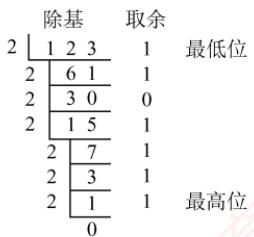
</div>

　　所以，整数部分 $123=(1111011)_{2}$ 。

　　小数部分（乘2取整）：

<div align="center">
  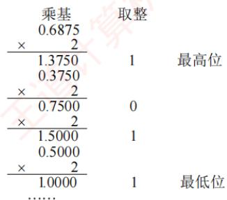
</div>

　　所以，小数部分 $0.6875=(0.1011)_{2}$ ，因此， $123.6875=(1111011.1011)_{2}$ 。

> **注意**

　　关于除基取余法和乘基取整法的原理，建议结合 $r$ 进制数的数值定义公式理解，避免死记硬背。并非所有十进制小数都能用有限位二进制小数精确表示。一个十进制小数能被有限位二进制精确表示，当且仅当它可以表示成形如 $k / 2^n$ 的分数。例如， $0.3 = 3 / 10$ ，而10不是2的幂（其质因数包含5），因此无法用有限位二进制精确表示。相反，任何有限位二进制小数都对应一个分母为2的幂的分数，因此总能精确地转换为十进制小数。这一特性在浮点数的表示与运算中尤为重要，需特别注意。

### 2.1.2 定点数的编码表示

#### 1. 真值和机器数

　　在日常生活中，数通常用 “+” 或 “-” 号表示正负（正号常省略），如 +15、-8。这类带有符号的数称为真值，即机器数所代表的实际数值。在计算机中，数的符号与数值部分一同编码：通常用 “0” 表示正，“1” 表示负。这种将符号数字化的表示形式称为机器数。

　　例如，机器数 0,101（逗号仅用于分隔符号位与数值位）表示真值+5。

#### 2. 机器数的定点表示

　　根据小数点位置是否固定，计算机中的数值表示分为定点表示和浮点表示。

　　定点表示用于表示定点小数和定点整数。

1）定点小数。表示纯小数，约定小数点位于符号位之后、数值部分最高位之前。若数据 $X = x_0x_1x_2\dots x_n$ （其中 $x_0$ 为符号位， $x_{1}\sim x_{n}$ 为数值位， $x_{1}$ 为最高有效位），其在计算机中的表示形式如图2.1所示。

2）定点整数。表示纯整数，约定小数点位于数值部分最低位之后。若数据 $X = x_0x_1x_2\dots x_n$ （其中 $x_0$ 为符号位， $x_{1}\sim x_{n}$ 为数值位， $x_{n}$ 为最低有效位），其表示形式如图2.2所示。

<div align="center">
  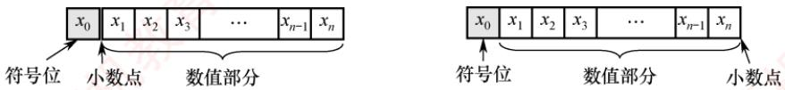
</div>

<p align="center"><em>图 2.1 定点小数表示</em></p>

<p align="center"><em>图 2.2 定点整数表示</em></p>

　　事实上，在机器内部并没有小数点，只是人为约定了小数点的位置。因此，在定点数的编码和运算中，无须区分该数表示的是小数还是整数，而只需关心符号位和数值位即可。

　　定点数的编码表示法主要有四种：原码、补码、反码和移码。

#### 3. 原码、补码、反码、移码

##### （1） 原码表示法

　　用机器数的最高位表示数的符号，其余各位表示数的绝对值。原码的定义如下。

$$
[ x ] _ {\text {原}} = \left\{ \begin{array}{l l} 0, x, & 0 \leqslant x <   2 ^ {n} \\ 2 ^ {n} - x = 2 ^ {n} + | x |, & - 2 ^ {n} <   x \leqslant 0 \end{array} \right. (x \text {是真值，字长为} n + 1)
$$

　　例如，若字长为8位， $x_{1}=+1110,\quad x_{2}=-1110$ ，则其原码表示分别为 $[x_{1}]_{原}=0,0001110,\quad[x_{2}]_{原}=2^{7}+1110=1,0001110$ 。

　　对于 $n+1$ 位原码整数，其表示范围为 $-(2^{n}-1)\leqslant x\leqslant2^{n}-1$ （关于原点对称）。

> **注意**

　　零的原码表示有正零和负零两种形式，即 $[+0]_{\text{原}} = 0,0000000$ 和 $[-0]_{\text{原}} = 1,0000000$ 。

　　原码表示的优点：①与真值的对应关系简单、直观，转换简便；②用原码实现乘除运算比较简便。缺点：①零的表示不唯一，存在±0两种编码；②用原码实现加减运算比较复杂。

##### （2） 补码表示法

　　补码表示法的加法和减法运算均可通过加法器统一实现。正数的补码与原码相同，负数的补码等于模（ $n+1$ 位补码的模为 $2^{n+1}$ ）与该负数绝对值之差。补码的定义如下。

$$
[ x ] _ {\text {补}} = \left\{ \begin{array}{l l} 0, x, & 0 \leqslant x <   2 ^ {n} \\ 2 ^ {n + 1} + x = 2 ^ {n + 1} - | x |, & - 2 ^ {n} \leqslant x <   0 \end{array} \right. (\mathrm{mod} 2 ^ {n + 1})
$$

　　等价地，无论是正数还是负数， $[x]_{\text{补}} = 2^{n+1} + x \quad (-2^n \leqslant x < 2^n, \mod 2^{n+1})$ 。

　　例如，若字长为8位， $x_{1}=+1010,\quad x_{2}=-1101$ ，则其补码表示分别为 $[x_{1}]_{\text{补}}=0,0001010,\quad[x_{2}]_{\text{补}}=2^{8}-|x_{2}|=1,1110011$ 。

> **考点追踪：** 补码的表示范围（2010、2013、2014、2022）

　　对于 $n+1$ 位补码整数，其表示范围为 $-2^{n} \leqslant x \leqslant 2^{n}-1$ （比原码多表示一个负数，即 $-2^{n}$ ）。

- 几个特殊值的补码（ $n + 1$ 位）：

1） $[+0]_{\text{补}} = [-0]_{\text{补}} = 0,00\dots 0$ （全0），零的补码表示是唯一的。

2） $[-1]_{\text{补}} = 2^{n + 1} - 1 = 1, 11 \ldots 1$ （全1）。

3）最大正整数： $[2^{n} - 1]_{\text{补}} = 0,11\dots 1$ （符号位为0，数值位全1）。

4）最小负整数： $[-2^{n}]_{补}=1,00\ldots0$ （符号位为1，数值位全0）。

- 模运算（了解）

　　在模运算中，一个数与它除以“模”后得到的余数是等价的。如 $A$ 、 $B$ 、 $M$ 满足 $A = B + K \times M$ （ $K$ 为整数），记为 $A \equiv B (\bmod M)$ ，即 $A$ 、 $B$ 各除以 $M$ 后的余数相同。在补码运算中， $[A]_{\text{补}} - [B]_{\text{补}} = [A]_{\text{补}} + M - [B]_{\text{补}}$ ，而 $M - [B]_{\text{补}} = [-B]_{\text{补}}$ ，因此补码能够借助加法运算实现减法运算。

- 补码与真值之间的转换

> **考点追踪：** 补码和真值的相互转换（2020、2023）

　　真值转换为补码：对于正数，与原码的方式一样。对于负数，符号位取1，其余各位由其绝对值“按位取反，末位加1”得到。补码转换为真值：若符号位为0，则直接读作正数。若符号位为1，则真值为负数，其绝对值由补码数值部分“按位取反，末位加1”得到。

- 变形补码

　　为便于溢出检测，可采用双符号位的补码表示（又称变形补码），双符号位00表示正数，11表示负数。若总位数为 $n+2$ （高2位为符号位，其余为数值位），则变形补码定义为

$$
[ x ] _ {\text {变补}} = \left\{ \begin{array}{l l} 0 0, x, & 0 \leqslant x <   2 ^ {n} \\ 2 ^ {n + 2} + x = 2 ^ {n + 2} - | x |, & - 2 ^ {n} \leqslant x <   0 \end{array} (\mathrm{mod} 2 ^ {n + 2}) \right.
$$

　　在双符号位中，左符表示真正的符号位，右符用于判断“溢出”。

##### （3） 反码表示法（了解即可）

　　反码可视为从原码转换为补码的中间表示形式。

　　正数的反码与其原码相同。负数的反码由其原码的数值部分按位取反（末位不加1）得到。

　　反码表示存在明显不足：①零的表示不唯一（存在±0两种编码）；②表示范围与相同字长的原码相同，比补码少一个最小负数 $(-2^{n})$ 。因此，反码在计算机中极少使用。

##### （4） 移码表示法

　　移码主要用于表示浮点数的阶码，且用于表示整数。其核心思想是将真值 $x$ 加上一个固定偏置值，实现数轴整体右移。设字长为 $n + 1$ 位，偏置值通常取 $2^{n}$ ，则移码定义为

$$
[ x ] _ {\text {移}} = 2 ^ {n} + x \qquad (- 2 ^ {n} \leqslant x <   2 ^ {n})
$$

> **注意**

　　在 IEEE 754 标准的浮点数中，k 位阶码的偏置值为 $2^{k-1}-1$ ，如 8 位阶码的偏置值为 127。

　　例如，若字长为8位，偏置值为 $2^{7}$ ， $x_{1} = +10101$ ， $x_{2} = -10101$ ，则其移码表示分别为 $[x_{1}]_{\text{移}} = 2^{7} + 10101 = 1,0010101$ ； $[x_{2}]_{\text{移}} = 2^{7} + (-10101) = 0,1101011$ 。

　　移码（设字长为 $n+1$ ，偏置值为 $2^{n}$ ）的主要特点如下：

　　① 零的表示唯一， $[+0]_{移}=2^{n}+0=[-0]_{移}=2^{n}-0=1,00...0$ （n个0）。

　　② 在相同字长下，移码与补码仅符号位相反（将补码的最高位取反即得移码）。

　　③ 移码全 0 时，对应真值的最小值 $-2^{n}$ ；移码全 1 时，对应真值的最大值 $2^{n}-1$ 。

　　④ 移码保持真值的大小顺序：移码值越大，对应真值越大，便于阶码比较。

　　四种编码表示的总结如下：

> **考点追踪：** 补码大小的判断（2015）

　　① 正数的原码、反码、补码相同；移码则不同。

　　② 原码与反码在数轴上关于原点对称，二者都存在+0 与-0。

　　③ 补码与移码的表示不对称，零的表示唯一，且比原码和反码多表示一个负数 $(-2^{n})$ 。

　　④ 原码可直观的比较大小（因数值部分即绝对值），而负数的补码和反码不能像原码那样直观判断。不过，在同为负数的前提下，补码或反码的数值部分越大，其真值也越大。

### 2.1.3 整数的表示

#### 1. 无符号整数的表示

> **考点追踪：** 机器码与补码、无符号数之间的转换（2021）

　　当所有二进制位均用于表示数值（无符号位）时，该编码称为无符号整数，简称无符号数。此时，数值隐含为非负整数。由于无须保留符号位，在相同字长下，无符号整数能表示的最大值大于有符号整数。无符号整数适用于仅涉及非负整数且结果不会产生负值的场景。例如，可用无符号整数进行地址运算，或用它来表示指针。

　　例如，8位无符号整数的最小值为0000 0000（0），最大值为1111 1111（ $2^{8} - 1 = 255$ ），表示范围为 $0 \sim 255$ ；而8位有符号整数（补码表示）的最小值为1000 0000（ $-2^{7} = -128$ ），最大值为0111 1111（ $2^{7} - 1 = 127$ ），表示范围为 $-128 \sim 127$ 。

#### 2. 有符号整数的表示

　　有符号整数通过在数值位前增设一位符号位（0 表示正，1 表示负）来表示正负。虽然原码、反码和补码均可用于表示有符号整数，但现代计算机统一采用补码，因其具有以下优势：

　　① 零的表示唯一（无+0 与-0 之分）。

　　② 符号位可与数值位一同参与运算，使加减法统一为加法操作。

　　③ 表示范围更大，比原码和反码多表示一个最小负数。

　　因此，n 位有符号整数（补码）的表示范围为 $-2^{n-1} \sim 2^{n-1} - 1$ 。

### 2.1.4 C 语言中的整数类型及类型转换

　　统考大纲要求考生具备分析高级程序设计语言（如 C 语言）中相关问题的能力，其中变量之间的类型转换是高频考点，需要深入掌握。

#### 1. C语言中的整型数据类型

> **考点追踪：** int 型数据的表示范围（2017、2019、2024）

　　C 语言提供了多种整型类型，其具体长度依赖于编译器和目标平台。常见情况如下：

- 短整型：short（或 short int），通常为 16 位。

- 整型：int，通常为32位。

- 长整型：long（或 long int），在 32 位系统中为 32 位，在 64 位系统中通常为 64 位。

　　在上述类型前添加 unsigned 关键字，可定义对应的无符号类型（如 unsigned int、unsigned short 等）。若未显式指定 signed 或 unsigned，则默认为有符号类型。

　　字符型（char，通常为8位）是一种特殊的整型，通常可按无符号整数解释。

　　在现代系统中，所有有符号整型均以补码形式存储。无符号整型则将全部位用于表示非负数值。因此，在相同位宽下，两者的取值范围不同。

#### 2. 整型数据的类型转换

　　定点数在类型转换过程中，若涉及字长变化，则会触发两种基本操作：位截断与位扩展。

1）位截断：当长类型转换为短类型时，系统直接丢弃高位，仅保留低位部分。由于目标类型的表示范围较小，截断可能导致数值发生变化，具有较强的隐蔽性。

```txt
> **考点追踪：** 零扩展和符号扩展的应用（2012、2021、2024）
```

2）位扩展：当短类型转换为长类型时，系统通过填充高位来保持数值语义不变。具体扩展的方式取决于源数据的符号性：

- 零扩展：用于无符号数，在高位补0。

- 符号扩展：用于补码表示的有符号数，高位重复填充符号位。

　　C 语言支持通过强制类型转换实现不同类型间的转换，其语法为 “TYPE b=(TYPE)a”，转换结果是一个 TYPE 类型的值。根据源类型与目标类型的字长和符号性，可分为三种情形。

```txt
> **考点追踪：** 整型类型的相互转换（2011、2016、2019、2024）
```

（1）长类型转换为短类型：位截断

　　转换规则：保留低位，丢弃高位。

　　考虑如下代码片段：

```c
int x=165537, u=-34991; //int型为32位
short y=(short)x, v=(short)u; //short型为16位
printf("x=%d, y=%d\n", x, y);
printf("u=%d, v=%d\n", u, v);
运行结果如下：
x=165537, y=-31071
u=-34991, v=30545
```

　　其中，x, y, u, v 的十六进制表示分别为 0x000286A1, 0x86A1, 0xFFFF7751, 0x7751。可见，当长类型转换为短类型时，系统直接截断高位，仅保留低位部分。由于目标类型的数值范围较小，这种位截断可能导致结果与原值在语义上不一致。由于 x=165537 超出了 16 位有符号整数的最大值（32767），截断后的位模式被解释为 -31071，这并非运算溢出，而是位截断引起的语义变化。需要注意的是，此类转换不会触发任何异常或错误报告，具有很强的隐蔽性。

##### （2） 相同字长的转换: 仅改变解释方式

　　转换规则：二进制位模式保持不变，仅重新解释其含义。

　　考虑如下代码片段：

```c
short x=-4321;
unsigned short y=(unsigned short)x;
printf("x=%d, y=%u\n", x, y);
运行结果如下:
x=-4321, y=61215
```

　　有符号数 x 为负数，而无符号数 y 只能表示非负值。从输出结果看，y 的值似乎与 x 毫无关联；但将二者转换为二进制形式后（见表 2.1），可观察到：short 型强制转换为 unsigned short 型后，所有二进制位均保持不变，x 按补码规则解释为有符号数，而 y 则按无符号规则解读。

　　表 2.1 y 与 x 的位级表示对比

<table><tr><td>变量</td><td>值</td><td colspan="15">二进制位</td><td></td></tr><tr><td></td><td></td><td>15</td><td>14</td><td>13</td><td>12</td><td>11</td><td>10</td><td>9</td><td>8</td><td>7</td><td>6</td><td>5</td><td>4</td><td>3</td><td>2</td><td>1</td><td>0</td></tr><tr><td>x</td><td>-4321</td><td>1</td><td>1</td><td>1</td><td>0</td><td>1</td><td>1</td><td>1</td><td>1</td><td>0</td><td>0</td><td>0</td><td>1</td><td>1</td><td>1</td><td>1</td><td>1</td></tr><tr><td>y</td><td>61215</td><td>1</td><td>1</td><td>1</td><td>0</td><td>1</td><td>1</td><td>1</td><td>1</td><td>0</td><td>0</td><td>0</td><td>1</td><td>1</td><td>1</td><td>1</td><td>1</td></tr></table>

　　这表明：相同字长的整型类型转换不改变位模式，仅改变对这些位的解释方式。

（3）短类型转换为长类型：位扩展

　　转换规则：若源数据为有符号数，则执行符号扩展；若源数据为无符号数，则执行零扩展。考虑如下代码片段：

```txt
运行结果如下：
x = -4321, y = -4321
u = 61215, v = 61215
```

```txt
short x=-4321;
int y=x;
unsigned short u=(unsigned short)x;
unsigned int v=u;
printf("x=%d, y=%d\n", x, y);
printf("u=%u, v=%u\n", u, v);
```

　　其中，x, y, u, v 的十六进制表示分别为 0xEF1F, 0xFFFFEF1F, 0xEF1F, 0x0000EF1F。可见，短类型转换为长类型时，要对高位部分进行扩展，扩展方式取决于源数据的符号性。可见，x 为有符号数，符号位为 1，扩展时高 16 位补 1；u 为无符号数，扩展时高 16 位补 0。

### 2.1.5 本节习题精选

#### 单项选择题

01. 若十进制数为 137.5，则其八进制数为（）。

- A. 89.8
- B. 211.4
- C. 211.5
- D. 1011111.101

02. 一个16位无符号二进制数的表示范围是（）。

- A. $0\sim 65536$
- B. $0\sim 65535$
- C. $-32768\sim 32767$
- D. $-32768\sim 32768$

03. 下列说法有误的是（）。

- A. 任何二进制整数都可以用十进制表示
- B. 任何二进制小数都可以用十进制表示
- C. 任何十进制整数都可以用二进制表示
- D. 任何十进制小数都可以用二进制表示

04. 对真值 0 表示形式唯一的机器数是（）。

- A. 原码
- B. 补码和移码
- C. 反码
- D. 以上都不对

05. 若 $[X]_{\text{补}} = 1.1101010$ ，则 $[X]_{\text{原}} = (\quad)$ 。

- A. 1.0010101
- B. 1.0010110
- C. 0.0010110
- D. 0.1101010

06. 若 $X$ 为负数，则由 $[X]_{\text{补}}$ 求 $[-X]_{\text{补}}$ 是将（）。

- A. $[X]_{\text{补}}$ 各值保持不变
- B. $[X]_{\text{补}}$ 符号位变反，其他各位不变
- C. $[X]_{\text{补}}$ 除符号位外，各位变反，末位加1D. $[X]_{\text{补}}$ 连同符号位一起变反，末位加1

07. 8位原码能表示的不同数据有（）个。

- A. 15
- B. 16
- C. 255
- D. 256

08. 一个 $n + 1$ 位整数 $x$ 原码的数值范围是（）。

- A. $-2^{n} + 1 < x < 2^{n} - 1$
- B. $-2^{n} + 1 \leqslant x < 2^{n} - 1$
- C. $-2^{n} + 1 < x \leqslant 2^{n} - 1$
- D. $-2^{n} + 1 \leqslant x \leqslant 2^{n} - 1$

09. 若定点整数为 64 位，含 1 位符号位，则采用补码表示的绝对值最大的负数为（）。

- A. $-2^{64}$
- B. $-(2^{64}-1)$
- C. $-2^{63}$
- D. $-(2^{63}-1)$

10. 下列关于补码和移码关系的叙述中，（）是不正确的。

- A. 相同位数的补码和移码表示具有相同的数据表示范围
- B. 0 的补码和移码表示相同
- C. 同一个数的补码和移码表示，其数值部分相同，而符号位相反

- D. 一般用移码表示浮点数的阶码，而补码表示定点整数

11. 若 $[x]_{补}=1,x_{1}x_{2}x_{3}x_{4}x_{5}x_{6}$ ，其中 $x_{i}$ 取0或1，若要x>-32，应当满足（）。

- A. $x_{1}$ 为0，其他各位任意
- B. $x_{1}$ 为1，其他各位任意
- C. $x_{1}$ 为1， $x_{2}\cdots x_{6}$ 中至少有一位为1
- D. $x_{1}$ 为0， $x_{2}\cdots x_{6}$ 中至少有一位为1

12. 设 $x$ 为整数， $[x]_{\text{补}} = 1, x_1 x_2 x_3 x_4 x_5$ ，若要 $x < -16$ ， $x_1 \sim x_5$ 应满足的条件是（）。

- A. $x_1 \sim x_5$ 至少有一个为 1
- B. $x_1$ 必须为 0， $x_2 \sim x_5$ 至少有一个为 1
- C. $x_1$ 必须为 0， $x_2 \sim x_5$ 任意
- D. $x_1$ 必须为 1， $x_2 \sim x_5$ 任意

13. 设 $x$ 为真值， $x^{*}$ 为其绝对值，满足 $[-x^{*}]_{\text{补}} = [-x]_{\text{补}}$ ，当且仅当（）。

- A. $x$ 任意
- B. $x$ 为正数
- C. $x$ 为负数
- D. 以上说法都不对

14. 假定一个十进制数为-66，按补码形式存放在一个8位寄存器中，该寄存器的内容用十六进制表示为（）。

- A. C2H
- B. BEH
- C. BDH
- D. 42H

15. 设机器数采用补码表示（含1位符号位），若寄存器内容为9BH，则对应的十进制数为（）。

- A. -27
- B. -97
- C. -101
- D. 155

16. 若寄存器内容为 10000000，若它等于 -0，则为（）。

- A. 原码
- B. 补码
- C. 反码
- D. 移码

17. 若寄存器内容为 11111111，若它等于+127，则为（）。

- A. 反码
- B. 补码
- C. 原码
- D. 移码

18. 若寄存器内容为 11111111，若它等于-1，则为（）。

- A. 原码
- B. 补码
- C. 反码
- D. 移码

19. 若寄存器内容为 00000000，若它等于 -128，则为（）。

- A. 原码
- B. 补码
- C. 反码
- D. 移码

20. 若二进制定点小数真值是-0.1101，机器表示为 1.0010，则为（）。

- A. 原码
- B. 补码
- C. 反码
- D. 移码

21. 下列为8位移码机器数 $[x]_{\text{移}}$ ，求 $[-x]_{\text{移}}$ 时，（）将会发生溢出。

- A. 11111111
- B. 00000000
- C. 10000000
- D. 01111111

22. 一个8位的二进制整数由2个“0”和6个“1”组成，采用补码或者移码表示，则下列说法中正确的是（）。

- A. 若采用移码表示，偏置值为127，则此整数最小为-64
- B. 若采用移码表示，偏置值为128，则此整数最大为123
- C. 若采用补码表示，则此整数最小为-96
- D. 若采用补码表示，则此整数最大为252

23. 用 2 个 “1” 和 6 个 “0” 组成的 8 位二进制补码，所能表示的最大整数和最小整数之差为（）。

- A. 223
- B. 128
- C. 191
- D. 159

24. 计算机内部的定点数大多用补码表示，以下是一些关于补码特点的叙述：
Ⅰ. 零的表示是唯一的
Ⅱ. 符号位可以和数值部分一起参加运算
Ⅲ. 和其真值的对应关系简单、直观
Ⅳ. 减法可用加法来实现在以上叙述中，（）是补码表示的特点。

- A. I 和 II
- B. I 和 III
- C. I 和 II 和 III
- D. I 和 II 和 IV

25. 在计算机中，通常用来表示主存地址的是（）。

- A. 移码
- B. 补码
- C. 原码
- D. 无符号数

26. 16位补码整数0x8FA0扩展为32位应该是（）。

- A. 0x00008FA0
- B. 0xFFFF8FA0
- C. 0xFFFFFFA0
- D. 0x80008FA0

27. 【2012 统考真题】假定编译器规定 int 型和 short 型长度分别为 32 位和 16 位，执行下列 C 语言语句：
unsigned short x=65530;
unsigned int y=x;
得到 y 的机器数为（）。

- A. 0000 7FFAH
- B. 0000 FFFAH
- C. FFFF 7FFAH
- D. FFFF FFFAH

28. 【2015 统考真题】由 3 个 “1” 和 5 个 “0” 组成的 8 位二进制补码，能表示的最小整数是（）。

- A. -126
- B. -125
- C. -32
- D. -3

29. 【2016 统考真题】有如下 C 语言程序段:
short si = -32767;
unsigned short usi = si;
执行上述两条语句后，usi 的值为（）。

- A. -32767
- B. 32767
- C. 32768
- D. 32769

30. 【2018 统考真题】冯·诺依曼结构计算机中的数据采用二进制编码表示, 其主要原因是（）。
Ⅰ. 二进制的运算规则简单
Ⅱ. 制造两个稳态的物理器件较容易
Ⅲ. 便于用逻辑门电路实现算术运算

- A. 仅 I、II
- B. 仅 I、III
- C. 仅 II、III
- D. I、II 和 III

31. 【2019 统考真题】考虑以下 C 语言代码:
unsigned short usi = 65535;
short si = usi;
执行上述程序段后，si 的值是（）。

- A. -1
- B. -32767
- C. -32768
- D. -65535

32. 【2021 统考真题】已知有符号整数用补码表示，变量 x, y, z 的机器数分别为 FFFDH, FFDFH, 7FFCH，下列结论中，正确的是（）。

- A. 若 x, y 和 z 为无符号整数，则 z < x < y
- B. 若 x, y 和 z 为无符号整数，则 x < y < z
- C. 若 x, y 和 z 为有符号整数，则 x < y < z
- D. 若 x, y 和 z 为有符号整数，则 y < x < z

33. 【2022 统考真题】32 位补码所能表示的整数范围是（）。

- A. $-2^{32} \sim 2^{31} - 1$
- B. $-2^{31} \sim 2^{31} - 1$
- C. $-2^{32} \sim 2^{32} - 1$
- D. $-2^{31} \sim 2^{32} - 1$

34. 【2025 统考真题】在 32 位计算机上执行下列 C 语言代码段后，ui 的值是（）。short si = -32767;
unsigned int ui = si;

- A. $2^{15}-1$
- B. $2^{15}+1$
- C. $2^{32}-2^{15}-1$
- D. $2^{32}-2^{15}+1$

### 2.1.6 答案与解析

#### 单项选择题

**01. B**
　　十进制数转换为八进制数，整数部分采用除基取余法：将整数除以8，所得余数即为转换后的八进制数个位上的数码，再将商除以8，余数为八进制数十位上的数码，如此反复进行，直到商是0为止。小数部分采用乘基取整法：将小数乘以8，所得积的整数部分即为八进制数十分位上的数码，再将此积的小数部分乘以8，得到百分位上的数码，如此反复直到积是1.0为止。经转换得到的八进制数为211.40。

**02. B**

　　一个 16 位无符号二进制数的表示范围是 $0 \sim 2^{16} - 1$ ，即 $0 \sim 65535$ 。

**03. D**

　　选项 A、B、C 明显正确，二进制整数和十进制整数可以相互转换，仅仅是每位的位权不同而已。而二进制数的小数位只能表示 $1/2, 1/4, 1/8, \cdots, 1/2^{n}$ ，因此无法表示所有的十进制小数，选项 D 错误。

**04. B**

　　假设位数为 5 位（含 1 位符号位）， $[+0]_{原}=00000,\quad[-0]_{原}=10000,\quad[+0]_{反}=00000,\quad[-0]_{反}=11111$ ， $[+0]_{补}=[-0]_{补}=00000,\quad[+0]_{移}=[-0]_{移}=10000$ 。可知，0 的补码和移码的表示是唯一的。

**05. B**

　　若 X 为负数，则其补码转换为原码的规则是 “符号位不变，数值位取反，末位加 1”，即 $[X]_{原} = 0010101 + 1 = 0010110$ 。

**06. D**

　　不论 X 是正数还是负数，由 $[X]_{补}$ 求 $[-X]_{补}$ 的方法是连同符号位一起，每位取反，末位加 1。

**07. C**

　　8个二进制位有 $2^{8} = 256$ 种不同表示。原码中0有两种表示，因此原码能表示的不同数据为 $2^{8} - 1 = 255$ 个。0在反码中也有两种表示，因此若题目改为反码，答案也为选项C。0在补码与移码中只有一种表示，因此题目若改为补码或移码，答案为选项D。

**08. D**

$n+1$ 位整数原码的表示范围为 $-2^{n}+1\leqslant x\leqslant2^{n}-1$ 。

**09. C**

　　对于长度为 $n+1$ （含 1 位符号位）定点整数 x，用补码表示时， $x_{绝对值最大负数} = -2^{n}$ ，其中 n = 63。

**10. B**

　　以机器字长 5 位为例， $[0]_{补}=00000,\quad[0]_{移}=2^{4}+0=10000,\quad[0]_{补}\neq[0]_{移}$ ，表示不相同，但在补码或移码中的表示形式是唯一的。

**11. C**

　　对于此类题型，先写出特定值的机器码表示，然后根据机器数判断大小的规则来推导数值位的特点（若条件允许，也可以取特殊值来推断）。-32 的补码为 1,100000，根据负数补码判断大小的规则：数值位部分越小，其绝对值越大，即负得越多。因此，若要 x > -32，数值位 $x_{1}x_{2}x_{3}x_{4}x_{5}x_{6}$ 需大于 100000，即 $x_{1}$ 必须为 1，而 $x_{2}\ldots x_{6}$ 中至少有一位为 1。

　　【特殊值法】对于选项 A，取 1,000000，真值为 -64，错误。对于选项 B，取 1,100000，真值为 -32，错误。对于选项 C，取 1,100001，真值为 -31，符合。对于选项 D，取 1,000001，真值为 -63，错误。

**12. C**

　　解题思路与上题类似（也可采用特殊值解法，请读者自行思考），-16的补码为1,10000，根据负数补码判断大小的规则：数值位部分越小，其绝对值越大，即负得越多。因此，若要 $x < -16$ 数值位 $x_{1}x_{2}x_{3}x_{4}x_{5}$ 需小于10000，即 $x_{1}$ 必为0，而 $x_{2} \sim x_{5}$ 任意。

**13. D**

　　当 $x$ 为0或为正数时，满足 $[-x^{*}]_{\text{补}} = [-x]_{\text{补}}$ ，B为充分条件，因此选项B错误。而 $x$ 为负数时， $-x$ 为正数，而 $-x^{*}$ 为负数，补码的表示是唯一的，显然二者不等，因此选项C错误。

**14. B**

　　x = -66 用二进制数表示， $[x]_{原} = 11000010$ ，则有 $[x]_{补} = 10111110 = BEH$ 。

**15. C**

$9BH = (1001\ 1011)_{2}$ ，最高位的1表示负数，所以其真值为 $(11100101)_{2} = -(64 + 32 + 4 + 1) = -101$ 。
**16. A**
　　值等于-0说明只可能是原码或反码(因为补码和移码表示0时是唯一的,没有+0和-0之分), $[-0]_{原}=10000000,\quad[-0]_{反}=11111111$ 。

**17. D**

　　这里寄存器长度为8， $[+127]_{\text{原}} = [+127]_{\text{反}} = [+127]_{\text{补}} = 01111111$ ，又知同一数值的移码和补码除最高位相反外，其他各位相同，则 $[+127]_{\text{移}} = 11111111$ 或 $[+127]_{\text{移}} = 2^7 + 01111111 = 11111111$ 。

**18. B**

　　这里寄存器长度为8， $[-1]_{\text{补}} = [10000001]_{\text{补}} = 11111111$ 。

**19. D**

　　这里寄存器长度为8， $[-128]_{\text{移}} = 2^7 + (-10000000) = 00000000$ 。

**20. C**

　　真值-0.1101，对应的原码表示为1.1101，补码表示为1.0011，反码表示为1.0010，移码通常用于表示阶码，不用来表示定点小数。

**21. B**

　　选项 B 对应 8 位最小的值 -128，而 -x = 128 发生溢出，因此无法表示其移码。

**22. A**

　　当采用补码表示时，要使得数值最大，就要让符号位为0，且把“1”放在高位，得到的补码为0111 1110B = 126；要使得数值最小，就要让符号位为1，且把“1”放在低位，得到的补码为1001 1111B = -97。当采用移码表示时，设偏置值为128，要使得数值最大，就要把“1”放在高位，得到的移码为1111 1100B - 1000 0000B = 252 - 128 = 124；设偏置值为127，要使得数值最小，则应把“1”放在低位，得到的移码为0011 1111B - 0111 1111B = 1100 0000B = -64，选项A正确。

**23. A**

　　在 8 位补码中，符号位为最高位。要使数值最大，符号位为 0，其余位中将两个 “1” 尽可能置于高位，最大值为 0110 0000 = 96。要使数值最小，符号位为 1，此时需要将另一个 “1” 置于最低位（其余为 0），得最小补码为 1000 0001 = -127。二者之差为 $96 - (-127) = 223$ 。

**24. D**

$[+0]_{\text{补}}$ 和 $[-0]_{\text{补}}$ 是相同的，所以说法I正确。在进行补码定点数的加减运算时，符号位作为数的一部分参加运算，说法II正确， $[A]_{\text{补}} - [B]_{\text{补}} = [A]_{\text{补}} + [-B]_{\text{补}}$ ，即将减法采用加法实现，说法IV正确。实际上，补码和其真值的对应关系远不如原码和其真值的对应关系简单直观，说法III错误。

**25. D**

　　主存地址都是正数，因此不需要符号位，即直接采用无符号数表示。

**26. B**

　　16 位扩展为 32 位，符号位不变，附加位是符号位的扩展。该数是一个负数，需用 1 来填补。A 是一个正数，C 的数值位发生变化，D 用 0 来填充附加位，均不正确。

**27. B**

　　将一个 16 位 unsigned short 型数转换为 32 位 unsigned int 型数时，因为都是无符号数，新表示形式的高位用 0 填充。16 位无符号整数所能表示的最大值为 65535，其十六进制表示为 FFFFH，因此 x 的十六进制表示为 FFFFH - 5H = FFFAH，所以 y 的十六进制表示为 0000 FFFAH。

　　排除法：先直接排除 C、D，然后分析余下选项的特征。A、B 的值相差几乎近 1 倍，因此可以算出 0001 0000H（接近 B 且好算的数）的值后，再推断出答案。

**28. B**

　　原码很容易判断大小。而负数的补码很难直接判断大小，可采用如下规则快速判断：对于负数，数值位部分越小，其绝对值越大，即负得越多。采用补码整数表示时，负数的符号位为1，因此剩下的两个“1”放在末位时其值最小，补码形式为1000 0011，转换为真值为-125。此外，考虑负数的补码转换为原码的方法，从右向左找到第一个数值为1的位，之后的每位进行取反操作，符号位不变，不难发现，当符号位为1，剩下的两个“1”放在末位时，补码的绝对值最大。

**29. D**

　　因 C 语言中的数据在内存中为补码表示形式，si 对应的补码为 1000 0000 0000 0001B，最前面的一位 “1” 为符号位，表示负数，即 -32767。由 signed 型数转换为等长的 unsigned 型数时，符号位成为数据的一部分，即负数转换为无符号数（正数）时，其数值将发生变化。usi 对应的补码与 si 的相同，但表示正数，为 32769。

**30. D**

　　对于说法 I，二进制只有 0 和 1 两种数值，运算规则较简单，都通过 ALU 转换为加法运算。对于说法 II，二进制数只需要高电平和低电平两个状态就可表示，这样的物理器件很容易制造。对于说法 III，二进制数与逻辑量相吻合。二进制的 0 和 1 正好与逻辑量的 “真” 和 “假” 相对应，因此用二进制数表示二值逻辑显得十分自然，采用逻辑门电路很容易实现运算。

**31. A**

　　unsigned short 型为无符号短整型，长度为 2 字节，因此 unsigned short usi 型转换为二进制代码即 1111 1111 1111 1111。short 型为短整型，长度为 2 字节，在采用补码的机器上，short si 的二进制代码为 1111 1111 1111 1111，因此 si 的值为 -1。

**32. D**

　　若 x, y 和 z 均为无符号整数，则 x > y > z，选项 A 和 B 错误。若 x, y 和 z 均为有符号整数，补码的最高位是符号位，0 表示正数，1 表示负数，因此 z 为正数，而 x 和 y 为负数。对于 x 和 y 的比较，数值位取反加 1，可知 x = -3，y = -33，所以 x > y。选项 D 正确。

**33. B**

　　n 位补码整数的最小值是 $1,00\ldots0(-2^{n-1})$ ；最大值是 $0,11\ldots1(2^{n-1}-1)$ 。n 位补码整数所能表示的范围是 $-2^{n-1}\sim2^{n-1}-1$ ，32 位补码整数所能表示的范围是 $-2^{31}\sim2^{31}-1$ 。

**34. D**

　　在 32 位系统中，short 通常为 16 位有符号整数。-32767 的 16 位补码为 1000 0000 0000 0001。将其赋值给 32 位 unsigned int 时，先按符号扩展转换为 32 位有符号整数 1111 1111 1111 1111 1000 0000 0000 0001，再以无符号方式解释，其值为 $2^{32} - (2^{15} - 1) = 2^{32} - 2^{15} + 1$ 。

## 2.2 运算方法和运算电路

### 2.2.1 基本运算部件

　　在计算机中，运算器由算术逻辑单元（Arithmetic Logic Unit，ALU）、移位器、状态寄存器（PSW）和通用寄存器组等组成。运算器的基本功能包括加、减、乘、除四则运算，与、或、非、异或等逻辑运算，以及移位、求补等操作。ALU 的核心部件是加法器。

#### 1. 一位全加器

　　全加器（FA）是最基本的加法单元，有三个输入：加数 $A_{i}$ 、加数 $B_{i}$ 与来自低位的进位 $C_{i-1}$ ，两个输出：本位和 $S_{i}$ 及向高位的进位 $C_{i}$ 。其逻辑表达式如下。

　　和表达式： $S_{i}=A_{i}\oplus B_{i}\oplus C_{i-1}$ （当 $A_{i}$ 、 $B_{i}$ 、 $C_{i-1}$ 中有奇数个1时， $S_{i}=1$ ，否则 $S_{i}=0$ ）

　　进位表达式： $C_{i}=A_{i}B_{i}+(A_{i}\oplus B_{i})C_{i-1}$

　　一位全加器的逻辑结构如图 2.3(a) 所示，其逻辑符号如图 2.3(b) 所示。

<div align="center">
  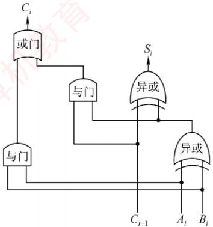
</div>

<p align="center"><em>(a)一位全加器的逻辑结构</em></p>

<div align="center">
  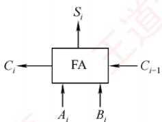
</div>

<p align="center"><em>(b) 逻辑符号</em></p>

<p align="center"><em>图 2.3 一位全加器</em></p>

#### 2. 串行进位加法器

　　将 n 个全加器级联可构成 n 位串行进位加法器（又称行波进位加法器），如图 2.4 所示。其特点是进位信号逐级传递，每一级的进位输出直接作为下一级的进位输入。

<div align="center">
  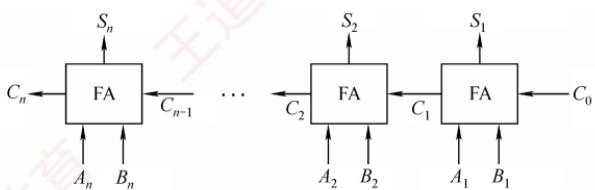
</div>

<p align="center"><em>图 2.4 n 位串行进位加法器</em></p>

　　图 2.4 中的加法器实现两个 n 位二进制数 $A = A_{n} A_{n-1} \cdots A_{1}$ 和 $B = B_{n} B_{n-1} \cdots B_{1}$ 逐位相加的功能，得到和 $S = S_{n} S_{n-1} \cdots S_{1}$ 及最终进位 $C_{n}$ 。例如，当 A = 1111，B = 0001（4 位）时，输出 S = 0000， $C_{4} = 1$ 。由于位数固定，结果实际为模 $2^{n}$ 的加法（溢出部分被丢弃）。

　　在串行进位加法器中，总运算延迟主要由进位信号从最低位传播到最高位的时间决定。位数越多，进位链越长，延迟越大。因此，缩短进位传递路径是提升加法器性能的关键。

#### 3. 并行进位加法器

　　并行进位（也称先行进位）加法器能够显著提升加法运算速度，因为它能以几乎同时生成所有进位信号的方式工作，而非逐级传递进位。为了实现这一目标，n个一位全加器被连接至一个n位先行进位逻辑部件（CLA部件），以便几乎同时生成所有进位信号。因此，并行进位加法器对于较大位数的数据处理效率要高于串行进位加法器。图2.5展示了一个4位全先行进位加法器的例子。随着加法器位数的增加，电路设计复杂度也会相应提高，此处不再详述。

<div align="center">
  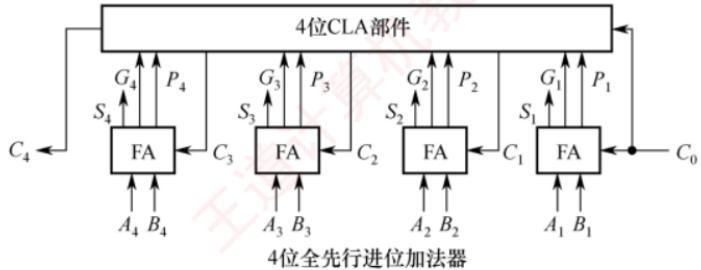
</div>

<p align="center"><em>图 2.5 一个 4 位全先行进位加法器</em></p>

#### 4. 带标志加法器

　　对于 n 位加法器来说，除了得到运算结果外，还要关注加法运算过程中是否发生了溢出、结果的正负性、结果是否为零等，这些信息对于程序的执行控制非常关键。为此，在 n 位加法器的基础上增加了额外的逻辑电路，不仅支持计算和/差，还能生成以下标志位：OF、CF、SF 和 ZF，每个标志占 1 位。图 2.6 展示了用全加器实现 n 位带标志加法器的电路示意图。

<div align="center">
  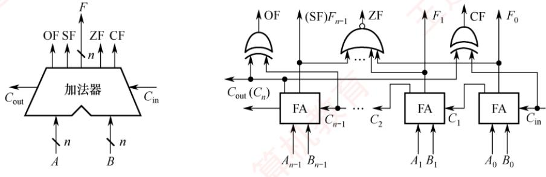
</div>

<p align="center"><em>(a) 带标志加法器符号</em></p>

<p align="center"><em>(b) 带标志加法器的逻辑电路</em></p>

<p align="center"><em>图 2.6 用全加器实现 n 位带标志加法器的电路</em></p>

　　在图2.6中，溢出标志OF通过检测最高有效位的进位输入 $C_{n - 1}$ 与进位输出 $C_n$ 是否不同决定，即 $\mathrm{OF} = C_n\oplus C_{n - 1}$ ，用于判断有符号数加法运算是否溢出： $\mathrm{OF} = 1$ 表示溢出， $\mathrm{OF} = 0$ 表示未溢出。符号标志SF等于结果的最高有效位，即 $\mathrm{SF} = F_{n - 1}$ ，用于指示有符号数加法运算结果的正负性： $\mathrm{SF} = 0$ 表示结果为正， $\mathrm{SF} = 1$ 表示结果为负。零标志ZF在结果的所有位均为0时设置为1，用于指示加减运算的结果是否为零： $\mathrm{ZF} = 1$ 表示结果为0， $\mathrm{ZF} = 0$ 表示结果非零。进位/借位标志CF用于判断无符号数的加减运算是否发生溢出： $\mathrm{CF} = 1$ 表示溢出， $\mathrm{CF} = 0$ 表示未溢出。

#### 5. 算术逻辑单元 (ALU)

　　ALU 是一种功能较强的组合逻辑电路，能够执行多种算术与逻辑运算。其中，加法和减法由带标志加法器直接完成；乘法和除法则通常通过 ALU 配合控制逻辑，以多次加减和移位的方式迭代实现。此外，ALU 还能执行与、或、非等基本逻辑运算。其基本结构如图 2.7 所示：A 和 B 为两个 n 位操作数输入端， $C_{in}$ 为进位输入端，ALUop 为操作控制信号，用于选择 ALU 执行的具体功能。例如，当 ALUop 选择加法（Add）时，ALU 输出 $A + B + C_{in}$ 。ALUop 的位数决定了可支持的操作种类数量。例如，3 位 ALUop 最多可支持 8 种不同操作。

　　图 2.8 展示了一位 ALU 的结构，可完成 “与” “或” “加法” 三种操作。其中，加法由一个全加器实现，逻辑运算由专用门电路并行计算，最终通过多路选择器（MUX）根据 ALUop 选择输出结果。由于有 3 种操作，ALUop 至少需要 2 位。

<div align="center">
  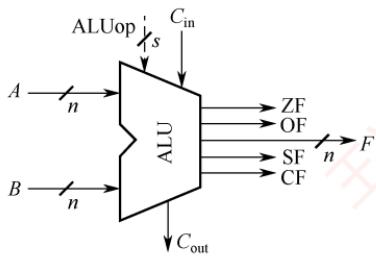
</div>

<p align="center"><em>图 2.7 ALU 的基本结构</em></p>

<div align="center">
  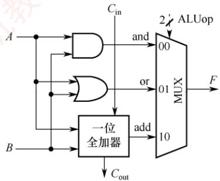
</div>

<p align="center"><em>图 2.8 一位 ALU 结构图</em></p>

### 2.2.2 定点数的移位运算

　　当计算机中没有乘/除运算电路时，可以通过加法和移位相结合的方法来实现乘/除运算。对于任意二进制整数，左移一位，若未发生溢出，相当于乘以2（类似于十进制数左移一位相当于乘以10）；右移一位，若忽略因移出而舍去的末位尾数，相当于除以2。

　　根据操作数的类型不同，移位运算可以分为逻辑移位和算术移位。

#### 1. 逻辑移位

> **考点追踪：** 逻辑移位运算（2018）

　　逻辑移位将操作数视为无符号整数。逻辑移位的规则：左移时，高位移出，低位补0。若高位的1移出，则发生溢出。右移时，低位移出，高位补0。

　　例如，4 位无符号数 0001（+1）左移一位变为 0010（+2），相当于乘以 2，未溢出；0001（+1）右移一位变为 0000（0），相当于除以 2 并舍弃小数部分。又如，1000（+8）左移一位变为 0000（0），相当于乘以 2，但结果超出了 4 位无符号数的表示范围，发生溢出。

#### 2. 算术移位

> **考点追踪：** 算术移位运算（2012、2017、2018）

　　算术移位需要考虑符号位的问题，即将操作数视为有符号整数。有符号整数采用补码表示，因此对于有符号整数的移位操作应采用补码算术移位方式。算术移位的规则：左移时，高位移出，低位补0。若移出的高位与原符号位不同（左移后符号位改变），则发生溢出。右移时，低位移出，高位补符号位。若低位的1移出，则影响精度。

　　例如，4 位补码 0010（+2）左移一位变为 0100（+4），未溢出；1001（-7）左移一位变为 0010，符号由负变正，表明发生溢出（因为 -14 超出了 4 位补码的表示范围）。又如，1001（-7）右移一位变为 1100（-4），保留了符号位，但丢失了最低有效位，影响精度。

### 2.2.3 定点数的加减运算

#### 1. 补码加减运算

> **考点追踪：** 补码的加减运算（2009、2011、2017、2025）

　　补码加减运算规则简单，易于硬件实现。补码加减运算的公式如下（设字长为 $n+1$ ）。

$$
\begin{array}{r l} & {[ A + B ] _ {\text {补}} = [ A ] _ {\text {补}} + [ B ] _ {\text {补}} (\mathrm{mod} 2 ^ {n + 1})} \\ & {[ A - B ] _ {\text {补}} = [ A ] _ {\text {补}} + [ - B ] _ {\text {补}} (\mathrm{mod} 2 ^ {n + 1})} \end{array}
$$

　　补码运算具有以下特点:

1）按二进制加法规则运算，逢二进一。

2）若做加法，则两个数的补码直接相加；若做减法，则将被减数与减数的负数补码相加。

3）符号位与数值位一同参与运算，结果的符号位由运算自然得出。

4）运算结果自动截断为 $n+1$ 位（模 $2^{n+1}$ ），高位进位被丢弃，结果仍为补码形式。

　　【例 2.3】设字长为 8 位（含 1 位符号位），A = 15，B = 24，求 $[A + B]_{补}$ 和 $[A - B]_{补}$ 。解：

$A = +0001111$ ， $B = +0011000$ ；求得 $[A]_{\text{补}} = 00001111$ ， $[B]_{\text{补}} = 00011000$ ， $[-B]_{\text{补}} = 11101000$ 。则： $[A + B]_{\text{补}} = [A]_{\text{补}} + [B]_{\text{补}} = 00001111 + 00011000 = 00100111$ ，符号位为0，真值为 $+39$ 。 $[A - B]_{\text{补}} = [A]_{\text{补}} + [-B]_{\text{补}} = 00001111 + 11101000 = 11110111$ ，符号位为1，真值为-9。

#### 2. 溢出判别方法

> **考点追踪：** 补码运算的溢出判断（2010、2011、2014、2018、2021、2025）

　　补码加减运算仅在同号相加或异号相减时可能发生溢出。例如，两个正数相加结果为负，或一个负数减去一个正数结果为正。常用的溢出判别方法有以下三种。

##### （1） 采用一位符号位

　　减法运算在机器中是用加法器实现的，因此加法和减法均可统一视为两个补码数相加。溢出仅发生在参与运算的两个数符号相同，而结果符号与之不同的情况下。设参与运算的两个操作数的符号位分别为 $A_{\mathrm{s}}$ 和 $B_{\mathrm{s}}$ ，运算结果的符号为 $S_{\mathrm{s}}$ ，则溢出逻辑表达式为

$$
V = A _ {\mathrm{s}} B _ {\mathrm{s}} \overline {{S _ {\mathrm{s}}}} + \overline {{A _ {\mathrm{s}} B _ {\mathrm{s}}}} S _ {\mathrm{s}}
$$

##### （2） 采用一位符号位并结合进位情况

　　设符号位（最高位）产生的进位为 $C_{n}$ ，最高数值位（次高位）产生的进位为 $C_{n-1}$ 。若 $C_{n}$ 与 $C_{n-1}$ 不同，则表示溢出。溢出逻辑表达式为

$$
V = C _ {n} \oplus C _ {n - 1}
$$

##### （3） 采用双符号位

　　使用两个符号位 $S_{s1}S_{s2}$ （ $S_{s1}$ 为高位符号位），若两个符号位不同，则表示溢出。 $S_{s1}S_{s2}$ 的各种情况如下：① $S_{s1}S_{s2}=00$ ：表示结果为正数，无溢出。② $S_{s1}S_{s2}=01$ ：表示结果正溢出。③ $S_{s1}S_{s2}=10$ ：表示结果负溢出。④ $S_{s1}S_{s2}=11$ ：表示结果为负数，无溢出。溢出逻辑表达式为

$$
V = S _ {\mathrm{s} 1} \oplus S _ {\mathrm{s} 2},
$$

　　在上述三种方法中，若 V=0，则表示无溢出；若 V=1，则表示有溢出。

#### 3. 加减运算电路

> **考点追踪：** 补码加法器的实现原理（2011）

　　在计算机中，无论是无符号数还是有符号数的加减运算，均采用同一套硬件电路实现，即“一套电路，两种语义”。图2.9所示为一个加减运算部件，其输入端包括两个 $n$ 位操作数 $X$ 和 $Y$ ，以及一个控制信号Sub。其中， $Y$ 分成两路：一路直接接入二选一多路选择器（MUX），另一路径 $n$ 位反相器后接入同一选择器。控制信号Sub不仅决定选择哪一路数据进入加法器，还在执行减法时作为最低位的进位输入。输出端包括 $n$ 位运算结果 $F$ 以及各类标志位。

<div align="center">
  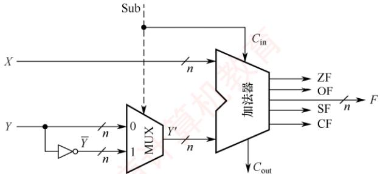
</div>

<p align="center"><em>图 2.9 加减运算部件</em></p>

##### （1） 加法运算的工作原理

　　无论是无符号数还是补码表示的有符号数，其加法均通过同一加法器电路完成。当执行加法操作时（Sub=0），电路实现过程如下。

　　输入：X 直接接入加法器的一端；Y 接入 MUX。

　　控制信号：Sub=0，同时作为加法器的最低位进位输入 $C_{in}=0$ 。

　　运算：MUX 在 Sub=0 时选择 Y 直接通过，加法器执行 $X+Y+C_{\mathrm{in}}(X+Y)$ ，输出 n 位结果 F 和进位输出 $C_{out}$ ，并生成状态标志位。

　　语义解释：

1) 若 X、Y 被视为无符号数，则结果 $F = (X + Y) \mod 2^{n}$ 。当 $X + Y \geqslant 2^{n}$ 时，产生进位 $C_{out} = 1$ ，表示发生无符号溢出；此时，标志 $CF = C_{out}$ 反映进位状态。

2）若 X、Y 被视为有符号数（ $[X]_{补}$ 、 $[Y]_{补}$ ），则结果 $F = [X + Y]_{补}$ 。此时，若两个操作数同号而结果异号（如正+正→负），则表示有符号溢出，由溢出标志 OF 指示。

##### （2） 减法运算的工作原理

　　无论是无符号数还是补码表示的有符号数，其减法也通过同一加法器电路实现。当执行减法操作时（Sub=1），电路实现过程如下：

　　输入：X 直接接入加法器的一端；Y 接入 MUX。

　　控制信号：Sub=1，同时作为加法器的最低位进位输入 $C_{in}=1$ 。

　　运算：MUX 在 Sub=1 时选择反相后的 $\bar{Y}$ 输出，加法器执行 $X + \bar{Y} + C_{\mathrm{in}}(X + \bar{Y} + 1)$ ，输出 n 位结果 F 和进位输出 $C_{out}$ ，并生成状态标志位。

　　语义解释：

1）若 X、Y 被视为无符号数，则该运算等价于计算 $X - Y + 2^{n}$ （模 $2^{n}$ 运算） $^{①}$ ：

- $X \geqslant Y$ 时， $X - Y + 2^n \geqslant 2^n$ ，有进位 $C_{\mathrm{out}} = 1$ ，舍去高位后 $F = X - Y$ ，表示无借位（结果非负）。
- $X < Y$ 时， $0 < X - Y + 2^n < 2^n$ ，无进位 $C_{\mathrm{out}} = 0$ ，表示有借位（结果为负，超出 $n$ 位无符号数范围），表示发生无符号溢出。此时，标志 $\mathrm{CF} = C_{\mathrm{out}}$ 反映借位状态。

2）若 X、Y 被视为有符号数（ $[X]_{补}$ 、 $[Y]_{补}$ ），则该运算等价于 $[X - Y]_{补} = [X]_{补} + [-Y]_{补}$ :

- 结果 $F$ 即为 $[X - Y]_{\text{补}}$ 。

- 若运算导致结果超出 $n$ 位补码表示范围（例如，正减负得负，或负减正得正），则发生有符号溢出，由溢出标志OF指示。

> **注意**

　　运算器本身无法识别所处理的二进制串是有符号数还是无符号数。例如， $0 - 1 = 00 \ldots 0 + 11 \ldots 1 = 11 \ldots 1$ ，若解释为有符号数，对应值为-1，结果正确；若解释为无符号数，对应值为 $2^{n} - 1$ （n位无符号数的最大值），与数学结果不符。此类易混点是统考极易考查的内容。

##### （3） 各类标志位的含义

> **考点追踪：** 各类标志位的分析（2011、2018、2022-2024）

　　可通过状态标志位来区分有符号数与无符号数的运算结果，各类标志位的含义如下。

　　零标志ZF：当结果 $\mathrm{F} = 0$ 时， $\mathrm{ZF} = 1$ ；否则 $\mathrm{ZF} = 0$ 。对无符号数和有符号数均有意义。

　　溢出标志 OF：用于判断有符号数运算是否发生溢出， $OF=C_{n}\oplus C_{n-1}$ （符号位进位与最高数值位进位的异或）。对无符号数运算无意义。即无法依据 OF 判断无符号数运算是否溢出。例如，无符号加法 $010 + 011 = 101$ ，虽然 OF = 1，但结果并未溢出。

　　符号标志 SF：等于结果 F 的最高位（符号位）。仅对有符号数有意义。

> **考点追踪：** CF 标志位的作用（2024）

　　进/借位标志 CF：用于表示无符号数运算中的进位/借位情况，判断是否溢出。仅对无符号数有意义。加法（Sub=0）时，CF=1 表示有进位，即发生上溢， $CF=C_{out}$ 。减法（Sub=1）时，CF=1 表示有借位，即不够减，CF 等于 $C_{out}$ 取反。综合得 $CF=Sub\oplus C_{out}$ 。例如，无符号数加法 $110+011$ 产生进位；无符号数减法 000-111 产生借位，结果均发生溢出（CF=1）。

##### （4） 无符号数大小的比较

　　在无符号数运算中，零标志ZF和进/借位标志CF是判断大小关系的关键。设 $A$ 和 $B$ 为两个无符号数，执行运算 $A - B$ 后，根据ZF和CF的值可判断 $A$ 和 $B$ 的大小。

　　若 A = B。如 A - B = 011 - 011 = 000，结果为零 ZF = 1，无借位 CF = 0。

　　若 A > B。如 A - B = 010 - 001 = 001，结果非零 ZF = 0，无借位 CF = 0。

　　若 $A < B$ 。如 $A - B = 000 - 001 = (1)000 - 001 = 111$ ，结果非零 $\mathrm{ZF} = 0$ ，有借位 $\mathrm{CF} = 1$ 。

　　综上，判断规则如下：当ZF=1时（无须检查CF），说明A=B；当ZF=0且CF=0时，说明A>B；当CF=1时（此时ZF必为0，无须额外检查），说明A<B。

##### （5） 有符号数大小的比较

　　在有符号数运算中，零标志ZF、溢出标志OF和符号标志SF共同用于判断大小关系。设 $A$ 和 $B$ 为两个有符号数，执行运算 $[A]_{\text{补}} - [B]_{\text{补}}$ 后，根据ZF、OF、SF的值可判断 $A$ 和 $B$ 的大小。

　　若 $A = B$ 。如 $[A]_{\text{补}} - [B]_{\text{补}} = 011 - 011 = 011 + 101 = (1)000$ ，得 $\mathrm{ZF} = 1$ ， $\mathrm{OF} = C_3\oplus C_2 = 0$ ， $\mathrm{SF} = 0$ 。

　　若 A > B。无溢出示例：如 $[A]_{补} - [B]_{补} = 010 - 001 = 010 + 111 = (1)001$ ，得 ZF = 0，OF = 0，SF = 0；有溢出示例： $[A]_{补} - [B]_{补} = 011 - 101 = 011 + 011 = 110$ ，得 ZF = 0，OF = 1，SF = 1。

$$
A <   B
$$

$$
[ A ] _ {\text {补}} - [ B ] _ {\text {补}} = 0 0 0 - 0 0 1 = 0 0 0 + 1 1 1 = 1 1 1
$$

$$
\mathrm{ZF} = 0, \quad \mathrm{OF} = 0
$$

$$
\mathrm{SF} = 1
$$

$$
[ A ] _ {\text {补}} - [ B ] _ {\text {补}} = 1 0 1 - 0 1 1 = 1 0 1 + 1 0 1 = (1) 0 1 0,
$$

$$
\mathrm{ZF} = 0, \quad \mathrm{OF} = 1, \quad \mathrm{SF} = 0
$$

　　综上，判断规则如下：当ZF=1时，说明A=B；当ZF=0且OF=SF（或OF $\oplus$ SF=0）时，说明A>B；当ZF=0且OF $\neq$ SF（或OF $\oplus$ SF=1）时，说明A<B。

> **注意**

　　当 ZF=0 且未发生溢出时，即 OF=0 时，若 SF=0，则表示结果非负，说明 A>B；当发生溢出时，即 OF=1 时，若 SF=1，则必然是正数减去负数发生溢出导致结果为负，说明 A>B。

　　当 ZF = 0 且未发生溢出时，即 OF = 0 时，若 SF = 1，则表示结果为负，说明 A < B；当发生溢出时，即 OF = 1 时，若 SF = 0，则必然是负数减去正数发生溢出导致结果为正，说明 A < B。

#### 4. 原码的加减运算（了解）

　　在原码加减运算中，需将符号位与数值位分开处理，规则较为复杂，具体如下。

　　加法规则：遵循 “同号求和，异号求差” 的原则，先判断两个操作数的符号。具体来说，若符号相同，则数值位相加，结果符号位不变，若数值位相加时最高位产生进位，则发生溢出；若符号不同，则用绝对值较大的数减去绝对值较小的数，结果符号位与绝对值较大的数相同。

　　减法规则：先将减数的符号取反，再将被减数与符号取反后的减数按原码加法进行运算。

> **注意**

　　由于原码加减法需要先比较两数的绝对值大小，再决定是执行加法还是执行减法，控制逻辑复杂，难以用单一加法器高效实现。因此，现代计算机普遍采用补码进行加减运算，以简化硬件设计。

### 2.2.4 定点数的乘除运算

#### 1. 乘法运算

##### （1） 原码乘法的运算原理

　　原码乘法的特点是符号位与数值位分别处理，其运算过程分为两步：①乘积的符号位由两个乘数的符号位异或得到；②乘积的数值位是两个乘数绝对值的乘积。数值位的乘法可归结为两个无符号数的相乘。以下是两个无符号数相乘的手算过程。

$$
\begin{array}{r l r} & 1 1 0 1 \quad & \text {被乘数} X = x _ {4} x _ {3} x _ {2} x _ {1} = 1 1 0 1 (1 3) \\ & \times \quad 1 0 1 1 \quad & \text {乘数} Y = y _ {4} y _ {3} y _ {2} y _ {1} = 1 0 1 1 (1 1) \\ & \hline 1 1 0 1 - - - - - - - X \times y _ {1} \times 2 ^ {0} \quad & X \times 1 \\ & 1 1 0 1 - - - - - - - X \times y _ {2} \times 2 ^ {1} \quad & X \times 1 \text {左移} 1 \text {位} \\ & 0 0 0 0 - - - - - - - X \times y _ {3} \times 2 ^ {2} \quad & X \times 0 \text {左移} 2 \text {位} \\ & 1 1 0 1 - - - - - - - X \times y _ {4} \times 2 ^ {3} \quad & X \times 1 \text {左移} 3 \text {位} \\ & \hline 1 0 0 0 1 1 1 1 \quad & (1 4 3) \end{array}
$$

　　上述过程可写成数学推导形式:

$$
X \times Y = X \times (y _ {4} \times 2 ^ {3} + y _ {3} \times 2 ^ {2} + y _ {2} \times 2 ^ {1} + y _ {1} \times 2 ^ {0}) = \{[ (X \times y _ {4}) \times 2 + X \times y _ {3} ] \times 2 + X \times y _ {2} \} \times 2 + X \times y _ {1}
$$

> **考点追踪：** 乘法运算的原理及分析（2020、2024）

　　在硬件实现中，通常采用部分积右移的方式将上述求和过程转换为迭代形式。设乘数 $Y = y_{n} \cdots y_{2} y_{1}$ （其中 $y_{1}$ 为最低位），定义部分积序列 $P_{0}, P_{1}, \cdots, P_{n}$ 如下：

$$
\begin{array}{c} P _ {0} = 0 \\ P _ {1} = (P _ {0} + X \times y _ {1}) \gg 1 \\ P _ {2} = (P _ {1} + X \times y _ {2}) \gg 1 \\ \dots \\ P _ {n} = (P _ {n - 1} + X \times y _ {n}) \gg 1 \end{array}
$$

　　其中，“ $\gg 1$ ”表示逻辑右移一位。需要注意的是，这里的右移是位操作的一部分，而非数学上的除法；所有中间结果均在 $2n$ 位存储空间中保留完整精度。经过 $n$ 次迭代后，最终得到的 $2n$ 位部分积 $P_{n}$ 即为乘积 $X \times Y$ 的完整二进制表示。因此，乘法运算可通过加法和移位实现。

　　为了保证精度，部分积需要使用 $2n$ 位寄存器存储。原码乘法的过程可归纳如下：

　　① 被乘数和乘数均取绝对值，作为无符号整数参与运算，结果的符号位为 $x_{s} \oplus y_{s}$ 。

　　② 初始化部分积 $P_{0}=0$ ，从乘数的最低位 $y_{1}$ 开始，将当前部分积 $P_{i-1}$ 加上 $X \times y_{i}$ ，然后逻辑右移 1 位。重复此步骤 n 次，最终所得的 2n 位部分积即为数值乘积。

(2) 无符号整数的乘法运算电路

> **考点追踪：** 乘法运算电路中控制逻辑的作用（2020）

　　图2.10展示了一个32位无符号数乘法运算器的逻辑结构。该电路采用加法与移位相结合的方法来完成乘法运算，其设计思想源自手算乘法的基本原理。

<div align="center">
  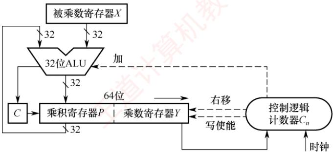
</div>

<p align="center"><em>图 2.10 一个32位无符号数乘法运算器的逻辑结构</em></p>

　　下面介绍其主要组成部分及其工作原理。

##### 1） 初始化

- 被乘数寄存器 $X$ ：存储32位被乘数 $X$ ，在整个乘法过程中保持不变。

- 乘数寄存器 $Y$ ：初始时存储32位乘数 $Y$ 。

- 乘积寄存器 $P$ ：初始化为0，用于存放累加的部分积（高32位结果）。

- 计数器 $C_n$ ：初始化为 $n$ （本例为32），表示需进行 $n$ 次迭代。

2）执行过程（循环 n 次）

　　① 判断：将乘数寄存器 Y 的最低位，送入控制逻辑。

　　② 加法操作：若 $Y$ 的最低位为1，则将当前部分积 $P$ 加上被乘数 $X$ ，并将进位存入进位触发器 $C$ ；若 $Y$ 的最低位为0，则执行空操作。

　　③ 移位操作：将 $C$ 、 $P$ 和 $Y$ 视为一个整体，执行一次逻辑右移。具体来说，进位 $C$ 移入 $P$ 的最高位； $P$ 的最低位移入 $Y$ 的最高位； $Y$ 的最低位被丢弃。

　　④ 更新计数器：计数器 $C_n$ 减1。若 $C_n \neq 0$ ，则继续下一轮迭代，否则算法结束。

> **考点追踪：** 无符号数乘法指令的溢出判断（2019、2020）

##### 3） 结果与溢出判断

- 最终结果：64位乘积结果存储在寄存器对 $[P:Y]$ 中，其中 $P$ 为高32位， $Y$ 为低32位。

- 溢出判断：若高32位结果 $P$ 不为零，则表明乘积超出了32位无符号数的表示范围，发生溢出。此时，处理器将溢出标志OF与进位标志CF同时置1。

##### 4） 溢出处理

　　溢出处理属于软件层面的操作，通过检查 CF 或 OF 标志位即可判断是否发生溢出。若检测到溢出，则可在乘法指令后插入一条溢出自陷指令，自动触发异常处理程序，以处理错误（如报告错误、转为高精度计算等）。对于不要求结果精确性的应用，程序员可选择忽略溢出。

##### （3） 有符号整数的乘法运算电路

　　有符号整数采用补码表示, 其乘法需要同时处理符号与数值。A. D. Booth 提出的 Booth 算法让符号位与数值位统一参与运算, 直接生成补码形式的乘积, 且对正数和负数一视同仁。

　　图 2.11 所示为 32 位补码一位乘法器的逻辑结构，其整体架构与图 2.10 中的无符号乘法器非常相似，主要区别在于控制逻辑。需要说明的是，Booth

<div align="center">
  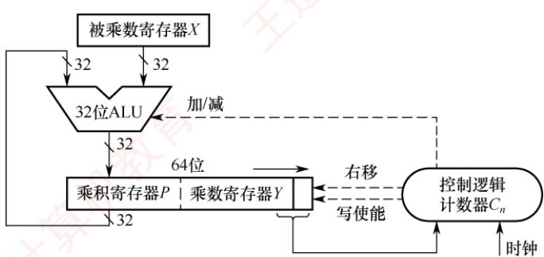
</div>

<p align="center"><em>图 2.11 32 位补码一位乘法器的逻辑结构</em></p>

　　算法的数学推导较为复杂，通常不在考研考查范围内，因此本书仅介绍其实现结构，不深入讨论其背后的原理。

　　下面介绍其主要组成部分及其工作原理。

##### 1） 初始化

- 被乘数寄存器 $X$ ：存储32位被乘数，在整个乘法过程中保持不变。

- 乘积寄存器 $P$ ：初始化为0，用于存放累加的部分积（高32位结果）。

- 乘数寄存器 $Y$ : 初始时存储 32 位乘数；在其右侧附加一个辅助位 $y_{-1}$ ，且初始化为 0。

- 计数器 $C_n$ ：初始化为 $n$ （本例为32），表示需要进行 $n$ 次迭代。

2）执行过程（循环 n 次）

　　① 判断：将 Y 的最低位 $y_{0}$ 与辅助位 $y_{-1}$ 组合形成两位二进制码，送入控制逻辑。

　　② 加减法：若组合为 10，则执行 P=P-X（减去被乘数）；若为 01，则执行 $P=P+X$ （加上被乘数）；若为 00 或 11，则执行空操作（Booth 算法的原理请参见教材）。

　　③ 移位：将 $P$ 、 $Y$ 和辅助位 $y_{-1}$ 视为一个整体，执行一次算术右移。具体来说， $P$ 的最低位移入 $Y$ 的最高位； $Y$ 的最低位移入辅助位 $y_{-1}$ ；原辅助位 $y_{-1}$ 被丢弃。

　　④ 循环控制：计数器 $C_{n}$ 减 1。若 $C_{n} \neq 0$ ，则继续下一轮迭代，否则算法结束。

> **考点追踪：** 有符号数乘法指令的溢出判断（2021）

##### 3） 结果与溢出判断

- 最终结果：64位乘积存储在寄存器对 $[P:Y]$ 中，其中 $P$ 为高32位， $Y$ 为低32位。

- 溢出判断：若高32位结果 $P$ 不是低32位结果 $Y$ 的符号扩展（ $P$ 的所有位不等于 $Y$ 的符号位），则判定为溢出。此时，处理器将溢出标志OF与进位标志CF同时置1。

##### 4） 溢出处理

　　其溢出处理同样由软件完成。执行有符号乘法指令（如 imul）后，应检查 OF 标志位：若发生溢出，则可通过条件跳转进入错误处理程序，或者利用溢出自陷机制由硬件自动触发异常处理程序，以确保程序的健壮性；若已知操作数不会导致溢出，则也可选择忽略该标志。

（4）乘法运算的三种实现方式

1）迭代式乘法器：即前文所述的经典实现结构，由 ALU、移位器、寄存器和控制逻辑构成。通过多次迭代完成乘法，每次迭代处理一位乘数，若一次 ALU 运算和一次移位各需 1 个时钟周期，则完成 n 位乘法约需 2n 个时钟周期。

2）阵列乘法器：一种全并行的快速乘法器。所有部分积同时生成，并以二维阵列形式组织，再通过加法器网络逐级压缩求和，从而直接得到最终乘积。由于整个数据通路为组合逻辑，在时钟周期足够长的前提下，可在单个时钟周期内完成一次乘法运算。

3）移位-加减法：利用移位与加法（或减法）的组合来模拟乘法运算（例如，乘以13可分解为 $X \ll 3 + X \ll 2 + X$ ）。该方法的硬件成本最低，但运算速度最慢。

#### 2. 除法运算

　　在进行定点数除法运算之前，需要先对被除数和除数的取值进行预判，以识别异常或确定结果是否为零。具体规则如下：

1）若被除数为0、除数不为0，或|被除数|<|除数|，则商为0，余数等于被除数。

2）若被除数不为0、除数为0，则发生“除数为0”异常。

3）若被除数和除数均为0，则发生除法错误异常。

　　仅当被除数和除数均不为 0 且 | 被除数 | ≥ | 除数 | 时，才进入正式的除法计算过程。

##### （1） 无符号整数的除法运算原理

> **考点追踪：** 除法运算的异常及处理（2025）

　　无符号整数除法与乘法类似，也是一种基于移位与加减的迭代过程，但流程更为复杂。下面以两个无符号数为例，说明手算除法步骤。

$$
\begin{array}{r l r} & {\text {商} = 0 1 1 1 = 7} \\ {0 0 1 0 \overline {{) 0 0 0 0 0 1 1 1 1}} \quad} & {\text {被除数} X = 1 5 = 1 1 1 1} \\ & {\qquad \qquad \qquad \qquad \qquad \qquad \qquad \qquad \qquad \qquad \qquad \qquad \qquad \qquad \qquad \qquad \qquad \qquad \text {除数} Y = 2 = 0 0 1 0} \\ & {\overline {{\text {0 0 1 0}}}} \\ & {\overline {{\text {0 0 1 1}}}} \\ & {\overline {{\text {0 0 1 0}}}} \\ & {\overline {{\text {0 0 1 1}}}} \\ & {\overline {{\text {0 0 1 0}}}} \\ & {\overline {{\text {余数} = 0 0 0 1 = 1}}} \end{array}
$$

　　在手算二进制除法中，为便于从最高位开始逐位试商，通常按固定位宽书写被除数，并在高位补0（例如将4位的1111写成00001111），这些前导零不改变数值大小。具体步骤如下：

1）取被除数的高 $n$ 位部分（与除数同宽）作为初始部分被除数，与除数相减。若够减，则上商1，并将差值作为中间余数；若不够减，则上商0，中间余数即为该部分被除数。

2）将被除数的下一位“带下来”，拼接到当前余数末尾，形成新的 $n$ 位部分被除数；再与除数相减，确定下一位商。如此重复，直到所有位处理完毕。

　　手算中在被除数前补 0 主要是为了便于对齐和观察；硬件设计采用类似的策略，将 n 位被除数高位补 0 扩展为 2n 位，以支持统一的迭代过程。

##### （2） 无符号整数的除法运算电路

> **考点追踪：** 除法运算器的结构（2025）

　　图2.12所示为一个32位除法逻辑结构图。为了适应逐位试商的迭代过程，需要将被除数加载到一个64位寄存器中（高32位为0，低32位为实际被除数）。一般而言， $n$ 位无符号数除法采用一个 $2n$ 位的被除数（高位补0）除以一个 $n$ 位的除数，产生 $n$ 位的商和 $n$ 位的余数。

<div align="center">
  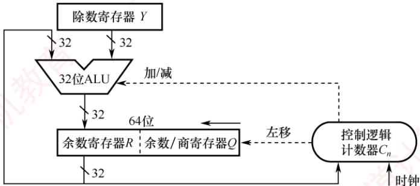
</div>

<p align="center"><em>图 2.12 一个 32 位除法逻辑结构图</em></p>

　　下面介绍其主要组成部分及其工作原理。

##### 1） 初始化

- 除数寄存器 $Y$ ：存储 $n$ 位除数，在整个除法过程中保持不变。

- 余数/商寄存器 $Q$ ：初始时存储 $n$ 位被除数；在迭代过程中逐步生成 $n$ 位商。

- 余数寄存器 $R$ ：初始化为0，用于暂存中间余数。

- 计数器 $C_n$ ：初始化为 $n$ ，表示需要执行 $n$ 轮迭代。

- 异常预检：若除数为 0，则立即触发“除零错误”异常，停止除法运算；若被除数 < 除数，则商 = 0，余数 = 被除数，无须进入执行过程。

##### 2） 执行过程（循环 n 次）

　　① 移位：将 $R$ 与 $Q$ 视为一个整体，执行一次逻辑左移。具体来说， $R$ 的最高位被移出（通常丢弃）， $Q$ 的最高位移入 $R$ 的最低位， $Q$ 的最低位空出以接收新商位。

　　② 试商与减法：计算 $[R] - [Y]$ ；若结果大于或等于0，则当前商位为1，并将结果（差值）写回 $R$ ；若结果小于0，则当前商位为0，并执行 $[R] + [Y]$ 以恢复余数（撤销减法）。

　　③ 循环控制：计数器 $C_{n}$ 减 1。若 $C_{n} \neq 0$ ，则继续下一轮迭代，否则算法结束。

##### 3） 最终结果

　　最终的 $n$ 位商存储在寄存器 $Q$ 中， $n$ 位余数存储在寄存器 $R$ 中。

##### 4） 异常处理

　　当检测到 “除数为 0” 时，除法器立即停止运算，并置位 “除零” 异常标志。该异常通常由硬件自动捕获，并通过中断向量表跳转至预设的异常处理程序。

> **注意**

　　两个 $n$ 位无符号数相除不会发生溢出。因为被除数最大为 $2^{n} - 1$ ，最小的非零除数为1，此时商为最大值，即为 $2^{n} - 1$ ，恰好可用 $n$ 位无符号数表示。

##### （3） 补码除法运算的工作原理

　　补码作为有符号整数的标准表示形式，其除法运算需要同时处理符号与数值。补码除法让符号位与数值位统一参与运算，商的符号在运算过程中自然生成。对于两个 $n$ 位补码数相除，被除数需要先进行符号扩展至 $2n$ 位；若被除数为 $2n$ 位，除数为 $n$ 位，则无须扩展。

　　由于补码除法涉及有符号数的比较、加减和移位，其试商规则要比无符号除法复杂得多。根据考试大纲要求，仅需掌握其基本实现，底层的原理可参见教材。补码除法的硬件结构与图2.11所示的无符号除法电路基本一致，下面结合该图说明其基本工作过程。

> **考点追踪：** 除法运算器的初始化步骤（2025）

1）初始化：

- 除数寄存器 $Y$ ：存储 $n$ 位除数，在整个除法过程中保持不变。

- 余数/商寄存器 $Q$ ：初始时存储 $n$ 位被除数；在迭代过程中逐步生成 $n$ 位商。

- 余数寄存器 $R$ ：所有位都初始化为被除数的符号位，即完成符号扩展。

- 计数器 $C_n$ ：初始化为 $n$ ，表示需要执行 $n$ 轮迭代。

- 异常预检：若除数为 0，则立即触发“除零错误”异常，停止除法运算；若|被除数| < |除数|，则商 = 0，余数 = 被除数，无须进入执行过程。

2）执行过程（循环 n 次）

　　① 移位：将 R 与 Q 视为一个整体，执行一次算术左移。

　　② 试商与加减：控制逻辑根据[R]与[Y]的关系，发出加法或减法信号以确定当前商位。由于涉及有符号数的恢复机制，具体判定规则较复杂，此处不展开。

　　③ 循环控制：计数器 $C_{n}$ 减 1。若 $C_{n} \neq 0$ ，则继续下一轮迭代，否则算法结束。

##### 3） 最终结果

　　最终的商存储在 Q 中，余数（符号与被除数相同）存储在 R 中。

##### 4） 异常处理

　　当检测到除数为0或发生商溢出时，除法器立即停止运算，并置位相应异常标志，该异常的捕获和处理方式与无符号除法类似。值得注意的是，在两个 $n$ 位补码除法中，商溢出仅有一种情形：被除数为最大负数 $-2^{n - 1}$ ，且除数为-1，此时结果 $2^{n - 1}$ 无法用 $n$ 位补码表示。

### 2.2.5 本节习题精选

#### 一、单项选择题

01. 算术逻辑单元（ALU）的核心部件是（）。

- A. 多路选择器
- B. 移位器
- C. 加法器
- D. 寄存器

02. 算术逻辑单元（ALU）的功能通常包括（）。

- A. 算术运算
- B. 逻辑运算
- C. 算术运算和逻辑运算
- D. 加法运算

03. 补码定点整数 0101 0101 算术左移两位后的值为（）。

- A. 0100 0111
- B. 0101 0100
- C. 0100 0110
- D. 0101 0101

04. 下列四个补码整数存放于 8 位寄存器中，算术左移不会发生溢出的是（）。

- A. 80H
- B. 90H
- C. B0H
- D. C0H

05. 补码定点整数 1001 0101 右移一位后的值为（）。

- A. 0100 1010
- B. 01001010 1
- C. 1000 1010
- D. 1100 1010

06. 两个机器数7E5H和4D3H相加，得（）。

- A. BD8HB.CD8HC.BB8HD.CC8H

07. 设机器数字长为 8 位（含 1 位符号位），若机器数 BAH 为补码，算术左移 1 位和算术右移 1 位分别得（）。

- A. F4H, EDH
- B. B4H, 6DH
- C. 74H, DDH
- D. B5H, EDH

08. 在定点运算器中，无论是采用双符号位还是采用单符号位，必须有（）。

- A. 译码电路，它一般用“与非”门来实现
- B. 编码电路，它一般用“或非”门来实现
- C. 溢出判断电路，它一般用“异或”门来实现
- D. 移位电路，它一般用“与或非”门来实现

09. 机器运算发生溢出的根本原因是（）。

- A. 寄存器的位数有限
- B. 运算中将符号位的进位丢弃
- C. 运算中将符号位的借位丢弃
- D. 数据运算中发生错误

10. 假定有两个整数用 8 位补码分别表示为 $r_1 = \mathrm{F}5\mathrm{H}$ ， $r_2 = \mathrm{EEH}$ 。若将运算结果存放在一个 8 位寄存器中，则下列运算会发生溢出的是（）。

- A. $r_1 + r_2$
- B. $r_1 - r_2$
- C. $r_1 \times r_2$
- D. $r_1 / r_2$

11. 关于模4补码，下列说法正确的是（）。

- A. 模4补码和模2补码不同，它不容易检查乘除运算中的溢出问题
- B. 每个模4补码存储时只需要一个符号位
- C. 存储每个模4补码需要两个符号位
- D. 模4补码，在算术与逻辑单元中为一个符号位

12. 若采用双符号位，则两个正数相加产生溢出的特征时，双符号位为（）。

- A. 00
- B. 01
- C. 10
- D. 11

13. 判断加减法溢出时，可采用判断进位的方式，若符号位的进位为 $C_0$ ，最高位的进位为 $C_1$ ，则产生溢出的条件是（）。 I. $C_0$ 产生进位 II. $C_1$ 产生进位 III. $C_0$ 、 $C_1$ 都产生进位 IV. $C_0$ 、 $C_1$ 都不产生进位

 V. $C_0$ 产生进位， $C_1$ 不产生进位 VI. $C_0$ 不产生进位， $C_1$ 产生进位

- A. I 和 II
- B. III
- C. IV
- D. V 和 VI

14. 在补码的加减法中，用两位符号位判断溢出，两位符号位 $S_{\mathrm{s1}}S_{\mathrm{s2}} = 10$ 时，表示（）。

- A. 结果为正数，无溢出
- B. 结果正溢出
- C. 结果负溢出
- D. 结果为负数，无溢出

15. 若 $[X]_{补}=X_{0}.X_{1}X_{2}\cdots X_{n}$ ，其中 $X_{0}$ 为符号位， $X_{1}$ 为最高数位。若（），则当补码算术左移时，将会发生溢出。

- A. $X_{0}=X_{1}$
- B. $X_{0}\neq X_{1}$
- C. $X_{1}=0$
- D. $X_{1}=1$

16. 假设一次 ALU 运算和一次移位操作各需 1 个时钟周期，则 32 位无符号整数乘法电路完成一次乘法运算所需的时钟周期数约为（）。

- A. 16
- B. 64
- C. 96
- D. 100

17. 下列关于移位运算的说法中，正确的是（）。 I. 补码算术左移时，高位移出，低位补0，若左移前后的符号位不同，则发生溢出 II. 无符号数逻辑左移时，若最高位移出的是1，则发生溢出 III. 逻辑左移和补码算术左移的结果都一样，都是移出最高位，并在低位补0A. I、III

- B. 仅II
- C. 只有III
- D. I、II、III

18. 某计算机字长为 8 位，CPU 中有一个 8 位加法器。已知无符号数 x=69, y=38，若在该加法器中计算 x-y，则加法器的两个输入端信息和输入的低位进位信息分别为（）。

- A. 0100 0101、0010 0110、0
- B. 0100 0101、1101 1001、1
- C. 0100 0101、1101 1010、0
- D. 0100 0101、1101 1010、1

19. 某计算机中有一个8位加法器，有符号整数 $x$ 和 $y$ 的机器数用补码表示， $[x]_{\text{补}} = \mathrm{F5H}$ ， $[y]_{\text{补}} = 7\mathrm{EH}$ ，若在该加法器中计算 $x - y$ ，则加法器的低位进位输入信息和运算后的溢出标志OF分别是（）。

- A. 1、1
- B. 1、0
- C. 0、1
- D. 0、0

20. 某 8 位计算机中，x 和 y 是两个有符号整数，用补码表示， $[x]_{补}=44H,\quad[y]_{补}=DCH$ ，则 $x/2+2y$ 的机器数及相应的溢出标志 OF 分别是（）。

- A. CAH、0
- B. CAH、1
- C. DAH、0
- D. DAH、1

21. 某8位计算机中， $x$ 和 $y$ 是两个有符号整数，用补码表示， $[x]_{\text{补}} = 44\mathrm{H}$ ， $[y]_{\text{补}} = \mathrm{DCH}$ ，则 $x - 2y$ 的机器数及相应的溢出标志OF分别是（）。

- A. 8CH、1
- B. 8CH、0
- C. 68H、1
- D. 68H、0

22. 某C语言代码段如下:
int si=65536;
short i=si;
unsigned j=0;
　　if(i<=j-1) printf("王道");
　　else printf("计算机教育");

当上述代码段执行到 if 分支条件的判断时，会根据标志寄存器中的（）决定执行顺序。最终的输出结果是（）。

- A. CF, 王道
- B. CF, 计算机教育
- C. OF, 王道
- D. OF, 计算机教育

23. 下图是实现 32 位补码一位乘法的逻辑结构图，下列说法中正确的是（）。

<div align="center">
  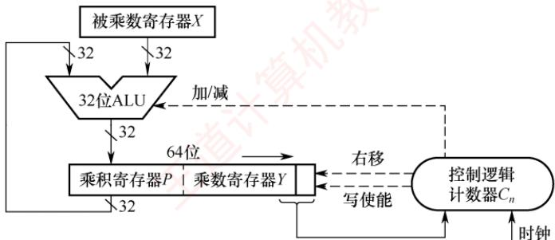
</div>

- A. 32位无符号整数的乘法电路和该图没有区别
- B. 在执行过程中，ALU要么做加法，要么做减法，不可能执行空操作
- C. 图中的乘积寄存器 $P$ 和乘数寄存器 $Y$ 所执行的右移是算术右移
- D. 计算完成后，若乘积寄存器 $P$ 中的值不全为0，则发生溢出

24. 某计算机采用下图所示的补码除法器执行 32 位补码整数除法运算，当除数寄存器 Y 与余数/商寄存器 Q 的初始值为（）时，除法执行时间最短（Y、Q 均为补码表示）。

<div align="center">
  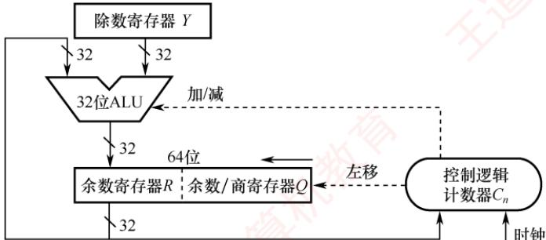
</div>

- A. $Y =$ FFFF FFFF, $Q = 80000000$
- B. $Y = 80000000, Q =$ FFFF FFFF
- C. $Y =$ FFFF FFFF, $Q =$ FFFF FFFF
- D. $Y = 80000000, Q = 80000000$

25. 【2009 统考真题】一个 C 语言程序在一台 32 位机器上运行。程序中定义了三个变量 x, y, z，其中 x 和 z 为 int 型，y 为 short 型。当 x = 127, y = -9 时，执行赋值语句 $z = x + y$ 后，x, y, z 的值分别是（）。

- A. x = 0000007FH, y = FFF9H, z = 00000076H
- B. x = 0000007FH, y = FFF9H, z = FFFF0076H
- C. x = 0000007FH, y = FFF7H, z = FFFF0076H
- D. x = 0000007FH, y = FFF7H, z = 00000076H

26. 【2010 统考真题】假定有四个整数用 8 位补码分别表示: $r_{1} = \mathrm{FEH}, r_{2} = \mathrm{F2H}, r_{3} = 90\mathrm{H}, r_{4} = \mathrm{F8H}$ , 若将运算结果存放在一个 8 位寄存器中, 则下列运算会发生溢出的是 （）。

- A. $r_{1} \times r_{2}$
- B. $r_{2} \times r_{3}$
- C. $r_{1} \times r_{4}$
- D. $r_{2} \times r_{4}$

27. 【2013 统考真题】某字长为 8 位的计算机中，已知整型变量 x、y 的机器数分别为 $[x]_{补}=1\ 1110100,\quad[y]_{补}=1\ 0110000$ 。若整型变量 $z=2x+y/2$ ，则 z 的机器数为（）。

- A. 1 1000000
- B. 0 0100100
- C. 1 0101010
- D. 溢出

28. 【2014 统考真题】若 x = 103, y = -25，则下列表达式采用 8 位定点补码运算实现时，会发生溢出的是（）。

- A. $x + y$
- B. $-x + y$
- C. x - y
- D. -x - y

29. 【2018 统考真题】假定有符号整数采用补码表示，若 int 型变量 x 和 y 的机器数分别是 FFFF FFDFH 和 0000 0041H，则 x、y 的值及 x-y 的机器数分别是（）。

- A. x = -65, y = 41, x - y 的机器数溢出

- B. $x = -33, y = 65, x - y$ 的机器数为 FFFF FF9DH
- C. $x = -33, y = 65, x - y$ 的机器数为 FFFF FF9EH
- D. $x = -65, y = 41, x - y$ 的机器数为 FFFF FF96H

30. 【2018 统考真题】整数 x 的机器数为 1101 1000，分别对 x 进行逻辑右移 1 位和算术右移 1 位操作，得到的机器数各是（）。

- A. 1110 1100、1110 1100
- B. 0110 1100、1110 1100
- C. 1110 1100、0110 1100
- D. 0110 1100、0110 1100

31. 【2018 统考真题】减法指令 “sub R1, R2, R3” 的功能为 “(R1)-(R2)→R3”，该指令执行后将生成进位/借位标志 CF 和溢出标志 OF。若(R1) = FFFF FFFFH, (R2) = FFFF FFF0H，则该减法指令执行后，CF 与 OF 分别为（）。

- A. CF = 0, OF = 0
- B. CF = 1, OF = 0
- C. CF = 0, OF = 1
- D. CF = 1, OF = 1

32. 【2023 统考真题】已知 x, y 为 int 型，当 x = 100, y = 200 时，执行 “x 减 y” 指令得到的溢出标志 OF 和借位标志 CF 分别为 0, 1，那么当 x = 10, y = -20 时，执行该指令得到的 OF 和 CF 分别为（）。

- A. OF = 0, CF = 0
- B. OF = 0, CF = 1
- C. OF = 1, CF = 0
- D. OF = 1, CF = 1

33. 【2024 统考真题】C 语言代码段如下，执行该代码段后，j 的值是（）。int i=32777;
short si=i;
int j=si;

- A. -32777
- B. -32759
- C. 32759
- D. 32777

34. 【2024 统考真题】下列关于整数乘法运算的叙述中，错误的是（）。

- A. 用阵列乘法器实现的乘运算可以在一个时钟周期内完成
- B. 用 ALU 和移位器实现的乘运算无法在一个时钟周期内完成
- C. 变量与常数的乘运算可编译优化为若干移位及加减运算指令
- D. 两个变量的乘运算无法编译转换为移位及加法等指令的循环实现

35. 【2025 统考真题】假设在 8 位字长的计算机中，两个带符号整数 $x$ 和 $y$ 的补码表示分别为 $[x]_{\text{补}} = A3H, [y]_{\text{补}} = 75H$ ，则通过补码加减运算器得到的 $x - y$ 的值及 OF 标志分别为（）。

- A. 24, 0
- B. 24, 1
- C. 46, 0
- D. 46, 1

#### 二、综合应用题

01. 已知 32 位寄存器 R1 中存放的变量 x 的机器码为 8000 0004H，unsigned int 型的乘除法采用逻辑移位操作，int 型的乘除法采用算术移位操作，请问：
1）当 x 是 unsigned int 型时，x 的真值是多少？x/2 存放在 R1 中的机器码是什么？x/2 的真值是多少？2x 存放在 R1 中的机器码是什么？2x 的真值是多少？

2）当 $x$ 是int型时， $x$ 的真值是多少？ $x / 2$ 存放在R1中的机器码是什么？ $x / 2$ 的真值是多少？ $2x$ 存放在R1中的机器码是什么？ $2x$ 的真值是多少？

02. 假设有两个整数 $x = -68, y = -80$ ，采用补码形式（含1位符号位）表示， $x$ 和 $y$ 分别存放在寄存器A和B中。另外，还有两个寄存器C和D。A、B、C、D都是8位的寄存器。请回答下列问题（要求最终用十六进制数表示二进制数序列）：
1）寄存器A和B中的内容分别是什么？
2） $x$ 和 $y$ 相加后的结果存放在寄存器C中，则寄存器C中的内容是什么？此时，溢出标志OF、符号标志SF各是什么？

3）x 和 y 相减后的结果存放在寄存器 D 中，寄存器 D 中的内容是什么？此时，溢出标志 OF、符号标志 SF 各是什么？

03. 【2011 统考真题】假定在一个 8 位字长的计算机中运行如下 C 程序段:

```txt
unsigned int x=134;
unsigned int y=246;
int m=x;
int n=y;
unsigned int z1=x-y;
unsigned int z2=x+y;
int k1=m-n;
int k2=m+n;
```

　　若编译器编译时将8个8位寄存器R1~R8分别分配给变量x, y, m, n, z1, z2, k1和k2。请回答下列问题（提示：有符号整数用补码表示）。

1）执行上述程序段后，寄存器 R1、R5 和 R6 的内容分别是什么（用十六进制数表示）？

2）执行上述程序段后，变量 m 和 k1 的值分别是多少（用十进制数表示）？

3）上述程序段涉及有符号整数加减、无符号整数加减运算，这四种运算能否利用同一个加法器辅助电路实现？简述理由。

4）计算机内部如何判断有符号整数加减运算的结果是否发生溢出？上述程序段中，哪些有符号整数运算语句的执行结果会发生溢出？

04. 【2020 统考真题】有实现 $x \times y$ 的两个 C 语言函数如下:

```txt
unsigned umul (unsigned x, unsigned y) { return x*y; }
int imul (int x, int y) {return x * y;}
```

　　假定某计算机M中的ALU只能进行加减运算和逻辑运算。请回答下列问题。

1）若 M 的指令系统中没有乘法指令，但有加法、减法和位移等指令，则在 M 上也能实现上述两个函数中的乘法运算，为什么？

2）若M的指令系统中有乘法指令，则基于ALU、位移器、寄存器及相应控制逻辑实现乘法指令时，控制逻辑的作用是什么？

3) 针对以下三种情况：a) 没有乘法指令；b) 有使用 ALU 和位移器实现的乘法指令；c) 有使用阵列乘法器实现的乘法指令，函数 umul() 在哪种情况下执行的时间最长？在哪种情况下执行的时间最短？说明理由。

4）n 位整数乘法指令可保存 2n 位乘积，当只取低 n 位作为乘积时，其结果可能发生溢出。当 $n=32, x=2^{31}-1, y=2$ 时，有符号整数乘法指令和无符号整数乘法指令得到的 $x \times y$ 的 2n 位乘积分别是什么（用十六进制数表示）？此时函数 umul() 和 imul() 的返回结果是否溢出？对于无符号整数乘法运算，当仅取乘积的低 n 位作为乘法结果时，如何用 2n 位乘积进行溢出判断？

### 2.2.6 答案与解析

#### 一、单项选择题

**01. C**
　　ALU 的核心功能是算术与逻辑运算，其中加法是最基础的操作：减法可用补码加法实现，乘除可由加法和移位组合而成。因此，加法器是 ALU 最核心的部件。

**02. C**

　　ALU 既能进行算术运算又能进行逻辑运算。

**03. B**
　　该数是一个正数（最高位为 0），按照补码算术移位规则，算术左移两位后，移出了最高位 01，低位补 0，因此算术左移两位后的结果是 01010100。虽然移位后该数的符号位仍为 0，但是移出了有效位 1，所以本次算术移位发生了溢出。

**04. D**

$80H=(1000\ 0000)<<1=00000000$ ，左移前的符号位为1，左移后的符号位为0，溢出。 $90H=(1001\ 0000)<<1=0010\ 0000$ ，左移前的符号位为1，左移后的符号位为0，溢出。 $B0H=(1011\ 0000)<<1=0110\ 0000$ ，左移前的符号位为1，左移后的符号位为0，溢出。 $C0H=(1100\ 0000)<<1=10000000$ ，左移前的符号位为1，左移后的符号位为1，未溢出，选项D正确。

**05. D**

　　该数是一个负数（最高位为1），按照算术补码移位规则，负数右移添1，负数左移添0，所以1001 0101 右移一位后的值为1100 1010。

**06. C**

　　在十六进制数的加减法中，逢十六进一，因此有 $7E5\ H + 4D3\ H = CB8\ H$ 。

**07. C**

　　算术左移时，低位补0；算术右移时，高位补符号位。 $\mathrm{BAH}=(1011\ 1010)_{2}$ ，算术左移1位得 $(0111\ 0100)_{2}=74\mathrm{H}$ ，左移前后的符号位不同，溢出；算术右移1位得 $(1101\ 1101)_{2}=\mathrm{DDH}$ 。

**08. C**

　　三种溢出判别方法，均须有溢出判别电路，可用“异或”门来实现。

**09. A**

**10. C**

　　首先将 $r_1$ 和 $r_2$ 转换为真值，F5H = 11110101，转换为原码是 10001011，真值为 -11；EEH = 11101110，转换为原码是 10010010，真值为 -18，8 位补码的表示范围为 [-128, 127]， $r_1 \times r_2$ 的结果为 198，超出了 8 位补码的表示范围，发生溢出。

**11. B**

　　模 4 补码具有模 2 补码的全部优点且更易检查加减运算中的溢出问题，选项 A 错误。需要注意的是，存储模 4 补码仅需一个符号位，因为任何一个正确的数值，模 4 补码的两个符号位总是相同的，选项 B 正确。只在把两个模 4 补码的数送往 ALU 完成加减运算时，才把每个数的符号位的值同时送到 ALU 的双符号位中，即只在 ALU 中采用双符号位，选项 C、D 错误。

**12. B**

　　采用双符号位时，第一符号位表示最终结果的符号，第二符号位表示运算结果是否溢出。若第二位和第一位符号相同，则未溢出；若不同，则溢出。若发生正溢出，则双符号位为01，若发生负溢出，则双符号位为10。

**13. D**

　　采用进位位来判断溢出时，当最高有效位进位和符号位进位的值不相同时才产生溢出。两正数相加，当最高有效位产生进位 $(C_{1}=1)$ 而符号位不产生进位 $(C_{0}=0)$ 时，发生正溢出；两负数相加，当最高有效位不产生进位 $(C_{1}=0)$ 而符号位产生进位 $(C_{0}=1)$ 时产生负溢出。因此溢出条件为 $\overline{C_{0}}C_{1}+C_{0}\overline{C_{1}}=C_{0}\oplus C_{1}$ 。

**14. C**

　　用两位符号位判断溢出时，两个符号位不同时表示溢出，即 01 时表示正溢出；10 时表示负溢出；两个符号位相同时（11 或 00）表示未溢出。

**15. B**

　　补码左移时，若移出的高位不同于移位后的符号位，即左移前后的符号位不同，则发生溢出。补码左移时， $X_{0}$ 移出， $X_{1}$ 取代 $X_{0}$ 成为新的符号位，因此若 $X_{0} \neq X_{1}$ ，则表示发生了溢出。

**16. B**

　　32 位无符号乘法通常采用“移位-相加”算法，共进行 32 轮迭代，每轮至少包含 1 次加法（或空操作）和 1 次移位。每轮消耗 2 个时钟周期（加法 + 移位），共需约 $32 \times 2 = 64$ 个时钟周期。

**17. D**

　　对于左移操作，逻辑左移和算术左移的结果都一样，高位移出，低位补0。逻辑移位不考虑符号位的问题，逻辑左移时，若最高位移出的是1，表示发生溢出。算术左移时，若移出的高位不同于移位后的符号位，即左移前后的符号位不同，表示发生溢出。因此说法I、II、III均正确。

**18. B**

　　不管是补码减法，还是无符号数减法，都是用被减数加上减数的负数的补码来实现的。根据求补公式，减数 $y$ 的负数的补码 $[-y]_{\text{补}} = \overline{Y} + 1$ ，因此，在加法器的 $Y'$ 输入端用一个反向器实现，并用控制端 Sub 控制多路选择器是否将 $y$ 的各位取反后，输入 $Y'$ 端，同时将 Sub 作为低位进位送到加法器。当 Sub 为 1 时，做减法，Sub = 1 控制将 $\overline{Y}$ 输入加法器 $Y'$ 端，即实现“各位取反”功能；同时将 Sub = 1 作为低位进位送到加法器，实现“末位加 1”功能。69 的二进制数为 0100 0101；38 的二进制数为 0010 0110，各位取反得 1101 1001。做减法时，低位进位为 Sub，即为 1。

> **注意**

　　若仅记忆补码加减运算的过程，而未掌握加法电路的原理，则本题易误选 D。

**19. A**

　　对补码减法运算，控制端 Sub 为 1，所以低位进位输入位 = Sub = 1。 $[x]_{补} = 11110101$ ， $[y]_{补} = 01111110$ ， $[-y]_{补} = 10000001 + 1$ ， $[x]_{补} - [y]_{补} = [x]_{补} + [-y]_{补} = 11110101 + 10000010 = 01110111$ ，进位丢掉，参与运算的两个数的符号位均为 1，结果的符号位为 0，所以溢出标志 OF 为 1。

**20. C**

$[x/2+2y]_{补}=[x]_{补}\gg1+[y]_{补}<<1=0100\ 0100\gg1+1101\ 1100<<1=0010\ 0010+1011\ 1000=1101\ 1010=DAH$ 。x右移移出了0，没有溢出或损失精度；y为负数，左移后，符号位仍为1，没有溢出；且从最后一步加法操作来看，一个正数和一个负数相加，必然不会溢出。

**21. A**

$[x]_{补}=44H=0100\ 0100,\quad[y]_{补}=DCH=1101\ 1100$ 。执行 x-2y 时，先将 y 算术左移一位，得到 1011 1000，未溢出，然后各位取反，再与 x 相加，做减法时 Sub=1，即 $0100\ 0100+0100\ 0111+1=1000\ 1100(8CH)$ ，两个加数的符号都为 0，而结果的符号为 1，因此发生了溢出，即 OF=1。

**22. A**

　　无符号数和有符号数一起参与运算时，计算机按无符号数来解释最终的执行结果，因此 j-1 的结果是 32 个全 1，会被解释成最大的无符号数。 $65536 = 2^{16}$ ，当把 si 强制转换为 short 型时，直接保留机器数的末 16 位，即 16 个全 0，因此，当 i 和 j-1 进行比较时，根据无符号数的解释，OF 标志是没有意义的，即根据 CF 位可知 i 小于 j-1，因此最终输出 “王道”。

**23. C**

　　无符号乘法无须辅助位，电路结构更简单。当控制逻辑的输入是“00”或“11”时，ALU执行空操作，仅移位。因结果为有符号数，P和Y的右移必须为算术右移，以保持符号位不变，选项C正确。溢出判断依据是P的所有位是否都等于Y的符号位，而非P是否全为0。

**24. B**

　　该补码除法器在正式迭代之前会先判断：若被除数的绝对值小于除数的绝对值，则直接置商为0、余数为被除数，跳过全部移位和加减操作，从而最快完成。在选项B中， $Y = -2^{31}$ ，绝对值为 $2^{31}$ ；Q = -1，绝对值为1。由于 $|Q| < |Y|$ ，满足快速退出条件，故执行时间最短。

**25. D**

　　C 语言中的整型数据为补码形式，int 型为 32 位，short 型为 16 位，因此 x、y 的机器数写为 0000 007FH、FFF7H。执行 z = x + y 时，x 为 int 型，y 为 short 型，因此需将 y 的类型强制转换为 int 型，在机器中通过符号位扩展实现，y 的符号位为 1，因此在 y 的前面添加 16 个 1，即可将 y 强制转换为 int 型，其十六进制形式为 FFFF FFF7H。然后执行加法，即 0000 007FH + FFFF FFF7H = 0000 0076H，其中最高位的进位 1 自然丢弃。

**26. B**

　　本题的真正意图是考查补码的表示范围，采用补码乘法规则计算出四个选项是费力不讨好的做法，且极易出错。8位补码所能表示的整数范围为 $-128\sim +127$ 。将四个数全部转换为十进制数： $r_1 = -2$ ， $r_2 = -14$ ， $r_3 = -112$ ， $r_4 = -8$ ，得 $r_2\times r_3 = 1568$ ，远超出了表示范围，发生溢出。

**27. A**

$x^{*}2$ ，将 x 算术左移一位为 1 1101000；y/2，将 y 算术右移一位为 1 1011000，均无溢出或丢失精度。补码相加为 $1\ 1101000 + 1\ 1011000 = 1\ 1000000$ ，亦无溢出。

**28. C**

　　8 位定点补码表示的数据范围为 -128～127，若运算结果超出这个范围，则会溢出。对选项 A， $x + y = 103 - 25 = 78$ ，符合范围。对选项 B， $-x + y = -103 - 25 = -128$ ，符合范围。对选项 D， $-x - y = -103 + 25 = -78$ ，符合范围。对选项 C， $x - y = 103 + 25 = 128$ ，超过 127。

**29. C**

　　利用补码转换为原码的规则：负数的符号位不变数值位取反加1；正数补码等于原码。两个机器数对应的原码是 $[x]_{\text{原}} = 80000021\mathrm{H}$ ，对应的数值是-33， $[y]_{\text{原}} = [y]_{\text{补}} = 00000041\mathrm{H} = 65$ 。排除选项A、D。 $x - y$ 直接利用补码减法准则， $[x]_{\text{补}} - [y]_{\text{补}} = [x]_{\text{补}} + [-y]_{\text{补}}$ ， $-y$ 的补码是连同符号位取反加1，最终减法变成加法，得出结果为FFFFFF9EH。

**30. B**

　　逻辑移位：左移和右移空位都补 0，且所有数字参与移动；补码算术移位：仍然是所有数字参与移动，右移空位补符号位，左移空位补 0。根据该规则，轻松选取选项 B。

**31. A**

$[x]_{\text{补}} - [y]_{\text{补}} = [x]_{\text{补}} + [-y]_{\text{补}}, [-R2]_{\text{补}} = 00000010\mathrm{H}$ ，很明显 $[\mathrm{R}1]_{\text{补}} + [-\mathrm{R}2]_{\text{补}}$ 的最高位进位和符号位进位都是1（当最高位进位和符号位进位的值不相同时才产生溢出），可以判断溢出标志OF为0。同时，减法操作只需判断借位标志，R1大于R2，所以借位标志为0。

**32. B**

　　ALU 生成标志位时只负责计算，而不管运算对象是有符号数还是无符号数，CF = 1 表示当作无符号数运算时溢出，OF = 1 表示当作有符号数运算时溢出。当作有符号数时，x = 10, y = -20, x - y = 30，未超过 32 位有符号数范围，不溢出，OF = 0。当作无符号数时， $x' = 10$ , $y' = 2^{32} - 20$ （符号位读作数值位）， $x' - y' = 30 - 2^{32}$ ，为负，超过 32 位无符号数范围，溢出，CF = 1。

**33. B**

$2^{15}=32768,\quad i=32768+9=8000H+9H=8009H,$ 32位有符号数i的机器数为00008009H。将32位有符号数i强制转换为16位有符号数si，直接保留机器数的末16位即可，因此si的机器数为8009H，真值为 $-2^{15}+9=-32759$ 。将16位有符号数si强制转换为32位有符号数j，采用符号扩展（si的符号为 1，因此高位补 1），j 的机器数变为 FFFF 8009H，对应的真值为 -32759。

<table><tr><td></td><td>int i</td><td>short si</td><td>int j</td></tr><tr><td>机器数</td><td>0000 8009H</td><td>8009H</td><td>FFFF 8009H</td></tr><tr><td>真值</td><td>32777</td><td>-32759</td><td>-32759</td></tr></table>

**34. D**

　　阵列乘法器中的所有部分积同时产生并组成一个阵列，运用多操作数相加就能得到最终的积，因此可在一个时钟周期内完成。用 ALU 和移位器实现的乘运算通常采用串行的乘法算法，需要多个时钟周期才能完成。当一个乘数是常数时，编译器可将乘运算优化为若干移位和加减运算指令。两个变量的乘运算可通过移位和加法等指令循环实现，选项 D 错误。

**35. D**

　　要求计算 $x - y$ ，即 $[x]_{\text{补}} + [-y]_{\text{补}}$ 。首先求 $[-y]_{\text{补}}$ ：对 $[y]_{\text{补}}$ 按位取反得10001010，再加1，得1000 $1011 = 8\mathrm{BH}$ 。然后计算 $[x]_{\text{补}} + [-y]_{\text{补}} = \mathrm{A}3\mathrm{H} + 8\mathrm{BH} = 10100011 + 10001011 = (1)00101110$ ，忽略进位后，结果为 $00101110 = 2\mathrm{EH}$ ，对应十进制数46。判断溢出：参与运算的两个操作数符号位均为1（负数），而结果符号位为0（正数），表明发生了溢出，因此OF=1。

#### 二、综合应用题

**01. 【解答】**

1）对于无符号数，所有二进制位均为数值位。乘以2和除以2运算，相当于无符号数的逻辑左移和逻辑右移。x的真值为 $2^{31}+2^{2}$ 。R1中的机器码逻辑右移一位（高位补0）为40000002H，相当于除以2，所以x/2的真值为 $2^{30}+2$ 。R1中的机器码逻辑左移一位（低位补0）为00000008H，相当于乘以2，高位丢1，结果溢出，2x的真值为 $2^{3}$ （溢出）。

2）对于有符号数（补码），最高位为符号位。乘以2和除以2运算，相当于补码的算术左移和算术右移。8000 0004H对应二进制数的最高位为1，即为负数，其真值为 $-(2^{31}-2^{2})$ 。R1中的机器码算术右移一位（高位补1）为C000 0002H，相当于除以2，x/2的真值为 $-(2^{30}-2)$ 。R1中的机器码算术左移一位（低位补0）为0000 0008H，相当于乘以2，移位前后的符号位不同，表示溢出，2x的真值为8（溢出）。

**02. 【解答】**

1）因为 $x = -68 = -(100\ 0100)_{2}$ ，则 $[-68]_{补} = 1011\ 1100 = BCH$ ；因 $y = -80 = -(101\ 0000)_{2}$ ，则 $[-80]_{补} = 1011\ 0000 = B0H$ ，所以寄存器 A 和 B 中的内容分别是 BCH、B0H。

2） $[x+y]_{补}=[x]_{补}+[y]_{补}=1011\ 1100+1011\ 0000=(1)0110\ 1100=6CH$ ，所以寄存器C中的内容是6CH，其真值为108。此时，溢出标志OF为1，表示溢出，说明寄存器C中的内容不是正确结果；符号标志SF为0，表示结果为正数（OF为1，说明SF也是错的）。

3） $[x - y]_{\text{补}} = [x]_{\text{补}} + [-y]_{\text{补}} = 10111100 + 01010000 = (1)00001100 = 0\mathrm{CH}$ ，最高位前面的一位被丢弃（取模运算），结果为12，所以寄存器D中的内容是0CH，其真值为12。此时，溢出标志OF为0，表示不溢出，也就是说，寄存器D中的内容是正确的结果；符号标志SF为0，表示结果为正数。

**03. 【解答】**

1) 因为 $134 = 128 + 6 = 10000110\mathrm{B}$ ，所以 $x$ 的机器数为 $10000110\mathrm{B}$ ，因此 R1 的内容为 $86\mathrm{H}$ 。 $246 = 255 - 9 = 11110110\mathrm{B}$ ，所以 $y$ 的机器数为 $11110110\mathrm{B}$ ， $x - y = 10000110 + 00001010 = (0)10010000$ ，括号中为加法器的进位，因此 R5 的内容为 $90\mathrm{H}$ 。 $\mathbf{x} + \mathbf{y} = 10000110 + 11110110 = (1)01111100$ ，括号中为加法器的进位，因此 R6 的内容为 $7\mathrm{CH}$ 。

2） $m$ 的机器数与 $x$ 的机器数相同，皆为 $86\mathrm{H} = 10000110\mathrm{B}$ ，解释为有符号整数 $m$ （用补码表示）时，其值为-1111010B=-122。 $m - n$ 的机器数与 $x - y$ 的机器数相同，皆为 $90\mathrm{H} = 1001$

　　0000B，解释为有符号整数 k1（用补码表示）时，其值为 -111 0000B = -112。

3）能。n 位加法器实现的是模 $2^{n}$ 无符号整数加法运算。对于无符号整数 a 和 b， $a + b$ 可以直接用加法器实现，而 a - b 可用 a 加 -b 的补数实现，即 $a - b = a + [-b]_{\text{补}} (\text{mod } 2^{n})$ ，所以 n 位无符号整数加减运算都可在 n 位加法器中实现。
　　因为有符号整数用补码表示，补码加减运算公式为 $[a+b]_{\text{补}}=[a]_{\text{补}}+[b]_{\text{补}}\pmod{2^{n}}$ ， $[a-b]_{\text{补}}=[a]_{\text{补}}+[-b]_{\text{补}}\pmod{2^{n}}$ ，所以 n 位有符号整数加减运算都可在 n 位加法器中实现。

4）有符号整数加减运算的溢出判断规则为：若加法器的两个输入端（加法）的符号相同，且不同于输出端（和）的符号，则结果溢出，或加法器完成加法操作时，若次高位（最高数位）的进位和最高位（符号位）的进位不同，则结果溢出。最后一条语句执行时会发生溢出。因为 $10000110 + 11110110 = (1)01111100$ ，括号中为加法器的进位，根据上述溢出判断规则可知结果溢出。或者，因为两个有符号整数均为负数，它们相加之后，结果小于8位二进制所能表示的最小负数。

**04. 【解答】**

1）乘法运算可以通过加法和移位来实现。编译器可以将乘法运算转换为一个循环代码段，在循环代码段中通过比较、加法和移位等指令实现乘法运算。

2）控制逻辑的作用是控制循环次数，控制加法和移位操作。

3）a 最长，c 最短。对于 a，需要用循环代码段实现乘法操作，因此需要反复执行很多条指令，而每条指令都需要取指令、译码、取数、执行并保存结果，所以执行时间很长；对于 b 和 c，都只需用一条乘法指令实现乘法操作，不过 b 中的乘法指令需要多个时钟周期才能完成，而 c 中的乘法指令可在一个时钟周期内完成，所以 c 的执行时间最短。

4）当 $n = 32, x = 2^{31} - 1, y = 2$ 时，有符号整数和无符号整数乘法指令得到的64位乘积都是00000000 FFFF FFFEH。int型的表示范围为 $[-2^{31}, 2^{31} - 1]$ ，所以函数imul()的结果溢出；unsigned int型的表示范围为 $[0, 2^{32} - 1]$ ，所以函数umul()的结果不溢出。对于无符号整数乘法，若乘积高 $n$ 位全为0，即使低 $n$ 位全为1也正好是 $2^{32} - 1$ ，不溢出，否则溢出。

　　注意，无论是无符号数还是有符号数，用 2n 位来表示两个 n 位整数的相乘结果都不会溢出，因为 2n 位可以完整地存储两个 n 位整数的乘积。但是，若只用低 n 位来表示结果，则可能溢出。因此，要保证低 n 位转换为的真值与 2n 位转换为的真值相等才算是不溢出。对于无符号数，只要高 n 位全为 0，就不会溢出，因为高 n 位在转换为真值后不会影响低 n 位的值。对于有符号数，要考虑符号位的影响。当结果是正数时，符号位为 0，要求高 n 位也全为 0，且低 n 位的最高位也为 0（否则正数变负数）。当结果是负数时，符号位为 1，要求高 n 位也全为 1，且低 n 位的最高位也为 1（否则负数变正数）。因此，在有符号数的情况下，高 $n+1$ 位相同表示不溢出。

## 2.3 浮点数的表示与运算

　　浮点数表示法通过将比例因子嵌入数据中，使小数点位置可根据需要浮动。这样，在有限位数下，既能扩大数值的表示范围，又能保持较高的有效精度。例如，用定点数表示电子质量 $(9\times10^{-28}\mathrm{g})$ 或太阳质量 $(2\times10^{33}\mathrm{g})$ 极为不便，而浮点数则能高效处理此类极大或极小的数值。

　　通常，浮点数表示为

$$
N = (- 1) ^ {S} \times M \times R ^ {E}
$$

　　其中，S（取值0或1）决定浮点数的符号；M是一个非负的定点小数，称为尾数，通常用原码表示；E是一个定点整数，称为阶码（或指数），通常采用偏置表示（一种移码形式）。R是基数（通常隐含约定为2、4或16）。可见，浮点数由符号、尾数和阶码三部分组成。

　　在 IEEE 754 浮点数标准广泛使用之前，不同计算机所用的浮点数表示格式各不相同。图 2.13 展示了一种典型的 32 位短浮点数格式示例。

<table><tr><td>0</td><td>1</td><td>7</td><td>8</td><td>31</td></tr><tr><td>符号</td><td colspan="2">阶码</td><td colspan="2">尾数</td></tr></table>

<p align="center"><em>图 2.13 一种典型的32位浮点数格式示例</em></p>

　　其中，第 0 位为符号 S；第 1～7 位为阶码 E，采用偏置值为 64 的移码表示；第 8～31 位为 24 位尾数 M，以二进制原码小数表示；基数 R 为 2。在该格式中，阶码的值决定了小数点的实际位置；阶码的位数决定了浮点数的表示范围；尾数的位数则决定了数值的精度。

### 2.3.1 IEEE 754 标准的浮点数

#### 1. IEEE 754 标准的浮点数格式

> **考点追踪：** IEEE 754 单精度数大小的比较（2014）

　　现代系统普遍采用 IEEE 754 浮点数标准。该标准定义了两种常用格式：32 位单精度浮点数（float 型）和 64 位双精度浮点数（double 型），其基数隐含为 2，其格式如图 2.14 所示。

<div align="center">
  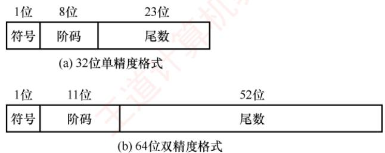
</div>

<p align="center"><em>图 2.14 IEEE 754 标准浮点数的格式</em></p>

　　32 位单精度格式包含 1 位符号 s、8 位阶码 e 和 23 位尾数 f；64 位双精度格式包含 1 位符号 s、11 位阶码 e 和 52 位尾数 f。基数隐含为 2；尾数用原码表示。对于规格化的二进制浮点数，尾数的最高位恒为 1。为提升精度，IEEE 754 不显式存储该位，而是将其隐含在小数点之前，称为隐藏位。因此，单精度格式的 23 位尾数实际提供了 24 位有效数字，双精度格式的 52 位尾数实际提供了 53 位有效数字。例如， $(12)_{10}=(1100)_{2}$ ，规格化后为 $1.1\times2^{3}$ 。其中，小数点前的 “1” 不实际存储，尾数 f 仅保存小数部分 “ $100\cdots0$ ”，而阶码保存的是指数 3 的编码值。

　　IEEE 754 标准的阶码采用移码表示，但偏置值并不是通常 n 位移码所用的 $2^{n-1}$ ，而是 $2^{n-1}-1$ 。因此，单精度和双精度格式的偏置值分别为 127 和 1023。上例中，指数真值为 3，因此在单精度格式中，阶码为 $127+3=130$ （82H）；在双精度格式中，阶码为 $1023+3=1026$ （402H）。

　　IEEE 754 标准的规格化单精度浮点数的真值为

$$
(- 1) ^ {s} \times 1. f \times 2 ^ {e - 1 2 7}
$$

　　规格化双精度浮点数的真值为

$$
(- 1) ^ {s} \times 1. f \times 2 ^ {e - 1 0 2 3}
$$

　　其中，规格化单精度浮点数的阶码 e 的取值范围为 1～254（8 位，全 0 和全 1 保留用于特殊值）；规格化双精度浮点数的阶码 e 的取值范围为 1～2046（11 位，保留用途相同）。

#### 2. IEEE 754 格式浮点数的表示范围

> **考点追踪：** IEEE 754 浮点数的表示范围和有效位（2017、2018、2024）

　　IEEE 754 规格化浮点数的表示范围见表 2.2。

　　表 2.2 IEEE 754 规格化浮点数的表示范围

<table><tr><td>格式</td><td>最小值</td><td>最大值</td></tr><tr><td>单精度</td><td><eq>e=1,f=0</eq><eq>1.0\times2^{1-127}=2^{-126}</eq></td><td><eq>e=254,f=.111...,1.111...1\times2^{254-127}=2^{127}\times(2-2^{-23})</eq></td></tr><tr><td>双精度</td><td><eq>e=1,f=0</eq><eq>1.0\times2^{1-1023}=2^{-1022}</eq></td><td><eq>e=2046,f=.1111...,1.111...1\times2^{2046-1023}=2^{1023}\times(2-2^{-52})</eq></td></tr></table>

　　当浮点运算结果的绝对值超过最大规格化数时，发生上溢（也称溢出），可分为：

- 正上溢：若结果为正且大于最大规格化正数。

- 负上溢：若结果为负且小于最小规格化负数（绝对值过大）。

　　IEEE 754 对上溢的处理规则: ① 将结果设为 $+\infty$ 或 $-\infty$ ; ② 置位浮点溢出异常标志, IEEE 754 规定，默认情况下不触发异常中断，程序继续执行，除非显式开启此类异常响应。

　　当运算结果的绝对值小于最小规格化正数但不为零时，发生下溢，可分为：

- 正下溢：若结果为正，且处在0到最小规格化正数之间。

- 负下溢：若结果为负，且处在最大规格化负数到0之间。

　　对下溢的处理采用渐进下溢机制：① 若结果落在非规格化数可表示范围内，则以非规格化形式存储，保留部分有效精度；② 若结果过于接近零（舍入后为零），则存储为+0或-0，并置位浮点下溢异常标志。同样，默认不响应下溢异常，程序继续运行，除非显式启用异常处理。

　　IEEE 754 标准的单精度浮点数的表示范围如图 2.15 所示。

<div align="center">
  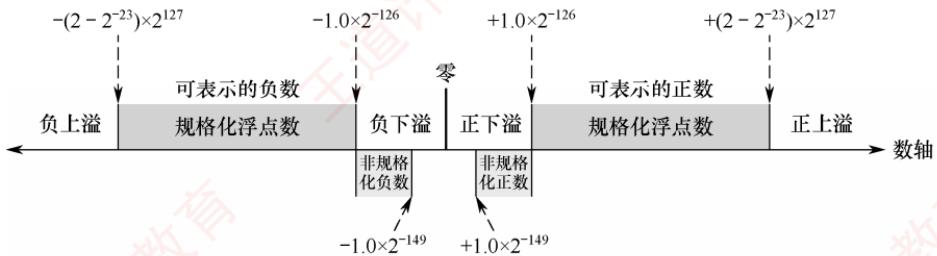
</div>

<p align="center"><em>图 2.15 IEEE 754 标准的单精度浮点数的表示范围</em></p>

#### 3. 几种特殊的 IEEE 754 浮点数

> **考点追踪：** IEEE 754 标准中的特殊浮点数（2017、2023）

　　在 IEEE 754 标准中，当阶码全为 0 或全为 1 时，浮点数具有特殊含义，如表 2.3 所示。

　　表 2.3 阶码全为 0 或全为 1 时 IEEE 754 浮点数的解释

<table><tr><td rowspan="2">值的类型</td><td colspan="4">单精度(32位)</td><td colspan="4">双精度(64位)</td></tr><tr><td>符号</td><td>阶码</td><td>尾数</td><td>值</td><td>符号</td><td>阶码</td><td>尾数</td><td>值</td></tr><tr><td>正零</td><td>0</td><td>0</td><td>0</td><td>0</td><td>0</td><td>0</td><td>0</td><td>0</td></tr><tr><td>负零</td><td>1</td><td>0</td><td>0</td><td>-0</td><td>1</td><td>0</td><td>0</td><td>-0</td></tr><tr><td>正无穷大</td><td>0</td><td>255(全1)</td><td>0</td><td>∞</td><td>0</td><td>2047(全1)</td><td>0</td><td>∞</td></tr><tr><td>负无穷大</td><td>1</td><td>255(全1)</td><td>0</td><td>-∞</td><td>1</td><td>2047(全1)</td><td>0</td><td>-∞</td></tr><tr><td>无定义数(非数)</td><td>0或1</td><td>255(全1)</td><td>f≠0</td><td>NaN</td><td>0或1</td><td>2047(全1)</td><td>f≠0</td><td>NaN</td></tr><tr><td>非规格化正数</td><td>0</td><td>0</td><td>f≠0</td><td><eq>2^{-126}(0.f)</eq></td><td>0</td><td>0</td><td>f≠0</td><td><eq>2^{-1022}(0.f)</eq></td></tr><tr><td>非规格化负数</td><td>1</td><td>0</td><td>f≠0</td><td><eq>-2^{-126}(0.f)</eq></td><td>1</td><td>0</td><td>f≠0</td><td><eq>-2^{-1022}(0.f)</eq></td></tr></table>

1）全0阶码全0尾数：+0/-0。符号s决定其正负，通常情况下+0和-0是等效的。

2）全1阶码全0尾数： $+\infty/-\infty$ 。 $+\infty$ 在数值上大于所有有限数， $-\infty$ 则小于所有有限数。引入无穷大数的目的是，使程序在溢出等异常情况下仍能继续执行。

3）全1阶码非0尾数：NaN（Not a Number）。表示一个没有定义的数，称为非数。

4）全0阶码非0尾数：非规格化数。非规格化数的特点是阶码为全0，不使用隐藏位，尾数字段不全为0。因此，单精度和双精度浮点数的指数分别为-126和-1022。非规格化数用于实现渐进下溢，填补0与最小规格化数之间的数值间隙。

> **考点追踪：** 实数与 IEEE 754 浮点数的相互转换（2011、2013、2020、2022、2023、2025）

　　【例 2.5】将十进制数-8.25 转换为 IEEE 754 单精度浮点数格式表示。

　　解:

　　IEEE 754 单精度浮点数的偏置值是 127；尾数最高位的 “1” 是被隐藏的。

　　先将-8.25转换为二进制，即 $-1000.01 = -1.00001 \times 2^{3}$ ，尾数部分取小数点后的23位（00001后补0至23位）；再计算阶码 $E$ ， $E - 127 = 3$ ，因此 $E = 130$ ，转换为二进制为10000010。

　　IEEE 754 单精度浮点数格式：符号（1 位）+ 阶码（8 位）+ 尾数（23 位），即为

$$
1; 1 0 0 0 0 0 1 0; 0 0 0 0 1 0 0 0 0 0 0 0 0 0 0 0 0 0 0 0 0
$$

　　因此，其单精度浮点数格式表示为 1100 0001 0000 0100 0000 0000 0000 0000 = C104 0000H。

　　【例 2.6】求 IEEE 754 单精度浮点数 C640 0000H 的值是多少。

　　解：

　　先将 C640 0000H 按二进制展开为

$$
1 1 0 0   0 1 1 0   0 1 0 0   0 0 0 0   0 0 0 0   0 0 0 0   0 0 0 0   0 0 0 0
$$

　　按 IEEE 754 单精度浮点数格式划分:

<table><tr><td>符号</td><td>阶码</td><td>尾数</td></tr><tr><td>1</td><td>1000 1100</td><td>100 0000 0000 0000 0000 0000</td></tr></table>

　　因此，符号 = 1 表示负数；阶码真值为 $1000\ 1100 - 0111\ 1111 = (0000\ 1101)_{2} = 13$ ；尾数真值为 $1 + (0.1)_{2} = 1.5$ （注意，尾数含隐藏位 1）。因此，该单精度浮点数的值为 $-1.5 \times 2^{13}$ 。

### 2.3.2 浮点数的加减运算

　　浮点数运算的特点是阶码与尾数分开处理，浮点数加减运算分为以下几个步骤。

> **考点追踪：** float 型能否通过左移实现乘以 2 运算（2017）；浮点数的加减运算（2009）

#### 1. 对阶

　　对阶的目的是使两个操作数的小数点位置对齐，即令它们的阶码相等，以便尾数可以直接相加减。对阶的原则是：小阶向大阶看齐，即将阶码较小的数的尾数右移，右移位数等于两阶码差的绝对值。对于 IEEE 754 标准的浮点数，对阶时需要进行移码减法运算，以求得阶码差。尾数右移时，仅移动数值位，符号位不参与移位；对于规格化数，隐藏位 1 会随尾数右移而进入小数部分，空出的高位补 0。为保证运算精度，移出的低位不应丢弃，而应保留并参与后续尾数运算。

> **注意**

　　若采用大阶向小阶看齐，则需将尾数左移，导致最高有效位被移出，造成不可逆的精度错误。

#### 2. 尾数加减

　　由于 IEEE 754 标准采用定点原码小数表示尾数，因此尾数加减运算实质上是定点原码小数的加减运算，应根据相应的规则执行。对于规格化数，在运算前还需要将隐藏位还原到尾数部分，形成完整的 1.f 形式。此外，对阶过程中为保持精度而保留的附加位也要参与尾数加减运算。

#### 3. 尾数规格化

　　为在浮点运算中最大限度保留有效数字，需要对运算结果进行规格化处理。所谓规格化，是指通过调整尾数与阶码，使浮点数的尾数满足最高有效位为1的形式。

　　IEEE 754 规格化尾数的形式为 $1 \times \ldots \times$ 。尾数相加减后可能出现两类非规格化结果：

$$
1. \times \dots \times + 1. \times \dots \times = 1 \times . \times \dots \times
$$

$$
1. \times \dots \times - 1. \times \dots \times = 0. 0 \dots 0 1 \times \dots \times
$$

1）右规：当结果为 $1 \times . \times \ldots \times$ 时，需要进行右规。尾数每右移一位，阶码加1。尾数右移时，最高位1被移到小数点前一位作为隐藏位，最后一位移出时，要考虑舍入。

2）左规：当结果为 $0.0 \ldots 01 \times \ldots \times$ 时，需要进行左规。尾数每左移一位，阶码减 1。可能需要左规多次，直到将第一位 1 移至小数点左边。

> **注意**

　　① 左规一次相当于乘以 2，右规一次相当于除以 2；② 需要右规时，只需进行一次。

#### 4. 舍入

　　在对阶和右规过程中，尾数右移可能导致低位丢失。为保证精度，移出的低位通常被保留用于中间计算。最终结果需通过舍入处理，还原为标准的 IEEE 754 格式。

　　为此，IEEE 754 引入三个辅助位以指导精确舍入。

1）保护位：紧邻尾数最低有效位之后的第一位，用于初步判断舍入方向。

2）舍入位：位于保护位之后，与保护位和粘滞位共同构成完整的舍入信息。

3）粘滞位：只要舍入位之后被移出的位中存在至少一个1，粘滞位就置为1，否则为0。IEEE754定义了四种可选的舍入模式。

1）就近舍入（默认方式）：选择最接近真实值的可表示数。若真实值恰好位于两个可表示数的正中间，则选择尾数最低有效位为0的那个（偶数）。具体规则：① 若保护位 = 0，直接舍去；② 若保护位 = 1 且（舍入位 = 1 或粘滞位 = 1），则尾数加1；③ 若保护位 = 1、舍入位 = 0、粘滞位 = 0，则在尾数末位为奇数时向其加1，以符合向偶数舍入的要求。

　　例如，运算后得到浮点数的临时尾数 $M_{1}$ ，舍入过程如下： $\mathbf{M}_1$

$$
M _ {1} = 1. \underline {{1 0 1 1 0 0 1 1 1 1 0 0 1 1 0 0 1 1 0 1 0 1 0}} \quad \mathbf {1 0 1}
$$

　　注意，下划线部分为保留的 23 位尾数，其后依次为保护位、舍入位、粘滞位。

　　由于保护位 = 1、舍入位 = 0、粘滞位 = 1，结果属于非中间值，需要向尾数加 1。加 1 后的 23 位尾数为 1011 0011 1100 1100 1101 011。

　　若运算后得到临时尾数 $M_{2}$ ，则舍入过程如下：

$$
M _ {2} = 1. \underline {{1 0 1 1 0 0 1 1 1 1 0 0 1 1 0 0 1 1 0 1 0 1 0}} \quad \mathbf {1 0 0}
$$

　　由于保护位 = 1、舍入位 = 0、粘滞位 = 0，结果恰好位于两个可表示数的正中间。此时尾数最低有效位为偶数，无须加 1。最终的 23 位尾数保持为 1011 0011 1100 1100 1101 010。

2）正向舍入：朝数轴 $+\infty$ 方向舍入，即选择数值更大的可表示数。

3）负向舍入：朝数轴-∞方向舍入，即选择数值更小的可表示数。

4）截断法：直接截取所需位数，丢弃后面的所有位，实现最为简单。对正数或负数来说，都是选择更接近原点的那个可表示数，也称为朝原点舍入。

#### 5. 溢出判断

> **考点追踪：** 浮点数运算时的溢出判断（2015）

　　在尾数规格化或舍入过程中，可能对阶码进行加减操作，因此需要判断指数是否溢出。在 IEEE 754 中，浮点数的溢出由阶码是否超出可表示范围决定；尾数溢出可通过右规修正，而真正的溢出仅发生在阶码上溢或下溢时。

1）上溢判断。尾数相加后若结果≥2，或舍入时尾数末位加1引发进位（如 $1.111\cdots+1=10.000\cdots$ ），则均需右规：尾数右移一位，阶码加1。若原阶码已为最大正规格化值（单精度阶码字段为11111110，对应真值+127），加1后变为11111111（该编码保留用于表示无穷大或NaN），则视为指数上溢，通常会引发异常。

2) 下溢判断。左规时尾数左移，阶码减 1。若阶码真值减至低于最小正规格化值（单精度 -126，双精度 -1022），则进入非规格化数范围（阶码字段为 0）。若结果进一步小于最小可表示非规格化数（如 $2^{-149}$ 或 $2^{-1074}$ ），则视为指数下溢，通常将结果置为机器零。

　　【例 2.7】设 x 和 y 为 float 型变量，x=10.5，y=-120.625，请给出 $x+y$ 的计算过程。
　　解：

$x = 10.5 = (1010.1)_2 = (1.0101)_2 \times 2^3$ 。其 IEEE 754 单精度：符号位为 0；阶码为 $3 + 127 = 130$ ，即 1000 0010；机器数（注意隐含尾数最高位）为 0;1000 0010;010 1000 0000 0000 0000 0000。

$y=-120.625=-(1111000.101)_{2}=-(1.111000101)_{2}\times2^{6}$ 。其 IEEE 754 单精度：符号位为 1，阶码为 $6+127=133$ ，即 1000 0101；机器数为 1;1000 0101;111 0001 010 0000 0000 0000。

1）对阶。求阶差 $E_{x} - E_{y} = -3$ 。故将 $x$ 的尾数右移 3 位，阶码调整为 $E_{y} = 133$ 。对阶后， $x$ 的尾数变为 0.0010 1010 0000 0000 0000 000 000 000（含保留的附加位），此时无隐藏位。

2）尾数相加。0.0010 1010 0000 0000 0000 000 000 000 000 + (-1.1110 0010 1000 0000 0000 000) = -1.1011 1000 1000 0000 0000 000 000 （注意，附加位参与运算，但不会存储）。

3）规格化。尾数相加结果-1.1011100010 $\cdots\times2^{6}$ ，已是规格化形式。

4）舍入。单精度尾数保留23位，附加位全为0，按就近舍入规则，直接截断。因此， $x + y$ 的机器数为1;1000 0101;1011 1000 1000 0000 0000 000。其真值为 $-(1.101110001)_2 \times 2^6 = -(1101110.001)_2 = -110.125$ 。

### 2.3.3 C 语言中的浮点数类型

> **考点追踪：** 不同类型数据转换后数值的变化（2010）

　　C 语言中的 float 型和 double 型分别对应 IEEE 754 单精度和双精度浮点数。long double 型通常对应扩展双精度格式，其长度和格式依赖于编译器与目标平台。在 C 语言中，表达式中的赋值、运算或比较操作会触发自动类型转换，常见的转换序列为 char→int→long→double 和 float→double，这些转换通常由范围和精度较低的类型向更高者进行，一般不会丢失信息。

　　当不同类型的数据混合运算时，遵循类型提升原则：较低类型自动转换为较高类型。例如，long 与 int 运算时，先将 int 转换为 long，然后进行运算，结果为 long；float 与 double 运算时，先将 float 转换为 double，结果为 double。这类由编译器自动完成的转换称为隐式类型转换。

> **考点追踪：** int 和 float 型的精度和范围分析（2017）

1）int 转 float 时，虽然不会发生溢出，但由于 float 尾数（含隐藏位）仅 24 位有效，而 int 为 32 位，当整数值的二进制有效位超过 24 位时，需做舍入处理，导致精度损失。

2）int 或 float 转 double 时，因 double 的有效位更多，通常能精确表示原值。

3）double转float时，一方面float的表示范围较小，大数值转换时可能发生溢出；另一方面float的尾数有效位变少，高精度数转换时会发生舍入误差。

4）float或double转int时，由于int没有小数部分，小数部分被直接丢弃（向零截断）；同时，若浮点数值超出int的表示范围，则会发生整数溢出。

　　不同数据类型之间的转换常隐藏不易察觉的精度损失或溢出风险，编程时需格外谨慎。

### 2.3.4 数据的宽度和存储

#### 1. 数据的宽度和单位

　　在计算机中，比特（bit，也称位，符号为 b）是最小的信息单位，表示一个二进制位（0 或 1）；字节（byte，符号为 B）是基本的存储和寻址单位，1 字节 = 8 比特。随着信息规模增大，常在 B（字节）或 b（位）前添加前缀以表示更大的容量，如 KB、MB、GB 等。在传统计算机系统中，这些前缀通常按 2 的幂定义，如 $1KB = 2^{10}B = 1024B$ 。

　　此外，字（word）也是常用的数据组织单位。它是由体系结构定义的逻辑单位，通常用于表示整数、地址等基本数据类型的宽度，其长度因架构而异，常见的有2、4或8字节。

　　与字不同，字长（也称机器字长）指 CPU 内部整数运算的数据通路的宽度，通常等于通用寄存器的宽度。字长反映计算机一次能处理的整数数据的位数，是衡量机器性能的重要指标。日常所说的 “32 位机” 或 “64 位机”，其中的 32 或 64 即指字长。例如，在 Intel x86 架构中，自 80386 起字长为 32 位（32 位机），但其体系结构仍将 16 位定义为一个字，32 位称为双字。这表明：字是架构层面的约定，而字长体现的是硬件的实际处理能力。

#### 2. 数据的“大端方式”和“小端方式”存储

　　在存储数据时，数据从低位到高位可以按从左到右排列，也可以按从右到左排列。因此，不宜用最左或最右来表征数据的最高位或最低位，通常使用最低有效字节（LSB）和最高有效字节（MSB）来分别表示数据的最低位和最高位。例如，在32位计算机中，一个int型变量i的机器数为01234567H，其最高有效字节MSB=01H，最低有效字节LSB=67H。

$$
\text {考点追踪} \quad \triangleright \text {数据的大小端存储（2016、2018、2019、2024、2025）}
$$

　　现代计算机普遍采用字节编址，即每个地址对应1字节。不同类型的数据占用不同字节数（如int和float占4字节，double占8字节），而程序中每个变量仅分配一个起始地址。假设变量i的地址为0800H，那么其4个字节01H、23H、45H、67H将占据连续的4个内存单元。这些字节在内存中的排列方式分为两种（见图2.16）：

<table><tr><td></td><td colspan="2">0800H</td><td>0801H</td><td>0802H</td><td colspan="2">0803H</td></tr><tr><td>大端方式</td><td>...</td><td>01H</td><td>23H</td><td>45H</td><td>67H</td><td>...</td></tr><tr><td></td><td colspan="2">0800H</td><td>0801H</td><td>0802H</td><td colspan="2">0803H</td></tr><tr><td>小端方式</td><td>...</td><td>67H</td><td>45H</td><td>23H</td><td>01H</td><td>...</td></tr></table>

<p align="center"><em>图 2.16 采用大端方式和小端方式存储数据</em></p>

> **考点追踪：** 根据存放顺序判断大小端方式（2019、2023）

1）大端方式（big endian）：MSB 存储在低地址，LSB 存储在高地址，字节顺序与数值的标准十六进制书写顺序一致。

2）小端方式（little endian）：LSB 存储在低地址，MSB 存储在高地址，字节顺序与标准书写顺序相反。

　　在分析机器代码时，需特别注意字节顺序。例如，以下是由反汇编器生成的一行代码：

<table><tr><td>4004d3: 01 05 64 94 04 08 add eax, 0x08049464</td></tr></table>

　　其中，4004d3 是指令地址，01 05 64 94 04 08 是指令的机器码，add eax, 0x08049464 是其汇编形式。指令的第二个操作数是立即数 0x08049464，其在内存中按地址递增顺序存储为：64H、94H、04H、08H。由于低地址存放的是 LSB（64H），高地址存放的是 MSB（08H），符合小端方式的特征。将这 4 个字节按小端规则重组，即可得到正确的立即数 0x08049464。因此，在阅读小端机器代码时，需要将连续字节按逆序组合才能还原其逻辑数值。

#### 3. 数据按“边界对齐”方式存储

　　在字长为 32 位的系统中，边界对齐要求数据的存储地址是其对齐值（通常等于该类型大小，单位：字节）的整数倍；字节可位于任意地址，半字地址须为 2 的倍数，字地址须为 4 的倍数。满足此条件时，CPU 可通过一次访存读取完整数据；否则，若数据跨越两个存储单元，则需两次访存并拼接字节，显著降低效率。为满足对齐要求，编译器会在必要时填充空白字节。这种 “以空间换时间” 的策略虽略微增加内存占用，但能大幅提升访问速度。

　　例如，数据序列 “字节 1、字节 2、字节 3、半字 1、半字 2、半字 3、字 1” 按边界对齐与非对齐方式存储的格式分别如图 2.17 和图 2.18 所示。

<table><tr><td>字节1</td><td>字节2</td><td>字节3</td><td>填充</td></tr><tr><td colspan="2">半字1</td><td colspan="2">半字2</td></tr><tr><td colspan="2">半字3</td><td colspan="2">填充</td></tr><tr><td colspan="4">字1</td></tr></table>

<p align="center"><em>图 2.17 按边界对齐方式存储</em></p>

<div align="center">
  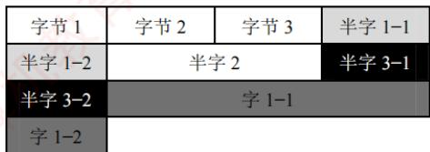
</div>

<p align="center"><em>图 2.18 按边界不对齐方式存储</em></p>

> **考点追踪：** 结构体的小端、边界对齐存储（2012、2020）

　　C 语言中，struct 型的内存布局遵循以下对齐规则：① 每个成员的起始地址必须是其对齐值的整数倍（例如：char 为 1，short 为 2，int 为 4）；② 整个结构体的大小必须是其最大成员对齐值的整数倍（不足则在尾部填充）。这确保了每个结构体成员的起始地址均满足对齐要求。

　　先看两个例子（基于 32 位 x86 环境，GCC 编译器）：

<table><tr><td>struct A{</td><td>struct B{</td></tr><tr><td>int a;</td><td>char b;</td></tr><tr><td>char b;</td><td>int a;</td></tr><tr><td>short c;</td><td>short c;</td></tr><tr><td>}</td><td>}</td></tr></table>

　　结果却是： $sizeof(A)=8,\quad sizeof(B)=12$ 。

　　设 B 从地址 0x0000 开始，成员 b 的对齐值是 1，其存放地址符合 0x0000%1 = 0；成员 a 的对齐值是 4，需对齐到 4 字节边界，故起始于 0x0004，占据 0x0004～0x0007；成员 c 的对齐值是 2，起始于 0x0008，占据 0x0008～0x0009。此外，结构体长度必须是最大对齐值（4）的整数倍，当前大小 10 字节，需填充至 12 字节（0x000A～0x000B）。

　　设 A 也从地址 0x0000 开始，成员 a 的对齐值是 4，存放在 0x0000～0x0003；成员 b 的对齐值是 1，存放在 0x0004；成员 c 的对齐值是 2，为满足 “起始地址% 对齐值 = 0” 的条件，只能存放在 0x0006～0x0007，总大小为 8 字节，无须尾部填充。

　　精简指令集计算机（RISC）普遍采用边界对齐，以支持高效的指令流水线。

### 2.3.5 本节习题精选

#### 一、单项选择题

01. 在 C 语言的不同类型的数据混合运算中，要先转换为同一类型后进行运算。设一表达式中包含有 int 型、long 型、char 型和 double 型的变量与数据，则表达式最后的运算结果是（），这 4 种类型数据的转换规律是（）。

- A. long, int→char→double→long
- B. long, char→int→long→double
- C. double, char→int→long→double
- D. double, char→int→double→long

02. 长度相同但格式不同的两种浮点数，假设前者阶码长、尾数短，后者阶码短、尾数长，其他规定均相同，则它们可表示的数的范围和精度为（）。

- A. 两者可表示的数的范围和精度相同
- B. 前者可表示的数的范围大但精度低
- C. 后者可表示的数的范围大且精度高
- D. 前者可表示的数的范围大且精度高

03. 浮点数的 IEEE 754 标准对尾数编码采用的是（）。

- A. 原码
- B. 反码
- C. 补码
- D. 移码

04. 在 IEEE 754 标准规定的 64 位浮点数格式中，符号位为 1 位，阶码为 11 位，尾数为 52 位，则它所能表示的最小规格化负数为（）。

- A. $-(2 - 2^{52}) \times 2^{-1023}$
- B. $-(2 - 2^{-52}) \times 2^{+1023}$
- C. $-1 \times 2^{-1024}$
- D. $-(1 - 2^{-52}) \times 2^{+2047}$

05. 按照 IEEE 754 标准规定的 32 位单精度浮点数 41A4C000H 对应的十进制数是（）。

- A. 4.59375
- B. -20.59375
- C. -4.59375
- D. 20.59375

06. 在浮点数编码表示中，（）在机器数中不出现，是隐含的。

- A. 阶码
- B. 符号
- C. 尾数
- D. 基数

07. 若某单精度浮点数、某原码、某补码、某移码的 32 位机器数均为 0xF0000000，则这些数从大到小的顺序是（）。

- A. 浮原补移
- B. 浮移补原
- C. 移原补浮
- D. 移补原浮

08. 采用规格化的浮点数最主要是为了（）。

- A. 增加数据的表示范围
- B. 方便浮点运算
- C. 防止运算时数据溢出
- D. 增加数据的表示精度

09. 设 $x$ 是采用 IEEE 754 标准表示的 32 位单精度浮点数，下列说法中正确的是（）。 I. 当 $|x| < 1.0 \times 2^{-126}$ 时， $x$ 将被置为机器零
 II. 当 $|x| > 1.0 \times 2^{127}$ 时，将发生溢出
 III. $x$ 所能表示的最小非规格化正数与最大非规格化负数的绝对值相等
 IV. $x$ 可表示的最大正数与最小负数的绝对值相等

- A. I、II、III、IV
- B. I、II
- C. II、III、IV
- D. III、IV

10. 在浮点运算中，下溢指的是（）。

- A. 运算结果的绝对值小于机器所能表示的最小绝对值
- B. 运算的结果小于机器所能表示的最小负数
- C. 运算的结果小于机器所能表示的最小正数
- D. 运算结果的最低有效位产生的错误

11. 判断浮点数运算是否溢出，取决于（）。

- A. 尾数是否上溢
- B. 尾数是否下溢
- C. 阶码是否上溢
- D. 阶码是否下溢

12. 假定采用 IEEE 754 标准中的单精度浮点数格式表示一个数为 45100000H，则该数的值是（）。

- A. $(+1.125)_{10}\times 2^{10}$
- B. $(+1.125)_{10}\times 2^{11}$
- C. $(+0.125)_{10}\times 2^{11}$
- D. $(+0.125)_{10}\times 2^{10}$

13. 已知 float 型采用 IEEE 754 单精度浮点数格式, 若 x、y 为 float 型变量, 且 x = -126, y = 15.75, 则执行语句 $z = x + y$ 时, 在浮点运算单元中进行对阶操作后的结果是 （）。

- A. x 不变，y 为 010000101, 0.001111110...0
- B. x 不变，y 为 010000110, 0.001111110...0
- C. y 不变，x 为 110000101, 0.001111110...0
- D. y 不变，x 为 110000110, 0.001111110...0

14. 假设 $x$ 和 $y$ 均是float型变量， $x$ 的真值为1， $y$ 的真值为0.1。已知0.1的二进制表示为无限循环小数0.00011[0011]…（重复因子为0011），某计算机采用IEEE754单精度格式及就近舍入方式，则计算 $x + y$ 的结果用十六进制机器数表示为（）。

- A. 3F800000
- B. 3F8C CCCD
- C. 3F8C CCCC
- D. 3F80000C

15. 在 IEEE 754 标准浮点格式中，非规格化浮点数表示为（）。

- A. 阶码为 0，尾数为任意非 0 的二进制数
- B. 阶码为 255，尾数全为 0
- C. 阶码为 255，尾数为任意非 0 的二进制数
- D. 阶码为 0，尾数全为 0

16. 在 IEEE 754 单精度浮点数加减运算的对阶阶段，若需将某操作数的尾数右移以对齐阶码，则关于其隐含的前导 “1”，以下说法正确的是（）。

- A. 隐含的 “1” 始终保留在最高位，在右移过程中不会被移出
- B. 隐含的 “1” 参与右移，但为保持规格化形式，移位后仍重置为 1
- C. 对阶移位前，需先将隐含的 “1” 恢复到尾数高位，再整体右移
- D. 非规格化数也包含隐含的 “1”，因此同样需要恢复后再移位

17. 在 IEEE 754 单精度浮点数加减运算中，若两个操作数阶码之差的绝对值为 $\Delta E$ ，当其大于或等于（）时，阶码较小的操作数对结果无影响，结果直接取阶码较大的操作数（假设采用就近舍入的方式）。

- A. 24
- B. 25
- C. 126
- D. 128

18. 下列关于机器字长的叙述中，错误的是（）。

- A. 机器字长是指CPU中定点运算数据通路的宽度
- B. 机器字长通常与CPU通用寄存器的位数一致
- C. 机器字长决定了定点数的表示范围和精度
- D. 机器字长对计算机硬件造价没有影响

19. 计算机中的信息按边界对齐方式存储的含义是（）。

- A. 信息的字节长度必须是整数
- B. 信息单元的字节长度必须是整数
- C. 信息单元的存储地址必须是整数
- D. 信息单元的存储地址是其字节长度的整数倍

20. 假设已定义三个 int 型变量 x、y 和 z，sizeof(int)=4，double 型采用 IEEE 754 双精度浮点数格式，变量 dx、dy 和 dz 的声明和初始化如下：

$$
\begin{array}{l} \text {double dx = (double)x;} \\ \text {double dy = (double)y;} \\ \text {double dz = (double)z;} \end{array}
$$

　　则下列关系表达式中永远为真的是（）。
 I. $\mathrm{dx} + \mathrm{dy} == (\mathrm{double})(\mathrm{x} + \mathrm{y})$ II. $(\mathrm{dx} + \mathrm{dy}) + \mathrm{dz} == \mathrm{dx} + (\mathrm{dy} + \mathrm{dz})$

- A. I和II
- B. 仅I
- C. 仅II
- D. 无正确项

21. 在按字节编址的计算机中，采用小端方式存储数据，某静态二维数组 b 的声明如下：
static short b[2][4] = {{2,9,-1,5},{3,1,-6,2}};
若 b 的首地址为 0x8049820，采用按行优先存储，地址 0x804982c 中的内容是（）。

- A. FAH
- B. FFH
- C. 00H
- D. 05H

22. 在按字节编址的计算机中，数据在存储器中以小端方式存放。假定 int 型变量 i 的地址为 08000000H，i 的机器数为 01234567H，地址 08000000H 单元的内容是（）。

- A. 01H
- B. 23H
- C. 45H
- D. 67H

23. 在按字节编址的 32 位计算机中，按边界对齐方式为以下结构型变量 x 分配存储空间：
struct cont_info{
    char id;
    unsigned post;
    char phone;
} x;

若 x 的首地址为 0x8049820，则成员变量 phone 的起始地址为（）。

- A. 0x8049828
- B. 0x8049826
- C. 0x8049825
- D. 0x8049822

24. 假定变量 i、f 的数据类型分别是 int、float。已知 $i = 12345$ ， $f = 1.2345 \times 2^{3}$ ，则在一个 32 位机器中执行下列表达式时，结果为“假”的是（）。

- A. $i == (\text{int})(\text{double})i$
- B. $f == (\text{float})(\text{double})f$
- C. $i == (\text{int})(\text{float})i$
- D. $f == (\text{float})(\text{int})f$

25. 有以下 C 语言代码段:
int m=13;
float a=12.6,x;
x=m/2+a/2;
printf("%f\n",x);

执行上述代码后，输出的 x 值为（）。

- A. 12.000000
- B. 12.300000
- C. 12.800000
- D. 12

26. 【2009 统考真题】浮点数加、减运算过程一般包括对阶、尾数运算、规格化、舍入和判断溢出等步骤。设浮点数的阶码和尾数均采用补码表示，且位数分别为 5 和 7（均含 2 位符号位）。若有两个数 $X = 2^{7} \times 29 / 32$ 和 $Y = 2^{5} \times 5 / 8$ ，则用浮点加法计算 $X + Y$ 的最终结果是（）。

- A. 00111 1100010
- B. 00111 0100010
- C. 01000 0010001
- D. 发生溢出

27. 【2010 统考真题】假定变量 i、f 和 d 的数据类型分别为 int、float 和 double（int 型用补码表示，float 型和 double 型分别用 IEEE 754 单精度和双精度浮点数格式表示），已知 i = 785、f = 1.5678E3、d = 1.5E100，若在 32 位机器中执行下列关系表达式，则结果为“真”的是（）。 I. i == (int)(float)i II. f == (float)(int)f III. f == (float)(double)f IV. (d + f) - d == f

- A. 仅 I 和 II
- B. 仅 I 和 III
- C. 仅 II 和 III
- D. 仅 III 和 IV

28. 【2011 统考真题】float 型数据通常用 IEEE 754 单精度格式表示。若编译器将 float 型变量 x 分配在一个 32 位浮点寄存器 FR1 中，且 x = -8.25，则 FR1 的内容是（）。

- A. C104 0000H
- B. C242 0000H
- C. C184 0000H
- D. C1C2 0000H

29. 【2012 统考真题】float 型（IEEE 754 单精度浮点数格式）能表示的最大正整数是（）。

- A. $2^{126} - 2^{103}$
- B. $2^{127} - 2^{104}$
- C. $2^{127} - 2^{103}$
- D. $2^{128} - 2^{104}$

30. 【2012 统考真题】某计算机存储器按字节编址，采用小端方式存放数据。假定编译器规定 int 型和 short 型长度分别为 32 位和 16 位，并且数据按边界对齐存储。某 C 语言程序段如下：

struct{
int a;
char b;
short c;

若 record 变量的首地址为 0xC008，地址 0xC008 中的内容及 record.c 的地址分别为（）。

- A. 0x00, 0xC00D
- B. 0x00, 0xC00E
- C. 0x11, 0xC00D
- D. 0x11, 0xC00E

31. 【2013 统考真题】某数采用 IEEE 754 单精度浮点数格式表示为 C640 0000H，则该数的值是（）。

- A. $-1.5 \times 2^{13}$
- B. $-1.5 \times 2^{12}$
- C. $-0.5 \times 2^{13}$
- D. $-0.5 \times 2^{12}$

32. 【2014 统考真题】float 型数据常用 IEEE 754 单精度浮点格式表示。假设两个 float 型变量 x 和 y 分别存放在 32 位寄存器 f1 和 f2 中，若 $(f1) = CC90\ 0000H, (f2) = B0C0\ 0000H$ ，则 x 和 y 之间的关系为（）。

- A. x < y 且符号相同
- B. x < y 且符号不同
- C. x > y 且符号相同
- D. x > y 且符号不同

33. 【2015 统考真题】下列有关浮点数加减运算的叙述中，正确的是（）。 I. 对阶操作不会引起阶码上溢或下溢 II. 右规和尾数舍入都可能引起阶码上溢 III. 左规时可能引起阶码下溢 IV. 尾数溢出时结果不一定溢出

- A. 仅 II、III
- B. 仅 I、II、IV
- C. 仅 I、III、IV
- D. I、II、III、IV

34. 【2016 统考真题】某计算机字长为 32 位，按字节编址，采用小端方式存放数据。假定有一个 double 型变量，其机器数表示为 1122 3344 5566 7788H，存放在以 0000 8040H 开始的连续存储单元中，则存储单元 0000 8046H 中存放的是（）。

- A. 22H
- B. 33H
- C. 77H
- D. 66H

35. 【2018 统考真题】IEEE 754 单精度浮点格式表示的数中，最小的规格化正数是（）。

- A. $1.0 \times 2^{-126}$
- B. $1.0 \times 2^{-127}$
- C. $1.0 \times 2^{-128}$
- D. $1.0 \times 2^{-149}$

36. 【2018 统考真题】某 32 位计算机按字节编址，采用小端方式。若语句 “int i = 0;” 对应指令的机器代码为 “C7 45 FC 00 00 00 00”，则语句 “int i = -64;” 对应指令的机器代码是（）。

- A. C7 45 FC C0 FF FF FF
- B. C7 45 FC 0C FF FF FF
- C. C7 45 FC FF FF FF C0
- D. C7 45 FC FF FF FF 0C

37. 【2020 统考真题】在按字节编址、采用小端方式的 32 位计算机中，按边界对齐方式为以下 C 语言结构型变量 a 分配存储空间：
struct record{
    short x1;
    int x2;
} a;

若 a 的首地址为 2020 FE00H，a 的成员变量 x2 的机器数为 1234 0000H，则其中 34H 所在存储单元的地址是（）。

- A. 2020 FE03H
- B. 2020 FE04H
- C. 2020 FE05H
- D. 2020 FE06H

38. 【2020 统考真题】已知有符号整数用补码表示，float 型数据用 IEEE 754 标准表示，假定变量 x 的类型只可能是 int 或 float，当 x 的机器数为 C800 0000H 时，x 的值可能是（）。

- A. $-7 \times 2^{27}$
- B. $-2^{16}$
- C. $2^{17}$
- D. $25 \times 2^{27}$

39. 【2021 统考真题】下列数值中，不能用 IEEE 754 浮点格式精确表示的是（）。

- A. 1.2
- B. 1.25
- C. 2.0
- D. 2.5

40. 【2022 统考真题】-0.4375 的 IEEE 754 单精度浮点数表示为（）。

- A. BEE0 0000H
- B. BF60 0000H
- C. BF70 0000H
- D. C0E0 0000H

41. 【2023 统考真题】若short型变量 $x = -8190$ ，则 $\mathbf{x}$ 的机器数是（）。

- A. E002H
- B. E001H

- C. 9FFFH
- D. 9FFEH

42. 【2023 统考真题】已知float型变量用IEEE754单精度浮点数格式表示。若float型变量x的机器数为80200000H，则x的值是（）。

- A. $-2^{-128}$
- B. $-1.01\times 2^{-127}$
- C. $-1.01\times 2^{-126}$
- D. 非数（NaN）

43. 【2024 统考真题】某科学实验中，需要使用大量的整型参数，为了在保证表数精度的基础上提高运算速度，需要选择合理的数据表示方法。若整型参数 $\alpha$ 、 $\beta$ 的取值范围分别为 $-2^{20} \sim 2^{20}$ 、 $-2^{40} \sim 2^{40}$ ，则在下列选项中， $\alpha$ 、 $\beta$ 最适合采用的数据表示方法分别是（）。

- A. 32 位整数、32 位整数
- B. 单精度浮点数、单精度浮点数
- C. 32 位整数、双精度浮点数
- D. 单精度浮点数、双精度浮点数

44. 【2025 统考真题】已知 float 型变量用 IEEE 754 单精度浮点数格式表示。若 float 型变量 x 的机器数为 4730 0000H，则 x 的值是（）。

- A. $0.375 \times 2^{14}$
- B. $1.375 \times 2^{14}$
- C. $0.375 \times 2^{15}$
- D. $1.375 \times 2^{15}$

45. 【2025 统考真题】某 32 位计算机按字节编址，采用小端方式存放数据，编译器按边界对齐方式为下列 C 语言结构型数组变量 employee 分配存储空间。

```txt
struct record {
    int id;
    char name[10];
    int salary;
} employee[200];
```

若 employee 的首地址为 0000 A0B0H, employee[l].id 的机器数为 1234 5678H，则该机器数中的 56H 所在存储单元的地址是（）。

- A. 0000 A0C3H
- B. 0000 A0C4H
- C. 0000 A0C5H
- D. 0000 A0C6H

#### 二、综合应用题

01. 现有一计算机字长 32 位（ $D_{31} \sim D_{0}$ ），符号位是最高位。对于二进制 1000 1111 1110 1111 1100 0000 0000 0000，

1）表示一个补码整数，其十进制值是多少？

2）表示一个无符号整数，其十进制值是多少？

3）表示一个 IEEE 754 标准的单精度浮点数，其值是多少？

02. 假定变量 i 是一个 32 位的 int 型整数，f 和 d 分别为 float 型（32 位）和 double 型（64 位）实数。分析下列各布尔表达式，说明结果是否在任何情况下都是 “true”。

1) i == (int) ((double) i)

2) f== (float)((int) f)

3) $f == (\text{float}) ((\text{double}) f)$

4) d == (double) ((float) d)

03. 已知两个实数 $\mathrm{x} = -68$ ， $\mathrm{y} = -8.25$ ，它们在 C 语言中定义为 float 型变量，分别存放在寄存器 A 和 B 中。另外，还有两个寄存器 C 和 D。A、B、C、D 都是 32 位的寄存器。请问（要求用十六进制表示二进制序列）：

1）寄存器A和B中的内容分别是什么？

2）x 和 y 相加后的结果存放在寄存器 C 中，寄存器 C 中的内容是什么？

3）x 和 y 相减后的结果存放在寄存器 D 中，寄存器 D 中的内容是什么？

04. 对下列每个 IEEE 754 单精度数值，解释它们所表示的是哪种数字类型（规格化数、非规格化数、无穷大、0）。当它们表示某个具体数值时，请给出该数值。

1）0000 0000 0000 0000 0000 0000 0000 0000

3) 1000 0000 0100 0000 0000 0000 0000 0000

4）1111 1111 1000 0000 0000 0000 0000 0000

05. 【2017 统考真题】已知 $f(n)=\sum_{i=0}^{n}2^{i}=2^{n+1}-1=\overbrace{11\cdots1B}^{n+1\text{位}}$ ，计算 $f(n)$ 的 C 语言函数 fl 如下：

```txt
int f1(unsigned n) {
    int sum=1, power=1;
    for (unsigned i=0; i<=n-1; i++) {
    power *= 2;
    sum += power;
    }
    return sum;
}
```

　　将 f1 中的 int 都改为 float，可得到计算 f(n) 的另一个函数 f2。假设 unsigned 型和 int 型数据都占 32 位，float 型数据采用 IEEE 754 单精度标准。请回答下列问题：

1）当 $n = 0$ 时，fl会出现死循环，为什么？若将fl中的变量i和n都定义为int型，则fl是否还会出现死循环？为什么？

2）f1(23)和f2(23)的返回值是否相等？机器数各是什么（用十六进制表示）？

3）f1(24)和f2(24)的返回值分别为33554431和33554432.0，为什么不相等？

4） $f(31)=2^{32}-1$ ，而 $f_{1}(31)$ 的返回值却为 -1，为什么？若使 $f_{1}(n)$ 的返回值与 $f(n)$ 相等，则最大的 n 是多少？

5）f2(127)的机器数为 7F80 0000H，对应的值是什么？若使 f2(n) 的结果不溢出，则最大的 n 是多少？若使 f2(n) 的结果精确（无舍入），则最大的 n 是多少？

### 2.3.6 答案与解析

#### 一、单项选择题

**01. C**

　　不同类型的数据混合运算时，遵循的原则是“类型提升”，即较低类型转换为较高类型，最终结果为 double 型。4 种类型数据的转换规律为 char→int→long→double。

　　例如，long 型数据与 int 型数据一起运算时，需先将 int 型转换为 long 型，然后两者再进行运算，结果为 long 型。float 型数据和 double 型数据一起运算时，虽然它们同为实型，但两者精度不同，仍要先将 float 型转换为 double 型再进行运算，结果亦为 double 型。所有这些转换都是由系统自动进行的，这种转换通常称为隐式转换。

　　注意在强制类型转换中，从 int 型转换为 float 型时，虽然不会发生溢出，但因尾数位数的关系，可能有数据舍入，而转换为 double 型则能保留精度。double 型转换为 float 型时亦是如此。从 float 型或 double 型转换为 int 型时，小数部分被截断，且由于 int 型的表示范围更小，还可能发生溢出。

**02. B**

　　在浮点数总位数不变的情况下，阶码位数越多，尾数位数越少；即表示的数的范围越大，精度越差（数变稀疏）。

**03. A**

　　IEEE 754 标准中尾数采用原码表示，阶码部分用移码表示。

**04. B**

　　长浮点数，其阶码为11位，尾数为52位，采取隐藏位策略，因此其最小规格化负数为阶码取最大值 $2^{+1023}$ （ $1023=2^{11-1}-1$ ），尾数取最大值 $2-2^{-52}$ （注意其有隐藏位要加1），符号位为负。

**05. D**

　　在 IEEE 754 单精度浮点数中，最高位为符号位；其后是 8 位阶码，以 2 为底，用移码表示，阶码的偏置值为 127；其后 23 位是尾数数值位。对于规格化的二进制浮点数，数值的最高位总是 “1”，为了能使尾数多表示一位有效值，将这个 “1” 隐藏，因此尾数数值实际上是 24 位。隐藏的 “1” 是一位整数。在浮点格式中表示出来的 23 位尾数是纯小数，用原码表示。41A4C000H 写成二进制为 0100 0001 1010 0100 1100 0000 0000 0000，第一位为符号位 0，表示是正数。之后的 8 位 1000 0011 表示阶码，真值为 $(100)_{B}$ ，即 4。剩下的是隐藏了最高位 1 的尾数，所以为 1.010 0100 1100 0000 0000 0000，数值左移四位后整数部分 10100 表示为 20。

**06. D**

　　在浮点数编码表示中，基数的值是约定好的，因此将其隐含。

**07. D**

　　这个机器数的最高位为1，对于原码、补码、单精度浮点数而言为负数，对于移码而言为正数，所以移码最大，而补码为 $-2^{28}$ ，原码为 $-(2^{30}+2^{29}+2^{28})$ ，单精度浮点数为 $-1.0\times2^{97}$ ，大小依次递减。

**08. D**

　　与非规格化浮点数相比，采用规格化浮点数的目的主要是为了增加数据的表示精度。

**09. D**

　　IEEE 754 单精度浮点数的阶码偏置为 127，规格化数的阶码范围为 1～254（对应真值指数 -126～+127），非规格化数用于表示接近零的数值。 $1.0 \times 2^{-126}$ 是最小规格化正数，最小非规格化正数为 $1.0 \times 2^{-149}$ ，仅当 $|x|$ 小于此值时才舍入为机器零。最大可表示正数为 $(2 - 2^{-23}) \times 2^{127}$ ，仅当 $|x|$ 超过该值时才溢出。IEEE 754 浮点数的表示范围在正负区间完全对称，故说法 III 和 IV 正确。

**10. A**

　　运算结果在 0 至规格化最小正数之间时称为正下溢，运算结果在 0 至规格化最大负数之间时称为负下溢，正下溢和负下溢统称下溢。

**11. C**

　　判断浮点数运算是否溢出，取决于阶码是否上溢。阶码下溢可以通过非规格化数来表示。尾数上溢或下溢，可以通过左移或右移进行调整。

**12. B**

　　写成二进制表示为 0100 0101 0001 0000 0000 0000 0000 0000，第一位为符号位，0 表示正数，随后 8 位（float 型）1000 1010 是用移码表示的阶码，因此减去 0111 1111 后得十进制数 11，而 IEEE 754 标准中单精度浮点数在阶码不为 0 时隐藏 1，因此尾数为 $(1.0010)_{\mathrm{B}} = (1.125)_{\mathrm{D}}$ ，因此该数值为 $(+1.125)_{10} \times 2^{11}$ 。

**13. A**

　　规格化 IEEE 754 浮点数尾数部分的数值范围为[1, 2)， $x = -1111110B = -1.111110B \times 2^{6}$ ， $y = 1111.11B = 1.11111B \times 2^{3}$ ，所以浮点数 x、y 的阶数分别为 6 和 3。对阶操作是小阶码向大阶码看齐，即 y 的阶数变为 6，移码表示为 $6 + 127 = 133$ ，即 10000101B，y 的尾数右移 3 位，变为 0.0011111B。

**14. B**

$x=1.0=(1.0)_{2}\times2^{0}$ ，尾数为 $1.00\ldots0$ （隐含的1加上23个0）。 $y=0.1=(1.10011\ldots)_{2}\times2^{-4}$ ，尾数为 $1.100\ 1100\ 1100\ 1100\ 1100\ 1101$ （最低有效位之后的3位为110，故末位加1）。执行 $x+y$ 时对阶：将y的尾数右移4位使其与x同阶 $(2^{0})$ ，得0.000 1100 1100 1100 1100 1100 1101。将其与x的尾数 $1.00\ldots0$ 相加，得1.000 1100 1100 1100 1100 1100 1101。根据1101进行就近舍入，末位加1，得1.000 1100 1100 1100 1100 1101。最终编码为：符号位为0，阶码为 $127=0111\ 1111$ ，尾数为（隐含 $1$ ）000 1100 1100 1100 1100 1101，组合并转换成十六进制数为3F8C CCCD。

**15. A**

　　在IEEE754标准浮点格式中，阶码全为0，尾数不全为0表示非规格化数，非规格化数可用于处理阶码下溢，使得出现比最小规格化数还小的数时程序也能继续进行下去。

**16. C**

　　IEEE 754 单精度规格化数的有效数字为 24 位（ $1.f_{22}f_{21}\cdots f_0$ ），其中前导“1”是隐含的，未实际存储。对阶时，必须先恢复该隐含位，与 23 位尾数拼接成 24 位，再整体右移（高位补 0）以对齐阶码。因此，前导“1”会随尾数一同参与移位，可能被移出，选项 A 错误，选项 C 正确。右移是逻辑右移，高位补 0；若补 1，将导致数值错误，选项 B 错误。非规格化数无隐藏位，选项 D 错误。

**17. B**

　　IEEE 754 单精度浮点数的有效数字为 24 位（含隐含前导 1）。对阶时，若阶差 $\Delta E \geqslant 25$ ，则小阶操作数的隐含 1 将右移至舍入位或更低位，导致保护位为 0。根据就近舍入规则，此时无论舍入位和粘滞位为何值，均直接截断，不会进位。因此，结果直接取大阶操作数。

**18. D**

　　机器字长是 CPU 一次能处理的定点整数位数，通常等于通用寄存器位数和定点运算数据通路宽度。机器字长越长，定点数的表示范围越大，可精确表示的整数位数越多。机器字长直接影响寄存器、ALU、总线等硬件的位宽，字长越长，电路规模越大，硬件成本显著增加。

**19. D**

　　信息在存储器中按边界对齐方式存储的含义是信息单元的存储地址是其字节长度的整数倍。这样可以保证对一个字长数据的读/写只需要一次存储器访问，提高了访存效率，但有时会导致存储空间的浪费。因此，这是一种以空间换时间的办法。

**20. D**

　　说法 I 非永真，因为 $x + y$ 可能溢出，而 $dx + dy$ 不会溢出，两者结果可能不同。说法 II 永真，由于 dx、dy 和 dz 均由 32 位 int 转换而到，double 可精确地表示 int，且对阶时尾数移动位数不会超过 52 位，因此尾数不会舍入，不会发生大数吃小数 [当两浮点数阶码相差超过尾数位宽（24/53 位）时，小阶操作数在右移后有效位全部丢失，导致加法结果等于大阶操作数] 的情况。

**21. A**

　　二维数组 b 的元素是 short 型，占 2 字节，采用按行优先存储，b[0][0]的地址为 0x8049820，b[0][1]的地址为 0x8049822，以此类推，b[1][2]的地址为 0x804982c。b[1][2]的值为 -6，补码表示为 11111111 11111010，采用小端方式存储，因此地址 0x804982c 存放的是低位字节 FAH。

**22. D**

　　小端方式是将最低有效字节存储在最小位置。在数 01234567H 中，最低有效字节为 67H。

**23. A**

　　结构体按边界对齐存放的要求：数据成员的起始地址是其数据类型大小的整数倍，char 型占 1 字节，char 型的起始地址必须是 1 字节的整数倍；unsigned 型占 4 字节，所以 unsigned 型的起始地址必须是 4 字节的整数倍。据此分析，id 的起始地址为 0x8049820，post 的起始地址为 0x8049824，所以 phone 的起始地址为 0x8049828。结构体 x 的存放方式如下所示。

<table><tr><td rowspan="2">地址</td><td>8049820H</td><td>8049821H</td><td>8049822H</td><td>8049823H</td></tr><tr><td>char</td><td></td><td></td><td></td></tr><tr><td rowspan="2">地址</td><td>8049824H</td><td>8049825H</td><td>8049826H</td><td>8049827H</td></tr><tr><td colspan="4">post</td></tr><tr><td rowspan="2">地址</td><td>8049828H</td><td>8049829H</td><td>804982AH</td><td>804982BH</td></tr><tr><td>phone</td><td></td><td></td><td></td></tr></table>

**24. D**

　　对于选项 A 和 B, int 型的有效位数不会超过 31 位, float 型的有效位数比 double 型的小得多, 因此都能精确转换为具有 53 位有效位的 double 型。对于选项 C, $12345 < 1024 \times 16 = 2^{14}$ , 因此 12345 对应的二进制的位数一定小于 14, 因此可精确转换为具有 24 位有效位的 float 型。对于选项 D, f = 1234.5, 转换为 int 型后, 小数点后面的数字丢失, 因此与原来的 f 不相等。

**25. B**

　　整数与整数运算，结果为整数，所以 m/2 的结果为 6。实数与整数运算，结果为实数，所以 a/2 的结果为 6.3，相加为 12.3。C 语言的输出格式可使输出值保留小数点后 6 位，输出为 12.300000。

**26. D**

　　X 的浮点数格式为 00, 111; 00, 11101（分号前为阶码，分号后为尾数），Y 的浮点数格式为 00, 101; 00, 10100。然后根据浮点数的加法步骤进行运算。

　　① 对阶。X、Y 阶码相减，即 00, 111 - 00, 101 = 00, 111 + 11, 011 = 00, 010，可知 X 的阶码比 Y 的阶码大 2（这一步可直接目测）。根据小阶码向大阶码看齐的原则，将 Y 的阶码加 2，尾数右移 2 位，将 Y 变为 00, 111; 00, 00101。

　　② 尾数相加。即 $00, 11101 + 00, 00101 = 01, 00010$ ，尾数相加结果符号位为 01，因此需要右规。

　　③ 规格化。将尾数右移 1 位，阶码加 1，得 $X + Y$ 为 01,000;00,10001。

　　④ 判断溢出。阶码符号位为 01，说明发生溢出。

　　本题容易误选选项 B、C，因为选项 B、C 本身并无计算错误，只是它们不是最终结果，选项 B 少了第 3 步和第 4 步，选项 C 少了第 4 步。

**27. B**

　　题中三种数据类型强制类型转换的顺序为 $int \rightarrow float \rightarrow double$ 。若将 float 型转换为 int 型，小数位部分会被舍去，int 型是精确到 32 位的整数，而 float 型只保存到 $1 + 23$ 位，因此一个 32 位的 int 型整数在转换为 float 型时可能有损失，具体判断方法如下：先将 int 型整数转换为二进制真值，然后将真值写为 $\pm 1.x \ldots x \times 2^{n}$ 的形式，若小数点后的位数超过 23 位，则转换为 float 型会发生精度损失。本题中 i = 785，转换为二进制真值为 $1.100010001 \times 2^{9}$ ，小数点后只有 9 位，不会发生精度损失，说法 I 正确。对于说法 II，将 float 型的 f 转换为 int 型，小数点后的数位丢失，结果非真。double 型的精度和范围都比 float 型的大，float 型转换为 double 型不会有损失，说法 III 正确。对于说法 IV，初看似乎没有问题，但浮点运算 d + f 时需要对阶，对阶后 f 的尾数有效位被舍去而变为 0，因此 d + f 仍然为 d，再减去 d 后结果为 0，结果非真。注意，从 int 型转换为 float 型时，虽然不会发生溢出，但由于尾数位数的关系，可能有数据舍入，影响精度，而转换为 double 型则能保留精度。

**28. A**

　　本题的目的在于考查 IEEE 754 单精度浮点数的表示。首先将 x 转换为二进制数，即 -1000.01 = -1.00001 × 2 $^{3}$ ，然后计算阶码 E，根据 IEEE 754 单精度浮点数格式，有 E - 127 = 3，因此 E = 130，转换为二进制数，即 10000010。最后，根据 IEEE 754 标准，最高位的 1 是被隐藏的。

　　IEEE 754 单精度浮点数格式：符号（1 位）+ 阶码（8 位）+ 尾数（23 位）。

　　因此 FR1 的内容为 1; 1000 0010; 0000 1000 0000 0000 0000 000。

　　即 1100 0001 0000 0100 0000 0000 0000 0000 = C104 0000H。

　　本题易误选选项 D，未考虑 IEEE 754 标准隐藏最高位 1 的情况，把偏置值认为是 128。

**29. D**

　　IEEE 754 单精度浮点数是尾数用采取隐藏位策略的原码表示，且阶码用移码（偏置值为 127）表示的浮点数。规格化短浮点数的真值为 $(-1)^{S} \times 1.m \times 2^{E-127}$ ，其中 S 为符号位，阶码 E 的取值为 1～254（8 位表示），尾数 m 为 23 位，共 32 位；因此，float 型能表示的最大整数是 $1.111 \ldots 1 \times 2^{254-127} = 2^{127} \times (2 - 2^{-23}) = 2^{128} - 2^{104}$ 。

　　【另解】IEEE 754 单精度浮点数格式如下图所示。

<table><tr><td>符号(1)</td><td>阶码(8)</td><td>尾数(23)</td></tr></table>

　　表示最大正整数时：符号取 0；阶码取最大值 127；尾数部分隐藏了整数部分的“1”，23位尾数全取 1 时尾数最大，为 $2 - 2^{-23}$ ，此时浮点数的大小为 $(2 - 2^{-23}) \times 2^{127} = 2^{128} - 2^{104}$ 。

**30. D**

　　尽管 record 大小为 7B（成员 a 有 4B，成员 b 有 1B，成员 c 有 2B），因为数据按边界对齐方式存储，所以 record 共占用 8B。record.a 的十六进制表示为 0x00000111，因为采用小端方式存放数据，所以地址 0xC008 中的内容应为低字节 0x11；record.b 只占 1B，后面的 1B 留空；record.c 占 2B，因此其地址为 0xC00E。各字节的存储分配如下表所示。

<table><tr><td>地址</td><td>0xC008</td><td>0xC009</td><td>0xC00A</td><td>0xC00B</td></tr><tr><td>内容</td><td>record.a (0x11)</td><td>record.a (0x01)</td><td>record.a (0x00)</td><td>record.a (0x00)</td></tr><tr><td>地址</td><td>0xC00C</td><td>0xC00D</td><td>0xC00E</td><td>0xC00F</td></tr><tr><td>内容</td><td>record.b</td><td>-</td><td>record.c</td><td>record.c</td></tr></table>

**31. A**

　　IEEE 754 单精度浮点数格式为 C640 0000H，二进制格式为 1100 0110 0100 0000 0000 0000 0000 0000，转换为标准的格式为

<table><tr><td>符号</td><td>阶码</td><td>尾数</td></tr><tr><td>1</td><td>1000 1100</td><td>100 0000 0000 0000 0000 0000</td></tr></table>

　　符号为 1 表示负数；阶码为 1000 1100 - 0111 1111 = 0000 1101 = 13；尾数为 1.5（注意其有隐藏位，要加 1）。因此，浮点数的值为 $-1.5 \times 2^{13}$ 。

**32. A**

　　(f1)和(f2)对应的二进制分别是(110011001001...) $_{2}$ 和(101100001100...) $_{2}$ ，根据 IEEE 754 浮点数标准，可知(f1)的符号为 1，阶码为 10011001，尾数为 1.001，而(f2)的符号为 1，阶码为 01100001，尾数为 1.1，可知两数均为负数，符号相同，B、D 排除；(f1)的绝对值为 $1.001 \times 2^{26}$ ，(f2)的绝对值为 $1.1 \times 2^{-30}$ ，(f1)的绝对值比(f2)的绝对值大，而符号为负，真值大小相反，即(f1)的真值比(f2)的真值小，即 x < y。

**33. D**

　　对阶是较小的阶码向较大的阶码对齐，所以对阶后的阶码是当前那个较大的阶码而不会导致阶码溢出，说法 I 正确。右规和尾数舍入过程，阶码加 1 而可能上溢，说法 II 正确，同理说法 III 也正确。尾数溢出时可能仅产生误差，结果不一定溢出，说法 IV 正确。

**34. A**

　　大端方式：一个字中的高位字节存放在内存中这个字区域的低地址处。小端方式：一个字中的低位字节存放在内存中这个字区域的低地址处。各字节的存储分配如下表所示。

<table><tr><td>地址</td><td>0000 8040H</td><td>0000 8041H</td><td>0000 8042H</td><td>0000 8043H</td></tr><tr><td>内容</td><td>88H</td><td>77H</td><td>66H</td><td>55H</td></tr><tr><td>地址</td><td>0000 8044H</td><td>0000 8045H</td><td>0000 8046H</td><td>0000 8047H</td></tr><tr><td>内容</td><td>44H</td><td>33H</td><td>22H</td><td>11H</td></tr></table>

　　从而存储单元 0000 8046H 中存放的是 22H。

**35. A**

　　IEEE 754 单精度浮点数的符号位、阶码位、尾数位（省去正数位 1）所占的位数分别是 1、8、23。最小正数，符号位取 0，移码的取值范围是 1～254，取 1，得阶码 1-127=-126（127 为我们规定的偏置值），尾数取全 0，最终推出最小规格化正数为 A。

**36. A**

　　按字节编址，采用小端方式，低位的数据存储在低地址位、高位的数据存储在高地址位，并且按照一字节相对不变的顺序存储。由题意，存储0的位数是后32位，则我们只需要把-64的补码按字节存储在其中即可，而-64表示成32位的十六进制是FFFFFFC0，根据小端方式的特点，低位字节存储在低地址位，就是C0FFFFFF。

**37. D**

　　在 32 位计算机中，按字节编址，根据小端方式和按边界对齐的定义，变量 a 的存放方式：

<table><tr><td rowspan="2">地址</td><td>2020 FE00H</td><td>2020 FE01H</td><td>2020 FE02H</td><td>2020 FE03H</td></tr><tr><td>未知</td><td>未知</td><td></td><td></td></tr><tr><td>说明</td><td>x1 (LSB)</td><td>x1 (MSB)</td><td></td><td></td></tr><tr><td rowspan="2">地址</td><td>2020 FE04H</td><td>2020 FE05H</td><td>2020 FE06H</td><td>2020 FE07H</td></tr><tr><td>00H</td><td>00H</td><td>34H</td><td>12H</td></tr><tr><td>说明</td><td>x2 (LSB)</td><td></td><td></td><td>x2 (MSB)</td></tr></table>

　　于是，34H 所在存储单元的地址为 2020 FE06H。

**38. A**

C800 0000H = 1100 1000 0000 0000 0000 0000 0000 0000 0000。

　　将其转换为对应的 float 型或 int 型。

1）若为float型，则尾数隐藏最高位1，符号为1表示负数，阶码 $1001\ 0000 = 2^{7} + 2^{4} = 128 + 16$ ，再减去偏置值127得到17，算出 $x$ 值为 $-2^{17}$ 。

2）若为 int 型，则有符号补码，为负数，数值部分取反加 1，得 011 1000 0000 0000 0000 0000 0000 0000，算出 x 值为 $-7 \times 2^{27}$ 。

**39. A**

　　使用排除法。选项 B: $1.25 = 1.01B \times 2^{0}$ ; 选项 C: $2.0 = 1.0B \times 2^{1}$ ; 选项 D: $2.5 = 1.01B \times 2^{1}$ 。因此，选项 B、C 和 D 均可以用 IEEE 754 浮点格式精确表示。选项 A 的十进制小数 1.2 转换为二进制的结果是无限循环小数 1.001100110011…，无法用精度有限的 IEEE 754 浮点格式精确表示。

**40. A**

　　IEEE 754 单精度浮点数格式中依次为符号 1 位、阶码 8 位（偏置值 127）、尾数 23 位（隐藏 1 位）。 $-0.4375 = -1.75 \times 2^{-2}$ ，保证小数点前是 1。根据单精度浮点数格式，符号为 1；阶码为移码表示， $-2 + 127 = 125$ ，写成 8 位二进制数为 01111101；尾数隐藏小数点前的 1，剩下的 0.75 写成二进制数为 0.11，所以尾数部分是 $1100 \cdots 0$ 。该浮点数的二进制格式为 1011 1110 1110 0000 0000 0000 0000 0000 0000，对应的十六进制格式为 BEE0 0000H。

**41. A**

　　short 型变量是补码表示的 16 位有符号整数。x 是负数，可先求出 8190 的机器数， $8190 = 8192 - 2 = 2^{13} - 2^{1}$ ，8190 的机器数为 0010 0000 0000 0000B - 0000 0000 0000 0010B = 0001 1111 1111 1110B，因此 -8190 的机器数为 1110 0000 0000 0010B = E002H（按位取反，末位加 1）。

**42. A**

　　把 x 的机器数按二进制展开， $8020\ 0000H = \underline{1000\ 0000\ 0010\ 0000\ 0000\ 0000\ 0000\ 0000B}$ ，符号为负，阶码全为 0，尾数不全为 0，由下表可知，这是非规格化数，对于 32 位非规格化负数，若尾数的二进制为 f，则真值为 $-2^{-126} \times 0. f = -2^{-126} \times 0. 01 = -2^{-128}$ 。

<table><tr><td rowspan="2">值的类型</td><td colspan="4">单精度(32位)</td></tr><tr><td>符号</td><td>阶码</td><td>尾数</td><td>值</td></tr><tr><td>非规格化正数</td><td>0</td><td>0</td><td><eq>f \neq 0</eq></td><td><eq>2^{-126}(0.f)</eq></td></tr><tr><td>非规格化负数</td><td>1</td><td>0</td><td><eq>f \neq 0</eq></td><td><eq>-2^{-126}(0.f)</eq></td></tr></table>

**43. C**

　　表示整数时，相同位数的浮点型的精度不如整型，因此在能满足 $\alpha$ 、 $\beta$ 的取值范围的前提下，应优先选择整型；否则，才选择浮点型。32位补码整数的表示范围为 $-2^{31} \sim 2^{31} - 1$ ，满足 $\alpha$ 的取值范围，因此 $\alpha$ 应采用32位整数。双精度浮点数的精度比单精度浮点数的更高， $-2^{40} \sim 2^{40}$ 超出了单精度浮点数可以表示的精度（由尾数位数+隐含位决定），因此 $\beta$ 应采用双精度浮点数。

**44. D**

　　根据 IEEE 754 单精度浮点数格式，机器数 4730 0000H 对应的二进制数为 0,100 0111 0,011 0000 0000 0000 0000 0000。符号位为 0，表示正数；8 位阶码 10001110 的十进制值为 142，减去偏置 127，得到实际指数为 15；23 位尾数为 011 0000 0000 0000 0000 0000，规格化形式隐含了前导 1，故有效数字为 1.011（二进制），即十进制数 1.375，因此 x 的值为 $1.375 \times 2^{15}$ 。

**45. C**

　　首先分析结构体 record 的内存布局：int id 占 4 字节；char name[10] 占 10 字节，为使后续 int salary 对齐到 4 字节边界，需要在 name 后填充 2 字节，使 salary 从 4 的整数倍偏移处开始。因此结构体总大小为 $4 + 10 + 2 + 4 = 20$ 字节。employee[1] 的首地址为 $0000\mathrm{A}0\mathrm{B}0\mathrm{H} + 20 = 0000\mathrm{A}0\mathrm{C}4\mathrm{H}$ ，id 为其第一个成员，起始地址即为 $0000\mathrm{A}0\mathrm{C}4\mathrm{H}$ 。已知 id 的值为 $12345678\mathrm{H}$ ，在小端方式下，字节按 $78\mathrm{H}$ 、 $56\mathrm{H}$ 、 $34\mathrm{H}$ 、 $12\mathrm{H}$ 的顺序存放，故 $56\mathrm{H}$ 位于 $0000\mathrm{A}0\mathrm{C}5\mathrm{H}$ 。

#### 二、综合应用题

**01. 【解答】**

1）最高位为符号位，符号位为1，表示是一个负数，对应真值的二进制为

　　-111 0000 0001 0000 0100 0000 0000 0000（数值位取反，末位加1）

　　对应的十进制值为 $-(2^{30}+2^{29}+2^{28}+2^{20}+2^{14})$ 。

2）全部32位均为数值位，按权相加可知其十进制值为

$$
2 ^ {3 1} + 2 ^ {2 7} + 2 ^ {2 6} + 2 ^ {2 5} + 2 ^ {2 4} + 2 ^ {2 3} + 2 ^ {2 2} + 2 ^ {2 1} + 2 ^ {1 9} + 2 ^ {1 8} + 2 ^ {1 7} + 2 ^ {1 6} + 2 ^ {1 5} + 2 ^ {1 4}
$$

3）表示一个 IEEE 754 标准的单精度浮点数：

<table><tr><td>符号</td><td>阶码</td><td>尾数</td></tr><tr><td>1</td><td>;00011111</td><td>;11011111100000000000000</td></tr></table>

　　因为阶码为 00011111，所以对应的十进制数为 31。IEEE 754 标准中的阶码用移码表示，其偏置值为 127，所以阶码的十进制真值为 31 - 127 = -96。

　　因为尾数为 1.1101111110000000000000。IEEE 754 标准中的尾数用原码表示，且采用隐藏尾数最高数位 1 的方法，隐藏的 1 是一位整数。所以尾数真值为

$$
1 + 2 ^ {- 1} + 2 ^ {- 2} + 2 ^ {- 4} + 2 ^ {- 5} + 2 ^ {- 6} + 2 ^ {- 7} + 2 ^ {- 8} + 2 ^ {- 9}
$$

　　因为符号为1，表示这个浮点数是个负数。所以单精度浮点数的真值为

$$
- (1 + 2 ^ {- 1} + 2 ^ {- 2} + 2 ^ {- 4} + 2 ^ {- 5} + 2 ^ {- 6} + 2 ^ {- 7} + 2 ^ {- 8} + 2 ^ {- 9}) \times 2 ^ {- 9 6}
$$

**02. 【解答】**

　　强制类型转换，转换过程有两个，一是 unsigned int→int→long→double，二是 float→double，从后向前转换会使得数据丢失，进而使等号不成立。

1) 是。因为 double 型比 int 型精度高，所以 int 型变量转换为 double 型变量时不会有精度损失。

2）不是。因为 float 型有小数部分，而 int 型没有小数部分，所以把 float 型变量转换为 int 型变量时，可能丢失小数部分。

3）是。因为 double 型比 float 型精度高，所以 float 型变量转换为 double 型变量时不会有精度损失。

4）不是。因为 float 型比 double 型的有效位数少，所以 double 型变量转换为 float 型变量时会有精度损失。

**03. 【解答】**

1）float型变量在计算机中都被表示成IEEE754单精度格式。 $X = -68 = -(1000100)_2 =$ $-1.0001\times 2^{6}$ ，符号位为1，阶码为 $127 + 6 = 128 + 5 = (10000101)_2$ ，尾数为1.0001，所以小数部分为000100000000000000000，合起来整个浮点数表示为11000010100010000000000000000，写成十六进制为C2880000H。 $Y = -8.25 = -(1000.01)_2 = -1.00001\times 2^3$ ，符号位为1，阶码为 $127 + 3 = 128 + 2 = (10000010)_2$ 尾数为1.00001，所以小数部分为00001000000000000000，合起来整个浮点数表示为1100000100000100000000000000，写成十六进制为C1040000H。因此，寄存器A和B的内容分别为C2880000H、C1040000H。

2）两个浮点数相加的步骤如下。

　　① 对阶： $E_{x}=10000101,\ E_{y}=10000010$ ，则

$$
[ E _ {x} - E _ {y} ] _ {\text {补}} = [ E _ {x} ] _ {\text {补}} + [ - E _ {y} ] _ {\text {补}} = 1 0 0 0 0 1 0 1 + 0 1 1 1 1 1 1 0 = 0 0 0 0 0 0 1 1
$$

$E_{x}$ 大于 $E_{y}$ ，所以对 y 进行对阶。对阶后， $y = -0.00100001 \times 2^{6}$ 。

　　② 尾数相加：x 的尾数为 -1.000 1000 0000 0000 0000 0000，y 的尾数为 -0.001 0000 1000 0000 0000 0000，用原码加法运算实现，两数的符号相同，做加法，结果为 -1.001 1000 1000 0000 0000 0000。
　　即 x 加 y 的结果为 $-1.001\ 1000\ 1 \times 2^{6}$ ，所以符号位为 1，尾数为 001 1000 1000 0000 0000 0000，阶码为 $127 + 6 = 128 + 5$ ，即 1000 0101。合起来为 1 1000 0101 001 1000 1000 0000 0000 0000，转换为十六进制形式为 C2988000H。
　　所以寄存器 C 中的内容是 C2988000H。

3）两个浮点数相减的步骤同加法，对阶的结果也一样，只是尾数相减。

　　尾数相减：x 的尾数为 -1.000 1000 0000 0000 0000 0000，y 的尾数为 -0.001 0000 1000 0000 0000 0000。

　　用原码减法运算实现，两数的符号相同，做减法；符号位：取大数的符号，负数，为1；数值部分：大数加小数负数的补码：

<table><tr><td></td><td>1.</td><td>000</td><td>1000</td><td>0000</td><td>0000</td><td>0000</td><td>0000</td></tr><tr><td>+</td><td>1.</td><td>110</td><td>1111</td><td>1000</td><td>0000</td><td>0000</td><td>0000</td></tr><tr><td></td><td>0.</td><td>111</td><td>0111</td><td>1000</td><td>0000</td><td>0000</td><td>0000</td></tr></table>

　　x 减 y 的结果为 $-0.11101111 \times 2^{6} = -1.1101111 \times 2^{5}$ ，所以符号位为 1，尾数为 110 1111 0000 0000 0000 0000，阶码为 $127 + 5 = 128 + 4$ ，即 1000 0100。

　　合起来为 1 1000 0100 110 1111 0000 0000 0000 0000，转换为十六进制形式为 C26F0000H。所以寄存器 D 中的内容是 C26F0000H。

> **提示**

　　若为选择题，则第二问可先计算十进制数 $x + y, x - y$ 的结果，再将其转成IEEE754格式。

**04. 【解答】**

1）因为该数的阶码字段内容为0，符号位为0，尾数字段内容也为0，所以它表示IEEE浮点格式的 $+0$ 。

2）该数的阶码字段内容为132，尾数字段内容为100 0000 0000 0000 0000 0000，因为阶码字段的内容既不全部为0，也不全部为1，所以它表示一个规格化数，其实际值为 $(1.1)_2 \times 2^5 = 48$ 。

3）因为该数的阶码字段内容全部为0，且尾数字段内容不全部为0，所以它表示一个非规格化数，其实际值为 $(-0.1)_2\times 2^{-126} = -2^{-127} = -5.877\times 10^{-39}$ （表示成4位有效数字形式）。

4）因为该数的阶码字段内容全部为1，且尾数字段内容为0，符号位为1，所以它表示负无穷大。

**05. 【解答】**

1）i 和 n 是 unsigned 型，因此 “i <= n-1” 是无符号数比较，n = 0 时，n - 1 的机器数为全 1，值是 $2^{32} - 1$ ，为 unsigned 型可表示的最大数，条件 “i <= n - 1” 永真，因此出现死循环。
　　若 i 和 n 改为 int 型，则不会出现死循环。
　　因为 “i <= n-1” 是有符号整数比较，当 n = 0 时，n - 1 的值是 -1，当 i = 0 时，条件 “i <= n-1” 不成立，此时退出 for 循环。

2）f1(23)与f2(23)的返回值相等。 $f(23)=2^{23+1}-1=2^{24}-1$ ，其二进制形式是24个1。int型数占32位，没有溢出。float型数有1个符号位，8个指数位，23个底数位，23个底数位可以表示24位的底数，所以两者返回值相等。
　　f1(23)的机器数是00FF FFFFH, f2(23)的机器数是4B7FFFFFFH。
　　显而易见，前者是24个1，即0000 0000 1111 1111 1111 1111 1111 1111 $_{(2)}$ ，后者的符号位是0，指数位为 $23 + 127_{(10)} = 1001\ 0110_{(2)}$ ，底数位是111 1111 1111 1111 1111 1111 $_{(2)}$ 。

3）当 $n = 24$ 时， $f(24) = 1111111111111111111111111B$ ，而 float 型数只有 24 位有效位，舍入后数值增大，所以 $f2(24)$ 比 $f1(24)$ 大 1。

4) 显然 f(31)已超出了 int 型数的表示范围，用 f1(31)实现时得到的机器数为 32 个 1，作为 int 型解释时其值为 -1，即 f1(31)的返回值为 -1。
　　因为 int 型最大可表示的数是 0 后面加 31 个 1，因此使 f1(n) 的返回值与 f(n) 相等的最大 n 值是 30。

5）IEEE 754 标准使用 “阶码全 1、尾数全 0” 表示无穷大。f2 的返回值为 float 型，机器数 7F80 0000H 对应的值是 +∞。当 n = 126 时， $f(126) = 2^{127} - 1 = 1.1 \ldots 1 \times 2^{126}$ ，对应的阶码为 $127 + 126 = 253$ ，尾数部分舍入后阶码加 1，最终阶码为 254，是 IEEE 754 单精度格式表示的最大阶码。因此使 f2 结果不溢出的最大 n 值为 126。

　　当 n = 23 时，f(23)为 24 个 1，float 型数有 24 位有效位，所以不需要舍入，结果精确。因此使 f2 获得精确结果的最大 n 值为 23。

## 2.4 本章小结

　　本章开头提出的问题的参考答案如下:

1）在计算机中，为什么要采用二进制来表示数据？

　　答案已在本章开头给出。

2）计算机在字长足够的情况下能够精确地表示每个数吗？若不能，请举例说明。

　　不能。对于整数，只要其数值在当前字长可表示的范围内，即可精确表示。但对于小数（实数），由于采用二进制表示，只能精确表示形如若干个 $1 / (2^k)$ （ $k$ 为正整数）之和的有理数。许多十进制有限小数在二进制下是无限循环小数，无法用有限位精确表示。例如， $0.1 = (0.0001100110011\dots)_2$ 。因此，即使字长很长，这类数值也只能被近似表示。

3）字长相同的情况下，浮点数和定点数的表示范围与精度有什么区别？

　　在相同字长下，浮点数与定点数存在“范围 vs 精度”的权衡：

- 表示范围：浮点数通过阶码可表示极大或极小的数值，远大于定点数。

- 表示精度：定点数将所有位用于数值本身，具有恒定且较高的绝对精度；而浮点数需分配部分位给阶码，导致尾数位数减少，有效精度降低，且精度随数值增大而下降。

　　因此，浮点数以牺牲精度换取更大的表示范围，定点数以固定精度为代价限制其数值范围。

4）用移码表示浮点数的阶码有什么好处？

　　IEEE 754 标准采用移码表示阶码，主要有以下优势：

　　① 便于阶码比较。浮点数加减运算时需比较两个数的阶码大小，而移码比较更方便。

　　② 支持特殊值的统一编码。阶码全 0：当尾数也为 0 时，表示±0；尾数非零时，表示非规格化数。阶码全 1：保留作特殊用途——当尾数为 0 时，表示±∞；尾数非零时，表示 NaN（如 0/0、∞-∞等无效运算结果）。

## 2.5 常见问题和易混淆知识点

#### 1. 如何表示一个数值数据？计算机中的数值数据都是二进制数吗？

　　在计算机内部，数值数据主要有两类表示方式：

　　① 二进制数值表示：包括无符号数（如地址）、有符号数（通常用补码表示）和浮点数。

　　② 二进制编码的十进制数（BCD 码）：用 4 位二进制编码一位十进制数。

　　需要强调的是，所有数据在物理存储上都是二进制比特序列，区别仅在于解释规则。BCD并非真正的“十进制表示”，而是按十进制语义解释的二进制编码。

#### 2. 什么称为无符号整数的“溢出”？

　　对于 $n$ 位无符号整数，其表示范围为0到 $2^{n} - 1$ 。当运算结果大于或等于 $2^{n}$ 时，硬件仅保留低 $n$ 位（结果对 $2^{n}$ 取模），舍去高位，导致截断后的值不等于真实结果，这种现象称为无符号溢出。在运算器中，通常通过进位标志（CF）来检测无符号溢出。

#### 3. 对于位数相同的定点数和浮点数，可表示的浮点数个数比定点数多吗？

　　不是。n 位编码最多表示 $2^{n}$ 个不同比特模式。定点数（如 n 位补码）通常能表示 $2^{n}$ 个互异的有效数值；浮点数中，部分编码用于表示 $\pm0$ 、 $\pm\infty$ 和 NaN 等特殊值，实际可表示的有效实数个数少于 $2^{n}$ 。因此，在相同位数下，定点数通常能表示更多有效数值。

#### 4. 现代计算机中是否要考虑原码加减运算？如何实现？

　　现代计算机一般不实现原码加减运算。尽管 IEEE 754 浮点数的尾数采用原码表示，但尾数本身是无符号的，符号由独立的符号位表示。在加减运算时，硬件根据操作数符号和运算类型，将尾数作为无符号整数送入通用 ALU 进行加或减运算，结果符号由控制逻辑生成。

　　因此，浮点尾数运算本质上是无符号整数运算，无须原码加减机制。

　　购买王道书，就上
　　王道官方考研书店

wangdao.taobao.com

<div align="center">
  
</div>
