## 【考纲内容】

（一）存储器的分类

（二）层次化存储器的基本结构

（三）半导体随机存储器（RAM）
　　SRAM、DRAM、Flash 存储器

（四）主存储器DRAM芯片和内存条、多模块存储器、主存储器和CPU之间的连接

（五）外部存储器磁盘存储器、固态硬盘（SSD）

（六）高速缓冲存储器（Cache）
　　Cache的基本原理；Cache和主存储器之间的映射方式
　　Cache中主存块的替换算法；Cache写策略

（七）虚拟存储器

　　虚拟存储器的基本概念

　　页式虚拟存储器：基本原理、页表、地址转换、TLB（快表）

　　段式虚拟存储器的基本原理；段页式虚拟存储器的基本原理

## 【复习提示】

　　本章是历年命题重点，特别是有关 Cache 和虚拟存储器的考点容易出综合题。此外，存储器的特点，存储器的扩展（芯片选择、连接方式、地址范围等），交叉存储器，Cache 的相关计算与替换算法，虚拟存储器与 TLB 也容易出选择题。读者应在掌握基本原理的基础上，多结合习题进行反复训练，以加深巩固。另外，读者需掌握存在 Cache 和 TLB 的计算机中的地址翻译与 Cache 映射问题，也建议结合《操作系统考研复习指导》复习。

　　在学习本章时，建议读者思考以下问题：

1）存储器系统为何要分这些层次？计算机如何管理这些层次？

2）影响 Cache 性能的因素有哪些？

3）虚拟存储系统的页面是设置得大一些好还是设置得小一些好？

　　建议读者在学习过程中尝试回答这些问题，本章末尾将提供参考答案。

## 3.1 存储器概述

### 3.1.1 存储器的分类

　　存储器种类繁多，可从不同角度进行分类。

#### 1. 按存储元件分类

　　存储元件需具备两个可区分的稳定物理状态，以分别表示二进制数0和1。常用的存储元件主要有半导体器件、磁性材料和光介质。半导体器件利用电荷或电压状态存储信息，构成半导体存储器（如DRAM、SRAM）；磁性材料通过磁化方向表示数据，用于磁表面存储器（如硬盘、磁带）；光介质则依靠反射率或相变特性记录信息，构成光存储器（如光盘）。

#### 2. 按存取方式分类

> **考点追踪：** 存储器的分类及特点（2011）

1）随机存取存储器（RAM）：可对任意存储单元进行读/写，且存取时间与物理位置无关。其优点是读/写灵活、使用方便，半导体存储器属于此类，常用于主存或高速缓存。

2）顺序存取存储器：信息按顺序存放和读出，存取时间取决于数据在介质中的位置，通常以记录块为单位编址。典型代表是磁带，具有容量大但速度慢的特点。

3）直接存取存储器：兼具随机访问和顺序访问的特点。可先直接定位到目标区域，再按顺序读取数据。典型代表是传统机械磁盘。

4）相联存储器：按内容而非地址进行存取，查找速度快且与存储位置无关，但成本高、容量小，主要用于快表（TLB）、路由表等小容量高速查找场景。

#### 3. 按信息的可更改性分类

　　按信息的可更改性，可分为可读可写存储器和只读存储器（Read-Only Memory，ROM）。ROM中的信息在正常工作时只能读取，通常不可修改，但某些类型（如 $\mathrm{E}^2\mathrm{PROM}$ 、Flash）支持特定条件下的重写。RAM属于可读可写存储器，与ROM一样，通常采用随机存取方式。

#### 4. 按信息的可保存性分类

1）易失性存储器：断电后，信息即丢失，如 RAM。

2）非易失性存储器：断电后信息仍能保持，如 ROM、Flash 存储器、磁盘和光盘等。

　　此外，若读取操作会破坏存储单元中的原有信息，则称为破坏性读出，读出后需立即执行再生操作以恢复数据；若读取不改变原内容、无须再生，则称为非破坏性读出。

### 3.1.2 主存储器的组成和基本操作

　　图 3.1 是主存储器（Main Memory，MM）的基本组成框图。其中，由大量用于存储二进制数 0 或 1 的记忆单元（也称存储元）构成的存储矩阵（也称存储体、存储阵列）是存储器的核心部件。每个记忆单元是一种具有两种稳定物理状态、能够表示 0 和 1 的器件。为访问存储体中的信息，必须对存储单元编号（编址）。编址单位是指具有相同地址的一组记忆单元，称为一个存储单元。现代计算机普遍采用字节编址方式，即每个地址对应 1 字节（8 位）数据。

> **考点追踪：** MAR 和 MDR 位数的决定关系、寻址范围的计算（2021）

　　当 CPU 执行指令需访问主存时，首先将目标地址送入存储器地址寄存器（MAR），并通过地址线传至主存的地址寄存器；地址译码器据此选中对应的存储单元。同时，CPU 通过控制线向主存发送读/写控制信号。若为写操作，CPU 将待写入的数据送入存储器数据寄存器（MDR），在控制电路作用下，经数据线写入选中单元；若为读操作，主存将选中单元的内容经数据线送至 MDR。MDR 的位数等于数据线宽度，MAR 的位数等于地址线位数。图中数据线为 64 位，因此在字节编址下，每次可并行存取 8 个字节（64 位÷8 位/字节 = 8 字节）。地址线的位数决定了主存的最大可寻址范围。例如，36 位地址的寻址范围为 $0 \sim 2^{36} - 1$ ，共 $2^{36}$ 个字节（64GB）。

<div align="center">
  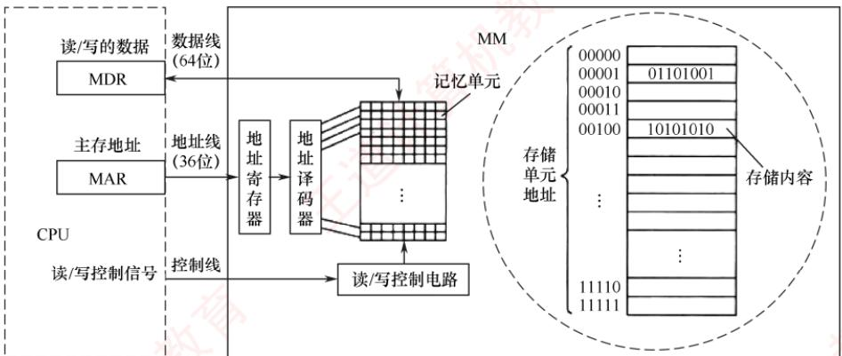
</div>

<p align="center"><em>图 3.1 主存储器的基本组成框图</em></p>

### 3.1.3 存储器的层次化结构

　　为缓解存储系统在容量、速度与成本之间的矛盾，现代计算机普遍采用多级存储器结构（见图3.2）。从上至下，各层存储器的单位价格逐渐降低，存取速度变慢，容量增大，CPU访问频率也相应降低。该层次结构主要体现为两个关键层级：Cache-主存层和主存-辅存层。其中，Cache和主存可直接与CPU交换信息；辅存则需通过主存间接与CPU通信；主存作为枢纽，能与CPU、Cache及辅存双向交换数据（见图3.3）。

<div align="center">
  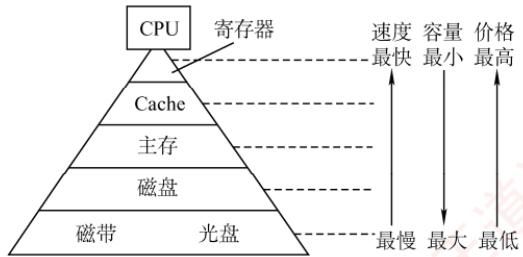
</div>

<p align="center"><em>图 3.2 多级存储器结构</em></p>

<div align="center">
  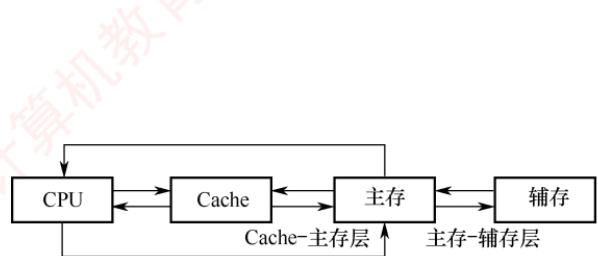
</div>

<p align="center"><em>图 3.3 三级存储系统的层次结构及其构成</em></p>

　　存储层次的核心思想如下：上一层存储器作为下一层的高速缓存。当 CPU 访问数据时，按 Cache→主存→辅存的顺序逐级查找；若所需数据不在上层，则从下层逐级调入：先从磁盘读入主存，再从主存加载到 Cache。从 CPU 视角看：Cache-主存层的速度接近 Cache，而容量和单位成本接近主存；主存-辅存层的速度接近主存，而容量和单位成本接近辅存。

　　两层机制的主要目标和实现方式不同: Cache-主存层用于缓解 CPU 与主存速度不匹配问题，数据调度由硬件自动完成，对所有程序员透明。主存-辅存层则用于解决存储容量不足问题，数据调度由硬件与操作系统协同完成，对应用程序员透明。

　　随着主存-辅存层的不断发展，逐渐形成了虚拟存储系统。在该系统中，程序员使用的地址空间（虚拟地址空间）远大于实际主存容量，程序可按更大的逻辑地址空间进行编写。

> **注意**

　　在 Cache-主存层和主存-辅存层中，上一层的内容始终是下一层内容的子集副本，即 Cache 中的数据来自主存，主存中的数据来自辅存。

### 3.1.4 存储器的主要性能指标

　　存取时间：完成一次读/写操作所需的时间，其中读出时间是指从主存接收到有效地址到数据有效输出的时间，写入时间是指从主存接收到有效地址到数据成功写入指定单元的时间。

　　存储周期：存储器进行连续两次独立的读/写操作所需的最小时间间隔。

　　存取时间不等于存储周期。通常，存储周期大于存取时间，因为每次读/写操作后，存储器需要一定时间恢复内部状态。对于破坏性读出的存储器（如 DRAM），读出后必须立即再生数据，因此其存储周期往往显著大于存取时间，甚至可达 $T_{m}=2T_{a}$ （其中 $T_{m}$ 为存储周期， $T_{a}$ 为存取时间）。

　　存取时间与存取周期的关系如图 3.4 所示。

<div align="center">
  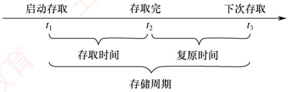
</div>

<p align="center"><em>图 3.4 存取时间与存储周期的关系</em></p>

　　存储器带宽：存储器每秒能够传输的最大数据量。例如，若存储周期为 50ns，每个周期可传输 64 位数据，则理论带宽为 $64b/50ns = 1.28Gb/s$ 。在实际系统中，存储器常被组织为多模块结构，允许多个模块并行工作，从而将总带宽提升至单模块带宽的若干倍。

### 3.1.5 本节习题精选

#### 单项选择题

01. 磁盘属于（）类型的存储器。

- A. 随机存储器（RAM）
- B. 只读存储器（ROM）
- C. 顺序存取存储器（SAM）
- D. 直接存取存储器（DAM）

02. 存储器的存取周期是指（）。

- A. 存储器的读出时间
- B. 存储器的写入时间
- C. 存储器进行连续读/写操作所允许的最短时间间隔
- D. 存储器进行一次读/写操作所需的平均时间

03. 相联存储器是一种特殊的存储器，其主要特点是（）。

- A. 通过地址总线指定存储单元进行读/写
- B. 按照“后进先出”原则访问数据
- C. 根据存储内容进行并行匹配查找
- D. 仅用于实现高速缓存中的直接映射结构

04. 在下列几种存储器中，CPU 不能直接访问的是（）。

- A. 硬盘
- B. 内存
- C. Cache
- D. 寄存器

05. 计算机的存储器采用分级方式是为了（）。

- A. 方便编程
- B. 解决容量、速度、价格三者之间的矛盾
- C. 保存大量数据方便
- D. 操作方便

06. 计算机的存储系统包括（）。

- A. RAM
- B. ROM
- C. 主存储器
- D. 寄存器、Cache、主存储器和外存储器

07. 在计算机系统中，关于 MAR 和 MDR 的位数，以下说法正确的是（）。

- A. MAR 的位数等于地址总线的宽度，MDR 的位数等于数据总线的宽度

- B. MAR 的位数等于数据总线的宽度，MDR 的位数等于地址总线的宽度
- C. MAR 和 MDR 的位数都等于地址总线的宽度
- D. MAR 和 MDR 的位数都等于数据总线的宽度

08. 在多级存储系统中，“Cache-主存”结构的作用是解决（）的问题。

- A. 主存容量不足
- B. 主存与辅存速度不匹配
- C. 辅存与 CPU 速度不匹配
- D. 主存与 CPU 速度不匹配

09. 存储器分层体系结构中，存储器从速度最快到最慢的排列顺序是（）。

- A. 寄存器-主存-Cache-辅存
- B. 寄存器-主存-辅存-Cache
- C. 寄存器-Cache-辅存-主存
- D. 寄存器-Cache-主存-辅存

10. 下列关于多级存储系统的说法中，正确的有（）。
 I. 多级存储系统是为了降低存储成本
 II. 虚拟存储器中主存和辅存之间的数据调动对任何程序员是透明的
 III. CPU 只能与 Cache 直接交换信息，CPU 与主存交换信息也需要经过 Cache

- A. 仅 I
- B. 仅 I 和 II
- C. I、II 和 III
- D. 仅 II

11. 若某存储器存取周期为 250ns，每次读出 16 位，该存储器的数据传输速率是（）。

- A. $4 \times 10^{6}$ B/s
- B. 16MB/s
- C. $8 \times 10^{6}$ B/s
- D. $8 \times 2^{20}$ B/s

### 3.1.6 答案与解析

#### 单项选择题

**01. D**
　　磁盘属于直接存取存储器，其速度介于随机存储器和顺序存取存储器之间。

**02. C**
　　存取时间 $T_{\mathrm{a}}$ 是指从存储器读/写一次信息所需要的平均时间；存取周期 $T_{\mathrm{m}}$ 是指连续两次访问存储器之间所必需的最短时间间隔。对 $T_{\mathrm{m}}$ 一般有 $T_{\mathrm{m}} = T_{\mathrm{a}} + T_{\mathrm{r}}$ ，其中 $T_{\mathrm{r}}$ 为复原时间；对SRAM指存取信息的稳定时间，对DRAM指刷新的又一次存取时间。选项D指的是存取时间。

**03. C**

　　相联存储器按内容寻址，能并行比较所有存储单元的内容以匹配关键字，直接返回结果或位置，常用于TLB和Cache标记阵列等高速查找场景。

**04. A**
　　CPU 不能直接访问硬盘，需先将硬盘中的数据调入内存才能被 CPU 访问。

**05. B**

　　存储器有三个主要性能指标：存储速度、存储容量和单位成本。存储器采用分级方式是为了解决这三者之间的矛盾。

**06. D**
　　计算机的存储系统包括 CPU 内部寄存器、Cache、主存和外存。

**07. A**

　　MAR 用于存放内存地址，其位数需覆盖主存全部可寻址单元，故等于地址总线宽度；MDR 用于暂存读/写数据，其位数决定单次传输的数据量，故等于数据总线宽度。

**08. D**
　　Cache 中的内容只是主存内容的部分副本（拷贝），因此 “Cache-主存” 结构并未增加主存容量，目的是解决主存与 CPU 速度不匹配的问题。

**09. D**

　　在存储器分层结构中，寄存器在CPU中，因此速度最快，Cache次之，主存再次之，最慢的是辅存（如磁盘、光盘等）。

**10. A**

　　主存和辅存之间的数据调动是由硬件和操作系统共同完成的，仅对应用级程序员透明。CPU与主存可直接交换信息。

**11. C**

　　每个存取周期读出 16bit = 2B，因此数据传输速率为 $2\mathrm{B} \div (250 \times 10^{-9})\mathrm{s}$ ，即 $8 \times 10^{6}\mathrm{B/s}$ 。

## 3.2 主存储器

### 3.2.1 半导体随机存取存储器

　　随机存取存储器（RAM）分为静态 RAM（SRAM）和动态 RAM（DRAM），二者均为易失性存储器。现代计算机中，主存主要采用 DRAM，而 Cache 使用 SRAM。

#### 1. SRAM 的工作原理

　　地址相同的多个存储元构成一个存储单元。若干存储单元的集合构成存储体。

　　SRAM 的存储元基于双稳态触发器（六晶体管 MOS）利用电路的两个稳定状态分别表示二进制 0 和 1。其静态特性体现在：读操作为非破坏性读出，因此无须再生。

　　SRAM 的存取速度快，但集成度低，功耗较大，成本高，通常用于高速缓冲存储器。

#### 2. DRAM 的工作原理

　　与 SRAM 不同，DRAM 利用栅极电容上的电荷来存储信息：有电荷表示 1，无电荷表示 0。其基本存储元仅由一个晶体管和一个电容构成，结构简单，因而集成度远高于 SRAM。

> **考点追踪：** 需要刷新的存储芯片：SDRAM（2015）

　　DRAM 具有位价低、功耗小、容量大等优势。但同时也存在明显局限：存取速度较慢；电荷会因漏电而逐渐丢失，必须定时刷新以维持数据；且读出过程为破坏性读出，需在读取后立即再生。因此，DRAM 被广泛用于大容量主存系统，在成本、容量与性能之间取得良好平衡。

#### 3. 存储芯片的组成

　　如图 3.5 所示，存储芯片由存储体、I/O 读/写电路、地址译码器和控制电路等部分组成。前文介绍的 DRAM 芯片的存储阵列结构，正是此图中存储矩阵的核心构成部分。

1）存储体（存储矩阵）。是存储单元的集合，通过行选择线（X）和列选择线（Y）共同选中目标单元。位于相同行列交叉点上的多个位（位平面数）被同时读/写。

2）地址译码器。用来将输入地址转换为译码输出线上的高电平信号，以驱动相应的读/写电路。地址译码方式有单译码法（一维译码）和双译码法（二维译码）两种：

- 单译码法。仅使用一个行译码器，同一行中所有存储单元的字线相连，构成一个字，可被同时读/写。其缺点是译码器输出线数量过多。

- 双译码法。如图3.5所示，地址译码器分为X（行）和Y（列）两个部分，通过行与列的交叉点唯一确定一个存储单元。这是当前DRAM芯片普遍采用的译码结构。

3）I/O 电路。用于控制被选中存储单元的读/写，具有放大信号的作用。

<div align="center">
  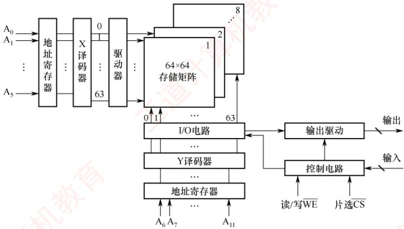
</div>

<p align="center"><em>图 3.5 存储芯片结构图</em></p>

4）片选控制线。单个存储芯片容量有限，通常无法满足计算机对主存容量的需求，因此需将多个芯片组合扩展。在访问某个存储字时，必须“选中”该存储字所在的芯片，而其他芯片不被“选中”，因此需要有片选控制信号（经片选控制线传输）。

5）读/写控制线。根据 CPU 发出的读/写命令，通过读/写控制线选中单元执行相应操作。

#### 4. DRAM 芯片的关键技术

##### （1） 地址引脚复用技术

　　图 3.6 给出了一个 $4M \times 4$ 位 DRAM 芯片的逻辑结构图。该芯片共有 11 个地址引脚 ( $A_{0} \sim A_{10}$ )，在行选通信号 RAS 和列选通信号 CAS 的控制下，分时复用传送行地址和列地址。数据端口有 4 个引脚 ( $D_{1} \sim D_{4}$ )，因此每个芯片可同时读/写 4 位数据。WE 为读/写控制信号，低电平表示写操作；OE 为输出使能信号，低电平有效，高电平时断开输出驱动。芯片内部存储阵列采用三维结构，总容量为 $2048 \times 2048 \times 4$ 位，即 $4M \times 4$ 位。因此，行地址和列地址各需 11 位，共 4 个位平面；在任意行与列的交叉点上，4 个位平面上的数据被同时读/写。

<div align="center">
  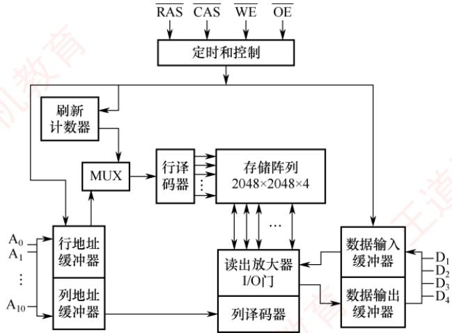
</div>

<p align="center"><em>图 3.6 一个 $4M \times 4$ 位 DRAM 芯片的逻辑结构图</em></p>

> **考点追踪：** DRAM芯片地址引脚复用技术（2014）

　　DRAM 芯片容量较大，所需地址位数较多。为减少芯片地址引脚数量，通常采用地址引脚复用技术：行地址和列地址通过相同的引脚分两次先后输入，从而使地址引脚数量减少一半。

##### （2） 刷新机制与阵列设计优化

　　DRAM芯片需要定期刷新以维持所存信息。刷新时，仅向芯片提供行地址和RAS信号，即可选中某一行的所有存储单元并执行读操作。由于DRAM采用破坏性读出，每次读取后必须立即再生：若读出为0，则将电容充分放电；若读出为1，则重新充电。对于图中所示的 $2048 \times 2048 \times 4$ 存储阵列，只需进行2048次刷新操作即可完成全芯片刷新（因刷新按整行进行，无须列地址）。芯片内部集成一个刷新计数器，可自动产生刷新所需的行地址，其位数与行地址位数相同。行地址缓冲器与刷新计数器通过一个多路选择器（MUX）共享通往行译码器的地址通路。刷新周期定义为对某一特定行完成一次刷新后，到下一次对该行再次刷新的时间间隔。

> **考点追踪：** DRAM芯片行、列设计优化原则（2018）

　　假定一个 DRAM 芯片的存储容量为 $2^{n} \times b$ 位，其存储阵列的行数为 r，列数为 c，则满足 $2^{n} = r \times c$ 。整个阵列的地址位数为 n，其中行地址占 $\log_{2} r$ 位，列地址占 $\log_{2} c$ 位，因此有 $n = \log_{2} r + \log_{2} c$ 。由于 DRAM 采用地址引脚复用技术，引脚数量由行、列地址位数中的较大者决定，为最小化地址引脚数，应使 r 与 c 尽可能接近。此外，DRAM 按行刷新，行数越少，刷新开销越低，故还需满足 $r \leqslant c$ 。综合考虑，通常将阵列设计为行数略小于或等于列数的近似正方形结构。

##### （3） 缓存机制与突发传输

> **考点追踪：** DRAM芯片行缓冲器容量的计算（2022）

　　图3.7展示了一个DRAM芯片的简化示意图，其容量为 $16 \times 8$ 位，存储阵列为4行 $\times 4$ 列。

<div align="center">
  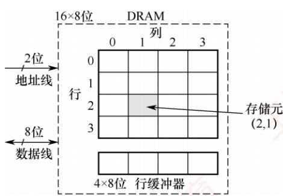
</div>

<p align="center"><em>图 3.7 一个 DRAM 芯片的简化示意图</em></p>

　　由于采用地址引脚复用技术，仅需2根地址线，分时传送2位行地址和2位列地址。每个存储单元包含8位数据，因此需要8根数据线。芯片内部设有一个行缓冲器（通常由SRAM实现），用于缓存被选中行中所有列的数据。其容量等于一行中所有存储单元的数据总量，即列数 $\times$ 每个存储单元的位数（如4列 $\times 8$ 位 $= 32$ 位）。当某一行被选中后，该行全部数据被一次性加载到行缓冲器中，后续可在每个时钟周期连续输出一个存储单元的数据（8位），从而支持突发传输，即在寻址阶段提供首地址，随后连续读取多个相邻存储单元的数据，显著提升有效带宽。

#### 5. 同步 DRAM

　　目前更广泛使用的是 SDRAM（同步 DRAM）。与传统的异步 DRAM 不同，SDRAM 的数据读/写操作与系统时钟同步，能够以 CPU-主存总线的较高速率运行。在连续访问同一行（页）内的数据时，可实现突发传输，显著减少甚至避免插入等待状态。在异步 DRAM 中，CPU 发出地址和控制信号后，必须等待一段不确定的延迟时间才能获得数据或完成写入；在此期间，CPU 不断轮询存储器的状态信号，无法执行其他任务，从而降低整体执行效率。而 SDRAM 在系统时钟驱动下工作，它将 CPU 发出的地址和控制信号锁存，并在预设的若干时钟周期后返回数据或完成写入，使得 CPU 无须等待，可在延迟期间执行其他指令，显著提升系统性能。

#### 6. SRAM 和 DRAM 的比较

　　表 3.1 详细列出了 SRAM 和 DRAM 各自的特点。

　　表 3.1 SRAM 和 DRAM 各自的特点

<table><tr><td rowspan="2">特点</td><td colspan="2">类型</td></tr><tr><td>SRAM</td><td>DRAM</td></tr><tr><td>存储信息</td><td>触发器</td><td>电容</td></tr><tr><td>破坏性读出</td><td>非</td><td>是</td></tr><tr><td>需要刷新</td><td>不需要</td><td>需要</td></tr><tr><td>送行列地址</td><td>同时送</td><td>分两次送(复用)</td></tr><tr><td>运行速度</td><td>快</td><td>慢</td></tr><tr><td>集成度</td><td>低</td><td>高</td></tr><tr><td>存储成本</td><td>高</td><td>低</td></tr><tr><td>主要用途</td><td>高速缓存</td><td>主机内存</td></tr></table>

### 3.2.2 非易失性存储器

#### 1. 只读存储器（ROM）的特点

> **考点追踪：** RAM 和 ROM 的区别（2010）

　　RAM 与 ROM 均支持随机访问，但 ROM 属于非易失性存储器，具有两个显著优点：① 结构简单，位密度高于 SRAM 等可读/写存储器；② 断电后数据不丢失，可靠性高。

　　根据制造工艺和可编程性，ROM可分为掩模式ROM（MROM）、一次可编程ROM（PROM）和可擦除可编程ROM（EPROM）等类型；MROM由厂商固化，用户不可更改；PROM允许用户进行一次性编程；EPROM虽支持多次编程，但每次擦除需紫外线照射整片芯片，且擦写次数有限、写入速度慢，难以满足主存对高速随机读/写的需求，因此无法替代RAM。

#### 2. Flash 存储器

> **考点追踪：** Flash存储器的特点（2012）

　　计算机中许多固定信息需长期保存在非易失性存储器中，如系统启动所需的 BIOS（Basic Input/Output System）。早期 BIOS 固化在 MROM 或 EPROM 中，无法更新；现代主板普遍采用 Flash 存储器存储 BIOS，用户可通过厂商提供的工具直接在系统中擦除并重写。

　　Flash 存储器（又称闪存）是一种在 EPROM 基础上发展而来的非易失性存储器，兼具 ROM 与 RAM 的部分优点：断电后信息可长期保存；支持电擦除与在线重写，无须紫外线照射等特殊设备；其读取速度接近 RAM，但写入速度显著较慢，读/写性能不对称。

#### 3. 固态硬盘（Solid State Drive，SSD）

　　固态硬盘是基于 Flash 存储器构建的存储设备，由控制单元和存储单元（Flash 存储器芯片阵列）组成。它继承了 Flash 存储器的重要特性：非易失性、无机械部件、读取速度快。相比传统硬盘，SSD 具有读/写速度快、功耗低、抗震性强等优势，缺点是价格较高，且写入寿命受限于 Flash 存储器的擦写次数。

### 3.2.3 多模块存储器

　　多模块存储器是一种空间并行技术，通过多个结构完全相同的存储模块并行工作来提高存储器的吞吐率。由于 CPU 的速度远高于存储器，若能在一个存取周期内连续获取多条指令或多个数据字，便可更充分利用 CPU 资源，提升系统性能。多体交叉存储器正是基于这一思想设计的。

　　根据模块间地址分配方式的不同，多模块存储器可分为连续编址和交叉编址两种结构。

#### 1. 连续编址方式

　　高位地址为模块号（或体号），低位地址为模块内地址（或体内地址）。如图 3.8 所示，存储器共有 4 个模块 $M_{0} \sim M_{3}$ ，每个模块有 n 个单元，各模块的地址范围如图所示。

<div align="center">
  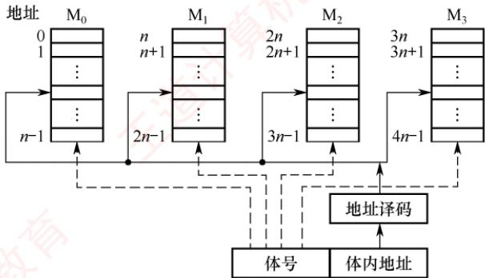
</div>

<p align="center"><em>图 3.8 连续编址的多体并行存储器</em></p>

　　在连续编址方式下，低位的体内地址总是被送到由高位体号确定的模块内进行译码。访问一个连续主存块时，总是先在一个模块内访问，直到该模块访问完后才转到下一个模块访问。由于CPU按顺序访问存储模块，各模块不能并行访问，因此无法提高存储器的吞吐率。

> **注意**

　　模块内的地址是连续的，存取方式仍是串行存取，因此这种存储器本质上仍属于顺序存储器。

#### 2. 交叉编址（低位交叉）方式

> **考点追踪：** 交叉存储器中数据的存放方式（2017）

　　低位地址用作模块号（体号），高位地址作为模块内地址。假设有 m 个模块，每个模块含 k 个存储单元，则模块编号由地址对 m 取模决定，即模块号 = 单元地址 %m。如图 3.9 所示，单元 $0, m, \cdots, (k-1)m$ 位于模块 $M_{0}$ ；单元 $1, m+1, \cdots, (k-1)m+1$ 位于模块 $M_{1}$ ；以此类推。

<div align="center">
  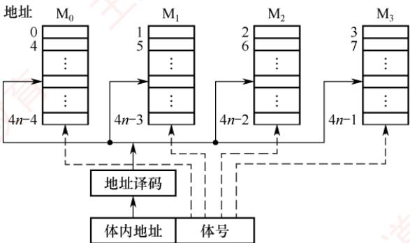
</div>

<p align="center"><em>图 3.9 交叉编址的多体并行存储器</em></p>

　　在交叉编址方式下，由于连续地址的数据被依次分布到不同模块中，程序或数据块在物理上是“交叉存放”的，采用此方式的多模块存储器被称为交叉存储器。通过多个结构完全相同的存储模块并行工作，这种设计能够在访问连续地址时显著提高存储器的吞吐率。

　　交叉存储器可以采用轮流启动或同时启动两种方式。

##### （1） 轮流启动方式

　　若每个模块一次读/写的位数正好等于数据总线位数，模块的存取周期为 T，总线周期为 r，则为实现轮流启动方式，存储器交叉模块数应满足：

$$
m = T / r
$$

> **考点追踪：** 交叉存储器存取时间和带宽的计算（2012、2013）

　　按每隔 $1 / m$ 个存取周期轮流启动各模块，则每隔 $1 / m$ 个存取周期就可读/写一个数据，存取速度提高 $m$ 倍。图3.10展示了4体低位交叉轮流启动的存取时间示意图。交叉存储器要求其模块数大于或等于 $m$ ，以保证启动某模块后经过 $mr$ 的时间后再次启动该模块时，其上次的存取操作已经完成（以保证流水线不间断）。这样，连续存取 $m$ 个字所需的时间为

$$
t _ {1} = T + (m - 1) r
$$

　　而顺序方式连续读取 m 个字所需的时间为 $t_{2}=mT$ 。可见交叉存储器的带宽大大提高。

<div align="center">
  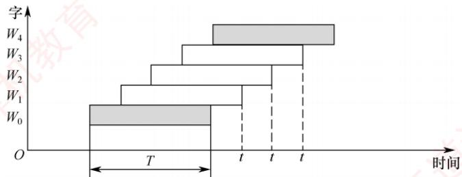
</div>

<p align="center"><em>图 3.10 低位交叉轮流启动的存取时间示意图</em></p>

> **考点追踪：** 交叉存储器中访存冲突的分析（2015）

　　在理想情况下，m 体交叉存储器每隔 1/m 存取周期可读/写一个数据。若相邻的 m 次访问的访存地址出现在同一个模块内，则会发生访存冲突，此时需延迟发生冲突的访问请求。

##### （2） 同时启动方式

　　当所有存储模块一次并行读/写的总位数恰好等于存储器数据总线宽度时，可采用同时启动方式。例如，使用8个 $16\mathrm{M}\times 8$ 位的DRAM芯片构成一个128MB内存条：每个DRAM芯片内部为 $4096\times 4096\times 8$ 位的存储阵列（行地址与列地址各12位），含8个位平面。

　　CPU 发出的主存地址被拆分为行地址和列地址,通过分时复用方式先后送入 DRAM 芯片的行、列地址译码器,选中行列交叉处的 8 位单元进行读/写操作。因此,单个芯片每次传输 8 位,8 个芯片同步工作,可一次性提供 64 位数据,匹配 64 位总线宽度。

　　需要注意的是，并行访问以连续8字节为单位进行，即每次读取的数据只能来自地址对齐的块（如第0～7, 8～15, …, 8k～8k+7单元）。若访问一个int型（4字节）数据时起始地址未对齐（如地址6，占用第6～9单元，横跨两个访问块），则需两次访问；若地址按4字节对齐（4的倍数），则一次即可完成。这正是内存访问要求数据对齐的根本原因。

### 3.2.4 本节习题精选

#### 一、单项选择题

01. 某一 SRAM 芯片，容量为 $1024 \times 8$ 位，该芯片的地址引脚和数据引脚总数至少是（）。

- A. 8
- B. 10
- C. 18
- D. 13

02. 某存储器容量为 $32\mathrm{K} \times 16$ 位，则（）。

- A. 地址线为16根，数据线为32根
- B. 地址线为32根，数据线为16根
- C. 地址线为15根，数据线为16根
- D. 地址线为15根，数据线为32根

03. DRAM的刷新是以（）为单位的。

- A. 存储单元
- B. 行
- C. 列
- D. 存储字

04. 下面是有关 DRAM 和 SRAM 存储芯片的叙述:

 I. DRAM芯片的集成度比SRAM芯片的高
 II. DRAM芯片的成本比SRAM芯片的高
 III. DRAM芯片的速度比SRAM芯片的快
 IV. DRAM芯片工作时需要刷新，SRAM芯片工作时不需要刷新

通常情况下，错误的是（）。

- A. I 和 II
- B. II 和 III
- C. III 和 IV
- D. I 和 IV

05. 下列关于随机存储器的说法中，正确的是（）。

- A. 半导体RAM中的信息可读可写，且断电后仍能保持记忆
- B. DRAM是易失性RAM，而SRAM中的存储信息是不易失的
- C. 半导体RAM是易失性RAM，但只要电源不断电，所存信息是不丢失的
- D. 半导体RAM是非易失性RAM

06. 下列关于存储器的说法中，不正确的是（）。

- A. 随机存储器和只读存储器不可以统一编址
- B. 在访问随机存储器时，访问时间与存储单元的物理位置无关
- C. 随机存储器（RAM）芯片可随机存取信息，掉电后信息会丢失
- D. 只读存储器（ROM）芯片可随机存取信息，掉电后信息不会丢失

07. 关于半导体存储器的组织，下列选项中（）是不正确的。

- A. 在同一个存储器中，每个存储单元的宽度可以不同
- B. 所谓“编址”，是指给每个存储单元一个编号
- C. 存储器的核心部分是存储阵列，由若干存储单元构成
- D. 每个存储单元由若干存储元件构成，每个存储元件存储一个比特位

08. 关于SRAM和DRAM，下列叙述中正确的是（）。

- A. 通常SRAM依靠电容暂存电荷来存储信息，电容上有电荷为1，无电荷为0
- B. DRAM依靠双稳态电路的两个稳定状态来分别存储0和1
- C. SRAM速度较慢，但集成度稍高；DRAM速度稍快，但集成度低
- D. SRAM速度较快，但集成度稍低；DRAM速度稍慢，但集成度高

09. 某一 DRAM 芯片，采用地址复用技术，容量为 $1024 \times 8$ 位，该芯片的地址引脚和数据引脚总数至少是（）。

- A. 18
- B. 13
- C. 8
- D. 17

10. 下列几种存储器中，（）是易失性存储器。

- A. Cache
- B. EPROM
- C. Flash 存储器
- D. CD-ROM

11. U 盘属于（）类型的存储器。

- A. 高速缓存
- B. 主存
- C. 只读存储器
- D. 随机存储器

12. 下面有关 ROM 和 RAM 的叙述中，错误的是（）。

- A. RAM 是可读可写存储器，ROM 是只读存储器
- B. ROM 和 RAM 都采用随机访问方式进行读/写
- C. 系统的主存由 RAM 和 ROM 组成
- D. 系统的主存都用 DRAM 芯片实现

13. 下列说法正确的是（）。

- A. EPROM是可改写的，因此可以作为随机存储器
- B. EPROM是可改写的，但不能作为随机存储器

- C. EPROM是不可改写的，因此不能作为随机存储器
- D. EPROM只能改写一次，因此不能作为随机存储器

14. 下列（）是动态半导体存储器的特点。
 I. 在工作中存储器内容会产生变化
 II. 每隔一定时间，需要根据原存内容重新写入一遍
 III. 一次完整的刷新过程需要占用两个存取周期
 IV. 一次完整的刷新过程只需要占用一个存取周期

- A. I、III
- B. II、III
- C. II、IV

15. 下列关于存储器层次结构的说法中，错误的是（）。

- A. Flash 存储器读/写速度差异显著，读速接近 RAM，写速接近 ROM
- B. 存储器层次结构基于程序局部性原理，通常采用缓冲技术缓解层级间速率差异
- C. Cache 位于 CPU 与主存之间，容量通常大于主存，旨在提升平均访问速率
- D. 辅存（如机械硬盘）容量大、成本低但速度慢，仅作为主存的补充与备份

16. 下列关于 Flash 存储器特性与应用的说法中，正确的是（）。

- A. 读写速度一致，均接近 DRAM 的访问速率
- B. 属于易失性存储器，断电后数据丢失
- C. 写操作前需先擦除目标块，故写速慢于读速
- D. 仅能用作辅助存储器（如 U 盘）

17. DRAM 具有破坏性读出的特性，需要定时刷新，下列说法中不正确的是（）。

- A. 刷新是以行为单位的
- B. 刷新是为了给 DRAM 存储单元中的存储电容重新充电
- C. 刷新是通过对存储单元进行“读但不输出数据”，即“假读”的操作来实现的
- D. DRAM 内部设有专门的刷新电路，不会影响到 CPU 的正常访存

18. 下列关于 DRAM 和 SDRAM 的说法中，不正确的是（）。

- A. 传统 DRAM 芯片与 CPU 采用异步方式交换数据
- B. SDRAM 芯片与 CPU 采用同步方式交换数据
- C. DRAM 需要定期刷新，而 SDRAM 不需要定期刷新
- D. SDRAM 的行缓冲器通常用 SRAM 实现

19. 每推出新一代 DRAM 芯片，地址引脚至少增加 1 根，则容量至少提高到原来的（）倍。

- A. 2
- B. 4
- C. 8
- D. 16

20. 若一个内存条中有 16 个 DRAM 芯片，每个芯片中有 4 个位平面，每个位平面的存储阵列为 4096 行×4096 列，则内存条的总容量为（）MB。

- A. 64
- B. 128
- C. 256
- D. 512

21. 某DRAM芯片容量为 $4\mathrm{M}\times 4$ 位，下列说法中错误的是（）。

- A. 芯片有11个地址引脚
- B. 芯片内部的行地址生成器（刷新计数器）为11位
- C. 芯片内部的行缓冲器容量为2KbD. 芯片有4个数据引脚

22. 已知单个存储体的存取周期为 110ns，总线传输周期为 10ns，采用低位交叉编址的多模块存储器时，存储体数应（）。

- A. 小于 11
- B. 等于 11
- C. 大于 11
- D. 大于或等于 11

23. 一个四体并行低位交叉存储器，每个模块的容量是 $64\mathrm{K} \times 32$ 位，存取周期为 $200\mathrm{ns}$ ，总线周期为 $50\mathrm{ns}$ ，在下述说法中，（）是正确的。

- A. 在 $200\mathrm{ns}$ 内，存储器能向CPU提供256位二进制信息
- B. 在 $200\mathrm{ns}$ 内，存储器能向CPU提供128位二进制信息
- C. 在 $50\mathrm{ns}$ 内，每个模块能向CPU提供32位二进制信息
- D. 以上都不对

24. 某机器采用四体低位交叉存储器，现分别执行下述操作：① 读取 6 个连续地址单元中存放的存储字，重复 80 次；② 读取 8 个连续地址单元中存放的存储字，重复 60 次。则①、②所花费的时间之比为（）。

- A. 1:1
- B. 2:1
- C. 4:3
- D. 3:4

25. 假定用若干 $16K \times 8$ 位的存储芯片组成一个 $64K \times 8$ 位的存储器，芯片各单元采用交叉编址方式，则地址 BFFFH 所在的芯片的最小地址为（）。

- A. 0000H
- B. 0001H
- C. 0002H
- D. 0003H

26. 下列关于单体多字存储器的说法中，不正确的是（）。

- A. 单体多字存储器主要解决主存容量太小的问题
- B. 单体多字存储器中，每个存储单元存储多个字
- C. 指令与数据的连续存放有利于单体多字存储器提高主存的读/写速度
- D. 过多的转移指令会严重影响单体多字存储器的工作效率

27. 多模块存储器之所以能提高存储器的访问速度，是因为（）。

- A. 采用了高速元器件
- B. 各模块有独立的读/写电路
- C. 采用了信息预读技术
- D. 模块内各单元地址连续

28. 某存储器总线的宽度是64位，若用8个 $16\mathrm{M}\times 8$ 位的DRAM芯片扩展构成 $16\mathrm{M}\times 64$ 位的内存条，按字节编址，支持突发传送方式，某double型的变量x的主存地址为20260000H，某int型的变量y的主存地址为20261006H，则下列叙述中错误的是（）。

- A. 该内存条可不采用多模块交叉编址
- B. DRAM芯片的行缓冲采用的是SRAM
- C. 读取变量x只需要一个存取周期
- D. 读取变量y需要两个存取周期

29. 【2010 统考真题】下列有关 RAM 和 ROM 的叙述中，正确的是（）。
 I. RAM 是易失性存储器，ROM 是非易失性存储器
 II. RAM 和 ROM 都采用随机存取方式进行信息访问
 III. RAM 和 ROM 都可用作 Cache
 IV. RAM 和 ROM 都需要进行刷新

- A. 仅 I 和 II
- B. 仅 II 和 III
- C. 仅 I、II 和 III
- D. 仅 II、III 和 IV

30. 【2011 统考真题】下列各类存储器中，不采用随机存取方式的是（）。

- A. EPROM
- B. CD-ROM
- C. DRAM
- D. SRAM

31. 【2012 统考真题】下列关于闪存的叙述中，错误的是（）。

- A. 信息可读可写，并且读、写速度一样快
- B. 存储元件由 MOS 管组成，是一种半导体存储器
- C. 掉电后信息不丢失，是一种非易失性存储器
- D. 采用随机访问方式，可替代计算机外部存储器

32. 【2014 统考真题】某容量为256MB的存储器由若干 $4\mathrm{M}\times 8$ 位的DRAM芯片构成，该DRAM芯片的地址引脚和数据引脚总数是（）。

- A. 19
- B. 22
- C. 30
- D. 36

33. 【2015 统考真题】下列存储器中，在工作期间需要周期性刷新的是（）。

- A. SRAM
- B. SDRAM
- C. ROM
- D. Flash 存储器

34. 【2015 统考真题】某计算机使用四体交叉编址存储器，假定在存储器总线上出现的主存地址（十进制）序列为 8005, 8006, 8007, 8008, 8001, 8002, 8003, 8004, 8000，则可能发生访存冲突的地址对是（）。

- A. 8004 和 8008
- B. 8002 和 8007
- C. 8001 和 8008
- D. 8000 和 8004

35. 【2017 统考真题】某计算机主存按字节编址，由 4 个 64M×8 位的 DRAM 芯片采用交叉编址方式构成，并与宽度为 32 位的存储器总线相连，主存每次最多读/写 32 位数据。若 double 型变量 x 的主存地址为 804 001AH，则读取 x 需要的存取周期数是（）。

- A. 1
- B. 2
- C. 3
- D. 4

36. 【2018 统考真题】假定 DRAM 芯片中存储阵列的行数为 r、列数为 c，对于一个 $2K \times 1$ 位的 DRAM 芯片，为保证其地址引脚数最少，并尽量减少刷新开销，则 r、c 的取值分别是（）。

- A. 2048, 1
- B. 64, 32
- C. 32, 64
- D. 1, 2048

37. 【2022 统考真题】某内存条包含 8 个 $8192 \times 8192 \times 8$ 位的 DRAM 芯片，按字节编址，支持突发（burst）传送方式，对应存储器总线宽度为 64 位，每个 DRAM 芯片内有一个行缓冲区（row buffer）。下列关于该内存条的叙述中，不正确的是（）。

- A. 内存条的容量为 512 MB
- B. 采用多模块交叉编址方式
- C. 芯片的地址引脚为 26 位
- D. 芯片内行缓冲有 $8192 \times 8$ 位

#### 二、综合应用题

01. 在显示适配器中，用于存放显示信息的存储器称为刷新存储器，它的重要性能指标是带宽。具体工作中，显示适配器的多个功能部分要争用刷新存储器的带宽。设总带宽 $50\%$ 用于刷新屏幕，保留 $50\%$ 的带宽用于其他非刷新功能，且采用分辨率为 $1024 \times 768$ 像素、颜色深度为3B、刷新频率为 $72\mathrm{Hz}$ 的工作方式。
1）试计算刷新存储器的总带宽。
2）为达到这样高的刷新存储器带宽，应采取何种技术措施？

02. 一个四体并行交叉存储器，每个模块的容量是 $64\mathrm{K}\times 32$ 位，存取周期为 $200\mathrm{ns}$ ，问：1）在一个存取周期中，存储器能向CPU提供多少位二进制信息？2）若存取周期为 $400\mathrm{ns}$ ，则在 $0.1\mu \mathrm{s}$ 内存储器可向CPU提供32位二进制信息，该说法正确否？为什么？

03. 设存储器容量为 32 个字，字长为 64 位，模块数 $m = 4$ ，分别采用顺序方式和交叉方式进行组织。存取周期 $T = 200\mathrm{ns}$ ，数据总线宽度为 64 位，总线传输周期 $r = 50\mathrm{ns}$ 。在连续读出 4 个字的情况下，求顺序存储器和交叉存储器各自的带宽。

04. 某计算机字长 32 位，存储体的存取周期为 200ns。

1）采用四体交叉工作，用低2位的地址作为体地址，存储数据按地址顺序存放。主机最快多长时间可以读出一个数据字？存储器的带宽是多少？

2）若4个体分别保存主存中前1/4、次1/4、再下个1/4、最后1/4这四段的数据，即选用高2位的地址作为体地址，可以提高存储器顺序读出数据的速度吗？为什么？

3）若把存储器改成单体4字宽度，会带来什么好处和问题？

4）比较采用四体低位地址交叉的存储器和四端口读出的存储器这两种方案的优缺点。05. 假定一个存储器系统支持四体交叉存取，某程序执行过程中访问地址序列为3,9,17,2,51,37,13,4,8,41,67,10，哪些地址访问可能发生体冲突？

### 3.2.5 答案与解析

#### 一、单项选择题

**01. C**

　　芯片容量为 $1024 \times 8$ 位，8位说明数据线要8根，地址线要10根（ $1024 = 2^{10}$ ）。因此，该芯片的地址引脚和数据引脚总数至少需要18根。

**02. C**

　　该芯片为 16 位，所以数据线为 16 根，寻址空间 $32\mathrm{K} = 2^{15}$ ，所以地址线为 15 根。

**03. B**

　　DRAM 的刷新按行进行。

**04. B**

　　DRAM 芯片的集成度高于 SRAM，说法 I 正确；SRAM 芯片的速度高于 DRAM，说法 III 错误；可以推出 DRAM 芯片的成本低于 SRAM，说法 II 错误；SRAM 芯片工作时不需要刷新，DRAM 芯片工作时需要刷新，说法 IV 正确。本题要求选择描述错误的表述，所以选择说法 II 和 III。

**05. C**

　　RAM 属于易失性半导体，SRAM 和 DRAM 的区别在于是否需要动态刷新。

**06. A**

　　主存由 RAM 和 ROM 构成，两者统一编址，选项 A 错误。选项 B 描述的是随机访问特性，正确。RAM 芯片具有随机访问特性和易失性，选项 C 正确。ROM 芯片具有随机访问特性和非易失性，选项 D 正确。

**07. A**

　　同一个存储器中，每个存储单元的宽度必须相同，即每个存储单元存储的比特位数必须相同。

**08. D**

　　SRAM 依靠双稳态电路的两个稳定状态来分别存储 0 和 1；SRAM 速度较快，不需要动态刷新，但集成度稍低，功耗大，单位价格高。DRAM 依靠电容暂存电荷来存储信息，电容上有电荷为 1，无电荷为 0；DRAM 集成度高，功耗小，单位价格较低，需定时刷新，速度慢。

**09. B**

$1024 \times 8$ 位，寻址范围是 $1024 = 2^{10}$ 。采用地址复用技术时，分两次传送行、列地址，地址引脚减半为5根，数据引脚仍为8根，因此地址引脚和数据引脚总数至少为13根。

　　注意 SRAM 和 DRAM 的区别，DRAM 采用地址复用技术，而 SRAM 不采用。

**10. A**

　　Cache 由 SRAM 组成，掉电后信息即消失，属于易失性存储器。

**11. C**

　　U 盘采用 Flash 存储技术，它是在 $E^{2}PROM$ 的基础上发展起来的，属于 ROM 的一种。擦写速度和性价比均很可观，因此常用作辅存。值得注意的是，随机存取与随机存储器是两个不同的概念，只读存储器也是随机存取的。因此，支持随机存取的存储器并不一定是随机存储器。

**12. D**

　　系统主存主要由 DRAM 构成，但通常也包含用于存放 BIOS 或固件的 ROM（如 Flash），因此并非全部由 DRAM 实现，D 选项的说法错误。

**13. B**

　　EPROM 可多次改写，但改写较为烦琐，写入时间过长，且改写的次数有限，速度较慢，因此不能作为需要频繁读/写的 RAM 使用。

**14. C**

　　动态半导体存储器利用电容存储电荷的特性记录信息，电容会放电，因此必须在电荷流失前对电容充电，即刷新。方法是每隔一定的时间，根据原存内容重新写入一遍，因此说法I错误。这里的读并不是把信息读入CPU，也不是从CPU向主存存入信息，它只是把信息读出，通过一个刷新放大器后又重新存回存储单元，而刷新放大器是集成在RAM上的。因此，这里只进行了一次访存，也就是占用一个存取周期，说法II、IV正确，说法III错误。

**15. C**

　　Flash 存储器的读速接近 RAM，但写/擦除速度慢，类似 ROM，读写性能显著不对称。存储器层次结构以局部性原理为设计基础，通过缓冲机制有效缓解各级存储器间的速率差异。Cache 虽位于 CPU 与主存之间且访问速度快，但其容量远小于主存，并非 “大于主存”，选项 C 错误。辅存（如机械硬盘）因速度慢，不参与 CPU 实时访存，仅用于主存扩展或持久性存储。

**16. C**

　　Flash 存储器是非易失性存储器，断电后数据不会丢失。其读操作速度较快（接近 RAM），但写入和擦除必须以块为单位进行，且需要先擦除再写入，因此写速显著慢于读速，选项 C 正确。此外，Flash 存储器广泛应用于电脑、手机、智能手表等设备的内部存储，而非限于 U 盘等辅助存储器。

**17. D**

　　刷新也是一个读取的过程，根据读出内容对相应单元进行重写，因此会和 CPU 的访存冲突，会有访存 “死时间”。刷新是指每隔一定的时间必须向栅极电容补充一次电荷，并以行为单位。

**18. C**

　　SDRAM（同步 DRAM）与 SRAM 不同，其与 CPU 采用同步方式交换数据。SDRAM 也是 DRAM 的一种，需要定期刷新。行缓冲器用来缓存指定行中整行的数据，通常用 SRAM 实现。

**19. B**

　　DRAM 芯片采用地址线复用技术，行地址和列地址分时复用，每增加 1 根地址线，则行地址和列地址各增加 1 位，所以行数和列数各增加 1 倍，因此容量至少提高到原来的 4 倍。

**20. B**

　　DRAM芯片的容量 $=$ 位平面数 $\times$ 行数 $\times$ 列数，即由位平面数、存储阵列的行数和列数决定。因此，一个DRAM芯片的容量为 $4096\times 4096\times 4\mathrm{b} = 8\mathrm{MB}$ ，内存条的总容量为 $8\mathrm{MB}\times 16 = 128\mathrm{MB}$ 。

**21. C**

　　4M×4 位 DRAM 芯片需 22 位地址，采用地址复用技术，行、列地址分时共用引脚，地址引脚数为 22/2 = 11。行地址位数为 11 位，刷新计数器位数与行地址位数相同。行缓冲器需暂存整行数据，每行包含 $2048 \times 4$ 位 = 8Kb 数据，选项 C 错误。芯片字长为 4 位，对应 4 个数据引脚。

**22. D**

　　低位交叉编址多模块存储器，采用轮流启动的方式时，类似于流水线的工作方式，为保证某个模块再次启动时，其上次的存取操作已完成（流水线不间断），要求两次启动间隔的时间必须大于或等于一个存取周期，即“模块数×总线周期≥存取周期”，得出存储体数应大于或等于11。

**23. B**

　　低位交叉存储器采用流水线技术，可以在一个存取周期内连续访问4个模块，32位 $\times 4 = 128$ 位。本题答案为B。

　　注：本题若作为计算题来考虑，从第一个字的读/写请求发出，到第 4 个字读/写结束，共需要 350ns，但这里考查的是整体工作性能，可从以下角度理解：

1）连续取 m 个字耗时 $t_{1}=T+(m-1)r$ ，平均每个字的存取时间是 $t_{1}/m$ ，实际工作时 m 非常大，因此 $t_{1}/m$ 也就非常接近 r，可认为存储器在每个总线周期 r 都能给 CPU 提供一个字。

2）流水线充分流动起来后，每个总线周期后都能完成一个字的读/写，所以本题中每4个总线周期（200ns）都能完成4个字的读/写。

**24. C**

1）在每轮读取存储器的前6个T/4时间（共3T/2）内，依次进入各个存储体。下一轮读取存储器时，最近访问的 $M_{1}$ 还在占用中（才过T/2的时间），因此必须再等待T/2的时间才能开始新的读取（ $M_{1}$ 连续完成两次读取，也即总共2T的时间才可进入下一轮）。

> **注意**

　　进入下一轮不需要第6个字读取结束，第5个字读取结束时 $\mathrm{M}_1$ 就已空出，即可马上进入下一轮。

　　最后一轮读取结束的时间是本轮第6个字读取结束，共 $(6-1)\times(T/4)+T=2.25T$ 。

　　情况1）的总时间为 $(80 - 1)\times 2T + 2.25T = 160.25T$ 。

<div align="center">
  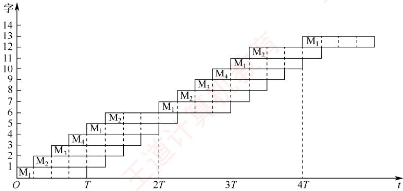
</div>

2）每轮读取8个存储字刚好经过 $2T$ 的时间，每轮结束后，最近访问的 $\mathbf{M}_1$ 刚好经过了时间 $T$ ，此时可以立即开始下一轮的读取。最后一轮读取结束的时间是本轮第8个字读取结束，共 $(8 - 1)\times (T / 4) + T = 2.75T$ 情况2）的总时间为 $(60 - 1)\times 2T + 2.75T = 120.75T$ 因此情况1）和2）所花费的总时间比为 $4:3$ 。

**25. D**

$64\mathrm{K}\times 8$ 位/ $16\mathrm{K}\times 8$ 位 $= 4$ ，可知芯片数为4。芯片各单元采用交叉编址，所以每个芯片的片选信号由最低两位地址确定，高14位为片内地址。4个芯片内各存储单元的最低两位地址分别为00、01、10、11，即最小地址分别为 $0000\mathrm{H}$ 、 $0001\mathrm{H}$ 、 $0002\mathrm{H}$ 、 $0003\mathrm{H}$ 。地址BFFFH最低两位为11，因此该存储单元所在芯片的最小地址为 $0003\mathrm{H}$ 。

**26. A**

　　单体多字存储器主要解决访存速度的问题，并没有解决主存容量太小的问题。在单体多字存储器中，每个存储单元存储多个字，当指令和数据连续存放，且没有过多的转移指令时，单体多字存储器能有效地提高主存的读/写速度。

**27. B**

　　多模块存储器各模块有独立的读/写电路，可以实现并行操作，所以多模块存储器能进行高速的读/写操作。采用低位交叉编址的多模块存储器各单元地址不连续。

**28. A**

　　存储器总线的宽度是 64 位，内存条一次向计算机提供 8B 的数据，每个 DRAM 芯片提供 1B 的数据，因此一定采用多模块交叉编址，选项 A 错误。DRAM 芯片的行缓冲采用 SRAM。在此内存条中，同时读出的 64 位只可能是第 0～7 单元、第 8～15 单元……第 $8k \sim 8k + 7$ 单元，根据变量 x 和 y 的主存地址可知，读取 x 需要一个存取周期，读取 y 需要两个存取周期。

**29. A**

　　RAM（分 DRAM 和 SRAM）断电后会失去信息，而 ROM 断电后不会丢失信息，它们都采用随机存取方式。Cache 一般采用高速的 SRAM 制成，而 ROM 只可读，不能用作 Cache，说法 III 错误。DRAM 需要定期刷新，而 ROM 不需要刷新，所以说法 IV 错误。

**30. B**

　　随机存取是指 CPU 可对存储器的任意一个存储单元中的内容随机存取，而且存取时间与存储单元的物理位置无关。选项 A、C 和 D 均采用随机存取方式，CD-ROM 即光盘，采用串行存取方式（直接存取）。注意，CD-ROM 是只读型光盘存储器，不属于只读存储器（ROM）。

**31. A**

　　闪存是 $\mathrm{E}^2\mathrm{PROM}$ 的进一步发展，可读可写，用MOS管的浮栅上有无电荷来存储信息。闪存依然是ROM的一种，写入时必须先擦除原有数据，所以写速度要比读速度慢。闪存是一种非易失性存储器，它采用随机访问方式。现在常见的SSD固态硬盘，即由Flash存储器芯片组成。

**32. A**

$4\mathrm{M}\times 8$ 位的芯片数据线应为8根，地址线应为 $\log_24\mathrm{M} = 22$ 根，而DRAM采用地址复用技术，地址线是原来的 $1 / 2$ ，且地址信号分行、列两次传送。地址线数为 $22 / 2 = 11$ 根，所以地址引脚与数据引脚的总数为 $11 + 8 = 19$ 根，选择选项A。此题需要注意DRAM采用的是传两次地址的策略，所以地址线为正常的一半，这是很多考生容易忽略的地方。

**33. B**

　　DRAM 使用电容存储，所以必须隔一段时间刷新一次，若存储单元未被刷新，则存储的信息就会丢失。同步动态随机存储器 SDRAM 是现在最常用的一种 DRAM。

**34. D**

　　每个访存地址对应的存储模块序号（0,1,2,3）如下所示：

<table><tr><td>访存地址</td><td>8005</td><td>8006</td><td>8007</td><td>8008</td><td>8001</td><td>8002</td><td>8003</td><td>8004</td><td>8000</td></tr><tr><td>模块序号</td><td>1</td><td>2</td><td>3</td><td>0</td><td>1</td><td>2</td><td>3</td><td>0</td><td>0</td></tr></table>

　　其中，模块序号 = 访存地址%存储器交叉模块数。

　　判断可能发生访存冲突的规则如下：给定的访存地址在相邻的四次访问中出现在同一个存储模块内。据此，根据上表可知8004和8000对应的模块号都为0，即表明这两次的访问出现在同一模块内且在相邻的访问请求中，满足发生冲突的条件。

**35. C**

　　交叉编址多模块存储器有轮流启动和同时启动两种方式，本题中所有存储模块一次并行读/写的总位数正好等于系统总线中的数据线数，所以可以判定采用的是同时启动方式。在同时启动方式下，一个存取周期可以对所有芯片的同一行都读取一个字节。double型变量占64位（8B）。其主存地址804 001AH的最低两位是10，说明它从编号为2的芯片开始存储（编号从0开始），共占3行，因此需要同时启动3轮才能完成对double型变量的读取。从本题也可发现，采用同时启动方式时，一次读行也许会有没用的数据读入。

<table><tr><td>第i轮</td><td></td><td></td><td></td><td></td></tr><tr><td>第<eq>i+1</eq>轮</td><td></td><td></td><td></td><td></td></tr><tr><td>第<eq>i+2</eq>轮</td><td></td><td></td><td></td><td></td></tr><tr><td>第<eq>i+3</eq>轮</td><td></td><td></td><td></td><td></td></tr><tr><td>第<eq>i+4</eq>轮</td><td></td><td></td><td></td><td></td></tr><tr><td>体号</td><td>00</td><td>01</td><td>10</td><td>11</td></tr></table>

**36. C**

　　由题意，首先根据 DRAM 采用的是行列地址线复用技术，我们尽量选用行列差值不要太大的，选项 B、C 的地址线只需 6 根（取行或列所需地址线的最大值），轻松排除选项 A 和 D。其次，为了减小刷新开销，而 DRAM 一般是按行刷新的，所以应选行数值较少的。

**37. C**

$8 \times 8192 \times 8192 \times 8bit = 512MB$ ，内存条的容量为 512MB，选项 A 正确。存储器总线宽度 64 = 8×8bit，而每个芯片一次只能传输 8bit，需要 8 体多模块交叉编址采用同时启动方式才能实现，选项 B 正确。芯片容量为 $8192 \times 8192 \times 8bit$ ，按字节编址，地址线数应为 $\log_{2}(8192 \times 8192) = 26$ ，DRAM 采用地址复用技术，地址信号分行、列两次传送，因此地址引脚数为 26/2 = 13 根，选项 C 错误。芯片内行数是 8192，一行的大小是 $8192 \times 8bit$ ，行缓冲长度就是一行的大小，选项 D 正确。

#### 二、综合应用题

**01. 【解答】**

1）因为刷新带宽 $W_{1}=$ 分辨率×像素点颜色深度×刷新频率 $=1024\times768\times3B\times72/s$ $=169869KB/s$

　　所以刷新总带宽 $W_{0} = W_{1}(W_{0} / W_{1})$ $= 169869\mathrm{KB / s}\times 100 / 50 = 339738\mathrm{KB / s}$ $= 339.738\mathrm{MB / s}$ （其中 $1\mathrm{K} = 1000$ ）

2）要提高刷新存储器带宽，可采用以下技术：① 采用高速 DRAM 芯片；② 采用多体交叉存储器结构；③ 刷新存储器到显示控制器的内部总线宽度加倍；④ 采用双端口存储器将刷新端口和更新端口分开。

**02. 【解答】**

1）一个存取周期，四体并行交叉存储器可取 32 位×4 = 128 位，其中 32 位为总线宽度，4 为交叉存储器内的存储体个数。

2）该说法不正确。因为在 $0.1\mu \mathrm{s}$ 内整个存储器可向CPU提供32位二进制信息，但每个存储体必须经过400ns才能向CPU提供32位二进制信息。

**03. 【解答】**

　　顺序存储器和交叉存储器连续读出 m=4 个字的信息总量均是

$$
q = 6 4 \text {   位   } \times 4 = 2 5 6 \text {   位   }
$$

　　顺序存储器和交叉存储器连续读出4个字所需的时间分别是

$$
t _ {1} = m T = 4 \times 2 0 0 \mathrm{ns} = 8 0 0 \mathrm{ns} = 8 \times 1 0 ^ {- 7} \mathrm{s}
$$

$$
t _ {2} = T + (m - 1) r = 2 0 0 \mathrm{ns} + 3 \times 5 0 \mathrm{ns} = 3 5 0 \mathrm{ns} = 3 5 \times 1 0 ^ {- 8} \mathrm{s}
$$

　　顺序存储器和交叉存储器的带宽分别是

$$
\begin{array}{r l} & W _ {1} = q / t _ {1} = 2 5 6 \div (8 \times 1 0 ^ {- 7}) = 3 2 \times 1 0 ^ {7} \mathrm{b/s} \\ & W _ {2} = q / t _ {2} = 2 5 6 \div (3 5 \times 1 0 ^ {- 8}) = 7 3 \times 1 0 ^ {7} \mathrm{b/s} \end{array}
$$

**04. 【解答】**

　　交叉存储器在统考真题中曾多次考查，希望能引起读者重视，本题是这一类题中较难的。

1）因为每个体的存取周期是 200ns。四体交叉工作，每两个体间读出操作的延时为 1/4 个存取周期，理想情况是每个存取周期平均可读出 4 个数据字，读出一个数据字的时间平均为 200ns/4 = 50ns。数据字长为 32 位，数据传输速率为 32 位/50ns = 640Mb/s = 80MB/s。

2）若对多体结构的存储器选用高位地址交叉，通常起不到提高存储器读/写速度的作用，因为它不符合程序运行的局部性原理，一次连续读出彼此地址相差一个存储体容量的4个字的机会太少。因此，通常只有一个存储模块在不停地忙碌，其他存储模块是空闲的。

3）若把存储器的字长扩大为原来的4倍，实现的则是一个单体4字结构的存储器，每次读可以同时读出4个字的内容，有利于提高存储器每个字的平均读/写速度，但其灵活性不如多体单字结构的存储器，还会多用到几个缓冲寄存器。

4）多端口存储器是对同一个存储体使用多套读/写电路实现的，扩大存储容量的难度显然比多体结构的存储器要大，而且不能对多端口存储器的同一个存储单元同时执行多个写入操作，而多体结构的存储器则允许在同一个存取周期对几个存储体执行写入操作。

**05. 【解答】**

　　对于四体交叉访问的存储系统，每个存储模块的地址分布如下：

Bank0: 0, 4, 8, 12, 16, …

Bank1: 1, 5, 9, 13, 17, …, 37, …, 41, …

Bank2: 2, 6, 10, 14, 18, …

Bank3: 3, 7, 11, 15, 19, …, 51, …, 67

　　若给定的访存地址在相邻的4次访问中出现在同一个模块内，则可能发生访存冲突。所以17和9、37和17、13和37、8和4可能发生冲突。易错点：虽然41和13号单元也在同一个模块内，并且访问间隔小于4，但是由于访问8号单元发生冲突而使其访问延迟3个间隔，进而使41号单元的访问也延迟3个间隔，因此其访问不会和13号单元的访问发生冲突。

## 3.3 主存储器与 CPU 的连接

### 3.3.1 连接原理

　　主存储器通过数据总线、地址总线和控制总线与CPU相连，三者协同完成数据传输、地址定位与操作控制。数据总线的位数与其工作频率共同决定数据传输速率，其乘积正比于理论带宽；地址总线的位数决定了CPU可寻址的最大内存空间。控制线因存储器类型而异：SRAM芯片通常包含片选和读/写控制信号线；ROM芯片仅需片选线；DRAM芯片一般不设独立片选线，其芯片选择可通过行/列地址选通或外部译码逻辑实现。主存储器与CPU的连接如图3.11所示。

<div align="center">
  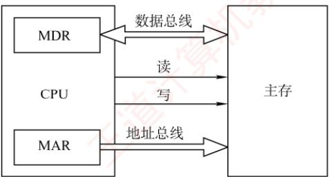
</div>

<p align="center"><em>图 3.11 主存储器与 CPU 的连接</em></p>

　　由于单个存储芯片的容量有限，实际系统中需通过存储器扩展技术将多个芯片集成在内存条上，并结合主板上的 ROM，共同构成计算机所需的主存空间，再经由系统总线与 CPU 连接。

### 3.3.2 主存容量的扩展

　　当单个存储芯片的字数（存储单元数量）或字长（每个存储单元的位数）无法满足实际主存需求时，需要在位和字两个方向进行扩展，以构建所需容量的存储器。

#### 1. 位扩展法

　　位扩展用于增加存储字的长度，适用于 CPU 数据总线宽度大于单个芯片数据位宽的情况。通过并联多个芯片，使其总数据位宽与 CPU 总线匹配。

　　连接方式：各芯片的地址线、片选线和读/写控制线并联，接至系统对应总线；数据线单独引出，分别连接到系统数据总线的不同位。所有芯片同时工作，共同提供一个完整字。

　　如图 3.12 所示, 使用 8 片 $8K \times 1$ 位的 RAM 芯片构成 $8K \times 8$ 位的存储器。各芯片的地址线 $A_{12} \sim A_{0}$ 、片选线和读/写控制线均连在一起，每片的数据线依次对应 CPU 数据总线的一位。

<div align="center">
  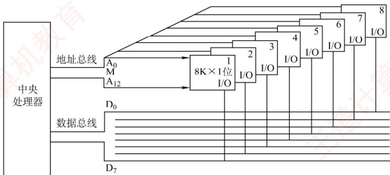
</div>

<p align="center"><em>图 3.12 位扩展连接示意图</em></p>

#### 2. 字扩展法

　　字扩展用于增加存储单元的数量（扩大地址空间），而存储字的位数已满足系统要求。此时，系统数据总线宽度等于芯片数据位宽，而地址总线位数多于芯片地址线位数。

　　连接方式：各芯片的地址线连接至系统地址总线的低位；数据线和读/写控制线并联至系统总线；系统地址总线的高位经译码器生成片选信号，分时选中不同芯片。各芯片分时工作。

> **考点追踪：** 字扩展（或字位扩展）后存储芯片的地址范围（2010、2016）

　　如图 3.13 所示，用 4 片 $16K \times 8$ 位的 RAM 芯片构成 $64K \times 8$ 位的存储器。所有芯片的数据线 $D_{0} \sim D_{7}$ 并联至系统数据总线。地址线 $A_{15}A_{14}$ 作为高位地址输入译码器，产生 4 个片选信号： $A_{15}A_{14} = 00$ 时，译码器输出端 0 有效，选中 1 号芯片； $A_{15}A_{14} = 01$ 时，译码器输出端 1 有效，选中 2 号芯片，以此类推（同一时刻只能有一个芯片被选中）。各芯片的地址分配如下：

　　第一片，最低地址：000000000000000；最高地址：001111111111111（16位）

　　第二片，最低地址：010000000000000；最高地址：01111111111111

　　第三片，最低地址：100000000000000；最高地址：101111111111111

　　第四片，最低地址：110000000000000；最高地址：11111111111111

<div align="center">
  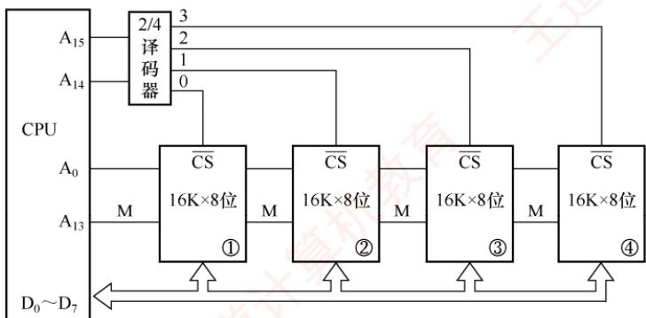
</div>

<p align="center"><em>图 3.13 字扩展连接示意图</em></p>

#### 3. 字位同时扩展法

　　当芯片的字长和容量均不足时，需同时进行位扩展和字扩展。该方法将位扩展后的芯片组视为一个逻辑单元，再对这些单元进行字扩展。

　　连接方式：先将若干芯片按位扩展方式组成一组（满足字长要求）；再将多组按字扩展方式连接；系统地址线低位接各组内部芯片的地址引脚，高位经译码器生成各组的片选信号。

　　如图 3.14 所示，用 8 片 $16K \times 4$ 位的 RAM 芯片构成 $64K \times 8$ 位的存储器。每 2 片组成一组（位扩展为 $16K \times 8$ 位），共 4 组。地址线 $A_{15}A_{14}$ 经译码器产生 4 个片选信号：当 $A_{15}A_{14} = 00$ 时，选中第一组（芯片①和②）；当 $A_{15}A_{14} = 01$ 时，选中第二组（芯片③和④）；以此类推。

<div align="center">
  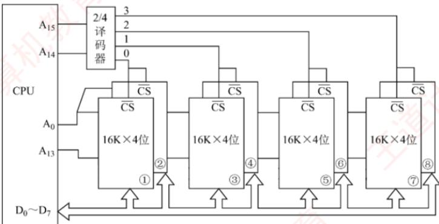
</div>

<p align="center"><em>图 3.14 字位同时扩展及 CPU 的连接图</em></p>

### 3.3.3 本节习题精选

#### 一、单项选择题

01. 用存储容量为 $16 \mathrm{~K} \times 1$ 位的存储芯片来组成一个 $64 \mathrm{~K} \times 8$ 位的存储器, 则在字方向和位方向分别扩展了 （） 倍。

- A. 4,2
- B. 8,4
- C. 2,4
- D. 4,8

02. 80386DX 是 32 位系统，以 4B 为编址单位，当在该系统中用 8KB（8K×8 位）的存储芯片构造 32KB 的存储体时，应完成存储器的（）设计。

- A. 位扩展
- B. 字扩展
- C. 字位扩展
- D. 字位均不扩展

03. 4个 $16\mathrm{K}\times 8$ 位的存储芯片，可设计为（）容量的存储器。

- A. $32\mathrm{K}\times 16$ 位
- B. $16\mathrm{K}\times 16$ 位
- C. $32\mathrm{K}\times 8$ 位
- D. $8\mathrm{K}\times 16$ 位

04. 16片 $2\mathrm{K}\times 4$ 位的存储器可以设计为（）存储容量的16位存储器。

- A. 16K
- B. 32K
- C. 8K
- D. 2K

05. 设 CPU 地址总线有 24 根，数据总线有 32 根，用 $512K \times 8$ 位的 RAM 芯片构成该计算机的主存储器，则该计算机主存最多需要（）片这样的存储芯片。

- A. 256
- B. 512
- C. 64
- D. 128

06. 地址总线 $\mathrm{A}_0$ （高位） $\sim \mathrm{A}_{15}$ （低位），用 $4\mathrm{K} \times 4$ 位的存储芯片组成 16KB 存储器，则产生片选信号的译码器的输入地址线应该是（）。

- A. $\mathrm{A}_2\mathrm{A}_3$
- B. $\mathrm{A}_0\mathrm{A}_1$
- C. $\mathrm{A}_{12}\mathrm{A}_{13}$
- D. $\mathrm{A}_{14}\mathrm{A}_{15}$

07. 若内存地址区间为 $4000\mathrm{H} \sim 43\mathrm{FFH}$ ，每个存储单元可存储16位二进制数，该内存区域用4片存储芯片构成，构成该内存所用的存储芯片的容量是（）。

- A. $512 \times 16\mathrm{bit}$
- B. $256 \times 8\mathrm{bit}$
- C. $256 \times 16\mathrm{bit}$
- D. $1024 \times 8\mathrm{bit}$

08. 内存按字节编址，地址从 90000H 到 CFFFFH，若用存储容量为 $16K \times 8$ 位的芯片构成该内存，至少需要的芯片数是（）。

- A. 2
- B. 4
- C. 8
- D. 16

09. 若片选地址为 111 时，选定某一 $32K \times 16$ 位的存储芯片工作，则该芯片在存储器中的首地址和末地址分别为（）。

- A. 00000H, 01000H
- B. 38000H, 3FFFFH
- C. 3800H, 3FFFH
- D. 0000H, 0100H

10. 【2009 统考真题】某计算机主存容量为 64KB，其中 ROM 区为 4KB，其余为 RAM 区，按字节编址。现要用 $2K \times 8$ 位的 ROM 芯片和 $4K \times 4$ 位的 RAM 芯片来设计该存储器，需要上述规格的 ROM 芯片数和 RAM 芯片数分别是（）。

- A. 1, 15
- B. 2, 15
- C. 1, 30
- D. 2, 30

11. 【2010 统考真题】假定用若干 $2K \times 4$ 位的芯片组成一个 $8K \times 8$ 位的存储器，则地址 0B1FH 所在芯片的最小地址是（）。

- A. 0000H
- B. 0600H
- C. 0700H
- D. 0800H

12. 【2011 统考真题】某计算机存储器按字节编址，主存地址空间大小为 64MB，现用 $4M \times 8$ 位的 RAM 芯片组成 32MB 的主存储器，则存储器地址寄存器 MAR 的位数至少是（）。

- A. 22 位
- B. 23 位
- C. 25 位
- D. 26 位

13. 【2016 统考真题】某存储器容量为 64KB，按字节编址，地址 4000H ~ 5FFFH 为 ROM 区，其余为 RAM 区。若采用 8K×4 位的 SRAM 芯片进行设计，则需要该芯片的数量是（）。

- A. 7
- B. 8
- C. 14
- D. 16

14. 【2021 统考真题】某计算机的存储器总线中有 24 位地址线和 32 位数据线，按字编址，字长为 32 位。若 00 0000H ~ 3F FFFFH 为 RAM 区，则需要 512K×8 位的 RAM 芯片数为（）。

- A. 8
- B. 16
- C. 32
- D. 64

15. 【2023 统考真题】某计算机的 CPU 有 30 根地址线，按字节编址，CPU 和主存连接时，要求主存芯片占满所有可能的存储地址空间，且 RAM 区和 ROM 区所分配的空间大小比是 3:1。若 RAM 在低地址区，ROM 在高地址区，则 ROM 的地址范围是（）。

- A. 0000 0000H ~ 0FFF FFFFH
- B. 1000 0000H ~ 2FFF FFFFH
- C. 3000 0000H ~ 3FFF FFFFH
- D. 4000 0000H ~ 4FFF FFFFH

#### 二、综合应用题

01. 用一个 $512\mathrm{K}\times 8$ 位的Flash存储器芯片组成一个 $4\mathrm{M}\times 32$ 位的半导体只读存储器，存储器按字编址，试回答以下问题：

1）该存储器的数据线数和地址线数分别为多少？

2）共需要几片这样的存储芯片？

3）说明每根地址线的作用。

### 3.3.4 答案与解析

#### 一、单项选择题

**01. D**
　　字方向扩展了 $64K/16K = 4$ 倍，位方向扩展了 8bit/1bit = 8 倍。

**02. A**
　　因为以 4B 为编址单位，要扩展到 32KB，即扩展到 8K×32bit，所以只用进行位扩展。

**03. A**

　　4 个 $16K \times 8$ 位的存储芯片构成的存储器容量 = $4 \times 16K \times 8$ 位 = 512K 位或 64KB，只有选项 A 的容量为 64KB。注意，若有某项为 $128K \times 4$ 位，则此选项不能选，因为芯片为 8 位，不可能将字长 “扩展” 成 4 位。

**04. C**

　　设存储容量为 M，则有 $(M \times 16) \div (2K \times 4) = 16$ ，因此 M = 8K。

**05. D**

　　地址线为 24 根，寻址范围是 $2^{24}$ ；数据线为 32 根，字长为 32 位。主存的总容量 $=2^{24}\times32$ 位，因此所需存储芯片数 $=(2^{24}\times32)\div(512K\times8)=128$ 。

**06. A**

$A_{15}$ 为地址线的低位，接入各芯片地址端的是地址线的低 12 位，即 $A_{4} \sim A_{15}$ ，共有 8 个芯片（16KB/4K = 4B，并且位扩展时每组两片共分为 4 组）组成 16KB 的存储器，因此由高两位地址线 $A_{2}A_{3}$ 作为译码器的输入。

**07. C**

$43FF - 4000 + 1 = 400H$ ，即内存区域为1K个单元，总容量为 $1K \times 16$ 位。现该内存由4片存储芯片构成，则构成该内存的芯片容量为 $1K \times 16$ 位/ $4 = 256 \times 16$ 位。

**08. D**

　　CFFFF - 90000 + 1 = 40000H，即内存区域有 256K 个单元。若用存储容量为 $16K \times 8$ 位的芯片，则需要的芯片数 $=(256K \times 8) \div (16K \times 8) = 16$ 片。

**09. B**

　　32K×16 的存储芯片有地址线 15 根（片内地址），片选地址为 3 位，因此地址总位数为 18 位，现高 3 位为 111，则首地址为 111000000000000000 = 38000H，末地址为 111111111111111111 = 3FFFFH。

**10. D**

　　首先确定 ROM 的个数，ROM 区为 4KB，选用 $2K \times 8$ 位的 ROM 芯片，需要 $(4K \times 8) \div (2K \times 8) = 2$ 片，采用字扩展方式；RAM 区为 60KB，选用 $4K \times 4$ 位的 RAM 芯片，需要 $(60K \times 8) \div (4K \times 4) = 30$ 片，采用字和位同时扩展的方式。

**11. D**

　　用 $2K \times 4$ 位的芯片组成一个 $8K \times 8$ 位的存储器，共需 8 片 $2K \times 4$ 位的芯片，分为 4 组，每组由 2 片 $2K \times 4$ 位的芯片并联组成 $2K \times 8$ 位的芯片，各组芯片的地址分配如下：

　　第一组（两个芯片并联）：0000H～07FFH。

　　第二组（两个芯片并联）：0800H～0FFFH。

　　第三组（两个芯片并联）：1000H～17FFH。

　　第四组（两个芯片并联）：1800H～1FFFH。

　　地址 0B1FH 所在的芯片属于第二组，所以其所在芯片的最小地址为 0800H。

**12. D**

　　主存按字节编址，地址空间大小为 64MB，MAR 的寻址范围为 $64M = 2^{26}$ ，因此是 26 位。实际的主存容量 32MB 不能代表 MAR 的位数，考虑到存储器扩展的需要，MAR 应保证能访问到整个主存地址空间，反过来，MAR 的位数决定了主存地址空间的大小。

**13. C**

　　5FFF - 4000 + 1 = 2000H，即 ROM 区容量为 $2^{13}B = 8KB$ （ $2000H = 2 \times 16^{3} = 2^{13}$ ），RAM 区容量为 56KB（64KB - 8KB = 56KB）。需要 8K × 4 位的 SRAM 芯片的数量为 14（56KB / 8K × 4 位 = 14）。

**14. C**

　　000000～3FFFFFF，共有 3FFFFFFH - 000000H + 1H = 400000H = 2 $^{22}$ 个地址，按字编址，字长为 32 位（4B），因此 RAM 区大小为 $2^{22} \times 4B = 2^{22} \times 32bit$ 。每个 RAM 芯片的容量为 $512K \times 8bit = 2^{19} \times 8bit$ ，所以需要 RAM 芯片的数量为 $(2^{22} \times 32bit) \div (2^{19} \times 8bit) = 32$ 。

**15. C**

　　地址空间为 $2^{30}$ ，地址范围为 0000 0000H～3FFF FFFFH。RAM:ROM = 3:1，则 ROM 可分配的地址空间为 $2^{28}$ ，从 3FFF FFFFH 往前数 $2^{28}$ 个地址，即 ROM 的地址范围是 3000 0000H～3FFF FFFFH。

#### 二、综合应用题

**01. 【解答】**

1）因为所需的组成存储器的最终容量为 $4\mathrm{M}\times 32$ 位，所以需要32根数据线。而存储器又是按字编址的，所以此时不需要将存储器的容量先转换成 $16\mathrm{M}\times 8$ 位，直接是 $4\mathrm{M}\times 32$ 位中的4M，所以只需要22根地址线（ $2^{22} = 4\mathrm{M}$ ）。

2）采用 $512K \times 8$ 位的 Flash 存储器芯片组成 $4M \times 32$ 位的存储器时，需要同时进行位扩展和字扩展。位扩展：4 片 $512K \times 8$ 位的 Flash 存储器芯片位扩展可组成 $512K \times 32$ 位的 Flash 存储器芯片。字扩展：8 片 $512K \times 32$ 位的 Flash 存储器芯片字扩展可组成 $4M \times 32$ 位的存储器。综上可知，一共需要 $4 \times 8 = 32$ 片 $512K \times 8$ 位的存储芯片。

3）在 CPU 的 22 根地址线中（ $A_{0} \sim A_{21}$ ），地址线的作用分配如下：首先，此时不需要指定 $A_{0}$ 、 $A_{1}$ 来标识每组中的 4 片存储器，因为此时是按字寻址的，所以 4 片每次都是一起取的，而不是按字节编址时需要取 4 片中的某一片。

$A_{0}\sim A_{18}$ ：每片都是512K，所以需要19位（ $2^{19}=512K$ ）来表示。

$A_{19}$ 、 $A_{20}$ 、 $A_{21}$ ：因为在扩展中4片一组，一共有8组（= $2^{3}$ ），所以需要用3位地址线来决定取哪一组（通过3/8译码器形成片选信号）。

## 3.4 外部存储器

### 3.4.1 磁盘存储器

　　磁盘存储器采用磁盘作为存储介质，具有以下优点：① 存储容量大，成本低；② 支持数据的重复写入和删除；③ 能长期保存信息，即使脱机也能存档；④ 读取操作是非破坏性的，无须再生数据。然而，其缺点包括存取速度较慢、机械结构复杂以及对工作环境要求较高。

#### 1. 磁盘存储器

> **考点追踪：** 磁盘存储器的相关概念（2019）

（1）磁盘设备的组成

　　① 磁盘存储器的组成。磁盘存储器由磁盘驱动器、磁盘控制器和盘片组成。

- 磁盘驱动器。驱动磁盘旋转并通过磁头在盘面上执行读/写操作，如图3.15所示。

- 磁盘控制器。磁盘驱动器与主机之间的接口，负责接收并解析来自 CPU 的命令，向磁盘驱动器发送控制信号，同时监控其运行状态。

<div align="center">
  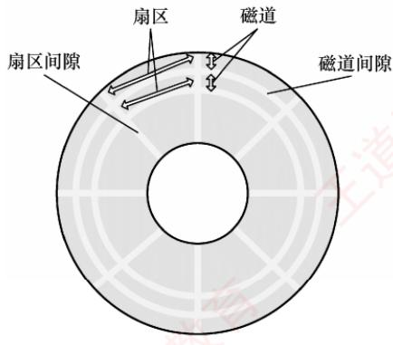
</div>

<p align="center"><em>(a)磁盘盘片</em></p>

<div align="center">
  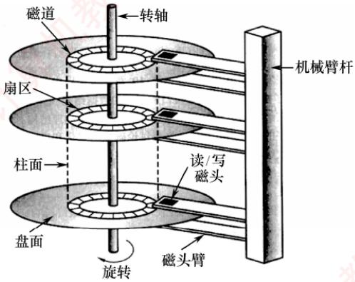
</div>

<p align="center"><em>(b)磁盘的组成</em></p>

<p align="center"><em>图 3.15 磁盘驱动器示意图</em></p>

　　② 存储区域。磁盘由多个记录面组成，每面含若干同心磁道，每条磁道划分为若干扇区。
- 记录面数：表示磁头数量，每个磁头负责一个记录面的数据读/写。

- 柱面数：表示单个记录面上的磁道数量。所有记录面上相同编号的磁道构成一个柱面。

- 扇区数：表示每条磁道所包含的扇区数量。扇区是磁盘读/写的最小单位。

　　相邻的磁道和扇区之间通过间隙隔开，以防止读/写错误。扇区按固定圆心角度划分，导致从外到内的位密度逐渐增加，磁盘的存储能力受限于最内圈的最大记录密度。

　　③ 磁盘高速缓存（Disk Cache）。在内存中开辟一部分空间，用于暂存待写入磁盘的数据。优点：磁盘以“簇”（由若干连续扇区组成）为单位进行写操作，缓存可减少频繁的小块写入；同时，中间结果若在写回前被再次使用，可直接从缓存读取，提升效率。

##### （2） 磁记录原理

　　原理：当磁头和磁性记录介质发生相对运动时，通过电磁转换实现数据的读/写操作。

　　编码方法：按照特定规则，将二进制数据序列转换为磁层中对应的磁化翻转状态序列，以便读/写控制电路能够高效、可靠地完成信号转换。

##### （3） 磁盘的性能指标

　　① 记录密度。指单位面积上可存储的二进制数据量，通常以道密度、位密度和面密度表示。道密度是沿磁盘半径方向单位长度上的磁道数；位密度是单条磁道单位长度上可记录的二进制位数；面密度是位密度与道密度的乘积，反映单位面积的存储能力。

　　② 磁盘的容量。分为非格式化容量和格式化容量。非格式化容量是指磁记录表面可利用的磁化单元总数，非格式化容量 = 记录面数 × 柱面数 × 每磁道磁化单元数。格式化容量是指按特定格式组织后实际可用的存储容量，格式化容量 = 记录面数 × 柱面数 × 每道扇区数 × 每扇区字节数。非格式化容量 > 格式化容量，因需预留扇区间隙、同步字段等格式开销。

> **考点追踪：** ➤ 磁盘存取时间的计算（2013、2015、2022）

　　③ 响应时间与存取时间。磁盘处理一次读/写请求的完整过程包括请求排队、控制器解析以及三个关键物理操作：寻道、旋转等待和数据传输。因此，总响应时间为

　　响应时间 = 排队延迟 + 控制器时间 + 寻道时间 + 旋转等待时间 + 数据传输时间
　　其中，“寻道时间 + 旋转等待时间 + 数据传输时间”也称存取时间，特指从磁头定位开始到数据传输完成所需的时间，是衡量磁盘性能的核心指标。

- 寻道时间：磁头移动到目标磁道所需时间。平均寻道时间通常取最大寻道时间的一半（从最外道到最内道时间的 $1/2$ ）。

- 旋转等待时间：目标扇区旋转至磁头下方所需时间。平均旋转等待时间等于磁盘旋转半周的时间。

- 数据传输时间：读取或写入一个扇区所需时间，取决于磁盘转速和数据密度。

　　④ 数据传输速率。指磁盘在单位时间内向主机传送的数据量（单位为 B/s）。若磁盘转速为 r 转/秒，单磁道容量为 N 字节，则最大数据传输速率为

$$
D _ {\mathrm{r}} = r N
$$

##### （4） 磁盘地址

> **考点追踪：** 磁盘地址结构的计算（2022）

　　主机向磁盘控制器发送寻址信息，磁盘地址通常由三部分组成，如下图所示。

<table><tr><td>柱面(磁道)号</td><td>盘面(磁头)号</td><td>扇区号</td></tr></table>

　　例如，磁盘有 16 个盘面，每个盘面有 256 个磁道，每个磁道划分为 16 个扇区，则每个扇区的地址可用 16 位二进制代码表示：其中柱面号占 8 位，盘面号占 4 位，扇区号占 4 位。

##### （5） 磁盘的工作过程

　　磁盘的主要操作包括寻址、读盘和写盘。每种操作对应一个控制字。磁盘工作时，首先读取控制字，然后执行该控制字。由于磁盘是机械式部件，因此其读/写操作为串行执行。

#### 2. 磁盘阵列

　　RAID（独立冗余磁盘阵列）是指将多个独立的物理磁盘组合成一个逻辑磁盘，数据在多个物理盘上交叉分割存储并并行访问，从而获得更高的存储性能、可靠性与安全性。

> **考点追踪：** 提高 RAID 可靠性的措施（2013）

　　RAID 的分级如下所示。在 RAID1～RAID5 等方案中，当任意磁盘发生故障时，可随时拔出损坏磁盘并插入新盘，系统仍能恢复或维持数据完整性，显著提升了可靠性。

- RAID0：无冗余、无校验的磁盘阵列。

- RAID1：镜像磁盘阵列。

- RAID2：采用海明码进行纠错的磁盘阵列。

- RAID3：位交叉奇偶校验的磁盘阵列。

- RAID4：块交叉奇偶校验的磁盘阵列。

- RAID5：无独立校验盘的分布式奇偶校验磁盘阵列。

　　RAID0 将连续的多个数据块交替存放在不同物理磁盘的扇区中，利用多个磁盘交叉并行读/写，即条带化技术，不仅扩展了存储容量，还显著提高了存取速度，但不具备容错能力。

　　为提高可靠性，RAID1通过两个磁盘同步进行读/写操作，互为镜像备份。当一个磁盘故障时，可从另一磁盘完整读取数据。其代价是有效容量减半（两盘仅当一盘使用）。

　　总之，RAID 通过多磁盘并行工作提升数据传输速率；通过并行存取大幅提高存储系统的吞吐量；通过镜像实现高可用性；通过校验机制提高容错能力。

### 3.4.2 固态硬盘

#### 1. 固态硬盘的特性

　　固态硬盘（SSD）是一种基于闪存技术的存储设备。其存储介质与 U 盘类似，但容量更大、存取性能更优。一个 SSD 由一个或多个闪存芯片以及闪存翻译层组成，如图 3.16 所示。其中，闪存芯片替代了传统磁盘中的机械驱动器；而闪存翻译层负责将 CPU 发出的逻辑块读/写请求转换为对底层物理闪存的读/写控制信号，因此，闪存翻译层相当于代替了磁盘控制器的角色。

<div align="center">
  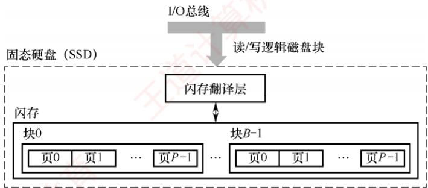
</div>

<p align="center"><em>图 3.16 固态硬盘（SSD）结构组成</em></p>

　　一个闪存芯片由 B 个块组成，每个块包含 P 页。通常，页的大小为 512B～4KB，每块包含 32～128 页，块的大小为 16KB～512KB。读/写操作以页为单位进行；擦除操作以块为单位进行，只有在整块被擦除后，才能向其中的页写入新数据。一旦某块被擦除，其所有页均可重新写入一次。每个块的擦写次数有限，经过若干重复写入后，该块会因磨损而失效。

　　随机写入速度较慢，主要有两个原因：① 擦除操作耗时较长，通常比页访问慢一个数量级。② 若需修改一个已包含有效数据的页 $P_{i}$ ，必须先将该块中所有有效页复制到一个新的（已擦除的）块中，再执行对 $P_{i}$ 的写入。

　　相比传统机械磁盘，SSD具有显著优势：由半导体器件构成，无机械运动部件，因此随机访问延迟极低，且无噪声、无振动、功耗更低、抗震性强、安全性更高。

#### 2. 磨损均衡（Wear Leveling）

　　SSD 的主要缺点在于闪存的擦写寿命有限，通常仅为几百至几千次。若直接用普通闪存构建 SSD 而不加管理，则实际的寿命表现可能令人失望——因为读/写操作往往会集中在少数物理块上，导致这些区域迅速磨损。一旦这部分闪存损坏，整块 SSD 即告失效。这种磨损不均衡的情况，可能导致一块 256GB 的 SSD，仅因几兆字节的闪存损坏而报废。

　　为解决这一问题，SSD 引入了磨损均衡技术，主要分为两类：

1）动态磨损均衡。在写入数据时，优先选择擦写次数较少的空闲块，避免反复写入同一区域，从而将写入负载分散到更多物理块上。

2）静态磨损均衡。这是一种更高级的策略。即使没有新数据写入，控制器也会定期扫描并自动进行数据迁移，将高磨损块中的有效数据迁移到低磨损块中。使高磨损块转为以读为主，低磨损块承担更多写入任务，进一步均衡整体寿命。

　　得益于磨损均衡算法，SSD 的实际使用寿命显著提升。例如，一块 256GB 的 SSD，若其闪存的擦写寿命为 500 次，则理论总写入量可达 125TB。即使每天持续写入 10GB 数据，也需要三十多年才会达到寿命极限。而日常使用中，普通用户的日均写入量通常远低于此值。

### 3.4.3 本节习题精选

#### 一、单项选择题

01. 下列关于磁盘的说法中，错误的是（）。

- A. 本质上，U盘（闪存）是一种只读存储器
- B. RAID技术可以提高磁盘的磁记录密度和磁盘利用率

- C. 未格式化的硬盘容量要大于格式化后的实际容量
- D. 计算磁盘的存取时间时，“寻道时间”和“旋转等待时间”常取其平均值

02. 下列关于磁盘驱动器的叙述中，错误的是（）。

- A. 送到磁盘驱动器的地址由磁头号、盘面号和扇区号组成
- B. 能控制磁头移动到指定磁道，并发回“寻道结束”信号
- C. 能控制磁盘片转过指定的扇区，并发回“扇区符合”信号
- D. 能控制对指定盘面的指定扇区进行数据的读/写操作

03. 下列有关磁盘存储器读/写操作的叙述中，错误的是（）。

- A. 最小读/写单位可以是一个扇区
- B. 采用直接存储器存取DMA方式进行输入/输出
- C. 按批处理方式进行一个数据块的读/写
- D. 磁盘存储器可与CPU交换盘面上的存储信息

04. 若磁盘的转速提高一倍，则（）。

- A. 平均寻道时间减少一半
- B. 存取速度也提高一倍
- C. 平均旋转等待时间减少一半
- D. 不影响磁盘传输速率

05. 下列关于固态硬盘（SSD）的叙述中，不正确的是（）。

- A. 固态硬盘的读/写是以页为单位的
- B. 固态硬盘的擦除是以页为单位的
- C. 固态硬盘的写入速度比读取速度慢很多
- D. 固态硬盘的写入次数有限，引入磨损均衡可以延长使用寿命

06. 下列关于固态硬盘（SSD）的说法中，错误的是（）。

- A. 基于闪存的存储技术
- B. 随机读/写性能明显高于磁盘
- C. 随机写比较慢
- D. 读/写速度快，常用作主存

07. 一个磁盘的转速为 7200 转/分，每个磁道有 160 个扇区，每个扇区有 512 字节，则在理想情况下，磁盘每秒传输的数据量是（）。

- A. $7200 \times 160\mathrm{KB}$
- B. $7200\mathrm{KB}$
- C. $9600\mathrm{KB}$
- D. $19200\mathrm{KB}$

08. 某磁盘盘面共有 200 个磁道，盘面总存储容量为 60MB，磁盘旋转一周的时间为 25ms，每个磁道有 8 个扇区，各扇区之间有一间隙，磁头通过每个间隙需 1.25ms。则磁盘接口所需的最大传输速率是（）。

- A. 10MB/s
- B. 60MB/s
- C. 83.3MB/s
- D. 20MB/s

09. 【2013 统考真题】某磁盘的转速为 10000 转/分，平均寻道时间是 6ms，磁盘传输速率是 20MB/s，磁盘控制器延迟为 0.2ms，读取一个 4KB 的扇区所需的平均时间约为（）。

- A. 9ms
- B. 9.4ms
- C. 12ms
- D. 12.4ms

10. 【2013 统考真题】下列选项中，用于提高 RAID 可靠性的措施有（）。 I. 磁盘镜像 II. 条带化 III. 奇偶校验 IV. 增加 Cache 机制

- A. 仅 I、II
- B. 仅 I、III
- C. 仅 I、III 和 IV
- D. 仅 II、III 和 IV

11. 【2015 统考真题】若磁盘转速为 7200 转/分，平均寻道时间为 8ms，每个磁道包含 1000 个扇区，则访问一个扇区的平均存取时间大约是（）。

- A. 8.1ms
- B. 12.2ms
- C. 16.3ms
- D. 20.5ms

12. 【2019 统考真题】下列关于磁盘存储器的叙述中，错误的是（）。

- A. 磁盘的格式化容量比非格式化容量小
- B. 扇区中包含数据、地址和校验等信息
- C. 磁盘存储器的最小读/写单位为1字节
- D. 磁盘存储器由磁盘控制器、磁盘驱动器和盘片组成

#### 二、综合应用题

01. 某个硬磁盘共有 4 个记录面，存储区域内半径为 10cm，外半径为 15.5cm，道密度为 60 道/cm，外层位密度为 600bit/cm，转速为 6000 转/分。

1）硬磁盘的磁道总数是多少？

2）硬磁盘的容量是多少？

3）将长度超过一个磁道容量的文件记录在同一个柱面上是否合理？

4）采用定长数据块记录格式，直接寻址的最小单位是什么？寻址命令中磁盘地址如何表示？

5）假定每个扇区的容量为 512B，每个磁道有 12 个扇区，寻道的平均等待时间为 10.5ms，试计算磁盘平均存取一个扇区的时间。

### 3.4.4 答案与解析

#### 一、单项选择题

**01. B**

　　闪存是在 $E^{2}PROM$ 的基础上发展起来的，本质上是只读存储器。RAID 将多个物理盘组成像单个逻辑盘，不会影响磁记录密度，也不可能提高磁盘利用率。在磁盘的格式化过程中，要对磁盘划分扇区，每个扇区要写入一些控制信息，扇区尾部还要留有一定的空隙，这些均需占用一些存储空间，因此导致格式化后的实际容量比非格式化的容量要小。

**02. A**

　　因为每个盘面对应一个磁头，所以盘面号和磁头号是同一个概念，显然 A 的说法是错误的，磁盘地址应该由磁道号（柱面号）、磁头号（盘面号）和扇区号组成。

**03. D**

　　磁盘存储器以成批（组）方式进行数据读/写，CPU 中没有那么多通用寄存器用于存放交换的数据，且磁盘与通用寄存器的传输速率相差过大，因此磁盘存储器通常直接和主存交换信息。

**04. C**

　　磁盘存取的步骤为：启动磁头、寻找磁道（寻道时间）、查找扇区（旋转等待时间）、传输数据，转速提高对寻道时间无影响；存取速度取决于所有步骤的时间，虽然会提高，但不会提高一倍；平均旋转等待时间为旋转半圈的时间，因此会减少一半；转速提高则传输速率也提高。

**05. B**

　　固态硬盘的擦除以块为单位，读/写以页为单位，选项 B 错误。固态硬盘的写入速度比读取速度要慢很多，因为在写入时需要擦除，且写入次数有限，否则相应块就会因为磨损而无法再次写入。

**06. D**

　　固态硬盘基于闪存技术，没有机械部件，随机读/写不需要机械操作，因此速度明显高于磁盘，选项A和B正确。选项C已在考点讲解中解释过。SSD常用作外存而非主存，选项D错误。

**07. C**

　　磁盘的转速为 7200 转/分 = 120 转/秒，转一圈经过 160 个扇区，每个扇区为 512B，所以磁盘每秒传输的数据量为 $120 \times 160 \times 512 / 1024 = 9600KB$ 。

**08. D**

　　每个磁道的容量 = 60MB/200 = 0.3MB，读一个磁道数据的时间等于磁盘旋转一周的时间减去通过扇区间隙的总时间（每个磁道有8个间隙），即 $25ms - 1.25ms \times 8 = 15ms$ ，数据传输速率 = 0.3MB/15ms = 20MB/s。

**09. B**

　　磁盘转速是 10000 转/分，转一圈的时间为 6ms，因此平均查询扇区的时间为 3ms，平均寻道时间为 6ms，读取 4KB 扇区信息的时间为 $4KB \div 20MB/s = 0.2ms$ ，磁盘控制器延迟为 0.2ms，总时间为 $3 + 6 + 0.2 + 0.2 = 9.4ms$ 。

**10. B**

　　RAID0 方案是无冗余和无校验的磁盘阵列技术，而 RAID1～RAID5 方案均是加入了冗余（镜像）或校验的磁盘阵列技术。因此，提高 RAID 可靠性的措施主要是对磁盘进行镜像和奇偶校验，其余选项不符合条件。条带化是一种将数据分片，分别存储至不同的磁盘，提高读/写速度的技术。条带化的优点是读/写速度快，缺点是没有冗余，若其中一块磁盘损坏，则数据就会丢失。因此，条带化通常和其他技术如磁盘镜像或奇偶校验结合使用，形成不同的 RAID 级别。

**11. B**

　　存取时间 = 寻道时间 + 旋转等待时间 + 传输时间。存取一个扇区的平均旋转等待时间为旋转半周的时间，即 $(60/7200)/2=4.17\mathrm{ms}$ ，传输时间为 $(60/7200)/1000=0.01\mathrm{ms}$ ，因此访问一个扇区的平均存取时间为 $4.17+0.01+8=12.18\mathrm{ms}$ ，保留一位小数则为12.2ms。

**12. C**

　　磁盘存储器的最小读/写单位为一个扇区，即磁盘按块存取。磁盘存储数据之前需要进行格式化，将磁盘分成扇区并写入信息，因此磁盘的格式化容量比非格式化容量小。磁盘扇区中包含数据、地址和校验等信息。磁盘存储器由磁盘控制器、磁盘驱动器和盘片组成。

#### 二、综合应用题

**01. 【解答】**

1）有效存储区域 = 15.5 - 10 = 5.5cm，道密度 = 60 道/cm，因此每个面为 $60 \times 5.5 = 330$ 道，即有 330 个柱面，因此磁道总数 = $4 \times 330 = 1320$ 个磁道。

2）外层磁道的长度为 $2\pi R = 2\times 3.14\times 15.5 = 97.34\mathrm{cm}$

　　每道信息量 = 600bit/cm×97.34cm = 58404bit = 7300B。

　　利用1）的结果，可得磁盘总容量 $= 7300\mathrm{B}\times 1320 = 9636000\mathrm{B}$ （非格式化容量）。

3）若长度超过一个磁道容量的文件，将它记录在同一个柱面上是比较合理的，因为不需要重新寻找磁道，这样数据读/写速度快。

4）采用定长数据块格式，直接寻址的最小单位是一个扇区，每个扇区记录固定字节数目的信息，在定长记录的数据块中，活动头磁盘组的编址方式可用如下格式：

<table><tr><td>柱面号</td><td>盘面号</td><td>扇区号</td></tr></table>

5）读一个扇区中数据所用的时间 = 找磁道的时间 + 找扇区的时间 + 磁头扫过一个扇区的时间。找磁道的时间是指磁头从当前所处磁道运动到目标磁道的时间，一般选用磁头在磁盘径向方向上移动 1/2 个半径长度所用的时间为平均值来估算，题中给出的是 10.5ms。

　　找扇区的时间是指磁头从当前所处扇区运动到目标扇区的时间，一般选用磁盘旋转半周所用的时间作为平均值来估算，题中给出磁盘转速为 6000 转/分，即 100 转/秒，所以磁盘转一周用时 10ms，转半周用时 5ms。

　　题中给出每个磁道有 12 个扇区，磁头扫过一个扇区用时为 $10 / 12 = 0.83 \mathrm{~ms}$ ，因此磁盘平均存取时间为 $10.5 + 5 + 0.83 = 16.33 \mathrm{~ms}$ 。

## 3.5 高速缓冲存储器

　　程序的转移概率通常较高，数据分布也较为离散，因此单纯依赖并行主存系统来提升主存效率是有限的。高速缓存（Cache）具有比主存更快的访问速度，因此在 CPU 与主存之间设置 Cache 可以显著提升存储系统的整体效率。Cache 由 SRAM 组成，通常集成在 CPU 内部。

### 3.5.1 程序访问的局部性原理

　　Cache 的设计基于程序访问的局部性原理，包括时间局部性和空间局部性。

> **考点追踪：** 分析给定代码的时空局部性（2017、2023）

　　时间局部性是指如果某条指令或数据项当前被访问，则在不久的将来很可能再次被访问。这源于程序中存在循环、重复调用的子程序，以及对同一数据的多次操作。空间局部性是指如果某存储单元被访问，则其邻近的存储单元在不久的将来很可能也被访问。这是因为指令通常顺序存放并顺序执行，而数据（如数组、向量）也往往以连续块的形式存储。

　　高速缓冲技术正是利用局部性原理，将程序当前活跃的部分数据暂存于容量小但速度极快的 Cache 中，使 CPU 的多数访存操作直接在 Cache 中完成，从而显著提升程序执行效率。

　　【例 3.1】假设数组元素按行优先方式存储，对于以下两个程序：

　　程序 A:

```awk
int sumarrayrows(int a[M][N])
{
    int i, j, sum = 0;
    for (i = 0; i < M; i++)
    for (j = 0; j < N; j++)
    sum += a[i][j];
    return sum;
}
```

　　程序 B:

```txt
int sumarraycols(int a[M][N])
{
    int i, j, sum = 0;
    for (j = 0; j < N; j++)
    for (i = 0; i < M; i++)
    sum += a[i][j];
    return sum;
}
```

1）对于数组 a 的访问，哪个程序的空间局部性更好？哪个时间局部性更好？

2）对于指令访问，for 循环体的空间局部性和时间局部性如何？

　　解：假设M和N均为2048，按字节编址，每个数组元素占4字节，则指令和数据在主存中的存放情况如图3.17所示。

> **考点追踪：** 数组按行或列访问的命中率分析（2010），数组循环访问的命中率分析（2016、2020）

1）对于数组 a，程序 A 和程序 B 的空间局部性差异显著。

　　程序 A 按行访问：a[0][0], a[0][1], …, a[0][2047]; a[1][0], a[1][1], …, a[1][2047]; …。访问顺序与存放顺序是一致的，由于连续访问的元素位于相邻地址，空间局部性良好。

　　程序 B 按列访问：a[0][0], a[1][0],…, a[2047][0]; a[0][1], a[1][1], …, a[2047][1]; …。访问顺序与存放顺序不一致，每次访问均需跨越 2048 个元素，即 8192 字节，若主存与 Cache 的交换单位小于 8KB，则每次访问几乎都落在不同的 Cache 行中，空间局部性极差。

　　两个程序中，数组 a 的时间局部性均较差，因为每个数组元素仅被访问一次。

> **考点追踪：** 程序中指令 Cache 的命中率分析（2014）

2）对于 for 循环体的指令访问，程序 A 与程序 B 的局部性表现相同。因为循环体内的指令在内存中连续存放，顺序执行，空间局部性良好；整个循环共执行 $2048 \times 2048$ 次，时间局部性良好。

　　综上，尽管程序 A 与程序 B 功能完全相同，但由于内外循环顺序不同，导致对数组 a 访问的空间局部性存在巨大差异，进而造成实际执行效率的显著不同。

<div align="center">
  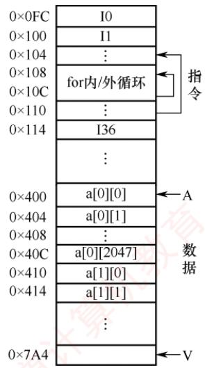
</div>

<p align="center"><em>图 3.17 指令和数据在主存的存放</em></p>

### 3.5.2 Cache 的基本工作原理

　　为便于 Cache 与主存交换信息，Cache 和主存都被划分为大小相等的块，Cache 块也称 Cache 行，每块由若干字节组成，块的长度称为块长（也称行长）。因为 Cache 的容量远小于主存的容量，所以 Cache 中的块数要远少于主存中的块数，Cache 中仅保存主存中最活跃的若干块的副本。因此，可按照某种策略预测 CPU 在未来一段时间内待访存的数据，将其装入 Cache。

#### 1. Cache 的访问过程

> **考点追踪：** Cache 命中对 CPU 执行时间影响的分析（2013、2015）

　　图 3.18 所示为典型的 Cache 访问流程。CPU 执行程序时，每当需要从主存取指令或读/写数据，

<div align="center">
  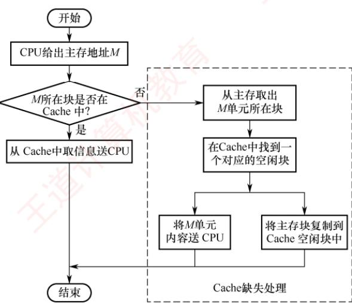
</div>

<p align="center"><em>图 3.18 典型的 Cache 访问流程</em></p>

　　首先访问 Cache。若所需信息已在 Cache 中（称为 Cache 命中），则直接从 Cache 读取，无须访问主存；若未命中（也称缺失），则需从主存中将该地址所在的一个主存块整体调入 Cache，并将该块写入一个 Cache 行（若 Cache 已满，则按替换算法选择被替换块）。此后，CPU 再从 Cache 中获取所需数据。整个访问过程（包括命中判断、块调入、替换等）必须在单条指令执行周期内完成，因此完全由硬件实现。Cache 机制对程序员是透明的。

　　上述访问流程是先查 Cache，未命中再访主存，这是统考真题遵循的方式。部分系统采用“并行访问”策略（同时查 Cache 和主存），若命中，则提前终止主存访问，但考试中通常不涉及。

#### 2. Cache 的命中率分析

> **考点追踪：** Cache 命中率的分析与计算（2009、2025）

　　CPU 所需访问的信息已在 Cache 中的概率称为 Cache 命中率。设某程序执行期间，Cache 命中次数为 $N_{c}$ ，访问主存的次数为 $N_{m}$ （未命中次数），则命中率 H 定义为

$$
H = N _ {c} / (N _ {c} + N _ {m})
$$

　　命中时：CPU 直接从 Cache 读取数据，耗时为命中时间 $T_{c}$ （访问 Cache 的时间）。

　　未命中时：需先从主存读取包含目标数据的一个主存块送入 Cache，再将所需数据送至 CPU，总耗时为 $T_{m} + T_{c}$ 。其中 $T_{m}$ 称为缺失损失，即从主存调入一个块所需的时间。

　　因此，Cache-主存系统的平均访问时间 $T_{a}$ 为

$$
T _ {a} = H T _ {c} + (1 - H) \left(T _ {m} + T _ {c}\right) = T _ {c} + (1 - H) T _ {m}
$$

> **考点追踪：** Cache 缺失率对主存带宽的影响（2012）

　　【例 3.2】假设 Cache 的速度是主存的 5 倍，且 Cache 的命中率为 95%，则采用 Cache 后，存储器性能提升多少（假设系统先访问 Cache，未命中时才访问主存）？

　　解：设 Cache 的存取时间为 t，则主存的存取时间为 5t。系统的平均访问时间 T 为

$T =$ 命中时的访问时间 $\times$ 命中率 $+$ 缺失时的访问时间 $\times$ 缺失率

$$
= 0. 9 5 \times t + 0. 0 5 \times (t + 5 t) = 1. 2 5 t
$$

　　或等价地

　　T= 命中时的访问时间 + 缺失时的访存开销×缺失率 $=t+0.05\times5t=1.25t$

　　可见，采用 Cache 后，存储器性能提升至原来的 5t/1.25t=4 倍。

　　根据 Cache 的读、写流程可知，实现 Cache 时需解决以下关键问题：

1）数据查找。如何快速判断所需数据是否在 Cache 中。

2）地址映射。主存块如何存放在 Cache 中，以及如何将主存地址转换为 Cache 地址。

3）替换策略。当 Cache 已满时，采用何种策略选择被替换的 Cache 行。

4）写入策略。如何在保证主存与 Cache 数据一致性的前提下，尽可能提升写操作效率。

### 3.5.3 Cache 和主存的映射方式

　　由于 Cache 行数远少于主存块数，Cache 只能存放主存中部分块的副本。为识别每个 Cache 行对应哪个主存块，需要为每行设置一个标记位，记录其主存块编号。同时设置一位有效位，用于指示该行数据是否有效。系统启动或复位时，所有 Cache 行均无效；仅当主存块被装入某 Cache 行后，其有效位才置为 1。

　　地址映射是指将主存地址空间按一定规则映射到 Cache 地址空间，即决定主存块如何装入 Cache。常见的映射方式有三种，包括直接映射、组相联映射和全相联映射。

#### 1. 直接映射

　　主存中的每一块只能装入 Cache 中的唯一指定位置。若该位置已有内容，则发生块冲突，原块将被无条件替换（无须替换算法）。直接映射实现简单，但灵活性差，即使 Cache 中其他行空闲，也不能用于存放该主存块，因此块冲突概率最高，空间利用率最低。

> **考点追踪：** 直接映射的地址结构及映射关系的分析（2010、2011、2015）

　　直接映射关系可表示为

$$
\text { Cache   行号 } = \text { 主存块号 } \mod \text { Cache   总行数 }
$$

　　设 Cache 共有 $2^{c}$ 行，主存共有 $2^{m}$ 块。则主存的第 0 块、第 $2^{c}$ 块、第 $2^{c+1}$ 块……均映射到 Cache 的第 0 行；主存的第 1 块、第 $2^{c}+1$ 块、第 $2^{c+1}+1$ 块……均映射到 Cache 的第 1 行，以此类推。

　　由此可见，主存块号的低 c 位即为其对应的 Cache 行号。

　　为标识来源，每个 Cache 行设置一个长度为 $t = m - c$ 的标记。当某主存块调入 Cache 后，将其块号的高 $t$ 位存入对应 Cache 行的标记字段中，如图 3.19(a) 所示。

<div align="center">
  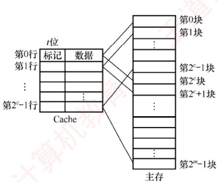
</div>

<p align="center"><em>(a) Cache和主存之间的映射关系</em></p>

<div align="center">
  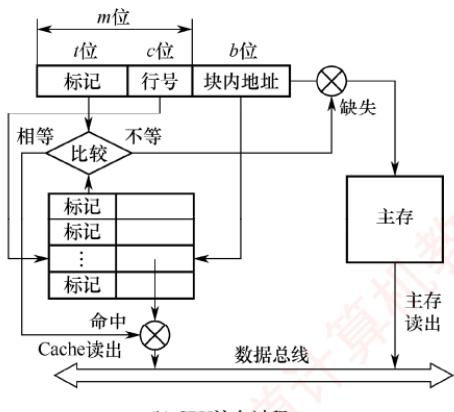
</div>

<p align="center"><em>图 3.19 Cache 和主存之间的直接映射方式</em></p>

　　直接映射的地址结构如下

<table><tr><td>标记</td><td>Cache 行号</td><td>块内地址</td></tr></table>

　　CPU 访存过程: 根据访存地址中间的 c 位确定 Cache 行，将该 Cache 行中的标记与主存地址的高 t 位进行比较，若标记相等且有效位为 1，则 Cache 命中，根据地址低位的块内地址从该 Cache 行中读取数据；若标记不等或有效位为 0，则 Cache 未命中，CPU 需从主存读取该地址所在块，将其装入对应 Cache 行，置有效位为 1，更新标记为地址高 t 位，并将所需数据送至 CPU。

#### 2. 全相联映射

　　主存中的每一块可以装入 Cache 中的任何位置，如图 3.20 所示。每行的标记用于指出该行来自主存的哪一块，因此 CPU 访存时需要与所有 Cache 行的标记进行比较。优点：① Cache 块的冲突概率低，只要有空闲 Cache 行，就不会发生冲突；② 空间利用率高；③ 命中率高。缺点：① 标记的比较速度较慢；② 实现成本较高，通常需采用按内容寻址的相联存储器。

<div align="center">
  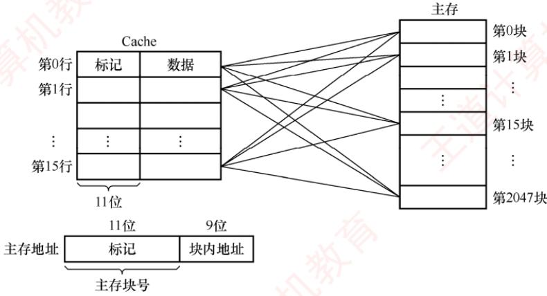
</div>

<p align="center"><em>图 3.20 Cache 和主存之间的全相联映射方式</em></p>

　　全相联映射的地址结构如下

<table><tr><td>标记</td><td>块内地址</td></tr></table>

　　CPU 访存过程：首先将主存地址的高位标记（位数 $=\log_{2}$ 主存块数）与 Cache 各行的标记进行比较。若有一个相等且对应有效位为 1，则 Cache 命中，此时根据块内地址从该 Cache 行中取出信息；若都不相等或有效位为 0，则 Cache 未命中，此时 CPU 从主存中读出该地址所在的一块信息装入 Cache 的任意一个空闲行，置有效位为 1，并设置标记，同时将所需数据送至 CPU。

> **考点追踪：** 根据地址结构和比较器数量判断映射方式（2018）

　　通常为每个 Cache 行都设置一个比较器，比较器的位数等于标记字段长度。访存时根据标记字段的内容访问 Cache 行中的主存块，因此其查找过程是一种按内容访问的存取方式，属于相联存储器。这种方式的时间开销和硬件开销都较大，不适合大容量 Cache。

#### 3. 组相联映射

> **考点追踪：** 组相联映射的原理（2009、2016、2018～2020、2023）

　　将 Cache 划分为 Q 个大小相等的组，每个主存块只能映射到固定组中的任意一行，即组间采用直接映射，组内采用全相联映射，如图 3.21 所示。它是直接映射与全相联映射的一种折中方案：当 Q = 1（整个 Cache 为一个组）时，退化为全相联映射；当 Q = Cache 总行数（每组仅 1 行）时，退化为直接映射。设每组包含 r 个 Cache 行，则称为 r 路组相联映射。

　　路数 r 越大，组内可选位置越多，块冲突概率越低，但所需的比较器数量和控制逻辑也越复杂。合理选择 r，可在硬件成本接近直接映射的同时，获得接近全相联映射的性能。

<div align="center">
  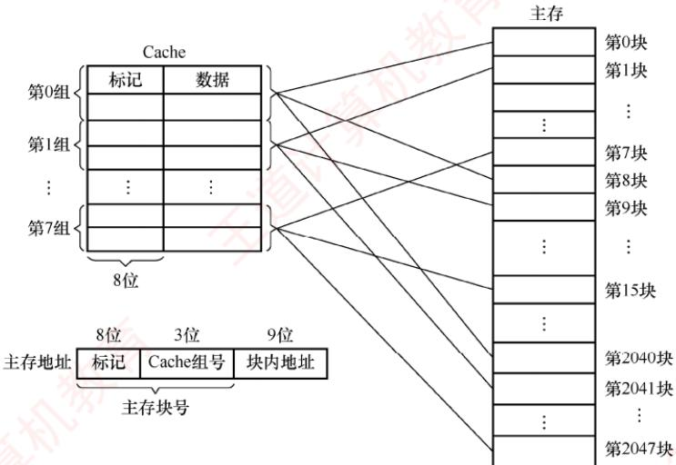
</div>

<p align="center"><em>图 3.21 Cache 和主存之间的 2 路组相联映射方式</em></p>

> **考点追踪：** 组相联映射的地址结构及映射关系的分析（2025）

　　组相联映射关系可表示为

　　Cache 组号 = 主存块号 mod Cache 组数 (Q)

　　组相联映射的地址结构如下

<table><tr><td>标记</td><td>组号</td><td>块内地址</td></tr></table>

> **考点追踪：** 组相联映射的访存过程及 Cache 缺失处理过程（2020）

　　CPU 访存过程：首先根据访存地址中的组号字段确定目标 Cache 组；将该组内所有 Cache 行的标记与主存地址的高位标记并行比较；若某行标记匹配且其有效位为 1，则 Cache 命中，根据块内地址从该行读取数据；若所有行均不匹配或匹配行的有效位为 0，则 Cache 未命中，CPU从主存读取该地址所在块，将其装入该组中任意一个空闲行（若无空闲行，则按替换算法选择一行），置有效位为 1，写入标记，并将所需数据送至 CPU。

> **考点追踪：** 组相联映射中比较器的个数和位数（2022）

　　直接映射中每块仅对应一个唯一的 Cache 行，因此只需设置 1 个比较器。而 r 路组相联映射需在同一组的 r 个 Cache 行中并行比较，因此需设置 r 个比较器。

　　在 Cache 容量和主存块大小固定的条件下，三种映射方式的特性对比如下：

1）命中率：直接映射最低，全相联映射最高。

2）判断开销与所需时间：直接映射最小、最快，全相联映射最大、最慢。

3）标记存储开销：直接映射最少，全相联映射最多。

### 3.5.4 Cache 中主存块的替换算法 $^{①}$

　　在采用全相联映射或组相联映射方式时，当向 Cache 传送一个新主存块而 Cache（或 Cache 组）已满，就需要使用替换算法选择被替换的 Cache 行。而在直接映射中，每个主存块只能映射到唯一的 Cache 行，因此当该行已被占用时，新块直接覆盖旧块，无须替换算法。

　　常用的替换算法包括随机、先进先出、最近最少使用和最不经常使用算法。

1）随机（RAND）算法：随机选择一个 Cache 行进行替换。实现简单，但未利用程序访问的局部性原理，命中率通常较低。

2）先进先出（FIFO）算法：替换最早装入的 Cache 行。实现较容易，但未考虑局部性原理，最早进入的块可能仍是当前热点数据，因此命中率不高。

> **考点追踪：** 组相联映射中LRU算法的命中率分析（2012、2021）

3）最近最少使用（LRU）算法：基于程序访问的局部性原理，优先替换最近最久未被访问的 Cache 行。其平均命中率通常高于 FIFO。LRU 算法是考查重点。

> **考点追踪：** LRU 替换位及其位数的计算（2018、2020）

　　在硬件实现中，LRU 算法为每组 Cache 维护一组计数器（常称 LRU 替换位），用来记录各 Cache 行的相对访问顺序。LRU 位的位数取决于组的路数：2 路组相联需 1 位 LRU 位，4 路组相联需 2 位 LRU 位。假定采用 4 路组相联，5 个主存块 $\{1, 2, 3, 4, 5\}$ 映射到同一 Cache 组，访问序列为 $\{1, 2, 3, 4, 1, 2, 5, 1, 2, 3, 4, 5\}$ ，LRU 替换过程如图 3.22 所示。图中左边阴影部分的数字表示对应 Cache 行的 LRU 计数值（反映最近访问顺序），右侧数字为主存块号。

<div align="center">
  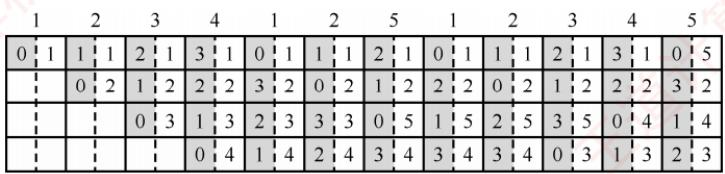
</div>

<p align="center"><em>图 3.22 LRU 算法的替换过程示意图</em></p>

　　计数器的更新规则：① 命中时，所命中行的计数器清零，比其低的计数器加 1，其余不变；② 未命中且有空闲行时，新装入的行的计数器置 0，其他非空闲行全加 1；③ 未命中且无空闲行时，替换计数值最大（本例中为 3）的行，新装入的行的计数器置 0，其余全加 1。

　　当被频繁访问的主存块数量超过 Cache 每组的行数时，可能导致持续缺失。例如，若访问序列变为 1, 2, 3, 4, 5, 1, 2, 3, 4, 5, …，而 Cache 每组仅有 4 行，则每次访问第 5 个块都会驱逐下一个将被访问的块，导致命中率为0，这种现象称为抖动。

4）最不经常使用（LFU）算法：替换一段时间内累计访问次数最少的 Cache 行。每行设置一个计数器，新行装入时计数器初始化为 0，每次访问该行则计数器加 1；替换时选择计数值最小的行。LFU 与 LRU 的思想不同：LRU 关注最近是否用过，LFU 关注总共用了多少次。

### 3.5.5 Cache的一致性问题

　　由于 Cache 中的内容是主存块的副本，当对 Cache 进行写操作时，必须采用适当的写策略以维持 Cache 与主存数据的一致性。根据写操作是否命中 Cache，可分为两类情况。所谓写命中是指 CPU 要写入的主存地址所在的块当前已在 Cache 中；反之则为写不命中。

#### 1. Cache 写命中的处理方法

> **考点追踪：** 直写法的原理及特点（2015、2020）

##### （1） 全写法（直写法，Write Through）

　　当 CPU 对 Cache 写命中时，数据同时写入 Cache 和主存。由于主存始终与 Cache 保持同步，因此在替换 Cache 块时，可直接覆盖，无须写回。该方法实现简单，能保证主存数据的实时正确性，但缺点是每次写操作都需访问主存，降低了系统性能。

　　为缓解直写法的性能开销，可在 Cache 与主存之间增设写缓冲（Write Buffer），如图 3.23 所示。CPU 将数据同时写入 Cache 和写缓冲，由写缓冲异步地将数据写入主存。写缓冲可缓解 CPU 与主存之间的速度差异。但在高频率写操作下，写缓冲可能饱和甚至溢出。

<div align="center">
  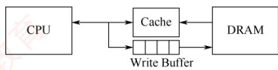
</div>

<p align="center"><em>图 3.23 在 Cache 和主存之间加一个写缓冲</em></p>

> **考点追踪：** 回写法的原理及应用（2018、2020）

##### （2） 回写法（Write Back） $^{①}$

　　当 CPU 对 Cache 写命中时，仅将数据写入 Cache，不立即写入主存，仅在该块被替换出 Cache 时才写回主存。这种方法减少了主存访问次数，提高了 Cache 效率，但存在数据不一致的风险。为避免不必要的写回操作，每个 Cache 行设置一个修改位（又称脏位）：若修改位为 1，表示该行数据已被修改，替换时必须写回主存；若修改位为 0，表示该行数据与主存一致，替换时可直接覆盖。需要注意的是，直写法无须脏位，因为主存始终同步；回写法则必须设置脏位。

#### 2. Cache 写不命中的处理方法

##### （1） 写分配法（Write Allocate） $^{②}$

　　当发生写不命中时，先将数据写入主存的对应单元，然后将该主存块调入 Cache 的一个空闲行中。该方法利用了程序的空间局部性，但每次写不命中都要将主存块加载到 Cache 中。

##### （2） 非写分配法（Not-Write-Allocate）

　　当发生写不命中时，直接将数据写入主存，不将主存块调入 Cache。

### 3.5.6 Cache 容量的计算举例

　　在计算 Cache 总容量时，需考虑 Cache 行的数据部分和每行的标记信息，即 Cache 总容量 = (每行标记位数 + 每行数据位数) × Cache 总行数

> **考点追踪：** >> Cache 标记信息的分析（2015、2021）

　　每行的标记信息通常包括：有效位、标记位、脏位和 LRU 替换位。其中，有效位和标记位是所有 Cache 必须包含的；脏位仅在采用回写策略时存在；LRU 替换位仅在使用 LRU 算法时存在，其位数取决于组内行数。图 3.24 展示了不同映射方式下 Cache 各字段的组成与分布。

　　1位 1位 $\log_2$ （组内块数）

<div align="center">
  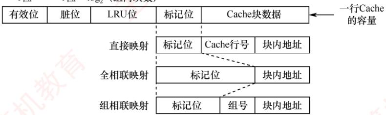
</div>

<p align="center"><em>图 3.24 不同映射方式下Cache各字段的组成与分布</em></p>

> **考点追踪：** 标记位分析及总容量的计算（2010、2021）

　　【例 3.3】假设某计算机的主存地址空间大小为 256MB，按字节编址，其数据 Cache 有 8 个 Cache 行，行长为 64B。请回答：

1）若不考虑脏位和替换算法控制位，并采用直接映射方式，求该数据 Cache 的总容量？

2）若采用直接映射方式，主存地址为3200（十进制）的主存块对应的Cache行号是多少？若采用2路组相联映射，对应的Cache组号及可能的行号是多少？

3）以直接映射方式为例，简述访存过程（设访存地址为0123456H）。

1）Cache 总容量 = 数据信息容量 + 标记信息容量（包括有效位和标记位）。本题不考虑脏位和替换算法控制位。主存地址位数为 28 位（主存地址空间为 $256MB = 2^{28}B$ ）；块内地址位数为 6 位（行长 $64B = 2^{6}B$ ）；Cache 行号为 3 位（Cache 行数 $8 = 2^{3}$ ）。标记信息位数 = 28 - 6 - 3 = 19 位。每行含 1 位有效位 + 19 位标记位 = 20 位标记信息。每行数据部分为 64B = 512 位。因此，Cache 总容量为 $8 \times (512 + 1 + 19) = 4256$ 位。

2）主存地址3200对应的块号为 $3200\mathrm{B} / 64\mathrm{B} = 50$ 。在直接映射方式中，Cache有8行，行号 $= 50\mathrm{mod}8 = 2$ ，故对应的Cache行号为2。

　　在组相联映射方式中，组内采用全相联映射，组外采用直接映射，组号 = 50 mod 4 = 2，即该块可映射到第 2 组中的任意一行，对应的 Cache 行号为 4 或 5。

3）在直接映射方式中，28位主存地址可分为19位的标记位，3位的块号，6位的块内地址，即0000 0001 0010 0011 010为标记位，001为块号，010110为块内地址。访存过程：根据行号010访问Cache第2行，比较其标记与地址高19位，并检查有效位：若匹配且有效位为1，则命中，按块内地址010110读取数据并送至CPU；否则未命中，从主存读取该块，写入Cache第2行，更新标记为地址高19位，并置有效位为1。

　　思考：若1）问中采用2路组相联映射方式，则Cache总容量是多少？结合主存与Cache的划分关系，推导2路组相联映射下的主存地址结构，并简述其访存过程。

### 3.5.7 Cache的应用

##### （1） 分离 Cache

> **考点追踪：** 采用分离的指令与数据 Cache 的目的（2014）

　　随着指令流水技术的发展，现代处理器通常将指令 Cache 和数据 Cache 分开设计，形成分离的 Cache 结构。统一 Cache 的优点在于其设计和实现相对简单，但在流水线执行中，取指部件和执行部件同时访问同一 Cache 时容易产生冲突。通过采用分离 Cache 结构，不仅可以消除这类冲突，还能针对指令和数据的不同局部性特征进行优化，从而提升整体性能。

##### （2） 多级 Cache

　　现代计算机普遍采用多级 Cache 结构。以两级为例，按距离 CPU 的远近分别称为 L1 Cache 和 L2 Cache：L1 离 CPU 最近，速度最快、容量较小；L2 则较远，速度较慢、容量较大。通常情况下，L1 级会采用分离的指令 Cache 和数据 Cache 设计，其中 L1 数据 Cache 在写操作中采用写分配法（写不命中时加载块）与回写法（写命中时不立即写主存）相结合的策略。图 3.25 展示了一个典型的两级 Cache 系统。通常，L1 和 L2 Cache 均采用回写法，当 L1 发生写命中时，仅更新 L1；当 L1 块被替换时，若为脏块，则写回 L2；L2 同理，在替换时写回主存。由于 L2 Cache 的访问速度远高于主存，L1 无须在写命中时访问主存，仅更新本地 Cache 即可快速完成写操作；后续的脏块写回由 L2 高效承接，从而有效避免因频繁写操作导致的写缓冲饱和或溢出问题。

<div align="center">
  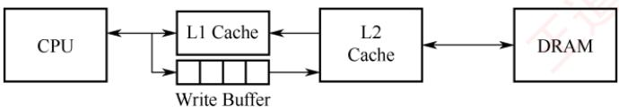
</div>

<p align="center"><em>图 3.25 一个含有两级Cache的系统</em></p>

### 3.5.8 本节习题精选

#### 一、单项选择题

01. 在高速缓存系统中，主存容量为 12MB，Cache 容量为 400KB，则该存储系统的容量为（）。

- A. 12MB + 400KB
- B. 12MB
- C. 12MB - 12MB + 400KB
- D. 12MB - 400KB

02. 访问 Cache 系统失效时, 通常不仅主存向 CPU 传送信息, 同时还需要将信息写入 Cache, 在此过程中传送和写入信息的数据宽度各为（）。

- A. 块、页
- B. 字、字
- C. 字、块
- D. 块、块

03. 假定用作 Cache 的 SRAM 的存取时间为 2ns，用作主存的 SDRAM 的存取时间为 40ns。为使存储系统的平均存取时间达到 3ns，则 Cache 命中率应达到（）左右。

- A. 92.5%
- B. 85%
- C. 97.5%
- D. 99.9%

04. 关于 Cache 的更新策略，下列说法中正确的是（）。

- A. 读操作时，全写法和回写法在命中时应用
- B. 写操作时，回写法和写分配法在命中时应用
- C. 读操作时，全写法和写分配法在失效时应用
- D. 写操作时，写分配法、非写分配法在失效时应用

05. 在不同的情况下，需要采用适合的 Cache 写策略。对于下面两种情况：① 主要运行访问密集型应用，其中包含写操作；② 安全性要求很高，不允许有任何数据不一致的情况发生。适合它们的写策略分别是（）。

- A. 回写法，全写法
- B. 全写法，回写法
- C. 回写法，回写法
- D. 全写法，全写法

06. 局部性通常有两种不同的形式：时间局部性和空间局部性。程序员是否能编写出高速缓存友好的代码，就取决于这两方面的问题。对于下面这个函数，说法正确的是（）。int sumvec(int v[N]) {
    int i,sum=0;
    for(i=0;i<N;i++)
    sum+=v[i];
    return sum;
    }

- A. 对于变量i和sum，循环体具有良好的空间局部性
- B. 对于变量i、sum和v[N]，循环体具有良好的空间局部性
- C. 对于变量i和sum，循环体具有良好的时间局部性
- D. 对于变量i、sum和v[N]，循环体具有良好的时间局部性

07. 对于下列代码，以下哪种变化将使其具有更好的空间局部性（）。 $①$ int i,j,k,sum=0; $②$ for(i=0;i<n;i++) $③$ for(j=0;j<n;j++) $④$ for(k=0;k<n;k++) $⑤$ sum+=a[k][j][i];

- A. 将第2行与第3行互换
- B. 将第2行与第4行互换
- C. 将第5行改为sum+=a[i][k][j];
- D. 将第5行改为sum+=a[j][i][k];

08. 下列关于高速缓存 Cache 的描述中，正确的是（）。

- A. Cache 的功能全部由硬件实现
- B. Cache 替换时的单位为字
- C. Cache 与主存统一编址，即主存地址空间的某一部分属于 Cache
- D. 无论何时，Cache 中的信息一定与主存中的信息一致

09. 下列关于 Cache 的描述中，比较合理的是（）。
 I. 指令 Cache 通常比数据 Cache 具有更好的空间局部性
 II. 由于空间局部性，适当增加 Cache 块大小通常会提高命中率
 III. 回写法的写主存操作次数少于直写法

- A. III
- B. I 和 II
- C. II 和 III
- D. I 和 II 和 III

10. 假设 Cache 采用 2 路组相联映射方式，Cache 共有 4 行（分为 2 组，每组 2 行），Cache 每行可存放一个主存块。组内采用 LRU 算法进行替换。给定主存块访问序列为 1,8,1,7,8,2,7,2,1,8,3,8,2,1,3,1,7,1,3,7 若 Cache 初始为空，则该访问序列的 Cache 缺失率为（）。

- A. 30%
- B. 50%
- C. 40%
- D. 45%

11. 已知某程序运行期间，L1 Cache 的命中率为 94%，而 L2 Cache 的局部命中率（在 L1 不命中情况下的命中率）为 85%。请问该存储系统的全局命中率（CPU 的访存请求最终在 L1 或 L2 中得到满足的比例）是多少？

- A. 97.9%
- B. 98.5%
- C. 99.1%
- D. 99.4%

12. 假设一个 Cache 中共有 M 块，每 K 块组成一个组，则下列描述中正确的是（）。

- A. 若 K = 1，则该 Cache 是直接映射 Cache
- B. 若 K = 1，则该 Cache 是全相联映射 Cache
- C. 若 K = M，则该 Cache 是直接映射 Cache
- D. 若 K > 1 且 K < M，则该 Cache 是 M/K 路组相联映射 Cache

13. 在 Cache 中，常用的替换策略有随机（RAND）算法、先进先出（FIFO）算法、近期最少使用（LRU）算法，其中与局部性原理有关的是（）。

- A. 随机（RAND）算法
- B. 先进先出（FIFO）算法
- C. 近期最少使用（LRU）算法
- D. 都不是

14. 某存储系统中，主存容量是 Cache 容量的 4096 倍，Cache 被分为 64 个块，采用直接映射方式、随机替换算法和全写法，则标记阵列（所有标记信息）的大小应为（）。

- A. $6 \times 4097$ bit
- B. $64 \times 12$ bit
- C. $6 \times 4096$ bit
- D. $64 \times 13$ bit

15. 有效容量为 128KB 的 Cache，每块 16B，采用 8 路组相联。字节地址为 1234567H 的单元调入该 Cache，则其标记位字段应为（）。

- A. 1234H
- B. 2468H
- C. 048DH
- D. 12345H

16. 某个主存-Cache 层的存储器，按字节编址，主存容量为 1MB，Cache 容量为 16KB，每块有 8 个字，每字 32 位，采用直接映射方式，Cache 起始字块为第 0 块，若主存地址为 35301H，且 CPU 访问 Cache 命中，则在 Cache 的第（）（十进制表示）字块中。

- A. 152
- B. 153
- C. 154
- D. 151

17. 对于由高速缓存、主存、硬盘构成的三级存储系统，CPU 直接根据（）进行访问。

- A. 高速缓存地址
- B. 虚拟地址
- C. 主存物理地址
- D. 磁盘地址

18. 设有 8 页的逻辑空间，每页有 1024B，它们被映射到 32 个物理块中，则按字节编址逻辑地址的有效位是（），物理地址至少是（）位。

- A. 10, 12
- B. 10, 15
- C. 13, 15
- D. 13, 12

19. 对于 $n$ 路组相联映射 Cache，在保持 $n$ 及主存和 Cache 总容量不变的前提下，将主存块大小和 Cache 块大小都增加一倍，则下列描述中正确的是（）。

- A. 字块内地址的位数增加 1 位，主存标记字段的位数增加 1 位
- B. 字块内地址的位数增加 1 位，主存标记字段的位数不变
- C. 字块内地址的位数减少 1 位，主存标记字段的位数增加 1 位
- D. 字块内地址的位数增加 1 倍，主存标记字段的位数减少一半

20. 某计算机的 Cache 有 16 行，块大小为 16B，其映射方式可配置为直接映射或 2 路组相联映射，主存按字节编址，主存单元从 0 开始编号。若依次访问下列主存单元，则不论采取上述哪种映射方式都可能引起 Cache 冲突的是（）。

- A. 52 号和 102 号单元
- B. 48 号和 308 号单元
- C. 60 号和 160 号单元
- D. 46 号和 236 号单元

21. 假设主存地址位数为 32 位，按字节编址，主存和 Cache 之间采用全相联映射方式，主存块大小为 1 个字，每字 32 位，采用回写法（Write Back）方式和随机替换策略，则能存放 32K 字数据的 Cache 的总容量至少应有（）位。

- A. 1536K
- B. 1568K
- C. 2016K
- D. 2048K

22. 假设主存按字节编址，Cache 共有 64 行，采用 4 路组相联映射方式，主存块大小为 32 字节，所有编号都从 0 开始。则第 2593 号存储单元所在主存块的 Cache 组号是（）。

- A. 1
- B. 15
- C. 14
- D. 4

23. 假定 CPU 通过存储器总线读取数据的过程为：发送地址和读命令需 1 个时钟周期，存储器准备一个数据需 8 个时钟周期，总线上每传送 1 个数据需 1 个时钟周期。若主存和 Cache 之间交换的主存块大小为 64B，存取宽度和总线宽度都为 8B，则 Cache 的一次缺失损失至少为（）个时钟周期。

- A. 64
- B. 72
- C. 80
- D. 160

24. 假定8个存储器模块采用交叉方式组织，存储芯片和总线支持突发传送，CPU通过存储器总线读取数据的过程为：发送首地址和读命令需1个时钟周期，存储器准备第一个数据需8个时钟周期，随后每个时钟周期总线上传送1个数据，可连续传送8个数据（突发长度为8）。若主存和Cache之间交换的主存块大小为64B，存取宽度和总线宽度都为8B，则Cache的一次缺失损失至少为（）个时钟周期。

- A. 17
- B. 20
- C. 33
- D. 80

25. 下列关于 Cache 替换算法的叙述中，错误的是（）。

- A. 组相联映射和全相联映射都必须考虑如何进行替换
- B. 先进先出算法无须对每个 Cache 行记录替换信息
- C. 直接映射是多对一的映射，无须考虑替换问题
- D. LRU 算法需要对每个 Cache 行记录替换信息

26. 下列关于 Cache 大小、主存块大小和 Cache 缺失率之间关系的叙述中，错误的是（）。

- A. 主存块大小和 Cache 容量无直接关系
- B. Cache 容量越大，Cache 缺失率越低
- C. 主存块大小通常为几十到上百字节
- D. 主存块越大，Cache 缺失率越低

27. 若计算机按字编址，Cache 数据区容量为 8K 字，主存块大小为 512 字，主存地址空间为 1M 字，采用 2 路组相联映射方式。每次根据主存地址访问 Cache 时，需要同时进行（）次标记位的比较，每次需要比较的位数是（）。

- A. 2,8
- B. 2,16
- C. 4,8
- D. 4,16

28. 【2009 统考真题】假设某计算机的存储系统由 Cache 和主存组成，某程序执行过程中访存 1000 次，其中访问 Cache 缺失（未命中）50 次，则 Cache 的命中率是（）。

- A. 5%
- B. 9.5%
- C. 50%
- D. 95%

29. 【2009 统考真题】某计算机的 Cache 共有 16 块，采用 2 路组相联映射方式（每组 2 块）。每个主存块大小为 32B，按字节编址，主存 129 号单元所在主存块应装入的 Cache 组号是（）。

- A. 0
- B. 2
- C. 4
- D. 6

30. 【2012 统考真题】假设某计算机按字编址，Cache 有 4 行，Cache 和主存之间交换的块大小为 1 个字。若 Cache 的内容初始为空，采用 2 路组相联映射方式和 LRU 算法，则访问的主存地址依次为 0, 4, 8, 2, 0, 6, 8, 6, 4, 8 时，命中 Cache 的次数是（）。【提示，本题的映射方式与本书所讲的映射方式不同，具体见解析部分的“注意”】

- A. 1
- B. 2
- C. 3
- D. 4

31. 【2015 统考真题】假定主存地址为 32 位，按字节编址，主存和 Cache 之间采用直接映射方式，主存块大小为 4 个字，每字 32 位，采用回写方式，则能存放 4K 字数据的 Cache 的总容量的位数至少是（）。

- A. 146K
- B. 147K
- C. 148K
- D. 158K

32. 【2016 统考真题】有如下 C 语言程序段:
for (k=0; k<1000; k++)
a[k] = a[k]+32;

若数组 a 和变量 k 均为 int 型，int 型数据占 4B，数据 Cache 采用直接映射方式，数据区大小为 1KB、块大小为 16B，该程序段执行前 Cache 为空，则该程序段执行过程中访问数组 a 的 Cache 缺失率约为（）。

- A. 1.25%
- B. 2.5%
- C. 12.5%
- D. 25%

33. 【2017 统考真题】某 C 语言程序段如下:

for (i=0;i<=9;i++) {
    temp=1;
    for (j=0;j<=i;j++) temp*=a[j];
    sum += temp;
}

下列关于数组a的访问局部性的描述中，正确的是（）。

- A. 时间局部性和空间局部性皆有
- B. 无时间局部性，有空间局部性
- C. 有时间局部性，无空间局部性
- D. 时间局部性和空间局部性皆无

34. 【2021 统考真题】若计算机主存地址为 32 位，按字节编址，Cache 数据区大小为 32KB，主存块大小为 32B，采用直接映射方式和回写法（Write Back），则 Cache 行的位数至少是（）。

- A. 275
- B. 274
- C. 258
- D. 257

35. 【2022 统考真题】若计算机主存地址为 32 位，按字节编址，某 Cache 的数据区容量为 32KB，主存块大小为 64B，采用 8 路组相联映射方式，该 Cache 中比较器的个数和位数分别为（）。

- A. 8, 20
- B. 8, 23
- C. 64, 20
- D. 64, 23

#### 二、综合应用题

01. 某计算机的主存地址位数为32位，按字节编址。假定数据Cache中最多存放128个主存块，采用4路组相联映射方式，块大小为64B，每块设置了1位有效位。采用随机替换算法，写磁盘采用回写法，为此每块设置了1位脏位。要求：1）分别指出主存地址中标记（Tag）、组号（Index）和块内地址（Offset）三部分的位置与位数。2）计算该数据Cache的总位数。

02. 某个 Cache 的容量大小为 64KB，行长为 128B，且是 4 路组相联 Cache，主存使用 32 位地址，按字节编址。

2）该 Cache 的标记阵列中需要有多少标记项？每个标记项中标记位长度是多少？

3）该 Cache 采用 LRU 算法，若当该 Cache 为全写法 Cache 时，标记阵列总共需要多大的存储容量？回写法又该如何？（提示：4 路组相联 Cache 使用 LRU 算法的替换控制位为 2 位。）

03. 某计算机有容量为 256B 的数据 Cache，主存块大小为 32B。现有如下 C 语言程序段：
    int i, j, c, s, a[128];
    ...
    for (i=0; i<10000; i++)
    for (j=0; j<128; j=j+s)
    c=a[j];

　　int型数据用32位补码表示，编译器将变量i,j,c,s都分配在通用寄存器中，因此，只需考虑数组元素的访存情况，假定数组起始地址正好在一个主存块的开始。请回答：

1）若 Cache 采用直接映射方式，则当 s=64 和 s=63 时，缺失率分别为多少？

2）若 Cache 采用 2 路组相联映射方式，则当 s=64 和 s=63 时，缺失率分别为多少？

04. 【2010 统考真题】某计算机的主存地址空间大小为 256MB，按字节编址。指令 Cache 和数据 Cache 分离，均有 8 个 Cache 行，每个 Cache 行大小为 64B，数据 Cache 采用直接映射方式。现有两个功能相同的程序 A 和 B，其伪代码如下所示：

　　程序B: int a[256][256];

```txt
int sum_array1()
{
    int i, j, sum=0;
    for (i=0; i<256; i++)
    for (j=0; j<256; j++)
    sum += a[i][j];
    return sum;
}

int sum_array2()
{
    int i, j, sum=0;
    for (j=0; j<256; j++)
    for (i=0; i<256; i++)
    sum += a[i][j];
    return sum;
}
```

　　假定 int 型数据用 32 位补码表示，程序编译时，i、j 和 sum 均分配在寄存器中，数组 a 按行优先方式存放，其首地址为 320（十进制数）。请回答下列问题，要求说明理由或给出计算过程。

1）不考虑用于 Cache 一致性维护和替换算法的控制位，数据 Cache 的总容量为多少？

2）数组元素 a[0][31] 和 a[1][1] 各自所在的主存块对应的 Cache 行号是多少（Cache 行号从 0 开始）？

3）程序A和B的数据访问命中率各是多少？哪个程序的执行时间更短？

05. 【2013 统考真题】某 32 位计算机，CPU 主频为 800MHz，Cache 命中时的 CPI 为 4，Cache 块大小为 32B；主存采用 8 体交叉存储方式，每个体的存储字长为 32 位、存取周期为 40ns；存储器总线宽度为 32 位，总线时钟频率为 200MHz，支持突发传送总线事务。每次读突发传送总线事务的过程包括：传送首地址和命令、存储器准备数据、传送数据。每次突发传送 32B，传送地址或 32 位数据均需要一个总线时钟周期。请回答下列问题，要求给出理由或计算过程。

1）CPU和总线的时钟周期各为多少？总线的带宽（最大数据传输速率）为多少？

2）Cache缺失时，需要用几个读突发传送总线事务来完成一个主存块的读取？

3）存储器总线完成一次读突发传送总线事务所需的时间是多少？

4）若程序BP执行过程中共执行了100条指令，平均每条指令需进行1.2次访存，Cache缺失率为 $5\%$ ，不考虑替换等开销，则BP的CPU执行时间是多少？

06. 【2020 统考真题】假定主存地址为 32 位，按字节编址，指令 Cache 和数据 Cache 与主存之间均采用 8 路组相联映射方式，直写法（Write Through）和 LRU 算法，主存块大小为 64B，数据区容量各为 32KB。开始时 Cache 均为空。请回答下列问题。

1）Cache 每一行中标记、LRU 位各占几位？是否有修改位？

2）有如下 C 语言程序段：

```txt
for (k = 0; k < 1024; k++)
```

```txt
s[k] = 2 * s[k];
```

　　若数组 s 及其变量 k 均为 int 型，int 型数据占 4B，变量 k 分配在寄存器中，数组 s 在主存中的起始地址为 0080 00C0H，则在该程序段执行过程中，访问数组 s 的数据 Cache 缺失次数为多少？

3）若CPU最先开始的访问操作是读取主存单元0001 0003H中的指令，简要说明从Cache中访问该指令的过程，包括Cache缺失处理过程。

### 3.5.9 答案与解析

#### 一、单项选择题

**01. B**
　　选项 A 为干扰项。各层次的存储系统不是孤立工作的，三级结构的存储系统是围绕主存储器来组织、管理和调度的存储器系统，它们既是一个整体，又要遵循系统运行的原理，其中包括包含性原则。因为 Cache 中存放的是主存中某一部分信息的副本，所以不能认为总容量为两个层次容量的简单相加。

**02. C**

　　一个块通常由若干字组成，CPU 与 Cache（或主存）间信息交互的单位是字，而 Cache 与主存间信息交互的单位是块。当 CPU 访问的某个字不在 Cache 中时，将该字所在的主存块调入 Cache，这样 CPU 下次要访问的字才有可能在 Cache 中。

**03. C**

　　Cache 命中时的存取时间为 2ns；Cache 不命中时先访问 Cache，再访问主存，总存取时间为 42ns。设 Cache 命中率为 x，则平均存取时间为 $2x + 42(1 - x) = 3$ ，解得 $x = 97.5\%$ .

**04. D**

　　在写不命中时，加载相应的低一层中的块到 Cache 中，然后更新这个高速缓存块，称为写分配法；而避开 Cache，直接把这个字写到主存中，则称为非写分配法。这两种方法都是在不命中 Cache 的情况下使用的，而回写法和全写法是在命中 Cache 的情况下使用的。在写 Cache 时，写分配法和回写法搭配使用，非写分配法和全写法搭配使用。

**05. A**

　　写操作比较密集，采用回写法速度快，更适合访问密集型的应用。全写法每次均写入主存和Cache，能够随时保持主存数据的一致性，适合安全性要求很高的应用。

**06. C**

　　时间局部性是指一个内存位置被重复引用，循环体中的变量 i 和 sum 具有良好的时间局部性。空间局部性是指若一个内存位置被引用，则它附近的位置很快也会被引用，因为指令通常是顺序存放、顺序执行的，数据一般也是以向量、数组等形式存储的，v[N]具有良好的空间局部性。

**07. B**

　　空间局部性是指程序在一段时间内所访问的存储空间的集中度。为了提高空间局部性，应尽量按照数组在内存中的存储顺序依次访问数组元素。根据 C 语言的规定，数组 a 在内存中是按最右下标变化最快的方式存储的，即 a[0][0][0]，a[0][0][1]，…，a[0][0][n-1]，a[0][1][0]，…，a[0][n-1][n-1]，a[1][0][0]，…，a[n-1][n-1][n-1]。因此，若将代码的第 2 行与第 4 行互换，则可使得对数组 a 的访问变成顺序访问，从而提高其空间局部性。

**08. A**

　　Cache 的功能完全由硬件实现，选项 A 正确。Cache 替换时的单位是块，而不是字或字节，因为 Cache 和主存是以块为单位进行数据交换的。Cache 地址空间和主存地址空间相互独立，通过地址映射把主存地址空间映射到 Cache 地址空间。Cache 中的信息不一定与主存中的信息一致，因为 Cache 可能采用回写策略，只有当被修改的块被换出时才写回主存。

**09. D**

　　指令 Cache 通常比数据 Cache 具有更好的空间局部性，这是因为指令流通常是顺序执行的，而数据流转移或随机访问的概率较高，说法 I 正确。因为空间局部性，同一主存块中的数据的访问概率较高，所以增加 Cache 块大小会提高命中率，说法 II 正确。写回法只有在被修改的块被换出时才写回主存，而直写法每次写操作都会同时写回主存，说法 III 正确。

**10. C**

　　Cache 为 2 路组相联，组号 = 块号 mod 2，组内采用 LRU 算法。对 20 次主存块访问序列模拟，缺失发生在第 1、2、4、6、11、17、19、20 次，共 8 次。缺失率 = 8/20 = 40%。

**11. C**

　　L1 命中率为 94%，故 L1 未命中率为 6%。L2 在 L1 未命中时的局部命中率为 85%，因此 L2 命中的比例为 $6\% \times 85\% = 5.1\%$ 。全局命中率 $= \mathrm{L}1$ 命中率 $+\mathrm{L}2$ 命中比例 $= 94\% +5.1\% = 99.1\%$

**12. A**

　　当 K=1 时，每组仅含 1 块，主存块只能映射到唯一 Cache 位置，属于直接映射，选项 A 正确，选项 B 错误。当 K=M 时所有块组成一组，即全相联映射，选项 C 错误。若 Cache 共 M 块、每组 K 块，则组数为 M/K，应称为 K 路组相联，而非 “M/K 路”，故选项 D 错误。

**13. C**

　　LRU算法根据程序访问局部性原理选择近期使用得最少的存储块作为替换的块。

**14. D**

　　Cache 采用随机替换算法和全写法，因此无须脏位和替换算法控制位，每行仅需标记字段和 1 位有效位。Cache 共 64 块，直接映射下每块对应一组，故有 64 个标记项。主存容量是 Cache 容量的 4096 倍，即 $2^{12}$ 倍，说明主存地址比 Cache 地址多 12 位，这 12 位即为标记字段长度。因此每个标记项含 12 位标记 + 1 位有效位 = 13 位，标记阵列总大小为 $64 \times 13$ bit。

**15. C**

　　块大小为 16B，所以块内地址字段为 4 位；Cache 容量为 128KB，采用 8 路组相联，共有 $128KB \div (16B \times 8) = 1024$ 组，组号字段为 10 位；剩下的为标记字段。1234567H 转换为二进制数 0001001000110100010101100111，标记字段对应高 14 位，即 048DH。

**16. A**

　　先写出主存地址的二进制形式，然后分析 Cache 块内地址、Cache 字块地址和主存字块标记。主存地址的二进制数 0011 0101 0011 0000 0001，根据直接映射的地址结构，字块内地址为低 5 位（每个字块 32B， $2^{5}=32$ ，因此为 5 位），主存字块标记为高 6 位（1MB/16KB=64， $2^{6}=64$ ，因此为 6 位），其余 01 0011 000 即为 Cache 字块地址，转换为十进制数 152。

**17. C**

　　当 CPU 访存时，先要到 Cache 中查看该主存地址是否在 Cache 中，所以发送的是主存物理地址。只有在虚拟存储器中，CPU 发出的才是虚拟地址，这里并未指出是虚拟存储系统。磁盘地址是外存地址，外存中的程序由操作系统调入主存中，然后在主存中执行，因此 CPU 不可能直接访问磁盘。

**18. C**

　　对于逻辑地址，因为 $8 = 2^{3}$ 页，所以表示页号的地址有 3 位，又因为每页有 $1024 = 2^{10}B$ ，所以页内地址有 10 位，因此逻辑地址共 13 位。

　　对于物理地址，块内地址和页内地址一样有 10 位，内存至少有 $32 = 2^{5}$ 个物理块，所以表示块号的地址至少有 5 位，因此物理地址至少有 15 位。

**19. B**

　　组相联映射的主存地址结构为：标记 + Cache 组号 + 块内地址。Cache 块大小增加一倍，则字块内地址的位数增加 1 位。Cache 组数 = (Cache 总容量 / Cache 块大小) / n，所以 Cache 组数减少一半；Cache 组号 = 主存块号 MOD Cache 组数，所以 Cache 组号也减少 1 位。主存总容量不变，则主存地址总长度不变，字块内地址和 Cache 组号一个增 1 位，一个减 1 位，因此标记字段的位数不变。

**20. B**

　　块大小为 $16B = 2^{4}B$ ，所以块内地址占 4 位。若采用直接映射方式，Cache 共 16 行，主存地址的第 5～8 位为 Cache 行号，Cache 行号 = 主存块号 % Cache 总行数 = (主存地址 / 16) % 16，选项 B 的地址 48 和 308 的 Cache 行号均为 3，产生冲突。若采用 2 路组相联映射方式，共有 16/2 =

　　8 组，主存地址中块内地址的前 3 位为 Cache 组号，Cache 组号 = 主存块号 % Cache 组数 = (主存地址 / 16) % 8，选项 B 的地址 48 和 308 的 Cache 组号均为 3，可能产生冲突。

**21. D**

　　主存块大小为 1 个字，即 32 位，按字节编址，所以块内地址占 2 位。在全相联映射方式下，主存地址只有两个字段，所以标志占 32 - 2 = 30 位。因为采用回写法，所以需 1 位修改位；因为采用随机替换算法，所以无须替换控制位。每个 Cache 行的总位数为 32bit（数据位）+ 30bit（标记位）+ 1bit（修改位）+ 1bit（有效位）=64bit。综上，Cache 总容量至少应有 $32K \times 64bit = 2048K$ bit。

**22. A**

　　主存块大小为 32 字节，按字节编址，所以块内地址占 5 位。采用 4 路组相联映射方式，共 64 行，分 64/4 = 16 组，所以组号占 4 位。因为 $2593 = 0 \cdots 0101000100001$ ，根据主存地址划分的结果，可以看出第 2593 号存储单元所在主存块的 Cache 组号为 0001。

**23. C**

　　一次缺失损失需要从主存读出一个主存块（64B），每个总线事务读取8B，因此需要8个总线事务。每个总线事务所用的时间为 $1+8+1=10$ 个时钟周期，共需要80个时钟周期。

**24. A**

　　一次缺失损失需要从主存读出一个主存块(64B)，每个突发传送总线事务可读取 $8B \times 8 = 64B$ ，因此只需要一个突发传送总线事务。首先，发送首地址和读命令需要一个时钟周期，然后轮流启动每个存储器模块，每隔一个时钟周期启动一个存储器模块，采用流水线工作方式，所以每个突发传送总线事务所用的时间为 $1 + 8 + 8 = 17$ 个时钟周期，因此共需17个时钟周期。

**25. B**

　　对于直接映射，主存中的每一块只能装入 Cache 中的唯一位置，若产生块冲突，原来的块将被无条件换出，因此无须考虑替换问题，而组相联映射和全相联映射都需要考虑替换问题。先进先出算法需要对每个 Cache 行打一个时间戳，记录何时装入了一个新主存块。

**26. D**

　　主存块太小，不能很好地利用空间局部性，从而导致缺失率变高；但主存块太大也会使得 Cache 行数变少，即 Cache 中可以存放主存块的位置变少，从而也会降低命中率。因此，主存块大小应该适中，既不能太大，又不能太小，通常为几十字节到上百字节。

**27. A**

　　Cache 中比较器的个数取决于 Cache 的关联度（这个名词不常见，了解即可），即一个主存块可能映射到 Cache 中的几个行。在 2 路组相联映射方式中，关联度是 2，因此 Cache 中有 2 个比较器，每次根据主存地址访问 Cache 时，需要同时进行 2 次比较。比较器的作用是比较主存地址中的标记字段和 Cache 中的标记位，因此比较器的位数取决于主存地址中标记位占多少位。主存地址空间是 1M 字，主存地址的位数是 20，其中块内地址占 9 位，Cache 共有 8K/1K = 8 组，组号占 3 位，因此标记位的位数是 20 - 9 - 3 = 8，即每次需要比较的位数是 8。

**28. D**

　　命中率 = Cache 命中次数/总访问次数。注意看清题目，题中说明的是缺失 50 次，而不是命中 50 次，仔细审题是做对题的第一步。

**29. C**

　　因为 Cache 共有 16 块，采用 2 路组相联映射方式，共分为 8 组，组号为 0, 1, 2, …, 7，组号占 3 位。主存块大小为 32B，按字节编址，块内地址占 5 位。主存单元地址 $129 = 0 \cdots 0$ 100 00001，后 5 位是块内地址，块内地址的前 3 位是组号，所以将映射到组号 4 的任意一个 Cache 块中。

**30. C**

　　地址映射采用 2 路组相联，主存字地址为 0～1、4～5、8～9 可映射到第 0 组 Cache 中，主存地址为 2～3、6～7 可映射到第 1 组 Cache 中。Cache 置换过程如下表所示。

<table><tr><td colspan="2">走向</td><td>0</td><td>4</td><td>8</td><td>2</td><td>0</td><td>6</td><td>8</td><td>6</td><td>4</td><td>8</td></tr><tr><td rowspan="2">第0组</td><td>块0</td><td></td><td>0</td><td>4</td><td>4</td><td>8</td><td>8</td><td>0</td><td>0</td><td>8</td><td>4</td></tr><tr><td>块1</td><td><eq>\underline{0}</eq></td><td><eq>\underline{4}</eq></td><td><eq>\underline{8}</eq></td><td>8</td><td><eq>\underline{0}</eq></td><td>0</td><td><eq>\underline{8}^{*}</eq></td><td>8</td><td><eq>\underline{4}</eq></td><td><eq>\underline{8}^{*}</eq></td></tr><tr><td rowspan="2">第1组</td><td>块2</td><td></td><td></td><td></td><td></td><td></td><td>2</td><td>2</td><td>2</td><td>2</td><td>2</td></tr><tr><td>块3</td><td></td><td></td><td></td><td><eq>\underline{2}</eq></td><td>2</td><td><eq>\underline{6}</eq></td><td>6</td><td><eq>\underline{6}^{*}</eq></td><td>6</td><td>6</td></tr></table>

　　注：“_”表示当前访问块，“*”表示本次访问命中。

> **注意**

　　在不同的计算机组成原理教材中，关于组相联映射的介绍并不相同。通常是采用上题中的方式，也是本书及唐朔飞所编教材中的方式，但本题中采用的是蒋本珊所编教材中的方式。可以推断两次命题的老师应该不是同一老师，这也给考生答题带来了困扰。

**31. C**

　　直接映射的地址结构为

<table><tr><td>主存字块标记</td><td>Cache 字块标记</td><td>字块内地址</td></tr></table>

　　按字节编址，块大小为 $4 \times 32$ 位 = 16B = $2^{4}B$ ，则“字块内地址”占4位；“能存放4K字数据的Cache”即Cache的存储容量为4K字（注意单位），则Cache共有 $1K = 2^{10}$ 个Cache行，Cache字块标记占10位；主存字块标记占32 - 10 - 4 = 18位。

　　Cache 总容量包括：存储容量和标记阵列容量（有效位、标记位、脏位和替换算法控制位）。标记阵列中的有效位和标记位一定存在，而脏位和替换算法控制位的取舍需要看题意，题目中明确说明了采用回写法，则一定包含一致性维护位，而关于替换算法的词眼题目中未提及，所以不予考虑。因此，每个 Cache 行标记项包含 $18 + 1 + 1 = 20$ 位，标记阵列容量为 $2^{10} \times 20$ 位 = 20K 位，存储容量为 $4K \times 32$ 位 = 128K 位，总容量为 $128K + 20K = 148K$ 位。

**32. C**

　　分析语句 “a[k] = a[k] + 32”：首先读取 a[k] 需要访问一次 a[k]，之后将结果赋值给 a[k] 需要访问一次，共访问两次。第一次访问 a[k] 未命中，并将该字所在的主存块调入 Cache 对应的块中，对该主存块中的 4 个整数的两次访问中，只在访问第一次的第一个元素时发生缺失，其他的 7 次访问中全部命中，因此该程序段执行过程中访问数组 a 的 Cache 缺失率约为 12.5%。

**33. A**

　　时间局部性是指最近的未来要用到的信息，很可能是现在正在使用的信息，本题的外层循环每次都会访问一次数组 a，体现了时间局部性。空间局部性是指最近的未来要用到的信息，很可能与现在正在使用的信息在存储空间上是邻近的，本题在访问数组 a 的过程中是顺序访问的，体现了空间局部性。

**34. A**

　　Cache 数据区大小为 32KB，主存块的大小为 32B，于是 Cache 中共有 1K 个 Cache 行，物理地址中偏移量部分的长度为 5bit。因为采用直接映射方式，所以 1K 个 Cache 行映射到 1K 个分组，物理地址中组号部分的长度为 10bit。32bit 的主存地址除去 5bit 的偏移量和 10bit 的组号后，还剩 17bit 的标记部分。又因为 Cache 采用回写法，所以 Cache 行的总位数应为 32B（数据位）+ 17bit（标记位）+ 1bit（脏位）+ 1bit（有效位）= 275bit。

**35. A**

　　Cache 采用组相联映射，主存地址结构应分为标记、组号、块内地址三部分。主存块大小 = Cache 块大小 = 64B = 2 $^{6}$ B，因此块内地址占 6 位。Cache 数据区容量为 32KB，每个 Cache 块大小为 64B，则 Cache 总块数 = 32KB/64B = 2 $^{9}$ ，因为采用 8 路组相联映射，即每 8 个 Cache 块为一个分组，所以共被分为 2 $^{9}$ /8 = 2 $^{6}$ 组，因此，组号占 6 位。除了块内地址和组号，剩余的位为标记位，占 32 - 6 - 6 = 20 位。地址结构如下所示。

<table><tr><td>标记</td><td>组号</td><td>块内地址</td></tr><tr><td>20 位</td><td>6 位</td><td>6 位</td></tr></table>

　　Cache 采用 8 路组相联映射，因此在访问一个物理地址时，要先根据组号定位到某一分组，然后用物理地址的高 20 位（标记）与分组中 8 个 Cache 行的标记做并行比较（用 8 个 20 位 “比较器” 实现），若某个 Cache 行的标记与物理地址的高 20 位完全一致，则选中该 Cache 行。综上所述，在组相联映射的 Cache 中，“比较器”用于并行地比较分组中所有 Cache 行的标记位与要访问物理地址的标记位，因此比较器的个数就是分组中的 Cache 行数 8，比较器的位数就是标记位数 20。

#### 二、综合应用题

**01. 【解答】**

　　块大小为 64B，因此块内地址字段占 6 位；Cache 中有 128 个主存块，采用 4 路组相联，所以 Cache 分为 32 组（128/4 = 32），因此组号字段占 5 位；标记字段为剩余的 32 - 5 - 6 = 21 位。

　　数据 Cache 的总位数应包括标记项的总位数和数据块的位数。每个 Cache 块对应一个标记项，标记项中应包括标记字段、有效位和 “脏” 位（仅适用于回写法）。

1）主存地址中标记为21位，位于主存地址前部；Index为5位，位于主存地址中部；Offset为6位，位于主存地址后部。

2）标记项的总位数 $= 128 \times (21 + 1 + 1) = 128 \times 23 = 2944$ 位，数据块位数 $= 128 \times 64 \times 8 = 65536$ 位，所以数据 Cache 的总位数 $= 2944 + 65536 = 68480$ 位。

**02. 【解答】**

1）64KB/128B = 512，因此有 512 行。而该 Cache 是 4 路组相联，所以 512/4 = 128 组。

2）每行有一个标记项，因此有512个标记项。主存字块标记长度就是标记位的长度，因为该Cache有128组（ $= 2^{7}$ ），所以7位为组地址。而行长128B（ $= 2^{7}$ ），7位为字块内地址，因此该标记项中的标记位长度为 $32 - 7 - 7 = 18$ 位。

3）LRU算法要记录每个Cache行的生存时间，故每个标记项有两位替换控制位。而全写法没有脏位（一致性控制位），再加一个有效位即可。因此每个标记项位数是 $18 + 2 + 1 = 21$ 位，因此总大小为 $512 \times 21 = 10752$ 位。

　　回写法则是每个标记项加一个一致性控制位，因此为 $512 \times 22 = 11264$ 位。

**03. 【解答】**

　　块大小为 32B，数组起始地址正好是一个主存块的开始，因此每 8 个数组元素占一个主存块；Cache 共有 256B/32B = 8 行，采用 2 路组相联映射方式时，Cache 有 4 组。下面分析两种情况。

1）直接映射。当 s=64 时：访存顺序为 a[0], a[64]; a[0], a[64],…；循环 10000 次。因为 a[0] 所在主存块和 a[64] 所在主存块正好相差 8 个主存块，在直接映射方式下，除以 8 同余，这两个主存块会映射到同一个 Cache 行，每次都会发生冲突，缺失率为 100%。当 s=63 时：访存顺序为 a[0], a[63], a[126]; a[0], a[63], a[126],…；循环 10000 次。因为 a[63] 所在主存块和 a[126] 所在主存块正好相差 8 个主存块，在直接映射方式下，这两个主存块会映射到同一个 Cache 行，每次都会发生冲突，而 a[0] 不会发生冲突，缺失率约为 67%。

2）2 路组相联映射。当 s=64 时：访存顺序为 a[0], a[64]; a[0], a[64],…；循环 10000 次。因为 a[0] 所在主存块和 a[64] 所在主存块正好相差 8 个主存块，在 2 路组相联映射方式下，除以 4 同余，这两个主存块会映射到同一组，可放在同一组的不同 Cache 行中，不会发生冲突，总缺失次数仅为 2 次，缺失率近似为 0。当 s=63 时：访存顺序为 a[0], a[63], a[126]; a[0], a[63], a[126],…；循环 10000 次。因为 a[63] 所在主存块和 a[126] 所在主存块正好相差 8 个主存块，这两个主存块会映射到同一组，可放在同一组的不同 Cache 行中，而 a[0] 不会发生冲突，总缺失次数仅为 3 次，缺失率近似为 0。

**04. 【解答】**

1）每个 Cache 行对应一个标记项，如下图所示。

<table><tr><td>有效位</td><td>脏位</td><td>替换控制位</td><td>标记位</td></tr></table>

　　不考虑用于 Cache 一致性维护和替换算法的控制位。地址总长度为 28 位（ $2^{28} = 256\mathrm{M}$ ），块内地址为 6 位（ $2^6 = 64$ ），Cache 块号为 3 位（ $2^3 = 8$ ），因此标记的位数为 $28 - 6 - 3 = 19$ 位，还需使用一个有效位，因此题中数据 Cache 行的结构如下图所示。

<div align="center">
  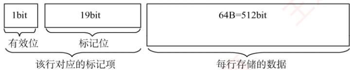
</div>

　　数据 Cache 共有 8 行，因此数据 Cache 的总容量为 $8 \times (64 + 20/8)B = 532B$ 。

2）数组 a 在主存的存放位置及其与 Cache 之间的映射关系如下图所示。

<div align="center">
  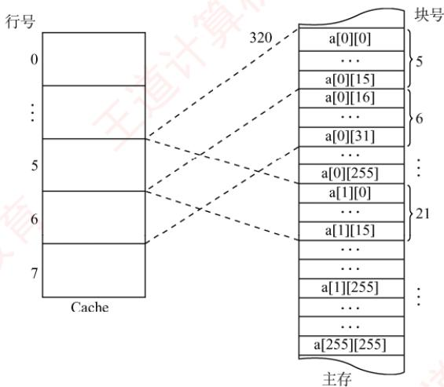
</div>

　　数组按行优先方式存放，首地址为 320，数组元素占 4B。a[0][31]所在的主存块对应的 Cache 行号为 $[(320 + (0 \times 256 + 31) \times 4)\mathrm{div}2^{6}] \bmod 2^{3} = 6$ ；a[1][1]所在的主存块对应的 Cache 行号为 $[(320 + (1 \times 256 + 1) \times 4)\mathrm{div}2^{6}] \bmod 2^{3} = 5$ 。

　　【另解】由 1）可知主存和 Cache 的地址格式如下图所示。

<div align="center">
  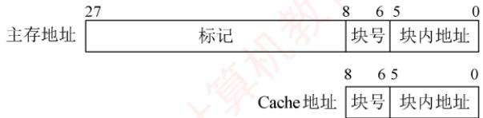
</div>

　　数组按行优先方式存放，首地址为320，数组元素占4B。a[0][31]的地址为 $320 + 31 \times 4 = 110111100_{B}$ ，因此其对应的Cache行号为 $110_{B} = 6$ ；a[1][1]的地址为 $320 + 256 \times 4 + 1 \times 4 =$

$1348 = 10101000100_{\mathrm{B}}$ ，因此其对应的Cache行号为 $101_{\mathrm{B}} = 5$ 。

3）编译时 i, j, sum 均分配在寄存器中，所以数据访问命中率仅考虑数组 a 的情况。
　　数组 a 的大小为 $256 \times 256 \times 4B = 2^{18}B$ ，占用 $2^{18}/64 = 2^{12}$ 个主存块，按行优先存放，程序 A 逐行访问数组 a，共需访问的次数为 $2^{16}$ 次，未命中次数为 $2^{12}$ 次（每个字块的第一个数未命中），因此程序 A 的命中率为 $(2^{16} - 2^{12})/2^{16} \times 100\% = 93.75\%$ .
　　【另解】数组 a 按行存放，程序 A 按行存取。每个字块中存放 16 个 int 型数据，除访问的第一个不命中外，随后的 15 个全都命中，访问全部字块都符合这一规律，且数组大小为字块大小的整数倍，因此程序 A 的命中率为 $15/16 = 93.75\%$ .
　　程序 B 逐列访问数组 a, Cache 总数据容量为 $64B \times 8 = 512B$ ，数组 a 一行的大小为 1KB，正好是 Cache 容量的 2 倍，可知不同行的同一列数组元素使用的是同一个 Cache 单元，因此逐列访问每个数据时，都会将之前的字块置换出，即每次访问都不会命中，命中率为 0。
　　因为从 Cache 读数据比从主存读数据快很多，所以程序 A 的执行比程序 B 快得多。

**05. 【解答】**

1）CPU的时钟周期是主频的倒数，即 $1 / 800\mathrm{MHz} = 1.25\mathrm{ns}$ 。总线的时钟周期是总线频率的倒数，即 $1 / 200\mathrm{MHz} = 5\mathrm{ns}$ 。总线宽度为32位，因此总线带宽为 $4\mathrm{B} \times 200\mathrm{MHz} = 800\mathrm{MB/s}$ 或 $4\mathrm{B}/5\mathrm{ns} = 800\mathrm{MB/s}$ 。2）Cache块大小是32B，因此Cache缺失时需要一个读突发传送总线事务读取一个主存块。

3）一次读突发传送总线事务包括一次地址传送、32B数据准备和传送：用一个总线时钟周期传输地址；之后每隔 $40\mathrm{ns} / 8 = 5\mathrm{ns}$ 启动一个存储体（各进行一次读操作），第一个体准备数据花费40ns，之后这个字的传送操作与下一个字的准备操作重叠；用8个总线时钟周期传送数据。读突发传送总线事务时间为 $5\mathrm{ns} + 40\mathrm{ns} + 8\times 5\mathrm{ns} = 85\mathrm{ns}$ 。另解：首先5ns的传送地址和命令，然后把存储体准备数据的时间视为流水线，因为总线周期是5ns，存储体的存取周期是40ns，所以相当于准备数据是一个8段流水线，因此准备8个数据的时间是 $40 + 5\times 7$ ，最后再花5ns传输最后一个数据，因为之前的7个存储体的数据的传输时间和其下一个存储体准备数据的时间是并行的，所以共需要 $5 + 40 + 5\times 7+$ $5 = 85\mathrm{ns}$ 。也可以这样理解，将从数据准备到传输结束视为一个完整的流水线，也就是共视为9个流水段，每个流水段的时间是5ns，这样总共花费的时间就是 $5 + 45 + 7\times 5 = 85\mathrm{ns}$ 。只要是有关于流水线思想的，最关键的就是分清楚流水段，剩下的就是简单计算，不同的算法不是关键，本质上都是一样的。

4）CPU 执行时间 = Cache 命中时的指令执行时间 + Cache 未命中时的额外访存开销×缺失率。一条指令在 Cache 命中时的执行时间 = Cache 命中时的 CPI×时钟周期 = 4×1.25ns = 5ns。一条指令因 Cache 缺失而导致的平均访存开销 = 平均访存次数×一次突发传送总线事务时间 = 1.2×85ns = 102ns。因此 BP 的 CPU 执行时间 = (5ns + 102ns×5%)×100 = 1010ns。100 条指令中，平均有 95% 的指令 Cache 命中，只需要 5ns；平均有 5% 的指令 Cache 缺失，需要 5ns + 102ns = 107ns。本题说明了 408 真题采用先访问 Cache 再访问主存的方式。

**06. 【解答】**

1）主存块大小为 $64B = 2^{6}$ 字节，故主存地址低 6 位为块内地址，Cache 组数为 $32KB \div (64B \times 8) = 64 = 2^{6}$ ，所以主存地址中间 6 位为 Cache 组号，主存地址中高 32 - 6 - 6 = 20 位为标记，采用 8 路组相联映射，所以每行中的 LRU 位占 3 位，采用直写方式，所以没有修改位。

2）0080 00C0H = 0000 0000 1000 0000 0000 0000 1100 0000B，主存地址的低6位为块内地址，为全0，所以s位于一个主存块的开始处，占 $1024 \times 4B/64B = 64$ 个主存块；在执行程序段的过程中，每个主存块中的 $64B/4B = 16$ 个数组元素依次读、写1次，因此对每个主存块，总是第一次访问缺失，此时会将整个主存块调入 Cache，之后每次都命中。综上，数组 s 的数据 Cache 访问缺失次数为 64 次。

3）0001 0003H = 0000 0000 0000 0001 0000 000000 000011B，根据主存地址划分可知，组索引为 0，所以该地址所在主存块被映射到指令 Cache 的第 0 组；因为 Cache 初始为空，所有 Cache 行的有效位均为 0，所以 Cache 访问缺失。此时，将该主存块取出后存入指令 Cache 的第 0 组的任意一行，并将主存地址高 20 位（00010H）填入该行标记字段，设置有效位，修改 LRU 位，最后根据块内地址 000011B 从该行中取出相应的内容。

## 3.6 虚拟存储器

　　虚拟存储器是一种由硬件与系统软件协同实现的存储管理机制，它利用主存和辅存（如磁盘）构建一个逻辑上连续且容量巨大的地址空间。对于应用程序员而言，该机制是透明的：程序可按此虚拟地址空间编写，无须关心实际主存容量或数据在主存中的物理位置。

### 3.6.1 虚拟存储器的基本概念

　　虚拟存储器将程序的地址空间（称为虚拟地址空间或逻辑地址空间）与主存的物理地址空间分离。用户程序使用的地址称为虚地址（或逻辑地址），而实际主存单元的地址称为实地址（或物理地址）。通常，虚地址空间远大于实地址空间，如图3.26所示。

<div align="center">
  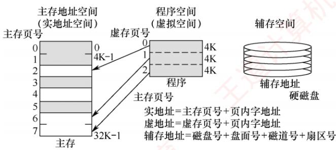
</div>

<p align="center"><em>图 3.26 虚拟存储器的地址空间</em></p>

　　当 CPU 使用虚地址访问内存时，系统首先判断该虚地址对应的数据是否已驻留在主存中。若已驻留，则通过地址变换机制将其转换为实地址，CPU 即可直接访问对应的主存单元；若未驻留，则触发缺页（或缺段）异常，由操作系统将包含该地址的整个页（或段）从辅存调入主存，之后 CPU 再进行访问。若主存已满，则需根据替换算法选择一个页面进行置换。

> **考点追踪：** 虚拟存储器只能采用回写法的原因（2016）

　　虚拟存储器借鉴了 Cache 的思想，将辅存中频繁访问的数据缓存在主存中。由于辅存（如磁盘）访问延迟极高，每次写操作都同步更新辅存是不可行的。因此，系统采用类似回写的策略：当页面被修改时，标记为脏页；仅在该页被置换出主存时，若为脏页，才将其写回辅存。这显著降低了 I/O 开销。此外，虚拟存储器的分页机制允许任一虚页装入主存中任意可用的物理页框（类似于全相联映射），从而提高主存利用率，并支持高效的地址重定位。

### 3.6.2 页式虚拟存储器 $^{①}$

　　页式虚拟存储器以页为基本单位。主存空间和虚拟地址空间均被划分为大小相同的页。主存中的页称为物理页（或实页、页框），虚拟地址空间中的页称为虚拟页（或虚页）。页表记录了每个虚页在主存中的映射位置，通常常驻内存。

#### 1. 页表

　　图 3.27 是一个页表示例。有效位（也称装入位），表示对应虚页是否已调入主存，若为 1，表示该页已在主存，页表项中存放其物理页号；若为 0，表示未调入，页表项通常存放该页在外存（如磁盘）中的地址。脏位（也称修改位），表示页面是否被修改过，在采用回写策略的虚拟存储系统中，置换页面时根据脏位决定是否需将其写回磁盘。引用位（也称使用位），记录页面是否被访问过，主要用于实现基于使用历史的页面替换算法（如 Clock 或 LRU 算法）。

<div align="center">
  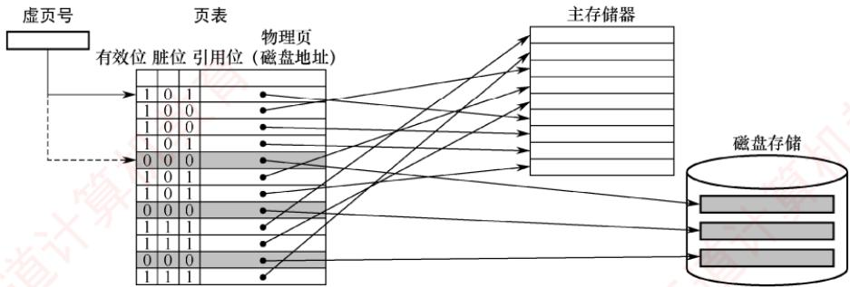
</div>

<p align="center"><em>图 3.27 主存中的页表示例</em></p>

> **考点追踪：** 数组的分页存放、缺页分析与处理过程（2014、2019、2023、2025）

　　以图 3.27 的页表为例，若 CPU 访问第 1 页，有效位为 1，说明该页已驻留主存。地址转换部件将虚拟地址转换为物理地址，CPU 即可访问对应的物理页中的数据。若访问第 5 页，有效位为 0，则发生缺页异常，系统调用缺页处理程序。该程序根据页表项中的外存地址，将该页从磁盘调入一个空闲的物理页框。若主存已满，则需选择一个页面进行置换；由于系统采用回写策略，换出页面时根据脏位决定是否写回磁盘。缺页处理完成后，更新页表中的相应项。

　　页式虚拟存储器的优点是：页面大小固定，页表结构简单，调入操作方便。缺点是：程序大小通常不是页长的整数倍，导致最后一页产生内部碎片；此外，页是物理划分单位，缺乏逻辑意义，因此在程序模块化、保护和共享方面不如段式虚拟存储器灵活。

#### 2. 地址转换

> **考点追踪：** 虚拟地址结构的分析（2011、2019、2021、2024）

　　程序生成的地址为虚拟地址，CPU执行指令时，必须先将其转换为物理地址，才能访问主存中的指令或数据。虚拟地址分为两部分：高位为虚页号，低位为页内偏移；物理地址同样分为高位物理页号和低位页内偏移。由于页面大小相同，两者的页内偏移完全一致。虚拟地址到物理地址的转换通过页表实现，页表是一张存放在主存中的虚页号与物理页号的映射表。

> **考点追踪：** 虚拟地址与物理地址的转换（2011、2013、2018、2022）

　　系统通过页表基址寄存器指向当前进程的页表起始地址（对应①）。地址转换时，首先从虚拟地址中提取虚页号（对应②），以此作为索引查找页表项；若该页表项的有效位为1，则从中取出物理页号（对应③），并与虚拟地址中的页内偏移拼接，形成最终的物理地址（对应④）。若有效位为0，则发生缺页异常，需由操作系统进行缺页处理。页式虚拟存储器的地址变换过程如图3.28所示。

<div align="center">
  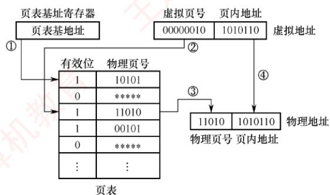
</div>

<p align="center"><em>图 3.28 页式虚拟存储器的地址变换过程</em></p>

#### 3. 快表 (TLB)

　　由地址转换过程可知，每次访存需先访问主存中的页表以获取物理页号，再访问主存取得实际数据，因此采用虚拟存储机制后，平均访存次数增加，性能下降。

> **考点追踪：** TLB 的硬件实现（2018），TLB 和 Cache

　　的比较（2020）

　　根据程序访问的局部性原理，在一段时间内 CPU 往往集中访问少数页面。若将这些页面对应的页表项缓存在由高速 SRAM 构成的快表（TLB）中，则可在地址转换时避免访问主存中的页表，从而显著提升效率。相应地，主存中的页表常被称为慢表（Page）。

> **考点追踪：** TLB 映射方式、地址划分与标记字段的分析（2016、2021）

　　TLB 的工作原理类似于 Cache，通常采用全相联或组相联映射。TLB 表项包含虚拟页号（作为标记）和对应的物理页号及控制位（如有效位、脏位等）。在全相联映射下，TLB 标记即为完整的虚拟页号；在组相联映射下，虚拟页号的高位作为标记，低位作为组索引。

#### 4. 具有TLB和Cache的多级存储系统

> **考点追踪：** 具有TLB的虚拟存储系统的地址变换过程（2024）

　　图 3.29 为一个具有 TLB 和 Cache 的多级存储系统，其中 Cache 采用 2 路组相联映射方式。CPU 给出一个 32 位的虚拟地址，TLB 采用全相联结构，每项均配备一个比较器。地址转换时，将虚拟地址中的虚页号与所有 TLB 项的标记字段并行比较；若某一项匹配且有效位为 1，则 TLB 命中，直接从中获取实页号，完成地址转换。若 TLB 未命中，则需访问主存中的页表（慢表）以获取对应的页表项，完成地址转换后将其装入 TLB；若 TLB 已满，则需执行替换算法。

　　获得物理地址后，Cache 根据映射方式将其划分为标记、组号和块内地址三个字段。首先利用组号定位到对应的 Cache 组，再将该组中各 Cache 行的标记与物理地址的标记字段进行比较；若某一行匹配且有效位为 1，则 Cache 命中，再根据块内地址取出对应的数据送至 CPU。

<div align="center">
  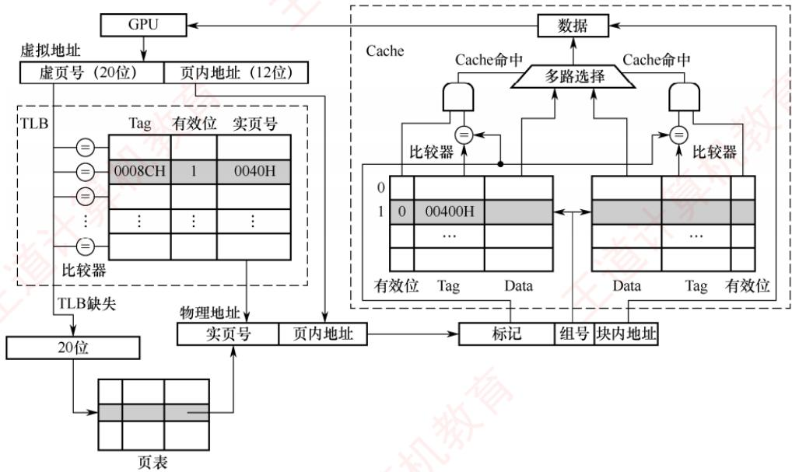
</div>

<p align="center"><em>图 3.29 TLB 和 Cache 的访问过程</em></p>

　　通过TLB缓存频繁访问的页表项，系统避免了每次地址转换都访问主存页表，从而在引入虚拟存储器的同时，几乎不降低访存性能。

> **考点追踪：** TLB、Cache 和 Page 缺失组合的分析（2010）

　　CPU 一次访存操作可能涉及 TLB、页表、Cache、主存和磁盘的访问，访问过程如图 3.30 所示。可见，CPU 访存过程中存在三种缺失情况：

　　① TLB 缺失：要访问的虚页号不在 TLB 中：

　　② Cache 缺失：要访问的主存块不在 Cache 中：

　　③ Page 缺失：要访问的页面不在主存中。

　　TLB 是页表项的缓存，因此 Page 缺失时，TLB 也必然缺失。同理，Cache 是主存的副本，因此 Page 缺失时，Cache 中也不可能有对应的数据。这三种缺失的组合情况见表 3.3。

<div align="center">
  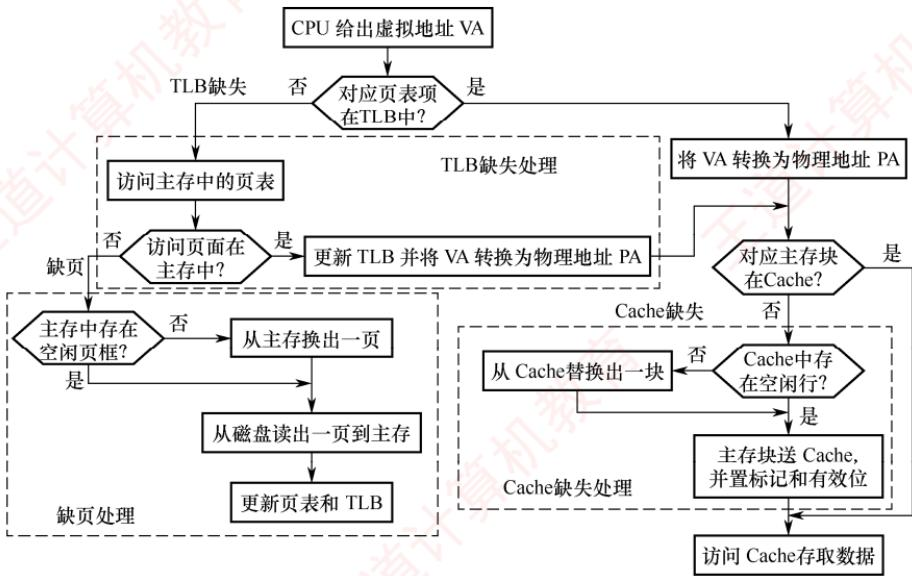
</div>

<p align="center"><em>图 3.30 带 TLB 虚拟存储器的 CPU 访存过程</em></p>

　　表 3.3 TLB、Page、Cache 三种缺失的可能组合情况

<table><tr><td>序号</td><td>TLB</td><td>Page</td><td>Cache</td><td>说明</td></tr><tr><td>1</td><td>命中</td><td>命中</td><td>命中</td><td>TLB 命中则 Page 一定命中,信息在主存,就可能在 Cache 中</td></tr><tr><td>2</td><td>命中</td><td>命中</td><td>缺失</td><td>TLB 命中则 Page 一定命中,信息在主存,也可能不在 Cache 中</td></tr><tr><td>3</td><td>缺失</td><td>命中</td><td>命中</td><td>TLB 缺失但 Page 可能命中,信息在主存,就可能在 Cache 中</td></tr><tr><td>4</td><td>缺失</td><td>命中</td><td>缺失</td><td>TLB 缺失但 Page 可能命中,信息在主存,也可能不在 Cache 中</td></tr><tr><td>5</td><td>缺失</td><td>缺失</td><td>缺失</td><td>TLB 缺失则 Page 也可能缺失,信息不在主存,也一定不在 Cache</td></tr></table>

　　最好的情况是第 1 种组合，此时无须访问主存；第 2 种和第 3 种组合需要访问一次主存；第 4 种组合需要访问两次主存；第 5 种组合发生 “缺页异常”，需要访问磁盘，并至少访问两次主存。Cache 缺失处理由硬件自动完成；缺页处理由操作系统通过 “缺页异常处理程序” 实现，具体步骤包括调入所需页面、更新页表等；TLB 缺失既可用硬件处理，也可用软件处理。

> **注意**

　　在《操作系统考研复习指导》的第3章中，介绍了在同时具有TLB和Cache的存储系统中虚实地址转换的实例，读者可以结合该内容进行学习。

### 3.6.3 段式虚拟存储器 $^{①}$

　　段式虚拟存储器中的段是按程序的逻辑结构划分的，各个段的长度因程序而异。虚拟地址分为两部分：段号和段内地址。虚拟地址到物理地址的变换由段表实现。段表是程序的逻辑段与其在主存中存放位置的对照表，每行记录某个段的段号、有效位、段起点和段长等信息。由于段的长度可变，段表中必须给出各段的起始地址与段长。

<div align="center">
  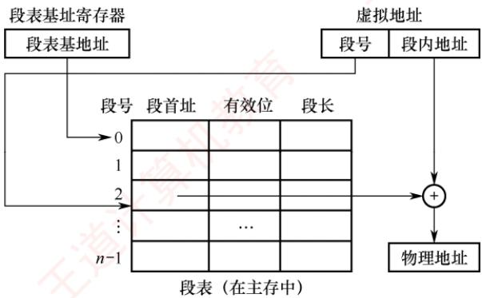
</div>

<p align="center"><em>图 3.31 段式虚拟存储器的地址变换过程</em></p>

　　CPU 根据虚拟地址访存时，首先从虚拟地址中提取段号，并根据段表基地址找到对应的段表项。然后检查该段表项的有效位：若为 1，表示该段已调入主存；若为 0，表示该段不在主存中。当该段已调入主存时，从段表读出其在主存中的起始地址，与段内地址相加，得到对应的物理地址。段式虚拟存储器的地址变换过程如图 3.31 所示。

　　由于段是程序逻辑结构所决定的独立部分，因此分段对程序员来说是不透明的；而分页对程序员是透明的，程序员编写程序时无须关心程序如何分页。

　　段式虚拟存储器的优点是：段的边界与程序的自然逻辑边界一致，具有良好的逻辑独立性，便于程序的编译、管理、修改和保护，也易于实现多道程序间的段共享。缺点是：段长度可变，主存分配困难，段间容易产生外部碎片，难以有效利用，造成存储空间浪费。

### 3.6.4 段页式虚拟存储器

　　在段页式虚拟存储器中，程序先按逻辑结构分段，每段再划分为固定大小的页，主存空间也划分为大小相等的页，程序对主存的调入和调出仍以页为基本交换单位。每个程序对应一个段表，每段对应一个页表。虚拟地址由段号、段内页号和页内地址三部分组成。CPU根据虚地址访存时，首先用段号查找段表，获得该段对应的页表起始地址；接着以段内页号为索引访问页表，取出实页号；最后将实页号与页内地址拼接，形成物理地址。

　　段页式虚拟存储器的优点是兼具页式和段式的优点，既支持按段进行共享和保护，又避免了段式存储的外部碎片问题。缺点是在地址变换过程中需要两次查表，系统开销较大。

### 3.6.5 虚拟存储器与 Cache 的比较

> **考点追踪：** 虚拟存储器与 Cache 的比较（2024）

　　虚拟存储器与 Cache 既有相同之处，又有不同之处。

#### 1. 相同之处

1）最终目标都是提高系统性能，两者都体现了容量、速度、价格的梯度。

2）都把数据划分为小信息块作为基本交换单位，虚拟存储器的页通常比 Cache 块大得多。

3）都涉及地址映射、替换算法和更新策略等问题。

4）都基于局部性原理，采用“快速缓存”思想，将活跃数据放在高速部件中。

#### 2. 不同之处

1）Cache 主要解决 CPU 与主存之间的速度差异，而虚拟存储器为了解决主存容量。

2）Cache 完全由硬件实现，对所有程序员透明；虚拟存储器由操作系统和硬件共同实现，对应用程序员透明，但其管理机制对操作系统开发者不透明。

> **考点追踪：** Cache缺失和缺页的处理开销对比（2016）

3）不命中时的性能影响不同：Cache 不命中需访问主存，延迟增加数十倍；而虚拟存储系统缺页需访问磁盘，延迟增加可达十万倍，对系统性能影响更为严重。

4）CPU 可直接访问 Cache 和主存，Cache 不命中时，硬件自动从主存取数据并装入 Cache。辅存与 CPU 无直接通路，缺页时必须先将数据从辅存调入主存，之后 CPU 才能访问。

### 3.6.6 本节习题精选

#### 一、单项选择题

01. 为使虚拟存储系统有效地发挥其预期的作用，所运行程序应具有的特性是（）。

- A. 不应含有过多的 I/O 操作
- B. 大小不应小于实际的内存容量
- C. 应具有较好的局部性
- D. 顺序执行的指令不应过多

02. 虚拟存储管理系统的基础是程序访问的局部性原理，此理论的基本含义是（）。

- A. 在程序的执行过程中，程序对主存的访问是不均匀的
- B. 空间局部性
- C. 时间局部性
- D. 代码的顺序执行

03. 虚拟存储器的常用管理方式有段式、页式、段页式，对于它们在与主存交换信息时的单位，以下表述正确的是（）。

- A. 段式采用“页”
- B. 页式采用“块”
- C. 段页式采用“段”和“页”
- D. 页式和段页式均仅采用“页”

04. 下列关于虚拟存储器的叙述中，正确的是（）。

- A. 对应用程序员透明，对系统程序员不透明
- B. 对应用程序员不透明，对系统程序员透明
- C. 对应用程序员、系统程序员都不透明
- D. 对应用程序员、系统程序员都透明

05. 在虚拟存储器中，当程序正在执行时，由（）完成地址映射。

- A. 程序员
- B. 编译器
- C. 装入程序
- D. 操作系统

06. 采用虚拟存储器的主要目的是（）。

- A. 提高主存储器的存取速度
- B. 扩大主存储器的存储空间
- C. 提高外存储器的存取速度
- D. 扩大外存储器的存储空间

07. 下列有关虚拟存储管理机制中地址转换的叙述，错误的是（）。

- A. 地址转换是指把逻辑地址转换为物理地址
- B. 通常逻辑地址的位数比物理地址的位数少
- C. 地址转换过程中会发现是否“缺页”
- D. 内存管理单元（MMU）在地址转换过程中要访问页表项

08. 下列有关虚拟存储管理机制的页表的叙述中，错误的是（）。

- A. 系统中每个进程有一个页表
- B. 页表中每个表项与一个虚页对应
- C. 每个页表项中都包含装入位（有效位）
- D. 所有进程都可以访问页表

09. 下列有关缺页处理的叙述中，错误的是（）。

- A. 若对应页表项中的有效位为0，则发生缺页
- B. 缺页是一种外部中断，需要调用操作系统提供的中断服务程序来处理
- C. 缺页处理过程中需根据页表中给出的磁盘地址去读磁盘数据
- D. 缺页处理完后要重新执行发生缺页的指令

10. 下列关于段式虚拟存储管理的叙述中，错误的是（）。

- A. 段是逻辑结构上相对独立的程序块，因此段是可变长的
- B. 按程序中实际的段来分配主存，所以分配后的存储块是可变长的
- C. 每个段表项必须记录对应段在主存的起始位置和段的长度
- D. 分段方式对低级语言程序员和编译器来说是透明的

11. 虚拟存储器中的页表有快表和慢表之分，下面关于页表的叙述中正确的是（）。

- A. 快表与慢表都存储在主存中，但快表比慢表容量小
- B. 快表采用了优化的搜索算法，因此查找速度快
- C. 快表比慢表的命中率高，因此快表可以得到更多的搜索结果
- D. 快表采用相联存储器件组成，按照查找内容访问，因此比慢表查找速度快

12. 【2010 统考真题】下列命令组合的一次访存过程中，不可能发生的是（）。

- A. TLB 未命中，Cache 未命中，Page 未命中
- B. TLB 未命中，Cache 命中，Page 命中
- C. TLB 命中，Cache 未命中，Page 命中
- D. TLB 命中，Cache 命中，Page 未命中

13. 【2013 统考真题】某计算机主存地址空间大小为 256 MB，按字节编址。虚拟地址空间大小为 4GB，采用页式存储管理，页面大小为 4KB，TLB（快表）采用全相联映射，有 4 个页表项，内容如下表所示。

<table><tr><td>有效位</td><td>标记</td><td>页框号</td><td>...</td></tr><tr><td>0</td><td>FF180H</td><td>0002H</td><td>...</td></tr><tr><td>1</td><td>3FFF1H</td><td>0035H</td><td>...</td></tr><tr><td>0</td><td>02FF3H</td><td>0351H</td><td>...</td></tr><tr><td>1</td><td>03FFFH</td><td>0153H</td><td>...</td></tr></table>

则对虚拟地址03FF F180H进行虚实地址变换的结果是（）。

- A. 0153180H
- B. 0035180H
- C. TLB缺失
- D. 缺页

14. 【2015 统考真题】假定编译器将赋值语句 “x=x+3;” 转换为指令 “add xaddr, 3”，其中 xaddr 是 x 对应的存储单元地址。若执行该指令的计算机采用页式虚拟存储管理方式，并配有相应的 TLB，且 Cache 使用直写方式，则完成该指令功能需要访问主存的次数至少是（）。

- A. 0
- B. 1
- C. 2
- D. 3

15. 【2019 统考真题】下列关于缺页处理的叙述中，错误的是（）。

- A. 缺页是在地址转换时CPU检测到的一种异常

- B. 缺页处理由操作系统提供的缺页处理程序来完成
- C. 缺页处理程序根据页故障地址从外存读入所缺失的页
- D. 缺页处理完成后回到发生缺页的指令的下一条指令执行

16. 【2020 统考真题】下列关于 TLB 和 Cache 的叙述中，错误的是（）。

- A. 命中率都与程序局部性有关
- B. 缺失后都需要去访问主存
- C. 缺失处理都可以由硬件实现
- D. 都由 DRAM 存储器组成

17. 【2022 统考真题】某计算机主存地址为 24 位，采用分页虚拟存储管理方式，虚拟地址空间大小为 4 GB，页大小为 4 KB，按字节编址。某个进程的页表部分内容如下表所示。

<table><tr><td>虚页号</td><td>实页号(页框号)</td><td>存在位</td></tr><tr><td>82</td><td>024H</td><td>0</td></tr><tr><td>...</td><td>...</td><td>...</td></tr><tr><td>129</td><td>180H</td><td>1</td></tr><tr><td>130</td><td>018H</td><td>1</td></tr></table>

当CPU访问虚拟地址00082840H时，虚-实地址转换的结果是（）。

- A. 得到主存地址024840H
- B. 得到主存地址180840H
- C. 得到主存地址018840H
- D. 检测到缺页异常

18. 【2024 统考真题】对于页式虚拟存储管理系统，下列关于存储器层次结构的叙述中，错误的是（）。

- A. Cache-主存层次的交换单位为主存块，主存-外存层次的交换单位为页
- B. Cache-主存层次替换算法由硬件实现，主存-外存层次替换算法由软件实现
- C. Cache-主存层次可采用回写法，主存-外存层次通常采用回写法
- D. Cache-主存层次可采用直接映射方式，主存-外存层次通常采用直接映射方式

19. 【2024 统考真题】某计算机按字节编址，采用页式虚拟存储管理方式，虚拟地址为 32 位，主存地址为 30 位，页大小为 1KB。若 TLB 共有 32 个表项，采用 4 路组相联映射方式，则 TLB 表项中标记字段的位数至少是（）。

- A. 17
- B. 18
- C. 19
- D. 20

20. 【2024 统考真题】下列事件中，不是在MMU地址转换过程中检测的是（）。

- A. 访问越权
- B. Cache缺失
- C. 页面缺失
- D. TLB缺失

#### 二、综合应用题

01. 某计算机系统采用虚拟页式存储管理，某个进程的页表见下表，每项的起始编号是 0，所有的地址均按字节编址，每页大小为 1024B。分别将逻辑地址 0793, 1197, 2099, 3320, 4188, 5332，转换为物理地址，写出计算过程，对不能计算的说明为什么。

<table><tr><td>逻辑页号</td><td>存在位</td><td>引用位</td><td>修改位</td><td>页框号</td></tr><tr><td>0</td><td>1</td><td>1</td><td>0</td><td>4</td></tr><tr><td>1</td><td>1</td><td>1</td><td>1</td><td>3</td></tr><tr><td>2</td><td>0</td><td>0</td><td>0</td><td>—</td></tr><tr><td>3</td><td>1</td><td>0</td><td>0</td><td>1</td></tr><tr><td>4</td><td>0</td><td>0</td><td>0</td><td>—</td></tr><tr><td>5</td><td>1</td><td>0</td><td>1</td><td>5</td></tr></table>

02. 下图表示使用快表（页表）的虚实地址转换条件，快表存放在相联存储器中，其容量为8个存储单元。

<table><tr><td>页号</td><td>该页在主存中的起始位置</td></tr><tr><td>32</td><td>42000</td></tr><tr><td>25</td><td>38000</td></tr><tr><td>7</td><td>96000</td></tr><tr><td>6</td><td>60000</td></tr><tr><td>4</td><td>40000</td></tr><tr><td>15</td><td>80000</td></tr><tr><td>5</td><td>50000</td></tr><tr><td>34</td><td>70000</td></tr></table>

<table><tr><td>虚拟地址</td><td>页号</td><td>页内地址</td></tr><tr><td>1</td><td>15</td><td>0324</td></tr><tr><td>2</td><td>7</td><td>0128</td></tr><tr><td>3</td><td>48</td><td>0516</td></tr></table>

1）当CPU按虚拟地址1去访问主存时，主存的实地址码是多少？

2）当CPU按虚拟地址2去访问主存时，主存的实地址码是多少？

3）当CPU按虚拟地址3去访问主存时，主存的实地址码是多少？

03. 一个两级存储器系统有 8 个磁盘上的虚拟页面需要映像到主存中的 4 个页中。某程序生成以下访存页面序列：1,0,2,2,1,7,6,7,0,1,2,0,3,0,4,5,1,5,2,4,5,6,7,6,7,2,4,2,7,3。采用 LRU 算法，设初始时主存为空。

1）画出每个页号访问请求之后存放在主存中的位置。

2）计算主存的命中率。

04. 【2011 统考真题】某计算机存储器按字节编址，虚拟（逻辑）地址空间大小为 16MB，主存（物理）地址空间大小为 1MB，页面大小为 4KB；Cache 采用直接映射方式，共 8 行；主存与 Cache 之间交换的块大小为 32B。系统运行到某一时刻时，页表的部分内容和 Cache 的部分内容分别如下的左图和右图所示，图中页框号及标记字段的内容为十六进制形式。回答下列问题：

1）虚拟地址共有几位，哪几位表示虚页号？物理地址共有几位，哪几位表示页框号（物理页号）？

2）使用物理地址访问 Cache 时，物理地址应划分成哪几个字段？要求说明每个字段的位数及在物理地址中的位置。

<table><tr><td>虚页号</td><td>有效位</td><td>页框号</td><td>...</td></tr><tr><td>0</td><td>1</td><td>06</td><td>...</td></tr><tr><td>1</td><td>1</td><td>04</td><td>...</td></tr><tr><td>2</td><td>1</td><td>15</td><td>...</td></tr><tr><td>3</td><td>1</td><td>02</td><td>...</td></tr><tr><td>4</td><td>0</td><td>—</td><td>...</td></tr><tr><td>5</td><td>1</td><td>2B</td><td>...</td></tr><tr><td>6</td><td>0</td><td>—</td><td>...</td></tr><tr><td>7</td><td>1</td><td>32</td><td>...</td></tr></table>

<table><tr><td>行号</td><td>有效位</td><td>标记</td><td>...</td></tr><tr><td>0</td><td>1</td><td>020</td><td>...</td></tr><tr><td>1</td><td>0</td><td>—</td><td>...</td></tr><tr><td>2</td><td>1</td><td>01D</td><td>...</td></tr><tr><td>3</td><td>1</td><td>105</td><td>...</td></tr><tr><td>4</td><td>1</td><td>064</td><td>...</td></tr><tr><td>5</td><td>1</td><td>14D</td><td>...</td></tr><tr><td>6</td><td>0</td><td>—</td><td>...</td></tr><tr><td>7</td><td>1</td><td>27A</td><td>...</td></tr></table>

3）虚拟地址 001C60H 所在的页面是否在主存中？若在主存中，则该虚拟地址对应的物理地址是什么？访问该地址时是否 Cache 命中？要求说明理由。

4）假定为该机配置一个4路组相联的TLB，共可存放8个页表项，若其当前内容（十六进制）如下图所示，则此时虚拟地址024BACH所在的页面是否存在主存中？要求说明理由。

　　组号 有效位 标记 页框号 有效位 标记 页框号 有效位 标记 页框号 有效位 标记 页框号

<table><tr><td>0</td><td>—</td><td>—</td><td rowspan="2"></td><td>1</td><td>001</td><td>15</td><td rowspan="2"></td><td>0</td><td>—</td><td>—</td><td rowspan="2"></td><td>1</td><td>012</td><td>1F</td></tr><tr><td>1</td><td>013</td><td>2D</td><td>0</td><td>—</td><td>—</td><td>1</td><td>008</td><td>7E</td><td>0</td><td>—</td><td>—</td></tr></table>

05. 【2016 统考真题】某计算机采用页式虚拟存储管理方式，按字节编址，虚拟地址为 32位，物理地址为 24 位，页大小为 8KB；TLB 采用全相联映射；Cache 数据区大小为 64KB，按 2 路组相联映射方式组织，主存块大小为 64B。存储访问过程的示意图如下。

<div align="center">
  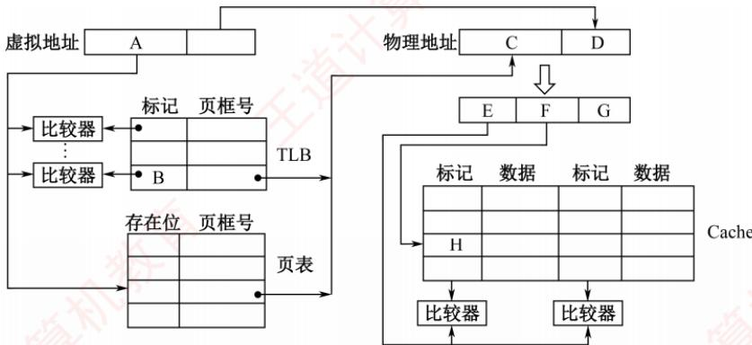
</div>

　　回答下列问题:

1）图中字段 A~G 的位数各是多少？TLB 标记字段 B 中存放的是什么信息？

2) 将块号为 4099 的主存块装入 Cache 时，所映射的 Cache 组号是多少？对应的 H 字段内容是什么？

3）是 Cache 缺失处理的时间开销大还是缺页处理的时间开销大？为什么？

4）为什么 Cache 可以采用直写法，而修改页面内容时总是采用回写法？

06. 【2018 统考真题】某计算机采用页式虚拟存储管理方式，按字节编址。CPU 进行存储访问的过程如下图所示。根据该图回答下列问题。

<div align="center">
  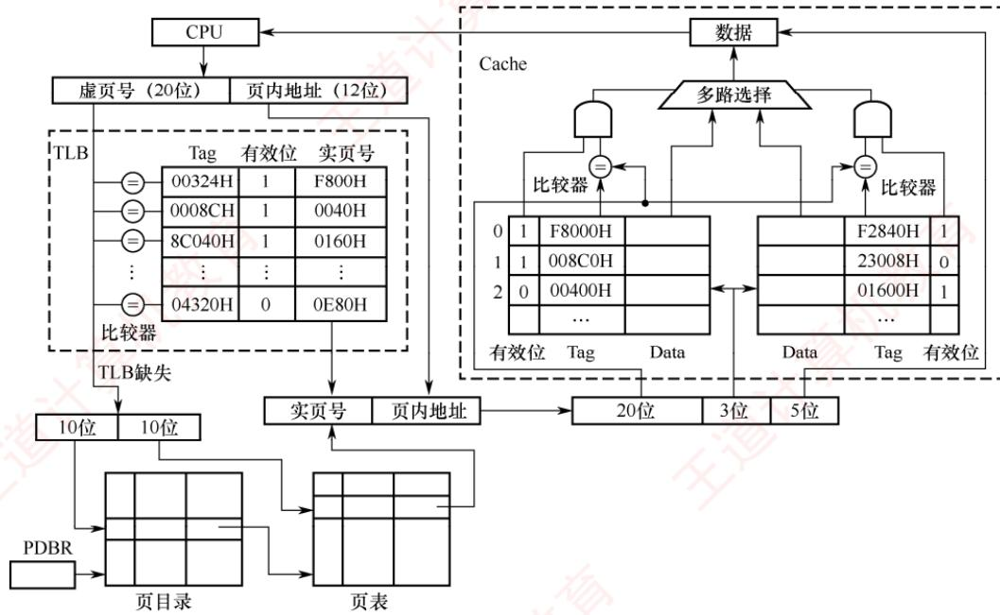
</div>

1）主存物理地址占多少位？

2）TLB 采用什么映射方式？TLB 是用 SRAM 还是用 DRAM 实现？

3）Cache采用什么映射方式？若Cache采用LRU算法和回写法，则Cache每行中除数据（Data）、标记和有效位外，还应有哪些附加位？Cache总容量是多少？Cache中有效位的作用是什么？

4）若 CPU 给出的虚拟地址为 0008 C040H，则对应的物理地址是多少？是否在 Cache 中命中？说明理由。若 CPU 给出的虚拟地址为 0007 C260H，则该地址所在主存块映射到的 Cache 组号是多少？

07. 【2021 统考真题】假设计算机 M 的主存地址为 24 位，按字节编址；采用分页存储管理方式，虚拟地址为 30 位，页大小为 4KB；TLB 采用 2 路组相联映射方式和 LRU 算法，共 8 组。请回答下列问题。

1）虚拟地址中哪几位表示虚页号？哪几位表示页内地址？

2）已知访问TLB时虚页号高位部分用作TLB标记，低位部分用作TLB组号，M的虚拟地址中哪几位是TLB标记？哪几位是TLB组号？

3）假设TLB初始时为空，访问的虚页号依次为10,12,16,7,26,4,12和20，在此过程中，哪一个虚页号对应的TLB表项被替换？说明理由。

4）若将 M 中的虚拟地址位数增加到 32 位，则 TLB 表项的位数增加几位？

08. 【2023 统考真题】已知计算机 M 的字长为 32 位，按字节编址，采用请求调页策略的虚拟存储管理方式，虚拟地址为 32 位，页大小为 4KB；数据 Cache 采用 4 路组相联映射方式，数据区大小为 8KB，主存块大小为 32B。现有 C 语言程序段如下：

```txt
int a[24][64];
...
for (i=0;i<24;i++)
    for (j=0;j<64;j++) a[i][j]=10;
```

　　已知二维数组 a 按行优先存放, 在虚拟地址空间中分配的起始地址为 0042 2000H, sizeof(int) = 4, 假定在 M 上执行上述程序段之前数组 a 不在主存, 且在该程序段执行过程中不会发生页面置换。请回答下列问题:

1）数组 a 分布在几个页面中？对于数组 a 的访问，会发生几次缺页异常？页故障地址各是什么？

2）不考虑变量i和j，该程序段的数据访问是否具有时间局部性？为什么？

3）计算机 M 的虚拟地址（A31～A0）中哪几位用作块内地址？哪几位用作 Cache 组号？a[1][0]的虚拟地址是多少？其所在主存块对应的 Cache 组号是多少？

4) 数组 a 占用多少主存块？假设上述程序段执行过程中数组 a 的访问不会和其他数据发生 Cache 访问冲突，则数组 a 的 Cache 命中率是多少？若将循环中 i 和 j 的次序按如下方式调换：

```javascript
for (j=0; j<64; j++)
    for (i=0; i<24; i++) a[i][j]=10;
```

　　则数组a的Cache命中率又是多少？

09. 【2025 统考真题】现有 C 语言程序 P 的部分代码如下所示。假定运行程序 P 的计算机 M 字长为 32 位，按字节编址，数据 Cache 的数据区大小为 32KB，采用 8 路组相联映射方式，主存块大小为 64B，Cache 的命中时间为 2 个时钟周期，缺失损失为 200 个时钟周期；采用页式虚拟存储管理方式，页大小为 4KB。数组 d 的起始虚拟地址 VA $_{31}$ ~VA $_{0}$ 为 0180 0020H。请回答下列问题。

```txt
int x,d[2048],i;
...
for (i=0;i<2048;i++)
    d[i]=d[i]/x;
```

1）主存地址中 Cache 组号字段和块内地址字段分别占几位？虚拟地址中哪些位可作为 Cache 索引？

2）d[100]的虚拟地址为多少？d[100]所在主存块对应的Cache组号是多少？

3）假定执行 for 语句时对应代码已在 Cache 中，变量 i 和 x 已装入寄存器，数组 d 已调入主存但不在 Cache 中，则 d[0]在其所在主存块内的偏移量是多少（用十六进制数表示）？在 for 语句的执行过程中，访问数组 d 的 Cache 缺失率和数组元素的平均访问时间分别是多少（Cache 缺失率的计算结果要求用百分比表示，保留两位小数）？

4) 数组 d 分布在几个页中？若执行 for 语句时对应代码已在主存中，但数组 d 还未调入主存，则在执行 for 语句的过程中，访问数组 d 所引起的缺页次数是多少？

### 3.6.7 答案与解析

#### 一、单项选择题

**01. C**

　　虚拟存储系统利用的是局部性原理，程序应当具有较好的局部性，选项 C 正确。而含有输入、输出操作产生中断，与虚拟存储器无关，选项 A 错误。大小较小但可以多个程序并发执行，也可以发挥虚拟存储器的作用，选项 B 错误。顺序执行的指令应当占较大比重为宜，这样可增强程序的局部性，选项 D 错误。

**02. A**

　　局部性原理的含义是在一个程序的执行过程中，其大部分情况下是顺序执行的，某条指令或数据使用后，在最近一段时间内有较大的可能再次被访问（时间局部性）；某条指令或数据使用后，其邻近的指令或数据可能在近期被使用（空间局部性）。在虚拟存储管理系统中，程序只能访问主存获得指令和数据，选项A正确。选项B、C、D均是局部性原理的一个方面而已。

**03. D**

　　页式虚拟存储方式对程序分页，采用页进行交互；段页式则先按照逻辑分段，然后分页，以页为单位和主存交互，选项 D 正确。

**04. A**

　　虚拟存储器需要通过对操作系统实现地址映射，因此对操作系统的设计者即系统程序员是不透明的。而应用程序员写的程序所使用的是逻辑地址（虚地址），因此对其是透明的。

**05. D**

　　虚拟存储器中，地址映射由操作系统来完成，但需要一部分硬件基础的支持，如快表、地址映射系统等。

**06. B**

　　引入虚拟存储器的目的是解决内存容量不够大的问题。

**07. B**

　　虚拟存储管理的目的是让程序员可以在一个比主存地址空间大得多的虚拟地址空间中编程，显然逻辑地址空间比主存空间大，因此逻辑地址的位数比物理地址的位数多，选项 B 错误。在执行程序时，由 CPU 中的 MMU 进行逻辑地址到物理地址的转换。在转换过程中，MMU 需要查找对应的页表项，根据页表项中的装入（有效）位是否为 1 来确定是否发生缺页。

**08. D**

　　选项A、B和C都正确。页表中的每个表项反映的是对应虚拟页面的位置和使用等信息，通常只能由操作系统和硬件进行访问，虚拟存储管理机制对用户进程来说是透明的，选项D错误。

**09. B**

　　缺页是 CPU 在执行指令过程中进行取指令或读/写数据时发生的一种故障，属于内部异常。

**10. D**

　　选项A、B和C都正确。分段方式对低级语言程序员和编译器来说是不透明的，因为低级语言程序员需要使用段号来编程，编译器需要使用段号来链接，选项D错误。

**11. D**

　　快表采用高速相联存储器，它的速度快来源于硬件本身，而不是依赖搜索算法来查找的；慢表存储在内存中，通常是依赖于查找算法，所以选项 A 和 B 错误。快表与慢表的命中率没有必然联系，快表仅是慢表的一个部分拷贝，不能够得到比慢表更多的结果，选项 C 错误。

**12. D**

　　Cache 的内容是主存的一部分副本，TLB 的内容是 Page（页表）的一部分副本。在同时具有 TLB 和 Cache 的虚拟存储系统中，CPU 发出访存命令，先查找对应的 Cache 块。

1）若 Cache 命中，则说明所需内容在 Cache 内，其所在页面必然已调入主存，因此 Page 必然命中，但 TLB 不一定命中。

2）若 Cache 未命中，则并不能说明所需内容未调入主存，和 TLB、Page 命中与否没有联系。但若 TLB 命中，Page 也必然命中；而当 Page 命中，TLB 则未必命中，因此 D 不可能发生。

**13. A**

　　按字节编址，页面大小为 4KB，页内地址共 12 位。地址空间大小为 4GB，虚拟地址共 32 位，前 20 位为页号。虚拟地址为 03FF F180H，因此页号为 03 FFFH，页内地址为 180H。查找页标记 03FFFH 所对应的页表项，页框号为 0153H，页框号与页内地址拼接即为物理地址 0153180H。

**14. B**

　　上述指令的执行过程可划分为取数、运算和写回过程，取数时读取 xaddr 可能不需要访问主存而直接访问 Cache，而直写方式需要把数据同时写入 Cache 和主存，因此至少访问 1 次。

**15. D**

　　在请求分页系统中，每当要访问的页面不在内存中时，CPU 检测到异常，便会产生缺页中断，请求操作系统将所缺的页调入内存。缺页处理由缺页中断处理程序完成，根据发生缺页故障的地址从外存读入所缺失的页，缺页处理完成后回到发生缺页的指令继续执行。选项 D 中描述回到发生缺页的指令的下一条指令执行，明显错误。

**16. D**

　　Cache 由 SRAM 组成；TLB 也由 SRAM 组成。DRAM 需要不断刷新，性能偏低，不适合组成 TLB 和 Cache。选项 A、B 和 C 都是 TLB 和 Cache 的特点。

**17. C**

　　页大小为 $4KB = 2^{12}B$ ，按字节编址，因此页内地址为 12 位。虚拟地址空间大小为 $4GB = 2^{32}B$ ，因此虚拟地址共 32 位，其中低 12 位为页内地址，高 20 位为虚页号。题中给出的虚拟地址为 00082840H，虚页号为高 20 位即 00082H（页内地址为低 12 位即 840H），82H 对应的十进制数为 130（注意题中页表的虚页号部分末尾未写 H，所以是十进制数，因此查找时要先将虚页号转换为十进制数），查页表命中，并且存在位为 1，对应页框号为 018H。将查找到的页框号 018H 和页内地址 840H 拼接，得到主存地址为 018840H。

**18. D**

　　Cache 与主存之间交换的是主存块，主存与外存之间交换的是页。Cache-主存层次和主存-外存层次的区别在于前者主要解决速度不匹配问题，用软件实现会影响速度，因此 Cache-主存层次替换算法由硬件实现；而主存-外存层次替换算法由软件实现。Cache-主存层次可采用回写法或全写法；主存-外存层次通常采用回写法，即页面被修改后，仅当被换出时才写回外存，访问外存的代价很大，采用全写法的开销过高。访问外存的代价很大，提高命中率是关键，因此主存-外存层次通常采用全相联映射；而 Cache-主存层次可采用直接映射、组相联或全相联，选项 D 错误。

**19. C**

　　按字节编址，页大小为 $2^{10}\mathrm{B}$ ，因此页内地址占10位；TLB有32个表项，采用4路组相联映射，被分为 $2^{3} = 8$ 组，因此TLB组号占3位；于是，标记字段的位数至少是 $32 - 3 - 10 = 19$ 。

**20. B**

　　在地址转换的过程中，MMU 会检查页表项的访问权限，以确保进程有权访问某个页面，否则就会访问越权。为了获得对应的页表项，先查找 TLB，若找不到，则 TLB 缺失，然后查找页表，若找不到，则页面缺失。访问 Cache 是在获得物理地址后使用物理地址存取数据的过程中才执行的操作，而 MMU 地址转换过程是在获得物理地址之前进行的，选项 B 错误。

#### 二、综合应用题

**01. 【解答】**

　　所有地址均可转换为页号和页内偏移量。地址转换时，先取出逻辑页号，然后查找页表，得到页框号，再将页框号与页内偏移量拼接，即可获得物理地址。根据题意，计算逻辑地址的页号和页内偏移量，拼接的物理地址如下表所示。

<table><tr><td>逻辑地址</td><td>逻辑页号</td><td>页内偏移量</td><td>页框号</td><td>物理地址</td></tr><tr><td>0793</td><td>0</td><td>793</td><td>4</td><td>4889</td></tr><tr><td>1197</td><td>1</td><td>173</td><td>3</td><td>3245</td></tr><tr><td>2099</td><td>2</td><td>51</td><td>—</td><td>缺页中断</td></tr><tr><td>3320</td><td>3</td><td>248</td><td>1</td><td>1272</td></tr><tr><td>4188</td><td>4</td><td>92</td><td>—</td><td>缺页中断</td></tr><tr><td>5332</td><td>5</td><td>212</td><td>5</td><td>5332</td></tr></table>

　　注：在本题中，物理地址 = 页框号×1024B + 页内偏移量，页内偏移量 = 逻辑地址 - 逻辑页号×1024B，逻辑页号 = 逻辑地址/1024B（结果向下取整）。

**02. 【解答】**

1）虚拟地址 1 的页号为 15，页内地址为 0324，在左表中页号 15 对应的主存起始位置为 80000，则主存的实地址码为 $0324 + 80000 = 80324$ 。

2）按1）中的方法易知，主存的实地址码为 $0128 + 96000 = 96128$ 。

3）虚拟地址 3 的页号为 48，在左表中无对应项，因此该页面在快表（页表）中无记录。

**03. 【解答】**

1）LRU算法是换出最近最久未使用的页面，因此每个页号访问请求之后存放在主存中的位置如下图所示。

<table><tr><td>页框号</td><td colspan="29">虚拟页号</td></tr><tr><td>4</td><td></td><td></td><td></td><td></td><td></td><td>7</td><td>7</td><td>7</td><td>7</td><td>7</td><td>7</td><td>7</td><td>3</td><td>3</td><td>3</td><td>3</td><td>1</td><td>1</td><td>1</td><td>1</td><td>6</td><td>6</td><td>6</td><td>6</td><td>6</td><td>6</td><td>6</td><td>6</td><td>3</td></tr><tr><td>3</td><td></td><td></td><td>2</td><td>2</td><td>2</td><td>2</td><td>2</td><td>2</td><td>0</td><td>0</td><td>0</td><td>0</td><td>0</td><td>0</td><td>0</td><td>0</td><td>0</td><td>0</td><td>2</td><td>2</td><td>2</td><td>7</td><td>7</td><td>7</td><td>7</td><td>7</td><td>7</td><td>7</td><td>7</td></tr><tr><td>2</td><td></td><td>0</td><td>0</td><td>0</td><td>0</td><td>0</td><td>6</td><td>6</td><td>6</td><td>6</td><td>2</td><td>2</td><td>2</td><td>2</td><td>2</td><td>5</td><td>5</td><td>5</td><td>5</td><td>5</td><td>5</td><td>5</td><td>5</td><td>5</td><td>5</td><td>4</td><td>4</td><td>4</td><td>4</td></tr><tr><td>1</td><td>1</td><td>1</td><td>1</td><td>1</td><td>1</td><td>1</td><td>1</td><td>1</td><td>1</td><td>1</td><td>1</td><td>1</td><td>1</td><td>1</td><td>4</td><td>4</td><td>4</td><td>4</td><td>4</td><td>4</td><td>4</td><td>4</td><td>4</td><td>4</td><td>2</td><td>2</td><td>2</td><td>2</td><td>2</td></tr><tr><td>命中</td><td></td><td></td><td></td><td>*</td><td>*</td><td></td><td></td><td>*</td><td></td><td>*</td><td></td><td>*</td><td></td><td>*</td><td></td><td></td><td></td><td>*</td><td></td><td>*</td><td>*</td><td></td><td></td><td>*</td><td>*</td><td></td><td></td><td>*</td><td>*</td></tr></table>

2）共30次访存，有13次命中，因此主存的命中率为 $13/30 = 43\%$ .

**04. 【解答】**

1）存储器按字节编址，虚拟地址空间大小为 $16MB = 2^{24}B$ ，因此虚拟地址为 24 位；页面大小为 $4KB = 2^{12}B$ ，因此高 12 位为虚页号。主存地址空间大小为 $1MB = 2^{20}B$ ，因此物理地址为 20 位；页内地址为 12 位，因此高 8 位为物理页号。

2）因为 Cache 采用直接映射方式，所以物理地址各字段的划分如下：

<table><tr><td>主存字块标记</td><td>Cache 字块标记</td><td>字块内地址</td></tr></table>

　　块大小为 32B，因此字块内地址占 5 位；Cache 共 8 行，因此 Cache 字块标记占 3 位；主存字块标记占 20 - 5 - 3 = 12 位。

3）虚拟地址 001C60H 的前 12 位为虚页号，即 001H，查看 001H 处的页表项，其对应的有效位为 1，因此虚拟地址 001C60H 所在的页面在主存中。页表 001H 处的页框号为 04H，与页内偏移（虚拟地址后 12 位）拼接成物理地址 04C60H。物理地址 04C60H = 0000 0100 1100 0110 0000B，主存块只能映射到 Cache 的第 3 行（第 011B 行），该行的有效位 = 1，标记（值为 105H）≠04CH（物理地址高 12 位），因此未命中。

4）TLB采用4路组相联，TLB被分为 $8 / 4 = 2$ 个组，因此虚页号中高11位为TLB标记、最低1位为TLB组号。虚拟地址024BACH=000000100100101110101100B，虚页号为000000100100B，TLB标记为00000010010B（012H），TLB组号为OB，因此该虚拟地址所对应的物理页面只能映射到TLB的第0组。组0中存在有效位 $= 1$ 、标记 $= 012\mathrm{H}$ 的项，因此访问TLB命中，即虚拟地址024BACH所在的页面在主存中。

**05. 【解答】**

1）页大小为8KB，页内偏移地址为13位，因此 $A=B=32-13=19$ ; D=13; C=24-13=11；主存块大小为64B，因此G=6。2路组相联，每组数据区容量有 $64B\times2=128B$ ，共有 $64KB/128B=512$ 组，因此F=9；E=24-G-F=24-6-9=9。
　　因此 A = 19, B = 19, C = 11, D = 13, E = 9, F = 9, G = 6。

　　TLB 中标记字段 B 的内容是虚页号，表示该 TLB 项对应哪个虚页的页表项。

2）块号 4099 = 00 0001 0000 0000 0011B，因此所映射的 Cache 组号为 0 0000 0011B = 3，对应的 H 字段内容为 0 0000 1000B。

3）Cache缺失带来的开销小，而处理缺页的开销大。因为缺页处理需要访问磁盘，而Cache缺失只要访问主存。

4）因为采用直写法时需要同时写快速存储器和慢速存储器，而写磁盘比写主存慢很多，所以在 Cache-主存层次，Cache 可以采用直写法，而在主存-外存（磁盘）层次，修改页面内容时总是采用回写法。

**06. 【解答】**

1）物理地址由实页号和页内地址拼接，因此其位数为 $16+12=28$ ；或直接得 $20+3+5=28$ 。

2）TLB采用全相联映射，可把页表内容调入任意一块空TLB项中，TLB中的每项都有一个比较器，没有映射规则，只要空闲就行。TLB采用静态存储器（SRAM），读/写速度快，但成本高，多用于容量较小的高速缓冲存储器。

3）图中可看到，Cache 中每组有两行，因此采用 2 路组相联映射方式。因为是 2 路组相联并采用 LRU 算法，所以每行需要 1 位 LRU 位；因为采用回写法，所以每行有 1 位修改位（脏位），根据脏位判断数据是否被更新，若脏位为 1，则需要写回内存。28 位物理地址中标记字段占20位，组索引字段占3位，块内偏移地址占5位，因此Cache共有 $2^{3}=8$ 组，每组2行，每行有 $2^{5}=32B$ ；Cache的总容量为 $8\times2\times(20+1+1+1+32\times8)=4464b=558B$ 。Cache中有效位用来指出所在Cache行中的信息是否有效。

4）虚拟地址分为两部分：虚页号、页内地址；物理地址分为两部分：实页号、页内地址。利用虚拟地址的虚页号部分去查找TLB表（缺失时从页表调入），将实页号取出后和虚拟地址的页内地址拼接，形成物理地址。虚页号0008CH恰好在TLB表中对应实页号0040H（有效位为1，说明存在），虚拟地址的后3位为页内地址040H，对应的物理地址是0040040H。物理地址为0040040H，其中高20位00400H为标志字段，低5位00000B为块内偏移量，中间3位010B为组号2，因此将00400H与Cache中的第2组两行中的标志字段同时比较，可以看出，虽然有一个Cache行中的标志字段与00400H相等，但对应的有效位为0，而另一Cache行的标志字段与00400H不相等，因此访问Cache不命中。因为物理地址的低12位与虚拟地址的低12位相同，即为0010 0110 0000B。根据物理地址的结构，物理地址的后八位01100000B的前三位011B是组号，因此该地址所在的主存映射到Cache组号为3。

**07. 【解答】**

　　注意：对于本题的 TLB，需要采用处理 Cache 的方式求解。

1）按字节编址，页面大小为 $4\mathrm{KB} = 2^{12}\mathrm{B}$ ，页内地址为12位。虚拟地址中高 $30 - 12 = 18$ 位表示虚页号，虚拟地址中低12位表示页内地址。

2）TLB采用2路组相联映射方式，共 $8 = 2^{3}$ 组，用3位来标记组号。虚拟地址（或虚页号）中高 $18 - 3 = 15$ 位为TLB标记，虚拟地址中随后3位（或虚页号中低3位）为TLB组号。

3）虚页号4对应的TLB表项被替换。因为虚页号与TLB组号的映射关系为TLB组号 $=$ 虚页号modTLB组数 $=$ 虚页号mod8，因此，虚页号10,12,16,7,26,4,12,20映射到的TLB组号依次为2,4,0,7,2,4,4,4。TLB采用2路组相联映射方式，从上述映射到的TLB组号序列可以看出，只有映射到4号组的虚页号数量大于2，相应虚页号依次是12,4,12和20。根据LRU算法，当访问第20页时，虚页号4对应的TLB表项被替换出来。

4）虚拟地址位数增加到32位时，虚页号增加了 $32 - 30 = 2$ 位，使得每个TLB表项中的标记字段增加2位，因此，每个TLB表项的位数增加2位。

**08. 【解答】**

1）数组 a 的起始地址为 0042 2000H，页大小为 4KB，所以页内偏移量占 12 位，数组 a 共有 $24 \times 64 = 1536$ 个元素，每个 int 型数据占 4 字节，因此数组 a 共占 $1536 \times 4B = 6KB$ ，的怪分布在 2 个相邻的页面中。页号分别为 00422H 和 00423H，当访问这两个页面的第一个数组元素的地址时，因为页面尚未调入内存，所以会发生 2 次缺页异常，两个页故障地址分别是 0042 2000H 和 0042 3000H。

2）若不考虑变量 i 和 j，该程序段的数据访问只涉及对数组元素的访问，每个数组元素只访问一次，因此该程序段的数据访问没有时间局部性。

3）在组相联映射方式下，物理地址结构为标记 + Cache 组号 + 块内地址，主存块大小为 32B，因此块内地址占 5 位；Cache 数据区共有 $8KB \div 32B = 256$ 行，采用 4 路组相联，共有 64 组，所以 Cache 组号占 6 位，因此虚拟地址中低 5 位（A4～A0）用作块内地址；低 11 位虚拟地址中高 6 位（A10～A5）用作 Cache 组号。a[1][0] 的虚拟地址为 $0042\ 2000H + 1 \times 64 \times 4 + 0 \times 4 = 0042\ 2100H$ 。虚拟地址为 32 位，页框大小为 4KB，虚拟地址的低 12 位表示页内偏移量，因此物理地址的低 12 位和虚拟地址的低 12 位相同, 因此 a[1][0] 所在主存块对应的 Cache 组号为 001000B = 8。

4）数组 a 占 $24 \times 64 \times 4B \div 32B = 192$ 个主存块。每个主存块存放 $32B \div 4B = 8$ 个数组元素，访问数组 a 的 Cache 命中率为 $(8 - 1)/8 = 87.5\%$ 。8 行数组元素占 $8 \times 64 \times 4B \div 32B = 64$ 个主存块，分别映射到 64 个 Cache 组的某 Cache 行，数组 a 共有 24 行，因此每个 Cache 组中只有 24/8 = 3 个 Cache 行存放数组 a 中的数据，而每个 Cache 组有 4 行，因此不会发生替换，访问数组 a 的 Cache 命中率为 7/8 = 87.5%。

**09. 【解答】**

1）Cache 地址字段划分如下。

　　块内地址：主存块大小为 $64\mathrm{B} = 2^{6}\mathrm{B}$ ，因此块内地址字段需要6位。
　　组号：Cache数据区大小为32KB，采用8路组相联，每组大小为 $8\times 64\mathrm{B} = 512\mathrm{B}$ ，总组数为 $32\mathrm{KB} / 512\mathrm{B} = 215 / 29 = 2^{6} = 64$ 。因此组号字段需要6位。
　　Cache索引：地址的低6位是块内地址，紧接着的6位是组号（索引），即物理地址的第6位到第11位（从0开始计数），而又因为页大小为4KB，说明页内地址占12位，因此物理地址与虚拟地址的低12位（ $\mathrm{VA}_{11}\sim \mathrm{VA}_0$ ）相同。因此索引是 $\mathrm{VA}_{11}\sim \mathrm{VA}_6$ 。

2）数组 d 是 int 型，每个元素占 4 字节。d[100]相对于首地址的偏移量为 $100 \times 4 = 400 = 190H$ 字节。因此，d[100]的虚拟地址为 $0180\ 0020H + 190H = 0180\ 01B0H$ 。

　　0180 01B0H 的二进制表示为 0000 0001 1000 0000 0001 1011 0000，Cache 组号为该地址的 $VA_{11} \sim VA_{6}$ 位，即 000110，转换成十进制数为 6。

3）块内偏移量：d[0]的地址为0180 0020H，块内偏移量即为地址的低6位，即20H。

　　Cache缺失率：每次循环对数组元素d[i]执行一次读和一次写操作，共4096次访存（ $2048 \times 2$ ）。每个Cache块大小为64B，可容纳 $64\mathrm{B} / 4\mathrm{B} = 16$ 个int元素。由于数组在内存中连续存放，访问某块中的第一个元素缺失时，该块全部数据将被调入Cache，后续15个元素的访问均可命中。因此，若数组起始地址按64B（Cache块大小）对齐，则总共刚好需要访问 $2048 / 16 = 128$ 个内存块，缺失次数为128；但d[0]的地址为01800020H，其块内偏移为 $20\mathrm{H}$ （32B），未按Cache块边界对齐，导致实际访问跨越 $128 + 1 = 129$ 个内存块，因此总缺失次数为129次。故Cache缺失率 $= 129 / 4096 \approx 3.15\%$ 平均访问时间 $=$ 命中时间 $+$ 缺失率 $\times$ 缺失代价 $= 2 + 0.0315 \times 200 = 2 + 6.3 = 8.3$ 个时钟周期。

3）数组总大小 $= 2048 \times 4\mathrm{B} = 8\mathrm{KB}$ ，页大小 $= 4\mathrm{KB}$ 。貌似刚好占2个页，但需要看起始地址是否处在页边界。数组d的虚拟地址范围为01800020H～0180201FH，页号范围为01800H～01802H，共3个页。

　　初始时数组不在主存中，顺序访问将依次触发这3个页的缺页异常。因此缺页次数为3。

## 3.7 本章小结

　　本章开头提出的问题的参考答案如下。

##### 1） 存储器系统为何要分这些层次？计算机如何管理这些层次？

　　存储系统采用多级层次结构，旨在兼顾存储速度、存储容量与单位成本：Cache-主存层主要用于加速 CPU 访存，使平均访问速度接近 Cache，而寻址空间和单位价格接近主存；主存-辅存层主要用于扩展可用存储容量，使程序员看到的地址空间和单位价格接近辅存，而访问速度接近主存。

　　Cache 与主存之间的信息调度由硬件自动完成，对程序员透明；而主存与辅存之间的信息调度通过虚拟存储技术实现，该技术结合软件与硬件。程序员使用远大于物理内存的虚拟地址空间编程；程序运行时，由硬件和操作系统协同完成虚拟地址到物理地址的转换。

2）影响 Cache 性能的因素有哪些？

　　Cache 系统的访存效率主要由命中率决定，而命中率受多种因素影响：

　　① 映射方式：全相联映射命中率最高，直接映射最低，组相联介于两者之间。

　　② Cache 容量：容量越大，可缓存的数据越多，命中率通常越高。

　　③ 块大小（Cache 行大小）：块过小难以利用空间局部性，过大则可能降低有效容量并增加缺失损失，因此需取适中值。

　　此外，Cache级数（单级或多级）、指令/数据Cache是否分离、以及主存-总线-Cache-CPU的架构等，也会显著影响Cache的总体性能。

3）虚拟存储系统的页面是设置得大一些好还是设置得小一些好？

　　页面大小应适中，过大或过小均会带来问题。页面过小：页表项数量剧增，导致页表庞大；同时难以有效利用空间局部性，降低命中率。页面过大：虽可减小页表规模，但会增加页内碎片，浪费内存空间，且页面调入/调出时传输开销更大，延长缺页处理时间。因此，实际系统通常选择4KB～几MB的页面大小，在页表开销、局部性利用与I/O效率之间取得平衡。

## 3.8 常见问题和易混淆知识点

#### 1. Cache 行的大小和命中率之间有什么关系？

　　当 Cache 行较大时，能更好利用空间局部性，将更多的相邻数据一次性调入 Cache，从而提高命中率。但行长不宜过大，主要原因有两个：

　　① 行长过大会增加缺失损失，即未命中时需从主存读取更多数据，传输时间更长。

　　② 在 Cache 总容量固定的情况下，行长增大会导致行数减少，降低地址映射的灵活性，反而可能降低命中率。

　　反之，行长过小虽使缺失代价较小，但难以有效利用空间局部性，命中率通常偏低。

#### 2. 发生取指令 Cache 缺失的处理过程是什么？

　　当发生取指令 Cache 缺失时，系统按以下步骤处理：

1）保持程序计数器不变，确保缺失处理完成后能重新获取同一条指令。

2）根据 PC 指向的地址，从主存读取该指令。

3）将该指令所在主存块调入 Cache，并更新对应 Cache 行的有效位和标记位。

4）重新从 Cache 中取指并继续执行。
