## 【考纲内容】

（一）指令格式的基本概念

（二）指令格式

（三）寻址方式

（四）数据的对齐和大/小端存放方式

（五）CISC 和 RISC 的基本概念

（六）高级语言程序与机器级代码之间的对应
　　编译器、汇编器与链接器的基本概念；选择结构语句的机器级表示
　　循环结构语句的机器级表示；过程（函数）调用对应的机器级表示

## 【复习提示】

　　指令系统是表征一台计算机性能的重要因素。应掌握各种寻址方式的特点及有效地址的计算，三种偏移寻址（相对寻址、基址寻址和变址寻址）的地址计算方法，以及CISC与RISC的特点与区别。2022年大纲新增机器级表示相关内容，而机器级代码题型在历年统考中多次出现，需具备读懂汇编代码的能力。本章知识点既可能出选择题，也可能结合其他章节出有关指令的综合题。指令格式、机器指令、寻址方式与CPU指令执行过程密切相关，需重点掌握。

　　在学习本章时，建议读者思考以下问题：

1）什么是指令？什么是指令系统？为什么要引入指令系统？

2）一般来说，指令由哪些部分组成？各部分的作用是什么？

3）对一个指令系统而言，寻址方式多或少会带来什么影响？

　　建议读者在学习过程中尝试回答这些问题，本章末尾将提供参考答案。

## 4.1 指令系统

### 4.1.1 指令集体系结构

> **考点追踪：** 指令集体系结构（ISA）的内容（2022、2025）

　　机器指令（简称指令）是指示计算机执行某种操作的命令。一台计算机的所有指令的集合构成该机的指令系统，也称指令集。指令系统是指令集体系结构（ISA）中最核心的部分。ISA 完整定义了软件与硬件之间的接口，是机器语言或汇编语言程序员必须掌握的基础。

　　ISA 规定的内容主要包括:

1）指令格式、寻址方式、操作类型，以及各操作所需操作数的个数、类型和寻址约束。

2）操作数的数据类型，以及是按大端还是小端方式存放。

3）程序可访问的寄存器编号、数量和位数，存储空间的大小及编址方式。

4）程序员可见的控制状态，如程序计数器、条件码的定义与行为等。

　　ISA 规定了机器级程序的格式，因此机器语言或汇编语言程序员必须熟悉所用机器的 ISA。然而，大多数程序员使用高级语言（如 C/C++/Java）编程，因其开发效率高且不易出错。但高级语言的抽象层较高，隐藏了许多机器级细节，导致程序员难以利用与硬件结构相关的优化手段提升性能。若能充分理解 ISA 及底层硬件特性，则能开发出性能更优的程序。

### 4.1.2 指令的基本格式

　　一条指令是机器语言的一个语句，由一组有意义的二进制代码组成。其基本格式如下：

<table><tr><td>操作码字段</td><td>地址码字段</td></tr></table>

　　其中，操作码指明指令应执行的操作及功能，是识别指令、理解其作用以及确定地址码含义的关键，例如指示算术加法或减法、程序转移或返回等。地址码给出被操作信息（指令或数据）的地址，包括源操作数地址、目的操作数地址、转移目标地址或子程序入口地址等。

　　指令字长是指一条指令所包含的二进制位数，取决于操作码长度、地址码长度及地址码个数。在一个指令系统中，若所有指令字长相等，则称为定长指令字结构。定长指令取指和译码简单，有利于流水线实现。若指令字长随功能而异，则称为变长指令字结构。由于主存通常按字节编址，指令字长通常为字节的整数倍。

　　根据指令中操作数地址码数目的不同，可将指令分为以下几种格式。

> **考点追踪：** 根据指令格式及相关编码条件组合成机器代码（2015）

#### 1. 零地址指令

　　零地址：

　　仅包含操作码，无显式地址。此类指令有两种情况：

1）无须操作数的指令，如空操作、停机、关中断等。

2）用于堆栈计算机的运算指令，其操作数隐含从栈顶和次栈顶弹出，运算结果压回栈顶。

#### 2. 一地址指令

<table><tr><td>一地址:</td><td>OP</td><td><eq>A_{1}</eq></td></tr></table>

　　其具体形式由操作码决定，常见有两种：

1）单操作数指令：按 $A_{1}$ 地址读取操作数，进执行 OP 操作后结果存回 $A_{1}$ 。

　　指令含义： $\mathrm{OP}(A_{1})\rightarrow A_{1}$

　　如加 1、减 1、求反、求补、移位等。

2）累加器型双操作数指令： $A_{1}$ 为源操作数地址，另一操作数隐含在 ACC，结果存入 ACC。
　　指令含义： $(ACC)OP(A_{1})\rightarrow ACC$

　　若地址码为主存地址，完成一条一地址指令需3次访存（取指1次，取数1次，存结果1次）。

#### 3. 二地址指令

<table><tr><td>二地址:</td><td>OP</td><td>A1</td><td>A2</td></tr></table>

　　指令含义： $(\mathrm{A}_{1})\mathrm{OP}(\mathrm{A}_{2})\rightarrow\mathrm{A}_{1}$

　　二地址指令中， $A_{1}$ 为目的操作数地址（兼结果地址）， $A_{2}$ 为源操作数地址。若地址码均为主存地址，完成一条二地址指令需4次访存（取指1次，取两个操作数2次，存结果1次）。

#### 4. 三地址指令

<table><tr><td>三地址:</td><td>OP</td><td><eq>A_{1}</eq></td><td><eq>A_{2}</eq></td><td><eq>A_{3}</eq>(结果)</td></tr></table>

　　指令含义： $(\mathrm{A}_{1})\mathrm{OP}(\mathrm{A}_{2})\rightarrow\mathrm{A}_{3}$ 。

　　在三地址指令中， $A_{1}$ 和 $A_{2}$ 为两个源操作数地址， $A_{3}$ 为结果地址。若地址码均为主存地址，完成一条三地址指令需4次访存（取指1次，取两个操作数2次，存结果1次）。

### 4.1.3 定长操作码指令格式

> **考点追踪：** 定长操作码的指令条数（2015）

　　定长操作码指令在指令字的最高位部分分配固定位数表示操作码。一个 n 位操作码字段的指令系统最多可表示 $2^{n}$ 条指令。定长操作码有利于简化硬件设计并提高译码速度。在字长为 32 位或更长的系统中，这种格式是常规用法。

### 4.1.4 扩展操作码指令格式

> **考点追踪：** 扩展操作码的设计与分析（2017、2021、2022）

　　为在有限的指令字长内支持丰富的指令种类，常采用可变长度操作码，即指令的操作码字段位数不固定，且分散在指令的不同位置。这增加了指令译码和分析的难度，使控制器设计更加复杂。最常见的变长操作码方法是扩展操作码（见图 4.1），它使操作码长度随地址码减少而增

<table><tr><td colspan="5">操作码的位数随地址数的减少而增加</td></tr><tr><td></td><td>OP</td><td><eq>A_1</eq></td><td><eq>A_2</eq></td><td><eq>A_3</eq></td></tr><tr><td rowspan="4">4位操作码</td><td>0000</td><td><eq>A_1</eq></td><td><eq>A_2</eq></td><td><eq>A_3</eq></td></tr><tr><td>0001</td><td><eq>A_1</eq></td><td><eq>A_2</eq></td><td><eq>A_3</eq></td></tr><tr><td>⋮</td><td>⋮</td><td>⋮</td><td>⋮</td></tr><tr><td>1110</td><td><eq>A_1</eq></td><td><eq>A_2</eq></td><td><eq>A_3</eq></td></tr><tr><td rowspan="4">8位操作码</td><td>1111</td><td>0000</td><td><eq>A_2</eq></td><td><eq>A_3</eq></td></tr><tr><td>1111</td><td>0001</td><td><eq>A_2</eq></td><td><eq>A_3</eq></td></tr><tr><td>⋮</td><td>⋮</td><td>⋮</td><td>⋮</td></tr><tr><td>1111</td><td>1110</td><td><eq>A_2</eq></td><td><eq>A_3</eq></td></tr><tr><td rowspan="4">12位操作码</td><td>1111</td><td>1111</td><td>0000</td><td><eq>A_3</eq></td></tr><tr><td>1111</td><td>1111</td><td>0001</td><td><eq>A_3</eq></td></tr><tr><td>⋮</td><td>⋮</td><td>⋮</td><td>⋮</td></tr><tr><td>1111</td><td>1111</td><td>1110</td><td><eq>A_3</eq></td></tr><tr><td rowspan="4">16位操作码</td><td>1111</td><td>1111</td><td>1111</td><td>0000</td></tr><tr><td>1111</td><td>1111</td><td>1111</td><td>0001</td></tr><tr><td></td><td>⋮</td><td>⋮</td><td>⋮</td></tr><tr><td>1111</td><td>1111</td><td>1111</td><td>1111</td></tr></table>

<p align="center"><em>图 4.1 一种扩展操作码的安排方式</em></p>

　　加，不同地址数的指令有不同长度的操作码，从而有效缩短指令字长。

　　指令字长为 16 位，其中 4 位为基本操作码字段 OP，另有 3 个 4 位长的地址字段 $A_{1}$ 、 $A_{2}$ 和 $A_{3}$ 。若 4 位基本操作码全部用于三地址指令，则最多支持 16 条指令。实际使用了 15 条三地址指令，保留 1111 作为扩展操作码；对于二地址指令，保留 1111 1111 作为扩展操作码，共 15 条；对于一地址指令，保留 1111 1111 1111 作为扩展操作码，共 15 条；零地址指令共 16 条。

　　除这种安排外，还有其他多种扩展方法，例如形成 15 条三地址指令、12 条二地址指令、63 条一地址指令和 16 条零地址指令，共 106 条指令，请读者自行分析。

　　在设计扩展操作码指令格式时，必须注意以下两点：

1）不允许短操作码成为长操作码的前缀，即短操作码不能与长操作码的前面部分相同。

2）各指令的操作码一定不能重复。

　　通常情况下，对使用频率较高的指令分配较短的操作码，对使用频率较低的指令分配较长的操作码，从而尽可能减少指令译码和分析的时间。

### 4.1.5 指令的类型

　　设计指令系统时必须考虑应提供哪些操作类型，指令按功能可分为以下几种。

#### 1. 数据传送指令

　　传送指令主要有寄存器之间的传送（MOV）、从内存单元读取数据到 CPU 寄存器（LOAD）、从 CPU 寄存器写数据到内存单元（STORE）、进栈操作（PUSH）、出栈操作（POP）等。

#### 2. 算术和逻辑运算指令

　　算术和逻辑运算指令主要有加（ADD）、减（SUB）、乘（MUL）、除（DIV）、加1（INC）、减1（DEC）、与（AND）、或（OR）、取反（NOT）、异或（XOR）等。

#### 3. 移位操作指令

　　移位指令主要有算术移位、逻辑移位、循环移位等。

#### 4. 顺序控制指令

> **考点追踪：** 转移指令、调用和返回指令、条件转移指令的区分（2019）

　　顺序控制指令主要有无条件转移（JMP）、条件转移（BRANCH）、调用（CALL）、返回（RET）、陷阱（TRAP）等。无条件转移指令在任何情况下都执行转移操作，而条件转移指令仅在特定条件满足时执行转移操作，转移条件通常是某个标志位的值或多个标志位的组合。

　　调用指令与转移指令的区别在于：调用指令会保存下一条指令的地址（返回地址），以便子程序执行结束后能返回到主程序继续执行；而转移指令则不返回。

#### 5. 输入输出指令

　　输入输出指令用于完成 CPU 与外部设备交换数据或传送控制命令及状态信息。

#### 6. CPU 控制指令

　　CPU 控制指令主要有停机、开中断、关中断、系统模式切换以及进入特殊处理程序等。这类指令只能在操作系统内核代码中使用，以防止用户误用，对系统运行造成危害。

### 4.1.6 本节习题精选

#### 一、单项选择题

01. 下列关于指令集体系结构和指令系统的说法中，错误的是（）。

- A. 指令集体系结构位于计算机软/硬件的交界面上
- B. 指令集体系结构是指低级语言程序员所看到的概念结构和功能特性
- C. 任何程序运行前都要先转换为机器语言程序
- D. 指令系统和机器语言是无关的

02. 下列有关指令集体系结构（ISA）的叙述中，错误的是（）。

- A. ISA规定了执行每条指令时所包含的控制信号
- B. ISA规定了指令获取操作数的方式，即寻址方式
- C. ISA规定了所有指令的集合，包括指令格式和操作类型
- D. ISA规定了程序可访问的寄存器个数、存储空间大小、编址方式和大端/

03. 运算型指令的寻址与转移型指令的寻址的不同点在于（）。

- A. 前者取操作数，后者决定程序转移地址
- B. 后者取操作数，前者决定程序转移地址

- C. 前者是短指令，后者是长指令
- D. 前者是长指令，后者是短指令

04. 程序控制类指令的功能是（）。

- A. 进行算术运算和逻辑运算
- B. 进行主存与CPU之间的数据传送
- C. 进行CPU和I/O设备之间的数据传送
- D. 改变程序执行的顺序

05. 下列指令中不属于程序控制类指令的是（）。

- A. 无条件转移指令
- B. 条件转移指令
- C. 中断隐指令
- D. 循环指令

06. 以下叙述错误的是（）。

- A. 为了便于取指令，指令的长度通常为存储字长的整数倍
- B. 单地址指令是固定长度的指令
- C. 单字长指令可加快取指令的速度
- D. 单地址指令可能有一个操作数，也可能有两个操作数

07. 某指令系统有 200 条指令，对操作码采用固定长度二进制编码，最少需要用（）位。

- A. 4
- B. 8
- C. 16
- D. 32

08. 在指令格式中，采用扩展操作码设计方案的目的是（）。

- A. 减少指令字长度
- B. 增加指令字长度
- C. 保持指令字长度不变而增加指令的数量
- D. 保持指令字长度不变而增加寻址空间

09. 一个计算机系统采用32位单字长指令，地址码为12位，若定义了250条二地址指令，则还可以有（）条单地址指令。

- A. $2^{12}$
- B. $2^{13}$
- C. $2^{14}$
- D. $3 \times 2^{13}$

10. 假设系统采用 16 位定长指令字格式，操作码使用扩展编码方式，地址码为 4 位，三地址、二地址、一地址指令各有 15、8、127 条，则零地址指令最多有（）条。

- A. 15
- B. 16
- C. 31
- D. 32

11. 某指令系统的指令字长为 16 位，地址码长度为 6 位。若已定义二地址指令 15 条、一地址指令 48 条，则零地址指令最多可定义（）条。

- A. 255
- B. 256
- C. 1023
- D. 1024

12. 某机器的指令字长为 12 位，采用扩展操作码技术，支持零地址、一地址和二地址 3 种指令格式，地址码长度均为 4 位。若一地址和二地址指令均取最大可能条数，则该机器最多可定义的指令总数为（）。

- A. 16
- B. 46
- C. 48
- D. 4366

13. 【2017 统考真题】某计算机按字节编址，指令字长固定且只有两种指令格式，其中三地址指令 29 条、二地址指令 107 条，每个地址字段为 6 位，则指令字长至少应该是（）。

- A. 24 位
- B. 26 位
- C. 28 位
- D. 32 位

14. 【2022 统考真题】下列选项中，属于指令集体系结构（ISA）规定的内容是（）。 I. 指令字格式和指令类型 II. CPU 的时钟周期

 III. 通用寄存器个数和位数
 IV. 加法器的进位方式

- A. 仅 I、II
- B. 仅 I、III
- C. 仅 II、IV
- D. 仅 I、III、IV

15. 【2022 统考真题】设计某指令系统时，假设采用 16 位定长指令字格式，操作码使用扩展编码方式，地址码为 6 位，包含零地址、一地址和二地址 3 种格式的指令。若二地址指令有 12 条，一地址指令有 254 条，则零地址指令的条数最多为（）。

- A. 0
- B. 2
- C. 64
- D. 128

16. 【2025 统考真题】在下列选项中，由指令集体系结构（ISA）规定的是（）。

- A. 是否采用阵列乘法器
- B. 是否采用定长指令字格式
- C. 是否采用微程序控制器
- D. 是否采用单总线数据通路

#### 二、综合应用题

01. 一个处理器中共有32个寄存器，使用16位立即数，其指令系统结构中共有142条指令。在某个给定的程序中， $20\%$ 的指令带有一个输入寄存器和一个输出寄存器； $30\%$ 的指令带有两个输入寄存器和一个输出寄存器； $25\%$ 的指令带有一个输入寄存器、一个输出寄存器、一个立即数寄存器；其余 $25\%$ 的指令带有一个立即数输入寄存器和一个输出寄存器。

1）对于以上4种指令类型中的任意一种指令类型来说，共需要多少位？假定指令系统结构要求所有指令长度必须是8的整数倍。

2）与使用定长指令集编码相比，当采用变长指令集编码时，该程序能够少占用多少存储器空间？

02. 假设指令字长为 16 位，操作数的地址码为 6 位，指令有零地址、一地址、二地址 3 种格式。
1）设操作码固定，若零地址指令有 M 种，一地址指令有 N 种，则二地址指令最多有几种？
2）采用扩展操作码技术，二地址指令最多有几种？
3）采用扩展操作码技术，若二地址指令有 P 条，零地址指令有 Q 条，则一地址指令最多有几种？

03. 在一个 36 位长的指令系统中，设计一个扩展操作码，使之能表示下列指令：

1）7条具有两个15位地址和一个3位地址的指令。

2）500 条具有一个 15 位地址和一个 3 位地址的指令。

3）50条无地址指令。

### 4.1.7 答案与解析

#### 一、单项选择题

**01. D**

　　指令集体系结构（ISA）完整定义了软件和硬件之间的接口，是机器语言或汇编语言程序员所应熟悉的。指令系统是计算机硬件的语言系统，这显然和机器语言有关。

**02. A**

　　指令集体系结构（ISA）是软件和硬件之间接口的一个完整定义，包含了基本数据类型、指令集、寄存器、寻址模式、存储体系、中断和异常处理及外部 I/O。ISA 规定了执行每条指令时所需要的操作码、操作数、寻址方式等信息，以及指令的功能和效果。控制信号是由控制单元根据 ISA 生成的，它属于微架构层面的实现细节，而不是 ISA 层面的抽象定义。

**03. A**

　　运算型指令寻址的是操作数，而转移型指令寻址的是下次欲执行的指令的地址。

**04. D**

　　程序控制类指令用于改变程序执行的顺序，并使程序具有测试、分析、判断和循环执行的能力。

**05. C**

　　程序控制类指令主要包括无条件转移、条件转移、子程序调用和返回指令、循环指令等。中断隐指令是由硬件实现的，并不是指令系统中存在的指令，更不可能属于程序控制类指令。

**06. B**

　　指令的地址个数与指令的长度是否固定没有必然联系，即使是单地址指令，也可能由于单地址的寻址方式不同而导致指令长度不同。

**07. B**

　　因 $128 = 2^{7} < 200 < 2^{8} = 256$ ，因此采用定长操作码时，至少需要 8 位。

**08. C**

　　扩展操作码并未改变指令的长度，而是使操作码长度随地址码的减少而增加。

**09. D**

　　地址码为 12 位，二地址指令的操作码长度为 32 - 12 - 12 = 8 位，已定义了 250 条二地址指令， $2^{8} - 250 = 6$ ，即可以设计出单地址指令 $6 \times 2^{12} = 3 \times 2^{13}$ 条。

**10. B**

　　指令长 16 位，地址码各 4 位。三地址指令：操作码 4 位，最多 16 种，用 15 种，剩 1 种（1111）用于扩展，所有非三地址指令的操作码的高 4 位均为 1111，共 $2^{12}=4096$ 个编码。二地址指令：8 条，每条占 $2^{8}=256$ 个编码（因有 8 位地址），共占 $8\times256=2048$ 个，剩余编码为 $4096-2048=2048$ 个。一地址指令：127 条，每条占 $2^{4}=16$ 个编码，共占 $127\times16=2032$ 个，剩余编码为 $2048-2032=16$ 个。这些编码无地址字段，每条对应一条零地址指令，故最多 16 条。

**11. D**

　　操作码按从短到长进行扩展编码。指令字长16位，地址码占6位。二地址指令含两个地址码（共12位），操作码为高4位，可编码 $2^{4}=16$ 种；15条指令可使用编码0000～1110，剩余1111用作扩展。一地址指令的高4位固定为1111，中间6位用作扩展操作码，共 $2^{6}=64$ 种组合；实际使用48条，剩余64-48=16个编码可用作零地址扩展。零地址指令无地址字段，其高10位由1111拼接上述16个空闲扩展码构成，低6位自由取值，故最多可定义 $16\times2^{6}=16\times64=1024$ 条。

**12. B**

　　二地址指令的操作码占4位，共 $2^{4}=16$ 种编码，保留1个用于扩展，最多定义15条。一地址指令利用该保留编码，将第二个4位地址字段作为扩展操作码，得到 $2^{4}=16$ 种组合，再保留其中1个用于零地址扩展，最多可定义15条。零地址指令则使用这一保留编码，将剩余的4位全部作为操作码，可定义24=16条。因此，指令总数最多为 $15+15+16=46$ 条。

**13. A**

　　三地址指令有 29 条，所以其操作码至少为 5 位。以 5 位进行计算，它剩余 32 - 29 = 3 种操作码给二地址。而二地址额外多了 6 位给操作码，因此其数量最大达 $3 \times 64 = 192$ 。所以指令字长最少为 23 位，因为计算机按字节编址，需要是 8 的倍数，所以指令字长至少应该是 24 位。

**14. B**

　　指令集体系结构处于软/硬件的交界面上。指令字和指令格式、通用寄存器个数和位数都与机器指令有关，由 ISA 规定。两个 CPU 可以有不同的时钟周期，但指令集可以相同；加法器的进位方式涉及电路设计，这两项都属于计算机的硬件部分，不由 ISA 规定。

**15. D**

　　地址码为 6 位，一条二地址指令会占用 $2^{6}$ 条一地址指令的空间，一条一地址指令会占用 $2^{6}$ 条零地址指令的空间。若全都是零地址指令，则最多有 $2^{16}$ 条，减去一地址指令和二地址指令所占用的零地址指令空间，即 $2^{16} - 254 \times 2^6 - 12 \times 2^6 \times 2^6 = (2^{10} - 254 - 12 \times 2^6) \times 2^6 = 2 \times 2^6 = 128$ 。

　　【另解】二地址指令有12条，则剩余 $16 - 12 = 4$ 种操作码给一地址指令，一地址指令有254条，剩余 $4\times 64 - 254 = 2$ 种操作码给0地址指令，所以0地址一共有 $2\times 2^{6} = 128$ 条。

**16. B**

　　指令集体系结构（ISA）是软件和硬件之间的抽象接口，定义了机器语言程序员可见的处理器行为，包括指令集、数据类型、寄存器、寻址方式及指令编码格式等。指令字是否定长属于编码格式的一部分，直接影响机器代码解析与程序设计，由 ISA 明确规定。而阵列乘法器、微程序控制器和单总线数据通路均属于微架构实现细节，对程序员不可见，不在 ISA 范畴内。

#### 二、综合应用题

**01. 【解答】**

1）因为有 142 条指令，所以至少需要 8 位才能确定各条指令的操作码（ $2^{8} = 256$ ）。因为该处理器有 32 个寄存器，也就是说要用 5 位对寄存器 ID 编码，而每个立即数需要 16 位，所以有：20% 的一个输入寄存器和一个输出寄存器指令需要 $8 + 5 + 5 = 18$ 位，长度对齐到 8 的倍数，便是 24 位。

　　30%的两个输入寄存器和一个输出寄存器指令需要 $8 + 5 + 5 + 5 = 23$ 位，对齐到 24 位。
　　25%的一个输入寄存器、一个输出寄存器、一个立即数寄存器指令需要 $8 + 5 + 5 + 16 = 34$ 位，对齐到 40 位。

　　25%的一个立即数输入寄存器和一个输出寄存器指令需要 $8 + 16 + 5 = 29$ 位，对齐到 32 位。

2）因为变长指令最长的长度为40位，所以定长指令编码每条指令的长度均为40位。而采用变长编码，将各个指令长度和其概率相乘，得出平均长度为30位。所以该程序中，变长编码比定长编码少占用 $25\%$ 的存储空间。

**02. 【解答】**

1）根据操作数地址码为6位，得到二地址指令中操作码的位数为 $16 - 6 - 6 = 4$ ，这4位操作码可有16种操作。操作码固定，因此除了零地址指令有 $M$ 种，一地址指令有 $N$ 种，剩下的二地址指令最多有 $16 - M - N$ 种。

2）采用扩展操作码技术，操作码位数可随地址数的减少而增加。对于二地址指令，指令字长16位，减去两个地址码共12位，剩下4位操作码，共16种编码，去掉一种编码（如1111）用于一地址指令扩展，二地址指令最多可有15种操作。

3）采用扩展操作码技术，操作码位数可变，二地址、一地址和零地址的操作码长度分别为4位、10位和16位。这样，二地址指令操作码每减少一个，就可以多构成 $2^{6}$ 条一地址指令操作码；一地址指令操作码每减少一个，就可以多构成 $2^{6}$ 条零地址指令操作码。设一地址指令有 $R$ 条，则一地址指令最多有 $(2^{4} - P)\times 2^{6}$ 条，零地址指令最多有 $[(2^{4} - P)\times 2^{6} - R]\times 2^{6}$ 条。题中给出零地址指令为 $Q$ 条，即 $Q = [(2^{4} - P)\times 2^{6} - R]\times 2^{6}$ ，得 $R = (2^{4} - P)\times 2^{6} - \left[Q\times 2^{-6}\right]$ 。

**03. 【解答】**

1)

<table><tr><td>3</td><td>15</td><td>15</td><td>3</td></tr><tr><td>OP</td><td>addr1</td><td>addr2</td><td>addr3</td></tr><tr><td>000</td><td></td><td></td><td></td></tr><tr><td>|</td><td></td><td></td><td></td></tr><tr><td>110</td><td></td><td></td><td></td></tr></table>

2)

3)

000000111110011

<table><tr><td>3</td><td>15</td><td>15</td><td>3</td></tr><tr><td>OP1</td><td>OP2</td><td>addr1</td><td>addr2</td></tr><tr><td colspan="4">000000000000000</td></tr><tr><td>111</td><td>|</td><td></td><td></td></tr></table>

<table><tr><td>3</td><td>15</td><td>18</td></tr><tr><td>OP1</td><td>OP2</td><td></td></tr><tr><td rowspan="2">111</td><td>00000011110100</td><td>0000...00000(18个0)</td></tr><tr><td>000001000100101</td><td>0000...00000(18个0)</td></tr></table>

## 4.2 寻址方式

　　寻址方式是指确定指令或操作数有效地址的方法，包括确定下一条待执行指令的地址以及本条指令所需操作数的地址。寻址方式分为指令寻址和数据寻址两大类。

### 4.2.1 指令寻址和数据寻址

　　确定下一条将要执行的指令地址称为指令寻址；确定本条指令操作数地址称为数据寻址。

#### 1. 指令寻址

　　指令寻址有两种方式：顺序寻址和跳跃寻址。

##### （1） 顺序寻址

　　通过程序计数器（PC）加上当前指令的字节长度，自动形成下一条指令地址。

> **考点追踪：** PC 自增大小与编址方式、指令字长的关系（2013、2014、2019、2023）

> **注意**

　　PC自增的大小与编址方式和指令字长有关。现代计算机通常按字节编址，若指令字长为16位（2字节），则PC自增为 $(\mathrm{PC}) + 2$ ；若指令字长为32位（4字节），则PC自增为 $(\mathrm{PC}) + 4$ 。

##### （2） 跳跃寻址

　　通过转移类指令实现。是否发生转移通常由状态寄存器中的条件码决定，转移目标地址由指令给出。转移方式分为：① 绝对转移，地址码直接给出目标地址；② 相对转移，地址码给出相对于当前 PC 值的偏移量。无论何种方式，转移指令的执行结果都是修改 PC 的值，CPU 随后根据新的 PC 从主存取出下一条指令。

#### 2. 数据寻址

> **考点追踪：** 指令格式字段位数的分析（2020）

　　数据寻址指如何在指令中表示或计算操作数的地址。为区分不同寻址方式，指令字中通常设有寻址特征字段，其位数决定了可支持的寻址方式种类。典型指令格式如下：

> **考点追踪：** 指令格式中寻址特征字段的作用（2023）

<table><tr><td>操作码</td><td>寻址特征</td><td>形式地址 A</td></tr></table>

　　指令中的地址码字段所包含的地址称为形式地址（A），它不代表操作数的真实地址；真实地址需通过寻址方式由形式地址计算得出，称为有效地址（EA）。

- 若为立即寻址，则形式地址的位数决定了操作数的取值范围。

- 若为直接寻址，则形式地址的位数决定了可寻址的存储空间大小。

- 若为寄存器寻址，则形式地址的位数决定了通用寄存器的最大数量。

- 若为寄存器间接寻址，则寄存器的位数决定了可寻址空间大小。

> **注意**

　　(A)表示地址 A 处所存放的内容，A 可以是寄存器编号或内存地址。

### 4.2.2 常见的数据寻址方式

#### 1. 隐含寻址

　　隐含寻址是指指令中不显式给出操作数地址，而将操作数地址隐含在特定寄存器中。例如，在累加器型结构中，单地址指令仅显式指定一个操作数地址，另一个操作数默认来自累加器（ACC），运算结果也通常存回 ACC，如图 4.2 所示。

<div align="center">
  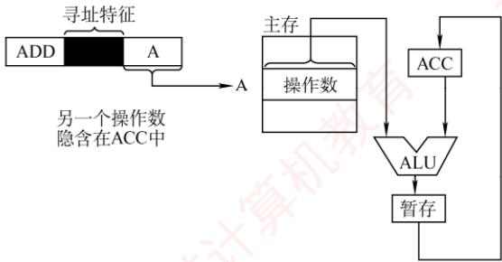
</div>

<p align="center"><em>图 4.2 隐含寻址</em></p>

　　优点是可有效缩短指令字长；缺点是依赖存储隐含操作数的硬件（如 ACC）。

#### 2. 立即（数）寻址

> **考点追踪：** 立即寻址的概念（2023）

　　在立即寻址中，指令的形式地址字段并不表示操作数的地址，而是直接存放操作数本身，称为立即数，通常以补码形式表示。如图 4.3 所示，# 表示立即寻址特征，A 即为立即数。

　　优点是操作数已包含在指令中，执行阶段无须访问存储器，指令执行速度最快；缺点是立即数的大小受限于形式地址字段的位数，寻址范围非常有限。

#### 3. 直接寻址

> **考点追踪：** 地址位数与直接寻址范围的关系（2010、2021）

　　直接寻址是指指令中的形式地址 A 就是操作数的真实地址 EA，即 EA = A，如图 4.4 所示。

<div align="center">
  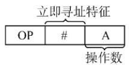
</div>

<p align="center"><em>图 4.3 立即寻址示意图</em></p>

<div align="center">
  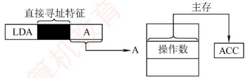
</div>

<p align="center"><em>图 4.4 直接寻址示意图</em></p>

　　优点是实现简单，无须额外计算操作数地址，执行阶段只需访存一次；缺点是形式地址A的位数限制了寻址范围，且地址固定，难以动态修改。

　　例如，若形式地址字段占24位，则直接寻址范围为 $2^{24}=16M$ 。

#### 4. 间接寻址

> **考点追踪：** 间接寻址 EA 的分析（2016）

　　间接寻址是相对于直接寻址而言的，指令中的形式地址A并不直接给出操作数的有效地址，

<div align="center">
  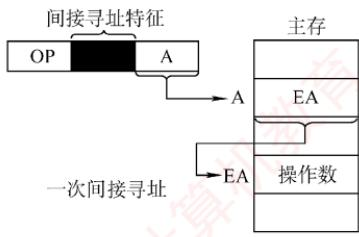
</div>

　　而是指向一个主存单元，该单元中存放操作数的有效地址，即 $EA=(A)$ ，如图4.5所示。

<p align="center"><em>图 4.5 间接寻址示意图</em></p>

　　优点是可扩大寻址范围（有效地址 EA 的位数通常大于形式地址 A 的位数，由存储字长决定），并支持地址动态生成（如实现指针和转移表）；缺点是指令执行阶段需多次访存（一次间址需 2 次访存）。由于访存开销较大，若需兼顾寻址范围与执行效率，通常采用寄存器间接寻址。

#### 5. 寄存器寻址

> **考点追踪：** 寄存器编号位数与寄存器数量的关系（2022、2024）

　　与直接寻址类似，寄存器寻址将操作数存放在寄存器中，指令的地址字段给出的是操作数所在寄存器的编号，即 $EA = R_{i}$ ，操作数位于由 $R_{i}$ 指定的寄存器内，如图 4.6 所示。例如，若 CPU 有 32 个通用寄存器，则寄存器编号需 5 位，形式地址字段仅需 5 位即可寻址全部寄存器。

　　优点是执行阶段无须访存，仅访问寄存器，执行速度快；且因寄存器数量远少于内存单元，地址码位数较少，有助于缩短指令字长；缺点是寄存器成本高，CPU中可用寄存器数量有限。

#### 6. 寄存器间接寻址

> **考点追踪：** 寄存器间接寻址的取数操作（2010）

　　寄存器间接寻址结合了间接寻址和寄存器寻址的特点，指令中的 $R_{i}$ 所指寄存器中存放的不是一个操作数，而是操作数所在主存单元的地址，即 $\mathrm{EA} = (\mathrm{R}_{i})$ ，如图 4.7 所示。

<div align="center">
  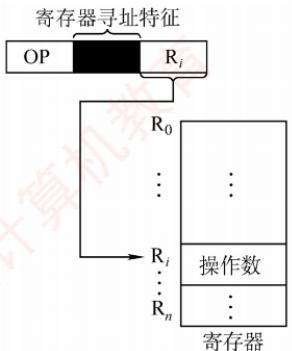
</div>

<p align="center"><em>图 4.6 寄存器寻址示意图</em></p>

<div align="center">
  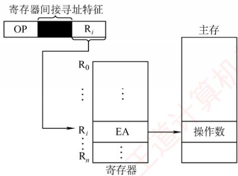
</div>

<p align="center"><em>图 4.7 寄存器间接寻址示意图</em></p>

　　相比间接寻址，寄存器间接寻址在执行阶段只需一次访存，减少了访存开销；同时，由于该方式使用寄存器来存储有效地址，其寻址范围不受形式地址字段位数限制，从而扩大了寻址范围。相比寄存器寻址，这种方式在执行阶段需要从主存获取操作数，增加了访存需求。

#### 7. 相对寻址

> **考点追踪：** 相对寻址的相关分析与计算（2009、2010、2013、2014、2019、2023）

　　相对寻址是指将程序计数器（PC）的内容与指令中的形式地址 A 相加，形成转移目标地址，即 $\mathrm{EA} = (\mathrm{PC}) + \mathrm{A}$ ，如图4.8所示。其中，PC为取指完成后自动更新的值，指向下一条指令的地址；A是相对于该PC值的偏移量，可正可负，通常以补码表示。

<div align="center">
  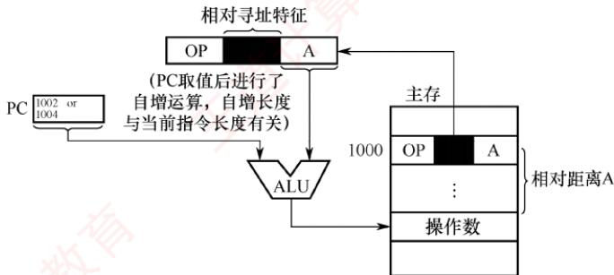
</div>

<p align="center"><em>图 4.8 相对寻址示意图</em></p>

　　相对寻址主要用于转移类指令，形式地址 A 的位数决定了转移范围。例如，假设某机器按字节编址，指令长度为 2B。一条相对转移指令（JMP A）位于地址 1000H，其形式地址 A = 0005H（补码表示），则取指完成后 PC = 1002H，实际转移目标地址为 $1002H + 0005H = 1007H$ 。

　　优点是目标地址不固定，而是相对于当前指令位置偏移，因此程序可在内存中任意浮动而不影响转移正确性，便于实现重定位和共享代码。

#### 8. 基址寻址

> **考点追踪：** 基址寻址的 EA 的计算（2019）

　　基址寻址是指将基址寄存器（BR）的内容与指令中的形式地址 A 相加，形成操作数的有效地址，即 $EA = (BR) + A$ ，如图 4.9 所示。BR 可以是专用基址寄存器或指定的通用寄存器。

<div align="center">
  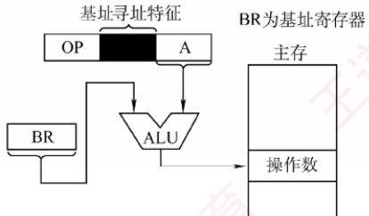
</div>

<p align="center"><em>(a) 采用专用寄存器BR作为基址寄存器</em></p>

<div align="center">
  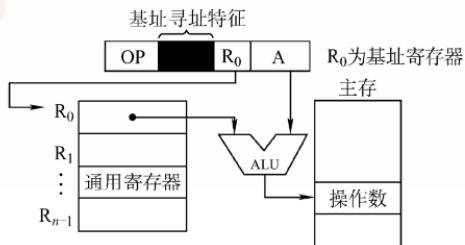
</div>

<p align="center"><em>(b) 采用通用寄存器 $\mathbb{R}_0$ 作为基址寄存器</em></p>

<p align="center"><em>图 4.9 基址寻址</em></p>

　　在多道程序环境下，基址寄存器的内容由操作系统设定，在程序执行期间保持不变（作为基地址），而形式地址 A 作为偏移量，由用户程序指定并可根据需要变化。当使用通用寄存器作为基址寄存器时，尽管用户可选择哪个寄存器扮演此角色，但其内容仍由操作系统控制。

　　优点是：可扩大寻址范围（因基址寄存器位数通常大于形式地址A），能访问更大的地址空间；简化编程，用户无须关注程序在主存的具体位置，有利于多道程序设计和浮动程序的实现。缺点是：形式地址 A 的位数较短，限制了偏移量的范围。

#### 9. 变址寻址

> **考点追踪：** 变址寻址 EA 的相关计算（2013、2016、2024）

　　变址寻址是指将变址寄存器（IX）的内容与指令中的形式地址 A 相加，形成操作数的有效地址，即 $EA = (IX) + A$ ，如图 4.10 所示。IX 可以是专用变址寄存器或指定的通用寄存器。

<div align="center">
  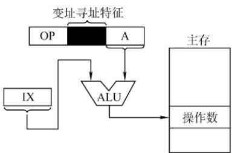
</div>

<p align="center"><em>图 4.10 变址寻址</em></p>

> **考点追踪：** 变址寻址的特点与应用（2017、2018、2024）

　　变址寄存器面向用户，其内容（作为偏移量）可以在程序执行中由用户动态修改，而形式地址A（作为基地址）保持不变。该方式不仅扩大了寻址范围，还特别适用于数组等数据结构的处理——通过调整IX的值，可高效访问数组中任意元素，非常适合编写循环程序。例如，假设数组B首地址为1000H，存储在形式地址A中；变址寄存器IX初始为0。要访问B[3]元素（每个元素占4B），可将IX置为0CH（ $3 \times 4 = 12$ ），则该元素EA=(IX)+A=0CH+1000H=100CH。

　　尽管变址寻址与基址寻址均通过“寄存器内容 + 形式地址”生成有效地址，但二者本质不同：基址寻址面向系统，基址寄存器（BR）的内容由操作系统设定且运行时不可变，用于支持多道程序和存储分配；而变址寻址面向用户，IX 的值可由程序动态调整，用于灵活的数据访问。

> **考点追踪：** 偏移寻址的范畴（2011）

　　相对寻址、基址寻址和变址寻址均属于偏移寻址，其共同特点是通过某个寄存器的值与形式地址相加来确定操作数的有效地址，便于统一理解和应用。

#### 10. 堆栈寻址

　　堆栈是存储器（或寄存器组）中一块按后进先出原则管理的特定存储区，其读/写单元的地址由一个称为堆栈指针（SP）的特定寄存器给出。堆栈可分为两类：硬堆栈由高速寄存器构成，成本较高，容量较小；软堆栈则是从主存中划分一段区域实现，更为经济实用。

　　在采用堆栈结构的计算机中，多数指令表面上表现为无操作数形式，因为其操作数地址由 SP 隐含指定。在访问堆栈时，SP 会自动更新以指向新的栈顶位置。

　　上述各寻址方式的有效地址计算方法及访存次数（不含取本条指令）的总结见表4.1。

　　表 4.1 寻址方式、有效地址及访存次数

<table><tr><td>寻址方式</td><td>有效地址</td><td>访存次数</td></tr><tr><td>立即寻址</td><td>A即是操作数</td><td>0</td></tr><tr><td>直接寻址</td><td>EA = A</td><td>1</td></tr><tr><td>一次间接寻址</td><td>EA = (A)</td><td>2</td></tr><tr><td>寄存器寻址</td><td>EA = Ri</td><td>0</td></tr><tr><td>寄存器间接一次寻址</td><td>EA = (Ri)</td><td>1</td></tr><tr><td>相对寻址</td><td>EA = (PC) + A</td><td>1</td></tr><tr><td>基址寻址</td><td>EA = (BR) + A</td><td>1</td></tr><tr><td>变址寻址</td><td>EA = (IX) + A</td><td>1</td></tr></table>

### 4.2.3 本节习题精选

#### 一、单项选择题

01. 指令系统中采用不同寻址方式的目的是（）。

- A. 提供扩展操作码的可能并降低指令译码难度
- B. 可缩短指令字长，扩大寻址空间，提高编程的灵活性
- C. 实现程序控制
- D. 三者都正确

02. 采用直接转移的无条件转移指令的功能是将指令中的地址码送入（）。

- A. 程序计数器（PC）
- B. 指令译码器（ID）
- C. 指令寄存器（IR）
- D. 地址寄存器（MAR）

03. 为了缩短指令中某个地址段的位数，有效的方法是采取（）。

- A. 立即寻址
- B. 变址寻址
- C. 间接寻址
- D. 寄存器寻址

04. 简化地址结构的基本方法是尽量采用（）。

- A. 寄存器寻址
- B. 隐含寻址
- C. 直接寻址
- D. 间接寻址

05. 在指令寻址的各种方式中，获取操作数最快的方式是（）。

- A. 直接寻址
- B. 立即寻址
- C. 寄存器寻址
- D. 间接寻址

06. 假定指令中地址码所给出的是操作数的有效地址，则该指令采用（）。

- A. 直接寻址
- B. 立即寻址
- C. 寄存器寻址
- D. 间接寻址

07. 设指令中的地址码为 A，变址寄存器为 X，程序计数器为 PC，则变址间址寻址方式的操作数的有效地址 EA 是（）。

- A. $((PC) + A)$
- B. $((X) + A)$
- C. $(X) + (A)$
- D. $(X) + A$

08. （）便于处理数组问题。

- A. 间接寻址
- B. 变址寻址
- C. 相对寻址
- D. 基址寻址

09. 相对寻址方式中，指令所提供的相对地址实质上是一种（）。

- A. 立即数
- B. 内存地址
- C. 以本条指令在内存中首地址为基准位置的偏移量
- D. 以下条指令在内存中首地址为基准位置的偏移量

10. 指令寻址方式有顺序和跳跃两种，采用跳跃寻址方式可以实现（）。

- A. 程序浮动
- B. 程序的无条件浮动和条件浮动
- C. 程序的无条件转移和条件转移
- D. 程序的调用

11. 寄存器 R1、R2 均为 16 位，指令 MOV R1, [R2] 的功能是把内存数据传送至寄存器 R1，寻址方式为寄存器间接寻址。R2 的值为 1234H，内存单元 1234H 存放数据 56H，内存单元 1235H 存放数据 78H，采用小端方式存储。则执行指令后 R1 的值为（）。

- A. 5678H
- B. 7856H
- C. 8765H
- D. 6587H

12. 某计算机的字长为 16 位，主存按字编址。转移指令由两个字节组成，采用相对寻址，第一个字节为操作码字段，第二个字节为相对偏移量字段。若某转移指令所在的主存地址为 4000H，相对偏移量字段的内容为 06H，则该转移指令执行后的 PC 值为（）。

- A. 4002H
- B. 4004H
- C. 4007H
- D. 4008H

13. 某计算机的指令字长为 16 位，由低到高第 0～7 位是形式地址 D，第 8～9 位为寻址特征位 X，第 10～15 位为操作码。当 X=00 时为直接寻址；当 X=01 时使用 X1 进行变址寻址；当 X=10 时使用 X2 进行变址寻址；当 X=11 时为相对寻址。设(PC)=1234H, (X1)=0005H, (X2)=1188H，则指令 2222H 的有效地址是（）。

- A. 1256H
- B. 0027H
- C. 2222H
- D. 11AAH

14. 某机器指令字长为 16 位，主存按字节编址，取指令时，每取一字节，PC 自动加 1。当前指令地址为 2000H，指令内容为相对寻址的无条件转移指令，指令中的形式地址为 40H。则取指令后及指令执行后 PC 的内容为（）。

- A. 2000H, 2042H
- B. 2002H, 2040H
- C. 2002H, 2042H
- D. 2000H, 2040H

15. 某计算机的主存容量为 $4\mathrm{M} \times 16$ 位，且存储字长等于指令字长，若该机能完成97种操作，操作码位数固定，且有直接、间接、基址、变址、相对、立即六种寻址方式，则相对寻址的偏移量范围为（）。

- A. $(-32, + 31)$
- B. $(-64, + 63)$
- C. $(-128, + 127)$
- D. $(-256, + 255)$

16. 假设寄存器 R 中的数值为 200，主存地址为 200 和 300 的地址单元中存放的内容分别是 300 和 400，则（）方式下访问到的操作数为 200。

- A. 直接寻址 200
- B. 寄存器间接寻址（R）
- C. 存储器间接寻址（200）
- D. 寄存器寻址 R

17. 假设某条指令的第一个操作数采用寄存器间接寻址方式，指令中给出的寄存器编号为 8, 8 号寄存器的内容为 1200H，地址为 1200H 的单元中的内容为 12FCH，地址为 12FCH 的单元中的内容为 38D8H，而地址为 38D8H 的单元中的内容为 88F9H，则该操作数的有效地址为（）。

- A. 1200H
- B. 12FCH
- C. 38D8H
- D. 88F9H

18. 设相对寻址的转移指令占3B，第1字节为操作码，第2、3字节为相对位移量（补码表示），数据在存储器中采用以低字节为字地址的存放方式。每当CPU从存储器取出一字节时，即自动完成 $(\mathrm{PC}) + 1\rightarrow \mathrm{PC}$ 。若PC的当前值为240（十进制），要求转移到290（十进制），则转移指令的第2、3字节的机器代码是（）；若PC的当前值为240（十进制），要求转移到200（十进制），则转移指令的第2、3字节的机器代码是（）。

- A. 2FH、FFH
- B. D5H、00H
- C. D5H、FFH
- D. 2FH、00H

19. 某计算机按字节编址，采用大端方式，某指令的一个操作数的机器数为 ABCD 00FFH，该操作数采用基址寻址方式，指令中形式地址（用补码表示）为 FF00H，当前基址寄存器的内容为 C000 0000H，则该操作数的 LSB（FFH）存放的地址是（）。

- A. C000 FF00H
- B. C000 FF03H
- C. BFFF FF00H
- D. BFFF FF03H

20. 下列关于指令的功能及分类的叙述中，正确的是（）。

- A. 算术与逻辑运算指令，通常完成算术运算或逻辑运算，都需要两个数据
- B. 移位操作指令，通常用于把指定的两个操作数左移或右移一位
- C. 转移指令、子程序调用与返回指令，用于解决数据调用次序的需求
- D. 特权指令，通常仅用于实现系统软件，这类指令一般不提供给用户

21. 某计算机字长为 16 位，标志寄存器中存在 ZF、SF、OF 和 CF 标志位，采用双字节字长指令字。假定 bgt（大于零转移）指令的第一个字节指明操作码和寻址方式，第二个字节为立即数 Imm8，用补码表示。指令功能是：若转移条件成立，则 PC = PC + 2 + Imm8 × 2；否则，PC = PC + 2。则下列叙述中错误的是（）。

- A. 该计算机按字节编址
- B. 若 bgt 指令是无符号整数的比较，则转移条件可以是 $\mathrm{ZF} + \mathrm{CF} = 0$
- C. 若 bgt 指令是有符号整数的比较，则转移条件可以是 $\mathrm{SF} \oplus \mathrm{OF} = 0$
- D. 转移目标地址的范围是相对于 bgt 指令的前 127 条指令到后 128 条指令之间

22. 下列关于指令寻址与数据寻址的描述中，错误的是（）。

- A. 中断响应时，中断隐指令的执行不属于指令寻址的范畴
- B. 指令格式中，每个操作数字段均需通过显式编码或隐含约定确定其寻址方式
- C. 在含 Cache 的系统中，指令访存遵循“Cache 优先”原则，未命中时再访问主存
- D. 数据寻址方式不属于指令集体系结构（ISA）规定的内容

23. 【2009 统考真题】某机器字长为 16 位，主存按字节编址，转移指令采用相对寻址，由 2 字节组成，第一字节为操作码字段，第二字节为相对位移量字段。假定取指令时，每取一字节，PC自动加1。若某转移指令所在主存地址为 $2000\mathrm{H}$ ，相对位移量字段的内容为 $06\mathrm{H}$ ，则该转移指令成功转移后的目标地址是（）。

- A. 2006H
- B. 2007H
- C. 2008H
- D. 2009H

24. 【2011 统考真题】偏移寻址通过将某个寄存器的内容与一个形式地址相加来生成有效地址。下列寻址方式中，不属于偏移寻址方式的是（）。

- A. 间接寻址
- B. 基址寻址
- C. 相对寻址
- D. 变址寻址

25. 【2011 统考真题】某机器有一个标志寄存器，其中有进位/借位标志 CF、零标志 ZF、符号标志 SF 和溢出标志 OF，条件转移指令 bgt（无符号整数比较大于时转移）的转移条件是（）。

- A. $CF + OF = 1$
- B. $\overline{SF} + ZF = 1$
- C. $\overline{CF + ZF} = 1$
- D. $\overline{CF + SF} = 1$

26. 【2013 统考真题】假设变址寄存器 R 的内容为 1000H，指令中的形式地址为 2000H；地址 1000H 中的内容为 2000H，地址 2000H 中的内容为 3000H，地址 3000H 中的内容为 4000H，则变址寻址方式下访问到的操作数是（）。

- A. 1000H
- B. 2000H
- C. 3000H
- D. 4000H

27. 【2014 统考真题】某计算机有 16 个通用寄存器，采用 32 位定长指令字，操作码字段（含寻址方式位）为 8 位，STORE 指令的源操作数和目的操作数分别采用寄存器直接寻址和基址寻址方式。若基址寄存器可使用任意一个通用寄存器，且偏移量用补码表示，则 STORE 指令中偏移量的取值范围是（）。

- A. -32768～+32767
- B. -32767～+32768
- C. -65536～+65535
- D. -65535～+65536

28. 【2016 统考真题】某指令格式如下所示。

<table><tr><td>OP</td><td>M</td><td>I</td><td>D</td></tr></table>

其中 M 为寻址方式，I 为变址寄存器编号，D 为形式地址。若采用先变址后间址的寻址方式，则操作数的有效地址是（）。

- A. I + D
- B. (I) + D
- C. ((I) + D)
- D. ((I)) + D

29. 【2017 统考真题】下列寻址方式中，最适合按下标顺序访问一维数组元素的是（）。

- A. 相对寻址
- B. 寄存器寻址
- C. 直接寻址
- D. 变址寻址

30. 【2018 统考真题】按字节编址的计算机中，某 double 型数组 A 的首地址为 2000H，使用变址寻址和循环结构访问数组 A，保存数组下标的变址寄存器的初值为 0，每次循环取一个数组元素，其偏移地址为变址值乘以 sizeof (double)，取完后变址寄存器的内容自动加 1。若某次循环所取元素的地址为 2100H，则进入该次循环时变址寄存器的内容是（）。

- A. 25
- B. 32
- C. 64
- D. 100

31. 【2019 统考真题】某计算机采用大端方式，按字节编址。某指令中操作数的机器数为 1234 FF00H，该操作数采用基址寻址方式，形式地址（用补码表示）为 FF12H，基址寄存器的内容为 F000 0000H，则该操作数的 LSB（最低有效字节）所在的地址是（）。

- A. F000 FF12H
- B. F000 FF15H
- C. EFFF FF12H
- D. EFFF FF15H

32. 【2020 统考真题】某计算机采用 16 位定长指令字格式，操作码位数和寻址方式位数固定，指令系统有 48 条指令，支持直接、间接、立即、相对 4 种寻址方式。在单地址指令中，直接寻址方式的可寻址范围是（）。

- A. 0～255
- B. 0～1023
- C. -128～127
- D. -512～511

33. 【2023 统考真题】某运算类指令中有一个地址码为通用寄存器编号，对应通用寄存器中存放的是操作数或操作数的地址，CPU区分两者的依据是（）。

- A. 操作数的寻址方式
- B. 操作数的编码方式
- C. 通用寄存器的编号
- D. 通用寄存器的内容

#### 二、综合应用题

01. 某机的机器字长为 16 位，主存按字编址，指令格式如下：

<table><tr><td>15</td><td>10</td><td>9</td><td>8</td><td>7</td><td>0</td></tr><tr><td colspan="2">操作码</td><td colspan="2">X</td><td colspan="2">D</td></tr></table>

　　其中，D 为位移量；X 为寻址特征位。

　　设(PC) = 1234H, (X1) = 0037H, (X2) = 1122H (H 代表十六位进制数), 请确定下列指令的有效地址:
① 4420H ② 2244H ③ 1322H ④ 3521H ⑤ 6723H

02. 某计算机字长 16 位，标志寄存器 FLAGS 中的 ZF、SF 和 OF 分别是零标志、符号标志和溢出标志，采用双字节字长指令字。假定 bgt（大于零转移）指令的第一个字节指明操作码和寻址方式，第二个字节为偏移地址 Imm8，用补码表示。指令功能是：
　　若 $(ZF + (SF \oplus OF) = 0)$ ，则 $PC = PC + 2 + Imm8 \times 2$ ；否则， $PC = PC + 2$ 。
　　请回答下列问题：
1）该计算机的编址单位是多少？
2）bgt 指令执行的是有符号整数比较，还是无符号整数比较？
3）偏移地址 Imm8 的含义是什么？转移目标地址的范围是什么？

03. 【2010 统考真题】某计算机字长为 16 位，主存地址空间大小为 128KB，按字编址，采用单字长指令格式，指令各字段定义如下：

<table><tr><td>15</td><td>12</td><td>11</td><td>6</td><td>5</td><td>0</td></tr><tr><td colspan="2">OP</td><td>Ms</td><td>Rs</td><td>Md</td><td>Rd</td></tr><tr><td colspan="6">源操作数 目的操作数</td></tr></table>

　　转移指令采用相对寻址方式，相对偏移量用补码表示，寻址方式定义见下表。

<table><tr><td>Ms/Md</td><td>寻址方式</td><td>助记符</td><td>含义</td></tr><tr><td>000B</td><td>寄存器直接</td><td>Rn</td><td>操作数 = (Rn)</td></tr><tr><td>001B</td><td>寄存器间接</td><td>(Rn)</td><td>操作数 = ((Rn))</td></tr><tr><td>010B</td><td>寄存器间接、自增</td><td>(Rn) +</td><td>操作数 = ((Rn)), (Rn) + 1→Rn</td></tr><tr><td>011B</td><td>相对</td><td>D(Rn)</td><td>转移目标地址 = (PC) + (Rn)</td></tr></table>

　　注：(X)表示存储器地址 X 或寄存器 X 的内容。

　　回答下列问题:

1）该指令系统最多可有多少条指令？该计算机最多有多少个通用寄存器？存储器地址寄存器（MAR）和存储器数据寄存器（MDR）至少各需要多少位？

2）转移指令的目标地址范围是多少？

3) 若操作码 0010B 表示加法操作（助记符为 add），寄存器 R4 和 R5 的编号分别为 100B 和 101B，R4 的内容为 1234H，R5 的内容为 5678H，地址 1234H 中的内容为 5678H，5678H 中的内容为 1234H，则汇编语句 “add (R4), (R5)+”（逗号前为源操作数，逗号后为目的操作数）对应的机器码是什么（用十六进制表示）？该指令执行后，哪些寄存器和存储单元的内容会改变？改变后的内容是什么？

04. 【2013 统考真题】某计算机采用 16 位定长指令字格式，其 CPU 中有一个标志寄存器，其中包含进位/借位标志 CF、零标志 ZF 和符号标志 NF。假定为该机设计了条件转移指令，其格式如下：

<table><tr><td>15</td><td>11</td><td>10</td><td>9</td><td>8</td><td>7</td><td>0</td></tr><tr><td>0</td><td>0</td><td>0</td><td>0</td><td>0</td><td></td><td></td></tr></table>

　　其中，00000为操作码OP；C、Z和N分别为CF、ZF和NF的对应检测位，某检测位为1时表示需检测对应标志，需检测的标志位中只要有一个为1就转移，否则不转移。例如，若 $C = 1$ ， $Z = 0$ ， $N = 1$ ，则需检测CF和NF的值，当 $\mathrm{CF} = 1$ 或 $\mathrm{NF} = 1$ 时发生转移；OFFSET是相对偏移量，用补码表示。转移执行时，转移目标地址为(PC) $+2+$ $2\times$ OFFSET；顺序执行时，下一条指令地址为(PC) $+2$ 。请回答下列问题：

1）该计算机存储器是按字节编址还是按字编址？该条件转移指令向后（反向）最多可转移多少条指令？

2）某条件转移指令的地址为 200CH，指令内容如下图所示，若该指令执行时 CF = 0，ZF = 0，NF = 1，则该指令执行后 PC 的值是多少？若该指令执行时 CF = 1，ZF = 0，NF = 0，则该指令执行后 PC 的值又是多少？请给出计算过程。

<table><tr><td>15</td><td>11</td><td>10</td><td>9</td><td>8</td><td>7</td><td>0</td></tr><tr><td>0</td><td>0</td><td>0</td><td>0</td><td>0</td><td>1</td><td>1</td></tr></table>

3）实现“无符号数比较小于或等于时转移”功能的指令中，C、Z和N应各是什么？4）以下是该指令对应的数据通路示意图，要求给出图中部件①～③的名称或功能说明。

<div align="center">
  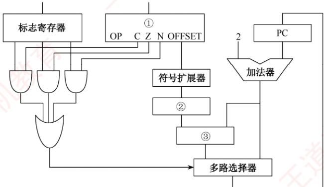
</div>

05. 【2021 统考真题】假定计算机 M 字长为 16 位，按字节编址，连接 CPU 和主存的系统总线中地址线为 20 位、数据线为 8 位，采用 16 位定长指令字，指令格式及说明如下：

　　格式 6位 2位 2位 2位 4位 指令功能或指令类型说明

<table><tr><td>R型</td><td>000000</td><td>rs</td><td>rt</td><td>rd</td><td>op1</td></tr><tr><td>I型</td><td>op2</td><td>rs</td><td>rt</td><td colspan="2">imm</td></tr><tr><td>J型</td><td>op3</td><td colspan="4">target</td></tr></table>

R[rd] ← R[rs] op1 R[rt]

　　含ALU运算、条件转移和访存操作3类指令

　　PC 的低 10 位 $\leftarrow$ target

　　其中，op1 ~ op3 为操作码，rs, rt 和 rd 为通用寄存器编号，R[r] 表示寄存器 r 的内容，imm 为立即数，target 为转移目标的形式地址。请回答下列问题。

1）ALU 的宽度是多少位？可寻址主存空间大小为多少字节？指令寄存器、主存地址寄存器（MAR）和主存数据寄存器（MDR）分别应有多少位？

2）R型格式最多可定义多少种操作？I型和J型格式总共最多可定义多少种操作？通用寄存器最多有多少个？

3）假定 op1 为 0010 和 0011 时，分别表示有符号整数减法和有符号整数乘法指令，则指令 01B2H 的功能是什么（参考上述指令功能说明的格式进行描述）？若 1, 2, 3 号通用寄存器当前内容分别为 B052H, 0008H, 0020H，则分别执行指令 01B2H 和 01B3H 后，3 号通用寄存器内容各是什么？各自结果是否溢出？

4）若采用I型格式的访存指令中imm（偏移量）为有符号整数，则地址计算时应对imm进行零扩展还是符号扩展？

5）无条件转移指令可以采用上述哪种指令格式？

### 4.2.4 答案与解析

#### 一、单项选择题

**01. B**

　　采用不同寻址方式的目的是为了缩短指令字长，扩大寻址空间，提高编程的灵活性，但这也提高了指令译码的复杂度。程序控制是靠转移指令而非寻址方式实现的。

**02. A**

　　转移指令有条件/无条件、直接/间接、相对/绝对三种属性。条件转移是指需要先判断条件是否成立，才决定是否转移；无条件转移是指不用判断条件就可以转移，典型的是函数调用和返回。直接转移是指转移目标地址直接放在指令中，执行时直接将地址码送入 PC；间接转移是指转移目标地址存放在寄存器或内存单元中。相对转移是指转移目标地址为当前 PC 值加上偏移量，偏移量一般在指令中；绝对转移是指转移目标地址直接由指令或寄存器给出。

**03. D**

　　CPU 中寄存器的数量都不会太多，用很短的编码就可以指定寄存器，寄存器寻址需要的地址段位数为 $\left\lceil \log_{2}(\text{通用寄存器个数}) \right\rceil$ ，因此能有效地缩短地址段的位数。立即寻址，操作数直接保存在指令中，若地址段位数太小，则操作数表示的范围会很小；变址寻址，EA = 变址寄存器 IX 的内容 + 形式地址 A，A 与主存寻址空间有关；间接寻址中存放的仍然是主存地址。

**04. B**

　　隐含寻址不明显给出操作数地址，而在指令中隐含操作数的地址，因此可以简化地址结构。

**05. B**

　　立即寻址最快，指令直接给出操作数；寄存器寻址次之，只需访问一次寄存器；直接寻址再次之，访问一次内存；间接寻址最慢，要访问内存两次或以上。

**06. A**

　　指令字中的形式地址为操作数的有效地址，这种方式为直接寻址。

**07. B**

　　变址寻址的有效地址是 $(\mathrm{X}) + \mathrm{A}$ ，再进行变址间址寻址，即把 $(\mathrm{X}) + \mathrm{A}$ 中取出的内容作为真实地址EA，即 $\mathrm{EA} = ((\mathrm{X}) + \mathrm{A})$ 。

　　寄存器中的内容和指令地址码相加得到的是操作数的地址码。

**08. B**

　　变址寻址便于处理数组问题。基址寻址与变址寻址的区别见下表。

<table><tr><td></td><td>基址寻址</td><td>变址寻址</td></tr><tr><td>有效地址</td><td><eq>\mathrm{{EA}} = \left( \mathrm{{BR}}\right) + \mathrm{A}</eq></td><td><eq>\mathrm{{EA}} = \left( \mathrm{{IX}}\right) + \mathrm{A}</eq></td></tr><tr><td>访存次数</td><td>1</td><td>1</td></tr><tr><td>寄存器内容</td><td>由操作系统或管理程序确定</td><td>由用户设定</td></tr><tr><td>程序执行过程中值可变否</td><td>不可变</td><td>可变</td></tr><tr><td>特点</td><td>有利于多道程序设计和编制浮动程序</td><td>有利于处理数组问题和编制循环程序</td></tr></table>

**09. D**

　　相对寻址中，有效地址 $EA = (PC) + A$ （A 为形式地址），执行本条指令时，PC 已完成加 1 操作，PC 中保存的是下一条指令的地址，因此以下一条指令的地址为基准位置的偏移量。

**10. C**

　　跳跃寻址通过转移类指令（如相对寻址）来实现，可用来实现程序的条件或无条件转移。

**11. B**

　　寄存器 R2 中的值是 1234H，内存单元 1234H 中的值是 56H，1235H 中的值是 78H，因为采用小端方式，所以实际存储的数据为 7856H，取出后存放到 R1，因此 R1 的值为 7856H。

**12. C**

　　主存按字编址，指令字长为 1 个字（2 字节），因此取出该指令后，PC 自动加 1，相对偏移量为 06H，所以该转移指令执行后的 PC 值为 $4000H + 06H + 1H = 4007H$ 。

**13. D**

　　将指令 2222H 展开成二进制为 0010 0010 0010 0010B，因此寻址特征位 X = 10，即使用 X2 进行变址寻址，其有效地址为 $1188H + 22H = 11AAH$ 。

**14. C**

　　指令字长为 16 位，2 字节，因此取指令后 PC 的内容为 $(PC) + 2 = 2002H$ ；无条件转移指令将下一条指令的地址送至 PC，形式地址为 40H，指令执行后 $PC = 2002H + 0040H = 2042H$ 。

**15. A**

　　操作码位数固定，且能完成97种操作，则操作码位数是 $\lceil \log_297\rceil = 7$ 位；具有六种寻址方式，则寻址特征位数是 $\lceil \log_26\rceil = 3$ 位；指令字长为16位，因此地址码位数是 $16 - 3 - 7 = 6$ 位，6位补码的表示范围为 $-32\sim +31$ ，即为相对寻址的偏移量范围。

**16. D**

　　直接寻址 200 访问的操作数是 300，选项 A 错误。寄存器间接寻址（R）的访问结果与 I 一样，选项 B 错误。存储器间接寻址（200）表示主存地址 200 中的内容为有效地址，有效地址为 300，访问的操作数是 400，选项 C 错误。寄存器寻址 R 表示寄存器 R 的内容为操作数，只有选项 D 正确。

**17. A**

　　寄存器间接寻址中操作数的有效地址 $EA=(R_{i})$ ，8 号寄存器内容为 1200H，因此 EA=1200H。

**18. D、C**

　　首先需要讲解一下补码扩充的问题。补码的扩充只需使用符号位补足即可，也就是说正数补码的扩充只要补0，负数补码的扩充只需补1（这是由补码的性质决定的）。理解了该性质，这道题就变成了十进制数转换为十六进制数的简单问题。

1）PC 的当前值为 240，该指令取出后 PC 的值为 243，要求转移到 290，即相对位移量为 290 - 243 = 47，转换成补码为 2FH。因为数据在存储器中采用以低字节地址为字地址的存放方式，所以该转移指令的第二字节为 2FH，而由于 47 是正数，只需在高位补 0，所以第三字节为 00H。

2）PC 的当前值为 240，该指令取出后 PC 的值为 243，要求转移到 200，即相对位移量为 200 - 243 = -43，转换成补码为 D5H。数据在存储器中采用以低字节地址为字地址的存放方式，因此该转移指令的第二字节为 D5H，因为 -43 是负数，所以只需在高位补 1，所以第三字节为 FFH。

**19. D**

　　基址寻址的操作数的有效地址为基址寄存器内容加上形式地址，即 C000 0000H + FF00H = C000 0000H + FFFF FF00H = BFFF FF00H。因为是大端方式，所以 LSB 的存放地址为 BFFF FF03H。

**20. D**

　　算术与逻辑运算指令用于完成对一个（如自增、取反等）或两个数据的算术运算或逻辑运算，选项 A 错误。移位操作用于把一个操作数左移或右移一位或多位，选项 B 错误。转移指令、子程序调用与返回指令用于解决变动程序中指令执行次序的需求，而不是数据调用次序的需求，选项 C 错误。

**21. C**

　　PC 的增量是 2，每条指令占 2 字节，可知编址单位为字节。若 bgt 指令是无符号整数的比较，则大于零时，ZF 一定为 0，且 CF 也一定为 0。若 bgt 指令是有符号整数的比较，则转移条件成立时，要么未发生溢出，SF = OF = 0，要么发生溢出，SF = OF = 1，但前提是 ZF 一定为 0，故正确的转移条件是 $(ZF + (SF \oplus OF) = 0)$ 。Imm8 的范围为 -128～127，因此转移目标地址的范围是 PC + 2 + (-128×2)～PC + 2 + 127×2，即相对于 bgt 指令的前 127 条指令到后 128 条指令之间。

**22. D**

　　中断隐指令由硬件自动完成（如保存 PC、转移至中断向量），不涉及程序控制流中的指令地址生成，故不属于指令寻址。操作数要通过显式字段或隐含规则（如堆栈使用 SP）确定来源，是寻址机制的基本要求。在现代存储体系中，指令与数据访存优先经 Cache，缺失时才访问主存以提升性能。数据寻址方式是 ISA 的核心内容，必须明确定义，选项 D 错误。

**23. C**

　　相对寻址 $EA=(PC)+A$ ，首先计算取指令后的 PC 值。转移指令由 2 字节组成，每取一字节 PC 加 1，取指令后的 PC 值为 2002H，因此 $EA=(PC)+A=2002H+06H=2008H$ 。本题易误选选项 A 或 B，选项 A 未考虑 PC 值的自动更新，选项 B 虽然考虑了 PC 值的自动更新，但未注意到该转移指令是一条 2 字节指令，PC 值应是 “+2” 而不是 “+1”。

**24. A**

　　间接寻址不需要寄存器， $\mathrm{EA} = (\mathrm{A})$ 。基址寻址 $EA = A +$ 基址寄存器 BR 的内容；相对寻址 $EA = A +$ 程序计数器（PC）的内容；变址寻址 $EA = A +$ 变址寄存器 IX 的内容。后三者都是将某个寄存器的内容与一个形式地址相加而形成有效地址，所以统称偏移寻址。

**25. C**

　　假设两个无符号整数 A 和 B, bgt 指令会将 A 和 B 进行比较, 也就是将 A 和 B 相减。若 A > B, 则 A - B 肯定无进位/借位, 也不为 0（为 0 时表示两数相等）, 因此 CF 和 ZF 均为 0, 选 C。其余选项中用到了符号标志 SF 和溢出标志 OF, SF 表示结果的符号, OF 是有符号整数的溢出标志位，对于无符号数运算，SF 和 OF 没有意义，显然应当排除。

**26. D**

　　根据变址寻址的方法，变址寄存器的内容（1000H）与形式地址的内容（2000H）相加，得到操作数的实际地址（3000H），根据实际地址访问内存，获取操作数4000H，如下图所示。

<div align="center">
  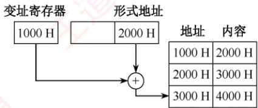
</div>

**27. A**

　　采用 32 位定长指令字，其中操作码为 8 位，两个地址码共占用 32 - 8 = 24 位，而 STORE 指令的源操作数和目的操作数分别采用寄存器直接寻址和基址寻址，机器中共有 16 个通用寄存器，因此寻址一个寄存器需要 $\log_{2}16 = 4$ 位，源操作数中的寄存器直接寻址用掉 4 位，而目的操作数采用基址寻址也要指定一个寄存器，同样用掉 4 位，则留给偏移量的位数为 24 - 4 - 4 = 16 位，而偏移量用补码表示，因此 16 位补码的表示范围为 -32768～+32767。

**28. C**

　　在变址寻址中，有效地址（EA）等于指令字中的形式地址 D 与变址寄存器 I 的内容之和，即 $EA = (I) + D$ 。间接寻址是相对于直接寻址而言的，指令的地址字段给出的形式地址不是操作数的真正地址，而是操作数地址的地址，即 $EA = (D)$ 。从而该操作数的有效地址是 $((I) + D)$ 。

**29. D**

　　变址操作时，将计算机指令中的地址与变址寄存器中的地址相加，得到有效地址，指令提供数组首地址，由变址寄存器来定位数据中的各元素。所以它最适合按下标顺序访问一维数组元素，选择选项 D。相对寻址以 PC 为基地址，以指令中的地址为偏移量确定有效地址。寄存器寻址则在指令中指出需要使用的寄存器。直接寻址在指令的地址字段直接指出操作数的有效地址。

**30. B**

　　根据变址寻址的公式 $EA = (IX) + A$ ，有 $(IX) = 2100H - 2000H = 100H = 256$ ，sizeof(double) = 8（双精度浮点数用 8 位字节表示），因此数组的下标为 256/8 = 32。

**31. D**

　　注意，内存地址是无符号数。

　　操作数采用基址寻址方式， $EA=(BR)+A$ ，基址寄存器 BR 的内容为 F000 0000H，形式地址用补码表示为 FF12H 即 1111 1111 0001 0010B，因此有效地址为 F000 0000H + (-00EEH) = EFFF FF12H。计算机采用大端方式编址，所以低位字节存放在字的高地址处，机器数一共占 4 字节，该操作数的 LSB 所在的地址是 EFFF FF12H + 3 = EFFF FF15H。

**32. A**

　　48 条指令需要 6 位操作码字段 $(2^{5}<48<2^{6})$ ，4 种寻址方式需要 2 位寻址特征位 $(4=2^{2})$ ，还剩 16-6-2=8 位作为地址码，所以直接寻址范围为 0～255。注意，主存地址不能为负。

**33. A**

　　指令字由操作码、寻址特征和地址码三个字段组成，寻址特征字段用来指明指令属于哪种寻址方式。若寻址方式是寄存器直接寻址，则地址码所指的通用寄存器中存放的是操作数，若寻址方式是寄存器间接寻址，则对应通用寄存器中存放的是操作数的地址。

#### 二、综合应用题

**01. 【解答】**

　　取指令后，PC = 1235H（注意，不是 1236H，因主存按字编址）。

　　① X = 00, D = 20H, 有效地址 EA = 20H。

　　② X = 10, D = 44H, 有效地址 EA = 1122H + 44H = 1166H。

　　③ X = 11, D = 22H, 有效地址 EA = 1235H + 22H = 1257H。

　　④ X = 01, D = 21H, 有效地址 EA = 0037H + 21H = 0058H。

　　⑤ X = 11, D = 23H, 有效地址 EA = 1235H + 23H = 1258H。

**02. 【解答】**

1）因为 PC 的增量是 2，且每条指令占 2 字节，所以编址单位是字节。

2）根据“大于”条件判断表达式，可以看出该bgt指令实现的是有符号整数比较。因为无符号数比较时，其判断表达式中没有溢出标志OF。继续分析该逻辑表达式，bgt指令的含义是当两数相减的结果大于0时，执行转移操作。因此，要满足bgt指令的条件，必须保证如下两个条件：一是结果不为0，即零标志位ZF为0；二是结果的符号位与溢出标志位OF相同，即 $\mathrm{SF} \oplus \mathrm{OF}$ 为0（两数相减结果大于0，有两种情况：第一种情况是结果没有溢出，此时OF位和SF位都为0；第二种情况是结果发生了溢出，此时OF和SF位都为1）。综上所述，逻辑表达式可表示为 $\mathrm{ZF} + (\mathrm{SF} \oplus \mathrm{OF}) = 0$ 。

3）偏移地址 Imm8 为补码表示，说明转移目标地址可能在 bgt 指令之后。计算转移目标地址时，偏移量为 Imm8×2，说明 Imm8 不是相对地址，而是相对指令数。Imm8 的范围为 -128～127，所以转移目标地址的范围是 PC + 2 + (-128×2)～PC + 2 + 127×2，也即转移目标地址的范围是相对于 bgt 指令的前 127 条指令到后 128 条指令之间。

**03. 【解答】**

1）操作码占4位，则该指令系统最多可有 $2^{4} = 16$ 条指令。操作数占6位，其中寻址方式占3位、寄存器编号占3位，因此该机最多有 $2^{3} = 8$ 个通用寄存器。主存地址空间大小为128KB，按字编址，字长为16位，共有 $128\mathrm{KB} / 2\mathrm{B} = 2^{16}$ 个存储单元，因此MAR至少为16位；本题已说明了存储字长为16位，因此MDR至少为16位。

2）寄存器字长为16位，PC可以表示的地址范围为 $0\sim 2^{16} - 1$ ，Rn可表示的相对偏移量为 $-2^{15}\sim$ $2^{15} - 1$ ，而主存地址空间为 $2^{16}$ ，因此转移指令的目标地址范围为 $0000\mathrm{H}\sim \mathrm{FFFFH}$ （ $0\sim 2^{16} - 1$ ）。

3）汇编语句 “add (R4), (R5)+” 对应的机器码为

<table><tr><td>字段</td><td>OP</td><td>Ms</td><td>Rs</td><td>Md</td><td>Rd</td></tr><tr><td>内容</td><td>0010</td><td>001</td><td>100</td><td>010</td><td>101</td></tr><tr><td>说明</td><td>add</td><td>寄存器间接</td><td>R4</td><td>寄存器间接、自增</td><td>R5</td></tr></table>

　　将对应的机器码写成十六进制数形式为0010 0011 0001 0101B = 2315H。

　　该指令的功能是将 R4 的内容所指的存储单元的数据与 R5 的内容所指的存储单元的数据相加，并将结果送入 R5 的内容所指的存储单元中。(R4) = 1234H, (1234H) = 5678H; (R5) = 5678H, (5678H) = 1234H；执行加法操作 $5678H + 1234H = 68ACH$ 。之后 R5 自增。

　　该指令执行后，R5 和存储单元 5678H 的内容会改变，R5 的内容从 5678H 变为 5679H，存储单元 5678H 中的内容变为该指令的计算结果 68ACH。

**04. 【解答】**

1）因为指令长度为 16 位，且下一条指令地址为 $(PC) + 2$ ，因此编址单位是字节。

　　相对偏移量 OFFSET 为 8 位补码，表示范围为 -128～127，根据转移目标地址为 $(PC) + 2 + 2 \times \text{OFFSET}$ ，若要向后转移，则要求 OFFSET 必须为负数，OFFSET 的最小值为 -128，但在执行转移指令之前，PC 进行了自增 +2 的操作，所以向后最多可转移 127 条指令。

2）指令中 C=0，Z=1，N=1，因此应根据 ZF 和 NF 的值来判断是否转移。CF=0，ZF=0，NF=1 时，需转移。已知指令中的偏移量为 1110 0011B=E3H，符号扩展后为 FFE3 H，左移一位（乘以 2）后为 FFC6H，因此 PC 的值（转移目标地址）为 $200CH+2+FFC6H=1FD4H$ 。CF=1，ZF=0，NF=0 时不转移。PC 的值为 $200CH+2=200EH$ 。

3）指令中的 C、Z 和 N 应分别设置为 C = Z = 1，N = 0。两个数之间的大小比较通常是对两个数做减法运算，即两个数相减当结果为 0 或为负时转移，若为 0，则 ZF 标志应当是 1，若为负，则借位标志应该是 1，而无符号数并不涉及符号标志 NF。

4）部件①用于存放当前指令，不难得出为指令寄存器；多路选择器根据符号标志 C/Z/N 来决定下一条指令的地址是 PC + 2 还是 PC + 2 + 2×OFFSET，因此多路选择器左边线上的结果应是 PC + 2 + 2×OFFSET。根据运算的先后顺序及与 PC + 2 的连接，部件②用于左移一位实现乘以 2，为移位寄存器。部件③用于 PC + 2 和 2×OFFSET 相加，为加法器。

　　部件②：移位寄存器（用于左移一位）；部件③：加法器（地址相加）。

**05. 【解答】**

1）ALU 的宽度为 16 位，ALU 的宽度即 ALU 运算对象的宽度，通常与字长相同。地址线为 20 位，按字节编址，可寻址主存空间大小为 $2^{20}$ 字节（或 1MB）。指令寄存器有 16 位，和单条指令长度相同。MAR 有 20 位，和地址线位数相同。MDR 有 8 位，和数据线宽度相同。

2）R型格式的操作码有4位，最多有 $2^{4}$ （或16）种操作。I型和J型格式的操作码有6位，因为它们的操作码部分重叠，所以共享这6位的操作码空间，且前6位全为0的编码已被R型格式占用，因此I和J型格式最多有 $2^{6} - 1 = 63$ 种操作。从R型和I型格式的寄存器编号部分可知，只用2位对寄存器编码，因此通用寄存器最多有4个。

3）指令 01B2H = 000000 01 10 11 0010B 为一条 R 型指令，操作码 0010 表示有符号整数减法指令，其功能为 R[3]←R[1]-R[2]。执行指令 01B2H 后，R[3] = B052H - 0008H = B04AH，结果未溢出。指令 01B3H = 000000 01 10 11 0011B，操作码 0011 表示有符号整数乘法指令，执行指令 01B3H 后，R[3] = R[1]×R[2] = B052H×0008H = 8290H，B052H 乘以 8 相当于将 B052H 算术左移 3 位，B052H 是一个负数，符号位为 1，在算术左移的过程中移出了 101，不全为 1，由此可以判断结果溢出。

4）在进行指令的转移时，既可能向前转移，又可能向后转移，偏移量是一个有符号整数，因此在地址计算时，应对imm进行符号扩展。

5）无条件转移指令可以采用 J 型格式，将 target 部分写入 PC 的低 10 位，完成转移。

## 4.3 程序的机器级代码表示

> **考点追踪：** 涉及汇编代码的年份（2012、2014、2015、2017、2019、2023、2024）

　　本节是 2022 年新增考点，但相关知识早已多次以综合题形式出现在历年真题中，难度较大，不少跨考生感到无从下手。通过本节学习后，考生应能从容应对此类问题。统考大纲未指定具体指令集，但历年真题主要考查 x86 和 MIPS 汇编指令。其中，MIPS 指令通常会在试题中附带功能说明，而 x86 指令则更常作为默认考查对象。因此，本节重点介绍 x86 汇编指令。

### 4.3.1 常用汇编指令介绍

#### 1. 相关寄存器

　　x86 处理器中有 8 个 32 位通用寄存器，主要寄存器及说明如图 4.11 所示。为向后兼容早期的 16 位和 8 位架构，EAX、EBX、ECX 和 EDX 的低 16 位可作为独立寄存器使用（分别记为 AX、BX、CX、DX），而每个 16 位寄存器又可进一步拆分为两个 8 位寄存器（如 AX 分为 AH 和 AL）。其中，E 表示 Extended，用于标识 32 位寄存器。

<div align="center">
  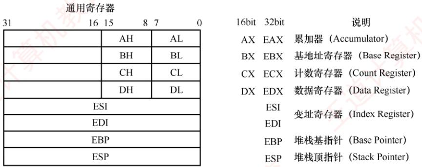
</div>

<p align="center"><em>图 4.11 x86 处理器中的主要寄存器及说明</em></p>

　　除 EBP（基址指针）和 ESP（栈指针）外，其余通用寄存器的用途是比较灵活的。

#### 2. 常用指令

　　汇编指令通常可分为数据传送指令、算术与逻辑运算指令和控制流指令，下面以 Intel 格式为例，介绍一些常用指令。以下用于操作数的标记分别表示寄存器、内存和常数。

- <reg>: 表示任意寄存器，若其后带有数字，则指定其位数，如<reg32>表示 32 位寄存器（eax, ebx, ecx, edx, esi, edi, esp 或 ebp）；<reg16>表示 16 位寄存器（ax, bx, cx 或 dx）；<reg8>表示 8 位寄存器（ah, al, bh, bl, ch, cl, dh, dl）。

- <mem>: 表示内存地址（如[eax]、[var + 4]或 dword ptr [eax + ebx]）。

- <con>: 表示 8 位、16 位或 32 位常数。<con8>表示 8 位常数；<con16>表示 16 位常数；<con32>表示 32 位常数。

> **考点追踪：** 分析汇编指令对应的二进制代码（2010）

　　x86 指令采用变长编码，其操作码通常为 1 字节，但整条指令长度可变。同一指令（如 mov）因操作数类型或寄存器不同，可能对应多种机器码编码，例如，

```txt
mov ax, <con16> #机器码为B8H
mov al, <con8> #机器码为B0H
mov <reg16>, <reg16>/<mem16> #机器码为89H
mov <reg8>/<mem8>, <reg8> #机器码为8AH
mov <reg16>/<mem16>, <reg16> #机器码为8BH
```

> **考点追踪：** 模仿写出简单语句的机器级指令（2012）

##### （1） 数据传送指令

1）mov指令。将第二个操作数（寄存器内容、内存内容或常数值）复制到第一个操作数（寄存器或内存）。其语法如下：

mov <reg>,<reg>

```txt
mov eax, ebx #将 ebx 寄存器的值复制到 eax
mov byte ptr [var], 5 #将常数 5 存入地址 var 处的 1 字节内存单元
```

```twig
mov <reg>,<mem>
mov <mem>,<reg>
mov <reg>,<con>
mov <mem>,<con>
```

　　举例：

　　双操作数指令的两个操作数不能同时为内存，即 mov 指令不能用于直接从内存复制到内存。若需在内存之间复制，可先将源内存内容加载到寄存器，再从该寄存器写入目标内存。

2）push 指令。将操作数压入栈中，常用于函数调用和现场保护。ESP 是栈顶，入栈前先将 ESP 减 4（栈向低地址方向增长），再将操作数压入 ESP 所指地址。其语法如下：

```txt
push <reg32>
push <mem>
push <con32>
```

　　举例（注意，栈中元素固定为 32 位）：

```txt
push eax #将eax的值压入栈
push [var] #将地址var处的4字节内容压入栈
```

3）pop 指令。与 push 指令相反，从栈中弹出数据。出栈前先将 ESP 所指地址的内容读出，再将 ESP 加 4。其语法如下：

```txt
pop eax #弹出栈顶元素并存入eax
pop [ebx] #弹出栈顶元素并存入ebx所指的4字节内存地址
```

(2) 算术和逻辑运算指令

1）add/sub指令。add指令将两个操作数相加，sub指令将第一个操作数减去第二个操作数，结果均保存在第一个操作数中。其语法如下：

```csv
add <reg>,<reg> / sub <reg>,<reg>
add <reg>,<mem> / sub <reg>,<mem>
add <mem>,<reg> / sub <mem>,<reg>
add <reg>,<con> / sub <reg>,<con>
add <mem>,<con> / sub <mem>,<con>
```

　　举例：

```txt
sub eax, 10 #eax ← eax-10
add byte ptr [var], 10 #将地址 var 处的 1 字节内容与 10 相加，结果存回该地址
```

2）inc/dec 指令。分别对操作数执行自增 1 或自减 1 操作。其语法如下：

```txt
inc <reg> / dec <reg>
inc <mem> / dec <mem>
```

　　举例：

```txt
dec eax #eax值自减1
inc dword ptr [var] #将地址var处的4字节内容自增1
```

3）imul 指令。有符号整数乘法指令，支持两种格式：① 双操作数，将第二、第三操作数相乘，结果存入第一个操作数（必须为寄存器）；② 三操作数，将第二、第三操作数相乘，结果存入第一个操作数（必须为寄存器）。其语法如下：

```txt
imul <reg32>,<reg32>
imul <reg32>,<mem>
imul <reg32>,<reg32>,<con>
imul <reg32>,<mem>,<con>
```

　　举例：

```txt
imul eax, [var] #eax ← eax * [var]
imul esi, edi, 25 #esi ← edi * 25
```

　　无符号整数乘法由mul指令实现，仅支持单操作数格式，被乘数隐含在eax中，乘积结果存放在edx:eax中。当 $\mathrm{edx} \neq 0$ 时，表示结果无法用32位无符号数表示，CPU置 $\mathrm{CF} = 1$ 和 $\mathrm{OF} = 1$ 。imul在结果溢出时，同样置 $\mathrm{CF} = 1$ 和 $\mathrm{OF} = 1$ 。无符号乘法以CF判断溢出，有符号乘法则以OF为准。

4）idiv指令。有符号整数除法指令，仅指定除数。被除数为edx:eax组成的64位有符号数 (edx 为高 32 位，eax 为低 32 位)。执行后，商存入 eax，余数存入 edx。其语法如下：

```twig
idiv <reg32>
idiv <mem>
```

　　举例：

```txt
idiv ebx
idiv dword ptr [var]
```

　　无符号整数除法指令div的格式与idiv的完全一致，仅对操作数的解释不同。

5）and/or/xor指令。分别执行按位与、或、异或操作，结果存入第一个操作数。其语法如下：

```csv
and <reg>,<reg> / or <reg>,<reg> / xor <reg>,<reg>
and <reg>,<mem> / or <reg>,<mem> / xor <reg>,<mem>
and <mem>,<reg> / or <mem>,<reg> / xor <mem>,<reg>
and <reg>,<con> / or <reg>,<con> / xor <reg>,<con>
and <mem>,<con> / or <mem>,<con> / xor <mem>,<con>
```

　　举例：

```txt
and eax, 0fH #将eax的高28位置0，低4位保持不变
xor edx, edx #将edx清零
```

6）not 指令。按位取反指令，将操作数的每一位 0 变 1、1 变 0。其语法如下：

```txt
not <reg>
not <mem>
```

　　举例：

```txt
not byte ptr [var] #将地址 var 处的 1 字节内容按位取反
```

7）neg 指令。取负指令，计算操作数的二进制补码（-x）。其语法如下：

```txt
neg <reg>
neg <mem>
```

　　举例：

```txt
neg eax
```

```markdown
#eax ← -eax
```

8）shl/shr 指令。逻辑移位指令：shl 为逻辑左移，shr 为逻辑右移，第一个操作数为被移位数，第二个操作数为移位位数。其语法如下：

```txt
sh1 <reg>,<con8> / shr <reg>,<con8>
sh1 <mem>,<con8> / shr <mem>,<con8>
sh1 <reg>,<cl> / shr <reg>,<cl>
sh1 <mem>,<cl> / shr <mem>,<cl>
```

　　举例：

```txt
shl eax, 1 #eax逻辑左移1位
shr ebx, cl #ebx逻辑右移n位（n为cl中的值）
```

##### （3） 控制流指令

　　x86 处理器通过指令指针寄存器 EIP（相当于程序计数器即 PC）指示当前执行指令的地址。每条指令执行后，EIP 自动指向下一条指令。EIP 不能直接访问，但可通过控制流指令修改。程序中常用标签（label）标记指令地址，例如：

```txt
指令①
begin: 指令②
指令③
```

　　此处标签 begin 指向第二条指令，控制流指令通过标签实现转移。

```txt
> **考点追踪：** 无条件转移指令的指令格式（2021）
```

1）jmp 指令。无条件转移到 label 标签所指示的地址继续执行。其语法如下：jmp <label>

```txt
jmp begin #转移到begin标记处执行
```

　　举例：

> **考点追踪：** 条件转移指令与标志位的结合（2013）

2）jcondition 指令。条件转移指令，根据程序状态字寄存器中的状态标志（如零标志 ZF、符号标志 SF 等）决定是否转移。常见指令包括：

```txt
je <label>    #相等时转移（jump when equal）
jz <label>    #结果为零时转移（jump when last result was zero）
jne <label>    #不相等时转移（jump when not equal）
jg <label>    #大于时转移（jump when greater than）
jge <label>    #大于等于时转移（jump when greater than or equal to）
jl <label>    #小于时转移（jump when less than）
jle <label>    #小于等于时转移（jump when less than or equal to）
```

　　举例：

```txt
cmp eax, ebx
jle done #若 eax≤ebx，则转移到 done；否则顺序执行下一条指令
```

3）cmp/test 指令。cmp 指令执行减法运算但不保存结果，仅根据结果设置标志位；test 指令执行按位与运算但不保存结果，仅更新标志位（特别是 ZF）。其语法如下：

```twig
cmp <reg>,<reg> / test <reg>,<reg>
cmp <reg>,<mem> / test <reg>,<mem>
cmp <mem>,<reg> / test <mem>,<reg>
cmp <reg>,<con> / test <reg>,<con>
```

　　cmp 和 test 指令通常与 jcondition 指令配合使用。cmp 指令举例：

```txt
cmp dword ptr [var], 10 #将 var 处的 4 字节内容，与 10 比较
jne loop    #若相等则顺序执行；否则转移到 loop
```

```txt
test 指令举例:
```

```txt
test eax, eax #测试eax是否为零
jz xxxx #若eax为零（ZF=1），则转移到xxxx
```

```txt
> **考点追踪：** call 指令的功能（2019）
```

4）call/ret 指令。分别用于实现子程序调用与返回。其语法如下：

```txt
call <label>
ret
```

　　call 指令将下一条指令的地址（返回地址）压入栈，然后转移到 label 处执行；ret 指令从栈顶弹出返回地址，并转移到该地址继续执行。call 和 ret 是函数调用机制的核心指令。

　　掌握上述指令的语法与功能，有助于解答相关考题。建议读者在学习 C 语言程序时，结合调试工具（如 GDB）查看其对应的汇编代码，以加深对机器级指令的理解。

#### 3. 汇编指令格式

　　使用不同的编程工具开发程序时，所用的汇编器也不同，主要有 AT&T 格式和 Intel 格式两种（统考常涉及的是 Intel 格式）。它们的主要区别如下：

　　① AT&T 格式的指令名必须使用小写字母，Intel 格式对大小写不敏感。

　　② 操作数顺序不同：AT&T 格式为 “源, 目的”，Intel 格式为 “目的, 源”。

　　③ AT&T 格式中，寄存器前加“%”，立即数前加“$”；Intel 格式中，两者均无前缀。

　　④ 内存寻址符号不同：AT&T 使用圆括号 “()”，Intel 使用方括号 “[ ]”。

　　⑤ 复杂寻址方式表示不同：AT&T 格式的内存操作数 “disp(base, index, scale)” 分别表示偏移量、基址寄存器、变址寄存器和比例因子，如 “8(%edx, %eax, 2)” 表示操作数地址为 R[edx] + R[eax]*2 + 8；对应的 Intel 格式为 “[edx + eax*2 + 8]”。

　　⑥ 操作数长度指定方式不同：AT&T 格式在指令助记符后加后缀，表明操作数大小，“b”表示 byte（字节）、“w”表示 word（字）或 “l” 表示 long（双字）；Intel 格式则在内存操作数前使用 “byte ptr”、“word ptr” 或 “dword ptr” 显式指定长度。

```txt
注意
在 x86 体系结构中，32 或 64 位都是由 16 位扩展来的，因此 word（字）始终表示 16 位。
```

　　表 4.2 所示为 AT&T 格式与 Intel 格式的指令对比。其中，mov 指令用于在寄存器与内存之间或寄存器之间传送数据；lea 指令用于将有效地址（而非内存内容）加载到寄存器。

　　表 4.2 AT&T 格式指令和 Intel 格式指令的对比

<table><tr><td>AT&amp;T 格式</td><td>Intel 格式</td><td>含义</td></tr><tr><td>mov $100, %eax</td><td>mov eax, 100</td><td>100→R[eax]</td></tr><tr><td>mov %eax, %ebx</td><td>mov ebx, eax</td><td>R[eax]→R[ebx]</td></tr><tr><td>mov %eax, (%ebx)</td><td>mov [ebx], eax</td><td>R[eax]→M[R[ebx]]</td></tr><tr><td>mov %eax, -8(%ebp)</td><td>mov [ebp-8], eax</td><td>R[eax]→M[R[ebp]-8]</td></tr><tr><td>lea 8(%edx,%eax,2), %eax</td><td>lea eax, [edx+eax*2+8]</td><td>R[edx]+R[eax]*2+8→R[eax]</td></tr><tr><td>movl %eax, %ebx</td><td>mov dword ptr [ebx], eax</td><td>32位 R[eax]→M[R[ebx]]</td></tr></table>

　　注：R[r]表示寄存器 r 的内容，M[addr]表示主存单元 addr 的内容，→或←表示信息传送方向。

　　两种汇编格式的相互转换并不复杂，历年统考真题通常采用 Intel 格式。

### 4.3.2 选择语句的机器级表示

　　常见的选择结构语句有 if-then、if-then-else 等。编译器通过条件码（标志位）设置指令和各类条件转移指令来实现程序中的选择结构。条件码描述了最近算术或逻辑运算操作的结果属性，程序通过检测这些标志位来决定是否执行条件分支。常用的条件码有 CF、ZF、SF 和 OF。

　　常见的算术逻辑运算指令（add, sub, imul, or, and, shl, inc, dec, not, sal 等）在执行时会自动设置条件码。此外，cmp 和 test 指令专门用于设置条件码，它们执行相应的运算（cmp 相当于 sub, test 相当于 and），但不保存结果，仅根据运算结果更新标志位。

　　之前介绍的jcondition条件转移指令，就是根据条件码ZF、OF或SF来实现转移的。

　　if-else 语句的通用形式如下:

```javascript
if (test_expr)    // test_expr 为条件测试表达式
    then_statement    // 当 test_expr 为真时，执行 then_statement 语句
else
    else_statement    // 当 test_expr 为假时，执行 else_statement 语句
```

　　在 C 语言中，test_expr 是一个整数表达式，其值为 0 时表示“假”，非 0（包括负数）时表示“真”。两个分支语句（then_statement 或 else_statement）中只会执行其中一个。

　　这种通用形式可以被翻译成如下等价的 goto 语句形式:

```txt
t=test_expr;    //暂存测试表达式的结果
if(!t)    //若条件为假（t=0）
    goto false;    //转移至false标签，进入假分支
then_statement    //真分支：仅当t≠0时执行
goto done;    //执行完真分支后，跳过假分支，转移至结束点
false:    //假分支入口标签
else_statement    //假分支：仅当t=0时执行
done:    //整个if-else结构的结束点
```

　　下面以一个具体的 C 语言函数为例:

```c
int get_cont(int *p1, int *p2) {
    if (p1 > p2)
    return *p2;
    else
    return *p1;
}
```

　　已知 p1 和 p2 对应的实参已被压入调用函数的栈帧，它们对应的存储地址分别为 R[ebp]+8、R[ebp]+12（EBP 指向当前栈帧底部），函数返回值需存放在 eax 中。对应的汇编代码为

```asm
mov eax, dword ptr [ebp+8] #R[eax]←M[R[ebp]+8]，即加载参数p1到eax
mov edx, dword ptr [ebp+12] #R[edx]←M[R[ebp]+12]，即加载参数p2到edx
cmp eax, edx #比较p1和p2，根据结果设置条件码
jbe .L1 #若p1<=p2，则转移到L1
mov eax, dword ptr [edx] #R[eax]←M[R[edx]], 即取*p2作为返回值
jmp .L2 #无条件转移到L2，跳过else分支
.L1:
mov eax, dword ptr [eax] #R[eax]←M[R[eax]], 即取*p1作为返回值
.L2:
```

　　p1 和 p2 是指针型参数，在 32 位机器中占 4 字节（一个 dword），比较指令 cmp 的两个操作数都应来自寄存器，因此需先将 p1 和 p2 对应的实参从栈中加载到寄存器。指针比较在 C 语言中按无符号整数处理，故使用 jbe（无符号 “小于等于”）进行条件转移。

### 4.3.3 循环语句的机器级表示

> **考点追踪：** 循环语句的机器级代码分析（2014、2017、2019、2023）

　　常见的循环结构语句有 while、for 和 do-while。x86 指令集中没有直接对应这些高级循环结构的指令，编译器通过条件测试（如 cmp、test）和条件转移（如 je、jne、jg、jle 等）指令的组合来实现循环逻辑。实际上，大多数编译器会将这三种循环统一转换为类似于 do-while 形式。

##### （1） do-while 循环

　　do-while 语句是一种 “后测试” 型循环，其通用形式如下：

```javascript
do //先执行循环体，再判断循环条件
body_statement //body_statement 为循环体执行语句
while(test_expr); //test_expr 为循环继续的条件表达式
```

　　这种结构可以直接翻译成如下所示的条件和 goto 语句组合:

```txt
loop: //循环入口标签
body_statement //执行循环体语句（首次进入时必然执行）
t=test_expr; //计算循环条件
if(t) //若条件为真（t≠0）
goto loop; //跳回 loop 标签，继续下一轮迭代
```

　　由于循环体在条件判断之前执行，因此无论 test_expr 的初始值是什么，body_statement 至少会被执行一次。每次执行结束时，程序会重新计算 test_expr 的值；如果结果为真（非零），就跳回循环开头继续执行；否则，顺序执行后续代码，退出循环。

##### （2） while 循环

　　while 语句是一种 “前测试” 型循环，其通用形式如下：

```javascript
while(test_expr) //test_expr为循环判断的条件表达式 body_statement //当test_expr为真时重复执行body_statement语句
```

　　与 do-while 不同，while 循环在第一次执行 body_statement 之前就会测试 test_expr 的值。如果初始条件为假（test_expr = 0），那么循环体一次都不会执行。

　　为了用转移指令实现这一语义，编译器通常采用 “先判断、再进入循环体” 的策略。具体来说，可以将 while 循环转换为一个带前置判断的 do-while 式结构，如下所示：

```txt
t=test_expr;    //计算初始循环条件
if(!t)    //若初始条件为假（t=0）
    goto done;    //跳过循环体，直接转至结束点
do
    body_statement    //执行循环体
    while(test_expr);    //重新测试条件
done:    //循环结构的结束点
```

　　进一步展开为纯 goto 语句的形式:

```txt
t=test_expr; //计算初始循环条件
if(!t) //若为假
    goto done; //跳过循环
loop:
body_statement //执行循环体
t=test_expr; //重新计算条件
if(t) //若仍为真
    goto loop; //继续下一轮
done: //循环结束
```

　　这种转换确保了 while 循环 “先判断、后执行” 的语义，同时复用了 do-while 的结构。

##### （3） for 循环

　　for 循环是一种语法更紧凑的循环形式，其通用形式如下：

```txt
for(init_expr; test_expr; update_expr)
    body_statement //body_statement 为循环体执行语句
```

　　init_expr 为初始化表达式，用于初始化循环计数器（如 i = 0）；test_expr 为条件判断表达式，每次执行循环体前测试（如 i < 10）；update_expr 为更新表达式，每次循环体执行完后执行（如 i++)。

　　从执行逻辑上看，for 循环完全等价于下面这段 while 循环代码:

```txt
init_expr; //初始化（只执行一次）
while(test_expr){ //每次循环前判断条件
    body_statement //执行循环体
    update_expr; //更新循环变量
}
```

　　因此，可以先将 for 循环转换为 while 形式，再按照前述方法转换为 goto 语句：

```txt
init_expr;    //执行初始化
t=test_expr;    //测试初始条件
if(!t)    //若初始条件为假
    goto done;    //跳过循环
loop:
body_statement    //执行循环体
update_expr;    //执行更新操作
t=test_expr;    //重新测试条件
if(t)    //若条件仍为真
    goto loop;    //跳回循环体
done:
```

　　下面以一个具体的 C 语言函数为例，展示 for 循环如何被转换为汇编代码：

```c
int nsum_for(int n) {
    int i;
    int result = 0;
    for (i=1; i<=n; i++)
    result += i;
    return result;
}
```

　　在这段代码中，for 循环的各个组成部分如下：

```txt
init_expr i=1
test_expr i<=n
update_expr i++
body_statement result +=i
```

　　通过替换前面给出的模板中的相应位置，很容易将 for 循环转换为 while 或 do-while 循环。将这个函数翻译为 goto 语句代码后，不难得出其过程体的汇编代码：

```asm
mov ecx, dword ptr [ebp+8]    #R[ecx]←M[R[ebp]+8]，即加载参数n到ecx
mov eax, 0    #R[eax]←0，即初始化result=0
mov edx, 1    #R[edx]←1，即初始化i=1
cmp edx, ecx    #比较i与n（R[edx]与R[ecx]）并设置标志位
jg .L2    #If greater，则转移到L2
.L1:    #循环体入口
add eax, edx    #R[eax]←R[eax]+R[edx]，即result +=i
add edx, 1    #R[edx]←R[edx]+1，即i++
cmp edx, ecx    #再次比较i:n
jle .L1    #If less or equal，则转移到L1
.L2:    #循环结束点
```

　　已知实参 n 已被压入调用函数的栈帧，其对应的存储地址为 R[ebp] + 8。编译器将频繁使用的局部变量优化到寄存器中：此处，result 被分配到 eax（同时也是返回值寄存器），i 被分配到 edx。由于 i 和 n 均为 int 型，判断条件 $i \leqslant n$ 属于有符号比较，因此使用 jle 和 jg 等有符号转移指令。

### 4.3.4 过程调用的机器级表示

　　在程序执行过程中，当一个过程（函数）调用另一个过程时，需要完成参数传递、控制转移、现场保护与返回等一系列操作。x86 架构通过 call 和 ret 指令支持这一机制，它们都属于无条件转移指令，但配合栈的使用，实现了完整的“调用-返回”语义。

　　假定过程P（调用者）调用过程Q（被调用者），整个调用过程的执行步骤如下：

1）P 将入口参数（实参）放到 Q 能访问的位置。

2）P 执行 call 指令，将返回地址（call 的下一条指令地址）压入栈中，并转移到 Q。

3）Q建立自己的栈帧，为局部变量分配空间，并在必要时保存某些寄存器。

4）Q执行其主体代码。

5）Q将返回结果放到约定位置，释放局部变量空间，并恢复之前保存的寄存器。

6）Q执行ret指令，从栈顶弹出返回地址，并转移回P继续执行。

　　上述过程中，入口参数、返回地址、局部变量、返回结果以及需保护的寄存器内容，都需要在内存中找到合适的存放位置。由于寄存器数量有限，且调用双方共享寄存器资源，若不加保护直接覆盖，将导致程序出错。因此，调用约定和栈的配合至关重要。规定：寄存器 EAX、ECX 和 EDX 是调用者保存寄存器：若 P 希望在调用后仍使用这些寄存器的值，则 P 必须在调用前自行保存（如压栈），并在返回后恢复。寄存器 EBX、ESI、EDI 是被调用者保存寄存器：若 Q 需要使用这些寄存器，则 Q 必须在使用前将其保存到栈中，并在返回前恢复。

　　每个过程在执行时，都会在运行时栈中分配一块专属区域，称为栈帧。整个运行时栈由多个连续的栈帧组成。EBP（基址指针）指向当前栈帧的基址（保存旧EBP的位置），ESP（栈指针）始终指向当前栈顶。栈从高地址向低地址增长；过程执行时，ESP会随数据入栈/出栈动态变化，而EBP在当前过程执行期间保持不变，便于通过固定偏移访问参数和局部变量。

　　下面用一个简单的 C 语言程序来说明过程调用的机器级实现。

```txt
int caller() {
    int temp1=125;
    int temp2=80;
    int sum=add(temp1,temp2);
    return sum;
}
```

　　经 GCC 编译后，caller 对应的汇编代码如下：

```txt
caller:
    push ebp #保存调用者 P 的 EBP
    mov ebp, esp #建立新栈帧：EBP←当前栈顶
    sub esp, 24 #为局部变量和参数区分配 24 字节空间
    mov [ebp-12], 125 #M[R[ebp]-12]←125，即 temp1=125
    mov [ebp-8], 80 #M[R[ebp]-8]←80，即 temp2=80
    mov eax, dword ptr [ebp-8] #R[eax]←M[R[ebp]-8]，加载 temp2
    mov [esp+4], eax #M[R[esp]+4]←R[eax]，将 temp2 放入参数区高地址
    mov eax, dword ptr [ebp-12] #R[eax]←M[R[ebp]-12]，加载 temp1
    mov [esp], eax #M[R[esp]]←R[eax]，将 temp1 放入参数区高地址
    call add #调用 add，返回值保存于 eax
    mov [ebp-4], eax #M[R[ebp]-4]←R[eax]，将返回值存入 sum
    mov eax, dword ptr [ebp-4] #R[eax]←M[R[ebp]-4]，将 sum 作为返回值
    leave #等价于 mov esp, ebp 和 pop ebp
    ret #弹出返回地址并跳回
```

　　假设 caller 被过程 P 调用。在执行完 “sub esp, 24” 后，caller 的栈帧已建立（见图 4.12），ESP 指向新栈顶。GCC 为 caller 分配了 24 字节的空间。从代码可见：

- caller 仅使用了 EAX（属于调用者保存寄存器），没有使用任何被调用者保存寄存器。因此其栈帧中除了通过 “push ebp” 保存调用者 P 的旧 EBP 外，无须保存其他寄存器。

- caller 的三个局部变量 temp1、temp2 和 sum 皆被分配在栈帧中，占 12 字节。

- 在 call 指令调用 add 之前，caller 依次将入口参数 temp2 和 temp1 的值（80 和 125）保存到栈中（左参数位于较低地址，右参数位于较高地址），占 8 字节。

- 执行 call 指令时再把返回地址压入栈中，占 4 字节。

　　包括最初压入栈中的旧 EBP 值（4 字节）在内，caller 栈帧实际使用的空间是 $4 + 12 + 8 + 4 = 28$ 字节。然而，由于 GCC 为了保证数据的严格对齐，规定每个函数的栈帧大小必须是 16 字节的倍数，最终分配的栈帧大小为 32 字节，这意味着有 4 字节（未使用）作为对齐填充。

　　call 指令执行后，add 函数的返回值存放在 EAX 中。因此，call 指令后面的两条指令分别完成：指令 “mov [ebp-4], eax” 将 add 的结果存入变量 sum 的存储位置，该变量位于地址 R[ebp]-4；指令 “mov eax, dword ptr [ebp-4]” 再将 sum 的值加载到 EAX，作为 caller 的返回值。

　　在执行 ret 指令之前，必须释放当前栈帧并恢复调用者（P）的基址指针。上述第 14 行 leave 指令正是用于完成这一任务，其功能等价于以下两条指令：

<div align="center">
  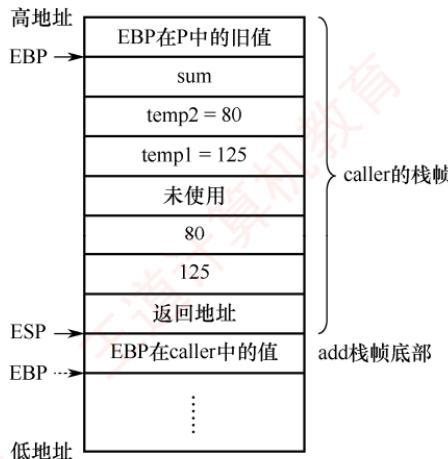
</div>

<p align="center"><em>图 4.12 caller 和 add 的栈帧</em></p>

```txt
mov esp, ebp #将栈指针ESP设置为当前EBP的值，即指向保存旧EBP的位置
pop ebp #从栈中弹出旧EBP值，恢复过程P的基址指针
```

　　执行完这两条指令后，EBP 已恢复为过程 P 中的原始值，而 ESP 则指向栈顶的返回地址。此时，ret 指令便可从 ESP 所指位置取出该返回地址，并转移回过程 P 继续执行。当然，编译器也可以不使用 leave 指令，而是通过显式的 pop 操作配合对 ESP 的调整来实现栈帧的回收。

　　add 过程经 GCC 编译并链接后，对应的机器代码如下：

```txt
8048469:55 push ebp
804846a:89 e5 mov ebp, esp
804846c:8b 45 0c mov eax, dword ptr [ebp+12]
804846f:8b 55 08 mov edx, dword ptr [ebp+8]
8048472:8d 04 02 lea eax, [edx+eax]
8048475:5d pop ebp
8048476:c3 ret
```

　　通常，一个过程的机器级代码可分为三个部分：准备阶段、过程体和结束阶段。

　　准备阶段（第 1、2 行）：“push ebp” 将 caller 的 EBP 值保存到栈中，随后 “mov ebp, esp” 使 EBP 指向当前栈帧的基址。如图 4.12 所示，EBP 指向 add 栈帧底部。这里 add 的入口参数 x 和 y 对应的值（125 和 80）分别在地址为 R[ebp]+8、R[ebp]+12 的存储单元中。

　　过程体（第3、4、5行）：第3行将y（[ebp+12]）加载到EAX，第4行将x（[ebp+8]）加载到EDX。第5行使用lea指令计算 $\mathrm{edx} + \mathrm{eax}$ ，并将结果存回EAX，作为函数的返回值。这里好像没有加法指令，实际上lea指令执行的是加法运算 $\mathrm{R[edx] + R[eax] = x + y}$ 。

　　结束阶段（第 6、7 行）：“pop ebp”恢复 caller 的 EBP 值，使栈帧指针回到调用前的状态；随后 ret 指令从栈顶弹出返回地址，并转移回调用点。此时栈顶正是 call 指令执行时压入的返回地址，对应 caller 中紧接在 “call add” 之后的那条指令（mov [ebp-4], eax）。

　　由于 add 过程不包含局部变量、未使用任何被调用者保存的寄存器，且不再调用其他过程（没有入口参数和返回地址要保存）。因此，其栈帧结构极为简洁：仅需保存 EBP 以维持调用链的完整性，无须额外空间用于寄存器保存、局部变量或嵌套调用。

### 4.3.5 本节习题精选

#### 一、单项选择题

01. 假设 R[ax] = FFE8H, R[bx] = 7FE6H，执行指令 “add ax, bx” 后，寄存器的内容和各标志的变化为（）。

- A. R[ax] = 7FCEH, OF = 1, SF = 0, CF = 0, ZF = 0
- B. R[bx] = 7FCEH, OF = 1, SF = 0, CF = 0, ZF = 0
- C. R[ax] = 7FCEH, OF = 0, SF = 0, CF = 1, ZF = 0
- D. R[bx] = 7FCEH, OF = 0, SF = 0, CF = 1, ZF = 0

02. 假设 R[ax] = 7FE6H, R[bx] = FFE8H，执行指令“sub bx, ax”后，寄存器的内存和各标志的变化为（）。

- A. R[ax] = 8002H, OF = 0, SF = 1, CF = 1, ZF = 0B. R[bx] = 8002H, OF = 0, SF = 1, CF = 0, ZF = 0C. R[ax] = 8002H, OF = 1, SF = 1, CF = 0, ZF = 0D. R[bx] = 8002H, OF = 1, SF = 1, CF = 0, ZF = 0

03. 某计算机的数据采用小端方式存储，减法指令“sub ax, imm”的功能为(ax) - imm → ax, imm 表示立即数，该指令对应的十六进制机器码为 2dxxxx（从左到右以字节为单位由低地址到高地址），其中 xxxx 对应 imm 的机器码，若 imm = -3, (ax) = 7，则该指令对应的机器码和执行后 OF 标志位的值分别为（）。

- A. 2DFFFDH, 0
- B. 2DFFFDH, 1
- C. 2DFDFFH, 0
- D. 2DFDFFH, 1

04. 某 C 语言程序中对数组变量 b 的声明为 “int b[10][5];”，有一条 for 语句如下：

for (i=0; i<10; i++)
    for (j=0; j<5; j++)
    sum+=b[i][j];

假设执行到“sum+=b[i][j];”时，sum的值在eax中，b[i][0]所在的地址在edx中，j在esi中，则“sum+=b[i][j];”所对应的指令（Intel格式）可以是（）。

- A. add dword ptr eax, [edx+esi*4]
- B. add dword ptr eax, [esi+edx*4]
- C. add dword ptr eax, [edx+esi*2]
- D. add dword ptr eax, [esi+edx*2]

05. 假设 R[eax] = 080480B4H, R[ebx] = 00000011H, M[080480F8H] = 000000B0H，执行指令“imul eax, [eax+ebx*4], -16”后，寄存器或存储单元的内容变为（）。

- A. R[eax] = 00000B00H
- B. M[080480F8H] = 00000B00H
- C. R[eax] = FFFFF500H
- D. M[080480F8H] = FFFFF500H

06. 程序 P 中有两个变量 i 和 j，被分别分配在寄存器 eax 和 edx 中，P 中语句 “if(i<j) {...}” 对应的指令序列如下（左边为指令地址，中间为机器代码，右边为汇编指令），其中 jle 指令的偏移量为 0d:
804846a 39 c2 cmp dword ptr edx, eax
804846c 7e 0d jle xxxxxxxxx

若执行到 804846aH 处的 cmp 指令时，i = 105, j = 100，则 jle 指令执行后将转到（）处的指令执行。

- A. 8048461H
- B. 804846eH
- C. 8048479H
- D. 804847bH

07. 假定全局数组 a 的声明为 double a[8]，a 的首地址为 80498c0H，变量 i 被分配在寄存器 ecx 中，现要将 a[i] 取到 eax 相应宽度的寄存器中，则所用的汇编指令是（）。

- A. mov eax, [ecx*4+80498c0H]
- B. mov eax, ecx*4+80498c0H
- C. mov eax, [ecx*8+80498c0H]
- D. mov eax, ecx*8+80498c0H

08. 子程序调用指令执行时，必须完成的操作是（）。

- A. 仅将子程序入口地址送入程序计数器（PC）
- B. 将返回地址存入主存，并将子程序入口地址送入程序计数器（PC）
- C. 将程序计数器（PC）当前值存入通用寄存器
- D. 修改数据通路中的控制信号以实现转移

09. 下列关于选择结构语句 “if(comp_A) then statement_B; else statement_C” 对应的机器级代码表示的叙述中，错误的是（）。

- A. 一定包含一条无条件转移指令
- B. 一定包含一条条件转移指令 (分支指令)
- C. 计算 comp_A 的代码段一定在条件转移指令之前
- D. 对应 statement_B 的代码一定在对应 statement_C 的代码之前

10. 下列关于循环结构语句的机器级代码表示的叙述中，错误的是（）。

- A. 一定至少包含一条条件转移指令
- B. 不一定包含无条件转移指令
- C. 循环结束条件可以用一条比较指令 CMP 来实现
- D. 循环体内执行的指令不包含条件转移指令

11. 下列有关调用指令（转子指令）的叙述中，错误的是（）。

- A. 与高级语言源程序中的过程调用相对应，一次过程调用对应一条调用指令
- B. 指令执行时必须保留返回地址，调用指令随后一条指令的地址是返回地址
- C. 嵌套调用时返回地址通常保存在栈中，非嵌套调用时可保存在特定寄存器中
- D. 指令执行时将无条件转移到目标地址处，转移目标地址无须在指令中明显给出

12. 假设 P 为调用过程，Q 为被调用过程，程序在 32 位 x86 处理器上执行，以下是 C 语言程序中过程调用所涉及的操作：
　　① 过程 Q 保存 P 的现场，并为非静态局部变量分配空间
　　② 过程 P 将实参存放到 Q 能访问到的地方
　　③ 过程 P 将返回地址存放到特定处，并转移到 Q 执行
　　④ 过程 Q 取出返回地址，并转移回到过程 P 执行
　　⑤ 过程 Q 恢复 P 的现场，并释放局部变量所占空间
　　⑥ 执行过程 Q 的函数体
过程调用的正确执行步骤是（）。

- A. ②→③→④→①→⑤→⑥
- B. ②→③→①→④→⑥→⑤
- C. ②→③→①→⑥→⑤→④
- D. ②→③→①→⑤→⑥→④

#### 二、综合应用题

01. 【2017 统考真题】在按字节编址的计算机 M 上，f1 的部分源程序（阴影部分）如下。将 f1 中的 int 都改成 float，可得到计算 f(n) 的另一个函数 f2。

```lisp
int f1(unsigned n){
    int sum=1, power=1;
    for (unsignedi=0;i<=n-1;i++) {
    power *=2;
    sum += power;
    }
    return sum;
}
```

　　对应的机器级代码（包括指令的虚拟地址）如下：

```c
int f1( unsigned n)
1 00401020 55 push ebp
... ... ...
for(unsigned i=0; i<=n-1; i++)
... ... ...
20 0040105E 39 4D F4 cmp dword ptr [ebp-0Ch], ecx
... ... ...
{ power *= 2;
... ... ...
23 00401066 D1 E2 shl edx,1
... ... ...
return sum;
... ... ...
35 0040107F C3 ret
```

　　其中，机器级代码行包括行号、虚拟地址、机器指令和汇编指令。

1）计算机M是RISC还是CISC？为什么？

2）f1的机器指令代码共占多少字节？要求给出计算过程。

3）第20条指令cmp通过i减n-1实现对i和n-1的比较。执行fl(0)的过程中，当 $i = 0$ 时，cmp指令执行后，进位/借位标志CF的内容是什么？要求给出计算过程。

4）第23条指令shl通过左移操作实现了power *2运算，在f2中能否用shl指令实现power *2？为什么？

02. 【2019 统考真题】已知 $f(n)=n!=n\times(n-1)\times(n-2)\times\cdots\times2\times1$ ，计算 $f(n)$ 的 C 语言函数 fl 的源程序（阴影部分）及其在 32 位计算机 M 上的部分机器级代码如下：

```asm
int f1(int n) {
    1    00401000    55    push ebp
    ...    ...
    if (n>1)
    11    00401018    83 7D 08 01    cmp dword ptr [ebp+8],1
    12    0040101C    7E 17    jle f1+35h (00401035)
    return n*f1(n-1);
    13    0040101E    8B 45 08    mov eax, dword ptr [ebp+8]
    14    00401021    83 E8 01    sub eax, 1
    15    00401024    50    push eax
    16    00401025    E8 D6 FF FF FF call f1 ( 00401000)
    ...    ...
    19    00401030    OF AF C1    imul eax, ecx
    20    00401033    EB 05    jmp f1+3Ah (0040103a)
    else return 1;
    21    00401035    B8 01 00 00 00 mov eax,1
}
...
26    00401040    3B EC    cmp ebp, esp
...
30    0040104A    C3    ret
```

　　其中，机器级代码行包括行号、虚拟地址、机器指令和汇编指令，计算机M按字节编址，int型数据占32位。请回答下列问题：

1）计算 $f(10)$ 需要调用函数f1多少次？执行哪条指令会递归调用f1？

2）上述代码中，哪条指令是条件转移指令？哪几条指令一定会使程序转移执行？

3）根据第16行的call指令，第17行指令的虚拟地址应是多少？已知第16行的call指令采用相对寻址方式，该指令中的偏移量应是多少（给出计算过程）？已知第16行的call指令的后4字节为偏移量，M是采用大端方式还是采用小端方式？

4） $f(13) = 6227020800$ ，但 $f1(13)$ 的返回值为 1932053504，为什么两者不相等？要使 $f1(13)$ 能返回正确的结果，应如何修改 $f1$ 的源程序？

5）第19行的imul指令（有符号整数乘）的功能是 $\mathrm{R[eax]}\leftarrow \mathrm{R[eax]}\times \mathrm{R[ecx]}$ ，当乘法器输出的高、低32位乘积之间满足什么条件时，溢出标志OF=1？要使CPU在发生溢出时转异常处理，编译器应在imul指令后加一条什么指令？

03. 【2019 统考真题】对于题 02，若计算机 M 的主存地址为 32 位，采用分页存储管理方式，页大小为 4KB，则第 1 行的 push 指令和第 30 行的 ret 指令是否在同一页中（说明理由）？若指令 Cache 有 64 行，采用 4 路组相联映射方式，主存块大小为 64B，则 32 位主存地址中，哪几位表示块内地址？哪几位表示 Cache 组号？哪几位表示标记（tag）信息？读取第 16 行的 call 指令时，只可能在指令 Cache 的哪一组中命中（说明理由）？

04. 【2023 统考真题】已知计算机 M 的字长为 32 位，按字节编址，采用请求调页策略的虚拟存储管理方式，虚拟地址为 32 位，页大小为 4KB。某 C 语言程序段在计算机 M 上的部分机器级代码如下，数组 a 的定义为 “int a[24][64];”，每个机器级代码行中依次包含指令序号、虚拟地址、机器指令和汇编指令。

```txt
for ( i = 0; i < 24; i++ )
1 00401072 C7 45 F8 00 00 00 00 mov [ebp-8], 0
2 00401079 EB 09 jmp 00401084h
3 0040107B 8B 55 F8 mov eax, [ebp-8]
...... .....
7 00401088 7D 32 jge 004010bch
```

<table><tr><td colspan="4">for ( j = 0; j &lt; 64; j++)</td></tr><tr><td>8</td><td>0040108A</td><td>C7 45 FC 00 00 00 00</td><td>mov [ebp-4], 0</td></tr><tr><td></td><td>......</td><td>......</td><td>......</td></tr><tr><td colspan="4">a[i][j] = 10;</td></tr><tr><td></td><td>......</td><td>......</td><td>......</td></tr><tr><td>19</td><td>004010AE</td><td>C7 84 82 00 20 42 00 0A 00 00 00</td><td>mov [ecx+edx*4+00422000h], 0Ah</td></tr><tr><td>20</td><td>......</td><td>......</td><td>......</td></tr></table>

　　请回答下列问题。

1）第20条指令的虚拟地址是多少？

2）已知第2条jmp和第7条jge都是转移指令，其操作码分别是EBH和7DH，转移目标地址分别为00401084H、004010BCH，这两条指令都采用什么寻址方式？给出第2条指令jmp的转移目标地址计算过程。

3）已知第19条mov指令的功能为“a[i][j]←10”，其中ecx和edx为寄存器名，00422000H是数组a的首地址，指令中源操作数采用什么寻址方式？已知edx中存放的是变量j，ecx中存放的是什么？根据该指令的机器码判断M采用的是大端还是小端方式。

4）第一次执行第19条指令时，取指令过程中是否会发生缺页异常？为什么？

05. 【2024 统考真题】假定计算机 M 字长为 32 位，按字节编址，采用 32 位定长指令字，指令 add、slli 和 lw 的格式、编码和功能说明如图(a)所示。

<table><tr><td>指令</td><td>31</td><td>25</td><td>24</td><td>20</td><td>19</td><td>15</td><td>14</td><td>12</td><td>11</td><td>7</td><td>6</td><td>0</td><td>指令功能说明</td></tr><tr><td>add</td><td colspan="2">0000000</td><td colspan="2">rs2</td><td colspan="2">rs1</td><td colspan="2">000</td><td colspan="2">rd</td><td colspan="2">0110011</td><td>R[rd]←R[rs1] + R[rs2]</td></tr><tr><td>slli</td><td colspan="2">0000000</td><td colspan="2">shamt</td><td colspan="2">rs1</td><td colspan="2">010</td><td colspan="2">rd</td><td colspan="2">0010011</td><td>R[rd]←R[rs1] &lt;&lt;shamt</td></tr><tr><td>lw</td><td colspan="4">imm</td><td colspan="2">rs1</td><td colspan="2">010</td><td colspan="2">rd</td><td colspan="2">0000011</td><td>R[rd]←M[R[rs1] + imm]</td></tr></table>

　　图(a)

　　其中，R[x]表示通用寄存器x的内容，M[x]表示地址为x的存储单元内容，shamt为移位位数，imm为补码表示的偏移量。图(b)给出了计算机M的部分数据通路及其控制信号（用带箭头虚线表示），其中A和B分别表示从通用寄存器rs1和rs2中读出的内容；IR[31:20]表示指令寄存器中的高12位；控制信号Ext为0、1时扩展器分别实现零扩展、符号扩展，ALUctr为000、001、010时ALU分别实现加、减、逻辑左移运算。请回答下列问题。

<div align="center">
  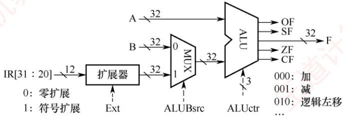
</div>

　　图(b)

1）计算机M最多有多少个通用寄存器？为什么shamt字段占5位？

2）执行 add 指令时，控制信号 ALUBsrc 的取值应是什么？若 rsl 和 rs2 寄存器内容分别是 87654321H 和 98765432H，则 add 指令执行后，ALU 输出端 F、OF 和 CF 的结果分别是什么？若该 add 指令处理的是无符号整数，则应根据哪个标志判断是否溢出？

3）执行 slli 指令时，控制信号 Ext 的取值可以是 0 也可以是 1，为什么？

4）执行lw指令时，控制信号Ext、ALUctr的取值分别是什么？

<div align="center">
  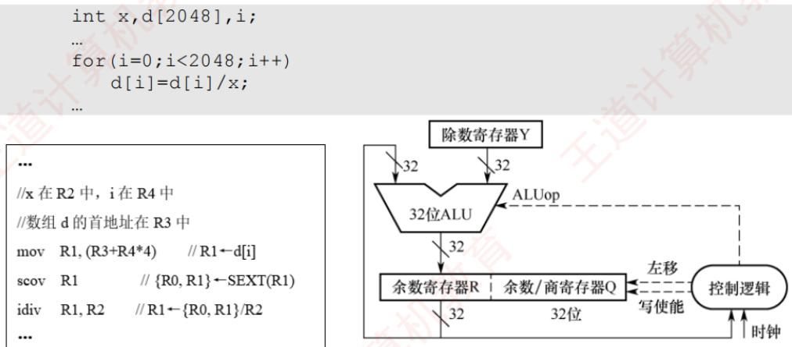
</div>

5）若一条指令的机器码是 A040 A103H，则该指令一定是 lw 指令，为什么？若执行该指令时，R[01H]=FFFF A2D0H，则所读取数据的存储地址是什么？

06. 【2024 统考真题】对于题 05 中的计算机 M，C 语言程序 P 包含的语句 “sum+=a[i];” 在 M 中对应的指令序列 S 如下。

```txt
slli r4, r2, 2 //R[r4]←R[r2]<<2
add r4, r3, r4 //R[r4]←R[r3]+R[r4]
lw r5, 0(r4) //R[r5]←M[R[r4]+0]
add rl, rl, r5 //R[r1]←R[r1]+R[r5]
```

　　已知变量 i、sum 和数组 a 都为 int 型，通用寄存器 r1～r5 的编号为 01H～05H。请回答下列问题。

1）根据指令序列S中每条指令的功能，写出存放数组a的首地址、变量i和sum的通用寄存器编号。

2）已知 M 为小端方式计算机，采用页式存储管理方式，页大小为 4KB。若执行到指令序列 S 中第 1 条指令时，i=5 且 r1 和 r3 的内容分别为 0000 1332H 和 0013 DFF0H，从地址 0013 DFF0H 开始的存储单元内容如下图所示，则执行 “sum+=a[i];” 语句后，a[i] 的地址、a[i] 和 sum 的机器数分别是什么（用十六进制表示）？a[i] 所在页的页号是多少？此次执行中，数组 a 至少存放在几页中？

<table><tr><td>地址</td><td>0</td><td>1</td><td>2</td><td>3</td><td>4</td><td>5</td><td>6</td><td>7</td></tr><tr><td>0013 DFF0</td><td>FF</td><td>FF</td><td>FF</td><td>7C</td><td>70</td><td>FE</td><td>FF</td><td>FF</td></tr><tr><td>0013 DFF8</td><td>00</td><td>00</td><td>00</td><td>0C</td><td>3C</td><td>02</td><td>01</td><td>FF</td></tr><tr><td>0013 E000</td><td>F0</td><td>F1</td><td>00</td><td>00</td><td>DC</td><td>EC</td><td>FF</td><td>FF</td></tr><tr><td>0013 E008</td><td>FF</td><td>FF</td><td>01</td><td>02</td><td>00</td><td>00</td><td>01</td><td>02</td></tr></table>

3）指令“slli r4, r2, 2”的机器码是什么（用十六进制表示）？若数组a改为short类型，则指令序列S中slli指令的汇编形式应是什么？

09. 【2025 统考真题】现有 C 语言程序 P 的部分代码如下所示。假定运行程序 P 的计算机 M 字长为 32 位，按字节编址。假定 P 的部分机器级代码如图(a)所示，其中，R0～R4 为通用寄存器，SEXT 表示按符号扩展；M 中补码除法器逻辑结构如图(b)所示。

```txt
int x, d[2048], i;
...
for (i=0; i<2048; i++)
    d[i]=d[i]/x;
```

```txt
...
//x 在 R2 中，i 在 R4 中
//数组 d 的首地址在 R3 中
mov R1, (R3+R4*4) // R1←d[i]
scov R1 // {R0, R1}←SEXT(R1)
idiv R1, R2 // R1←{R0, R1}/R2
...
```

　　请回答下列问题。

(b)

1）若执行图(a)中 idiv 指令的除运算时， $d[i]=0x87654321$ 、x=0xff，则补码除法器中寄存器 R、Q 和 Y 的初始内容分别是什么(用十六进制表示)? 图(b)中哪个部件包含计数器? 在补码除法器执行过程中，由 ALUop 所控制的 ALU 运算有哪几种?

2）假设 idiv 指令执行过程中会检测并触发除法异常，则执行 idiv 指令时，哪些情况下会发生除法异常（要求给出此时 d[i] 和 x 的十六进制表示机器数）？发生除法异常时，在异常响应过程中 CPU 需要完成哪些操作？

### 4.3.6 答案与解析

#### 一、单项选择题

**01. C**

　　该指令是 Intel 格式，add 指令的目的寄存器为 ax。add 指令的补码加法过程为 1111 1111 1110 1000 + 0111 1111 1110 0110 = (1)0111 1111 1100 1110（7FCEH），两个操作数的符号不同，必然不会溢出，OF = 0；结果的符号位为 0，SF = 0；有进位，CF = C ⊕ Sub = 1 ⊕ 0 = 1；非 0，ZF = 0。

> **注意**

　　无论是无符号数还是有符号数，都以二进制代码形式无差别地存放在计算机内。即便两个有符号数相加，也会导致 CF 的变动，只是 CF 值对有符号数运算是没有意义的。同理，两个无符号数相加，也会导致 OF 和 SF 的变动，只是 OF 值和 SF 值仅对有符号数运算有意义。

**02. B**

　　该指令是 Intel 格式，sub 指令的目的寄存器为 bx。sub 减法运算用补码加法实现，被减数 + 减数逐位取反 + 1 = 1111 1111 1110 1000 + 1000 0000 0001 1001 + 1 = (1)1000 0000 0000 0010（8002H），两个操作数的符号位都是 1，结果的符号位也是 1，无溢出，OF = 0；结果为负数，SF = 1；进位输出 $C_{out} = 1$ ，低位进位 Sub = 1， $CF = C_{out} \oplus Sub = 1 \oplus 1 = 0$ ；非 0，ZF = 0。

**03. C**

　　imm 的值为 -3，转换成二进制为 111111111111101B，即 FFFDH，因为该计算机采用小端存储，先存储低位字节，所以该指令对应的机器码为 2DFDFFH，OF 是有符号数运算的溢出标志位，7-(-3)显然没有溢出，因此 OF 标志位为 0。

**04. A**

　　b[i][0]所在的地址在 edx 中，j 在 esi 中，一个数组元素占 4 字节，所以 b[i][j] 的地址为 R[edx]+R[esi]*4，指令格式为 Intel 格式，第一个为目的操作数，第二个为源操作数，于是选项 A 正确。

**05. C**

　　指令的一个源操作数在内存单元中，地址为 R[eax]+R[ebx]*4 = 080480B4H+00000011H*4 = 080480F8H。指令的功能是 R[eax]←M[080480F8H]*(-16) = (-000000B0H)<<4 = FFFFFFF50H<<4 = FFFFFFF500H。目的操作数保存在 eax 中，所以主存单元 080480F8H 中的内容不会改变。

**06. D**

　　i = 105, j = 100，即 edx 的内容为 100，eax 的内容为 105，cmp 指令就是对这两个数做减法，显然 100 < 105，满足 jle 指令小于或等于的条件，jle 指令长度为 2 字节，所以 jle 指令执行后将转移到当前 PC 值 + 偏移量 = 804846cH + 2 + 0dH = 804847bH 处执行。

**07. C**

　　每个 double 型的数组元素占 8 字节，数组 a 的首地址为 80498c0H，i 存储在 ecx 中，所以 a[i] 在主存中的地址可表示为 $[ecx*8+80498c0H]$ ，因此汇编指令可以是 mov eax, $[ecx*8+80498c0H]$ 。

**08. B**

　　子程序调用指令属于控制转移类指令，其执行时必须完成两个关键操作：一是保存返回地址（调用指令的下一条指令地址），通常压入主存中的栈；二是将子程序的入口地址送入 PC，以实现转移。选项 A 仅完成转移，缺失返回地址保存，无法正确返回。选项 C 和 D 的描述不准确或不完整。因此，选项 B 正确且完整地描述了子程序调用的本质功能。

**09. D**

　　在 if 语句的机器级代码中，comp_A 后面紧接着有一个条件转移指令，条件成立则转移到 statement_B，statement_B 中有一个无条件转移指令，会转移到 if-else 的下一条语句，选项 A、B 和 C 正确。statement_B 不一定在 statement_C 之前，这取决于条件转移指令的类型和方向，选项 D 错误。

**10. D**

　　循环结构循环体内最后会有一条条件转移指令，判断是否跳出循环，可以用比较指令（CMP）来实现，选项 A 和 C 正确，选项 D 错误。循环结构不一定包含无条件转移指令，选项 B 正确。

**11. D**

　　为了能保证从被调用过程返回到调用过程继续执行，必须确定并保存返回地址，这个地址是调用指令随后的指令的地址，返回地址只能由调用指令来计算并保存，因为执行调用指令后就转移到了被调用过程，因此无法获取返回地址。为了保证嵌套调用时能够返回到调用过程，必须将返回地址压栈，若不压栈而保存在特定寄存器中，则后面执行的调用指令会将前面调用指令保存的返回地址覆盖掉。调用指令执行时将无条件转移到目标地址处，这个目标地址就是被调用过程第一条指令的地址，它一定在调用指令中明显给出，因此选项D错误。

**12. C**

　　过程调用的具体过程已在 4.3.4 节中介绍。

#### 二、综合应用题

**01. 【解答】**

1）M 为 CISC。M 的指令长短不一，不符合 RISC 指令系统的特点。

2）f1 的机器代码占 96B。因为 f1 的第一条指令 “push ebp” 所在的虚拟地址为 0040 1020H，最后一条指令 “ret” 所在的虚拟地址为 0040 107FH，所以 f1 的机器指令代码长度为 0040 107FH - 0040 1020H + 1 = 60H = 96B。

3）CF = 1。cmp 指令实现 i 与 n - 1 的比较功能，进行的是减法运算。在执行 f1(0) 的过程中，n = 0，当 i = 0 时，i = 0000 0000H，并且 n - 1 = FFFF FFFFH。因此，执行第 20 条指令时，在补码加/减运算器中执行“0 减 FFFF FFFFH”操作，即 0000 0000H + 00000000H + 1 = 0000 0001H，此时进位输出 $C_{out} = 0$ ，低位进位 Sub = 1，CF = $C_{out} \oplus Sub = 0 \oplus 1 = 1$ 。

4）f2 中不能用 shl 指令实现 power*2。因为 shl 指令把一个整数的所有有效数位整体左移，而 f2 中的变量 power 是 float 型，其机器数中不包含最高有效数位，但包含了阶码部分，将其作为一个整体左移时并不能实现 “乘以 2” 的功能，因此 f2 中不能用 shl 指令实现 power *2。浮点数运算比整型运算要复杂，耗时也较长。

**02. 【解答】**

1）计算 $f(10)$ 需要调用函数f1共10次，执行第16行的call指令会递归调用f1。

2）第12行的jle指令是条件转移指令，其含义为小于或等于时转移，本行代码的意义为：当 $n \leqslant 1$ 时，转移至地址00401035H。第16行的call指令为函数调用指令，第20行的jmp指令为无条件转移指令，第30行的ret指令为子程序的返回指令，这三条指令一定会使程序转移执行。

3）在计算机 M 上按字节编址，第 16 行的 call 指令的虚拟地址为 0040 1025H，长度为 5 字节，因此第 17 行的指令的虚拟地址为 0040 1025H + 5 = 0040 102AH。第 16 行的 call 指令采用相对寻址方式，即目标地址 = (PC) + 偏移量，call 指令的目标地址为 0040 1000H，所以偏移量 = 目标地址 - (PC) = 0040 1000H - 0040 102AH = FFFF FFD6H。根据第 16 行的 call 指令的偏移量字段为 D6 FF FF FF，可以确定 M 采用小端方式。

4）因为 $f(13) = 6227020800$ ，其结果超出了32位int型数据可表示的最大范围，因此 $f(13)$ 的返回值是一个发生了溢出的错误结果。为使fl(13)能返回正确结果，可将函数f1的返回值类型改为double（或long long，或long double，或float）类型。

5）若乘积的高33位不全为0或不全为1，则 $\mathrm{OF} = 1$ 。编译器应在imul指令后加一条“溢出自陷指令”，使得CPU自动查询溢出标志OF，当 $\mathrm{OF} = 1$ 时调出“溢出异常处理程序”。

**03. 【解答】**

　　因为页大小为4KB，所以虚拟地址的高20位为虚拟页号。第1行的push指令和第30行的ret指令的虚拟地址的高20位都是00401H，因此两条指令在同一页中。

　　指令 Cache 有 64 块，采用 4 路组相联映射方式，因此指令 Cache 共有 64/4 =16 组，Cache 组号共 4 位。主存块大小为 64B，因此块内地址为低 6 位。综上所述，在 32 位主存地址中，低 6 位为块内地址，中间 4 位为组号，高 22 位为标记。

　　因为页大小为 4KB，所以虚拟地址和物理地址的最低 12 位完全相同，因此 call 指令虚拟地址 0040 1025H 中的 025H = 0000 0010 0101B 为物理地址的低 12 位，对应的 7～10 位为组号，因此对应的 Cache 组号为 0。

**04. 【解答】**

1）第 19 条指令的虚拟地址为 004010AEH，且第 19 条指令占 11 字节，因此第 20 条指令的虚拟地址为 004010AEH + 11（十进制）=0040 10B9H。

2）第2条指令的虚拟地址为00401079H，占2字节，取该指令后，PC+2，变为0040107BH，转移指令的目标地址为00401084H，因此偏移量为00401084H-0040107BH=09H，根据第2条指令的机器码可知，09H恰好是第2条指令给出的偏移量。第7条指令的分析同理。因此，第2条jmp和第7条jge指令都采用相对寻址方式。第2条指令jmp的转移目标地址 $= 00401079\mathrm{H} + 2$ （十进制） $+09\mathrm{H} = 00401084\mathrm{H}$ 。

3）第19条指令的源操作数为0AH，直接在机器指令中（0A 00 00 00）给出，因此采用立即（数）寻址方式。数组a的一行有64个元素，每个元素占4字节，因此a[i][j]的地址应为 $00422000\mathrm{h} + \mathrm{i}\times 64\times 4 + \mathrm{j}\times 4 = 00422000\mathrm{h} + \mathrm{i}\times 256 + \mathrm{j}\times 4$ ，根据汇编指令中给出的计算公式 $\mathrm{ecx}+$ $\mathrm{edx}^{*}4 + 00422000\mathrm{h}$ 可知，ecx中存放的是 $\mathrm{i}\times 256$ 。M采用小端方式。

4）第一次执行第 19 条指令时，取指令过程中不会发生缺页异常。因为第 19 条指令所在的该程序段都在页号为 00401H 的同一个页面中，执行第 19 条指令时，该页已在主存，因此取指令过程中不会发生缺页异常。

**05. 【解答】**

1）最多有 $2^{5} = 32$ 个通用寄存器。M字长为32位，因此通用寄存器宽度为32位，于是shamt字段占 $\log_232 = 5$ 位。

2）add 指令的两个源操作数均来自通用寄存器，因此控制信号 ALUBsrc = 0。rs1 = 87654321H，rs2 = 98765432H，则 rs1 + rs2 = 87654321H + 98765432H = 1FDB9753H，在计算过程中，次高位向最高位的进位为 0，最高位产生的进位为 1，因此 OF = 0 ⊕ 1 = 1。add做的是加法操作，sub = 0，因此 CF = 0 ⊕ 1 = 1。无符号数根据 CF 判断是否溢出。

3）因为 slli 指令的移位位数只使用 IR[31:20] 中的低 5 位，与高位 IR[31:25] 及扩展出来的位无关，所以 Ext 取值可以是 0，也可以是 1。

4）lw 指令的功能是将主存地址为 R[rs1] + imm 的数据加载到目标寄存器中，需要首先通过 ALU 计算访存有效地址，imm 是补码表示的 12 位有符号数，在和 R[rs1] 中的 32 位数相加时，需要进行符号扩展，R[rs1] 中的数和 imm 符号扩展后的数做的是加法。因此，Ext = 1；ALUctr = 000。

5）因为 A040 A103H = 101000000100 00001 010 00010 0000011B，根据指令格式中 IR[6:0] = 0000011B，IR[14:12] = 010B，可以判定该指令是 1w 指令。1w 指令的高 12 位 = A04H，经过符号扩展后，得到 32 位机器码为 FFFF FA04H，所读取数据的存储地址为 FFFF A2D0H + FFFF FA04H = FFFF 9CD4H。

**06. 【解答】**

1）变量 i 存放在 r2 中。R[r4]←R[r2]<<2 的功能是将 i 左移两位，即将 i×4 的值送到 r4。数组 a 的首地址(a[0]的地址)存放在 r3 中。R[r4]←R[r3]+R[r4]的功能是计算 addr(a[0]) + i×4，即将 a[i]的地址送到 r4。R[r5]←M[R[r4]+0]的功能是将 a[i]送到 r5。变量 sum 存放在 r1 中。R[r1]←R[r1]+R[r5]的功能是将 sum + a[i]的结果送回 r1。

2）数组 a 的首地址为 0013 DFF0H，从表中可以看出，a[5]的地址为 0013 E004H。M 为小端方式计算机，根据表格可知，a[5]的机器数为 FFFF ECDCH。页大小为 4KB，因此页内偏移量为低 12 位，页号为地址高 20 位，即 0013EH。sum 的初值为 0000 1332H，执行 sum+=a[i] 后，sum 的机器数更新为 0000 1332H + FFFF ECDCH = 0000 000EH。表格中的数据包含了页号为 0013DH 和 0013EH 两个不同页面的数据，所以数组 a 至少存放在 2 页中。

3）指令机器码 = 0000000 00010 00010 010 00100 0010011 = 0021 2213H。若数组 a 改为 short 型，则每个元素占 2 字节，a[i] 的地址为 addr(a[0]) + i×2，因此汇编形式是 slli r4, r2, 1。

**07. 【解答】**

1）scov R1 指令对 d[i] 做符号扩展（符号位为 1），得到 64 位的被除数，高 32 位 FFFF FFFFH 存入 R0，低 32 位 87654321H 存入 R1。在除法器中，被除数加载到 {R, Q} 中，因此 R 的初始内容是 FFFF FFFFH，Q 的初始内容是 87654321H；除数 x 加载到 Y 中，因此 Y 的初始内容是 000000FFH。补码除法需要执行固定次数的迭代，因此控制逻辑部件中包含计数器。在补码除法过程中，每一步根据当前余数与除数的符号关系，决定是执行加法还是执行减法，因此由 ALUop 控制的 ALU 运算有加法运算和减法运算。

2）idiv指令可能发生以下两种异常：当x为00000000H时，发生除数为零异常；当d[i]为8000 0000H且x为FFFF FFFFH时（用最小负数除以-1），发生除运算溢出异常。CPU检测到除法异常后，需将断点和程序状态保存到内核栈或特定寄存器中，关中断，最后转移到内核中的除法异常处理程序执行。

## 4.4 CISC 和 RISC 的基本概念

　　指令系统朝着两个截然不同的方向发展：一是通过增强原有指令功能、引入更复杂的指令，将部分软件功能固化到硬件中，这类机器称为复杂指令系统计算机（CISC），典型代表包括采用x86架构的处理器；二是通过精简指令集、简化指令功能，以提升指令执行效率，这类机器称为精简指令系统计算机（RISC），典型代表包括ARM、MIPS等架构的处理器。

### 4.4.1 复杂指令系统计算机（CISC）

　　随着集成电路技术的发展，软件开发成本不断上升，促使设计者在指令系统中加入更多、更复杂的指令，以适应多样化的应用需求，从而形成了 CISC 架构。

> **考点追踪：** CISC的特点（2017）

　　CISC 的主要特点如下:

1）指令系统庞大复杂，指令数量通常超过200条。

2）指令长度不固定，指令格式和寻址方式种类繁多。

3）多数指令均可直接访问内存。

4）各类指令的使用频率差异显著。

5）指令执行时间相差较大，大多数指令需多个时钟周期才能完成。

6）控制器多采用微程序控制，部分复杂指令难以用硬连线逻辑实现。

7）难以通过优化编译生成高效的目标代码。

　　如此庞大的指令系统，对设计提出了极高要求，导致研制周期变得很长。后续研究发现，一味追求指令系统的复杂和完备程度并非提升性能的有效途径。对传统 CISC 指令系统的统计分析表明：各种指令的使用频率相差悬殊，约 80% 的程序执行仅依赖于 20% 的简单指令，而其余 80% 的复杂指令使用频率极低。基于这一观察，设计者开始尝试仅保留高频使用的简单指令，并通过它们组合实现不常用的复杂指令功能，由此催生了 RISC 架构。

### 4.4.2 精简指令系统计算机（RISC）

　　RISC 的核心思想是简化指令系统，强调 “寄存器-寄存器” 操作，并力求指令格式统一。

> **考点追踪：** RISC的特点（2009、2025）

　　RISC 的主要特点如下:

1）仅选取使用频率最高的简单指令，复杂功能由多条简单指令组合实现。

2）指令长度固定，指令格式和寻址方式种类较少。

3）仅 LOAD/STORE（取数/存数）指令可访问内存，其余运算均在寄存器之间进行。

4）CPU 中配备大量通用寄存器。

5）普遍采用指令流水线技术，绝大多数指令在一个时钟周期内完成。

6）以硬布线控制为主，极少或完全不使用微程序控制。

7）高度依赖编译器优化，以缩短程序执行时间。

　　此外，在指令系统兼容性方面，CISC 架构通常支持向后兼容，即新机型包含旧机型的全部指令并加以扩展。而 RISC 由于大幅简化指令集、改变指令格式，通常无法与老机型兼容。

　　历史上，RISC因其高效性和简洁性曾被视为未来处理器的发展方向。然而在现实中，x86架构凭借庞大的软件生态占据主流地位，早期大量软件均基于CISC设计，纯RISC系统难以满足兼容性需求。此外，现代CISC处理器已在内部融合了大量RISC思想，使得两者在性能上的差距日益缩小。与此同时，CISC能提供更丰富的指令功能，这是很多程序设计所需要的。

### 4.4.3 CISC 和 RISC 的比较

　　与 CISC 相比，RISC 的优势主要体现在以下几个方面：

1）更高效利用芯片面积。CISC采用微程序控制，其控制存储器占CPU芯片面积的 $50\%$ 以上，而RISC采用硬布线控制，逻辑电路仅占约 $10\%$ ，节省了宝贵的硅片资源。

2）更高的运算速度。RISC 指令数量少、格式统一、寻址方式简单，配合大量通用寄存器和流水线技术，使大多数指令可在单周期内完成，显著提升执行效率。

3）更易设计与维护。RISC指令系统结构简单，设计周期短；其逻辑清晰，出错概率低，且便于调试和验证，从而提高了系统可靠性。

4）更利于编译优化。由于指令类型和寻址方式有限，编译器更容易选择最优指令序列、调整指令调度，生成高效的目标代码。

　　CISC 与 RISC 的对比如表 4.3 所示。

　　表 4.3 CISC 与 RISC 的对比

<table><tr><td rowspan="2">对比项目</td><td colspan="2">类别</td></tr><tr><td>CISC</td><td>RISC</td></tr><tr><td>指令系统</td><td>复杂,庞大</td><td>简单,精简</td></tr><tr><td>指令数目</td><td>一般大于200条</td><td>一般小于100条</td></tr><tr><td>指令字长</td><td>不固定</td><td>定长</td></tr><tr><td>可访存指令</td><td>不加限制</td><td>只有LOAD/STORE指令</td></tr><tr><td>各种指令执行时间</td><td>相差较大</td><td>绝大多数在一个周期内完成</td></tr><tr><td>各种指令使用频度</td><td>相差很大</td><td>都比较常用</td></tr><tr><td>通用寄存器数量</td><td>较少</td><td>多</td></tr><tr><td>目标代码</td><td>难以用优化编译生成高效的目标代码程序</td><td>采用优化的编译程序,生成代码较为高效</td></tr><tr><td>控制方式</td><td>绝大多数为微程序控制</td><td>绝大多数为组合逻辑控制</td></tr><tr><td>指令流水线</td><td>可以通过一定方式实现</td><td>必须实现</td></tr></table>

### 4.4.4 本节习题精选

#### 单项选择题

01. 下列关于 RISC 的叙述中，正确的是（）。

- A. RISC 机一定采用流水技术
- B. 采用流水技术的机器一定是 RISC 机
- C. RISC 机的兼容性优于 CISC 机
- D. CPU 配备很少的通用寄存器

02. 下列描述中，不符合 RISC 指令系统特点的是（）。

- A. 指令长度固定，指令种类少
- B. 寻址方式种类尽量减少，指令功能尽可能强
- C. 增加寄存器的数目，以尽量减少访存次数
- D. 选取使用频率最高的一些简单指令，以及很有用但不复杂的指令

03. 以下有关 RISC 的描述中，正确的是（）。

- A. 为了实现兼容，新设计的 RISC 是从原来 CISC 系统的指令系统中挑选一部分实现的
- B. 采用 RISC 技术后，计算机的体系结构又恢复到了早期的情况
- C. RISC 的主要目标是减少指令数，因此允许以增加每条指令的功能的方法来减少指令系统所包含的指令数
- D. 以上说法都不对

04. 下列关于 RISC 和 CISC 的说法中，不正确的是（）。

- A. RISC 指令格式种类少，寻址方式少，指令长度固定，更容易用硬布线电路实现
- B. CISC 指令功能强大，寻址方式多，便于汇编程序员编程
- C. CISC 指令格式种类多，所以更有利于编译优化
- D. RISC 多数指令能够在一个时钟周期内完成，特别适合流水线工作

05. 【2009 统考真题】下列关于 RISC 的说法中，错误的是（）。

- A. RISC 普遍采用微程序控制器
- B. RISC 大多数指令在一个时钟周期内完成
- C. RISC 的内部通用寄存器数量相对 CISC 多
- D. RISC 的指令数、寻址方式和指令格式种类相对 CISC 少

06. 【2025 统考真题】下列关于 RISC 的叙述中，错误的是（）。

- A. 多采用硬连线方式实现控制器
- B. 通常采用 LOAD/STORE 指令设计风格
- C. 难以采用流水线数据通路实现微架构
- D. 多采用寄存器传递过程调用时的参数

### 4.4.5 答案与解析

#### 单项选择题

**01. A**

　　RISC 必然采用流水线技术，这也是由其指令的特点决定的。而 CISC 则无此强制要求，但为了提高指令执行速度，CISC 也往往采用流水线技术，因此流水线技术并非 RISC 的专利。CISC 机可以兼容很多不同的高级语言和软件，而 RISC 机的指令系统简单精简，只包含一些基本的指令，这些指令需要通过组合来实现复杂的功能，从而增加了编译器的设计难度和程序员的编程难度，因此 CISC 机的兼容性更好。CPU 配备很多通用寄存器是 RISC 机的主要特点。

**02. B**

　　A、C 和 D 都是 RISC 的特点。对于 B，寻址方式种类尽量减少是 RISC 的特点，而增强指令的功能则是 CISC 的特点。RISC 指令功能简单，复杂指令的功能由简单指令的组合来实现。

**03. D**

　　RISC 选择一些常用的寄存器型指令，并不是为了兼容 CISC，RISC 也不可能兼容 CISC，选项 A 错误。RISC 只是 CPU 的结构发生变化，基本不影响整个计算机的结构，并且即使是采用 RISC 技术的 CPU，其架构也不可能像早期一样简单，选项 B 错误。RISC 的指令功能简单，通过简单指令的组合来实现复杂指令的功能，选项 C 错误，但 RISC 的主要目标是减少指令数是正确的。

**04. C**

　　CISC 指令格式种类多，增大了编译优化的复杂性，因此不利于编译优化。

**05. A**

　　相对于 CISC，RISC 的特点是：指令条数少；指令长度固定，指令格式和寻址种类少；只有取数/存数指令访问存储器，其余指令的操作均在寄存器之间进行；CPU 中通用寄存器多；大部分指令在一个时钟周期内完成；以硬布线逻辑为主，不用或少用微程序控制。B、C 和 D 都是 RISC 的特点。RISC 的速度快，因此普遍采用硬布线控制器，选项 A 错误。

**06. C**

　　RISC 指令集具有格式规整、数量少、寻址简单、采用 LOAD/STOR 访存、通用寄存器数量多及硬连线控制器等特点，指令执行周期均匀，非常适合流水线实现。相反，CISC 因指令复杂、长度可变而难以采用流水线。因此，选项 C 错误，其余选项均符合 RISC 特征。

## 4.5 本章小结

　　本章开头提出的问题的参考答案如下。

1）什么是指令？什么是指令系统？为什么要引入指令系统？

　　指令是控制计算机完成某种基本操作的命令。一台计算机所能执行的全部机器指令的集合，称为该机的指令系统。引入指令系统具有双重意义：对软件层面，它为程序员提供了统一的硬件抽象接口，无须直接操作物理电路或二进制编码，显著提升了编程效率；对硬件层面，指令系统的格式、功能和寻址能力直接决定了处理器的微架构设计、性能潜力和适用领域。

##### 2） 一般来说，指令由哪些部分组成？各部分的作用是什么？

　　一条典型指令由操作码和地址码两部分构成：操作码指明指令的功能类型（如加法、转移、加载等），是 CPU 识别和执行指令的核心依据；地址码提供操作所需的地址信息，包括操作数的存储位置、运算结果的保存地址、程序转移的目标地址或子程序的入口地址等。通过操作码与地址码的组合，指令能够精确描述一次完整的计算或控制操作。

##### 3） 对一个指令系统而言，寻址方式多或少会带来什么影响？

　　寻址方式的设计需权衡编程灵活性与硬件效率。寻址方式丰富（如立即数、寄存器、直接、间接、变址、相对等）可使程序更简洁高效，便于表达复杂的数据访问模式；但会增加指令译码逻辑的复杂度，不利于流水线调度，并可能增大控制单元面积。寻址方式过少虽能简化硬件、提升执行速度，却会限制程序表达能力，迫使程序员用多条指令模拟复杂访问，降低代码效率。

## 4.6 常见问题和易混淆知识点

#### 1. 简述各常见指令寻址方式的特点和适用情况。

- 立即寻址：操作数直接嵌入指令，无须访存，常用于赋初值或常量。

- 直接寻址：指令中给出操作数的内存地址，访存一次，适用于固定地址访问。

- 间接寻址：指令给出地址的地址，需两次访存，扩大了寻址范围，易于完成子程序返回。

- 寄存器寻址：操作数在寄存器中，指令短、速度快，适合高频运算。

- 寄存器间接寻址：寄存器存放操作数地址，兼具灵活性与较大寻址范围。

- 基址寻址：EA = 基址寄存器 + 偏移量，基址由系统设定，适用于多道程序的地址重定位。

- 变址寻址：EA = 变址寄存器 + 偏移量，变址寄存器由用户控制，适合数组遍历和循环。

- 相对寻址：EA = PC + 偏移量，主要用于转移指令。

　　基址寻址和变址寻址的区别：形成相同，都是 EA=寄存器内容+偏移量。但基址寄存器由操作系统管理，偏移量可变；变址寄存器由程序员控制，偏移量固定。

#### 2. 一个操作数在内存可能占多个单元，怎样在指令中给出操作数的地址？

　　现代计算机普遍采用字节编址，即每个内存单元存储 1 字节（8 位）。当操作数为多字节数据（如 int 占 4 字节，double 占 8 字节）时，指令中仅给出该操作数的起始地址（第一个字节的地址），CPU 根据操作数类型自动读取连续的多个字节。

#### 3. 装入/存储（LOAD/STORE）型指令有什么特点？

　　LOAD/STORE 是 RISC 指令系统的核心设计原则之一，其主要特点包括：

- 访存与计算分离：只有LOAD（从内存读入寄存器）和STORE（从寄存器写入内存）指令能访问主存；所有运算指令（如加、减、移位）仅操作寄存器中的数据。

- 指令格式规整：由于寄存器编号位数远少于内存地址，通过固定字段分配，可实现定长指令，极大简化译码逻辑。

- 利于流水线执行：统一的指令长度和访存边界，使取指、译码、执行等阶段易于并行化。

- 潜在缺点：频繁的数据搬移可能导致程序中LOAD/STORE指令比例较高，增加指令条数；但现代编译器优化和高速缓存机制可有效缓解此问题。
