## 【考纲内容】

（一）CPU 的功能和基本结构

（二）指令执行过程

（三）数据通路的功能和基本结构

（四）控制器的功能和工作原理

（五）异常和中断机制

　　异常和中断的基本概念；异常和中断的分类；异常和中断的检测与响应

（六）指令流水线

　　指令流水线的基本概念；指令流水线的基本实现；

　　结构冒险、数据冒险和控制冒险的处理；超标量和动态流水线的基本概念

（七）多处理器的基本概念

　　SISD、SIMD、MIMD、向量处理器的基本概念；硬件多线程的基本概念；

　　多核（multi-core）处理器的基本概念；共享内存多处理器（SMP）的基本概念

## 【复习提示】

　　中央处理器是计算机的核心，也是本书的难点。其中，数据通路的分析、指令执行阶段的节拍与控制信号的安排、流水线技术与性能分析易出综合题。而关于各种寄存器的特点、各种指令执行的周期与特点、控制器的相关概念、流水线的相关概念易出选择题。

　　在学习本章时，建议读者思考以下问题：

1）指令和数据均存放在内存中，计算机如何从时间和空间上区分它们是指令还是数据？

2）什么是指令周期和时钟周期？它们之间有何关系？

3）什么是微指令？它和第4章谈到的指令有什么关系？

4）什么是指令流水线？指令流水线相对于传统体系结构的优势是什么？

　　建议读者在学习过程中尝试回答这些问题，本章末尾将提供参考答案。

## 5.1 CPU 的功能和基本结构

### 5.1.1 CPU 的功能

　　CPU 的核心功能是执行程序。在程序运行过程中，可能会遇到各类异常或外中断事件，如译码阶段发现非法操作码、外部设备发出中断请求等。因此，CPU 不仅需要高效执行指令，还要具备检测并响应各类异常与中断的能力。其基本功能包括：

1）取指令并译码：从主存中取出指令，解析操作码，并生成相应的控制信号。

2）更新程序计数器（PC）：确定下一条指令地址，以支持顺序执行或程序转移。

3）执行算术与逻辑运算：通过ALU对操作数进行算术或逻辑运算。

4）取操作数或写结果：访问主存或I/O接口，读取操作数或将运算结果写回。

5）处理异常或中断：检测异常或中断请求，并在必要时转入相应的处理程序。

6）时序控制：通过时钟信号协调各操作的执行顺序和持续时间，确保指令按序执行。

### 5.1.2 CPU 的基本结构

　　上述功能需求决定了 CPU 的内部结构组成。为实现完整的指令执行流程，CPU 必须包含若干关键功能部件：为支持指令控制，需要设置程序计数器（PC），用于存放即将执行指令的地址；为完成指令译码，需要配备指令寄存器（IR）暂存当前指令，并由指令译码器（ID）解析操作码；控制单元（CU）综合译码结果、时序信号与状态标志，生成微操作控制信号序列，驱动各部件协同工作；算术逻辑单元（ALU）和通用寄存器组（GPRs）共同构成数据通路，负责操作数的暂存与运算；中断机构用于响应异常与外部中断请求；此外，为协调 CPU 与主存之间的数据交换，还需要设置存储器地址寄存器（MAR）和存储器数据寄存器（MDR）。

　　图 5.1 展示了 CPU 的基本组成框图，其主要部件说明如下。

<div align="center">
  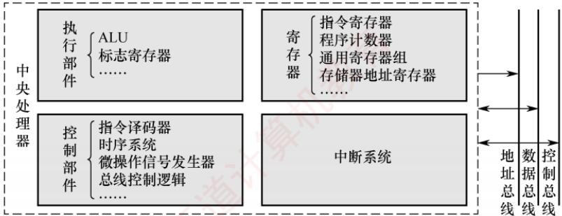
</div>

<p align="center"><em>图 5.1 CPU 的基本组成框图</em></p>

> **考点追踪：** CPU中各种寄存器的作用与特点（2013、2016、2021）

1）程序计数器（PC）。存放即将执行的指令地址。顺序执行时自动递增（增量为当前指令所占的字节数）；遇到转移类指令时，更新为目标地址。程序启动前，首条指令地址被装入PC。其位数由地址总线宽度决定，反映了CPU可直接寻址的内存空间大小。

2）指令寄存器（IR）。暂存当前正在执行的指令。指令从主存取出后首先送入 IR，供指令译码器使用。其位数等于指令字长。

3）通用寄存器组（GPRs）。供用户程序灵活使用，用于暂存操作数、中间结果或地址指针，减少对主存的频繁访问，提升执行效率。

4）标志寄存器（FR），也称程序状态字寄存器（PSWR）。保存 ALU 运算产生的状态信息，用于条件判断与转移控制。这些标志位通常由触发器实现，整体构成程序状态字。

5）存储器地址寄存器（MAR）。存放当前要访问的主存地址。取指或数据读/写时，地址先送入 MAR，再通过地址总线传至存储器。其位数同样由地址总线宽度决定。

6）存储器数据寄存器（MDR）。暂存从主存读出的数据或将要写入主存的数据，起到缓冲与同步作用，缓解 CPU 与主存之间的速度差异。

7）指令译码器（ID）。对 IR 中的操作码进行分析，识别指令类型，并输出对应的译码信号。

8）算术逻辑单元（ALU）。执行数据运算的核心部件，完成算术与逻辑运算。运算结果送回寄存器，状态标志则写入标志寄存器，供后续条件转移指令使用。

9）时序信号产生部件。以系统时钟为基础，生成指令执行所需的周期、节拍和工作脉冲，为整个 CPU 提供时序基准。

10）操作控制信号形成部件。综合译码信号、时序信号和状态标志，生成微操作控制信号。

11）总线控制逻辑。实现对总线传输的控制，包括对数据和地址信息的缓冲与控制。

12）中断机构。实现对异常情况和外部中断请求的处理。

### 5.1.3 CPU 中的寄存器

> **考点追踪：** 用户可见寄存器（2010、2015、2021）

　　CPU 中的寄存器可根据汇编语言（或机器语言）程序是否能够直接访问，分为两类。

#### 1. 用户可见寄存器

　　这类寄存器可被用户程序直接读取或修改，用于暂存数据、地址或状态信息，从而减少对主存的访问次数，提高程序执行效率。这类寄存器主要包括通用寄存器组（GPRs）、专用地址寄存器（如基址寄存器、变址寄存器、堆栈指针等）、程序计数器（PC）。

　　此外，还有一类只读型用户可见寄存器，即标志寄存器（FR），其内容由 ALU 运算结果自动生成，用户程序不能直接修改其值。

#### 2. 用户不可见寄存器

　　这类寄存器对用户程序完全透明，既不能被读取，又不能被修改，仅由 CPU 硬件或操作系统内核在特权模式下使用，如指令寄存器（IR）、存储器地址寄存器（MAR）、存储器数据寄存器（MDR）、页表基址寄存器等。

### 5.1.4 本节习题精选

#### 单项选择题

01. CPU 的核心功能是执行程序，下列不属于 CPU 的基本功能的是（）。

- A. 时序控制
- B. 异常与中断处理
- C. 执行算术和逻辑运算
- D. 数据存储

02. 通用寄存器是（）。

- A. 可存放指令的寄存器
- B. 可存放程序状态字的寄存器
- C. 本身具有计数逻辑与移位逻辑的寄存器
- D. 可编程指定多种功能的寄存器

03. CPU 中保存当前正在执行指令的寄存器是（）。

- A. 指令寄存器
- B. 指令译码器
- C. 数据寄存器
- D. 地址寄存器

04. 在 CPU 中，跟踪后继指令地址的寄存器是（）。

- A. 指令寄存器
- B. 程序计数器
- C. 地址寄存器
- D. 状态寄存器

05. 条件转移指令执行时所依据的条件来自（）。

- A. 指令寄存器
- B. 标志寄存器
- C. 程序计数器
- D. 地址寄存器

06. 在 CPU 的寄存器中，（）对汇编语言程序员是完全透明的。

- A. 程序计数器
- B. 状态寄存器
- C. 指令寄存器
- D. 通用寄存器

07. 指令（）从主存储器中读出。

- A. 总是根据程序计数器

- B. 有时根据程序计数器，有时根据转移指令
- C. 根据地址寄存器
- D. 有时根据程序计数器，有时根据地址寄存器

08. 程序计数器（PC）属于（）的部件。

- A. 运算器
- B. 控制器
- C. 存储器
- D. ALU

09. 下面有关程序计数器（PC）的叙述中，错误的是（）。

- A. PC中总是存放指令地址
- B. PC的值由CPU在执行指令过程中进行修改
- C. 执行转移指令时，PC的值总是修改为转移指令的目标地址
- D. PC的位数一般和存储器地址寄存器（MAR）的位数一样

10. 若指令按字边界对齐存放，程序计数器（PC）可以使用字地址，其位数取决于（）。
 I. 存储器的容量 II. 机器字长 III. 指令字长

- A. I
- B. I和III
- C. II和III
- D. I、II和III

11. 下列关于程序计数器（PC）的叙述中，错误的是（）。

- A. 机器指令中不能显式地使用 PC
- B. 指令顺序执行时，PC 值总是自动加 1
- C. 调用指令执行后，PC 值一定是被调用过程的入口地址
- D. 无条件转移指令执行后，PC 值一定是转移目标地址

12. 指令寄存器（IR）的位数取决于（）。

- A. 存储器的容量
- B. 机器字长
- C. 指令字长
- D. 存储字长

13. CPU中通用寄存器的位数取决于（）。

- A. 存储器的容量
- B. 指令的长度
- C. 机器字长
- D. 都不对

14. CPU 中的通用寄存器，（）。

- A. 只能存放数据，不能存放地址
- B. 可以存放数据和地址
- C. 既不能存放数据，又不能存放地址
- D. 可以存放数据和地址，还可以替代指令寄存器

15. 在计算机系统中表示程序和机器运行状态的部件是（）。

- A. 程序计数器
- B. 指令寄存器
- C. 中断寄存器
- D. 程序状态字寄存器

16. 状态寄存器用来存放（）。

- A. 算术运算结果
- B. 逻辑运算结果
- C. 运算类型
- D. 算术、逻辑运算及测试指令的结果状态

17. 下列关于标志寄存器（EFLAGS 寄存器或 PSW 寄存器）的叙述中，错误的是（）。

- A. 不需要像通用寄存器那样，对标志寄存器进行编号
- B. 条件转移指令根据其中的一些的标志位来确定 PC 的值
- C. 可以通过指令直接访问标志寄存器并修改它的值
- D. 可以用它来存放执行指令得到的各种标志信息

18. 下列表述中，对 CPU 中控制器功能描述最完整的是（）。

- A. 产生 CPU 工作所需的时序信号
- B. 控制从主存取出一条指令
- C. 完成指令操作码的译码
- D. 完成指令操作码译码，并产生相应的操作控制信号

19. CPU 中不包括（）。

- A. 存储器地址寄存器
- B. 指令寄存器
- C. 地址译码器
- D. 程序计数器

20. 以下关于计算机系统的概念中，正确的是（）。
 I. CPU不包括地址译码器
 II. CPU的程序计数器中存放的是操作数地址
 III. CPU中决定指令执行顺序的是程序计数器
 IV. CPU的状态寄存器对用户是完全透明的

- A. I、III
- B. III、IV
- C. II、III、IV
- D. I、III、IV

21. 间址周期结束后，CPU 内寄存器 MDR 中的内容为（）。

- A. 指令
- B. 操作数地址
- C. 操作数
- D. 无法确定

22. 【2010 统考真题】下列寄存器中，汇编语言程序员可见的是（）。

- A. 存储器地址寄存器（MAR）
- B. 程序计数器（PC）
- C. 存储器数据寄存器（MDR）
- D. 指令寄存器（IR）

23. 【2016 统考真题】某计算机的主存储器空间为 4GB，字长为 32 位，按字节编址，采用 32 位字长指令字格式。若指令按字边界对齐存放，则程序计数器（PC）和指令寄存器（IR）的位数至少分别是（）。

- A. 30, 30
- B. 30, 32
- C. 32, 30
- D. 32, 32

24. 【2020 统考真题】下列给出的部件中，其位数（宽度）一定与机器字长相同的是（）。 I. ALU II. 指令寄存器 III. 通用寄存器 IV. 浮点寄存器

- A. 仅 I、II
- B. 仅 I、III
- C. 仅 II、III
- D. 仅 II、III、IV

### 5.1.5 答案与解析

#### 单项选择题

**01. D**

　　CPU 的基本功能包括：通过时序控制协调指令执行节奏，响应并处理异常与中断事件，以及利用 ALU 执行算术与逻辑运算。数据存储由主存、Cache 等存储器承担；CPU 仅包含少量寄存器用于临时暂存，不负责持久性或主体数据存储，因此不属于其基本功能，选项 D 错误。

**02. D**

　　存放指令的寄存器是指令寄存器，选项 A 错误。存放程序状态字的寄存器是程序状态字寄存器，选项 B 错误。通用寄存器本身并不一定具有计数逻辑和移位逻辑功能，选项 C 错误。

**03. A**

　　指令寄存器用于存放当前正在执行的指令。

**04. B**

　　程序计数器用于存放下一条指令在主存储器中的地址，具有地址自增功能。

**05. B**

　　指令寄存器用于存放当前正在执行的指令；程序计数器用于存放下一条指令的地址；地址寄存器用于暂存指令或数据的地址；程序状态字寄存器用于保存系统的运行状态。条件转移指令执行时，需要对标志寄存器的内容进行测试，判断是否满足转移条件。

**06. C**

　　对汇编语言程序员透明是指无法通过汇编指令直接访问或修改。指令寄存器由硬件自动加载，程序员不可读/写，故完全透明，选项 C 正确。程序计数器可通过转移/调用间接控制，通用寄存器可直接使用，二者均不透明。状态寄存器部分标志位可被条件指令使用或读取，是半透明的。

**07. A**

　　CPU 根据程序计数器（PC）中的内容从主存储器中取指令。读者可能想到无条件转移指令或中断返回指令，认为不一定总是根据 PC 读出。实际上，当前指令正在执行时，PC 已经是下一条指令的地址。若遇到无条件转移指令，则只需简单地用转移地址覆盖原 PC 的内容即可，最终的结果还是根据 PC 从主存储器中读出。地址寄存器用来指出所取数据在主存储器中的地址。

**08. B**

　　控制器是计算机中处理指令的部件，包含程序计数器。

**09. C**

　　PC 中存放下一条要执行的指令的地址，选项 A 正确。PC 的值会根据 CPU 在执行指令的过程中修改（确切地说是在取指周期），或自增，或转移到程序的某处，选项 B 正确。转移指令时，需要判别转移是否成功，若成功则 PC 修改为转移指令的目标地址，否则下一条指令的地址仍然为 PC 自增后的地址，选项 C 错误。PC 的位数通常和 MAR 的位数一样，选项 D 正确。

**10. B**

　　当指令按字边界对齐且PC采用字地址时，PC的值表示下一条指令所在“字”的地址。设主存容量为 $M$ 字节，指令字长为 $W$ 字节，则主存最多容纳 $M / W$ 个指令字，PC至少需要 $\log_2(M / W)$ 位。因此，PC的位数取决于存储器容量和指令字长，而与机器字长无直接关系。

**11. B**

　　机器指令中不能显式地使用 PC，PC 的值是自增的，或者是由转移类指令设置的。指令顺序执行时，PC 自动加 1，这里的 “1” 是指一条指令的长度，PC 的值不一定总是自动加 1，而是根据指令长度来确定的，具体取决于指令长度占几个编址单位。其余说法均正确。

**12. C**

　　指令寄存器中保存当前正在执行的指令，所以其位数取决于指令字长。

**13. C**

　　通用寄存器用于存放操作数和各种地址信息等，其位数与机器字长相等，因此便于操作控制。

**14. B**

　　通用寄存器供用户自由编程，可以存放数据和地址。而指令寄存器是专门用于存放指令的专用寄存器，不能由通用寄存器代替。

**15. D**

　　程序状态字寄存器用于存放程序状态字，而程序状态字的各位表征程序和机器的运行状态，如含有进位标志（CF）、结果为零标志（ZF）等。

**16. D**

　　程序状态字寄存器用于保留算术、逻辑运算及测试指令的结果状态。

**17. C**

　　标志寄存器是专用寄存器，不需要编号，也不能在指令中直接指定编号来访问；标志寄存器中的内容是执行指令的过程中，CPU 根据指令执行的结果生成的各种标志信息，用户不能直接修改它的值。标志寄存器中的标志位主要用于条件转移或条件设置类指令的条件判断。

**18. D**

　　控制器的核心功能是在时序驱动下完成取指、译码，并根据操作码生成相应的控制信号，协调各部件工作。选项 A 仅描述其子功能（时序生成），选项 B 和 C 均只涉及单一环节；而选项 D 抓住了控制器“分析指令并发出控制命令”的本质，因此是对其功能最完整的描述。

**19. C**

　　地址译码器是主存等存储器的组成部分，其作用是根据输入的地址码唯一选定一个存储单元，它不是CPU的组成部分。而MAR、IR、PC都是CPU的组成部分。

**20. A**

　　地址译码器位于存储器，说法I正确；程序计数器中存放的是欲执行指令的地址，它决定程序的执行顺序，说法II错误、说法III正确；程序状态字寄存器对用户不完全透明，说法IV错误。

**21. B**

　　间址周期的作用是取操作数的有效地址，因此，间址周期结束后，MDR 中的内容为操作数地址。

**22. B**

　　汇编语言程序员可见的是程序计数器（PC），即汇编语言程序员通过汇编程序可以对某个寄存器进行访问。汇编语言程序员可以通过指定待执行指令的地址来设置 PC 的值，如转移指令、子程序调用指令等。而 IR、MAR、MDR 是 CPU 的内部工作寄存器，对程序员不可见。

**23. B**

　　PC 用于指出下一条指令的主存地址，虽然可以用 32 位的地址来表示指令地址，但实际上内存中最多只能存放 4GB/32 位 = $2^{30}$ 条指令，所以可以用 30 位的字地址来表示指令地址，这种情况下指令必须采用按边界对齐的方式存放，所以 PC 的位数至少是 30 位，即 PC 给出的地址是字地址。题干已说明指令按字边界对齐的方式存放，也就是说，指令地址都是 4 字节的整数倍，因此为了让 PC 的位数最少，可以采用字地址，取指令时将 PC 值左移 2 位到主存中取指令。指令寄存器（IR）用于存放从内存中取出的指令，它取决于指令字长，所以 IR 的位数至少是 32 位。

**24. B**

　　机器字长是指 CPU 内部用于整数运算的数据通路的宽度。数据通路是指数据在指令执行过程中所经过的路径及路径上的部件，主要是 CPU 内部进行数据运算、存储和传送的部件，这些部件的宽度基本上要一致才能相互匹配。因此，机器字长等于 ALU 位数和通用寄存器宽度。

## 5.2 指令执行过程

### 5.2.1 指令执行的一般流程

> **考点追踪：** 指令执行的过程（2011）

　　计算机执行程序的本质，是控制器依据指令序列协调各功能部件协同工作的过程。CPU 启动后，将持续循环执行 “取指令” 与 “执行指令” 两个基本操作。每条指令执行完毕后，还要进行中断与异常检测，以确保系统能够及时响应外部事件或内部异常。指令执行的一般流程如图 5.2 所示。

　　指令执行的基本流程如下:

　　首先，CPU 以程序计数器（PC）的当前值为地址，从主存中取出下一条指令；与此同时，PC 通常被自动更新为下一条顺序指令的地址（增量等于当前指令的长度），为后续取指做准备。

　　随后，进入译码与执行阶段：CPU 对指令进行译码，识别其类型，并据此确定执行路径。为简化分析，可将指令分为分支指令与非分支指令两类：

- 为分支指令时，在执行阶段判断分支条件；条件满足时，PC将被更新为分支目标地址。

- 为非分支指令时，依次完成取操作数、执行运算、写回结果等基本操作。

　　无论执行哪类指令，执行完成后，CPU均需要进行中断与异常检测：

- 未检测到中断或异常时，继续以更新后的PC地址取指，进入下一条指令的执行阶段。

- 检测到中断或异常时，进入中断响应阶段：屏蔽可屏蔽中断，保存返回地址（通常为下一条指令地址或当前指令地址，具体取决于中断/异常的类型），并将PC设置为对应中断服务程序的入口地址，随后转移执行该服务程序。关于中断机制的介绍，见5.5节。

<div align="center">
  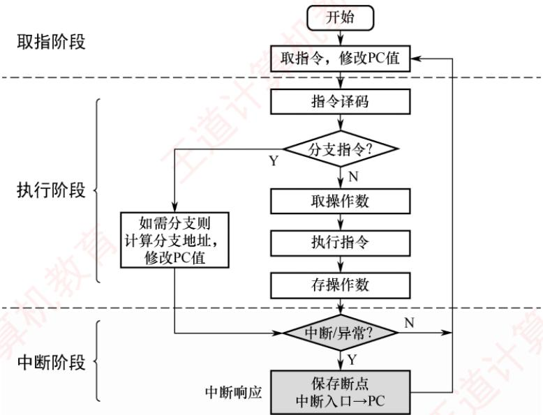
</div>

<p align="center"><em>图 5.2 指令执行的一般流程</em></p>

### 5.2.2 CPU 的时序控制

　　计算机的时序控制用于协调指令执行过程中各操作的先后顺序。CPU 必须按照精确的时序产生控制信号，以适应不同指令在操作步骤和执行时间上的差异。

　　时钟信号是时序控制的基础，通常由机器内部的脉冲源（如晶振）产生，经整形和分频后形成供全机同步使用的节拍信号。时钟周期的长度由数据通路中相邻状态单元之间组合逻辑的最大传播延迟决定，以确保信号在下一个时钟边沿到来前稳定。关于数据通路的介绍，见5.3节。

　　早期计算机采用 “机器周期—节拍—脉冲” 三级时序系统：一个指令周期被划分为若干机器周期（如取指、取操作数、执行、中断响应等），每个机器周期又细分为多个节拍，必要时在节拍内插入工作脉冲，以实现更精细的时序控制。由于不同指令的功能复杂度各异，其所需的机器周期数及各周期内的节拍数均可不同，从而支持多样化的需求。

　　随着高速缓存的广泛应用和芯片集成度的显著提升，现代处理器已大幅简化时序结构，“机器周期”这一概念逐渐淡化。CPU 内部由统一的系统时钟直接驱动，一个时钟周期即对应一个节拍，绝大多数指令可在若干时钟周期内高效完成。

### 5.2.3 指令周期的基本概念

　　指令周期是指一条指令从主存读出到执行完成所经历的全部时间。为便于分析，可将其划分为若干阶段。最简单的划分方法是将指令周期分为取指和执行两个阶段；更细致的划分则可将其细分为取指、译码/读寄存器、执行/计算地址、访存和写回五个阶段，如图 5.3 所示。

<div align="center">
  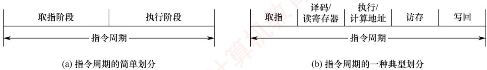
</div>

<p align="center"><em>图 5.3 指令周期的常见划分方法</em></p>

#### 1. 取指 (IF)

　　CPU 根据 PC 的值，从主存（或指令 Cache）中读取下一条指令，并将其送入 IR。同时，PC 被更新为下一条指令的地址：顺序执行时，PC 增加当前指令的长度；若为变长指令，则需要在取指阶段初步解析其格式，以确定长度；若发生分支，则其目标地址将在后续阶段计算，并据此更新 PC。

#### 2. 译码/读寄存器 (ID)

　　对 IR 中的指令进行译码，识别操作码和寻址方式，并从寄存器堆中读取所需的操作数。此阶段还可能组合基址寄存器与偏移量，为后续地址计算做准备。立即数也在本阶段提取。

#### 3. 执行/计算地址（EX）

　　根据指令类型执行相应的操作：算术或逻辑指令，由 ALU 完成运算；访存类指令（如 LOAD/STORE），计算操作数在主存中的有效地址；分支指令，计算目标地址并判断是否转移。此外，运算结果的状态（如零标志、进位等）通常在此阶段生成并暂存。

#### 4. 访存 (MEM)

　　若指令需要访问主存储器（如加载数据或存储结果），则在此阶段通过数据 Cache 或主存完成读/写操作。寄存器-寄存器类指令不涉及此阶段。

#### 5. 写回 (WB)

　　将最终结果写回寄存器堆。结果可能来自 ALU 的运算输出（执行阶段）或从存储器读取的数据（访存阶段）。写回完成后，该指令的执行即告结束。

　　需要注意的是，指令周期的具体划分因处理器架构而异，上述划分仅为一种典型示例。实际系统还可能包含中断响应等阶段，此时 CPU 会保存断点并转移至服务程序。

　　由于指令功能和寻址方式的不同，不同指令的指令周期长度并不固定。根据实现方式，可分为定长指令周期（所有指令的周期长度相同）和变长指令周期（不同指令包含的时钟周期数可变）。现代计算机普遍采用基于时钟信号定时的变长指令周期，以提高执行效率。

### 5.2.4 处理器指令执行模型

> **考点追踪：** 单周期和多周期 CPU 的 CPI（2016、2020、2025）

　　一个指令周期通常由若干依次执行的步骤组成，各步骤协同完成指令的全部功能。不同处理器对这些步骤的组织方式存在显著差异，主要可分为以下三类模型。

#### 1. 单周期处理器

　　单周期处理器为所有指令分配相同的执行时间，每条指令在一个时钟周期内完成（CPI = 1）。指令之间严格串行执行，即下一条指令必须等待前一条指令完全结束后才能启动。因此，时钟周期的长度由执行时间最长的指令决定。对于原本可在更短时间内完成的指令，也要占用整个周期，导致硬件资源在部分时间内空闲，限制了系统的整体性能。

#### 2. 多周期处理器

　　多周期处理器根据指令类型动态分配执行周期数，不同指令可占用不同数量的时钟周期（各指令的 CPI 不同，平均 CPI 通常大于 1）。该方案不再要求所有指令具有相同的执行时间，从而提高了时钟频率和资源利用效率。但是，指令之间仍是串行执行的，无法实现重叠处理。

#### 3. 流水线处理器

　　流水线处理器采用指令级并行策略，目标是在每个时钟周期完成一条指令的吞吐（理想情况下 $\mathrm{CPI} = 1$ ）。其实现机制是：每个时钟周期启动一条新指令，使多条指令在流水线中重叠执行，各自处于不同的执行阶段（如取指、译码、执行、写回等）。尽管单条指令从开始到完成仍需要多个周期（执行延迟未减少），但整体吞吐率显著提高，大幅提升了处理器效率。

### 5.2.5 本节习题精选

#### 单项选择题

01. 计算机工作的最小时间周期是（）。

- A. 时钟周期
- B. 指令周期
- C. 存取周期
- D. 总线周期

02. 指令周期是指（）。

- A. CPU从主存取出一条指令的时间
- B. CPU执行一条指令的时间
- C. CPU从主存取出一条指令加上执行这条指令的时间
- D. 时钟周期时间

03. 在一条无条件转移指令的指令周期内（不含中断），程序计数器的值被修改了（）次。

- A. 1
- B. 2
- C. 3
- D. 不能确定

04. 取指操作后，程序计数器中存放的是（）。

- A. 当前指令的地址
- B. 程序中指令的数量
- C. 已执行的指令数量
- D. 下一条指令的地址

05. 下列关于指令执行的叙述中，错误的是（）。

- A. 指令周期的第一个操作是取指令
- B. 为了进行取指操作，控制器需要得到相应的指令
- C. 取指操作是控制器自动进行的
- D. 指令执行时有些操作是相同或相似的

06. 下列关于指令执行过程的叙述中，错误的是（）。

- A. 取指操作是控制器固有的功能，不需要在操作码控制下完成
- B. 所有指令的取指操作是相同的
- C. 在指令长度相同的情况下，所有指令的取指操作是相同的
- D. 中断周期是在指令执行完成后出现的

07. 下列关于指令周期的叙述中，错误的是（）。

- A. 指令周期的第一个阶段一定是取指令阶段
- B. 乘法指令和加法指令的指令周期总是一样长
- C. 一个指令周期可由若干时钟周期组成
- D. 单周期 CPU 中的指令周期就是一个时钟周期

08. 下列关于多周期 CPU 的说法中，合理的是（）。

- A. 执行各条指令的时钟周期数相同，各时钟周期的长度均匀
- B. 执行各条指令的时钟周期数相同，各时钟周期的长度可变
- C. 执行各条指令的时钟周期数可变，各时钟周期的长度均匀
- D. 执行各条指令的时钟周期数可变，各时钟周期的长度可变

09. 关于指令执行过程，下列叙述中正确的是（）。

- A. 取指令和取操作数阶段都一定需要通过总线访问主存
- B. 指令译码阶段需要计算操作数在内存中的地址
- C. 所有指令在执行阶段必然包含访问主存或I/O端口的操作
- D. 取指令和译码是每条指令必须执行的操作，但取数或写结果不一定要访问主存

10. 【2009 统考真题】冯·诺依曼机中指令和数据均以二进制形式存放在存储器中，CPU 区分它们的依据是（）。

- A. 指令操作码的译码结果
- B. 指令和数据的寻址方式
- C. 指令周期的不同阶段
- D. 指令和数据所在的存储单元

11. 【2011 统考真题】假定不采用 Cache 和指令预取技术，且机器处于 “开中断” 状态，则在下列有关指令执行的叙述中，错误的是（）。

- A. 每个指令周期中 CPU 都至少访存一次
- B. 每个指令周期一定大于或等于一个 CPU 时钟周期
- C. 空操作指令的指令周期中任何寄存器的内容都不会被改变
- D. 当前程序在每条指令执行结束时都可能被外部中断打断

### 5.2.6 答案与解析

#### 单项选择题

**01. A**
　　时钟周期是计算机内部最基本、最小的时间单位。指令周期是指完成一条指令所需的时间，可以包含多个时钟周期。存取周期是指访问一次存储器（读或写）的时间，通常也需要多个时钟周期。总线周期是指总线进行数据传输所需的时间，也可包含多个时钟周期。

**02. C**

　　指令周期是指CPU从主存取出一条指令加上执行这条指令的时间，间址周期不是必需的。

**03. B**

　　首先在取指周期结束后，PC值自动加1；在执行周期中，PC值修改为要转移到的地址。综上，在一条无条件转移指令的指令周期内，程序计数器（PC）的值被修改了2次。

**04. D**

　　在取指操作后，程序计数器中的内容将被修改为下一条指令的地址，而不是当前指令的地址。

**05. B**

　　取指操作是自动进行的，控制器不需要得到相应的指令。

**06. B**

　　不同长度的指令，其取指操作可能是不同的。例如，双字指令、三字指令与单字指令的取指操作是不同的。

**07. B**

　　无论哪种指令，指令周期的第一个阶段都是取指令（从主存中获得指令）。乘法指令通常比加法指令复杂，若是多周期 CPU，则乘法指令通常需要更多的时钟周期，选项 B 错误。多周期 CPU 的指令周期由若干时钟周期组成。在单周期 CPU 中，指令执行的所有阶段（取指令、译码、执行等）都在一个时钟周期内完成，因此其指令周期就是一个时钟周期。

**08. C**

　　多周期 CPU 把指令的执行分为多个阶段来实现，每个阶段在一个时钟周期内完成，时钟周期以最复杂的阶段所花的时间为准，阶段的划分原则是：将一条指令的执行过程尽量分成大致相等的若干阶段。不同的指令（根据指令的复杂程度）所含的时钟周期数可以不同。

**09. D**

　　指令执行的基本步骤通常包括取指令、译码、地址计算、取操作数、执行和写回结果，其中取指令和译码是所有指令执行的必经阶段，而后续操作因指令而异：操作数和结果可能仅涉及寄存器，无须访问主存或 I/O。因此选项 D 正确。选项 A 错在取操作数不一定访存；选项 B 错在地址计算属于执行阶段，而非译码阶段；选项 C 错在并非所有指令都需要访问主存或 I/O。

**10. C**

　　虽然指令和数据都以二进制形式存放在存储器中，但 CPU 可以根据指令周期的不同阶段来区分是指令还是数据，通常在取指阶段取出的是指令，在执行阶段取出的是数据。本题容易误选选项 A，需要清楚的是，CPU 只有在确定取出的是指令后，才会将其操作码送去译码，因此不可能依据译码的结果来区分指令和数据。

**11. C**

　　因为不采用指令预取技术，每个指令周期都需要取指令，而不采用 Cache 技术，所以每次取指令都至少要访存一次（当指令字长与存储字长相等且按边界对齐时），选项 A 正确。时钟周期是 CPU 的最小时间单位，每个指令周期一定大于或等于一个 CPU 时钟周期，选项 B 正确。即使是空操作指令，在取指操作结束后，PC 也会自动加 1，选项 C 错误。因为机器处于 “开中断” 状态，所以在每条指令执行结束时都可能被外部中断打断。

## 5.3 数据通路的功能和基本结构

### 5.3.1 数据通路的功能

　　随着技术的发展，越来越多的功能逻辑被集成到 CPU 芯片中，但不论 CPU 的内部结构多么复杂，它都可视为由数据通路（Data Path）和控制部件（Control Unit）两大部分组成。

　　数据在指令执行过程中所经过的路径，以及路径上涉及的硬件部件，称为数据通路。ALU、通用寄存器、状态寄存器等，都是指令执行时数据流经的部件，属于数据通路的一部分。数据通路描述了数据从何处开始，中间经过哪些部件，最终被传送到哪里。整个数据通路由控制部件控制，后者根据每条指令的功能，生成相应的控制信号，以驱动数据通路完成指定操作。

### 5.3.2 数据通路的组成

　　数据通路的基本构成元件可分为组合逻辑元件和时序逻辑元件两大类。

> **考点追踪：** 数据通路的组成部件（2017、2021、2025）

#### 1. 组合逻辑元件（操作元件）

　　组合逻辑元件主要用于执行数据运算与路径选择，也称操作元件。其特征是：任意时刻的输出仅由当前输入决定，不依赖历史状态；内部不含记忆单元，不受时钟控制，且无输出到输入的反馈通路，因而具有确定性和即时响应性。数据通路中常用的组合逻辑元件包括加法器、算术逻辑单元（ALU）、译码器、多路选择器（MUX）和三态门等，如图5.4所示。

<div align="center">
  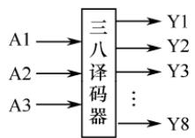
</div>

<p align="center"><em>(a) 译码器</em></p>

<div align="center">
  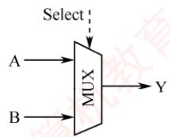
</div>

<p align="center"><em>(b) 多路选择器</em></p>

<div align="center">
  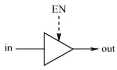
</div>

<p align="center"><em>(c) 三态门</em></p>

<p align="center"><em>图 5.4 数据通路中的几种常用组合逻辑元件</em></p>

> **考点追踪：** 三态门、多路选择器的应用（2015、2023、2024）

　　图中虚线表示控制信号，译码器常用于操作码译码或地址码译码，对于 n 位输入，可产生 $2^{n}$ 个互斥输出。多路选择器（MUX）根据控制信号 Select 从多路输入中选择一路输出，若输入路数为 N，则需 $\left\lceil \log_{2} N \right\rceil$ 位控制信号。三态门可视为一种受控的总线开关，由控制信号 EN 决定信号线的通断，当 EN = 1 时，三态门被打开，输出（out）信号等于输入（in）信号；当 EN = 0 时，输出端呈高阻态（隔断态），所连寄存器与总线断开。

#### 2. 时序逻辑元件（状态元件）

　　时序逻辑元件的输出不仅取决于当前输入，还依赖于电路的历史状态，因此其内部必然包含用于存储信息的记忆单元。此外，这类元件必须在时钟的同步控制下工作。常见的时序逻辑元件包括各类寄存器和存储器，例如通用寄存器组、程序计数器（PC）、状态/暂存寄存器等。

　　数据通路的基本结构可抽象为时序逻辑元件与组合逻辑元件交替连接的形式，即“……-状态元件-操作元件-状态元件-……”，如图5.5所示。为简化分析，假设寄存器A和B的写使能信号一直有效，当时钟上升沿到来时，两个寄存器同时锁存各自的新值。从时钟上升沿开始到寄存器A输出稳定的时间称为寄存器延迟 $T_{clk\_to\_q}$ ；随后，其输出数据经组合逻辑电路处理，经历一个关键路径延迟 $T_{max}$ （所有输出信号达到稳定所需的最长时间）。为确保寄存器B能在下一个时钟上升沿正确采样该数据，其输入必须在时钟沿到来前至少提前 $T_{setup}$ （寄存器建立时间）保持稳定。因此，数据通路的最小时钟周期必须不小于 $T_{clk\_to\_q} + T_{max} + T_{setup}$ ，其中组合逻辑延迟 $T_{max}$ 是关键因素。可见，在CPU设计中，缩短组合逻辑的关键路径延迟是提升系统频率的关键手段。

<div align="center">
  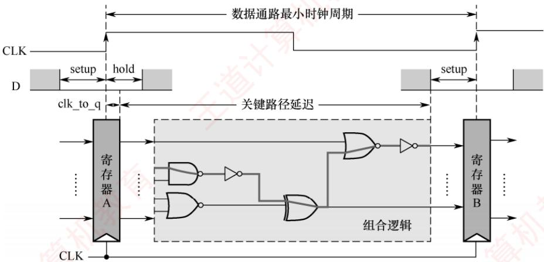
</div>

<p align="center"><em>图 5.5 数据通路与时钟周期</em></p>

### 5.3.3 数据通路的组织与分类

　　数据通路可根据其内部部件的连接方式和指令执行的时序组织方式进行分类。

#### 1. 按部件连接方式划分

##### （1） 总线式数据通路

　　总线式数据通路将通用寄存器、ALU和内部寄存器等主要部件连接至一条或多条CPU内部总线（注意，此总线为片内总线，不同于系统总线）。根据总线数量的不同，可分为如下两类：

- 单总线结构: 所有数据传输共享一条内部总线, ALU 的输入与输出均通过该总线分时传送。

- 多总线结构（如双总线、三总线）：提供多条独立总线，例如分别用于两个源操作数和结果写回，以支持更高的并行度。

　　优点是硬件简洁、易于扩展；缺点是同一时刻仅能传输一组数据，存在总线竞争问题。

##### （2） 专用数据通路

　　专用数据通路采用点对点专用连线连接寄存器、ALU等部件，而非共享总线。各数据通路可并行传输，避免了总线冲突。

　　优点是数据传输效率高、延迟低；缺点是布线复杂、扩展性差、成本较高。

　　总线式与专用数据通路的特点对比如表 5.1 所示。

　　表 5.1 总线式与专用数据通路的特点对比

<table><tr><td>对比维度</td><td>总线式数据通路</td><td>专用数据通路</td></tr><tr><td>结构复杂度</td><td>简单,部件共享总线,连线少</td><td>复杂,需要大量点对点专用连线</td></tr><tr><td>扩展灵活性</td><td>强,新增部件只需要挂接总线</td><td>弱,新增部件需要重新布线</td></tr><tr><td>数据传输效率</td><td>低,同一时刻仅支持一组数据传输</td><td>高,多组数据可并行传输</td></tr><tr><td>硬件成本</td><td>低</td><td>高</td></tr><tr><td>性能瓶颈</td><td>总线带宽受限,部件增多时延迟增加</td><td>无总线瓶颈,性能随并行度提升</td></tr><tr><td>典型应用场景</td><td>教学模型、嵌入式微控制器</td><td>高性能通用处理器(如 RISC)</td></tr></table>

#### 2. 按时序组织方式划分

##### （1） 单周期数据通路

　　在单周期数据通路中，每条指令的所有操作（取指、译码、执行、访存、写回等）都在一个时钟周期内完成。时钟周期长度由最慢的指令（通常是访存指令）决定。

　　特点是控制简单，资源利用率低，可基于总线式或专用通路实现。

> **注意**

　　单周期处理器（ $\mathrm{CPI} = 1$ ）不能采用单总线结构的数据通路，因为单总线将所有寄存器都连接到一条公共总线上，一个时钟周期内只允许一次操作，无法完成一条指令的所有操作。

##### （2） 多周期数据通路

　　多周期数据通路将一条指令的执行划分为多个阶段，每个阶段在一个时钟周期内完成。典型阶段包括取指、译码与读寄存器、执行/地址计算、访存、写回等。

　　特点是各阶段的结果在时钟边沿被锁存到寄存器中；时钟周期长度通常以一次存储器访问时间为基准；相比单周期设计，提高了硬件复用率，缩短了时钟周期。

##### （3） 流水线数据通路

　　流水线数据通路将指令执行过程分解为若干独立、可重叠的阶段，不同指令在不同阶段并发推进。每个阶段由专用功能部件完成，并通过流水段寄存器隔离和传递中间结果。

　　特点是时钟周期长度由最长阶段决定；理想情况下，每个周期可以完成一条指令。

### 5.3.4 单总线结构的数据通路

　　单总线数据通路结构简洁，所有数据传输共享同一条内部总线，同一时刻仅允许一个部件向总线输出数据，导致操作需要分步进行。图 5.6 所示为一种典型的单总线数据通路结构。

> **考点追踪：** 数据通路中的部件及连接方式（2013、2015、2022）

　　在图5.6中，GPRs为通用寄存器组，rs和rd分别是源寄存器和目的寄存器的编号，各占4位，可寻址 $2^{4} = 16$ 个通用寄存器；Y和Z为暂存寄存器（简称暂存器），用于暂存从总线读取的操作数；FR为标志寄存器，用于保存ALU运算产生的状态标志。所有可向内部总线输出数据的部件（如寄存器、MDR、PC 等）均通过各自的三态门与总线相连，以控制其与总线之间的通断，避免多个输出同时驱动总线造成冲突。图中带箭头的虚线表示控制信号，控制信号的命名采用“部件名+in/out”的方式：in 表示允许向该部件写入（如 PCin 表示将内部总线上的数据写入 PC），out 表示允许该部件输出到总线（如 PCout 表示将 PC 的内容送至内部总线）。

<div align="center">
  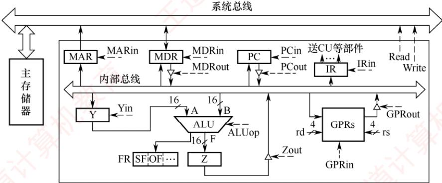
</div>

<p align="center"><em>图 5.6 一种典型的单总线数据通路结构</em></p>

　　ALU 的操作类型由控制信号 ALUop 决定。若 ALUop 为 n 位，则最多支持 $2^{n}$ 种操作。在以下分析中，假设 ALUop 为 3 位，且约定执行加法操作时 ALUop = 000。

　　总线是一组共享的传输信号线，不能存储信息，任一时刻只能有一个部件将信息发送到总线上。下面以图 5.6 所示的单总线数据通路为例，介绍两条常见指令的指令周期数据流。数据流是指令执行过程中，根据操作要求依次访问的数据序列。该序列因指令执行的不同阶段而异，也随指令类型的不同而变化。为简化分析，此处将指令周期分为取指和执行两个阶段。

##### （1） 加法指令

> **考点追踪：** 指令执行阶段的操作控制分析（2009、2015、2019）

　　指令功能：将 rs 和 rd 寄存器中的值相加，并将结果写入 rd 寄存器。

1）取指阶段：根据 PC 中的内容从主存储器中取出指令代码并存放在 IR 中。假设从发出主存读命令到主存读出数据并传输到 MDR 共需 5 个时钟周期，则取指阶段的数据流如下（不考虑 PC 增量操作）：

<table><tr><td>时钟</td><td>功能</td><td>有效控制信号</td></tr><tr><td>C1</td><td>(PC) → MAR</td><td>PCout, MARin</td></tr><tr><td>C2~C6</td><td>MEM(MAR) → MDR</td><td>MDRin, read</td></tr><tr><td>C7</td><td>(MDR) → IR</td><td>MDRout, IRin</td></tr></table>

　　解释：① 将 PC 的内容写入 MAR（1 个时钟周期）；② 读主存并将读出的数据写入 MDR（5 个时钟周期）；③ 将 MDR 的内容写入 IR（1 个时钟周期）。

2）执行阶段：根据 rs 和 rd 寄存器的编号（假设分别为 0001 和 0010），将两个操作数取出，送入 ALU 进行加法运算，并将运算结果送回 rd 寄存器。执行阶段的数据流如下：

<table><tr><td>时钟</td><td>功能</td><td>有效控制信号</td></tr><tr><td>C8</td><td>(rs) → Y</td><td>rs = 0001, GPRout, Yin</td></tr><tr><td>C9</td><td>(rs)+(rd) → Z</td><td>rd = 0010, GPRout, ALUop = 000</td></tr><tr><td>C10</td><td>(Z) → rd</td><td>Zout, rd = 0010, GPRin</td></tr></table>

　　解释：① 将 rs 寄存器的内容写入暂存寄存器 Y（1 个时钟周期）；② 将 rd 寄存器中的值取出并与 Y 暂存寄存器中的值相加，结果送入 Z 暂存寄存器（1 个时钟周期）；③ 将暂存寄存器 Z 中的加法结果送回 rd 寄存器（1 个时钟周期）。

> **注意**

　　在单总线数据通路中，任一时刻总线上仅允许一个数据传输。由于 ALU 是无存储能力的组合逻辑电路，运算时需要两个输入同时有效，因此需要先将一个操作数经总线送入暂存寄存器 Y；下一周期再将另一个操作数送至 ALU 的另一个输入端，Y 的输出即作为其第一个操作数。此外，ALU 输出不能直接连到总线，否则可能通过总线反馈至输入端，干扰运算结果，故需要暂存于暂存寄存器 Z 中。

##### （2） 取数指令

　　指令功能：将主存地址为rs寄存器中的值的主存单元内容取出送回rd寄存器。

1）取指阶段：所有指令取指阶段的数据流都是相同的，此处不再赘述。

2）执行阶段：假设 rs 和 rd 寄存器的编号分别为 0001 和 0010，从发出主存读命令到主存读出数据并传输到 MDR 共需 5 个时钟周期，则执行阶段的数据流如下：

<table><tr><td>时钟</td><td>功能</td><td>有效控制信号</td></tr><tr><td>C8</td><td>(rs) → MAR</td><td>rs = 0001, GPRout, MARin</td></tr><tr><td>C9~C13</td><td>MEM(MAR) → MDR</td><td>MDRin, read</td></tr><tr><td>C14</td><td>(MDR) → rd</td><td>MDRout, rd = 0010, GPRin</td></tr></table>

　　解释：① 将 rs 的内容写入 MAR（1 个时钟周期）；② 读主存并将读出的数据写入 MDR（5 个时钟周期）；③ 将 MDR 的内容写入 rd 寄存器（1 个时钟周期）。

### 5.3.4 专用结构的数据通路

　　本节以单周期数据通路为例，介绍专用数据通路的设计原理。在单周期数据通路中，每条指令的取指与执行均在一个时钟周期内完成，CPU 的时钟周期必须以最耗时的指令为准。此外，由于资源无法复用，系统需要为频繁使用的功能单元（如加法器）配置多组独立的实例。同时，为避免指令获取与数据访问冲突，指令和数据被分别存储在独立的存储器中，确保两者可在同一时钟周期内并行处理。鉴于完整单周期数据通路结构较为复杂，以下将结合具体指令执行过程，逐步拆解其关键设计要点。尽管基于单周期模型，但其中的控制逻辑与数据通路设计思想同样适用于多周期、流水线等更复杂的结构。考生应在夯实基础的前提下，灵活运用所学知识。

#### 1. 取指令部件的设计

　　每条指令的第一步都是完成取指令并计算下一条指令地址的过程。图 5.7 展示了取指令部件

<div align="center">
  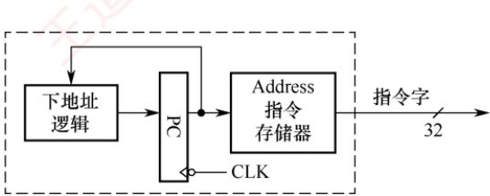
</div>

<p align="center"><em>图 5.7 取指令部件的结构示意图</em></p>

　　的结构示意图。指令存储在指令存储器中，仅支持读操作。读取指令时，只需提供指令地址，经过固定的延迟后即可输出对应的 32 位指令字。指令地址由程序计数器（PC）提供。

　　取指令部件包含专用的下地址逻辑电路，用于计算并更新 PC 值，以确定下一条指令的地址。下地址逻辑根据当前指令类型区分不同的执行路径：

- 顺序执行：当指令为普通顺序指令时，直接计算 $\mathrm{PC} + 4$ 得到下一条指令的地址。

- 转移执行：对于分支或转移指令，需要根据指令类型计算转移目标地址。例如，beq 指令（相等转移）通过比较两个寄存器的内容决定是否转移，并根据偏移量计算新的 PC 值。

#### 2. R 型运算类指令数据通路

　　R 型指令指的是操作数全部来自通用寄存器、运算结果也写回通用寄存器的算术/逻辑运算指令。以加法指令为例：

　　图 5.8 展示了 R 型指令相关的数据通路示意图。该数据通路能够对两个寄存器 Rs 和 Rt 的内容进行运算，并将结果写回 Rd 寄存器。例如，add 和 sub 等指令还需判断运算结果是否溢出，仅当不溢出时才将结果写回 Rd 寄存器；发生溢出时，会触发异常处理。

　　指令中的 Rs 和 Rt 是两个源操作数寄存器的编号，Rd 是目的寄存器的编号。因此，

<div align="center">
  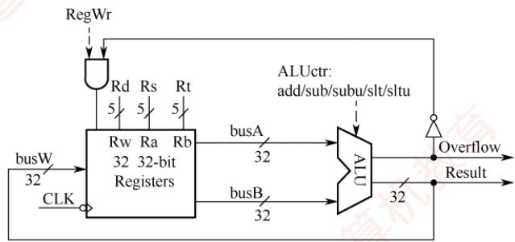
</div>

<p align="center"><em>图 5.8 R 型指令相关的数据通路示意图</em></p>

- 寄存器堆的两个读地址端 Ra 和 Rb 应分别与 Rs 和 Rt 相连。

- 写地址端 Rw 应与 Rd 相连。

- ALU 的运算结果通过总线 busW 连至寄存器堆的写数据端。

　　控制信号 RegWr 作为寄存器堆的写使能信号，在 RegWr 为 1 且无溢出的情况下，运算结果才被写入寄存器堆。具体来说，RegWr 信号和溢出标志位 Overflow 通过 “与” 门组合后，决定是否允许写入寄存器堆。显然，在 R 型指令执行期间，RegWr 信号应始终为 1。

　　此外，ALU 的操作类型由控制信号 ALUctr 决定。假设 ALU 支持 N 种不同的运算，则 ALUctr 至少需要 $\left\lceil \log_{2}N \right\rceil$ 位来选择具体的运算类型。

　　由于单周期处理器必须在一个时钟周期内完成指令，其数据通路中不设置指令寄存器（IR），而直接从指令存储器中取指令并解析执行，否则仅取指令到 IR 就需一个时钟周期。

#### 3. I型运算指令的数据通路

　　I 型运算指令（立即数运算类指令）的核心执行逻辑是，先将指令中的 16 位立即数扩展为 32 位，再将寄存器 Rs 的内容送入 ALU 运算，结果写回目的寄存器 Rt。以有符号加法指令为例：

addi rt, rs, imm16 #R[rs]+SignExt[imm16]→R[rt]

　　其中，SignExt[imm16]表示对 16 位立即数进行符号扩展。

　　图 5.9 是在 R 型指令数据通路（见图 5.8）基础上，增加支持 I 型指令的功能模块（如立即数扩展器和多路选择器）后形成的通用数据通路。该通路可同时执行 R 型和 I 型运算指令。

<div align="center">
  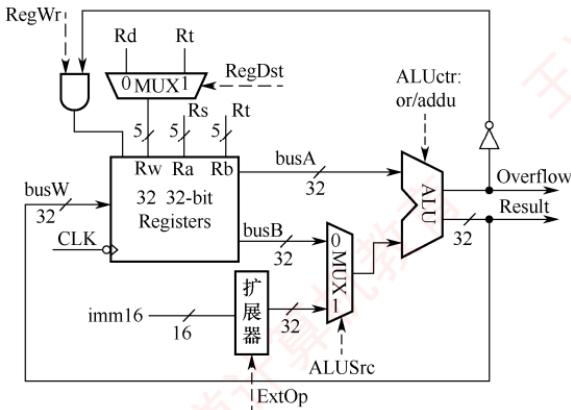
</div>

<p align="center"><em>图 5.9 I 型指令相关的数据通路示意图</em></p>

　　与图 5.8 相比，数据通路主要有以下三处改动，以同时兼容 R 型和 I 型运算指令的执行。

1）目的寄存器选择：R型指令使用目的寄存器Rd，而I型指令使用目的寄存器Rt。因此，在寄存器堆的写地址端Rw处增设多路选择器，由控制信号RegDst控制：

- RegDst = 1（执行 R 型指令）时，选择 Rd 为目的寄存器。

- RegDst = 0（执行 I 型指令）时，选择 Rt 为目的寄存器。

2）立即数扩展：I型指令的16位立即数需扩展为32位才能送入ALU。数据通路中新增一个立即数扩展器，其输入为指令的imm16字段。由控制信号ExtOp决定扩展方式：对于算术类指令，采用符号扩展。

- 对于按位逻辑操作指令，采用零扩展。

3）ALU 第二操作数选择：R 型指令的第二操作数来自寄存器 Rt，I 型指令则使用扩展后的立即数。因此，在 ALU 的第二输入端增设多路选择器，由控制信号 ALUSrc 控制：

- ALUSrc = 0（执行 R 型指令）时，选择寄存器 Rt 的数据。

- ALUSrc = 1（执行 I 型指令）时，选择扩展后的立即数。

#### 4. 访存指令的数据通路

　　MIPS 访存指令属于 I 型指令（需要进行立即数运算），包括以下两类：

```javascript
lw rt, imm16(rs) #M[R[rs]+SignExt(imm16)]→R[rt]
sw rt, imm16(rs) #R[rt]→M[R[rs]+SignExt(imm16)]
```

　　LOAD 和 STORE 指令的访存地址计算逻辑完全一致：首先对指令中的 16 位立即数 imm16 进行符号扩展，然后将其与寄存器 Rs 的内容相加，得到访存地址。二者区别在于数据传输方向：
- LOAD 指令从该地址读取 32 位数据，并将数据写入寄存器 Rt。

- STORE 指令则将寄存器 Rt 中的 32 位数据写入该地址对应的存储单元。

　　图 5.10 是在图 5.9 的基础上增加支持 LOAD/STORE 指令功能模块后的数据通路示意图。该数据通路不仅能够执行 LOAD/STORE 指令，还能兼容 R 型和 I 型运算指令。

<div align="center">
  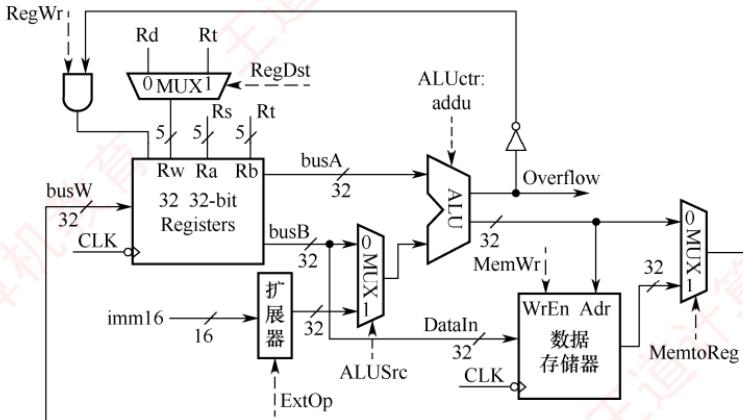
</div>

<p align="center"><em>图 5.10 支持 LOAD/STORE 指令功能的数据通路</em></p>

　　与图 5.9 相比，数据通路主要有以下两处改动，以支持 LOAD/STORE 指令的执行：

1) 写回寄存器的数据选择: 为了处理运算类指令与 LOAD 指令写回寄存器的不同数据来源，在寄存器堆的写端口 busW 处增设一个多路选择器，由控制信号 MemtoReg 控制：

- MemtoReg = 0（运算类指令）时，选择 ALU 的运算结果。

- MemtoReg = 1（LOAD指令）时，选择数据存储器读出的数据。

2）新增数据存储器模块：以满足LOAD/STORE指令对数据存储器的读/写需求。

- 数据存储器的地址端 Adr 直接连接到 ALU 的输出端（访存地址由 ALU 计算得出）。

- STORE 指令需要将寄存器 Rt 的内容写入存储器，因此将寄存器堆的第二读端口 busB（对应寄存器 Rt）连接到数据存储器的输入端 DataIn。

- 数据存储器的输出端接入 busW 处的多路选择器，用于 LOAD 指令的结果写回。

- 控制信号MemWr作为数据存储器的写使能信号（控制数据存储器的读/写操作）。

- LOAD/STORE 指令计算访存地址时，需要对 16 位立即数 imm16 进行符号扩展，并通过 ALU 执行不判溢出的加法（addu），此时控制信号 ALUctr 被配置为对应的操作码。

#### 5. 完整的单周期数据通路结构图

　　综合前述各功能模块，可构建如图 5.11 所示的完整单周期数据通路。图中所有加下划线的信号均为控制信号，以虚线表示。

<div align="center">
  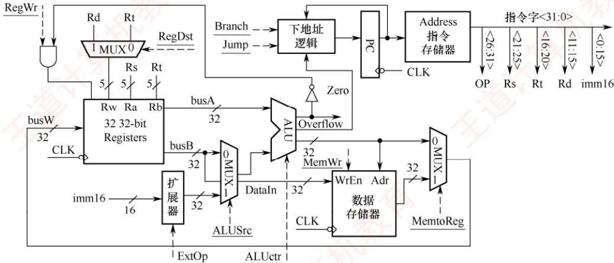
</div>

<p align="center"><em>图 5.11 完整的单周期数据通路</em></p>

　　其中，取指令部件在图 5.7 的基础上，还需接收三类关键外部控制信号：

- 控制信号 Branch 在执行分支指令时置 1。

- 控制信号 Jump 在执行无条件转移指令时置 1。

- 标志位 Zero 用于判断分支条件是否成立，该信号由 ALU 输出。例如，执行 beq 指令（相等转移）时，ALU 执行减法操作，若结果为 0，则 Zero 置 1，表示满足转移条件。

　　基于以上分析，单周期处理器具有以下重要特点：

1）存储器分离设计：指令存储器与数据存储器相互独立，使得取指令与数据访存操作可并行进行，避免冲突，确保在一个时钟周期内同时完成指令读取与数据读/写。

2）无指令寄存器（IR）：指令从存储器取出后，其各字段（如 rs、rt、rd、imm）直接用于生成控制信号或地址输入，指令解析与执行在同一个时钟周期内同步完成。

3）时钟周期由最慢指令决定：时钟周期必须满足执行时间最长的指令（如访存指令），导致简单指令（如R型加法）的执行效率受限。

4）数据通路资源专用：由于所有操作需要在一个周期内并发完成，关键功能单元（如用于PC更新和地址计算的加法器）需要配置多个独立的实例，硬件无法复用，开销较大。

5）控制信号单周期有效：所有控制信号（如 RegWr、MemWr 等）在一个时钟周期内保持有效，指令 “取指、执行、写回” 的完整流程在单个时钟脉冲内完成，无流水线分段。

### 5.3.5 本节习题精选

#### 一、单项选择题

01. 下列不属于 CPU 数据通路结构的是（）。

- A. 单总线结构
- B. 多总线结构

- C. 部件内总线结构
- D. 专用数据通路结构

02. 下列有关数据通路的叙述中，错误的是（）。

- A. 数据通路由若干组合逻辑元件和时序逻辑元件连接而成
- B. 数据通路的功能由控制部件送出的控制信号决定
- C. ALU属于操作元件，包含在数据通路中
- D. 通用寄存器属于状态元件，但不包含在数据通路中

03. 数据通路是由操作元件和状态元件通过总线或分散方式连接而成的进行数据存储、处理和传送的路径，下列部件中属于状态元件的是（）。 I. 算术逻辑部件 II. 译码器 III. 移位寄存器 IV. 存储器数据寄存器

- A. I、III
- B. II、III、V
- C. III、IV
- D. I、IV

04. 下列关于采用单总线方式的 CPU 的说法中，正确的是（）。

- A. ALU 的两个输入端及输出端都可与总线相连
- B. ALU 的两个输入端可以与总线相连，但输出端需通过暂存器与总线相连
- C. ALU 的一个输入端可以与总线相连，其输出端也可与总线相连
- D. ALU 只能有一个输入端可以与总线相连，另一输入端需通过暂存器与总线相连

05. CPU 内部若多个部件共享一条总线，则每个部件与总线之间需设置一个常用的器件，CPU 控制该器件的状态，实现某个部件与总线的连接或断开。该器件是（）。

- A. 触发器
- B. 多路选择器
- C. 三态门
- D. 与非门

06. CPU 内部电路通常采用总线连接方式，总线上信号流动的原则是（）。
 I. 每个时刻只有一个器件发出信息
 II. 每个时刻有一个或多个器件发出信息
 III. 每个时刻只有一个器件接收信息
 IV. 每个时刻有一个或多个器件接收信息

- A. I、III
- B. I、IV
- C. II、III
- D. II、IV

07. 下列关于 CPU 时钟信号的叙述中，错误的是（）。

- A. 处理器总是每来一个时钟信号就开始执行一条新的指令
- B. 边沿触发指状态单元总在时钟上升沿或下降沿开始改变状态
- C. 时钟周期以相邻状态单元之间最长组合逻辑延迟为基准确定
- D. 每个时钟周期称为一个节拍，机器的主频就是时钟周期的倒数

08. 下列操作中，从开始到完成所持续的时间不一定等于一个时钟周期的是（）。 I. 单总线数据通路中完成一次主存读操作 II. 单周期CPU中执行一条完整指令 III. 单总线数据通路中，寄存器R1经内部总线传至寄存器R2 IV. 流水线数据通路中，数据从一个流水段寄存器传入下一个流水段寄存器 V. 单周期CPU中完成一次ALU运算

- A. I、V
- B. I、III、V
- C. II、III、IV
- D. IV、V

09. 下列关于单周期CPU和多周期CPU的描述中，错误的是（）。

- A. 单周期CPU更容易支持复杂指令（如乘法、除法）
- B. 单周期CPU部件冗余大、利用率低，多周期CPU则刚好相反
- C. 单周期CPU在1个时钟周期内执行一条指令， $\mathrm{CPI} = 1$
- D. 多周期CPU至少需要2个时钟周期才能执行一条指令， $\mathrm{CPI} > 1$

10. 下列关于单周期数据通路和多周期数据通路的说法中，正确的是（）。

- A. 单周期 CPU 的 CPI 总比多周期 CPU 的 CPI 大
- B. 单周期 CPU 的时钟周期通常比多周期 CPU 的时钟周期短

- C. 在一条指令执行过程中，单周期CPU中的每个控制信号取值一直不变，而多周期CPU中的控制信号可能发生改变
- D. 在一条指令执行过程中，单周期数据通路和多周期数据通路中的每个部件都可使用多次

11. 下列关于单周期 CPU 与采用单总线结构的多周期 CPU 的说法中，正确的是（）。

- A. 单周期 CPU 可基于单总线结构实现
- B. 运行相同程序时，单周期 CPU 的总执行时间一定更短
- C. 多周期 CPU 可将指令和数据存放在同一单端口存储器中，而单周期 CPU 不行
- D. 单周期 CPU 的硬件实现成本通常低于多周期 CPU

12. 与专用通路结构的数据通路相比，单总线结构的数据通路（）。

- A. 性能更高
- B. 数据冲突更严重
- C. 硬件规模更大、实现更复杂
- D. 控制逻辑更复杂

13. CPU 的读/写控制信号的作用是（）。

- A. 决定数据总线上的数据流方向
- B. 控制存储器操作的读/写类型
- C. 控制流入、流出存储器信息的方向
- D. 以上都是

14. 下列有关取指令操作部件的叙述中，错误的是（）。

- A. 取指令操作的时延主要由存储器的访问时间决定
- B. 取指令操作可与下条指令地址的计算并行进行
- C. 在单周期数据通路中，需设置指令寄存器（IR）暂存取出的指令
- D. 在单周期数据通路中，程序计数器（PC）无须“写使能”控制信号

15. 【2016 统考真题】单周期处理器中所有指令的指令周期为一个时钟周期。下列关于单周期处理器的叙述中，错误的是（）。

- A. 可以采用单总线结构数据通路
- B. 处理器时钟频率较低
- C. 在指令执行过程中控制信号不变
- D. 每条指令的CPI为1

16. 【2019 统考真题】下列有关处理器时钟信号的叙述中，错误的是（）。

- A. 时钟信号由机器脉冲源发出的脉冲信号经整形和分频后形成
- B. 时钟信号的宽度称为时钟周期，时钟周期的倒数为机器主频
- C. 时钟周期以相邻状态单元间组合逻辑电路的最大延迟为基准确定
- D. 处理器总是在每来一个时钟信号时就开始执行一条新的指令

17. 【2021 统考真题】下列关于数据通路的叙述中，错误的是（）。

- A. 数据通路包含 ALU 等组合逻辑（操作）元件
- B. 数据通路包含寄存器等时序逻辑（状态）元件
- C. 数据通路不包含用于异常事件检测及响应的电路
- D. 数据通路中的数据流动路径由控制信号进行控制

18. 【2023 统考真题】数据通路由组合逻辑元件（操作元件）和时序逻辑元件（状态元件）组成。下列给出的元件中，属于操作元件的是（）。 I. 算术逻辑单元（ALU） II. 程序计数器（PC） III. 通用寄存器组（GPRs） IV. 多路选择器（MUX）

- A. 仅 I、II
- B. 仅 I、IV
- C. 仅 II、III
- D. 仅 I、II、IV

#### 二、综合应用题

01. 某计算机的数据通路结构如下图所示，写出实现 ADD R1, (R2) 的微操作序列（取指令及指令执行的过程，包括 PC 自增的过程）。

<div align="center">
  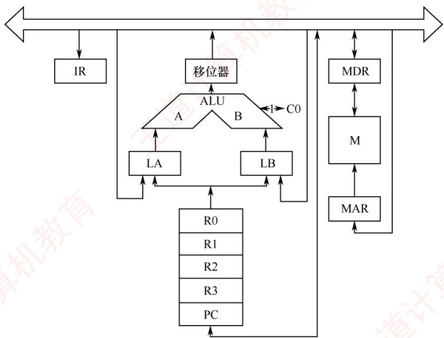
</div>

02. 设 CPU 内部结构如下图所示，此外还设有 B、C、D、E、H、L 六个寄存器（图中未画出），它们各自的输入端和输出端都与内部总线相通，并分别受控制信号控制（如 Bin 受寄存器 B 的输入控制；Bout 受寄存器 B 的输出控制），假设 ALU 的结果直接送入寄存器 Z。要求从取指令开始，写出完成下列指令的微操作序列及所需的控制信号。

<div align="center">
  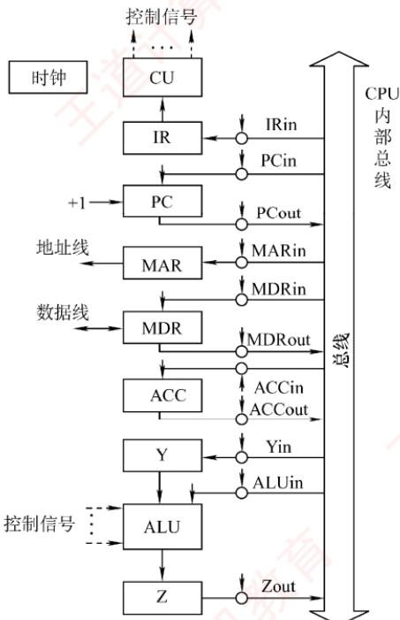
</div>

03. 设有如下图所示的单总线结构，分析指令 ADD(R0), R1 [即实现((R0))+(R1)→(R0)] 的指令流程和控制信号。

<div align="center">
  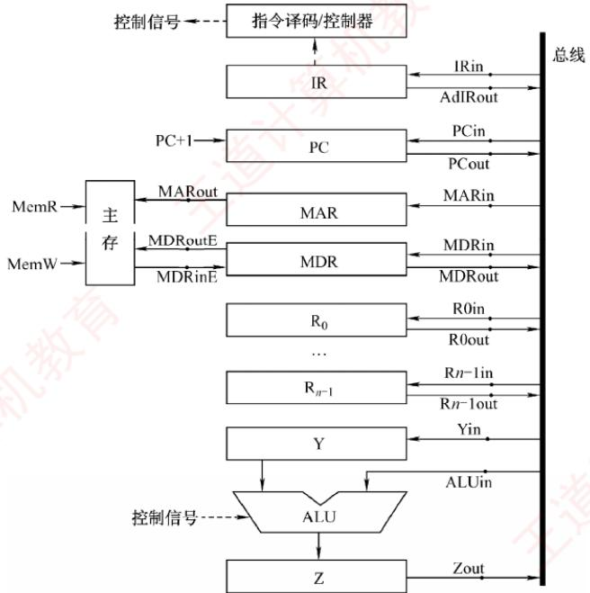
</div>

04. 右图是一个简化的 CPU 与主存连接结构示意图（图中省略了所有的多路选择器）。其中有一个累加寄存器（ACC）、一个状态寄存器和其他 4 个寄存器：存储器地址寄存器（MAR）、存储器数据寄存器（MDR）、程序计数器（PC）和指令寄存器（IR），各部件及其之间的连线表示数据通路，箭头表示信息传递方向。

　　要求:

1) 请写出图中 a、b、c、d 四个寄存器的名称。

<div align="center">
  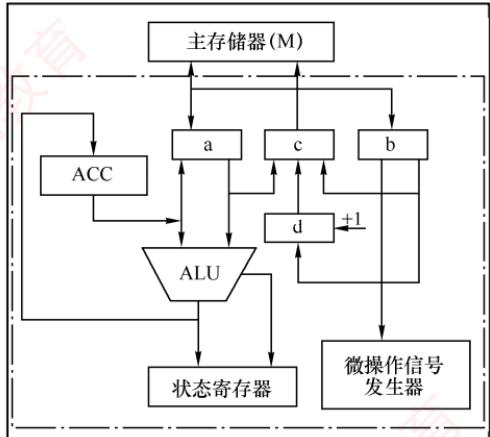
</div>

2）简述图中取指令的数据通路。

3）简述数据在运算器和主存之间进行存/取访问的数据通路（假设地址已在MAR中）。

4）简述完成指令LDAX的数据通路（X为主存地址，LDA的功能为 $(\mathrm{X})\rightarrow \mathrm{ACC}$ ）

5）简述完成指令 ADD Y 的数据通路（Y 为主存地址，ADD 的功能为(ACC) + (Y)→ACC）。

6）简述完成指令 STA Z 的数据通路（Z 为主存地址，STA 的功能为(ACC)→Z）。

05. 某机主要功能部件如下图所示，其中 M 为主存，MDR 为存储器数据寄存器，MAR 为存储器地址寄存器，IR 为指令寄存器，PC 为程序计数器（并假设当前指令地址在 PC 中），R0～R3 为通用寄存器，C、D 为暂存器。

<div align="center">
  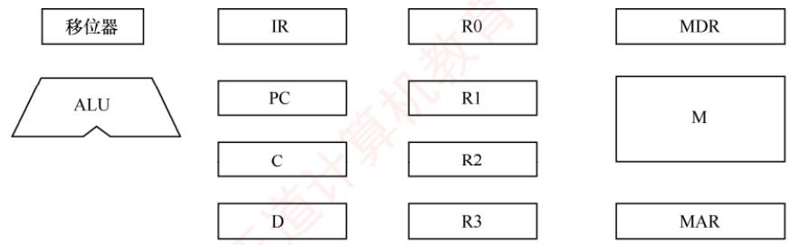
</div>

1）请补充各部件之间的主要连接线（总线自己画），并注明数据流动方向。

2）画出 “ADD(R1), (R2) +” 指令周期流程图，该指令的含义是进行求和运算，源操作数地址在 R1 中，目的操作数寻址方式为自增型寄存器间接寻址方式（先取地址后加 1），并将相加结果写回 R2 寄存器。

06. 已知单总线计算机结构如下图所示，其中 M 为主存，XR 为变址寄存器，EAR 为有效地址寄存器，LATCH 为暂存器。假设指令地址已存在于 PC 中，请给出 ADD X, D 指令周期信息流程和相应的控制信号。说明：

1）ADD X, D 指令字中，X 为变址寄存器 XR，D 为形式地址，指令的功能是将变址寻址得到的操作数和 ACC 中的操作数相加，结果送回 ACC。

2）寄存器的输入/输出均采用控制信号控制，如 $PC_{i}$ 表示 PC 的输入控制信号， $MDR_{o}$ 表示 MDR 的输出控制信号。

3）凡需要经过总线的传送，都需要注明，如(PC)→MAR，相应的控制信号为 $PC_{0}$ 和 $MAR_{i}$ 。

<div align="center">
  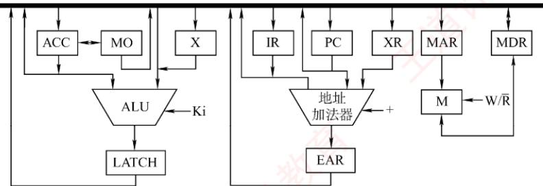
</div>

07. 【2009 统考真题】某计算机字长 16 位，采用 16 位定长指令字结构，部分数据通路结构如下图所示。图中所有控制信号为 1 时表示有效，为 0 时表示无效。例如，控制信号 MDRinE 为 1 表示允许数据从 DB 打入 MDR, MDRin 为 1 表示允许数据从总线打入 MDR。假设 MAR 的输出一直处于使能状态。加法指令 “ADD (R1), R0” 的功能为 (R0) + ((R1)) → (R1)，即将 R0 中的数据与 R1 的内容所指主存单元的数据相加，并将结果送入 R1 的内容所指主存单元中保存。

<div align="center">
  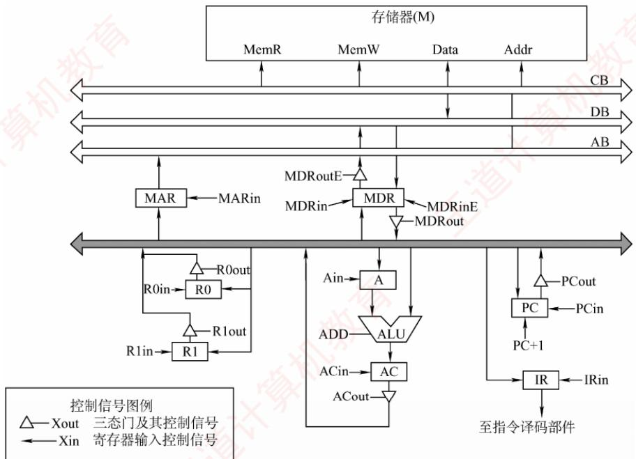
</div>

　　下表给出了上述指令取指和译码阶段每个节拍（时钟周期）的功能和有效控制信号，请按表中描述方式用表格列出指令执行阶段每个节拍的功能和有效控制信号。

<table><tr><td>时钟</td><td>功能</td><td>有效控制信号</td></tr><tr><td>C1</td><td>MAR←(PC)</td><td>PCout, MARin</td></tr><tr><td>C2</td><td>MDR←M(MAR)PC←(PC)+1</td><td>MemR, MDRinEPC+1</td></tr><tr><td>C3</td><td>IR←(MDR)</td><td>MDRout, IRin</td></tr><tr><td>C4</td><td>指令译码</td><td>无</td></tr></table>

08. 【2015 统考真题】某16位计算机的主存按字节编码，存取单位为16位；采用16位定长指令字格式；CPU采用单总线结构，主要部分如下图所示。图中R0～R3为通用寄存器；T为暂存器；SR为移位寄存器，可实现直送（mov）、左移一位（left）和右移一位（right）三种操作，控制信号为SRop，SR的输出由信号SRout控制；ALU可实现直送A（mova）、A加B（add）、A减B（sub）、A与B（and）、A或B（or）、非A（not）、A加1（inc）七种操作，控制信号为ALUop。

　　回答下列问题:

1）图中哪些寄存器是程序员可见的？为何要设置暂存器T?2）控制信号ALUop和SRop的位数至少各是多少？3）控制信号SRout所控制部件的名称或作用是什么？4）端点①～⑨中，哪些端点须连接到控制部件的输出端？

5）为完善单总线数据通路，需要在端点①～⑨中相应的端点之间添加必要的连线。写出连线的起点和终点，以正确表示数据的流动方向。

6）为什么二路选择器MUX的一个输入端是2？

<div align="center">
  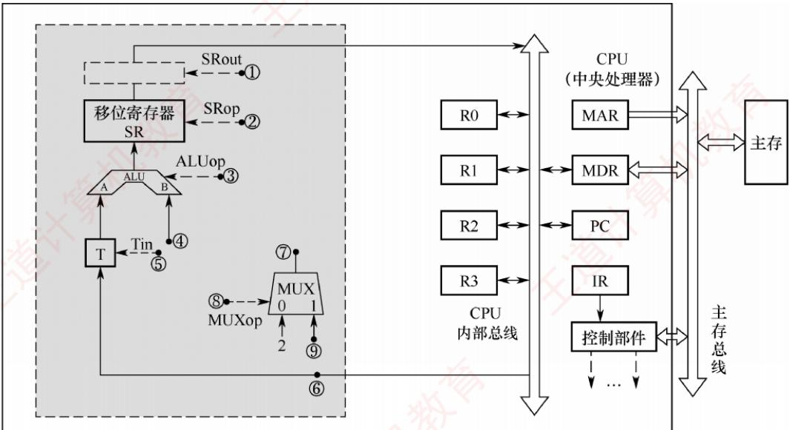
</div>

09. 【2015 统考真题】上题中描述的计算机，某部分指令执行过程的控制信号如下所示。

<div align="center">
  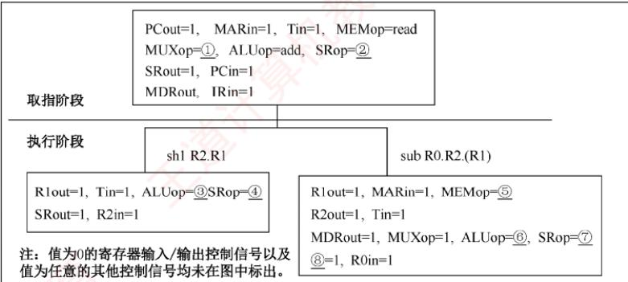
</div>

　　该机指令格式如下图所示，支持寄存器直接和寄存器间接两种寻址方式，寻址方式位分别为0和1，通用寄存器R0～R3的编号分别为0,1,2和3。

<table><tr><td>指令操作码</td><td colspan="2">目的操作数</td><td colspan="2">源操作数1</td><td colspan="2">源操作数2</td></tr><tr><td>OP</td><td>Md</td><td>Rd</td><td>Ms1</td><td>Rs1</td><td>Ms2</td><td>Rs2</td></tr></table>

　　回答下列问题:

1）该机的指令系统最多可定义多少条指令？

2）假定 inc、shl 和 sub 指令的操作码分别为 01H、02H 和 03H，则以下指令对应的机器代码各是什么？
① inc R1 ; (R1) + 1 → R1
② shl R2, R1 ; (R1) << 1 → R2
③ sub R3, (R1), R2 ; ((R1)) - (R2) → R3

3）假设寄存器 X 的输入和输出控制信号分别为 Xin 和 Xout，其值为 1 表示有效，为 0 表示无效（如 PCout = 1 表示 PC 内容送总线）；存储器控制信号为 MEMop，用于控制存储器的读（read）和写（write）操作。写出本题第一幅图中标号①～⑧处的控制信号或控制信号的取值。

4）指令“sub R1, R3, (R2)”和“inc R1”的执行阶段至少各需要多少个时钟周期？

10. 【2022 统考真题】某CPU中部分数据通路如下图所示，其中，GPRs为通用寄存器组；FR为标志寄存器，用于存放ALU产生的标志信息；带箭头虚线表示控制信号，如控制信号Read、Write分别表示主存读、主存写，MDRin表示内部总线上的数据写入MDR，MDRout表示MDR的内容送给内部总线。

<div align="center">
  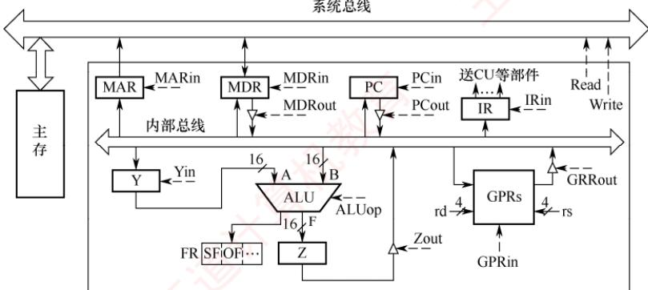
</div>

　　请回答下列问题。

1）设 ALU 的输入端 A、B 及输出端 F 的最高位分别为 $A_{15}$ 、 $B_{15}$ 及 $F_{15}$ ，FR 中的符号标志和溢出标志分别为 SF 和 OF，则 SF 的逻辑表达式是什么？A 加 B、A 减 B 时 OF 的逻辑表达式分别是什么？要求逻辑表达式的输入变量为 $A_{15}$ 、 $B_{15}$ 及 $F_{15}$ 。

2）为什么要设置暂存器Y和Z?

3）若 GPRs 的输入端 rs、rd 分别为所读、写的通用寄存器的编号，则 GPRs 中最多有多少个通用寄存器？rs 和 rd 来自图中的哪个寄存器？已知 GPRs 内部有一个地址译码器和一个多路选择器，rd 应连接地址译码器还是多路选择器？

4）取指令阶段（不考虑PC增量操作）的控制信号序列是什么？若从发出主存读指令到主存读出数据并传送到MDR共需5个时钟周期，则取指令阶段至少需要几个时钟周期？

5）图中控制信号由什么部件产生？图中哪些寄存器的输出信号会连到该部件的输入端？

### 5.3.6 答案与解析

#### 一、单项选择题

**01. C**

　　对 CPU 而言，数据通路的基本结构分为总线结构和专用数据通路结构，其中总线结构又分为单总线结构、双总线结构、多总线结构。

**02. D**

　　数据通路中的部件包括组合逻辑元件和时序逻辑元件。数据通路的功能由控制部件送出的控制信号决定。数据通路中一个重要的组合逻辑元件为 ALU，用于执行各类算术和逻辑运算；另一个重要的元件为通用寄存器，属于时序逻辑元件。

**03. C**

　　操作元件的输出仅取决于当前的输入，不受时钟信号的控制，也没有存储数据的功能。状态元件的最大特点是具有存储数据的功能。算术逻辑部件和译码器都不具有存储功能，属于操作元件；移位寄存器和存储器数据寄存器属于不同功能的寄存器，具有存储功能，属于状态元件。

**04. D**

　　因为 ALU 是一个组合逻辑元件，所以其运算过程中必须保持两个输入端的内容不变。又因为 CPU 内部采用单总线结构，所以为了得到两个不同的操作数，ALU 的一个输入端与总线相连，另一个输入端需通过一个寄存器与总线相连。此外，ALU 的输出端也不能直接与内部总线相连，否则其输出又会通过总线反馈到输入端，影响运算结果，因此输出端需通过一个暂存器（用来暂存结果的寄存器）与总线相连。

**05. C**

　　三态门可视为一种控制开关，由控制端决定信号线的通断，能输出到内部总线的部件均通过一个三态门与内部总线相连，用于控制该部件与内部总线之间数据通路的连接与断开。

**06. B**

　　当 CPU 内部电路采用总线连接方式时，总线上信号流动的原则如下：每个时刻只有一个器件发出信息（否则会导致总线冲突），每个时刻可以有一个或多个器件接收信息。

**07. A**

　　CPU 通过时钟信号定时执行指令，但并非每个时钟周期都会执行一条新指令。在多周期 CPU 中，指令的执行被划分为多个阶段，每个时钟周期开始执行一个阶段，选项 A 错误。每个阶段的操作通常由时钟信号的上升沿或下降沿触发，称为边沿触发，并且决定了状态元件（如寄存器）的状态改变。为确保每个阶段都在一个时钟周期内完成，时钟周期必须足够长，以便数据能在最慢的组合逻辑电路中传输，因此时钟周期通常根据相邻状态单元之间最长的组合逻辑延迟来确定。

**08. A**

　　说法 I 不一定：主存访问受存储器速度限制，通常需要多个时钟周期。说法 II 一定：单周期 CPU 的每条指令在一个时钟周期内完成。说法 III 一定：在 CPU 内部数据通路中，数据从一个状态元件传送到另一个状态元件的操作由时钟同步，耗时等于一个时钟周期。说法 IV 一定：流水段寄存器之间的数据传递由时钟边沿触发，严格对应一个时钟周期。说法 V 不一定：ALU 运算由组合逻辑实现，其延迟由电路决定，在单周期 CPU 中必须小于一个时钟周期，以满足单周期设计约束。

**09. A**

　　单周期 CPU 要求所有指令在一个时钟周期内完成，其时钟周期由最慢指令决定；加入复杂指令会显著延长时钟周期，拖累整体性能。而多周期 CPU 可将复杂指令分解为多个节拍，每节拍使用标准周期，不影响主频，更易支持复杂操作。单周期 CPU 需大量专用通路实现并行，硬件冗余高、利用率低；多周期 CPU 通过部件复用，资源利用更高效。

**10. C**

　　多周期 CPU 中的指令通常需要多个时钟周期才能完成，CPI > 1；单周期 CPU 的每条指令在一个时钟周期内完成，CPI = 1。单周期 CPU 的时钟周期取决于最复杂指令的耗时，通常比多周期 CPU 的时钟周期长。在一条指令的执行过程中，单周期 CPU 的每个控制信号保持不变，每个部件只能使用一次；多周期 CPU 的控制信号可能发生改变，同一个部件可使用多次。

**11. C**

　　单周期 CPU 需要在一个时钟周期内并行完成取指、运算和访存，而单总线结构无法同时传输多路数据；其时钟周期由最慢指令决定，通常远大于多周期 CPU，总执行时间未必更短。多周期 CPU 通过分时复用，在不同节拍访问同一存储器，实现指令与数据共存；而单周期 CPU 需要在同一时钟周期内取指和访存，必须采用分离的指令/数据存储器，选项 C 正确。由于需要专用通路和冗余硬件以支持并行操作，单周期 CPU 的芯片面积与成本通常高于采用部件复用的多周期 CPU。

**12. B**

　　单总线结构通过一条共享总线分时串行传输数据，硬件简单、状态少、控制逻辑简洁；但因同一时刻仅能传输一次数据，性能较低，且容易引发总线冲突。相比之下，专用通路结构采用独立连线支持并行操作，性能更高、冲突更少，也相应带来了更大的硬件规模。

**13. D**

　　读/写控制信号线决定了是从存储器读还是向存储器写，显然选项 A、B、C 都正确。

**14. C**

　　单周期 CPU 在一个时钟周期内完成整条指令的执行：指令从存储器读出后，其各字段（如 opcode、rs、rt、imm）通过组合逻辑直接驱动控制单元、寄存器堆和 ALU 等部件，解析与执行同步进行，无须经由 IR 暂存；若设置 IR，则取指到 IR 至少需要一个时钟周期，违背单周期设计原则。此外，PC 每周期无条件更新为下一条指令地址，始终写入，无须 “写使能” 信号。

**15. A**

　　单周期处理器中所有指令的指令周期为一个时钟周期，选项 D 正确。因为每条指令的 CPI 为 1，要考虑比较慢的指令，所以处理器的时钟频率较低，选项 B 正确。单总线数据通路将所有寄存器的输入/输出端都连接在一条公共通路上，一个时钟内只允许一次操作，无法完成指令的所有操作，选项 A 错误。控制信号是 CU 根据指令操作码发出的信号，对于单周期处理器来说，每条指令的执行只有一个时钟周期，而在一个时钟周期内控制信号并不会变化；若是多周期处理器，则指令的执行需要多个时钟周期，在每个时钟周期控制器会发出不同信号，选项 C 正确。

**16. D**

　　时钟信号的宽度称为时钟周期，时钟周期的倒数为机器主频。时钟信号由机器脉冲源发出的脉冲信号经整形和分频后形成，时钟周期以相邻状态单元间组合逻辑电路的最大延迟为基准确定。对于单周期 CPU，一个指令周期就是一个时钟周期，每个时钟周期执行一条新指令；对于多周期 CPU，每个指令周期（包含若干时钟周期）执行一条新指令；对于流水线 CPU，只有在理想情况下才能实现每个时钟周期执行一条新指令，选项 D 的描述有误。

**17. C**

　　指令执行过程中数据所经过的路径，包括路径上的部件，称为数据通路。ALU、通用寄存器、状态寄存器、Cache、MMU、浮点运算逻辑、异常和中断处理逻辑等，都是指令执行过程中数据流经的部件，都属于数据通路的一部分。数据通路中的数据流动路径由控制部件控制，控制部件根据每条指令功能的不同，生成对数据通路的控制信号。选项 C 错误。

**18. B**

　　组合逻辑元件（操作元件）不含存储信号的记忆单元，任何时刻产生的输出仅取决于当前的输入，加法器、算术逻辑单元（ALU）、译码器、多路选择器、三态门等都属于操作元件。时序逻辑元件（状态元件）包含存储信号的记忆单元，各类寄存器和存储器，如通用寄存器组、程序计数器、状态/移位/暂存/锁存寄存器等，都属于状态元件。

#### 二、综合应用题

**01. 【解答】**

　　实现 ADD R1, (R2) 的微操作序列如下:

```csv
微操作
(PC)→MAR
M→MDR
(PC) + 1→PC
(MDR) → IR
(R1) → LA
(R2) → MAR
M→MDR
(MDR) → LB
(LA) + (LB) → R1
```

**02. 【解答】**

　　两条指令的微操作序列和控制信号如下。

(1) ADD B, C 指令。

```csv
微操作
(PC) → MAR
(PC) + 1 → PC
M (MAR) → MDR
MDR → IR
(B) → Y
(Y) + (C) → Z
(Z) → B

控制信号
PCout, MARin
+1
MDRin
MDRout, IRin
Bout, Yin
Cout, ALUin, “+”
Zout, Bin
```

(2) SUB ACC, H 指令。

<table><tr><td>微操作(PC)→MAR(PC)+1→PCM(MAR)→MDR</td><td>控制信号PCout, MARin+1MDRin</td></tr></table>

<table><tr><td>MDR→IR(ACC)→Y(Y)-(H)→Z(Z)→ACC</td><td>MDRout, IRinACCout, YinHout, ALUin, “-”Zout, ACCin</td></tr></table>

　　注：Y 是与 ALU 的一个输入端相连接的暂存器。

**03. 【解答】**

　　指令 ADD (R0), R1 的功能是把 R0 的内容作为地址送到主存中取得一个操作数，再与 R1 中的内容相加，最后将结果送回主存，即实现 $((R0)) + (R1) \rightarrow (R0)$ 。其流程和控制信号如下。

##### 1） 取指周期：公共操作。

<table><tr><td>时序</td><td>微操作</td><td>有效控制信号</td><td>具体功能</td></tr><tr><td>1</td><td>(PC)→MAR</td><td>PCout, MARin</td><td>将PC经内部总线送至MAR</td></tr><tr><td>2</td><td>M(MAR)→MDR, Read</td><td>MemR, MARout, MDRinE</td><td>主存通过数据总线将MAR所指单元的内容送至MDR</td></tr><tr><td>3</td><td>(MDR)→IR</td><td>MDRout, IRin</td><td>将MDR的内容送至IR</td></tr><tr><td>4</td><td>指令译码</td><td>-</td><td>操作字开始控制CU</td></tr><tr><td>5</td><td>(PC)+1→PC</td><td>-</td><td>当PC加1有效时,使PC内容加1</td></tr></table>

2）取数周期：完成取数操作，被加数在主存中，加数已经放在寄存器R1中。

<table><tr><td>时序</td><td>微操作</td><td>有效控制信号</td><td>具体功能</td></tr><tr><td>1</td><td>(R0)→MAR</td><td>R0out, MARin</td><td>将 R0 中的地址(形式地址)送至存储器地址寄存器</td></tr><tr><td>2</td><td>M(MAR)→MDR</td><td>MemR, MARout, MDRinE</td><td>主存通过数据总线将 MAR 所指单元的内容(有效地址)送至 MDR 中</td></tr><tr><td>3</td><td>(MDR)→Y</td><td>MDRout, Yin</td><td>将 MDR 中数据通过数据总线送至 Y</td></tr></table>

3）执行周期：完成加法运算，并将结果返回主存。

<table><tr><td>时序</td><td>微操作</td><td>有效控制信号</td><td>具体功能</td></tr><tr><td>1</td><td>(R1) + (Y)→Z</td><td>R1out, ALUin, CU向ALU发ADD控制信号</td><td>R1的内容和Y的内容相加,结果送至寄存器Z</td></tr><tr><td>2</td><td>(Z)→MDR</td><td>Zout, MDRin</td><td>将运算结果送至MDR</td></tr><tr><td>3</td><td>(MDR)→M(MAR)</td><td>MemW, MDRoutE, MARout</td><td>向主存写入数据</td></tr></table>

**04. 【解答】**

1）b 单向连接微控制器，由微控制器的作用可以推出 b 是 IR；a 和 c 直接连接主存，只可能是 MDR 和 MAR，c 到主存是单向连接，a 和主存双向连接，根据指令执行的特点，MAR 只单向给主存传送地址，而 MDR 既存放从主存中取出的数据，又存放将要写入主存的数据，因此 c 为 MAR，a 为 MDR。d 具有自动加 1 的功能，且单向连接 MAR，为 PC。因此，a 为 MDR，b 为 IR，c 为 MAR，d 为 PC。

2）将指令地址从 PC 送入 MAR，在相关的控制下从主存中取出指令送至 MDR，然后将 MDR 中的指令送至 IR，最后流向微控制器。取指令的数据通路为

$$
\mathrm{PC} \rightarrow \mathrm{MAR} \rightarrow \text {主存} \rightarrow \mathrm{MDR} \rightarrow \mathrm{IR}
$$

3）根据 MAR 中的地址从主存取数据，将取出的数据送至 MDR，然后将 MDR 中的数据送至 ALU 进行运算，运算的结果送至 ACC。存储器读的数据通路为
　　MAR（先置数据地址），主存→MDR→ALU→ACC
　　将 ACC 中的结果送至 MDR，再将 MDR 中的数据写入主存。存储器写的数据通路为
　　MAR（先置数据地址），ACC→MDR→主存

##### 4） 指令 LDA X 的数据通路为

$$
\mathrm{X} \rightarrow \mathrm{MAR} \rightarrow \text {主存} \rightarrow \mathrm{MDR} \rightarrow \mathrm{ALU} \rightarrow \mathrm{ACC}
$$

5）指令 ADD Y 的数据通路为

$$
\begin{array}{c}\mathrm{Y} \rightarrow \mathrm{MAR} \rightarrow \text {主存} \rightarrow \mathrm{MDR}\\\mathrm{ACC}\end{array}\quad\begin{array}{c}\longrightarrow\\\mathrm{ALU} \rightarrow \mathrm{ACC}\end{array}
$$

6）指令 STA Z 的数据通路为（ACC 中的数据需放在主存中）

$$
\mathrm{Z} \rightarrow \mathrm{MAR}, \mathrm{ACC} \rightarrow \mathrm{MDR} \rightarrow \text {主存}
$$

**05. 【解答】**

1）各功能部件的连接关系及数据通路如下图所示。

<div align="center">
  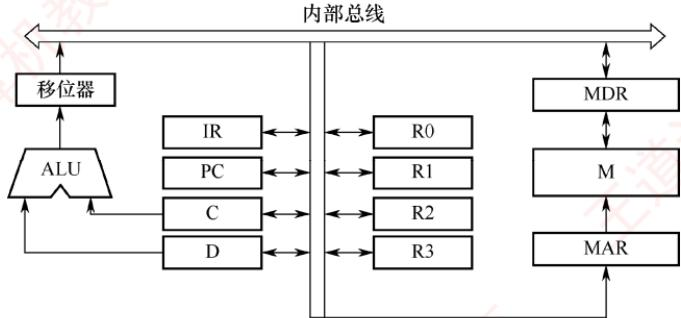
</div>

2）分析过程如下：

- 取指令地址送到 IR 并译码。

- 取源操作数和目的操作数。

- 将源操作数和目的操作数相加送到 MAR，随之送到以前目的操作数所在内存的地址。

- 将寄存器 R2 的内容加 1。

　　取指周期流程如下图所示。

<div align="center">
  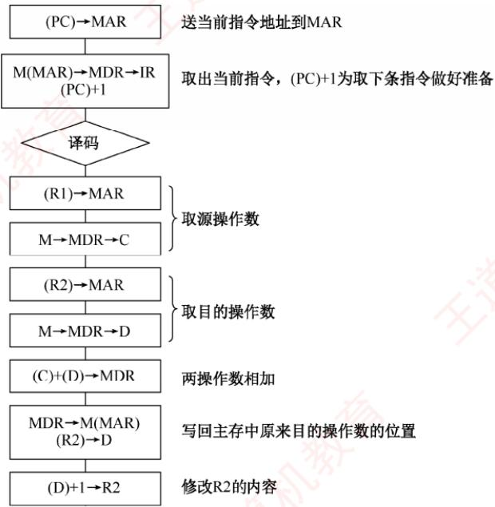
</div>

**06. 【解答】**

　　ADD X, D 指令周期信息流程和相应的控制信号见下表。

<table><tr><td>周期</td><td>微操作</td><td>有效控制信号</td></tr><tr><td rowspan="3">取指周期</td><td>(PC)→MAR</td><td><eq>PC_{o}, MAR_{i}</eq></td></tr><tr><td>M(MAR)→MDR(PC) + 1→PC</td><td><eq>MAR_{o}, R/W, MDR_{i}+1</eq></td></tr><tr><td>(MDR)→IR</td><td><eq>MDR_{o}, IR_{i}</eq></td></tr><tr><td rowspan="6">执行周期</td><td>(XR) + Ad(IR)→EAR</td><td><eq>XR_{o}, IR_{o}, +, EAR_{i}</eq></td></tr><tr><td>(EAR)→MAR</td><td><eq>EAR_{o}, MAR_{i}</eq></td></tr><tr><td>M(MAR)→MDR</td><td><eq>MAR_{o}, R/W, MDR_{i}</eq></td></tr><tr><td>(MDR)→X</td><td><eq>MDR_{o}, X_{i}</eq></td></tr><tr><td>(ACC) + (X)→LATCH</td><td><eq>ACC_{o}, X_{o}, K_{i} = +, LATCH_{i}</eq></td></tr><tr><td>(LATCH)→ACC</td><td><eq>LATCH_{o}, ACC_{i}</eq></td></tr></table>

　　注：题目中的 D 即为 Ad(IR)。

**07. 【解答】**

　　题干已给出取值和译码阶段每个节拍的功能和有效控制信号，我们应以了解取指阶段中数据通路的信息流动为突破口，读懂每个节拍的功能和有效控制信号，然后应用到解题思路中，包括划分执行步骤、确定完成的功能、需要的控制信号。

　　先分析题干中提供的示例（本部分解题时不做要求）：

　　取指令的功能是根据 PC 的内容所指的主存地址，取出指令代码，经过 MDR，最终送至 IR。这部分和后面的指令执行阶段的取操作数、存运算结果的方法是相通的。

C1: (PC)→MAR

　　在读/写存储器前，必须先将地址（这里为(PC)）送至 MAR。

C2: M(MAR)→MDR, (PC) + 1→PC

　　读/写的数据必须经过 MDR，指令取出后 PC 自增 1。

C3: (MDR)→IR

　　然后将读到的 MDR 中的指令代码送至 IR 进行后续操作。

　　指令 “ADD (R1), R0” 的操作数一个在主存中，一个在寄存器中，运算结果在主存中。根据指令功能，要读出 R1 的内容所指的主存单元，必须先将 R1 的内容送至 MAR，即 $(R1) \rightarrow MAR$ 。而读出的数据必须经过 MDR，即 $M(MAR) \rightarrow MDR$ 。

　　因此，将 R1 的内容所指的主存单元的数据读出到 MDR 的节拍安排如下：

C5: (R1)→MAR

C6: M(MAR)→MDR

　　ALU 一端是寄存器 A，MDR 或 R0 中必须有一个先写入 A 中，如 MDR。

C7: (MDR)→A

　　然后执行加法操作，并将结果送入寄存器 AC。

C8: (A) + (R0) → AC

　　之后将加法结果写回到 R1 的内容所指的主存单元，注意 MAR 中的内容没有改变。

C9: (AC)→MDR

C10: (MDR)→M(MAR)

　　有效控制信号的安排并不难，只需看数据是流入还是流出，如流入寄存器 X 就是 Xin，流出寄存器 X 就是 Xout。还需注意其他特殊控制信号，如 PC + 1、Add 等。

　　于是得到参考答案如下表所示。

<table><tr><td>时钟</td><td>功能</td><td>有效控制信号</td></tr><tr><td>C5</td><td>MAR←(R1)</td><td>R1out, MARin</td></tr><tr><td>C6</td><td>MDR←M(MAR)</td><td>MemR, MDRinE</td></tr><tr><td>C7</td><td>A←(MDR)</td><td>MDRout, Ain</td></tr><tr><td>C8</td><td>AC←(A) + (R0)</td><td>R0out, ADD, ACin</td></tr><tr><td>C9</td><td>MDR←(AC)</td><td>ACout, MDRin</td></tr><tr><td>C10</td><td>M(MAR)←(MDR)</td><td>MDRoutE, MemW</td></tr></table>

　　本题答案不唯一，若在 C6 执行 M(MAR)→MDR 的同时，完成(R0)→A [选择将(R0)写入 A]，并不会发生总线冲突，这种方案可节省 1 个节拍，见下表。

<table><tr><td>时钟</td><td>功能</td><td>有效控制信号</td></tr><tr><td>C5</td><td>MAR←(R1)</td><td>R1out, MARin</td></tr><tr><td>C6</td><td>MDR←M(MAR), A←(R0)</td><td>MemR, MDRinE, R0out, Ain</td></tr><tr><td>C7</td><td>AC←(MDR) + (A)</td><td>MDRout, ADD, ACin</td></tr><tr><td>C8</td><td>MDR←(AC)</td><td>ACout, MDRin</td></tr><tr><td>C9</td><td>M(MAR)←(MDR)</td><td>MDRoutE, MemW</td></tr></table>

**08. 【解答】**

1）程序员可见寄存器为通用寄存器（R0～R3）和PC。因为采用了单总线结构，因此若无暂存器T，则ALU的A、B端口会同时获得两个相同的数据，使数据通路不能正常工作。

2）ALU共有7种操作，其操作控制信号ALUop至少需要3位；移位寄存器有3种操作，其操作控制信号SRop至少需要2位。

3）信号SRout所控制的部件是一个三态门，用于控制移位器与总线之间数据通路的连接与断开。

4）端口①、②、③、⑤、⑧须连接到控制部件输出端。

5）连线1，⑥→⑨；连线2，⑦→④。

6）因为每条指令的长度为16位，按字节编址，所以每条指令占用2个内存单元，顺序执行时，下条指令地址为 $(\mathrm{PC}) + 2$ 。MUX的一个输入端为2，可便于执行 $(\mathrm{PC}) + 2$ 操作。

**09. 【解答】**

1）指令操作码有7位，因此最多可定义 $2^{7}=128$ 条指令。

2）各条指令的机器代码如下：

　　① “inc R1” 的机器码为 0000001 0 01 0 00 0 00，即 0240H。

　　② “shl R2, R1” 的机器码为 0000010 0 10 0 01 0 00，即 0488H。

　　③ “sub R3, (R1), R2” 的机器码为 0000011 0 11 1 01 0 10，即 06EAH。

3）各标号处的控制信号或控制信号取值如下：

①0; ②mov; ③mova; ④left; ⑤read; ⑥sub; ⑦mov; ⑧SRout。

4）指令 “sub R1, R3, (R2)” 的执行阶段至少包含 4 个时钟周期；指令 “inc R1” 的执行阶段至少包含 2 个时钟周期。

#### 10. 【解析】

1）符号标志 SF 表示运算结果的正负性，因此 $SF = F_{15}$ 。

　　对于加法运算 $A + B \rightarrow F$ ，若 A、B 为负，且 F 为正，则说明发生溢出；或者，若 A、B 为正，且 F 为负，也说明发生溢出。因此，加运算时，溢出标志 $OF = \overline{A_{15}} \cdot \overline{B_{15}} \cdot F_{15} + A_{15} \cdot B_{15} \cdot \overline{F_{15}}$ 。对于减法运算 $A - B \rightarrow F$ ，若 A 为负、B 为正，且 F 为正，则说明发生溢出；或者，若 A 为正、B 为负，且 F 为负，也说明发生溢出。因此，减运算时，溢出标志 $OF = \overline{A_{15}} \cdot B_{15} \cdot F_{15} +$

$$
\mathrm{A} _ {1 5} \cdot \overline {{\mathrm{B} _ {1 5}}} \cdot \overline {{\mathrm{F} _ {1 5}}} 。
$$

2）因为在单总线结构中，每一时刻总线上只有一个数据有效，而 ALU 有两个输入端和一个输出端。因此，当 ALU 运算时，需要先用暂存器 Y 缓存其中一个输入端的数据，再通过总线传送另一个输入端的数据。与此同时，ALU 的输出端产生运算结果，但总线正被占用，因此需要暂存器 Z，以缓存 ALU 的输出端数据。

3）由图可知，rs 和 rd 都是 4bit，因此 GPRs 中最多有 $2^{4} = 16$ 个通用寄存器；rs 和 rd 来自指令寄存器（IR）；rd 表示寄存器编号，应连接地址译码器。

4）取指阶段需要根据程序计数器（PC）取出主存中的指令，并将指令写入指令寄存器（IR）中。控制信号序列如下：

$$
\begin{array}{l l} \text {① PCout, MARin} & / / \text {将指令的地址写入MAR} \\ \text {② Read} & / / \text {读主存，并将读出的数据写入MDR} \\ \text {③ MDRout, IRin} & / / \text {将MDR的内容写入指令寄存器（IR）} \end{array}
$$

　　步骤①需要1个时钟周期，步骤②需要5个时钟周期，步骤③需要1个时钟周期，因此取指令阶段至少需要7个时钟周期。

5）图中控制信号由控制部件（CU）产生。指令寄存器（IR）和标志寄存器（FR）的输出信号会连到控制部件的输入端。

## 5.4 控制器的功能和工作原理

### 5.4.1 控制器的结构和功能

　　在计算机硬件系统中（见图 5.12），主要由执行部件、主存储器、输入/输出设备及控制器组成。各组件通过数据总线、地址总线和控制总线相互连接，其中虚线框内为控制器。

<div align="center">
  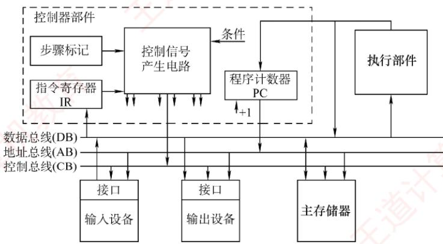
</div>

<p align="center"><em>图 5.12 计算机硬件系统和控制器部件的组成</em></p>

　　各部件的主要连接关系如下:

1）执行部件经由数据总线与主存及 I/O 设备交换数据。

2）输入/输出设备通过接口电路接入系统总线。

3）主存及I/O设备根据地址总线上的地址信号判断是否被选中，并依据控制总线上的读/写等控制信号，通过数据总线完成数据传输。

4）控制器通过地址总线发送指令地址（PC的值）访问主存，并将获取的指令通过数据总线送入指令寄存器（IR），由控制器解析并控制执行。

　　控制器是计算机的指挥中心，其主要职责包括：

1）取出待执行的指令并计算下一条指令的位置（更新PC）。

2）对指令的操作码进行解码，产生对应的时序信号和控制信号，以协调各部件工作。

3）管理 CPU、主存和 I/O 设备间的数据流向及时序，确保指令正确执行。

　　依据微操作控制信号的生成方式不同，控制器可分为硬布线控制器和微程序控制器。尽管两者都包含 PC 和 IR，但在指令执行步骤的表现形式以及控制信号的生成机制上有着本质区别。

### 5.4.2 硬布线控制器

　　硬布线控制器由复杂的组合逻辑电路和触发器构成，也称组合逻辑控制器。它根据指令需求、

　　当前时序和内部状态，按时间顺序生成一系列微操作控制信号，以完成指令的执行。指令的操作码是决定控制单元（CU）行为的关键：CU 作为处理器的“指挥中心”，依据操作码生成相应的控制信号，协调寄存器、ALU、存储器等硬件组件的工作。

　　为简化 CU 的设计, 通常将指令寄存器(IR)中的 n 位操作码通过译码电路转换为 $2^{n}$ 个输出信号。每种操作码经译码后, 会唯一地激活一条输出信号线, 用于触发对应的控制逻辑。若将操作译码器和节拍发生器从 CU 中分离, 则可得到如图 5.13 所示的简化控制单元结构。

<div align="center">
  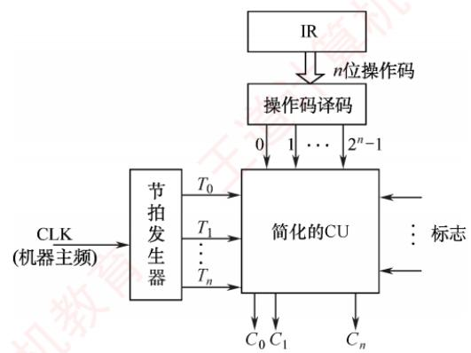
</div>

<p align="center"><em>图 5.13 带指令译码器和节拍输入的简化的控制单元框图</em></p>

　　CU 的输入主要包括三类信号:

1）操作译码器输出的指令信息，与节拍信号共同用于生成相应的微操作控制信号。

2）时钟脉冲，其频率即机器主频，用于划分节拍，确保控制信号按时发出。

3）执行单元反馈的状态标志，使 CU 能根据 CPU 当前状态动态调整控制逻辑。

　　在图 5.13 中，节拍发生器在每个时钟周期内产生节拍信号，使不同的微操作控制信号 $C_{i}$ 能够按序发出。由于某些指令（如条件转移）的执行不仅取决于操作码，还受状态标志影响，CU 必须综合操作码译码结果、节拍信号和状态标志，生成相应的控制信号，并发送至 CPU 内部数据通路或外部控制总线。

　　硬布线控制器通过组合逻辑电路实现，其性能主要受限于电路延迟。设计时，先用逻辑表达式描述各控制信号，经化简后实现为硬件电路。该方法虽响应速度快，但灵活性差：修改或新增指令需重新设计电路，复杂且耗时。同时，随着指令系统功能增强，微操作控制信号的数量急剧增加，导致电路规模庞大、调试困难。为克服这些缺点，微程序设计方法应运而生。

### 5.4.3 微程序控制器

　　微程序控制器采用存储逻辑实现，其核心思想是：将控制器所需的微操作控制信号组织为微指令，并将执行每条机器指令所需的微指令序列（微程序）预先存入一个专用的高速存储器中。运行时，控制器通过依次读取微指令，生成相应的微操作控制信号，从而完成指令的执行。

#### 1. 微程序控制的基本概念

　　微程序的设计思想是将每条机器指令编写为一段微程序。该微程序由若干条微指令组成，每条微指令可产生一个或多个微命令。因此，执行一条机器指令的过程，实质上就是顺序执行其对应微程序的过程。这些微程序预先存放在专用的控制存储器（Control Memory，CM）中。

　　微程序设计涉及以下基本术语：

##### （1） 微命令与微操作

　　在微程序控制的计算机中，控制部件向执行部件发出的最基本控制信号称为微命令，它是构成控制序列的最小单位。例如，使能某个寄存器的写入信号、打开数据通路中的控制门等。执行部件接收到微命令后所执行的具体动作称为微操作，二者一一对应。

　　微命令可分为两类：相容性微命令是指可同时有效、协同完成某一功能的微命令；互斥性微命令是指在同一时刻不允许同时有效的微命令。

> **注意**

　　硬布线控制器中同样存在微命令与微操作的概念，只是其实现方式不同。

##### （2） 微指令与微周期

　　微指令是若干微命令的集合，通常包含两个字段：

　　① 操作控制字段（又称微操作码字段）：用于生成当前步骤所需的微操作控制信号。

　　② 顺序控制字段（又称下址字段）：用于确定下一条微指令的地址。

　　微周期是执行一条微指令所需的基本时间单位，通常为一个时钟周期。

　　综上，机器指令、微程序、微指令、微命令与微操作之间的层次关系如图 5.14 所示。

<div align="center">
  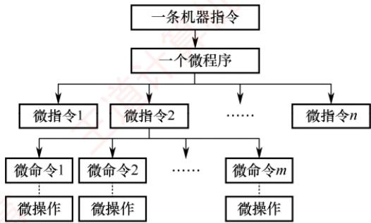
</div>

<p align="center"><em>图 5.14 机器指令、微程序、微指令、微命令与微操作之间的层次关系</em></p>

##### （3） 主存储器与控制存储器

> **考点追踪：** 主存储器和控制存储器的区别（2017）

　　主存储器用于存放程序和数据，位于 CPU 外部，通常用 RAM 实现。控制存储器用于存放微程序，位于 CPU 内部，通常用 ROM 实现。控制存储器中每个存储单元的地址称为微地址。

##### （4） 程序与微程序

　　微程序和程序是两个不同的概念。程序是指令的有序集合，由软件开发者编写，用于完成特定功能，最终存放在主存或辅存中；微程序是微指令的有序集合，由计算机体系结构设计者编写，用于解释和执行机器指令，固化于控制存储器中。微程序本质上是机器指令的硬件级解释逻辑。对程序员而言，微程序的存在完全透明，无须了解其内部结构。

　　为准确理解微程序控制器的工作机制，需要区分以下关键寄存器：

　　① 地址寄存器（MAR），存放主存读/写地址。

　　② 微地址寄存器（μPC 或 CMAR），存放待执行微指令在控制存储器中的微地址。

　　③ 指令寄存器（IR），存放从主存读出的当前机器指令。

　　④ 微指令寄存器（μIR 或 CMDR），存放从控制存储器读出的当前微指令。

#### 2. 微程序控制器的组成和工作过程

##### （1） 微程序控制器的基本组成

　　图 5.15 展示了微程序控制器的基本结构，其主要由以下部件构成：

　　① 微地址形成部件，根据机器指令的操作码生成对应微程序的入口地址，并依据当前微指令的顺序控制字段及状态条件，产生后续微地址，确保微指令有序执行。

　　② 微指令地址寄存器，接收微地址形成部件提供的微地址，作为 CM 的读地址。

　　③ 控制存储器，微程序控制器的核心部件，用于存放所有机器指令对应的微程序。

　　④ 微指令寄存器，暂存从 CM 中读出的微指令，并将其操作控制字段和顺序控制字段分别送至执行单元和微地址形成部件。

<div align="center">
  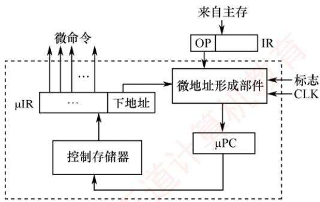
</div>

<p align="center"><em>图 5.15 微程序控制器的基本结构</em></p>

(2) 微程序控制器的工作过程

　　微程序控制器的工作过程是指计算机在微程序控制下执行机器指令的流程，具体如下：

　　① 执行取指令公共操作。系统启动或每条指令执行完毕后，将取指微程序的入口地址（通常为 CM 的 0 号单元）送入 $\mu$ PC。随后，从 CM 中读取首条取指微指令并送入 $\mu$ IR。完成取指微程序后，从主存中取出的机器指令即被存入指令寄存器（IR）中。

　　② 生成当前指令的微程序入口地址：根据 IR 中机器指令的操作码，通过微地址形成部件产生对应微程序的起始微地址，并送入 $\mu$ PC。

　　③ 顺序执行微程序：从 CM 逐条读取微指令，送入 $\mu$ IR 并执行，直至该微程序执行完毕。

　　④ 返回循环：当前机器指令对应的微程序执行结束后，控制器自动转移回取指微程序的入口（步骤①），重新开始处理下一条机器指令。

　　整个流程不断循环，直至整个程序执行完毕。

##### （3） 微程序和机器指令

　　一般而言，一条机器指令对应一个微程序。由于所有指令的取指操作相同，可将取指操作的微命令统一编写为一个公共的取指微程序，专门负责从主存读取指令并送入 IR。此外，还可以为间址、中断处理等公共操作分别编写独立的微程序。因此，控制存储器中存储的微程序总数 = 机器指令条数 + 公共微程序数（如取指、间址、中断等）。

#### 3. 微指令的编码方式

　　微指令的编码方式也称微指令的控制方式，是指对微指令操作控制字段进行组织和表示的方法，其目标是在保证执行速度的前提下，尽可能缩短微指令字长，从而节省控制存储器空间。

##### （1） 直接编码（直接控制）方式

　　如图 5.16 所示，直接编码方式无须译码。微指令的操作控制字段中，每一位直接对应一个微命令。设计微指令时，若需发出某个微命令，只需将对应位设为 1，否则设为 0。每个微命令独立控制数据通路中的一个微操作。

<div align="center">
  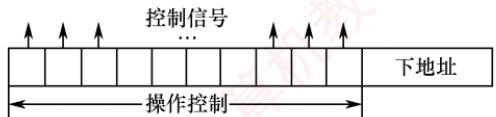
</div>

<p align="center"><em>图 5.16 直接编码方式</em></p>

　　该方式的优点是结构简单、直观，微命令可并行发出，执行速度快；缺点是微指令字长过长，若有 n 个微命令，则操作控制字段需要 n 位，导致控制存储器容量急剧膨胀。

##### （2） 字段直接编码方式

> **考点追踪：** 字段直接控制的编码方式（2012）

　　如图 5.17 所示，字段直接编码将操作控制字段划分为若干互斥段。互斥性微命令被归入同一字段，相容性微命令则分配到不同字段。每个字段独立编码，经译码后在其所属的互斥微命令集中激活一个微命令。各字段之间相互独立，编码含义互不影响。

<div align="center">
  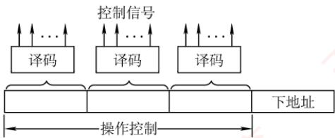
</div>

<p align="center"><em>图 5.17 字段直接编码方式</em></p>

　　微命令字段分段需遵循以下原则：

　　① 互斥性微命令应分配在同一字段，而相容性微命令应分布在不同字段。

　　② 每个字段的位数不宜过多，以避免译码电路过于复杂或引入较大延迟。

　　③ 每个字段通常还需预留一个编码表示“本字段无操作”。例如，当字段长度为3位时，最多只能表示7个互斥的微命令，通常用000表示无操作。

　　该方式显著缩短了微指令字长，但因需要译码，执行速度略低于直接编码。

##### （3） 字段间接编码方式

　　字段间接编码进一步压缩微指令长度。其基本思想是：某个微命令字段的实际含义，由另一个字段的编码共同决定。例如，字段 A 的编码 001 本身无固定意义，只有结合字段 B 的值（如 B = 0 表示 ALU 操作，B = 1 表示存储器操作），才能确定 001 究竟代表加法还是写内存。

　　这种方法可以进一步缩短微指令字长，减少控制存储器的容量需求。然而，由于译码线路更为复杂，时间开销较大，因此仅适用于特定场合。

　　现举例说明。假设有两类互斥操作：ALU 操作（加、减、与、或，共 4 种）和存储器操作（读、写、取指、间址，共 4 种）。在这 8 个微命令中，ALU 操作彼此互斥，存储器操作彼此互斥，但 ALU 与存储器操作相容（可同时发生，如 “加法 + 写内存”）。直接编码需 8 位，每位对应一个微命令；字段直接编码将其分为两个字段，每个字段 3 位（含无操作状态），共需 6 位；而字段间接编码仅用一个 3 位的操作字段，再加一个 1 位的类型字段指示其类别（例如，操作字段 = 001、类型字段 = 0 表示 ALU 加法，操作字段 = 001、类型字段 = 1 表示主存读），总共仅需 4 位。

#### 4. 微指令的地址形成方式

　　为保证微指令流的连续执行，每条微指令必须指明其下一条微指令的地址。该地址通常在当前微指令从控制存储器中取出后立即生成，可通过以下两种基本方式形成：

　　① 增量方式（计数器方式），下条微地址由微程序计数器（μPC）自动加1生成，适用于微程序中的顺序执行段。

　　② 断定方式（下址字段方式），在当前微指令中显式指定下条微地址。图5.15所示的微程序控制器即采用断定方式，其微指令包含下址字段，可直接给出下条微地址。

　　在实际运行中，下条微地址的确定取决于以下三种典型情形：

　　① 微程序入口地址的形成，一条机器指令从主存取出并送入指令寄存器（IR）后，其操作码经微地址形成部件生成对应微程序的首条微指令地址，并送入 $\mu$ PC。

　　② 顺序执行，在无转移的微程序段中，通常采用增量方式，由 $\mu \mathrm{PC} + 1$ 自动生成下条微地址；若采用断定方式，则需在每条微指令的下址字段中显式填入顺序地址。

　　③ 条件分支，当需要根据状态标志或外部条件选择不同执行路径时，微地址形成部件结合当前微指令的下址字段指定的转移目标地址与条件信号来确定下条微地址。

#### 5. 微指令的格式

　　微指令格式与其编码方式密切相关，通常分为水平型微指令和垂直型微指令两类。

> **考点追踪：** 微指令后继地址字段位数与微指令条数的关系（2014）

##### （1） 水平型微指令

　　从编码方式看，直接编码、字段直接编码和字段间接编码都属于水平型微指令。水平型微指令的基本格式如图 5.18 所示，其操作控制字段中，每一位（或每一字段）直接对应一个微命令，置 1 表示有效，置 0 表示无效。一条水平型微指令可同时定义并执行多个并行的微操作。

<table><tr><td><eq>A_1</eq></td><td><eq>A_2</eq></td><td>...</td><td><eq>A_{n-1}</eq></td><td><eq>A_n</eq></td><td>判断测试字段</td><td>后继地址字段</td></tr><tr><td colspan="5">操作控制</td><td colspan="2">顺序控制</td></tr></table>

<p align="center"><em>图 5.18 水平型微指令的基本格式</em></p>

　　其优点是并行能力强、执行效率高、微程序短；缺点是微指令字长长，编写微程序困难。

##### （2） 垂直型微指令

　　采用类似机器指令的结构，在微指令中设置微操作码字段，通过译码产生控制信号。垂直型微指令的基本格式如图 5.19 所示。一条垂直型微指令通常显式定义一个基本微操作。

<table><tr><td>μOP</td><td>Rd</td><td>Rs</td></tr><tr><td>微操作码</td><td>目的地址</td><td>源地址</td></tr></table>

<p align="center"><em>图 5.19 垂直型微指令的基本格式</em></p>

　　其优点是微指令短、格式规整，编写微程序简单；缺点是微程序长，执行速度慢，效率低。水平型微指令与垂直型微指令的比较：

　　① 水平型微指令并行能力强、灵活性强、效率高；垂直型在这些方面则表现较差。

　　② 单条水平型微指令完成更多工作；垂直型需要多条微指令完成同等任务，耗时更长。

　　③ 水平型微指令字长长但编写的微程序短；垂直型则微指令字长短而微程序长。

　　④ 水平型微指令编写微程序的难度大；而垂直型类似于机器指令，更易于理解和编写。

#### 6. 硬布线控制器和微程序控制器的特点

> **考点追踪：** 硬布线控制器和微程序控制器的特点（2009）

（1）硬布线控制器的特点

　　硬布线控制器的优点在于其运行速度主要取决于电路延迟，因此执行速度快。然而，由于控制部件被实现为专门生成固定时序控制信号的组合逻辑电路，设计时以使用最少硬件资源并实现最高速度为目标。一旦设计完成，通常难以通过软件手段扩展或修改功能。

##### （2） 微程序控制器的特点

　　与硬布线控制器相比，微程序控制器具有结构规整、灵活性强和易于维护的优势。其设计基于存储程序原理，便于对微程序进行修改与扩展。不过，由于每条微指令均需从控制存储器中读取，导致指令执行所需的微周期数增加，从而影响整体运行速度。

　　为便于比较，下面以表格的形式对比二者的不同，见表 5.2。

　　表 5.2 微程序控制器与硬布线控制器的对比

<table><tr><td rowspan="2">对比项</td><td colspan="2">类别</td></tr><tr><td>微程序控制器</td><td>硬布线控制器</td></tr><tr><td>工作原理</td><td>微操作控制信号以微程序的形式存放在控制存储器中,执行指令时读出即可</td><td>微操作控制信号由组合逻辑电路根据当前的指令码、状态和时序即时产生</td></tr><tr><td>执行速度</td><td>慢</td><td>快</td></tr><tr><td>规整性</td><td>较规整</td><td>烦琐、不规整</td></tr><tr><td>应用场合</td><td>CISC CPU</td><td>RISC CPU</td></tr><tr><td>易扩充性</td><td>易扩充修改</td><td>扩充修改困难</td></tr></table>

### 5.4.4 本节习题精选

#### 一、单项选择题

01. 取指令操作（）。

- A. 受到上一条指令的操作码控制
- B. 受到当前指令的操作码控制
- C. 受到下一条指令的操作码控制
- D. 是控制器固有的功能，不需要在操作码控制下进行

02. 在组合逻辑控制器中，微操作控制信号的形成主要与（）信号有关。

- A. 指令操作码和地址码
- B. 指令译码信号和时钟
- C. 操作码和条件码
- D. 状态信息和条件

03. 在微程序控制器中，形成微程序入口地址的是（）。

- A. 机器指令的地址码字段
- B. 微指令的微地址码字段
- C. 机器指令的操作码字段
- D. 微指令的微操作码字段

04. 下列不属于微指令结构设计所追求目标的是（）。

- A. 提高微程序的执行速度
- B. 提高微程序设计的灵活性
- C. 缩短微指令的长度
- D. 增大控制存储器的容量

05. 微程序控制器的执行速度比硬布线控制器慢，主要是因为（）。

- A. 增加了从磁盘存储器读取微指令的时间
- B. 增加了从主存读取微指令的时间
- C. 增加了从指令寄存器读取微指令的时间
- D. 增加了从控制存储器读取微指令的时间

06. 下列关于微指令的说法中，错误的是（）。
 I. 字段直接编码方式可用较少的二进制位数表示较多的微操作命令。若有两组互斥的微命令，每组微命令的个数分别为4和9，则分别只需要2位和4位即可

 II. 直接编码方式不用进行译码操作，微指令字段中的每一位都代表一个微命令
 III. 垂直型微指令用较长的微程序结构换取较短的微指令结构，所以在执行效率和灵活性两方面都高于水平型微指令

 IV. 在字段间接编码方式中，某个字段的译码输出需要依靠另外某个字段的输出

- A. II
- B. I、II
- C. I、III
- D. II、III、IV

07. 微程序控制存储器属于（）的一部分。

- A. 主存
- B. 外存
- C. CPU
- D. 缓存

08. 下列说法中，正确的是（）。

- A. 采用微程序控制器是为了提高速度
- B. 控制存储器由高速RAM电路组成
- C. 微指令计数器决定指令执行顺序
- D. 一条微指令存放在控制器的一个控制存储器单元中

09. 假设计算机 A 要求应用在实时性要求较高的场合，计算机 B 要求有较好的灵活性和可修改性，则两台计算机的控制器应采用的设计方式分别是（）。

- A. 计算机 A 和 B 都应采用硬布线控制器
- B. 计算机 A 和 B 都应采用微程序控制器
- C. 计算机 A 应采用硬布线控制器，计算机 B 应采用微程序控制器
- D. 计算机 A 应采用微程序控制器，计算机 B 应采用硬布线控制器

10. 在微程序控制器中，控制部件向执行部件发出的某个控制信号称为（）。

- A. 微程序
- B. 微指令
- C. 微操作
- D. 微命令

11. 在微程序控制器中，机器指令与微指令的关系是（）。

- A. 每条机器指令由一条微指令来执行
- B. 每条机器指令由若干微指令组成的微程序来执行
- C. 若干机器指令组成的程序可由一个微程序来执行
- D. 每条机器指令由若干微程序来执行

12. 水平型微指令与垂直型微指令相比，（）。

- A. 前者一次只能完成一个基本操作
- B. 后者一次只能完成一个基本操作
- C. 两者都是一次只能完成一个基本操作
- D. 两者都能一次完成多个基本操作

13. 垂直型微指令的特点是（）。

- A. 控制信号经过编码产生
- B. 强调并行控制功能
- C. 采用微操作码
- D. 微指令格式垂直表示

14. 下列关于微命令的描述中，正确的是（）。

- A. 同一个时钟周期中，可以同时出现的微命令叫相容性微命令
- B. 同一个时钟周期中，可以同时出现的微命令叫互斥性微命令
- C. 在执行过程中可能引起总线冲突的微命令叫互斥性微命令
- D. 同一个时钟周期中，不允许同时出现的微命令叫相容性微命令

15. 在微程序控制方式中，以下说法正确的是（）。
 I. 采用微程序控制器的处理器称为微处理器
 II. 每条机器指令由一段微程序来执行

 III. 在微指令的编码中，效率最低的是直接编码方式
 IV. 水平型微指令能充分利用数据通路的并行结构

- A. I、II
- B. II、IV
- C. I、III
- D. III、IV

16. 下列说法中，正确的是（）。
 I. 微程序控制方式和硬布线控制方式相比较，前者可以使指令的执行速度更快
 II. 若采用微程序控制方式，则可用 $\mu \mathrm{PC}$ 取代PC
 III. 控制存储器可以用ROM元件实现
 IV. 指令周期也称CPU时钟周期

- A. I、III
- B. II、III
- C. 只有III
- D. I、III、IV

17. 通常一条指令对应一个微程序，一个微程序的周期对应一个（）。

- A. 指令周期
- B. 主频周期
- C. 时钟周期
- D. 工作周期

18. 下列部件中属于控制部件的是（）。 I. 指令寄存器 II. 操作控制器 III. 程序计数器 IV. 状态条件寄存器

- A. I、III、IV
- B. I、II、III
- C. I、II、IV
- D. I、II、III、IV

19. 为了确定下一条微指令的地址，通常采用断定方式，其基本思想是（）。

- A. 用程序计数器（PC）来产生后继微指令地址
- B. 用微程序计数器（ $\mu \mathrm{PC}$ ）来产生后继微指令地址
- C. 通过后继微指令地址字段由设计者指定或转移控制字段控制产生后继微指令地址
- D. 通过指令中指定一个专门字段来控制产生后继微指令地址

20. 下图是某微程序控制器的基本结构， $\mu \mathrm{PC}$ 是一个8位寄存器， $\mu \mathrm{IR}$ 是一个32位寄存器，一条机器指令平均由4条不同的微指令组成（不含取指部分），则下列描述中错误的是（）。

<div align="center">
  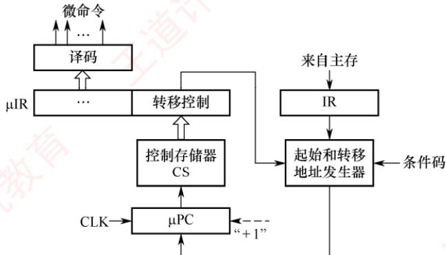
</div>

- A. 微指令的地址形成方式是增量法
- B. 条件码来自标志寄存器
- C. 最多有64条不同的机器指令
- D. 控制存储器的容量为1KB

21. 【2009 统考真题】相对于微程序控制器，硬布线控制器的特点是（）。

- A. 指令执行速度慢，指令功能的修改和扩展容易
- B. 指令执行速度慢，指令功能的修改和扩展难
- C. 指令执行速度快，指令功能的修改和扩展容易
- D. 指令执行速度快，指令功能的修改和扩展难

22. 【2012 统考真题】某计算机的控制器采用微程序控制方式，微指令中的操作控制字段采用字段直接编码法，共有 33 个微命令，构成 5 个互斥类，分别包含 7、3、12、5 和 6 个微命令，则操作控制字段至少有（）。

- A. 5 位
- B. 6 位
- C. 15 位
- D. 33 位

23. 【2014 统考真题】某计算机采用微程序控制器，共有 32 条指令，公共的取指令微程序包含 2 条微指令，各指令对应的微程序平均由 4 条微指令组成，采用断定法（后继地址字段法）确定下条微指令地址，则微指令中后继地址字段的位数至少是（）。

- A. 5
- B. 6
- C. 8
- D. 9

24. 【2017 统考真题】下列关于主存储器（MM）和控制存储器（CS）的叙述，错误的是（）。

- A. MM在CPU外，CS在CPU内
- B. MM按地址访问，CS按内容访问
- C. MM存储指令和数据，CS存储微指令
- D. MM用RAM和ROM实现，CS用ROM实现

25. 【2019 统考真题】某指令的功能为 R[r2]←R[r1] + M[R[r0]], 其两个源操作数分别采用寄存器、寄存器间接寻址方式。对于下列给定部件，该指令在取数及执行过程中需要用到的是（）。
 I. 通用寄存器组（GPRs） II. 算术逻辑单元（ALU）
 III. 存储器（Memory） IV. 指令译码器（ID）

- A. 仅 I、II
- B. 仅 I、II、III
- C. 仅 II、III、IV
- D. 仅 I、III、IV

26. 【2021 统考真题】下列寄存器中，汇编语言程序员可见的是（）。
 I. 指令寄存器 II. 微指令寄存器
 III. 基址寄存器 IV. 标志/状态寄存器

- A. 仅 I、II
- B. 仅 I、IV
- C. 仅 II、IV
- D. 仅 III、IV

27. 【2021 统考真题】通常情况下，将汇编语言程序中实现特定功能的指令序列定义成一条伪指令（pseudoinstruction）。在下列选项中，CPU能理解并直接执行的是（）。 I. 伪指令 II. 微指令 III. 机器指令 IV. 汇编指令

- A. 仅I、IV
- B. 仅II、III
- C. 仅III、IV
- D. 仅I、III、IV

#### 二、综合应用题

01. 若某机主频为 200MHz，每个指令周期平均为 2.5 个 CPU 周期，每个 CPU 周期平均包括 2 个主频周期，问：
1）该机平均指令执行速度为多少 MIPS？
2）若主频不变，但每条指令平均包括 5 个 CPU 周期，每个 CPU 周期又包含 4 个主频周期，平均指令执行速度又为多少 MIPS？
3）由此可得出什么结论？

02. 某机有 80 条指令，平均每条指令由 4 条微指令组成（包含取指微指令），其中有一条取指微指令是所有指令公用的。已知微指令长度为 32 位，请估算控制存储器 CM 容量。

03. 某微程序控制器中，采用水平型直接控制（编码）方式的微指令格式，后续微指令地址由微指令的后继地址字段给出。已知机器共有28个微命令，6个互斥的可判定的外部条件，控制存储器的容量为 $512 \times 40$ 位。试设计其微指令的格式，并说明理由。

04. 某机共有 52 个微操作控制信号，构成 5 个相斥类的微命令组，各组分别包含 5、8、2、15、22 个微命令。已知可判定的外部条件有两个，微指令字长 28 位。

1）按水平型微指令格式设计微指令，要求微指令的后继地址字段直接给出后继微指令地址。

2）指出控制存储器的容量。

05. 设 CPU 中各部件及其相互连接关系如下图所示，其中 W 是写控制标志；R 是读控制标志；R1、R2 是暂存器。

<div align="center">
  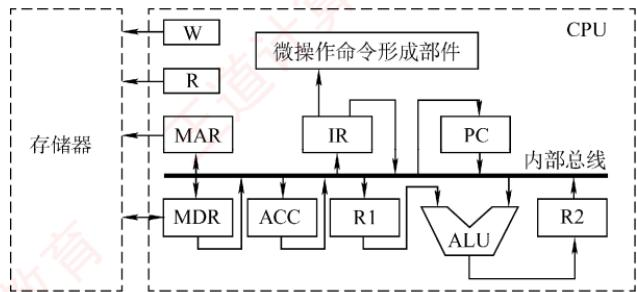
</div>

1）写出指令 ADD#a（#为立即寻址特征，隐含的操作数在 ACC 寄存器中）在执行阶段所完成的微操作命令及节拍安排。

2）假设要求在取指周期实现 $(\mathrm{PC}) + 1\rightarrow \mathrm{PC}$ ，且由ALU完成此操作（ALU能对它的一个源操作数完成加1运算）。以最少的节拍写出取指周期全部微操作命令及节拍安排。

### 5.4.5 答案与解析

#### 一、单项选择题

**01. D**

　　取指令阶段完成的任务是将现行指令从主存中取出并送至指令寄存器，这个操作是公共的操作，是每条指令都要进行的，与具体的指令无关，所以不需要操作码的控制。

**02. B**

　　CU 的输入信号来源如下：① 经指令译码器译码产生的指令信息；② 时序系统产生的节拍信号；③ 来自执行单元的反馈信息即标志。前两者是主要因素。

**03. C**

　　执行公用的取指微程序从主存中取出机器指令后，由机器指令的操作码字段指出各个微程序的入口地址（初始微地址）。

**04. D**

　　微指令的设计目标和指令结构的设计目标类似，都是基于执行速度、灵活性和指令长度这三个主要方面考虑的。而控制存储器容量的大小与微指令的设计目标无关。

**05. D**

　　在微程序控制中，控制存储器中存放有微指令，在执行时需要从中读出相应的微指令，从而增加了时间消耗。

**06. C**

　　字段直接编码方式为了缩短微指令字长而牺牲了速度，当微命令个数为4时需要3位，2位会导致每个编码都输出一个微命令，而不能表示不输出，说法I错误。说法II正确。垂直型微指令的缺点是微程序长、执行速度慢、工作效率低，说法III错误。在字段间接编码方式中，一个字段的某些微命令要由另一个字段的某些微命令来解释，即依赖另一个字段的译码输出，说法IV正确。

**07. C**

　　微程序控制存储器用来存放微程序，是微程序控制器的核心部件，属于 CPU 的一部分，而不属于主存。

**08. D**

　　硬布线控制器采用硬件电路，速度较快，但设计难度大、成本高。微程序控制器的速度较慢，

　　但灵活性高。通常控制存储器采用 ROM 元件实现。微指令计数器决定了微指令执行的顺序。

**09. C**

　　实时性要求较高的场合通常需要能快速地响应和执行，硬布线控制器由硬件直接实现控制逻辑，速度较快，非常适用于实时性要求较高的场合。灵活性和可修改性要求高时，适合采用微程序控制器，因为微程序控制器可很方便地通过修改微程序来灵活调整控制逻辑。

**10. D**

　　在微程序控制器中，控制部件向执行部件发出的控制信号称为微命令，微命令执行的操作称为微操作。微指令则是若干微命令的集合，若干微指令的有序集合称为微程序。

**11. B**

　　在一个CPU周期中，一组实现一定功能的微命令的组合构成一条微指令，有序的微指令序列构成一段微程序，微程序的作用是实现一条对应的机器指令。

**12. B**

　　一条水平型微指令能定义并执行几种并行的基本操作；一条垂直型微指令只能定义并执行一种基本操作。

**13. C**

　　垂直型微指令是一种微指令格式，相比于水平型微指令而言的，并不是指令格式垂直表示，在微指令中设置了微操作码字段，结构类似于机器指令格式。控制信号经过编码产生是一种控制字段的编码方式，属于水平型微指令，强调并行控制功能是一种控制字段的设计目标，适合水平型微指令而不适合垂直型微指令。

**14. A**

　　在同一个 CPU 周期中，可以同时出现的微命令叫相容性微命令，不允许同时出现的微命令叫互斥性微命令。不允许同时出现的原因有可能是会引起总线冲突，也有可能是其他原因。

**15. B**

　　微处理器是相对于一些大型处理器而言的，与微程序控制器没有必然联系。不管是采用微程序控制器，还是采用硬布线控制器，微机的 CPU 都是微处理器，说法 I 错误。微程序的设计思想就是将每条机器指令编写成一个微程序，每个微程序包含若干微指令，每条微指令对应一个或几个微操作命令，说法 II 正确。直接编码方式中每位代表一个微命令，不需要译码，因此执行效率最高，只是这种方式会使得微指令的位数大大增加，说法 III 错误。一条水平型微指令能定义并执行几种并行的基本操作，因此能够更充分利用数据通路的并行结构，说法 IV 正确。

**16. C**

　　微程序控制方式采用编程方式来执行指令，而硬布线控制方式则采用硬件方式来执行指令，因此硬布线控制方式速度较快，说法I错误。μPC无法取代PC，因为它只在微程序中指向下一条微指令地址的寄存器。因此它也必然不可能知道这段微程序执行完毕后下一条是什么指令，说法II错误。每条微指令执行时所发出的控制信号是事先设计好的，不需要改变，因此存放所有控制信号的存储器应为ROM，说法III正确。指令周期是从一条指令启动到下一条指令启动的间隔时间，而时钟周期是计算机内部最基本、最小的时间单位，说法IV错误。

**17. A**

　　一条指令对应一个微程序，所以一个微程序的周期对应一个指令周期。

**18. B**

　　CPU 控制器主要由三个部件组成：指令寄存器、程序计数器和操作控制器。状态条件寄存器通常属于运算器的部件，保存由算术指令和逻辑指令运行或测试的结果建立的各种条件码内容，如运算结果进位标志（CF）、运算结果溢出标志（OF）等。

**19. C**

　　断定法是指在微指令（后继地址字段）中直接明确指出下一条微指令的地址，这样相当于每条都是转移微指令，此外，还有一些其他方法如条件测试和转移控制字段，也用于控制微指令的寻址。因此，后继微指令地址可由微程序设计者指定，或者根据微指令所规定的转移控制字段控制产生。

**20. C**

　　图中 $\mu$ PC 根据时钟信号进行自增 “+1” 操作，因此微指令的地址形成方式是增量（计数器）法。转移微指令根据标志寄存器中的标志位来决定下一条微指令的地址。 $\mu$ PC 的位数是 8 位，能够指向 256 条微指令，其中包括若干取指微指令，因此机器指令的条数小于 256/4 = 64，选项 C 错误。控制存储器的容量为微指令所占用的存储空间，即 $256 \times 32b = 1KB$ 。

**21. D**

　　微程序控制器采用了“存储程序”的原理，每条机器指令对应一个微程序，因此修改和扩充容易，灵活性好，但每条指令的执行都要访问控制存储器，所以速度慢。硬布线控制器采用专门的逻辑电路实现，其速度主要取决于逻辑电路的延迟，因此速度快，但修改和扩展困难，灵活性差。

**22. C**

　　字段直接编码法将微命令字段分成若干小字段，互斥性微命令组合在同一字段中，相容性微命令分在不同字段中，每个字段还要留出一个状态，表示本字段不发出任何微命令。5个互斥类，分别包含7、3、12、5和6个微命令，需要3、2、4、3和3位，共15位。

**23. C**

　　计算机共有32条指令，各个指令对应的微程序平均为4条，则指令对应的微指令为 $32\times4=128$ 条，而公共微指令还有2条，整个系统中微指令的条数共为 $128+2=130$ 条，所以需要 $\left[\log_{2}130\right]=8$ 位才能寻址到130条微指令。

**24. B**

　　主存储器（MM）在 CPU 外，用于存储指令和数据，由 RAM 和 ROM 实现（主要是 RAM）。控制存储器（CS）用来存放构成指令系统的所有微指令，是一种只读型存储器，机器运行时只读不写，在 CPU 的控制器内。控制存储器按照微指令的地址访问。

**25. B**

　　该指令的两个源操作数分别采用寄存器、寄存器间接寻址方式，因此在取数阶段需要用到通用寄存器组（GPRs）和存储器（Memory）；在执行阶段，两个源操作数相加需要用到算术逻辑单元（ALU）。而指令译码器（ID）用于对操作码字段进行译码，向控制器提供特定的操作信号，在取数及执行阶段用不到。

**26. D**

　　汇编语言程序员可见的寄存器有基址寄存器（用于实现多道程序设计或者编制浮动程序）和状态/标志寄存器、程序计数器（PC）及通用寄存器组；而 MAR、MDR、IR 是 CPU 的内部工作寄存器，对汇编语言程序员不可见。微指令寄存器属于微程序控制器的组成部分，它是硬件设计者的任务，对汇编语言程序员是透明的（不可见的）。

**27. B**

　　高级语言程序、汇编语言程序都需要通过翻译程序来处理，生成机器语言程序后才能被 CPU 执行。机器指令能被 CPU 理解并直接执行。微指令是 CPU 控制单元用于实现机器指令的更低层次的指令。在微程序控制的 CPU 中，一条机器指令对应一个微程序，微程序是微指令的有序序列，用来控制 CPU 实现机器指令的过程，因此微指令也能被 CPU 理解并直接执行。

#### 二、综合应用题

**01. 【解答】**

1）主频为 200MHz，所以主频周期 = 1/200MHz = 0.005μs。

　　每个指令周期平均为2.5个CPU周期，每个CPU周期平均包括2个主频周期，所以一条指令的执行时间 $= 2 \times 2.5 \times 0.005\mu \mathrm{s} = 0.025\mu \mathrm{s}$ 。该机平均指令执行速度 $= 1 / 0.025 = 40\mathrm{MIPS}$ 。

2）每条指令平均包括5个CPU周期，每个CPU周期又包含4个主频周期，所以一条指令的执行时间 $= 4 \times 5 \times 0.005\mu \mathrm{s} = 0.1\mu \mathrm{s}$ 。

　　该机平均指令执行速度 = 1/0.1 = 10MIPS

3）由此可见，指令的复杂程度会影响平均指令执行速度。

**02. 【解答】**

　　总的微指令条数 $= (4 - 1)\times 80 + 1 = 241$ 条，每条微指令占一个控制存储器单元，控制存储器CM的容量为2的 $n$ 次幂，而241刚好小于256，所以CM的容量 $= 256\times 32$ 位 $= 1\mathrm{KB}$ 。

**03. 【解答】**

　　水平型微指令由操作控制字段、判别测试字段和后继地址字段三部分构成。因为微指令采用直接控制（编码）方式，所以其操作控制字段的位数等于微命令数，为28位。又因为后继微指令地址由后继地址字段给出，所以其后继地址字段的位数可根据控制存储器的容量（ $512 \times 40$ 位）确定为9位（ $512 = 2^9$ ）。当微程序出现分支时，后续微指令地址的形成取决于状态条件——6个互斥的可判定外部条件，因此状态位应编码成3位。非分支时的后续微指令地址由微指令的后继地址字段直接给出。微指令的格式如下图所示。

<table><tr><td>操作控制字段</td><td>判别测试字段</td><td>后继地址字段</td></tr><tr><td>28位</td><td>3位</td><td>9位</td></tr></table>

**04. 【解答】**

1）根据 5 个互斥类的微命令组，各组分别包含 5、8、2、15、22 个微命令，考虑到每组必须增加一种不发送命令的情况，条件测试字段应包含一种不转移的情况，则 5 个控制字段分别需给出 6、9、3、16、23 种状态，对应 3、4、2、4、5 位（共 18 位），条件测试字段取 2 位。根据微指令字长为 28 位，后继地址字段取 28 - 18 - 2 = 8 位，则其微指令格式如下图所示。

<table><tr><td>5个微命令</td><td>8个微命令</td><td>2个微命令</td><td>15个微命令</td><td>22个微命令</td><td>2个判断条件</td><td>后继地址</td></tr><tr><td></td><td></td><td></td><td></td><td></td><td>条件测试</td><td>后继地址</td></tr><tr><td>3位</td><td>4位</td><td>2位</td><td>4位</td><td>5位</td><td>2位</td><td>8位</td></tr></table>

2）根据后继地址字段为8位，微指令字长为28位，得出控制存储器的容量为 $2^{8} \times 28$ 位。

**05. 【解答】**

1）含有 ACC 的立即寻址，一个操作数隐藏在 ACC 中，立即寻址的加法指令执行周期的微操作命令及节拍安排如下：

<table><tr><td><eq>T_0</eq></td><td>Ad (IR) → R1</td><td>立即数→R1</td></tr><tr><td><eq>T_1</eq></td><td>(R1) + (ACC) → R2</td><td>ACC 通过总线送 ALU</td></tr><tr><td><eq>T_2</eq></td><td>(R2) → ACC</td><td>结果→ACC</td></tr></table>

2）因为 $(\mathrm{PC}) + 1 \rightarrow \mathrm{PC}$ 需要由 ALU 完成，所以 PC 的值可作为 ALU 的一个源操作数，在 ALU 做加 1 运算得到 $(\mathrm{PC}) + 1$ 后，结果送至与 ALU 输出端相连的 R2，然后送至 PC。此题的关键是要考虑总线冲突的问题，因此，取指周期的微操作命令及节拍安排如下：

<table><tr><td><eq>T_0</eq></td><td>(PC)→MAR, 1→R</td><td>PC通过总线送MAR</td></tr><tr><td><eq>T_1</eq></td><td>M(MAR)→MDR, (PC) + 1→R2</td><td>PC通过总线送ALU完成加1</td></tr><tr><td><eq>T_2</eq></td><td>(MDR)→IR, OP(IR)→微操作命令形成部件</td><td>MDR通过总线送IR</td></tr><tr><td><eq>T_3</eq></td><td>(R2)→PC</td><td>R2通过总线送PC</td></tr></table>

## 5.5 异常和中断机制

　　现代计算机配备了完善的异常和中断处理系统。CPU 内部设有异常检测和响应逻辑，外部设备接口则包含中断请求和控制逻辑，操作系统中集成了相应的异常/中断服务程序。这些硬件电路与软件程序紧密结合，共同完成异常和中断的处理过程。

### 5.5.1 异常和中断的基本概念

> **考点追踪：** 异常事件的性质（2015）

　　异常（也称内中断）是指 CPU 在执行指令过程中，由其内部检测到的同步事件，例如除零错误、非法操作码、页缺失等。这类事件由当前指令直接引发，具有确定性和可重现性。

　　中断（也称外中断）则是由外部设备（如 I/O 控制器）发起的异步事件，用于通知 CPU 外设状态发生变化（如数据就绪或传输完成）。中断的发生与当前指令无关，具有随机性。

> **考点追踪：** 异常响应的时机（2023）

　　两者的处理流程大致如下：当 CPU 执行用户程序的第 i 条指令时，若该指令触发异常，CPU 通常会在其执行过程中或完成时立即响应；而外部中断则仅在第 i 条指令完整执行结束后才被检测（指令执行期间不会采样中断信号）。响应发生后，CPU 暂停当前程序，保存现场，并转移至相应的服务程序。处理完成后，若事件可恢复，系统将通过执行异常或中断返回指令，恢复上下文并继续原程序：异常通常需重新执行第 i 条指令（例如缺页异常需在页面调入后重试访存操作），而中断则从第 $i+1$ 条指令开始继续执行；若异常属于不可恢复的致命错误（如非法指令），操作系统将终止该用户进程。

　　异常和中断的处理流程大致相同，这也是为什么有些教材将它们统称为中断的原因。

### 5.5.2 异常和中断的分类

#### 1. 异常的分类

　　异常是由 CPU 内部产生的意外事件，可分为硬故障中断和程序性异常。硬故障中断是由硬件逻辑功能出现异常引起的，如存储器校验错、总线错误等。程序性异常也称软件中断，是指在 CPU 内部因执行指令而引起的异常事件。如除零、溢出、断点、单步跟踪、非法指令、栈溢出、地址越界、缺页等。按异常发生原因和返回方式的不同，可分为故障、自陷和终止。

##### （1） 故障 (Fault)

> **考点追踪：** 异常或中断处理后指令重新执行的断点（2021）

　　故障是指在指令启动之后、执行完成之前被检测到的异常事件。CPU 在尚未提交该指令结果时即响应故障，并通常尝试在处理后重新执行同一条指令。典型的故障包括：指令译码时遇到非法操作码、访存时发生缺页、执行除法指令时发现除数为零等。对于可恢复的故障（如缺页），操作系统在处理完毕后（如将页面调入内存），然后返回并重新执行引发故障的指令；而对于不可恢复的故障（如非法指令、除零），则无法继续执行，通常会终止当前进程。

##### （2） 自陷（Trap）

> **考点追踪：** 自陷的原理和性质（2020）

　　自陷是一种预先安排的、用于主动转入操作系统内核的同步事件，也称陷阱或陷入。与故障不同，陷阱是在指令正常执行完毕之后才被触发的，因此 CPU 能够完整提交该指令的结果。典型应用包括：x86 计算机架构中的断点调试与单步跟踪机制、系统调用指令（如 syscall），以及 MIPS 架构中的条件自陷指令（如 teq）。它就像程序中预先布设的一个“陷阱”：通过特殊指令（如断点指令）或特定控制标志（如单步跟踪标志）显式设置。当执行到此类指令时，CPU 会根据其类型自动转移至相应的处理程序。处理完成后，CPU 总是从自陷指令的下一条指令继续执行。

　　故障异常和自陷异常属于程序性异常（软件中断）。

##### （3） 终止（Abort）

　　终止是指在指令执行过程中发生严重的硬件故障（如控制器出错、存储器校验错、总线错误等），导致系统无法继续正常运行，程序因此被迫终止。此时，CPU会转移至相应的异常服务程序，通常用于记录错误信息或重启系统。与故障和自陷不同，终止异常并非由某条特定指令明确引发，其发生具有不可预测性，往往反映底层硬件或系统状态的严重损坏。

　　终止异常和外中断属于硬件中断。

#### 2. 中断的分类

> **考点追踪：** 对中断和异常事件的判断（2009、2016、2020、2025）

　　中断是指由外部设备或事件发起的异步请求，典型的中断源包括 I/O 设备（如键盘输入）、定时器（如周期性时钟中断）等。这些设备通过专用的中断请求信号线向 CPU 发出中断请求。CPU 在每条指令执行结束后检查中断请求线；若检测到有效请求，则进入中断响应周期。

　　中断可分为可屏蔽中断和不可屏蔽中断。

##### （1） 可屏蔽中断

　　此类中断通过可屏蔽中断请求线 INTR 发送。CPU 可通过中断控制器中的中断屏蔽寄存器选择性地屏蔽或允许特定中断源，被屏蔽的中断请求将不会传递至 CPU。

##### （2） 不可屏蔽中断

　　此类中断通过专用的不可屏蔽中断请求线 NMI 发送，无法被软件屏蔽，用于处理高优先级事件，如电源掉电、内存校验错等。NMI 确保 CPU 能及时响应这些关键故障。

　　尽管中断和异常的处理流程相似，但二者存在以下两个重要差异：

1）触发时机：异常（如缺页、除零等）由当前执行的指令直接引发，具有同步性；而中断由外部事件异步触发，与任何特定指令无关，且不会打断当前指令的执行。

2）检测机制：异常由CPU内部逻辑在指令执行过程中自动检测或由软件显式触发；中断则依赖外部硬件通过中断请求线通知CPU，再进一步确定中断源及类型。

　　此外，中断还可按其他维度分类：按服务程序入口地址的获取方式，分为向量中断（硬件直接提供服务程序入口地址）和非向量中断（通过软件轮询确定中断源）；按是否允许嵌套处理，分为单重中断（服务期间禁止新中断）和多重中断（允许高优先级中断嵌套）。

### 5.5.3 异常和中断响应过程

　　当 CPU 在执行指令过程中检测到异常，或在指令边界处采样到中断请求时，将启动异常或中断响应过程。该过程指从事件发生到转移至相应处理程序之间的硬件自动操作序列，主要包括关中断、保存断点和程序状态、以及识别事件类型并转移至处理程序三个阶段。

##### （1） 关中断

　　为确保上下文保存的原子性，在响应异常或中断的初始阶段，CPU会自动屏蔽可屏蔽中断（通常通过清零标志寄存器中的IF位）。IF=0表示关中断，IF=1表示开中断。需要注意的是，不可屏蔽中断和部分高优先级异常仍可能在此期间发生，具体行为取决于体系结构设计。

##### （2） 保存断点和程序状态

　　为支持处理完成后正确返回原程序，CPU 必须保存两类关键上下文信息：① 断点（返回地址），对于异常通常为当前指令地址，对于中断则为指令执行完毕后的下一条指令地址；② 程序状态字（PSW），包含条件码、中断允许标志、特权级等运行状态。这些信息通常被压入内核栈，既保障了上下文的安全性，又天然支持中断与异常的嵌套处理。

##### （3） 识别事件类型并转移至处理程序

　　现代处理器普遍采用硬件向量机制（称为向量中断）来识别和响应异常与中断：每类事件都被分配唯一的类型号；系统初始化时，将对应服务程序的入口地址（称为中断向量）按类型号顺序填入中断向量表；当事件发生时，CPU自动获取类型号，并以此为索引直接访问向量表，获取目标地址并转移至相应处理程序，全程无须软件介入。

　　相比之下，早期系统常采用软件轮询方式（称为非向量中断）：CPU响应请求后转移至统一入口，操作系统需要依次读取各设备的状态寄存器，通过查询确定中断源。该方式依赖软件判别、效率较低，现代系统已极少使用。

　　整个响应过程由硬件自动完成，具有高度原子性。响应结束后，CPU 开始执行对应服务程序的第一条指令。后续处理逻辑（如缺页页面调入、系统调用分发等）由操作系统内核的软件实现，因此，完整的异常与中断处理是软硬件紧密协同的结果。

### 5.5.4 本节习题精选

#### 单项选择题

01. 以下关于“自陷”（Trap）异常的叙述中，错误的是（）。

- A. “自陷”是人为预先设定的一种特定处理事件

- B. 可由访管指令或自陷指令的执行进入“自陷”
- C. 一定是出现某种异常情况才会发生“自陷”
- D. “自陷”发生后CPU将进入操作系统内核程序并执行

02. 指令执行结果出现异常而引起的中断是（）。

- A. I/O 中断
- B. 机器校验中断
- C. 故障
- D. 外部中断

03. 访问主存时发生的校验错误属于（）。

- A. 故障
- B. 自陷
- C. 终止
- D. 外中断

04. 下列关于异常和中断响应的叙述中，错误的是（）。

- A. 异常事件检测由CPU在执行每一条指令的过程中进行
- B. 中断请求检测由CPU在每条指令执行结束、取下条指令之前进行
- C. CPU检测到异常事件后所做的处理和检测到中断请求后所做的处理完全相同
- D. CPU在中断响应时会关中断、保存断点和程序状态并转到相应的中断服务程序

05. 下列给出的事件中，无须异常处理程序进行处理的是（）。

- A. 缺页故障
- B. Cache缺失
- C. 地址越界
- D. 除数为0

06. CPU响应中断的时间是（）。

- A. 一条指令执行结束
- B. I/O设备提出中断

- C. 取指周期结束
- D. 指令周期结束

07. 下列选项中，不属于外部中断事件的是（）。

- A. 采样定时时间到
- B. 无效操作码
- C. 打印机缺纸
- D. 键盘缓冲满

08. 下列关于异常/中断机制与进程上下文切换机制的叙述中，错误的是（）。

- A. 进程上下文切换和异常/中断响应两者都会产生异常控制流
- B. 进程上下文切换后，CPU执行的是另一个进程的代码
- C. 响应异常/中断请求后，CPU执行的是内核程序的代码
- D. 进程上下文切换和异常/中断响应处理都通过执行内核程序实现

09. 异常或中断处理结束后，返回到被中断原程序继续执行的指令地址称为“断点”，下列关于“断点”的说法中，错误的是（）。

- A. “陷阱”类异常的断点为陷阱指令下一条指令的地址
- B. “故障”类异常的断点为当前发生异常的指令的地址
- C. 外部中断的断点总是当前刚执行完的指令的地址
- D. “终止”类异常的断点可以是当前指令或下一条指令的地址

10. 【2015 统考真题】内部异常（内中断）可分为故障（fault）、陷阱（trap）和终止（abort）三类。下列有关内部异常的叙述中，错误的是（）。

- A. 内部异常的产生与当前执行指令相关
- B. 内部异常的检测由 CPU 内部逻辑实现
- C. 内部异常的响应发生在指令执行过程中
- D. 内部异常处理后返回到发生异常的指令继续执行

11. 【2016 统考真题】异常是指令执行过程中在处理器内部发生的特殊事件，中断是来自处理器外部的请求事件。下列关于中断或异常情况的叙述中，错误的是（）。

- A. “访存时缺页”属于中断
- B. “整数除以 0”属于异常
- C. “DMA 传送结束”属于中断
- D. “存储保护错”属于异常

12. 【2020 统考真题】下列关于 “自陷”（Trap，也称陷阱）的叙述中，错误的是（）。

- A. 自陷是通过陷阱指令预先设定的一类外部中断事件
- B. 自陷可用于实现程序调试时的断点设置和单步跟踪
- C. 自陷发生后 CPU 将转去执行操作系统内核相应程序
- D. 自陷处理完成后返回到陷阱指令的下一条指令执行

13. 【2021 统考真题】异常事件在当前指令执行过程中进行检测，中断请求则在当前指令执行后进行检测。下列事件中，相应处理程序执行后，必须回到当前指令重新执行的是（）。

- A. 系统调用
- B. 页缺失
- C. DMA 传送结束
- D. 打印机缺纸

### 5.5.5 答案与解析

#### 单项选择题

**01. C**
　　自陷是人为设定的特殊中断机制，不是出现某些异常情况而产生的，选项 C 错误。

**02. C**
　　异常是 CPU 执行指令过程中发生的与当前指令执行有关的意外事件，而中断请求则是 CPU 外部的 I/O 部件或时钟等向 CPU 发出的与当前指令执行无关的意外事件。指令执行结果出现异常与当前指令执行有关，如运算溢出等，属于内中断中的故障。

**03. C**

　　若在执行指令的过程中发生严重错误，如控制器出错、存储器校验错等，则程序将无法继续执行，只能终止。严重情况下，甚至要调出中断服务程序来重启系统。

**04. C**

　　CPU 对于异常和中断的响应处理大体是一致的，都需要保存断点和程序状态字并转到相应的处理程序去执行，但有些细节并不一样。例如，检测到中断请求后，CPU 必须通过 “中断回答” 信号启动中断控制器进行中断查询，以确定当前发出的优先级最高的中断请求，并通过数据线获取相应的中断类型号；而对于异常，CPU 无须进行中断回答。

**05. B**

　　缺页、地址越界和除数为 0 都是执行某条指令时可能发生的故障，需要调出操作系统内核中相应的异常处理程序来处理，而 Cache 缺失则由 CPU 硬件实现，无须调出异常处理程序进行处理。

**06. A**

　　中断周期用于响应中断，若有中断，则在指令的执行周期后进入中断周期。

**07. B**

　　无效操作码是由 CPU 在对某条指令译码时发现的，因此是内部异常。采样定时时间到、打印机缺纸、键盘缓冲满都与当前指令的执行无关，是由 CPU 外部的中断源发出的中断请求。

**08. D**

　　在硬件层，CPU 中有检测异常和中断事件并将控制转移到操作系统内核执行的机制；在操作系统层，内核能通过进程的上下文切换将一个进程的执行转移到另一个进程的执行，它们都会产生异常控制流。响应异常/中断请求后，CPU 执行的是异常/中断服务程序，是操作系统的内核程序。进程上下文切换由操作系统的内核程序实现，而异常/中断的响应则由硬件实现。

> **补充知识**

　　CPU 所执行指令的地址序列称为 CPU 的控制流。在程序正常执行时，通过顺序执行指令或转移指令得到的控制流称为正常控制流。在正常执行过程中，因遇到异常或中断事件而引起用户程序的正常执行被打断所形成的意外控制流，称为异常控制流。

**09. C**

　　外部中断请求信号的检测总是在一条指令执行完之后，取下一条指令之前。因此，若检测到有外部中断请求，则响应中断请求并转到中断服务程序执行后，应返回到原来被中断的程序中已经执行完成的指令的下一条指令执行，而不返回到刚执行完的指令执行。

**10. D**

　　内部异常是指来自 CPU 内部产生的中断，如非法指令、地址非法、校验错、页面失效、运算溢出和除数为零等，以上都是在指令的执行过程中产生的，选项 A 正确。内部异常的检测是由 CPU 自身完成的，不必通过外部的某个信号通知 CPU，选项 B 正确。内部异常不能被屏蔽，一旦出现应立即处理，选项 C 正确。对于非法指令、除数为零等异常，无法通过异常处理程序恢复故障，因此不能回到原断点执行，必须终止进程的执行，选项 D 错误。

**11. A**

　　中断是指来自 CPU 执行指令以外的事件，如设备发出的 I/O 结束中断，表示设备输入/输出已完成，希望处理机能向设备发出下一个输入/输出请求，同时让完成输入/输出后的程序继续运行。异常也称内中断，指源自 CPU 执行指令内部的事件。

**12. A**

　　自陷是一种内部异常，选项 A 错误。在 x86 计算机中，用于程序调试的“断点设置”功能是通过自陷机制实现的，选项 B 正确。执行到自陷指令时，无条件或有条件地自动调出操作系统内核程序进行执行，选项 C 正确。CPU 执行陷阱指令后，会自动地根据不同陷阱类型进行相应的处理，然后返回到陷阱指令的下一条指令执行，选项 D 正确。

**13. B**

　　系统调用属于自陷，“断点”为自陷指令的下一条指令地址。DMA传送结束后，DMA控制器需要向CPU发送中断请求，属于外中断，外中断的“断点”为下一条指令地址。打印机缺纸同样属于外中断。页缺失属于内部异常中的故障，“断点”为发生故障的指令地址，执行完缺页异常处理程序之后必须返回发生故障的指令重新执行。

## 5.6 指令流水线

　　前面介绍的单周期处理器采用串行方式执行指令，同一时刻仅有一条指令处于执行状态，导致各功能部件的利用率较低。现代计算机普遍采用指令流水线技术，使多条指令在 CPU 的不同功能部件中并发执行，从而显著提升硬件资源的并行利用率和程序的整体执行效率。

### 5.6.1 指令流水线的基本概念

　　提升处理器并行性的主要途径有两类：① 时间上的并行，将一个任务分解为多个子阶段，各阶段由专用功能部件依次处理，并允许多个任务在不同阶段同时推进，即流水线技术。② 空间上的并行，在一个处理器内配置多个相同的功能部件，使其并行工作，称为超标量处理器。

　　一条指令的执行过程可划分为若干有序阶段，每个阶段由特定的功能部件完成。若将这些阶段视为流水线的各级（或称流水段），则整个指令执行流程便构成一条指令流水线。

　　典型的五段流水线将指令执行划分为以下阶段 $^{①}$ :

- 取指（IF）：从指令存储器或缓存中读取指令。

- 译码/读寄存器（ID）：对指令进行译码，并从寄存器堆中读取操作数。

- 执行/计算地址（EX）：执行算术逻辑运算或计算有效地址。

- 访存（MEM）：访问主存储器，完成数据的读或写操作。

- 写回（WB）：将执行结果写回寄存器堆。

　　通过重叠执行，可在第 k 条指令处于译码阶段时，启动第 $k+1$ 条指令的取指阶段，从而实现多条指令在不同流水段中的并行推进。图 5.20 展示了五段流水线的理想执行时序。

<div align="center">
  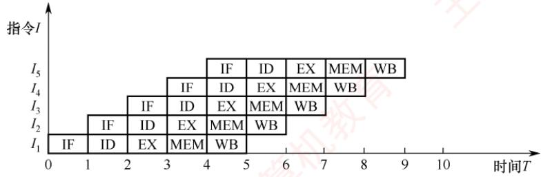
</div>

<p align="center"><em>图 5.20 一个5段指令流水线</em></p>

　　在理想情况下（无冒险、无停顿），每个时钟周期均有一条新指令进入流水线，同时有一条指令完成执行，此时每条指令的平均时钟周期数（CPI）趋近于1。

> **考点追踪：** 流水线对指令集的要求（2011）

　　为便于高效实现指令流水线，指令集应具备以下特征：

1）指令长度统一：简化取指与译码逻辑，避免因变长指令导致取指周期不确定。

2）指令格式规整：确保源操作数寄存器字段位置固定，支持在译码前预取操作数。

3）采用 LOAD/STORE 架构：仅允许加载（LOAD）和存储（STORE）指令访问主存，其他指令仅操作寄存器，有利于流水段功能划分与调度。

4）数据与指令按边界对齐存放：确保单次访存即可获取完整操作数，避免跨周期访问，保障流水段的原子性与时序规整性。

### 5.6.2 流水线的基本实现

#### 1. 流水线设计的原则

　　在单周期实现中，尽管并非所有指令都需要完整经历全部5个阶段，但时钟周期必须以执行时间最长的指令路径为基准。因此，单周期CPU的时钟频率受限于数据通路中的最长路径。

> **考点追踪：** 流水线时钟周期的设计（2009、2025）

　　流水线设计遵循以下原则：

1）流水段的数量以最复杂指令所需的功能段数为准；

2）每个流水段的时长以最耗时的操作为准。

　　例如，某条指令的各阶段延迟如下：① 取指 200ps；② 译码 100ps；③ 执行 150ps；④ 访存 200ps；⑤ 写回 100ps，该指令在单周期处理器中的总执行时间为 750ps。按流水线设计原则，时钟周期需要取各段的最大延迟，即 200ps。因此，每条指令从进入流水线到流出需经历 5 个周期，总延迟为 1000ps，大于单周期实现的 750ps。这表明：流水线并不能缩短单条指令的执行延迟。然而，对于包含 N 条指令的程序，单周期处理器总耗时为 $N \times 750ps$ ，而流水线处理器总耗时为 $(N + 4) \times 200ps$ 。当 N 较大时，流水线的吞吐率显著更高，整体执行效率大幅提升。

#### 2. 流水线的逻辑结构

　　每个流水段之后都需设置一个流水段寄存器，用于锁存该段的输出结果，确保其能在下一个时钟周期供下一流水段使用，如图 5.21 所示。所有寄存器和数据存储器均采用统一时钟 CLK 同步：每来一个时钟脉冲，各段处理完成的数据便锁存至段尾寄存器，作为后续段的输入；同时，当前段接收前一段经寄存器传递过来的数据，从而实现指令在流水线中的逐级推进。

<div align="center">
  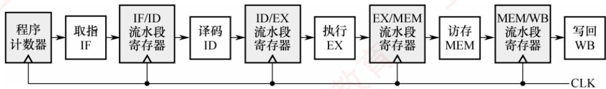
</div>

<p align="center"><em>图 5.21 流水线的逻辑结构图</em></p>

　　一条指令依次流经 IF、ID、EX、MEM、WB 五个流水段。当第一条指令进入 WB 段时，各流水段分别包含一条不同的指令，此时流水线达到满载状态，最多可同时有 5 条指令处于不同的执行阶段。

> **考点追踪：** 存在流水段寄存器时延的时钟周期的设计（2018）

> **注意**

　　流水段寄存器本身也引入一定时延。但在考试中，若无明确说明，则可忽略寄存器时延。

#### 3. 流水线的时空图表示

　　流水线的执行过程常用时空图直观表示，如图 5.22 所示。

<div align="center">
  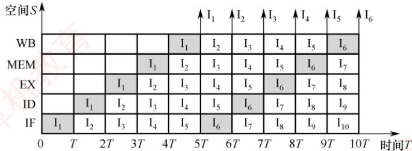
</div>

<p align="center"><em>图 5.22 一个 5 段指令流水线的时空图</em></p>

> **考点追踪：** 流水线执行4条指令所需的时钟周期数（2012）

　　图中，横轴表示时间（单位为时钟周期 T），纵轴表示流水段（空间）。指令 $I_{1}$ 在时刻 0 进入流水线，于时刻 5T 完成；指令 $I_{2}$ 在时刻 T 进入流水线，于时刻 6T 完成；以此类推，从时刻 5T 起，每个周期结束时均有一条指令完成。例如，到时刻 10T 时，已有 $I_{1}$ 至 $I_{6}$ 共 6 条指令完成执行。相比之下，若采用单周期实现（每条指令需约 3.75 个时钟周期，因 $750ps \div 200ps = 3.75$ ），在 10T 内仅能完成约 2～3 条指令。可见，流水线通过重叠执行，显著提升了指令吞吐率。

　　值得注意的是，流水线的高效性依赖于连续、无中断的指令流。而程序执行天然具有顺序性和连续性，因此非常适合采用流水线技术。

#### 4. 流水线的吞吐率分析

> **考点追踪：** 流水线吞吐率的计算（2013）

　　流水线的吞吐率（Throughput, TP）是指单位时间内流水线完成的任务数（或输出结果的数量），是衡量流水线性能的重要指标。其基本定义式为

$$
\mathrm{TP} = n / T _ {k}
$$

　　其中，n 为任务总数， $T_{k}$ 为完成这 n 个任务所需的总时间。

　　设流水线共有 $k$ 段，时钟周期为 $\Delta t$ 。在理想条件下（任务连续输入、无阻塞），完成 $n$ 个任务所需的时间为 $(k + n - 1)\Delta t$ ，因此吞吐率可表示为 $\mathrm{TP} = n / [(k + n - 1)\Delta t]$ 。当任务数量 $n$ 趋于无穷大时，启动阶段（前 $k - 1$ 个周期）的影响可忽略不计，此时吞吐率达到理论最大值 $1 / \Delta t$ 。

### 5.6.3 MIPS 指令集的流水段分析

　　每条 MIPS 指令的前两个功能段相同:

- 取指（IFetch）：从指令存储器中取出指令并计算 $\mathrm{PC} + 4$ 。

- 寄存器/译码（Reg/Dec）：从寄存器堆中读取操作数并对指令进行译码。

　　后续功能段则根据具体指令类型有所不同。

#### 1. R型指令的功能段划分

　　R 型指令属于寄存器-寄存器型（RR 型）指令，其操作数和结果均位于通用寄存器中。典型的 R 型指令从寄存器 Rs 和 Rt 读取源操作数，在 ALU 中完成指定运算，并将结果写入目的寄存器 Rd。如图 5.23 所示，R 型指令在流水线中经过 IFetch 和 Reg/Dec 阶段后，进入：

- 执行（Exec）：在 ALU 中完成运算。

- 写回（Write）：将 ALU 的结果写入寄存器堆中的 Rd。

　　时钟周期

<table><tr><td>1</td><td>2</td><td>3</td><td>4</td></tr><tr><td>Ifetch</td><td>Reg/Dec</td><td>Exec</td><td>Write</td></tr></table>

<p align="center"><em>图 5.23 R 型指令的功能段划分</em></p>

#### 2. I型指令的功能段划分

　　I 型指令包含 16 位立即数，用于立即数运算、内存访问或条件分支，是 RISC 处理器实现常量操作和地址计算的重要手段。I 型运算类指令先对 16 位立即数进行符号扩展（或零扩展），再与 Rs 的内容在 ALU 中运算，结果写入寄存器 Rt。其功能段划分与 R 型指令的完全相同。

#### 3. lw 指令的功能段划分

　　lw 指令的功能为 R[Rt] ← M[R[Rs] + SEXT(imm16)]，即从内存中读取一个字并写入寄存器 Rt。它将 Rs 的值与符号扩展（Sign Extension）后的 16 位立即数相加，形成有效地址，再从该地址读取数据。如图 5.24 所示，lw 指令在流水线中经过 IFetch 和 Reg/Dec 阶段后，进入：

- 执行（Exec）：计算内存地址（R[Rs] + SEXT(imm16)）。

- 访存（Mem）：从数据存储器中读取一个字。

- 写回（Write）：将读取的数据写入寄存器堆中的 Rt。

　　时钟周期

<table><tr><td>1</td><td>2</td><td>3</td><td>4</td><td>5</td></tr><tr><td>Ifetch</td><td>Reg/Dec</td><td>Exec</td><td>Mem</td><td>Write</td></tr></table>

<p align="center"><em>图 5.24 lw 指令的功能段划分</em></p>

#### 4. sw 指令的功能段划分

　　sw 指令的功能为 M[R[Rs] + SEXT(imm16)] ← R[Rt]，即将寄存器 Rt 中的数据写入内存。如图 5.25 所示，sw 指令在流水线中经过 IFetch 和 Reg/Dec 阶段后，进入：

- 执行（Exec）：计算内存地址（R[Rs] + SEXT(imm16)）。

- 访存（Mem）：将 Rt 中的数据写入数据存储器中指定地址。

<table><tr><td>1</td><td>2</td><td>3</td><td>4</td></tr><tr><td>Ifetch</td><td>Reg/Dec</td><td>Exec</td><td>Mem</td></tr></table>

<p align="center"><em>图 5.25 sw 指令的功能段划分</em></p>

#### 5. beq 指令的功能段划分

　　beq 指令的功能为：若 R[Rs] = R[Rt]，则 PC ← PC + 4 + SEXT(imm16) × 4。它比较两个寄存器的值，若相等，则转移至目标地址，否则顺序执行。目标地址由当前 PC 加 4 后，再加上符号扩展并左移 2 位的 16 位立即数得到。beq 指令在流水线中经过 IFetch 和 Reg/Dec 阶段后，进入：

- 执行（Exec）：比较Rs与Rt，并计算分支目标地址（PC + 4 + SEXT(imm16)×4）。

- 访存（Mem）：若比较结果为相等，则将目标地址写入PC。

　　需要注意的是，beq 指令的 Mem 段并非真正的内存访问，而是将写 PC 操作安排在该段，以便与 lw、sw 等指令对齐。由于写 PC 的延迟小于存储器访问，因此可在 Mem 段完成。

#### 6. j 指令的功能段划分

　　j 指令是无条件转移指令，其功能是直接将目标地址送入 PC。除两个公共功能段外，j 指令仅需一个功能段用于更新 PC，该操作可合并到 Exec 段完成。具体如下：

- 执行（Exec）：计算目标地址并更新PC。

　　从上述分析可见，lw 指令最复杂，需 5 个功能段。为统一流水线结构，其他指令通过插入“空”段（不执行实际操作的阶段）对齐至 5 段。插入空段需遵循两个原则：

- 每条指令对任一功能部件至多使用一次（如同一条指令不能多次使用寄存器的写口）。

- 相同功能部件必须在固定阶段使用（如寄存器写回总在第5阶段）。

　　因此，R 型和 I 型运算指令在 Write 前插入空 Mem 段，使其 Write 段与 lw 指令对齐；sw 和 beq 指令在 Exec 后插入空 Write 段；j 指令插入空 Mem 和 Write 段。通过上述对齐，所有指令均适配于 5 个功能段，因此该处理器可采用 5 段流水线设计。

### 5.6.4 流水线的冒险与处理

> **考点追踪：** 导致流水线阻塞的各种原因（2010、2025）

　　在指令流水线中，某些情况可能导致后续指令无法正确执行，从而引起流水线阻塞，这种现象称为流水线冒险。根据成因不同，可分为结构冒险、数据冒险和控制冒险三种类型。

　　不同类型指令在各流水段的操作如表 5.3 所示。

　　表 5.3 不同类型指令在各流水段中的操作

<table><tr><td rowspan="2">指令</td><td colspan="5">流水段</td></tr><tr><td>IF</td><td>ID</td><td>EX</td><td>MEM</td><td>WB</td></tr><tr><td>ALU</td><td>取指</td><td>译码读寄存器堆</td><td>执行</td><td>—</td><td>结果写回寄存器堆</td></tr><tr><td>取/存</td><td>取指</td><td>译码读寄存器堆</td><td>计算访存有效地址</td><td>访存(读/写)</td><td>将读出的数据写入寄存器堆/—</td></tr><tr><td>转移</td><td>取指</td><td>译码读寄存器堆</td><td>计算转移目的地址,设置条件码</td><td>若条件成立,将转移目的地址送PC</td><td>—</td></tr></table>

　　这几类指令将在下面介绍流水线冲突时涉及。

#### 1. 结构冒险

> **考点追踪：** 解决结构冒险的办法（2016）

　　结构冒险（又称资源冲突）是指不同指令在同一时刻争用同一功能部件所引发的冲突，其本质是硬件资源的物理限制。例如，在指令与数据共享同一存储器的系统中，第 $i$ 条LOAD指令在第4个时钟周期处于MEM段（访问数据存储器），而第 $i + 3$ 条指令在同一周期处于IF段（取指令），两者同时访存，引发冲突。此时可暂停后续指令的取指操作一个周期，如表5.4所示。当然，若第 $i$ 条指令不是访存指令，则其在MEM段不访问存储器，也就不会发生访存冲突。

　　表 5.4 用暂停后续指令的方法解决访存冲突

<table><tr><td rowspan="2">指令</td><td colspan="9">时钟周期</td></tr><tr><td>1</td><td>2</td><td>3</td><td>4</td><td>5</td><td>6</td><td>7</td><td>8</td><td>9</td></tr><tr><td>LOAD指令</td><td>IF</td><td>ID</td><td>EX</td><td>MEM</td><td>WB</td><td></td><td></td><td></td><td></td></tr><tr><td>指令<eq>i+1</eq></td><td></td><td>IF</td><td>ID</td><td>EX</td><td>MEM</td><td>WB</td><td></td><td></td><td></td></tr><tr><td>指令<eq>i+2</eq></td><td></td><td></td><td>IF</td><td>ID</td><td>EX</td><td>MEM</td><td>WB</td><td></td><td></td></tr><tr><td>指令<eq>i+3</eq></td><td></td><td></td><td></td><td>停顿</td><td>IF</td><td>ID</td><td>EX</td><td>MEM</td><td>WB</td></tr><tr><td>指令<eq>i+4</eq></td><td></td><td></td><td></td><td></td><td></td><td>IF</td><td>ID</td><td>EX</td><td>MEM</td></tr></table>

　　解决结构冒险的主要方法有：

1）遵循功能部件使用原则：确保每个功能部件在每条指令中至多使用一次，且总在固定阶段使用（如寄存器写回操作统一安排在 WB 段），可避免部分结构冲突。

2）增加硬件资源：例如，将寄存器堆的读口与写口分离，支持在一个周期的前半拍写、后半拍读；或将指令存储器与数据存储器分离。现代处理器的 L1 Cache 通常采用指令 Cache 与数据 Cache 分离的设计，从根本上消除了取指与数据访存之间的资源竞争。

#### 2. 数据冒险

> **考点追踪：** 指令流水的数据冒险（2012、2014、2016、2019、2023）

　　数据冒险又称数据相关，其根本原因是：后面指令用到前面指令的结果时，前面指令的结果还未产生或写回。在按序发射、按序完成的流水线中，所有数据冒险都是因为前一条指令写结果之前，后面指令就需要读取而造成的，称为写后读（Read After Write，RAW）冲突。

> **注意**

　　在非乱序执行 $^{①}$ 的流水线中（统考常涉及这种方式），只可能出现 RAW 冲突。

　　例如，考虑下列两条指令：

　　在 RAW 冲突中，I2 的源操作数 R1 正是 I1 的目的操作数。在非流水线中，I1 先写入 R1，I2 再读取 R1，顺序自然成立。但在流水线中，I2 在 ID 流水段就要读取 R1，而 I1 要到 WB 段才将结果写回寄存器堆，导致 I2 读取的是 R1 的旧值，如表 5.5 所示。

　　表 5.5 add 和 sub 指令发生写后读（RAW）冲突

<table><tr><td rowspan="2">指令</td><td colspan="6">时钟周期</td></tr><tr><td>1</td><td>2</td><td>3</td><td>4</td><td>5</td><td>6</td></tr><tr><td>add</td><td>IF</td><td>ID</td><td>EX</td><td>MEM</td><td>WB</td><td></td></tr><tr><td>sub</td><td></td><td>IF</td><td>ID</td><td>EX</td><td>MEM</td><td>WB</td></tr></table>

　　可采用以下方法解决 RAW 冲突。

> **考点追踪：** 解决数据冲突的办法（2024）

##### （1） 延迟执行相关指令

　　将数据相关的指令及其后续指令都暂停若干时钟周期，直至前一条指令的结果可被安全读取。可分为软件插入空操作（nop）指令和硬件自动插入气泡（阻塞）两种方法。

　　由表 5.5 可见，add 指令在第 5 个时钟周期才将结果写回 R1，而 sub 指令在第 3 个时钟周期就需读取 R1，发生 RAW 冲突。若不采取措施，sub 指令将使用错误的旧值。为此，可让 sub 指令延迟 3 个时钟周期，使其 ID 段发生在 add 指令的 WB 段之后，如表 5.6 所示。

　　表 5.6 用延迟相关指令的办法来解决 RAW 冲突

<table><tr><td rowspan="2">指令</td><td colspan="9">时钟周期</td></tr><tr><td>1</td><td>2</td><td>3</td><td>4</td><td>5</td><td>6</td><td>7</td><td>8</td><td>9</td></tr><tr><td>add</td><td>IF</td><td>ID</td><td>EX</td><td>MEM</td><td>WB</td><td></td><td></td><td></td><td></td></tr><tr><td>sub</td><td></td><td>阻塞</td><td>阻塞</td><td>阻塞</td><td>IF</td><td>ID</td><td>EX</td><td>MEM</td><td>WB</td></tr></table>

　　此外，若寄存器堆支持在一个时钟周期的前半个时钟周期写入、后半个时钟周期读出，则 add指令在 WB 段写入的值可在同一个时钟周期被 sub 指令在 ID 段读取。此时，add 指令的 WB 段与 sub 指令的 ID 段可重叠执行，从而仅需延迟 2 个时钟周期。

##### （2） 采用转发（旁路）技术

　　设置相关转发通路，使后续指令无须等待前一条指令将计算结果写回寄存器堆，而是将其在执行阶段生成的中间结果直接转发至 ALU 的输入端。如表 5.7 所示，add 指令在 EX 段结束时已计算出 R1 的新值，并暂存于 EX/MEM 流水段寄存器中。当 sub 指令进入 EX 段时，其所需的 R1 值可直接从该流水段寄存器转发至 ALU，从而确保使用的是最新结果。

　　表 5.7 用转发技术来解决 RAW 冲突

<table><tr><td rowspan="2">指令</td><td colspan="6">时钟周期</td></tr><tr><td>1</td><td>2</td><td>3</td><td>4</td><td>5</td><td>6</td></tr><tr><td>add</td><td>IF</td><td>ID</td><td>EX</td><td>MEM</td><td>WB</td><td></td></tr><tr><td>sub</td><td></td><td>IF</td><td>ID</td><td>EX</td><td>MEM</td><td>WB</td></tr></table>

　　增加转发通路后，相邻的两条运算类指令之间，以及相隔一条无关指令的两个运算类指令之间的数据相关所引发的 RAW 冲突，均可通过转发有效消除。

##### （3） load-use 数据冒险的处理

　　若load指令与其后紧邻的运算类指令存在数据相关，则无法通过转发技术解决，这种情况称为load-use数据冒险。考虑以下两条指令：

<table><tr><td>I1</td><td>load r2,12(r1)</td><td># M[(r1)+12]→(r2)</td></tr><tr><td>I2</td><td>add r4,r3,r2</td><td># (r3)+(r2)→(r4)</td></tr></table>

　　load 指令在 MEM 段结束时才从存储器读出数据，并暂存于 MEM/WB 流水段寄存器；而紧随其后的 add 指令在其 EX 段（与 load 指令的 MEM 段处于同一周期）就需要 R2 的值。由于此时 load 指令尚未完成访存，结果不可用，因此 add 指令只能读取 R2 的旧值。

　　对于 load-use 数据冒险，最简单的做法是由编译器在 add 指令前插入一条 nop 指令。这样，add 指令的 EX 段就能通过转发机制，从 MEM/WB 流水段寄存器中获取 load 指令的最新结果，如表 5.8 所示。当然，最好的办法是在程序编译时进行优化，通过调整指令顺序以避免 load-use 相关的发生。

　　表 5.8 用延迟加转发技术来解决 load-use 冲突

<table><tr><td rowspan="2">指令</td><td colspan="7">时钟周期</td></tr><tr><td>1</td><td>2</td><td>3</td><td>4</td><td>5</td><td>6</td><td>7</td></tr><tr><td>load</td><td>IF</td><td>ID</td><td>EX</td><td>MEM</td><td>WB</td><td></td><td></td></tr><tr><td>add</td><td></td><td>阻塞</td><td>IF</td><td>ID</td><td>EX</td><td>MEM</td><td>WB</td></tr></table>

#### 3. 控制冒险

> **考点追踪：** 分析指令之间的控制冒险（2014、2023）

　　指令通常按顺序执行，但在遇到转移、返回、中断或异常等事件时，程序计数器（PC）的值会被修改，导致流水线断流，这种现象称为控制冒险（又称控制冲突）。

　　对于由分支指令引起的冲突，最简单的处理方法是推迟后续指令的执行。通常将因流水线阻塞产生的延迟时钟周期数称为延迟损失时间片 C。在下列指令中，假设 R2 存放常数 N，R1 的初值为 1。bne 指令在 EX 段完成条件计算，但直到 MEM 段结束（第 5 个时钟周期末）才确定是否更新 PC，因此从分支指令进入流水线到转移决策完成，共产生 3 个时钟周期延迟（记位 C=3）。

　　为避免错误执行后续指令，可在分支指令后插入 $C$ 条nop指令，如表5.9所示。

<table><tr><td>I1</td><td>loop:add R1,R1,1</td><td>#(R1)+1→R1</td></tr><tr><td>I2</td><td>bne R1,R2,loop</td><td>#if(R1)!=(R2) goto loop</td></tr></table>

　　表 5.9 用插入空操作的办法解决控制冲突

<table><tr><td rowspan="2">指令</td><td colspan="10">时钟周期</td></tr><tr><td>1</td><td>2</td><td>3</td><td>4</td><td>5</td><td>6</td><td>7</td><td>8</td><td>9</td><td>10</td></tr><tr><td>add</td><td>IF</td><td>ID</td><td>EX</td><td>MEM</td><td>WB</td><td></td><td></td><td></td><td></td><td></td></tr><tr><td>bne</td><td></td><td>IF</td><td>ID</td><td>EX</td><td>MEM</td><td>WB</td><td></td><td></td><td></td><td></td></tr><tr><td>add</td><td></td><td></td><td></td><td></td><td></td><td>IF</td><td>ID</td><td>EX</td><td>MEM</td><td>WB</td></tr></table>

　　解决控制冒险的主要方法包括：

1）延迟分支处理：对于由分支指令引起的冲突，可由软件在分支指令后插入若干nop指令，或由硬件自动阻塞（插入气泡）。插入nop指令的数量等于分支延迟周期数。

2）分支预测技术：尽早生成转移目标地址并预测转移方向，以减少流水线清空。静态预测采用简单规则，总是预测转移发生或不发生；动态预测根据程序运行时的转移历史动态调整预测策略，准确率更高。若预测错误，则需清空已进入流水线的错误路径指令，并从正确目标地址重新取指；若分支延迟周期数为3，此时将损失3个时钟周期。

> **注意**

　　Cache 缺失、中断或异常的发生也会引起流水线阻塞。

### 5.6.5 高级流水线技术

　　有两种主要策略可用于提升指令级并行度：一是多发射技术，通过配置多个内部功能部件，使流水线在每个时钟周期能同时处理多条指令，处理器一次可发射多条指令进入流水线执行；二是超流水线技术，通过增加流水线级数，使更多指令在流水线中重叠执行。

#### 1. 超标量流水线技术（动态多发射）

> **考点追踪：** 超标量流水线的特性（2017）

　　每个时钟周期可并发发射多条独立指令，为此需配置多个功能部件，如图 5.26 所示。在简单的超标量处理器中，指令按顺序发射。但为了提升并行性能，多数现代超标量处理器结合动态调度技术（如动态分支预测等），支持乱序执行，即指令的执行顺序可不同于程序顺序。

<div align="center">
  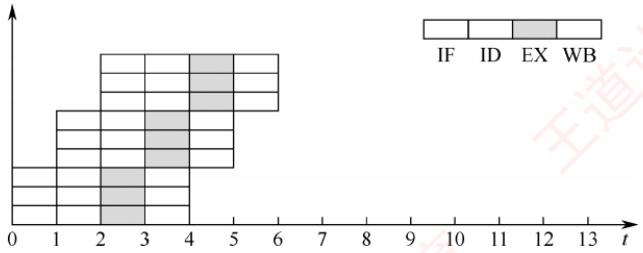
</div>

<p align="center"><em>图 5.26 超标量流水线技术</em></p>

#### 2. 超长指令字技术（静态多发射）

　　由编译器挖掘指令间的并行性，并将多条可并行执行的指令打包成一条超长指令字，其中包含多个操作码字段，分别控制不同的处理部件。由于并行性由软件静态确定，控制相对简单。

#### 3. 超流水线技术

　　超流水线通过进一步细分流水段来缩短时钟周期，从而提高主频和指令吞吐率。然而，流水级数增加会带来更大的流水段寄存器开销和更高的控制复杂度，因此流水线深度并非越多越好。

> **考点追踪：** 基本流水线与超标量流水线 CPU 的 CPI（2020）

　　在理想情况下：超流水线 CPU 在流水线充满后，每个时钟周期完成一条指令，CPI=1，但主频更高；多发射 CPU 每个时钟周期可完成多条指令，CPI<1，但硬件成本更高、控制更复杂。

### 5.6.6 本节习题精选

#### 一、单项选择题

01. 下列关于流水线 CPU 的叙述中，正确的是（）。

- A. 流水线技术通过复制多个功能部件实现空间并行处理
- B. 只有精简指令集（RISC）处理器才能采用流水线技术
- C. 流水线 CPU 必须采用多核结构才能工作
- D. 流水线是一种通过时间并行性提高指令执行效率的技术

02. 流水段 CPU 是由一系列称为 “段” 的处理电路组成的。一个 m 段流水线稳定时的 CPU 的吞吐能力，与 m 个并行部件的 CPU 的吞吐能力相比，（）。

- A. 具有同等水平的吞吐能力
- B. 不具备同等水平的吞吐能力
- C. 吞吐能力大于前者的吞吐能力
- D. 吞吐能力小于前者的吞吐能力

03. 设指令由取指、分析、执行 3 个子部件完成，并且每个子部件的时间均为 $\Delta t$ ，若采用常规标量单流水线处理机（处理机的度为 1），连续执行 12 条指令，共需（）。

- A. $12 \Delta t$
- B. $14 \Delta t$
- C. $16 \Delta t$
- D. $18 \Delta t$

04. 设指令由取指、分析、执行3个子部件完成，并且每个子部件的时间均为 $\Delta t$ ，若采用度为4的超标量流水线处理机，连续执行20条指令，只需（）。

- A. $3\Delta t$
- B. $5\Delta t$
- C. $7\Delta t$
- D. $9\Delta t$

05. 设指令流水线把一条指令分为取指、分析、执行3部分，3部分执行时间不等长，且3部分的时间分别是 $t_{\text{取指}} = 2 \mathrm{~ns}$ ， $t_{\text{分析}} = 2 \mathrm{~ns}$ ， $t_{\text{执行}} = 1 \mathrm{~ns}$ ，则100条指令全部执行完毕需（）。

- A. 163ns
- B. 183ns
- C. 193ns
- D. 203ns

06. 下列关于指令流水线设计的叙述中，错误的是（）。

- A. 指令执行过程中的各个子功能都需要包含在某个流水段中
- B. 所有子功能都必须按一定的顺序经过流水段
- C. 虽然各个子功能所用实际时间可能不同，但经过每个流水段的时间都一样
- D. 任何时候各个流水段的功能部件都不可能执行空操作

07. 下列关于流水段寄存器的叙述中，正确的是（）。

- A. 指令译码得到的控制信号需通过流水段寄存器传递到下一个流水段
- B. 每个流水段之间的流水段寄存器位数一定相同
- C. 每个流水段之间的流水段寄存器存放的信息一定相同
- D. 用户程序可以通过指令指定访问哪个流水段寄存器

08. 下列关于流水线数据通路的描述中，错误的是（）。

- A. 每个流水段由执行指令子功能的功能部件和流水段寄存器组成
- B. 控制信号仅作用在功能部件上，时钟信号仅作用在流水段寄存器上
- C. 在没有阻塞的情况下，PC 的值在每个时钟周期都会改变

- D. 取指令阶段和指令译码阶段不需要控制信号的控制

09. 下列关于结构冒险的叙述中，正确的是（）。
 I. 结构冒险是指多条指令在同一时钟周期争用同一个硬件资源
 II. 规定每条指令只能在指定流水段访问特定功能部件，可减少结构冒险
 III. 通过重复设置功能部件（如多个ALU）可以避免结构冒险
 IV. 将数据Cache与指令Cache分离，可解决取指和取数同时访存引起的结构冒险

- A. I、II、IV
- B. I、II、III
- C. I、III、IV
- D. I、II、III和IV

10. 指令流水线中出现数据相关时流水线将受阻，（）可部分解决数据相关问题。

- A. 增加硬件资源
- B. 采用旁路技术
- C. 采用分支预测技术
- D. 以上都可以

11. 下列关于数据冒险和转发技术的叙述中，正确的是（）。
 I. 并非所有数据冒险都能通过转发技术解决
 II. 五段流水线中load-use数据冒险会引起至少一个时钟周期的阻塞
 III. 前面的分支指令和后面的ALU运算指令之间肯定不会发生数据冒险

- A. I、II
- B. I、III
- C. II、III
- D. I、II、III

12. 下列关于数据冒险的叙述中，正确的是（）。
 I. 数据冒险是指后面指令用到的数据还未来得及由前面的指令产生
 II. 在发生数据冒险的指令之间插入空操作指令能避免数据冒险
 III. 采用转发（旁路）技术可以解决一部分数据冒险现象
 IV. 通过编译器调整指令顺序可解决部分数据冒险

- A. I、II、IV
- B. I、II、III
- C. I、III、IV
- D. I、II、III和IV

13. 下列指令序列中，指令 I1 和 I3、I2 和 I3 之间发生数据相关。假定采用 “取指、译码/取数、执行、访存、写回” 五段流水线方式，那么在采用转发技术时，需要在指令 I3 之前加入（）条空操作指令才能使这段程序不发生数据冒险。
I1: add r1, r0, 1    # (r1) ← (r0) + 1
I2: load r3, 12(r2)    # (r3) ← M[(r2) + 12]
I3: add r5, r3, r1    # (r5) ← (r3) + (r1)

- A. 3
- B. 2
- C. 0
- D. 1

14. 下面关于控制冒险的描述中，错误的是（）。
 I. 无条件转移指令不会发生控制冒险
 II. 在分支指令加入若干空操作指令可以避免控制冒险
 III. 采用转发（旁路）技术，可以解决部分控制冒险
 IV. 中断或异常也会引起控制冒险
 V. 流水段的数量与控制冒险引发的开销无关

- A. I、IV、V
- B. III、V
- C. I、III、IV
- D. I、III、V

15. 下列关于分支预测的叙述中，正确的是（）。
 I. 分支预测技术可用于处理控制冒险和数据冒险
 II. 使用静态预测技术时，每次的预测结果是一样的
 III. 动态预测技术通常比静态预测技术的预测成功率高
 IV. 若预测错误，已被错误放入流水线执行的指令必须被舍弃

- A. I、II、III
- B. I、II、IV
- C. II、III、IV
- D. I、II、III、IV

16. 下列关于指令流水线和指令执行效率的叙述中，错误的是（）。

- A. 加倍增加流水段个数不能成倍提高指令执行效率

- B. 为了提高指令吞吐率，流水段个数应无限制地增加
- C. 增加流水段个数，可以提高处理器的时钟频率
- D. 随着流水段个数的增加，流水段之间缓存开销的比例增大

17. 下列关于超标量流水线的描述中，不正确的是（）。

- A. 在一个时钟周期内一条流水线可执行一条以上的指令
- B. 一条指令分为多段指令由不同电路单元完成
- C. 超标量通过内置多条流水线来同时执行多个处理器，其实质是以空间换取时间
- D. 超标量流水线仅仅是指运算操作并行

18. 关于流水线技术的说法中，错误的是（）。

- A. 超标量技术需要配置多个功能部件和指令译码电路等
- B. 与超标量技术和超流水线技术相比，超长指令字技术对优化编译器要求更高，而无其他硬件要求
- C. 在按序流动的流水线中，只可能出现 RAW 相关
- D. 超流水线技术相当于将流水线再分段，从而提高每个周期内功能部件的使用次数

19. 【2009 统考真题】某计算机的指令流水线由 4 个功能段组成，指令流经各功能段的时间（忽略各功能段之间的缓存时间）分别为 90ns、80ns、70ns 和 60ns，则该计算机的 CPU 周期至少是（）。

- A. 90ns
- B. 80ns
- C. 70ns
- D. 60ns

20. 【2010 统考真题】下列不会引起指令流水线阻塞的是（）。

- A. 数据旁路
- B. 数据相关
- C. 条件转移
- D. 资源冲突

21. 【2011 统考真题】下列指令系统的特点中，有利于实现指令流水线的是（）。 I. 指令格式规整且长度一致 II. 指令和数据按边界对齐存放 III. 只有 LOAD/STORE 指令才能对操作数进行存储访问

- A. 仅 I、II
- B. 仅 II、III
- C. 仅 I、III
- D. I、II、III

22. 【2013 统考真题】某 CPU 主频为 1.03GHz，采用 4 级指令流水线，每个流水段的执行需要 1 个时钟周期。假定 CPU 执行了 100 条指令，在其执行过程中，没有发生任何流水线阻塞，此时流水线的吞吐率为（）。

- A. $0.25 \times 10^{9}$ 条指令/秒
- B. $0.97 \times 10^{9}$ 条指令/秒
- C. $1.0 \times 10^{9}$ 条指令/秒
- D. $1.03 \times 10^{9}$ 条指令/秒

23. 【2014 统考真题】采用指令 Cache 与数据 Cache 分离的主要目的是（）。

- A. 降低 Cache 的缺失损失
- B. 提高 Cache 的命中率
- C. 降低 CPU 平均访存时间
- D. 减少指令流水线资源冲突

24. 【2016 统考真题】在无转发机制的五段基本流水线（取指、译码/读寄存器、运算、访存、写回寄存器）中，下列指令序列存在数据冒险的指令对是（）。
I1: add R1, R2, R3; $(\mathrm{R}2) + (\mathrm{R}3) \rightarrow \mathrm{R}1$ I2: add R5, R2, R4; $(\mathrm{R}2) + (\mathrm{R}4) \rightarrow \mathrm{R}5$ I3: add R4, R5, R3; $(\mathrm{R}5) + (\mathrm{R}3) \rightarrow \mathrm{R}4$ I4: add R5, R2, R6; $(\mathrm{R}2) + (\mathrm{R}6) \rightarrow \mathrm{R}5$

- A. I1 和 I2
- B. I2 和 I3
- C. I2 和 I4
- D. I3 和 I4

25. 【2017 统考真题】下列关于超标量流水线特性的叙述中，正确的是（）。
 I. 能缩短流水线功能段的处理时间
 II. 能在一个时钟周期内同时发射多条指令
 III. 能结合动态调度技术提高指令执行并行性

- A. 仅II
- B. 仅I、III
- C. 仅II、III
- D. I、II和III

26. 【2017 统考真题】下列关于指令流水线数据通路的叙述中，错误的是（）。

- A. 包含生成控制信号的控制部件
- B. 包含算术逻辑运算部件（ALU）
- C. 包含通用寄存器组和取指部件
- D. 由组合逻辑电路和时序逻辑电路组合而成

27. 【2018 统考真题】若某计算机最复杂指令的执行需要完成 5 个子功能，分别由功能部件 A ~ E 实现，各功能部件所需时间分别为 80ps、50ps、50ps、70ps 和 50ps，采用流水线方式执行指令，流水段寄存器延时为 20ps，则 CPU 时钟周期至少为（）。

- A. 60ps
- B. 70ps
- C. 80ps
- D. 100ps

28. 【2019 统考真题】在采用 “取指、译码/取数、执行、访存、写回” 5 段流水线的处理器中，执行如下指令序列，其中 s0、s1、s2、s3 和 t2 表示寄存器编号。
I1: add s2, s1, s0 //R[s2] ← R[s1] + R[s0]
I2: load s3, 0(t2) //R[s3] ← M[R[t2] + 0]
I3: add s2, s2, s3 //R[s2] ← R[s2] + R[s3]
I4: store s2, 0(t2) //M[R[t2] + 0] ← R[s2]

下列指令对中，不存在数据冒险的是（）。

- A. I1 和 I3
- B. I2 和 I3
- C. I2 和 I4
- D. I3 和 I4

29. 【2020 统考真题】下列给出的处理器类型中，理想情况下，CPI 为 1 的是（）。 I. 单周期 CPU II. 多周期 CPU III. 基本流水线 CPU IV. 超标量流水线 CPU

- A. 仅 I、II
- B. 仅 I、III
- C. 仅 II、IV
- D. 仅 III、IV

30. 【2023 统考真题】在采用 “取指、译码/取数、执行、访存、写回” 5 段流水线的 RISC 处理器中，执行如下指令序列（第一列为指令序号），其中 s0、s1、s2、s3 和 t2 表示寄存器编号。
I1 add s2, s1, s0 // R[s2]←R[s1] + R[s0]
I2 load s3, 0(s2) // R[s3]←M[R[s2] + 0]
I3 beq t2, s3, L1 // if R[t2] = R[s3] jump to L1
I4 addi t2, t2, 20 // R[t2]←R[t2] + 20
I5 L1: .....

若采用转发(旁路)技术处理数据冒险, 采用硬件阻塞方式处理控制冒险, 则在指令 I1 ~ I4 的执行过程中, 发生流水线阻塞的指令有 ( )。

- A. 仅 I3
- B. 仅 I2、I4
- C. 仅 I3、I4
- D. 仅 I2、I3、I4

31. 【2024 统考真题】对于采用“取指、译码/取数、执行、访存、写回”5 段流水线的 RISC 数据通路，下列关于指令流水线数据冒险处理的叙述中，错误的是（）。

- A. 相邻两条指令中的操作数相关可能引起数据冒险
- B. 在数据相关的指令间插入“气泡”能避免数据冒险
- C. 所有数据冒险都可以通过加入转发（旁路）电路解决
- D. 所有数据冒险都能通过调整指令顺序和插入 nop 指令解决

32. 【2025 统考真题】下列关于 CPI 和 CPU 时钟周期的叙述中，错误的是（）。

- A. 不同类型指令的 CPI 可能不一样
- B. 程序的 CPI 与 Cache 缺失率无关
- C. 单周期 CPU 的时钟周期以最耗时指令所用时间为准
- D. 流水线 CPU 的时钟周期以最长流水段所用时间为准

33. 【2025 统考真题】下列关于 CPU 中的数据通路和控制器的叙述中，错误的是（）。

- A. 通用寄存器组中应该包含程序计数器
- B. 控制器中一定包含指令操作码的译码电路
- C. 单周期 CPU 中的控制器比多周期 CPU 中的更简单
- D. 流水线 CPU 需解决数据相关和控制相关等冒险问题

#### 二、综合应用题

01. 【2012 统考真题】某 16 位计算机中，有符号整数用补码表示，数据 Cache 和指令 Cache 分离。下表给出了指令系统中的部分指令格式，其中 Rs 和 Rd 表示寄存器，mem 表示存储单元地址，(x) 表示寄存器 x 或存储单元 x 的内容。

　　表指令系统中部分指令格式

<table><tr><td>名称</td><td>指令的汇编格式</td><td>指令功能</td></tr><tr><td>加法指令</td><td>ADD Rs, Rd</td><td><eq>(Rs) + (Rd) \rightarrow Rd</eq></td></tr><tr><td>算术/逻辑左移</td><td>SHL Rd</td><td><eq>2*(Rd) \rightarrow Rd</eq></td></tr><tr><td>算术右移</td><td>SHR Rd</td><td><eq>(Rd)/2 \rightarrow Rd</eq></td></tr><tr><td>取数指令</td><td>Load Rd, mem</td><td><eq>(mem) \rightarrow Rd</eq></td></tr><tr><td>存数指令</td><td>Store Rs, mem</td><td><eq>(Rs) \rightarrow mem</eq></td></tr></table>

　　该计算机采用 5 段流水方式执行指令，各流水段分别是取指（IF）、译码/读寄存器（ID）、执行/计算有效地址（EX）、访问存储器（M）和结果写回寄存器（WB），流水线采用“按序发射，按序完成”方式，未采用转发技术处理数据相关，且同一寄存器的读和写操作不能在同一个时钟周期内进行。请回答下列问题：

1）若 int 型变量 x 的值为 -513，存放在寄存器 R1 中，则执行 “SHR R1” 后，R1 中的内容是多少（用十六进制表示）？

2）若在某个时间段中，有连续的4条指令进入流水线，在其执行过程中未发生任何阻塞，则执行这4条指令所需的时钟周期数为多少？

3）若高级语言程序中某赋值语句为 $x = a + b$ ，x、a和b均为int型变量，它们的存储单元地址分别表示为[x]、[a]和[b]。该语句对应的指令序列及其在指令流中的执行过程如下所示。

I1 LOAD R1, [a]

I2 LOAD R2, [b]

I3 ADD R1, R2

I4 STORE R2, [x]

<table><tr><td rowspan="2">指令</td><td colspan="14">时钟</td></tr><tr><td>1</td><td>2</td><td>3</td><td>4</td><td>5</td><td>6</td><td>7</td><td>8</td><td>9</td><td>10</td><td>11</td><td>12</td><td>13</td><td>14</td></tr><tr><td><eq>I_1</eq></td><td>IF</td><td>ID</td><td>EX</td><td>M</td><td>WB</td><td></td><td></td><td></td><td></td><td></td><td></td><td></td><td></td><td></td></tr><tr><td><eq>I_2</eq></td><td></td><td>IF</td><td>ID</td><td>EX</td><td>M</td><td>WB</td><td></td><td></td><td></td><td></td><td></td><td></td><td></td><td></td></tr><tr><td><eq>I_3</eq></td><td></td><td></td><td>IF</td><td></td><td></td><td></td><td>ID</td><td>EX</td><td>M</td><td>WB</td><td></td><td></td><td></td><td></td></tr><tr><td><eq>I_4</eq></td><td></td><td></td><td></td><td></td><td></td><td></td><td>IF</td><td></td><td></td><td></td><td>ID</td><td>EX</td><td>M</td><td>WB</td></tr></table>

　　则这4条指令执行过程中I3的ID段和I4的IF段被阻塞的原因各是什么？

4）若高级语言程序中某赋值语句为 $x = x^{*}2 + a$ ，x 和 a 均为 unsigned int 类型的变量，它们的存储单元地址分别表示为 [x]、[a]，则执行这条语句至少需要多少个时钟周期？要求模仿上图画出这条语句对应的指令序列及其在流水线中的执行过程示意图。

02. 【2014 统考真题】某程序中有循环代码段 P: “for(int i = 0; i < N; i++) sum += A[i];”。假设编译时变量 sum 和 i 分别分配在寄存器 R1 和 R2 中。常量 N 在寄存器 R6 中，数组 A 的首地址在寄存器 R3 中。程序段 P 的起始地址为 0804 8100H，对应的汇编代码和机器代码如下表所示。

<table><tr><td>编号</td><td>地址</td><td>机器代码</td><td>汇编代码</td><td>注释</td></tr><tr><td>1</td><td>08048100H</td><td>00022080H</td><td>loop: sll R4, R2, 2</td><td>(R2) &lt;&lt; 2→R4</td></tr><tr><td>2</td><td>08048104H</td><td>00083020H</td><td>add R4, R4, R3</td><td>(R4) + (R3)→R4</td></tr><tr><td>3</td><td>08048108H</td><td>8C850000H</td><td>load R5, 0(R4)</td><td>((R4) + 0)→R5</td></tr><tr><td>4</td><td>0804810CH</td><td>00250820H</td><td>add R1, R1, R5</td><td>(R1) + (R5)→R1</td></tr><tr><td>5</td><td>08048110H</td><td>20420001H</td><td>add R2, R2, 1</td><td>(R2) + 1→R2</td></tr><tr><td>6</td><td>08048114H</td><td>1446FFFAH</td><td>bne R2, R6, loop</td><td>if(R2)! = (R6) goto loop</td></tr></table>

　　执行上述代码的计算机 M 采用 32 位定长指令字，其中分支指令 bne 采用如下格式:

<table><tr><td>31</td><td>26</td><td>25</td><td>21</td><td>20</td><td>16</td><td>15</td><td>0</td></tr><tr><td colspan="2">OP</td><td colspan="2">Rs</td><td colspan="2">Rd</td><td colspan="2">OFFSET</td></tr></table>

　　OP 为操作码；Rs 和 Rd 为寄存器编号；OFFSET 为偏移量，用补码表示。请回答下列问题，并说明理由。

1）M的存储器编址单位是什么？

2）已知 sll 指令实现左移功能，数组 A 中每个元素占多少位？

3）表中 bne 指令的 OFFSET 字段的值是多少？已知 bne 指令采用相对寻址方式，当前 PC 内容为 bne 指令地址，通过分析表中指令地址和 bne 指令内容，推断 bne 指令的转移目标地址计算公式。

4）若 M 采用如下“按序发射、按序完成”的 5 级指令流水线：IF（取值）、ID（译码及取数）、EXE（执行）、MEM（访存）、WB（写回寄存器），且硬件不采取任何转发措施，分支指令的执行均引起 3 个时钟周期的阻塞，则 P 中哪些指令的执行会由于数据相关而发生流水线阻塞？哪条指令的执行会发生控制冒险？为什么指令 1 的执行不会因为与指令 5 的数据相关而发生阻塞？

03. 【2014 统考真题】假设对于上题中的计算机 M 和程序 P 的机器代码，M 采用页式虚拟存储管理；P 开始执行时， $(R1)=(R2)=0,\quad(R6)=1000$ ，其机器代码已调入主存但不在 Cache 中；数组 A 未调入主存，且所有数组元素在同一页，并存储在磁盘的同一个扇区。请回答下列问题并说明理由。

1）P执行结束时，R2的内容是多少？

2）M 的指令 Cache 和数据 Cache 分离。若指令 Cache 共有 16 行，Cache 和主存交换的块大小为 32B，则其数据区的容量是多少？若仅考虑程序段 P 的执行，则指令 Cache 的命中率为多少？

3) P 在执行过程中，哪条指令的执行可能发生溢出异常？哪条指令的执行可能产生缺页异常？对于数组 A 的访问，需要读磁盘和 TLB 至少各多少次？

### 5.6.7 答案与解析

#### 一、单项选择题

**01. D**

　　流水线通过将指令执行划分为多个阶段并重叠处理，实现时间并行性，其核心是分时复用同一套功能部件；而复制多个功能部件以支持同时执行多条指令，属于多发射或超标量技术，体现的是空间并行性。选项A将空间并行的特征错误归因于流水线。不仅RISC处理器，CISC处理器（如x86计算机）也广泛采用流水线技术。流水线完全可在单核CPU中实现，无须多核支持。

**02. A**

　　吞吐能力是指单位时间内完成的指令数。m 段流水线在第 m 个时钟周期后，每个时钟周期都可以完成一条指令；而 m 个并行部件在 m 个时钟周期后能完成全部的 m 条指令，等价于平均每个时钟周期完成一条指令。因此两者的吞吐能力等同。

**03. B**

　　单流水线处理机执行 12 条指令的时间为 $(3 + (12 - 1))\Delta t = 14\Delta t$ 。

**04. C**

　　这个超标量流水线处理机可以发送4条指令，所以执行指令的时间为 $(3 + (20 - 4) / 4)\Delta t = 7\Delta t$ 。

**05. D**

　　每个功能段的时间设定为取指、分析和执行部分的最长时间 2ns，第一条指令在第 5ns 时执行完毕，其余的 99 条指令每隔 2ns 执行完一条，所以 100 条指令全部执行完毕所需的时间为 $(5 + 99 \times 2)$ ns = 203ns。

**06. D**

　　指令执行过程中的各个子功能都需要包含在某个流水段中，每条指令都会依次进入所有流水段进行处理。不同指令的复杂度不同，所需的功能段不同，但为了保证指令流水线正常运行，流水段个数以最复杂指令所用的功能段个数为准，流水段长度以最复杂的操作所花的时间为准。因此，其他指令可以通过加入“空操作”功能段向最复杂的指令靠齐。

**07. A**

　　在某个时钟周期内，不同的流水段受不同指令的控制信号控制，执行不同指令的不同功能段，在指令译码阶段由控制器产生指令各流水段的所有控制信号，分别在随后的各个时钟周期内被使用，因此随后各流水段寄存器都要保存相应的控制信号，并通过流水段寄存器传递到下一个流水段，选项 A 正确。不同流水段寄存器存放的信息不同，因此流水段寄存器位数不一定相同，流水段寄存器对用户程序是透明的，用户程序不能通过指令指定访问哪个流水段寄存器。

**08. B**

　　在流水线数据通路中，时钟信号不仅作用在流水段寄存器上，还要作用在 PC、各类寄存器、存储器等状态元件上。每条指令的取指令阶段和指令译码阶段的功能都相同，是公共流水段，且控制信号是指令译码之后才产生的，因此这两个阶段不需要控制信号。

**09. D**

　　结构冒险是指多条指令在同一时钟周期争用同一硬件资源。规定每条指令仅在指定流水段访问特定功能部件，可使资源使用有序化，从而减少结构冒险；通过重复设置功能部件（如多个ALU）能支持多指令并行访问，直接避免资源冲突；将指令 Cache 与数据 Cache 分离，可解决取指（IF 阶段）与访存（MEM 阶段）同时访问存储器引起的结构冒险。因此，四个说法均正确。

**10. B**

　　处理数据相关问题有两种方法：一种是暂停相关指令的执行，即暂停流水线，直到能够正确读出寄存器操作数为止；另一种是采用专门的数据通路，直接把结果送到 ALU 的输入端，这种方法称为旁路技术。

**11. A**

　　部分数据冒险可以通过转发技术解决，但有些数据冒险不行，例如 load-use 类型的数据冒险（当下一条指令需要用到本条指令的访存结果时）。load-use 类型的数据冒险会引起一个或多个时钟周期的阻塞，需要添加空操作指令解决。若 ALU 运算指令的某个操作数是分支指令转移后的执行结果，就会发生数据冒险。例如，分支指令 “slt r1, r2, r3”，其含义是 若(r2) < (r3)，则 r1 = 1；否则 r1 = 0。若紧挨着一条 ALU 运算指令要用到 r1 的值，则会发生数据冒险。

**12. D**

　　插入空操作指令，使相关指令延迟执行，可以避免数据冒险。采用转发技术，将数据通路中生成的中间数据直接转发到 ALU 的输入端，可以解决部分数据冒险，但不能解决 load-use 类型的数据冒险。通过编译器调整相关指令的顺序，也可以解决部分数据冒险。

**13. D**

　　转发技术可以解决部分数据冒险，但不能解决 load-use 类型的数据冒险。分析上述指令序列，指令 I1 在 EX 段结束时已得到 r1 的新值，采用转发技术后，指令 I3 在 ALU 中用到的 r1 值可以直接从 EX/MEM 流水段寄存器中取，可以解决指令 I1 和 I3 的数据冒险。指令 I2 和 I3 是 load-use 类型的数据冒险，load 指令只在 MEM 段结束时才能取到主存中的数据，然后送 MEM/WB 流水段寄存器，在 WB 段的前半个时钟周期才能将新值写入 r3，但随后的 add 指令在 EX 段就要取 r3 的值，因此会发生数据冒险。需要在 add 指令之前插入一条空操作指令，这样在 add 指令的 EX 段就可从 MEM/WB 流水段寄存器中取出 load 指令的最新结果。

**14. D**

　　直接转移指令的转移目标地址在执行阶段才确定，会发生控制冒险，说法 I 错误。插入空操作指令可使条件转移指令的结果在取下一条有效指令之前确定，从而避免控制冒险，说法 II 正确。采用转发技术，可以解决的是数据冒险，说法 III 错误。中断或异常会改变程序的执行流程，也会引起控制冒险，说法 IV 正确。流水段的数量越多，意味着在转移结果确定之前，可能取出更多的错误指令，从而需要更多的时间和资源来处理这些错误指令，说法 V 错误。

**15. C**

　　分支预测技术用于处理控制冒险。静态预测技术假定分支总是不发生或者总是发生，每次预测结果是一样的。动态预测技术根据之前条件转移的比较结果来预测，根据局部性原理，其预测成功率通常比静态预测技术高。预测错误时，已被错误放入流水线执行的指令必须被舍弃。

**16. B**

　　适当增加流水段的个数，会使得每个流水段内的操作更简单，流水段的延迟更小，缩短了时钟周期，从而可以提高时钟频率。但是，流水段之间的流水段寄存器也随之增多，增加了流水段之间的额外缓存开销，因此加倍增加流水段个数不能成倍提高指令执行效率，且流水段个数也不能无限制地增加。此外，随着流水段个数的增加，也将导致流水段的控制逻辑更复杂。

**17. D**

　　超标量流水线不仅指运算操作并行，还包括取指、译码、访存、写回等其他操作，超标量技术使 CPU 在同一时间内执行多条指令，从而发挥更大的效率，选项 D 错误。

**18. B**

　　要实现超标量技术，要求 CPU 中配置多个功能部件和指令译码电路，以及多个寄存器和总线，以便实现同时执行多个操作，选项 A 正确。超长指令字技术不仅对优化编译器要求更高，还需要更多的硬件资源，如寄存器、功能部件、指令译码电路等，选项 B 错误。流水线按序流动，肯定不会出现读后写（WAR）相关和写后写（WAW）相关；只可能出现没等到上一条指令写入而当前指令就读寄存器的错误，选项 C 正确。由超流水线技术的定义可知选项 D 正确。

**19. A**

　　时钟周期应以各功能段的最长执行时间为准，否则用时长的流水段将不能正确完成。

**20. A**

　　采用流水线方式，相邻或相近的两条指令可能因为存在某种关联，后一条指令不能按照原指定的时钟周期运行，从而使流水线断流。有三种相关可能引起指令流水线阻塞：① 结构相关，也称资源相关；② 数据相关；③ 控制相关，主要由转移指令引起。

　　数据旁路技术的主要思想是，不必等某条指令的执行结果送回到寄存器，再从寄存器中取出该结果，而是直接将执行结果送到其他指令所需的地方，这样可以使流水线不发生停顿。

**21. D**

　　指令长度一致、按边界对齐存放、仅 Load/Store 指令访存，这些都是 RISC 的特征，它们使取指令、取操作数的操作简化且时间长度固定，能够有效地简化流水线的复杂度。

**22. C**

　　采用4级流水执行100条指令，在执行过程中共使用 $4 + (100 - 1) = 103$ 个时钟周期，如下图所示。CPU的主频是 $1.03\mathrm{GHz}$ ，即每秒有1.03G个时钟周期。流水线的吞吐率为 $1.03\mathrm{G} \times 100 / 103 = 1.0 \times 10^{9}$ 条指令/秒。

<table><tr><td colspan="10">S</td></tr><tr><td colspan="4"></td><td>I1</td><td>I2</td><td>I3</td><td>...</td><td>I99</td><td>I100</td></tr><tr><td colspan="4">时钟4</td><td>1</td><td>2</td><td>3</td><td>...</td><td>99</td><td>100</td></tr><tr><td colspan="3">时钟3</td><td>1</td><td>2</td><td>3</td><td>...</td><td>...</td><td>99</td><td>100</td></tr><tr><td colspan="3">时钟2</td><td>1</td><td>2</td><td>3</td><td>...</td><td>...</td><td>99</td><td>100</td></tr><tr><td colspan="3">时钟1</td><td>1</td><td>2</td><td>3</td><td>...</td><td>...</td><td>99</td><td>100</td></tr></table>

**23. D**

　　把指令 Cache 与数据 Cache 分离后，取指和取数分别到不同的 Cache 中寻找，则指令流水线中取指部分和取数部分就可以很好地避免冲突，即减少了指令流水线的冲突。

**24. B**

　　数据冒险即数据相关，指在一个程序中存在必须等前一条指令执行完才能执行后一条指令的情况，此时这两条指令即为数据相关。当多条指令重叠处理时就会发生冲突。首先这两条指令发生写后读相关，且两条指令在流水线中的执行情况（发生数据冒险）如下表所示。

<table><tr><td rowspan="2">指令</td><td colspan="7">时钟</td></tr><tr><td>1</td><td>2</td><td>3</td><td>4</td><td>5</td><td>6</td><td>7</td></tr><tr><td>I2</td><td>取指</td><td>译码/读寄存器</td><td>运算</td><td>访存</td><td>写回</td><td></td><td></td></tr><tr><td>I3</td><td></td><td>取指</td><td>译码/读寄存器</td><td>运算</td><td>访存</td><td>写回</td><td></td></tr></table>

　　指令 I2 在时钟 5 时将结果写入寄存器 R5，但指令 I3 在时钟 3 时读 R5。本来指令 I2 应先写入 R5，指令 I3 后读 R5，结果变成指令 I3 先读 R5，指令 I2 后写入 R5，因此发生数据冲突。

**25. C**

　　超标量是指在 CPU 中有一条以上的流水线，并且每个时钟周期内可以完成一条以上的指令，其实质是以空间换时间。说法 I 错误，它不影响流水线功能段的处理时间；说法 II、III 正确。

**26. A**

　　数据在功能部件之间传送的路径称为数据通路，包括数据通路上流经的部件，如程序计数器、ALU、通用寄存器、状态寄存器、异常和中断处理逻辑等。数据通路由控制部件控制，控制部件根据每条指令功能的不同生成对数据通路的控制信号。因此，不包括控制部件。

**27. D**

　　指令流水线中每个流水段的时间单位为一个时钟周期，题中指令流水线的指令需要用到 A～E 五个部件，所以每个流水段时间应取最大部件时间 80ps，此外还有流水段寄存器延时 20ps，因此 CPU 时钟周期至少是 100ps。

**28. C**

　　画出这四条指令在流水线中执行的过程如下图所示。

<table><tr><td>指令</td><td>1</td><td>2</td><td>3</td><td>4</td><td>5</td><td>6</td><td>7</td><td>8</td><td>9</td><td>10</td><td>11</td><td>12</td><td>13</td><td>14</td></tr><tr><td>add s2, s1, s0</td><td>取指</td><td>译码/取数</td><td>执行</td><td>访存</td><td>写回</td><td></td><td></td><td></td><td></td><td></td><td></td><td></td><td></td><td></td></tr><tr><td>load s3, 0(t2)</td><td></td><td>取指</td><td>译码/取数</td><td>执行</td><td>访存</td><td>写回</td><td></td><td></td><td></td><td></td><td></td><td></td><td></td><td></td></tr><tr><td>add s2, s2, s3</td><td></td><td></td><td>取指</td><td></td><td></td><td></td><td>译码/取数</td><td>执行</td><td>访存</td><td>写回</td><td></td><td></td><td></td><td></td></tr><tr><td>store s2, 0(t2)</td><td></td><td></td><td></td><td></td><td></td><td></td><td>取指</td><td></td><td></td><td></td><td>译码/取数</td><td>执行</td><td>访存</td><td>写回</td></tr></table>

　　数据冒险即数据相关，指在程序中存在必须等前一条指令执行完才能执行后一条指令的情况，此时这两条指令即为数据相关。其中 I1 和 I3、I2 和 I3、I3 和 I4 均发生了写后读相关，因此必须等相关的前一条指令执行完才能执行后一条指令。只有 I2 和 I4 不存在数据冒险。

**29. B**

　　CPI 表示执行指令所需的时钟周期数。对于一个程序或一台机器来说，其 CPI 是指执行该程序或机器指令集中的所有指令所需的平均时钟周期数。对于单周期 CPU，令指令周期 = 时钟周期，CPI = 1，说法 I 正确。对于多周期 CPU，CPU 的执行过程分成几个阶段，每个阶段用一个时钟完成，每种指令所用的时钟数可以不同，CPI > 1，说法 II 错误。对于基本流水线 CPU，让每个时钟周期流出一条指令，CPI = 1，说法 III 正确。超标量流水线 CPU 在每个时钟周期内并发执行多条独立的指令，每个时钟周期流出多条指令，CPI < 1，说法 IV 错误。

**30. C**

　　I2 和 I1 之间存在数据冒险，I1 在 WB 段才将新值写回寄存器 R[s2]，但 I2 的 EX 段就要读 R[s2] 以计算访存的有效地址，I1 在 EX 段结束时就已生成 R[s2] 的新值，被存放在 EX/MEM 流水段寄存器中，采用转发技术后，可直接从该寄存器中取出数据送到 ALU 的输入端，这样 I2 执行时 ALU 用的是 R[s2] 的新值，解决了 I2 和 I1 之间的数据冒险。I3 和 I2 之间存在数据冒险，属于 load-use 数据冒险，用转发技术无法解决 I3 和 I2 的数据相关问题，原因在于 I2 的功能是从内存中取数，只有在 MEM 段结束时才能从主存中得到 R[s3] 的新值，但 I3 的 EX 段就要用到 R[s3]，因此无法用转发技术解决，I3 仍需阻塞一个时钟周期，等到 I2 的 MEM 段结束后，从 I2 的 MEM/WB 流水段寄存器中取到 R[s3] 的新值。I4 和 I3 之间存在控制冒险，beq 指令在 EX 段设置条件码，在 MEM 段控制是否将转移地址送到 PC，这之后才能开始根据 PC 内容取指令，因此 I4 需要进行硬件阻塞。综上所述，I3 和 I4 的执行需要被阻塞，指令执行过程如下。

<table><tr><td>I1</td><td>IF</td><td>ID</td><td>EX</td><td>MEM</td><td>WB</td><td></td><td></td><td></td><td></td><td></td><td></td><td></td></tr><tr><td>I2</td><td></td><td>IF</td><td>ID</td><td>EX</td><td>MEM</td><td>WB</td><td></td><td></td><td></td><td></td><td></td><td></td></tr><tr><td>I3</td><td></td><td></td><td>IF</td><td>ID</td><td>阻塞</td><td>EX</td><td>MEM</td><td>WB</td><td></td><td></td><td></td><td></td></tr><tr><td>I4/I5</td><td></td><td></td><td></td><td>阻塞</td><td>阻塞</td><td>阻塞</td><td>阻塞</td><td>IF</td><td>ID</td><td>EX</td><td>MEM</td><td>WB</td></tr></table>

**31. C**

　　对于 load-use 数据冒险，即后一条指令 y 需要使用前一条访存指令 x 从主存中取出的数据，由于指令 y 中所需的数据在指令 x 的访存阶段（MEM）结束时才可使用，即使有转发电路，指令 y 在执行阶段也无法获得所需的数据，只能通过插入 nop 指令或调整指令顺序解决。

**32. B**

　　CPI（每条指令平均时钟周期数）受多种因素影响。发生 Cache 缺失时，CPU 可能需要等待从主存读取数据，这会插入多个空闲周期，从而显著提高程序的平均 CPI。因此 CPI 与 Cache 缺失率密切相关。选项 A、C 和 D 均正确。

**33. A**

　　程序计数器（PC）是专用寄存器，用于存放下一条指令的地址，不属于通用寄存器组，后者由程序员或编译器用于临时数据存储，选项 A 错误。选项 C 具有一定的迷惑性：单周期 CPU 在一个时钟周期内完成整条指令，控制器只需根据操作码一次性生成全部控制信号，逻辑相对简单；而多周期 CPU 需分多个周期执行指令，控制器要在不同阶段动态产生控制信号，设计更复杂——尽管单周期性能较差（受限于最慢指令），但其控制器确实更简单。

#### 二、综合应用题

**01. 【解答】**

1）x 的机器码为 $[x]_{补}=1111\ 1101\ 1111\ 1111B$ ，即指令执行前 (R1)=FDFFH，右移 1 位后为 1111 1110 1111 1111B，即指令执行后 (R1)=FEFFH。

2）每个时钟周期只能有一条指令进入流水线，从第5个时钟周期开始，每个时钟周期都会有一条指令执行完毕，因此至少需要 $4 + (5 - 1) = 8$ 个时钟周期。

3） $\mathrm{I}_3$ 的ID段被阻塞的原因：因为 $\mathrm{I}_3$ 与 $\mathrm{I}_1$ 和 $\mathrm{I}_2$ 都存在数据相关，需等到 $\mathrm{I}_1$ 和 $\mathrm{I}_2$ 将结果写回寄存器后， $\mathrm{I}_3$ 才能读寄存器内容，所以 $\mathrm{I}_3$ 的ID段被阻塞。 $\mathrm{I}_4$ 的IF段被阻塞的原因：因为 $\mathrm{I}_4$ 的前一条指令 $\mathrm{I}_3$ 在ID段被阻塞，所以 $\mathrm{I}_4$ 的IF段被阻塞。若 $\mathrm{I}_4$ 的IF段不被阻塞，则会覆盖指令寄存器的内容，导致 $\mathrm{I}_3$ 的译码结果出错。

　　注意：要求 “按序发射，按序完成”，因此，第二问中下一条指令的 IF 段可以和上一条指令的 ID 段并行，以免因上一条指令发生冲突而导致下一条指令先执行完。

4）因 $2^{*}x$ 操作有左移和加法两种实现方法，因此 $x = x^{*}2 + a$ 对应的指令序列为

<table><tr><td>I1</td><td>LOAD</td><td>R1, [x]</td><td></td><td></td><td></td></tr><tr><td>I2</td><td>LOAD</td><td>R2, [a]</td><td></td><td></td><td></td></tr><tr><td>I3</td><td>SHL</td><td>R1</td><td>//或者</td><td>ADD</td><td>R1, R1</td></tr><tr><td>I4</td><td>ADD</td><td>R1, R2</td><td></td><td></td><td></td></tr><tr><td>I5</td><td>STORE</td><td>R2, [x]</td><td></td><td></td><td></td></tr></table>

　　这 5 条指令在流水线中执行过程如下图所示。

<table><tr><td></td><td colspan="17">时间单元</td></tr><tr><td>指令</td><td>1</td><td>2</td><td>3</td><td>4</td><td>5</td><td>6</td><td>7</td><td>8</td><td>9</td><td>10</td><td>11</td><td>12</td><td>13</td><td>14</td><td>15</td><td>16</td><td>17</td></tr><tr><td>I1</td><td>IF</td><td>ID</td><td>EX</td><td>M</td><td>WB</td><td></td><td></td><td></td><td></td><td></td><td></td><td></td><td></td><td></td><td></td><td></td><td></td></tr><tr><td>I2</td><td></td><td>IF</td><td>ID</td><td>EX</td><td>M</td><td>WB</td><td></td><td></td><td></td><td></td><td></td><td></td><td></td><td></td><td></td><td></td><td></td></tr><tr><td>I3</td><td></td><td></td><td>IF</td><td></td><td></td><td>ID</td><td>EX</td><td>M</td><td>WB</td><td></td><td></td><td></td><td></td><td></td><td></td><td></td><td></td></tr><tr><td>I4</td><td></td><td></td><td></td><td></td><td></td><td>IF</td><td></td><td></td><td></td><td>ID</td><td>EX</td><td>M</td><td>WB</td><td></td><td></td><td></td><td></td></tr><tr><td>I5</td><td></td><td></td><td></td><td></td><td></td><td></td><td></td><td></td><td></td><td>IF</td><td></td><td></td><td></td><td>ID</td><td>EX</td><td>M</td><td>WB</td></tr></table>

　　因此执行 $x = x^{*}2 + a$ 语句最少需要 17 个时钟周期。

**02. 【解答】**

　　该题为计算机组成原理的综合题型，涉及指令系统、存储管理和 CPU 三部分内容，特别是五段式流水线应引起考生的高度重视。整个指令执行过程中各流水段的时间是相同的，由统一的时钟控制。各流水段在 5.6.1 节中介绍过，这里讨论流水段发生阻塞的情况：

　　① 若本条指令的源寄存器是上一条指令的目的寄存器，若不采取任何措施，则本条指令取到的将是寄存器的旧值，这就是 RAW 数据冒险。这时有 3 个时钟周期的阻塞，使本指令 ID 应在上一条指令 WB 段后。本题中，I1 在 WB 段结束才将结果写回 R4，而 I2 在 ID 段就需要取 R4 的值，如下图所示。

<table><tr><td>指令</td><td>1</td><td>2</td><td>3</td><td>4</td><td>5</td><td>6</td><td>7</td><td>8</td><td>9</td></tr><tr><td><eq>I_1</eq></td><td>IF</td><td>ID</td><td>EX</td><td>M</td><td>WB</td><td></td><td></td><td></td><td></td></tr><tr><td><eq>I_2</eq></td><td></td><td>IF</td><td></td><td></td><td></td><td>ID</td><td>EX</td><td>M</td><td>WB</td></tr></table>

　　第三条指令阻塞了 3 个时钟周期。

　　② 转移指令（JMP）（bra）：流水线默认直接取下一条指令，若指令为 JMP 或 JC（条件转移），在没有分支预测的情况下，默认有 3 个时钟周期的阻塞使下一条指令 IF 在分支指令 M 后（分支指令在 M 段才会确定是否更新 PC）。本题中，I6 是分支指令，其后一条指令被阻塞 3 个时钟周期，若转移条件成立，则转到 I1 执行，反之顺序执行 I7。本题最后一问是分析为什么 I1 的执行不会因为与 I5 的数据相关而阻塞，可以从两个角度来分析：第一，I6 与 I5 存在数据冒险，从而 I6 的 ID 段被阻塞 3 个时钟周期，不论 I6 是不是分支指令，I1 的 IF 段都会被阻塞，从而 ID 段也会相应地推迟。第二，因为 I6 是分支指令，后续指令会阻塞 3 个时钟周期，从而也能消除 I1 和 I5 的数据冒险。

<table><tr><td>指令</td><td>1</td><td>2</td><td>3</td><td>4</td><td>5</td><td>6</td><td>7</td><td>8</td><td>9</td><td>10</td><td>11</td><td>12</td><td>13</td></tr><tr><td><eq>I_{5}</eq></td><td>IF</td><td>ID</td><td>EX</td><td>M</td><td>WB</td><td></td><td></td><td></td><td></td><td></td><td></td><td></td><td></td></tr><tr><td><eq>I_{6}</eq></td><td></td><td>IF</td><td></td><td></td><td></td><td>ID</td><td>EX</td><td>M</td><td>WB</td><td></td><td></td><td></td><td></td></tr><tr><td><eq>I_{1}/I_{7}</eq></td><td></td><td></td><td></td><td></td><td></td><td>阻塞</td><td>阻塞</td><td>阻塞</td><td>IF</td><td>ID</td><td>EX</td><td>M</td><td>WB</td></tr></table>

　　在了解上面的基础知识后，我们再看这道大题。

1）已知计算机 M 采用 32 位定长指令字，即一条指令占 4B，观察表中各指令的地址可知，每条指令的地址差为 4 个地址单位，即 4 个地址单位代表 4B，一个地址单位就代表了 1B，所以该计算机是按字节编址的。

2）在二进制中某数左移两位相当于乘以4，由该条件可知，数组间的数据间隔为4个地址单位，而计算机按字节编址，所以数组A中的每个元素占4B。

3）由表可知，bne 指令的机器代码为 1446FFFAH，根据题目给出的指令格式，后 2B 的内容为 OFFSET 字段，所以该指令的 OFFSET 字段为 FFFAH，用补码表示，值为 -6。系统执行到 bne 指令时，PC 自动加 4，PC 的内容为 08048118H，而转移的目标是 08048100H，两者相差了 18H，即 24 个单位的地址间隔，所以偏移地址的一位即是真实转移地址的 -24/-6 = 4 位。可知 bne 指令的转移目标地址计算公式为 $(PC) + 4 + OFFSET \times 4$ 。

4）由数据相关导致阻塞的指令为第2、3、4、6条，因为第2、3、4、6条指令都与各自前一条指令发生数据相关。第6条指令会发生控制冒险。

　　当前循环的第 5 条指令与下次循环的第 1 条指令虽然有数据相关，但由于第 6 条指令后有 3 个时钟周期的阻塞，消除了该数据相关（或者解释如下：第 6 条指令因为与第 5 条指令存在数据冒险，导致后续 I1 的执行也相应地推迟，因此消除了该数据冒险）。

**03. 【解答】**

　　该题继承了上题中的相关信息，统考中首次引入此种设置，具体考查程序的运行结果、Cache 的大小和命中率的计算，以及磁盘和 TLB 的相关计算，是一道比较综合的题型。2015 年同样出现了 23 分大题的设定，希望读者对其足够重视。

1）R2中装的是i的值，循环条件是 $i < N(1000)$ ，即当i自增到不满足这个条件时跳出循环，程序结束，所以此时R2的值为1000。

2）Cache 共有 16 行，每块 32 字节，所以 Cache 数据区的容量为 $16 \times 32B = 512B$ 。

　　P 共有 6 条指令，占 24B，小于主存块大小 32B，其起始地址为 0804 8100H，对应一块的开始位置，由此可知所有指令都在一个主存块内。读取第一条指令时会发生 Cache 缺失，因此将 P 所在的主存块调入 Cache 的某一行，以后每次读取指令时，都能在指令 Cache 中命中。因此在 1000 次循环中，只会发生 1 次指令访问缺失，所以指令 Cache 的命中率为 $(1000 \times 6 - 1) \div (1000 \times 6) = 99.98\%$ .

3）指令4为加法指令，即对应 $\mathrm{sum} + = \mathrm{A[i]}$ ，当数组A中元素的值过大时，会导致这条加法指令发生溢出异常；而指令2、5虽然都是加法指令，但它们分别为数组地址的计算指令和存储变量i的寄存器进行自增的指令，而i最大到达1000，所以它们都不会产生溢出异常。

　　只有访存指令可能产生缺页异常，即指令3可能产生缺页异常。因为数组A在磁盘的一页上，而一开始数组并不在主存中，第一次访问数组时会导致访盘，把A调入内存，而以后数组A的元素都在内存中，不会导致访盘，所以该程序共访盘一次。

　　每访问一次内存数据，就查一次TLB，共访问数组1000次，所以此时又访问1000次TLB，还要考虑到第一次访问数组A，即访问A[0]时，会多访问一次TLB（第一次访问A[0]时会先查一次TLB，然后产生缺页，处理完缺页中断后，会重新访问A[0]，此时又查TLB），所以访问TLB的次数一共是1001次。

## 5.7 多处理器的基本概念

> **考点追踪：** 多处理器的基本概念（2022）

### 5.7.1 SISD、SIMD、MIMD 的基本概念

　　根据指令流和数据流的数量，计算机体系结构可分为四类：SISD、SIMD、MISD 和 MIMD。常规的单处理器属于 SISD，而常规的多处理器属于 MIMD。

#### 1. 单指令流单数据流（SISD）结构

　　SISD 是传统的串行计算机结构，通常包含一个处理器和一个存储器。处理器在任一时刻仅执行一条指令，并按指令流规定的顺序依次执行。为提升性能，部分 SISD 计算机采用指令流水线技术，设置多个功能部件，并以多模块交叉方式组织存储器。

#### 2. 单指令流多数据流（SIMD）结构

　　SIMD 采用数据级并行技术，由一个指令控制单元和多个处理单元组成。所有处理单元同时执行同一条指令，但各自拥有独立的地址寄存器，因而可以操作不同的数据。例如，在处理数组的 for 循环时，一条 SIMD 指令可以在 16 个 ALU 中并行运算 16 对数据，仅需一次运算时间即可完成。然而，在处理包含条件分支（如 switch 或 case 语句）的代码时，SIMD 效率显著降低，因为各处理单元需要根据不同的数据执行不同的操作，难以保持同步。

　　向量处理器是 SIMD 的典型实现之一。它通过专用指令直接操作一维数组（向量）：将数据从存储器加载到向量寄存器，以流水化方式批量处理，再将结果写回。该结构在数值模拟等规则计算场景中具有显著的性能优势。

#### 3. 多指令流单数据流（MISD）结构

　　MISD 指多个指令流同时处理同一数据流。尽管在理论上存在，但在通用计算机中极为罕见，几乎没有实际应用。

#### 4. 多指令流多数据流（MIMD）结构

　　MIMD 同时执行多条指令，分别处理多个不同的数据流，是目前主流的并行计算模型。MIMD 可分为两类：① 多计算机系统，每个节点拥有私有存储器和独立的地址空间，无法通过普通的访存指令直接访问其他节点的内存，需依赖消息传递进行通信，也称消息传递型 MIMD；② 多处理器系统，通常指共享存储多处理器系统（见 5.7.4 节），具有统一的全局地址空间，所有处理器可通过普通的访存指令访问系统中的任意存储单元，也称共享存储型 MIMD。

　　总体而言，SIMD属于数据级并行，适用于规则、同构的数据处理；而MIMD支持线程级或任务级并行，并行程度更高，适用范围更广。

### 5.7.2 硬件多线程的基本概念

　　在传统 CPU 中，线程切换涉及保存和恢复寄存器上下文等操作，频繁切换将引入显著性能开销。为减少这一开销，硬件多线程技术应运而生。支持该技术的处理器为每个线程配备独立的通用寄存器组、程序计数器（PC）等关键状态部件。线程切换时，只需激活对应线程的寄存器组，无须将上下文写入或从内存读出，从而大幅降低切换延迟。

　　硬件多线程主要有三种实现方式：细粒度多线程、粗粒度多线程和同时多线程（SMT）。

#### 1. 细粒度多线程

　　处理器在每个时钟周期切换线程，交替执行不同线程的指令。由于各线程彼此独立，其指令可在连续周期中交错执行，有效提升功能部件的利用率。例如，在时钟周期 $i$ 执行线程A的指令，在周期 $i + 1$ 执行线程B的指令。

#### 2. 粗粒度多线程

　　处理器连续执行同一线程的指令序列，仅当该线程因高延迟事件（如 Cache 缺失）导致流水线阻塞时，才切换至另一线程。此时需清空被阻塞的流水线，并为新线程重新填充流水线，因此切换开销通常大于细粒度多线程。

　　上述两种方式均在同一时刻仅执行一个线程的指令，不支持真正的指令级并行，其核心目标是通过线程切换隐藏长延迟操作，提升资源利用率。

#### 3. 同时多线程

　　SMT 在单个时钟周期内可同时发射并执行来自多个不同线程的多条指令，既利用了指令级并行，又实现了线程级并行。它通常构建于支持超标量和乱序执行的现代微架构之上，通过共享执行单元、缓存等硬件资源，在维持高单线程性能的同时，显著提升整体吞吐率。

　　图5.27给出了三种硬件多线程实现方式的调度示例。

<table><tr><td>时钟</td><td>CPU</td></tr><tr><td>i</td><td>发射线程A的指令j、j+1</td></tr><tr><td>i+1</td><td>发射线程B的指令k、k+1</td></tr><tr><td>i+2</td><td>发射线程A的指令j+2、j+3</td></tr><tr><td>i+3</td><td>发射线程B的指令k+2、k+3</td></tr></table>

<p align="center"><em>(a) 细粒度多线程示例</em></p>

<table><tr><td>时钟</td><td>CPU</td></tr><tr><td>i</td><td>发射线程A的指令j、j+1</td></tr><tr><td>i+1</td><td>发射线程A的指令j+2、j+3,发现Cache缺失</td></tr><tr><td>i+2</td><td>线程调度,从A切换到B</td></tr><tr><td>i+3</td><td>发射线程B的指令k、k+1</td></tr><tr><td>i+4</td><td>发射线程B的指令k+2、k+3</td></tr></table>

<p align="center"><em>(b) 粗粒度多线程示例</em></p>

<table><tr><td>时钟</td><td>CPU</td></tr><tr><td>i</td><td>发射线程A的指令j、j+1,线程B的指令k、k+1</td></tr><tr><td>i+1</td><td>发射线程A的指令j+2,线程B的指令k+2,线程C的指令m</td></tr><tr><td>i+2</td><td>发射线程A的指令j+3,线程C的指令m+1、m+2</td></tr></table>

<p align="center"><em>(c) 同时多线程示例</em></p>

<p align="center"><em>图 5.27 三种硬件多线程方式的调度示例</em></p>

　　Intel 处理器中的超线程（Hyper-Threading）技术是 SMT 的典型代表。它在一个物理核心中维护两套完整的线程状态部件（包括寄存器组、程序计数器等），而高速缓存、ALU 等执行资源则由两个逻辑核心共享，从而在单核上实现接近双核的并发处理能力（实际提升 10%～30%）。

### 5.7.3 多核处理器的基本概念

　　多核处理器（Multi-core Processor）是指将多个独立的处理单元集成到单个 CPU 芯片中，每个处理单元称为一个核（core），也称片上多处理器。每个核通常配备私有的 L1 Cache（有时还包括 L2），而多个核则共享更高层级的 Cache（如 L3）；所有核通过互连网络共享主存储器。图 5.28 展示了一种简化的双核结构，其中各核仅拥有私有缓存，不共享任何缓存层级。

<div align="center">
  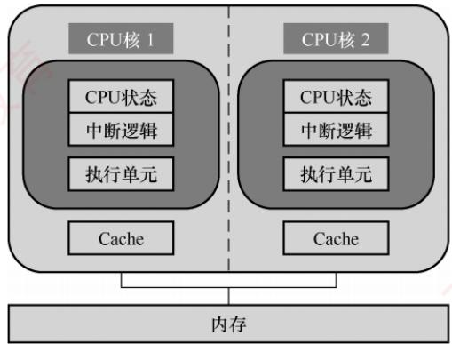
</div>

<p align="center"><em>图 5.28 不共享缓存（Cache）的双核 CPU 结构</em></p>

　　在多核系统中，要充分发挥硬件的并行计算能力，必须采用多线程（或多进程）模型，确保每个核在运行时均有可执行的线程。与单核系统中的多线程不同，多核架构支持多线程在物理上同时执行：每个核独立运行一个线程，实现真正的并行处理。而单核系统若采用细粒度或粗粒度多线程，其多个线程以时间交错方式执行，任一时刻仅有一个线程处于运行状态；但若支持同时多线程（SMT），则可在单个核上并发执行来自不同线程的多条指令。

　　下面通过一个直观的例子说明相关概念。假设需将四块石头滚到马路对面，滚动每块石头需1分钟。串行处理器（单核）逐一滚动，共需4分钟；双核处理器相当于两名工人，每人负责两块石头，耗时2分钟；向量处理器则如同使用一根长木板同时推动四块石头，由于对所有石头施加完全相同的操作，理论上只需1分钟即可完成。由此可见，多核处理器通过增加处理单元数量实现任务级并行，而向量处理器则通过单指令作用于多数据实现数据级并行。

### 5.7.4 共享内存多处理器的基本概念

　　具有共享单一物理地址空间的多处理器系统称为共享内存多处理器（Shared Memory multi-Processor，SMP）。在 SMP 系统中，所有 CPU 均可通过常规的访存指令访问内存中的任意位置，并通过读/写共享变量进行通信。需要注意的是，尽管物理地址空间是统一的，各 CPU 仍可在各自独立的虚拟地址空间中运行程序，操作系统负责将虚拟地址映射到统一的物理地址空间。

　　SMP 系统根据内存访问延迟的特性可分为两类:

- 统一存储访问（UMA）多处理器。所有 CPU 访问任意内存单元的延迟基本相同，与发起请求的 CPU 及目标地址无关。

- 非统一存储访问（NUMA）多处理器。内存访问延迟取决于请求 CPU 与目标内存的物理位置关系。通常，主存被划分为多个区域，分别连接到不同的 CPU。

　　早期的计算机系统普遍采用北桥架构：内存控制器集成于北桥芯片，CPU 通过前端总线（FSB）连接北桥以访问内存。随着多核与多处理器技术的发展，多个 CPU 对前端总线的争用使其成为系统性能瓶颈。为突破这一限制，NUMA 架构应运而生：内存控制器被集成到各 CPU 内部，每个 CPU 直接连接一部分物理内存（称为本地内存）；各 CPU 之间通过高速互连总线（如 Intel 的 QPI）相互连接，可访问其他 CPU 的远程内存。在 NUMA 架构下，访问本地内存的延迟显著低于访问远程内存，因此程序性能对数据布局较为敏感。

　　由于多个 CPU 可能同时访问同一共享变量，必须引入同步机制以确保操作的原子性与数据一致性。否则，可能读取到另一 CPU 更新过程中的中间值，导致错误结果。常用方法是对共享变量使用互斥锁：任一时刻仅允许一个 CPU 持有该锁，其余 CPU 须等待其释放后方可访问。

　　第 3 章讨论的 Cache 一致性主要针对单处理器系统中 Cache 与主存的数据同步。而在 SMP 系统中，多个 CPU 的 Cache 可能同时缓存同一物理内存地址的副本，因此其 Cache 一致性要求更为严格：任意时刻，所有 CPU 对该地址的 Cache 副本必须保持一致。这一目标通常由硬件一致性协议保障，通过及时传播写操作或无效化其他 CPU 中的副本，维护全局数据一致性。

### 5.7.5 本节习题精选

#### 单项选择题

01. 当前设计高性能计算机的重要技术途径是（）。

- A. 提高CPU主频
- B. 扩大主存容量
- C. 采用非冯·诺依曼结构
- D. 采用并行处理技术

02. 按照 Flynn 提出的计算机系统分类方法，多处理机属于（）。

- A. SISD
- B. SIMD
- C. MISO
- D. MIMD

03. 从体系结构的角度来看，阵列处理机属于（）结构。

- A. SISD
- B. SIMD
- C. MIMD
- D. MISD

04. 以下机器中，不属于SIMD结构的是（）。

- A. 并行处理机
- B. 阵列处理机
- C. 向量处理机
- D. 标量流水线处理机

05. 具有一个控制部件和多个处理单元的计算机系统属于（）结构。

- A. SISD
- B. SIMD
- C. MISD
- D. MIMD

06. 下列关于超线程（HT）技术的描述中，正确的是（）。

- A. 超线程技术可以让四核的Intel Core i7处理器变成八核
- B. 超线程技术是一项硬件技术，能使系统性能大幅提升，与操作系统和应用软件无关
- C. 含有超线程技术的CPU需要芯片组的支持才能发挥技术优势
- D. 超线程技术模拟出的每个CPU核都具有独立的资源，各自工作互不干扰

07. 双核 CPU 和超线程 CPU 的共同点是（）。

- A. 都有两个内核
- B. 都能同时执行两个运算
- C. 都包含两个 CPU
- D. 都不会出现争抢资源的现象

08. 下列关于双核技术的叙述中，正确的是（）。

- A. 双核是指主板上有两个CPU
- B. 双核是利用超线程技术实现的
- C. 双核是指在CPU上集成两个运算核心
- D. 双核CPU是时间并行的并行计算

09. 下列有关多核 CPU 和单核 CPU 的描述中，错误的是（）。

- A. 双核的频率为 2.4GHz，那么其中每个核心的频率也是 2.4GHz
- B. 同等性能下，采用双核 CPU 可以降低计算机系统的功耗和体积
- C. 多核 CPU 共用一组内存，数据共享
- D. 所有程序在多核 CPU 上运行速度都快

10. 下列关于多核 CPU 的描述中，正确的是（）。

- A. 各核心完全对称，拥有各自的 Cache
- B. 任何程序都可以同时在多个核心上运行
- C. 一颗 CPU 中集成了多个完整的执行内核，可同时进行多个运算
- D. 只有使用了多核 CPU 的计算机，才支持多任务操作系统

11. 下列关于多核处理器的说法中，不正确的是（）。

- A. 多核处理器并不能使单线程程序的执行速度加快
- B. 多核处理器在Flynn分类法中属于MIMD系统
- C. 多核处理器实际上就是在一个CPU上集成了多个控制核心
- D. 多核处理器通常比单核处理器的能耗更高

12. 【2022 统考真题】下列关于并行处理技术的叙述中，不正确的是（）。

- A. 多核处理器属于 MIMD 结构
- B. 向量处理器属于 SIMD 结构
- C. 硬件多线程技术只可用于多核处理器
- D. SMP 中所有处理器共享单一物理地址空间

### 5.7.6 答案与解析

#### 单项选择题

**01. D**

　　单纯提高 CPU 主频已难以为继，受限于功耗和散热；扩大主存容量虽能支持更大的程序，却无法直接加快计算速度；非冯·诺依曼结构目前仍处于探索阶段。相比之下，并行处理技术通过同时执行多个任务或操作，有效突破了性能瓶颈，已成为现代高性能计算机的核心设计途径。

**02. D**

　　Flynn 分类法将计算机体系结构分为 SISD、SIMD、MISD 和 MIMD 四类。常规的单处理器属于 SISD，常规的多处理机属于 MIMD。

**03. B**

　　阵列处理机包含一个计算阵列，此阵列由多个处理单元组成。它使用单一的控制部件控制多个处理单元，使每个处理单元对各自的数据进行同样的操作，属于 SIMD 结构。

　　A、B 和 C 通常可理解为同一种概念，是 SIMD 结构。标量流水线处理机是 SISD 结构。

**05. B**

　　单指令流多数据流（SIMD）结构的计算机通常由一个指令控制部件、多个处理单元组成，不同处理单元执行的同一条指令所处理的数据可以不同。

**06. C**

　　超线程技术是在一个 CPU 中，提供两套线程处理单元，让单个处理器实现线程级并行。虽然采用超线程技术能够同时执行两个线程，但是当两个线程同时需要某个资源时，其中一个线程必须暂时挂起，直到这些资源空闲后才能继续运行。因此，超线程的性能并不等于两个 CPU 的性能。而且，超线程技术的 CPU 需要芯片组、操作系统（如 Windows 98 不支持超线程技术）和应用软件的支持，才能发挥该项技术的优势。双核技术是指将两个一样的 CPU 集成到一个封装内（或者直接将两个 CPU 做成一个芯片），而超线程技术在 CPU 内部仅复制必要的线程资源来让两个线程同时运行，能并行执行两个线程，模拟实体双核。仅选项 C 正确。

**07. B**

　　超线程技术在CPU内部仅复制必要的线程资源，共享CPU的高速缓存和功能部件，让两个线程可以并行执行，模拟双核 CPU。当两个线程同时需要某个共享资源时，其中一个线程必须暂时挂起，直到这些资源空闲后才能继续运行。仅选项 B 正确。

**08. C**

　　双核是指将两个 CPU 核心集成到一个封装中，核心也称内核，是 CPU 最重要的组成部分，选项 C 正确。主板上有两个 CPU 属于多处理器。超线程技术是模拟实体双核，不能算作真正意义上的双核。时间并行是指流水线技术，空间并行则是指硬件资源的重复，空间并行导致了两类并行机的产生，按 Flynn 分类法分为 SIMD 和 MIMD。

**09. D**

　　多核 CPU 的核心通常都是对称的，因此 2.4GHz 双核 CPU 中两个核的主频也是 2.4GHz。早期 CPU 性能提升主要靠提高主频，导致功耗增大，发热量大，而且当主频提高到一定程度后，CPU 性能的提升不再明显，后来转到增加 CPU 核心的方向，将 2 个核心集成到一个芯片内，提供等同双 CPU 的性能，这显然也降低了 CPU 的体积。选项 C 显然正确。在多核 CPU 上运行一个不支持多线程的程序，显然不能发挥多核 CPU 的优势，选项 D 错误。

**10. C**

　　多核 CPU 的各核心既可以有独自的 Cache，又可以共享同一个 Cache。只有支持多线程的并行处理程序才能同时在多个核心上运行，发挥多核的优势。选项 C 正确。多任务系统也称多道程序系统，可以运行在单核 CPU 上，宏观上并行，微观上串行。

**11. C**

　　单线程程序只有一个执行流，因此多核处理器并不能使其执行速度加快。多核处理器属于Flynn分类法的MIMD系统。多核处理器是在一个CPU上集成了多个执行内核而非控制核心的处理器，选项C错误。多核处理器可在一个时钟周期内处理多个并行任务，因此能耗通常更高。

**12. C**

　　MIMD 结构分为多计算机系统和多处理器系统。向量处理器是 SIMD 的变体，属于 SIMD 结构。硬件多线程技术在一个核中处理多个线程，可用于单核处理器，选项 C 错误。共享内存多处理器（SMP）具有共享的单一物理地址空间，所有核都可通过存取指令来访问同一片主存地址空间。

## 5.8 本章小结

　　本章开头提出的问题的参考答案如下。

##### 1） 指令和数据均存放在内存中，计算机如何从时间和空间上区分它们是指令还是数据？

　　指令和数据在计算机中均以二进制形式共存于同一内存，内存本身无法区分二者。计算机通过 CPU 的工作阶段从时间上区分指令与数据：取指发生在取指阶段，取操作数则发生在执行阶段。在空间上，CPU 根据当前阶段将读出的内容送至不同部件：取指阶段的数据锁存至指令寄存器供译码，执行阶段的数据写入通用寄存器并送入 ALU 运算。因此，指令与数据的区分并不由内存决定，而由 CPU 的控制信号在特定时序下引导其流向不同寄存器来实现。

##### 2） 什么是指令周期和时钟周期？它们之间有何关系？

　　指令周期是指 CPU 从内存中取指并完成执行所需的全部时间。在多周期 CPU 中，它包含多个时钟周期；在单周期 CPU 中，则恰好等于一个时钟周期。时钟周期是主时钟的一个节拍，也是 CPU 操作最基本的时序单位。因此，指令周期与时钟周期的关系取决于处理器结构。

##### 3） 什么是微指令？它和第4章谈到的指令有什么关系？

　　微指令是微程序控制方式中的基本控制单元。控制单元发出的最基本控制信号称为微命令，一组用于完成特定微操作的微命令构成一条微指令；若干微指令按序排列形成微程序，用以解释并执行一条机器指令。在微程序控制器中，每条机器指令通常对应一个微程序，而该微程序由多条微指令组成，每条微指令可并行发出多个微命令。

4）什么是指令流水线？指令流水线相对于传统体系结构的优势是什么？

　　指令流水线是一种将指令执行划分为若干有序阶段，并让多条指令的各个阶段在时间上重叠执行的技术。每个阶段由专用功能部件完成；当前一条指令进入下一阶段时，后续指令便可进入当前阶段，从而实现功能部件的持续利用。与非流水线结构相比，它并不缩短单条指令的执行延迟，但能显著提升单位时间内完成的指令数（吞吐率）。由于仅需增加少量流水线寄存器等硬件即可获得数倍的吞吐率提升，因此成为现代处理器广泛采用的并行处理技术。

## 5.9 常见问题和易混淆知识点

#### 1. 流水线越多，并行度就越高。是否流水段越多，指令执行越快？

　　并非流水段越多，指令执行就越快。原因如下：

1）流水段增加会引入更多的流水线寄存器，其延迟限制了时钟周期的进一步缩短；同时，段数增多也导致单条指令从进入至流出所需的时钟周期数增加。此外，存在数据或控制冒险时，流水线需要插入停顿，而段数越多，潜在的性能损失就越显著。

2）随着流水段数的增加，用于处理结构冲突、数据冒险和控制转移的控制逻辑急剧复杂化，不仅增加硬件开销，还可能成为新的性能瓶颈。

#### 2. 读后写（WAR）相关和写后写（WAW）相关的概念

　　在非按序执行的流水线中，由于允许后进入流水线的指令超越先进入的指令先完成执行，因此不仅可能发生 RAW 相关，也可能发生 WAR 和 WAW 相关。

1）读后写（Write After Read，WAR）相关。指当前指令需先读取寄存器的值，后续指令才能向该寄存器写入。若执行顺序颠倒，即写操作发生在读操作之前，则当前指令将读到错误的新值。在下列指令中，寄存器 R1 可能存在此类相关：当 I2 在 I1 读取 R1 之前写入该寄存器时，I1 会错误地读取 I2 写入的新值。

I1 add R3, R1, R2 # (R1) + (R2) → R3
I2 sub R1, R4, R5 # (R4) - (R5) → R1

　　在 WAR 相关中，指令 I2 的目的操作数是指令 I1 的源操作数。

2）写后写（Write After Write，WAW）相关。指当前指令应先写入寄存器，后续指令再写入同一寄存器，以保证最终结果为后者；若执行顺序颠倒，导致后一条指令先完成写操作，则寄存器的最终值将违背程序语义。在下列指令中，寄存器 R1 可能存在此类相关：当 I2 在 I1 之前写入 R1 时，R1 的最终值将错误地变为 I1 的结果，而非 I2 的结果。

　　在 WAW 相关中，指令 I2 和指令 I1 的目的操作数相同。
