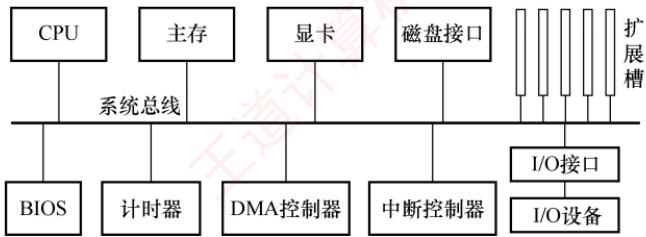
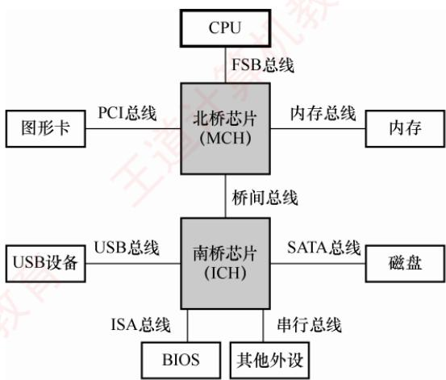
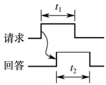
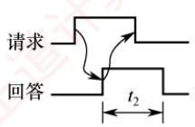
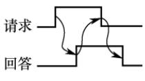

## 【考纲内容】

　　总线的基本概念
　　总线的组成及性能指标
　　总线事务和定时

## 【复习提示】

　　本章的知识点较少，通常以选择题的形式出现，特别是总线的特点、猝发传输方式、性能指标、定时方式及常见的总线标准等。总线带宽的计算也可能结合其他章节出综合题。

　　在学习本章时，建议读者思考以下问题：

1）引入总线结构有什么好处？

2）引入总线结构会导致什么问题？如何解决？

　　建议读者在学习过程中尝试回答这些问题，本章末尾将提供参考答案。

## 6.1 总线概述

　　早期计算机中，各部件通过专用连线直接互连，称为分散连接。随着 I/O 设备种类和数量不断增加，这种连接方式在扩展性和灵活性方面面临挑战。为提升系统的可扩展性与连接灵活性，计算机体系结构逐步演进为采用总线连接方式，并进一步催生了各类标准化总线规范。

　　总线是一组可供多个部件分时共享的公共信息传输线路。其核心特征是：

- 分时性：任一时刻仅允许一个部件向总线发送信息，多个发送方需要分时使用总线。

- 共享性：多个部件可同时挂接在总线上，并能同时接收总线上传输的信息。

### 6.1.1 总线的分类

> **考点追踪：** 总线相关的概念与特点（2016、2017）

1）内部总线。内部总线指芯片内部的总线，也称片内总线，用于 CPU 芯片内部各寄存器之间以及寄存器与 ALU 之间的连接。

2）系统总线。指计算机系统内各功能部件（如 CPU、主存、I/O 接口）之间相互连接的总线。根据所传输信息的内容不同，系统总线可分为以下三类：

> **考点追踪：** 数据总线上传输的内容（2011）

　　① 数据总线用于在各部件之间双向传输数据信息，包括指令、操作数、状态字、中断类型号等。其位数反映了 CPU 一次能并行传送的数据位数。

　　② 地址总线用于指定要访问的主存单元或 I/O 端口的地址。它是单向总线，其位数决定了系统最大可寻址空间。为减少芯片引脚数量并降低成本，部分硬件架构采用地址线与数据线复用设计，此时地址与数据信息分时在同一组物理线路上传输。

　　③ 控制总线用于传输各种协调与控制信号，以确保各部件同步、有序地工作。典型信号包括：时钟、复位、总线请求/允许、中断请求/响应、存储器读/写、I/O 读/写、传输确认等。控制总线由若干单向或双向信号线组成，其具体构成取决于系统设计需求。

3）I/O 总线。用于连接主机与其内部的各类 I/O 控制器（如显卡、网卡等），通常采用标准化内部总线协议，如 PCI、AGP、PCI Express 等。

4）通信总线。用于主机与外部 I/O 设备之间或不同计算机系统之间的通信。这类总线需要适应不同的传输距离、速率和电气规范，典型代表包括 RS-232、USB 等。

### 6.1.2 常见的总线标准

　　总线标准是国际上制定的、用于互连计算机各功能模块的规范，是构建计算机系统时必须遵循的接口协议。典型的总线标准包括 ISA、EISA、VESA、PCI、AGP、PCI-Express、USB 等。它们的主要区别是总线宽度、带宽、时钟频率、寻址能力、是否支持突发传送等。

> **考点追踪：** 总线标准的英文缩写（2010）

1）ISA，Industry Standard Architecture，工业标准体系结构。最早的系统总线标准，传输速率低、CPU占用率高、占用较多中断资源。属于系统总线、并行总线。

2）EISA，Extended Industry Standard Architecture，扩展的 ISA。在 ISA 基础上扩展，支持多主控器和突发传送，且完全兼容 ISA。属于系统总线、并行总线。

> **考点追踪：** 区分设备总线和局部总线（2013）

3）VESA，Video Electronics Standards Association，视频电子标准协会。一种32位局部总线标准，为满足多媒体PC对高速图像数据传输的需求而设计。属于局部总线、并行总线。局部总线是一种位于CPU与ISA总线之间的高速扩展总线，旨在将高速外部设备（如显卡、磁盘控制器）从低速ISA总线迁移至更接近CPU的数据通路，以提升I/O性能。

4）PCI，Peripheral Component Interconnect，外部设备互连。高性能的32位或64位总线，广泛用于显卡、声卡、网卡等扩展卡。PCI总线是一个与处理器时钟频率无关的高速外围总线，支持即插即用。属于局部总线、并行总线。

5）AGP，Accelerated Graphics Port，加速图形接口。专为图形卡设计的高速接口，允许显卡直接高效访问系统主存，用于加速3D图形和视频处理。属于局部总线、并行总线。

> **考点追踪：** PCI-E总线的特点（2017）

6）PCI-E，PCI-Express。采用高速串行点对点连接，由多条通道组成（如×1、×16），支持全双工通信，传输速率远超PCI和AGP。属于局部总线、串行总线。

7）RS-232C。一种用于数据终端设备（DTE）与数据通信设备（DCE）之间进行串行二进制通信的标准接口。属于设备总线、串行总线。

> **考点追踪：** USB 总线的特点（2012）

8）USB，Universal Serial Bus，通用串行总线。用于连接外部 I/O 设备，支持即插即用、热插拔和多设备级联，广泛应用于键盘、鼠标、移动存储等。属于设备总线、串行总线。

9）PCMCIA，Personal Computer Memory Card International Association。主要用于笔记本电脑的扩展卡标准，支持即插即用。属于设备总线、并行总线。

10）IDE，Integrated Drive Electronics，集成设备电路。更准确称为 ATA，是连接主板与硬盘/光驱的传统并行接口。属于设备总线、并行总线。

11）SCSI，Small Computer System Interface，小型计算机系统接口。一种高性能的系统级设备接口，常用于服务器硬盘等。属于设备总线、并行总线。

12）SATA，Serial Advanced Technology Attachment，串行高级技术附件。IDE/ATA的串行替代标准，采用高速串行传输。属于设备总线、串行总线。

### 6.1.3 总线的性能指标

1）总线传输周期。指完成一次完整总线事务（如一次读或写操作）的总时间，通常由若干总线时钟周期组成，简称总线周期。

2）总线时钟频率。即总线基础时钟信号的频率，是总线时钟周期的倒数。早期总线的时钟与 CPU 时钟同频，随着 CPU 的快速发展，现代总线的时钟通常独立于 CPU 时钟。

3）总线工作频率。总线工作频率指总线每秒能进行的有效数据传输次数。早期总线每个时钟周期仅传输一次数据，此时总线工作频率等于时钟频率。现代总线一个时钟周期内可以传送2次、4次甚至更多次数据。因此，总线工作频率可达时钟频率的2倍、4倍等。

4）总线宽度。即总线中数据线的条数，决定了每次能并行传输的数据位数。

> **考点追踪：** 总线带宽的分析与计算（2009、2013、2014、2018—2020、2024、2025）

5）总线带宽。总线带宽指总线在单位时间内所能传输的最大数据量。计算公式为

$$
\text { 总线带宽 } = \text { 总线宽度 } \times \text { 总线工作频率 }
$$

　　例如，若某总线的时钟频率为 11MHz，每个时钟周期可传送 2 次数据（工作频率为 $11 \times 2 = 22MHz$ ），总线宽度为 16 位（2 字节），则总线带宽 $= 2 \times 22 \times 10^{6} = 44MB/s$ 。

> **注意**

　　计算带宽（最大数据传输率）时，应依据总线的物理参数（宽度、时钟频率、每周期传输的次数），反映其理论峰值传输能力，无须考虑具体总线事务中的地址/命令开销或突发传输细节。仅在求平均数据传输率时，才需要分析事务时序。切勿将“两个设备间一次通信的有效速率”误当作“总线带宽”。

　　总线最主要的性能指标为总线宽度、总线工作频率和总线带宽。

6）总线复用。指同一组信号线在不同时间段传输不同类型的信息。例如，地址/数据线复用中，数据线在初期传输地址，后期传输数据。因此可减少引脚数量，节省硬件成本。

7）总线寻址能力。由地址线的位数决定，表示 CPU 能访问的最大地址空间。例如，16 位地址线可寻址 $2^{16}=65536$ 个存储单元；若每个单元为 1B，则最大寻址空间为 64KB。

### 6.1.4 总线的结构

　　总线是计算机系统中各功能部件之间传递信息的公共通道，其结构设计直接影响系统的整体性能和扩展能力。随着处理器速度的不断提升，总线结构经历了从简单共享到分层并行，再到高度集成的演进过程，核心目标始终是提升带宽、降低延迟、打破通信瓶颈。

#### 1. 早期共享总线结构

　　在计算机发展的早期阶段，普遍采用单总线结构：CPU、主存储器和各类 I/O 设备均挂接在同一条系统总线上，如图 6.1 所示。这种结构实现简单、成本低廉，但所有设备必须分时竞争总线使用权，导致频繁的传输冲突，效率低下，难以满足高速外设的数据吞吐需求。

  

<em>图 6.1 单总线结构示意图</em>

　　为缓解 CPU 与主存之间的通信压力，后续引入了双总线结构，增设一条专用的存储总线，使 CPU 与主存的数据交换独立于 I/O 通路。尽管主存访问效率有所提升，但 I/O 设备若需要与主存交换数据，仍要通过 CPU 中转，形成了新的性能瓶颈。

　　进一步改进的三总线结构增加了 DMA（直接内存访问）总线，允许高速 I/O 设备通过 DMA 控制器直接与主存通信，无须 CPU 干预。这一设计显著提升了 I/O 的吞吐能力。然而，传统总线固有的共享式、广播式特性，仍然限制了系统的并发性和可扩展性。

#### 2. 传统分层总线：南北桥结构

　　为突破早期共享总线的性能瓶颈，主流PC系统逐步转向分层次的多总线结构，典型代表是Intel在Pentium4及早期Core系列处理器平台上广泛采用的南北桥结构，如图6.2所示。

  

<em>图 6.2 南北桥结构示意图</em>

　　该结构将系统划分为两个功能区域：

1）北桥芯片（Memory Controller Hub，MCH）作为高速枢纽，连接 CPU、主存和显卡，负责高带宽数据传输。

2）南桥芯片（I/O Controller Hub，ICH）是一个 I/O 控制器集线器，负责管理 USB、SATA、以太网等低速 I/O 接口，并提供扩展槽支持。

　　在这一结构中，CPU 与北桥之间的互连通道称为前端总线（Front Side Bus，FSB），也称系统总线。CPU 通过 FSB 连接至北桥，再经由北桥分别与主存（通过存储器总线）和显卡通信。而各类 I/O 设备（如 USB 设备、网卡、磁盘等）则通过各自的设备控制器接入南桥，北桥与南桥之间通过专用的桥间总线互连，最终形成从 I/O 到 CPU 和主存的完整数据通路。

　　尽管该结构实现了存储通路与 I/O 通路的物理分离，但所有数据（包括内存访问、显卡通信以及 I/O 传输）最终仍需要通过前端总线汇聚至 CPU。因此，FSB 成为整个系统的唯一高性能通道，其共享式特性反而演变为新的性能瓶颈，严重制约了系统整体吞吐能力的进一步提升。

#### 3. 现代集成化总线结构

　　自 Intel Core i7 处理器起，总线结构迎来新的转变：北桥芯片的核心功能（如内存控制器）被集成到 CPU 内部，传统北桥随之消失，系统互连方式转向片上集成与点对点互连。

　　这一转变带来三大重要优势：

1）内存访问路径缩短。CPU 可通过片上存储器控制器直接访问主存，无须经过北桥中转。同时，普遍支持多通道 DDR 内存（如双通道、三通道），各通道并行工作，理论带宽近似为单通道的整数倍。例如，三通道 DDR3-1333 的峰值带宽可达单通道的 3 倍。

2）处理器间高速互连。多核 CPU 内核之间、多 CPU 芯片之间通过 QPI（QuickPath Interconnect）等点对点高速串行链路实现数据交换。QPI 不仅用于 CPU 间通信，还用于连接 CPU 与 IOH（输入/输出集线器，类似于早期的南桥），大幅提升了互连效率。

3）I/O 通路直连。高速外设（如显卡、SSD）通过 PCIe 通道直接接入 CPU，绕过南桥；低速设备则由集成度更高的 PCH（Platform Controller Hub，新一代南桥）统一管理。

### 6.1.5 本节习题精选

#### 一、单项选择题

01. 挂接在总线上的多个部件（）。

- A. 只能分时向总线发送数据，并只能分时从总线接收数据
- B. 只能分时向总线发送数据，但可同时从总线接收数据
- C. 可同时向总线发送数据，并同时从总线接收数据
- D. 可同时向总线发送数据，但只能分时从总线接收数据

02. 在计算机系统中，多个系统部件之间信息传送的公共通路称为总线，就其所传送的信息的性质而言，下列（）不是在公共通路上传送的信息。

- A. 数据信息
- B. 地址信息
- C. 系统信息
- D. 控制信息

03. 系统总线用来连接（）。

- A. 寄存器和运算器部件
- B. 运算器和控制器部件
- C. CPU、主存和外设部件
- D. 接口和外部设备

04. 计算机使用总线结构便于增减外设，同时（）。

- A. 减少信息传输量
- B. 提高信息的传输速度
- C. 减少信息传输线的条数
- D. 提高信息传输的并行性

05. 间址寻址第一次访问内存所得到的信息经系统总线的（）传送到 CPU。

- A. 数据总线
- B. 地址总线
- C. 控制总线
- D. 总线控制器

06. 系统总线中地址线的功能是（）。

- A. 选择主存单元地址
- B. 选择进行信息传输的设备
- C. 选择外存地址
- D. 指定主存和I/O设备接口电路的地址

07. 系统总线中控制线的主要功能是（）。

- A. 提供时序信号
- B. 提供主存和I/O模块的回答信号
- C. 提供定时信号、操作命令和各种请求/回答信号等

- D. 提供数据信息

08. 不同信号在同一条信号线上分时传输的方式称为（）。

- A. 总线复用方式
- B. 并串行传输方式
- C. 并行传输方式
- D. 串行传输方式

09. 主存通过（）来识别信息是地址还是数据。

- A. 总线的类型
- B. 存储器数据寄存器（MDR）
- C. 存储器地址寄存器（MAR）
- D. 控制单元（CU）

10. 在 32 位总线系统中，若时钟频率为 $500 \mathrm{MHz}$ ，传送一个 32 位字需要 5 个时钟周期，则该总线的数据传输速率是（）。

- A. $200 \mathrm{MB} / \mathrm{s}$
- B. $400 \mathrm{MB} / \mathrm{s}$
- C. $600 \mathrm{MB} / \mathrm{s}$
- D. $800 \mathrm{MB} / \mathrm{s}$

11. 传输一幅分辨率为 640 像素×480 像素、颜色数量为 65536 的照片（采用无压缩方式），假设有效数据的传输速率为 56kb/s，则大约需要的时间是（）。

- A. 34.82s
- B. 43.86s
- C. 85.71s
- D. 87.77s

12. 某总线有 104 根信号线，其中数据线（DB）为 32 根，若总线工作频率为 33MHz，则其理论最大传输速率为（）。

- A. 33MB/s
- B. 64MB/s
- C. 132MB/s
- D. 164MB/s

13. 在一个 16 位的总线系统中，若时钟频率为 100MHz，总线周期为 5 个时钟周期传输一个字，则总线带宽是（）。

- A. 4MB/s
- B. 40MB/s
- C. 16MB/s
- D. 64MB/s

14. 下列信号中，可在系统总线中的控制总线上传输的有（）。
 I. 存储器和 I/O 设备的地址信息
 II. 存储器和 I/O 设备的时序信号、控制信号
 III. 存储器和 I/O 设备的响应信号
 IV. 存储器中存放的数据

- A. I 和 IV
- B. II 和 III
- C. I、II 和 III
- D. II、III 和 IV

15. 总线中，有些信息是单向传输的，有些信息是双向传输的，下列说法中正确的是（）。

- A. 数据信息是单向传输的，由内存或外设传送至CPU
- B. 地址信息是单向传输的，由CPU发送至内存或外设
- C. 控制信息是双向传输的，由CPU发送至内存或外设，也可反向
- D. 状态信息是双向传输的，由CPU发送至内存或外设，也可反向

16. 【2009 统考真题】假设某系统总线在一个总线周期中并行传输 4 字节信息，一个总线周期占用 2 个时钟周期，总线时钟频率为 10MHz，则总线带宽是（）。

- A. 10MB/s
- B. 20MB/s
- C. 40MB/s
- D. 80MB/s

17. 【2010 统考真题】*下列选项中的英文缩写均为总线标准的是（）。

- A. PCI、CRT、USB、EISA
- B. ISA、CPI、VESA、EISA
- C. ISA、SCSI、RAM、MIPS
- D. ISA、EISA、PCI、PCI-Express

18. 【2011 统考真题】在系统总线的数据线上，不可能传输的是（）。

- A. 指令
- B. 操作数
- C. 握手（应答）信号
- D. 中断类型号

19. 【2012 统考真题】*下列关于 USB 总线特性的描述中，错误的是（）。

- A. 可实现外设的即插即用和热拔插
- B. 可通过级联方式连接多台外设
- C. 是一种通信总线，连接不同外设
- D. 同时可传输 2 位数据，数据传输速率高

20. 【2013 统考真题】*下列选项中，用于设备和设备控制器之间互连的接口标准是（）。

- A. PCI
- B. USB
- C. AGP
- D. PCI-Express

21. 【2014 统考真题】某同步总线采用数据线和地址线复用方式，其中地址/数据线有 32 根，总线时钟频率为 66MHz，每个时钟周期传送两次数据（上升沿和下降沿各传送一次数据），该总线的最大数据传输速率（总线带宽）是（）。

- A. 132MB/s
- B. 264MB/s
- C. 528MB/s
- D. 1056MB/s

22. 【2019 统考真题】某计算机采用 3 通道存储器总线，配套的内存条型号为 DDR3-1333，即内存条所接插的存储器总线的工作频率为 1333MHz，总线宽度为 64 位，则存储器总线的总带宽大约是（）。

- A. 10.66GB/s
- B. 32GB/s
- C. 64GB/s
- D. 96GB/s

23. 【2020 统考真题】QPI 总线是一种点对点全双工同步串行总线，总线上的设备可同时接收和发送信息，每个方向可同时传输 20 位信息（16 位数据 + 4 位校验位），每个 QPI 数据包有 80 位信息，分 2 个时钟周期传送，每个时钟周期传递 2 次。因此，QPI 总线带宽为：每秒传送次数×2B×2。若 QPI 时钟频率为 2.4GHz，则总线带宽为（）。

- A. 4.8GB/s
- B. 9.6GB/s
- C. 19.2GB/s
- D. 38.4GB/s

24. 【2024 统考真题】某存储器总线的时钟频率为 420MHz，总线宽度为 64 位，每个时钟周期传送 2 次数据；其总线事务支持突发传送方式，最多传送 8 次数据，第 1 个时钟周期传送地址和读/写命令，从第 4 个至第 7 个时钟周期连续传送 8 次数据。该总线的总线带宽（最大数据传输率）为（）。

- A. 3.84GB/s
- B. 6.72GB/s
- C. 30.72GB/s
- D. 53.76GB/s

25. 【2025 统考真题】某处理器总线采用同步、并行传输方式，每个总线时钟周期传送 4 次数据（quadpumped 技术）。若该总线的工作频率为 1333MHz（实际单位是 MT/s，表示每秒传送 1333M 次），总线宽度为 64 位，则总线带宽约为（）。

- A. 10.66GB/s
- B. 42.66GB/s
- C. 85.31GB/s
- D. 341.25GB/s

#### 二、综合应用题

01. 某总线的时钟频率为 $66\mathrm{MHz}$ ，在一个64位总线中，总线数据传输的周期是7个时钟周期传输6个字的数据块。
1）总线的数据传输速率是多少？
2）若不改变数据块的大小，而将时钟频率减半，这时总线的数据传输速率是多少？

02. 某总线支持二级 Cache 块传输方式, 若每块 6 个字, 每个字长 4 字节, 时钟频率为 100MHz。

1）读操作时，第一个时钟周期接收地址，第二、三个为延时周期，另用4个周期传送一个块。读操作的总线传输速率为多少？

2）写操作时，第一个时钟周期接收地址，第二个为延时周期，另用4个周期传送一个块，写操作的总线传输速率是多少？

3）设在全部的传输中， $70\%$ 的时间用于读， $30\%$ 的时间用于写，该总线在本次传输中的平均传输速率是多少？

### 6.1.6 答案与解析

#### 一、单项选择题

**01. B**

　　为了使总线上的数据不发生 “冲突”，挂在总线上的多个设备只能分时地向总线发送数据，即某个时刻只能有一个设备向总线传送数据，而从总线接收数据的设备可以有多个，因为接收数据的设备不会对总线产生“干扰”。

**02. C**

　　总线包括数据线、地址线和控制线，传送的信息分别为数据信息、地址信息和控制信息。

**03. C**

　　系统总线用于连接计算机中的各个功能部件（如 CPU、主存和 I/O 设备）。

**04. C**

　　计算机使用总线结构便于增减外设，同时减少信息传输线的条数。但相对于专线结构，其实际上也降低了信息传输的并行性及信息的传输速度。

**05. A**

　　间址寻址首次访问内存所得到的信息是操作数的有效地址，该地址作为数据通过数据总线传送至 CPU，地址总线是用于 CPU 选择主存单元地址和 I/O 端口地址的单向总线，不能回传。

　　地址总线由单向的多根信号线组成，可用于 CPU 向主存、外设传送地址信息；数据总线由双向的多根信号线组成，CPU 既可以沿着这些线从主存或外设读入数据，又可以发送数据；控制总线上传输控制信息，包括控制命令和反馈信号等。

**06. D**

　　地址总线上的代码用来指明 CPU 要访问的存储单元或 I/O 端口的地址。

**07. C**

　　系统总线中控制线的主要功能是提供定时信号、操作命令和各种请求/回答信号等。

**08. A**

　　串行传输是指数据的传输在一条线路上按位进行，并行传输是指每个数据位有一条单独的传输线，所有数据位同时传输。不同信号在同一条信号线上分时传输的方式，称为总线复用。

**09. A**

　　地址和数据在不同的总线上传输，根据总线传输信息的内容进行区分，地址在地址总线上传输，数据在数据总线上传输。

**10. B**

　　总线带宽 = 总线宽度×总线频率，本题中的总线宽度为 32 位，即 4B，总线频率为 500MHz/5 = 100MHz，因此总线的数据传输速率为 $4\mathrm{B}\times(500\mathrm{MHz}/5)=400\mathrm{MB/s}$ 。

**11. D**

$65536 = 2^{16}$ 色，因此颜色深度为 16 位，占据的存储空间为 $640 \times 480 \times 16 = 4915200$ 位。有效传输时间 $= 4915200 \div (56 \times 10^{3})s \approx 87.77s$ 。

**12. C**

　　数据总线32根，因此每次传输32位，即4B数据，总线工作频率为 $33\mathrm{MHz}$ ，因此理论最大传输速率为 $33\times 4 = 132\mathrm{MB / s}$ 。

**13. B**

　　时钟频率为 100MHz，因此时钟周期 = 1/100MHz = 0.01μs，总线周期 = 5 个时钟周期 = 5×0.01μs = 0.05μs，总线工作频率 = 1/0.05 = 20MHz，因总线是 16 位的，即 2B，因此总线带宽 = 20×(16/8) = 40MB/s。

**14. B**

　　控制总线主要用来传输计算机内各种控制信号，控制信号包括存储器和 I/O 设备的时序信号和响应信号，说法 II、III 正确。存储器和 I/O 设备的地址信息通过地址总线传输，说法 I 错误。存储器中存放的数据通过数据总线传输，说法 IV 错误。

**15. B**

　　总线中，数据总线是双向传输的，数据信息既可由 CPU 传送至内存或外设，又可由内存、外设传送至 CPU，选项 A 错误。地址总线是单向传输的，地址信息只能由 CPU 发送至内存或外设，选项 B 正确。控制信息和状态信息也是单向传输的，它们的传输方向正好相反，控制信息通过控制总线由 CPU 发送至内存或外设，而状态信息则通过状态总线由内存或外设发送至 CPU。

**16. B**

　　总线带宽是指单位时间内总线上传输数据的位数，通常用每秒传送信息的字节数来衡量，单位为 B/s。由题意可知，在 1 个总线周期（=2 个时钟周期）内传输了 4 字节信息，时钟周期 = 1/10MHz = 0.1μs，因此总线带宽为 $4\mathrm{B}\div(2\times0.1\mu\mathrm{s})=4\mathrm{B}\div(0.2\times10^{-6}\mathrm{s})=20\mathrm{MB}/\mathrm{s}$ 。

**17. D**

　　选项A中的CRT表示阴极射线管显示器；选项B中的CPI表示每条指令的时钟周期数；选项C中的RAM表示半导体随机存储器、MIPS表示每秒执行多少百万条指令数。

**18. C**

　　取指令时，指令便是在数据线上传输的。操作数显然在数据线上传输。中断类型号用于指出中断向量（中断服务程序的入口地址）的地址，CPU响应某一外部中断后，就会从数据总线上获取该中断源的中断类型号，然后据此计算对应中断向量在中断向量表（存放在内存中）的位置。而握手（应答）信号属于总线定时的控制信号，应在控制总线上传输。

**19. D**

　　USB 的特点有：① 即插即用；② 热插拔；③ 有很强的连接能力，采用菊花链形式将众多外设连接起来；④ 有很好的可扩充性，一个 USB 控制器可扩充高达 127 个外部 USB 设备；⑤ 高速传输，速率可达 480Mb/s。USB 是串行总线，不能同时传输 2 位数据，选项 D 错误。

**20. B**

　　USB 是一种连接外部设备的 I/O 总线标准，属于设备总线，是设备和设备控制器之间的接口。而 PCI、AGP、PCI-E 作为计算机系统的局部总线标准，通常用来连接主存、网卡、视频卡等。

**21. C**

　　数据线有 32 根，也就是一次可以传送 32b/8 = 4B 的数据，66MHz 意味着有 66M 个时钟周期，而每个时钟周期传送两次数据，可知总线每秒传送的最大数据量为 $66M \times 2 \times 4B = 528MB$ ，所以总线的最大数据传输速率为 528MB/s。

**22. B**

　　由题目可知，计算机采用3通道存储器总线，存储器总线的工作频率为1333MHz，即1s内传送1333M次数据，总线宽度为64位即单条总线工作一次可传输8字节，因此存储器总线的总带宽为 $3\times8\times1333MB/s$ ，约为32GB/s。

**23. C**

　　每个时钟周期传送 2 次，所以每秒传送的次数 = 时钟频率×2 = 2.4G×2/s。

　　总线带宽 = 每秒传送次数×2B×2 = 2.4G×2×2B×2/s = 19.2GB/s。

　　题中已给出总线带宽公式，降低了难度。公式中的“×2B”是因为每次传输16位数据。

　　注意，计算总线带宽或数据传输速率时，是否包含校验位、控制位等开销并无统一标准，要以题干为准。尽管 QPI 每周期实际传输 20 位（含 4 位校验），但本题明确按 16 位有效数据计算带宽。无特别说明时，通常默认仅计入有效用户数据，不含额外开销。

**24. B**

　　总线带宽（最大数据传输率）是理想情况（所有总线周期都在传送数据）下，不需考虑每个总线事务的具体情况，而计算（平均）数据传输率才需考虑每个总线事务的具体情况。因此，题中“其总线事务支持……连续传送8次数据。”这句话属于干扰条件。根据定义，总线带宽 = 总线宽度 × 总线时钟频率 × 每个时钟周期传送数据的次数 = 64bit×420MHz×2 = 6.72GB/s。

**25. A**

　　总线带宽 = 每秒传输次数×每次传输的数据量。题中每秒传输 1333M 次，每次传输 64 位（8 字节）。因此，带宽 = 1333M×8B/s = 10664MB/s，约为 10.66GB/s。

#### 二、综合应用题

**01. 【解答】**

1）总线周期为7个时钟周期，总线频率为66/7MHz。

　　总线在一个完整的操作周期中传输了一个数据块，总线在一个周期内传输的数据量为 $64\mathrm{bit} / 8\times 6 = 48\mathrm{B}$ ，所以总线的宽度为48B，传输速率为 $48\mathrm{B}\times 66 / 7\mathrm{MHz} = 452.6\mathrm{MB / s}$ 。

2）时钟频率减半时的总线频率为(66/7)/2MHz，因数据块大小不变，因此总线宽度仍为48B，传输速率为 $48B\times33/7MHz=226.3MB/s$ 。

　　注意总线周期和时钟周期的联系与区别，总线周期通常由多个时钟周期组成。

**02. 【解答】**

1）读操作的时钟周期数： $1 + 2 + 4 = 7$

　　对应的频率：100MHz/7

　　总线宽度: $6 \times 4B = 24B$

　　所以数据传输速率 = 总线宽度/读操作时间 = $24 \times (100 \text{MHz}/7) = 343 \text{MB/s}$ 。

2）写操作的时钟周期数： $1+1+4=6$

　　对应的频率: 100MHz/6

　　总线宽度: $6 \times 4B = 24B$

　　所以数据传输速率 = 总线宽度/写操作时间 = $24 \times (100 \text{MHz}/6) = 400 \text{MB/s}$ 。

3）平均传输速率 $= 343 \times 70\% + 400 \times 30\% = 360.1 \mathrm{MB} / \mathrm{s}$ 。

## 6.2 总线事务和定时

### 6.2.1 总线事务

　　在总线上，主设备（如 CPU、DMA 控制器）与从设备（如主存、I/O 设备）之间完成一次完整的信息交换过程，称为一个总线事务。总线事务的类型由操作性质决定，典型的包括存储器读（从主存取数据至处理器）、存储器写（向主存写入数据）、I/O 读/写、中断响应等。

　　每个总线事务通常包含三个基本阶段（依据历年真题）：

1）地址传送阶段：主设备将目标地址和操作类型（读/写）通过总线传送给从设备。

2）从设备响应阶段（也称数据准备阶段）：从设备根据地址准备数据（该阶段的耗时由设备特性决定，若题中未明确提及，则通常可忽略）。

3）数据传送阶段：完成实际数据在总线上的传输。

（1）非突发传输与突发传输

　　总线上连续数据的传输可采用非突发或突发两种方式。

> **考点追踪：** 非突发传输的时间分析（2023）

　　非突发传输方式：每次仅传输一个数据单元（通常为一个总线宽度的数据）。每次传输都必须独立经历完整的三阶段流程——先发送地址，等待从设备准备数据，再传输数据。因此，即使连续读取多个相邻数据，也需要重复发送地址，导致地址开销大、效率较低。

> **考点追踪：** 突发传输的特点与时间分析（2012—2014）

　　突发传输方式：用于高效传输连续成块的数据。事务开始时，主设备仅发送数据块的首地址；随后，在不释放总线的前提下，连续传送多个数据单元。后续地址由硬件自动递增生成（如首地址+1、首地址+2……），无须重复使用地址线。

　　因此，在相同总线宽度和时钟频率下，突发传输省去了多次地址传送开销，显著提升了有效带宽，广泛应用于高速存储器访问（如 SDRAM 行读取、Cache 块填充）等场景。简言之，非突发方式是 “一次地址，一次数据”，突发方式是 “一次地址，多次数据”。

##### （2） 串行传输与并行传输

　　数据在总线上的物理传输可采用串行或并行两种方式。

　　串行传输方式: 数据按比特位依次顺序传输, 通常仅使用一条双向线路或两条单向线路(发送/接收各一)。优点是引脚少、布线简单、抗干扰能力强, 适合长距离通信（如 USB、PCIe、SATA）。在串行传输中, 根据收发双方的时序协调方式, 又可分为同步串行通信和异步串行通信。

1）同步串行通信：由发送方时钟直接控制接收方时钟，实现位同步。收发双方的时钟严格一致，仅在数据块首尾添加开始和结束标记，传输效率高，但硬件实现复杂，成本较高。

> **考点追踪：** 异步串行通信方式的特点（2016）

2）异步串行通信：收发双方使用独立时钟，无须严格同步。每个字符独立传输，并通过起始位（逻辑0）标识开始，停止位（逻辑1）标识结束。当通信线路空闲时，保持逻辑1状态；发送方要传送字符时，先发送一个逻辑0作为起始位。接收方检测到该逻辑低电平后，便开始接收数据。数据位从最低位开始逐位发送；发送完数据位后，可选择性地发送一位奇偶校验位，用于简单的差错检测；随后发送停止位，表示该字符的结束。

　　并行传输方式：利用多条数据线同时传输多个比特位（如32位、64位总线），理论上单周期即可完成一个字的传输，短距离内延迟低、吞吐高。但随着频率的提高，信号串扰和时序偏移问题加剧，限制了工作频率的提升。因此，并行传输更适合板级或芯片级的短距离通信（如早期PCI、内存总线）。

> **注意**

　　并行传输并不总是比串行传输更快。受限于电气特性，并行总线的工作频率难以持续提高；而串行传输可通过提升频率等方式实现更高的总带宽。因此，现代高速接口多采用串行化设计。

### 6.2.2 总线定时

　　总线定时是指总线上主设备与从设备在交换数据时，用于协调双方操作时序的控制协议。其实质是一种时序规则，主要有同步、异步、半同步和分离式四种方式。

> **考点追踪：** 各种总线定时方式的特点（2015、2021）

#### 1. 同步定时方式

　　同步定时方式采用系统统一的时钟信号来协调发送方和接收方的传送定时关系。时钟产生相等的时间间隔，每个间隔构成一个总线周期，每次数据传送在一个总线周期内完成。由于采用统一时钟，所有操作必须严格在固定周期内进行，总线周期连续进行。

　　优点：传送速度快，具有较高的传输速率；总线控制逻辑简单。

　　缺点：主从设备之间属于强制性同步，所有操作严格受时钟节拍约束；缺乏应答或握手机制，无法根据从设备的实际状态动态调整时序，可靠性较差。

　　适用场景：适用于总线长度较短，且所连接各部件的存取时间比较接近的系统。

#### 2. 异步定时方式

　　异步定时方式不依赖统一的时钟信号，而是通过主从设备之间的握手信号实现定时控制：主设备发出“请求”信号；从设备准备就绪后，发出“回答”信号。

　　优点：总线周期长度可变，能可靠连接工作速度差异较大的设备，自适应性强。

　　缺点：控制逻辑复杂，因多次信号交互，整体传输速率较低。

　　根据 “请求” 与 “回答” 信号的撤销是否互锁，异步定时可分为三类：

1）不互锁方式。主设备发出“请求”后，在预设时延 $t_1$ 后自行撤销；从设备收到请求后立即发出“回答”，并在时延 $t_2$ 后自动撤销。双方无互锁关系，如图6.3(a)所示。

2）半互锁方式。主设备必须收到“回答”后才撤销“请求”（存在互锁）；但从设备发出“回答”后，无须确认“请求”是否撤销，在时延 $t_{2}$ 后自动撤销（无互锁），如图6.3(b)所示。

3）全互锁方式。主设备需收到“回答”才撤销“请求”；从设备需确认“请求”已撤销后才撤销“回答”。双方完全互锁，可靠性最高，如图6.3(c)所示。

  

<em>(a) 不互锁</em>

  

<em>(b) 半互锁</em>

  

<em>(c) 全互锁</em>

<em>图 6.3 请求和回答信号的互锁</em>

　　适用场景：适用于连接速度差异大、对可靠性要求较高而对速率要求不苛刻的系统。

#### 3. 半同步定时方式

　　半同步定时方式结合了同步与异步的优点：地址、命令、数据的发送严格参照系统时钟前沿（如上升沿）；接收方通常在时钟后沿（如下降沿）进行识别；同时增设一条 Wait 信号线，允许慢速从设备反馈准备状态。主设备在时钟上升沿检测 Wait 信号状态。若 Wait 无效（高电平），表示数据未就绪，主设备将插入等待周期；直到 Wait 有效（低电平），才从数据线读取数据。

　　优点：在统一时钟下工作，控制比异步方式简单，可靠性较高。

　　缺点：系统时钟频率受限于最慢设备，整体速度不高。

　　适用场景：适用于包含多种速度差异较大设备、但性能要求不高的简单系统。

　　上述三种定时方式均采用 “独占式事务模型”：从主设备发起请求到传送结束，总线全程被该事务占用。然而，在从设备准备数据阶段，总线虽被占用却处于空闲状态，造成资源浪费。

#### 4. 分离式定时方式

　　分离式定时方式将一个总线事务拆分为两个独立子阶段：请求阶段与应答阶段，两阶段之间释放总线。请求阶段：主设备 A 获得总线使用权，发送地址和命令后立即释放总线，供其他设备使用。应答阶段：从设备 B 准备好数据后，主动申请总线，并以主设备身份将数据发回给 A。两个子阶段均为单向信息流，且总线在准备期间可被其他事务使用。

　　优点：显著减少总线空闲等待时间，提高总线利用率。

　　缺点：控制逻辑复杂，协议开销大，对总线仲裁和事务管理机制要求高。

　　适用场景：适用于多主设备竞争激烈且从设备响应延迟较大的高性能系统。

### 6.2.3 本节习题精选

#### 单项选择题

01. 下列有关同步总线事务的描述中，错误的是（）。

- A. 一个总线事务需多个总线时钟周期完成
- B. 总线事务开始时，先将地址和读/写命令发送到总线
- C. “存储器读”总线事务中，地址与数据通常分时传输
- D. 一次总线事务只能完成一次数据交换

02. 在不同速度的设备之间传送数据，（）。

- A. 必须采用同步控制方式
- B. 必须采用异步控制方式
- C. 可以选用同步控制方式，也可选用异步控制方式
- D. 必须采用应答方式

03. 同步控制方式是（）。

- A. 只适用于 CPU 控制的方式
- B. 只适用于外部设备控制的方式
- C. 由统一的时序信号控制的方式
- D. 所有指令执行时间都相同的方式

04. 同步通信之所以比异步通信具有较高的传输速率，是因为（）。

- A. 同步通信不需要应答信号且总线长度较短
- B. 同步通信用一个公共的时钟信号进行同步
- C. 同步通信中，各部件的存取时间较接近
- D. 以上各项因素的综合结果

05. 下列选项中，属于同步传输特点的是（）。

- A. 需要应答信号
- B. 各部件的存取时间比较接近
- C. 总线长度较长
- D. 总线周期长度可变

06. 在异步总线中，传送操作（）。

- A. 由设备控制器控制
- B. 由CPU控制
- C. 由统一时序信号控制
- D. 按需分配时间

07. 总线的异步通信方式是（）。

- A. 既不采用时钟信号，又不采用“握手”信号
- B. 只采用时钟信号，不采用“握手”信号
- C. 不采用时钟信号，只采用“握手”信号
- D. 既采用时钟信号，又采用“握手”信号

08. 在各种异步通信方式中，（）的速度最快。

- A. 全互锁
- B. 半互锁
- C. 不互锁
- D. 速度均相等

09. 在下列各种情况下，最应采用异步传输方式的是（）。

- A. I/O 接口与打印机交换信息
- B. CPU 与主存交换信息
- C. CPU 和 PCI 总线交换信息
- D. 由统一时序信号控制方式下的设备

10. 假设某存储器总线采用同步通信方式，时钟频率为 50MHz，总线以突发方式传输 8 个字，以支持块长为 8 个字（每个字 4B）的 Cache 行的读/写。若全部访问都为读操作，访问顺序是 1 个时钟周期接收地址，3 个时钟周期等待存储器读数，8 个时钟周期用于传输 8 个字。则该存储器的数据传输速率为（）。

- A. 114.3MB/s
- B. 126MB/s
- C. 133.3MB/s
- D. 144.3MB/s

11. 某I/O设备采用异步串行通信方式向主机传送7位ASCII字符。通信规程要求每个字符后附加1位奇校验位。若要求每秒传送480个字符，则该设备在异步串行线路上每秒传输的比特数为（）。

- A. 3360
- B. 38400
- C. 3840
- D. 4800

12. 下列关于计算机总线的叙述中，正确的是（）。

- A. 现代高速总线普遍采用并行同步方式以提高带宽
- B. 突发传输过程中，CPU需在每个时钟周期通过地址线发送待访问字的完整地址
- C. 计算机系统中的所有总线共享同一时钟信号与控制协议
- D. 采用总线事务分离技术可避免总线空闲等待，提升总线利用率

13. 【2012 统考真题】某同步总线的时钟频率为 100MHz，宽度为 32 位，地址/数据线复用，每传输一个地址或数据占用一个时钟周期。若该总线支持突发（猝发）传输方式，则一次“主存写”总线事务传输 128 位数据所需要的时间至少是（）。

- A. 20ns
- B. 40ns
- C. 50ns
- D. 80ns

14. 【2014 统考真题】一次总线事务中，主设备只需给出一个首地址，从设备就能从首地址开始的若干连续单元读出或写入多个数据。这种总线事务方式称为（）。

- A. 并行传输
- B. 串行传输
- C. 突发传输
- D. 同步传输

15. 【2015 统考真题】下列有关总线定时的叙述中，错误的是（）。

- A. 异步通信方式中，全互锁协议最慢
- B. 异步通信方式中，不互锁协议的可靠性最差
- C. 同步通信方式中，同步时钟信号可由各设备提供
- D. 半同步通信方式中，握手信号的采样由同步时钟控制

16. 【2016 统考真题】下列关于总线设计的叙述中，错误的是（）。

- A. 并行总线传输比串行总线传输速度快
- B. 采用信号线复用技术可减少信号线数量
- C. 采用突发传输方式可提高总线数据传输速率
- D. 采用分离事务通信方式可提高总线利用率

17. 【2017 统考真题】下列关于多总线结构的叙述中，错误的是（）。

- A. 靠近 CPU 的总线速度较快
- B. 存储器总线可支持突发传送方式
- C. 总线之间须通过桥接器相连
- D. PCI-Express×16 采用并行传输方式

18. 【2018 统考真题】下列选项中，可提高同步总线数据传输速率的是（）。
 I. 增加总线宽度 II. 提高总线工作频率
 III. 支持突发传输 IV. 采用地址/数据线复用

- A. 仅 I、II
- B. 仅 I、II、III
- C. 仅 III、IV
- D. I、II、III 和 IV

19. 【2021 统考真题】下列关于总线的叙述中，错误的是（）。

- A. 总线是在两个或多个部件之间进行数据交换的传输介质
- B. 同步总线由时钟信号定时，时钟频率不一定等于工作频率
- C. 异步总线由握手信号定时，一次握手过程完成一位数据交换
- D. 突发（Burst）传送总线事务可以在总线上连续传送多个数据

20. 【2023 统考真题】某存储器总线宽度为 64 位，总线时钟频率为 1GHz，在总线上传输一个数据或地址需要一个时钟周期，不支持突发传送方式。若通过该总线连接 CPU 和主存，主存每次准备一个 64 位数据需要 6ns，主存块大小为 32B，则读取一个主存块所需的时间是（）。

- A. 8ns
- B. 11ns
- C. 26ns
- D. 32ns

### 6.2.4 答案与解析

#### 单项选择题

**01. D**

　　同步总线事务通常包括地址/命令阶段和数据阶段，需要多个时钟周期完成；事务开始时，主设备先将地址和读/写命令发送到总线；地址与数据一般分时传输，不会同时出现在总线上。现代同步总线支持突发传输，允许一次总线事务连续传输多个数据单元，因此选项D错误。

**02. C**

　　在不同速度的设备之间传送数据时，既可采用同步方式，又可采用异步方式。异步方式主要用于在不同的设备间进行通信，两种速度不同的设备使用同一时钟进行控制时，采用同步控制方式同样可以进行数据的传送，但不能发挥快速设备的高速性能。

**03. C**

　　同步控制是指由统一时序控制的通信方式，同步通信采用公共时钟，有统一的时钟周期。同步控制既可用于 CPU 控制，又可用于高速的外部设备控制。

**04. D**

　　同步通信采用统一的时钟，每个部件发送或接收信息都在固定的总线传送周期中，一个总线传送周期结束，开始下一个总线传送周期。它适用于总线长度较短且各部件的存取时间较接近的情况，因此具有较高的传输速率。选项 A、B、C 都是正确原因。

**05. B**

　　各部件的存取时间比较接近时，最适合采用同步传输，以发挥其优势。

**06. D**

　　异步总线即采用异步通信方式的总线。在异步方式下，没有公用的时钟，完全依靠传送双方相互制约的“握手”信号来实现定时控制。传送操作是由双方按需求分配时间的。

**07. C**

　　异步通信方式也称应答方式，没有公用的时钟信号，也没有固定的时间间隔，完全依靠传送双方相互制约的“握手”信号来实现定时控制。

**08. C**

　　在全互锁、半互锁和不互锁三种 “握手” 方式中，只有不互锁方式的请求信号和回答信号没有相互的制约关系，主设备发出请求信号后，不必等待回答信号的到来，便自己撤销了请求信号，所以速度最快。

**09. A**

　　异步通信方式依靠 “握手” 信号来实现定时控制，能保证两个工作速度相差很大的部件或设备之间可靠地进行信息交换。I/O 接口与打印机的速度差异较大，应采用异步传输方式。

**10. C**

　　一次总线事务传输的数据量为 $8 \times 4B = 32B$ ，所需时钟周期数为 $1 + 3 + 8 = 12$ ，每个时钟周期为 1/50MHz，总时间为 $12 \times (1/50MHz) = 0.24\mu s$ 。数据传输速率为 $32B \div [(12 \times (1/50MHz))s] = 133.3MB/s$ 。

**11. D**

　　异步串行通信规范规定，一个完整字符帧包含1位起始位、数据位（本题为7位ASCII码）、1位校验位（可选，本题指定为奇校验）和1位停止位，其中起始位与停止位为必需的控制信号。因此，每个字符帧共占用 $1+7+1+1=10$ 位，每秒传输的比特数为 $10\times480=4800$ 。

**12. D**

　　现代高速总线（如 PCIe、USB、SATA）普遍采用串行差分传输，而非并行同步方式。突发传输只需提供首地址，后续地址由设备自动递增，无须 CPU 逐周期发送完整地址。不同总线（如处理器总线、内存总线、PCIe）通常采用不同的时钟信号，且控制协议各不相同。总线事务分离技术解耦请求与数据响应，使总线在等待期间处理其他事务，减少空闲，提升利用率。

**13. C**

　　因为总线频率为 100MHz，所以时钟周期为 10ns。总线位宽与存储字长都是 32 位，因此每个时钟周期可传送一个 32 位存储字。猝发传输可以连续传送地址连续的数据，因此总传送时间为：传送地址 10ns，传送 128 位数据 40ns，共需 50ns。

**14. C**

　　猝发（突发）传输是在一个总线周期中，可以传输多个存储地址连续的数据，即一次传输一个地址和一批地址连续的数据，并行传输是在传输中有多个数据位同时在设备之间进行的传输，串行传输是指数据的二进制代码在一条物理信道上以位为单位按时间顺序逐位传输的方式，同步传输是指传输过程由统一的时钟控制。

**15. C**

　　同步通信方式采用系统统一的时钟信号，而不是由各设备提供，否则无法实现统一的时钟。

**16. A**

　　并行总线通常比串行总线传输速率快，但这不是绝对的。在时钟频率较低的情况下，并行总线因为可以同时传输若干比特，速率确实比串行总线快。但是，随着技术的发展，时钟频率越来越高，并行总线之间的相互干扰越来越严重，当时钟频率提高到一定程度时，传输的数据已无法恢复。而串行总线因为线少，线间干扰容易控制，反而可通过不断提高时钟频率来提高传输速率，选项A错误。总线复用是指一种信号线在不同的时间传输不同的信息，它可使用较少的线路传输更多的信息，从而节省空间和成本，选项B正确。突发传输是指在一个总线周期中，可以传输多个存储地址连续的数据，即一次传输一个地址和一批地址连续的数据，选项C正确。分离事务通信是总线复用的一种，相比单一的传输线路可以提高总线的利用率，选项D正确。

**17. D**

　　多总线结构用速率高的总线连接高速设备，用速率低的总线连接低速设备。一般来说，CPU是计算机的核心，是计算机中速度最快的设备之一，选项A正确。突发传送方式把多个数据单元作为一个独立传输处理，从而最大化设备的吞吐量。现实中一般用支持突发传送方式的总线来提高存储器的读/写效率，选项B正确。各总线通过桥接器相连，后者起流量交换作用。PCI-Express总线都采用串行数据包传输数据。

**18. B**

　　总线数据传输速率 $=$ 总线工作频率 $\times$ 总线宽度，说法I和II会影响总线数据传输速率。采用突发（猝发）传输方式，可在一个总线周期内传输存储地址连续的多个数据字，因此能提高传输速率。采用地址/数据线复用只是减少了线的数量，节省了成本，并不能提高传输速率。

**19. C**

　　总线是在两个或多个设备之间进行通信的传输介质，选项 A 正确。同步总线是指总线通信的双方采用同一个时钟信号，但是一次总线事务不一定在一个时钟周期内完成，即时钟频率不一定等于工作频率，选项 B 正确。异步总线采用握手的方式进行通信，每次握手的过程完成一次通信，但是一次通信往往会交换多位而非一位数据，选项 C 错误。突发传送总线事务是指发送方在传输完地址后，连续进行若干次数据的发送，选项 D 正确。

**20. D**

　　每次传输需经过传输地址、准备数据和传输数据三个过程，分别需要 1ns（时钟频率为 1GHz，因此时钟周期为 1ns）、6ns 和 1ns，共 8ns。总线宽度为 64 位，所以每次传输的数据为 64 位，主存块大小为 32B，所以读取一个主存块需要传输 4 次，即 $8ns \times 4 = 32ns$ 。

## 6.3 本章小结

　　本章开头提出的问题的参考答案如下。

1）引入总线结构有什么好处？

　　引入总线结构具有以下主要优点：

　　① 简化系统结构，便于设计与制造。

　　② 大幅减少连线数量，利于布线、缩小体积，并提高可靠性。

　　③ 统一接口标准，所有设备采用相似的总线接口，简化硬件设计。

　　④ 支持模块化与灵活扩展，便于系统升级、配置和功能扩充。

　　⑤ 简化软件编程，设备通过不同接口地址进行访问，驱动逻辑统一。

　　⑥ 便于故障诊断、维护与成本控制。

2）引入总线结构会导致什么问题？如何解决？

　　引入总线后，多个设备需分时共享同一组信号线，当多个主设备同时请求使用总线时，将引发总线竞争，导致通信冲突。为解决这一问题，系统需配置总线仲裁部件，以某种方式选择一个主设备获得总线控制权，只有获得总线控制权的设备才能开始数据传送。

## 6.4 常见问题和易混淆知识点

#### 1. 一个总线在某一时刻可以有多对主从设备进行通信吗？

　　不可以。在任一总线周期内，总线上只能有一个主设备控制总线，并选择一个从设备进行一对一通信，或向所有从设备广播（一对多）。由于总线是共享通路，若多对主从设备同时通信，则会导致数据冲突，破坏传输正确性。因此，同一时刻不能存在多对并发的主从通信。
