## 【考纲内容】

（一）计算机网络概述

　　计算机网络的概念、组成与功能；计算机网络的分类；

　　计算机网络的性能指标

（二）计算机网络体系结构与参考模型

　　计算机网络分层结构；计算机网络协议、接口、服务的概念；

　　ISO/OSI 参考模型和 TCP/IP 模型

## 【复习提示】

　　本章主要介绍计算机网络体系结构的基本概念，读者要在理解的基础上适当记忆。重点掌握三种数据交换方式的特点及相关的计算，协议、接口和服务的概念，ISO/OSI 参考模型和 TCP/IP 模型各层的基本功能。熟悉有关网络的性能指标，特别是时延、带宽、速率等的计算。

## 1.1 计算机网络概述

### 1.1.1 计算机网络的概念

　　一般认为，计算机网络是将众多分散的、自治的计算机系统，通过通信设备与线路连接起来，并由功能完善的软件实现资源共享和信息传递的系统。

　　计算机网络（简称网络）由若干节点（Node，或译为结点）和连接这些节点的链路（Link）组成。网络中的节点可以是计算机、集线器、交换机或路由器等。多个网络还可通过路由器互连，构成覆盖范围更广的计算机网络，这种网络称为互连网（internet）。由此可理解为：网络将多台计算机连接在一起，而互连网则将多个网络通过路由器连接在一起。

　　请读者注意两个含义相差很大的名词：internet 与 Internet。

　　internet（互连网）是一个通用名词，泛指由多个计算机网络互连而成的网络。这些网络之间可以使用任意通信协议进行通信，并不要求必须采用 TCP/IP。

　　Internet（互联网或因特网）则是一个专用名词，特指当前全球最大的、开放的、由众多网络和路由器互连而成的特定计算机网络，它必须采用 TCP/IP 协议族作为通信规则。

　　网络的最终用户通过互联网服务提供商（Internet Service Provider，ISP）接入互联网，例如中国电信、中国移动等。所谓上网，是指通过某 ISP 分配的 IP 地址接入互联网。ISP 可从互联网管理机构申请大量 IP 地址（互联网上的主机都必须拥有 IP 地址才能接入互联网，这一点将在第 4 章中讨论），并拥有通信线路及路由器等连网设备。因此，任何机构或个人只要向 ISP 缴纳费用，就可获得所需 IP 地址的使用权，并通过该 ISP 接入互联网。

### 1.1.2 计算机网络的组成

　　从不同角度看，计算机网络的组成可分为以下几类。

1）从组成部分看，计算机网络主要由硬件、软件、协议三大部分组成。硬件包括主机（如台式机、笔记本电脑、平板电脑、智能手机等）、通信链路（如双绞线、光纤）以及交换设备（如路由器、交换机等）。软件主要包括实现资源共享的系统软件和便于用户使用的应用工具（如 E-mail 程序、FTP 程序、聊天程序等）。协议是计算机网络的核心，如同交通规则规范车辆行驶一样，它规定了数据在网络中传输时必须遵循的规则。

2）从工作方式看，计算机网络（此处主要指 Internet，即互联网）可分为边缘部分和核心部分。边缘部分由所有连接到互联网、供用户直接使用的主机组成，用于通信（如数据传输）和资源共享；核心部分由大量网络及互连这些网络的路由器组成，为边缘部分提供连通性与交换服务。图 1.1 展示了互联网核心部分与边缘部分的示意图。

  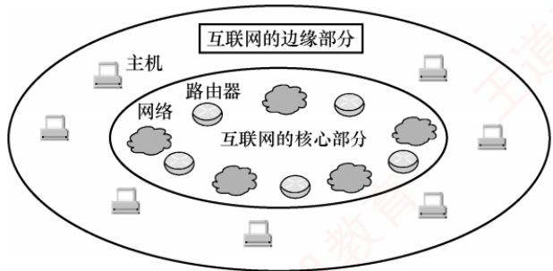

<em>图 1.1 互联网核心部分与边缘部分的示意图</em>

3）从功能组成看，计算机网络由通信子网和资源子网组成。通信子网由传输介质、通信设备及相关网络协议组成，负责数据的传输、交换、控制与存储，实现联网计算机之间的通信。资源子网则是实现资源共享功能的设备及其软件的集合，向用户提供共享其他计算机上的硬件资源、软件资源和数据资源的服务。

### 1.1.3 计算机网络的功能

　　计算机网络具有多种功能，现今许多应用都依赖于网络的支持。主要有以下五大功能。

#### 1. 数据通信

　　数据通信是计算机网络最基本且最重要的功能，用来实现联网计算机之间各种信息的传输。例如，文件传输、电子邮件等应用，离开了计算机网络将无法实现。

#### 2. 资源共享

　　资源共享可以是软件、数据或硬件的共享。它使得网络中的资源能够互通有无、分工协作，从而显著提高硬件资源、软件资源和数据资源的利用率。

#### 3. 分布式处理

　　当网络中的某个计算机系统负荷过重时，可将其处理的某个复杂任务分配给网络中的其他计算机系统，利用空闲资源来提高整个系统的利用率。

#### 4. 提高可靠性

　　计算机网络中的各台计算机可以通过网络互为备份。

#### 5. 负载均衡

　　将工作任务均衡地分配给网络中的各台计算机，避免某些计算机过载而其他计算机闲置。

　　除了上述主要功能外，计算机网络还支持电子化办公与服务、远程教育、娱乐等功能，满足了社会的多样化需求，方便了人们的学习、工作和生活，并带来了巨大的经济效益。

### 1.1.4 电路交换、报文交换与分组交换

　　在网络核心部分起关键作用的是路由器（Router），其通过对接收到的分组进行存储转发来实现分组交换。要理解分组交换的原理，需先了解电路交换和报文交换的基本概念。

#### 1. 电路交换

> **考点追踪：** 电路交换的时延分析（2025）

　　最典型的电路交换网络是传统电话网。从通信资源分配的角度看，交换是指按照某种方式动态分配传输线路资源。电路交换分为三个阶段：建立连接（占用通信资源）、传输数据（持续占用通信资源）和释放连接（归还通信资源）。在数据传输前，通信双方必须先建立一条专用的端到端物理通路，该通路由沿途的交换设备和链路逐段连接而成。在通信过程中，这条通路始终被双方独占，直至通信结束才释放。图 1.2 是电路交换的示意图。

  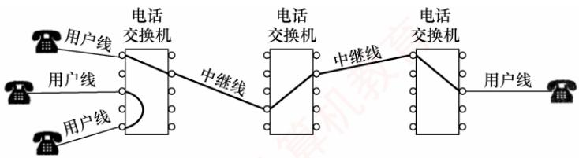

<em>图 1.2 电路交换示意图</em>

　　电路建立后，除源节点和目的节点外，中间节点仅提供端到端物理通路，比特流连续地从源端直达目的端，如同通过管道传输。因此，电路交换适用于低频次、连续且大量的数据传输。

　　电路交换技术的优点：

1）通信时延小。通信线路为双方专用，数据直达，传输效率高。

2）有序传输。数据按发送顺序传送，不存在失序问题。

3）没有冲突。不同通信对使用独立信道，不会争用物理信道。

4）实时性强。物理通路一旦建立，双方即可随时通信。

　　电路交换技术的缺点：

1）建立连接时间长。平均建立连接的时间对计算机通信而言过长。

2）线路利用率低。物理通路被通信双方独占，即使空闲也无法供其他用户使用。

3）灵活性差。通路中任一节点或链路发生故障，都需重新建立新连接。

4）难以实现差错控制。中间节点不具备存储和检错能力，无法发现或纠正传输错误。

　　由于计算机之间的通信通常是突发式（高频、少量）的，若采用电路交换，已被占用的通信线路在大部分时间内处于空闲状态，其利用率往往不足 10%，甚至低于 1%。

#### 2. 报文交换

> **考点追踪：** 报文交换的时延分析（2013、2025）

　　用户数据附加源地址、目的地址等控制信息后，被封装成报文（Message）。报文交换采用存储转发技术：整个报文先传送到相邻节点，被完整接收并存储后，节点根据转发表将其转发至下一跳，如此逐跳转发，直至到达目的端。每个报文可独立选择通往目的端的路径。

　　报文交换技术的优点:

1）无建立和释放连接的时延。通信前无须建立连接，用户可随时发送报文。

2）线路分配灵活。交换节点在存储完整报文后，可选择当前最优空闲链路进行转发；若某条路径发生故障，该节点可动态切换至其他路径。

3）线路利用率高。报文仅在一段链路上传输时才占用这段链路的资源。

4）支持差错控制。交换节点可对缓存中的报文进行差错检验。

　　报文交换技术的缺点:

1）存储转发时延高。节点必须完整接收整个报文后，才能开始转发。

2）缓存开销大。由于报文大小没有限制，这就要求交换节点配备大容量缓存。

3）错误处理低效。报文越长，出错概率相对更大，重传整个报文的代价较大。

#### 3. 分组交换

> **考点追踪：** 分组交换的时延分析（2010、2013、2023、2025）

　　分组交换同样采用存储转发技术，但有效解决了报文交换中因报文过长带来的问题。报文过长时，不仅对交换节点的缓存容量要求较高，差错处理的效率也会降低。源主机在发送前，先将较长的报文划分为若干较小的等长数据段，并在每个数据段前面添加由必要控制信息（如源地址、目的地址、分组编号等）组成的首部，构成分组（Packet），如图1.3所示。

  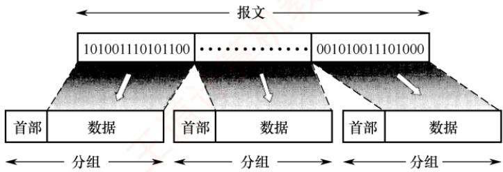

<em>图 1.3 构成分组的过程</em>

　　源主机将分组发送到分组交换网，网络中的分组交换机（如路由器）收到一个分组后，先将其缓存，然后从首部提取目的地址，据此查找转发表，并将分组转发给下一个分组交换机。经过多个分组交换机的存储转发，分组最终到达目的主机。

　　分组交换不仅继承了报文交换的诸多优点，还具有以下优势：

1）便于存储管理，转发开销小。由于分组长度固定，缓冲区大小可预设，管理更高效。

2）传输效率高。分组可逐个发送，实现流水线操作，即后一个分组的接收可与前一个分组的转发并行，从而减少整体传输时间。

3）降低出错概率与重传代价。由于分组较短，出错概率也必然减小，重传数据量大幅减少，既提高了可靠性，又降低了传输时延。

　　分组交换技术的缺点:

1）存在存储转发时延。尽管比报文交换的传输时延小，但相比于电路交换仍存在存储转发时延，且要求节点交换机具备更强的处理能力。

2）需要传输额外的信息量。每个数据段都需附加控制信息以构成分组，使得传送的信息量增大约5%～10%，从而增加了控制复杂度，降低了通信效率。

3）分组可能失序、丢失或重复。当采用数据报服务 $^{①}$ 时，分组可能经不同路径到达，需在目的主机按编号重排序，处理较为复杂。若采用虚电路服务，虽可避免失序，但需经历建立连接、数据传输和释放连接三个阶段。

　　图 1.4 给出了三种交换方式的比较。当需连续传输大量数据，并且传输时间远大于连接建立时间时，采用电路交换更为合适。但从提升网络整体信道利用率角度看，报文交换和分组交换优于电路交换。其中，分组交换时延更小、更灵活，尤其适合突发式数据通信。

  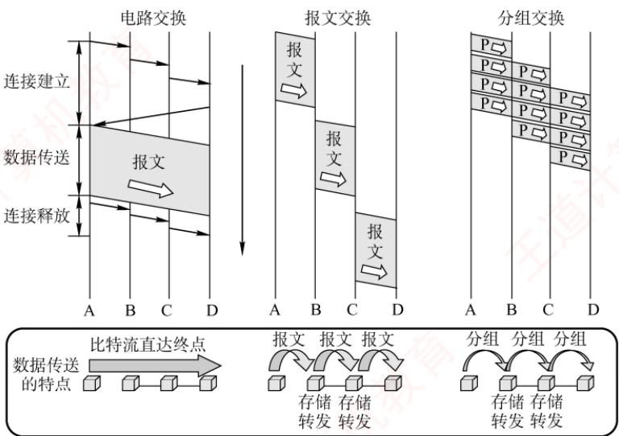

<em>图 1.4 三种交换方式的比较</em>

　　本书配套视频对三种交换方式的性能进行了详尽分析，其中分组交换网的性能分析是统考高频考点，强烈建议结合视频学习。表 1.1 总结了三种交换方式的特性对比。

　　表 1.1 三种交换方式的特性对比

<table><tr><td>特性</td><td>电路交换</td><td>报文交换</td><td>分组交换</td></tr><tr><td>完成传输所需的时间</td><td>最少</td><td>最多</td><td>较少</td></tr><tr><td>存储转发时延</td><td>无</td><td>高</td><td>较低</td></tr><tr><td>通信前是否需要建立连接?</td><td>是</td><td>否</td><td>否</td></tr><tr><td>节点的缓存开销</td><td>无</td><td>高</td><td>低</td></tr><tr><td>是否支持差错控制?</td><td>不支持</td><td>支持</td><td>支持</td></tr><tr><td>数据是否有序到达?</td><td>是</td><td>是</td><td>否</td></tr><tr><td>是否需要额外的控制信息?</td><td>否</td><td>是</td><td>是(且占比较大)</td></tr><tr><td>线路分配的灵活性</td><td>不灵活</td><td>灵活</td><td>非常灵活</td></tr><tr><td>线路利用率</td><td>低</td><td>高</td><td>非常高</td></tr></table>

### 1.1.5 计算机网络的分类

#### 1. 按分布范围分类

1）广域网（WAN）。广域网用于长距离通信，覆盖范围通常为几十至数千千米，常用于构建互联网的骨干部分，其节点交换机间通过高速链路互联，通信容量大。

2）城域网（MAN）。城域网的覆盖范围可跨越几个街区乃至整个城市，直径约为5～50km。目前城域网大多采用以太网技术，因此有时也被归入局域网的讨论范畴。

3）局域网（LAN）。局域网通常将主机通过高速线路互连，覆盖范围较小，一般为几十米到几千米。传统上，局域网采用广播技术，而广域网则采用交换技术。

4）个人区域网（PAN）。个人区域网是指在个人工作或活动区域内，利用无线技术将消费电子设备（如平板电脑、智能手机等）互联而成的网络，也称无线个人区域网（WPAN）。

#### 2. 按传输技术分类

1）广播式网络。所有联网计算机共享一个公共通信信道。当一台计算机通过该信道发送报文分组时，所有其他计算机都能“收听”到该分组，并通过检查目的地址决定是否接收。局域网普遍采用广播式通信；此外，广域网中的无线和卫星通信网络也属于广播式网络。

2）点对点网络。每条物理线路连接一对计算机。若两台主机之间无直接连接，则分组需通过中间节点进行存储转发，直至到达目的主机。

#### 3. 按拓扑结构分类

　　网络拓扑结构是指网络中节点（如路由器、主机等）与通信线路之间的几何排列关系，主要描述通信子网的结构。常见的拓扑结构包括总线形、星形、环形和网状网络，如图 1.5 所示。其中，总线形、星形和环形多用于局域网，网状结构则多用于广域网。

  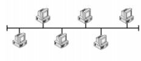

<em>(a) 总线形</em>

  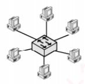

<em>(b) 星形</em>

  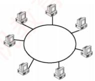

<em>(c) 环形</em>

  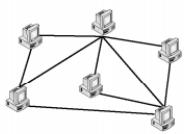

<em>(d) 网状</em>

<em>图 1.5 几种不同的网络拓扑结构</em>

1）总线形网络。使用单根传输线连接所有计算机。优点是建网容易、增减节点方便、节省线路；缺点是重负载下通信效率低，并且总线任意一处故障都会影响全网。

2）星形网络。各终端或计算机通过独立线路连接到中央设备（通常为交换机或路由器）。优点是便于集中控制与管理；缺点是成本较高，且中央设备对故障敏感。

3）环形网络。所有计算机接口设备连接成一个闭合环路，信号沿路环单向传输。典型的例子是令牌环局域网。环可以是单环或双环，以提高可靠性。

4）网状网络。一般情况下，每个节点至少有两条路径与其他节点相连，广泛应用于广域网。优点是可靠性高、容错能力强；缺点是控制复杂、线路成本高。

　　上述四种基本拓扑结构可相互组合，构成更复杂的混合网络。

#### 4. 按使用者分类

1）公用网（Public Network）。由电信运营商出资建设，面向公众开放。任何愿意遵守规定并缴纳费用的用户均可接入使用。

2）专用网（Private Network）。由特定单位为满足自身业务需求而建设，仅限内部使用，不对外提供服务。例如铁路、电力、军队等部门的专用网络。

#### 5. 按传输介质分类

　　传输介质分为有线和无线两大类，相应地，网络可分为有线网络和无线网络。有线网络包括双绞线网络、同轴电缆网络、光纤网络等；无线网络包括蓝牙、Wi-Fi、微波、无线电等类型。

### 1.1.6 计算机网络的性能指标

　　性能指标从不同方面度量计算机网络的性能。常用的性能指标如下。

1）速率（Speed）。连接到网络上的节点在数字信道上传送数据的速率，也称数据传输速率、数据率或比特率，单位为bit/s（比特/秒）或b/s（有时也写作bps）。当数据率较高时，常用kb/s（ $k=10^{3}$ ）、Mb/s（ $M=10^{6}$ ）或Gb/s（ $G=10^{9}$ ）表示。

> **注意：**

　　在描述数据量时，K、M、G 常用 2 的幂次表示，如 $1\mathrm{Kb} = 2^{10}\mathrm{b}$ ；在描述速率时，k、M、G 常用 10 的幂次表示，如 $1\mathrm{kb/s} = 10^{3}\mathrm{b/s}$ 。通常，前者使用大写 K，后者使用小写 k，但其他前缀均为大写。

2）带宽（Bandwidth）。在通信领域，带宽是指通信线路允许通过的信号频率范围，单位是赫兹（Hz）。但在计算机网络中，带宽表示网络通信线路所能传送数据的能力，指数字信道所能支持的最高数据传输速率，单位为b/s（比特/秒）。注意，节点间的实际可用带宽由双方网卡的性能、各段链路的带宽以及交换设备速率中的最小值决定。

> **考点追踪：** 分组交换的吞吐量分析（2024）

3）吞吐量（Throughput）。指单位时间内通过某个网络（或信道、接口）的实际数据量。吞吐量常用于对实际网络进行测量，以评估真实可达到的数据传输能力。

4）时延（Delay）。指数据（一个报文或分组）从网络（或链路）的一端传送到另一端所需的总时间，它由四部分构成：发送时延、传播时延、处理时延和排队时延。

> **考点追踪：** 网络时延的分析（2010、2013、2023、2025）

- 发送时延（也称传输时延）。节点将分组的所有比特推入链路所需的时间，即从发送分组的第一个比特开始，到最后一个比特发送完毕为止的时间。

$$
\mathrm{发送时延} = \mathrm{分组长度/发送速率}
$$

- 传播时延。电磁波在信道（传输介质）中传播一定距离所需的时间，即一个比特从链路一端传播到另一端所需的时间。

$$
\mathrm{传播时延} = \mathrm{信道长度} / \mathrm{电磁波在信道上的传播速率}
$$

> **注意：**

　　区分传输时延和传播时延：前者取决于分组长度和发送速率，后者取决于链路距离和传输介质。

- 处理时延。分组在交换节点为存储转发而进行必要处理所花费的时间。例如，解析分组的首部、进行差错检验或查找路由等。

- 排队时延。分组在路由器的输入队列或输出队列中等待处理或转发所花费的时间。

　　因此，数据在网络中经历的总时延为上述四部分之和：

$$
\text {总时延} = \text {发送时延} + \text {传播时延} + \text {处理时延} + \text {排队时延}
$$

　　以图 1.6 所示的分组交换网为例，该网络包含两段链路，其最大传输速率已在图中标注。假设主机 A 向主机 B 发送一个长度为 1000B 的分组，总时延在三种典型场景的分析如下。

  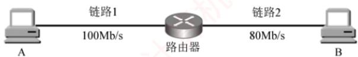

<em>图 1.6 一个简单的分组交换网</em>

　　① 若忽略传播时延、处理时延和排队时延，则

　　“A→链路1”的分组发送时延 = 1000B÷100Mb/s = 0.08ms;
　　“路由器→链路2”的分组发送时延 = 1000B÷80Mb/s = 0.1ms;
　　总时延 = 0.08ms + 0.1ms = 0.18ms，如图1.7(a)所示。

　　② 若需考虑传播时延，假设链路1和链路2的传播时延分别为0.01ms和0.05ms，则总时延 $= 0.01\mathrm{ms} + 0.08\mathrm{ms} + 0.05\mathrm{ms} + 0.1\mathrm{ms} = 0.24\mathrm{ms}$ ，如图1.7(b)所示。

　　③ 若还需考虑路由器的处理时延和排队时延，假设这两项时延合计为 0.04ms，则总时延 = 0.01ms + 0.08ms + 0.04ms + 0.05ms + 0.1ms = 0.28ms，如图 1.7(c) 所示。

  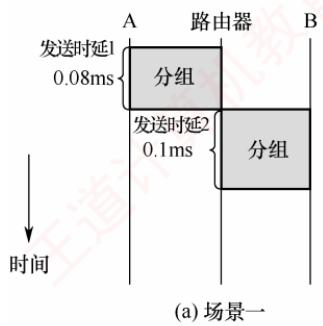

  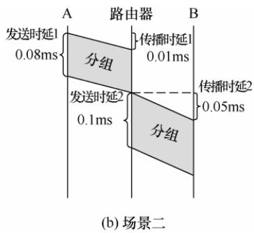

  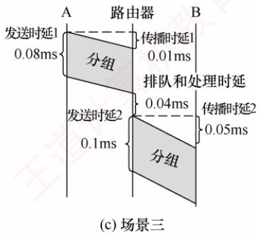

<em>图 1.7 三种典型场景下总时延的分析</em>

　　在考试中，通常无须考虑处理时延和排队时延（除非题目另有说明）。

5）时延带宽积。指发送端发送的第一个比特即将到达接收端时，发送端已发出的比特总数，即已发出但尚未到达接收端的最大比特数，也称以比特为单位的链路长度。

$$
\mathrm{时延带宽积} = \mathrm{传播时延} \times \mathrm{信道带宽}
$$

　　如图1.8所示，可将链路想象为一条圆柱形管道：其长度表示传播时延，横截面积表示链路带宽，则时延带宽积表示该管道可容纳的比特数量。

  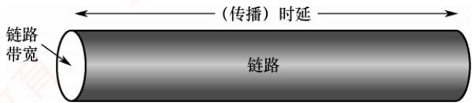

<em>图 1.8 链路就像一条空心管道</em>

6）往返时延（Round-Trip Time，RTT）。指从发送端发出一个短分组，到收到接收端返回的确认信号所经历的总时间。往返时延包括：发送端与接收端之间的往返传播时延；接收端的处理时延；在互联网环境中，还包括各中间节点的处理时延和排队时延。注意，往返时延不包括数据分组本身的发送时延，如图1.9所示。

  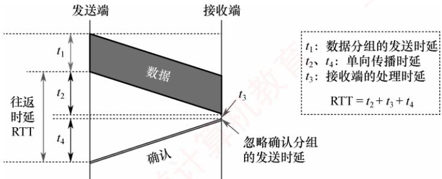

<em>图 1.9 往返时延 RTT 的分析</em>

7）信道利用率。指信道有数据通过的时间占总时间的百分比。

　　信道利用率 $=$ 有数据通过的时间/(有数据通过的时间+无数据通过的时间)信道利用率并非越高越好：过低会浪费网络资源；过高则会导致排队时延显著增加，引发网络拥塞。这就好比当公路上的车流量很大时，容易出现拥堵。

### 1.1.7 本节习题精选

#### 一、单项选择题

01. 计算机网络可被理解为（）。

- A. 执行计算机数据处理的软件模块
- B. 由自治的计算机互连起来的集合体
- C. 多个处理器通过共享内存实现的紧耦合系统
- D. 用于共同完成一项任务的分布式系统

02. 下列不属于计算机网络功能的是（）。

- A. 提高系统可靠性
- B. 提高工作效率
- C. 分散数据的综合处理
- D. 使各计算机相对独立

03. 下列关于网络中的计算机的描述，正确的是（）。

- A. 各自独立，没有联系
- B. 拥有独立的操作系统
- C. 互相干扰
- D. 拥有共同的操作系统

04. 分组交换相比报文交换的主要改进是（）。

- A. 差错控制更加完善
- B. 路由算法更加简单
- C. 传输单位更小且有固定的最大长度
- D. 传输单位更大且有固定的最大长度

05. 下列（）是分组交换网络的缺点。

- A. 信道利用率低
- B. 附加信息开销大
- C. 传播时延大
- D. 不同规格的终端很难相互通信

06. 不同的数据交换方式有不同的性能。为了使数据在传输期间的时延最小，首选的交换方式是（①）；为保证数据无差错地传送，不应选用的交换方式是（②）；分组交换对报文交换的主要改进是（③），这种改进产生的直接结果是（④）。
　　①

- A. 电路交换
- B. 报文交换
- C. 分组交换

　　②

- A. 电路交换
- B. 报文交换
- C. 分组交换

　　③

- A. 传输单位更小且有固定的最大长度
- B. 传输单位更大且有固定的最大长度
- C. 差错控制更完善
- D. 路由算法更简单

　　④

- A. 降低了误码率
- B. 提高了数据传输速率
- C. 减少传输时延
- D. 增加传输时延

07. 下列说法中，（）是数据报方式的特点。

- A. 同一报文的不同分组可以经过不同的传输路径通过通信子网
- B. 同一报文的不同分组到达目的节点时顺序是确定的
- C. 适合于短报文的通信
- D. 同一报文的不同分组在路由选择时只需要进行一次

08. 计算机网络分为广域网、城域网和局域网，其划分的主要依据是（）。

- A. 网络的作用范围
- B. 网络的拓扑结构
- C. 网络的通信方式
- D. 网络的传输介质

09. 假设主机 A 和 B 之间的链路带宽为 100Mb/s，主机 A 的网卡速率为 1Gb/s，主机 B 的网卡速率为 10Mb/s，主机 A 给主机 B 发送数据的最高理论速率为（）。

- A. 1Mb/s
- B. 10Mb/s
- C. 100Mb/s
- D. 1Gb/s

10. 某点对点链路的长度为 $100 \mathrm{~km}$ , 若数据在该链路上的传输速率为 $10^{8} \mathrm{~m} / \mathrm{s}$ , 链路带宽为 $20 \mathrm{Mb} / \mathrm{s}$ , 已知一个已发送的分组的发送时延和传播时延相等, 则该分组的大小为 （）。

- A. $20 \mathrm{~Kb}$
- B. $30 \mathrm{~Kb}$
- C. $40 \mathrm{~Kb}$
- D. $50 \mathrm{~Kb}$

11. 在下图所示的采用存储转发方式的分组交换网中，主机 A 向 B 发送两个长度为 1000B 的分组，路由器处理单个分组的时延为 10ms（假设路由器同时最多只能处理一个分组，若在处理某个分组时有新的分组到达，则存入缓存区），忽略链路的传播时延，所有链路的数据传输速率为 1Mb/s，则分组从 A 发送开始到 B 接收完为止，需要的时间至少是（）。

  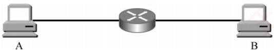

- A. 34ms
- B. 36ms
- C. 38ms
- D. 52ms

12. 如下图所示，主机 H1 和 H2 之间有三种可选的交换方式——电路交换、报文交换和分组交换，其中电路交换建立电路连接的时间为 2s，报文交换和分组交换都要经过由一个路由器连接的链路，分组大小为 5kb。三种交换方式的数据传输速率均为 2.5kb/s，忽略所有的传播时延、分组开销和不可预料的线路延迟，下列说法中正确的是（）。

  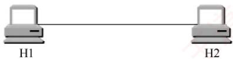

　　电路交换

  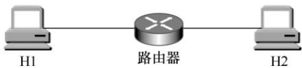

　　报文交换和分组交换

- A. 若H1向H2发送 $5\mathrm{kb}$ 的数据，则电路交换最节省时间
- B. 若H1向H2发送 $500\mathrm{kb}$ 的数据，则电路交换和分组交换的时间相同
- C. 若H1向H2发送 $10\mathrm{kb}$ 的数据，则报文交换比分组交换更节省时间
- D. 若H1向H2发送 $15\mathrm{kb}$ 的数据，则报文交换比电路交换更节省时间

13. 【2010 统考真题】在下图所示的采用“存储-转发”方式的分组交换网络中，所有链路的数据传输速率为 100Mb/s，分组大小为 1000B，其中分组头大小为 20B。若主机 H1 向主机 H2 发送一个大小为 980000B 的文件，则在不考虑分组拆装时间和传播延迟的情况下，从 H1 发送开始到 H2 接收完为止，需要的时间至少是（）。

  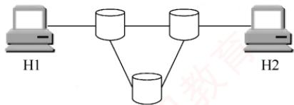

- A. 80ms
- B. 80.08ms
- C. 80.16ms
- D. 80.24ms

14. 【2013 统考真题】主机甲通过一个路由器（存储转发方式）与主机乙互连，两段链路的数据传输速率均为 10Mb/s，主机甲分别采用报文交换和分组大小为 10kb 的分组交换向主机乙发送一个大小为 8Mb（ $1M=10^{6}$ ）的报文。若忽略链路传播延迟、分组头开销和分组拆装时间，则两种交换方式完成该报文传输所需的总时间分别为（）。

- A. 800ms、1600ms
- B. 801ms、1600ms
- C. 1600ms、800ms
- D. 1600ms、801ms

15. 【2023 统考真题】在下图所示的分组交换网络中，主机 H1 和 H2 通过路由器互连，2 段链路的带宽均为 100Mb/s，时延带宽积（单向传播时延×带宽）均为 1000b。若 H1 向 H2 发送一个大小为 1MB 的文件，分组长度为 1000B，则从 H1 开始发送的时刻起到 H2 收到文件全部数据时刻止，所需的时间至少是（）。 （注： $1M = 10^{6}$ 。）

  

- A. 80.02ms
- B. 80.08ms
- C. 80.09ms
- D. 80.10ms

16. 【2024 统考真题】某分组交换网络及每段链路的带宽如下图所示，H1 到 H2 的最大吞吐量约为（）。

- A. 1Mb/s
- B. 10Mb/s
- C. 100Mb/s
- D. 1000Mb/s

  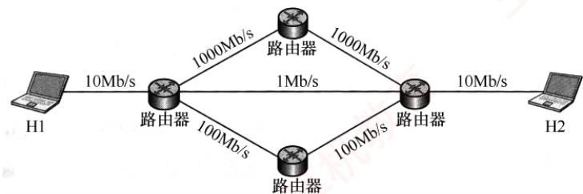

17. 【2025 统考真题】某网络拓扑及各链路带宽如下图所示。网络按电路交换方式运行时，主机 H1 与 H2 建立一条带宽为 10Mb/s 的电路，建立电路时间为 32μs；按分组交换方式运行时，分组长度为 400B，忽略分组首部开销。现 H1 向 H2 发送一个 2MB（1M = 10⁶）的文件，分别采用电路交换、报文交换、分组交换方式时，H2 至少需要 TCS、TMS、TPS 时间才能接收到全部文件内容，则 TCS、TMS、TPS 满足的关系是（）。

  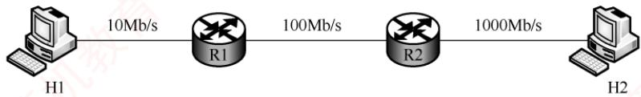

- A. $T_{\mathrm{CS}} > T_{\mathrm{MS}} > T_{\mathrm{PS}}$
- B. $T_{\mathrm{MS}} > T_{\mathrm{PS}} > T_{\mathrm{CS}}$
- C. $T_{\mathrm{MS}} > T_{\mathrm{CS}} > T_{\mathrm{PS}}$
- D. $T_{\mathrm{PS}} > T_{\mathrm{MS}} > T_{\mathrm{CS}}$

#### 二、综合应用题

01. 假定有一个通信协议，每个分组都引入 100B 的开销，用于首部和组帧。现在使用这个协议发送 $10^{6}$ B 的数据，但在传送过程中有 1B 被破坏，因而包含该字节的那个分组被丢弃。对 1000B 和 20000B 的分组的有效数据大小，分别计算 “开销 + 丢失” 字节的总数量。为使 “开销 + 丢失” 字节的总数量最小，分组数据大小的最佳值是多少？

02. 考虑一个最大距离为 $2 \mathrm{~km}$ 的局域网, 当带宽多大时, 传播时延 (传播速率为 $2 \times 10^{8} \mathrm{~m} / \mathrm{s}$ ) 等于 100B 分组的发送时延? 对于 512B 分组, 结果又如何?

03. 在两台计算机之间传输一个文件有两种可行的确认策略。第一种策略将文件截成分组，接收方逐个确认分组，但就整体而言，文件没有得到确认。第二种策略不确认单个分组，但当文件全部收到后，对整个文件予以确认。讨论这两种方式的优缺点。

### 1.1.8 答案与解析

#### 一、单项选择题

**01. B**

　　计算机网络是由自治计算机互连起来的集合体，其中包含三个关键点：自治计算机、互连、集合体。自治计算机由软件和硬件两部分组成，能完整地实现计算机的各种功能；互连是指计算机之间能实现相互通信；集合体是指所有使用通信线路及互联设备连接起来的自治计算机的集合。选项 C 和 D 分别指多机系统和分布式系统。

**02. D**

　　计算机网络的三大主要功能是数据通信、资源共享和分布式处理。计算机网络使各计算机之间的联系更加紧密而非相对独立。

**03. B**

　　计算机网络是一些互连的、自治的计算机系统的集合。各计算机拥有独立的操作系统和硬件资源，它们之间是有联系的，通过网络协议和通信介质进行数据交换和资源共享。

**04. C**

　　相对于报文交换而言，分组交换将报文划分为一个个具有固定最大长度的分组，以分组为单位进行传输。

**05. B**

　　分组交换要求将数据分成等长的小数据段，每段都要加上控制信息（如目的地址），因此传送数据的总开销较大。相比其他交换方式，分组交换信道利用率高。传播时延取决于传播介质及收发双方的距离。对各种交换方式，不同规格的终端都很难相互通信，因此不是分组交换的缺点。

**06. A、A、A、C**

　　本题综合考查几种数据交换方式的特点。电路交换虽然建立连接的时延较大，但在数据传输期间一直占据链路，优点是传输时延小、通信实时性强，适用于交互式会话类通信。缺点是建立连接时间长，系统效率低，不具备存储数据的能力，不具备差错控制的能力。

　　报文交换和分组交换都采用存储转发，传送的数据都要经过中间节点的若干存储、转发才能到达目的地，因此传输时延较大。报文交换传送数据的长度不固定且较长，分组交换要将传送的长报文分割为多个固定且长度有限的分组，因此传输时延较报文交换的小。

**07. A**

　　数据报方式是一种无连接的分组交换技术，它先将报文拆分成若干较小的数据段，加上地址等控制信息后构成分组，这样做虽然会增加一些控制开销，但并不意味着数据报方式只适合于短报文的通信。数据报方式尽最大努力交付，不保证可靠性，分组可能出错或丢失，网络为每个分组独立地选择路由，转发的路径可能不同，因此分组不一定按序到达目的节点。

**08. A**

　　按分布范围分类：广域网、城域网、局域网、个人区域网。

　　按拓扑结构分类：星形网络、总线形网络、环形网络、网状网络。

　　按传输技术分类：广播式网络、点对点网络。

　　按使用者分类：公用网、专用网。

　　按数据交换技术分类：电路交换网、报文交换网、分组交换网。

　　因此，根据网络的覆盖范围可将网络主要分为广域网、城域网和局域网。

**09. B**

　　主机 A 给主机 B 发送数据的最高理论速率取决于链路带宽及主机 A、主机 B 的网卡速率中最小者，因为它是数据传输的瓶颈。因此，最高理论速率为 10Mb/s。

**10. A**

　　链路的传播时延 $= 100\mathrm{km}\div 10^{8}\mathrm{m / s} = 1\mathrm{ms}$ ，发送时延等于传播时延，因此发送时延也为 $1\mathrm{ms}$ 所以分组的大小应为 $20\mathrm{Mb / s}\times 1\mathrm{ms} = 20\mathrm{Kb}$ 。

**11. B**

　　分组长度为 1000B，所有链路的数据传输速率为 1Mb/s，因此，每段链路的发送时延为 $1000B \div 1Mb/s = 8ms$ ，第一个分组从 A 到达 B 的时间为 $8 + 10 + 8 = 26ms$ ，此后又经过 10ms，第二个分组才到达 B，所以总时间为 $26 + 10 = 36ms$ ，下图是传送过程的时空图。

　　注意，此题还可扩展为发送更多分组的情况，请读者自行分析。

<table><tr><td rowspan="2">分组1</td><td>8ms</td><td>10ms</td><td>8ms</td><td rowspan="2">在缓冲区排队等待处理的时间</td></tr><tr><td>8ms</td><td>10ms</td><td>8ms</td></tr></table>

**12. B**

　　若 H1 向 H2 发送 5kb 的数据，电路交换的时间为 $2 + 5kb \div 2.5kb/s = 4s$ ，分组交换和报文交换的时间均为 $5kb \div 2.5kb/s + 5kb \div 2.5kb/s = 4s$ ，选项 A 错误。若 H1 向 H2 发送 500kb 的数据，电路交换的时间为 $2 + 500kb \div 2.5kb/s = 202s$ ，分组交换的时间为 $500kb \div 2.5kb/s + 5kb \div 2.5kb/s = 202s$ ，选项 B 正确。若 H1 向 H2 发送 10kb 的数据，报文交换的时间为 $10kb \div 2.5kb/s + 10kb \div 2.5kb/s = 8s$ ，分组交换的时间为 $10kb \div 2.5kb/s + 5kb \div 2.5kb/s = 6s$ ，选项 C 错误。若 H1 向 H2 发送 15kb 的数据，电路交换的时间为 $2 + 15kb \div 2.5kb/s = 8s$ ，报文交换的时间为 $15kb \div 2.5kb/s + 15kb \div 2.5kb/s = 12s$ ，选项 D 错误。

**13. C**

　　分组大小为 1000B，其中首部占 20B，故每个分组携带的有效数据为 980B。文件总长为 980000B，需划分为 1000 个分组；每个分组含首部共 1000B，因此共需传输的数据量为 $10^{6}$ B。由于所有链路的传输速率相同，沿最短路径传输时延最小，而最短路径经过 2 个交换机（共 3 段链路）。H1 发送完所有分组的时间为 $10^{6} \times 8b \div 100Mb/s = 80ms$ ，此时最后一个分组刚离开 H1，该分组还需依次经过 2 个交换机（再通过 2 段链路）才能到达 H2，每段链路的传输时延为 $r = 1000 \times 8b \div 100Mb/s = 0.08ms$ 。因此，H2 接收完全部数据的时间为 $80ms + 2r = 80.16ms$ 。

　　【另解】分组交换的传输过程类似于流水线。在连续传输过程中，各存储转发设备可同时处理不同的分组，就如同流水线中的各段并行工作。由于所有链路的速率相同，每段链路的传输时延 $r = 1000 \times 8\mathrm{b} \div 100\mathrm{Mb/s} = 0.08\mathrm{ms}$ ，最短路径有3段链路。H2接收完全部数据的时间为 $3r + (m - 1)r = 3 \times 0.08\mathrm{ms} + (1000 - 1) \times 0.08\mathrm{ms} = 80.16\mathrm{ms}$ 。也就是说，第一个分组从流水线中流出所需的时间为 $3r$ ，此后每隔 $r$ 时间就有一个分组流出。

**14. D**

　　传输路径为：甲—路由器—乙。

　　在题中未明确说明的情况下，不考虑排队时延和处理时延，只考虑发送时延和传播时延；本题已忽略传播时延，因此只需计算报文交换和分组交换的发送时延。

　　报文交换: 采用整报文传输, 报文大小为 $8 \mathrm{Mb} (1 \mathrm{M} = 10^{6})$ 。每个节点（包括主机甲和路由器）

　　在转发该报文前需要完整接收，因此需经历两次发送过程：甲向路由器发送报文，发送时延 $T = 8Mb \div 10Mb/s = 0.8s$ ；路由器向乙转发该报文，同样需 0.8s。总时延为 1.6s，即 1600ms。

　　分组交换：分组大小为 10kb（ $1k = 10^{3}$ ），忽略分组头开销，每个分组携带 10kb 数据。报文总长为 8Mb，分组数 $m = 8Mb \div 10kb = 800$ 。参考 2010 年真题的流水线思路：甲与乙通过一个路由器相连，构成 2 段链路（2 个流水段），每段链路的发送时延 $r = 10kb \div 10Mb/s = 1ms$ 。第一个分组从甲发出后，需经过 2 段链路才能到达乙，耗时 2r；此后，流水线满载，每隔 r 时间就有一个分组到达乙。因此，传输 m = 800 个分组所需的总时间为 $t = 2r + (m - 1)r = 2 + (800 - 1) \times 1 = 801ms$ 。

**15. D**

　　文件大小为 1MB，分组长度为 1000B，分组数量为 $1MB \div 1000B = 1000$ 。一个分组从 H1 到 H2 所需的时间 = H1 的发送时延 $t_{1} + H1$ 到路由器的传播时延 $t_{2} +$ 路由器的发送时延 $t_{3} +$ 路由器到 H2 的传播时延 $t_{4}$ ，其中 $t_{1} = t_{3} = 1000B \div 100Mb/s = 0.08ms$ ， $t_{2} = t_{4} = 1000b \div 100Mb/s = 0.01ms$ 。因此，一个分组从 H1 到 H2 的端到端时延为 $(0.08 + 0.01) \times 2 = 0.18ms$ 。H1 发送前 999 个分组所需的时间为 $999t_{1} = 79.92ms$ ，此时，第 1000 个分组刚刚开始发送，它还需 0.18ms 才能到达 H2。因此，从 H1 开始发送到 H2 收到全部数据所需的最短时间为 $79.92 + 0.18 = 80.10ms$ 。

　　读者可以思考：若H1和H2之间有2个路由器，则所需的时间至少是多少？

**16. B**

　　H1 到 H2 有三条路径。H1 和 H2 各自连接路由器的链路带宽均为 10Mb/s，这是所有路径共有的端侧链路。现在假设每个数据段为 10Mb，分别分析各路径的吞吐量。

　　路径一：中间两段链路带宽均为 1000Mb/s，受限于 H1、H2 直连路由器的链路带宽 10Mb/s，无论中间链路有多快，数据从 H1 发出需 1s（10Mb÷10Mb/s，受限于自身的 10Mb/s 出口），到达 H2 前最后一跳也需 1s。吞吐量约为 10Mb/s。

　　路径二：中间一段链路带宽为 1Mb/s，H1 发送一个数据段需 1s，但经过中间 1Mb/s 链路时，转发时延为 $10Mb \div 1Mb/s = 10s$ （成为瓶颈），因此 H2 每隔 10s 收到一个数据段，吞吐量约为 1Mb/s。

　　路径三：中间两段链路带宽均为 100Mb/s，与路径一的分析类似，吞吐量约为 10Mb/s。由此可见，端到端的吞吐量由路径中带宽最小的链路（瓶颈）决定。

**17. B**

　　采用电路交换时， $T_{CS} =$ 电路建立时间 $32\mu s +$ 文件传输时间 $2MB \div 10Mb/s = 32\mu s + 1.6s$ 。采用报文交换时，整个报文需要逐跳存储转发， $T_{MS} = 2MB \div 10Mb/s + 2MB \div 100Mb/s + 2MB \div 1000Mb/s = 1.776s$ 。采用分组交换时，分组数为 $2MB/400B = 5000$ ，第一个分组从H1到H2的传输时延 $= 400B \div 10Mb/s + 400B \div 100Mb/s + 400B \div 1000Mb/s = 355.2\mu s$ ；之后，每 $320\mu s$ 到达一个分组，故 $T_{PS} = 355.2\mu s + 320 \times 4999\mu s = 1.6s + 35.2\mu s$ 。因此 $T_{MS} > T_{PS} > T_{CS}$ 。

#### 二、综合应用题

**01. 【解答】**

　　设 D 是分组数据的大小，需要的分组数量 $=10^{6}\div D$ ，开销 =100N（被丢弃分组的首部也已计入开销），因此 “开销 + 丢失” $=100\times10^{6}\div D+D$ 。

　　当 $D = 1000$ 时，“开销 $+$ 丢失” $= 100 \times 10^{6} \div 1000 + 1000 = 101000\mathrm{B}$ 。

　　当 D=20000 时，“开销+丢失”= $100\times10^{6}\div20000+20000=25000B$ 。

　　设“开销 $+$ 丢失”字节总数量为 $y$ ， $y = 10^{8}\div D + D$ ，求微分有 $\mathrm{dy}\div \mathrm{d}D = 1 - 10^{8}\div D^{2}$ 。

**02. 【解答】**

$D = 10^{4}$ 时， $\mathrm{dy}\div \mathrm{d}D = 0$ ，所以分组数据大小的最佳值是 $10000\mathrm{B}$ 。

　　传播时延= $2\times10^{3}m\div(2\times10^{8}m/s)=10^{-5}s=10\mu s$ 。

##### 1）分组大小为 100B:

　　假设带宽大小为 x，要使传播时延等于发送时延，带宽如下：

$$
x = 1 0 0 \mathrm{B} \div 1 0 \mu \mathrm{s} = 1 0 \mathrm{MB/s} = 8 0 \mathrm{Mb/s}
$$

2）分组大小为 512B:

　　假设带宽大小为 y，要使传播时延等于发送时延，带宽如下：

$$
y = 5 1 2 \mathrm{B} \div 1 0 \mu \mathrm{s} = 5 1. 2 \mathrm{MB/s} = 4 0 9. 6 \mathrm{Mb/s}
$$

　　因此，带宽应分别等于 80Mb/s 和 409.6Mb/s。

**03. 【解答】**

　　若网络容易丢失分组，则对每个分组逐一进行确认较好，此时仅重传丢失的分组。另一方面，若网络高度可靠，则在不发生差错的情况下，仅在整个文件传送的结尾发送一次确认，以减少确认次数，进而节省带宽。不过，即使只有单个分组丢失，也要重传整个文件。

## 1.2 计算机网络体系结构与参考模型

### 1.2.1 计算机网络分层结构

　　计算机网络是一个非常复杂的系统，因此在早期就采用了分层的设计思想。分层可将庞大而复杂的问题转换为若干较小的局部问题，而这些局部问题更易于研究和处理。

> **考点追踪：** 网络体系结构的概念（2010）

　　计算机网络的各层及其协议的集合称为网络的体系结构（Architecture）。换言之，计算机网络的体系结构是对该网络及其所应完成功能的精确定义。需要强调的是，这些功能究竟由何种硬件或软件实现，属于实现（Implementation）问题。体系结构是抽象的，而实现是具体的，体现在实际运行的计算机硬件和软件中。计算机网络体系结构通常具有可分层的特性，能将复杂的大系统分解为若干较易实现的层次。

　　分层的基本原则如下：

1）每层实现一种相对独立的功能，以降低整个系统的复杂度。

2）各层之间的接口清晰、简洁，相互依赖尽可能少，便于理解与维护。

3）各层功能的定义独立于具体实现方法，可采用最合适的技术来实现。

4）保持下层对上层的独立性，上层单向使用下层提供的服务。

5）整个分层结构应有利于标准化工作。

　　在网络分层结构中，第 n 层的活动元素通常称为第 n 层实体。具体而言，实体指任何可发送或接收信息的硬件或软件进程，通常是某个特定的软件模块。不同机器上的同一层称为对等层，同一层的实体互为对等实体。第 n 层向第 $n+1$ 层提供的服务，实际上是其自身及以下所有层所提供服务的总和。第 n 层的实体称为服务提供者，第 $n+1$ 层的实体称为服务用户。

- 协议数据单元（PDU）：对等层之间传送的数据单位。第 $n$ 层的PDU记为 $n$ -PDU。各层的PDU均由服务数据单元和协议控制信息两部分组成。

- 服务数据单元（SDU）：相邻层之间交换的数据单位。第 $n$ 层的SDU记为 $n$ -SDU。

- 协议控制信息（PCI）：用于控制协议操作的信息。第 $n$ 层的PCI记为 $n$ -PCI。

　　每层的PDU都有其通俗的名称：物理层的PDU称为比特流，数据链路层的PDU称为帧，

　　网络层的 PDU 称为 IP 分组，传输层的 PDU 称为 TCP 报文段或 UDP 数据报。

　　当数据在各层之间传递时，将从第 $n + 1$ 层接收到的PDU作为第 $n$ 层的SDU，加上第 $n$ 层的PCI后封装成第 $n$ 层的PDU，再交由第 $n - 1$ 层作为其SDU发送。接收方收到后做相反的处理。

　　因此，三者的关系可表示为 $n-SDU + n-PCI = n-PDU = (n - 1)-SDU$ ，如图 1.10 所示。

  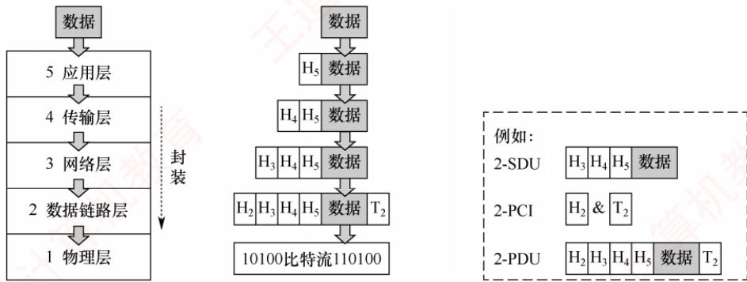

<em>图 1.10 网络各层数据单元之间的关系</em>

　　具体而言，分层结构的含义包括以下几个方面：

1）第 $n$ 层的实体不仅要利用第 $n - 1$ 层的服务来实现自身功能，还向第 $n + 1$ 层提供本层的服务，该服务是第 $n$ 层及其下面各层所提供服务的总和。

2）最低层只提供服务，是整个层次结构的基础；最高层面向用户提供服务。

3）上层只能通过相邻层的接口使用下层的服务，不能跨层调用。

4）通信时，对等层在逻辑上如同存在一条直接信道，表现为能够直接交换信息。

### 1.2.2 计算机网络协议、服务、接口的概念

#### 1. 协议

　　要有条不紊地在网络中实现数据交换，就必须遵循一些事先约定好的规则，这些规则规定了所交换数据的格式以及相关的同步问题。为在网络中进行数据交换而建立的这些规则、标准或约定称为网络协议（Network Protocol）。协议是控制对等实体之间通信的规则集合，是水平的。不对等实体之间不存在协议，例如，在使用 TCP/IP 协议栈通信的两个节点 A 和 B，节点 A 的传输层与节点 B 的传输层之间存在协议，但节点 A 的传输层与节点 B 的网络层之间则没有协议。

　　协议由语法、语义和同步三部分组成。

> **考点追踪：** 同步的概念（2020）

1）语法。规定数据与控制信息的格式。例如，TCP报文段的结构由其语法定义。

2）语义。规定需要发出何种控制信息、完成何种动作以及做出何种应答。例如，TCP 连接建立过程中每次握手所执行的操作由其语义定义。

3）同步（或时序）。规定执行各种操作的条件及事件发生的先后顺序。例如，TCP连接建立过程中三次握手的时序关系由其同步机制定义。

#### 2. 接口

　　同一节点内相邻两层实体交换信息的逻辑接口称为服务访问点（Service Access Point，SAP）。每层只能与紧邻的上下层定义接口，不允许跨层定义接口。服务是通过 SAP 提供给上层的，第 n 层的 SAP 即为第 $n+1$ 层访问第 n 层服务的入口。

#### 3. 服务

　　服务是指下层为紧邻的上层提供的功能调用，是垂直的。对等实体在协议的控制下协同工作，使得本层能够向上层提供服务；但要实现本层协议，又必须依赖下层所提供的服务。

　　需注意，协议与服务在概念上有本质区别。首先，只有本层协议的正确实现，才能保证向上一层提供服务。上层的服务用户只能感知到服务本身，而无法看到底层协议的细节，即下层协议对上层是透明的。其次，协议是水平的，用于规范对等实体之间的通信；服务是垂直的，由下层通过层间接口向上层提供。此外，并非某一层完成的全部功能都能称为服务，只有那些能被上层实体感知并调用的功能，才构成服务。

　　协议、接口、服务三者之间的关系如图 1.11 所示。

  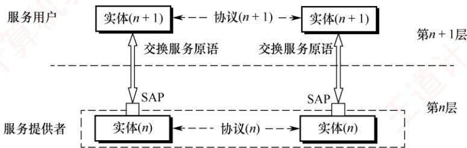

<em>图 1.11 协议、接口、服务三者之间的关系</em>

　　计算机网络提供的服务可按以下三种方式分类。

##### （1） 面向连接服务与无连接服务

　　面向连接服务要求通信双方在传输前先建立连接并分配资源（如缓冲区），传输结束后，释放连接与资源，全过程包括连接建立、数据传输和连接释放三个阶段，以保障通信可靠性。

　　无连接服务无须预先建立连接，发送方可直接发送包含目的地址的分组，由网络动态选择路径，各分组独立传输。该服务通常称为“尽最大努力交付”，属于不可靠服务。

##### （2） 可靠服务和不可靠服务

　　可靠服务是指网络具备检错、纠错和应答机制，能确保数据正确、完整、有序地送达目的地。不可靠服务是指网络仅提供“尽最大努力交付”，不保证可靠性。

　　对于提供不可靠服务的网络，数据的可靠性需由高层保障。例如，接收方校验数据完整性，出错时通知发送方重传，从而通过高层机制将不可靠服务转化为可靠服务。

##### （3） 有应答服务和无应答服务

　　有应答服务是指接收方在收到数据后，由传输系统自动向发送方返回应答（肯定或否定）。例如，文件传输通常采用有应答服务，以确保数据完整。

　　无应答服务是指接收方不自动返回应答；若需确认，须由高层协议或应用实现。例如，在WWW服务中，客户端收到网页后通常不向服务器发送应答。

### 1.2.3 OSI 参考模型和 TCP/IP 模型

#### 1. OSI 参考模型

> **考点追踪：** OSI 低三层的网络设备及其功能（2016）

　　国际标准化组织（ISO）提出的网络体系结构模型称为开放系统互连参考模型（OSI/RM），简称 OSI 参考模型。该模型包含 7 层，自下而上（第 1～7 层）依次为：物理层、数据链路层、网络层、传输层、会话层、表示层、应用层。其层次结构如图 1.12 所示。

  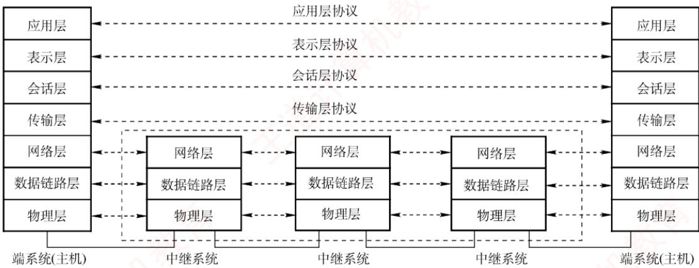

<em>图 1.12 OSI 参考模型的层次结构</em>

　　下面详述各层功能。

> **考点追踪：** OSI 参考模型的层次结构（2013、2014、2017、2019）

##### （1） 物理层 (Physical Layer)

　　物理层的传输单位是比特。其功能是在物理介质上为数据端设备透明地传输原始比特流。图 1.13 展示的是两个通信节点及它们之间的一段通信链路。物理层主要研究以下内容：

  

<em>图 1.13 两个通信节点及它们之间的一段通信链路</em>

　　① 通信链路与节点的连接需通过电路接口，物理层规定了接口的机械特性（如形状、尺寸等）和电气特性（如引脚数量与排列等），例如笔记本电脑上的网线接口。

　　② 物理层还规定了通信链路上的编码意义与电气特征。例如，若约定信号 $X$ 表示比特0，则发送方发出 $X$ 代表0，接收方收到 $X$ 即解读为0。

　　注意，传输所用的物理介质（如双绞线、光缆、无线信道等）不属于物理层协议范畴，而是位于其下方。因此，有人将物理介质视为“第0层”。

##### （2） 数据链路层（Data Link Layer）

> **考点追踪：** OSI 参考模型中数据链路层的功能（2022）

　　数据链路层的传输单位是帧。主机间的数据传输总是在一段段链路上进行的，数据链路层的主要作用是：将物理层提供的可能出错的物理连接，改造为逻辑上无差错的数据链路，将网络层交来的分组封装成帧，并可靠地传送到相邻节点的网络层，实现节点间的差错控制与流量控制。

- 差错控制：因噪声干扰，传输比特流时可能出错（例如，图1.13中，节点A向B发送的信号由 $X$ 变为 $Y$ ，导致比特0被误判为1）。差错控制机制可检测差错并丢弃错误帧。

- 流量控制：若发送方的发送速率高于接收方的接收速率，如果不加以控制，将导致接收方丢弃来不及接收的帧。流量控制可协调双方的速率，从而提升链路效率。

　　在广播式网络的数据链路层中，还需解决对共享信道的访问控制问题。

##### （3） 网络层（Network Layer）

　　网络层的传输单位是数据报（或分组）。其主要任务是将分组从源主机传送到目的主机，为不同主机提供通信服务。核心功能包括：路由选择、拥塞控制、差错控制、流量控制、网际互联等。网络层既提供有连接的虚电路服务，又提供无连接的数据报服务。

> **注意：**

　　无论哪一层的协议数据单元，均可笼统称为“分组”。

　　如图 1.14 所示的网络中，当节点 A 向 B 发送分组时，可能存在多条路径（如 a-c-g、b-h 等）。网络层利用路由算法选择合适路径，确保分组顺利到达目的节点。

  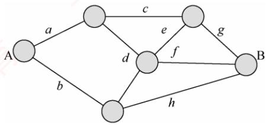

<em>图 1.14 某网络结构图</em>

- 流量控制：协调源主机与目的主机的收发速率（与数据链路层的流量控制类似）。

- 拥塞控制：当网络节点因过载而大量丢弃分组时，网络处于拥塞状态，需采取措施缓解。

- 差错控制：通过检错机制确保向上层提交的都是无差错的分组，无法纠正则丢弃。

（4）传输层（Transport Layer）

> **考点追踪：** OSI 参考模型中传输层的功能（2009）

　　传输层（又称运输层）负责不同主机中进程之间的端到端通信，提供连接管理、可靠传输、流量控制、差错控制等服务。OSI 参考模型的传输层仅提供面向连接的可靠服务。

　　需要注意的是，数据链路层实现节点到节点通信（基于 MAC 地址），网络层实现主机到主机通信（基于 IP 地址），而传输层实现端到端通信（基于端口号）。

　　由于一台主机可同时运行多个进程，传输层需具备复用与分用的功能：复用是指多个应用进程可同时使用传输层的服务，分用是指传输层能将接收到的数据准确交付给对应的上层进程。

##### （5） 会话层（Session Layer）

> **考点追踪：** OSI 参考模型中会话层的功能（2019）

　　会话层管理不同主机上进程之间的会话（Session），包括建立、维护和终止会话连接。它为表示层或用户进程提供同步机制（SYN），支持在连接上有序地传输数据，并引入检查点功能，即当通信中断时，可从最近的检查点恢复会话，实现类似“断点续传”的可靠性。

(6) 表示层（Presentation Layer）

> **考点追踪：** OSI 参考模型中表示层的功能（2013）

　　表示层解决异构系统间信息表示不一致的问题。它采用标准抽象语法定义数据结构，并通过标准编码（如 ASN.1）实现跨平台数据交换。此外，数据压缩、加密与解密也由该层处理。

（7）应用层（Application Layer）

　　应用层是 OSI 参考模型的最高层，作为用户与网络的接口，为各类网络应用（如文件传输、邮件、浏览）提供访问网络环境的手段。由于应用类型多样，应用层协议最为丰富且复杂。

　　OSI 参考模型各层次的功能是统考高频考点，表 1.2 给出了其各层的任务和功能对比。

　　表 1.2 OSI 参考模型各层的任务和功能对比

<table><tr><td>层</td><td>功能</td></tr><tr><td>应用层</td><td>提供应用与网络的接口</td></tr><tr><td>表示层</td><td>数据格式转换</td></tr><tr><td>会话层</td><td>会话管理</td></tr><tr><td>传输层</td><td>复用和分用、差错控制、流量控制、连接管理、可靠传输管理</td></tr><tr><td>网络层</td><td>路由选择、拥塞控制、网际互联、差错控制、流量控制、连接管理、可靠传输管理</td></tr><tr><td>数据链路层</td><td>差错控制、流量控制</td></tr><tr><td>物理层</td><td>定义电路接口参数、信号的含义/电气特性等</td></tr></table>

#### 2. TCP/IP 模型

> **考点追踪：** TCP/IP 模型的层次结构（2021）

　　TCP/IP 模型从低到高依次为：网络接口层（对应 OSI 参考模型的物理层和数据链路层）、

  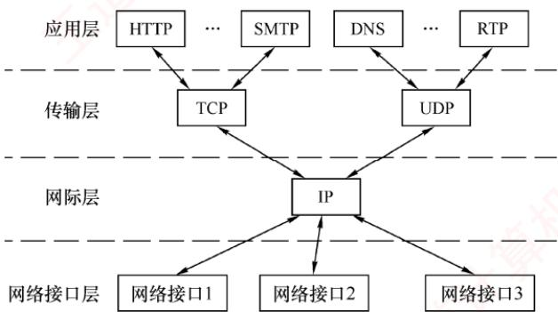

<em>图 1.15 TCP/IP模型的层次结构及各层的主要协议</em>

　　网际层、传输层和应用层（对应 OSI 参考模型的会话层、表示层和应用层）。因其广泛应用，TCP/IP 模型已成为事实上的国际标准。其层次结构及各层的主要协议如图 1.15 所示。

　　网络接口层的功能类似于 OSI 参考模型的物理层和数据链路层，其作用是从主机或节点接收 IP 分组，并将其发送到指定的物理网络上。TCP/IP 模型并未规定该层的具体功能或协议细节，仅要求主机能通过某种底层协议接入网络以传送 IP 分组。实际使用的物理网络可以是各类局域网（如以太网、无线局域网等），也可以是电话网、广域网等。

> **考点追踪：** TCP/IP 模型中网际层的功能（2011、2021）

　　网际层是 TCP/IP 体系结构的核心部分，功能上与 OSI 参考模型的网络层非常相似。它负责将分组发往任意网络，并为每个分组独立选择路由，但不保证分组有序到达，分组的有序性和可靠性由高层（如传输层）负责。网际层的核心协议是网际协议（IP），提供无连接、不可靠的服务，其传输单位为 IP 数据报。当前广泛使用的版本是 IPv4，其下一个版本是 IPv6。网际层还包括地址解析协议（ARP）、网际控制报文协议（ICMP）和网际组管理协议（IGMP）等辅助协议。

　　传输层的功能同样与 OSI 参考模型的传输层类似，旨在实现发送端与接收端主机上对等进程之间的逻辑通信。传输层主要采用两种协议：

1）传输控制协议（Transmission Control Protocol，TCP）。它是面向连接的，传输之前需先建立连接，提供可靠交付，数据传输的单位为报文段。

2）用户数据报协议（User Datagram Protocol，UDP）。它是无连接的，不保证可靠性，仅提供“尽最大努力交付”，数据传输的单位为用户数据报。

　　应用层（用户-用户）集成了 OSI 参考模型中会话层、表示层和应用层的功能，包含所有高层协议，例如，文件传输协议（FTP）、域名解析服务（DNS）和超文本传输协议（HTTP）等。

　　由图1.15可见，IP是互联网的核心协议。TCP/IP体系体现了两大设计哲学：Everything over

　　IP，即各种应用均可构建于 IP 之上；IP over Everything，即 IP 可运行于任意底层网络之上。正是这种高度的通用性与灵活性，推动了互联网发展至今日的规模。

#### 3. TCP/IP 模型与 OSI 参考模型的比较

　　TCP/IP 模型与 OSI 参考模型有许多相似之处。

　　首先，二者均采用分层体系结构，且各层功能大体相似。

　　其次，二者均基于独立协议栈的概念。

　　最后，二者均可解决异构网络互联问题，实现不同厂商生产的计算机之间的通信。

　　TCP/IP 模型与 OSI 参考模型的层次对应关系如图 1.16 所示。

  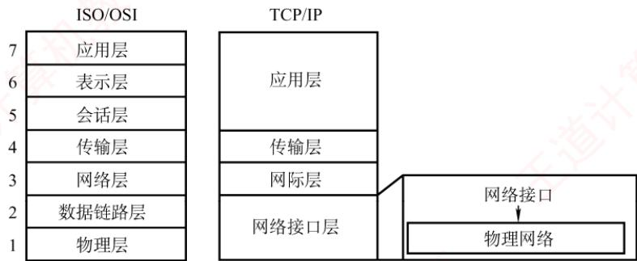

<em>图 1.16 TCP/IP 模型与 OSI 参考模型的层次对应关系</em>

　　尽管有这些相似之处，两个模型在设计理念与结构上仍有显著差异。

　　第一，OSI 参考模型的最大贡献在于精确定义了 “服务” “协议” “接口” 这三个核心概念，其分层思想与现代面向对象程序设计高度契合；而 TCP/IP 模型对这三者未做明确区分。

　　第二，OSI 参考模型是一个 7 层模型，而 TCP/IP 模型采用 4 层结构：它将 OSI 参考模型中的表示层和会话层功能合并为应用层，同时将物理层与数据链路层合并为网络接口层。

　　第三，OSI 参考模型先有模型，后制定具体协议，通用性良好，适合描述各类网络。TCP/IP 模型正好相反，即先有协议栈，后归纳出模型，因此不适用于任何其他的非 TCP/IP 模型。

　　第四，OSI 参考模型在网络层同时支持无连接和面向连接的通信模式，但在传输层仅提供面向连接的服务；而 TCP/IP 模型认为可靠性应由端到端机制保障，因此其网际层仅提供无连接服务，而传输层则同时支持无连接（UDP）和面向连接（TCP）两种模式。

　　OSI 参考模型与 TCP/IP 模型均非完美，二者都曾受到诸多批评。OSI 参考模型的设计者从一开始就致力于构建一个全球统一的计算机网络标准。从技术角度看，这种对理想化架构

　　的追求，导致其软件实现结构复杂、运行效率低下。加之缺乏市场与商业驱动力，最终使其未能实现预期目标。相比之下，TCP/IP 模型凭借简洁高效的设计，在实际应用中占据了主导地位。

　　为了兼顾理论与实践，学习计算机网络时，通常采用一种5层协议体系结构，如图1.17所示，该结构融合了OSI参考模型和TCP/IP模型的优点。本书也将采用此结构进行讨论。

  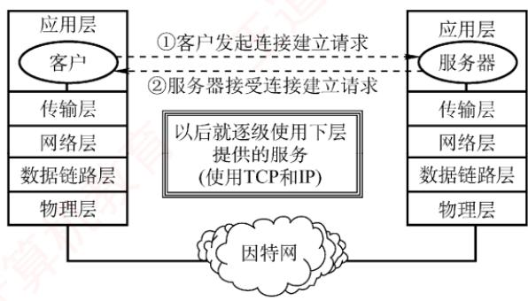

<em>图 1.17 网络 5 层协议的体系结构模型</em>

> **考点追踪：** 应用层数据的逐层封装过程（2021）

　　最后，简单介绍使用协议栈进行通信的过程，如图 1.18 所示。每个协议栈的顶端是一个面向用户的接口。用户首先将数据交给本主机的应用层，应用层加上必要的控制信息，组成应用层的 PDU；然后下放到传输层，作为传输层的 SDU，加上传输层的 PCI，组成传输层的 PDU；接着下放到网络层，组成网络层的 SDU，加上网络层的 PCI，再次组成网络层的 PDU；继续下放到数据链路层……如此层层下放，层层封装，最终形成的数据帧（或数据包）经过物理链路传输。到达接收方节点后，协议栈逆向逐层拆开“包裹”，并将收到的数据递交给用户。

  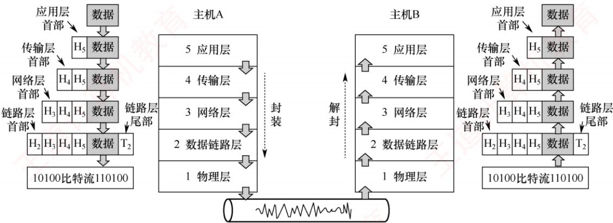

<em>图 1.18 协议栈的通信过程示例</em>

### 1.2.4 本节习题精选

#### 单项选择题

01. 下列选项中，不属于对网络模型进行分层的目标的是（）。

- A. 提供标准语言
- B. 定义功能执行的方法
- C. 定义标准界面
- D. 增加功能之间的独立性

02. 将用户数据分成一个个数据块传输的优点不包括（）。

- A. 减少延迟时间
- B. 提高错误控制效率
- C. 使得多个应用更公平地使用共享通信介质
- D. 有效数据在协议数据单元（PDU）中所占比例更大

03. 协议是指在（）之间进行通信的规则或约定。

- A. 同一节点的上下层
- B. 不同节点
- C. 相邻实体
- D. 不同节点对等实体

04. OSI 参考模型中的实体指的是（）。

- A. 实现各层功能的规则
- B. 上下层之间进行交互时所要的信息
- C. 各层中实现该层功能的软件或硬件
- D. 同一节点中相邻两层相互作用的地方

05. 在 OSI 参考模型中，第 n 层与它之上的第 $n+1$ 层的关系是（）。

- A. 第 n 层为第 $n+1$ 层提供服务
- B. 第 $n+1$ 层为从第 n 层接收的报文添加一个报头
- C. 第 n 层使用第 $n+1$ 层提供的服务
- D. 第 n 层和第 $n+1$ 层相互没有影响

06. 下列关于计算机网络及其结构模型的说法中，错误的是（）。

- A. 世界上第一个计算机网络是 ARPAnet
- B. Internet 最早起源于 ARPAnet
- C. 国际标准化组织（ISO）设计出了 OSI/RM 参考模型，即实际执行的标准
- D. TCP/IP 模型分为 4 个层次

07. （）是计算机网络中 OSI 参考模型的 3 个主要概念。

- A. 服务、接口、协议
- B. 结构、模型、交换
- C. 子网、层次、端口
- D. 广域网、城域网、局域网

08. 下列关于网络协议三要素的描述中，正确的是（）。

- A. 数据格式、编码、信号电平
- B. 数据格式、控制信息、速度匹配
- C. 语法、语义、同步
- D. 编码、控制信息、同步

09. 释放 TCP 连接的四次挥手报文的先后关系，属于网络协议三要素中的（）。

- A. 语法
- B. 时序
- C. 语义
- D. 服务

10. 下图是 TCP 报文段的首部格式，它描述的是网络协议三要素中的（）。

<table><tr><td>位</td><td>0</td><td colspan="6">8</td><td>16</td><td>24</td><td>31</td></tr><tr><td rowspan="6">TCP首部</td><td colspan="7">源端口</td><td colspan="3">目的端口</td></tr><tr><td colspan="10">序号</td></tr><tr><td colspan="10">确认号</td></tr><tr><td>数据偏移</td><td>保留</td><td>U R G</td><td>A C K</td><td>P S H</td><td>R S T</td><td>S Y N</td><td>F I N</td><td colspan="2">窗口</td></tr><tr><td colspan="7">检验和</td><td colspan="3">紧急指针</td></tr><tr><td colspan="8">选项(长度可变)</td><td colspan="2">填充</td></tr></table>

 I. 语法 II. 语义 III. 时序（同步）

- A. 仅 I
- B. 仅 II
- C. 仅 III
- D. I、II 和 III

11. 下列关于 OSI 参考模型的描述中，错误的是（）。

- A. OSI 参考模型定义了开放系统的层次结构
- B. OSI 参考模型定义了各层所包括的可能的服务
- C. OSI 参考模型作为一个框架协调组织各层协议的制定
- D. OSI 参考模型定义了各层接口的实现方法

12. 负责将比特转换成电信号进行传输的层是（）。

- A. 应用层
- B. 网络层
- C. 数据链路层
- D. 物理层

13. 下列关于 OSI 参考模型的物理层功能的描述中，错误的是（）。

- A. 比特 0 和 1 使用何种电信号表示
- B. 传输能否在两个方向上同时进行
- C. 1 个比特持续多长时间
- D. 避免快速发送方“淹没”慢速接收方

14. OSI 参考模型中的数据链路层不具有（）功能。

- A. 物理寻址
- B. 流量控制
- C. 差错检验
- D. 拥塞控制

15. 下列能够最好地描述 OSI 参考模型的数据链路层功能的是（）。

- A. 提供用户和网络的接口
- B. 处理信号通过介质的传输
- C. 控制报文通过网络的路由选择
- D. 保证数据正确的顺序和完整性

16. 当数据由端系统 A 传送至端系统 B 时，不参与数据封装工作的是（）。

- A. 物理层
- B. 数据链路层
- C. 网络层
- D. 表示层

17. 在 OSI 参考模型中，实现端到端的应答、分组排序和流量控制功能的协议层是（）。

- A. 会话层
- B. 网络层
- C. 传输层
- D. 数据链路层

18. 在 ISO/OSI 参考模型中，可同时提供无连接服务和面向连接服务的是（）。

- A. 物理层
- B. 数据链路层
- C. 网络层
- D. 传输层

19. 在 OSI 参考模型中，当两台计算机进行文件传输时，为防止中间出现网络故障而重传整个文件的情况，可通过在文件中插入同步点来解决，这个动作发生在（）。

- A. 表示层
- B. 会话层
- C. 网络层
- D. 应用层

20. 数据的格式转换及压缩属于 OSI 参考模型中（）的功能。

- A. 应用层
- B. 表示层
- C. 会话层
- D. 传输层

21. OSI 参考模型中（）通过设置检验点，使通信双方在通信失效时可从检验点恢复通信。

- A. 传输层
- B. 网络层
- C. 表示层
- D. 会话层

22. 下列说法中正确描述了 OSI 参考模型中数据的封装过程的是（）。

- A. 数据链路层在分组上仅增加了源物理地址和目的物理地址
- B. 网络层将高层协议产生的数据封装成分组，并增加第三层的地址和控制信息
- C. 传输层将数据流封装成数据帧，并增加可靠性和流控制信息
- D. 表示层将高层协议产生的数据分割成数据段，并增加相应的源和目的端口信息

23. 在 OSI 参考模型中，提供流量控制功能的层是第（①）层；提供建立、维护和拆除端到端的连接的层是（②）；为数据分组提供在网络中路由功能的是（③）；传输层提供（④）的数据传送；为网络层实体提供数据发送和接收功能及过程的是（⑤）。

①

- A. 1、2、3
- B. 2、3、4
- C. 3、4、5
- D. 4、5、6

　　②

- A. 物理层
- B. 数据链路层
- C. 会话层
- D. 传输层

　　③

- A. 物理层
- B. 数据链路层
- C. 网络层
- D. 传输层

　　④

- A. 主机进程之间
- B. 网络之间
- C. 数据链路之间
- D. 物理线路之间

　　⑤

- A. 物理层
- B. 数据链路层
- C. 会话层
- D. 传输层

24. 在 OSI 参考模型中，（）利用通信子网提供的服务实现两个进程之间的端到端通信。

- A. 网络层
- B. 传输层
- C. 会话层
- D. 表示层

25. 互联网采用的核心技术是（）。

- A. TCP/IP
- B. 局域网技术
- C. 远程通信技术
- D. 光纤技术

26. 在 TCP/IP 模型中，（）处理关于可靠性、流量控制和错误校正等问题。

- A. 网络接口层
- B. 网际层
- C. 传输层
- D. 应用层

27. 上下相邻层实体之间的接口称为服务访问点，应用层的服务访问点也称（）。

- A. 用户接口
- B. 网卡接口
- C. IP 地址
- D. MAC 地址

28. 在 OSI 参考模型中，各层都有差错控制过程，指出以下每种差错发生在哪些层中：噪声使传输链路上的一个 0 变成 1 或一个 1 变成 0 (①)。收到一个序号错误的目的帧 (②)。一台打印机正在打印，突然收到一个错误指令要打印头回到本行的开始位置 (③)。

　　①

- A. 物理层
- B. 网络层
- C. 数据链路层
- D. 会话层

　　②

- A. 物理层
- B. 网络层
- C. 数据链路层
- D. 会话层

　　③

- A. 物理层
- B. 网络层
- C. 应用层
- D. 会话层

29. 【2009 统考真题】在 OSI 参考模型中，自下而上第一个提供端到端服务的层是（）。

- A. 数据链路层
- B. 传输层
- C. 会话层
- D. 应用层

30. 【2010 统考真题】下列选项中不属于网络体系结构所描述的内容是（）。

- A. 网络的层次
- B. 每层使用的协议
- C. 协议的内部实现细节
- D. 每层必须完成的功能

31. 【2013 统考真题】在 OSI 参考模型中，功能需由应用层的相邻层实现的是（）。

- A. 对话管理
- B. 数据格式转换
- C. 路由选择
- D. 可靠数据传输

32. 【2014 统考真题】在 OSI 参考模型中，直接为会话层提供服务的是（）。

- A. 应用层
- B. 表示层
- C. 传输层
- D. 网络层

33. 【2016 统考真题】在 OSI 参考模型中，路由器、交换机（Switch）、集线器（Hub）实现的最高功能层分别是（）。

- A. 2、2、1
- B. 2、2、2
- C. 3、2、1
- D. 3、2、2

34. 【2017 统考真题】假设 OSI 参考模型的应用层欲发送 400B 的数据（无拆分），除物理层和应用层外，其他各层在封装 PDU 时均引入 20B 的额外开销，则应用层的数据传输效率约为（）。

- A. $80\%$
- B. $83\%$
- C. $87\%$
- D. $91\%$

35. 【2019 统考真题】OSI 参考模型的第 5 层（自下而上）完成的主要功能是（）。

- A. 差错控制
- B. 路由选择
- C. 会话管理
- D. 数据表示转换

36. 【2020 统考真题】右图描述的协议要素是（）。 I. 语法 II. 语义 III. 时序

- A. 仅I
- B. 仅II
- C. 仅III
- D. I、II和III

37. 【2021 统考真题】在 TCP/IP 模型中，由传输层相邻的下一层实现的主要功能是（）。

- A. 对话管理
- B. 路由选择 时间
- C. 端到端报文段传输
- D. 节点到节点流量控制

  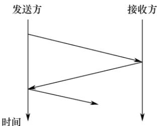

38. 【2022 统考真题】在 ISO/OSI 参考模型中，实现两个相邻节点间流量控制功能的是（）。

- A. 物理层
- B. 数据链路层
- C. 网络层
- D. 传输层

### 1.2.5 答案与解析

#### 单项选择题

**01. B**

　　分层属于计算机网络体系结构的范畴，选项 A、C 和 D 均是网络模型分层的目的，而分层的目的不包括定义功能执行的具体方法。

**02. D**

　　将用户数据分成一个个数据块传输，因为每块均需加入控制信息，所以实际上会使有效数据在 PDU 中所占的比例更小。其他各项均为其优点。

**03. D**

　　协议是为对等层实体之间进行逻辑通信而定义的规则的集合。

**04. C**

　　实体是指每层中实现该层功能的软件或硬件，可以是程序、模块、子程序或设备。

**05. A**

　　服务是指下层为紧邻的上层提供的功能调用，每层只能调用紧邻下层提供的服务（通过服务访问点），而不能跨层调用。

**06. C**

　　ISO 设计了开放系统互连参考模型（OSI/RM），但实际执行的通用标准是 TCP/IP 标准。

**07. A**

　　计算机网络要做到有条不紊地交换数据，就必须遵守一些事先约定的原则，这些原则就是协议。在协议的控制下，两个对等实体之间的通信使得本层能够向上一层提供服务。要实现本层协议，还要使用下一层提供的服务，而提供服务就是交换信息，交换信息就需要通过接口，所以说服务、接口、协议是 OSI 参考模型的 3 个主要概念。

**08. C**

　　描述网络协议的三要素是语法、语义和同步。

**09. B**

　　网络协议三要素中的时序（或称同步）定义了通信双方的时序关系，TCP 通信双方通过 “四次挥手” 释放连接，它规定发送 FIN、ACK、FIN 和 ACK 报文的先后顺序。

**10. A**

　　网络协议三要素中的语法定义所交换信息的格式，因此TCP首部格式体现了语法的要素。

**11. D**

　　OSI 参考模型不仅划分了层次结构，还定义了各层可能提供的服务，但并未规定协议的具体实现，而是描述了一些概念和原则，用来协调和组织各层所用的协议。OSI 参考模型并未定义各层接口的实现方法，而把具体的实现细节留给了各个协议和标准，选项 D 错误。

**12. D**

　　物理层为数据链路层提供二进制流的传输服务，涉及信号的编码、解码和同步等，选项 D 正确。

**13. D**

　　避免快速发送方 “淹没” 慢速接收方，描述的是流量控制的作用，属于数据链路层或传输层的功能。物理层只负责透明地传送比特流，不涉及流量控制的功能，选项 D 错误。

**14. D**

　　数据链路层在不可靠的物理介质上提供可靠的传输，作用包括物理寻址、组帧、流量控制、差错检验、数据重发等。网络层和传输层才具有拥塞控制的功能。

**15. D**

　　OSI 参考模型的数据链路层向上提供可靠的传输服务，在差错检测的基础上，增加了帧编号、确认和重传机制，因此保证了数据正确的顺序和完整性。选项 A 是应用层的功能，选项 B 是物理层的功能，选项 C 是网络层的功能。学习 3.1 节后，对本题的理解将更深刻。

**16. A**

　　物理层以 0、1 比特流的形式透明地传输数据链路层提交的帧。网络层和表示层都为上层提交的数据加上首部，数据链路层为上层提交的数据加上首部和尾部，然后提交给下一层。物理层不存在下一层，自然也就不用封装。

**17. C**

　　只有传输层及以上各层的通信才能称为端到端，选项 B、D 错。会话层管理不同主机间进程的对话，而传输层实现应答、分组排序和流量控制功能。

**18. C**

　　本题容易误选选项D。ISO/OSI参考模型在网络层支持无连接和面向连接的通信，但在传输层仅支持面向连接的通信；TCP/IP 模型在网络层仅有无连接的通信，而在传输层支持无连接和面向连接的通信。两类协议栈的区别是联考的考点，而这个区别是常考点。

**19. B**

　　在 OSI 参考模型中，会话层的两个主要服务是会话管理和同步。会话层使用检验点使通信会话在通信失效时从检验点继续恢复通信，实现数据同步。

**20. B**

　　OSI 参考模型表示层的功能有数据解密与加密、压缩、格式转换等。

**21. D**

　　会话层的主要功能是建立、管理和终止进程间的会话，以及使用检查点（或称检验点）使会话在通信失效时从检验点继续恢复通信，实现数据同步。

**22. B**

　　数据链路层在分组上除增加源和目的物理地址外，也增加控制信息；传输层的 PDU 不称为帧；表示层不负责将高层协议产生的数据分割成数据段，负责增加相应源和目的端口信息的应是传输层。选项 B 正确描述了 OSI 参考模型中数据的封装过程，数据经过网络层后，只是增加了第三层 PCI。

#### 23. ① B、② D、③ C、④ A、⑤ B

　　在计算机网络中，流量控制指的是通过限制发送方发出的数据流量，使得其发送速率不超过接收方接收速率的一种技术。流量控制功能可存在于数据链路层及其之上的各层中。目前提供流量控制功能的主要是数据链路层、网络层和传输层。不过，各层的流量控制对象不一样，各层的流量控制功能是在各层实体之间进行的。

　　在 OSI 参考模型中，物理层实现比特流在传输介质上的透明传输；数据链路层将有差错的物理线路变成无差错的数据链路，实现相邻节点之间即点到点的数据传输。网络层的主要功能是路由选择、拥塞控制和网际互联等，实现主机到主机的通信；传输层实现主机的进程之间即端到端的数据传输。

　　下一层为上一层提供服务，而网络层的下一层是数据链路层，所以为网络层实体提供数据发送和接收功能及过程的是数据链路层。

**24. B**

　　在 OSI 参考模型中，数据链路层提供链路上相邻节点之间的逻辑通信，网络层提供主机之间的逻辑通信，传输层在运行于不同主机上的进程之间（端到端）提供逻辑通信。

**25. A**

　　协议是网络上计算机之间进行信息交换和资源共享时共同遵守的约定，没有协议的存在，网络的作用也就无从谈起。在互联网中应用的网络协议是采用分组交换技术的 TCP/IP，它是互联网的核心技术。

**26. C**

　　TCP/IP 模型的传输层提供端到端的通信，并且负责差错控制和流量控制，可以提供可靠的面向连接服务或不可靠的无连接服务。

**27. A**

　　在同一系统中，相邻两层的实体交换信息的逻辑接口称为服务访问点（SAP），N 层的 SAP 是 $N+1$ 层可以访问 N 层服务的地方。SAP 用于区分不同的服务类型。在 5 层体系结构中，数据链路层的服务访问点为帧的“类型”字段，网络层的服务访问点为 IP 数据报的“协议”字段，传输层的服务访问点为“端口号”字段，应用层的服务访问点为“用户接口”。

**28. A、C、C**

1）物理层。物理层负责正确、透明地传输比特流（0,1）。

2）数据链路层。数据链路层的PDU称为帧，帧的差错检测是数据链路层的功能。

3）应用层。打印机是向用户提供服务的，运行的是应用层的程序。

**29. B**

　　在 OSI 参考模型中，传输层是自下而上第一个提供端到端服务的层，通过端口号实现应用进程间的逻辑通信。数据链路层仅负责相邻节点（如交换机、路由器等中间设备）之间的通信，而网络层提供主机到主机的通信，不提供面向应用进程的服务。

**30. C**

　　网络体系结构是指各层及其协议的集合，涵盖网络的层次划分、每层的功能及所用的协议，因此选项 A、B、D 均属于描述内容。而协议的内部实现细节属于实现问题，不由体系结构规定。

**31. B**

　　在 OSI 参考模型中，应用层的相邻下层是表示层（第 6 层），负责处理与数据表示相关的问题。其主要功能包括数据字符集转换、数据格式转换、文本压缩以及加密与解密等。

**32. C**

　　在 OSI 参考模型中，各层直接为其上一层提供服务，而会话层的下一层是传输层。

**33. C**

　　集线器（Hub）是多端口中继器，工作在物理层（第1层）；以太网交换机（Switch）是多端口网桥，工作在数据链路层（第2层）；路由器是网络层设备，最高工作在第3层。因此，三者实现的最高功能层分别为网络层、数据链路层和物理层。

**34. A**

　　OSI 参考模型共 7 层，除了物理层和应用层，中间 5 层每层引入 20B 开销，共增加 100B 开销。原始数据为 400B，总传输量为 500B，故传输效率为 $400B \div 500B = 80\%$ .

**35. C**

　　OSI 参考模型自下而上的第 5 层为会话层，主要功能是管理和协调不同主机上各种进程之间的通信（对话），即负责建立、管理和终止应用程序间的会话。

**36. C**

　　协议由语法、语义和时序三要素组成：语法规定数据格式，语义定义控制信息含义，时序规定交互顺序。题图中发送方与接收方按特定顺序交互，体现了协议的时序要素。

**37. B**

　　在 TCP/IP 模型中，传输层的下一层是网际层，其主要功能是为分组选择路由并转发，即实现路由选择；它提供无连接、不可靠的尽力而为的服务，不保证有序交付。端到端报文段传输属于传输层功能，对话管理由应用层处理。TCP/IP 网际层不提供节点到节点的流量控制功能。

**38. B**

　　在 OSI 参考模型中，流量控制功能在多个层次存在：数据链路层实现相邻节点之间的流量控制，网络层关注整个网络中的拥塞与流量调节，传输层则提供端到端的流量控制。本题明确要求“两个相邻节点间”的流量控制，因此由数据链路层实现。

## 1.3 本章小结及疑难点

1. 互联网使用的IP是无连接的，因此其传输是不可靠的。这容易让人觉得互联网很不可靠。

　　为什么当初不把互联网的传输设计为可靠的呢？

　　传统电信网主要用于电话通信，而普通电话机是“哑终端”（不具备智能处理能力），因此电信公司必须将网络本身设计得高度可靠，以保障通信质量。

　　数据传输显然需要可靠性。但在设计 ARPAnet（互联网的前身）时，一个关键争论是“谁应该负责保证传输的可靠性？”一种观点认为，应像电信网那样，由通信网络本身确保可靠传输——毕竟当时的技术已能构建高可靠的网络。另一种观点则主张，由用户主机（端系统）来负责可靠性，理由是这样可以让网络结构更简单、成本更低、扩展性更强。

　　计算机网络的先驱们注意到，计算机与电话机有本质区别：计算机是智能终端，具备强大的处理能力。因此，他们最终采纳了端到端可靠传输的设计哲学：在网络层使用简单、无连接、不可靠的IP协议，而在传输层通过面向连接的TCP协议实现端到端的可靠性。

　　这样既降低了网络基础设施的复杂性和成本，又确保了应用所需的可靠通信。

#### 2. 端到端通信和点到点通信有什么区别？

　　本质上，由物理层、数据链路层和网络层构成的通信子网负责提供主机到主机的通信服务，而传输层则负责为主机上的应用进程提供端到端的通信服务。

　　点到点通信指的是主机到主机之间的数据传递，不涉及具体的应用进程。它只负责将数据从一台主机传送到另一台主机，但无法识别是哪两个进程在通信——这一任务由更高层完成。

　　端到端通信建立在点到点通信的基础之上，通过多段点到点链路串联，最终实现不同主机上应用进程之间的通信。这里的“端”指的是应用进程的端口，而端口号用于标识应用层中的不同进程。因此，端到端通信真正面向的是用户程序之间的交互，而非仅仅是机器之间的连接。

#### 3. 如何理解传输速率和传播速率？

　　传输速率是指主机或路由器在数字信道上发送数据的速率，单位是比特/秒（b/s）。

　　传播速率是指电磁波在物理介质中向前传播的速度，单位是米/秒（m/s）。

　　例如，在图 1.19 中，假定链路的传播速率为 $2 \times 10^{8} ~m/s$ ，即电磁波 $1 \mu s$ 可向前传播 200 m。若链路带宽为 1 Mb/s，则主机 $1 \mu s$ 可向链路发送 1 比特数据。

  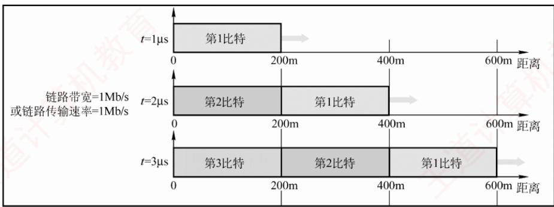

<em>图 1.19 传输速率与传播速率的区别</em>

　　在 t=0 时，开始发送数据；

　　到 $t=1\mu s$ 时，第一个比特已沿链路传播约 200m；

　　到 $t=2\mu s$ 时，第二个比特发出，第一个比特到达 400m 处；

　　到 $t=3\mu s$ 时，第三个比特发出，第一个比特到达 600m 处。

　　由此可见：链路上同时存在多少比特，取决于传输速率（带宽）；而每个比特在某一时刻位于何处，取决于传播速率。
