## 【考纲内容】

（一）通信基础

　　信道、信号、带宽、码元、波特、速率、信源与信宿等基本概念；奈奎斯特定理与香农定理；编码与调制；

　　电路交换、报文交换与分组交换；数据报与虚电路

（二）传输介质

　　双绞线、同轴电缆、光纤与无线传输介质；物理层接口的特性

（三）物理层设备

　　中继器；集线器

## 【复习提示】

　　物理层考虑的是怎样才能在连接各台计算机的传输介质上传输数据比特流，而不是具体的传输介质。本章概念较多，易出选择题，复习时应抓住重点，如奈奎斯特定理和香农定理的应用、编码与调制技术、物理层接口的特性、物理层设备的功能和特点等。

## 2.1 通信基础

### 2.1.1 基本概念

#### 1. 数据、信号与码元

　　通信的目的是传输信息，如文字、图像和视频等。数据是信息的载体，即用于传送信息的实体。信号则是数据的电气或电磁表现，是数据在传输过程中的存在形式。数据和信号均可分为模拟和数字两类：模拟信号的取值是连续的；数字信号的取值是离散的。

　　在通信系统中，通常用一个固定时长的信号波形表示一个 k 进制符号，该波形称为码元（也称 k 进制码元），而该时长称为码元宽度（或信号周期）。每个码元能够承载的信息量与其所表示的信号状态数量直接相关，1 码元可以携带若干比特的信息量。例如，若一个信号周期内可能出现 2 种信号，则每种信号可表示 1 位二进制数，意味着 1 码元可携带 1 比特信息；若可能出现 4 种信号，则每种信号可表示 2 位二进制数，意味着 1 码元携带 2 比特信息。

#### 2. 信源、信道与信宿

　　图 2.1 所示为一个单向通信系统的模型，实际的通信系统大多数是双向的，可进行双向通信。数据通信系统主要划分为信源、信道和信宿三部分。信源是产生和发送数据的源头，信宿是接收数据的终点，它们通常都是计算机或其他数字终端装置。信道是信号的传输介质，一条双向通信的线路包含一个发送信道和一个接收信道。信源发出信息后，需经发送变换器转换为适合在信道传输的信号；该信号经信道传至接收端后，由接收变换器还原为原始信息，再交付给信宿。噪声源是信道上的噪声及分散在通信系统其他各处的噪声的集中表示。

  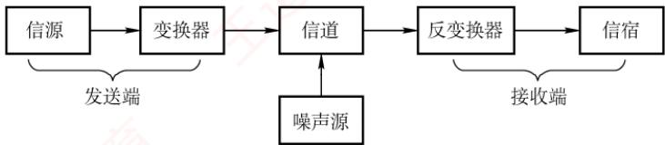

<em>图 2.1 一个单向通信系统的模型</em>

　　按传输信号形式的不同，信道分为传送模拟信号的模拟信道和传送数字信号的数字信道；按传输介质的不同，分为无线信道和有线信道。

　　信道上传送的信号有基带信号和宽带信号之分。基带信号是由信源发出的未经过调制的原始电信号，当在信道中直接传送基带信号时，称为基带传输；宽带信号是将基带信号调制到高频载波上形成的信号，然后其在信道上传输，这种方式称为宽带传输。

　　数据传输方式分为串行传输和并行传输。串行传输是指逐比特地按序依次传输，并行传输是指若干比特通过多个通信信道同时传输。串行传输适用于长距离通信，如计算机网络。并行传输适用于短距离通信，常用于计算机内部，如 CPU 与主存之间。

　　从通信双方信息的交互方式看，可分为三种基本方式：

1）单向通信。只有一个方向的通信而没有反方向的交互，如无线电广播、电视广播等。

2）半双工通信。通信双方都可发送或接收信息，但任何一方都不能同时发送和接收。

3）全双工通信。通信双方可同时发送和接收信息。

　　单向通信只需一个信道；全双工通信需要两个独立信道（每个方向一个）；而半双工通信可在同一信道上分时双向传输，无须两个物理信道。

#### 3. 速率、波特与带宽

　　速率是指数据传输速率，表示单位时间内传输的数据量，常有两种描述形式。

> **考点追踪：** 比特率与波特率的关系（2011、2014、2022）

1）码元传输速率。也称波特率或调制速率，表示数字通信系统每秒传输的码元数，单位是波特（Baud）。码元既可以是多进制的，也可以是二进制的，码元速率与进制无关。

2）信息传输速率。也称比特率，表示数字通信系统每秒传输的比特数，单位是b/s。

> **注意：**

　　波特和比特是两个不同的概念，但波特率与比特率在数量上又有一定的关系。若一个码元携带 $n$ 比特的信息量，则波特率 $M\mathrm{Baud}$ 对应的比特率为 $M\times n\mathrm{b / s}$

　　在模拟通信中，带宽（也称频率带宽）表示信道所能传输信号的频率范围，即最高频率与最低频率之差，单位是赫兹（Hz）。而在数字通信或计算机网络中，带宽用来表示通信线路所能传输数据的能力，即最大数据传输速率，此时带宽的单位不再是 Hz，而是 b/s。

### 2.1.2 信道的极限容量

　　任何实际的信道都不是理想的，信号在信道上传输时会不可避免地产生失真。只要接收端能够从失真的信号波形中识别出原始信号，这种失真对通信质量就没有影响；然而，若信号失真严重，则接收端就无法正确识别每个码元。码元传输速率越高、传输距离越远、噪声干扰越大或传输介质质量越差，接收端波形的失真就越严重。

#### 1. 奈奎斯特定理（奈氏准则）

> **考点追踪：** 奈氏准则的应用（2009、2014、2022、2023）

　　实际信道所能通过的频率范围总是有限的。信号中的许多高频分量往往无法通过信道，会在传输中衰减，导致接收端收到的信号波形失去码元之间的清晰界限，这种现象称为码间串扰。奈奎斯特定理指出：在理想低通信道（无噪声、带宽有限）中，为避免码间串扰，极限码元传输速率为 $2W$ 波特，其中 $W$ 是信道的频率带宽（单位为 $\mathrm{Hz}$ ）。若用 $V$ 表示每个码元的离散电平数量（不同码元的种类数；例如，若有16种不同的码元，则需用4个二进制位来表示，此时数据传输速率是码元传输速率的4倍），则有

$$
\text {理想低通信道的极限数据传输速率} = 2 W \log_ {2} V \quad (\text {单位为} \mathrm{b/s})
$$

　　对于奈氏准则，有以下结论：

1）在任何信道中，码元传输速率存在上限。若超过该上限，则会产生严重码间串扰，导致接收端无法正确识别码元。

2）信道带宽越大，其传输码元的能力越强。

3）奈氏准则仅限制码元传输速率，并未限制每个码元所能承载的信息量（比特数），因此信息传输速率仍可采用多元调制（如 QAM-16、QAM-64）来提升。

#### 2. 香农定理

> **考点追踪：** 香农定理的应用（2014、2016）

　　实际信道存在高斯白噪声。香农定理给出了带宽受限且有高斯噪声干扰的信道的极限数据传输速率。当速率不超过该极限值时，理论上可以实现任意低的误码率。香农定理定义为

$$
\text {信道的极限数据传输速率} = W \log_ {2} (1 + S / N) \quad (\text {单位为} \mathrm{b/s})
$$

　　式中，W 为信道的频率带宽（单位为 Hz），S 为信号的平均功率，N 为噪声功率。S/N 为信噪比，即信号的平均功率与噪声的平均功率之比。

　　信噪比有两种表示形式：无单位记法和分贝（dB）记法。当采用无单位记法时，信噪比 = S/N；当采用分贝记法时，信噪比 = $10\log_{10}(S/N)$ （单位为 dB），例如，当 S/N = 1000 时，信噪比为 30dB。注意，使用香农定理计算信道的极限数据传输速率时，信噪比应采用无单位记法。

> **考点追踪：** 信道带宽的影响因素（2014）

　　对于香农定理，有以下结论：

1）信道带宽或信噪比越大，信息的极限传输速率越高。

2）对于给定的带宽和信噪比，信息传输速率的上限是确定的。

3）只要实际信息传输速率低于该极限值，就能找到某种方法实现近似无差错传输。

4）香农定理得出的是理论极限，实际信道能达到的传输速率要比它低不少。

> **考点追踪：** 奈氏准则与香农定理的对比（2017）

　　奈氏准则仅考虑带宽对码元速率的限制，适用于无噪声的理想信道；而香农定理同时考虑了带宽和信噪比，适用于有噪声的实际信道。香农定理表明，在给定带宽和信噪比下，信息传输速率存在上限，即每个码元所能可靠携带的比特数是有限的。

### 2.1.3 编码与调制

　　信号是数据的具体表示形式，数据无论是数字的还是模拟的，为了传输的目的，都要转换成信号。将数据转换为数字信号的过程称为编码，将数据转换为模拟信号的过程称为调制。

　　数字数据可以通过数字发送器转换为数字信号进行传输，也可以通过调制器转换为模拟信号进行传输；同样，模拟数据既可通过 PCM 编码器转换为数字信号进行传输，也可直接以模拟信号形式传输（例如传统电话中的语音信号）。由此形成了以下四种编码与调制方式。

#### 1. 数字数据编码为数字信号

　　数字数据编码用于基带传输，即在基本不改变信号频率的情况下直接传输数字信号。编码的核心在于如何用电平或跳变来表示二进制数0和1。常用编码方式有以下几种，如图2.2所示。

  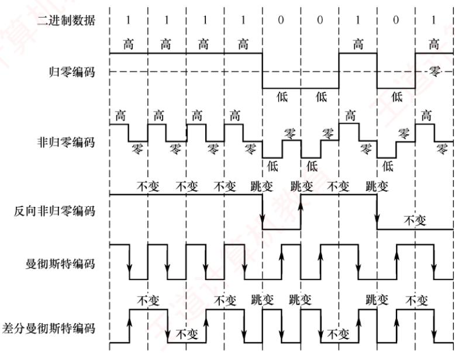

<em>图 2.2 常用的数字数据编码</em>

1）归零（RZ）编码。用高电平表示1，低电平表示0（或相反），每个码元中间都会跳变回零电平（“归零”）。接收方可利用这一跳变来调整自身的时钟基准，从而实现收发双方的自同步。但由于归零过程占用了一部分带宽，传输效率会受到一定影响。

> **考点追踪：** NRZ与NRZI编码的波形特性（2015）

2）非归零（NRZ）编码。与 RZ 编码的区别是不进行归零，整个周期都可用于传输数据，因此编码效率最高。但由于缺乏内在时钟信息，收发双方需额外时钟线来实现同步。

3）反向非归零（NRZI）编码。以码元起始处是否有跳变来表示数据：无跳变表示1（或依协议约定），有跳变表示0。跳变本身可用于辅助时钟恢复，兼顾了NRZ的高效率与一定的自同步能力，并且避免了RZ的带宽浪费。USB2.0等标准采用此编码。

> **考点追踪：** 曼彻斯特编码的波形特性（2013、2015）

4）曼彻斯特编码。每个码元中间都有一次电平跳变，该跳变同时承担时钟同步与数据表示功能。常用下降沿（高→低）表示1，上升沿（低→高）表示0，或采用相反的约定。

> **考点追踪：** 差分曼彻斯特编码的波形特性（2021）

5）差分曼彻斯特编码。同样，每个码元中间都有电平跳变，与曼彻斯特编码不同的是，该跳变仅用于时钟同步，而不表示数据。数据由码元起始处是否有跳变决定：无跳变表示1，有跳变表示0。这种方式具有更强的抗干扰能力。

　　传统以太网采用的就是曼彻斯特编码，而差分曼彻斯特编码常用于令牌环网等高速网络。常见数字编码方式的特性对比如表2.1所示。

　　表 2.1 常见数字编码方式的特性对比

<table><tr><td>特性</td><td>归零编码</td><td>非归零编码</td><td>反向非归零编码</td><td>曼彻斯特编码</td><td>差分曼彻斯特编码</td></tr><tr><td>自同步能力</td><td>有</td><td>无</td><td>需增加冗余位</td><td>有</td><td>有</td></tr><tr><td>浪费带宽</td><td>浪费</td><td>无</td><td>不太浪费</td><td>浪费</td><td>浪费</td></tr><tr><td>抗干扰能力</td><td>弱</td><td>弱</td><td>弱</td><td>强</td><td>强</td></tr></table>

#### 2. 模拟数据编码为数字信号

　　该过程通常采用 PCM（脉冲编码调制），包含三个步骤。

1）采样：对模拟信号进行周期性采样，将其从时间连续变为时间离散。根据奈奎斯特定理，采样频率不得低于信号最高频率的两倍。

2）量化：将采样所得的幅值按预设分级取整，将连续的模拟电平转换为离散的数值。

3）编码：将量化后的整数转换为对应的二进制码。

#### 3. 数字数据调制为模拟信号

　　数字数据调制技术在发送端将数字信号转换为模拟信号，在接收端则将模拟信号还原为数字信号，分别对应于调制解调器的调制和解调过程。图 2.3 显示了数字调制的三种方式。

  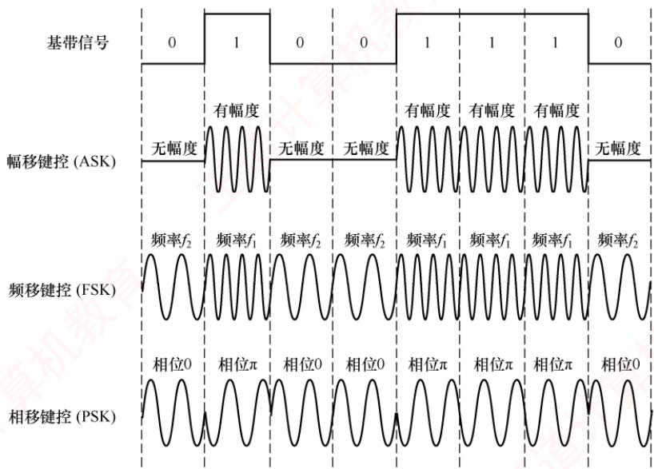

<em>图 2.3 数字调制的三种方式</em>

> **考点追踪：** 数字调制技术的分类与特点（2024）

> **考点追踪：** 调制阶数与码元比特数的关系（2011、2022）

1）幅移键控（Amplitude Shift Keying，ASK）。通过改变载波的振幅来表示数字信号1和0。例如，用有载波和无载波输出分别表示1和0。这种方式容易实现，但抗干扰能力差。

2）频移键控（Frequency Shift Keying，FSK）。通过改变载波的频率来表示数字信号1和0。例如，用频率 $f_{1}$ 和频率 $f_{2}$ 分别表示1和0。这种方式容易实现，并且抗干扰能力强。

3）相移键控（Phase Shift Keying，PSK）。通过改变载波的相位来表示数字信号1和0。例如，用相位0和 $\pi$ 分别表示1和0，它是一种绝对调相方式。

> **注意：**

　　与PSK不同，DPSK（差分相移键控）是一种相对调相方式，它通过检测当前码元与前一个码元的载波相位差来传输数字信息。例如，用相位是否发生变化分别表示1和0。

> **考点追踪：** QAM 调制阶数与码元比特数的关系（2009、2023）

4）正交幅度调制（Quadrature Amplitude Modulation，QAM）。在载波频率相同的前提下，通过同时调制振幅和相位，形成复合信号，从而在有限带宽内实现更高的数据传输速率。

　　QAM基于正交载波，通常使用两路载波，分别对应正弦波和余弦波。两路载波的频率相同，但相位相差 $90^{\circ}$ ，因此可在同一频带上独立传输而不会相互干扰。以QAM-16①为例，常用如图2.4(a)所示的星座图表示：每路载波均有4种不同的振幅，其中横轴表示余弦波的幅度，纵轴表示正弦波的幅度。两路信号组合后可形成16种不同的信号状态，每个状态对应星座图上的一个点，并且代表一个4位二进制数。接收端收到信号后，通过判断该信号最接近哪个星座点，即可恢复出原始数据。若将每路载波的振幅调制成8种，则可组合成64种不同的信号状态（QAM-64），每个状态对应一个6位二进制数，如图2.4(b)所示。

  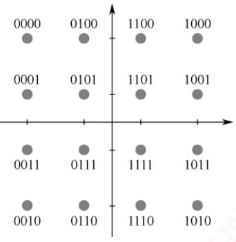

<em>(a) QAM-16</em>

  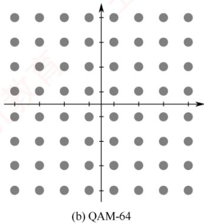

<em>图 2.4 QAM-16 和 QAM-64 的星座图</em>

　　假设波特率为 $B$ ，采用 $m$ 个相位，每个相位有 $n$ 种振幅，则该QAM的数据传输速率 $R$ 为 $R = B\log_2(m\times n)$ （单位为b/s）

#### 4. 模拟数据直接传输为模拟信号

　　在某些场景下，模拟数据直接以模拟信号形式传输，无须数字化。例如，传统电话系统中，语音信号通过双绞线直接传送到本地交换机。此外，若需通过高频信道（如无线电波）传输，则可采用调幅（AM）、调频（FM）或调相（PM）等模拟调制技术，将信号加载到高频载波上。

### 2.1.4 本节习题精选

#### 一、单项选择题

01. 下列关于通信基础的基本概念的说法中，正确的是（）。

- A. 信道与通信电路类似，一条可通信的电路往往包含一个信道
- B. 调制是指把模拟数据转换为数字信号的过程
- C. 信息传输速率是指通信信道上每秒传输的码元数
- D. 在数值上，波特率等于比特率与每符号所含的比特数的比值

02. 影响信道最大传输速率的因素主要有（）。

- A. 信道带宽和信噪比
- B. 码元传输速率和噪声功率
- C. 频率特性和带宽
- D. 发送功率和噪声功率

03. （）被用于计算机内部的数据传输。

- A. 串行传输
- B. 并行传输
- C. 同步传输
- D. 异步传输

04. 下列有关曼彻斯特编码的叙述中，正确的是（）。

- A. 每个信号起始边界作为时钟信号有利于同步
- B. 将时钟与数据取值都包含在信号中
- C. 这种编码机制特别适合传输模拟数据
- D. 每位的中间不跳变表示信号的取值为0

05. 在数据通信中使用曼彻斯特编码的主要原因是（）。

- A. 实现对通信过程中传输错误的恢复
- B. 实现对通信过程中收发双方的数据同步
- C. 提高对数据的有效传输速率
- D. 提高传输信号的抗干扰能力

06. 不含同步信息的编码是（）。
 I. 非归零编码 II. 曼彻斯特编码 III. 差分曼彻斯特编码

- A. 仅 I
- B. 仅 II
- C. 仅 II、III
- D. I、II、III

07. 某信道的波特率为 1000Baud，若令其数据传输速率达到 4kb/s，则一个信号码元所取的有效离散值个数为（）。

- A. 2
- B. 4
- C. 8
- D. 16

08. 下图是某比特串的曼彻斯特编码信号波形，则该比特串为（）。

  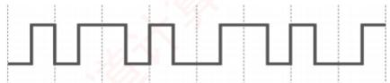

- A. 0011 0110
- B. 1010 1101
- C. 0101 0010
- D. 1100 0101

09. 已知某信道的信息传输速率为 64kb/s，一个载波信号码元有 4 个有效离散值，则该信道的波特率为（）。

- A. 16kBaud
- B. 32kBaud
- C. 64kBaud
- D. 128kBaud

10. 有一个无噪声的 $8 \mathrm{kHz}$ 信道, 每个信号包含 8 级, 每秒采样 $24 \mathrm{k}$ 次, 那么可以获得的最大传输速率是 （）。

- A. $24 \mathrm{kb} / \mathrm{s}$
- B. $32 \mathrm{kb} / \mathrm{s}$
- C. $48 \mathrm{kb} / \mathrm{s}$
- D. $72 \mathrm{kb} / \mathrm{s}$

11. 对于某带宽为 $4000\mathrm{Hz}$ 的低通信道，采用16种不同的物理状态来表示数据。按照奈奎斯特定理，信道的最大传输速率是（）。

- A. $4\mathrm{kb / s}$
- B. $8\mathrm{kb / s}$
- C. $16\mathrm{kb / s}$
- D. $32\mathrm{kb / s}$

12. 二进制信号在信噪比为 127:1 的 4kHz 信道上传输，最大数据传输速率可以达到（）。

- A. 28000b/s
- B. 8000b/s
- C. 4000b/s
- D. 无限大

13. 电话系统的典型参数是信道带宽为 $3000\mathrm{Hz}$ ，信噪比为 $30\mathrm{dB}$ ，该系统的最大数据传输速率为（）。

- A. $3\mathrm{kb / s}$
- B. $6\mathrm{kb / s}$
- C. $30\mathrm{kb / s}$
- D. $64\mathrm{kb / s}$

14. 一个信道的信号功率是 $0.14\mathrm{W}$ ，噪声功率是 $0.02\mathrm{W}$ ，频率范围为 $3.5 \sim 3.9\mathrm{MHz}$ ，则该信道的最高数据传输速率是（）。

- A. $1.2\mathrm{Mb/s}$
- B. $2.4\mathrm{Mb/s}$
- C. $11.7\mathrm{Mb/s}$
- D. $23.4\mathrm{Mb/s}$

15. 采用8种相位，每种相位各有两种幅度的QAM调制方法，在1200Baud的信息传输速率下能达到的数据传输速率为（）。

- A. $2400\mathrm{b / s}$
- B. $3600\mathrm{b / s}$
- C. $9600\mathrm{b / s}$
- D. $4800\mathrm{b / s}$

16. 一个信道每 $1 / 8\mathrm{s}$ 采样一次，传输信号共有16种变化状态，最大数据传输速率是（）。

- A. $16\mathrm{b} / \mathrm{s}$
- B. $32\mathrm{b} / \mathrm{s}$
- C. $48\mathrm{b} / \mathrm{s}$
- D. $64\mathrm{b} / \mathrm{s}$

17. 某信道的带宽为 10MHz，信噪比为 30dB，采用 QAM-32 调制方案。若将带宽提高到 20MHz，信噪比提高到 40dB，则信道的极限数据传输速率大约提高到原来的（）倍。

- A. 2
- B. 2.2
- C. 2.4
- D. 2.6

18. 【2009 统考真题】在无噪声的情况下，若某个通信链路的带宽为 3kHz，采用 4 个相位，每个相位具有 4 种幅度的 QAM 调制技术，则该通信链路的最大数据传输速率是（）。

- A. 12kb/s
- B. 24kb/s
- C. 48kb/s
- D. 96kb/s

19. 【2011 统考真题】若某个通信链路的数据传输速率为 2400b/s，采用 4 个相位调制，则该链路的波特率是（）。

- A. 600Baud
- B. 1200Baud
- C. 4800Baud
- D. 9600Baud

20. 【2013 统考真题】下图为 10Base-T 网卡接收到的信号波形，则该网卡收到的比特串是（）。

  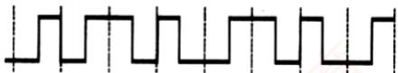

- A. 0011 0110
- B. 1010 1101
- C. 0101 0010
- D. 1100 0101

21. 【2014 统考真题】在下列因素中，不影响信道数据传输速率的是（）。

- A. 信噪比
- B. 频率带宽
- C. 调制速率
- D. 信号传播速度

22. 【2015 统考真题】使用两种编码方案对比特流 01100111 进行编码的结果如下图所示，编码 1 和编码 2 分别是（）。

  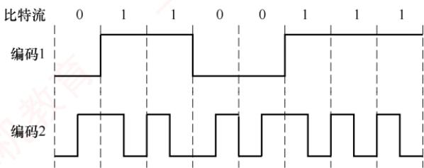

- A. NRZ编码和曼彻斯特编码
- B. NRZ编码和差分曼彻斯特编码
- C. NRZI编码和曼彻斯特编码
- D. NRZI编码和差分曼彻斯特编码

23. 【2016 统考真题】如下图所示, 若连接 R2 和 R3 链路的频带宽度为 8kHz, 信噪比为 30dB, 该链路实际数据传输速率约为理论最大数据传输速率的 50%, 则该链路的实际数据传输速率约为（）。

  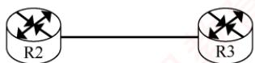

- A. $8\mathrm{kb / s}$
- B. $20\mathrm{kb / s}$
- C. $40\mathrm{kb / s}$
- D. $80\mathrm{kb / s}$

24. 【2017 统考真题】若信道在无噪声情况下的极限数据传输速率不小于信噪比为 30dB 条件下的极限数据传输速率，则信号状态数至少是（）。

- A. 4
- B. 8
- C. 16
- D. 32

25. 【2021 统考真题】下图为一段差分曼彻斯特编码信号波形，该编码的二进制串是（）。

- A. 1011 1001
- B. 1101 0001
- C. 0010 1110
- D. 1011 0110

  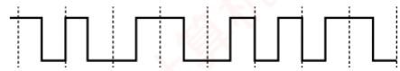

26. 【2022 统考真题】在一条带宽为 200kHz 的无噪声信道上，若采用 4 个幅值的 ASK 调制，则该信道的最大数据传输速率是（）。

- A. 200kb/s
- B. 400kb/s
- C. 800kb/s
- D. 1600kb/s

27. 【2023 统考真题】某个无噪声理想信道带宽为 4MHz，采用 QAM 调制，若该信道的最大数据传输速率是 48Mb/s，则该信道采用的 QAM 调制方案是（）。

- A. QAM-16
- B. QAM-32
- C. QAM-64
- D. QAM-128

28. 【2024 统考真题】在下列二进制数字调制方法中，需要 2 个不同频率载波的是（）。

- A. ASK
- B. PSK
- C. FSK
- D. DPSK

#### 二、综合应用题

01. 如下图所示，主机 A 和 B 都通过 10Mb/s 的链路连接到交换机 S。

  

　　每条链路上的传播时延都是 $20 \mu s$ 。S 是一个存储转发设备，它在接收完一个分组 $35 \mu s$ 后开始转发收到的分组。试计算将 10000 比特从 A 发送到 B 所需的总时间。

1）作为单个分组。

2）作为两个5000比特的分组一个紧接着另一个发送。

02. 一个分组交换网采用虚电路方式转发分组，分组的首部和数据部分分别为 $h$ 位和 $p$ 位。现有 $L(L \gg p$ 且 $L$ 为 $p$ 的倍数）位的报文通过该网络传送，源点和终点之间的线路数为 $k$ ，每条线路上的传播时延为 $d$ 秒，数据传输速率为 $b / b / s$ ，虚电路建立连接的时间为 $s$ 秒，每个中间节点有 $m$ 秒的平均处理时延。求源点开始发送数据直至终点收到全部数据所需的时间。

### 2.1.5 答案与解析

#### 一、单项选择题

**01. D**

　　信道不等于通信电路，一条可双向通信的电路往往包含两个信道：一个是发送信道，一个是接收信道。另外，多个通信用户共用通信电路时，每个用户在该通信电路都有一个信道，因此选项A错误。调制是将数据转换为模拟信号的过程，选项B错误。选项C明显错误。“比特率”在数值上和“波特率”的关系如下：波特率 $=$ 比特率/每符号所含的比特数，选项D正确。

**02. A**

　　根据香农定理，影响信道最大传输速率的因素主要有信道带宽和信噪比，而信噪比与信道内所传输的平均信号功率和噪声功率有关，数值上等于二者之比。

**03. B**

　　并行传输的特点：距离短、速度快。串行传输的特点：距离长、速度慢。因此，在计算机内部（距离短）传输时应选择并行传输。同步、异步传输是通信方式，而不是传输方式。

**04. B**

　　曼彻斯特编码将时钟和数据包含在信号中，在传输数据的同时，也将时钟一起传输给对方，码元中间的跳变作为时钟信号，不同的跳变方式作为数据信号，选项 A 错误、选项 B 正确。每个码元的中间都发生电平跳变，选项 D 错误。曼彻斯特编码最适合传输二进制数字信号，选项 C 错误。

**05. B**

　　曼彻斯特编码用码元中间的电平跳变来表示每个比特，可方便收发双方根据跳变来同步时钟，而不需要额外的时钟信号，选项 B 正确。

**06. A**

　　非归零编码是最简单的一种编码方式，它用低电平表示0，用高电平表示1，或者采用相反的表示方式。因为各个码元之间并没有间隔标志，所以不包含同步信息。曼彻斯特编码和差分曼彻斯特编码都将每个码元分成两个相等的时间间隔，码元的中间跳变也作为收发双方的同步信息，因此不需要额外的同步信息，实际应用较多，但它们所占的频带宽度是原始基带宽度的2倍。

**07. D**

　　比特率 = 波特率 $\times \log_{2} n$ ，若一个码元含有 k 比特的信息量，则表示该码元所需的不同离散值为 $n = 2^{k}$ 个。波特率数值上等于比特率/每符号所含的比特数，因此每码元所含比特数 = 4000/1000 = 4，有效离散值的个数为 $2^{4} = 16$ 。

**08. A**

　　在曼彻斯特编码中，可用向下跳变表示 1，向上跳变表示 0，或者采用相反的表示。因此，该比特串可能是 0011 0110 或 1100 1001，因此选择选项 A。

**09. B**

　　一个码元若取 $2^{n}$ 个不同的离散值，则含有 n 比特的信息量。本题中，一个码元所含的信息量为 2 比特，因为数值上波特率 = 比特率/每符号所含的比特数，所以波特率为 $(64/2)\mathrm{k}=32\mathrm{kBaud}$ 。

**10. C**

　　无噪声的信号应该满足奈奎斯特定理，即最大数据传输速率 $= 2W\log_2V$ 比特/秒。将题中的数据代入，得到答案是 $48\mathrm{kb / s}$ 。注意题中给出的每秒采样 $24\mathrm{kHz}$ 是无意义的，因为超过了波特率的上限 $2W = 16\mathrm{kBaud}$ ，所以选项D是错误答案。

**11. D**

　　根据奈奎斯特定理，题中 W=4000Hz，最大码元传输速率 =2W=8000Baud，16 种不同的物理状态可以表示 $\log_{2}16=4$ 比特的数据，因此信道的最大传输速率 =8000×4=32kb/s。

**12. B**

　　根据香农定理，最大数据率 $= W\log_2(1 + S / N) = 4000\times \log_2(1 + 127) = 28000\mathrm{b / s}$ ，容易误选A。注意题中“二进制信号”的限制后，依据奈奎斯特定理，最大数据传输速率 $= 2H\log_2V = 2\times 4000\times \log_22 =$ $8000\mathrm{b / s}$ ，两个上限中取小者，因此答案为B。

> **注意：**

　　若给出了码元与比特数之间的关系，则需受两个公式的共同限制。关于香农定理和奈奎斯特定理的比较，请参考本章中的疑难点。

**13. C**

　　信噪比 S/N 常用分贝（dB）表示，数值上等于 $10\log_{10}(S/N)\mathrm{dB}$ 。依题意有 $30=10\log_{10}(S/N)$ ，解出 S/N=1000。根据香农定理，最大数据传输速率 $=3000\log_{2}(1+S/N)\approx30\mathrm{kb/s}$ 。

**14. A**

　　带宽受限且有噪声的信道应使用香农定理。最高数据传输速率 $= W\log_2(1 + S / N)$ ，其中，信道带

　　宽 $W = 3.9 - 3.5 = 0.4\mathrm{MHz}$ ，信号功率 $S = 0.14\mathrm{W}$ ，噪声功率 $N = 0.02\mathrm{W}$ ，代入得 $1.2\mathrm{Mb / s}$ 。

**15. D**

　　每个信号有 $8 \times 2 = 16$ 种变化，每个码元携带 $\log_{2}16 = 4$ 比特信息，则信息传输速率为 $1200 \times 4 = 4800b/s$ 。

**16. B**

　　由题意知采样率为 $8\mathrm{Hz}$ 。有16种变化状态的信号可携带4比特的数据，因此最大数据传输速率为 $8\times 4 = 32\mathrm{b / s}$ 。

**17. A**

　　本题给出了信道带宽、信噪比和编码方式，需要综合奈氏准则与香农定理的限制。在原始条件下：香农定理的极限速率为 $10 \times \log_2 1001 \approx 100\mathrm{Mb/s}$ （注意，这里的信噪比应使用无单位记法），奈式准则的极限速率为 $2 \times 10 \times \log_2 32 = 100\mathrm{Mb/s}$ 。带宽和信噪比提升后：香农定理的极限速率为 $20 \times \log_2 10001 \approx 260\mathrm{Mb/s}$ ，奈式准则的极限速率为 $2 \times 20 \times \log_2 32 = 200\mathrm{Mb/s}$ 。由于实际速率受限于二者中的较小值，故提升后的极限速率为 $200\mathrm{Mb/s}$ ，约为原来的2倍。

**18. B**

　　采用 4 个相位，每个相位有 4 种幅度的 QAM 调制，共有 16 种信号状态，每个码元可携带 $\log_{2}16 = 4$ 比特信息。根据奈奎斯特定理，最大传输速率为 $2W \times \log_{2}V = 2 \times 3k \times 4 = 24kb/s$ 。

**19. B**

　　波特率（B）与数据传输速率（C）的关系为 $C=B\times\log_{2}V$ ，其中 V 为码元可取的离散值个数。采用 4 种相位调制，即 V=4，每个码元携带 $\log_{2}V=\log_{2}4=2$ 比特信息。因此，波特率 = 数据传输速率/每个码元所含的比特数 = 2400/2 = 1200 波特。

**20. A**

　　10Base-T 以太网采用曼彻斯特编码：每个码元中间有一次跳变，从低到高表示 0，从高到低表示 1（或采用相反的约定，但需保持一致）。图示波形对应的比特串可为 0011 0110 或 1100 1001。

**21. D**

　　由香农定理可知，信道极限数据传输速率受信噪比和频率带宽限制；调制速率（波特率）也直接影响数据速率。而信号传播速率仅决定传播时延，与传输速率无关，不影响信道数据传输速率。

**22. A**

　　编码 1 为典型的 NRZ 编码：高电平表示 1，低电平表示 0，无跳变。编码 2 在每个比特周期中间均有跳变，高-低表示 1，低-高表示 0，符合曼彻斯特编码特征。差分曼彻斯特编码在比特周期起始处有跳变表示 0，无跳变表示 1，与图不符。因此，编码 1 和编码 2 分别为 NRZ 编码和曼彻斯特编码。

**23. C**

　　采用分贝（dB）记法时，信噪比 $= 10\log_{10}(S / N) = 30$ ，解得 $S / N = 1000$ 。由香农定理可知，理论极限速率 $= W\times \log_2(1 + S / N) = 8\mathrm{k}\times \log_2(1 + 1000)$ 。由于 $2^{10} = 1024\approx 1001$ ，故 $\log_2(1001)\approx 10$ 理论速率 $\approx 8\times 10 = 80\mathrm{kb / s}$ 。实际速率为理论值的 $50\%$ ，即 $80\times 50\% = 40\mathrm{kb / s}$ 。

**24. D**

　　设信号状态数为 V。无噪声信道的极限速率（奈奎斯特定理）为 $2W\log_{2}V$ ；有噪声信道的极限速率（香农定理）为 $W\log_{2}(1+S/N)$ 。已知信噪比为 30dB，可得 S/N=1000，要求： $2W\log_{2}V \geqslant W\log_{2}(1001) \approx W \times 10$ ，化简得 $\log_{2}V \geqslant 5$ ，求得 $V \geqslant 32$ 。因此，信号状态数至少为 32。

**25. A**

　　差分曼彻斯特编码规则：每个比特周期起始处有电平跳变表示0，无电平跳变表示1。第1位无跳变（1），第2位有跳变（0），第3位无跳变（1），第4位无跳变（1），第5位有跳变（0），第6位有跳变（0），第7位有跳变（0），第8位无跳变（1），得到比特串为1011 1001。

**26. C**

<table><tr><td>分组1</td><td>500</td><td>20</td><td>35</td><td>500</td><td>20</td></tr></table>

　　在 ASK 调制中，4 个幅值表示 4 种信号状态（V=4），每个码元携带 $\log_{2}4=2$ 比特。根据奈奎斯特定理，最大数据传输速率 $=2W\log_{2}V$ ，已知带宽 W=200kHz，代入得 800kb/s。

**27. C**

　　由奈奎斯特定理：最大数据传输速率 $= 2W\log_2V$ ， $V$ 表示码元的信号状态数。已知带宽 $W = 4\mathrm{MHz}$ ，最大速率为 $48\mathrm{Mb / s}$ ，代入得 $\log_2V = 6$ ，求得 $V = 2^{6} = 64$ ，即采用QAM-64调制。

**28. C**

　　FSK（Frequency Shift Keying，频移键控）使用两个不同频率的载波分别表示0和1，是唯一需要两个载波频率的二进制调制方式。ASK（Amplitude Shift Keying，幅移键控）改变幅度，PSK（Phase Shift Keying，相移键控）和DPSK（差分相移键控）改变相位，均使用单一频率载波。

#### 二、综合应用题

**01. 【解答】**

1）每条链路的发送时延是 $10000/(10\mathrm{Mb/s})=1000\mu\mathrm{s}$ 。

　　总传送时间等于 $2 \times 1000 + 2 \times 20 + 35 = 2075 \mu s$ 。

2）解法一：作为两个分组发送时，下面列出了各种事件发生的时间表。

$T = 0$ 开始

　　T=500 A 完成分组 1 的发送，开始发送分组 2

$T = 520$ 分组1完全到达S

　　T=555 分组 1 从 S 起程前往 B

　　T=1000 A 结束分组 2 的发送

　　T=1055 分组 2 从 S 起程前往 B

　　T=1075 分组 2 的第 1 位开始到达 B

　　T=1575 分组 2 的最后 1 位到达 B

　　解法二：此题属于分组交换各个过程中时间不等长的情况，类似于流水段不等长的情况，为避免出错，建议画出对应的时空图。

　　根据题意可分为 5 个流水段，各流水段的时间分别为 $500 \mu s$ 、 $20 \mu s$ 、 $35 \mu s$ 、 $500 \mu s$ 、 $20 \mu s$ ，共有 2 个分组，注意不同分组的相同流水段不能重叠，画出的时空图如下图所示。本题只有 2 个分组，不用流水线的方法也可求得结果，但当分组数量更多时，采用流水线的方法并画出时空图得出计算规律，才不容易出错。

**02. 【解答】**

　　整个传输过程的总时延 $=$ 连接建立时延 $+$ 源点发送时延 $+$ 中间节点的发送时延 $+$ 中间节点的处理时延 $+$ 传播时延。

　　虚电路的建立时延已给出，为 s 秒。

　　源点要将 $L$ 位报文分割成分组，分组数 $= L / p$ ，每个分组的长度为 $(h + p)$ ，源点要发送的数据

　　量 $= (h + p)L / p$ ，因此源点的发送时延 $= (h + p)L / (pb)$ 秒。

　　每个中间节点的发送时延= $(h+p)/b$ 秒，源点和终点之间的线路数为k，有k-1个中间节点，因此中间节点的发送时延= $(h+p)(k-1)/b$ 秒。

　　中间节点的处理时延= $m(k-1)$ 秒，传播时延=kd秒。因此，源节点开始发送数据直至终点收到全部数据所需的时间= $s+(h+p)L/(pb)+(h+p)(k-1)/b+m(k-1)+kd$ 秒。

## 2.2 传输介质

### 2.2.1 双绞线、同轴电缆、光纤与无线传输介质

　　传输介质也称传输媒体，是数据传输系统中发送器和接收器之间的物理通路。传输介质可分为两类：① 导向传输介质，如铜线或光纤等，电磁波被约束沿固体介质传播；② 非导向传输介质，如自由空间（空气、真空或海水），电磁波在其中的传播称为无线传输。

#### 1. 双绞线

　　双绞线是最常用的传输介质，在局域网和传统电话网中广泛使用。它由两根相互绝缘、按一定规则绞合在一起的铜导线组成。绞合结构可有效减少相邻导线间的电磁干扰。为进一步提升抗干扰能力，可在双绞线外加一层金属丝编织的屏蔽层，称为屏蔽双绞线（STP）；无屏蔽层的则称为非屏蔽双绞线（UTP）。双绞线的结构如图2.5所示。

　　双绞线价格低廉，既可用于模拟传输，也可用于数字传输，通信距离通常为几千米至数十千米。其带宽取决于铜线的粗细和传输的距离。距离太远时，对于模拟传输，要用放大器放大衰减的信号；对于数字传输，要用中继器来对失真的信号进行整形。

  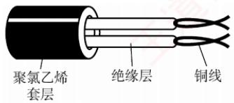

<em>(a) 非屏蔽双绞线</em>

  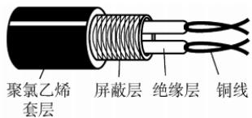

<em>(b) 屏蔽双绞线</em>

<em>图 2.5 双绞线的结构</em>

#### 2. 同轴电缆

　　同轴电缆由内导体、绝缘层、外导体屏蔽层和绝缘保护套层构成，如图 2.6 所示。通常分为两类：① 50Ω 同轴电缆，主要用于基带数字信号传输，曾广泛应用于早期局域网；② 75Ω 同轴电缆，主要用于宽带信号传输，广泛应用于有线电视系统。得益于外导体的屏蔽作用，同轴电缆具有良好的抗干扰性能，适合较高速率的数据传输。

　　随着交换技术和集线器的普及，局域网领域已基本采用双绞线作为主流传输介质。

  

<em>图 2.6 同轴电缆的结构</em>

#### 3. 光纤

　　光纤通信利用光导纤维（简称光纤）传输光脉冲来传递通信：有光脉冲表示 1，无光脉冲表

　　示0。可见光的频率约为 $10^{14}\mathrm{MHz}$ ，因此光纤系统具有极大的带宽潜力。

　　光纤主要由纤芯和包层构成（见图 2.7）。纤芯直径极细，通常为 8～100μm；包层的折射率略低于纤芯，光波通过纤芯进行传导。当光从高折射率介质射向低折射率介质时，若入射角大于临界角，将会发生全反射，使光线在纤芯与包层界面反复反射而向前传播。

  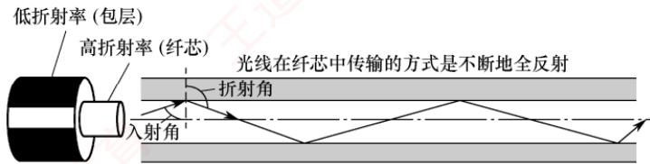

<em>图 2.7 光波在纤芯中的传播</em>

　　利用全反射原理，允许多条不同角度入射的光线在同一根光纤中传输的类型称为多模光纤（见图 2.8）。光脉冲在多模光纤中的损耗较大，因此更适合短距离通信。

  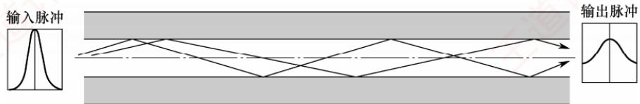

<em>图 2.8 多模光纤</em>

　　当光纤直径减小至接近光波波长时，仅允许单一模式的光传播，几乎无反射，此类光纤称为单模光纤（见图 2.9）。其纤芯极细，需使用定向性优良的半导体激光器作为光源。单模光纤衰减小，可实现数千米乃至数十千米的无中继传输，适用于远距离通信。

  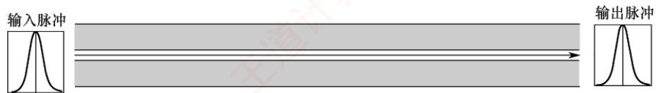

<em>图 2.9 单模光纤</em>

　　光纤不仅通信容量极大，还具备以下优势：

1）传输损耗小，中继距离长，对远距离传输特别经济。

2）抗雷电和电磁干扰性能强，在有大电流脉冲干扰的环境下，这尤为重要。

3）无串音干扰，保密性好，不易被窃听或截取数据。

4）体积小，重量轻，在现有电缆管道已拥塞不堪的情况下，这特别有利。

#### 4. 无线传输介质

　　无线通信已广泛应用于蜂窝移动通信。随着便携式计算机的普及，以及军事、野外等特殊场景对移动联网的需求不断增长，无线局域网（WLAN）得到了迅速发展。

##### （1） 无线电波

　　无线电波具有较强的穿透能力，传播距离远，被广泛用于移动通信和WLAN。其信号以全向方式扩散，接收端无须对准发射源即可建立连接，这是无线电波通信的重要优势。

##### （2） 微波、红外线和激光

　　高带宽无线通信主要采用微波、红外线和激光三种技术，它们均需视距，具有强指向性。

　　微波通信工作在较高频段，带宽大、通信容量高。例如，一个 2MHz 带宽的信道可容纳约 500 路语音信号。但由于微波沿直线传播，在地面传输时距离受限，通常需要中继站进行接力。

　　卫星通信利用地球同步卫星作为中继节点，有效突破了地面微波传输的距离限制。其优点是通信容量大、覆盖范围广、传输距离远；缺点是保密性较差，并且端到端传播时延较大。

　　红外线与激光通信将电信号转换为相应的光信号，在自由空间中直接传播，常用于短距离点对点链路（如遥控器）或室内通信。但这类通信极易受障碍物阻挡，且无法穿透墙壁。

### 2.2.2 物理层接口的特性

　　物理层关注的是如何在各种传输介质上传输比特流，而非介质本身。由于网络中的硬件设备和传输介质种类繁多，通信方式也各不相同，物理层应尽可能屏蔽底层差异，使数据链路层感知不到这些差异，从而专注于本层协议与服务的实现。

> **考点追踪：** 物理层接口的特性（2012、2018）

　　物理层的主要任务是定义与传输介质接口相关的一些特性：

1）机械特性。规定接口所用接线器的形状和尺寸、引脚数目和排列、固定和锁定装置等。

2）电气特性。规定接口电缆中各线路应遵循的电压范围、传输速率和距离限制等。

3）功能特性。定义每条线路上特定电平所代表的意义，并定义各线路的具体功能。

4）过程特性，也称规程特性。描述各种功能事件发生的顺序和时序关系。

### 2.2.3 本节习题精选

#### 单项选择题

01. 双绞线是用两根绝缘导线绞合而成的，绞合的目的是（）。

- A. 减少干扰
- B. 提高传输速度
- C. 增大传输距离
- D. 增大抗拉强度

02. 在电缆中采用屏蔽技术带来的好处主要是（）。

- A. 减少信号衰减
- B. 减少电磁干扰辐射
- C. 减少物理损坏
- D. 减少电缆的阻抗

03. 利用一根同轴电缆互连主机构成以太网，则主机间的通信方式为（）。

- A. 全双工
- B. 半双工
- C. 单工
- D. 不确定

04. 同轴电缆比双绞线的传输速率更快，得益于（）。

- A. 同轴电缆的铜芯比双绞线的粗，能通过更大的电流
- B. 同轴电缆的阻抗比较标准，减少了信号的衰减
- C. 同轴电缆具有更高的屏蔽性，同时有更好的抗噪声性
- D. 以上都正确

05. 不受电磁干扰和噪声影响的传输介质是（）。

- A. 屏蔽双绞线
- B. 非屏蔽双绞线
- C. 光纤
- D. 同轴电缆

06. 多模光纤传输光信号的原理是（）。

- A. 光的折射特性
- B. 光的发射特性
- C. 光的全反射特性
- D. 光的绕射特性

07. 以下关于单模光纤的说法中，正确的是（）。

- A. 光纤越粗，数据传输速率越高
- B. 光纤的直径减小到只有光的一个波长大小时，光沿直线传播
- C. 光源是发光二极管或激光
- D. 光纤是中空的

08. 下列关于卫星通信的说法中，错误的是（）。

- A. 卫星通信的距离长，覆盖的范围广
- B. 使用卫星通信易于实现广播通信和多址通信
- C. 卫星通信的好处在于不受气候的影响，误码率很低
- D. 通信费用高、延时较大是卫星通信的不足之处

09. 某网络在物理层规定，信号的电平用 $+10\mathrm{V} \sim +15\mathrm{V}$ 表示二进制0，用 $-10\mathrm{V} \sim -15\mathrm{V}$ 表示二进制1，电线长度限于 $15\mathrm{m}$ 以内，这体现了物理层接口的（）。

- A. 机械特性
- B. 功能特性
- C. 电气特性
- D. 规程特性

10. 当描述一个物理层接口引脚处于高电平时的含义时，该描述属于（）。

- A. 机械特性
- B. 电气特性
- C. 功能特性
- D. 规程特性

11. 【2012 统考真题】在物理层接口特性中，用于描述完成每种功能的事件发生顺序的是（）。

- A. 机械特性
- B. 功能特性
- C. 过程特性
- D. 电气特性

12. 【2018 统考真题】下列选项中，不属于物理层接口规范定义范畴的是（）。

- A. 接口形状
- B. 引脚功能
- C. 物理地址
- D. 信号电平

### 2.2.4 答案与解析

#### 单项选择题

**01. A**

　　绞合可以减少两根导线相互的电磁干扰。

**02. B**

　　屏蔽层的主要作用是提高电缆的抗干扰能力。

**03. B**

　　传统以太网采用广播的方式发送信息，同一时间只允许一台主机发送信息，否则各主机之间就形成冲突，因此主机间的通信方式是半双工。全双工是指通信双方可同时发送和接收信息。单工是指只有一个方向的通信而没有反方向的交互。

**04. C**

　　同轴电缆以硬铜线为芯，外面包一层绝缘材料，绝缘材料的外面再包一层密织的网状导体，导体的外面又覆盖一层保护性的塑料外壳。这种结构使得它具有更高的屏蔽性，从而既有很高的带宽，又有很好的抗噪性。因此，同轴电缆的带宽更高，得益于它的高屏蔽性。

**05. C**

　　光纤的抗雷电和电磁干扰性能好，无串音干扰，保密性好。

**06. C**

　　多模光纤传输光信号的原理是光的全反射特性。

　　光纤的直径减小到与光线的一个波长相同时，光纤就如同一个波导，光在其中没有反射，而沿直线传播，这就是单模光纤。

　　卫星通信有成本高、传播时延长、受气候影响大、保密性差、误码率较高的特点。

**09. C**

　　本题易误选功能特性。规定各条线上的电压范围，以及电缆长度的限制，属于电气特性。而功能特性指明某条线上出现的某一电平的电压表示何种意义，以及每条线的功能（数据线、控制线、时钟线）。例如，数据线上的电压+11V表示二进制1，就属于功能特性。

**10. C**

　　物理层的功能特性指明某条线上出现的某一电平的电压表示何种意义，以及每条线的功能。

**11. C**

　　物理层的接口特性包括机械、电气、功能和过程四类。其中，过程特性用于描述完成各种功能时事件发生的先后顺序，即规定各操作（如建立连接、传输数据、释放线路等）的时序关系。

**12. C**

　　物理层接口规范涵盖四类特性：机械特性（如接口形状、尺寸）、电气特性（如信号电平、电压范围）、功能特性（如引脚功能、电平含义）和过程特性（事件发生顺序）。而物理地址（MAC 地址）用于标识数据链路层的设备，属于数据链路层的范畴，不在物理层定义范围内。

## 2.3 物理层设备

### 2.3.1 中继器

　　中继器的主要功能是整形、放大并转发信号，以消除信号经过一长段电缆后产生的失真和衰减，使信号的波形和强度达到所需的要求，从而扩大网络的传输距离。其原理是信号再生（而非简单放大衰减的信号）。中继器有两个端口，数据从一个端口输入，从另一个端口输出。

　　中继器连接的两端属于同一局域网中的不同网段（而非不同子网），因此所连网段仍构成一个局域网。如果中继器发生故障，将影响相邻两个网段的正常工作。

　　从理论上讲，中继器的使用数量是无限的，网络因而也可无限延长。但事实上这是不可能的，因为网络标准中对信号的传播延迟范围有明确规定，中继器只能在此范围内有效工作，否则会引起网络故障。例如，在采用粗同轴电缆的10Base-5以太网规范中，互相串联的中继器数量不能超过4个，而且由4个中继器串联的5段电缆中，仅有3段可挂接主机，其余2段只能用作扩展通信范围的链路段，不能挂接主机。这就是所谓的“5-4-3规则”。

### 2.3.2 集线器

　　集线器（Hub）实质上是一个多端口的中继器。当集线器工作时，一个端口接收到数据信号后，由于信号在传输过程中已有衰减，集线器便对该信号进行整形和放大，将其再生为接近原始发送时的信号，紧接着转发到其他所有（除输入端口外）处于工作状态的端口。若两个或多个端口所连节点同时发送信号，则会发生冲突，导致所有相关帧传输失败。由此可见，集线器在网络中只起信号放大和转发作用，目的是扩大网络的传输范围，而不具备信号的定向传送能力，即信息广播至所有端口，是标准的共享式设备。

> **注意：**

　　中继器和集线器不具备缓存能力，当其连接两个不同链路层协议的网段时可能会出问题 $^{①}$ 。若两个网段的速率分别为10Mb/s和10/100Mb/s，采用集线器连接后，则整个网络只能以速率10Mb/s工作。

　　使用集线器组网灵活，它将所有节点的通信集中在以其为中心的节点上，由集线器组成的网络在物理上是星形网络，但逻辑上仍是总线形网络。集线器的每个端口连接的是同一网络的不同网段。此外，集线器只能工作在半双工模式，网络的吞吐率因而受到限制。

> **考点追踪：** 物理层设备对冲突域和广播域 $^{①}$ 的影响（2010、2020）

> **注意：**

　　集线器不能分割冲突域，其所有端口都属于同一个冲突域。集线器在一个时钟周期内只能传输一组信息。当一台集线器连接的主机数量较多且多台主机频繁同时通信时，将导致大量冲突，使得集线器的工作效率很差。例如，一个带宽为 $10\mathrm{Mb / s}$ 的集线器上连接了8台计算机，当它们同时工作时，每台计算机平均可用的带宽仅为 $10 / 8\mathrm{Mb / s} = 1.25\mathrm{Mb / s}$

### 2.3.3 本节习题精选

#### 单项选择题

01. 下列关于物理层设备的叙述中，错误的是（）。

- A. 中继器仅作用于信号的电气部分
- B. 利用中继器来扩大网络传输距离的原理是将衰减的信号进行放大
- C. 集线器实质上相当于一个多端口的中继器
- D. 物理层设备连接的几个网段仍是一个局域网

02. 为了使数字信号传输得更远，可采用的设备是（）。

- A. 中继器
- B. 放大器
- C. 网桥
- D. 路由器

03. 以太网遵循 IEEE 802.3 标准，用粗缆组网时每段的长度不能大于 500m，超过 500m 时就要分段，段间相连利用的是（）。

- A. 网络适配器
- B. 中继器
- C. 调制解调器
- D. 网关

04. 由集线器连接多台设备构成的网络在物理上和逻辑上的结构分别是（）。

- A. 总线形、环形
- B. 网状、星形
- C. 总线形、星形
- D. 星形、总线形

05. 用集线器连接的工作站集合（）。

- A. 同属一个冲突域，也同属一个广播域
- B. 不同属一个冲突域，但同属一个广播域
- C. 不同属一个冲突域，也不同属一个广播域
- D. 同属一个冲突域，但不同属一个广播域

06. 中继器可以用来连接（）。

- A. 不同类型的局域网
- B. 广域网和局域网
- C. 不同介质的局域网
- D. 不同协议的局域网

07. 若有 5 台计算机连接到 10Mb/s 的集线器上, 则每台计算机分得的平均带宽至多为 （）。

- A. $2\mathrm{Mb/s}$
- B. $5\mathrm{Mb/s}$
- C. $10\mathrm{Mb/s}$
- D. $50\mathrm{Mb/s}$

08. 当集线器的一个端口收到数据后，将其（）。

- A. 从所有端口广播出去
- B. 从除输入端口外的所有端口广播出去
- C. 根据目的地址从合适的端口转发出去
- D. 随机选择一个端口转发出去

09. 下列关于中继器和集线器的说法中，不正确的是（）。

- A. 二者都工作在OSI参考模型的物理层
- B. 二者都可以对信号进行放大和整形
- C. 通过中继器或集线器互连的网段数量不受限制
- D. 中继器通常只有2个端口，而集线器通常有4个或更多端口

### 2.3.4 答案与解析

#### 单项选择题

**01. B**

　　中继器的原理是将衰减的信号再生（再生=放大+整形），而不是简单地放大。

**02. A**

　　放大器通常用于远距离地传输模拟信号，但它同时会放大噪声，引发失真。中继器用于数字信号的传输，其工作原理是信号再生，因此会减少失真。网桥用来连接两个网段以扩展物理网络的覆盖范围。路由器是网络层的互连设备，可以实现不同网络的互联。

**03. B**

　　中继器的主要功能是将信号复制、整形和放大再转发出去，以消除信号经过一长段电缆而造成的失真和衰减，使信号的波形和强度达到所需的要求，进而扩大网络传输的距离，原理是信号再生，因此选择选项 B，其他三项显然有点大材小用。

**04. D**

　　集线器将多个设备连接在以它为中心的节点上，因此使用它的网络在物理拓扑上属于星形结构。当集线器工作时，一个端口接收到数据信号后，集线器将该信号整形放大，紧接着转发到其他所有处于工作状态的端口。因为集线器不具备交换机所具有的交换表，所以它发送数据时是没有针对性的，而采用广播方式发送。因此，使用集线器的星形以太网逻辑上仍然是总线网。

**05. A**

　　集线器的功能是将从一个端口收到的数据通过所有其他端口转发出去。集线器在物理层上扩大了网络的覆盖范围，但无法解决冲突域（第二层交换机可解决）与广播域（第三层交换机可解决）的问题，而且增大了冲突的范围。注意，冲突域和广播域的概念涉及后面章节的内容。

**06. C**

　　中继器工作在物理层，无法对帧进行解封与重新封装（无法实现协议转换），其功能仅限于对接收到的帧对应的二进制串进行无差别转发，因此无法连接不同链路层协议的网段。中继器可以连接不同介质的局域网，如光纤和双绞线，只要它们具有相同协议。

**07. A**

　　集线器以广播的方式将信号从除输入端口外的所有端口输出，因此任意时刻只能有一个端口的有效数据输入。理想情况（无冲突）下，每秒通过集线器的数据量都是 10Mb，假设 5 台计算机占用相同大小的时间片来收发数据，则平均带宽的上限为 $10Mb/s \div 5 = 2Mb/s$ 。若有多台计算机同时发送数据，则会导致每台计算机实际获得的平均带宽低于 2Mb/s。

**08. B**

　　集线器没有寻址功能，一个端口接收到数据信号后，从其他所有端口转发出去。

**09. C**

　　中继器和集线器均工作在物理层，集线器本质上是一个多端口中继器，它们都能对信号进行放大和整形（再生=放大+整形）。因为中继器不仅传送有用信号，还传送噪声和冲突信号，因此互相串联的个数只能在规定的范围内进行，否则网络将不可用。注意“5-4-3规则”。

## 2.4 本章小结及疑难点

1. 传输介质属于物理层吗？它与物理层有何区别？

　　传输介质不属于物理层。尽管与物理层紧密相关，但从网络体系结构看，它位于物理层之下，常被非正式称为“第0层”。区别在于：传输介质只承载电信号或光信号，无法区分信号所代表的比特值——即无法判断某一电平对应的是1还是0；物理层通过定义电气、机械、功能和过程特性（如电压、时序、接口规范等），将原始信号解释为有意义的比特流，供上层使用。图2.10直观展示了这一关系：传输介质是信号的“通道”，物理层是赋予其语义的“规则制定者”。

  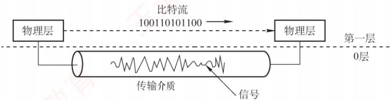

<em>图 2.10 传输介质与物理层</em>

#### 2. 什么是基带传输、频带传输和宽带传输？它们有什么区别？

　　基带传输：直接发送原始的数字信号（如高、低电平），不经过调制。它占用整个信道带宽，通常用于短距离通信，比如局域网或计算机内部连接。常用的编码方法包括不归零编码和曼彻斯特编码。不归零编码的做法是用高电平表示1、低电平表示0。例如，要传输“1010”，若高电平代表1、低电平代表0，则线路上依次传送（高、低、高、低）这一电平序列。

　　频带传输：当需要远距离或无线传输时，必须把数字信号“搭载”到一个高频载波上，这个过程叫调制，转换后的信号更适合在模拟信道（如电话线）上传输，称为频带传输。它不仅让数字信号能在传统电话系统中传输，还支持多路复用，提高信道利用率。例如，仍然传输“1010”，经过调制后，一个码元可能代表4位二进制数据；若码元A对应“1010”，则在模拟信道上只需发送码元A，就相当于完成了该数据的传输。电话线上网、Wi-Fi等都属于频带传输。

　　宽带传输：在传统通信语境中，宽带传输指利用频分复用等技术，将一条物理线路划分为多个频带信道，每个信道可独立进行频带传输，互不干扰。这样，多个信号可以并行传送，显著提升链路容量。例如，有线电视网络能一边上网、一边看电视，正是利用了宽带传输技术。

3. 奈氏准则和香农定理的主要区别是什么？它们对数据通信的意义是什么？

　　奈氏准则与香农定理从不同角度揭示了信道传输能力的极限。

　　奈氏准则仅考虑信道带宽限制，指出在给定带宽下，码元传输速率存在上限（与噪声无关），超过该上限将因码间串扰而无法正确识别信号；但它不限制每个码元所携带的比特数，因此可通过高阶调制（如一个码元表示多位）提升信息传输速率。香农定理则适用于有噪声的实际信道，指出对于确定的带宽和信噪比，信息传输速率存在一个不可逾越的理论上限，无论采用何种技术都无法突破。这意味着，要提高通信速率，只能通过增加带宽或改善信噪比，但二者在现实中均有物理限制。它们共同构成了数据通信系统设计的理论基础。

#### 4. 信噪比明明是 S/N，为什么还要用 $10\log_{10}(S/N)$ 表示？

　　信噪比可以用两种方式表示：

1）线性比值（无单位）：如信号功率为 100，噪声功率为 1，则信噪比 S/N=100。

2）分贝形式（单位dB）：此时信噪比为 $10\log_{10}(S / N) = 10\log_{10}100 = 20\mathrm{dB}$ 。

　　两者在数学上等价，但分贝形式更实用。因为在通信中，信号与噪声的功率差异往往极大，例如信号可能是噪声的10亿倍。若用线性值表示，则1后面有9个0，不仅冗长，还容易数错；而用分贝表示仅为90dB，简洁且不易出错。因此，分贝能高效、清晰地表达极大或极小的比值。
