## 【考纲内容】

（一）数据链路层的功能

（二）组帧

（三）差错控制

　　检错编码；纠错编码

（四）流量控制与可靠传输机制

　　流量控制、可靠传输与滑动窗口机制；停止-等待协议；

　　后退 N 帧协议（GBN）；选择重传协议（SR）

（五）介质访问控制

1. 信道划分：频分复用、时分复用、波分复用、码分复用

2. 随机访问：ALOHA 协议；CSMA 协议；CSMA/CD 协议；CSMA/CA 协议

3. 轮询访问：令牌传递协议

（六）局域网

　　局域网的基本概念与体系结构；以太网与 IEEE 802.3;

　　IEEE 802.11 无线局域网；VLAN 的基本概念与基本原理

（七）广域网

　　广域网的基本概念；点对点协议（PPP）

（八）数据链路层设备

　　以太网交换机及其工作原理

## 【复习提示】

　　本章是历年考试中考查的重点。要求在了解数据链路层基本概念和功能的基础上，重点掌握滑动窗口机制、三种可靠传输协议、各种 MAC 协议，特别是 CSMA/CD 协议、CSMA/CA 协议和以太网帧格式，以及局域网的争用期和最小帧长的概念、二进制指数退避算法。此外，中继器、网卡、集线器、网桥和局域网交换机的原理及区别也要重点掌握。

## 3.1 数据链路层的功能

　　数据链路层的主要任务是让帧在一段链路或一个网络中传输。尽管数据链路层协议种类繁多，但它们都需解决三个基本问题：封装成帧、透明传输和差错检测。

　　数据链路层使用的信道主要有两种：

1）点对点信道：一对一通信，通常通过一条专用物理链路连接两个节点。

2）广播信道：一对多通信，单个节点发送的数据可被连接在同信道上的所有节点接收。

### 3.1.1 数据链路层所处的地位

　　以两台主机通过互联网通信为例（见图 3.1）：局域网 1 中的主机 H1 经路由器 R1、广域网及路由器 R2，连接到局域网 2 中的主机 H2。

　　主机 H1 和 H2 均具备完整的五层协议栈；路由器在转发分组时仅使用协议栈的下三层。当 H1 向 H2 发送数据时，数据在各节点的协议栈中多次上下流动（见图 3.2）：进入路由器后，先从物理层上至网络层，在转发表中确定下一跳地址，再下至物理层转发出去。

  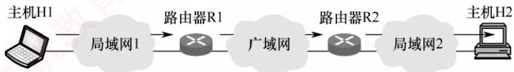

<em>图 3.1 主机 H1 向 H2 发送数据</em>

  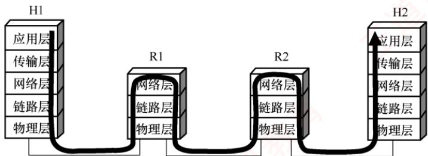

<em>图 3.2 从协议的层次上看数据的流动</em>

　　然而，在学习数据链路层时，我们通常聚焦于水平方向的数据链路层交互。此时可将通信过程简化为：H1 的链路层→R1 的链路层→R2 的链路层→H2 的链路层（见图 3.3）。这三段链路可能采用不同的数据链路层协议，但每一段都独立完成帧的传输任务。

  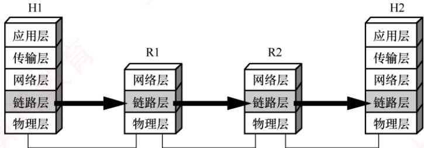

<em>图 3.3 只考虑数据在数据链路层的流动</em>

　　下面介绍点对点信道的基本概念，其中部分也适用于广播信道。

1）链路。指从一个节点到相邻节点的一段物理线路，是通信路径的组成部分。

2）数据链路。在物理链路上添加实现通信协议的软硬件后所形成的逻辑通信通道。

3）帧。数据链路层对等实体间通信的协议数据单元。发送方将网络层交下的数据封装为帧发送；接收方从帧中提取数据并上交网络层。

### 3.1.2 链路管理

　　链路管理是指数据链路层连接的建立、维持和释放过程，主要用于面向连接的服务。

　　通信双方必须首先确认对方处于就绪状态，并交换必要信息（如初始化帧序号），才能建立

　　连接；传输过程中需维持连接状态；通信结束后则释放连接。

### 3.1.3 封装成帧与透明传输

　　封装成帧是指在数据前后分别添加首部和尾部，构成一个完整的帧。帧长等于帧的数据部分长度加上首部和尾部的长度。首部和尾部包含控制信息，其核心作用是帧定界——帮助接收方从比特流中准确识别帧的起始与结束。例如，在 HDLC 协议中，使用标识字段 F（01111110）标识帧的开始和结束。接收方将第一个 F 视为帧的开始，下一个 F 标志该帧的结束，如图 3.4 所示。为提高传输效率，应使数据部分尽可能长，但帧过长会增加差错概率和重传开销。因此，各类链路层协议均规定了最大传送单元（MTU），即帧数据部分的长度上限。

<table><tr><td>标志</td><td>地址</td><td>控制</td><td>数据</td><td>帧检验序列</td><td>标志</td></tr><tr><td>F01111110</td><td>A8位</td><td>C8位</td><td>I<eq>N</eq>位(可变)</td><td>FCS16位</td><td>F01111110</td></tr></table>

<em>图 3.4 HDLC 帧格式</em>

　　透明是计算机领域的一个重要概念，意指某事物虽存在，但对上层不可见。

　　透明传输是数据链路层的重要特性。“透明”在此意为：即使数据中恰好出现与帧定界符相同的比特组合，也不会被误判为帧边界。若不处理此问题，接收方可能提前结束帧解析，导致后续数据丢失。实现透明传输后，接收方能将帧完整恢复为原始SDU（服务数据单元），使网络层“感知不到”底层的帧封装过程——即数据链路层对上层是透明的。

### 3.1.4 流量控制

　　由于链路两端节点的处理速率或缓存能力存在差异，若发送方速率过高，接收方可能因来不及处理而导致帧丢失。因此，流量控制旨在限制发送方的发送速率，使其不超过接收方的接收能力。该过程通常依赖反馈机制：发送方根据接收方的确认或窗口信息，决定是否继续发送。

　　在 OSI 模型中，流量控制由数据链路层实现，用于调节相邻节点间的流量；而在 TCP/IP 模型中，该功能主要由传输层（如 TCP）承担，负责端到端的流量控制。

### 3.1.5 差错检测与可靠传输

　　由于信道噪声等因素，帧在传输过程中可能出现两类错误。

1）位错：帧中某些比特发生翻转，通常通过循环冗余检验检测。

2）帧错：包括帧丢失、重复或失序等，属于更高层的传输差错。

　　早期 OSI 模型认为，数据链路层必须向上提供可靠传输服务。因此，在 CRC 检错基础上，引入了帧编号、确认与重传机制：接收方收到正确帧后需发送确认；发送方若在规定时间内未收到确认，则判定为出错并重传，直至收到确认为止。

　　如今，是否采用可靠传输机制取决于信道质量：在通信质量较差的无线链路中，数据链路层仍使用确认与重传机制，以提供可靠服务；而在高质量的有线链路中，数据链路层仅进行 CRC 检错，将出错帧直接丢弃，不再负责重传。此时，重传任务由高层协议（如传输层 TCP）完成。核心原则是，数据链路层确保上交的帧无差错，但不保证所有帧都被成功交付。

### 3.1.6 本节习题精选

#### 单项选择题

01. 下列选项中，不属于数据链路层功能的是（）。

- A. 帧定界
- B. 电路管理
- C. 差错控制
- D. 流量控制

02. 下列选项中，不属于数据链路层功能的是（）。

- A. 透明传输
- B. 差错检测
- C. 可靠传输
- D. 拥塞控制

03. 下列选项中，不属于数据链路层协议功能的是（）。

- A. 定义数据格式
- B. 提供节点之间的可靠传输
- C. 控制对物理传输介质的访问
- D. 为终端节点隐蔽物理传输的细节

04. 为了避免传输过程中帧的丢失，数据链路层采用的方法是（）。

- A. 帧编号机制
- B. 循环冗余检验码
- C. 海明码
- D. 计时器超时重发

05. 对于信道比较可靠且对实时性要求高的网络，数据链路层采用（）比较合适。

- A. 无确认的无连接服务
- B. 有确认的无连接服务
- C. 无确认的面向连接服务
- D. 有确认的面向连接服务

06. 流量控制实际上是对（）的控制。

- A. 发送方的数据流量
- B. 接收方的数据流量
- C. 发送、接收方的数据流量
- D. 链路上任意两节点间的数据流量

### 3.1.7 答案与解析

#### 单项选择题

**01. B**

　　数据链路层的主要功能包括：如何将二进制比特流组织成数据链路层的帧；如何控制帧在物理信道上的传输，包括如何处理传输差错；在两个网络实体之间提供数据链路的建立、维护和释放；控制链路上帧的传输速率，以使接收方有足够的缓存来接收每个帧。这些功能对应为帧定界、差错检测、链路管理和流量控制。电路管理功能由物理层提供。

**02. D**

　　拥塞控制是网络层或传输层的功能，用于防止过多的分组注入网络而导致网络性能下降。

**03. D**

　　数据链路层的主要功能包括组帧，组帧即定义数据格式，选项 A 正确。数据链路层在物理层提供的不可靠的物理连接上实现节点到节点的可靠性传输，选项 B 正确。控制对物理传输介质的访问由数据链路层的介质访问控制（MAC）子层完成，选项 C 正确。为终端节点隐蔽物理传输的细节是物理层的功能，数据链路层不必考虑如何实现无差别的比特传输，选项 D 错误。

**04. D**

　　为防止在传输过程中丢失帧，在可靠的数据链路层协议中，发送方为发送的每个数据帧设计一个计时器，当计时器到期而该帧的确认帧仍未到达时，发送方将重发该帧。为保证接收方不会接收到重复帧，需要对每个发送的帧进行编号；海明码和循环冗余检验码都用于差错控制。

**05. A**

　　无确认的无连接服务是指源主机发送帧时不需要先建立逻辑连接，目的主机收到帧时不需要发回确认。若因线路上有噪声而造成某一帧丢失，则数据链路层并不检测这样的丢帧现象，也不回复。当错误率很低时，这类服务非常合适，此时恢复任务可由上面的高层来负责。这类服务对实时通信也非常合适，因为实时通信中数据迟到比数据损坏更不好。

**06. A**

　　流量控制是通过限制发送方的数据流量而使发送方的发送速率不超过接收方接收速率的一种技术。流量控制功能并不是数据链路层独有的，其他层上也有相应的控制策略，只是各层的流量控制对象是在相应层的实体之间进行的。

## 3.2 组帧

　　发送方依据特定规则，将网络层递交的分组封装成帧（也称组帧）。数据链路层以帧为单位传输数据，主要目的是：一旦出错，只需重发出错的帧，而不必重传全部数据，从而提高传输效率。组帧需解决帧定界、帧同步和透明传输等问题。常见的组帧方法主要有以下四种。

> **注意：**

　　组帧时通常既要添加首部，也要添加尾部。原因在于，网络中信息以帧为最小传输单位，接收方必须能准确识别一帧在比特流中的起始与结束位置，否则无法正确解析帧内容。

### 3.2.1 字符计数法

　　字符计数法在帧首部设置一个计数字段，用于记录该帧包含的总字节数（包括计数字段自身占用的1B），如图3.5所示。接收方读取该计数值后，即可确定后续数据的长度，从而定位帧的结束位置；由于帧是连续传输的，下一帧的起始位置也随之确定。

  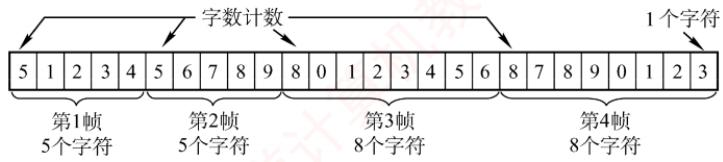

<em>图 3.5 字符计数的过程示例</em>

　　字符计数法的主要缺陷是：当计数字段在传输过程中出错时，接收方将无法正确识别帧的边界，导致收发双方失去同步，可能引发灾难性后果。

### 3.2.2 字节填充法

　　字节填充法通过特定控制字符实现帧定界。在图 3.6 中，控制字符 SOH 表示帧的起始，EOT 表示帧的结束。为避免数据中出现的 SOH 或 EOT 被误判为帧的定界符，发送方会在这些特殊字符前插入一个 ESC 字符（注意，ESC 是 ASCII 码中的一个单字节控制字符），以实现透明传输。若数据中原本就包含 ESC，则同样在其前再插入一个 ESC。接收方收到 ESC 后，会将其丢弃，并将紧随其后的字符视为普通数据（而非控制字符），从而还原出原始数据。

  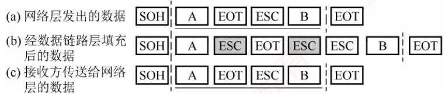

<em>图 3.6 字节填充的过程示例</em>

　　当帧的数据部分中出现 ESC、EOT 或 SOH 时 [见图 3.6(a)]，发送方在每个 ESC、EOT 或 SOH 之前插入一个 ESC 字符 [见图 3.6(b)]，接收方处理后恢复原数据 [见图 3.6(c)]。

### 3.2.3 零比特填充法

> **考点追踪：** HDLC 的比特填充规则（2013）

　　零比特填充法允许数据帧包含任意数量的比特，并用固定比特串01111110作为帧的起始和结束标志，如图3.7所示。为防止数据字段中出现与标志相同的比特序列，发送方在扫描数据时，每遇到5个连续的“1”，就在其后自动插入一个“0”，确保数据字段中不会出现6个连续的“1”，避免与帧标志混淆。接收方执行逆操作：每收到5个连续的“1”，就自动删除其后的“0”，以恢复原始数据。早期的HDLC协议正是采用这种方法来实现透明传输。

  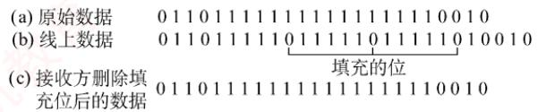

<em>图 3.7 比特填充过程示例</em>

　　零比特填充法易于硬件实现，性能优于字节填充法。

### 3.2.4 违规编码法

　　违规编码法利用物理层编码的冗余特性实现帧定界。例如，在曼彻斯特编码中：比特“1”编码为“高-低”电平对，比特“0”编码为“低-高”电平对。而“高-高”或“低-低”电平对在数据比特中是违规的（未被采用），因此可借用这些违规编码序列来标识帧的起始或终止。局域网IEEE802标准采用了这种方法（更多介绍见3.6.2节）。违规编码法无须任何填充技术即可实现透明传输，但仅适用于采用冗余编码的特殊编码环境。

　　由于字符计数法对计数字段错误极为敏感，而字节填充法在实现上较为复杂且存在兼容性问题，因此目前更常用的组帧方法是零比特填充法和违规编码法。

### 3.2.5 本节习题精选

#### 一、单项选择题

01. 【2013 统考真题】HDLC 协议对 01111100 01111110 组帧后，对应的比特串为（）。 （注：HDLC 协议已从最新大纲中删除。）

- A. 01111100 00111110 10
- B. 01111100 01111101 01111110
- C. 01111100 01111101 0
- D. 01111100 01111110 01111101

#### 二、综合应用题

01. 在一个数据链路协议中使用下列字符编码:
A 01000111; B 11100011; ESC 11100000; FLAG 01111110
　　在使用下列组帧方法的情况下，说明为传送4个字符 A、B、ESC、FLAG 所组织的帧而实际发送的二进制位序列（使用 FLAG 作为首尾标志，ESC 作为转义字符）。
1）使用字符计数法。
2）使用字节填充法。
3）使用零比特填充法。

### 3.2.6 答案与解析

#### 一、单项选择题

**01. A**

　　HDLC 协议对比特串组帧时，HDLC 数据帧以比特模式 0111 1110 标识每个帧的起始和结束，因此在帧数据中只要出现 5 个连续的位 “1”，就在输出的位流中填充一个 “0”。因此，组帧后的比特串为 01111100 00111110 10（下划线部分为新增的 0）。

#### 二、综合应用题

**01. 【解答】**

1）第一字节为所传输的字符计数5，转换为二进制为00000101，后面依次为A、B、ESC、FLAG的二进制编码：

$$
\begin{array}{l l l l l} 0 0 0 0 0 1 0 1 & 0 1 0 0 0 1 1 1 & 1 1 1 0 0 0 1 1 & 1 1 1 0 0 0 0 0 & 0 1 1 1 1 1 1 0 \end{array}
$$

2）首尾标志位 FLAG（01111110），在所传输的数据中，若出现控制字符，则在该字符前插入转义字符 ESC（11100000）：

$$
\begin{array}{l} 0 1 1 1 1 1 1 0   0 1 0 0 0 1 1 1   1 1 1 0 0 0 1 1   1 1 1 0 0 0 0 0   1 1 1 0 0 0 0 0   1 1 1 0 0 0 0 0   0 1 1 1 1 1 1 0   0 1 1 1 1 1 1 0 \end{array}
$$

3）首尾标志位 FLAG（01111110），在所传输的数据中，若连续出现 5 个 “1”，则在其后插入 “0”：

01111110 01000111 110100011 111000000 011111010 01111110

## 3.3 差错控制

　　实际的通信链路并非理想，比特在传输过程中可能产生差错：1 可能变为 0，0 也可能变成 1，这种现象称为比特差错。比特差错是传输差错的一种，本节仅讨论此类差错。

　　通常采用编码技术进行差错控制，主要分为两类：检错编码和纠错编码。采用检错编码时，接收方若检测到差错，会设法通知发送方重传，直到收到正确的数据为止；采用纠错编码时，接收方不仅能发现差错，还能确定错误位置并加以纠正。在探讨具体的编码技术之前，需先引入码距（也称海明距离）的概念——它是衡量编码检错能力与纠错能力的重要参数。

> **考点追踪：** 码距的计算与特性（2025）

　　码距是指两个码字在对应位上取值不同的比特数量。计算码距的一种方法是对两个位串进行异或（xor）运算，结果中1的个数即为码距。例如， $0\underline{1}1\underline{0}\oplus0\underline{0}1\underline{1}=0101$ ，结果中有两个1，说明这两个码字有2位不同，因此其码距为2。在一个编码集中，任意两个有效码字之间码距的最小值称为该编码集的码距。例如，对于编码集 $\{10011,01011,11110,00001\}$ ，虽然11110与00001的码距为5，但10011与01011的码距仅为2，取各码距中的最小值，求得该编码集的码距为2。

　　根据差错控制理论，编码方案的检错能力和纠错能力与码距 $l$ 的关系如下：

$$
l = d + c + 1, \text {且} d \geqslant c
$$

　　即码距 l 越大，其检错的位数 d 就越大，纠错的位数 c 也越大，且纠错能力恒不超过检错能力（能纠错必然能检错）。例如，当码距 l=3 时，该编码最多可检测 2 位错误，或纠正 1 位错误。此外，进一步考虑 c=0 或 d=c 的两种边界情况，还可得出以下两个重要结论：

1）为检测 d 位错误，编码方案的码距至少应为 $d + 1$ 。任何发生 d 位错误的有效码字不可能变成另一个有效码字，以确保差错可被发现。例如，码距为 1 的编码无法检测任何错误。

2）为纠正 $c$ 位错误，编码方案的码距至少应为 $2c + 1$ 。即使一个有效码字发生 $c$ 位错误，其仍然离原始码字最近，接收方可据此唯一确定原始码字，实现纠错。

### 3.3.1 检错编码

　　检错编码均采用冗余编码技术，其核心思想是：在有效数据（信息位）发送前，按照特定规则附加若干冗余位（检验位），构成一个符合预设编码规则的码字后再发送。当信息位发生变化时，冗余位也会相应调整，以确保整个码字始终满足该编码规则。接收方通过校验收到的码字是否仍符合这一规则，来判断是否发生了差错。若某些比特在传输中出错，则可能违反原有的编码规则，进而使差错被有效检测出来。常见的检错编码包括奇偶检验码和循环冗余码。

#### 1. 奇偶检验码

　　奇偶检验码是奇检验码和偶检验码的统称，是最基本的检错码。它由 n 位数据和 1 位检验位组成，检验位的取值（0 或 1）使得整个码字中 “1” 的个数为奇数（奇校验）或偶数（偶校验）。

1）奇检验码：附加检验位后，码字中“1”的总数为奇数。

2）偶检验码：附加检验位后，码字中“1”的总数为偶数。

　　例如，7位数据1001101中有4个“1”（偶数），因此：对应的奇检验码为1001101（加1使“1”的总数为奇数），对应的偶检验码为1001101（加0使“1”的总数保持为偶数）。

　　奇偶检验码只能检测奇数位错误，无法发现偶数位错误，也无法定位错误位置。由于任意两个合法码字之间至少有2位不同，其码距为2。根据码距理论，此类编码最多可检测1位错误。而实际上，只要发生奇数位错误，“1”的总数奇偶性必然改变，因此能检测所有奇数位错误。

#### 2. 循环冗余码

　　循环冗余码（Cyclic Redundancy Code，CRC）是数据链路层广泛采用的一种高效检错技术，具有检错能力强、实现简单、硬件支持成熟等显著优势，其基本原理如下。

　　CRC 的核心思想: 将待发送的数据视为一个二进制多项式, 通过与一个预定义的生成多项式 $G(x)$ 进行特定运算, 生成一段冗余校验信息（称为帧检验序列, FCS），并将其附加在原始数据之后。接收方则使用相同的 $G(x)$ 对整个接收到的帧进行验证, 从而判断传输过程中是否出现差错。

　　CRC 校验过程的具体描述如下。

- 约定生成多项式 $G(x)$

　　收发双方事先约定一个 $r+1$ 阶的生成多项式 $G(x)$ ，其对应的二进制系数串长度为 $r+1$ 位，且最高位和最低位必须为 1。例如，位串 1101 对应多项式 $x^{3}+x^{2}+1$ ，其阶数 r=3。

- 发送方生成FCS

　　假设待发送数据为 m 位，记作位串 M；在 M 后面添加 r 个 0，得到长度为 $m + r$ 的扩展串（相当于将 M 左移 r 位，即乘以 $2^{r}$ ）；用 $G(x)$ 对应的位串对该扩展串进行模 2 除法（不进位的二进制除法，其减法操作由异或实现）；所得余数（共 r 位，不足时补前导 0）即为 FCS；将原扩展串末尾的 r 个 0 替换为 FCS，形成最终发送帧 $(2^{r}M + FCS)$ ，总长度为 $m + r$ 位。

- 接收方校验

　　接收方收到整个帧（可能出错）后，用相同的 $G(x)$ 对其进行模2除法：若余数为0，则认为传输无差错，接受该帧；若余数非0，则认为存在差错，丢弃该帧。

> **考点追踪：** → CRC 校验码的计算规则（2023）

　　以数据 M=101001（m=6）生成多项式 $G(x)=1101$ （对应 r=3）为例。

　　CRC 校验码的计算步骤如下:

1）左移补零：在 M 后加 3 个 0，即 101001000。

2）模 2 除法：用 1101 去除 101001000，如图 3.8 所示。模 2 除法规则：减法不借位，等价

　　于按位异或；从最高位开始，每次对齐除数进行异或，直到处理完所有位。

3）取余数：最终余数为001（必须保留为3位）。

4）构造发送帧：将余数作为FCS附加到原始数据后，即101001001（共9位）。

  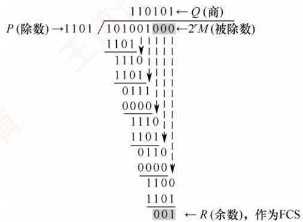

<em>图 3.8 循环冗余码的运算过程</em>

　　CRC 的生成与校验通常由专用硬件电路实现，速度极快，几乎不会引入额外的延迟。若传输过程中无差错，则 CRC 检验所得余数必定为 0；若出现误码，余数仍为 0 的概率极低。因此，在工程实践中通常认为 “凡是被数据链路层接受的帧，几乎可以确定在传输过程中未发生差错”。而那些被丢弃的帧，尽管物理上曾被收到，却因 CRC 校验失败而未被上层接受。

### 3.3.2 纠错编码

　　最常见的纠错编码是海明码。其基本原理是在原始信息位中插入若干检验位，构成具有检错与纠错能力的海明码。每个检验位对应一个校验组（通常采用偶校验），用于校验海明码中的若干信息位。通过将每个信息位分配到多个检验组中，当某一位出错时，会引发其所属的多个检验组同时出现校验错误，从而不仅能检测出错误，还能确定错误位置，实现单比特纠错。

　　下面以信息位1010为例，详细介绍海明码的构造与纠错过程。

##### （1） 确定海明码的总位数

　　设信息位有 $n$ 位，检验位有 $k$ 位。 $k$ 个检验位可表示 $2^{k}$ 种状态：信息位和检验位共有 $n + k$ 种单比特出错的位置，此外还需1种表示无错状态。因此， $n$ 与 $k$ 需满足

$$
2 ^ {k} \geqslant n + k + 1
$$

　　本例中 n=4，尝试 $k=3:2^{3}\geqslant4+3+1$ 成立。故取 k=3，海明码共 $n+k=7$ 位。记信息位为 $D_{4}D_{3}D_{2}D_{1}=1010$ ，检验位为 $P_{3}P_{2}P_{1}$ ，海明码位号从右至左依次为 $H_{7}H_{6}H_{5}H_{4}H_{3}H_{2}H_{1}$ 。

##### （2） 确定检验位的分布

　　规定：检验位 $P_{i}$ 放在海明位号为 $2^{i-1}$ 的位置上，其余各位放置信息位，因此：

$P_{1}$ 的海明码位号为 $2^{i-1}=2^{0}=1$ ，即 $H_{1}$ 为 $P_{1}$ 。

$P_{2}$ 的海明码位号为 $2^{i - 1} = 2^{1} = 2$ ，即 $H_{2}$ 为 $P_{2}$ 。

$P_{3}$ 的海明码位号为 $2^{i - 1} = 2^2 = 4$ ，即 $H_{4}$ 为 $P_{3}$ 。

　　将信息位按原顺序放在剩余位置，得到海明码的分布如下：

$$
\begin{array}{c c c c c c c} H _ {7} & H _ {6} & H _ {5} & H _ {4} & H _ {3} & H _ {2} & H _ {1} \\ D _ {4} & D _ {3} & D _ {2} & P _ {3} & D _ {1} & P _ {2} & P _ {1} \end{array}
$$

##### （3） 分组以形成检验关系

　　每个信息位由多个检验位共同校验，需满足条件：信息位所在位号 = 其所参与的所有检验

　　位位号之和。另外，检验位不需要再被检验。分组形成的检验关系如下。

$$
\begin{array}{l l} D _ {1} \text {位于} H _ {3}, \text {由} H _ {2} H _ {1} (P _ {2} P _ {1}) \text {检验:} & \text {因为} 3 (0 1 1) = \\ D _ {2} \text {位于} H _ {5}, \text {由} H _ {4} H _ {1} (P _ {3} P _ {1}) \text {检验:} & \text {因为} 5 (1 0 1) = \\ D _ {3} \text {位于} H _ {6}, \text {由} H _ {4} H _ {2} (P _ {3} P _ {2}) \text {检验:} & \text {因为} 6 (1 1 0) = \\ D _ {4} \text {位于} H _ {7}, \text {由} H _ {4} H _ {2} H _ {1} (P _ {3} P _ {2} P _ {1}) \text {检验:} & \text {因为} 7 (1 1 1) = \\ & \boxed {\text {第3组}} \end{array} + \boxed {\begin{array}{c c c c c c c c c c c c c c c c c c c c c c c c c c c c c c c c c c c c c c c c c c c c c c c c c c c c c c c c c c c c c c c c c c c c c c c c c c c c c c c c c c c c c c c c} & H _ {4} (P _ {3}) & & & & & & & & & & & & & & & & & & & & & & & & & & & & & & & & & & & & & & & & & & & & & & & & & & & & & & & & & & & & & \\ & & & & & & & & & & & & & & & & & & & & & & & & & & & & & & & & & & & & & & & & & & & \\ & & & & & & & & & & & & & & & & & & & & & & & & & & & \\ & & & & & & & & & & & \\ \end{array} } + \boxed {\begin{array}{c c c c c c c c c c c c c c} H _ {2} (P _ {2}) \\ 2 \\ 2 \\ 2 \\ 2 \end{array} } + \boxed {\begin{array}{c c c c c c c c c c c c c} H _ {1} (P _ {1}) \\ 1 \\ 1 \\ 1 \\ 1 \end{array} }
$$

##### （4） 检验位取值

　　检验位 $P_{i}$ 的值为其对应校验组中所有位（含信息位）求异或（偶校验结果）。

　　根据（3）中的分组有

$$
P _ {1} \text {校验} D _ {1}, D _ {2}, D _ {4} \quad \rightarrow \quad P _ {1} = D _ {1} \oplus D _ {2} \oplus D _ {4} = 0 \oplus 1 \oplus 1 = 0
$$

$$
P _ {2} \text {校验} D _ {1}, D _ {3}, D _ {4} \quad \rightarrow \quad P _ {2} = D _ {1} \oplus D _ {3} \oplus D _ {4} = 0 \oplus 0 \oplus 1 = 1
$$

$$
P _ {3} \text {校验} D _ {2}, D _ {3}, D _ {4} \quad \rightarrow \quad P _ {3} = D _ {2} \oplus D _ {3} \oplus D _ {4} = 1 \oplus 0 \oplus 1 = 0
$$

　　因此，1010对应的海明码为 $101\underline{0} 0\underline{1}\underline{0}$ （下划线为检验位，其余为信息位）。

##### （5） 海明码的检验原理

　　每个检验组分别利用检验位和参与形成该检验位的信息位进行奇偶检验检查，构成 $k$ 个检验方程：

$$
S _ {1} = P _ {1} \oplus D _ {1} \oplus D _ {2} \oplus D _ {4}
$$

$$
S _ {2} = P _ {2} \oplus D _ {1} \oplus D _ {3} \oplus D _ {4}
$$

$$
S _ {3} = P _ {3} \oplus D _ {2} \oplus D _ {3} \oplus D _ {4}
$$

　　若 $S_{3}S_{2}S_{1}$ 的值为“000”，表示无错误；否则表示出错，且这个数就是错误位的位号，如 $S_{3}S_{2}S_{1}=001$ ，表示第 1 位出错，即 $H_{1}$ 出错，直接将其取反即可达到纠错的目的。

　　海明码的优势在于：通过少量冗余检验位，可实现单比特错误的自动定位与纠正。

### 3.3.3 本节习题精选

#### 一、单项选择题

01. 下列有关数据链路层差错控制的叙述中，错误的是（）。

- A. 数据链路层只能提供差错检测，而不提供对差错的纠正
- B. 奇偶检验码只能检测出错误而无法对其进行修正，也无法检测出双位错误
- C. CRC 检验码可以检测出所有的单比特错误
- D. 海明码可以纠正一位差错

02. 下列关于奇偶检验码特征的描述中，正确的是（）。

- A. 只能检查出奇数个比特的错误
- B. 能检查出任意比特的错误
- C. 比 CRC 检验更可靠
- D. 只能检查出偶数个比特的错误

03. 字符 S 的 ASCII 编码从低到高依次为 1100101，采用奇检验，在下述收到的传输后字符中，错误（）不能检测。

- A. 11000011
- B. 11001010
- C. 11001100
- D. 11010011

04. 为纠正2比特错误，编码的码距至少应为（）。

- A. 2
- B. 3
- C. 4
- D. 5

05. 对于 10 位要传输的数据，若采用海明码检验，则需要增加的冗余信息位数是（）。

- A. 3
- B. 4
- C. 5
- D. 6

06. 下列关于循环冗余检验的说法中，错误的是（）。

- A. 带 $r$ 个检验位的多项式编码可以检测到所有长度小于或等于 $r$ 的突发性错误
- B. 通信双方可以无须商定就直接使用多项式编码
- C. CRC检验可以使用硬件来完成
- D. 有一些特殊的多项式，因为有很好的特性，而成了国际标准

07. 要发送的数据是 1101 0110 11，采用 CRC 检验，生成多项式是 10011，那么最终发送的数据应是（）。

- A. 1101 0110 1110 10
- B. 1101 0110 1101 10
- C. 1101 0110 1111 10
- D. 1111 0011 0111 00

08. 【2023 统考真题】若甲向乙发送数据时采用 CRC 检验，生成多项式为 $G(X)=X^{4}+X+1$ （G=10011），则乙方接收到比特串（）时，可以断定其在传输过程中未发生错误。

- A. 10111 0000
- B. 10111 0100
- C. 10111 1000
- D. 10111 1100

09. 【2025 统考真题】某差错编码的编码集为 $\{1001\ 1010, 0101\ 1100, 1111\ 0000, 0000\ 1111\}$ ，该差错编码的检错和纠错能力是（）。

- A. 不超过 2 位错的 100% 检错、不超过 1 位错的纠错
- B. 不超过 2 位错的 100% 检错、不超过 2 位错的纠错
- C. 不超过 3 位错的 100% 检错、不超过 1 位错的纠错
- D. 不超过 3 位错的 100% 检错、不超过 2 位错的纠错

#### 二、综合应用题

01. 在数据传输过程中，若接收方收到的比特序列为 10110011010，收发双方采用的生成多项式为 $G(x) = x^4 + x^3 + 1$ ，则该比特序列在传输中是否出错？若未出错，则发送数据的比特序列和 CRC 检验码的比特序列分别是什么？

### 3.3.4 答案与解析

#### 一、单项选择题

**01. A**

　　链路层的差错控制有两种基本策略：检错编码和纠错编码。常见的纠错编码有海明码，它可以纠正一位差错。CRC检验编码可以检测出所有的单比特错误（记住该结论即可）。

**02. A**

　　奇偶检验的原理是通过增加冗余位来使得码字中“1”的个数保持为奇数或偶数的编码方法，它只能检查出奇数个比特的错误。

**03. D**

　　既然采用奇检验，那么传输的数据中 1 的个数若是偶数则可检测出错误，若 1 的个数是奇数则检测不出错误。

**04. D**

　　要纠正 d 位错误，编码的码距需满足 $2d + 1$ 。当 d = 2 时，所需码距为 $2 \times 2 + 1 = 5$ 。

**05. B**

　　在 $k$ 比特信息位上附加 $r$ 比特冗余信息，构成 $k + r$ 比特的码字，必须满足 $2^{r} \geqslant k + r + 1$ 。若 $k$ 的取值小于或等于11且大于4，则 $r = 4$ 。

**06. B**

　　在使用多项式编码时，发送方和接收方必须预先商定一个生成多项式。发送方按照模2除法，得到检验码，在发送数据时将该检验码加到数据后面。接收方收到数据后，也需要根据该生成多项式来验证数据的正确性。选项 A 是正确结论，了解即可，无须掌握证明过程。

**07. C**

　　假设一个帧有 m 位，其对应的多项式为 $G(x)$ ，则计算冗余码的步骤如下：

　　① 加 0。假设 $G(x)$ 的阶为 r，在帧的低位端加上 r 个 0。

　　② 模 2 除。利用模 2 除法，用 $G(x)$ 对应的数据串除①中计算出的数据串，得到的余数即为冗余码（共 $r$ 位，前面的 0 不可省略）。

　　多项式以 2 为模运算。按照模 2 运算规则，加法不进位，减法不借位，它刚好是异或操作。乘除法类似于二进制运算，只是在做加减法时按模 2 规则进行。

**08. D**

　　观察选项：除后 4 位外，前 5 位都为 10111，可知发送方发送的数据部分为 10111，列式求得余数部分为 1100，因此发送方发送的帧串为 10111 1100。

$$
\begin{array}{r l} & 1 0 0 1 1 \sqrt {\frac {1 0 1 0 0}{1 0 1 1 1 0 0 0 0}} \\ & \quad \frac {1 0 0 1 1}{1 0 0 0 0} \\ & \quad \frac {1 0 0 1 1}1 1 0 0 - - - - - - - - - - - - - - - - - - - - - - - - - - - - - - - - - - - - - - - - - - - - - - - - - - - - - - - - - - - - - - - - - - - - - - - - - - - - - - - - - - - - - - - - - - - - - - - - - - - - \\ & \end{array}
$$

**09. C**

　　首先计算该编码集的码距：对四个码字两两比较，任意两个码字的码距至少为4，故该编码集的码距 $d_{\mathrm{min}} = 4$ 。根据差错控制理论，若编码集的码距为 $d$ ，则可检测不超过 $d - 1$ 位错误，能纠正不超过 $(d - 1)/2$ 位错误。因此该编码集最多能检测3位错误、纠正1位错误。

#### 二、综合应用题

**01. 【解答】**

　　根据题意，生成多项式 $G(x)$ 对应的比特序列为11001。进行如下的二进制模2除法，被除数为10110011010，除数为11001：

$$
\begin{array}{c} 1 1 0 1 0 1 0 \\ 1 1 0 0 1 \sqrt {1 0 1 1 0 0 1 1 0 1 0} \\ \frac {1 1 0 0 1}{1 1 1 1 0} \\ \frac {1 1 0 0 1}{1 1 1 1 1} \\ \frac {1 1 0 0 1}{1 1 0 0 1} \\ \frac {1 1 0 0 1}{0 0} \end{array}
$$

　　所得余数为 0，因此该比特序列在传输过程中未出现差错。发送数据的比特序列是 1011001，CRC 检验码的比特序列是 1010。注，CRC 检验码的位数等于生成多项式 $G(x)$ 的最高次幂。

## 3.4 流量控制与可靠传输机制

　　在数据链路层中，流量控制机制和可靠传输机制是紧密交织的。

### 3.4.1 流量控制与滑动窗口机制

　　流量控制是指由接收方控制发送方的发送速率，确保接收方有足够的缓存空间来接收每一个帧。常见的流量控制方法有两种：停止-等待协议和滑动窗口协议。数据链路层和传输层均具备流量控制的功能，且都采用了滑动窗口的思想，但二者存在明显区别，主要体现在以下两方面。

1）数据链路层控制的是相邻节点之间的流量，而传输层控制的是端到端的流量。

2）数据链路层的控制手段是：当接收方无法接收时，不返回确认帧；而传输层的控制手段是：接收方在确认报文段中携带窗口字段值，动态调整发送方的发送窗口大小。

#### 1. 停止-等待流量控制基本原理

　　停止-等待流量控制是一种最简单的流量控制方法。发送方每次仅允许发送一个帧，接收方每成功接收一个帧后，需返回一个确认帧，表示可以接收下一帧；发送方只有收到确认帧后，才能发送后续帧。若未收到确认帧，发送方将一直等待。由于发送方在发送完一个帧后必须等待确认，因此信道利用率较低，传输效率不高。

#### 2. 滑动窗口流量控制基本原理

　　滑动窗口流量控制是一种更高效的流量控制方法。在任意时刻，发送方维持一组连续的、允许发送的帧序号，称为发送窗口；接收方也维持一组连续的、允许接收的帧序号，称为接收窗口。发送窗口的大小决定了在未收到对方确认的情况下，发送方最多还能发送多少帧以及哪些帧。接收窗口则用于控制接收方可以接收哪些帧，超出窗口范围的帧将被丢弃。

　　图3.9展示了发送窗口的工作原理，图3.10展示了接收窗口（ $W_{\mathrm{R}} = 1$ ）的工作原理。

  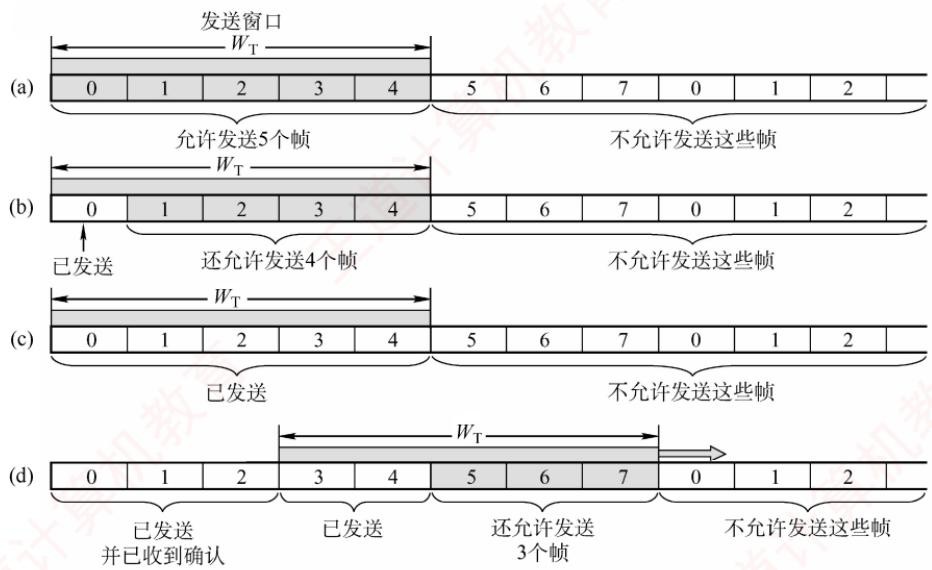

　　图 3.9 发送窗口的工作原理：(a) 允许发送 0～4 号共 5 个帧；(b) 允许发送 1～4 号共

　　4个帧；(c)不允许发送任何帧；(d)允许发送 $5\sim 7$ 号共3个帧

　　发送方每收到一个按序到达的确认帧，就将发送窗口向前滑动一个位置，从而允许发送一个新的帧。当窗口内所有帧均已发送但尚未收到确认时，发送方暂停发送。

　　接收方每收到一个序号落在接收窗口内的帧，便接收该帧，随后将接收窗口向前滑动一个位置，并返回确认。若收到的帧序号落在接收窗口之外，则一律丢弃。

　　滑动窗口具有以下重要特性：

1）发送窗口的滑动依赖于确认信息：仅当发送方收到对某帧的确认后，其发送窗口才能向前滑动。而接收方仅在成功接收期望帧后，才会发送确认并滑动其接收窗口。

  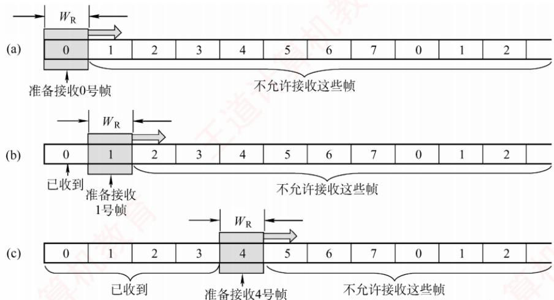

<em>图 3.10 接收窗口的工作原理</em>

> **考点追踪：** 滑动窗口协议的窗口机制（2019、2025）

2）从滑动窗口的角度看，停止-等待协议与后面将要介绍的后退 N 帧协议和选择重传协议的主要区别在于发送窗口和接收窗口的大小：

　　停止-等待协议：发送窗口 $W_{T}=1$ ，接收窗口 $W_{R}=1$ 。

　　后退 N 帧协议：发送窗口 $W_{T}>1$ ，接收窗口 $W_{R}=1$ 。

　　选择重传协议：发送窗口 $W_{T}>1$ ，接收窗口 $W_{R}>1$ 。

　　若采用 $n(n \geqslant 2)$ 比特对帧编号，则后两种滑动窗口协议还需满足 $W_{T} + W_{R} \leqslant 2^{n}$ 。

3）当接收窗口大小为1时，只有收到该帧后才允许接收下一帧，因此可保证帧的有序接收。

4）在数据链路层的滑动窗口协议中，窗口大小在传输过程中是固定的（与传输层不同）。

### 3.4.2 可靠传输机制

　　可靠传输是指发送方发出的数据能够被接收方正确且完整地接收，为实现这一目标，通常采用确认（ACK）和超时重传两种机制。

1）确认：接收方每成功接收到一个数据帧，就向发送方返回一个确认帧，表明该数据帧已被正确接收。

2）超时重传：发送方在发送一个数据帧后启动一个计时器，若在规定时间内未收到对应的确认帧，则认为该帧可能丢失或出错，从而自动重传该帧，直至成功收到确认为止。

　　结合这两种机制的可靠传输协议称为自动重传请求（Automatic Repeat reQuest，ARQ），它意味着：重传由发送方自主触发，无须接收方显式请求重传。在 ARQ 协议中，数据帧和确认帧都必须编号，以便发送方和接收方能够准确识别确认帧对应的是哪个数据帧，以及判断哪些帧尚未被确认，从而决定是否需要重传。ARQ 协议主要包括三种类型：停止-等待（Stop-and-Wait）协议、后退 N 帧（Go-Back-N）协议和选择重传（Selective Repeat）协议。这三种协议的基本原理不仅适用于数据链路层，也可应用于更高层的可靠传输设计。

　　在实际网络中，是否在数据链路层提供可靠传输服务取决于链路特性：有线网络的误码率较低，为降低开销，一般不要求数据链路层提供可靠传输服务；即使出现少量误码，也可由上层（如传输层）通过端到端机制处理。无线网络的链路易受干扰，误码率较高，因此要求数据链路层必须向上层提供可靠传输服务，以避免大量错误帧传递至上层，提升整体效率。

#### 1. 单帧滑动窗口与停止-等待协议（S-W）

　　在停止-等待协议中，发送方每次只能发送一个数据帧，只有在收到接收方对该帧的确认帧后，才能发送下一个帧。从滑动窗口的角度看，该协议的发送窗口和接收窗口大小均为1。

　　在实际传输过程中，可能出现以下两类差错：

1）数据帧出错或丢失。接收方检测到数据帧存在差错时，直接丢弃该帧；数据帧在传输途中丢失时，接收方不会收到任何信息。为应对这两种情况，发送方需要配备一个计时器。每发送完一个数据帧，发送方即启动该计时器；计时器超时仍未收到对应的确认帧时，认为该帧可能已丢失或出错，于是自动重传该帧。该过程重复进行，直至该帧被正确接收并返回确认帧为止。

2）确认帧出错或丢失。即使接收方已成功收到正确的数据帧，若其返回的确认帧在传输中出错或丢失，则发送方仍将因未收到确认而触发超时重传。这时，接收方会再次收到一个重复的数据帧。为避免重复处理，接收方会丢弃该重复帧，并重新发送对应的确认帧。

　　停止-等待协议每次仅发送一帧并等待确认，因此只需确保相邻发送的帧具有不同的序号即可区分新帧与重传帧。因此，仅需1比特序号空间就已足够：数据帧交替使用序号0和1，对应的确认帧分别记为ACK0和ACK1。若接收方连续收到相同序号的数据帧，则说明发送方进行了超时重传；若发送方连续收到相同序号的确认帧，则说明接收方收到了重复帧且重发了确认帧。

　　此外，为支持超时重传和重复帧识别，发送方和接收方均需设置帧缓冲区。发送方发送数据帧后，必须在发送缓存中保留该帧的副本，以便需要时重传；仅在收到对应的确认帧后，方可清除该副本。接收方也需记录最近成功接收的帧序号，以判断新到的帧是否是重复的帧。

　　停止-等待协议的信道利用率很低。为提高传输效率，后续发展出了连续 ARQ 协议（后退 N 帧协议和选择重传协议），允许发送方连续发送多个数据帧，而无须逐帧等待确认。

#### 2. 多帧滑动窗口与后退 $N$ 帧协议（GBN）

> **考点追踪：** GBN 协议的工作原理（2009）

　　在后退 N 帧协议中，发送方可在未收到确认帧的情况下，连续发送多个序号落在发送窗口内的数据帧。后退 N 帧的含义是：若某个已发送的数据帧因超时未收到确认而被判定为丢失或出错，则发送方不仅需要重传该帧，还需重传其后所有已发送但未被确认的帧。这一机制的前提是：接收方仅按序接收数据帧，任何失序到达的帧都将被丢弃。

> **考点追踪：** GBN 协议的累积确认机制（2017）

　　如图 3.11 所示，发送方向接收方连续发送数据帧，发送完 0 号帧后，可继续发送 1 号、2 号等后续帧。其通常仅为最早未确认的帧维护一个超时计时器，当该帧被确认后，计时器移至下一个未确认帧。由于连续发送了多个帧，确认帧必须明确指示所确认的帧序号。为降低开销，GBN 协议采用累积确认机制：接收方无须对每个正确接收的帧立即返回确认，而可在连续收到多个正确帧后，仅对其中序号最大的帧发送一个确认。具体而言，ACKn 表示接收方已正确收到 n 号帧及之前的所有帧，下一次期望接收的是 $n+1$ 号帧（若序号回绕，则可能是 0 号帧）。

　　由于接收方仅按序接收帧，当某帧出错或丢失时，其后所有正确到达的帧即使无误，也会被丢弃。例如，在图3.11中，尽管在出错的2号帧之后又收到了6个正确的数据帧，接收方仍必须将它们全部丢弃。此外，为了防止确认帧丢失，接收方可以重复发送最近一次的确认帧（如ACK1），促使发送方尽快感知当前的接收状态。2号帧的计时器超时后，发送方将从该帧开始，重传窗口内所有未被确认的帧（2号及之后的帧）。

> **考点追踪：** GBN 协议的超时重传机制（2017）

  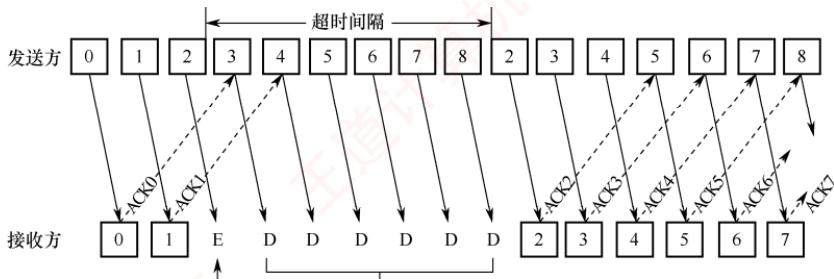

　　出错 被数据链路层丢弃的帧

　　图 3.11 GBN 协议的工作原理：对出错数据帧的处理

> **考点追踪：** GBN 协议的滑动窗口机制（2012、2015、2017）

　　若采用 n 比特对帧编号，则发送窗口 $W_{T}$ 应满足 $1 < W_{T} \leqslant 2^{n} - 1$ 。若 $W_{T} > 2^{n} - 1$ ，而这可能导致接收方无法区分新发送的帧与因序号回绕而重复出现的旧帧（参见章末的疑难点 1）。

　　GBN 协议的接收窗口大小固定为 $W_{R}=1$ ，这保证了帧的严格按序接收。

　　不难看出，GBN 协议一方面通过连续发送多个帧显著提高了信道利用率；另一方面，在发生差错时却必须重传大量已正确到达的帧（仅因这些帧前面有一帧出错），从而造成带宽浪费。因此，当信道误码率较高时，GBN 协议的性能可能反而不如停止-等待协议。

#### 3. 多帧滑动窗口与选择重传协议（SR）

　　为了进一步提高信道的利用率，可以设法仅重传出错或超时的数据帧，而不影响其他已正确传输的帧。为此，接收方必须能够暂存失序但正确到达、且序号仍落在接收窗口内的数据帧，待缺失序号的帧收齐后，再按序交付给上层。这种机制即为选择重传协议。

> **考点追踪：** SR协议的工作原理（2011、2024）

　　为实现仅重传出错帧的目标，接收方不能再采用累积确认，而需对每个正确接收的数据帧逐一发送确认。显然，选择重传协议比后退 $N$ 帧协议更为复杂：

- 接收方需设置足够大的帧缓冲区（其数量等于接收窗口大小），用于暂存正确的失序帧；

- 发送方为每个未确认的帧维护独立的计时器，当某帧的计时器超时时，仅重传该帧；

- 若接收方收到重复的数据帧（表示确认帧丢失），则丢弃该帧，并重传对应的确认帧。

　　此外，选择重传协议还引入了更高效的差错处理策略：一旦接收方检测到某个数据帧出错，可立即向发送方发送否定帧（NAK），请求重传 NAK 指定的帧，从而避免等待超时。

　　在图 3.12 中，2 号帧丢失后，接收方仍可正常接收并缓存后续到达的数据帧（如 3～9 号帧）；发送方超时重传 2 号帧并被成功接收后，接收窗口即可向前滑动。在某个时刻，若接收方检测到 10 号帧出错，则会立即发送否定帧 NAK10；在此期间，接收方仍可继续接收并缓存后续帧；发送方收到 NAK10 后，立即重传 10 号帧，无须等待超时。

  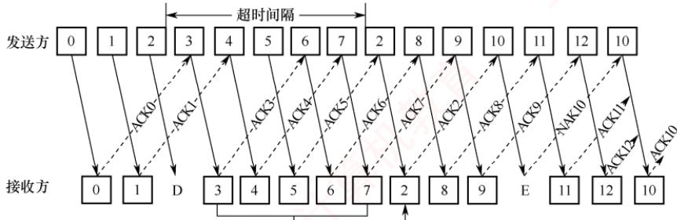

　　由数据链路层缓冲的帧 将分组2~7传给网络层

　　图3.12 SR协议的工作原理：对超时和出错数据帧的处理

> **考点追踪：** SR协议的滑动窗口机制（2023）

　　选择重传协议的接收窗口 $W_{R}$ 和发送窗口 $W_{T}$ 均大于 1，允许一次发送或接收多个数据帧。若采用 n 比特对帧编号，需满足两个条件：① $W_{R} + W_{T} \leqslant 2^{n}$ （不满足此条件时，接收窗口向前滑动后，部分确认帧丢失，发送方可能重传旧序号的帧；由于序号空间不足，这些重传帧的序号可能与新帧重叠，导致接收方无法区分新帧与旧帧）。② $W_{R} \leqslant W_{T}$ （若接收窗口大于发送窗口，则接收窗口中超出发送窗口范围的部分永远无法被填满，造成资源浪费）。由①和②不难推出 $W_{R} \leqslant 2^{n-1}$ 。在实际应用中，常取 $W_{R} = W_{T} = 2^{n-1}$ ，以充分利用序号空间。

> **注意：**

　　为使内容精炼，本文未对三种 ARQ 协议的滑动窗口动态变化过程展开具体示例。此部分内容在配套视频中有丰富、形象的过程演示，强烈建议读者结合学习。

#### 4. 信道利用率的分析

　　信道利用率用于衡量信道的使用效率。从时间角度看，信道效率是针对发送方而言的，是指发送方在一个发送周期（从发送方开始发送一个分组，到收到对该分组的确认所需的时间）内，有效发送数据的时间与整个发送周期之比。本节使用分组而非帧，是为增强表述的通用性。

##### （1） 停止-等待协议的信道利用率

> **考点追踪：** 停止-等待协议的信道利用率分析（2018、2020）

　　停止-等待协议的优点是实现简单，但缺点是信道利用率极低。图3.13显示了停止-等待协议中数据帧和确认帧的发送时间关系。假定在发送方和接收方之间有一个直通的信道来传送分组。

  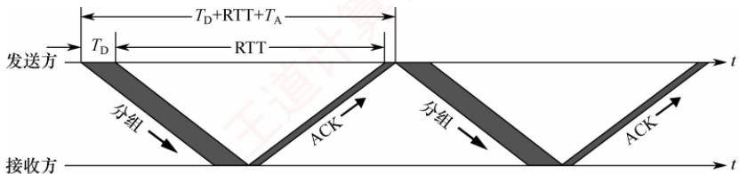

<em>图 3.13 停止-等待协议中数据帧和确认帧的发送时间关系</em>

　　发送方发送一个分组的发送时延为 $T_{\mathrm{D}}$ 。显然， $T_{\mathrm{D}}$ 等于分组长度除以数据传输速率。假定分组正确到达接收方后，其处理时间可忽略不计，接收方立即返回确认。接收方发送确认分组的发送时延为 $T_{\mathrm{A}}$ （通常可忽略不计）。再假设发送方处理确认分组的时间也可忽略不计，则发送方经过时间 $T_{\mathrm{D}} + \mathrm{RTT} + T_{\mathrm{A}}$ 后就可再发送下一个分组，其中RTT是往返时延。由于仅有 $T_{\mathrm{D}}$ 时间用于有效发送数据，因此停止-等待协议的信道利用率 $U$ 为

$$
U = \frac {T _ {\mathrm{D}}}{T _ {\mathrm{D}} + \mathrm{RTT} + T _ {\mathrm{A}}}
$$

　　假定某信道的 RTT = 20ms。分组长度为 1200 比特，数据传输速率为 1Mb/s。若忽略处理时延和 $T_{A}$ ，则可算出信道利用率 U = 5.66%。若将数据传输速率提高至 10Mb/s，则 U = 0.596%。由此可见，当 RTT 远大于 $T_{D}$ 时，停止-等待协议的信道利用率会非常低。

##### （2） 连续 ARQ 协议的信道利用率

> **考点追踪：** 停止-等待、GBN与SR协议的信道利用率对比分析（2023）

　　连续 ARQ 协议采用流水线传输（见图 3.14），允许发送方连续发送多个分组，从而在信道上维持持续的数据流动。只要发送窗口足够大，即可显著提升信道利用率。

  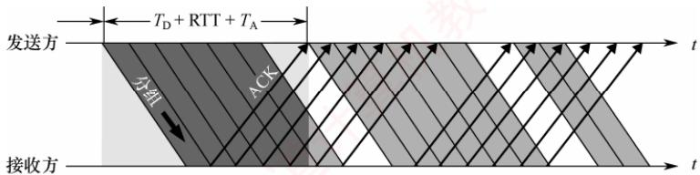

<em>图 3.14 连续 ARQ 协议的流水线传输可提高信道利用率</em>

> **考点追踪：** GBN 协议的信道利用率分析（2012、2015、2017）

　　设连续 ARQ 协议的发送窗口大小为 N（最多可连续发送 N 个分组），分为两种情况：

1）若 $NT_{D}<T_{D}+RTT+T_{A}$ ：即在一个发送周期内可发送完 N 个分组，此时，信道无法被完全占满，信道利用率为

$$
U = \frac {N T _ {\mathrm{D}}}{T _ {\mathrm{D}} + \mathrm{RTT} + T _ {\mathrm{A}}}
$$

2）若 $NT_{D} \geqslant T_{D} + RTT + T_{A}$ ：即在一个发送周期内发不完（或刚好发完）N个分组，只要无差错发生，发送方可持续不间断地发送，信道被完全利用，此时信道利用率 U = 1。

　　在相同帧序号比特数下，GBN 的发送窗口大于停止-等待协议，因此理想条件下信道利用率更高。但是，当信道误码率较高时，其实际信道利用率甚至可能低于停止等待协议。

> **考点追踪：** 滑动窗口协议的数据传输速率分析（2009、2010、2014）

　　此外，“信道平均（实际）数据传输速率=信道利用率×信道带宽（最大数据传输速率）”，或“信道平均（实际）数据传输速率=发送周期内发送的数据量/发送周期”。

　　本节习题包含大量关于信道利用率与传输速率的习题，建议读者结合练习深入掌握。

### 3.4.3 本节习题精选

#### 一、单项选择题

01. 下列关于停止-等待协议的描述中，正确的是（）。

- A. 发送窗口和接收窗口的尺寸都为 1
- B. 最大的信道利用率有可能达到 $100\%$
- C. 适合于往返时间比较长的信道
- D. 接收方可以不按序接收

02. 下列情况中，会使停止-等待协议的效率变得很低的是（）。

- A. 当源主机和目的主机之间的距离很近而且数据传输速率很高时
- B. 当源主机和目的主机之间的距离很远而且数据传输速率很高时
- C. 当源主机和目的主机之间的距离很近而且数据传输速率很低时
- D. 当源主机和目的主机之间的距离很远而且数据传输速率很低时

03. 在简单的停止-等待协议中，当帧出现丢失时，发送方会永远等待下去，解决这种死锁现象的办法是（）。

- A. 差错检验
- B. 帧序号
- C. NAK机制
- D. 超时机制

04. 在停止-等待协议中，为了让接收方能判断所收到的数据帧是否重复，采用（）的方法。

- A. 帧编号
- B. 检错码
- C. 重传计时器
- D. NAK 帧

05. 一个信道的数据传输速率为 $4\mathrm{kb / s}$ ，单向传播时延为 $30\mathrm{ms}$ ，若使停止-等待协议的信道最大利用率达到 $80\%$ ，则要求的数据帧长至少为（）。

- A. 160 比特
- B. 320 比特
- C. 560 比特
- D. 960 比特

06. 主机甲采用停止-等待协议向主机乙发送数据，数据传输速率是 6kb/s，单向传播时延是

　　100ms，忽略确认帧的发送时延。信道的利用率为 40% 时，数据帧的长度为（）。

- A. 240 比特
- B. 320 比特
- C. 600 比特
- D. 800 比特

07. 在停止-等待协议中，若发送方发送的数据帧中途丢失，则可能发生的情况是（）。

- A. 接收方发送 NAK 帧，请求重发此帧
- B. 发送方在经过超时时间后未收到 ACK 帧，自动重发此帧
- C. 接收方在经过超时时间后，向发送方发送 ACK 帧，请求重发此帧
- D. 发送方继续发送后续帧，直到经过超时时间后未收到 ACK 帧，重发此帧

08. 下列关于连续 ARQ 的说法中，错误的是（）。

- A. 发送方可以连续发送若干数据帧，而不是发完一个数据帧就停下来等待确认帧
- B. 发送方收到了接收方发来的确认帧，还可以接着发送数据帧
- C. 相比停止-等待协议，连续 ARQ 因为减少了等待时间，所以提高了信道利用率
- D. 接收方可以不按序接收数据帧

09. 数据链路层采用后退 N 帧协议进行流量控制，发送方已发送编号为 0～6 的帧，之后收到 5 号数据帧的确认，发送方的滑动窗口向后移动后，发送方可发送的数据帧数量为 6 个，假设整个过程未发生超时，则应采用（）位给数据帧编号。

- A. 3
- B. 4
- C. 5
- D. 6

10. 数据链路层采用后退 $N$ 帧协议，发送方已经发送了编号从 0 到 6 的帧。当计时器超时的时候，只收到对 1、2、4 号帧的确认，发送方需要重传的帧的数量是（）。

- A. 1
- B. 2
- C. 5
- D. 6

11. 数据链路层采用了后退 N 帧协议（GBN），若发送窗口的大小是 32，则至少需要（）位的序列号才能保证协议不出错。

- A. 4
- B. 5
- C. 6
- D. 7

12. 若采用后退 $N$ 帧的 ARQ 协议进行流量控制，帧编号字段为 7 位，则发送窗口的最大长度为（）。

- A. 7
- B. 8
- C. 127
- D. 128

13. 一个使用选择重传协议的数据链路层，若采用5位的帧序列号，则可以选用的最大接收窗口是（）。

- A. 15
- B. 16
- C. 31
- D. 32

14. 对于窗口总大小为 $n$ 的滑动窗口，最多可以有（）帧已发送但没有确认。

- A. 0
- B. $n - 1$
- C. $n$
- D. $n / 2$

15. 数据链路层采用选择重传协议（SR）传输数据，若帧序号采用4比特编号，接收窗口大小为7，则发送窗口最大是（）。

- A. 17
- B. 8
- C. 9
- D. 10

16. 对无序接收的滑动窗口协议，若序号位数为 n，则接收窗口最大尺寸为（）。

- A. $2^{n}-1$
- B. 2n
- C. 2n-1
- D. $2^{n-1}$

17. 采用滑动窗口机制对两个相邻节点 A 和 B 的通信过程进行流量控制。A 和 B 之间的数据传输速率为 20kb/s，数据帧和确认帧的长度都为 2000B，往返传播时延为 1400ms，采用 3 比特给数据帧编号，测得在 A 和 B 的通信过程中信道利用率大于 80%，则（）。（注：在 SR 协议中，默认发送窗口大小等于接收窗口大小。）

- A. 节点 A、B 之间只能采用停止等待协议
- B. 节点 A、B 之间只能采用 GBN 协议
- C. 节点 A、B 之间只能采用 SR 协议
- D. 节点 A、B 之间可以采用 GBN 协议或 SR 协议

18. 流量控制是实现发送方和接收方速度一致的机制，实现这种机制所采取的措施是（）。

- A. 增大接收方接收速度
- B. 减小发送方发送速度
- C. 接收方向发送方反馈信息
- D. 增加双方的缓冲区

19. 假设两台主机之间采用后退 N 帧协议传输数据，数据传输速率为 16kb/s，单向传播时延为 250ms，数据帧的长度是 128B，确认帧的长度也是 128B，为使信道利用率达到最高，则帧序号的比特数至少为（）。

- A. 2
- B. 3
- C. 4
- D. 5

20. 在下列滑动窗口机制中，理论上可以达到 $100\%$ 信道利用率的是（）。 I. 停止-等待协议 II. 后退 $N$ 帧协议 III. 选择重传协议

- A. I
- B. II
- C. III
- D. II和III

21. 数据链路层采用选择重传协议进行流量控制，发送方在收到 0~3 号帧的确认后，又收到了 5 号帧的确认，发送窗口内还有其他帧未发送，且未发生超时，则发送方将（）。

- A. 重传 4 号帧
- B. 重传 5 号帧
- C. 接收该确认帧并继续发送剩下的帧
- D. 停止发送并等待超时

22. 【2009 统考真题】数据链路层采用了后退 N 帧（GBN）协议，发送方已经发送了编号为 0～7 的帧。当计时器超时的时候，若发送方只收到 0、2、3 号帧的确认，则发送方需要重发的帧数是（）。

- A. 2
- B. 3
- C. 4
- D. 5

23. 【2011 统考真题】数据链路层采用选择重传协议（SR）传输数据，发送方已发送 0～3 号数据帧，现已收到 1 号帧的确认，而 0、2 号帧依次超时，则此时需要重传的帧数是（）。

- A. 1
- B. 2
- C. 3
- D. 4

24. 【2012 统考真题】两台主机之间的数据链路层采用后退 N 帧协议（GBN）传输数据，数据传输速率为 16kb/s，单向传播时延为 270ms，数据帧长范围是 128～512B，接收方总是以与数据帧等长的帧进行确认。为使信道利用率达到最高，帧序号的比特数至少为（）。

- A. 5
- B. 4
- C. 3
- D. 2

25. 【2014 统考真题】主机甲与主机乙之间使用后退 N 帧协议（GBN）传输数据，主机甲的发送窗口尺寸为 1000，数据帧长为 1000B，信道带宽为 100Mb/s，主机乙每收到一个数据帧，就立即利用一个短帧（忽略其传输延迟）进行确认，若主机甲和主机乙之间的单向传播时延是 50ms，则主机甲可以达到的最大平均数据传输速率约为（）。

- A. 10Mb/s
- B. 20Mb/s
- C. 80Mb/s
- D. 100Mb/s

26. 【2015 统考真题】主机甲通过 128kb/s 卫星链路，采用滑动窗口协议向主机乙发送数据，链路单向传播时延为 250ms，帧长为 1000B。不考虑确认帧的开销，为使链路利用率不小于 80%，帧序号的比特数至少是（）。

- A. 3
- B. 4
- C. 7
- D. 8

27. 【2018 统考真题】主机甲采用停止-等待协议向主机乙发送数据，数据传输速率是 3kb/s，单向传播时延是 200ms，忽略确认帧的传输时延。当信道利用率等于 40% 时，数据帧的长度为（）。

- A. 240 比特
- B. 400 比特
- C. 480 比特
- D. 800 比特

28. 【2019 统考真题】对于滑动窗口协议, 若分组序号采用 3 比特编号, 发送窗口大小为 5 , 则接收窗口最大是 （）。

- A. 2
- B. 3
- C. 4
- D. 5

29. 【2020 统考真题】假设主机甲采用停止-等待协议向主机乙发送数据帧，数据帧长与确认帧长均为 1000B，数据传输速率是 10kb/s，单向传播时延是 200ms。则主机甲的最大信道利用率为（）。

- A. 80%
- B. 66.7%
- C. 44.4%
- D. 40%

30. 【2023 统考真题】假设通过同一条信道，数据链路层分别采用停止-等待协议、GBN 协议和 SR 协议（发送窗口和接收窗口相等）传输数据，三个协议的数据帧长相同，忽略确认帧长，帧序号位数为 3 比特。若对应三个协议的发送方最大信道利用率分别是 $U_{1}$ 、 $U_{2}$ 和 $U_{3}$ ，则 $U_{1}$ 、 $U_{2}$ 和 $U_{3}$ 满足的关系是（）。

- A. $U_{1} \leqslant U_{2} \leqslant U_{3}$
- B. $U_{1} \leqslant U_{3} \leqslant U_{2}$
- C. $U_{2} \leqslant U_{3} \leqslant U_{1}$
- D. $U_{3} \leqslant U_{2} \leqslant U_{1}$

31. 【2024 统考真题】主机甲通过选择重传（SR）滑动窗口协议向主机乙发送帧的部分过程如下图所示，Fx 为数据帧，ACKx 为确认帧，x 是位数为 3 比特的序号。主机乙只对正确接收的数据帧进行独立确认，发送窗口与接收窗口大小相同且均为最大值。主机甲在 $t_{1}$ 时刻和 $t_{2}$ 时刻发送的数据帧分别是（）。

  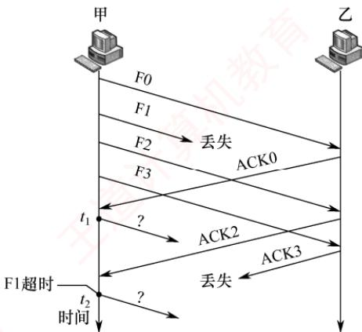

- A. F1, F3
- B. F1, F4
- C. F3, F1
- D. F4, F1

#### 二、综合应用题

01. 在选择重传协议中，设序号用 3 比特编号，发送窗口 $W_{\mathrm{T}} = 6$ ，接收窗口 $W_{\mathrm{R}} = 3$ 。试找出一种情况，使得在此情况下协议不能正确工作。

02. 假设一个信道的数据传输速率为 5kb/s，单向传播时延为 30ms，帧长在什么范围内时，才能使用于差错控制的停止-等待协议的效率至少为 50%？（忽略确认帧的发送时延。）

03. 假定信道的数据传输速率为 $100\mathrm{kb / s}$ ，单程传播时延为 $250\mathrm{ms}$ ，每个数据帧的长度均为2000位，且不考虑确认帧长、首部和处理时间等开销，为了达到最大的传输效率，试问帧的序号应为多少位？此时的信道利用率是多少？

04. 在数据传输速率为 $50\mathrm{kb / s}$ 的信道上传送长度为1kbit的帧，总是采用捎带确认，帧序号长度为3bit，单向传播延迟为270ms。对于下面三种协议，信道的最大利用率是多少？1）停止-等待协议。

3）选择重传协议（假设发送窗口和接收窗口相等）。

05. 对于下列给定条件，不考虑差错重传，停止-等待协议的实际数据传输速率是多少？ $R =$ 传输速率（16Mb/s） $S =$ 信号传播速率（200m/μs） $D =$ 接收主机和发送主机之间传播距离（200m） $T =$ 创建帧的时间（2μs） $F =$ 每帧的长度（500bit） $N =$ 每帧中的数据长度（450bit） $A =$ 确认帧ACK的帧长（80bit）

06. 在数据传输速率为 64kb/s 的卫星信道上，甲方发送长度为 512B 的数据帧，乙方返回一个很短的确认帧（忽略确认帧的发送时延）。信道的单向传播时延为 270ms，对于发送窗口大小分别为 1、7、17 和 117 的情况，甲方的实际数据传输速率分别为多少？

07. 【2017 统考真题】甲乙双方均采用后退 N 帧协议（GBN）进行持续的双向数据传输，且双方始终采用捎带确认，帧长均为 1000B。 $S_{x,y}$ 和 $R_{x,y}$ 分别表示甲方和乙方发送的数据帧，其中 x 是发送序号，y 是确认序号（表示希望接收对方的下一帧序号），数据帧的发送序号和确认序号字段均为 3 比特。信道传输速率为 100Mb/s，RTT=0.96ms。下图给出了甲方发送数据帧和接收数据帧的两种场景，其中 $t_{0}$ 为初始时刻，此时甲方的发送和确认序号均为 0， $t_{1}$ 时刻甲方有足够多的数据待发送。
　　请回答下列问题。

1) 对于图(a)， $t_{0}$ 时刻到 $t_{1}$ 时刻期间，甲方可以断定乙方已正确接收的数据帧数是多少？正确接收的是哪几个帧（请用 $S_{x,y}$ 形式给出）？

2）对于图(a)，从 $t_1$ 时刻起，甲方在不出现超时且未收到乙方新的数据帧之前，最多还可以发送多少数据帧？其中第一个帧和最后一个帧分别是哪个（请用 $S_{x,y}$ 形式给出）？

3）对于图(b)，从 $t_1$ 时刻起，甲方在不出现新的超时且未收到乙方新的数据帧之前，需要重发多少数据帧？重发的第一个帧是哪个帧（请用 $S_{xy}$ 形式给出）？

4）甲方可以达到的最大信道利用率是多少？

  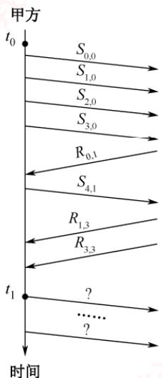

<em>(a) </em>

  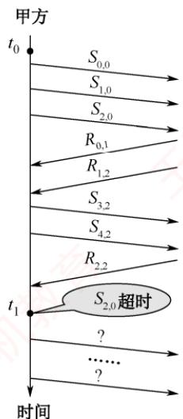

<em>(b) </em>

### 3.4.4 答案与解析

#### 一、单项选择题

**01. A**

　　停止-等待协议采用1比特给数据帧编号，发送窗口和接收窗口的尺寸都为1，选项A正确。仅在收到当前窗口内的数据帧后，接收窗口才能向后移动，因此一定是按序接收的。停止-等待协议的信道利用率 $=$ 一个数据帧的发送时延÷(一个数据帧的发送时延 $+\mathrm{RTT}+$ 一个确认帧的发送时延)，其中分子一定是小于分母的，所以信道利用率不可能达到 $100\%$ ，当RTT较大时，会降低信道利用率，因此停止-等待协议适合RTT较小的信道。

**02. B**

　　根据信道利用率的计算公式，当数据传输速率很高时，数据帧的发送时间很短；当源主机和目的主机的距离很远时，往返时延很大，此时的信道利用率很低。

**03. D**

　　在停止-等待协议中，发送方设置了计时器，在发送一个帧后，发送方等待确认，若在计时器计满时仍未收到确认，则再次发送相同的帧，以免陷入永久的等待。

**04. A**

　　在停止-等待协议中，使用1位来编号即可。若连续出现相同序号的数据帧，则表明发送方进行了超时重传；若连续出现相同序号的确认帧，则表明接收方收到了重复帧。

**05. D**

　　设 C 为数据传输速率，L 为帧长，R 为单程传播时延。停止-等待协议的信道最大利用率为 $(L/C)/(L/C+2R)=L/(L+2RC)=L/(L+2\times30\mathrm{ms}\times4\mathrm{kb/s})=80\%$ ，得出 L=960bit。

**06. D**

　　本题忽略确认帧的发送时延，所以信道利用率 = 数据帧的发送时延/(数据帧的发送时延 + 往返时延) = 0.4，解得数据帧的发送时延为 4/30s，所以数据帧的长度为 $6kb/s \times 4/30s = 800bit$ 。

**07. B**

　　停止-等待协议使用确认和重传机制，发送方每发送一个帧，就要停下来等待接收方发回的确认帧，收到确认帧后才能发送下一帧，经过超时时间后未收到ACK帧则自动重传。

**08. D**

　　连续 ARQ 协议分为 GBN 协议和 SR 协议。SR 的接收窗口大于 1，接收方可以先收下失序但序号仍落在接收窗口内的那些数据帧。GBN 的接收窗口等于 1，接收方必须按序接收数据帧。

**09. A**

　　发送方收到 5 号帧的确认后，表示 5 号帧及之前的所有帧都被接收方正确接收，因此滑动窗口右移后，新窗口内的第一个帧就是 6 号帧，又因为此时可发送的数据帧数为 6，因此发送窗口的总大小为 7。在 GBN 协议中，若采用 n 位给帧编号，则发送窗口大小为 $2^{n}-1$ ，因此 n=3。

**10. B**

　　后退 $N$ 帧协议采用累积确认，确认的最后一个帧是4号帧，表示4号帧及4号帧之前的数据帧都已被正确接收，所以只需重传5号帧和6号帧这两个数据帧。

**11. C**

　　对于滑动窗口协议，序列号个数要大于或等于窗口数（发送窗口大小 + 接收窗口大小），所以在后退 N 帧的协议中，序列号个数不小于 “发送窗口大小 + 1”，题中发送窗口大小是 32，那么序列号个数最少应该是 33 个。所以最少需要 6 位的序列号才能达到要求。

**12. C**

　　接收窗口整体向前移动时，新窗口中的序列号和旧窗口的序列号产生重叠，致使接收方无法区别发送方发送的帧是重发帧还是新帧，因此在后退 N 帧的 ARQ 协议中，发送窗口 $W_{T} \leqslant 2^{n} - 1$ 。本题中 n = 7，因此发送窗口的最大长度是 127。

**13. B**

　　在选择重传协议中，若用 n 比特对帧编号，则发送窗口和接收窗口的大小关系为 $1 < W_{R} \leqslant W_{T}$ ，还需满足 $W_{R} + W_{T} \leqslant 2^{n}$ ，所以接收窗口的最大尺寸不超过序号范围的一半，即 $W_{R} \leqslant 2^{n-1}$ 。

**14. B**

　　在连续 ARQ 协议中，发送窗口大小 $\leqslant$ 窗口总数 -1。例如，窗口总数为 8，编号为 0～7，假设这 8 个帧都已发出，下一轮又发出编号 0～7 的 8 个帧，接收方将无法判断第二轮发的 8 个帧到底是重传帧还是新帧，因为它们的序号完全相同。另一方面，对于后退 N 帧协议，发送窗口大小可以等于窗口总数 -1，因为它的接收窗口大小为 1，所有的帧保证按序接收。因此对于窗口大小为 n 的滑动窗口，其发送窗口大小最大为 n-1，即最多可以有 n-1 帧已发送但没有确认。

**15. C**

　　在选择重传协议中, 若用 n 比特对帧编号, 则发送窗口和接收窗口的大小关系为 $1 < W_{R} \leqslant W_{T}$ , 此外, 还要满足 $W_{R} + W_{T} \leqslant 2^{n}$ , 因此发送窗口的最大尺寸为 $2^{4} - 7 = 16 - 7 = 9$ 。

**16. D**

　　本题未直接告知使用的是选择重传协议，而是通过间接方式给出的。题目称无序接收的滑动窗口协议，表示接收窗口大于1，所以使用的是选择重传协议，接收窗口最大尺寸为 $2^{n-1}$ 。

**17. D**

　　无论采用哪种滑动窗口协议，信道利用率的计算方法都是：发送窗口内所有数据帧的发送时延/（一个数据帧的发送时延 + RTT + 一个确认帧的发送时延）。分母记为 T = 一个数据帧的发送时延 + RTT + 一个确认帧的发送时延，其中数据帧或确认帧的发送时延 = 2000B/(20kb/s) = 800ms，RTT = 1400ms，即 $T = 800 + 800 + 1400 = 3000ms$ 。假设发送窗口大小为 x，则 800x/3000 > 0.8，即发送窗口大小 x 要大于 3，GBN 协议的发送窗口为 $2^{3} - 1 = 7$ ，满足要求；SR 协议的发送窗口为 $2^{2} = 4$ ，也满足要求。因此，A 和 B 之间可以采用 GBN 协议或 SR 协议。

**18. C**

　　实现流量控制的常用方法是滑动窗口协议，它让接收方把自己的接收窗口大小反馈给发送方，以调节发送方的发送窗口大小，避免发送方因发送速度过快而导致接收方来不及接收。

**19. C**

　　为使信道利用率最高（100%），要让发送方在一个发送周期内持续发送帧，不能出现发送窗口内的帧发完但还未收到第一个帧的确认帧的情况。发送周期 = 发送一个数据帧的时间 + 往返时延 + 发送一个确认帧的时间，发送一个数据帧或确认帧的时间均为 $128B \div 16kb/s = 64ms$ ，发送周期 $= 64ms + 250ms \times 2 + 64ms = 628ms$ 。为保证发送方持续发送帧，在一个发送周期内至少要发送的帧数为 $628ms/64ms \approx 10$ ，即发送窗口大小至少为 10，所以帧序号至少采用 4 比特。

**20. D**

　　信道利用率 = 发送周期内用于发送数据帧的时间/发送周期，其中发送周期 = 发送一个数据帧的时间 + 往返时延 + 发送一个确认帧的时间。停止-等待协议的发送窗口为 1，不可能达到 100% 的信道利用率；只要发送窗口够大，后退 N 帧协议和选择重传协议都有可能达到 100% 的信道利用率。

**21. C**

　　在选择重传协议中，接收方对正确收到的每个数据帧单独进行确认，不要求收到的数据帧是有序的。依题意，接收方已正确收到0～3号和5号数据帧，但不确定4号数据帧是否收到。因为没有发生超时，发送方不进行重传，所以接收该确认帧并继续发送剩下的数据帧。

**22. C**

　　在 GBN 协议中，当接收方检测到某帧出错时，会简单地丢弃该帧及所有的后续帧，发送方超时后需重传该数据帧及所有的后续帧。注意，在 GBN 协议中，接收方一般采用累积确认的方式，即接收方对按序到达的最后一个分组发送确认，因此本题中收到 3 号帧的确认就表示编号为 0、1、2、3 的帧已接收，而此时发送方未收到 1 号帧的确认只能代表确认帧在返回的过程中丢失，而不代表 1 号帧未到达接收方。因此需要重传的帧为编号是 4、5、6、7 的帧。

**23. B**

　　在选择重传协议中，接收方逐个确认正确接收的分组，不管接收到的分组是否有序，只要正确接收就发送选择 ACK 分组进行确认，因此 ACK 分组不再具有累积确认的作用。对于这一点，要特别注意与 GBN 协议的区别。此题中只收到 1 号帧的确认，0、2 号帧超时，因为对 1 号帧的确认不具有累积确认的作用，所以发送方认为接收方未收到 0、2 号帧，于是重传这两帧。

**24. B**

　　连续 ARQ 的信道利用率:

$$
\frac {\text {发送窗口大小} \times \text {数据帧长/数据传输速率}}{(\text {数据帧长/数据传输速率}) \times 2 + \mathrm{RTT}} = \frac {\text {发送窗口大小/数据传输速率}}{2 / \text {数据传输速率} + \mathrm{RTT/数据帧长}}
$$

　　从上述公式可知，数据帧长越大，信道利用率就越高。数据帧长是不确定的，范围为 $128\sim$ 512B，在计算最小窗口数时，为了保证无论数据帧长如何变化，信道利用率都能达到 $100\%$ ，应以128B的帧长计算。因此，当最短的帧长都能达到 $100\%$ 的信道利用率时，发送更长的数据帧也都能达到 $100\%$ 的信道利用率。若以512B的帧长计算，则求得的最小窗口数在128B的帧长下，达不到 $100\%$ 的信道利用率。首先计算出发送一个帧的时间： $128\times 8 / (16\times 10^{3}) = 64\mathrm{ms}$ ；发送一个帧到收到确认帧为止的总时间： $64 + 270\times 2 + 64 = 668\mathrm{ms}$ ；这段时间总共可发送 $668 / 64 = 10.4$ 帧，即发送窗口 $\geqslant 11$ ，而接收窗口 $= 1$ ，所以至少需要用4位比特进行编号。

**25. C**

　　考虑制约甲方的数据传输速率的因素。首先，信道带宽能直接制约数据的传输速率，传输速率一定是小于或等于信道带宽的。其次，因为甲方和乙方之间采用后退 $N$ 帧协议传输数据，要考虑发送一个数据到接收到它的确认之前，最多能发送多少数据，甲方的最大传输速率受这两个条件的约束，所以甲方的最大传输速率是这两个值中的小者。甲方的发送窗口尺寸为1000，即收到第一个数据的确认前，最多能发送1000个数据帧，即 $1000 \times 1000\mathrm{B} = 1\mathrm{MB}$ 的内容，而从发送第一个帧到接收到它的确认的时间是一个帧的发送时间加上往返时间，即 $1000\mathrm{B} \div 100\mathrm{Mb/s} + 50\mathrm{ms} + 50\mathrm{ms} = 0.10008\mathrm{s}$ ，此时的最大传输速率为 $1\mathrm{MB}/0.10008\mathrm{s} \approx 10\mathrm{MB/s} = 80\mathrm{Mb/s}$ 。信道带宽为 $100\mathrm{Mb/s}$ ，因此答案为 $\min(80\mathrm{Mb/s}, 100\mathrm{Mb/s}) = 80\mathrm{Mb/s}$ 。

**26. B**

　　按发送周期思考，从开始发送帧到收到第一个确认帧为止，用时为 T = 第一个帧的发送时延 + 第一个帧的传播时延 + 确认帧的发送时延 + 确认帧的传播时延，这里忽略确认帧的发送时延。因此 $T = 1000B \div 128kb/s + RTT = 0.5625s$ ，接着计算在 T 内需要发送多少数据才能满足利用率不小于 80%。设数据大小为 L 字节，则 $(L \div 128kb/s)/T \geqslant 0.8$ ，得到 $L \geqslant 7200B$ ，即在一个发送周期内至少要发 7.2 个帧才能满足要求，设需要编号的比特数为 n，则 $2^{n} - 1 \geqslant 7.2$ ，n 至少为 4。

**27. D**

　　信道利用率 $=$ 传输帧的有效时间/传输帧的周期。假设帧的长度为 $x$ 比特。对于有效时间，应该用帧的大小除以数据传输速率，即 $x \div 3\mathrm{kb / s}$ 。对于帧的传输周期，应包含4部分：帧在发送方的发送时延、帧从发送方到接收方的单程传播时延、确认帧在接收方的发送时延、确认帧从接收方到发送方的单程传播时延。这4个时延中，因为题目中说“忽略确认帧的传输时延”，所以不计算确认帧的传输时延（传输时延也称发送时延，注意与传播时延区分）。所以帧的传输周期由三部分组成：首先是帧在发送方的发送时延 $x \div 3\mathrm{kb / s}$ ，其次是帧从发送方到接收方的单程传播时延 $200\mathrm{ms}$ ，最后是确认帧从接收方到发送方的单程传播时延 $200\mathrm{ms}$ ，三者相加得周期为 $x \div 3\mathrm{kb / s} + 400\mathrm{ms}$ 。代入信道利用率的公式得 $x = 800\mathrm{bit}$ 。

**28. B**

　　从滑动窗口的概念来看，停止-等待协议：发送窗口大小=1，接收窗口大小=1；后退N帧协议：发送窗口大小>1，接收窗口大小=1；选择重传协议：发送窗口大小>1，接收窗口大小>1。在选择重传协议中，还需满足：接收窗口大小 $\leqslant$ 发送窗口大小；发送窗口大小+接收窗口大小 $\leqslant2^{n}$ 。根据以上规则，采用3比特编号，发送窗口大小为5，接收窗口大小 $\leqslant3$ 。

**29. D**

　　发送数据帧和确认帧的时间均为 $t=1000\times8b\div10kb/s=800ms$ 。

　　发送周期为 $T = 800 \, ms + 200 \, ms + 800 \, ms + 200 \, ms = 2000 \, ms$ 。

　　信道利用率为 $t/T \times 100\% = 800/2000 = 40\%$ .

**30. B**

　　信道利用率 $U = nT_{\mathrm{D}} / T$ ，其中 $n$ 是发送窗口的大小， $T_{\mathrm{D}}$ 是发送一个数据帧的时间， $T$ 是一个数据帧的发送周期。在 $T_{\mathrm{D}}$ 和 $T$ 确定的情况下， $n$ 越大，信道利用率就越大。设帧序号的比特数为 $k$ ，则停止-等待协议的发送窗口 $W_{\mathrm{T1}} = 1$ ；GBN 协议的发送窗口 $W_{\mathrm{T2}} = 2^k - 1$ ；SR 协议的发送窗口 $W_{\mathrm{T3}} \leqslant 2^k - 1$ ，通常取 $2^{k-1}$ ， $W_{\mathrm{T1}} \leqslant W_{\mathrm{T3}} \leqslant W_{\mathrm{T2}}$ ，因此 $U_1 \leqslant U_3 \leqslant U_2$ 。

**31. D**

　　数据帧编号的范围是 0～7，发送窗口与接收窗口大小相等且均为最大值，因此发送窗口大小 = 接收窗口大小 $=2^{3-1}=4$ 。甲发送 F0、F1、F2 和 F3 四个数据帧后，收到 F0 的确认，因此在 $t_{1}$ 时刻，发送窗口向右滑动，可以继续发送 F4，之后收到 F2 的确认，但由于 F1 丢失，甲无法收到 F1 的确认，发送窗口无法继续向右滑动，直到 $t_{2}$ 时刻，F1 超时，重传 F1，选项 D 正确。

  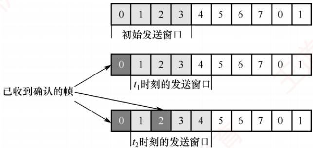

#### 二、综合应用题

**01. 【解答】**

　　对于选择重传协议，接收窗口和发送窗口的尺寸需满足：接收窗口尺寸 $W_{R} +$ 发送窗口尺寸 $W_{T} \leqslant 2^{n}$ ，而题中给出的数据是 $W_{R} + W_{T} = 9 \geqslant 2^{3}$ ，所以是无法正常工作的。举例如下：

　　发送方：01234567012345670

　　接收方：01234567012345670

　　发送方发送 0～5 号共 6 个数据帧时，因发送窗口已满，发送暂停。接收方收到所有数据帧，对每个帧都发送确认帧，并期待后面的 6、7、0 号帧。若所有的确认帧都未到达发送方，经过发送方计时器控制的超时时间后，发送方再次发送之前的 6 个数据帧，而接收方收到 0 号帧后，无法判断是新的数据帧还是重传的旧的数据帧。

**02. 【解答】**

　　设数据帧长为 L。在停止-等待协议中，发送数据帧的时间为 L/B，发送完数据帧后等待确认的时间为 2R。要使协议的效率至少为 50%，要求信道利用率 U 至少为 50%，则

$$
\mathrm{信道利用率} U = \frac {\mathrm{数据发送时延}}{\mathrm{数据发送时延} + \mathrm{往返时延}} = \frac {L / B}{L / B + 2 R} \geqslant 50
$$

　　解得 $L \geqslant 2RB = 2 \times 5000 \times 0.03bit = 300bit$ 。

　　因此，当帧长大于或等于 300bit 时，停止-等待协议的效率至少为 50%。

**03. 【解答】**

RTT=250×2=500ms=0.5s。

　　一个帧的发送时间等于 $2000 \, bit \div 100 \, kb/s = 20 \times 10^{-3} \, s = 0.02 \, s$ 。

　　一个帧发送完后经过一个单程时延到达接收方，再经过一个单程时延发送方收到确认帧，从而可以继续发送，因此要使传输效率最大，就要让发送方继续地发送帧。设发送窗口等于 x，则

$$
0. 0 2 \mathrm{s} \times x = 0. 0 2 \mathrm{s} + \mathrm{RTT} = 0. 5 2 \mathrm{s}
$$

　　解得 x=26，即发送窗口取 26 即可。因为 16 < 26 < 32，所以帧序号应为 5 位。在使用连续 ARQ 的情况下，发送窗口的最大值是 31，大于 26，可以不间断地发送帧，此时信道利用率是 100%。

**04. 【解答】**

　　最大信道利用率即每个传输周期内每个协议可发送的最大帧数。由题意，数据帧的长度为1kbit，信道的数据传输速率为50kb/s，因此信道的发送时延为 $1/50s=0.02s$ ，另外信道端到端的传播时延=0.27s。本题中的确认帧是捎带的（通过数据帧来传送），因此每个数据帧的传输周期为 $(0.02+0.27+0.02+0.27)s=0.58s$ ，

1）在停止-等待协议中，发送方每发送一帧，都要等待接收方的应答信号，之后才能发送下一帧；接收方每接收一帧，都要反馈一个应答信号，表示可接收下一帧。其中用于发送数据帧的时间为0.02s。因此，信道的最大利用率为 $0.02/0.58=3.4\%$ 。

2）在后退 N 帧协议中，接收窗口尺寸为 1，若采用 n 比特对帧编号，则其发送窗口的尺寸 W 满足 $1 < W \leqslant 2^{n} - 1$ 。发送方可以连续再发送若干数据帧，直到发送窗口内的数据帧都发送完毕。若收到接收方的确认帧，则可以继续发送。若某个帧出错，则接收方只是简单地丢弃该帧及所有的后续帧，发送方超时后，需要重传该数据帧及所有的后续数据帧。根据题目条件，在达到最大传输速率的情况下，发送窗口的大小应为 $2^{n} - 1 = 7$ ，此时在第一帧的数据传输周期 0.58s 内，实际连续发送了 7 帧（考虑极限情况，0.58s 后接收方只收到 0 号帧的确认，此时又可以发出一个新帧，这样依次下去，取极限即是每个传输周期 0.58s 内发送了 7 帧），因此此时的最大信道利用率为 $7 \times 0.02 / 0.58 = 24.1\%$ 。

3）选择重传协议的接收窗口尺寸和发送窗口尺寸都大于1，可以一次发送或接收多个帧。若采用 $n$ 比特对帧编号，则窗口尺寸应满足：接收窗口尺寸 $+$ 发送窗口尺寸 $\leqslant 2^n$ ，当发送窗口与接收窗口尺寸相等时，应有接收窗口尺寸 $\leqslant 2^{n - 1}$ 且发送窗口尺寸 $\leqslant 2^{n - 1}$ 。发送方可以连续发送若干数据帧，直到发送窗口内的数据帧都发送完毕。若收到接收方的确认帧，则可以继续发送。若某帧出错，则接收方只是简单地丢弃该帧，发送方超时后需重传该数据帧。

　　和 2）问中的情况类似，唯一不同的是为达到最大信道利用率，发送窗口大小应为 $2^{n-1}=4$ ，因此，此时的最大信道利用率为 $4\times0.02/0.58=13.8\%$ .

**05. 【解答】**

　　对于停止-等待协议，有

$$
\begin{array}{r l} \text {实际数据传输速率} & = \frac {N}{2 \times (T + D / S) + \frac {F + A}{R}} = \frac {4 5 0 \mathrm{bit}}{2 \times \left(2 \mu \mathrm{s} + \frac {2 0 0 \mathrm{m}}{2 0 0 \mathrm{m} / \mu \mathrm{s}}\right) + \frac {5 0 0 \mathrm{bit} + 8 0 \mathrm{bit}}{1 6 \mathrm{bit} / \mu \mathrm{s}}} \\ & \approx 1 0. 6 5 \mathrm{bit} / \mu \mathrm{s} = 1 0. 6 5 \mathrm{Mb} / \mathrm{s} \end{array}
$$

**06. 【解答】**

　　要注意题中的单位。数据帧的长度为 512B，即 $512 \times 8bit = 4.096kbit$ ，一个数据帧的发送时延为 $4.096/64 = 0.064s$ 。因此一个发送周期为 $0.064 + 2 \times 0.27 = 0.604s$ 。

　　当发送窗口为 1 时，甲方的实际数据传输速率为 $1 \times 4.096 / 0.604 = 6.8 \, kb/s$ 。

　　当发送窗口为7时，甲方的实际数据传输速率为 $7\times 4.096 / 0.604 = 47.5\mathrm{kb / s}$

　　当发送窗口大于 0.604/0.064，即大于或等于 10 时，就能保证甲方在信道上持续发送数据。因此发送窗口为 17 和 117 时，信道的利用率达到 100%，甲方的实际数据传输速率为 64kb/s。

**07. 【解答】**

1） $t_{0}$ 时刻到 $t_{1}$ 时刻期间，甲方可以断定乙方已正确接收 3 个数据帧，分别是 $S_{0,0}$ 、 $S_{1,0}$ 、 $S_{2,0}$ 。 $R_{3,3}$ 说明乙方发送的数据帧序号是 3，即希望甲方发送序号 3 的数据帧，说明乙方已经接收序号为 0～2 的数据帧（注意，这个确认序号是期望接收对方的下一帧的序号）。

2）从 $t_{1}$ 时刻起，甲方最多还可以发送 5 个数据帧，其中第一帧是 $S_{5,2}$ ，最后一帧是 $S_{1,2}$ 。发送序号 3 位，有 8 个序号，在 GBN 协议中，发送窗口 +1 ≤ 序号总数，所以这里发送窗口取最大值 7。此时已发送 $S_{3,0}$ 和 $S_{4,1}$ ，所以最多还可以发送 5 帧（数据帧以序号 01234567, 01234567, … 的规律发送，但初始时只有 0123456 落在发送窗口内，之后随着发送方不断收到确认，发送窗口也不断向前滑动）。

3）甲方需要重发3个数据帧，重发的第一个帧是 $S_{2,3}$ 。在GBN协议中，发送方发送N帧后，检测出错，则需要发送出错帧及其之后的帧。 $S_{2,0}$ 超时，所以重发的第一帧是 $S_{2}$ 。已收到乙方的 $R_{2}$ 帧，所以帧号应为3。

4）甲方可以达到的最大信道利用率 U 是

$$
\frac {\text {发送窗口大小} \times \frac {\text {帧长}}{\text {数据传输速率}}}{\mathrm{RTT} + \frac {\text {帧长}}{\text {数据传输速率}} \times 2} = \frac {7 \times \frac {8 \times 1000}{100 \times 10 ^ {6}}}{0 . 9 6 \times 1 0 ^ {- 3} + \frac {8 \times 1000}{100 \times 1 0 ^ {6}} \times 2} \times 100 \% = 50 \%
$$

　　信道利用率 $U =$ 发送数据帧的时间/从开始发送第一个数据帧到收到第一个确认帧的时间 $= NT_{\mathrm{d}} / (T_{\mathrm{d}} + \mathrm{RTT} + T_{\mathrm{a}})$ 。其中， $N$ 取发送窗口的最大值， $T_{\mathrm{d}}$ 是发送一个数据帧的时间，RTT是往返时间， $T_{\mathrm{a}}$ 是发送一个确认帧的时间。这里采用捎带确认， $T_{\mathrm{d}} = T_{\mathrm{a}}$ 。

## 3.5 介质访问控制

　　介质访问控制的主要任务是协调共享同一信道的各节点的传输行为，以避免彼此之间的信号冲突。如图 3.15 所示，在广播信道中，节点 A、B、C、D 和 E 共享同一信道。若 A 与 C、B 与 D 同时通信且未加控制，则可能因信号干扰而通信失败。用于决定广播信道资源分配的协议属于数据链路层的介质访问控制（Medium Access Control，MAC）子层。

　　常见的介质访问控制方法包括：信道划分介质访问控制、随机访问介质访问控制和轮询访问介质访问控制。其中，前者采用静态划分信道的方式，后两者则属于动态分配信道的方法。

  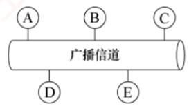

<em>图 3.15 广播信道的通信方式</em>

### 3.5.1 信道划分介质访问控制

　　信道划分介质访问控制通过复用技术，将同一传输介质上的多个设备通信隔离开来，合理分配时域或频域资源。所谓复用，是指在发送端将多个发送方的信号组合到一条物理信道上传输，在接收端再将复用信号分离，并交付给对应的接收方，如图3.16所示。当传输介质的带宽超过单个信号所需带宽时，复用技术还能有效提高传输系统的利用率。

  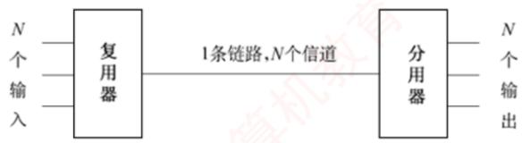

<em>图 3.16 复用原理示意图</em>

　　信道划分的实质是通过分时、分频、分码等方式，将一个广播信道在逻辑上划分为若干互不干扰的子信道，从而实现多个点对点通信。信道划分介质访问控制主要包括以下四种方式。

#### 1. 时分复用（TDM）

> **考点追踪：** 时分复用的概念（2013）

　　时分复用（Time Division Multiplexing，TDM）将信道的传输时间划分为等长的时间片，构成一个 TDM 帧。每个用户在每个 TDM 帧中占用固定序号的时隙，且该时隙周期性出现（周期即为 TDM 帧长度）。所有用户在不同时间共享相同的信道资源，如图 3.17 所示。需注意，TDM 帧是一段固定长度的时间间隔，与数据链路层的“帧”概念不同。

  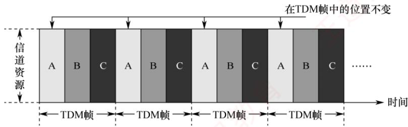

<em>图 3.17 时分复用的原理示意图</em>

　　从某一时刻看，信道上传送的是某对用户之间的信号；从一段时间看，则是按时间分割的复用信号。由于 TDM 按固定次序分配时隙，当某用户暂无数据发送时，其分配的时隙仍被保留，无法被其他用户利用，因此信道利用率较低。统计时分复用（Statistic TDM，STDM）也称异步时分复用，是对 TDM 的改进。STDM 不固定分配时隙，而是按需动态分配：仅当用户有数据要发送时，才为其分配 STDM 帧中的时隙，从而显著提高线路利用率。例如，假设线路数据速率为 6000b/s，3 个用户的平均速率均为 2000b/s。采用 TDM 时，每个用户固定分配 2000b/s 的带宽；而在 STDM 下，各用户可动态共享全部带宽。当其他用户无数据发送时，某一用户可利用接近线路总速率（此处为 6000b/s）的带宽进行突发传输，进而显著提高线路的平均利用率。

#### 2. 频分复用（FDM）

> **考点追踪：** 频分复用的概念（2013）

　　频分复用（Frequency Division Multiplexing，FDM）将信道的总频带划分为多个子频带，每个子频带作为一个独立子信道，供一对用户通信使用，如图 3.18 所示。所有用户在同一时间占用不同的频带资源。各子信道分配的带宽可以不同，但总和不得超过信道的总带宽。为防止相邻子信道间相互干扰，实际应用中通常还需在它们之间设置“隔离频带”。

  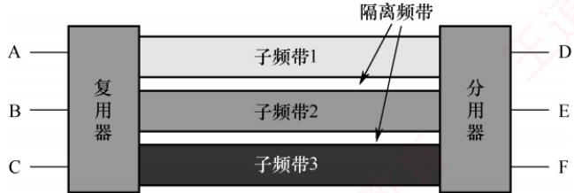

<em>图 3.18 频分复用的原理示意图</em>

　　频分复用的优点在于能充分利用传输介质的带宽，系统效率较高，且实现相对简单。

#### 3. 波分复用（WDM）

　　波分复用（Wavelength Division Multiplexing，WDM）即光的频分复用。它在一根光纤中同时传输多种不同波长的光信号。由于波长不同，各路光信号互不干扰，接收端通过光分用器将各波长分离出来。由于光波位于电磁频谱的高频段，具有极大的带宽，因此可支持多路的波分复用。

#### 4. 码分复用（CDM）

> **考点追踪：** 码分复用的概念（2013）

　　码分复用（Code Division Multiplexing，CDM）是一种采用不同编码来区分各路原始信号的复用方式。与 FDM 和 TDM 不同，CDM 既共享信道的频率，又共享时间。

　　实际上，更常用的名词是码分多址（Code Division Multiple Access，CDMA），其原理是将每个比特时间进一步划分为 $m$ 个短的时间槽，称为码片（Chip），通常 $m$ 的值为64或128，为了简化说明，下例中设 $m = 8$ 。每个站点指派一个唯一的 $m$ 位码片序列。发送1时，站点发送其码片序列；发送0时，站点发送该码片序列的反码。当两个或多个站点同时发送时，各路数据在信道中线性相加。为了从信道中分离出各路信号，各个站点的码片序列应相互正交。

　　简单理解就是，A站向C站发出的信号用一个向量表示，B站向C站发出的信号用另一个向量表示，这两个向量要求相互正交。向量中的分量即所谓的码片。

　　下面举例说明 CDMA 的原理。

　　令向量 S 表示 A 站的码片向量，T 表示 B 站的码片向量。假设 A 站的码片序列被指派为 00011011，则 A 站发送 00011011 表示发送比特 1，发送 11100100 表示发送比特 0。为便于计算，将码片中的 0 写为 -1，1 写为 +1，因此 A 站的码片序列是 $(-1-1-1+1+1-1+1+1)$ 。

　　不同站点的码片序列相互正交，即向量 S 和 T 的规格化内积为 0:

$$
\boldsymbol {S} \cdot \boldsymbol {T} = \frac {1}{m} \sum_ {i = 1} ^ {m} S _ {i} T _ {i} = 0
$$

　　任何站点的码片向量和该码片向量自身的规格化内积都是 1:

$$
\boldsymbol {S} \cdot \boldsymbol {S} = \frac {1}{m} \sum_ {i = 1} ^ {m} S _ {i} S _ {i} = \frac {1}{m} \sum_ {i = 1} ^ {m} S _ {i} ^ {2} = \frac {1}{m} \sum_ {i = 1} ^ {m} (\pm 1) ^ {2} = 1
$$

　　任何站点的码片向量和该码片反码的向量的规格化内积都是-1:

$$
\boldsymbol {S} \cdot \overline {{\boldsymbol {S}}} = \frac {1}{m} \sum_ {i = 1} ^ {m} S _ {i} \overline {{S _ {i}}} = - \frac {1}{m} \sum_ {i = 1} ^ {m} S _ {i} ^ {2} = - 1
$$

　　令向量 T 为 $(-1-1+1-1+1+1+1-1)$ 。

　　当 A 站向 C 站发送数据 1 时，就发送了向量 $(-1 - 1 - 1 + 1 + 1 - 1 + 1 + 1)$ 。

　　当 B 站向 C 站发送数据 0 时，就发送了向量 $(+1 + 1 - 1 + 1 - 1 - 1 - 1 + 1)$ 。

　　两个向量在公共信道上叠加，实际上是线性相加，得到

$$
\boldsymbol {S} + \overline {{\boldsymbol {T}}} = (0 0 - 2 2 0 - 2 0 2)
$$

> **考点追踪：** CDMA中的数据恢复计算（2014）

　　到达 C 站后，进行数据分离。若要提取来自 A 站的数据，则 C 站需知道 A 站的码片向量 S，并计算 S 与 $S + \overline{T}$ 的规格化内积。根据叠加原理，其他站点的信号都在内积结果中被过滤掉，内积的相关项都是 0，而保留 A 站发送的信号，得到

$$
\boldsymbol {S} \cdot (\boldsymbol {S} + \overline {{\boldsymbol {T}}}) = 1
$$

　　因此，A 站发出的数据是 1。同理，若要提取来自 B 站的数据，则

$$
\boldsymbol {T} \cdot (\boldsymbol {S} + \overline {{\boldsymbol {T}}}) = - 1
$$

　　因此，从 B 站发送过来的信号向量是一个反码向量，代表 0。

　　规格化内积是线性代数的内容，它在计算两个向量的内积后，再除以向量的分量个数。

　　下面举一个直观的例子来理解频分复用、时分复用和码分复用。

　　假设 A 站要向 C 站运送黄豆，B 站要向 C 站运送绿豆，A 站、B 站与 C 站之间有一条公共道路，可类比为广播信道。在频分复用方式下，公共道路被划分为两个车道，分别供 A 站到 C 站、B 站到 C 站的车通行，两类车可以同时通行，但都只使用了一半的道路，因此频分复用（波分复用也类似）共享时间而不共享空间。在时分复用方式下，先让 A 站到 C 站的车走一趟，再让 B 站到 C 站的车走一趟，两类车交替使用道路，因此时分复用共享空间，但不共享时间。码分复用与另外两种信道划分方式极为不同，在这种方式下，黄豆与绿豆放在同一辆车上运送，到达 C 站后，由 C 站负责把车上的黄豆和绿豆分开，因此码分复用既共享空间，又共享时间。

　　码分复用技术具有频谱利用率高、抗干扰能力强、保密性好、语音质量好等优点，还可以减少投资及降低运行成本，广泛应用于无线通信系统，特别是移动通信系统。

### 3.5.2 随机访问介质访问控制

> **考点追踪：** 信道划分与随机访问介质访问控制的特点（2014）

　　在随机访问协议中，不采用集中控制方式来协调各站点的发送次序，而是允许所有用户根据自身意愿随机发送信息，并可占用信道的全部带宽。在总线形网络中，当两个或多个用户同时发送信息时，就会产生冲突（也称碰撞），导致所有冲突用户的发送均以失败告终。为解决此类冲突，每个用户需按照特定规则反复重传帧，直至该帧无冲突地成功传输。随机访问介质访问控制的核心思想是：通过争用获得信道使用权，胜者方可发送数据。

　　可见，若采用信道划分机制，节点之间的通信要么共享时间，要么共享空间，要么两者兼有；而若采用随机访问控制机制，则节点在发送时既不预留时间，也不独占频段。因此，随机介质访问控制实质上是将广播信道动态地转化为点到点信道的机制。

#### 1. ALOHA 协议

　　ALOHA 协议分为纯 ALOHA 协议和时隙 ALOHA 协议两种。

##### （1） 纯 ALOHA 协议

　　纯 ALOHA 协议的基本思想：当总线形网络中的任一站点需要发送数据时，可立即发送，无须事先检测信道状态。若在一段时间内未收到确认，则认为传输过程中发生了冲突。此时，该站点需等待一段随机时间后重传，直至发送成功。

　　图3.19展示了纯ALOHA协议的工作原理。假设所有帧长度固定，帧长不用比特数表示，而用发送该帧所需的时间表示，图中以 $T_{0}$ 表示这一时间。

  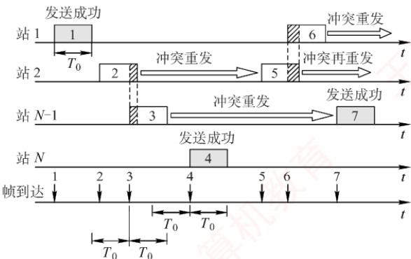

<em>图 3.19 一个纯 ALOHA 协议的工作原理</em>

　　在图 3.19 的示例中，站 1 发送帧 1 时，其他站点均未发送数据，因此帧 1 成功传输。但随后站 2 和站 N-1 发送的帧 2 与帧 3 在时间上部分重叠，发生冲突。发生冲突的各站必须重传，但不能立即重传（否则会再次冲突），而是等待一段随机时间后再尝试。若重传仍冲突，则重复此过程，直至成功。图中其他帧的发送情况为：帧 4 成功，帧 5 与帧 6 发生冲突。

　　由于冲突概率较高，该协议的吞吐量很低。为克服这一缺点，提出了时隙 ALOHA 协议。

##### （2） 时隙 ALOHA 协议

　　时隙 ALOHA 协议将时间划分为等长的时隙（Slot），并要求所有站点同步时钟。站点只能在每个时隙的起始时刻发送帧，且一帧的发送时间必须小于或等于一个时隙长度。这种约束减少了发送的随意性，从而降低了冲突概率，提高了信道利用率。

　　图 3.20 展示了两个站点的时隙 ALOHA 协议工作原理。每个帧到达后，通常需在缓存中等待不足一个时隙的时间，才能在下一个时隙开始时发送。若在一个时隙内有两个或更多帧待发，则它们将在下一可用时隙同时发送，导致冲突。冲突后的重传策略与纯 ALOHA 协议类似。

  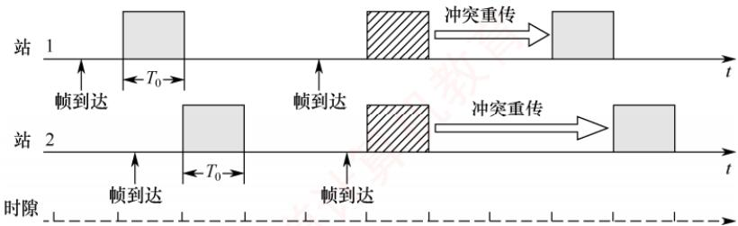

<em>图 3.20 两个站的时隙 ALOHA 协议的工作原理</em>

#### 2. CSMA 协议

> **考点追踪：** 基本 CSMA 协议的概念（2013）

　　ALOHA 协议网络的冲突概率较高。若每个站点在发送前先监听信道，仅在信道空闲时才发送，则可显著降低冲突概率，提高信道利用率。载波监听多路访问（Carrier Sense Multiple Access, CSMA）协议正是基于这一思想，在 ALOHA 协议基础上引入了载波监听机制。

　　根据监听策略及信道忙时的处理方式不同，CSMA 协议可分为以下三种类型。

##### （1） 1-坚持CSMA协议

　　1-坚持CSMA协议的基本思想：站点欲发送数据时，先监听信道；若信道空闲，则立即发送；若信道忙，则持续监听，直至信道变为空闲。“1-坚持”中的“1”表示信道空闲时，以概率1立即发送，“坚持”指信道忙时持续监听。

##### （2） 非坚持 CSMA 协议

　　非坚持 CSMA 协议的基本思想：站点欲发送数据时，先监听信道；若信道空闲，则立即发送；若信道忙，则不再监听，而是等待一段随机时间后重新尝试监听。该策略避免了多个站点在信道刚空闲时同时发送而导致的冲突，但因随机等待增加了平均传输时延。

##### （3） p-坚持 CSMA 协议

　　p-坚持 CSMA 协议适用于时隙化信道，基本思想：站点在时隙开始时监听信道；若信道忙，则等到下一时隙再监听；若信道空闲，则以概率 p 发送数据，以概率 1-p 推迟到下一时隙再尝试。

　　该机制通过概率延迟，降低了多个站点同时发送的冲突概率；通过持续监听（而非随机退避），又避免了非坚持CSMA协议的过长延迟。因此， $p-$ 坚持CSMA协议是1-坚持与非坚持CSMA协议的折中。

　　三种不同类型的 CSMA 协议比较如表 3.1 所示。

　　表 3.1 三种不同类型的 CSMA 协议比较

<table><tr><td>信道状态</td><td>1-坚持</td><td>非坚持</td><td>p-坚持</td></tr><tr><td>空闲</td><td>立即发送</td><td>立即发送</td><td>以概率p发送,以概率1-p推迟到下一个时隙</td></tr><tr><td>忙</td><td>持续监听</td><td>放弃监听,等待随机时间后再监听</td><td>持续监听(等到下一时隙)</td></tr></table>

　　介绍 ALOHA 协议和基本 CSMA 协议后，自然会引出两种重要的改进方案：CSMA/CD（载波监听多路访问/冲突检测）协议和 CSMA/CA（载波监听多路访问/冲突避免）协议。二者均在 CSMA 协议的基础上引入了冲突处理机制，但针对不同物理介质的特点采用了差异化策略：CSMA/CD 协议适用于有线总线形以太网，通过实时检测冲突并在发生后立即中止发送、执行退避重传，有效提升了通信效率；而 CSMA/CA 协议则专为无线局域网设计，由于无线环境难以有效检测冲突，因此转而采用主动避免机制来降低冲突概率。这两种协议将分别在 3.6.2 节和 3.6.3 节中展开介绍。

### 3.5.3 轮询访问：令牌传递协议

　　在轮询访问机制中，各站点不能随机发送信息，而是通过一个集中控制的监控站，以循环方式轮询每个节点，来决定信道的分配。典型的轮询访问控制协议是令牌传递协议。

　　在令牌传递协议中，一个令牌（Token）沿着环形网络在各站点之间依次传递。令牌是一个特殊的控制帧，本身并不包含数据，仅用于控制信道的使用，确保同一时刻只有一个站点独占信道。当环上的某个站点希望发送帧时，必须等待令牌。只有取得令牌后，该站点才能发送帧，因此令牌环网络不会发生冲突（因为令牌只有一个）。站点发送完一帧后，应释放令牌，以便其他站点使用。由于令牌按顺序依次传递，所有联网计算机对信道的访问权是公平的。

　　IEEE 802.5 令牌环网络中令牌和数据的传递过程如下:

1）当网络空闲时，环路中只有令牌帧在循环传递。

2）当令牌传递到有数据要发送的站点时，该站点修改令牌中的一个标志位，并在令牌中附加需要传输的数据，从而将令牌转换为一个数据帧，并将其发送出去。

3）数据帧沿着环路传输，各中间站点一边转发该帧，一边检查其目的地址。若目的地址与本站地址相同，则复制该数据帧用于本地处理，但仍继续转发。

4）数据帧沿环路继续传输，直至返回源站。源站识别出这是自己发出的帧后，便不再转发，并通过检验返回的帧判断传输过程中是否出错；若出错，则安排重传。

5）源站完成数据发送后，重新生成一个令牌，并传递给下一站点，交出信道控制权。

　　令牌传递协议非常适合高负载的广播信道（多个节点在同一时刻发送数据的概率较大），若采用随机介质访问控制，则冲突概率显著升高。令牌传递协议既不依赖时间分割，也不依赖空间隔离；它通过严格限制同一时刻仅有一个站点拥有发送权限，从根本上避免了冲突。

　　即使是广播信道，也可通过介质访问控制机制，将其转换为逻辑上的点对点信道。

### 3.5.4 本节习题精选

#### 单项选择题

01. 信道划分介质访问控制的核心思想是（）。

- A. 通过分时、分频、分码等方法，将广播信道变为若干点对点信道
- B. 胜利者通过争用获得信道，从而获得信息的发送权
- C. 通过集中控制方式解决发送信息的次序问题
- D. 通过轮询方式依次询问每个站点是否有数据要发送

02. 介质访问控制（MAC）子层的主要功能是（）。

- A. 提供可靠的数据传输
- B. 控制和协调所有站点对共享介质的访问
- C. 实现数据链路层和物理层之间的接口
- D. 为上层协议提供服务

03. 将物理信道的总频带宽分割成若干子信道，每个子信道传输一路信号，这种信道复用技术是（）。

- A. 码分复用
- B. 频分复用
- C. 时分复用
- D. 空分复用

04. TDM 所用传输介质的性质是（）。（注，本题选项中的带宽是指信号的频率范围。）

- A. 介质的带宽大于结合信号的位速率
- B. 介质的带宽小于单个信号的带宽
- C. 介质的位速率小于最小信号的带宽
- D. 介质的位速率大于单个信号的位速率

05. 从表面上看，FDM 比 TDM 能更好地利用信道的传输能力，但现在计算机网络更多地使用 TDM 而非 FDM，其原因是（）。

- A. FDM 实际能力更差
- B. TDM 可用于数字传输而 FDM 不行
- C. FDM 技术不成熟
- D. TDM 能更充分地利用带宽

06. 在下列复用技术中，（）具有动态分配时隙的功能。

- A. 同步时分复用
- B. 统计时分复用
- C. 频分复用
- D. 码分复用

07. 在下列协议中，不会发生冲突的是（）。

- A. TDM
- B. ALOHA
- C. CSMA
- D. CSMA/CD

08. 在纯 ALOHA 协议中，一个站点想要发送数据时（）。

- A. 必须等待信道空闲
- B. 必须等待下一个时间槽开始
- C. 可以立即发送
- D. 必须先发送 RTS 帧

09. 下列几种 CSMA 协议中，（）协议在监听到信道空闲时仍可能不发送。

- A. 1-坚持 CSMA
- B. 非坚持 CSMA
- C. p-坚持 CSMA
- D. 以上都不是

10. 在 CSMA 的非坚持协议中，当信号忙时，则（）直到介质空闲。

- A. 延迟一个固定的时间单位再监听
- B. 继续监听
- C. 延迟一个随机的时间单位再监听
- D. 放弃监听

11. 在 CSMA 的非坚持协议中，当站点监听到总线信道空闲时，它（）。

- A. 以概率 $p$ 传送
- B. 马上传送
- C. 以概率 $1 - p$ 传送
- D. 以概率 $p$ 延迟一个时间单位后传送

12. 与采用 CSMA/CD 协议的网络相比，令牌环网络更适合的环境是（）。

- A. 负载轻
- B. 负载重
- C. 距离远
- D. 距离近

13. 下列关于令牌环网络的描述中，错误的是（）。

- A. 令牌环网络存在冲突的可能
- B. 同一时刻，环上只有一个节点的数据在传输
- C. 网上所有节点共享网络带宽
- D. 数据从一个节点到另一节点的时间可以计算

14. 下列关于令牌环网络的说法中，错误的是（）。
 I. 信道的利用率比较公平
 II. 重负载下信道利用率高
 III. 节点可以一直持有令牌，直至所要发送的数据传输完毕
 IV. 节点只能持有令牌一段固定的时间，对于没有数据要发送的节点也是如此

- A. I、II和III
- B. III
- C. III和IV
- D. IV

15. 在令牌环网络中，当网络空闲时，环路中（）。

- A. 只有令牌帧在循环传递
- B. 只有数据帧在循环传递
- C. 令牌帧和数据帧都在循环传递
- D. 令牌帧和数据帧都不在循环传递

16. 在令牌环网络中，当一个站点收到自己发出去的数据帧后，它将（）。

- A. 不再转发该帧，并重新产生一个令牌
- B. 不再转发该帧，并等待下一个令牌
- C. 继续转发该帧，并重新产生一个令牌
- D. 继续转发该帧，并等待下一个令牌

17. 在令牌环网络中，当所有站点都有数据帧要发送时，一个站点在最坏情况下等待获得令牌和发送数据帧的时间等于（）。

- A. 所有站点传送令牌的时间总和
- B. 所有站点传送令牌和发送帧的时间总和
- C. 所有站点传送令牌的时间总和的一半
- D. 所有站点传送令牌和发送帧的时间总和的一半

18. 一条广播信道上连有4个站点a、b、c、d，采用码分复用技术，当a、b、c要向d发送数据时，设a的码片序列为（1,-1,1,-1），则b和c的码片序列可以为（）。

- A. （-1,1,1,1）和（-1,-1,-1,1）
- B. （-1,-1,1,1）和（-1,1,-1,1）
- C. （-1,1,1,-1）和（1,1,-1,-1）
- D. （-1,-1,-1,-1）和（1,1,1,1）

19. 站A、B、C、D通过CDMA共享链路，A、B、C要向D发送数据，A、B、C的码片序列分别是 $(+1, -1, -1, +1)$ 、 $(-1, +1, -1, +1)$ 和 $(+1, +1, +1, +1)$ 。若D从链路上收到的序列是 $(3, -1, 1, 1)$ ，则A、B、C发送的数据分别是（）。

- A. $1, 0, 1$
- B. $0, 0, 1$
- C. $1, 0, 0$
- D. $0, 1, 0$

20. 【2013 统考真题】下列介质访问控制方法中，可能发生冲突的是（）。

- A. CDMA
- B. CSMA
- C. TDMA
- D. FDMA

21. 【2014 统考真题】站 A、B、C 通过 CDMA 共享链路，A、B、C 的码片序列分别是(1,1,1,1)、(1,-1,1,-1)和(1,1,-1,-1)。若 C 从链路上收到的序列是(2,0,2,0,0,-2,0,-2,0,2,0,2)，则 C 收到 A 发送的数据是（）。

- A. 000
- B. 101
- C. 110
- D. 111

### 3.5.5 答案与解析

#### 单项选择题

**01. A**

　　选项 B 是随机访问介质访问控制的特点，如 CSMA/CD 协议。选项 C 是集中式介质访问控制的特点，如主从式协议，它由一个主站控制所有从站的发送顺序，从站只能在主站允许时才能发送数据。选项 D 是轮询访问介质访问控制的特点，如令牌传递协议。

**02. B**

　　介质访问控制（MAC）子层的主要功能是控制和协调所有站点对共享介质的访问。能否实现带确认的可靠传输服务与介质访问控制子层无关。

**03. B**

　　在物理信道的可用带宽超过单个原始信号所需带宽的情况下，可将该物理信道的总带宽分割成若干与传输单个信号带宽相同（或略宽）的子信道，每个子信道传输一种信号，这就是频分复用。

**04. D**

　　本题的关键是理解 TDM（时分复用）的原理和特点。TDM 在发送端将不同用户的信号相互交织在不同的时间片内，沿同一个信道传输，在接收端再将各个时间片内的信号提取出来，还原成原始信号。为了实现 TDM，必须满足如下条件：① 介质的位速率（每秒传输的二进制位数）大于单个信号的位速率；② 介质的带宽（所能传输信号的最高频率与最低频率之差）大于结合信号的带宽（所有信号经过调制后形成的复合信号的带宽）。

**05. B**

　　TDM 与 FDM 相比，抗干扰能力强，可以逐级再生整形，能避免干扰的积累，而且数字信号比较容易实现自动转换，所以根据 FDM 和 TDM 的工作原理，FDM 适合传输模拟信号，TDM 适合传输数字信号。

**06. B**

　　时分复用（TDM）分为同步时分复用和异步时分复用（也称统计时分复用）。同步时分复用是一种静态时分复用技术，它预先分配时间片（时隙），而异步时分复用则是一种动态时分复用技术，它动态地分配时间片（时隙）。

**07. A**

　　TDM 属于静态划分信道的方法，各节点分时使用信道，不发生冲突。而 ALOHA 协议、CSMA 协议和 CSMA/CD 协议都属于动态分配信道的方法，都采用检测冲突的策略来应对冲突，因此都可能发生冲突。注意，随机访问介质访问控制和轮询访问介质访问控制，都属于动态分配信道的方法，但是随机访问介质访问控制可能发生冲突，而轮询访问介质访问控制不发生冲突。

**08. C**

　　在纯 ALOHA 协议中，一个站点想要发送数据时可以立即发送，而不需要等待信道空闲或下一个时间槽开始，也不需要先发送 RTS 帧。

**09. C**

　　p-坚持 CSMA 协议是 1-坚持 CSMA 协议和非坚持 CSMA 协议的折中。p-坚持 CSMA 协议检测到信道空闲后，以概率 p 发送数据，以概率 1-p 推迟到下一个时隙，目的是降低 1-坚持 CSMA 协议中多个节点检测到信道空闲后同时发送数据的冲突概率；采用坚持 “监听” 的目的，是克服非坚持 CSMA 协议中因随机等待造成延迟时间较长的缺点。

**10. C**

　　非坚持 CSMA 协议：站点在发送数据前先监听信道，若信道忙则放弃监听，等待一个随机时间后再监听，若信道空闲，则发送数据。

**11. B**

　　解析同上。

**12. B**

　　CSMA/CD 协议网络中各站随机发送数据，有冲突产生。当负载很多时，冲突加剧。而令牌环网络各站轮流使用令牌发送数据，无论网络负载如何，都无冲突产生，这是它的突出优点。

**13. A**

　　令牌环网络的拓扑结构为环状，有一个令牌不停地在环中流动，只有获得了令牌的节点才能发送数据，因此不存在冲突，选项 A 错误。令牌环网络是一种半双工通信方式，同一时刻只能有一个节点发送数据，其他节点只能接收或转发数据，选项 B 正确。令牌环网络中的所有节点都连接到同一个信道上，共享整个信道的带宽，选项 C 正确。在令牌环网络中，数据从一个节点到另一节点的时间可根据环上经过的节点数、传输速率和数据帧长来计算，选项 D 正确。

**14. C**

　　令牌环网络使用令牌在各个节点之间传递来分配信道的使用权，每个节点都可在一定的时间内（令牌持有时间）获得发送数据的权限，而并非无限制地持有令牌。在令牌传递过程中，没有数据要发送的节点收到令牌后将立刻传递下去而不能持有。选项Ⅰ和Ⅱ均为令牌环网络的特点。

**15. A**

　　在令牌环网络中，当网络空闲时，环路中只有令牌帧在循环传递。当某个站点要发送数据时，必须等待令牌到达，然后修改令牌中的标志位，并附加数据，将令牌变成一个数据帧。

**16. A**

　　在令牌环网络中，一个站点收到自己发出去的数据帧后，不再转发该帧，而重新产生一个令牌，然后将该令牌发送给下一个站点。这样可以回收数据帧，避免环路上的冗余，并释放传输权限。

**17. B**

　　令牌环网络在逻辑上采用环状控制结构。因为令牌总沿逻辑环单向逐站传送，所以节点总可在确定的时间内获得令牌并发送数据。在最坏情况下，即在所有节点都要发送数据的情况下，一个节点获得令牌的等待时间等于逻辑环上所有其他节点依次获得令牌，并在令牌持有时间内发送数据的时间之和。

**18. C**

　　要实现码分复用，a、b、c 三个站点的码片序列必须满足正交性，即两两之间的规格化内积等于 0，分别计算各选项与（1, -1, 1, -1）两两之间的规格化内积，只有选项 C 满足要求。

**19. A**

　　将收到的序列和各站点的码片序列进行规格化内积，得到 A 站的规格化内积为 1，B 站的规格化内积为 -1，C 站的规格化内积为 1，故 A 站、B 站、C 站发送的数据分别是 1, 0, 1。

**20. B**

　　选项 A、C 和 D 都是信道划分协议，信道划分协议是静态划分信道的方法，肯定不会发生冲突。CSMA 协议的全称是载波监听多路访问协议，其原理是站点在发送数据前先监听信道，发现信道空闲后再发送数据，但在发送过程中可能会发生冲突。

**21. B**

　　将收到的序列每4个数分成一组，即 $(2,0,2,0)$ ， $(0,-2,0,-2)$ ， $(0,2,0,2)$ ，因为题目求的是A站发送的数据，因此将这三组数据与A站的码片序列 $(1,1,1,1)$ 做内积运算，结果分别是 $(2,0,2,0)\cdot(1,1,1,1)/4=1$ ， $(0,-2,0,-2)\cdot(1,1,1,1)/4=-1$ ， $(0,2,0,2)\cdot(1,1,1,1)/4=1$ ，所以C站接收到的A站发送的数据是101。

## 3.6 局域网

### 3.6.1 局域网的基本概念和体系结构

　　局域网（Local Area Network，LAN）是指在一个较小的地理范围（如一所学校）内，将各种计算机、外部设备和数据库系统等通过双绞线、同轴电缆或光纤等传输介质互连起来，构成一个可实现资源与信息共享的计算机网络。其主要特点如下：

1）通常为一个单位所拥有，地理范围和站点数量均有限。

2）所有站点共享较高的总带宽（较高的数据传输速率）。

3）具有较低的传输时延和较低的误码率。

4）各站点地位平等，不存在主从关系。

5）支持广播和多播通信。

　　局域网的特性主要由三个要素决定：拓扑结构、传输介质和介质访问控制方式，其中介质访问控制方式最为关键，它直接决定局域网的技术特性。常见的局域网拓扑结构主要有四类：①星形结构；②环形结构；③总线形结构；④星形和总线形结合的复合型结构。局域网可采用铜缆、双绞线、同轴电缆和光纤等多种传输介质，其中双绞线是目前的主流选择。局域网的介质访问控制方法主要包括：CSMA/CD协议、令牌总线协议和令牌环协议。其中，CSMA/CD协议和令牌总线协议主要用于总线形局域网，而令牌环协议则主要用于环形局域网。

　　三种典型的局域网实现及其逻辑与物理拓扑如下：

- 以太网（目前使用范围最广）。逻辑拓扑为总线形结构，物理拓扑为星形结构。

- 令牌环（Token Ring，IEEE 802.5）。逻辑拓扑为环形结构，物理拓扑为星形结构。

- 光纤分布数字接口（FDDI，IEEE 802.8）。逻辑拓扑为环形结构，物理拓扑为双环结构。

　　IEEE 802 标准定义的局域网参考模型仅对应于 OSI 参考模型的数据链路层和物理层，并将数据链路层进一步拆分为两个子层：逻辑链路控制（LLC）子层和介质访问控制（MAC）子层。与接入传输介质有关的内容都放在 MAC 子层，它向上层屏蔽对物理层访问的各种差异，主要功能包括：组帧和拆卸帧、比特传输差错检测、透明传输。LLC 子层与传输介质无关，它向网络层提供无确认无连接服务、面向连接服务、带确认无连接服务等多种服务类型。

　　由于以太网在局域网市场中的主导地位，它几乎成为局域网的代名词。与此同时，IEEE 802委员会定义的 LLC 子层在实际应用中作用已显著弱化，因此现代许多网卡仅实现 MAC 协议，而不包含 LLC 协议。IEEE 802 协议层与 OSI 参考模型的对比关系如图 3.21 所示。

  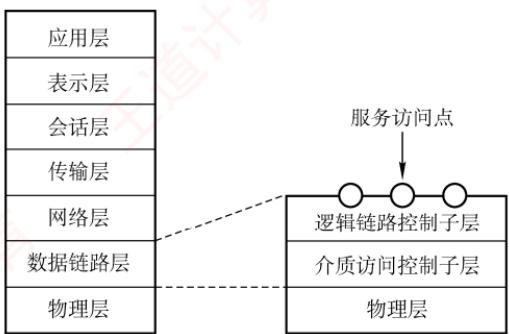

<em>图 3.21 IEEE 802 协议层与 OSI 参考模型的比较</em>

### 3.6.2 以太网与 IEEE 802.3

　　以太网是目前最流行的有线局域网技术。

　　以太网规约的第一个版本是 DIX V1，由 DEC、Intel 和 Xerox 联合提出。随后，它被修订为第二版规约 DIX Ethernet V2，成为世界上首个局域网产品的规范。在此基础上，IEEE 802 委员会的 IEEE 802.3 工作组制定了第一个 IEEE 以太网标准——IEEE 802.3。

　　严格来说，以太网指符合 DIX Ethernet V2 标准的局域网。但由于 DIX Ethernet V2 与 IEEE 802.3 标准差异极小，因此也常将 IEEE 802.3 局域网简称为以太网。

> **考点追踪：** 以太网 MAC 协议的服务模型（2012）

　　以太网采用两项措施来简化通信：① 采用无连接的工作方式，既不对发送的数据帧编号，也不要求接收方返回确认。因此，以太网提供的是不可靠的尽最大努力交付服务，差错纠正由高层协议（如 TCP）完成；② 所有发送的数据均使用曼彻斯特编码，每个码元中间有一次电压跳变，接收方可利用该跳变方便地提取位同步信号。

#### 1. 以太网的传输介质与网卡

　　以太网常用的传输介质有四种：粗缆、细缆、双绞线和光纤，其适用情况见表3.2。

　　表 3.2 各种传输介质的适用情况

<table><tr><td>标准名称</td><td>10Base-5</td><td>10Base-2</td><td>10Base-T</td><td>10Base-F</td></tr><tr><td>传输介质</td><td>同轴电缆(粗缆)</td><td>同轴电缆(细缆)</td><td>非屏蔽双绞线</td><td>光纤对(850nm)</td></tr><tr><td>编码</td><td>曼彻斯特编码</td><td>曼彻斯特编码</td><td>曼彻斯特编码</td><td>曼彻斯特编码</td></tr><tr><td>拓扑结构</td><td>总线形</td><td>总线形</td><td>星形</td><td>点对点</td></tr><tr><td>最大段长</td><td>500m</td><td>185m</td><td>100m</td><td>2000m</td></tr><tr><td>最多节点数量</td><td>100</td><td>30</td><td>2</td><td>2</td></tr></table>

> **注意：**

　　在上述标准中，“10”表示速率为 $10\mathrm{Mb / s}$ ；“Base”表示基带以太网；早期标准中，“Base”后的“5”或“2”分别表示单段最大传输距离约为 $500\mathrm{m}$ 或 $185\mathrm{m}$ ，“T”代表双绞线，“F”代表光纤。

　　计算机与外界局域网的连接通过主板上嵌入的网络适配器（Adapter）实现，也称网络接口卡（NIC）。适配器内置处理器和存储器，工作在数据链路层。适配器与局域网之间通过电缆或双绞线以串行方式通信；适配器与计算机之间则通过 I/O 总线以并行方式通信。因此，适配器的重要功能之一是进行串行与并行数据的转换。此外，适配器还负责：物理连接与电信号匹配、帧的发送与接收、帧的封装与拆封、介质访问控制、数据的编码与解码，以及数据缓存等。当适配器收到正确的帧时，会通过中断通知主机，并将数据交付给协议栈的网络层；当主机要发送 IP 数据报时，协议栈将其向下传递给适配器，由适配器封装成帧后发送至局域网。

#### 2. 以太网 MAC 地址

　　IEEE 802 标准为局域网规定了一种 48 位的全球唯一地址，固化在网络适配器的 ROM 中，称为物理地址或 MAC 地址，用于控制主机在网络上的数据通信。全球所有局域网适配器的 MAC 地址均不重复；一台计算机只要未更换适配器，无论地理位置如何变化，其 MAC 地址保持不变。

> **考点追踪：** MAC地址的特性（2013）

　　MAC 地址长 6B（48 位），通常用 12 个十六进制数字表示，以连字符或冒号分隔，例如 02-60-8c-e4-b1-21。高 24 位为厂商代码，低 24 位为厂商自行分配的适配器序列号。

　　当路由器通过适配器接入局域网时，该适配器的 MAC 地址用于标识路由器的对应接口。若路由器连接多个网络，则需配备多个适配器，每个接口拥有独立的 MAC 地址。

　　适配器从网络上每收到一个 MAC 帧，首先用硬件检查其目的地址。若为发往本站的帧，则接收；否则丢弃。这里“发往本站的帧”包括以下三种帧：

1）单播帧（一对一），目的地址与本站 MAC 地址相同。

2）广播帧（一对全体），目的地址为全1（FF-FF-FF-FF-FF-FF）。

3）多播帧（一对多），目的地址为某个多播组地址，发送给局域网中部分站点。

#### 3. CSMA/CD 协议

　　由于总线在同一时间只允许一个站点发送数据，否则各站之间会互相干扰，导致所发送的数据被破坏。因此，如何协调总线上各站点的发送行为，是以太网必须解决的关键问题。

> **考点追踪：** CSMA/CD协议的特性（2015）

　　载波监听多路访问/冲突检测（CSMA/CD）协议是 CSMA 协议的重要改进，适用于总线形网络或半双工网络环境。对于全双工网络，由于其采用两条独立信道分别用于发送和接收，通信双方可同时收发数据，不会产生冲突，因此无须使用 CSMA/CD 协议。

　　载波监听是指每个站点在发送前和发送过程中都必须持续检测信道：发送前监听是为了确认信道空闲以获取发送权；发送中监听则是为了及时发现是否发生冲突。具体而言，站点在发送数据前先监听信道，只有当信道空闲时才开始发送。冲突检测（Collision Detection）即边发送边检测，适配器在发送数据的同时监测信道上的电压变化；当检测到电压变化幅度超过特定门限值时，即判定发生冲突，立即停止发送，并等待一段随机时间后重试。

　　CSMA/CD协议的工作流程可简单概括为“先听后发，边听边发，冲突停发，随机重发”。

> **考点追踪：** CSMA/CD协议中的冲突时间分析（2010）

　　电磁波在总线上的传播速率是有限的。因此，某时刻发送站检测到信道空闲，并不意味着信道真正空闲。如图3.22所示，设 $\tau$ 为单程传播时延。在 $t = 0$ 时，A站开始发送数据。在 $t = \tau -\delta$ 时，A站的数据尚未到达B站，B站因检测到信道空闲也开始发送。经过 $\delta /2$ 时间（ $t = \tau -\delta /2$ 时），A站和B站的数据在信道上发生冲突，但此时两个站点均未察觉。直到 $t = \tau$ 时，B站检测到冲突并停止发送。在 $t = 2\tau -\delta$ 时，A站也检测到冲突并停止发送。至此，两个站点的发送均失败，都需推迟一段时间后重传。

  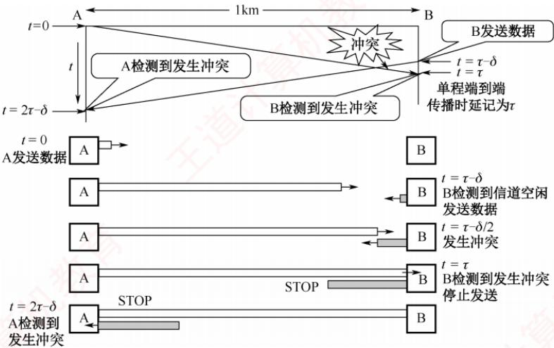

<em>图 3.22 传播时延对载波监听的影响</em>

　　从图 3.22 可见，A 站在开始发送后最多经过 $2\tau$ （端到端往返传播时延）即可确认是否发生冲突（当 $\delta \rightarrow 0$ 时）。因此，将以太网的端到端往返传播时延 $2\tau$ 称为争用期（也称冲突窗口）。每个站点在发送数据后的一小段时间内，存在冲突的可能；只有在争用期结束仍未检测到冲突，才能确定本次发送成功。

> **考点追踪：** CSMA/CD 协议中最短帧长的原理与计算（2009、2016、2019、2022）

　　现在考虑一种情况：某站发送一个很短的帧，在发送完成前未检测到冲突。但该帧在传播途中与其他帧发生冲突，导致目的站收到错误帧（并丢弃），而发送站却不知情，也不会重传。为避免此类问题，以太网规定了最短帧长，即争用期内可发送的数据量。若在争用期内检测到冲突，发送将中止，此时已发送的数据长度必小于最短帧长；因此，任何长度小于最短帧长的帧均为因冲突而异常中止的无效帧，应被丢弃。最短帧长的计算公式为

$$
\mathrm{最短帧长} = 2 \times \mathrm{最大单向传播时延} \times \mathrm{数据传输速率}
$$

　　例如，以太网规定争用期为 $51.2\mu s$ 。对于 10Mb/s 的以太网，争用期内可发送 512bit（64B）。这意味着：若某站点在发送前 64B 未发生冲突，则后续数据也不会冲突（表示已成功抢占信道）；反之，若发生冲突，必定发生在前 64B 内。由于检测到冲突后立即停止发送，实际发出的数据量必然小于 64B。因此，以太网规定最短帧长为 64B。若实际要发送的帧小于 64B（如仅 40B），则需在数据字段后添加若干整数字节的填充字段，确保整个 MAC 帧长度不小于 64B。

$$
\text {考点追踪} \quad \text {CSMA / CD 协议中的退避算法机制（2023）}
$$

　　一旦发生冲突，若站点立即重传，极易再次冲突。CSMA/CD采用截断二进制指数退避算法来确定重传时机：冲突站点在停止发送后，推迟一个随机时间再重试。算法要点如下：

1）确定基本退避时间为一个争议期（端到端往返传播时延 $2\tau$ ）。

2）从整数集合 $[0,1,\cdots,(2^{k}-1)]$ 中随机选取一个数r，推迟时间为r倍争用期，即 $2r\tau$ 。其中 $k=\min[$ 重传次数,10]，即重传次数 $\leqslant10$ 时，k等于重传次数；超过10次后，k不再增大，恒为10。

3）若重传达16次仍失败，则判定网络过于拥塞，放弃该帧并向高层报告错误。

　　例如，首次冲突后（第1次重传），k=1，随机数r从集合 $\{0,1\}$ 中选取，推迟时间为0或 $2\tau$ ；若再次冲突（第2次重传），k=2，r从集合 $\{0,1,2,3\}$ 中选取，推迟时间为 $0,2\tau,4\tau$ 或 $6\tau$ ，以此类推。该机制使重传平均等待时间随冲突次数增加而动态增长（称为动态退避），有效降低

　　再次冲突概率，提升系统稳定性。

　　此外，以太网规定：一旦检测到冲突，站点除立即停止发送数据外，还需继续发送 32 比特或 48 比特的人为干扰信号，以确保所有站点都能感知到冲突，这被称为强化碰撞机制。

　　以太网还规定帧间最小间隔为 $9.6 \mu s$ （相当于 96 比特的发送时间）。以便接收站有足够时间清空缓存，为接收下一帧做好准备。

　　CSMA/CD 协议的归纳如下:

　　① 准备发送：适配器从网络层获取分组，封装成帧，放入适配器的缓存。

　　② 检测信道：若信道忙，则持续监听直至空闲；若信道在 $9.6\mu \mathrm{s}$ 时间内保持空闲（满足帧间最小间隔），则开始发送该帧。

　　③ 发送过程中持续检测信道，可能出现两种情况：

- 发送成功：争用期内未检测到冲突，帧发送成功。

- 发送失败：争用期内检测到冲突，立即停止发送，执行退避算法，等待随机时间后返回步骤②；若重传16次仍未成功，则放弃发送并向高层报告出错。

#### 4. 以太网的 MAC 帧

　　以太网 MAC 帧格式有两种标准：DIX Ethernet V2 标准（以太网 V2）和 IEEE 802.3 标准。此处仅介绍最常用的以太网 V2 标准的帧格式，如图 3.23 所示。

  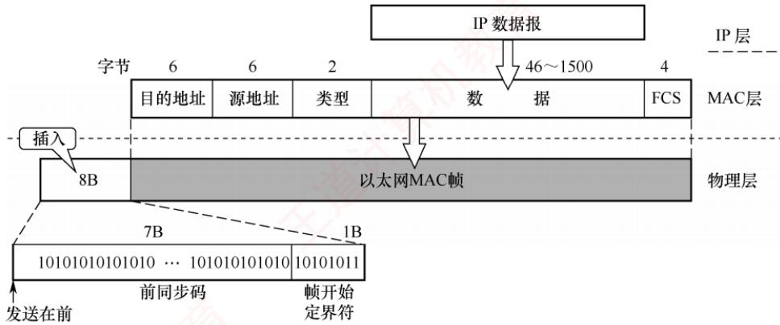

<em>图 3.23 以太网 V2 标准的 MAC 帧格式</em>

> **考点追踪：** 以太网 MAC 帧的格式（2010、2011）

1）帧前插入的 8B 前导码分为两个字段：第一个字段是 7B 的前同步码，用于实现比特同步；第二个字段是 1B 的帧开始定界符，标志 MAC 帧的开始。

> **注意：**

　　以太网帧不需要帧结束定界符。因为当以太网传送帧时，各帧之间必须保持至少96比特时间的间隙，因此，接收方只要找到帧开始定界符，其后连续到达的比特流即属于同一帧。此外，以太网采用了违规编码法的思想，这种编码（曼彻斯特编码）的特点是在每个码元中间都有一次电压跳变。当发送方把一个帧发送完毕后，就不再发送其他码元，因此发送方网络接口上的电压也不再变化，这样接收方就能很容易地找到帧的结束位置，这个位置往前数4B就是FCS字段，从而确定数据字段的结束位置。。

> **考点追踪：** 以太网帧中地址字段的功能（2018）

2）目的地址：6B，帧在局域网中的目的适配器的 MAC 地址。

3）源地址：6B，发送该帧的源适配器的 MAC 地址。

4）类型：2B，标识上一层使用的是什么协议，以便将收到的 MAC 帧的数据交给相应的上层协议。例如，当类型字段的值是 0x0800 时，表示上层使用的是 IP。

> **考点追踪：** 以太网帧填充与最小帧长的关系（2012）

5）数据：46～1500B，承载上层的协议数据单元（如 IP 数据报）。以太网的最大传输单元为 1500B，若 IP 数据报超过此长度，则需在网络层进行分片。此外，由于 CSMA/CD 协议算法限制，以太网帧必须满足最小长度为 64B，当 IP 数据报不足 46B 时，MAC 子层会在数据字段后面添加整数字节的填充字段，以确保帧长达到 64B。

> **注意：**

　　“46是怎么来的？”——由CSMA/CD协议可知，以太网帧的最短帧长为64B，而MAC帧的首部和尾部的长度为18B，因此数据字段最少为 $64 - 18 = 46\mathrm{B}$ 。

6）检验码（FCS）：4B，采用32位CRC码，检验范围从目的地址到数据字段（含目的地址、源地址、类型和数据），但不检验前导码。

　　IEEE 802.3 帧格式与以太网 V2 帧格式的区别在于：用长度字段替代了 V2 帧中的类型字段，指示数据字段的长度。在实践中，这两种机制可以并存，由于 IEEE 802.3 数据字段的最大长度为 1500B，故长度字段的值 $\leqslant$ 1500；从而 1501 到 65535 的值则被解释为类型标识符。

#### 5. 高速以太网

　　速率达到或超过 100Mb/s 的以太网称为高速以太网，其主要类型如表 3.3 所示。

　　表 3.3 几种高速以太网技术

<table><tr><td>标准名称</td><td>100Base-T 以太网</td><td>吉比特以太网</td><td>10 吉比特以太网</td></tr><tr><td>传输速率</td><td>100Mb/s</td><td>1Gb/s</td><td>10Gb/s</td></tr><tr><td>传输介质</td><td>双绞线</td><td>双绞线或光纤</td><td>双绞线或光纤</td></tr><tr><td>通信方式</td><td colspan="2">支持半双工和全双工</td><td>只支持全双工</td></tr><tr><td>介质访问控制协议</td><td colspan="2">半双工模式下使用 CSMA/CD 协议</td><td>无</td></tr></table>

##### （1） 100Base-T 以太网（快速以太网）

> **考点追踪：** 100Base-T 的传输介质类型（2019）

　　100Base-T 以太网是在双绞线上以 100Mb/s 速率传输基带信号的星形以太网，支持全双工和半双工两种工作模式。当使用以太网交换机组网时，通常运行在全双工模式而无冲突发生，因此无须使用 CSMA/CD 协议。但在半双工模式下，仍需依赖 CSMA/CD 协议来处理冲突。

　　其帧格式仍遵循 IEEE 802.3 标准，保持最小帧长为 64B 不变，但将单个网段的最大长度缩短至 100m。同时，帧间最小间隔从 9.6μs 减为 0.96μs，以适应更高的传输速率。

##### （2） 吉比特以太网（千兆以太网）

　　吉比特以太网支持 1Gb/s 的传输速率，兼容全双工和半双工模式。它使用 IEEE 802.3 标准的帧格式。使用双绞线或光纤作为传输介质。在半双工模式下使用 CSMA/CD 协议（很少部署）；而在全双工模式下不使用 CSMA/CD 协议。与 10Base-T 和 100Base-T 技术向后兼容。

##### （3） 10 吉比特以太网

　　10 吉比特以太网的帧格式与 10Mb/s、100Mb/s 和 1Gb/s 以太网完全相同，并保留 IEEE 802.3 规定的最小和最大帧长。仅工作在全双工模式，无争用问题，因此无须使用 CSMA/CD 协议。

　　以太网从 10Mb/s 到 10Gb/s 的演进充分证明了其可扩展性（速率从 10Mb/s 到 10Gb/s）、灵活性（多种介质、全/半双工模式、共享/交换构架）、易部署性和稳健性。

### 3.6.3 IEEE 802.11 无线局域网

#### 1. 无线局域网的组成

　　无线局域网可分为两大类：有固定基础设施的无线局域网和无固定基础设施的移动自组织网络。所谓“固定基础设施”，是指预先部署、能覆盖一定地理范围的固定基站。

##### （1） 有固定基础设施无线局域网

　　对于有固定基础设施的无线局域网，IEEE 制定了 802.11 系列协议标准，包括 802.11a/b/g/n 等。802.11 协议采用星形拓扑，其中心节点称为接入点（Access Point，AP），在 MAC 层使用 CSMA/CA 协议。采用 802.11 系列协议的局域网通常也称 Wi-Fi。

　　802.11 协议规定，无线局域网的最小构件是基本服务集（Basic Service Set，BSS）。一个 BSS 包含一个 AP 和若干移动站。站内通信或与外部站点的通信都必须通过该 BSS 的 AP。此处的 AP 即为 BSS 中的基站（base station）。配置 AP 时，需要为其分配一个不超过 32B 的服务集标识符（Service Set IDentifier，SSID）和一个工作信道。SSID 即为该无线局域网的名称。BSS 覆盖的地理范围称为基本服务区（Basic Service Area，BSA），其直径一般不超过 100 米。

　　一个 BSS 可以是孤立的，也可通过 AP 连接到分配系统（Distribution System，DS），再与其他 BSS 互连，从而构成扩展的服务集（Extended Service Set，ESS）。分配系统的作用是使整个 ESS 对上层呈现为一个单一的 BSS。ESS 还可通过一种称为 Portal（门户）的设备，为无线用户提供接入有线以太网的能力。Portal 的功能相当于网桥。在图 3.24 中，若移动站 A 要与另一 BSS 中的移动站 B 通信，则数据流动路径为 A→AP1→AP2→B，其中 AP1 与 AP2 的通信通过有线链路完成。

  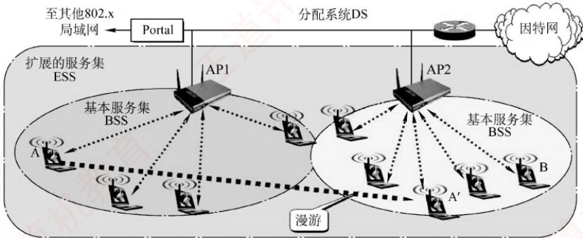

<em>图 3.24 基本服务集和扩展服务集</em>

　　当移动站 A 从一个 BSS 漫游到另一个 BSS 时（图 3.24 中的 A'），仍可保持与 B 的通信。但所使用的 AP 会发生改变。

##### （2） 无固定基础设施的移动自组织网络

　　另一种无线局域网是无固定基础设施的自组织网络，也称自组网络（ad hoc network）。此类网络不包含 AP，而是由若干处于平等地位的移动站临时组成的对等网络（见图 3.25）。各节点地位平等，中间节点需转发其他节点的数据，因此兼具终端与路由器的功能。

　　自组网络通常这样形成: 若干可移动设备彼此邻近且存在通信需求时, 会自发组建一个网络。在此类网络中, 每个移动站都需主动参与路由的发现与维护。由于节点位置不断变化, 网络拓扑可能频繁且快速地改变, 因此传统在固定网络中有效的路由协议往往难以适用于自组网络, 必须采用专门为其设计的路由机制。

  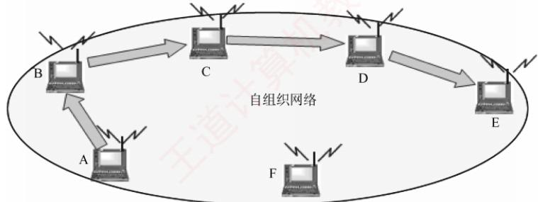

<em>图 3.25 由若干处于平等地位的移动站临时组成的对等网络</em>

　　需要注意的是，自组网络与移动 IP 有本质区别：移动 IP 旨在支持主机在不同网络间漫游并接入互联网，其底层仍依赖固定网络的路由基础设施；而自组网络是一种分布式的无线自治系统，不仅拥有专用的路由协议，还能独立于互联网运行，无须依赖任何预设的固定基础设施。

#### 2. CSMA/CA 协议

　　CSMA/CD 协议已成功用于有线局域网，但无线局域网不能简单照搬 CSMA/CD 协议。无线局域网仍使用 CSMA 协议，但无法实现冲突检测，主要有两个原因：

1）适配器接收到的信号强度通常远小于其发送信号的强度，且无线信道中信号强度的动态范围极大，若要实现冲突检测，硬件上的成本将会过高。

2）在无线通信中，并非所有站点都能互相侦听到对方（却可能产生冲突），即存在隐蔽站问题，导致冲突检测机制无法发现所有冲突。

　　在图 3.26 中，A 站和 B 站均在 AP 的覆盖范围内，但彼此距离较远，无法侦听到对方。当 A 站和 B 站同时检测到信道空闲时，都向 AP 发送数据，导致发生冲突，而双方均无法察觉，这就是隐蔽站问题。这里 A 站和 B 站互为隐蔽站，它们检测不到彼此的信号，却能产生冲突。

  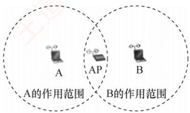

<em>图 3.26 A 站和 B 站同时向 AP 发送数据，发生冲突</em>

　　为此，802.11 协议定义了广泛应用于无线局域网的 CSMA/CA 协议。它对 CSMA/CD 协议进行改进，将 “冲突检测” 改为 “冲突避免” （Collision Avoidance，CA）。“冲突避免” 并不是指协议可以完全避免冲突，而是要尽量降低冲突发生的概率。由于 802.11 协议不支持冲突检测，一旦站点开始发送帧，就必须完整发送该帧；若在冲突存在时，仍发送整个帧（尤其是长数据帧），将严重降低网络效率，因此必须采用冲突避免技术来降低冲突概率。

> **考点追踪：** CSMA/CA协议的确认机制（2011）

　　鉴于无线信道的通信质量远不如有线信道，802.11协议在数据链路层引入确认/重传（ARQ）机制：站点每发送完一帧后，必须收到接收方的确认帧（ACK），才能继续发送下一帧。因此，802.11无线局域网采用的是一种停止-等待式可靠传输协议。

　　802.11 协议在 MAC 子层定义了两种介质访问控制方式。

1）分布式协调功能（DCF）。不采用任何中心控制，各站通过争用信道获得发送权。这是802.11协议必须实现的方式，也是目前广泛使用的方式。

2）点协调功能（PCF）。使用AP集中控制，用类似于探询的方法将发送权轮流分配给各站，从而避免冲突。它是802.11协议的可选方式，实际很少使用。

　　802.11 协议规定，各站在发送数据前必须检测信道，若信道忙，则禁止发送。为进一步减少冲突，802.11 协议还要求：即使检测到信道空闲，也需再等待一段短暂时间（确保信道持续空闲），方可发送帧。该时间称为帧间间隔（InterFrame Space, IFS），其长度取决于帧的类型。

> **考点追踪：** CSMA/CA协议的帧间间隔类型与功能（2020）

1）DIFS（分布式协调 IFS）：最长的 IFS，在 DCF 方式下用来发送数据帧和管理帧。

2）PIFS（点协调 IFS）：中等长度的 IFS，在 PCF 方式中使用。

3）SIFS（短IFS）：最短的IFS，用于分隔同一对话中的连续帧，如ACK帧、CTS帧、分片后的数据帧，以及对AP探询的响应帧等。

　　当信道由忙变为空闲时，在有多个站点同时等待发送的情况下，若它们都在时间 DIFS 后立即发送数据，则必然导致冲突。因此，CSMA/CA 协议规定：当检测到信道从忙变为空闲时，任何站点要发送数据，必须先等待时间 DIFS，再进入争用期，并执行随机退避，即随机选择一个退避时隙数，并在每个空闲时隙将其减 1，直至减为 0 后才发送。当且仅当检测到信道空闲且这个数据帧是要发送的第一个数据帧时，才不使用退避算法，其他所有情况都必须使用退避算法，具体为：① 要发送第一个数据帧之前检测到信道忙；② 未收到确认，要重传数据帧；③ 每次确认成功后要发送下一个数据帧。CSMA/CA 协议的退避算法与 CSMA/CD 协议类似，第 i 次退避在 $[0,\cdots,(2^{4+k}-1)]$ 个时隙中随机选择一个，当时隙范围最大达到 1023 时（对应第 6 次重传），就不再增加。

　　CSMA/CA 协议算法归纳如下:

1）若站点首次尝试发送数据（非因重传而发送），且检测到信道空闲，则在等待时间 DIFS 后（信道持续空闲），立即发送整个数据帧。否则执行步骤 2）。

2）站点选取一个随机数，设置退避计时器。计时器运行的规则是：若信道忙，则冻结计时器（暂停递减），并继续等待，直至信道变为空闲（称为推迟接入）；若信道空闲，且在时间DIFS内持续空闲，则开始争用信道，进行倒计时。当计时器减至0时（仅可能发生在信道持续空闲期间），站点立即发送整个数据帧并等待确认。

3）发送站收到确认后，若仍有后续帧待发送，则转到步骤2）。若在规定时间（由重传计时器控制）内未收到确认，则按二进制指数退避规则增大竞争窗口，再转到步骤2）重新尝试。

> **注意：**

　　推迟接入和退避的区别。推迟接入发生在信道忙时，为的是等待争用期的到来，此时退避计时器处于冻结状态。而退避是争用期各站点执行的算法，此时信道是空闲的，退避总出现在DIFS之后。

　　802.11 协议还规定各站采用虚拟载波监听机制：源站在发送数据前，通过帧首部的持续期字段，向所有能接收到该帧的站点通告其将占用信道的总时长（包括目的站回复 ACK 所需的时间）。其他站点收到后，将据此设置自身的网络分配向量（Network Allocation Vector，NAV），并在 NAV 计时期间暂停发送，进而显著降低冲突概率。所谓虚拟载波监听，是指这些站点并未实际监听物理信道，而基于接收到的通知主动避让，效果等同于持续监听信道。

> **考点追踪：** CSMA/CA协议的信道预约机制（2018）

　　为了缓解隐蔽站的问题，802.11 协议允许发送站对信道进行预约。在图 3.26 中，A 站和 B 站互为隐蔽站，下面以 A 站和 AP 通信为例，介绍信道预约的方法（见图 3.27）。

1）在 A 站向 AP 发送数据帧 DATA 前，先检测信道。若信道空闲，则等待时间 DIFS 后，广播一个请求发送 RTS（Request To Send）控制帧，目的是告诉所有能够收到 RTS 帧的站：“我要占用信道一段时间[SIFS+CTS+SIFS+DATA+SIFS+ACK]”，即从成功收到 RTS 帧起，到 AP 完成 ACK 发送为止的时间。这个时间被写入 RTS 帧首部。

2) 若 AP 正确收到 RTS 帧且信道空闲，则等待时间 SIFS 后，广播一个允许发送 CTS（Clear To Send）控制帧。目的不仅是告诉源站“可以发送数据了”，同时也是告诉所有能收到 CTS 帧的站“我要占用信道一段时间[SIFS+DATA + SIFS+ACK]”，即从成功收到 CTS 帧起，到 AP 完成 ACK 发送为止的时间。该时间同样被写入 CTS 帧首部。

3）A站收到CTS帧后，再等待时间SIFS，即可发送数据帧。其首部写入时间[DATA+SIFS+ACK]，即从开始接收数据帧起①，到AP完成ACK发送为止的时间。

> **考点追踪：** NAV 的工作原理（2024）

　　任何站点只要收到 RTS 帧、CTS 帧或数据帧之一，就会根据其首部的持续期字段设置自己的 NAV，如图 3.27 所示。虽然 B 站收不到 A 站发送给 AP 的 RTS 帧，但能收到 AP 广播的 CTS 帧，B 站根据 CTS 帧首部的内容设置自己的 NAV，因此在这段时间内不会发送数据、干扰信道。因此，虚拟载波监听机制能够有效减少由隐蔽站引发的冲突问题。

  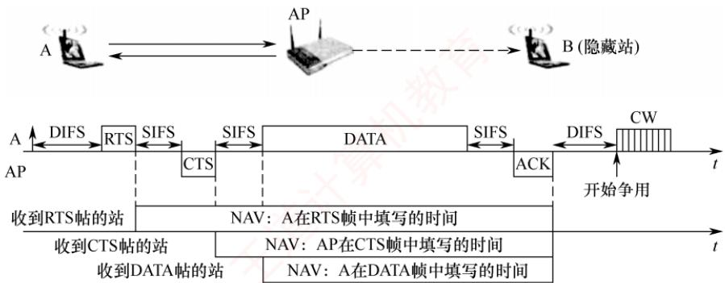

<em>图 3.27 使用 RTS 和 CTS 帧的冲突避免</em>

　　显然，使用 RTS/CTS 帧会使网络的通信效率有所下降，但这两种控制帧都很短，与数据帧相比开销不算大。相反，若不使用这种控制帧，则一旦发生冲突而导致数据帧重传，浪费的时间往往更多。信道预约并非强制要求，各站点可自行决定是否启用。或仅当待发送的数据帧长度超过某一阈值时才使用 RTS/CTS 帧，从而在可靠与效率之间取得平衡。

　　CSMA/CD 协议与 CSMA/CA 协议的主要区别如下:

1）冲突处理机制不同。CSMA/CD 协议能在发送过程中检测冲突，但无法避免冲突；CSMA/CA 协议无法在发送时检测冲突（尤其是发生在接收端的冲突），因此只能尽量避免冲突。

2）传输介质不同。CSMA/CD协议用于总线形有线以太网，CSMA/CA协议则用于无线局域网。

3）检测方式不同。CSMA/CD 协议通过检测线路中的电压变化来判断是否冲突；而 CSMA/CA 协议只能在发送前通过能量检测、载波侦听或两者的混合方式，综合判断信道是否空闲。

　　总结：CSMA/CA 协议的思想是 “先打招呼，再发数据”，发送前先广播通知其他站点，在其指定的时段内暂时发送，以预防冲突；而 CSMA/CD 协议则是 “边发边听，撞了就停”，发送前先监听信道，发送过程中持续检测信号，一旦发现冲突，就立即停发，并启动退避重传机制。

### 3.802.11 局域网的 MAC 帧

　　802.11 局域网的帧共有三种类型：数据帧、控制帧和管理帧。其中，数据帧以及三种常用的控制帧（RTS 帧、CTS 帧和 ACK 帧）的格式如图 3.28 所示。

　　802.11 帧由以下三部分组成:

1）MAC 首部，共 30B。帧的复杂性主要体现在 MAC 首部。

2）帧主体，即数据部分，最大长度不超过 2312B，远大于以太网帧的数据载荷。

3）帧检验序列（FCS），作为 MAC 尾部，共 4B。

  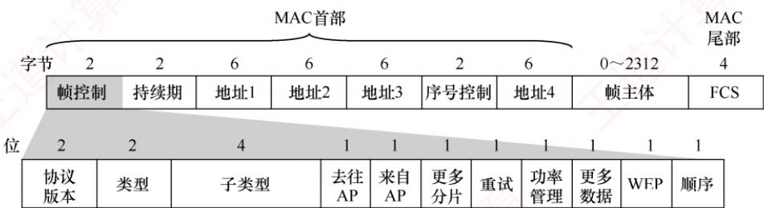

<em>(a) 数据帧格式（帧控制字段中的子类型为0000）</em>

  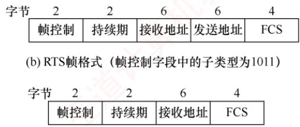

<em>(c) CTS和ACK帧格式（帧控制字段中的子类型分别为1100和1101）</em>

<em>图 3.28 数据帧以及三种常用的控制帧（RTS 帧、CTS 帧和 ACK 帧）的格式</em>

> **考点追踪：** 802.11 帧前三地址字段的作用（2017、2022）

　　802.11 帧首部中最关键的部分是四个地址字段（均为 MAC 地址），此处仅讨论前三个（地址 4 用于自组网络）。这三个地址的具体含义由帧控制字段中的两个标志位 “去往 AP” 和 “来自 AP” 共同决定。表 3.4 列出了 802.11 帧的地址字段最常用的两种情况。

　　表 3.4 802.11 帧的地址字段最常用的两种情况

<table><tr><td>去往 AP</td><td>来自 AP</td><td>地址 1</td><td>地址 2</td><td>地址 3</td><td>地址 4</td></tr><tr><td>0</td><td>1</td><td>接收地址 = 目的地址</td><td>发送地址 = AP 地址</td><td>源地址</td><td>——</td></tr><tr><td>1</td><td>0</td><td>接收地址 = AP 地址</td><td>发送地址 = 源地址</td><td>目的地址</td><td>——</td></tr></table>

　　其中，地址 1 是直接接收该帧的节点地址，地址 2 是实际发送该帧的节点地址。

　　现假定在同一个BSS中，A站向B站发送数据，该过程分可为两个阶段。

　　第一阶段：A站 $\rightarrow$ AP

　　A 站构造一个 802.11 帧发送给 AP。该帧首部字段设置如下：

　　“去往 AP=1” 而 “来自 AP=0”；

　　地址 1 为 AP 的 MAC 地址。地址 2 为 A 站的 MAC 地址。地址 3 为 B 站的 MAC 地址。

　　第二阶段：AP→B站

　　AP 收到该帧后，将其转发给 B 站。此时构造的新 802.11 帧首部字段设置如下：

　　“去往 AP=0” 而 “来自 AP=1”；

　　地址 1 为 B 站的 MAC 地址，地址 2 为 AP 的 MAC 地址，地址 3 为 A 站的 MAC 地址。

　　理解这三个地址的关键：地址 1 和地址 2 始终表示当前无线传输的两端，即直接接收方和直接发送方。当主机发往 AP 时，接收方是 AP，但最终目的不是 AP，因此用地址 3 存放实际目的地址；当 AP 发往主机时，发送方是 AP，但原始源不是 AP，因此用地址 3 存放实际源地址。

　　下面讨论一种更复杂的情况。如图 3.29 所示，两个 AP 通过有线链路连接到同一个路由器 R，A 站和 B 站分别位于两个不同的子网中。现分析 A 站向 B 站发送数据的完整过程。由于 A 站与 B 站不在同一个子网内，该通信需经由路由器 R 转发，整个过程也可分为两个阶段。

  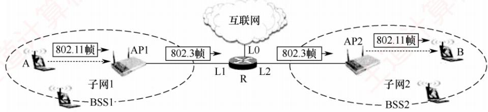

<em>图 3.29 链路上的 802.11 帧和 802.3 帧</em>

　　第一阶段：A站 $\rightarrow$ 路由器R

　　A 站先判断 B 站的目的 IP 地址不在本地子网内，因此将数据发送给默认网关，即 R 的接口 L1。为此，A 站通过 ARP 获取接口 L1 的 MAC 地址，随后构造一个 802.11 帧发送给 AP1。

　　该 802.11 帧的首部字段设置如下:

　　“去往 AP=1” 而 “来自 AP=0”；

　　地址 1 为 AP1 的 MAC 地址，地址 2 为 A 站的 MAC 地址，地址 3 为接口 L1 的 MAC 地址。AP1 收到该帧后，将其转换为 802.3 帧（仅包含源和目的两个 MAC 地址），其中源地址为 A 站的 MAC 地址，目的地址为接口 L1 的 MAC 地址，并通过有线链路传送给路由器 R。

　　第二阶段：路由器 $\mathbf{R}\rightarrow \mathbf{B}$ 站

　　路由器 R 收到 802.3 帧后，解封装并提取出 IP 数据报。根据其中的目的 IP 地址，路由器 R 查询转发表，确定下一跳出口为连接 B 站所在子网的接口 L2。接着，路由器 R 通过 ARP 获取 B 站的 MAC 地址，并将该 IP 数据报重新封装为一个新的 802.3 帧，其中源地址为接口 L2 的 MAC 地址，目的地址为 B 站的 MAC 地址。AP2 收到此 802.3 帧后，将其转换为 802.11 帧并发往 B 站。

　　该 802.11 帧的首部字段设置如下:

　　“去往 AP=0” 而 “来自 AP=1”；

　　地址 1 为 B 站的 MAC 地址，地址 2 为 AP2 的 MAC 地址，地址 3 为接口 L2 的 MAC 地址。

　　上述两个阶段共同构成A站向B站发送数据的完整路径。从网络层视角看，IP数据报从子网1经路由器R转发至子网2；而链路层则通过802.11帧中的地址3字段，在无线与有线介质转换过程中保留了原始源或目的MAC地址，确保了通信语义正确。这一机制涉及网络层的路由器转发功能，学完相关内容后，读者将能更深入理解本例所述的跨网通信过程。

　　下面介绍802.11帧中的持续期字段和帧控制字段。

1）持续期字段。在前面的 CSMA/CA 协议中提到，发送站点可对信道预约一段时间，并将该时间写入持续期字段，用于虚拟载波监听。

2）帧控制字段。其中较重要的是类型和子类型字段，用于区分帧的功能。802.11 帧分为三大类型，每种类型又分为若干子类型，如控制帧包括 RTS、CTS、ACK 等子类型。

### 3.6.4 VLAN 基本概念与基本原理

　　一个以太网构成一个广播域。当网络中包含的计算机数量过多时，往往会导致：

- 网络中出现大量广播帧，尤其是频繁使用的 ARP 和 DHCP 报文（见第 4 章）。

- 同一单位的不同部门共享一个局域网，不利于信息保密与安全隔离。

　　通过虚拟局域网（Virtual LAN，VLAN），可将一个大型局域网划分为若干与地理位置无关的逻辑上的 VLAN，每个 VLAN 构成一个独立且较小的广播域。同一 VLAN 内的主机可以直接通信，而不同 VLAN 之间的主机则无法直接通信。

　　目前主要有以下三种 VLAN 划分方式:

1）基于端口（接口）。将交换机的若干物理接口划归同一个逻辑组。该方法最简单、最常用。若主机更换了接入端口，则可能被划分到新的VLAN（新子网）。

2）基于 MAC 地址。根据主机的 MAC 地址划分 VLAN。当主机从一个交换机移动到另一个交换机时，它仍属于原 VLAN。

3）基于IP地址。根据网络层地址或协议类型划分VLAN。此类VLAN可跨越路由器进行扩展，将多个物理局域网中的主机纳入同一逻辑VLAN。

　　IEEE 802.1Q 标准定义了支持 VLAN 的以太网帧格式扩展。它在标准以太网帧的源地址字段与类型字段之间插入一个 4B 的 VLAN 标签，用于标识该帧所属的 VLAN。插入标签后的帧称为 802.1Q 帧，如图 3.30 所示。由于帧首部增加了 4B，为保持最小帧长 64B 不变，数据字段的最小长度由 46B 减少为 42B，最大长度仍为 1500B，因此最大帧长从 1518B 增至 1522B。

  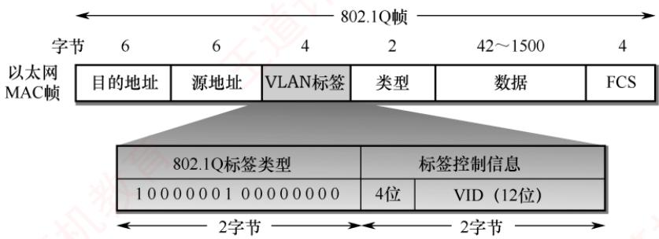

<em>图 3.30 插入 VLAN 标签后变成了 802.1Q 帧</em>

　　VLAN 标签的前两个字节固定为 0x8100，表示这是一个 802.1Q 帧。后两个字节中，前 4 位保留未用，后 12 位为 VLAN 标识符（VID），用于唯一标识该帧所属的 VLAN。12 位 VID 最多可支持 4096 个 VLAN。插入 VLAN 标签后，帧尾的 FCS 必须重新计算。

　　如图 3.31 所示，交换机 1 连接 7 台计算机，被划分为两个 VLAN：VLAN-10 和 VLAN-20（10 和 20 即 VID 值，由管理员配置）。各主机并不知道自身的 VID（但交换机必须知道），主机与交换机之间交互的仍是标准以太网帧。VLAN 的范围可跨越多个交换机，前提是这些交换机均支持 VLAN 功能。交换机 2 连接 5 台计算机，并与交换机 1 相连，其中 2 台属于 VLAN-10，3 台属于 VLAN-20。尽管这两个 VLAN 跨越了两台交换机，但各自仍保持为独立的广播域。

　　连接两台交换机的链路称为汇聚链路（Trunk Link），也称干线链路。

  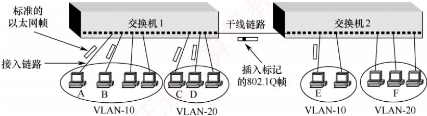

<em>图 3.31 利用以太网交换机构成虚拟局域网</em>

> **考点追踪：** 虚拟局域网的特性（2024）

　　假定 A 站向 B 站发送帧，交换机 1 根据目的 MAC 地址，识别出 B 属于本交换机管理的 VLAN-10，于是将该帧当作普通以太网帧直接转发。若 A 站向 E 站发送帧，交换机 1 必须将帧转发到交换机 2，此时必须先插入 VLAN 标签，再通过干线链路传输。否则，交换机 2 无法判断该帧应归属哪个 VLAN。因此，干线链路上传输的是 802.1Q 帧。交换机 2 在向 E 站转发前，会剥离 VLAN 标签，确保 E 站收到的是标准以太网帧。若 A 站向 C 站发送帧（虽同属交换机 1，但分属 VLAN-10 与 VLAN-20），则因二者处于不同的广播域，无法直接通信。此时需借助上层路由器实现跨 VLAN 通信，或通过支持三层功能的交换机完成第 3 层转发。

　　虚拟局域网只是局域网为用户提供的一种逻辑服务，并不是一种新型局域网。

### 3.6.5 本节习题精选

#### 一、单项选择题

01. 下列以太网中，采用双绞线作为传输介质的是（）。

- A. 10Base-2
- B. 10Base-5
- C. 10Base-T
- D. 10Base-F

02. 10Base-T以太网采用的传输介质是（）。

- A. 双绞线
- B. 同轴电缆
- C. 光纤
- D. 微波

03. 就交换技术而言，以太网采用的是（）。

- A. 分组交换技术
- B. 电路交换技术
- C. 报文交换技术
- D. 混合交换技术

04. 网卡实现的主要功能在（）。

- A. 物理层和数据链路层
- B. 数据链路层和网络层
- C. 物理层和网络层
- D. 数据链路层和应用层

05. 每个以太网卡都有自己的时钟，每个网卡在互相通信时为了知道什么时候一位结束、下一位开始，即具有同样的频率，它们采用了（）。

- A. 量化机制
- B. 曼彻斯特机制
- C. 奇偶检验机制
- D. 定时令牌机制

06. 以下关于以太网地址的描述，错误的是（）。

- A. 以太网地址就是通常所说的 MAC 地址
- B. MAC 地址也称局域网硬件地址
- C. MAC 地址是通过域名解析查得的
- D. 以太网地址通常存储在网卡中

07. 下列关于用光纤连接的以太网和用双绞线连接的以太网的说法中，错误的是（）。

- A. 用集线器连接的双绞线以太网一定工作在半双工状态
- B. 用交换机连接的双绞线以太网可以工作在全双工状态
- C. 光纤以太网主要用于支持点对点通信，目的是扩大以太网的覆盖范围
- D. 光纤以太网也可以选用CSMA/CD协议

08. 一个长度为 40B 的 IP 数据报需要封装成 802.1Q 帧进行传输，则此 802.1Q 帧的数据载荷部分需要填充的字节数是（）。

- A. 2
- B. 4
- C. 6
- D. 8

09. 在以太网中，若网卡发现某个帧的目的 MAC 地址不是自己的，则（）。

- A. 它将该帧递交给网络层，由网络层决定如何处理
- B. 它将丢弃该帧，并向网络层报告错误消息
- C. 它将丢弃该帧，不向网络层报告错误消息
- D. 它将向发送主机发回一个 NAK 帧

10. 在 CSMA/CD 以太网中，站点（）进行全双工通信，（）进行半双工通信。

- A. 可以，不可以
- B. 可以，可以
- C. 不可以，可以
- D. 不可以，不可以

11. 在 CSMA/CD 协议的定义中，“争用期”指的是（）。

- A. 信号在最远两个端点之间往返传输的时间
- B. 信号从线路一端传输到另一端的时间
- C. 从发送开始到收到应答的时间
- D. 从发送完毕到收到应答的时间

12. 在 CSMA/CD 协议中，若不对帧的长度加以限制，当一个站在发送完毕之前没有检测到冲突，则该站所发送的帧（）和其他站发送的帧发生冲突。

- A. 肯定不会
- B. 可能会
- C. 肯定会
- D. 无法判断

13. 在以太网中，当数据传输速率提高时，帧的发送时间相应地缩短，这样可能会影响到冲突的检测。为了能有效地检测冲突，可以使用的解决方案有（）。

- A. 减少电缆介质的长度或减少最短帧长
- B. 减少电缆介质的长度或增加最短帧长
- C. 增加电缆介质的长度或减少最短帧长
- D. 增加电缆介质的长度或增加最短帧长

14. 长度为 10km、数据传输速率为 10Mb/s 的 CSMA/CD 以太网，信号传播速率为 200m/ $\mu$ s。那么该网络的最小帧长为（）。

- A. 20bit
- B. 200bit
- C. 100bit
- D. 1000bit

15. 以太网中若发生信道访问冲突，则按照二进制指数退避算法决定下一次重发的时间。使用二进制指数退避算法的理由是（）。

- A. 这种算法简单
- B. 这种算法执行速度快
- C. 这种算法考虑了网络负载对冲突的影响
- D. 这种算法与网络的规模大小无关

16. 以太网中采用二进制指数退避算法处理冲突问题。下列数据帧重传时再次发生冲突的概率最低的是（）。

- A. 首次重传的帧
- B. 发生两次冲突的帧
- C. 发生三次重传的帧
- D. 发生四次重传的帧

17. 某 100Mb/s 以太网使用 CSMA/CD 协议，该以太网中的某个站在发送帧时检测到冲突，并准备进行第二次重传，则所需等待的最大退避时间是（）。

- A. 5.12μs
- B. 15.36μs
- C. 25.6μs
- D. 51.2μs

18. 在以太网的二进制指数退避算法中，在 11 次冲突之后，站点会在 0～（）之间选择一个随机数。

- A. 255
- B. 511
- C. 1023
- D. 2047

19. 根据 CSMA/CD 协议的工作原理，需要提高最短帧长的是（）。

- A. 网络传输速率不变，冲突域的最大距离变短
- B. 冲突域的最大距离不变，网络传输速率提高
- C. 上层协议使用TCP的概率增加
- D. 在冲突域不变的情况下减少线路中的中继器数量

20. 在某 CSMA/CD 局域网中，使用一个 Hub 连接所有站点，且限定站点到 Hub 的最长距离为 100m，信号的传播速率为 200000km/s，则站点的最长冲突检测时间是（）。

- A. 2μs
- B. 2ms
- C. 1μs
- D. 1ms

21. IEEE 802.3 标准规定，若采用同轴电缆作为传输介质，在无中继的情况下，传输介质的最大长度不能超过（）。

- A. $500 \mathrm{~m}$
- B. $200 \mathrm{~m}$
- C. $100 \mathrm{~m}$
- D. $50 \mathrm{~m}$

22. 下列几种以太网中，只能工作在全双工模式下的是（）。

- A. 10Base-T 以太网
- B. 100Base-T 以太网
- C. 吉比特以太网
- D. 10 吉比特以太网

23. IEEE 802 局域网标准对应 OSI 参考模型的（）。

- A. 数据链路层和网络层
- B. 物理层和数据链路层
- C. 物理层
- D. 数据链路层

24. 高速以太网使用的 MAC 帧格式与标准以太网的帧格式（）。

- A. 完全相同
- B. 完全不同
- C. 部分相同
- D. 不确定

25. 下列关于吉比特以太网的说法中，错误的是（）。

- A. 支持流量控制机制
- B. 采用曼彻斯特编码，利用光纤进行数据传输
- C. 数据的传输时间主要受线路传输延迟的制约
- D. 同时支持全双工模式和半双工模式

26. 无线局域网不使用 CSMA/CD 协议而使用 CSMA/CA 协议的原因是，无线局域网（）。

- A. 不能同时收发，无法在发送时接收信号
- B. 难以实现冲突检测，存在隐蔽站和暴露站问题
- C. 由于广播特性，不会出现冲突
- D. 覆盖范围很小，不进行冲突检测，不影响正确性

27. 下列关于 CSMA/CA 协议的叙述中，正确的是（）。

- A. 接收方收到数据帧后，需要向发送方返回确认帧
- B. CA 表示 Collision Avoidance，即冲突避免，因而此类网络中不会出现冲突
- C. 按照载波监听的工作原理，发送站点在检测到信道空闲后立即启动发送
- D. CSMA/CA 协议和 CSMA/CD 协议的区别之一是前者不需要使用退避算法

28. CSMA/CA 协议的主要特点是（）。

- A. 发送前先检测信道，信道空闲就立即发送，信道忙就随机推迟发送
- B. 边发送边检测信道，一旦发现冲突就立即停止发送
- C. 发送前先预约信道，获得信道授权后再发送
- D. 发送后等待确认帧，在规定时间内未收到确认帧就重传

29. 在 CSMA/CA 协议中，有三种不同的时间参数：短帧间间隔 SIFS、分布式协调帧间间隔 DIFS 和点协调帧间间隔 PIFS。它们之间的长度关系是（）。

- A. SIFS < PIFS < DIFS
- B. SIFS < DIFS < PIFS
- C. PIFS < SIFS < DIFS
- D. PIFS < DIFS < SIFS

30. 在 802.11 协议中，MAC 帧首部中的地址字段的含义和作用取决于（）。

- A. 帧的类型和子类型
- B. 帧的源和目的站点
- C. 帧的去往 AP 和来自 AP 位
- D. 帧的 BSSID 和 SSID 位

31. 在下图所示的网络中，假定主机 A 给主机 B 发送数据，在 MAC 帧从接入点 AP2 转发到目的主机 B 的这段链路上，MAC 帧的地址 1、地址 2 和地址 3 分别是（）。

  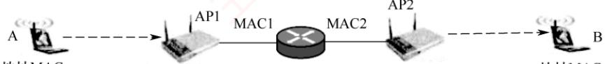

　　地址MAC $_{A}$ 地址BSSID1 地址BSSID2 地址MAC $_{B}$

- A. BSSID2, BSSID1, MAC $_{B}$
- B. MAC $_{B}$ , BSSID2, BSSID1
- C. BSSID2, MAC $_{B}$ , MAC $_{A}$
- D. MAC $_{B}$ , BSSID2, MAC $_{2}$

32. 下列关于 802.1Q 帧的描述中，错误的是（）。

- A. 在原始的以太网帧中加入一个 4B 的标签字段，就构成 802.1Q 帧
- B. 插入 VLAN 标签后，以太网的最大帧长也需要保持不变
- C. VLAN 标签中有标识符字段，称为 VID，标志该帧属于哪个 VLAN
- D. 设置 VLAN 后，两台主机之间通信也不一定使用 802.1Q 帧

33. 下列关于虚拟局域网的叙述中，错误的是（）。

- A. VLAN 使用的 802.1Q 帧的最大长度为 1522B
- B. 属于不同 VLAN 的主机，若连在同一台交换机上，则可进行数据链路层的通信
- C. VLAN 是为局域网用户提供的一种服务，而不是一种新型的局域网
- D. 同一个 VLAN 的主机可以处于不同的局域网中

34. 下列关于虚拟局域网（VLAN）的说法中，错误的是（）。

- A. 虚拟局域网建立在交换技术的基础上
- B. 虚拟局域网通过硬件方式实现逻辑分组与管理
- C. 虚拟网的划分与计算机的实际物理位置无关
- D. 不同虚拟局域网的主机之间无法直接进行数据链路层的通信

35. 划分虚拟局域网（VLAN）有多种方式，（）不是正确的划分方式。

- A. 基于交换机接口划分
- B. 基于网卡地址划分
- C. 基于用户名划分
- D. 基于网络层地址划分

36. 下列选项中，（）不是虚拟局域网（VLAN）的优点。

- A. 有效共享网络资源
- B. 简化网络管理
- C. 链路聚合
- D. 提高网络安全性

37. 【2009 统考真题】在一个采用 CSMA/CD 协议的网络中，传输介质是一根完整的电缆，传输速率为 1Gb/s，电缆中的信号传播速率是 200000km/s。若最小数据帧长减少 800 比特，则最远的两个站点之间的距离至少需要（）。

- A. 增加 160m
- B. 增加 80m
- C. 减少 160m
- D. 减少 80m

38. 【2011 统考真题】下列选项中，对正确接收到的数据帧进行确认的 MAC 协议是（）。

- A. CSMA
- B. CDMA
- C. CSMA/CD
- D. CSMA/CA

39. 【2012 统考真题】以太网的 MAC 协议提供的是（）。

- A. 无连接的不可靠服务
- B. 无连接的可靠服务
- C. 有连接的可靠服务
- D. 有连接的不可靠服务

40. 【2015 统考真题】下列关于 CSMA/CD 协议的叙述中，错误的是（）。

- A. 边发送数据帧，边检测是否发生冲突
- B. 适用于无线网络，以实现无线链路共享
- C. 需要根据网络跨距和数据传输速率限定最小帧长
- D. 当信号传播延迟趋近 0 时，信道利用率趋近 $100\%$

41. 【2016 统考真题】如下图所示, 在 Hub 再生比特流的过程中会产生 $1.535 \mu s$ 的时延 (Switch 和 Hub 均为 100Base-T 设备), 信号传播速率为 $200 ~m / \mu s$ , 不考虑以太网帧的前导码, 则 H3 和 H4 之间理论上可以相距的最远距离是 （）。

- A. 200m
- B. 205m
- C. 359m
- D. 512m

  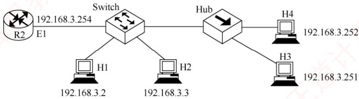

42. 【2017 统考真题】在下图所示的网络中，若主机 H 发送一个封装访问 Internet 的 IP 分组的 IEEE 802.11 帧 F，则帧 F 的地址 1、地址 2 和地址 3 分别是（）。

  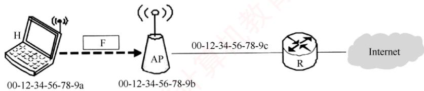

- A. 00-12-34-56-78-9a, 00-12-34-56-78-9b, 00-12-34-56-78-9c
- B. 00-12-34-56-78-9b, 00-12-34-56-78-9a, 00-12-34-56-78-9c
- C. 00-12-34-56-78-9b, 00-12-34-56-78-9c, 00-12-34-56-78-9a
- D. 00-12-34-56-78-9a, 00-12-34-56-78-9c, 00-12-34-56-78-9b

43. 【2018 统考真题】IEEE 802.11 无线局域网的 MAC 协议 CSMA/CA 进行信道预约的方法是（）。

- A. 发送确认帧
- B. 采用二进制指数退避
- C. 使用多个 MAC 地址
- D. 交换 RTS 与 CTS 帧

44. 【2019 统考真题】假设一个采用 CSMA/CD 协议的 100Mb/s 局域网，最小帧长是 128B，则在一个冲突域内，两个站点之间的单向传播时延最多是（）。

- A. 2.56μs
- B. 5.12μs
- C. 10.24μs
- D. 20.48μs

45. 【2019 统考真题】100Base-T 快速以太网使用的导向传输介质是（）。

- A. 双绞线
- B. 单模光纤
- C. 多模光纤
- D. 同轴电缆

46. 【2020 统考真题】在某个 IEEE 802.11 无线局域网中，主机 H 与 AP 之间发送或接收 CSMA/CA 帧的过程如下图所示。在 H 或 AP 发送帧前等待的帧间间隔时间（IFS）中，最长的是（）。

  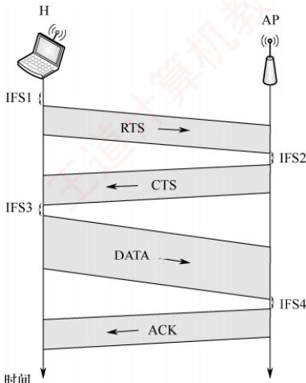

- A. IFS1
- B. IFS2
- C. IFS3
- D. IFS4

47. 【2023 统考真题】已知 10Base-T 以太网的争用时间片为 51.2μs。若网卡在发送某帧时发生了连续 4 次冲突，则基于二进制指数退避算法确定的再次尝试重发该帧前等待的最长时间是（）。

- A. 51.2μs
- B. 204.8μs
- C. 768μs
- D. 819.2μs

48. 【2024 统考真题】在采用 CSMA/CA 协议的 802.11 无线局域网中，DIFS = 128μs，SIFS = 28μs，RTS 帧、CTS 帧和 ACK 帧的传输时延分别是 3μs、2μs 和 2μs，忽略信号传播时延。若主机 A 要向 AP 发送一个总长度为 1998B 的数据帧，无线链路带宽为 54Mb/s，则隐藏站 B 收到 AP 发送的 CTS 帧时，设置的网络分配向量 NAV 的值是（）。

- A. 326μs
- B. 354μs
- C. 385μs
- D. 513μs

49. 【2025 统考真题】在某个 10Base-T 以太网的冲突域内，若主机甲向主机乙发送数据帧时发生了连续 11 次冲突，则甲再次尝试发送该数据帧的最大间隔时间是（）。

- A. 0.512ms
- B. 0.5632ms
- C. 52.3776ms
- D. 104.8064ms

#### 二、综合应用题

01. 以太网使用的 CSMA/CD 协议是以争用方式接入共享信道的，与传统的时分复用（TDM）相比，其优缺点如何？

02. 长度为 $1\mathrm{km}$ 、数据传输速率为 $10\mathrm{Mb / s}$ 的CSMA/CD协议以太网，信号在电缆中的传播速率为 $200000\mathrm{km / s}$ 。试求能够使该网络正常运行的最小帧长。

03. 考虑建立一个 CSMA/CD 协议网络，电缆长 1km，运行速率为 1Gb/s，电缆中的信号速率是 200000km/s，最小帧长是多少？

04. 构造一个 CSMA/CD 协议总线网，速率为 100Mb/s，信号在电缆中的传播速率为 $2 \times 10^{5}$ km/s，数据帧的最小长度为 125B。试求总线电缆的最大长度（假设总线电缆中无中继器）。

05. 【2010 统考真题】某局域网采用 CSMA/CD 协议实现介质访问控制，数据传输速率为 10Mb/s，主机甲和主机乙之间的距离是 2km，信号传播速率是 200000km/s。请回答下列问题，要求说明理由或写出计算过程。

1）若主机甲和主机乙发送数据时发生冲突，则从开始发送数据的时刻起，到两台主机均检测到冲突为止，最短需要经过多长时间？最长需要经过多长时间（假设在主机甲和主机乙发送数据的过程中，其他主机不发送数据）？

2）若网络不存在任何冲突与差错，主机甲总以标准的最长以太网数据帧（1518B）向主机乙发送数据，主机乙成功收到一个数据帧后，就立即向主机甲发送一个64B的确认帧，主机甲收到确认帧后方可发送下一个数据帧。此时主机甲的有效数据传输速率是多少（不考虑以太网的前导码）？

### 3.6.6 答案与解析

#### 一、单项选择题

**01. C**

　　这里 Base 前面的数字代表数据率，单位为 Mb/s；Base 指介质上的信号为基带信号（基带传输，采用曼彻斯特编码）；后面的 5 或 2 表示每段电缆的最长长度为 500m 或 200m（实际上为 185m），T 表示双绞线，F 表示光纤。

**02. A**

　　局域网通常采用类似 10Base-T 的方式来表示，其中第 1 部分的数字表示数据传输速率，如 10 表示 10Mb/s、100 表示 100Mb/s；第 2 部分的 Base 表示基带传输。第 3 部分若是字母，则表示传输介质，如 T 表示双绞线、F 表示光纤；若是数字，则表示所支持的最大传输距离。

**03. A**

　　在以太网中，数据以帧的形式传输。源端用户的较长报文需要分为若干数据块，这些数据块在各层中还要加上相应的控制信息，在网络层中是分组，在数据链路层中是以太网的帧。

**04. A**

　　通常情况下，网卡是用来实现以太网协议的。网卡不仅能实现与局域网传输介质之间的物理连接和电信号匹配，还涉及帧的发送与接收、帧的封装与拆封、介质访问控制、数据的编码与解码及数据缓存等功能，因此实现的功能主要在物理层和数据链路层。

**05. B**

　　10Base-T 以太网使用曼彻斯特编码。曼彻斯特编码提取每个比特中间的电平跳变作为收发双方的同步信号，不需要额外的同步信号，是一种 “自含时钟编码” 的编码方式。

**06. C**

　　域名解析用于将主机名解析成对应的 IP 地址，它不涉及 MAC 地址。实际上，MAC 地址通常是通过 ARP 查得的。

**07. D**

　　用集线器连接的以太网一定工作在半双工状态，用交换机连接的以太网既可以工作在半双工状态，又可以工作在全双工状态，选项 A、B 正确。光纤主要是为了扩大以太网的覆盖范围，用于支持点对点通信（中继设备之间的传输），通常不会直接连接终端设备，选项 C 正确。一根光纤线内部至少包含两条光纤，用以实现全双工通信，因此用光纤连接的以太网不采用 CSMA/CD 协议，选项 D 错误。

**08. A**

　　以太网 MAC 帧的最小帧长为 64B，数据字段的长度至少为 46B，但 802.1Q 帧会额外插入 4B 的 VLAN 标签，所以 802.1Q 帧的数据字段的长度至少为 42B，因此需要额外填充 2 字节。

**09. C**

　　当网卡收到一个帧时，首先检查该帧的目的 MAC 地址是否与当前网卡的物理地址相同，若相同，则做下一步处理；若不同，则直接丢弃，并不需要向网络层报告错误消息。

**10. C**

　　CSMA/CD 协议是一种用于解决共享介质上的冲突问题的方法，它在半双工通信中使用，而在全双工通信中无须用到 CSMA/CD 协议。因此站点可以进行半双工通信，不可以进行全双工通信。

**11. A**

　　CSMA/CD协议中定义的争用期是指信号在最远两个端点之间往返传输的时间。

**12. B**

　　即使一个站在发送完帧之前没有检测到冲突，也不能肯定该站所发送的帧不会和其他站发送的帧发生冲突。因为存在这样的可能：当一个站发送完后，另一个站刚好开始发送，而两个站之间的往返传播时延大于帧的发送时间，使得第一个站无法及时检测到冲突。

**13. B**

　　CSMA/CD 协议要求：发送帧的时间≥争用期的时间（信号在最远两个端点之间往返传输的时间）。因此，当数据传输速率提高时，发送帧的时间就缩短，此时可通过增加最短帧长来增加发送帧的时间，或缩短电缆的长度来减少争用期的时间，以便仍然满足“发送帧的时间≥争用期的时间”这个要求。掌握 CSMA/CD 协议最短帧长的原理是解决这类问题的关键。

**14. D**

　　来回路程 $= 10000 \times 2\mathrm{m}$ ， $\mathrm{RTT} = 10000 \times 2 \div (200 \times 10^{6}) = 10^{-4}\mathrm{s}$ ，最小帧长 $= W\mathrm{RTT} = 1000\mathrm{bit}$ 。

**15. C**

　　以太网采用 CSMA/CD 协议技术，网络上的流量越大、负载越多时，发生冲突的概率也越大。当工作站发送的数据帧因冲突而传输失败时，将采用二进制指数退避算法后退一段时间再重新发送数据帧。二进制指数退避算法可以动态地适应发送站点的数量，后退时延的取值范围与重发次数 n 形成二进制指数关系。当网络负载小时，后退时延的取值范围也小；当网络负载大时，后退时延的取值范围也随着增大。二进制指数退避算法的优点是，它将后退时延的平均取值与负载的大小联系起来了。因此，二进制指数退避算法考虑了负载对冲突的影响。

**16. D**

　　根据 IEEE 802.3 标准的规定，以太网采用二进制指数退避算法处理冲突问题。当检测到冲突而停止发送后，一个站必须等待一个随机时间段才能重新尝试发送。这一随机等待时间的目的是减少再次发生冲突的可能性。等待的时间长度按下列步骤计算：

1）取均匀分布在0至 $2^{\min (k,10)} - 1$ 之间的一个随机整数 $r$ ， $k$ 是冲突发生的次数。

2）发送站等待 $r \times 2t$ 长度的时间后才能尝试重新发送，其中 $t$ 为以太网的端到端延迟。

　　从这个计算步骤可以看出，k 越大，帧重传时再次发生冲突的概率越低。

**17. B**

　　与 10Mb/s 以太网相同，100Mb/s 以太网的争用期仍是 512bit 的发送时间，即 $512b \div 100Mb/s = 5.12\mu s$ 。根据 CSMA/CD 协议的退避算法，第 k 次重传需要退避的时间为：从整数集合 $\{0, 1, \cdots, 2^{k} - 1\}$ 中随机取出一个数 r，退避时间就是 r 倍的争用期。当重传次数大于 10 时，k 不再增大，而是一直等于 10。本题中 k = 2，问的是最大退避时间，所以取 r = 3，最大退避时间为 $15.36\mu s$ 。

**18. C**

　　一般来说，在第 $i$ （ $i < 10$ ）次冲突后，站点会在0到 $2^{i} - 1$ 之间随机选择一个数 $M$ ，然后等待 $M$ 倍的争用期再发送数据。达到10次冲突后，随机数的区间固定在最大值1023上，以后不再增加。若连续超过16次冲突，则丢弃相应的数据帧。

**19. B**

　　CSMA/CD 协议要求：发送帧的时间≥争用期的时间，当等号成立时，即最短帧长 = 数据传输速率×争用期。对于选项 A，最大距离变短会使争用期（最大距离的往返时间）变短，最短帧长变短。对于选项 B，数据传输速率提高，最短帧长变长。选项 C 对最短帧长没有影响。对于选项 D，在冲突域不变的情况下减少线路中的中继器数量会降低传播时延，争用期变短，最短帧长变短。

**20. A**

　　限定站点到集线器（Hub）的最长距离为 100m，则两个站点之间的最长距离为 200m，最长冲突检测时间等于信号在两个最远站点之间的往返传输时间，即 $2 \times 200m \div 200000km/s = 2\mu s$ 。

**21. A**

　　以太网常用的传输介质有4种：粗缆、细缆、双绞线和光纤。同轴电缆分为 $50\Omega$ 基带电缆和 $75\Omega$ 宽带电缆两类。基带电缆又分细同轴电缆和粗同轴电缆。

　　10Base-5：粗缆以太网，数据率为 10Mb/s，每段电缆最大长度为 500m；使用特殊的收发器连接到电缆上，收发器完成载波监听和冲突检测的功能。

　　10Base-2：细缆以太网，数据率为 10Mb/s，每段电缆最大长度为 185m；使用 BNC 连接器形成 T 形连接，无源部件。

**22. D**

　　10Base-T 以太网、100Base-T 以太网、吉比特以太网都使用 CSMA/CD 协议，因此可以工作在半双工模式。10 吉比特以太网只工作在全双工方式，没有争用问题，也不使用 CSMA/CD 协议，使用光纤或双绞线作为传输介质。

**23. B**

　　IEEE 802 为局域网制定的标准相当于 OSI 参考模型的数据链路层和物理层，其中的数据链路层又被进一步分为逻辑链路控制（LLC）和介质访问控制（MAC）两个子层。

**24. A**

　　高速以太网的 MAC 帧格式与标准以太网的帧格式完全相同，以便升级和向后兼容。

**25. B**

　　吉比特以太网的物理层有两个标准：IEEE 802.3z 和 IEEE 802.3ab，前者采用光纤通道，后者采用 4 对 UTP5 类线。

**26. B**

　　无线局域网不能简单地使用 CSMA/CD 协议，特别是冲突检测部分，原因如下：第一，在无线局域网的适配器上，接收信号的强度往往远小于发送信号的强度，因此要实现冲突检测，硬件费用就会过大；第二，在无线局域网中，并非所有站点都能听见对方，即存在隐蔽站和暴露站问题（暴露站问题举例：在下图中，假设 B 站向 A 站发送数据，而 C 站又想和 D 站通信，但 C 站检测到信道忙，于是就不向 D 站发送数据，其实 B 站向 A 站发送数据并不影响 C 站向 D 站发送数据。在无线局域网中，在不发生干扰的情况下，允许同时有多个移动站进行通信，这一点与有线局域网有很大的差别）。而“所有站点都能听见对方”正是实现 CSMA/CD 协议的前提。选项 A 是 CSMA/CD 协议和 CSMA/CA 协议的特点，但不是无线局域网使用 CSMA/CA 协议的原因。

  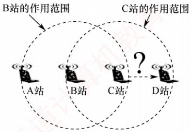

**27. A**

　　CSMA/CA 协议只能尽量降低冲突发生的概率，在无线信道中冲突是无法完全避免的。检测到信道空闲后，CSMA/CA 协议规定还必须等待 DIFS 的时间才能开始发送。无线信道中可能发生冲突，所以 CSMA/CA 协议也需要退避算法，但是和 CSMA/CD 协议的退避算法有一定的区别。

**28. D**

　　若检测到信道空闲，则 CSMA/CA 协议规定还必须等待 DIFS 的时间才能开始发送。CSMA/CA 协议不会进行冲突检测。预约信道并不是 CSMA/CA 协议的强制规定，在普通模式下不进行预约信道。

**29. A**

　　SIFS 最短，网络中的控制帧和确认帧都采用 SIFS 作为发送之前的等待时延。DIFS 最长，所有的数据帧都采用 DIFS 作为等待时延。PIFS 中等，用于 AP 发送管理帧或探测帧的等待时延。当源站要发送数据时，先检测信道，在持续检测到信道空闲达到 DIFS 时间后就开始发送。目的站正确收到数据帧后，等待 SIFS 时间后发出对应的确认帧。若源站在规定时间内未收到确认帧，就必须重传此帧，直到收到确认帧为止，或经过若干重传失败后，放弃发送。

**30. C**

　　802.11 帧首部中的地址字段的含义和作用取决于帧的去往 DS 位和来自 DS 位。

**31. D**

　　MAC 帧是从 AP 发送到主机 B 的，即 “去往 AP=0” 而 “来自 AP=1”。因此，地址 1 是 B 的 MAC 地址，即 MAC $_{B}$ ；地址 2 是 AP2 的 BSSID，即 BSSID $_{2}$ ；地址 3 是源地址，是路由器的接口 2 的 MAC 地址，即 MAC $_{2}$ 。

**32. B**

　　A 和 C 是 VLAN 的规定。插入 VLAN 标签后，以太网的最大帧长变为 1522 字节。802.1Q 帧用于干线链路，若同一个交换机下的同一个 VLAN 的两台主机通信，则不使用 802.1Q 帧。

**33. B**

　　802.1Q 帧在以太网帧的基础上增加了 4B 的 VLAN 标签，因此最大长度也增加了 4B。属于同一 VLAN 的主机无论是否连接到同一台交换机上，都能互相通信。而属于不同 VLAN 的主机即使连接到同一台交换机上，也不能直接在数据链路层进行通信。交换机会使用 VLAN 标签来区分不同的 VLAN。同一个 VLAN 的主机不一定连接到相同的局域网，它们可以连接到相同的交换机，也可以连接到不同的交换机，只要这些交换机互连即可。

**34. B**

　　VLAN 建立在交换技术的基础上，以软件方式实现逻辑分组与管理，VLAN 中的计算机不受物理位置的限制。当计算机从一个 VLAN 转移到另一个 VLAN 时，只需简单地通过软件设定，而无须改变它在网络中的物理位置。要进行跨 VLAN 的通信，必须通过上层的路由器解决，不同 VLAN 的主机处于不同的广播域，因此不能直接在数据链路层进行通信。

**35. C**

　　一般有三种划分 VLAN 的方法：① 基于接口；② 基于 MAC 地址；③ 基于 IP 地址。

**36. C**

　　带 “虚拟” 两个字的基本上都有一个优点，即有效共享资源。通过虚拟局域网，可将一个较大的局域网分割成一些较小的与地理位置无关的逻辑上的虚拟局域网，而每个虚拟局域网都是一个较小的局域网，因此简化了网络管理，提高了信息的保密性和网络的安全性。链路聚合是解决交换机之间的宽带瓶颈问题的技术，而不是虚拟局域网的技术。

**37. D**

　　有关最短帧长的题要抓住两个公式来分析：① 发送帧的时间≥争用期的时间；② 最短帧长=数据传输速率×争用期的时间。题中，最短帧长减少800比特，则发送帧的时间减少0.8μs，要使①和②依然成立，就需要至少将争用期（信号的往返时间）的时间减少0.8μs，所以往返传播的总距离至少需要减少200000km/s×0.8μs=160m，即单程距离至少需要减少80m。

**38. D**

　　CSMA/CA 协议是无线局域网标准 802.11 中的协议，它在 CSMA 协议的基础上增加了冲突避免的功能。ACK 帧是 CSMA/CA 协议避免冲突的机制之一，也就是说，只有当发送方收到接收方发回的 ACK 帧时，才确认发出的数据帧已正确到达目的地。

**39. A**

　　考虑到局域网信道质量好，以太网采取了两项重要的措施来使通信更简单：① 采用无连接的工作方式；② 不对发送的数据帧进行编号，也不要求对方发回确认。因此，以太网提供的服务是不可靠的服务，即尽最大努力的交付。差错的纠正由高层完成。

**40. B**

　　CSMA/CD 协议适用于有线网络，CSMA/CA 协议广泛应用于无线局域网。选项 A、C 关于 CSMA/CD 协议专业词库的描述都是正确的。对于选项 D，因为在 CSMA/CD 协议中，信号传播时延会影响冲突检测的效率，若信号传播时延趋于零，则冲突检测就会非常及时，从而减少重传的时间和次数，提高信道利用率。当信号传播时延趋于零时，信道利用率也趋于 100%。

**41. B**

　　有关最短帧长的题，要抓住两个公式来分析：① 发送帧的时间≥争用期的时间；② 最短帧长 = 数据传输速率×争用期时间。要使公式①恒成立，就要考虑在最短帧长的情况下公式①仍成立。对于本题，发送最短帧的时间为 $64B \div 100Mb/s = 5.12\mu s$ ，根据公式①可知，该时间即为争用期时间（往返时延）的最大值。本题的特点在于往返时延由两部分组成，即传播时延和 Hub 产生的转发时延。单程总时延为 $2.56\mu s$ ，Hub 产生的转发时延为 $1.535\mu s$ ，所以传播时延为 $2.56 - 1.535 = 1.025\mu s$ ，从而 H3 与 H4 之间理论上可以相距的最大距离为 $200m/\mu s \times 1.025\mu s = 205m$ 。

**42. B**

　　802.11 帧首部的地址字段最常用的两种情况如下表所示。

<table><tr><td>去往 AP</td><td>来自 AP</td><td>地址 1</td><td>地址 2</td><td>地址 3</td><td>地址 4</td></tr><tr><td>0</td><td>1</td><td>接收地址 = 目的地址</td><td>发送地址 = AP 地址</td><td>源地址</td><td>—</td></tr><tr><td>1</td><td>0</td><td>接收地址 = AP 地址</td><td>发送地址 = 源地址</td><td>目的地址</td><td>—</td></tr></table>

　　帧 F 是由 H 站发送到 AP 的，即 “去往 AP=1” 而 “来自 AP=0”。因此，地址 1 是 AP 的 MAC 地址，地址 2 是 H 站的 MAC 地址，地址 3 是 R 站的 MAC 地址。

**43. D**

　　当 CSMA/CA 协议进行信道预约时，主要使用的是请求发送 RTS 帧和清除发送 CTS 帧。当一台主机想要发送信息时，先向无线站点发送一个 RTS 帧，说明要传输的数据及相应的时间。无线站点收到 RTS 帧后，将广播一个 CTS 帧作为对此的响应，既给发送方发送许可，又指示其他主机不要在这个时间内发送数据，从而预约信道，避免冲突。发送确认帧的目的主要是保证信息的可靠传输。二进制指数退避算法是 CSMA/CD 协议中的一种冲突处理方法。选项 C 与预约信道无关。

**44. B**

　　有关最短帧长的题，要抓住两个公式来分析：① 发送帧的时间≥争用期的时间；② 最短帧长 = 数据传输速率×争用期时间。对于本题，数据传输速率为 100Mb/s，最短帧长为 128B，根据公式②可得争用期时间（往返时延）为 $128B \div 100Mb/s = 10.24 \times 10^{-6}s$ ，所以单向传播时延为 $5.12\mu s$ 。

**45. A**

　　100Base-T 是一种以速率 100Mb/s 工作的快速以太网标准，且使用 UTP（非屏蔽双绞线）铜质电缆。100Base-T：100 标识传输速率为 100Mb/s；Base 标识采用基带传输；T 表示传输介质为双绞线（包括 5 类 UTP 或 1 类 STP），为 F 时表示光纤。

**46. A**

　　为了尽量避免冲突，IEEE 802.11 规定，所有站完成发送后，必须再等待一段很短的时间（继续监听）才能发送下一帧，该时间称为帧间间隔（IFS），有三种 IFS：DIFS、PIFS 和 SIFS。帧间间隔的长短取决于该站要发送的帧的类型。网络中的控制帧以及对所接收数据的确认帧都采用 SIFS 作为发送之前的等待时延。当站点要发送数据时，若载波监听到信道空闲，则需等待 DIFS 后发送 RTS 预约信道，图中 IFS1 对应 DIFS，时间最长，图中 IFS2、IFS3、IFS4 对应 SIFS。

**47. C**

　　10Base-T 以太网采用 CSMA/CD 协议，CSMA/CD 协议采用截断二进制指数退避算法来确定冲突后重传的时机。从整数集合 $[0,1,\cdots,2^{k}-1]$ 中随机取出一个数 r，参数 k=min[重传次数,10]，站点重传所需等待的时间 =r×争用期，因此等待的最长时间为 $(2^{4}-1)\times51.2\mu s\approx768\mu s$ 。

**48. B**

　　数据帧的长度为 1998B，链路带宽为 54Mb/s，因此数据帧的发送时延为 $1998B \div 54Mb/s = 296\mu s$ 。网络分配向量（NAV）指出了信道忙的持续时间，含义是“正在通信的两个站点以外的站点都不能在这段时间内发送数据”。CSMA/CA 协议中的 RTS 帧、CTS 帧和数据帧都携带占用信道的持续时间，当 A 站广播一个 RTS 帧时，将占用信道的持续时间（SIFS + CTS + SIFS + DATA + SIFS + ACK）写入 RTS 帧的首部；当 AP 收到 RTS 帧后，广播一个 CTS 帧，将占用信道的持续时间（SIFS + DATA + SIFS + ACK）写入 CTS 帧的首部；之后传送的数据帧的首部也携带本次通信所需的持续时间。其他站收到这些帧后，根据帧中的持续时间设置自己的 NAV 值，因此隐蔽站 B 收到 AP 发送的 CTS 帧时，设置自己的 NAV 值为 SIFS + DATA + SIFS + ACK = $28\mu s + 296\mu s + 28\mu s + 2\mu s = 354\mu s$ 。

**49. C**

　　以太网采用二进制指数退避算法：在前10次冲突（第 $1\sim 10$ 次重传）中，第 $i$ 次冲突后在 $[0,2^i -1]$ 个争用期（ $51.2\mu \mathrm{s}$ ）内随机退避；在第11次冲突后，退避窗口上限固定为1023。因此，第11次冲突后可能的最大退避时间为 $1023\times 51.2\mu \mathrm{s} = 52.3776\mathrm{ms}$ 。

#### 二、综合应用题

**01. 【解答】**

　　CSMA/CD 协议是一种动态的介质随机接入共享信道方式，而 TDM 是一种静态的信道划分方式，从对信道的利用率来说，CSMA/CD 协议用户共享信道，更灵活，信道利用率更高。

　　TDM 不同，它为用户按时隙固定分配信道，当用户没有数据传送时，信道在用户时隙就浪费了；因为 CSMA/CD 协议让用户共享信道，所以当同时有多个用户需要使用信道时，就会发生冲突，从而降低信道的利用率；而在 TDM 中，用户在分配的时隙中不与其他用户发生冲突。对局域网来说，连入信道的是相距较近的用户，通常信道带宽较大。当使用 TDM 方式时，用户在自己的时隙中没有发送的情况更多，不利于信道的充分利用。

　　对于计算机通信来讲，突发式的数据更不利于使用 TDM 方式。

**02. 【解答】**

　　对于 1km 长的电缆，单程传播时间为 $1/200000 = 5\mu s$ ，来回路程传播时间为 $10\mu s = 10^{-5}s$ 。

　　为了使该网络能按照 CSMA/CD 协议工作，最小的发送时间不能小于 $10 \mu s$ 。当以 10Mb/s 速率工作时， $10^{-5}s$ 内可发送的比特数为 $(10 \times 10^{6}b/s) \times 10^{-5}s = 100bit$ ，因此最小帧长为 100bit。

**03. 【解答】**

　　对于 1km 的电缆，单程传播时延是 $1/200000 = 5 \times 10^{-6} s$ ，即 $5 \mu s$ ，往返传播时延是 $10 \mu s$ 。要能按照 CSMA/CD 协议工作，最小帧的发送时间不能小于 $10 \mu s$ 。当以 1Gb/s 速率工作时， $10 \mu s$ 内可以发送的比特数为 $(10 \times 10^{-6})/(1 \times 10^{-9}) = 10000$ ，因此最小帧长为 10000 bit。

> **注意：**

　　假设现在传了一个帧，还未到往返时延就发送完毕，而且在中途出现冲突，这样就检测不出错误；若中途发生冲突，且这个帧还未发送完，则可检测出错误。因此，要保证 CSMA/CD 协议正常工作，就必须使发送时间大于或等于来回往返时延（争用期）。

**04. 【解答】**

　　设总线电缆的长度为 L，则

$$
\frac {1 2 5 \times 8}{1 0 0 \times 1 0 ^ {6}} = 2 \times \frac {L}{2 \times 1 0 ^ {8}}, L = \frac {1 2 5 \times 8 \times 1 0 ^ {8}}{1 0 0 \times 1 0 ^ {6}} \mathrm{m} = 1 0 0 0 \mathrm{m}
$$

**05. 【解答】**

1）题目问的是当两台主机均检测到冲突时的最短时间和最长时间。首先要理解一个概念，即什么叫“主机检测到冲突”。假设主机甲和主机乙通信，双方发送的数据帧在中途相遇，此时发生了冲突，但甲方要检测到此次冲突，就必须收到乙方发送来的数据帧；同理，乙方要检测到此次冲突，就必须收到甲方发送来的数据帧。若仅考虑一方，则最短时间显然趋于0（一方在发送数据时，对方的数据即将到达），最长时间显然是往返时延（争用期）。若同时考虑两台主机，则不难发现，从开始发送数据的时刻起，假设甲方检测到冲突发生的时间为 $T_{1}$ ，乙方检测到冲突发生的时间为 $T_{2}$ ，则 $T_{1} + T_{2} =$ 往返时延。显然，当甲方和乙方同时向对方发送数据时，信号在信道中间发生冲突后，冲突信号继续向两个方向传播。这种情况下两台主机均检测到冲突的时间最短：

$$
T _ {(\mathrm{A})} = 1 \mathrm{km} / 2 0 0 0 0 0 \mathrm{km} / \mathrm{s} \times 2 = 0. 0 1 \mathrm{ms} = \text { 单   程   传   播   时   延 } t _ {0}
$$

　　设甲方（或乙方）先发送数据，当数据即将到达乙方（或甲方）时，乙方（或甲方）才开始发送数据。此时，乙方（或甲方）将立即检测到冲突，而甲方（或乙方）要检测到冲突，还需等待冲突信号从乙方（或甲方）传播到甲方（或乙方）。两台主机均检测到冲突的时间最长：

$$
T _ {(\mathrm{B})} = 2 \mathrm{km} / 2 0 0 0 0 0 \mathrm{km} / \mathrm{s} \times 2 = 0. 0 2 \mathrm{ms} = \text { 双程传播时延 } 2 t _ {0}
$$

  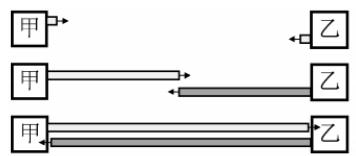

<em>(a) 时间最短的情况</em>

  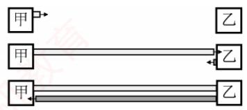

<em>(b) 时间最长的情况</em>

2）甲方发送一个数据帧的时间即发送时延 $t_{1}=1518\times8bit\div10Mb/s=1.2144ms$ ；乙方每成功收到一个数据帧，就向甲方发送一个确认帧，确认帧的发送时延 $t_{2}=64\times8bit\div10Mb/s=$

　　0.0512ms；甲方收到确认帧后，即发送下一数据帧，因此甲方的发送周期 $T =$ 数据帧发送时延 $+$ 确认帧发送时延 $+$ 双程传播时延 $= t_{1} + t_{2} + 2t_{0} = 1.2856\mathrm{ms}$ 。

　　有效数据传输速率 $=$ 信道利用率 $\times$ 信道带宽（最大数据传输速率），或有效数据传输速率 $=$ 发送周期内发送的数据量/发送周期。因此，甲方的有效数据传输速率为 $1500\times 8 / T = 12000\mathrm{bit} / 1.2856\mathrm{ms}\approx 9.33\mathrm{Mb / s}$ （以太网帧的数据部分为1500B）。

## 3.7 广域网

### 3.7.1 广域网的基本概念

　　广域网（Wide Area Network，WAN）通常指覆盖范围很广（远超一个城市）的长距离网络，其主要任务是长距离运送主机所发送的数据。连接广域网中各节点交换机的链路均为高速链路，因此广域网首要考虑的问题是通信容量是否足够大，以支持日益增长的通信需求。

　　广域网不等于互联网。互联网可以连接不同类型的网络，通常通过路由器实现互联。如图 3.32 所示，多个相距较远的局域网可通过路由器接入广域网，从而构成一个覆盖范围广泛的互联网。因此，一个局域网可通过广域网与另一个远程局域网通信。

  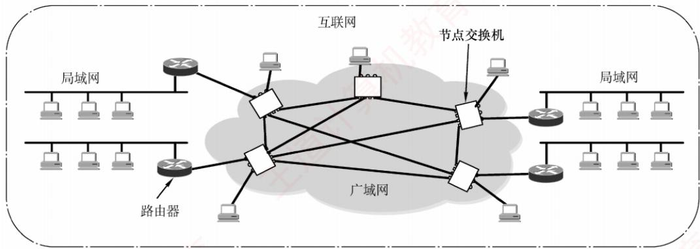

<em>图 3.32 由相距较远的局域网通过路由器与广域网相连而成的互联网</em>

　　广域网由若干节点交换机（注意不是路由器）及连接这些交换机的链路组成。节点交换机与路由器都用于转发分组，工作原理相似；但节点交换机工作在单个网络内部，而路由器用于连接多个网络构成的互联网。节点交换机的核心功能是存储并转发分组。广域网中节点之间采用点到点连接，但为提高网络可靠性，一个节点交换机通常与多个其他交换机相连。

　　广域网和局域网的区别与联系见表 3.5。

　　表 3.5 广域网和局域网的区别与联系

<table><tr><td>项目</td><td>广域网</td><td>局域网</td></tr><tr><td>覆盖范围</td><td>很广,通常跨区域</td><td>较小,通常在一个区域内</td></tr><tr><td>连接方式</td><td>通常采用点对点连接</td><td>普遍使用广播信道</td></tr><tr><td>OSI层次</td><td>三层:物理层,数据链路层,网络层</td><td>两层:物理层,数据链路层</td></tr><tr><td>联系与相似点</td><td colspan="2">1. 广域网和局域网都是互联网的重要构件,从互联网角度看,两者地位平等(不存在包含关系)2. 当主机在所属广域网或局域网的内部通信时,仅需使用该网络的物理地址</td></tr><tr><td>着重点</td><td>强调资源共享</td><td>强调数据传输</td></tr></table>

　　在通信线路质量较差的年代，高级数据链路控制（HDLC）因其可靠的传输机制而成为主流的数据链路层协议。如今，在误码率极低的点对点有线链路上，更简单的点对点协议（PPP）则成为使用最广泛的数据链路层协议。最新大纲已将 HDLC 删除，故本书不再介绍。

### 3.7.2 点对点协议

　　点对点协议（Point-to-Point Protocol，PPP）是目前最流行的点对点链路控制协议。主要有两种应用场景：用户接入互联网时与 ISP 之间的通信；两台网络设备之间通过直连专线通信。

　　在以太网中运行的 PPP 称为 PPPoE（PPP over Ethernet），它是对 PPP 的扩展。PPPoE 将 PPP 帧封装在以太网帧中，用户通过 ADSL 宽带上网时使用的就是 PPPoE。

　　PPP 由以下三个部分组成:

1）一个链路控制协议（LCP）。用来建立、配置、测试数据链路连接，及协商一些选项。

2）一套网络控制协议（NCP）。PPP 支持多种网络层协议（如 IP、IPX 等），每种网络层协议需通过对应的 NCP 进行配置，以建立和管理其逻辑连接。

3）一种将IP数据报封装到串行链路的方法。IP数据报作为PPP帧的信息部分被封装在PPP帧中传输，其长度受最大传送单元（MTU）限制。

　　PPP 帧的格式如图 3.33 所示，首部包含 4 个字段，尾部包含 2 个字段。

  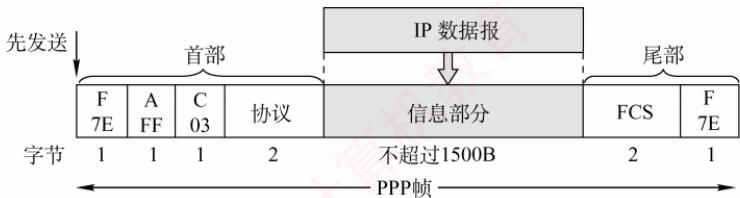

<em>图 3.33 PPP 帧的格式</em>

1）标志字段（F）。首部和尾部各有一个，占1B，规定为0x7E（01111110），用作帧的定界符，标识帧的开始与结束。为实现透明传输，当信息段中出现与标志字段相同的比特模式时，需要采取填充措施：当PPP使用异步传输时，采用字节填充法，使用的转义字符为0x7D（01111101）；当PPP使用同步传输时，采用零比特填充法。

2）地址字段（A）。占1B，规定为0xFF，其意义暂未定义。

3）控制字段（C）。占1B，规定为0x03，其意义也暂未定义。

4）协议字段。占2B，用于标识信息字段所承载的分组类型。若为0x0021，表示信息字段为IP数据报；若为0xC021，表示信息字段为LCP分组。

5）信息字段。长度可变，范围为0～1500B。

> **注意：**

　　由于 PPP 是点对点链路上（而非总线形网络），无须使用 CSMA/CD 协议，因此不存在最短帧长的限制，其信息字段最小可为 0B（相比之下，以太网帧的数据部分至少需 46B）。

6）帧检验序列（FCS）。占2B，采用CRC校验生成的冗余码，用于差错检测。

　　以用户拨号接入 ISP 的过程为例：用户拨号后，首先建立一条从用户到 ISP 的物理层连接；随后，用户向 ISP 发送一系列 LCP 分组（封装为 PPP 帧），协商链路参数并建立 LCP 连接；接着通过 NCP 配置网络层，ISP 为用户分配一个临时 IP 地址；通信结束后，依次释放网络层、数据链路层和物理层连接。PPP的状态转换如图3.34所示。

  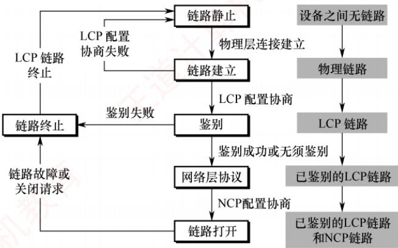

<em>图 3.34 PPP 的状态图</em>

　　具体解释如下:

1）PPP 链路的起始和终止均为链路静止状态，此时用户与 ISP 之间无物理层连接。

2）当检测到调制解调器的载波信号并成功建立物理层连接后，PPP 进入链路建立状态。

3）在链路建立状态下，LCP 开始协商配置选项（如最大帧长、鉴别协议等）。若协商成功，则 LCP 链路建立完成，PPP 进入鉴别状态。若协商失败，则退回到链路静止状态。

4）在鉴别状态下，若通信双方无须鉴别或身份鉴别成功，则进入网络层协议状态。若鉴别失败，则直接进入链路终止状态。

5）在网络层协议状态下，双方通过NCP配置网络层参数（如分配IP地址），配置完成后，PPP进入链路打开状态，双方即可开始数据通信。

6）数据通信结束后，若一方发送终止请求并在收到确认后，或链路发生故障，PPP 将进入链路终止状态；待调制解调器的载波信号停止后，最终返回链路静止状态。

　　PPP 的主要特点如下:

1）PPP在链路建立阶段使用确认机制，但在数据传输阶段仅提供无差错接收（通过CRC检验），不使用序号与确认机制，因此提供的是不可靠服务。

2）PPP 仅支持全双工的点对点链路，不支持多点线路。

3）PPP链路两端可运行不同的网络层协议，但仍能通过同一PPP链路进行通信。

4）PPP是面向字节的协议，所有PPP帧的长度均为整数个字节。

### 3.7.3 本节习题精选

#### 单项选择题

01. 局域网和广域网的差异不仅在于它们所覆盖的范围不同，还主要在于它们（）。

- A. 所使用的介质不同
- B. 所使用的协议不同
- C. 所能支持的通信量不同
- D. 所提供的服务不同

02. 广域网覆盖的地理范围从几十千米到几千千米，它的通信子网主要使用（）。

- A. 报文交换技术
- B. 分组交换技术
- C. 文件交换技术
- D. 电路交换技术

03. 广域网所使用的传输方式是（）。

- A. 广播式
- B. 存储转发式
- C. 集中控制式
- D. 分布控制式

04. 广域网的拓扑结构通常采用（）。

- A. 星形
- B. 总线形
- C. 网状
- D. 环形

05. 现在大量的计算机是通过诸如以太网这样的局域网连入广域网的，而局域网与广域网的互联是通过（）实现的。

- A. 路由器
- B. 资源子网
- C. 桥接器
- D. 中继器

06. 下列协议中不属于 TCP/IP 族的是（）。

- A. ICMP
- B. TCP
- C. FTP
- D. HDLC

07. 为实现透明传输（默认为异步线路），PPP 使用的填充方法是（）。

- A. 位填充
- B. 字符填充
- C. 对字符数据使用字符填充，对非字符数据使用位填充
- D. 对字符数据使用位填充，对非字符数据使用字符填充

08. 以下对 PPP 的描述中，错误的是（）。

- A. 具有差错控制能力
- B. 仅支持 IP
- C. 支持动态分配 IP 地址
- D. 支持身份验证

09. PPP 提供的功能有（）。

- A. 一种组帧方法
- B. 链路控制协议（LCP）
- C. 网络控制协议（NCP）
- D. A、B 和 C 都是

10. PPP中的LCP帧的作用是（）。

- A. 在建立状态阶段协商数据链路协议的选项
- B. 配置网络层协议
- C. 检查数据链路层的错误，并通知错误信息
- D. 安全控制，保护通信双方的数据安全

11. 下列关于 PPP 的叙述中，正确的是（）。

- A. PPP 是网络层协议
- B. PPP 支持半双工或全双工通信
- C. PPP 两端的网络层必须运行相同的网络层协议
- D. PPP 是面向字节的协议

12. PPP 提供的是（）。

- A. 无连接的不可靠服务
- B. 无连接的可靠服务
- C. 有连接的不可靠服务
- D. 有连接的可靠服务

### 3.7.4 答案与解析

#### 单项选择题

**01. B**

　　广域网和局域网之间的差异不仅在于它们所覆盖的范围不同，还在于它们所采用的协议和网络技术不同，广域网使用点对点等技术，局域网使用广播技术。

**02. B**

　　广域网的通信子网主要使用分组交换技术，将分布在不同地区的局域网或计算机系统互连起来，达到资源共享的目的。

**03. B**

　　广域网通常指覆盖范围很广的长距离网络，它由一些节点交换机及连接这些交换机的链路组成，其中节点交换机执行分组存储、转发功能。

**04. C**

　　广域网覆盖范围较广、节点较多，为了保证可靠性和可扩展性，通常需采用网状结构。

**05. A**

　　中继器和桥接器通常是指用于局域网的物理层和数据链路层的联网设备。目前局域网接入广域网主要是通过称为路由器的互联设备实现的。

**06. D**

　　TCP/IP 族主要包括 TCP、IP、ICMP、IGMP、ARP、RARP、UDP、DNS、FTP、HTTP 等。HDLC 是 ISO 提出的一个面向比特型的数据链路层协议，它不属于 TCP/IP 族。

**07. B**

　　PPP 是一种面向字节的协议，所有的帧长都是整数个字节。在异步线路中，PPP 采用字节填充法实现透明传输；在同步线路中，PPP 采用零比特填充法实现透明传输。

**08. B**

　　PPP 提供差错检测功能，但不提供纠错功能。PPP 两端的网络层可以运行不同的网络层协议，但仍能使用同一个 PPP 进行通信。PPP 可用于拨号连接，因此支持动态分配 IP 地址。PPP 双方建立 LCP 链路后，接着进入身份鉴别状态（可选）。

**09. D**

　　PPP 协议主要由三部分组成：① 链路控制协议（LCP）；② 网络控制协议（NCP）；③ 一个将 IP 数据报封装到串行链路的方法。因此，选项 A、B、C 都正确。

**10. A**

　　PPP 帧在默认配置下，地址和控制域总是常量，所以 LCP 提供了必要的机制，允许双方协商一个选项。在建立状态阶段，LCP 协商数据链路协议中的选项，它并不关心这些选项本身，只提供一个协商选择的机制。

**11. D**

　　PPP 是数据链路层协议，A 错误。根据 PPP 的特点可知 B、C 错误，D 正确。

**12. C**

　　PPP 是一种面向连接的点对点数据链路层协议, 虽然它在连接建立的过程中使用了确认机制, 但在数据帧的发送过程中只保证无差错接收（CRC 检验）, 检验正确就接收这个帧, 否则丢弃这个帧, 其他什么也不做。因此 PPP 提供的是有连接的不可靠服务。

## 3.8 数据链路层设备

### 3.8.1 网桥的基本概念

　　使用集线器在物理层扩展以太网会形成更大的冲突域 $^{①}$ 。为避免这一问题，早期采用网桥在数据链路层扩展以太网，此时原来的每个以太网称为一个网段。使用网桥扩展时，不会将原本独立的两个冲突域合并成一个更大的冲突域。这是因为网桥具有识别帧和转发帧的能力：

　　它根据帧首部的目的地址及自身的帧转发表，决定是转发还是丢弃所收到的帧，从而有效过滤通信量。网桥是早期的数据链路层设备，现已被以太网交换机取代，最新大纲中已将其删除。

### 3.8.2 以太网交换机

#### 1. 交换机的原理和特点

　　以太网交换机也称二层交换机，其中“二层”指其工作在数据链路层。从实质上讲，它是一个多端口的网桥，能够将网络划分为多个较小的冲突域，从而为每个用户提供更高的带宽。

　　在使用集线器构建的传统共享式以太网中，所有用户共享同一传输介质。例如，在 10Mb/s 网络中，若有 N 个用户，则每个用户的平均可用带宽仅为总带宽的 1/N，且在通信过程中极易发生冲突。而使用以太网交换机构建的交换式以太网则完全不同：每个端口提供独立的信道，主机通信时独占端口带宽（如 10Mb/s），无须与其他用户竞争介质。因此，一台有 N 个端口的交换机的总吞吐容量可达 $N \times 10Mb/s$ ，这正是交换机的最大优势所在。

> **考点追踪：** 以太网交换机的特点（2015）

　　以太网交换机的特点：

1）当交换机端口直接连接主机或其他交换机时，通常工作在全双工方式。

2）交换机具有并行性，可同时连通多对端口，使每对通信主机都能无冲突地传输数据，因此无须使用 CSMA/CD 协议。

3）当交换机端口连接集线器时，由于集线器连接的所有设备均处于同一冲突域中，必须使用CSMA/CD协议，且只能工作在半双工方式。

4）交换机是一种即插即用设备，其内部的帧转发表是通过自学习算法，基于网络中各主机间的实际通信自动建立和更新。

5）交换机采用专用交换结构芯片，因此交换速率较高。

> **考点追踪：** 直通交换的转发时延分析（2013）

　　以太网交换机主要采用两种交换模式：

1）直通交换方式。接收到帧的目的 MAC 地址后，立即决定转发端口，无须等待整个帧接收完毕。该方式的转发时延非常小，缺点是不进行差错检测，因此可能将一些无效帧转发给其他站。因此，直通交换不适用于需要速率匹配、协议转换或差错检测的场景。

2）存储转发交换方式。先完整接收并缓存整个帧，然后检查帧是否正确（可能还需要进行速率匹配或协议转换），若帧正确，则根据目的 MAC 地址转发；若帧出错，则直接丢弃。其优点是可靠性高，且支持不同速率端口之间的通信；缺点是转发时延较大。

　　交换机通常配备多种速率的端口，如 10Mb/s、100Mb/s 端口，以及多速率自适应端口。

#### 2. 交换机的自学习功能

> **考点追踪：** 以太网交换机基于 MAC 地址的转发机制（2009）

　　以太网交换机的转发和过滤决策基于帧的 MAC 地址。其中，过滤是指决定是否丢弃一个帧，而转发则是指决定将帧从哪个端口送出。这两项功能依赖于交换机的交换表。每个表项至少包含两个字段：主机的 MAC 地址；该主机所连接的交换机端口号。例如，在图 3.35 中，一台 4 端口的交换机分别连接四台计算机，其 MAC 地址分别为 A、B、C 和 D。交换表初始为空。

<em>(a) 交换表一开始是空的</em>

  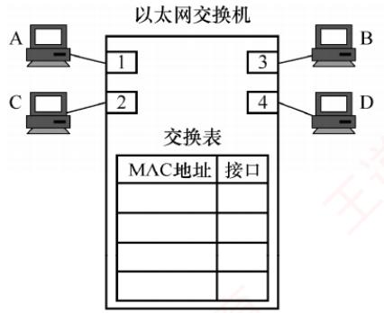

  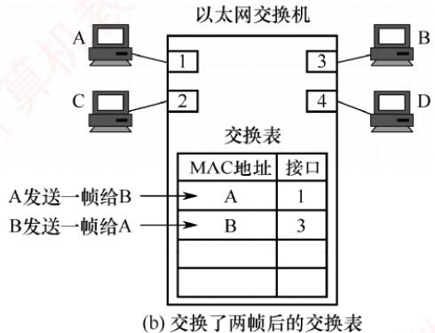

<em>图 3.35 以太网交换机中的交换表</em>

> **考点追踪：** 交换机的 MAC 地址学习过程（2014、2016、2021）

　　交换机通过自学习算法动态构建并维护转发表，收到数据帧后，执行以下步骤。

1）学习源 MAC 地址：交换机读取帧的源 MAC 地址，并将{MAC 地址，入端口}写入或更新到交换表。这一过程称为自学习，可使交换机动态掌握各主机的连接位置。

2）查看目的MAC地址：交换机解析帧的目的MAC地址，并根据其类型（单播、广播或组播）采取相应的转发策略。

3）决策与转发：

- 为单播帧（目的 MAC 地址为普通主机地址）时，交换机在交换表中查找该目的地址：若找到对应表项（已知目的地址），则仅从该表项所指端口转发，实现精准交付；若未找到对应表项（未知目的地址），则执行未知单播帧泛洪（或称洪泛），即将帧从除接收端口外的所有其他活动端口转发出去，确保目标主机能收到。

- 为广播帧（目的 MAC 地址为 FF:FF:FF:FF:FF:FF）时，交换机不查询转发表，直接将帧泛洪到除接收端口外的所有其他活动端口。

- 为组播帧（目的地址为组播MAC地址）时，交换机通常也默认执行泛洪处理。

　　假设主机 A 从端口 1 向主机 B 发送帧。交换机收到后，学习源地址：将 $\{A, 1\}$ 写入交换表，此后任何发往主机 A 的帧都将从端口 1 转发。执行未知目的地址泛洪：未找到主机 B 的对应表项，将帧发送至端口 2、3、4（除端口 1 外）。主机 C 和 D 收到帧后，发现目的地址非自身，丢弃该帧；仅主机 B 接收。

　　随后，假设主机 B 从端口 3 向主机 A 回复帧。交换机收到后，学习源地址：将 $\{B, 3\}$ 写入交换表。执行已知目的地址精准交付：查表发现主机 A 对应端口 1，于是直接从端口 1 单播转发该帧。

　　至此，交换机已通过 “A→B” 和 “B→A” 的通信，完整学习了主机 A 与 B 的位置信息。随着时间的推移，只要主机 C 和 D 也主动发送帧，交换机便会逐步学习其 MAC 地址与端口的映射关系。最终，交换表将包含所有活跃主机的信息，实现高效、精准的转发。

　　由于网络中的主机会动态变化，交换表必须具备自动更新的能力。为此，每个表项均设有老化时间，超时未更新的表项会被自动删除，以确保表项始终反映当前网络的实际连接状态。

　　为了提高可靠性，以太网交换机组网中常引入冗余链路，但可能形成环路，导致广播风暴和帧无限循环。为此，交换机采用生成树协议（STP），在不改变物理拓扑的前提下，通过逻辑阻塞部分冗余端口，构建一棵覆盖所有交换机的无环生成树，确保任意两台主机间仅有一条有效路径，进而消除环路。同时，当主链路出现故障时，STP可重新激活被阻塞端口，恢复连通性，实现自动容错。

### 3.8.3 共享式以太网

#### 1. 共享式以太网的基本特点

> **考点追踪：** 共享式与交换式以太网的区别（2016）

　　共享式以太网是指以集线器（Hub）为中心连接设备构建的局域网。所有主机通过双绞线接入集线器，共享同一物理传输介质和总带宽。从逻辑上看，整个网络构成单一的局域网段，所有通信均发生在同一个冲突域和广播域中。共享式以太网的主要特点如下。

1）工作在物理层：集线器仅对电信号进行放大和再生，不具备帧解析能力，无法识别 MAC 地址，也无任何智能转发或过滤功能。

2）采用半双工通信和 CSMA/CD 协议：由于介质共享，任意时刻只能有一对主机成功通信，其他发送尝试将引发冲突，必须依赖 CSMA/CD 协议进行冲突检测与退避。

3）单一冲突域与广播域：所有主机处于同一个冲突域和同一个广播域内。

4）带宽共享，效率低下：若网络中有 N 台主机，则每台主机的平均带宽仅为总带宽的 1/N。

5）盲目广播所有帧：集线器将收到的帧无差别地转发至所有其他端口，各主机需自行判断是否接收，不仅浪费带宽，还存在通信隐私泄露的风险。

　　正由于上述缺陷，共享式以太网早已于20世纪末退出历史舞台，现代网络不再部署。

#### 2. 共享式与交换式以太网的转发行为对比

　　假设交换机已建立完整的转发表，以下从三种典型场景分析两类网络的处理差异：

1）主机发送普通帧。对于共享式以太网，集线器将帧转发到除接收端口外的所有端口，各主机网卡根据帧的目的 MAC 地址决定是否接收。对于交换式以太网，交换机查询转发表后，仅将帧从目标主机所在的端口转发，其他主机完全无感知。

2）主机发送广播帧。对于共享式以太网，集线器将帧转发到除接收端口外的所有端口，各主机网卡识别目的 MAC 地址为广播地址后接收该帧。对于交换式以太网，交换机识别目的 MAC 地址为广播地址，执行泛洪处理，各主机收到该广播帧后予以接收。两种情况效果相同，但原理不同：前者是物理层盲目复制，后者是数据链路层有意识洪泛。

3）多对主机同时通信。对于共享式以太网，必然发生冲突，需执行 CSMA/CD 协议的退避重传机制。对于交换式以太网，支持多对端口并行交互，各对通信互不干扰。

> **考点追踪：** 各类网络设备对冲突域和广播域的影响（2020、2022）

　　可见，集线器既不隔离广播域，也不隔离冲突域，而交换机不隔离广播域，但隔离冲突域。共享式以太网与交换式以太网的特性对比如表3.6所示。

　　表 3.6 共享式以太网与交换式以太网的特性对比

<table><tr><td>网络类型</td><td>工作层次</td><td>通信模式</td><td>带宽分配</td><td>使用 CSMA/CD 协议?</td><td>安全性</td></tr><tr><td>共享式以太网</td><td>物理层</td><td>半双工</td><td>共享</td><td>是</td><td>低</td></tr><tr><td>交换式以太网</td><td>数据链路层</td><td>全双工(默认)</td><td>独占</td><td>否(全双工下)</td><td>较高</td></tr></table>

### 3.8.4 本节习题精选

#### 单项选择题

01. 下列网络连接设备都工作在数据链路层的是（）。

- A. 中继器和集线器
- B. 集线器和网桥
- C. 网桥和局域网交换机
- D. 集线器和局域网交换机

02. 下列关于数据链路层设备的叙述中，错误的是（）。

- A. 交换机将网络划分成多个网段，一个网段的故障不会影响到另一个网段的运行
- B. 交换机可互连不同的物理层、不同的MAC子层及不同速率的以太网
- C. 交换机的每个接口节点所占用的带宽不会因为接口节点数量的增加而减少，且整个交换机的总带宽会随着接口节点的增加而增加
- D. 利用交换机可以实现虚拟局域网（VLAN），VLAN可以隔离冲突域，但不能隔离广播域

03. 下列（）不是使用交换机分割网络所带来的好处。

- A. 减少冲突域的范围
- B. 在一定条件下增加了网络的带宽
- C. 过滤网段之间的数据
- D. 缩小了广播域的范围

04. 下列不能分割冲突域的设备是（）。

- A. 集线器
- B. 交换机
- C. 路由器
- D. 网桥

05. 局域网交换机实现的主要功能在（）。

- A. 物理层和数据链路层
- B. 数据链路层和网络层
- C. 物理层和网络层
- D. 数据链路层和应用层

06. 交换机能比集线器提供更好的网络性能的原因是（）。

- A. 交换机支持多对用户同时通信
- B. 交换机使用差错控制减少出错率
- C. 交换机使网络的覆盖范围更大
- D. 交换机无须设置，使用更方便

07. 通过交换机连接的一组工作站（）。

- A. 组成一个冲突域，但不是一个广播域
- B. 组成一个广播域，但不是一个冲突域
- C. 既是一个冲突域，又是一个广播域
- D. 既不是冲突域，又不是广播域

08. 一个16接口的集线器的冲突域和广播域的个数分别是（）。

- A. 16, 1
- B. 16, 16
- C. 1, 1
- D. 1, 16

09. 一个16个接口的以太网交换机，冲突域和广播域的个数分别是（）。

- A. 1, 1
- B. 16, 16
- C. 1, 16
- D. 16, 1

10. 下列关于用集线器连接的共享式以太网的说法中，正确的是（）。

- A. 以太网的物理拓扑是总线形结构
- B. 以太网提供有确认的无连接服务
- C. 以太网参考模型一般只包括物理层和数据链路层
- D. 以太网不一定使用CSMA/CD协议

11. 下列关于广播式网络的说法中，错误的是（）。

- A. 共享广播信道
- B. 不存在路由选择问题
- C. 可以不要网络层
- D. 不需要服务接入点

12. 对于由交换机连接的 10Mb/s 以太网, 若有 10 个用户, 则每个用户能占有的带宽为 （）。

- A. 1Mb/s
- B. 2Mb/s
- C. 10Mb/s
- D. 100Mb/s

13. 如下图所示，某学院的以太网交换机有 3 个接口分别和 3 个系的以太网相连，另外 3 个接口分别和万维网服务器、电子邮件服务器以及一个连接互联网的路由器相连，A、B 和 C 都是 100Mb/s 以太网交换机。假设所有链路的速率都是 100Mb/s，且图中 9 台主机中的任何一台都可以与任何一台服务器或主机通信。这 9 台主机和 2 台服务器产生的总吞吐量最大为（）。若把 3 个系的以太网交换机都换成 100Mb/s 集线器，则这 9 台主机和 2 台服务器产生的总吞吐量最大为（）。若把所有以太网交换机都换成 100Mb/s 集线器，则这 9 台主机和 2 台服务器产生的总吞吐量最大为（）。

  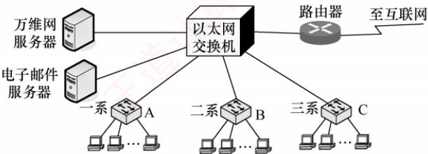

- A. $1100\mathrm{Mb / s}$ ， $500\mathrm{Mb / s}$ ， $100\mathrm{Mb / s}$
- B. $500\mathrm{Mb / s}$ ， $500\mathrm{Mb / s}$ ， $100\mathrm{Mb / s}$
- C. $1100\mathrm{Mb / s}$ ， $1100\mathrm{Mb / s}$ ， $500\mathrm{Mb / s}$
- D. $500\mathrm{Mb / s}$ ， $1100\mathrm{Mb / s}$ ， $500\mathrm{Mb / s}$

14. 假设以太网 A 中 80% 的通信量在本局域网内进行，其余 20% 在本局域网与因特网之间进行，而以太网 B 正好相反。在这两个局域网中，一个使用集线器，另一个使用交换机，则交换机应放置的局域网是（）。

- A. 以太网 A
- B. 以太网 B
- C. 任意以太网
- D. 都不合适

15. 在使用以太网交换机的局域网中，以下（）是正确的。

- A. 局域网中只包含一个冲突域
- B. 交换机的多个接口可以并行传输
- C. 交换机可以隔离广播域
- D. 交换机根据 LLC 目的地址转发

16. 以太网交换机的自学习功能是指（）。

- A. 记录帧的源 MAC 地址与该帧进入交换机的接口号
- B. 记录帧的目的 MAC 地址与该帧进入交换机的接口号
- C. 记录分组的源 IP 地址与该分组进入交换机的接口号
- D. 记录分组的目的 IP 地址与该分组进入交换机的接口号

17. 当以太网交换机某接口收到帧时，若在交换表中未找到目的 MAC 地址，则（）。

- A. 将帧发送到特定接口进行 ARP 查询
- B. 丢弃该帧
- C. 将帧发送到除本接口外的所有接口
- D. 将帧发送给 DHCP 服务器

18. 某以太网如下图所示，假设交换机1和交换机2的交换表初始为空，各主机之间依次进行以下通信： $\mathrm{A}\rightarrow \mathrm{B}$ 、 $\mathrm{H}\rightarrow \mathrm{A}$ 、 $\mathrm{E}\rightarrow \mathrm{X}$ 、 $\mathrm{X}\rightarrow \mathrm{E}$ ，则关于上述通信过程叙述错误的是（）。

  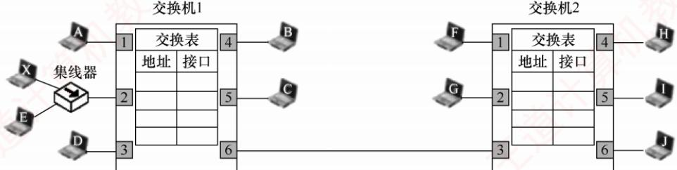

- A. 当 $\mathrm{A}\rightarrow \mathrm{B}$ 时，除A外的全部主机都能收到A发送的帧
- B. 当 $\mathrm{H}\rightarrow \mathrm{A}$ 时，仅A能收到H发送的帧
- C. 当 $\mathrm{E}\rightarrow \mathrm{X}$ 时，仅X能收到E发送的帧
- D. 当 $\mathrm{X}\rightarrow \mathrm{E}$ 时，交换机2收不到X发送的帧

19. 【2009 统考真题】以太网交换机进行转发决策时使用的 PDU 地址是（）。

- A. 目的物理地址
- B. 目的 IP 地址
- C. 源物理地址
- D. 源 IP 地址

20. 【2013 统考真题】对于 $100\mathrm{Mb / s}$ 的以太网交换机，当输出端口无排队，以直通交换方式转发一个以太网帧（不包括前导码）时，引入的转发时延至少是（）。

- A. $0\mu \mathrm{s}$
- B. $0.48\mu \mathrm{s}$
- C. $5.12\mu \mathrm{s}$
- D. $121.44\mu \mathrm{s}$

21. 【2014 统考真题】某以太网拓扑及交换机的当前转发表如下图所示，主机 00-e1-d5-00-23-a1 向主机 00-e1-d5-00-23-c1 发送一个数据帧，主机 00-e1-d5-00-23-c1 收到该帧后，向主机 00-e1-d5-00-23-a1 发送一个确认帧，交换机对这两个帧的转发端口分别是（）。

  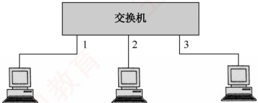

<table><tr><td>目的地址</td><td>端口</td></tr><tr><td>00-e1-d5-00-23-b1</td><td>2</td></tr></table>

- A. $\{3\}$ 和 $\{1\}$
- B. $\{2,3\}$ 和 $\{1\}$
- C. $\{2,3\}$ 和 $\{1,2\}$
- D. $\{1,2,3\}$ 和 $\{1\}$

22. 【2015 统考真题】下列关于交换机的叙述中，正确的是（）。

- A. 以太网交换机本质上是一种多端口网桥
- B. 通过交换机互连的一组工作站构成一个冲突域
- C. 交换机每个接口所连的网络构成一个独立的广播域
- D. 以太网交换机可实现采用不同网络层协议的网络互连

23. 【2016 统考真题】若主机 H2 向主机 H4 发送一个数据帧，主机 H4 向主机 H2 立即发送一个确认帧，则除 H4 外，从物理层上能够收到该确认帧的主机还有（）。

  

  

- A. 仅H2
- B. 仅H3
- C. 仅H1、H2
- D. 仅H2、H3

### 3.8.5 答案与解析

#### 单项选择题

**01. C**

　　中继器和集线器都属于物理层设备，网桥和局域网交换机属于数据链路层设备。

**02. D**

　　交换机的优点是每个接口节点所占用的带宽不会因为接口节点数量的增加而减少，且整个交换机的总带宽会随着接口节点的增加而增加。另外，利用交换机可以实现虚拟局域网（VLAN），VLAN不仅可以隔离冲突域，还可以隔离广播域。因此选项C正确，选项D错误。

**03. D**

　　交换机可以隔离信息，将网络划分成多个网段，隔离出安全网段，防止其他网段内的用户非法访问。因为网络分段，各网段相对独立，所以一个网段的故障不影响另一个网段的运行。因此B、C正确。根据交换机的特点可知A正确，D错误。

**04. A**

　　冲突域是指共享同一信道的各个站点可能发生冲突的范围。物理层设备集线器不能分割冲突域，数据链路层设备交换机和网桥可以分割冲突域，但不能分割广播域，而网络层设备路由器既可分割冲突域，又可分割广播域。

**05. A**

　　局域网交换机是数据链路层设备，能实现数据链路层和物理层的功能。

**06. A**

　　交换机能隔离冲突域，在全双工方式下支持多对节点同时通信，从而提高了网络的效率。

**07. B**

　　交换机是数据链路层的设备，数据链路层的设备可以隔离冲突域，但不能隔离广播域，因此本题选 B。另外，物理层设备（集线器等）既不能隔离冲突域，又不能隔离广播域；网络层设备（路由器）既可以隔离冲突域，又可以隔离广播域。

**08. C**

　　物理层设备（中继器和集线器）既不能分割冲突域，又不能分割广播域。

**09. D**

　　以太网交换机的各接口之间都是冲突域的终止点，但 LAN 交换机不隔离广播，所以冲突域的个数是 16，广播域的个数是 1。

**10. C**

　　用集线器连接的以太网逻辑上是总线形结构，物理上是星形结构，选项 A 错误。以太网设计的原则是简化通信，因此采用的是无确认、无连接的服务，选项 B 错误。以太网属于局域网的一种设计标准，只包括物理层和数据链路层，比如在物理层以太网规定采用曼彻斯特编码，在数据链路层规定采用 CSMA/CD 协议，选项 C 正确。用集线器连接的以太网一定工作在半双工方式下，因此一定要采用 CSMA/CD 协议，选项 D 错误。

**11. D**

　　广播式网络使用共享的广播信道进行通信，通常是局域网的一种通信方式（局域网工作在数据链路层），因此可以不需要网络层，也就不存在路由选择问题。但数据链路层使用物理层的服务必须通过服务接入点，数据链路层向高层提供服务也必须通过服务接入点。

**12. C**

　　对于集线器连接的 10Mb/s 共享式以太网，若有 N 个用户，则每个用户的平均带宽仅为总带宽的 1/N。当采用交换机连接时，虽然从每个接口到主机的带宽还是 10Mb/s，但因为一个用户通信时是独占带宽的，而不是和其他用户共享带宽的，所以每个用户仍可得到 10Mb/s 的带宽。

**13. A**

　　9 台主机和 2 台服务器都全速工作时的总吞吐量为 $900 + 200 = 1100 \, Mb/s$ 。若把 3 个系的以太网交换机都换成 100Mb/s 集线器，则每个系是一个碰撞域，最大吞吐量为 100Mb/s，加上每台服务器 100Mb/s 的吞吐量，得出总吞吐量最大为 500Mb/s。若把所有的以太网交换机都换成 100Mb/s 集线器，则整个网络是一个碰撞域，因此吞吐量最大为 100Mb/s。

**14. A**

　　交换机能将网络分成较小的冲突域，而集线器连接的设备属于同一个冲突域。当一个局域网中80%的通信量在本局域网内进行时，若使用集线器，则会增加冲突和延迟，降低整个网络的效率，而若使用交换机将不同网段的通信隔开，则可以提高网络性能。

**15. B**

　　交换机可以隔离冲突域，因此它的每个接口所连接的网段都属于不同的冲突域，选项A错误。交换机可在同一时段内支持多个接口之间的并行通信，而不会相互干扰，这是因为交换机内部有一条高带宽的背部总线和一个内部交换矩阵，可以根据帧的目的 MAC 地址快速地将帧转发到相应的接口。交换机不能隔离广播域，选项 C 错误。LLC 是逻辑链路控制，它在 MAC 层上，用于向网络提供一个接口，以隐藏各种 802 网络之间的差异，交换机是按 MAC 地址转发的，选项 D 错误。

**16. A**

　　以太网交换机的自学习功能是指记录帧的源 MAC 地址与该帧进入交换机的接口号，并将这些信息存储在交换机的交换表中，以便于后续的转发决策。

**17. C**

　　当以太网交换机的某个接口收到帧时，若在交换表中未找到目的 MAC 地址，则将该帧从除本接口外的所有接口发送出去，这种发送方法也称洪泛法。

**18. C**

　　当 A→B 时，交换表都为空，交换机 1 和交换机 2 都进行洪泛发送，因此除 A 外的全部主机都能收到 A 发送的帧。当 H→A 时，因为交换机 2 已登记 A 所在的接口为 3，所以只向接口 3 转发，交换机 1 收到帧后，因为交换机 1 已登记 A 所在的接口为 1，所以只向接口 1 转发，因此仅 A 能收到 H 发送的帧。当 E→X 时，集线器向除输入接口外的所有接口转发该帧，交换机 1 和交换机 2 也进行洪泛发送，因此除 E 外的全部主机都能收到 A 发送的帧。当 X→E 时，因为交换机 1 已登记 E 所在的接口为 2，所以仅登记 X 所在的接口，并丢弃该帧。

**19. A**

　　交换机实质上是一个多接口网桥，工作在数据链路层，数据链路层使用物理地址进行转发，而转发到目的地需要使用目的地址。因此 PDU 地址是目的物理地址。

**20. B**

　　直通交换方式的输入接口接收到一个帧时，只检查帧的目的 MAC 地址决定输出接口，引入的转发时延至少为读取目的 MAC 地址所需的时间。目的 MAC 地址共 6B，引入的转发时延至少为 $6 \times 8 \, bit \div 100 \, Mb/s = 0.48 \, \mu s$ 。存储转发方式引入的转发时延则至少为读取整个帧的时间。

**21. B**

　　当 00-e1-d5-00-23-a1 向 00-e1-d5-00-23-c1 发送数据帧时，交换机转发表中没有 00-e1-d5-00-23-c1 这一项，所以向除接口 1 外的所有接口广播这个帧，即接口 2、3 会转发这个帧，同时交换机会把（目的地址 00-e1-d5-00-23-a1，接口 1）这一项加入转发表。而当 00-e1-d5-00-23-c1 向 00-e1-d5-00-23-a1 发送确认帧时，因为转发表中已有 00-e1-d5-00-23-a1 这一项，所以交换机只向接口 1 转发。

**22. A**

　　本质上说，交换机就是一个多接口的网桥（选项 A 正确），工作在数据链路层（因此不能实现不同网络层协议的网络互连，选项 D 错误），交换机能经济地将网络分成小的冲突域（选项 B 错误）。广播域属于网络层概念，只有网络层设备（如路由器）才能分割广播域（选项 C 错误）。

**23. D**

　　交换机（Switch）可以隔离冲突域。若 H2 向 H4 发送数据帧，则 H2 及其对应接口就写入交换表。当 H4 向 H2 发送确认帧时，交换机查找交换表后，将该确认帧从 H2 对应的接口转发出去。集线器（Hub）无法隔离冲突域，因此 Hub 会向所有接口（除输入接口外）广播该确认帧的数据信号。因此，从物理层上能够收到该确认帧的主机有 H2 和 H3。

## 3.9 本章小结及疑难点

1. 为何连续 ARQ 在接收窗口为 1、用 $n$ 比特编号时，发送窗口最多只能是 $2^{n} - 1$ ?

　　在连续 ARQ 协议中，若接收窗口大小为 1，则发送窗口大小不得超过 $2^{n}-1$ ，否则将导致新帧与重传帧无法区分，造成数据错误。假设用 3 比特进行编号，可表示 0～7 共 8 个不同序号。

　　具体来看：设发送窗口为8，发送方一次性发出0～7号帧后暂停。

- 若所有确认都成功返回，发送方将接着发送下一轮序号为 0～7 的新帧；

- 若所有确认都丢失，发送方超时后会重传原来的0～7号旧帧。

　　由于接收窗口为 1，接收方只根据序号判断是否接收，无法区分收到的 0～7 是新帧还是重传帧。若把重传帧误认为新数据，就会造成重复或错误。因此，发送窗口不能等于 8。只要将其限制为 7，就能保证已发送未确认的帧和未来新帧的序号不会完全重叠，从而避免歧义。

2. 为什么 PPP 不采用帧编号和确认机制来实现可靠传输？

　　PPP 不使用帧序号和确认机制主要有两方面原因:

　　首先，在因特网中，PPP 承载的是 IP 数据报。即使链路层实现可靠传输，数据在路由器的网络层仍可能因拥塞被丢弃，因此链路层的可靠性无法保证端到端可靠交付。

　　其次，现代物理链路误码率很低，若引入重传和确认机制，只会增加开销和延迟，得不偿失。实际上，PPP 通过 FCS 字段对每帧做 CRC 校验：发现差错立即丢弃，绝不向上层传递错误数据。而真正的差错恢复由高层协议（如 TCP）在端到端基础上完成。

　　因此，PPP 采用 “有错即弃、可靠由上层负责” 的设计，既轻量高效，又符合端到端原则。

3. 在以太网中，为什么说：若一个帧在冲突窗口内未发生冲突，则后续不会再发生冲突？

　　在CSMA/CD协议机制下，节点发送前先侦听信道，仅在空闲时开始发送。冲突窗口是检测冲突的最晚时限：若存在冲突，最迟会在该时间内被发送方感知。具体而言，假设节点A开始发送帧。若在帧的前 $2r$ （ $r$ 为信号从A到最远节点的传播时延）内未检测到冲突，说明：

- 此时帧的首部已到达所有其他节点；

- 其他节点在侦听到信道忙后，不会启动新发送。

　　因此，只要在冲突窗口内未发生冲突，此后信道已被该帧“占据”，其他节点将持续侦听到载波而保持沉默，不可能再产生新冲突。

4. 将以太网速率从 $10\mathrm{Mb / s}$ 提升到 $100\mathrm{Mb / s}$ 时，为满足CSMA/CD协议的冲突检测要求，需做哪些调整？

　　由于CSMA/CD协议要求最短帧的发送时间不小于冲突窗口（2r），当速率提高10倍后，若网段长度不变，信号传播时延 $r$ 不变，但发送同样长度帧的时间缩短为原来的1/10，则无法保证在冲突窗口内完成发送，导致冲突无法被检测。为此，100Base-T以太网做了两项关键调整：

- 将网段最大长度从 $500\mathrm{m}$ 减小到 $100\mathrm{m}$ ，以缩短传播时延 $r$ 。

- 将帧间最小间隔从 $9.6\mu \mathrm{s}$ 缩减为 $0.96\mu \mathrm{s}$ ，以匹配更高传输速率。

　　这两项调整使最短帧（64B）的发送时间不小于冲突窗口，以维持CSMA/CD协议正常工作。
