## 【考纲内容】

（一）网络层的功能

　　异构网络互连；路由与转发；SDN的基本概念；拥塞控制

（二）路由算法

　　静态路由与动态路由；距离-向量算法；链路状态算法；层次路由

（三）IPv4

　　IPv4 分组；IPv4 地址与 NAT；划分子网与子网掩码、CIDR、路由聚合、ARP、DHCP 与 ICMP

（四）IPv6

　　IPv6的主要特点；IPv6地址

（五）路由协议

　　自治系统；域内路由与域间路由；RIP路由协议；OSPF路由协议；BGP路由协议

（六）IP多播

　　多播的概念；IP多播地址

（七）移动 IP

　　移动 IP 的概念；移动 IP 通信过程

（八）网络层设备路由器的组成和功能；路由表与分组转发

## 【复习提示】

　　本章是历年考查的重中之重，尤其是结合第3章、第5章、第6章出综合题的概率很大。其中IPv4和路由的相关知识点是核心，历年真题都有涉及，因此必须牢固掌握其原理，还要多做题，以便灵活应用。本章的其他知识点，如IPv6、IP多播、移动IP也要有所了解。

## 4.1 网络层的功能

　　网络层提供主机到主机的通信服务，主要任务是将分组从源主机经过多个网络和多段链路传输到目的主机。该任务可划分为分组转发和路由选择两种重要功能。

　　OSI 参考模型曾主张在网络层使用面向连接的虚电路服务，认为应由网络自身来保证通信的可靠性。而 TCP/IP 体系结构的网络层提供的是无连接的数据报服务，其核心思想是应由用户主机来保证通信的可靠性。虚电路和数据报服务将在 4.1.3 节中介绍。

　　在互联网采用的 TCP/IP 体系结构中，网络层向上只提供简单灵活的、无连接的、尽最大努力交付的数据报服务。也就是说，所传送的分组可能出错、丢失、重复或失序，这就使得网络中的路由器可以做得比较简单，且价格低廉。通信的可靠性可由更高层的传输层来负责。

### 4.1.1 异构网络互连

　　互联网是由全球范围内数以百万计的异构网络互连起来的。这些网络的拓扑结构、寻址方案、差错处理方法、路由选择机制等都不尽相同。网络层所要完成的任务之一就是实现这些异构网络的互连。网络互连是指将两个以上的计算机网络，通过一定的方法，用一些中继系统相互连接起来，以构成更大的网络系统。根据所在的层次，中继系统分为以下4种：

1）物理层中继系统：转发器，集线器。

2）数据链路层中继系统：网桥或交换机。

3）网络层中继系统：路由器。

4）网络层以上的中继系统：网关。

　　当使用物理层或数据链路层的中继系统时，只是把一个网络扩大了，而从网络层的角度看，它仍然是同一个网络，一般并不称为网络互连。因此，网络互连通常是指用路由器进行网络连接和路由选择。路由器是一台专用计算机，用于在互联网中进行路由选择。

> **注意：**

　　由于历史原因，许多有关 TCP/IP 的文献也将网络层的路由器称为网关。

　　TCP/IP 在网络互连方面的做法是在网络层采用标准化协议，但相互连接的网络可以是异构的。图 4.1(a) 表示许多计算机网络通过一些路由器进行互连。因为参与互连的计算机网络都使用相同的网际协议 IP，通过 IP 协议就可使这些性能各异的网络在网络层上看起来像是一个统一的网络，所以可以把互连后的网络视为如图 4.1(b) 所示的一个虚拟互连网络，简称 IP 网络。

  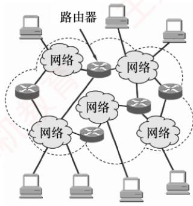

<em>(a) 实际互连网络</em>

  

<em>(b) 虚拟互连网络</em>

<em>图 4.1 IP 网络的概念</em>

　　使用 IP 网络的好处是：当 IP 网络上的主机进行通信时，就好像在单个网络上通信一样，而看不见互连的各个网络的具体异构细节（如具体的编址方案、路由选择协议等）。

### 4.1.2 路由与转发

　　路由器的核心功能包括路由选择与分组转发：

1）路由选择。路由器运行路由协议，通过定期与相邻路由器交换信息，获取网络拓扑变化，动态生成并维护路由表，从而计算到达目的网络的最优路径。

2）分组转发。路由器根据转发表将到达的分组从合适的输出端口转发出去。

　　路由表由路由选择算法生成，侧重于拓扑计算。转发表则由路由表导出，其结构应使查找最优化。在讨论路由选择的原理时，往往不区分转发表和路由表，而笼统地使用路由表一词。

### 4.1.3 网络层提供的两种服务

　　分组交换网根据其通信子网向端点系统提供的服务，还可进一步分为面向连接的虚电路服务和无连接的数据报服务。这两种服务方式都是由网络层提供的。

#### 1. 虚电路

> **考点追踪：** 虚电路的特点（2020）

　　在虚电路方式中，两台主机进行通信前，必须首先在网络层建立一条逻辑连接，即虚电路（Virtual Circuit，VC）。该连接一旦建立，其对应的端到端传输路径即被固定。与电路交换类似，整个通信过程可分为三个阶段：虚电路建立、数据传输与虚电路释放。

　　每次建立虚电路时，系统为其分配一个未使用过的虚电路号（VCID），以区别于同一节点上的其他虚电路。此后，双方就沿着已建立的虚电路传送分组。值得注意的是，仅在连接建立阶段使用完整的源和目的地址，后续分组的首部仅需携带虚电路号。每个中间节点都维护一个虚电路表，其中记录了每条虚电路的VCID及下一跳信息，这些内容在连接建立过程中确定。

　　下面以图 4.2 为例说明虚电路服务的工作原理，假设主机 A 向主机 B 发送分组。

  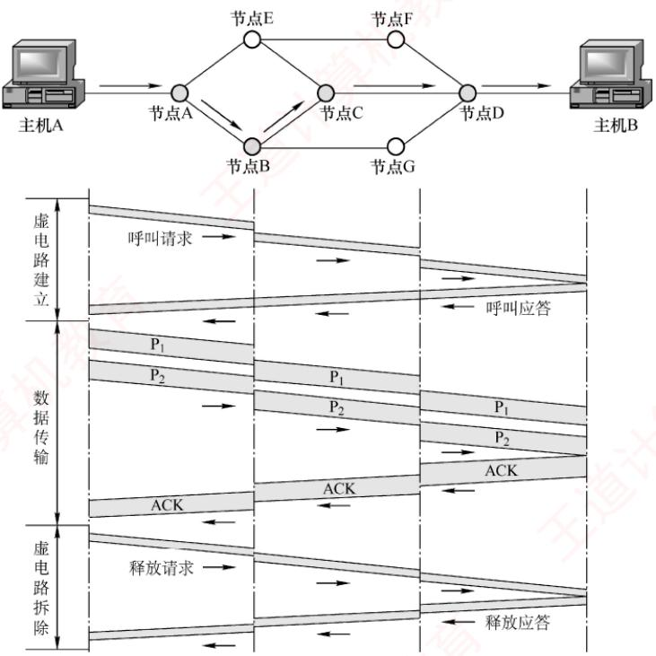

<em>图 4.2 虚电路方式的工作原理</em>

1）数据传输前，主机 A 与主机 B 需先建立虚电路连接：A 发送 “呼叫请求” 分组，经由中间节点转发至 B；若 B 同意建立连接，则返回 “呼叫应答” 分组予以确认。

2）虚电路建立后，双方即可相互传输数据分组。

3）传输结束后，主机A发送“释放请求”分组，逐段拆除虚电路。

　　注意，图4.2所示的数据传输是有确认的，接收方收到分组后需返回确认。

　　通过上述例子，可总结出虚电路服务具有以下特点：

1）建立与释放连接开销大。不适合交互应用或少量数据交换，适合长时间或大量数据交换。

2）路由选择在连接建立阶段完成。建立完成后，就固定了传输路径。

3）提供可靠、有序的分组交付，并支持端到端的流量控制。

4）对节点或链路的故障敏感。任一故障都会导致所有经过该节点或链路的虚电路中断。

5）分组首部开销小。因为其无须携带完整的目的地址，而只需携带虚电路号。

　　虚电路之所以是虚的，是因为这条链路并非专用的，而是可被多条虚电路共享。

#### 2. 数据报

　　在数据报方式中，发送分组前无须建立连接。源主机将应用层报文分割为若干数据段，并封装成携带完整源地址和目的地址的独立分组。中间节点对分组短暂缓存，独立选路后随即转发。网络层不提供服务质量保证，也不确保可靠传输，因此分组可能丢失、重复、失序或出错。这就使得网络中的路由器比较简单，且造价低廉（与电话网络相比）。

　　下面以图 4.3 为例说明数据报服务的工作原理，假设主机 A 向主机 B 发送分组。

  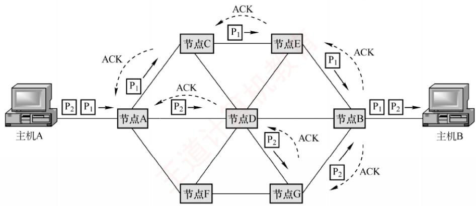

<em>图 4.3 数据报方式转发分组</em>

1）主机A将分组逐个发送至与其直连的节点A，该节点对分组进行短暂缓存。

2）随后，节点 A 查询其转发表。网络状态动态变化，导致转发表随之更新，各分组独立进行路由选择，可能经由不同路径转发（例如部分发往节点 C，部分发往节点 D）。

3）后续节点以相同的方式转发分组，直至其最终抵达主机B。

　　在传输过程中，分组仅占用当前链路的资源。得益于存储转发机制和资源共享，多个主机可以同时通信——例如主机 A 在发送分组的同时，主机 B 也可向其他主机发送数据。

　　通过上述例子，可总结出数据报服务具有以下特点：

1）无须建立连接。发送方可随时发送分组，交换节点也可随时接收并处理。

2）尽最大努力交付。网络不保证可靠性，分组可能丢失、出错或失序；由于每个分组独立选路，转发路径可能不同，可能导致失序到达。

3）分组携带完整地址。每个分组均包含完整的源地址和目的地址，以支持独立路由。

4）存在排队时延与丢包风险。分组在交换节点中需排队处理；网络拥塞时，时延显著增加，还可能被主动丢弃。

5）故障适应能力强。当某节点或链路失效时，可通过更新转发表动态选择绕行路径。

6）资源利用率高。通信双方不独占链路，带宽等资源由多个会话共享。

　　采用这种设计思想的好处是：网络的造价大大降低、运行方式灵活、能够适应多种应用。互联网能够发展到今天的规模，充分证明了当初采用这种设计思想的正确性。

　　数据报服务和虚电路服务的比较见表 4.1。

　　表 4.1 数据报服务和虚电路服务的比较

<table><tr><td></td><td>数据报服务</td><td>虚电路服务</td></tr><tr><td>连接的建立</td><td>不需要</td><td>必须有</td></tr><tr><td>目的地址</td><td>每个分组都有完整的目的地址</td><td>仅在建立连接阶段使用,之后每个分组使用长度较短的虚电路号</td></tr><tr><td>路由选择</td><td>每个分组独立地进行路由选择和转发</td><td>属于同一条虚电路的分组按照同一路由转发</td></tr><tr><td>分组顺序</td><td>不保证分组的有序到达</td><td>保证分组的有序到达</td></tr><tr><td>可靠性</td><td>不保证可靠通信,可靠性由用户来保证</td><td>可靠性由网络自身来保证</td></tr><tr><td>对网络故障的适应性</td><td>可寻找新的路径转发分组,对故障的适应能力强</td><td>所有经过故障节点的虚电路均不能正常工作</td></tr><tr><td>差错处理和流量控制</td><td>由用户主机进行流量控制,不保证数据报的可靠性</td><td>可由分组交换网负责,也可由用户主机负责</td></tr></table>

### 4.1.4 SDN 的基本概念

　　网络层的核心任务是分组转发与路由选择。从功能架构上看，网络层可抽象地划分为两个逻辑平面：数据平面（也称转发平面）和控制平面，其中，数据平面负责执行分组转发，而控制平面负责实现路由选择，生成并维护路由信息。

　　软件定义网络（Software Defined Network，SDN）是一种近年来广泛采用的创新网络架构，其核心在于控制平面与数据平面的解耦：控制平面集中化，数据平面分布式部署。在传统网络中，每台路由器同时承担控制与转发功能，既运行路由协议，又维护转发表。而在 SDN 架构中（见图 4.4），路由器仅保留数据平面功能，不再运行路由选择软件，因此彼此之间无须交换路由信息。网络的控制功能由一个逻辑集中式的远程控制器（通常由多个服务器协同实现）统一承担。该控制器掌握全网拓扑及主机状态，能为每个分组计算最优转发路径，并通过 OpenFlow 等协议将相应的流表（SDN 中的转发表）下发至各路由器。路由器的工作因此变得极为简洁：接收分组、匹配流表、执行转发。

  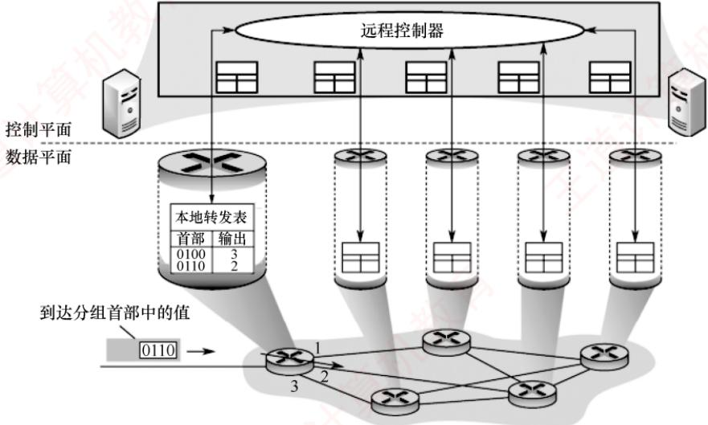

<em>图 4.4 SDN 结构</em>

　　如此一来，网络构架又变为集中控制模式，而互联网本质上是分布式的。SDN并非要把整个互联网改造为如图4.4所示的集中控制模式，这显然不具有可行性。然而，在某些特定条件下，例如像一些大型数据中心互联的广域网，采用SDN架构能够显著提升网络的运行效率。

$$
\text {考点追踪} \quad \triangleright \quad S D N \text {的南向接口（2022）}
$$

　　SDN 通过提供标准化的编程接口，赋予网络高度的可编程性，使开发者能够以软件方式灵活定义、动态调整并高效控制网络行为。SDN 架构主要包含三类接口。

1）北向接口。面向上层应用提供标准化 API，支持开发者高效构建定制化网络应用，而无须关注底层转发设备的具体实现细节。

2）南向接口。实现控制器与转发设备之间的双向通信，通过 OpenFlow 等协议，控制器可统一管理异构硬件，并将上层应用逻辑动态下发至数据平面。

3）东西向接口。用于控制器集群内部通信，提升控制平面的可靠性和可拓展性。

　　SDN 的优势：① 集中控制与分布转发，控制平面具备全局视图，便于统一优化；数据平面分布式高速转发，保障性能。② 灵活可编程性，通过标准化接口，开发者能以软件方式动态定义网络行为。③ 降低成本，控制与转发分离使硬件设备简化（仅需基础转发能力），能有效降低成本。

　　SDN 的挑战：① 安全风险，集中化的控制器易受攻击，一旦崩溃，就会影响整个网络。② 性能瓶颈，控制功能集中化后，随着网络规模的扩大，控制器可能成为网络性能的瓶颈。

### 4.1.5 拥塞控制

　　网络中出现过量分组，超过其处理能力时所引发的性能下降现象，称为拥塞。判断网络是否进入拥塞状态，通常依据的是吞吐量与网络负载之间的关系：

- 若负载增大但吞吐量增长甚微，则表明网络可能已处于轻度拥塞状态。

- 若负载增大但吞吐量反而下降，则表明网络很可能已进入拥塞状态。

　　拥塞控制的核心在于及时感知拥塞并采取措施，避免因缓冲区溢出导致分组丢失。拥塞控制的目标是确保网络能有效承载当前流量，这是一个全局性过程，涉及所有主机、路由器及影响网络传输能力的各类因素。仅靠增加资源无法根本解决拥塞。

　　需要特别区分拥塞控制与流量控制：流量控制用于管理发送方与接收方之间的点对点通信，其核心是抑制发送方的发送速率，以确保接收方能够及时接收和处理数据。

　　拥塞控制主要有两种方法：

1）开环控制。在系统设计时，预先考虑可能导致拥塞的因素，通过静态策略防止拥塞发生。一旦系统投入运行，控制机制就不再依赖实时反馈。典型手段包括：确定何时接收新流量、确定何时及丢弃哪些分组、确定何种调度策略等。其特点是不依赖当前网络状态。

2）闭环控制。通过监测网络运行状态，动态检测拥塞的发生位置与程度，然后反馈至控制节点，进而调整网络的运行以缓解拥塞。该方法基于反馈机制，是一种动态的方法。

### 4.1.6 本节习题精选

#### 单项选择题

01. 路由器连接的异构网络是指（）。

- A. 网络的拓扑结构不同
- B. 网络中计算机操作系统不同
- C. 数据链路层协议和物理层协议至少有一个不同
- D. 数据链路层协议相同，物理层协议不同

02. 网络中发生了拥塞，根据是（）。

- A. 随着通信子网负载的增加，吞吐量也增加
- B. 网络节点接收和发出的分组越来越少
- C. 网络节点接收和发出的分组越来越多
- D. 随着通信子网负载的增加，吞吐量反而降低

03. 在路由器互连的多个局域网的结构中，要求每个局域网（）。

- A. 物理层协议可以不同，而数据链路层及其以上的高层协议必须相同
- B. 物理层、数据链路层协议可以不同，而数据链路层以上的高层协议必须相同
- C. 物理层、数据链路层、网络层协议可以不同，而网络层以上的高层协议必须相同
- D. 物理层、数据链路层、网络层及高层协议都可以不同

04. 在互联网中，一个路由器的路由表通常包含（）。

- A. 目的网络和到达目的网络的完整路径
- B. 所有目的主机和到达该目的主机的完整路径
- C. 目的网络和到达该目的网络路径上的下一个路由器的IP地址
- D. 目的网络和到达该目的网络路径上的下一个路由器的MAC地址

05. 路由器转发分组的根据是报文的（）。

- A. 端口号
- B. MAC 地址
- C. IP 地址
- D. 域名

06. 路由器在能够开始向输出链路传输分组的第一位之前，必须先接收到整个分组，这种机制称为（）。

- A. 存储转发机制
- B. 直通交换机制
- C. 分组交换机制
- D. 分组检测机制

07. 在互联网中，IP 分组的传输需要经过源主机和中间路由器到达目的主机，通常（）。

- A. 源主机和中间路由器都知道 IP 分组到达目的主机需要经过的完整路径
- B. 源主机和中间路由器都不知道 IP 分组到达目的主机需要经过的完整路径
- C. 源主机知道 IP 分组到达目的主机需要经过的完整路径，而中间路由器不知道
- D. 源主机不知道 IP 分组到达目的主机需要经过的完整路径，而中间路由器知道

08. 下列协议中，属于网络层协议的是（）。
 I. IP II. TCP III. FTP IV. ICMP

- A. I和II
- B. II和III
- C. III和IV
- D. I和IV

09. 下列关于各种数据交换方式的叙述中，错误的是（）。

- A. 电路交换不提供差错控制功能
- B. 分组交换的分组有最大长度的限制
- C. 虚电路是面向连接的，它提供的是一种可靠的服务
- D. 在故障率很高的传输系统中，选择虚电路方式更合适

10. 下列关于虚电路服务和数据报服务的叙述中，正确的是（）。

- A. 虚电路服务和数据报服务都是无连接的服务
- B. 数据报服务中，分组在网络中沿同一条路径传输，并且按发出顺序到达
- C. 虚电路在建立连接后，分组中需携带虚电路标识
- D. 虚电路中的分组到达顺序可能与发出顺序不同

11. 同一报文中的分组可以由不同的传输路径通过通信子网的方法是（）。

- A. 分组交换
- B. 电路交换
- C. 虚电路方式
- D. 数据报方式

12. 下列有关数据报和虚电路的叙述中，错误的是（）。

- A. 数据报方式中，若某个节点因故障而丢失分组，则其他分组仍可正常传输
- B. 数据报方式中，每个分组独立地进行路由选择和转发，不同分组之间没有必然联系
- C. 虚电路方式中，属于同一条虚电路的分组按照同一路由转发
- D. 尽管虚电路方式是面向连接的，但它并不保证分组的有序到达

13. 下列关于虚电路和数据报的叙述中，正确的是（）。

- A. 虚电路是一种分组交换技术，但不能按照存储转发的方式工作
- B. 虚电路的连接是临时性连接，当会话结束时就释放这种连接
- C. 数据报服务不提供可靠传输，但可以保证分组的有序到达
- D. 数据报服务中，每个分组都必须携带源地址和目的地址

14. 下列关于虚电路的说法中，正确的是（）。

- A. 虚电路依赖其他协议实现差错控制
- B. 采用虚电路方式发送分组时，分组首部都必须包含目的地址
- C. 虚电路结合了电路交换的思想，适合对实时性要求较高的长时间通信
- D. 多站点同时使用一段物理链路实行虚电路交换会产生冲突，无法正常通信

15. 下列关于虚电路的说法中，正确的是（）。

- A. 虚电路和电路交换一样，在数据传输前要建立物理连接
- B. 虚电路中间节点发生故障后，可沿其他路径继续通信，无须重新建立连接
- C. 虚电路中只有建立连接的分组需要携带源地址和目的地址
- D. 在虚电路上传送的同一个会话的数据分组可以走不同的路径

16. 下列 4 种传输方式中，由网络负责差错控制和流量控制，分组按顺序被递交的是（）。

- A. 电路交换
- B. 报文交换
- C. 虚电路分组交换
- D. 数据报分组交换

17. 下列各种描述中，（）不是软件定义网络（SDN）的特点。

- A. 控制与转发功能分离
- B. 控制平面集中化
- C. 接口开放可编程
- D. Openflow 取代了路由协议

18. 下列关于 SDN（软件定义网络）的描述中，错误的是（）。
 I. SDN 是近年来出现的一种新型物理网络结构
 II. OpenFlow 交换机基于“流表”来转发分组
 III. SDN 远程控制器位于 OpenFlow 交换机中
 IV. OpenFlow 可视为 SDN 的控制层面与数据层面的通信接口

- A. I 和 III
- B. I 和 IV
- C. II 和 IV
- D. I、III 和 IV

19. 【2011 统考真题】TCP/IP 模型的网络层提供的是（）。

- A. 无连接、不可靠的数据报服务
- B. 无连接、可靠的数据报服务
- C. 有连接、不可靠的虚电路服务
- D. 有连接、可靠的虚电路服务

20. 【2020 统考真题】下列关于虚电路网络的叙述中，错误的是（）。

- A. 可以确保数据分组传输顺序
- B. 需要为每条虚电路预分配带宽
- C. 建立虚电路时需要进行路由选择
- D. 依据虚电路号（VCID）进行数据分组转发

21. 【2022 统考真题】在 SDN 网络体系结构中，SDN 控制器向数据平面的 SDN 交换机下发流表时所使用的接口是（）。

- A. 东向接口
- B. 南向接口
- C. 西向接口
- D. 北向接口

### 4.1.7 答案与解析

#### 单项选择题

**01. C**

　　网络的异构性是指传输介质、数据编码方式、链路控制协议及不同的数据单元格式和转发机制，这些特点分别在物理层协议和数据链路层协议中定义。

**02. D**

　　拥塞现象是指到达通信子网中某一部分的分组数量过多，使得该部分网络来不及处理，以致这部分乃至整个网络性能下降的现象，严重时甚至导致网络通信业务陷入停顿，即出现死锁现象。选项 A 的网络性能显然是提高的，选项 B、C 中网络节点接收和发出的分组多少与网络的吞吐量不成正比，不能确定网络是否拥塞。

**03. C**

　　路由器是第三层设备，向传输层及以上层隐藏下层的具体实现，所以物理层、数据链路层、网络层协议可以不同。而网络层之上的协议数据是路由器所不能处理的，因此网络层以上的高层协议必须相同。本题容易误选 B，主要原因是在目前的互联网中广泛使用的是 TCP/IP 族，在网络层多用 IPv4，所以误认为网络层协议必须相同。实际上，使用特定的路由器连接 IPv4 与 IPv6 网络，就是典型的网络层协议不同而实现互连的例子。

**04. C**

　　路由器是网络层设备，其任务是转发分组。每个路由器都维护一个路由表以决定分组的转发。为了提高路由器的查询效率并减少路由表维护的内容，路由表只保留到达目的地址的下一个路由器的地址，而不保留整个传输路径的信息。另外，采用目的网络可使每个路由表项包含很多目的主机IP地址，这样可减少路由表中的项目。因此，路由表通常包含目的网络和到达该目的网络路径上的下一个路由器的IP地址。

**05. C**

　　路由器是网络层设备，网络层通过IP地址标识主机，所以路由器根据IP地址转发分组。

**06. A**

　　路由器转发一个分组的过程如下：先接收整个分组，然后对分组进行错误检查，若出错，则丢弃错误的分组；否则存储这个正确的分组。最后根据路由选择协议，将正确的分组转发到合适的端口，这种机制称为存储转发机制。

**07. B**

　　每个路由器都根据路由表来选择 IP 分组的下一跳地址，只有到了下一跳路由器，才知道再下一跳应当怎样走。主机仅知道到达本地网络的路径，到达其他网络的 IP 分组均转发到路由器。而源主机也只把 IP 分组发给网关，所以路由器和源主机都不知道 IP 分组要经过的完整路径。

**08. D**

　　TCP 属于传输层协议，FTP 属于应用层协议，只有 IP 和 ICMP 属于网络层协议。

**09. D**

　　电路交换不具备差错控制能力，选项 A 正确。分组交换对每个分组的最大长度有规定，超过此长度的分组都被分割成几个长度较小的分组后再发送，选项 B 正确。

　　分组交换又分为数据报和虚电路两种方式。数据报是无连接的，它提供的是不可靠的服务，分组有可能丢失、失序，也不保证到达的时间，但因每个分组独立选择传送路径，当某个节点发生故障时，后续的分组可另选路径。另外，通过高层协议如 TCP 也可保证其传输的可靠性和有序性。虚电路是面向连接的，它提供的是可靠的服务，能保证数据的可靠性和有序性，但是一旦虚电路中的某个节点出现故障，就必须重新建立一条虚电路，对于故障率高的传输系统，易出现节点故障，这项任务就显得相当艰巨，因此采用数据报方式更合适。选项 C 正确、选项 D 错误。

**10. C**

　　虚电路服务是有连接的，属于同一条虚电路的分组，根据该分组的相同虚电路标识，按照同一路由转发，保证分组的有序到达。在数据报服务中，网络为每个分组独立地选择路由，传输既不保证可靠性，又不保证分组的按序到达。

**11. D**

　　分组交换有两种方式：虚电路和数据报。在虚电路服务中，属于同一条虚电路的分组按照同一路由转发；在数据报服务中，网络为每个分组独立地选择路由，传输既不保证可靠性，又不保证分组的按序到达。

**12. D**

　　关于虚电路和数据报的比较，请参考表 4.1。

**13. D**

　　虚电路是一种分组交换技术，它可以采用存储转发的方式工作，选项 A 错误。虚电路不只是临时性的，它提供的服务包括永久性虚电路（PVC）和交换型虚电路（SVC），其中前者是一种提前定义好的、基本上不需要任何建立时间的端点之间的连接，而后者是端点之间的一种临时性连接，这些连接只持续所需的时间，且在会话结束时就取消这种连接，选项 B 错误。数据报服务是无连接的，既不提供可靠性保障，又不保证分组的有序到达，选项 C 错误。在数据报服务中，每个分组都必须携带源地址和目的地址；而虚电路服务中，建立连接后，分组只需携带虚电路标识。

**14. C**

　　虚电路提供的是可靠的通信服务，本身就可实现差错控制。分组仅在连接建立时才需要使用完整的目的地址，之后每个分组只需携带这条虚电路的编号即可。多站点同时使用一段物理链路实现虚电路交换不会产生冲突，因为每个分组都有一个虚电路号来标识所属的虚电路。

**15. C**

　　虚电路是一种分组交换技术，它在数据传输前要建立逻辑连接而非物理连接，选项 A 错误。虚电路的中间节点发生故障后，会导致整条虚电路失效，需要重新建立连接，选项 B 错误。虚电路只有建立连接的分组需要携带目的地址，以进行路由选择，之后传送的分组只需携带虚电路号即可。一个会话的虚电路是事先建立好的，因此它的数据分组所走的路径也是固定的，选项 D 错误。

**16. C**

　　电路交换和报文交换不采用分组交换技术。数据报传输方式没有差错控制和流量控制机制，也不保证分组按序交付。虚电路方式提供面向连接的、可靠的、保证分组按序到达的网络服务。

**17. D**

　　选项 A、B 和 C 都是 SDN 的特点。Openflow 协议是控制平面和数据平面之间的接口。在 SDN 中，路由器之间不再相互交换路由信息，由远程控制器计算最佳路由。

**18. A**

　　SDN 是一种新型网络体系结构，是一种设计、构建和管理网络的新方法，不是一种新型物理网络结构。在 SDN 中，完成 “匹配+动作” 的设备通常也称 OpenFlow 交换机。相应地，在 SDN 中取代传统路由器中转发表的是流表。SDN 远程控制器是一种控制平面的实现方式，它由一个远程的服务器来计算和分发流表给网络设备，SDN 远程控制器不在 OpenFlow 交换机中。

**19. A**

　　TCP/IP 的网络层向上只提供简单灵活的、无连接的、尽最大努力交付的数据报服务。考察 IP 首部，若是面向连接的，则应有用于建立连接的字段，但是首部中没有；若提供可靠的服务，则至少应有序号和检验和两个字段，但是 IP 分组头中也没有（IP 首部中只有首部检验和）。通常，有连接、可靠的应用是由传输层的 TCP 实现的。

**20. B**

　　在建立虚电路的阶段，分组才需要携带完整的目的地址，以进行路由器选择。之后，每个分组只需携带短的虚电路号即可，属于同一条虚电路的分组按照同一路由进行转发，分组到达终点的顺序与发送顺序相同，可以保证有序传输。虚电路只是一条逻辑上的连接，并不是一条物理上的连接，因此不需要为每条虚电路预分配带宽。

**21. B**

　　SDN对上层开发者提供的编程接口称为北向接口，而南向接口则负责控制平面和数据平面间的通信，所以SDN控制器向数据平面的SDN交换机下发流表时使用南向接口。

## 4.2 IPv4

### 4.2.1 IPv4 分组

　　IPv4（版本 4）即现在普遍使用的网际协议（Internet Protocol，IP）。IP 定义数据传送的基本单元——IP 分组及其确切的数据格式。IP 也包括一套规则，指明分组如何处理、错误怎样控制。特别是 IP 还包含非可靠投递的思想，以及与此关联的路由选择的思想。

#### 1. IPv4 分组的格式

> **考点追踪：** IP首部格式及字段含义（2011、2012）

　　一个 IP 分组（或称 IP 数据报）由首部和数据部分组成。首部前一部分的长度固定，共 20B，是所有 IP 分组必须具有的。在首部固定部分的后面是一些可选字段，用来提供错误检测及安全等机制，其长度可变，从 1B 到 40B 不等。IP 数据报的格式如图 4.5 所示。

  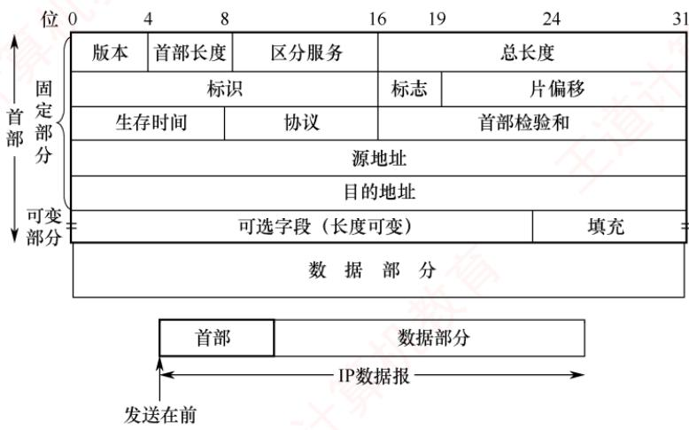

<em>图 4.5 IP数据报的格式</em>

　　IPv4 首部的部分重要字段含义如下:

1）版本。占4位。表示IP协议的版本，IPv4中该字段的值为4。

2）首部长度。占4位。以4B为单位，可表示的最大首部长度为60B（15×4B）。最常用的首部长度是20B（5×4B），该字段的值是5，表示不使用可选字段。IP首部长度必须是4B的整数倍，若可选字段导致长度不足，则通过填充字段加以填充。

> **注意：**

　　IP首部前两个字节往往以0x45开头，解题时可用于定位IP数据报的开始位置。

3）总长度。占16位，表示首部和数据之和的长度，以1B为单位，因此IP数据报的最大长度为 $2^{16} - 1 = 65535\mathrm{B}$ 。由于以太网MTU为1500B，因此当一个数据报封装成帧时，数据报的总长度（首部加数据）一定不能超过当前链路的MTU。

4）标识。占16位。源主机用一个递增计数器，为每个数据报设置标识字段。它并不是“序号”（因为IP是无连接服务）。分片时，所有分片复制原始数据报的标识字段值，以便目的主机据此正确重组为原数据报。

5）标志（Flag）。占3位，目前只有低2位有意义。MF（More Fragment，更多分片）， $\mathbf{MF} = \mathbf{1}$ 表示后面还有分片， $\mathbf{MF} = \mathbf{0}$ 表示这是最后一个分片。DF（Don't Fragment，不能分片），仅当 $\mathbf{DF} = \mathbf{0}$ 时允许分片，若 $\mathrm{DF} = 1$ ，则禁止分片。

6）片偏移。占13位，以8B为单位，指出该分片数据部分起始位置相对于原始数据报数据部分开头的偏移量。除最后一个分片外，其他分片的数据长度必须是8B的整数倍。

> **考点追踪：** TTL 机制的分析（2014、2024）

7）生存时间（TTL）。占8位，表示数据报在网络中允许经过的路由器数的最大值，防止其在网络中无限循环。每经过一个路由器，TTL减1。若TTL被减为0，则丢弃该数据报。若TTL的初值设为1，则该数据报仅限在本局域网内传输。

8）协议。占 8 位，指出此数据报携带的数据使用何种协议，即指示数据应交付给哪个上层协议（如 TCP、UDP）。其中值为 6 表示 TCP，值为 17 表示 UDP。

9）首部检验和。占16位，只检验首部（不含数据部分），不检验数据部分可减少计算的工作量。数据报每经过一个路由器，首部中的某些字段（如生存时间、总长度、标志、片偏移、源/目的地址）都可能发生变化，因此路由器都要重新计算检验和。首部检验和的计算方法与UDP和TCP检验和的计算方法类似，具体见5.2.2节。

10）源地址字段。占4B，标识发送方的IP地址。

11）目的地址字段。占4B，标识接收方的IP地址。

> **注意：**

　　① IP 数据报首部包含 3 个与长度相关的字段：首部长度、总长度、片偏移，它们的基本单位分别为 4B、1B、8B，计算时要注意换算。读者应理解 IP 首部各字段的意义和功能，但无须死记首部格式，若题目需要，通常会直接给出。这一原则同样适用于第 5 章对 TCP 和 UDP 首部的学习。

　　② 在分析 IP 首部的十六进制原始数据时，IP 地址以连续 4B 的十六进制形式呈现。将其转换为点分十进制形式时要格外小心，极易因字节顺序或进制转换错误而导致结果偏差。

#### 2. IP 数据报分片

　　一个链路层数据帧能承载的最大数据量称为最大传送单元（MTU）。由于IP数据报被封装在链路层帧中，其长度受到MTU的严格限制。此外，从源主机到目的主机的路径上可能会经过多段链路，各段链路的MTU可能不同——例如，以太网的MTU通常为1500B，而很多广域网的MTU不超过576B。当IP数据报的总长度超过某段链路的MTU时，就必须将IP数据报中的数据分装在多个较小的IP数据报中，这些较小的数据报称为分片（或片）。

> **考点追踪：** IP 分片相关首部字段（2011）

　　分片只能发生在源主机或中间路由器上，而重组仅在目的主机上进行。目的主机利用 IP 首部中的标识、标志和片偏移三个字段完成分片的重组。源主机在创建 IP 数据报时，会为其分配唯一的标识号。当该数据报被分片时，所有分片均继承原始数据报的标识号。目的主机收到来自同一源主机的多个数据报后，通过比对标识号，即可判断哪些分片属于同一个原始数据报。分片行为受标志字段控制：仅当 DF=0 时，数据报才被允许分片；若 DF=1，则禁止分片。此外，MF=1 表示还有后续分片；MF=0 表示这是最后一个分片。在重组过程中，依据片偏移字段确定每个分片在原始数据报中的起始位置，从而正确还原原始数据。

> **考点追踪：** IP 分片的原理及分析（2021）

　　IP 分片涉及一定的计算。例如，一个总长 4000B 的 IP 数据报（首部 20B，数据部分 3980B）到达路由器，需转发到 MTU 为 1500B 的链路上。每个分片都是一个独立的 IP 数据报，均包含 20B 的 IP 首部，每片最多携带 1480B 数据，因此需划分为 3 个分片，数据部分依次为 1480B、1480B 和 1020B。假定原始数据报标识号为 777，则各分片如图 4.6 所示。由于片偏移以 8B 为单位，为保证偏移值为整数，除最后一个分片外，其余分片的数据长度必须是 8B 的整数倍。

  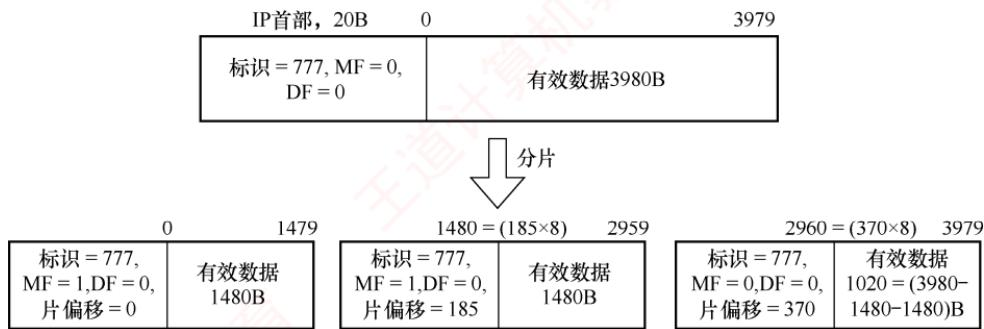

<em>图 4.6 IP 分片的例子</em>

### 4.2.2 IPv4 地址

#### 1. IPv4 地址

　　IP 地址是为连接到互联网上的每台主机（或路由器）的每个接口，分配的一个全球唯一的 32 位标识符。IP 地址的分配由互联网名字与数字分配机构（ICANN）统一管理。为方便书写和记忆，通常将 32 位 IP 地址分为 4 段，每段 8 位，转换为等效的十进制数，并用小数点分隔，即一个 IP 地址用 4 段十进制数表示，这种表示方法称为点分十进制记法。

#### 2. 分类的IP地址

　　互联网早期采用的是分类的IP地址，如图4.7所示。

　　无论哪类 IP 地址，都由网络号和主机号两部分组成。即 IP 地址:: = {<网络号>, <主机号>}。其中网络号标志主机（或路由器）的接口所连接到的网络，一个网络号在整个互联网范围内必须唯一。主机号标志该主机（或路由器）的接口，一个主机号在其网络号所指的网络范围内必须唯一。由此可见，每个 IP 地址在整个互联网中是唯一的。

  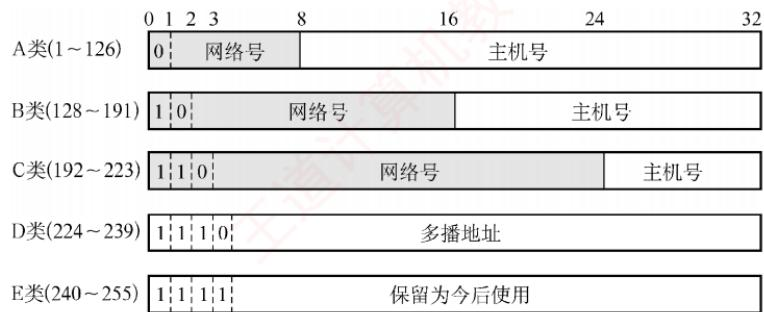

<em>图 4.7 分类的 IP 地址</em>

> **考点追踪：** 0.0.0.0 地址的作用（2017）

　　A类、B类和C类地址均为单播地址（用于一对一通信），可分配给主机或路由器的接口。但以下特殊IP地址不能用作普通主机的地址：

- 主机号全为 0：表示本网络本身（网络地址），例如 202.98.174.0。

- 主机号全为 1：表示本网络的广播地址，也称直接广播地址，例如 202.98.174.255。

- 127.×.×.×：保留用于本地环回测试（Loopback Test），仅用于本机进程间的通信，目的地址为环回地址的 IP 数据报不会被发送到任何物理网络。

- 32位全为0，即0.0.0.0：表示本网络上的本主机（常用于DHCP，见4.2.6节）。

- 32位全为1，即255.255.255.255：表示受限广播地址，仅在本网络内广播。常用的三种类别IP地址的使用范围见表4.2。

　　表 4.2 常用的三种类别 IP 地址的使用范围 $^{①}$

<table><tr><td>网络类别</td><td>最大可用网络数</td><td>第一个可用的网络号</td><td>最后一个可用的网络号</td><td>每个网络中的最大主机数</td></tr><tr><td>A</td><td><eq>2^{7}-2</eq></td><td>1</td><td>126</td><td><eq>2^{24}-2</eq></td></tr><tr><td>B</td><td><eq>2^{14}</eq></td><td>128.0</td><td>191.255</td><td><eq>2^{16}-2</eq></td></tr><tr><td>C</td><td><eq>2^{21}</eq></td><td>192.0.0</td><td>223.255.255</td><td><eq>2^{8}-2</eq></td></tr></table>

　　在表 4.2 中，A 类地址可用的网络数为 $2^{7}-2$ ，减 2 的原因如下：① 网络号为 0（0.×.×.×），保留用于特殊用途；② 网络号为 127（127.×.×.×），保留作为环回测试地址。每个网络中的最大主机数减 2 的原因是：① 主机号全为 0 的地址用作网络地址（标识本网络）；② 主机号全为 1 的地址用作直接广播地址（向本网络所有主机广播），这两个地址不能分配给主机使用。

　　IP 地址具有以下重要特点:

1）IP地址由网络号和主机号两部分组成，是一种分等级的地址结构。这种设计带来了两大优势：① IP地址管理机构只分配网络号，主机号由获得该网络的单位自行分配，便于地址管理；② 路由器转发分组时仅依据目的地址的网络号，从而显著减小路由表规模。

2）IP 地址标识的是网络接口，而非主机本身。当一台主机同时连接到多个网络时，必须为每个接口配置一个 IP 地址，且各地址的网络号必须不同。因此，路由器至少拥有两个或更多的 IP 地址，每个接口对应一个不同网络号的 IP 地址。

3）通过集线器或交换机连接的多个网段在逻辑上仍然属于同一个网络（同一个广播域），因此，其中所有主机的IP地址必须具有相同的网络号，但主机号必须唯一。

4）IP 地址是逻辑地址，与底层物理硬件（如 MAC 地址）无关。这使得网络层能够屏蔽链

　　路层的异构性，支持跨不同物理网络的统一通信。

　　近年来，随着无分类编址的广泛应用，这种传统分类的 IP 地址已逐渐退出历史舞台。

#### 3. 划分子网

##### （1） 划分子网

　　传统的两级 IP 地址结构（仅含网络号和主机号）存在以下主要缺点。

- 地址空间利用率低：为每个物理网络分配一个完整网络号，导致大量主机号未被使用。

- 路由表规模过大：网络数量增长使路由表膨胀，从而影响转发性能。

- 地址分配缺乏灵活性：无法根据实际需求，对网络进行更细粒度的划分。

　　为克服上述问题，从 1985 年起，在 IP 地址中增加 “子网号” 字段，形成三级结构：

$$
\text { IP   地址 } \because = \{<   \text { 网络号 } >, <   \text { 子网号 } >, <   \text { 主机号 } > \}
$$

　　这一机制称为划分子网，现已成为互联网的正式标准。

　　划分子网的基本思想如下。

1）对外透明：单位对外仍表现为单一网络，外部路由器无须感知其内部子网结构。

2）内部灵活划分：从原主机号中借用若干位作为子网号，主机号位数相应减少。

3）分层转发：外部路由器根据网络号转发数据报至该单位边界路由器；边界路由器再结合子网号，将数据报交付至具体子网，最终送到目的主机。

　　例如，将一个 C 类网络 208.115.21.0 划分为 4 个子网，需借用 2 位作为子网号（因为 $2^{2}=4$ ），主机号剩余 6 位，每个子网中的最大主机数为 $2^{6}-2=62$ （扣除网络地址和广播地址），各子网的网络地址为：208.115.21.0、208.115.21.64、208.115.21.128、208.115.21.192。

> **注意：**

　　① 划分子网仅对 IP 地址的主机号部分再划分，不改变原网络号，因此无法从 IP 地址本身判断是否划分子网。② 划分子网提升了地址分配的灵活性，但也使特定网络的可分配主机总数略有减少。

##### （2） 子网掩码

> **考点追踪：** 网络地址的确定方法（2022）

　　子网掩码是一个与 IP 地址对应的 32 位二进制串，由一串 1 后跟一串 0 组成。其中，1 对应 IP 地址中的网络号和子网号，而 0 对应主机号。主机或路由器通过将 IP 地址与其子网掩码进行逐位 “与”（AND）运算，即可得出该地址所在子网的子网地址。

　　现在的互联网标准规定：每个网络都需配置子网掩码。对于未划分子网的传统分类网络，应使用其默认子网掩码。A、B、C类地址的默认子网掩码分别为255.0.0.0、255.255.0.0、255.255.255.0。例如，某主机的IP地址为192.168.5.56，子网掩码为255.255.255.0，通过逐位“与”运算，可得出其所在子网的子网地址为192.168.5.0。

　　子网掩码是网络的关键属性。路由器交换路由信息时，必须同时通告目的网络地址和子网掩码。转发分组时，路由器将分组的目的IP地址与某条路由的子网掩码进行逐位“与”运算，若结果等于该路由的目的网络地址，则匹配成功，并将分组转发至对应的下一跳。

　　在使用子网掩码时，需遵循以下原则：

1）主机在配置 IP 地址时，必须同时设置子网掩码。

2）同一子网内的所有主机及路由器接口，必须配置相同的子网掩码。

3）路由器的路由表中通常包含三项核心信息：目的网络地址、子网掩码、下一跳地址。

##### （3） 默认网关

> **考点追踪：** 默认网关与子网掩码的配置（2015、2016、2019、2022）

　　默认网关是指本子网所连路由器接口的 IP 地址，用于将数据转发至外部网络。主机发送数据时，会将目的 IP 地址与自身 IP 地址及子网掩码比较，以判断目的主机是否在同一子网。

- 若在同一子网内，则执行直接交付：通过 ARP（见 4.2.5 节）获取目的主机的 MAC 地址，并将数据报封装成数据链路层帧（如以太网帧），直接发送至该 MAC 地址。

- 若不在同一子网内，则执行间接交付：将数据报发往默认网关，并通过 ARP 获取其 MAC 地址，再将数据报封装成帧并发送至该 MAC 地址，由路由器在网络层进行转发。

#### 4. 无分类编址 CIDR

　　无分类域间路由选择（Classless Inter-Domain Routing，CIDR）是一种基于可变长子网掩码的地址分配与路由聚合机制，旨在消除传统A、B、C类地址的限制，并提升IP地址空间的利用效率。其核心思想是：不再区分网络类别，而使用“网络前缀”来标识网络部分。网络前缀的长度（掩码中连续1的数量）可根据实际需求灵活指定，不再局限于8位、16位或24位。

　　例如，若某单位需要约 2000 个 IP 地址，则为其分配一个包含 2048 个地址的连续块（如/21），而非浪费一个完整的 B 类网络（65534 个地址），进而大幅提高地址分配的灵活性和利用率。

　　CIDR 采用如下结构表示 IP 地址:

$$
\text { IP   地址 } \because = \{<   \text { 网络前缀 } >, <   \text { 主机号 } > \} 。
$$

$$
\text {考点追踪} \quad \triangleright \quad \mathrm{CIDR} \text {地址块的分析（2011、2015、2016、2019、2023）}
$$

　　CIDR 还使用斜线记法（也称 CIDR 表示法），格式为 “IP 地址/前缀长度”，其中前缀长度表示网络前缀所占的位数，它等效于子网掩码中连续 1 的数量。例如，128.14.32.5/20 表示其子网掩码由 20 个连续的 1 和 12 个连续的 0 组成（255.255.240.0）。将该 IP 地址与掩码进行逐位 “与” 运算，即可得到其网络前缀（子网地址），它等价于直接截取 IP 地址的前 20 位。

$$
\text {逐位} “ \text {与}" \left\{ \begin{array}{l l} \mathrm{IP} \text {地址} = 1 0 0 0 0 0 0 0. 0 0 0 0 1 1 1 0. 0 0 1 0 0 0 0 0. 0 0 0 0 0 1 0 1 \\ \text {掩码} = 1 1 1 1 1 1 1 1. 1 1 1 1 1 1 1. 1 1 1 1 0 0 0 0. 0 0 0 0 0 0 0 \end{array} \right.
$$

$$
\text {网络前缀} = \underline {{1 0 0 0 0 0 0 0 . 0 0 0 0 1 1 1 0 . 0 0 1 0}} 0 0 0 0. 0 0 0 0 0 0 0 (1 2 8. 1 4. 3 2. 0)
$$

　　斜线记法不仅标识了具体的 IP 地址，还明确了其所属地址块的网络前缀长度。在 CIDR 环境下，“/前缀长度”不可省略——若仅给出 IP 地址（如 128.14.32.5），则无法确定其网络地址。

> **考点追踪：** 地址块的范围分析（2023）

　　CIDR 将网络前缀相同的连续 IP 地址组成一个 CIDR 地址块。只要知道该地址块中的任意一个地址及其前缀长度，即可确定其最小地址、最大地址和地址总数。

　　以地址 128.14.32.5/20 为例，其所在地址块的地址范围为

　　最小地址：10000000.00001110.00100000.00000000（128.14.32.0）

$$
\text {   最大地址:   } \underline {{1 0 0 0 0 0 0 0 . 0 0 0 0 1 1 1 0 . 0 0 1 0 1 1 1 1 . 1 1 1 1 1 1 1}} (1 2 8. 1 4. 4 7. 2 5 5)
$$

　　主机号全 0 或全 1 的地址一般不分配给主机使用，实际可用地址为两者之间的地址。

　　需要强调的是，“CIDR 不使用子网”是指其不在全局地址结构中预设固定的子网字段。但这并不妨碍获得 CIDR 地址块的单位在其内部继续划分子网。例如，某单位获得一个/20 的地址块后，可从主机号部分借用 3 位划分为 8 个子网，此时每个子网的网络前缀长度变为/23。

> **考点追踪：** ➤ 子网地址与子网广播地址的分析（2011、2012、2018、2019）

　　CIDR 地址块的地址总数一定是 2 的整数次幂。若主机号部分占 N 位，则该地址块包含 $2^{N}$ 个地址，实际可分配给主机的地址数通常为 $2^{N}-2$ （扣除网络地址和广播地址）。网络前缀越短，主机号位数越大，地址块包含的总地址就越多；反之，前缀越长，地址块越小。

#### 5. 路由聚合

　　一个大的 CIDR 地址块中包含多个较小的地址块，因此在路由表中可以用这个较大的 CIDR 地址块来代替多个较小的地址块。这种方法称为路由聚合，它使得路由表中的一个项目能够代表原来基于传统分类地址的多条路由，从而压缩路由表规模，提升网络性能。

> **考点追踪：** 路由聚合的原理（2009、2011、2013、2014、2018）

　　例如，在如图 4.8 所示的网络中，若不使用路由聚合，则 R1 的路由表中需要分别为网络 1 和网络 2 配置两条独立的路由项。观察可知，这两个网络的地址前缀在二进制表示下的前 16 位完全相同，第 17 位分别为 0 和 1，且 R1 到这两个网络的下一跳均为 R2。在此情况下，R1 可将这两个网络聚合成一个更大的地址块 206.1.0.0/16，从而用一条聚合路由替代原有的两条路由。

  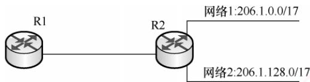

<em>图 4.8 路由聚合的例子</em>

> **考点追踪：** 最长前缀匹配机制（2013、2015）

　　最长前缀匹配（也称最佳匹配）：使用 CIDR 时，路由表项由 “网络前缀” 和 “下一跳地址” 组成。当查找路由表时，目的地址可能匹配多个路由项。此时，应选择网络前缀最长（前缀位数最多）的那条路由，因为前缀越长，对应的地址块越小，路由信息就越具体、越精确。

　　CIDR 查找路由表的方法：为高效实现最长前缀匹配，路由器通常将 CIDR 路由表组织成层次式数据结构（如 Trie 树），通过自上而下的方式快速定位最优匹配项。

　　CIDR 的主要优势在于网络前缀长度的灵活性：在网络外部，可通过较短前缀进行路由聚合，显著减少全局路由表项；在网络内部，可延长前缀以灵活划分子网，满足不同规模的需求。这种“外部聚合、内部细分”的机制，兼顾了路由可扩展性与地址分配的精细化控制。

#### 6. 子网划分的应用举例

　　通常有两类划分子网的方法：采用定长子网掩码和变长子网掩码。

##### （1） 采用定长子网掩码划分子网

　　当采用定长子网掩码时，所划分的每个子网使用相同的子网掩码，并且每个子网所分配的IP地址数量也相同，因此容易造成地址资源的浪费。

> **考点追踪：** 定长掩码子网划分的应用（2009、2010、2017、2018）

　　假设某单位拥有一个 CIDR 地址块 208.115.21.0/24，该单位有三个部门，各部门的主机数量分别为 50、20、5 台，采用定长子网掩码给各部门分配 IP 地址。

　　各部门（含一个路由器接口）实际所需 IP 地址数分别为 51 个、21 个、6 个。接下来，从 /24 地址块的主机号部分借用 2 位作为子网号，可划分为 $2^{2}=4$ 个子网，每个子网可用地址数为 $2^{8-2}-2=62$ ，满足各部门需求。各子网划分如下（为书写方便，仅将 IP 地址的后 8 位用二进制展开）：

　　208.115.21.00000000～208.115.21.0011111，地址块208.115.21.0/26，分配给部门1。

　　208.115.21.01000000～208.115.21.0111111，地址块208.115.21.64/26，分配给部门2。

　　208.115.21.10000000～208.115.21.1011111，地址块208.115.21.128/26，分配给部门3。

　　208.115.21.11000000～208.115.21.1111111，地址块208.115.21.192/26，留作备用。

　　子网掩码：255.255.255.11000000，即255.255.255.192。

##### （2） 采用变长子网掩码划分子网

> **考点追踪：** 变长掩码子网划分的应用（2019、2021、2025）

　　采用变长子网掩码时，所划分的每个子网可使用不同的子网掩码，并且每个子网所分配的IP地址数量也可不同，从而更高效地利用地址资源，减少浪费。

　　假设条件与上一节相同，下面采用变长子网掩码给各部门分配 IP 地址。

　　部门 1 的主机号需 6 位，剩余 26 位（32 - 6 = 26）作为网络前缀；部门 2 的主机号需 5 位，剩余 27 位（32 - 5 = 27）作为网络前缀；部门 3 的主机号需 3 位，剩余 29 位（32 - 3 = 29）作为网络前缀。接下来，从地址块 208.115.21.0/24 中按需划分出 3 个子网（1 个 “/26”，1 个 “/27”，1 个 “/29”），分配给三个部门。每个子网的网络地址（最小地址）为主机号全 0 的地址。划分方案不唯一，建议从最大的子网开始划分（以避免地址碎片），例如：

$$
\left. \begin{array}{l} \underline {{2 0 8 . 1 1 5 . 2 1 . 0 0 0 0 0 0 0 0}} \\ \dots \dots \\ \underline {{2 0 8 . 1 1 5 . 2 1 . 0 0 1 1 1 1 1 1}} \\ \underline {{2 0 8 . 1 1 5 . 2 1 . 0 1 0 0 0 0 0 0}} \\ \dots \dots \\ \underline {{2 0 8 . 1 1 5 . 2 1 . 0 1 0 1 1 1 1}} \\ \vdots \end{array} \right\}
$$

　　地址块 208.115.21.0/26，子网掩码 255.255.255.192

$\left.\begin{array}{l}\underline{208.115.21.01100000}\\ \cdots \\ \underline{208.115.21.01100111}\\ \underline{208.115.21.01101000}\\ \cdots \\ \underline{208.115.21.11111111}\end{array}\right\}$ 可分配地址 62 个，分配给部门 1。

　　地址块 208.115.21.64/27，子网掩码 255.255.255.224

　　可分配地址 30 个，分配给部门 2。

　　地址块 208.115.21.96/29，子网掩码 255.255.255.248 可分配地址 6 个，分配给部门 3。

　　剩余 256 - 64 - 32 - 8 = 152 个地址，留作备用。

　　划分方案不唯一，还可借助二叉树模型（参考本节习题2021年统考真题解析图）辅助分配，但要确保各子网地址范围互不重叠，且起始地址对齐到其网络前缀对应的地址边界。

　　对于连接两个路由器接口的点对点链路，传统做法是分配一个“/30”地址块：主机号部分占2位，包含4个地址，可分配地址有2个，恰好可分配给链路两端的接口。

> **注意：**

　　根据最新标准 $^{①}$ ，为节省 IP 地址资源，这类链路的两端接口可不分配 IP 地址。若需分配，则该链路被视为仅含两个节点的特殊“网络”，此时应使用“/31”地址块：主机号部分仅 1 位，包含 2 个地址，无须保留网络地址和广播地址，2 个地址均可直接分配给链路两端接口，实现 IP 地址的零浪费。

### 4.2.3 网络地址转换 NAT

　　网络地址转换（Network Address Translation，NAT）是指将专用网络中的私有 IP 地址转换为公网 IP 地址，从而实现与互联网的通信，并对外隐藏内部网络的结构。它使得整个专用网通常只需一个全球 IP 地址即可与互联网连通；由于私有 IP 地址可在不同专用网络中重复使用，NAT 有效地缓解了 IP 地址短缺的问题。此外，NAT 还在一定程度上降低了内部网络受攻击的风险。

<table><tr><td colspan="2">NAT转换表</td></tr><tr><td>WAN端</td><td>LAN端</td></tr><tr><td>138.76.29.7, 5001...</td><td>10.0.0.1, 3345...</td></tr></table>

> **考点追踪：** 私有 IP 地址连网处理机制（2011）

　　IANA 保留了三个私有 IP 地址块。这些地址仅用于 LAN 内部，不得直接用于 WAN，若需访问互联网，则必须通过网关采用 NAT 技术，将私有地址映射为合法的公网 IP 地址。

　　这三个私有 IP 地址块如下:

1）10.0.0.0/8，即 10.0.0.0～10.255.255.255，相当于 1 个 A 类网络。

2）172.16.0.0/12，即 172.16.0.0～172.31.255.255，相当于 16 个连续的 B 类网络。

3）192.168.0.0/16，即 192.168.0.0～192.168.255.255，相当于 256 个连续的 C 类网络。

　　互联网中的所有路由器对目的地址为私有地址的数据报一律不予转发。采用私有IP地址组建的网络称为专用网络（或私有网络）。私有IP地址也称可重用地址。

　　使用 NAT 时，需在专用网连接到互联网的路由器上安装 NAT 软件，该 NAT 路由器至少应拥有一个有效的全球 IP 地址。当使用私有 IP 地址的主机与外部通信时，NAT 路由器通过 NAT 转换表实现私有 IP 地址与全球 IP 地址之间的映射。该表中保存{私有 IP 地址：端口}到{全球 IP 地址：端口}的对应关系。借助该映射机制，多个私有 IP 地址可共享同一个全球 IP 地址访问互联网。

> **考点追踪：** NAT 的工作原理（2016、2019、2020、2023）

　　如图 4.9 所示，假设某家庭办理了一条 10Mb/s 的电信宽带，则会获得一个全球 IP 地址（如 138.76.29.7）。家庭内部的 3 台主机使用私有地址（如 10.0.0.0 网段），此时家庭网关路由器需启用 NAT 功能。下面以主机访问外部 Web 服务器为例，介绍 NAT 路由器的工作原理。

  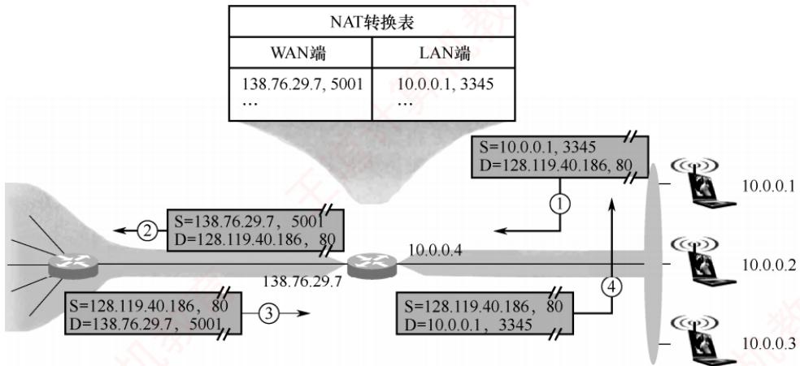

<em>图 4.9 NAT 路由器的工作原理</em>

1）假设主机 10.0.0.1（源端口 3345）向 Web 服务器 128.119.40.186（端口 80）发送请求。

2）NAT路由器收到IP分组后，将分组的源地址替换为自身的全球IP地址138.76.29.7，将源端口替换为新分配的端口5001，同时在NAT转换表中新增一条映射记录。

3）Web服务器并不知晓该分组的源地址已被路由器转换，也无法获知用户的私有地址，因此其响应分组的目的地址是路由器的全球IP地址138.76.29.7，目的端口是5001。

4）响应分组到达路由器后，路由器根据NAT转换表，将目的地址还原为10.0.0.1，目的端口还原为3345，再将分组转发给对应主机。

　　上述过程属于动态 NAT，路由器在内网主机发起连接时自动创建映射关系，并在一段时间后自动清除。然而，在某些场景中，内网中的服务器需要向公网用户提供服务，例如部署在内网内的 Web 服务器、FTP 服务器等。此时，可由管理员在 NAT 转换表中手工配置{公网 IP 地址 + 端口}到{内网 IP 地址 + 端口}的静态映射，使公网用户能够通过该映射访问内网服务器。

> **注意：**

　　普通路由器在转发IP分组时，不会改变其源IP地址和目的IP地址。而NAT路由器在转发IP分组时，会修改其源IP地址（出站）或目的IP地址（入站）。普通路由器仅工作在网络层，而NAT路由器在转发IP分组时，通常还需查看并转换传输层的端口号，因此其功能还涉及传输层。

### 4.2.4 网络层转发分组的过程

　　4.2.2 节介绍过，主机发送数据时，会先将待发送分组的目的 IP 地址与本网络的子网掩码进行逐位与运算。若结果等于本网络的网络前缀，则执行直接交付，无须路由器参与。否则，必须将分组发送至默认网关，由路由器在网络层进行转发（间接交付）。由此可见，同一网络内的通信无须路由器参与，而跨网络通信必须依赖路由器转发。

　　分组的转发始终基于目的主机所在网络，这是因为互联网中的网络数量远小于主机数量，从而可以显著压缩转发表的规模。当分组到达路由器后，路由器根据目的IP地址的网络前缀查找转发表，确定下一跳应发往哪个路由器。因此，转发表中的每条路由至少包含以下两项信息：

　　（目的网络地址，下一跳地址）

　　借助这一机制，分组最终总能抵达目的主机所在网络的边缘路由器（可能需经过多次间接交付），并在最后一跳由该路由器向目的主机执行直接交付。

　　采用 CIDR 编址时，若转发表中存在多个匹配的前缀，则应使用最长前缀匹配。为提高查找效率，可将转发表按前缀长度降序排列（前缀最长的条目排在最前）。这样，从第一行开始顺序查找，一旦找到匹配项，就可立即停止，无须继续查找。

　　此外，路由表中还可以包含两种特殊路由：

> **考点追踪：** 特定主机路由的应用（2009）

1）特定主机路由：为某个特定目的主机的 IP 地址单独设置一条路由，便于网络管理员进行控制和测试。若该主机的 IP 地址为 a.b.c.d，则转发表中对应项的目的网络表示为 a.b.c.d/32。尽管 “/32” 的子网掩码在子网划分中无实际意义，但在转发表中可作为标识单个主机的特殊前缀。

> **考点追踪：** 默认路由的应用（2009、2014）

2）默认路由：用特殊前缀 0.0.0.0/0 表示，由于全 0 掩码与任何目的地址进行按位与运算的结果均为 0.0.0.0，因此该前缀必然匹配所有未被其他路由项覆盖的目的地址。只要目的网络不在转发表中明确列出，就一律使用默认路由。默认路由常用于连接到互联网的路由，互联网包含海量网络，无法在转发表中一一列出，只能通过默认路由的方式。

　　匹配时，特定主机路由的优先级最高（因其前缀最长，为/32），默认路由的优先级最低（因其前缀最短，为/0）。

　　综上所述，路由器执行的分组转发算法如下：

1）从收到的 IP 分组的首部提取目的 IP 地址 D（目的地址），从转发表第一项开始检查（按前缀长度降序排列）。

2）若存在特定主机路由（目的网络为 D/32），则按其下一跳转发；否则从转发表中下一项开始检查，执行步骤 3）。

3）将当前路由项的子网掩码与目的地址 D 进行逐位 “与” 运算。

　　若结果等于该路由项的网络前缀，则匹配成功，按“下一跳”处理（直接交付给本网络上的目的主机，或通过指定接口转发至下一跳路由器）。

　　否则，若转发表还有后续项，则继续检查下一项，重复步骤3）。

4）若遍历完所有路由项仍未匹配，但存在默认路由（0.0.0.0/0），则将分组发送至默认路由；否则，报告“目的不可达”错误。

　　需要说明的是，上述特定主机路由和默认路由的匹配过程，本质上已包含在步骤 3）的匹配过程中；此处单独列出，是为了强调其优先级和典型应用场景。

　　此外，转发表（或路由表）不提供到目的网络的完整路径，仅指明“下一跳路由器”。分组每经过一个路由器，都会根据其转发表决定下一步去向，逐跳转发，直至抵达目的网络。

> **注意：**

　　从转发表得到下一跳路由器的 IP 地址后，并不会将该地址填入待转发分组的首部，而是通过 ARP（见 4.2.5 节）解析出对应的 MAC 地址，填入链路层帧首部作为目的地址。随后，该帧通过数据链路层发送至下一跳路由器。路由器收到后，剥离帧首部，取出 IP 分组，再交给网络层处理。

### 4.2.5 地址解析协议（ARP）

#### 1. IP 地址与硬件地址

　　IP 地址是网络层及以上使用的分层式地址，而硬件地址（MAC 地址）是数据链路层使用的平面式地址。IP 地址置于 IP 数据报的首部，而 MAC 地址则置于 MAC 帧的首部。当 IP 数据报被封装为 MAC 帧后，数据链路层无法感知其中的 IP 地址。

　　由于路由器隔离了广播域，无法通过广播 MAC 地址实现跨网络通信，因此网络层仅依赖 IP 地址进行寻址。每个路由器根据其路由表，选择通往目的网络的下一跳（通常为下一跳路由器的接口 IP 地址）。IP 数据报经过多次路由转发抵达目的网络后，在局域网内通过 ARP 获取目的主机的 MAC 地址，将 IP 数据报封装为 MAC 帧并直接交付给目的主机。

　　以下几点体现了分层抽象的精髓，值得特别强调：

1）在 IP 层抽象的互联网上，只能看到 IP 数据报。

2）尽管 IP 数据报首部包含源 IP 地址，但路由器仅依据目的 IP 地址进行转发。

3）在局域网的链路层，只能看到 MAC 帧，IP 数据报被封装其中；每当经过路由器转发时，都会被解封装并重新封装，MAC 帧的源地址和目的地址都随之改变，这决定了 MAC 地址无法用于跨网络通信。

4）尽管底层网络的硬件地址体系各异，IP层的抽象屏蔽了这些差异。只要在网络层讨论问题，就能使用统一的IP地址研究主机与主机、主机与路由器之间的通信。

> **注意：**

　　路由器因互连多个网络，每个接口都配置有一个 IP 地址和一个对应的 MAC 地址。

#### 2. 地址解析协议

> **考点追踪：** ARP 的工作原理（2011、2012、2021）

　　无论网络层使用何种协议，在实际链路上传送数据帧时，最终都必须使用 MAC 地址。因此，需要一种将 IP 地址映射到 MAC 地址的机制，这就是地址解析协议（Address Resolution Protocol, ARP）。每台主机和路由器都维护一个 ARP 高速缓存（ARP Cache），用于存放本局域网内各主机和路由器接口的 IP 地址与 MAC 地址的映射表，称为 ARP 表。ARP 通过动态更新维护该表，并为每个表项设置生存时间（例如 20 分钟），超时的条目将被自动删除。

> **考点追踪：** ARP的解析过程（2011、2015）

　　ARP 工作在网络层，其核心功能是解析同一个局域网内 IP 地址对应的 MAC 地址。以主机 A 向本局域网中的主机 B 发送 IP 数据报为例：主机 A 首先在其 ARP 高速缓存中查找主机 B 的 IP 地址。若存在对应表项，则直接获取其 MAC 地址，填入 MAC 帧的目的地址字段，并发送该帧。若未找到，则自动发起 ARP 请求，按以下步骤获取主机 B 的 MAC 地址，如图 4.10 所示。

  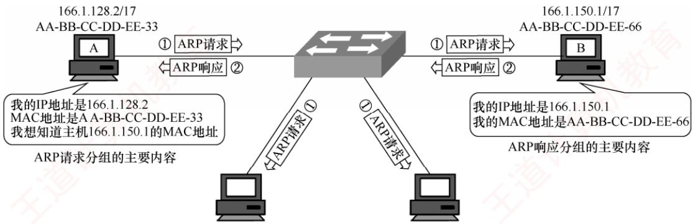

<em>图 4.10 ARP 的工作原理</em>

1) 主机 A 构造 ARP 请求分组，封装在目的 MAC 地址为 FF-FF-FF-FF-FF-FF 的帧中并广播发送，本局域网内所有主机均会收到。请求内容为 “我的 IP 地址是 166.1.128.2，MAC 地址是 AA-BB-CC-DD-EE-33，我想知道 IP 地址为 166.1.150.1 的主机的 MAC 地址”。

2）主机 B 收到广播帧后，发现请求解析的 IP 地址正是自己的地址，便向主机 A 单播发送 ARP 响应分组，其中包含自身的 MAC 地址。响应内容为 “我的 IP 地址是 166.1.150.1，MAC 地址是 AA-BB-CC-DD-EE-66”。同时，主机 B 将主机 A 的 IP 地址和 MAC 地址的映射写入自己的 ARP 缓存，以便后续通信。

3）主机A收到ARP响应分组后，将主机B的IP地址和MAC地址的映射写入其ARP缓存，随后即可使用该MAC地址封装并发送数据帧。

　　之所以将 ARP 归为网络层协议，是因为它处理的是 IP 地址。一般而言，可根据某协议是否使用或依赖某一层的地址或端口信息来判断其所属的协议层次。

> **注意：**

　　ARP 仅作用于同一局域网（广播域），无法跨网络工作。

　　跨网通信时，ARP解析的是下一跳路由器接口的MAC地址，而非最终目的主机，

　　使用 ARP 的 4 种典型情况总结如下（见图 4.11）。

  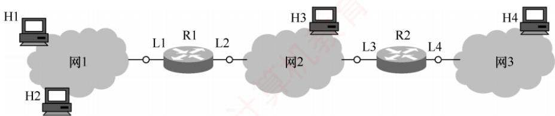

<em>图 4.11 使用 ARP 的 4 种典型情况</em>

1）发送方是主机（如 H1），要把 IP 分组发送到本网络上的另一台主机（如 H2）。这时 H1 在网 1 上通过 ARP 解析出目的主机 H2 的 MAC 地址。

2）发送方是主机（如 H1），要把 IP 分组发送到其他网络上的主机（如 H4）。这时 H1 通过 ARP 找到本网络中默认网关（路由器 R1 的接口 L1）的 MAC 地址，并将分组发给 R1，后续工作由 R1 完成。

> **考点追踪：** 跨局域网的ARP解析过程（2015）

> **注意：**

　　起初，H1 向 R1 发送数据时，MAC 帧首部的源/目的地址分别为 H1 和 L1 的 MAC 地址。R1 收到该帧后，在数据链路层将其解封装并重新封装，源/目的地址分别更新为 L2 和 L3 的 MAC 地址。随后，R2 收到该帧，同样进行解封装与重新封装，源/目的地址再次更新为 L4 和 H4 的 MAC 地址。可见，IP 分组每经过一个路由器，其外层 MAC 帧的源/目的地址都会更新为当前链路两端设备的接口 MAC 地址。

3）发送方是路由器（如R1），要把IP分组转发到与其直连的网络（网2）上的主机（如H3）。这时R1在网2上通过ARP解析出H3的MAC地址。

4）发送方是路由器（如 R1），要把 IP 分组转发到非直连网络（网 3）上的主机（如 H4）。这时 R1 在其出接口所在网络（网 2）上，通过 ARP 找到下一跳路由器 R2 的接口 L3 的 MAC 地址，并将分组发给 R2，后续工作由 R2 完成。

　　整个 ARP 过程对用户完全透明。只要需要与本局域网内的设备通信，系统便会自动完成 IP 地址到 MAC 地址的解析，并封装成帧发送，用户无须也无法干预这一过程。

### 4.2.6 动态主机配置协议 DHCP

　　动态主机配置协议（Dynamic Host Configuration Protocol，DHCP）常用于给主机动态地分配IP地址，它提供了即插即用的联网机制，这种机制允许一台计算机加入新的网络和自动获取IP地址，而不用手工参与。DHCP是应用层协议，它是基于UDP的。

> **注意：**

　　连接到互联网的计算机需要配置的项目包括：① IP 地址，② 子网掩码，③ 默认路由器的 IP 地址（默认网关），④ 域名服务器的 IP 地址。

> **考点追踪：** DHCP 发现报文的作用（2022）

　　DHCP 使用客户/服务器模型。其工作原理是：需要 IP 地址的主机在启动时就向 DHCP 服务器广播发送发现报文，这时该主机就成为 DHCP 客户。本地网络上的所有主机都能收到这个广播报文，但只有 DHCP 服务器才能回答该广播报文。DHCP 服务器先在其数据库中查找该计算机的配置信息。若找到，则返回找到的信息；若找不到，则从服务器的 IP 地址池中取一个地址分配给该主机。DHCP 服务器的回答报文称为提供报文，包含提供的 IP 地址等配置信息。

> **考点追踪：** DHCP 报文的地址分析（2015、2022、2025）

　　DHCP 客户与 DHCP 服务器的交换过程如下:

1）DHCP 客户广播 “DHCP Discover” 发现报文，试图找到网络中的 DHCP 服务器，以便从 DHCP 服务器获得一个 IP 地址。此时，DHCP 客户未分配 IP 地址，也不知道 DHCP 服务器的 IP 地址，因此源地址为 0.0.0.0，目的地址为 255.255.255.255。网络中的所有主机都能收到该广播报文，但只有 DHCP 服务器才对 DHCP 发现报文进行响应。

2）DHCP 服务器收到 “DHCP 发现” 报文后，广播 “DHCP Offer” 提供报文，其中包含提供给 DHCP 客户的 IP 地址等配置信息（还包括子网掩码、默认网关、DNS 服务器、租用期等）。源地址为 DHCP 服务器地址，目的地址为 255.255.255.255。网络中的 DHCP 服务器可能有多台，凡收到 DHCP 发现报文的 DHCP 服务器都要发出 DHCP 提供报文。

3）DHCP 客户收到 “DHCP 提供” 报文，若接受该 IP 地址，则广播 “DHCP Request” 请求报文向 DHCP 服务器请求提供 IP 地址。源地址为 0.0.0.0，目的地址为 255.255.255.255。DHCP 客户可能收到多个 DHCP 提供报文，只能从其中选择一个，因此仍用广播方式发送，以让未选中的 DHCP 服务器释放自己为该 DHCP 客户预留的 IP 地址等资源。

4）被选中的 DHCP 服务器广播 “DHCP ACK” 确认报文，将 IP 地址分配给 DHCP 客户。源地址为 DHCP 服务器地址，目的地址为 255.255.255.255。DHCP 客户收到后配置生效。

　　DHCP 服务器分配给 DHCP 客户的 IP 地址是临时的，DHCP 客户只能在一段有限的时间内使用这个 IP 地址，这段时间被称为租用期，其数值应由 DHCP 服务器决定。

　　租用期过 50%时，DHCP 客户发送 DHCP 请求报文（源地址为客户当前的 IP 地址，目的地址是为其分配地址的 DHCP 服务器地址），请求更新租用期。若 DHCP 服务器同意，则发回 DHCP 确认报文（单播发送）；若 DHCP 服务器不同意，则发回 DHCP 否认报文（单播发送）。此时，DHCP 客户必须停止使用当前的 IP 地址，然后重新申请。

　　租用期过 87.5%时，若 DHCP 服务器未响应上次的续租请求，则 DHCP 客户广播 DHCP 请求报文（源地址为客户当前的 IP 地址，目的地址为 255.255.255.255），以提高续租的成功率，若仍无响应，则在租用期到后，DHCP 客户必须停止使用当前的 IP 地址，然后重新申请。

　　DHCP 客户也可以随时提前终止租用期，只需向 DHCP 服务器发送 DHCP 释放报文（源地址为客户当前的 IP 地址，目的地址是为其分配地址的 DHCP 服务器地址）。

　　DHCP 之所以采用 UDP 而非 TCP, 是因为 DHCP 客户在初始阶段既无 IP 地址, 又不知道 DHCP 服务器地址, 无法建立 TCP 连接; 而 UDP 无须连接, 且支持广播, 满足 DHCP 的通信需求。

### 4.2.7 网际控制报文协议 ICMP

> **考点追踪：** ICMP 使用的下层协议（2012）

　　为了更有效地转发 IP 数据报并提高交付成功率，网络层使用了网际控制报文协议（Internet Control Message Protocol，ICMP），使主机或路由器能够向源点报告网络中的差错或异常情况。ICMP 报文被封装在 IP 数据报中传送，但它不是高层协议，而是网络层协议。

　　ICMP 报文分为两类：ICMP 差错报告报文和 ICMP 询问报文。

> **考点追踪：** ICMP 差错报告报文的类型与语义（2022）

　　ICMP 差错报告报文用于目标主机或路径上的路由器向源主机报告差错。有 5 种常用类型：1）终点不可达。当路由器或主机无法交付数据报时，向源点发送终点不可达报文。

2）时间超过。路由器每转发一个数据报，就会将其首部的生存时间（TTL）减1；若TTL减为0，则丢弃该数据报，并向源点发送时间超过报文。此外，若目的主机在规定时间内未能收齐某个数据报的所有分片，则也会丢弃已收到的分片，并向源点发送时间超过报文。

3）参数问题。当路由器或目的主机发现数据报首部中某些字段的值不正确（注意并非任意字段）时，丢弃该数据报，并向源点发送参数问题报文。

4）改变路由（重定向）。路由器通过改变路由报文通知源点，下次应将数据报发送给另外的路由器（可通过更好的路由），使得路径更短。

5) 源点抑制 $^{①}$ 。当路由器或主机因拥塞而丢弃数据报时，通过此报文请求源点降低发送速率。为了避免无限循环或无意义反馈，以下几种情形不应发送 ICMP 差错报告报文：

1）对 ICMP 差错报告报文本身，不再发送 ICMP 差错报告报文。

2）对第一个数据报片之后的所有后续分片，不发送 ICMP 差错报告报文。

3）对目的地址为多播或广播地址的数据报，不发送 ICMP 差错报告报文。

4）对具有特殊地址（如 127.0.0.0 或 0.0.0.0）的数据报，不发送 ICMP 差错报告报文。

　　常用的 ICMP 询问报文有两种类型:

1）回送请求和回答报文。用来测试目的主机是否可达，并获取其状态信息。

2）时间戳请求和回答报文。通过报文中记录的时间戳，发送方可估算当前的往返时延。

　　ICMP 的两个典型应用是：分组网间探测 PING，利用 ICMP 回送请求与回答报文，测试两台主机之间的连通性；路由跟踪 Traceroute（UNIX）/Tracert（Windows），通过逐步增大 TTL 值，触发沿途路由器返回 ICMP 时间超过报文，从而追踪分组经过的路由路径。

### 4.2.8 本节习题精选

#### 一、单项选择题

01. Internet 的网络层含有 4 个重要的协议，分别为（）。

- A. IP, ICMP, ARP, UDP
- B. TCP, ICMP, UDP, ARP
- C. IP, ICMP, ARP, RARP
- D. UDP, IP, ICMP, RARP

02. 下列关于 IPv4 分组结构的描述中，错误的是（）。

- A. IP 分组头的长度是可变的
- B. 协议字段表示 IP 的版本，值为 4 表示 IPv4
- C. IP 分组首部长度字段以 4B 为单位，总长度字段以字节为单位
- D. 生存时间字段值表示一个分组可以经过的最多的跳数

03. IPv4 分组首部中有两个有关长度的字段：首部长度和总长度，其中（）。

- A. 首部长度字段和总长度字段都以 8 比特为计数单位
- B. 首部长度字段以 8 比特为计数单位，总长度字段以 32 比特为计数单位
- C. 首部长度字段以 32 比特为计数单位，总长度字段以 8 比特为计数单位
- D. 首部长度字段和总长度字段都以 32 比特为计数单位

04. 下列关于 IP 分组的首部检验和字段的说法中，正确的是（）。

- A. 检验和字段检查的范围是整个 IP 分组
- B. 计算检验和的方法是对首部的每个 16 比特按反码运算求和再取反码
- C. 若网络层发现检验和错误，则丢弃该 IP 分组并发送 ICMP 差错报文
- D. IP 分组检验和的计算需要加入一个伪首部

05. 当数据报到达目的网络后，要传送到目的主机，需要知道 IP 地址对应的（）。

- A. 逻辑地址
- B. 动态地址
- C. 域名
- D. 物理地址

06. 若 IPv4 的分组太大，会在传输中被分片，则在（）处将对分片后的数据报重组。

- A. 中间路由器
- B. 下一跳路由器
- C. 核心路由器
- D. 目的主机

07. 在 IP 首部的字段中，与分片和重组无关的字段是（）。

- A. 总长度
- B. 标识
- C. 标志
- D. 片偏移

08. 下列关于 IP 分组的分片与组装的描述中，错误的是（）。

- A. IP 分组头中与分片和组装相关的字段是：标识、标志与片偏移
- B. IP 分组规定的最大长度为 65535B
- C. 以太网的 MTU 为 1500B
- D. 片偏移的单位是 4B

09. 若一个 IP 分组的片偏移字段的值为 100，则意味着（）。

- A. 该 IP 分组没有分片
- B. 该 IP 分组的长度为 100B
- C. 该 IP 分组的第一个字节是分片前的第 100 个字节
- D. 该 IP 分组的第一个字节是分片前的第 800 个字节

10. 下列关于 IP 分组分片基本方法的描述中，错误的是（）。

- A. IP 分组长度大于 MTU 时，就必须对其进行分片
- B. DF=1，分组的长度又超过 MTU 时，则丢弃该分组，不需要向源主机报告
- C. 分片的 MF 值为 1 表示接收到的分片不是最后一个分片
- D. 属于同一原始 IP 分组的分片具有相同的标识

11. 某 IP 分组的片偏移字段值为 100，首部长度字段值为 5，总长度字段值为 100，则该 IP 分组的数据部分的第一个字节的编号与最后一个字节的编号是（）。

- A. 100,200
- B. 100,500
- C. 800,879
- D. 800,900

12. 路由器 R0 的路由表见下表。若进入路由器 R0 的分组的目的地址为 132.19.237.5，则该分组应该被转发到（）下一跳路由器。

- A. R1
- B. R2
- C. R3
- D. R4

<table><tr><td>目的网络</td><td>下一跳路由器</td></tr><tr><td>132.0.0.0/8</td><td>R1</td></tr><tr><td>132.0.0.0/11</td><td>R2</td></tr><tr><td>132.19.232.0/22</td><td>R3</td></tr><tr><td>0.0.0.0/0</td><td>R4</td></tr></table>

13. IP 规定每个 C 类网络最多可以有（）台主机或路由器。

- A. 254
- B. 256
- C. 32
- D. 1024

14. 在下列 4 个地址中，属于子网 86.32.0.0/12 的地址是（）。

- A. 86.33.224.123
- B. 86.79.65.126
- C. 86.79.65.216
- D. 86.68.206.154

15. 在下列 4 个地址中，属于单播地址的是（）。

- A. 172.31.128.255/18
- B. 10.255.255.255
- C. 192.168.24.59/30
- D. 224.105.5.211

16. 在下列 4 个地址中，属于本地回路地址的是（）。

- A. 10.10.10.1
- B. 255.255.255.0
- C. 192.0.0.1
- D. 127.0.0.1

17. 访问互联网的每台主机都需要分配 IP 地址（假定采用默认子网掩码），下列可以分配给主机的 IP 地址是（）。

- A. 192.46.10.0
- B. 110.47.10.0
- C. 127.10.10.17
- D. 211.60.256.21

18. IP 规定，一些特殊的 IP 地址一般是不会被指派的，下列说法错误的是（）。

- A. 0.0.0.0 可以作为 DHCP 客户的源 IP 地址
- B. 路由器不会转发目的 IP 地址是 255.255.255.255 的 IP 数据报
- C. 127.0.0.1 可以作为目的 IP 地址，但不能作为源 IP 地址
- D. 路由器可以转发目的 IP 地址的主机号为全 1 的 IP 数据报

19. 为了提供更多的子网，为一个 B 类地址指定了子网掩码 255.255.240.0，则每个子网最多可以有的主机数是（）。

- A. 16
- B. 256
- C. 4094
- D. 4096

20. 不考虑 NAT，在 Internet 中，IP 数据报从源节点到目的节点可能需要经过多个网络和路由器。在整个传输过程中，IP 数据报首部中的（）。

- A. 源地址和目的地址都不会发生变化
- B. 源地址有可能发生变化而目的地址不会发生变化
- C. 源地址不会发生变化而目的地址有可能发生变化
- D. 源地址和目的地址都有可能发生变化

21. 把 IP 网络划分成子网，这样做的好处是（）。

- A. 增加冲突域的大小
- B. 增加主机的数量
- C. 减少广播域的大小
- D. 增加网络的数量

22. 一个网段的网络号为 198.90.10.0/27，最多可以分成（）个子网；此网段划分成若干子网后，每个子网最多具有（）个可分配给主机的 IP 地址。

- A. 8, 30
- B. 4, 62
- C. 16, 14
- D. 32, 6

23. 一台主机有两个 IP 地址，一个地址是 192.168.11.25，另一个地址可能是（）。

- A. 192.168.11.0
- B. 192.168.11.26
- C. 192.168.13.25
- D. 192.168.11.24

24. CIDR技术的主要作用是（）。

- A. 有效分配IP地址空间，并减少路由表的数量
- B. 把大的网络划分成小的子网
- C. 彻底解决IP地址资源不足的问题
- D. 由多台主机共享同一个网络地址

25. 某个 CIDR 表示的 IPv4 地址为 126.166.66.99/22，则下面的描述中错误的是（）。

- A. 网络前缀占用 22 比特
- B. 主机编号占用 10 比特
- C. 所在地址块包含的地址数为 $2^{10}$
- D. 126.166.66.99 是所在地址块的第一个地址

26. 某网络的一台主机的 IP 地址是 200.15.10.6/29，其配置的默认网关地址是 200.15.10.7，这样配置后发现主机无法 PING 通任何远程设备，原因是（）。

- A. 默认网关的地址不属于这个子网
- B. 默认网关的地址是子网中的广播地址
- C. 路由器接口的地址是子网的广播地址
- D. 路由器接口的地址是多播地址

27. CIDR 地址块 192.168.10.0/20 所包含的 IP 地址范围是 (①)。与地址 192.16.0.19/28 同属于一个子网的主机地址是 (②)。
①

- A. 192.168.0.0 ~ 192.168.12.255
- B. 192.168.10.0 ~ 192.168.13.255
- C. 192.168.10.0 ~ 192.168.14.255
- D. 192.168.0.0 ~ 192.168.15.255

②

- A. 192.16.0.17
- B. 192.16.0.31
- C. 192.16.0.15
- D. 192.16.0.14

28. 路由表错误和软件故障都可能使得网络中的数据形成传输环路而无限转发环路的分组，IPv4 协议解决该问题的方法是（）。

- A. 报文分片
- B. 设定生命期
- C. 增加检验和
- D. 增加选项字段

29. 当下列 IP 地址作为 IP 数据报的目的地址时，互联网上的路由器不会正常转发的是（）。

- A. 192.172.56.23
- B. 172.15.34.128
- C. 192.168.32.17
- D. 172.128.45.34

30. 为了解决 IP 地址耗尽的问题，可以采用以下措施，其中治本的是（）。

- A. 划分子网
- B. 采用无类比编址 CIDR
- C. 采用网络地址转换 NAT
- D. 采用 IPv6

31. 下列对 IP 分组的分片和重组的描述中，正确的是（）。

- A. IP 分组可以被源主机分片，并在中间路由器进行重组
- B. IP 分组可以被路径中的路由器分片，并在目的主机进行重组
- C. IP 分组可以被路径中的路由器分片，并在中间路由器上进行重组
- D. IP 分组可以被路径中的路由器分片，并在最后一跳的路由器上进行重组

32. 一个网络中有几个子网，其中一个已分配了子网号74.178.247.96/29，则下列网络前缀中不能再分配给其他子网的是（）。

- A. 74.178.247.120/29
- B. 74.178.247.64/29
- C. 74.178.247.96/28
- D. 74.178.247.104/29

33. 主机 A 和主机 B 的 IP 地址分别为 216.12.31.20 和 216.13.32.21，要想让 A 和 B 工作在同一个 IP 子网内，应该给它们分配的子网掩码是（）。

- A. 255.255.255.0
- B. 255.255.0.0
- C. 255.255.255.255
- D. 255.0.0.0

34. 某单位分配了 1 个 B 类地址，计划将内部网络划分成 35 个子网，将来可能增加 16 个子网，每个子网的主机数量接近 800 台，则可行的掩码方案是（）。

- A. 255.255.248.0
- B. 255.255.252.0
- C. 255.255.254.0
- D. 255.255.255.0

35. 设有 4 条路由 172.18.129.0/24、172.18.130.0/24、172.18.132.0/24 和 172.18.133.0/24，若进行路由聚合，则能覆盖这 4 条路由的地址是（）。

- A. 172.18.128.0/21
- B. 172.18.128.0/22
- C. 172.18.130.0/22
- D. 172.18.132.0/23

36. 下列 4 个地址块中，与地址块 192.168.6.192/26 不重叠且与 192.168.6.192/26 聚合后的地址块不会引入多余地址的是（）。

- A. 192.168.6.0/25
- B. 192.168.6.0/26
- C. 192.168.6.128/26
- D. 192.168.6.192/27

37. 在一条点对点链路上，为了减少 IP 地址的浪费，子网掩码应指定为（）。

- A. 255.255.255.252
- B. 255.255.255.248
- C. 255.255.255.240
- D. 255.255.255.196

38. 某子网的子网掩码为 255.255.255.224，共给 4 台主机分配了 IP 地址，其中一台因 IP 地址分配不当而存在通信故障。这一台主机的 IP 地址是（）。

- A. 202.3.1.33
- B. 202.3.1.65
- C. 202.3.1.44
- D. 202.3.1.55

39. 某主机的 IP 地址是 166.66.66.66，子网掩码为 255.255.192.0，若该主机向其所在子网发送广播分组，则目的 IP 地址应该是（）。

- A. 166.66.66.255
- B. 166.66.255.255
- C. 166.255.255.255
- D. 166.66.127.255

40. 现将一个IP网络划分为4个子网，若其中一个子网是192.168.1.130/26，则下列网络中不可能是另外3个子网之一的是（）。

- A. 192.168.1.0/25
- B. 192.168.1.64/26
- C. 192.168.1.96/27
- D. 192.168.1.224/27

41. 位于不同子网的主机之间相互通信时，下列说法中正确的是（）。

- A. 路由器在转发IP数据报时，重新封装源硬件地址和目的硬件地址
- B. 路由器在转发IP数据报时，重新封装源IP地址和目的IP地址
- C. 路由器在转发IP数据报时，重新封装目的硬件地址和目的IP地址
- D. 源站点可以直接进行ARP广播得到目的站点的硬件地址

42. 路由器收到目的 IP 地址为 255.255.255.255 的分组，则路由器的操作是（）。

- A. 丢弃该 IP 分组
- B. 从所有其他接口转发该 IP 分组
- C. 通过路由表中的默认路由转发该 IP 分组
- D. 通过路由表中的特定主机路由转发该 IP 分组

43. 某以太网中，甲的 IP 地址为 211.71.136.23，子网掩码为 255.255.240.0，已知网关地址为 211.71.136.1。若甲向乙（IP 地址为 211.71.130.25）发送一个 IP 分组，则（）。

- A. 该分组封装成帧后直接发送给乙，帧中目的 MAC 地址为网关的 MAC 地址
- B. 该分组封装成帧后直接发送给乙，帧中目的 MAC 地址为乙的 MAC 地址
- C. 该分组封装成帧后交由网关转发，帧中目的 MAC 地址为网关的 MAC 地址
- D. 该分组封装成帧后交由网关转发，帧中目的 MAC 地址为乙的 MAC 地址

44. 下列情况需要启动 ARP 请求的是（）。

- A. 主机需要接收信息，但 ARP 表中没有源 IP 地址与 MAC 地址的映射关系
- B. 主机需要接收信息，但 ARP 表中已有源 IP 地址与 MAC 地址的映射关系
- C. 主机需要发送信息，但 ARP 表中没有目的 IP 地址与 MAC 地址的映射关系
- D. 主机需要发送信息，但 ARP 表中已有目的 IP 地址与 MAC 地址的映射关系

45. 某网络拓扑如下图所示，H1 与 H2 的默认网关和子网掩码都分别配置为 192.168.3.1 和 255.255.255.0，H3 和 H4 的默认网关和子网掩码都分别配置为 192.168.3.254 和 255.255.255.128，初始时所有设备的 ARP 缓存均为空。则下列说法中错误的是（）。

  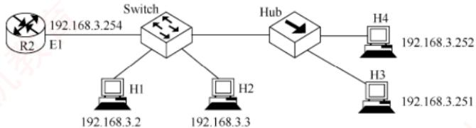

- A. 若 H1 向 H3 发送数据，则 H2、H3、H4 都能收到 H1 发来的 ARP 请求报文
- B. 若 H3 向 H1 发送数据，则 H3 能收到 H1 发来的 ARP 响应报文
- C. 若 H1 向 H2 发送数据，则 H2、H3、H4 都能收到 H1 发来的 ARP 请求报文
- D. 若 H3 向 H4 发送数据，则 H3 能收到 H4 发来的 ARP 响应报文

46. 可以动态为主机配置 IP 地址的协议是（）。

- A. ARP
- B. RARP
- C. DHCP
- D. NAT

47. 若某路由器收到一个TTL值为1的IP数据报，则路由器的操作是（）。

- A. 转发该IP数据报
- B. 仅仅丢弃该IP数据报
- C. 丢弃该IP数据报并向源主机发送类型为终点不可达的ICMP差错报告报文
- D. 丢弃该IP数据报并向源主机发送类型为时间超过的ICMP差错报告报文

48. 下列关于 ICMP 报文的说法中，错误的是（）。

- A. ICMP 报文封装在数据链路层帧中发送
- B. ICMP 报文可以用于报告 IP 数据报发送错误
- C. ICMP 报文封装在 IP 数据报中发送
- D. 对于已经携带 ICMP 差错报文的分组，不再产生 ICMP 差错报文

49. 下列关于 ICMP 差错报文的描述中，错误的是（）。

- A. ICMP 报文分为差错报告报文和询问报文两类
- B. 对于已经分片的分组，只对第一个分片产生 ICMP 差错报文
- C. PING 使用了 ICMP 差错报文
- D. 对于多播的分组，不产生 ICMP 差错报文

50. 【2010 统考真题】某网络的 IP 地址空间为 192.168.5.0/24，采用定长子网划分，子网掩码为 255.255.255.248，则该网络中的最大子网个数、每个子网内的最大可分配地址个数分别是（）。

- A. 32, 8
- B. 32, 6
- C. 8, 32
- D. 8, 30

51. 【2010 统考真题】若路由器 R 因为拥塞丢弃 IP 分组，则此时 R 可向发出该 IP 分组的源主机发送的 ICMP 报文类型是（）。

- A. 路由重定向
- B. 目的不可达
- C. 源点抑制
- D. 超时

52. 【2011 统考真题】在子网 192.168.4.0/30 中，能接收目的地址为 192.168.4.3 的 IP 分组的最大主机数是（）。

- A. 0
- B. 1
- C. 2
- D. 4

53. 【2011 统考真题】某网络拓扑如下图所示，路由器 R1 只有到达子网 192.168.1.0/24 的路由。为使 R1 可以将 IP 分组正确地路由到图中的所有子网，在 R1 中需要增加的一条路由（目的网络，子网掩码，下一跳）是（）。

  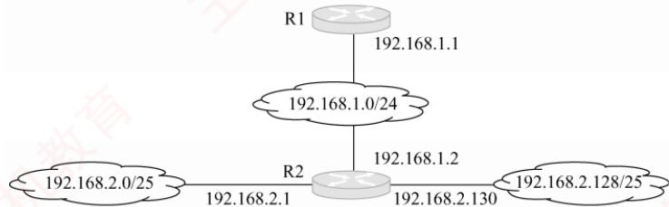

- A. 192.168.2.0 255.255.255.128 192.168.1.1
- B. 192.168.2.0 255.255.255.0 192.168.1.1
- C. 192.168.2.0 255.255.255.128 192.168.1.2
- D. 192.168.2.0 255.255.255.0 192.168.1.2

54. 【2012 统考真题】某主机的 IP 地址为 180.80.77.55，子网掩码为 255.255.252.0。若该主机向其所在子网发送广播分组，则目的地址可以是（）。

- A. 180.80.76.0
- B. 180.80.76.255
- C. 180.80.77.255
- D. 180.80.79.255

55. 【2012 统考真题】ARP 的功能是（）。

- A. 根据 IP 地址查询 MAC 地址
- B. 根据 MAC 地址查询 IP 地址
- C. 根据域名查询 IP 地址
- D. 根据 IP 地址查询域名

56. 【2012 统考真题】在 TCP/IP 体系结构中，直接为 ICMP 提供服务的协议是（）。

- A. PPP
- B. IP
- C. UDP
- D. TCP

57. 【2015 统考真题】某路由器的路由表如下所示:

<table><tr><td>目的网络</td><td>下一跳</td><td>接口</td></tr><tr><td>169.96.40.0/23</td><td>176.1.1.1</td><td>S1</td></tr><tr><td>169.96.40.0/25</td><td>176.2.2.2</td><td>S2</td></tr><tr><td>169.96.40.0/27</td><td>176.3.3.3</td><td>S3</td></tr><tr><td>0.0.0.0/0</td><td>176.4.4.4</td><td>S4</td></tr></table>

　　若路由器收到一个目的地址为 169.96.40.5 的 IP 分组，则转发该 IP 分组的接口是（）。

- A. S1
- B. S2
- C. S3
- D. S4

58. 【2016 统考真题】如下图所示，假设 H1 与 H2 的默认网关和子网掩码均分别配置为 192.168.3.1 和 255.255.255.128, H3 和 H4 的默认网关和子网掩码均分别配置为 192.168.3.254 和 255.255.255.128，则下列现象中可能发生的是（）。

  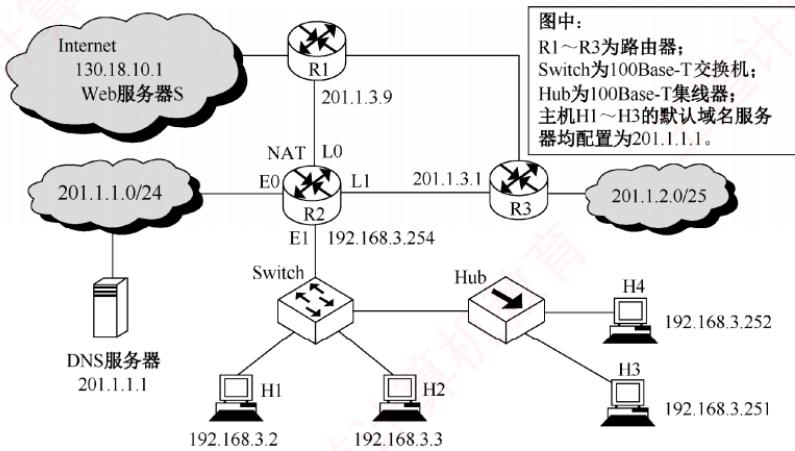

- A. H1 不能与 H2 进行正常 IP 通信
- B. H2 与 H4 均不能访问 Internet
- C. H1 不能与 H3 进行正常 IP 通信
- D. H3 不能与 H4 进行正常 IP 通信

59. 【2016 统考真题】在上题的图中，假设连接 R1、R2 和 R3 之间的点对点链路使用地址 201.1.3.x/30，当 H3 访问 Web 服务器 S 时，R2 转发出去的封装 HTTP 请求报文的 IP 分组是源 IP 地址和目的 IP 地址，它们分别是（）。

- A. 192.168.3.251, 130.18.10.1
- B. 192.168.3.251, 201.1.3.9
- C. 201.1.3.8, 130.18.10.1
- D. 201.1.3.10, 130.18.10.1

60. 【2017 统考真题】若将网络21.3.0.0/16划分为128个规模相同的子网，则每个子网可分配的最大IP地址个数是（）。

- A. 254
- B. 256
- C. 510
- D. 512

61. 【2017 统考真题】下列 IP 地址中，只能作为 IP 分组的源 IP 地址但不能作为目的 IP 地址的是（）。

- A. 0.0.0.0
- B. 127.0.0.1
- C. 200.10.10.3
- D. 255.255.255.255

62. 【2018 统考真题】某路由表中有转发接口相同的 4 条路由表项，其目的网络地址分别为 35.230.32.0/21、35.230.40.0/21、35.230.48.0/21 和 35.230.56.0/21，将该 4 条路由聚合后的目的网络地址为（）。

- A. 35.230.0.0/19
- B. 35.230.0.0/20
- C. 35.230.32.0/19
- D. 35.230.32.0/20

63. 【2018 统考真题】路由器 R 通过以太网交换机 S1 和 S2 连接两个网络，R 的接口、主机 H1 和 H2 的 IP 地址与 MAC 地址如下图所示。若 H1 向 H2 发送一个 IP 分组 P，则

00-1a-2b-3c-4d-52

　　H1 发出的封装 P 的以太网帧的目的 MAC 地址、H2 收到的封装 P 的以太网帧的源 MAC 地址分别是（）。

  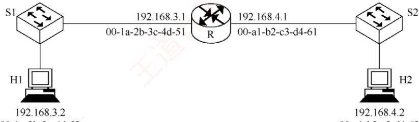

00-a1-b2-c3-d4-62

- A. 00-a1-b2-c3-d4-62, 00-1a-2b-3c-4d-52
- B. 00-a1-b2-c3-d4-62, 00-a1-b2-c3-d4-61
- C. 00-1a-2b-3c-4d-51, 00-1a-2b-3c-4d-52
- D. 00-1a-2b-3c-4d-51, 00-a1-b2-c3-d4-61

64. 【2019 统考真题】若将 101.200.16.0/20 划分为 5 个子网，则可能的最小子网的可分配 IP 地址数是（）。

- A. 126
- B. 254
- C. 510
- D. 1022

65. 【2021 统考真题】现将一个 IP 网络划分为 3 个子网，若其中一个子网是 192.168.9.128/26，则下列网络中不可能是另外两个子网之一的是（）。

- A. 192.168.9.0/25
- B. 192.168.9.0/26
- C. 192.168.9.192/26
- D. 192.168.9.192/27

66. 【2021 统考真题】若路由器向 MTU=800B 的链路转发一个总长度为 1580B 的 IP 数据报（首部长度为 20B）时进行了分片，且每个分片尽可能大，则第 2 个分片的总长度字段和 MF 标志位的值分别是（）。

- A. 796,0
- B. 796,1
- C. 800,0
- D. 800,1

67. 【2022 统考真题】若某主机的 IP 地址是 183.80.72.48，子网掩码是 255.255.192.0，则该主机所在网络的网络地址是（）。

- A. 183.80.0.0
- B. 183.80.64.0
- C. 183.80.72.0
- D. 183.80.192.0

68. 【2022 统考真题】下图所示网络中的主机 H 的子网掩码与默认网关分别是（）。

  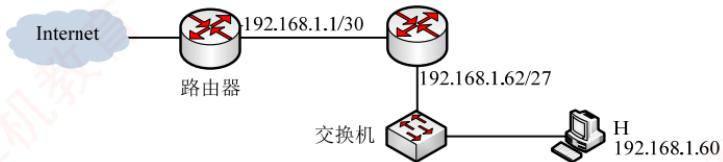

- A. 255.255.255.192,192.168.1.1
- B. 255.255.255.192,192.168.1.62
- C. 255.255.255.224,192.168.1.1
- D. 255.255.255.224,192.168.1.62

69. 【2023 统考真题】某网络拓扑如下图所示，其中路由器 R2 实现 NAT 功能。若主机 H 向 Internet 发送 1 个 IP 分组，则经过 R2 转发后，该 IP 分组的源 IP 地址是（）。

  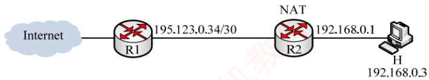

- A. 195.123.0.33
- B. 195.123.0.35
- C. 192.168.0.1
- D. 192.168.0.3

70. 【2023 统考真题】主机 168.16.84.24/20 所在子网的最小可分配 IP 地址和最大可分配 IP 地址分别是（）。

- A. 168.16.80.1, 168.16.84.254
- B. 168.16.80.1, 168.16.95.254
- C. 168.16.84.1, 168.16.84.254
- D. 168.16.84.1, 168.16.95.254

71. 【2024 统考真题】如下图所示的支持 VLAN 划分的交换机，已按端口划分了 3 个 VLAN，部分端口连接主机的 IP 地址和 MAC 地址如图中所示，ARP 表结构为 <IP 地址，MAC 地址，TTL>。下列选项中，不会出现在 H4 的 ARP 表中的是（）。

  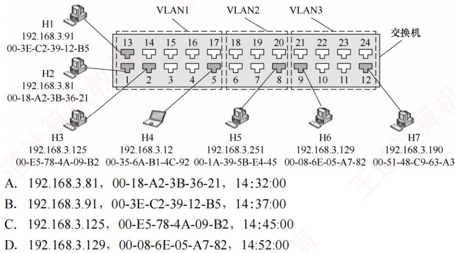

72. 【2025 统考真题】一台新接入网络的主机 H 在通过 DHCP 服务器动态请求 IP 地址的过程中，与 DHCP 服务器交换 DHCP 报文的部分过程如下图所示。封装 DHCPREQUEST 报文的 IP 数据报的目的 IP 地址和源 IP 地址分别是（）。

  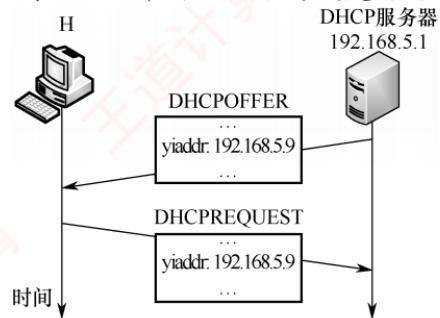

#### 二、综合应用题

01. 一个数据报长度为 4000B（首部长度固定为 20B）。现经过一个网络传送，但此网络能够传送的最大数据长度为 1500B。IP 分片时，首部长度不变。试问应当划分为几个短一些的数据报片？各数据报片的数据字段长度、片段偏移字段和 MF 标志应为何值？

02. 某网络的一台主机产生了一个 IP 数据报，首部长度为 20B，数据部分长度为 2000B。该数据报需要经过两个网络到达目的主机，这两个网络所允许的数据链路层的最大传输单位（MTU）分别为 1500B 和 576B。问原 IP 数据报到达目的主机时分成了几个 IP 小报文？每个报文的数据部分长度分别是多少？

03. 到达的分组的片偏移值为 100，分组首部中的首部长度字段值为 5，总长度字段值为 100，数据部分第一个字节的编号是多少？能确定数据部分最后一个字节的编号吗？

04. 在 4 个 “/24” 地址块中进行最大可能的聚合: 212.56.132.0/24、212.56.133.0/24、212.56.134.0/24、212.56.135.0/24。

05. 现有一公司需要创建内部网络，该公司包括工程技术部、市场部、售后部、财务部和办公室5个部门，每个部门有20～30台计算机。试问：

1）若要将几个部门从网络上分开，且分配给该公司使用的地址为一个C类地址，网络地址为192.168.161.0，则如何划分网络？可以将几个部门分开？

2）确定各部门的网络地址和子网掩码，并写出分配给每个部门网络中的主机IP地址范围。06. 某路由器具有右表所示的路由表项。

1）假设路由器收到两个分组：分组A的目的地址为131.128.55.33，分组B的目的地址

　　为 131.128.55.38。确定路由器为这两个分组选择的下一跳，并加以说明。

2）在路由表中增加一个路由表项，它使以131.128.55.33为目的地址的IP分组选择“A”作为下一跳，而不影响其他目的地址的IP分组的转发。

<table><tr><td>网络前缀</td><td>下一跳</td></tr><tr><td>131.128.56.0/24</td><td>A</td></tr><tr><td>131.128.55.32/28</td><td>B</td></tr><tr><td>131.128.55.32/30</td><td>C</td></tr><tr><td>131.128.0.0/16</td><td>D</td></tr></table>

3）在路由表中增加一个路由表项，使所有目的地址与该路由表中任何路由表项都不匹配的IP分组被转发到下一跳“E”。

4）将131.128.56.0/24划分为4个规模尽可能大的等长子网，给出子网掩码及每个子网的可分配地址范围。

07. 下表是使用无类别域间路由选择（CIDR）的路由选择表，地址字段是用十六进制表示的，试指出具有下列目标地址的 IP 分组将被投递到哪个下一站？

<table><tr><td>网络/掩码长度</td><td>下一站地</td></tr><tr><td>C4.50.0.0/12</td><td>A</td></tr><tr><td>C4.5E.10.0/20</td><td>B</td></tr><tr><td>C4.60.0.0/12</td><td>C</td></tr></table>

<table><tr><td>C4.68.0.0/14</td><td>D</td></tr><tr><td>80.0.0.0/1</td><td>E</td></tr><tr><td>40.0.0.0/2</td><td>F</td></tr><tr><td>00.0.0.0/2</td><td>G</td></tr></table>

1）C4.5E.13.87 2）C4.5E.22.09 3）C3.41.80.02 4）5E.43.91.12

08. 一个自治系统有 5 个局域网，如下图所示，LAN2 至 LAN5 上的主机数分别为 91、150、3 和 15，该自治系统分配到的 IP 地址块为 30.138.118.0/23，试给出每个局域网的地址块（包括前缀）。

  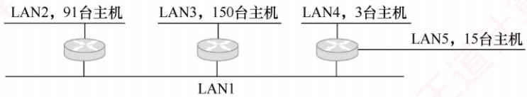

09. 某个网络地址块 192.168.75.0 中有 5 台主机 A、B、C、D 和 E，主机 A 的 IP 地址为 192.168.75.18，主机 B 的 IP 地址为 192.168.75.146，主机 C 的 IP 地址为 192.168.75.158，主机 D 的 IP 地址为 192.168.75.161，主机 E 的 IP 地址为 192.168.75.173，共同的子网掩码是 255.255.255.240。请回答：

1）5 台主机 A、B、C、D、E 分属几个网段？哪些主机位于同一网段？主机 D 的网络地址为多少？

2）若要加入第6台主机F，使它能与主机A属于同一网段，则其IP地址范围是多少？

3) 若在网络中另加入一台主机，其 IP 地址为 192.168.75.164，则它的广播地址是多少？

　　哪些主机能够收到？

10. 一个 IPv4 分组到达一个节点时，其首部信息（以十六进制表示）为：0x45 00 00 54 00 03 58 50 20 06 FF F0 7C 4E 03 02 B4 0E 0F 02。IP 分组的首部格式见图 4.5。请回答：

1）分组的源IP地址和目的IP地址各是什么（点分十进制表示法）？

2）该分组数据部分的长度是多少？

3）该分组是否已经分片？若有分片，则偏移量是多少？

11. 主机 A 的 IP 地址为 218.207.61.211，MAC 地址为 00:1d:72:98:1d:fc。A 收到一个帧，该帧的前 64 个字节的十六进制形式和 ASCII 形式如下图所示。

0000 00 1d 72 98 1d fc 00 00 5e 00 01 01 88 64 11 00 ..r..... ^....d..
0010 75 89 01 92 00 21 45 00 01 90 f9 bf 40 00 33 06 u....!E. ....@.3.
0020 f3 15 da c7 66 28 da cf 3d d3 00 50 c4 8f dc a6
0030 a2 96 23 4c 44 69 50 18 00 0f 76 3d 00 00 90 b5 ..#LDiP. ..v=...

　　IP 分组的首部格式见图 4.5，以太网帧的格式参见 3.6.2 节。问：

1）主机A所在网络的网关路由器的相应端口的MAC地址是多少？

2）该 IP 分组所携带的数据量为多少字节？

3）若该分组需要被路由器转发到一条MTU为380B的链路上，则路由器将做何种操作？

12. 某网络拓扑见下图，R1 和 R2 为路由器，R2 实现了 NAT 功能，Switch 为交换机，Hub 为集线器，Web 服务器 S、主机 H1～H4 和路由器各接口的 IP 地址配置见图中标注。

  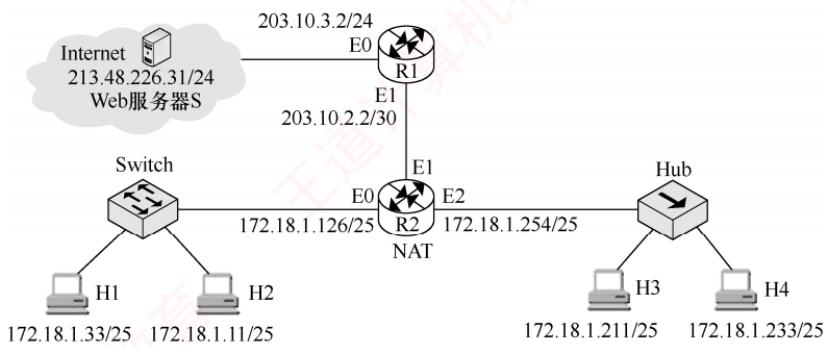

　　回答下列问题:

1）R2的E1接口的IP地址是什么？H1配置的默认网关是什么？

2）假设 H1 和 R2 的 ARP 缓存初始均为空，交换机的交换表初始也为空，H1 向 H3 发送一个 IP 分组 A，H3 收到 A 后向 H1 发送一个响应 IP 分组 B，则能收到封装 A 的以太网帧的主机有哪些？能收到封装 B 的以太网帧的主机有哪些？

3）H1 发出的封装有 HTTP 请求报文的 IP 分组 C，首部中的源 IP 地址和目的 IP 地址分别是什么？当 C 从 R2 转发出去时，首部中的源 IP 地址和目的 IP 地址分别是什么？

13. 【2009 统考真题】某网络拓扑图如下图所示，路由器 R1 通过接口 E1、E2 分别连接局域网 1、局域网 2，通过接口 L0 连接路由器 R2，并通过路由器 R2 连接域名服务器与互联网。R1 的 L0 接口的 IP 地址是 202.118.2.1；R2 的 L0 接口的 IP 地址是 202.118.2.2，L1 接口的 IP 地址是 130.11.120.1，E0 接口的 IP 地址是 202.118.3.1；域名服务器的 IP 地址是 202.118.3.2。

  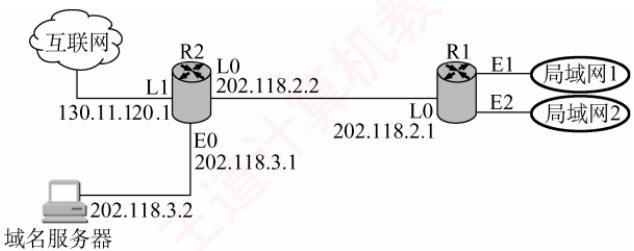

　　R1 和 R2 的路由表结构如下:

<table><tr><td>目的网络 IP 地址</td><td>子网掩码</td><td>下一跳 IP 地址</td><td>接口</td></tr></table>

1）将 IP 地址空间 202.118.1.0/24 划分为两个子网，分别分配给局域网 1 和局域网 2，每个局域网需分配的 IP 地址数不少于 120 个。请给出子网划分结果，说明理由或给出必要的计算过程。

2）请给出R1的路由表，使其明确包括到局域网1的路由、到局域网2的路由、域名服务器的主机路由和互联网的路由。

3）请采用路由聚合技术，给出R2到局域网1和局域网2的路由。

14. 【2015 统考真题】某网络拓扑如下图所示，其中路由器内网接口、DHCP 服务器、WWW 服务器与主机 1 均采用静态 IP 地址配置，相关地址信息见图中标注；主机 2～主机 N 通过 DHCP 服务器动态获取 IP 地址等配置信息。

  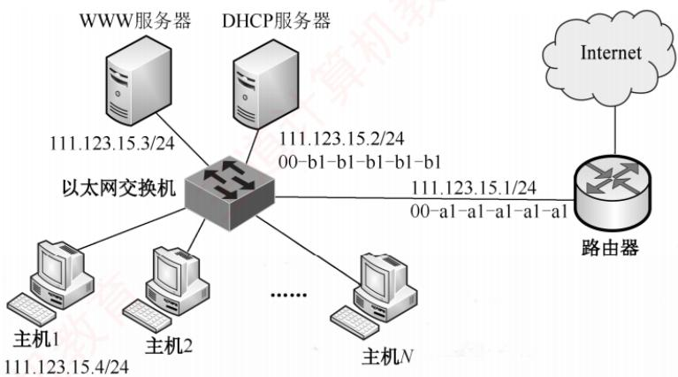

　　回答下列问题:

1）DHCP服务器可为主机 $2\sim N$ 动态分配IP地址的最大范围是什么？主机2使用DHCP获取IP地址的过程中，发送的封装DHCP Discover报文的IP分组的源IP地址和目的IP地址分别是多少？

2）若主机 2 的 ARP 表为空，则该主机访问 Internet 时，发出的第一个以太网帧的目的 MAC 地址是什么？封装主机 2 发往 Internet 的 IP 分组的以太网帧的目的 MAC 地址是什么？

3）若主机1的子网掩码和默认网关分别配置为255.255.255.0和111.123.15.2，则该主机是否能访问WWW服务器？是否能访问Internet？请说明理由。

15. 【2018 统考真题】某公司的网络如下图所示。IP 地址空间 192.168.1.0/24 均分给销售部和技术部两个子网，并已分别为部分主机和路由器接口分配了 IP 地址，销售部子网的 MTU = 1500B，技术部子网的 MTU = 800B。

  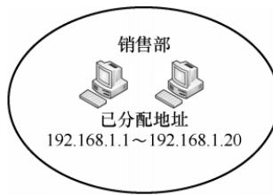

  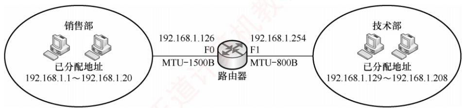

　　回答下列问题:

  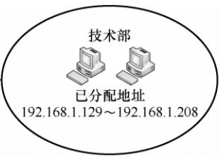

1) 销售部子网的广播地址是什么？技术部子网的子网地址是什么？若每台主机仅分配一个 IP 地址，则技术部子网还可以连接多少台主机？

2) 假设主机 192.168.1.1 向主机 192.168.1.208 发送一个总长度为 1500B 的 IP 分组，IP 分组的首部长度为 20B，路由器在通过接口 F1 转发该 IP 分组时进行了分片。若分片时尽可能分为最大片，则一个最大 IP 分片封装数据的字节数是多少？至少需要分为几个分片？每个分片的片偏移量是多少？

16. 【2020 统考真题】某校园网有两个局域网，通过路由器 R1、R2 和 R3 互连后接入 Internet, S1 和 S2 为以太网交换机。局域网采用静态 IP 地址配置，路由器部分接口以及各主机的 IP 地址如下图所示。

  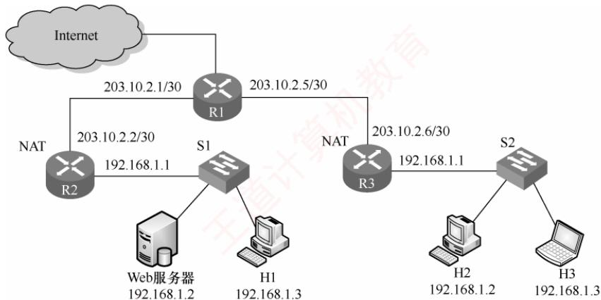

　　假设 NAT 转换表结构为

<table><tr><td colspan="2">外网</td><td colspan="2">内网</td></tr><tr><td>IP地址</td><td>端口号</td><td>IP地址</td><td>端口号</td></tr><tr><td></td><td></td><td></td><td></td></tr></table>

　　请回答下列问题:

1）为使 H2 和 H3 能够访问 Web 服务器（使用默认端口号），需要进行什么配置？

2) 若 H2 主动访问 Web 服务器时，将 HTTP 请求报文封装到 IP 数据报 P 中发送，则 H2 发送的 P 的源 IP 地址和目的 IP 地址分别是什么？经过 R3 转发后，P 的源 IP 地址和目的 IP 地址分别是什么？经过 R2 转发后，P 的源 IP 地址和目的 IP 地址分别是什么？

17. 【2022 统考真题】某网络拓扑如下图所示，R 为路由器，S 为以太网交换机，AP 是 802.11 接入点，路由器的 E0 接口和 DHCP 服务器的 IP 地址配置如图中所示；H1 与 H2 属于同一个广播域，但不属于同一个冲突域；H2 和 H3 属于同一个冲突域；H4 和 H5 已经接入网络，并通过 DHCP 动态获取了 IP 地址。现有路由器、100Base-T 以太网交换机和 100Base-T 集线器（Hub）三类设备各若干。

  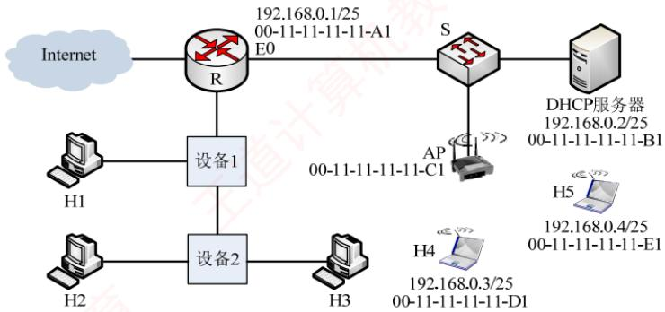

　　请回答下列问题。

1）设备1和设备2应该分别选择哪类设备？

2）若信号传播速度为 $2 \times 10^{8}$ m/s，以太网最小帧长为 64B，信号通过设备 2 时会产生额外的 $1.51 \mu s$ 的时延，则 H2 与 H3 之间可以相距的最远距离是多少？

3) 在 H4 通过 DHCP 动态获取 IP 地址过程中，H4 首先发送了 DHCP 报文 M，M 是哪种 DHCP 报文？路由器 E0 接口能否收到封装 M 的以太网帧？S 向 DHCP 服务器转发的封装 M 的以太网帧的目的 MAC 地址是什么？

4）若 H4 向 H5 发送一个 IP 分组 P，则 H5 收到的封装 P 的 802.11 帧的地址 1、地址 2 和地址 3 分别是什么？

18. 【2025 统考真题】某公司在承建国家重大工程项目时，工程部需要较长时间驻扎在偏远山区，工程部网络需要连接公司总部网络。假设综合考虑方案的技术可行性、安全性与经济成本等因素后，决定租用我国自主建设的天通一号卫星通信链路，连接工程部网络的路由器 R1 和公司总部网络的路由器 R2，如下图所示。S1 和 S2 为千兆以太网交换机；TR1 和 TR2 是卫星信号地面收发设备，实现全双工调制解调。天通一号卫星轨道高度是 36000km，电磁波信号传播速度为 300000km/s。租用的卫星链路为 R1 和 R2 之间提供对称全双工信道，每个方向的数据传输速率为 200kb/s。

  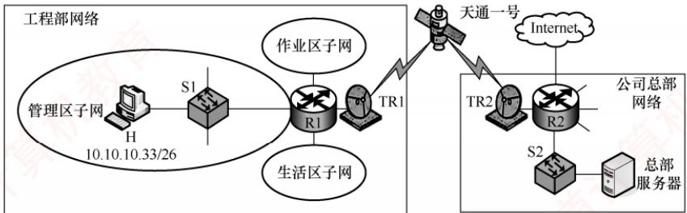

　　请回答下列问题。

1) 若忽略卫星信号中继以及TR1和TR2调制解调的时间开销，则R1到R2之间卫星链路的单向传播时延是多少？主机H向总部服务器传输数据时可以达到的最大吞吐量是多少？若忽略各层协议数据包的首部开销以及以太网内的传播时延，则主机H向总部服务器上传一个4000B大小的工程进度报告文件，至少需要多长时间？

2）现需要基于GBN滑动窗口协议为卫星链路设计单向可靠的数据链路层协议SLP，支持R1向R2发送数据，SLP数据帧长为1500B，忽略ACK帧长度。若要求SLP的单向信道利用率不低于 $80\%$ ，则SLP的发送窗口至少为多少？SLP帧的序号字段至少需要多少位？

3）若公司总部为工程部网络分配的IP地址空间是10.10.10.0/24，工程部进一步将该IP地址空间分配给3个子网，其中生活区子网可分配IP地址数不少于120个，作业区子网和管理区子网可分配IP地址数均不少于60个，且主机H已正确配置了IP地址，则作业区子网、管理区子网和生活区子网的子网地址分别是什么(给出CIDR形式)?

### 4.2.9 答案与解析

#### 一、单项选择题

**01. C**

　　TCP 和 UDP 是传输层协议，IP、ICMP、ARP、RARP（逆地址解析协议）是网络层协议。

**02. B**

　　协议字段表示使用 IP 的上层协议，如值为 6 表示 TCP，值为 17 表示 UDP。版本字段表示 IP 的版本，值为 4 表示 IPv4，值为 6 表示 IPv6。

**03. C**

　　在首部中有三个关于长度的标记：首部长度、总长度和片偏移，基本单位分别为 4B、1B 和 8B。IP 分组的首部长度必须是 4B 的整数倍，取值范围是 5～15（默认值是 5）。因为 IP 分组的首部长度是可变的，所以首部长度字段必不可少。总长度字段给出 IP 分组的总长度，单位是字节，包括分组首部和数据部分的长度。数据部分的长度可以从总长度减去分组首部长度计算。

**04. B**

　　检验和字段只检查 IP 数据报的首部，不包括数据部分，选项 A 错误。计算检验和的方法是：先把 IP 数据报的首部划分为许多 16 比特的序列，用反码算术运算把所有 16 比特相加后，将得到的和的反码写入检验和字段，选项 B 正确。IP 并不要求源主机重传有差错的 IP 数据报，保证无差错传输是由 TCP 完成的。另一方面，首部检验和只能检验 IP 数据报的首部是否出错，但不知道首部中的源地址字段是否出错，若源地址出现差错，则将差错报文传送到错误的地址是没有任何意义的，因此接收方的网络层发现检验和出错后，就丢弃该数据报，但不会发送差错报文，选项 C 错误。IP 数据报的检验和的计算不需要加入伪首部，伪首部用于计算 UDP 或 TCP 检验和，选项 D 错误。

**05. D**

　　在数据链路层，MAC 地址用来标识主机或路由器，数据报到达具体的目的网络后，需要知道目的主机的 MAC 地址才能成功送达，因此需要将 IP 地址转换成对应的 MAC 地址，即物理地址。

**06. D**

　　数据报被分片后，每个分片都将独立地传输到目的地，其间有可能会经过不同的路径，而最后在目的端主机分组才能被重组。

**07. A**

　　在 IP 首部中，标识字段的用途是让目标机器确认一个新到达的分片是否属于同一个数据报，用于重组分片后的 IP 数据报。标志字段中的 DF 表示是否允许分片，MF 表示后面是否还有分片。片偏移则指出分组在分片后某片在原分组中的相对位置。

**08. D**

　　片偏移标识该分片所携带数据在原始分组所携带数据中的相对位置，以 8B 为单位。

**09. D**

　　片偏移以 8B 为偏移单位，它指出数据报在分片后，某片在原数据报中的相对位置。若片偏移值为 0，则表示该数据报片是原数据报的第 1 片，或者该数据报没有分片。若片偏移值为 100，则表示该数据报片的第 1 个字节是原数据报的第 800 个字节。

**10. B**

　　若分组长度超过MTU，则当 $\mathrm{DF} = 1$ 时，丢弃该分组，并且要用ICMP（终点不可达报文）向源主机报告差错；当 $\mathrm{DF} = 0$ 时，进行分片， $\mathrm{MF} = 1$ 表示后面还有分片。

**11. C**

　　片偏移、首部长度、总长度的单位分别为 8B、4B、1B。片偏移值为 100，表示该分片的数据部分的第 1 个字节的编号是 800。分组的总长度为 100B，首部长度为 $4B \times 5 = 20B$ ，所以数据部分的长度为 80B。因此，该分片的数据部分的最后一个字节的编号是 879。

**12. B**

　　对于选项 A，132.19.237.5 的前 8 位与 132.0.0.0/8 匹配。而 B 选项中，132.19.237.5 的前 11 位与 132.0.0.0/11 匹配。C 选项中，132.19.237.5 的前 22 位与 132.19.232.0/22 不匹配。根据 “最长前缀匹配原则”，该分组应该被转发到 R2。选项 D 为默认路由，只有当前面的所有目的网络都不能和分组的目的 IP 地址匹配时才使用。

**13. A**

　　在分类的 IP 网络中，C 类地址的前 24 位为网络位，后 8 位为主机位，主机位全 “0” 表示网络号，主机位全 “1” 表示广播地址，因此最多可以有 $2^{8}-2=254$ 台主机或路由器。

**14. A**

　　CIDR 地址块 86.32.0.0/12 的网络前缀为 12 位，说明第 2 个字节的前 4 位在前缀中，第 2 个字节 32 的二进制形式为 00100000。给出的 4 个地址的前 8 位均相同，而第 2 个字节的前 4 位分别是 0010, 0100, 0100, 0100，所以本题答案为选项 A。

**15. A**

　　10.255.255.255 为 A 类地址，主机号全 1，代表网络广播，为广播地址。192.168.24.59/30 为 CIDR 地址，只有后面 2 位为主机号，而 59 用二进制表示为 00111011，可知主机号全 1，代表网络广播，为广播地址。224.105.5.211 为 D 类多播地址。

**16. D**

　　所有形如 127.xx.yy.zz 的 IP 地址，都作为保留地址，用于回路测试。

**17. B**

　　选项 A 是 C 类地址，掩码为 255.255.255.0，由此得知 A 地址的主机号为全 0（未使用 CIDR），因此不能作为主机地址。选项 C 是为回环测试保留的地址。选项 D 是语法错误的地址，不允许有 256。选项 B 为 A 类地址，其网络号是 110，主机号是 47.10.0。

**18. C**

　　127.x.x.x 用于本地软件的环回测试，既可作为源 IP 地址，又可作为目的 IP 地址，选项 C 错误。0.0.0.0 可作为源 IP 地址，表示本网络上的本主机，通常作为 DHCP 客户的源 IP 地址。255.255.255.255 可作为目的 IP 地址，表示在本网络上进行广播（各路由器均不转发）。网络号为特定网络，主机号为全 1 的目的 IP 地址表示直接广播地址，可对特定网络上的所有主机进行广播。

**19. C**

　　因为 $240_{10}=11110000_{2}$ ，所以共有 12 比特位用于主机地址，且主机位全 0 和全 1 不能使用，所以最多可以有的主机数为 $2^{12}-2=4094$ 。

**20. A**

　　在Internet中，IP数据报从源节点到目的节点可能需要经过多个网络和路由器。当一个路由器接收到一个 IP 数据报时，路由器根据 IP 数据报首部的目的 IP 地址进行路由选择，并不改变源 IP 地址的取值。即使 IP 数据报被分片，原 IP 数据报的源 IP 地址和目的 IP 地址也将复制到每个分片的首部，因此在整个传输过程中，IP 数据报首部的源 IP 地址和目的 IP 地址都不发生变化。

**21. C**

　　划分子网可以增加子网的数量（把一个大的网络划分成许多小的网络，这是子网划分的结果，并不是目的），子网之间的数据传输需要通过路由器进行，因此减少了广播域的大小，提高了网络的效率和安全性。划分子网后，因为各子网中主机号全0和全1的地址不能使用，所以会减少总的主机数量，但划分子网提高了IP地址的利用率。

**22. A**

　　由题可知，主机号有 5 位，若主机号只占 1 位，则没有有效的 IP 地址可供分配（除去 0 和 1），因此最少 2 位表示主机号，还剩 3 位表示子网号，所以最多可以分成 8 个子网。而当 5 位都表示主机数，即只有 1 个子网时，每个子网最多具有 30 个有效的 IP 地址（除去全 0 和全 1）。

**23. C**

　　在网络中，允许一台主机有两个或两个以上的 IP 地址，若一台主机有两个或两个以上 IP 地址，则说明这台主机属于两个或两个以上的网络。IP 地址 192.168.11.25 属于 C 类 IP 地址，所以与 A、B 和 D 属于同一个网络；只有 C 的网络号不同，表明它属于不同的网络。

**24. A**

　　CIDR 可以更合理地分配 IP 地址空间，缓解 IP 地址消耗的速度，但无法彻底解决 IP 地址耗尽的问题。CIDR 通过路由聚合可减少路由表数量，从而减少路由器之间的信息交换，提高了网络性能。把大的网络划分成小的子网，这是 CIDR 划分子网的结果，并不是作用。

**25. D**

　　CIDR 表示法是一种用斜线 “/” 后面加上网络前缀所占的位数来表示 IP 地址的方法。网络前缀所占的位数是网络号部分，剩下的位数是主机号部分。所在地址块包含的地址数是 $2^{10}=1024$ 。令主机号全为 0，所以 126.166.66.99/22 所在地址块的第一个地址是 126.166.64.0。

**26. B**

　　200.15.10.7 的最后一个字节展开成二进制为 0000 0111，该地址是 200.15.10.6/29 所在地址块的广播地址，不能使用。若将默认网关设置为广播地址，则导致无法识别网关，而被当作一个广播目标，导致分组无法正确地转发给其他网络，而被分发给本网络上的所有主机。

**27. D、A**

　　CIDR 地址由网络前缀和主机号两部分组成，CIDR 将网络前缀都相同的连续 IP 地址组成 “CIDR 地址块”。网络前缀的长度为 20 位，主机号为 12 位，因此 192.168.0.0/20 地址块中的地址数为 $2^{12}$ 个。其中，当主机号为全 0 时，取最小地址 192.168.0.0。当主机号全为 1 时，取最大地址 192.168.15.255。注意，这里并不是指可分配的主机地址。

　　对于 192.16.0.19/28，表示子网掩码为 255.255.255.240。IP 地址 192.16.0.19 与 IP 地址 192.16.0.17 所对应的前 28 位数相同，都是 11000000 00010000 00000000 0001，所以 IP 地址 192.16.0.17 是子网 192.16.0.19/28 的一台主机地址。注意，主机号全 0 和全 1 的地址不使用。

**28. B**

　　为每个 IP 分组设定生存时间（TTL），每经过一个路由器，TTL 减 1，TTL 为 0 时，路由器就不再转发该分组。因此可以避免分组在网络中无限循环下去。

**29. C**

　　互联网的路由器对目的地址是私有地址的 IP 数据报一律不进行转发。有 3 个私有地址段：

　　10.0.0.0/8，即 10.0.0.0～10.255.255.255，相当于 1 个 A 类网络。

　　172.16.0.0/12，即 172.16.0.0～172.31.255.255，相当于 16 个连续的 B 类网络。

　　192.168.0.0/16，即 192.168.0.0～192.168.255.255，相当于 256 个连续的 C 类网络。

　　所以只有选项 C 是内部地址，不允许出现在互联网（公网）上。

**30. D**

　　最初设计的分类 IP 地址，因为每类地址所能连接的主机数大大超过一般单位的需求量，所以造成了 IP 地址的浪费。划分子网通过从网络的主机号借用若干比特作为子网号，从而使原来较大规模的网络细分为几个规模较小的网络，提高了 IP 地址的利用率。

　　与划分子网相比，CIDR 是一种更灵活的手段，它消除了 A、B、C 类地址及划分子网的概念。使用各种长度的网络前缀来代替分类地址中的网络号和子网号，将网络前缀都相同的 IP 地址组成 “CIDR 地址块”。网络前缀越短，地址块越大。互联网服务提供者再根据客户的具体情况，分配合适大小的 CIDR 地址块，从而更加有效地利用 IPv4 的地址空间。

　　采用网络地址转换（NAT），可以使一些使用本地地址的专用网连接到互联网上，进而使得一些机构的内部主机可以使用专用地址，只需给该机构分配一个IP地址即可，并且这些专用地址是可重用的——其他机构也可使用，所以大大节省了IP地址的消耗。

　　尽管以上三种方法可以在一定阶段内有效缓解 IP 地址耗尽的危机，但无论是从计算机本身发展来看还是从互联网的规模和传输速率来看，现在的 IPv4 地址已很不适用，所以治本的方法还是使用 128 比特编址的 IPv6 地址。

**31. B**

　　当路由器准备将 IP 分组发送到网络上，而该网络又无法将整个分组一次发送时，路由器必须将该分组分片，使其长度能满足这一网络对分组长度的限制。IP 分片可以独立地通过各个路径发送，而且在传输过程中仍然存在分片的可能（不同网络的 MTU 可能不同），因此不能由中间路由器进行重组。分片后的 IP 分组直至到达目的主机后才能汇集在一起，并且甚至不一定以原先的次序到达。这样，进行接收的主机都要求支持重组能力。

**32. C**

　　“/29”表明前29位是网络号，4个选项的前3个字节均相同。A中第4个字节120为01111000，前5位为01111；B中第4个字节64为01000000，前5位为01000；C中第4个字节96为01100000，前4位为0110；D中第4个字节104为01101000，前5位为01101。因为已经分配的子网74.178.247.96/29的第4个字节的前5位为01100，这与C中第4个字节的前4位重叠，所以C中的网络前缀不能再分配给其他子网。

**33. D**

　　本题实际上就是要求找一个子网掩码，使得 A 和 B 的 IP 地址与该子网掩码逐位 “与” 之后得到相同的结果。选项 D 与 A、B 相 “与” 的结果均为 216.0.0.0。

**34. B**

　　未进行子网划分时，B 类地址有 16 位作为主机位。因为共需要划分 51 个子网， $2^{5}<51<2^{6}$ ，所以需要从主机位划出 6 位作为子网号，剩下的 10 位可容纳的主机数为 1022（ $2^{10}-2$ ）台主机，满足题目要求。因此子网掩码为 255.255.252.0。

**35. A**

　　4 条路由的前 24 位（3 个字节）为网络前缀，前 2 个字节都一样，因此只需要比较第 3 个字节即可，129 = 10000001，130 = 10000010，132 = 10000100，133 = 10000101。前 5 位是完全相同的，因此聚合后的网络的掩码中，1 的数量应该是 $8 + 8 + 5 = 21$ ，聚合后的网络的第 3 个字节应该

　　是 10000000 = 128，因此答案为 172.18.128.0/21。

**36. C**

　　选项 A 与 192.168.6.192/26 不重叠，聚合后的地址块为 192.168.6.0/24，聚合后的地址块会引入多余地址。选项 B 与 192.168.6.192/26 不重叠，聚合后的地址块为 192.168.6.0/24，聚合后的地址块会引入多余地址；选项 C 与 192.168.6.192/26 不重叠，聚合后的地址块为 192.168.6.128/25，聚合后的地址块未引入多余地址；选项 D 在 192.168.6.192/26 内，有重叠。

**37. A**

　　在一条点对点链路中，只需要两个主机 IP 地址、一个网络地址和一个广播地址的 4 种组合，主机号只需 2 位，因此子网掩码应指定为 255.255.255.252 或用 CIDR 表示为 “/30”。

　　注意，在新标准中，该题设的子网掩码可指定为 255.255.255.254，或用 CIDR 表示为 “/31”。

**38. B**

　　本题中，某主机不能正常通信意味着它与其他三台主机不在同一个子网，只需判断哪个选项和其他选项不在同一个子网即可。子网掩码为255.255.255.224表示前27位是网络号，可以看出选项B属于子网202.3.1.64/27，其他三项属于子网202.3.1.32/27。或者，后5位是主机号，前3个子网的地址范围为 $202.3.1.1\sim 30,33\sim 62,65\sim 94$ （排除全0或全1），据此也能选出答案。

**39. D**

　　由子网掩码 255.255.192.0，可知网络号占 18 位，主机号占 14 位，置 166.66.66.66 的后 14 位主机号为全 1，目的 IP 地址为 166.66.127.255。

**40. C**

　　类似于哈夫曼编码的思想，可用高度为 32 的满二叉树来表示整个 IP 地址空间，因此每个分支节点都可表示成一个地址块，该分支节点下的所有叶节点的编码都是属于该地址块的 IP 地址。下图是以地址块 “/24” 为根的二叉树表示，为了简洁，图中省略了共同前缀 192.168.1。

  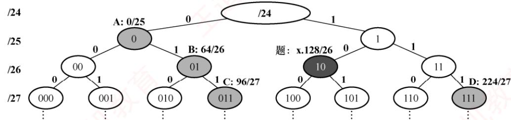

　　本题要求找出3个子网与题中的子网构成一个更大的网络，对应到二叉树中，需满足两个条件：①4个子网的地址空间互不重叠，即4个分支节点不存在任何祖先或双亲关系；②4个子网刚好能构成一个新的地址空间，即存在一个节点刚好能覆盖这4个节点下的所有子孙。现结合选项分析：选项A、D和110/27可与题中子网聚合成/24网络；选项B、00/26、11/26可与题中子网聚合成/24网络；选项C若要与题中子网聚合成一个更大的网络，则至少还需要00/26、010/27、11/26，共5个子网，与题意不符。注意，上述对子网号的分析都是用二进制表示的。

**41. A**

　　IP 数据报的首部既有源 IP 地址，又有目的 IP 地址，但在通信中，路由器只会根据目的 IP 地址进行路由选择。IP 数据报在通信过程中，首部的源 IP 地址和目的 IP 地址在经过路由器时不会发生改变。ARP 广播只在子网中传播，因为相互通信的主机不在同一个子网内，所以不可以直接通过 ARP 广播得到目的站的硬件地址。硬件地址只具有本地意义，因此每当路由器将 IP 数据报转发到一个具体的网络时，都需要重新封装源硬件地址和目的硬件地址。

> **注意：**

　　路由器接收到分组后，剥离该分组的数据链路层协议头，然后在分组被转发之前，给分组加上一个新的链路层协议头。

**42. A**

　　255.255.255.255 是受限的广播地址，仅用于主机配置过程中 IP 分组的目的地址。在任何情况下，路由器都不转发目的地址为受限广播地址的 IP 分组，这种 IP 分组仅出现在本地网络中。

**43. B**

　　先判断乙和甲是否在同一个子网内，用 IP 地址和子网掩码进行按位 “与” 运算，然后检查它们的网络前缀是否相同。若乙和甲在同一个子网内，则直接交付，无须经过网关，因此将乙的 MAC 地址作为帧的目的 MAC 地址。若乙和甲不在同一个子网内，则要通过网关转发，因此将网关的 MAC 地址作为帧的目的 MAC 地址。经计算，甲的网络前缀为 211.71.128.0/20，乙的网络前缀为 211.71.128.0/20，乙和甲在同一个子网内，因此帧的目的 MAC 地址为乙的 MAC 地址。

**44. C**

　　当源主机向本地局域网上的某主机发送 IP 数据报时，先在其 ARP 高速缓存中查看有无目的 IP 地址与 MAC 地址的映射。若有，就把这个硬件地址写入 MAC 帧，然后通过局域网把该 MAC 帧发往此硬件地址；若没有，则先通过广播 ARP 请求分组，在获得目的主机的 ARP 响应分组后，将目的主机的 IP 地址与硬件地址的映射写入 ARP 高速缓存。若目的主机不在本局域网上，则将 IP 分组发送给本局域网上的路由器，当然要先通过同样的方法获得路由器的 IP 地址和硬件地址的映射关系。

**45. B**

　　H3 向 H1 发送数据：① H3 用目的 IP 地址、子网掩码逐位 “与”，192.168.3.2 & 255.255.255.128 = 192.168.3.0，因为与 H3 自身的网络前缀不同，所以判定 H3 和 H1 不属于同一个网络。② H3 使用 ARP 获得默认网关 E1 的 MAC 地址，并将发往 H1 的 IP 数据报封装成 MAC 帧（H3 判定和 H1 不属于同一个网络，因此目的 MAC 地址是默认网关 E1），该帧经过集线器、交换机的转发，最终被默认网关 E1 接收（H1 收不到这个帧），路由器不再向入口 E1 转发 IP 数据报。综上，H3 不会向 H1 发送 ARP 响应报文，选项 B 错误。读者可尝试分析其他选项的通信过程。

**46. C**

　　DHCP 提供了一种机制，使得使用 DHCP 可自动获得 IP 的配置信息而无须手工干预。

**47. D**

　　若路由器收到一个 TTL 值为 1 的 IP 数据报，则它先将 TTL 值减 1，然后判断是否为 0。若为 0，则丢弃该 IP 数据报并向源主机发送类型为时间超过的 ICMP 差错报告报文。

**48. A**

　　ICMP 属于网络层协议，ICMP 报文被封装在 IP 数据报中发送，但 ICMP 不是高层协议。

**49. C**

　　PING 命令使用了 ICMP 的询问报文中的回送请求和回答报文。

**50. B**

　　因为该网络的 IP 地址为 192.168.5.0/24，所以网络号为前 24 位，后 8 位为子网号 + 主机号。子网掩码为 255.255.255.248，第 4 个字节 248 转换成二进制为 11111000，因此后 8 位中，前 5 位用于子网号，在 CIDR 中可以表示 $2^{5}=32$ 个子网；后 3 位用于主机号，除去全 0 和全 1 的情况，可以表示 $2^{3}-2=6$ 台主机地址。

**51. C**

　　ICMP 差错报告报文有 5 种：终点不可达、源点抑制、时间超过、参数问题、改变路由。其中源点抑制是指当路由器或主机因拥塞而丢弃数据报时，向源点发送源点抑制报文，使源点知道应当把数据报的发送速率放慢。注意，最新的 ICMP 标准已不再使用源点抑制报文。

**52. C**

　　首先分析 192.168.4.0/30 这个网络，主机号占 2 位，地址范围为 192.168.4.0～192.168.4.3，主机号全 1 时是广播地址、全 0 时是本网络地址，因此可容纳 4-2=2 台主机。

**53. D**

　　要使R1能正确地将分组路由到所有子网，R1中需要有到192.168.2.0/25和192.168.2.128/25的路由，分别转换成二进制如下：

192.168.2.0: 11000000 10101000 00000010 00000000

192.168.2.128: 11000000 10101000 00000010 10000000

　　前 24 位都相同，于是可以聚合成超网 192.168.2.0/24，子网掩码为前 24 位，即 255.255.255.0。下一跳是与 R1 直接相连的 R2 的地址，因此是 192.168.1.2。

**54. D**

　　子网掩码的第3个字节为11111100，可知前22位为子网号、后10位为主机号。IP地址的第3个字节为01001101（下划线为子网号的一部分），将主机号（后10位）全置为1，可以得到广播地址为180.80.79.255。

**55. A**

　　在实际网络的数据链路层上传送数据时，最终必须使用硬件地址，ARP 将网络层的 IP 地址解析为数据链路层的 MAC 地址。

**56. B**

　　ICMP 报文作为数据字段封装在 IP 分组中，因此 IP 直接为 ICMP 提供服务。UDP 和 TCP 都是传输层协议，为应用层提供服务。PPP 是数据链路层协议，为网络层提供服务。

**57. C**

　　根据 “最长前缀匹配原则”，169.96.40.5 与 169.96.40.0 的前 27 位匹配最长，因此选 C。选项 D 为默认路由，只有当前面的所有目的网络都不能和分组的目的 IP 地址匹配时才使用。

**58. C**

　　从子网掩码可知 H1 和 H2 处于同一网络，H3 和 H4 处于同一网络，因此 H1 和 H2、H3 和 H4 分别可以进行正常的 IP 通信。H1 和 H2、H3 和 H4 处于不同的网络，因此需要通过路由器才能进行正常的 IP 通信，当 H1 向 H3 发送 IP 分组时，H1 用目的 IP 地址、子网掩码逐位 “与” H1 自身的网络前缀不同，于是判定 H3 与 H1 属于不同的网络，需要将该 IP 分组发送到默认网关，而 H1 配置的默认网关为 192.168.3.1，但 R2 的 E1 接口的 IP 地址为 192.168.3.254，因此 H1 不能与 H3 进行正常的 IP 通信。注意，即使 H1 的默认网关配置正确，但因为路由器不会从分组入口进行转发，所以 H1 和 H3 也无法进行正常的 IP 通信。H2 的默认网关为 192.168.3.1，因此 H2 也不能访问 Internet；H4 的默认网关为 192.168.3.254，因此 H4 可以正常访问 Internet。

**59. D**

　　当内网用户向公网发送 IP 分组时，NAT 路由器会更改 IP 分组的源地址，因此下一步就是求 R1 的公网 IP 地址。连接 R1、R2 和 R3 之间的点对点链路使用 201.1.3.x/30 地址，可知该地址块的 IP 地址的后两位为主机号，而主机号全 0 和全 1 的 IP 地址不能分配，因此若已知路由器之间的点对点链路中的一个路由器接口的 IP 地址，就可求出另一路由器接口的 IP 地址。在 R1 和 R2 相连的链路中，已知 R1 端接口的 IP 地址为 201.1.3.9/30，将其后 8 位展开成二进制为 0000 1001，所以可分配给 R2 的 L0 接口的 IP 地址为 201.1.3.10。同理，也可求出 R2 的 L1 接口的 IP 地址为 201.1.3.2。访问 Web 服务器，只能通过 R2 的接口 L0 或 L1 转发，所以经过 R2 转发后，IP 分组的源地址可能为 201.1.3.10 或 201.1.3.2，目的地址为 Web 服务器的 IP 地址 130.18.10.1。

**60. C**

　　这个网络有 16 位的主机号，平均分成 128 个规模相同的子网，每个子网有 7 位的子网号，9 位的主机号。除去一个网络地址和广播地址，可分配的最大 IP 地址个数是 $2^{9}-2=512-2=510$ 。

**61. A**

　　0.0.0.0/32 可以作为本主机在本网络上的源地址。127.0.0.1 是回送地址，以它为目的 IP 地址的数据将被立即返回本机。200.10.10.3 是 C 类 IP 地址。255.255.255.255 是广播地址。

**62. C**

　　对于此类题目，先分析需要聚合的 IP 地址。观察发现，题中的 4 个路由地址，前 16 位完全相同，不同之处在于第 3 段的 8 位中，将这 8 位展开写成二进制，分别如下：

<table><tr><td></td><td>7</td><td>6</td><td>5</td><td>4</td><td>3</td><td>2</td><td>1</td><td>0</td></tr><tr><td>32</td><td>0</td><td>0</td><td>1</td><td>0</td><td>0</td><td>0</td><td>0</td><td>0</td></tr><tr><td>40</td><td>0</td><td>0</td><td>1</td><td>0</td><td>1</td><td>0</td><td>0</td><td>0</td></tr><tr><td>48</td><td>0</td><td>0</td><td>1</td><td>1</td><td>0</td><td>0</td><td>0</td><td>0</td></tr><tr><td>56</td><td>0</td><td>0</td><td>1</td><td>1</td><td>1</td><td>0</td><td>0</td><td>0</td></tr></table>

　　观察发现，在 4 个地址的第 3 段中，从前向后最多有 3 位相同，因此这 3 位是能聚合的最大位数。将这些相同的位都保留，将第 3 段第 3 位后的所有位都置 0，就得到了聚合后的 IP 地址：35.230.32.0，其网络前缀为 16+3，即前 19 位，因此聚合后的网络地址为 35.230.32.0/19。

**63. D**

　　在网络的数据传送中，会经常用到两个地址：MAC 地址和 IP 地址。其中，MAC 地址会随着数据被发往不同的网络而改变，但 IP 地址当且仅当数据在私有网络与外部网络之间传递时才会改变。分组 P 在如题图所示的网络中传递时，首先由主机 H1 将分组发往路由器 R，这时源 MAC 地址为 H1 主机本身的 MAC 地址，即 00-1a-2b-3c-4d-52，目的 MAC 地址为路由器 R 的 MAC 地址，即 00-1a-2b-3c-4d-51。路由器 R 收到分组 P 后，根据分组 P 的目的 IP 地址，得知应将分组从另一个端口转发出去，于是会给分组 P 更换新的 MAC 地址，此时因为从另外的端口转发出去，所以 P 的新 MAC 地址变为负责转发的端口 MAC 地址，即 00-a1-b2-c3-d4-61，目的 MAC 地址应为主机 H2 的 MAC 地址，即 00-a1-b2-c3-d4-62。根据分析过程，题目所问的 MAC 地址应为路由器 R 两个端口的 MAC 地址，因此选 D。

**64. B**

　　网络前缀为 20 位，将 101.200.16.0/20 划分为 5 个子网，为了保证有子网的可分配 IP 地址数尽可能小，即要让其他子网的可分配 IP 地址数尽可能大，不能采用平均划分的方法，而要采用变长的子网划分方法，也就是最大子网用 1 位子网号，第二大子网用 2 位子网号，以此类推。

　　子网 1：101.200.00010000.00000001～101.200.00010111.11111110；地址范围为 101.200.16.1/21～101.200.23.254/21；可分配的 IP 地址数为 2046 个。

　　子网 2：101.200.0001\u00b1000.00000001～101.200.0001\u00b1011.11111110；地址范围为 101.200.24.1/22～

　　101.200.27.254/22；可分配的 IP 地址数为 1022 个。

　　子网 3：101.200.00011100.00000001～101.200.00011101.11111110；地址范围为 101.200.28.1/23～101.200.29.254/23；可分配的 IP 地址数为 510 个。

　　子网 4：101.200.00011110.00000001～101.200.00011110.11111110；地址范围为 101.200.30.1/24～101.200.30.254/24；可分配的 IP 地址数为 254 个。

　　子网 5：101.200.00011111.00000001～101.200.00011111.11111110；地址范围为 101.200.31.1/24～101.200.31.254/24；可分配的 IP 地址数为 254 个。

　　综上所述，可能的最小子网的可分配 IP 地址数是 254 个。

**65. B**

　　划分子网的原则是要求划分出来的子网的 IP 地址空间互不重叠，且原来的 IP 地址空间不遗漏，求解本题最好的方法是代入选项，观察是否可将原 IP 地址空间分割为 3 个互不重叠的子网。根据题意，将 IP 网络划分为 3 个子网。其中一个是 192.168.9.128/26。可简写成 10/26（省略前面相同的 24 位前缀，其中 10 是 128 的二进制 1000 0000 的前两位，因为 26-24=2）。同理，A 可简写成 0/25；B 可简写成 0/26；C 可简写成 11/26；D 可以简写成 110/27。采用二叉树形式画出这些子网的地址空间如下图所示。

  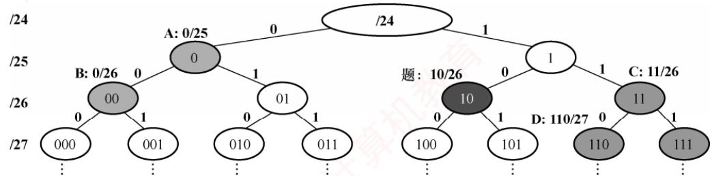

　　对于 A 和 C，可以组成 0/25、10/26、11/26 这 3 个互不重叠的子网。对于 D，可以组成 10/26、110/27、111/27 这 3 个互不重叠的子网。但对于 B，要想将一个 IP 网络划分为几个互不重叠的子网，3 个是不够的，至少需要划分为 4 个子网：00/26、01/26、10/26、11/26。

**66. B**

　　链路层 MTU=800B。IP 分组首部长 20B。片偏移以 8 个字节为偏移单位，因此除了最后一个分片，其他每个分片的数据部分长度都是 8B 的整数倍。所以，最大 IP 分片的数据部分长度为 776B。在总长度为 1580B 的 IP 数据报中，数据部分占 1560B，1560B/776B=2.01…，需要分成 3 片。所以第 2 个分片的总长度字段为 796，MF 为 1（表示还有后续的分片）。

**67. B**

　　主机所在网络的网络地址可以通过主机的 IP 地址和子网掩码逐位 “与” 得到。子网掩码 255.255.192.0 的二进制前 18 位为 1、后 14 位为 0，把主机 IP 地址的后 14 位变为 0，得到的结果为 183.80.64.0，即为主机所在网络的网络地址。

**68. D**

　　默认网关可以理解为到当前主机最近的路由器的端口地址，所以是 192.168.1.62，而该主机的子网掩码和网关的子网掩码也相同，/27 即为 255.255.255.224。

**69. A**

　　H 向 Internet 发送 IP 分组，初始的源 IP 地址为 192.168.0.3，经过 NAT 路由器的转发后，将源 IP 地址从私有 IP 地址改成全球 IP 地址（R2 外部接口的 IP 地址），因为 R2 外部接口和 195.123.0.34/30 处于同一子网，该子网可分配的 IP 地址范围是 195.123.0.33～195.123.0.34，所以

　　R2 外部接口的 IP 地址是 195.123.0.33，也就是经过 R2 转发后的源 IP 地址。

**70. B**

　　网络号位数为 $20 = 8 \times 2 + 4$ ，子网掩码为 11111111 11111111 11110000 00000000，将它与主机地址 168.16.84.24 进行逐位“与”，得到网络地址为 168.16.80.0/20，该网段共有 $2^{12} - 2$ 个可供分配的 IP 地址，地址范围是 168.16.80.1～168.16.95.254。

**71. D**

　　ARP 用于解决局域网上的主机或路由器的 IP 地址和 MAC 地址的映射问题。因此 H4 的 ARP 表中只有和 H4 处于同一虚拟局域网上的主机的 IP 地址和 MAC 地址的映射，H4 位于 VLAN1，H6 位于 VLAN3，因此 D 表示的 H6 的 IP 地址与 MAC 地址的映射不应出现在 H4 的 ARP 表中。

**72. C**

　　在 DHCP 交互中，主机收到 DHCP Offer 报文后若接受该配置，则会广播 DHCP REQUEST 报文，通知所有 DHCP 服务器：选中的服务器确认分配，未选中的服务器释放预留资源。此时，主机尚未正式获得 IP 地址，因此 IP 数据报的源地址为 0.0.0.0，目的地址为 255.255.255.255。

#### 二、综合应用题

**01. 【解答】**

　　数据报长度为 4000B，有效载荷为 4000 - 20 = 3980B。网络能传送的最大有效载荷为 1500 - 20 = 1480B，因此应分为 3 个短些的片，各片的数据字段长度分别为 1480B、1480B 和 1020B。片段偏移字段的单位为 8B，1480/8 = 185， $(1480 \times 2)/8 = 370$ ，因此片段偏移字段的值分别为 0、185、370。MF = 1 时，代表后面还有分片；MF = 0 时，代表后面没有分片，因此 MF 字段的值分别为 1、1 和 0（注意，MF = 0 不能确定是独立的数据报，还是分片得来的，只有当 MF = 0 且片段偏移字段 > 0 时，才能确定是分片的最后一个分片）。

**02. 【解答】**

　　在 IP 层下面的每种数据链路层都有自己的帧格式，其中包括帧格式中的数据字段的最大长度，这称为最大传输单位（MTU）。1500 - 20 = 1480，2000 - 1480 = 520，所以原 IP 数据报经过第一个网络后分成了两个 IP 小报文，第一个报文的数据部分长度是 1480B，第二个报文的数据部分长度是 520B。

　　（除最后一个报片外的）所有报片的有效载荷都是8B的倍数。576-20=556，但556不能被8整除，所以分片时的数据部分最大只能取552。第1个报文经过第2个网络后， $1480-552\times2=376<576$ ，变成数据长度分别为552B、552B、376B的3个IP小报文；第2个报文520<552，因此不用分片。因此到达目的主机时，原2000B的数据被分成数据长度分别为552B、552B、376B、520B的4个小报文。

**03. 【解答】**

　　分片的片偏移值表示其数据部分首字节在原始分组的数据部分中的相对位置，单位为 8B。首部长度字段以 4B 为单位，总长度字段以字节为单位。题目中，分组的片偏移值为 100，因此其数据部分第一个字节的编号是 800。因为分组的总长度为 100B，首部长度为 $4 \times 5 = 20B$ ，所以数据部分长度为 80B。因此该分组的数据部分的最后一个字节的编号是 879。

**04. 【解答】**

　　因为一个 CIDR 地址块中可以包含很多地址，所以路由表中就利用 CIDR 地址块来查找目的网络，这种地址的聚合常称为路由聚合。

　　本题已知有 212.56.132.0/24、212.56.133.0/24、212.56.134.0/24、212.56.135.0/24 地址块，可知第

　　3 个字节前 6 位相同，因此共同前缀为 $8 + 8 + 6 = 22$ 位，因为这 4 个地址块的第 1、2 个字节相同，考虑它们的第 3 个字节： $132 = (10000100)_2$ ， $133 = (10000101)_2$ ， $134 = (10000110)_2$ ， $135 = (10000111)_2$ ，所以共同的前缀有 22 位，即 1101010000111000100001，聚合的 CIDR 地址块是 212.56.132.0/22。

**05. 【解答】**

1）可以采用划分子网的方法对该公司的网络进行划分。因为该公司包括5个部门，所以共需要划分为5个子网。

2）已知网络地址 192.168.161.0 是一个 C 类地址，所需的子网数为 5，每个子网的主机数为 20～30。子网号的比特数为 3，即最多有 $2^{3}=8$ 个可分配的子网，主机号的比特数为 5，因为主机号不能为全 0 或全 1，所以每个子网最多有 $2^{5}-2=30$ 个可分配的 IP 地址。
　　5 个部门子网的子网掩码均为 255.255.255.224，各部门的网络地址与部门主机的 IP 地址范围可分配如下：

<table><tr><td>部门</td><td>部门网络地址</td><td>主机IP地址范围</td></tr><tr><td>工程技术部</td><td>192.168.161.0</td><td>192.168.161.1~192.168.161.30</td></tr><tr><td>市场部</td><td>192.168.161.32</td><td>192.168.161.33~192.168.161.62</td></tr><tr><td>客服部</td><td>192.168.161.64</td><td>192.168.161.65~192.168.161.94</td></tr><tr><td>财务部</td><td>192.168.161.96</td><td>192.168.161.97~192.168.161.126</td></tr><tr><td>办公室</td><td>192.168.161.128</td><td>192.168.161.129~192.168.161.158</td></tr></table>

**06. 【解答】**

1）使用 CIDR 时，可能会导致有多个匹配结果，应当从当前匹配结果中选择具有最长网络前缀的路由。下面来一一分析分组 A 与表中这四项的匹配性：

　　① 131.128.56.0/24 与 131.128.55.33 不匹配，因为前 24 位不同。

　　② 131.128.55.32/28 与 131.128.55.33 的前 24 位匹配，只需看后面 4 位是否匹配，32 转换为二进制为 0010 0000，33 转换为二进制为 0010 0001，匹配，且匹配了 28 位。

　　③ 131.128.55.32/30 与 131.128.55.33 的前 24 位匹配，只需要看后面 6 位是否匹配，32 转换为二进制为 0010 0000，33 转换为二进制为 0010 0001，匹配，且匹配了 30 位。

　　④ 131.128.0.0/16 与 131.128.55.33 匹配，且匹配了 16 位。

　　综上，对于分组 A，第 2、3、4 项都能与之匹配，但根据最长网络前缀匹配原则，应该选择网络前缀为 131.128.55.32/30 的表项进行转发，下一跳路由器为 C。

　　同理，对于分组 B，路由表中第 2、4 项都能与之匹配，但是根据最长网络前缀匹配原则，应该选择第 2 个路由表项转发，下一跳路由器为 B。

2）即增加1条特定主机路由：网络前缀131.128.55.33/32；下一跳A。

3）即增加1条默认路由：网络前缀0.0.0.0/0；下一跳E。

4）要划分成 4 个规模尽可能大的子网，需要从主机位中划出 2 位作为子网位（ $2^{2}=4$ ，CIDR 广泛使用之后允许子网位可以全 0 和全 1）。子网掩码均为 11111111 11111111 11111111 11000000，即 255.255.255.192。而地址范围中不能包含主机位全 0 或全 1 的地址。

<table><tr><td>子网</td><td>子网掩码</td><td>地址范围</td></tr><tr><td>131.128.56.0/26</td><td>255.255.255.192</td><td>131.128.56.1~131.128.56.62</td></tr><tr><td>131.128.56.64/26</td><td>255.255.255.192</td><td>131.128.56.65~131.128.56.126</td></tr><tr><td>131.128.56.128/26</td><td>255.255.255.192</td><td>131.128.56.129~131.128.56.190</td></tr><tr><td>131.128.56.192/26</td><td>255.255.255.192</td><td>131.128.56.193~131.128.56.254</td></tr></table>

**07. 【解答】**

1）网络号 C4.5E.10.0/20（下一站地是 B）的第 3 个字节可以用二进制表示成 0001 0000。目标地址 C4.5E.13.87 的第 3 个字节可以用二进制表示成 0001 0011，显然取 20 位掩码与网络号 C4.5E.10.0/20 相匹配，所以具有该目标地址的 IP 分组将被投递到下一站地 B。

2）网络号 C4.50.0.0/12（下一站地是 A）的第 2 个字节可以用二进制表示成 0101 0000。目标地址 C4.5E.22.09 的第 2 个字节可以用二进制表示成 0101 1110，显然取 12 位掩码与网络号 C4.50.0.0/12 相匹配，所以具有该目的地址的 IP 分组将被投递到下一站地 A。

3）网络号80.0.0.0/1（下一站地是E）的第1个字节可以用二进制表示成10000000。目标地址C3.41.80.02的第1个字节可以用二进制表示成11000011，显然取1位掩码与网络号80.0.0.0/1相匹配，所以具有该目标地址的IP分组将被投递到下一站地E。

4）网络号 40.0.0.0/2（下一站地是 F）的第 1 个字节可以用二进制表示成 0100 0000。目标地址 5E.43.91.12 的第 1 个字节可以用二进制表示成 0101 1110，显然取 2 位掩码与网络号 40.0.0.0/2 相匹配，所以具有该目标地址的 IP 分组将被投递到下一站地 F。

**08. 【解答】**

　　分配网络前缀应先分配地址数较多的前缀。已知该自治系统分配到的 IP 地址块为 30.138.118/23（注意：①一个路由器端口也需要占用一个 IP 地址；②子网划分的答案不唯一）。

　　LAN3：主机数为150，因为 $(2^{7} - 2) < 150 + 1 < (2^{8} - 2)$ ，所以主机号为8比特，网络前缀为24。取第24位为0，分配地址块30.138.118.0/24。

　　LAN2：主机数91，因为 $(2^{6} - 2) < 91 + 1 < (2^{7} - 2)$ ，所以主机号为7比特，网络前缀为25。取第24、25位为10，分配地址块30.138.119.0/25。

　　LAN5：主机数为15，因为 $(2^{4}-2)<15+1<(2^{5}-2)$ ，所以主机号为5比特，网络前缀27。取第24、25、26、27位为1110，分配地址块30.138.119.192/27。

　　LAN1：共有3个路由器，再加上一个网关地址，至少需要4个IP地址。因为 $(2^{2}-2)<3+1<(2^{3}-2)$ ，所以主机号为3比特，网络前缀为29。取第24、25、26、27、28、29位为111101，分配地址块30.138.119.232/29。

　　LAN4：主机数为3，因为 $(2^{2} - 2) < 3 + 1 < (2^{3} - 2)$ ，所以主机号为3比特，网络前缀29。取第24、25、26、27、28、29位为111110，分配地址块30.138.119.240/29。

**09. 【解答】**

1）共同的子网掩码为255.255.255.240，表示前28位为网络号，同一网段内的IP地址具有相同的网络号。主机A的网络号为192.168.75.16；主机B的网络号为192.168.75.144；主机C的网络号为192.168.75.144；主机D的网络号为192.168.75.160；主机E的网络号为192.168.75.160。因此5台主机A、B、C、D、E分属3个网段，主机B和C在一个网段，主机D和E在一个网段，主机A在一个网段。主机D的网络号为192.168.75.160。

2）主机 F 与主机 A 同在一个网段，所以主机 F 所在的网段为 192.168.75.16，第 4 个字节 16 的二进制表示为 0001 0000，最后边的 4 位为主机位，去掉全 0 和全 1。则其 IP 地址范围为 192.168.75.17～192.168.75.30，并且不能为 192.168.75.18。

3）因为 164 的二进制为 1010 0100，将最右边的 4 位全置 1，即 1010 1111，则广播地址为 192.168.75.175。主机 D 和主机 E 可以收到。

**10. 【解答】**

　　IPv4 的首部格式如下，根据首部格式来解析首部各个字段的含义。

<table><tr><td>版本</td><td>首部长度</td><td>区分服务</td><td colspan="2">总长度</td></tr><tr><td colspan="3">标识</td><td>标志</td><td>片偏移</td></tr><tr><td colspan="2">生存时间</td><td>协议</td><td colspan="2">首部检验和</td></tr><tr><td colspan="5">源地址</td></tr><tr><td colspan="5">目的地址</td></tr><tr><td colspan="4">可选字段(长度可变)</td><td>填充</td></tr></table>

1）由上图可知，源IP地址为IP首部的第13、14、15、16个字节，即7C 4E 03 02，转换为点分十进制表示可得源IP地址为124.78.3.2。目的IP地址为IP首部的第17、18、19、20个字节，即B4 0E 0F 02，转换为点分十进制表示可以得到目的IP地址为180.14.15.2。

2）分组总长度是 IP 首部的第 3、4 个字节，即 0054，转换为十进制得该分组总长度为 84，单位为字节。而首部长度是 IP 首部的第 5～8 位，值为 5，单位为 4B，因此首部长度为 $4B \times 5 = 20B$ 。数据部分长度 = 总长度 - 首部长度 = 84 - 20 = 64B。

3）该分组首部的片偏移字段为第 7、8 个字节（除去第 7 个字节的前 3 位），不等于 0，而是二进制值 1 1000 0101 0000，即十进制数 6224，单位是 8B。

　　另外，分组的标志字段为第 7 个字节的前 3 位，即 010，中间位 DF=1 表示不可分片，最后位 MF=0 表示后面没有分片。

**11. 【解答】**

1）根据收到的帧，找出源IP地址为da c7 66 28，表示成十进制为218.199.102.40，是一个C类IP地址，与A的IP地址218.207.61.211不在同一个网络中，所以需经过路由器转发。MAC地址只具有本地意义（ARP也只能工作在同一局域网中）。该帧为A收到的帧，因此目的MAC地址为A的MAC地址，源MAC地址为网关路由器端口的MAC地址（若为A发出的帧，则目的MAC地址为默认网关的MAC地址）。首先找到目的MAC地址00:1d:72:98:1d:fc的位置（在下图中的位置1标出），根据以太网帧的结构，目的MAC地址后面紧邻的是源MAC地址，因此源MAC地址为00:00:5e:00:01:01。

0000 100 1d 72 98 1d fc 00 00 5e 00 01 01 88 64 11 00 ..r.... ^....d..
0010 75 89 01 92 00 21 45 00 01 90 f9 bf 40 00 33 06 u....!E. ....@.3.
0020 f3 15 da c7 66 28 da cf 3d d3 00 50 c4 8f dc a6
0030 a2 96 23 4c 44 69 50 18 00 of 76 3d 00 00 90 b5 ..#LDiP. ..v=...

2）要求得 IP 分组所携带的数据量，需要知道首部长度和总长度。218.207.61.211 表示成十六进制是 da.cf.3d.d3，并且作为分组中的目的 IP 地址。在图中确定目的 IP 地址的位置（位置 2），再根据 IP 首部的结构，分别从目的 IP 的位置向前数 14 和 16 个字节，即可找到总长度和首部长度字段的位置。但首部长度字段所在的字节值为 0x45，首部长度字段只有 4 位，前 4 位是版本号。因此首部字段的值为 5，单位为 4B，所以首部长度为 20B。总长度字段值为 0x0190，十进制为 400B。因此分组携带的数据长度为 380B。

3）因为整个 IP 分组的长度是 400B，大于输出链路 MTU（380B）。这时需要考虑分片，但是否能够分片还得看 IP 首部中的标志位。IP 首部中的标志字段占 3 位，从前到后依次为保留位、DF、MF。根据 IP 首部结构找到标志字段所在的字节，其值为 0x40，二进制表示为 01000000，于是 DF=1，不能对该 IP 分组进行分片。此时，路由器应进行的操作是丢弃该分组，并用 ICMP 差错报文向源主机报告。

**12. 【解答】**

1）网络前缀/30，主机号不能为全0或全1，可求出R2接口E1的IP地址为203.10.2.1。H1

　　配置的默认网关应是 R2 接口 E0 的 IP 地址 172.18.1.126。

2）在 H1→R2→H3 传送 IP 分组的过程中，分别使用了两次 ARP，交换机进行了相关的自学习，还需要考虑 Hub 的广播特性。H1 给 H3 发送一个 IP 分组 A，能收到封装 A 的以太网帧的主机有 H3 和 H4，其中 H4 发现帧的目的 MAC 地址与自身的不同且不是广播地址，于是丢弃该帧，而 H3 发现帧的目的 MAC 地址与自身的相同，于是接收该帧。H3 给 H1 发送一个 IP 分组 B，能收到封装 B 的以太网帧的主机有 H4 和 H1，其中 H4 发现帧的目的 MAC 地址与自身的不同且不是广播地址，于是丢弃该帧，而 H1 接收该帧。

3）当 H1 发出 C 时，首部中的源 IP 地址为 H1 的 IP 地址 172.18.1.33，目的 IP 地址为 Web 服务器 S 的 IP 地址 213.48.226.31。当 C 从 R2 转发出去时，首部中的源 IP 地址为 R2 接口 E1 的 IP 地址 203.10.2.1，目的 IP 地址为 Web 服务器 S 的 IP 地址 213.48.226.31。

**13. 【解答】**

1）子网号可以全0或全1，但主机号不能全0或全1。
　　因此，若将IP地址空间202.118.1.0/24划分为2个子网，且每个局域网需分配的IP地址个数不少于120个，则子网号至少要占用1位。
　　由 $2^{6}-2<120<2^{7}-2$ 可知，主机号至少要占用7位。
　　因为源IP地址空间的网络前缀为24位，所以主机号位数+子网号位数=8。
　　综上可得主机号位数为7，子网号位数为1。
　　因此子网的划分结果为子网1：子网地址为202.118.1.0，子网掩码为255.255.255.128（或子网1：202.118.1.0/25）；子网2：子网地址为202.118.1.128，子网掩码为255.255.255.128（或子网2：202.118.1.128/25）。
　　地址分配方案：子网1分配给局域网1，子网2分配给局域网2；或者子网1分配给局域网2，子网2分配给局域网1。

2）因为局域网1和局域网2分别与路由器R1的E1、E2接口直接相连，所以在R1的路由表中，目的网络为局域网1的转发路径是直接通过接口E1转发的，目的网络为局域网2的转发路径是直接通过接口E2转发的。因为局域网1、2的网络前缀均为25位，所以它们的子网掩码均为255.255.255.128。域名服务器是一台特定的主机，它指明了其IP地址，因此设定1条特定主机路由，该表项的子网掩码为255.255.255.255（只有和全1的子网掩码相与时，才能保证和目的IP地址一样，从而选择该特定路由）。对应的下一跳地址是202.118.2.2，转发接口是L0。R1到互联网的路由实质上相当于一个默认路由（当某一目的IP地址与路由表中其他任何表项都不匹配时，则匹配该默认路由。互联网包括了无数的网络集合，不可能在路由表项中一一列出，因此只能采用默认路由的方式），默认路由一般写为0/0，即目的地址为0.0.0.0，子网掩码为0.0.0.0。对应的下一跳地址是202.118.2.2，转发接口是L0。综上可得到路由器R1的路由表如下：

　　（子网1分配给局域网1，子网2分配给局域网2）

<table><tr><td>目的网络 IP 地址</td><td>子网掩码</td><td>下一跳 IP 地址</td><td>接口</td></tr><tr><td>202.118.1.0</td><td>255.255.255.128</td><td>—</td><td>E1</td></tr><tr><td>202.118.1.128</td><td>255.255.255.128</td><td>—</td><td>E2</td></tr><tr><td>202.118.3.2</td><td>255.255.255.255</td><td>202.118.2.2</td><td>L0</td></tr><tr><td>0.0.0.0</td><td>0.0.0.0</td><td>202.118.2.2</td><td>L0</td></tr></table>

　　（子网 1 分配给局域网 2，子网 2 分配给局域网 1）

<table><tr><td>目的网络 IP 地址</td><td>子网掩码</td><td>下一跳 IP 地址</td><td>接口</td></tr><tr><td>202.118.1.128</td><td>255.255.255.128</td><td>—</td><td>E1</td></tr><tr><td>202.118.1.0</td><td>255.255.255.128</td><td>—</td><td>E2</td></tr><tr><td>202.118.3.2</td><td>255.255.255.255</td><td>202.118.2.2</td><td>L0</td></tr><tr><td>0.0.0.0</td><td>0.0.0.0</td><td>202.118.2.2</td><td>L0</td></tr></table>

3）局域网1和局域网2的地址可以聚合为202.118.1.0/24，而对于路由器R2来说，通往局域网1和局域网2的转发路径都是从L0接口转发的，因此采用路由聚合技术后，路由器R2到局域网1和局域网2的路由如下：

<table><tr><td>目的网络 IP 地址</td><td>子网掩码</td><td>下一跳 IP 地址</td><td>接口</td></tr><tr><td>202.118.1.0</td><td>255.255.255.0</td><td>202.118.2.1</td><td>L0</td></tr></table>

**14. 【解答】**

1）DHCP 服务器可为主机 2～N 动态分配 IP 地址的最大范围是 111.123.15.5～111.123.15.254；主机 2 发送的封装 DHCP Discover 报文的 IP 分组的源 IP 地址和目的 IP 地址分别是 0.0.0.0 和 255.255.255.255。

2）主机2发出的第一个以太网帧的目的MAC地址是ff-ff-ff-ff-ff-ff；封装主机2发往Internet的IP分组的以太网帧的目的MAC地址是00-a1-a1-a1-a1-a1。

3）主机1能访问WWW服务器，但不能访问Internet。因为主机1的子网掩码配置正确而默认网关IP地址被错误地配置为111.123.15.2（正确IP地址是111.123.15.1），所以主机1可以访问在同一个子网内的WWW服务器，但当主机1访问Internet时，主机1发出的IP分组会被路由到错误的默认网关（111.123.15.2），从而无法到达目的主机。

**15. 【解答】**

1）广播地址是网络地址中主机号全1的地址（主机号全0的地址代表网络本身）。销售部和技术部均被分配了192.168.1.0/24的IP地址空间，IP地址的前24位为网络号。于是在后8位中划分部门的子网，选择前1位作为部门子网的网络号。根据已分配的IP地址，销售部子网的网络号为0，技术部子网的网络号为1，则技术部的子网地址为192.168.1.128；销售部的子网地址为192.168.1.0，广播地址为192.168.1.127。每台主机仅分配一个IP地址，计算目前还可以分配的主机数，用技术部可以分配的主机数减去已分配的主机数，技术部总共可以分配的计算机主机数为 $2^{7}-2=126$ （减去全0和全1的主机号）。已经分配了 $208-129+1=80$ 台，此外还有1个IP地址（192.168.1.254）分配给了路由器的端口，因此还可以分配 $126-80-1=45$ 台。

2）判断分片的大小，需要考虑各个网段的MTU，而且注意分片的数据长度必须是8B的整数倍。由题可知，在技术部子网内，MTU=800B，IP分组首部长20B，最大IP分片封装数据的字节数为 $\left\lfloor(800-20)/8\right\rfloor\times8=776$ 。至少需要的分片数为 $\left\lceil(1500-20)/776\right\rceil=2$ 。第1个分片的偏移量为0；第2个分片的偏移量为776/8=97。

**16. 【解答】**

1）H2 和 H3 与 Web 服务器处于不同的局域网，路由器 R2、R3 具有 NAT 功能。当 R2 从 WAN 口收到来自 H2 或 H3 发来的 HTTP 请求时，根据 NAT 表发送给 Web 服务器的对应端口。为使外部主机能正常访问 Web 服务器，应在 R2 的 NAT 表中增加一项，外网的 IP地址配置为路由器的外端 IP 地址，内网的 IP 地址配置为 Web 服务器的 IP 地址，HTTP 的服务器端的默认端口号为 80，因此外网和内网的端口号都需配置为 80。只需在 R2 中配置 Web 服务器的 NAT 表项，而不用在 R3 中配置 H2 和 H3 的 NAT 表项，原因在于 H2 和 H3 是主动访问 Web 服务器，若不提前配置好 Web 服务器的 NAT 映射，则当 IP 分组到达 R2 时，就不知道应当把目的 IP 地址转换成专用网中的哪个本地 IP 地址。而 R3 会自动记录 H2 和 H3 所对应的 IP 地址和端口号，且客户端的端口号是随机分配的，无法做静态配置，只能通过自动动态配置实现。R2 的 NAT 表配置如下：

<table><tr><td colspan="2">外网</td><td colspan="2">内网</td></tr><tr><td>IP地址</td><td>端口号</td><td>IP地址</td><td>端口号</td></tr><tr><td>203.10.2.2</td><td>80</td><td>192.168.1.2</td><td>80</td></tr></table>

2）因为启用了 NAT 服务，H2 发送的 P 的源 IP 地址应该是 H2 的内网地址，目的地址应该是 R2 的外网 IP 地址，源 IP 地址是 192.168.1.2，目的 IP 地址是 203.10.2.2。R3 转发后，将 P 的源 IP 地址改为 R3 的外网 IP 地址，目的 IP 地址仍然不变，源 IP 地址是 203.10.2.6，目的 IP 地址是 203.10.2.2。R2 转发后，将 P 的目的 IP 地址改为 Web 服务器的内网地址，源地址仍然不变，源 IP 地址是 203.10.2.6，目的 IP 地址是 192.168.1.2。

**17. 【解答】**

1）设备 1 选择 100Base-T 以太网交换机，设备 2 选择 100Base-T 集线器。因为物理层设备既不能隔离冲突域，又不能隔离广播域，链路层设备可以隔离冲突域但不能隔离广播域。

2）本题与 2016 年真题第 36 题几乎相同，仅修改了几个数字。有关最短帧长的题要抓住两个公式来分析：① 发送帧的时间≥争用期的时间；② 最短帧长 = 数据传输速率×争用期时间。要使公式①恒成立，就要考虑在最短帧长的情况下公式①仍成立。发送最短帧的时间为 $64B \div 100Mb/s = 5.12\mu s$ ，根据公式①可知，该时间即为争用期时间（往返时延）的最大值。本题的特点在于往返时延由两部分组成，即传播时延和 Hub 产生的转发时延。单程总时延为 $2.56\mu s$ ，Hub 产生的转发时延为 $1.51\mu s$ ，所以传播时延为 $2.56 - 1.51 = 1.05\mu s$ ，从而 H2 与 H3 之间理论上可以相距的最大距离为 $200m/\mu s \times 1.05\mu s = 210m$ 。

3）M 是 DHCP 发现报文（DISCOVER 报文）。路由器 E0 接口能收到封装 M 的以太网帧，因为 H4 发送的 DHCP 发现报文是广播的形式，所以同一个广播域内的所有设备和接口都可以收到该以太网帧。因为是广播帧，所以目的 MAC 地址是全 1，S 向 DHCP 服务器转发的封装 M 的以太网帧的目的 MAC 地址是 FF-FF-FF-FF-FF-FF。

4）在 H5 收到的帧中，地址 1、地址 2 和地址 3 分别是 00-11-11-11-11-E1、00-11-11-11-11-C1 和 00-11-11-11-11-D1。该帧来自 AP，地址 1 是接收方 H5 的 MAC 地址，地址 2 是 AP 的 MAC 地址，地址 3 是发送方 H4 的 MAC 地址。

**18. 【解答】**

1）R1 到 R2 的卫星链路传播时延由 TR1→卫星→TR2 路径决定。每段距离为 36000km，电磁波速度为 300000km/s，单段时延 = 36000/300000 = 120ms，总单向传播时延 = 2×120ms = 240ms。卫星链路宽带为 200kb/s。忽略各层协议首部和以太网时延，上传 4000B 文件的总时间 = 传输时延 + 传播时延。传输时延为 $(4000 \times 8b)/(200kb/s) = 160ms$ ，传播时延为 240ms，因此最少需 $160ms + 240ms = 400ms$ 。文件上传过程如下图所示。

  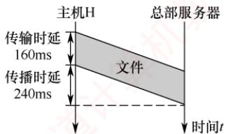

2）令 $W_{\mathrm{s}}$ 为发送窗口， $k$ 为序号字段位数。采用GBN协议时，理想情况下，发送窗口内的所有数据帧均可被接收方成功接收并立即返回ACK。一个数据帧的传输时延为 $(1500\times 8\mathrm{b}) / (200\mathrm{kb / s}) = 60\mathrm{ms}$ ；从发送方发出数据帧的最后一比特到收到ACK，需经历2倍单向传播时延，即 $2\times 240\mathrm{ms}$ 。过程示意如下图所示。

  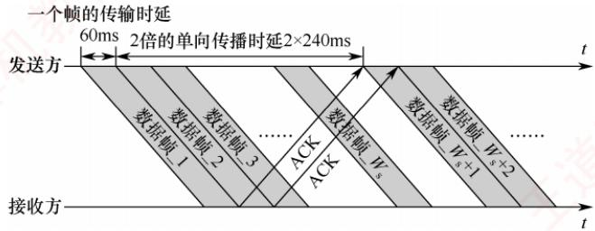

　　理想情况下，发送方可以连续发出 $W_{s}$ 个帧，总耗时 $W_{s} \times 60ms$ 。从发出第一个帧起，最多经过 $60ms + 2 \times 240ms$ 即可开始下一轮发送。依题意可知，信道利用率为 $(W_{s} \times 60ms)/(60ms + 2 \times 240ms) \geqslant 0.8$ 。解得 $W_{s} \geqslant 7.2$ ，向上取整得 $W_{s}$ 至少为 8。对于 GBN 协议，接收窗口为 1，需满足 $2^{k} \geqslant$ 发送窗口 + 接收窗口，即 $2^{k} \geqslant 8 + 1$ ，故序号字段至少需要 4 位。

3）由题图可知，主机 H 的 IP 地址为 10.10.10.33/26，属于管理区子网，故管理区的子网地址为 10.10.10.0/26，主机号范围 0～63，其中 62 个可分配，满足≥60 的要求。
　　作业区也需≥60 个可分配地址，故同样也需一个/26 子网。在 10.10.10.0/24 主网段中，紧接管理区之后的/26 块是 10.10.10.64/26，主机号范围 64～127，符合要求。
　　生活区需≥120 个可分配地址，故需一个/25 子网（包含 128 个 IP 地址，可分配 126 个）。剩余地址空间为 128～255，对应子网 10.10.10.128/25，满足要求且与其他子网无重叠。

## 4.3 IPv6

### 4.3.1 IPv6 的特点

　　目前广泛使用的 IPv4 是在 20 世纪 70 年代设计的，互联网经过几十年的飞速发展，到 2011 年 2 月，IPv4 地址已经耗尽，为解决 “IP 地址耗尽” 问题，采取了以下三种措施。

1）无类别编址 CIDR：使 IP 地址分配更加合理。

2）网络地址转换（NAT）：节省全球唯一的公网 IP 地址。

3）IPv6：采用更大地址空间的新版本IP协议。

　　前两种方法只是延缓了IPv4使用寿命，只有第三种方法能从根本上解决IP地址耗尽问题。

> **考点追踪：** IPv6的特点（2023）

　　IPv6 的主要特点如下:

1）更大的地址空间。这是最重要的。IPv6 将地址长度从 IPv4 的 32 位增大到 128 位，地址空间是 IPv4 的 $2^{128}/2^{32}=2^{96}$ 倍。从长远来看，这些地址是绝对够用的。

2）扩展的地址层次结构。由于IPv6地址空间很大，因此可以划分出更多的层次。

3）灵活的首部格式。IPv6定义了许多可选的扩展首部，不仅可提供比IPv4更多的功能，还能提高路由器的处理效率，这是因为路由器通常不对扩展首部进行处理。

4）改进的选项。IPv6 首部长度是固定的，其选项放在有效载荷中，可根据需要灵活配置。而 IPv4 预先定义好了一套标准的选项，其选项放在首部的可变部分。

5）允许协议继续扩充。IPv6 允许不断扩充功能，而 IPv4 的功能是固定不变的。

6）支持即插即用（自动配置 IPv6 地址）。因此通常不需要使用 DHCP，简化了网络管理。

7）支持资源的预分配。IPv6 支持实时音频/视频等要求保证一定带宽和时延的应用。

8）IPv6 只有源主机才能分片，只支持端到端的分片，不允许中间路由器进行分片。

9）IPv6首部长度是固定的40B，而IPv4的首部长度是可变的（必须是4B的整数倍）。

10）增大了安全性。身份鉴别和保密功能由IPv6的扩展首部提供。

　　虽然 IPv6 与 IPv4 不兼容，但它与所有其他互联网协议（如 TCP、UDP、ICMP、IGMP 和 DNS 等）总体上是兼容的，仅在少数地方做了必要的修改，主要是为了处理更长的地址。

### 4.3.2 IPv6 数据报的基本首部

　　IPv6 数据报由两部分组成：基本首部和有效载荷（也称净负荷）。有效载荷由零个或多个扩展首部（扩展首部不属于基本首部）及其后面的数据部分构成，如图 4.12 所示。

  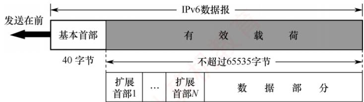

<em>图 4.12 具有多个可选扩展首部的IPv6数据报的一般形式</em>

　　与 IPv4 相比，IPv6 对首部中的某些字段进行了如下调整：

- 取消了首部长度字段，因为基本首部长度固定为40B。

- 取消了服务类型字段，其功能由优先级和流标号字段实现。

- 取消了总长度字段，改用有效载荷长度字段。

- 取消了标识、标志和片偏移字段，相关功能已移至分片扩展首部。

- 把TTL字段更名为跳数限制字段，作用不变，但名称更贴合实际含义。

- 取消了协议字段，改用下一个首部字段。

- 取消了首部检验和字段，因传输层已提供差错检测，此举可加快路由器处理速度。

- 取消了选项字段，其功能由灵活的扩展首部实现。

　　尽管取消了 IPv4 首部中多项冗余功能，使 IPv6 基本首部的字段数减少至仅 8 个，但由于地址长度从 32 位扩展到 128 位，其基本首部长度反而增至 40B。

　　IPv6 数据报的基本首部格式如图 4.13 所示。

  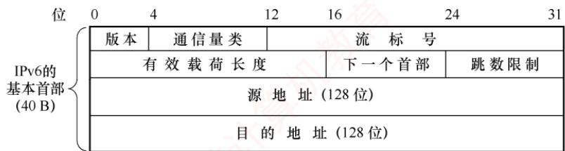

<em>图 4.13 IPv6 数据报的基本首部的格式</em>

> **考点追踪：** IPv6 首部格式及字段含义（2023）

　　下面简要介绍 IPv6 基本首部中各字段的含义:

1）版本。占4位，指明IP协议的版本。对于IPv6，该字段的值为6。

2）通信量类。占8位，用于区分不同IPv6数据报的类别或优先级。

3) 流标号。占 20 位，IPv6 提出了流的抽象概念。流是指互联网上从特定源点到特定终点（单播或多播）的一系列数据报（如实时音频/视频传输），路径上的路由器可据此提供特定的服务质量保证。所有属于同一个流的数据报都具有相同的流标号。

4）有效载荷长度。占16位，表示IPv6数据报中基本首部之后的字节数，包括所有扩展首部和上层数据。最大值为65535（单位为字节）。

5）下一个首部。占8位，功能类似于IPv4的协议字段。若无扩展首部，则标识上层协议类型；若存在扩展首部，则标识紧随其后的第一个扩展首部的类型。

6) 跳数限制。占 8 位，作用等同于 IPv4 的 TTL 字段。源主机在发送数据报时设定初始值（最大为 255），每经过一个路由器，其值减 1，减至 0 时丢弃该数据报。

7）源地址和目的地址。占128位，分别表示数据报的发送方/接收方的IPv6地址。

### 4.3.3 IPv6 地址

　　IPv6 数据报的目的地址有以下三种基本类型：

1）单播。即传统的点对点通信，数据报发送给唯一指定的接收方。

2）多播。一点对多点的通信，数据报发送给所有加入该多播组的接口。

3）任播。是 IPv6 新增的一种地址类型，其特点可概括为 “一址多用、就近交付”。任播地址标识一组接口，但网络会将数据报仅交付给其中路由距离最近的一个。

　　IPv4 地址通常采用点分十进制表示法。若 IPv6 也沿用此方式，其 128 位地址将显得冗长。因此，IPv6 标准采用冒号十六进制记法：将地址划分为 8 组，每组 16 位（4 个十六进制数），各组之间用冒号分隔。例如，4BF5:AA12:0216:FEBC:BA5F:039A:BE9A:2170。

　　为了书写简便，还规定了如下两种缩写规则。

　　省略前导零。每组中前面连续的十六进制零可以省略，但至少要保留一个数字。例如，可以把地址4BF5:0000:0000:0000:BA5F:039A:000A:2176缩写为4BF5:0:0:0:BA5F:39A:A:2176。

　　双冒号替换连续全零组。当地址中出现一个或多个连续的全零组时，可用双冒号（::）替代。但“::”在一个地址中只能使用一次，否则无法确定省略了多少个全零组（因总组数需恢复为8）。因此，上述地址可被更紧凑地缩写为4BF5::BA5F:39A:A:2176。

　　IPv6 地址的分类如表 4.3 所示。

　　表 4.3 IPv6 地址的分类

<table><tr><td>地址类型</td><td>二进制前缀</td><td>CIDR 记法</td></tr><tr><td>未指明地址</td><td>00...0(128 位)</td><td><eq>\because /{128}</eq></td></tr><tr><td>环回地址</td><td>00...01 (128 位)</td><td><eq>\because 1/{128}</eq></td></tr><tr><td>多播地址</td><td>11111111(8 位)</td><td>FF00::/8</td></tr><tr><td>本地链路单播地址</td><td>1111111010 (10 位)</td><td>FE80::/10</td></tr><tr><td>全球单播地址</td><td colspan="2">见图 4.14</td></tr></table>

　　对表 4.3 给出的五类地址简单解释如下:

1）未指明地址：不能用作目的地址，仅用于尚未配置 IPv6 地址的主机作为源地址。

2）环回地址：作用与 IPv4 的环回地址相同，但 IPv6 中仅定义这一个环回地址。

3）多播地址：作用与IPv4多播类似。这类地址占IPv6地址空间的1/256。

4）本地链路单播地址：仅用于本地链路内的通信，不能被路由器转发。

5）全球单播地址：使用得最多的地址。IPv6 单播地址的划分方法非常灵活，如图 4.14 所示。可以把整个 128 位都作为一个节点的地址。也可用 n 位作为子网前缀，剩下的 $(128 - n)$ 位作为接口标识符（相当于 IPv4 的主机号）。还可以划分为三级：用 n 位作为全球路由选择前缀，用 m 位作为子网前缀，而剩下的 128 - n - m 位则作为接口标识符。

  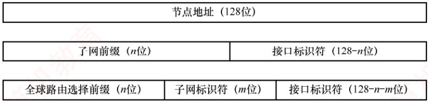

<em>图 4.14 IPv6 全球单播地址的几种划分方法</em>

### 4.3.4 从 IPv4 向 IPv6 过渡

　　IPv4 向 IPv6 的过渡只能采用逐步演进的办法，并确保新部署的 IPv6 系统具备向后兼容的能力：能够接收、转发 IPv4 数据报，并为其选择路由。

> **考点追踪：** IPv4 向 IPv6 过渡的策略（2023）

　　目前主要采用以下两种过渡策略：

1) 双协议栈，是指在一台主机上同时安装 IPv4 和 IPv6 两个协议栈，分别配置一个 IPv4 地址和一个 IPv6 地址，因此既能与 IPv4 网络通信，也能与 IPv6 网络通信。双协议栈主机通过应用层的域名系统（DNS）获知目的主机使用的地址类型：若 DNS 返回的是 IPv4 地址，则使用 IPv4；若返回的是 IPv6 地址，则使用 IPv6。

2）隧道技术，是指当IPv6数据报需要进入IPv4网络时，将其整个封装为IPv4数据报的数据部分，使原IPv6数据报如同在IPv4网络的隧道中传输；当该IPv4数据报离开IPv4网络后，再将其数据部分交由主机的IPv6协议处理。

### 4.3.5 本节习题精选

#### 单项选择题

01. 下一代互联网核心协议 IPv6 的地址长度是（）。

- A. 32 比特
- B. 48 比特
- C. 64 比特
- D. 128 比特

02. 与 IPv4 相比，IPv6（）。

- A. 采用 32 位 IP 地址
- B. 增加了首部字段数量
- C. 不提供 QoS 保障
- D. 没有提供检验和字段

03. 下列关于 IPv6 地址 1A22:120D:0000:0000:72A2:0000:0000:00C0 的表示中，错误的是（）。

- A. 1A22:120D::72A2:0000:0000:00C0
- B. 1A22:120D::72A2:0:0:C0
- C. 1A22::120D::72A2::00C0
- D. 1A22:120D:0:0:72A2::C0

04. 一个 IPv6 地址的简化写法为 8::D0:123:CDEF:89A，则其完整地址应该是（）。

- A. 8000:0000:0000:0000:00D0:1230:CDEF:89A0
- B. 0008:0000:0000:0000:00D0:0123:CDEF:89A0
- C. 8000:0000:0000:0000:D000:1230:CDEF:89A0
- D. 0008:0000:0000:0000:00D0:0123:CDEF:089A

05. 下列关于IPv6的描述中，错误的是（）。

- A. IPv6的首部长度是不可变的
- B. IPv6不允许在中间路由器进行分片
- C. IPv6采用了16B的地址，在可预见的将来不会用完
- D. IPv6使用了首部检验和来保证传输的正确性

06. 若一个路由器收到的 IPv6 数据报因太大而不能转发到链路上，则路由器将把该数据报（）。

- A. 丢弃
- B. 暂存
- C. 分片
- D. 转发至能支持该数据报的链路上

07. 【2023 统考真题】下列关于 IPv4 和 IPv6 的叙述中，正确的是（）。 I. IPv6 地址空间是 IPv4 地址空间的 96 倍 II. IPv4 首部和 IPv6 基本首部的长度均可变 III. IPv4 向 IPv6 过渡可以采用双协议栈和隧道技术 IV. IPv6 首部的 Hop Limit 字段等价于 IPv4 首部的 TTL 字段

- A. 仅 I、II
- B. 仅 I、IV
- C. 仅 II、III
- D. 仅 III、IV

### 4.3.6 答案与解析

#### 单项选择题

**01. D**

　　IPv6 的地址用 16B（128 比特）表示，比 IPv4 长得多，地址空间是 IPv4 的 $2^{96}$ 倍。

**02. D**

　　IPv6 采用 128 位地址。IPv6 减少了首部字段数量，仅包含 8 个字段。IPv6 支持 QoS（指在有限的带宽资源下，为业务提供端到端的服务质量保证），以满足实时、多媒体通信的需要。因为目前网络传输介质的可靠性较高，所以出现比特错误的可能性很低，且数据链路层和传输层有自己的检验，为了效率，IPv6 没有检验和字段。

**03. C**

　　使用零压缩法时，双冒号“::”（表示零压缩）在一个地址中只能出现一次。也就是说，当有多处不相邻的0时，只能用“::”代表其中的一处。

**04. D**

　　冒号十六进制记法表示 IPv6 地址的规则：① 多个连续区域为 0，可进行零压缩，但一个地址仅可出现一次零压缩。② 每个区域开头的 0 可省略，结尾的 0 不可省略。按照规则先将题中零压缩的部分展开，得到 8:0000:0000:0000:D0:123:CDEF:89A；每个区域应该有 4 位十六进制数，不足 4 位则表示开头的 0 被省略，补充后得到 0008:0000:0000:0000:00D0:0123:CDEF:089A。

**05. D**

　　IPv6 的首部长度是固定的，因此不需要首部长度字段。IPv6 取消了检验和字段，这样就加快了路由器处理数据报的速度。我们知道，数据链路层会丢弃检测出差错的帧，传输层也有相应的差错处理机制，因此网络层的差错检测可以精简掉。

**06. A**

　　IPv6 中不允许在中间路由器进行分片。因此，若路由器发现到来的数据报太大而不能转发到

　　链路上，则丢弃该数据报，并向发送方发送一个指示分组太大的 ICMP 报文。

**07. D**

　　IPv4 地址占 32 位，地址空间为 $2^{32}$ ；IPv6 地址占 128 位，地址空间为 $2^{128}$ ，IPv6 地址空间是 IPv4 地址空间的 $2^{96}$ 倍，说法 I 错误。IPv4 首部长度是 4B 的倍数，长度可变；IPv6 基本首部长度是 40B，不可变，说法 II 错误。IPv4 向 IPv6 过渡可以采用双协议栈（设备同时支持 IPv4 和 IPv6）和隧道技术（IPv6 数据报封装 IPv4 的数据部分），说法 III 正确。IPv6 首部的 Hop Limit 字段和 IPv4 首部的 TTL 字段都用于限制数据报在网络中经过的路由器数量，说法 IV 正确。

## 4.4 路由算法与路由协议

### 4.4.1 路由算法

　　路由选择协议的核心是路由算法，即用于生成路由表中各项条目的计算方法。其目的很明确：给定一组路由器及其互连链路，路由算法要找到一条从源路由器到目的路由器的最佳路径。通常，“最佳”路径是指费用最低的路径，该费用可根据跳数、带宽、延迟等因素定义。

#### 1. 静态路由与动态路由

　　路由器转发分组是通过路由表进行的，而路由表是通过各种算法生成的。从能否随网络状态自适应调整的角度，路由算法可分为如下两大类。

1）静态路由算法。由网络管理员手工配置每一条路由。

2）动态路由算法。根据网络状态的变化（如链路故障或新增）来动态调整自身的路由表。

　　静态路由算法的特点是实现简单、开销小，但不能及时适应网络状态的变化，适用于简单的小型网络。动态路由算法能较好地适应网络状态的变化，但实现复杂、开销也大，适用于较复杂的大型网络。常用的动态路由算法可分为两类：距离-向量算法和链路状态算法。

#### 2. 距离-向量算法

　　距离-向量（Distance-Vector，DV）算法基于 Bellman-Ford 算法，它不要求每个节点掌握完整的网络拓扑，而只需知道：与相邻节点之间的距离；各邻居节点到目的节点的最短距离。每个节点以自身为源点，独立运行 Bellman-Ford 算法，通过迭代交换信息，最终可收敛到全网一致的最短路径解。下面讨论 Bellman-Ford 算法的基本思想。

　　假设 $d_{x}(y)$ 表示从节点 $x$ 到节点 $y$ 的最短路径费用，则有

$$
d _ {x} (y) = \min \{c (x, v) + d _ {v} (y) \}, \quad v \text {是} x \text {的所有邻居}
$$

　　式中， $c(x, v)$ 是从 x 到其邻居 v 的链路费用。已知 x 的所有邻居到 y 的最短路径费用后，x 到 y 的最短路径费用即为所有 $c(x, v) + d_v(y)$ 中的最小值，如图 4.15 所示。所有最短路径算法都依赖于一个基本性质：“两点之间的最短路径，必然包含路径上任意子路径的最短路径”。

  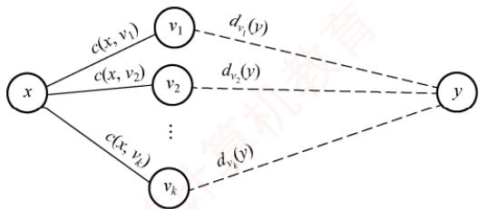

<em>图 4.15 Bellman-Ford 算法的基本思想</em>

　　在距离-向量算法中，每个节点 $x$ 维护以下路由信息：

1）从 $x$ 到每个直接相连邻居 $\mathbf{v}$ 的链路费用 $c(x,v)$ 。

2）节点 $x$ 的距离向量，即 $x$ 到网络中其他节点的费用。这是一组距离，因此称为距离向量。
3）从每个邻居接收到的距离向量副本，即 $x$ 的各邻居到所有其他节点的费用。

　　算法运行时，每个节点定期向所有邻居发送自己的距离向量。当节点 x 从邻居 v 接收到新的距离向量后，会更新本地保存的 v 的距离向量副本，并利用上述公式重新计算自身的距离向量。若计算结果导致自身的距离向量发生变化，则立即向所有邻居发送更新后的距离向量。

　　下面以图4.16顶部所示的三节点简单网络为例，说明距离-向量算法的实现过程。

  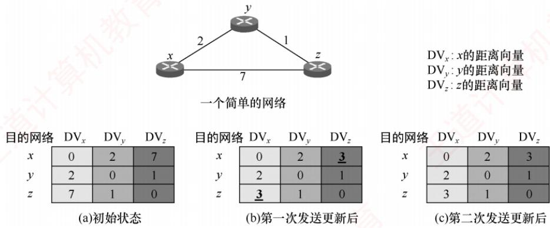

<em>图 4.16 距离-向量算法实现的举例</em>

> **考点追踪：** 距离-向量算法的实现原理（2021）

　　图 4.16(a) 中的各列依次是三个节点的初始化距离向量，此时各节点之间尚未交换过任何路由信息，因此每个节点的距离向量仅包含到每个直连邻居的链路费用。

　　初始化完成后，各节点首次向邻居发送自己的距离向量。收到更新后，每个节点重新计算自己的距离向量。例如，节点 $x$ 计算的过程为： $d_x(x) = 0$ ； $d_x(y) = \min \{c(x,y) + d_y(y), c(x,z) + d_z(y)\} = \min \{2 + 0,7 + 1\} = 2$ ； $d_x(z) = \min \{c(x,y) + d_y(z), c(x,z) + d_z(z)\} = \min \{2 + 1,7 + 0\} = \underline{\mathbf{3}}$ 。可见， $x$ 到 $z$ 的最低费用由7变成了3， $z$ 到 $x$ 的最低费用也由7变成了3，如图4.16(b)所示。由于距离向量发生变化， $x$ 和 $z$ 要再次向邻居发送更新报文，而未变化的 $y$ 则无须发送。这一轮交换后，各节点又重新计算，发现距离向量不再变化，算法收敛并进入静止状态，如图4.16(c)所示。

　　显然，更新报文的大小与网络节点数成正比，大型网络中可能产生较大的通信开销。

　　最常见的距离-向量路由协议是 RIP，它采用跳数作为路径费用的度量标准。

#### 3. 链路状态算法

　　链路状态（Link State，LS）指的是：本路由器与哪些邻居相连，以及对应链路的代价。链路状态算法要求每个节点都掌握完整的全网拓扑结构图。为此，每个节点执行以下两项任务：

- 主动探测所有相邻节点的状态；

- 定期将自身的链路状态信息，通过洪泛法传播给全网所有节点。

　　因此，每个节点都知道全网拓扑、连接关系及各链路代价，并可基于此使用 Dijkstra 最短路径算法，独立计算到其他所有节点的最短路径；每当收到链路状态报文时，节点会更新本地的拓扑视图，并在链路状态发生变化时，立即重新运行 Dijkstra 算法以更新最短路径。

　　链路状态算法的主要优点是：① 所有节点基于相同的链路状态数据库独立计算最优路径，不依赖邻居的路由决策，避免了距离-向量算法中的无穷计数等问题；② 每个节点获得完整拓扑后，可本地计算全局最优路径，收敛过程通常较快且无环；③ 链路状态报文仅包含本节点的直连链路信息，单个报文大小与网络总规模无关，因此在大型网络中具有更好的可扩展性。

　　两种路由算法的比较：① 在距离-向量算法中，每个节点仅与直接邻居交换信息，发送的是完整的距离向量（大小与节点数成正比），通信开销较大；② 在链路状态算法中，每个节点通过洪泛方式向全网广播自身直连链路的状态，但每条报文仅包含局部信息，总体扩展性更好。

　　典型的链路状态算法是 OSPF 算法。

### 4.4.2 分层次的路由选择协议

　　互联网采用的是自适应的分布式路由选择协议。由于互联网规模非常庞大，且许多联网单位不愿对外暴露其内部网络细节，因此采用了分层次的路由选择协议。

　　为此，整个互联网被划分为多个较小的自治系统（Autonomous System，AS）。每个自治系统在对外通信时，表现为一个单一且一致的路由选择策略。自治系统的管理者有权自主决定在其内部使用何种路由选择协议（如 RIP 或 OSPF）。

　　基于此，互联网的路由选择协议被划分为两大类。

#### 1. 内部网关协议（Interior Gateway Protocol，IGP）

　　内部网关协议用于自治系统内部的路由选择，与其他自治系统所采用的协议无关。目前这类路由选择协议使用得最多，如 RIP 和 OSPF。

#### 2. 外部网关协议（External Gateway Protocol, EGP）

　　当源主机和目的主机位于不同的自治系统中（这两个自治系统可能使用不同的 IGP），数据报在到达某一自治系统边界时，就需要借助一种协议将路由信息传递到另一个自治系统。这类协议称为外部网关协议。当前广泛使用的外部网关协议是 BGP-4。

　　自治系统之间的路由选择也称域间路由选择，自治系统内部的路由选择也称域内路由选择。

　　图 4.17 是两个自治系统互连的示意图。每个自治系统可以自行选择内部使用的网关协议（如 RIP 或 OSPF）。但每个自治系统都至少有一个或多个边界路由器（图中的 R1 和 R2），这些路由器除运行本系统的内部网关协议外，还需运行外部网关协议（如 BGP-4）。

  

<em>图 4.17 两个自治系统互连的示意图</em>

### 4.4.3 路由信息协议

　　路由信息协议（Routing Information Protocol，RIP）是内部网关协议（IGP）中最早得到广泛应用的协议之一。RIP 是一种分布式的、基于距离向量的路由选择协议。

#### 1. RIP 的规定

1）RIP 使用跳数（Hop Count，也称距离）来衡量到达目的网络的远近。规定从一个路由器到其直连网络的距离为 1；每经过一个路由器，跳数加 1。

2）RIP 认为 “好” 的路由就是所经路由器数量最少的路径，即跳数最少。

> **考点追踪：** RIP 中跳数为 16 的含义（2010）

3）RIP规定一条路径最多包含15个路由器，因此跳数为16表示目的网络不可达。由此可见，RIP仅适用于小型自治系统。

4）每个路由表项包含三个关键字段：<目的网络 N，距离 d，下一跳路由器地址 X>，其含义是“我通过下一跳路由器 X 到达目的网络 N 的距离为 d”。

5）网络中的每个路由器都需维护一个距离向量，即其到所有目的网络的距离记录。

#### 2. RIP 的特点

　　RIP 要求每个路由器持续与其他路由器交换信息，其工作特点主要体现在以下三个方面。

1）和谁交换信息：仅和直接相邻的路由器交换信息。

2）交换什么信息：交换的是本路由器当前的完整路由表，即全部路由信息。

3）何时交换信息：按固定的时间间隔（默认为30秒）交换路由信息，路由器据此更新自己的路由表。当网络拓扑发生变化时，路由器也及时向相邻路由器通告最新路由信息。

　　路由器刚开始工作时，它的路由器表是空的。然后，路由器得知到几个直连网络的距离为1。接着，它周期性地与邻居交换并更新路由信息。经过若干轮的交换和更新后，所有路由器最终都会获知到达本自治系统内任意网络的最少跳数和对应的下一跳地址，这一过程称为收敛。

> **考点追踪：** RIP 使用的下层协议（2017）

　　RIP是应用层协议，它使用UDP传送数据（端口520）。需要注意的是，RIP选择的路径不一定是时延最短，但一定是跳数最少的路径，因为它仅依据跳数进行路径选择。

#### 3. RIP 的基本工作原理

　　对于每个相邻路由器发来的 RIP 报文，执行以下步骤：

1）对来自地址为 $X$ 的相邻路由器的RIP报文，首先修改其中所有项目：将所有“下一跳”字段都置为 $X$ ，并将所有“距离”字段的值加1。

2）对修改后的每个项目，按如下规则处理：

　　IF (若原路由表中没有目的网络 N)

　　则将该项目加入路由表（表示发现新网络）。

　　ELSE IF (若原路由表中已有目的网络 N，且原下一跳地址是 X)

　　用新收到的项目替换原表项（要以最新的消息为准）。

　　ELSE IF (若原路由表中已有目的网络 N，但原下一跳地址不是 X)

　　若新收到的项目中的距离 d 小于当前记录的距离，则替换原表项（表示找到更优路径）。ELSE 什么也不做。

3）若连续180秒（RIP默认超时时间）未收到某相邻路由器的更新报文，则将其标记为不可达，即将对应路由项的距离置为16（表示不可达）。

4）处理完毕，返回。

> **考点追踪：** RIP 路由收敛机制（2024）

　　下面举例说明RIP路由表项的更新过程。已知路由器R6和R4互为相邻路由器，表4.4(a)所示为R6的路由表。现在收到相邻路由器R4发来的路由表，如表4.4(b)所示。

　　表 4.4(a) R6 的路由表

　　表 4.4(b) R4 发来的路由表

<table><tr><td>目的网络</td><td>距离</td><td>下一跳路由器</td></tr><tr><td>Net2</td><td>3</td><td>R4</td></tr><tr><td>Net3</td><td>4</td><td>R5</td></tr><tr><td>...</td><td>...</td><td>...</td></tr></table>

<table><tr><td>目的网络</td><td>距离</td><td>下一跳路由器</td></tr><tr><td>Net1</td><td>3</td><td>R1</td></tr><tr><td>Net2</td><td>4</td><td>R2</td></tr><tr><td>Net3</td><td>1</td><td>直接交付</td></tr></table>

　　现对 R6 的路由表进行更新。先把 R4 发来的路由表 [表 4.4(b)] 中各项的距离都加 1，并把下一跳路由器都改为 R4，得到表 4.5(a)。这么做的意义是：R4 是 R6 的相邻路由器，R6 可通过 R4 到达这些网络，但距离比 R4 到达这些网络的距离大 1。将该表与 R6 的原路由表逐项比较。

　　表 4.5(a) 修改 R4 发来的路由表

<table><tr><td>目的网络</td><td>距离</td><td>下一跳路由器</td></tr><tr><td>Net1</td><td>4</td><td>R4</td></tr><tr><td>Net2</td><td>5</td><td>R4</td></tr><tr><td>Net3</td><td>2</td><td>R4</td></tr></table>

　　表 4.5(b) 更新后 R6 的路由表

<table><tr><td>目的网络</td><td>距离</td><td>下一跳路由器</td></tr><tr><td>Net1</td><td>4</td><td>R4</td></tr><tr><td>Net2</td><td>5</td><td>R4</td></tr><tr><td>Net3</td><td>2</td><td>R4</td></tr><tr><td>...</td><td>...</td><td>...</td></tr></table>

　　第一行的Net1在表4.4(a)中没有。这表明：R6此前没有到达Net1的路由，现在知道可通过R4到达Net1。因此，要把这条Net1的路由表项添加到R6的路由表中。

　　第二行的 Net2 在表 4.4(a) 中已有，且下一跳路由器也是 R4。这表明：R6 到达 Net2 的最佳路由仍然是通过 R4，但距离发生了变化（通常由网络拓扑变化引起）。因此，要更新目的网络 Net2 的路由表项（无论距离是变大还是变小，都需要更新）。

　　第三行的Net3在表4.4(a)中已有，但下一跳路由器不同。此时比较距离，新路由信息的距离为2，小于原表中的4。这表明：R6通过R4到达Net3的路径比原来经由R5的更短，因此应更新Net3的路由表项（新路由的距离更大时，不更新）。

　　更新后的 R6 的路由表如表 4.5(b) 所示。

#### 4. RIP 的优缺点

> **考点追踪：** RIP 的优缺点（2024）

　　RIP 的优点:

1）实现简单、开销小、收敛过程较快。

2）若一个路由器发现更短的路由，该更新信息会迅速传播，在较短时间内即可传至所有路由器，俗称“好消息传播得快”。

　　RIP 的缺点:

1）RIP 限制了网络的规模，其最大有效距离为 15（距离 16 表示不可达）。

2）路由器之间交换的是完整的路由表，因此网络规模越大，通信开销也越大。

3）当网络出现故障时，路由器需反复多次交换信息才能完成收敛，故障信息传递缓慢，导致慢收敛现象，俗称“坏消息传播得慢”。

　　下面举例说明 RIP “好消息传播得快，坏消息传播得慢” 的特点。假设图 4.18 中的路由器均采用 RIP 交换路由信息，初始时 R1 到网络 N 的距离为 4，且 R1 和 R2 均已收敛。为简化讨论，此处仅考虑到达网络 N 的路由条目：R1 中为 <N, 4, 直接>，R2 中为 <N, 5, R1>。

  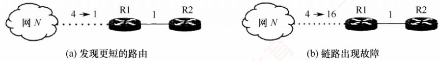

　　图 4.18 RIP 举例：链路开销改变

　　在图 4.18(a) 中，某时刻，R1 检测到一条 “到 N 更短的链路” （距离由 4 变为 1），于是将到 N 的距离更新为 1，并通知 R2（即便 R1 先收到 R2 发来的更新报文，也不会修改自身到 N 的路由）。R2 收到后，将到 N 的距离更新为 2，并通知 R1；R1 收到后，不再修改自己的路由，算法进入静止状态。可见，R2 到 N 的距离减少的好消息通过 RIP 得到了迅速传播。

> **考点追踪：** RIP“坏消息传播得慢”的分析（2016）

　　在图 4.18(b) 中，某时刻，R1 检测到 “N 不可达”（距离由 4 变为 16），于是将到 N 的距离置为 16，但可能需等到下一次周期性更新（默认 30s）才会通知 R2。而在此期间，R2 可能已先将自己的更新报文发给了 R1，其中包含 <N, 5, R1>。R1 收到后，误认为可通过 R2 到达 N，于是将路由信息更新为 <N, 6, R2>。随后 R1 通知 R2，R2 又据此将路由信息更新为 <N, 7, R1>，误认为可通过 R1 到达 N……如此往复，直到两者最终都将距离增至 16，才知道原来 N 是不可达的。可见，RIP 对链路故障或距离增加这类 “坏消息” 的传播非常缓慢。若无跳数上限（15）的限制，路由器将无限循环转发无效路由信息，因此 “坏消息传播得慢” 也称无穷计数问题。

### 4.4.4 开放最短路径优先协议

　　虽然名称中含有 “最短路径优先”，但这并不意味着其他路由协议不采用最短路径原则。实际上，自治系统内使用的所有路由协议都旨在寻找一条最短路径，只是最短的度量标准不同。

#### 1. 开放最短路径优先（OSPF）的基本特点

> **考点追踪：** OSPF与RIP特性对比（2024）

　　OSPF 协议是分布式链路状态算法的典型代表，它采用了 Dijkstra 提出的最短路径算法。与 RIP 相比，OSPF 具有以下四个主要特点：

1）OSPF 使用洪泛法向本自治系统中所有路由器发送信息：路由器通过所有输出端口向相邻路由器发送信息，每个相邻路由器再将该信息转发给其所有邻居（但不再回传给刚刚发送信息的路由器）。最终，整个区域内的所有路由器都会收到该信息的一个副本。而 RIP 仅向直接相邻的几个路由器发送信息。

2）OSPF 发送的信息是本路由器与其相邻路由器之间的链路状态（局部拓扑信息），而非全局路由表。而 RIP 发送的是本路由器所知的全部路由信息（完整的路由表）。

3）OSPF仅在链路状态发生变化时才触发洪泛更新，收敛速度快，不会出现RIP中“坏消息传得慢”的问题。而RIP不论网络拓扑是否变化，都需定期交换路由信息。

> **考点追踪：** >> OSPF 使用的下层协议（2017）

4）OSPF 是网络层协议，不使用 UDP 或 TCP，而是直接封装在 IP 数据报中（IP 首部的协议字段为 89）。而 RIP 是应用层协议，使用 UDP 传输（端口 520）。

> **注意：**

　　“用 UDP 传送”是指将协议数据作为 UDP 报文的数据部分；“直接使用 IP 数据报传送”则是指将协议数据直接作为 IP 数据报的数据部分。RIP 报文属于前者。

　　除上述区别外，OSPF 还具有以下优势：

1）OSPF 支持对每条路由设置不同的代价，可针对不同业务类型计算差异化路径。

2）存在多条到同一目的网络且代价相同的路径时，可实现负载分担（或称负载均衡）。

3）OSPF 分组具备鉴别功能，确保仅在可信路由器之间交换链路状态信息。

4）OSPF 支持可变长子网掩码和无分类编址。

5）每条链路状态通告均携带一个32位序号，序号越大，表示状态越新。

　　由于各路由器频繁交换链路状态信息，最终所有路由器都能构建出一致的链路状态数据库（LSDB）。随后，每个路由器基于 LSDB，利用 Dijkstra 算法计算到达各目的网络的最优路径，并生成自己的路由表。当链路状态发生变化时，路由器会重新计算并更新路由表。

> **注意：**

　　尽管 Dijkstra 算法能计算完整的最优路径，但路由表中不会存储完整路径，而仅存储 “下一跳”，只有到了下一跳后，才能确定再下一跳应当怎样走。

　　为支持大规模网络，OSPF 将一个自治系统划分为若干更小的区域（Area）。划分区域的好处是：将洪泛法交换链路状态信息的范围限制在各区域内，而非整个 AS，从而显著减少网络通信开销。每个区域由一个或多个区域边界路由器负责为进出该区域的分组提供路由。AS 内必须有一个区域配置成主干区域，它包含 AS 内的所有区域边界路由器（可能还包含部分非边界路由器），用于连通其他区域。当分组需在不同区域之间传送时，其转发路径为：源区域→本地区域边界路由器→主干区域→目的区域边界路由器→目的地。在图 4.19 中，R3、R4 和 R7 均为区域边界路由器，每个区域至少包含一个区域边界路由器。此外，主干区域中还需指定一个自治系统边界路由器（如 R6），专门负责与本 AS 外的其他 AS 交换路由信息。

  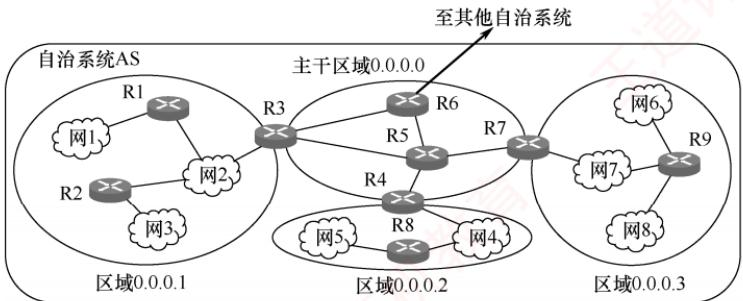

<em>图 4.19 OSPF 划分区域举例</em>

#### 2. OSPF 的五种分组类型

　　OSPF 定义了以下五种分组类型:

1）问候（Hello）分组，用来发现邻居并维持邻接关系，确认链路双向连通性。

2) 数据库描述（Database Description, DD）分组，向邻居发送自己的链路状态数据库（LSDB）中的所有链路状态项目的摘要信息。

3）链路状态请求（Link-State Request，LSR）分组，向邻居请求发送某些链路状态项目的详细信息。

4）链路状态更新（Link-State Update，LSU）分组，通过洪泛法向全网发送链路状态通告（LSA），它是OSPF最核心的部分。路由器使用这种分组将其链路状态通知给邻居。

5）链路状态确认（Link-State Acknowledgment，LSAck）分组，对链路更新分组的确认。这五种分组共同支撑了 OSPF 的邻居发现、数据库同步、拓扑更新、可靠确认的全过程。

#### 3. OSPF 的基本工作原理

（1）邻居发现与可达性维护

　　OSPF 规定，相邻路由器之间需每隔 10s 周期性地交换问候分组，以确认邻接关系并维持彼此的可达性。若某路由器在 40s 内未收到邻居的问候分组，则判定该邻居已不可达，并立即触发链路状态数据库（LSDB）的更新，随后重新运行 Dijkstra 算法以生成新的路由表。

　　通常，网络中传送的大多数 OSPF 分组都是问候分组。

##### （2） 链路状态数据库的初始同步

　　路由器刚启动时，仅能通过问候分组发现其直连邻居，并获知本地链路的基本信息（如接口状态和链路开销）。然而，要构建完整的 LSDB，若采用全网广播所有路由器的完整链路状态信息，则会带来巨大的通信开销。为此，OSPF 采用了一种高效且可靠的同步机制。

　　首先，相邻路由器通过数据库描述分组交换各自 LSDB 中链路状态通告（LSA）的摘要信息；随后，路由器根据摘要对比，使用链路状态请求分组向邻居请求自身缺失或过期的 LSA 详细内容；对方则通过链路状态更新分组发送所请求的 LSA，接收方成功接收后需返回链路状态确认分组以确保可靠传输。通过这一系列交互，相邻路由器最终实现 LSDB 的完全同步。

##### （3） 链路状态变更的实时传播

　　在网络运行过程中，一旦路由器检测到自己的链路状态发生变化（如接口故障或邻居失效等），就会立即生成新的 LSA，并通过链路状态更新分组以可靠的泛洪方式向整个区域传播。其他路由器收到后，同样必须返回确认，随后更新自己的 LSDB，重新运行 Dijkstra 算法计算路由。

##### （4） 链路状态通告的定期更新

　　每条 LSA 的最大生存时间为 60 分钟，为防止 LSA 丢失或异常，最初生成该 LSA 的路由器需定期（通常是每隔 30 分钟）刷新该 LSA，从而确保 LSDB 与实际网络拓扑始终保持一致。

　　由于每个路由器的链路状态信息仅描述其与直连邻居的连接关系及链路代价，与全网规模无直接关联。因此，当网络规模很大时，OSPF要显著优于基于跳数且收敛缓慢的RIP。

### 4.4.5 边界网关协议

#### 1. BGP的基本特点

> **考点追踪：** BGP的功能（2013）

　　边界网关协议（Border Gateway Protocol，BGP）是不同自治系统的路由器之间交换路由信息的协议，是一种外部网关协议。BGP 常用于互联网的 AS 之间。而 RIP 和 OSPF 都只能在一个 AS 内工作；若没有 BGP，则全世界数以万计的 AS 都将是一个个彼此孤立的“孤岛”。

　　内部网关协议主要是设法使分组在一个AS内尽可能有效地从源站传送到目的站。在一个AS内部通常不需要考虑其他方面的策略。然而BGP使用的环境却不同，主要原因如下：

1）互联网的规模太大，使得 AS 之间的路由选择非常困难，每个主干网路由器表中的项目数都非常庞大。对于 AS 之间的路由选择，要寻找最佳路由是很不现实的。

2）AS 之间的路由选择必须考虑政治、安全或经济等有关因素。

> **考点追踪：** BGP 使用的下层协议（2013、2017）

　　因此，BGP 只能力求寻找一条能够到达目的网络且比较好的路由（不能兜圈子），而并非要寻找一条最佳路由。BGP 采用了路径向量路由选择协议，它与距离向量协议（如 RIP）和链路状态协议（如 OSPF）都有很大的区别。BGP 是应用层协议，基于 TCP 实现。

#### 2. BGP 路由

　　BGP 路由的一般格式如下:

　　BGP 路由 = <前缀, BGP 属性> = <前缀, AS-PATH, NEXT-HOP>

　　BGP 属性有多种类型。当一个路由器通过 BGP 会话向对等方通告一条 BGP 路由时，最重要的两个属性是 AS-PATH（自治系统路径）和 NEXT-HOP（下一跳）。

　　AS-PATH 记录了该 BGP 路由所经过的自治系统序列。在 BGP 中，每个自治系统由一个全局唯一的自治系统号（ASN）标识。BGP 路由每经过一个 AS，就向其 ASN 加入 AS-PATH。可见，BGP 路由明确指出了所经过的 AS 路径，但不指明具体经过哪些路由器。

　　NEXT-HOP 表示接收该 BGP 路由的路由器去往目的网络时应使用的下一跳地址。具体而言，从本 AS 出发时，需将分组发给 NEXT-HOP，其通常是通告此路由的邻居 AS 的边界路由器上与本 AS 直连的接口 IP 地址，即 AS-PATH 中第一个 AS（邻居 AS）对应的入口点。

> **考点追踪：** BGP会话类型（2024）

　　在一个 AS 中有两类功能不同的路由器：边界路由器和内部路由器。在这些边界路由器之间，以及在 AS 内部的 BGP 路由器之间，均通过端口号为 179 的半永久 TCP 连接（交换信息后仍保持连接）来交换 BGP 路由信息。每对通过 TCP 连接交换 BGP 报文的路由器称为 BGP 对等方，该 TCP 连接称为 BGP 会话。其中，跨越两个 AS 的 BGP 会话称为外部 BGP（eBGP，external）会话，而位于同一 AS 内的 BGP 会话称为内部 BGP（iBGP，internal）会话。可见，BGP 不仅用于 AS 之间的路由交换，还运行于 AS 内部，以确保外部路由信息在整个 AS 中正确传播。

　　为避免路由信息丢失，BGP 要求在 AS 内的任意两台路由器之间都要建立 iBGP 会话，但不要求物理直连（如图 4.20 中 R2 与 R4、R2 与 R5 之间的 iBGP 会话）。

　　下面通过一个简单的例子来说明。

　　在图 4.20 中，位于 AS2 的 R4 收到一条 BGP 路由 “X, AS-PATH = AS1, NEXT-HOP = R1”，表示 “从 R1 出发，经过 AS1，可到达网络 X”，即 “R1→X”。R4 为了构造自己的路由表，需要解析该路由的 NEXT-HOP。由于 R1 位于 AS1，AS2 的内部路由器无法直接将分组发往 R1，因此 R4 必须通过 AS2 中的某个边界路由器来抵达 NEXT-HOP。具体地，R4 知道 R1 是其 eBGP 对等方 R2 的邻居，因此通往 R1 的流量必须先发给 R2，形成的路径为 “R2→R1→X”。由于 R2 在 AS2 中，AS2 内的所有路由器都能将分组转发到 R2，再经过 R1，最终到达 X。

  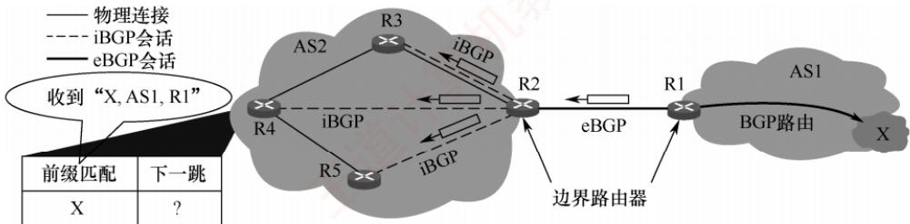

<em>图 4.20 BGP 路由的举例</em>

　　接着，R4 利用内部网关协议（IGP），找到从自身到 R2 的最优路径，假设查得下一跳为 R3。于是，R4 在路由表中添加表项 $<X, R3>$ 。此后，R4 收到目的网络为 X 的分组时，将按路径 R4→R3→R2→R1→X 转发。类似地，R3 也会在其路由表中添加表项 $<X, R2>$ 。每个路由器在收到新的 BGP 路由通告后，都需要执行 NEXT-HOP 解析和 IGP 查找，才能将路由正确写入本地路由表。

#### 3. BGP 路由选择

> **考点追踪：** BGP路由选择的策略（2024）

　　若从一个 AS 到另一个 AS 中的网络 X 只有一条 BGP 路由，则无须进行 BGP 路由选择，该路由即为唯一路径。然而，如果存在两条或更多的 BGP 路由可供选择，则应根据以下原则，并按下面给定的优先顺序，选择一条较好的 BGP 路由。

##### （1） 首先选择本地偏好值最高的路由

　　在 BGP 路由的属性中，有一个称为本地偏好（LOCAL-PREF）的选项，其值可由管理员根据政治或经济上的策略来设置。以图 4.21 为例，从 AS1 到 AS4 共有两条 BGP 路由，管理员设置 LOCAL-PREF 值后，根据该原则，所有发往 AS4 的流量都选择从 R1 离开。然而，即使高速链路过载，BGP 也无法自动将部分流量切换到较空闲的低速链路。

  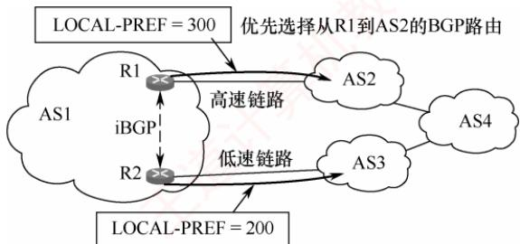

<em>图 4.21 本地偏好值较高的路由优先</em>

　　若在几条 BGP 路由中找不出本地偏好值最高的路由，则采用下面的方法。

##### （2） 选择 AS 跳数最少（AS-PATH 最短）的路由

　　假设到达目的 AS 的多条 BGP 路由的本地偏好值都相同，则 BGP 选择 AS 跳数最少的路由。以图 4.22 为例，从 AS1 到 AS5 共有两条 BGP 路由，根据该原则，应选择仅通过 1 个 AS 的 BGP 路由，即 AS1→AS4→AS5。然而，由于 AS4 是个很大的 AS，分组在 AS4 中反而要经过更多次的转发，可能要花费更长的时间。可见，AS 跳数最少的路由未必是最好的。

  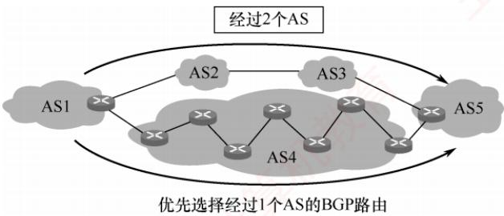

<em>图 4.22 根据经过 AS 跳数的多少选择 BGP 路由</em>

##### （3） 使用热土豆路由选择算法

　　假设按前两种方法都无法确定最好的路由。以图 4.23 为例，从 AS1 到 AS3 共有两条 BGP 路由，假设这两条路由的本地偏好都相同，所经过的 AS 个数也相同。此时，AS1 中的每个路由器执行热土豆路由选择算法（比喻成烫手的热土豆），使分组经过最少的转发次数离开本 AS。这时要使用内部网关协议（如 RIP 或 OSPF），对于不同的路由器，得出的选择结果是不同的。对于 R1，要使分组尽快离开 AS1，应选择 R4 作为下一跳，因此应选择 BGP 路由 2，最终的转发路径为 R1→R4→BGP 路由 2。同理，对于 R2，要使分组尽快离开 AS1，应选择 R3 作为其下一跳，因此应选择 BGP 路由 1，最终的转发路径为 R2→R3→BGP 路由 1。

  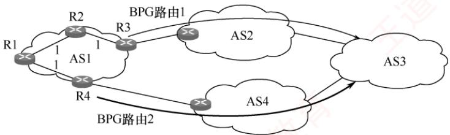

<em>图 4.23 热土豆路由选择算法的举例</em>

##### （4） 选择 BGP 标识符数值最小的路由

　　在 BGP 报文的首部有一个称为 BGP 标识符的字段，该字段是运行 BGP 路由器的唯一标识符。当以上三种方法都无法找出最好的 BGP 路由时，可使用 BGP 标识符来选择路由。

#### 4. BGP 的四种报文

　　当 BGP 刚启动时，BGP 会话的两端需要交换完整的 BGP 路由表；此后，仅在路由发生变化时发送更新部分。这种方式有助于节省网络带宽并降低路由器的处理开销。

> **考点追踪：** BGP 报文类型及作用（2024）

　　BGP-4 定义了以下四种报文类型。

1）Open（打开）报文。用来与 BGP 会话的对等方建立关系，使通信初始化。

2）Update（更新）报文。用来通告某一路由的信息，以及列出要撤销的多条路由。

3）Keepalive（保活）报文。用来周期性地证实与对等方的连通性。

4）Notification（通知）报文。用来发送检测到的差错。

　　两个路由器在建立 TCP 连接后，必须首先交换 Open 报文，以相互识别对方，并协商一些协议参数。收到 Open 报文的路由器若接受 BGP 连接请求，则返回 Keepalive 报文。BGP 会话建立后，对等方需要周期性地交换 Keepalive 报文（默认间隔为 60 秒），以维持连接活跃状态。

　　Update 报文是 BGP 的核心，用于撤销它之前通告过的路由，或者宣布增加一条新的路由。撤销路由可以一次撤销多条，但新增路由时，每个更新报文只能增加一条。

　　为检测对等方是否失效，每个 BGP 路由器都维护一个保持时间计时器。每当收到任意 BGP 报文，计时器就重置为 0 并开始计时，若在约定的保持时间内未收到任何 BGP 报文，则认为对等方已失效，BGP 连接将被关闭。保持时间默认为 180s，而 Keepalive 报文的发送间隔为其 1/3。

　　RIP、OSPF 与 BGP 的比较如表 4.6 所示。

　　表 4.6 三种路由协议的比较

<table><tr><td>协 议</td><td>RIP</td><td>OSPF</td><td colspan="2">BGP</td></tr><tr><td>类型</td><td>内部</td><td>内部</td><td colspan="2">外部</td></tr><tr><td>路由算法</td><td>距离向量</td><td>链路状态</td><td colspan="2">路径向量</td></tr><tr><td>传递协议</td><td>UDP</td><td>IP</td><td colspan="2">TCP</td></tr><tr><td>路径选择</td><td>跳数最少</td><td>代价最低</td><td colspan="2">较好,非最佳</td></tr><tr><td>交换节点</td><td>和本节点相邻的路由器</td><td>网络中的所有路由器</td><td colspan="2">和本节点相邻的路由器</td></tr><tr><td rowspan="2">交换内容</td><td rowspan="2">当前本路由器知道的全部信息,即自己的路由表</td><td rowspan="2">与本路由器相邻的所有路由器的链路状态</td><td>首次</td><td>整个路由表</td></tr><tr><td>非首次</td><td>有变化的部分</td></tr></table>

### 4.4.6 本节习题精选

#### 一、单项选择题

01. 下列关于动态路由选择和静态路由选择的主要区别的描述中，正确是（）。

- A. 动态路由选择需要维护整个网络的拓扑结构信息，而静态路由选择只需要维护部分拓扑结构信息
- B. 动态路由选择可随网络的通信量或拓扑变化而自适应地调整，而静态路由选择则需要手工去调整相关的路由信息
- C. 动态路由选择简单且开销小，静态路由选择复杂且开销大
- D. 动态路由选择使用路由表，静态路由选择不使用路由表

02. 下列关于路由算法的描述中，错误的是（）。

- A. 静态路由有时也被称为非自适应算法
- B. 静态路由所使用的路由选择一旦启动就不能修改
- C. 动态路由也称自适应算法，会根据网络的拓扑变化和流量变化改变路由决策
- D. 动态路由算法需要实时获得网络的状态

03. 下列关于链路状态协议的描述中，错误的是（）。

- A. 仅相邻路由器需要交换各自的路由表
- B. 全网路由器的拓扑数据库是一致的
- C. 采用洪泛技术更新链路变化信息
- D. 具有快速收敛的优点

04. 在链路状态算法中，每个路由器都得到网络的完整拓扑结构后，使用（）算法来找出它到其他路由器的路径长度。

- A. Prim 最小生成树算法
- B. Dijkstra 最短路径算法
- C. Kruskal 最小生成树算法
- D. 拓扑排序

05. 下列关于分层路由的描述中，错误的是（）。

- A. 采用分层路由后，路由器被划分成区域
- B. 每个路由器不仅知道如何将分组路由到自己区域的目标地址，还知道如何路由到其他区域
- C. 采用分层路由后，可以将不同的网络连接起来
- D. 对于大型网络，可能需要多级的分层路由来管理

06. 以下关于自治系统的描述中，错误的是（）。

- A. 自治系统划分区域的好处是，将利用洪泛法交换链路状态信息的范围局限在每个区域内，而不是整个自治系统
- B. 采用分层划分区域的方法使交换信息的种类增多，同时也使OSPF协议更加简单
- C. OSPF协议将一个自治系统再划分为若干更小的范围，称为区域
- D. 在一个区域内部的路由器只知道本区域的网络拓扑，而不知道其他区域的网络拓扑的情况

07. 在计算机网络中，路由选择协议的功能不包括（）。

- A. 交换网络状态或通路信息
- B. 选择到达目的地的最佳路径
- C. 更新路由表
- D. 发现下一跳的物理地址

08. 用于域间路由的协议是（）。

- A. RIP
- B. BGP
- C. OSPF
- D. ARP

09. 在 RIP 中，到某个网络的距离值为 16，其意义是（）。

- A. 该网络不可达
- B. 存在循环路由
- C. 该网络为直接连接网络
- D. 到达该网络要经过 15 次转发

10. 在 RIP 中，假设路由器 X 和路由器 K 是两个相邻的路由器，X 向 K 说 “我到目的网络 Y 的距离为 N”，则收到此信息的 K 就知道 “若将到网络 Y 的下一个路由器选为 X，则我到网络 Y 的距离为（）”。（假设 N 小于 15）

- A. N
- B. N-1
- C. 1
- D. $N+1$

11. 以下关于 RIP 的描述中，错误的是（）。

- A. RIP 是基于距离-向量路由选择算法的
- B. RIP 要求内部路由器将它关于整个 AS 的路由信息发布出去
- C. RIP 要求内部路由器向整个 AS 的路由器发布路由信息
- D. RIP 要求内部路由器按照一定的时间间隔发布路由信息

12. 在 RIP 中，当路由器收到相邻路由器发来的路由更新信息时，若发现有更优的路由，则（）。

- A. 直接更新自己的路由表
- B. 向相邻路由器发送确认信息后再更新自己的路由表
- C. 向所有相邻路由器发送确认信息后再更新自己的路由表
- D. 不更新自己的路由表

13. 对路由选择协议的一个要求是必须能够快速收敛，所谓“路由收敛”是指（）。

- A. 路由器能把分组发送到预定的目标
- B. 路由器处理分组的速度足够快
- C. 网络设备的路由表与网络拓扑结构保持一致
- D. 能把多个子网聚合成一个超网

14. 下列关于 RIP 和 OSPF 协议的叙述中，错误的是（）。

- A. RIP 和 OSPF 协议都是网络层协议
- B. 在进行路由信息交换时，RIP 中的路由器仅向自己相邻的路由器发送信息，OSPF 协议中的路由器向本自治系统中的所有路由器发送信息
- C. 在进行路由信息交换时，RIP 中的路由器发送的信息是整个路由表，OSPF 协议中的路由器发送的信息只是路由表的一部分
- D. RIP 的路由器不知道全网的拓扑结构，OSPF 协议的任何一个路由器都知道自己所在区域的拓扑结构

15. OSPF 协议使用（）分组来保持与其邻居的连接。

- A. Hello
- B. Keepalive
- C. SPF（最短路径优先）
- D. LSU（链路状态更新）

16. 以下关于 OSPF 协议的描述中，最准确的是（）。

- A. OSPF 协议根据链路状态法计算最佳路由
- B. OSPF 协议是用于自治系统之间的外部网关协议
- C. OSPF 协议不能根据网络通信情况动态地改变路由
- D. OSPF 协议只适用于小型网络

17. 在 OSPF 协议中，划分区域的最主要目的是（）。

- A. 减少路由表的大小
- B. 减少洪泛法交换的通信量
- C. 增加路由选择的灵活性
- D. 增加网络的安全性

18. 下列关于 OSPF 协议特征的描述中，错误的是（）。

- A. OSPF 协议将一个自治域划分成若干域，有一种特殊的域称为主干区域
- B. 域之间通过区域边界路由器互连
- C. 在自治系统中有 4 类路由器：区域内部路由器、主干路由器、区域边界路由器和自治域边界路由器
- D. 主干路由器不能兼作区域边界路由器

19. BGP 交换的网络可达性信息是（）。

- A. 到达某个网络所经过的路径
- B. 到达某个网络的下一跳路由器
- C. 到达某个网络的链路状态摘要信息
- D. 到达某个网络的最短距离及下一跳路由器

20. RIP、OSPF协议、BGP的路由选择过程分别使用（）。

- A. 路径向量协议、链路状态协议、距离向量协议
- B. 距离向量协议、路径向量协议、链路状态协议
- C. 路径向量协议、距离向量协议、链路状态协议
- D. 距离向量协议、链路状态协议、路径向量协议

21. 从数据封装的角度看，下列（）协议属于 TCP/IP 模型的应用层。
 I. OSPF II. RIP III. BGP IV. ICMP

- A. I、II
- B. II、III
- C. I、IV
- D. I、II、III、IV

22. 考虑如下图所示的子网，该子网使用了距离-向量算法，下面的向量刚刚到达路由器 C: 来自 B 的向量为 $(5, 0, 8, 12, 6, 2)$ ; 来自 D 的向量为 $(16, 12, 6, 0, 9, 10)$ ; 来自 E 的向量为 $(7, 6, 3, 9, 0, 4)$ 。经过测量，C 到 B、D 和 E 的延迟分别为 6、3 和 5，则 C 到达所有节点的最短路径是（）。

  

- A. (5,6,0,9,6,2)
- B. (11,6,0,3,5,8)
- C. (5,11,0,12,8,9)
- D. (11,8,0,7,4,9)

23. 某分组交换网络的拓扑如下图所示，各路由器使用 OSPF 协议且均已收敛，各链路的度量已在图中标注。假设各段链路的带宽均为 100Mb/s，分组长度为 1000B，其中分组的首部长度为 20B。若主机 A 向主机 B 发送一个大小为 980000B 的文件，忽略分组的传播时延和封装/解封时间，从 A 发送开始到 B 接收完毕为止，需要的时间是（）。

- A. 80.08ms
- B. 80.16ms
- C. 80.32ms
- D. 80.64ms

  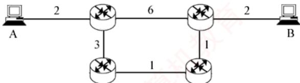

24. 【2010 统考真题】某自治系统内采用 RIP，若该自治系统内的路由器 R1 收到其邻居路由器 R2 的距离向量，距离向量中包含信息<Net1, 16>，则能得出的结论是（）。

- A. R2 可以经过 R1 到达 Net1，跳数为 17
- B. R2 可以到达 Net1，跳数为 16
- C. R1 可以经过 R2 到达 Net1，跳数为 17
- D. R1 不能经过 R2 到达 Net1

25. 【2016 统考真题】假设下图中的 R1、R2、R3 采用 RIP 交换路由信息，且均已收敛。若 R3 检测到网络 201.1.2.0/25 不可达，并向 R2 通告一次新的距离向量，则 R2 更新后，其到达该网络的距离是（）。

- A. 2
- B. 3
- C. 16
- D. 17

  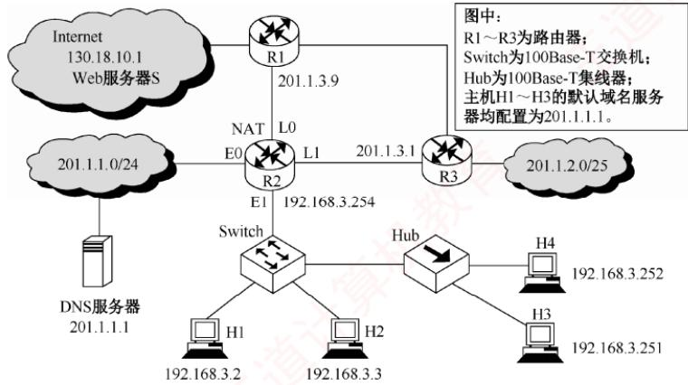

　　表1

26. 【2017 统考真题】直接封装 RIP、OSPF、BGP 报文的协议分别是（）。

- A. TCP、UDP、IP
- B. TCP、IP、UDP
- C. UDP、TCP、IP
- D. UDP、IP、TCP

27. 【2021 统考真题】某网络中的所有路由器均采用距离-向量算法计算路由。若路由器 E 与邻居路由器 A、B、C 和 D 之间的直接链路距离分别是 8、10、12 和 6，且 E 收到邻居路由器的距离向量如下表所示，则路由器 E 更新后，到达目的网络 Net1 ~ Net4 的距离分别是（）。

<table><tr><td>目的网络</td><td>A 的距离向量</td><td>B 的距离向量</td><td>C 的距离向量</td><td>D 的距离向量</td></tr><tr><td>Net1</td><td>1</td><td>23</td><td>20</td><td>22</td></tr><tr><td>Net2</td><td>12</td><td>35</td><td>30</td><td>28</td></tr><tr><td>Net3</td><td>24</td><td>18</td><td>16</td><td>36</td></tr><tr><td>Net4</td><td>36</td><td>30</td><td>8</td><td>24</td></tr></table>

- A. 9, 10, 12, 6
- B. 9, 10, 28, 20
- C. 9, 20, 12, 20
- D. 9, 20, 28, 20

#### 二、综合应用题

01. RIP 使用 UDP, OSPF 使用 IP, 而 BGP 使用 TCP。这样做有何优点？为什么 RIP 周期性地和邻站交换路由信息而 BGP 却不这样做？

02. 在某个使用 RIP 的网络中，B 和 C 互为相邻路由器，其中表 1 为 B 的原路由表，表 2 为 C 广播的距离向量报文<目的网络，距离>。

<table><tr><td>目的网络</td><td>距离</td><td>下一跳</td></tr><tr><td>N1</td><td>7</td><td>A</td></tr><tr><td>N2</td><td>2</td><td>C</td></tr><tr><td>N6</td><td>8</td><td>F</td></tr><tr><td>N8</td><td>4</td><td>E</td></tr><tr><td>N9</td><td>4</td><td>D</td></tr></table>

<table><tr><td>目的网络</td><td>距离</td></tr><tr><td>N2</td><td>15</td></tr><tr><td>N3</td><td>2</td></tr><tr><td>N4</td><td>8</td></tr><tr><td>N8</td><td>2</td></tr><tr><td>N7</td><td>4</td></tr></table>

1）试求路由器 B 更新后的路由表并说明主要步骤。

2）当路由器 B 收到发往网络 N2 的 IP 分组时，应该做何处理？

03. 互联网中的一个自治系统的内部结构如下图所示。路由选择协议采用 OSPF 协议时，计算 R6 的关于网络 N1、N2、N3、N4 的路由表。

  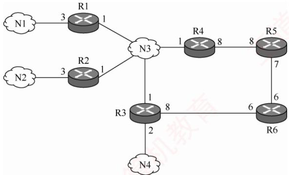

　　注：端口处的数字是该路由器向该链路转发分组的代价。

04. 【2013 统考真题】假设 Internet 的两个自治系统构成的网络如下图所示，自治系统 AS1由路由器 R1 连接两个子网构成；自治系统 AS2 由路由器 R2、R3 互连并连接 3 个子网构成。各子网地址、R2 的接口名、R1 与 R3 的部分接口 IP 地址如下图所示。

  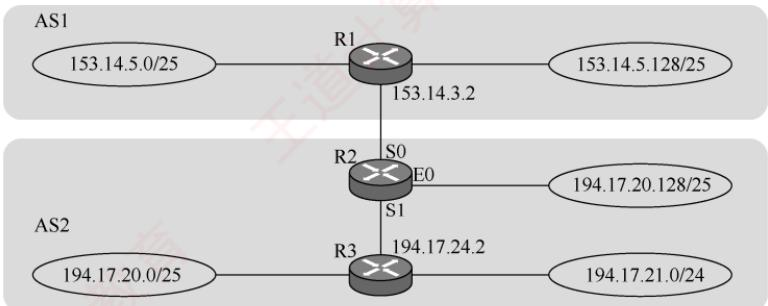

　　请回答下列问题:

1）假设路由表结构如下表所示。利用路由聚合技术，给出R2的路由表，要求包括到达图中所有子网的路由，且路由表中的路由项尽可能少。

<table><tr><td>目的网络</td><td>下一跳</td><td>接口</td></tr></table>

2) 若 R2 收到一个目的 IP 地址为 194.17.20.200 的 IP 分组，R2 会通过哪个接口转发该 IP 分组？

3）R1与R2之间利用哪个路由协议交换路由信息？该路由协议的报文被封装到哪个协议的分组中进行传输？

05. 【2014 统考真题】某网络中的路由器运行 OSPF 路由协议，下表是路由器 R1 维护的主要链路状态信息（LSI），下图是根据该表及 R1 的接口名构造的网络拓扑。

<table><tr><td colspan="2"></td><td>R1 的 LSI</td><td>R2 的 LSI</td><td>R3 的 LSI</td><td>R4 的 LSI</td><td>备注</td></tr><tr><td colspan="2">Router ID</td><td>10.1.1.1</td><td>10.1.1.2</td><td>10.1.1.5</td><td>10.1.1.6</td><td>标识路由器的 IP 地址</td></tr><tr><td rowspan="3">Link1</td><td>ID</td><td>10.1.1.2</td><td>10.1.1.1</td><td>10.1.1.6</td><td>10.1.1.5</td><td>所连路由器的 Router ID</td></tr><tr><td>IP</td><td>10.1.1.1</td><td>10.1.1.2</td><td>10.1.1.5</td><td>10.1.1.6</td><td>Link1 的本地 IP 地址</td></tr><tr><td>Metric</td><td>3</td><td>3</td><td>6</td><td>6</td><td>Link1 的费用</td></tr><tr><td rowspan="3">Link2</td><td>ID</td><td>10.1.1.5</td><td>10.1.1.6</td><td>10.1.1.1</td><td>10.1.1.2</td><td>所连路由器的 Router ID</td></tr><tr><td>IP</td><td>10.1.1.9</td><td>10.1.1.13</td><td>10.1.1.10</td><td>10.1.1.14</td><td>Link2 的本地 IP 地址</td></tr><tr><td>Metric</td><td>2</td><td>4</td><td>2</td><td>4</td><td>Link2 的费用</td></tr><tr><td rowspan="2">Net1</td><td>Prefix</td><td>192.1.1.0/24</td><td>192.1.6.0/24</td><td>192.1.5.0/24</td><td>192.1.7.0/24</td><td>直连网络 Net1 的网络前缀</td></tr><tr><td>Metric</td><td>1</td><td>1</td><td>1</td><td>1</td><td>到达直连网络 Net1 的费用</td></tr></table>

  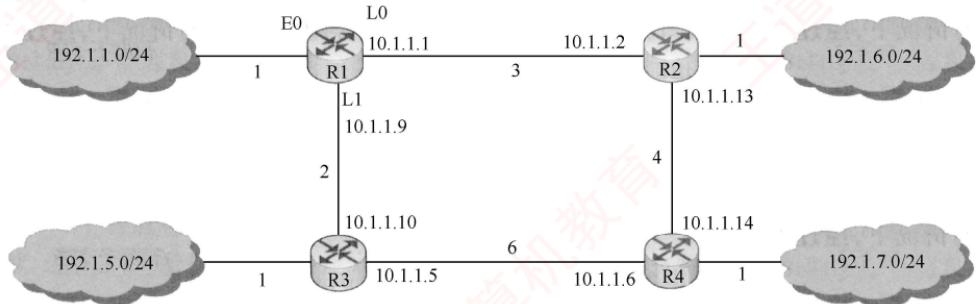

　　请回答下列问题:

1) 假设路由表结构如下表所示, 给出图中 R1 的路由表, 要求包括到达图中子网 192.1.x.x的路由，且路由表中的路由项尽可能少（注意，本题是数据结构和计算机网络的组合题，数据结构的问题中已要求计算 R1 到达每个子网的最短路径及费用）。

<table><tr><td>目的网络</td><td>下一跳</td><td>接口</td></tr></table>

2）当主机192.1.1.130向主机192.1.7.211发送一个 $\mathrm{TTL} = 64$ 的IP分组时，R1通过哪个接口转发该IP分组？主机192.1.7.211收到的IP分组的TTL是多少？

3）若R1增加一条Metric为10的链路连接Internet，则表中R1的LSI需要增加哪些信息？

06. 【2024 统考真题】网络空间是继陆海空天之后的“第五疆域”，网络技术是网络疆域建设与治理的基础。路由算法与协议是网络核心技术之一，对其准确认知、合理选择与应用，对于网络建设十分重要。假设现有互联网中的 4 个自治系统互连拓扑示意图如下图所示。其中，AS1 运行内部网关协议 RIP；AS3 规模较小，自治系统内任意两个主机间通信，经过路由器的数量不超过 15 个；AS4 规模较大，自治系统内任意两个主机间通信，经过路由器的数量可能超过 20 个。请回答下列问题。

  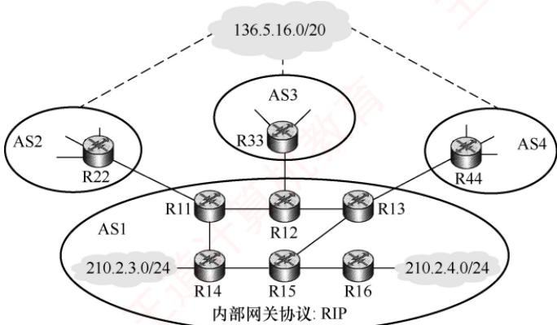

1）若仅有 RIP 和 OSPF 内部网关协议供选择，则 AS4 应该选择哪个协议？

2）若 AS3 中的某主机向本自治系统内的另一主机发送 1 个 IP 分组，为确保该 IP 分组能够被正常接收，则该 IP 分组的初始 TTL 值应该至少设置为多少？

3）假设 AS1 中的路由器同一时刻启动，启动后立即构建并交换初始距离向量，之后每隔 30s 交换一次最新的距离向量，则从交换初始距离向量时刻算起，R11～R16 路由器均获得到达网络 210.2.3.0/24 的正确路由至少需要多长时间？均获得到达网络 210.2.4.0/24 的正确路由至少需要多长时间？

4）R44 向 R13 通告到达网络 136.5.16.0/20 路由时，由 BGP 哪类会话完成？通过哪个 BGP 报文通告？R13 通过 BGP 的哪类会话将该网络可达性信息通告给 R14 和 R15?

5) 若 R14 和 R15 均收到分别由 R11、R12、R13 通告的到达网络 136.5.16.0/20 的可达性信息如下。

　　目的网络：136.5.16.0/20，AS路径：AS2 AS8 AS19，下一跳：R11

　　目的网络：136.5.16.0/20，AS路径：AS3 AS7 AS11 AS19，下一跳：R12

　　目的网络：136.5.16.0/20，AS路径：AS4 AS10 AS19，下一跳：R13

　　则在无策略约束情况下，R14 和 R15 更新路由表后，各自路由表中到达网络 136.5.16.0/20 路由的下一跳分别是什么（用路由器名称表示）？

### 4.4.7 答案与解析

#### 一、单项选择题

**01. B**

　　静态路由选择使用手动配置的路由信息，实现简单且开销小，需要维护整个网络的拓扑结构信息，但不能及时适应网络状态的变化。动态路由选择通过路由选择协议，自动发现并维护路由信息，能及时适应网络状态的变化，实现复杂且开销大。动态路由选择和静态路由选择都使用路由表。

**02. B**

　　静态路由也称非自适应算法，它不会估计流量和结构来调整其路由决策。但是，这并不说明路由选择是不能改变的，事实上用户可以随时配置路由表。而动态路由也称自适应算法，需要实时获取网络的状态，并根据网络的状态适时地改变路由决策。

**03. A**

　　在链路状态算法中，每个路由器在自己的链路状态变化时，将链路状态信息用洪泛法发送给网络中的其他路由器。发送的链路状态信息包括该路由器的相邻路由器及所有相邻链路的状态。链路状态算法具有快速收敛的优点，它能在网络拓扑发生变化时，立即进行路由的重新计算，并及时向其他路由器发送最新的链路状态信息，使得各路由器的链路状态表能够尽量保持一致。

**04. B**

　　在链路状态算法中，路由器通过交换每个节点到邻居节点的代价来构建一个完整的网络拓扑结构。然后，路由器使用 Dijkstra 最短路径算法来计算到所有节点的最短路径。

**05. B**

　　采用分层路由后，路由器被划分为区域，每个路由器知道如何将分组路由到自己所在区域内的目标地址，但对于其他区域内的结构毫不知情。当不同的网络相互连接时，可将每个网络当作一个独立的区域，这样做的好处是一个网络中的路由器不必知道其他网络的拓扑结构。

**06. B**

　　划分区域的好处是，将利用洪泛法交换链路状态信息的范围局限在每个区域内，而不是整个自治系统。因此，在一个区域内部的路由器只知道本区域的网络拓扑情况，而不知道其他区域的网络拓扑情况。采用分层次划分区域的方法虽然使交换信息的种类增多了，同时也使 OSPF 协议更加复杂了，但是，这样做却能使每个区域内部交换路由信息的通信量大大减少，进而使 OSPF 协议能够用于规模很大的自治系统中。

**07. D**

　　路由选择协议的功能通常包括：获取网络拓扑信息、构建路由表、在网络中更新路由信息、选择到达每个目的网络的最优路径、识别一个网络的无环通路等。发现下一跳的物理地址一般是通过其他方式（如 ARP）来实现的，不属于路由选择协议的功能。

**08. B**

　　BGP（边界网关协议）是域间路由协议。RIP 和 OSPF 是域内路由协议，ARP 不是路由协议。

**09. A**

　　RIP 规定的最大跳数为 15，16 表示网络不可达。

**10. D**

　　RIP 规定，每经过一个路由器，距离（跳数）加 1。

**11. C**

　　RIP 规定一个路由器只向相邻路由器发布路由信息，而不像 OSPF 那样向整个域洪泛。

**12. A**

　　在 RIP 中，当路由器收到相邻路由器发来的路由更新信息时，若发现有更优的路由（跳数更小的路由），则直接更新自己的路由表，并向其他相邻路由器广播自己的新路由。

**13. C**

　　所谓收敛，是指当路由环境发生变化后，各路由器调整自己的路由表以适应网络拓扑结构的变化，最终达到稳定状态（路由表与网络拓扑状态保持一致）。收敛越快，路由器就能越快适应网络拓扑结构的变化。

**14. A**

　　RIP 是应用层协议，它使用 UDP 传送数据，OSPF 才是网络层协议。选项 A 错误。

**15. A**

　　此题属于记忆性题目，OSPF 协议使用 Hello 分组来保持与其邻居的连接。

**16. A**

　　OSPF 协议是一种用于自治系统内的路由协议，选项 B 错误。它是一种基于链路状态路由选择算法的协议，能适用大型全局 IP 网络的扩展，支持可变长子网掩码，所以 OSPF 协议可用于管理一个受限地址域的中大型网络，选项 D 错误。OSPF 协议维护一张它所连接的所有链路状态信息的邻居表和拓扑数据库，使用多播链路状态更新报文实现路由更新，并且只有当网络发生变化时才传送链路状态更新报文，选项 C 错误。OSPF 协议不传送整个路由表，而传送受影响的路由更新报文。

**17. B**

　　链路状态算法让每个路由器都知道整个自治系统的完整拓扑，从而计算最短路径。若不划分区域，则会导致链路状态数据包的个数和占用空间非常大，占用大量的网络带宽资源，影响网络效率和稳定性。划分区域后，每个路由器只需要知道自己所在区域内的完整拓扑，把交换链路状态信息的范围局限在每个区域，这样就大大减少了链路状态数据包的数量和大小。

**18. D**

　　主干区域中，用于连接主干区域和其他下层区域的路由器称为区域边界路由器。只要是在主干区域中的路由器，就都称为主干路由器，因此主干路由器可以兼作区域边界路由器。

**19. A**

　　因为 BGP 仅力求寻找一条能够到达目的网络且较好的路由（不能兜圈子），而并非寻找一条最佳路由，所以选项 D 错误。BGP 交换的路由信息是到达某个目的网络所要经过的各个自治系统序列，而不仅仅是下一跳，因此选项 A 正确。

**20. D**

　　RIP 是一种分布式的基于距离向量的路由选择协议，它使用跳数来度量距离。RIP 选择的路径不一定是时间最短的，但一定是具有最小距离（最少跳数）的路径。

　　OSPF 协议使用分布式的链路状态协议，通过与相邻路由器频繁交流链路状态信息，来建立全网的拓扑结构图，然后使用 Dijkstra 算法计算从自己到各个目的网络的最优路径。

　　因为 BGP 仅力求寻找一条能够到达目的网络且较好的路由（不能兜圈子），而并非寻找一条最佳路由，所以它采用的是路径向量路由选择协议。在 BGP 中，每个自治系统选出一个 BGP 发言人，这些发言人通过相互交换自己的路径向量（网络可达性信息）后，就可找出到达各自治系统的较好路由。

**21. B**

　　RIP 和 BGP 属于应用层，OSPF 和 ICMP 属于网络层。

**22. B**

　　距离-向量算法要求每个路由器维护一张路由表，该表给出了到达每个目的地址的已知最佳距离（最小代价）和下一步的转发地址。算法要求每个路由器定期与所有相邻路由器交换整个路由表，并更新自己的路由表项。注意，从邻接节点接收到路由表不能直接进行比较，而要加上相邻节点传输消耗后再进行计算。C到B的距离是6，于是从C开始通过B到达各节点的最短距离向量是(11,6,14,18,12,8)。同理，通过D和E的最短距离向量分别是(19,15,9,3,12,13)和(12,11,8,14,5,9)。于是，C到所有节点的最短路径应该是(11,6,0,3,5,8)。

**23. C**

　　根据 OSPF 算法，从 A 到 B 转发经过的链路代价依次为 2、3、1、1、2，一共经过 4 个路由器。分组长度为 1000B，首部长度为 20B，数据长度为 980B，所以共有 980000/980 = 1000 个分组，每次存储转发时延为 $1000B \div 100Mb/s = 0.08ms$ ，第一个分组从 A 到 B 的时间为 $0.08 \times 5 = 0.4ms$ ，剩下的 999 个分组每经过 0.08ms 就到达一个，所以总时间为 $0.4 + 0.08 \times 999 = 80.32ms$ 。

**24. D**

　　R1 在收到信息并更新路由表后，若需要经过 R2 到达 Net1，则其跳数为 17，因为距离为 16 表示不可达，所以 R1 不能经过 R2 到达 Net1，R2 也不可能到达 Net1。选项 B、C 错误，选项 D 正确。而题目中并未给出 R1 向 R2 发送的信息，因此选项 A 也不正确。

**25. B**

　　初始收敛时，R3 到网络（201.1.2.0/25）的距离为 1，R2 到网络的距离为 2，R1 到网络的距离为 2。当 R3 检测到网络不可达时，因为 R3 存有其他邻居到网络的路由信息，所以它利用所有邻居的距离向量，用 Bellman-Ford 公式更新自己的距离向量（易错点：误以为 R3 检测到网络不可达时，就把其到网络的距离设置为 16），R3 重新计算到网络的距离 = min{16, R1 到网络的距离 + 1, R2 到网络的距离 + 1} = {16, 2 + 1, 2 + 1} = 3。然后，R3 向其所有邻居发送更新报文，“告诉它到网络的距离为 3”。R2（及 R1）收到 R3 发来的更新报文后，会利用它保存的所有邻居的距离向量，重新计算自己到网络的距离 = min{R1 到网络的距离 + 1, R3 到网络的距离 + 1} = {2 + 1, 3 + 1} = 3，因此答案为 3。与此同时，R1 也重新计算自己到网络的距离 = min{R2 到网络的距离 + 1, R3 到网络的距离 + 1} = {2 + 1, 3 + 1} = 3。如此反复，直至重新收敛。因为 RIP 的特点“坏消息传得慢”，所以一旦网络出现故障，就要经过较长时间才能将故障消息传送到所有路由器。

**26. D**

　　RIP 是一种分布式的基于距离向量的路由选择协议，它通过广播 UDP 报文来交换路由信息。OSPF 是一个内部网关协议，要交换的信息量较大，应使报文的长度尽量短，所以不使用传输层协议（如 UDP 或 TCP），而直接采用 IP。BGP 是一个外部网关协议，在不同的自治系统之间交换路由信息，因为网络环境复杂，需要保证可靠传输，所以采用 TCP。因此，答案为选项 D。

**27. D**

　　根据距离-向量算法，E收到相邻路由器的距离向量后，更新它的路由表：

　　① 当原路由表中没有目的网络时，把该项目添加到路由表中。

　　② 发来的路由信息中有一条到达某个目的网络的路由，该路由与当前使用的路由相比，有较短的距离，就用经过发送路由信息的节点的新路由替换。

　　分析题意可知，E 与邻居路由器 A、B、C 和 D 之间的直接链路距离分别是 8、10、12 和 6。到达 Net1～Net4 没有直接链路，需要通过邻居路由器。从上述算法可知，E 到达目的网络一定是经过 A、B、C 和 D 中距离最小的。根据题中所给的距离信息，计算 E 经过邻居路由器到达目的网络 Net1～Net4 的距离，如下表所示，选择到达每个目的网络距离的最短值。

<table><tr><td>目的网络</td><td>经过A需要的距离</td><td>经过B需要的距离</td><td>经过C需要的距离</td><td>经过D需要的距离</td></tr><tr><td>Net1</td><td>9</td><td>33</td><td>32</td><td>28</td></tr><tr><td>Net2</td><td>20</td><td>45</td><td>42</td><td>34</td></tr><tr><td>Net3</td><td>32</td><td>28</td><td>28</td><td>42</td></tr><tr><td>Net4</td><td>44</td><td>40</td><td>20</td><td>30</td></tr></table>

　　所以距离分别是 9、20、28、20。

#### 二、综合应用题

**01. 【解答】**

　　RIP 处于 UDP 的上层，RIP 所接收的路由信息都封装在 UDP 的数据报中；OSPF 的位置位于网络层，因为要交换的信息量较大，所以应使报文的长度尽量短，因此采用 IP；BGP 要在不同的自治系统之间交换路由信息，因为网络环境复杂，需要保证可靠的传输，所以选择 TCP。

　　内部网关协议主要设法使数据报在一个自治系统中尽可能有效地从源站传送到目的站，在一个自治系统内部并不需要考虑其他方面的策略，然而 BGP 使用的环境却不同。主要有以下三个原因：第一，互联网规模太大，使得自治系统之间的路由选择非常困难；第二，对于自治系统之间的路由选择，要寻找最佳路由是不现实的；第三，自治系统之间的路由选择必须考虑有关策略。因为上述情况，BGP 只能力求寻找一条能够到达目的网络且较好的路由，而并非寻找一条最佳路由，所以 BGP 不需要像 RIP 那样周期性地和邻站交换路由信息。

**02. 【解答】**

1）根据 RIP 算法，首先将从 C 收到的路由信息的下一跳改为 C，并且将每个距离都加 1，得到右表。将题中表 2 与原路由表项进行比较，根据以下规则更新路由表项：① 若目的网络相同，且下一跳路由器相同，则直接更新；② 若是新的目的网络地址，则增加表项；③ 若目的网络相同，且下一跳路由器不同，而距离更短，则更新；④ 否则，无操作。更新后的路由表见下表。

<table><tr><td>目的网络</td><td>距离</td><td>下一跳</td></tr><tr><td>N2</td><td>16</td><td>C</td></tr><tr><td>N3</td><td>3</td><td>C</td></tr><tr><td>N4</td><td>9</td><td>C</td></tr><tr><td>N8</td><td>3</td><td>C</td></tr><tr><td>N7</td><td>5</td><td>C</td></tr></table>

<table><tr><td>目的网络</td><td>距离</td><td>下一跳路由器</td><td>目的网络</td><td>距离</td><td>下一跳路由器</td></tr><tr><td>N1</td><td>7</td><td>A</td><td>N6</td><td>8</td><td>F</td></tr><tr><td>N2</td><td>16</td><td>C</td><td>N7</td><td>5</td><td>C</td></tr><tr><td>N3</td><td>3</td><td>C</td><td>N8</td><td>3</td><td>C</td></tr><tr><td>N4</td><td>9</td><td>C</td><td>N9</td><td>4</td><td>D</td></tr></table>

2）在更新后的路由表中，路由器 B 到 N2 的距离为 16（网络拓扑结构变化导致），这意味着 N2 网络不可达，这时路由器 B 应该丢弃该 IP 分组并向源主机报告目的不可达。

**03. 【解答】**

　　首先，要明白路由器端口旁的数字的含义——路由器向该链路转发分组的代价，即便是同一段链路的两个不同端点的路由器，转发分组的代价也可能不同。其次，要明白一个网络所连接的几个路由器之间转发分组并不需要经过任何其他中间路由器。例如，R6 到网络 N1 经过的路径和代价计算如下：R6 到 R3 经过的代价是 6，R3 到 R1 经过的代价是 1，R1 到网络 N1 经过的代价是 3，所以 R6 到网络 N1 经过的代价是 10。根据 Dijkstra 最短路径算法，加入节点的次序之一为 (R6, R5, R3, N3, R4, R1, R2, N4, N1, N2)，可以得到 R6 的路由表如下表所示。

<table><tr><td>目的网络</td><td>距离</td><td>下一跳路由器</td><td>目的网络</td><td>距离</td><td>下一跳路由器</td></tr><tr><td>N1</td><td>10</td><td>R3</td><td>N3</td><td>7</td><td>R3</td></tr><tr><td>N2</td><td>10</td><td>R3</td><td>N4</td><td>8</td><td>R3</td></tr></table>

**04. 【解答】**

1）要求 R2 的路由表能到达图中的所有子网，且路由项尽可能少，则应对每个路由接口的子网进行聚合。在 AS1 中，子网 153.14.5.0/25 和子网 153.14.5.128/25 可聚合为子网 153.14.5.0/24；在 AS2 中，子网 194.17.20.0/25 和子网 194.17.21.0/24 可聚合为子网 194.17.20.0/23；子网 194.17.20.128/25 单独连接到 R2 的接口 E0。

　　于是可以得到 R2 的路由表如下:

<table><tr><td>目的网络</td><td>下一跳</td><td>接口</td></tr><tr><td>153.14.5.0/24</td><td>153.14.3.2</td><td>S0</td></tr><tr><td>194.17.20.0/23</td><td>194.17.24.2</td><td>S1</td></tr><tr><td>194.17.20.128/25</td><td>—</td><td>E0</td></tr></table>

2）该 IP 分组的目的 IP 地址 194.17.20.200 与路由表中 194.17.20.0/23 和 194.17.20.128/25 两个路由表项均匹配，根据最长匹配原则，R2 将通过 E0 接口转发该 IP 分组。

3）R1 和 R2 属于不同的自治系统，因此应使用边界网关协议（BGP 或 BGP4）交换路由信息；BGP 是应用层协议，它的报文被封装到 TCP 段中进行传输。

**05. 【解答】**

1）因为题目要求路由表中的路由项尽可能少，所以对从同一接口转发的目的网络进行路由聚合，可以求出子网 192.1.6.0/24 和 192.1.7.0/24 都是通过接口 L0 转发，因此可将这两个子网聚合为子网 192.1.6.0/23，其他子网照常，可得到路由表如下：

<table><tr><td>目的网络</td><td>下一跳</td><td>接口</td></tr><tr><td>192.1.1.0/24</td><td>—</td><td>E0</td></tr><tr><td>192.1.6.0/23</td><td>10.1.1.2</td><td>L0</td></tr><tr><td>192.1.5.0/24</td><td>10.1.1.10</td><td>L1</td></tr></table>

2）通过查路由表可知：R1 通过 L0 接口转发该 IP 分组。因为该分组要经过 3 个路由器（R1、R2、R4），所以主机 192.1.7.211 收到的 IP 分组的 TTL = 64 - 3 = 61。

3）互联网（Internet）包括无数的网络集合，不可能在路由表项中一一列出，因此 R1 到互联网的路由只能采用默认路由的方式，默认路由的网络前缀为 0.0.0.0/0。因此，R1 的 LSI 需要增加一条特殊的直连网络，网络前缀 Prefix 为 “0.0.0.0/0”，Metric 为 10。

**06. 【解答】**

1）RIP 限制了网络规模，其最大跳数为 15；且 RIP 路由器周期性交换完整的路由表，随着网络规模扩大，开销会显著增大。因此，AS4 应该选择 OSPF 协议。

2）IP 分组每经过一个路由器，TTL 值减 1，当 TTL 减为 0 时被丢弃。依题意，AS3 中任意两主机间通信最多经过 15 个路由器，为确保分组能被正常接收，初始 TTL 值至少应设为 16，这样在经过第 15 个路由器后，TTL 值变为 1，可成功交付。

3) 对于网络 210.2.3.0/24: R14 直连该网络，启动后立即构建初始距离向量。首次交换 $(t=0)$ 时，R14 将路由信息通告给 R11 和 R15，因此 R11、R14、R15 均立即获得正确的路由，如图 1 所示。经过 30s 后（第二次交换），R11 通告给 R12，R15 通告给 R13 和 R16，至此 R11～R16 均获得正确的路由，如图 2 所示，故至少需要 30s。

  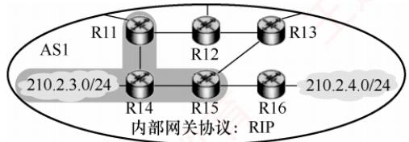

　　图1

  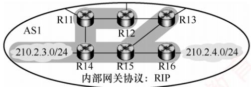

　　图2

　　对于网络 210.2.4.0/24：R16 直连该网络。首次交换（t = 0）时，R16 将路由信息通告给 R15，R15 获知路由，如图 3 所示。30s 后，R15 通告给 R13 和 R14，此时 R16、R15、R13、R14 全部获知路由，如图 4 所示；再经过 30s（共 60s），R14 通告给 R11，R13 通告给 R12，此时 R11～R16 全部获知路由，如图 5 所示，故至少需要 60s。

  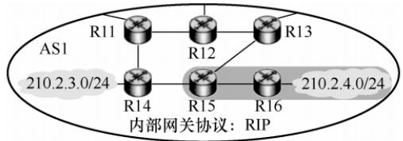

　　图3

  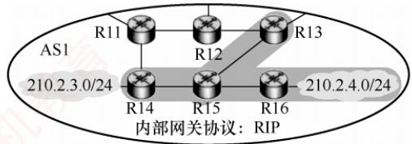

　　图4

  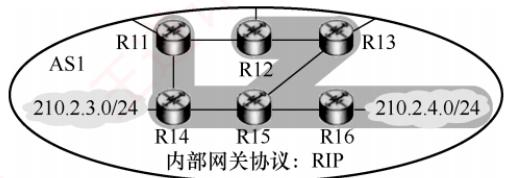

　　图5

4）R44属于AS4，R13属于AS1，二者位于不同的自治系统中，因此R44向R13通告路由通过eBGP（外部BGP）会话完成。使用UPDATE报文通告路由信息。R13向同属AS1的R14和R15通告该路由，通过iBGP（内部BGP）会话完成。

5）BGP 在无策略约束时，优先选择跳数最少的路由。依题意，从 R11 和 R13 离开都会经过 3 个 AS，从 R12 离开会经过 4 个 AS。从 R11 与 R13 离开的跳数相等。此时，应采用热土豆路由选择算法，让分组经过最少的转发次数离开 AS1。由于 AS1 采用的是 RIP，因此 R14 会选择距离最近的 R11 转发；类似地，R15 会选择距离最近的 R13 转发。

## 4.5 IP多播

### 4.5.1 多播的概念

　　多播（也称组播）是让源主机一次发送的单个分组可以抵达用一个组地址标识的若干目的主机，即一对多的通信。在互联网上进行的多播，称为 IP 多播。与单播相比，多播在一对多通信中能显著节省网络资源。例如，当视频服务器向 90 台主机发送相同的视频分组时（见图 4.24），单播需要为每台主机单独发送一份分组，共 90 份；而多播仅发送一份分组。该分组在传输路径上仅当遇到分岔节点时才被复制并转发。到达目的局域网后，已加入该多播组的主机均可收到该分组。因此，多播大幅减轻了服务器的负担和网络负载。

　　多播的实现依赖于路由器的支持，支持多播路由协议的路由器称为多播路由器。

  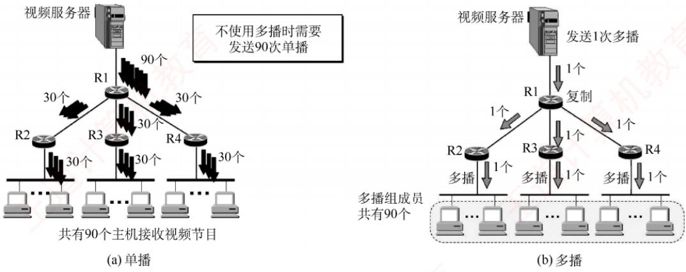

<em>图 4.24 单播与多播的比较</em>

### 4.5.2 IP 多播地址

　　多播数据报的源地址是源主机的 IP 地址，目的地址是 IP 多播地址。IP 多播地址就是 IPv4 中的 D 类地址。D 类地址的前四位是 1110，因此地址范围是 224.0.0.0～239.255.255.255，每个地址标志一个多播组，可支持 $2^{28}$ 个多播组，主机可随时加入或离开一个多播组。

　　多播数据报是指目的地址为 D 类 IP 地址的数据报，其协议字段值由其携带的上层协议决定（若携带的是 UDP 数据，则为 17；若携带的是 IGMP 报文，则为 2）。注意事项如下：

1）多播数据报也是“尽最大努力交付”，不提供可靠交付。

2）多播地址只能用于目的地址，而不能用于源地址。

3）对多播数据报不产生 ICMP 差错报文。

　　IP 多播可分为两种：① 只在本局域网上进行硬件多播；② 在互联网的范围内进行多播。目前大部分主机都是通过局域网接入互联网的。因此，在互联网上进行多播的最后阶段，仍需要把多播数据报在局域网上用硬件多播交付给多播组的所有成员 [见图 4.24(b)]。

　　多播机制仅适用于 UDP，因为它能将同一报文同时发送给多个接收者；而 TCP 是面向连接的协议，建立的是一对一的端到端连接，无法支持一对多的多播通信。

### 4.5.3 在局域网上进行硬件多播

　　由于局域网支持硬件多播，只需将 IP 多播地址映射为对应的多播 MAC 地址，并将 IP 多播数据报封装在以太网帧中，其 MAC 帧首部的目的地址字段设为该映射所得的多播 MAC 地址。这样，即可借助局域网的硬件多播能力，高效实现 IP 多播在本地网络中的传输。

　　IANA（互联网地址指派机构）保留的以太网多播地址的范围是 01-00-5E-00-00-00 到 01-00-5E-7F-FF-FF，在这 48 位中，前 25 位保持不变，只有后 23 位可用作多播。而 D 类 IP 地址共有 28 位可用于标志多播组，这 28 位中的高 5 位无法映射，导致 32（即 $2^{5}$ ）个不同的 IP 多播地址会映射到同一个多播MAC地址。因此两者是多对一的映射关系，如图4.25所示。

　　例如，IP多播地址224.128.64.32（E0-80-40-20）与224.0.64.32（E0-00-40-20）映射到以太网多播MAC地址时，均得到01-00-5E-00-40-20。因此，主机在收到多播数据帧后，还需在IP层利用数据报首部中的目的IP地址进行过滤，仅保留本机所属多播组的数据报，其余则予以丢弃。

  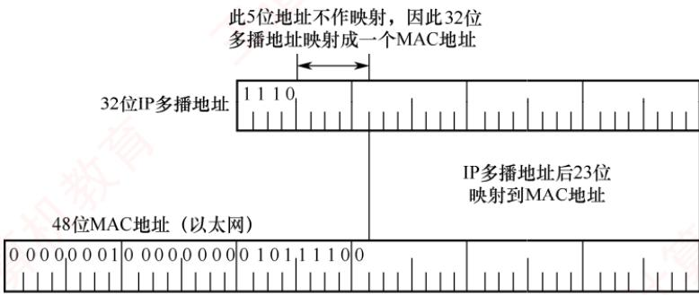

<em>图 4.25 D类IP地址与以太网多播地址的映射关系</em>

### 4.5.4 IGMP 与多播路由协议

　　路由器要获得多播组的成员信息，需要利用网际组管理协议（Internet Group Management Protocol，IGMP）。连接到局域网上的多播路由器还必须和互联网上的其他多播路由器协同工作，以便用最小代价将多播数据报分发至所有组成员，这就需要使用多播路由选择协议。

　　IGMP 用于使连接到本地局域网上的多播路由器，能够获知本局域网上是否有主机加入或退出了某个多播组。IGMP 仅作用于本地子网，并非用于在互联网范围内管理所有多播组成员，它既不知道某个多播组的总成员数量，也不了解这些成员分布在哪些网络。

　　IGMP 报文封装在 IP 数据报（协议字段值为 2）中传送。IGMP 作为 IP 的配套协议，用于协助 IP 实现多播功能，因此不将其视为一个单独的协议，而是整个 IP 协议的一个组成部分。

　　IGMP 的工作可分为两个阶段:

　　第一阶段：当主机加入一个新的多播组时，会向该多播组的多播 IP 地址发送一个 IGMP 报文，声明自己要成为该组的成员。本地多播路由器收到 IGMP 报文后，将利用多播路由选择协议，把这种组成员关系通告给互联网上的其他多播路由器。

　　第二阶段：组成员关系是动态的。本地多播路由器会周期性地查询本地局域网上的主机，以探测各多播组是否仍有活跃成员。只要某个组至少有一台主机响应，路由器即认为该组在本网络仍处于活跃状态。若某个组在经过连续多次查询后仍无任何主机响应，则路由器判定该组在本网络已无成员，并停止向其他多播路由器通告该组的成员关系。

　　多播路由选择实际上就是要构造一棵以源主机为根节点的多播转发树。在这棵树上，每个分组在每条链路上仅被传送一次，且参与转发的路由器不会收到重复的多播数据报。值得注意的是，不同的多播组对应不同的转发树；同一个多播组，若源主机不同，则对应的转发树也不同。

### 4.5.5 本节习题精选

#### 一、单项选择题

01. 下列关于多播概念的描述中，错误的是（）。

- A. 在单播路由选择中，路由器只能从它的一个接口转发收到的分组
- B. 在多播路由选择中，路由器可以从它的多个接口转发收到的分组
- C. 用多个单播仿真一个多播时需要更多的带宽
- D. 用多个单播仿真一个多播时时延基本上是相同的

02. 在设计多播路由时，为了避免路由环路，（）。

- A. 采用了水平分割技术
- B. 构造多播转发树
- C. 采用了IGMP
- D. 通过生存时间（TTL）字段

03. 以太网多播 IP 地址 224.215.145.230 应该映射到的多播 MAC 地址是（）。

- A. 01-00-5E-57-91-E6
- B. 01-00-5E-D7-91-E6
- C. 01-00-5E-5B-91-E6
- D. 01-00-5E-55-91-E6

04. 在下列 4 个地址中，（）只能用于 IP 数据报的目的地址而不能用于源地址。

- A. 11.255.255.100
- B. 192.168.1.100
- C. 228.1.1.100
- D. 0.0.0.0

#### 二、综合应用题

01. 互联网的多播是怎样实现的？为什么互联网上的多播比以太网上的多播复杂得多？

### 4.5.6 答案与解析

#### 一、单项选择题

**01. D**

　　多个单播可以仿真多播，但是一个多播所需的带宽要小于多个单播带宽之和；用多个单播仿真一个多播时，路由器的时延将很大，而处理一个多播分组的时延是很小的。

**02. B**

　　因为树具有不存在环路的特性，所以构造一个多播转发树，通过该转发树，既能将多播分组传送到组内的每台主机，又能避免环路[见图4.24(b)]。水平分割用于避免距离-向量算法中的无穷计数问题。TTL字段用于防止IP分组因为环路而在网络中无限循环。

**03. A**

　　以太网多播地址块的范围是 01-00-5E-00-00-00～01-00-5E-7F-FF-FF，而且在每个地址中，只有后 23 位可用多播。这样，只能和 D 类 IP 地址中的后 23 位有一一对应关系。D 类 IP 地址可供分配的有 28 位，可见这 28 位中的前 5 位不能用来构成以太网硬件地址。215 的二进制为 11010111，其中，在映射过程中最高位为 0，因此 215.145.230 映射的二进制为 01010111.10010001.11100110，对应的十六进制数是 57-91-E6。

**04. C**

　　选项 A 是一个 A 类地址，既可用于目的地址，又可用于源地址。选项 B 是一个私有地址，既可用于目的地址，又可用于源地址。选项 D 表示本网络上的本主机，只能用于源地址。选项 C 是一个多播地址，多播地址的范围是 224.0.0.0～239.255.255.255，只能用于目的地址。

#### 二、综合应用题

**01. 【解答】**

　　互联网的多播是靠路由器来实现的，这些路由器必须增加一些能够识别多播的软件。能够运行多播协议的路由器可以是一个单独的路由器，也可以是运行多播软件的普通路由器。互联网上的多播比以太网上的多播复杂得多，因为以太网本身支持广播和多播，而互联网上当前的路由器和许多物理网络都不支持广播和多播。

## 4.6 移动 IP

### 4.6.1 移动 IP 的概念

　　移动 IP 是一种允许移动主机在切换网络接入点时，仍能保持其永久 IP 地址不变的网络协议机制。其目标是：无论移动主机当前位于哪个网络，都能确保发往该站的数据分组被自动、透明地正确投递。该机制对上层应用（如 TCP 连接）完全透明，从而保障了会话的连续性。

　　移动 IP 定义了三种功能实体：移动节点、归属代理和外地代理。

1）移动节点。拥有永久 IP 地址、可在不同网络间移动的主机。

2）归属代理（也称本地代理）。连接在归属网络（初始接入的网络）上的路由器，负责截获并转发发往移动节点的数据。

3）外地代理。连接在被访网络（当前接入的网络）上的路由器，协助移动节点接收数据。

　　值得注意的是，若用户将笔记本电脑关机后从家中移至办公室，并通过 DHCP 自动获取新的 IP 地址重新接入网络。尽管设备的物理位置和接入网络发生了变化，但由于其 IP 地址已改变，因此不属于移动 IP 的范畴。然而，若需在移动过程中维持 TCP 传输，则要确保该 TCP 连接在漫游期间持续有效；否则，TCP 连接将因地址变化而中断。由此可见，实现移动中 TCP 连接不中断的关键，在于保持移动节点的 IP 地址不变——这正是移动 IP 所要研究的问题。

### 4.6.2 移动 IP 通信过程

　　要类比移动 IP 通信的原理，可借助一个生活化的例子：过去大学毕业离校时，尚不确定未来的工作地点和通信地址，但仍希望与同学保持联系。解决方法很简单——彼此交换家庭地址（永久地址）。日后，若想联系某位同学，只需将信件寄往其家庭地址，再由其家人代为转交即可。

　　在移动 IP 中，每个移动站都有一个初始 IP 地址称为永久地址（或归属地址），移动站初始所在的网络称为归属网络。永久地址和归属网络的关联是固定不变的。在图 4.26 中，移动站 A 的永久地址是 131.8.6.7/16，其归属网络是 131.8.0.0/16。归属网络中的归属代理通常是连接到该网络上的路由器，负责截获发往移动站的分组，并将其转发至移动站当前所在的位置。

　　移动站离开归属网络后，所接入的外地网络也称被访网络。在图4.26中，当移动站A漫游到被访网络15.0.0.0/8，被访网络中的代理称为外地代理，它通常是连接在被访网络上的路由器。外地代理有两个重要功能：①为移动站分配一个临时的转交地址（站A的转交地址为15.5.6.7/8），该地址属于被访网络，用于标识移动站的当前位置。②将此转交地址及时通知给其归属代理，以便后者建立从归属网络到当前位置的转发路径。

  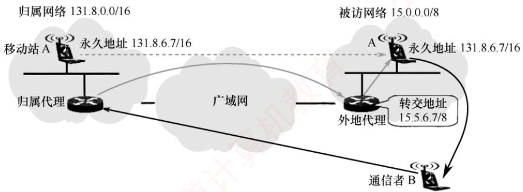

<em>图 4.26 移动 IP 的基本通信过程</em>

　　注意两点：转交地址仅用于移动站、归属代理和外地代理之间的通信，应用程序不会使用该地址。外地代理向被访网络中的移动站发送 IP 分组时，直接通过其 MAC 地址进行链路层交付。

　　在图4.26中，当通信者B希望与移动站A通信时，B无须知晓A的当前位置，只需将A的永久地址作为发送的IP分组的目的地址即可。移动IP的基本通信流程如下：

1）本地通信。移动站 A 位于其归属网络时，按传统的 TCP/IP 方式直接通信。

2）漫游与注册。当移动站A漫游到被访网络时，先向该网络中的外地代理登记，并获得一个临时的转交地址。随后外地代理将该转交地址注册至A的归属代理，完成位置更新。

3）移动站接收数据（B→A）。归属代理截获所有发往移动站 A 的 IP 分组后，构建一条通往转交地址的 IP 隧道，将原始分组封装在新的 IP 包中，并通过该隧道转发至外地代理。外地代理收到后，解封装并还原出原始分组，并直接交付给 A。

4）移动站发送数据（A→B）。移动站 A 在被访网络向外发送 IP 分组时，仍使用其永久地址作为源地址。此时，可直接通过被访网络的外地代理转发，而无须通过归属代理。

5）移动与返回。移动站 A 再次漫游至另一被访网络时，新外地代理会将其新的转交地址注册给 A 的归属代理。无论 A 如何移动，所有发往 A 的 IP 分组均由归属代理统一截获并转发。A 返回归属网络后，向归属代理注销转交地址，恢复本地直连通信。

　　为支持移动 IP 机制，网络层需增加一些新功能：① 移动站到外地代理的登记协议；② 外地代理到归属代理的注册协议；③ 归属代理的隧道封装协议；④ 外地代理的隧道拆封协议。

### 4.6.3 本节习题精选

#### 单项选择题

01. 以下关于移动 IP 工作原理的描述中，错误的是（）。

- A. 移动 IP 的基本工作过程可以分为代理发现、注册、分组路由与注销 4 个阶段
- B. 节点在使用移动 IP 进行通信时，归属代理和外部代理之间需要建立一条隧道
- C. 移动节点到达新的网络后，通过注册过程把自己新的可达信息通知外部代理
- D. 移动 IP 的分组路由可以分为单播、广播与多播

02. 移动 IP 为移动主机设置了两个 IP 地址：归属地址和转交地址，（）。

- A. 这两个地址都是固定的
- B. 这两个地址随主机的移动而动态改变
- C. 归属地址固定，转交地址动态改变
- D. 归属地址动态改变，转交地址固定

03. 一台主机的 IP 地址为 160.80.40.20/16，当它移动到另一个不属于 160.80/16 子网的网络时，它将（）。（能否通过被访网络的路由器直接发送/接收数据报）

- A. 可以直接接收和直接发送数据报，没有任何影响
- B. 既不可以直接接收数据报，又不可以直接发送数据报
- C. 不可以直接发送数据报，但可以直接接收数据报
- D. 可以直接发送数据报，但不可以直接接收数据报

### 4.6.4 答案与解析

#### 单项选择题

**01. C**

　　选项 C 向归属代理通知移动节点的新可达信息（转交地址）。这样，归属代理就可将发往移动节点的分组通过隧道转到转交地址（外部代理），再由外部代理交付给移动节点。

**02. C**

　　移动主机在原始本地网时，获得的是主地址，当它移动到一个外地网络时，需获得一个新的临时辅地址，主地址保持不变；当它移动到另一个外地网络或返回本地网络时，辅地址改变或撤销，而主地址仍然保持不变。选项 C 正确。

**03. D**

　　当其他主机向该主机发送数据报时，使用永久地址 160.80.40.20/16 作为数据报的目的地址，因此会发往该主机的归属代理，归属代理知道该主机的转交地址，然后通过隧道技术将数据报发送到该主机的外地代理，由外地代理转交给该主机。当该主机向其他主机发送数据报时，使用永久地址 160.80.40.20/16 作为数据报的源地址，使用其他主机的 IP 地址作为数据报的目的地址，这个数据报显然没必然再通过该主机的归属代理进行转发，而直接通过外地代理转发。

## 4.7 网络层设备

### 4.7.1 冲突域和广播域

> **考点追踪：** 网络设备对冲突域和广播域的影响（2010、2020）

　　这里的“域”表示冲突或广播在其中发生并传播的区域。

#### 1. 冲突域

　　冲突域是指连接到同一物理介质上的所有节点的集合，这些节点之间存在介质争用的现象。在 OSI 参考模型中，冲突域属于第 1 层（物理层）的概念。第 1 层设备（如集线器、中继器）仅复制和转发信号，不能划分冲突域，其所有端口属于同一个冲突域。第 2 层设备（如网桥、交换机）和第 3 层设备（如路由器）均可划分冲突域。

#### 2. 广播域

　　广播域是指能够接收同一广播帧的所有节点的集合。也就是说，该集合中任一节点发送广播帧，其他能收到该帧的节点均属于此广播域。在 OSI 参考模型中，广播域属于第 2 层（数据链路层）的概念。第 1 层设备（如集线器）和第 2 层设备（如交换机）所连接的节点通常处于同一个广播域。路由器作为第 3 层设备，可以划分广播域，即连接不同的广播域。

　　通常所说的局域网（LAN）在逻辑上等同于一个广播域。路由器用于连接不同的 LAN，即分隔不同的广播域。

### 4.7.2 路由器的组成和功能

> **考点追踪：** 路由器的功能（2010）

　　路由器是一种具有多个输入/输出端口的专用计算机，其任务是互连不同的网络（异构网络）并转发分组。在多个逻辑网络（多个广播域）互连时必须使用路由器，可用于连接不同的 LAN，不同的 VLAN，不同的 WAN，或实现 LAN 与 WAN 的互连。

　　从结构上看，路由器由路由选择（控制平面）和分组转发（数据平面）两部分构成，如图 4.27 所示。而从模型角度看，路由器是工作在网络层的设备，其转发决策基于 IP 地址；为完成此功能，其端口还要具备物理层和数据链路层的处理能力。

　　路由选择部分的核心是路由选择处理机，其任务是根据所选路由选择协议（如 RIP、OSPF）构建路由表，并周期性地与相邻路由器交换路由信息，以更新和维护路由表。

  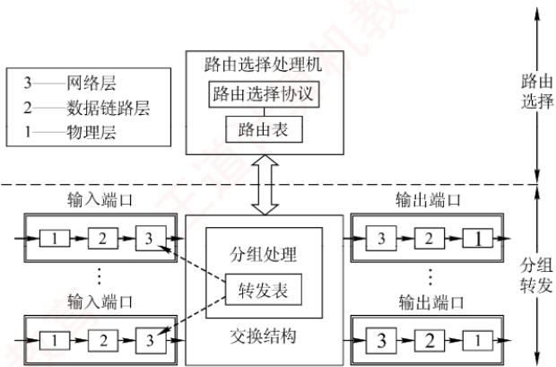

<em>图 4.27 路由器体系结构</em>

　　分组转发部分由三部分组成：交换结构、一组输入端口和一组输出端口。

　　交换结构是路由器内部连接输入与输出端口的高速通路，负责根据转发表将输入端口的分组快速转发至合适的输出端口。交换结构本身就是一个“在路由器中的网络”。

　　路由器的每个端口都包含物理层、数据链路层和网络层的处理模块。输入端口在物理层接收比特流，在数据链路层提取帧并剥离帧头和帧尾后，将分组送入网络层的处理模块。若收到的分组为普通数据分组，则根据目的IP地址查找转发表，经交换结构送至相应的输出端口。若为路由协议分组（如RIP、OSPF报文），则交由路由选择处理机处理。

　　路由器在端口处设有缓冲区，用于暂存待处理或待发送的分组，并可进行差错检测。若分组到达速率超过处理能力，则缓冲区可能溢出，导致后续分组被丢弃。需要说明的是，路由器的物理端口通常兼具输入和输出功能，图4.27中将输入/输出端口分开绘制，仅为方便理解。

### 4.7.3 路由表与分组转发

> **考点追踪：** 路由聚合与路由表构造（2009、2013）

　　路由表是根据路由选择算法得出的，主要用于路由选择。根据历年统考真题可知，标准的路由表通常包含四个字段：目的网络 IP 地址、子网掩码、下一跳 IP 地址、接口。在图 4.28 所示的网络拓扑中，R1 的路由表如表 4.7 所示，其中包含一条指向互联网的默认路由。

  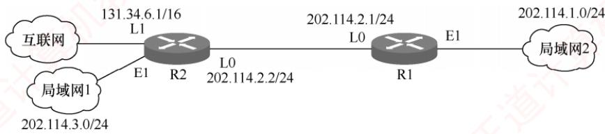

<em>图 4.28 一个简单的网络拓扑</em>

> **考点追踪：** 路由表分组转发匹配过程（2014）

　　表 4.7 R1 的路由表

<table><tr><td>目的网络 IP 地址</td><td>子网掩码</td><td>下一跳 IP 地址</td><td>接口</td></tr><tr><td>202.114.1.0</td><td>255.255.255.0</td><td>直连</td><td>E1</td></tr><tr><td>202.114.2.0</td><td>255.255.255.0</td><td>直连</td><td>L0</td></tr><tr><td>202.114.3.0</td><td>255.255.255.0</td><td>202.114.2.2</td><td>L0</td></tr><tr><td>0.0.0.0</td><td>0.0.0.0</td><td>202.114.2.2</td><td>L0</td></tr></table>

　　转发表由路由表得出，其表项与路由表项有直接的对应关系。但两者的设计目标不同：路由表应使路由计算优化，便于动态更新和拓扑变化处理；转发表应使高速查找优化，用于实际的数据转发过程。转发表通常包含目的网络前缀和对应的下一跳信息。转发表中可配置一条默认路由，当目的地址无法匹配任何明确表项时，分组将按默认路由转发。在实现方式上，路由表通常由软件维护；而转发表既可用软件实现，又可通过专用硬件。

　　注意转发和路由选择的区别：“转发”是单个路由器根据转发表，将收到的IP数据报从合适端口送出的过程，属于数据平面操作；而“路由选择”是多个路由器协同工作，通过路由协议交换拓扑信息，运行路由算法动态生成路由表的过程，属于控制平面操作。

### 4.7.4 本节习题精选

#### 一、单项选择题

01. 要控制网络上的广播风暴，可以采用的方法是（）。

- A. 用交换机将网络分段
- B. 用路由器将网络分段
- C. 将网络转接成 10Base-T
- D. 用网络分析仪跟踪正在发送广播信息的计算机

02. 下列关于冲突域的叙述中，正确的是（）。

- A. 能接收到同一广播帧的所有设备的集合
- B. 能发送同一广播帧的所有设备的集合
- C. 能产生冲突的所有设备的集合
- D. 能隔离冲突的所有设备的集合

03. 下列设备中，能够分隔广播域的是（）。

- A. 集线器
- B. 交换机
- C. 路由器
- D. 中继器

04. 一个局域网与在远处的另一个局域网互连，则需要用到（）。

- A. 物理通信介质和集线器
- B. 网间连接器和集线器
- C. 路由器和广域网技术
- D. 广域网技术

05. 路由器主要实现（）的功能。

- A. 数据链路层、网络层与应用层
- B. 网络层与传输层
- C. 物理层、数据链路层与网络层
- D. 物理层与网络层

06. 下列关于路由器和路由表的说法中，正确的是（）。

- A. 路由器处理的信息量比交换机少，因而转发速度比交换机快
- B. 对于同一目标，路由器只提供延迟最小的最佳路由
- C. 当路由表中的所有表项都不匹配时，按照默认路由进行转发
- D. 路由器不但能够根据IP地址进行转发，而且可以根据物理地址进行转发

　　07.（未使用 CIDR）当一个 IP 分组进行直接交付时，要求发送方和目的站具有相同的（）。

- A. IP 地址
- B. 主机号
- C. 端口号
- D. 子网地址

08. 一个路由器的路由表通常包含（）。

- A. 需要包含到达所有主机的完整路径信息
- B. 需要包含所有到达目的网络的完整路径信息
- C. 需要包含到达目的网络的下一跳路径信息
- D. 需要包含到达所有主机的下一跳路径信息

09. 决定路由器的转发表中的内容的算法是（）。

- A. 指数回退算法
- B. 分组调度算法
- C. 路由算法
- D. 拥塞控制算法

10. 路由器中计算路由信息的是（）。

- A. 输入队列
- B. 输出队列
- C. 交换结构
- D. 路由选择处理机

11. 路由表的分组转发部分由（）组成。

- A. 交换结构
- B. 输入端口
- C. 输出端口
- D. 以上都是

12. 路由器转发分组时，需要进行（）。

- A. 网络层处理和数据链路层处理
- B. 网络层处理和物理层处理
- C. 数据链路层处理和物理层处理
- D. 网络层处理、数据链路层处理和物理层处理

13. 路由器的路由选择部分包括（）。

- A. 路由选择处理机
- B. 路由选择协议
- C. 路由表
- D. 以上都是

14. 不同网络设备传输数据的延迟时间是不同的，下列设备中传输时延最大的是（）。

- A. 局域网交换机
- B. 网桥
- C. 路由器
- D. 集线器

15. 在路由表中设置一条默认路由，则其目的地址和子网掩码应分别置为（）。

- A. 192.168.1.1、255.255.255.0
- B. 127.0.0.0、255.0.0.0
- C. 0.0.0.0、0.0.0.0
- D. 0.0.0.0、255.255.255.255

16. 路由器转发分组（在路由表中已找到匹配的条目）时，会根据路由表中的（）字段来确定输出端口。

- A. 目的网络地址
- B. 下一跳地址
- C. 距离度量值
- D. 接口标识符

17. 路由器能够分割广播域的原因是（）。

- A. 路由器工作在网络层，不转发广播帧
- B. 路由器工作在数据链路层，不转发广播帧
- C. 路由器工作在物理层，不转发广播帧
- D. 路由器工作在传输层，不转发广播帧

18. 如下图所示，用 7 个相同的路由器与 8 台主机相连。链路带宽分为三种，最上层的最快，最下层的最慢，都是全双工方式，图中标注了各层链路带宽的数值。所有路由器的处理速度都很快，远超链路带宽。下列关于网络拥塞分析的说法中，正确的是（）。

  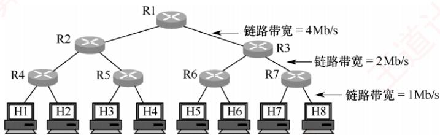

- A. R1-R2链路和R2-R4链路都不可能发生拥塞
- B. R1-R2链路可能发生拥塞，R2-R4链路不可能发生拥塞
- C. R1-R2链路不可能发生拥塞，R2-R4链路可能发生拥塞
- D. R1-R2链路和R2-R4链路都可能发生拥塞

19. 【2010 统考真题】下列网络设备中，能够抑制广播风暴的是（）。I中继器II集线器III网桥IV路由器

- A. 仅I和II
- B. 仅III
- C. 仅III和IV
- D. 仅IV

20. 【2012 统考真题】下列关于 IP 路由器功能的描述中，正确的是（）。
 I. 运行路由协议，设置路由表
 II. 监测到拥塞时，合理丢弃 IP 分组
 III. 对收到的 IP 分组头进行差错检验，确保传输的 IP 分组不丢失
 IV. 根据收到的 IP 分组的目的 IP 地址，将其转发到合适的输出线路上

- A. 仅 III、IV
- B. 仅 I、II、III
- C. 仅 I、II、IV
- D. I、II、III、IV

21. 【2020 统考真题】下图所示的网络中，冲突域和广播域的个数分别是（）。

  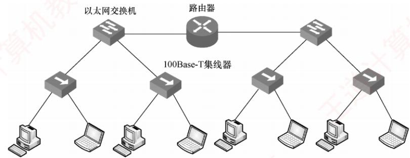

- A. 2, 2
- B. 2, 4
- C. 4, 2
- D. 4, 4

#### 二、综合应用题

01. 某个单位的网点由4个子网组成，结构如下图所示，其中主机H1、H2、H3和H4的IP地址和子网掩码见下表。

  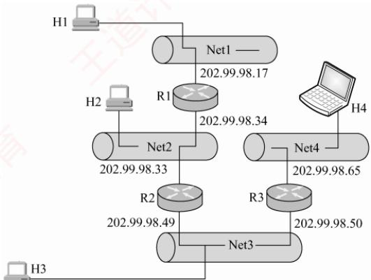

<table><tr><td>主机</td><td>IP地址</td><td>子网掩码</td></tr><tr><td>H1</td><td>202.99.98.18</td><td>255.255.255.240</td></tr><tr><td>H2</td><td>202.99.98.35</td><td>255.255.255.240</td></tr><tr><td>H3</td><td>202.99.98.51</td><td>255.255.255.240</td></tr><tr><td>H4</td><td>202.99.98.66</td><td>255.255.255.240</td></tr></table>

1）请写出路由器R1到4个子网的路由表。

2）描述主机H1发送一个IP数据报到主机H2的过程（包括物理地址解析过程）。

02. 试简述路由器的路由功能和转发功能。

03. 【2019 统考真题】某网络拓扑如下图所示，其中 R 为路由器，主机 H1～H4 的 IP 地址配置以及 R 的各接口 IP 地址配置如图中所示。现有若干以太网交换机（无 VLAN 功能）

　　和路由器这两类网络互连设备可供选择。

  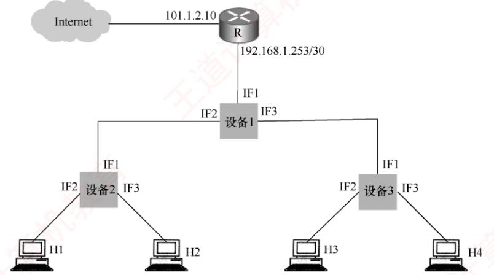

　　IP地址：192.168.1.2./26 IP地址：192.168.1.3./26 IP地址：192.168.1.66./26 IP地址：192.168.1.67./26 默认网关：192.168.1.1 默认网关：192.168.1.1 默认网关：192.168.1.65 默认网关：192.168.1.65

　　请回答下列问题:

1）设备1、设备2和设备3分别应选择什么类型的网络设备？

2）设备1、设备2和设备3中，哪几个设备的接口需要配置IP地址？为对应的接口配置正确的IP地址。

3）为确保主机 H1～H4 能够访问 Internet，R 需要提供什么服务？

4）若主机H3发送一个目的地址为192.168.1.127的IP数据报，网络中哪几个主机会接收该数据报？

### 4.7.5 答案与解析

#### 一、单项选择题

**01. B**

　　网桥和交换机是第二层设备，能够分割冲突域，但不能分割广播域。路由器是第三层设备，不转发全网广播（目的地255.255.255.255），因此可以分割广播域。

**02. C**

　　冲突域是指能产生冲突的所有设备的集合，也就是说，若这些设备同时发送数据，则会发生信号干扰和冲突。冲突域的大小取决于网络拓扑和设备类型。

**03. C**

　　路由器工作在网络层，不转发广播包（目的地址为255.255.255.255的IP包），因此能够分隔广播域，抑制网络风暴。交换机工作在数据链路层，能够分隔冲突域，但不能分隔广播域。集线器和中继器是物理层设备，既不能分隔广播域，又不能分隔冲突域。

**04. C**

　　局域网的互连需要路由器作为连接设备，同时是远程的局域网，因此要用到广域网技术。

**05. C**

　　路由器是网络层设备，所以它也必须处理网络层以下的功能，即物理层和数据链路层。而传输层和应用层是网络层之上的，它们使用网络层的接口，路由器不实现它们的功能。

**06. C**

　　路由器是第三层设备，要处理的内容比第二层设备交换机更多，因而转发速度比交换机慢，选项 A 错误。虽然一些路由协议也将延迟等指标作为参数进行路由选择，但路由协议使用得最多的参数是传输距离，此外还有一些其他参数，选项 B 错误。默认路由的匹配优先级最低，只要目的网络不在转发表中，就一律选择默认路由转发，选项 C 正确。路由器只能根据 IP 地址进行转发，选项 D 错误。

**07. D**

　　判断一个 IP 分组的交付方式是直接交付还是间接交付，路由器需要根据分组的目的 IP 地址和该路由器接收端口的 IP 地址是否属于同一个子网来判断。具体来说，将该分组的源 IP 地址和目的 IP 地址分别与子网掩码进行 “与” 操作，若得到的子网地址相同，则该分组就采用直接交付方式，否则采用间接交付方式。

**08. C**

　　路由表中包含到目的网络的下一跳路径信息。由路由表表项的组成也不难得出正确答案为选项 C。路由表也不可能包含到达所有主机的下一跳信息，否则路由转发将是不可想象的。

**09. C**

　　转发表是根据路由表生成的，路由表又是由路由算法得到的，因此路由算法决定了转发表中的内容。

**10. D**

　　路由选择处理机的任务是根据所选定的路由选择协议构造路由表，同时经常或定期地与相邻路由器交换路由信息而不断地更新和维护路由表。

**11. D**

　　分组转发部分包括 3 部分：① 交换结构，根据转发表对分组进行处理，将某个输入端口进入的分组从一个合适的输出端口转发出去。② 输入端口，包括物理层、数据链路层和网络层的处理模块。③ 输出端口，负责从交换结构接收分组，再将其发送到路由器外面的线路上。

**12. D**

　　路由器的端口中有物理层、数据链路层和网络层的处理模块。输入端口在物理层接收比特流，在数据链路层提取出帧，剥去帧的首部和尾部后，分组就被送入网络层的处理模块；输出端口执行相反的操作。网络层处理模块根据分组的目的地址，查找转发表，决定输出端口。

**13. D**

　　路由器的路由选择部分包括 3 部分：① 路由选择处理机，它根据所选定的路由选择协议构造路由表，同时和相邻路由器交换路由信息。② 路由选择协议，用来更新路由表的算法。③ 路由表，它是根据路由算法得出的，一般包括从目的网络到下一跳的映射。

**14. C**

　　路由器具有较大的传输时延，因为它需要根据所接收的每个分组首部中的 IP 地址决定是否转发分组，处理分组首部的任务一般由软件完成，将带来较长的处理时间。因为局域网交换机由硬件进行帧的转发，而且不关心数据链路层以上的数据，所以具有比路由器要小得多的传输时延。从数量级上看，若局域网交换机的传输时延为几十微秒，则路由器的传输时延为几千微秒。集线器的每个接口都具有收发功能，当某个接口收到信号时，立即向所有其他接口转发，因此其传输时延最小。

**15. C**

　　路由表中默认路由的目的地址和子网掩码都是0.0.0.0。

**16. D**

　　输出端口就是路由器的接口，每个接口都有一个标识符，如 G0/0 等。路由表中的每个条目都会指定一个接口标识符，路由器转发分组时，根据路由表中的接口标识符来确定输出端口。

**17. A**

　　交换机会转发广播帧，所以同一台交换机下的所有设备都在一个广播域中。路由器不会转发广播帧，因为路由器工作在网络层，它只关心IP地址，而不关心MAC地址。

**18. C**

　　R1-R2 链路上的数据率在任何时候都不可能超过 4Mb/s，因此不可能发生拥塞。对于 R2-R4 链路，考虑这种情况：H5 和 H6 同时以 1Mb/s 的速率向 H1 发送数据，H7 和 H8 同时以 1Mb/s 的速率向 H2 发送数据。此时，R1 右边的所有链路都正常工作，R1-R2 链路也正常工作，都没有超过这些链路的带宽。但是，若这些数据全部都通过 R2 转发，再通过带宽为 2Mb/s 的 R2-R4 链路分别发送给主机 H1 和 H2，则显然是不可能的，于是在 R2 的输入缓存中，进来的数据比出去的要多，数据堆积得越来越多，发送不出去，产生拥塞。选项 C 正确。

**19. D**

　　中继器和集线器工作在物理层，既不隔离冲突域也不隔离广播域。为了解决冲突域的问题，人们利用网桥和交换机来分隔各个网段中的通信量，建立多个分离的冲突域，但当网桥和交换机接收到一个未知转发信息的数据帧时，为了保证该帧能被目的节点正确接收，将该帧从所有的端口广播出去，可以看出网桥和交换机的冲突域等于端口个数，广播域为1。路由器可以隔离广播域和冲突域，要屏蔽数据链路层的广播帧，当然应该是网络层设备路由器。在此题的选项中，路由器是其中最高层的网络设备，其他设备能隔离的，路由器一定能隔离。

**20. C**

　　说法 I 和 IV 显然是路由器的功能。对于说法 II，当路由器监测到拥塞时，可合理丢弃 IP 分组，并向发出该 IP 分组的源主机发送一个源点抑制的 ICMP 报文（最新标准已不再使用）。对于说法 III，路由器对收到的 IP 分组首部进行差错检验，丢弃有差错首部的报文，但不保证 IP 分组不丢失。

**21. C**

　　网络层设备路由器可以隔离广播域和冲突域；数据链路层设备交换机只能隔离冲突域；物理层设备集线器、中继器既不隔离冲突域也不隔离广播域。因此共有2个广播域，4个冲突域。

  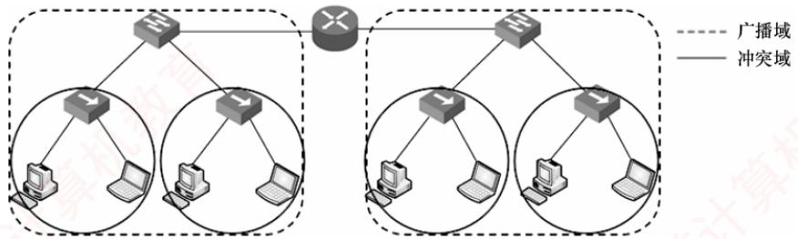

#### 二、综合应用题

**01. 【解答】**

1）将 H1、H2、H3、H4 的 IP 地址分别与它们的子网掩码进行 “与” 操作，可得到 4 个子网的网络地址，分别为 202.99.98.16、202.99.98.32、202.99.98.48、202.99.98.64，因此路由器 R1 到 4 个子网的路由表见下表。

<table><tr><td>目的网络</td><td>子网掩码</td><td>下一跳</td></tr><tr><td>202.99.98.16</td><td>255.255.255.240</td><td>直接</td></tr><tr><td>202.99.98.32</td><td>255.255.255.240</td><td>直接</td></tr><tr><td>202.99.98.48</td><td>255.255.255.240</td><td>202.99.98.33</td></tr><tr><td>202.99.98.64</td><td>255.255.255.240</td><td>202.99.98.33</td></tr></table>

2）主机 H1 向主机 H2 发送一个 IP 数据报的过程如下：

　　① 主机 H1 首先构造一个源 IP 地址为 202.99.98.18、目的 IP 地址为 202.99.98.35 的 IP 数据报，主机 H1 先把本子网的子网掩码与 H2 的 IP 地址逐位 “与”，所得结果不等于 H1 的网络地址，因此 H1 与 H2 不在同一子网，无法直接交付，然后将该数据报传送给数据链路层。

　　② 主机 H1 通过 ARP 获得路由器 R1（202.99.98.17）对应的 MAC 地址，并将其作为目的 MAC 地址，将 H1 的 MAC 地址作为源 MAC 地址填入封装有 IP 数据报的帧，然后将该帧发送出去。

　　③ 路由器 R1 收到该帧后，去掉帧头与帧尾，得到 IP 数据报，然后根据 IP 数据报中的目的 IP 地址（202.99.98.35）去查找路由表，得到下一跳地址为直接相连。

　　④ 路由器 R1 通过 ARP 得到主机 H2 的 MAC 地址，并将其作为目的 MAC 地址，将 R1 的 MAC 地址作为源 MAC 地址填入封装有 IP 数据报的帧，然后将该帧发送到子网 Net2 上。

　　⑤ 主机 H2 将收到的帧，去除帧头与帧尾，并最终得到从主机 H1 发来的 IP 数据报。

> **注意：**

　　在②（发出的帧）中，帧的目的 MAC 地址为默认网关的 MAC 地址；在④（接收的帧）中，帧的源 MAC 地址为默认网关的 MAC 地址。

**02. 【解答】**

　　转发即当一个分组到达时所采取的动作。在路由器中，每个分组到达时对它进行处理，它在路由表中查找分组所对应的输出线路。通过查得的结果，将分组发送到正确的线路上。

　　路由算法是网络层软件的一部分，它负责确定一个进来的分组应该被传送到哪条输出线路上。路由算法负责填充和更新路由表，转发功能则根据路由表的内容来确定当每个分组到来时应该采取什么动作（如从哪个端口转发出去）。

**03. 【解答】**

1）以太网交换机（无 VLAN 功能）连接的若干 LAN 仍然是一个网络（同一个广播域），路由器可以连接不同的 LAN、不同的 WAN 或把 WAN 和 LAN 互连起来，隔离了广播域。IP 地址 192.168.1.2/26 与 192.168.1.3/26 的网络前缀均为 192.168.1.0，视为 LAN1。IP 地址 192.168.1.66/26 与 192.168.1.67/26 的网络前缀均为 192.168.1.64，视为 LAN2。所以设备 1 为路由器，设备 2、3 为以太网交换机。

2）设备1为路由器，其接口应配置IP地址。IF1接口与路由器R相连，其相连接口的IP地址为192.168.1.253/30，253的二进制表示形式为11111101，因此IF1接口的网络前缀也应为192.168.1.111111，已分配192.168.1.253，去除全0和全1，IF1接口的IP地址应为192.168.1.254。LAN1的默认网关为192.168.1.1，LAN2的默认网关为192.168.1.65，网关的IP地址是具有路由功能的设备的IP地址，通常默认网关地址就是路由器中的LAN端口地址，设备1的IF2、IF3接口的IP地址分别设置为192.168.1.1和192.168.1.65。

3）私有地址段：C 类 192.168.0.0～192.168.255.255，即 H1～H4 均为私有 IP 地址，若要能够访问 Internet，R 需要提供 NAT 服务，即网络地址转换服务。

4）主机 H3 发送一个目的地址为 192.168.1.127 的 IP 数据报，主机号全为 1，为本网络的广播地址，因为路由器可以隔离广播域，所以只有主机 H4 会接收到数据报。

## 4.8 本章小结及疑难点

1. “尽最大努力交付”有哪些含义？

1）不保证 IP 数据报无差错地到达目的主机；

2）不保证在规定时间内交付；

3）不保证按发送顺序交付；

4）不保证不重复交付；

5）不主动丢弃数据报。仅在以下情况丢弃：首部检验和出错，或因缓存满而无法处理。

　　IP 首部包含 “首部检验和” 字段。凡交付给目的主机的 IP 数据报，其首部均未检出差错（有错即被丢弃）。因此，IP 层可确保首部完整性，但不保证数据部分正确性或传输可靠性。目前互联网绝大多数流量基于此模型。若应用需要可靠传输，则由高层协议（如 TCP）实现。

2. 假定在一个局域网中，计算机A广播ARP请求以获取计算机B的硬件地址，此时由谁发送ARP响应？返回的是谁的硬件地址？

- 若 A 与 B 在同一局域网：计算机 B 收到 ARP 请求后，直接向 A 单播 ARP 响应，返回 B 自身的硬件地址。

- 若 B 不在 A 所在局域网：A 的 ARP 请求无法到达 B。此时，连接该局域网的路由器（A 的默认网关）会代理响应，向 A 返回路由器在该局域网接口的硬件地址。

3. 数据报首部只有源和目的IP地址，未指明下一跳路由器，如何确定转发路径？

　　路由器收到数据报后，根据路由表查出下一跳的 IP 地址，但不会修改 IP 数据报内容。该 IP 地址随后交由数据链路层处理：通过 ARP 将下一跳 IP 地址解析为对应的 MAC 地址，并填入 MAC 帧首部，从而在物理网络中正确送达下一跳。此过程对每个数据报重复执行。

　　那么，能否在路由表中直接使用硬件地址以避免 ARP 查询？

　　答案是不能。IP 地址的抽象性屏蔽了底层网络差异，是互联网可扩展性的基础。若路由表直接使用平面化的硬件地址，将导致表项数量剧增、管理复杂，反而得不偿失。

4. “路由器实现了物理层、数据链路层、网络层”的含义是什么？

　　这句话是指：路由器具备处理物理层、数据链路层和网络层协议的能力。具体而言：

- 在物理层，路由器能接收和发送比特流；

- 在数据链路层，它能识别帧结构、解析MAC地址，并完成帧的解封装与重新封装；

- 在网络层，它能读取IP数据报首部，根据目的IP地址查询路由表，做出转发决策。

　　因此，当路由器转发数据时，会先解封装输入帧，提取出 IP 数据报，再根据下一跳接口重新封装成适合输出链路的新帧。正是这种能力，使路由器可以互连底层技术不同的网络（例如以太网与 PPP 链路）。这与仅工作在物理层的中继器或仅在数据链路层的交换机有本质区别。
