## 【考纲内容】

（一）传输层提供的服务

　　传输层的功能；传输层的寻址与端口；无连接服务与面向连接服务

（二）UDP

　　UDP 数据报；UDP 检验

（三）TCP

　　TCP 报文段；TCP 连接管理；TCP 可靠传输；TCP 流量控制与拥塞控制

## 【复习提示】

　　传输层是整个网络体系结构中的关键层次。要求掌握传输层在计算机网络中的功能、工作方式及原理等，掌握 UDP 及 TCP（如首部格式、可靠传输、流量控制、拥塞控制、连接管理等）。其中，TCP 报文分析、连接管理、流量控制与拥塞控制机制，出选择题、综合题的概率均较大，因此要将其工作原理透彻掌握，以便能在具体的题目中灵活运用。

## 5.1 传输层提供的服务

### 5.1.1 传输层的功能

　　数据链路层提供链路上相邻节点之间的逻辑通信，网络层提供主机之间的逻辑通信。传输层位于网络层之上、应用层之下，为运行在不同主机上的进程之间提供逻辑通信 。传输层是面向通信部分的最高层，同时也是用户功能中的最低层。即使网络层协议不可靠（例如，导致分组丢失、失序或重复），传输层仍能为应用程序提供可靠的服务。

　　以图 5.1 为例说明传输层的作用。假设局域网 LAN1 上的主机 A 和局域网 LAN2 上的主机 B 通过互连的广域网 WAN 进行通信。一台主机中常有多个应用进程同时与另一台主机中的多个应用进程通信，其中 APx 表示主机中参与通信的应用进程。传输层的主要功能如下。

#### 1. 应用进程之间的逻辑通信

　　从网络层角度看，通信的两端是两台主机，IP 数据报首部指明了这两台主机的 IP 地址。但“主机之间的通信”的实质是主机中应用进程之间的通信，也称为端到端的逻辑通信。IP 虽能将分组送达目的主机，但该分组仅停留在主机的网络层，并未交付给具体的应用进程。而从传输层视角看，通信的真正端点并非主机，而是主机中的进程。

  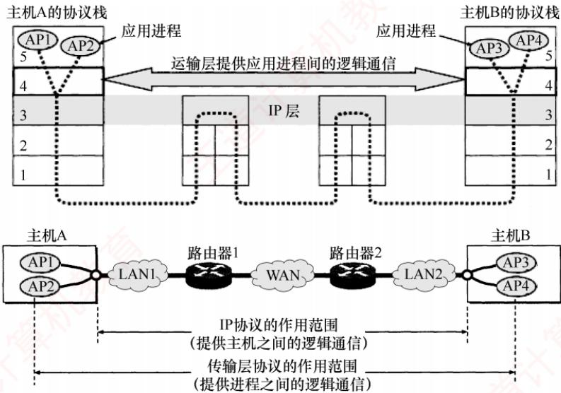

<em>图 5.1 传输层为相互通信的进程提供逻辑通信</em>

#### 2. 复用和分用

　　复用是指发送方的多个应用进程可使用同一个传输层协议传送数据。分用是指接收方的传输层在剥去报文首部后，能将数据正确交付给对应的目的应用进程。

> **注意：**

　　网络层也具备复用和分用的功能，但其复用是指将不同传输层协议的数据封装成 IP 数据报发送；分用则是指接收方网络层根据首部的协议字段，将数据交付给相应的传输层协议。

#### 3. 差错检测

　　传输层对收到的整个报文（包括首部和数据部分）进行差错检测。对于 TCP，若接收方发现报文段出错，则要求发送方重传。对于 UDP，若发现数据报出错，则直接丢弃。相比之下，网络层的 IP 数据报仅对其首部进行校验，不检查数据部分。

#### 4. 提供面向连接和无连接的传输服务

　　传输层向上层屏蔽了底层网络的复杂性（如拓扑结构、路由协议等），使应用进程感知到的是一条端到端的逻辑通信信道。该信道的特性取决于所采用的传输层协议：使用 TCP（面向连接）时，尽管底层网络仅提供“尽最大努力”的服务，逻辑信道仍表现为一条全双工的可靠信道；使用 UDP（无连接）时，逻辑信道则仍为不可靠信道。

### 5.1.2 传输层的寻址与端口

#### 1. 端口的作用

　　端口是传输层与应用层交互的接口：应用进程通过端口将数据向下交付给传输层；传输层则通过端口将收到的数据向上交付给正确的应用进程。发送时，应用进程将数据送至指定端口，传输层读取后封装并发送；接收时，传输层将数据送至对应端口，应用进程从中读取。TCP和UDP通过首部中的源端口和目的端口两个字段，实现传输层与应用层之间的服务访问。

> **注意：**

　　数据链路层的服务访问点是帧的“类型”字段，网络层的服务访问点是IP数据报的“协议”字段，传输层的服务访问点是“端口号”字段，应用层的服务访问点是“用户界面”。

#### 2. 端口号

　　应用进程通过端口号标识，端口号长度为 16 比特，可表示 65536（即 $2^{16}$ ）个不同的端口号。端口号仅具有本地意义，即只用于标识本机应用层中的进程；不同主机的相同端口号是没有关联的，且 UDP 和 TCP 的端口号彼此也是独立的。

　　根据用途，可将端口分为两类。

1）服务器端使用的端口号。又分为两类：① 熟知端口号（0～1023），由 IANA 分配给最重要的 TCP/IP 应用程序，供所有用户熟知；② 登记端口号（1024～49151），供未获熟知端口号的应用程序使用，需在 IANA 登记以避免冲突。常见熟知端口号如下：

<table><tr><td>应用程序</td><td>FTP</td><td>TELNET</td><td>SMTP</td><td>DNS</td><td>TFTP</td><td>HTTP</td><td>SNMP</td></tr><tr><td>熟知端口号</td><td>21</td><td>23</td><td>25</td><td>53</td><td>69</td><td>80</td><td>161</td></tr></table>

2）客户端使用的端口号（49152～65535）。此类端口号在客户进程运行时动态分配，故又称短暂端口号。服务器从客户报文中提取源端口号，并将其作为回送数据的目的端口。通信结束后，该临时端口号被系统回收，可供其他客户进程复用。

#### 3. 套接字

　　在网络中，通过 IP 地址区分不同的主机，通过端口号区分同一主机中的不同应用进程，将端口号与 IP 地址拼接，即构成套接字（Socket）：

$$
\text { 套接字 } (\text { Socket }) = (\text { IP   地址:   端口号 })
$$

　　套接字唯一标识网络中某台主机上的一个应用进程，是通信的端点。

　　在通信过程中，主机 A 发往主机 B 的报文包含目的端口和源端口。其中，源端口构成 “返回地址” 的一部分；当 B 回复 A 时，其报文的目的端口即为 A 原报文中的源端口。注意：同一 IP 地址可参与多个 TCP 连接，同一端口号也可出现在多个不同的 TCP 连接中。

### 5.1.3 无连接服务与面向连接服务

　　TCP/IP 协议族在 IP 层之上定义了两个主要的传输协议：

- TCP（传输控制协议）：面向连接，提供可靠的全双工逻辑信道。

- UDP（用户数据报协议）：无连接，提供不可靠的逻辑信道。

　　TCP 要求通信双方在数据传输前先建立连接，传输结束后释放连接。TCP 不提供广播或多播服务。TCP 通过确认、流量控制、计时器和连接管理等机制保障可靠传输，但代价是首部开销大、处理资源消耗高。因此，TCP 适用于对可靠性要求高的场景，如 FTP、HTTP、SMTP 等。

　　UDP 无须建立连接，接收方收到数据报后，也不发送确认。它在 IP 层之上仅提供两项服务：多路复用与分用、数据差错检测。由于结构简单、开销小，UDP 执行效率高、实时性好，适用于对时延敏感、可容忍少量丢包的应用，如 TFTP、DNS、DHCP 和 RIP 等。

　　表 5.1 列出了一些典型互联网应用及其对应的传输层协议。

　　表 5.1 一些典型互联网应用及其对应的传输层协议

<table><tr><td>互联网应用</td><td>TCP/IP 应用层协议</td><td>TCP/IP 传输层协议</td></tr><tr><td>域名解析</td><td>域名系统(DNS)</td><td>UDP</td></tr><tr><td>文件传送</td><td>简单文件传送协议(TFTP)</td><td>UDP</td></tr><tr><td>路由选择</td><td>路由信息协议(RIP)</td><td>UDP</td></tr><tr><td>IP 地址分配</td><td>动态主机配置协议(DHCP)</td><td>UDP</td></tr><tr><td>网络管理</td><td>简单网络管理协议(SNMP)</td><td>UDP</td></tr><tr><td>电子邮件</td><td>简单邮件传送协议(SMTP)</td><td>TCP</td></tr><tr><td>远程终端接入</td><td>远程终端协议(TELNET)</td><td>TCP</td></tr><tr><td>万维网</td><td>超文本传送协议(HTTP)</td><td>TCP</td></tr><tr><td>文件传送</td><td>文件传送协议(FTP)</td><td>TCP</td></tr></table>

> **注意：**

　　IP 数据报和 UDP 数据报的区别：IP 数据报在网络层需经路由器存储转发；而 UDP 数据报作为 IP 数据报的载荷，在网络层传输时，其内容对路由器不可见。

### 5.1.4 本节习题精选

#### 单项选择题

01. 在 OSI 参考模型中，提供端到端的透明传输服务、差错控制和流量控制的层是（）。

- A. 物理层
- B. 网络层
- C. 传输层
- D. 会话层

02. 传输层为（）之间提供逻辑通信。

- A. 主机
- B. 进程
- C. 路由器
- D. 操作系统

03. 下列关于传输层的面向连接服务特性的说法中，正确的是（）。

- A. 不保证可靠和顺序交付
- B. 不保证可靠但保证顺序交付
- C. 保证可靠但不保证顺序交付
- D. 保证可靠和顺序交付

04. 在 TCP/IP 模型中，传输层的主要作用是在互联网的源主机和目的主机对等实体之间建立用于会话的（）。

- A. 操作连接
- B. 点到点连接
- C. 控制连接
- D. 端到端连接

05. 可靠传输协议中的“可靠”指的是（）。

- A. 使用面向连接的会话
- B. 使用尽力而为的传输
- C. 使用滑动窗口来维持可靠性
- D. 使用确认机制来确保传输的数据不丢失

06. 下列选项中，（）能够唯一确定一个在互联网上通信的进程。

- A. 主机名
- B. IP 地址及 MAC 地址
- C. MAC 地址及端口号
- D. IP 地址及端口号

07. 在（）范围内的端口号被称为熟知端口号并限制使用，这些端口号是为常用的应用层协议如 FTP、HTTP 等保留的。

- A. 0～127
- B. 0～255
- C. 0～511
- D. 0～1023

08. 下列哪个 TCP 熟知端口号是错误的？（）

- A. TELNET:23
- B. SMTP:25
- C. HTTP:80
- D. FTP:24

09. 下列关于 TCP 和 UDP 端口的说法中，正确的是（）。

- A. TCP 和 UDP 分别拥有自己的端口号，它们互不干扰，可以共存于同一台主机
- B. TCP 和 UDP 分别拥有自己的端口号，但它们不能共存于同一台主机
- C. TCP 和 UDP 的端口没有本质区别，但它们不能共存于同一台主机
- D. 当一个 TCP 连接建立时，它们互不干扰，不能共存于同一台主机

10. 下列关于传输层及相关协议的说法中，错误的是（）。

- A. 传输层是OSI参考模型的第四层
- B. 传输层提供的是主机间的点到点数据传输
- C. TCP是面向连接的，UDP是无连接的
- D. TCP进行流量控制和拥塞控制，而UDP既不进行流量控制，又不进行拥塞控制

### 5.1.5 答案与解析

#### 单项选择题

**01. C**

　　端到端即进程到进程，物理层只提供节点之间的比特流传输服务，网络层提供主机到主机的通信服务，主要功能是路由选择。本题条件若换成 TCP/IP 模型，答案依然是选项 C。

**02. B**

　　传输层提供的是端到端服务，为进程之间提供逻辑通信。

**03. D**

　　面向连接服务是指通信双方在进行通信之前，要先建立一个完整的连接，在通信过程中，整个连接一直可以被实时地监控和管理。通信完毕后释放连接。面向连接的服务可以保证数据的可靠和顺序交付。

**04. D**

　　传输层的主要作用是在源主机进程和目的主机进程之间提供端到端的数据传输。一般来说，端到端通信是由一段段的点到点信道构成的，端到端协议建立在点到点协议的基础之上。

**05. D**

　　若一个协议使用确认机制对传输的数据进行确认，则可以认为它是一个可靠的协议；若一个协议采用“尽力而为”的传输方式，则是不可靠的。例如，TCP对传输的报文段提供确认，因此是可靠的传输协议；而UDP不提供确认，因此是不可靠的传输协议。

**06. D**

　　要在互联网上唯一确定一个进程，就要使用 IP 地址和端口号的组合，通常称为套接字（Socket），IP 地址确定某主机，端口号确定该主机上的某进程。

**07. D**

　　熟知端口号的数值为 0～1023，登记端口号的数值是 1024～49151，客户端使用的端口号的数值是 49152～65535。

**08. D**

　　FTP 控制连接的端口是 21，数据连接的端口是 20。

**09. A**

　　端口号只具有本地意义，即端口号只标识本计算机应用层中的各个进程。同一台计算机中的TCP和UDP分别拥有自己的端口号，它们互不干扰，因此UDP和TCP可以使用相同的端口号。

**10. B**

　　传输层是 OSI 参考模型中的第 4 层，TCP 是面向连接的，它提供流量控制和拥塞控制，保证服务可靠；UDP 是无连接的，不提供流量控制和拥塞控制，只能做出尽最大努力的交付。传输层提供的是进程到进程间的传输服务，也称端到端服务。

## 5.2 UDP

### 5.2.1 UDP 数据报

#### 1. UDP 概述

　　UDP 仅在 IP 层的数据报服务之上增加了复用、分用和差错检测的功能。若应用开发者选择 UDP 而非 TCP，则应用程序几乎直接与 IP 打交道。尽管 TCP 提供可靠服务，而 UDP 不提供，但 TCP 并非总是首选。许多应用更适合采用 UDP，主要原因如下。

> **考点追踪：** UDP 协议的优点（2014、2024）

1）UDP 是无连接的，没有建立连接的时延。TCP 需要在主机中维护连接状态（包括发送和接收缓存、拥塞控制参数、序号和确认序号等），而 UDP 无须维护这些状态。

2）UDP 是面向报文的。发送方 UDP 对应用层交下的报文，在添加首部后即向下交付给 IP 层，一次发送一个完整的报文（不可分割），既不合并也不拆分，而是保留报文的边界。因此，应用程序必须选择合适大小的报文，若报文太长，则交付给 IP 层后，可能导致分片；若报文太短，则会使 IP 首部的开销占比过大。两者均会降低传输效率。相比之下，TCP 是面向字节流的，每个字节都有编号，支持自动拆分与重组，对报文长度无限制。

3）UDP 的首部开销小，仅有 8B；而 TCP 首部至少 20B。

4）UDP 支持一对一、一对多和多对多的通信。TCP 仅支持一对一的通信。

5）UDP 没有拥塞控制，因此网络拥塞不会影响源主机的发送速率。某些实时应用要求以稳定的速率发送数据，可以容忍少量丢包，但无法接受较大的传输时延。

　　UDP 常用于一次性传输少量数据的应用（如 DNS、DHCP 等），因为 TCP 的连接建立、维护和释放会带来显著开销。UDP 也广泛用于多媒体应用（如视频会议、流媒体等），因为这些应用更关注低时延而非可靠性，而 TCP 的拥塞控制会引入不可接受的延迟。

　　UDP 不保证可靠交付, 但这并不意味着应用不要求可靠性——所有可靠性机制可由应用层自行实现, 开发者可根据需求灵活设计。

#### 2. UDP 的首部格式

　　UDP 数据报包含两部分：首部字段和数据字段。UDP 首部有 8B，由 4 个字段组成，每个字段的长度都是 2B，如图 5.2 所示。各个字段的意义如下：

> **考点追踪：** UDP 的首部格式及字段含义（2018）

1）源端口号。发送进程的端口号。需要对方回复时选用，不需要回复时可置为全0。

2）目的端口号。接收进程的端口号。该字段在所有 UDP 报文中都必须有效。

> **考点追踪：** UDP 首部的长度（2021）

3）长度。UDP 数据报的长度（包括首部和数据），其最小值是 8（仅有首部）。

4）检验和。由发送方的传输层计算并写入，接收方的传输层检测是否有差错，有错就丢弃。

　　在 IPv4 中，该字段可置为全 0 表示未使用（但不建议），在 IPv6 中则强制启用。

　　当传输层从 IP 层收到 UDP 数据报时，就根据首部中的目的端口，把 UDP 数据报通过相应的端口，上交给最后的终点——应用进程，如图 5.3 所示。

  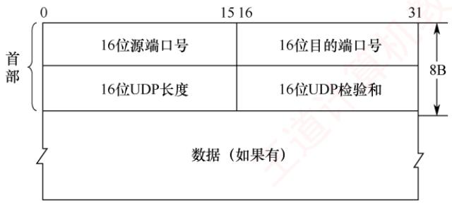

<em>图 5.2 UDP 数据报格式</em>

  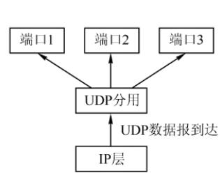

<em>图 5.3 UDP 基于端口的分用</em>

　　若接收方 UDP 发现收到的报文中的目的端口号不正确（不存在对应于端口号的应用进程），则丢弃该报文，并由 ICMP 发送 “端口不可达” 差错报文给发送方。

### 5.2.2 UDP 检验

> **考点追踪：** UDP检验的原理（2025）

　　在计算检验和时，要在 UDP 数据报之前增加 12B 的伪首部，伪首部并不是 UDP 的真正首部。只是在计算检验和时，临时添加在 UDP 数据报的前面，得到一个临时的 UDP 数据报。检验和就是按照这个临时的 UDP 数据报来计算的。伪首部既不向下传递给网络层，也不向上递交给应用层，而只是为了计算检验和。图 5.4 给出了 UDP 数据报的首部和伪首部。

  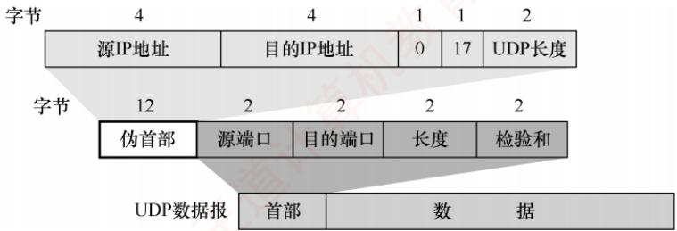

<em>图 5.4 UDP 数据报的首部和伪首部</em>

　　UDP 检验和的计算方法与 IP 首部检验和基本类似。不同之处在于：IP 检验和只检验 IP 数据报的首部，而 UDP 检验和把首部和数据部分一起检验。

　　UDP 计算检验和的过程：在发送方，首先将检验和字段置为全 0，然后将伪首部与 UDP 数据报视为一连串 16 位字。若 UDP 数据部分的长度为奇数个字节，则在计算时末尾补一个全 0B（该填充字节仅在计算检验和时临时添加，不影响实际发送的数据内容）。随后，按二进制反码规则对所有 16 位字求和，并将结果的反码填入检验和字段后发送。在接收方，将收到的 UDP 数据报与伪首部重新组合（同样在必要时补全字节），再按二进制反码求和。若无差错，则结果应为全 1（16 位全为 1）；否则说明有差错，接收方应丢弃该 UDP 数据报。

> **考点追踪：** UDP 检验和的计算（2024）

　　二进制反码求和的运算规则：① 从低位到高位逐列进行计算， $0+0=0,\quad0+1=1,\quad1+1=0$ 并产生进位1；② 若最高位相加后产生进位，则需将该进位加到结果的最低位，该过程称为回卷。以下通过一个简单示例说明，假设有以下3个16位字：

　　先将前两个字相加，得

$$
\begin{array}{c} 0 1 1 0 0 1 1 0   0 1 1 0 0 0 0 0 \\ \hline 0 1 0 1 0 1 0 1   0 1 0 1 0 1 0 1 \\ \hline 1 0 1 1 1 0 1 1   1 0 1 1 0 1 0 1 \end{array}
$$

　　再将结果与第三个字相加（最高位产生进位，需加至最低位），得

$$
\begin{array}{c} 1 0 1 1 1 0 1 1 \quad 1 0 1 1 0 1 0 1 \\ 1 0 0 0 1 1 1 1 \quad 0 0 0 0 1 1 0 0 \\ \hline 0 1 0 0 1 0 1 0 \quad 1 1 0 0 0 0 0 1 \end{array}
$$

$$
+ \frac {1}{0 1 0 0 1 0 1 0   1 1 0 0 0 0 1 0}
$$

　　←进位加至最低位

　　最后对上述相加结果取反码，就得到检验和：

$$
\begin{array}{l} 1 0 1 1 0 1 0 1   0 0 1 1 1 1 0 1 \end{array}
$$

　　在接收方，将包括检验和在内的4个16位字相加，若结果为11111111 11111111，则判定无差错；若结果中的某些位是0，则说明有差错。

> **注意：**

　　① 若 UDP 检验和检验出数据报错误，通常应丢弃该报文；尽管 RFC 允许将其交付上层并附带错误指示，但实际实现中极少采用。

　　② 通过伪首部，UDP 不仅能校验源端口、目的端口和数据内容，还能检测 IP 首部中的源地址和目的地址是否在传输过程中因错误而改变。

　　这种差错检验机制虽然检错能力有限，但其优势在于计算简单、处理速度快。

### 5.2.3 本节习题精选

#### 一、单项选择题

01. 使用 UDP 的网络应用，其数据传输的可靠性由（）协议负责。

- A. 传输层
- B. 应用层
- C. 数据链路层
- D. 网络层

02. 下列关于 UDP 的描述中，错误的是（）。

- A. UDP 报头主要包括端口号、长度、检验和等字段
- B. UDP 长度字段是 UDP 数据报的长度，包括伪首部的长度
- C. UDP 检验和对伪首部、UDP 报文头及应用层数据进行检验
- D. 伪首部包括 IP 分组报头的一部分

03. UDP 数据报首部不包含（）。

- A. UDP 源端口号
- B. UDP 检验和
- C. UDP 目的端口号
- D. UDP 数据报首部长度

04. UDP 数据报中的长度字段（）。

- A. 不记录数据的长度
- B. 只记录首部的长度
- C. 只记录数据部分的长度
- D. 包括首部和数据部分的长度

05. UDP 数据报比 IP 数据报多提供了（）服务。

- A. 流量控制
- B. 拥塞控制
- C. 端口功能
- D. 路由转发

06. 下列关于 UDP 的描述，正确的是（）。

- A. 给出数据的按序投递
- B. 不允许多路复用
- C. 拥有流量控制机制
- D. 是无连接的

07. 接收方收到有差错的 UDP 数据报时的处理方式是（）。

- A. 丢弃
- B. 请求重传
- C. 差错校正
- D. 忽略差错

08. 下列关于 UDP 检验和的说法中，错误的是（）。

- A. 计算检验和时需按 2B 对齐，若数据部分不足，则需用一个全 0B 填充
- B. 若 UDP 检验和计算结果为 0，则在检验和字段填充 0
- C. UDP 检验和字段的计算包括一个伪首部、UDP 首部和携带的用户数据
- D. UDP 检验和的计算方法是二进制反码运算求和再取反

09. 下列关于 UDP 检验的描述中，错误的是（）。

- A. UDP 检验和字段是可选的，若源主机不想计算检验和，则应置其为全 0
- B. 在计算检验和的过程中，需要生成一个伪首部，源主机需要把该伪首部发送给目的主机
- C. 检验出 UDP 数据报出错时，可以丢弃或交付给上层
- D. UDP 检验和还能检验 IP 数据报的源 IP 地址和目的 IP 地址

10. 下列网络应用中，不适合使用 UDP 的是（）。

- A. 客户/服务器领域
- B. 远程调用
- C. 实时多媒体应用
- D. 远程登录

11. 一个 UDP 数据报的数据字段长度为 9192B，如在数据链路层要采用以太网来传送，则应当将其划分为 IP 数据报片的片数是（）。

- A. 6
- B. 7
- C. 8
- D. 9

12. 某应用层数据大小为 200B，传输层使用 UDP，网际层使用 IP（采用最大首部长度），使用以太网进行传输（不考虑前导码和 VLAN），则该应用层数据的传输效率是（）。

- A. 82.6%
- B. 77.5%
- C. 69.9%
- D. 67.1%

13. 在进行跨网络的 IP 通信时，不考虑 NAT，传输层使用 UDP 进行封装，数据链路层采用以太网 MAC 帧进行封装，则下列字段中一定保持不变的是（）。
 I. UDP 总长度 II. UDP 检验和 III. FCS 帧检验序列
 IV. 目的 MAC 地址 V. 目的 IP 地址 VI. IP 检验和

- A. V
- B. I、II、V
- C. IV、VI
- D. III、IV、V

14. 【2014 统考真题】下列关于 UDP 的叙述中，正确的是（）。 I. 提供无连接服务 II. 提供复用/分用服务 III. 通过差错检验，保障可靠数据传输

- A. 仅 I
- B. 仅 I、II
- C. 仅 II、III
- D. I、II、III

15. 【2018 统考真题】UDP 实现分用时所依据的首部字段是（）。

- A. 源端口号
- B. 目的端口号
- C. 长度
- D. 检验和

16. 【2024 统考真题】UDP 在计算检验和的过程中, 计算得到中间结果为 1011 1001 1011 0110 时, 还需要加上最后一个 16 位数 0110 0101 1100 0101, 最终计算得到的检验和是（）。

- A. 0001 1111 0111 1011
- B. 0001 1111 0111 1100
- C. 1110 0000 1000 0011
- D. 1110 0000 1000 0100

17. 【2025 统考真题】假设路由器实现 NAT 功能，内网中主机 H 的 IP 地址为 192.168.1.5/24。若 H 运行某应用向 Internet 发送了一个 UDP 报文段，则路由器在转发封装该 UDP 报文段的 IP 数据报的过程中，UDP 报文段的首部字段会被修改的是（）。 I. 源端口号 II. 目的端口号 III. 总长度 IV. 检验和

- A. 仅 I、III
- B. 仅 I、IV
- C. 仅 II、III
- D. 仅 II、IV

#### 二、综合应用题

01. 为什么要使用 UDP? 让用户进程直接发送原始的 IP 分组不就足够了吗?

02. 使用 TCP 对实时语音数据的传输是否有问题？使用 UDP 传送数据文件时有什么问题？

03. 一个应用程序用 UDP，到了 IP 层将数据报再划分为 4 个数据报片发送出去。结果前两个数据报片丢失，后两个到达目的站。过了一段时间应用程序重传 UDP，而 IP 层仍然划分为 4 个数据报片来传送。结果这次前两个到达目的站而后两个丢失。试问：在目的站能否将这两次传输的 4 个数据报片组装成为完整的数据报？假定目的站第一次收到的后两个数据片仍然保存在目的站的缓存中。

04. 一个 UDP 首部的信息（十六进制表示）为 0xF7 21 00 45 00 2C E8 27。UDP 数据报的格式如下图所示。试问：

<table><tr><td>0</td><td>15 16</td><td>31</td></tr><tr><td>16位源端口号</td><td>16位目的端口号</td><td rowspan="2">8B</td></tr><tr><td>16位UDP长度</td><td>16位UDP检验和</td></tr><tr><td colspan="3">数据(如果有)</td></tr></table>

1）源端口、目的端口、数据报总长度、数据部分长度分别是什么？

2）该 UDP 数据报是从客户发送给服务器还是从服务器发送给客户？使用该 UDP 服务的程序使用的是哪个应用层协议？

05. 一个 UDP 用户数据报的数据字段为 8192B，要使用以太网来传送。假定 IP 数据报无选项。试问应当划分为几个 IP 数据报片？说明每个 IP 数据报片的数据字段长度和片段偏移字段的值。

### 5.2.4 答案与解析

#### 一、单项选择题

**01. B**

　　UDP 在网络层的 IP 基础之上增加了复用分用和有限的差错控制，IP 的特点是尽最大努力交付。UDP 在传送数据时没有流量控制机制，也没有确认机制，是一个不可靠的传输层协议。若网络应用使用 UDP 传输数据，则必须在传输层的上层即应用层提供可靠性的工作。

**02. B**

　　伪首部只是在计算检验和时临时添加的，不计入 UDP 的长度。对于选项 D，伪首部包括源 IP 和目的 IP，这是 IP 分组报头的一部分。

**03. D**

　　UDP 数据报的格式包括 UDP 源端口号、UDP 目的端口号、UDP 报文长度和检验和，但不包括 UDP 数据报首部长度。因为 UDP 数据报首部长度是固定的 8B，所以没有必要再设置首部长度字段。

**04. D**

　　长度字段记录 UDP 数据报的长度（包括首部和数据部分），以字节为单位。

**05. C**

　　虽然 UDP 和 IP 都是数据报协议，但是它们之间还是存在差别。其中，最大的差别是 IP 数据报只能找到目的主机而无法找到目的进程，UDP 提供端口功能及复用和分用功能，可以将数据报投递给对应的进程。

**06. D**

　　UDP 是不可靠的，所以没有数据的按序投递，排除选项 A；UDP 只在 IP 层的数据报服务上增加了很少的一点功能，即复用和分用功能及差错检测功能，排除选项 B；显然 UDP 没有流量控制，排除选项 C；UDP 是传输层的无连接协议，答案为选项 D。

**07. A**

　　接收端通过检验发现数据有差错，就直接丢弃该数据报，仅此而已。

**08. B**

　　UDP 检验和不是必需的，若不使用检验和，则将检验和字段设置为 0。而若检验和的计算结果恰好为 0，则将检验和字段置为全 1（这个结论了解即可）。

**09. B**

　　UDP 数据报的伪首部包含了 IP 地址信息，目的是通过数据检验保证 UDP 数据报正确到达目的主机。伪首部是临时添加的，只是为了计算检验和，既不向下传送，又不向上递交。若检验出 UDP 数据报出错，则可以丢弃，也可以交付给上层，但是需要告诉上层这是错误的数据报。

**10. D**

　　UDP 的特点是开销小，时间性能好且易于实现。在客户/服务器模型中，它们之间的请求报文都很短，使用 UDP 不但编码简单，而且只需要很少的消息。远程调用使用 UDP 的理由和客户/服务器模型的类似。对于实时多媒体应用，需要保证数据及时传送，而比例不大的错误是可以容忍的，所以使用 UDP 也是合适的，而且使用 UDP 可以实现多播，为多个客户端服务。而远程登录需要依靠一个客户端到服务器的可靠连接，必须保证数据传输的安全性，使用 UDP 是不合适的。

**11. B**

　　UDP 数据字段长度为 9192B，UDP 首部长度为 8B，共 9200B。每个 IP 数据报片的最大长度为 1500B，减去 IP 首部 20B，剩下 1480B 用来存放 UDP 数据报。因此需要将 UDP 数据报划分为「9200/1480」=7 个 IP 数据报片。每个 IP 数据报片的数据字段长度为 1480B，除了最后一个为 320B。每个 IP 数据报片的偏移字段的值依次为 0,185,370,555,740,925,1110。

**12. C**

　　以太网 MAC 帧首部和尾部为 18B，网际层 IP 首部为 60B（采用最大首部长度），传输层 UDP 首部为 8B，所以该应用层数据的传输效率为 $200 \div (200 + 18 + 60 + 8) = 69.9\%$ .

**13. B**

　　UDP 总长度等于应用层数据加 UDP 首部长度，传输过程中保持不变。UDP 检验和覆盖伪首部（含源/目的 IP）、UDP 首部及数据内容；由于中间节点不修改这些字段，检验和无须更新。FCS 是以太网帧的校验码，每经过一跳都需要重新封装帧，因此必须重新计算。MAC 地址是链路层地址，路由器转发时会将其更新为下一跳的 MAC 地址。路由器依据目的 IP 地址转发分组，不改变 IP 地址，但每转发一次会将 TTL 减 1，并重新计算 IP 首部检验和。

**14. B**

　　UDP 提供无连接服务（说法 I 正确），并在发送/接收时通过端口号实现复用与分用功能（说法 II 正确）。虽然 UDP 首部包含检验和字段用于差错检测，但其仅能发现传输错误并丢弃出错报文，不具备重传、确认等机制，无法保障可靠数据传输，可靠性需由应用层实现。因此，说法 III 错误。

**15. B**

　　传输层的分用是指接收方根据报文首部信息将数据交付给正确的应用进程。UDP使用目的端口号标识目标进程，是分用的关键依据。源端口号主要用于回信，非分用所必需；长度和检验和字段不参与进程寻址。

**16. C**

　　UDP 检验和的计算方法是二进制反码求和再取反，二进制反码求和的运算规则：① 从低位到高位逐列进行加法运算，0 和 0 相加得 0，0 和 1 相加得 1，1 和 1 相加得 0 并产生进位 1；② 若最高位相加后产生进位，则将该进位加到结果的最低位，该过程也称回卷。计算过程如下：

$$
\begin{array}{r l} & \frac {1 0 1 1 1 0 0 1 1 0 1 1 0 1 1 0}{+ 0 1 1 0 0 1 0 1 1 1 0 0 0 1 0 1} \\ & \frac {[ 1 ] 0 0 0 1 1 1 1 1 0 1 1 1 1 0 1 1}+ \quad \quad \quad \quad \quad \quad \quad \quad \quad \quad \quad \quad \quad \quad \quad \quad \quad \quad \quad \quad \quad \quad \quad \quad \quad \text {最高位产生了进位，最低位要加} \\ & \frac {0 0 0 1 1 1 1 1 0 1 1 1 1 1 0 0}{1 1 1 0 0 0 0 0 1 0 0 0 0 0 1 1} \end{array}
$$

**17. B**

　　NAT 在转发内网主机 H 的 UDP 报文时，会修改 IP 数据报的源 IP 地址和 UDP 首部的源端口号（I 被修改），而目的端口号（II）保持不变。UDP 首部中的总长度（III）仅由 UDP 数据自身决定，未发生变化。但由于 UDP 检验和（IV）的计算包含伪首部（含源 IP 地址），当源 IP 被 NAT 替换后，必须重新计算检验和，因此 IV 被修改。综上，仅 I 和 IV 被修改。

#### 二、综合应用题

**01. 【解答】**

　　仅仅使用 IP 分组还不够。IP 分组包含 IP 地址，该地址指定一个目的机器。一旦这样的分组到达目的机器，网络控制程序如何知道把它交给哪个进程呢？UDP 分组包含一个目的端口，这一信息是必需的，因为有了它，分组才能被投递给正确的进程。此外，UDP 可以对数据报做包括数据段在内的差错检测，而 IP 只对其首部做差错检测。

**02. 【解答】**

　　TCP 需要建立连接和维护状态，提供了确认、重传、拥塞控制等机制，虽然保证了传输的可靠性，但也增加了网络延迟和开销，还会导致报文的失序、重复等现象，影响实时语音数据的实时性、连贯性和清晰度。实时音频/视频传输，不宜重传，可容忍少量数据的丢失或出错，但不允许有太大的时延，因此适合使用 UDP。UDP 不需要建立连接，没有重传机制，不保证可靠交付，因此不适合可靠性要求高的应用，在传送数据文件时可能会丢失数据。对于可靠性要求高但实时性要求低的应用，如文件传输、电子邮件等，适合使用 TCP。

**03. 【解答】**

　　不行。重传时，IP 数据报的标识字段会有另一个标识符。仅当标识符相同的 IP 数据报片才能组装成一个 IP 数据报。前两个 IP 数据报片的标识符与后两个 IP 数据报片的标识符不同，因此不能组装成一个 IP 数据报。

**04. 【解答】**

1）第 1、2 个字节为源端口，即 F7 21，转换成十进制数为 63265。第 3、4 个字节为目的端口，即 00 45，转换成十进制数为 69。第 5、6 个字节为 UDP 长度（包含首部和数据部分），即 00 2C，转换成十进制数为 44，数据报总长度为 44B，数据部分长度为 44 - 8 = 36B。

2）由1）可知，该UDP数据报的源端口号为63265，目的端口号为69，前一个为客户端使用的端口号，后一个为熟知的TFTP的端口，可知该数据报是客户发给服务器的。

**05. 【解答】**

　　以太网帧的数据段的最大长度是 1500B，UDP 用户数据报的首部是 8B。假定 IP 数据报无选项，首部长度都是 20B。IP 数据报的片段偏移指一个片段在原 IP 分组中的相对位置，偏移的单位是 8B。UDP 用户数据报的数据字段为 8192B，加上 8B 的首部，总长度是 8200B。应当划分为 6 个 IP 报片。各 IP 报片总长度、数据长度和片偏移如下表所示。

<table><tr><td>IP 报片</td><td>1</td><td>2</td><td>3</td><td>4</td><td>5</td><td>6</td></tr><tr><td>总长度</td><td>1500B</td><td>1500B</td><td>1500B</td><td>1500B</td><td>1500B</td><td>820B</td></tr><tr><td>数据长度</td><td>1480B</td><td>1480B</td><td>1480B</td><td>1480B</td><td>1480B</td><td>800B</td></tr><tr><td>片偏移</td><td>0</td><td>185</td><td>370</td><td>555</td><td>740</td><td>925</td></tr></table>

## 5.3 TCP

### 5.3.1 TCP的特点

　　TCP 是在不可靠的 IP 层之上实现的可靠数据传输协议，主要解决传输过程中可能出现的分组丢失、失序、重复和差错等问题。其主要特点如下：

1）TCP 是面向连接的传输层协议，因此引入了建立连接和释放连接的开销。

2）每一条 TCP 连接只能有两个端点，且仅支持一对一通信。

3）TCP 提供可靠交付服务，保证所传数据无差错、不丢失、不重复且按序到达。

4）TCP 支持全双工通信，允许通信双方的应用进程在任何时候发送数据。为此，TCP 连接的两端均设有发送缓存和接收缓存，用来临时存放双向通信的数据。

5）TCP 是面向字节流的。尽管应用程序与 TCP 的交互是以一个个数据块（大小不等）进行的，但 TCP 将这些数据视为一连串无结构的字节流，并不保留应用层数据块的边界。

　　TCP 与 UDP 在发送报文的方式上存在本质区别。TCP 并不关心应用进程一次向其缓存发送多长的数据，而是根据对方通告的窗口大小和当前网络的拥塞程度，动态决定一个报文段应包含多少字节（而 UDP 报文的长度由应用进程直接指定）。若应用进程传送到 TCP 缓存的数据块过长，TCP 会将其划分为较短的数据块再传送；若数据块过短，TCP 也可暂存数据，待积累到合适长度后再封装成报文段发送。关于 TCP 报文段长度的控制机制，将在后续章节详细讨论。

### 5.3.2 TCP 报文段

　　TCP 传送的数据单元称为报文段。一个 TCP 报文段分为首部和数据两部分，整个 TCP 报文段作为 IP 数据报的数据部分进行封装，如图 5.5 所示。TCP 的全部功能都体现在其首部的各个字段中，因此只有弄清各个字段的作用，才能掌握 TCP 的工作原理。TCP 首部的前 20 个字节是固定的，后面有 4N 字节是根据需要而增加的选项。因此，TCP 首部的最小长度为 20B。

　　各个字段的意义如下:

> **考点追踪：** TCP首部格式及字段含义（2012）

1）源端口和目的端口。各占2B。分别表示发送方和接收方所使用的端口号。

> **考点追踪：** TCP 序号与确认序号机制（2009、2016）

2）序号。占4B，范围为 $0\sim 2^{32} - 1$ ，共 $2^{32}$ 个序号。当序号达到 $2^{32} - 1$ 后，下一个序号将回绕到0，即采用模 $2^{32}$ 运算。TCP连接中传送的字节流中的每个字节都按顺序编号，序号字段的值指明了本报文段所发送数据的第一个字节的序号。

　　例如，若某报文段的序号为 301，携带的数据长度为 100B，则该报文段的最后一个数据字节的序号为 400，因此下一个报文段的数据应从序号 401 开始。

  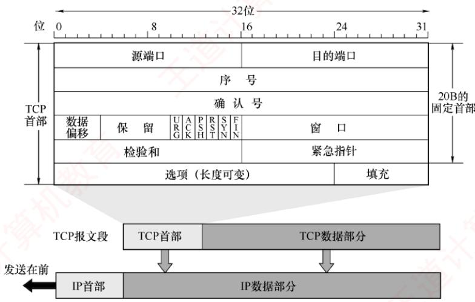

<em>图 5.5 TCP 报文段</em>

3）确认序号。占4B，表示期望收到对方下一个报文段中第一个数据字节的序号。若确认序号为N，则表明到序号N-1为止的所有数据均已正确接收。例如，B正确收到了A发送的一个报文段，其序号为501，数据长度为200B（对应序号501～700），说明B已完整接收到了到序号700为止的数据。因此，B期望接收的下一个数据字节的序号为701，于是在发给A的确认报文段中将确认序号置为701。

> **考点追踪：** TCP首部的最小长度（2021）

4）数据偏移（首部长度）。占4位，用于指出TCP首部的长度。由于首部可能包含长度可变的选项字段，该字段用于指示TCP报文段中数据部分的起始位置距离报文段起始处的偏移量。偏移单位为4B，因此该字段的值乘以4就等于首部长度。TCP首部最小长度为20B，对应数据偏移字段的最小值为5；4位二进制数最大可表示15，因此TCP首部的最大长度为60B（选项长度最多40B）。

5）保留。占6位，保留为今后使用，但目前须置为0。

　　下面有 6 个控制位，各占 1 位，用来说明本报文段的性质。

6）紧急位URG。当 $\mathrm{URG} = 1$ 时，表明紧急指针字段有效，通知系统本报文段中包含紧急数据，应优先处理。紧急数据被放置在报文段数据的最前面，后续的仍为普通数据，因此需配合紧急指针字段使用。

7）确认位 ACK。仅当 ACK=1 时，确认序号字段才有效；当 ACK=0 时，确认序号无效。TCP 规定，在连接建立后，所有传送的报文段都必须将 ACK 置为 1。

8）推送位 PSH（Push）。在交互式通信中，应用进程希望输入命令后能立即收到响应。此时发送方将 PSH 置为 1，接收方收到 PSH=1 的报文段后，会立即将数据交付给应用进程，而不必等到整个缓存填满后才向上交付。

9）复位位 RST（Reset）。当 RST=1 时，表示 TCP 连接出现严重差错（如主机崩溃），必须释放连接并重新建立连接。此外，RST 也可用于拒绝非法的报文段或连接请求。

10）同步位 SYN。当 SYN=1 时，表示这是一个连接请求或连接接受报文。

　　当 $\mathrm{SYN} = 1$ ，ACK $= 0$ 时，表明这是一个连接请求报文，若对方同意建立连接，则在响应报

　　文中设置 SYN=1 且 ACK=1。关于连接的建立和释放，将在下一节详细讨论。

11）终止位FIN（Finish）。用于释放连接。当 $\mathrm{FIN} = 1$ 时，表示此报文段的发送方已无更多数据要发送，并请求释放连接。

12）窗口。占 2B，范围为 $0 \sim 2^{16}-1$ ，以字节为单位，该字段由本报文段的发送方填写，表示其作为接收方时当前还能接收的最大数据量。它告诉对方（作为发送方）“从本报文段的确认序号所指示的字节序号开始，你最多可以连续发送这么多字节的数据”。例如，若确认序号为 701，窗口字段值为 1000，这表示发送方可以从序号 701 开始，连续发送最多 1000B 的数据（字节序号为 701～1700）。

13）检验和。占2B。检验范围包括首部和数据部分。计算时需在TCP报文段前添加一个12B的伪首部（与UDP类似，只需将协议字段由17改成6，长度字段改成TCP长度）。

14）紧急指针。占2B。仅在URG=1时有效，指出本报文段中紧急数据的字节数（紧急数据位于数据部分的开头）。即使接收窗口为零，仍可发送紧急数据。

15）选项。长度可变，最长可达40B。若不使用选项，TCP首部长度即为20B。TCP最初只定义了一种选项，即最大报文段长度（Maximum Segment Size，MSS），它表示TCP报文段中数据字段的最大长度。后续又增加了窗口扩大、时间戳等选项，具体内容请参见教材。注意，与MSS类似，数据链路层的MTU指的是帧中数据部分的最大长度。

16）填充。用于确保整个首部长度为4B的整数倍，这是由于选项字段的长度是可变的。

### 5.3.3 TCP 连接管理

　　TCP 是面向连接的协议，因此每条 TCP 连接都包含三个阶段：连接建立、数据传送和连接释放。TCP 连接管理的目标是确保连接的建立与释放能够正常、可靠地进行。

　　在 TCP 连接建立过程中，需解决以下三个问题：

1）使通信双方确知对方的存在。

2）允许双方协商相关参数（如最大窗口值、是否使用窗口扩大选项、时间戳选项等）。

3）为传输实体分配必要的资源（如缓存空间、连接表项等）。

　　TCP 将连接作为最基本的抽象。每条 TCP 连接有两个端点，这些端点既不是主机、IP 地址，也不是应用进程或传输层端口，而是套接字（Socket）。一条 TCP 连接由通信双方的两个套接字唯一确定。需要注意的是：同一个 IP 地址可以参与多个不同的 TCP 连接，同一个端口号也可以出现在多个不同的 TCP 连接中。

　　TCP 连接的建立采用客户/服务器模式。主动发起连接建立的应用进程称为客户（Client），被动等待连接请求的应用进程称为服务器（Server）。

#### 1. TCP 连接的建立

　　连接建立需经历三个步骤，通常称为三次握手，如图 5.6 所示。假设主机 A 和 B 分别运行 TCP 客户和服务器程序，最初两端的 TCP 进程均处于 CLOSED（关闭）状态。在连接建立前，服务器完成一些准备工作后进入 LISTEN（收听）状态，等待客户的连接请求。

　　第一步：客户向服务器发送连接请求报文段。该报文段的 $\mathrm{SYN} = 1$ ，同时选择一个初始序号 $\mathbf{seq} = x$ 。TCP规定，SYN报文段（ $\mathrm{SYN} = 1$ 的报文段）不能携带数据，但仍消耗一个序号，因此客户下一次发送的报文段序号 $\mathrm{seq} = x + 1$ 。此时，客户进入SYN-SENT（同步已发送）状态。

　　第二步：服务器收到连接请求后，若同意建立连接，则向客户返回确认报文段。该报文段的 $\mathrm{SYN} = 1$ 、ACK $= 1$ ，确认序号 $\mathbf{ack} = x + 1$ ，同时选择自己的初始序号 $\mathbf{seq} = y$ 。确认报文段同样不能携带数据，但也消耗一个序号。此时，服务器进入SYN-RCVD（同步已收到）状态。

  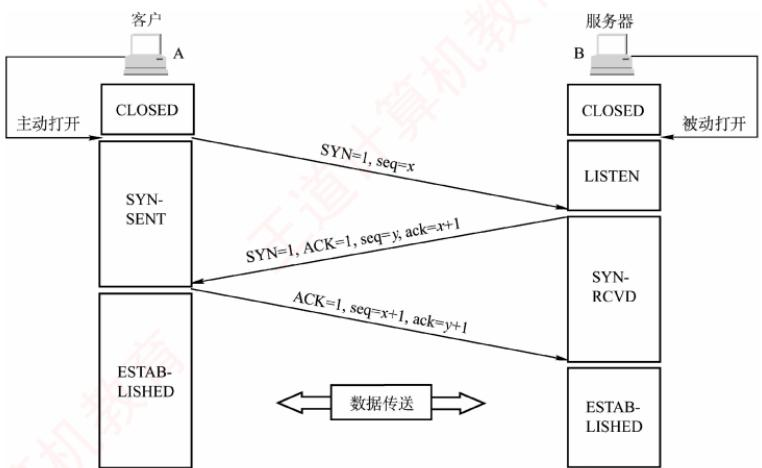

<em>图 5.6 用 “三次握手” 建立 TCP 连接</em>

> **考点追踪：** TCP三次握手的字段解析（2011、2012、2016、2019、2023）

　　第三步：客户收到确认后，再向服务器发送最终确认。该确认报文段的 ACK=1，确认序号 ack=y+1，序号 seq=x+1。此报文段可以携带数据。若不携带数据，则不消耗序号，下一个数据报文段的序号仍为 $x+1$ 。此时，客户进入 ESTABLISHED（已建立连接）状态。

　　当服务器收到该最终确认后，也进入 ESTABLISHED 状态，连接正式建立。

> **注意：**

　　① 仅在前两次握手的报文段中，SYN = 1。TCP 规定：SYN 报文段不能携带数据，但仍消耗一个序号，因此下次发送的报文段序号为其 SYN 报文段序号加 1。

　　② 仅在第一次握手的报文段中，ACK=0，因为此时尚未收到任何报文段。

　　③ 第三次握手的报文段可携带数据；若不携带，则不消耗序号。

　　从客户发出 SYN 报文段（第一次握手的连接请求报文段）时刻起算，客户最早可在 1RTT 后开始发送数据，而服务器最早在 1.5RTT 后才能发送数据。

#### 2. TCP 连接的释放

　　“天下没有不散的筵席”，TCP 连接亦如此。通信双方中的任意一方均可主动终止连接。TCP 连接的释放过程通常称为四次挥手，如图 5.7 所示。

  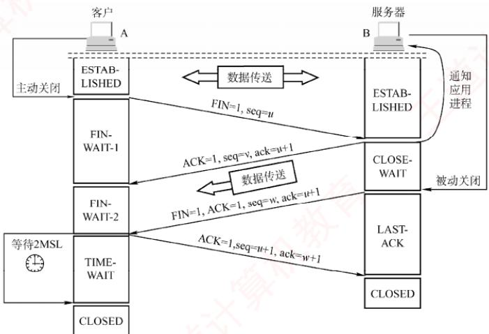

<em>图 5.7 用 “四次挥手” 释放 TCP 连接</em>

> **考点追踪：** TCP 四次挥手的字段解析（2020、2023）

　　第一步: 客户决定关闭连接时, 向服务器发送连接释放报文段, 并停止发送数据 (主动关闭)。该报文段的 FIN=1, 序号 seq=u, 其值等于此前已发送数据的最后一个字节序号加 1。TCP 规定, FIN 报文段 (FIN=1 的报文段) 即使不携带数据, 也消耗一个序号。此时, 客户进入 FIN-WAIT-1 (终止等待 1) 状态。由于 TCP 是全双工的, 可视为连接包含两条独立的数据通路; 发送 FIN 的一端关闭了其发送方向, 但对方仍可继续发送数据。

　　第二步：服务器收到连接释放报文段后，立即发送确认报文段。该报文段的 ACK=1，确认序号 ack=u+1，序号 seq=v（v 为服务器此前已发送数据的最后一个字节序号加 1）。随后，服务器进入 CLOSE-WAIT（关闭等待）状态。此时，从客户到服务器方向的连接已释放，但从服务器到客户方向的连接并未释放，TCP 连接处于半关闭状态。客户收到确认后，进入 FIN-WAIT-2（终止等待 2）状态，等待服务器发出的连接释放报文段。

> **考点追踪：** TCP 四次挥手状态变化（2021）

　　第三步：若服务器已经没有要向客户发送的数据，就向其发送连接释放报文段。该报文段的 FIN = 1、ACK = 1，序号 seq = w（w 可能大于 v，因服务器在半关闭期间可能又发送了数据），还需重复此前已发送的确认序号 ack = u + 1。此时，服务器进入 LAST-ACK（最后确认）状态。

> **考点追踪：** TCP 连接释放的时间分析（2016、2022、2024）

　　第四步：客户收到连接释放报文段后，必须发送最终确认，并进入 TIME-WAIT（时间等待）状态。该确认报文段的 ACK=1，确认序号 ack=w+1，序号 seq=u+1。服务器收到此确认后，即进入 CLOSED（连接关闭）状态。客户在 TIME-WAIT 状态下，还需等待时间等待计时器设置的时间 2MSL（Maximum Segment Lifetime，最长报文段寿命）后，才进入 CLOSED 状态。

　　设置 2MSL 的主要目的是: ① 确保客户发送的最后一个 ACK 报文段能够到达服务器; ② 使本连接中所有可能滞留的旧报文段从网络中自然消失, 避免影响新连接。

　　若服务器在收到客户的连接释放请求后不再发送数据，则从客户发出 FIN 报文段时刻起算，客户释放连接的最短时间为 $1RTT + 2MSL$ ，服务器释放连接的最短时间为 1.5RTT。

> **注意：**

　　① 仅在第一次和第三次挥手的报文段中（请求主动关闭），FIN = 1。

　　② 后三次挥手的报文段中，ACK = 1，因为每次都需要对之前收到的报文段进行确认。

　　③ 尽管协议并未禁止 FIN 段携带数据，但主流的操作系统一般不允许其携带数据

　　除时间等待计时器外，TCP还使用一个保活计时器，以防止客户突发故障导致服务器长期无效等待。服务器每收到一次数据，就会重置该计时器；若计时器超时仍未收到数据，则每隔75秒发送一个探测报文段。若连续10次探测均无响应，则判定客户已故障，并关闭该连接。

### 5.3.4 TCP 可靠传输

　　TCP 在不可靠的 IP 层之上提供可靠传输服务，确保接收方从缓存中读取的字节流与发送方发出的字节流完全一致。TCP 通过检验、序号、确认和重传等机制实现这一目的。其中，TCP 的检验机制与 UDP 类似，这里不再赘述。

> **考点追踪：** TCP 序号与确认机制（2011、2012、2013、2025）

#### 1. 序号

　　TCP首部的序号字段用于保证数据按序提交给应用层。TCP将数据视为一个无结构但有序的

　　字节流，其序号是对字节流中的每个字节依次编号，而非对报文段整体编号。

　　TCP 将每个字节都编上一个序号，序号字段值指明本报文段所发送的第一个数据字节的序号。如图 5.8 所示，假设 A 和 B 之间建立了一条 TCP 连接，A 的发送缓存区中有 10B 的数据，序号从 0 开始编号。第一个报文段包含 0～2 号数据字节，则该 TCP 报文段的序号是 0；第二个报文段的序号是 3；第三个报文段的序号是 6；第四个报文段的序号是 8。

<table><tr><td colspan="3">第一个报文段的数据</td><td colspan="3">第二个</td><td colspan="2">第三个</td><td colspan="2">第四个</td></tr><tr><td>0</td><td>1</td><td>2</td><td>3</td><td>4</td><td>5</td><td>6</td><td>7</td><td>8</td><td>9</td></tr></table>

<em>图 5.8 A的发送缓存区中的数据划分成TCP段</em>

#### 2. 确认

　　TCP 首部的确认序号字段表示期望收到对方下一个报文段的第一个数据字节的序号。在图 5.8 中，若接收方 B 已收到第一个和第二个报文段，此时 B 希望收到的下一个报文段的数据是从 6 号字节开始的，因此 B 向 A 发送的下一个报文段中的确认序号字段应置为 6。

　　发送方缓存区会继续存储那些已发送但未收到确认的报文段，以便在需要时重传。TCP 默认使用累积确认，即确认按序到达的连续字节，确认序号为第一个未收到字节的序号。接收方可以在合适时机发送确认，也可以在有数据要发送时将确认信息顺便捎带上（捎带确认）。例如，在图 5.8 中，接收方 B 收到了 A 发送的第一个和第三个报文段，尚未收到第二个报文段，此时 B 仍在等待从 3 号字节开始的连续数据，因此 B 向 A 发送的下一个报文段将确认序号字段置为 3。

#### 3. 重传

　　有两种事件会导致 TCP 对报文段进行重传：超时和冗余 ACK。

##### （1） 超时

　　TCP 每发送一个报文段，就会对该报文段设置一个超时计时器。当计时器到期仍未收到确认时，TCP 将重传该报文段。

　　由于 TCP 下层是互联网环境，IP 数据报所选的路由变化很大，因此传输层的往返时延波动也较大。为了计算超时计时器的重传时间，TCP 采用一种自适应算法。它记录报文段发出的时间及收到相应确认的时间，两者之差称为报文段的往返时间（Round-Trip Time，RTT）。TCP 维护了一个加权平均往返时间 RTTS，并根据新测量的 RTT 样本值动态调整 RTTS。显然，超时计时器设置的超时重传时间（Retransmission Time-Out，RTO）应略大于 RTTS，但也不能大太多，否则当报文段丢失时，TCP 无法迅速重传，导致数据传输延迟增大。

##### （2） 冗余 ACK（冗余确认）

　　超时触发重传的一个问题是超时周期往往太长。幸运的是，发送方通常可以在超时发生之前，通过注意所谓的冗余 ACK 来较好地检测丢包情况。冗余 ACK 是再次确认某个报文段的 ACK，而发送方先前已收到过该报文段的确认。例如，发送方 A 发送了编号为 1、2、3、4、5 的 TCP 报文段，其中 2 号报文段在链路中丢失，未能到达接收方 B。因此，3、4、5 号报文段对于 B 来说成为失序报文段。TCP 规定，每当比期望序号大的失序报文段到达时，立即发送一个冗余 ACK，指明下一个期待字节的序号。在本例中，3、4、5 号报文段到达 B，但它们不是 B 期望收到的下一个报文段，于是 B 立即发送 3 个对 1 号报文段的冗余 ACK，表示自己期望接收 2 号报文段。

　　TCP 规定，当发送方收到对同一个报文段的 3 个冗余 ACK 时，可以认为紧跟在这个被确认报文段之后的报文段已丢失。就前面的例子而言，当 A 收到对 1 号报文段的 3 个冗余 ACK 时，它可以判断 2 号报文段已经丢失，并立即对 2 号报文段执行重传，这种技术称为快速重传。当然，冗余 ACK 也被用于拥塞控制，相关内容将在后续章节讨论。

> **注意：**

　　在上述示例中，对1号报文段的正常确认不能称为冗余ACK，只有在收到失序的3、4、5号报文段后，发回的确认才被称为冗余ACK。也就是说，触发快重传时，发送方共收到4个对1号报文段的确认。

### 5.3.5 TCP 流量控制

　　流量控制的功能是确保发送方的发送速率不会过快，以便让接收方能够及时处理。因此，可以说流量控制是一种速度匹配服务，它匹配发送方的发送速率与接收方的读取速率。

　　TCP 利用滑动窗口机制来实现流量控制。滑动窗口的基本原理已在第 3 章介绍过，这里重点讨论 TCP 如何使用窗口机制进行流量控制。TCP 要求接收方维持一个接收窗口（rwnd），该窗口大小根据当前接收缓存的大小动态调整，反映了接收方的容量。接收方将此窗口值写入 TCP 首部的“窗口”字段，以通知发送方。发送方的发送窗口不能超过接收方给出的接收窗口值，从而限制发送方向网络注入报文的速率。

> **考点追踪：** 基于滑动窗口的流量控制机制（2016、2021）

　　图 5.9 说明了如何利用滑动窗口进行流量控制。假设数据仅从 A 发往 B，而 B 仅向 A 发送确认报文段，则 B 可通过设置确认报文段首部中的窗口字段来通知 A 当前的 rwnd 值。rwnd 表示接收方允许连续接收的最大字节数。发送方 A 总是根据最新收到的 rwnd 值来限制自己发送窗口的大小，从而将未确认的数据量控制在 rwnd 大小之内，确保 A 不会使 B 的接收缓存溢出。

　　假设在连接建立时，B 告诉 A：“我的接收窗口 rwnd=400”。我们注意到，接收方 B 进行了三次流量控制，这三个报文段都设置了 ACK=1，只有当 ACK=1 时，确认序号字段才有意义。第一次将窗口减至 rwnd=300，第二次减至 rwnd=100，最后减至 rwnd=0，即不允许发送方再发送数据。这使得发送方暂停发送的状态将持续到 B 重新发出一个新的窗口值为止。

  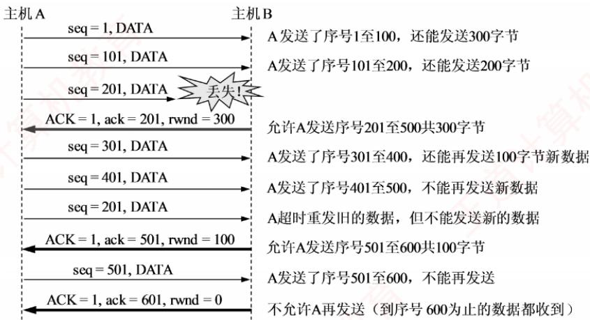

<em>图 5.9 利用滑动窗口进行流量控制</em>

　　假设 B 向 A 发送了零窗口通知后不久，B 的接收缓存又有了一些存储空间，于是 B 向 A 发送非零窗口通知，然而这个报文段在传输过程中丢失了。若不采取其他措施，则 B 和 A 会陷入相互等待的死锁状态。为此，TCP 为每个连接设有一个持续计时器。只要发送方收到对方的零窗口通知，就启动持续计时器。若计时器超时，则发送方发送一个零窗口探测报文段，而对方会在确认该探测报文段时给出当前的窗口值。若窗口仍然是零，则发送方收到确认报文段后重新设置持续计时器；若窗口不是零，则死锁状态就可以打破了。

　　传输层和数据链路层的流量控制的区别是：传输层实现的是端到端，即两个进程之间的流量控制；数据链路层实现的是相邻节点之间的流量控制。此外，数据链路层的滑动窗口协议的窗口大小一般为固定值，而传输层的窗口大小可以根据接收方的缓存情况动态变化。

### 5.3.6 TCP 拥塞控制

　　拥塞控制是指防止过多的数据注入网络，以保证网络中的路由器或链路不致过载。出现拥塞时，通信端点通常无法直接获知拥塞的具体细节，只能通过表现（如时延增加）间接感知。

　　拥塞控制与流量控制的区别：拥塞控制的目标是使网络能够承受当前的负载，是一个全局性过程，涉及所有主机、路由器及影响网络性能的各种因素。而流量控制则关注点对点通信中接收方的处理能力，是一个端到端的问题，由接收方通过窗口机制抑制发送方的发送速率，以确保自身能及时接收数据。尽管二者目标不同，但都是通过调节发送方的发送速率来实现控制效果的。

　　例如，某链路的传输速率为 10Gb/s，当一台大型机以 1Gb/s 的速率向一台 PC 传送文件时，显然网络带宽充足，不存在拥塞问题；但由于 PC 的处理能力有限，可能来不及接收如此高速的数据流，因此必须进行流量控制。反之，若有 100 万台 PC 同时以 1Mb/s 的速率通过该链路传输文件，则问题就转变为网络总负载是否超出了其承载能力，这时需要依赖拥塞控制。

　　TCP 采用四种算法进行拥塞控制：慢开始、拥塞避免、快重传和快恢复。

　　发送方在确定数据的发送速率时，既要考虑接收方的接收能力，也要从全局角度避免引发网络拥塞。因此，除了上节介绍的接收窗口，TCP 还要求发送方维护一个拥塞窗口（cwnd），其大小取决于当前网络的拥塞状况，并动态调整。其控制原则是：

- 若网络未出现拥塞，则适当增大 cwnd，以便把更多分组发送出去，提高网络利用率。

- 若检测到网络拥塞，则适当减少 cwnd，以减少注入网络的分组数量，缓解网络拥塞。

　　通常，只要发送方未按时收到确认（发生了超时），即可认为网络出现了拥塞。

> **考点追踪：** TCP 的滑动窗口机制（2010、2014-2016、2025）

　　发送窗口的上限值应取接收窗口（rwnd）和拥塞窗口（cwnd）中较小的一个，即

$$
\text { 发送窗口的上限值 } = \min [ \mathrm{rwnd}, \mathrm{cwnd} ]
$$

　　接收窗口的大小可通过 TCP 首部中的 “窗口” 字段由接收方通知发送方。那么，发送方如何维护拥塞窗口呢？这正是下面要介绍的慢开始和拥塞避免算法所解决的问题。为便于分析，这里假设：数据仅单向传输，接收方只发送确认报文；接收方拥有足够大的缓存空间，因此发送窗口的大小仅受拥塞窗口的限制；并且以最大报文段长度 MSS 作为拥塞窗口大小的单位。

#### 1. 慢开始和拥塞避免

##### （1） 慢开始算法

　　慢开始的基本思想：在连接刚建立时，发送方并不了解网络的负载情况，若立即向网络注入大量数据，可能会引发拥塞。因此，应先发送少量数据进行试探；若未发生拥塞，则逐步增大发送量，即从小到大逐渐增大拥塞窗口。

> **考点追踪：** 慢开始算法的原理（2014、2015、2025）

　　初始拥塞窗口 cwnd 通常设为 1MSS（最新的 RFC 允许设置更多 MSS），慢开始算法规定：每收到一个对新报文段的确认，就将 cwnd 加 1。这样，每经过一个传输轮次（一个往返时延 RTT），cwnd 就会加倍，从而随传输轮次呈指数增长。请注意：慢开始的“慢”并非指增长速度慢，而是指从较小的 cwnd（如 1）开始，谨慎试探网络状态，从而有效预防拥塞。例如，A 向 B 发送数据，初始 cwnd = 1，A 发送第 1 个报文段；收到确认后，cwnd 增至 2，接着发送 2 个报文段；收到这 2 个确认后，cwnd 增至 4，下一轮便可发送 4 个报文段，依此类推。

　　为防止 cwnd 无限制增长，还需设置一个慢开始门限 ssthresh（阈值）。当 cwnd 增长至 ssthresh 时，停止慢开始算法，转而采用拥塞避免算法。

##### （2） 拥塞避免算法

> **考点追踪：** 拥塞避免算法的原理（2009、2017、2020、2022、2023）

　　拥塞避免的目标是让 cwnd 缓慢增长，以降低拥塞风险。其策略是：每经过一个传输轮次（收到本轮所有报文段的确认），就将 cwnd 加 1，而不是加倍，从而使 cwnd 按线性规律缓慢增长（加法增大），防止网络过早出现拥塞。这种增长速率比慢开始阶段要慢得多。

　　两种算法的切换规则如下：

- 当 cwnd < ssthresh 时，使用慢开始算法。

- 当 cwnd > ssthresh 时，使用拥塞避免算法。

- 当 cwnd = ssthresh 时，既可使用慢开始算法，又可使用拥塞避免算法（常规做法）。

##### （3） 网络拥塞的处理

　　无论处于慢开始阶段还是拥塞避免阶段，只要发送方判断网络出现拥塞（如发生超时），就执行以下操作：① 将慢开始门限 ssthresh 调整为当前 cwnd 的一半（但不得小于 2）；② 将 cwnd 重置为 1；③ 重新执行慢开始算法。这样做的目的是迅速减少注入网络的分组数量，使得发生拥塞的路由器有足够时间把队列中积压的分组处理完。

> **考点追踪：** TCP 拥塞控制与传输效率分析（2016、2023）

　　慢开始和拥塞避免算法的实现过程如图 5.10 所示。

  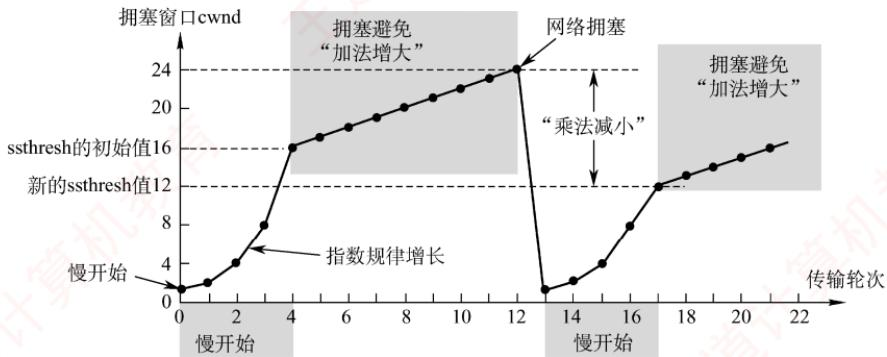

<em>图 5.10 慢开始和拥塞避免算法的实现过程</em>

- 初始时，拥塞窗口设为 1，即 cwnd = 1；慢开始门限设为 16，即 ssthresh = 16。

> **考点追踪：** TCP 拥塞窗口演化分析（2016、2023）

- 在慢开始阶段，发送方每收到一个对新报文段的确认，就将 cwnd 加 1。当 cwnd 增长到 ssthresh（cwnd = 16）时，停止慢开始算法，转而采用拥塞避免算法。

- 当 cwnd = 24 时，若网络出现拥塞，则将 ssthresh 调整为当前 cwnd 的一半（12），同时将 cwnd 重置为 1，并重新执行慢开始算法；此后，当 cwnd 再次增长到 12 时，改为执行拥塞避免算法。

> **注意：**

　　在慢开始阶段，若 2cwnd > ssthresh，则下一个传输轮次后的 cwnd 应等于 ssthresh，而不是 2cwnd。例如，第 16 个轮次时 cwnd = 8、ssthresh = 12，则第 17 个轮次后 cwnd = 12，而不是 16。

　　在慢开始和拥塞避免算法中采用了“乘法减小”策略：当网络发生超时（通常意味着很可能出现了拥塞），将慢开始门限 ssthresh 调整为当前 cwnd 的一半，并重新进入慢开始阶段。如果网络频繁发生拥塞，ssthresh 会下降得很快，从而大幅减少注入网络的分组数量。

　　拥塞避免并不能完全避免拥塞。事实上，依靠上述机制彻底避免拥塞是不可能的。所谓拥塞避免，是指在该阶段将拥塞窗口按线性规律增长，从而使网络较不容易发生拥塞。

#### 2. 快重传和快恢复

　　有时，个别报文段因偶然原因丢失，但网络并未真正拥塞。若发送方等待超时才重传，则会误判为拥塞并启动慢开始算法，导致传输效率下降。为此，TCP引入了快重传和快恢复机制。

##### （1） 快重传

> **考点追踪：** 快重传算法的原理（2019）

　　快重传算法的核心是让发送方在超时前尽早重传丢失的报文段。为此，接收方不应等到有数据要发送时才捎带确认，而应在收到报文段后立即确认；特别是收到失序报文段时，要立即对最后一个按序到达的报文段发送重复确认（冗余 ACK）。发送方连续收到 3 个相同的冗余 ACK 时，即可判定对应报文段已丢失，并立即重传，而无须等待超时计时器到期。

##### （2） 快恢复

　　快恢复算法的思路：当发送方连续收到3个冗余ACK时，表明后续多个报文段已成功抵达接收方，说明网络很可能并未发生严重拥塞。此时，发送方执行“乘法减小”策略，将ssthresh调整为当前cwnd的一半，以预防潜在的拥塞。与慢开始算法的不同之处是：它不将cwnd重置为1，而是将cwnd也调整为当前cwnd的一半（等于ssthresh），然后直接进入拥塞避免阶段，使cwnd缓慢线性增长。由于跳过了从cwnd=1开始的慢开始过程，因此称为快恢复。

　　TCP 拥塞控制算法的实现过程如图 5.11 所示，其中前 20 个轮次与图 5.10 中的相同。在第 21 轮次（cwnd = 16），发送方连续收到 3 个冗余 ACK，此时不启动慢开始算法，而执行快恢复算法：设置 ssthresh = cwnd / 2 = 8，cwnd = ssthresh = 8，并开始执行拥塞避免算法。

  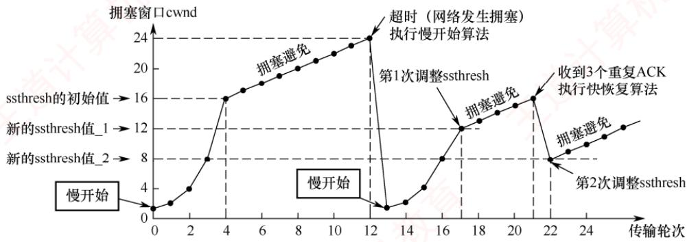

<em>图 5.11 TCP 拥塞控制算法的实现过程</em>

　　TCP 拥塞控制可归纳为图 5.12 所示的流程图。四种算法的使用总结：当 TCP 连接建立或网络出现超时现象时，采用慢开始和拥塞避免算法（ssthresh = cwnd/2, cwnd = 1）；当发送方收到 3 个冗余 ACK 时，采用快重传和快恢复算法（ssthresh = cwnd/2, cwnd = ssthresh）。

　　在流量控制中，发送方发送数据的量由接收方通过接收窗口（rwnd）决定；而在拥塞控制中，发送方则根据网络反馈自主调整拥塞窗口（cwnd）。接收方的缓存空间总是有限的。因此，发送方实际的发送窗口大小由流量控制和拥塞控制共同决定。当题目中同时出现接收窗口（rwnd）和拥塞窗口（cwnd）时，发送窗口的上限值应取两者中的较小者，即 min[rwnd, cwnd]。

  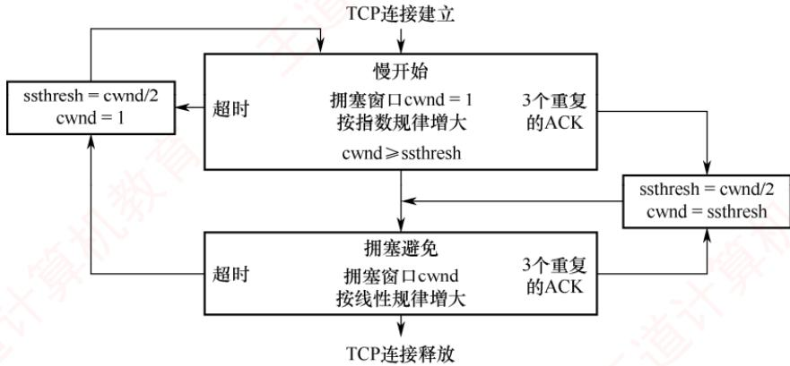

<em>图 5.12 TCP 拥塞控制的流程图</em>

### 5.3.7 本节习题精选

#### 一、单项选择题

01. 下列关于传输层协议的面向连接服务的描述中，错误的是（）。

- A. 面向连接的服务需要经历3个阶段：连接建立、数据传输及连接释放
- B. 当链路不发生错误时，面向连接的服务可以保证数据到达的顺序是正确的
- C. 面向连接的服务有很高的效率和时间性能
- D. 面向连接的服务提供了一个可靠的数据流

02. TCP 规定 HTTP（）进程的端口号为 80。

- A. 客户
- B. 解析
- C. 服务器
- D. 主机

03. 下列关于 TCP 的端口的叙述中，错误的是（）。

- A. 客户端使用的端口号是动态规定的
- B. 端口号长度为 16 位
- C. 端口号用于在通信中识别进程
- D. 局域网内的计算机不能使用相同端口号

04. 下列几种描述中，（）不是 TCP 服务的特点。

- A. 字节流
- B. 全双工
- C. 可靠
- D. 支持广播

05. 下列几种描述中，（）不是 TCP 的特性。

- A. 比 UDP 开销大
- B. 强制重传错误分组
- C. 在 TCP 首部中有目标主机 IP 地址
- D. 把消息分成段并在目标主机中进行重组

06. 下列几种字段中，包含在 TCP 首部中而不包含在 UDP 首部中的是（）。

- A. 目的端口号
- B. 序号
- C. 检验和
- D. 目的 IP 地址

07. 下列关于 TCP 报头格式的描述中，错误的是（）。

- A. 报头长度为 20～60B，其中固定部分为 20B
- B. 端口号字段依次表示源端口号与目的端口号
- C. 报头长度总是 4 的倍数个字节
- D. TCP 检验和伪首部中 IP 分组头的协议字段为 17

08. 当 TCP 报文段标志字段中的（）为 1 时，表示必须释放连接，然后重新建立连接。

- A. URG
- B. RST
- C. ACK
- D. FIN

09. TCP 报文段首部中窗口字段的值的含义是（）。

- A. 指明自己的拥塞窗口的尺寸
- B. 指明对方的发送窗口的尺寸
- C. 指明自己的接收窗口的尺寸
- D. 指明对方的拥塞窗口的尺寸

10. 在采用 TCP 连接的数据传输阶段，若发送端的发送窗口值由 1000 变为 2000，则发送端在收到一个确认之前可以发送（）。

- A. 2000 个 TCP 报文段
- B. 2000B
- C. 1000B
- D. 1000 个 TCP 报文段

11. A 和 B 建立了 TCP 连接，当 A 收到确认序号为 100 的确认报文段时，表示（）。

- A. 报文段 99 已收到
- B. 报文段 100 已收到
- C. 末字节序号为 99 的报文段已收到
- D. 末字节序号为 100 的报文段已收到

12. 当 TCP 在传送大量数据时，是以（）的大小将数据进行分割发送的，进行重发时同样也是以此为单位的。

- A. MSS
- B. 字节
- C. 比特
- D. MTU

13. 在 TCP 中，发送方的窗口大小取决于（）。

- A. 仅接收方允许的窗口
- B. 接收方允许的窗口和发送方允许的窗口
- C. 接收方允许的窗口和拥塞窗口
- D. 发送方允许的窗口和拥塞窗口

14. TCP 利用滑动窗口来实现流量控制，只要发送方收到对方的零窗口通知，就启动（）计时器。若计时器超时，则发送一个零窗口探测报文段，以试图获得对方的窗口值。

- A. 重传
- B. 保活
- C. 时间等待
- D. 持续

15. TCP 在 40Gb/s 的线路上传送数据，若 TCP 充分利用了线路的带宽，则经过（）后，TCP 会发生序号绕回（使用了之前用过的字节序号，已知 $2^{32}/5 \times 10^{9} = 0.859$ ）。

- A. 859ms
- B. 85.9ms
- C. 8.59ms
- D. 0.859ms

16. 下列关于 TCP 窗口与拥塞控制概念的描述中，错误的是（）。

- A. 接收窗口（rwnd）通过 TCP 首部中的窗口字段通知数据的发送方
- B. 发送窗口确定的依据是：发送窗口 $= \min$ [接收端窗口，拥塞窗口]
- C. 拥塞窗口是接收端根据网络拥塞情况确定的窗口值
- D. 拥塞窗口大小在开始时可以按指数规律增长

17. 下列关于 TCP 工作原理与过程的描述中，错误的是（）。

- A. TCP 连接建立过程需要经过“三次握手”的过程
- B. TCP 传输连接建立后，客户端与服务器端的应用进程进行全双工的字节流传输
- C. TCP 传输连接的释放过程很复杂，只有客户端可以主动提出释放连接的请求
- D. TCP 连接的释放需要经过“四次挥手”的过程

18. TCP 使用三次握手协议来建立连接，设 A、B 双方发送报文的初始序号分别为 X 和 Y，A 发送（①）的报文给 B，B 接收到报文后发送（②）的报文给 A，然后 A 发送一个确认报文给 B 便建立了连接（注意，ACK 的下标为捎带的序号）。
　　①

- A. SYN=1, 序号=X
- B. SYN=1, 序号=X+1, ACK $_{X}$ =1
- C. SYN=1, 序号=Y
- D. SYN=1, 序号=Y, ACK $_{Y+1}$ =1

　　②

- A. SYN=1, 序号=X+1
- B. SYN=1, 序号=X+1, ACK $_{X}$ =1
- C. SYN=1, 序号=Y, ACK $_{X+1}$ =1
- D. SYN=1, 序号=Y, ACK $_{Y+1}$ =1

19. TCP “三次握手” 过程中，第二次 “握手” 时，发送的报文段中（）标志位被置为 1。

- A. SYN
- B. ACK
- C. ACK 和 RST
- D. SYN 和 ACK

20. TCP采用三报文握手建立连接，其中第三个报文是（）。

- A. TCP连接请求
- B. 对TCP连接请求的确认
- C. 对TCP连接请求确认的确认
- D. TCP普通数据

21. 主机 A 和 B 之间建立了一个 TCP 连接，A 向 B 发送的第一个 SYN 报文段中的序号值（seq）等于 211，数据传输结束在释放连接时，A 向 B 发送的第 4 次挥手报文段的 seq 等于 985，则在本次通信过程中，A 向 B 总共发送了（）字节的数据。

- A. 771
- B. 772
- C. 773
- D. 774

22. A 和 B 之间建立了 TCP 连接，A 向 B 发送了一个报文段，其中序号字段 seq=200，确认序号字段 ack=201，数据部分有 2B，那么在 B 对该报文的确认报文段中（）。

- A. seq=202, ack=200
- B. seq=201, ack=201
- C. seq=201, ack=202
- D. seq=202, ack=201

23. TCP 的通信双方，有一方发送了带有 FIN 标志的数据段后，表示（）。

- A. 将断开通信双方的 TCP 连接
- B. 单方面释放连接，表示本方已经无数据发送，但可以接收对方的数据
- C. 中止数据发送，双方都不能发送数据
- D. 连接被重新建立

24. 某客户与服务器建立 TCP 连接，当连接断开时，客户先向服务器发送一个标志 FIN = 1 的报文段 A，此报文段中 seq 值为 x，ack 值为 y。一段时间后，客户收到了服务器发来的一个标志 FIN = 1 的报文段 B，则下列关于报文段 B 的说法中，正确的是（）。

- A. B 中的 seq 值一定为 y
- B. B 中的 seq 值一定为 $y + 1$
- C. B 中的 ack 值一定为 x
- D. B 中的 ack 值一定为 $x + 1$

25. 某应用程序每秒产生一个 60B 的数据块，每个数据块被封装在一个 TCP 报文中，然后封装在一个 IP 数据报中，则最后每个数据报所包含的应用数据所占的百分比是（）。（注意：TCP 报文和 IP 数据报文的首部没有附加字段。）

- A. 20%
- B. 40%
- C. 60%
- D. 80%

26. 假设 TCP 客户与 TCP 服务器的通信已结束，端到端的往返时间为 RTT。t 时刻 TCP 客户请求断开连接，则从 t 时刻起 TCP 服务器释放该连接的最短时间是（）。

- A. 0.5RTT
- B. 1RTT
- C. 1.5RTT
- D. 2RTT

27. 甲发起与乙的 TCP 连接，甲选择的初始序号为 200，若甲和乙建立连接过程中最后一个报文段不携带数据，则 TCP 连接建立后，甲给乙发送的数据报文段的序号为（）。

- A. 203
- B. 202
- C. 201
- D. 200

28. A 发起与 B 的 TCP 连接，A 选择的初始序号为 1666，连接建立过程中未发送任何数据，TCP 连接建立后，A 给 B 发送了 1000B 数据，B 正确接收后发送给 A 的确认序号是（）。

- A. 1667
- B. 2666
- C. 2667
- D. 2668

29. 一个 TCP 连接的数据传输阶段，若发送端的发送窗口值由 2000 变为 3000，则意味着发送端可以（）。

- A. 在收到一个确认之前可以发送 3000 个 TCP 报文段
- B. 在收到一个确认之前可以发送 1000B
- C. 在收到一个确认之前可以发送 3000B
- D. 在收到一个确认之前可以发送 2000 个 TCP 报文段

30. 甲和乙建立了 TCP 连接, 甲向乙发送了 3 个连续的 TCP 段, 分别包含 200B、300B、400B 的有效载荷, 第 3 个段的序号为 1000。若乙仅正确接收到第 1 个和第 3 个段, 则乙发送给甲的确认序号是 （）。

- A. 500
- B. 600
- C. 700
- D. 800

31. 在一个 TCP 连接中，MSS 为 1KB，当拥塞窗口为 34KB 时发生了超时事件。若在接下来的 4RTT 内报文段传输都是成功的，则当这些报文段均得到确认后，拥塞窗口的大小是（）。

- A. 8KB
- B. 9KB
- C. 16KB
- D. 17KB

32. 若甲向乙发起了一条 TCP 连接，最大段长为 1KB，乙每收到一个数据段都会发出一个接收窗口为 10KB 的确认段，若甲在 t 时刻发生超时，此时拥塞窗口为 16KB。则从 t 时刻起，在不再发生超时的情况下，经过 10RTT 后，甲的发送窗口的大小为（）。

- A. 10KB
- B. 12KB
- C. 14KB
- D. 15KB

33. 设 TCP 的拥塞窗口的慢开始门限值初始为 8（单位为报文段），当拥塞窗口上升到 12 时发生超时，TCP 开始慢开始和拥塞避免，则第 13 次传输时拥塞窗口的大小为（）。

- A. 4
- B. 6
- C. 7
- D. 8

34. 甲和乙刚建立 TCP 连接，并约定最大段长为 2KB，假设乙总是及时清空缓存，保证接收窗口始终为 20KB，ssthresh 为 16KB，若双向传输时间为 10ms，发送时延忽略不计，且没有发生拥塞的情况，则经过（），甲的发送窗口第一次达到 20KB。

- A. 40ms
- B. 50ms
- C. 60ms
- D. 70ms

35. 假设一个 TCP 连接的传输过程在慢开始阶段，在 tRTT 时刻到 $(t+1)$ RTT 时刻之间发送了 k 个数据段，假设仍然保持在慢开始阶段，预期在 $(t+1)$ RTT 时刻到 $(t+2)$ RTT 时刻之间将发送（）个数据段（假设接收方有足够的缓存）。

- A. k
- B. $k+1$
- C. $2^{k}$
- D. 2k

36. 下列关于 TCP 的拥塞控制机制的描述中，错误的是（）。

- A. TCP 刚建立连接进入慢开始阶段
- B. 慢开始阶段拥塞窗口指数级增加
- C. 超时发生时，新门限值（慢开始和拥塞避免阶段的分界点）等于旧门限值的一半
- D. 拥塞避免阶段拥塞窗口线性增加

37. 在一个 TCP 连接中，MSS 为 1KB，当拥塞窗口为 34KB 时收到了 3 个冗余 ACK 报文。若在接下来的 4RTT 内报文段传输都是成功的，则当这些报文段均得到确认后，拥塞窗口的大小是（）。

- A. 8KB
- B. 16KB
- C. 20KB
- D. 21KB

38. A 和 B 建立 TCP 连接，MSS 为 1KB。某时，慢开始门限值为 2KB，A 的拥塞窗口为 4KB，在接下来的 1RTT 内，A 向 B 发送了 4KB 的数据（TCP 的数据部分），并且得到了 B 的确认，确认报文中的窗口字段的值为 2KB。在下一个 RTT 中，A 最多能向 B 发送（）数据。

- A. 2KB
- B. 8KB
- C. 5KB
- D. 4KB

39. 假设在没有发生拥塞的情况下，在一条往返时延 RTT 为 10ms 的线路上采用慢开始控制策略。若接收窗口的大小为 24KB，最大报文段 MSS 为 2KB，则发送方能发送出第一个完全窗口（也就是发送窗口达到 24KB）需要的时间是（）。

- A. 30ms
- B. 40ms
- C. 50ms
- D. 60ms

40. 甲向乙发起一个 TCP 连接，最大段长 MSS = 1KB，RTT = 3ms，乙的接收缓存为 16KB，且乙的接收缓存仅有数据存入而无数据取出，则甲从连接建立成功至发送窗口达到 8KB，需经过的最小时间以及此时乙的接收缓存的可用空间分别为（）。

- A. 3ms, 15KB
- B. 9ms, 9KB
- C. 6ms, 13KB
- D. 12ms, 8KB

41. 【2009 统考真题】主机甲与主机乙之间已建立一个 TCP 连接，主机甲向主机乙发送了两个连续的 TCP 段，分别包含 300B 和 500B 的有效载荷，第一个段的序号为 200，主机乙正确接收到这两个数据段后，发送给主机甲的确认序号是（）。

- A. 500
- B. 700
- C. 800
- D. 1000

42. 【2009 统考真题】一个 TCP 连接总以 1KB 的最大段长发送 TCP 段，发送方有足够多的数据要发送，当拥塞窗口为 16KB 时发生了超时，若接下来的 4RTT 时间内的 TCP 段的传输都是成功的，则当第 4 个 RTT 时间内发送的所有 TCP 段都得到肯定应答时，拥塞窗口大小是（）。

- A. 7KB
- B. 8KB
- C. 9KB
- D. 16KB

43. 【2010 统考真题】主机甲和主机乙之间已建立一个 TCP 连接，TCP 最大段长为 1000B。若主机甲的当前拥塞窗口为 4000B，在主机甲向主机乙连续发送两个最大段后，成功收到主机乙发送的第一个段的确认段，确认段中通告的接收窗口大小为 2000B，则此时主机甲还可以向主机乙发送的最大字节数是（）。

- A. 1000
- B. 2000
- C. 3000
- D. 4000

44. 【2011 统考真题】主机甲向主机乙发送一个（SYN=1，seq=11220）的 TCP 段，期望与主机乙建立 TCP 连接，若主机乙接受该连接请求，则主机乙向主机甲发送的正确的 TCP 段可能是（）。

- A. （SYN=0, ACK=0, seq=11221, ack=11221）
- B. （SYN=1, ACK=1, seq=11220, ack=11220）
- C. （SYN=1, ACK=1, seq=11221, ack=11221）
- D. （SYN=0, ACK=0, seq=11220, ack=11220）

45. 【2011 统考真题】主机甲与主机乙之间已建立一个 TCP 连接，主机甲向主机乙发送了 3 个连续的 TCP 段，分别包含 300B、400B 和 500B 的有效载荷，第 3 个段的序号为 900。若主机乙仅正确接收到第 1 个段和第 3 个段，则主机乙发送给主机甲的确认序号是（）。

- A. 300
- B. 500
- C. 1200
- D. 1400

46. 【2013 统考真题】主机甲与主机乙之间已建立一个 TCP 连接，双方持续有数据传输，且数据无差错与丢失。若甲收到一个来自乙的 TCP 段，该段的序号为 1913、确认序号为 2046、有效载荷为 100B，则甲立即发送给乙的 TCP 段的序号和确认序号分别是（）。

- A. 2046、2012
- B. 2046、2013
- C. 2047、2012
- D. 2047、2013

47. 【2014 统考真题】主机甲和乙建立了 TCP 连接，甲始终以 MSS=1KB 大小的段发送数据，并一直有数据发送；乙每收到一个数据段都会发出一个接收窗口为 10KB 的确认段。若甲在 t 时刻发生超时的时候拥塞窗口为 8KB，则从 t 时刻起，不再发生超时的情况下，经过 10RTT 后，甲的发送窗口的大小为（）。

- A. 10KB
- B. 12KB
- C. 14KB
- D. 15KB

48. 【2015 统考真题】主机甲和主机乙新建一个 TCP 连接，甲的拥塞控制初始阈值为 32KB，甲始终向乙以 MSS=1KB 大小的段发送数据，并一直有数据发送；乙为该连接分配 16KB 接收缓存，并对每个数据段进行确认，忽略段传输延迟。若乙收到的数据全部存入缓存，不被取走，则甲从连接建立成功时刻起，未出现发送超时的情况下，经过 4RTT 后，甲的发送窗口是（）。

- A. 1KB
- B. 8KB
- C. 16KB
- D. 32KB

49. 【2017 统考真题】若甲向乙发起一个 TCP 连接，最大段长 MSS=1KB，RTT=5ms，乙开辟的接收缓存为 64KB，则甲从连接建立成功至发送窗口达到 32KB，需经过的时间至少是（）。

- A. 25ms
- B. 30ms
- C. 160ms
- D. 165ms

50. 【2019 统考真题】某客户通过一个 TCP 连接向服务器发送数据的部分过程如下图所示。客户在 $t_{0}$ 时刻第一次收到确认序号 ack_seq=100 的段，并发送序号 seq=100 的段，但发生丢失。若 TCP 支持快速重传，则客户重新发送 seq=100 段的时刻是（）。

- A. $t_{1}$
- B. $t_{2}$
- C. $t_{3}$
- D. $t_{4}$

  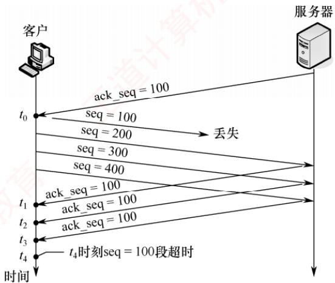

51. 【2019 统考真题】若主机甲主动发起一个与主机乙的 TCP 连接，甲、乙选择的初始序号分别为 2018 和 2046，则第三次握手 TCP 段的确认序号是（）。

- A. 2018
- B. 2019
- C. 2046
- D. 2047

52. 【2020 统考真题】若主机甲与主机乙已建立一条 TCP 连接，最大段长（MSS）为 1KB，往返时间（RTT）为 2ms，则在不出现拥塞的前提下，拥塞窗口从 8KB 增长到 32KB 所需的最长时间是（）。

- A. 4ms
- B. 8ms
- C. 24ms
- D. 48ms

53. 【2020 统考真题】若主机甲与主机乙建立 TCP 连接时，发送的 SYN 段中的序号为 1000，在断开连接时，主机甲发送给主机乙的 FIN 段中的序号为 5001，则在无任何重传的情况下，甲向乙已经发送的应用层数据的字节数为（）。

- A. 4002
- B. 4001
- C. 4000
- D. 3999

54. 【2021 统考真题】若客户首先向服务器发送 FIN 段请求断开 TCP 连接，则当客户收到服务器发送的 FIN 段并向服务器发送 ACK 段后，客户的 TCP 状态转换为（）。

- A. CLOSE_WAIT
- B. TIME_WAIT
- C. FIN_WAIT_1
- D. FIN_WAIT_2

55. 【2021 统考真题】若大小为 12B 的应用层数据分别通过 1 个 UDP 数据报和 1 个 TCP 段传输，则该 UDP 数据报和 TCP 段实现的有效载荷（应用层数据）最大传输效率分别是（）。

- A. 37.5%, 16.7%
- B. 37.5%, 37.5%
- C. 60.0%, 16.7%
- D. 60.0%, 37.5%

56. 【2021 统考真题】设主机甲通过 TCP 向主机乙发送数据，部分过程如下图所示。甲在 $t_{0}$ 时刻发送一个序号 seq=501、封装 200B 数据的段，在 $t_{1}$ 时刻收到乙发送的序号 seq=601、确认序号 ack_seq=501、接收窗口 rcvwnd=500B 的段，则甲在未收到新的确认段之前，可以继续向乙发送的数据序号范围是（）。

  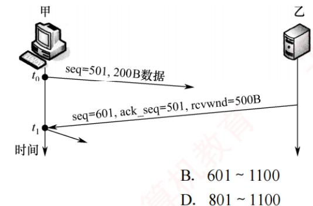

57. 【2022 统考真题】假设主机甲和主机乙已建立一个 TCP 连接，最大段长 MSS=1KB，甲一直向乙发送数据，当甲的拥塞窗口为 16KB 时，计时器发生了超时，则甲的拥塞窗口再次增长到 16KB 所需要的时间至少是（）。

- A. 4 RTT
- B. 5 RTT
- C. 11 RTT
- D. 16 RTT

58. 【2022 统考真题】假设客户 C 和服务器 S 已建立一个 TCP 连接，通信往返时间 RTT = 50ms，最长报文段寿命 MSL = 800ms，数据传输结束后，C 主动请求断开连接。若从 C 主动向 S 发出 FIN 段时刻算起，则 C 和 S 进入 CLOSED 状态所需的时间至少分别是（）。

- A. 850 ms, 50 ms
- B. 1650 ms, 50 ms
- C. 850 ms, 75 ms
- D. 1650 ms, 75 ms

59. 【2024 统考真题】假设主机 H 通过 TCP 向服务器发送长度为 3000B 的报文，往返时间 RTT = 10ms，最长报文段寿命 MSL = 30s，最大报文段长度 MSS = 1000B，忽略 TCP 段的传输时延，报文传输结束后 H 首先请求断开连接，则从 H 请求建立 TCP 连接时刻起，到 H 进入 CLOSED 状态为止，所需的时间至少是（）。

- A. 30.03s
- B. 30.04s
- C. 60.03s
- D. 60.04s

60. 【2025 统考真题】主机甲通过 TCP 向主机乙发送数据的部分过程如下图所示，seq 为序号，ack_seq 为确认序号，rcvwnd 为接收窗口。甲在 $t_{0}$ 时刻的拥塞窗口和发送窗口均为 2000B，拥塞控制阈值为 8000B，MSS = 1000B，甲始终以 MSS 发送 TCP 段。若甲在 $t_{1}$ 时刻收到如图所示的确认段，则甲在未收到新的确认段之前，还可继续向乙发送的 TCP 段数是（）。

  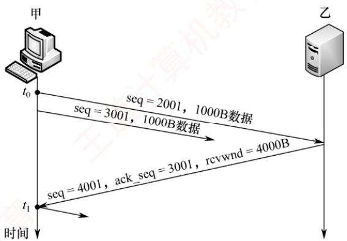

- A. 2
- B. 3
- C. 4
- D. 5

61. 【2025 统考真题】Time 是一个提供时间查询服务的 C/S 架构网络应用，支持客户通过 UDP 或 TCP 向 Time 服务器请求时间服务。若某客户与某 Time 服务器通信的往返时间 RTT = 8ms，则该客户分别通过 UDP 和 TCP 向该服务器请求服务，所需的最少时间分别是（）。

- A. 8ms, 8ms
- B. 8ms, 16ms
- C. 16ms, 8ms
- D. 16ms, 16ms

#### 二、综合应用题

01. 在使用 TCP 传输数据时，若有一个确认报文段丢失，则也不一定会引起与该确认报文段对应的数据的重传。试说明理由。

02. 若收到的报文段无差错，只是报文段失序，则TCP对此未做明确规定，而是让TCP的实现者自行确定。试讨论两种可能的方法的优劣：1）将失序报文段丢弃。2）先将失序报文段暂存于接收缓存内，待所缺序号的报文段收齐后再一起上交应用层。

03. 一个 TCP 连接要发送 3200B 的数据。第一个字节的编号为 10010。若前两个报文段各携带 1000B 的数据，最后一个报文段携带剩下的数据，写出每个报文段的序号。

04. 设 TCP 发送窗口的最大尺寸为 64KB，网络的平均往返时间为 20ms，问 TCP 所能得到的最大数据传输速率是多少？（只考虑单向传输，且假设信道带宽不受限）

05. 在一个 TCP 连接中，信道带宽为 100Mb/s，单个报文大小为 1000B，发送窗口固定为 60，端到端时延为 20ms。TCP 最多能达到的平均数据传输速率是多少？信道利用率是多少？（只考虑单向传输，确认报文的发送时延、各层协议的首部开销均忽略不计。）

06. 主机 A 基于 TCP 向主机 B 连续发送 3 个 TCP 报文段。第一个报文段的序号为 90，第二个报文段的序号为 120，第三个报文段的序号为 150。

1）第一、二个报文段中有多少数据？

2）假设第二个报文段丢失而其他两个报文段到达主机B，在主机B发往主机A的确认报文中，确认序号应是多少？

07. 考虑在一条TCP连接上采用慢开始拥塞控制而不发生网络拥塞的情况下，接收窗口为24KB，RTT为10ms，最大段长为2KB，则需要多长时间才能发送第一个完全窗口？

08. 设 TCP 拥塞窗口的慢开始门限值初始为 12MSS，当拥塞窗口达到 16 时出现超时，再次进入慢开始阶段，则从此时起恢复到超时的拥塞窗口大小，需要多少个往返时延？

09. 假定 TCP 报文段载荷是 1500B，最大分组存活时间是 120s，要使得 TCP 报文段的序号不会循环回来而重叠，线路允许的最快速度是多大？（不考虑帧长限制）

10. 一个TCP连接使用 $256\mathrm{kb / s}$ 的链路，其端到端时延为 $128\mathrm{ms}$ 。经测试发现吞吐率只有

　　128kb/s。问窗口是多少？忽略 PDU 封装的协议开销及接收方应答分组的发送时间（假定应答分组长度很小）。

11. 假定 TCP 最大报文段的长度是 1KB，拥塞窗口被置为 18KB，并且发生了超时事件。若接着的 4 次迸发量传输都是成功的，则该窗口将是多大？

12. 一个 TCP 首部的数据信息（十六进制表示）为 0x0D 28 00 15 50 5F A9 06 00 00 00 00 70 02 40 00 C0 29 00 00。TCP 首部的格式如下图所示。请回答：

1）源端口号和目的端口号各是多少？

2）发送的序号是多少？确认序号是多少？

3）TCP首部的长度是多少？

4）这是一个使用什么协议的TCP连接？该TCP连接的状态是什么？

  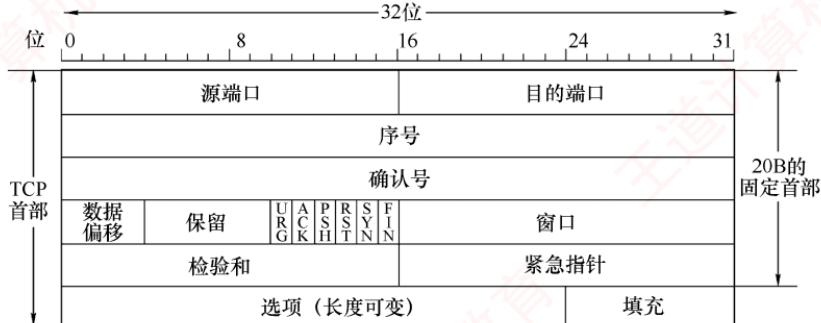

13. 【2012 统考真题】主机 H 通过快速以太网连接 Internet，IP 地址为 192.168.0.8，服务器 S 的 IP 地址为 211.68.71.80。H 与 S 使用 TCP 通信时，在 H 上捕获的其中 5 个 IP 分组如表 1 所示。

　　表1

<table><tr><td>编号</td><td colspan="5">IP分组的前40B内容(十六进制)</td></tr><tr><td rowspan="2">1</td><td>45 00 00 30</td><td>01 9b 40 00</td><td>80 06 1d e8</td><td>c0 a8 00 08</td><td>d3 44 47 50</td></tr><tr><td>0b d9 13 88</td><td>84 6b 41 c5</td><td>00 00 00 00</td><td>70 02 43 80</td><td>5d b0 00 00</td></tr><tr><td rowspan="2">2</td><td>45 00 00 30</td><td>00 00 40 00</td><td>31 06 6e 83</td><td>d3 44 47 50</td><td>c0 a8 00 08</td></tr><tr><td>13 88 0b d9</td><td>e0 59 9f ef</td><td>84 6b 41 c6</td><td>70 12 16 d0</td><td>37 e1 00 00</td></tr><tr><td rowspan="2">3</td><td>45 00 00 28</td><td>01 9c 40 00</td><td>80 06 1d ef</td><td>c0 a8 00 08</td><td>d3 44 47 50</td></tr><tr><td>0b d9 13 88</td><td>84 6b 41 c6</td><td>e0 59 9f f0</td><td>50 10 43 80</td><td>2b 32 00 00</td></tr><tr><td rowspan="2">4</td><td>45 00 00 38</td><td>01 9d 40 00</td><td>80 06 1d de</td><td>c0 a8 00 08</td><td>d3 44 47 50</td></tr><tr><td>0b d9 13 88</td><td>84 6b 41 c6</td><td>e0 59 9f f0</td><td>50 18 43 80</td><td>e6 55 00 00</td></tr><tr><td rowspan="2">5</td><td>45 00 00 28</td><td>68 11 40 00</td><td>31 06 06 7a</td><td>d3 44 47 50</td><td>c0 a8 00 08</td></tr><tr><td>13 88 0b d9</td><td>e0 59 9f f0</td><td>84 6b 41 d6</td><td>50 10 16 d0</td><td>57 d2 00 00</td></tr></table>

　　回答下列问题:

1）表1中的IP分组中，哪几个是由H发送的？哪几个完成了TCP连接建立过程？哪几个在通过快速以太网传输时进行了填充？

2）根据表1中的IP分组，分析S已经收到的应用层数据字节数是多少。

3）若表1中的某个IP分组在S发出时的前40B如表2所示，则该IP分组到达H时经过了多少个路由器？

　　表 2

<table><tr><td rowspan="2">来自S的分组</td><td>45 00 00 28</td><td>68 11 40 00</td><td>40 06 ec ad</td><td>d3 44 47 50</td><td>ca 76 01 06</td></tr><tr><td>13 88 a1 08</td><td>e0 59 9f f0</td><td>84 6b 41 d6</td><td>50 10 16 d0</td><td>b7 d6 00 00</td></tr></table>

　　IP 分组头结构和 TCP 段头结构分别如图 1 和图 2 所示。

  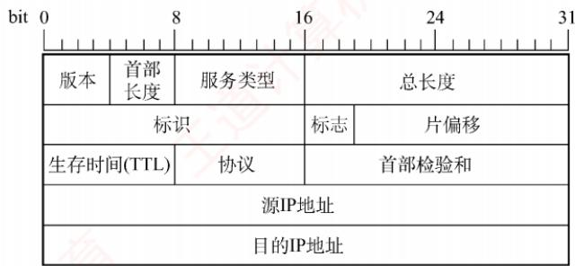

　　图 1 IP 分组头结构

  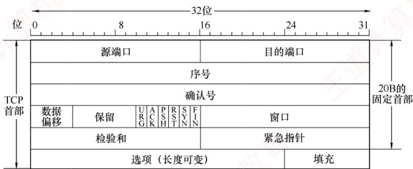

　　图 2 TCP 段头结构

14. 【2016 统考真题】假设下图中的 H3 访问 Web 服务器 S 时，S 为新建的 TCP 连接分配了 20KB（K=1024）的接收缓存，最大段长 MSS=1KB，平均往返时间 RTT=200ms。H3 建立连接时的初始序号为 100，且持续以 MSS 大小的段向 S 发送数据，拥塞窗口初始阈值为 32KB；S 对收到的每个段进行确认，并通告新的接收窗口。假定 TCP 连接建立完成后，S 端的 TCP 接收缓存仅有数据存入而无数据取出。请回答下列问题：

  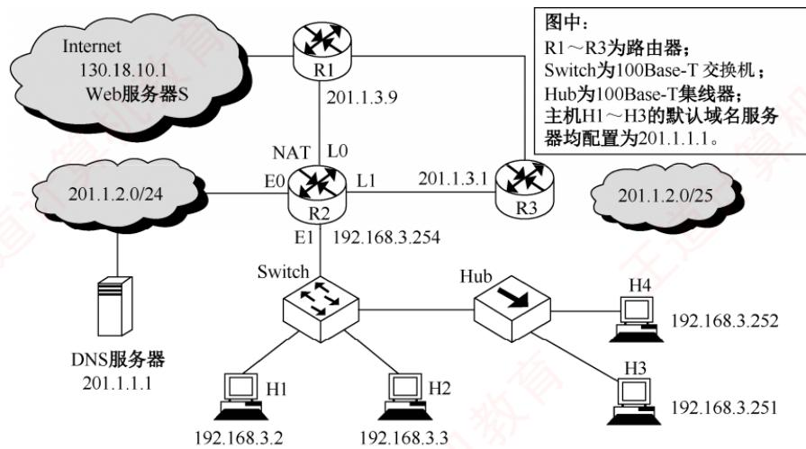

1）在TCP连接建立过程中，H3收到的S发送过来的第二次握手TCP段的SYN和ACK标志位的值分别是多少？确认序号是多少？

2）H3收到的第8个确认段所通告的接收窗口是多少？此时H3的拥塞窗口变为多少？

　　H3 的发送窗口变为多少？

3）H3的发送窗口等于0时，下一个待发送的数据段序号是多少？H3从发送第1个数据段到发送窗口等于0时刻为止，平均数据传输速率是多少？（忽略段的传输时延。）

4）若H3与S之间的通信已经结束，在 $t$ 时刻H3请求断开该连接，则从 $t$ 时刻起，S释放该连接的最短时间是多少？

### 5.3.8 答案与解析

#### 一、单项选择题

**01. C**

　　因为面向连接的服务需要建立连接，且需要保证数据的有序性和正确性，所以它比无连接的服务开销大，而速度和效率方面也要比无连接的服务差一些。

**02. C**

　　TCP 中端口号 80 标识 Web 服务器端的 HTTP 进程, 客户端访问 Web 服务器的 HTTP 进程的端口号由客户端的操作系统动态分配。因此答案为选项 C。

**03. D**

　　客户端使用的端口号仅在客户进程运行时才动态地选择。应用进程通过端口号进行标识，端口号长度为16位。不同计算机的相同端口号是没有联系的，因此选项D错误。

**04. D**

　　TCP 提供的是一对一全双工可靠的字节流服务，所以 TCP 并不支持广播。

**05. C**

　　在 TCP 首部中没有目标主机 IP 地址，这是 IP 首部的字段。TCP 采用确认机制，并对错误或超时的分组进行重传，以保证数据的可靠性。TCP 会根据网络的最大传输单元 MTU 和最大报文段长度 MSS 将消息分成适当大小的段（参考本章疑难点），并在目标主机中进行重组。

**06. B**

　　TCP 报文段和 UDP 数据报都包含源端口、目的端口、检验号。因为 UDP 提供不可靠的传输服务，不需要对报文编号，所以不会有序号字段，而 TCP 提供可靠的传输服务，因此需要设置序号字段。目的 IP 地址属于 IP 数据报中的内容。

**07. D**

　　TCP 伪首部与 UDP 伪首部一样，包括 IP 分组首部的一部分。IP 首部中有一个协议字段，用于指明上层协议是 TCP 还是 UDP。17 代表 UDP，6 代表 TCP，所以选项 D 错误。对于选项 A，因为数据偏移字段的单位是 4B，所以当偏移取最大值时 TCP 首部长度为 $15 \times 4 = 60B$ 。由于使用填充，所以长度总是 4B 的倍数，选项 C 正确。

**08. B**

　　URG 是紧急位，其为 1 时表示报文段中有紧急数据，需要尽快发送。RST 是复位位，其为 1 时表示出现严重错误，必须释放连接，然后重新建立连接。ACK 是确认位，其为 1 时表示确认序号（ack）字段有效。FIN 为终止位，其为 1 时代表发送方请求释放单向连接，此时并没有完全释放连接，只有当接收方发送完数据并同样将 FIN 位置为 1 时才会释放连接。

**09. C**

　　TCP 报文段首部中窗口字段的值指的是自己接收窗口的尺寸。

**10. B**

　　TCP 使用滑动窗口机制来进行流量控制。在 ACK 应答信息中，TCP 在接收端用 ACK 加上接收方允许接收数据范围的最大值回送给发送方，发送方把这个最大值当作发送窗口值，表明发送端在未收到确认之前可以发送的最大字节数，即 2000B。

**11. C**

　　TCP 的确认序号是指明接收方下一次希望收到的报文段的数据部分第一个字节的编号，可以看出，前一个已收到的报文段的最后一个字节的编号为 99，所以选项 C 正确。报文段的序号是其数据部分第一个字节的编号。选项 A、B 不正确，因为有可能已收到的这个报文段的数据部分不止一个字节，则报文段的编号就不为 99，但可以说编号为 99 的字节已收到。

**12. A**

　　两端主机在发出建立 TCP 连接的请求时，会在 TCP 首部写入 MSS（最大报文段长度）选项，告诉对方自己的接口能够适应的 MSS 的大小，然后在二者之间选择一个较小的值投入使用，此后 TCP 将以 MSS 的大小对数据进行分割发送。MSS 是在三次握手时计算得出的。

**13. C**

　　TCP 让每个发送方仅发送正确数量的数据，保持网络资源被利用但又不会过载。为了避免网络拥塞和接收方缓冲区溢出，TCP 发送方在任意时刻可以发送的最大数据流是接收方允许的窗口和拥塞窗口中的最小值。

**14. D**

　　TCP 为每个连接设有一个持续计时器，只要发送方收到对方的零窗口通知，就启动持续计时器。若计时器超时，则发送一个零窗口探测报文段，而对方就在确认这个探测报文段时给出现在的窗口值。若窗口值仍然为零，则发送方收到确认报文段后就重新设置持续计时器。

**15. A**

　　在 40Gb/s 的线路上传送数据，每秒可传送 $5 \times 10^{9}B$ 的数据，TCP 的序号字段有 32 位，共有 $2^{32}$ 个不同的序号，则可发送的时间是 $2^{32}/(5 \times 10^{9}) = 0.859s = 859ms$ 。

**16. C**

　　拥塞窗口是发送端根据网络拥塞情况确定的窗口值。

**17. C**

　　参与 TCP 连接的两个进程中的任何一个都能提出释放连接的请求。

**18. A、C**

　　TCP 使用三次握手来建立连接，第一次握手时，A 发给 B 的 TCP 报文中应置其首部 SYN 位为 1，并选择序号 seq=X，表明传送数据时的第一个数据字节的序号是 X；在第二次握手中，即 B 接收到报文后，发给 A 的确认报文段中应使 SYN=1、ACK=1，且序号 $ACK_{X+1}=1$ （ACK 的下标为捎带的序号），同时告诉自己选择的序号 seq=Y。

**19. D**

　　在 TCP 的 “三次握手” 中，第二次握手时，SYN 和 ACK 均被置为 1。

**20. C**

　　TCP 采用三报文握手建立连接，其中第一个报文是 TCP 连接请求，第二个报文是对 TCP 连接请求的确认，第三个报文是对 TCP 连接请求确认的确认。

**21. B**

　　A 向 B 发送的第一个 SYN 段虽然不携带数据，但仍会消耗一个序号 211，A 向 B 发送的第 4 次挥手报文段的 seq 等于 985，说明之前发送的数据的序号为 212～984，因为在断开连接时发送的第一个 FIN 段会消耗一个序号，因此发送的总数据量为 984 - 212 = 772B。

**22. C**

　　在 A 发向 B 的报文中，seq 表示发送的报文段中数据部分的第一个字节在 A 的发送缓存区中的编号，ack 表示 A 期望收到的下一个报文段的数据部分的第一个字节在 B 的发送缓存区中的编号。因此，同一个报文段中的 seq 和 ack 的值是没有联系的。在 B 发给 A 的报文（捎带确认）中，seq 值应和 A 发向 B 的报文中的 ack 值相同，即 201；ack 值表示 B 期望下次收到 A 发出的报文段的第一个字节的编号，应是 $200 + 2 = 202$ 。

**23. B**

　　FIN 位用来释放一个连接，它表示本方已没有数据要传输。然而，在关闭一个连接后，对方还可以继续发送数据，所以还有可能接收到数据。

**24. D**

　　客户向服务器发送 FIN 报文段 A，表示客户不再通过本连接向服务器发送数据，但服务器仍有可能继续向客户发送数据，假设服务器在发送 FIN 报文段 B 之前已向客户发送了 k 字节的数据，则报文段 B 中的 seq 值为 $y + k$ ，选项 A、B 错误。报文段 A 是客户通过本连接发给服务器的最后一个报文段，会消耗一个序号（注意，尽管协议未禁止 FIN 段携带数据，但主流的操作系统一般不允许其携带数据），因此报文段 B 中的 ack 值一定为 $x + 1$ ，选项 C 错误，选项 D 正确。

**25. C**

　　本题中，一个 TCP 报文的首部长度是 20B，一个 IP 数据报的首部长度也是 20B，再加上 60B 的数据，一个 IP 数据报的总长度为 100B，可知数据占 60%。

**26. C**

　　t 时刻 TCP 客户请求断开连接，发出连接释放 FIN 报文段；题目问的是最短时间，所以当 TCP 服务器收到 TCP 客户发来的 FIN 报文段后不再发送数据，因此同时发出确认 ACK 报文段和连接释放 FIN 报文段，即直接跳过 CLOSE-WAIT 状态；TCP 客户收到 FIN 报文段后必须发出确认；TCP 服务器收到确认后就进入 CLOSED 状态，共经历 1.5RTT。

**27. C**

　　甲选择的初始序号为 200，建立 TCP 连接的第一个报文段不能携带数据，但要消耗一个序号。甲给乙发送的第二个报文段（第三次握手）的序号是 201，该报文段可以携带数据，若不携带数据，则不消耗序号，题中该报文段不携带数据，因此下一个数据报文段的序号仍是 201。

**28. C**

　　A 的初始序号为 1666，建立连接的第一个报文段不携带数据，但要消耗一个序号。A 给 B 发送的第二个报文段的序号是 1667，该报文段不携带数据，因此不消耗序号。下一个数据报文段的序号仍是 1667，1000B 的序号范围是 1667～2666，所以 B 接收后发送给 A 的确认序号是 2667。

**29. C**

　　TCP 提供的是可靠的字节流传输服务，使用窗口机制进行流量控制与拥塞控制。TCP 的滑动窗口机制是面向字节的，因此窗口大小的单位为字节。假设发送窗口的大小为 N，这意味着发送端可以在没有收到确认的情况下连续发送 N 字节。

**30. C**

　　乙仅正确接收到第 1 个和第 3 个段，所以乙下次期望收到第 2 个段，乙发送给甲的确认序号即第 2 个段的序号。第 3 个段的序号为 1000，则第 2 个段的序号为 1000 - 300 = 700，所以确认序号为 700。

**31. C**

　　若在拥塞窗口为 34KB 时发生了超时事件，则慢开始门限值就被设定为 17KB，且 cwnd 重新设为 1KB。按照慢开始算法，第 1 个 RTT 后，cwnd = 2KB，第 2 个 RTT 后，cwnd = 4KB，第 3 个 RTT 后，cwnd = 8KB。当第 4 个 RTT 发出去的 8 个报文段的确认都收到后，cwnd = 16KB（此时还未超过慢开始门限值）。注意，题中“这些报文段均得到确认后”这句话很重要。

**32. A**

　　接收窗口等于 10KB。发生超时后，拥塞窗口重设为 1，经过 10RTT 后，拥塞窗口一定大于 10KB。但甲的发送窗口取拥塞窗口和接收窗口中的较小值，即 10KB。

**33. C**

　　在慢开始和拥塞避免算法中，拥塞窗口初始为 1，窗口大小开始按指数增长。当拥塞窗口大于慢开始门限后停止慢开始算法，改用拥塞避免算法。此处慢开始的门限值初始为 8，当拥塞窗口增大到 8 时改用拥塞避免算法，窗口大小按线性增长，每次增加 1 个报文段，当增加到 12 时，出现超时，重新设门限值为 6（12 的一半），拥塞窗口再重新设为 1，执行慢开始算法，到门限值 6 时执行拥塞避免算法。因此，拥塞窗口大小的变化为 1, 2, 4, 8, 9, 10, 11, 12, 1, 2, 4, 6, 7, 8, 9, …，其中第 13 次传输时（第 12 个传输轮次后）拥塞窗口的大小为 7。

**34. B**

　　当拥塞窗口小于 ssthresh 时，拥塞窗口以指数方式增长，拥塞窗口从 2KB 到 16KB 需经过 3RTT，超过 16KB 后，每经过 1RTT，拥塞窗口加 1MSS，所以从 16KB 到 20KB 经过了 2RTT，共经过 5RTT，RTT = 10ms，故经过 50ms 后甲的发送窗口第一次为 20KB。

**35. D**

　　在慢开始阶段，每收到一个对新报文段的确认，拥塞窗口就加1，因此每经过1RTT，拥塞窗口就加倍。在tRTT时刻到 $(t+1)$ RTT时刻之间发送了k个数据段，因此在这个RTT后，拥塞窗口由k变为2k，所以在下一个RTT内预期将发送2k个数据段。

**36. C**

　　超时发生时，新门限值通常设置为此时拥塞窗口值的一半，而不是旧门限值的一半。

**37. D**

　　条件“收到了3个冗余ACK报文”说明此时应执行快恢复算法，因此慢开始门限值设为17KB，并且此时cwnd也被设为17KB，第1个RTT后，cwnd=18KB，第2个RTT后，cwnd=19KB，第3个RTT后，cwnd=20KB，第4个RTT后，发出的报文全部得到确认，cwnd再增加1KB，变为21KB。注意cwnd的增加都发生在收到确认报文后。

**38. A**

　　本题中出现了拥塞窗口和接收端窗口，为了保证 B 的接收缓存不发生溢出，发送窗口应该取两者的最小值。先看拥塞窗口，由于慢开始门限值为 2KB，第 1 个 RTT 中 A 拥塞窗口为 4KB，按照拥塞避免算法，收到 B 的确认报文后，拥塞窗口增长为 5KB。再看接收端窗口，B 通过确认报文中窗口字段向 A 通知接收端窗口，则接收端窗口为 2KB。因此在下一次发送数据时，A 的发送窗口应该为 2KB，即 1RTT 内最多发送 2KB。所以选项 A 正确。

**39. B**

　　按照慢开始算法，发送窗口的初始值为拥塞窗口的初始值，即 MSS 的大小 2KB，然后依次增大为 4KB、8KB、16KB，然后是接收窗口的大小 24KB，即达到第一个完全窗口。因此达到第一个完全窗口所需要的时间为 4RTT=40ms。

**40. B**

　　本题要求的是最小时间，且题目未给出拥塞窗口的门限值，所以拥塞窗口一直按指数增长是最快的。拥塞窗口从1KB增长到8KB需要3个RTT，即9ms，并在第1个RTT内发送1KB，在第2个RTT内发送2KB，在第3个RTT内发送4KB，累积发送 $1+2+4=7KB$ ，这时乙的接收缓存还剩16-7=9KB，此时的发送窗口= $\min\{拥塞窗口, 接收窗口\}=8KB$ ，所以选B。

**41. D**

　　确认序号表示接收方期望收到的下一个字节的序号。第一个段起始序号为 200，包含 300B 数据，序号范围 200～499；第二个段起始序号为 500，包含 500B 数据，序号范围 500～999。因此，乙正确接收后，期望的下一个字节序号为 1000，故返回的确认序号为 1000。

**42. C**

　　超时发生时，将慢开始门限 ssthresh 设为当前拥塞窗口 cwnd 的一半，即 8KB，并将 cwnd 重置为 1KB。此后进入慢开始阶段：第 1 个 RTT 后 cwnd = 2KB，第 2 个 RTT 后 cwnd = 4KB，第 3 个 RTT 后 cwnd = 8KB（达到 ssthresh）。从第 4 个 RTT 开始转为拥塞避免算法，窗口线性增长，即每个 RTT 增加 1 个 MSS（1KB），因此第 4 个 RTT 结束时 cwnd = 8 + 1 = 9KB。

**43. A**

　　发送窗口的大小由接收窗口和拥塞窗口中的较小值决定。主机甲的拥塞窗口为 4000B，乙确认段通告的接收窗口为 2000B，因此发送窗口 = min{4000, 2000} = 2000B。甲已连续发送两个最大段（共 2000B），但仅第一个段被确认，说明第二个段（1000B）仍处于已发送未确认状态。因此，甲已使用的窗口为 1000B，还可发送的最大字节数 = 2000 - 1000 = 1000B。

**44. C**

　　在 TCP 三次握手中，当主机乙接受连接请求时，必须发送 SYN = 1 且 ACK = 1 的报文段。确认序号 ack 应为甲初始序号 seq = 11220 加 1，即 11221。乙的序号 seq 由其自行选择，与甲的序号无关，可为任意值。因此选项 C（SYN = 1, ACK = 1, seq = 11221, ack = 11221）符合要求。

**45. B**

　　TCP 段的序号字段表示该段数据部分第一个字节的序号。已知第 3 个段序号为 900，则第 2 个段的结束序号为 899，起始序号 = 900 - 400 = 500。主机乙仅收到第 1 段和第 3 段，未收到第 2 段（500～899），因此期望收到的下一个字节序号为 500，即确认序号为 500。

**46. B**

　　乙发送给甲的 TCP 段中，序号 seq = 1913 表示其数据从字节编号 1913 开始，有效载荷为 100B，故覆盖 1913～2012；确认序号 ack = 2046 表示乙已成功接收甲发送的序号至 2045 的所有数据，期望下个字节为 2046。甲成功收到后，在立即回复的 TCP 段中，seq 应置为 2046（发送的第一个字节序号），ack 应置为 2013（期待乙发送的下一个字节序号，即 $2012 + 1 = 2013$ ）。

**47. A**

　　t 时刻发生超时，将慢开始门限 ssthresh 设为 8KB/2 = 4KB，并将拥塞窗口 cwnd 重置为 1KB。接收窗口恒为 10KB，因此发送窗口 = min{cwnd, 10KB}。经历 10RTT 后，拥塞窗口的大小（单位为 KB）依次为 2, 4, 5, 6, 7, 8, 9, 10, 11, 12。由于接收窗口限制为 10KB，最终发送窗口为 10KB。实际上，由于发送窗口必然总小于或等于 10KB，四个选项中只有选项 A 符合条件。

**48. A**

　　发送窗口 = min{接收窗口, 拥塞窗口}。乙的接收缓存为 16KB 且不取走数据，因此接收窗口随接收数据递减。甲按慢开始发送：第 1RTT 发 1KB，累计 1KB；第 2RTT 发 2KB，累计 3KB；第 3RTT 发 4KB，累计 7KB；第 4RTT 发 8KB，累计 15KB。此时乙的缓存剩余 1KB，接收窗口 = 1KB。拥塞窗口此时为 16KB，故发送窗口 = min{16KB, 1KB} = 1KB。

**49. A**

　　接收缓存为 64KB，远大于目标窗口 32KB，因此发送窗口由拥塞窗口决定。TCP 慢开始阶段，初始拥塞窗口 cwnd = 1KB（1MSS），每经过 1RTT，cwnd 翻倍： $1KB \rightarrow 2KB \rightarrow 4KB \rightarrow 8KB \rightarrow 16KB \rightarrow 32KB$ ，共需 5RTT。每个 RTT = 5ms，总时间 = $5 \times 5ms = 25ms$ 。

**50. C**

　　TCP 快速重传机制规定：当发送方收到对同一报文段的 3 个重复确认（冗余 ACK）时，立即重传丢失段。 $t_{0}$ 时刻首次收到 ack_seq = 100 的确认段，不计入冗余； $t_{1}$ 、 $t_{2}$ 、 $t_{3}$ 连续收到三个相同的 ack_seq = 100，构成 3 个重复 ACK，因此在 $t_{3}$ 时刻触发快速重传，重新发送 seq = 100 的段。

**51. D**

　　三次握手过程: 甲发 SYN(seq = 2018); 乙回 SYN + ACK(seq = 2046, ack = 2019); 甲再发 ACK。第三次握手的确认序号应为乙的初始序号加 1，即 $2046 + 1 = 2047$ 。

**52. D**

　　由于慢开始门限 ssthresh 可按需设置，为求拥塞窗口 cwnd 从 8KB 增长到 32KB 所需的最长时间，可将 ssthresh 设置小于或等于 8KB。即始终处于拥塞避免阶段，cwnd 从 8KB 增至 32KB，需增加 24KB，每经过一个 RTT，cwnd 加 1，故需 24 个 RTT，总时间为 $24 \times 2 \, ms = 48 \, ms$ 。

**53. C**

　　TCP 规定：SYN 段虽不携带数据，但要消耗一个序号，因此数据传输阶段所用的起始序号为 $1000 + 1 = 1001$ 。FIN 段也要消耗一个序号，因此已发送数据的最后一个字节序号为 5001 - 1 = 5000。因此已发送应用层数据字节数为 $5000 - 1001 + 1 = 4000B$ 。

**54. B**

　　TCP 客户主动关闭连接：发 FIN 后进入 FIN_WAIT_1 状态；收到服务器 ACK 后进入 FIN_WAIT_2 状态；收到服务器 FIN 后，客户发 ACK 后进入 TIME_WAIT 状态；经过 2MSL 时间后才进入 CLOSED 状态。因此，当客户收到服务器 FIN 并发送 ACK 后，其状态为 TIME_WAIT。

**55. D**

　　UDP 首部固定为 8B，传输 12B 应用数据时总长度 = 12 + 8 = 20B，有效载荷传输效率 = 12/20 = 60%。TCP 首部最短为 20B，总长度 = 12 + 20 = 32B，有效载荷传输效率为 12/32 = 37.5%。

**56. C**

　　甲在 $t_{0}$ 发送 seq = 501、200B 数据的段，覆盖 501～700。 $t_{1}$ 收到乙的确认段：ack_seq = 501（表示序号 501 之前已接收），rcvwnd = 500B（表示从 501 起可接收 500B 数据）。甲已发送 200B（501～700），故在未收到新的确认前，甲还可继续发送 500 - 200 = 300B，对应序号 701～1000。

**57. C**

　　时刻 0 发生超时，将慢开始门限值 ssthresh 设为 16KB/2 = 8KB，拥塞窗口 cwnd 重置为 1KB。执行慢开始算法：cwnd 指数增长，经过 3RTT，达到 ssthresh；随后执行拥塞避免算法：cwnd 线性增长，再经过 8RTT，达到 16KB。共需 11RTT。拥塞窗口的变化如下表所示。

<table><tr><td>时刻</td><td>0</td><td>1</td><td>2</td><td>3</td><td>4</td><td>5</td><td>6</td><td>7</td><td>8</td><td>9</td><td>10</td><td>11</td></tr><tr><td>拥塞窗口</td><td>1</td><td>2</td><td>4</td><td>8</td><td>9</td><td>10</td><td>11</td><td>12</td><td>13</td><td>14</td><td>15</td><td>16</td></tr></table>

**58. D**

　　题目问的是最少时间，因此当服务器 S 收到客户 C 发的 FIN 后不再传输数据，而立即返回 ACK 和 FIN。客户 C 主动关闭：C 发 FIN（0ms）→S 在 0.5RTT（25ms）收到后立即返回 ACK + FIN（因无数据待发）→C 在 1RTT（50ms）收到 S 的 ACK + FIN 后，发送 ACK 并启动 2MSL 计时器。C 进入 CLOSED 状态至少需 $50 \, ms + 2 \times 800 \, ms = 1650 \, ms$ 。S 在收到 C 对 FIN 的 ACK 后即进入 CLOSED 状态，该 ACK 在 C 发 FIN 后 $1.5 \, RTT = 75 \, ms$ 到达 S，故 S 至少需 $75 \, ms$ 。

**59. D**

　　TCP 连接建立的前两次握手耗时 1RTT。第三次握手段可携带 1000B 数据（或与数据段合并发送）。H 收到确认后，拥塞窗口增长至 2000B。因此第 3 个 RTT 内，可发送剩余 2000B 数据，至此数据传输完毕。第 4 个 RTT 开始时，H 向服务器发送 FIN 请求断开连接。题目问的是最少时间，因此服务器收到 FIN 后不再发送数据，并立即回复 ACK + FIN。第 4 个 RTT 结束时，H 收到服务器的 FIN，等待 2MSL 时间（60s）后进入 CLOSED 状态，总时间为 $40ms + 60s = 60.04s$ 。

  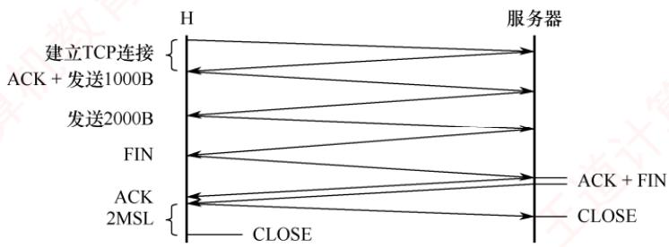

**60. A**

　　甲收到确认段（ack_seq = 3001），表明序号2001～3000的1000 B数据已接收。由于当前拥塞窗口小于阈值，处于慢启动阶段，每收到一个ACK，拥塞窗口加1 MSS，故由2000 B增至3000B。接收窗口为4000B。因此发送窗口 $= \min \{3000, 4000\} = 3000\mathrm{B}$ 。此时甲已发送但尚未确认的数据为序号 $3001 \sim 4000$ （1000 B），故可用窗口为 $3000 - 1000 = 2000\mathrm{B}$ ，还可发送2个TCP段。

**61. B**

　　UDP 是无连接的，客户发送请求后服务器直接返回应答，整个过程需约 1RTT，因此 UDP 的最少时间为 8ms。TCP 需先通过三次握手建立连接：客户发送 SYN，服务器回复 SYN-ACK，客户再发送 ACK（可携带应用请求）。从客户发送 SYN 起，到服务器收到请求共经历 1.5RTT，服务器响应后，再经 0.5RTT 返回客户，总计 2RTT。因此 TCP 的最少时间为 16ms。

#### 二、综合应用题

**01. 【解答】**

　　这是因为发送方可能还未重传时，就收到了对更高序号的确认。例如主机 A 连续发送两个报文段（SEQ=92，DATA 共 8B）和（SEQ=100，DATA 共 20B），均正确到达主机 B。B 连续发送两个确认（ACK=100 和 ACK=120），但前一个确认在传送时丢失。例如 A 在第一个报文段（SEQ=92，DATA 共 8B）超时之前收到了对第二个报文段的确认（ACK=120），此时 A 知道，119 号和在 119 号之前的所有字节均已被 B 正确接收，因此 A 不会再重传第一个报文段。

**02. 【解答】**

　　第一种方法将失序报文段丢弃，会引起被丢弃报文段的重复传送，增加对网络带宽的消耗，但由于用不着将该报文段暂存，可避免对接收方缓冲区的占用。

　　第二种方法先将失序报文段暂存于接收缓存，待所缺序号的报文段收齐后再一起上交应用层；这样可以减少发送方的重传次数，减少对网络带宽的消耗，但增加了接收方缓冲区的开销。

**03. 【解答】**

　　TCP 报文段的序号是指其数据部分的第一个字节的序号。因此第一个报文段的序号是 10010，序号范围 10010～11009；第二个报文段的序号是 $10010 + 1000 = 11010$ ，序号范围 11010～12009；

　　第三个报文段的序号为 $11010 + 1000 = 12010$ ，序号范围 $12010 \sim 13209$ 。

**04. 【解答】**

　　最大数据传输速率表明在 1RTT 内将窗口中的字节全部发送完毕。在平均往返时间 20ms 内，发送的最大数据量为最大窗口值，即 $64 \times 1024B$ ，

$$
6 4 \times 1 0 2 4 \times 8 \div (2 0 \times 1 0 ^ {- 3}) \approx 2 6. 2 \mathrm{Mb/s}
$$

　　因此，所能得到的最大数据传输速率是 26.2Mb/s。

**05. 【解答】**

　　发送方发出一个报文所需的时间 = 报文长度/信道带宽 = $1000 \times 8 \div (100 \times 10^{6}) = 0.08 \, \text{ms}$ （注意单位转换）。发送方发出一个窗口的第一个报文到收到该报文的确认报文所需的时间 = $0.08 + RTT = 0.08 + 2 \times$ 端到端时延 = 40.08ms。发出一个窗口的所有报文所需的时间 = $60 \times 0.08 \, ms = 4.8 \, ms$ 。在 40.08ms 时间内，发送方可以连续发出一个窗口的所有报文，若所有报文都正确到达接收方，则所能达到的平均数据传输速率为 $1000 \times 60 \times 8 \div (40.08 \times 10^{-3}) \approx 11.98 \, \text{Mb/s}$ 。

　　信道利用率 = 平均数据传输速率/信道带宽（最大数据传输速率）= 11.98/100= 11.98%。

**06. 【解答】**

1）TCP 报文段的序号是指其数据部分的第一个字节的编号。因此第一个报文段中的数据有 120 - 90 = 30B，第二个报文段中的数据有 150 - 120 = 30B。

2）因为TCP使用累积确认策略，所以当第二个报文段丢失后，第三个报文段就成了失序报文，B期望收到的下一个报文段是序号为120的报文段，所以确认序号为120。

**07. 【解答】**

　　最大段长是 2KB，初始的拥塞窗口是 2KB，经过前 3 个 RTT 后拥塞窗口依次变为 4KB, 8KB 和 16KB，经过第 4 个 RTT 后拥塞窗口变为 32KB（大于接收窗口 24KB），所以此时发送窗口取 24KB，即第一个完全窗口。 $10ms \times 4 = 40ms$ ，因此需要 40ms 才能发送第一个完全窗口。

**08. 【解答】**

　　在慢开始和拥塞避免算法中，拥塞窗口初始为 1，窗口大小开始按指数增长。当拥塞窗口大于慢开始门限后停止慢开始算法，改用拥塞避免算法。此处慢开始的门限值初始为 12，当拥塞窗口增大到 12 时改用拥塞避免算法，窗口大小按线性增长，每次增加 1 个报文段，当增加到 16 时，出现超时，重新设门限值为 8（16 的一半），拥塞窗口再重新设为 1，执行慢开始算法，到门限值 8 时执行拥塞避免算法。

　　这样，拥塞窗口的变化就为 1, 2, 4, 8, 12, 13, 14, 15, 16, 1, 2, 4, 8, 9, 10, 11, 12, 13, 14, 15, 16.…。可见从出现超时时拥塞窗口为 16 到恢复拥塞窗口大小为 16，需要的往返时间次数是 11。注意，发现超时时，拥塞窗口从 16 变为 1 是立即进行的，不会间隔 1RTT。

**09. 【解答】**

　　目标在 120s 内最多发送 $2^{32}B$ （序号为 32 位），即 35791394B/s 的载荷。TCP 报文段载荷是 1500B，因此可以发送 23861 个报文段。TCP 开销是 20B，IP 开销是 20B，以太网开销是 26B（18B 的首部和尾部，7B 的前同步码，1B 的帧开始定界符）。这就意味着对于 1500B 的载荷，必须发送 1566B。 $1566 \times 8 \times 23861 \approx 299Mb/s$ ，因此允许的最快线路速率是 299Mb/s。当比这一速度更快时，就存在同一时段内不同 TCP 报文段具有相同序号的风险。

**10. 【解答】**

　　来回路程的时延 $128ms \times 2 = 256ms$ 。设窗口值为 X（注意：单位为字节）。

　　假定一次最大发送量等于窗口值，且发送时间等于 256ms，则每发送一次都得停下来期待再次得到下一个窗口的确认，以得到新的发送许可。这样，发送时间等于停止等待应答的时间，结果测到的平均吞吐率就等于发送速率的一半，即 128kb/s，

$$
8 X \div (1 2 8 \times 2 \times 1 0 0 0) = 2 5 6 \times 0. 0 0 1 \quad \Rightarrow \quad X = 2 5 6 \times 1 0 0 0 \times 2 5 6 \times 0. 0 0 1 / 8 = 2 5 6 \times 3 2 = 8 1 9 2
$$

　　所以，窗口值为 8192。

**11. 【解答】**

　　在 TCP 的拥塞控制算法中，除使用慢开始的接收窗口和拥塞窗口外，还使用第 3 个参数，即门槛值。发生超时的时候，该门槛值被设置成当前拥塞窗口值的一半即 9KB，而拥塞窗口则重置成一个最大报文段长。然后使用慢开始的算法决定网络可以接受的迸发量，一直增长到门槛值为止。从这一点开始，成功的传输线性地增加拥塞窗口，即每次迸发传输后只增加一个最大报文段，而不是每个报文段传输后都增加一个最大报文段的窗口值。现在由于发生了超时，下一次传输将是 1 个最大报文段，然后是 2 个、4 个和 8 个最大报文段，第四次发送成功，且门限为 9KB，所以在 4 次迸发量传输后，拥塞窗口将增加为 9KB。

**12. 【解答】**

1）源端口号为第 1、2 个字节，即 0D 28，转换为十进制数为 3368。目的端口号为第 3、4 个字节，即 00 15，转换为十进制数为 21。

2）第 5～8 个字节为序号，即 50 5F A9 06。第 9～12 个字节为确认序号，即 00 00 00 00，也即十进制数 0。

3）第13个字节的前4位为TCP首部的长度，这里的值是7（以4B为单位），因此乘以4后得到TCP首部的长度为28B，说明该TCP首部还有8B的选项数据。

4）根据目的端口是21可知这是一条FTP连接，而TCP的状态则需要分析第14个字节。第14个字节的值为02，即SYN置为1，而且ACK=0表示该数据段没有捎带的确认，这说明是第一次握手时发出的TCP连接。

**13. 【解答】**

1）由图 1 看出，源 IP 地址为 IP 分组头的第 13～16 个字节。在表 1 中，1、3、4 号分组的源 IP 地址均为 192.168.0.8（c0a80008H），所以 1、3、4 号分组是由 H 发送的。再观察 1, 3, 4 号分组的标识字段，分别是 9b, 9c, 9d，标识字段是一个计数器，每产生一个数据报就加 1，这也说明主机 H 先后发送了 1, 3, 4 号分组。

　　在表 1 中，1 号分组封装的 TCP 段的 SYN=1，ACK=0，seq=846b 41c5H；2 号分组封装的 TCP 段的 SYN=1，ACK=1，seq=e059 9fefH，ack=846b 41c6H；3 号分组封装的 TCP 段的 ACK=1，seq=846b 41c6H，ack=e059 9ff0H，所以 1、2、3 号分组完成了 TCP 连接的建立过程。

　　由于快速以太网数据帧有效载荷的最小长度为 46B，表 1 中 3、5 号分组的总长度为 40（28H）字节，小于 46B，其余分组总长度均大于 46B。所以 3、5 号分组通过快速以太网传输时需要填充。

2）由3号分组封装的TCP段可知，发送应用层数据初始序号为 $\mathrm{seq} = 846\mathrm{b}41\mathrm{c}6\mathrm{H}$ ，由5号分组封装的TCP段可知，ack为 $\mathrm{seq} = 846\mathrm{b}41\mathrm{d}6\mathrm{H}$ ，所以S已经收到的应用层数据的字节数为 $846\mathrm{b}41\mathrm{d}6\mathrm{H} - 846\mathrm{b}41\mathrm{c}6\mathrm{H} = 10\mathrm{H} = 16\mathrm{B}$ 。

3）因为 S 发出的 IP 分组的标识 = 6811H，所以该分组所对应的是表 1 中的 5 号分组。S 发出的 IP 分组的 TTL = 40H = 64，5 号分组的 TTL = 31H = 49，64 - 49 = 15，所以可以推断该 IP 分组到达 H 时经过了 15 个路由器。

**14. 【解答】**

1) 第二次握手报文段的 $\mathrm{SYN} = 1$ ，ACK=1。确认序号是第一次握手报文段的序号 $+1 = 101$ 。

2）因为 S 的 TCP 接收缓存仅有数据存入而无数据取出，当 S 收到第 8 个段时接收缓存还剩 12KB，所以 H3 收到的第 8 个确认段所通告的接收窗口是 12KB。在慢开始阶段，每收到一个对新报文段的确认，拥塞窗口就加 1，当收到对第 8 个报文段的确认后，H3 的拥塞窗口变为 9KB。H3 的发送窗口取接收窗口和拥塞窗口的最小值，即 9KB。

3）H3 的发送窗口等于 0 时，下一个待发送段的序号是 $20K + 101 = 20 \times 1024 + 101 = 20581$ 。H3 从发送第 1 个段到发送窗口等于 0 时刻为止，共耗费了 5RTT（每个 RTT 传输的数据量依次为 1KB、2KB、4KB、8KB、5KB），平均数据传输速率是 $20KB \div (5 \times 200ms) = 20 \times 1024 \times 8b/s = 163.84kb/s$ 。

> **注意：**

　　K 表示文件大小或描述存储空间时等于 1024，这里通常用大写的 K；k 表示传输速率或描述网络通信时等于 1000，这里通常用小写的 k。注意区分和转换。

4）t 时刻 H3 请求断开连接，发出连接释放 FIN 报文段；S 收到后，最短时间的情况是 S 已没有要发送的数据，所以同时发出确认 ACK 报文段和连接释放 FIN 报文段，即 S 直接跳过 CLOSE-WAIT 状态；H3 收到 FIN 报文段后必须发出确认，S 收到确认后进入 CLOSED 状态，共经历 1.5RTT，因此 S 释放该连接的最短时间是 $1.5 \times 200ms = 300ms$ 。

## 5.4 本章小结及疑难点

#### 1. MSS（最大报文段长度）设置得过大或过小会有什么影响？

　　MSS 的设定与接收方的缓存大小或接收窗口无关，其主要目的是避免 IP 分片。若 MSS 设置得太小，网络利用率会显著降低。因为每个 TCP 报文段至少要加上 40B 的首部（TCP 首部 20B+IP 首部 20B）才能形成一个 IP 数据报。极端情况下，若数据部分仅 1B，则有效载荷占比仅为 1/41；若再考虑数据链路层的帧头尾开销，实际利用率还会更低。若 MSS 设置得太大，在 IP 层传输时可能因超过路径中某段链路的 MTU 而被分片。接收端需将所有分片重新组装成原始 TCP 报文段；一旦任一分片丢失，整个报文段都必须重传，反而增加传输开销和延迟。

　　因此，MSS 应尽可能大，但以在 IP 层不发生分片为前提。然而，由于互联网路径是动态变化的，某条路径上无须分片的 MSS，在另一条路径上可能仍需分片，故最佳 MSS 难以确定。为此，TCP 规定默认 MSS 为 536B，这意味着所有互联网主机都应能接收长度为 536B（数据）+20B（TCP 首部）=556B 的 TCP 报文段。

#### 2. TCP 使用的是后退 N 帧（GBN）还是选择重传（SR）?

　　表面上看，TCP 使用累积确认，类似于 GBN。但区别在于：接收方不会丢弃正确到达但失序的报文段，而是将其缓存，并反复发送冗余 ACK，指明期望收到的下一个按序报文段的序号。例如，假设发送方 A 连续发送 N 个报文段，其中第 $k (k < N)$ 个丢失，其余均正确到达接收方 B。在 GBN 中，接收方会丢弃所有失序的报文段（第 $k+1$ 个至 N 个），发送方需重传从第 k 个开始的所有未确认报文段。而 TCP 仅重传丢失的第 k 个报文段，后续已缓存的报文段无须重传。此外，TCP 还支持 SACK（Selective ACK）选项。启用 SACK 后，接收方可明确告知发送方哪些非连续的数据块已成功接收，使重传行为更接近 SR 协议。

　　因此，TCP的重传机制可视为GBN与SR的混合体：基础行为基于累积确认和冗余ACK

　　实现高效单点重传，SACK 则进一步增强了选择性确认能力。

#### 3. 为什么超时事件发生时 cwnd 被置为 1，而收到 3 个冗余 ACK 时 cwnd 减半？

　　两种事件反映的网络拥塞严重程度不同。收到3个冗余ACK，表明后续部分报文段已成功到达接收方（否则无法触发重复确认），说明网络仍具备一定传输能力，拥塞相对较轻。此时TCP采用快速重传机制，将cwnd减半（乘法减小），适度降低发送速率。超时事件发生，意味着连ACK都未能及时返回，很可能网络已严重拥塞甚至局部瘫痪。为最大限度缓解拥塞，TCP将cwnd重置为1MSS，进入慢启动阶段，极其谨慎地重新探测网络容量。因此，超时代表更严重的拥塞，故采取更强的抑制措施；而冗余ACK表明网络尚可通信，只需适度退让。

#### 4. 为什么不采用“两次握手”建立连接呢？

　　主要是为了防止已失效的连接请求报文段突然传送到服务器，导致错误建立连接。

　　考虑如下情况：客户 A 向服务器 B 发送 TCP 连接请求（SYN），该报文在网络中长时间滞留。A 超时后重传 SYN，B 收到后正常建立连接，完成数据传输并断开。

　　此后，先前滞留的旧 SYN 报文（失效请求）才到达 B。

　　若采用三次握手：B 收到旧 SYN 后，会向 A 发送 SYN-ACK；但 A 发现该确认序号无效（非当前请求），直接丢弃，不回复 ACK，连接无法建立。

　　若采用两次握手：B 收到旧 SYN 后，立即认为连接已建立，并等待 A 发送数据；而 A 并无此连接意图，不会响应，导致 B 长期占用资源，造成浪费。

　　因此，三次握手能有效避免因网络延迟的旧请求引发的资源误分配，而两次握手无法做到。

#### 5. 为什么 TCP 在建立连接时不能每次都选择相同的、固定的初始序号？

　　假设主机 A 与 B 频繁建立连接、传输数据后释放。若每次 A 都使用相同的初始序号（如 1），具体场景：A 发送的某些 TCP 报文段在网络中滞留较久，A 超时后重传并完成后续通信。但这些旧报文段在连接早已释放后才到达 B，而此时 A 与 B 已建立一条新的 TCP 连接。

　　由于新连接仍使用相同的初始序号，旧报文段的序号可能落在新连接的有效窗口内，导致B误将其当作新数据接收，造成数据混乱或协议错误。为防止此类问题，新连接的初始序号必须与之前连接使用过的序号不同，确保迟到的旧报文段序号不会被新连接接受。因此，TCP不能使用固定初始序号，而应采用随时间递增的随机化初始序号。

6. 假定在一个互联网中，所有链路的传输都不出现差错，所有节点也都不会发生故障。试问在这种情况下，TCP 的 “可靠交付” 功能是否就是多余的？

　　不是多余的。即使底层无差错、无故障，IP 层本身是无连接且不可靠的，仍可能导致数据丢失、失序或重复，因此 TCP 的可靠交付依然必不可少。典型情况包括：

1）IP 数据报独立选路，可能到达时失序；

2）路由异常可能导致数据报在网中循环，TTL 减至 0 后被丢弃；

3）路由器突发拥塞时，来不及处理的数据报会被丢弃。

　　以上问题均发生在网络层，与链路差错或节点故障无关。只有依靠TCP的可靠交付机制，才能确保目的进程收到完整、有序且无重复的数据。
