## 【考纲内容】

（一）网络应用模型 客户/服务器模型；P2P 模型

（二）域名系统（DNS）

　　层次域名空间；域名服务器；域名解析过程

（三）文件传输协议（FTP）FTP的工作原理；控制连接与数据连接

（四）电子邮件（E-mail）电子邮件系统的组成结构；电子邮件格式与MIME；SMTP与POP3

（五）万维网（WWW）

　　WWW 的概念与组成结构；HTTP

## 【复习提示】

　　本章内容既可按选择题的形式考查，又可结合其他章节的内容出综合题。因此，牢固掌握本章的几个典型应用层协议是关键。我们生活中的很多网络应用都是建立在这些协议的基础上的，因此在学习时要注意联系实际，提高学习的兴趣，才会获得更好的学习效果。

## 6.1 网络应用模型

　　网络应用模型是计算机网络中用于描述应用程序之间通信方式和结构的框架，主要包括客户/服务器模型（C/S）和对等模型（P2P）两种。

### 6.1.1 客户/服务器模型

> **考点追踪：** C/S 模型和 P2P 模型的特点（2019）

　　在客户/服务器（Client/Server，C/S）模型中，存在一个始终处于开启状态的主机，称为服务器，它负责响应来自多个称为客户的主机的服务请求，如图6.1所示。其工作流程如下：

1）服务器持续处于接收请求的状态。

2）客户主动发起服务请求，并等待接收处理结果。

3）服务器收到请求后，解析并处理该请求，将结果返回给客户。

　　服务器上运行着专门提供某种服务的程序，能够同时处理多个来自远程或本地客户程序的请求。客户程序必须事先知道服务器程序的地址；而服务器程序启动后便一直不断运行着，被动等待并接收来自各地客户程序的请求。因此，服务器程序无须知道客户程序的地址。

　　客户/服务器模型的主要特征：客户是服务请求方，服务器是服务提供方。例如，在 Web 应用中，始终运行的 Web 服务器响应运行在客户上的浏览器所发出的请求。当 Web 服务器收到来自客户对某一对象的请求时，会将该对象发送回客户作为响应。采用 C/S 模型的常见应用包括 Web、文件传输协议（FTP）和电子邮件（SMTP/POP3/IMAP）等。

　　客户/服务器模型的主要特点还包括：

1）网络中各计算机的地位不平等。服务器可通过用户权限控制来管理客户，整个网络的管理工作由少数服务器集中承担，因此管理更加集中和便捷。

2）客户之间通常不直接通信。例如，在 Web 应用中，两个浏览器不会直接交换数据。

3）可扩展性不佳。受服务器性能和网络带宽的制约，单个服务器支持的客户数量有限。

### 6.1.2 P2P 模型

　　在 C/S 模型中，服务器的性能决定了整个系统的吞吐能力，当面临大量用户请求时，服务器极易成为系统瓶颈。对等（Peer-to-Peer，P2P）模型的思想是：网络中的内容不再集中存储于中心服务器；每个节点同时具备下载和上传的能力，其权利与义务大体是对等的，如图 6.2 所示。

<div align="center">
  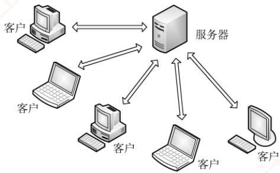
</div>

<p align="center"><em>图 6.1 C/S 模型</em></p>

<div align="center">
  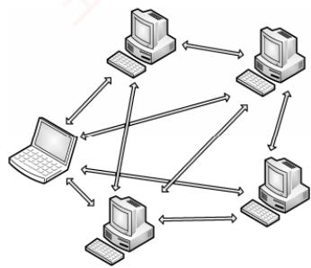
</div>

<p align="center"><em>图 6.2 P2P 模型</em></p>

　　在 P2P 模型中，各计算机没有固定的客户和服务器角色划分。任意两台计算机——称为对等方（Peer），均可直接相互通信。从实现机制上看，P2P 模型本质上仍基于客户/服务器模式：每个节点访问其他节点资源时扮演客户角色，为其他节点提供资源时又充当服务器角色。

　　与 C/S 模型相比，P2P 模型的优点主要体现如下：

1）减轻了中心服务器的计算和带宽压力，消除了对单一服务器的依赖，可将任务分散到众多节点上，从而大幅提升系统的整体效率和资源利用率。

2）多个节点之间可直接通信，无须通过中心服务器中转。

3）可扩展性好。传统服务器受限于处理能力和带宽，只能响应有限数量的并发请求，而P2P网络的容量随节点数量的增加而自然增长

4）网络健壮性强。单个节点的失效通常不会影响其他节点的正常运行。

　　P2P 模型也存在缺点。节点在获取服务的同时，还需为其他节点提供服务，这会占用较多的系统资源（如 CPU、内存和磁盘 I/O），可能影响本机性能。例如，频繁进行 P2P 下载会对硬盘造成较大负担。据某些互联网调研机构统计，在某些年份，P2P 应用曾占互联网流量的 50%～90%，导致网络严重拥塞。因此，各互联网服务提供商（ISP）通常对 P2P 应用持限制或反对态度。

### 6.1.3 本节习题精选

#### 单项选择题

01. 在客户/服务器模型中，客户指的是（）。

- A. 请求方
- B. 响应方
- C. 硬件
- D. 软件

02. 用户提出服务请求，网络将用户请求传送到服务器；服务器执行用户请求，完成所要求的操作并将结果送回用户，这种工作模型称为（）。

- A. C/S 模型
- B. P2P 模型
- C. CSMA/CD 模型
- D. 令牌环模型

03. 下面关于客户/服务器模型的描述，（）存在错误。
 I. 客户端必须提前知道服务器的地址，而服务器则不需要提前知道客户端的地址
 II. 客户端主要实现如何显示信息与收集用户的输入，而服务器主要实现数据的处理
 III. 浏览器显示的内容来自服务器
 IV. 客户端是请求方，即使连接建立后，服务器也不能主动发送数据

- A. I、IV
- B. III、IV
- C. 仅 IV
- D. 仅 III

04. 下列关于客户/服务器模型的说法中，不正确的是（）。

- A. 服务器专用于完成某些服务，而客户则作为这些服务的使用者
- B. 客户通常位于前端，服务器通常位于后端
- C. 客户和服务器通过网络实现协同计算任务
- D. 客户是面向任务的，服务器是面向用户的

05. 以下关于 P2P 概念的描述中，错误的是（）。

- A. P2P 是网络节点之间采取对等方式直接交换信息的工作模型
- B. P2P 通信模式是指 P2P 网络中对等节点之间的直接通信能力
- C. P2P 网络是指与互联网并行建设的、由对等节点组成的物理网络
- D. P2P 实现技术是指为实现对等节点之间直接通信的功能所需要设计的协议、软件等

06. 【2019 统考真题】下列关于网络应用模型的叙述中，错误的是（）。

- A. 在 P2P 模型中，节点之间具有对等关系
- B. 在客户/服务器（C/S）模型中，客户与客户之间可以直接通信
- C. 在 C/S 模型中，主动发起通信的是客户，被动通信的是服务器
- D. 在向多用户分发一个文件时，P2P 模型通常比 C/S 模型所需的时间短

### 6.1.4 答案与解析

#### 单项选择题

**01. A**

　　客户既不是硬件，又不是软件，只是服务的请求方，服务器才是响应方。

**02. A**

　　用户提出服务请求，网络将用户请求传送到服务器；服务器执行用户请求，完成所要求的操作并将结果送回用户，这种工作模型称为客户/服务器模型，即 C/S 模型。

**03. C**

　　在连接未建立前，服务器在某一个端口上监听。客户端是连接的请求方，客户端必须事先知道服务器的地址才能发出连接请求，而服务器则从客户端发来的数据包中获取客户端的地址。一旦连接建立，服务器就能响应客户端请求的内容，服务器也能主动发送数据给客户端，用于一些消息的通知，如一些错误的通知。所以只有说法 IV 错误。

**04. D**

　　客户的作用是根据用户需求向服务器发出服务请求，并将服务器返回的结果呈现给用户，因

　　此客户是面向用户的，服务器是面向任务的。

**05. C**

　　P2P 可以理解为一种通信模型、一种逻辑网络模型。物理网络是指在网络中由各种设备（主机、交换机等）和介质（双绞线等）连接而形成的网络，它看得见摸得着。而这个网络中所使用的协议，或网络结构，都是靠逻辑网络来划分的。P2P 网络是一个构建在 IP 网络上的覆盖网络，是一种动态的逻辑网络。对等节点之间具有直接通信的能力是 P2P 的显著特点。

**06. B**

　　在 P2P 模型中，每个节点的权利和义务对等，彼此可直接通信。而在 C/S 模型中，客户是服务发起方，服务器被动接受来自客户的请求，客户之间不能直接通信，例如 Web 应用中的两个浏览器之间不能直接通信。P2P 模型通过将文件分发任务分散到多个节点，允许用户从多个对等方并行下载，从而减轻服务器负担，在向多用户分发文件时，通常比 C/S 模型所需的时间更短。

## 6.2 域名系统

> **考点追踪：** DNS 使用的传输层及以下协议（2018、2021）

　　域名系统（Domain Name System，DNS）是互联网使用的命名系统，用于将便于人们记忆、具有特定含义的主机名（如 www.cskaoyan.com）转换为便于机器处理的 IP 地址。相比难记的数字形式，人们更倾向于使用具有特定含义的字符串来标识互联网上的计算机。DNS 采用客户/服务器模型，其协议运行在 UDP 之上，使用 53 号端口。

　　从概念上，DNS可分为三部分：层次域名空间、域名服务器和解析器。

### 6.2.1 层次域名空间

　　互联网采用层次树状结构的命名方法。按照这种命名方法，任何连接到互联网的主机或路由器都拥有唯一的层次结构名称，即域名（Domain Name）。域（Domain）是名字空间中一个可被管理的划分。域可以进一步划分为子域，子域还可以继续细分，从而形成顶级域、二级域、三级域等层次结构。每个域名由一系列标号组成，各标号之间用点（“.”）分隔。

　　如图 6.3 所示是王道论坛提供 WWW 服务的服务器域名，它由三个标号组成，其中标号 com 是顶级域名，标号 cskaoyan 是二级域名，标号 www 是三级域名。

<div align="center">
  
</div>

<p align="center"><em>图 6.3 一个域名的例子</em></p>

　　关于域名中的标号，有以下几点需要注意：

1）标号中的英文字母不区分大小写。

2）标号中除连字符（-）外，不得使用其他标点符号。

3）每个标号不超过63个字符，整个域名（含分隔点）的总长度不得超过255个字符。

4）级别最低的域名写在最左边，级别最高的顶级域名写在最右边。

　　顶级域名（Top Level Domain，TLD）主要分为以下三大类：

1）国家顶级域名（ccTLD）。代表国家的域名，如“.cn”表示中国，“.us”表示美国。

2）通用顶级域名（gTLD）。常见的包括“.com”（公司）、“.net”（网络服务机构）、“.org”（非营利性组织）、“.edu”（教育机构）和“.gov”（国家或政府机构）等。

3）基础结构域名（arpa）。用于反向域名解析，即将 IP 地址转换为对应的域名。

　　图 6.4 展示了域名空间的树状结构。

<div align="center">
  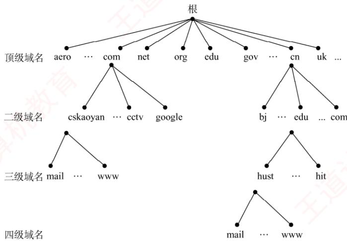
</div>

<p align="center"><em>图 6.4 域名空间的树状结构</em></p>

　　在域名系统中，各级域名由其上一级的域名管理机构管理。顶级域名由互联网名称与数字地址分配机构（ICANN）管理。国家顶级域名下的二级域名由相应国家自行规定和管理。每个组织还可以将其所辖的域进一步划分为若干子域，并将这些子域委托给其他组织管理。例如，负责管理 cn 域的中国将 edu.cn 子域授权给中国教育和科研计算机网（CERNET）进行管理。

### 6.2.2 域名服务器

　　域名到 IP 地址的解析是由运行在域名服务器上的程序完成的。一个服务器负责管辖（或具有管理权限）的范围称为区，其范围小于或等于域。一个区内的所有节点必须是连通的，每个区都设有相应的权限域名服务器（也称授权域名服务器），用于保存该区中所有主机的域名到 IP 地址的映射信息。每个域名服务器不仅要能解析部分域名到 IP 地址的映射，还要能维护指向其他域名服务器的信息；当自身无法完成解析时，要能知道向哪个服务器进一步查询。

　　DNS 使用大量的域名服务器，它们按层次结构组织。没有任何一台域名服务器包含互联网上所有主机的映射，相反，这些映射分布在所有域名服务器上。有四种类型的域名服务器。

#### 1. 根域名服务器

　　根域名服务器是DNS层次结构中的最高层级。所有根域名服务器都知道全部顶级域名服务器的域名和IP地址。无论哪个本地域名服务器需要解析任意域名，只要自身无法解析，就首先向根域名服务器发起查询。全球共有13个根域名服务器，每个根域名服务器实际上都是由多个冗余服务器组成的集群，以提高可靠性和性能。根域名服务器用来管辖顶级域（如.com），它通常并不直接将待查询的域名解析为IP地址，而是返回下一步应查询的顶级域名服务器的地址。

#### 2. 顶级域名服务器

　　顶级域名服务器负责管理在其下注册的所有二级域名。例如，.com 顶级域名服务器管理所有以 .com 结尾的域名。当收到 DNS 查询请求时，它会返回相应的响应（可能是最终的解析结果，即目标 IP 地址；也可能是下一步应当查找的域名服务器的 IP 地址）。

#### 3. 权限域名服务器（授权域名服务器）

　　权限域名服务器负责管理特定区的域名信息。每个主机必须在所属区的权限服务器处登记，该服务器总能将其管辖的主机名解析为对应的 IP 地址。为提高可靠性，通常建议每个区配置至少两个权限域名服务器。实际上，许多本地域名服务器也同时承担权限域名服务器的角色。

#### 4. 本地域名服务器

　　本地域名服务器在域名系统中扮演关键角色。每家互联网服务提供商（ISP）、一所大学甚至大学中的各个院系，通常都会部署自己的本地域名服务器。当主机发起 DNS 查询请求时，该请求首先被发送给其配置的本地域名服务器。事实上，在 Windows 系统中配置 “本地连接” 时所填写的 DNS 服务器地址，就是该主机所用的本地域名服务器地址。

　　DNS 的层次结构如图 6.5 所示。

<div align="center">
  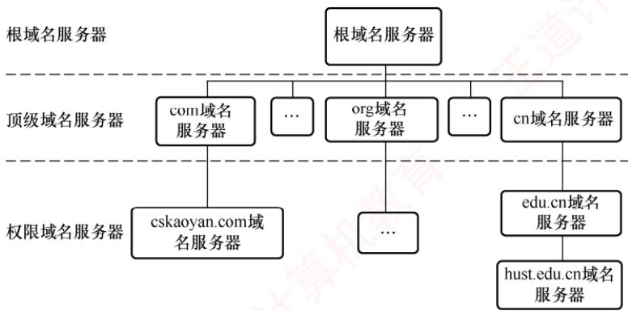
</div>

<p align="center"><em>图 6.5 DNS 的层次结构</em></p>

### 6.2.3 域名解析过程

> **考点追踪：** ➤ DNS 协议的功能与意义（2021）

　　域名解析是指将域名转换为 IP 地址的过程。当客户端需要进行域名解析时，会通过本机的 DNS 客户端构造一个 DNS 请求报文，并以 UDP 数据报的形式发送给本地域名服务器。

　　域名解析有两种方式：递归查询和迭代查询。

##### （1） 主机向本地域名服务器的查询都采用递归查询

　　在递归查询中，若本地域名服务器不知道被查询域名的 IP 地址，则它会以 DNS 客户的身份，代替主机向其他根域名服务器继续发出查询请求，而不是让主机自行进行后续查询。无论后续采用何种查询方式，主机向本地域名服务器的查询都采用递归查询。

##### （2） 本地域名服务器向其他域名服务器可采用递归查询或迭代查询

> **考点追踪：** DNS 递归查询机制（2010）

　　递归查询的过程如图 6.6(a) 所示，本地域名服务器只需向根域名服务器发起一次查询，后续的查询过程由各级域名服务器之间递归完成 [步骤③～⑥]。最终，根域名服务器将请求的 IP 地址返回给本地域名服务器（步骤⑦），再由本地域名服务器将结果返回给原始主机（步骤⑧）。由于这种方式会给根域名服务器带来过重负载，实际中几乎不被采用。

> **考点追踪：** ➤ DNS 迭代查询机制（2016、2020）

　　本地域名服务器向根域名服务器的查询通常采用迭代查询。当根域名服务器收到本地域名服务器的迭代查询请求时，要么直接给出所查询的 IP 地址，要么告诉本地域名服务器：“你下一步应向哪个顶级域名服务器查询”。随后，由本地域名服务器向该顶级域名服务器发起新的查询请求。同样，顶级域名服务器收到请求后，要么直接给出所查询的 IP 地址，要么告诉本地域名服务器下一步应当向哪个权限域名服务器查询。如此逐级查询，直到获得目标 IP 地址，最后由本地域名服务器将结果返回给发起查询的主机，如图 6.6(b) 所示。

<div align="center">
  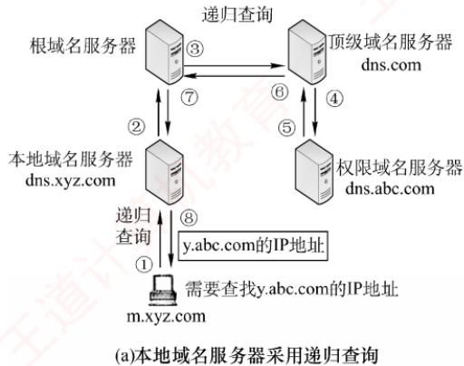
</div>

<div align="center">
  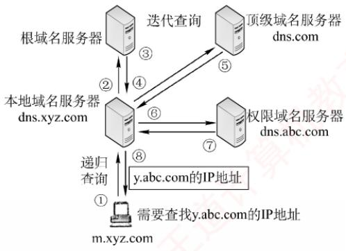
</div>

<p align="center"><em>(b) 本地域名服务器采用迭代查询</em></p>

<p align="center"><em>图 6.6 两种域名解析方式工作原理</em></p>

　　下面举例说明域名解析的过程。假设某客户希望获取主机 y.abc.com 的 IP 地址，整个域名解析过程（最多涉及 8 个 UDP 报文：4 个查询报文和 4 个回答报文）如下：

　　① 客户向其本地域名服务器发送 DNS 请求报文（递归查询）。

　　② 本地域名服务器收到请求后，先查询本地缓存；若未命中，则以 DNS 客户身份向根域名服务器发送解析请求报文（迭代查询）。

　　③ 根域名服务器收到请求后，识别该域名属于.com 顶级域，返回.com 顶级域名服务器dns.com 的 IP 地址。

　　④ 本地域名服务器向顶级域名服务器 dns.com 发送解析请求报文（迭代查询）。

　　⑤ 顶级域名服务器 dns.com 收到请求后，识别该域名属于 abc.com 区，返回其权限域名服务器 dns.abc.com 的 IP 地址。

　　⑥ 本地域名服务器向权限域名服务器 dns.abc.com 发送解析请求报文（迭代查询）。

　　⑦ 权限域名服务器 dns.abc.com 收到请求后，返回 y.abc.com 对应的 IP 地址。

　　⑧ 本地域名服务器将结果保存到本地缓存，并返回给客户。

　　为提高 DNS 查询效率并减少互联网上的查询流量，域名服务器广泛使用 DNS 高速缓存，用于存储近期查询过的域名与 IP 地址的映射。当后续收到相同域名的查询时，服务器可直接从缓存返回结果，无须再次发起完整的解析流程。由于主机名与 IP 地址的映射关系并非永久有效，DNS 缓存中的记录会设置生存时间（TTL），到期后自动失效并被清除。此外，主机端也常维护本地 DNS 缓存，在运行过程中缓存最近访问过的域名。只有当本地缓存未命中时，才会向 DNS 服务器发起查询，从而进一步提升解析速度并减轻网络负载。

### 6.2.4 本节习题精选

#### 一、单项选择题

01. 域名与（）具有一一对应的关系。

- A. IP 地址
- B. MAC 地址
- C. 主机
- D. 以上都不是

02. 下列说法错误的是（）。

- A. Internet 上提供客户访问的主机一定要有域名
- B. 同一域名在不同时间可能解析出不同的 IP 地址
- C. 多个域名可以指向同一台主机的 IP 地址
- D. IP 子网中的主机可以由不同的域名服务器来维护其映射

03. DNS 是基于（）模型的分布式系统。

- A. C/S
- B. B/S
- C. P2P
- D. 以上均不正确

04. 域名系统（DNS）的组成不包括（）。

- A. 域名空间
- B. 分布式数据库
- C. 域名服务器
- D. 从内部IP地址到外部IP地址的翻译程序

05. 互联网中域名解析依赖于由域名服务器组成的逻辑树。在域名解析过程中，主机上请求域名解析的软件不需要知道（）信息。
 I. 本地域名服务器的 IP
 II. 本地域名服务器父节点的 IP
 III. 域名服务器树根节点的 IP

- A. I 和 II
- B. I 和 III
- C. II 和 III
- D. I、II 和 III

06. 在 DNS 的递归查询中，由（）给客户端返回地址。

- A. 最开始连接的服务器
- B. 最后连接的服务器
- C. 目的地址所在服务器
- D. 不确定

07. 当本地域名服务器向根域名服务器查询一个域名时，根域名服务器返回一个负责该域名的顶级域名服务器的 IP 地址，让本地域名服务器再向该域名服务器查询，这种查询方式称为（）。

- A. 递归查询
- B. 迭代查询
- C. 重定向查询
- D. 广播查询

08. 一台主机要解析 www.cskaoyan.com 的 IP 地址，若这台主机配置的域名服务器为 202.120.66.68，互联网顶级域名服务器为 11.2.8.6，而存储 www.cskaoyan.com 的 IP 地址对应关系的域名服务器为 202.113.16.10，则这台主机解析该域名通常首先查询（）。

- A. 202.120.66.68 域名服务器
- B. 11.2.8.6 域名服务器
- C. 202.113.16.10 域名服务器
- D. 可以从这 3 个域名服务器中任选一个

09. （）可以将其管辖的主机名转换为主机的 IP 地址。

- A. 本地域名服务器
- B. 根域名服务器
- C. 权限域名服务器
- D. 代理域名服务器

10. 若本地域名服务器无缓存，用户主机采用递归查询向本地域名服务器查询另一网络某主机域名对应的 IP 地址，而本地域名服务器采用迭代查询向其他域名服务器进行查询，则用户主机和本地域名服务器发送的域名请求条数分别为（）。

- A. 1 条, 1 条
- B. 1 条, 多条
- C. 多条, 1 条
- D. 多条, 多条

11. 【2010 统考真题】若本地域名服务器无缓存，则在采用递归方法解析另一网络某主机域名时，用户主机和本地域名服务器发送的域名请求条数分别为（）。

- A. 1 条，1 条
- B. 1 条，多条
- C. 多条，1 条
- D. 多条，多条

12. 【2016 统考真题】假设所有域名服务器均采用迭代查询方式进行域名解析。当主机访问规范域名为 www.abc.xyz.com 的网站时，本地域名服务器在完成该域名解析的过程中，可能发出 DNS 查询的最少和最多次数分别是（）。

- A. 0, 3
- B. 1, 3
- C. 0, 4
- D. 1, 4

13. 【2018 统考真题】下列 TCP/IP 应用层协议中，可以使用传输层无连接服务的是（）。

- A. FTP
- B. DNS
- C. SMTP
- D. HTTP

14. 【2020 统考真题】假设下图所示网络中的本地域名服务器只提供递归查询服务，其他域名服务器都只提供迭代查询服务；局域网内主机访问 Internet 上各服务器的往返时间（RTT）均为 10ms，忽略其他各种时延。若主机 H 通过超链接 http://www.abc.com/index.html 请求浏览纯文本 Web 页 index.html，则从单击超链接开始到浏览器接收到 index.html 页面为止，所需的最短时间与最长时间分别是（）。

<div align="center">
  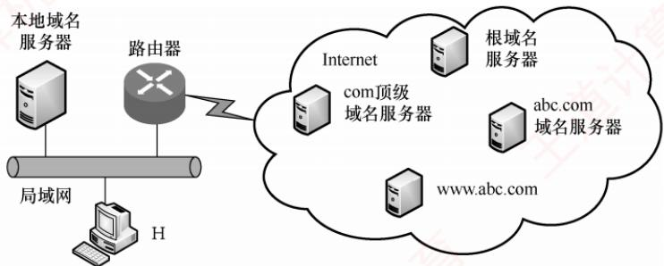
</div>

- A. 10ms, 40ms
- B. 10ms, 50ms
- C. 20ms, 40ms
- D. 20ms, 50ms

#### 二、综合应用题

01. DNS 使用 UDP 而非 TCP，若一个 DNS 分组丢失，没有自动恢复，则这会引起问题吗？若会，则应如何解决？

02. 为何要引入域名的概念？举例说明域名转换过程。域名服务器中的高速缓存有何作用？

### 6.2.5 答案与解析

#### 一、单项选择题

**01. D**

　　若一台主机通过两块网卡连接到两个网络（如服务器双线接入），则就具有两个 IP 地址，每个网卡对应一个 MAC 地址，显然这两个 IP 地址可以映射到同一个域名上。此外，多台主机也可以映射到同一个域名上（如负载均衡），一台主机也可以映射到多个域名上（如虚拟主机）。因此，选项 A、B 和 C 和域名均不具有一一对应的关系。

**02. A**

　　Internet 上提供访问的主机一定要有 IP 地址，而不一定要有域名，选项 A 错误。域名在不同的时间可以解析出不同的 IP 地址，因此可以用多台服务器来分担负载，选项 B 正确。可以把多个域名指向同一台主机的 IP 地址，选项 C 正确。IP 子网中主机也可以由不同的域名服务器来维护其映射，选项 D 正确。

**03. A**

　　DNS 是一个基于 C/S 模型的分布式数据库系统，主要用于域名和 IP 地址的映射。

**04. D**

　　DNS 提供从域名到 IP 地址或从 IP 地址到域名的映射服务。它被设计成为一个联机分布式数据库系统，并采用客户/服务器模式。域名的解析是由若干域名服务器程序完成的。从内部 IP 地址到外部IP地址的映射是由NAT实现的，用于缓解IPv4地址紧缺的问题，与域名系统无关。

**05. C**

　　正常情况下，客户只需把域名解析请求发往本地域名服务器，其他事情都由本地域名服务器完成，并把最后结果返回给客户。所以主机只需要知道本地域名服务器的 IP。

**06. A**

　　在递归查询中，每台不包含被请求信息的服务器都转到其他地方去查找，然后它再往回发送结果，所以客户端最开始连接的服务器最终将返回正确的信息。

**07. B**

　　迭代查询是指当一个域名服务器收到本地域名服务器发出的查询请求报文时，要么给出所要查询的 IP 地址，要么告诉本地服务器：“你下一步应当向哪个 DNS 服务器进行查询。”然后让本地域名服务器进行后续的查询（而不替本地域名服务器进行后续的查询）。

**08. A**

　　当这台主机发出对 www.cskaoyan.com 的 DNS 查询报文时，这个查询报文首先被送往该主机的本地域名服务器 202.120.66.68。本地域名服务器不能立即回答该查询时，就以 DNS 客户的身份向某一根域名服务器查询。但不管采用何种查询方式，首先都要查询本地域名服务器。

**09. C**

　　每台主机都必须在权限域名服务器处注册登记，权限域名服务器一定能够将其管辖的主机名转换为该主机的 IP 地址。

**10. B**

　　用户主机向本地域名服务器采用递归查询，只需发送1条查询请求。本地域名服务器无缓存，因此还要进行后续的查询。本地域名服务器向其他域名服务器采用迭代查询，本地域名服务器分别向根域名服务器、顶级域名服务器、权限域名服务器发送多条查询请求。

**11. A**

　　用户主机向本地域名服务器采用递归查询，只需发送1条请求。本地域名服务器无缓存，但因其向其他域名服务器也采用递归查询方式，故只需向根域名服务器发送1条请求，后续查询由被询问的服务器代为完成。因此，用户主机和本地域名服务器各自发送的域名请求条数均为1。

**12. C**

　　最少情况：若本地域名服务器已缓存该域名的解析结果，则无须发出任何DNS查询，最少为0次。最多情况：因所有服务器均采用迭代查询，在最坏情况下，本地域名服务器需要依次向根域名服务器、顶级域名服务器（.com）、权限域名服务器（xyz.com）和次级权限域名服务器（abc.xyz.com）发起查询，共4次，因此最多为4次。

**13. B**

　　FTP 用于文件传输，SMTP 用于电子邮件发送，HTTP 用于网页传输，三者均要求可靠传输，故在传输层使用有连接的 TCP 服务。DNS 对可靠性的要求相对较低，且追求效率与低开销，因此在传输层通常使用无连接的 UDP 服务。

**14. D**

　　题中 RTT 指局域网内主机或本地域名服务器访问 Internet 上各服务器的往返时间，H 与本地域名服务器间的通信时延忽略不计。最短时间：若 H 本地有域名缓存，则无须 DNS 查询，直接与 www.abc.com 建立 TCP 连接并请求资源。TCP 三次握手需 1.5RTT，第三次握手可捎带 HTTP 请求，服务器返回页面需 0.5RTT，共 2RTT = 20ms。最长时间：H 向本地域名服务器发起递归查询（时延忽略），本地域名服务器依次迭代查询根域名服务器、顶级域名服务器（.com）、域名服务器（abc.com），共 3RTT；随后 H 建立 TCP 连接并获取页面，需 2RTT；总计 5RTT = 50ms。

#### 二、综合应用题

**01. 【解答】**

　　DNS 使用传输层的 UDP 而非 TCP，因为它不需要使用 TCP 在发生传输错误时执行的自动重传功能。实际上，对于 DNS 服务器的访问，多次 DNS 请求都返回相同的结果，即做多次和做一次的效果一样。因此 DNS 操作可以重复执行。当一个进程做一次 DNS 请求时，它启动一个定时器。若定时器计满而未收到回复，则它就再请求一次，这样做不会有害处。

**02. 【解答】**

　　IP 地址很难记忆，引入域名是为了便于人们记忆和识别。

　　域名解析可以把域名转换成 IP 地址。域名转换过程是向本地域名服务器申请解析，若本地域名服务器查不到，则向根域名服务器进行查询。若根域名服务器中也查不到，则向根域名服务器中保存的顶级域名服务器和相应权限域名服务器进行查询，一定可以查找到。

　　域名服务器中高速缓存的作用：将近期访问过的域名信息保存在高速缓存，再次访问时会从缓存中读取，不需要重新解析，这样就可以加快域名解析的响应速度。

## 6.3 文件传输协议

### 6.3.1 FTP 的工作原理

　　文件传输协议（File Transfer Protocol，FTP）是互联网上使用最广泛的文件传输协议。FTP提供交互式访问，允许用户指定文件的类型与格式，并支持对文件设置存取权限。它屏蔽了不同计算机系统的底层细节，因此适用于在异构网络中的任意两台计算机之间可靠地传送文件。

　　FTP 主要提供以下功能:

　　① 支持不同类型主机系统（硬件、操作系统等均可不同）之间的文件传输。

　　② 通过用户权限管理，提供对远程 FTP 服务器上文件的管理能力。

　　③ 通过匿名（anonymous）FTP 方式，实现公用文件的共享。

> **考点追踪：** FTP 在传输层使用的协议（2009、2018）

　　FTP 采用客户/服务器工作模式，基于 TCP 提供可靠的传输服务。一个 FTP 服务器进程可同时为多个客户进程提供服务。服务器进程由两部分组成：一个主进程，负责接收新请求；另外有若干从属进程，分别处理单个客户的请求。其工作步骤如下：

　　① 打开熟知端口 21（控制端口），供客户进程连接。

　　② 等待客户进程发起连接请求。

　　③ 启动从属进程处理该请求，处理完毕后从属进程终止。

　　④ 主进程返回等待状态，继续接收其他客户请求。主进程与从属进程并发执行。

　　FTP 是有状态协议，服务器需在整个会话期间维护用户的状态信息。例如，必须将用户账户与控制连接相关联，并跟踪用户在远程目录树中的当前位置。

### 6.3.2 控制连接与数据连接

> **考点追踪：** ➤ FTP 控制连接和数据连接的特点（2017、2023）

　　FTP 在工作时使用两个并行的 TCP 连接（见图 6.7）：控制连接（服务器端口 21）和数据连

　　接（服务器端口20）。采用两个独立端口有助于协议的清晰实现。

<div align="center">
  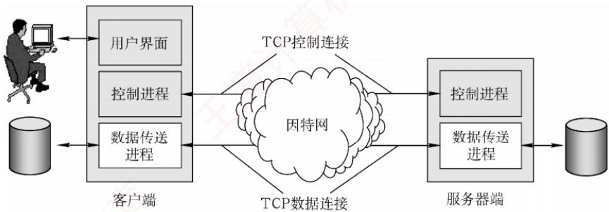
</div>

<p align="center"><em>图 6.7 控制连接和数据连接</em></p>

#### 1. 控制连接

> **考点追踪：** FTP 控制连接的功能（2009）

　　服务器监听 21 号端口，等待客户连接。建立在此端口上的连接称为控制连接，用于传输控制命令（如登录、目录操作、传送命令等）。FTP 客户通过控制连接向服务器发送文件传送请求，但控制连接本身不用于传输文件数据。在文件传输过程中，仍可通过控制连接发送中断等指令，因此控制连接在整个会话期间保持打开状态。

#### 2. 数据连接

　　当服务器的控制进程收到客户发来的文件传输请求后，会创建一个数据传送进程并建立数据连接。该连接用于客户端与服务器端的数据传送进程之间的通信，实际完成文件内容的传输。传输结束后，数据连接关闭，数据传送进程随之终止。

　　数据连接支持两种传输模式：主动模式（PORT）和被动模式（PASV）。

- PORT 模式：客户端首先连接服务器的 21 号端口，并完成登录。需要传输数据时，客户端随机选择一个本地端口，并通过 PORT 命令将该端口号告知服务器。随后，服务器通过 20 号端口主动连接到客户端指定的端口以传输数据。

- PASV 模式：客户端登录后发送 PASV 命令。服务器收到后，在本地随机开放一个端口，并通过控制连接将该端口号返回给客户端。客户端再主动连接到该端口以传输数据。

　　可见，两种模式的区别在于：是服务器主动连接客户端（主动模式）还是服务器被动响应客户端的连接（被动模式），由客户端决定。

> **注意：**

　　许多教材未详细介绍这两种模式。若无特别说明，可默认采用主动模式。

　　由于 FTP 使用独立的控制连接传输命令，其控制信息属于带外（Out-of-band）传送。使用 FTP 修改远程文件时，需先将文件下载到本地，修改后再传回服务器，整个过程涉及两次完整传输，效率较低。网络文件系统（NFS）采用不同的思路：它允许进程直接打开远程文件，并在指定位置进行读/写操作。这样，用户只需传输大文件中的特定片段，而无须复制整个文件。

### 6.3.3 本节习题精选

#### 一、单项选择题

01. 文件传输协议（FTP）的一个主要特征是（）。

- A. 允许客户指明文件的类型但不允许指明文件的格式
- B. 不允许客户指明文件的类型但允许指明文件的格式
- C. 允许客户指明文件的类型与格式
- D. 不允许客户指明文件的类型与格式

02. 以下关于 FTP 工作模型的描述中，错误的是（）。

- A. FTP 使用控制连接、数据连接来完成文件的传输
- B. 用于控制连接的 TCP 连接在服务器端使用的熟知端口号为 21
- C. 用于控制连接的 TCP 连接在客户端使用的端口号为 20
- D. 服务器端由控制进程、数据进程两部分组成

03. 控制信息是带外传送的协议是（）。

- A. HTTP
- B. SMTP
- C. FTP
- D. POP

04. 下列关于 FTP 连接的叙述中，正确的是（）。

- A. 控制连接先于数据连接被建立，并先于数据连接被释放
- B. 数据连接先于控制连接被建立，并先于控制连接被释放
- C. 控制连接先于数据连接被建立，并晚于数据连接被释放
- D. 数据连接先于控制连接被建立，并晚于控制连接被释放

05. FTP 客户发起对 FTP 服务器连接的第一阶段是建立（）。

- A. 传输连接
- B. 数据连接
- C. 会话连接
- D. 控制连接

06. FTP 中作为服务器一方的进程，通过监听（）端口得知有无服务请求。

- A. 53
- B. 80
- C. 20
- D. 21

07. 下列关于 FTP 的叙述中，错误的是（）。

- A. FTP 可以实现异构网络中计算机之间的文件传送
- B. 在进行文件传输时，FTP 客户端和服务器之间需建立两个连接
- C. FTP 服务器主进程在 20 端口上监听客户端的连接请求
- D. FTP 使用 TCP 进行可靠传输

08. 一个 FTP 用户发送了一个 LIST 命令来获取服务器的文件列表，这时服务器应通过（）端口来传输该列表。

- A. 21
- B. 20
- C. 22
- D. 19

09. 下列关于 FTP 的叙述中，错误的是（）。

- A. FTP 可以在不同类型的操作系统之间传送文件
- B. FTP 并不适合用在两个计算机之间共享读写文件
- C. 控制连接在整个 FTP 会话期间一直保持
- D. 客户端默认使用端口 20 与服务器建立数据传输连接

10. 当一台计算机从 FTP 服务器下载文件时，在该 FTP 服务器上对数据进行封装的 5 个转换步骤是（）。

- A. 比特，数据帧，数据报，数据段，数据
- B. 数据，数据段，数据报，数据帧，比特
- C. 数据报，数据段，数据，比特，数据帧
- D. 数据段，数据报，数据帧，比特，数据

11. FTP 支持两种方式的传输：ASCII 方式和 Binary（二进制）方式。通常文本文件的传输采用（）方式，而图像、声音等非文本文件采用（）方式传输。

- A. ASCII, Binary
- B. Binary, ASCII
- C. ASCII, ASCII
- D. Binary, Binary

12. 直接封装 FTP、DNS、DHCP 报文的协议分别是（）。

- A. TCP、UDP、UDP
- B. UDP、TCP、TCP
- C. TCP、UDP、IP
- D. UDP、UDP、UDP

13. 【2009 统考真题】FTP 客户和服务器间传递 FTP 命令时，使用的连接是（）。

- A. 建立在 TCP 之上的控制连接
- B. 建立在 TCP 之上的数据连接
- C. 建立在 UDP 之上的控制连接
- D. 建立在 UDP 之上的数据连接

14. 【2017 统考真题】下列关于 FTP 的叙述中，错误的是（）。

- A. 数据连接在每次数据传输完毕后就关闭
- B. 控制连接在整个会话期间保持打开状态
- C. 服务器与客户端的 TCP 20 端口建立数据连接
- D. 客户端与服务器的 TCP 21 端口建立控制连接

#### 二、综合应用题

01. 文件传输协议的主要工作过程是怎样的？主进程和从属进程各起什么作用？

02. 为什么 FTP 要使用两个独立的连接，即控制连接和数据连接？

03. 主机 A 想下载文件 ftp://ftp.abc.edu.cn/file，大致描述下载过程中主机和服务器的交互过程。

04. 【2023 统考真题】某网络拓扑如下图所示，主机 H 登录 FTP 服务器后，向服务器上传一个大小为 18000B 的文件 F。假设 H 为传输 F 建立数据连接时，选择的初始序号为 100，MSS = 1000B，拥塞控制初始阈值为 4MSS，RTT = 10ms，忽略 TCP 段的传输时延；在 F 的传输过程中，H 均以 MSS 段向服务器发送数据，且未发生差错、丢包和失序现象。

<div align="center">
  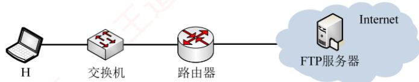
</div>

　　请回答下列问题。

1）FTP的控制连接是持久的还是非持久的？FTP的数据连接是持久的还是非持久的？当H登录FTP服务器时，建立的TCP连接是控制连接还是数据连接？

2）当H通过数据连接发送F时，F的第一个字节的序号是多少？在断开数据连接过程中，FTP服务器发送的第二次挥手ACK段的确认序号是多少？

3）在 H 通过数据连接发送 F 的过程中，当 H 收到确认序号为 2101 的确认段时，H 的拥塞窗口调整为多少？收到确认序号为 7101 的确认段时，H 的拥塞窗口调整为多少？

4）H从请求建立数据连接开始，到确认F已被服务器全部接收为止，至少需要多长时间？期间应用层数据平均发送速率是多少？

### 6.3.4 答案与解析

#### 一、单项选择题

**01. C**

　　FTP 提供交互式访问，允许客户指明文件的类型与格式，并允许文件具有存取权限。

**02. C**

　　在服务器端，控制连接使用 TCP 的 21 号端口，数据连接使用 TCP 的 20 号端口；而在客户端，控制连接和数据连接的 TCP 端口号都是由客户端系统自动分配的。需要注意的是，当我们说 FTP 使用 20、21 号端口，HTTP 使用 80 号端口，SMTP 使用 25 号端口时，都是指相应协议的服务器端所使用的端口号，而客户端使用系统自动分配的端口号向这些服务的熟知端口发起连接。

**03. C**

　　带外传送是指控制信息与数据信息通过不同的逻辑信道传送。例如，FTP 使用一个单独的控制连接来传输控制信息，而数据连接用于传送文件。带内传送是指控制信息与数据信息通过同一个逻辑信道传送。例如，HTTP 的请求和响应报文都是在同一个 TCP 连接上进行的。

**04. C**

　　FTP 客户首先连接服务器的 21 号端口，建立控制连接（控制连接在整个会话期间一直保持打开），然后建立数据连接，在数据传送完毕后，数据连接最先释放，控制连接最后释放。

**05. D**

　　FTP 工作时使用两个连接：控制连接和数据连接。FTP 客户对 FTP 服务器发起连接时，首先建立控制连接，即向服务器的 21 号 TCP 端口发起连接；然后建立数据连接（20 号 TCP 端口）。FTP 并没有传输连接和会话连接的说法。

**06. D**

　　FTP 服务器通过监听熟知端口 21（控制端口）得知有无服务请求。

**07. C**

　　因为 FTP 屏蔽了各计算机系统的细节，所以 FTP 适用于异构网络中计算机之间的文件传送。当进行文件传输时，FTP 客户端和服务器之间需建立两个并行的控制连接和数据连接。FTP 服务器主进程在熟知端口 21 上监听客户端的服务请求。FTP 在传输层使用 TCP 进行可靠传输。

**08. B**

　　FTP中数据连接的端口是20，而文件的列表是通过数据连接来传输的。

**09. D**

　　控制连接建立后，服务器进程用自己传送数据的熟知端口 20 与客户进程所提供的端口号建立数据传输连接（默认为 PORT 模式），即客户进程的端口号是客户进程自己提供的。

**10. B**

　　FTP 服务器的数据要经过应用层、传输层、网络层、数据链路层及物理层。因此，对应的封装是数据、数据段、数据报、数据帧，最后是比特。

**11. A**

　　FTP 支持 ASCII 和 Binary 两种方式的传输，非加密文本文件通常采用 ASCII 方式传输，而图像、声音等非文本文件采用 Binary 方式传输。本题可能有所超纲，了解即可。

**12. A**

　　FTP 需要保证数据传输的可靠性，因此采用 TCP 作为传输层协议。在 DHCP 的应用中，客户在分配到 IP 地址前无法使用 TCP 建立连接，因此只能利用 UDP 进行无连接的交互。UDP 具有简化通信、更高效、低延迟的特性，能满足 DNS 查询对快速响应和高并发的需求。

**13. A**

　　对于 FTP 文件传输，为了保证可靠性，选择 TCP，排除 C 和 D。FTP 的控制信息是带外传送的，即 FTP 使用了一个分离的控制连接来传送命令，因此答案为选项 A。

**14. C**

　　FTP 使用控制连接和数据连接，控制连接存在于整个 FTP 会话过程中，数据连接在每次文件传输时才建立，传输结束就关闭，选项 A 和 B 正确。默认情况（PORT 模式）下 FTP 服务器使用 TCP 20 端口进行数据连接，使用 TCP 21 端口进行控制连接，这里的端口号是指 FTP 服务器的端口号，因此选项 C 错误、选项 D 正确。此外还需要注意的是，FTP 服务器是否使用 TCP 20 端口建立数据连接与传输模式有关，PORT 模式使用 TCP 20 端口，PASV 模式由服务器随机选定。

#### 二、综合应用题

**01. 【解答】**

　　FTP 的主要工作过程如下：在进行文件传输时，FTP 客户所发出的传送请求通过控制连接发送给服务器端的控制进程，并在整个会话期间一直保持打开，但控制连接不用来传送文件。服务器端的控制进程在接收到 FTP 客户发送来的文件传输请求后，就创建数据传送进程和数据连接，数据连接用来连接客户端和服务器端的数据传送进程，数据传送进程实际完成对文件的传送，在传送完毕后关闭 “数据传送连接”，并结束运行。

　　FTP 的服务器进程由两大部分组成：一个主进程，负责接收新的请求；若干从属进程，负责处理单个请求。

**02. 【解答】**

　　在 FTP 的实现中，客户与服务器之间采用了两条传输连接，其中控制连接用于传输各种 FTP 命令，而数据连接用于文件的传送。之所以这样设计，是因为使用两条独立的连接可使 FTP 变得更加简单、更容易实现、更有效率。同时在文件传输过程中，还可以利用控制连接控制传输过程，如客户可以请求终止、暂停传输等。

**03. 【解答】**

　　大致过程如下:

　　① 建立一个 TCP 连接到服务器 ftp.abc.edu.cn 的 21 号端口，然后发送登录账号和密码。

　　② 服务器返回登录成功信息后，主机 A 打开一个随机端口，并将该端口号发送给服务器。

　　③ 主机 A 发送读取文件命令，内容为 get file，服务器使用 20 号端口建立一个 TCP 连接到主机 A 的随机打开的端口。

　　④ 服务器把文件内容通过第二个连接发送给主机 A，传输完毕后连接关闭。

**04. 【解答】**

1）在 FTP 会话期间，控制连接一直处于保持状态，是持久的。当每次需要传输文件时，FTP 客户和服务器之间会建立一个临时的数据连接，用于传输文件数据，是非持久的。控制连接用于传输命令和控制信息，登录操作涉及身份验证、发送命令等控制信息，因此 H 登录 FTP 服务器时建立的 TCP 连接是控制连接。

2）建立连接时，FTP 客户发送的第一次握手 SYN 段要消耗一个序号，选择的初始序号为 100，因此发送文件 F 时，第一个字节的序号为 101。文件 F 共有 18000 个字节，需占用 18000 个序号，释放连接时，FTP 客户发送的第一次挥手 FIN 段也要消耗一个序号，所以该 FIN 段的序号为 18101，因此 TCP 服务器发送的第二次挥手 ACK 段的确认序号是 18102。

3）拥塞窗口在每个传输轮次后的变化如下表所示。前两个传输轮次，拥塞窗口小于阈值，拥塞窗口按指数增长；第2个传输轮次结束后，拥塞窗口增长到4MSS，此后每经过一个传输轮次，拥塞窗口增加1MSS。当H收到确认序号为2101的确认段时，表示服务器已收到2000B数据，即2个报文段，此时还处在第2个传输轮次（慢开始阶段），拥塞窗口还未达到阈值，发送端每收到一个确认，拥塞窗口就加1，所以此时拥塞窗口为 $2+1=3MSS$ 。当H收到确认序号为7101的确认段时，表示服务器已收到7个报文段，第3轮传输结束后，发送端共发送了 $1 + 2 + 4 = 7\mathrm{MSS}$ 数据，所以拥塞窗口大小为5MSS。

<table><tr><td>N个传输轮次后</td><td>初始时</td><td>N=1</td><td>N=2</td><td>N=3</td></tr><tr><td>拥塞窗口大小</td><td>1MSS</td><td>2MSS</td><td>4MSS</td><td>5MSS</td></tr></table>

4）每个传输轮次传输的数据量如下表所示，文件 F 的大小 18000B = 18MSS，则发送完 F 要经过 5RTT，此外还要 1 个额外的 RTT 用来建立 TCP 连接。因此，H 从请求建立数据连接开始，到确认 F 已被服务器全部接收为止，至少需要 6RTT = 6×10ms = 60ms；期间应用层的数据平均发送速率是 $18000B \div 60ms = 300 \times 10^{3}B/s = 0.3MB/s = 2.4Mb/s$ 。

<table><tr><td>k</td><td>k=1</td><td>k=2</td><td>k=3</td><td>k=4</td><td>k=5</td></tr><tr><td>第k轮最大数据传输量</td><td>1MSS</td><td>2MSS</td><td>4MSS</td><td>5MSS</td><td>6MSS</td></tr></table>

## 6.4 电子邮件

### 6.4.1 电子邮件系统的组成结构

　　自从互联网普及以来，电子邮件便迅速流行起来。作为一种异步通信方式，电子邮件不要求通信双方同时在线。发送端将邮件发送至收件人所用的邮件服务器，并存入其邮箱，收件人可随时登录自己的邮件服务器读取邮件。

　　完整的电子邮件系统应包含如图 6.8 所示的三个主要组成部分：用户代理（User Agent）、邮件服务器，以及电子邮件所依赖的协议（如 SMTP、POP3 或 IMAP 等）。

<div align="center">
  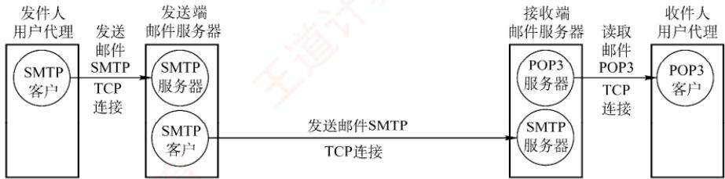
</div>

<p align="center"><em>图 6.8 电子邮件系统的主要组成部分</em></p>

　　用户代理（UA）：这是用户与电子邮件系统之间的接口。用户代理为用户提供友好的操作界面，用于发送和接收邮件，至少应具备撰写、显示和处理邮件等基本功能。通常，用户代理是运行在个人计算机上的电子邮件客户端软件，如 Outlook、Foxmail 等。

　　邮件服务器：负责邮件的发送与接收，并向发件人反馈邮件传送状态（如已投递、被拒收或丢失等）。邮件服务器采用客户/服务器模式工作，但需具备双重角色：既能作为服务器接收邮件，又能作为客户发送邮件。例如，当邮件服务器 A 向邮件服务器 B 发送邮件时，A 扮演 SMTP 客户，B 则作为 SMTP 服务器；反之亦然。

> **考点追踪：** 邮件发送和读取协议的功能（2012）

　　邮件发送协议和读取协议：用户代理使用邮件发送协议向邮件服务器发送邮件，或在邮件服务器之间传递邮件，典型代表是 SMTP；用户代理使用邮件读取协议从邮件服务器获取邮件，如 POP3 或 IMAP。注意，SMTP 采用推（Push）的方式，即用户代理或发送端邮件服务器主动将邮件推送至目标服务器；而 POP3 采用拉（Pull）的方式，即用户代理读取邮件时，主动向服务器发起请求，拉取邮箱中的邮件。

　　电子邮件的发送与接收过程可简化为如图 6.9 所示。

<div align="center">
  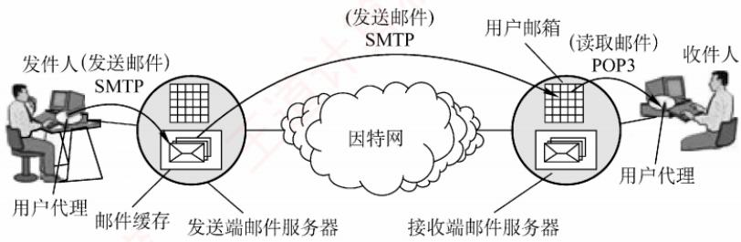
</div>

<p align="center"><em>图 6.9 电子邮件的发送、接收过程</em></p>

　　下面简单介绍电子邮件的收发过程。

　　① 发件人通过用户代理撰写和编辑待发送的邮件。

　　② 邮件撰写完后，发件人点击“发送”按钮，后续发送工作由用户代理自动完成。用户代理使用SMTP协议将邮件传送给发送端的邮件服务器。

　　③ 发送端邮件服务器将邮件暂存在邮件缓存队列中，等待发送。

　　④ 发送端邮件服务器的SMTP客户端与接收端邮件服务器的SMTP服务器建立TCP连接，并依次将缓存队列中的邮件直接发送至接收端邮件服务器。

　　⑤ 接收端邮件服务器中的 SMTP 服务器进程收到邮件后，将其存入对应收件人的邮箱，等待收件人读取。

　　⑥ 当收件人准备查收邮件时，启动用户代理，通过 POP3（或 IMAP）协议从接收端邮件服务器的邮箱中下载邮件（前提是邮箱中有新邮件）。

### 6.4.2 电子邮件格式与 MIME

#### 1. 电子邮件格式

　　一封电子邮件由信封和内容两大部分组成，其中邮件内容又分为首部和主体两部分。RFC 822 规定了邮件首部的格式，而主体部分则由用户自由撰写。用户只需填写首部信息，邮件系统便会自动从中提取所需信息并生成信封，无须用户手动填写信封内容。

　　邮件内容的首部由若干首部行构成，每行由一个关键字、冒号及对应的值组成。其中有些关键字是必需的，有些则是可选的。最重要的关键字包括 To 和 Subject。

　　To 是必填关键字，用于指定一个或多个收件人的电子邮件地址。电子邮件地址的格式为：收件人邮箱名@邮箱所在主机的域名，例如 abc@cskaoyan.com。其中，邮箱名 abc 在 cskaoyan.com 所对应的邮件服务器上必须是唯一的，从而确保该地址在整个互联网范围内是唯一的。

　　Subject 是可选关键字，用于标明邮件的主题，简要反映邮件的主要内容。

　　此外，还有一个必填的关键字是 From，但通常由邮件系统自动填充，用户一般无须手动输入。首部与主体之间以一个空行分隔。典型的邮件内容示例如下：

```txt
From: fh@hit.edu.cn
To: abc@cskaoyan.com
Subject: Say hello to Internet
    首部
    blahblah…
    主体
...
```

#### 2. 多用途互联网邮件扩展（MIME）

> **考点追踪：** SMTP 协议的特点（2018）

　　由于 SMTP 协议仅支持传输 7 位 ASCII 码文本邮件，因此无法直接传送非英语字符（如中文、俄文，甚至带重音符号的法文或德文），也无法传输可执行文件或其他二进制对象。为解决这一限制，提出了多用途互联网邮件扩展（Multipurpose Internet Mail Extensions，MIME）。

　　MIME 并未修改或取代 SMTP，而是在其基础上进行扩展。当发送端需要传输包含非 ASCII 数据的邮件时，不能直接通过 SMTP 发送，而要先用 MIME 将非 ASCII 数据编码为 ASCII 格式，再交由 SMTP 传输。接收端收到邮件后，再通过 MIME 对 ASCII 数据进行解码还原，进而恢复原始的非 ASCII 内容。MIME 与 SMTP 的关系如图 6.10 所示。

<div align="center">
  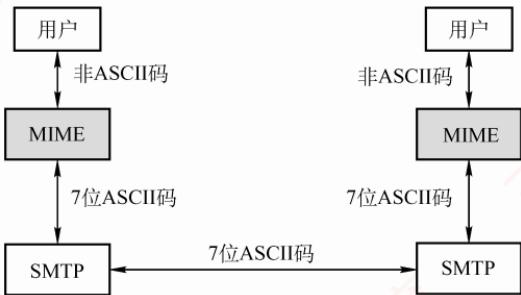
</div>

<p align="center"><em>图 6.10 SMTP 与 MIME 的关系</em></p>

　　MIME 主要包括以下三部分内容:

　　① 定义了 5 个新的首部字段：MIME 版本、内容描述、内容标识、传送编码和内容类型。

　　② 标准化了多种邮件内容的格式，为多媒体电子邮件的表示方法提供了统一规范。

　　③ 定义了传送编码机制，能够对任意类型的内容进行编码转换，而不会被邮件系统改变。

### 6.4.3 SMTP 和 POP3

#### 1. SMTP

> **考点追踪：** SMTP 协议的功能与特点（2013-2015、2025）

　　简单邮件传输协议（Simple Mail Transfer Protocol，SMTP）是一种用于提供可靠且高效电子邮件传输的协议，它规范了两个相互通信的 SMTP 进程之间如何交换信息。SMTP 采用客户/服务器模式：负责发送邮件的进程作为 SMTP 客户，而负责接收邮件的进程则作为 SMTP 服务器。SMTP 基于 TCP 连接，使用熟知端口号 25。其通信过程可分为以下三个阶段。

##### （1） 连接建立

　　当发件人的邮件被送入发送端邮件服务器的缓存队列后，SMTP 客户会定期扫描该队列。一旦发现待发邮件，便主动与接收端邮件服务器的 SMTP 服务器建立 TCP 连接（目标端口为 25）。连接成功后，接收端 SMTP 服务器首先发送 220 Service ready（服务就绪）。随后，SMTP 客户向服务器发送 HELO 命令，并附上发送端的主机名，以标识自身身份。

　　要注意的是，SMTP 不使用中间邮件服务器进行中转。TCP 连接始终在发送端与接收端的邮件服务器之间直接建立，不论二者的地理位置相距多远，也不论数据需要经过多少个路由器。若接收端邮件服务器因故障暂时无法响应，则发送端邮件服务器将等待一段时间后重新尝试连接。

##### （2） 邮件传送

　　连接建立后，即可开始邮件传输。该过程以 MAIL 命令开始，其后跟随发件人地址。例如，

　　MAIL FROM: <fh@hit.edu.cn>。若 SMTP 服务器已准备好接收邮件，则返回 250 OK。随后，客户端发送一个或多个 RCPT 命令，格式为 RCPT TO: <收件人地址>。每个 RCPT 命令都会触发服务器的响应，如 250 OK（连接成功）或 550 No such user here（无此用户）。

　　RCPT 命令的作用是预先验证收件人地址的有效性，确保接收端系统已做好接收准备，进而避免在发送长篇邮件后才发现地址错误，造成通信资源浪费。

　　收到所有 RCPT 命令的肯定响应后，客户端发送 DATA 命令，表示即将传送邮件内容。服务器正常情况下会回复：354 Start mail input; end with <CRLF>.<CRLF>。<CRLF>表示回车换行符。此后，SMTP 客户开始逐行发送邮件内容，并用<CRLF>.<CRLF>作为邮件内容的结束标志。

##### （3） 连接释放

　　邮件发送完成后，SMTP 客户应发送 QUIT 命令。SMTP 服务器返回的信息是 221（服务关闭），表示同意释放 TCP 连接。至此，本次邮件传送过程全部结束。

#### 2. POP3 和 IMAP

> **考点追踪：** ➤ POP3 协议的功能与特点（2015、2018、2025）

　　邮局协议（Post Office Protocol，POP）是一种结构简单但功能有限的邮件读取协议，目前使用的是 POP3 版。POP3 同样采用客户/服务器模式，在传输层基于 TCP，使用端口号 110。

　　用户代理需运行 POP3 客户程序，对应的邮件服务器则运行 POP3 服务器程序。POP3 支持两种工作模式：① 下载并保留，用户从服务器读取邮件后，邮件仍保留在服务器上，可供后续再次访问；② 下载并删除，邮件一旦被成功读取，即从服务器上删除。

　　另一种邮件读取协议是互联网报文存取协议（IMAP）。与 POP3 相比，IMAP 的功能更强大：它支持用户在服务器端创建文件夹、在不同文件夹之间移动邮件，以及对远程邮箱中的邮件进行搜索等在线操作。为此，IMAP 服务器需要维护用户的会话状态信息。

　　此外，IMAP 还支持选择性获取邮件内容，即用户代理可以只下载邮件的特定部分。例如只获取其首部，或只提取多部分 MIME 邮件中的某部分。这一特性在低带宽环境下尤为实用：用户无须下载整封包含音频、视频等大附件的邮件，即可快速浏览或筛选内容。

　　此外，随着万维网（WWW）的普及，出现了大量基于 Web 的电子邮件服务，如 Hotmail、Gmail 等。这类服务的特点是，用户浏览器与邮件服务器之间的交互（包括发送和读取邮件）均通过 HTTP 完成，而仅在不同邮件服务器之间传递邮件时才使用 SMTP。

### 6.4.4 本节习题精选

#### 一、单项选择题

01. 互联网用户的电子邮件地址格式必须是（）。

- A. 用户名@单位网络名
- B. 单位网络名@用户名
- C. 邮箱所在主机的域名@用户名
- D. 用户名@邮箱所在主机的域名

02. SMTP 基于传输层的（）协议，POP3 基于传输层的（）协议。

- A. TCP, TCP
- B. TCP, UDP
- C. UDP, UDP
- D. UDP, UDP

03. SMTP 服务器使用的端口号是（）。

- A. 21
- B. 25
- C. 80
- D. 110

04. 用 Firefox（浏览器）在 Gmail 中向邮件服务器发送邮件时，使用的是（）协议。

- A. HTTP
- B. POP3
- C. P2P
- D. SMTP

05. 用户代理只能发送而不能接收电子邮件时，可能是（）地址错误。

- A. POP3
- B. SMTP
- C. HTTP
- D. Mail

06. 不能用于用户从邮件服务器接收电子邮件的协议是（）。

- A. HTTP
- B. POP3
- C. SMTP
- D. IMAP

07. 下列关于电子邮件格式的说法中，错误的是（）。

- A. 电子邮件内容包括邮件头与邮件体两部分
- B. 邮件头中发信人地址（From:）、发送时间、收信人地址（To:）及邮件主题（Subject:）是由系统自动生成的
- C. 邮件体是实际要传送的信函内容
- D. MIME允许电子邮件系统传输文字、图像、语音与视频等多种信息

08. 【2012 统考真题】若用户 1 与用户 2 之间发送和接收电子邮件的过程如下图所示，则图中①、②、③阶段分别使用的应用层协议可以是（）。

<div align="center">
  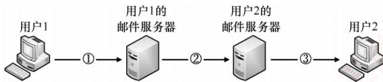
</div>

- A. SMTP、SMTP、SMTP
- B. POP3、SMTP、POP3
- C. POP3、SMTP、SMTP
- D. SMTP、SMTP、POP3

09. 【2013 统考真题】下列关于 SMTP 的叙述中，正确的是（）。
 I. 只支持传输 7 比特 ASCII 码内容
 II. 支持在邮件服务器之间发送邮件
 III. 支持从用户代理向邮件服务器发送邮件
 IV. 支持从邮件服务器向用户代理发送邮件

- A. 仅 I、II 和 III
- B. 仅 I、II 和 IV
- C. 仅 I、III 和 IV
- D. 仅 II、III 和 IV

10. 【2015 统考真题】通过 POP3 协议接收邮件时，使用的传输层服务类型是（）。

- A. 无连接不可靠的数据传输服务
- B. 无连接可靠的数据传输服务
- C. 有连接不可靠的数据传输服务
- D. 有连接可靠的数据传输服务

11. 【2018 统考真题】无须转换即可由SMTP直接传输的内容是（）。

- A. JPEG图像
- B. MPEG视频
- C. EXE文件
- D. ASCII文本

12. 【2025 统考真题】下列关于 POP3 协议的叙述中，正确的是（）。
 I. 支持用户代理从邮件服务器读取邮件 II. 支持用户代理向邮件服务器发送邮件 III. 支持邮件服务器之间发送与接收邮件 IV. 支持通过一条 TCP 连接收取多封邮件

- A. 仅 I、IV
- B. 仅 II、III
- C. 仅 I、II、III
- D. 仅 I、III、IV

#### 二、综合应用题

01. 电子邮件系统使用 TCP 传送邮件，为什么有时会遇到邮件发送失败的情况？为什么有时对方会收不到发送的邮件？

02. MIME 与 SMTP 的关系是怎样的？

03. 用户主机上的电子邮件用户代理与邮件服务器建立了连接，现截获一个 TCP 报文段，如下图所示。图中显示了该报文段的前 126 个字节的十六进制数及 ASCII 码内容。TCP

　　首部长度为 20B。请回答:

..... .0....P.
..Q...Me ssage-ID
: <4DCE9 2BA.2010
902@163.com>..Date: Sat, 14 May
2011 22: 33:30 +0
800..Fro m: cskao
yan2012@ 163.com.

1）用户代理和服务器之间使用的应用层协议是什么？

2）用户代理使用的端口号是多少？

3）该邮件的发件人邮箱是什么？

### 6.4.5 答案与解析

#### 一、单项选择题

**01. D**

　　电子邮件是互联网最基本、最常用的服务功能。要使用电子邮件服务，首先要拥有自己的电子邮件地址，其格式为：用户名@邮箱所在主机的域名。

**02. A**

　　SMTP 和 POP3 都是基于 TCP 的协议，提供可靠的邮件通信。

**03. B**

　　SMTP 服务器使用的熟知端口号是 25。

**04. A**

　　在基于万维网的电子邮件中，用户浏览器与 Hotmail 或 Gmail 的邮件服务器之间的邮件发送或接收使用的是 HTTP，而仅在不同邮件服务器之间传送邮件时才使用 SMTP。

**05. A**

　　用户代理使用 POP3 协议接收邮件。通常用户在配置电子邮件用户代理时需要设置邮件服务器的 POP3 地址（如 pop3.gmail.com），若这个地址设置错误，则会导致用户无法接收邮件。用户代理中的 SMTP 地址错误时会导致无法发送邮件。收件人 E-mail 地址错误时，可能会发错人，也可能会导致投递失败（不存在的地址）。

**06. C**

　　SMTP 是一种 “推” 协议，用于发送端用户代理与发送端服务器之间及发送端服务器与接收端服务器之间，不能用于接收端用户从服务器上读取邮件。常用的邮件读取协议有 POP3、HTTP 和 IMAP。大家平时通过浏览器登录 163 邮箱、Gmail 邮箱时，使用的邮件读取协议就是 HTTP。IMAP 是另一个专用于读取邮件的协议，它要比 POP3 复杂得多，功能也更为强大。

**07. B**

　　邮件头是由多项内容构成的，其中一部分是由系统自动生成的，如发信人地址（From:）、发送时间；另一部分是由发件人输入的，如收信人地址（To:）、邮件主题（Subject:）等。

**08. D**

　　SMTP 采用推的通信方式，即用户代理向邮件服务器及邮件服务器之间发送邮件时，SMTP 客户主动将邮件推送到 SMTP 服务器。而 POP3 采用拉的通信方式，即用户读取邮件时，用户代理向邮件服务器发出请求，拉取用户邮箱中的邮件。

**09. A**

　　根据 6.4.1 节可知，SMTP 用于用户代理向邮件服务器发送邮件，或在邮件服务器之间发送

　　邮件。SMTP 只支持传输 7 比特的 ASCII 码内容。

**10. D**

　　POP3 建立在 TCP 连接上，使用的是有连接可靠的数据传输服务。

**11. D**

　　电子邮件出现得较早，当时的数据传输能力较弱，使用者往往也不需要传输较大的图片、视频等，因此 SMTP 具有一些目前来看较为老旧的性质，如限制所有邮件报文的体部分只能采用 7 位 ASCII 码来表示。在如今的传输过程中，传输了非文本文件时，往往需要将这些多媒体文件重新编码为 ASCII 码再传输。因此无须转换即可传输的是 ASCII 文本，答案为选项 D。

**12. A**

　　POP3 用于用户代理从邮件服务器读取邮件，说法 I 正确。用户代理向邮件服务器发送邮件使用的是 SMTP，而非 POP3。邮件服务器之间的邮件传输也由 SMTP 实现，与 POP3 无关。POP3 支持在一条 TCP 连接中收取多封邮件，无须为每封邮件单独建立连接，说法 IV 正确。

#### 二、综合应用题

**01. 【解答】**

　　有时对方的邮件服务器不工作，邮件就发送不出去。对方的邮件服务器出故障也会使邮件丢失。有时网络非常拥塞，路由器丢弃大量的 IP 数据报，导致通信中断。

**02. 【解答】**

　　因为 SMTP 存在一些缺点和不足，所以通过 MIME 并非改变或取代 SMTP。MIME 继续使用 RFC 822 格式，但增加了邮件主体的结构，并定义了传送非 ASCII 码的编码规则。也就是说，MIME 邮件可在已有的电子邮件和协议下传送。

**03. 【解答】**

1）本题中并未明确告诉这个报文段是从用户代理发往服务器还是从服务器发往用户代理。分析 TCP 首部格式可知，源端口为 49382（0xc0e6），目的端口为 25（0x0019），因此该应用层协议为 SMTP。

2）因为使用的是 SMTP，且服务器端口 25 作为目的端口，所以源端口 49382 为用户代理所使用的端口。

3）因为 SMTP 的协议字段都是用 ASCII 码表示的，所以发件人的关键字是 FROM，从截图右侧的 ASCII 码形式中直接找到答案 FROM: cskaoyan2012@163.com。

## 6.5 万维网

### 6.5.1 万维网的概念与组成结构

　　万维网（World Wide Web，WWW）是一个分布式、联机式的信息存储空间。在这个空间中，任何有用的事物都被称为资源，并由一个统一资源定位符（URL）唯一标识。这些资源通过超文本传输协议（HTTP）传送给用户，用户只需单击超链接即可获取所需内容。

　　万维网通过超链接的方式，能够非常便捷地从互联网上的一个站点跳转到另一个站点，从而主动、按需地获取丰富的信息。超文本标记语言（HTML）使网页设计者能够方便地通过超链接从本页面的某处指向互联网上的任何其他页面，并在用户的计算机屏幕上显示这些内容。

> **考点追踪：** HTTP 使用的传输层协议（2018）

　　万维网的核心由以下三个标准构成:

1）统一资源定位符（URL）。用于标识万维网上的各类文档，确保每个文档在整个万维网范围内拥有唯一的URL标识符。

2）超文本传输协议（HTTP）。一种应用层协议，基于TCP连接提供可靠的数据传输。HTTP是万维网客户程序与服务器程序之间交互时必须严格遵循的通信协议。

3）超文本标记语言（HTML）。一种用于描述文档结构的标记语言，通过预定义的标记对页面中的各种信息（包括文字、声音、图像、视频等）及其格式进行组织和呈现。

　　URL 是对互联网上可获取资源的位置及访问方式的一种简洁表示, 可视为传统文件名在网络范围内的扩展。URL 的一般形式为

$$
<   \text { 协议 } >: / / <   \text { 主机 } >: <   \text { 端口 } > / <   \text { 路径 } > 。
$$

<协议>指明获取资源所用的协议，常见的有 http、https、ftp 等；<主机>是存放资源的主机在互联网中的域名或 IP 地址；<端口>和<路径>在某些情况下可以省略（如 HTTP 默认端口为 80，路径默认为根目录）。URL 中的字符通常不区分大小写。

　　万维网是由无数网络站点和网页组成的集合，构成了互联网最主要的应用部分（互联网还包括电子邮件、Usenet 和新闻组等）。万维网采用客户/服务器模式工作：用户主机上运行的浏览器作为万维网客户程序，而存放万维网文档的主机则运行服务器程序，该主机被称为万维网服务器。客户程序向服务器发起请求，服务器则将用户请求的网页文档返回给客户端。

### 6.5.2 超文本传输协议

　　超文本传输协议（HTTP）定义了浏览器（万维网客户进程）如何向万维网服务器请求文档，以及服务器如何将文档传送给浏览器。从协议层次来看，HTTP 是一种面向事务（transaction-oriented）的应用层协议，规定了浏览器与服务器之间请求与响应的格式和交互规则，是万维网上可靠交换各类文件（包括文本、声音、图像等多媒体内容）的重要基础。

#### 1. HTTP 的操作过程

　　从协议执行流程来看，当浏览器要访问某个 WWW 服务器时，首先需完成对该服务器域名的解析。一旦获得其 IP 地址，浏览器便通过 TCP 向该服务器发起连接建立请求。

　　万维网的大致工作过程如图 6.11 所示。

<div align="center">
  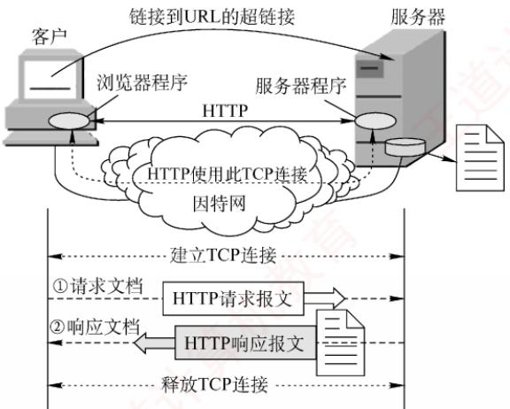
</div>

<p align="center"><em>图 6.11 万维网的工作过程</em></p>

　　每个万维网站点都运行一个服务器进程，持续监听 TCP 端口 80（默认）。当监听到连接请求时，服务器便与浏览器建立 TCP 连接。随后，浏览器向服务器发送 HTTP 请求，以获取指定的 Web 页面。服务器收到请求后，组装所请求页面所需的资源，并通过 HTTP 响应返回给浏览器。浏览器对收到的内容进行解析，并将最终的 Web 页面呈现给用户。最后，TCP 连接被释放。

> **考点追踪：** Web 浏览涉及的核心协议栈（2014、2021）

　　用户单击鼠标后所发生的事件顺序如下（以访问清华大学网站为例）：

1）用户在浏览器地址栏中输入 URL：http://www.tsinghua.edu.cn/index.htm。

2）浏览器向DNS服务器请求解析www.tsinghua.edu.cn的IP地址。

3）DNS 系统返回清华大学服务器的 IP 地址。

4）浏览器与该服务器建立 TCP 连接（默认端口号为 80）。

5）浏览器发出 HTTP 请求：GET /index.htm。

6）服务器通过 HTTP 响应把文件 index.htm 发送给浏览器。

7）释放 TCP 连接。

8）浏览器解析 index.htm 文件，并将 Web 页面显示给用户。

　　上述过程仅为简化描述。实际上，整个通信可能涉及 TCP/IP 体系结构中的多种协议：应用层的 DHCP、DNS 和 HTTP，传输层的 UDP 与 TCP，网际层的 IP 和 ARP，以及数据链路层的 CSMA/CD 协议或 PPP（涉及 ISP 接入或广域网传输时）等。本节主要聚焦于 HTTP。

#### 2. HTTP 的特点

　　HTTP 使用 TCP 作为传输层协议，从而保证了数据的可靠传输。因此，HTTP 无须关心数据在传输过程中是否丢失或如何重传。但需特别注意：HTTP 本身是无连接的。也就是说，尽管底层使用了 TCP 连接，但在交换 HTTP 报文之前，并不需要建立专门的 “HTTP 连接”。

　　此外，HTTP 是无状态的。这意味着，当同一客户第二次访问服务器上的某个页面时，服务器的响应与第一次完全相同，因为它并不记录此前与该客户的交互历史。

> **考点追踪：** Cookie 的工作原理（2015）

　　HTTP 的无状态特性简化了服务器设计，使其更易于支持大量并发请求。在实际应用中，通常结合 Cookie 与数据库来实现用户行为跟踪（如记录用户最近浏览的商品等）。

　　Cookie 的工作原理：当用户首次访问某个启用 Cookie 的网站时，服务器会为其生成唯一的 Cookie 识别码，如 “12345”，并以此为索引在后端数据库中创建一个记录，用于存储该用户的访问信息。随后，服务器在 HTTP 响应报文中添加一个 Set-cookie 首部行：“Set-cookie: 12345”。用户代理（浏览器）收到响应后，会将 Cookie 识别码连同服务器域名一起保存在其本地的 Cookie 文件中。当用户再次访问该网站时，浏览器会在 HTTP 请求报文中自动附加一个 Cookie 首部行：“Cookie: 12345”。服务器根据 Cookie 识别码即可从数据库中检索出该用户的活动记录，从而提供一些个性化服务，例如基于历史浏览记录向用户推荐新商品等。

　　HTTP/1.0 仅支持非持续连接，而其升级版本 HTTP/1.1 支持持续连接（默认启用）。

> **考点追踪：** HTTP/1.0 页面加载时延分析（2020、2024）

　　在非持续连接模式下，每个网页元素（如 JPEG 图像、Flash 动画等）的传输都需要单独建立一个 TCP 连接，如图 6.12 所示（客户端通常在 TCP 第三次握手的 ACK 报文中捎带 HTTP 请求；若未捎带，则会紧随其后立即发送，其间的时间间隔可以忽略不计）。请求一个 Web 文档所需的时间 = 文档传输时间（与文档大小成正比）+ 2×RTT（一个 RTT 用于完成建立 TCP 连接的前两次握手，另一个 RTT 用于发送请求并接收响应）。每个对象的获取都需承担 2RTT 的开销，为

　　HTTP/1.1 的持续连接又分为非流水线和流水线两种工作方式。

　　减小时延，现代浏览器通常创建多个并行 TCP 连接，以同时请求多个对象。

　　所谓持续连接，是指服务器在发送响应后仍保持该 TCP 连接，使得同一客户可继续通过该连接发送后续的 HTTP 请求并接收响应，如图 6.13 所示。在实际应用中，浏览器先通过该连接请求并接收 Web 页面（通常是 HTML 文档），解析后发现其中引用的图像等资源，即可复用该连接请求这些资源，从而避免为每个资源重新建连接的开销。

<div align="center">
  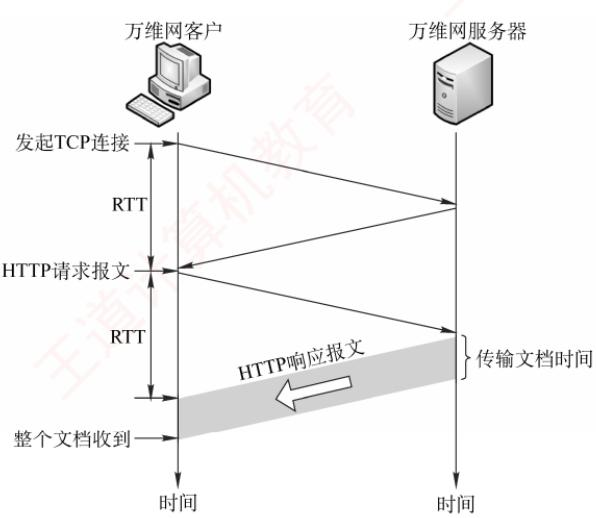
</div>

<p align="center"><em>图 6.12 请求一个万维网文档所需的时间</em></p>

<div align="center">
  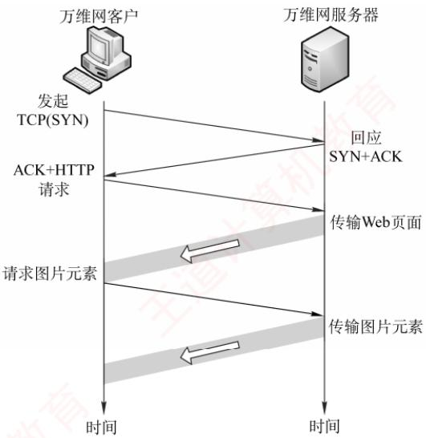
</div>

<p align="center"><em>图 6.13 使用持续连接（非流水线）</em></p>

> **考点追踪：** ➤ HTTP/1.1 页面加载时延分析（2011、2022）

　　在非流水线方式中，客户端必须等待前一个响应到达后才能发送下一个请求，导致服务器发送完一个对象后，TCP 连接处于空闲状态，造成资源浪费。而在流水线方式中，客户可连续发送多个对象的请求，服务器也能连续发送响应。若所有请求与响应均能连续传输，则获取全部引用对象仅需 1RTT，而不像非流水线方式下那样，每个对象均需 1RTT。这种方式显著减少了连接空闲时间，提升了效率。需要注意的是，由于 HTTP 基于 TCP，实际传输时间还受 TCP 发送窗口和拥塞控制机制的影响 $^{①}$ 。

#### 3. HTTP 的报文结构

> **考点追踪：** HTTP 常用请求方法及功能（2015）

　　HTTP 是面向文本的（Text-Oriented），其报文中的每个字段均为 ASCII 字符串，且字段长度不固定。HTTP 报文分为两类：

- 请求报文：从客户向服务器发送的请求报文，如图6.14(a)所示。

- 响应报文：从服务器到客户的回答，如图6.14(b)所示。

　　如图 6.14 所示，两类报文均由三部分组成，区别仅在于开始行的不同。

- 开始行：请求报文中的开始行称为请求行，响应报文中的开始行称为状态行。开始行的三个字段之间以空格分隔，行末以回车换行符（CRLF）结束。

- 首部行：用于传递关于浏览器、服务器或报文主体的附加信息。首部可包含多行，也可为空。每行由“字段名：值”构成，行末同样以CRLF结束。所有首部行结束后，还需

　　下面是一个典型的 HTTP 请求报文:

　　要用一个空行（仅含CRLF）分隔首部行与后面的实体主体。

- 实体主体：请求报文中通常没有这个字段；响应报文中也可能没有这个字段。

<div align="center">
  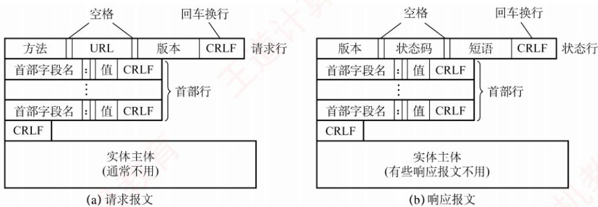
</div>

<p align="center"><em>图 6.14 HTTP 的报文结构</em></p>

　　请求行包含三个字段：方法、请求资源的 URL 和 HTTP 版本。其中，“方法”指明对目标资源的操作类型，本质上是一条命令。表 6.1 列出了常用的几种方法。

　　表 6.1 HTTP 请求报文中常用的几个方法

<table><tr><td>方法(操作)</td><td>意义</td></tr><tr><td>GET</td><td>请求读取由 URL 标识的信息</td></tr><tr><td>HEAD</td><td>请求读取由 URL 标识的信息的首部</td></tr><tr><td>POST</td><td>给服务器添加信息(如注释)</td></tr><tr><td>PUT</td><td>在指定 URL 处存储一个文档</td></tr><tr><td>DELETE</td><td>删除由 URL 标识的资源</td></tr><tr><td>CONNECT</td><td>用于代理服务器</td></tr></table>

```txt
GET /bbs/index.htm HTTP/1.1 {指明方法“GET”、相对URL、HTTP版本}
Host: www.cskaoyan.com {指明服务器的域名}
Connection: Keep-Alive {要求服务器在发送完被请求的文档后保持这条连接}
User-Agent: Mozilla/5.0 {表明用户代理是浏览器Mozilla/5.0}
Accept-Language: cn {表示用户希望优先得到中文版本的文档}
{请求报文的最后还有一个空行}
```

　　第 1 行是请求行，其中使用的是相对 URL，因为下面的 Host 首部行已指明服务器域名。第 3 行 “Connection: Keep-Alive” 告诉服务器使用持续连接，即要求其在发送完文档后保持该 TCP 连接；若需使用非持续连接，则应将该首部行设为 “Connection: close”。

　　HTTP 响应报文的第 1 行是状态行，包含三个内容：HTTP 版本、状态码和解释状态码的短语。以下是 HTTP 响应报文中常见的三种状态行：

```txt
HTTP/1.1 202 Accepted {接受请求}
HTTP/1.1 400 Bad Request {错误的请求}
HTTP/1.1 404 Not Found {找不到页面}
```

#### 4. 代理服务器

　　代理服务器（proxy server）将近期的一些请求与响应暂存在本地磁盘上，也称为万维网高速缓存（Web cache）。新请求到达时，若代理服务器发现该请求与暂存的请求相同，便直接返回缓存的响应，而无须再次通过互联网访问原始服务器。代理服务器可部署在客户端、服务器端或网络中间节点上。在内网中设置代理服务器后，就能将相当大一部分的通信流量限制在内网内部，从而显著减少内网通往互联网的链路负载，降低访问互联网的延迟。

#### 5. HTTP 请求报文举例

　　图 6.15 展示了使用 Wireshark 软件捕获的一个 HTTP 请求报文。

<div align="center">
  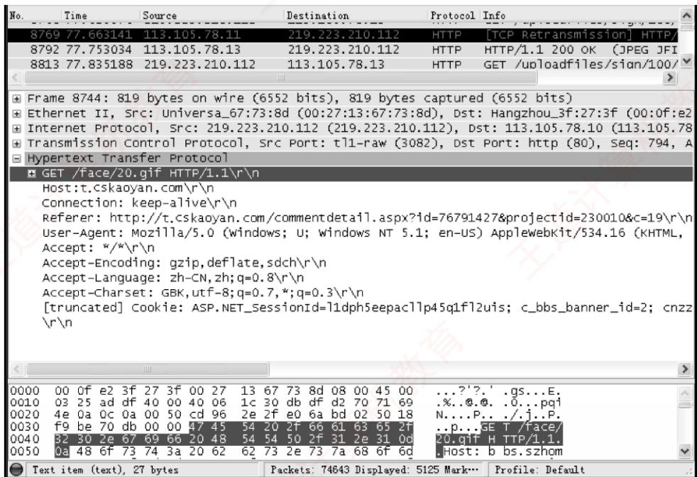
</div>

<p align="center"><em>图 6.15 用 Wireshark 捕获的一个 HTTP 请求报文</em></p>

　　根据帧的结构定义，在图 6.15 的以太网数据帧中，第 1～6 字节为目的 MAC 地址（默认网关地址），值为 00-0f-e2-3f-27-3f；第 7～12 字节为源 MAC 地址（本机地址），值为 00-27-13-67-73-8d；第 13～14 字节为类型字段，值为 08 00，表示上层协议为 IP。第 15～34 字节（共 20B）为 IP 数据报首部，其中第 27～30 字节为源 IP 地址，十六进制数为 db df d2 70，转换成十进制数为 219.223.210.112；第 31～34 字节为目的 IP 地址，十六进制为 71 69 4e 0a，转换成十进制数为 113.105.78.10。第 35～54 字节（共 20B）为 TCP 报文段首部。

　　从第 55 字节开始为 TCP 数据部分（图中阴影区域），即应用层传递下来的数据（本例中为 HTTP 请求报文）。其中，GET 对应请求行的方法，/face/20.gif 为请求的 URL，HTTP/1.1 为协议版本。左侧数字为对应字符的 ASCII 码值，例如：'G' = 0x47、'E' = 0x45、'T' = 0x54 等。建议读者自行了解图 6.15 中的请求报文各首部字段的含义，或动手抓包实践分析。

　　常见应用层协议小结如表 6.2 所示。

　　表 6.2 常见应用层协议小结

<table><tr><td>应用程序</td><td>FTP 数据连接</td><td>FTP 控制连接</td><td>TELNET</td><td>SMTP</td><td>DNS</td><td>TFTP</td><td>HTTP</td><td>POP3</td><td>SNMP</td></tr><tr><td>使用协议</td><td>TCP</td><td>TCP</td><td>TCP</td><td>TCP</td><td>UDP</td><td>UDP</td><td>TCP</td><td>TCP</td><td>UDP</td></tr><tr><td>熟知端口号</td><td>20</td><td>21</td><td>23</td><td>25</td><td>53</td><td>69</td><td>80</td><td>110</td><td>161</td></tr></table>

### 6.5.3 本节习题精选

#### 一、单项选择题

01. 下面的（）协议中，客户与服务器之间采用面向无连接的协议进行通信。

- A. FTP
- B. SMTP
- C. DNS
- D. HTTP

02. 从协议分析的角度，WWW服务的第一步操作是浏览器对服务器的（）。

- A. 请求地址解析
- B. 传输连接建立
- C. 请求域名解析
- D. 会话连接建立

03. TCP 和 UDP 的一些端口保留给一些特定的应用使用。为 HTTP 保留的端口号为（）。

- A. TCP 的 80 端口
- B. UDP 的 80 端口
- C. TCP 的 25 端口
- D. UDP 的 25 端口

04. 从某个已知的 URL 获得一个万维网文档时，若该万维网服务器的 IP 地址开始时并不知道，则需要用到的应用层协议有（），需要用到的传输层协议有（）。
①

- A. FTP、HTTP
- B. DNS、FTP
- C. DNS、HTTP
- D. TELNET、HTTP

②

- A. UDP
- B. TCP
- C. UDP、TCP
- D. TCP、IP

05. 万维网上的每个页面都有唯一的地址，这些地址统称（）。

- A. IP地址
- B. 域名地址
- C. 统一资源定位符
- D. WWW地址

06. 使用鼠标单击一个万维网文档时，若该文档除有文本外，还有三幅gif图像，则在HTTP/1.0中需要建立（）次TCP连接。

- A. 4
- B. 3
- C. 2
- D. 1

07. 仅需 Web 服务器对 HTTP 报文进行响应，但不需要返回请求对象时，HTTP 请求报文应该使用的方法是（）。

- A. GET
- B. PUT
- C. POST
- D. HEAD

08. HTTP 是一个无状态协议，然而 Web 站点经常希望能够识别用户，这时需要用到（）。

- A. Web 缓存
- B. Cookie
- C. 条件 GET
- D. 持续连接

09. 下列关于 Cookie 的说法中，错误的是（）。

- A. Cookie 仅存储在服务器端
- B. Cookie 是服务器产生的
- C. Cookie 会威胁客户的隐私
- D. Cookie 的作用是跟踪用户的访问和状态

10. 以下关于非持续连接 HTTP 特点的描述中，错误的是（）。

- A. HTTP 支持非持续连接与持续连接
- B. HTTP/1.0 使用非持续连接，而 HTTP/1.1 默认使用持续连接
- C. 非持续连接中对每次请求/响应都要建立一次 TCP 连接
- D. 非持续连接中读取一个包含 100 个图片对象的 Web 页面，需要打开和关闭 100 次 TCP 连接

11. 若浏览器支持并行 TCP 连接，使用非持久的 HTTP/1.0 协议请求浏览 1 个 Web 页，该页中引用同一网站上的 7 个小图像文件，则从浏览器为传输 Web 页请求建立 TCP 连接开始，到接收完所有内容为止，所需的往返时间 RTT 数至少是（）。

- A. 3
- B. 4
- C. 8
- D. 9

12. 假设主机通过 HTTP/1.1（流水线方式）请求浏览某个 Web 服务器 S 上的 Web 页 rfc.html, rfc.html 引用了同目录下的 3 个 JPEG 小图像(假设只有在收到 rfc.html 后才能发送对其引用图像的请求），一次请求响应的时间为 RTT，忽略其他各种时延，不考虑拥塞控制和流量控制，则从发出 HTTP 请求报文开始到收到全部内容为止，所耗费的时间是（）。

- A. 2RTT
- B. 2.5RTT
- C. 4RTT
- D. 4.5RTT

13. 主机通过超链接 http://www.cskaoyan.com/index.html 请求浏览 Web 页 index.html，浏览器使用流水线方式的 HTTP/1.1 协议，该 Web 页引用了同一网站上的 7 个小图像文件，假设主机到本地域名服务器和互联网上各服务器的往返时延均为 1RTT。本地域名服务器只提供递归查询服务，其他域名服务器只提供迭代查询服务，忽略其他所有时延，则从点击超链接开始到浏览器接收到所有内容为止，所需的往返时间 RTT 数最多是（）。

- A. 5
- B. 6
- C. 7
- D. 8

14. 主机 H 通过持久的 HTTP/1.1 协议请求服务器 S 上的 5KB 数据，最大段长 MSS = 1KB，往返时间 RTT = 50ms，最长报文段寿命 MSL = 800ms，假设双方的接收窗口都足够大，当 H 收到来自 S 的第一个携带数据的报文段后，立即向 S 发送连接释放报文段（注：连接释放报文段可以携带数据信息或确认信息）。从 H 请求与 S 建立 TCP 连接时刻起，到 H 进入 CLOSED 状态为止，所需的时间至少是（）。

- A. 1000ms
- B. 1200ms
- C. 1600ms
- D. 1800ms

15. 假定一个 NAT 路由器的公网地址为 205.56.79.35，并且有如下表项：

<table><tr><td>转换端口</td><td>源IP地址</td><td>源端口</td></tr><tr><td>2056</td><td>192.168.32.56</td><td>21</td></tr><tr><td>2057</td><td>192.168.32.56</td><td>20</td></tr><tr><td>1892</td><td>192.168.48.26</td><td>80</td></tr><tr><td>2256</td><td>192.168.55.106</td><td>80</td></tr></table>

　　它收到一个源IP地址为192.168.32.56、源端口为80的分组，其动作是（）。

- A. 转换地址，将源IP变为205.56.79.35，端口变为2056，然后发送到公网
- B. 添加一个新的条目，转换IP地址及端口然后发送到公网
- C. 不转发，丢弃该分组
- D. 直接将分组转发到公网

16. 【2014 统考真题】使用浏览器访问某大学的 Web 网站主页时，不可能使用到的协议是（）。

- A. PPP
- B. ARP
- C. UDP
- D. SMTP

17. 【2015 统考真题】某浏览器发出的 HTTP 请求报文如下:

<table><tr><td>GET /index.html HTTP/1.1</td></tr><tr><td>Host: www.test.edu.cn</td></tr><tr><td>Connection: Close</td></tr><tr><td>Cookie: 123456</td></tr></table>

　　下列叙述中，错误的是（）。

- A. 该浏览器请求浏览 index.html
- B. index.html存放在www.test.edu.cn上
- C. 该浏览器请求使用持续连接
- D. 该浏览器曾经浏览过www.test.edu.cn

18. 【2022 统考真题】假设主机 H 通过 HTTP/1.1 请求浏览某 Web 服务器 S 上的 Web 页 news408.html, news408.html 引用了同目录下的 1 幅图像, news408.html 文件大小为 1MSS（最大段长），图像文件大小为 3MSS，H 访问 S 的往返时间 RTT=10 ms，忽略 HTTP 响应报文的首部开销和 TCP 段传输时延。若 H 已完成域名解析，则从 H 请求与 S 建立 TCP 连接时刻起，到接收到全部内容止，所需的时间至少是（）。

- A. 30ms
- B. 40ms
- C. 50ms
- D. 60ms

19. 【2024 统考真题】若浏览器不支持并行 TCP 连接，使用非持久的 HTTP/1.0 协议请求浏览 1 个 Web 页，该页中引用同一网站上的 7 个小图像文件，则从浏览器为传输 Web 页请求建立 TCP 连接开始，到接收完所有内容为止，所需要的往返时间 RTT 数至少是（）。

- A. 4
- B. 9
- C. 14
- D. 16

#### 二、综合应用题

01. 在浏览器中输入 http://cskaoyan.com 并按回车，直到王道论坛的首页显示在浏览器中，请问在此过程中，按照 TCP/IP 模型，从应用层到网络层都用到了哪些协议？

02. 在如下条件下，计算使用非持续方式和持续方式请求一个 Web 页面所需的时间：

1）测试的 RTT 的平均值为 150ms，一个 gif 对象的平均发送时延为 35ms。

2）一个 Web 页面中有 10 幅 gif 图片，Web 页面的基本 HTML 文件、HTTP 请求报文、TCP 握手报文大小忽略不计。

3）TCP三次握手的第三步中捎带一个HTTP请求。

4）使用非流水线方式。

03. 【2011 统考真题】某主机的 MAC 地址为 00-15-C5-C1-5E-28，IP 地址为 10.2.128.100（私有地址）。图 1 是网络拓扑，图 2 是该主机进行 Web 请求的一个以太网数据帧前 80B 的十六进制数及 ASCII 码内容。

<div align="center">
  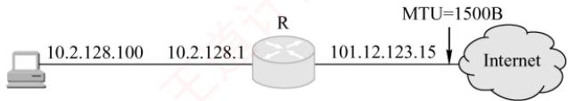
</div>

　　图1 网络拓扑

<div align="center">
  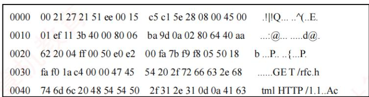
</div>

　　图 2 以太网数据帧（前 80B）

　　请参考图中的数据回答以下问题。

1）Web 服务器的 IP 地址是什么？该主机的默认网关的 MAC 地址是什么？

2) 该主机在构造图 2 的数据帧时，使用什么协议确定目的 MAC 地址？封装该协议请求报文的以太网帧的目的 MAC 地址是什么？

3）假设 HTTP/1.1 协议以持续的非流水线方式工作，一次请求-响应时间为 RTT，rfc.html 页面引用了 5 幅 JPEG 小图像。问从发出图 2 中的 Web 请求开始到浏览器收到全部内容为止，需要多少 RTT?

4）该帧封装的IP分组经过路由器R转发时，需修改IP分组头中的哪些字段？注：以太网数据帧结构和IP分组头结构分别如图3和图4所示。

<table><tr><td>6B</td><td>6B</td><td>2B</td><td>46~1500B</td><td>4B</td></tr><tr><td>目的 MAC 地址</td><td>源 MAC 地址</td><td>类型</td><td>数据</td><td>CRC</td></tr></table>

　　图 3 以太网帧结构

<table><tr><td>版本</td><td>首部长度</td><td>服务类型</td><td colspan="2">总长度</td></tr><tr><td colspan="3">标识</td><td>标志</td><td>片偏移</td></tr><tr><td>生存时间(TTL)</td><td colspan="2">协议</td><td colspan="2">首部检验和</td></tr><tr><td colspan="5">源IP地址</td></tr><tr><td colspan="5">目的IP地址</td></tr></table>

　　图 4 IP 分组头结构

04. 【2021 统考真题】某网络拓扑如下图所示，以太网交换机 S 通过路由器 R 与 Internet 互连。路由器部分接口、本地域名服务器、H1、H2 的 IP 地址和 MAC 地址如图中所示。在 $t_{0}$ 时刻 H1 的 ARP 表和 S 的交换表均为空，H1 在此刻利用浏览器通过域名 www.abc.com 请求访问 Web 服务器，在 $t_{1}$ 时刻 $(t_{1}>t_{0})$ S 第一次收到了封装 HTTP 请求报文的以太网帧，假设从 $t_{0}$ 到 $t_{1}$ 期间网络未发生任何与此次 Web 访问无关的网络通信。

<div align="center">
  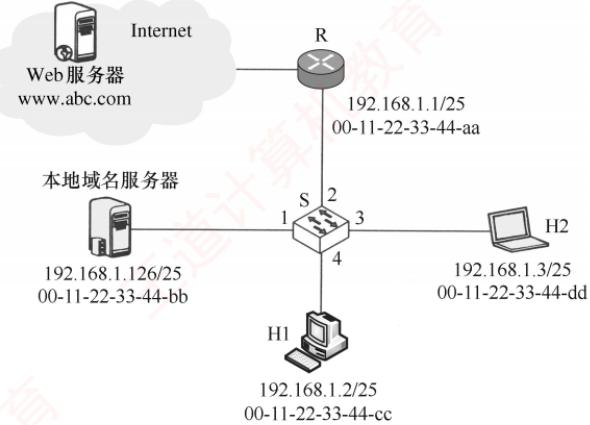
</div>

　　请回答下列问题。

1）从 $t_0$ 到 $t_1$ 期间，H1除了HTTP，还运行了哪个应用层协议？从应用层到数据链路层，该应用层协议报文是通过哪些协议进行逐层封装的？

2）若 S 的交换表结构为 <MAC 地址，端口 >，则 $t_{1}$ 时刻 S 交换表的内容是什么？

3）从 $t_0$ 到 $t_1$ 期间，H2至少接收到几个与此次Web访问相关的帧？接收的是什么帧？帧的目的MAC地址是什么？

### 6.5.4 答案与解析

#### 一、单项选择题

**01. C**

　　DNS 采用 UDP 来传送数据，UDP 是一种面向无连接的协议。

**02. C**

　　建立浏览器与服务器之间的连接需要知道服务器的 IP 地址和端口号（80 端口是熟知端口），而访问站点时浏览器从用户那里得到的是 WWW 站点的域名，所以浏览器必须首先向 DNS 请求域名解析，获得服务器的 IP 地址后，才能请求建立 TCP 连接。

**03. A**

　　HTTP 在传输层使用 TCP，端口号为 80。TCP 的 25 号端口是为 SMTP 保留的。

#### 04. ① C, ② C

　　因为不知道服务器的 IP 地址，所以先要用 DNS 进行域名解析，然后使用 HTTP 进行客户和服务器之间的交互。需要用到的传输层协议是 UDP（DNS 使用）和 TCP（HTTP 使用）。

**05. C**

　　统一资源定位符负责标识万维网上的各种文档，并使每个文档在整个万维网的范围内具有唯一的标识符URL。

**06. A**

　　HTTP 在传输层用的是 TCP。HTTP/1.0 只支持非持续连接，所以每请求一个对象需要建立一次 TCP 连接，传输 1 个基本 html 对象和 3 个 gif 对象，共需建立 4 次 TCP 连接。

**07. D**

　　使用 HEAD 方法时服务器可对 HTTP 报文进行响应，但不会返回请求对象，其作用主要是调试。另外三个选项中的方法的作用请查看本章中的表 6.1。

**08. B**

　　可以在 HTTP 中使用 Cookie 保存 HTTP 服务器和客户之间传递的状态信息。

**09. A**

　　Cookie 是一个存储在用户主机中的文本文件。它由服务器产生，作为识别用户的手段。服务器的后端数据库记录了用户在 Web 站点上的活动，因此这些信息（如用户的个人信息及购物的偏好等）有可能被出卖给第三方，从而威胁到用户的隐私。

**10. D**

　　非持续连接对每次请求/响应都建立一次 TCP 连接。在浏览器请求一个包含 100 个图片对象的 Web 页面时，服务器需要传输 1 个基本 HTML 文件和 100 个图片对象，因此共有 101 个对象，需要打开和关闭 TCP 连接 101 次。

**11. B**

　　建立第一个 TCP 连接需要 1RTT，请求并接收 Web 页需要 1RTT。浏览器支持并行 TCP 连接，因此在收到 Web 页后可同时建立 7 个并行的 TCP 连接，以请求和接收 7 个小图像文件。因此，总往返时间 RTT 数 = 1RTT（建立第一个 TCP 连接）+ 1RTT（请求 Web 页）+ 1RTT（建立 7 个并行的 TCP 连接）+ 1RTT（请求 7 个小图像文件）= 4RTT。

**12. A**

　　从发出 HTTP 请求报文开始，所以此时 TCP 连接已经建立。本题采用了流水线的持续连接。第 1 个 RTT 请求并收到 html 页面，收到 html 页面后才能发送对其引用小图像的请求，所以第 2 个 RTT 请求并收到 3 幅小图像，合计耗费 2RTT。

**13. C**

　　主机点击超链接获取 html 页面，大致分为以下过程：① 向本地域名服务器发送递归查询请求，若本地域名服务器中有相应的 IP 地址缓存，则直接向主机返回相应的 IP 地址，只需 1RTT。否则，本地域名服务器还需要依次向根域名服务器、com 顶级域名服务器、cskaoyan.com 域名服务器发送迭代查询请求，查询到相应的 IP 地址最多需要 4RTT。② 建立初始 TCP 连接需要 1RTT，请求并接收 Web 页需要 1RTT，支持流水线传输方式，因此在收到 Web 页后可以同时发送 7 个小图像文件的请求，第②步的总往返时间是 1RTT（建立连接）+ 1RTT（请求 Web 页）+ 1RTT（请求 7 个小图像文件）=3RTT。综上所述，所需的 RTT 数最多是 $4 + 3 = 7$ 。

**14. D**

　　主机 H 在建立 TCP 连接的第 3 个握手报文段中向服务器 S 请求数据，初始时 S 的发送窗口 = 拥塞窗口 = 1MSS = 1KB。H 收到 1KB 数据后，向 S 请求释放 TCP 连接，但 S 还有 4KB 数据要发送。因此，S 收到 H 发来的 FIN 段和确认后，拥塞窗口变为 2KB，发送窗口也随之变化，再用 1RTT 时间 S 给 H 发送 2KB 数据。最后 S 向 H 发送 FIN 段，这个 FIN 段携带了最后的 2KB 数据，H 收到 FIN 段后，向 S 发送 ACK 段，并启动时间等待计时器，等待 2MSL 的时间进入 CLOSED 状态，整个过程如下图所示，共耗时 $4RTT + 2MSL = 200 + 1600 = 1800ms$ 。

<div align="center">
  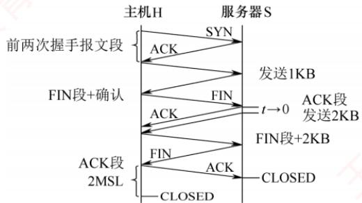
</div>

**15. C**

　　熟知端口号 80 是 HTTP 的服务器端口号，因此说明 IP 地址为 192.168.32.56（私有地址）的主机是 Web 服务器，源端口号为 80 说明该分组是 Web 服务器发出的 HTTP 响应分组。若该 HTTP 响应分组是对外网主机发出的 HTTP 请求的响应，则 NAT 表中一定存在相应的表项（否则 HTTP 请求分组不可能到达 Web 服务器），但在 NAT 表中找不到。所以只可能是对内网主机发出的 HTTP 请求的响应，该分组不需要通过路由器转发，因此路由器丢弃该分组。

**16. D**

　　接入网络时可能会用到 PPP，选项 A 可能用到；计算机不知道某主机的 MAC 地址时，用 IP 地址查询相应的 MAC 地址会用到 ARP，选项 B 可能用到；访问 Web 网站时，若 DNS 缓冲没有存储相应域名的 IP 地址，用域名查询相应的 IP 地址时要使用 DNS，而 DNS 是基于 UDP 的，所以选项 C 可能用到；SMTP 只有使用邮件客户端发送邮件，或邮件服务器向其他邮件服务器发送邮件时才会用到，单纯地访问 Web 网页不可能用到，答案为选项 D。

**17. C**

　　Connection: 连接方式，Close 表示非持续连接方式，keep-alive 表示持续连接方式。Cookie 值由服务器产生，HTTP 请求报文中有 Cookie 方法表示曾访问过 www.test.edu.cn 服务器。

**18. B**

　　HTTP/1.1 默认使用持续连接，所有请求都是连续发送的。要求最少时间，理想的情况是 TCP 在第 3 次握手的报文段中捎带了 HTTP 请求，以及传输过程中的慢开始阶段不考虑拥塞。假设接收端有足够大的缓存空间，即发送窗口等同于拥塞窗口，共需要经过：第 1 个 RTT，进行 TCP 连接建立的前两次握手；第 2 个 RTT，主机 C 发送第 3 次握手报文并捎带了对 html 文件的 HTTP 请求，TCP 连接刚建立时服务器 S 的发送窗口 = 1MSS，服务器 S 发送大小为 1MSS 的 html 文件；第 3 个 RTT，主机 C 发送对 html 文件的确认并捎带了对图形文件的 HTTP 请求，服务器 S 收到确认后发送窗口变为 2MSS，然后服务器 S 发送大小为 2MSS 的图像文件；第 4 个 RTT，主机 C 向服务器 S 发送对收到的部分图像文件的确认，服务器 S 收到确认后发送窗口变为 4MSS，然后服务器 S 发送剩下的 1MSS 图像文件，完成传输，共需要 4RTT，即 40ms。整个传输过程如下图所示。

<div align="center">
  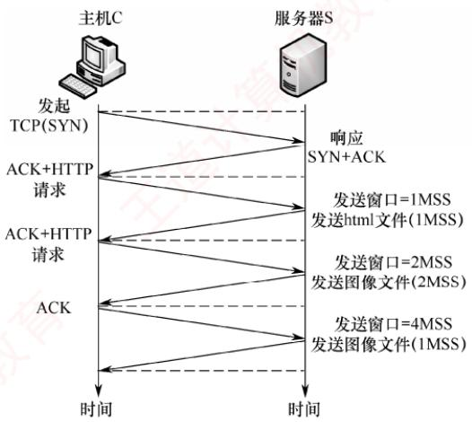
</div>

**19. D**

　　浏览器不支持并行 TCP 连接，使用非持续的 HTTP/1.0 协议，因此每传输一个 Web 页和小图像文件都要建立一次 TCP 连接。第一次建立 TCP 连接时，前两次握手花 1RTT，第三次握手报文段中可以携带 HTTP 请求，服务器收到请求后返回 Web 页，共花 2RTT。之后，每传输一个图像文件都要花 2RTT。因此，到接收完所有内容，需要的总时间至少是 $2 \times 8 = 16RTT$ 。注意，若浏览器支持并行 TCP 连接，则请求 Web 页仍要花 2RTT，但收到 Web 页后，可建立 7 个并行的 TCP 连接请求图像文件，传输图像的过程仅花 2RTT，总时间为 4RTT。

#### 二、综合应用题

**01. 【解答】**

1）应用层。HTTP：WWW 访问协议；DNS：域名解析服务。

2）传输层。TCP：HTTP 提供可靠的数据传输；UDP：DNS 使用 UDP 传输。

3）网络层。IP：IP 包传输和路由选择；ICMP：提供网络传输中的差错检测；ARP：将本机的默认网关 IP 地址映射成物理 MAC 地址。

**02. 【解答】**

　　每次进行 TCP 三次握手时，前两次握手消耗 1RTT=150ms，第 3 次握手的报文段捎带客户对 HTML 文件的请求，因此请求和接收基本 HTML 文件耗时 1RTT=150ms（其大小忽略不计时，发送时延为 0ms）。

　　在非持续连接方式下：

　　第一次建立 TCP 连接并传送 html 文件所需的时间为 $t_{html} = 150 + 150 = 300ms$ ;

　　每次建立 TCP 连接并传送一个 gif 文件所需的时间为 $t_{gif}=150+150+35=335ms$ ;

　　所以总时间 $t_{\text{总}} = t_{\mathrm{html}} + t_{\mathrm{gif}} \times 10 = 300 + 335 \times 10 = 3650 \mathrm{~ms}$ 。

　　在持续连接方式下:

　　只需要建立一次 TCP 连接，然后传送 html 文件和 10 个 gif 文件。

　　总时间 $t_{\text{总}} = t_{\text{建立 TCP}} + t_{\mathrm{html}} + t_{\mathrm{gif}} \times 10 = 150 + 150 + (150 + 35) \times 10 = 2150 \mathrm{~ms}$ 。

**03. 【解答】**

1）以太网帧的数据部分是IP数据报，只要数出相应字段所在的字节即可。由图3可知以太网帧首部有 $6 + 6 + 2 = 14\mathrm{B}$ ，由图4可知IP数据报首部的目的IP地址字段前有 $4\times 4 = 16\mathrm{B}$ ，从图2的帧第1字节开始数 $14 + 16 = 30\mathrm{B}$ ，得到目的IP地址为40.aa.62.20（十六进制数），转换成十进制数为64.170.98.32。由图2可知以太网帧的前6字节00-21-27-21-51-ee是目的MAC地址，即为主机的默认网关10.2.128.1端口的MAC地址。

2）ARP 用于解决 IP 地址到 MAC 地址的映射问题。主机的 ARP 进程在本以太网以广播形式发送 ARP 请求分组，在以太网上广播时，以太网帧的目的地址为全 1，即 FF-FF-FF-FF-FF-FF。

3）HTTP/1.1 协议以持续的非流水线方式工作时，服务器发送响应后仍在一段时间内保持这段连接，客户在收到前一个请求的响应后才能发出下一个请求。注意题目说的是从发出 Web 请求开始，所以此时 TCP 连接已经建立。第 1 个 RTT 用于请求 Web 页面，客户收到第一个请求的响应后（还有 5 个请求未发送），每访问一次对象就用去 1RTT。因此共需 $1 + 5 = 6$ RTT 后浏览器收到全部内容。

4）私有地址和 Internet 上的主机通信时，须由 NAT 路由器进行网络地址转换，把 IP 数据报的源 IP 地址（本题为私有地址 10.2.128.100）转换为 NAT 路由器的一个全球 IP 地址（本题为 101.12.123.15）。因此，源 IP 地址字段 0a 02 80 64 变为 65 0c 7b 0f。IP 数据报每经过一个路由器，TTL 值就减 1，并重新计算首部检验和。若 IP 分组的长度超过输出链路的 MTU，则总长度字段、标志字段、片偏移字段也会发生变化。

**04. 【解答】**

1）从 $t_{0}$ 到 $t_{1}$ 期间，除了 HTTP，H1 还运行了 DNS 应用层协议，以将域名转换为 IP 地址。DNS 运行在 UDP 之上，UDP 将应用层交付的 DNS 报文添加首部后，向下交付给 IP 层，IP 层使用 IP 数据报进行封装，封装好后，向下交付给数据链路层，数据链路层使用 CSMA/CD 帧进行封装。因此，逐层封装关系如下：DNS 报文→UDP 数据报→IP 数据报→CSMA/CD 帧。传统以太网在数据链路层采用 CSMA/CD 协议，因此使用 CSMA/CD 帧进行封装。

　　提示：在数据链路层对该报文的封装解释为以太网 V2 帧（或以太网帧）会更合适，标准答案给出的 CSMA/CD 帧相对而言并不算特别合适。CSMA/CD 协议更多地用在以传统集线器互连的以太网中。交换机可工作于全双工方式，通常不采用 CSMA/CD 协议。

2） $t_{0}$ 时刻，H1 的 ARP 表和 S 的交换表为空。H1 利用浏览器通过域名请求访问 Web 服务器。因为要先解析域名，查询该域名对应的 IP 地址，所以要先向本地域名服务器发送 DNS 查询报文。ARP 表为空，因此需要先发送 ARP 请求分组，查询本地域名服务器对应的 MAC 地址，这个帧的目的 MAC 地址是 FF-FF-FF-FF-FF-FF。S 接收到这个帧，在交换表中记录 MAC 地址为 00-11-22-33-44-cc，位于端口 4，然后广播该帧。当本地域名服务器收到 ARP 请求后，向 H1 发送 ARP 响应分组。S 接收到这个帧，在交换表中记录 MAC 地址为 00-11-22-33-44-bb，位于端口 1，然后将该帧从端口 4 发送出去。

　　H1 的 ARP 表中没有路由器对应的 MAC 地址，因此需要先发送 ARP 请求分组，查询路由器对应的 MAC 地址，这个帧的目的 MAC 地址是 FF-FF-FF-FF-FF-FF。S 接收到这个帧，广播该帧。当路由器收到 ARP 请求后，向 H1 发送 ARP 响应分组。S 接收到这个帧，在交换表中记录 MAC 地址为 00-11-22-33-44-aa，位于端口 2，然后将该帧从端口 4 发送出去。现在，H1 就能发送 HTTP 请求。在整个过程中，并没有涉及 H2，H2 没有主动发送数据，因此 S 不会记录 H2 的 MAC 地址和端口， $t_{1}$ 时刻 S 的交换表如下所示。

<table><tr><td>MAC 地址</td><td>端口</td></tr><tr><td>00-11-22-33-44-cc</td><td>4</td></tr><tr><td>00-11-22-33-44-bb</td><td>1</td></tr><tr><td>00-11-22-33-44-aa</td><td>2</td></tr></table>

3）由步骤2）的分析可知，H2至少会接收到2个和此次Web访问相关的帧。接收到的均是封装ARP查询报文的以太网帧；这些帧的目的MAC地址均是FF-FF-FF-FF-FF-FF。

## 6.6 本章小结及疑难点

1. 如何理解客户进程端口号与服务器进程端口号？

　　服务器进程使用熟知端口号，这些端口号是固定且公开的，便于客户找到对应的服务。客户进程则使用临时端口号，由操作系统在连接发起时自动分配，仅在本次通信中有效。当客户向服务器发起连接时：会连接到服务器的熟知端口；并将自己的临时端口号告知服务器。服务器随后通过这一对端口号（自身的熟知端口+客户的临时端口）建立唯一的端到端连接。

#### 2. 互联网和万维网的区别是什么？

　　互联网（Internet）是一个全球性的计算机网络互联系统，起源于 ARPAnet，采用 TCP/IP 协议族作为通信基础，提供主机之间的连通性。

　　万维网（World Wide Web，WWW）则是构建在互联网之上的一套应用层生态，由相互链接的网页和网站组成，通过 HTTP 协议和浏览器访问。

　　简言之：互联网是“路”，万维网是“路上跑的一种车”。

3. HTTP/1.1 使用持续连接，为何下载一个网页及其图片仍可能需更多 RTT?

　　因为 TCP 连接初始的拥塞窗口通常仅为 1MSS，即使 HTTP/1.1 支持在同一个连接上连续发送请求，服务器也不能一次性发送全部数据。例如，网页文件为 1MSS，图片为 3MSS。

　　第 1 个 RTT：完成 TCP 建立连接的前两次握手。

　　第 2 个 RTT：第三次握手捎带 HTML 请求，服务器发送 1MSS（cwnd = 1）。

　　第 3 个 RTT：客户端确认网页并捎带图片请求，cwnd 增至 2MSS，发送 2MSS 图片。

　　第 4 个 RTT：客户端确认已收图片数据，cwnd 增至 4 MSS，发送剩余 1MSS 图片。

　　因此，总耗时由数据大小和拥塞窗口增长节奏共同决定，即使带宽充足，至少也需要4RTT。若忽略传输层拥塞控制，仅从应用层交互估算时间，则极易得出错误结论。

4. 以太网主机刚开机后访问某 Web 站点，需经历哪些通信过程？

　　主机刚开机时，尚未配置任何网络参数，通过有线方式接入本地局域网。在发送任何数据前，传统共享式以太网需遵循 CSMA/CD 机制以避免冲突（注意，现代交换式以太网普遍采用全双工模式，不再使用 CSMA/CD）。以访问 http://www.abc.com/index.html 为例，完整通信过程如下。

　　DHCP 获取网络配置。主机启动后，先通过 DHCP 自动获取 IP 地址、子网掩码、默认网关、DNS 服务器地址等参数。DHCP 属于应用层协议，其报文封装在 UDP 数据报中，UDP 数据报再封装在 IP 数据报中，最终由数据链路层将该 IP 数据报封装为以太网 MAC 帧进行传输。

　　DNS 解析域名。用户在浏览器中输入上述 URL 后，浏览器从中提取域名 www.abc.com，并向本地 DNS 服务器发起解析请求。DNS 属于应用层协议，在传输层中使用 UDP，查询报文被封装在 IP 数据报中。若 DNS 服务器与主机位于同一子网内，则主机先通过 ARP 将 DNS 服务器的 IP 地址解析为对应的 MAC 地址，再将 IP 数据报封装为单播帧发送给 DNS 服务器。若 DNS 服务器位于其他子网中，则主机先通过 ARP 获取默认网关的 MAC 地址，再将单播帧发送给默认网关，由其负责转发。最终，DNS 服务器返回响应，将域名对应的 IP 地址告知主机。

　　HTTP 获取网页。获得目标 IP 地址后，浏览器向该 Web 服务器的 80 端口发起 TCP 连接请求。连接建立后，浏览器立即发送 GET/index.html 的 HTTP 请求。服务器收到请求后，返回包含 index.html 内容的 HTTP 响应。浏览器解析 HTML 页面，若其中引用了其他资源（如图片、视频等），则对每个资源分别发起新的 HTTP 请求（根据 HTTP 版本的不同，可能复用或新建连接）。所有资源传输完成后，TCP 通过四次挥手释放连接。浏览器解析 HTML，完成网页展示。
